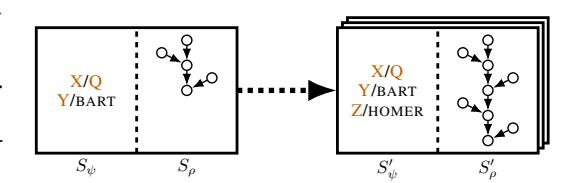
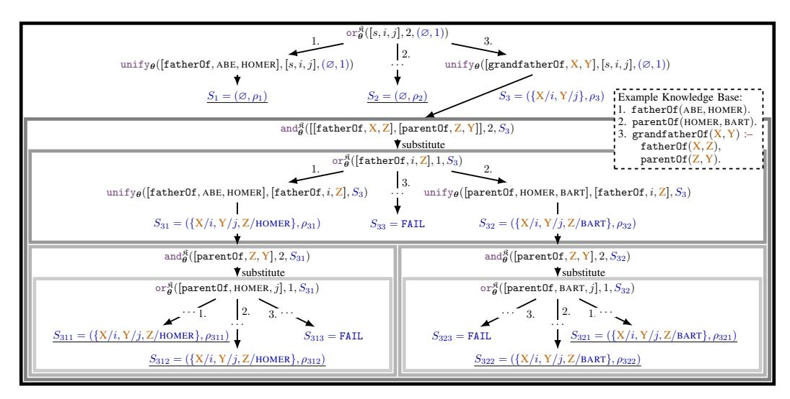

# **End-to-End Differentiable Proving**

# Tim Rocktäschel

# University of Oxford tim.rocktaschel@cs.ox.ac.uk

#### Sebastian Riedel

University College London & Bloomsbury AI s.riedel@cs.ucl.ac.uk

#### **Abstract**

We introduce neural networks for end-to-end differentiable proving of queries to knowledge bases by operating on dense vector representations of symbols. These neural networks are constructed recursively by taking inspiration from the backward chaining algorithm as used in Prolog. Specifically, we replace symbolic unification with a differentiable computation on vector representations of symbols using a radial basis function kernel, thereby combining symbolic reasoning with learning subsymbolic vector representations. By using gradient descent, the resulting neural network can be trained to infer facts from a given incomplete knowledge base. It learns to (i) place representations of similar symbols in close proximity in a vector space, (ii) make use of such similarities to prove queries, (iii) induce logical rules, and (iv) use provided and induced logical rules for multi-hop reasoning. We demonstrate that this architecture outperforms ComplEx, a state-of-the-art neural link prediction model, on three out of four benchmark knowledge bases while at the same time inducing interpretable function-free first-order logic rules.

# 1 Introduction

Current state-of-the-art methods for automated Knowledge Base (KB) completion use neural link prediction models to learn distributed vector representations of symbols (*i.e.* subsymbolic representations) for scoring fact triples [1–7]. Such subsymbolic representations enable these models to generalize to unseen facts by encoding similarities: If the vector of the predicate symbol grandfatherOf is similar to the vector of the symbol grandpaOf, both predicates likely express a similar relation. Likewise, if the vector of the constant symbol LISA is similar to MAGGIE, similar relations likely hold for both constants (*e.g.* they live in the same city, have the same parents etc.).

This simple form of reasoning based on similarities is remarkably effective for automatically completing large KBs. However, in practice it is often important to capture more complex reasoning patterns that involve several inference steps. For example, if ABE is the father of HOMER and HOMER is a parent of BART, we would like to infer that ABE is a grandfather of BART. Such transitive reasoning is inherently hard for neural link prediction models as they only learn to score facts locally. In contrast, symbolic theorem provers like Prolog [8] enable exactly this type of multi-hop reasoning. Furthermore, Inductive Logic Programming (ILP) [9] builds upon such provers to learn interpretable rules from data and to exploit them for reasoning in KBs. However, symbolic provers lack the ability to learn subsymbolic representations and similarities between them from large KBs, which limits their ability to generalize to queries with similar but not identical symbols.

While the connection between logic and machine learning has been addressed by statistical relational learning approaches, these models traditionally do not support reasoning with subsymbolic representations (e.g. [10]), and when using subsymbolic representations they are not trained end-to-end from training data (e.g. [11–13]). Neural multi-hop reasoning models [14–18] address the aforementioned limitations to some extent by encoding reasoning chains in a vector space or by iteratively refining subsymbolic representations of a question before comparison with answers. In many ways, these models operate like basic theorem provers, but they lack two of their most crucial ingredients:

interpretability and straightforward ways of incorporating domain-specific knowledge in form of rules.

Our approach to this problem is inspired by recent neural network architectures like Neural Turing Machines [19], Memory Networks [20], Neural Stacks/Queues [21, 22], Neural Programmer [23], Neural Programmer-Interpreters [24], Hierarchical Attentive Memory [25] and the Differentiable Forth Interpreter [26]. These architectures replace discrete algorithms and data structures by end-to-end differentiable counterparts that operate on real-valued vectors. At the heart of our approach is the idea to translate this concept to basic symbolic theorem provers, and hence combine their advantages (multi-hop reasoning, interpretability, easy integration of domain knowledge) with the ability to reason with vector representations of predicates and constants. Specifically, we keep variable binding symbolic but compare symbols using their subsymbolic vector representations.

Concretely, we introduce Neural Theorem Provers (NTPs): End-to-end differentiable provers for basic theorems formulated as queries to a KB. We use Prolog's backward chaining algorithm as a recipe for recursively constructing neural networks that are capable of proving queries to a KB using subsymbolic representations. The success score of such proofs is differentiable with respect to vector representations of symbols, which enables us to learn such representations for predicates and constants in ground atoms, as well as parameters of function-free first-order logic rules of predefined structure. By doing so, NTPs learn to place representations of similar symbols in close proximity in a vector space and to induce rules given prior assumptions about the structure of logical relationships in a KB such as transitivity. Furthermore, NTPs can seamlessly reason with provided domain-specific rules. As NTPs operate on distributed representations of symbols, a single hand-crafted rule can be leveraged for many proofs of queries with symbols that have a similar representation. Finally, NTPs demonstrate a high degree of interpretability as they induce latent rules that we can decode to human-readable symbolic rules.

Our contributions are threefold: (i) We present the construction of NTPs inspired by Prolog's backward chaining algorithm and a differentiable unification operation using subsymbolic representations, (ii) we propose optimizations to this architecture by joint training with a neural link prediction model, batch proving, and approximate gradient calculation, and (iii) we experimentally show that NTPs can learn representations of symbols and function-free first-order rules of predefined structure, enabling them to learn to perform multi-hop reasoning on benchmark KBs and to outperform ComplEx [7], a state-of-the-art neural link prediction model, on three out of four KBs.

# 2 Background

In this section, we briefly introduce the syntax of KBs that we use in the remainder of the paper. We refer the reader to [27, 28] for a more in-depth introduction. An *atom* consists of a *predicate* symbol and a list of terms. We will use lowercase names to refer to predicate and constant symbols (e.g. fatherOf and BART), and uppercase names for variables (e.g. X, Y, Z). As we only consider function-free first-order logic rules, a *term* can only be a constant or a variable. For instance, [grandfatherOf, Q, BART] is an atom with the predicate grandfatherOf, and two terms, the variable Q and the constant BART. We consider *rules* of the form  $H := \mathbb{B}$ , where the body  $\mathbb{B}$  is a possibly empty conjunction of atoms represented as a list, and the head H is an atom. We call a rule with no free variables a ground rule. All variables are universally quantified. We call a ground rule with an empty body a *fact*. A *substitution set*  $\psi = \{X_1/t_1, \dots, X_N/t_N\}$  is an assignment of variable symbols  $X_i$  to terms  $t_i$ , and applying substitutions to an atom replaces all occurrences of variables  $X_i$  by their respective term  $t_i$ .

Given a query (also called goal) such as [grandfatherOf, Q, BART], we can use Prolog's backward chaining algorithm to find substitutions for Q [8] (see appendix A for pseudocode). On a high level, backward chaining is based on two functions called OR and AND. OR iterates through all rules (including rules with an empty body, *i.e.*, facts) in a KB and unifies the goal with the respective rule head, thereby updating a substitution set. It is called OR since any successful proof suffices (disjunction). If unification succeeds, OR calls AND to prove all atoms (subgoals) in the body of the rule. To prove subgoals of a rule body, AND first applies substitutions to the first atom that is then proven by again calling OR, before proving the remaining subgoals by recursively calling AND. This function is called AND as all atoms in the body need to be proven together (conjunction). As an example, a rule such as [grandfatherOf, X, Y]:— [[fatherOf, X, Z], [parentOf, Z, Y]] is used

in OR for translating a goal like [grandfatherOf, Q, BART] into subgoals [fatherOf, Q, Z] and [parentOf, Z, BART] that are subsequently proven by AND.

#### 3 Differentiable Prover

In the following, we describe the recursive construction of NTPs – neural networks for end-to-end differentiable proving that allow us to calculate the gradient of proof successes with respect to vector representations of symbols. We define the construction of NTPs in terms of *modules* similar to dynamic neural module networks [29]. Each module takes as inputs *discrete objects* (atoms and rules) and a *proof state*, and returns a list of new proof states (see Figure 1 for a graphical representation).

A proof state  $S=(\psi,\rho)$  is a tuple consisting of the substitution set  $\psi$  constructed in the proof so far and a neural network  $\rho$  that outputs a real-valued success score of a (partial) proof. While discrete objects and the substitution set are only used during construction of the neural network, once the network is constructed a continuous proof success score can be calculated for many different goals at training and test time. To summarize, modules are instantiated by discrete objects and the substitution set. They construct a neural network representing the (partial) proof success score and recursively instantiate submodules to continue the proof.



Figure 1: A module is mapping an upstream proof state (left) to a list of new proof states (right), thereby extending the substitution set  $S_{\psi}$  and adding nodes to the computation graph of the neural network  $S_{\rho}$  representing the proof success.

The shared signature of modules is  $\mathcal{D} \times \mathcal{S} \to \mathcal{S}^N$  where  $\mathcal{D}$  is a domain that controls the construction of the network,  $\mathcal{S}$  is the domain of proof states, and N is the number of output proof states. Furthermore, let  $S_{\psi}$  denote the substitution set of the proof state S and let  $S_{\rho}$  denote the neural network for calculating the proof success.

We use pseudocode in style of a functional programming language to define the behavior of modules and auxiliary functions. Particularly, we are making use of pattern matching to check for properties of arguments passed to a module. We denote sets by Euler script letters ( $e.g.\ \mathcal{E}$ ), lists by small capital letters ( $e.g.\ \mathcal{E}$ ), lists of lists by blackboard bold letters ( $e.g.\ \mathcal{E}$ ) and we use: to refer to prepending an element to a list ( $e.g.\ e: E$  or  $E: \mathbb{E}$ ). While an atom is a list of a predicate symbol and terms, a rule can be seen as a list of atoms and thus a list of lists where the head of the list is the rule head.<sup>2</sup>

#### 3.1 Unification Module

Unification of two atoms, *e.g.*, a goal that we want to prove and a rule head, is a central operation in backward chaining. Two non-variable symbols (predicates or constants) are checked for equality and the proof can be aborted if this check fails. However, we want to be able to apply rules even if symbols in the goal and head are not equal but similar in meaning (*e.g.* grandfatherOf and grandpaOf) and thus replace symbolic comparison with a computation that measures the similarity of both symbols in a vector space.

The module unify updates a substitution set and creates a neural network for comparing the vector representations of non-variable symbols in two sequences of terms. The signature of this module is  $\mathcal{L} \times \mathcal{L} \times \mathcal{S} \to \mathcal{S}$  where  $\mathcal{L}$  is the domain of lists of terms. unify takes two atoms represented as lists of terms and an upstream proof state, and maps these to a new proof state (substitution set and proof success). To this end, unify iterates through the list of terms of two atoms and compares their symbols. If one of the symbols is a variable, a substitution is added to the substitution set. Otherwise, the vector representations of the two non-variable symbols are compared using a Radial Basis Function (RBF) kernel [30] where  $\mu$  is a hyperparameter that we set to  $\frac{1}{\sqrt{2}}$  in our experiments. The following pseudocode implements unify. Note that "\_" matches every argument and that the

<sup>&</sup>lt;sup>1</sup>For clarity, we will sometimes omit lists when writing rules and atoms, *e.g.*, grandfatherOf(X, Y):-fatherOf(X, Z), parentOf(Z, Y).

<sup>&</sup>lt;sup>2</sup>For example, [[grandfatherOf, X, Y], [fatherOf, X, Z], [parentOf, Z, Y]].

order matters, *i.e.*, if arguments match a line, subsequent lines are not evaluated.

- 1.  $\operatorname{unify}_{\boldsymbol{\theta}}([],[],S) = S$
- 2.  $unify_{\theta}([], \_, \_) = FAIL$
- 3.  $unify_{\theta}(\_,[],\_) = FAIL$
- 4.  $\mathrm{unify}_{\pmb{\theta}}(h:\mathbf{H},g:\mathbf{G},S)=\mathrm{unify}_{\pmb{\theta}}(\mathbf{H},\mathbf{G},S')=(S'_{\psi},S'_{\rho})$  where

$$S'_{\psi} = \left\{ \begin{array}{ll} S_{\psi} \cup \{h/g\} & \text{if } h \in \mathcal{V} \\ S_{\psi} \cup \{g/h\} & \text{if } g \in \mathcal{V}, h \not\in \mathcal{V} \\ S_{\psi} & \text{otherwise} \end{array} \right\}, \quad S'_{\rho} = \min \left( S_{\rho}, \left\{ \begin{array}{ll} \exp \left( \frac{-\|\boldsymbol{\theta}_{h:} - \boldsymbol{\theta}_{g:}\|_{2}}{2\mu^{2}} \right) & \text{if } h, g \not\in \mathcal{V} \\ 1 & \text{otherwise} \end{array} \right\} \right)$$

Here, S' refers to the new proof state,  $\mathcal V$  refers to the set of variable symbols, h/g is a substitution from the variable symbol h to the symbol g, and  $\theta_g$  denotes the embedding lookup of the non-variable symbol with index g. unify is parameterized by an embedding matrix  $\theta \in \mathbb{R}^{|\mathcal Z| \times k}$  where  $\mathcal Z$  is the set of non-variables symbols and k is the dimension of vector representations of symbols. Furthermore, FAIL represents a unification failure due to mismatching arity of two atoms. Once a failure is reached, we abort the creation of the neural network for this branch of proving. In addition, we constrain proofs to be cycle-free by checking whether a variable is already bound. Note that this is a simple heuristic that prohibits applying the same non-ground rule twice. There are more sophisticated ways for finding and avoiding cycles in a proof graph such that the same rule can still be applied multiple times (e.g. [31]), but we leave this for future work.

**Example** Assume that we are unifying two atoms [grandpa0f, ABE, BART] and  $[s, \mathbf{Q}, i]$  given an upstream proof state  $S = (\varnothing, \rho)$  where the latter input atom has placeholders for a predicate s and a constant i, and the neural network  $\rho$  would output 0.7 when evaluated. Furthermore, assume grandpa0f, ABE and BART represent the indices of the respective symbols in a global symbol vocabulary. Then, the new proof state constructed by unify is:

$$\begin{split} & \text{unify}_{\boldsymbol{\theta}}([\text{grandpaOf}, \text{ABE}, \text{BART}], [s, \textcolor{red}{\mathbb{Q}}, i], (\varnothing, \rho)) = (S'_{\psi}, S'_{\rho}) = \\ & \left( \{ \textcolor{red}{\mathbb{Q}} / \text{ABE} \}, \min \left( \rho, \exp(-\|\boldsymbol{\theta}_{\text{grandpaOf}:} - \boldsymbol{\theta}_{s:}\|_2), \exp(-\|\boldsymbol{\theta}_{\text{BART}:} - \boldsymbol{\theta}_{i:}\|_2) \right) \right) \end{split}$$

Thus, the output score of the neural network  $S'_{\rho}$  will be high if the subsymbolic representation of the input s is close to grandpaOf and the input i is close to BART. However, the score cannot be higher than 0.7 due to the upstream proof success score in the forward pass of the neural network  $\rho$ . Note that in addition to extending the neural networks  $\rho$  to  $S'_{\rho}$ , this module also outputs a substitution set  $\{O/ABE\}$  at graph creation time that will be used to instantiate submodules.

#### 3.2 OR Module

Based on unify, we now define the or module which attempts to apply rules in a KB. The signature of or is  $\mathcal{L} \times \mathbb{N} \times \mathcal{S} \to \mathcal{S}^N$  where  $\mathcal{L}$  is the domain of goal atoms and  $\mathbb{N}$  is the domain of integers used for specifying the maximum proof depth of the neural network. Furthermore, N is the number of possible output proof states for a goal of a given structure and a provided KB.<sup>3</sup> We implement or as

$$1. \ \operatorname{or}_{\pmb{\theta}}^{\mathfrak{K}}(\mathbf{G},d,S) = [S' \mid S' \in \operatorname{and}_{\pmb{\theta}}^{\mathfrak{K}}(\mathbb{B},d,\operatorname{unify}_{\pmb{\theta}}(\mathbf{H},\mathbf{G},S)) \text{ for } \mathbf{H} \coloneq \mathbb{B} \in \mathfrak{K}]$$

where  $H := \mathbb{B}$  denotes a rule in a given KB  $\mathfrak K$  with a head atom H and a list of body atoms  $\mathbb B$ . In contrast to the symbolic OR method, the or module is able to use the grandfatherOf rule above for a query involving grandpaOf provided that the subsymbolic representations of both predicates are similar as measured by the RBF kernel in the unify module.

**Example** For a goal  $[s, \mathbf{Q}, i]$ , or would instantiate an and submodule based on the rule  $[\mathtt{grandfather0f}, \mathbf{X}, \mathbf{Y}] := [[\mathtt{father0f}, \mathbf{X}, \mathbf{Z}], [\mathtt{parent0f}, \mathbf{Z}, \mathbf{Y}]]$  as follows

$$\text{grandiatheruf}, \textbf{X}, \textbf{Y}] := [[\texttt{fatheruf}, \textbf{X}, \textbf{Z}], [\texttt{parentuf}, \textbf{Z}, \textbf{Y}]] \text{ as follows} \\ \text{or}_{\boldsymbol{\theta}}^{\mathfrak{K}}([s, \textbf{Q}, i], d, S) = [S' | S' \in \texttt{and}_{\boldsymbol{\theta}}^{\mathfrak{K}}([[\texttt{father0f}, \textbf{X}, \textbf{Z}], [\texttt{parent0f}, \textbf{Z}, \textbf{Y}]], d, \underbrace{(\{\textbf{X}/\textbf{Q}, \textbf{Y}/i\}, \hat{S}_{\rho})}_{\text{result of unify}}), \ldots]$$

<sup>&</sup>lt;sup>3</sup>The creation of the neural network is dependent on the KB but also the structure of the goal. For instance, the goal s(Q, i) would result in a different neural network, and hence a different number of output proof states, than s(i, j).

#### 3.3 AND Module

For implementing and we first define an auxiliary function called substitute which applies substitutions to variables in an atom if possible. This is realized via

1.  $substitute([], \_) = []$ 

$$2. \ \operatorname{substitute}(g:\mathsf{G},\psi) = \left\{ \begin{array}{ll} x & \text{if } g/x \in \psi \\ g & \text{otherwise} \end{array} \right\} : \operatorname{substitute}(\mathsf{G},\psi)$$

For example, substitute([fatherOf, X, Z],  $\{X/Q, Y/i\}$ ) results in [fatherOf, Q, Z].

The signature of and is  $\mathcal{L} \times \mathbb{N} \times \mathcal{S} \to \mathcal{S}^N$  where  $\mathcal{L}$  is the domain of lists of atoms and N is the number of possible output proof states for a list of atoms with a known structure and a provided KB. This module is implemented as

- 1.  $\operatorname{and}_{\boldsymbol{\theta}}^{\mathfrak{K}}(\underline{\ },\underline{\ },\operatorname{FAIL})=\operatorname{FAIL}$
- 2.  $\operatorname{and}_{\boldsymbol{\theta}}^{\mathfrak{K}}(\underline{\phantom{\alpha}},0,\underline{\phantom{\alpha}})=\operatorname{FAIL}$
- 3. and  $\widehat{\mathfrak{g}}([],\_,S)=S$

4. 
$$\operatorname{and}_{\boldsymbol{\theta}}^{\mathfrak{K}}(G:\mathbb{G},d,S)=[S''\mid S''\in\operatorname{and}_{\boldsymbol{\theta}}^{\mathfrak{K}}(\mathbb{G},d,S') \text{ for } S'\in\operatorname{or}_{\boldsymbol{\theta}}^{\mathfrak{K}}(\operatorname{substitute}(G,S_{\psi}),d-1,S)]$$

where the first two lines define the failure of a proof, either because of an upstream unification failure that has been passed from the or module (line 1), or because the maximum proof depth has been reached (line 2). Line 3 specifies a proof success, *i.e.*, the list of subgoals is empty before the maximum proof depth has been reached. Lastly, line 4 defines the recursion: The first subgoal G is proven by instantiating an or module after substitutions are applied, and every resulting proof state S' is used for proving the remaining subgoals  $\mathbb{G}$  by again instantiating and modules.

**Example** Continuing the example from Section 3.2, the and module would instantiate submodules as follows:

as follows: 
$$\operatorname{and}_{\theta}^{\hat{\mathfrak{K}}}([[\operatorname{fatherOf}, \mathbf{X}, \mathbf{Z}], [\operatorname{parentOf}, \mathbf{Z}, \mathbf{Y}]], d, \underbrace{(\{\mathbf{X}/\mathbf{Q}, \mathbf{Y}/i\}, \hat{S}_{\rho})}_{\text{result of unify in or}}) = \\ [S''|S'' \in \operatorname{and}_{\theta}^{\hat{\mathfrak{K}}}([[\operatorname{parentOf}, \mathbf{Z}, \mathbf{Y}]], d, S') \text{ for } S' \in \operatorname{or}_{\theta}^{\hat{\mathfrak{K}}}([\operatorname{fatherOf}, \mathbf{Q}, \mathbf{Z}], d - 1, \underbrace{(\{\mathbf{X}/\mathbf{Q}, \mathbf{Y}/i\}, \hat{S}_{\rho})}_{\text{result of substitute}})]$$

#### 3.4 Proof Aggregation

Finally, we define the overall success score of proving a goal G using a KB  $\Re$  with parameters  $\theta$  as

$$\underset{S \neq \mathsf{FAIL}}{\mathsf{ntp}_{\pmb{\theta}}^{\mathfrak{K}}(\mathsf{G},d)} = \underset{S \neq \mathsf{FAIL}}{\arg\max} S_{\rho}$$

where d is a predefined maximum proof depth and the initial proof state is set to an empty substitution set and a proof success score of 1.

**Example** Figure 2 illustrates an examplary NTP computation graph constructed for a toy KB. Note that such an NTP is constructed once before training, and can then be used for proving goals of the structure [s, i, j] at training and test time where s is the index of an input predicate, and i and j are indices of input constants. Final proof states which are used in proof aggregation are underlined.

#### 3.5 Neural Inductive Logic Programming

We can use NTPs for ILP by gradient descent instead of a combinatorial search over the space of rules as, for example, done by the First Order Inductive Learner (FOIL) [32]. Specifically, we are using the concept of learning from entailment [9] to induce rules that let us prove known ground atoms, but that do not give high proof success scores to sampled unknown ground atoms.

Let  $\theta_r$ ,  $\theta_s$ ,  $\theta_t$ .  $\in \mathbb{R}^k$  be representations of some unknown predicates with indices r, s and t respectively. The prior knowledge of a transitivity between three unknown predicates can be specified via



Figure 2: Exemplary construction of an NTP computation graph for a toy knowledge base. Indices on arrows correspond to application of the respective KB rule. Proof states (blue) are subscripted with the sequence of indices of the rules that were applied. Underlined proof states are aggregated to obtain the final proof success. Boxes visualize instantiations of modules (omitted for unify). The proofs  $S_{33}$ ,  $S_{313}$  and  $S_{323}$  fail due to cycle-detection (the same rule cannot be applied twice).

r(X, Y) := s(X, Z), t(Z, Y). We call this a *parameterized rule* as the corresponding predicates are unknown and their representations are learned from data. Such a rule can be used for proofs at training and test time in the same way as any other given rule. During training, the predicate representations of parameterized rules are optimized jointly with all other subsymbolic representations. Thus, the model can adapt parameterized rules such that proofs for known facts succeed while proofs for sampled unknown ground atoms fail, thereby inducing rules of predefined structures like the one above. Inspired by [33], we use rule templates for conveniently defining the structure of multiple parameterized rules by specifying the number of parameterized rules that should be instantiated for a given rule structure (see appendix E for examples). For inspection after training, we decode a parameterized rule by searching for the closest representations of known predicates. In addition, we provide users with a rule confidence by taking the minimum similarity between unknown and decoded predicate representations using the RBF kernel in unify. This confidence score is an upper bound on the proof success score that can be achieved when the induced rule is used in proofs.

#### 4 Optimization

In this section, we present the basic training loss that we use for NTPs, a training loss where a neural link prediction models is used as auxiliary task, as well as various computational optimizations.

# 4.1 Training Objective

Let  $\mathcal K$  be the set of known facts in a given KB. Usually, we do not observe negative facts and thus resort to sampling corrupted ground atoms as done in previous work [34]. Specifically, for every  $[s,i,j] \in \mathcal K$  we obtain corrupted ground atoms  $[s,\hat i,j],[s,i,\hat j],[s,\tilde i,\tilde j] \notin \mathcal K$  by sampling  $\hat i,\hat j,\tilde i$  and  $\tilde j$  from the set of constants. These corrupted ground atoms are resampled in every iteration of training, and we denote the set of known and corrupted ground atoms together with their target score (1.0 for known ground atoms and 0.0 for corrupted ones) as  $\mathcal T$ . We use the negative log-likelihood of the proof success score as loss function for an NTP with parameters  $\boldsymbol \theta$  and a given KB  $\mathfrak K$ 

$$\mathcal{L}_{\texttt{ntp}^{\mathfrak{K}}_{\boldsymbol{\theta}}} = \sum_{([s,i,j],y) \in \mathcal{T}} -y \log(\texttt{ntp}^{\mathfrak{K}}_{\boldsymbol{\theta}}([s,i,j],d)_{\rho}) - (1-y) \log(1-\texttt{ntp}^{\mathfrak{K}}_{\boldsymbol{\theta}}([s,i,j],d)_{\rho})$$

where [s, i, j] is a training ground atom and y its target proof success score. Note that since in our application all training facts are ground atoms, we only make use of the proof success score  $\rho$  and not

the substitution list of the resulting proof state. We can prove known facts trivially by a unification with themselves, resulting in no parameter updates during training and hence no generalization. Therefore, during training we are masking the calculation of the unification success of a known ground atom that we want to prove. Specifically, we set the unification score to 0 to temporarily hide that training fact and assume it can be proven from other facts and rules in the KB.

#### 4.2 Neural Link Prediction as Auxiliary Loss

At the beginning of training all subsymbolic representations are initialized randomly. When unifying a goal with all facts in a KB we consequently get very noisy success scores in early stages of training. Moreover, as only the maximum success score will result in gradient updates for the respective subsymbolic representations along the maximum proof path, it can take a long time until NTPs learn to place similar symbols close to each other in the vector space and to make effective use of rules.

To speed up learning subsymbolic representations, we train NTPs jointly with ComplEx [7] (Appendix B). ComplEx and the NTP share the same subsymbolic representations, which is feasible as the RBF kernel in unify is also defined for complex vectors. While the NTP is responsible for multi-hop reasoning, the neural link prediction model learns to score ground atoms locally. At test time, only the NTP is used for predictions. Thus, the training loss for ComplEx can be seen as an auxiliary loss for the subsymbolic representations learned by the NTP. We term the resulting model NTP $\lambda$ . Based on the loss in Section 4.1, the joint training loss is defined as

$$\mathcal{L}_{\texttt{ntp}\lambda_{\pmb{\theta}}^{\vec{s}}} = \mathcal{L}_{\texttt{ntp}_{\pmb{\theta}}^{\vec{s}}} + \sum_{([s,i,j],y) \in \mathcal{T}} -y \log(\texttt{complex}_{\pmb{\theta}}(s,i,j)) - (1-y) \log(1-\texttt{complex}_{\pmb{\theta}}(s,i,j))$$

where [s, i, j] is a training atom and y its ground truth target.

#### 4.3 Computational Optimizations

NTPs as described above suffer from severe computational limitations since the neural network is representing all possible proofs up to some predefined depth. In contrast to symbolic backward chaining where a proof can be aborted as soon as unification fails, in differentiable proving we only get a unification failure for atoms whose arity does not match or when we detect cyclic rule application. We propose two optimizations to speed up NTPs in the Appendix. First, we make use of modern GPUs by batch processing many proofs in parallel (Appendix C). Second, we exploit the sparseness of gradients caused by the min and max operations used in the unification and proof aggregation respectively to derive a heuristic for a truncated forward and backward pass that drastically reduces the number of proofs that have to be considered for calculating gradients (Appendix D).

# 5 Experiments

Consistent with previous work, we carry out experiments on four benchmark KBs and compare ComplEx with the NTP and NTP $\lambda$  in terms of area under the Precision-Recall-curve (AUC-PR) on the Countries KB, and Mean Reciprocal Rank (MRR) and HITS@m [34] on the other KBs described below. Training details, including hyperparameters and rule templates, can be found in Appendix E.

**Countries** The Countries KB is a dataset introduced by [35] for testing reasoning capabilities of neural link prediction models. It consists of 244 countries, 5 regions (e.g. EUROPE), 23 subregions (e.g. WESTERN EUROPE, NORTHERN AMERICA), and 1158 facts about the neighborhood of countries, and the location of countries and subregions. We follow [36] and split countries randomly into a training set of 204 countries (train), a development set of 20 countries (dev), and a test set of 20 countries (test), such that every dev and test country has at least one neighbor in the training set. Subsequently, three different task datasets are created. For all tasks, the goal is to predict locatedIn(e, e) for every test country e and all five regions e, but the access to training atoms in the KB varies.

**S1:** All ground atoms locatedIn(c,r) where c is a test country and r is a region are removed from the KB. Since information about the subregion of test countries is still contained in the KB, this task can be solved by using the transitivity rule locatedIn(X,Y) := locatedIn(X,Z), locatedIn(Z,Y).

S2: In addition to S1, all ground atoms locatedIn(c, s) are removed where c is a test country and s

Table 1: AUC-PR results on Countries and MRR and HITS@m on Kinship, Nations, and UMLS.

| Corpus    |                | Metric Model                       |                                                       |                                                                                   |                                            | Examples of induced rules and their confidence                                                                                                                                                         |
|-----------|----------------|------------------------------------|-------------------------------------------------------|-----------------------------------------------------------------------------------|--------------------------------------------|--------------------------------------------------------------------------------------------------------------------------------------------------------------------------------------------------------|
|           |                |                                    | ComplEx                                               | NTP                                                                               | NΤΡλ                                       |                                                                                                                                                                                                        |
| Countries | S1<br>S2<br>S3 | AUC-PR<br>AUC-PR<br>AUC-PR         | $99.37 \pm 0.4$<br>$87.95 \pm 2.8$<br>$48.44 \pm 6.3$ | $\begin{array}{c} 90.83 \pm 15.4 \\ 87.40 \pm 11.7 \\ 56.68 \pm 17.6 \end{array}$ |                                            | 0.90 locatedIn(X,Y) :- locatedIn(X,Z), locatedIn(Z,Y).<br>  0.63 locatedIn(X,Y) :- neighborOf(X,Z), locatedIn(Z,Y).<br>  0.32 locatedIn(X,Y) :-<br>  neighborOf(X,Z), neighborOf(Z,W), locatedIn(W,Y). |
| Kinship   |                | MRR<br>HITS@1<br>HITS@3<br>HITS@10 | 0.81<br>0.70<br>0.89<br>0.98                          | 0.60<br>0.48<br>0.70<br>0.78                                                      | 0.80<br><b>0.76</b><br>0.82<br>0.89        | 0.98 term15(X,Y) :- term5(Y,X)                                                                                                                                                                         |
| Nations   |                | MRR<br>HITS@1<br>HITS@3<br>HITS@10 | 0.75<br>0.62<br>0.84<br>0.99                          | 0.75<br>0.62<br>0.86<br>0.99                                                      | 0.74<br>0.59<br><b>0.89</b><br><b>0.99</b> |                                                                                                                                                                                                        |
| UMLS      |                | MRR<br>HITS@1<br>HITS@3<br>HITS@10 | 0.89<br>0.82<br>0.96<br><b>1.00</b>                   | 0.88<br>0.82<br>0.92<br>0.97                                                      | 0.93<br>0.87<br>0.98<br>1.00               | 0.88 interacts_with(X,Y) :-     interacts_with(X,Z), interacts_with(Z,Y). 0.77 isa(X,Y) :- isa(X,Z), isa(Z,Y). 0.71 derivative_of(X,Y) :-     derivative_of(X,Z), derivative_of(Z,Y).                  |

is a subregion. The location of test countries needs to be inferred from the location of its neighboring countries: locatedIn(X, Y) := neighborOf(X, Z), locatedIn(Z, Y). This task is more difficult than S1, as neighboring countries might not be in the same region, so the rule above will not always hold.

S3: In addition to S2, all ground atoms locatedIn(c,r) where r is a region and c is a training country that has a test or dev country as a neighbor are also removed. The location of test countries can for instance be inferred using the three-hop rule locatedIn(X, Y) := neighborOf(X, Z), neighborOf(Z, W), locatedIn(W, Y).

Kinship, Nations & UMLS We use the Nations, Alyawarra kinship (Kinship) and Unified Medical Language System (UMLS) KBs from [10]. We left out the Animals dataset as it only contains unary predicates and can thus not be used for evaluating multi-hop reasoning. Nations contains 56 binary predicates, 111 unary predicates, 14 constants and 2565 true facts, Kinship contains 26 predicates, 104 constants and 10686 true facts, and UMLS contains 49 predicates, 135 constants and 6529 true facts. Since our baseline ComplEx cannot deal with unary predicates, we remove unary atoms from Nations. We split every KB into 80% training facts, 10% development facts and 10% test facts. For evaluation, we take a test fact and corrupt its first and second argument in all possible ways such that the corrupted fact is not in the original KB. Subsequently, we predict a ranking of every test fact and its corruptions to calculate MRR and HITS@m.

#### 6 Results and Discussion

Results for the different model variants on the benchmark KBs are shown in Table 1. Another method for inducing rules in a differentiable way for automated KB completion has been introduced recently by [37] and our evaluation setup is equivalent to their Protocol II. However, our neural link prediction baseline, ComplEx, already achieves much higher HITS@10 results (1.00 vs. 0.70 on UMLS and 0.98 vs. 0.73 on Kinship). We thus focus on the comparison of NTPs with ComplEx.

First, we note that vanilla NTPs alone do not work particularly well compared to ComplEx. They only outperform ComplEx on Countries S3 and Nations, but not on Kinship or UMLS. This demonstrates the difficulty of learning subsymbolic representations in a differentiable prover from unification alone, and the need for auxiliary losses. The NTP $\lambda$  with ComplEx as auxiliary loss outperforms the other models in the majority of tasks. The difference in AUC-PR between ComplEx and NTP $\lambda$  is significant for all Countries tasks (p < 0.0001).

A major advantage of NTPs is that we can inspect induced rules which provide us with an interpretable representation of what the model has learned. The right column in Table 1 shows examples of induced rules by NTP $\lambda$  (note that predicates on Kinship are anonymized). For Countries, the NTP recovered those rules that are needed for solving the three different tasks. On UMLS, the NTP induced transitivity rules. Those relationships are particularly hard to encode by neural link prediction models like ComplEx, as they are optimized to locally predict the score of a fact.

# 7 Related Work

Combining neural and symbolic approaches to relational learning and reasoning has a long tradition and let to various proposed architectures over the past decades (see [38] for a review). Early proposals for neural-symbolic networks are limited to *propositional rules* (*e.g.*, EBL-ANN [39], KBANN [40] and C-IL<sup>2</sup>P [41]). Other neural-symbolic approaches focus on first-order inference, but do not learn subsymbolic vector representations from training facts in a KB (*e.g.*, SHRUTI [42], Neural Prolog [43], CLIP++ [44], Lifted Relational Neural Networks [45], and TensorLog [46]). Logic Tensor Networks [47] are in spirit similar to NTPs, but need to fully ground first-order logic rules. However, they support function terms, whereas NTPs currently only support function-free terms.

Recent question-answering architectures such as [15, 17, 18] translate query representations implicitly in a vector space without explicit rule representations and can thus not easily incorporate domain-specific knowledge. In addition, NTPs are related to random walk [48, 49, 11, 12] and path encoding models [14, 16]. However, instead of aggregating paths from random walks or encoding paths to predict a target predicate, reasoning steps in NTPs are explicit and only unification uses subsymbolic representations. This allows us to induce interpretable rules, as well as to incorporate prior knowledge either in the form of rules or in the form of rule templates which define the structure of logical relationships that we expect to hold in a KB. Another line of work [50–54] regularizes distributed representations via domain-specific rules, but these approaches do not learn such rules from data and only support a restricted subset of first-order logic. NTPs are constructed from Prolog's backward chaining and are thus related to Unification Neural Networks [55, 56]. However, NTPs operate on vector representations of symbols instead of scalar values, which are more expressive.

As NTPs can learn rules from data, they are related to ILP systems such as FOIL [32], Sherlock [57] and meta-interpretive learning of higher-order dyadic Datalog (Metagol) [58]. While these ILP systems operate on symbols and search over the discrete space of logical rules, NTPs work with subsymbolic representations and induce rules using gradient descent. Recently, [37] introduced a differentiable rule learning system based on TensorLog and a neural network controller similar to LSTMs [59]. Their method is more scalable than the NTPs introduced here. However, on UMLS and Kinship our baseline already achieved stronger generalization by learning subsymbolic representations. Still, scaling NTPs to larger KBs for competing with more scalable relational learning methods is an open problem that we seek to address in future work.

#### 8 Conclusion and Future Work

We proposed an end-to-end differentiable prover for automated KB completion that operates on subsymbolic representations. To this end, we used Prolog's backward chaining algorithm as a recipe for recursively constructing neural networks that can be used to prove queries to a KB. Specifically, we introduced a differentiable unification operation between vector representations of symbols. The constructed neural network allowed us to compute the gradient of proof successes with respect to vector representations of symbols, and thus enabled us to train subsymbolic representations end-to-end from facts in a KB, and to induce function-free first-order logic rules using gradient descent. On benchmark KBs, our model outperformed ComplEx, a state-of-the-art neural link prediction model, on three out of four KBs while at the same time inducing interpretable rules.

To overcome the computational limitations of the end-to-end differentiable prover introduced in this paper, we want to investigate the use of hierarchical attention [25] and reinforcement learning methods such as Monte Carlo tree search [60, 61] that have been used for learning to play Go [62] and chemical synthesis planning [63]. In addition, we plan to support function terms in the future. Based on [64], we are furthermore interested in applying NTPs to automated proving of mathematical theorems, either in logical or natural language form, similar to recent approaches by [65] and [66].

# Acknowledgements

We thank Pasquale Minervini, Tim Dettmers, Matko Bosnjak, Johannes Welbl, Naoya Inoue, Kai Arulkumaran, and the anonymous reviewers for very helpful comments on drafts of this paper. This work has been supported by a Google PhD Fellowship in Natural Language Processing, an Allen Distinguished Investigator Award, and a Marie Curie Career Integration Award.

#### References

- [1] Maximilian Nickel, Volker Tresp, and Hans-Peter Kriegel. Factorizing YAGO: scalable machine learning for linked data. In *Proceedings of the 21st World Wide Web Conference 2012, WWW 2012, Lyon, France, April 16-20, 2012*, pages 271–280, 2012. doi: 10.1145/2187836.2187874.
- [2] Sebastian Riedel, Limin Yao, Andrew McCallum, and Benjamin M. Marlin. Relation extraction with matrix factorization and universal schemas. In *Human Language Technologies: Conference of the North American Chapter of the Association of Computational Linguistics, Proceedings, June 9-14, 2013, Westin Peachtree Plaza Hotel, Atlanta, Georgia, USA*, pages 74–84, 2013.
- [3] Richard Socher, Danqi Chen, Christopher D. Manning, and Andrew Y. Ng. Reasoning with neural tensor networks for knowledge base completion. In *Advances in Neural Information Processing Systems 26:* 27th Annual Conference on Neural Information Processing Systems 2013. Proceedings of a meeting held December 5-8, 2013, Lake Tahoe, Nevada, United States., pages 926–934, 2013.
- [4] Kai-Wei Chang, Wen-tau Yih, Bishan Yang, and Christopher Meek. Typed tensor decomposition of knowledge bases for relation extraction. In Proceedings of the 2014 Conference on Empirical Methods in Natural Language Processing, EMNLP 2014, October 25-29, 2014, Doha, Qatar, A meeting of SIGDAT, a Special Interest Group of the ACL, pages 1568–1579, 2014.
- [5] Bishan Yang, Wen-tau Yih, Xiaodong He, Jianfeng Gao, and Li Deng. Embedding entities and relations for learning and inference in knowledge bases. In *International Conference on Learning Representations* (ICLR), 2015.
- [6] Kristina Toutanova, Danqi Chen, Patrick Pantel, Hoifung Poon, Pallavi Choudhury, and Michael Gamon. Representing text for joint embedding of text and knowledge bases. In *Proceedings of the 2015 Conference on Empirical Methods in Natural Language Processing, EMNLP 2015, Lisbon, Portugal, September 17-21, 2015*, pages 1499–1509, 2015.
- [7] Théo Trouillon, Johannes Welbl, Sebastian Riedel, Éric Gaussier, and Guillaume Bouchard. Complex embeddings for simple link prediction. In *Proceedings of the 33nd International Conference on Machine Learning, ICML 2016, New York City, NY, USA, June 19-24, 2016*, pages 2071–2080, 2016.
- [8] Hervé Gallaire and Jack Minker, editors. Logic and Data Bases, Symposium on Logic and Data Bases, Centre d'études et de recherches de Toulouse, 1977, Advances in Data Base Theory, New York, 1978. Plemum Press. ISBN 0-306-40060-X.
- [9] Stephen Muggleton. Inductive logic programming. New Generation Comput., 8(4):295–318, 1991. doi: 10.1007/BF03037089.
- [10] Stanley Kok and Pedro M. Domingos. Statistical predicate invention. In Machine Learning, Proceedings of the Twenty-Fourth International Conference (ICML 2007), Corvallis, Oregon, USA, June 20-24, 2007, pages 433–440, 2007. doi: 10.1145/1273496.1273551.
- [11] Matt Gardner, Partha Pratim Talukdar, Bryan Kisiel, and Tom M. Mitchell. Improving learning and inference in a large knowledge-base using latent syntactic cues. In *Proceedings of the 2013 Conference on Empirical Methods in Natural Language Processing, EMNLP 2013, 18-21 October 2013, Grand Hyatt Seattle, Seattle, Washington, USA, A meeting of SIGDAT, a Special Interest Group of the ACL*, pages 833–838, 2013.
- [12] Matt Gardner, Partha Pratim Talukdar, Jayant Krishnamurthy, and Tom M. Mitchell. Incorporating vector space similarity in random walk inference over knowledge bases. In *Proceedings of the 2014 Conference on Empirical Methods in Natural Language Processing, EMNLP 2014, October 25-29, 2014, Doha, Qatar, A meeting of SIGDAT, a Special Interest Group of the ACL*, pages 397–406, 2014.
- [13] Islam Beltagy, Stephen Roller, Pengxiang Cheng, Katrin Erk, and Raymond J Mooney. Representing meaning with a combination of logical and distributional models. *Computational Linguistics*, 2017.
- [14] Arvind Neelakantan, Benjamin Roth, and Andrew McCallum. Compositional vector space models for knowledge base completion. In *Proceedings of the 53rd Annual Meeting of the Association for Computational Linguistics and the 7th International Joint Conference on Natural Language Processing of the Asian Federation of Natural Language Processing, ACL 2015, July 26-31, 2015, Beijing, China, Volume 1: Long Papers*, pages 156–166, 2015.
- [15] Baolin Peng, Zhengdong Lu, Hang Li, and Kam-Fai Wong. Towards neural network-based reasoning. CoRR, abs/1508.05508, 2015.

- [16] Rajarshi Das, Arvind Neelakantan, David Belanger, and Andrew McCallum. Chains of reasoning over entities, relations, and text using recurrent neural networks. In *Conference of the European Chapter of the Association for Computational Linguistics (EACL)*, 2017.
- [17] Dirk Weissenborn. Separating answers from queries for neural reading comprehension. *CoRR*, abs/1607.03316, 2016.
- [18] Yelong Shen, Po-Sen Huang, Jianfeng Gao, and Weizhu Chen. Reasonet: Learning to stop reading in machine comprehension. In *Proceedings of the Workshop on Cognitive Computation: Integrating neural and symbolic approaches 2016 co-located with the 30th Annual Conference on Neural Information Processing Systems (NIPS 2016), Barcelona, Spain, December 9, 2016.*, 2016.
- [19] Alex Graves, Greg Wayne, and Ivo Danihelka. Neural turing machines. CoRR, abs/1410.5401, 2014.
- [20] Jason Weston, Sumit Chopra, and Antoine Bordes. Memory networks. CoRR, abs/1410.3916, 2014.
- [21] Edward Grefenstette, Karl Moritz Hermann, Mustafa Suleyman, and Phil Blunsom. Learning to transduce with unbounded memory. In *Advances in Neural Information Processing Systems 28: Annual Conference on Neural Information Processing Systems 2015, December 7-12, 2015, Montreal, Quebec, Canada*, pages 1828–1836, 2015.
- [22] Armand Joulin and Tomas Mikolov. Inferring algorithmic patterns with stack-augmented recurrent nets. In Advances in Neural Information Processing Systems 28: Annual Conference on Neural Information Processing Systems 2015, December 7-12, 2015, Montreal, Quebec, Canada, pages 190–198, 2015.
- [23] Arvind Neelakantan, Quoc V. Le, and Ilya Sutskever. Neural programmer: Inducing latent programs with gradient descent. In *International Conference on Learning Representations (ICLR)*, 2016.
- [24] Scott E. Reed and Nando de Freitas. Neural programmer-interpreters. In *International Conference on Learning Representations (ICLR)*, 2016.
- [25] Marcin Andrychowicz, Misha Denil, Sergio Gomez Colmenarejo, Matthew W. Hoffman, David Pfau, Tom Schaul, and Nando de Freitas. Learning to learn by gradient descent by gradient descent. In Advances in Neural Information Processing Systems 29: Annual Conference on Neural Information Processing Systems 2016, December 5-10, 2016, Barcelona, Spain, pages 3981–3989, 2016.
- [26] Matko Bosnjak, Tim Rocktäschel, Jason Naradowsky, and Sebastian Riedel. Programming with a differentiable forth interpreter. In *International Conference on Machine Learning (ICML)*, 2017.
- [27] Stuart J. Russell and Peter Norvig. *Artificial Intelligence A Modern Approach (3. internat. ed.)*. Pearson Education, 2010. ISBN 978-0-13-207148-2.
- [28] Lise Getoor. Introduction to statistical relational learning. MIT press, 2007.
- [29] Jacob Andreas, Marcus Rohrbach, Trevor Darrell, and Dan Klein. Learning to compose neural networks for question answering. In NAACL HLT 2016, The 2016 Conference of the North American Chapter of the Association for Computational Linguistics: Human Language Technologies, San Diego California, USA, June 12-17, 2016, pages 1545–1554, 2016.
- [30] David S Broomhead and David Lowe. Radial basis functions, multi-variable functional interpolation and adaptive networks. Technical report, DTIC Document, 1988.
- [31] Allen Van Gelder. Efficient loop detection in prolog using the tortoise-and-hare technique. *J. Log. Program.*, 4(1):23–31, 1987. doi: 10.1016/0743-1066(87)90020-3.
- [32] J. Ross Quinlan. Learning logical definitions from relations. *Machine Learning*, 5:239–266, 1990. doi: 10.1007/BF00117105.
- [33] William Yang Wang and William W. Cohen. Joint information extraction and reasoning: A scalable statistical relational learning approach. In *Proceedings of the 53rd Annual Meeting of the Association for Computational Linguistics and the 7th International Joint Conference on Natural Language Processing of the Asian Federation of Natural Language Processing, ACL 2015, July 26-31, 2015, Beijing, China, Volume 1: Long Papers*, pages 355–364, 2015.
- [34] Antoine Bordes, Nicolas Usunier, Alberto García-Durán, Jason Weston, and Oksana Yakhnenko. Translating embeddings for modeling multi-relational data. In *Advances in Neural Information Processing Systems* 26: 27th Annual Conference on Neural Information Processing Systems 2013. Proceedings of a meeting held December 5-8, 2013, Lake Tahoe, Nevada, United States., pages 2787–2795, 2013.

- [35] Guillaume Bouchard, Sameer Singh, and Theo Trouillon. On approximate reasoning capabilities of low-rank vector spaces. In *Proceedings of the 2015 AAAI Spring Symposium on Knowledge Representation and Reasoning (KRR): Integrating Symbolic and Neural Approaches*, 2015.
- [36] Maximilian Nickel, Lorenzo Rosasco, and Tomaso A. Poggio. Holographic embeddings of knowledge graphs. In Proceedings of the Thirtieth AAAI Conference on Artificial Intelligence, February 12-17, 2016, Phoenix, Arizona, USA., pages 1955–1961, 2016.
- [37] Fan Yang, Zhilin Yang, and William W. Cohen. Differentiable learning of logical rules for knowledge base completion. CoRR, abs/1702.08367, 2017.
- [38] Artur S. d'Avila Garcez, Krysia Broda, and Dov M. Gabbay. *Neural-symbolic learning systems: foundations and applications*. Springer Science & Business Media, 2012.
- [39] Jude W Shavlik and Geoffrey G Towell. An approach to combining explanation-based and neural learning algorithms. Connection Science, 1(3):231–253, 1989.
- [40] Geoffrey G. Towell and Jude W. Shavlik. Knowledge-based artificial neural networks. Artif. Intell., 70 (1-2):119–165, 1994. doi: 10.1016/0004-3702(94)90105-8.
- [41] Artur S. d'Avila Garcez and Gerson Zaverucha. The connectionist inductive learning and logic programming system. Appl. Intell., 11(1):59–77, 1999. doi: 10.1023/A:1008328630915.
- [42] Lokendra Shastri. Neurally motivated constraints on the working memory capacity of a production system for parallel processing: Implications of a connectionist model based on temporal synchrony. In *Proceedings of the Fourteenth Annual Conference of the Cognitive Science Society: July 29 to August 1, 1992, Cognitive Science Program, Indiana University, Bloomington*, volume 14, page 159. Psychology Press, 1992.
- [43] Liya Ding. Neural prolog-the concepts, construction and mechanism. In *Systems, Man and Cybernetics*, 1995. Intelligent Systems for the 21st Century., IEEE International Conference on, volume 4, pages 3603–3608. IEEE, 1995.
- [44] Manoel V. M. França, Gerson Zaverucha, and Artur S. d'Avila Garcez. Fast relational learning using bottom clause propositionalization with artificial neural networks. *Machine Learning*, 94(1):81–104, 2014. doi: 10.1007/s10994-013-5392-1.
- [45] Gustav Sourek, Vojtech Aschenbrenner, Filip Zelezný, and Ondrej Kuzelka. Lifted relational neural networks. In *Proceedings of the NIPS Workshop on Cognitive Computation: Integrating Neural and Symbolic Approaches co-located with the 29th Annual Conference on Neural Information Processing Systems (NIPS 2015), Montreal, Canada, December 11-12, 2015.*, 2015.
- [46] William W. Cohen. Tensorlog: A differentiable deductive database. CoRR, abs/1605.06523, 2016.
- [47] Luciano Serafini and Artur S. d'Avila Garcez. Logic tensor networks: Deep learning and logical reasoning from data and knowledge. In *Proceedings of the 11th International Workshop on Neural-Symbolic Learning and Reasoning (NeSy'16) co-located with the Joint Multi-Conference on Human-Level Artificial Intelligence (HLAI 2016), New York City, NY, USA, July 16-17, 2016.*, 2016.
- [48] Ni Lao, Tom M. Mitchell, and William W. Cohen. Random walk inference and learning in A large scale knowledge base. In Proceedings of the 2011 Conference on Empirical Methods in Natural Language Processing, EMNLP 2011, 27-31 July 2011, John McIntyre Conference Centre, Edinburgh, UK, A meeting of SIGDAT, a Special Interest Group of the ACL, pages 529–539, 2011.
- [49] Ni Lao, Amarnag Subramanya, Fernando C. N. Pereira, and William W. Cohen. Reading the web with learned syntactic-semantic inference rules. In *Proceedings of the 2012 Joint Conference on Empirical Methods in Natural Language Processing and Computational Natural Language Learning, EMNLP-CoNLL 2012, July 12-14, 2012, Jeju Island, Korea*, pages 1017–1026, 2012.
- [50] Tim Rocktäschel, Matko Bosnjak, Sameer Singh, and Sebastian Riedel. Low-Dimensional Embeddings of Logic. In ACL Workshop on Semantic Parsing (SP'14), 2014.
- [51] Tim Rocktäschel, Sameer Singh, and Sebastian Riedel. Injecting logical background knowledge into embeddings for relation extraction. In NAACL HLT 2015, The 2015 Conference of the North American Chapter of the Association for Computational Linguistics: Human Language Technologies, Denver, Colorado, USA, May 31 June 5, 2015, pages 1119–1129, 2015.
- [52] Ivan Vendrov, Ryan Kiros, Sanja Fidler, and Raquel Urtasun. Order-embeddings of images and language. In *International Conference on Learning Representations (ICLR)*, 2016.

- [53] Zhiting Hu, Xuezhe Ma, Zhengzhong Liu, Eduard H. Hovy, and Eric P. Xing. Harnessing deep neural networks with logic rules. In *Proceedings of the 54th Annual Meeting of the Association for Computational Linguistics, ACL 2016, August 7-12, 2016, Berlin, Germany, Volume 1: Long Papers, 2016.*
- [54] Thomas Demeester, Tim Rocktäschel, and Sebastian Riedel. Lifted rule injection for relation embeddings. In Proceedings of the 2016 Conference on Empirical Methods in Natural Language Processing, EMNLP 2016, Austin, Texas, USA, November 1-4, 2016, pages 1389–1399, 2016.
- [55] Ekaterina Komendantskaya. Unification neural networks: unification by error-correction learning. *Logic Journal of the IGPL*, 19(6):821–847, 2011. doi: 10.1093/jigpal/jzq012.
- [56] Steffen Hölldobler. A structured connectionist unification algorithm. In Proceedings of the 8th National Conference on Artificial Intelligence. Boston, Massachusetts, July 29 - August 3, 1990, 2 Volumes., pages 587–593, 1990.
- [57] Stefan Schoenmackers, Jesse Davis, Oren Etzioni, and Daniel S. Weld. Learning first-order horn clauses from web text. In Proceedings of the 2010 Conference on Empirical Methods in Natural Language Processing, EMNLP 2010, 9-11 October 2010, MIT Stata Center, Massachusetts, USA, A meeting of SIGDAT, a Special Interest Group of the ACL, pages 1088–1098, 2010.
- [58] Stephen H Muggleton, Dianhuan Lin, and Alireza Tamaddoni-Nezhad. Meta-interpretive learning of higher-order dyadic datalog: Predicate invention revisited. *Machine Learning*, 100(1):49–73, 2015.
- [59] Sepp Hochreiter and Jürgen Schmidhuber. Long short-term memory. Neural Computation, 9(8):1735–1780, 1997. doi: 10.1162/neco.1997.9.8.1735.
- [60] Rémi Coulom. Efficient selectivity and backup operators in monte-carlo tree search. In Computers and Games, 5th International Conference, CG 2006, Turin, Italy, May 29-31, 2006. Revised Papers, pages 72–83, 2006. doi: 10.1007/978-3-540-75538-8\_7.
- [61] Levente Kocsis and Csaba Szepesvári. Bandit based monte-carlo planning. In Machine Learning: ECML 2006, 17th European Conference on Machine Learning, Berlin, Germany, September 18-22, 2006, Proceedings, pages 282–293, 2006. doi: 10.1007/11871842\_29.
- [62] David Silver, Aja Huang, Chris J. Maddison, Arthur Guez, Laurent Sifre, George van den Driessche, Julian Schrittwieser, Ioannis Antonoglou, Vedavyas Panneershelvam, Marc Lanctot, Sander Dieleman, Dominik Grewe, John Nham, Nal Kalchbrenner, Ilya Sutskever, Timothy P. Lillicrap, Madeleine Leach, Koray Kavukcuoglu, Thore Graepel, and Demis Hassabis. Mastering the game of go with deep neural networks and tree search. *Nature*, 529(7587):484–489, 2016. doi: 10.1038/nature16961.
- [63] Marwin H. S. Segler, Mike Preuß, and Mark P. Waller. Towards "alphachem": Chemical synthesis planning with tree search and deep neural network policies. *CoRR*, abs/1702.00020, 2017.
- [64] Mark E. Stickel. A prolog technology theorem prover. New Generation Comput., 2(4):371–383, 1984. doi: 10.1007/BF03037328.
- [65] Cezary Kaliszyk, François Chollet, and Christian Szegedy. Holstep: A machine learning dataset for higher-order logic theorem proving. In *International Conference on Learning Representations (ICLR)*, 2017.
- [66] Sarah M. Loos, Geoffrey Irving, Christian Szegedy, and Cezary Kaliszyk. In International Conferences on Logic for Programming, Artificial Intelligence and Reasoning (LPAR), 2017.
- [67] Diederik P. Kingma and Jimmy Ba. Adam: A method for stochastic optimization. In *International Conference on Learning Representations (ICLR)*, 2015.
- [68] Xavier Glorot and Yoshua Bengio. Understanding the difficulty of training deep feedforward neural networks. In Proceedings of the Thirteenth International Conference on Artificial Intelligence and Statistics, AISTATS 2010, Chia Laguna Resort, Sardinia, Italy, May 13-15, 2010, pages 249–256, 2010.
- [69] Martín Abadi, Ashish Agarwal, Paul Barham, Eugene Brevdo, Zhifeng Chen, Craig Citro, Gregory S. Corrado, Andy Davis, Jeffrey Dean, Matthieu Devin, Sanjay Ghemawat, Ian J. Goodfellow, Andrew Harp, Geoffrey Irving, Michael Isard, Yangqing Jia, Rafal Józefowicz, Lukasz Kaiser, Manjunath Kudlur, Josh Levenberg, Dan Mané, Rajat Monga, Sherry Moore, Derek Gordon Murray, Chris Olah, Mike Schuster, Jonathon Shlens, Benoit Steiner, Ilya Sutskever, Kunal Talwar, Paul A. Tucker, Vincent Vanhoucke, Vijay Vasudevan, Fernanda B. Viégas, Oriol Vinyals, Pete Warden, Martin Wattenberg, Martin Wicke, Yuan Yu, and Xiaoqiang Zheng. Tensorflow: Large-scale machine learning on heterogeneous distributed systems. CoRR, abs/1603.04467, 2016.

# **Appendix**

# A Backward Chaining Pseudocode

Simplified pseudocode for symbolic backward chaining (cycle detection omitted for brevity, see [27, 31, 8] for details).

1. or(G, S) = 
$$[S' \mid S' \in \text{and}(\mathbb{B}, \text{unify}(H, G, S)) \text{ for } H := \mathbb{B} \in \mathfrak{K}]$$

- 2.  $and(\_, FAIL) = FAIL$
- 3. and([], S) = S

4. 
$$\operatorname{and}(G:\mathbb{G},S)=[S''\mid S''\in\operatorname{and}(\mathbb{G},S') \text{ for } S'\in\operatorname{or}(\operatorname{substitute}(G,S),S)]$$

5. 
$$unify(\underline{\ },\underline{\ },FAIL)=FAIL$$

- 6. unify([],[],S) = S
- 7.  $unify([], \_, \_) = FAIL$
- 8.  $unify(\_,[],\_) = FAIL$

$$9. \ \, \mathrm{unify}(h:\mathrm{H},g:\mathrm{G},S) = \mathrm{unify}\left(\mathrm{H},\mathrm{G}, \left\{\begin{array}{ll} S \cup \{h/g\} & \mathrm{if} \ h \in \mathcal{V} \\ S \cup \{g/h\} & \mathrm{if} \ g \in \mathcal{V}, h \not \in \mathcal{V} \\ S & \mathrm{if} \ g = h \\ \mathrm{FAIL} & \mathrm{otherwise} \end{array}\right)\right)$$

10. 
$$substitute([], \_) = []$$

$$11. \ \operatorname{substitute}(g:\mathsf{G},S) = \left\{ \begin{array}{ll} x & \text{if } g/x \in S \\ g & \text{otherwise} \end{array} \right\} : \operatorname{substitute}(\mathsf{G},S)$$

# **B** ComplEx

ComplEx [7] is a state-of-the-art neural link prediction model that represents symbols as complex vectors. Let  $real(\theta_{i:})$  denote the real part and  $imag(\theta_{i:})$  the imaginary part of a complex vector  $\theta_{i:} \in \mathbb{C}^k$  representing the symbol with the *i*th index. The scoring function defined by ComplEx is

$$\operatorname{complex}_{\boldsymbol{\theta}}(s,i,j) = \sigma \big( \operatorname{real}(\boldsymbol{\theta}_{s:})^{\top} (\operatorname{real}(\boldsymbol{\theta}_{i:}) \odot \operatorname{real}(\boldsymbol{\theta}_{j:})) + \operatorname{real}(\boldsymbol{\theta}_{s:})^{\top} (\operatorname{imag}(\boldsymbol{\theta}_{i:}) \odot \operatorname{imag}(\boldsymbol{\theta}_{j:})) + \operatorname{imag}(\boldsymbol{\theta}_{s:})^{\top} (\operatorname{real}(\boldsymbol{\theta}_{i:}) \odot \operatorname{imag}(\boldsymbol{\theta}_{j:})) - \operatorname{imag}(\boldsymbol{\theta}_{s:})^{\top} (\operatorname{imag}(\boldsymbol{\theta}_{i:}) \odot \operatorname{real}(\boldsymbol{\theta}_{i:})) \big)$$

where  $\odot$  denotes the element-wise multiplication and  $\sigma$  the sigmoid function. The benefit of ComplEx over other neural link prediction models such as RESCAL [1] or DistMult [5] is that by using complex vectors as subsymbolic representations it can capture symmetric as well as asymmetric relations.

#### C Batch Proving

Let  $A \in \mathbb{R}^{N \times k}$  be a matrix of N subsymbolic representations that are to be unified with M other representations  $B \in \mathbb{R}^{M \times k}$ . We can adapt the unification module to calculate the unification success in a batched way using

$$\exp\left(-\sqrt{\left(\left[\begin{array}{c}\sum_{i=1}^{k}\boldsymbol{A}_{1i}^{2}\\ \vdots\\ \sum_{i=1}^{k}\boldsymbol{A}_{Ni}^{2}\end{array}\right]\boldsymbol{1}_{M}^{\top}\right)+\left(\boldsymbol{1}_{N}\left[\begin{array}{c}\sum_{i=1}^{k}\boldsymbol{B}_{1i}^{2}\\ \vdots\\ \sum_{i=1}^{k}\boldsymbol{B}_{Mi}^{2}\end{array}\right]^{\top}\right)-2\boldsymbol{A}\boldsymbol{B}^{\top}}\right)\in\mathbb{R}^{N\times M}$$

where  $\mathbf{1}_N$  and  $\mathbf{1}_M$  are vectors of N and M ones respectively, and the square root is taken elementwise. In practice, we partition the KB into rules that have the same structure and batch-unify goals with all rule heads per partition at the same time on a Graphics Processing Unit (GPU). Furthermore, substitution sets bind variables to vectors of symbol indices instead of single symbol indices, and min and max operations are taken per goal.

# **D** $K \max$ Gradient Approximation

NTPs allow us to calculate the gradient of proof success scores with respect to subsymbolic representations and rule parameters. While backpropagating through this large computation graph will give us the exact gradient, it is computationally infeasible for any reasonably-sized KB. Consider the parameterized rule  $\theta_{1:}(X,Y) := \theta_{2:}(X,Z), \theta_{3:}(Z,Y)$  and let us assume the given KB contains 1 000 facts with binary predicates. While X and Y will be bound to the respective representations in the goal, Z we will be substituted with every possible second argument of the 1 000 facts in the KB when proving the first atom in the body. Moreover, for each of these 1 000 substitutions, we will again need to compare with all facts in the KB when proving the second atom in the body of the rule, resulting in 1 000 000 proof success scores. However, note that since we use the max operator for aggregating the success of different proofs, only subsymbolic representations in one out of 1 000 000 proofs will receive gradients.

To overcome this computational limitation, we propose the following heuristic. We assume that when unifying the first atom with facts in the KB, it is unlikely for any unification successes below the top K successes to attain the maximum proof success when unifying the remaining atoms in the body of a rule with facts in the KB. That is, after the unification of the first atom, we only keep the top K substitutions and their success scores, and continue proving only with these. This means that all other partial proofs will not contribute to the forward pass at this stage, and consequently not receive any gradients on the backward pass of backpropagation. We term this the K max heuristic. Note that we cannot guarantee anymore that the gradient of the proof success is the exact gradient, but for a large enough K we get a close approximation to the true gradient.

# **E** Training Details

We use ADAM [67] with an initial learning rate of 0.001 and a mini-batch size of 50 (10 known and 40 corrupted atoms) for optimization. We apply an  $\ell_2$  regularization of 0.01 to all model parameters, and clip gradient values at [-1.0, 1.0]. All subsymbolic representations and rule parameters are initialized using Xavier initialization [68]. We train all models for 100 epochs and repeat every experiment on the Countries corpus ten times. Statistical significance is tested using the independent t-test. All models are implemented in TensorFlow [69]. We use a maximum proof depth of d=2 and add the following rule templates where the number in front of the rule template indicates how often a parameterized rule of the given structure will be instantiated. Note that a rule template such as  $\#1(\mathbf{X},\mathbf{Y}):=\#2(\mathbf{X},\mathbf{Z}),\#2(\mathbf{Z},\mathbf{Y})$  specifies that the two predicate representations in the body are shared.

```
Countries S1
3 \#1(X, Y) := \#1(Y, X).
3 \#1(X, Y) := \#2(X, Z), \#2(Z, Y).
Countries S2
3 \# 1(X, Y) := \# 1(Y, X).
3 \#1(X, Y) := \#2(X, Z), \#2(Z, Y).
3 \#1(X, Y) := \#2(X, Z), \#3(Z, Y).
Countries S3
3 \# 1(X, Y) := \# 1(Y, X).
3 \#1(X, Y) := \#2(X, Z), \#2(Z, Y).
3 \#1(X, Y) := \#2(X, Z), \#3(Z, Y).
3 \#1(X, Y) := \#2(X, Z), \#3(Z, W), \#4(W, Y).
Kinship, Nations & UMLS
20 \# 1(\mathbf{X}, \mathbf{Y}) := \# 2(\mathbf{X}, \mathbf{Y}).
20 \#1(X, Y) := \#2(Y, X).
20 \#1(X,Y) := \#2(X,Z), \#3(Z,Y).
```