Latest updates: https://dl.acm.org/doi/10.1145/3632913

RESEARCH-ARTICLE

## **Enhanced Enumeration Techniques for Syntax-Guided Synthesis of Bit-Vector Manipulations**

YUANTIAN DING, Purdue University, West Lafayette, IN, United States XIAOKANG QIU, Purdue University, West Lafayette, IN, United States

**Open Access Support** provided by: **Purdue University** 


Published: 02 January 2024

Citation in BibTeX format

EISSN: 2475-1421


# **Enhanced Enumeration Techniques for Syntax-Guided Synthesis of Bit-Vector Manipulations**

YUANTIAN DING, Purdue University, USA XIAOKANG QIU, Purdue University, USA

Syntax-guided synthesis has been a prevalent theme in various computer-aided programming systems. However, the domain of bit-vector synthesis poses several unique challenges that have not yet been sufficiently addressed and resolved. In this paper, we propose a novel synthesis approach that incorporates a distinct enumeration strategy based on various factors. Technically, this approach weighs in subexpression recurrence by term-graph-based enumeration, avoids useless candidates by example-guided filtration, prioritizes valuable components identified by large language models. This approach also incorporates a bottom-up deduction step to enhance the enumeration algorithm by considering subproblems that contribute to the deductive resolution. We implement all the enhanced enumeration techniques in our SYGUS solver DRYADSYNTH, which outperforms state-of-the-art solvers in terms of the number of solved problems, execution time, and solution size. Notably, DRYADSYNTH successfully solved 31 synthesis problems for the first time, including 5 renowned Hacker's Delight problems.

CCS Concepts: • Software and its engineering  $\rightarrow$  Automatic programming; Formal methods; • Theory of computation  $\rightarrow$  Automated reasoning; • Mathematics of computing  $\rightarrow$  Graph enumeration.

Additional Key Words and Phrases: Syntax-guided synthesis, Bit vector, Term graph, Enumeration, Large language model

#### **ACM Reference Format:**

Yuantian Ding and Xiaokang Qiu. 2024. Enhanced Enumeration Techniques for Syntax-Guided Synthesis of Bit-Vector Manipulations. *Proc. ACM Program. Lang.* 8, POPL, Article 71 (January 2024), 31 pages. https://doi.org/10.1145/3632913

## 1 INTRODUCTION

The methodology of Syntax-Guided Synthesis (SyGuS) conceptualizes the process of program synthesis as a computational endeavor, wherein the objective is to discover a program expression that satisfies both syntactic and logical constraints. Inspired by other solver competitions which have catalyzed the plethora of SMT solvers and verifiers, the community has standardized the problem input format and held an annual competition called SyGuS-Comp [Alur et al. 2018].

Typically, the synthesis techniques employed by the research community are classified into two principal categories. The first is *enumerative synthesis* [Alur et al. 2015, 2017; Jeon et al. 2015, 2017; Srivastava et al. 2010; Udupa et al. 2013], which entails a systematic exploration of potential implementations of the target function, followed by verification to ascertain if each implementation satisfies the desired specification. Enumerative search techniques, in general, exhibit broad applicability across diverse domains and arbitrary grammars. Nonetheless, due to the exponential growth of the search space in proportion to the program's size, scalability becomes

Authors' addresses: Yuantian Ding, Purdue University, West Lafayette, Indiana, 47907, USA, ding360@purdue.edu; Xiaokang Qiu, Purdue University, West Lafayette, Indiana, 47907, USA, xkqiu@purdue.edu.


This work is licensed under a Creative Commons Attribution 4.0 International License.

© 2024 Copyright held by the owner/author(s).

ACM 2475-1421/2024/1-ART71

https://doi.org/10.1145/3632913

a formidable challenge. Despite the efforts of researchers to develop probabilistic models [Balog et al. 2017; Barke et al. 2020; Chen et al. 2020; Lee et al. 2018; Murali et al. 2018; Si et al. 2019] that aid in guiding the enumeration process, this approach continues to face limitations in generating large-scale programs.

The second and more traditional category is *deductive synthesis*, which aims to symbolically transform the specification into the desired program by applying a sequence of deductive rules, without resorting to concrete enumeration. When a suitable set of deductive rules is formulated for a particular domain and the deduction process can be automated, the synthesis algorithm can exhibit remarkable efficiency [Itzhaky et al. 2021; Polikarpova and Sergey 2019; Reynolds et al. 2015]. Such procedures typically concentrate on synthesis problems within specific domains featuring fixed grammars, rendering them less suitable for addressing more generalized synthesis tasks that involve arbitrary grammars provided by the user. In recent years, there has been a noteworthy inclination towards integrating the efficacies of enumerative and deductive synthesis in innovative manners [Feng et al. 2018, 2017; Feser et al. 2015; Huang et al. 2020; Lee 2021; Polozov and Gulwani 2015].

Nevertheless, the domain of bit-vector synthesis remains an area that has yet to be adequately addressed and resolved thus far. We note the presence of several distinctive challenges that contribute to the exceptional complexity associated with bit-vector synthesis.

First, the domain of bit vectors encompasses an extensive array of standard operations and user-defined functions, introducing many possibilities for a given synthesis task, often resulting in numerous independent solutions of comparable sizes. For example, consider a simple synthesis task with a single input-output example:  $(x = \#b11, \ y = \#b10) \mapsto \#b01$ . In this scenario, numerous semantically distinct solutions exist, such as  $x \text{ xor } y, x - y, \text{ not } y, (x \text{ and } y) \gg 1$ , and more. In contrast, the linear integer arithmetic (LIA) theory contains only two operators (+ and -) and exhibits an algebraic normal form. From the perspective of deductive synthesis, the conventional top-down decomposition [Gulwani 2011; Osera and Zdancewic 2015; Polozov and Gulwani 2015] encounters inefficiencies due to the challenges associated with determining the optimal top operator for the given synthesis problem. Furthermore, even for a singular operator, an abundance of potential combinations arises (e.g., an output #xFF can be #x00+#xFF, or #x01+#xFE, or #xF0+#x0F among the exhaustive 64 alternatives). It is worth noting that DUET [Lee 2021] has acknowledged and tackled this issue by constraining the top-down decomposition to values derived exclusively from compact enumerated expressions. However, even with this approach, the ways of decomposition can remain excessive when dealing with large problems.

Second, solutions to bit-vector synthesis problems tend to be large and involve many case-splits by conditions (e.g., the ITE operator). Without a nice balance between condition search and expression search, a synthesizer is susceptible to two scenarios: excessive case splitting, resulting in overfit solutions (e.g., CVC4 generates a 500-case solution for Case-splitting PBE benchmark 40\_1000.sl), or overly conservative case splitting, leading to highly resource-intensive or even unsolvable expression search. Another issue stemming from large conditional expressions is that numerous branches may share identical subexpressions, resulting in significant inefficiencies when employing conventional size-based enumeration approaches. For instance, our solution for Case-splitting PBE benchmark 76\_100.sl is

ITE(
$$(x \gg \#x1)$$
 and  $\#x1 = \#x0$ , not  $(x \gg \#x1)$ , not  $(\#x1 \text{ xor } (x \gg \#x1))$ )

The subexpression  $x \gg \#x1$  is used 3 times in the expression.

Lastly, From the perspective of enumerative synthesis, the multitude of operators and cases significantly escalates the growth rate of the search space in relation to the condition/expression

size. As existing approaches [Lee 2021; Yoon et al. 2023] hardly employ any sophisticated techniques beyond size-based brute-force enumeration, synthesizing substantial solutions is nearly impracticable.

In this paper, we introduce a novel synthesis approach that incorporates a distinct enumeration strategy, wherein the ordering of enumeration is influenced not only by expression size but also by factors such as the recurrence of subexpressions, example-based specification, and the guidance from large language models. Although the primary focus of this paper is bit-vector synthesis, we believe that the underlying methodologies put forth can offer significant benefits to a broader range of syntax-guided synthesis problems that encounter similar challenges. Specifically, the technical contribution of this paper includes:

- We develop a suite of techniques for expediting traditional, syntax-tree-based enumeration. We enumerate candidates based on the size of *term graphs*, a compact representation of expressions with recurring subexpressions. We also leverage the capabilities of a large language model to identify a set of expressions deemed valuable for constructing a solution, and add these expressions to the original grammar as extra functions.
- We enhance the verification step of the conventional enumerative synthesis algorithm by incorporating a step of bottom-up deduction. With this extension, for each candidate generated, we evaluate whether it satisfies any subproblem that can contribute to the deductive resolution of the original problem.
- We implemented our enhanced enumeration techniques in our SYGUS solver DRYADSYNTH, and compare its efficiency with state-of-the-art SYGUS solvers. DRYADSYNTH outperformed other solvers across major performance metrics, including the number of solved problems, execution time, and solution size. Notably, DRYADSYNTH successfully solved 31 benchmarks for the first time, including 5 renowned Hacker's Delight problems.

The rest of the paper is organized as follows. Section 2 explains through an example the challenges faced by bit-vector synthesis and how our techniques help solve this problem. Section 3 formally defines the example-based SyGuS problem we solve. Section 4 presents our expedited enumeration techniques including term-graph-based enumeration, example-guided filtration of conditions and expressions, and the guidance of large language models. Section 5 shows the enumeration algorithm can be further improved through the incorporation of bottom-up deduction. Section 6 outlines the design choices and optimizations employed in the Dryadsynth implementation. Section 7 reports our experimental results. Section 8 compares our method with existing literature. Finally, Section 9 will summarize our work and talk about the opportunities and challenges of applying our method to other domains.

#### 2 OVERVIEW

In this section, we motivate and demonstrate our approach via an example from the Hacker's Delight book [Warren 2012].

Example 2.1 (Hacker's Delight 19, d5). The goal of the synthesis task is to exchange two fields A and B of a register x. Besides x, the synthesis problem takes two other inputs delineating A and B: m as a mask which identifies field B and k as the number of bits from the end of A to the end of B. For instance, if m = #xFF, k = #x08, the synthesizer is tasked to find an expression that swaps x[0:7] and x[8:15] — if x = #xAFB1, the expected output is **output** = #xB1AF. The specification is formulated in the form of a collection of input-output examples. We use the grammar in Figure 3

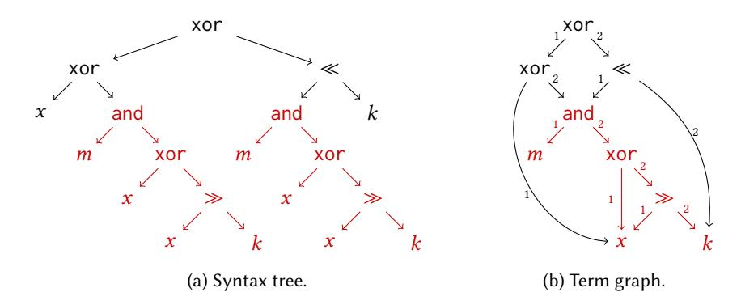

Fig. 1. Syntax tree and Term graph for the solution of Example 2.1.

for this problem (without functions), which is difficulty 5 (d5) grammar in SyGuS-Comp<sup>1</sup>. The complete formalization of this SyGuS problem will be discussed in Section 4.

A conventional solution as described in the Hacker's Delight book [Warren 2012] is as follows:

$$x \operatorname{xor} (\xi \ll k) \operatorname{xor} \xi \quad \text{where } \xi = (m \operatorname{and} (x \operatorname{xor} (x \gg k)))$$
 (2.1)

The solution has already exceeded the capabilities of all existing Syntax-Guided Synthesis (SyGuS) solvers to the best of our knowledge. The problem presents challenges from both the enumerative synthesis and deductive synthesis perspectives.

## 2.1 Challenges for Existing Approaches

From the perspective of enumerative synthesis, the size of the solution is simply too large. The syntax tree representation of the solution entails 19 nodes, as depicted in Figure 1a. Notice that conventional enumeration approaches examine candidates in ascending order based on the size of the syntax tree. Given the large tree size and the large number of operators involved in the grammar, the pure syntax-tree-based enumeration would necessitate examining approximately  $10^{14}$  candidates before identifying this correct solution, which is impossible in practice.

From the perspective of deductive synthesis, a conventional approach is a divide-and-conquer approach: it is called *top-down propagation/deduction*. This method repeatedly picks a top operator for the current specification, and breaks down the synthesis task to subtasks by applying inverse semantics using witness functions associated with the operators. The subtasks are smaller and can be solved separately. While this method has demonstrated effectiveness in several domains [Gulwani 2011; Osera and Zdancewic 2015; Polozov and Gulwani 2015], it becomes extremely inefficient in the domain of bit vectors. For example, Solution 2.1's top operator is xor, but there is a myriad of different ways to decompose the problem: every bit of output can be independently decomposed in two ways, regardless of the output value, and there are 64 bits for each input-output example, and there are 1,000 examples in our specification. It is worth mentioning that DUET [Lee 2021] mitigates this problem by considering only the decompositions in which at least one subtask has been solved by enumeration. However, as one can observe from Figure 1a, the subexpressions on both sides of the top xor entail 9 nodes. In other words, the witness function has to consider all decompositions involving subexpressions up to size 9, which is still an astronomical number for d5 grammar.

 $<sup>^1</sup>$ SyGuS-Comp associated each Hacker's Delight with a difficulty. Higher difficulty will use larger grammar. Difficulty 5 is the largest grammar in SyGuS-Comp.

## 2.2 Our Approach

Now let us explain our distinct enumeration strategy through the motivating example. The first key observation is that, as shown in Figure 1a, the highlighted subexpression  $(m \text{ and } (x \text{ xor } (x \gg k)))$  is used twice in the solution, making the size of the solution unnecessarily large. As such recurrences are commonly seen in bit-vector synthesis, out insight lies in prioritizing these solutions during enumeration by merging recurring subexpressions. Our idea, as illustrated in Section 4, is to enumerate based on the size of the *term graph*. Figure 1b showcases the term graph representation of the same solution. As the subexpression  $(m \text{ and } (x \text{ xor } (x \gg k)))$  is counted only once now, the representation entails only 12 edges and 9 nodes. This reduction in the search space significantly influences the tractability of the problem.

Furthermore, we have incorporated other techniques not exemplified in Example 2.1 to further expedite the enumeration process. On one hand, we filter out useless expressions and conditions promptly if they do not contribute to solving any example. On the other hand, we harness the power of large language models to identify valuable subexpressions. By expanding the grammar, we prioritize solutions that incorporate these identified subexpressions.

However, these expedited enumeration techniques are still insufficient in solving Example 2.1. Consequently, another pivotal idea as detailed in Section 5, is leveraging deductive synthesis techniques, and incorporating a bottom-up deduction step into the enumeration process. The crux of the idea lies in the realization that while a single top-down propagation yields too many possibilities, it is relatively manageable to incorporate a bottom-up deduction step eagerly each time a candidate is enumerated. Whenever a candidate e is enumerated, the algorithm checks if a deduction pattern can be applied, angelically, such that a solution  $e^+$  containing e is realizable. If so, e will be stored and the algorithm continues to explore other missing components until  $e^+$  can be actually constructed.

As shown in Figure 2, Example 2.1 can be efficiently solved by enumerating components  $\xi \ll k$  and x xor  $\xi$  and combine them to a full solution through bottom-up deduction. During the enumeration, we take L xor R as one of the templates to form a solution, where L and R can be found by enumeration or automated reasoning. When the enumeration first reaches the expression  $\xi \ll k$ , we evaluate  $\xi \ll k$  with the input (m = #xFF, k = #x08, x = #xAFB1). Obviously, the evaluation result  $[[\xi \ll k]] = \#x1E00$  does not match the expected output  $\mathbf{output} = \#xB1AF$ . However, through some automated reasoning we find that  $\xi \ll k$  can potentially serve as the L role of the template—if another expression can be found to serve as the R role such that  $[[R]] = \mathbf{output} \oplus [[\xi \ll k]] = \#xAFAF$ , then we can immediately construct a full solution with  $[[\xi \ll k \times R]] = \mathbf{output}$ . Thus we add  $\xi \ll k$  into a hash table M[L] which stores all enumerated expressions that can potentially serve as the L role. We use the evaluation result #x1E00 as the key of the hash table for quick lookup.

As a suitable R is not yet available, the enumeration continues and reaches x xor  $\xi$  at a later point. Similar to the previous case, simple evaluation finds that x xor  $\xi$  is not a complete solution but can serve as the R role. This time, the collaborating L component must satisfy  $[\![L]\!] = \mathbf{output} \oplus [\![x \text{ xor } \xi]\!] = \#x1E00$ . By looking up the hash table M[L] with key #x1E00, we find that  $\xi \ll k$  is already present in the hash table with the corresponding candidate  $\xi \ll k$ . Now with x xor  $\xi$  functioning as the R component and  $\xi \ll k$  functioning as the R component, the algorithm immediately returns their combination  $(\xi \ll k)$  xor  $(x \text{ xor } \xi)$  as a complete solution. As illustrated in Figure 2, this process necessitates an enumeration of less than 4 millions expressions, a drastic reduction compared to the pure enumeration method's requirement of  $10^{14}$  expressions. Our implementation Dryadsynth successfully solved this problem—for the first time—in 27.1 seconds.

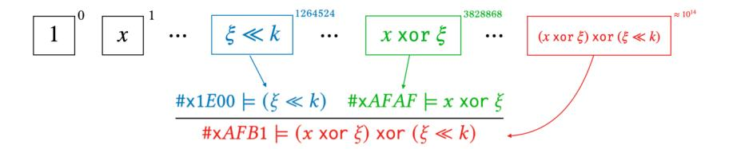

Fig. 2. A basic example for deduction.  $(\xi = (m \text{ and } (x \text{ xor } (x \gg k))))$ 

#### 3 PRELIMINARIES

We now formally describe the bit-vector synthesis problem we solve in this paper.

Definition 3.1 (Signature). A signature is a pair  $\sigma = (\Sigma, \tau)$  where  $\Sigma$  is a finite set of symbols and  $\tau : \Sigma \to \mathbb{N}$  is an arity function. Specifically, a symbol x is a variable if  $\tau(x) = 0$  and a symbol f is a function if  $\tau(f) > 0$ . The set of variables and the set of functions within  $\sigma$  are denoted as  $Vars(\sigma)$  and  $Funcs(\sigma)$ , respectively.

We denote the set of all standard bit-vector operations as *BVOps*. The bit-vector operations are interpreted with common semantics given in the SMT-LIB standard [Barrett et al. 2017]. We also denote the set of all available constants in bit-vector domain as *BVConst*. Now with the theory of bit-vectors, we can define extended signatures which included operators and constants in the alphabets.

Definition 3.2 (Extended Signature). An extended signature is defined as  $\sigma^+ = (\Sigma^+, \tau^+)$ , where extended symbol set  $\Sigma^+ = \Sigma \cup BVOps \cup BVConst$  is the symbol set with all operators and all constants in Fig 3,  $\tau^+ : \Sigma^+ \to \mathbb{N}$  is the arity function on the extended symbol set  $\Sigma^+$ , which assign an arity number to all functions, operators, constants and variables. e.g.  $\tau^+$  (and) = 2,  $\tau^+$  (not) = 1. Specifically the arity of a constant or variable is always 0.

We next define expression grammar which captures the syntactic part of the synthesis problem.

Definition 3.3 (Expression Grammar). Let  $\sigma$  be a signature and Vars be a variable set, an expression grammar  $\mathcal G$  with respect to  $\sigma$  and Vars is a tuple  $(\mathcal N, \mathcal S, \mathcal P)$ , where  $\mathcal N$  a set of non-terminal symbols,  $S \in \mathcal N$  is the start symbol, and  $\mathcal P$  is a set of production rules each of the form  $N \to \kappa(N_1, \dots, N_{\tau^+(\kappa)})$  where  $N, N_1, \dots \in \mathcal N$  are non-terminal symbols and  $\kappa \in \Sigma^+$  is a function, operator, constant or variable. Let  $[\![\mathcal G]\!]$  denote the set of all expressions generated by  $\mathcal G \colon \{e \mid S \xrightarrow{} * e\}$ .

Example 3.4. Figure 3 defines a standard grammar for fixed-width bit-vector expressions. This grammar consists of variables from the signature, bit-vector constants of a fixed width m, and arbitrary combinations of them using common bit-vector operations from BVOps as well as functions from the signature. We use either binary or hexadecimal representation for bit-vector constants. For example, #b111111111 is equivalent to #xFF. We denote the set of bit-vector constants of width m as BV[m].

The functions in the grammar are interpreted with user-provided semantics. Formally, the semantics of an n-ary interpreted function f is a term  $\lambda x_1, \ldots, x_n \cdot \Psi$ , where  $\Psi$  is a bit-vector expression with variables  $x_1, \ldots, x_n$  and without function calls.

Now we are ready to define the syntax-guided synthesis problem for bit-vectors.

Definition 3.5 (SYGUS problem). An instance of the SYGUS problem is given by a tuple  $(\sigma, t, \Phi, \mathcal{G})$  where  $\sigma$  is a signature, t is an n-ary uninterpreted function to synthesize,  $\Phi$  is a SYGUS specification containing t and other variables and functions from  $\sigma$ , and  $\mathcal{G}$  is an expression grammar with

```
\begin{array}{lll} E & \to & \operatorname{not} E \mid E \ \operatorname{and} E \mid E \ \operatorname{or} E \mid E \ \operatorname{xor} E \\ E & \to & \operatorname{neg} E \mid E \ \operatorname{add} E \mid E \ \operatorname{mul} E \mid E \ \operatorname{sub} E \mid E \ \operatorname{udiv} E \\ & \mid E \ \operatorname{sdiv} E \mid E \ \operatorname{urem} E \mid E \ \operatorname{srem} E \end{array} \qquad \begin{array}{l} (\operatorname{arithmetic operations}) \\ E & \to & \operatorname{ITE}(E = 0, E, E) \\ E & \to & E \ll E \mid E \gg E \mid E \ \operatorname{ashr} E \end{array} \qquad \begin{array}{l} (\operatorname{if-then-else operations}) \\ (\operatorname{constants}) \\ E & \to & C \end{array} \qquad \begin{array}{l} (\operatorname{constants}) \\ E & \to & x \mid y \mid \dots \end{array} \qquad \begin{array}{l} (\operatorname{variables}) \\ E & \to & f(E, \dots, E) \mid g(E, \dots, E) \mid \dots \end{array} \qquad \begin{array}{l} (\operatorname{function calls}) \end{array}
```

```
C \in BV[m] : fixed-width bit-vector constant x, y \in Vars(\sigma) : Variables f, g \in Funcs(\sigma) : Functions
```

Fig. 3. A standard grammar for fixed-width bit-vector expressions.

respect to  $\sigma$  and variables  $\{x_1, \ldots, x_n\}$ . A solution to the SyGuS problem is an expression  $e \equiv \lambda x_1, \ldots, x_n. \gamma(x_1, \ldots, x_n)$  such that: a)  $\gamma(x_1, \ldots, x_n) \in [\![\mathcal{G}]\!]$ ; and b)  $\Phi[e/t]$  is valid, i.e., instantiating t with e makes  $\Phi$  valid.

Definition 3.6 (Example-based SyGuS problem). We call a SyGuS problem  $(\sigma, t, \Phi, \mathcal{G})$  example-based if the specification  $\Phi$  is the input-output examples constraints of the following form:

$$\Phi \equiv \bigwedge_{(\mathbf{i} \mapsto o) \in S} t(\mathbf{i}) = o$$

in which S is the set of input-output examples of the form  $\mathbf{i} \mapsto o$  where  $\mathbf{i}$  is a vector of inputs and o is the expected output. We denote an example-based SyGuS problem as a tuple  $(\sigma, S, \mathcal{G})$ .

The SvGuS problem for Example 2.1 is example-based, which can be represented by a tuple  $(\sigma, S, \mathcal{G})$ . Signature  $\sigma = (\Sigma, \tau)$  defines variables  $\Sigma = \{x, m, k\}$  in the synthesis context.  $S = \{(\#xAFB1, \#xFF, \#x8) \mapsto \#xB1AF\}$  is the set of examples.  $\mathcal{G}$  is the grammar used for the search, which is shown in Fig 3.

In this paper, we focus on example-based SyGuS problems. When the specification is non-example-based, we assume the problem is handled by a standard counterexample-guided inductive synthesis (CEGIS) loop [Solar-Lezama et al. 2006] and our techniques will be applied to solve the example-based, inductive synthesis problems in each iteration.

#### 4 EXPEDITED ENUMERATION

In this section, we demonstrate our innovations that expedite the process of traditional enumeration based on the syntax tree size. We begin by introducing term graph which enables size-based enumeration without counting duplicated subexpressions. We then present our enumeration algorithm which conducts a federated search for both conditions and expressions. Finally, we show how we accelerate the enumeration process by extending the original grammar with valuable expressions found by large language models.

## 4.1 Term-Graph-Based Enumeration

In a conventional enumeration process, candidates in the search space are typically examined in ascending order based on the size of the syntax tree. However, as demonstrated in Example 2.1 in Section 2, solutions to bit-vector synthesis problems often encompass recurring subexpressions, leading to an unnecessarily large size of the syntax tree.

To address this issue, we adapt the standard syntax-tree-size-based enumeration to an enumeration based on the size of the *term graph* [Garner 2011]. This adaptation enables us to prioritize the exploration of expressions that incorporate a higher number of recurring subexpressions. Intuitively, term graphs generalize abstract syntax trees to represent shared subexpressions. Below we define our notation for term graphs and then discuss the enumeration order of all possible expressions.

*Definition 4.1 (Term Graph).* Given a grammar  $\mathcal{G} = (\mathcal{N}, S, \mathcal{P})$ , a term graph with respect to  $\mathcal{G}$  is a labeled direct acyclic graph G = (V, l, rt, E) where

- *V* is a finite set of nodes,
- $l: V \to \mathcal{P}$  is a label function,
- $rt \in V$  is the root node,
- $E \subset V \times \mathbb{N} \times V$  is a set of directed, labeled edges

that satisfies the following conditions:

- the graph is acyclic;
- rt is a unique node that can reach all other nodes through the edges;
- for every node  $v \in V$ , let l(v) be the production rule  $N \to \kappa(N_1, \ldots, N_{\tau^+(\kappa)})$  in  $\mathcal{P}$ , where  $\kappa \in \Sigma^+$  is a function, operator, constant or variable,  $N, N_1, \ldots, N_{\tau^+(\kappa)} \in \mathcal{N}$  are non-terminals, then v has  $\tau^+(\kappa)$  outgoing edges: for every  $1 \le i \le \tau^+(\kappa)$ , there exists a unique node v(i) such that  $(v, i, v(i)) \in E$  is an edge of the graph, and l(v(i)) is a production rule starting from  $N_i$ .

The size of the graph |G| is defined as the number of edges |E|.

*Remark:* Note that our edge-based graph size is different from conventional node-based definition. This distinction arises from the intuition that, when an expression incorporates multiple instances of a variable, the complexity of the expression is inherently influenced by the number of occurrences of that variable. As an example, neg not x should be simpler and enumerated earlier than (x add x) and (x add x).

Definition 4.2 (Represented Expression). Given grammar  $\mathcal{G}$  and a term graph G = (V, l, rt, E) with respect to  $\mathcal{G}$ , a mapping  $\operatorname{Exp}: V \to \llbracket \mathcal{G} \rrbracket$  can be defined recursively as follows: for every  $v \in V$ , if l(v) is the production rule  $N \to \kappa(N_1, \ldots, N_{\tau^+(\kappa)})$ , then

$$\operatorname{Exp}(v) = \kappa \Big( \operatorname{Exp}(v(1)), \dots, \operatorname{Exp}(v(\tau^+(\kappa))) \Big)$$

Specifically, when  $\kappa$  is a constant or variable, the definition falls in the base case and Exp(v) is simply l(a), the constant or variable labeling the node. We also write Exp(G) to denote Exp(rt), the expression represented by the root node rt.

It is evident that a single expression can be represented by various term graphs, each exhibiting distinct levels of subexpression sharing. At one end of the spectrum, an expression can be represented by a standard syntax tree, which serves as a term graph without any sharing of subexpressions. On the other end, as demonstrated below, an expression can be represented by a unique, minimal term graph, without any recurring subexpressions. Below we formally define it as compact term graph and prove its uniqueness.

Definition 4.3 (Compact Term Graph). A term graph G = (V, l, rt, E) is compact if every node in the graph represents a unique expression. Formally, for every two distinct nodes  $u, v \in V$ ,  $\text{Exp}(u) \neq \text{Exp}(v)$ .

Theorem 4.4 (Unique Compact Term Graph). Given a non-ambiguous grammar  $\mathcal{G}$  (i.e., every expression in  $[\![\mathcal{G}]\!]$  has a unique derivation), for every expression in  $[\![\mathcal{G}]\!]$ , there is a unique compact term graph representing e.

PROOF. By Definition 4.2, every term graph represents only one expression. In other words, two distinct expressions cannot be represented by the same term graph. What remains is to show that there do not exist two distinct compact term graphs both representing the same expression e. As  $\mathcal{G}$  is unique, e has a unique parse tree. Hence, we can prove the theorem by induction on the size of the parse tree of e.

- Base case: If the parse tree is of size 1, i.e., is a constant or variable, there is only one term graph which contains only one node labeled by the constant or variable and is trivially unique.
- Inductive case: If the parse tree's top production rule P is of the form  $N \to \kappa(N_1, \ldots, N_{\tau^+(\kappa)})$  where  $\kappa$  is a function or an operator, then e is of the form  $\kappa(e_1, \ldots, e_{\tau^+(\kappa)})$  where each  $e_i$  is a subexpression with a smaller parse tree. Now assume that e can be represented by two distinct term graphs  $G_1 = (V_1, l_1, rt_1, E_1)$  and  $G_2 = (V_2, l_2, rt_2, E_2)$ . Then first,  $l_1(rt_1) = l_2(rt_2)$ . Second, for each  $1 \le i \le \tau^+(\kappa)$ , both the subgraphs with roots  $rt_1(i)$  and  $rt_1(i)$  are compact and represent subexpression  $e_i$ . With the inductive assumption, there is only a unique term graph representing  $e_i$ , the two subgraphs are isomorphic. Combining all these subgraphs and the roots,  $G_1$  and  $G_2$  are also isomorphic, contradicting with the assumption.

Given Theorem 4.4, for every expression e we denote its unique compact term graph as G(e).

*Example 4.5.* Figure 1b shows the unique term graph for the solution the example Hacker's Delight 19 (Equation 2.1). The highlighted part of the graph shows the shared subexpression which occurs on both sides of the top xor operator (cf. Figure 1a which shows the syntax tree of the same expression without sharing).

In accordance with Definition 4.1, each node within the graph is labeled with a production rule. However, for the sake of clarity, we visually represent each node using the corresponding function or operator, which is distinct for each production rule in the grammar for Hacker's Delight. Additionally, every edge in the graph is labeled with an integer. For example, the edge from and to m is labeled with 1, denoting the existence of an edge (and, 1, m) within the graph.

By counting the edges within the graph, one can observe that the size of the term graph is 12. In contrast, the corresponding syntax tree consists of 19 nodes. It is worth noting that to discover this particular solution, a syntax-tree-based enumeration would check an orders-of-magnitude larger number of candidates compared to a term-graph-based enumeration.

Now we are ready to establish a new enumeration order over all expressions in  $[\![\mathcal{G}]\!]$ . Intuitively, the enumeration order prioritizes expressions with smaller compact term graph than those with larger compact term graph. In cases where two expressions have compact term graphs of identical size, the order between them is established by a total order of the production rules in  $\mathcal{G}$ . The order is defined as follows:

Definition 4.6 (Ordered grammar). An ordered grammar is a tuple  $\mathcal{G} = (\mathcal{N}, S, \mathcal{P}, \prec)$  where  $\mathcal{G} = (\mathcal{N}, S, \mathcal{P})$  forms a grammar as defined in Definition 3.3, and  $\prec \subseteq \mathcal{P} \times \mathcal{P}$  is a total order of the production rules.

Definition 4.7 (Enumeration Order). Given an ordered grammar  $\mathcal{G} = (\mathcal{N}, S, \mathcal{P}, \prec)$ , an enumeration order with respect to  $\mathcal{G}$  is a total order  $\prec_{\mathcal{G}} \subseteq \llbracket \mathcal{G} \rrbracket \times \llbracket \mathcal{G} \rrbracket$  defined as follows. Let  $e_1, e_2 \in \llbracket \mathcal{G} \rrbracket$  be two expressions and let their compact term graphs  $G(e_1)$  and  $G(e_2)$  be  $(V_1, l_1, rt_1, E_1)$  and  $(V_2, l_2, rt_2, E_2)$ , respectively, then  $e_1 \prec_{\mathcal{G}} e_2$  if and only if:

- $|G(e_1)| < |G(e_2)|$
- $|G(e_1)| = |G(e_2)|$  and  $l_1(rt_1) < l_2(rt_2)$

Proc. ACM Program. Lang., Vol. 8, No. POPL, Article 71. Publication date: January 2024.

- $|G(e_1)| = |G(e_2)|$ ,  $l_1(rt_1) = l_2(rt_2)$  and exists an  $i \ge 0$  such that:
  - for every  $0 \le j < i$ ,  $\operatorname{Exp}(rt_1(j)) = \operatorname{Exp}(rt_2(j))$  and
  - $\operatorname{Exp}(rt_1(i)) \prec_G \operatorname{Exp}(rt_2(i))$

*Example 4.8.* The enumeration order we use in our implementation is based on an ordered grammar which extends the grammar shown in Figure 3. As every production rule in the grammar derives a distinct function/operator, the order is essentially an order of operators, variables, constants and functions:

```
not < and < or < \cdots < lshr < Constants < Variables < Functions
```

Based on this order of operations, as an example,  $x <_{\mathcal{G}} (x \gg k)$  because x has a smaller size, not not  $x <_{\mathcal{G}}$  not neg x because not  $x <_{\mathcal{G}}$  not neg x because not  $x <_{\mathcal{G}}$  not neg x because not x has a smaller size, not not  $x <_{\mathcal{G}}$  not neg x because not x has a smaller size, not not  $x <_{\mathcal{G}}$  not neg x because not x has a smaller size, not not  $x <_{\mathcal{G}}$  not neg x because not x has a smaller size, not not  $x <_{\mathcal{G}}$  not neg x because not x has a smaller size, not not  $x <_{\mathcal{G}}$  not neg x because not x has a smaller size, not not  $x <_{\mathcal{G}}$  not neg x because not x has a smaller size, not not  $x <_{\mathcal{G}}$  not neg x because not x has a smaller size, not not  $x <_{\mathcal{G}}$  not neg x because not x has a smaller size, not not  $x <_{\mathcal{G}}$  not neg x because not x has a smaller size, not not  $x <_{\mathcal{G}}$  not neg x because not x has a smaller size, not neg x has a smaller size, not neg x has a smaller size, not neg x has a smaller size, not neg x has a smaller size, not neg x has a smaller size, not neg x has a smaller size, not neg x has a smaller size, not neg x has a smaller size, not neg x has a smaller size, not neg x has a smaller size, not neg x has a smaller size, not neg x has a smaller size, not neg x has a smaller size, not neg x has a smaller size, not neg x has a smaller size, not neg x has a smaller size, not neg x has a smaller size, not neg x has a smaller size, not neg x has a smaller size, not neg x has a smaller size, not neg x has a smaller size, not neg x has a smaller size, not neg x has a smaller size, not neg x has a smaller size, not neg x has a smaller size, not neg x has a smaller size, not neg x has a smaller size, not neg x has a smaller size, not neg x has a smaller size, not neg x has a smaller size, not neg x has a smaller size, not neg x has a smaller size, not neg x has a smaller size, not neg x has a smaller size, not neg x has a sma

### 4.2 Example-Guided Filtration of Conditions and Expressions

With the enumeration order in place, we can now proceed to present our basic enumeration algorithm for bit-vector synthesis. Similar to other SyGuS problems that allow the ITE case splitter within the grammar, many bit-vector synthesis problems expect "decision tree" solutions which combines multiple expressions using ITE's, each applied only under an exclusive condition from the grammar. Therefore, the goal of the algorithms is to a) search for a set of expressions that encompass all examples; b) search for a set of conditions that avoid excessive case splitting and overfitting; and c) combine them to a decision tree solution.

Besides the novel term-graph-based enumeration order, our algorithm per se is similar to the enumeration algorithm utilized in EuSolver [Alur et al. 2017], Duet [Lee 2021] and Simba [Yoon et al. 2023]. In a nutshell, the algorithm maintains two sets: one for terms and another for predicates. It concurrently expands these sets through enumeration and repeatedly attempts to construct a decision tree solution.

However, a noteworthy limitation of their algorithm is their lack of specialization for example-based synthesis: even if an expression or condition fails to cover or distinguish any example, it is still included in the term/predicate set for decision tree construction. To this end, an important distinction or novelty of our algorithm lies in its proactive filtration of non-relevant terms and predicates based on the input-output examples provided as the specification.

Algorithm 1 depicts our enumeration with example-guided filtration of conditions and expressions. The algorithm maintains two sets: the expression set E which contains all P partial solutions (expressions that solve at least one example), and the condition set E which contains all conditions that can split the input-output example set E. Both sets are all initialized to E0 at the beginning of the algorithm. The while loop from lines E10 performs the enumeration of a new term E10 performs the enumeration of a new term E10 performs the enumeration of a new term E11 performs the enumeration of a new term E12 performs the enumeration of a new term E2 performs the enumeration of a new term E3. By invoking NextDistinctTerm(E6), the term is always the next one in the term-graph-based order E3 which is observably distinct from all existing expressions in E3.

In each iteration, the algorithm attempts to update E and C with new, filtered components under the guidance of the example-based specification (lines 6–8). For each input-output example  $i \mapsto o$ , it attempts to extract a partial solution mapping i to o, by calling a subprocedure Extract (e, i, o), and add it to E. As the simplest instantiation of Extract, the function Extract  $^{\mathcal{I}}$  simply extracts e if applying e on i (represented as [e](i)) yields o. In Section 5, we will present a more advanced instantiation of Extract which embodies our innovative deduction-guided enumeration technique. After updating E, the algorithm attempts to expand the condition set E0 with a new condition E1 as long as the condition can distinguish inputs within the specification E3, i.e., the condition holds for at least one input example and fails for at least one input example.

Once *E* and *C* are updated, the algorithm checks if they are sufficient for constructing a full solution: for every  $\omega$  as a combination of conditions within *C*, there exists one expression  $e \in E$ 

### **Algorithm 1:** Term-Graph-Based Enumerative Synthesis

**Input** :An example-based SyGuS problem  $(\sigma, S, \mathcal{G})$  where  $\sigma$  is a signature, S is a set of input-output examples,  $\mathcal{G}$  is a grammar.

**Output:** A solution to the input problem.

```
1 fn Synth(\sigma, S, G):
          E, C \leftarrow \varnothing, \varnothing
                                                                                              // Expressions set and condition set
           t \leftarrow \bot
          while QUALITYCHECK(t) = false:
 4
                e \leftarrow \text{NextDistinctTerm}(\prec_G)
 5
                E \leftarrow E \cup \text{Extract}(e, S)
                                                                                // Extract potential partial solutions from \emph{e}
           \mathbf{if}\left(\bigvee_{(\mathbf{i}\mapsto o)\in S}[[e]](\mathbf{i})=0\right)\wedge\left(\bigvee_{(\mathbf{i}\mapsto o)\in S}[[e]](\mathbf{i})\neq 0\right):
C\leftarrow C\cup\{e=0\}
                                                                                                // Check if e=0 can split S
 7
 8
              if \Phi^{S}_{cover}(E, C):

t \leftarrow LEARNDT(E, C, S)
10
          return t
12 fn Extract<sup>I</sup> (e, S) for Extract:
                // [[e]](\mathbf{i}) = o:
14
            return Ø
```

such that e covers  $\omega$ , i.e., all example inputs that satisfy  $\omega$  can be mapped to the expected output by applying e. This condition is captured formally by a formula:

$$\Phi_{\text{cover}}^{S}(E,C) \equiv \bigwedge_{\omega \in \{0,1\}^{|C|}} \bigvee_{e \in E} \bigwedge_{(\mathbf{i} \mapsto o) \in S} \left( \left( \bigwedge_{j \in [1..|C|]} \omega_{j} = 1 \leftrightarrow \llbracket [C_{j} \rrbracket](\mathbf{i}) \right) \longrightarrow \llbracket [e] \rrbracket(\mathbf{i}) = o \right)$$

If  $\Phi^S_{\mathrm{cover}}(E,C)$  succeeds, the algorithm proceeds to learn a decision tree t from E and C using the LearnDT subprocedure. We utilize an adapted version of the ID3 algorithm [Quinlan 1986], as described in [Alur et al. 2017], for the decision tree learning process. Another subprocedure QualityCheck is applied for final quality check before t is returned as a solution. For example, to avoid overfitting, one can examine the number of ITE operators in t does not exceed a preset threshold  $\theta$ . The algorithm continues until a solution t is generated and quality-checked.

#### 4.3 More Acceleration with the Guidance of Large Language Models

Although our term-graph-based enumeration expedites the search for solutions involving recurring subexpressions, it may still prove inadequate when dealing with solutions of significantly larger sizes that surpass the capabilities of existing SyGuS solvers. As an example, the solution to the Hacker's Delight 25 example (see Example 4.9 below and Figure 5a) remains substantial even after merging all repeated subexpressions, with a size of 31. A straightforward enumeration algorithm is simply incapable of scaling to discover solutions of such large size. To address this challenge, we

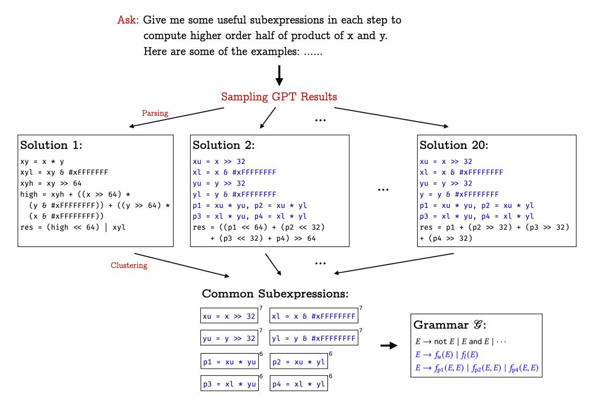

Fig. 4. Extending grammar with ChatGPT-generated expressions.

harness the power of large language models to generate valuable components that assist in the search process. We next illustrate our ideas through the example.

Example 4.9. (Hacker's Delight 25) The synthesis task is to compute, using the grammar in Fig 3, the higher-order half of the 64-bit product of two 32-bit integers x and y. In addition to a collection of input-output examples that serve as an example-based specification, a natural language description of the synthesis task is also provided.

We utilize ChatGPT [OpenAI 2022] as the large language model. Although we discovered that ChatGPT alone may not be adequate for finding a complete solution to the problem, it is valuable in identifying useful subexpressions that can be used in the final solution. We outline the process of interacting with the model in Figure 4. We initially ask ChatGPT to produce a detailed solution by providing it with the natural language description and 3 input-output examples. Specifically, for Example 4.9, our prompt to ChatGPT would be as follows: "Give me some useful subexpressions in each step to compute higher order half of product of x and y. Here are some of the examples:" Then we provide several generated input-output examples in hexadecimal to ChatGPT.

We repeat this process for 20 times using the same prompt. Subsequently, we parse each output from ChatGPT to extract a sequence of expressions. Each expression in the sequence represents an individual step towards solving the problem. This process yields a significant number of subexpressions, many of which may not be helpful for the search process. To identify useful subexpressions from them, we employ a filtering mechanism based on clustering. By analyzing the frequency of appearance across all 20 outputs, we can determine the subexpressions that occur frequently, indicating their potential usefulness in the synthesis process. By applying clustering techniques, we filter out expressions that appear less than 4 times, ensuring that only the most relevant and

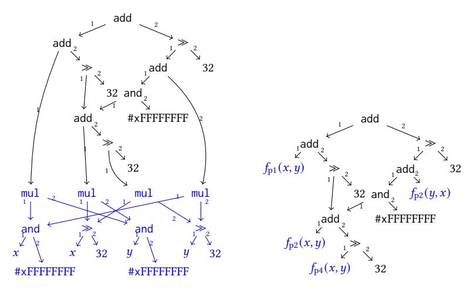

(a) With the original grammar (31 edges). (b) With the LLM-enhanced grammar (24 edges).

Fig. 5. Term graphs for the solution to Hacker's Delight 25.

frequently occurring subexpressions are retained for further utilization in the search process. We denote the identified common subexpressions as blue and show how many times every one appears in the solutions in Figure 4.

After clustering, we add every clustered subexpression (modulo variable renaming) into our grammar as a new defined function. Figure 4 shows the enhanced grammar. A solution under the enhanced grammar is shown as a term graph in Figure 5b. As the graph comprises only 24 edges, the solution can be found much earlier than under the original grammar.

Note that the LLM-guided acceleration technique is not applicable to all synthesis problems. First, it relies on a natural language description being provided as part of the specification, which may not be available in all cases. Second, the queries to ChatGPT can be time-consuming, often taking tens of seconds to generate a response. For relatively simple synthesis problems, the overhead of using the large language model may outweigh the benefits gained from acceleration.

#### 5 BOTTOM-UP DEDUCTION FOR ENUMERATION

In Section 4, we have presented our enumerative synthesis algorithm expedited with various techniques, including term-graph-based enumeration order, example-guided filtration, and LLM-enhanced grammars. In this section, we show how the pure enumeration algorithm can be further improved through the incorporation of bottom-up deduction techniques.

Recall that in Algorithm 1, for each newly enumerated term e, the expression set E is extended with the output from the Extract invocation. In the pure enumerative setting (i.e., the Extract instantiation shown in Algorithm 1), the invocation simply returns e if it is a partial solution. Our improvement builds on the following insight: even if e is not a partial solution, it may be in proximity to a partial solution, meaning that it can be utilized in the construction of a solution through a few deduction steps.

*Example 5.1.* To illustrate the idea, consider an input-output example for a binary function with input variables x and y: (#b0100, #b1001)  $\mapsto$  #b1101, and imagine that the algorithm is enumerating y, a size-0 term. While y alone is obviously not a solution, we may discover that the difference to the expected output (#b1101 – #b1001) = #b0100 matches a previously enumerated term, x.

Therefore, the Extract subprocedure can immediately return x + y as a solution, instead of waiting until this size-2 term is enumerated.

From the perspective of deductive synthesis, we performed bottom-up deduction using a simple constructive rule for addition: if two expressions  $e_1$  and  $e_2$  produce outputs  $e_1$  and  $e_2$ , respectively, a larger expression  $e_1 + e_2$  can be constructed for producing output  $e_1 + e_2$ . We refer to the expressions  $e_1$  and  $e_2$  that contribute to the construction as serving at positions add<sub>1</sub> and add<sub>2</sub>, respectively.

To implement this idea which we call *bottom-up deduction*, there is a couple of major technical challenges. First, as the components of a solution can be found in an arbitrary order (e.g., x before y or y before x in Example 5.1) and smaller components may be composed to form larger components (e.g., x+y can still be a component of a larger solution), the algorithm must coordinate and propagate information between these interdependent positions. Second, determining if an expression can serve in a position involves automated reasoning and is computationally difficult.

In this section, we present the techniques that address these two challenges. In Section 5.1, we formally introduce the notion of closed position set to describe a set of positions that need to coordinate in the synthesis process, and then illustrate the bottom-up deduction algorithm which maintains a closed position set and propagates information between positions. The algorithm can be integrated into the enumeration framework presented in the previous section. In Section 5.2, we discuss how the deduction process can be accelerated by leverage features of common operators in the theory of bit-vectors.

## 5.1 Bottom-Up Deduction

Above we have introduced the notion of position such as  $\operatorname{add}_1$  and  $\operatorname{add}_2$ . Intuitively, a position indicates the role a subexpression can serve in a full solution. For example, x serving in position  $\operatorname{add}_1\operatorname{add}_1$  means that there is a potential solution of the form (x+??)+??, where x serves as the 1st operand of an additive expression x+?? which further serves as the 1st operand of the full expression. Below we formally define the concept of position and some related terminologies such as prefixes and second prefixes. Intuitively, prefixes capture the subexpression relation between positions, and second prefixes capture the relation that one position relies on another position. For example, the template (x+??)+?? for  $\operatorname{add}_1$  involves two other positions with unknown expressions:  $\operatorname{add}_1\operatorname{add}_2$  and  $\operatorname{add}_2$ . They are what  $\operatorname{add}_1$  relies on to construct a full solution and hence second prefixes of  $\operatorname{add}_1$ .

Definition 5.2 (Position). Given a grammar  $\mathcal{G} = (\mathcal{N}, S, \mathcal{P})$  with  $\sigma = (\Sigma, \tau)$  being the associated signature, a position with respect to  $\mathcal{G}$  is a string  $p \in \Pi^*$  where  $\Pi = \{\kappa_m \mid \kappa \in \Sigma^+, 0 < m \le \tau^+(\kappa)\}$ . A term graph G = (V, l, rt, E) admits position p if there exists a sequence of nodes  $v_0 \dots v_{|p|}$  such that for every index  $1 \le j \le |p|$ , if the j-th element of p is  $\kappa_m$ , then  $l(v_{j-1})$  is a production of the form  $N \to \kappa(\dots)$ , and  $v_{j-1}(m) = v_j$ .

We denote position p's last operator as Op(p). Note that a prefix of a position is also a position. We denote the set of all prefixes of a position p as Prefixes(p). If  $p = q \kappa_m$  for some  $\kappa$  and m, we call p a *child* of q, and q the *parent* of p (denoted as Parent(p)). We call p a *second prefix* of q if  $Parent(p) \in Prefixes(Parent(q))$ . We denote the set of all second prefixes of a position p as SndPref(p).

*Example 5.3.* In Figure 1b, there are two paths from the root to the highlighted subgraph, witnessing that expression  $\xi$  can serve in two distinct positions:  $xor_1xor_2$  and  $xor_2shl_1$ . And as we mentioned in Section 2, two expressions  $\xi \ll k$  and x xor  $\xi$  are enumerated and stored in the synthesis procedure. They both encompass  $\xi$  and serve in positions  $xor_2$  and  $xor_1$ , respectively. It can also be verified that  $xor_2$  and  $xor_1$  are the second prefixes of  $xor_1xor_2$  and  $xor_2shl_1$ ,

respectively. Specifically, the graph trivially admits the empty position  $\varepsilon$  which corresponds to the whole expression.

Note that to enable bottom-up deduction, multiple positions must coordinate. On one hand, expressions serving in one position relies on other expressions serving in its second-prefix positions; on the other hand, an expression serving in a parent position can be constructed through deduction from expressions serving in its child positions. Therefore, our algorithm sticks to a fixed set of positions, keeps track of expressions serving in each position of the set simultaneously, and propagates information between positions. To ensure that every position gets information it relies on, the set must be closed under second prefix. We formally define it as a closed position set.

*Definition 5.4 (Closed Position Set).* A set of positions P is *closed* if for every position  $p \in P$ , all of the prefixes and second prefixes of p are also in P.

Example 5.5. Consider the following position sets:  $P_1 = \{\epsilon, \mathsf{xor}_1, \mathsf{xor}_2, \mathsf{xor}_1\mathsf{xor}_2, \mathsf{xor}_1\mathsf{xor}_2\}$ ,  $P_2 = \{\epsilon, \mathsf{xor}_1, \mathsf{xor}_2, \mathsf{xor}_1\mathsf{xor}_2\}$ ,  $P_3 = \{\epsilon, \mathsf{xor}_1, \mathsf{xor}_2\}$ .  $P_2$  is not a closed position set because  $\mathsf{xor}_1\mathsf{xor}_2$  has a second prefix  $\mathsf{xor}_1\mathsf{xor}_1$  which is not in  $P_2$ . Hence  $P_2$  is not suitable for our algorithm to keep track of as  $\mathsf{xor}_1\mathsf{xor}_2$  would not get information from  $\mathsf{xor}_1\mathsf{xor}_1$ . While  $P_1$  and  $P_3$  are closed position sets,  $P_1$  contains more positions, meaning that the algorithm will keep track of more components and perform more deduction, at the cost of more runtime overhead. In subsequent examples, we take  $P_3$  as the position set for the algorithm. We will discuss how we choose the position set P in Section 5.2.

Given the formalism above, we are now ready to present bottom-up deduction for enumeration as Algorithm 2. This algorithm is denoted as a function  $\operatorname{Extract}^{\mathcal{D}}$ , functioning as an implementation of the  $\operatorname{Extract}$  subprocedure found in Algorithm 1. The function takes as input a term e and an example-based specification S, and aims to extract a collection of partial solutions which satisfy some examples from S. As illustrated in Example 5.1, even if e per se is not a partial solution, it may serve as a subexpression of a solution at one particular position, and let the partial solution be derived in a bottom-up fashion. To this end, the algorithm maintain a persistent, global map M from each position p in a closed position set P, to a set of candidate expressions at p. Each expression within the set can potentially lead to a partial solution that works on a set of sample inputs I, starting from the current position. The sets P and I are provided as parameters for the algorithm. For example, when  $P = \{\epsilon, \mathsf{xor}_1, \mathsf{xor}_2\}$ , our algorithm can perform the deduction shown in Figure 2.

Given the input expression e, in the first loop, the algorithm determines, for each position p, if e can be added to M[p] by checking a quantified formula  $\Phi^M_{I,S}(\{e\mapsto p\})$ . Intuitively, the  $\Phi^M_{I,S}$  formula is parameterized by  $\mathcal{E}$ , a mapping from positions to expressions, and checks if it is possible to construct a term graph that maps all sample inputs to expected output, with every position in  $\mathcal{E}$  being filled by the corresponding expression, and all other positions being filled angelically. Formally,

$$\Phi_{I,S}^{M}(\mathcal{E}) \equiv \underbrace{\exists \dots \exists x_{q}^{i} \dots :}_{\substack{\mathbf{i} \in I, \ (\mathbf{i} \mapsto o) \in S}} \left( \bigwedge_{\substack{\mathbf{i} \in I, \ (\mathbf{i} \mapsto o) \in S}} x_{\varepsilon}^{i} = o \right) \land \left( \bigwedge_{\substack{\mathbf{i} \in I, \ p \in \mathrm{Domain}(\mathcal{E})}} \left( x_{p}^{i} = [\![\mathcal{E}(p)]\!](\mathbf{i}) \right) \right)$$

$$= \underbrace{(\mathbf{i} \in I, \ (\mathbf{i} \mapsto o) \in S, \mathbf{i} \in I, \ \mathbf{i} \in I, \ (\mathbf{i} \mapsto o) \in S, \mathbf{i} \in I, \ \mathbf{i} \in I, \ \mathbf{i} \in I, \ \mathbf{i} \in I, \ \mathbf{i} \in I, \ \mathbf{i} \in I, \ \mathbf{i} \in I, \ \mathbf{i} \in I, \ \mathbf{i} \in I, \ \mathbf{i} \in I, \ \mathbf{i} \in I, \ \mathbf{i} \in I, \ \mathbf{i} \in I, \ \mathbf{i} \in I, \ \mathbf{i} \in I, \ \mathbf{i} \in I, \ \mathbf{i} \in I, \ \mathbf{i} \in I, \ \mathbf{i} \in I, \ \mathbf{i} \in I, \ \mathbf{i} \in I, \ \mathbf{i} \in I, \ \mathbf{i} \in I, \ \mathbf{i} \in I, \ \mathbf{i} \in I, \ \mathbf{i} \in I, \ \mathbf{i} \in I, \ \mathbf{i} \in I, \ \mathbf{i} \in I, \ \mathbf{i} \in I, \ \mathbf{i} \in I, \ \mathbf{i} \in I, \ \mathbf{i} \in I, \ \mathbf{i} \in I, \ \mathbf{i} \in I, \ \mathbf{i} \in I, \ \mathbf{i} \in I, \ \mathbf{i} \in I, \ \mathbf{i} \in I, \ \mathbf{i} \in I, \ \mathbf{i} \in I, \ \mathbf{i} \in I, \ \mathbf{i} \in I, \ \mathbf{i} \in I, \ \mathbf{i} \in I, \ \mathbf{i} \in I, \ \mathbf{i} \in I, \ \mathbf{i} \in I, \ \mathbf{i} \in I, \ \mathbf{i} \in I, \ \mathbf{i} \in I, \ \mathbf{i} \in I, \ \mathbf{i} \in I, \ \mathbf{i} \in I, \ \mathbf{i} \in I, \ \mathbf{i} \in I, \ \mathbf{i} \in I, \ \mathbf{i} \in I, \ \mathbf{i} \in I, \ \mathbf{i} \in I, \ \mathbf{i} \in I, \ \mathbf{i} \in I, \ \mathbf{i} \in I, \ \mathbf{i} \in I, \ \mathbf{i} \in I, \ \mathbf{i} \in I, \ \mathbf{i} \in I, \ \mathbf{i} \in I, \ \mathbf{i} \in I, \ \mathbf{i} \in I, \ \mathbf{i} \in I, \ \mathbf{i} \in I, \ \mathbf{i} \in I, \ \mathbf{i} \in I, \ \mathbf{i} \in I, \ \mathbf{i} \in I, \ \mathbf{i} \in I, \ \mathbf{i} \in I, \ \mathbf{i} \in I, \ \mathbf{i} \in I, \ \mathbf{i} \in I, \ \mathbf{i} \in I, \ \mathbf{i} \in I, \ \mathbf{i} \in I, \ \mathbf{i} \in I, \ \mathbf{i} \in I, \ \mathbf{i} \in I, \ \mathbf{i} \in I, \ \mathbf{i} \in I, \ \mathbf{i} \in I, \ \mathbf{i} \in I, \ \mathbf{i} \in I, \ \mathbf{i} \in I, \ \mathbf{i} \in I, \ \mathbf{i} \in I, \ \mathbf{i} \in I, \ \mathbf{i} \in I, \ \mathbf{i} \in I, \ \mathbf{i} \in I, \ \mathbf{i} \in I, \ \mathbf{i} \in I, \ \mathbf{i} \in I, \ \mathbf{i} \in I, \ \mathbf{i} \in I, \ \mathbf{i} \in I, \ \mathbf{i} \in I, \ \mathbf{i} \in I, \ \mathbf{i} \in I, \ \mathbf{i} \in I, \ \mathbf{i} \in I, \ \mathbf{i} \in I, \ \mathbf{i} \in I, \ \mathbf{i} \in I, \ \mathbf{i} \in I, \ \mathbf{i} \in I, \ \mathbf{i} \in I, \ \mathbf{i} \in I, \ \mathbf{i} \in I, \ \mathbf{i} \in I, \ \mathbf{i} \in I, \ \mathbf{i} \in I, \ \mathbf{i} \in I, \ \mathbf{i} \in I, \ \mathbf{i} \in I, \ \mathbf{i} \in I, \ \mathbf{i} \in I, \ \mathbf{i} \in I, \ \mathbf{i} \in I, \ \mathbf{i} \in I, \ \mathbf{i} \in I, \ \mathbf{i} \in I, \ \mathbf{i} \in I, \ \mathbf{i} \in I, \ \mathbf{i} \in I, \ \mathbf{i} \in I, \ \mathbf{i} \in I, \ \mathbf{i} \in I, \ \mathbf{i} \in I, \ \mathbf{i} \in I, \ \mathbf{i} \in I, \ \mathbf{i} \in I, \ \mathbf{i} \in I, \ \mathbf{i} \in I, \ \mathbf{i} \in I, \ \mathbf{i} \in I, \ \mathbf{i} \in I, \ \mathbf{i$$

10

11

return  $M[\varepsilon]$ 

Algorithm 2: Bottom-Up Deduction (serving as the Extract subprocedure in Algorithm 1)

**Parameters:** A set of sample inputs *I* and a closed position set *P* w.r.t. *G*. : An expression  $e \in [G]$  and a set of input-output examples S. Input **Maintains** : A map  $M: P \to \mathcal{P}(\llbracket \mathcal{G} \rrbracket)$ : A set of candidate expressions that may be constructed by bottom-up Output deduction from e.  $1 M \leftarrow \{p \mapsto \emptyset \mid p \in P\}$ // Initialized M to  $\varnothing$  for every path p<sup>2</sup> **fn** Extract  $\mathcal{D}(e, S)$  **for** Extract: for  $p \in P$ : // Iterate every p if  $\Phi_{I,S}^{M}(\{p \mapsto e\})$ :  $M[p] \leftarrow M[p] \cup \{e\}$ // Check if e can be extended to a solution 5 for  $p \in P - \{\varepsilon\}$ : // Propagate newly added expressions to other positions 6  $q, \kappa \leftarrow \operatorname{Parent}(p), \operatorname{Op}(p)$ 7  $\mathbf{for}\; e_1 \in M[q\kappa_1],\; \ldots,\; e_{\tau^+(\kappa)} \in M[q\kappa_{\tau^+(\kappa)}] : \text{$//$ Every combination of child expressions}$ 8  $\mathbf{if} \, \Phi^{M}_{\mathbf{I},S} \left( \bigcup_{j \in [1..\tau^{+}(\kappa)]} (q\kappa_{j} \mapsto e_{j}) \right) : \\ \lfloor M[q] \leftarrow M[q] \cup \kappa(e_{1}, \ldots, e_{\tau^{+}(\kappa)})$ // Check if  $e_j$  can be combined with  $\kappa$ 9

where  $SndPref(\mathcal{E})$  represents the union of all SndPref(p) for every p in the domain of  $\mathcal{E}$ . The formula attempts to guess, for each position q relevant to the bottom-up deduction from p (a position mentioned in  $\mathcal{E}$ ) to the root (i.e., all positions that are second prefixes of p), an output value vector corresponding to inputs I, such that the vectors together satisfy a series of conditions. The first line states that the output vector at every position p within  $\mathcal{E}$  matches the outputs from corresponding expression  $\mathcal{E}(p)$ , and the output vector at the root position matches the expected output from specification S. The second line states that every parent position's output vector matches the outputs computed from its children's output vectors. Below we illustrate how  $\Phi_{IS}^{M}$ can be simplified in two concrete examples, and leave the more general discussion of automated reasoning in Section 5.2.

Example 5.6. In line 4, we may check if a candidate expression e can serve in position  $xor_1$ , i.e., checking  $\Phi_{LS}^M(\mathcal{E})$  with  $\mathcal{E} = \{xor_1 \mapsto e\}$ . Assume there is a single input-output example  $(i \mapsto o)$ with arbitrary i and o. Note that xor has two operands, while  $\mathcal{E}$  just constrains the first operand to be e. Since xor is invertible, we can always set the second operand to be o xor [e](i) to satisfy  $\Phi_{LS}^{M}$ . Thus  $\Phi_{LS}^{M}(\mathcal{E})$  can be simplified as follows:

$$\Phi_{I,S}^{M}(\mathcal{E}) \leftrightarrow \exists x_{\epsilon} \exists x_{1} \exists x_{2}. \ x_{\epsilon} = o \land x_{1} = [[e]](\mathbf{i}) \land x_{\epsilon} = x_{1} \operatorname{xor} x_{2}$$

$$\leftrightarrow \exists x_{2}. \ x_{2} = o \operatorname{xor} [[e]](\mathbf{i})$$

Example 5.7. In line 9, we may already have  $e_1$  and  $e_2$  serving in positions  $xor_1$  and  $xor_2$ , respectively, and attempt to assemble an expression serving in  $\epsilon$ . In other words, we check  $\Phi_{IS}^{H}(\mathcal{E})$ with  $\mathcal{E} = \{ \mathsf{xor}_1 \mapsto e_1, \mathsf{xor}_2 \mapsto e_2 \}$  with a single input-output example  $(\mathbf{i} \mapsto o)$ , where  $e_1, e_2, \mathbf{i}$  and

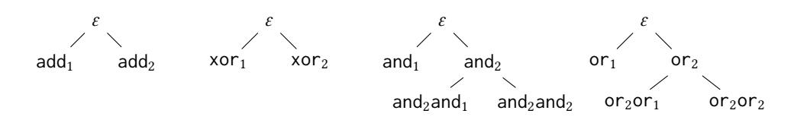

Fig. 6. Trees of positions used for Bit-Vectors.

o are arbitrary. Here the two operands of xor are constrained to be  $e_1$  and  $e_2$ , respectively. Since all existential variables are set to a fixed value,  $\Phi_{I,S}^M(\mathcal{E})$  is all about whether  $e_1$  xor  $e_2$  matches the output o, which we formally present as follows:

$$\Phi_{I,S}^{M}(\mathcal{E}) \leftrightarrow \exists x_{\epsilon} \exists x_{1} \exists x_{2}. \ x_{\epsilon} = o \land x_{1} = [[e_{1}]](\mathbf{i}) \land x_{2} = [[e_{2}]](\mathbf{i}) \land x_{\epsilon} = x_{1} \operatorname{xor} x_{2}$$
$$\leftrightarrow [[e_{1}]](\mathbf{i}) \operatorname{xor} [[e_{2}]](\mathbf{i}) = o$$

After updating M, in the second loop, the algorithm further checks if  $\Phi_{I,S}^M(\mathcal{E})$  is satisfied by any combination of child expressions within M, and if so, add the corresponding composite expression to the parent position.

Finally, the guessed partial solutions (as stored in  $M[\varepsilon]$ ), if any, are returned to the main synthesis algorithm.

Now let us see the algorithm solves Example 2.1. When we have  $P = \{\epsilon, \mathsf{xor}_1, \mathsf{xor}_2\}$ , the first loop is checking  $\Phi_{I,S}^M(\{\mathsf{xor}_1 \mapsto e\})$  and  $\Phi_{I,S}^M(\{\mathsf{xor}_2 \mapsto e\})$ . Similar to Example 5.6, both these predicates are true for every expression e. Thus,  $M[\mathsf{xor}_1]$  and  $M[\mathsf{xor}_2]$  will contain all enumerated expressions. In the second loop, our algorithm will propagate our change to M[p] in the first loop to the parent position of p. Here q and  $\kappa$  can only be  $\epsilon$  and xor. Thus, line 9 will check  $\Phi_{I,S}^M(\mathsf{xor}_1 \mapsto e_1, \mathsf{xor}_2 \mapsto e_2)$  for any enumerated expression  $e_1$  and  $e_2$ , which, according to Example 5.7, is equivalent to checking  $[[e_1]](\mathbf{i})$  xor  $[[e_2]](\mathbf{i}) = o$  for every input  $\mathbf{i}$  and output o. Since we know only e is the new expression added into e0, we only need to enumerate e1, e2, when either e1 or e2 is the new expression e2, e3, which, as we will explain later, can be further optimized into a hash table look up. As shown in Figure 2, when we enumerated e2 xor e3, the second loop found that e3 is a solution to the problem.

#### 5.2 Automating Bottom-Up Deduction for Bit-Vectors

At the core of Algorithm 2, the focal point lies in checking the formula  $\Phi_{I,S}^M(\mathcal{E})$ . Obviously, checking this quantified formula is prohibitively challenging in most cases. In the following discussion, we elaborate on our approach to automating the verification process specifically for the theory of bit vectors.

Choice of the position set *P*. Recall that the algorithm is parameterized with a closed position set *P*. When handling bit-vector synthesis problems, we use a fixed set *P* which includes positions as shown in Figure 6. Note that the position set is for the grammar defined in Figure 3. In the case that some of the operators are missing in the user-provided grammar, we simply ignore the corresponding skeletons. Below are several justifications behind the choice of the set:

• We include *invertible* binary operators within the bit-vector theory, including add and xor . Simply put, for these operators, if one operand can be uniquely determined if the other operand and the result of the operation are known. Therefore, we can perform quantifier elimination for  $\Phi^M_{LS}(\mathcal{E})$  and verify the formula efficiently.

- Likewise, we include other operators and and or as they lend themselves to relatively easier verification of  $\Phi_{I,S}^M(\mathcal{E})$ . Furthermore, considering the likelihood of and and or being utilized in long sequences of conjunction or disjunction, we include chained positions (e.g., and<sub>2</sub>and<sub>1</sub> and or<sub>2</sub>or<sub>2</sub>) within set P up to a prescribed depth bound. In order to mitigate the risk of overfitting, we set the depth bound to 3.
- We exclude operators such as shl, udiv, and mul as they are less commonly used and cannot
  be handled efficiently. In practice, including these operators frequently leads to a decline in
  overall performance. Similarly, we opt to exclude sub from the set since it can be effectively
  substituted by a combination of add and neg. Adding positions for sub introduces unnecessary
  overhead.

Quantifier elimination for invertible operations. Now we present how  $\Phi_{I,S}^M(\mathcal{E})$  can be effectively checked when  $\mathcal{E}$  involves a single invertible, associative and commutative operator (such as add or xor) through quantifier elimination.

Definition 5.8 (Invertible Operator). An operator  $\kappa: D^n \to D$  is invertible if for every  $j \in [1..n]$  and every sequence of values  $d_0, \ldots, d_{j-1}, d_{j+1}, \ldots, d_n \in D$ , there exists a unique value  $d_j$  such that  $d_0 = \kappa(d_1, \ldots, d_n)$ .

Definition 5.9 (Diverging Position Set). A set of positions P is diverging if there exist three positions p, q and q' and two elements  $\kappa_j$  and  $\kappa'_{j'}$  such that  $\kappa \neq \kappa'$ , and both  $p\kappa_j q$  and  $p\kappa'_{j'} q'$  are in P.

Definition 5.10 (Independent Position Set). A set of positions P is independent if there do not exist two positions  $p, q \in P$  such that  $p \in \text{Prefixes}(q) - \{q\}$ .

Theorem 5.11. Let  $\kappa$  be an invertible, associative and commutative operator, and let  $\mathcal E$  be a finite map from positions to expressions such that Domain( $\mathcal E$ ) is non-diverging and independent. If for every  $p \in Prefixes(q) - \{\varepsilon\}$ , Op(p) is  $\kappa$ . Then  $\Phi^M_{LS}(\mathcal E)$  is false if and only if:

- for every position  $q \in SndPref(\mathcal{E})$ , there exists a position  $p \in Domain(\mathcal{E})$  such that q is a prefix of p; and
- for every example  $(\mathbf{i} \mapsto o) \in S$ , applying  $\kappa$  over all  $[\![e]\!](\mathbf{i})$  values with e stored in  $\mathcal{E}$  does not yield the expected output from S.

PROOF. As per  $\Phi_{I,S}^M$ , we need to construct an output vector for position  $\varepsilon$  and for every position  $p \in \text{Domain}(\mathcal{E})$ , as witnesses of the quantified variables x's. The output vector for p must be the outputs from  $[\![e]\!]$ . Then we can propagate the values to other positions: if all children of a parent position are filled, their output vectors can be combined using  $\kappa$  and then assigned to the parent position.

After this propagation, if the root position  $\varepsilon$  is already filled, that means every position in SndPref( $\varepsilon$ ) is assigned an output vector determined by its descendants in Domain( $\varepsilon$ ) (i.e., the first bullet's condition), then the whole formula is false if and only if the output vector for  $\varepsilon$  does not match the expected outputs from S (i.e., the second bullet's condition).

Otherwise, if the root position  $\varepsilon$  is not filled, we can simply fill  $\varepsilon$  with outputs copied from the specification S for matching input, and then assign output vectors for all other unfilled positions in a top-down fashion. Once a position q's output vector is determined, we can determine the outputs for each child position p. If p has other siblings unfilled, we can fill it with arbitrary outputs. If p does not have any unfilled siblings, as  $\kappa$  is invertible, the outputs of p can be determined by the outputs of q and q child positions other than p. Once all positions are filled, the whole assignment witnesses the validity of the formula.

Example 5.12. Recall Example 5.6 where  $\mathcal{E} = \{ \mathsf{xor}_1 \mapsto e \}$ . As xor is an invertible, commutative and associative operator, and the single-position map  $\mathcal{E}$  does not satisfy the first bullet's condition in Theorem 5.11, the formula  $\Phi_{LS}^M(\mathcal{E})$  is always true.

Consider another example,  $\mathcal{E} = \{ \mathsf{add}_1 \mapsto e_1, \mathsf{add}_2 \mathsf{add}_1 \mapsto e_2, \mathsf{add}_2 \mathsf{add}_2 \mapsto e_3 \}$ . This time  $\mathcal{E}$  satisfies the first bullet's condition. Therefore, by Theorem 5.11, the formula is true if the sum of all  $e_i$ 's always matches the expected output in  $\mathcal{E}$ . Formally,  $\Phi_{LS}^M(\mathcal{E})$  is true if and only if

sum of all 
$$e_i$$
 s always matches the expected
$$\bigwedge_{\mathbf{i} \in \mathbf{I}, \ (\mathbf{i} \mapsto o) \in S} o = [[e_1]](\mathbf{i}) + [[e_2]](\mathbf{i}) + [[e_3]](\mathbf{i}).$$

Simplification with and & or. Now we discuss our simplification for and and or . We use or to illustrate our method. The same approach is also applied to and.  $\Phi^M_{I,S}$  can be simplified as follows. By replacing  $x_1^{\boldsymbol{i}}$  with  $[[e]](\boldsymbol{i})$ , we get  $\exists x_2^{\boldsymbol{i}}$ .  $([[e]](\boldsymbol{i})$  or  $x_2^{\boldsymbol{i}}) = o$ , which is basically equivalent to  $[[e]] \sqsubseteq o$ . Similarly, we can simplify the constraints for other positions of the or operator in a similar manner. The detailed process of simplification is omitted here, but it follows the same principle as the simplification for or 1:

$$\begin{split} \Phi^{M}_{I,S}(\{\mathsf{or}_1 \mapsto e\}) &\leftrightarrow \bigwedge_{\pmb{i} \in I, \; (\pmb{i} \mapsto o) \in S} \exists x_{\varepsilon}^{\pmb{i}} \exists x_{1}^{\pmb{i}} \exists x_{2}^{\pmb{i}}. \; x_{\varepsilon}^{\pmb{i}} = o = (x_{1}^{\pmb{i}} \; \mathsf{or} \; x_{2}^{\pmb{i}}) \; \land \; x_{1}^{\pmb{i}} = [\![e]\!](\pmb{i}) \\ &\leftrightarrow \bigwedge_{\pmb{i} \in I, \; (\pmb{i} \mapsto o) \in S} \exists x_{\varepsilon}^{\pmb{i}} \exists x_{1}^{\pmb{i}} \exists x_{2}^{\pmb{i}}. \; ([\![e]\!](\pmb{i}) \; \mathsf{or} \; x_{2}^{\pmb{i}}) = o \; \leftrightarrow \; \bigwedge_{\pmb{i} \in I, \; (\pmb{i} \mapsto o) \in S} [\![e]\!](\pmb{i}) \sqsubseteq o \end{split}$$

Since  $M[\text{or}_1] = M[\text{or}_2\text{or}_1] = M[\text{or}_2\text{or}_2]$ , we maintain a single or-list  $L_{\text{or}}$  to represent all these sets.  $L_{\text{or}}$  will contain all enumerated expression that  $[[e]](i) \sqsubseteq o$  for every example  $(i \mapsto o) \in S$ . Similarly, for and, we also maintain a and-list  $L_{\text{and}}$  in the memory. We will use  $L_{\text{or}}$  and  $L_{\text{and}}$  in propagation process as well.

Now we discuss the propagation process for or. First, we need to propagate expression twice: once for  $M[\sigma_2]$ , and once for  $M[\epsilon]$ . However, because  $M[\sigma_2]$  is symbolically equals to  $L_{\sigma} \cup \{e_1 \text{ or } e_2 | e_1, e_2 \in L_{\sigma}\}$ , we don't actually maintain any data structure for  $M[\sigma_2]$ . Thus, the two propagation can be merged into a single one, by propagate from  $M[\sigma_1]$ ,  $M[\sigma_2\sigma_1]$  and  $M[\sigma_2\sigma_2]$  to  $M[\epsilon]$  using a 3-operands and operator. In that case, predicate  $\Phi_{I,S}^M$  in line 9 can be simplified as follows:

$$\Phi^{M}_{\boldsymbol{I},S}(\{\mathsf{or}_{1} \mapsto e_{1}, \mathsf{or}_{2} \mathsf{or}_{1} \mapsto e_{2}, \mathsf{or}_{2} \mathsf{or}_{2} \mapsto e_{3}\}) \leftrightarrow \bigwedge_{(\boldsymbol{i} \mapsto o) \in S} o = \llbracket[e_{1}\rrbracket](\boldsymbol{i}) \text{ or } \llbracket[e_{2}\rrbracket](\boldsymbol{i}) \text{ or } \llbracket[e_{3}\rrbracket](\boldsymbol{i})$$

We only need to propagate when  $L_{or}$  list is updated. When e is added to  $L_{or}$ , we propagate e to  $M[\varepsilon]$ . We assume e is  $e_1$  in line 8, while  $e_2$  and  $e_3$  need to be enumerated from  $L_{or}$ . When we find  $e_2$  and  $e_3$  satisfy o = [[e]](i) or  $[[e_2]](i)$  or  $[[e_3]]$ , e or  $e_2$  or  $e_3$  will be propagated to  $M[\varepsilon]$ .

#### **6 IMPLEMENTATION**

We have specialized the synthesis approach set forth in the paper and implemented it in our SyGuS solver DryadSynth. We implement our techniques in Rust with around 6K lines of code. Our tool is publicly available online.<sup>3</sup> Below we outline several noteworthy design choices and optimizations employed during the implementation.

 $<sup>^2 \</sup>sqsubseteq$  represents bit-wise implication operation on bit-vectors:  $a \sqsubseteq b \leftrightarrow \forall i.a_i \longrightarrow b_i$ 

<sup>&</sup>lt;sup>3</sup>https://github.com/purdue-cap/DryadSynth

Sampling and hashing. An excessive number of input-output examples hardly helps distinguish solutions but imposes a substantial burden to multiple steps of the synthesis algorithm, such as checking observational equivalence, looking up candidate expressions in a position, etc. that are not all necessary for obtaining the correct solution. In light of this, Dryadsynth takes a randomly selected subset of inputs from the specification S to be used in the synthesis process. This subset also serves as the sample inputs I required by Algorithm 2. The ideal size of the sample set depends on how complicated the synthesis problem is. Dryadsynth makes the number of samples configurable, and the default value in our system is 8. Note that large sample sets could make case-splitting using  $Extract^{\mathcal{D}}$  in Algorithm 2 nearly impossible. Thus, in our implementation, we use  $Extract^{\mathcal{D}} \cup Extract^{\mathcal{D}}$  in place of Extract.

For the fixed sample input set, we maintain a hash table for checking observational equivalence, which enables us to look up any existing expressions indexed by the output vector within the sample set. We reuse the same hash table for deduction of invertible operators. It is worth noting that the hashing process constitutes a significant portion of the overall synthesis time. Dryadsynth utilizes the Fowler–Noll–Vo hasher [Fowler et al. 1991] instead of the Rust default hash table, and can potentially enhance the performance by approximately 1.5× for simple Case-splitting benchmarks.

SMT SOLVING. DRYADSYNTH employs Bitwuzla [Niemetz and Preiner 2020] as the underlying SMT solver for solving bit-vector queries. We observe that on some unsatisfiable queries (i.e., verifying a correct solution), the solver may hang for hours or even longer without returning a result. As most satisfiable queries can be solved in negligible time, we set a timeout threshold of 10 seconds. If the solver exceeds this time limit, we assume the result to be unsat.

Heuristics for bit-wise operations. As mentioned in Section 5.2, the size of  $L_{\text{or}}$  ( $L_{\text{and}}$ ) can sometimes be large, which puts a great threat for DryadSynth's performance. Thus, in our implementation, we maintain a mask  $\mathbf{m} \sqsubseteq \mathbf{o}$  ( $\mathbf{m} \supseteq \mathbf{o}$ ), which represent all bits that can be covered by any expression in  $L_{\text{or}}$  ( $L_{\text{and}}$ ). When adding a new expression e to the list, we will filter out all expressions that within  $\mathbf{m}$ :  $[[e]] \sqsubseteq \mathbf{m}$  ( $[[e]] \supseteq \mathbf{m}$ ). With this technique, we can ensure that  $L_{\text{or}}$  ( $L_{\text{and}}$ ) is small (usually less than 200 entries).

Based on our observation on Hacker's Delight benchmarks and SyGuS-Comp benchmarks, most of the shift operator use a terminal as the second operand. For example, in Example 2.1, every second operand of shift operator is either m or k. Thus, in DryadSynth, we automatically rewrite user-provided grammar to restrict the second operand to a terminal expression (either a constant or a variable).

ChatGPT *configuration.* In our implementation, we carefully configure ChatGPT parameters through the OpenAI API. The temperature is set to 0.5 to rule out most irrelevant answers, while the max\_token is set to 3,000 to ensure that the outputs remain within a manageable size, guaranteeing an optimal response time.

As CHATGPT queries are time-consuming, we run the traditional search method and the CHATGPT guided search in parallel. By employing this hybrid approach, we can guarantee near-instantaneous solutions for simpler problems while simultaneously leveraging the benefits of CHATGPT guided search for more complex problem instances.

### 7 EXPERIMENTAL RESULTS

To evaluate the effectiveness of our synthesis approach, we have conducted extensive experiments with Dryadsynth and compare it with state-of-the-art SyGuS solvers. All of our experiments were conducted on a Linux machine with two Intel Xeon E5 10-core 2.2GHz CPUs and 128GB of memory.

## 7.1 Experimental Setup

*Benchmarks.* We grab bit-vector benchmarks from the-state-of-art solvers from 3 sources: i) Hacker's Delight benchmark, ii) Case-splitting PBE benchmark (2018 version), and iii) Deobfuscation Benchmark. The culmination entails a collective of 1,273 benchmarks to be evaluated.

- Hacker's Delight We grab all 15 difficulty-5 (d5) Hacker's Delight benchmarks from SyGuS-Comp, and 5 additional benchmarks from Probe [Barke et al. 2020], 20 problems in total. We excluded some of the benchmarks from Probe as some operators used in these benchmarks are not supported by Dryadsynth and other solvers. For testing our ChatGPT-guided algorithm, we add a single line description of each benchmark based on the comments on its SyGuS format file in SyGuS-Comp. For example, our description for problem hd-20 is "compute next higher unsigned number with the same number of 1 bits." We have encountered some benchmarks that incorrectly use 64-bit integers while the desired output is 32-bit programs. To ensure accurate problem description for ChatGPT, we have corrected these issues and adjusted the benchmarks to reflect the correct specifications.
- Case-splitting PBE benchmark We use the 2018 version of PBE-BV track of SyGuS-Comp as our case-splitting benchmark. The competition benchmark consists of 753 benchmarks which involves case-splitting among 10-1000 input-output examples. Note that we use the standard grammar from Case-splitting PBE track, which is actually smaller than difficulty 5 grammar of Hacker's Delight.
- Deobfuscation Benchmark We use the deobfuscation benchmarks from SIMBA to further
  test our methods, including 500 challenging deobfuscation problem. These problems aim
  at finding programs equivalent to randomly generated bit-manipulating programs from
  input-output examples, and have been used to evaluate the state-of-the-art deobfuscators.

CHATGPT *Model.* In all our experiments, we use CHATGPT version gpt-3.5-turbo with temperature 0.5.

*Compared solvers.* We compare our method with existing solver: CVC4, DUET, PROBE and SIMBA. As Probe doesn't assemble case-splitting, we don't use it for the Case-splitting PBE Benchmark.

- CVC4 [Barrett et al. 2011] is a well known SMT solver with the capabilities of SyGuS solving. The solver won the 2017–2019 SyGuS competitions in the BV track.
- DUET [Lee 2021] is a tool for inductive SyGuS problems that employs a bidirectional search strategy with a domain specialization technique called top-down propagation. Top-down propagation is a divide-and-conquer strategy that recursively decomposes a given synthesis problem into multiple subproblems. It requires inverse semantics operators that should be designed for each usable operator in the target language.
- Probe [Barke et al. 2020] performs a bottom-up search with guidance from a probabilistic model. Such a probabilistic model can be learned just in time during the search process by learning from partial solutions encountered along the way. Thus, such a model can be viewed as a result of domain specialization for each problem instance.
- SIMBA [Yoon et al. 2023] extend the DUET method with iterative forward-backward abstract interpretation. It uses iterative forward-backward abstract interpretation as a powerful technique to prune the partial programs.

#### 7.2 Experimental Evaluation

We evaluate DRYADSYNTH on all the benchmarks and compare it with CVC4, DUET, PROBE and SIMBA. For each instance, we measure the running time of synthesis and the size of the synthesized program, using a timeout of 10 minutes. Overall, DRYADSYNTH outperforms other solvers across

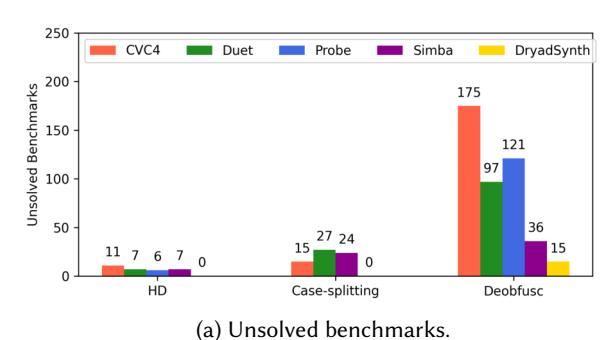

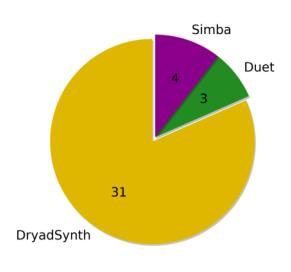

Unsolved benchmarks. (b) Uniquely solved Benchmarks.

Fig. 7. Summary of experimental results.

major performance metrics, including the number of solved problems, execution time, and solution size. The full experimental results can be found in the supplemental material.

Figure 7a shows the number of unsolved benchmarks by each solver, break down by benchmark category. Because Probe is not applicable to the Case-splitting PBE benchmarks, it is not included in the Case-splitting category. As shown in the figure, Dryadsynth can solve all the benchmark from the Hacker's Delight category and the Case-splitting category, while all other solvers have some unsolved benchmarks in each category. For the Deobfuscation benchmarks, Dryadsynth still solves more than all other existing approaches. In Figure 7b, we illustrate the number of benchmarks that can be uniquely solved by each solver. Notably, CVC4 and Probe do not have any uniquely solved benchmarks in our setting, so they are not included in the chart. Among the solvers considered, Dryadsynth stands out by solving 31 entirely new benchmarks, including 5 well-known challenging Hacker's Delight benchmarks. In comparison, Simba and Duet only have 3 and 4 uniquely solved benchmarks, respectively. These results highlight the generalizability and scalability of our method in addressing challenging bit-vector problems.

- Hacker's Delight Figure 8 depicts the time for each solver employed in solving each various Hacker's Delight benchmark. To ensure robustness, we conducted 3 independent trials for each benchmark-solver combination. We show the median result of 3 different trials. Dryadsynth solves all Hacker's Delight benchmarks, including the hardest benchmark hd-25. This shows the effectiveness of Dryadsynth on hard bit-manipulating programs.
- Case-splitting PBE Figure 9 illustrates the remarkable performance of DRYADSYNTH in
  addressing the benchmarks. Notably, DRYADSYNTH shows its capability not only in successfully solving all the benchmarks, but also in requiring less computational time. Moreover, it
  demonstrates its proficiency in generating more concise solutions, particularly for the more
  challenging instances.
- **Deobfuscation** Figure 10 shows that DRYADSYNTH outperforms existing methods when it comes to the Deobfuscation benchmarks. DRYADSYNTH outperforms all other solvers by solving more benchmarks while utilizing significantly less of computational time.

Table 1 shows results for several sample benchmark problems, which shows DRYADSYNTH generally generates small programs. DRYADSYNTH generates slightly larger results for some of the problems such as hd-15, though, due to the utilization of bottom-up deduction.

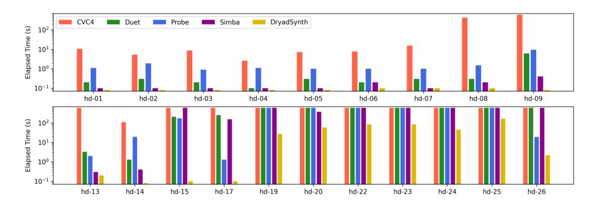

Fig. 8. Solving time for Hacker's Delight benchmarks.

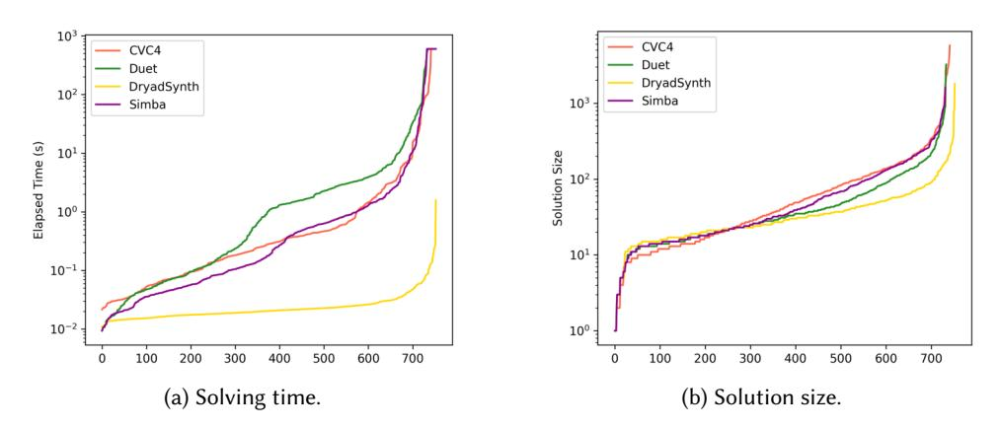

Fig. 9. Solving time and solution size per benchmark in increasing order (Case-splitting).

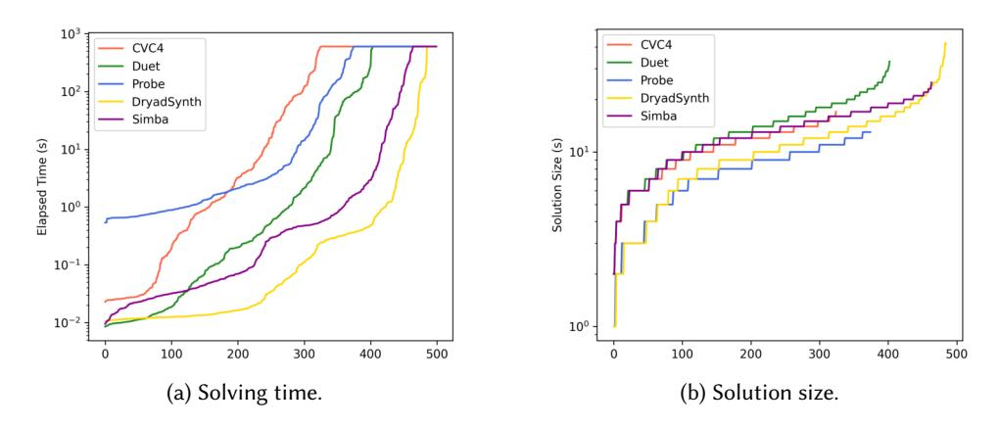

Fig. 10. Solving time and solution size per benchmark in increasing order (Deobfuscation).

#### 7.3 Ablation Studies

To assess the individual contributions of expedited enumeration techniques and bottom-up deduction in enhancing performance, we conducted a comparative analysis between the complete version

| Category            |                    | C        | CVC4         | Pı     | ROBE         | Du     | ET    | Sı                 | MBA  | DryadSynth |      |
|---------------------|--------------------|----------|--------------|--------|--------------|--------|-------|--------------------|------|------------|------|
|                     | Benchmark          | [Barrett | et al. 2011] | [Barke | et al. 2020] | [Lee 2 | 2021] | [Yoon et al. 2023] |      |            |      |
|                     |                    | Time     | Size         | Time   | Size         | Time   | Size  | Time               | Size | Time       | Size |
|                     | hd-05              | 7.2      | 5            | 1.0    | 5            | 0.3    | 5     | 0.1                | 5    | 0.0        | 5    |
| Hacker's<br>Delight | hd-15              | TO       |              | 171.4  | 9            | 206.8  | 12    | TO                 |      | 0.1        | 12   |
|                     | hd-20              | TO       |              | TO     |              | TO     |       | 375.5              | 15   | 58.5       | 15   |
|                     | hd-25              | TO       |              | TO     |              | TO     |       | TO                 |      | 162.2      | 45   |
| Case-splitting      | PRE-107-10         | 0.1      | 32           |        |              | 0.1    | 28    | 0.2                | 50   | 0.0        | 33   |
|                     | PRE-121-10         | 6.1      | 40           |        |              | 4.5    | 54    | 1.7                | 65   | 0.1        | 36   |
|                     | PRE-40-10          | 0.1      | 76           |        |              | 2.3    | 86    | 0.4                | 94   | 0.0        | 21   |
|                     | PRE-icfp-gen-13.15 | 0.5      | 174          |        |              | 9.9    | 310   | 3.2                | 337  | 0.0        | 77   |
| Deobfuscation       | target-15          | 1.3      | 10           | 2.3    | 7            | 0.2    | 10    | 0.4                | 10   | 0.0        | 7    |
|                     | target-192         | 59.6     | 14           | 6.5    | 10           | 0.5    | 15    | 0.5                | 14   | 0.0        | 11   |
|                     | target-305         | TO       |              | Err    |              | TO     |       | TO                 |      | 166.1      | 42   |
|                     | target-356         | TO       |              | то     |              | TO     |       | 449 0              | 20   | 11.5       | 15   |

Table 1. Solving time and solution size for 12 chosen problems.

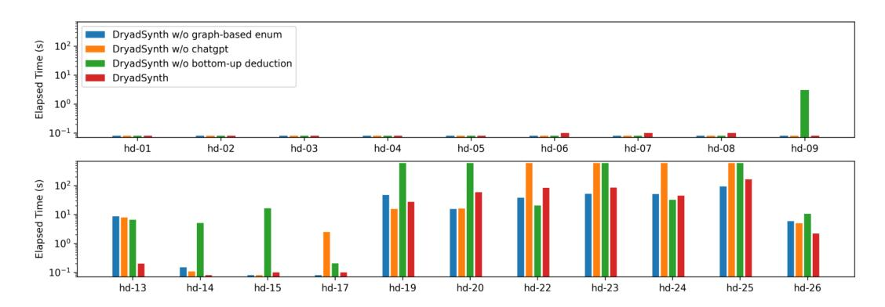

Fig. 11. Ablation studies for Hacker's Delight benchmarks.

of Dryadsynth and other alternative versions. For Hacker's Delight benchmarks, we compare the complete version with 3 versions in Figure 11. In these 3 versions, we turn off graph-based enumeration, LLM-guidance and bottom-up deduction correspondingly. For Case-splitting and Deobfuscation benchmarks, we provided detailed comparison between the complete version and other two versions in Figure 12. First we compare the complete version with the version without bottom-up deduction in Figures 12a and 12b. And then Figures 12c and 12d depict the comparison between the version with expedited enumeration only and the baseline version without any optimization.

Bottom-up deduction. As shown in Figure 11, with the help of bottom-up deduction, DRYADSYNTH solved 4 more problems in Hacker's Delight benchmark. Moreover, Figures 12a and 12b highlight the effectiveness of our bottom-up deduction method for the Case-splitting and Deobfuscation benchmarks. The deduction technique is highly effective for Deobfuscation benchmarks due to the prevalence of invertible operators, which can be easily deduced using our approach. However, its effectiveness is relatively lower for Case-splitting benchmarks, as these benchmarks involve numerous bit-wise shift operations that are challenging to deduce. Moreover, the solutions generated by deduction for Case-splitting benchmarks are often small and can already be efficiently obtained through our expedited enumeration techniques.

*Expedited enumeration.* We now discuss the effectiveness of expedited enumeration, including term-graph-based enumeration, example-guided filtration, and LLM-enhanced grammars. For Hacker's

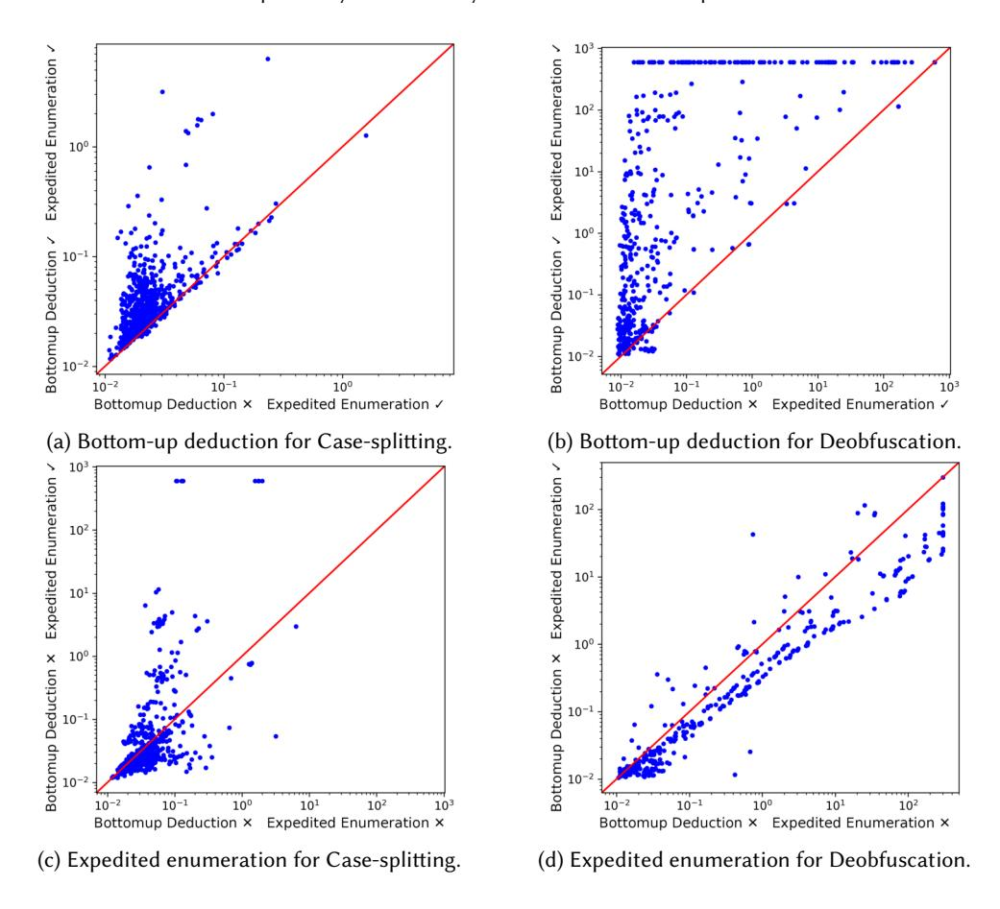

Fig. 12. Ablation studies for Case-splitting and Deobfuscation benchmarks.

Delight benchmarks, as shown in Figure 11, with the help of LLM-guidance, DRYADSYNTH solved 4 more hard problems: hd-22, hd-23, hd-24 and hd-25. Our observations indicate that the guidance of large language models played a pivotal role in the resolution of these benchmarks. For example, the common solution of hd-23 is excessively large (size 249), beyond the capabilities of plain enumeration. Large language models successfully generated a branch of useful subexpressions, which lead to a much simpler version of the problem, solved in 84 seconds.

For other benchmarks, LLM-enhanced grammars are not present as a natural language description of the tasks are not available. In other words, The expedited enumeration includes term-graph-based enumeration and example-guided filtration only. As shown in Figure 12c, with expedited enumeration alone, Dryadsynth was able to solve all the Case-splitting PBE benchmarks, including 9 benchmarks that could not be solved by the baseline version. Note that the Case-splitting benchmarks often involve non-trivial constants, and our term-graph-based enumeration approach can be highly efficient for solving such cases. For the Deobfuscation benchmarks, however, as depicted in Fig 12d, our expedited enumeration had mixed effects and did not clearly improve the performance. We believe this can be explained by the fact that Deobfuscation benchmarks generally have less shared expressions compared to other two categories. For example, our solution

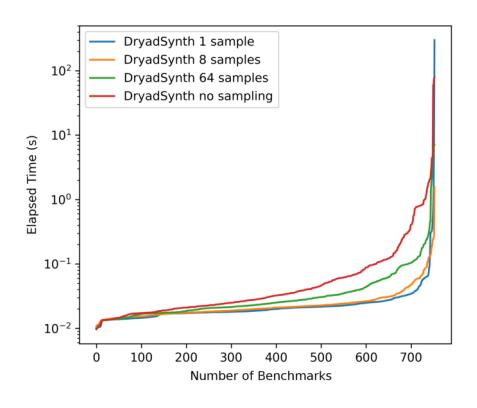

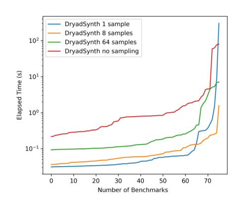

- (a) All Case-splitting benchmarks.
- (b) Hardest 10% of Case-splitting PBE benchmarks.

Fig. 13. Effectiveness of sample size.

Table 2. Three runs of DRYADSYNTH on hd-25 with 20 trials of CHATGPT interaction in each run (✓/X: whether the results contain all subexpressions in Figure 4).

| Trial  | 1 | 2 | 3 | 4 | 5 | 6 | 7 | 8 | 9 | 10 | 11 | 12 | 13 | 14 | 15 | 16 | 17 | 18 | 19 | 20 |
|--------|---|---|---|---|---|---|---|---|---|----|----|----|----|----|----|----|----|----|----|----|
| Run #1 | X | ✓ | / | X | Х | Х | X | X | X | Х  | Х  | Х  | Х  | 1  | Х  | 1  | Х  | Х  | ✓  | 1  |
| Run #2 | 1 | X | X | X | 1 | X | 1 | 1 | X | X  | X  | X  | X  | X  | 1  | X  | 1  | X  | X  | ✓  |
| Run #3 | 1 | 1 | X | 1 | X | 1 | X | X | 1 | 1  | X  | 1  | 1  | X  | 1  | 1  | 1  | X  | X  | /  |

for target-55 has size 25, which is even larger than the solution for the Example 2.1 presented earlier, but doesn't have any shared subexpressions.

Sampling. Our sampling method generally proves to be effective, as evidenced by the results depicted in Figure 13. Dryadsynth with 8 samples, as a sweet spot, consistently outperforms both Dryadsynth with 64 samples and Dryadsynth with no samples across a range of benchmarks. However, it is worth noting that Dryadsynth with just 1 sample introduces a substantial overhead for some of the most challenging benchmarks (see Figure 13b). Figure 13a showcases the overall time performance, while Figure 13b specifically focuses on the top 10% hardest benchmarks from Figure 13a. These results highlight the trade-off between sampling size and computational overhead, emphasizing the importance of finding an optimal balance in order to achieve the desired performance outcomes.

Effectiveness of Clustering in LLM-guidance. The uncertainty of LLM output can be a threat to the reproducibility of our approach; that is also one of the reasons we adopt the clustering method as described in Section 4.3. We examined the effectiveness of our clustering method through a single benchmark, hd-25. Table 2 summarizes the results from three Dryadsynth runs on hd-25. Each run involves 20 independent trials of ChatGPT interaction, each with three randomly chosen input-output examples. We indicate whether these results contain the specific subexpressions shown in Figure 4 using the checkmark symbol  $\checkmark/x$ . As shown in the table, the anticipated subexpressions are present in at least 6 trials of each run, surpassing the threshold of 4 occurrences. The result shows that Dryadsynth can consistently produce the same result for challenging tasks such as hd-25.

#### 8 RELATED WORK

Enumerative synthesis. Enumerative program synthesis is widely recognized for its effectiveness, with solvers like CVC4 [Barrett et al. 2011] being regarded as top performers in the SyGuS-Comp competition. Enumerative synthesizers explore vast search spaces and employ various techniques to prune the search space efficiently. One common technique for search space pruning in bottom-up enumeration is observational equivalence (OE) [Albarghouthi et al. 2013; Udupa et al. 2013], which has been successfully applied in many bottom-up synthesizers, including DRYADSYNTH. Other bottom-up solvers, such as CVC4 [Barrett et al. 2011; Nötzli et al. 2019], generate and optimize rewrite rules to accelerate equivalence checking in bottom-up enumeration. For top-down enumeration, there exist various syntactic and semantic pruning techniques. For example, EuPhony [Lee et al. 2018] uses a weaker version of OE that compares the complete parts of incomplete programs observationally and their incomplete parts syntactically.

In recent years, researchers have explored different enumeration orders based on learning-based methods. For instance, Probe [Barke et al. 2020] utilizes just-in-time learning to guide the search based on a probabilistic model. It employs *probabilistic context-free grammars* (PCFG) and assigns scores to each production rule based on the learning context. EuPhony [Lee et al. 2018] incorporates a learned context in the form of a *probabilistic higher-order grammar* (PHOG), which provides more information to the model. DeepCoder [Balog et al. 2017] guides enumeration using a "Sort and add" scheme, prioritizing the most probable functions and adding less probable functions when the search fails. However, these methods do not effectively leverage natural language information and may struggle to guide enumeration for complex bit-manipulation problems.

Deductive synthesis. There is a range of work that embodies deduction to program synthesis. Illustratively, λ2 [Feser et al. 2015] and FlashMeta [Polozov and Gulwani 2015] have employed deduction, employing inverse semantics or refutation, to deconstruct the synthesis task and direct the program search; Morpheus [Feng et al. 2017] and Neo [Feng et al. 2018] leverage deduction to efficiently curtail the search space traversed during enumeration. For bit-vector problems, Brahma [Gulwani et al. 2011] embodies component-based synthesis which views synthesis problem as a wiring problem between given components (operators). By represent the wiring problem as SMT constraints, Brahma can solve hard bit-manipulation problem. However, Brahma requires each component appear once in the solution, which means user have to provide guidance on how many times a single operator will be used in a solution.

Meet-in-the-middle synthesis. In recent years, several approaches have been proposed that explore program synthesis from both directions. Dryadsynth [Huang et al. 2020] adopts a repetitive approach of subdividing synthesis problems into distinct subproblems, which are then addressed through deduction or enumeration techniques in isolation. However, Dryadsynth is not specialized for example-based synthesis and does not support bit-vector synthesis. FlashFill+ [Cambronero et al. 2023] is recent work that allows DSL designers to provide additional guidance by cutting the grammar in the middle, thus decomposing the synthesis problem. Their system focuses on synthesizing string transformations only. Duet [Lee 2021] combines bottom-up enumeration with top-down propagation, harnessing the expressions generated from the bottom-up process as integral components for the top-down framework. The key different between their top-down propagation and our bottom-up deduction is that, the top-down propagation considers all enumerated expressions for decomposition, while the bottom-up deduction maintains a candidate set for each position, and considers only expressions that can potentially lead to successful deduction. SIMBA [Yoon et al. 2023] introduces forward-backward abstract interpretation as a powerful technique to further prune

the search space using input-output examples. While above methods leverage various search-space pruning techniques, they all perform traditional syntax-tree-based enumeration only.

Combining conditions and expressions. There are some research devoted to synthesizing conditional expressions. EuSolver [Alur et al. 2017] view the problem of combining expressions and conditions as a multi-label decision tree problems, and uses information-gain based heuristics to learn compact decision trees. Besides the term-graph-based enumeration, our Algorithm 1 is very similar to EuSolver's enumeration. One distinction is that we employ example-based filtration and eagerly discard useless expressions and conditions that do not contribute to any example. Polygen [Ji et al. 2021] presents synthesis through unification (STUN) which unifies terms after all set of terms are synthesized, and provides theoretically guarantee of Occam learning.

*E-graph-based Enumeration.* A line of research [Nandi et al. 2021; Polozov and Gulwani 2015; Reynolds et al. 2019] uses *e-graph* for enumeration, which resembles our graph-based enumeration technique. The most important difference between term graphs and e-graphs is that term graphs only merge shared terms and e-graphs also merge semantically equivalent terms under a theory. However, checking equivalence for terms and rules can be very expensive, especially for example-based synthesis problems which are the focus of this paper. The fact that DRYADSYNTH outperforms other tools (e.g., CVC4 which performs theory rewriting [Reynolds et al. 2019]) seems to suggest that e-graphs and rewrite rules may not provide significant benefits in the realm of bit-vector synthesis; but further investigation in future research is needed.

#### 9 CONCLUSIONS AND FUTURE WORK

We have presented enhanced enumeration techniques for syntax-guided synthesis of bit-vector manipulations. We addressed the challenges associated with the complexity of bit-vector synthesis by proposing a novel synthesis approach that incorporates various factors to guide the enumeration process. The techniques, including term-graph-based enumeration, example-guided filtration, guidance from large language models, expedite the synthesis process and improve scalability. Furthermore, the incorporation of bottom-up deduction enhances the enumeration algorithm by considering subproblems that contribute to the deductive resolution. The implementation of our techniques in the Dryadsynth solver demonstrated superior performance compared to state-of-the-art solvers.

While our methodology is primarily tailored for bit-vectors, we believe the techniques introduced in this paper can be extended to address challenges in other syntax-guided synthesis problems that encounter similar difficulties. For example, in the domain of strings, string concatenation is an invertible operator. Through a bottom-up deductive approach, we may concatenate two string expressions to form a solution immediately after both the two expressions are enumerated. However, our approach cannot be directly employed for loop-based operators like map and foldLeft, which are crucial for solving some string and data-processing problems. To handle these operators, supplementary mechanisms are needed.

Our approach of using large language models (LLMs) for guidance has the potential to be applied in various domains. The LLM-based methods will be especially suitable for string problems, as text-based inputs often contain a lot of information that can be understood and utilized by a powerful language model. However, LLMs typically capture the general picture while neglecting specific instances, necessitating the incorporation of additional mechanism to split the examples using ITE operator. Furthermore, LLMs are often slow and costly. When dealing with extensive input, it is imperative to select valuable data points fed into the LLMs.

#### DATA-AVAILABILITY STATEMENT

A reproduction package for the experiments from this paper is available on Zenodo [Ding and Qiu 2023].

#### **ACKNOWLEDGMENTS**

We would like to thank Yanjun Wang for the fruitful discussions we had when we started this project.

This publication is based upon work supported by the National Science Foundation under Award Nos. CCF-1837023, CCF-2046071 and CCF-2319425. Any opinions, findings and conclusions or recommendations expressed in this publication are those of the authors and do not necessarily reflect the views of the National Science Foundation.

#### REFERENCES

- Aws Albarghouthi, Sumit Gulwani, and Zachary Kincaid. 2013. Recursive Program Synthesis. In *Computer Aided Verification*, Natasha Sharygina and Helmut Veith (Eds.). Springer Berlin Heidelberg, Berlin, Heidelberg, 934–950.
- Rajeev Alur, Pavol Černý, and Arjun Radhakrishna. 2015. Synthesis Through Unification. In *Computer Aided Verification*, Daniel Kroening and Corina S. Păsăreanu (Eds.). Springer International Publishing, Cham, 163–179.
- Rajeev Alur, Arjun Radhakrishna, and Abhishek Udupa. 2017. Scaling Enumerative Program Synthesis via Divide and Conquer. In *Tools and Algorithms for the Construction and Analysis of Systems*, Axel Legay and Tiziana Margaria (Eds.). Springer Berlin Heidelberg, Berlin, Heidelberg, 319–336.
- Rajeev Alur, Rishabh Singh, Dana Fisman, and Armando Solar-Lezama. 2018. Search-based program synthesis. *Commun. ACM* 61, 12 (Nov 2018), 84–93. https://doi.org/10.1145/3208071
- Matej Balog, Alexander L. Gaunt, Marc Brockschmidt, Sebastian Nowozin, and Daniel Tarlow. 2017. DeepCoder: Learning to Write Programs. In *International Conference on Learning Representations*. https://openreview.net/forum?id=ByldLrqlx Shraddha Barke, Hila Peleg, and Nadia Polikarpova. 2020. Just-in-Time Learning for Bottom-up Enumerative Synthesis.
- Proc. ACM Program. Lang. 4, OOPSLA, Article 227 (nov 2020), 29 pages. https://doi.org/10.1145/3428295
- Clark Barrett, Christopher L. Conway, Morgan Deters, Liana Hadarean, Dejan Jovanović, Tim King, Andrew Reynolds, and Cesare Tinelli. 2011. CVC4. In *Computer Aided Verification*, Ganesh Gopalakrishnan and Shaz Qadeer (Eds.). Springer Berlin Heidelberg, Berlin, Heidelberg, 171–177.
- Clark Barrett, Pascal Fontaine, and Cesare Tinelli. 2017. *The SMT-LIB Standard: Version 2.6.* Technical Report. Department of Computer Science, The University of Iowa. Available at www.SMT-LIB.org.
- José Pablo Cambronero, Sumit Gulwani, Vu Le, Daniel Perelman, Arjun Radhakrishna, Clint Simon, and Ashish Tiwari. 2023. FlashFill++: Scaling Programming by Example by Cutting to the Chase. *Proceedings of the ACM on Programming Languages* 7 (2023), 952 981.
- Yanju Chen, Chenglong Wang, Osbert Bastani, Isil Dillig, and Yu Feng. 2020. Program Synthesis Using Deduction-Guided Reinforcement Learning. In *Computer Aided Verification*, Shuvendu K. Lahiri and Chao Wang (Eds.). Springer International Publishing, Cham, 587–610.
- Yuantian Ding and Xiaokang Qiu. 2023. Reproduction Package (VirtualBox Image) for the POPL 2024 Article 'Enhanced Enumeration Techniques for Syntax-Guided Synthesis of Bit-Vector Manipulations'. https://doi.org/10.5281/zenodo.10129930
- Yu Feng, Ruben Martins, Osbert Bastani, and Isil Dillig. 2018. Program Synthesis Using Conflict-driven Learning. In Proceedings of the 39th ACM SIGPLAN Conference on Programming Language Design and Implementation (Philadelphia, PA, USA) (PLDI 2018). ACM, New York, NY, USA, 420–435. https://doi.org/10.1145/3192366.3192382
- Yu Feng, Ruben Martins, Jacob Van Geffen, Isil Dillig, and Swarat Chaudhuri. 2017. Component-based Synthesis of Table Consolidation and Transformation Tasks from Examples. In Proceedings of the 38th ACM SIGPLAN Conference on Programming Language Design and Implementation (Barcelona, Spain) (PLDI 2017). ACM, New York, NY, USA, 422–436. https://doi.org/10.1145/3062341.3062351
- John K. Feser, Swarat Chaudhuri, and Isil Dillig. 2015. Synthesizing Data Structure Transformations from Input-Output Examples. In Proceedings of the 36th ACM SIGPLAN Conference on Programming Language Design and Implementation (Portland, OR, USA) (PLDI '15). Association for Computing Machinery, New York, NY, USA, 229–239. https://doi.org/10. 1145/2737924.2737977
- Glenn Fowler, Landon Curt Noll, and Phong Vo. 1991. Fowler-Noll-Vo (FNV) Hash Function. Fowler-Noll-Vo Website. http://www.isthe.com/chongo/tech/comp/fnv/
- Richard Garner. 2011. An abstract view on syntax with sharing. Journal of Logic and Computation 22, 6 (09 2011), 1427–1452. https://doi.org/10.1093/logcom/exr021

- Sumit Gulwani. 2011. Automating String Processing in Spreadsheets Using Input-output Examples. In *Proceedings of the 38th Annual ACM SIGPLAN-SIGACT Symposium on Principles of Programming Languages* (Austin, Texas, USA) (*POPL '11*). ACM, New York, NY, USA, 317–330. https://doi.org/10.1145/1926385.1926423
- Sumit Gulwani, Susmit Jha, Ashish Tiwari, and Ramarathnam Venkatesan. 2011. Synthesis of Loop-free Programs. In *Proceedings of the 32nd ACM SIGPLAN Conference on Programming Language Design and Implementation* (San Jose, California, USA) (*PLDI '11*). ACM, New York, NY, USA, 62–73. https://doi.org/10.1145/1993498.1993506
- Kangjing Huang, Xiaokang Qiu, Peiyuan Shen, and Yanjun Wang. 2020. Reconciling Enumerative and Deductive Program Synthesis. In *Proceedings of the 41st ACM SIGPLAN Conference on Programming Language Design and Implementation* (London, UK) (*PLDI 2020*). Association for Computing Machinery, New York, NY, USA, 1159–1174. https://doi.org/10.1145/3385412.3386027
- Shachar Itzhaky, Hila Peleg, Nadia Polikarpova, Reuben N. S. Rowe, and Ilya Sergey. 2021. Cyclic Program Synthesis. In *Proceedings of the 42nd ACM SIGPLAN International Conference on Programming Language Design and Implementation* (Virtual, Canada) (*PLDI 2021*). Association for Computing Machinery, New York, NY, USA, 944–959. https://doi.org/10.1145/3453483.3454087
- Jinseong Jeon, Xiaokang Qiu, Armando Solar-Lezama, and Jeffrey S. Foster. 2015. Adaptive Concretization for Parallel Program Synthesis. In *Computer Aided Verification*, Daniel Kroening and Corina S. Păsăreanu (Eds.). Springer International Publishing, Cham, 377–394.
- Jinseong Jeon, Xiaokang Qiu, Armando Solar-Lezama, and Jeffrey S. Foster. 2017. An Empirical Study of Adaptive Concretization for Parallel Program Synthesis. Formal Methods in System Design (FMSD) 50, 1 (March 2017), 75–95.
- Ruyi Ji, Jingtao Xia, Yingfei Xiong, and Zhenjiang Hu. 2021. Generalizable Synthesis through Unification. Proc. ACM Program. Lang. 5, OOPSLA, Article 167 (oct 2021), 28 pages. https://doi.org/10.1145/3485544
- Woosuk Lee. 2021. Combining the Top-down Propagation and Bottom-up Enumeration for Inductive Program Synthesis. *Proc. ACM Program. Lang.* 5, POPL, Article 54 (jan 2021), 28 pages. https://doi.org/10.1145/3434335
- Woosuk Lee, Kihong Heo, Rajeev Alur, and Mayur Naik. 2018. Accelerating Search-based Program Synthesis Using Learned Probabilistic Models. In Proceedings of the 39th ACM SIGPLAN Conference on Programming Language Design and Implementation (Philadelphia, PA, USA) (PLDI 2018). ACM, New York, NY, USA, 436–449. https://doi.org/10.1145/ 3192366.3192410
- Vijayaraghavan Murali, Letao Qi, Swarat Chaudhuri, and Chris Jermaine. 2018. Neural Sketch Learning for Conditional Program Generation. In *International Conference on Learning Representations*. https://openreview.net/forum?id=HkfXMz-Ab
- Chandrakana Nandi, Max Willsey, Amy Zhu, Yisu Remy Wang, Brett Saiki, Adam Anderson, Adriana Schulz, Dan Grossman, and Zach Tatlock. 2021. Rewrite rule inference using equality saturation. *Proceedings of the ACM on Programming Languages* 5 (2021), 1 28. https://api.semanticscholar.org/CorpusID:237278534
- Aina Niemetz and Mathias Preiner. 2020. Ternary Propagation-Based Local Search for more Bit-Precise Reasoning. In 2020 Formal Methods in Computer Aided Design (FMCAD). TU Wien Academic Press, 214–224. https://doi.org/10.34727/2020/isbn.978-3-85448-042-6 29
- Andres Nötzli, Andrew Reynolds, Haniel Barbosa, Aina Niemetz, Mathias Preiner, Clark Barrett, and Cesare Tinelli. 2019. Syntax-Guided Rewrite Rule Enumeration for SMT Solvers. In *Theory and Applications of Satisfiability Testing SAT 2019*, Mikoláš Janota and Inês Lynce (Eds.). Springer International Publishing, Cham, 279–297.
- OpenAI. 2022. ChatGPT: Large-scale Language Models for Conversational AI. OpenAI Website. https://openai.com/research/chatgpt
- Peter-Michael Osera and Steve Zdancewic. 2015. Type-and-Example-Directed Program Synthesis. In *Proceedings of the 36th ACM SIGPLAN Conference on Programming Language Design and Implementation* (Portland, OR, USA) (*PLDI '15*). Association for Computing Machinery, New York, NY, USA, 619–630. https://doi.org/10.1145/2737924.2738007
- Nadia Polikarpova and Ilya Sergey. 2019. Structuring the synthesis of heap-manipulating programs. *Proceedings of the ACM on Programming Languages* 3, POPL (Jan 2019), 1–30. https://doi.org/10.1145/3290385
- Oleksandr Polozov and Sumit Gulwani. 2015. FlashMeta: A Framework for Inductive Program Synthesis. In *Proceedings of the 2015 ACM SIGPLAN International Conference on Object-Oriented Programming, Systems, Languages, and Applications* (Pittsburgh, PA, USA) (OOPSLA 2015). Association for Computing Machinery, New York, NY, USA, 107–126. https://doi.org/10.1145/2814270.2814310
- J. Ross Quinlan. 1986. Induction of Decision Trees. Machine Learning 1, 1 (1986), 81-106.
- Andrew Reynolds, Haniel Barbosa, Andres Nötzli, Clark Barrett, and Cesare Tinelli. 2019. cvc4sy: Smart and Fast Term Enumeration for Syntax-Guided Synthesis. In *Computer Aided Verification*, Isil Dillig and Serdar Tasiran (Eds.). Springer International Publishing, Cham, 74–83.
- Andrew Reynolds, Morgan Deters, Viktor Kuncak, Cesare Tinelli, and Clark Barrett. 2015. Counterexample-Guided Quantifier Instantiation for Synthesis in SMT. In *Computer Aided Verification*, Daniel Kroening and Corina S. Păsăreanu (Eds.). Springer International Publishing, Cham, 198–216.

Xujie Si, Yuan Yang, Hanjun Dai, Mayur Naik, and Le Song. 2019. Learning a Meta-Solver for Syntax-Guided Program Synthesis. In *International Conference on Learning Representations*. OpenReview. https://openreview.net/forum?id=Syl8Sn0cK7

Armando Solar-Lezama, Liviu Tancau, Rastislav Bodik, Sanjit Seshia, and Vijay Saraswat. 2006. Combinatorial Sketching for Finite Programs. In Proceedings of the 12th International Conference on Architectural Support for Programming Languages and Operating Systems (San Jose, California, USA) (ASPLOS XII). Association for Computing Machinery, New York, NY, USA, 404–415. https://doi.org/10.1145/1168857.1168907

Saurabh Srivastava, Sumit Gulwani, and Jeffrey S. Foster. 2010. From Program Verification to Program Synthesis. In *Proceedings of the 37th Annual ACM SIGPLAN-SIGACT Symposium on Principles of Programming Languages* (Madrid, Spain) (POPL '10). Association for Computing Machinery, New York, NY, USA, 313–326. https://doi.org/10.1145/1706299.1706337

Abhishek Udupa, Arun Raghavan, Jyotirmoy V. Deshmukh, Sela Mador-Haim, Milo M.K. Martin, and Rajeev Alur. 2013. TRANSIT: Specifying Protocols with Concolic Snippets. In Proceedings of the 34th ACM SIGPLAN Conference on Programming Language Design and Implementation (Seattle, Washington, USA) (PLDI '13). Association for Computing Machinery, New York, NY, USA, 287–296. https://doi.org/10.1145/2491956.2462174

Henry S. Jr. Warren. 2012. Hacker's Delight (2 ed.). Addison-Wesley Professional.

Yongho Yoon, Woosuk Lee, and Kwangkeun Yi. 2023. Inductive Program Synthesis via Iterative Forward-Backward Abstract Interpretation. *Proc. ACM Program. Lang.* 7, PLDI, Article 174 (jun 2023), 25 pages. https://doi.org/10.1145/3591288

Received 2023-07-11; accepted 2023-11-07