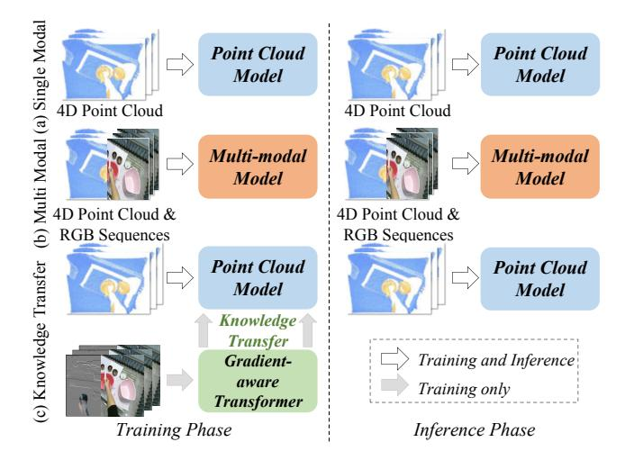
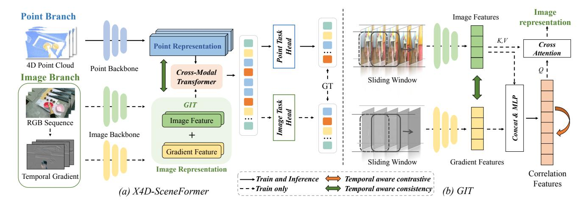
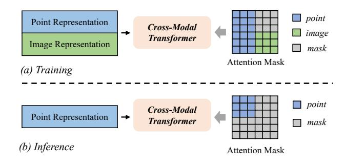
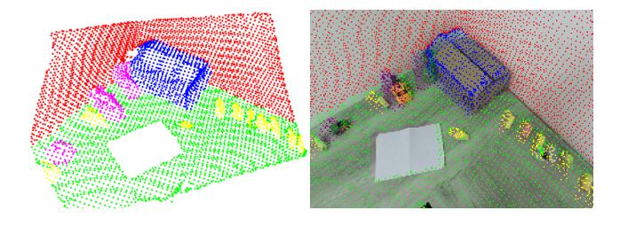
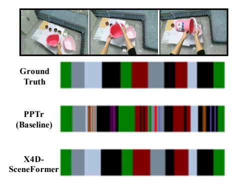
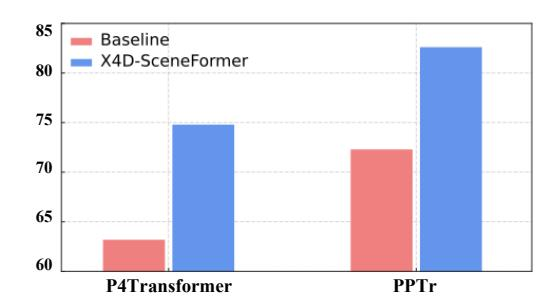

# X4D-SceneFormer: Enhanced Scene Understanding on 4D Point Cloud Videos through Cross-Modal Knowledge Transfer

Linglin Jing $^{4,1*}$ , Ying Xue $^{2,3*}$ , Xu Yan $^{2,3\dagger}$ , Chaoda Zheng $^{2,3}$ , Dong Wang $^1$ , Ruimao Zhang $^{3,2}$ , Zhigang Wang $^1$ , Hui Fang $^4$ , Bin Zhao $^1$ , Zhen Li $^{3,2\dagger}$ 

1Shanghai AI laboratory
2FNii, CUHK-Shenzhen
3SSE, CUHK-Shenzhen
4Department of Computer Science, Loughborough University
{jinglinglin}@pjlab.org.cn, {xuyan1@link., lizhen@}cuhk.edu.cn

#### Abstract

The field of 4D point cloud understanding is rapidly developing with the goal of analyzing dynamic 3D point cloud sequences. However, it remains a challenging task due to the sparsity and lack of texture in point clouds. Moreover, the irregularity of point cloud poses a difficulty in aligning temporal information within video sequences. To address these issues, we propose a novel cross-modal knowledge transfer framework, called X4D-SceneFormer. This framework enhances 4D-Scene understanding by transferring texture priors from RGB sequences using a Transformer architecture with temporal relationship mining. Specifically, the framework is designed with a dual-branch architecture, consisting of an 4D point cloud transformer and a Gradient-aware Image Transformer (GIT). The GIT combines visual texture and temporal correlation features to offer rich semantics and dynamics for better point cloud representation. During training, we employ multiple knowledge transfer techniques, including temporal consistency losses and masked self-attention, to strengthen the knowledge transfer between modalities. This leads to enhanced performance during inference using singlemodal 4D point cloud inputs. Extensive experiments demonstrate the superior performance of our framework on various 4D point cloud video understanding tasks, including action recognition, action segmentation and semantic segmentation. The results achieve **1st places**, *i.e.*, **85.3%** (+7.9%) accuracy and 47.3% (+5.0%) mIoU for 4D action segmentation and semantic segmentation, on the HOI4D challenge, outperforming previous state-of-the-art by a large margin. We release the code at https://github.com/jinglinglingling/X4D.

# Introduction

Exploring point cloud sequences in 4D (integrating 3D space with 1D time) has garnered considerable interest in recent years (Fan and Kankanhalli 2021; Wen et al. 2022; Liu et al. 2022) due to their capacity to offer a wealth of dynamic information within our 3D environment. Compared to conventional videos, 4D point clouds deliver direct access to

Figure 1: 4D Cross-Modal Knowledge Transfer. (a) Previous 4D point cloud analysis methods take point cloud only as their input. (b) Although cross-modal approaches enhance performance, they introduce extra computation overhead in both training and inference. (c) Our method takes additional 2D images during the training for 4D cross-modal knowledge transfer. During the inference, the point cloud model can be independently deployed.

geometric information in 3D space, a facet particularly advantageous for real-world interactions. These attributes are pivotal for understanding 3D dynamic environments, including tasks like action recognition/segmentation (Hoai, Lan, and De la Torre 2011; Jing et al. 2022), and 4D semantic segmentation (Xie, Tian, and Zhu 2020).

Previous works in 4D point cloud representation learning predominantly stem from extending existing 3D point cloud models (Fan and Kankanhalli 2021; Wen et al. 2022) to 4D, which involves incorporating additional temporal learning modules that enable feature interactions across time (Xiao et al. 2022; Zhong et al. 2022). However, due to the sparsity and lack of texture in point clouds, these methods are limited in capturing comprehensive semantic details. Nevertheless, such semantic information remains crucial, particularly for

\*These authors contributed equally.

&lt;sup>†Corresponding authors: Xu Yan and Zhen Li. Copyright © 2024, Association for the Advancement of Artificial Intelligence (www.aaai.org). All rights reserved.

tasks demanding meticulous reasoning, such as 4D semantic segmentation and action segmentation. A plausible approach to address this limitation involves integrating supplementary texture information from RGB images to enhance the 4D point cloud representation, similar to methods employed in previous cross-modal studies (Cui et al. 2021; Yan et al. 2022). Nevertheless, as shown in Figure 1(b), the concurrent processing of data from two modalities unavoidably introduces additional network designs and computational overhead, posing challenges in online 4D video tasks.

In this paper, we present a solution to address the aforementioned challenges through cross-modal knowledge transfer. This approach efficiently transfers color and texture-aware knowledge from 2D images to an arbitrary point-based model, while avoiding extra computational cost during the inference phase, as depicted in Figure 1(c). Our framework stands apart from prior cross-modal approaches that solely focus on knowledge transfer between static frame pairs (Crasto et al. 2019). Notably, it places extra emphasis on ensuring motion and temporal alignment during the knowledge transfer.

The proposed framework, X4D-SceneFormer, takes multi-modal data (i.e., 4D point cloud, RGB sequences) as input during training, and achieves superior performance using only point cloud data during inference. Specifically, there are two branches in our training framework, processing point cloud and RGB sequence independently. For the point branch, we simply deploy an off-the-shelf 4D point cloud processor for the sake of simplicity. For the image branch, we introduce a Gradient-aware Image Transformer (GIT) to learn strong image semantics. GIT takes into account the temporal gradient (TG) as an added input from adjacent image frames to enhance its comprehension of motion dynamics. Additionally, multi-level consistency losses are introduced to address both motion-related aspects and temporal alignment. Subsequently, the semantic and motion features are integrated into a unified visual representation through cross-attention. These merged representations are then combined with the extracted point cloud representations, forming a stacked input for further processing with a cross-modal transformer. By employing carefully-designed attention masks, the cross-modal transformer can be deployed with only point cloud inputs during inference, while still incorporating multi-modal knowledge. In such a manner, it achieves significant improvements in effectively leveraging multi-modal information and ensuring consistent motion alignment, making it a promising solution for various 4D point cloud tasks.

In summary, the contributions of this work are:

- *Generality:* We propose X4D-SceneFormer, the first cross-modal knowledge transfer architecture for 4D point cloud understanding, where arbitrary point-based models can be easily integrated into this framework for cross-modal knowledge transfer.
- *Flexibility:* We propose Gradient-aware Image Transformer (GIT) to provide temporal-aware and texture-aware features guidance. We also propose multi-level consistency metrics, employing a cross-modal trans-

- former, to enhance knowledge transfer for the point cloud model. Notably, these techniques are only applied during training, ensuring that the point cloud model can be independently deployed during inference.
- *Effectiveness:* Extensive experiments on three tasks show that our method outperforms previous state-of-the-art methods by a large margin. This highlights the superiority of our approach in 4D point cloud understanding.

#### **Related Works**

## **Image-based Video Analysis**

Previous image-based video analysis approaches (Crasto et al. 2019) extract the global feature via RNN or 1D CNN (Lea et al. 2017). After that, the following works enhance the performance through using two-stream network (Ju et al. 2023), pooling techniques (Fernando et al. 2016) and extracting averaged features from stridden sampled frames (Wang et al. 2016). In contrast, 3D CNNs (Fernando et al. 2016) or sparse 3D convolution (Graham, Engelcke, and Van Der Maaten 2018) jointly learn spatialtemporal features by organizing 2D frames into 3D structures to learn temporal relations implicitly. Recently, Vision Transformer (ViT) (Dosovitskiy et al. 2020) proposes a pure transformer architecture replacing all convolutions with selfattention, and achieved excellent results. Built on the ViT architecture, Timesformer and ViViT (Arnab et al. 2021) extend 2D spatial self-attention to the 3D spatial-temporal vol-

#### **4D Point Cloud Processing**

There are two mainstreams for 4D Point cloud video modeling: (1) voxel-based and (2) points-based approaches. Voxelbased methods first convert 4D point cloud into 2D voxel sequences, subsequently leveraging 3D convolutions to extract sequential features. For instance, MinkowskiNet (Choy, Gwak, and Savarese 2019) harnesses 4D sparse convolution, effectively mining features from valid voxel grids. 3DV (Wang et al. 2020) employs temporal rank pooling to fuse point motion within voxel sets, thereafter employing PointNet++ (Qi et al. 2017) to extrapolate point representations. On the other hand, traditional points-based methods take raw point cloud as input, and exploits RNN (Fan and Yang 2019), appending a temporal features (Liu, Yan, and Bohg 2019) and point spatial-temporal convolutions (Fan et al. 2022) to encode temporal features. Nevertheless, the above methods only focus on static scene representations. Recently, P4Transformer (Fan and Kankanhalli 2021) introduces 4D point coevolution and then learns the temporal features in a Transformer architecture. Building on this, PPTr (Wen et al. 2022) further boosts the performance by incorporating primitive planes as prior knowledge, thereby enhancing the capture of enduring spatial-temporal context in 4D point cloud videos. PST-Transformer (Fan, Yang, and Kankanhalli 2022) encodes spatio-temporal structure by utilizing video-level self-attention to search related points adaptively. Notwithstanding these advancements, the existing methods typically cater to sparse and texture-limited

Figure 2: The architecture of X4D-SceneFormer and GIT. (a) During the training phase, X4D-SceneFormer takes both image sequence and 4D point cloud as input, where the dual branches independently extract representations and are supervised by ground truths. A cross-modal Transformer process is applied between two representations. (b) The Gradient-aware Image Transformer (GIT) employs a sliding window strategy to establish temporal relationships and acquires a correlation feature through the cross-attention. Moreover, GIT applies two temporal-aware criteria in its processes.

point cloud inputs, ignoring rich texture and motion information in 2D images.

## **Cross-Modality Learning and Knowledge Transfer**

Given that point cloud and images are capable of capturing distinct and complementary information pertaining to a scene, significant endeavors (Yan et al. 2022; Afham et al. 2022) have been undertaken to integrate multi-modal features in order to enhance perception. However, the integration of multi-modal methods inevitably introduces additional computational burden and requires additional network design. As a result, recent works have focused on developing stronger single-modal models through the crossmodal knowledge transfer. Typically, knowledge transfer (KD) was originally proposed to compress integrated classifiers (teacher) into smaller networks (student) without significant performance loss (Hinton, Vinyals, and Dean 2015). Recently, KD has been extended to 3D perception tasks for transferring knowledge across different modalities. Several approaches have been proposed for 3D object detection (Wang et al. 2020), 3D semantic segmentation (Hou et al. 2022), and other tasks (Yang et al. 2021). Moreover, there are some previous approaches utilize contrastive criterion (Zhang et al. 2023) to enhance the knowledge transfer during the training phrase. Inspired by these works, we first time investigate cross-modal knowledge transfer in the task of 4D point cloud analysis. In contrast with previous methods that solely focus on distilling static spatial information, our architecture integrate motion and temporal alignment during the knowledge transfer.

## Methods

In this paper, we introduce a novel cross-modality knowledge transfer approach that employs texture and motion priors to assist 4D point cloud analysis. As shown in Figure 2,

our architecture consists of two branches, where the upper branch takes the normal 4D point cloud analysis model as the backbone while the other exploits extra RGB sequence to extract the prior knowledge. After that, we utilize a crossmodal Transformer to transform the cross-modal knowledge with masked attention. Besides, several knowledge transfer constraints are applied between the two modalities.

#### **Problem Formulation**

The task of 4D point cloud analysis takes a point cloud video consisting of T frames with N points as input, which can be denoted as  $\mathcal{P} \in \mathbb{R}^{T \times N \times 3}$ . Typically, there are three main tasks in the 4D point cloud analysis: 4D semantic segmentation, action segmentation and action recognition. The description of the above tasks can be formulated as

$$SemSeg: \mathbb{R}^{T \times N \times 3} \mapsto \mathbb{R}^{T \times N}, \tag{1}$$

$$ActionSeg: \mathbb{R}^{T \times N \times 3} \mapsto \mathbb{R}^{T}, \tag{2}$$

ActionRecog: 
$$\mathbb{R}^{T \times N \times 3} \mapsto \mathbb{R}^1$$
, (3)

where the former two segmentation tasks perform classification on point and frame levels respectively, and the recognition task identify single action for the whole video.

To assist the single-modal model during the training stage, we introduced RGB sequence as an additional input, denoted as  $\mathcal{I} \in \mathbb{R}^{T \times H \times W \times 3}$  with the size of  $H \times W$ . Taking 4D semantic segmentation as an example, the above task will be modified during the training:

SemSeg: 
$$\mathbb{R}^{T \times N \times 3} \times \mathbb{R}^{T \times H \times W \times 3} \mapsto \mathbb{R}^{T \times N}$$
. (4)

During the inference, the 4D point cloud model can be independently deployed and the formulation keeps the same as Eqn. (1).

Figure 3: Masked attention in the cross-modal transformer. The attention mask prevents point representation  $\mathcal{F}_h^P$  from attending on image representation  $\mathcal{F}_h^I$  in training (top three rows of the mask), avoiding performance drop in inference when  $\mathcal{F}_h^I$  is not available.

#### **4D Point Cloud Architecture**

The architecture of the 4D point cloud model (Point Backbone) is illustrated in the left section of Figure 2. Following the previous works (Fan and Kankanhalli 2021), We adopt point 4D convolution (P4Conv) as the encoder, generating the 4D point features with the shape of  $\mathcal{F}_l^P \in \mathbb{R}^{T \times M \times D}$ , where M and D are a number of subsampled points and channels, respectively. After that, several selfattention layers are applied to extract the sequential information across the sequence dimension. The outcome is a D-dimensional high-level feature representation, denoted as  $\mathcal{F}_h^P = \{f_1, \cdots, f_t\}_{t=1}^T$ .

## **Gradient-aware Image Transformer (GIT)**

As described in the right part of Figure 2, Gradient-aware Image Transformer (GIT) is proposed to extract texture and gradient-aware features from the RGB sequence. It takes a set of images as input, independently encodes texture and gradient features and finally generates a high-level image feature representation  $\mathcal{F}_h^I$  with a cross-attention module. Temporal-aware consistency and contrastive learning are applied during the training to enhance performance.

**Gradient-aware feature encoding.** Inspired by previous work (Xiao et al. 2022) exploiting temporal gradient (TG) to encode the sequential features, we first generate TGs as an extra input for the GIT. The formulation of TG can be depicted as  $g_t = I_t - I_{t+n}$ , where t denotes the frame index, n is a predefined interval number, and I is a section of RGB video. Given the input RGB video  $\mathcal I$  and generated temporal gradient  $\mathcal G = \{g_t\}_{t=1}^T$ , two encoders adopt the same 2D-CNN architecture to extract low-level frame-based features  $\mathcal F^I, \mathcal F^G \in R^{T \times D}$ .

**Fusion by sliding window.** Since TG is a weak signal that cannot fully represent motion information, we further propose a sliding window mechanism to generate a fused correlation feature by mining the temporal relationship within  $\mathcal{F}^I$  and  $\mathcal{F}^G$ . Given the RGB and TG feature  $\mathcal{F}^I = \{f_t^I\}_{t=1}^T$  and  $\mathcal{F}^G = \{f_t^G\}_{t=1}^T$ , the sliding window at the t-th time-step can be described as:

$$\hat{f}_{t}^{I} = \alpha_{t-n} * f_{t-n}^{I} + \ldots + \alpha f_{t}^{I} + \ldots + \alpha_{t+n} * f_{t+n}^{I}, \quad (5)$$

$$\hat{f}_t^G = \beta_{t-n} * f_{t-1}^G + \dots + \beta f_t^G + \dots + \beta_{t+n} * f_{t+1}^G, \quad (6)$$

where  $\alpha$  and  $\beta$  represent learnable parameters that assign weight to the motion trajectory at the boundary of actions. n is the window size. Subsequently, we merge the outputs of the sliding window and employ an MLP to generate a gradient-aware correlation feature  $\mathcal{F}^{cor}$ :

$$\mathcal{F}^{cor} = \text{MLP}([\hat{\mathcal{F}}^I; \hat{\mathcal{F}}^G]), \tag{7}$$

where  $[\cdot;\cdot]$  is a concatenation operation.

**Temporal-aware contrastive.** To improve the differentiation between various actions within a single sequence and address over-segmentation challenges in action segmentation tasks, we exploit a temporal-aware supervised contrastive loss on the aforementioned correlation feature  $\mathcal{F}^{cor}$ . Given a set of point cloud/label pairs with a temporal length of T frames, denoted as  $\{\mathcal{P}_i,\mathcal{Y}_i\}_{i=1,\dots,T}$ , a sequence of point cloud with various data augmentations can be represented as  $\hat{\mathcal{P}}$ , and the correlation features generated by  $\hat{\mathcal{P}}$  are denoted as  $\hat{\mathcal{F}}^{cor}$ . Subsequently, we concatenate the aforementioned two predictions along the temporal dimension and denote it as  $\mathbf{F}^{cor}$ . The temporal-aware contrastive loss is formulated as follows:

$$l(k, u) = -\log \frac{\exp(\boldsymbol{F}_{k}^{cor} \cdot \boldsymbol{F}_{u}^{cor} / \tau)}{\sum_{j \in A(k)} \exp(\boldsymbol{F}_{k}^{cor} \cdot \boldsymbol{F}_{j}^{cor} / \tau)}, \quad (8)$$

$$\mathcal{L}^{tcont} = \sum_{k \in M} \frac{1}{|G(k)|} \sum_{u \in G(k)} l(k, u). \tag{9}$$

Here, M=[1,2T] is defined by the length of the concatenated sequence and  $A(k)=M\backslash\{k\}$ .  $G(k)=\{u\in A(k):\mathcal{Y}_u=\mathcal{Y}_k\}$  denotes the set of positive pair and  $\tau$  is a coefficient temperature. By employing this approach, the aforementioned loss function not only guarantees the proximity of features belonging to the same category within a given sequence but also facilitates the convergence of features from the same frame that has been augmented using distinct data augmentation.

**Temporal-aware consistency.** To effectively utilize different temporal cues within a single sequence, we draw inspiration from the concept of asymmetric contrastive learning(Zhang et al. 2023). In this regard, we employ a temporal-aware consistency loss to align temporal information between  $\mathcal{F}^I$  and  $\mathcal{F}^G$ . This further enhances the generated feature and facilitates the prediction of motion trajectory by capitalizing on the geometric consistency of adjacent frames. Given the image and gradient feature  $\mathcal{F}^I$  and  $\mathcal{F}^G$ , the temporal-aware consistency loss aligns the temporal feature in a time-misaligned manner, *i.e.*, advance and lag. It can be described as follows:

| Method                       | Reference | Test |       |       |              | Validation |       |       |       |             |       |
|------------------------------|-----------|------|-------|-------|--------------|------------|-------|-------|-------|-------------|-------|
| Method                       | Reference | Acc  | Edit  | F1@   | $9\{10, 25,$ | 50}        | Acc   | Edit  | F1@   | $\{10, 25,$ | 50}   |
| P4Transformer                | CVPR 2021 | 71.2 | 73,1  | 73.8  | 69.2         | 58.2       | 63.2  | 65.4  | 65.9  | 59.9        | 45.9  |
| PPTr+C2P                     | CVPR 2023 | 81.1 | 84.0  | 85.4  | 82.5         | 74.1       | -     | -     | -     | -           | -     |
| Multi-Conv-Res 2  | HOI4D     | 84.3 | 86.6  | 88.9  | 86.9         | 80.7       | -     | -     | -     | -           | -     |
| DPMix 1           | HOI4D     | 85.2 | 87.8  | 89.8  | 88.3         | 82.9       | -     | -     | -     | -           | -     |
| PPTr (Baseline)              | ECCV 2022 | 77.4 | 80.1  | 81.7  | 78.5         | 69.5       | 72.3  | 75.6  | 74.8  | 70.3        | 58.4  |
| X4D-SceneFormer 3 | HOI4D     | 84.1 | 91.1  | 92.5  | 90.8         | 84.8       | 78.9  | 89.4  | 88.2  | 85.1        | 75.1  |
| X4D-SceneFormer              | Ours      | 85.3 | 91.5  | 92.6  | 91.1         | 85.5       | 82.6  | 92.4  | 91.8  | 89.4        | 81.2  |
| Improvement                  | -         | +7.9 | +11.4 | +10.9 | +12.6        | +16.0      | +10.3 | +16.8 | +17.0 | +19.1       | +22.8 |

Table 1: The performance of action segmentation on HOI4D validation set and benchmark (CVPR2023-W) challenge. 11st solution on HOI4D challenge. 2Runner-up solution in the challenge. 3 We achieve 3rd place without using GIT module.

Figure 4: Visualization of GT generation for segmentation. Since the 2D segmentation ground truths are not available in HOI4D dataset, we gain the the 2D labels through projecting the point cloud labels onto the image.

$$\mathcal{L}^{adv} = -\sum_{i=2}^{N} \log \frac{\exp(f_{i-1}^{G} \cdot f_{i}^{I}/\tau)}{\sum_{i=2}^{N} \exp(f_{i-1}^{G} \cdot f_{i}^{I}/\tau)},$$
 (10)

$$\mathcal{L}^{lag} = -\sum_{i=1}^{N-1} \log \frac{\exp\left(f_{i+1}^G \cdot f_i^I/\tau\right)}{\sum_{i=1}^{N-1} \exp\left(f_{i+1}^G \cdot f_i^I/\tau\right)}.$$
 (11)

Finally, the temporal-aware consistency  $\mathcal{L}_{GI}^{tac}$  is a linear combination between the above two losses:  $\mathcal{L}_{GI}^{tac} = (\mathcal{L}^{adv} + \mathcal{L}^{lag})/2$ . In such a manner, we introduce a temporal consistency constraint between differen features.

**Gradient-aware feature generation.** The GIT involves the utilization of cross-attention blocks to merge the original spatial image feature  $\mathcal{F}^I$  with the correlation feature  $\mathcal{F}^{cor}$ , thereby incorporating both spatial and temporal features. Specifically, the query is generated from  $\mathcal{F}^{cor}$ , while the key and value are obtained from  $\mathcal{F}^I$  during this process. We describe the obtained high-level image representation as  $\mathcal{F}^I_h$ .

# **Cross-modal Transformer**

To transfer the texture and gradient-aware knowledge from GIT to the 4D point cloud model, we design a cross-modal Transformer to fuse the knowledge from two modalities. First, to ensure temporal consistency between the two modalities, we conduct temporal-aware consistency between  $\mathcal{F}_h^I$  and  $\mathcal{F}_h^P$ , following a similar approach to Eqn. (10) and (11). This temporal consistency is denoted as  $\mathcal{L}_{PI}^{tac}$ . We then employ a cross-modal transformer mechanism to merge

| Method          | Frames  | Test | Val  |  |
|-----------------|---------|------|------|--|
| Wichiod         | Traines | mIoU | mIoU |  |
| P4Transformer   | 3       | 40.1 | 28.1 |  |
| PPTr+C2P        | 10      | 42.3 | -    |  |
| PPTr (Baseline) | 3       | 41.4 | 29.3 |  |
| X4D-SceneFormer | 3       | 47.3 | 35.8 |  |

Table 2: 4D semantic segmentation on HOI4D dataset.

their feature representations. Specifically, we adopt a stack of transformer layers to jointly encode the two input modalities  $\mathcal{F}_h^I$  and  $\mathcal{F}_h^P$ . To avoid performance drop in inference when RGB sequence is not available, we design an attention mask inspired by (Yang et al. 2021). As shown in Figure 3,  $\mathcal{F}_h^P$  does not directly attend to  $\mathcal{F}_h^I$  (the top three rows of the mask). Meanwhile, the introduced attention mask allows the model to reference both  $\mathcal{F}_h^I$  and  $\mathcal{F}_h^P$  when generating the final output of the image branch (the bottom three rows of the mask). Finally, the output feature is utilized in several 4D task heads for downstream tasks, such as 4D action segmentation.

**Total loss functions.** We denote  $\mathcal{L}^P$  and  $\mathcal{L}^I$  as the task supervision on the point cloud and image heads. The final loss can be described as:

$$\mathcal{L} = \mathcal{L}^P + \mathcal{L}^I + \omega * \mathcal{L}^{tcont} + (1 - \omega) * \mathcal{L}^{tac}, \tag{12}$$

where  $\omega$  denotes a hyper-parameter, and  $\mathcal{L}^{tac} = \mathcal{L}_{GI}^{tac} + \mathcal{L}_{PI}^{tac}$ .

#### **Experiments**

# **Experiments Setup**

**Datasets.** We evaluate our proposed method on two benchmark datasets, namely HOI4D (Liu et al. 2022) and MSR-Action3D (Li, Zhang, and Liu 2010). The above datasets include three tasks: 4D action segmentation, 4D action recognition and 4D semantic segmentation.

The first dataset, HOI4D, contains 2,971 training videos and 892 test videos for action segmentation. Each video sequence has 150 frames with each frame containing 2048 points. The dataset contains a total of 579K frames. All frames are annotated with 19 fine-grained action classes in the interactive scene. Moreover, the 4D semantic segmentation task contains the same training and testing split

| Method                       | Frames | Video Acc@1 |
|------------------------------|--------|-------------|
| PointNet++                   | 1      | 61.61       |
|                              | 8      | 83.17       |
| P4Transformer                | 16     | 89.56       |
|                              | 24     | 90.94       |
|                              | 8      | 84.02       |
| PPTr                         | 16     | 90.31       |
|                              | 24     | 92.33       |
|                              | 8      | 87.16       |
| PPTr+C2P                     | 16     | 91.89       |
|                              | 24     | 94.76       |
|                              | 8      | 81.41       |
| PPTr ⋆ (Baseline) | 16     | 90.87       |
|                              | 24     | 90.56       |
|                              | 8      | 86.47       |
| X4D-SceneFormer              | 16     | 92.56       |
|                              | 24     | 93.90       |

Table 3: Action recognition results on MSR-Action3D dataset. \*We reproduce PPTr without using primitive fitting.

with action segmentation. Each video sequence includes 300 frames of point clouds, with each frame consisting of 8192 points. Annotations involve 43 indoor semantic categories. The dataset contains a total of 1.2M frames. Due to the non-public accessibility of the HOI4D test set, we randomly select 25% of the training data as a validation set.

The second dataset, MSR-Action3D, consists of 567 human point cloud videos with 20 action categories. Each frame is sampled by 2,048 points. We maintain the same training/testing split as previous works (Wen et al. 2022; Zhang et al. 2023).

**Evaluation metrics.** For the task of action segmentation, we exploit the metric of frame-wise accuracy (Acc), segment edit distance (Edit), and segment F1 score with overlapping threshold k% (F1@k) during the evaluation. Although frame-wise accuracy is commonly used as a metric for action segmentation, this measure is not sensitive to over-segmentation errors. The segmental edit score is presented in (Lea et al. 2017) and used to evaluate the case of over-segmentation, and the segmental F1 scores measure the quality of the prediction. For the task of 4D semantic segmentation, we rely on the mean Intersection over Union (mIoU) as our evaluation metric. Finally, the top-1 accuracy is employed as the evaluation metric in the task of 3D action recognition.

#### **Comparison with State-of-the-arts**

**HOI4D** action segmentation. Table 1 demonstrates the results on HOI4D dataset for the task of action segmentation, where we compare our method with previously published methods (Fan and Kankanhalli 2021; Wen et al. 2022; Zhang et al. 2023) and other two unpublished methods on leaderboard (Multi-Conv-Res and DPMix). X4D-SceneFormer outperforms all comparative methods across evaluation met-

| Iputs Point RGB TG     |              |              |      | F1@{10,25,50 |      |                                     |      |
|---------------------------|--------------|--------------|------|--------------|------|-------------------------------------|------|
| $\overline{\hspace{1em}}$ |              |              | 72.3 | 75.6         | 74.8 | 70.3                                | 58.4 |
| $\checkmark$              | $\checkmark$ |              | 77.5 | 76.4         | 75.7 | 71.4                                | 59.5 |
| $\checkmark$              |              | $\checkmark$ | 72.8 | 76.1         | 75.2 | 70.3 <b>71.4</b> 70.6 69.6 | 58.9 |
| $\checkmark$              | $\checkmark$ | $\checkmark$ | 76.8 | 74.2         | 73.6 | 69.6                                | 57.5 |

Table 4: Ablation study for different inputs. All experiments conducts without using GIT module.

Figure 5: Visualization of action segmentation. PPTr has a serious over-segmentation problem.

rics, on both test and validation sets. The test set results are sourced from the HOI4D online leaderboard. Its superiority is particularly evident in the metrics of edit distance and segment F1 score. Notably, P4Transformer and PPTr constitute the state-of-the-art backbones upon which other methods have further built. In particular, X4D-SceneFormer exhibits improvements of at least 7.8%, 11.4%, and 10.9% in terms of accuracy, edit distance, and F1@10 score respectively. The superior performance in edit and F1 scores demonstrates the effectiveness of our approach in oversegmentation issues, validating the effectiveness of our proposed temporal consistency metrics.

HOI4D semantic segmentation. Table 2 provides the results, showing a mIoU of 47.3% on the test set and 35.8% on the validation set. The performance enhancement in the 4D semantic segmentation task highlights the efficacy of our approach in capturing fine-grained features. When compared to previous methods, our approach achieves superior results, which is attributed to the temporal alignment representation and robust generalization capabilities facilitated by crossmodal knowledge transfer and temporal consistency metrics. MSR-Action3D. The detailed results are presented in Table 3. We reproduce the results of the PPTr without the primitive fitting as our baseline. Considering the MSR-Action3D dataset lacks RGB data, we project the point clouds to the depth map as the input of the image branch. Our approach demonstrates significant performance improvements across various sequence lengths. While our results are slightly below C2P (Zhang et al. 2023), this is primarily due to employing a weaker baseline and using projected depth as the input of image branch. Still, we improve the performance upon baseline model by 5%. This observation underscores

|     | Method                 | Acc  | Edit | F1@{10,25,5 |      | ,50} |
|-----|------------------------|------|------|-------------|------|------|
| (a) | X4D-SceneFormer        | 76.8 | 74.2 | 73.6        | 69.6 | 57.5 |
| (b) | + Correlation          | 81.2 | 82.5 | 80.8        | 78.9 | 69.8 |
| (c) | + Sliding Window       | 81.9 | 84.5 | 82.3        | 81.1 | 72.6 |
| (d) | $+\mathcal{L}^{tcont}$ | 82.2 | 87.9 | 86.4        | 85.2 | 76.3 |
| (e) | + $\mathcal{L}^{tac}$  | 82.6 | 92.4 | 91.8        | 89.4 | 81.2 |

Table 5: Ablations study for GIT module.

Figure 6: Results using different 4D backbones.

that X4D-SceneFormer is not only well-suited to 4D tasks but also effectively addresses traditional video analysis.

#### **Comprehensive Analysis**

All ablation experiments are conducted on HOI4D validation set with the task of action segmentation.

The effect of different inputs. To validate the effectiveness of different input, we conducted ablation studies using various inputs through replacing GIT module with simple concatenation. As demonstrated in Table 4, using extra RGB sequence as input with the cross-modal transformer substantially improves performance, confirming the effectiveness of the cross-modal strategies. However, naively increasing additional temporal gradient (TG) based on this foundation results in performance degradation. We primarily attribute this to the temporal inconsistency between the two modalities. We name this model as X4D-SceneFormer-Vanilla. Subsequently, we provide an explanation through follow-up experiments to illustrate the reasons behind the exceptional performance of our GIT method.

**Design analysis of GIT.** Table 5 illustrates the effectiveness of each component in gradient-aware image Transformer (GIT). To improve the X4D-SceneFormer-Vanilla (-V) discussed before, we generate the correlation feature through merging RGB sequence and TG with cross-attention. The results demonstrate that the correlation feature significantly improves the performance, and the introduction of a sliding window further increase the result, especially for the edit distance with 2% improvement. Moreover, the introduced temporal consistency criterion lead to a substantial improvement in both edit distance (+8%) and F1 scores (+9%). The outcomes demonstrate that the integration of cross-modal knowledge transfer and temporal consistency design effectively addresses the inherent over-segmentation challenge in 4D point cloud video tasks.

| Fusion          | Acc  | Edit | F1@  | {10,25 | ,50} |
|-----------------|------|------|------|--------|------|
| concat          | 79.7 | 87.8 | 86.8 | 84.6   | 77.8 |
| sum.            | 79.5 | 87.6 | 86.5 | 84.3   | 77.5 |
| self-attention  | 81.5 | 89.9 | 88.7 | 86.6   | 79.8 |
| cross-attention | 82.6 | 92.4 | 91.8 | 89.4   | 81.2 |

Table 6: Ablation study for fusion mechanism in GIT.

|     | Distillation  | Acc  | Edit | F1@{10,25,5 |      | ,50} |
|-----|---------------|------|------|-------------|------|------|
| (a) | Transfer      | 53.4 | 56.2 | 59.3        | 53.4 | 40.8 |
| (b) | L2 distance   | 61.2 | 61.1 | 63.5        | 58.2 | 45.6 |
| (c) | KL divergence | 71.6 | 74.8 | 74.3        | 69.3 | 57.1 |
| (d) | Cosine Sim    | 73.8 | 79.2 | 78.1        | 73.5 | 62.0 |
| (e) | Ours          | 82.6 | 92.4 | 91.8        | 89.4 | 81.2 |

Table 7: Ablation study on various distillation baselines.

Table 6 further illustrates the fusion strategy in GIT. It shows that cross-attention is the most effective manner of bridging RGB and TG features. As illustrated in Figure 5, our framework, incorporating GIT, demonstrates a superior capacity on HOI4D Action Segmentation dataset, especially for over-segmentation problem.

**Different point backbones.** Figure 6 demonstrates the results via using different point backbone. Our model respectively boosts the performance of P4Transformer and PPTr by 12% and 10%, which further verifies the generality of our proposed model.

Comparison of knowledge transfer. To further demonstrate the effectiveness of our cross-modal knowledge transfer framework, we conduct a series of experiments involving various classic distillation approaches. As depicted in Table 7, the application of transfer learning methods (a) (Zhen et al. 2020) between the point branch and the image branch yields unsatisfactory results. Furthermore, considering the widespread use of the teacher-student framework, we explored multiple experiments employing different distance functions between the modalities (b-d (Hinton, Vinyals, and Dean 2015)). However, despite the relatively improved performance of the cosine similarity loss, it still falls short of our proposed framework. The primary factor is the temporal inconsistency inherent in two modalities.

#### **Conclusion**

In this paper, we present X4D-SceneFormer, a novel 4D cross-modal knowledge transfer framework that leverages texture priors from RGB sequences to enhance 4D point cloud analysis. Our framework consists of a 4D point cloud transformer and a Gradient-aware Image Transformer, which are trained with several knowledge transfer criteria to ensure temporal alignment and consistency between modalities. We show that our framework can achieve state-of-theart results on various 4D point cloud video understanding tasks, such as action recognition and semantic segmentation, using only single-modal 3D point cloud inputs. Our work opens up new possibilities for 4D point cloud analysis that uses extra image priors to enhance performance.

#### **Acknowledgments**

This work is partially supported by Shenzhen General Program No. JCYJ20220530143600001, by the Basic Research Project No. HZQB-KCZYZ-2021067 of Hetao Shenzhen HK S&T Cooperation Zone, by Shenzhen-Hong Kong Joint Funding No. SGDX20211123112401002, by NSFC with Grant No. 62293482, by Shenzhen Outstanding Talents Training Fund, by Guangdong Research Project No. 2017ZT07X152 and No. 2019CX01X104, by the Guangdong Provincial Key Laboratory of Future Networks of Intelligence (Grant No. 2022B1212010001), by the Guangdong Provincial Key Laboratory of Big Data Computing, The Chinese University of Hong Kong, Shenzhen, by the NSFC 61931024&81922046, by the Shenzhen Key Laboratory of Big Data and Artificial Intelligence (Grant No. ZDSYS201707251409055), and the Key Area R&D Program of Guangdong Province with grant No. 2018B030338001, by zelixir biotechnology company Fund, by Tencent Open Fund. This work is partially supported by the Shanghai AI Laboratory, National Key R&D Program of China (2022ZD0160100), the National Natural Science Foundation of China (62376222), and Young Elite Scientists Sponsorship Program by CAST (2023QNRC001).

## References

- Afham, M.; Dissanayake, I.; Dissanayake, D.; Dharmasiri, A.; Thilakarathna, K.; and Rodrigo, R. 2022. Crosspoint: Self-supervised cross-modal contrastive learning for 3d point cloud understanding. In *Proceedings of the IEEE/CVF Conference on Computer Vision and Pattern Recognition*, 9902–9912.
- Arnab, A.; Dehghani, M.; Heigold, G.; Sun, C.; Lučić, M.; and Schmid, C. 2021. Vivit: A video vision transformer. In *Proceedings of the IEEE/CVF international conference on computer vision*, 6836–6846.
- Choy, C.; Gwak, J.; and Savarese, S. 2019. 4d spatiotemporal convnets: Minkowski convolutional neural networks. In *Proceedings of the IEEE/CVF conference on computer vision and pattern recognition*, 3075–3084.
- Crasto, N.; Weinzaepfel, P.; Alahari, K.; and Schmid, C. 2019. Mars: Motion-augmented rgb stream for action recognition. In *Proceedings of the IEEE/CVF conference on computer vision and pattern recognition*, 7882–7891.
- Cui, Y.; Chen, R.; Chu, W.; Chen, L.; Tian, D.; Li, Y.; and Cao, D. 2021. Deep learning for image and point cloud fusion in autonomous driving: A review. *IEEE Transactions on Intelligent Transportation Systems*, 23(2): 722–739.
- Dosovitskiy, A.; Beyer, L.; Kolesnikov, A.; Weissenborn, D.; Zhai, X.; Unterthiner, T.; Dehghani, M.; Minderer, M.; Heigold, G.; Gelly, S.; et al. 2020. An image is worth 16x16 words: Transformers for image recognition at scale. *arXiv* preprint arXiv:2010.11929.
- Fan, H.; and Yang, Y. 2019. PointRNN: Point recurrent neural network for moving point cloud processing. *arXiv* preprint arXiv:1910.08287.
- Fan, H.; Yang, Y.; and Kankanhalli, M. 2022. Point spatiotemporal transformer networks for point cloud video mod-

- eling. *IEEE Transactions on Pattern Analysis and Machine Intelligence*, 45(2): 2181–2192.
- Fan, H.; Yu, X.; Ding, Y.; Yang, Y.; and Kankanhalli, M. 2022. Pstnet: Point spatio-temporal convolution on point cloud sequences. *arXiv preprint arXiv:2205.13713*.
- Fan, Y.; and Kankanhalli, M. 2021. Point 4d transformer networks for spatio-temporal modeling in point cloud videos. In *Proceedings of the IEEE/CVF conference on computer vision and pattern recognition*, 14204–14213.
- Fernando, B.; Gavves, E.; Oramas, J.; Ghodrati, A.; and Tuytelaars, T. 2016. Rank pooling for action recognition. *IEEE transactions on pattern analysis and machine intelligence*, 39(4): 773–787.
- Graham, B.; Engelcke, M.; and Van Der Maaten, L. 2018. 3d semantic segmentation with submanifold sparse convolutional networks. In *Proceedings of the IEEE conference on computer vision and pattern recognition*, 9224–9232.
- Hinton, G.; Vinyals, O.; and Dean, J. 2015. Distilling the knowledge in a neural network. *arXiv preprint arXiv:1503.02531*.
- Hoai, M.; Lan, Z.-Z.; and De la Torre, F. 2011. Joint segmentation and classification of human actions in video. In *CVPR 2011*, 3265–3272. IEEE.
- Hou, Y.; Zhu, X.; Ma, Y.; Loy, C. C.; and Li, Y. 2022. Point-to-voxel knowledge distillation for lidar semantic segmentation. In *Proceedings of the IEEE/CVF conference on computer vision and pattern recognition*, 8479–8488.
- Jing, L.; Wang, Y.; Chen, T.; Dora, S.; Ji, Z.; and Fang, H. 2022. Towards more efficient few-shot learning based human gesture recognition via dynamic vision sensors. In *The British Machine Vision Conference (BMVC)*.
- Ju, C.; Zheng, K.; Liu, J.; Zhao, P.; Zhang, Y.; Chang, J.; Tian, Q.; and Wang, Y. 2023. Distilling Vision-Language Pre-training to Collaborate with Weakly-Supervised Temporal Action Localization. In *Proceedings of the IEEE/CVF Conference on Computer Vision and Pattern Recognition*, 14751–14762.
- Lea, C.; Flynn, M. D.; Vidal, R.; Reiter, A.; and Hager, G. D. 2017. Temporal convolutional networks for action segmentation and detection. In *proceedings of the IEEE Conference on Computer Vision and Pattern Recognition*, 156–165.
- Li, W.; Zhang, Z.; and Liu, Z. 2010. Action recognition based on a bag of 3d points. In 2010 IEEE computer society conference on computer vision and pattern recognitionworkshops, 9–14. IEEE.
- Liu, X.; Yan, M.; and Bohg, J. 2019. Meteornet: Deep learning on dynamic 3d point cloud sequences. In *Proceedings* of the IEEE/CVF International Conference on Computer Vision, 9246–9255.
- Liu, Y.; Liu, Y.; Jiang, C.; Lyu, K.; Wan, W.; Shen, H.; Liang, B.; Fu, Z.; Wang, H.; and Yi, L. 2022. HOI4D: A 4D egocentric dataset for category-level human-object interaction. In *Proceedings of the IEEE/CVF Conference on Computer Vision and Pattern Recognition*, 21013–21022.
- Qi, C. R.; Yi, L.; Su, H.; and Guibas, L. J. 2017. Pointnet++: Deep hierarchical feature learning on point sets in a metric

- space. Advances in neural information processing systems, 30
- Wang, L.; Xiong, Y.; Wang, Z.; Qiao, Y.; Lin, D.; Tang, X.; and Van Gool, L. 2016. Temporal segment networks: Towards good practices for deep action recognition. In *European conference on computer vision*, 20–36. Springer.
- Wang, Y.; Xiao, Y.; Xiong, F.; Jiang, W.; Cao, Z.; Zhou, J. T.; and Yuan, J. 2020. 3dv: 3d dynamic voxel for action recognition in depth video. In *Proceedings of the IEEE/CVF conference on computer vision and pattern recognition*, 511–520.
- Wen, H.; Liu, Y.; Huang, J.; Duan, B.; and Yi, L. 2022. Point Primitive Transformer for Long-Term 4D Point Cloud Video Understanding. In *European Conference on Computer Vision*, 19–35. Springer.
- Xiao, J.; Jing, L.; Zhang, L.; He, J.; She, Q.; Zhou, Z.; Yuille, A.; and Li, Y. 2022. Learning from temporal gradient for semi-supervised action recognition. In *Proceedings of the IEEE/CVF Conference on Computer Vision and Pattern Recognition*, 3252–3262.
- Xie, Y.; Tian, J.; and Zhu, X. X. 2020. Linking points with labels in 3D: A review of point cloud semantic segmentation. *IEEE Geoscience and remote sensing magazine*, 8(4): 38–59.
- Yan, X.; Gao, J.; Zheng, C.; Zheng, C.; Zhang, R.; Cui, S.; and Li, Z. 2022. 2dpass: 2d priors assisted semantic segmentation on lidar point clouds. In *European Conference on Computer Vision*, 677–695. Springer.
- Yang, Z.; Zhang, S.; Wang, L.; and Luo, J. 2021. Sat: 2d semantics assisted training for 3d visual grounding. In *Proceedings of the IEEE/CVF International Conference on Computer Vision*, 1856–1866.
- Zhang, Z.; Dong, Y.; Liu, Y.; and Yi, L. 2023. Complete-to-Partial 4D Distillation for Self-Supervised Point Cloud Sequence Representation Learning. In *Proceedings of the IEEE/CVF Conference on Computer Vision and Pattern Recognition*, 17661–17670.
- Zhen, L.; Hu, P.; Peng, X.; Goh, R. S. M.; and Zhou, J. T. 2020. Deep multimodal transfer learning for cross-modal retrieval. *IEEE Transactions on Neural Networks and Learning Systems*, 33(2): 798–810.
- Zhong, J.-X.; Zhou, K.; Hu, Q.; Wang, B.; Trigoni, N.; and Markham, A. 2022. No pain, big gain: classify dynamic point cloud sequences with static models by fitting feature-level space-time surfaces. In *Proceedings of the IEEE/CVF Conference on Computer Vision and Pattern Recognition*, 8510–8520.