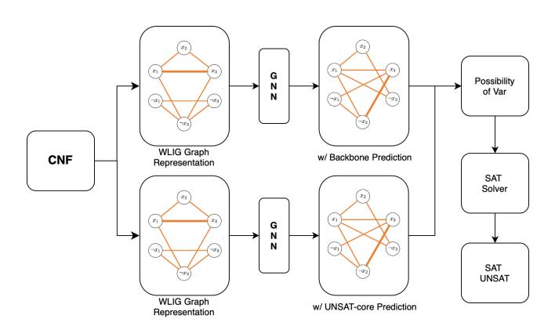
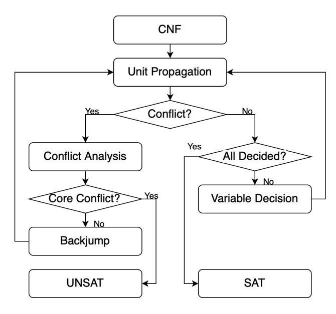
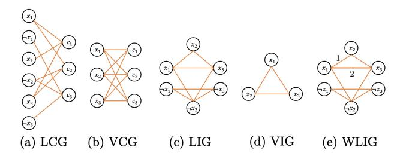
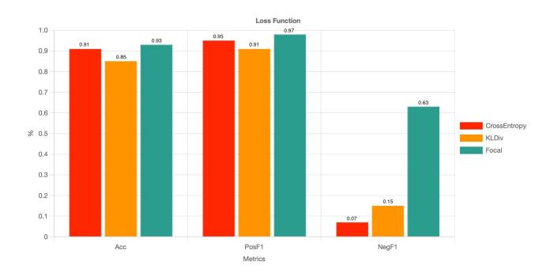
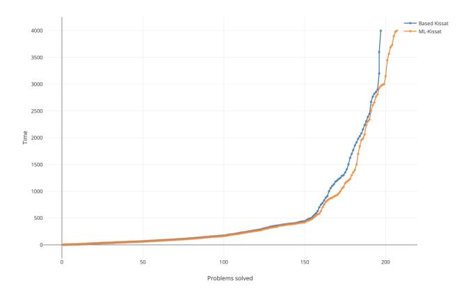
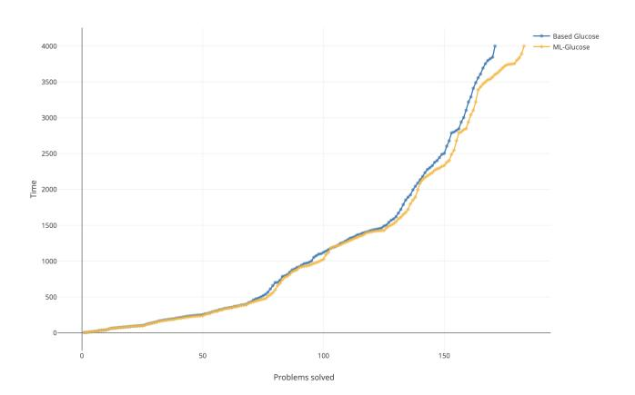
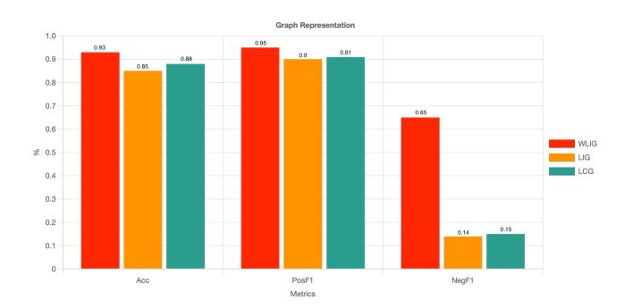

Latest updates: https://dl.acm.org/doi/10.1145/3716368.3735251

RESEARCH-ARTICLE

## **Enhancing Modern SAT Solver With Machine Learning Method**

GUANTING CHEN, Illinois Institute of Technology, Chicago, IL, United States JIA WANG, Illinois Institute of Technology, Chicago, IL, United States

**Open Access Support** provided by: **Illinois Institute of Technology** 

PDF Download 3716368.3735251.pdf 30 December 2025 Total Citations: 0 Total Downloads: 1066

Published: 30 June 2025

Citation in BibTeX format

GLSVLSI '25: Great Lakes Symposium on VLSI 2025

June 30 - July 2, 2025 LA, New Orleans, USA

**Conference Sponsors:** 

# **Enhancing Modern SAT Solver With Machine Learning Method**

Guanting Chen
Illinois Institute of Technology
Chicago, USA
gchen30@hawk.iit.edu

Jia Wang Illinois Institute of Technology Chicago, USA jwang34@iit.edu

#### **Abstract**

Satisfiability (SAT), a well-known NP-complete problem, has been widely studied and drives numerous research fields. State-of-the-art SAT solvers rely on the Conflict-Driven Clause Learning (CDCL) algorithm to solve practical SAT instances with two possible outcomes – a solution for SAT instances or a proof proving no solution exists for UNSAT instances. While many heuristics were manually designed to improve CDCL in the past, recent efforts focus on applying machine and deep learning models, e.g. Graph Neural Networks (GNN), with the hope to make heuristics more effective and adaptive. Nevertheless, the demand for significant GPU resources and the effectiveness in a broader set of SAT and UNSAT instances remain the major challenges. In this paper, we present a GNN-based algorithm that predicts at the same time backbone variables for SAT instances and UNSAT-core variables for UNSAT instances. Leveraging offline model inference, our trained GNN model, and so the whole SAT solver, is able to run entirely on CPU, removing the need of GPU resources. Experimental results confirm that with our algorithm, a modern SAT solver is able to solve up to 5% and 7% more instances for different baseline solvers.

#### **Keywords**

SAT Solver, CDCL, Machine Learning, GNN

#### ACM Reference Format

Guanting Chen and Jia Wang. 2025. Enhancing Modern SAT Solver With Machine Learning Method. In *Great Lakes Symposium on VLSI 2025 (GLSVLSI '25), June 30–July 02, 2025, New Orleans, LA, USA*. ACM, New York, NY, USA, 7 pages. https://doi.org/10.1145/3716368.3735251

#### 1 Introduction

In computational and complexity theory, the Boolean Satisfiability (SAT) problem holds a pivotal position. This decision problem, which involves determining whether a Boolean expression can be satisfied by assigning truth values to its variables, is well known for being NP-complete in theory [9]. SAT plays a fundamental role in various practical applications but is computationally intensive, such as Artificial Intelligence (AI) and Automated Reasoning, Software and Hardware Verification, and Electronic Design Automation (EDA). In these applications, problems are first transformed into SAT formulas, after which SAT solvers are employed to find solutions, or to prove that they do not exist.

This work is licensed under a Creative Commons Attribution 4.0 International License GLSVLSI '25, New Orleans, LA, USA
© 2025 Copyright held by the owner/author(s).
ACM ISBN 979-8-4007-1496-2/25/06
https://doi.org/10.1145/3716368.3735251

For satisfiable (SAT) instances, SAT solvers are used in automated theorem provers by verifying the logical consistency of mathematical proofs. They help ensure that each step in a proof is logically sound, thereby enhancing the reliability of formal verification processes. For the Constraint Satisfaction Problems (CSPs), a wide range of AI problems can be effectively modeled as SAT problems. For instance, tasks such as solving Sudoku puzzles and scheduling problems are transformed into SAT formulations. This transformation allows for efficient problem-solving using powerful SAT solving techniques. In the realm of AI planning, SAT-based planners are extensively utilized in various domains. These planners are instrumental in robotics for task and motion planning, in logistics for optimizing supply chain operations, and in automated decision-making systems to generate optimal plans under complex constraints. Thus, improving SAT solvers performance for SAT instances play important role in those AI process.

For unsatisfiable (UNSAT) instances, the significance of SAT solvers extends particularly to EDA where a suite of software tools are used for designing electronic systems and chips. Logic Equivalence Checking (LEC), a crucial step in verifying the correctness of circuit designs post-transformation within the EDA process, heavily leverages SAT solvers. LEC aims to determine if two circuits are functionally equivalent by encoding the verification problem into Boolean expressions and applying SAT solvers. Given that potential faults in transformations are rare, most SAT instances encountered in LEC tend to be unsatisfiable – meaning no valid variable assignment exists. During the design verification stage, the SAT solvers are invoked multiple times for each circuit design, making their performance for UNSAT instances critical to enhancing the efficiency of the LEC process.

Over the years, numerous techniques have been developed to enhance the efficiency of SAT solvers. Currently, two primary categories of SAT solvers dominate the field: Stochastic Local Search (SLS) based solvers and Conflict-Driven Clause Learning (CDCL) [17] based solvers. On one hand, SLS solvers start assigning values to all variables in the formula and iteratively flip variable assignments to maximize an internal score, eventually leading to a solution. On the other hand, CDCL solvers rely on clause learning and deep backtracking search – they assign values to one variable at a time until a conflict arises, at which point they analyze the conflict and backtrack to explore alternative paths.

Recent advances have explored the integration of neural networks (NN), particularly graph neural networks (GNNs) [24], to improve the performance of existing SAT solvers. Nonetheless, it is very challenging to achieve actual performance improvements. A major advance is the NeuroCore system proposed by Selsam and Bjørner [19]. NeuroCore aims to optimize the variable branching heuristic in CDCL SAT solvers by forecasting variables involved in the UNSAT-core. It conducts frequent online model assessments

to update its predictions based on internal statistics from the SAT solving process. As a result, NeuroCore has significantly improved the problem-solving capabilities of two well-known CDCL SAT solvers, MiniSat [10] and Glucose [7], particularly in the main track of SATCOMP-2018. While NeuroCore focuses on UNSAT instances by periodically computing variable assignments, it is not efficient for the frequent verification tasks in LEC. Moreover, NeuroCore demands substantial amount of computational resources from GPU, which greatly limit its deployment in a parallel configuration using multiple solver instances, which is a standard method for applying SAT solvers to highly complicated problems due their stochastic nature.

To address the challenges of both SAT and UNSAT instances, we introduce a novel model that integrates with state-of-the-art Conflict-Driven Clause Learning (CDCL) solvers. Our approach focuses on performing offline one-time branch initialization to enhance the efficiency of the end-to-end SAT-solving process. Specifically, we use Weighted Literal-Incidence Graph (WLIG) [21] to encode the Boolean formula and leverage Graph Neural Networks (GNNs) to predict the likelihood of backbone variables for SAT instances and UNSAT-core variables for UNSAT instances. We evaluate our model alongside previous works using CDCL solvers on the open SAT Competition dataset. The results show that our model enables modern SAT solvers to solve up to solve up to 5% and 7% more instances for different baseline solvers. This demonstrates the potential of machine learning techniques to significantly improve the efficiency and practicality of SAT solving.

The rest of the paper is organized as follows. We introduce the background in Section 2. Related works are discussed in Section 3. The technical details of the proposed approach is presented in Section 4. After experimental results are shown in Section 5, we conclude the paper in Section 6.

### 2 Background

## 2.1 Preliminaries of SAT

In the context of SAT, a propositional logic formula is typically represented in Conjunctive Normal Form (CNF). CNF is characterized by a conjunction of multiple clauses, where each clause consists of a disjunction of literals. A literal can be either a variable or its negation. Each variable can take on a logical value of either 1 (true) or 0 (false). A CNF formula is considered satisfiable if and only if there exists an assignment to the variables such that at least one literal in every clause evaluates to true. The objective of a SAT solver is to determine whether a given formula is satisfiable (SAT) or unsatisfiable (UNSAT). A complete SAT solver will either provide a satisfying assignment demonstrating that it can be made true under certain variable assignments, or a proof that no such assignment exists, thereby confirming the formula's unsatisfiability.

## 2.2 Backbone and UNSAT-core Variables

Backbone [6] variables are those that maintain the same value in every satisfying assignment of a given SAT formula. These variables are often referred to as "frozen" because their values remain fixed across all possible solutions. The concept of a backbone is applicable only when at least one satisfying assignment exists. Backbone

variables help characterize the "rigid" or invariant part of the solution space, providing insights into the essential structure of the formula. By identifying these variables, solvers can simplify the problem and guide heuristic decisions more effectively.

An UNSAT-core is a minimal subset of clauses within a formula that, by itself, is unsatisfiable. The variables appearing in these clauses are informally known as "UNSAT-core variables". For formulas that are unsatisfiable, there is no complete satisfying assignment, so the traditional notion of a backbone does not apply. Instead, an UNSAT-core is extracted to pinpoint the critical parts of the formula causing the conflict. The variables within this UNSAT-core highlight the key elements responsible for the unsatisfiability, aiding in diagnosis and guiding efforts to reformulate or debug the problem.

### 2.3 CDCL Algorithm

CDCL [17] makes SAT solvers efficient in practice and is one of the main reasons for the widespread use of SAT applications. The general idea of CDCL algorithm is as follows. Firstly, it makes a decision based on certain heuristics to pick a variable to branch and to decide a phase among 0 and 1 to assign to it. Then, it conducts a unit propagation based on that decision. In the propagation, if a conflict occurs, i.e., at least one clause is mapped to 0, then it performs a conflict analysis; otherwise, it makes a new decision to choose another variable and phase. In the conflict analysis, CDCL analyzes the decisions and the propagations to investigate the reason for the conflict before extracting the most relevant wrong decisions and encoding the reason to its memory as a learned clause that helps to avoid making the same mistake in the future. After the conflict analysis, the solver backtracks to the earliest decision level where the conflict could be resolved and continues the search from there. The process continues until all variables are assigned a phase indicating SAT, or until it learns the empty clause for UNSAT.

#### 2.4 Graph Neural Networks

Graph Neural Networks (GNNs) [24] are a class of deep learning models designed to work with graph-structured data. Unlike traditional neural networks, which operate on data with regular neighborhood structures such as images and text, GNNs can model irregular relationships and dependencies between entities defined by an arbitrary graph such as social networks and circuits. Typical GNNs utilize Message Passing or Neighborhood Aggregation for nodes to aggregate information from their neighbors to update their own representation. By allowing the aggregation process to occur over multiple iterations, or layers in neural networks, each node is able to gain information from nodes further away. Eq.(1) shows the general rule of message passing to compute a node v's features  $h_v^{(k)}$  for the layer (iteration) k, from features  $h_u^{(k-1)}$  of its neighbors  $u \in N(v)$  for the layer k-1. In this equation,  $W_k$  are learned weights applying to all nodes, AGG is a function that maps an arbitrary number of features into a fix shape to match that of  $W_k$ , and  $\sigma$  is a nonlinear activation function.

$$h_{v}^{(k)} = \sigma\left(W_{k} \cdot AGG\left(\left\{h_{u}^{(k-1)} \mid u \in N\left(v\right)\right\}\right)\right) \tag{1}$$

#### 3 Related Works

In recent years, several techniques have emerged that employ machine learning methods to improve the efficiency and effectiveness of SAT solving. Kurin and Godil have tried to improve the SAT solver heuristics with graph neural networks and reinforcement learning [12], and later demonstrated in Graph-Q-SAT [13] that Q-learning can be used to learn the branching heuristic of a SAT solver. NeuroSAT, introduced by Selsam et al. [18], was the pioneering framework that integrated a neural network model into an end-to-end SAT solver. Notably, it was not designed to function as a complete SAT solver by itself. NLocalSAT [23] builds upon NeuroSAT's architecture, using the output from the neural network to improve initial variable assignments for SLS solvers offline. Han [11] introduced a network within NeuroGlue designed to forecast variables that are prone to be part of the glue clauses. These glue clauses, recognized as conflict clauses by the Glucose family of solvers [7], are essential for conflict analysis. Although this method reduces the required number of solving iterations, it does not lead to substantial improvements in the solver's effectiveness. Nonetheless, many improvements fail to deliver noticeable improvements for large-scale problems. NeuroCore, introduced by Selsam and Bjørner [19], focuses on enhancing solving effectiveness, particularly for large-scale problems as seen in SAT competitions. It improves the branching heuristic for CDCL solvers by employing supervised learning to map UNSAT instances to their corresponding UNSAT core variables - that is, the variables involved in the UNSAT-core. Leveraging clauses dynamically learned during the solving process, NeuroCore conducts frequent online model inferences to refine its predictions. Moreover, NeuroBack introduced by Wen et al. [20], uses a GNN-based method to improve CDCL SAT solvers by performing offline predictions of variable phases before solving, especially backbone variables, enabling more effective phase selection in Kissat without runtime GPU usage, and achieving up to 7.4% more solved problems in SAT competitions.

# 4 Our Machine Learning Based Method

## 4.1 Overview

To support CDCL solvers in addressing both SAT and UNSAT instances, we propose the framework as shown in Fig.1 that integrates a neural network with a SAT solver. An input Boolean formula is initially converted into a Weighted Literal-Incidence Graph (WLIG) and fed into a Graph Neural Network (GNN) for updating node features. The GNN generates probabilities indicating the likelihood of variables being part of the backbone or the UNSAT-core. These probabilities are then assigned to the CDCL solver to initialize the variable decision queue and decision scores, guiding the solving process more effectively.

The two GNN models designed for classification tasks are trained on distinct datasets to ensure specialized performance in different problem domains. Specifically, one model is trained on the SAT dataset, which consists of satisfiable instances of SAT problems, while the other model is trained on the UNSAT dataset, comprising unsatisfiable instances. This approach allows each model to develop expertise in recognizing patterns and features unique to either SAT or UNSAT instances.

Figure 1: Model Overviews

## 4.2 CDCL Solver Integration

The CDCL algorithm, commonly used in modern SAT solvers, combines decision-making, unit propagation, conflict analysis, and nonchronological backtracking. In modern CDCL SAT solvers, including ones like MiniSAT, Glucose, and Kissat, two closely related concepts, decision queue and decision scores, are essential to variable selection during branching. Decision Scores are numerical scores (usually floats or doubles) assigned to each variable that indicate how "promising" or "active" a variable is. The decision queue is a heap or priority queue that stores unassigned variables, sorted by their decision scores. Fig.2 provides a detailed overview of the CDCL process. The algorithm starts with decision-making, assigning Boolean values to variables according to a decision queue. This is followed by unit propagation, where necessary assignments for other variables are inferred based on the current partial assignment. Conflicts may occur if a clause becomes unsatisfiable with these assignments. In response, the CDCL process conducts conflict analysis, learning from the conflict by adding a new clause that explains its cause, thus avoiding similar issues in future iterations. The algorithm concludes with non-chronological backtracking (backjumping), which reverts not only the most recent decision but jumps back to a point before the conflict, adjusting the decision queue or lowering the decision score for conflicting variables. This allows for a more rapid exploration of different solution spaces and prevents repeating past mistakes.

Two pivotal stages in this process are conflict analysis (clause learning) and variable decision-making, which work together to construct the decision queue for branching. To optimize the performance, it is important to guide the decision queue and decision scores. Specifically, we aim to refine the decision queue and decision scores, which are internal variables used in both variable decision-making and conflict analysis.

Given this context, our methodology for interacting with the CDCL solver is as follows. Before tackling a problem, our trained network performs an inference to determine two probabilities per variable, one for it be part of the backbone and the other for it be part of the UNSAT-core. The two probabilities are added to guide the solver in setting up a decision queue and decision scores. To be more specific, the summation of the inferred probabilities are first used to initialize the decision scores. Then, they are employed

Figure 2: CDCL Workflow

to rank variables in descending order, creating the initial decision queue. By prioritizing variables based on their likelihood of being in the backbone or the UNSAT-core, the solver can more effectively address both SAT and UNSAT instances. Variables highly related to the UNSAT-core are handled first to resolve conflicts, while those associated with the backbone are prioritized to confirm satisfiability. These decision scores and the decision queue, informed by our neural network's inference, are imported as the solver's initial values. This allows the solver to begin its operations with optimized guidance, thereby enhancing its efficiency and effectiveness in solving SAT problems.

## 4.3 Graph Representation

Traditionally, researchers have employed four types of graph representations to model CNF formulas. Examples for the formula  $\Phi = (x1 \lor x2 \lor x3) \land (x1 \lor \neg x2 \lor x3) \land (\neg x1 \lor \neg x2 \lor \neg x3)$  are shown in Fig.3: (a) Literal-Clause Graph (LCG); (b) Variable-Clause Graph (VCG); (c) Literal-Incidence Graph (LIG); and (d) Variable-Incidence Graph (VIG). The LCG features nodes for both literals and clauses, with edges denoting the inclusion of a literal in a clause. This bipartite graph ensures a one-to-one correspondence between the graph and the CNF formula. The VCG is generated from the LCG by consolidating each literal node with its negated counterpart. In the LIG, nodes correspond to individual literals, and edges between them indicate that the connected literals appear together in the same clause. The VIG is created by applying the same merging operation on literals within the LIG.

In this study, we use a novel graph representation, the Weighted Literal-Incidence Graph (WLIG) [21], for encoding CNF formulas as shown in Fig.3 (e). The WLIG builds upon the LIG by assigning edge weights (e.g. 1 and 2) based on the frequency of literal co-occurrences compared to LIG.

Figure 3: Different Graph Representations

#### 4.4 GNN Models

We employ a weighted Graph Convolutional Network (WGCN) [15] as our primary network for extracting features of variables. A multi-layer perceptron (MLP) is utilized to output the possibility of variables presented in the backbone and the UNSAT-core. The WGCN is capable of perfectly aligning with the design of WLIG, allowing it to effectively utilize the edge weights and significantly enhance the message exchange process. This enables a more comprehensive and accurate extraction of variable features, facilitating a more precise determination of the possibility of their presence in the specified components. The combination of the WGCN and MLP provides a powerful framework for handling and analyzing the relevant data, contributing to improved performance and outcomes in the given context.

The WGCN utilizes the adjacency matrix as input for establishing the graph structure. This is a crucial step as it provides the foundational framework for subsequent analyses and operations. In addition, with the aim of effectively capturing the distinctive characteristics of literals, we adopt a specific approach to initialize the embedding of a literal node. Suppose there are V variables and thus 2V literals. We number the literals so that a variable v corresponds to the literal v and its negate is the literal v+V. We initialize the embedding of a literal node i using a vector  $h_i \in \mathbb{R}^{2d}$ . This vector is crafted by vertically concatenating  $(\oplus)$  two important components: the node degree of node  $D \in \mathbb{R}$  and the literal type of node  $T \in \mathbb{R}$ . Subsequently, this concatenated vector is fed into a learnable linear transformation, labeled as  $L_{\text{init}} : \mathbb{R}^{1 \times 2} \to \mathbb{R}^{1 \times 2d}$ , in order to generate a sparse node embedding. The process is carried out as follows:

$$h_i^{(0)} = L_{\text{init}} \left( D_i \oplus T_i \right) \tag{2}$$

$$H^{(0)} = \left[ h_1^{(0)}, h_2^{(0)}, \dots, h_{2V}^{(0)} \right]^T \tag{3}$$

During each iteration of the WGCN, the node embedding vectors *H* are updated by aggregating embeddings from their neighboring nodes. Specifically, a single iteration can be expressed as:

$$H^{(k+1)} = \text{ReLU}\left(L_{\text{out}}(M'H^{(k)} \oplus Flip(H^{(k)}))\right) \tag{4}$$

$$Flip(H) = [h_{V+1}, ..., h_{2V}, h_1, ..., h_V]^T$$
 (5)

Here,  $H^{(k)}$  denotes the node features after the k-th iteration and  $M'H^{(k)}$  aggregates the features of neighboring literal nodes. The function Flip as shown in Eq.(5), combined with the learnable linear transformation  $L_{\text{out}}: \mathbb{R}^{1\times 4d} \to \mathbb{R}^{1\times 2d}$ , merges the features of literal nodes after the aggregation with their corresponding

negated literal nodes. This process generates a comprehensive representation of the variables. The normalized adjacency matrix M' incorporates aggregation operations into the computation process within WGCN. The values in M' serve as weights applied in the WGCN. M' is used to control message passing and ensure numerical stability and is calculated from the adjacency matrix M as follows to prevent gradient explosion:

$$M' = \frac{M}{\sum_{i=1}^{2V} \sum_{j=1}^{2V} M_{ij}}$$
 (6)

Following the iterations of WGCN, we derive vectors that capture the structural information of literals and input them into the MLP to estimate the probability  $p_v$  of each variable v:

$$p_v = \operatorname{softmax}(L_2 \cdot ReLU(L_1 \cdot (h_v \oplus h_{v+V}) + c_1) + c_2)) \tag{7}$$

Here,  $L_1$  and  $L_2$  are learnable weight matrices in MLP, and  $c_1$  and  $c_2$  are learnable bias vectors.

## 5 Experiments

#### 5.1 Datasets

We train the two Graph Neural Network (GNN) models on distinct datasets to specialize in different problem domains for both SAT and UNSAT instances.

For the SAT dataset, we develop a comprehensive collection of CNF formulas with labeled backbone variables specifically designed for training our GNN model. The CNF formulas were sourced from two primary repositories: the SATLIB benchmark library and the Random tracks in SAT Competition [5] from 2010 to 2023. The SATLIB benchmark library [1] is a well-established resource that houses a variety of widely recognized benchmark instances, serving as a foundational challenge for the SAT community. The Random tracks in SAT competitions provide an extensive array of challenging random SAT problems, further enriching the diversity of our dataset. Backbone variables in each CNF formula were labeled using publicly available tools, with particular emphasis on the state-of-the-art backbone extractor CadiBack [8], which has been recently introduced and is considered among the most advanced tools in this domain.

Table 1 presents detailed statistics of the resulting dataset. From SATLIB, we collect 59604 SAT formulas with labels, encompassing seven types of problems: random SAT, graph coloring, planning, bounded model checking, Latin square, circuit fault analysis, and all-interval series. Additionally, the SAT competition random tracks contributed 4531 labeled formulas. Consequently, our SAT dataset encompasses a diverse set of formulas, with the number of variables ranging from five to 41647 (average: 3782) and the number of clauses ranging from 15 to 134621 (average: 62890). The average percentage of backbone variables is 28%.

For the UNSAT dataset, we develop a collection of CNF formulas with labeled UNSAT-core variables specifically designed for training our GNN model. The CNF formulas are sourced from two primary repositories: generated UNSAT instances using CNFgen [2] and HardSATGEN [14], and Random tracks in SAT Competition from 2010 to 2023. Variables in each CNF formula are labeled using publicly available tools: Kissat and Drat-Trim. Specifically, when Kissat attempts to solve an UNSAT instance, it generates a proof

**Table 1: SAT Dataset** 

| SAT Dataset     | SATLIB   | SATCOMP   | Overall   |
|-----------------|----------|-----------|-----------|
| # CNF           | 59604    | 4531      | 64135     |
| # Variables     | 276      | 24410     | 3782      |
| # Clauses       | 491      | 79780     | 62890     |
| # Backbone Var. | 151(55%) | 2685(11%) | 1058(28%) |
|                 |          |           |           |

**Table 2: UNSAT Dataset** 

| UNSAT Dataset     | GEN      | SATCOMP   | Overall   |
|-------------------|----------|-----------|-----------|
| # CNF             | 61356    | 3781      | 65137     |
| # Variables       | 1167     | 4180      | 2351      |
| # Clauses         | 4912     | 86790     | 57382     |
| # UNSAT-core Var. | 978(83%) | 1631(39%) | 1246(53%) |

of unsatisfiability, which Drat-Trim then processes to extract the UNSAT core. Although the UNSAT core identified by Drat-Trim [22] may not be minimal, it remains highly valuable for solving UNSAT instances.

Table 2 presents detailed statistics of the resulting dataset. We generate 61356 CNF formulas with labels, while the SAT competition random tracks contribute 3781 labeled formulas. Consequently, our UNSAT dataset encompasses a diverse set of formulas: the number of variables ranges from five to 23641 (average: 2351), and the number of clauses ranges from 20 to 161124 (average: 57382). The average percentage of UNSAT-core variables is 53%.

#### 5.2 Training and GNN Model Performance

We partition the two datasets into distinct training and testing subsets, ensuring no overlap between them. Specifically, 85% of the data is allocated for training, while the remaining 15% is reserved for testing. To assess performance, we benchmark our results against several baselines, including ML-Glucose and the standard baseline glucose solver, as well as ML-Kissat and the standard baseline Kissat solver.

We modify the cross-entropy loss by adopting the Focal loss [16]. Training is conducted using the AdamW optimizer with an initial learning rate of 0.001 and a weight decay coefficient of 0.01. The batch size is set to ten, and the number of epochs is set to 20 for each training run. Overall, training for both tasks take a total of 10 hours on a commodity computer.

Table 3 presents the average prediction performance for both tasks in terms of precision, recall, F1 score, and accuracy. The GNN model achieves a classification accuracy of 91.2% for backbone variables and 93.3% for UNSAT-core variables, with precision exceeding 90% and an F1 score above 0.85 for both categories. These results indicate that the GNN model effectively learns to classify both backbone and UNSAT-core variables.

We experiment with different loss functions to address both SAT and UNSAT instances effectively. As shown in Fig.4, our analysis reveals that Focal loss achieves better performance compared to KLDiv and cross-entropy, which are commonly used in earlier methods for classification tasks. This outcome confirms our decision

**Table 3: Performance of GNN Models** 

| Task                   | Precision      | F1    | Acc   |
|------------------------|----------------|-------|-------|
| Backbone UNSAT-core | 0.937 0.925 | 0.892 | 0.912 |

to implement Focal loss as the primary loss function, particularly when dealing with imbalanced data distributions like the the percentage of backbone and UNSAT-core variables from Table 1 and 2.

Figure 4: Comparison of Loss function

## 5.3 Evaluation of Time-Constrained Problem-Solving Performance

To assess the Time-constrained Problem-solving effectiveness of the solvers, we collect 400 CNF formulas from the main track of SAT Competition 2022 [3] and SAT Competition 2023 [4] as the testing data. We conduct experiments using ML-Glucose and the standard glucose solver as the baseline, as well as ML-Kissat and the standard Kissat solver as the baseline with the time limit being 4000 seconds. The experiments are performed on a dedicated 32-core machine, where each solver ran up to 32 parallel processes. For ML-Glucose and ML-Kissat, the total solving time encompasses both the model inference phase and the actual SAT solving phase. The time required for static information extraction is minimal and does not significantly impact the overall solving time. Consequently, the comparison of the baseline Kissat vs. ML-Kissat, as well as baseline Glucose vs. ML-Glucose, are shown in Fig.5 and Fig.6. ML-Glucose successfully solves 183 problems, compared to the original Glucose, which solved 171 problems, representing a 7% enhancement. Likewise, ML-Kissat solves 207 problems, in contrast to the baseline Kissat, which tackled 197 problems, indicating a 5% improvement. Our method emphasizes more exploration during the initial phases and greater exploitation in the later stages while acquiring valuable knowledge throughout the process. In summary, the findings demonstrate that our machine learning approach can significantly boost the efficiency of baseline solvers for SAT Competition 2022 and SAT Competition 2023 problems.

Figure 5: Baseline Kissat vs ML-Kissat

Figure 6: Baseline Glucose vs ML-Glucose

## 5.4 Comparison of Graph Representation Methods

The Literal-Clause Graph (LCG) and Literal-Incidence Graph (LIG) construction were typically used for earlier works. While for LCG both literals and clauses are represented as nodes, and the relationships between them serve as edges, transitioning from LCG to Weighted Literal Interaction Graph (WLIG) eliminates clause nodes unnecessary for UNSAT-core and backbone prediction, with an emphasis on stronger connections among literals. We experiment with these three representations and the experimental results are shown in Fig.7. It demonstrates that WLIG surpasses the conventional LCG and LIG utilized in prior studies, achieves better performance in terms of accuracy and F1 scores for both UNSAT and SAT instances. Notably, it significantly enhances the performance for variables not included in the UNSAT-core or backbone variables. This finding confirms our choice to utilize WLIG for graph representation within our model.

Figure 7: Comparison of Graph Representation

#### 6 Conclusion

This paper proposed a machine learning approach to make CDCL SAT solvers more effective without requiring any GPU resource during its application. The main idea is to make offline model inference on variable branching to guide the CDCL solver to target the backbone and the UNSAT-core first to enhancing its performance. Incorporated in the state-of-the-art SAT solvers Kissat and Glucose, our approach significantly reduced the solving time and made it possible to solve more instances in SAT Competition problems, showing great promises to improve the SAT solvers through machine learning methods.

Building upon the limitations in our current study, our future work will focus on conducting more comprehensive experimental evaluations by including comparisons with advanced machine-learning-based SAT solvers such as NeuroSAT, NeuroCore, NeuroGlue, and Graph-Q-SAT. These benchmarks are essential to accurately assess the effectiveness and competitiveness of our proposed approach. Furthermore, incorporating ILP-based and heuristic-driven methods into the evaluation suite would provide a more holistic understanding of our approach across diverse algorithmic paradigms.

#### References

- [1] 2011. SATLIB The Satisfiability Library. Retrieved Jan. 5, 2011 from https://www.cs.ubc.ca/~hoos/SATLIB/index-ubc.html
- [2] 2017. CNFgen: Combinatorial Benchmarks for SAT Solvers. https://massimolauria.net/cnfgen/
- [3] 2022. SAT Competition 2022. Retrieved May 27, 2022 from https://satcompetition.github.io/2022/

- [4] 2023. SAT Competition 2023. Retrieved Sept 27, 2023 from https://satcompetition. github.io/2023/
- [5] 2025. The International SAT Competition Web Page. https://satcompetition.github. io/
- [6] Tasniem Al-Yahya, Mohamed El Bachir Abdelkrim Menai, and Hassan Mathkour. 2022. Boosting the Performance of CDCL-based SAT Solvers by Exploiting Backbones and Backdoors. Algorithms (2022).
- [7] Gilles Audemard and Laurent Simon. 2018. On the Glucose SAT Solver. International Journal on Artificial Intelligence Tools (IJAIT) 27, 1 (2018), 1–25.
- [8] Armin Biere, Nils Froleyks, and Wenxi Wang. 2023. CadiBack: Extracting Back-bones with CaDiCal. In International Conference on Theory and Applications of Satisfiability Testing (SAT). 3:1–3:12.
- [9] Stephen A. Cook. 1971. The Complexity of Theorem-Proving Procedures. In Third Annual ACM Symposium on Theory of Computing. 151–158.
- [10] Niklas Eén and Niklas Sörensson. 2003. An Extensible SAT-solver. In International Conference on Theory and Applications of Satisfiability Testing (SAT). 502–518.
- [11] Jesse Michael Han. 2020. Enhancing SAT Solvers with Glue Variable Predictions. arXiv:2007.02559
- [12] Vitaly Kurin, Saad Godil, Shimon Whiteson, and Bryan Catanzaro. 2019. Improving SAT Solver Heuristics with Graph Networks and Reinforcement Learning. (2019).
- (2019).
   [13] Vitaly Kurin, Saad Godil, Shimon Whiteson, and Bryan Catanzaro. 2020. Can Q-Learning with Graph Networks Learn a Generalizable Branching Heuristic for a SAT Solver?. In International Conference on Neural Information Processing Systems. 9608 9621.
- [14] Yang Li, Xinyan Chen, Wenxuan Guo, Xijun Li, Wanqian Luo, Junhua Huang, Hui-Ling Zhen, Mingxuan Yuan, and Junchi Yan. 2023. HardSATGEN: Understanding the Difficulty of Hard SAT Formula Generation and A Strong Structure-Hardness-Aware Baseline. In ACM SIGKDD Conference on Knowledge Discovery and Data Mining. 4414—4425.
- [15] Zhuwen Li, Qifeng Chen, and Vladlen Koltun. 2018. Combinatorial Optimization with Graph Convolutional Networks and Guided Tree Search. In International Conference on Neural Information Processing Systems. 537–546.
- [16] Tsung-Yi Lin, Priya Goyal, Ross Girshick, Kaiming He, and Piotr Dollar. 2020. Focal Loss for Dense Object Detection. IEEE Transactions on Pattern Analysis and Machine Intelligence 42, 2 (2020), 318–327.
- [17] Joao Marques-Silva, Inês Lynce, , and Sharad Malik. 2021. Conflict-Driven Clause Learning SAT Solvers. Handbook of Satisfiability: Second Edition (2021), 133–182.
- [18] Daniel Selsam and Nikolaj Bjørner. 2018. Learning a SAT Solver from Single-Bit Supervision. arXiv:1802.03685
- [19] Daniel Selsam and Nikolaj Bjørner. 2019. Guiding High-Performance SAT Solvers with Unsat-Core Predictions. In International Conference on Theory and Applications of Satisfiability Testing (SAT). 336–353.
- [20] Wenxi Wang, Yang Hu, Mohit Tiwari, Sarfraz Khurshid, Kenneth McMillan, and Risto Miikkulainen. 2021. NeuroBack: Improving CDCL SAT Solving Using Graph Neural Networks. arXiv:2110.14053
- [21] Weihuang Wen and Tianshu Yu. 2023. W2SAT: Learning to Generate SAT Instances from Weighted Literal Incidence Graphs. arXiv:2302.00272
- [22] Nathan Wetzler, Marijn J. H. Heule, and Warren A. Hunt. 2014. Drat-Trim: Efficient Checking and Trimming Using Expressive Clausal Proofs. In International Conference on Theory and Applications of Satisfiability Testing (SAT). 422–429.
- [23] Wenjie Zhang, Zeyu Sun, Qihao Zhu, Ge Li, Shaowei Cai, Yingfei Xiong, and Lu Zhang. 2020. NLocalSAT: Boosting Local Search with Solution Prediction. In International Joint Conference on Artificial Intelligence (IJCAI). 1177–1183.
- [24] Jie Zhou, Ganqu Cui, Shengding Hu, Zhengyan Zhang, Cheng Yang, Zhiyuan Liu, Lifeng Wang, Changcheng Li, and Maosong Sun. 2020. Graph Neural Networks: A Review of Methods and Applications. AI Open (2020), 57–81.