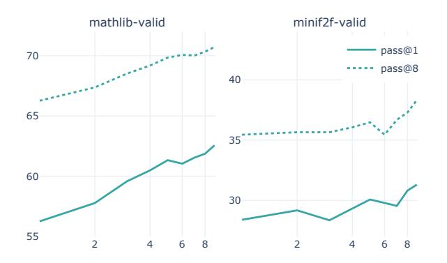
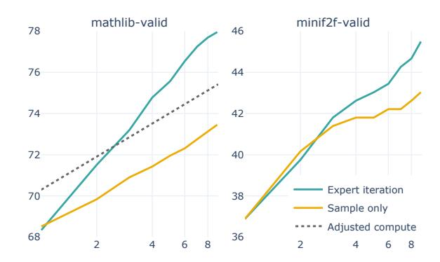
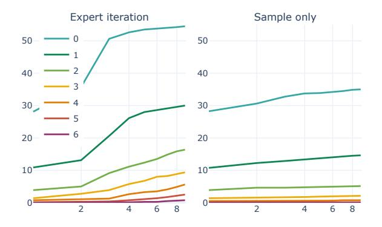
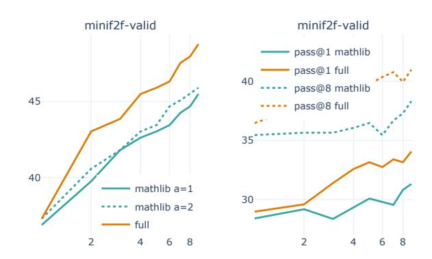

# Formal Mathematics Statement Curriculum Learning

Stanislas Polu <sup>1</sup> Jesse Michael Han <sup>1</sup> Kunhao Zheng <sup>2</sup> Mantas Baksys <sup>3</sup> Igor Babuschkin <sup>1</sup> Ilya Sutskever <sup>1</sup>

### **Abstract**

We explore the use of expert iteration in the context of language modeling applied to formal mathematics. We show that at same compute budget, expert iteration, by which we mean proof search interleaved with learning, dramatically outperforms proof search only. We also observe that when applied to a collection of formal statements of sufficiently varied difficulty, expert iteration is capable of finding and solving a curriculum of increasingly difficult problems, without the need for associated ground-truth proofs. Finally, by applying this expert iteration to a manually curated set of problem statements, we achieve state-of-the-art on the miniF2F benchmark, automatically solving multiple challenging problems drawn from high school olympiads.

### 1. Introduction

Deep learning has enjoyed spectacular success in many domains, including language (Brown et al., 2020; Devlin et al., 2018; Wu et al., 2016), vision (Radford et al., 2021; Tan & Le, 2019), and image generation (Ramesh et al., 2021; Karras et al., 2019). One domain where deep learning has not yet enjoyed a comparable success is in tasks that require extensive *planning* and *symbolic reasoning*, with the exception of two-player games (Silver et al., 2016; 2017; Berner et al., 2019; Vinyals et al., 2019). In such games, deep learning systems exhibit a considerable degree of reasoning, especially when trained with self-play combined with a search procedure such as Monte Carlo Tree Search (MCTS) (Browne et al., 2012). But the resulting reasoning abilities achieved are limited due to the relatively narrow scope of games.

As such, theorem proving in interactive proof assistants, or formal mathematics, appears as an interesting game-like domain to tackle due to its increased scope. Like games, formal mathematics has an automated way of determining

Preprint. Under review.

whether a trajectory (*i.e.* a proof) is successful (*i.e.* formally correct). But the vast scope of formal mathematics means that any strong reasoning result obtained in it will be more meaningful than comparable results in games (*e.g.* finding proofs to mathematical conjectures), and could even be applicable to important practical problems (*e.g.* software verification).

However, tackling formal mathematics involves two main challenges that we must address in order to continue making progress:

Infinite action space Not only does formal mathematics have an extremely large search space (like Go for example), it also has an infinite action space. At each step of proof search, the model must choose not from a well-behaved finite set of actions, but a complex and infinite set of tactics, potentially involving exogenous mathematical terms that have to be generated (e.g., generating a mathematical statement to be used as a witness, an object used steps such as "there exists an x ...", or a cut, the introduction and the chaining of a lemma in the middle of a proof).

No direct self-play setup In formal mathematics, a prover is not playing against an opponent but against a set of statements to prove. When faced with a statement that is just too hard, there is no obvious reframing of the formal mathematics setup that will let the prover generate intermediary easier statements to tackle first. This asymmetry prevents naive application of the symmetric self-play algorithms commonly used in 2-player games.

These two differences make a naive application of reinforcement learning to formal mathematics unlikely to succeed. Past work proposed to address the infinite action space problem by sampling from a language model (Polu & Sutskever, 2020). This paper focuses on this second problem and our basis for addressing it is the observation that the key role of self-play is to provide an unsupervised curriculum. We propose instead to supply auxiliary sets of problem statements (without requiring proofs) of varying difficulty. We empirically show that, when the difficulty of these auxiliary problems is varied enough, a simple expert iteration procedure is able to solve a curriculum of increasingly difficult problems, eventually generalizing to our target distribution. We show that this works with both automatically-generated and manually-curated auxiliary distributions of

<sup>&</sup>lt;sup>1</sup>OpenAI <sup>2</sup>École Polytechnique <sup>3</sup>University of Cambridge. Correspondence to: Stanislas Polu <spolu@openai.com>.

problems and leverage this to achieve state-of-the-art on the *miniF2F* benchmark. Our results suggest that continuous self-improvement in formal mathematics can potentially be reduced to the problem of generating such sets of formal statements, which we have done in part manually in this work, but could eventually be scaled in the future with more automation (such as more domain-specific statements generator or even informal to formal machine translation).

#### 1.1. miniF2F benchmark

In this work, we target the *miniF2F* (Zheng et al., 2021) benchmark, which consists of 244 *validation* and 244 *test* formalized statements of mathematical problems from various competitions. We believe it to be a better measure of mathematical reasoning compared to a formal library-derived split. Also, the extreme scarcity in formal libraries of this type of problems makes it an ideal test-bed for the expert iteration methodology studied in this paper.

#### 1.2. Contribution

Our contributions are the following: we present lean-gym, a simple REPL interface for interacting with the Lean theorem prover; we propose an expert iteration methodology for GPT-f (Polu & Sutskever, 2020) which uses proofs generated by our models as training data to iteratively improve their performance; we demonstrate that, at fixed compute budget, expert iteration outperforms proof search only; we present a synthetic inequality generator and study how expert iteration finds and solves a curriculum of increasingly difficult problems from a set of generated statements of various difficulty; finally, we present a manually curated set of formalized problem statements and leverage it to achieve state-of-the-art performance on the *miniF2F* benchmark.

### 2. Related Work

Our work strongly relies on, and can be seen as a natural continuation of the work presented in the original GPT-f paper (Polu & Sutskever, 2020) which studies the use of language models to generate tactics, the PACT paper (Han et al., 2021) which applies GPT-f to Lean and studies the benefits from co-training on self-supervised objectives, and the *miniF2F* benchmark (Zheng et al., 2021).

We present additional related work in Appendix A.

### 3. Formal Environment

We choose Lean (de Moura et al., 2015; lea) as our formal environment. Unlike Metamath (Megill & Wheeler, 2019), which has been studied in the original GPT-f paper (Polu & Sutskever, 2020), Lean benefits from high-level tactics which were shown to be beneficial in the context of

the *miniF2F* benchmark (Zheng et al., 2021)—Lean proofs are typically 10x shorter than Metamath's. Also, Lean has recently received a lot of attention from the mathematical community, thanks to projects such as the Perfectoid Spaces (Buzzard et al., 2019) and the Liquid Tensor experiment (Scholze, 2020), and benefits from a vibrant community of hundreds of contributors to its main mathematical library called *mathlib*. We refer to the PACT paper's Background section (Han et al., 2021) for a detailed introduction to Lean in the context of neural theorem proving.

#### 3.1. lean-gym

In the PACT paper (Han et al., 2021), proof search is performed by the Lean runtime using the LEANSTEP environment, with a generic backend interface to models. While easy to use—one just needs to plug in their model—this approach makes it difficult to alter and iterate on the search procedure because it is programmed in Lean (which is not designed or intended for cluster-wide parallelised I/O intensive tasks), and the coupling of the search procedure with the Lean runtime introduces challenges when scaling to a large number of parallel workers.

To solve these issues we implemented  $lean-gym^1-a$  simple REPL interface over the standard input/output implemented in Lean directly. We present lean-gym's API and discuss some of its advantages and limitations in Appendix B.

#### 3.2. Proof datasets extraction

We rely on the proof extraction methodology presented in the PACT paper (Han et al., 2021) to extract human tactic proof steps from *mathlib* (the tactic dataset) as well as the various other proof artifacts (mix1 and mix2 datasets). We also extract *mathlib-{train,valid,test}*, the set of statements from *mathlib* along the split proposed in Han et al. (2021) (the *validation* and *test* splits of tactic, mix1, mix2 being aligned with *mathlib-{valid, test}* as the splits are determined by declaration name hashes (across all data sources including proof-term mining) as opposed to individual proof steps or data-points).

## 4. Expert Iteration

Expert iteration was introduced in Silver et al. (2017) and broadly consists in iteratively training models on their previously sampled trajectories, to achieve continuous improvement. In this section we present our expert iteration methodology, including the models and pre-training strategies we rely on.

https://github.com/openai/lean-gym

#### 4.1. Model

We use decoder-only Transformers similar to GPT-3 (Brown et al., 2020). Throughout this paper we focus on a model with 36 layers and 774 million trainable parameters (referred to as the 700m model in the GPT-f paper (Polu & Sutskever, 2020)).

#### 4.2. Pre-Training

We pre-train our models successively on GPT-3's post-processed version of CommonCrawl (for 300B tokens) and an updated version of *WebMath* (Polu & Sutskever, 2020) (for 72B tokens) whose mix is presented in Appendix C.

#### 4.3. Training objectives

### 4.3.1. Proofstep objective

The *proofstep objective*, introduced in Polu & Sutskever (2020), consists in generating a PROOFSTEP (a Lean tactic) given a GOAL (a Lean tactic state). We also condition this objective on the current DECLARATION (a Lean theorem name), which remains the same throughout a proof search: DECL <DECLARATION>GOAL <GOAL> PROOFSTEP <PROOFSTEP>.

The rationale for conditioning on the declaration name is to hint our models on the position of the current declaration in the *mathlib* library. It can be considered as a weak proxy signal for the large amount of information not shown to the model (the full environment consisting of the available imports and currently open declarations such as module names, notations, declared instances, ...). The declaration name lets models at least in principle memorize and then retrieve some of that information, knowing that lean-gym errors if a theorem or definition that is not available in the environment associated with the current declaration is used by tactics generated by our models. Also note that conversely to Polu & Sutskever (2020) and like Han et al. (2021) <GOAL> is not necessarily a single goal but a Lean tactic state, which possibly comprises multiple goals.

#### 4.3.2. *Proofsize objective*

We depart from Polu & Sutskever (2020) and use a proofsize objective to guide our proof searches, which consists in generating one token that represents a proof size estimate bucket for the current goal (Lean tactic state): DECL <DECLARATION> GOAL <GOAL> PROOFSIZE <PROOFSIZE\_BUCKET\_TOKEN>

For a given goal g, either the goal was proved as part of the proof search and we denote its proof size (the number of tactic applications (compounded Lean tactics counting as one)) as ps(g), or the goal was not proved in which case we assign the goal to a bucket that virtually represents "infinite"

proof sizes.

We use 11 buckets B=0...10 and compute the *proofsize* bucket b(g) for a goal g by assigning infinite proof sizes to bucket 0, all proof sizes over 20 to bucket 1 and linearly projecting proof sizes lower than 20 on the remaining buckets 2,...,10 (10 being the bucket for the shortest proof sizes). In practice, when training and sampling from the model, we map B to the tokens 'A'...'K'.

To value goals as we run proof searches, we sample the *proofsize* bucket token and record the logits  $p_b(g)$  for each viable bucket and use them to get a weighted average with the following formula:  $v(g) = \frac{1}{\#B} \sum_{b \in B} p_b(g).b$ .

As an example, if the model assigns  $p_0=1$  (hence  $p_{b\neq 0}=0$ ) then v(g)=0. Conversely if the model assigns  $p_{10}=1$  (10 being the bucket for the shortest proof sizes) then v(g)=1.

The rationale for using this *proofsize objective* instead of the *outcome objective* described in Polu & Sutskever (2020) is that (i) it achieves better performance compared to the *outcome objective* (see table 1), and (ii) it prioritizes goals that potentially lead to shorter proofs during proof search, creating an intrinsic incentive for the system to converge towards shorter proofs. Similarly to Polu & Sutskever (2020) we favor this token-based approach to the introduction of a separate value head to keep the overall architecture simple. This way the *proofsize objective* can be implemented by simply augmenting the training dataset and without any architectural change.

#### 4.4. Bootstrapping

Bootstrapping consists in the steps required to train an initial model on both the *proofstep objective* and the *proofsize objective*.

Given a pre-trained model on *WebMath*, we fine-tune it on the tactic dataset extracted from *mathlib* as well as the proof artifacts dataset  $\min x1$  as described in Han et al. (2021). This initial model, which we denote  $\theta_0$  is solely trained on the *proofstep objective*. We use the *validation* splits of the tactic and  $\min$  datasets to early-stop training. Note that this is our only use of *mathlib-valid* to influence the training process throughout this paper.

To generate data for the *proofsize objective*, we use  $\theta_0$  to sample proofs for statements from *mathlib-train*. For each statement from *mathlib-train* (25k) we attempt a=1 proof searches using the cumulative logprob priority search described in Polu & Sutskever (2020) (which does not require a trained value function) using d=512 expansions and e=8 samples per expansion. We denote the set of successful proof searches created in this process as  $S_0$ .

Using  $S_0$  we generate dataset  $D_0$  by concatenating: (i) the

Table 1. Performance of  $\theta_0$  and  $\theta_1$  on mathlib-valid and miniF2F-valid compared to PACT Lean GPT-f as reported in Han et al. (2021); Zheng et al. (2021). All models have the same architecture.  $\theta_0$  is sampled using cumulative logprob priority best-first search.  $\theta_1$  is sampled using best-first search based on the proofsize objective. We report our setup (d=512 expansions and e=8 tactic samples per expansions) as well as the setups used in Han et al. (2021); Zheng et al. (2021) to control for compute. We also report the performance of  $\theta_1$  on mathlib-valid when trained using the outcome objective from Polu & Sutskever (2020) as an ablation of our proposed proofsize objective.

| Model                          | d   | e  | pass@1 | pass@8 |
|--------------------------------|-----|----|--------|--------|
| mathlib-valid                  |     |    |        |        |
| PACT                           | 512 | 16 | 48.4%  |        |
| $\theta_0$ (PACT setup)        | 512 | 16 | 48.5%  | 57.6%  |
| $	heta_0$                      | 512 | 8  | 46.7%  | 57.5%  |
| $	heta_1$                      | 512 | 8  | 56.3%  | 66.3%  |
| $\theta_1$ (outcome objective) | 512 | 8  | 55.6%  | 65.9%  |
| miniF2F-valid                  |     |    |        |        |
| MiniF2F                        | 128 | 16 | 23.9%  | 29.3%  |
| $\theta_0$ (MiniF2F setup)     | 128 | 16 | 27.6%  | 31.8%  |
| $	heta_0$                      | 512 | 8  | 28.4%  | 33.6%  |
| $	heta_1$                      | 512 | 8  | 28.5%  | 35.5%  |
| $\theta_1$ (outcome objective) | 512 | 8  | 28.3%  | 34.7%  |

initial tactic dataset (proofstep objective), (ii) a deduplicated set of proofsteps extracted from the proofs in  $S_0$  (proofstep objective) and (iii) a deduplicated set of proofsize tuples (goals and proofsize) extracted from the full proof searches in  $S_0$  (proofsize objective).

Note that the full proof searches in  $S_0$  include goals that are visited but eventually remain unproved, which provides useful negative examples for the trained value function (even if these negatives may include provable goals that simply were not prioritized by the search). Also note that  $S_0$  doesn't include failed proof searches (which would contain only negative examples and no *proofstep objective* data).

We fine-tune  $\theta_0$  on  $D_0$  for exactly one epoch (no use of *validation* data for early-stopping) to obtain our initial model  $\theta_1$  trained on both the *proofstep objective* and the *proofsize objective*.  $\theta_0$  is used in our expert iteration setup as base model to fine-tune from at each iteration, and  $\theta_1$  is our first iterated model or *mathlib* bootstrapped model trained on both objectives.

We report in Table 1 the pass rates of  $\theta_0$  and  $\theta_1$  on *mathlib-valid* and *miniF2F-valid* and compare with previously reported pass rates for equivalent amounts of compute. As reported in Polu & Sutskever (2020), training a value function to guide search greatly improves the pass rates of  $\theta_1$  on *mathlib-valid* (see Polu & Sutskever (2020) for an ablation of the value function). Interestingly, the gap between  $\theta_0$  and  $\theta_1$  on *miniF2F-valid* is not as significant, demon-

strating that training a value function on proofs sampled from *mathlib-train* has limited transfer to *miniF2F-valid*. The main differences with Zheng et al. (2021), potentially explaining the gap on *minif2f-valid* (27.6% vs 23.9%), consists in the new pre-training described in section 4.2 as well as the use of a more recent *mathlib* checkpoint for the mix1, mix2 and tactic datasets.

#### 4.5. Iterated sampling and training

Our expert iteration process takes as input: (i) a set of formal statements St, (ii) a function  $a:St\to\mathbb{N}$  indicating the number of proof search attempts to run per statement at each iteration, (iii) a base model  $\theta_0$  to fine-tune from at each iteration, and (iv) a *mathlib* bootstrapped model  $\theta_1$  trained on both objectives.

Each iteration k consists in sampling proof searches for statements in St using  $\theta_k$ , filtering successful proof searches  $S_k$  to extract a new dataset  $D_k$ , and fine-tuning  $\theta_0$  on it to obtain  $\theta_{k+1}$ , on which we can iterate. To sample proof searches from St we use the best-first search described in Polu & Sutskever (2020) with the value function described in section 4.3.2. We attempt  $a(s \in St)$  proof searches for each statement s with d=512 expansions and e=8 samples per expansion. We denote the set of successful proof searches for iteration k as  $S_k$ .

Using  $S_k$  we generate datasets  $D_k$  by concatenating: (i) the initial tactic dataset (proofstep objective), (ii) a deduplicated set of proofsteps extracted from the proofs in  $\bigcup_{1 \leq i \leq k} S_k$  (proofstep objective), and (iii) a deduplicated set of proofsize tuples (goals and proofsize) extracted from the full proof searches in  $\bigcup_{1 \leq i \leq k} S_k$  (proofsize objective).

Note that we use a global deduplication across iterations for both proofsteps and proofsize tuples which we found to be important to maintain the stability of the expert iteration procedure. This global deduplication is somewhat equivalent for each statement to growing a unique proof tree by aggregating all the proof searches that have been run for it across iterations. This virtual proof tree accumulates a growing number of positive proof paths as well as a growing number of visited goals that remain unproven. We use these goals as negative examples for the *proofsize objective*, labeling them with an infinite proofsize. Positive goals are deduplicated keeping the minimum proof sizes across proof searches.

Finally  $\theta_k$  is obtained by fine-tuning  $\theta_0$  for exactly one epoch on  $D_k$ . Note that the initial tactic dataset is included in each  $D_k$ , despite  $\theta_0$  being already trained on it (along with mix1). We found this repetition to be beneficial overall (as it adds the *mathlib* extracted proofsteps to our deduplicated per statements virtual proof trees) despite it leading to a slight overfit on the tactic dataset in terms

of validation loss.

#### 4.6. Expert iteration on mathlib-train

In this section we propose to set St to the statements in mathlib-train, run our expert iteration process with it and report performance on both mathlib-valid and miniF2F-valid. Performance is reported in terms of pass rate (percentage of successful proof searches) as a function of the number of attempts per statement, noted pass@k where k is the number of attempts per statement at test time. To reduce noise in these metrics we generally run more than k attempts at test time (generally 32 to compute pass@1 and pass@8), averaging across attempts as needed to obtain a smoother pass@k value.

Given the large number of statements in *mathlib-train* (25k) we uniformly set a=1 and use  $\theta_0$  and  $\theta_1$  as described in section 4.4 and report pass@1 and pass@8 across 8 iterations in figure 1. The pass@1 on mathlib-valid goes from 56.3% for  $\theta_1$  to 62.6% for  $\theta_9$ . The performance steadily improves and follows a clear logarithmic scaling law on mathlib-valid. It is also notable that, initially, transfer to out-of-distribution minif2f-valid appears limited but eventually kicks in as we reach better performance on mathlib-valid. This demonstrates that the expert iteration process does not just overfit to mathlib but also leads to improved performance on out-of-distribution statements.



Figure 1. pass@1 (plain) and pass@8 (dotted) for mathlib-valid and minif2f-valid when running 8 expert iterations with St set to be the statements in mathlib-train. The x-axis is log-scaled. It corresponds to the indices of the  $\theta_k$  models and serves as a good proxy to compute (the amount of test-time and train-time compute per iteration being fixed). The y-axis is scaled linearly and simply shifted between the two graphs (spans an equal range).

We define the cumulative pass rate at iteration k as the pass rate consisting of all proof searches up to iteration k (necessarily monotonic in k). Since we set a=16 for evaluation on *mathlib-valid* and *minif2f-valid* at each iteration, the



Figure 2. Cumulative pass rate for our expert iteration loop as well as a sample only loop where we skip re-training the model between iterations. The adjusted compute line is computed by fitting the sample only curve and shifting it to approximate a setup where we would focus all the additional compute used by expert iteration (sampling training data from mathlib-train as well as re-training models at each iteration) towards running proof searches against mathlib-valid.

cumulative pass rate at iteration k can be seen as a noisy ensembled pass@16k (multiple models  $(\theta_k)$ , no averaging). In figure 2, we report this cumulative pass rate for two iteration loops, our normal one and a sampling-only loop where we skip re-training the model between iterations and solely sample from  $\theta_1$ . This directly compares test-time compute scaling (scaling proof search attempts) to expert iteration scaling (interleaved training on new data sampled from mathlib-train) and provides a very clear visualization of the gains of expert iteration. For a fair comparison, we also report an adjusted compute line which approximates the test-time performance we would get at each iteration if we were to focus all the additional compute used by expert iteration (sampling proofs from *mathlib-train* as well as re-training models at each iteration) towards solely running proof searches against mathlib-valid.

As shown by figure 2, the scaling exponent of expert iteration is substantially higher than the scaling exponent associated with solely scaling test-time compute (running more proof searches), demonstrating the clear benefit of expert iteration. We'll denote the fully iterated model from this section as  $\theta_9^{mathlib}$ .

Even in the presence of ground-truth proofs for each of the statements in *mathlib-train* (tactic dataset), expert iteration generates data that further improves the performance of the model. The number of statements proved in *mathlib-train* goes from 17390 (67.8%) at iteration 1 to 19476 (76.0%) at iteration 9, while the average proof length of these statements goes from 4.8 to 4.0. We hypothesize

that this continuously improving performance through expert iteration stems from two effects: (i) the model finding new original proofs for the same statements and (ii) the model closing marginally harder statements at each iteration – which in turn provides more useful training data for the next iteration. By iteration 9, the model is trained on more than 90% generated data. We present in Appendix E a few examples of original proofs found by our models on *mathlib-train* compared with their ground-truth versions.

To verify our hypothesis that expert iteration is capable of closing a curriculum of increasingly difficult problems out of a set of problem statements, and that this capability is independent of having access to ground-truth proofs, we propose in the next section to study expert iteration applied to a synthetically generated set of problems for which we have fine-grained control on the difficulty of each statement.

### 5. Statement curriculum learning

In this section we focus on running expert iteration on synthetic statements generated by an inequality generator. The use of synthetic statements enables us to control the difficulty of each statement to present evidence that expert iteration can hill-climb the intrinsic difficulty gradient of the resulting set of statements. In particular, we show that, at fixed compute budget, expert iteration eventually closes proofs of hard statements that remain completely out of reach of simply sampling proof searches without interleaved training.

#### 5.1. Synthetic inequality generator

We designed a synthetic inequality statement generator for Lean in the spirit of the INT (Wu et al., 2020) generator. The generator consists in generating inequalities from well known inequality theorems (AM-GM, Trivial inequality, Cauchy-Schwarz, Bernoulli, Young, Hölder) and composing them. It is driven by two difficulty parameters:  $N_D$  which controls depth of composition of inequalities and  $N_S$  which controls the complexity of the input expressions to the composed inequalities. We provide details on its implementation in Appendix D.

Using this generator we generate a curriculum of 5600 inequality statements (for which we don't have proofs), 100 for each values of  $0 \le N_S \le 7$  and  $0 \le N_D \le 6$ . We denote this set of statements as *synth-ineq*.

To bootstrap our models capabilities on this specific task, we also generate 100 statements of low difficulty ( $N_D=1$  and  $N_S=5$ ) and formalize a proof for each of these statements. We refer to this dataset as synth-ineq-train. In the rest of this paper we adjunct this training dataset to the tactic dataset used to train our models.

#### 5.2. Expert iteration on synthetic inequality statements

In this section we propose to set St to the union of the statements in *mathlib-train* and *synth-ineq*. Again, we uniformly set a=1 and use  $\theta_0$  and  $\theta_1$  as described in section 4.4, except that they are now also trained on *synth-ineq-train*.

Similarly to the previous section, we report in figure 3 the cumulative pass rate for two loops, our standard expert iteration loop, and a proof search only loop where we don't interleave training between iterations. The pass rates are reported split by values of  $N_D$  (pooling together  $0 \le N_S \le 7$ ) which we found to be the main driver for difficulty.



Figure 3. Cumulative pass rate for our expert iteration loop as well as a sample only loop where we skip re-training the model between iterations. Pass rates are reported for each value of  $N_D$  (pooling together  $0 \le N_S \le 7$ ).

Despite the challenging nature of these synthetic inequalities, figure 3 demonstrates that expert iteration is capable of learning the intrinsic curriculum induced by synth-ineq. In particular, expert iteration is capable of closing 6 problems of difficulty  $N_D=6$  without having been provided with any seed ground-truth proof for this difficulty level. Note that difficulty  $N_D=6$  remains completely out of reach of simply scaling the number of attempts per statements (the sample only loop remaining stuck at 0 for  $N_D=6$ ).

This confirms on our synthetic statements dataset *synth-ineq* that not only expert iteration is capable of learning the curricula occurring in a set of statements, but this process also enables the emergence of new capabilities without the need for ground-truth proofs (ability to close, highly challenging, deeply composed inequalities).

#### 6. Targeting miniF2F

Motivated by the results from Section 5, we curated and manually formalized a set of math exercises to target *miniF2F*. *miniF2F* statements being quite out of distribution compared to the distribution of statements present in

mathlib (which typically includes generic theorems and lemmas but very few exercises), we hypothesized that if the difficulty of this set of statements was made varied enough, expert iteration could potentially leverage it to effectively shift our models' distribution closer to miniF2F's, and in turn, improve their eventual performance on it.

#### 6.1. Formalization effort

We manually formalized 327 statements<sup>2</sup> drawn from the following sources: 302 examples and exercises from Lehoczky & Rusczyk (a;b). The books are classic problem solving textbooks for students in grades 7-12 preparing for contests such as AMCs and AIMEs. 25 problems from the MATH dataset (Hendrycks et al., 2021). All problems were drawn from the train split of the dataset, focusing on difficulty 5 problems (*miniF2F* only contains problems from the test split).

We refer to Zheng et al. (2021) for more details on the formalization procedure and the typical time needed for it as these problems were formalized in similar conditions. We denote this set of statements as *miniF2F-curriculum* and verified (based on problem provenance and manual inspection of statements) that it had an empty intersection with *miniF2F-{test,valid}*.

#### 6.2. Transfer to miniF2F

In this section we propose to set St to the union of the statements in mathlib-train, synth-ineq and miniF2F-curriculum. We uniformly set a=1 on mathlib-train and synth-ineq and a=8 on miniF2F-curriculum and use  $\theta_0$  and  $\theta_1$  as described in section 5.

Similarly to previous sections, we report in figure 4 (left) the cumulative pass rate on miniF2F-valid of our full curriculum expert iteration loop and compare them with the mathlib-train only expert iteration from section 4.6. Since more compute is deployed in our full-curriculum loop (more statements) we also report a mathlib-train only loop taking a=2. At the end of the expert iteration, 100 out of the 327 statements from miniF2F-curriculum end up being closed, suggesting a lack of density in our manually formalized set of statement.

We also report in figure 4 (right) the *pass@1* and *pass@8* for our full curriculum expert iteration loop. The steady improvement on *miniF2F-valid* shows that the expert iteration procedure we propose does not overfit on the statements that compose the curriculum it uses. Despite the potential inefficiency of our curriculum, the improved performance associated with its use demonstrates, as hypothesized, an



Figure 4. Left: cumulative pass rate on miniF2F-valid for our expert iteration loop using our full curriculum (mathlib-train, synthineq and miniF2F-curriculum) compared to the expert iteration loop from section 4.6. The total number of attempts per iteration in our full loop is  $25k + 5.6k + 8*327 \approx 33.2k$ , which means the total compute deployed is higher than in the mathlib-train only loop (25k). We therefore also report in dotted a mathlib-train only loop, taking a=2, whose total number of attempts per iteration is  $\approx 50k$ . Right: pass@1 (plain) and pass@8 (dotted) for our expert iteration loop using our full curriculum (mathlib-train, synth-ineq and miniF2F-curriculum) compared to the expert iteration loop from section 4.6.

effective transfer between miniF2F-curriculum, synth-ineq and miniF2F-valid through expert iteration. We'll denote the fully iterated model from this section as  $\theta_9^{full}$ .

#### 6.3. Results

We report in table 2 the pass rates on *mathlib-{valid, test}* and *miniF2F-{valid, test}* for the models trained in previous sections, namely  $\theta_1$ ,  $\theta_9^{mathlib}$ , and  $\theta_9^{full}$ . We achieve a 47.3% pass rate (using a=64 attempts) on miniF2F-valid and a 36.6% pass rate on miniF2F-test, substantially improving from the previous state-of-the-art (Zheng et al., 2021).

These results include the resolution of 26 AMC12 problems, 6 AIME problems and 2 problems adapted from the IMOs. Out of these statements, 4 AMC12 problems (amc12b\_2020\_p5, amc12a\_2009\_p9, amc12a\_2003\_p24, amc12b\_2003\_p17), 2 AIME problems (aime\_1984\_p1, aime\_1990\_p4), and 2 IMO-adapted problems (imo\_1961\_p1³, imo\_1964\_p2) are uniquely solved by expert iterated models, the two IMO-adapted and the two AIME problems being uniquely solved by  $\theta_9^{\mathit{full}}$ .

We provide a selection of the proofs found by our models

<sup>2</sup> https://github.com/openai/miniF2F/tree/ statement\_curriculum\_learning/lean/src/ statement\_curriculum\_learning

<sup>&</sup>lt;sup>3</sup>Note that this IMO-adapted statement from *miniF2F-valid* is a much weaker version than the original problem (see Appendix F for more context)

Table 2. Performance of  $\theta_1$  (value-function based search),  $\theta_9^{mathlib}$  (expert iterated on mathlib-train) and  $\theta_9^{full}$  (expert iterated on our full curriculum) on mathlib-{valid, test} and miniF2F-{valid, test}. All proof searches are run with d=512 and e=8.

| Model                                    | pass@1 | pass@8 | pass@64 |
|------------------------------------------|--------|--------|---------|
| mathlib-valid                            |        |        |         |
| PACT (Han et al., 2021)                  | 48.4%  | -      | -       |
| $	heta_1$                                | 56.3%  | 66.3%  | 72.0%   |
| $	heta_9^{^{mathlib}}$                   | 62.6%  | 70.7%  | 75.8%   |
| $	heta_9^{full}$                         | 61.7%  | 69.8%  | 75.3%   |
| mathlib-test                             |        |        |         |
| $	heta_1$                                | 56.5%  | 66.9%  | 73.7%   |
| $	heta_9^{mathlib}$                      | 63.0%  | 71.5%  | 77.1%   |
| $	heta_9^{\mathit{full}}$                | 62.9%  | 71.6%  | 76.3%   |
| miniF2F-valid                            |        |        |         |
| PACT (Zheng et al., 2021)                | 23.9%  | 29.3%  | -       |
| $	heta_1$                                | 28.5%  | 35.5%  | 41.2%   |
| $	heta_9^{\it mathlib}$                  | 31.3%  | 38.3%  | 44.1%   |
| $	heta_{\scriptscriptstyle  m Q}^{full}$ | 33.6%  | 41.2%  | 47.3%   |
| miniF2F-test                             |        |        |         |
| PACT (Zheng et al., 2021)                | 24.6%  | 29.2%  | -       |
| $	heta_1$                                | 25.9%  | 31.1%  | 33.6%   |
| $	heta_9^{^{mathlib}}$                   | 27.2%  | 33.0%  | 35.2%   |
| $	heta_9^{full}$                         | 29.6%  | 34.5%  | 36.6%   |

for these statements as well as a qualitative analysis of them in Appendix F.

Also, we achieve a higher than 75% pass rate (using a=64 attempts) on *mathlib-{valid, test}* (a new state-of-the-art as well) suggesting that our models have the potential to be effectively leveraged as proof assistants in the formalization efforts associated with *mathlib*.

### 7. Discussion

#### 7.1. Model Size

Throughout this paper, we used a single model size (774m trainable parameters). We briefly experimented with different model sizes (not reported in this paper) and found that model size scaling is not as straightforward as in the case of unsupervised learning (Kaplan et al., 2020). We found that bigger models are better, in the sense that they consistently exhibit higher pass@1. But, they are also much more expensive to sample from. And despite their pass@1 being higher, it is often the case that for a fixed amount of compute, sampling more attempts from a smaller model leads to a better final performance.

For the compute budget we had available, we estimated the model size we used to be a compelling trade-off. We leave as future work a more thorough study of these dynamics to better understand the different compute frontiers involved.

Indicatively, with our 774m parameters model, running a full expert iteration to train  $\theta_9^{full}$  required about 2000 A100 days of compute. Running one full proof search (a=1 d=512 e=8) when properly parallelised, requires on average about 0.1 A100 hour of compute.

#### 7.2. Limitations

Despite our models' capability, as discussed in Appendix F.1, to generate cuts and witnesses, we believe that their current main limitation lies in their inability (under our proposed search procedure) to chain more than 2 or 3 non-trivial steps of mathematical reasoning, preventing them from consistently (instead of exceptionally) solving challenging olympiad problems. We've been repeatedly impressed by the complexity of some of the proofsteps generated by our models. But, proofs requiring many of such reasoning steps remain beyond our current compute horizon. Even if we solved a selection of challenging olympiad problems, our models are still very far from being competitive with the brightest students in these competitions.

While our models have demonstrated some capabilities to generate cuts, the cuts they generate are often shallow (they involve only a few proofsteps and don't necessarily deeply change the structure of the proof—we refer the reader to the Cut-Elimination theorem and Carbone & Semmes (1996) for a discussion of the influence of cuts on proof size). We believe that studying language models' ability to generate cuts, and designing search procedures that leverage that capability (related ideas can be found in Czechowski et al. (2021)), are interesting avenues of research to alleviate this limitation.

#### 8. Conclusion

In this paper we presented an expert iteration procedure for *GPT-f*(Polu & Sutskever, 2020), demonstrating that it is capable of solving a curriculum of increasingly difficult problems out of a set of formal statements of sufficiently varied difficulty. Our results suggest that the lack of self-play in the formal mathematics setup can be effectively compensated for by automatically as well as manually curated sets of formal statements, which are much cheaper to formalize than full proofs. Finally, we hope that the *statement curriculum learning* methodology we presented in this work will help accelerate progress in automated reasoning, especially if scaled with automated generation and curation of formal statements in the future.

#### References

Lean theorem prover.
 github.io/about/.
https://leanprover.

- Bansal, K., Loos, S., Rabe, M., Szegedy, C., and Wilcox, S. Holist: An environment for machine learning of higher order logic theorem proving. In *International Conference* on *Machine Learning*, pp. 454–463, 2019a.
- Bansal, K., Loos, S. M., Rabe, M. N., and Szegedy, C. Learning to reason in large theories without imitation. *arXiv* preprint arXiv:1905.10501, 2019b.
- Berner, C., Brockman, G., Chan, B., Cheung, V., Dębiak, P., Dennison, C., Farhi, D., Fischer, Q., Hashme, S., Hesse, C., et al. Dota 2 with large scale deep reinforcement learning. *arXiv preprint arXiv:1912.06680*, 2019.
- Brown, T. B., Mann, B., Ryder, N., Subbiah, M., Kaplan, J., Dhariwal, P., Neelakantan, A., Shyam, P., Sastry, G., Askell, A., et al. Language models are few-shot learners. *arXiv* preprint arXiv:2005.14165, 2020.
- Browne, C. B., Powley, E., Whitehouse, D., Lucas, S. M., Cowling, P. I., Rohlfshagen, P., Tavener, S., Perez, D., Samothrakis, S., and Colton, S. A survey of monte carlo tree search methods. *IEEE Transactions on Computational Intelligence and AI in games*, 4(1):1–43, 2012.
- Buzzard, K., Commelin, J., and Massot, P. Lean perfectoid spaces. https://leanprover-community.github.io/lean-perfectoid-spaces/, 2019.
- Carbone, A. and Semmes, S. Making proofs without modus ponens: An introduction to the combinatorics and complexity of cut elimination. *Bulletin of the American Mathematical Society*, 34:131–159, 1996.
- Czechowski, K., Odrzygóźdź, T., Zbysiński, M., Zawalski, M., Olejnik, K., Wu, Y., Kucinski, L., and Miłoś, P. Subgoal search for complex reasoning tasks. *Advances in Neural Information Processing Systems*, 34, 2021.
- de Moura, L., Kong, S., Avigad, J., Van Doorn, F., and von Raumer, J. The lean theorem prover (system description). In *International Conference on Automated Deduction*, pp. 378–388. Springer, 2015.
- Devlin, J., Chang, M.-W., Lee, K., and Toutanova, K. Bert: Pre-training of deep bidirectional transformers for language understanding. *arXiv preprint arXiv:1810.04805*, 2018.
- Firoiu, V., Aygun, E., Anand, A., Ahmed, Z., Glorot, X., Orseau, L., Zhang, L., Precup, D., and Mourad, S. Training a first-order theorem prover from synthetic data. *arXiv* preprint arXiv:2103.03798, 2021.
- Han, J. M., Rute, J., Wu, Y., Ayers, E. W., and Polu, S. Proof artifact co-training for theorem proving with language models. arXiv preprint arXiv:2102.06203, 2021.

- Hendrycks, D., Burns, C., Kadavath, S., Arora, A., Basart, S., Tang, E., Song, D., and Steinhardt, J. Measuring mathematical problem solving with the math dataset. *arXiv* preprint arXiv:2103.03874, 2021.
- Huang, D., Dhariwal, P., Song, D., and Sutskever, I. Gamepad: A learning environment for theorem proving. *arXiv preprint arXiv:1806.00608*, 2018.
- Irving, G., Szegedy, C., Alemi, A. A., Eén, N., Chollet, F., and Urban, J. Deepmath-deep sequence models for premise selection. In *Advances in Neural Information Processing Systems*, pp. 2235–2243, 2016.
- Kaplan, J., McCandlish, S., Henighan, T., Brown, T. B., Chess, B., Child, R., Gray, S., Radford, A., Wu, J., and Amodei, D. Scaling laws for neural language models. *arXiv* preprint arXiv:2001.08361, 2020.
- Karras, T., Laine, S., and Aila, T. A style-based generator architecture for generative adversarial networks. In *Proceedings of the IEEE/CVF Conference on Computer Vision and Pattern Recognition*, pp. 4401–4410, 2019.
- Lehoczky, S. and Rusczyk, R. *The Art of Problem Solving, Volume 1: the Basics*, a. ISBN:978-0-9773045-6-1.
- Lehoczky, S. and Rusczyk, R. *The Art of Problem Solving, Volume 2: and Beyond*, b. ISBN:978-0-9773045-8-5.
- Li, W., Yu, L., Wu, Y., and Paulson, L. C. Modelling highlevel mathematical reasoning in mechanised declarative proofs. *arXiv* preprint arXiv:2006.09265, 2020.
- Loos, S., Irving, G., Szegedy, C., and Kaliszyk, C. Deep network guided proof search. *arXiv preprint arXiv:1701.06972*, 2017.
- Megill, N. D. and Wheeler, D. A. *Metamath: A Computer Language for Pure Mathematics*, 2019. URL http://us.metamath.org/downloads/metamath.pdf.
- Polu, S. and Sutskever, I. Generative language modeling for automated theorem proving. *arXiv preprint arXiv:2009.03393*, 2020.
- Rabe, M. N., Lee, D., Bansal, K., and Szegedy, C. Mathematical reasoning via self-supervised skip-tree training. *arXiv* preprint arXiv:2006.04757, 2020.
- Radford, A., Kim, J. W., Hallacy, C., Ramesh, A., Goh, G., Agarwal, S., Sastry, G., Askell, A., Mishkin, P., Clark, J., et al. Learning transferable visual models from natural language supervision. *arXiv preprint arXiv:2103.00020*, 2021.

- Ramesh, A., Pavlov, M., Goh, G., Gray, S., Voss, C., Radford, A., Chen, M., and Sutskever, I. Zero-shot text-to-image generation. *arXiv preprint arXiv:2102.12092*, 2021.
- Scholze, P. Liquid tensor experiment. https://xenaproject.wordpress.com/2020/12/05/liquid-tensor-experiment/, 2020.
- Selsam, D., Lamm, M., Bünz, B., Liang, P., de Moura, L., and Dill, D. L. Learning a sat solver from single-bit supervision. *arXiv* preprint arXiv:1802.03685, 2018.
- Silver, D., Huang, A., Maddison, C. J., Guez, A., Sifre, L., Van Den Driessche, G., Schrittwieser, J., Antonoglou, I., Panneershelvam, V., Lanctot, M., et al. Mastering the game of go with deep neural networks and tree search. *nature*, 529(7587):484–489, 2016.
- Silver, D., Hubert, T., Schrittwieser, J., Antonoglou, I., Lai, M., Guez, A., Lanctot, M., Sifre, L., Kumaran, D., Graepel, T., et al. Mastering chess and shogi by self-play with a general reinforcement learning algorithm. arXiv preprint arXiv:1712.01815, 2017.
- Tan, M. and Le, Q. Efficientnet: Rethinking model scaling for convolutional neural networks. In *International Conference on Machine Learning*, pp. 6105–6114. PMLR, 2019.
- Urban, J. and Jakubův, J. First neural conjecturing datasets and experiments. *arXiv preprint arXiv:2005.14664*, 2020.
- Vinyals, O., Babuschkin, I., Czarnecki, W. M., Mathieu, M., Dudzik, A., Chung, J., Choi, D. H., Powell, R., Ewalds, T., Georgiev, P., et al. Grandmaster level in starcraft ii using multi-agent reinforcement learning. *Nature*, 575 (7782):350–354, 2019.
- Wang, M., Tang, Y., Wang, J., and Deng, J. Premise selection for theorem proving by deep graph embedding. In Advances in Neural Information Processing Systems, pp. 2786–2796, 2017.
- Wu, Y., Schuster, M., Chen, Z., Le, Q. V., Norouzi, M., Macherey, W., Krikun, M., Cao, Y., Gao, Q., Macherey, K., et al. Google's neural machine translation system: Bridging the gap between human and machine translation. *arXiv* preprint arXiv:1609.08144, 2016.
- Wu, Y., Jiang, A. Q., Ba, J., and Grosse, R. Int: An inequality benchmark for evaluating generalization in theorem proving. *arXiv preprint arXiv:2007.02924*, 2020.
- Yang, K. and Deng, J. Learning to prove theorems via interacting with proof assistants. arXiv preprint arXiv:1905.09381, 2019.

Zheng, K., Han, J. M., and Polu, S. Minif2f: a cross-system benchmark for formal olympiad-level mathematics. *arXiv* preprint arXiv:2109.00110, 2021.

#### A. Related Work

Deep learning applied to premise selection and proof guidance Early applications of deep learning to formal mathematics focused primarily on premise selection and proof guidance. DeepMath (Irving et al., 2016) explored the use of CNNs and RNNs to predict whether a premise is useful to demonstrate a given conjecture. Their results were later improved with FormulaNet (Wang et al., 2017) by the use of graph neural networks, reminiscent of NeuroSAT (Selsam et al., 2018). Proof guidance consists in selecting the next clause to process *inside* an automated theorem prover. Loos et al. (2017) investigated the use of models similar to DeepMath's for proof guidance and demonstrated a significant uplift on the Mizar library. More recently Firoiu et al. (2021) demonstrated the potential of deep learning techniques to be competitive with E prover's heuristics when applied to resolution calculus while training on fully synthetic data.

**Deep learning applied to automated theorem-proving** *HOList* (Bansal et al., 2019a) proposes a formal environment based on HOL Light. They achieve their best performance (Bansal et al., 2019b) with a GNN model designed for premise selection and the use of exploration. The same team studied the use of a skip-tree objective with Transformers on formal statements (Rabe et al., 2020), demonstrating, along with GPT-f (Polu & Sutskever, 2020), the potential of leveraging Transformers for formal reasoning. *GamePad* (Huang et al., 2018) and *CoqGymn/ASTactic* (Yang & Deng, 2019) introduce environments based on the Coq theorem prover. *ASTactic* generates tactics as programs by sequentially expanding a partial abstract syntax tree. Urban & Jakubův (2020) studied the capability of GPT-2 to produce useful conjectures for the Mizar library and IsarStep (Li et al., 2020) explored the synthesis of intermediate propositions in declarative proofs for Isabelle/HOL using Transformers.

### B. Lean-gym

lean-gym presents the following API:

- init-search:  $declaration \rightarrow tactic\_state$ . Takes a declaration name (a theorem name from the loaded library) and initializes a search while setting the run-time environment at that particular declaration. It returns the initial tactic state along with a fresh search\_id and tactic\_state\_id.
- run\_tac: (tactic\_state, tactic)  $\rightarrow$  tactic\_state. Takes a search\_id and a tactic\_state\_id to identify a tactic state, as well as a tactic string to apply to it. It returns a new tactic state and its associated tactic\_state\_id.

Below is an example in-terminal trace demonstrating the use of lean-gym's REPL interface:

```
$ lean --run src/repl.lean
["init_search", ["int.prime.dvd_mul", ""]]
{
  "error":null,
  "search id":"0",
  "tactic_state":"\vdash \forall \{m \ n : \mathbb{Z}\} \{p : \mathbb{N}\}, nat.prime p \rightarrow
                        ↑p | m * n → p | m.nat_abs V p | n.nat_abs",
  "tactic_state_id":"0"
}
["run_tac", ["1", "1", "apply (nat.prime.dvd_mul hp).mp"]]
{
  "error":null,
  "search id":"1",
  "tactic_state":"m n : \mathbb{Z}, p : \mathbb{N}, hp : nat.prime p, h : \uparrowp | m * n
                     F p | m.nat_abs * n.nat_abs",
  "tactic_state_id":"2"
}
```

Using lean-gym is virtually equivalent to opening a Lean editor at a specific theorem, deleting its proof and interacting with Lean to reconstruct it.

Dataset Mix Github Python 179 GB 25% arXiv Math 10 GB 25% 25% Math StackExchange 2 GB PACT mix2 28 GB 17% Math Overflow 200 M 5% ProofWiki 30 M 2% PlanetMath 25 M 1%

Table 3. Mix and source of data involved in the updated WebMath pre-training.

Providing a REPL interface over the standard input/output makes it very easy to integrate <code>lean-gym</code> from any programming language. Writing a wrapper in Python, as an example, only takes a few dozen lines of code. Since <code>lean-gym</code> is a Lean program, managing the loaded libraries is done directly using Lean's own infrastructure (using <code>leanpkg.toml</code>), making it quite straightforward to have access to both <code>mathlib</code> and <code>miniF2F</code> statements from the same <code>lean-gym</code> instance.

Note that lean-gym is stateful, meaning that distributing proof searches on multiple lean-gym instances requires to track which instance is associated with which proof search. In practice, we were able to scale the use of lean-gym to thousands of cores running thousands of proof searches in parallel. Finally, lean-gym's REPL interface is blocking, preventing inner-proof search parallelization, though this limitation can probably be removed in the future.

#### C. WebMath

Our updated *WebMath* pre-training dataset consists in the mix presented in table 3.

As demonstrated in table 3, we empirically up-weighted (compared to their token size) parts of *WebMath* with high-quality mathematical content while making sure they don't overfit (despite running >1 epochs for some of them). We also included PACT mix2 directly in the *WebMath* pre-training to avoid having to sequence more than two pre-training phases to prepare Lean models.

## D. Synthetic inequalities

#### D.1. Design

The generator consists of three phases:

Seed expressions generation The first phase consists in generating seed expressions for which we track the sign. We start by initializing an expression set E composed of tuples of expressions and sign constraints, by generating  $n_v$  variable names (letters) assumed strictly positive as well as  $n_n$  integers (for which we know the sign). For  $N_S$  rounds, we compose elements of E using unary  $(log(\cdot), log(1/\cdot), sqrt(\cdot))$  or binary operations  $(+, -, \times, /, \wedge, max, min)$  for which we can deduce the sign based on the sign condition of the input expression(s) and re-inject the resulting expression and sign constraint in E. This produces a set E of signed seed expressions of size  $n_v + n_n + N_S$ .

**Inequality composition** The second phase consists in generating inequalities from well known inequality theorems (AM-GM, Trivial inequality, Cauchy-Schwarz, Bernoulli, Young, Hölder) taking as input to these theorems expressions from E based on the sign constraints required for each theorem. We finally compose these inequalities  $N_D$  times using compositions theorems detailed in D.2. The resulting inequality is a composed inequality of depth  $N_D$  based on  $n_v + n_n + N_S$  seed expressions.

**Simplification** We finally post-process these inequalities so that they are parsable by Lean and run them through Lean's simp tactic for a final simplification.

 $N_D$  and  $N_S$  together control for the difficulty of the resulting inequality.  $N_D$  controls depth of composition, while  $N_S$  controls for obfuscation as it increases the complexity of the input expressions to the composed inequalities. When sampling inequalities, we  $n_n=4$  and randomly sample  $2 \le n_v \le 8$  at each generation. We report below examples of generated inequalities for various values of  $N_D$  and  $N_S$ .

### D.2. List of inequality composition theorems

Below is the list of theorem names from *mathlib* that we use to compose inequalities together. One third of the time, we only transform the current composed inequality with one of the following theorems:

- neg\_le\_neg
- inv\_le\_inv
- mul\_self\_le\_mul\_self
- div\_le\_one\_of\_le

We otherwise compose the current composed inequality with a newly generated inequality using the following theorems:

- mul\_le\_mul
- add\_le\_add
- div\_le\_div
- mul\_le\_mul\_of\_nonneg
- le\_mul\_of\_ratio

### D.3. Examples

$$N_D = 0 \ N_S = 0$$

| Compositions | AmGm a b $(67:\mathbb{R})$ $((1:\mathbb{R})/(10:\mathbb{R}))$ $((1:\mathbb{R})/(10:\mathbb{R}))$ $((8:\mathbb{R})/(10:\mathbb{R}))$                                                                                                                                       |
|--------------|---------------------------------------------------------------------------------------------------------------------------------------------------------------------------------------------------------------------------------------------------------------------------|
| Statement    | theorem synthetic_ineq_nb_seed_var_0_depth_0_p_1       (a b : $\mathbb{R}$ )       (h0 : 0 < a)       (h1 : 0 < b) :       (67: $\mathbb{R}$ )   ^ ((8: $\mathbb{R}$ )   / (10: $\mathbb{R}$ )) * b ^ (10: $\mathbb{R}$ ) $^{-1}$ *       a ^ (10: $\mathbb{R}$ ) $^{-1}$ |

$$N_D = 0 \ N_S = 4$$

| Compositions | Sqnonneg a $((a) + ((-68:\mathbb{R})))$                                                                                                                                                  |
|--------------|------------------------------------------------------------------------------------------------------------------------------------------------------------------------------------------|
| Statement    | <pre>theorem synthetic_ineq_nb_seed_var_4_depth_0_p_4   (a b : R)   (h0 : 0 &lt; a)   (h1 : 0 &lt; b) :   (2:R) * (a * (a + -(68:R))) ≤         (a + -(68:R)) ^ 2 + a ^ 2 := sorry</pre> |

```
N_D = 4 N_S = 4
```

```
AddLeAdd
                      Bernoulli 99 c
                      AddLeAdd
                      SelfDivConst ((a) / (f)) 6
                      LeMulOfRatio
Compositions
                      SelfDivConst c 70
                      DivLeDiv
                       Cauchy ((a) / (f)) d c (\log (((59:\mathbb{R}) + f)))
                      Young ((a) / (f)) a ((3:\mathbb{R})/(2:\mathbb{R})) ((3:\mathbb{R})/(1:\mathbb{R}))
                      theorem synthetic_ineq_nb_seed_var_4_depth_4_p_13
                          (abcdef: \mathbb{R})
                          (h0 : 0 < a)
                          (h1 : 0 < b)
                          (h2 : 0 < c)
                          (h3 : 0 < d)
                          (h4 : 0 < e)
                          (h5 : 0 < f) :
 Statement
                          (1:\mathbb{R}) + (99:\mathbb{R}) * c + (a / f / (6:\mathbb{R}) + a * (a / f) / ((d^2 + a^2 / f^2)) *
                            (real.log ((59:\mathbb{R}) + f) ^ 2 + c ^ 2))) \leq ((a / f) ^ ((3:\mathbb{R}) / (2:\mathbb{R})) / ((3:\mathbb{R}) / (2:\mathbb{R})) +
                            a ^{3} / (3:\mathbb{R})) /
                            (real.log ((59:\mathbb{R}) + f) * d + a / f * c) ^ 2 *
                            (c / (c / (70:\mathbb{R}))) + a / f + (c + (1:\mathbb{R})) ^ 99 := sorry
```

# E. Example proofs from *mathlib-train*

We present in this section original proofs found by our models from *mathlib-train*, compared with their ground-truth version.

## comap\_eq\_of\_inverse

| Statement    | lemma comap_eq_of_inverse {f : filter $\alpha$ } {g : filter $\beta$ } { $\phi$ : $\alpha \rightarrow \beta$ } ( $\psi$ : $\beta \rightarrow \alpha$ ) (eq : $\psi$ o $\phi$ = id) (h $\phi$ : tendsto $\phi$ f g) (h $\psi$ : tendsto $\psi$ g f) : comap $\phi$ g = f := |
|--------------|----------------------------------------------------------------------------------------------------------------------------------------------------------------------------------------------------------------------------------------------------------------------------|
| Ground-truth | begin refine ((comap_mono \$ map_le_iff_le_comap.1 h $\psi$ ).trans _).antisymm (map_le_iff_le_comap.1 h $\phi$ ), rw [comap_comap, eq, comap_id], exact le_rfl end                                                                                                        |
| Model proof  | begin refine le_antisymm _ (filter.map_le_iff_le_comap.1 h $\phi$ ), refine $\lambda$ s hs, _, rw mem_comap, use $[\psi^{-1}'$ s, h $\psi$ hs], rw [+ preimage_comp, eq, preimage_id] end                                                                                  |

## sum\_range\_sub\_sum\_range

| Statement    | lemma sum_range_sub_sum_range {\$\alpha\$ : Type*} [add_comm_group \$\alpha\$]       {f : \$\mathbb{N} \to \alpha\$} {n m : \$\mathbb{N}\$} (hnm : n \le m) :       \$\sum_{k=1}^{\infty} k \text{ in range m, f } k - \sum_{k=1}^{\infty} k \text{ in range m, f } k =       \$\sum_{k=1}^{\infty} k \text{ in (range m).filter } (\lambda_k, n \le k), \text{ f } k :=       \$\sum_{k=1}^{\infty} k \text{ in (range m).filter } (\lambda_k, n \le k), \text{ f } k :=       \$\sum_{k=1}^{\infty} k \text{ in (range m).filter (} \lambda_k, n \le k), \text{ f } k :=       \$\sum_{k=1}^{\infty} k \text{ in (range m).filter (} \lambda_k, n \le k), \text{ f } k :=       \$\sum_{k=1}^{\infty} k \text{ in (range m).filter (} \lambda_k, n \le k), \text{ f } k :=       \$\sum_{k=1}^{\infty} k \text{ in (range m).filter (} \lambda_k, n \le k), \text{ f } k :=       \$\sum_{k=1}^{\infty} k \text{ in (range m).filter (} \lambda_k, n \le k), \text{ f } k :=       \$\sum_{k=1}^{\infty} k \text{ in (range m).filter (} \lambda_k, n \le k), \text{ f } k :=       \$\sum_{k=1}^{\infty} k \text{ in (range m).filter (} \lambda_k, n \le k), \text{ f } k :=       \$\sum_{k=1}^{\infty} k \text{ in (range m).filter (} \lambda_k, n \le k), \text{ f } k :=       \$\sum_{k=1}^{\infty} k \text{ in (range m).filter (} \lambda_k, n \le k), \text{ f } k :=       \$\sum_{k=1}^{\infty} k \text{ in (range m).filter (} \lambda_k, n \le k), \text{ f } k :=       \$\sum_{k=1}^{\infty} k \text{ in (range m).filter (} \lambda_k, n \le k), \text{ f } k :=       \$\sum_{k=1}^{\infty} k \text{ in (range m).filter (} \lambda_k, n \le k), \text{ f } k :=       \$\sum_{k=1}^{\infty} k \text{ in (range m).filter (} \lambda_k, n \le k), \text{ f } k :=       \$\sum_{k=1}^{\infty} k \text{ in (range m).filter (} \lambda_k, n \le k), \text{ f } k :=       \$\sum_{k=1}^{\infty} k \text{ in (range m).filter (} \lambda_k, n \le k), \text{ f } k :=       \$\sum_{k=1}^{\infty} k \text{ in (range m).filter (} \lambda_k, n \le k), \text{ f } k :=       \$\sum_{k=1}^{\infty} k \text{ in (range m).filter (} \lambda_k, n \le k), \text{ f } k :=       \$\sum_{k=1}^{\infty} k \text{ in (range m).filter (} \lambda_k, n \le k), \text{ f } k :=       \$\sum_{k=1}^{\infty} k \text{ in (range m).filter (} \lambda_k, n \le k), \text{ f } k :=       \$\sum_{k=1}^{\infty} k \text{ in (range m).filter (} \lambda_k, n \le k), \text{ f } k :=       \$\sum_{k=1}^{\infty} k \text{ in (range m).filter (} \lambda_k, n \le k), \text{ f } k :=       \$\sum_{k=1}^{\infty} k \text{ in (range m).filter (} \lambda_k, n \le k), \text{ f } k :=       \$\sum_{k=1}^{\infty} k \text{ in (range m).filter (} \lambda_k, n \le k), \text{ f } k :=       \$\sum_{k=1}^{\infty} k  in (range m).filter ( |
|--------------|-------------------------------------------------------------------------------------------------------------------------------------------------------------------------------------------------------------------------------------------------------------------------------------------------------------------------------------------------------------------------------------------------------------------------------------------------------------------------------------------------------------------------------------------------------------------------------------------------------------------------------------------------------------------------------------------------------------------------------------------------------------------------------------------------------------------------------------------------------------------------------------------------------------------------------------------------------------------------------------------------------------------------------------------------------------------------------------------------------------------------------------------------------------------------------------------------------------------------------------------------------------------------------------------------------------------------------------------------------------------------------------------------------------------------------------------------------------------------------------------------------------------------------------------------------------------------------------------------------------------------------------------------------------------------------------------------------------------------------------------------------------------------------------------------------------------------------------------------------------------------------------------------------------------------------------------------------------------------------------------------------------------------------------------------------------------------------------------------------------------------------------------------------------------------------------------------------------------------------------------------------------------------------------------------------------------------------------------------------------------------------------------------------------------------------------------------------------------------------------------------------------------------------------------------------------------------------------------------------------------------------------------------------------------------------------------------------------------------------------------------------------------------------------------------------------------------------------------------------|
| Ground-truth | begin  rw [+ sum_sdiff (@filter_subset _ ( $\lambda$ k, n $\leq$ k) _                                                                                                                                                                                                                                                                                                                                                                                                                                                                                                                                                                                                                                                                                                                                                                                                                                                                                                                                                                                                                                                                                                                                                                                                                                                                                                                                                                                                                                                                                                                                                                                                                                                                                                                                                                                                                                                                                                                                                                                                                                                                                                                                                                                                                                                                                                                                                                                                                                                                                                                                                                                                                                                                                                                                                                                 |
| Model proof  | <pre>begin   rw [+ sum_Ico_eq_sub _ hnm],   congr,   apply finset.ext,   simp [Ico.mem, *],   tauto end</pre>                                                                                                                                                                                                                                                                                                                                                                                                                                                                                                                                                                                                                                                                                                                                                                                                                                                                                                                                                                                                                                                                                                                                                                                                                                                                                                                                                                                                                                                                                                                                                                                                                                                                                                                                                                                                                                                                                                                                                                                                                                                                                                                                                                                                                                                                                                                                                                                                                                                                                                                                                                                                                                                                                                                                         |

## ${\tt prod\_inv\_distrib}$

| Statement    | lemma prod_inv_distrib : $(\prod x \text{ in s, } (f x)^{-1}) = (\prod x \text{ in s, } f x)^{-1} :=$                                                                                                                                                                                                                                                                            |
|--------------|----------------------------------------------------------------------------------------------------------------------------------------------------------------------------------------------------------------------------------------------------------------------------------------------------------------------------------------------------------------------------------|
| Ground-truth | <pre>begin   classical,   by_cases h : ∃ x ∈ s, f x = 0,   { simpa [prod_eq_zero_iff.mpr h, prod_eq_zero_iff]       using h },   { push_neg at h,       have h' := prod_ne_zero_iff.mpr h,       have hf : ∀ x ∈ s, (f x)<sup>-1</sup> * f x = 1 := λ x hx,       inv_mul_cancel (h x hx),       apply mul_right_cancel' h',       simp [h, h', + finset.prod_mul_distrib,</pre> |
| Model proof  | <pre>begin   classical; induction s using     finset.induction_on with a s has ih,     { simp, },     simp only [has, prod_insert has, mul_inv_rev'],     finish end</pre>                                                                                                                                                                                                       |

### F. Example proofs from minif2f-{test,valid,curriculum}

We present in this section proofs found by our models from *minif2f-{test,valid,curriculum}*, demonstrating some of the capabilities emerging from our training procedure.

### F.1. Qualitative analysis of proofs

We provide qualitative insights in the nature of the proofs found by our models, which we believe are useful to build a better intuition of their capabilities beyond pass rate numbers. Throughout this section, we refer to statements and solutions found by our models that are presented in Appendix F along with comments describing the specificity of each proof.

First, we observe that a large number of olympiad problems that are designed to be computationally challenging for humans are rendered trivial for our models through the use of Lean tactics. As an example, mathd\_numbertheory\_447 which is not necessarily considered straightforward for humans, can be closed in Lean by a simple refl (proof found by our models).

In recent years, Lean's mathlib community has developed high-powered tactics such as linarith/nlinarith (solves (non)linear inequalities), norm\_num (normalizes numerical expressions), simp (simplifies goals and hypotheses) and ring (normalizes expressions in a ring). These tactics can be used with arguments to guide their underlying search procedure. As mentioned in Zheng et al. (2021), we confirm here that our models acquire advanced capabilities to leverage these high-level tactics by providing exogenous arguments which are not present in the current tactic state. The generation of these exogenous arguments through language modeling seems to require a non-trivial amount of mathematical intuition. imo\_1964\_p2, imo\_1961\_p1 and aime\_1990\_p15 are good examples of such uses.

We have also observed a number of proofs that require multiple non-trivial reasoning steps through the use of lower-level tactics such as use, have, or by\_cases that generally involve producing a witness or chaining implications, requiring the generation of context specific exogenous terms. These interesting reasoning steps are structurally different from simple normalization, simplification and rewriting of hypotheses or goals because they heavily rely on our models ability to generate meaningful cuts or witnesses. This capability is, in our opinion, the most exciting stepping stone towards solving more challenging mathematical problems. See, aopsbook\_v2\_c8\_ex1, amc12b\_2020\_p6 and mathd\_train\_algebra\_217 for examples of such proofs.

More generally, we also observe that proofs generated by our models have a distinctive style compared to proofs formalized by humans. This stems in part from the model's capability to leverage high-level tactics in a way that is challenging for humans as discussed in this section (e.g. one-liners such as nlinarith [sq\_nonneg (x - y), sq\_nonneg (y - z)] where humans would generally decompose the problem in a less machine-like way). Additionally, as a result of our search procedure and despite the bias towards shorter proofs introduced by our value function, extraneous proofsteps (such as reversion/introduction of hypotheses, or no-op rewrites) are often interleaved with useful ones, which rarely happens in human formalizations.

# imo\_1961\_p1

|                  | Solve the system of equations:                                                                                                                                                                                                                                                                                                                                                                                                                                                                                                                                                                                                                                                                                                               |
|------------------|----------------------------------------------------------------------------------------------------------------------------------------------------------------------------------------------------------------------------------------------------------------------------------------------------------------------------------------------------------------------------------------------------------------------------------------------------------------------------------------------------------------------------------------------------------------------------------------------------------------------------------------------------------------------------------------------------------------------------------------------|
| Natural language | $x + y + z = a$ $x^{2} + y^{2} + z^{2} = b^{2}$ $xy = z^{2}$                                                                                                                                                                                                                                                                                                                                                                                                                                                                                                                                                                                                                                                                                 |
|                  | where $a$ and $b$ are constants. Give the conditions that $a$ and $b$ must satisfy so that $x, y, z$ (the solutions of the system) are distinct positive numbers. <b>Note</b> : the formalized statement in $miniF2F$ is a weaker problem as it focuses on the second part of the question, providing the actual conditions, and asking for a proof that the requirement entails them.                                                                                                                                                                                                                                                                                                                                                       |
| Model proof      | theorem imo_1961_p1       (x y z a b : $\mathbb{R}$ )       (h0 : 0 < x \ 0 < y \ 0 < z)       (h1 : x \neq y)       (h2 : y \neq z)       (h3 : z \neq x)       (h4 : x + y + z = a)       (h5 : x^2 + y^2 + z^2 = b^2)       (h6 : x \times y = z^2) :       0 < a \lambda b^2 < a^2 \lambda a^2 < 3 \times b^2 := begin       revert_all,       intros,       rw mul_comm,       split,       { nlinarith [sq_nonneg (x - y), sq_nonneg (y - z)], },       split,       { nlinarith [sq_nonneg (z - 1)], },       revert h3 h4,       field_simp [mul_comm a b],       rw [mul_comm, \neq h5],       contrapose!,       rw mul_comm at h6,       rw mul_comm,       intro h,       nlinarith [sq_nonneg (x - y), sq_nonneg (y - z)]   end |
| Comments         | The model is able to close this problem by splitting into cases, contraposing for the last case and using nlinarith. It must be noted that the arguments for the first two nlinarith uses are not necessary, however the [sq_nonneg $(x - y)$ , sq_nonneg $(y - z)$ ] argument provided on the last line is crucial to close the goal and are completely exogenous (present in no form in the tactic state before).                                                                                                                                                                                                                                                                                                                          |

# imo\_1964\_p2

| Natural language | Suppose $a,b,c$ are the sides of a triangle. Prove that $a^2(b+c-a)+b^2(c+a-b)+c^2(a+b-c)\leq 3abc$                                                                                                                                                                                                               |
|------------------|-------------------------------------------------------------------------------------------------------------------------------------------------------------------------------------------------------------------------------------------------------------------------------------------------------------------|
| Model proof      | theorem imo_1964_p2      (a b c : $\mathbb{R}$ )      (h_0 : 0 < a $\land$ 0 < b $\land$ 0 < c)      (h_1 : c < a + b)      (h_2 : b < a + c)      (h_3 : a < b + c) : a^2 * (b + c - a) + b^2 * (c + a - b) + c^2 * (a + b - c)                                                                                  |
| Comments         | The model is able to close an IMO problem in one-line. It correctly provides exogenous arguments to nlinarith, which are necessary to close the goal. Note that either one of the last two arguments in the sequence [sq_nonneg (b - a), sq_nonneg (c - b), sq_nonneg (a - c), sq_nonneg (c - a)] can be omitted. |

# aime\_1990\_p15

|                  | Find $ax^5 + by^5$ if the real numbers $a, b, x$ , and $y$ satisfy the equations                                                                                                                                                                                                                                                                                                                                                                                                                                                                                                                                    |
|------------------|---------------------------------------------------------------------------------------------------------------------------------------------------------------------------------------------------------------------------------------------------------------------------------------------------------------------------------------------------------------------------------------------------------------------------------------------------------------------------------------------------------------------------------------------------------------------------------------------------------------------|
| Natural language | $ax + by = 3,$ $ax^{2} + by^{2} = 7,$ $ax^{3} + by^{3} = 16,$ $ax^{4} + by^{4} = 42.$                                                                                                                                                                                                                                                                                                                                                                                                                                                                                                                               |
|                  | <b>Note</b> : the formalized statement in <i>miniF2F</i> provides the answer and asks for a proof of it.                                                                                                                                                                                                                                                                                                                                                                                                                                                                                                            |
| Model proof      | theorem aime_1990_p15     (a b x y : $\mathbb{R}$ )     (h <sub>0</sub> : a * x + b * y = 3)     (h <sub>1</sub> : a * x^2 + b * y^2 = 7)     (h <sub>2</sub> : a * x^3 + b * y^3 = 16)     (h <sub>3</sub> : a * x^4 + b * y^4 = 42) :     a * x^5 + b * y^5 = 20 := begin     revert_all,     intros a b x y h <sub>3</sub> h <sub>1</sub> h <sub>2</sub> h <sub>4</sub> ,     ring_nf at h <sub>1</sub> h <sub>2</sub> ,     rw $\leftarrow$ sub_eq_zero at h <sub>1</sub> ,     nlinarith [sq_nonneg (x - y), sq_nonneg (a + b - 2),         sq_nonneg (x + y - (2: $\mathbb{R}$ )), sq_nonneg (a - b - 2)] end |
| Comments         | The model is able to close a challenging AIME problem by providing crucial exogenous arguments $sq\_nonneg\ (x-y)$ and $sq\_nonneg\ (x+y-(2:\mathbb{R}))$ to $nlinarith$ , which are required to close the goal (while the other two can be removed).                                                                                                                                                                                                                                                                                                                                                               |

## ${\tt mathd\_train\_algebra\_217}$

| Natural language | Let $f(x) = Ax + B$ and $g(x) = Bx + A$ , where $A \neq B$ .<br>If $f(g(x)) - g(f(x)) = B - A$ , what is $A + B$ ? <b>Note</b> : the formalized statement in our <i>curriculum</i> provides the answer and asks for a proof of it.                                                                                                                                                                                                                                                                                                                                       |
|------------------|--------------------------------------------------------------------------------------------------------------------------------------------------------------------------------------------------------------------------------------------------------------------------------------------------------------------------------------------------------------------------------------------------------------------------------------------------------------------------------------------------------------------------------------------------------------------------|
| Model proof      | theorem mathd_train_algebra_217  (a b : $\mathbb{R}$ )  (f g : $\mathbb{R} \to \mathbb{R}$ )  (h <sub>0</sub> : $\forall$ x, f x = a * x + b)  (h <sub>1</sub> : $\forall$ x, f x = b * x + a)  (h <sub>2</sub> : a \neq b)  (h <sub>3</sub> : $\forall$ x, f (g x) - g (f x) = b - a) :  a + b = 0 :=  begin  revert_all, intros a b, intros f g, contrapose!, rintro $\langle h_0, \langle h_1, h_2 \rangle \rangle$ , use (0 : $\mathbb{R}$ ), simp only [sub_eq_iff_eq_add, h <sub>0</sub> , mul_zero] at *, simp only [*, zero_add], norm_num at h <sub>0</sub> end |
| Comments         | The model is able to close the goal by contraposing, supplying a witness by the use of use $(0 : \mathbb{R})$ and finally leveraging the simp and norm_num. This example demonstrates the model's ability to chain multiple non-trivial steps of reasoning including the generation of witnesses.                                                                                                                                                                                                                                                                        |

# amc12b\_2020\_p6

|                  | For all integers $n \geq 9$ , the value of                                                                                                                                                                                                                                                                                  |
|------------------|-----------------------------------------------------------------------------------------------------------------------------------------------------------------------------------------------------------------------------------------------------------------------------------------------------------------------------|
| Natural language | $\frac{(n+2)! - (n+1)!}{n!}$ is always which of the following?                                                                                                                                                                                                                                                              |
|                  | (A) a multiple of 4 (B) a multiple of 10 (C) a prime number (D) a perfect square (E) a perfect cube.                                                                                                                                                                                                                        |
| Model proof      | theorem amc12b_2020_p6   (n : $\mathbb{N}$ )   (h <sub>0</sub> : 9 $\leq$ n) : $\exists$ x : $\mathbb{N}$ , (x: $\mathbb{R}$ )^2 = (nat.factorial (n + 2) -     nat.factorial (n + 1)) / nat.factorial n := begin   revert_all,   intros n hn,   use n + 1,   field_simp [nat.factorial_ne_zero, pow_succ'],   ring_exp end |
| Comments         | The model exhibits here its ability to implicitly interpret factorial expressions by guessing the correct answer with the use of $use n + 1$ and straightforwardly proving its claim right after.                                                                                                                           |

# mathd\_algebra\_140

| Natural language | The expression $24x^2 - 19x - 35$ can be written as $(Ax - 5)(2Bx + C)$ , where A, B, and C are positive numbers. Find $AB - 3C$ . <b>Note</b> : the formalized statement in <i>miniF2F</i> provides the answer and asks for a proof of it.                                                                                                                                                                                                                                                                                                                                                                                                                                                                                                                                    |
|------------------|--------------------------------------------------------------------------------------------------------------------------------------------------------------------------------------------------------------------------------------------------------------------------------------------------------------------------------------------------------------------------------------------------------------------------------------------------------------------------------------------------------------------------------------------------------------------------------------------------------------------------------------------------------------------------------------------------------------------------------------------------------------------------------|
| Model proof      | <pre>theorem mathd_algebra_140   (a b c : R)   (h<sub>0</sub> : 0 &lt; a ∧ 0 &lt; b ∧ 0 &lt; c)    (h<sub>1</sub> : ∀ x, 24 * x^2 - 19 * x - 35 =         (((a * x) - 5) * ((2 * (b * x)) + c))) :         a * b - 3 * c = -9 :=    begin     revert_all,     rintro a b c h<sub>1</sub>,    rw mul_comm,    rw + sub_eq_zero,    field_simp,    rw sub_eq_add_neg,    rw + eq_neg_iff_add_eq_zero,    rw [mul_comm, + sub_eq_add_neg, sub_eq_add_neg,    + sub_eq_add_neg],    rw + sub_eq_zero,    simp only [mul_add, neg_mul_eq_neg_mul_symm, mul_comm,    add_left_comm],    norm_num,    simp only [pow_two],    intro h<sub>0</sub>,    rw + sub_eq_zero,    linarith [h<sub>1</sub>.2, h<sub>1</sub>.1, h<sub>0</sub> 3, h<sub>0</sub> 1, h<sub>0</sub> 2]   end</pre> |
| Comments         | The model mostly "struggles" to make progress up to the last line. There, it presents us with the idea to specialize the statement given in h <sub>1</sub> (which became h <sub>0</sub> in the process of the proof) at three consecutive natural numbers 1, 2, 3 which closes the goal with nlinarith. This proof is interesting as it demonstrates the model's ability to evaluate symbolic expressions implicitly.                                                                                                                                                                                                                                                                                                                                                          |

# aime\_1984\_p1

| Natural language | Find the value of $a_2 + a_4 + a_6 + a_8 + \ldots + a_{98}$ if $a_1, a_2, a_3 \ldots$ is an arithmetic progression with common difference 1, and $a_1 + a_2 + a_3 + \ldots + a_{98} = 137$ . <b>Note</b> : the formalized statement in <i>miniF2F</i> provides the answer and asks for a proof of it.                                                                                                                                                                                                                                                                         |
|------------------|-------------------------------------------------------------------------------------------------------------------------------------------------------------------------------------------------------------------------------------------------------------------------------------------------------------------------------------------------------------------------------------------------------------------------------------------------------------------------------------------------------------------------------------------------------------------------------|
| Model proof      | theorem aime_1984_p1 $(u: \mathbb{N} \to \mathbb{Q})$ $(h_0: \forall n, u (n + 1) = u n + 1)$ $(h_1: \sum_{k \text{ in finset.range } 98, u \text{ k.succ} = 137):} \sum_{k \text{ in finset.range } 49, u (2 * k.succ) = 93:=} $ begin $\text{revert_all,}$ $\text{simp [finset.sum_range_succ],}$ $\text{ring,}$ $\text{simp [pow_succ, mul_comm, add_left_comm, add_assoc],}$ $\text{simp [two_mul],}$ $\text{rintro p,}$ $\text{revert p,}$ $\text{simp [add_comm],}$ $\text{intros p hp,}$ $\text{simp [hp], ring_nf,}$ $\text{intros,}$ $\text{nlinarith}$ $\text{end}$ |
| Comments         | The model finds a rather short proof of the statement compared to typical human formalizations (see https://gist.github.com/MantasBaksys/3efd5c0d42f440d16c09076db42822f2).                                                                                                                                                                                                                                                                                                                                                                                                   |

## ${\tt aopsbook\_v2\_c8\_ex1}$

| Natural language | Consider the sequence $\{\frac{n}{n+1}\}=\frac{1}{2},\frac{2}{3},\frac{3}{4},$<br>Prove that this sequence tends to 1 as $n\to\infty$                                                                                                                                                                                                                                                                                                                                                                                                                                                                                                                                                                                                                 |
|------------------|-------------------------------------------------------------------------------------------------------------------------------------------------------------------------------------------------------------------------------------------------------------------------------------------------------------------------------------------------------------------------------------------------------------------------------------------------------------------------------------------------------------------------------------------------------------------------------------------------------------------------------------------------------------------------------------------------------------------------------------------------------|
| Model proof      | theorem aopsbook_v2_c8_ex1  (u : N $\rightarrow$ R)  (h <sub>0</sub> : $\forall$ n, u n = n / (n + 1)) : filter.tendsto u filter.at_top ( $\mathcal{N}$ 1) := begin revert_all, simp [ $\leftarrow$ nnreal.coe_one], norm_cast, intros, revert h <sub>0</sub> , assume h, simp [tendsto_const_nhds, $\leftarrow$ nnreal.coe_one, h], revert u, assume f, norm_num, rw tendsto_iff_norm_tendsto_zero, assume H, convert tendsto_norm_zero.comp tendsto_one_div_add_at_top_nhds_0_nat, funext n, have h <sub>0</sub> : (((n:R) + 1) : R) $\neq$ 0, { norm_cast, exact n.succ_ne_zero, }, rw H, field_simp [h <sub>0</sub> , norm_neg], ring, rw [ $\leftarrow$ sub_eq_zero], simp [ $\leftarrow$ sub_eq_zero], simp [ $\leftarrow$ sub_eq_add_neg], end |
| Comments         | An interesting example of a generated have statement, denoted by $h_0$ , which is introduced as a cut in order to simplify the expression containing divisions by using field_simp[ $h_0$ , norm_neg] at a later step.                                                                                                                                                                                                                                                                                                                                                                                                                                                                                                                                |

## ${\tt mathd\_numbertheory\_447}$

| Natural language | What is the sum of the units digits of all the multiples of 3 between 0 and 50? <b>Note</b> : the formalized statement in <i>miniF2F</i> provides the answer and asks for a proof of it. |
|------------------|------------------------------------------------------------------------------------------------------------------------------------------------------------------------------------------|
| Model proof      | theorem mathd_numbertheory_447 : $\sum_{k \in \mathbb{N}} k \text{ in finset.filter } (\lambda \times, 3 x) $ (finset.erase (finset.range 50) 0), (k % 10) = 78 := begin refl end        |
| Comments         | Because the predicate $\lambda \times 3 \times 1 \times 1 \times 1 \times 1 \times 1 \times 1 \times 1 \times 1 \times 1$                                                                |