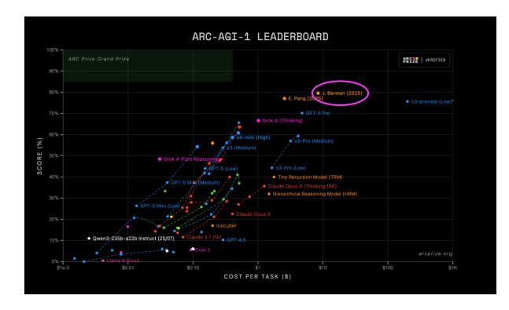
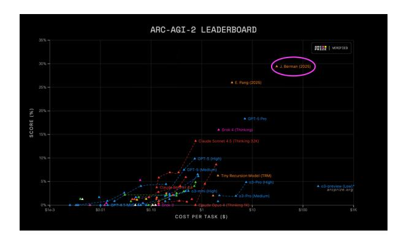
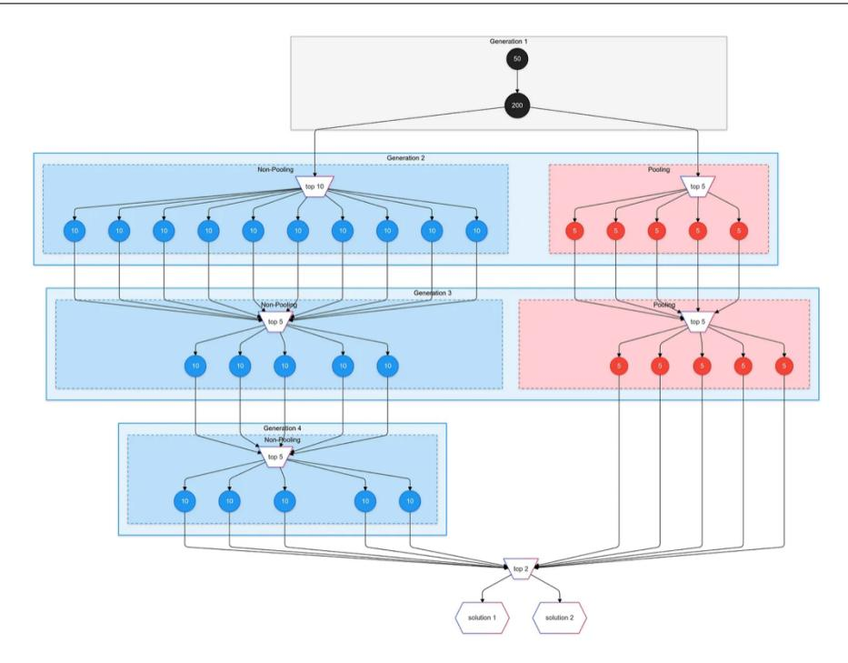
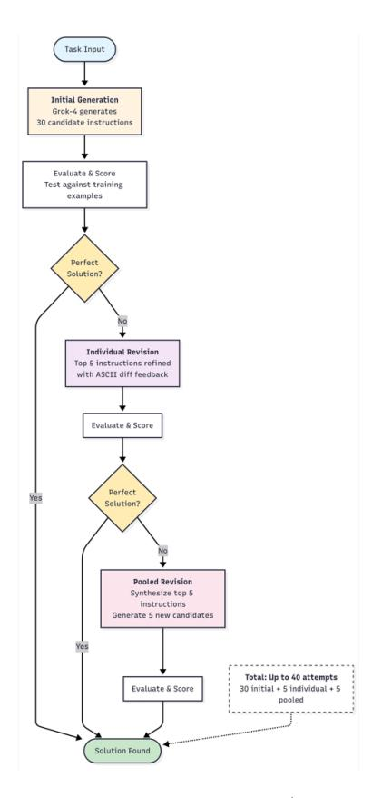

# From Parrots to Von Neumanns:

How Evolutionary Test-Time Compute Achieved State-of-the-Art on ARC-AGI

Jeremy Berman jeremyberman4@gmail.com

November 2025

#### Abstract

Large language models are the Math Olympiad but fail at children's puzzles. This paradox exposes their fundamental limitation: they struggle to generalize outside their training distribution. ARC-AGI measures exactly this gap.

I introduce Evolutionary Test-Time Compute (ETTC), a framework that treats language models as hypothesis generators and uses training examples as fitness functions. The approach: generate diverse solution candidates, score them by execution, select the best performers, and evolve better solutions through explicit revision with error feedback.

My first system (2024) evolved Python functions using Claude Sonnet 3.5, achieving 53.6% on ARC-AGI-1. My second system (2025) evolved natural-language instructions using Grok-4, achieving 79.6% on ARC-AGI-1 and 29.4% on ARC-AGI-2.

The improvement came from a fundamental shift in how LLMs work. In 2024, models were like "stochastic parrots"—they struggled to maintain logical coherence over long reasoning chains. There was no training process that taught them to think from their own traces.

Then late 2024 brought thinking models—starting with o1—and everything changed. Trained with reinforcement learning on their own reasoning traces, these models learned to actually think: exploring hypotheses, catching their mistakes, maintaining logical consistency across long chains of thought. They stopped imitating human reasoning and started generating their own. Suddenly, natural language became a viable medium for complex problem-solving.

Beyond the technical results, I offer a way to think about model evolution: Parrots (memorize patterns), Von Neumanns (derive within domains), and Einsteins (discover with taste). Current thinking models are becoming Von Neumanns. The path to AGI will require training Einsteins—models that know not just *how* to reason, but *what* to reason about.



Figure 1: ARC-AGI-1 leaderboard showing 79.6% accuracy (top public score).



Figure 2: ARC-AGI-2 leaderboard showing 29.4% accuracy (top public score).

# 1 Introduction

#### 1.1 The Riddle

Large language models can solve International Math Olympiad problems, write production code, and pass professional exams. Yet they struggle with simple visual puzzles that children complete easily.

This is the problem ARC-AGI was designed to expose. Most AI benchmarks measure accumulated knowledge. But intelligence isn't about memorizing facts—it's about how quickly you learn new skills from limited examples. As Chollet argues in *On the Measure of Intelligence*, <sup>1</sup> calculators beat humans at arithmetic but we don't call them intelligent. Humans are intelligent because we can learn new board games from a few examples, figure out unfamiliar tools, or adapt to novel situations with minimal prior experience.

ARC-AGI operationalizes this definition. Each task is a novel visual puzzle: given 2-4 inputoutput grid pairs, infer the transformation rule and apply it to a test input. The puzzles require only basic spatial reasoning that children possess, yet they're novel enough that memorization can't help. You have to *figure it out*.

The results reveal a stark gap. Humans achieve 85%+ accuracy with minimal effort. State-of-the-art LLMs barely reach 30% even with massive compute. This isn't a knowledge problem—it's a generalization problem. Every ARC task is designed to be novel, resistant to memorization. That's what makes it the right test for intelligence.

This paper documents how I achieved state-of-the-art results on both ARC-AGI-1 (79.6%) and ARC-AGI-2 (29.4%) using evolutionary test-time compute.

# 1.2 What This Paper Covers

This paper documents:

- ETTC for ARC-AGI-1. A code-based ETTC system that evolves Python transforms verified against training examples, achieving 53.6% on ARC-AGI-1-Pub.
- ARC Lang for ARC-AGI-2. A language-instruction variant with a sub-agent follower that executes instructions deterministically, achieving 79.6% on ARC-AGI-1 and 29.4% on ARC-AGI-2 at substantially lower cost than prior approaches I am aware of.
- Hypotheses about reasoning. A calibrated account of how on-policy learning appears to improve deductive consistency, and a hypothesis about training models to generate "oracle context" (reasoning with taste) as a path to broader generalization.

# 2 Background: What ARC Measures and Why It Matters

#### 2.1 ARC-AGI-2: Raising the Bar

ARC-AGI-1 contained 400 public evaluation tasks, many of which had been analyzed extensively online. By 2024, frontier models were starting to make progress—though at computational costs orders of magnitude higher than humans. ARC-AGI-2, released in early 2025, reset the playing field.<sup>2</sup>

<sup>&</sup>lt;sup>1</sup>Chollet (2019).

<sup>&</sup>lt;sup>2</sup>ARC Prize Foundation (2024b); Chollet et al. (2024).

The new benchmark includes 1,000 public training tasks and 120 public evaluation tasks, all freshly created with specific design goals:

- Maintain core principles: Each task remains unique and unsolvable by memorization. All rely only on "Core Knowledge"—basic spatial, temporal, and object reasoning that humans possess innately.
- Resist brute force: Tasks are explicitly designed to be hard for naive program synthesis or exhaustive search. They require genuine insight, not just computational power.
- Emphasize efficiency: The ARC Prize leaderboard now visualizes cost-per-task versus accuracy, making intelligence efficiency a first-class metric.<sup>3</sup>

The result is significantly harder. Human performance remains near-perfect, but model performance on v2 is roughly half what it was on v1 at comparable compute budgets.

## 3 Related Work

ARC has inspired approaches spanning program synthesis, prompting for deliberate reasoning, and test-time adaptation.

- LLM-guided program synthesis. Greenblatt and colleagues reported strong ARC-AGI results by using GPT-4-class models to generate and iteratively refine Python programs, verified against training examples.<sup>4</sup>
- Deliberate reasoning with prompting. Chain-of-Thought (CoT) prompting elicits step-by-step reasoning,<sup>5</sup> while Tree-of-Thoughts (ToT) explores branching search over intermediate thoughts.<sup>6</sup> Program-Aided Language models (PAL) delegate sub-problems to lightweight programs.<sup>7</sup>
- **Test-time training and adaptation.** Several works adapt model behavior during inference to improve generalization on ARC-like tasks ("test-time training").<sup>8</sup>
- Model improvements. OpenAI and xAI described "thinking" models (e.g., o1/o3, Grok) trained with on-policy reinforcement over long reasoning traces, reporting stronger consistency on reasoning benchmarks. I observe similar trends empirically in my systems.<sup>9</sup>
- Representation learning at the concept level. LeCun's Joint Embedding Predictive Architecture (JEPA) motivates moving beyond token-level prediction toward feature-space prediction. I discuss how a related spirit may help train models that generate their own "oracle context."

My work differs by framing ARC solution search as *evolutionary test-time compute* that explicitly couples breadth-first exploration with verifiable fitness and structured revision—first in code, then in natural language with a separate follower for deterministic execution.

<sup>&</sup>lt;sup>3</sup>ARC Prize Foundation (2025b).

<sup>&</sup>lt;sup>4</sup>See Greenblatt et al. (2024).

<sup>&</sup>lt;sup>5</sup>Wei et al. (2022).

<sup>&</sup>lt;sup>6</sup>Yao et al. (2023).

<sup>&</sup>lt;sup>7</sup>Gao et al. (2023).

<sup>&</sup>lt;sup>8</sup>See Yu et al. (2024).

OpenAI o1/o3 overview: https://openai.com/research; xAI Grok overview: https://x.ai/blog.

<sup>&</sup>lt;sup>10</sup>Meta AI blog: https://ai.meta.com/blog/yann-lecun-ai-model-i-jepa/.

# 4 Evolutionary Test-Time Compute (ETTC) on ARC-AGI-1

My first system, built in late 2024, achieved 53.6% accuracy on ARC-AGI-1—a significant jump from the previous state-of-the-art of 43%. The core insight was treating test-time compute as evolution: generate diverse hypotheses, verify them against training examples, and breed better solutions from the fittest candidates.

This approach was inspired by Ryan Greenblatt's work at Redwood Research, which demonstrated that LLMs could generate and iteratively refine Python solutions to ARC tasks. <sup>11</sup> I extended this with explicit evolutionary mechanisms: diverse prompt templates for breadth, two-tier fitness scoring for gradient, and pooled revision for recombination.

# 4.1 Why Code? The Power of Executable Verification

The key design choice was representation: Python functions rather than direct grid outputs. This unlocks three critical advantages:

**Deterministic execution:** Functions encode *strategies*, not just answers. You can test, analyze, and refine them.

**Granular scoring:** A function might solve 2 of 3 examples perfectly and get 90% of cells right on the third. This shaped fitness signal guides evolution toward perfect solutions.

Composability: Functions have internal structure we can reason about. Grid guesses are atomic.

The trade-off: LLMs sometimes generate invalid code. But with sandboxing and timeouts, the benefits far outweigh the costs.

# 4.2 Two-Tier Fitness: Rewarding Near-Misses

The scoring function proved critical. I use a two-tier system:

**Primary score:** Count of training examples solved *exactly*. A function that perfectly transforms 2 out of 3 examples gets a primary score of 2.

**Secondary score:** For examples not solved exactly, count the percentage of cells that match. A function that's one cell off gets 99% credit on that example.

This two-tier approach prevents premature convergence. Without the secondary score, evolution gets stuck: dozens of functions might solve the same 2 examples, with no gradient to guide improvement. The cell-wise similarity provides a gentle slope toward perfection.

Importantly, primary score always dominates. A function solving 2 examples perfectly (primary=2) beats one solving 1 example perfectly plus 99% of another (primary=1, secondary=0.99). This prevents evolution from getting distracted by near-misses when it should be exploring entirely different strategies.

### 4.3 The Evolutionary Loop

Key innovations:

- 31 diverse prompt templates prevent clustering around local optima
- Explicit error feedback ("extra red cell at (2,3)") guides refinement

<sup>&</sup>lt;sup>11</sup>Greenblatt et al. (2024).

## **Algorithm 1** ETTC (Python Program Evolution)

**Require:** Training pairs  $\mathcal{D} = \{(x_i, y_i)\}$ ; generator LLM G

- 1: Initialize population with diverse prompt templates
- 2: for generation t = 0 to T 1 do
- 3: Score all functions on training examples (two-tier fitness)
- 4: Select top-k as parents
- 5: Generate revisions with explicit error feedback
- 6: Pool multiple parents to maintain diversity
- 7: Combine parents, revisions, and pooled offspring
- 8: **return** top-2 scoring functions



Figure 3: ETTC (2024) architecture: generate diverse Python functions, score with two-tier fitness, select top performers, and evolve through individual and pooled revision.

- Pooling ensures we don't lose insights when different functions excel at different examples
- 3-4 generations balance exploration and exploitation
  The final population of 300-500 functions yields the top 2 submissions.

# 4.4 Why Depth Matters: An Ablation Study

A natural question: why not just generate 500 functions in one shot? Why bother with generations? I ran a controlled experiment on 60 training tasks to answer this. Two architectures, same total compute (200 LLM calls each):

- Shallow: 1 generation of 200 functions
- Deep: 4 generations of 50 functions each

Results: Shallow achieved 70% (42/60 solved), Deep achieved 75% (45/60 solved). Of Deep's 45 solutions, 42% came from generations 2-4. Most tasks that Deep solved but Shallow missed required these later generations.

The reason is clear when you examine near-misses. Shallow often produces dozens of functions that are one or two cells away from correct. Without revision prompts pointing out these specific errors, the LLM keeps generating similar near-misses. With revision, it can fix the subtle bugs and converge to perfection.

There's a trade-off, though. Go too deep (like 20 generations of 10 functions each) and you lose diversity—each generation becomes too narrow, and you get stuck in local maxima. The sweet spot is 3-4 generations with 50-150 functions per generation.

## 4.5 Results and Model Diversity

This system achieved **53.6**% **on ARC-AGI-1-Pub**, verified by the ARC Prize Foundation.<sup>12</sup> This was the top score on the public leaderboard and a significant jump from the previous best of 43%.

I primarily used Claude Sonnet 3.5, but found that mixing model families helps. Occasionally o1-mini, GPT-40, or Gemini 1.5 Pro would solve a task more efficiently than Sonnet. Each model has different inductive biases from training, so they explore different regions of solution space. The evolutionary framework is model-agnostic—what matters is the generate-score-select-revise loop, not the specific LLM.

The system is fully open-source at https://github.com/jerber/arc\_agi with reproducible configs. For more implementation details and example prompts, see the full write-up. 13

# 5 ARC Lang: Evolving Natural-Language Algorithms on ARC-AGI-2

Nine months after my first system, I rebuilt from scratch for ARC-AGI-2. The fundamental ETTC architecture remained—generate, score, select, revise—but with one crucial change: **swap Python** for **English**.

This wasn't just a tweak. It was a reconceptualization of what we're asking LLMs to do. And it led to the current state-of-the-art: **79.6% on ARC-AGI-1** at \$8.42 per task (25× more efficient than o3-preview's 75.7% at \$200 per task) and **29.4% on ARC-AGI-2**.

#### 5.1 Why Language Works Now

Four key reasons made the shift from Python to natural language possible:

- 1. Expressivity: Consider an ARC-AGI-2 task: find the smallest object, copy it vertically, flood-fill holes. In Python, this requires defining "object" (connected components?), "smallest" (by area?), handling edge cases, and implementing flood-fill. In English: "Find the smallest connected object. Copy it vertically. Flood-fill enclosed regions." The English captures the concept directly without implementation details.
- 2. Thinking models do internal exploration: By 2025, models like Grok-4 spend thousands of hidden tokens exploring and refining their reasoning. This means the evolutionary scaffold does less work—the model already explores many solution paths internally. My 2024 system needed

<sup>&</sup>lt;sup>12</sup>ARC Prize Foundation (2024a).

 $<sup>^{13}</sup>$ Berman (2024).

300-500 candidates because Sonnet 3.5 couldn't explore internally. My 2025 system needs only 40 candidates because Grok-4's internal search reduces the need for external exploration.

- 3. Better debugging: Code failures give stack traces. Language failures give explanations of strategy. Reading "it's sorting by color when it should sort by size" immediately reveals the conceptual error.
- 4. Still verifiable through strong followers: The key insight: you need TWO thinking models. A separate "follower" LLM must reliably execute complex multi-step instructions. In 2024, even if you could generate perfect natural-language instructions, models couldn't follow them reliably. Now, Grok-4 as follower produces the same output 95%+ of the time given the same instruction. The follower needs to be as strong as (or stronger than) the instruction generator—a weak follower makes the whole system fail even with perfect instructions.

# 5.2 The New Representation: Natural-Language Algorithms

Instead of Python functions, candidates are now structured natural-language instructions. I use light schema constraints to ensure they're parseable:

- A brief description of the transformation
- Step-by-step instructions (typically 3-8 steps)
- Expected properties of the output ("output size matches input", "background remains black")

A separate "follower" LLM (also Grok-4 in my production system) reads these instructions and applies them to each grid. This role separation is crucial, but equally crucial: the follower must be a thinking model too. A weak follower breaks everything—even perfect instructions fail if the executor can't handle multi-step reasoning. The *planner* generates strategies, the *follower* executes them reliably, and evolution operates over the strategies.

#### 5.3 Scoring: Leave-One-Out Cross-Validation

With code, I could execute functions on all training examples simultaneously. With natural-language instructions, I need to be more careful about overfitting. An instruction might memorize specific details of the training examples rather than extracting the general rule.

Solution: leave-one-out cross-validation (LOOCV). For each instruction:

- 1. For each training example  $(x_i, y_i)$ , treat it as the "test" example
- 2. Have the follower apply the instruction to  $x_i$  (having only seen the *other* training examples during instruction generation)
- 3. Compare the output to  $y_i$ , computing both exact matches and cell-wise similarity
- 4. Average across all examples

This prevents instructions from being too specific while preserving the graded fitness signal. An instruction that works on all-but-one example scores highly, giving evolution a clear gradient to follow.

#### 5.4 Role Specialization: Planner, Repairer, Follower

ARC Lang uses three distinct roles, each with specialized prompts:

**Planner.** Generates initial instruction candidates. Given the training examples, proposes diverse strategies for solving the task. Optimized for breadth and creativity.

**Repairer.** Takes a high-scoring instruction that failed on some examples, analyzes why it failed (via ASCII diffs showing exactly which cells are wrong), and proposes fixes. Optimized for precision and debugging.

**Follower.** Takes an instruction and a grid, outputs the transformed grid. Optimized for faithful execution of written instructions without second-guessing or improvisation.

This separation prevents prompt interference. Early experiments that combined all roles in one mega-prompt produced worse results—the model would try to simultaneously be creative (planner), critical (repairer), and obedient (follower), and would fail at all three. Specialized roles with tailored prompts work much better.

The evolution loop proceeds through three step types:

**Step (Initial Generation).** The planner generates 30 diverse instruction candidates. The follower executes each on all training examples. We score using LOOCV and select the top performers.

**StepRevision** (Individual Repair). For each of the top 5 instructions, we show the repairer:

- The instruction text
- Its outputs on each training example
- The correct outputs
- ASCII diffs highlighting exactly which cells differ

The repairer generates a revised instruction. We score it and add it to the population. Typically generate 1 revision per top instruction, producing 5 new candidates.

**StepRevisionPool** (Synthetic Recombination). Pool the top 5 instructions together in one prompt. Show all their outputs, all their errors, and ask the model to synthesize a new instruction that combines the best elements. This is like sexual reproduction in evolution—recombining successful genes from multiple parents.

The pooling step is computationally expensive (large context, many reasoning tokens) but often discovers solutions that individual revisions miss. Typically generate 5 candidates from the pool.

The final architecture, determined through extensive experimentation on v2 tasks:

- 1. Initial generation: 30 instructions
- 2. Individual revisions: top  $5 \rightarrow 5$  new instructions
- 3. Pooled revision: all top  $5 \rightarrow 5$  new instructions

Total: 40 instruction candidates per task. If a perfect solution (scores 100% on all training examples) emerges early, we stop. Otherwise we run the full pipeline.

**Final replay.** The top 2 instructions (by LOOCV score) are replayed with a potentially stronger follower model to generate the final test outputs. We pick two *diverse* instructions (different strategies, not just different wording) to maximize coverage. ARC allows two attempts per task, so submitting genuinely different strategies increases the chance of success.



Figure 4: ARC Lang (2025) architecture: specialized roles (planner, repairer, follower) with natural-language instructions evolved through initial generation, individual revision, and pooled recombination.

# Algorithm 2 ARC Lang (ARC-AGI-2 / Natural-Language Algorithm Evolution)

**Require:**  $\mathcal{D}$ ; instruction generator G; follower F; configs for STEP, REVISION, POOL.

1:  $\mathcal{I}_0 \leftarrow \text{STEP}(G, F, \mathcal{D})$ 

▷ generate+score

- 2: **for** t = 0 to T 1 **do**
- 3:  $\mathcal{T}_t \leftarrow \text{top-}k \text{ from } \mathcal{I}_t \text{ by LOO score}$
- 4:  $\mathcal{R}_t \leftarrow \text{STEPREVISION}(G, F, \mathcal{D}, \mathcal{T}_t)$
- 5:  $\mathcal{P}_t \leftarrow \text{StepRevisionPool}(G, F, \mathcal{D}, \mathcal{T}_t)$
- 6:  $\mathcal{I}_{t+1} \leftarrow \mathcal{T}_t \cup \mathcal{R}_t \cup \mathcal{P}_t$
- 7: **return** FINALREPLAYANDPICKTWO $(F, \mathcal{I}_T)$

#### 5.5 Engineering for Reliability and Reproducibility

ARC Lang is built as a production-grade asynchronous pipeline:

- Concurrency control: Monitored semaphores cap simultaneous API calls to respect rate limits while maximizing throughput
- **Persistence**: Optional Postgres integration logs every instruction attempt, score, and error for offline analysis
- Provider flexibility: Pluggable configs for Grok, GPT-4/o1, Claude, Gemini, and open-source

models via OpenRouter

• **Timeout handling**: Each LLM call has configurable timeouts; thinking models sometimes get stuck and need to be terminated

This infrastructure was essential for systematic experimentation. I ran hundreds of ablations during development, each requiring robust logging and reproducibility.

The full system is open-source at https://github.com/jerber/arc-lang-public with ready-to-run configs and comprehensive documentation. For more implementation details and example prompts, see the full write-up.<sup>14</sup>

#### 5.6 Results: State-of-the-Art on ARC-AGI-2

ARC Lang achieved **29.4% accuracy on ARC-AGI-2-Pub**, the top score on the public leader-board at the time of reporting.<sup>15</sup>

For context, publicly reported contemporary baselines on ARC-AGI-2 are substantially lower; see §3 for background and references.

On ARC-AGI-1, the system achieved **79.6% accuracy** at \$8.42 per task. Public reports note o3-preview at 75.7% with roughly \$200 per task. I include these figures for context; absolute costs vary by settings and date. This represents a significant improvement over my 2024 system's 53.6%, despite using essentially the same evolutionary framework.

#### 5.7 What Made the Difference

The improvement from 53.6% to 79.6%/29.4% came primarily from better models. Grok-4 and other 2025 thinking models, trained with on-policy RL over extended reasoning traces, maintain longer-horizon coherence and follow complex instructions reliably.

Crucially, thinking models reduced the burden on ETTC itself. My 2024 system needed 300-500 candidates because Sonnet 3.5 did no internal exploration—each attempt was essentially a single shot. My 2025 system achieves better results with only 40 candidates because Grok-4 explores thousands of reasoning paths internally before outputting each instruction. The evolutionary scaffold does less work because the model does more.

The fundamental ETTC loop remained unchanged, but thinking models shifted the exploration from external (evolutionary search) to internal (model reasoning). This suggests ETTC captures something essential about verified exploration, whether that exploration happens externally through evolution or internally through thinking.

# 6 Design Principles

Building ETTC taught me a few practical lessons. As models improve directionally toward AGI, these techniques will become less necessary—eventually models will reason their way to correct answers more efficiently on their own.

**Verified exploration.** LLMs sound convincing even when wrong. Tie generation to a scorable proxy (training examples for ARC, test suites for code, proofs for math). Then give specific error feedback in revision prompts: "Your output has red cells at (0,1) but should have blue."

<sup>&</sup>lt;sup>14</sup>Berman (2025).

<sup>&</sup>lt;sup>15</sup>MLST (2025); Dong (2025).

Breadth first, then depth—but less with thinking models. Generate 20-50 diverse candidates before refining any. This preserves entropy early. Ablations confirmed: 4 generations of 50 candidates beat 1 generation of 200. But thinking models changed the calculus: my 2024 system needed 200-500 candidates, my 2025 system only 40. As models do more internal exploration, external breadth requirements decrease.

Role specialization. Separate planner (creative), repairer (critical), and follower (obedient) instances. Combined prompts fail—models try to be creative and critical simultaneously, end up being neither. This separation prevents cognitive interference that current models can't handle internally.

**Light structure.** For code, structure is essential. For natural-language instructions, light structure (numbered steps) works better than rigid schemas (type annotations, preconditions). Heavy structure constrains expressiveness more than it helps.

Cost-efficiency matters. Optimize for accuracy per dollar. My system achieved 79.6% at \$8.42 per task on ARC-AGI-1—higher accuracy than o3-preview at  $25 \times$  lower cost.

#### 7 Future Work

ETTC achieves state-of-the-art results on ARC, but several extensions could improve both performance and generalizability:

Memory and Skill Libraries. ETTC currently solves each task from scratch. A skill library that stores successful instructions from previous tasks could provide few-shot examples of confirmed correct reasoning—showing the model how to think about ARC grids and what types of patterns to look for. Retrieving analogous solutions would give evolution better starting points and help models learn transferable strategies.

Adaptive Compute Allocation. Fixed architectures (always 30 initial + 10 revisions) waste compute on easy tasks and underinvest in hard ones. A meta-policy that predicts task difficulty from initial attempts could stop early when solutions are found or scores plateau, and invest more generations when improvement continues. This requires logging detailed traces and training on features like initial score distribution and error patterns.

# 8 Reproducibility and Open Source

Both systems are open-source with complete implementations:

- ARC-AGI-1 (Python): https://github.com/jerber/arc\_agi
- ARC-AGI-2 (Language): https://github.com/jerber/arc-lang-public

Each includes: environment configs, concurrency controls, detailed logging, optional Postgres persistence, and ready-to-run configurations for multiple LLM providers (Grok, OpenAI, Anthropic, Gemini, open-source models via OpenRouter).

The ARC Prize Foundation verified both the 53.6% result on ARC-AGI-1 and the 29.4% result on ARC-AGI-2.

# 9 From Parrots to Von Neumanns to Einsteins

The previous sections described *what* works. This section proposes *why* it's necessary—and what that suggests about the evolution of language models.

After examining thousands of solution attempts, a consistent pattern emerged: LLMs don't just fail at ARC, they fail in ways that violate basic logic. Models spend thousands of reasoning tokens analyzing grids, then confidently output nonsense: claiming objects are symmetrical when they're not, counting "three red squares" in a grid with two red and one blue, or producing revisions that fix some errors while introducing new ones.

## 9.1 Dead Knowledge Zones vs. Dead Reasoning Zones

Humans have *dead knowledge zones*—things we don't know. An economist lacks chemistry knowledge but can learn it. Their *reasoning* transfers across domains.

LLMs have the opposite problem: vast knowledge but *dead reasoning zones*—regions where logic breaks down. They reason beautifully on math from their training distribution but confidently output nonsense on novel spatial puzzles. This isn't a knowledge problem—ARC uses only basic spatial reasoning. The issue is their reasoning circuits don't function reliably outside trained domains.

# 9.2 The Fused Circuit Hypothesis: Web vs. Tree

LLMs seem to learn two types of knowledge but conflate them:

**The Knowledge Web.** Pre-training creates statistical correlations. Ask "What's the capital of North Dakota?" and the model retrieves "Bismarck" through association. This is memorized factual knowledge with no causal structure—"parrot knowledge" that knows names of things but couldn't derive them from first principles.

The Knowledge Tree. True reasoning forms causal, deductive trees. You start with axioms (Newton's laws, Maxwell's equations) and derive everything through logical steps. This is "Von Neumann knowledge"—the ability to derive physics from scratch by understanding the tree structure.

The Problem: Fused Circuits. LLMs learn reasoning fused with domain knowledge. They build a math-reasoning tree embedded in the math web, a code-reasoning tree embedded in the code web. These structures are partially transferable but fundamentally domain-specific. Evidence: models that flawlessly prove number-theoretic results claim simple grid patterns are symmetrical when they're not. They have a math tree but only a spatial web.

Pre-training on more data densifies the web with more memorized associations, which can actually impede reasoning. The model becomes very good at pattern matching to training data, but that prevents it from reasoning from first principles.

#### 9.3 How ETTC Navigates Dead Zones

This diagnosis explains why ETTC helps: breadth-first generation explores diverse regions of solution space, including some where reasoning works better. Verification amplifies signal from those regions. Evolution propagates strategies that work. Natural-language instructions force explicit articulation of reasoning strategies.

But ETTC is a workaround, not a solution. It navigates around dead reasoning zones rather than eliminating them.

## 9.4 The Real Shift: Thinking Models and On-Policy RL

Looking back, I misunderstood my 2024 results. I thought Python was necessary for verification. But the real issue was the models themselves.

In 2024, I wrote: "A parrot in a courthouse regurgitates more correct statements than one in a madhouse." Pre-thinking models were parrots—they pattern-matched but couldn't maintain coherent reasoning. Code was a crutch for models that couldn't reliably follow natural-language instructions.

Between 2024 and 2025, thinking models emerged through on-policy reinforcement learning over extended reasoning traces. Unlike supervised learning (imitating text), thinking models train on their own reasoning process. They learn to maintain logical consistency, check their work, and follow instructions reliably.

This transforms models from parrots to "Von Neumanns"—models that derive from first principles within trained domains. They're not imitating reasoning; they're actually reasoning.

This is why language works in 2025. You need thinking models on both sides: Grok-4 generating instructions AND Grok-4 following them. Both learned to handle complex multi-step reasoning through on-policy RL. Without thinking models as followers, even perfect natural-language instructions would fail.

# 9.5 From Von Neumanns to Einsteins: The Originality Gap

But Von Neumanns aren't Einsteins. Eugene Wigner, comparing Einstein to John von Neumann, observed that while von Neumann had extraordinary computational brilliance, "Einstein's understanding was deeper even than von Neumann's. His mind was both more penetrating and more original." Von Neumann could derive physics from first principles with stunning speed. But Einstein discovered Special Relativity—something genuinely novel, outside the existing paradigm.

To be clear: von Neumann was practically superhuman. He made groundbreaking contributions to quantum mechanics, game theory, computer architecture, and mathematics—many of which were genuinely original and paradigm-shifting. This analogy is imperfect but serves to illustrate two archetypes: the consistent logical reasoner who derives brilliantly within frameworks, and the paradigm-escaper who questions the frameworks themselves.

The difference is *taste*. Von Neumanns know *how* to reason. Einsteins know *what* to reason about.

I observe that current thinking models are baby Von Neumanns. Through on-policy RL, they've learned to derive theorems in math, reason about code, and maintain logical consistency more reliably. But they often remain domain-specific Von Neumanns—math-Von Neumann, code-Von Neumann, language-Von Neumann. They struggle with novel spatial puzzles not because they lack the knowledge (they've seen many spatial examples) but because they likely lack the *originality* to discover new reasoning patterns from first principles.

Reasoning Expands Distribution. Einstein discovered Special Relativity not by escaping his training distribution, but by expanding it from within. Through reasoning—questioning simultaneity, running thought experiments about light speed, recognizing which contradictions mattered—Special Relativity came into distribution. His reasoning made unlikely ideas become likely through logical deduction.

Autoregressive models—both neural and human—constantly re-program themselves. Ideas that seem out of distribution at first become in-distribution token by token. When Einstein began reasoning about light speed, "time dilation" had near-zero probability. But each step of his reasoning—"what if simultaneity is relative?" "what if clocks run differently?"—made the next unlikely token slightly more likely. By the end of the reasoning chain, time dilation had high probability. It came into distribution through the autoregressive reasoning process itself.

This is intelligence: reasoning with taste. Not random exploration, but creative intuition for which axioms to question, which thought experiments to run, which unlikely ideas are worth pursuing. Current on-policy RL over extended reasoning traces trains models to reason for themselves—to avoid logical inconsistencies and allocate compute effectively (Von Neumann-level). The next frontier is training models to develop taste—to discover which axioms matter, which questions are generative, which unlikely-but-true ideas are worth bringing into distribution token by token (Einstein-level). This requires reinforcement not just on correct final answers, but on reasoning that successfully brings unlikely, true, and interesting tokens into distribution through the autoregressive process.

When we build models with this creative originality—with taste for bringing unlikely, true, and interesting tokens into distribution across *all* domains—they'll achieve human-level performance on children's puzzles with human-level efficiency. The scaffolds I built (evolutionary search, role separation, verified exploration) will become unnecessary. The model will reason its way to the right answer more efficiently on its own.

# 10 Conclusion: Separating Knowledge from Reasoning

This paper documents two systems, one evolution in thinking.

On the technical side, ETTC treats LLMs as hypothesis generators and scales through evolution rather than brute force. It achieved state-of-the-art results on both ARC-AGI-1 (79.6%) and ARC-AGI-2 (29.4%). But ETTC is scaffolding for models that can't yet reason to the answer directly.

The real story is about model evolution. Between 2024 and 2025, thinking models emerged—trained with on-policy RL to reason for themselves rather than imitate. This enabled the shift from code (a crutch) to natural language (how humans actually specify tasks).

Beyond the results, the concepts of *dead reasoning zones* and *fused circuits* might explain why LLMs fail at novel generalization. They don't lack knowledge—they lack domain-independent reasoning. Their logical consistency is fragmented across specialized embeddings rather than unified into a universal reasoning engine.

This diagnosis suggests a direction. We don't need models to escape their training distribution—we need to bring *pure reasoning* into that distribution. On-policy learning has shown promise: models trained on their own reasoning traces learn logical consistency that transfers better across domains. But we likely need more creative training methods and environments to fully defuse reasoning circuits from their domain-specific fusion.

As models improve toward AGI, external scaffolds like evolutionary search, skill libraries, and adaptive compute allocation will become unnecessary. If these strategies are actually useful, models with genuine reasoning capability will learn to do them internally and optimally as part of their reasoning process—exploring solution space efficiently, retrieving relevant experience, and allocating compute adaptively, all as one integrated system rather than external workarounds.

We'll know we've succeeded when the scaffolds become unnecessary—when models can reason their way to solutions as efficiently as humans do, expanding their distribution through reasoning rather than just operating within it. That's not a benchmark hack. That's intelligence.

Acknowledgments Thanks to the ARC Prize Foundation and the ARC community for a benchmark and culture that reward open ideas and rigorous verification. The path to AGI isn't a secret locked in corporate labs. It's an open problem that rewards clear thinking and systematic experimentation. When we solve ARC efficiently and understandably, we'll know we're on the right path.

# References

- J. Wei et al. Chain-of-Thought Prompting Elicits Reasoning in Large Language Models. 2022. https://arxiv.org/abs/2201.11903.
- S. Yao et al. Tree of Thoughts: Deliberate Problem Solving with Large Language Models. 2023. https://arxiv.org/abs/2305.10601.
- L. Gao et al. PAL: Program-Aided Language Models. 2023. https://arxiv.org/abs/2211.10435.
- J. Berman. How I Got a Record 53.6% on ARC-AGI-Pub using Sonnet 3.5 by Evolving Test-Time Compute. Jeremy Berman Substack, November 2024. https://jeremyberman.substack.com/p/how-i-got-a-record-536-on-arc-agi. Code: https://github.com/jerber/arc\_agi.
- J. Berman. How I Got the Highest Score on ARC-AGI (Again): Swapping Python for English. Jeremy Berman Substack, January 2025. https://jeremyberman.substack.com/p/how-i-got-the-highest-score-on-arc-agi-again. Code: https://github.com/jerber/arc-lang-public.
- R. Greenblatt et al. Getting 50% (SoTA) on ARC-AGI with GPT-4o. Redwood Research Blog, 2024. https://blog.redwoodresearch.org/p/getting-50-sota-on-arc-agi-with-gpt.
- S. Yu et al. The Surprising Effectiveness of Test-Time Training for Abstract Reasoning. 2024. https://arxiv.org/abs/2411.07279.
- F. Chollet, M. Knoop, G. Kamradt, B. Landers. ARC Prize 2024: Technical Report. 2024. https://arxiv.org/abs/2412.04604.
- ARC Prize Foundation. 2024 Progress on ARC-AGI-Pub (verification of 53.6%). 2024. https://arcprize.org/blog/2024-progress-arc-agi-pub.
- ARC Prize Foundation. ARC-AGI-2: Dataset and documentation. *GitHub: arcprize/ARC-AGI-2*. https://github.com/arcprize/ARC-AGI-2.
- ARC Prize Foundation. Mission and values; ARC Prize 2025 spirit and open-source expectations. https://arcprize.org/about, https://arcprize.org/competitions/2025/.
- ARC Prize Foundation. Leaderboard and intelligence-efficiency framing (cost-per-task vs. accuracy). 2025. https://arcprize.org/leaderboard.
- F. Chollet. On the Measure of Intelligence. 2019. https://arxiv.org/abs/1911.01547.
- MLST (interview with J. Berman). "29.4% ARC-AGI-2 (Top Score!)." 2025. https://www.youtube.com/watch?v=FcnLiPyfRZM.
- A. Dong. Evolutionary Test-Time Compute: trade time & tokens for creativity. 2025. https://alexdong.com/llm-evolutionary-test-time-compute.html.

# A Selected Leaderboard Results

| System                  | Organization   | Type        | v1    | v2     | Cost/Task |
|-------------------------|----------------|-------------|-------|--------|-----------|
| Human Panel             | Human          | N/A         | 98.0% | 100.0% | \$17.00   |
| Stem Grad               | Human          | N/A         | 98.0% | N/A    | \$10.00   |
| Avg. Mturker            | Human          | N/A         | 77.0% | N/A    | \$3.00    |
| J. Berman (2025)        | Bespoke        | Refinement  | 79.6% | 29.4%  | \$30.40   |
| E. Pang (2025)          | Bespoke        | Refinement  | 77.1% | 26.0%  | \$3.97    |
| o3-preview (Low)        | OpenAI         | CoT + Synth | 75.7% | 4.0%   | \$200.00  |
| GPT-5 Pro               | OpenAI         | CoT         | 70.2% | 18.3%  | \$7.14    |
| Grok 4 (Thinking)       | xAI            | CoT         | 66.7% | 16.0%  | \$2.17    |
| Claude Sonnet 4.5 (32K) | Anthropic      | CoT         | 63.7% | 13.6%  | \$0.759   |
| o3 (High)               | OpenAI         | CoT         | 60.8% | 6.5%   | \$0.834   |
| GPT-5 (High)            | OpenAI         | CoT         | 65.7% | 9.9%   | \$0.730   |
| ARChitects              | ARC Prize 2024 | Bespoke     | 56.0% | 2.5%   | \$0.200   |
| Claude Sonnet 4.5 (8K)  | Anthropic      | CoT         | 46.5% | 6.9%   | \$0.235   |
| Tiny Recursion Model    | Bespoke        | Refinement  | 40.0% | 6.3%   | \$2.10    |
| Claude Opus 4 (16K)     | Anthropic      | CoT         | 35.7% | 8.6%   | \$1.93    |
| Hierarchical Reasoning  | Bespoke        | Refinement  | 32.0% | 2.0%   | \$1.68    |
| Deepseek R1 $(05/28)$   | Deepseek       | CoT         | 21.2% | 1.1%   | \$0.053   |
| Deepseek R1             | Deepseek       | CoT         | 15.8% | 1.3%   | \$0.080   |
| o1-mini                 | OpenAI         | CoT         | 14.0% | 0.8%   | \$0.191   |
| GPT-4o                  | OpenAI         | Base LLM    | 4.5%  | 0.0%   | \$0.080   |

Table 1: Selected ARC-AGI leaderboard results showing key systems. "v1" = ARC-AGI-1, "v2" = ARC-AGI-2. Full live leaderboard: https://arcprize.org/leaderboard.

# B Example Prompts from ARC Lang (2025)

```
. . .
 Individual Revision Prompt Example
 Find the common pattern that transforms each input grid into its corresponding output grid, based on the training examples below.
 Your task is to write clear instructions that describe this transformation pattern. These instructions
 Your task to to write clear most community:

- Apply consistently to ALL training examples (the same rule works for every input—output pair)

- Be general enough to work on new test cases

- Be intuitive and easy to understand

- Describe the pattern without referencing specific example numbers or positions
 The transformation pattern should be simple and logical - these puzzles are designed to have elegant, intuitive solutions that humans can readily grasp.
 Write your instructions as a clear, step-by-step process that someone could follow to transform any input grid into the correct output grid.
Here are the training examples and test input grids: --Training Examples--
Training Example 1
Training Example 2
Input:
0 4 0
0 8 0
0 0 0
0utput:
0 0 6
4 0 0
0 5 0
--End of Training Examples--
--Test Inputs--
Test Input 1
0 7 0
0 0 8
9 0 0
--End of Test Inputs--
Assistant: Reflect each grid across the vertical axis so that every mon-zero cell appears the same distance from the center line on the opposite side. Keep every color the same.
 Your previous instructions were applied to the training input grids, but they did not produce the correct output grids.
 Below you'll see what outputs were generated when following your instructions. Compare these incorrect outputs with the correct outputs to identify where your instructions went wrong.
Based on this feedback, provide updated instructions that correctly describe the transformation pattern. Your revised instructions must:

- Fix the specific errors you observe

- Still work correctly for ALL training examples

- Remain clear, intuitive, and general
Analyze the differences between the incorrect outputs and the correct outputs to understand the true pattern, then write improved instructions.

--Training Examples--
Training Example 1
Failed Output Attempt:
Training Example 2
Input:
0 4 0
0 0 5
6 0 0
--End of Test Inputs--
```

Figure 5: Example planner prompt for generating initial natural-language instructions. The prompt shows training examples and asks the model to describe the transformation pattern.

```
Pooled Revision Prompt Example
 You are participating in a puzzle solving competition. You are an expert at solving puzzles.
Find the common pattern that transforms each input grid into its corresponding output grid, based on the training examples below.
Your task is to write clear instructions that describe this transformation pattern. These instructions must:
must:
- Apply consistently to ALL training examples (the same rule works for every input-output pair)
- Be general enough to work on new test cases
- Be intuitive and easy to understand
- Describe the pattern without referencing specific example numbers or positions
The transformation pattern should be simple and logical – these puzzles are designed to have elegant, intuitive solutions that humans can readily grasp.
Write your instructions as a clear, step-by-step process that someone could follow to transform any input grid into the correct output grid.
Here are the training examples and test input grids:
--Training Examples--
Training Example 1
0 0 6
4 0 0
0 5 0
--End of Training Examples--
6 7 6
6 8 8
9 8 8
 9 0 0
--End of Test Inputs--
Multiple expert puzzle solvers have attempted to describe the transformation pattern for these grids. Each attempt captured some aspects correctly but failed in other ways.
Below you'll find:
 - Each set of proposed instructions
- The outputs produced when following those instructions
- How those outputs differ from the correct answers
Your task is to analyze why each approach partially failed and synthesize a complete, correct set of instructions.

    Recognize common misconceptions about the pattern
    Build comprehensive instructions that avoid all these pitfalls

Study the patterns of success and failure across all attempts, then write instructions that correctly describe the complete transformation rule that works for ALL training examples.
 Your final instructions should be clear, intuitive, and capture the true underlying pattern.
Reflect each grid across the vertical axis so that every non-zero cell appears the same distance from the center line on the opposite side. Keep every color the same.
 <scores from instructions 1>
The human got the grid for Training Example 1 44% correct with these instructions. The human got the grid for Training Example 2 44% correct with these instructions.
<instructions_2>
Leave the grid unchanged: copy each non-zero cell to the same coordinates in the output.
```

Figure 6: Example repairer prompt showing how revision prompts include detailed error feedback. The prompt displays the current instruction, its outputs, the correct outputs, and ASCII diffs highlighting specific cell-level errors.