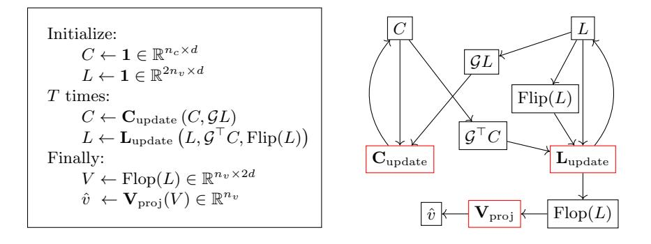
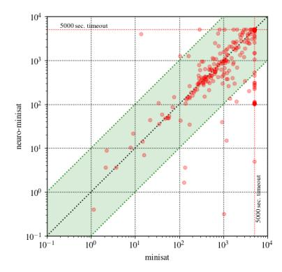
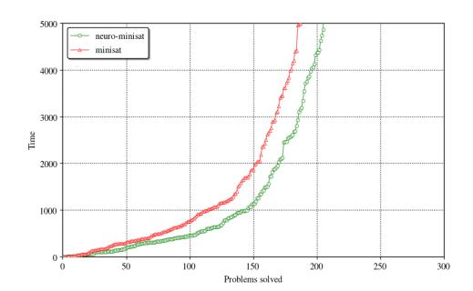
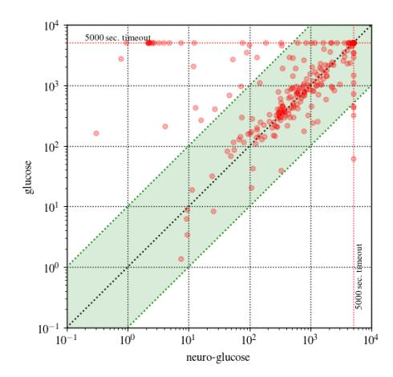
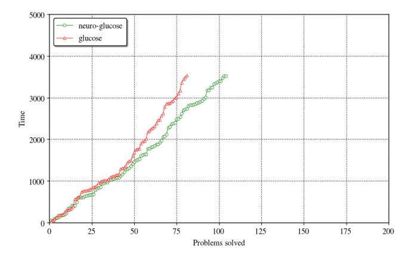

# Guiding High-Performance SAT Solvers with Unsat-Core Predictions

Daniel Selsam1\* and Nikolaj Bjørner2

- 1 Stanford University, Stanford CA 94305, USA
- 2 Microsoft Research, Redmond WA 98052, USA

**Abstract.** The NeuroSAT neural network architecture was introduced in [37] for predicting properties of propositional formulae. When trained to predict the satisfiability of toy problems, it was shown to find solutions and unsatisfiable cores on its own. However, the authors saw "no obvious path" to using the architecture to improve the state-of-the-art. In this work, we train a simplified NeuroSAT architecture to directly predict the unsatisfiable cores of real problems. We modify several highperformance SAT solvers to periodically replace their variable activity scores with NeuroSAT's prediction of how likely the variables are to appear in an unsatisfiable core. The modified MiniSat solves 10% more problems on SATCOMP-2018 within the standard 5,000 second timeout than the original does. The modified Glucose solves 11% more problems than the original, while the modified Z3 solves 6% more. The gains are even greater when the training is specialized for a specific distribution of problems; on a benchmark of hard problems from a scheduling domain, the modified Glucose solves 20% more problems than the original does within a one-hour timeout. Our results demonstrate that NeuroSAT can provide effective guidance to high-performance SAT solvers on real problems.

#### 1 Introduction

Over the past decade, neural networks have dramatically advanced the state of the art on many important problems, most notably object recognition [22], speech recognition [13], and machine translation [45]. There have also been several attempts to apply neural networks to problems in discrete search, such as program synthesis [33,7], first-order theorem proving [17,27] and higher-order theorem proving [44,42,18,16]. More recently, [37] introduce a neural network architecture designed for satisfiability problems, called NeuroSAT, and show that when trained to predict satisfiability on toy problems, it learns to find solutions and unsatisfiable cores on its own. Moreover, the neural network is iterative, and the authors show that by running for many more iterations at test time, it can solve problems that are bigger and even from completely different domains than

 $^{\star}$  This paper describes work performed while the first author was at Microsoft Research.

the problems it was trained on. While these results may be intriguing, the authors' motivation was to study the capabilities of neural networks rather than to solve real SAT problems, and they admit to seeing "no obvious path" to beating existing SAT solvers.

In this work, we make use of the NeuroSAT architecture, but whereas it was originally used as an end-to-end solver on toy problems, here we use it to help inform variable branching decisions within high-performance SAT solvers on real problems. Given this goal, the main design decision becomes how to produce data to train the network. Our approach is to generate a supervised dataset mapping unsatisfiable problems to the variables in their unsatisfiable cores. Note that perfect predictions would not always yield a useful variable branching heuristic; for some problems, the smallest core may include every variable, and of course for satisfiable problems, there are no cores at all. Thus, our approach is pragmatic; we rely on NeuroSAT predicting *imperfectly*, and hope that the probability NeuroSAT assigns to a given variable being in a core correlates well with that variable being good to branch on.

The next biggest design decision is how to make use of the predictions inside a SAT solver. Even if we wanted to query NeuroSAT for every variable branching decision, doing so would have severe performance implications, particularly for large problems. A SAT solver makes tens of thousands of assignments every second, whereas even with an on-device GPU, querying NeuroSAT on an industrial-sized problem may take hundreds or even thousands of milliseconds. We settle for complementing—rather than trying to replace—the efficient variable branching heuristics used by existing solvers. All three solvers we extend (MiniSat, Glucose, Z3) use the Exponential Variable State-Independent Decaying Sum (EVSIDS) heuristic, which involves maintaining activity scores for every variable and branching on the free variable with the highest score. The only change we make is that we periodically query NeuroSAT on the *entire* problem (i.e. not conditioning on the current trail), and set all variable activity scores at once in proportion to how likely NeuroSAT thinks the variable is to be involved in an unsat core. We refer to our integration strategy as periodic refocusing. We remark that the base heuristics are already strong, and they may only need an occasional, globally-informed reprioritization to yield substantial improvements.

We summarize our pipeline:

- 1. Generate many unsatisfiable problems by decimating existing problems.
- 2. For each such problem, generate a DRAT proof, and extract the variables that appear in the unsat core.
- 3. Train NeuroSAT (henceforth NeuroCore) to map unsatisfiable problems to the variables in the core.
- 4. Instrument state-of-the-art solvers (MiniSat, Glucose, Z3) to query Neuro-Core periodically (using the original and the learnt clauses), and to reset their variable activity scores according to NeuroCore's predictions.

As a result of these modifications, the MiniSat solver solves 10% more problems on SATCOMP-2018 within the standard 5,000 second timeout. The modified Glucose 4.1 solves 11% more problems than the original, while the modified

Z3 solves 6% more. The gains are even greater when the training is specialized for a specific distribution of problems; our training set included (easy) subproblems of a collection of hard scheduling problems, and on that collection of hard problems the modified Glucose solves 20% more problems than the original does within a one-hour timeout. Our results demonstrate that NeuroSAT (and in particular, NeuroCore) can provide effective guidance to high-performance SAT solvers on real problems. All scripts and sources associated with NeuroCore are available from https://github.com/dselsam/neurocore-public.

## 2 Data generation

As discussed in §1, we want to train our neural network architecture to predict which variables will be involved in unsat cores. Unfortunately, there are only roughly one thousand unsatisfiable problems across all SATCOMP competitions, and a network trained on such few examples would be unlikely to generalize well to unseen problems. We overcome this limitation and generate a dataset containing over 150,000 different problems with labeled cores by considering unsatisfiable *subproblems* of existing problems.

Specifically, we generate training data as follows. We use the distributed execution framework ray [30] to coordinate one driver and hundreds of workers distributed over several machines. The driver maintains a queue of (sub)problems, and begins by enqueuing all problems from SATCOMP (through 2017 only) as well as a few hundred hard scheduling problems. It might help to initialize with even more problems, but we did not find it necessary to do so. Whenever a worker becomes free, the driver dequeues a problem and passes it to the worker. The worker tries to solve it using Z3 with a fixed timeout (we used 60 seconds). If Z3 returns sat, it does nothing, but if Z3 returns unsat, it passes the generated DRAT proof [43] to DRAT-trim [43] to determine which of the original clauses were used in the proof. It then computes the variables in the core by traversing the clauses in the core, and finally generates a single datapoint in a format suitable for the neural network architecture we will describe in §3. If Z3 returns unknown, the worker uses a relatively expensive, hand-engineered variable branching heuristic (specifically, Z3's implementation of the March heuristic [29]) and returns the two subproblems to the driver to be added to the queue.

This process generates one datapoint roughly every 60 seconds per worker. Some of the original problems are very difficult, and so the process may not terminate in a reasonable amount of time; thus we stopped it once we had generated 150,000 datapoints.

Note that our data generation process is not guaranteed to generate diverse cores. To the extent that March is successful in selecting variables to branch on that are in the core, the cores of the two subproblems will be different; if it fails to do this, then the cores of the two subproblems may be the same (though the noncore clauses will still be different). We remark that there are many other ways one might augment the dataset, for example by including additional problems

from synthetic distributions, or by directly perturbing the signs of the literals in the existing problems. However, our simple approach proved sufficient.

We stress that predicting the (binary) presence of variables in the core is simplistic. As mentioned in §1, for some problems, the smallest core may include every variable, in which case the datapoint for that problem would contain no information. Even if only a small fraction of variables are in the core, it may still be that only a small fraction of those core variable would make good branches. A more sophisticated approach would analyze the full DRAT proof and calculate a more nuanced score for each variable that reflects its importance in the proof. However, as we will see in §5, our simplistic approach of predicting the variables in the core proved sufficient to achieve compelling results.

#### 3 Neural Network Architecture

Background on neural networks. Before describing our simplified version of the NeuroSAT architecture, we provide elementary background on neural networks. A neural network can be thought of as a computer program that is differentiable with respect to a set of real-valued, unknown parameters. There may be thousands, millions, or even billions of such parameters, and it would be impossible to specify them by hand. Instead, the practitioner specifies a second differentiable program called the loss function, which takes a collection of input/output pairs (i.e. training data), runs the neural network on the inputs, and computes a scalar score that measures how much the neural network's outputs disagree with the true outputs. Numerical optimization is then used to find values of the unknown parameters that make the loss function as small as possible.

The basic building block of neural networks is the multilayer perceptron (MLP), also called a feed-forward network or a fully-connected network. An MLP takes as input a vector  $x \in \mathbb{R}^{d_{in}}$  for a fixed  $d_{in}$ , and outputs a vector  $y \in \mathbb{R}^{d_{out}}$  for a fixed  $d_{out}$ . It computes y from x by applying a sequence of (parameterized) affine transformations, each but the last followed by a component-wise nonlinear function called an *activation function*. The most common activation function (which we use in this work) is the rectified linear unit (ReLU), which is the identity function on positive numbers and sets all negative numbers to zero.

Notation. We use function-call notation to denote the application of MLPs, where the different arguments to the MLP are implicitly concatenated. Thus if  $M: \mathbb{R}^{d_1+d_2} \to \mathbb{R}^{d_{out}}$  is an MLP and  $x_1 \in \mathbb{R}^{d_1}, x_2 \in \mathbb{R}^{d_2}$  are vectors, we write  $M(x_1, x_2) \in \mathbb{R}^{d_{out}}$  to denote the result of applying the MLP M to the concatenation of  $x_1$  and  $x_2$ . For performance reasons, one almost never applies an MLP to an individual vector, and instead applies it to a batch of vectors of the same dimension concatenated into a matrix. Thus if  $X_1 \in \mathbb{R}^{k \times d_1}, X_2 \in \mathbb{R}^{k \times d_2}$ , we write  $M(X_1, X_2) \in \mathbb{R}^{k \times d_{out}}$  to denote the result of first concatenating  $X_1$  and  $X_2$  into a  $\mathbb{R}^{k \times (d_1+d_2)}$  matrix, applying M to the each of the k rows separately and then concatenating the k results back into a matrix.

NeuroCore architecture. We now describe our simplified version of the NeuroSAT architecture. We represent a Boolean formula in CNF with  $n_v$  variables and  $n_c$ clauses by an  $n_c \times 2n_v$  sparse matrix  $\mathcal{G}$ , where the (i,j)th element is 1 if and only if the ith clause contains the jth literal. For example, we represent the formula  $\underbrace{(x_1 \vee x_2 \vee x_3)}_{c_1} \wedge \underbrace{(x_1 \vee \overline{x_2} \vee \overline{x_3})}_{c_2} \text{ as the following } 2 \times 6 \text{ (sparse) matrix:}$   $\mathcal{G}: \qquad \frac{|x_1 \ x_2 \ x_3 \ \overline{x_1} \ \overline{x_2} \ \overline{x_3}}{|x_1 \ 1 \ 1 \ 0 \ 0 \ 0}$ 

$$\mathcal{G}: egin{array}{cccccccccccccccccccccccccccccccccccc$$

Our neural network itself is made up of three standard MLPs:

$$\mathbf{C}_{\mathrm{update}}: \mathbb{R}^{2d} \rightarrow \mathbb{R}^d, \mathbf{L}_{\mathrm{update}}: \mathbb{R}^{3d} \rightarrow \mathbb{R}^d, \mathbf{V}_{\mathrm{proj}}: \mathbb{R}^{2d} \rightarrow \mathbb{R}$$

where d is a fixed hyperparameter (we used d = 80). The network computes forward as follows. First, it initializes two matrices  $C \in \mathbb{R}^{n_c \times d}$  and  $L \in \mathbb{R}^{2n_v \times d}$  to all ones. Each row of C corresponds to a clause, while each row of L corresponds to a literal:

$$C = \begin{bmatrix} - & c_1 & - \\ \vdots & & \\ - & c_{n_c} & - \end{bmatrix} \in \mathbb{R}^{n_c \times d}, \qquad L = \begin{bmatrix} - & x_1 & - \\ \vdots & & \\ - & x_{n_v} & - \\ - & \overline{x_1} & - \\ \vdots & & \\ - & \overline{x_{n_v}} & - \end{bmatrix} \in \mathbb{R}^{2n_v \times d}$$

We refer to the row corresponding to a clause c or a literal  $\ell$  as the *embedding* of that clause or literal. Note that for notational convenience, we conflate clauses and literals with their embeddings, so e.g. the symbol c may refer to the actual clause or to the row of C that embeds the clause.

Define the operation Flip to swap the first half of the rows of a matrix with the second half, so that in Flip(L), each literal's row is swapped with its negation's:

$$\operatorname{Flip}(L) = \begin{bmatrix} -\overline{x_1} & -\\ \vdots & -\overline{x_{n_v}} & -\\ -x_1 & -\\ \vdots & -x_{n_v} & - \end{bmatrix} \in \mathbb{R}^{2n_v \times d}$$

After initializing C and L, the network performs T iterations of "message passing" (we used T=4), where a single iteration consists of two updates. First, each clause updates its embedding based on the current embeddings of the literals it contains:  $\forall c, c \leftarrow \mathbf{C}_{\text{update}}(c, \sum_{\ell \in c} \ell)$ . Next, each literal updates its embedding based on the current embeddings of the clauses it occurs in, as well as the current embedding of its negation:  $\forall \ell, \ell \leftarrow \mathbf{L}_{update}(\ell, \sum_{\ell \in c} c, \overline{\ell})$ . We can express these updates compactly and implement them efficiently using the matrix  $\mathcal{G}$  and the Flip operator:

$$C \leftarrow \mathbf{C}_{\text{update}} (C, \mathcal{G}L)$$
$$L \leftarrow \mathbf{L}_{\text{update}} (L, \mathcal{G}^{\top}C, \text{Flip}(L))$$

Define the operation Flop to concatenate the first half of the rows of a matrix with the second half along the second axis, so that in Flop(L), the two vectors corresponding to the same variable are concatenated:

$$\operatorname{Flop}(L) = \begin{bmatrix} -x_1 & - & -\overline{x_1} & - \\ & \vdots & \\ -x_{n_v} & - & -\overline{x_{n_v}} & - \end{bmatrix} \in \mathbb{R}^{n_v \times 2d}$$

After T iterations, the network flops L to produce the matrix  $V \in \mathbb{R}^{n_v \times 2d}$ , and then projects V into an  $n_v$ -dimensional vector  $\hat{v}$  using the third MLP,  $\mathbf{V}_{\text{proj}}$ :

$$\hat{v} \leftarrow \mathbf{V}_{\text{proj}}(V) \in \mathbb{R}^{n_v}$$

The vector  $\hat{v}$  is the output of NeuroCore, and consists of a numerical score for each variable, which can be passed to the softmax function to define a probability distribution  $\hat{p}$  over the variables. During training, we turn each labeled bitmask over variables into a probability distribution  $p^*$  by assigning uniform probability to each variable in the core and zero probability to the others. We optimize the three MLPs all at once to minimize the Kullback-Leibler divergence [23]:

$$\mathbf{D}_{KL}(p^* \parallel \hat{p}) = \sum_{i=1}^{n_v} p_i^* \log (p_i^* / \hat{p}_i)$$

Figure 1 summarizes the architecture.

Fig. 1. An overview of the NeuroCore architecture

Comparison to the original NeuroSAT. While the original NeuroSAT architecture was designed to solve small problems end-to-end, ours is designed to provide cheap, heuristic guidance on (potentially) large problems. Accordingly, our network differs from the original in a few key ways. First, ours only runs for 4 iterations at both train and test time, whereas the original was trained with 26 iterations and ran for upwards of a thousand iterations at test time. Second, our update networks are simple MLPs, whereas the original used Long Short-Term Memories (LSTMs) [14]. Third, as discussed above, ours is trained with supervision at every variable and outputs a vector  $\hat{v} \in \mathbb{R}^{n_v}$ , whereas the original is trained with only a single bit of supervision and accordingly only outputs a single scalar.

Training Neuro Core. As we discussed in §1, our goal is not to learn a perfect core predictor, but rather only to learn a coarse heuristic that broadly assigns higher score to more important variables. Thus, fine-tuning the network is relatively unimportant, and we only ever trained with a single set of hyperparameters. We used the ADAM optimizer [19] with a constant learning rate of  $10^{-4}$ , and trained asynchronously with 20 GPUs for under an hour, using distributed TensorFlow [1].

# 4 Hybrid Solving: Extending CDCL with NeuroCore

Background on CDCL. Modern SAT solvers are based on the Conflict-Driven Clause Learning (CDCL) algorithm [28,21]. Before explaining how we integrate NeuroCore with CDCL solvers, we briefly summarize the parts of CDCL that are relevant to our work. At a high level, a CDCL solver works as follows. It maintains a trail of literals that have been given tentative assignments, and continues to assign variables and propagate the implications until reaching a contradiction. It then analyzes the cause of the contradiction and learns a conflict clause that is implied by the existing clauses and that would have helped avoid the current conflict. Finally, it pops variables off the trail until all but one of the literals in the learnt clause have been set to false, propagates the learnt clause, and continues from there. Most CDCL solvers also periodically restart (clear the trail), and also periodically simplify the clauses in various ways.

There are many crucial, heuristic decisions that a CDCL must make, such as which variable to branch on next, what polarity to set it to, which learned clauses to prune and when, and also when to restart. We only consider the first decision in this work: which variable to branch on next. This decision has been the subject of intense study for decades and many approaches have been proposed. See [4] for a comprehensive overview. MiniSat, Glucose and Z3 all implement variants of the Variable State-Independent Decaying Sum (VSIDS) heuristic (first introduced in [31]) called Exponential-VSIDS (EVSIDS). The EVSIDS score of a variable  $\boldsymbol{x}$ 

after the tth conflict is defined by:

$$\mathbf{InConflict}(x,i) = \begin{cases} 1 & x \text{ was involved in the } i \text{th conflict} \\ 0 & \text{otherwise} \end{cases}$$
$$\mathbf{EVSIDS}(x,t) = \sum_{i} \mathbf{InConflict}(x,i) \rho^{t-i}$$

where  $\rho < 1$  is a hyperparameter. Intuitively, the EVSIDS score of a variable measures how many conflicts the variable has been involved in, with more recent conflicts weighted much more than past conflicts. As we will discuss in §4, our approach is to periodically reset these EVSIDS scores based on the outputs of NeuroCore.

Integrating NeuroCore. As discussed in  $\S1$ , it is too expensive to query Neuro-Core for every variable branching decision, and so we settle for querying periodically on the entire problem (i.e. not conditioning on the trail) and replacing the variable activity scores with NeuroCore's prediction. We now describe this process in detail.

When we query NeuroCore, we build the sparse clause-literal adjacency matrix  $\mathcal{G}$  (see §3) as follows. First, we collect all non-eliminated variables that are not units at level 0. These are the only variables we tell NeuroCore about. Second, we collect all the clauses that we plan to tell NeuroCore about. We would like to tell NeuroCore about all the clauses, both original and learnt, but the size of the problem can get extremely large as the solver accumulates learnt clauses. At some point the problem would no longer fit in GPU memory, and it might be undesirably expensive even before that point. After collecting the original clauses, we traverse the learned clauses in ascending size order, collecting clauses until the number of literals plus the number of clauses plus the number of cells (i.e. literal occurrences in clauses) exceed a fixed cutoff (we used 10 million). If a problem is so big that the original clauses already exceed this cutoff, then for simplicity we do not query NeuroCore at all, although we could have still queried it on random subsets of the clauses. Finally, we traverse the chosen clauses to construct  $\mathcal{G}$ . Note that because of the learned clauses, the eliminated variables, and the discovered units, NeuroCore is shown a substantially different graph on each query even though we do not condition on the trail.

NeuroCore then returns a vector  $\hat{v} \in \mathbb{R}^{n_v}$ , where a higher score for a variable indicates that NeuroCore thinks the corresponding variable is more likely to be in the core. We turn  $\hat{v}$  into a probability distribution by dividing it by a scalar temperature parameter  $\tau$  (we used 0.25) and taking the softmax, and then we scale the resulting vector by the number of variables in the problem, and additionally by a fixed constant  $\kappa$  (we used  $10^4$ ). Finally, we replace all the EVSIDS scores at once:3

$$\forall i, \mathbf{EVSIDS}(x_i, t) \leftarrow \mathrm{Softmax}(\hat{v}/\tau)_i n_v \kappa$$

&lt;sup>3 In MiniSat, this involves setting the activity vector to these values, resetting the variable increment to 1.0, and rebuilding the order-heap.

Note that the decay factor  $\rho$  is often rather small (MiniSat uses  $\rho=0.95$ ), and to a first approximation solvers average ten thousand conflicts per second, so these scores decay to 0 in only a fraction of a second. However, such an intervention can still have a powerful effect by refocusing EVSIDS on a more important part of the search space. We refer to our integration strategy as *periodic refocusing* to stress that we are only refocusing EVSIDS rather than trying to replace it. Our hybrid solver based on MiniSat only queries NeuroCore once every 100 seconds.

## 5 Solver Experiments

We evaluate the hybrid solver neuro-minisat (described in §4) and the original MiniSat solver minisat on the 400 problems from the main track of SATCOMP-2018, with the same 5,000 second timeout used in the competition. For each solver, we solved the 400 problems in 400 different processes in parallel, spread out over 8 identical 64-core machines, with no other compute-intensive processes running on any of the machines. In addition, the hybrid solver also had network access to 5 machines each with 4 GPUs, with the 20 GPUs split evenly and randomly across the 400 processes. We calculate the running time of a solver by adding together its process time with the sum of the wall-clock times of each of the TensorFlow queries it requests on the GPU servers. We ignore the network transmission times since in practice one would often use an on-device hardware accelerator.

Note that although we did not train NeuroCore on any (sub)problems from SATCOMP-2018, we did perform some extremely coarse tuning of hyperparameters (specifically  $\kappa$ , which a-priori might reasonably span 100 orders of magnitude) based on runs of the hybrid solver on problems from SATCOMP-2018. In hindsight we regret not using alternate problems for this, but we strongly suspect that we would have found a similar ballpark by only tuning on problems from other sources.

Results. The main result, alluded to in §1, is that neuro-minisat solves 205 problems within the 5,000 second timeout whereas minisat only solves 187. This corresponds to an increase of 10%. Most of the improvement comes from solving more satisfiable problems: neuro-minisat solve 125 satisfiable problems compared to minisat's 109, which is a 15% increase. On the other hand, neuro-minisat only solved 3% more unsatisfiable problems (80 vs 78). Figure 3 shows a cactus plot of the two solvers, which shows that neuro-minisat takes a substantial lead within the first minutes and maintains the lead until the end. Figure 2 shows a scatter plot of the same data, which shows there are quite a few problems that neuro-minisat solves within a few minutes that minisat times out on. It also shows that there are very few problems on which neuro-minisat is substantially worse than minisat.

Glucose. As a follow-up experiment and sanity-check, we made the same modifications to Glucose 4.1 and evaluated in the same way on SATCOMP-2018. To

Fig. 2. Scatter plot comparing NeuroCore-assisted MiniSat (neuro-minisat) against (minisat). Several problems are solved within a few minutes by neuro-minisat for which minisat times out. The converse scenario is relatively rare.

Fig. 3. Cactus plot comparing NeuroCoreassisted MiniSat (neuro-minisat) with the original (minisat). It shows that neurominisat takes a substantial within the first few minutes and maintains the lead until the end.

provide further assurance that our findings are robust, we altered the NeuroCore schedule, changing from fixed pauses (100 seconds) to exponential backoff (5 seconds at first with multiplier  $\gamma=1.2$ ). The results of the experiment are very similar to the results from the MiniSat experiment described above. The number of problems solved within the timeout jumps 11% from 186 to 206. Figure 4 show the scatter plot comparing neuro-glucose to glucose. This comparison is even more favorable to the NeuroCore-assisted solver than Figure 2, as it shows that there are many problems neuro-glucose solves within seconds that glucose times out on. The cactus plot for the Glucose experiment is almost identical to the one in Figure 3 and so is not shown.

Z3. Lastly, we made the same modifications to Z3, except we once again altered the NeuroCore schedule, this time from exponential backoff in terms of user-time to geometric backoff in terms of the number of conflicts. Specifically, we first query NeuroCore after 50,000 conflicts, and then each time wait 50,000 more conflicts than the previous time before querying NeuroCore again. The modified Z3 solves 170 problems within the timeout, up from 161 problems, which is a 6% increase.

Note that for the Z3 experiment, to save on computational costs, we evaluated both solvers simultaneously instead of sequentially. To ensure fairness, we ordered the task queue by problem rather than by solver. The lower absolute scores compared to MiniSat and Glucose are partly the result of the increased contention.

**Fig. 4.** Scatter plot comparing NeuroCore-assisted Glucose (*neuro-glucose*) with the original (*glucose*). It shows that there are quite a few problems that *neuro-glucose* solves within a few seconds that *glucose* times out on, and there are very few problems on which *neuro-glucose* is substantially worse than *glucose*.

A more favorable regime. It is worth remarking that SATCOMP-2018 is an extremely unfavorable regime for machine learning methods. All problems are arbitrarily out of distribution. The 2018 benchmarks include problems arising from a dizzyingly diverse set of domains: proving theorems about bit-vectors, reversing Cellular Automata, verifying floating-point computations, finding efficient polynomial multiplication circuits, mining Bitcoins, allocating time-slots to students with preferences, and finding Hamiltonian cycles as part of a puzzle game, among many others [12].

In practice, one often wants to solve many problems arising from a common source over an extended period of time, in which case it could be worth training a neural network specifically for the problem distribution in question. We approximate this regime by evaluating the same trained network discussed above on the set of 303 (non-public) hard scheduling problems that were included in the data generation process along with SATCOMP 2013-2017. Note that although NeuroCore may have seen the cores of *subproblems* of these problems during training, most of the problems are so hard that many variables need to be set before Z3 can solve them in under a minute. Also, at deployment time we are passing the learned clauses to NeuroCore as well, which may vastly outnumber the original clauses. Thus, although it clearly cannot hurt to train on subproblems of the test problems, NeuroCore is still being queried on problems that are substantially different than those it saw during training.

For this experiment, we compared *glucose* to *neuro-glucose* on the 303 scheduling problems, using a one-hour timeout and the same setting of  $\kappa$  as for the SATCOMP-2018 experiment above. As one might expect, the results are even

better than in the SATCOMP regime. The hybrid neuro-glucose solver solves 20% more problems than glucose within the timeout. Figure 5 shows a cactus plot comparing the two solvers. In contrast to Figure 3, which showed that on SATCOMP-2018 neuro-minisat got off to an early lead and maintained it throughout, here we see that the solvers are roughly tied for the first thirty minutes, at which point neuro-glucose begins to pull away, and continues to add to its lead until the one-hour timeout.

Fig. 5. Cactus plot comparing NeuroCore-assisted Glucose (neuro-glucose) with the original (glucose) on a benchmark of 303 (non-public) challenging scheduling problems, for which some subproblems were included in the training set. In contrast to Figure 3, which showed that on SATCOMP-2018 neuro-minisat got off to an early lead and maintained it throughout, here we see that the solvers are roughly tied for the first thirty minutes, at which point neuro-glucose begins to pull away, and continues to add to its lead until the one-hour timeout.

Ablations. A previous version of this paper reported that periodically refocusing with random scores (as opposed to with the NeuroCore scores) severely degraded the performance of the solver; however, these findings were the result of an implementation error that caused the activity scores to be randomly refocused on every single branching decision. We have fixed the error and performed the following revised experiments. We modified neuro-glucose to use uniform random logits in [-1,1] in lieu of the NeuroCore scores, and evaluated the resulting solver (henceforth rand-glucose) on both SATCOMP-2018 and the private scheduling problems. On SATCOMP-2018, rand-glucose solved the same number of problems that neuro-glucose did, whereas on the private scheduling problems, rand-glucose solved 2.5% fewer problems than glucose (while neuro-glucose solved

&lt;sup>4 We thank Alvaro Sanchez for bringing this implementation error to our attention.

20% more problems than glucose). The impressive performance of rand-glucose on SATCOMP-2018 suggests that whatever signal may have been present in the NeuroCore scores on these wildly out-of-distribution problems had little impact, and that most (if not all) of the benefit came from the periodic refocusing. On the other hand, the unimpressive performance of rand-glucose on the scheduling problems suggests that there was indeed substantial signal in the NeuroCore scores in this domain. Of course, the scheduling ablation does not rule out the possibility that there may be a different heuristic that could do just as well as NeuroCore without employing a neural network.

#### 6 Related Work

Machine learning in automated deduction has been pursued in several guises. Two established approaches are strategy selection [46] and axiom selection [41].

Strategy selection is to our knowledge mainly applied to setting configuration parameters for SAT, MIP (Mixed-Integer Programming), TSP (the Traveling Salesman Problem), and ATP (First-order Automated Theorem Proving) systems, and enjoy the additional advantage that they can be used in a setting where multiple systems are combined to approach a virtual best solver5. ATP systems regularly use strategy selection especially when preparing for competitions, e.g. [36], ever since Gandalf [40] won the 1996 ATP competition (known as CASC [39]) by spending the first few minutes running a suite of different strategies before selecting one that appeared to make the most progress. Strategy selection as composing tactics [6] was pursued in [3] to speed up performance over baseline tactics.

Axiom selection methods help focus search on a subset of input clauses. The domain-specific Sine [15] method is a prominent example, and selects axioms that share infrequently-appearing symbols with the goal. ATP systems rely on clause selection for driving inferences, and a recent use of machine learning for clause selection [27] was integrated in the E theorem prover [35]. In SAT, CDCL solvers select clauses using unit propagation and conflict analysis, and rely on garbage collection of redundant clauses to balance available inferences from memory and propagation overhead. Carefully crafted methods have been introduced to balance different heuristics within SAT garbage collection, more recently by [32], combining glue levels with activity scores. Ostensibly as a reaction to the opacity and complexity of these heuristics, the CryptoMiniSat solver6 has recently integrated machine learning to eliminate redundant clauses. Similar to our approach, their approach relies on information from DRAT proofs to relate features of learned clauses (for example, their glue levels) with their usefulness to a derivation. The CryptoMiniSat version of DRAT7 indeed collects

&lt;sup>5 http://ada.liacs.nl/events/sparkle-sat-18/documents/

floc-18-sparkle-extended.pdf

6 https://github.com/msoos/cryptominisat/

7 https://github.com/msoos/drat-trim/

several more features than the original version of DRAT-trim8 that we used in this work. Their approach then trains a succinct decision tree on this data, that is compiled into a specialized version of CryptoMiniSat.

Integration of machine learning techniques for branch selection in SAT is to our knowledge relatively unexplored. The VSIDS heuristic (and its descendants such as EVSIDS) presented a breakthrough in SAT solving as it amplified branching on variables that would maximize the conflict-to-branch ratio, thus focusing search within clusters of related clauses. Several refinements of VSIDS are used in newer SAT solvers, including CHB (Conflict History Based) [26] and VMTF (Variable Move-To-Front) [34,4]. Branch selection heuristics within CDCL solvers are finely tuned for performance because they are invoked on every decision.

In contrast, look-ahead solvers [8] afford higher overhead during a look-ahead phase to identify branch literals, also known as so-called *cubes* when look-ahead solving is used in the cube-and-conquer paradigm [10]. Cubes are selected to optimize a carefully crafted metric on clause reduction, such as weighing variable occurrences inversely by the sizes of the clauses they appear in [11,9,24]. Cubing is an appealing target for machine learning because it is used in phases where a global analysis on a problem is feasible.

In MIP solvers, branch-and-bound methods [25] share many similarities to cube-and-conquer methods in SAT. Branch operations split the search into separate parts, and are relatively rare, as the main engine in state-of-the-art MIP solvers remains dual-Simplex, often augmented by interior point methods. Branching is applied when the linear programming optimization is unable to find integral values for integer variables. State-of-the-art branching methods in MIP solvers use heuristics that are related in spirit to look-ahead heuristics: among a set of candidate branch variables they run a limited (cheap) form of linear programming and assemble progress metrics for each candidate variable, and branch on a variable that optimizes a selected metric. As a common trait, these metrics depend on finely tuned parameters, and are therefore ripe targets for machine learning techniques [2].

In the backdrop of the related work, the approach we pursue here is wedged between the fine-grained branching preferences of CDCL solvers and the single-step branch decisions of look-ahead solvers. NeuroCore performs a global analysis to predict a good ordering among *all* unassigned variables, but does this only periodically to allow the fine-grained built-in heuristics to take over during inferences. It provides the capability to rehash a search into a different cluster of clauses where CDCL can perform local tuning.

#### 7 Discussion

There is a vast design space for how to train NeuroSAT and how to use it to guide SAT solvers. This work has focused on only one tiny point in that design space. We now briefly discuss other approaches we considered.

8 https://github.com/marijnheule/drat-trim

For our first experiment predicting unsatisfiable cores, we trained NeuroSAT on a synthetic graph coloring distribution that happened to have tiny cores. NeuroSAT was able to predict these cores so accurately that we could get almost arbitrarily big speedups by only giving Z3 the tiny fraction of clauses that NeuroSAT thought most likely to be in the core (and doubling the number of clauses given as necessary until they included the core). Unfortunately, it is much harder to learn a general-purpose core predictor than one on a particular synthetic distribution for which instances may all have similar cores. Real problems also rarely have such tiny cores, so even a perfect core predictor might not be such a silver bullet. However, we do think that core predictions may nonetheless be useful in guiding clause pruning. Our first efforts here were hampered by the fact that we were rarely able to fit the majority of conflict clauses in GPU memory given our relatively large network architecture (i.e. d=80). Simply retraining with a smaller d would address this problem, and we plan to pursue this in the future.

We also experimented with training NeuroSAT to imitate the decisions of the March cubing heuristic. Based on preliminary experiments in a challenging scheduling domain, we found that NeuroSAT trained only to imitate March may actually produce better cubes than March itself, though it remains to be seen if this result holds up to greater scrutiny. In contrast, using the unsat core predictions to make cubing decisions seemed to perform consistently worse than the March baseline, though still vastly better than random. We also tried using NeuroSAT's March predictions to refocus the EVSIDS scores, and found this to perform worse than its unsat core predictions. However, we note that the March predictions were much peakier than the unsat core predictions, and so the inferior performance may have been caused by an inappropriately low temperature parameter  $\tau$ .

We also briefly experimented with predicting models directly. Specifically, we used existing solvers to find models of satisfiable problems, and then trained NeuroSAT to predict the phases of each of the variables individually. Then, we instrumented MiniSat to choose the phase of each decision variable in proportion to NeuroSAT's prediction. Note that this approach is extremely simplistic, since a single problem may have many models; for example, if it suffices to assign only  $\epsilon\%$  of the variables to satisfy all the clauses, then  $(1-\epsilon)\%$  of the phases will be arbitrary. Nonetheless, we still found some preliminary evidence that even this simplistic approach may help in some cases, though the preliminary results were insufficiently promising for us to pursue further at this stage. An alternative approach to learning a phase heuristic may be to only predict the phases of variables for which one literal has been proven to be entailed. It is trivial to generate a huge amount of data for this task, since every learned conflict clause provides datapoints: each literal in the learned clause is implied from the remaining literals negated.

Lastly, inspired by the success of [38], we experimented with various forms of Monte Carlo tree search and reinforcement learning, though the only competitive heuristic we were able to learn *de novo* was a cubing strategy for uniform

random problems. There are two main challenges for learning variable branching heuristics by exploration alone: problems may have a huge number of variables, and it may take substantial time to solve the (sub)problems in order to get feedback about a given branching decision. The former challenge can be mitigated by beginning with imitation learning (e.g. by imitating March). We tried to mitigate the latter by pretraining a value function based on data collected from solving a collection of benchmarks, and then using the value function estimates to make cheap importance sampling estimates of the size of the search tree under different policies as described in [20]. We found that even in the supervised context, training the value function was difficult; without taking logs it was numerically difficult, and with taking logs, we could get very low loss while ignoring the relatively few hard subproblems towards the roots that make the most difference. Ultimately, we think that the use of clausal proof traces for satisfiability problems offers such great opportunities for post facto analysis and principled credit assignment that there is simply no need to resort to generic reinforcement learning methods.

We have only scratched the surface of this design space. We hope that our promising initial results with NeuroCore inspire others to try leveraging NeuroSAT in other, creative ways.

## 8 Acknowledgments

We thank Percy Liang, David L. Dill, and Marijn J. H. Heule for helpful discussions.

## References

- Abadi, M., Barham, P., Chen, J., Chen, Z., Davis, A., Dean, J., Devin, M., Ghemawat, S., Irving, G., Isard, M., et al.: Tensorflow: A system for large-scale machine learning. In: 12th USENIX Symposium on Operating Systems Design and Implementation OSDI 16. pp. 265–283 (2016)
- Balcan, M., Dick, T., Sandholm, T., Vitercik, E.: Learning to branch. In: Dy, J.G., Krause, A. (eds.) Proceedings of the 35th International Conference on Machine Learning, ICML 2018, Stockholmsmässan, Stockholm, Sweden, July 10-15, 2018. JMLR Workshop and Conference Proceedings, vol. 80, pp. 353-362. JMLR.org (2018), http://proceedings.mlr.press/v80/balcan18a.html
- 3. Balunovic, M., Bielik, P., Vechev, M.T.: Learning to solve SMT formulas. In: Bengio, S., Wallach, H.M., Larochelle, H., Grauman, K., Cesa-Bianchi, N., Garnett, R. (eds.) Advances in Neural Information Processing Systems 31: Annual Conference on Neural Information Processing Systems 2018, NeurIPS 2018, 3-8 December 2018, Montréal, Canada. pp. 10338–10349 (2018), http://papers.nips.cc/paper/8233-learning-to-solve-smt-formulas
- 4. Biere, A., Fröhlich, A.: Evaluating CDCL variable scoring schemes. In: International Conference on Theory and Applications of Satisfiability Testing. pp. 405–422. Springer (2015)
- 5. Biere, A., Heule, M., van Maaren, H., Walsh, T. (eds.): Handbook of Satisfiability, Frontiers in Artificial Intelligence and Applications, vol. 185. IOS Press (2009)

- De Moura, L., Passmore, G.O.: The strategy challenge in SMT solving. In: Automated Reasoning and Mathematics, pp. 15–44. Springer (2013)
- Devlin, J., Uesato, J., Bhupatiraju, S., Singh, R., Mohamed, A.r., Kohli, P.: Robustfill: Neural program learning under noisy I/O. In: Proceedings of the 34th International Conference on Machine Learning-Volume 70. pp. 990–998. JMLR. org (2017)
- 8. Heule, M., van Maaren, H.: Look-ahead based SAT solvers. In: Biere et al. [5], pp. 155-184. https://doi.org/10.3233/978-1-58603-929-5-155
- Heule, M.J.: Schur number five. In: Thirty-Second AAAI Conference on Artificial Intelligence (2018)
- 10. Heule, M.J., Kullmann, O., Biere, A.: Cube-and-conquer for satisfiability. In: Handbook of Parallel Constraint Reasoning, pp. 31–59. Springer (2018)
- 11. Heule, M.J., Kullmann, O., Marek, V.W.: Solving and verifying the boolean pythagorean triples problem via cube-and-conquer. In: International Conference on Theory and Applications of Satisfiability Testing. pp. 228–245. Springer (2016)
- Proceedings of sat competition 2018; solver and benchmark descriptions (2018), http://hdl.handle.net/10138/237063
- Hinton, G., Deng, L., Yu, D., Dahl, G., Mohamed, A.r., Jaitly, N., Senior, A., Vanhoucke, V., Nguyen, P., Kingsbury, B., et al.: Deep neural networks for acoustic modeling in speech recognition. IEEE Signal processing magazine 29 (2012)
- 14. Hochreiter, S., Schmidhuber, J.: Long short-term memory. Neural Computation 9(8), 1735–1780 (1997)
- Hoder, K., Reger, G., Suda, M., Voronkov, A.: Selecting the selection. In: Olivetti, N., Tiwari, A. (eds.) Automated Reasoning - 8th International Joint Conference, IJCAR 2016, Coimbra, Portugal, June 27 - July 2, 2016, Proceedings. Lecture Notes in Computer Science, vol. 9706, pp. 313–329. Springer (2016). https://doi.org/10.1007/978-3-319-40229-1\_22
- 16. Huang, D., Dhariwal, P., Song, D., Sutskever, I.: Gamepad: A learning environment for theorem proving. arXiv preprint arXiv:1806.00608 (2018)
- 17. Irving, G., Szegedy, C., Alemi, A.A., Een, N., Chollet, F., Urban, J.: Deepmath-deep sequence models for premise selection. In: Advances in Neural Information Processing Systems. pp. 2235–2243 (2016)
- 18. Kaliszyk, C., Chollet, F., Szegedy, C.: Holstep: A machine learning dataset for higher-order logic theorem proving. arXiv preprint arXiv:1703.00426 (2017)
- 19. Kingma, D.P., Ba, J.: Adam: A method for stochastic optimization. arXiv preprint arXiv:1412.6980 (2014)
- Knuth, D.E.: Estimating the efficiency of backtrack programs. Mathematics of computation 29(129), 122–136 (1975)
- 21. Knuth, D.E.: The Art of Computer Programming, Volume 4, Fascicle 6: Satisfiability (2015)
- 22. Krizhevsky, A., Sutskever, I., Hinton, G.E.: Imagenet classification with deep convolutional neural networks. In: Advances in neural information processing systems. pp. 1097–1105 (2012)
- 23. Kullback, S., Leibler, R.A.: On information and sufficiency. The annals of mathematical statistics **22**(1), 79–86 (1951)
- 24. Kullmann, O.: Fundaments of branching heuristics. In: Biere et al. [5], pp. 205–244. https://doi.org/10.3233/978-1-58603-929-5-205
- 25. Lawler, E.L., Wood, D.E.: Branch-and-bound methods: A survey. Operations research 14(4), 699–719 (1966)

- 26. Liang, J., K., H.G.V., Poupart, P., Czarnecki, K., Ganesh, V.: An empirical study of branching heuristics through the lens of global learning rate. In: Lang, J. (ed.) Proceedings of the Twenty-Seventh International Joint Conference on Artificial Intelligence, IJCAI 2018, July 13-19, 2018, Stockholm, Sweden. pp. 5319-5323. ijcai.org (2018). https://doi.org/10.24963/ijcai.2018/745, http://www.ijcai.org/proceedings/2018/
- 27. Loos, S.M., Irving, G., Szegedy, C., Kaliszyk, C.: Deep network guided proof search. In: Eiter, T., Sands, D. (eds.) LPAR-21, 21st International Conference on Logic for Programming, Artificial Intelligence and Reasoning, Maun, Botswana, May 7-12, 2017. EPiC Series in Computing, vol. 46, pp. 85–105. EasyChair (2017), http://www.easychair.org/publications/paper/340345
- 28. Marques-Silva, J.P., Sakallah, K.A.: Grasp: A search algorithm for propositional satisfiability. IEEE Transactions on Computers 48(5), 506–521 (1999)
- Mijnders, S., de Wilde, B., Heule, M.: Symbiosis of search and heuristics for random 3-sat. CoRR abs/1402.4455 (2010)
- Moritz, P., Nishihara, R., Wang, S., Tumanov, A., Liaw, R., Liang, E., Elibol, M., Yang, Z., Paul, W., Jordan, M.I., et al.: Ray: A distributed framework for emerging {AI} applications. In: 13th USENIX Symposium on Operating Systems Design and Implementation OSDI 18). pp. 561–577 (2018)
- 31. Moskewicz, M.W., Madigan, C.F., Zhao, Y., Zhang, L., Malik, S.: Chaff: Engineering an efficient sat solver. In: Proceedings of the 38th annual Design Automation Conference. pp. 530–535. ACM (2001)
- 32. Oh, C.: Between SAT and UNSAT: the fundamental difference in CDCL SAT. In: Heule, M., Weaver, S. (eds.) Theory and Applications of Satisfiability Testing SAT 2015 18th International Conference, Austin, TX, USA, September 24-27, 2015, Proceedings. Lecture Notes in Computer Science, vol. 9340, pp. 307–323. Springer (2015). https://doi.org/10.1007/978-3-319-24318-4\_23
- 33. Parisotto, E., Mohamed, A.r., Singh, R., Li, L., Zhou, D., Kohli, P.: Neuro-symbolic program synthesis. arXiv preprint arXiv:1611.01855 (2016)
- 34. Ryan, L.: Efficient algorithms for clause-learning SAT solvers (2004), masters thesis
- 35. Schulz, S.: E-a brainiac theorem prover. Ai Communications 15(2, 3), 111–126 (2002)
- 36. Schulz, S.: We know (nearly) nothing! but can we learn? In: Reger, G., Traytel, D. (eds.) ARCADE 2017, 1st International Workshop on Automated Reasoning: Challenges, Applications, Directions, Exemplary Achievements, Gothenburg, Sweden, 6th August 2017. EPiC Series in Computing, vol. 51, pp. 29–32. EasyChair (2017), http://www.easychair.org/publications/paper/6kgF
- 37. Selsam, D., Lamm, M., Bünz, B., Liang, P., de Moura, L., Dill, D.L.: Learning a SAT solver from single-bit supervision. In: International Conference on Learning Representations (2019), https://openreview.net/forum?id=HJMC\_iA5tm
- 38. Silver, D., Schrittwieser, J., Simonyan, K., Antonoglou, I., Huang, A., Guez, A., Hubert, T., Baker, L., Lai, M., Bolton, A., et al.: Mastering the game of go without human knowledge. Nature **550**(7676), 354–359 (2017)
- 39. Sutcliffe, G.: The CADE ATP System Competition CASC. AI Magazine  $\bf 37(2)$ , 99–101 (2016)
- Tammet, T.: Gandalf. J. Autom. Reasoning 18(2), 199–204 (1997). https://doi.org/10.1023/A:1005887414560
- 41. Urban, J., Sutcliffe, G., Pudlák, P., Vyskocil, J.: Malarea SG1- machine learner for automated reasoning with semantic guidance. In: Armando, A., Baumgartner, P., Dowek, G. (eds.) Automated Reasoning, 4th International Joint

- Conference, IJCAR 2008, Sydney, Australia, August 12-15, 2008, Proceedings. Lecture Notes in Computer Science, vol. 5195, pp. 441–456. Springer (2008). https://doi.org/10.1007/978-3-540-71070-7\_37
- 42. Wang, M., Tang, Y., Wang, J., Deng, J.: Premise selection for theorem proving by deep graph embedding. In: Advances in Neural Information Processing Systems. pp. 2786–2796 (2017)
- 43. Wetzler, N., Heule, M.J., Hunt, W.A.: Drat-trim: Efficient checking and trimming using expressive clausal proofs. In: International Conference on Theory and Applications of Satisfiability Testing. pp. 422–429. Springer (2014)
- 44. Whalen, D.: Holophrasm: a neural automated theorem prover for higher-order logic. arXiv preprint arXiv:1608.02644 (2016)
- 45. Wu, Y., Schuster, M., Chen, Z., Le, Q.V., Norouzi, M., Macherey, W., Krikun, M., Cao, Y., Gao, Q., Macherey, K., et al.: Google's neural machine translation system: Bridging the gap between human and machine translation. arXiv preprint arXiv:1609.08144 (2016)
- 46. Xu, L., Hutter, F., Hoos, H.H., Leyton-Brown, K.: Satzilla: Portfolio-based algorithm selection for SAT. J. Artif. Intell. Res. **32**, 565–606 (2008). https://doi.org/10.1613/jair.2490