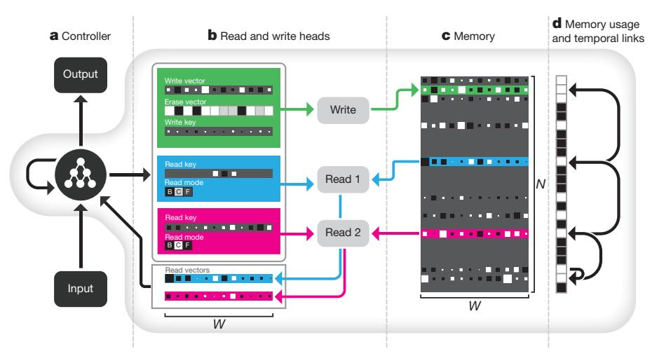
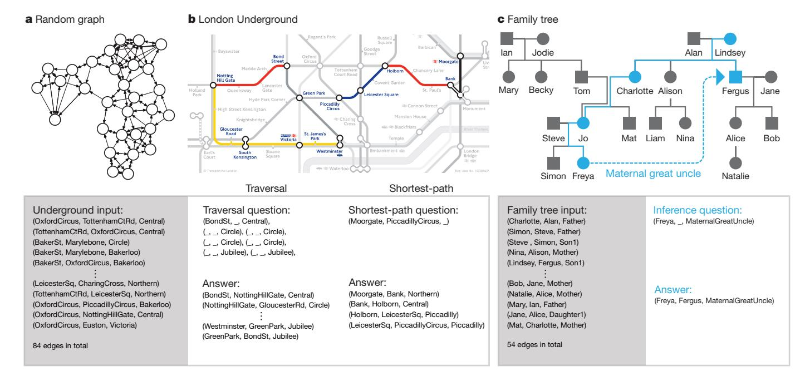
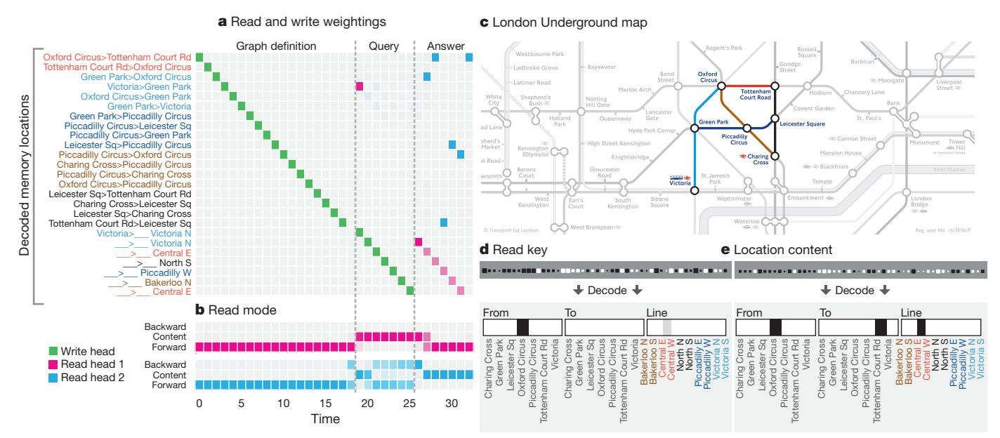
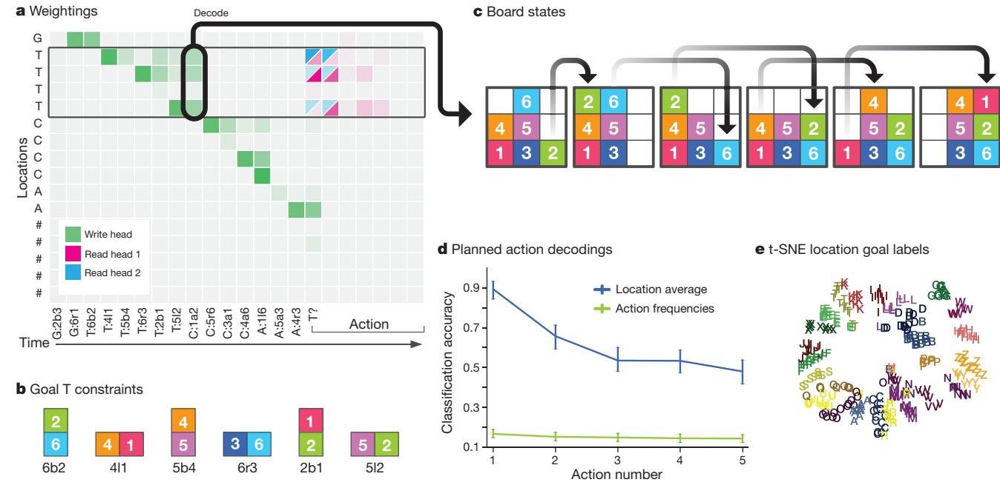
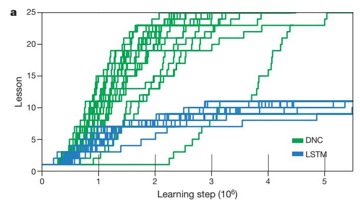
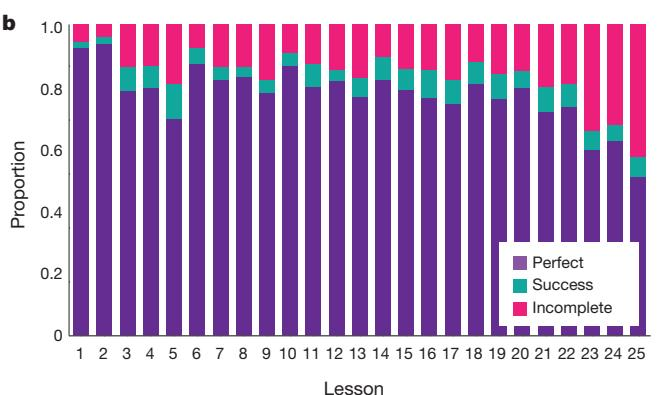
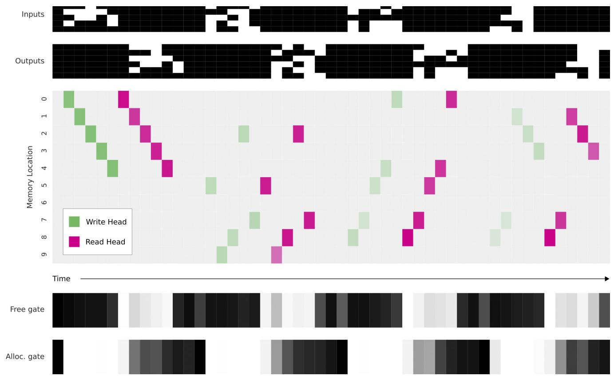
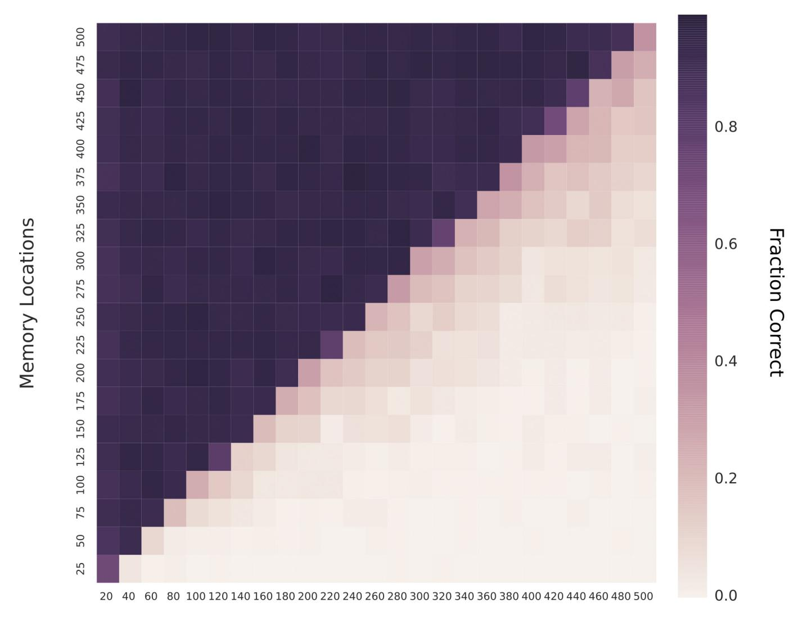
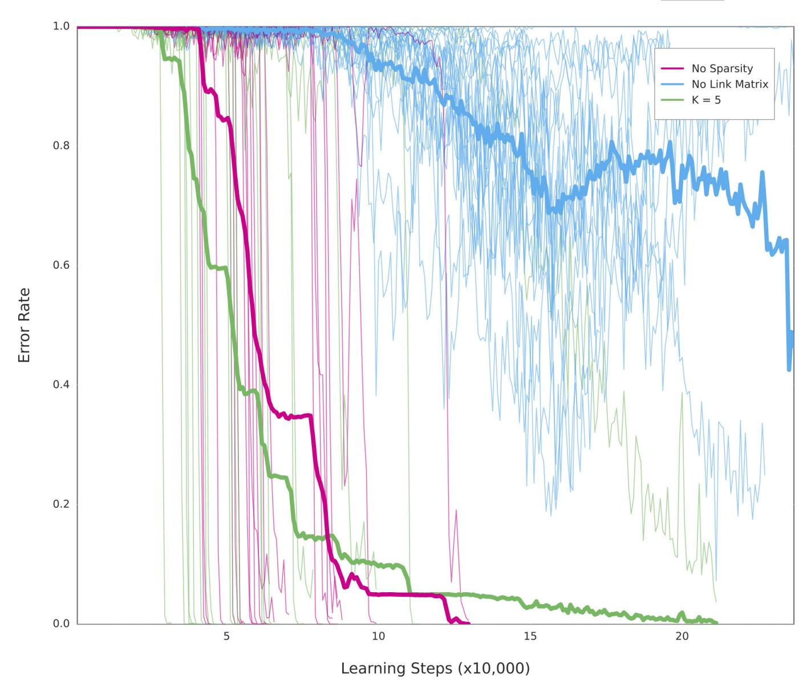

## ARTICLE

# Hybrid computing using a neural network with dynamic external memory

Alex Graves1\*, Greg Wayne1\*, Malcolm Reynolds1, Tim Harley1, Ivo Danihelka1, Agnieszka Grabska-Barwińska1, Sergio Gómez Colmenarejo1, Edward Grefenstette1, Tiago Ramalho1, John Agapiou1, Adrià Puigdomènech Badia1, Karl Moritz Hermann1, Yori Zwols1, Georg Ostrovski1, Adam Cain1, Helen King1, Christopher Summerfield1, Phil Blunsom1, Koray Kavukcuoglu1 & Demis Hassabis1

Artificial neural networks are remarkably adept at sensory processing, sequence learning and reinforcement learning, but are limited in their ability to represent variables and data structures and to store data over long timescales, owing to the lack of an external memory. Here we introduce a machine learning model called a differentiable neural computer (DNC), which consists of a neural network that can read from and write to an external memory matrix, analogous to the random-access memory in a conventional computer. Like a conventional computer, it can use its memory to represent and manipulate complex data structures, but, like a neural network, it can learn to do so from data. When trained with supervised learning, we demonstrate that a DNC can successfully answer synthetic questions designed to emulate reasoning and inference problems in natural language. We show that it can learn tasks such as finding the shortest path between specified points and inferring the missing links in randomly generated graphs, and then generalize these tasks to specific graphs such as transport networks and family trees. When trained with reinforcement learning, a DNC can complete a moving blocks puzzle in which changing goals are specified by sequences of symbols. Taken together, our results demonstrate that DNCs have the capacity to solve complex, structured tasks that are inaccessible to neural networks without external read—write memory.

Modern computers separate computation and memory. Computation is performed by a processor, which can use an addressable memory to bring operands in and out of play. This confers two important benefits: the use of extensible storage to write new information and the ability to treat the contents of memory as variables. Variables are critical to algorithm generality: to perform the same procedure on one datum or another, an algorithm merely has to change the address it reads from. In contrast to computers, the computational and memory resources of artificial neural networks are mixed together in the network weights and neuron activity. This is a major liability: as the memory demands of a task increase, these networks cannot allocate new storage dynamically, nor easily learn algorithms that act independently of the values realized by the task variables.

Although recent breakthroughs demonstrate that neural networks are remarkably adept at sensory processing1, sequence learning2,3 and reinforcement learning4, cognitive scientists and neuroscientists have argued that neural networks are limited in their ability to represent variables and data structures5–9, and to store data over long timescales without interference10,11. We aim to combine the advantages of neural and computational processing by providing a neural network with read–write access to external memory. The access is narrowly focused, minimizing interference among memoranda and enabling long-term storage12,13. The whole system is differentiable, and can therefore be trained end-to-end with gradient descent, allowing the network to learn how to operate and organize the memory in a goal-directed manner.

#### **System overview**

A DNC is a neural network coupled to an external memory matrix. (The behaviour of the network is independent of the memory size as long as the memory is not filled to capacity, which is why we view the memory as 'external'.) If the memory can be thought of as the DNC's

RAM, then the network, referred to as the 'controller', is a differentiable CPU whose operations are learned with gradient descent. The DNC architecture differs from recent neural memory frameworks14,15 in that the memory can be selectively written to as well as read, allowing iterative modification of memory content. An earlier form of DNC, the neural Turing machine16, had a similar structure, but more limited memory access methods (see Methods for further discussion).

Whereas conventional computers use unique addresses to access memory contents, a DNC uses differentiable attention mechanisms  $^{2,16-18}$  to define distributions over the N rows, or 'locations', in the  $N\times W$  memory matrix M. These distributions, which we call weightings, represent the degree to which each location is involved in a read or write operation. The read vector  $\boldsymbol{r}$  returned by a read weighting  $\boldsymbol{w}^{\boldsymbol{r}}$  over memory M is a weighted sum over the memory locations:  $\boldsymbol{r}=\sum_{i=1}^N M[i,\cdot]\boldsymbol{w}^{\boldsymbol{r}}[i]$ , where the '·' denotes all j=1,...,W. Similarly, the write operation uses a write weighting  $\boldsymbol{w}^{\boldsymbol{w}}$  to first erase with an erase vector  $\boldsymbol{e}$ , then add a write vector  $\boldsymbol{v}$ :  $M[i,j] \leftarrow M[i,j]$   $(1-\boldsymbol{w}^{\boldsymbol{w}}[i]\boldsymbol{e}[j])+\boldsymbol{w}^{\boldsymbol{w}}[i]\boldsymbol{v}[j]$ . The functional units that determine and apply the weightings are called read and write heads. The operation of the heads is illustrated in Fig. 1 and summarized below; see Methods for a formal description.

#### Interaction between the heads and the memory

The heads use three distinct forms of differentiable attention. The first is content lookup16,17,19–21, in which a key vector emitted by the controller is compared to the content of each location in memory according to a similarity measure (here, cosine similarity). The similarity scores determine a weighting that can be used by the read heads for associative recall19 or by the write head to modify an existing vector in memory. Importantly, a key that only partially matches the content of a memory location can still be used to attend strongly to that location.

&lt;sup>1Google DeepMind, 5 New Street Square, London EC4A 3TW, UK.

\*These authors contributed equally to this work

**Figure 1** | **DNC architecture. a**, A recurrent controller network receives input from an external data source and produces output. **b**, **c**, The controller also outputs vectors that parameterize one write head (green) and multiple read heads (two in this case, blue and pink). (A reduced selection of parameters is shown.) The write head defines a write and an erase vector that are used to edit the  $N \times W$  memory matrix, whose elements' magnitudes and signs are indicated by box area and shading, respectively. Additionally, a write key is used for content lookup to find previously written locations to edit. The write key can contribute to

defining a weighting that selectively focuses the write operation over the rows, or locations, in the memory matrix. The read heads can use gates called read modes to switch between content lookup using a read key ('C') and reading out locations either forwards ('F') or backwards ('B') in the order they were written. **d**, The usage vector records which locations have been used so far, and a temporal link matrix records the order in which locations were written; here, we represent the order locations were written to using directed arrows.

This enables a form of pattern completion whereby the value recovered by reading the memory location includes additional information that is not present in the key. In general, key-value retrieval provides a rich mechanism for navigating associative data structures in the external memory, because the content of one address can effectively encode references to other addresses.

A second attention mechanism records transitions between consecutively written locations in an  $N \times N$  temporal link matrix L. L[i,j] is close to 1 if i was the next location written after j, and is close to 0 otherwise. For any weighting w, the operation Lw smoothly shifts the focus forwards to the locations written after those emphasized in w, whereas  $L^Tw$  shifts the focus backwards. This gives a DNC the native ability to recover sequences in the order in which it wrote them, even when consecutive writes did not occur in adjacent time-steps.

The third form of attention allocates memory for writing. The 'usage' of each location is represented as a number between 0 and 1, and a weighting that picks out unused locations is delivered to the write head. As well as automatically increasing with each write to a location, usage can be decreased after each read. This allows the controller to reallocate memory that is no longer required (see Extended Data Fig. 1). The allocation mechanism is independent of the size and contents of the memory, meaning that DNCs can be trained to solve a task using one size of memory and later upgraded to a larger memory without retraining (Extended Data Fig. 2). In principle, this would make it possible to use an unbounded external memory by automatically increasing the number of locations every time the minimum usage of any location passes a certain threshold.

The design of the attention mechanisms was motivated largely by computational considerations. Content lookup enables the formation of associative data structures; temporal links enable sequential retrieval of input sequences; and allocation provides the write head with unused locations. However, there are interesting parallels between the memory mechanisms of a DNC and the functional capabilities of the mammalian hippocampus. DNC memory modification is fast and can be one-shot, resembling the associative long-term potentiation of hippocampal CA3 and CA1 synapses22. The hippocampal dentate gyrus, a region known to support neurogenesis23, has been proposed to increase representational sparsity, thereby enhancing memory capacity24: usage-based memory allocation and sparse weightings may provide similar

facilities in our model. Human 'free recall' experiments demonstrate the increased probability of item recall in the same order as first presented—a hippocampus-dependent phenomenon accounted for by the temporal context model25, bearing some similarity to the formation of temporal links (Methods).

#### Synthetic question answering experiments

Our first experiments investigated the capacity of the DNC to perform question answering. To compare DNCs to other neural network architectures, we considered the bAbI dataset26, which includes 20 types of synthetically generated questions designed to mimic aspects of textual reasoning. The dataset consists of short 'story' snippets followed by questions with answers that can be inferred from the stories: for example, the story "John is in the playground. John picked up the football." followed by the question "Where is the football?" with answer "playground" requires a system to combine two supporting facts, whereas "Sheep are afraid of wolves. Gertrude is a sheep. Mice are afraid of cats. What is Gertrude afraid of?" (answer, "wolves") tests its facility at basic deduction (and resilience to distractors). We found that a single DNC, jointly trained on all 20 question types with 10,000 instances each, was able to achieve a mean test error rate of 3.8% with task failure (defined as >5% error) on 2 types of questions, compared to 7.5% mean error and 6 failed tasks for the best previous jointly trained result21. We also found that DNCs performed much better than both long shortterm memory27 (LSTM; at present the benchmark neural network for most sequence processing tasks) and the neural Turing machine16 (see Extended Data Table 1 for details). Unlike previous results on this dataset, the inputs to our model were single word tokens without any preprocessing or sentence-level features (see Methods for details).

#### **Graph experiments**

Although bAbI is presented in natural language, each declarative sentence involves a limited vocabulary and is generated from a simple triple containing an actor, an action and a set of arguments. Such sentences could easily be rendered in graphical form: for example "John is in the playground" can be diagrammed as two named nodes, 'Playground' and 'John', connected by a named edge 'Contains'. In this sense, the propositional knowledge in many of the bAbI tasks is equivalent to a set of constraints on an underlying graph structure. Indeed, many important

**Figure 2** | **Graph tasks. a**, An example of a randomly generated graph used for training. **b**, Zone 1 interchange stations of the London Underground map, used as a generalization test for the traversal and shortest-path tasks. Random seven-step traversals (an example of which is shown on the left) were tested, yielding an average accuracy of 98.8%. Testing on all possible four-step shortest paths (example shown on the right) gave an average accuracy of 55.3%. **c**, The family tree that was used as a generalization test for the inference task; four-step relations such as the one shown in

blue (from Freya to Fergus, her maternal great uncle) were tested, giving an average accuracy of 81.8%. The symbol sequences processed by the network during the test examples are shown beneath the graphs. The input is an unordered list of ('from node', 'to node', 'edge') triple vectors that describes the graph. For each task, the question is a sequence of triples with missing elements (denoted '\_') and the answer is a sequence of completed triples.

tasks faced by machine learning involve graph data, including parse trees, social networks, knowledge graphs and molecular structures. We therefore turn next to a set of synthetic reasoning experiments on randomly generated graphs.

Unlike bAbI, the edges in our graphs were presented explicitly, with each input vector specifying a triple consisting of two node labels and an edge label. We generated training graphs with random labelling and connectivity and defined three kinds of query: 'traversal', 'shortest path' and 'inference' (Fig. 2). After training with curriculum learning 28,29 using graphs and queries with gradually increasing complexity, the networks were tested (with no retraining) on two specific graphs as a test of generalization to realistic data: a symbolic map of the London Underground and an invented family tree.

For the traversal task (Fig. 2b), the network was instructed to report the node arrived at after leaving a start node and following a path of edges generated by a random walk. For the shortest-path task (Fig. 2b), a random start and end node were given as the query, and the network was asked to return a sequence of triples corresponding to a minimum-length path between them. Because we considered paths of up to length five, this is a harder version of the path-finding task in the bAbI dataset, which has a maximum length of two. For the inference task (Fig. 2c), we predefined 400 'relation' labels that stood as abbreviations for sequences of up to five connected edge labels. A query consisted of an incomplete triple specifying a start node and a relation label, and the required answer was the final node after following the relation sequence. Because the relation sequences were never presented to the network, they had to be inferred from the queries and targets.

As a benchmark we again compared DNCs with LSTM. In this case, the best LSTM network we found in an extensive hyper-parameter search failed to complete the first level of its training curriculum of even the easiest task (traversal), reaching an average of only 37% accuracy after almost two million training examples; DNCs reached an average of 98.8% accuracy on the final lesson of the same curriculum after around one million training examples.

Figure 3 illustrates a DNC's use of memory allocation, content lookup and temporal linkage to store and traverse the London Underground map. Visualization of a DNC trained on shortest-path suggests that it progressively explored the links radiating out from the start and end nodes until a connecting path was found (Supplementary Video 1).

#### **Block puzzle experiments**

Next we wanted to investigate the ability of DNCs to exploit their memory for logical planning tasks. To do this, we created a block puzzle game inspired by Winograd's SHRDLU30—a classic artificial intelligence demonstration of an environment with movable objects and a rule-based agent that executed user instructions. Unlike the previous experiments, for which the networks were trained with supervised learning, we applied a form of reinforcement learning in which a sequence of instructions describing a goal is coupled to a reward function that evaluates whether the goal is satisfied—a set-up that resembles an animal training protocol with a symbolic task cue31.

Our environment, which we term Mini-SHRDLU, contains a set of numbered blocks on a grid board. An agent, given a view of the board as input, can move the top block from a column and deposit it on top of a stack in another column. At every episode, we generated a start board configuration and several possible goals. Each goal, identified by a single-letter label, was composed of several individual constraints on adjacent block pairs that were transmitted one constraint per time-step (goal 'T' is "block 6 below 2; block 4 left of 1; ...") (Fig. 4b, c). After all of the goals were presented, a single goal label was chosen at random, and the agent was cued to satisfy that goal.

The DNC used its memory to store the instructions by iteratively writing goals to locations (Fig. 4a); it could then carry out any chosen goal (Fig. 4c, Supplementary Video 2). We observed that, at the time a goal was written, but many steps before execution was required, the first action could be decoded from memory (Fig. 4d). This indicates that the DNC had written its decision to memory before acting upon it; thus, remarkably,

Figure 3 | Traversal on the London Underground. a, During the graph definition phase, the network writes each triple in the map to a separate memory location, as shown by the write weightings (green). During the query phase, the start station (Victoria) and lines to be traversed are recorded. The triple stored in each location can be recovered by a logistic regression decoder, as shown on the vertical axis. b, The read mode distribution during the answer phase reveals that read head 1 (pink)

DNC learned to make a plan. As with the graph tasks, learning followed a curriculum that gradually increased the number of blocks on the board and constraints in a goal as well as the number of goals and

follows temporal links forwards to retrieve the instructions in order, whereas read head 2 (blue) uses content lookup to find the stations along the path. The degree of coloration indicates how strongly each mode is used. **c**, The region of the map used. **d**, The final content key used by read head 2 is decoded as a triple with no destination. **e**, The memory location returned by the key contains the complete triple, allowing the network to infer the destination (Tottenham Court Rd).

the minimum number of actions needed to find a solution (Methods). Again, the DNC performed substantially better than LSTM (see Fig. 5 and Extended Data Fig. 3).

Figure 4 | Mini-SHRDLU analysis. a, In a short example episode, the network wrote goal-related information to sequences of memory locations. ('G, 'T,' 'C' and 'A' denote goals; the numbers refer to the block number; 'b', 'a', 'l' and 'r' denote 'below', 'above', 'left of' and 'right of', respectively.) The chosen goal was T ('T?'), and the read heads focused on the locations containing goal T. b, The constraints comprising goal T. c, The policy made an optimal sequence of moves to satisfy its constraints. d, On 800 random episodes, the first five actions that the network took for the chosen goal were decoded from memory using logistic regression at the time-step after the goal was written (box in a with arrow to c). Decoding accuracy

for the first action is 89%, compared to 17% using action frequencies alone, indicating that the network had determined a plan at the time of writing, many steps before execution. Error bars represent 5–95 percentile bootstrapped confidence intervals on validation data. e, Within trials, we average the location contents associated with each goal label into single vectors. Across trials, we create a dataset of these vectors and perform t-SNE (*t*-distributed stochastic neighbour embedding) dimensionality reduction down to two dimensions. This shows that each goal label is coded geometrically in the memory locations.

**Figure 5** | **Mini-SHRDLU results. a**, 20 replicated training runs with different random-number seeds for a DNC and LSTM. Only the DNC was able to complete the learning curriculum. **b**, A single DNC was able to solve a large percentage of problems optimally from each previous lesson (perfect), with a few episodes solved in extra moves (success), and some failures to satisfy all constraints (incomplete).

#### Discussion

Taken together, the bAbI and graph tasks demonstrate that DNCs are able to process and reason about graph-structured data regardless of whether the links are implicit or explicit. Moreover, we have seen that the structure of the data source is directly reflected in the memory-access procedures learned by the controller. The Mini-SHRDLU problem shows that a systematic use of memory also emerges when a DNC learns by reinforcement to act in pursuit of a set of symbolic goals.

The theme connecting these tasks is the need to learn to represent and reason about the complex, quasi-regular structure embedded in data sequences. In each problem, domain regularities, such as the conventions for representing graphs, are invariant across all sequences shown; on the other hand, for any given sequence, a DNC must detect and capture novel variability as episodic variables in memory. This mixture of large-scale structure and microscopic variability is generic to many problems that confront a cognitive agent 32–34. For example, in visual scenes, stories and action plans, broad regularities bind together novel variation in any exemplar. Rooms statistically have chairs in them, but the shape and location of a particular chair in a room are variables. These variable values can be written to the external memory of a DNC, leaving the controller network free to concentrate on learning global regularities.

Our experiments focused on relatively small-scale synthetic tasks, which have the advantage of being easy to generate and interpret. For such problems, memory matrices of up to 512 locations were sufficient. To tackle real-world data we will need to scale up to thousands or millions of locations, at which point the memory will be able to store more information than can be contained in the weights of the controller. Such systems should be able to continually acquire knowledge through exposure to large, naturalistic data sources, even without

adapting network parameters. We aim to further develop DNCs to serve as representational engines for one-shot learning35–37, scene understanding38, language processing39 and cognitive mapping40, capable of intuiting the variable structure and scale of the world within a single, generic model.

**Online Content** Methods, along with any additional Extended Data display items and Source Data, are available in the online version of the paper; references unique to these sections appear only in the online paper.

## Received 5 January; accepted 19 September 2016. Published online 12 October 2016.

- Krizhevsky, A., Sutskever, I. & Hinton, G. E. Imagenet classification with deep convolutional neural networks. In Advances in Neural Information Processing Systems Vol. 25 (eds Pereira, F. et al.) 1097–1105 (Curran Associates, 2012).
- Graves, A. Generating sequences with recurrent neural networks. Preprint at http://arxiv.org/abs/1308.0850 (2013).
- Sutskever, I., Vinyals, O. & Le, Q. V. Sequence to sequence learning with neural networks. In Advances in Neural Information Processing Systems Vol. 27 (eds Ghahramani, Z. et al.) 3104–3112 (Curran Associates, 2014).
- Mnih, V. et al. Human-level control through deep reinforcement learning. Nature 518, 529–533 (2015).
- Gallistel, C. R. & King, A. P. Memory and the Computational Brain: Why Cognitive Science Will Transform Neuroscience (John Wiley & Sons, 2011).
- Marcus, G. F. The Algebraic Mind: Integrating Connectionism and Cognitive Science (MIT Press, 2001).
- Kriete, T., Noelle, D. C., Cohen, J. D. & O'Reilly, R. C. Indirection and symbol-like processing in the prefrontal cortex and basal ganglia. *Proc. Natl Acad. Sci. USA* 110, 16390–16395 (2013).
- Hinton, G. E. Learning distributed representations of concepts. In Proc. Eighth Annual Conference of the Cognitive Science Society Vol. 1, 1–12 (Lawrence Erlbaum Associates, 1986).
- Bottou, L. From machine learning to machine reasoning. Mach. Learn. 94, 133–149 (2014).
- Fusi, S., Drew, P. J. & Abbott, L. F. Cascade models of synaptically stored memories. *Neuron* 45, 599–611 (2005).
- Ganguli, S., Huh, D. & Sompolinsky, H. Memory traces in dynamical systems. Proc. Natl Acad. Sci. USA 105, 18970–18975 (2008).
- 12. Kanerva, P. Sparse Distributed Memory (MIT press, 1988)
- Amari, S.-i. Characteristics of sparsely encoded associative memory. Neural Netw. 2, 451–457 (1989).
- Weston, J., Chopra, S. & Bordes, A. Memory networks. Preprint at http://arxiv. org/abs/1410.3916 (2014).
- Vinyals, O., Fortunato, M. & Jaitly, N. Pointer networks. In Advances in Neural Information Processing Systems Vol. 28 (eds Cortes, C et al.) 2692–2700 (Curran Associates, 2015).
- Graves, A., Wayne, G. & Dánihelka, I. Neural Turing machines. Preprint at http://arxiv.org/abs/1410.5401 (2014).
- 17. Bahdanau, D., Cho, K. & Bengio, Y. Neural machine translation by jointly learning to align and translate. Preprint at http://arxiv.org/abs/1409.0473 (2014).
- Gregor, K., Danihelka, I., Graves, A., Rezende, D. J. & Wierstra, D. DRAW: a recurrent neural network for image generation. In *Proc. 32nd International Conference on Machine Learning* (eds Bach, F. & Blei, D.) 1462–1471 (JMLR, 2015).
- Hintzman, D. L. MINERVA 2: a simulation model of human memory. Behav. Res. Methods Instrum. Comput. 16, 96–101 (1984).
- Kumar, A. et al. Ask me anything: dynamic memory networks for natural language processing. Preprint at http://arxiv.org/abs/1506.07285 (2015).
- Sukhbaatar, S. et al. End-to-end memory networks. In Advances in Neural Information Processing Systems Vol. 28 (eds Cortes, C et al.) 2431–2439 (Curran Associates, 2015).
- Magee, J. C. & Johnston, D. A synaptically controlled, associative signal for Hebbian plasticity in hippocampal neurons. Science 275, 209–213 (1997).
- Johnston, S. T., Shtrahman, M., Parylak, S., Gonçalves, J. T. & Gage, F. H. Paradox of pattern separation and adult neurogenesis: a dual role for new neurons balancing memory resolution and robustness. *Neurobiol. Learn. Mem.* 129, 60–68 (2016).
- O'Reilly, R. C. & McClelland, J. L. Hippocampal conjunctive encoding, storage, and recall: avoiding a trade-off. *Hippocampus* 4, 661–682 (1994).
- Howard, M. W. & Kahana, M. J. A distributed representation of temporal context. J. Math. Psychol. 46, 269–299 (2002).
- Weston, J., Bordes, A., Chopra, S. & Mikolov, T. Towards Al-complete question answering: a set of prerequisite toy tasks. Preprint at http://arxiv.org/ abs/1502.05698 (2015).
- Hochreiter, S. & Schmidhuber, J. Long short-term memory. Neural Comput. 9, 1735–1780 (1997).
- Bengio, Y., Louradour, J., Collobert, R. & Weston, J. Curriculum learning. In Proc. 26th International Conference on Machine Learning (eds Bottou, L. & Littman, M.) 41–48 (ACM, 2009).
- Zaremba, W. & Sutskever, I. Learning to execute. Preprint at http://arxiv.org/ abs/1410.4615 (2014).
- Winograd, T. Procedures as a Representation for Data in a Computer Program for Understanding Natural Language. Report No. MAC-TR-84 (DTIC, MIT Project MAC, 1971).

## RESEARCH ARTICLE

- Epstein, R., Lanza, R. P. & Skinner, B. F. Symbolic communication between two pigeons (Columba livia domestica). Science 207, 543–545 (1980).
- McClelland, J. L., McNaughton, B. L. & O'Reilly, R. C. Why there are complementary learning systems in the hippocampus and neocortex: insights from the successes and failures of connectionist models of learning and memory. *Psychol. Rev.* 102, 419–457 (1995).
- Kumaran, D., Hassabis, D. & McClelland, J. L. What learning systems do intelligent agents need? Complementary learning systems theory updated. *Trends Cogn. Sci.* 20, 512–534 (2016).
- McClelland, J. L. & Goddard, N. H. Considerations arising from a complementary learning systems perspective on hippocampus and neocortex. *Hippocampus* 6, 654–665 (1996).
- Lake, B. M., Salakhutdinov, R. & Tenenbaum, J. B. Human-level concept learning through probabilistic program induction. Science 350, 1332–1338 (2015).
- Rezende, D. J., Mohamed, S., Danihelka, I., Gregor, K. & Wierstra, D. One-shot generalization in deep generative models. In *Proc.* 33nd International Conference on Machine Learning (eds Balcan, M. F. & Weinberger, K. Q.) 1521–1529 (JMLR, 2016).
- Santoro, A., Bartunov, S., Botvinick, M., Wierstra, D. & Lillicrap, T. Meta-learning with memory-augmented neural networks. In *Proc. 33nd International Conference on Machine Learning* (eds Balcan, M. F. & Weinberger, K. Q.) 1842–1850 (JMLR, 2016).
- Oliva, A. & Torralba, A. The role of context in object recognition. *Trends Cogn. Sci.* 11, 520–527 (2007).
- Hermann, K. M. et al. Teaching machines to read and comprehend. In Advances in Neural Information Processing Systems Vol. 28 (eds Cortes, C. et al.) 1693–1701 (Curran Associates, 2015).
- O'Keefe, J. & Nadel, L. The Hippocampus as a Cognitive Map (Oxford Univ. Press, 1978).

**Supplementary Information** is available in the online version of the paper.

Acknowledgements We thank D. Silver, M. Botvinick and S. Legg for reviewing the paper prior to submission; P. Dayan, D. Wierstra, G. Hinton, J. Dean, N. Kalchbrenner, J. Veness, I. Sutskever, V. Mnih, A. Mnih, D. Kumaran, N. de Freitas, L. Sifre, R. Pascanu, T. Lillicrap, J. Rae, A. Senior, M. Denil, T. Kocisky, A. Fidjeland, K. Gregor, A. Lerchner, C. Fernando, D. Rezende, C. Blundell and N. Heess for discussions; J. Besley for legal assistance; the rest of the DeepMind team for support and encouragement; and Transport for London for allowing us to reproduce portions of the London Underground map.

**Author Contributions** A.G. and G.W. conceived the project. A.G., G.W., M.R., T.H., I.D., S.G. and E.G. implemented networks and tasks. A.G., G.W., M.R., T.H., A.G.-B., T.R. and J.A. performed analysis. M.R., T.H., I.D., E.G., K.M.H., C.S., P.B., K.K. and D.H. contributed ideas. A.C. prepared graphics. A.G., G.W., M.R., T.H., S.G., A.P.B., Y.Z., G.O. and K.K. performed experiments. A.G., G.W., H.K., K.K. and D.H. managed the project. A.G., G.W., M.R., T.H., K.K. and D.H. wrote the paper.

**Author Information** Reprints and permissions information is available at www.nature.com/reprints. The authors declare no competing financial interests. Readers are welcome to comment on the online version of the paper. Correspondence and requests for materials should be addressed to A.G. (gravesa@google.com), G.W. (gregwayne@google.com), D.H. (demishassabis@google.com).

**Reviewer Information** *Nature* thanks Y. Bengio, J. McClelland and the other anonymous reviewer(s) for their contribution to the peer review of this work.

#### **METHODS**

A glossary of symbols and full equations for the DNC model are provided in Supplementary Information.

**Controller network.** At every time-step t the controller network  $\mathcal{N}$  receives an input vector  $\mathbf{x}_t \in \mathbb{R}^X$  from the dataset or environment and emits an output vector  $\mathbf{y}_t \in \mathbb{R}^Y$  that parameterizes either a predictive distribution for a target vector  $\mathbf{z}_t \in \mathbb{R}^Y$  (supervised learning) or an action distribution (reinforcement learning). Additionally, the controller receives a set of R read vectors  $\mathbf{r}_{t-1}^1, \dots, \mathbf{r}_{t-1}^R$  from the memory matrix  $M_{t-1} \in \mathbb{R}^{N \times W}$  at the previous time-step, via the read heads. It then emits an interface vector  $\boldsymbol{\xi}_t$  that defines its interactions with the memory at the current time-step. For notational convenience, we concatenate the read and input vectors to obtain a single controller input vector  $\boldsymbol{\chi}_t = [\boldsymbol{x}_t; \boldsymbol{r}_{t-1}^1; \dots; \boldsymbol{r}_{t-1}^R]$ . Any neural network can be used for the controller, but we have used the following variant of the deep LSTM architecture41:

$$\begin{split} & \textbf{\textit{i}}_{t}^{l} = \sigma(W_{i}^{l}[\boldsymbol{\chi}_{t}; \textbf{\textit{h}}_{t-1}^{l}; \textbf{\textit{h}}_{t}^{l-1}] + \textbf{\textit{b}}_{i}^{l}) \\ & f_{t}^{l} = \sigma(W_{f}^{l}[\boldsymbol{\chi}_{t}; \textbf{\textit{h}}_{t-1}^{l}; \textbf{\textit{h}}_{t}^{l-1}] + \textbf{\textit{b}}_{f}^{l}) \\ & \textbf{\textit{s}}_{t}^{l} = f_{t}^{l} \textbf{\textit{s}}_{t-1}^{l} + \textbf{\textit{i}}_{t}^{l} \mathrm{tanh}(W_{s}^{l}[\boldsymbol{\chi}_{t}; \textbf{\textit{h}}_{t-1}^{l}; \textbf{\textit{h}}_{t}^{l-1}] + \textbf{\textit{b}}_{s}^{l}) \\ & \textbf{\textit{o}}_{t}^{l} = \sigma(W_{o}^{l}[\boldsymbol{\chi}_{t}; \textbf{\textit{h}}_{t-1}^{l}; \textbf{\textit{h}}_{t}^{l-1}] + \textbf{\textit{b}}_{o}^{l}) \\ & \textbf{\textit{h}}_{t}^{l} = \textbf{\textit{o}}_{t}^{l} \mathrm{tanh}(\textbf{\textit{s}}_{t}^{l}) \end{split}$$

where l is the layer index,  $\sigma(x) = 1/(1 + \exp(-x))$  is the logistic sigmoid function,  $\mathbf{h}_t^l, \mathbf{i}_t^l, \mathbf{f}_t^l, \mathbf{s}_t^l$  and  $\mathbf{o}_t^l$  are the hidden, input gate, forget gate, state and output gate activation vectors, respectively, of layer l at time t.  $\mathbf{h}_t^0 = \mathbf{0}$  for all t.  $\mathbf{h}_0^l = \mathbf{s}_0^l = \mathbf{0}$  for all l. The W terms denote learnable weight matrices (for example,  $W_i^l$  is the matrix of weights going into the layer-l input gates) and the b terms are learnable biases.

At each time-step, the controller emits an output vector  $v_t$  and an interface vector  $\xi_t \in \mathbb{R}^{(W \times R) + 3W + 5R + 3}$ , defined as

$$v_t = W_y[\boldsymbol{h}_t^1; \dots; \boldsymbol{h}_t^L]$$
  
 $\boldsymbol{\xi}_t = W_{\mathcal{E}}[\boldsymbol{h}_t^1; \dots; \boldsymbol{h}_t^L]$ 

Assuming the controller network is recurrent, its outputs are a function of the complete history  $(\chi_1, ..., \chi_t)$  of its inputs up to the current time-step. We can therefore encapsulate the operation of the controller as

$$(\boldsymbol{v}_t, \boldsymbol{\xi}_t) = \mathcal{N}([\boldsymbol{\chi}_1; \dots; \boldsymbol{\chi}_t]; \boldsymbol{\theta})$$

where  $\theta$  is the set of trainable network weights. It is also possible to use a feedforward controller, in which case  $\mathcal N$  is a function of  $\chi_t$  only; however, we use only recurrent controllers in this paper. Finally, the output vector  $y_t$  is defined by adding  $v_t$  to a vector obtained by passing the concatenation of the current read vectors through the  $RW \times Y$  weight matrix  $W_r$ 

$$\mathbf{y}_t = \mathbf{v}_t + W_{\mathrm{r}}[\mathbf{r}_t^1; \dots; \mathbf{r}_t^R]$$

This arrangement allows the DNC to condition its output decisions on memory that has just been read; it would not be possible to pass this information back to the controller, and thereby use them to determine  $\boldsymbol{v}$ , without creating a cycle in the computation graph.

**Interface parameters.** Before being used to parameterize the memory interactions, the interface vector  $\xi_t$  is subdivided as follows:

$$\boldsymbol{\xi}_t \!=\! \left[ \boldsymbol{k}_t^{\mathrm{r},1}; \ldots; \boldsymbol{k}_t^{\mathrm{r},R}; \boldsymbol{\hat{\beta}}_t^{\mathrm{r},1}; \ldots; \boldsymbol{\hat{\beta}}_t^{\mathrm{r},R}; \boldsymbol{k}_t^{\mathrm{w}}; \boldsymbol{\hat{\beta}}_t^{\mathrm{w}}; \hat{\boldsymbol{e}}_t; \boldsymbol{\nu}_t; \boldsymbol{\hat{f}}_t^1; \ldots; \boldsymbol{\hat{f}}_t^R; \boldsymbol{\hat{g}}_t^{\mathrm{a}}; \boldsymbol{\hat{g}}_t^{\mathrm{w}}; \boldsymbol{\hat{\pi}}_t^1; \ldots; \boldsymbol{\hat{\pi}}_t^R \right]$$

The individual components are then processed with various functions to ensure that they lie in the correct domain. The logistic sigmoid function is used to constrain to [0,1]. The 'oneplus' function is used to constrain to  $[1,\infty)$ , where

oneplus(x)=1 + log (1 + 
$$e^x$$
)

and the softmax function is used to constrain vectors to  $S_N$ , the N-1-dimensional unit simplex

$$\mathcal{S}_N = \left\{ oldsymbol{lpha} \in \mathbb{R}^N : oldsymbol{lpha}_i \in [0,1], \ \sum_{i=1}^N oldsymbol{lpha}_i = 1 
ight\}$$

After processing we have the following set of scalars and vectors:

- R read keys  $\{\boldsymbol{k}_t^{\mathrm{r},i} \in \mathbb{R}^W; 1 \leq i \leq R\};$
- R read strengths  $\{\beta_t^{\mathbf{r},i} = \text{oneplus}(\hat{\beta}_t^{\mathbf{r},i}) \in [1,\infty); 1 \le i \le R\};$

- the write key  $\mathbf{k}_t^{\mathrm{w}} \in \mathbb{R}^W$ ;
- the write strength  $\beta_t^{\mathbf{w}} = \text{oneplus}(\hat{\beta}_t^{\mathbf{w}}) \in [1, \infty);$
- the erase vector  $\mathbf{e}_t = \sigma(\hat{\mathbf{e}}_t) \in [0,1]^W$ ;
- the write vector  $\mathbf{v}_t \in \mathbb{R}^W$ ;
- R free gates  $\{f_{\star}^i = \sigma(\hat{f}_{\star}^i) \in [0,1]; 1 \le i \le R\}$ ;
- the allocation gate  $g_{\star}^{a} = \sigma(\hat{g}_{\star}^{a}) \in [0,1];$
- the write gate  $g_{\star}^{w} = \sigma(\hat{g}_{\star}^{w}) \in [0,1]$ ; and
- $R \text{ read modes } \{\boldsymbol{\pi}_t^i = \operatorname{softmax}(\hat{\boldsymbol{\pi}}_t^i) \in \mathcal{S}_3; 1 \leq i \leq R\}.$

The use and interpretation of these terms will be explored in the following sections

**Reading and writing to memory.** Selecting locations for reading and writing depends on weightings, which are vectors of non-negative numbers whose elements sum to at most 1. The complete set of allowed weightings over N locations is the non-negative orthant of  $\mathbb{R}^N$  with the unit simplex as a boundary (known as the 'corner of the cube'):

$$\Delta_N = \left\{ oldsymbol{lpha} \in \mathbb{R}^N : oldsymbol{lpha}_i \in [0,\!1], \sum_{i=1}^N oldsymbol{lpha}_i \leq 1 
ight\}$$

For the read operation, R read weightings  $\{\mathbf{w}_t^{\mathbf{r},1}, \dots, \mathbf{w}_t^{\mathbf{r},R} \in \Delta_N\}$  are used to compute weighted averages of the contents of the locations, thereby defining the read vectors  $\{\mathbf{r}_t^1, \dots, \mathbf{r}_t^R\}$  as

$$\mathbf{r}_{t}^{i} = M_{t}^{\top} \mathbf{w}_{t}^{\mathrm{r},i}$$

The read vectors are appended to the controller input at the next time-step, giving it access to the memory contents. The write operation is mediated by a single write weighting  $\mathbf{w}_t^w \in \Delta_N$ , which is used in conjunction with an erase vector  $\mathbf{e}_t \in [0, 1]^W$  and a write vector  $\mathbf{v}_t \in \mathbb{R}^W$  (both emitted by the controller) to modify the memory as follows:

$$M_t = M_{t-1} \circ (E - \boldsymbol{w}_t^{\mathrm{w}} \boldsymbol{e}_t^{\mathrm{T}}) + \boldsymbol{w}_t^{\mathrm{w}} \boldsymbol{v}_t^{\mathrm{T}}$$

where  $\circ$  denotes element-wise multiplication and E is an  $N \times W$  matrix of ones. The computation of the read and write weightings is detailed in the following section.

**Memory addressing.** The system uses a combination of content-based addressing and dynamic memory allocation to determine where to write in memory, and a combination of content-based addressing and temporal memory linkage to determine where to read. These mechanisms, all of which are parameterized by the interface vectors defined in Methods section 'Interface parameters', are described in detail below.

Content-based addressing. All content lookup operations on the memory  $M \in \mathbb{R}^{N \times W}$  use the following function

$$C(M, \mathbf{k}, \beta)[i] = \frac{\exp{\{\mathcal{D}(\mathbf{k}, M[i, \cdot])\beta\}}}{\sum_{i} \exp{\{\mathcal{D}(\mathbf{k}, M[j, \cdot])\beta\}}}$$

where  $k \in \mathbb{R}^W$  is a lookup key,  $\beta \in [1, \infty)$  is a scalar representing key strength and  $\mathcal{D}$  is the cosine similarity:

$$\mathcal{D}(u, v) = \frac{u \cdot v}{|u||v|}$$

The weighting  $\mathcal{C}(M, k, \beta) \in \mathcal{S}_N$  defines a normalized probability distribution over the memory locations. In later sections, we will encounter weightings in  $\Delta_N$  that may sum to less than one, with the missing weight implicitly assigned to a null operation that does not access any of the locations. Content lookup operations are performed by both the read and write heads.

*Dynamic memory allocation.* To allow the controller to free and allocate memory as needed, we developed a differentiable analogue of the 'free list' memory allocation scheme42, whereby a list of available memory locations is maintained by adding to and removing addresses from a linked list. Denote by  $u_t \in [0, 1]^N$  the memory usage vector at time t, and define  $u_0 = 0$ . Before writing to memory, the controller emits a set of free gates  $f_i^t$ , one per read head, that determine whether

the most recently read locations can be freed. The memory retention vector  $\psi_l \in [0,1]^N$  represents by how much each location will not be freed by the free gates, and is defined as

$$\psi_t = \prod_{i=1}^R \left( \mathbf{1} - f_t^i \mathbf{w}_{t-1}^{r,i} \right)$$

The usage vector can then be defined as

$$u_t = (u_{t-1} + w_{t-1}^{w} - u_{t-1} \circ w_{t-1}^{w}) \circ \psi_t$$

where  $\circ$  denotes element-wise multiplication. Intuitively, locations are used if they have been retained by the free gates  $(\psi_t[i] \approx 1)$ , and were either already in use or have just been written to. Every write to a location increases its usage, up to a maximum of 1, and usage can only be subsequently decreased (to a minimum of 0) using the free gates; the elements of  $u_t$  are therefore bounded in the range [0,1]. Once  $u_t$  has been determined, the free list  $\phi_t \in \mathbb{Z}^N$  is defined by sorting the indices of the memory locations in ascending order of usage;  $\phi_t[1]$  is therefore the index of the least used location. The allocation weighting  $a_t \in \Delta_N$ , which is used to provide new locations for writing, is

$$\mathbf{a}_{t}[\phi_{t}[j]] = (1 - \mathbf{u}_{t}[\phi_{t}[j]]) \prod_{i=1}^{j-1} \mathbf{u}_{t}[\phi_{t}[i]]$$
 (1)

If all usages are 1, then  $a_t = 0$  and the controller can no longer allocate memory without first freeing used locations. The sort operation induces discontinuities at the points at which the sort order changes. We ignore these discontinuities when calculating the gradient, as they do not seem to be relevant to learning.

Write weighting. The controller can write to newly allocated locations, or to locations addressed by content, or it can choose not to write at all. First, a write content weighting  $c_t^w \in S_N$  is constructed using the write key  $k_t^w$  and write strength  $\beta_t^w$ :

$$\boldsymbol{c}_{t}^{\mathrm{w}} = \mathcal{C}(M_{t-1}, \boldsymbol{k}_{t}^{\mathrm{w}}, \boldsymbol{\beta}_{t}^{\mathrm{w}})$$

 $c_t^w$  is interpolated with the allocation weighting  $a_t$  defined in equation (1) to determine a write weighting  $w_t^w \in \Delta_N$ :

$$\mathbf{w}_{t}^{W} = g_{t}^{W} \left[ g_{t}^{a} \mathbf{a}_{t} + (1 - g_{t}^{a}) \mathbf{c}_{t}^{W} \right]$$
 (2)

where  $g_t^a \in [0,1]$  is the allocation gate governing the interpolation and  $g_t^w \in [0,1]$  is the write gate. If the write gate is 0, then nothing is written, regardless of the other write parameters; it can therefore be used to protect the memory from unnecessary modifications.

Temporal memory linkage. The memory allocation system defined above stores no information about the order in which the memory locations are written to. However, there are many situations in which retaining this information is useful: for example, when a sequence of instructions must be recorded and retrieved in order. We therefore use a temporal link matrix  $L_t \in [0,1]^{N \times N}$  to keep track of consecutively modified memory locations (Fig. 1d).

 $L_t[i,j]$  represents the degree to which location i was the location written to after location j, and each row and column of  $L_t$  defines a weighting over locations:  $L_t[i,\cdot] \in \Delta_N$  and  $L_t[\cdot,j] \in \Delta_N$  for all i,j and t. To define  $L_t$ , we require a precedence weighting  $p_t \in \Delta_N$ , where element  $p_t[i]$  represents the degree to which location i was the last one written to.  $p_t$  is defined by the recurrence relation

$$\begin{split} & \boldsymbol{p}_0 = \boldsymbol{0} \\ & \boldsymbol{p}_t = \left[1 - \sum_i \boldsymbol{w}_t^{\mathrm{w}}[i]\right] \boldsymbol{p}_{t-1} + \boldsymbol{w}_t^{\mathrm{w}} \end{split}$$

where  $\boldsymbol{w}_t^{\mathrm{w}}$  is the write weighting defined in equation (2). Every time a location is modified, the link matrix is updated to remove old links to and from that location. New links from the last-written location are then added. We use the following recurrence relation to implement this logic:

$$L_{0}[i,j] = 0 \quad \forall i,j$$

$$L_{t}[i,i] = 0 \quad \forall i$$

$$L_{t}[i,j] = (1 - \mathbf{w}_{t}^{w}[i] - \mathbf{w}_{t}^{w}[j])L_{t-1}[i,j] + \mathbf{w}_{t}^{w}[i]\mathbf{p}_{t-1}[j]$$

Self-links are excluded (the diagonal of the link matrix is always 0) because it is unclear how to follow a transition from a location to itself. The rows and columns of  $L_t$  represent the weights of the temporal links going into and out from particular memory slots, respectively. Given  $L_t$ , the backward weighting  $\boldsymbol{b}_t^i \in \Delta_N$  and forward weighting  $\boldsymbol{f}_t^i \in \Delta_N$  for read head i are defined as

$$egin{aligned} oldsymbol{f}_t^i &= L_t oldsymbol{w}_{t-1}^{\mathrm{r},i} \ oldsymbol{b}_t^i &= L_t^{ op} oldsymbol{w}_{t-1}^{\mathrm{r},i} \end{aligned}$$

where  $\mathbf{w}_{t-1}^{\mathbf{r},i}$  is the ith read weighting from the previous time-step. Sparse link matrix. The link matrix is  $N \times N$  and therefore requires  $\mathcal{O}(N^2)$  resources in both memory and computation to calculate exactly. Although tolerable for the experiments in this paper, this cost rapidly becomes prohibitive as the number of locations increases. Fortunately, the link matrix is typically very sparse and can be approximated with  $\mathcal{O}(N\log N)$  computation cost and  $\mathcal{O}(N)$  memory with no discernible loss in performance (see Extended Data Fig. 4 for an example).

For some fixed K, we first calculate sparse vectors  $\hat{\boldsymbol{w}}_t^w$  and  $\hat{\boldsymbol{p}}_{t-1}$  by sorting  $\boldsymbol{w}_t^w$  and  $\boldsymbol{p}_{t-1}$ , setting all but the K highest values to 0, and dividing the remaining K by their sum to ensure that they sum to 1. This step has  $\mathcal{O}(N\log N+K)$  computational cost to account for the sort and  $\mathcal{O}(N)$  memory cost. We then compute the sparse outer product  $\hat{\boldsymbol{w}}_t^w \hat{\boldsymbol{p}}_t^\top$ , which requires  $\mathcal{O}(K^2)$  memory and computation. Assuming the sparse link matrix  $\hat{\boldsymbol{L}}_{t-1}$  from the previous time-step has at most NK non-zero elements,  $\hat{\boldsymbol{L}}_t$  can be updated with  $\mathcal{O}(NK)$  cost using

$$\hat{L}_{t}[i,j] = (1 - \hat{\boldsymbol{w}}_{t}^{w}[i] - \hat{\boldsymbol{w}}_{t}^{w}[j])\hat{L}_{t-1}[i,j] + \hat{\boldsymbol{w}}_{t}^{w}[i]\hat{\boldsymbol{p}}_{t-1}[j]$$

and then setting all elements of  $\hat{L}_t$  that are less than 1/K to zero. Because each row and column of  $\hat{L}_t$  sums to at most 1, this operation guarantees that  $\hat{L}_t$  has at most K non-zero elements per row and column and therefore at most NK non-zero elements. Finally, the forward and backward weightings can be calculated with  $\mathcal{O}(NK)$  computation cost and  $\mathcal{O}(N)$  memory cost as follows:

$$\mathbf{f}_{t}^{i} = \hat{L}_{t} \mathbf{w}_{t-1}^{\mathrm{r},i}$$
$$\mathbf{b}_{t}^{i} = \hat{L}_{t}^{\mathsf{T}} \mathbf{w}_{t-1}^{\mathrm{r},i}$$

Because K is a constant that is independent of N (in practice K=8 appears to be sufficient, regardless of memory size), the complete sparse update is  $\mathcal{O}(N\log N)$  in computation and  $\mathcal{O}(N)$  in memory.

Read weighting. Each read head i computes a content weighting  $\mathbf{c}_t^{\mathrm{r},i} \in \Delta_N$  using a read key  $k_t^{\mathrm{r},i} \in \mathbb{R}^W$ :

$$\boldsymbol{c}_{t}^{\mathrm{r},i} = \mathcal{C}(M_{t}, \boldsymbol{k}_{t}^{\mathrm{r},i}, \boldsymbol{\beta}_{t}^{\mathrm{r},i})$$

Each read head also receives a read mode vector  $\boldsymbol{\pi}_t^i \in \mathcal{S}_3$ , which interpolates among the backward weighting  $\boldsymbol{b}_t^i$ , the forward weighting  $\boldsymbol{f}_t^i$  and the content read weighting  $\boldsymbol{c}_t^{r,i}$ , thereby determining the read weighting  $\boldsymbol{w}_t^{r,i} \in \mathcal{S}_3$ :

$$\mathbf{w}_{t}^{\mathrm{r},i} = \pi_{t}^{i}[1]\mathbf{b}_{t}^{i} + \pi_{t}^{i}[2]\mathbf{c}_{t}^{\mathrm{r},i} + \pi_{t}^{i}[3]\mathbf{f}_{t}^{i}$$

If  $\pi_t^i[2]$  dominates the read mode, then the weighting reverts to content lookup using  $k_t^{r,i}$ . If  $\pi_t^i[3]$  dominates, then the read head iterates through memory locations in the order they were written, ignoring the read key. If  $\pi_t^i[1]$  dominates, then the read head iterates in the reverse order.

Comparison with the neural Turing machine. The neural Turing machine 16 (NTM) was the predecessor to the DNC described in this work. It used a similar architecture of neural network controller with read-write access to a memory matrix, but differed in the access mechanism used to interface with the memory. In the NTM, content-based addressing was combined with location-based addressing to allow the network to iterate through memory locations in order of their indices (for example, location n followed by n + 1 and so on). This allowed the network to store and retrieve temporal sequences in contiguous blocks of memory. However, there were several drawbacks. First, the NTM has no mechanism to ensure that blocks of allocated memory do not overlap and interfere—a basic problem of computer memory management. Interference is not an issue for the dynamic memory allocation used by DNCs, which provides single free locations at a time, irrespective of index, and therefore does not require contiguous blocks. Second, the NTM has no way of freeing locations that have already been written to and, hence, no way of reusing memory when processing long sequences. This problem is addressed in DNCs by the free gates used for de-allocation. Third, sequential information is preserved only as long as the NTM continues to iterate through consecutive locations; as soon as the write head jumps to a different part of the memory (using content-based addressing) the order of writes before and after the jump cannot be recovered by the read head. The temporal link matrix used by DNCs does not suffer from this problem because it tracks the order in which writes were made.

**bAbI task descriptions.** The bAbI dataset26 comprises a set of 20 synthetic question answering tasks that are designed to test different aspects of logical

reasoning. Because the bAbI data are programmatically generated, and the code is publicly available, multiple versions of the data can be used. For our experiments we used the en-10k subset of the data available for download from http://www.thespermwhale.com/jaseweston/babi/tasks\_1-20\_v1-2.tar.gz. For each of the 20 tasks, the data comes partitioned into a training set with 10,000 questions and a test set with 1,000 questions21. The bAbI tasks are designed around stories that may contain more than one question; we treated each story as a separate sequence and presented it to the network in the form of word vectors, one word at a time. After removing all numbers, splitting the remaining text into words, and converting all words to lower case, there were 156 unique words in the lexicon and three punctuation symbols: '.', '?' and '-', the last of which we added to indicate points in the input sequence where outputs were required. Each word was therefore represented as a size-159 one-hot vector, and the network outputs were size-159 softmax distributions. The sentences were separated by full stop characters, and all questions were delimited by a question mark followed by as many dash characters as there were words in the answer to that question. For example, a story from the 'Counting and Lists/Sets' task containing five questions was presented as the following input sequence of 69 word tokens:

mary journeyed to the kitchen. mary moved to the bedroom. john went back to the hallway. john picked up the milk there. what is john carrying? - john travelled to the garden. john journeyed to the bedroom. what is john carrying? - mary travelled to the bathroom. john took the apple there. what is john carrying? - -

The answers required at the '-' symbols, grouped by question into braces, are

{milk}, {milk}, {milk apple}

The network was trained to minimize the cross-entropy of the softmax outputs with respect to the target words; the outputs during time-steps when no target was present were ignored. For each step where a target was present, the most probable word in the network's output distribution was selected as its answer. The network was considered to have correctly replied to a question only if it got all of the target words correct (for example, it had to answer "milk" then "apple" to get the final question in the above story right). Following previous work, we evaluated our networks using the per-task 'question error rate' (the fraction of incorrectly answered questions).

For each task, we removed approximately 10% of the stories and added them to a validation set. All of the remaining stories were gathered together into a single training set from which a random story was drawn for each training sample. No distinction was drawn between the different tasks during training, and no explicit information was provided to the network to indicate which task the current story was drawn from. We performed a grid search over experimental hyper-parameters for all three architectures, and kept the two settings that returned (1) the lowest average question error rate over the validation set and (2) the single network with the lowest validation question error rate. We also used the validation error rate as the early stopping criterion during training (although in practice we did not observe a substantial increase in validation error due to overfitting for any of the networks).

Using word tokens led to much longer sequences than previous work on bAbI, for which sentence embeddings were used as input21,26. The distinction is notable in that it places greater stress on the long-range memory capacity of the models, and in that the word-level approach is easier to generalize to natural language, which has far greater variability in sentence length and structure than the bAbI data.

For complete results and hyper-parameters on all the bAbI tasks for DNC, NTM and LSTM, see Extended Data Tables 1 and 2.

Graph task descriptions. The graph tasks were supervised learning problems with each training example consisting of an input vector sequence and corresponding target vector sequence. Each vector encoded a triple consisting of a source label, an edge label and a destination label. All labels were represented as numbers between 0 and 999, with each digit represented as a 10-way one-hot encoding. We reserved a special 'blank' label, represented by the all-zero vector for the three digits, to indicate an unspecified label. Each label required 30 input elements, and each triple required 90. The sequences were divided into multiple phases: first a graph description phase, then a series of query and answer phases; in some cases the query and answer were separated by an additional planning phase with no input, during which the network was given time to compute the answer. During the graph description phase, the triples defining the input graph were presented in random order. Target vectors were present during only the answer phases. The input vectors had additional binary channels alongside the triples to indicate when transitions between the different phases occurred, and when a prediction was required of the network (this channel remained active throughout the answer phase). In total, the input vectors were size 92 and the target vectors

were size 90. The graph networks had 90 output units, corresponding to nine separate softmax distributions over the ten digits. The log-probability of correctly predicting an entire target triple was therefore the sum of the log-probabilities of correctly classifying each of the nine digits. Given input sequence  $\boldsymbol{x}$ , network output sequence  $\boldsymbol{y}$  and target sequence  $\boldsymbol{z}$ , all of length T, this yields the following cross-entropy loss function:

$$\mathcal{L}(\boldsymbol{x}, \boldsymbol{z}) = -\sum_{t=1}^{T} \left\{ A(t) \sum_{d=0}^{9} \log[\Pr(\boldsymbol{z}_{t}^{d} | \boldsymbol{y}_{t}^{d})] \right\}$$

where  $\boldsymbol{z}_t^d$  is the target at time t for digit d,  $\boldsymbol{y}_t^d$  is the softmax distribution over digit d returned by the network at time t, and A(t) is an indicator function whose value was 1 during answer phases (that is, when predictions were required of the network) and 0 otherwise.

The network's predictions were determined by taking the mode of the output distribution; the network indicated that it had completed an answer by outputting a specially reserved termination pattern. For all tasks apart from shortest-path task, performance was evaluated as the fraction of sequences for which all target vectors were correctly predicted. The metric used for the shortest-path task is described in Methods section 'Structured prediction'.

Random graph generation. For all graph tasks, the graphs used to train the networks were generated by uniformly sampling a set of two-dimensional points from a unit square, each point corresponding to a node in the graph. For each node, the K nearest neighbours in the square were used as the K outbound connections, with K independently sampled from a uniform range for each node. The numerical labels for the nodes were chosen uniformly from the range [0,999]. For the shortest-path and traversal problems, the edge labels were unique per outbound node, but non-unique across the graph. This meant that the network had to search the graph for a node and edge label simultaneously to pinpoint a particular triple, which made following paths much more difficult than if it had to search for only an edge. For a graph with N nodes, N unique numbers in the range [0,999] were initially drawn. Then, the outbound edge labels for each node were chosen at random from those N numbers. The edge labelling procedure for the inference task is described below.

Traversal. A path on the graph was defined on the basis of a random walk from a random start node. At the query phase, the first input to the network was an incomplete triple with the destination unspecified (source label, edge label, \_). The input triples for the rest of the query contained only edge labels, with source and destination unspecified. During the answer phase, no inputs were presented and the target output was the sequence of complete triples along the path. To succeed, the network had to infer the destination of each triple, and remember it as the implicit source for the next triple.

Shortest path. In the query phase, a single incomplete triple was presented, defining the start and end nodes (source, \_, destination). Each query was followed by a 10-time-step planning phase, allowing the network to perform computations and to attempt to determine a shortest path. During the answer phase, the network emitted a sequence of triples corresponding to a path. Unlike the traversal task, it also received input triples during the answer phase, indicating the actions chosen on the previous time-step. This makes the problem a 'structured prediction' problem, which we explain further in Methods section 'Structured prediction' As described therein, the input triples were sometimes the network's own predictions from the previous time-step, and during training were sometimes provided by an optimal planner recalculating a shortest path to the end node. To ensure that the network always moved to a valid node, the output distribution was renormalized over the set of possible triples outgoing from the current node. The performance measure was the fraction of sequences for which the network found a minimally short path.

Inference. We define a 'relation' to be a concatenation of two or more edge labels that is given a distinct label; the label therefore acts as a kind of alias for the sequence. For the inference task, numbers from 0 to 9 indicated single edge labels and numbers from 10 to 410 indicated relation labels. The relations were generated as unique sequences of single edges of length 2–5, with 100 distinct sequences for each length. The sequences and labels were fixed for all networks trained on the task. During the query phase, an incomplete triple was presented, consisting of a start node and a relation label (start node, relation label, \_). This was followed by a 10-time-step planning phase. The single target vector during the answer phase was the completed triple from the query: (start node, relation label, end node). To solve the problem the network had to infer the relation sequence from its label and perform an implicit traversal along that sequence during the planning phase to reach the destination. The relations were never passed as input the network, so it had to infer them from error signals alone.

**Structured prediction.** The shortest-path task can be considered a structured prediction problem  $^{43,44}$ , because the output decisions of the network determine the sequence of nodes traversed on the graph and, hence, influence the future decisions of network and the prediction costs. To bring nomenclature in line with the literature on this topic, we refer to the output distribution of the network as a policy  $\pi(a\mid s)$  over the actions a available to the network in state s. The state incorporates both the node currently occupied by the network and the latent state of the network itself. The actions are the outgoing edges from the current node (recall that the output distribution is renormalized over the allowed triples after each move). Following policy  $\pi$ , the induced distribution over states at time-step t is denoted  $\rho_t^\pi(s)$ . We denote the optimal policy as  $\pi^*(a\mid s)$  with corresponding state distribution  $\rho_t^*(s)$ . The conventional supervised loss is

$$J^{\sup}(\pi) = \sum_{t=1}^{T} E_{s_{t} \sim \rho_{t}^{*}(s)} l[\pi^{*}(\cdot | s_{t}), \pi(\cdot | s_{t})]$$

where  $l[\pi^*(\cdot|s_t),\pi(\cdot|s_t)] = -\sum_a \pi^*(a|s_t)\log[\pi(a|s_t)]$  is the cross-entropy loss.  $\pi^*(a|s_t)$  is a delta function on the action that corresponds to the first step along one possible shortest path from the current node to the destination (there may be more than one). If the state distributions  $\rho_t^*(s)$  and  $\rho_t^\pi(s)$  are dissimilar, then minimizing the supervised loss function does not necessarily transfer to the true task objective

$$J^{\text{task}}(\pi) = \sum_{t=1}^{T} E_{s_t \sim \rho_t^{\pi}(s)} l[\pi^*(\cdot \mid s_t), \pi(\cdot \mid s_t)]$$

where the actions are sampled from the network policy and the states are therefore drawn from  $\rho_t^\pi(s)$ . To counteract this problem, we follow a similar approach to the DAGGER algorithm43, which constructs a mixture policy  $\pi^\beta(a\mid s)=\beta\pi^*(a\mid s)+(1-\beta)\pi(a\mid s)$  with parameter  $\beta$  and induced state distribution  $\rho_t^\beta(s)$ . To simplify the implementation, we used a batch size of 1 and trained by taking a stochastic gradient of

$$J^{\beta}(\pi) = \sum_{t=1}^{T} E_{s_{t} \sim \rho_{t}^{\beta}(s)} l[\pi^{*}(\cdot | s_{t}), \pi(\cdot | s_{t})]$$

where the actions are sampled from the network with probability  $(1-\beta)$  and from the optimal policy with probability  $\beta.$  To make transitions driven by the network output, all possible edges connected to a source node are assigned a probability, and the most likely edge is chosen.

**Reinforcement learning.** Most reinforcement learning problems are sequential decision problems: the environment is in state s and each action a issued by the agent causes a transition of the environment state on the basis of the environment dynamics. We consider episodic problems whereby the agent acts in the environment for T steps before the environment is reset and a new episode begins. The agent thus acts to create a time series  $s_1$ ,  $a_1$ ,  $s_2$ ,  $a_2$ ,  $s_3$ ,  $a_3$ , ...,  $s_T$ ,  $a_T$ . A reward function that defines the goal of the problem is given as a function of a state and an action:  $r(s_b, a_t)$ . The goal of the agent is to maximize the total expected reward over an episode. The architecture of the reinforcement learning agent presented here contains two DNC networks: a policy network that selects an action and a value network that estimates the expected future reward given the policy network and current state.

The policy specifies a parametric mapping from state observations to a probability distribution over actions:  $a \sim \pi(\cdot \mid s; \theta)$ , where  $\theta$  denotes the policy parameters. The total expected reward of the policy over an episode is  $J(\pi) = E[\sum_{t=1}^T r(s_t, a_t) \mid \pi]$ . In the context of Mini-SHRDLU, the policy-network DNC observes the environment states by receiving an observation sequence  $o_1, o_2, ..., o_b$  one step at a time and conditions its action on the sequence seen so far:  $\pi(\cdot \mid o_1, ..., o_b; \theta)$ . The value-network DNC tries to predict the sum of future rewards for this policy given the current history of observations:  $V^{\pi}(o_1, ..., o_b; \phi)$ , where  $\phi$  comprises its parameters.

The learning algorithm for the value network is conceptually simpler than that of the policy network. The value network learns by supervised regression to predict the sum of future rewards. After a mini-batch of L episodes, the value network updates its parameters  $\phi$  using gradient descent on the loss function

$$C(\phi) = \frac{1}{2L} \sum_{l=1}^{L} \sum_{t=1}^{T} \left\| \sum_{\tau=t}^{T} r(s_{\tau}^{l}, a_{\tau}^{l}) - V^{\pi}(o_{1}, ..., o_{\tau}; \phi) \right\|^{2}$$

The action distribution of the policy network  $\pi(a_t \mid o_1,...,o_5;\theta)$  is a softmax over a discrete set of actions. We use a policy gradient method to optimize the policy parameters 45,46. After each mini-batch of L episodes, the policy parameter gradient direction to ascend  $J(\pi)$  is

$$\begin{split} \boldsymbol{\nabla}_{\!\boldsymbol{\theta}} J(\boldsymbol{\pi}) &\approx \frac{1}{L} \sum_{l=1}^{L} \sum_{t=1}^{T} \boldsymbol{\nabla}_{\!\boldsymbol{\theta}} \text{log} \Big[ \boldsymbol{\pi}(\boldsymbol{a}_{t}^{l} | \boldsymbol{o}_{1}^{l}, ..., \boldsymbol{o}_{t}^{l} \, ; \boldsymbol{\theta}) \Big] \\ &\left\{ E \Bigg[ \sum_{\tau \geq t}^{T} r(\boldsymbol{s}_{\tau}^{l}, \boldsymbol{a}_{\tau}^{l}) \left| \boldsymbol{s}_{t}^{l}, \boldsymbol{a}_{t}^{l} \right| - E \Bigg[ \sum_{\tau \geq t}^{T} r(\boldsymbol{s}_{\tau}^{l}, \boldsymbol{a}_{\tau}^{l}) \left| \boldsymbol{s}_{t}^{l} \right| \right] \end{split}$$

The quantity 
$$E\left[\sum_{\tau\geq t}^T r(s_{\tau}^l, a_{\tau}^l)|s_{t}^l, a_{t}^l\right] - E\left[\sum_{\tau\geq t}^T r(s_{\tau}^l, a_{\tau}^l)|s_{t}^l\right]$$
, known as the

advantage, represents the amount that the value changes from taking action  $a_t^l$  in state  $s_t^l$ . Using the value network, we can approximate the advantage using the temporal difference error

$$\delta_t^l = r(s_t^l, a_t^l) + V^{\pi}(o_1^l, ..., o_{t+1}^l; \phi) - V^{\pi}(o_1^l, ..., o_t^l; \phi)$$

We use a slight modification of this expression for the advantage  $^{47}$  to reduce the bias in the value networks. The advantage is estimated using a geometric series of temporal difference errors  $\sum_{\tau \geq t} \lambda^{\tau - t} \delta_{\tau}^{l}$ , where  $\lambda$  is a parameter that controls a bias-variance trade-off between estimates based on the empirical return versus the parametric value function. Finally, the policy gradient estimate is

$$\nabla_{\!\theta} J(\pi) \approx \frac{1}{L} \sum_{l=1}^{L} \sum_{t=1}^{T} \nabla_{\!\theta} \log[\pi(a_t^l | o_1^l, ..., o_t^l; \theta)] \sum_{\tau=t}^{T} \lambda^{\tau-t} \delta_{\tau}^l$$

**Mini-SHRDLU**. The Mini-SHRDLU board consists of an  $S \times S$  grid, each square of which is either empty or filled with a numbered block. We report experiments with S = 3 and a maximum of 6 blocks on the board, uniquely numbered 1–6. To generate a problem instance, we first randomly place the blocks on the board so that a block always rests on top of the highest block previously placed in its column. A sequence of G goals is generated, each composed of a number of constraints. An example of a single goal is: block 1 is below block 4; block 2 is to the right of block 5; block 3 is above block 4; and so on. Each goal represents a label for a set of constraints on the adjacency relations of the blocks. A goal can be ambiguous in that it does not describe a unique board configuration. For example, a goal consisting of only "block 1 is left of block 2" allows any configuration of the unstated blocks. Each goal is chosen by constructing a tree search of all configurations of the board that are at minimum D moves away from the starting board, randomly selecting one of these configurations, and then sampling a set of constraints on the chosen board configuration. Redundant conditions such as "block 1 is left of block 2; block 2 is right of block 1" are pruned, as are constraints that are already fulfilled by the initial state of the board.

The goals are presented sequentially to the policy network during which time the policy cannot make any moves on the board. Each constraint in the goal is presented in one time-step using a place-coded vector: (first block, adjacency relation, second block). For example, (100000, 1000, 010000) represents the constraint "block 1 is above block 2". In addition, each constraint is labelled with the goal of which it is a part: (goal name, first block, adjacency relation, second block), where we have chosen to let the goals be 1 of 26 possible letters designated by one-hot encodings; that is, A = (1, 0, ..., 0), Z = (0, 0, ..., 1) and so on. The board is represented as a set of place-coded representations, one for each square. Therefore, (000000, 100000, ...) designates that the bottom, left-hand square is empty, block 1 is in the bottom centre square, and so on. The network also sees a binary flag that represents a 'go cue'. While the go cue is active, a goal is selected from the list of goals that have been shown to the network, its label is retransmitted to the network for one time-step, and the network can begin to move the blocks on the board. All told, the policy observes at each time-step a vector with features (goal name, first block, adjacency relation, second block, go cue, board state). Up to 10 goals with 6 constraints each can be sent to the network before action begins.

Once the go cue arrives, it is possible for the policy network to move a block from one column to another or to pass at each turn. We parameterize these actions using another one-hot encoding so that, for a 3  $\times$  3 board, a move can be made from any column to any other; with the pass move, there are therefore 7 moves. The policy's outputs define the probability of selecting each one of these actions, and a move is sampled at each time-step, which changes the board configuration correspondingly. The policy has a fixed number of moves to make progress on the board until the episode ends. In this setting, we can determine the minimum number of moves L required to solve the problem. We found that the early stages of learning benefited from giving the policy a number of extra steps to satisfy the instructions, in total allowing  $L+\Delta L$  moves with  $\Delta L$  fixed at 6 in the reported experiments. This parameter did not need to be fine-tuned.

The reward function for the policy equalled the number of constraints in the chosen goal that are currently satisfied minus a small cost for making invalid moves such as picking a block up from a column without any blocks. There was also a penalty for achieving the goal configuration, but then undoing it. In addition, the

policy received an extra reward that promoted higher-entropy output distributions and encouraged exploration 45.

Curriculum learning. We found that curriculum learning28 was essential for all of our experiments apart from those on the bAbi dataset. For each task, we selected a set of task parameters governing the complexity of the problem. For example, for the traversal task, these parameters were the number of nodes in the graph, the number of outgoing edges from each node and the number of steps in the traversal. We built a linear sequence of lessons in which the complexity of the task increases along at least one task parameter with each new lesson. Consistent with the observations of Zaremba and Sutskever29, we found in some tasks that performance on earlier lessons degraded if all training exemplars were drawn only from the current lesson. We followed their strategy to remedy this effect and drew 10% of exemplars uniformly from earlier lessons on the traversal, inference and Mini-SHRDLU problems. (Shortest-path lessons effectively include earlier lessons as proper subsets of the final lessons, so this is unnecessary.) After a predefined number of gradient updates, we ran a batch evaluation of the success of the network on the current problem distribution. During evaluation in each episode, on the graph problems, we deterministically sampled the most probable outputs of the network (modal sampling). For the graph problems besides shortest-path, if 90% of the episodes were solved optimally, the lesson was completed. (Shortest-path lesson completion required 80% of network paths to be no more than one step longer than the shortest path.) In the Mini-SHRDLU problem, the lesson was marked complete if 85% of the relevant goal constraints were satisfied on average over the batch. The curricula for the tasks are presented in Extended Data Tables 3-6.

Network analysis. In Fig. 3a, the *y*-axis labels are the input triples provided at each time-step, written beside the location with strongest write magnitude. The locations were re-ordered spatially on the basis of the writing order. Figure 3d, e is produced on the basis of the output of a trainer classifier, called the decoder. A logistic regression classifier was built from a dataset of 40,000 data points in which write vectors were treated as classifier inputs, with the input triples from the same time-step taken to be the classifier targets, and treating source, destination and edges as independent outputs. The digits of each element were decoded independently, so that a total of nine 10-way classifiers were used to decode each triple. The classifier was trained with an L2 regularization of the classifier weights with coefficient 0.1. Output classes that were irrelevant to the episode were excluded from the diagram. Figure 3d was produced by applying the classifier to the content lookup key; Fig. 3e was produced by applying the classifier to the contents of the memory location with the highest read weighting.

For Fig. 4d, classifiers were trained on a dataset of 800 Mini-SHRDLU episodes. On each episode, the locations to which the read heads assign more than a threshold of 0.01 weighting at the time of the query were considered relevant to the selected goal. These locations were noted, and their contents at the time when they were last written (determined by the same numerical threshold) were uniformly averaged into a single vector. The vectors therefore encapsulate an average of the locations containing the goal directly after the goal has been written to memory, but potentially many (up to about 60) time-steps before the first action occurs. The vectors were used as inputs to train the classifier to predict the first five actions following the query; that is, action 1 occurs at  $t_{\rm query}+0$ , action 2 occurs at  $t_{\rm query}+1$  and so on. The classifiers use logistic regression with an L2 regularization coefficient of 1. The action-frequencies baseline predicts each of the action choices on the basis of its frequency at that time-step after the query. Classifier accuracy is determined by constructing 100 80%/20% random splits of the episodes into

training and test data. The error bars represent 5–95 percentile accuracy on the test data partitions. In Fig. 4e, two-dimensional t-SNE $^{48}$  dimensionality reduction is performed on those same averaged vectors. Each data point (only half of which are shown to reduce crowding) is marked with the relevant goal label.

Optimization. For all experiments, results are reported on the basis of statistics gathered from 20 randomly initialized networks that share the same set of hyper-parameters. The hyper-parameters were selected from large grid searches, and are listed for each experiment in Extended Data Table 2. All networks were trained using a single machine version of Downpour SGD49. Each CPU in the machine runs a 'worker' process with its own copy of the model parameters. The workers generate episodes and compute gradients of the loss function with respect to the network weights using backpropagation through time  $^{50}.$  The gradients are combined with a single central instance of the RMSProp optimization algorithm51. Once a worker computes gradients for an episode, it acquires a mutual exclusion lock guaranteeing that no other process is accessing the optimizer. The gradients are used to perform one optimization step, modifying the central master copy of the parameters, and the new parameter values are copied back to the worker. The optimizer updates a single global copy of its state, which for RMSProp includes a moving average of gradient magnitudes. Finally, the mutual exclusion is released, allowing a different worker to perform a gradient update. In the backpropagation-through-time backward pass, the gradient with respect to the LSTM controller activations was clipped element-wise to the range [-10, 10].

**Code Availability.** A public version of the code will be made available within 6 months, linked to from our website http://www.deepmind.com.

- 41. Graves, A., Mohamed, A.-r. & Hinton, G. Speech recognition with deep recurrent neural networks. In *IEEE International Conference on Acoustics, Speech and Signal Processing* (eds Ward, R. et al.) 6645–6649 (Curran Associates, 2013).
- Wilson, P. R., Johnstone, M. S., Neely, M. & Boles, D. Dynamic storage allocation: a survey and critical review. In *Memory Management* (ed. Baler, H. G.) 1–116 (Springer, 1995).
- Ross, S., Gordoń, G. J. & Bagnell, J. A. A reduction of imitation learning and structured prediction to no-regret online learning. In *Proc. Fourteenth International Conference on Artificial Intelligence and Statistics* (eds Gordon, G. et al.) 627–635 (JMLR, 2010).
- Daumé, H. III, Langford, J. & Marcu, D. Search-based structured prediction. Mach. Learn. 75, 297–325 (2009).
- Williams, R. J. Simple statistical gradient-following algorithms for connectionist reinforcement learning. Mach. Learn. 8, 229–256 (1992).
- Sutton, R. S., McAllester, D., Singh, S. P. & Mansour, Y. Policy gradient methods for reinforcement learning with function approximation. In Advances in Neural Information Processing Systems Vol. 12 (eds Solla, S. A. et al.) 1057–1063 (MIT Press. 1999).
- Schulman, J., Moritz, P., Levine, S., Jordan, M. & Abbeel, P. High-dimensional continuous control using generalized advantage estimation. Preprint at http:// arxiv.org/abs/1506.02438 (2015).
- van der Maaten, L. & Hinton, G. Visualizing data using t-SNE. J. Mach. Learn. Res. 9, 2579–2605 (2008).
- Dean, J. et al. Large scale distributed deep networks. In Advances in Neural Information Processing Systems Vol. 25 (eds Pereira, F. et al.) 1223–1231 (Curran Associates, 2012).
- Werbos, P. J. Backpropagation through time: what it does and how to do it. Proc. IEEE 78, 1550–1560 (1990).
- Tieleman, T. & Hinton, G. RmsProp: divide the gradient by a running average of its recent magnitude. Lecture 6.5 of Neural Networks for Machine Learning (COURSERA, 2012); available at http://www.cs.toronto.edu/~tijmen/csc321/ slides/lecture\_slides\_lec6.pdf.

**Extended Data Figure 1** | **Dynamic memory allocation.** We trained the DNC on a copy problem, in which a series of 10 random sequences was presented as input. After each input sequence was presented, it was recreated as output. Once the output was generated, that input sequence was not needed again and could be erased from memory. We used a DNC with a feedforward controller and a memory of 10 locations—insufficient to store all 50 input vectors with no overwriting. The goal was to test

whether the memory allocation system would be used to free and re-use locations as needed. As shown by the read and write weightings, the same locations are repeatedly used. The free gate is active during the read phases, meaning that locations are deallocated immediately after they are read from. The allocation gate is active during the write phases, allowing the deallocated locations to be re-used.

## **Graph Triples**

Extended Data Figure 2 | Altering the memory size of a trained network. A DNC trained on the traversal task with 256 memory locations was tested while varying the number of memory locations and graph triples. The heat map shows the fraction of traversals of length 1–10 performed perfectly by the network, out of a batch of 100. There is a clear correspondence between the number of triples in the graph and

the number of memory locations required to solve the task, reflecting our earlier analysis (Fig. 3) that suggests that DNC writes each triple to a separate location in memory. The network appears to exploit all available memory, regardless of how much memory it was trained with. This supports our claim that memory is independent of processing in a DNC, and points to large-scale applications such as knowledge graph processing.

### a. DNC Percent Optimal

| Se                     | 1 | 77 | 94 | 95 | 95 | 93 | 94 |
|------------------------|---|----|----|----|----|----|----|
| Minimum Required Moves | 2 | 65 | 79 | 93 | 97 | 97 | 97 |
|                        | 3 | 51 | 63 | 78 | 85 | 92 | 94 |
|                        | 4 | 42 | 46 | 58 | 76 | 81 | 85 |
|                        | 5 | 39 | 33 | 46 | 62 | 72 | 81 |
|                        | 6 | 33 | 22 | 32 | 51 | 65 | 68 |
| Ē                      | 7 | 34 | 17 | 18 | 30 | 44 | 50 |
|                        |   | 1  | 2  | 3  | 4  | 5  | 6  |

**Number of Constraints** 

#### b. LSTM Percent Optimal

| Se                     | 1 | 47 | 48  | 47      | 48       | 48   | 52   |
|------------------------|---|----|-----|---------|----------|------|------|
| Mov                    | 2 | 39 | 38  | 34      | 34       | 31   | 32   |
| ired                   | 3 | 32 | 42  | 43      | 46       | 44   | 43   |
| pbe                    | 4 | 25 | 22  | 18      | 14       | 12   | 14   |
| Minimum Required Moves | 5 | 19 | 10  | 3       | 0.47     | 0    | 0.16 |
| nim                    | 6 | 20 | 4.7 | 1.1     | 0.16     | 0    | 0    |
| Ξ                      | 7 | 18 | 3   | 1.1     | 0        | 0    | 0    |
|                        |   | 1  | 2   | 3       | 4        | 5    | 6    |
|                        |   |    | Nun | nber of | Constrai | ints |      |

**Extended Data Figure 3** | **Probability of achieving optimal solution. a**, DNC. With 10 goals, the performance of a DNC network with respect to satisfying constraints in minimal time as the minimum number of moves to a goal and the number of constraints in a goal are varied. Performance was highest with a large number of constraints in each goal. **b**, The performance of an LSTM on the same test.

Extended Data Figure 4 | Effect of link matrix sparsity on performance. We trained the DNC on a copy problem, for which a sequence of length 1–100 of size-6 random binary vectors was given as input, and an identical sequence was then required as output. A feedforward controller was used to ensure that the sequences could not be stored in the controller state. The faint lines show error curves for 20 randomly initialized runs with identical hyper-parameters, with link matrix sparsity switched off (pink), sparsity used with K=5 (green) and with the link matrix disabled altogether (blue). The bold lines show the mean curve for each setting.

The error rate is the fraction of sequences copied with no mistakes out of a batch of 100. There does not appear to be any systematic difference between no sparsity and K=5. We observed similar behaviour for values of K between 2 and 20 (plots omitted for clarity). The task cannot easily be solved without the link matrix because the input sequence has to be recovered in the correct order. Note the abrupt drops in error for the networks with link matrices: these are the points at which the system learns a copy algorithm that generalizes to longer sequences.

#### Extended Data Table 1 | bAbl best and mean results

|                                                                                                                                                                                                                                                                                                                                                                                                | bAbl Best Results                                                                                                                             |                                                                                                                                         |                                                                                                                       |                                                                                                                       |                                                                                                                                     |                                                                                                                                                                                           | bAbl Mean                                                                                                             | Results                                                                                                                                                                                                                                                                                                                                            |                                                                                                                                                                                                                                                                      |                                                                                                                                                                                                                                                                               |                                                                                                                                                                                                                                                  |
|------------------------------------------------------------------------------------------------------------------------------------------------------------------------------------------------------------------------------------------------------------------------------------------------------------------------------------------------------------------------------------------------|-----------------------------------------------------------------------------------------------------------------------------------------------|-----------------------------------------------------------------------------------------------------------------------------------------|-----------------------------------------------------------------------------------------------------------------------|-----------------------------------------------------------------------------------------------------------------------|-------------------------------------------------------------------------------------------------------------------------------------|-------------------------------------------------------------------------------------------------------------------------------------------------------------------------------------------|-----------------------------------------------------------------------------------------------------------------------|----------------------------------------------------------------------------------------------------------------------------------------------------------------------------------------------------------------------------------------------------------------------------------------------------------------------------------------------------|----------------------------------------------------------------------------------------------------------------------------------------------------------------------------------------------------------------------------------------------------------------------|-------------------------------------------------------------------------------------------------------------------------------------------------------------------------------------------------------------------------------------------------------------------------------|--------------------------------------------------------------------------------------------------------------------------------------------------------------------------------------------------------------------------------------------------|
|                                                                                                                                                                                                                                                                                                                                                                                                | LSTM                                                                                                                                          | NTM                                                                                                                                     | DNC1                                                                                                                  | DNC2                                                                                                                  | MemN2N                                                                                                                              | MemN2N                                                                                                                                                                                    | DMN                                                                                                                   |                                                                                                                                                                                                                                                                                                                                                    |                                                                                                                                                                                                                                                                      |                                                                                                                                                                                                                                                                               |                                                                                                                                                                                                                                                  |
| Task                                                                                                                                                                                                                                                                                                                                                                                           | (Joint)                                                                                                                                       | (Joint)                                                                                                                                 | (Joint)                                                                                                               | (Joint)                                                                                                               | (Joint) 21                                                                                                                          | (Single) 21                                                                                                                                                                    | (Single) 20                                                                                                | LSTM                                                                                                                                                                                                                                                                                                                                               | NTM                                                                                                                                                                                                                                                                  | DNC1                                                                                                                                                                                                                                                                          | DNC2                                                                                                                                                                                                                                             |
| 1: 1 supporting fact 2: 2 supporting facts 3: 3 supporting facts 4: 2 argument rels. 5: 3 argument rels. 6: yes/no questions 7: counting 8: lists/sets 9: simple negation 10: indefinite knowl. 11: basic coreference 12: conjunction 13: compound coref. 14: time reasoning 15: basic deduction 16: basic induction 17: positional reas. 18: size reasoning 19: path finding 20: agent motiv. | 24.5 53.2 48.3 0.4 3.5 11.5 16.5 10.5 22.9 6.1 3.8 0.5 55.3 44.7 52.6 39.2 4.8 89.5 1.3 | 31.5 54.5 43.9 0.8 17.1 17.8 13.8 16.4 16.6 15.2 8.9 7.4 24.2 44.0 53.6 25.5 2.2 4.3 | 0.0 1.3 2.4 0.5 0.5 0.0 0.1 0.0 0.2 0.1 0.0 0.3 0.0 52.4 24.0 0.1 0.0 | 0.0 0.4 1.8 0.0 0.8 0.0 0.3 0.2 0.2 0.0 0.1 0.4 0.0 55.1 12.0 0.8 3.9 | 0.0 1.0 6.8 0.0 6.1 0.1 6.6 2.7 0.0 0.5 0.0 0.0 0.0 0.0 0.2 41.8 8.0 75.7 0.0 | 0.0 0.3 2.1 0.0 0.8 0.1 2.0 0.9 0.3 0.0 0.1 0.0 0.1 0.0 0.1 0.0 0.1 0.0 0.1 0.0 0.1 0.0 0.1 0.0 0.1 0.0 0.0 | 0.0 1.8 4.8 0.0 0.7 0.0 3.1 0.0 0.0 0.1 0.2 0.0 0.6 40.4 4.7 65.5 0.0 | $\begin{array}{c} 28.4 \pm 1.5 \\ 56.0 \pm 1.5 \\ 51.3 \pm 1.4 \\ 0.8 \pm 0.5 \\ 3.2 \pm 0.5 \\ 15.2 \pm 1.5 \\ 16.4 \pm 1.4 \\ 17.7 \pm 1.2 \\ 15.4 \pm 1.5 \\ 28.7 \pm 1.7 \\ 12.2 \pm 3.5 \\ 5.4 \pm 0.6 \\ 7.2 \pm 2.3 \\ 55.9 \pm 1.2 \\ 47.0 \pm 1.7 \\ \textbf{53.3 \pm 1.3} \\ 34.8 \pm 4.1 \\ 90.9 \pm 1.1 \\ 1.3 \pm 0.4 \\ \end{array}$ | 40.6 ± 6.7 56.3 ± 1.5 47.8 ± 1.7 0.9 ± 0.8 18.4 ± 1.6 19.9 ± 2.5 18.5 ± 4.9 17.9 ± 2.0 25.7 ± 7.3 24.4 ± 7.0 21.9 ± 6.6 8.2 ± 0.8 44.9 ± 13.0 46.5 ± 1.6 53.8 ± 1.4 29.9 ± 5.2 4.5 ± 1.3 86.5 ± 19.4 1.4 ± 0.6 | 9.0 ± 12.6 39.2 ± 20.5 39.6 ± 16.4 0.4 ± 0.7 1.5 ± 1.0 6.9 ± 7.5 9.8 ± 7.0 5.5 ± 5.9 7.7 ± 8.3 9.6 ± 11.4 3.3 ± 5.7 5.0 ± 6.3 3.1 ± 3.6 11.0 ± 7.5 27.2 ± 20.1 53.6 ± 1.9 32.4 ± 8.0 4.2 ± 1.8 64.6 ± 37.4 0.0 ± 0.1 | 16.2±13.7 47.5±17.3 44.3±14.5 <b>0.4±0.3</b> 1.9±0.6 11.1±7.1 15.4±7.1 10.0±6.6 11.7±7.4 14.7±10.8 7.2±8.1 10.1±8.1 55.5±3.4 40.2±11.1 54.7±1.3 30.9±10.1 43.±2.1 75.8±30.4 <b>0.0±0.0</b> |
| Mean Err. (%) Failed (err. > 5%)                                                                                                                                                                                                                                                                                                                                                               | 25.2 15                                                                                                                                    | 20.1                                                                                                                                    | 4.3 <b>2</b>                                                                                                       | 3.8                                                                                                                   | 7.5 6                                                                                                                            | 4.2                                                                                                                                                                                       | 6.4                                                                                                                   | 27.3 ± 0.8 17.1 ± 1.0                                                                                                                                                                                                                                                                                                                           | 28.5 ± 2.9 17.3 ± 0.7                                                                                                                                                                                                                                             | 16.7 ± 7.6 11.2 ± 5.4                                                                                                                                                                                                                                                      | 20.8 ± 7.1 14.0 ± 5.0                                                                                                                                                                                                                         |

To compare with previous results we report error rates for the single best network across all tasks (measured on the validation set) over 20 runs. The lowest error rate for each task is shown in bold. Results for MemN2N are from ref. 21; those for DMN are from ref. 20. The mean results are reported with ±s.d. for the error rates over all 20 runs for each task. The lowest mean error rate for each task is shown in bold.

#### Extended Data Table 2 | Hyper-parameter settings for bAbl, graph tasks and Mini-SHRDLU

|                        |                      | bAbl                 |                      |                      |                      | Graph Tasks          |                      | Mini-SHRDLU        |                    |                      |
|------------------------|----------------------|----------------------|----------------------|----------------------|----------------------|----------------------|----------------------|--------------------|--------------------|----------------------|
|                        | LSTM                 | NTM                  | DNC1                 | DNC2                 | Shortest Path     | Traversal            | Inference Tasks   | Fig 4 a DNC     | Fig 4 a LSTM    | Figure 5 DNC      |
| LSTM Size              | 512                  | 256                  | 256                  | 256                  | 2 × 256              | 3 × 256              | 3 × 256              | 2 × 250            | 2 × 250            | 2 × 250              |
| Batch Size             | 1                    | 1                    | 1                    | 1                    | 1                    | 2                    | 32                   | 32                 | 32                 | 32                   |
| Learning Rate          | 1 × 10 -4 | 1 × 10 -4 | 1 × 10 -4 | 1 × 10 -4 | 3 × 10 -6 | 1 × 10 -5 | 1 × 10 -5 | $3 \times 10^{-5}$ | $3 \times 10^{-5}$ | 3 × 10 -5 |
| Memory Dimensions   | -                    | 256 × 64             | 256 × 64             | 256 × 32             | 128 × 50             | 256 × 50             | 128 × 50             | 32 × 100           | -                  | 32 × 100             |
| Read Heads             | -                    | 4                    | 4                    | 8                    | 5                    | 5                    | 5                    | 3                  | _                  | 2                    |
| Async. Workers         | 16                   | 16                   | 16                   | 16                   | _                    | _                    | -                    | -                  | _                  | _                    |
| ĎAGGER β               | -                    | -                    | _                    | -                    | 0.8                  | _                    | _                    | _                  | -                  | _                    |
| λ                      | -                    | _                    | _                    | -                    | -                    | _                    | -                    | 0.75               | 0.5                | 0.5                  |
| Entropy Cost Coeff. | _                    | -                    | -                    | -                    | _                    | -                    | -                    | 0.5                | 0.5                | 0.5                  |

In bAbl experiments, for all models (LSTM, NTM and DNC) we kept the hyper-parameter settings that (1) gave the lowest average validation error rate and (2) gave the single best validation error rate for a single model. For LSTM and NTM the same setting was best for both criteria, but for DNC two different settings were found (DNC1 for criterion 1 and DNC2 for criterion 2).

#### Extended Data Table 3 | Curriculum results for graph traversal

| Lesson | Nodes    | Out-degree | Path Length | Test            | Final          |
|--------|----------|------------|-------------|-----------------|----------------|
| 1      | (3, 10)  | (2, 4)     | (1, 1)      | $0.0 \pm 0.0$   | $10.7 \pm 0.6$ |
| 2      | (3, 10)  | (2, 4)     | (1, 2)      | $0.0 \pm 0.0$   | 19.7 ± 1.3     |
| 3      | (5, 10)  | (2, 4)     | (1, 3)      | $0.0 \pm 0.0$   | 27.3 ± 1.0     |
| 4      | (5, 10)  | (2, 4)     | (1, 4)      | $0.0 \pm 0.0$   | $38.2 \pm 2.2$ |
| 5      | (10, 15) | (2, 4)     | (1, 4)      | $0.0 \pm 0.0$   | 39.7 ± 1.5     |
| 6      | (10, 15) | (2, 4)     | (1, 5)      | $0.0 \pm 0.0$   | 47.5 ± 2.2     |
| 7      | (10, 20) | (2, 4)     | (1, 5)      | $0.1 \pm 0.2$   | 48.1 ± 1.8     |
| 8      | (10, 20) | (2, 4)     | (1, 6)      | $13.6 \pm 20.8$ | 59.4 ± 5.2     |
| 9      | (10, 30) | (2, 4)     | (1, 6)      | $15.0 \pm 20.3$ | 59.0 ± 4.8     |
| 10     | (10, 30) | (2, 4)     | (1, 7)      | $72.8 \pm 9.3$  | $72.3 \pm 3.5$ |
| 11     | (10, 30) | (2, 4)     | (1, 8)      | $88.6 \pm 5.7$  | 81.6 ± 4.0     |
| 12     | (10, 30) | (2, 4)     | (1, 9)      | $91.8 \pm 3.9$  | $90.7 \pm 3.2$ |
| 13     | (10, 40) | (2, 6)     | (1, 10)     | $96.0 \pm 3.7$  | 96.8 ± 1.6     |
| 14     | (10, 40) | (2, 6)     | (1, 20)     | 98.8 ± 1.6      | 99.0 ± 1.1     |

Parentheses represent ranges: (lower bound, upper bound). Test' is the accuracy (mean  $\pm$  s.d.) on the test problem (here, the London Underground map) after the completion of each intermediate lesson. Evaluation of lesson completion occurs after every group of 100 batches has been processed on the main worker thread. The completion threshold is met if 90% of modal samples (most likely output of the network) are correct. 'Final' (mean  $\pm$  s.d.) is the accuracy on the final lesson of the curriculum after the completion of each intermediate lesson.

#### Extended Data Table 4 | Curriculum results for inference

| Les | son | Nodes    | Out-degree | Relation Length | Queries | Test            | Final          |
|-----|-----|----------|------------|-----------------|---------|-----------------|----------------|
|     | 1   | (3, 3)   | (2, 2)     | (2, 2)          | 3       | $0.0 \pm 0.0$   | $2.3 \pm 2.3$  |
|     | 2   | (3, 5)   | (2, 2)     | (2, 2)          | 3       | $0.0 \pm 0.0$   | $8.9 \pm 4.9$  |
|     | 3   | (4, 6)   | (2, 4)     | (2, 2)          | 3       | $0.0 \pm 0.0$   | $14.3 \pm 5.7$ |
|     | 4   | (4, 6)   | (2, 4)     | (2, 2)          | 3       | $0.0 \pm 0.0$   | $15.5 \pm 6.2$ |
|     | 5   | (6, 12)  | (2, 4)     | (2, 2)          | 3       | $0.0 \pm 0.0$   | 22.7 ± 3.6     |
|     | 6   | (12, 18) | (2, 4)     | (2, 2)          | 3       | $0.0 \pm 0.0$   | 25.8 ± 1.6     |
|     | 7   | (4, 6)   | (2, 4)     | (2, 3)          | 3       | $0.1 \pm 0.2$   | $31.2 \pm 4.0$ |
|     | 8   | (6, 12)  | (2, 4)     | (2, 3)          | 3       | $0.1 \pm 0.2$   | 47.6 ± 5.5     |
| 1 1 | 9   | (12, 18) | (2, 4)     | (2, 3)          | 3       | $0.0 \pm 0.0$   | 55.1 ± 2.5     |
| 1   | 0   | (4, 6)   | (2, 4)     | (2, 4)          | 3       | $14.5 \pm 14.2$ | $49.4 \pm 5.0$ |
| 1   | 1   | (4, 6)   | (2, 4)     | (2, 4)          | 3       | 11.1 ± 13.1     | $50.2 \pm 5.8$ |
| 1   | 2   | (6, 12)  | (2, 4)     | (2, 4)          | 3       | 20.4 ± 13.5     | $66.3 \pm 4.0$ |
| 1   | 3   | (12, 18) | (2, 4)     | (2, 4)          | 3       | 43.6 ± 19.5     | 78.9 ± 2.9     |
| 1   | 4   | (4, 6)   | (2, 4)     | (2, 5)          | 3       | 18.6 ± 13.8     | 68.6 ± 5.0     |
| 1   | 5   | (6, 12)  | (2, 4)     | (2, 5)          | 3       | 26.4 ± 19.1     | $78.4 \pm 3.8$ |
| 1   | 6   | (12, 18) | (2, 4)     | (2, 5)          | 3       | 61.9 ± 20.5     | 91.1 ± 2.3     |
| 1   | 7   | (20, 25) | (2, 4)     | (2, 5)          | 3       | 81.8 ± 13.5     | 95.5 ± 2.2     |

Parentheses represent ranges: (lower bound, upper bound). Evaluation of lesson completion occurs after every group of 100 batches has been processed on the main worker thread. The completion threshold is met if 90% of modal samples (most likely output of the network) are correct. 'Test' and 'Final' as in Extended Data Table 3.

#### Extended Data Table 5 | Curriculum results for shortest-path task

|        |          | -          |             | -              |                |
|--------|----------|------------|-------------|----------------|----------------|
| Lesson | Nodes    | Out-degree | Path Length | Test           | Final          |
| 1      | (5, 10)  | (1, 2)     | (2, 2)      | $8.2 \pm 6.1$  | 11.2 ± 4.5     |
| 2      | (5, 20)  | (1, 2)     | (2, 2)      | $4.0 \pm 2.6$  | $12.7 \pm 4.8$ |
| 3      | (10, 20) | (1, 2)     | (2, 2)      | $4.0 \pm 3.7$  | $13.2 \pm 5.1$ |
| 4      | (10, 20) | (1, 2)     | (2, 3)      | $9.5 \pm 5.7$  | $13.7 \pm 3.6$ |
| 5      | (10, 20) | (1, 3)     | (2, 3)      | $14.4 \pm 5.7$ | $22.8 \pm 7.1$ |
| 6      | (10, 20) | (2, 3)     | (2, 3)      | $14.2 \pm 6.8$ | $27.6 \pm 9.2$ |
| 7      | (10, 20) | (2, 3)     | (2, 4)      | $28.3 \pm 9.0$ | $34.0 \pm 6.7$ |
| 8      | (10, 20) | (2, 4)     | (2, 4)      | $29.2 \pm 9.0$ | 39.7 ± 7.4     |
| 9      | (10, 25) | (2, 4)     | (2, 4)      | 34.4 ± 11.4    | 41.1 ± 9.4     |
| 10     | (10, 25) | (2, 4)     | (2, 5)      | 32.3 ± 10.3    | $40.0 \pm 8.4$ |
| 11     | (10, 25) | (2, 4)     | (2, 5)      | $33.8 \pm 9.7$ | 44.0 ± 11.4    |
| 12     | (15, 25) | (2, 4)     | (2, 5)      | $34.9 \pm 7.0$ | 47.2 ± 8.0     |
| 13     | (15, 25) | (2, 5)     | (2, 5)      | $40.9 \pm 6.6$ | 54.3 ± 5.6     |
| 14     | (20, 25) | (2, 5)     | (2, 5)      | $50.7 \pm 2.7$ | $54.0 \pm 9.6$ |
| 15     | (20, 25) | (2, 6)     | (2, 5)      | $55.3 \pm 6.4$ | $64.0 \pm 3.5$ |

Parentheses represent ranges: (lower bound, upper bound). Evaluation of lesson completion occurs after every group of 2,000 batches (size 1) has been processed on main worker thread. A path is defined as 'correct' if it is a shortest path. The completion threshold is met if 80% of modal samples (most likely output of the network) are correct on a new group of 50 episodes. 'Test' and 'Final' as in Extended Data Table 3.

#### Extended Data Table 6 | Curriculum for Mini-SHRDLU

| Lesson                     | Number of goals | Number of blocks | Number of constraints | Search depth               |
|----------------------------|-----------------|------------------|-----------------------|----------------------------|
| 1                          | (2, 2)          | (3, 3)           | (1, 1)                | (1, 1)                     |
| 2                          | (2, 3)          | (3, 4)           | (1, 2)                | (1, 1)                     |
| 3                          | (3, 3)          | (4, 4)           | (1, 2)                | (1, 2)                     |
| 4                          | (3, 4)          | (4, 5)           | (2, 2)                | (1, 2)                     |
| 5                          | (4, 4)          | (5, 5)           | (2, 2)                | (2, 2)                     |
| 2 3 4 5 6 7 | (4, 5)          | (5, 6)           | (2, 3)                | (2, 2)                     |
| 7                          | (5, 5)          | (5, 6) (6, 6) | (2, 3)                | (2, 2) (2, 3)           |
| 8 9                        | (5, 6)          | (6, 6)           | (3, 3)                | (2, 3)                     |
| 9                          | (6, 6)          | (6, 6)           | (3, 3)                | (3, 3)                     |
| 10                         | (6, 7)          | (6, 6)           | (3, 3) (3, 4)      | (3, 3) (3, 3) (3, 4) |
| 11                         | (7, 7)          | (6, 6)           | (3, 4)                | (3, 4)                     |
| 12                         | (7, 8)          | (6, 6)           | (4, 4)                | (3, 4)                     |
| 13                         | (8, 8)          | (6, 6)           | (4, 4)                | (4, 4)                     |
| 14                         | (8, 9)          | (6, 6)           | (4, 5)                | (4, 4)                     |
| 15                         | (9, 9)          | (6, 6)           | (4, 5)                | (4, 5)                     |
| 16                         | (9, 10)         | (6, 6)           | (5, 5)                | (4, 5)                     |
| 17                         | (10, 10)        | (6, 6)           | (5, 5) (5, 6)      | (5, 5) (5, 5)           |
| 18                         | (10, 10)        | (6, 6)           | (5, 6)                | (5, 5)                     |
| 19                         | (10, 10)        | (6, 6)           | (5, 6)                | (5, 6)                     |
| 20                         | (10, 10)        | (6, 6)           | (6, 6)                | (5, 6)                     |
| 21                         | (10, 10)        | (6, 6)           | (6, 6)                | (6, 6)                     |
| 22                         | (10, 10)        | (6, 6)           | (6, 6)                | (6, 6)                     |
| 23                         | (10, 10)        | (6, 6)           | (6, 6)                | (6, 7)                     |
| 24                         | (10, 10)        | (6, 6)           | (6, 6)                | (6, 7)                     |
| 25                         | (10, 10)        | (6, 6)           | (6, 6)                | (7, 7)                     |
| 26                         | (10, 10)        | (6, 6)           | (1, 6)                | (1, 7)                     |

Parentheses represent ranges: (lower bound, upper bound). Evaluation of lesson completion occurs after every group of 400 batches has been processed on the main worker thread. The completion threshold is met if 85% of constraints are satisfied at episode termination on average over 160 episodes. (The final lesson has no termination.)