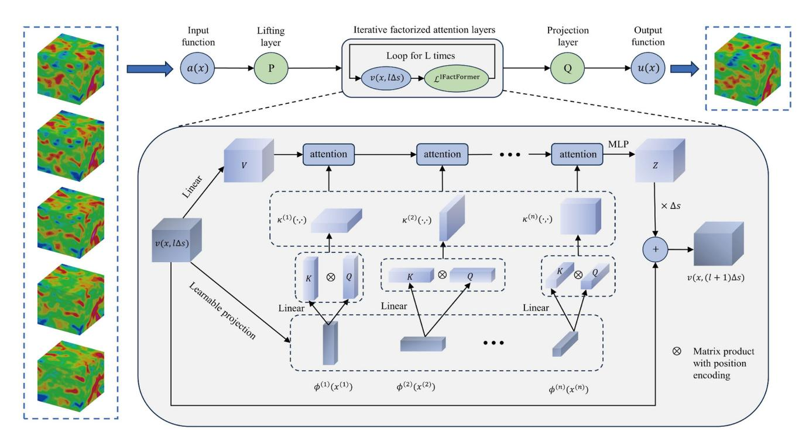
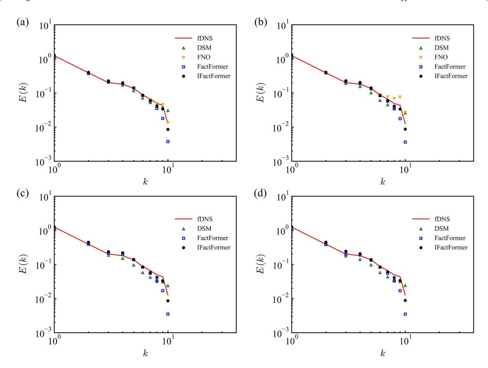
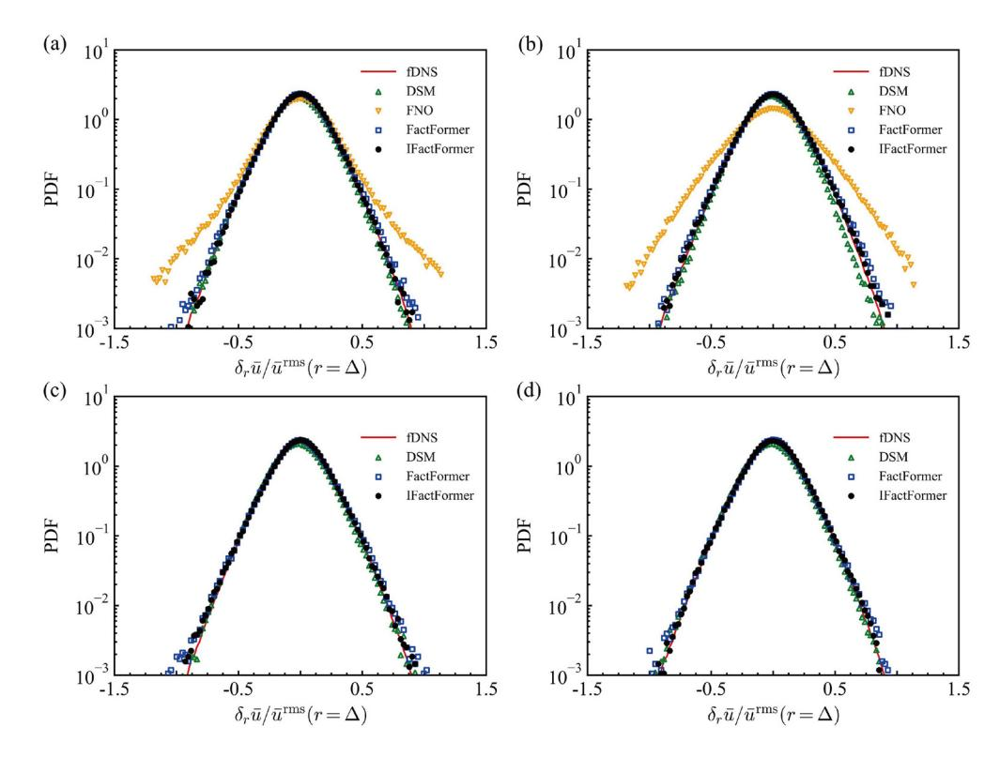
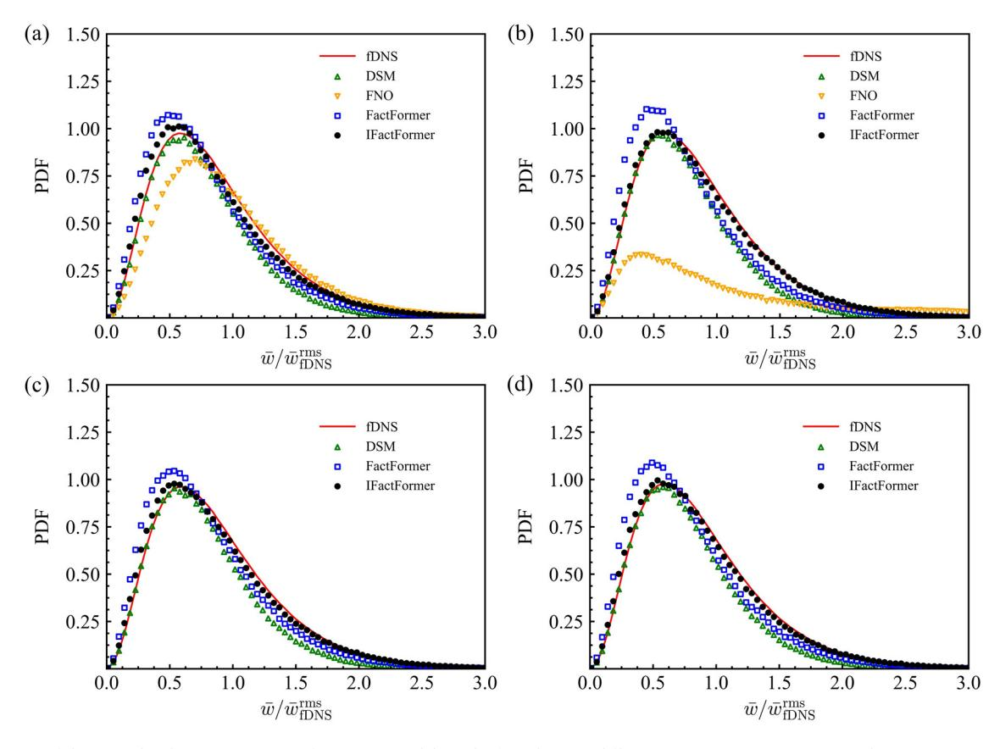
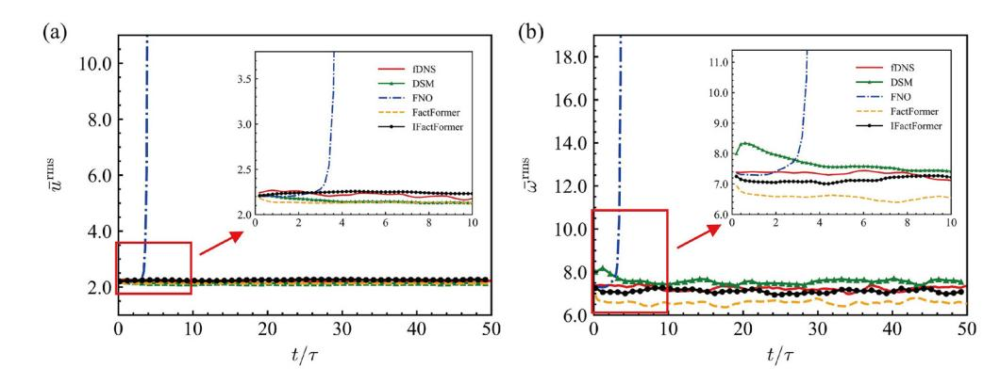
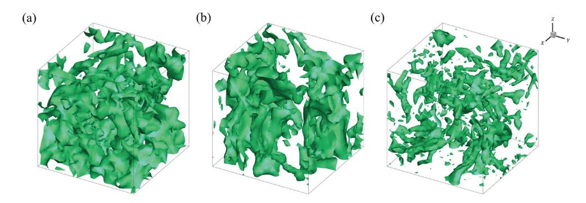

ELSEVIER

Contents lists available at ScienceDirect

# Theoretical and Applied Mechanics Letters

journal homepage: www.elsevier.com/locate/taml

## An implicit factorized transformer with applications to fast prediction of three-dimensional turbulence

Huiyu Yang a,b, Zhijie Li a, Xia Wang b, Jianchun Wang a,\*

- a Department of Mechanics and Aerospace Engineering, Southern University of Science and Technology, Shenzhen 518055, China
- b College of Mathematics and Informatics, South China Agricultural University, Guangzhou 510642, China

### ARTICLE INFO

Keywords:
Transformer
Operator learning
Turbulence simulation
Incompressible turbulence

### ABSTRACT

Transformer has achieved remarkable results in various fields, including its application in modeling dynamic systems governed by partial differential equations. However, transformer still face challenges in achieving long-term stable predictions for three-dimensional turbulence. In this paper, we propose an implicit factorized transformer (IFactFormer) model, which enables stable training at greater depths through implicit iteration over factorized attention. IFactFormer is applied to large eddy simulation of three-dimensional homogeneous isotropic turbulence (HIT), and is shown to be more accurate than the FactFormer, Fourier neural operator, and dynamic Smagorinsky model (DSM) in the prediction of the velocity spectra, probability density functions of velocity increments and vorticity, temporal evolutions of velocity and vorticity root-mean-square value and isosurface of the normalized vorticity. IFactFormer can achieve long-term stable predictions of a series of turbulence statistics in HIT. Furthermore, IFactFormer showcases superior computational efficiency compared to the conventional DSM in large eddy simulation.

1. Introduction. Recent advancements in turbulence simulations have been significantly influenced by the integration of machine learning (ML) techniques [1–3]. These advancements predominantly fall into two categories: one that supplements traditional turbulence models by learning closures and subgrid discretization [4–8], and another that employs pure deep learning to approximate the systems governed by Navier-Stokes equations [9–18]. While ML-enhanced turbulence models exhibit higher accuracy compared to traditional turbulence models, they still cannot avoid substantial computational costs. In contrast, the purely data-driven approaches, known as operator learning, often require minimal reliance on domain-specific knowledge, enabling not only the flexible design of structures to simulate various physics processes modeled by partial differential equations (PDEs) but also the ability to predict efficiently and rapidly compared to traditional numerical methods.

Among various network structures, the transformer [19], entirely based on the attention mechanism, has been extensively applied and exhibits remarkable performance in fields like computer vision [20–22] and natural language processing [23–25]. Consequently, there has been an increasing trend recently in attempts to apply the transformer to simulate physical processes governed by PDEs [26–34]. Cao et al. [26] conceptualized a linearized transformer without softmax as a learnable Petrov-Galerkin projection and proposed the Galerkin transformer, the first transformer-based learnable operator. Li et al. [27] introduced the operator transformer framework, an encoder-decoder architecture

incorporating self-attention, cross-attention, and a series of point-wise multilayer perceptrons (MLPs). Hao et al. [28] designed a general neural operator transformer capable of flexibly encoding different types of input functions and input features. While transformer-based operator approaches have demonstrated competitive outcomes in various benchmarks, their substantial memory demands often render them impractical for application in high-dimensional PDEs. To overcome the issues mentioned, Li et al. [29] introduced a factorized transformer (Fact-Former) built on an axial factorized kernel integral, providing an efficient low-rank alternative surrogate modeling. The FactFormer significantly reduces peak memory usage and marks the first application of transformer-based operator in simulating three-dimensional PDEs. However, the FactFormer still faces challenges in achieving satisfactory results in terms of accuracy and stability when making long-term predictions of 3D turbulence. This is because turbulence is a chaotic system characterized by vortices of various scales, making long-term precise prediction a particularly challenging task.

In this paper, we propose an implicit factorized transformer (IFact-Former) model for fast prediction of three-dimensional homogeneous isotropic turbulence (HIT). IFactFormer enables stable training at greater depths through implicit iteration over factorized attention. This network structure significantly enhances the accuracy and stability of transformer-based operator for long-term predictions of HIT, compared to traditional dynamic Smagorinsky model (DSM) in large eddy

E-mail address: wangjc@sustech.edu.cn (J. Wang).

\* Corresponding author.

simulation (LES), Fourier neural operator (FNO) and FactFormer in datadriven approaches.

- 2. Problem statement. This section briefly introduces the three-dimensional incompressible Navier-Stokes equations and outlines the learning objectives of the neural operator.
- 2.1 Problem backgroud. Turbulence is ubiquitous in nature, yet there remains an incomplete theoretical understanding of the solutions to its governing equations, the Navier-Stokes equations. The incompressible Navier-Stokes equation in three dimensions is presented as follows [35–37]:

$$\frac{\partial u_i}{\partial x_i} = 0,\tag{1}$$

$$\frac{\partial u_i}{\partial t} + \frac{\partial (u_i u_j)}{\partial x_j} = -\frac{\partial p}{\partial x_i} + v \frac{\partial^2 u_i}{\partial x_j \partial x_j} + \mathcal{F}_i, \tag{2}$$

where  $u_i$  represents the velocity component along the ith axis, p is the pressure normalized by constant density, v denotes the kinematic viscosity, and  $\mathcal{F}_i$  represents the forcing term in the direction of the ith axis. In this paper, the Cartesian-tensor suffix notation is utilized, greatly simplifying expressions through the use of Einstein summation convention. More details on this notation can be found in Appendix A of Pope's work [36].

Turbulence occurs under conditions of high Reynolds numbers

$$Re = \frac{\mathcal{U}\mathcal{L}}{V},\tag{3}$$

where  $\mathcal U$  denotes the characteristic velocity and  $\mathcal L$  denotes the characteristic length scale. The concept of energy cascade is that turbulence consists of eddies of different sizes. These eddies transfer energy from larger ones to smaller ones, until it is ultimately converted into thermal energy and dissipated. The Kolmogorov length scale,

$$\eta = \left(\frac{v^3}{\varepsilon}\right)^{1/4},\tag{4}$$

characterizes the very smallest, dissipative eddies, where  $\epsilon = 2\nu \left\langle S_{ij}S_{ij}\right\rangle$  is the mean rate of dissipation,  $\langle \cdot \rangle$  denotes a spatial average along the homogeneous direction, and  $S_{ij} = \frac{1}{2} \left( \partial u_i / \partial x_j + \partial u_j / \partial x_i \right)$  denotes the strain rate tensor.

2.2 Problem definition. We assume that  $\mathcal{A}, \mathcal{U}$  are Banach spaces of functions on compact domains  $\mathcal{X} \subset \mathbb{R}^{d_x}$ , mapping into  $\mathbb{R}^{d_y}$ . The ground truth operator is denoted as  $\mathcal{G}: \mathcal{A} \to \mathcal{U}$ . Operator learning aims to construct a model  $\tilde{\mathcal{G}}_{\theta}$  parameterized by  $\theta \in \Theta$ , where the optimal parameters  $\theta^*$  are identified by solving a minimization problem

$$\min_{\theta \in \Theta} \sum_{i=1}^{M} \sum_{i=1}^{N} \left\| \tilde{\mathcal{G}}_{\theta} \left[ a_{j} \right] \left( x_{i} \right) - u_{j} \left( x_{i} \right) \right\|^{2}, \tag{5}$$

thereby approximating the ground truth operator  $\mathcal{G}$ , where M is the number of input-output pairs.  $a = \left[a(x_1), a(x_2), \ldots, a(x_N)\right]$  or  $u = \left[u(x_1), u(x_2), \ldots, u(x_N)\right]$  represents a function  $a \in \mathcal{A}$  or  $u \in \mathcal{U}$  evaluated at a collection of fixed locations  $\left\{x_i\right\}_{i=1}^N \subset \mathcal{X}$ , respectively.

3. Related work and modified methods. The neural operator learns op-

- 3. Related work and modified methods. The neural operator learns operator between two Banach spaces by establishing learnable integral transforms. In this section, the first two parts present the standard framework of the integral neural operator and the integral neural operator based on the attention mechanism. The final part introduces the IFact-Former.
- 3.1 Integral neural operator architectures. The pioneers of neural operator in [38] described it as an iterative framework  $v_0\mapsto v_1\mapsto \cdots\mapsto v_L$ , where  $v_j$  (for  $j=0,1,\ldots,L-1$ ) indicates a sequence of functions. Initially, the function  $a\in\mathcal{A}$  is transformed into a high-dimensional representation  $v_0(x)=P[a(x)]$  through a local transformation  $P:\mathbb{R}^{d_a}\to\mathbb{R}^{d_v}$ . This is followed by several iterative transformations  $v_l\mapsto v_{l+1}$ . The final function  $u(x)=Q\big[v_L(x)\big]$  is obtained by projecting through a local transformation  $Q:\mathbb{R}^{d_v}\to\mathbb{R}^{d_u}$ . Each transformation  $v_l\mapsto v_{l+1}$  combines

a learnable integral operator  ${\cal K}$  with an activation function  $\sigma$  as follow:

$$v_{l+1}(x) = \sigma \{ \mathcal{W}_l v_l(x) + [\mathcal{K}_l(v_l)](x) \}, \tag{6}$$

where  $W_l$  are point-wise linear transformations and  $\mathcal{K}_l$  are learnable integral operators on  $v_l(x)$ . There has been a range of research focused on modeling the learnable integral operator  $\mathcal{K}$ , including but not limited to models based on FNOs [39–45] and spectral neural operator [46,47].

3.2 Attention mechanism as integral neural operator. The standard attention module [19] operates on query vectors  $\{\mathbf{q}_j\}$ , key vectors  $\{\mathbf{k}_j\}$ , and value vectors  $\{\mathbf{v}_i\}$ :

$$\mathbf{z}_{i} = \sum_{i=1}^{n} \alpha_{ij} \mathbf{v}_{j}, \quad \alpha_{ij} = \frac{\exp\left[h\left(\mathbf{q}_{i}, \mathbf{k}_{j}\right)\right]}{\sum_{s=1}^{n} \exp\left[h\left(\mathbf{q}_{i}, \mathbf{k}_{s}\right)\right]}.$$
 (7)

The weight function  $h(\cdot)$  is the scaled dot-product  $h(\mathbf{q}_i, \mathbf{k}_j) = (\mathbf{q}_i \cdot \mathbf{k}_j)/\sqrt{d}$ , where d represents the dimension of vectors  $\mathbf{q}_i$  and  $\mathbf{k}_i$ . Queries, keys, and values vectors are commonly derived from the input via learnable projections. In self-attention mechanisms, all of them are calculated from the same inputs vector  $\mathbf{u}_i \in \mathbb{R}^{1 \times d_{\mathrm{in}}}$  as follows:

$$\mathbf{q}_i = \mathbf{u}_i \mathbf{W}_q, \ \mathbf{k}_i = \mathbf{u}_i \mathbf{W}_k, \ \mathbf{v}_i = \mathbf{u}_i \mathbf{W}_v,$$
(8)

where  $\{\mathbf{W}_q, \mathbf{W}_k, \mathbf{W}_v\} \in \mathbb{R}^{d_{\mathrm{in}} \times d}$  are learnable linear transformation matrices. Motivated by the interpretation of the learnable bases, the Fourier-type attention proposed in [26] can be viewed as a learnable integral operator  $\mathcal{K}$ . The formula of the jth column  $(1 \le j \le d)$  in the ith row  $(1 \le i \le n)$  of  $\mathbf{z}$  is

$$(\mathbf{z}_i)_j = \frac{1}{n} \sum_{s=1}^n (\mathbf{q}_i \cdot \mathbf{k}_l) (\mathbf{v}^j)_l \approx \int_{\Omega} \kappa(x_i, \zeta) v_j(\zeta) d\zeta.$$
 (9)

Assuming that the discrete coordinates of the input function u are distributed on a grid in an n-dimensional space, there are a total of  $S_1 \times S_2 \times \cdots \times S_n = N$  points and  $x_i^{(m)}$  representes the ith coordinate of mth dimension. The factorized attention proposed in [29] decomposes the integral operator described in Eq. 9 into integrals operating along the axial directions as follow:

$$z\left(x_{i_{1}}^{(1)}, x_{i_{2}}^{(2)}, \dots, x_{i_{n}}^{(n)}\right) = \int_{\Omega_{n}} \kappa^{(n)} \left(x_{i_{n}}^{(n)}, \zeta_{n}\right) \int_{\Omega_{n-1}} \kappa^{(n-1)} \left(x_{i_{n-1}}^{(n-1)}, \zeta_{n-1}\right) \dots$$
$$\int_{\Omega_{n}} \kappa^{(1)} \left(x_{i_{1}}^{(1)}, \zeta_{1}\right) v\left(\zeta_{1}, \zeta_{2}, \dots, \zeta_{n}\right) d\zeta_{1} d\zeta_{2} \dots d\zeta_{n}, \quad (10)$$

where  $v(\cdot): \mathbb{R}^n \mapsto \mathbb{R}^d$  is derived from the input function u via linear transformation like in Eq. 8, kernels  $\left\{\kappa^{(1)}, \kappa^{(2)}, \dots, \kappa^{(n)}\right\}: \mathbb{R} \times \mathbb{R} \mapsto \mathbb{R}$  are calculated from the query/key vectors of the results  $\left\{\hat{U}^{(1)}, \dots, \hat{U}^{(n)}\right\} \left(\hat{U}^{(m)} \in \mathbb{R}^{S_m \times d}\right)$  of the learnable projection

$$\hat{U}^{(m)} = \phi^{(m)} \left( x_i^{(m)} \right) 
= h^{(m)} \left\{ w \int_{\Omega_1} \cdots \int_{\Omega_n} \gamma^{(m)} \left\{ u \left[ \zeta_1, \dots, \zeta_{m-1}, x_i^{(m)}, \zeta_{m+1}, \dots, \zeta_n \right] \right\} \right. 
d\zeta_1 \cdots d\zeta_{m-1} d\zeta_{m+1} \cdots d\zeta_n \right\},$$
(11)

where  $h^{(m)}(\cdot): \mathbb{R}^d \mapsto \mathbb{R}^d$  represents a three-layer MLP,  $\gamma^{(m)}(\cdot): \mathbb{R}^d \mapsto \mathbb{R}^d$  is a learnable linear transformation, and  $w = S_m/N$  is a constant to mitigate the scaling effects of the integral transformation. The computational complexity of the factorized attention for single kernel integration is  $O(S_1^2d + S_2^2d + \cdots + S_n^2d)$ , which is lower than the  $O(N^2d)$  of the Fourier-type attention in Eq. 9.

3.3 IFactFormer. We propose an IFactFormer to enhance the Fact-Former as shown in Fig. 1. The task of the IFactFormer is to adopt the velocity fields from the preceding several time-nodes to predict the velocity fields of the subsequent time-nodes.

Initially, through the lifting layer P, the several velocity fields are mapped to several high-dimensional representation and compressed into a single field. At this stage, spatial structures are disregarded. Specially, assuming that the input size are (N,T), where N signifies the quantity of grid points and T corresponds to the frame count of the input velocity field. A 2D convolutional block in temporal domain with

Fig. 1. Architecture of the IFactFormer. Note that the quantities of Q/K/V and  $\kappa(\cdot, \cdot)$  are depended on the number of multi-head attention, where L is the number of iterations and n = 3 is the number of dimensions. The details of position encoding are presented in Appendix A.

kernel size (1,T) is utilized as the lifting layer P, yielding the single field  $v(x,0\Delta s)$ . Then, the single field subject to iterative updates  $v(x,0\Delta s)\mapsto v(x,1\Delta s)\mapsto \cdots\mapsto v(x,L\Delta s)$  via implicit factorized attention layers, which are modeled as a learnable integration operator. Finally, the projection layer Q (a three-layer MLP) is utilized to derive the output. Different from the factorized attention, the IFactFormer models the iterations of the attention layer as a numerical solver grounded in the Euler method:

$$v(x, [l+1)\Delta s] = \mathcal{L}^{\text{IFactFormer}}[v(x, l\Delta s)]$$
  
=  $v(x, l\Delta s) + \Delta s \mathcal{L}^{\text{FactFormer}}[v(x, l\Delta s)],$  (12)

where  $\Delta s = 1/L$  represents the assumed step size of each iteration in latent high-dimensional space. Here, a single attention-based integral operator is employed, with shared parameters implemented across all layers during the iterative process.

This implicit iterative approach eliminates the need to store intermediate quantities from the forward pass for back propagation, significantly reducing the model's parameter count. Consequently, training can be conducted with a constant storage cost related to the number of iterations. Moreover, some studies [42,48–50] have also shown that this implicit iterative method helps alleviate the overfitting phenomenon that occurs when the model is too deep.

4. Numerical results of three-dimensional homogeneous isotropic turbulence. In this research, we assess the performance of the IFactFormer method in simulating three-dimensional incompressible HIT, comparing it with FNO, FactFormer and DSM.

The study employs incompressible HIT through direct numerical simulation (DNS) within a cubic domain of size  $(2\pi)^3$ , operating at a Taylor Reynolds number  $Re_{\lambda}\approx 100$ . A grid resolution of  $256^3$  cells is utilized with periodic boundary conditions for accurate representation [4,51]. Spatial discretization is accomplished using the pseudo-spectral method, and temporal integration is conducted employing the second-order, two-step Adams-Bashforth scheme for numerical stability [52–54]. To maintain statistically steady turbulence, large-scale forcing is applied to stabilize the velocity spectrum at the lowest two wavenumber shells,

**Table 1**The training hyperparameters for all data-driven models.

| Epochs | Batch size | Learning rate ( <i>lr</i> ) | Scheduler of <i>lr</i> | Decay period | Decay factor |
|--------|---------------|-----------------------------|---------------------------|-----------------|-----------------|
| 30     | 2             | 0.0001                      | StepLR                    | 50000           | 0.7             |

with predefined energy levels of  $E_0(1) = 1.242477$  and  $E_0(2) = 0.391356$  [55,56]. Furthermore, to mitigate aliasing errors arising from nonlinear advection terms, Fourier modes at high wavenumbers are truncated following the two-thirds rule.

The DNS data undergo filtering to generate large-scale flow fields at grid resolutions of 323 using a sharp spectral filter with a cutoff wavenumber of  $k_c = 10$  [36]. The time step is configured at  $10^{-3}$  and data are recorded every 200 steps. Forty-five random velocity fields are employed as initial conditions, and numerical solutions are saved for 600 time points after the flow fields reach statistical stability. Consequently, the filtered direct numerical simulation (fDNS) data, with dimensions of  $[45 \times 600 \times 32 \times 32 \times 32 \times 3]$ , can be utilized for training and testing datasets. These datasets consist of velocity fields in three directions at 323 resolution for 600 time points across 45 groups. The large-eddy turnover time  $\tau$ , calculated as  $\tau \equiv L_{\rm I}/u^{\rm rms} \approx 0.2$ , where  $L_{\rm I}$ represents the integral scale and urms denotes the root-mean-square of velocity. The time step size  $\Delta t$  between successive time points is set at  $0.2\tau$ . For all data-driven approaches, velocity fields from the five preceding time points  $(U_1, U_2, U_3, U_4, U_5)$  are used to predict the velocity field at the sixth time point  $U_6$  and subsequent fields are forecasted in an autoregressive manner. Hence, there are a total of 26,775 input-output pairs for 45 groups, with 80% allocated for training and 20% for testing.

For a fair comparison, the training hyperparameters for all datadriven models are listed in Table 1. The AdamW optimizer [57] is utilized to minimize the training loss, with the relative mean square error adopted as the loss function and the step learning rate scheduler (StepLR) is employed to adjust *lr* during the training process. For the IFactFormer and FactFormer models, we employ a two-layer 2D convo-

Fig. 2. The velocity spectra of various models in the forced HIT at different time instants: (a)  $t/\tau \approx 1.0$ , (b)  $t/\tau \approx 3.0$ , (c)  $t/\tau \approx 20.0$ , and (d)  $t/\tau \approx 50.0$ . For data-driven models, each time instant of prediction is  $0.2\tau$ .

Table 2 Comparing the minimum training (left) and testing loss (right) of different data-driven models in forced homogeneous isotropic turbulence at various depths of L.

| . = 4         | L = 10         | L = 25                       |
|---------------|----------------|------------------------------|
| 0.175, 0.239) | (0.123, 0.126) | N/A N/A (0.076, 0.079) |
| 0             | .175, 0.239)   | .175, 0.239) (0.123, 0.126)  |

lutional encoder and a MLP decoder, where the number of channels in the latent space is 96. In the factorized attention layer, the number of multi-head attention is set to 10 and the dimensions of each head are 64. Moreover, we set the value of Fourier modes for the FNO model is 20.

Table 2 presents a comparison of the minimum training and testing loss at various depths in the forced HIT setting for the FNO, FactFormer, and IFactFormer models. The results indicate that attention-based models (e.g. FactFormer and IFactFormer) are more effective at capturing the structure of turbulence than the FNO, leading to lower training and testing loss at a depth of 4. As the network depth increases, the FactFormer model is subject to the effects of vanishing/exploding gradients, which hamper the optimization and convergence. However, the IFactFormer model significantly reduces both training and testing loss with the increase in the number of implicit loop.

We investigate the influence of the time step size  $\Delta t$  on the model accuracy. Table 3 displays the testing loss at consequent time steps of the IFactFormer model with different time step size  $\Delta t$ . The prediction time spans are  $[0.2\tau, 1.6\tau]$ . The IFactFormer model with time step size  $0.2\tau$  achieves the lowest testing loss at every prediction step. Therefore,

**Table 3** The testing loss at consequent time steps of the IFactFormer model with different time step size  $\Delta t$ . Here, the numbers on the horizontal axis represent the number of steps with a step size of  $0.2\tau$ .

| $\Delta t$ | 1     | 2     | 3     | 4     | 5     | 6     | 7     | 8     |
|------------|-------|-------|-------|-------|-------|-------|-------|-------|
| $0.2\tau$  | 0.129 | 0.203 | 0.270 | 0.335 | 0.402 | 0.466 | 0.527 | 0.584 |
| $0.4\tau$  | -     | 0.309 | -     | 0.440 | -     | 0.556 | -     | 0.662 |
| $0.8\tau$  | -     | -     | -     | 0.517 | -     | -     | -     | 0.643 |
| $1.6\tau$  | -     | -     | -     | -     | -     | -     | -     | 0.753 |

if the time step size  $\Delta t$  is too large, the IFactFormer model is difficult to capture the temporal correlations among turbulences.

To assess the generalization capability of the models, an additional 10 groups of independent HIT data are generated for the *a posterior* evaluation of the FNO, FactFormer and IFactFormer models, as well as the DSM in LES. The velocity spectra predicted by a series of data-driven models and DSM in LES at different time instants are shown in Fig. 2. FactFormer, IFactFormer, and DSM can stably reconstruct the velocity spectrum across different flow scales in long-term predictions, whereas FNO is unable to achieve this. Among the models compared, only IFactFormer is capable of accurately modeling small-scale structures in high wavenumber regions over extended periods.

Figure 3 compares the PDFs of the normalized velocity increments  $\delta_r \bar{u}/\bar{u}^{\rm rms}$  at four time instants. Both IFactFormer and DSM are capable of accurately predicting the PDFs of the velocity increment over extended periods. In comparison, FactFormer exhibits slightly lower precision. On the other hand, FNO demonstrates significant errors in predicting the PDFs of the velocity increment at  $t/\tau \approx 4.0$ , and due to the accumulation of errors over time, FNO is unable to achieve long-term stable predictions. The above analysis is equally applicable to the prediction of the PDFs of the normalized vorticity  $\bar{\omega}/\bar{\omega}_{\rm FDNS}^{\rm rms}$ , as shown in Fig. 4. The

Fig. 3. The PDFs of the normalized velocity increments  $\delta_r \bar{u}/\bar{u}^{\rm rms}$  for various models in the forced HIT at different time instants: (a)  $t/\tau \approx 4.0$ , (b)  $t/\tau \approx 8.0$ , (c)  $t/\tau \approx 20.0$ , and (d)  $t/\tau \approx 50.0$ . For data-driven models, each time instant of prediction is  $0.2\tau$ .

Fig. 4. The PDFs of the normalized vorticity  $\bar{\omega}/\bar{\omega}_{\mathrm{DNS}}^{\mathrm{rins}}$  for various models in the forced HIT at different time instants: (a)  $t/\tau \approx 4.0$ , (b)  $t/\tau \approx 8.0$ , (c)  $t/\tau \approx 20.0$ , and (d)  $t/\tau \approx 50.0$ . For data-driven models, each time instant of prediction is  $0.2\tau$ .

Fig. 5. The temporal evolutions for various models in the forced HIT: (a) velocity rms value, and (b) vorticity rms value. For data-driven models, each time instant of prediction is  $0.2\tau$ .

Fig. 6. The isosurface of the normalized vorticity  $\bar{\omega}/\bar{\omega}_{\text{IDNS}}^{\text{rms}} = 1.5$  at  $t/\tau \approx 20.0$ : (a) fDNS, (b) IFactFormer, and (c) DSM.

predictions of the PDFs of normalized vorticity by IFactFormer closely align with the ground truth by fDNS, significantly outperforming the other models in the majority of cases.

Moreover, the temporal evolutions of velocity rms value  $\bar{u}^{rms}$  and vorticity rms value  $\bar{\omega}^{rms}$  for different models in the forced HIT as shown in Fig. 5. The velocity rms value  $\bar{u}^{rms}_{TDNS}$  of fDNS is about 2.2 and the vorticity rms value  $\bar{\omega}^{rms}_{TDNS}$  of fDNS is about 7.4. The three data-driven models are better than DSM in the accuracy of velocity rms value and vorticity rms value predictions in the short-term ( $t/\tau < 2.0$ ), but the accumulation of errors over longer periods resulting in numerical divergence is a significant challenge for these models. However, in all experiments, attention-based models have been able to predict turbulence statistics stably. At the moment of  $t/\tau \approx 20.0$ , the spatial structures of the vorticity by fDNS, DSM and IFactFormer are illustrated in Fig. 6. The results indicate that, compared to the DSM, the IFactFormer model is more capable of accurately predicting the structure of the vorticity field.

Data-driven approaches, allow the direct application of the trained models for the numerical simulation of turbulence once trained, thereby significantly enhancing computational efficiency. In this study, data-driven models are trained and tested using PyTorch on a single Nvidia Tesla V100 GPU, with a CPU configuration of Intel(R) Xeon(R) Gold 6240 CPU @2.60 GHz. The DSM model is executed on a virtual machine equipped with an Intel Xeon Gold 6148 CPU with 32 cores each @2.40 GHz. The computational efficiencies of different models of 10 prediction steps are shown in Table 4. Compared with the FNO and FactFormer models, the parameter count of the IFactFormer model has been reduced by factors of 237 and 3.9, respectively, while the memory cost has been decreased to 28% and 98%. Although the computational time of the IFactFormer model has increased due to the increase in the number of implicit loops, it remains approximately 210 times faster on GPU and 4 times faster on CPUs compared to the DSM model. Addition-

**Table 4**Computational efficiencies of different models on forced HIT.

| Model       | # of params ( $\times 10^6$ ) | Memory (GB) | GPU (s) | CPU (s) |
|-------------|-------------------------------|-------------|---------|---------|
| DSM         | N/A                           | N/A         | N/A     | 65.31   |
| FNO         | 331.8                         | 3.13        | 0.058   | 2.953   |
| FactFormer  | 5.5                           | 0.89        | 0.054   | 2.781   |
| IFactFormer | 1.4                           | 0.88        | 0.311   | 16.27   |

ally, compared to FNO, the attention-based model offer easily of parallel computation at both the algorithmic and hardware levels [58], thereby holding the potential to further enhance computational efficiency and address problems of increased complexity.

5. Conclusion. In this paper, we introduce an IFactFormer model, which enables stable training at greater loops through implicit iteration over factorized attention. We compare the IFactFormer model to the FNO, FactFormer model, and DSM model in LES of three-dimensional homogeneous isotropic turbulence. The IFactFormer model is capable of achieving long-term accurate predictions for a series of turbulence statistics while requiring minimal memory cost. Thanks to the characteristics of Transformer that facilitate parallelism at both the algorithmic and hardware levels, the attention-based model holds promise for further improving computational efficiency and addressing more complex turbulence in the future.

## **Declaration of competing interest**

The authors declare that they have no known competing financial interests or personal relationships that could have appeared to influence the work reported in this paper.

## CRediT authorship contribution statement

**Huiyu Yang:** Writing – original draft, Visualization, Software, Methodology. **Zhijie Li:** Writing – review & editing, Validation, Software. **Xia Wang:** Supervision, Writing – review & editing. **Jianchun Wang:** Writing – review & editing, Supervision, Resources, Project administration, Funding acquisition, Data curation.

## Acknowledgments

This work was supported by the National Natural Science Foundation of China (Grant No. 12172161), the NSFC Basic Science Center Program (Grant No. 11988102), and the Shenzhen Science and Technology Program (Grant No. KQTD20180411143441009). This work was also supported by Center for Computational Science and Engineering of Southern University of Science and Technology.

## Appendix A. Rotary Positional Encoding

To provide the attention mechanism with relative positional information between different points, it is usually necessary to encode additional positional information. Su et al. [59] designed Rotary Position Embedding (RoPE) to effectively utilize the positional information, which is encoded through the inner product of the rotary matrix  $\mathbf{R}^d_{\Theta,m}$  and  $\mathbf{q}_m$ ,  $\mathbf{k}_m$  vectors. Here,  $\mathbf{q}_m$  and  $\mathbf{k}_m$  are query and key vectors in the attention mechanism. The representation of the rotary matrix  $\mathbf{R}^d_{\Theta,m}$  is a block diagonal matrix as follows:

$$\boldsymbol{R}_{\Theta,m}^{d} = \begin{pmatrix} \cos m\theta_{1} & -\sin m\theta_{1} & 0 & 0 & \cdots & 0 & 0\\ \sin m\theta_{1} & \cos m\theta_{1} & 0 & 0 & \cdots & 0 & 0\\ 0 & 0 & \cos m\theta_{2} & -\sin m\theta_{2} & \cdots & 0 & 0\\ 0 & 0 & \sin m\theta_{2} & \cos m\theta_{2} & \cdots & 0 & 0\\ \vdots & \vdots & \vdots & \vdots & \ddots & \vdots & \vdots\\ 0 & 0 & 0 & 0 & \cdots & \cos m\theta_{d/2} & -\sin m\theta_{d/2}\\ 0 & 0 & 0 & 0 & \cdots & \sin m\theta_{d/2} & \cos m\theta_{d/2} \end{pmatrix}$$

$$(A.1)$$

where  $\Theta = \left\{\theta_i = 10000^{-2(i-1)/d}, i \in [1,2,\dots,d/2]\right\}$  are the hyperparameters. This setting of the hyperparameters ensures a wide range of wavelengths, which means that each position has a unique positional encoding [19,59]. The matrix product with RoPE is defined as follows:

$$\mathbf{q}_{m} \otimes \mathbf{k}_{n} = \left(\mathbf{R}_{\Theta,m}^{d} \mathbf{q}_{m}\right)^{T} \left(\mathbf{R}_{\Theta,n}^{d} \mathbf{k}_{n}\right) = \mathbf{q}_{m}^{T} \mathbf{R}_{\Theta,n-m}^{d} \mathbf{k}_{n}. \tag{A.2}$$

Here  $\mathbf{R}_{\Theta,n-m}^d = \left(\mathbf{R}_{\Theta,m}^d\right)^T \mathbf{R}_{\Theta,n}^d$ , benefiting from the properties of the rotary matrix.

## References

- S.L. Brunton, B.R. Noack, P. Koumoutsakos, Machine learning for fluid mechanics, Ann. Rev. Fluid Mech. 52 (2020) 477–508.
- [2] K. Duraisamy, G. Iaccarino, H. Xiao, Turbulence modeling in the age of data, Annu. Rev. Fluid Mech. 51 (2019) 357–377.
- [3] A. Beck, M. Kurz, A perspective on machine learning methods in turbulence modeling, GAMM-Mitteilungen 44 (1) (2021) e202100002.
- [4] Z. Yuan, C. Xie, J. Wang, Deconvolutional artificial neural network models for large eddy simulation of turbulence, Phys. Fluids 32 (11) (2020).
- [5] G. Novati, H.L. de Laroussilhe, P. Koumoutsakos, Automating turbulence modelling by multi-agent reinforcement learning, Nature Mach. Intell. 3 (1) (2021) 87–96.
- [6] C. Xie, Z. Yuan, J. Wang, Artificial neural network-based nonlinear algebraic models for large eddy simulation of turbulence, Phys. Fluids 32 (11) (2020).
- [7] Z. Wang, K. Luo, D. Li, J. Tan, J. Fan, Investigations of data-driven closure for sub-grid-scale stress in large-eddy simulation, Phys. Fluids 30 (12) (2018).
- [8] Z. Zhou, G. He, S. Wang, G. Jin, Subgrid-scale model for large-eddy simulation of isotropic turbulent flows using an artificial neural network, Compu. Fluids 195 (2019) 104319.
- [9] K. Stachenfeld, D.B. Fielding, D. Kochkov, M. Cranmer, T. Pfaff, J. Godwin, C. Cui, S. Ho, P. Battaglia, A. Sanchez-Gonzalez, Learned simulators for turbulence, International conference on learning representations, 2021.
- [10] R. Wang, K. Kashinath, M. Mustafa, A. Albert, R. Yu, Towards physics-informed deep learning for turbulent flow prediction, in: Proceedings of the 26th ACM SIGKDD International Conference on Knowledge Discovery & Data Mining, 2020, pp. 1457–1466.

- [11] Z. Li, W. Peng, Z. Yuan, J. Wang, Fourier neural operator approach to large eddy simulation of three-dimensional turbulence, Theor. Appl. Mech. Lett. 12 (6) (2022) 100389
- [12] X. Yang, S. Zafar, J.-X. Wang, H. Xiao, Predictive large-eddy-simulation wall modeling via physics-informed neural networks, Phys. Rev. Fluids 4 (3) (2019) 034602.
- [13] X. Jin, S. Cai, H. Li, G.E. Karniadakis, NSFnets (Navier-Stokes flow nets): physics-informed neural networks for the incompressible Navier-Stokes equations, J. Comput. Phys. 426 (2021) 109951.
- [14] Y. Chen, D. Huang, D. Zhang, J. Zeng, N. Wang, H. Zhang, J. Yan, Theory-guided hard constraint projection (HCP): a knowledge-based data-driven scientific machine learning method, J. Comput. Phys. 445 (2021) 110624.
- [15] M. Raissi, P. Perdikaris, G.E. Karniadakis, Physics-informed neural networks: a deep learning framework for solving forward and inverse problems involving nonlinear partial differential equations, J. Comput. Phys. 378 (2019) 686–707.
- [16] X. Zhang, J. Helwig, Y. Lin, Y. Xie, C. Fu, S. Wojtowytsch, S. Ji, SineNet: learning Temporal Dynamics in Time-Dependent Partial Differential Equations, arXiv preprint arXiv:2403.19507(2024).
- [17] G. Kohl, L.-W. Chen, N. Thuerey, Benchmarking Autoregressive Conditional Diffusion Models for Turbulent Flow Simulation, arXiv preprint arXiv:2309.0175(2024).
- [18] T. Wang, P. Plechac, J. Knap, Generative diffusion learning for parametric partial differential equations, arXiv preprint arXiv:2305.14703(2023).
- [19] A. Vaswani, N. Shazeer, N. Parmar, J. Uszkoreit, L. Jones, A.N. Gomez, Ł. Kaiser, I. Polosukhin, Attention is all you need, Adv. Neural Inf. Process. Syst. 30 (2017).
- [20] A. Dosovitskiy, L. Beyer, A. Kolesnikov, D. Weissenborn, X. Zhai, T. Unterthiner, M. Dehghani, M. Minderer, G. Heigold, S. Gelly, et al., An image is worth 16x16 words: transformers for image recognition at scale, arXiv preprint arXiv:2010. 11929(2020).
- [21] N. Carion, F. Massa, G. Synnaeve, N. Usunier, A. Kirillov, S. Zagoruyko, End-to-end object detection with transformers, in: European conference on computer vision, Springer, 2020, pp. 213–229.
- [22] S. Khan, M. Naseer, M. Hayat, S.W. Zamir, F.S. Khan, M. Shah, Transformers in vision: a survey, ACM Comput. Surv. (CSUR) 54 (10s) (2022) 1–41.
- [23] Bert: Pre-training of deep bidirectional transformers for language understanding, author=Devlin, Jacob and Chang, Ming-Wei and Lee, Kenton and Toutanova, Kristina, arXiv preprint arXiv:1810.04805(2018).
- [24] A. Radford, K. Narasimhan, T. Salimans, I. Sutskever, et al., Improving language understanding by generative pre-training (2018).
- [25] M. Lewis, Y. Liu, N. Goyal, M. Ghazvininejad, A. Mohamed, O. Levy, V. Stoyanov, L. Zettlemoyer, Bart: denoising sequence-to-sequence pre-training for natural language generation, translation, and comprehension, arXiv preprint arXiv:1910.13461 (2019).
- [26] S. Cao, Choose a transformer: fourier or galerkin, Adv. Neural Inf. Process. Syst. 34 (2021) 24924–24940.
- [27] Z. Li, K. Meidani, A.B. Farimani, Transformer for partial differential equations' operator learning, arXiv preprint arXiv:2205.13671(2022).
- [28] Z. Hao, Z. Wang, H. Su, C. Ying, Y. Dong, S. Liu, Z. Cheng, J. Song, J. Zhu, Gnot: a general neural operator transformer for operator learning, in: International Conference on Machine Learning, PMLR, 2023, pp. 12556–12569.
- [29] Z. Li, D. Shu, A. Barati Farimani, Scalable transformer for PDE surrogate modeling, Adv. Neural Inf. Process. Syst. 36 (2024).
- [30] S. Lee, T. Oh, Inducing point operator transformer: a flexible and scalable architecture for solving PDEs, The 38th AAAI Conference on Artificial Intelligence (2024).
- [31] A. Hemmasian, A.B. Farimani, Multi-scale time-stepping of partial differential equations with transformers, arXiv preprint arXiv:2311.02225(2023).
- [32] A. Peyvan, V. Oommen, A.D. Jagtap, G.E. Karniadakis, RiemannONets: interpretable Neural Operators for Riemann Problems, arXiv preprint arXiv:2401.08886(2024).
- [33] Z. Xiao, Z. Hao, B. Lin, Z. Deng, H. Su, Improved operator learning by orthogonal attention, arXiv preprint arXiv:2310.12487(2023).
- [34] H. Wu, H. Luo, H. Wang, J. Wang, M. Long, Transolver: a fast transformer solver for PDEs on general geometries, arXiv preprint arXiv:2402.02366(2024).
- [35] C. Meneveau, J. Katz, Scale-invariance and turbulence models for large-eddy simulation, Annual Rev. Fluid Mech. 32 (1) (2000) 1–32.
- [36] S.B. Pope, Turbulent flows, Measur. Sci. Technol. 12 (11) (2001) 2020–2021.
- [37] P. Sagaut, Large Eddy Simulation for Incompressible Flows: An Introduction, Springer Science & Business Media, 2005.
- [38] Z. Li, N. Kovachki, K. Azizzadenesheli, B. Liu, K. Bhattacharya, A. Stuart, A. Anandkumar, Neural operator: graph kernel network for partial differential equations, arXiv preprint arXiv:2003.03485(2020a).
- [39] Z. Li, N. Kovachki, K. Azizzadenesheli, B. Liu, K. Bhattacharya, A. Stuart, A. Anandkumar, Fourier neural operator for parametric partial differential equations, arXiv preprint arXiv:2010.08895(2020b).
- [40] Z. Li, W. Peng, Z. Yuan, J. Wang, Long-term predictions of turbulence by implicit U-Net enhanced Fourier neural operator, Phys. Fluids 35 (7) (2023).
- [41] A. Tran, A. Mathews, L. Xie, C.S. Ong, Factorized Fourier neural operators, arXiv preprint arXiv:2111.13802(2021).
- [42] H. You, Q. Zhang, C.J. Ross, C.-H. Lee, Y. Yu, Learning deep implicit Fourier neural operators (IFNOs) with applications to heterogeneous material modeling, Comput. Method. Appl. Mech. Eng. 398 (2022) 115296.
- [43] W. Peng, Z. Yuan, Z. Li, J. Wang, Linear attention coupled Fourier neural operator for simulation of three-dimensional turbulence, Phys. Fluid. 35 (1) (2023).
- [44] Y. Wang, Z. Li, Z. Yuan, W. Peng, T. Liu, J. Wang, Prediction of turbulent channel flow using Fourier neural operator-based machine-learning strategy, arXiv preprint arXiv:2403.03051(2024).
- [45] W. Peng, S. Qin, S. Yang, J. Wang, X. Liu, L.L. Wang, Fourier neural operator for real-time simulation of 3D dynamic urban microclimate, Build. Environ. 248 (2024) 111063.

- [46] V. Fanaskov, I. Oseledets, Spectral neural operators, arXiv preprint arXiv:2205.10573(2022).
- [47] J. Choi, T. Yun, N. Kim, Y. Hong, Spectral operator learning for parametric PDEs without data reliance, Comput. Method. Appl. Mech. Eng. 420 (2024) 116678.
- [48] L. El Ghaoui, F. Gu, B. Travacca, A. Askari, A. Tsai, Implicit deep learning, SIAM J. Math. Data Sci. 3 (3) (2021) 930–958.
- [49] S. Bai, J.Z. Kolter, V. Koltun, Deep equilibrium models, Adv. Neural Inf. Process. Syst. 32 (2019).
- [50] E. Winston, J.Z. Kolter, Monotone operator equilibrium networks, Adv. Neural Inf. Process. Syst. 33 (2020) 10718–10728.
- [51] C. Xie, J. Wang, E. Weinan, Modeling subgrid-scale forces by spatial artificial neural networks in large eddy simulation of turbulence, Phys. Rev. Fluid. 5 (5) (2020) 054606
- [52] M.Y. Hussaini, T.A. Zang, Spectral methods in fluid dynamics, Annu. Rev. Fluid Mech. 19 (1) (1987) 339–367.
- [53] R. Peyret, Spectral Methods for Incompressible Viscous Flow, volume 148, Springer, 2002.

- [54] S. Chen, G.D. Doolen, R.H. Kraichnan, Z.-S. She, On statistical correlations between velocity increments and locally averaged dissipation in homogeneous turbulence, Phys. Fluids A: Fluid Dyn. 5 (2) (1993) 458–463.
- [55] J. Wang, M. Wan, S. Chen, C. Xie, Q. Zheng, L.-P. Wang, S. Chen, Effect of flow topology on the kinetic energy flux in compressible isotropic turbulence, J. Fluid Mech. 883 (2020) A11.
- [56] Z. Yuan, Y. Wang, C. Xie, J. Wang, Deconvolutional artificial-neural-network framework for subfilter-scale models of compressible turbulence, Acta Mechanica Sinica 37 (12) (2021) 1773–1785.
- [57] I. Loshchilov, F. Hutter, Decoupled weight decay regularization, arXiv preprint arXiv:1711.05101(2017).
- [58] M. Shoeybi, M. Patwary, R. Puri, P. LeGresley, J. Casper, B. Catanzaro, Megatronlm: training multi-billion parameter language models using model parallelism, arXiv preprint arXiv:1909.08053(2019).
- [59] J. Su, M. Ahmed, Y. Lu, S. Pan, W. Bo, Y. Liu, Roformer: enhanced transformer with rotary position embedding, Neurocomputing 568 (2024) 127063.