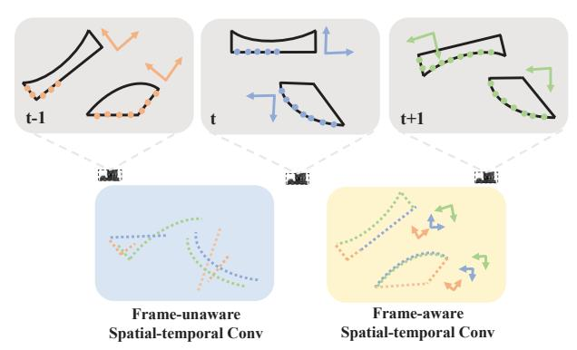
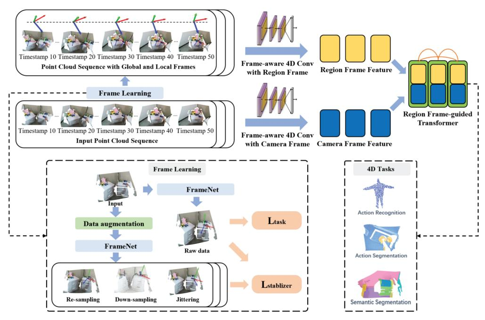
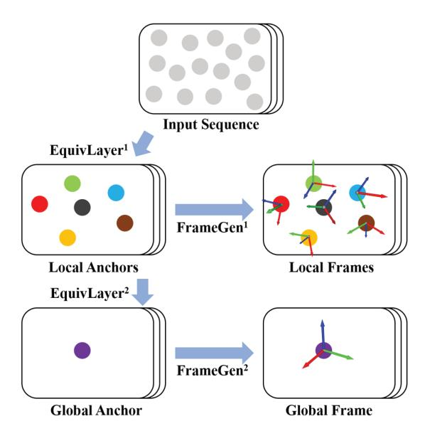
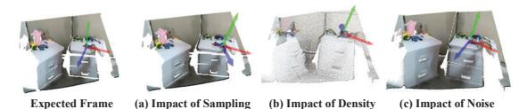
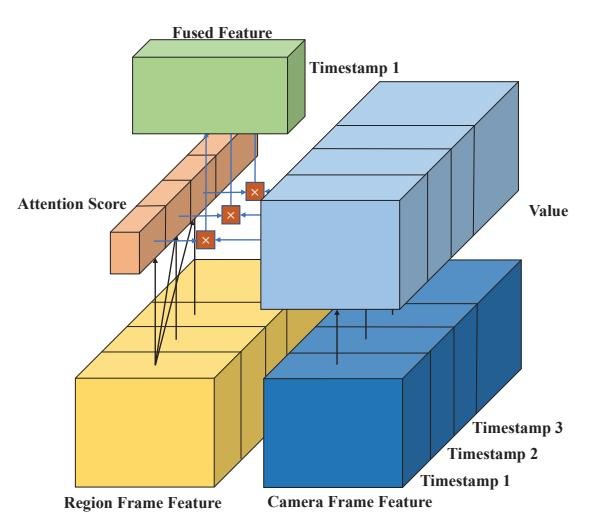

# LeaF: Learning Frames for 4D Point Cloud Sequence Understanding

Yunze Liu 1,3, Junyu Chen 1, Zekai Zhang 1, Jingwei Huang 4, Li Yi 1,2,3, 1 Tsinghua University, 2 Shanghai Artificial Intelligence Laboratory, 3 Shanghai Qi Zhi Institute 4 Huawei

#### **Abstract**

We focus on learning descriptive geometry and motion features from 4D point cloud sequences in this work. Existing works usually develop generic 4D learning tools without leveraging the prior that a 4D sequence comes from a single 3D scene with local dynamics. Based on this observation, we propose to learn region-wise coordinate frames that transform together with the underlying geometry. With such frames, we can factorize geometry and motion to facilitate a feature-space geometric reconstruction for more effective 4D learning. To learn such region frames, we develop a rotation equivariant network with a frame stabilization strategy. To leverage such frames for better spatialtemporal feature learning, we develop a frame-guided 4D learning scheme. Experiments show that this approach significantly outperforms previous state-of-the-art methods on a wide range of 4D understanding benchmarks.

### 1. Introduction

We have recently witnessed a surge of interest in understanding point cloud sequences in 4D (3D space + 1D time). As the direct sensory input in a large number of modern AI applications including robotics and AR/VR, point cloud sequences can faithfully depict the geometry and motion of a dynamic scene, and therefore become critical for an intelligent agent to perceive and interact with the physical world.

However, learning on such 4D data is very challenging and is still in an immature stage. 4D point cloud sequences usually couple 3D geometry and its dynamic motion together, resulting in quite redundant data in a very high dimensional space. This causes severe learning issues against an effective and compact spatial-temporal representation.

Some existing efforts tackle the challenge through novel 4D backbone designs [8, 30, 7]. However, most of these works treat the point cloud sequence as unstructured 4D data and exploit generic 4D learning methods without leveraging the prior that the whole 4D sequence just depicts a single 3D scene with dynamic objects. As a result, such 4D learning is usually not super effective and the learned

Figure 1. Frame-aware spatial-temporal convolution. We propose to learn frames for point cloud sequence. Upon obtaining the frames, we could easily align the geometry regardless of the underlying motion toward a more canonical and complete geometry understanding. The motion-agnostic geometric features also allow easier temporal association toward a better motion understanding.

spatial-temporal feature barely outperforms the spatial feature alone. Another line of works [7] uses self-supervised representation learning to encourage geometry and motion learning in a loosely decoupled manner. However, the decoupling still happens on the whole-scene level with a special focus on camera ego-motion, restricting their efficacy in modeling local dynamics on the object-level. We envision that successful geometry and motion decoupling is the key toward effective 4D representation learning. This essentially requires depicting the low-dimensional manifold of the dynamic scenes from the redundant high-dimensional 4D data. This highly correlates to dynamic scene reconstruction which requires understanding both camera egomotion and object motion and is an ongoing research topic itself. Instead of explicitly reconstructing the dynamic scene without a quality guarantee, we seek a more lightweight and flexible solution.

Our solution is based upon the following observation. For a specific region in the scene, we can understand its dynamic motion through establishing geometry-based and temporally-consistent local coordinate frames. Specifically, if we can establish a local coordinate frame based upon the 3D geometry in each timestamp and also make sure such

frame transforms in the same way as the underlying geometry, then we can estimate the local rigid motion via comparing such frames among corresponding regions across timestamps. Such local frames allow us to factorize the local geometry understanding from its motion in a similar spirit to equivariant 3D analysis [22, 14]. In particular, once we establish temporally-consistent local coordinate frames, we essentially have a way to align the geometry regardless of the underlying motion toward a more canonical and complete geometry understanding. In addition, the motionagnostic geometric features also allow easier temporal association toward a better motion understanding.

Based upon the above observations, we present a novel 4D learning framework named LeaF. LeaF contains a frame learning module and a frame-guided 4D learning module. The frame learning module aims at producing geometrybased temporally consistent coordinate frames at different scales so that corresponding regions across timestamps can be well-aligned. This allows for factorizing geometry learning from motion learning. And then the frame-guided 4D learning module leverages the learned frames to facilitate a more effective spatial-temporal feature aggregation. Specifically, in the frame learning module, we design a hierarchical FrameNet which is essentially a rotation-equivariant neural network able to produce coordinate frames equivariant to the rotation of input geometry. The frame learning process is very challenging though since apart from rotations different observations from a point cloud sequence can vary significantly due to sampling differences, density variation, or sensor noises. To make sure the rotation equivariance of hierarchical FrameNet is not broken in practice, we introduce a frame stabilization scheme to further regularize the frame learning process. In the frame-guided 4D learning module, we first modify popular 4D operators (e.g. 4D point conv) into their frame-guided version and then leverage frame-guided 4D convolution to process 4D point cloud sequences. Since the motion information is factorized away while convolving with the learned region frames, we additionally process the 4D sequences with just a globally constant camera frame so that the motion information is faithfully kept. We fuse the learned features both from using region frames and from using camera frames, allowing a very effective 4D feature learning.

To verify the effectiveness of LeaF, we conduct experiments on a wide range of 4D understanding tasks. And we demonstrate significant improvements over previous state-of-the-art methods (+2.0% accuracy on HOI4D action segmentation [21], +1.51% accuracy on MSR action recognition [17], +2.4% mIoU on HOI4D indoor semantic segmentation [21], and +1.81% mIoU on Synthia4D outdoor semantic segmentation [25]).

Our contributions are threefold: 1) we propose to learn effective spatial-temporal 4D features via learning and ex-

ploiting region-wise coordinate frames and our framework LeaF achieves state-of-the-art performance on a wide range of 4D understanding benchmarks; 2) we design a hierarchical FrameNet along with a frame stabilization scheme to learn equivariant region frames for motion-invariant geometry feature learning; 3) we present a frame-guided 4D learning method that is able to benefit from equivariant region frames without losing the motion information.

### 2. Related Work

4D point cloud sequence understanding. Compared with understanding static 3D point clouds, understanding 4D point cloud sequences requires more on aggregating and leveraging spatial-temporal information to perceive the geometry and dynamics. Several 4D backbones have been proposed to address such challenges, and they can be divided into two categories based on their representations. The first is to voxelize raw point clouds and extract features on 4D voxels, including MinkwoskiNet [3] which employs 4D spatial-temporal convolutions on 4D voxels. The second is to perform directly on raw points, including Meteor Net [19] which extends PointNet++[23] with a temporal dimension and explicitly tracks points' motion for grouping, and PSTNet[11] which constructs a point tube along temporal dimension for 4D point convolution. State of The Art methods such as Point 4d Transformer [9] and PPTr [30] belong to the second category and introduce transformer architecture, in order to avoid point-tracking and to better capture spatio-temporal correlation. There are works [7] focusing on improving the optimization of a transformer.

Equivariant feature learning. The seminal work of Group Equivariant Convolution Networks [4] (G-CNN) starts a trend of leveraging group equivariance for neural networks. For 3D data, rotation group equivariance or SO(3) equivariance is significant, and there are roughly two categories of SO(3) equivariant networks. The first category is the "filter orbit" method. Inspired by group-equivariant convolution on 2D images proposed in G-CNN [4], Equivariant Point Network [2] and successive works [16, 18, 32] discretizes SO(3) and analogously design group-equivariant operations on point clouds. However, as such networks extend the original features to multiple oriented features, they encounter memory issues and may not be suitable for 4D point cloud sequences understanding. The second category is the "filter design" method. These methods [28, 5, 14] design the filter forms to achieve exact SO(3) equivariance. "Filter design" methods get rid of memory issues, but their representation capability is usually limited due to the restricted filter form.

**Rotation-invariant local descriptors.** Local descriptor is a synonym for local feature, which is widely used in tasks such as 3D point cloud matching. Some of the rotation-

Figure 2. Illustration of the proposed Learning Frame for 4D Point Cloud Sequence Understanding (LeaF). We use an SO(3) equivariant network proposed in [22] to learn hierarchical frames denoted as region frames. We denote the identity frames as camera frames. Under region frames and camera frames, region frame feature and camera frame feature can be extracted by frame-aware 4D backbones, and are then fused by region frame-guided transformer to do downstream tasks such as action recognition, action segmentation, and semantic segmentation. Data augmentation and regularization losses are also added to make the equivariant Hierarchical frame network robust to re-sampling, down-sampling, and jittering.

invariant local descriptors first obtain rotation-equivariant local reference frames (LRFs) either via PCA methods [29, 13, 29, 31, 12, 15], or by incorporating learning methods to decide the axis in the tangent plane aside from normal [33], or completely by 3D rotation equivariant networks [22]. Under those LRFs, local support sets can be transformed into canonical representation, and thus invariant local features can be extracted either by hand-crafted method [29, 13, 29, 31] or by learning methods [12, 15]. Some other methods [27, 26, 1, 6] directly extract invariant local features from invariant local geometry property, e.g., the dot product of point pair normals.

### 3. Method

We first provide an overview of our method in Section 3.1. Next, in Sections 3.2, 3.3 we describe our approach in detail in terms of how to learn hierarchical frames and how to use the learned frames, respectively.

# 3.1. Overview

Our core idea is to establish geometry-based and temporally-consistent local coordinate frames to factorize the local geometry understanding from its underlying motion. Such frames would allow us to align the local geometry from different timestamps toward a more complete geometric understanding. Such geometric features are motion-agnostic, which also allows easier temporal association toward a better motion understanding. Realizing the idea above requires addressing two challenges: how to learn such frames and how to use such frames for 4D learning.

Regarding the first challenge, we introduce a frame learning module as shown in Figure 2. Since geometric features are naturally hierarchical, the frames have to be hierarchical as well. We, therefore, propose to learn such frames through a hierarchical Frame Network. We leverage rotation equivariant networks [12] to design the FrameNet so that its output transforms in the same way as the underlying geometry. This network produces a hierarchy of frames covering regions from local to global. The global region frame allows factorizing ego-motion and aligning different observations to a unified view. The local region frame can align local geometry to a canonical space.

To stabilize the frame learning processing so that the FrameNet could learn temporally consistent region frames at different scales, we design a frame stabilization strategy. Given an input point cloud, we first apply data augmentation to obtain the augmented version of it. Then we feed both the original point cloud and the augmented one through the FrameNet and enforce their predictions to be consistent. Through various data augmentation strategies, we can keep the rotation equivariance of our predicted frames regardless

of the time-dependent data corruptions.

Regarding the second challenge of how to use the frames, we design a frame-guided 4D learning scheme as shown in Figure 2. Particularly, we design a frameguided 4D convolution operator which can generate local and global features based on different frames at different scales. By cascading a series of frame-guided 4D convolution operators in a similar way to existing 4D backbones [9, 11], we can extract 4D features under the guidance of hierarchical frames. To keep the motion information from the 4D input, we leverage two frame-guided 4D convolution branches with shared weights. For one branch, the frames are just our learned region frames from the frame learning module. For the other branch, we use a constant camera frame across all timestamps and at all scales. The first branch focuses on motion-agnostic geometric feature learning while the second branch complements the motion cues. A region frame-guided transformer is designed to fuse the two branches for effective spatial-temporal features.

The designs above enable us to achieve various 4D point cloud understanding tasks effectively including 3D action segmentation, 3D action recognition, and 4D semantic segmentation for both indoor and outdoor scenarios.

# 3.2. Hierarchical Frame Learning Module

In this section, we first revisit the concept of SO(3)-equivariance and SO(3)-invariance of 3D point cloud. Then we introduce the local-global frame learning pipeline with equivariant neural network in detail. Besides, in order to learn geometrically-stable and temporally-consistent local coordinate frames, we also introduce a frame stabilization scheme to regularize the frame learning process.

Revisit equivariance and invariance. Given a group G and a certain domain  $\mathbb{V}$ , a group action of G on  $\mathbb{V}$  is a mapping from  $G \times \mathbb{V}$  to  $\mathbb{V}$  (written as  $g \cdot v$  for all  $g \in G$  and  $v \in \mathbb{V}$ ), where each g corresponds to a bijection on  $\mathbb{V}$ . A mapping  $\Phi : \mathbb{X} \to \mathbb{Y}$  is equivariant with respect to a group G (and its group action on  $\mathbb{X}$ ,  $\mathbb{Y}$ ), if for every  $g \in G$ ,  $x \in \mathbb{X}$ ,

$$\Phi(q \cdot x) = q \cdot \Phi(x). \tag{1}$$

Further, if the group action of G on  $\mathbb Y$  is trivial, (i.e.,  $g\cdot y=y$  for any  $g\in G,y\in \mathbb Y$ ,) we say  $\Phi$  is invariant with respect to G. For convenience, we also say  $\Phi(x)$  is equivariant or invariant if  $\Phi$  is equivariant or invariant.

For point clouds, let  $\mathbb{X} = \mathbb{R}^{n \times 3}$  be the input domain, and  $\mathbb{Y}$  be the output domain. Permutation, translation, and SO(3) rotation equivariance are usually taken into consideration for point cloud networks. Consider a point cloud  $\mathbf{X} = (\mathbf{x}_1, \mathbf{x}_2, \cdots, \mathbf{x}_n)^T \in \mathbb{X}$ . For the permutation group  $S_n$ , for some  $\sigma \in S_n$ ,  $\sigma \cdot \mathbf{X} = (\mathbf{x}_{\sigma(1)}, \mathbf{x}_{\sigma(2)}, \cdots, \mathbf{x}_{\sigma(n)})^T$ . For the translation group  $\mathbb{R}^3$ , for some  $\mathbf{v} \in \mathbb{R}^3$ ,  $\mathbf{v} \cdot \mathbf{X} = (\mathbf{x}_1 + \mathbf{v}, \mathbf{x}_2 + \mathbf{v}, \cdots, \mathbf{x}_n + \mathbf{v})^T$ . For the rotation group SO(3),

Figure 3. Illustration of hierarchical Frame Learning Module. Invariant features and equivariant features are extracted progressively by EquivLayer, and are then used to generate frames by FrameGen at each scale.

 $g \cdot \mathbf{X} = (g \cdot \mathbf{x}_1, g \cdot \mathbf{x}_2, \cdots, g \cdot \mathbf{x}_n)^T$ , where each g corresponds to a rotation matrix  $R \in \mathbb{R}^{3 \times 3}$  and  $g \cdot \mathbf{x} = R\mathbf{x}$ .

Hierarchical frame learning. It is a challenging problem to learn geometry-based and temporally-consistent local coordinate frames to align the local region and factorize the underlying geometry feature from its motion. We need to construct hierarchical local region frames to accurately depict the orientations of local regions. And the established local coordinate frames should be based upon the 3D geometry in each timestamp and transform in the same way as the underlying geometry changes. To satisfy such requirements, we draw inspiration from the equivariant 3D point cloud analysis [22] and propose to use an equivariant network to learn the geometry-based rotation equivariant local coordinate frames F at different scales as shown in Figure 3.

Let  $\mathbf{X}^l$  denote the downsampled point cloud at layer l with  $N^l$  points. Let  $H^l$  and  $\mathbf{V}^l$  denote per-point invariant scalar features and equivariant vector features of  $\mathbf{X}^l$ , respectively. We use  $\mathbf{X}^0, H^0, \mathbf{V}^0$  to denote the input point cloud, invariant scalar and equivariant vector features, where  $H^0, \mathbf{V}^0$  are all zeros. And we pass the featured point cloud to a hierarchical equivariant network that aims to extract hierarchical invariant and equivariant features. Our EquivLayer is adapted from the GVP-GNN layer [14] and we defer the details to the supplementary material.

$$(\mathbf{X}^{l+1}, H^{l+1}, \mathbf{V}^{l+1}) \leftarrow \text{EquivLayer}^{l+1}(\mathbf{X}^l, H^l, \mathbf{V}^l).$$
 (2)

Since EquivLayerl+1 is equivariant at all the layers, and the inputs  $H^0$ ,  $V^0$  are invariant and equivariant features, the output  $H^l$ ,  $V^l$  of each layer are also invariant and equivariant

Figure 4. The learned frames are sensitive to disruptions if not regularized, above are the frames' possible distortions resulting from the impact of sampling, density, and noise.

ant features, respectively.

To obtain hierarchical frames from hierarchical invariant and equivariant features, we use another set of equivariant networks adapted from the GVP layers [14]. We use FrameGen $^l$  to denote the network for the l-th layer.

$$\mathbf{V}_{\text{out}}^l \leftarrow \text{FrameGen}^l(H^l, \mathbf{V}^l),$$
 (3)

where hierarchical frames will be constructed from  $\mathbf{V}_{\mathrm{out},1}^l = (\mathbf{v}_{\mathrm{out},1}^l,\cdots,\mathbf{v}_{\mathrm{out},N^l}^l)(\mathbf{v}_{\mathrm{out},i}^l \in \mathbb{R}^{2\times 3}).$  We orthonormalize the two vectors  $\mathbf{v}_{\mathrm{out},i,1}^l,\mathbf{v}_{\mathrm{out},i,2}^l$  for each point to get  $\mathbf{u}_{i,1}^l,\mathbf{u}_{i,2}^l$  using the Gram-Schmidt method. Then we get the frame  $F_i^l = \left[\mathbf{u}_{i,1}^l,\mathbf{u}_{i,2}^l,\mathbf{u}_{i,1}^l\times\mathbf{u}_{i,2}^l\right] \in \mathbb{R}^{3\times 3}(i=1,\cdots,N^l).$  Since  $\mathbf{V}_{\mathrm{out}}^l$  is rotation equivariant, the constructed frames are also rotation equivariant.

We refer to the whole module to generate hierarchical frames as FrameNet.

**Frame stabilization schemes.** Frame learning is not an easy task since the corresponding regions in different timestamps can vary significantly due to reasons beyond motion such as sampling variation. To make sure the rotation equivariance of FrameNet is not broken, we introduce a frame stabilization scheme to further regularize the frame learning process.

We expect the region frame of anchor points to represent the orientation of a local region regardless of how the anchor points are sampled. However, our FrameNet is point cloud-based and its prediction could vary dramatically as the anchor points in the region vary (Figure 4 (a)). Besides, the local region frame is also affected by the density of point clouds. When a local region is very sparse while the shape intensely deforms, the estimated region frame will also be extremely disrupted (Figure 4 (b)). The density of the same local region in different timestamps changes due to the egomotion and the occlusion variation or when the noise of the point cloud is very large (Figure 4 (c)). Such disruptions can break the temporal consistency of the region frame, and we expect FrameNet to be sampling, density, and noise invariant for stable and temporally-consistent region frames.

To achieve the goal above, we introduce several selfsupervised losses to encourage the learned frame to be invariant under different point cloud augmentation strategies:

$$L_{\text{aug}} = \sum_{i} \frac{\text{cosineSim}(\hat{F}_{i}^{\text{aug}}, F_{i})}{N}, \tag{4}$$

where cosineSim means cosine similarity, N is the number of anchor points,  $\hat{F}^{\text{aug}}$  is the frame of anchor points after augmentation, and F is the frame of original anchor points. Since the anchor points do not strictly match after the augmentation, we take the nearest neighbors of the original anchors in the augmented anchors as the corresponding points.

More specifically, we apply three types of augmentations including point cloud re-sampling, down-sampling, and jittering. Therefore, the final self-supervised loss is:

$$L_{\text{stablizer}} = \alpha L_{\text{re-sampling}} + \beta L_{\text{down-sampling}} + \gamma L_{\text{iittering}},$$
 (5)

where  $\alpha, \beta, \gamma$  are balancing coefficients set as 1.

#### 3.3. Frame-guided 4D Learning Module

After obtaining the hierarchical region frames which are geometrically stable and temporally consistent, we can use these frames to factorize the region-wise geometry feature from its motion by aligning corresponding regions. Instead of explicitly aligning regions at all different scales, we modify popular 4D operators including point 4D convolution and point 4D transformer so that they could learn the geometry feature as if corresponding regions are aligned.

Frame-aware 4D operations. We first modify the point 4D convolution [9] into a frame-aware operator. Unlike the traditional point 4D convolution convolving directly between an anchor point and its spatiotemporal neighbor points, the frame-aware version first divides the neighbor points based on their timestamps, then picks up the nearest point from the anchor point in each division, aligns different divisions to the anchor point frame based upon the frames of the picked points, and finally conduct convolution in the aligned space. The frame-aware convolution layer can be mathematically described as:

$$f_i^{l+1} = \sum_{j \in N(i)} M_1^l(F_{i,t_j}^{l\intercal}(x_j - x_i), t_j - t_i) \odot M_2^l(f_j^l),$$
 (6)

where N(i) is the spatiotemporal neighbor of the anchor point i, while  $\mathbf{x}_i$  is its coordinate and  $f_i^l$  is its feature on the l-th level.  $F_{i,t}^l$  is the l-th frame of the nearest neighbor of  $x_i$  in timestamp t.  $\sum$  is aggregation implemented with sum-pooling or max-pooling,  $M_1^l, M_2^l$  are MLP networks, and  $\odot$  is summation. The output feature can be seen as the representation under the region frames, and we denote such feature as "region frame feature". In particular, if we let the frames be identity matrices, this operation will be exactly the vanilla P4Dconv, and the output feature would be the representation under the original camera frame and we refer to it as "camera frame feature".

We then modify the point 4D transformer [9] into a frame-aware version. Since the transformer operator usually follows the 4D convolution, we consider its input as

a set of point tokens each equipped with a region frame as well as its feature within the frame. In this case, what we need to do is to make the positional embedding frameaware so that the whole transformer is frame-aware. To be specific, we use  $F_{\mathrm{global},t}$  to represent the global frame at timestamp t and use  $W_p$  to represent a linear transformation. Then considering a point token with a spatiotemporal coordinate of  $(\mathbf{x}, t)$ , its positional embedding can be written

as  $p = W_p \cdot \begin{pmatrix} F_{\text{global},t}^{\intercal} \mathbf{x} \\ t \end{pmatrix}$ 

It is worth mentioning that the frame-aware method can be plug-and-play for many other operators, for example, we can also transform RS-CNN into a frame-aware RS-CNN to extract invariant features using hierarchical frames. Specifically, the frame-aware RS-CNN is [14]:

$$h_i^{l+1} \leftarrow \max_{j \in N(i)} \left( M\left( \|F_i^{l\intercal} r_{ij}\|, F_i^{l\intercal} r_{ij}\right) \odot h_j^l \right) \quad (7)$$

where  $\max$  denotes the  $\max$  pooling operation, M is an MLP network, . denotes element-wise multiplication, N(i) denotes the neighbors of point i,  $r_{ij}$  denotes the relative coordinates between point i and j, h denotes the features and F denotes the learned region frames.

Frame-guided feature learning. With the frame-aware 4D operation we can extract hierarchical region frame features, which are inherent representations of the underlying geometry but lacks the motion information. So such region frame features are not enough to fully encode the 4D spatiotemporal information. On the other hand, the camera frame feature computed under the camera coordinate frame faithfully retain the motion information and can be a good complement to the region frame features. We then propose to combine both features to obtain a more powerful and representative 4D feature. In particular, we design a two-tower framework to extract the region frame feature and camera frame feature. To fuse features from the two towers, we propose to use the region frame feature to guide the camera frame feature learning through an attention map which aligns the local region across different timestamps into a canonical space and allows easier temporal associations for better motion understanding, as shown in Figure 5.

To be specific, the queries and keys are generated from the region frame feature but the values are generated from the camera frame feature. We formulate the fusion process as a self-attention operation below:

$$\begin{split} Q_r &= W_q f_r, K_r = W_k f_r, V_c = W_v f_c, \\ &\text{attention}(Q_r, K_r) = \operatorname{softmax}\left(\frac{Q_r, K_r}{\sqrt{C_k}}\right), \\ &O = V_c \cdot \operatorname{attention}(Q_r, K_r), \end{split} \tag{8}$$

where  $f_r$  is the region frame feature,  $f_c$  is the camera frame feature. The output O is the camera frame feature fused

Figure 5. An illustration of the region frame-guided transformer. The input is the feature of multiple timestamps, For each timestamp (take timestamp 1 for example), the attention scores are computed by the correlations between timestamp 1 and all the other timestamps, then the output of timestamp 1 is the weighted sum of values encoded from the camera frame feature.

under the guidance of the region frame feature. Then, we can add different task heads to complete various 4D point cloud sequence understanding tasks.

# 4. Experiments

In this section, we cover four 4D point cloud sequence understanding tasks: action segmentation on HOI4D [21], action recognition on MSR-action3D [17], indoor semantic segmentation on HOI4D [21], and outdoor semantic segmentation on Synthia4D [25], in Section 4.1, 4.2, 4.3 and 4.4 respectively. In addition, we provide extensive ablation studies to validate our design choices in Section 4.5.

## 4.1. Action Segmentation on HOI4D

**Setup.** To demonstrate the effectiveness of our method, we first conducted experiments on the HOI4D action segmentation task. For each point cloud sequence, we need to predict the action labels for each timestamp. We followed the official data split with 2971 sequences as the training set and 892 as the test set. Each sequence has 150 timestamps with 2048 points per timestamp. We use PPTr, an improved variant of the P4Transformer, as our backbone, which leverages two hierarchical transformers to process point cloud sequences and supports appending invariant features as additional inputs. We compare our method with baseline methods including P4Transformer and original PPTr. In this experiment, we use a two-scale FrameNet to learn 128 local frames and one global frame. We use frame-aware 4DConv to extract the invariant feature. The following metrics are reported: framewise accuracy (Acc), segmental edit

Table 1. Action segmentation on HOI4D dataset

| Method                         | Clip Length | Acc          | Edit         | F1@10        | F1@25             | F1@50        |
|--------------------------------|----------------|--------------|--------------|--------------|-------------------|--------------|
| P4Transformer [8] PPTr [30] | 150 150     | 71.2 77.4 | 73.1 80.1 | 73.8 81.7 | 69.2 78.5      | 58.2 69.5 |
| PPTr+Ours                      | 150            | 79.4+2.0↑    | 83.9+3.8↑    | 85.0+3.3↑    | <b>81.9</b> +3.4↑ | 73.3+3.8↑    |

distance, as well as segmental F1 scores at the overlapping thresholds of 10%, 25%, and 50%. Overlapping thresholds are determined by the IoU ratio.

**Result.** As reported in Table 1, our method consistently has big improvements over previous state-of-the-art method in all metrics. This demonstrates that the region frame feature can significantly improve the communication of point clouds at different timestamps, to extract a more effective spatiotemporal representation. By introducing the region frame features for 4D point cloud sequence, we can factorize the local geometry understanding from its motion so that the network can have a better understanding of geometry and motion respectively.

# 4.2. Action Recognition on MSR-Action3D

**Setup.** Following P4Transformer and PPTr, we used the MAR-Action3D dataset, which consists of 567 human point cloud sequences, including 20 action categories. Each timestamp is sampled with 2,048 points. The point cloud sequences are segmented into multiple segments. During training, video-level labels are used as segment-level labels. As in action segmentation, we use PPTr as the base network. A two-layer FrameNet is used to extract local and global frames. And a frame-aware 4DConv is used to extract invariant features. To ensure a fair comparison, we also use primitive fitting to divide each human point cloud into four regions. To estimate the sequence-level probabilities, we take the mean of all segment-level probability predictions.

**Result.** As reported in Table 2, our method also outperform previous methods in 3D action recognition tasks. We find that when the clip length is 8, the improvement of our method is 0.48, while the improvement of our method is 1.51 when clip length is 24. This indicates that our method performs better in longer sequences. This also demonstrates that the proposed region frame feature can factorize geometry learning from motion learning and achieve better temporal correlation.

# 4.3. Indoor Semantic Segmentation on HOI4D

**Setup.** To verify that our approach can be effective for fine-grained tasks as well, we conducted further experiments on HOI4D for 4D semantic segmentation. The dataset consists of 3863 4D sequences, each including 300 timestamps of point clouds, for a total of 1.158M timestamps of point clouds. For one timestamp, there are 8192

Table 2. Action recognition on MSR-Action3D dataset [17]

| Method            | Input | Clip Length | Video Acc@1             |
|-------------------|-------|-------------|-------------------------|
| PointNet++ [24]   | point | 1           | 61.61                   |
|                   | point | 8           | 81.14                   |
| MeteorNet [20]    | point | 16          | 88.21                   |
|                   | point | 24          | 88.50                   |
|                   | point | 8           | 83.50                   |
| PSTNet [10]       | point | 16          | 89.90                   |
|                   | point | 24          | 91.20                   |
|                   | point | 8           | 83.17                   |
| P4Transformer [9] | point | 16          | 89.56                   |
|                   | point | 24          | 90.94                   |
|                   | point | 8           | 84.02                   |
| PPT [30]          | point | 16          | 90.31                   |
|                   | point | 24          | 92.33                   |
|                   | point | 8           | 84.50+0.48↑             |
| PPTr+Ours         | point | 16          | 91.50+1.19 ↑ |
|                   | point | 24          | 93.84+1.51↑             |

Table 3. Semantic segmentation on HOI4D dataset [21]

| Method                         | Clip Length | mIoU              |
|--------------------------------|-------------|-------------------|
| P4Transformer [8] PPTr [30] | 3 3         | 40.1 41.0      |
| P4T+Ours                       | 3           | <b>43.5</b> +2.4↑ |

points. We follow the official data segmentation of HOI4D with 2971 training scenes and 892 test scenes. In this task, to avoid the complicated primitive fitting process, we choose P4Transformer as the base network. A three-scale FrameNet is used to learn three scales of the frames, respectively 512 and 128 local region frames as well as the global frame. In the semantic segmentation tasks, we all use a frame-aware RS-CNN to demonstrate that the frame-aware method can be plug-and-play for other operators. Accordingly, we use a three-scale RS-CNN to extract "region frame" features. We use mean IoU(mIoU) % over 39 categories as an evaluation metric.

**Result.** The results are shown in Table 3. We can observe that we improve the performance by a large margin compared with previous methods. Even without a primitive fitting process, our method still outperforms PPTr by 2.4%, which demonstrates that our local region feature is also helpful in the fine-grained 4D understanding task.

### 4.4. Outdoor Semantic Segmentation on Synthia4D

**Setup.** Synthia 4D is a synthetic dataset generated from Synthia dataset. It consists of six sequences of driving scenarios where both objects and cameras are moving. Following previous works, we use the same training/validation/test split, with 19,888/815/1,886 timestamps, respectively. We use P4Transformer as the base network, and other settings are the same as the experiments on semantic segmentation on HOI4D. The mean Intersection over Union (mIoU) is used as the evaluation metric.

Result. As shown in Table 4, there is still a per-

Table 4. Evaluation for semantic segmentation on Synthia 4D

| Method        | Clip | Length | Bldn  | Road  | Sdwlk | Fence | Vegittn | Pole  | Car   | T.Sign | Pedstrn | Bicycl | Lane  | T.Light | mIoU        |
|---------------|------|--------|-------|-------|-------|-------|---------|-------|-------|--------|---------|--------|-------|---------|-------------|
| 3D MinkNet14  | 1    | 1      | 89.39 | 97.68 | 69.43 | 86.52 | 98.11   | 97.26 | 93.50 | 79.45  | 92.27   | 0.00   | 44.61 | 66.69   | 76.24       |
| 4D MinkNet14  |      | 3      | 90.13 | 98.26 | 73.47 | 87.19 | 99.10   | 97.50 | 94.01 | 79.04  | 92.62   | 0.00   | 50.01 | 68.14   | 77.24       |
| PointNet++    | 1    | 1      | 96.88 | 97.72 | 86.20 | 92.75 | 97.12   | 97.09 | 90.85 | 66.87  | 78.64   | 0.00   | 72.93 | 75.17   | 79.35       |
| MeteorNet-m   |      | 2      | 98.22 | 97.79 | 90.98 | 93.18 | 98.31   | 97.45 | 94.30 | 76.35  | 81.05   | 0.00   | 74.09 | 75.92   | 81.47       |
| MeteorNet-l   |      | 3      | 98.10 | 97.72 | 88.65 | 94.00 | 97.98   | 97.65 | 93.83 | 84.07  | 80.90   | 0.00   | 71.14 | 77.60   | 81.80       |
| P4Transformer | 1    | 1      | 96.76 | 98.23 | 92.11 | 95.23 | 98.62   | 97.77 | 95.46 | 80.75  | 85.48   | 0.00   | 74.28 | 74.22   | 82.41       |
| P4Transformer |      | 3      | 96.73 | 98.35 | 94.03 | 95.23 | 98.28   | 98.01 | 95.60 | 81.54  | 85.18   | 0.00   | 75.95 | 79.07   | 83.16       |
| PPTr          | 1    | 1      | 97.14 | 98.42 | 94.12 | 97.00 | 99.59   | 97.86 | 98.54 | 79.68  | 89.20   | 0.00   | 77.26 | 77.42   | 83.85       |
| PPTr          |      | 3      | 97.51 | 98.21 | 95.11 | 96.81 | 99.65   | 97.86 | 98.01 | 80.98  | 90.60   | 0.00   | 78.21 | 76.89   | 84.15       |
| PPTr          |      | 30     | 98.01 | 98.63 | 95.26 | 97.03 | 99.70   | 97.95 | 98.76 | 81.99  | 91.20   | 0.00   | 78.29 | 77.09   | 84.49       |
| P4T+Ours      | I    | 3      | 98.22 | 98.89 | 97.97 | 96.85 | 99.60   | 97.90 | 99.00 | 82.73  | 91.50   | 0.00   | 78.03 | 78.92   | 84.97+1.81↑ |

formance improvement, which also shows the effectiveness of our approach for outdoor 4D semantic segmentation tasks. It is worth mentioning that our network is based on P4Transformer, so a fair comparison is between P4Transformer with 3 timestamps and our method with 3 timestamps. The mIoU going from 83.16% to 84.97%(+1.81%) demonstrates the effectiveness of our method. Moreover, our method associates 3 point clouds by region frame feature, which is even better than PPTr's method of using 30 sequential point clouds.

#### 4.5. Ablation and Discussion

Efficacy of frame stabilization schemes. The frame learning process is challenging due to sampling differences, density variation, or sensor noises. To make sure the rotation equivariance of MS-FrameNet is not broken, we introduce a frame stabilization scheme to regularize the frame learning process. We run ablation studies with and without frame stabilization schemes to quantify their efficacy. We find that learning region frames without frame stabilization schemes results in a 0.8% accuracy and 1.8% segmental edit distance drop on the HOI4D action segmentation task. This result proves that our frame stabilization schemes play an important role in learning high-quality region frames.

Learning frames v.s non-learning frames. In the frame learning module, we design an MS-FrameNet which is essentially a rotation-equivariant neural network able to produce region frames equivariant to the rotation of input geometry. To demonstrate the advantages of learning frames, we compare our method with PCA which is a non-learning method to obtain local reference frames(LRFs). When replacing our frame-learning module with PCA frames, the best result we can get is 78.3% accuracy on HOI4D action segmentation task, which is 1.1% lower than our method. This experiment confirms the value of learning frames compared with the non-learning method.

**Compared with random frames and identity frames.** To further examine the value of the frame learning process, we conduct another two experiments that frame-guided 4D learning with random frames and identity frames.

With random frames, we can only achieve 78.0% accu-

racy on HOI4D action segmentation which is 1.4% lower than our method. This demonstrates that random frames are not friendly for cross-time association and temporally consistent frames are important for frame-guided learning. With identity frames, the best result we can get is 76.3% which is even 1.1% lower than PPTr without frame learning, showing that the improvement is not brought about by a simple ensemble strategy.

Action segmentation with large motion. To better verify that the motion-agnostic geometric features allow easier temporal association toward a better motion understanding, we conduct experiments on HOI4D action segmentation tasks with large motion. We only select the sequences where the maximum distance of the object movement exceeds 0.5 m to construct a subset of HOI4D with 900 training scenes and 300 test scenes. Without learning frames, PPTr can get 29.22 accuracy on action segmentation, while our method can achieve 36.39% accuracy. This result proves that our method has a stronger ability to deal with point cloud sequences with large motion.

The efficiency comparison. Our method does not introduce a significant increase in computational overhead. The 4D backbone requires much heavier computation compared with the lightweight FrameNet. So as shown in Table 5, introducing FrameNet in Frame-aware P4DConv does not significantly increase FLOPs or parameters compared with P4DConv. Worth to mention, since our method relies on both the invariant and non-invariant feature branches, the overall computational overhead is roughly twice that of a single branch P4DConv.

Table 5. LeaF does not introduce a significant increase in computational overhead. All tests were conducted on a single NVIDIA GeForce RTX 3090 graphics card, with a batch size of 1.

| Method              | FLOPs  | Parameters |
|---------------------|--------|------------|
| P4DConv             | 7.550G | 8.192K     |
| Frame-aware P4DConv | 8.428G | 8.314k     |
| Only FrameNet       | 878.2M | 122.0B     |

### **5. Conclusions**

This paper proposes to use SO(3) equivariant networks to learn orientations for 4D point cloud videos and to obtain inherent features of the point clouds. The core idea is that the inherent features are motion-independent and this feature can be better correlated between contexts. We also propose three constraint terms to guide the learning of frame in order to obtain stable and consistent point cloud orientations. Experiments prove that our proposed method is effective and significantly outperforms existing methods.

# References

- Tolga Birdal and Slobodan Ilic. Point pair features based object detection and pose estimation revisited. In 2015 International conference on 3D vision, pages 527–535. IEEE, 2015. 3
- [2] Haiwei Chen, Shichen Liu, Weikai Chen, Hao Li, and Randall Hill. Equivariant point network for 3d point cloud analysis. In *Proceedings of the IEEE/CVF conference on computer* vision and pattern recognition, pages 14514–14523, 2021. 2
- [3] Christopher Choy, Jun Young Gwak, and Silvio Savarese. 4d spatio-temporal convnets: Minkowski convolutional neural networks. In Proceedings of the IEEE/CVF conference on computer vision and pattern recognition, pages 3075–3084, 2019. 2
- [4] Taco Cohen and Max Welling. Group equivariant convolutional networks. In *International conference on machine learning*, pages 2990–2999. PMLR, 2016. 2
- [5] Congyue Deng, Or Litany, Yueqi Duan, Adrien Poulenard, Andrea Tagliasacchi, and Leonidas J Guibas. Vector neurons: A general framework for so (3)-equivariant networks. In *Proceedings of the IEEE/CVF International Conference* on Computer Vision, pages 12200–12209, 2021. 2
- [6] Haowen Deng, Tolga Birdal, and Slobodan Ilic. Ppf-foldnet: Unsupervised learning of rotation invariant 3d local descriptors. In *Proceedings of the European conference on computer vision (ECCV)*, pages 602–618, 2018. 3
- [7] Yuhao Dong, Zhuoyang Zhang, Yunze Liu, and Li Yi. Complete-to-partial 4d distillation for self-supervised point cloud sequence representation learning. arXiv preprint arXiv:2212.05330, 2022. 1, 2
- [8] Hehe Fan, Yi Yang, and Mohan S. Kankanhalli. Point 4d transformer networks for spatio-temporal modeling in point cloud videos. In *IEEE Conference on Computer Vision and Pattern Recognition*, CVPR, pages 14204–14213, 2021. 1, 7
- [9] Hehe Fan, Yi Yang, and Mohan S Kankanhalli. Point 4d transformer networks for spatio-temporal modeling in point cloud videos. 2021 ieee. In CVF Conference on Computer Vision and Pattern Recognition (CVPR), pages 14199– 14208, 2021. 2, 4, 5, 7
- [10] Hehe Fan, Xin Yu, Yuhang Ding, Yi Yang, and Mohan Kankanhalli. Pstnet: Point spatio-temporal convolution on point cloud sequences. In *International conference on learn*ing representations, 2020. 7
- [11] Hehe Fan, Xin Yu, Yuhang Ding, Yi Yang, and Mohan Kankanhalli. Pstnet: Point spatio-temporal convolution on point cloud sequences. arXiv preprint arXiv:2205.13713, 2022. 2, 4
- [12] Zan Gojcic, Caifa Zhou, and Andreas Wieser. Learned compact local feature descriptor for tls-based geodetic monitoring of natural outdoor scenes. *International Archives of the Photogrammetry, Remote Sensing and Spatial Information Sciences*, 4:113–120, 2018. 3
- [13] Yulan Guo, Ferdous Sohel, Mohammed Bennamoun, Min Lu, and Jianwei Wan. Rotational projection statistics for 3d local surface description and object recognition. *Inter*national journal of computer vision, 105:63–86, 2013. 3

- [14] Bowen Jing, Stephan Eismann, Patricia Suriana, Raphael JL Townshend, and Ron Dror. Learning from protein structure with geometric vector perceptrons. *arXiv* preprint *arXiv*:2009.01411, 2020. 2, 4, 5, 6
- [15] Marc Khoury, Qian-Yi Zhou, and Vladlen Koltun. Learning compact geometric features. In *Proceedings of the IEEE in*ternational conference on computer vision, pages 153–161, 2017. 3
- [16] Jiaxin Li, Yingcai Bi, and Gim Hee Lee. Discrete rotation equivariance for point cloud recognition. In 2019 International Conference on Robotics and Automation (ICRA), pages 7269–7275. IEEE, 2019. 2
- [17] Wanqing Li, Zhengyou Zhang, and Zicheng Liu. Action recognition based on a bag of 3d points. In 2010 IEEE computer society conference on computer vision and pattern recognition-workshops, pages 9–14. IEEE, 2010. 2, 6, 7
- [18] Xiaolong Li, Yijia Weng, Li Yi, Leonidas J Guibas, A Abbott, Shuran Song, and He Wang. Leveraging se (3) equivariance for self-supervised category-level object pose estimation from point clouds. Advances in Neural Information Processing Systems, 34:15370–15381, 2021. 2
- [19] Xingyu Liu, Mengyuan Yan, and Jeannette Bohg. Meteornet: Deep learning on dynamic 3d point cloud sequences. In Proceedings of the IEEE/CVF International Conference on Computer Vision, pages 9246–9255, 2019.
- [20] Xingyu Liu, Mengyuan Yan, and Jeannette Bohg. Meteornet: Deep learning on dynamic 3d point cloud sequences. In Proceedings of the IEEE/CVF International Conference on Computer Vision, pages 9246–9255, 2019. 7
- [21] Yunze Liu, Yun Liu, Che Jiang, Kangbo Lyu, Weikang Wan, Hao Shen, Boqiang Liang, Zhoujie Fu, He Wang, and Li Yi. Hoi4d: A 4d egocentric dataset for category-level human-object interaction. In *Proceedings of the IEEE/CVF Conference on Computer Vision and Pattern Recognition (CVPR)*, pages 21013–21022, June 2022. 2, 6, 7
- [22] Shitong Luo, Jiahan Li, Jiaqi Guan, Yufeng Su, Chaoran Cheng, Jian Peng, and Jianzhu Ma. Equivariant point cloud analysis via learning orientations for message passing. In Proceedings of the IEEE/CVF Conference on Computer Vision and Pattern Recognition, pages 18932–18941, 2022. 2, 3, 4
- [23] Charles Ruizhongtai Qi, Li Yi, Hao Su, and Leonidas J Guibas. Pointnet++: Deep hierarchical feature learning on point sets in a metric space. Advances in neural information processing systems, 30, 2017. 2
- [24] Charles Ruizhongtai Qi, Li Yi, Hao Su, and Leonidas J Guibas. Pointnet++: Deep hierarchical feature learning on point sets in a metric space. Advances in neural information processing systems, 30, 2017. 7
- [25] German Ros, Laura Sellart, Joanna Materzynska, David Vazquez, and Antonio M Lopez. The synthia dataset: A large collection of synthetic images for semantic segmentation of urban scenes. In *Proceedings of the IEEE conference on computer vision and pattern recognition*, pages 3234–3243, 2016. 2, 6
- [26] Radu Bogdan Rusu, Nico Blodow, and Michael Beetz. Fast point feature histograms (fpfh) for 3d registration. In 2009

- *IEEE international conference on robotics and automation*, pages 3212–3217. IEEE, 2009. 3
- [27] Radu Bogdan Rusu, Nico Blodow, Zoltan Csaba Marton, and Michael Beetz. Aligning point cloud views using persistent feature histograms. In 2008 IEEE/RSJ international conference on intelligent robots and systems, pages 3384–3391. IEEE, 2008. 3
- [28] Nathaniel Thomas, Tess Smidt, Steven Kearnes, Lusann Yang, Li Li, Kai Kohlhoff, and Patrick Riley. Tensor field networks: Rotation-and translation-equivariant neural networks for 3d point clouds. arXiv preprint arXiv:1802.08219, 2018. 2
- [29] Federico Tombari, Samuele Salti, and Luigi Di Stefano. Unique signatures of histograms for local surface description. In Computer Vision–ECCV 2010: 11th European Conference on Computer Vision, Heraklion, Crete, Greece, September 5-11, 2010, Proceedings, Part III 11, pages 356–369. Springer, 2010. 3
- [30] Hao Wen, Yunze Liu, Jingwei Huang, Bo Duan, and Li Yi. Point primitive transformer for long-term 4d point cloud video understanding. In Computer Vision–ECCV 2022: 17th European Conference, Tel Aviv, Israel, October 23–27, 2022, Proceedings, Part XXIX, pages 19–35. Springer, 2022. 1, 2, 7
- [31] Jiaqi Yang, Qian Zhang, Yang Xiao, and Zhiguo Cao. Toldi: An effective and robust approach for 3d local shape description. *Pattern Recognition*, 65:175–187, 2017. 3
- [32] Hong-Xing Yu, Jiajun Wu, and Li Yi. Rotationally equivariant 3d object detection. In *Proceedings of the IEEE/CVF Conference on Computer Vision and Pattern Recognition*, pages 1456–1464, 2022. 2
- [33] Angfan Zhu, Jiaqi Yang, Weiyue Zhao, and Zhiguo Cao. Lrfnet: learning local reference frames for 3d local shape description and matching. Sensors, 20(18):5086, 2020. 3