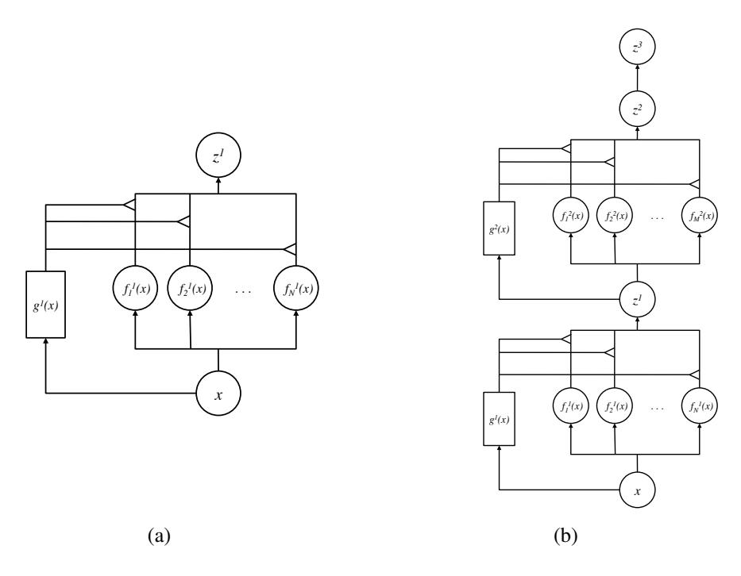
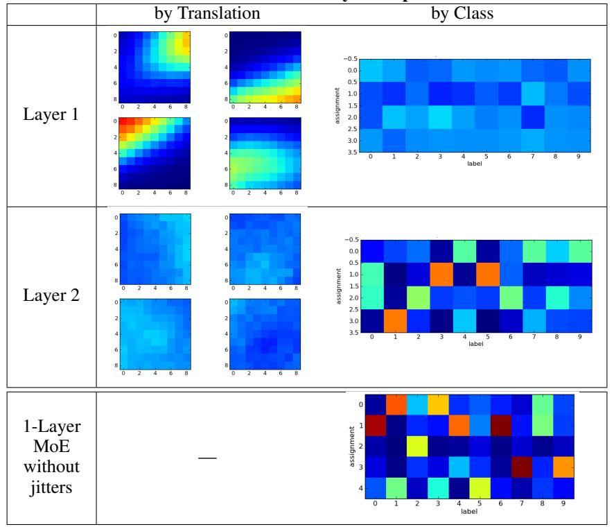
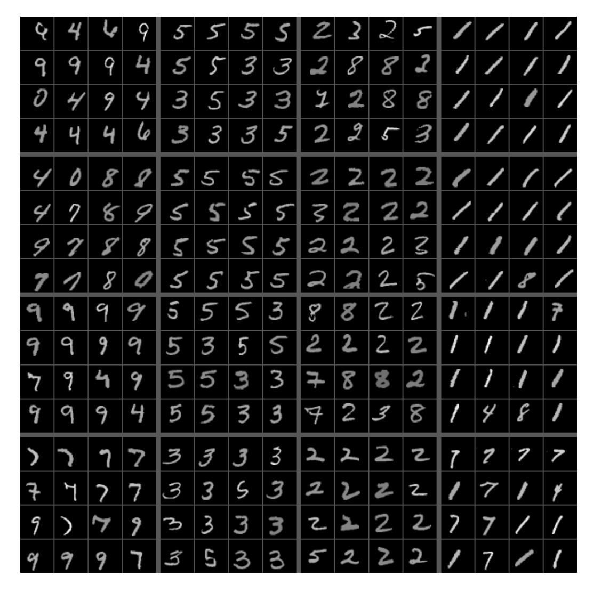
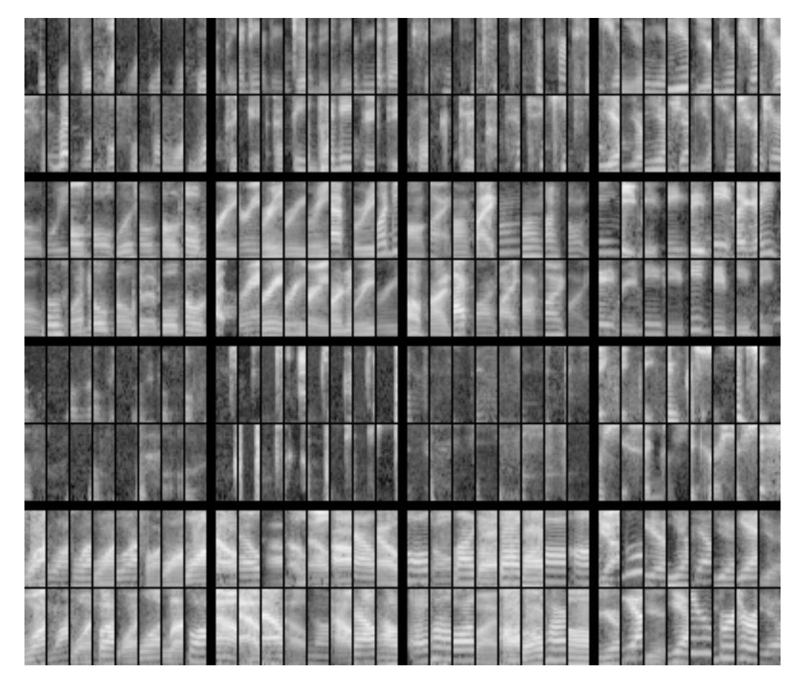
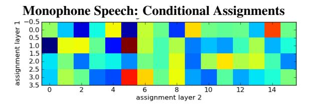

# **Learning Factored Representations in a Deep Mixture of Experts**

David Eigen 1,2 Marc'Aurelio Ranzato 1 \* Ilya Sutskever 1
Google, Inc.

2 Dept. of Computer Science, Courant Institute, NYU
deigen@cs.nyu.edu ranzato@fb.com ilyasu@google.com

#### **Abstract**

Mixtures of Experts combine the outputs of several "expert" networks, each of which specializes in a different part of the input space. This is achieved by training a "gating" network that maps each input to a distribution over the experts. Such models show promise for building larger networks that are still cheap to compute at test time, and more parallelizable at training time. In this this work, we extend the Mixture of Experts to a stacked model, the *Deep Mixture of Experts*, with multiple sets of gating and experts. This exponentially increases the number of effective experts by associating each input with a *combination* of experts at each layer, yet maintains a modest model size. On a randomly translated version of the MNIST dataset, we find that the Deep Mixture of Experts automatically learns to develop location-dependent ("where") experts at the first layer, and class-specific ("what") experts at the second layer. In addition, we see that the different combinations are in use when the model is applied to a dataset of speech monophones. These demonstrate effective use of all expert combinations.

## 1 Introduction

Deep networks have achieved very good performance in a variety of tasks, e.g. [10, 5, 3]. However, a fundamental limitation of these architectures is that the entire network must be executed for all inputs. This computational burden imposes limits network size. One way to scale these networks up while keeping the computational cost low is to increase the overall number of parameters and hidden units, but use only a small portion of the network for each given input. Then, learn a computationally cheap mapping function from input to the appropriate portions of the network.

The Mixture of Experts model [7] is a continuous version of this: A learned gating network mixes the outputs of N "expert" networks to produce a final output. While this model does not itself achieve the computational benefits outlined above, it shows promise as a stepping stone towards networks that can realize this goal.

In this work, we extend the Mixture of Experts to use a different gating network at each layer in a multilayer network, forming a Deep Mixture of Experts (DMoE). This increases the number of effective experts by introducing an exponential number of *paths* through different *combinations* of experts at each layer. By associating each input with one such combination, our model uses different subsets of its units for different inputs. Thus it can be both large and efficient at the same time.

We demonstrate the effectiveness of this approach by evaluating it on two datasets. Using a jittered MNIST dataset, we show that the DMoE learns to factor different aspects of the data representation at each layer (specifically, location and class), making effective use of all paths. We also find that all combinations are used when applying our model to a dataset of speech monophones.

\*Marc' Aurelio Ranzato currently works at the Facebook AI Group.

#### 2 Related Work

A standard Mixture of Experts (MoE) [7] learns a set of *expert* networks  $f_i$  along with a *gating* network g. Each  $f_i$  maps the input x to C outputs (one for each class  $c = 1, \ldots, C$ ), while g(x) is a distribution over experts  $i = 1, \ldots, N$  that sums to 1. The final output is then given by Eqn. 1

$$F_{\text{MoE}}(x) = \sum_{i=1}^{N} g_i(x) \operatorname{softmax}(f_i(x))$$
 (1)

$$= \sum_{i=1}^{N} p(e_i|x)p(c|e_i,x) = p(c|x)$$
 (2)

This can also be seen as a probability model, where the final probability over classes is marginalized over the selection of expert: setting  $p(e_i|x) = g_i(x)$  and  $p(c|e_i,x) = \operatorname{softmax}(f_i(x))$ , we have Eqn. 2.

A product of experts (PoE) [6] is similar, but instead combines log probabilities to form a product:

$$F_{\text{PoE}}(x) \propto \prod_{i=1}^{N} \operatorname{softmax}(f_i(x)) = \prod_{i=1}^{N} p_i(c|x)$$
 (3)

Also closely related to our work is the Hierarchical Mixture of Experts [9], which learns a hierarchy of gating networks in a tree structure. Each expert network's output corresponds to a leaf in the tree; the outputs are then mixed according to the gating weights at each node.

Our model differs from each of these three models because it dynamically assembles a suitable expert combination for each input. This is an instance of the concept of *conditional computation* put forward by Bengio [1] and examined in a single-layer stochastic setting by Bengio, Leonard and Courville [2]. By conditioning our gating and expert networks on the output of the previous layer, our model can express an exponentially large number of effective experts.

## 3 Approach

To extend MoE to a DMoE, we introduce two sets of experts with gating networks  $(g^1, f_i^1)$  and  $(g^2, f_j^2)$ , along with a final linear layer  $f^3$  (see Fig. 1). The final output is produced by composing the mixtures at each layer:

$$\begin{array}{cccccccccccccccccccccccccccccccccccc$$

We set each  $f_i^l$  to a single linear map with rectification, and each  $g_i^l$  to two layers of linear maps with rectification (but with few hidden units);  $f^3$  is a single linear layer. See Section 4 for details.

We train the network using stochastic gradient descent (SGD) with an additional constraint on gating assignments (described below). SGD by itself results in a degenerate local minimum: The experts at each layer that perform best for the first few examples end up overpowering the remaining experts. This happens because the first examples increase the gating weights of these experts, which in turn causes them to be selected with high gating weights more frequently. This causes them to train more, and their gating weights to increase again, *ad infinitum*.

To combat this, we place a constraint on the relative gating assignments to each expert during training. Let  $G_i^l(t) = \sum_{t'=1}^t g_i^l(x_{t'})$  be the running total assignment to expert i of layer l at step t, and let  $\bar{G}^l(t) = \frac{1}{N} \sum_{i=1}^N G_i^l(t)$  be their mean (here,  $x_{t'}$  is the training example at step t'). Then for each expert i, we set  $g_i^l(x_t) = 0$  if  $G_i^l(t) - \bar{G}^l(t) > m$  for a margin threshold m, and renormalize the

Figure 1: (a) Mixture of Experts; (b) Deep Mixture of Experts with two layers.

distribution  $g^l(x_t)$  to sum to 1 over experts i. This prevents experts from being overused initially, resulting in balanced assignments. After training with the constraint in place, we lift it and further train in a second fine-tuning phase.

## 4 Experiments

#### 4.1 Jittered MNIST

We trained and tested our model on MNIST with random uniform translations of  $\pm 4$  pixels, resulting in grayscale images of size  $36 \times 36$ . As explained above, the model was trained to classify digits into ten classes.

For this task, we set all  $f_i^1$  and  $f_j^2$  to one-layer linear models with rectification,  $f_i^1(x) = \max(0, W_i^1 x + b_i^1)$ , and similarly for  $f_j^2$ . We set  $f^3$  to a linear layer,  $f^3(z^2) = W^3 z^2 + b^3$ . We varied the number of output hidden units of  $f_i^1$  and  $f_j^2$  between 20 and 100. The final output from  $f^3$  has 10 units (one for each class).

The gating networks  $g^1$  and  $g^2$  are each composed of two linear+rectification layers with either 50 or 20 hidden units, and 4 output units (one for each expert), i.e.  $g^1(x) = \operatorname{softmax}(B \cdot \max(0, Ax + a) + b)$ , and similarly for  $g^2$ .

We evaluate the effect of using a mixture at the second layer by comparing against using only a single fixed expert at the second layer, or concatenating the output of all experts. Note that for a mixture with h hidden units, the corresponding concatenated model has  $N \cdot h$  hidden units. Thus we expect the concatenated model to perform better than the mixture, and the mixture to perform better than the single network. It is best for the mixture to be as close as possible to the concatenated-experts bound. In each case, we keep the first layer architecture the same (a mixture).

We also compare the two-layer model against a one-layer model in which the hidden layer  $z^1$  is mapped to the final output through linear layer and softmax. Finally, we compare against a fully-connected deep network with the same total number of parameters. This was constructed using the same number of second-layer units  $z^2$ , but expanding the number first layer units  $z^1$  such that the total number of parameters is the same as the DMoE (including its gating network parameters).

#### 4.2 Monophone Speech

In addition, we ran our model on a dataset of monophone speech samples. This dataset is a random subset of approximately one million samples from a larger proprietary database of several hundred hours of US English data collected using Voice Search, Voice Typing and read data [8]. For our experiments, each sample was limited to 11 frames spaced 10ms apart, and had 40 frequency bins. Each input was fed to the network as a 440-dimensional vector. There were 40 possible output phoneme classes.

We trained a model with 4 experts at the first layer and 16 at the second layer. Both layers had 128 hidden units. The gating networks were each two layers, with 64 units in the hidden layer. As before, we evaluate the effect of using a mixture at the second layer by comparing against using only a single expert at the second layer, or concatenating the output of all experts.

#### 5 Results

#### 5.1 Jittered MNIST

Table 1 shows the error on the training and test sets for each model size (the test set is the MNIST test set with a single random translation per image). In most cases, the deeply stacked experts performs between the single and concatenated experts baselines on the training set, as expected. However, the deep models often suffer from overfitting: the mixture's error on the test set is worse than that of the single expert for two of the four model sizes. Encouragingly, the DMoE performs almost as well as a fully-connected network (DNN) with the same number of parameters, even though this network imposes fewer constraints on its structure.

In Fig. 2, we show the mean assignment to each expert (*i.e.* the mean gating output), both by input translation and by class. The first layer assigns experts according to translation, while assignment is uniform by class. Conversely, the second layer assigns experts by class, but is uniform according to translation. This shows that the two layers of experts are indeed being used in complementary ways, so that all combinations of experts are effective. The first layer experts become selective to *where* the digit appears, regardless of its membership class, while the second layer experts are selective to *what* the digit class is, irrespective of the digit's location.

Finally, Fig. 3 shows the nine test examples with highest gating value for each expert combination. First-layer assignments run over the rows, while the second-layer runs over columns. Note the translation of each digit varies by rows but is constant over columns, while the opposite is true for the class of the digit. Furthermore, easily confused classes tend to be grouped together, *e.g.* 3 and 5.

**Test Set Error: Jittered MNIST** 

| Model                         | Gate Hids | Single Expert | DMoE | Concat Layer2 | DNN  |
|-------------------------------|-----------|---------------|------|---------------|------|
| $4 \times 100 - 4 \times 100$ | 50 - 50   | 1.33          | 1.42 | 1.30          | 1.30 |
| $4 \times 100 - 4 \times 20$  | 50 - 50   | 1.58          | 1.50 | 1.30          | 1.41 |
| $4 \times 100 - 4 \times 20$  | 50 - 20   | 1.41          | 1.39 | 1.30          | 1.40 |
| $4 \times 50 - 4 \times 20$   | 20 - 20   | 1.63          | 1.77 | 1.50          | 1.67 |
| $4 \times 100$ (one layer)    | 50        | 2.86          | 1.72 | 1.69          | _    |

**Training Set Error: Jittered MNIST** 

| Model                         | Gate Hids | Single Expert | DMoE | Concat Layer2 | DNN  |
|-------------------------------|-----------|---------------|------|---------------|------|
| $4 \times 100 - 4 \times 100$ | 50 - 50   | 0.85          | 0.91 | 0.77          | 0.60 |
| $4 \times 100 - 4 \times 20$  | 50 - 50   | 1.05          | 0.96 | 0.85          | 0.90 |
| $4 \times 100 - 4 \times 20$  | 50 - 20   | 1.04          | 0.98 | 0.87          | 0.87 |
| $4 \times 50 - 4 \times 20$   | 20 - 20   | 1.60          | 1.41 | 1.33          | 1.32 |
| $4 \times 100$ (one layer)    | 50        | 2.99          | 1.78 | 1.59          | _    |

Table 1: Comparison of DMoE for MNIST with random translations, against baselines (i) using only one second layer expert, (ii) concatenating all second layer experts, and (iii) a DNN with same total number of parameters. For both (i) and (ii), experts in the first layer are mixed to form  $z^1$ . Models are annotated with "# experts  $\times$  # hidden units" for each layer.

#### Jittered MNIST: Two-Layer Deep Model

Figure 2: Mean gating output for the first and second layers, both by translation and by class. Color indicates gating weight. The distributions by translation show the mean gating assignment to each of the four experts for each of the  $9\times 9$  possible translations. The distributions by class show the mean gating assignment to each of the four experts (rows) for each of the ten classes (columns). Note the first layer produces assignments exclusively by translation, while the second assigns experts by class. For comparison, we show assignments by class of a standard MoE trained on MNIST without jitters, using 5 experts  $\times$  20 hidden units.

### 5.2 Monophone Speech

Table 2 shows the error on the training and test sets. As was the case for MNIST, the mixture's error on the training set falls between the two baselines. In this case, however, test set performance is about the same for both baselines as well as the mixture.

Fig. 4 shows the 16 test examples with highest gating value for each expert combination (we show only 4 experts at the second layer due to space considerations). As before, first-layer assignments run over the rows, while the second-layer runs over columns. While not as interpretable as for MNIST, each expert combination appears to handle a distinct portion of the input. This is further bolstered by Fig. 5, where we plot the average number of assignments to each expert combination. Here, the choice of second-layer expert depends little on the choice of first-layer expert.

**Test Set Phone Error: Monophone Speech** 

| Model                          | Gate Hids | Single Expert | Mixed Experts | Concat Layer2 |  |
|--------------------------------|-----------|---------------|---------------|---------------|--|
| $4 \times 128 - 16 \times 128$ | 64 - 64   | 0.55          | 0.55          | 0.56          |  |
| $4 \times 128$ (one layer)     | 64        | 0.58          | 0.55          | 0.55          |  |

**Training Set Phone Error: Monophone Speech** 

| Model                          | Gate Hids | Single Expert | Mixed Experts | Concat Layer2 |
|--------------------------------|-----------|---------------|---------------|---------------|
| $4 \times 128 - 16 \times 128$ | 64 - 64   | 0.47          | 0.42          | 0.40          |
| $4 \times 128$ (one layer)     | 64        | 0.56          | 0.50          | 0.50          |

Table 2: Comparison of DMoE for monophone speech data. Here as well, we compare against baselines using only one second layer expert, or concatenating all second layer experts.

Figure 3: The nine test examples with highest gating value for each combination of experts, for the jittered mnist dataset. First-layer experts are in rows, while second-layer are in columns.

## 6 Conclusion

The Deep Mixture of Experts model we examine is a promising step towards developing large, sparse models that compute only a subset of themselves for any given input. We see precisely the gating assignments required to make effective use of all expert combinations: for jittered MNIST, a factorization into translation and class, and distinctive use of each combination for monophone speech data. However, we still use a continuous mixture of the experts' outputs rather than restricting to the top few — such an extension is necessary to fulfill our goal of using only a small part of the model for each input. A method that accomplishes this for a single layer has been described by Collobert *et al.* [4], which could possibly be adapted to our multilayer case; we hope to address this in future work.

## Acknowledgements

The authors would like to thank Matthiew Zeiler for his contributions on enforcing balancing constraints during training.

Figure 4: The 16 test examples with highest gating value for each combination of experts for the monophone speech data. First-layer experts are in rows, while second-layer are in columns. Each sample is represented by its 40 frequency values (vertical axis) and 11 consecutive frames (horizontal axis). For this figure, we use four experts in each layer.

Figure 5: Joint assignment counts for the monophone speech dataset. Here we plot the average product of first and second layer gating weights for each expert combination. We normalize each row, to produce a conditional distribution: This shows the average gating assignments in the second layer given a first layer assignment. Note the joint assignments are well mixed: Choice of second layer expert is not very dependent on the choice of first layer expert. Colors range from dark blue (0) to dark red (0.125).

## References

- [1] Y. Bengio. Deep learning of representations: Looking forward. *CoRR*, abs/1305.0445, 2013.
- [2] Y. Bengio, N. Léonard, and A. C. Courville. Estimating or propagating gradients through stochastic neurons for conditional computation. *CoRR*, abs/1308.3432, 2013. 2
- [3] D. C. Ciresan, U. Meier, J. Masci, L. M. Gambardella, and J. Schmidhuber. Flexible, high performance convolutional neural networks for image classification. In *IJCAI*, 2011.
- [4] R. Collobert, Y. Bengio, and S. Bengio. Scaling large learning problems with hard parallel mixtures. *International Journal on Pattern Recognition and Artificial Intelligence (IJPRAI)*, 17(3):349–365, 2003. 6
- [5] A. Graves, A. Mohamed, and G. Hinton. Speech recognition with deep recurrent neural networks. In *ICASSP*, 2013. 1
- [6] G. E. Hinton. Products of experts. *ICANN*, 1:1–6, 1999. 2
- [7] R. A. Jacobs, M. I. Jordan, S. Nowlan, and G. E. Hinton. Adaptive mixtures of local experts. *Neural Computation*, 3:1–12, 1991. 1, 2
- [8] N. Jaitly, P. Nguyen, A. Senior, and V. Vanhoucke. Application of pretrained deep neural networks to large vocabulary speech recognition. *Interspeech*, 2012. 4
- [9] M. I. Jordan and R. A. Jacobs. Hierarchical mixtures of experts and the em algorithm. *Neural Computation*, 6:181–214, 1994. 2
- [10] A. Krizhevsky, I. Sutskever, and G.E. Hinton. Imagenet classification with deep convolutional neural networks. In *NIPS*, 2012. 1