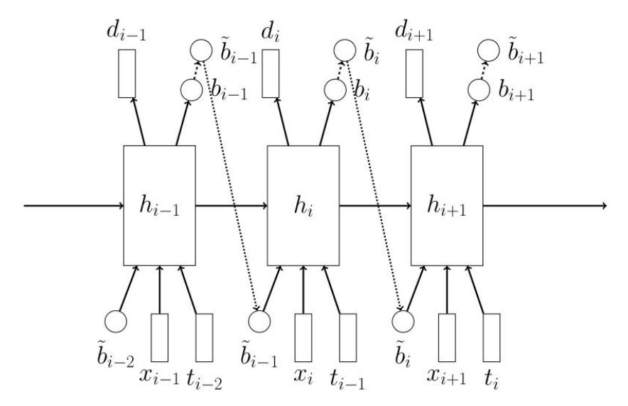
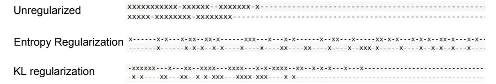
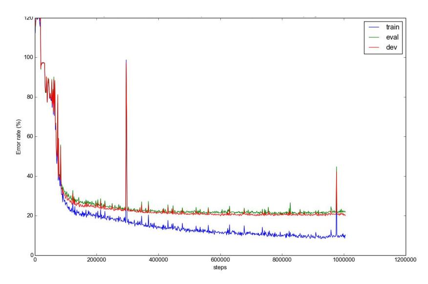
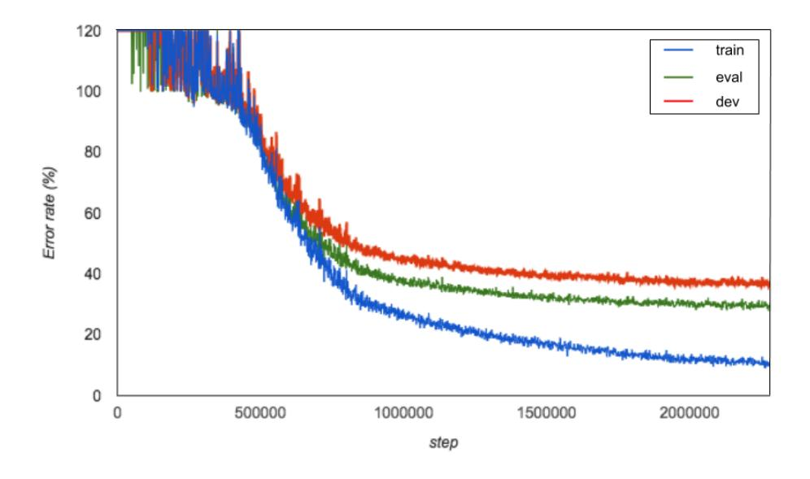
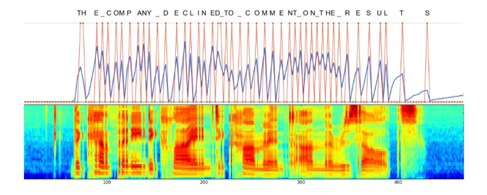

# Learning Online Alignments with Continuous Rewards Policy Gradient

## Yuping Luo\*

Institute for Interdisciplinary Information Sciences
Tsinghua University
roosephu@gmail.com

# chungchengc@google.com

**Chung-Cheng Chiu** 

Google Brain

Navdeep Jaitly Google Brain ndjaitly@google.com **Ilya Sutskever** Open AI† ilyasu@openai.com

## **Abstract**

Sequence-to-sequence models with soft attention had significant success in machine translation, speech recognition, and question answering. Though capable and easy to use, they require that the entirety of the input sequence is available at the beginning of inference, an assumption that is not valid for instantaneous translation and speech recognition. To address this problem, we present a new method for solving sequence-to-sequence problems using hard online alignments instead of soft offline alignments. The online alignments model is able to start producing outputs without the need to first process the entire input sequence. A highly accurate online sequence-to-sequence model is useful because it can be used to build an accurate voice-based instantaneous translator. Our model uses hard binary stochastic decisions to select the timesteps at which outputs will be produced. The model is trained to produce these stochastic decisions using a standard policy gradient method. In our experiments, we show that this model achieves encouraging performance on TIMIT and Wall Street Journal (WSJ) speech recognition datasets.

# 1 Introduction

Sequence-to-sequence models [20, 6] are a general model family for solving supervised learning problems where both the inputs and the outputs are sequences. The performance of the original sequence-to-sequence model has been greatly improved by the invention of *soft attention* [3], which made it possible for sequence-to-sequence models to generalize better and achieve excellent results using much smaller networks on long sequences. The sequence-to-sequence model with attention had considerable empirical success on machine translation [3], speech recognition [7, 5], image caption generation [24, 21], and question answering [22].

Although remarkably successful, the sequence-to-sequence model with attention must process the entire input sequence before producing an output. However, there are tasks where it is useful to start producing outputs before the entire input is processed. These tasks include both speech recognition and machine translation, especially because a good online speech recognition system and a good online translation system can be combined to produce a voice-based instantaneous translator (also known as a Babel Fish [2]), which is an important application.

\*Work done as intern at Google Brain

†Work done at Google Brain

Figure 1: Overall Architecture of the model used in this paper.

In this work, we present a simple online sequence-to-sequence model that uses binary stochastic variables to select the timesteps at which to produce outputs. The stochastic variables are trained with a policy gradient method (similarly to Mnih et al. [16] and Zaremba and Sutskever [25]). Despite its simplicity, this method achieves encouraging results on the TIMIT and the Wall Street Journal speech recognition datasets. Our results suggest that a larger scale version of the model will likely achieve state-of-the-art results on many sequence-to-sequence problems.

## 1.1 Relation To Prior Work

While the idea of soft attention as it is currently understood was first introduced by Graves [9], the first truly successful formulation of soft attention is due to Bahdanau et al. [3]. It used a neural architecture that implements a "search query" that finds the most relevant element in the input, which it then picks out. Soft attention has quickly become the method of choice in various settings because it is easy to implement and it has led to state of the art results on various tasks. For example, the Neural Turing Machine [11] and the Memory Network [19] both use an attention mechanism similar to that of Bahdanau et al. [3] to implement models for learning algorithms and for question answering.

While soft attention is immensely flexible and easy to use, it assumes that the test sequence is provided in its entirety at test time. It is an inconvenient assumption whenever we wish to produce the relevant output as soon as possible, without processing the input sequence in its entirety first. Doing so is useful in the context of a speech recognition system that runs on a smartphone, and it is especially useful in a combined speech recognition and a machine translation system.

There exists prior work that investigated methods for producing an output without consuming the input in its entirety. These include the work by Mnih [16] and Zaremba and Sutskever [25] who used the Reinforce algorithm to learn the location in which to consume the input and when to emit an output. Finally, Jaitly et al. [12] used an online sequence-to-sequence method with conditioning on partial inputs, which yielded encouraging results on the TIMIT dataset. Our work is most similar to Zaremba and Sutskever [25]. However, we are able to simplify the learning problem for the policy gradient component of the algorithm by using only one stochastic decision per time step, which makes the model much more effective in practice.

## 2 Methods

In this section we describe the details of our recurrent neural network architecture, the reward function, and the training and inference procedure. We refer the reader to figure 1 for the details of the model.

We begin by describing the probabilistic model we used in this work. At each time step, i, a recurrent neural network (represented in figure 1) decides whether to emit an output token. The decision is made by a stochastic binary logistic unit  $b_i$ . Let  $b_i \sim \text{Bernoulli}(b_i)$  be a Bernoulli distribution such that if  $\tilde{b}_i$  is 1, then the model outputs the vector  $d_i$ , a softmax distribution over the set of possible tokens. The current position in the output sequence y can be written  $\tilde{p}_i = \sum_{j=1}^i \tilde{b}_j$ , which is incremented by 1 every time the model chooses to emit. Then the model's goal is to predict the desired output  $y_{\tilde{p}_i}$ ; thus whenever  $\tilde{b}_i = 1$ , the model experiences a loss given by

$$\operatorname{softmax\_logprob}(d_i; y_{\tilde{p}_i}) = -\sum_k \log(d_{ik}) y_{\tilde{p}_i k}$$

where k ranges over the number of possible output tokens.

At each step of the RNN, the binary decision of the previous timestep,  $b_{i-1}$  and the previous target  $t_{i-1}$  are fed into the model as input. This feedback ensures that the model's outputs are maximally dependent and thus the model is from the sequence to sequence family.

We train this model by estimating the gradient of the log probability of the target sequence with respect to the parameters of the model. While this model is not fully differentiable because it uses non-diffentiable binary stochastic units, we can estimate the gradients with respect to model parameters by using a policy gradient method, which has been discussed in detail by Schulman et al. [18] and used by Zaremba and Sutskever [25].

In more detail, we use supervised learning to train the network to make the correct output predictions, and reinforcement learning to train the network to decide on when to emit the various outputs. Let us assume that the input sequence is given by  $(x_1, \ldots, x_{T_1})$  and let the desired sequence be  $(y_1,\ldots,y_{T_2})$ , where  $y_{T_2}$  is a special end-of-sequence token, and where we assume that  $T_2 \leq T_1$ . Then the log probability of the model is given by the following equations:

$$h_i = LSTM(h_{i-1}, concat(x_i, \tilde{b}_{i-1}, \tilde{y}_{i-1}))$$
(1)

$$b_i = \operatorname{sigmoid}(W_b \cdot h_i)$$
 (2)

$$\tilde{b}_i \sim \text{Bernoulli}(b_i)$$
 (3)

$$\tilde{p}_i = \sum_{j=1}^i \tilde{b}_j \tag{4}$$

$$\tilde{y}_i = y_{\tilde{p}_i} 
d_i = \operatorname{softmax}(W_o h_i)$$
(5)

$$d_i = \operatorname{softmax}(W_o h_i) \tag{6}$$

$$\mathcal{R} = \mathcal{R} + \tilde{b}_i \cdot \text{softmax\_logprob}(d_i; \tilde{y}_i)$$
 (7)

In the above equations,  $\tilde{p}_i$  is the "position" of the model in the output, which is always equal to  $\sum_{k=1}^{i} \tilde{b}_i$ : the position advances if and only if the model makes a prediction. Note that we define  $y_0$ to be a special beginning-of-sequence symbol. The above equations also suggest that our model can easily be implemented within a static graph in a neural net library such as TensorFlow, even though the model has, conceptually, a dynamic neural network architecture.

Following Zaremba and Sutskever [25], we modify the model from the above equations by forcing  $b_i$ to be equal to 1 whenever  $T_1 - i \le T_2 - \tilde{p}_i$ . Doing so ensures that the model will be forced to predict the entire target sequence  $(y_1, \ldots, y_{T_2})$ , and that it will not be able to learn the degenerate solution where it chooses to never make any prediction and therefore never experience any prediction error.

We now elaborate on the manner in which the gradient is computed. It is clear that for a given value of the binary decisions  $b_i$ , we can compute  $\partial \mathcal{R}/\partial \theta$  using the backpropagation algorithm. Figuring out how to learn  $b_i$  is slightly more challenging. To understand it, we will factor the reward  $\mathcal{R}$  into an expression  $\mathcal{R}(\tilde{\mathbf{b}})$  and a distribution  $\rho(\tilde{\mathbf{b}})$  over the binary vectors, and derive a gradient estimate with respect to the parameters of the model:

$$\mathcal{R} = \mathbb{E}_{\tilde{\mathbf{b}}} \left[ R(\tilde{\mathbf{b}}) \right] \tag{8}$$

Differentiating, we get

$$\nabla \mathcal{R} = \mathbb{E}_{\tilde{\mathbf{b}}} \left[ \nabla R(\tilde{\mathbf{b}}) + R(\tilde{\mathbf{b}}) \nabla \log \rho(\tilde{\mathbf{b}}) \right]$$
(9)

Figure 2: The impact of entropy regularization on emission locations. Each line shows the emission predictions made for an example input utterance, with each symbol representing 3 input time steps. 'x' indicates that the model chooses to emit output at the time steps, whereas '-' indicates otherwise. Top line - without entropy penalty the model emits symbols either at the start or at the end of the input, and is unable to get meaningful gradients to learn a model. Middle line - with entropy regularization, the model avoids clustering emission predictions in time and learns to spread the emissions meaningfully and learn a model. Bottom line - using KL divergence regularization of emission probability also mitigates the clustering problem, albeit not as effectively as with entropy regularization.

where  $\rho(\tilde{\mathbf{b}})$  is the probability of a binary sequence of the  $\tilde{b}_i$  decision variables. In our model,  $\rho(\tilde{\mathbf{b}})$  is computed using the chain rule over the  $b_i$  probabilities:

$$\log \rho(\tilde{\mathbf{b}}) = \sum_{i=1}^{T} \tilde{b}_i \log b_i + (1 - \tilde{b}_i) \log(1 - b_i)$$

$$\tag{10}$$

Since the gradient in equation 9 is a policy gradient, it has very high variance, and variance reduction techniques must be applied. As is common in such problems we use *centering* (also known as baselines) and Rao-Blackwellization to reduce the variance of such models. See Mnih and Gregor [15] for an example of the use of such techniques in training generative models with stochastic units.

Baselines are commonly used in the reinforcement learning literature to reduce the variance of estimators, by relying on the identity  $\mathbb{E}_{\tilde{\mathbf{b}}}\left[\nabla\log\rho(\tilde{\mathbf{b}})\right]=0$ . Thus the gradient in 9 can be better estimated by the following, through the use of a well chosen *baseline* function,  $\Omega(\mathbf{x})$ , where  $\mathbf{x}$  is a vector of side information which happens to be the input and all the outputs up to timestep  $\tilde{p}_i$ :

$$\nabla \mathcal{R} = \mathbb{E}_{\tilde{\mathbf{b}}} \left[ \nabla R(\tilde{\mathbf{b}}) + \left( R(\tilde{\mathbf{b}}) - \Omega(\mathbf{x}) \right) \nabla \log \rho(\tilde{\mathbf{b}}) \right]$$
(11)

The variance of this estimator itself can be further reduced by Rao-Blackwellization, giving:

$$\mathbb{E}_{\tilde{\mathbf{b}}}\left[\left(R(\tilde{\mathbf{b}}) - \Omega(\mathbf{x})\right) \nabla \log \rho(\tilde{\mathbf{b}})\right] = \sum_{j=1}^{T} \mathbb{E}_{\tilde{\mathbf{b}}}\left[\left(\sum_{i=j}^{T} R_{i} - \Omega_{j}\right) \nabla \log p(b_{t}|b_{< t}, \mathbf{x}_{\leq t}, \mathbf{y}_{\leq \tilde{p_{t}}})\right]$$
(12)

Finally, we note that reinforcement learning models are often trained with augmented objectives that add an entropy penalty for actions are the too confident [14, 23]. We found this to be crucial for our models to train successfully. In light of the regularization term, the augmented reward at any time steps, i. is:

$$\begin{split} R_i = & \tilde{b}_i \log p(d_i = t_i | \mathbf{x}_{\leq i}, \tilde{\mathbf{b}}_{< i}, \mathbf{t}_{< i}) \\ & - \lambda \left( \tilde{b}_i \log p(b_i = 1 | b_{< i}, \mathbf{x}_{\leq i}) + (1 - \tilde{b}_i) \log(p(b_i = 0 | b_{< i}, \mathbf{x}_{\leq i})) \right) \end{split}$$

Without the use of this regularization in the model, the RNN emits all the symbols clustered in time, either at very start of the input sequence, or at the end. The model has a difficult time recovering from this configuration, since the gradients are too noisy and biased. However, with the use of this penalty, the model successfully navigates away from parameters that lead to very clustered predictions and eventually learns sensible parameters. An alternative we explored was to use the the KL divergence of the predictions from a target Bernouilli rate of emission at every step. However, while this helped the model, it was not as successful as entropy regularization. See figure 2 for an example of this clustering problem and how regularization ameliorates it.

Figure 3: Example training run on TIMIT.

# 3 Experiments and Results

We conducted experiments on two different speech corpora using this model. Initial experiments were conducted on TIMIT to assess hyperparameters that could lead to stable behavior of the model. The second set of experiments were conducted on the Wall Street Journal corpus to assess if the method worked on a large vocabulary speech recognition task that is much more realistic and complicated than the TIMIT phoneme recognition task. While our experiments on TIMIT produced numbers close to the state of the art, our results on WSJ are only a preliminary demonstation that this method indeed works on such as task. Further hyperparameter tuning and method development should improve results on this task significantly.

#### **3.1** TIMIT

The TIMIT data set is a phoneme recognition task in which phoneme sequences have to be inferred from input audio utterances. The training dataset contains 3696 different audio clips and the target is one of 60 phonemes. Before scoring, these are collapsed to a standard 39 phoneme set, and then the Levenshtein edit distance is computed to get the phoneme error rate (PER).

We trained models with various number of layers on TIMIT, starting with a small number of layers. Initially, we achieved 28% phoneme error rate (PER) using a three layer LSTM model with 300 units in each layer. During these experiments we found that using a weight of  $\lambda=1$  for entropy regularization seemed to produce best results. Further it was crucial to decay this parameter as learning proceeded to allow the model to sharpen its predictions, once enough learning signal was available. To do this, the entropy penalty was initialized to 1, and decayed as  $\exp(0.97, \text{step}/10000) + 0.1$ . Results were further improved to 23% with the use of dropout with 15% of the units being dropped out. Results were improved further when we used five layers of units. Best results were acheived through the use of Grid LSTMs [13], rather than stacked LSTMs.

See figure 3 for an example of a training curve. It can be seen that the model requires a larger number of updates (>100K) before meaningful models are learnt. However, once learning starts, steady process is achieved, even though the model is trained by policy gradient.

Training of the models was done using Asynchronous Gradient Descent with 20 replicas in Tensorflow [1]. Training was much more stable when Adam was used, compared to SGD, although results were more or less the same when both models were run to convergence. We used a learning rate of 1e-4 with Adam. In order to speed up RNN training we also bucketed examples by length – each replica used only examples whose length lay within specific ranges. During training, dropout rate was increased from 0 as the training proceeded. This is because using dropout early in the training prevented the model from latching on to any training signal.

Lastly, we note that the input filterbanks were processed such that three continuous frames of filterbanks, representing a total of 30ms of speech were concatenated and input to the model. This results in a smaller number of input steps and allows the model to learn hard alignments much faster than it would otherwise.

Table 2 shows a summary of the results achieved on TIMIT by our method and other, more mature models.

Table 1: Results on TIMIT using Unidirectional LSTMs for various models.

| Method                                                                                                                                                                                                      | PER                              |
|-------------------------------------------------------------------------------------------------------------------------------------------------------------------------------------------------------------|----------------------------------|
| Connectionist Temporal Classification (CTC)[8] Deep Neural Network - Hidden Markov Model (DNN-HMM)[17] Sequence to Sequence Model With Attention (our implementation) Online Sequence to Sequence Model[12] | 19.6% 20.7% 24.5% 19.8% |
| Our Model (Stacked LSTM) Our Model (Grid LSTM)                                                                                                                                                              | 21.5% 20.5%                   |

#### 3.2 Wall Street Journal

Table 2: Results on WSJ

| Method                                                                                                                                               | PER             |
|------------------------------------------------------------------------------------------------------------------------------------------------------|-----------------|
| Connectionist Temporal Classification (CTC)(4 layer bidirectional LSTM)[10] Sequence to Sequence Model With Attention (4 layer bidirectional GRU)[4] | 27.3 % 18.6% |
| Our Model (4 layer unidirectional LSTM)                                                                                                              | 27.0%           |

We used the *train\_si284* dataset of the Wall Street Journal (WSJ) corpus for the second experiment. This dataset consists of more than thirty seven thousand utterances, corresponding to around 81 hours of audio signals. We trained our model to predict the character sequences directly, without the use of pronounciation dictionaries, or language models, from the audio signal. Since WSJ is a larger corpus we used 50 replicas for the AsyncSGD training. Each utterance was speaker mean centered, as is standard for this dataset. Similar to the TIMIT setup above, we concatenated three continous frames of filterbanks, representing a total of 30ms of speech as input to the model at each time step. This is especially useful for WSJ dataset because its audio clips are typically much longer than those of TIMIT.

A constant entropy penalty of one was used for the first 200,000 steps, and then it was decayed as  $0.8 * \exp(0.97, \text{step}/10000 - 20) + 0.2$ . Stacked LSTMs with 2 layers of 300 hidden units were used for this experiment3. Gradients were clipped to a maximum norm of 30 for these experiments.

It was seen that if dropout was used early in the training, the model that was unable to learn. Thus dropout was used only much later in the training. Other differences from the TIMIT experiments included the observation that stacked model outperformed the grid LSTM model.

### 3.2.1 Example transcripts

We show three example transcripts to give a flavour for the kinds of outputs this model is able to produce. The first one is an example of a transcript that made several errors. It can be seen however that the outputs have close phonetic similarity to the actual transcript. The second example is of an utterance that was transcribed almost entirely correctly, other than the word *AND* being substituted by *END*. Occasionally the model is even able to transcribe a full utterance entirely correctly, as in the third example below.

**REF**: ONE LONGTIME EASTERN PILOT INSISTED THAT THE SAFETY CAMPAIGN INVOLVED NUMEROUS SERIOUS PROBLEMS BUT AFFIRMED THAT THE CARDS OFTEN CONTAINED

&lt;sup>3Admittedly this is a small number of units and results should improve with the use of a larger model. However, as a proof of concept it shows that the model can be trained to give reasonable accuracy.

Figure 4: Example training run on WSJ. The pl.

Figure 5: Example output for an utterance in WSJ. The blue line shows the emission probability  $b_i$ , while the red line shows the discrete emission decisions,  $b_i$ , over the time steps corresponding to an input utterance. The bottom panel shows the corresponding filterbanks. It can be seen that the model often decides to emit symbols only when new audio comes in. It possibly reflects the realization of the network, that it needs to output symbols that it has heard, to effectively process the new audio.

# INSUFFICIENT INFORMATION FOR REGULATORS TO ACT ON

**HYP**: ONE LONGTIME EASTERN PILOT INSISTED THAT THE SAFETY CAMPAIGN INVOLVED NEW MERCE SERIOUS PROBLEMS BUT AT FIRM THAT THE CARDS OFTEN CONTAINED IN SECURITION INFORMATION FOR REGULATORS TO ACT

**REF**: THE COMPANY IS OPENING SEVEN FACTORIES IN ASIA THIS YEAR AND NEXT

HYP: THE COMPANY IS OPENING SEVEN FACTORIES IN ASIA THIS YEAR END NEXT

**REF**: HE SAID HE AND HIS FATHER J WADE KINCAID WHO IS CHAIRMAN OWN A TOTAL OF ABOUT SIX POINT FOUR PERCENT OF THE COMPANYS COMMON

HST: HE SAID HE AND HIS FATHER J WADE KINCAID WHO IS CHAIRMAN OWN A TOTAL OF

#### 3.2.2 Example Emissions

Figure 5 shows a plot of the emission probabilities produced as the input audio is processed. Interestingly, the model produces the final words, only at the end of the input sequence. Presumably this happens because no new audio comes in after half way through the utterance, and the model has no need to clear its internal memory to process new information.

#### 4 Conclusions

In this work, we presented a simple model that can solve sequence-to-sequence problems without the need to process the entire input sequence first. Our model directly maximizes the log probability of the correct answer by combining standard supervised backpropagation and a policy gradient method.

Despite its simplicity, our model achieved encouraging results on a small scale and a medium scale speech recognition task. We hope that by scaling up the model, it will achieve near state-of-theart results on speech recognition and on machine translation, which will in turn will enable the construction of the universal instantaneous translator.

Our results also suggest that policy gradient methods are reasonably powerful, and that they can train highly complex neural networks that learn to make nontrivial stochastic decisions.

# 5 Acknowledgements

We would like to thank Dieterich Lawson for his helpful comments on the manuscript.

## References

- [1] Martin Abadi, Ashish Agarwal, Paul Barham, Eugene Brevdo, Zhifeng Chen, Craig Citro, Greg S Corrado, Andy Davis, Jeffrey Dean, Matthieu Devin, et al. Tensorflow: Large-scale machine learning on heterogeneous distributed systems. *arXiv preprint arXiv:1603.04467*, 2016.
- [2] Douglas Adams. *The hitch hiker's guide to the galaxy: a trilogy in five parts.* Number 1. Random House, 1995.
- [3] Dzmitry Bahdanau, Kyunghyun Cho, and Yoshua Bengio. Neural Machine Translation by Jointly Learning to Align and Translate. In *International Conference on Learning Representations*, 2015.
- [4] Dzmitry Bahdanau, Jan Chorowski, Dmitriy Serdyuk, Philemon Brakel, and Yoshua Bengio. End-to-end attention-based large vocabulary speech recognition. In <a href="http://arxiv.org/abs/1508.04395">http://arxiv.org/abs/1508.04395</a>, 2015.
- [5] William Chan, Navdeep Jaitly, Quoc V Le, and Oriol Vinyals. Listen, attend and spell. *arXiv* preprint arXiv:1508.01211, 2015.
- [6] Kyunghyun Cho, Bart van Merrienboer, Caglar Gulcehre, Dzmitry Bahdanau, Fethi Bougares, Holger Schwen, and Yoshua Bengio. Learning Phrase Representations using RNN Encoder-Decoder for Statistical Machine Translation. In *Conference on Empirical Methods in Natural Language Processing*, 2014.
- [7] Jan Chorowski, Dzmitry Bahdanau, Kyunghyun Cho, and Yoshua Bengio. End-to-end Continuous Speech Recognition using Attention-based Recurrent NN: First Results. In *Neural Information Processing Systems: Workshop Deep Learning and Representation Learning Workshop*, 2014.
- [8] Alan Graves, Abdel-rahman Mohamed, and Geoffrey Hinton. Speech recognition with deep recurrent neural networks. In *Acoustics, Speech and Signal Processing (ICASSP), 2013 IEEE International Conference on*, pages 6645–6649. IEEE, 2013.

- [9] Alex Graves. Generating sequences with recurrent neural networks. *arXiv preprint* arXiv:1308.0850, 2013.
- [10] Alex Graves and Navdeep Jaitly. Towards End-to-End Speech Recognition with Recurrent Neural Networks. In *International Conference on Machine Learning*, 2014.
- [11] Alex Graves, Greg Wayne, and Ivo Danihelka. Neural turing machines. *arXiv preprint* arXiv:1410.5401, 2014.
- [12] Navdeep Jaitly, Quoc V Le, Oriol Vinyals, Ilya Sutskeyver, and Samy Bengio. An online sequence-to-sequence model using partial conditioning. arXiv preprint arXiv:1511.04868, 2015.
- [13] Nal Kalchbrenner, Ivo Danihelka, and Alex Graves. Grid long short-term memory. *arXiv* preprint arXiv:1507.01526, 2015.
- [14] Sergey Levine. Motor Skill Learning with Local Trajectory Methods. PhD thesis, Stanford University, 2014.
- [15] Andriy Mnih and Karol Gregor. Neural variational inference and learning in belief networks. *CoRR*, abs/1402.0030, 2014.
- [16] Volodymyr Mnih, Nicolas Heess, Alex Graves, et al. Recurrent models of visual attention. In *Advances in Neural Information Processing Systems*, pages 2204–2212, 2014.
- [17] Abdel-rahman Mohamed, George E. Dahl, and Geoffrey Hinton. Acoustic modeling using deep belief networks. *IEEE Transactions on Audio, Speech, and Language Processing*, 20(1):14–22, 2012.
- [18] John Schulman, Nicolas Heess, Theophane Weber, and Pieter Abbeel. Gradient estimation using stochastic computation graphs. In *Advances in Neural Information Processing Systems*, pages 3510–3522, 2015.
- [19] Sainbayar Sukhbaatar, Jason Weston, Rob Fergus, et al. End-to-end memory networks. In *Advances in Neural Information Processing Systems*, pages 2431–2439, 2015.
- [20] Ilya Sutskever, Oriol Vinyals, and Quoc V. Le. Sequence to Sequence Learning with Neural Networks. In *Neural Information Processing Systems*, 2014.
- [21] Oriol Vinyals, Alexander Toshev, Samy Bengio, and Dumitru Erhan. Show and Tell: A Neural Image Caption Generator. In IEEE Conference on Computer Vision and Pattern Recognition, 2015
- [22] Jason Weston, Sumit Chopra, and Antoine Bordes. Memory networks. *arXiv preprint* arXiv:1410.3916, 2014.
- [23] Ronald J Williams. Simple statistical gradient-following algorithms for connectionist reinforcement learning. *Machine learning*, 8(3-4):229–256, 1992.
- [24] Kelvin Xu, Jimmy Ba, Ryan Kiros, Kyunghyun Cho, Aaron Courville, Ruslan Salakhutdinov, Richard Zemel, and Yoshua Bengio. Show, Attend and Tell: Neural Image Caption Generation with Visual Attention. In *International Conference on Machine Learning*, 2015.
- [25] Wojciech Zaremba and Ilya Sutskever. Reinforcement learning neural turing machines. *arXiv* preprint arXiv:1505.00521, 2015.