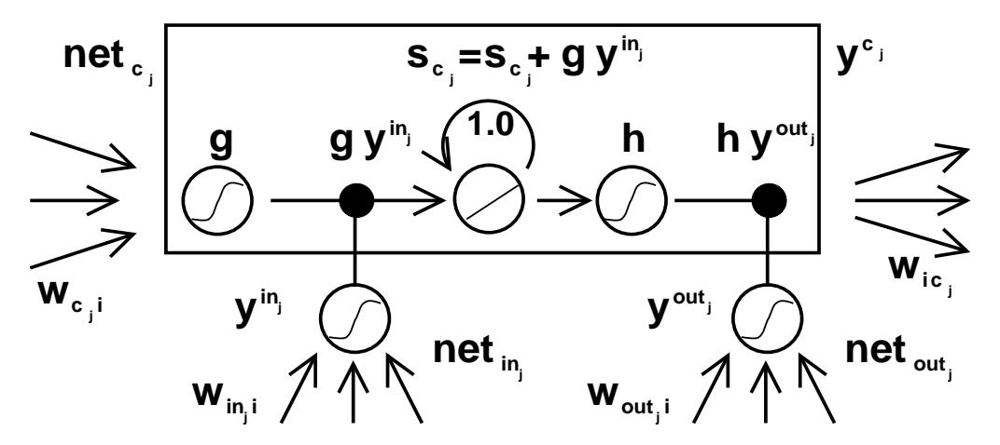
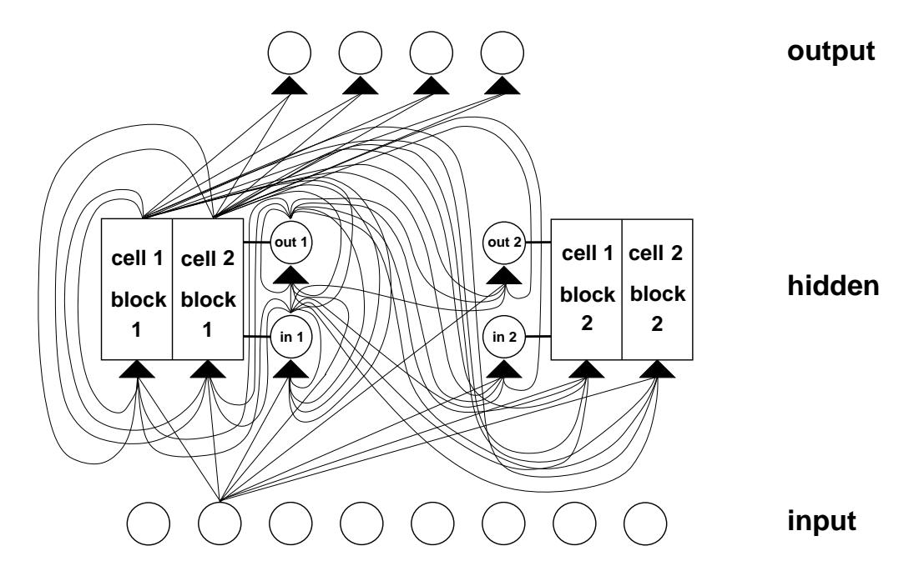
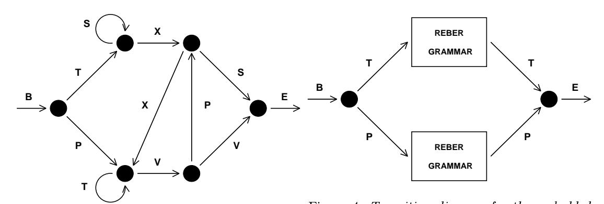

# LONG SHORT-TERM MEMORY

NEURAL COMPUTATION 9(8):1735-1780, 1997

Sepp Hochreiter
Fakultät für Informatik
Technische Universität München
80290 München, Germany
hochreit@informatik.tu-muenchen.de
http://www7.informatik.tu-muenchen.de/~hochreit

Jürgen Schmidhuber
IDSIA
Corso Elvezia 36
6900 Lugano, Switzerland
juergen@idsia.ch
http://www.idsia.ch/~juergen

#### Abstract

Learning to store information over extended time intervals via recurrent backpropagation takes a very long time, mostly due to insufficient, decaying error back flow. We briefly review Hochreiter's 1991 analysis of this problem, then address it by introducing a novel, efficient, gradient-based method called "Long Short-Term Memory" (LSTM). Truncating the gradient where this does not do harm, LSTM can learn to bridge minimal time lags in excess of 1000 discrete time steps by enforcing constant error flow through "constant error carrousels" within special units. Multiplicative gate units learn to open and close access to the constant error flow. LSTM is local in space and time; its computational complexity per time step and weight is O(1). Our experiments with artificial data involve local, distributed, real-valued, and noisy pattern representations. In comparisons with RTRL, BPTT, Recurrent Cascade-Correlation, Elman nets, and Neural Sequence Chunking, LSTM leads to many more successful runs, and learns much faster. LSTM also solves complex, artificial long time lag tasks that have never been solved by previous recurrent network algorithms.

# 1 INTRODUCTION

Recurrent networks can in principle use their feedback connections to store representations of recent input events in form of activations ("short-term memory", as opposed to "long-term memory" embodied by slowly changing weights). This is potentially significant for many applications, including speech processing, non-Markovian control, and music composition (e.g., Mozer 1992). The most widely used algorithms for learning what to put in short-term memory, however, take too much time or do not work well at all, especially when minimal time lags between inputs and corresponding teacher signals are long. Although theoretically fascinating, existing methods do not provide clear practical advantages over, say, backprop in feedforward nets with limited time windows. This paper will review an analysis of the problem and suggest a remedy.

The problem. With conventional "Back-Propagation Through Time" (BPTT, e.g., Williams and Zipser 1992, Werbos 1988) or "Real-Time Recurrent Learning" (RTRL, e.g., Robinson and Fallside 1987), error signals "flowing backwards in time" tend to either (1) blow up or (2) vanish: the temporal evolution of the backpropagated error exponentially depends on the size of the weights (Hochreiter 1991). Case (1) may lead to oscillating weights, while in case (2) learning to bridge long time lags takes a prohibitive amount of time, or does not work at all (see section 3).

The remedy. This paper presents "Long Short-Term Memory" (LSTM), a novel recurrent network architecture in conjunction with an appropriate gradient-based learning algorithm. LSTM is designed to overcome these error back-flow problems. It can learn to bridge time intervals in excess of 1000 steps even in case of noisy, incompressible input sequences, without loss of short time lag capabilities. This is achieved by an efficient, gradient-based algorithm for an architecture

enforcing *constant* (thus neither exploding nor vanishing) error flow through internal states of special units (provided the gradient computation is truncated at certain architecture-specific points — this does not affect long-term error flow though).

Outline of paper. Section 2 will briefly review previous work. Section 3 begins with an outline of the detailed analysis of vanishing errors due to Hochreiter (1991). It will then introduce a naive approach to constant error backprop for didactic purposes, and highlight its problems concerning information storage and retrieval. These problems will lead to the LSTM architecture as described in Section 4. Section 5 will present numerous experiments and comparisons with competing methods. LSTM outperforms them, and also learns to solve complex, artificial tasks no other recurrent net algorithm has solved. Section 6 will discuss LSTM's limitations and advantages. The appendix contains a detailed description of the algorithm (A.1), and explicit error flow formulae (A.2).

# 2 PREVIOUS WORK

This section will focus on recurrent nets with time-varying inputs (as opposed to nets with stationary inputs and fixpoint-based gradient calculations, e.g., Almeida 1987, Pineda 1987).

Gradient-descent variants. The approaches of Elman (1988), Fahlman (1991), Williams (1989), Schmidhuber (1992a), Pearlmutter (1989), and many of the related algorithms in Pearlmutter's comprehensive overview (1995) suffer from the same problems as BPTT and RTRL (see Sections 1 and 3).

Time-delays. Other methods that seem practical for short time lags only are Time-Delay Neural Networks (Lang et al. 1990) and Plate's method (Plate 1993), which updates unit activations based on a weighted sum of old activations (see also de Vries and Principe 1991). Lin et al. (1995) propose variants of time-delay networks called NARX networks.

Time constants. To deal with long time lags, Mozer (1992) uses time constants influencing changes of unit activations (deVries and Principe's above-mentioned approach (1991) may in fact be viewed as a mixture of TDNN and time constants). For long time lags, however, the time constants need external fine tuning (Mozer 1992). Sun et al.'s alternative approach (1993) updates the activation of a recurrent unit by adding the old activation and the (scaled) current net input. The net input, however, tends to perturb the stored information, which makes long-term storage impractical.

Ring's approach. Ring (1993) also proposed a method for bridging long time lags. Whenever a unit in his network receives conflicting error signals, he adds a higher order unit influencing appropriate connections. Although his approach can sometimes be extremely fast, to bridge a time lag involving 100 steps may require the addition of 100 units. Also, Ring's net does not generalize to unseen lag durations.

Bengio et al.'s approaches. Bengio et al. (1994) investigate methods such as simulated annealing, multi-grid random search, time-weighted pseudo-Newton optimization, and discrete error propagation. Their "latch" and "2-sequence" problems are very similar to problem 3a with minimal time lag 100 (see Experiment 3). Bengio and Frasconi (1994) also propose an EM approach for propagating targets. With n so-called "state networks", at a given time, their system can be in one of only n different states. See also beginning of Section 5. But to solve continuous problems such as the "adding problem" (Section 5.4), their system would require an unacceptable number of states (i.e., state networks).

Kalman filters. Puskorius and Feldkamp (1994) use Kalman filter techniques to improve recurrent net performance. Since they use "a derivative discount factor imposed to decay exponentially the effects of past dynamic derivatives," there is no reason to believe that their Kalman Filter Trained Recurrent Networks will be useful for very long minimal time lags.

Second order nets. We will see that LSTM uses multiplicative units (MUs) to protect error flow from unwanted perturbations. It is not the first recurrent net method using MUs though. For instance, Watrous and Kuhn (1992) use MUs in second order nets. Some differences to LSTM are: (1) Watrous and Kuhn's architecture does not enforce constant error flow and is not designed

to solve long time lag problems. (2) It has fully connected second-order sigma-pi units, while the LSTM architecture's MUs are used only to gate access to constant error flow. (3) Watrous and Kuhn's algorithm costs  $O(W^2)$  operations per time step, ours only O(W), where W is the number of weights. See also Miller and Giles (1993) for additional work on MUs.

Simple weight guessing. To avoid long time lag problems of gradient-based approaches we may simply randomly initialize all network weights until the resulting net happens to classify all training sequences correctly. In fact, recently we discovered (Schmidhuber and Hochreiter 1996, Hochreiter and Schmidhuber 1996, 1997) that simple weight guessing solves many of the problems in (Bengio 1994, Bengio and Frasconi 1994, Miller and Giles 1993, Lin et al. 1995) faster than the algorithms proposed therein. This does not mean that weight guessing is a good algorithm. It just means that the problems are very simple. More realistic tasks require either many free parameters (e.g., input weights) or high weight precision (e.g., for continuous-valued parameters), such that guessing becomes completely infeasible.

Adaptive sequence chunkers. Schmidhuber's hierarchical chunker systems (1992b, 1993) do have a capability to bridge arbitrary time lags, but only if there is local predictability across the subsequences causing the time lags (see also Mozer 1992). For instance, in his postdoctoral thesis (1993), Schmidhuber uses hierarchical recurrent nets to rapidly solve certain grammar learning tasks involving minimal time lags in excess of 1000 steps. The performance of chunker systems, however, deteriorates as the noise level increases and the input sequences become less compressible. LSTM does not suffer from this problem.

# 3 CONSTANT ERROR BACKPROP

### 3.1 EXPONENTIALLY DECAYING ERROR

Conventional BPTT (e.g. Williams and Zipser 1992). Output unit k's target at time t is denoted by  $d_k(t)$ . Using mean squared error, k's error signal is

$$\vartheta_k(t) = f_k'(net_k(t))(d_k(t) - y^k(t)),$$

where

$$y^i(t) = f_i(net_i(t))$$

is the activation of a non-input unit i with differentiable activation function  $f_i$ ,

$$net_i(t) = \sum_j w_{ij} y^j (t-1)$$

is unit i's current net input, and  $w_{ij}$  is the weight on the connection from unit j to i. Some non-output unit j's backpropagated error signal is

$$\vartheta_j(t) = f_j'(net_j(t)) \sum_i w_{ij} \vartheta_i(t+1).$$

The corresponding contribution to  $w_{jl}$ 's total weight update is  $\alpha \vartheta_j(t) y^l(t-1)$ , where  $\alpha$  is the learning rate, and l stands for an arbitrary unit connected to unit j.

Outline of Hochreiter's analysis (1991, page 19-21). Suppose we have a fully connected net whose non-input unit indices range from 1 to n. Let us focus on local error flow from unit u to unit v (later we will see that the analysis immediately extends to global error flow). The error occurring at an arbitrary unit u at time step t is propagated "back into time" for q time steps, to an arbitrary unit v. This will scale the error by the following factor:

$$\frac{\partial \vartheta_v(t-q)}{\partial \vartheta_u(t)} = \begin{cases} f_v'(net_v(t-1))w_{uv} & q=1\\ f_v'(net_v(t-q))\sum_{l=1}^n \frac{\partial \vartheta_l(t-q+1)}{\partial \vartheta_u(t)}w_{lv} & q>1 \end{cases}$$
(1)

With  $l_q = v$  and  $l_0 = u$ , we obtain:

$$\frac{\partial \vartheta_v(t-q)}{\partial \vartheta_u(t)} = \sum_{l_1=1}^n \dots \sum_{l_{q-1}=1}^n \prod_{m=1}^q f'_{l_m}(net_{l_m}(t-m)) w_{l_m l_{m-1}}$$
(2)

(proof by induction). The sum of the  $n^{q-1}$  terms  $\prod_{m=1}^q f'_{l_m}(net_{l_m}(t-m))w_{l_m l_{m-1}}$  determines the total error back flow (note that since the summation terms may have different signs, increasing the number of units n does not necessarily increase error flow).

Intuitive explanation of equation (2). If

$$|f'_{l_m}(net_{l_m}(t-m))w_{l_m l_{m-1}}| > 1.0$$

for all m (as can happen, e.g., with linear  $f_{l_m}$ ) then the largest product increases exponentially with q. That is, the error blows up, and conflicting error signals arriving at unit v can lead to oscillating weights and unstable learning (for error blow-ups or bifurcations see also Pineda 1988, Baldi and Pineda 1991, Doya 1992). On the other hand, if

$$|f'_{l_m}(net_{l_m}(t-m))w_{l_m l_{m-1}}| < 1.0$$

for all m, then the largest product decreases exponentially with q. That is, the error vanishes, and nothing can be learned in acceptable time.

If  $f_{l_m}$  is the logistic sigmoid function, then the maximal value of  $f'_{l_m}$  is 0.25. If  $y^{l_{m-1}}$  is constant and not equal to zero, then  $|f'_{l_m}(net_{l_m})w_{l_m l_{m-1}}|$  takes on maximal values where

$$w_{l_m l_{m-1}} = \frac{1}{y^{l_{m-1}}} \coth(\frac{1}{2} net_{l_m}),$$

goes to zero for  $|w_{l_m l_{m-1}}| \to \infty$ , and is less than 1.0 for  $|w_{l_m l_{m-1}}| < 4.0$  (e.g., if the absolute maximal weight value  $w_{max}$  is smaller than 4.0). Hence with conventional logistic sigmoid activation functions, the error flow tends to vanish as long as the weights have absolute values below 4.0, especially in the beginning of the training phase. In general the use of larger initial weights will not help though — as seen above, for  $|w_{l_m l_{m-1}}| \to \infty$  the relevant derivative goes to zero "faster" than the absolute weight can grow (also, some weights will have to change their signs by crossing zero). Likewise, increasing the learning rate does not help either — it will not change the ratio of long-range error flow and short-range error flow. BPTT is too sensitive to recent distractions. (A very similar, more recent analysis was presented by Bengio et al. 1994).

Global error flow. The local error flow analysis above immediately shows that global error flow vanishes, too. To see this, compute

$$\sum_{u:\ u \text{ output unit}} \frac{\partial \vartheta_v(t-q)}{\partial \vartheta_u(t)}.$$

Weak upper bound for scaling factor. The following, slightly extended vanishing error analysis also takes n, the number of units, into account. For q > 1, formula (2) can be rewritten as

$$(W_{u^T})^T F'(t-1) \prod_{m=2}^{q-1} (WF'(t-m)) W_v f'_v(net_v(t-q)),$$

where the weight matrix W is defined by  $[W]_{ij} := w_{ij}$ , v's outgoing weight vector  $W_v$  is defined by  $[W_v]_i := [W]_{iv} = w_{iv}$ , u's incoming weight vector  $W_{u^T}$  is defined by  $[W_{u^T}]_i := [W]_{ui} = w_{ui}$ , and for  $m = 1, \ldots, q$ , F'(t-m) is the diagonal matrix of first order derivatives defined as:  $[F'(t-m)]_{ij} := 0$  if  $i \neq j$ , and  $[F'(t-m)]_{ij} := f'_i(net_i(t-m))$  otherwise. Here T is the transposition operator,  $[A]_{ij}$  is the element in the i-th column and j-th row of matrix A, and  $[x]_i$  is the i-th component of vector x.

Using a matrix norm  $\| \cdot \|_A$  compatible with vector norm  $\| \cdot \|_x$ , we define

$$f'_{max} := \max_{m=1,\dots,q} \{ || F'(t-m) ||_A \}.$$

For  $\max_{i=1,...,n}\{|x_i|\} \le \|x\|_x$  we get  $|x^Ty| \le n \|x\|_x \|y\|_x$ . Since

$$|f'_v(net_v(t-q))| \le ||F'(t-q)||_A \le f'_{max},$$

we obtain the following inequality:

$$\mid \frac{\partial \vartheta_v(t-q)}{\partial \vartheta_u(t)} \mid \leq n \left(f'_{max}\right)^q \parallel W_v \parallel_x \parallel W_{u^T} \parallel_x \parallel W \parallel_A^{q-2} \leq n \left(f'_{max} \parallel W \parallel_A\right)^q.$$

This inequality results from

$$\parallel W_v \parallel_x = \parallel W e_v \parallel_x \leq \parallel W \parallel_A \parallel e_v \parallel_x \leq \parallel W \parallel_A$$

and

$$\| W_{u^T} \|_x = \| e_u W \|_x \le \| W \|_A \| e_u \|_x \le \| W \|_A,$$

where  $e_k$  is the unit vector whose components are 0 except for the k-th component, which is 1. Note that this is a weak, extreme case upper bound — it will be reached only if all  $||F'(t-m)||_A$  take on maximal values, and if the contributions of all paths across which error flows back from unit u to unit v have the same sign. Large  $||W||_A$ , however, typically result in small values of  $||F'(t-m)||_A$ , as confirmed by experiments (see, e.g., Hochreiter 1991).

For example, with norms

$$\parallel W \parallel_A := \max_r \sum_s |w_{rs}|$$

and

$$||x||_x := \max_r |x_r|,$$

we have  $f'_{max} = 0.25$  for the logistic sigmoid. We observe that if

$$|w_{ij}| \le w_{max} < \frac{4.0}{n} \quad \forall i, j,$$

then  $\|W\|_A \le nw_{max} < 4.0$  will result in exponential decay — by setting  $\tau := \left(\frac{nw_{max}}{4.0}\right) < 1.0$ , we obtain

$$\left| \frac{\partial \vartheta_v(t-q)}{\partial \vartheta_u(t)} \right| \le n(\tau)^q.$$

We refer to Hochreiter's 1991 thesis for additional results.

### 3.2 CONSTANT ERROR FLOW: NAIVE APPROACH

A single unit. To avoid vanishing error signals, how can we achieve constant error flow through a single unit j with a single connection to itself? According to the rules above, at time t, j's local error back flow is  $\vartheta_j(t) = f'_j(net_j(t))\vartheta_j(t+1)w_{jj}$ . To enforce constant error flow through j, we require

$$f'_{i}(net_{j}(t))w_{jj} = 1.0.$$

Note the similarity to Mozer's fixed time constant system (1992) — a time constant of 1.0 is appropriate for potentially infinite time lags1.

The constant error carrousel. Integrating the differential equation above, we obtain  $f_j(net_j(t)) = \frac{net_j(t)}{w_{jj}}$  for arbitrary  $net_j(t)$ . This means:  $f_j$  has to be linear, and unit j's activation has to remain constant:

$$y_j(t+1) = f_j(net_j(t+1)) = f_j(w_{jj}y^j(t)) = y^j(t).$$

&lt;sup>1We do not use the expression "time constant" in the differential sense, as, e.g., Pearlmutter (1995).

In the experiments, this will be ensured by using the identity function  $f_j: f_j(x) = x, \forall x$ , and by setting  $w_{jj} = 1.0$ . We refer to this as the constant error carrousel (CEC). CEC will be LSTM's central feature (see Section 4).

Of course unit j will not only be connected to itself but also to other units. This invokes two obvious, related problems (also inherent in all other gradient-based approaches):

- 1. Input weight conflict: for simplicity, let us focus on a single additional input weight  $w_{ji}$ . Assume that the total error can be reduced by switching on unit j in response to a certain input, and keeping it active for a long time (until it helps to compute a desired output). Provided i is nonzero, since the same incoming weight has to be used for both storing certain inputs and ignoring others,  $w_{ji}$  will often receive conflicting weight update signals during this time (recall that j is linear): these signals will attempt to make  $w_{ji}$  participate in (1) storing the input (by switching on j) and (2) protecting the input (by preventing j from being switched off by irrelevant later inputs). This conflict makes learning difficult, and calls for a more context-sensitive mechanism for controlling "write operations" through input weights.
- 2. Output weight conflict: assume j is switched on and currently stores some previous input. For simplicity, let us focus on a single additional outgoing weight  $w_{kj}$ . The same  $w_{kj}$  has to be used for both retrieving j's content at certain times and preventing j from disturbing k at other times. As long as unit j is non-zero,  $w_{kj}$  will attract conflicting weight update signals generated during sequence processing: these signals will attempt to make  $w_{kj}$  participate in (1) accessing the information stored in j and at different times (2) protecting unit k from being perturbed by j. For instance, with many tasks there are certain "short time lag errors" that can be reduced in early training stages. However, at later training stages j may suddenly start to cause avoidable errors in situations that already seemed under control by attempting to participate in reducing more difficult "long time lag errors". Again, this conflict makes learning difficult, and calls for a more context-sensitive mechanism for controlling "read operations" through output weights.

Of course, input and output weight conflicts are not specific for long time lags, but occur for short time lags as well. Their effects, however, become particularly pronounced in the long time lag case: as the time lag increases, (1) stored information must be protected against perturbation for longer and longer periods, and — especially in advanced stages of learning — (2) more and more already correct outputs also require protection against perturbation.

Due to the problems above the naive approach does not work well except in case of certain simple problems involving local input/output representations and non-repeating input patterns (see Hochreiter 1991 and Silva et al. 1996). The next section shows how to do it right.

# 4 LONG SHORT-TERM MEMORY

Memory cells and gate units. To construct an architecture that allows for constant error flow through special, self-connected units without the disadvantages of the naive approach, we extend the constant error carrousel CEC embodied by the self-connected, linear unit j from Section 3.2 by introducing additional features. A multiplicative  $input\ gate\ unit$  is introduced to protect the memory contents stored in j from perturbation by irrelevant inputs. Likewise, a multiplicative  $output\ gate\ unit$  is introduced which protects other units from perturbation by currently irrelevant memory contents stored in j.

The resulting, more complex unit is called a memory cell (see Figure 1). The j-th memory cell is denoted  $c_j$ . Each memory cell is built around a central linear unit with a fixed self-connection (the CEC). In addition to  $net_{c_j}$ ,  $c_j$  gets input from a multiplicative unit  $out_j$  (the "output gate"), and from another multiplicative unit  $in_j$  (the "input gate").  $in_j$ 's activation at time t is denoted by  $y^{in_j}(t)$ ,  $out_j$ 's by  $y^{out_j}(t)$ . We have

$$y^{out_j}(t) = f_{out_j}(net_{out_j}(t)); y^{in_j}(t) = f_{in_j}(net_{in_j}(t));$$

where

$$net_{out_j}(t) = \sum_{u} w_{out_j u} y^u(t-1),$$

and

$$net_{in_j}(t) = \sum_{u} w_{in_j u} y^u (t-1).$$

We also have

$$net_{c_j}(t) = \sum_{u} w_{c_j u} y^u (t-1).$$

The summation indices u may stand for input units, gate units, memory cells, or even conventional hidden units if there are any (see also paragraph on "network topology" below). All these different types of units may convey useful information about the current state of the net. For instance, an input gate (output gate) may use inputs from other memory cells to decide whether to store (access) certain information in its memory cell. There even may be recurrent self-connections like  $w_{c_jc_j}$ . It is up to the user to define the network topology. See Figure 2 for an example.

At time t,  $c_i$ 's output  $y^{c_j}(t)$  is computed as

$$y^{c_j}(t) = y^{out_j}(t)h(s_{c_j}(t)),$$

where the "internal state"  $s_{c_i}(t)$  is

$$s_{c_i}(0) = 0, s_{c_i}(t) = s_{c_i}(t-1) + y^{in_i}(t)g\left(net_{c_i}(t)\right) \text{ for } t > 0.$$

The differentiable function g squashes  $net_{c_j}$ ; the differentiable function h scales memory cell outputs computed from the internal state  $s_{c_j}$ .

Figure 1: Architecture of memory cell  $c_j$  (the box) and its gate units  $in_j$ ,  $out_j$ . The self-recurrent connection (with weight 1.0) indicates feedback with a delay of 1 time step. It builds the basis of the "constant error carrousel" CEC. The gate units open and close access to CEC. See text and appendix A.1 for details.

Why gate units? To avoid input weight conflicts,  $in_j$  controls the error flow to memory cell  $c_j$ 's input connections  $w_{c_ji}$ . To circumvent  $c_j$ 's output weight conflicts,  $out_j$  controls the error flow from unit j's output connections. In other words, the net can use  $in_j$  to decide when to keep or override information in memory cell  $c_j$ , and  $out_j$  to decide when to access memory cell  $c_j$  and when to prevent other units from being perturbed by  $c_j$  (see Figure 1).

Error signals trapped within a memory cell's CEC cannot change – but different error signals flowing into the cell (at different times) via its output gate may get superimposed. The output gate will have to learn which errors to trap in its CEC, by appropriately scaling them. The input

gate will have to learn when to release errors, again by appropriately scaling them. Essentially, the multiplicative gate units open and close access to constant error flow through CEC.

Distributed output representations typically do require output gates. Not always are both gate types necessary, though — one may be sufficient. For instance, in Experiments 2a and 2b in Section 5, it will be possible to use input gates only. In fact, output gates are not required in case of local output encoding — preventing memory cells from perturbing already learned outputs can be done by simply setting the corresponding weights to zero. Even in this case, however, output gates can be beneficial: they prevent the net's attempts at storing long time lag memories (which are usually hard to learn) from perturbing activations representing easily learnable short time lag memories. (This will prove quite useful in Experiment 1, for instance.)

Network topology. We use networks with one input layer, one hidden layer, and one output layer. The (fully) self-connected hidden layer contains memory cells and corresponding gate units (for convenience, we refer to both memory cells and gate units as being located in the hidden layer). The hidden layer may also contain "conventional" hidden units providing inputs to gate units and memory cells. All units (except for gate units) in all layers have directed connections (serve as inputs) to all units in the layer above (or to all higher layers – Experiments 2a and 2b).

Memory cell blocks. S memory cells sharing the same input gate and the same output gate form a structure called a "memory cell block of size S". Memory cell blocks facilitate information storage — as with conventional neural nets, it is not so easy to code a distributed input within a single cell. Since each memory cell block has as many gate units as a single memory cell (namely two), the block architecture can be even slightly more efficient (see paragraph "computational complexity"). A memory cell block of size 1 is just a simple memory cell. In the experiments (Section 5), we will use memory cell blocks of various sizes.

**Learning.** We use a variant of RTRL (e.g., Robinson and Fallside 1987) which properly takes into account the altered, multiplicative dynamics caused by input and output gates. However, to ensure non-decaying error backprop through internal states of memory cells, as with truncated BPTT (e.g., Williams and Peng 1990), errors arriving at "memory cell net inputs" (for cell  $c_j$ , this includes  $net_{c_j}$ ,  $net_{in_j}$ ,  $net_{out_j}$ ) do not get propagated back further in time (although they do serve to change the incoming weights). Only within2 memory cells, errors are propagated back through previous internal states  $s_{c_j}$ . To visualize this: once an error signal arrives at a memory cell output, it gets scaled by output gate activation and h'. Then it is within the memory cell's CEC, where it can flow back indefinitely without ever being scaled. Only when it leaves the memory cell through the input gate and g, it is scaled once more by input gate activation and g'. It then serves to change the incoming weights before it is truncated (see appendix for explicit formulae).

Computational complexity. As with Mozer's focused recurrent backprop algorithm (Mozer 1989), only the derivatives  $\frac{\partial s_{e_j}}{\partial w_{il}}$  need to be stored and updated. Hence the LSTM algorithm is very efficient, with an excellent update complexity of O(W), where W the number of weights (see details in appendix A.1). Hence, LSTM and BPTT for fully recurrent nets have the same update complexity per time step (while RTRL's is much worse). Unlike full BPTT, however, LSTM is local in space and time3: there is no need to store activation values observed during sequence processing in a stack with potentially unlimited size.

Abuse problem and solutions. In the beginning of the learning phase, error reduction may be possible without storing information over time. The network will thus tend to abuse memory cells, e.g., as bias cells (i.e., it might make their activations constant and use the outgoing connections as adaptive thresholds for other units). The potential difficulty is: it may take a long time to release abused memory cells and make them available for further learning. A similar "abuse problem" appears if two memory cells store the same (redundant) information. There are at least two solutions to the abuse problem: (1) Sequential network construction (e.g., Fahlman 1991): a memory cell and the corresponding gate units are added to the network whenever the

&lt;sup>2For intra-cellular backprop in a quite different context see also Doya and Yoshizawa (1989).

&lt;sup>3 Following Schmidhuber (1989), we say that a recurrent net algorithm is *local in space* if the update complexity per time step and weight does not depend on network size. We say that a method is *local in time* if its storage requirements do not depend on input sequence length. For instance, RTRL is local in time but not in space. BPTT is local in space but not in time.

Figure 2: Example of a net with 8 input units, 4 output units, and 2 memory cell blocks of size 2. in1 marks the input gate, out1 marks the output gate, and cell1/block1 marks the first memory cell of block 1. cell1/block1's architecture is identical to the one in Figure 1, with gate units in1 and out1 (note that by rotating Figure 1 by 90 degrees anti-clockwise, it will match with the corresponding parts of Figure 1). The example assumes dense connectivity: each gate unit and each memory cell see all non-output units. For simplicity, however, outgoing weights of only one type of unit are shown for each layer. With the efficient, truncated update rule, error flows only through connections to output units, and through fixed self-connections within cell blocks (not shown here — see Figure 1). Error flow is truncated once it "wants" to leave memory cells or gate units. Therefore, no connection shown above serves to propagate error back to the unit from which the connection originates (except for connections to output units), although the connections themselves are modifiable. That's why the truncated LSTM algorithm is so efficient, despite its ability to bridge very long time lags. See text and appendix A.1 for details. Figure 2 actually shows the architecture used for Experiment 6a — only the bias of the non-input units is omitted.

error stops decreasing (see Experiment 2 in Section 5). (2) Output gate bias: each output gate gets a negative initial bias, to push initial memory cell activations towards zero. Memory cells with more negative bias automatically get "allocated" later (see Experiments 1, 3, 4, 5, 6 in Section 5).

Internal state drift and remedies. If memory cell  $c_j$ 's inputs are mostly positive or mostly negative, then its internal state  $s_j$  will tend to drift away over time. This is potentially dangerous, for the  $h'(s_j)$  will then adopt very small values, and the gradient will vanish. One way to circumvent this problem is to choose an appropriate function h. But h(x) = x, for instance, has the disadvantage of unrestricted memory cell output range. Our simple but effective way of solving drift problems at the beginning of learning is to initially bias the input gate  $in_j$  towards zero. Although there is a tradeoff between the magnitudes of  $h'(s_j)$  on the one hand and of  $y^{in_j}$  and  $f'_{in_j}$  on the other, the potential negative effect of input gate bias is negligible compared to the one of the drifting effect. With logistic sigmoid activation functions, there appears to be no need for fine-tuning the initial bias, as confirmed by Experiments 4 and 5 in Section 5.4.

# 5 EXPERIMENTS

Introduction. Which tasks are appropriate to demonstrate the quality of a novel long time lag

algorithm? First of all, minimal time lags between relevant input signals and corresponding teacher signals must be long for all training sequences. In fact, many previous recurrent net algorithms sometimes manage to generalize from very short training sequences to very long test sequences. See, e.g., Pollack (1991). But a real long time lag problem does not have any short time lag exemplars in the training set. For instance, Elman's training procedure, BPTT, offline RTRL, online RTRL, etc., fail miserably on real long time lag problems. See, e.g., Hochreiter (1991) and Mozer (1992). A second important requirement is that the tasks should be complex enough such that they cannot be solved quickly by simple-minded strategies such as random weight guessing.

Guessing can outperform many long time lag algorithms. Recently we discovered (Schmidhuber and Hochreiter 1996, Hochreiter and Schmidhuber 1996, 1997) that many long time lag tasks used in previous work can be solved more quickly by simple random weight guessing than by the proposed algorithms. For instance, guessing solved a variant of Bengio and Frasconi's "parity problem" (1994) problem much faster4 than the seven methods tested by Bengio et al. (1994) and Bengio and Frasconi (1994). Similarly for some of Miller and Giles' problems (1993). Of course, this does not mean that guessing is a good algorithm. It just means that some previously used problems are not extremely appropriate to demonstrate the quality of previously proposed algorithms.

What's common to Experiments 1–6. All our experiments (except for Experiment 1) involve long minimal time lags — there are no short time lag training exemplars facilitating learning. Solutions to most of our tasks are sparse in weight space. They require either many parameters/inputs or high weight precision, such that random weight guessing becomes infeasible.

We always use on-line learning (as opposed to batch learning), and logistic sigmoids as activation functions. For Experiments 1 and 2, initial weights are chosen in the range [-0.2, 0.2], for the other experiments in [-0.1, 0.1]. Training sequences are generated randomly according to the various task descriptions. In slight deviation from the notation in Appendix A1, each discrete time step of each input sequence involves three processing steps: (1) use current input to set the input units. (2) Compute activations of hidden units (including input gates, output gates, memory cells). (3) Compute output unit activations. Except for Experiments 1, 2a, and 2b, sequence elements are randomly generated on-line, and error signals are generated only at sequence ends. Net activations are reset after each processed input sequence.

For comparisons with recurrent nets taught by gradient descent, we give results only for RTRL, except for comparison 2a, which also includes BPTT. Note, however, that untruncated BPTT (see, e.g., Williams and Peng 1990) computes exactly the same gradient as offline RTRL. With long time lag problems, offline RTRL (or BPTT) and the online version of RTRL (no activation resets, online weight changes) lead to almost identical, negative results (as confirmed by additional simulations in Hochreiter 1991; see also Mozer 1992). This is because offline RTRL, online RTRL, and full BPTT all suffer badly from exponential error decay.

Our LSTM architectures are selected quite arbitrarily. If nothing is known about the complexity of a given problem, a more systematic approach would be: start with a very small net consisting of one memory cell. If this does not work, try two cells, etc. Alternatively, use sequential network construction (e.g., Fahlman 1991).

### Outline of experiments.

• Experiment 1 focuses on a standard benchmark test for recurrent nets: the embedded Reber grammar. Since it allows for training sequences with short time lags, it is not a long time lag problem. We include it because (1) it provides a nice example where LSTM's output gates are truly beneficial, and (2) it is a popular benchmark for recurrent nets that has been used by many authors — we want to include at least one experiment where conventional BPTT and RTRL do not fail completely (LSTM, however, clearly outperforms them). The embedded Reber grammar's minimal time lags represent a border case in the sense that it is still possible to learn to bridge them with conventional algorithms. Only slightly longer

&lt;sup>4 It should be mentioned, however, that different input representations and different types of noise may lead to worse guessing performance (Yoshua Bengio, personal communication, 1996).

minimal time lags would make this almost impossible. The more interesting tasks in our paper, however, are those that RTRL, BPTT, etc. cannot solve at all.

- Experiment 2 focuses on noise-free and noisy sequences involving numerous input symbols distracting from the few important ones. The most difficult task (Task 2c) involves hundreds of distractor symbols at random positions, and minimal time lags of 1000 steps. LSTM solves it, while BPTT and RTRL already fail in case of 10-step minimal time lags (see also, e.g., Hochreiter 1991 and Mozer 1992). For this reason RTRL and BPTT are omitted in the remaining, more complex experiments, all of which involve much longer time lags.
- Experiment 3 addresses long time lag problems with noise and signal on the same input line. Experiments 3a/3b focus on Bengio et al.'s 1994 "2-sequence problem". Because this problem actually can be solved quickly by random weight guessing, we also include a far more difficult 2-sequence problem (3c) which requires to learn real-valued, conditional expectations of noisy targets, given the inputs.
- Experiments 4 and 5 involve distributed, continuous-valued input representations and require learning to store precise, real values for very long time periods. Relevant input signals can occur at quite different positions in input sequences. Again minimal time lags involve hundreds of steps. Similar tasks never have been solved by other recurrent net algorithms.
- Experiment 6 involves tasks of a different complex type that also has not been solved by other recurrent net algorithms. Again, relevant input signals can occur at quite different positions in input sequences. The experiment shows that LSTM can extract information conveyed by the temporal order of widely separated inputs.

Subsection 5.7 will provide a detailed summary of experimental conditions in two tables for reference.

### 5.1 EXPERIMENT 1: EMBEDDED REBER GRAMMAR

Task. Our first task is to learn the "embedded Reber grammar", e.g. Smith and Zipser (1989), Cleeremans et al. (1989), and Fahlman (1991). Since it allows for training sequences with short time lags (of as few as 9 steps), it is not a long time lag problem. We include it for two reasons: (1) it is a popular recurrent net benchmark used by many authors — we wanted to have at least one experiment where RTRL and BPTT do not fail completely, and (2) it shows nicely how output gates can be beneficial.

Figure 3: Transition diagram for the Reber grammar. Each box represents a copy of the Reber grammar (see Figure 3).

Starting at the leftmost node of the directed graph in Figure 4, symbol strings are generated sequentially (beginning with the empty string) by following edges — and appending the associated

symbols to the current string — until the rightmost node is reached. Edges are chosen randomly if there is a choice (probability: 0.5). The net's task is to read strings, one symbol at a time, and to permanently predict the next symbol (error signals occur at every time step). To correctly predict the symbol before last, the net has to remember the second symbol.

Comparison. We compare LSTM to "Elman nets trained by Elman's training procedure" (ELM) (results taken from Cleeremans et al. 1989), Fahlman's "Recurrent Cascade-Correlation" (RCC) (results taken from Fahlman 1991), and RTRL (results taken from Smith and Zipser (1989), where only the few successful trials are listed). It should be mentioned that Smith and Zipser actually make the task easier by increasing the probability of short time lag exemplars. We didn't do this for LSTM.

Training/Testing. We use a local input/output representation (7 input units, 7 output units). Following Fahlman, we use 256 training strings and 256 separate test strings. The training set is generated randomly; training exemplars are picked randomly from the training set. Test sequences are generated randomly, too, but sequences already used in the training set are not used for testing. After string presentation, all activations are reinitialized with zeros. A trial is considered successful if all string symbols of all sequences in both test set and training set are predicted correctly — that is, if the output unit(s) corresponding to the possible next symbol(s) is(are) always the most active ones.

Architectures. Architectures for RTRL, ELM, RCC are reported in the references listed above. For LSTM, we use 3 (4) memory cell blocks. Each block has 2 (1) memory cells. The output layer's only incoming connections originate at memory cells. Each memory cell and each gate unit receives incoming connections from all memory cells and gate units (the hidden layer is fully connected — less connectivity may work as well). The input layer has forward connections to all units in the hidden layer. The gate units are biased. These architecture parameters make it easy to store at least 3 input signals (architectures 3-2 and 4-1 are employed to obtain comparable numbers of weights for both architectures: 264 for 4-1 and 276 for 3-2). Other parameters may be appropriate as well, however. All sigmoid functions are logistic with output range [0,1], except for h, whose range is [-1,1], and g, whose range is [-2,2]. All weights are initialized in [-0.2,0.2], except for the output gate biases, which are initialized to -1, -2, and -3, respectively (see abuse problem, solution (2) of Section 4). We tried learning rates of 0.1, 0.2 and 0.5.

**Results.** We use 3 different, randomly generated pairs of training and test sets. With each such pair we run 10 trials with different initial weights. See Table 1 for results (mean of 30 trials). Unlike the other methods, LSTM always learns to solve the task. Even when we ignore the unsuccessful trials of the other approaches, LSTM learns much faster.

Importance of output gates. The experiment provides a nice example where the output gate is truly beneficial. Learning to store the first T or P should not perturb activations representing the more easily learnable transitions of the original Reber grammar. This is the job of the output gates. Without output gates, we did not achieve fast learning.

### 5.2 EXPERIMENT 2: NOISE-FREE AND NOISY SEQUENCES

Task 2a: noise-free sequences with long time lags. There are p+1 possible input symbols denoted  $a_1, ..., a_{p-1}, a_p = x, a_{p+1} = y$ .  $a_i$  is "locally" represented by the p+1-dimensional vector whose i-th component is 1 (all other components are 0). A net with p+1 input units and p+1 output units sequentially observes input symbol sequences, one at a time, permanently trying to predict the next symbol — error signals occur at every single time step. To emphasize the "long time lag problem", we use a training set consisting of only two very similar sequences:  $(y, a_1, a_2, \ldots, a_{p-1}, y)$  and  $(x, a_1, a_2, \ldots, a_{p-1}, x)$ . Each is selected with probability 0.5. To predict the final element, the net has to learn to store a representation of the first element for p time steps.

We compare "Real-Time Recurrent Learning" for fully recurrent nets (RTRL), "Back-Propagation Through Time" (BPTT), the sometimes very successful 2-net "Neural Sequence Chunker" (CH, Schmidhuber 1992b), and our new method (LSTM). In all cases, weights are initialized in [-0.2,0.2]. Due to limited computation time, training is stopped after 5 million sequence presen-

| method | hidden units     | # weights         | learning rate | % of success    | success after |
|--------|------------------|-------------------|---------------|-----------------|---------------|
| RTRL   | 3                | $\approx 170$     | 0.05          | "some fraction" | 173,000       |
| RTRL   | 12               | $\approx 494$     | 0.1           | "some fraction" | 25,000        |
| ELM    | 15               | $\approx 435$     |               | 0               | >200,000      |
| RCC    | 7-9              | $\approx 119-198$ |               | 50              | 182,000       |
| LSTM   | 4 blocks, size 1 | 264               | 0.1           | 100             | 39,740        |
| LSTM   | 3 blocks, size 2 | 276               | 0.1           | 100             | 21,730        |
| LSTM   | 3 blocks, size 2 | 276               | 0.2           | 97              | $14,\!060$    |
| LSTM   | 4 blocks, size 1 | 264               | 0.5           | 97              | 9,500         |
| LSTM   | 3 blocks, size 2 | 276               | 0.5           | 100             | 8,440         |

Table 1: EXPERIMENT 1: Embedded Reber grammar: percentage of successful trials and number of sequence presentations until success for RTRL (results taken from Smith and Zipser 1989), "Elman net trained by Elman's procedure" (results taken from Cleeremans et al. 1989), "Recurrent Cascade-Correlation" (results taken from Fahlman 1991) and our new approach (LSTM). Weight numbers in the first 4 rows are estimates — the corresponding papers do not provide all the technical details. Only LSTM almost always learns to solve the task (only two failures out of 150 trials). Even when we ignore the unsuccessful trials of the other approaches, LSTM learns much faster (the number of required training examples in the bottom row varies between 3,800 and 24,100).

tations. A successful run is one that fulfills the following criterion: after training, during 10,000 successive, randomly chosen input sequences, the maximal absolute error of all output units is always below 0.25.

**Architectures.** RTRL: one self-recurrent hidden unit, p+1 non-recurrent output units. Each layer has connections from all layers below. All units use the logistic activation function sigmoid in [0,1].

BPTT: same architecture as the one trained by RTRL.

CH: both net architectures like RTRL's, but one has an additional output for predicting the hidden unit of the other one (see Schmidhuber 1992b for details).

LSTM: like with RTRL, but the hidden unit is replaced by a memory cell and an input gate (no output gate required). g is the logistic sigmoid, and h is the identity function  $h:h(x)=x, \forall x$ . Memory cell and input gate are added once the error has stopped decreasing (see abuse problem: solution (1) in Section 4).

**Results.** Using RTRL and a short 4 time step delay (p=4),  $\frac{7}{9}$  of all trials were successful. No trial was successful with p=10. With long time lags, only the neural sequence chunker and LSTM achieved successful trials, while BPTT and RTRL failed. With p=100, the 2-net sequence chunker solved the task in only  $\frac{1}{3}$  of all trials. LSTM, however, always learned to solve the task. Comparing successful trials only, LSTM learned much faster. See Table 2 for details. It should be mentioned, however, that a hierarchical chunker can also always quickly solve this task (Schmidhuber 1992c, 1993).

Task 2b: no local regularities. With the task above, the chunker sometimes learns to correctly predict the final element, but only because of predictable local regularities in the input stream that allow for compressing the sequence. In an additional, more difficult task (involving many more different possible sequences), we remove compressibility by replacing the deterministic subsequence  $(a_1,a_2,\ldots,a_{p-1})$  by a random subsequence (of length p-1) over the alphabet  $a_1,a_2,\ldots,a_{p-1}$ . We obtain 2 classes (two sets of sequences)  $\{(y,a_{i_1},a_{i_2},\ldots,a_{i_{p-1}},y)\mid 1\leq i_1,i_2,\ldots,i_{p-1}\leq p-1\}$  and  $\{(x,a_{i_1},a_{i_2},\ldots,a_{i_{p-1}},x)\mid 1\leq i_1,i_2,\ldots,i_{p-1}\leq p-1\}$ . Again, every next sequence element has to be predicted. The only totally predictable targets, however, are x and y, which occur at sequence ends. Training exemplars are chosen randomly from the 2 classes. Architectures and parameters are the same as in Experiment 2a. A successful run is one that fulfills the following criterion: after training, during 10,000 successive, randomly chosen input

| Method     | Delay $p$ | Learning rate | # weights | % Successful trials | Success after |
|------------|-----------|---------------|-----------|---------------------|---------------|
| RTRL       | 4         | 1.0           | 36        | 78                  | 1,043,000     |
| RTRL       | 4         | 4.0           | 36        | 56                  | 892,000       |
| RTRL       | 4         | 10.0          | 36        | 22                  | 254,000       |
| RTRL       | 10        | 1.0-10.0      | 144       | 0                   | > 5,000,000   |
| RTRL       | 100       | 1.0 - 10.0    | 10404     | 0                   | > 5,000,000   |
| BPTT       | 100       | 1.0-10.0      | 10404     | 0                   | > 5,000,000   |
| $_{ m CH}$ | 100       | 1.0           | 10506     | 33                  | $32,\!400$    |
| LSTM       | 100       | 1.0           | 10504     | 100                 | 5,040         |

Table 2: Task 2a: Percentage of successful trials and number of training sequences until success, for "Real-Time Recurrent Learning" (RTRL), "Back-Propagation Through Time" (BPTT), neural sequence chunking (CH), and the new method (LSTM). Table entries refer to means of 18 trials. With 100 time step delays, only CH and LSTM achieve successful trials. Even when we ignore the unsuccessful trials of the other approaches, LSTM learns much faster.

sequences, the maximal absolute error of all output units is below 0.25 at sequence end.

**Results.** As expected, the chunker failed to solve this task (so did BPTT and RTRL, of course). LSTM, however, was always successful. On average (mean of 18 trials), success for p=100 was achieved after 5,680 sequence presentations. This demonstrates that LSTM does not require sequence regularities to work well.

Task 2c: very long time lags — no local regularities. This is the most difficult task in this subsection. To our knowledge no other recurrent net algorithm can solve it. Now there are p+4 possible input symbols denoted  $a_1, \ldots, a_{p-1}, a_p, a_{p+1} = e, a_{p+2} = b, a_{p+3} = x, a_{p+4} = y$ .  $a_1, \ldots, a_p$  are also called "distractor symbols". Again,  $a_i$  is locally represented by the p+4-dimensional vector whose ith component is 1 (all other components are 0). A net with p+4 input units and 2 output units sequentially observes input symbol sequences, one at a time. Training sequences are randomly chosen from the union of two very similar subsets of sequences:  $\{(b,y,a_{i_1},a_{i_2},\ldots,a_{i_{q+k}},e,y)\mid 1\leq i_1,i_2,\ldots,i_{q+k}\leq q\}$  and  $\{(b,x,a_{i_1},a_{i_2},\ldots,a_{i_{q+k}},e,x)\mid 1\leq i_1,i_2,\ldots,i_{q+k}\leq q\}$ . To produce a training sequence, we (1) randomly generate a sequence prefix of length q+2, (2) randomly generate a sequence suffix of additional elements  $(\neq b,e,x,y)$  with probability  $\frac{1}{10}$  or, alternatively, an e with probability  $\frac{1}{10}$ . In the latter case, we (3) conclude the sequence with x or y, depending on the second element. For a given k, this leads to a uniform distribution on the possible sequences with length q+k+4. The minimal sequence length is q+4; the expected length is

$$4 + \sum_{k=0}^{\infty} \frac{1}{10} (\frac{9}{10})^k (q+k) = q + 14.$$

The expected number of occurrences of element  $a_i, 1 \leq i \leq p$ , in a sequence is  $\frac{q+10}{p} \approx \frac{q}{p}$ . The goal is to predict the last symbol, which always occurs after the "trigger symbol" e. Error signals are generated only at sequence ends. To predict the final element, the net has to learn to store a representation of the second element for at least q+1 time steps (until it sees the trigger symbol e). Success is defined as "prediction error (for final sequence element) of both output units always below 0.2, for 10,000 successive, randomly chosen input sequences".

**Architecture/Learning.** The net has p+4 input units and 2 output units. Weights are initialized in [-0.2,0.2]. To avoid too much learning time variance due to different weight initializations, the hidden layer gets two memory cells (two cell blocks of size 1 — although one would be sufficient). There are no other hidden units. The output layer receives connections only from memory cells. Memory cells and gate units receive connections from input units, memory cells and gate units (i.e., the hidden layer is fully connected). No bias weights are used. h and g are logistic sigmoids with output ranges [-1,1] and [-2,2], respectively. The learning rate is 0.01.

| q  (time lag  -1) | $p \ (\# \ \mathrm{random \ inputs})$ | $\frac{q}{p}$ | # weights | Success after |
|-------------------|---------------------------------------|---------------|-----------|---------------|
| 50                | 50                                    | 1             | 364       | 30,000        |
| 100               | 100                                   | 1             | 664       | 31,000        |
| 200               | 200                                   | 1             | 1264      | 33,000        |
| 500               | 500                                   | 1             | 3064      | 38,000        |
| 1,000             | 1,000                                 | 1             | 6064      | 49,000        |
| 1,000             | 500                                   | 2             | 3064      | 49,000        |
| 1,000             | 200                                   | 5             | 1264      | 75,000        |
| 1,000             | 100                                   | 10            | 664       | $135,\!000$   |
| 1,000             | 50                                    | 20            | 364       | 203,000       |

Table 3: Task 2c: LSTM with very long minimal time lags q+1 and a lot of noise. p is the number of available distractor symbols (p+4 is the number of input units).  $\frac{q}{p}$  is the expected number of occurrences of a given distractor symbol in a sequence. The rightmost column lists the number of training sequences required by LSTM (BPTT, RTRL and the other competitors have no chance of solving this task). If we let the number of distractor symbols (and weights) increase in proportion to the time lag, learning time increases very slowly. The lower block illustrates the expected slow-down due to increased frequency of distractor symbols.

Note that the *minimal* time lag is q + 1 — the net never sees short training sequences facilitating the classification of long test sequences.

**Results.** 20 trials were made for all tested pairs (p,q). Table 3 lists the mean of the number of training sequences required by LSTM to achieve success (BPTT and RTRL have no chance of solving non-trivial tasks with minimal time lags of 1000 steps).

Scaling. Table 3 shows that if we let the number of input symbols (and weights) increase in proportion to the time lag, learning time increases very slowly. This is a another remarkable property of LSTM not shared by any other method we are aware of. Indeed, RTRL and BPTT are far from scaling reasonably — instead, they appear to scale exponentially, and appear quite useless when the time lags exceed as few as 10 steps.

**Distractor influence.** In Table 3, the column headed by  $\frac{q}{p}$  gives the expected frequency of distractor symbols. Increasing this frequency decreases learning speed, an effect due to weight oscillations caused by frequently observed input symbols.

### 5.3 EXPERIMENT 3: NOISE AND SIGNAL ON SAME CHANNEL

This experiment serves to illustrate that LSTM does not encounter fundamental problems if noise and signal are mixed on the same input line. We initially focus on Bengio et al.'s simple 1994 "2-sequence problem"; in Experiment 3c we will then pose a more challenging 2-sequence problem.

Task 3a ("2-sequence problem"). The task is to observe and then classify input sequences. There are two classes, each occurring with probability 0.5. There is only one input line. Only the first N real-valued sequence elements convey relevant information about the class. Sequence elements at positions t > N are generated by a Gaussian with mean zero and variance 0.2. Case N = 1: the first sequence element is 1.0 for class 1, and -1.0 for class 2. Case N = 3: the first three elements are 1.0 for class 1 and -1.0 for class 2. The target at the sequence end is 1.0 for class 1 and 0.0 for class 2. Correct classification is defined as "absolute output error at sequence end below 0.2". Given a constant T, the sequence length is randomly selected between T and T + T/10 (a difference to Bengio et al.'s problem is that they also permit shorter sequences of length T/2).

Guessing. Bengio et al. (1994) and Bengio and Frasconi (1994) tested 7 different methods on the 2-sequence problem. We discovered, however, that random weight guessing easily outper-

| T    | Ν | stop: ST1 | stop: ST2 | # weights | ST2: fraction misclassified |
|------|---|-----------|-----------|-----------|-----------------------------|
| 100  | 3 | 27,380    | 39,850    | 102       | 0.000195                    |
| 100  | 1 | 58,370    | 64,330    | 102       | 0.000117                    |
| 1000 | 3 | 446,850   | 452,460   | 102       | 0.000078                    |

Table 4: Task 3a: Bengio et al.'s 2-sequence problem. T is minimal sequence length. N is the number of information-conveying elements at sequence begin. The column headed by ST1 (ST2) gives the number of sequence presentations required to achieve stopping criterion ST1 (ST2). The rightmost column lists the fraction of misclassified post-training sequences (with absolute error > 0.2) from a test set consisting of 2560 sequences (tested after ST2 was achieved). All values are means of 10 trials. We discovered, however, that this problem is so simple that random weight quessing solves it faster than LSTM and any other method for which there are published results.

forms them all, because the problem is so simple5. See Schmidhuber and Hochreiter (1996) and Hochreiter and Schmidhuber (1996, 1997) for additional results in this vein.

**LSTM architecture.** We use a 3-layer net with 1 input unit, 1 output unit, and 3 cell blocks of size 1. The output layer receives connections only from memory cells. Memory cells and gate units receive inputs from input units, memory cells and gate units, and have bias weights. Gate units and output unit are logistic sigmoid in [0,1], h in [-1,1], and g in [-2,2].

**Training/Testing.** All weights (except the bias weights to gate units) are randomly initialized in the range [-0.1, 0.1]. The first input gate bias is initialized with -1.0, the second with -3.0, and the third with -5.0. The first output gate bias is initialized with -2.0, the second with -4.0 and the third with -6.0. The precise initialization values hardly matter though, as confirmed by additional experiments. The learning rate is 1.0. All activations are reset to zero at the beginning of a new sequence.

We stop training (and judge the task as being solved) according to the following criteria: ST1: none of 256 sequences from a randomly chosen test set is misclassified. ST2: ST1 is satisfied, and mean absolute test set error is below 0.01. In case of ST2, an additional test set consisting of 2560 randomly chosen sequences is used to determine the fraction of misclassified sequences.

**Results.** See Table 4. The results are means of 10 trials with different weight initializations in the range [-0.1, 0.1]. LSTM is able to solve this problem, though by far not as fast as random weight guessing (see paragraph "Guessing" above). Clearly, this trivial problem does not provide a very good testbed to compare performance of various non-trivial algorithms. Still, it demonstrates that LSTM does not encounter fundamental problems when faced with signal and noise on the same channel.

Task 3b. Architecture, parameters, etc. like in Task 3a, but now with Gaussian noise (mean 0 and variance 0.2) added to the information-conveying elements ( $t \le N$ ). We stop training (and judge the task as being solved) according to the following, slightly redefined criteria: ST1: less than 6 out of 256 sequences from a randomly chosen test set are misclassified. ST2: ST1 is satisfied, and mean absolute test set error is below 0.04. In case of ST2, an additional test set consisting of 2560 randomly chosen sequences is used to determine the fraction of misclassified sequences.

**Results.** See Table 5. The results represent means of 10 trials with different weight initializations. LSTM easily solves the problem.

Task 3c. Architecture, parameters, etc. like in Task 3a, but with a few essential changes that make the task non-trivial: the targets are 0.2 and 0.8 for class 1 and class 2, respectively, and there is Gaussian noise on the targets (mean 0 and variance 0.1; st.dev. 0.32). To minimize mean squared error, the system has to learn the conditional expectations of the targets given the inputs. Misclassification is defined as "absolute difference between output and noise-free target (0.2 for

&lt;sup>5It should be mentioned, however, that different input representations and different types of noise may lead to worse guessing performance (Yoshua Bengio, personal communication, 1996).

| T    | Ν | stop: ST1 | stop: ST2 | # weights | ST2: fraction misclassified |
|------|---|-----------|-----------|-----------|-----------------------------|
| 100  | 3 | 41,740    | 43,250    | 102       | 0.00828                     |
| 100  | 1 | 74,950    | 78,430    | 102       | 0.01500                     |
| 1000 | 1 | 481,060   | 485,080   | 102       | 0.01207                     |

Table 5: Task 3b: modified 2-sequence problem. Same as in Table 4, but now the information-conveying elements are also perturbed by noise.

| T   | N | $\operatorname{stop}$ | # weights | fraction misclassified | av. difference to mean |
|-----|---|-----------------------|-----------|------------------------|------------------------|
| 100 | 3 | 269,650               | 102       | 0.00558                | 0.014                  |
| 100 | 1 | 565,640               | 102       | 0.00441                | 0.012                  |

Table 6: Task 3c: modified, more challenging 2-sequence problem. Same as in Table 4, but with noisy real-valued targets. The system has to learn the conditional expectations of the targets given the inputs. The rightmost column provides the average difference between network output and expected target. Unlike 3a and 3b, this task cannot be solved quickly by random weight quessing.

class 1 and 0.8 for class 2) > 0.1. The network output is considered acceptable if the mean absolute difference between noise-free target and output is below 0.015. Since this requires high weight precision, Task 3c (unlike 3a and 3b) cannot be solved quickly by random quessing.

**Training/Testing.** The learning rate is 0.1. We stop training according to the following criterion: none of 256 sequences from a randomly chosen test set is misclassified, and mean absolute difference between noise free target and output is below 0.015. An additional test set consisting of 2560 randomly chosen sequences is used to determine the fraction of misclassified sequences.

**Results.** See Table 6. The results represent means of 10 trials with different weight initializations. Despite the noisy targets, LSTM still can solve the problem by learning the expected target values.

# 5.4 EXPERIMENT 4: ADDING PROBLEM

The difficult task in this section is of a type that has never been solved by other recurrent net algorithms. It shows that LSTM can solve long time lag problems involving distributed, continuous-valued representations.

**Task.** Each element of each input sequence is a pair of components. The first component is a real value randomly chosen from the interval [-1,1]; the second is either 1.0, 0.0, or -1.0, and is used as a marker: at the end of each sequence, the task is to output the sum of the first components of those pairs that are marked by second components equal to 1.0. Sequences have random lengths between the minimal sequence length T and  $T + \frac{T}{10}$ . In a given sequence exactly two pairs are marked as follows: we first randomly select and mark one of the first ten pairs (whose first component we call  $X_1$ ). Then we randomly select and mark one of the first  $\frac{T}{2} - 1$  still unmarked pairs (whose first component we call  $X_2$ ). The second components of all remaining pairs are zero except for the first and final pair, whose second components are -1. (In the rare case where the first pair of the sequence gets marked, we set  $X_1$  to zero.) An error signal is generated only at the sequence end: the target is  $0.5 + \frac{X_1 + X_2}{4.0}$  (the sum  $X_1 + X_2$  scaled to the interval [0,1]). A sequence is processed correctly if the absolute error at the sequence end is below 0.04.

Architecture. We use a 3-layer net with 2 input units, 1 output unit, and 2 cell blocks of size 2. The output layer receives connections only from memory cells. Memory cells and gate units receive inputs from memory cells and gate units (i.e., the hidden layer is fully connected — less connectivity may work as well). The input layer has forward connections to all units in the hidden

| T    | minimal lag | # weights | # wrong predictions | Success after |
|------|-------------|-----------|---------------------|---------------|
| 100  | 50          | 93        | 1 out of 2560       | 74,000        |
| 500  | 250         | 93        | 0  out of  2560     | 209,000       |
| 1000 | 500         | 93        | 1  out of  2560     | 853,000       |

Table 7: EXPERIMENT 4: Results for the Adding Problem. T is the minimal sequence length, T/2 the minimal time lag. "# wrong predictions" is the number of incorrectly processed sequences (error > 0.04) from a test set containing 2560 sequences. The rightmost column gives the number of training sequences required to achieve the stopping criterion. All values are means of 10 trials. For T=1000 the number of required training examples varies between 370,000 and 2,020,000, exceeding 700,000 in only 3 cases.

layer. All non-input units have bias weights. These architecture parameters make it easy to store at least 2 input signals (a cell block size of 1 works well, too). All activation functions are logistic with output range [0, 1], except for h, whose range is [-1, 1], and g, whose range is [-2, 2].

State drift versus initial bias. Note that the task requires storing the precise values of real numbers for long durations — the system must learn to protect memory cell contents against even minor internal state drift (see Section 4). To study the significance of the drift problem, we make the task even more difficult by biasing all non-input units, thus artificially inducing internal state drift. All weights (including the bias weights) are randomly initialized in the range [-0.1, 0.1]. Following Section 4's remedy for state drifts, the first input gate bias is initialized with -3.0, the second with -6.0 (though the precise values hardly matter, as confirmed by additional experiments).

**Training/Testing.** The learning rate is 0.5. Training is stopped once the average training error is below 0.01, and the 2000 most recent sequences were processed correctly.

**Results.** With a test set consisting of 2560 randomly chosen sequences, the average test set error was always below 0.01, and there were never more than 3 incorrectly processed sequences. Table 7 shows details.

The experiment demonstrates: (1) LSTM is able to work well with distributed representations. (2) LSTM is able to learn to perform calculations involving *continuous* values. (3) Since the system manages to store continuous values without deterioration for minimal delays of  $\frac{T}{2}$  time steps, there is no significant, harmful internal state drift.

# 5.5 EXPERIMENT 5: MULTIPLICATION PROBLEM

One may argue that LSTM is a bit biased towards tasks such as the Adding Problem from the previous subsection. Solutions to the Adding Problem may exploit the CEC's built-in integration capabilities. Although this CEC property may be viewed as a feature rather than a disadvantage (integration seems to be a natural subtask of many tasks occurring in the real world), the question arises whether LSTM can also solve tasks with inherently non-integrative solutions. To test this, we change the problem by requiring the final target to equal the product (instead of the sum) of earlier marked inputs.

**Task.** Like the task in Section 5.4, except that the first component of each pair is a real value randomly chosen from the interval [0,1]. In the rare case where the first pair of the input sequence gets marked, we set  $X_1$  to 1.0. The target at sequence end is the product  $X_1 \times X_2$ .

**Architecture.** Like in Section 5.4. All weights (including the bias weights) are randomly initialized in the range [-0.1, 0.1].

**Training/Testing.** The learning rate is 0.1. We test performance twice: as soon as less than  $n_{seq}$  of the 2000 most recent training sequences lead to absolute errors exceeding 0.04, where  $n_{seq} = 140$ , and  $n_{seq} = 13$ . Why these values?  $n_{seq} = 140$  is sufficient to learn storage of the relevant inputs. It is not enough though to fine-tune the precise final outputs.  $n_{seq} = 13$ , however,

| T   | minimal lag | # weights | $n_{seq}$ | # wrong predictions | MSE    | Success after |
|-----|-------------|-----------|-----------|---------------------|--------|---------------|
| 100 | 50          | 93        | 140       | 139 out of 2560     | 0.0223 | 482,000       |
| 100 | 50          | 93        | 13        | 14 out of 2560      | 0.0139 | 1,273,000     |

Table 8: EXPERIMENT 5: Results for the Multiplication Problem. T is the minimal sequence length, T/2 the minimal time lag. We test on a test set containing 2560 sequences as soon as less than  $n_{seq}$  of the 2000 most recent training sequences lead to error > 0.04. "# wrong predictions" is the number of test sequences with error > 0.04. MSE is the mean squared error on the test set. The rightmost column lists numbers of training sequences required to achieve the stopping criterion. All values are means of 10 trials.

leads to quite satisfactory results.

**Results.** For  $n_{seq} = 140$  ( $n_{seq} = 13$ ) with a test set consisting of 2560 randomly chosen sequences, the average test set error was always below 0.026 (0.013), and there were never more than 170 (15) incorrectly processed sequences. Table 8 shows details. (A net with additional standard hidden units or with a hidden layer above the memory cells may learn the fine-tuning part more quickly.)

The experiment demonstrates: LSTM can solve tasks involving both continuous-valued representations and non-integrative information processing.

### 5.6 EXPERIMENT 6: TEMPORAL ORDER

In this subsection, LSTM solves other difficult (but artificial) tasks that have never been solved by previous recurrent net algorithms. The experiment shows that LSTM is able to extract information conveyed by the temporal order of widely separated inputs.

Task 6a: two relevant, widely separated symbols. The goal is to classify sequences. Elements and targets are represented locally (input vectors with only one non-zero bit). The sequence starts with an E, ends with a B (the "trigger symbol") and otherwise consists of randomly chosen symbols from the set  $\{a,b,c,d\}$  except for two elements at positions  $t_1$  and  $t_2$  that are either X or Y. The sequence length is randomly chosen between 100 and 110,  $t_1$  is randomly chosen between 10 and 20, and  $t_2$  is randomly chosen between 50 and 60. There are 4 sequence classes Q, R, S, U which depend on the temporal order of X and Y. The rules are:  $X, X \to Q$ ;  $X, Y \to R$ ;  $Y, X \to S$ ;  $Y, Y \to U$ .

Task 6b: three relevant, widely separated symbols. Again, the goal is to classify sequences. Elements/targets are represented locally. The sequence starts with an E, ends with a B (the "trigger symbol"), and otherwise consists of randomly chosen symbols from the set  $\{a,b,c,d\}$  except for three elements at positions  $t_1,t_2$  and  $t_3$  that are either X or Y. The sequence length is randomly chosen between 100 and 110,  $t_1$  is randomly chosen between 10 and 20,  $t_2$  is randomly chosen between 33 and 43, and  $t_3$  is randomly chosen between 66 and 76. There are 8 sequence classes Q, R, S, U, V, A, B, C which depend on the temporal order of the Xs and Ys. The rules are:  $X, X, X \to Q$ ;  $X, X, Y \to R$ ;  $X, Y, X \to S$ ;  $X, Y, Y \to U$ ;  $Y, X, X \to V$ ;  $Y, X, Y \to A$ ;  $Y, Y, X \to B$ ;  $Y, Y, Y \to C$ .

There are as many output units as there are classes. Each class is locally represented by a binary target vector with one non-zero component. With both tasks, error signals occur only at the end of a sequence. The sequence is classified correctly if the final absolute error of all output units is below 0.3.

Architecture. We use a 3-layer net with 8 input units, 2 (3) cell blocks of size 2 and 4 (8) output units for Task 6a (6b). Again all non-input units have bias weights, and the output layer receives connections from memory cells only. Memory cells and gate units receive inputs from input units, memory cells and gate units (i.e., the hidden layer is fully connected — less connectivity may work as well). The architecture parameters for Task 6a (6b) make it easy to

store at least 2 (3) input signals. All activation functions are logistic with output range [0,1], except for h, whose range is [-1,1], and g, whose range is [-2,2].

**Training/Testing.** The learning rate is 0.5 (0.1) for Experiment 6a (6b). Training is stopped once the average training error falls below 0.1 and the 2000 most recent sequences were classified correctly. All weights are initialized in the range [-0.1, 0.1]. The first input gate bias is initialized with -2.0, the second with -4.0, and (for Experiment 6b) the third with -6.0 (again, we confirmed by additional experiments that the precise values hardly matter).

**Results.** With a test set consisting of 2560 randomly chosen sequences, the average test set error was always below 0.1, and there were never more than 3 incorrectly classified sequences. Table 9 shows details.

The experiment shows that LSTM is able to extract information conveyed by the temporal order of widely separated inputs. In Task 6a, for instance, the delays between first and second relevant input and between second relevant input and sequence end are at least 30 time steps.

| task    | # weights | # wrong predictions | Success after |
|---------|-----------|---------------------|---------------|
| Task 6a | 156       | 1 out of 2560       | 31,390        |
| Task 6b | 308       | 2  out of  2560     | 571,100       |

Table 9: EXPERIMENT 6: Results for the Temporal Order Problem. "# wrong predictions" is the number of incorrectly classified sequences (error > 0.3 for at least one output unit) from a test set containing 2560 sequences. The rightmost column gives the number of training sequences required to achieve the stopping criterion. The results for Task 6a are means of 20 trials; those for Task 6b of 10 trials.

**Typical solutions.** In Experiment 6a, how does LSTM distinguish between temporal orders (X,Y) and (Y,X)? One of many possible solutions is to store the first X or Y in cell block 1, and the second X/Y in cell block 2. Before the first X/Y occurs, block 1 can see that it is still empty by means of its recurrent connections. After the first X/Y, block 1 can close its input gate. Once block 1 is filled and closed, this fact will become visible to block 2 (recall that all gate units and all memory cells receive connections from all non-output units).

Typical solutions, however, require only one memory cell block. The block stores the first X or Y; once the second X/Y occurs, it changes its state depending on the first stored symbol. Solution type 1 exploits the connection between memory cell output and input gate unit — the following events cause different input gate activations: "X occurs in conjunction with a filled block"; "X occurs in conjunction with an empty block". Solution type 2 is based on a strong positive connection between memory cell output and memory cell input. The previous occurrence of X (Y) is represented by a positive (negative) internal state. Once the input gate opens for the second time, so does the output gate, and the memory cell output is fed back to its own input. This causes (X, Y) to be represented by a positive internal state, because X contributes to the new internal state twice (via current internal state and cell output feedback). Similarly, (Y, X) gets represented by a negative internal state.

# 5.7 SUMMARY OF EXPERIMENTAL CONDITIONS

The two tables in this subsection provide an overview of the most important LSTM parameters and architectural details for Experiments 1–6. The conditions of the simple experiments 2a and 2b differ slightly from those of the other, more systematic experiments, due to historical reasons.

| 1    | 2                            | 3   | 4 | 5 | 6  | 7   | 8   | 9 | 10          | 11  | 12   | 13 | 14 | 15       |
|------|------------------------------|-----|---|---|----|-----|-----|---|-------------|-----|------|----|----|----------|
| Task | p                            | lag | b | S | in | out | W   | c | ogb         | igb | bias | h  | g  | $\alpha$ |
| 1-1  | 9                            | 9   | 4 | 1 | 7  | 7   | 264 | F | -1,-2,-3,-4 | r   | ga   | h1 | g2 | 0.1      |
| 1-2  | 9                            | 9   | 3 | 2 | 7  | 7   | 276 | F | -1,-2,-3    | r   | ga   | h1 | g2 | 0.1      |
|      | to be continued on next page |     |   |   |    |     |     |   |             |     |      |    |    |          |

| continu          | ued from | previou | s pa | ge |      |     |       |   |              |          |            |    |    |          |
|------------------|----------|---------|------|----|------|-----|-------|---|--------------|----------|------------|----|----|----------|
| 1                | 2        | 3       | 4    | 5  | 6    | 7   | 8     | 9 | 10           | 11       | 12         | 13 | 14 | 15       |
| Task             | p        | lag     | b    | S  | in   | out | w     | С | ogb          | igb      | bias       | h  | g  | $\alpha$ |
| 1-3              | 9        | 9       | 3    | 2  | 7    | 7   | 276   | F | -1,-2,-3     | r        | ga         | h1 | g2 | 0.2      |
| 1-4              | 9        | 9       | 4    | 1  | 7    | 7   | 264   | F | -1,-2,-3,-4  | r        | $_{ m ga}$ | h1 | g2 | 0.5      |
| 1-5              | 9        | 9       | 3    | 2  | 7    | 7   | 276   | F | -1,-2,-3     | r        | ga         | h1 | g2 | 0.5      |
| 2a               | 100      | 100     | 1    | 1  | 101  | 101 | 10504 | В | no og        | none     | none       | id | g1 | 1.0      |
| $^{2\mathrm{b}}$ | 100      | 100     | 1    | 1  | 101  | 101 | 10504 | В | no og        | none     | none       | id | g1 | 1.0      |
| 2c-1             | 50       | 50      | 2    | 1  | 54   | 2   | 364   | F | none         | none     | none       | h1 | g2 | 0.01     |
| 2c-2             | 100      | 100     | 2    | 1  | 104  | 2   | 664   | F | $_{ m none}$ | none     | none       | h1 | g2 | 0.01     |
| 2c-3             | 200      | 200     | 2    | 1  | 204  | 2   | 1264  | F | $_{ m none}$ | none     | none       | h1 | g2 | 0.01     |
| 2c-4             | 500      | 500     | 2    | 1  | 504  | 2   | 3064  | F | $_{ m none}$ | none     | none       | h1 | g2 | 0.01     |
| 2c-5             | 1000     | 1000    | 2    | 1  | 1004 | 2   | 6064  | F | ${ m none}$  | none     | none       | h1 | g2 | 0.01     |
| 2c-6             | 1000     | 1000    | 2    | 1  | 504  | 2   | 3064  | F | none         | none     | none       | h1 | g2 | 0.01     |
| 2c-7             | 1000     | 1000    | 2    | 1  | 204  | 2   | 1264  | F | none         | none     | none       | h1 | g2 | 0.01     |
| 2c-8             | 1000     | 1000    | 2    | 1  | 104  | 2   | 664   | F | none         | none     | none       | h1 | g2 | 0.01     |
| 2c-9             | 1000     | 1000    | 2    | 1  | 54   | 2   | 364   | F | ${ m none}$  | none     | none       | h1 | g2 | 0.01     |
| 3a               | 100      | 100     | 3    | 1  | 1    | 1   | 102   | F | -2,-4,-6     | -1,-3,-5 | b1         | h1 | g2 | 1.0      |
| 3b               | 100      | 100     | 3    | 1  | 1    | 1   | 102   | F | -2,-4,-6     | -1,-3,-5 | b1         | h1 | g2 | 1.0      |
| 3c               | 100      | 100     | 3    | 1  | 1    | 1   | 102   | F | -2,-4,-6     | -1,-3,-5 | b1         | h1 | g2 | 0.1      |
| 4-1              | 100      | 50      | 2    | 2  | 2    | 1   | 93    | F | r            | -3,-6    | all        | h1 | g2 | 0.5      |
| 4-2              | 500      | 250     | 2    | 2  | 2    | 1   | 93    | F | r            | -3,-6    | all        | h1 | g2 | 0.5      |
| 4-3              | 1000     | 500     | 2    | 2  | 2    | 1   | 93    | F | r            | -3,-6    | all        | h1 | g2 | 0.5      |
| 5                | 100      | 50      | 2    | 2  | 2    | 1   | 93    | F | r            | r        | all        | h1 | g2 | 0.1      |
| 6a               | 100      | 40      | 2    | 2  | 8    | 4   | 156   | F | r            | -2,-4    | all        | h1 | g2 | 0.5      |
| 6b               | 100      | 24      | 3    | 2  | 8    | 8   | 308   | F | r            | -2,-4,-6 | all        | h1 | g2 | 0.1      |

Table 10: Summary of experimental conditions for LSTM, Part I. 1st column: task number. 2nd column: minimal sequence length p. 3rd column: minimal number of steps between most recent relevant input information and teacher signal. 4th column: number of cell blocks b. 5th column: block size s. 6th column: number of input units in. 7th column: number of output units out. 8th column: number of weights w. 9th column: c describes connectivity: "F" means "output layer receives connections from memory cells; memory cells and gate units receive connections from input units, memory cells and gate units"; "B" means "each layer receives connections from all layers below". 10th column: initial output gate bias ogb, where "r" stands for "randomly chosen from the interval [-0.1, 0.1]" and "no og" means "no output gate used". 11th column: initial input gate bias igb (see 10th column). 12th column: which units have bias weights? "b1" stands for "all hidden units", "ga" for "only gate units", and "all" for "all non-input units". 13th column: the function h, where "id" is identity function, "h1" is logistic sigmoid in [-2, 2]. 14th column: the logistic function g, where "g1" is sigmoid in [0, 1], "g2" in [-1, 1]. 15th column: learning rate  $\alpha$ .

| 1    | 2                | 3           | 4             | 5                               | 6         |
|------|------------------|-------------|---------------|---------------------------------|-----------|
| Task | select           | interval    | test set size | stopping criterion              | success   |
| 1    | t1               | [-0.2, 0.2] | 256           | training & test correctly pred. | see text  |
| 2a   | $^{\mathrm{t1}}$ | [-0.2, 0.2] | no test set   | after 5 million exemplars       | ABS(0.25) |
| 2b   | t2               | [-0.2, 0.2] | 10000         | after 5 million exemplars       | ABS(0.25) |
| 2c   | t2               | [-0.2, 0.2] | 10000         | after 5 million exemplars       | ABS(0.2)  |
| 3a   | t3               | [-0.1, 0.1] | 2560          | ST1 and ST2 (see text)          | ABS(0.2)  |
| 3 b  | t3               | [-0.1, 0.1] | 2560          | ST1 and ST2 (see text)          | ABS(0.2)  |
| 3c   | t3               | [-0.1, 0.1] | 2560          | ST1 and ST2 (see text)          | see text  |
| 4    | t3               | [-0.1, 0.1] | 2560          | ST3(0.01)                       | ABS(0.04) |
| 5    | t3               | [-0.1, 0.1] | 2560          | see text                        | ABS(0.04) |
| 6a   | t3               | [-0.1, 0.1] | 2560          | ST3(0.1)                        | ABS(0.3)  |
| 6b   | t3               | [-0.1, 0.1] | 2560          | ST3(0.1)                        | ABS(0.3)  |

Table 11: Summary of experimental conditions for LSTM, Part II. 1st column: task number. 2nd column: training exemplar selection, where "t1" stands for "randomly chosen from training set", "t2" for "randomly chosen from 2 classes", and "t3" for "randomly generated on-line". 3rd column: weight initialization interval. 4th column: test set size. 5th column: stopping criterion for training, where "ST3( $\beta$ )" stands for "average training error below  $\beta$  and the 2000 most recent sequences were processed correctly". 6th column: success (correct classification) criterion, where "ABS( $\beta$ )" stands for "absolute error of all output units at sequence end is below  $\beta$ ".

# 6 DISCUSSION

### Limitations of LSTM.

- The particularly efficient truncated backprop version of the LSTM algorithm will not easily solve problems similar to "strongly delayed XOR problems", where the goal is to compute the XOR of two widely separated inputs that previously occurred somewhere in a noisy sequence. The reason is that storing only one of the inputs will not help to reduce the expected error—the task is non-decomposable in the sense that it is impossible to incrementally reduce the error by first solving an easier subgoal.
  - In theory, this limitation can be circumvented by using the full gradient (perhaps with additional conventional hidden units receiving input from the memory cells). But we do not recommend computing the full gradient for the following reasons: (1) It increases computational complexity. (2) Constant error flow through CECs can be shown only for truncated LSTM. (3) We actually did conduct a few experiments with non-truncated LSTM. There was no significant difference to truncated LSTM, exactly because outside the CECs error flow tends to vanish quickly. For the same reason full BPTT does not outperform truncated BPTT.
- Each memory cell block needs two additional units (input and output gate). In comparison to standard recurrent nets, however, this does not increase the number of weights by more than a factor of 9: each conventional hidden unit is replaced by at most 3 units in the LSTM architecture, increasing the number of weights by a factor of 32 in the fully connected case. Note, however, that our experiments use quite comparable weight numbers for the architectures of LSTM and competing approaches.
- Generally speaking, due to its constant error flow through CECs within memory cells, LSTM runs into problems similar to those of feedforward nets seeing the entire input string at once. For instance, there are tasks that can be quickly solved by random weight guessing but not by the truncated LSTM algorithm with small weight initializations, such as the 500-step parity problem (see introduction to Section 5). Here, LSTM's problems are similar to the ones of a feedforward net with 500 inputs, trying to solve 500-bit parity. Indeed LSTM typically behaves much like a feedforward net trained by backprop that sees the entire input. But that's also precisely why it so clearly outperforms previous approaches on many non-trivial tasks with significant search spaces.
- LSTM does not have any problems with the notion of "recency" that go beyond those of other approaches. All gradient-based approaches, however, suffer from practical inability to precisely count discrete time steps. If it makes a difference whether a certain signal occurred 99 or 100 steps ago, then an additional counting mechanism seems necessary. Easier tasks, however, such as one that only requires to make a difference between, say, 3 and 11 steps, do not pose any problems to LSTM. For instance, by generating an appropriate negative connection between memory cell output and input, LSTM can give more weight to recent inputs and learn decays where necessary.

### Advantages of LSTM.

- The constant error backpropagation within memory cells results in LSTM's ability to bridge very long time lags in case of problems similar to those discussed above.
- For long time lag problems such as those discussed in this paper, LSTM can handle noise, distributed representations, and continuous values. In contrast to finite state automata or hidden Markov models LSTM does not require an *a priori* choice of a finite number of states. In principle it can deal with unlimited state numbers.
- For problems discussed in this paper LSTM generalizes well even if the positions of widely separated, relevant inputs in the input sequence do not matter. Unlike previous approaches, ours quickly learns to distinguish between two or more widely separated occurrences of a particular element in an input sequence, without depending on appropriate short time lag training exemplars.
- There appears to be no need for parameter fine tuning. LSTM works well over a broad range of parameters such as learning rate, input gate bias and output gate bias. For instance, to some readers the learning rates used in our experiments may seem large. However, a large learning rate pushes the output gates towards zero, thus automatically countermanding its own negative effects.
- The LSTM algorithm's update complexity per weight and time step is essentially that of BPTT, namely O(1). This is excellent in comparison to other approaches such as RTRL. Unlike full BPTT, however, LSTM is *local in both space and time*.

# 7 CONCLUSION

Each memory cell's internal architecture guarantees constant error flow within its constant error carrousel CEC, provided that truncated backprop cuts off error flow trying to leak out of memory cells. This represents the basis for bridging very long time lags. Two gate units learn to open and close access to error flow within each memory cell's CEC. The multiplicative input gate affords protection of the CEC from perturbation by irrelevant inputs. Likewise, the multiplicative output gate protects other units from perturbation by currently irrelevant memory contents.

Future work. To find out about LSTM's practical limitations we intend to apply it to real world data. Application areas will include (1) time series prediction, (2) music composition, and (3) speech processing. It will also be interesting to augment sequence chunkers (Schmidhuber 1992b, 1993) by LSTM to combine the advantages of both.

# 8 ACKNOWLEDGMENTS

Thanks to Mike Mozer, Wilfried Brauer, Nic Schraudolph, and several anonymous referees for valuable comments and suggestions that helped to improve a previous version of this paper (Hochreiter and Schmidhuber 1995). This work was supported by DFG grant SCHM 942/3-1 from "Deutsche Forschungsgemeinschaft".

# **APPENDIX**

### A.1 ALGORITHM DETAILS

In what follows, the index k ranges over output units, i ranges over hidden units,  $c_j$  stands for the j-th memory cell block,  $c_j^v$  denotes the v-th unit of memory cell block  $c_j$ , u, l, m stand for arbitrary units, t ranges over all time steps of a given input sequence.

The gate unit logistic sigmoid (with range [0,1]) used in the experiments is

$$f(x) = \frac{1}{1 + \exp(-x)} \ . \tag{3}$$

The function h (with range [-1,1]) used in the experiments is

$$h(x) = \frac{2}{1 + \exp(-x)} - 1. \tag{4}$$

The function g (with range [-2,2]) used in the experiments is

$$g(x) = \frac{4}{1 + \exp(-x)} - 2. \tag{5}$$

### Forward pass.

The net input and the activation of hidden unit i are

$$net_i(t) = \sum_{u} w_{iu} y^u(t-1)$$

$$y^i(t) = f_i(net_i(t)).$$
(6)

The net input and the activation of  $in_i$  are

$$net_{in_{j}}(t) = \sum_{u} w_{in_{j}u} y^{u}(t-1)$$

$$y^{in_{j}}(t) = f_{in_{j}}(net_{in_{j}}(t)).$$
(7)

The net input and the activation of  $out_i$  are

$$net_{out_j}(t) = \sum_{u} w_{out_j u} y^u(t-1)$$

$$y^{out_j}(t) = f_{out_j}(net_{out_j}(t)).$$
(8)

The net input  $net_{c_j^v}$ , the internal state  $s_{c_j^v}$ , and the output activation  $y^{c_j^v}$  of the v-th memory cell of memory cell block  $c_i$  are:

$$net_{c_{j}^{v}}(t) = \sum_{u} w_{c_{j}^{v}u} y^{u}(t-1)$$

$$s_{c_{j}^{v}}(t) = s_{c_{j}^{v}}(t-1) + y^{in_{j}}(t)g\left(net_{c_{j}^{v}}(t)\right)$$

$$y^{c_{j}^{v}}(t) = y^{out_{j}}(t)h(s_{c_{j}^{v}}(t)).$$
(9)

The net input and the activation of output unit k are

$$net_k(t) = \sum_{u: u \text{ not a gate}} w_{ku} y^u(t-1)$$
$$y^k(t) = f_k(net_k(t)).$$

The backward pass to be described later is based on the following truncated backprop formulae. Approximate derivatives for truncated backprop. The truncated version (see Section 4) only approximates the partial derivatives, which is reflected by the " $\approx_{tr}$ " signs in the notation below. It truncates error flow once it leaves memory cells or gate units. Truncation ensures that there are no loops across which an error that left some memory cell through its input or input gate can reenter the cell through its output or output gate. This in turn ensures constant error flow through the memory cell's CEC.

In the truncated backprop version, the following derivatives are replaced by zero:

$$\frac{\partial net_{in_j}(t)}{\partial y^u(t-1)} \approx_{tr} 0 \ \forall u,$$
$$\frac{\partial net_{out_j}(t)}{\partial y^u(t-1)} \approx_{tr} 0 \ \forall u,$$

and

$$\frac{\partial net_{c_j}(t)}{\partial y^u(t-1)} \approx_{tr} 0 \ \forall u.$$

Therefore we get

$$\begin{split} \frac{\partial y^{in_j}(t)}{\partial y^u(t-1)} &= f'_{in_j}(net_{in_j}(t)) \frac{\partial net_{in_j}(t)}{\partial y^u(t-1)} \approx_{tr} 0 \quad \forall u, \\ \frac{\partial y^{out_j}(t)}{\partial y^u(t-1)} &= f'_{out_j}(net_{out_j}(t)) \frac{\partial net_{out_j}(t)}{\partial y^u(t-1)} \approx_{tr} 0 \quad \forall u, \end{split}$$

and

$$\frac{\partial y^{c_j}(t)}{\partial y^u(t-1)} = \frac{\partial y^{c_j}(t)}{\partial net_{out_i}(t)} \frac{\partial net_{out_j}(t)}{\partial y^u(t-1)} + \frac{\partial y^{c_j}(t)}{\partial net_{in_i}(t)} \frac{\partial net_{in_j}(t)}{\partial y^u(t-1)} + \frac{\partial y^{c_j}(t)}{\partial net_{c_i}(t)} \frac{\partial net_{c_j}(t)}{\partial y^u(t-1)} \approx_{tr} 0 \quad \forall u.$$

This implies for all  $w_{lm}$  not on connections to  $c_j^v, in_j, out_j$  (that is,  $l \notin \{c_j^v, in_j, out_j\}$ )

$$\frac{\partial y^{c_j^v}(t)}{\partial w_{lm}} = \sum_{u} \frac{\partial y^{c_j^v}(t)}{\partial y^u(t-1)} \frac{\partial y^u(t-1)}{\partial w_{lm}} \approx_{tr} 0.$$

The truncated derivatives of output unit k are:

$$\frac{\partial y^{k}(t)}{\partial w_{lm}} = f'_{k}(net_{k}(t)) \left( \sum_{u: u \text{ not a gate}} w_{ku} \frac{\partial y^{u}(t-1)}{\partial w_{lm}} + \delta_{kl} y^{m}(t-1) \right) \approx_{tr}$$

$$f'_{k}(net_{k}(t)) \left( \sum_{j} \sum_{v=1}^{S_{j}} \delta_{c_{j}^{v}l} w_{kc_{j}^{v}} \frac{\partial y^{c_{j}^{v}}(t-1)}{\partial w_{lm}} + \sum_{j} \left( \delta_{in_{j}l} + \delta_{out_{j}l} \right) \sum_{v=1}^{S_{j}} w_{kc_{j}^{v}} \frac{\partial y^{c_{j}^{v}}(t-1)}{\partial w_{lm}} + \sum_{i: i \text{ hidden unit}} w_{ki} \frac{\partial y^{i}(t-1)}{\partial w_{lm}} + \delta_{kl} y^{m}(t-1) \right) =$$

$$\int_{i: i \text{ hidden unit}} w_{ki} \frac{\partial y^{i}(t-1)}{\partial w_{lm}} + \delta_{kl} y^{m}(t-1) = in_{j} \text{ OR } l = out_{j} \\
\sum_{v=1}^{S_{j}} w_{kc_{j}^{v}} \frac{\partial y^{c_{j}^{v}}(t-1)}{\partial w_{lm}} = in_{j} \text{ OR } l = out_{j} \\
\sum_{v=1}^{S_{j}} w_{kc_{j}^{v}} \frac{\partial y^{i}(t-1)}{\partial w_{lm}} = in_{j} \text{ OR } l = out_{j} \\
\sum_{v=1}^{S_{j}} w_{kc_{j}^{v}} \frac{\partial y^{i}(t-1)}{\partial w_{lm}} = in_{j} \text{ OR } l = out_{j} \\
\sum_{v=1}^{S_{j}} w_{kc_{j}^{v}} \frac{\partial y^{i}(t-1)}{\partial w_{lm}} = in_{j} \text{ OR } l = out_{j} \\
\sum_{v=1}^{S_{j}} w_{kc_{j}^{v}} \frac{\partial y^{i}(t-1)}{\partial w_{lm}} = in_{j} \text{ OR } l = out_{j} \\
\sum_{v=1}^{S_{j}} w_{kc_{j}^{v}} \frac{\partial y^{i}(t-1)}{\partial w_{lm}} = in_{j} \text{ OR } l = out_{j} \\
\sum_{v=1}^{S_{j}} w_{kc_{j}^{v}} \frac{\partial y^{i}(t-1)}{\partial w_{lm}} = in_{j} \text{ OR } l = out_{j} \\
\sum_{v=1}^{S_{j}} w_{kc_{j}^{v}} \frac{\partial y^{i}(t-1)}{\partial w_{lm}} = in_{j} \text{ OR } l = out_{j} \\
\sum_{v=1}^{S_{j}} w_{kc_{j}^{v}} \frac{\partial y^{i}(t-1)}{\partial w_{lm}} = in_{j} \text{ OR } l = out_{j} \\
\sum_{v=1}^{S_{j}} w_{kc_{j}^{v}} \frac{\partial y^{i}(t-1)}{\partial w_{lm}} = in_{j} \text{ OR } l = out_{j} \\
\sum_{v=1}^{S_{j}} w_{kc_{j}^{v}} \frac{\partial y^{i}(t-1)}{\partial w_{lm}} = in_{j} \text{ OR } l = out_{j} \\
\sum_{v=1}^{S_{j}} w_{kc_{j}^{v}} \frac{\partial y^{i}(t-1)}{\partial w_{lm}} = in_{j} \text{ OR } l = out_{j} \\
\sum_{v=1}^{S_{j}} w_{kc_{j}^{v}} \frac{\partial y^{i}(t-1)}{\partial w_{lm}} = in_{j} \text{ OR } l = out_{j} \\
\sum_{v=1}^{S_{j}} w_{kc_{j}^{v}} \frac{\partial y^{i}(t-1)}{\partial w_{lm}} = in_{j} \text{ OR } l = out_{j} \\
\sum_{v=1}^{S_{j}} w_{kc_{j}^{v}} \frac{\partial y^{i}(t-1)}{\partial w_{lm}} = in_{j} \text{ OR } l = out_{j} \\
\sum_{v=1}^{S_{j}} w_{kc_{j}^{v}} \frac{\partial y^{i}(t-1)}{\partial w_{lm}} = in_{j} \text{ OR } l = out_{j} \\
\sum_{v=1}^{S_{j}^{v}} w_{kc_{j}^{v}} \frac{\partial y^{i}(t-1)}{\partial w_{lm}} = in_{j} \text{ O$$

where  $\delta$  is the Kronecker delta ( $\delta_{ab} = 1$  if a = b and 0 otherwise), and  $S_j$  is the size of memory cell block  $c_j$ . The truncated derivatives of a hidden unit i that is not part of a memory cell are:

$$\frac{\partial y^{i}(t)}{\partial w_{lm}} = f'_{i}(net_{i}(t)) \frac{\partial net_{i}(t)}{\partial w_{lm}} \approx_{tr} \delta_{li} f'_{i}(net_{i}(t)) y^{m}(t-1) . \tag{11}$$

(Note: here it would be possible to use the full gradient without affecting constant error flow through internal states of memory cells.)

Cell block  $c_i$ 's truncated derivatives are:

$$\frac{\partial y^{in_j}(t)}{\partial w_{lm}} = f'_{in_j}(net_{in_j}(t)) \frac{\partial net_{in_j}(t)}{\partial w_{lm}} \approx_{tr} \delta_{in_j l} f'_{in_j}(net_{in_j}(t)) y^m(t-1) . \tag{12}$$

$$\frac{\partial y^{out_j}(t)}{\partial w_{lm}} = f'_{out_j}(net_{out_j}(t)) \frac{\partial net_{out_j}(t)}{\partial w_{lm}} \approx_{tr} \delta_{out_j l} f'_{out_j}(net_{out_j}(t)) y^m(t-1) . \tag{13}$$

$$\frac{\partial s_{c_j^v}(t)}{\partial w_{lm}} = \frac{\partial s_{c_j^v}(t-1)}{\partial w_{lm}} + \frac{\partial y^{in_j}(t)}{\partial w_{lm}} g\left(net_{c_j^v}(t)\right) + y^{in_j}(t) g'\left(net_{c_j^v}(t)\right) \frac{\partial net_{c_j^v}(t)}{\partial w_{lm}} \approx_{tr} (14)$$

$$\left(\delta_{in_j l} + \delta_{c_j^v l}\right) \frac{\partial s_{c_j^v}(t-1)}{\partial w_{lm}} + \delta_{in_j l} \frac{\partial y^{in_j}(t)}{\partial w_{lm}} g\left(net_{c_j^v}(t)\right) + \delta_{c_j^v l} y^{in_j}(t) g'\left(net_{c_j^v}(t)\right) \frac{\partial net_{c_j^v}(t)}{\partial w_{lm}} = \left(\delta_{in_j l} + \delta_{c_j^v l}\right) \frac{\partial s_{c_j^v}(t-1)}{\partial w_{lm}} + \delta_{in_j l} f'_{in_j}(net_{in_j}(t)) g\left(net_{c_j^v}(t)\right) y^m(t-1) + \delta_{c_j^v l} y^{in_j}(t) g'\left(net_{c_j^v}(t)\right) y^m(t-1) .$$

$$\frac{\partial y^{c_j^v}(t)}{\partial w_{lm}} = \frac{\partial y^{out_j}(t)}{\partial w_{lm}} h(s_{c_j^v}(t)) + h'(s_{c_j^v}(t)) \frac{\partial s_{c_j^v}(t)}{\partial w_{lm}} y^{out_j}(t) \approx_{tr}$$

$$\delta_{out_j l} \frac{\partial y^{out_j}(t)}{\partial w_{lm}} h(s_{c_j^v}(t)) + \left(\delta_{in_j l} + \delta_{c_j^v l}\right) h'(s_{c_j^v}(t)) \frac{\partial s_{c_j^v}(t)}{\partial w_{lm}} y^{out_j}(t) .$$

To efficiently update the system at time t, the only (truncated) derivatives that need to be stored at time t-1 are  $\frac{\partial s_{c_j^v}(t-1)}{\partial w_{lm}}$ , where  $l=c_j^v$  or  $l=in_j$ .

**Backward pass.** We will describe the backward pass only for the particularly efficient "truncated gradient version" of the LSTM algorithm. For simplicity we will use equal signs even where approximations are made according to the truncated backprop equations above.

The squared error at time t is given by

$$E(t) = \sum_{k: k \text{ output unit}} \left( t^k(t) - y^k(t) \right)^2, \tag{16}$$

where  $t^k(t)$  is output unit k's target at time t.

Time t's contribution to  $w_{lm}$ 's gradient-based update with learning rate  $\alpha$  is

$$\Delta w_{lm}(t) = -\alpha \frac{\partial E(t)}{\partial w_{lm}}.$$
 (17)

We define some unit l's error at time step t by

$$e_l(t) := -\frac{\partial E(t)}{\partial net_l(t)} \ . \tag{18}$$

Using (almost) standard backprop, we first compute updates for weights to output units (l = k), weights to hidden units (l = i) and weights to output gates  $(l = out_j)$ . We obtain (compare formulae (10), (11), (13)):

$$l = k \text{ (output)}: e_k(t) = f'_k(net_k(t)) (t^k(t) - y^k(t)),$$
 (19)

$$l = i \text{ (hidden)}: \quad e_i(t) = f_i'(net_i(t)) \sum_{\substack{k \in k \text{ output unit}}} w_{ki} e_k(t) , \qquad (20)$$

$$l = out_j \text{ (output gates)}:$$

$$e_{out_j}(t) = f'_{out_j}(net_{out_j}(t)) \left( \sum_{v=1}^{S_j} h(s_{c_j^v}(t)) \sum_{k: k \text{ output unit}} w_{kc_j^v} e_k(t) \right).$$

$$(21)$$

For all possible l time t's contribution to  $w_{lm}$ 's update is

$$\Delta w_{lm}(t) = \alpha \ e_l(t) \ y^m(t-1) \ . \tag{22}$$

The remaining updates for weights to input gates  $(l = in_j)$  and to cell units  $(l = c_j^v)$  are less conventional. We define some internal state  $s_{c_i^v}$ 's error:

$$e_{s_{c_j^v}} := -\frac{\partial E(t)}{\partial s_{c_j^v}(t)} =$$

$$f_{out_j}(net_{out_j}(t)) \ h'(s_{c_j^v}(t)) \sum_{k: k \text{ output unit}} w_{kc_j^v} e_k(t) .$$

$$(23)$$

We obtain for  $l = in_j$  or  $l = c_i^v$ ,  $v = 1, \ldots, S_j$ 

$$-\frac{\partial E(t)}{\partial w_{lm}} = \sum_{v=1}^{S_j} e_{s_{c_j^v}}(t) \frac{\partial s_{c_j^v}(t)}{\partial w_{lm}} . \tag{24}$$

The derivatives of the internal states with respect to weights and the corresponding weight updates are as follows (compare expression (14)):

$$\frac{\partial s_{c_j^v}(t)}{\partial w_{in_jm}} = \frac{\partial s_{c_j^v}(t-1)}{\partial w_{in_jm}} + g(net_{c_j^v}(t)) f'_{in_j}(net_{in_j}(t)) y^m(t-1);$$
(25)

therefore time t's contribution to  $w_{in_im}$ 's update is (compare expression (10)):

$$\Delta w_{in_j m}(t) = \alpha \sum_{j=1}^{S_j} e_{s_{c_j^v}}(t) \frac{\partial s_{c_j^v}(t)}{\partial w_{in_j m}}.$$

$$(26)$$

Similarly we get (compare expression (14)):

$$l = c_j^v \text{ (memory cells)}:$$

$$\frac{\partial s_{c_j^v}(t)}{\partial w_{c_j^v m}} = \frac{\partial s_{c_j^v}(t-1)}{\partial w_{c_j^v m}} + g'(net_{c_j^v}(t)) f_{in_j}(net_{in_j}(t)) y^m(t-1);$$

$$(27)$$

therefore time t's contribution to  $w_{c_i^v m}$ 's update is (compare expression (10)):

$$\Delta w_{c_j^v m}(t) = \alpha e_{s_{c_j^v}}(t) \frac{\partial s_{c_j^v}(t)}{\partial w_{c_j^v m}}.$$
 (28)

All we need to implement for the backward pass are equations (19), (20), (21), (22), (23), (25), (26), (27), (28). Each weight's total update is the sum of the contributions of all time steps.

Computational complexity. LSTM's update complexity per time step is

$$O(KH + KCS + HI + CSI) = O(W), \tag{29}$$

where K is the number of output units, C is the number of memory cell blocks, S > 0 is the size of the memory cell blocks, H is the number of hidden units, I is the (maximal) number of units forward-connected to memory cells, gate units and hidden units, and

$$W = KH + KCS + CSI + 2CI + HI = O(KH + KCS + CSI + HI)$$

is the number of weights. Expression (29) is obtained by considering all computations of the backward pass: equation (19) needs K steps; (20) needs KH steps; (21) needs KSC steps; (22) needs K(H+C) steps for output units, HI steps for hidden units, CI steps for output gates; (23) needs KCS steps; (25) needs CSI steps; (26) needs CSI steps; (27) needs CSI steps; (28) needs CSI steps. The total is K + 2KH + KC + 2KSC + HI + CI + 4CSI steps, or O(KH + KSC + HI + CSI) steps. We conclude: LSTM algorithm's update complexity per time step is just like BPTT's for a fully recurrent net.

At a given time step, only the 2CSI most recent  $\frac{\partial s_{c_j^v}}{\partial w_{lm}}$  values from equations (25) and (27) need to be stored. Hence LSTM's storage complexity also is O(W) — it does not depend on the input sequence length.

# A.2 ERROR FLOW

We compute how much an error signal is scaled while flowing back through a memory cell for q time steps. As a by-product, this analysis reconfirms that the error flow within a memory cell's CEC is indeed constant, provided that truncated backprop cuts off error flow trying to leave memory cells (see also Section 3.2). The analysis also highlights a potential for undesirable long-term drifts of  $s_{c_j}$  (see (2) below), as well as the beneficial, countermanding influence of negatively biased input gates (see (3) below).

Using the truncated backprop learning rule, we obtain

$$\frac{\partial s_{c_{j}}(t-k)}{\partial s_{c_{j}}(t-k-1)} = (30)$$

$$1 + \frac{\partial y^{in_{j}}(t-k)}{\partial s_{c_{j}}(t-k-1)}g\left(net_{c_{j}}(t-k)\right) + y^{in_{j}}(t-k)g'\left(net_{c_{j}}(t-k)\right)\frac{\partial net_{c_{j}}(t-k)}{\partial s_{c_{j}}(t-k-1)} = 1$$

$$1 + \sum_{u} \left[\frac{\partial y^{in_{j}}(t-k)}{\partial y^{u}(t-k-1)}\frac{\partial y^{u}(t-k-1)}{\partial s_{c_{j}}(t-k-1)}\right]g\left(net_{c_{j}}(t-k)\right) + y^{in_{j}}(t-k)g'\left(net_{c_{j}}(t-k)\right)\sum_{u} \left[\frac{\partial net_{c_{j}}(t-k)}{\partial y^{u}(t-k-1)}\frac{\partial y^{u}(t-k-1)}{\partial s_{c_{j}}(t-k-1)}\right] \approx_{tr} 1.$$

The  $\approx_{tr}$  sign indicates equality due to the fact that truncated backprop replaces by zero the following derivatives:  $\frac{\partial y^{in_j}(t-k)}{\partial y^u(t-k-1)} \quad \forall u \text{ and } \frac{\partial net_{c_j}(t-k)}{\partial y^u(t-k-1)} \quad \forall u.$ 

In what follows, an error  $\vartheta_j(t)$  starts flowing back at  $c_j$ 's output. We redefine

$$\vartheta_j(t) := \sum_i w_{ic_j} \vartheta_i(t+1) \ . \tag{31}$$

Following the definitions/conventions of Section 3.1, we compute error flow for the truncated backprop learning rule. The error occurring at the output gate is

$$\vartheta_{out_j}(t) \approx_{tr} \frac{\partial y^{out_j}(t)}{\partial net_{out_j}(t)} \frac{\partial y^{c_j}(t)}{\partial y^{out_j}(t)} \vartheta_j(t) . \tag{32}$$

The error occurring at the internal state is

$$\vartheta_{s_{c_j}}(t) = \frac{\partial s_{c_j}(t+1)}{\partial s_{c_j}(t)} \vartheta_{s_{c_j}}(t+1) + \frac{\partial y^{c_j}(t)}{\partial s_{c_j}(t)} \vartheta_j(t) . \tag{33}$$

Since we use truncated backprop we have  $\vartheta_j(t) = \sum_{i, i \text{ no gate and no memory cell}} w_{ic_j} \vartheta_i(t+1)$ ; therefore we get

$$\frac{\partial \vartheta_j(t)}{\partial \vartheta_{s_{c_i}}(t+1)} = \sum_i w_{ic_j} \frac{\partial \vartheta_i(t+1)}{\partial \vartheta_{s_{c_i}}(t+1)} \approx_{tr} 0.$$
 (34)

The previous equations (33) and (34) imply constant error flow through internal states of memory cells:

$$\frac{\partial \vartheta_{s_{c_j}}(t)}{\partial \vartheta_{s_{c_j}}(t+1)} = \frac{\partial s_{c_j}(t+1)}{\partial s_{c_j}(t)} \approx_{tr} 1.$$
 (35)

The error occurring at the memory cell input is

$$\vartheta_{c_j}(t) = \frac{\partial g(net_{c_j}(t))}{\partial net_{c_i}(t)} \frac{\partial s_{c_j}(t)}{\partial g(net_{c_i}(t))} \vartheta_{s_{c_j}}(t) . \tag{36}$$

The error occurring at the input gate is

$$\vartheta_{in_j}(t) \approx_{tr} \frac{\partial y^{in_j}(t)}{\partial net_{in_j}(t)} \frac{\partial s_{c_j}(t)}{\partial y^{in_j}(t)} \vartheta_{s_{c_j}}(t) . \tag{37}$$

No external error flow. Errors are propagated back from units l to unit v along outgoing connections with weights  $w_{lv}$ . This "external error" (note that for conventional units there is nothing but external error) at time t is

$$\vartheta_v^e(t) = \frac{\partial y^v(t)}{\partial net_v(t)} \sum_l \frac{\partial net_l(t+1)}{\partial y^v(t)} \vartheta_l(t+1) . \tag{38}$$

We obtain

$$\frac{\partial \vartheta_v^e(t-1)}{\partial \vartheta_i(t)} = (39)$$

$$\frac{\partial y^v(t-1)}{\partial net_v(t-1)} \left( \frac{\partial \vartheta_{out_j}(t)}{\partial \vartheta_j(t)} \frac{\partial net_{out_j}(t)}{\partial y^v(t-1)} + \frac{\partial \vartheta_{in_j}(t)}{\partial \vartheta_i(t)} \frac{\partial net_{in_j}(t)}{\partial y^v(t-1)} + \frac{\partial \vartheta_{c_j}(t)}{\partial \vartheta_i(t)} \frac{\partial net_{c_j}(t)}{\partial y^v(t-1)} \right) \quad \approx_{tr} \quad 0 \ .$$

We observe: the error  $\vartheta_j$  arriving at the memory cell output is *not* backpropagated to units v via external connections to  $in_j$ ,  $out_j$ ,  $c_j$ .

Error flow within memory cells. We now focus on the error back flow within a memory cell's CEC. This is actually the only type of error flow that can bridge several time steps. Suppose error  $\vartheta_j(t)$  arrives at  $c_j$ 's output at time t and is propagated back for q steps until it reaches  $in_j$  or the memory cell input  $g(net_{c_j})$ . It is scaled by a factor of  $\frac{\partial \vartheta_v(t-q)}{\partial \vartheta_j(t)}$ , where  $v=in_j, c_j$ . We first compute

$$\frac{\partial \vartheta_{sc_j}(t-q)}{\partial \vartheta_j(t)} \approx_{tr} \begin{cases}
\frac{\partial y^{c_j}(t)}{\partial s_{c_j}(t)} & q=0 \\
\frac{\partial s_{c_j}(t-q+1)}{\partial s_{c_j}(t-q)} \frac{\partial \vartheta_{sc_j}(t-q+1)}{\partial \vartheta_j(t)} & q>0
\end{cases}$$
(40)

Expanding equation (40), we obtain

$$\frac{\partial \vartheta_{v}(t-q)}{\partial \vartheta_{j}(t)} \approx_{tr} \frac{\partial \vartheta_{v}(t-q)}{\partial \vartheta_{sc_{j}}(t-q)} \frac{\partial \vartheta_{sc_{j}}(t-q)}{\partial \vartheta_{j}(t)} \approx_{tr}$$

$$\frac{\partial \vartheta_{v}(t-q)}{\partial \vartheta_{sc_{j}}(t-q)} \left( \prod_{m=q}^{1} \frac{\partial s_{c_{j}}(t-m+1)}{\partial s_{c_{j}}(t-m)} \right) \frac{\partial y^{c_{j}}(t)}{\partial s_{c_{j}}(t)} \approx_{tr}$$

$$y^{out_{j}}(t)h'(s_{c_{j}}(t)) \begin{cases} g'(net_{c_{j}}(t-q)y^{in_{j}}(t-q) & v=c_{j} \\ g(net_{c_{j}}(t-q)f'_{in_{j}}(net_{in_{j}}(t-q)) & v=in_{j} \end{cases} .$$
(41)

Consider the factors in the previous equation's last expression. Obviously, error flow is scaled only at times t (when it enters the cell) and t-q (when it leaves the cell), but not in between (constant error flow through the CEC). We observe:

- (1) The output gate's effect is:  $y^{out_j}(t)$  scales down those errors that can be reduced early during training without using the memory cell. Likewise, it scales down those errors resulting from using (activating/deactivating) the memory cell at later training stages without the output gate, the memory cell might for instance suddenly start causing avoidable errors in situations that already seemed under control (because it was easy to reduce the corresponding errors without memory cells). See "output weight conflict" and "abuse problem" in Sections 3/4.
- (2) If there are large positive or negative  $s_{c_j}(t)$  values (because  $s_{c_j}$  has drifted since time step t-q), then  $h'(s_{c_j}(t))$  may be small (assuming that h is a logistic sigmoid). See Section 4. Drifts of the memory cell's internal state  $s_{c_j}$  can be countermanded by negatively biasing the input gate  $in_j$  (see Section 4 and next point). Recall from Section 4 that the precise bias value does not matter much.
- (3)  $y^{in_j}(t-q)$  and  $f'_{in_j}(net_{in_j}(t-q))$  are small if the input gate is negatively biased (assume  $f_{in_j}$  is a logistic sigmoid). However, the potential significance of this is negligible compared to the potential significance of drifts of the internal state  $s_{c_j}$ .

Some of the factors above may scale down LSTM's overall error flow, but not in a manner that depends on the length of the time lag. The flow will still be much more effective than an exponentially (of order q) decaying flow without memory cells.

# References

- Almeida, L. B. (1987). A learning rule for asynchronous perceptrons with feedback in a combinatorial environment. In *IEEE 1st International Conference on Neural Networks*, San Diego, volume 2, pages 609–618.
- Baldi, P. and Pineda, F. (1991). Contrastive learning and neural oscillator. *Neural Computation*, 3:526–545.
- Bengio, Y. and Frasconi, P. (1994). Credit assignment through time: Alternatives to backpropagation. In Cowan, J. D., Tesauro, G., and Alspector, J., editors, *Advances in Neural Information Processing Systems* 6, pages 75–82. San Mateo, CA: Morgan Kaufmann.
- Bengio, Y., Simard, P., and Frasconi, P. (1994). Learning long-term dependencies with gradient descent is difficult. *IEEE Transactions on Neural Networks*, 5(2):157–166.
- Cleeremans, A., Servan-Schreiber, D., and McClelland, J. L. (1989). Finite-state automata and simple recurrent networks. *Neural Computation*, 1:372–381.
- de Vries, B. and Principe, J. C. (1991). A theory for neural networks with time delays. In Lippmann, R. P., Moody, J. E., and Touretzky, D. S., editors, *Advances in Neural Information Processing Systems 3*, pages 162–168. San Mateo, CA: Morgan Kaufmann.
- Doya, K. (1992). Bifurcations in the learning of recurrent neural networks. In *Proceedings of 1992 IEEE International Symposium on Circuits and Systems*, pages 2777–2780.
- Doya, K. and Yoshizawa, S. (1989). Adaptive neural oscillator using continuous-time back-propagation learning. *Neural Networks*, 2:375–385.
- Elman, J. L. (1988). Finding structure in time. Technical Report CRL Technical Report 8801, Center for Research in Language, University of California, San Diego.
- Fahlman, S. E. (1991). The recurrent cascade-correlation learning algorithm. In Lippmann, R. P., Moody, J. E., and Touretzky, D. S., editors, *Advances in Neural Information Processing Systems 3*, pages 190–196. San Mateo, CA: Morgan Kaufmann.
- Hochreiter, J. (1991). Untersuchungen zu dynamischen neuronalen Netzen. Diploma thesis, Institut für Informatik, Lehrstuhl Prof. Brauer, Technische Universität München. See www7.informatik.tu-muenchen.de/~hochreit.

- Hochreiter, S. and Schmidhuber, J. (1995). Long short-term memory. Technical Report FKI-207-95, Fakultät für Informatik, Technische Universität München.
- Hochreiter, S. and Schmidhuber, J. (1996). Bridging long time lags by weight guessing and "Long Short-Term Memory". In Silva, F. L., Principe, J. C., and Almeida, L. B., editors, *Spatiotemporal models in biological and artificial systems*, pages 65–72. IOS Press, Amsterdam, Netherlands. Serie: Frontiers in Artificial Intelligence and Applications, Volume 37.
- Hochreiter, S. and Schmidhuber, J. (1997). LSTM can solve hard long time lag problems. In *Advances in Neural Information Processing Systems 9*. MIT Press, Cambridge MA. Presented at NIPS 96.
- Lang, K., Waibel, A., and Hinton, G. E. (1990). A time-delay neural network architecture for isolated word recognition. *Neural Networks*, 3:23–43.
- Miller, C. B. and Giles, C. L. (1993). Experimental comparison of the effect of order in recurrent neural networks. *International Journal of Pattern Recognition and Artificial Intelligence*, 7(4):849–872.
- Mozer, M. C. (1989). A focused back-propagation algorithm for temporal sequence recognition. Complex Systems, 3:349–381.
- Mozer, M. C. (1992). Induction of multiscale temporal structure. In Lippman, D. S., Moody, J. E., and Touretzky, D. S., editors, *Advances in Neural Information Processing Systems* 4, pages 275–282. San Mateo, CA: Morgan Kaufmann.
- Pearlmutter, B. A. (1989). Learning state space trajectories in recurrent neural networks. *Neural Computation*, 1(2):263–269.
- Pearlmutter, B. A. (1995). Gradient calculations for dynamic recurrent neural networks: A survey. *IEEE Transactions on Neural Networks*, 6(5):1212–1228.
- Pineda, F. J. (1987). Generalization of back-propagation to recurrent neural networks. *Physical Review Letters*, 19(59):2229–2232.
- Pineda, F. J. (1988). Dynamics and architecture for neural computation. *Journal of Complexity*, 4:216–245.
- Plate, T. A. (1993). Holographic recurrent networks. In S. J. Hanson, J. D. C. and Giles, C. L., editors, *Advances in Neural Information Processing Systems 5*, pages 34–41. San Mateo, CA: Morgan Kaufmann.
- Pollack, J. B. (1991). Language induction by phase transition in dynamical recognizers. In Lippmann, R. P., Moody, J. E., and Touretzky, D. S., editors, *Advances in Neural Information Processing Systems 3*, pages 619–626. San Mateo, CA: Morgan Kaufmann.
- Puskorius, G. V. and Feldkamp, L. A. (1994). Neurocontrol of nonlinear dynamical systems with Kalman filter trained recurrent networks. *IEEE Transactions on Neural Networks*, 5(2):279–297.
- Ring, M. B. (1993). Learning sequential tasks by incrementally adding higher orders. In S. J. Hanson, J. D. C. and Giles, C. L., editors, *Advances in Neural Information Processing Systems* 5, pages 115–122. Morgan Kaufmann.
- Robinson, A. J. and Fallside, F. (1987). The utility driven dynamic error propagation network. Technical Report CUED/F-INFENG/TR.1, Cambridge University Engineering Department.
- Schmidhuber, J. (1989). The Neural Bucket Brigade: A local learning algorithm for dynamic feedforward and recurrent networks. *Connection Science*, 1(4):403–412.

- Schmidhuber, J. (1992a). A fixed size storage  $O(n^3)$  time complexity learning algorithm for fully recurrent continually running networks. Neural Computation, 4(2):243-248.
- Schmidhuber, J. (1992b). Learning complex, extended sequences using the principle of history compression. *Neural Computation*, 4(2):234–242.
- Schmidhuber, J. (1992c). Learning unambiguous reduced sequence descriptions. In Moody, J. E., Hanson, S. J., and Lippman, R. P., editors, *Advances in Neural Information Processing Systems* 4, pages 291–298. San Mateo, CA: Morgan Kaufmann.
- Schmidhuber, J. (1993). Netzwerkarchitekturen, Zielfunktionen und Kettenregel. Habilitationsschrift, Institut für Informatik, Technische Universität München.
- Schmidhuber, J. and Hochreiter, S. (1996). Guessing can outperform many long time lag algorithms. Technical Report IDSIA-19-96, IDSIA.
- Silva, G. X., Amaral, J. D., Langlois, T., and Almeida, L. B. (1996). Faster training of recurrent networks. In Silva, F. L., Principe, J. C., and Almeida, L. B., editors, *Spatiotemporal models in biological and artificial systems*, pages 168–175. IOS Press, Amsterdam, Netherlands. Serie: Frontiers in Artificial Intelligence and Applications, Volume 37.
- Smith, A. W. and Zipser, D. (1989). Learning sequential structures with the real-time recurrent learning algorithm. *International Journal of Neural Systems*, 1(2):125–131.
- Sun, G., Chen, H., and Lee, Y. (1993). Time warping invariant neural networks. In S. J. Hanson, J. D. C. and Giles, C. L., editors, *Advances in Neural Information Processing Systems 5*, pages 180–187. San Mateo, CA: Morgan Kaufmann.
- Watrous, R. L. and Kuhn, G. M. (1992). Induction of finite-state languages using second-order recurrent networks. *Neural Computation*, 4:406–414.
- Werbos, P. J. (1988). Generalization of backpropagation with application to a recurrent gas market model. *Neural Networks*, 1.
- Williams, R. J. (1989). Complexity of exact gradient computation algorithms for recurrent neural networks. Technical Report Technical Report NU-CCS-89-27, Boston: Northeastern University, College of Computer Science.
- Williams, R. J. and Peng, J. (1990). An efficient gradient-based algorithm for on-line training of recurrent network trajectories. *Neural Computation*, 4:491–501.
- Williams, R. J. and Zipser, D. (1992). Gradient-based learning algorithms for recurrent networks and their computational complexity. In *Back-propagation: Theory, Architectures and Applications*. Hillsdale, NJ: Erlbaum.