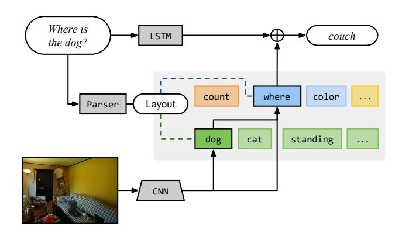
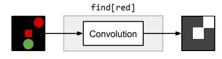
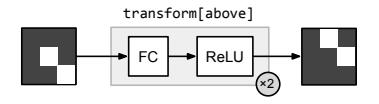
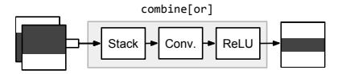
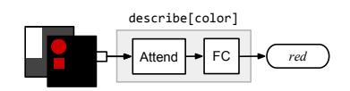
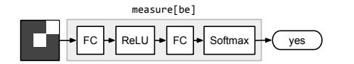
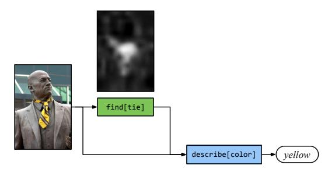
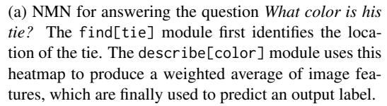
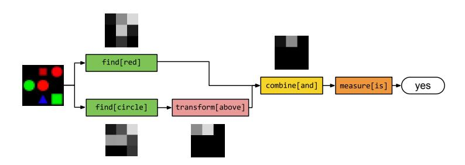
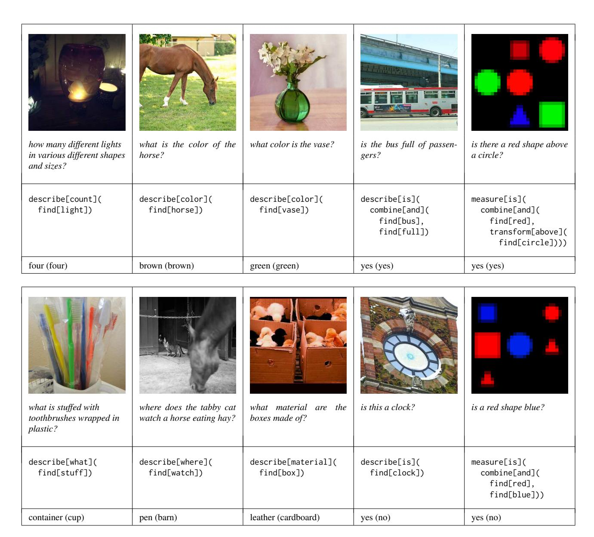

# **Neural Module Networks**

# Jacob Andreas Marcus Rohrbach Trevor Darrell Dan Klein University of California, Berkeley

{jda,rohrbach,trevor,klein}@eecs.berkeley.edu

### **Abstract**

Visual question answering is fundamentally compositional in nature—a question like where is the dog? shares substructure with questions like what color is the dog? and where is the cat? This paper seeks to simultaneously exploit the representational capacity of deep networks and the compositional linguistic structure of questions. We describe a procedure for constructing and learning neural module networks, which compose collections of jointly-trained neural "modules" into deep networks for question answering. Our approach decomposes questions into their linguistic substructures, and uses these structures to dynamically instantiate modular networks (with reusable components for recognizing dogs, classifying colors, etc.). The resulting compound networks are jointly trained. We evaluate our approach on two challenging datasets for visual question answering, achieving state-of-the-art results on both the VQA natural image dataset and a new dataset of complex questions about abstract shapes.

# 1. Introduction

This paper describes an approach to visual question answering based on a new model architecture that we call a *neural module network* (NMN). This architecture makes it possible to answer natural language questions about images using collections of jointly-trained neural "modules", dynamically composed into deep networks based on linguistic structure.

Concretely, given an image and an associated question (e.g. where is the dog?), we wish to predict a corresponding answer (e.g. on the couch, or perhaps just couch) (Figure 1). The visual question answering task has significant significant applications to human-robot interaction, search, and accessibility, and has been the subject of a great deal of recent research attention [3, 10, 26, 28, 33, 40]. The task requires sophisticated understanding of both visual scenes and natural language. Recent successful approaches represent questions as bags of words, or encode the question using a recurrent neural network [28] and train a simple clas-

Figure 1: A schematic representation of our proposed model—the shaded gray area is a *neural module network* of the kind introduced in this paper. Our approach uses a natural language parser to dynamically lay out a deep network composed of reusable modules. For visual question answering tasks, an additional sequence model provides sentence context and learns common-sense knowledge.

sifier on the encoded question and image. In contrast to these monolithic approaches, another line of work for textual QA [23] and image QA [27] uses semantic parsers to decompose questions into logical expressions. These logical expressions are evaluated against a purely logical representation of the world, which may be provided directly or extracted from an image [21].

In this paper we draw from both lines of research, presenting a technique for integrating the representational power of neural networks with the flexible compositional structure afforded by symbolic approaches to semantics. Rather than relying on a monolithic network structure to answer all questions, our approach assembles a network on the fly from a collection of specialized, jointly-learned modules (Figure 1). Rather than using logic to reason over truth values, the representations computed by our model remain entirely in the domain of visual features and attentions.

Our approach first analyzes each question with a semantic parser, and uses this analysis to determine the basic computational units (attention, classification, etc.) needed to answer the question, as well as the relationships between these

units. In Figure 1, we first produce an attention focused on the dog, which passes its output to a location describer. Depending on the underlying structure, these messages passed between modules may be raw image features, attentions, or classification decisions; each module maps from specific input to output types. Different kinds of modules are shown in different colors; attention-producing modules (like dog) are shown in green, while labeling modules (like where) are shown in blue. Importantly, all modules in an NMN are independent and composable, which allows the computation to be different for each problem instance, and possibly unobserved during training. Outside the NMN, our final answer uses a recurrent network (LSTM) to read the question, an additional step which has been shown to be important for modeling common sense knowledge and dataset biases [28].

We evaluate our approach on two visual question answering tasks. On the recently-released VQA [3] dataset we achieve results comparable to or better than existing approaches. However, that many of the questions in the VQA dataset are quite simple, with little composition or reasoning required. To test our approach's ability to handle harder questions, we introduce a new dataset of synthetic images paired with complex questions involving spatial relations, set-theoretic reasoning, and shape and attribute recognition. On this dataset we outperform baseline approaches by as much as 25% absolute accuracy.

While all the applications considered in this paper involve visual question answering, the architecture is much more general, and might easily be applied to visual referring expression resolution [9, 34] or question answering about natural language texts [15].

To summarize our contributions: We first describe neural module networks, a general architecture for discretely composing heterogeneous, jointly-trained neural modules into deep networks. Next, for the visual QA task specifically, we show how to construct NMNs based on the output of a semantic parser, and use these to successfully complete established visual question answering tasks. Finally, we introduce a new dataset of challenging, highly compositional questions about abstract shapes, and show that our model again outperforms previous approaches. We have released the dataset, as well as code for the system described in this paper, at http://github.com/jacobandreas/nmn2.

### 2. Motivations

We begin with two simple observations. First, state-of-the-art performance on the full range of computer vision tasks that are studied requires a variety of different deep network topologies—there is no single "best network" for all tasks. Second, though different networks are used for different purposes, it is commonplace to initialize systems for many of vision tasks with a prefix of a network trained

for classification [12]. This has been shown to substantially reduce training time and improve accuracy. So while network structures are not *universal* (in the sense that the same network is appropriate for all problems), they are at least empirically *modular* (in the sense that intermediate representations for one task are useful for many others).

Can we generalize this idea in a way that is useful for question answering? Rather than thinking of question answering as a problem of learning a single function to map from questions and images to answers, it is perhaps useful to think of it as a highly-multitask learning setting, where each problem instance is associated with a novel task, and the identity of that task is expressed only noisily in language. In particular, where a simple question like is this a truck? requires us to retrieve only one piece of information from an image, more complicated questions, like how many objects are to the left of the toaster? might require multiple processing steps. The compositional nature of language means that the number of such processing such steps is potentially unbounded. Moreover, multiple kinds of processing might be required—repeated convolutions might identify a truck, but some kind of recurrent architecture is likely necessary to count up to arbitrary numbers.

Thus our goal in this paper is to specify a framework for modular, composable, jointly-trained neural networks. In this framework, we first predict the structure of the computation needed to answer each question individually, then realize this structure by constructing an appropriately-shaped neural network from an inventory of reusable modules. These modules are learned jointly, rather than trained in isolation, and specialization to individual tasks (identifying properties, spatial relations, etc.) arises naturally from the training objective.

#### 3. Related work

Visual Question Answering Answering questions about images is sometimes referred to as a "Visual Turing Test" [27, 11]. It has only recently gained popularity, following the emergence of appropriate datasets consisting of paired images, questions, and answers. While the DAQUAR dataset [27] is restricted to indoor scenes and contains relatively few examples, the COCOQA dataset [40] and the VQA dataset [3] are significantly larger and have more visual variety. Both are based on images from the COCO dataset [24]. While COCOQA contains question-answer pairs automatically generated from the descriptions associated with the COCO dataset, [3] has crowed sourced questions-answer pairs. We evaluate our approach on VQA, the larger and more natural of the two datasets.

Notable "classical" approaches to this task include [27, 21]. Both of these approaches are similar to ours in their use of a semantic parser, but rely on fixed logical inference rather than learned compositional operations.

Several neural models for visual questioning have already been proposed in the literature [33, 26, 10], all of which use standard deep sequence modeling machinery to construct a joint embedding of image and text, which is immediately mapped to a distribution over answers. Here we attempt to more explicitly model the computational process needed to produce each answer, but benefit from techniques for producing sequence and image embeddings that have been important in previous work.

One important component of visual questioning is grounding the question in the image. This grounding task has previously been approached in [18, 32, 17, 20, 14], where the authors tried to localize phrases in an image. [39] use an attention mechanism to predict a heatmap for each word during sentence generation. The attentional component of our model is inspired by these approaches.

General compositional semantics There is a large literature on learning to answer questions about structured knowledge representations from question—answer pairs, both with and without joint learning of meanings for simple predicates [23, 21]. Outside of question answering, several models have been proposed for instruction following that impose a discrete "planning structure" over an underlying continuous control signal [1, 30]. We are unaware of past use of a semantic parser to predict network structures, or more generally to exploit the natural similarity between set-theoretic approaches to classical semantic parsing and attentional approaches to computer vision.

Neural network architectures The idea of selecting a different network graph for each input datum is fundamental to both recurrent networks (where the network grows in the length of the input) [8] and recursive neural networks (where the network is built, e.g., according to the syntactic structure of the input) [36]. But both of these approaches ultimately involve repeated application of a single computational module (e.g. an LSTM [13] or GRU [5] cell). From another direction, some kinds of memory networks [38] may be viewed as a special case of our model with a fixed computational graph, consisting of a sequence of find modules followed by a describe module (see Section 4). Other policy- and algorithm-learning approaches with modular substructure include [16, 4]. [31] describe a procedure for learning to assemble programs from a collection of functional primitives whose behavior is fully specified.

Our basic contribution is in both assembling this graph on the fly, and simultaneously in allowing the nodes to perform heterogeneous computations, with "messages" of different kinds—raw image features, attentions, and classification predictions—passed from one module to the next. We are unaware of any previous work allowing such mixed collections of modules to be trained jointly.

## 4. Neural module networks for visual OA

Each training datum for this task can be thought of as a 3-tuple (w, x, y), where

- w is a natural-language question
- x is an image
- y is an answer

A model is fully specified by a collection of modules  $\{m\}$ , each with associated parameters  $\theta_m$ , and a *network layout predictor* P which maps from strings to networks. Given (w,x) as above, the model instantiates a network based on P(w), passes x (and possibly w again) as inputs, and obtains a distribution over labels (for the VQA task, we require the output module produce an answer representation). Thus a model ultimately encodes a predictive distribution  $p(y \mid w, x; \theta)$ .

In the remainder of this section, we describe the set of modules used for the VQA task, then explain the process by which questions are converted to network layouts.

#### 4.1. Modules

Our goal here is to identify a small set of modules that can be assembled into all the configurations necessary for our tasks. This corresponds to identifying a minimal set of composable vision primitives. The modules operate on three basic data types: images, unnormalized attentions, and labels. For the particular task and modules described in this paper, almost all interesting compositional phenomena occur in the space of attentions, and it is not unreasonable to characterize our contribution more narrowly as an "attention-composition" network. Nevertheless, other types may be easily added in the future (for new applications or for greater coverage in the VQA domain).

First, some notation: module names are typeset in a fixed width font, and are of the form TYPE[INSTANCE](ARG1, ...). TYPE is a high-level module type (attention, classification, etc.) of the kind described below. INSTANCE is the particular instance of the model under consideration—for example, find[red] locates red things, while find[dog] locates dogs. Weights may be shared at both the type and instance level. Modules with no arguments implicitly take the image as input; higher-level modules may also inspect the image.

Find  $Image \rightarrow Attention$ 

A find module find[c] convolves every position in the input image with a weight vector (distinct for each c) to produce

a heatmap or unnormalized attention. So, for example, the output of the module find[dog] is a matrix whose entries should be large in regions of the image containing dogs, and small everywhere else.

**Transform** 

 $Attention \rightarrow Attention$ 

The transform module transform[c] is implemented as a multilayer perceptron with rectified nonlinearities (ReLUs), performing a fully-connected mapping from one attention to another. Again, the weights for this mapping are distinct for each c. So transform[above] should take an attention and shift the regions of greatest activation upward (as above), while transform[not] should move attention away from the active regions. For the experiments in this paper, the first fully-connected (FC) layer produces a vector of size 32, and the second is the same size as the input.

**Combine** 

 $Attention \times Attention \rightarrow Attention$ 

A combination module combine[c] merges two attentions into a single attention. For example, combine[and] should be active only in the regions that are active in both inputs, while combine[or] should be active where the first input is active and the second is inactive. It is implemented as a convolution followed by a nonlinearity.

**Describe** 

 $Image \times Attention \rightarrow Label$ 

A describe module describe[c] takes an attention and the input image and maps both to a distribution over labels. It first computes an average over image features weighted by the attention, then passes this averaged feature vector through a single fully-connected layer. For example, describe[color] should return a representation of the colors in the region attended to.

Measure

 $Attention \rightarrow Label$ 

A measurement module measure [c] takes an attention alone and maps it to a distribution over labels. Because attentions passed between modules are unnormalized, measure is suitable for evaluating the existence of a detected object, or counting sets of objects.

## 4.2. From strings to networks

Having built up an inventory of modules, we now need to assemble them into the layout specified by the question. The transformation from a natural language question to an instantiated neural network takes place in two steps. First we map from natural language questions to *layouts*, which specify both the set of modules used to answer a given question, and the connections between them. Next we use these layouts are used to assemble the final prediction networks.

We use standard tools pre-trained on existing linguistic resources to obtain structured representations of questions. Future work might focus on learning this prediction process jointly with the rest of the system.

**Parsing** We begin by parsing each question with the Stanford Parser [19]. to obtain a universal dependency representation [6]. Dependency parses express grammatical relations between parts of a sentence (e.g. between objects and their attributes, or events and their participants), and provide a lightweight abstraction away from the surface form of the sentence. The parser also performs basic lemmatization, for example turning *kites* into *kite* and *were* into *be*. This reduces sparsity of module instances.

Next, we filter the set of dependencies to those connected the wh-word or copula in the question (the exact distance we traverse varies depending on the task, and *how many* is treated as a special case). This gives a simple symbolic form expressing (the primary) part of the sentence's meaning.1

For example, what is standing in the field becomes what(stand); what color is the truck becomes color(truck), and is there a circle next to a square becomes is(circle, next-to(square)). In the process we also strip away function words like determiners and modals, so what type of cakes were they? and what type of cake is it? both get converted to type(cake). The code for transforming parse trees to structured queries is provided in the accompanying software package.

These representations bear a certain resemblance to pieces of a combinatory logic [23]: every leaf is implicitly a function taking the image as input, and the root represents the final value of the computation. But our approach, while compositional and combinatorial, is crucially not logical:

 $^{1}$ The Stanford parser achieves an  $F_{1}$  score of 87.2 for predicted attachments on the standard Penn Treebank benchmark [29]. While there is no gold-standard parsing data in the particular formal representation produced after our transformation is applied, the hand-inspection of parses described in Section 7 is broadly consistent with baseline parser accuracy.

(b) NMN for answering the question *Is there a red shape above a circle?* The two find modules locate the red shapes and circles, the transform[above] shifts the attention above the circles, the *combine* module computes their intersection, and the measure[is] module inspects the final attention and determines that it is non-empty.

Figure 2: Sample NMNs for question answering about natural images and shapes. For both examples, layouts, attentions, and answers are real predictions made by our model.

the inferential computations operate on continuous representations produced by neural networks, becoming discrete only in the prediction of the final answer.

**Layout** These symbolic representations already determine the structure of the predicted networks, but not the identities of the modules that compose them. This final assignment of modules is fully determined by the structure of the parse. All leaves become find modules, all internal nodes become transform or combine modules dependent on their arity, and root nodes become describe or measure modules depending on the domain (see Section 6).

Given the mapping from queries to network layouts described above, we have for each training example a network structure, an input image, and an output label. In many cases, these network structures are different, but have tied parameters. Networks which have the same high-level structure but different instantiations of individual modules (for example what color is the cat? / describe[color](find[cat]) and where is the truck? / describe[where](find[truck])) can be processed in the same batch, allowing efficient computation.

As noted above, parts of this conversion process are task-specific—we found that relatively simple expressions were best for the natural image questions, while the synthetic data (by design) required deeper structures. Some summary statistics are provided in Table 1.

**Generalizations** It is easy to imagine applications where the input to the layout stage comes from something other than a natural language parser. Users of an image database, for example, might write SQL-like queries directly in order to specify their requirements precisely, e.g.

COUNT(AND(orange, cat)) == 3

or even mix visual and non-visual specifications in their queries:

Indeed, it is possible to construct this kind of "visual SQL" using precisely the approach described in this paper—once our system is trained, the learned modules for attention, classification, etc. can be assembled by any kind of outside user, without relying on natural language specifically.

#### 4.3. Answering natural language questions

So far our discussion has focused on the neural module net architecture, without reference to the remainder of Figure 1. Our final model combines the output from the neural module network with predictions from a simple LSTM question encoder. This is important for two reasons. First, because of the relatively aggressive simplification of the question that takes place in the parser, grammatical cues that do not substantively change the semantics of the questionbut which might affect the answer—are discarded. For example, what is flying? and what are flying? both get converted to what(fly), but their answers might be kite and *kites* respectively given the same underlying image features. The question encoder thus allows us to model underlying syntactic regularities in the data. Second, it allows us to capture semantic regularities: with missing or low-quality image data, it is reasonable to guess that what color is the bear? is answered by brown, and unreasonable to guess green. The question encoder also allows us to model effects of this kind. All experiments in this paper use a standard single-layer LSTM with 1000 hidden units.

To compute an answer, we pass the final hidden state of the LSTM through a fully connected layer, add it elementwise to the representation produced by the root module of the NMN, apply a ReLU nonlinearity, and finally an-

|        | types                             | # instances | # layouts | max depth | max size |
|--------|-----------------------------------|-------------|-----------|-----------|----------|
| VQA    | find, combine, describe           | 877         | 51138     | 3         | 4        |
| SHAPES | find, transform, combine, measure | 8           | 164       | 5         | 6        |

Table 1: Structure summary statistics for neural module networks used in this paper. "types" is the set of high-level module types available (e.g. find), "# instances" is the number of specific module instances (e.g. find[llama]), and "# layouts" is the number of distinct composed structures (e.g. describe[color](find[llama])). "Max depth" is the greatest depth across all layouts, while "max size" is the greatest number of modules—for example, the network in Figure 2b has depth 4 and size 5. (All numbers from training sets.)

other fully connected layer and softmax to obtain a distribution over answers. In keeping with previous work, we have treated answer prediction as a pure classification problem: the model selects from the set of answers observed during training (whether or not they contain multiple words), treating each answer as a distinct class. Thus no parameters are shared between, e.g., *left side* and *left* in this final prediction layer. The extension to a model in which multi-word answers are generated one word at a time by a recurrent decoder is straightforward, but we leave it for future work.

# 5. Training neural module networks

Our training objective is simply to find module parameters maximizing the likelihood of the data. By design, the last module in every network outputs a distribution over labels, and so each assembled network also represents a probability distribution.

Because of the dynamic network structures used to answer questions, some weights are updated much more frequently than others. For this reason we found that learning algorithms with adaptive per-weight learning rates performed substantially better than simple gradient descent. All the experiments described below use ADADELTA with standard parameter settings [41].

It is important to emphasize that the labels we have assigned to distinguish instances of the same module type—cat, color, etc.—are a notational convenience, and do not reflect any manual specification of the behavior of the corresponding modules. find[cat] is not fixed or even initialized as cat recognizer (rather than a couch recognizer or a dog recognizer). Instead, it acquires this behavior as a byproduct of the end-to-end training procedure. As can be seen in Figure 2, the image—answer pairs and parameter tying together encourage each module to specialize in the appropriate way.

## 6. Experiments: compositionality

We begin with a set of motivating experiments on synthetic data. Compositionality, and the corresponding ability to answer questions with arbitrarily complex structure, is an essential part of the kind of deep image understanding visual QA datasets are intended to test. At the same time, questions in most existing natural image datasets are

quite simple, for the most part requiring that only one or two pieces of information be extracted from an image in order to answer it successfully, and with little evaluation of robustness in the presence of distractors (e.g. asking *is there a blue house* in an image of a red house and a blue car).

As one of the primary goals of this work is to learn models for deep semantic compositionality, we have created SHAPES, a synthetic dataset that places such compositional phenomena at the forefront. This dataset consists of complex questions about simple arrangements of colored shapes (Figure 3). Questions contain between two and four attributes, object types, or relationships. The SHAPES dataset contains 244 unique questions, pairing each question with 64 different images (for a total of 15616 unique question/image pairs, with 14592 in the training set and 1024 in the test set). To eliminate mode-guessing as a viable strategy, all questions have a yes-or-no answer, but good performance requires that the system learn to recognize shapes and colors, and understand both spatial and logical relations among sets of objects.

While success on this dataset is by no means a sufficient condition for robust visual QA, we believe it is a necessary one. In this respect it is similar in spirit to the bAbI [37] dataset, and we hope that SHAPES will continue to be used in conjunction with natural image datasets.

To produce an initial set of image features, we pass the input image through the convolutional portion of a LeNet [22] which is jointly trained with the question-answering part of the model. We compare our approach to a reimplementation of the VIS+LSTM baseline similar to the one described by [33], again swapping out the pre-trained image embedding with a LeNet.

As can be seen in Table 2, our model achieves excellent performance on this dataset, while the VIS+LSTM baseline fares little better than a majority guesser. Moreover, the color detectors and attention transformations behave as expected (Figure 2b), indicating that our joint training procedure correctly allocates responsibilities among modules. This confirms that our approach is able to model complex compositional phenomena outside the capacity of previous approaches to visual question answering.

We perform an additional experiment on a modified version of the training set, which contains no size-6 questions

| % of test set              | size 4 31 | size 5 56 | size 6 13 | All  |
|----------------------------|--------------|--------------|--------------|------|
| Majority                   | 64.4         | 62.5         | 61.7         | 63.0 |
| VIS+LSTM                   | 71.9         | 62.5         | 61.7         | 65.3 |
| NMN                        | 89.7         | 92.4         | 85.2         | 90.6 |
| NMN (train size $\leq 5$ ) | 97.7         | 91.1         | 89.7         | 90.8 |

Table 2: Results on the SHAPES dataset. Here "size" is the number of modules needed to instantiate an appropriate NMN. Our model achieves high accuracy and outperforms a baseline from previous work, especially on highly compositional questions. "NMN (easy)" is a modified training set with no size-6 questions; these results demonstrate that our model is able to generalize to questions more complicated than it has seen at training time.

(i.e. questions whose corresponding NMN has 6 modules). Performance in this case is indistinguishable from the full training set; this demonstrates that our model is able to generalize to questions more complicated than those it has seen during training. Using linguistic information, the model extrapolates simple visual patterns to deeper structures.

## 7. Experiments: natural images

Next we consider the model's ability to handle hard perceptual problems involving natural images. Here we evaluate on the VQA dataset [3]. This is the largest resource of its kind, consisting of more than 200,000 images from MSCOCO [25], each paired with three questions and ten answers per question generated by human annotators. We train our model using the standard train/test split, training only with those answers marked as high confidence. The visual input to the NMN is the conv5 layer of a 16-layer VGGNet [35] after max-pooling, with features normalized to have mean 0 and standard deviation 1. In addition to results with the VGG pretained on ImageNet, we also report results with the VGG fine-tuned (+FT) on MSCOCO for the captioning task [7]. We find that performance is best on this task if the top-level module is always describe, even when the question involves quantification.

Results are shown in Table 3. We compare to a number of baselines, including a text-only baseline (LSTM), a previous baseline approach that predicts answers directly from an encoding of the image and the question [3], and an attentional baseline (ATT+LSTM). This last baseline shares the basic computational structure of our model without syntactic compositionality: it uses the same network layout for every question (a find module followed by a describe module), with parameters tied across all problem instances. As can be seen in Table 1, the number of module types and instances is quite large. Rare words (occurring fewer than 10 times in the training data) are mapped to a single token or module instance in the LSTM encoder and module network.

Our model outperforms all the listed baselines on this

|                           | test-dev |        |       |      | test        |
|---------------------------|----------|--------|-------|------|-------------|
|                           | Yes/No   | Number | Other | All  | All         |
| LSTM                      | 78.7     | 36.6   | 28.1  | 49.8 | _           |
| VIS+LSTM [3] 2 | 78.9     | 35.2   | 36.4  | 53.7 | 54.1        |
| ATT+LSTM                  | 80.6     | 36.4   | 42.0  | 57.2 | -           |
| NMN                       | 70.7     | 36.8   | 39.2  | 54.8 | -           |
| NMN+LSTM                  | 81.2     | 35.2   | 43.3  | 58.0 | -           |
| NMN+LSTM+FT               | 81.2     | 38.0   | 44.0  | 58.6 | <b>58.7</b> |

Table 3: Results on the VQA test server. LSTM is a questiononly baseline, VIS+LSTM is a previous baseline that combines a question representation with a representation of the full image, and ATT+LSTM is a model with the same attentional structure as our approach but no lexical information. NMN+LSTM is the full model shown in Figure 1, while NMN is an ablation experiment with no whole-question LSTM. NMN+LSTM+FT is the same model, with image features fine-tuned on MSCOCO captions. This model outperforms previous approaches, scoring particularly well on questions not involving a binary decision.

task. A breakdown of our questions by answer type reveals that our model performs especially well on questions answered by an object, attribute, or number. Investigation of parser outputs also suggests that there is substantial room to improve the system using a better parser. A hand inspection of the first 50 parses in the training set suggests that most (80–90%) of questions asking for simple properties of objects are correctly analyzed, but more complicated questions are more prone to picking up irrelevant predicates. For example are these people most likely experiencing a work day? is parsed as be(people, likely), when the desired analysis is be(people, work). Parser errors of this kind could be fixed with joint learning.

Figure 3 is broadly suggestive of the kinds of prediction errors made by the system, including plausible semantic confusions (cardboard interpreted as leather, round windows interpreted as clocks), normal lexical variation (*container* for *cup*), and use of answers that are *a priori* plausible but unrelated to the image (describing a horse as located in a pen rather than a barn).

### 8. Conclusions and future work

In this paper, we have introduced *neural module net-works*, which provide a general-purpose framework for learning collections of neural modules which can be dynamically assembled into arbitrary deep networks. We have demonstrated that this approach achieves state-of-the-art performance on existing datasets for visual question an-

&lt;sup>2 After the current work was accepted for publication, an improved version of this baseline was published, featuring a deeper sentence representation and multiplicative interactions between the sentence and scene representations. This improved baseline gives an overall score of **57.8**. We expect that many of these modifications could be applied to our own system to obtain similar gains.

Figure 3: Example output from our approach on different visual QA tasks. The top row shows correct answers, while the bottom row shows mistakes (the most common answer from human annotators is given in parentheses).

swering, performing especially well on questions answered by an object or an attribute. Additionally, we have introduced a new dataset of highly compositional questions about simple arrangements of shapes, and shown that our approach substantially outperforms previous work.

So far we have maintained a strict separation between predicting network structures and learning network parameters. It is easy to imagine that these two problems might be solved jointly, with uncertainty maintained over network structures throughout training and decoding. This might be accomplished either with a monolithic network, by using some higher-level mechanism to "attend" to relevant portions of the computation, or else by integrating with existing tools for learning semantic parsers [21]. We describe

first steps toward joint learning of module behavior and a parser in a follow-up to this work [2].

The fact that our neural module networks can be trained to produce predictable outputs—even when freely composed—points toward a more general paradigm of "programs" built from neural networks. In this paradigm, network designers (human or automated) have access to a standard kit of neural parts from which to construct models for performing complex reasoning tasks. While visual question answering provides a natural testbed for this approach, its usefulness is potentially much broader, extending to queries about documents and structured knowledge bases or more general function approximation and signal processing.

## Acknowledgments

The authors are grateful to Lisa Anne Hendricks, Eric Tzeng, and Russell Stewart for useful conversations, and to Nvidia for a hardware grant. JA is supported by a National Science Foundation Graduate Research Fellowship. MR is supported by a fellowship within the FIT weltweit-Program of the German Academic Exchange Service (DAAD). TD was supported in part by DARPA; AFRL; DoD MURI award N000141110688; NSF awards IIS-1212798, IIS-1427425, and IIS-1536003, and the Berkeley Vision and Learning Center.

#### References

- [1] J. Andreas and D. Klein. Grounding language with points and paths in continuous spaces. *Proceedings of the Fifteenth Conference on Computational Natural Language Learning (CoNLL)*, 2014. 3
- [2] J. Andreas, M. Rohrbach, T. Darrell, and D. Klein. Learning to compose neural networks for question answering. In Proceedings of the Human Language Technology Conference of the North American Chapter of the Association for Computational Linguistics (NAACL-HLT), 2016. 8
- [3] S. Antol, A. Agrawal, J. Lu, M. Mitchell, D. Batra, C. L. Zitnick, and D. Parikh. Vqa: Visual question answering. In Proceedings of the IEEE International Conference on Computer Vision (ICCV), 2015. 1, 2, 7
- [4] A. Braylan, M. Hollenbeck, E. Meyerson, and R. Miikkulainen. Reuse of neural modules for general video game playing. *arXiv preprint arXiv:1512.01537*, 2015. 3
- [5] K. Cho, B. van Merriënboer, D. Bahdanau, and Y. Bengio. On the properties of neural machine translation: Encoder-decoder approaches. Workshop on Syntax, Semantics and Structure in Statistical Translation (SSST), 2014.
- [6] M.-C. De Marneffe and C. D. Manning. The Stanford typed dependencies representation. In *Proceedings of the Interna*tional Conference on Computational Linguistics (COLING), pages 1–8. Association for Computational Linguistics, 2008.
- [7] J. Donahue, L. A. Hendricks, S. Guadarrama, M. Rohrbach, S. Venugopalan, K. Saenko, and T. Darrell. Long-term recurrent convolutional networks for visual recognition and description. In *Proceedings of the IEEE Conference on Com*puter Vision and Pattern Recognition (CVPR), 2015. 7
- [8] J. L. Elman. Finding structure in time. *Cognitive science*, 14(2):179–211, 1990. 3
- [9] N. FitzGerald, Y. Artzi, and L. Zettlemoyer. Learning distributions over logical forms for referring expression generation. In *Proceedings of the Conference on Empirical Methods in Natural Language Processing (EMNLP)*, 2013. 2
- [10] H. Gao, J. Mao, J. Zhou, Z. Huang, L. Wang, and W. Xu. Are you talking to a machine? dataset and methods for multilingual image question answering. In *Advances in Neural Information Processing Systems (NIPS)*, 2015. 1, 3
- [11] D. Geman, S. Geman, N. Hallonquist, and L. Younes. Visual turing test for computer vision systems. *Proceedings of the National Academy of Sciences*, 2015. 2

- [12] R. Girshick, J. Donahue, T. Darrell, and J. Malik. Rich feature hierarchies for accurate object detection and semantic segmentation. In *Proceedings of the IEEE Conference on Computer Vision and Pattern Recognition (CVPR)*, 2014. 2
- [13] S. Hochreiter and J. Schmidhuber. Long short-term memory. Neural computation, 9(8):1735–1780, 1997. 3
- [14] R. Hu, H. Xu, M. Rohrbach, J. Feng, K. Saenko, and T. Darrell. Natural language object retrieval. In *Proceedings of the IEEE Conference on Computer Vision and Pattern Recogni*tion (CVPR), 2016. 3
- [15] M. Iyyer, J. Boyd-Graber, L. Claudino, R. Socher, and H. Daumé III. A neural network for factoid question answering over paragraphs. In *Proceedings of the Conference on Empirical Methods in Natural Language Processing* (EMNLP), 2014. 2
- [16] Ł. Kaiser and I. Sutskever. Neural gpus learn algorithms. arXiv preprint arXiv:1511.08228, 2015. 3
- [17] A. Karpathy and L. Fei-Fei. Deep visual-semantic alignments for generating image descriptions. In *Proceedings of the IEEE Conference on Computer Vision and Pattern Recognition (CVPR)*, 2015. 3
- [18] A. Karpathy, A. Joulin, and L. Fei-Fei. Deep fragment embeddings for bidirectional image sentence mapping. In Advances in Neural Information Processing Systems (NIPS), 2014. 3
- [19] D. Klein and C. D. Manning. Accurate unlexicalized parsing. In *Proceedings of the Annual Meeting of the Association for Computational Linguistics (ACL)*, pages 423–430. Association for Computational Linguistics, 2003. 4
- [20] C. Kong, D. Lin, M. Bansal, R. Urtasun, and S. Fidler. What are you talking about? text-to-image coreference. In *Proceedings of the IEEE Conference on Computer Vision and Pattern Recognition (CVPR)*, 2014. 3
- [21] J. Krishnamurthy and T. Kollar. Jointly learning to parse and perceive: connecting natural language to the physical world. *Transactions of the Association for Computational Linguistics (TACL)*, 2013. 1, 2, 3, 8
- [22] Y. LeCun, L. Bottou, Y. Bengio, and P. Haffner. Gradient-based learning applied to document recognition. *Proceedings of the IEEE*, 86(11):2278–2324, 1998. 6
- [23] P. Liang, M. I. Jordan, and D. Klein. Learning dependency-based compositional semantics. *Computational Linguistics* (*CL*), 39(2):389–446, 2013. 1, 3, 4
- [24] T.-Y. Lin, M. Maire, S. Belongie, J. Hays, P. Perona, D. Ramanan, P. Dollár, and C. L. Zitnick. Microsoft coco: Common objects in context. In *Proceedings of the European Conference on Computer Vision (ECCV)*, 2014. 2
- [25] T.-Y. Lin, M. Maire, S. Belongie, J. Hays, P. Perona, D. Ramanan, P. Dollár, and C. L. Zitnick. Microsoft coco: Common objects in context. In *Proceedings of the European Conference on Computer Vision (ECCV)*, 2014. 7
- [26] L. Ma and Z. L. andiyyer Hang Li. Learning to answer questions from image using convolutional neural network. In *Proceedings of the Conference on Artificial Intelligence* (AAAI), 2016. 1, 3
- [27] M. Malinowski and M. Fritz. A multi-world approach to question answering about real-world scenes based on uncer-

- tain input. In Advances in Neural Information Processing Systems (NIPS), 2014. 1, 2
- [28] M. Malinowski, M. Rohrbach, and M. Fritz. Ask your neurons: A neural-based approach to answering questions about images. In *Proceedings of the IEEE International Conference on Computer Vision (ICCV)*, 2015. 1, 2
- [29] M. P. Marcus, M. A. Marcinkiewicz, and B. Santorini. Building a large annotated corpus of english: The penn treebank. *Computational linguistics*, 19(2):313–330, 1993. 4
- [30] C. Matuszek, N. Fitzgerald, L. Zettlemoyer, L. Bo, and D. Fox. A joint model of language and perception for grounded attribute learning. In *Proceedings of the Interna*tional Conference on Machine Learning (ICML), 2012. 3
- [31] A. Neelakantan, Q. V. Le, and I. Sutskever. Neural programmer: Inducing latent programs with gradient descent. *arXiv* preprint arXiv:1511.04834, 2015. 3
- [32] B. Plummer, L. Wang, C. Cervantes, J. Caicedo, J. Hockenmaier, and S. Lazebnik. Flickr30k entities: Collecting region-to-phrase correspondences for richer image-tosentence models. In *Proceedings of the IEEE International Conference on Computer Vision (ICCV)*, 2015. 3
- [33] M. Ren, R. Kiros, and R. Zemel. Exploring models and data for image question answering. In Advances in Neural Information Processing Systems (NIPS), 2015. 1, 3, 6
- [34] A. Rohrbach, M. Rohrbach, R. Hu, T. Darrell, and B. Schiele. Grounding of textual phrases in images by reconstruction. arXiv preprint arXiv:1511.03745, 2015. 2
- [35] K. Simonyan and A. Zisserman. Very deep convolutional networks for large-scale image recognition. In *Proceedings* of the International Conference on Learning Representations (ICLR), 2015. 7
- [36] R. Socher, J. Bauer, C. D. Manning, and A. Y. Ng. Parsing with compositional vector grammars. In *Proceedings of the Annual Meeting of the Association for Computational Linguistics (ACL)*, 2013. 3
- [37] J. Weston, A. Bordes, S. Chopra, and T. Mikolov. Towards ai-complete question answering: a set of prerequisite toy tasks. *arXiv preprint arXiv:1502.05698*, 2015. 6
- [38] J. Weston, S. Chopra, and A. Bordes. Memory networks. In Proceedings of the International Conference on Learning Representations (ICLR), 2015. 3
- [39] K. Xu, J. Ba, R. Kiros, A. Courville, R. Salakhutdinov, R. Zemel, and Y. Bengio. Show, attend and tell: Neural image caption generation with visual attention. *Proceedings of the International Conference on Machine Learning (ICML)*, 2015. 3
- [40] L. Yu, E. Park, A. C. Berg, and T. L. Berg. Visual madlibs: Fill in the blank image generation and question answering. In Proceedings of the IEEE International Conference on Computer Vision (ICCV), 2015. 1, 2
- [41] M. D. Zeiler. ADADELTA: An adaptive learning rate method. arXiv preprint arXiv:1212.5701, 2012. 6