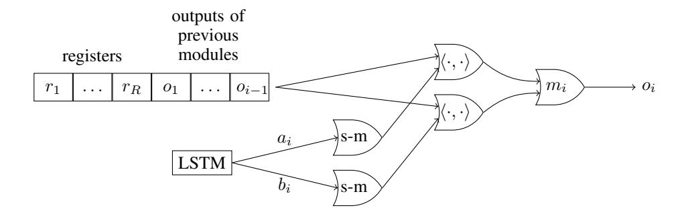
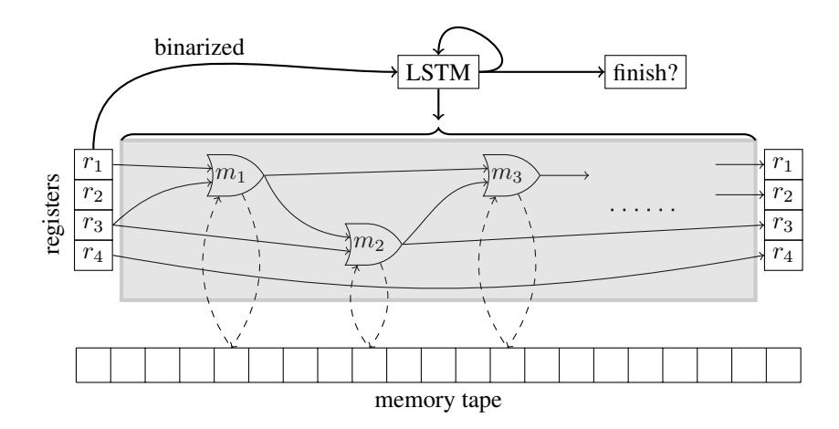
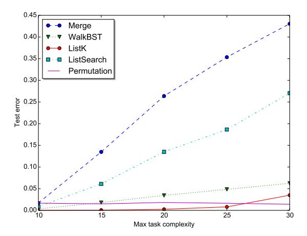
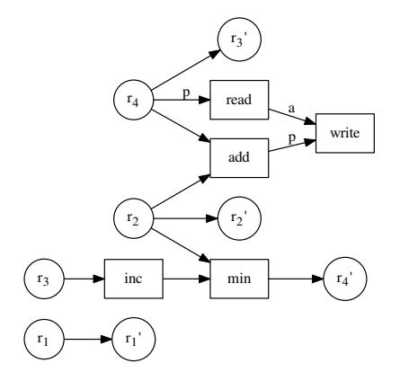
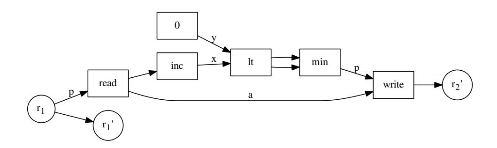
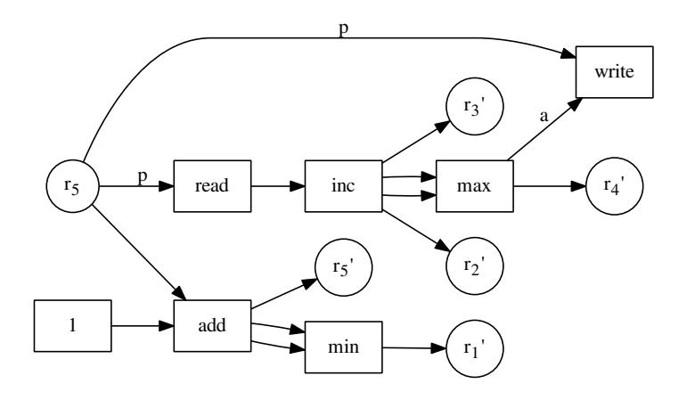
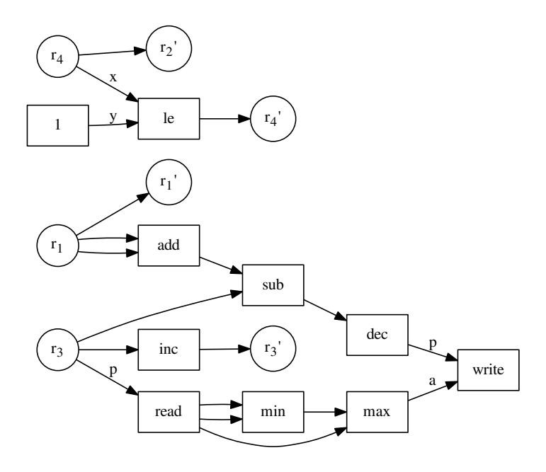
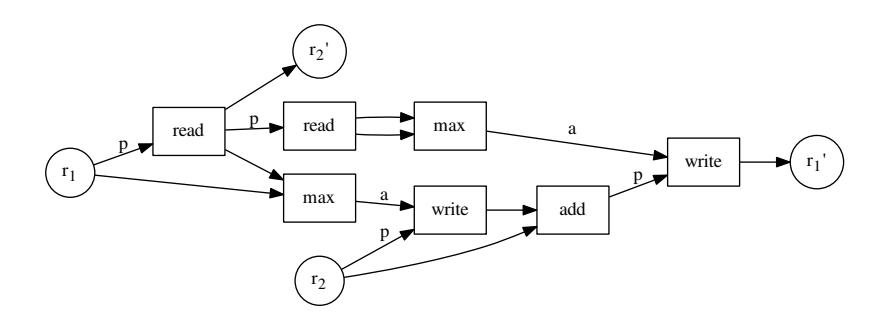
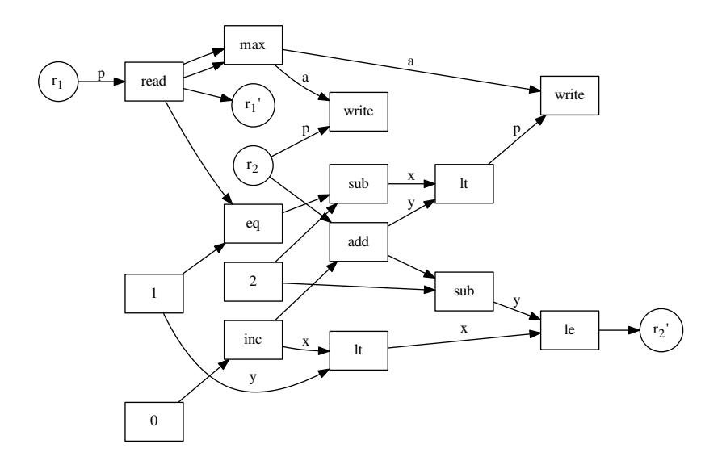

# NEURAL RANDOM-ACCESS MACHINES

Karol Kurach\* & Marcin Andrychowicz\* & Ilya Sutskever

Google

{kkurach, marcina, ilyasu}@google.com

# **ABSTRACT**

In this paper, we propose and investigate a new neural network architecture called Neural Random Access Machine. It can manipulate and dereference pointers to an external variable-size random-access memory. The model is trained from pure input-output examples using backpropagation.

We evaluate the new model on a number of simple algorithmic tasks whose solutions require pointer manipulation and dereferencing. Our results show that the proposed model can learn to solve algorithmic tasks of such type and is capable of operating on simple data structures like linked-lists and binary trees. For easier tasks, the learned solutions generalize to sequences of arbitrary length. Moreover, memory access during inference can be done in a constant time under some assumptions.

# 1 Introduction

Deep learning is successful for two reasons. First, deep neural networks are able to represent the "right" kind of functions; second, deep neural networks are trainable. Deep neural networks can be potentially improved if they get deeper and have fewer parameters, while maintaining trainability. By doing so, we move closer towards a practical implementation of Solomonoff induction (Solomonoff, 1964). The first model that we know of that attempted to train extremely deep networks with a large memory and few parameters is the Neural Turing Machine (NTM) (Graves et al., 2014) — a computationally universal deep neural network that is trainable with backpropagation. Other models with this property include variants of Stack-Augmented recurrent neural networks (Joulin & Mikolov, 2015; Grefenstette et al., 2015), and the Grid-LSTM (Kalchbrenner et al., 2015)—of which the Grid-LSTM has achieved the greatest success on both synthetic and real tasks. The key characteristic of these models is that their depth, the size of their short term memory, and their number of parameters are no longer confounded and can be altered independently — which stands in contrast to models like the LSTM (Hochreiter & Schmidhuber, 1997), whose number of parameters grows quadratically with the size of their short term memory.

A fundamental operation of modern computers is pointer manipulation and dereferencing. In this work, we investigate a model class that we name the Neural Random-Access Machine (NRAM), which is a neural network that has, as primitive operations, the ability to manipulate, store in memory, and dereference pointers into its working memory. By providing our model with dereferencing as a primitive, it becomes possible to train models on problems whose solutions require pointer manipulation and chasing. Although all computationally universal neural networks are equivalent, which means that the NRAM model does not have a representational advantage over other models if they are given a sufficient number of computational steps, in practice, the number of timesteps that a given model has is highly limited, as extremely deep models are very difficult to train. As a result, the model's core primitives have a strong effect on the set of functions that can be feasibly learned in practice, similarly to the way in which the choice of a programming language strongly affects the functions that can be implemented with an extremely small amount of code.

Finally, the usefulness of computationally-universal neural networks depends entirely on the ability of backpropagation to find good settings of their parameters. Indeed, it is trivial to define the "optimal" hypothesis class (Solomonoff, 1964), but the problem of finding the best (or even a good)

\*Equal contribution.

function in that class is intractable. Our work puts the backpropagation algorithm to another test, where the model is extremely deep and intricate.

In our experiments, we evaluate our model on several algorithmic problems whose solutions required pointer manipulation and chasing. These problems include algorithms on a linked-list and a binary tree. While we were able to achieve encouraging results on these problems, we found that standard optimization algorithms struggle with these extremely deep and nonlinear models. We believe that advances in optimization methods will likely lead to better results.

### 2 Related work

There has been a significant interest in the problem of learning algorithms in the past few years. The most relevant recent paper is Neural Turing Machines (NTMs) (Graves et al., 2014). It was the first paper to explicitly suggest the notion that it is worth training a computationally universal neural network, and achieved encouraging results.

A follow-up model that had the goal of learning algorithms was the Stack-Augmented Recurrent Neural Network (Joulin & Mikolov, 2015) This work demonstrated that the Stack-Augmented RNN can generalize to long problem instances from short problem instances. A related model is the Reinforcement Learning Neural Turing Machine (Zaremba & Sutskever, 2015), which attempted to use reinforcement learning techniques to train a discrete-continuous hybrid model.

The memory network (Weston et al., 2014) is an early model that attempted to explicitly separate the memory from computation in a neural network model. The followup work of Sukhbaatar et al. (2015) combined the memory network with the soft attention mechanism, which allowed it to be trained with less supervision.

The Grid-LSTM (Kalchbrenner et al., 2015) is a highly interesting extension of LSTM, which allows to use LSTM cells for both deep and sequential computation. It achieves excellent results on both synthetic, algorithmic problems and on real tasks, such as language modelling, machine translation, and object recognition.

The Pointer Network (Vinyals et al., 2015) is somewhat different from the above models in that it does not have a writable memory — it is more similar to the attention model of Bahdanau et al. (2014) in this regard. Despite not having a memory, this model was able to solve a number of difficult algorithmic problems that include the convex hull and the approximate 2D travelling salesman problem (TSP).

Finally, it is important to mention the attention model of Bahdanau et al. (2014). Although this work is not explicitly aimed at learning algorithms, it is by far the most practical model that has an "algorithmic bent". Indeed, this model has proven to be highly versatile, and variants of this model have achieved state-of-the-art results on machine translation (Luong et al., 2015), speech recognition (Chan et al., 2015), and syntactic parsing (Vinyals et al., 2014), without the use of almost any domain-specific tuning.

# 3 Model

In this section we describe the NRAM model. We start with a description of the simplified version of our model which does not use an external memory and then explain how to augment it with a variable-size random-access memory. The core part of the model is a neural controller, which acts as a "processor". The controller can be a feedforward neural network or an LSTM, and it is the only trainable part of the model.

The model contains R registers, each of which holds an integer value. To make our model trainable with gradient descent, we made it fully differentiable. Hence, each register represents an integer value with a distribution over the set  $\{0,1,\ldots,M-1\}$ , for some constant M. We do not assume that these distributions have any special form — they are simply stored as vectors  $p \in \mathbb{R}^M$  satisfying  $p_i \geq 0$  and  $\sum_i p_i = 1$ . The controller does not have direct access to the registers; it can interact with them using a number of prespecified *modules* (gates), such as integer addition or equality test.

Let's denote the modules  $m_1, m_2, \ldots, m_Q$ , where each module is a function:

$$m_i: \{0, 1, \dots, M-1\} \times \{0, 1, \dots, M-1\} \rightarrow \{0, 1, \dots, M-1\}.$$

On a high level, the model performs a sequence of timesteps, each of which consists of the following substeps:

- 1. The controller gets some inputs depending on the values of the registers (the controller's inputs are described in Sec. 3.1).
- 2. The controller updates its internal state (if the controller is an LSTM).
- 3. The controller outputs the description of a "fuzzy circuit" with inputs  $r_1, \ldots, r_R$ , gates  $m_1, \ldots, m_Q$  and R outputs.
- 4. The values of the registers are overwritten with the outputs of the circuit.

More precisely, each circuit is created as follows. The inputs for the module  $m_i$  are chosen by the controller from the set  $\{r_1, \ldots, r_R, o_1, \ldots, o_{i-1}\}$ , where:

- $r_j$  is the value stored in the j-th register at the current timestep, and
- $o_j$  is the output of the module  $m_j$  at the current timestep.

Hence, for each  $1 \leq i \leq Q$  the controller chooses weighted averages of the values  $\{r_1,\ldots,r_R,o_1,\ldots,o_{i-1}\}$  which are given as inputs to the module. Therefore,

$$o_i = m_i \left( (r_1, \dots, r_R, o_1, \dots, o_{i-1})^T \mathbf{softmax}(a_i), \ (r_1, \dots, r_R, o_1, \dots, o_{i-1})^T \mathbf{softmax}(b_i) \right),$$
 where the vectors  $a_i, b_i \in \mathbb{R}^{R+i-1}$  are produced by the controller (Fig. 1).

Figure 1: The execution of the module  $m_i$ . Gates s-m represent the softmax function and  $\langle \cdot, \cdot \rangle$  denotes inner product. See Eq. 1 for details.

Recall that the variables  $r_j$  represent probability distributions and therefore the inputs to  $m_i$ , being weighted averages of probability distributions, are also probability distributions. Thus, as the modules  $m_i$  are originally defined for integer inputs and outputs, we must extend their domain to probability distributions as inputs, which can be done in a natural way (and make their output also be a probability distribution):

$$\forall_{0 \le c < M} \ \mathbb{P}(m_i(A, B) = c) = \sum_{0 \le a, b \le M} \mathbb{P}(A = a) \mathbb{P}(B = b) [m_i(a, b) = c]. \tag{2}$$

After the modules have produced their outputs, the controller decides which of the values  $\{r_1,\ldots,r_R,o_1,\ldots,o_Q\}$  should be stored in the registers. In detail, the controller outputs the vectors  $c_i \in \mathbb{R}^{R+Q}$  for  $1 \leq i \leq R$  and the values of the registers are updated (simultaneously) using the formula:

$$r_i := (r_1, \dots, r_R, o_1, \dots, o_Q)^T \mathbf{softmax}(c_i).$$
(3)

## 3.1 Controller's inputs

Recall that at the beginning of each timestep the controller receives some inputs, and it is an important design decision to decide where should these inputs come from. A naive approach is to use the values of the registers as inputs to the controller. However, the values of the registers are probability distributions and are stored as vectors  $p \in \mathbb{R}^M$ . If the entire distributions were given as inputs to the controller then the number of the model's parameters would depend on M. This would be undesirable because, as will be explained in the next section, the value M is linked to the size of an external random-access memory tape and hence it would prevent the model from generalizing to different memory sizes.

Hence, for each  $1 \le i \le R$  the controller receives, as input, only one scalar from each register, namely  $\mathbb{P}(r_i=0)$  — the probability that the value in the register is equal 0. This solution has an additional advantage, namely it limits the amount of information available to the controller and forces it to rely on the modules instead of trying to solve the problem on its own. Notice that this information is sufficient to get the exact value of  $r_i$  if  $r_i \in \{0,1\}$ , which is the case whenever  $r_i$  is an output of a "boolean" module, e.g. the inequality test module  $m_i(a,b) = [a < b]$ .

#### 3.2 Memory tape

One could use the model described so far for learning sequence-to-sequence transformations by initializing the registers with the input sequence, and training the model to produce the desired output sequence in its registers after a given number of timesteps. The disadvantage of such model is that it would be completely unable to generalize to longer sequences, because the length of the sequence that the model can process is equal to the number of its registers, which is constant.

Therefore, we extend the model with a variable-size memory tape, which consists of M memory cells, each of which stores a distribution over the set  $\{0,1,\ldots,M-1\}$ . Notice that each distribution stored in a memory cell or a register can be interpreted as a fuzzy address in the memory and used as a fuzzy pointer. We will hence identify integers in the set  $\{0,1,\ldots,M-1\}$  with pointers to the memory. Therefore, the value in each memory cell may be interpreted as an integer or as a pointer. The exact state of the memory can be described by a matrix  $\mathcal{M} \in \mathbb{R}^M_M$ , where the value  $\mathcal{M}_{i,j}$  is the probability that the i-th cell holds the value j.

The model interacts with the memory tape solely using two special modules:

- READ module: this module takes as the input a pointer1 and returns the value stored under the given address in the memory. This operation is extended to fuzzy pointers similarly to Eq. 2. More precisely, if p is a vector representing the probability distribution of the input (i.e.  $p_i$  is the probability that the input pointer points to the i-th cell) then the module returns the value  $\mathcal{M}^T p$ .
- WRITE module: this module takes as the input a pointer p and a value a and stores the value a under the address p in the memory. The fuzzy form of the operation can be effectively expressed using matrix operations  $^2$ .

The full architecture of the NRAM model is presented on Fig. 2

### 3.3 Inputs and outputs handling

The memory tape also serves as an input-output channel — the model's memory is initialized with the input sequence and the model is expected to produce the output in the memory. Moreover, we use a novel way of deciding how many timesteps should be executed. After each timestep we let the controller decide whether it would like to continue the execution or finish it, in which case the current state of the memory is treated as the output.

&lt;sup>1Formally each module takes two arguments. In this case the second argument is simply ignored.

&lt;sup>2The exact formula is  $\mathcal{M} := (J - p)J^T \cdot \mathcal{M} + pa^T$ , where J denotes a (column) vector consisting of M ones and  $\cdot$  denotes coordinate-wise multiplication.

Figure 2: One timestep of the NRAM architecture with R=4 registers. The LSTM controller gets the "binarized" values  $r_1, r_2, \ldots$  stored in the registers as inputs and outputs the description of the circuit in the grey box and the probability of finishing the execution in the current timestep (See Sec. 3.3 for more detail). The weights of the solid thin connections are outputted by the controller. The weights of the solid thick connections are trainable parameters of the model. Some of the modules (i.e. READ and WRITE) may interact with the memory tape (dashed connections).

More precisely, after the timestep t the controller outputs a scalar  $f_t \in [0,1]^3$ , which denotes the willingness to finish the execution in the current timestep. Therefore, the probability that the execution has not been finished before the timestep t is equal  $\prod_{i=1}^{t-1}(1-f_i)$ , and the probability that the output is produced exactly at the timestep t is equal  $p_t = f_t \cdot \prod_{i=1}^{t-1}(1-f_i)$ . There is also some maximal allowed number of timesteps T, which is a hyperparameter. The model is forced to produce output in the last step if it has not done it yet, i.e.  $p_T = 1 - \sum_{i=1}^{T-1} p_i$  regardless of the value  $f_T$ .

Let  $\mathcal{M}^{(t)} \in \mathbb{R}^M_M$  denote the memory matrix after the timestep t, i.e.  $\mathcal{M}^{(t)}_{i,j}$  is the probability that the i-th memory cell holds the value j after the timestep t. For an input-output pair (x,y), where  $x,y \in \{0,1,\ldots,M-1\}^M$  we define the loss of the model as the expected negative log-likelihood of producing the correct output, i.e.,  $-\sum_{t=1}^T \left(p_t \cdot \sum_{i=1}^M \log(\mathcal{M}^{(t)}_{i,y_i})\right)$  assuming that the memory was initialized with the sequence  $x^4$ . Moreover, for all problems we consider the output sequence is shorter than the memory. Therefore, we compute the loss only over memory cells, which should contain the output.

# 3.4 DISCRETIZATION

Computing the outputs of modules, represented as probability distributions, is a computationally costly operation. For example, computing the output of the READ module takes  $\Theta(M^2)$  time as it requires the multiplication of the matrix  $\mathcal{M} \in \mathbb{R}^M_M$  and the vector  $p \in \mathbb{R}^M$ .

One may however suspect (and we empirically verify this claim in Sec. 4) that the NRAM model naturally learns solutions in which the distributions of intermediate values have very low entropy. The argument for this hypothesis is that fuzziness in the intermediate values would probably propagate to the output and cause a higher value of the cost function. To test this hypothesis we trained the model and then used its *discretized* version during interference. In the discretized version every module gets as inputs the values from modules (or registers), which are the most probable to produce

&lt;sup>3In fact, the controller outputs a scalar  $x_i$  and  $f_i = \mathbf{sigmoid}(x_i)$ .

&lt;sup>4One could also use the negative log-likelihood of the expected output, i.e.  $-\sum_{i=1}^{M} \log \left( \sum_{t=1}^{T} p_t \cdot \mathcal{M}_{i,y_i}^{(t)} \right)$  as the loss function.

the given input accordingly to the distribution outputted by the controller. More precisely, it corresponds to replacing the function **softmax** in equations (1,3) with the function returning the vector containing 1 on the position of the maximum value in the input and zeros on all other positions.

Notice that in the discretized NRAM model each register and memory cell stores an integer from the set  $\{0,1,\ldots,M-1\}$  and therefore all modules may be executed efficiently (assuming that the functions represented by the modules can be efficiently computed). In case of a feedforward controller and a small (e.g.  $\leq 20$ ) number of registers the interference can be accelerated even further. Recall that the only inputs to the controller are binarized values of the register. Therefore, instead of executing the controller one may simple precompute the (discretized) controller's output for each configuration of the registers' binarized values. Such algorithm would enjoy an extremely efficient implementation in machine code.

# 4 EXPERIMENTS

#### 4.1 Training procedure

The NRAM model is fully differentiable and we trained it using the Adam optimization algorithm (Kingma & Ba, 2014) with the negative log-likelihood cost function. Notice that we do not use any additional supervised data (such as memory access traces) beyond pure input-output examples.

We used multilayer perceptrons (MLPs) with two hidden layers or LSTMs with a hidden layer between input and LSTM cells as controllers. The number of hidden units in each layer was equal. The ReLu nonlinearity (Nair & Hinton, 2010) was used in all experiments.

Below are some important techniques that we used in the training:

**Curriculum learning** As noticed in several papers (Bengio et al., 2009; Zaremba & Sutskever, 2014), curriculum learning is crucial for training deep networks on very complicated problems. We followed the curriculum learning schedule from Zaremba & Sutskever (2014) without any modifications. The details can be found in Appendix B.

Gradient clipping Notice that the depth of the unfolded execution is roughly a product of the number of timesteps and the number of modules. Even for moderately small experiments (e.g. 14 modules and 20 timesteps) this value easily exceeds a few hundreds. In networks of such depth, the gradients can often "explode" (Bengio et al., 1994), what makes training by backpropagation much harder. We noticed that the gradients w.r.t. the intermediate values inside the backpropagation were so large, that they sometimes led to an overflow in single-precision floating-point arithmetic. Therefore, we clipped the gradients w.r.t. the activations, within the execution of the backpropagation algorithm. More precisely, each coordinate is separately cropped into the range  $[-C_1, C_1]$  for some constant  $C_1$ . Before updating parameters, we also globally rescale the whole gradient vector, so that its L2 norm is not bigger than some constant value  $C_2$ .

**Noise** We added random Gaussian noise to the computed gradients after the backpropagation step. The variance of this noise decays exponentially during the training. The details can be found in Neelakantan et al. (2015).

**Enforcing Distribution Constraints** For very deep networks, a small error in one place can propagate to a huge error in some other place. This was the case with our pointers: they are probability distributions over memory cells and they should sum up to 1. However, after a number of operations are applied, they can accumulate error as a result of inaccurate floating-point arithmetic.

We have a special layer which is responsible for rescaling all values (multiplying by the inverse of their sum), to make sure they always represent a probability distribution. We add this layer to our model in a few critical places (eg. after the softmax operation)5.

&lt;sup>5We do not however backpropagate through these renormalizing operations, i.e. during the backward pass we simply assume that they are identities.

**Entropy** While searching for a solution, the network can fix the pointer distribution on some particular value. This is advantageous at the end of training, because ideally we would like to be able to discretize the model. However, if this happens at the begin of the training, it could force the network to stay in a local minimum, with a small chance of moving the probability mass to some other value. To address this problem, we encourage the network to explore the space of solutions by adding an "entropy bonus", that decreases over time. More precisely, for every distribution outputted by the controller, we subtract from the cost function the entropy of the distribution multiplied by some coefficient, which decreases exponentially during the training.

**Limiting the values of logarithms** There are two places in our model where the logarithms are computed — in the cost function and in the entropy computation. Inputs to whose logarithms can be very small numbers, which may cause very big values of the cost function or even overflows in floating-point arithmetic. To prevent this phenomenon we use  $\log(\max(x,\epsilon))$  instead of  $\log(x)$  for some small hyperparameter  $\epsilon$  whenever a logarithm is computed.

#### 4.2 Tasks

We now describe the tasks used in our experiments. For every task, the input is given to the network in the memory tape, and the network's goal is to modify the memory according to the task's specification. We allow the network to modify the original input. The final error for a test case is computed as  $\frac{c}{m}$ , where c is the number of correctly written cells, and m represents the total number of cells that should be modified.

Due to limited space, we describe the tasks only briefly here. The detailed memory layout of inputs and outputs can be found in the Appendix A.

- 1. Access Given a value k and an array A, return A[k].
- 2. **Increment** Given an array, increment all its elements by 1.
- 3. **Copy** Given an array and a pointer to the destination, copy all elements from the array to the given location.
- 4. **Reverse** Given an array and a pointer to the destination, copy all elements from the array in reversed order.
- 5. **Swap** Given two pointers p, q and an array A, swap elements A[p] and A[q].
- 6. **Permutation** Given two arrays of n elements: P (contains a permutation of numbers  $1, \ldots, n$ ) and A (contains random elements), permutate A according to P.
- 7. **ListK** Given a pointer to the head of a linked list and a number k, find the value of the k-th element on the list.
- 8. **ListSearch** Given a pointer to the head of a linked list and a value v to find return a pointer to the first node on the list with the value v.
- 9. Merge Given pointers to 2 sorted arrays A and B, merge them.
- 10. **WalkBST** Given a pointer to the root of a Binary Search Tree, and a path to be traversed (sequence of left/right steps), return the element at the end of the path.

### 4.3 Modules

In all of our experiments we used the same sequence of 14 modules: READ (described in Sec. 3.2), ZERO(a,b)=0, ONE(a,b)=1, TWO(a,b)=2, INC $(a,b)=(a+1)\mod M$ , ADD $(a,b)=(a+b)\mod M$ , SUB $(a,b)=(a-b)\mod M$ , DEC $(a,b)=(a-1)\mod M$ , LESS-THAN(a,b)=[a<b], LESS-OR-EQUAL-THAN $(a,b)=[a\le b]$ , EQUALITY-TEST(a,b)=[a=b], MIN(a,b)=min(a,b), MAX(a,b)=max(a,b), WRITE (described in Sec. 3.2).

We also considered settings in which the module sequence is repeated many times, e.g. there are 28 modules, where modules number 1. and 15. are READ, modules number 2. and 16. are ZERO and so on. The number of repetitions is a hyperparameter.

| Task        | Train Complexity         | Train error | Generalization | Discretization    |
|-------------|--------------------------|-------------|----------------|-------------------|
| Access      | $len(A) \le 20$          | 0           | perfect        | perfect           |
| Increment   | $len(A) \le 15$          | 0           | perfect        | perfect           |
| Copy        | $len(A) \le 15$          | 0           | perfect        | perfect           |
| Reverse     | $len(A) \leq 15$         | 0           | perfect        | perfect           |
| Swap        | $len(A) \leq 20$         | 0           | perfect        | perfect           |
| Permutation | $len(A) \leq 6$          | 0           | almost perfect | perfect           |
| ListK       | $len(list) \le 10$       | 0           | strong         | hurts performance |
| ListSearch  | $len(list) \leq 6$       | 0           | weak           | hurts performance |
| Merge       | $len(A) + len(B) \le 10$ | 1%          | weak           | hurts performance |
| WalkBST     | $size(tree) \le 10$      | 0.3%        | strong         | hurts performance |

Table 1: Results of the experiments. The **perfect** generalization error means that the tested problem had error 0 for complexity up to 50. Exact generalization errors are presented in Fig. 3 The **perfect** discretization means that the discretized version of the model produced exactly the same outputs as the original model on all test cases.

Figure 3: Generalization errors for hard tasks. The **Permutation** and **ListSearch** problems were trained only up to complexity 6. The remaining problems were trained up to complexity 10. The horizontal axis denotes the *maximal* task complexity, i.e., x=20 denotes results with complexity sampled uniformly from the interval [1,20].

### 4.4 RESULTS

Overall, we were able to find parameters that achieved an error 0 for all problems except **Merge** and **WalkBST** (where we got an error of  $\leq 1\%$ ). As described in 4.2, our metric is an accuracy on the memory cells that should be modified. To compute it, we take the continuous memory state produced by our network, then discretize it (every cell will contain the value with the highest probability), and finally compare with the expected output. The results of the experiments are summarized in Table 1.

Below we describe our results on all 10 tasks in more detail. We divide them into 2 categories: "easy" and "hard" tasks. Easy tasks is a category of tasks that achieved low error scores for many sets of parameters and we did not have to spend much time trying to tune them. First 5 problems from our task list belong to this category. Hard tasks, on the other hand, are problems that often trained to low error rate only in a very small number of cases, eg. 1 out of 100.

### 4.4.1 EASY TASKS

This category includes the following problems: **Access**, **Increment**, **Copy**, **Reverse**, **Swap**. For all of them we were able to find many sets of hyperparameters that achieved error 0, or close to it without much effort.

| Step | 0 | 1 | 2  | 3 | 4 | 5 | 6 | 7  | 8 | 9 | 10 | 11 | $r_1$ | $r_2$ | $r_3$ | $r_4$ | READ | WRITE    |
|------|---|---|----|---|---|---|---|----|---|---|----|----|-------|-------|-------|-------|------|----------|
| 1    | 6 | 2 | 10 | 6 | 8 | 9 | 0 | 0  | 0 | 0 | 0  | 0  | 0     | 0     | 0     | 0     | p:0  | p:0 a:6  |
| 2    | 6 | 2 | 10 | 6 | 8 | 9 | 0 | 0  | 0 | 0 | 0  | 0  | 0     | 5     | 0     | 1     | p:1  | p:6 a:2  |
| 3    | 6 | 2 | 10 | 6 | 8 | 9 | 2 | 0  | 0 | 0 | 0  | 0  | 0     | 5     | 1     | 1     | p:1  | p:6 a:2  |
| 4    | 6 | 2 | 10 | 6 | 8 | 9 | 2 | 0  | 0 | 0 | 0  | 0  | 0     | 5     | 1     | 2     | p:2  | p:7 a:10 |
| 5    | 6 | 2 | 10 | 6 | 8 | 9 | 2 | 10 | 0 | 0 | 0  | 0  | 0     | 5     | 2     | 2     | p:2  | p:7 a:10 |
| 6    | 6 | 2 | 10 | 6 | 8 | 9 | 2 | 10 | 0 | 0 | 0  | 0  | 0     | 5     | 2     | 3     | p:3  | p:8 a:6  |
| 7    | 6 | 2 | 10 | 6 | 8 | 9 | 2 | 10 | 6 | 0 | 0  | 0  | 0     | 5     | 3     | 3     | p:3  | p:8 a:6  |
| 8    | 6 | 2 | 10 | 6 | 8 | 9 | 2 | 10 | 6 | 0 | 0  | 0  | 0     | 5     | 3     | 4     | p:4  | p:9 a:8  |
| 9    | 6 | 2 | 10 | 6 | 8 | 9 | 2 | 10 | 6 | 8 | 0  | 0  | 0     | 5     | 4     | 4     | p:4  | p:9 a:8  |
| 10   | 6 | 2 | 10 | 6 | 8 | 9 | 2 | 10 | 6 | 8 | 0  | 0  | 0     | 5     | 4     | 5     | p:5  | p:10 a:9 |
| 11   | 6 | 2 | 10 | 6 | 8 | 9 | 2 | 10 | 6 | 8 | 9  | 0  | 0     | 5     | 5     | 5     | p:5  | p:10 a:9 |

Table 2: State of memory and registers for the **Copy** problem at the start of every timestep. We also show the arguments given to the READ and WRITE functions in each timestep. The argument "p:" represents the source/destination address and "a:" represents the value to be written (for WRITE). The value 6 at position 0 in the memory is the pointer to the destination array. It is followed by 5 values (gray columns) that should be copied.

We also tested how those solutions generalize to longer input sequences. To do this, for every problem we selected a model that achieved error 0 during the training, and tested it on inputs with lengths up to  $50^6$ . To perform these tests we also increased the memory size and the number of allowed timesteps.

In all cases the model solved the problem perfectly, what shows that it generalizes not only to longer input sequences, but also to different memory sizes and numbers of allowed timesteps. Moreover, the discretized version of the model (see Sec. 3.4 for details) also solves all the problems perfectly. These results show that the NRAM model naturally learns "algorithmic" solutions, which generalize well.

We were also interested if the found solutions generalize to sequences of arbitrary length. It is easiest to verify in the case of a discretized model with a feedforward controller. That is because then circuits outputted by the controller depend solely on the values of registers, which are integers. We manually analysed circuits for problems **Copy** and **Increment** and verified that found solutions generalize to inputs of arbitrary length, assuming that the number of allowed timesteps is appropriate.

### 4.4.2 HARD TASKS

This category includes: **Permutation**, **ListK**, **ListSearch**, **Merge** and **WalkBST**. For all of them we had to perform an extensive random search to find a good set of hyperparameters. Usually, most of the parameter combinations were stuck on the starting curriculum level with a high error of 50% - 70%. For the first 3 tasks we managed to train the network to achieve error 0. For **WalkBST** and **Merge** the training errors were 0.3% and 1% respectively. For training those problems we had to introduce additional techniques described in Sec. 4.1.

For **Permutation**, **ListK** and **WalkBST** our model generalizes very well and achieves low error rates on inputs at least twice longer than the ones seen during the training. The exact generalization errors are shown in Fig. 3.

The only hard problem on which our model discretizes well is **Permutation** — on this task

Figure 4: The circuit generated at every timestep  $\geq 2$ . The values of the pointer (p) for READ, WRITE and the value to be written (a) for WRITE are presented in Table 2. The modules whose outputs are not used were removed from the picture.

&lt;sup>6Unfortunately we could not test for lengths longer than 50 due to the memory restrictions.

the discretized version of the model produces exactly the same outputs as the original model on all cases tested. For the remaining four problems the discretized version of the models perform very poorly (error rates  $\geq 70\%$ ). We believe that better results may be obtained by using some techniques encouraging discretization during the training  $^7$ .

We noticed that the training procedure is very unstable and the error often raises from a few percents to e.g. 70% in just one epoch. Moreover, even if we use the best found set of hyperparameters, the percent of random seeds that converges to error 0 was usually equal about 11%. We observed that the percent of converging seeds is much lower if we do not add noise to the gradient — in this case only about 1% of seeds converge.

## 4.5 Comparison to existing models

A comparison to other models is challenging because we are the first to consider problems with pointers. The NTM can solve tasks like **Copy** or **Reverse**, but it suffers from the inability to naturally store a pointer to a fixed location in the memory. This makes it unlikely that it could solve tasks such as **ListK**, **ListSearch** or **WalkBST** since the pointers used in these tasks refer to absolute positions.

What distinguishes our model from most of the previous attempts (including NTMs, Memory Networks, Pointer Networks) is the lack of content-based addressing. It was a deliberate design decision, since this kind of addressing inherently slows down the memory access. In contrast, our model — if discretized — can access the memory in a constant time.

The NRAM is also the first model that we are aware of employing a differentiable mechanism for deciding when to finish the computation.

### 4.6 EXEMPLARY EXECUTION

We present one example execution of our model for the problem **Copy**. For the example, we use a very small model with 12 memory cells, 4 registers and the standard set of 14 modules. The controller for this model is a feedforward network, and we run it for 11 timesteps. Table 2 contains, for every timestep, the state of the memory and registers at the begin of the timestep.

The model can execute different circuits at different timesteps. In particular, we observed that the first circuit is slightly different from the rest, since it needs to handle the initialization. Starting from the second step all generated circuits are the same. We present this circuit in Fig. 4. The register  $r_2$  is constant and keeps the offset between the destination array and the source array (6-1=5 in this case). The register  $r_3$  is responsible for incrementing the pointer in the source array. Its value is copied to  $r_4^8$ , the register used by the READ module. For the WRITE module, it also uses  $r_4$  which is shifted by  $r_2$ . The register  $r_1$  is unused. This solution generalizes to sequences of arbitrary length.

# 5 Conclusions

In this paper we presented the Neural Random-Access Machine, which can learn to solve problems that require explicit manipulation and dereferencing of pointers.

We showed that this model can learn to solve a number of algorithmic problems and generalize well to inputs longer than ones seen during the training. In particular, for some problems it generalizes to inputs of arbitrary length.

However, we noticed that the optimization problem resulting from the backpropagating through the execution trace of the program is very challenging for standard optimization techniques. It seems likely that a method that can search in an easier "abstract" space would be more effective at solving such problems.

&lt;sup>7One could for example add at later stages of training a penalty proportional to the entropy of the intermediate values of registers/memory.

&lt;sup>8In our case  $r_3 < r_2$ , so the MIN module always outputs the value  $r_3 + 1$ . It is not satisfied in the last timestep, but then the array is already copied.

# REFERENCES

- Bahdanau, Dzmitry, Cho, Kyunghyun, and Bengio, Yoshua. Neural machine translation by jointly learning to align and translate. *arXiv preprint arXiv:1409.0473*, 2014.
- Bengio, Yoshua, Simard, Patrice, and Frasconi, Paolo. Learning long-term dependencies with gradient descent is difficult. *Neural Networks, IEEE Transactions on*, 5(2):157–166, 1994.
- Bengio, Yoshua, Louradour, Jérôme, Collobert, Ronan, and Weston, Jason. Curriculum learning. In *Proceedings of the 26th annual international conference on machine learning*, pp. 41–48. ACM, 2009.
- Chan, William, Jaitly, Navdeep, Le, Quoc V, and Vinyals, Oriol. Listen, attend and spell. *arXiv* preprint arXiv:1508.01211, 2015.
- Graves, Alex, Wayne, Greg, and Danihelka, Ivo. Neural turing machines. *arXiv preprint arXiv:1410.5401*, 2014.
- Grefenstette, Edward, Hermann, Karl Moritz, Suleyman, Mustafa, and Blunsom, Phil. Learning to transduce with unbounded memory. *arXiv preprint arXiv:1506.02516*, 2015.
- Hochreiter, Sepp and Schmidhuber, Jürgen. Long short-term memory. *Neural computation*, 9(8): 1735–1780, 1997.
- Joulin, Armand and Mikolov, Tomas. Inferring algorithmic patterns with stack-augmented recurrent nets. *arXiv preprint arXiv:1503.01007*, 2015.
- Kalchbrenner, Nal, Danihelka, Ivo, and Graves, Alex. Grid long short-term memory. *arXiv preprint arXiv:1507.01526*, 2015.
- Kingma, Diederik and Ba, Jimmy. Adam: A method for stochastic optimization. *arXiv preprint arXiv:1412.6980*, 2014.
- Luong, Minh-Thang, Pham, Hieu, and Manning, Christopher D. Effective approaches to attention-based neural machine translation. *arXiv* preprint arXiv:1508.04025, 2015.
- Nair, Vinod and Hinton, Geoffrey E. Rectified linear units improve restricted boltzmann machines. In *Proceedings of the 27th International Conference on Machine Learning (ICML-10)*, pp. 807–814, 2010.
- Neelakantan, Arvind, Vilnis, Luke, Le, Quoc V, Sutskever, Ilya, Kaiser, Lukasz, Kurach, Karol, and Martens, James. Adding gradient noise improves learning for very deep networks. *arXiv preprint arXiv:1511.06807*, 2015.
- Solomonoff, Ray J. A formal theory of inductive inference. part i. *Information and control*, 7(1): 1–22, 1964.
- Sukhbaatar, Sainbayar, Szlam, Arthur, Weston, Jason, and Fergus, Rob. End-to-end memory networks. *arXiv preprint arXiv:1503.08895*, 2015.
- Vinyals, Oriol, Kaiser, Lukasz, Koo, Terry, Petrov, Slav, Sutskever, Ilya, and Hinton, Geoffrey. Grammar as a foreign language. *arXiv preprint arXiv:1412.7449*, 2014.
- Vinyals, Oriol, Fortunato, Meire, and Jaitly, Navdeep. Pointer networks. *arXiv preprint arXiv:1506.03134*, 2015.
- Weston, Jason, Chopra, Sumit, and Bordes, Antoine. Memory networks. arXiv preprint arXiv:1410.3916, 2014.
- Zaremba, Wojciech and Sutskever, Ilya. Learning to execute. arXiv preprint arXiv:1410.4615, 2014.
- Zaremba, Wojciech and Sutskever, Ilya. Reinforcement learning neural turing machines. *arXiv* preprint arXiv:1505.00521, 2015.

# A DETAILED TASKS DESCRIPTIONS

In this section we describe in details the memory layout of inputs and outputs for the tasks used in our experiments. In all descriptions below, big letters represent arrays and small letters represents pointers. NULL denotes the value 0 and is used to mark the end of an array or a missing next element in a list or a binary tree.

- 1. Access Given a value k and an array A, return A[k]. Input is given as k, A[0], ..., A[n-1], NULL and the network should replace the first memory cell with A[k].
- 2. **Increment** Given an array A, increment all its elements by 1. Input is given as A[0], ..., A[n-1], NULL and the expected output is A[0] + 1, ..., A[n-1] + 1.
- 3. Copy Given an array and a pointer to the destination, copy all elements from the array to the given location. Input is given as p, A[0], ..., A[n-1] where p points to one element after A[n-1]. The expected output is A[0], ..., A[n-1] at positions p, ..., p+n-1 respectively.
- 4. **Reverse** Given an array and a pointer to the destination, copy all elements from the array in reversed order. Input is given as p, A[0], ..., A[n-1] where p points one element after A[n-1]. The expected output is A[n-1], ..., A[0] at positions p, ..., p+n-1 respectively.
- 5. **Swap** Given two pointers p, q and an array A, swap elements A[p] and A[q]. Input is given as p, q, A[0], ..., A[p], ..., A[q], ..., A[n-1], 0. The expected modified array A is: A[0], ..., A[q], ..., A[p], ..., A[n-1].
- 6. **Permutation** Given two arrays of n elements: P (contains a permutation of numbers  $0, \ldots, n-1$ ) and A (contains random elements), permutate A according to P. Input is given as  $a, P[0], \ldots, P[n-1], A[0], \ldots, A[n-1]$ , where a is a pointer to the array A. The expected output is  $A[P[0]], \ldots, A[P[n-1]]$ , which should override the array P.
- 7. ListK Given a pointer to the head of a linked list and a number k, find the value of the k-th element on the list. List nodes are represented as two adjacent memory cells: a pointer to the next node and a value. Elements are in random locations in the memory, so that the network needs to follow the pointers to find the correct element. Input is given as: head, k, out, ... where head is a pointer to the first node on the list, k indicates how many hops are needed and out is a cell where the output should be put.
- 8. **ListSearch** Given a pointer to the head of a linked list and a value v to find return a pointer to the first node on the list with the value v. The list is placed in memory in the same way as in the task **ListK**. We fill empty memory with "trash" values to prevent the network from "cheating" and just iterating over the whole memory.
- 9. **Merge** Given pointers to 2 sorted arrays A and B, and the pointer to the output o, merge the two arrays into one sorted array. The input is given as: a, b, o, A[0], ..., A[n-1], G, B[0], ..., B[m-1], G, where G is a special guardian value, a and b point to the first elements of arrays A and B respectively, and o points to the address after the second G. The n+m element should be written in correct order starting from position o.
- 10. WalkBST Given a pointer to the root of a Binary Search Tree, and a path to be traversed, return the element at the end of the path. The BST nodes are represented as tripes (v, l, r), where v is the value, and l, r are pointers to the left/right child. The triples are placed randomly in the memory. Input is given as  $root, out, d_1, d_2, ..., d_k, NULL, ...$ , where root points to the root node and out is a slot for the output. The sequence  $d_1...d_k, d_i \in \{0, 1\}$  represents the path to be traversed:  $d_i = 0$  means that the network should go to the left child,  $d_i = 1$  represents going to the right child.

# B DETAILS OF CURRICULUM TRAINING

As noticed in several papers (Bengio et al., 2009; Zaremba & Sutskever, 2014), curriculum learning is crucial for training deep networks on very complicated problems. We followed the curriculum learning schedule from Zaremba & Sutskever (2014) without any modifications.

For each of the tasks we have manually defined a sequence of subtasks with increasing difficulty, where the difficulty is usually measured by the length of the input sequence. During training the input-output examples are sampled from a distribution that is determined by the current difficulty level D. The level is increased (up to some maximal value) whenever the error rate of the model goes below some threshold. Moreover, we ensure that successive increases of D are separated by some number of batches.

In more detail, to generate an input-output example we first sample a difficulty d from a distribution determined by the current level D and then draw the example with the difficulty d. The procedure for sampling d is the following:

- with probability 10%: pick d uniformly at random from the set of all possible difficulties;
- with probability 25%: pick d uniformly from [1, D + e], where e is a sample from a geometric distribution with a success probability 1/2;
- with probability 65%: set d = D + e, where e is sampled as above.

Notice that the above procedure guarantees that every difficulty d can be picked regardless of the current level D, which has been shown to increase performance Zaremba & Sutskever (2014).

# C EXAMPLE CIRCUITS

Below are presented example circuits generated during training for all simple tasks (except **Copy** which was presented in the paper). For modules READ and WRITE, the value of the first argument (pointer to the address to be read/written) is marked as p. For WRITE, the value to be written is marked as a and the value returned by this module is always a. For modules LESS-THAN and LESS-OR-EQUAL-THAN the first parameter is marked as a and the second one as a. Other modules either have only one parameter or the order of parameters is not important.

For all tasks below (except **Increment**), the circuit generated at timestep 1 is different than circuits generated at steps  $\geq 2$ , which are the same. This is because the first circuit needs to handle the initialization. We present only the "main" circuits generated for timesteps  $\geq 2$ .

## C.1 ACCESS

Figure 5: The circuit generated at every timestep  $\geq 2$  for the task **Access**.

| Step | 0 | 1 | 2  | 3 | 4 | 5  | 6 | 7  | 8 | 9 | 10 | 11 | 12 | 13 | 14 | 15 | $r_1$ | $r_2$ |
|------|---|---|----|---|---|----|---|----|---|---|----|----|----|----|----|----|-------|-------|
| 1    | 3 | 1 | 12 | 4 | 7 | 12 | 1 | 13 | 8 | 2 | 1  | 3  | 11 | 11 | 12 | 0  | 0     | 0     |
| 2    | 3 | 1 | 12 | 4 | 7 | 12 | 1 | 13 | 8 | 2 | 1  | 3  | 11 | 11 | 12 | 0  | 3     | 0     |
| 3    | 4 | 1 | 12 | 4 | 7 | 12 | 1 | 13 | 8 | 2 | 1  | 3  | 11 | 11 | 12 | 0  | 3     | 0     |

Table 3: Memory for task Access. Only the first memory cell is modified.

# C.2 INCREMENT

Figure 6: The circuit generated at every timestep for the task **Increment**.

| Step | 0 | 1  | 2 | 3 | 4 | 5 | 6  | 7 | 8 | 9 | 10 | 11 | 12 | 13 | 14 | 15 | $r_1$ | $r_2$ | $r_3$ | $r_4$ | $r_5$ |
|------|---|----|---|---|---|---|----|---|---|---|----|----|----|----|----|----|-------|-------|-------|-------|-------|
| 1    | 1 | 11 | 3 | 8 | 1 | 2 | 9  | 8 | 5 | 3 | 0  | 0  | 0  | 0  | 0  | 0  | 0     | 0     | 0     | 0     | 0     |
| 2    | 2 | 11 | 3 | 8 | 1 | 2 | 9  | 8 | 5 | 3 | 0  | 0  | 0  | 0  | 0  | 0  | 1     | 2     | 2     | 2     | 1     |
| 3    | 2 | 12 | 3 | 8 | 1 | 2 | 9  | 8 | 5 | 3 | 0  | 0  | 0  | 0  | 0  | 0  | 2     | 12    | 12    | 12    | 2     |
| 4    | 2 | 12 | 4 | 8 | 1 | 2 | 9  | 8 | 5 | 3 | 0  | 0  | 0  | 0  | 0  | 0  | 3     | 4     | 4     | 4     | 3     |
| 5    | 2 | 12 | 4 | 9 | 1 | 2 | 9  | 8 | 5 | 3 | 0  | 0  | 0  | 0  | 0  | 0  | 4     | 9     | 9     | 9     | 4     |
| 6    | 2 | 12 | 4 | 9 | 2 | 2 | 9  | 8 | 5 | 3 | 0  | 0  | 0  | 0  | 0  | 0  | 5     | 2     | 2     | 2     | 5     |
| 7    | 2 | 12 | 4 | 9 | 2 | 3 | 9  | 8 | 5 | 3 | 0  | 0  | 0  | 0  | 0  | 0  | 6     | 3     | 3     | 3     | 6     |
| 8    | 2 | 12 | 4 | 9 | 2 | 3 | 10 | 8 | 5 | 3 | 0  | 0  | 0  | 0  | 0  | 0  | 7     | 10    | 10    | 10    | 7     |
| 9    | 2 | 12 | 4 | 9 | 2 | 3 | 10 | 9 | 5 | 3 | 0  | 0  | 0  | 0  | 0  | 0  | 8     | 9     | 9     | 9     | 8     |
| 10   | 2 | 12 | 4 | 9 | 2 | 3 | 10 | 9 | 6 | 3 | 0  | 0  | 0  | 0  | 0  | 0  | 9     | 6     | 6     | 6     | 9     |
| 11   | 2 | 12 | 4 | 9 | 2 | 3 | 10 | 9 | 6 | 4 | 0  | 0  | 0  | 0  | 0  | 0  | 10    | 4     | 4     | 4     | 10    |

Table 4: Memory for task **Increment**.

# C.3 REVERSE

Figure 7: The circuit generated at every timestep  $\geq 2$  for the task Reverse.

| Step | 0 | 1 | 2 | 3 | 4 | 5 | 6 | 7 | 8 | 9 | 10 | 11 | 12 | 13 | 14 | 15 | $r_1$ | $r_2$ | $r_3$ | $r_4$ |
|------|---|---|---|---|---|---|---|---|---|---|----|----|----|----|----|----|-------|-------|-------|-------|
| 1    | 8 | 8 | 1 | 3 | 5 | 1 | 1 | 2 | 0 | 0 | 0  | 0  | 0  | 0  | 0  | 0  | 0     | 0     | 0     | 0     |
| 2    | 8 | 8 | 1 | 3 | 5 | 1 | 1 | 2 | 0 | 0 | 0  | 0  | 0  | 0  | 0  | 0  | 8     | 0     | 1     | 1     |
| 3    | 8 | 8 | 1 | 3 | 5 | 1 | 1 | 2 | 0 | 0 | 0  | 0  | 0  | 0  | 8  | 0  | 8     | 1     | 2     | 1     |
| 4    | 8 | 8 | 1 | 3 | 5 | 1 | 1 | 2 | 0 | 0 | 0  | 0  | 0  | 1  | 8  | 0  | 8     | 1     | 3     | 1     |
| 5    | 8 | 8 | 1 | 3 | 5 | 1 | 1 | 2 | 0 | 0 | 0  | 0  | 3  | 1  | 8  | 0  | 8     | 1     | 4     | 1     |
| 6    | 8 | 8 | 1 | 3 | 5 | 1 | 1 | 2 | 0 | 0 | 0  | 5  | 3  | 1  | 8  | 0  | 8     | 1     | 5     | 1     |
| 7    | 8 | 8 | 1 | 3 | 5 | 1 | 1 | 2 | 0 | 0 | 1  | 5  | 3  | 1  | 8  | 0  | 8     | 1     | 6     | 1     |
| 8    | 8 | 8 | 1 | 3 | 5 | 1 | 1 | 2 | 0 | 1 | 1  | 5  | 3  | 1  | 8  | 0  | 8     | 1     | 7     | 1     |
| 9    | 8 | 8 | 1 | 3 | 5 | 1 | 1 | 2 | 2 | 1 | 1  | 5  | 3  | 1  | 8  | 0  | 8     | 1     | 8     | 1     |
| 10   | 8 | 8 | 1 | 3 | 5 | 1 | 1 | 2 | 2 | 1 | 1  | 5  | 3  | 1  | 8  | 0  | 8     | 1     | 9     | 1     |

Table 5: Memory for task **Reverse**.

# C.4 SWAP

For swap we observed that 2 different circuits are generated, one for even timesteps, one for odd timesteps.

Figure 8: The circuit generated at every even timestep for the task Swap.

Figure 9: The circuit generated at every odd timestep  $\geq 3$  for the task **Swap**.

| Step | 0 | 1  | 2 | 3  | 4  | 5 | 6 | 7 | 8 | 9 | 10 | 11 | 12 | 13 | 14 | 15 | $r_1$ | $r_2$ |
|------|---|----|---|----|----|---|---|---|---|---|----|----|----|----|----|----|-------|-------|
| 1    | 4 | 13 | 6 | 10 | 5  | 4 | 6 | 3 | 7 | 1 | 1  | 11 | 13 | 12 | 0  | 0  | 0     | 0     |
| 2    | 5 | 13 | 6 | 10 | 5  | 4 | 6 | 3 | 7 | 1 | 1  | 11 | 13 | 12 | 0  | 0  | 1     | 4     |
| 3    | 5 | 13 | 6 | 10 | 12 | 4 | 6 | 3 | 7 | 1 | 1  | 11 | 13 | 12 | 0  | 0  | 0     | 13    |
| 4    | 5 | 13 | 6 | 10 | 12 | 4 | 6 | 3 | 7 | 1 | 1  | 11 | 13 | 5  | 0  | 0  | 5     | 1     |

Table 6: Memory for task Swap.