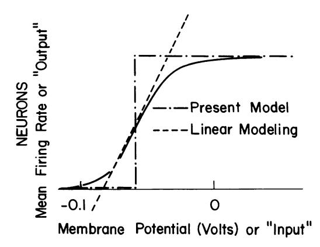
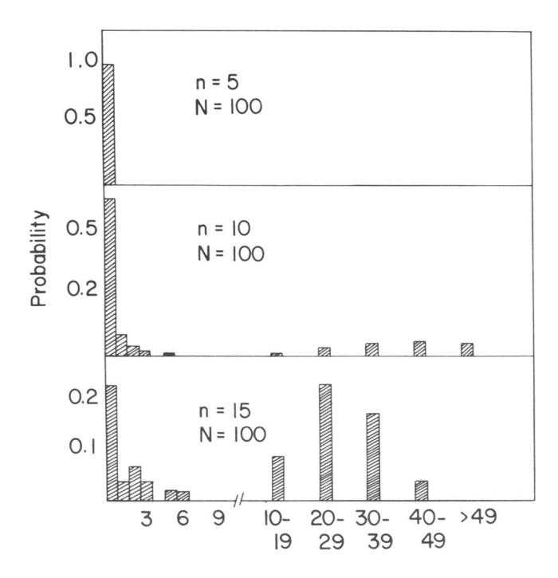

# Neural networks and physical systems with emergent collective computational abilities

(associative memory/parallel processing/categorization/content-addressable memory/fail-soft devices)

# J. J. HOPFIELD

Division of Chemistry and Biology, California Institute of Technology, Pasadena, California 91125; and Bell Laboratories, Murray Hill; New Jersey 07974 Contributed by John J. Hopfield, January 15, 1982

Computational properties of use to biological or-ABSTRACT ganisms or to the construction of computers can emerge as collective properties of systems having a large number of simple equivalent components (or neurons). The physical meaning of content-addressable memory is described by an appropriate phase space flow of the state of a system. A model of such a system is given, based on aspects of neurobiology but readily adapted to integrated circuits. The collective properties of this model produce a content-addressable memory which correctly yields an entire memory from any subpart of sufficient size. The algorithm for the time evolution of the state of the system is based on asynchronous parallel processing. Additional emergent collective properties include some capacity for generalization, familiarity recognition, categorization, error correction, and time sequence retention. The collective properties are only weakly sensitive to details of the modeling or the failure of individual devices.

Given the dynamical electrochemical properties of neurons and their interconnections (synapses), we readily understand schemes that use a few neurons to obtain elementary useful biological behavior (1–3). Our understanding of such simple circuits in electronics allows us to plan larger and more complex circuits which are essential to large computers. Because evolution has no such plan, it becomes relevant to ask whether the ability of large collections of neurons to perform "computational" tasks may in part be a spontaneous collective consequence of having a large number of interacting simple neurons.

In physical systems made from a large number of simple elements, interactions among large numbers of elementary components yield collective phenomena such as the stable magnetic orientations and domains in a magnetic system or the vortex patterns in fluid flow. Do analogous collective phenomena in a system of simple interacting neurons have useful "computational" correlates? For example, are the stability of memories, the construction of categories of generalization, or time-sequential memory also emergent properties and collective in origin? This paper examines a new modeling of this old and fundamental question (4–8) and shows that important computational properties spontaneously arise.

All modeling is based on details, and the details of neuroanatomy and neural function are both myriad and incompletely known (9). In many physical systems, the nature of the emergent collective properties is insensitive to the details inserted in the model (e.g., collisions are essential to generate sound waves, but any reasonable interatomic force law will yield appropriate collisions). In the same spirit, I will seek collective properties that are robust against change in the model details.

The model could be readily implemented by integrated circuit hardware. The conclusions suggest the design of a delo-

calized content-addressable memory or categorizer using extensive asynchronous parallel processing.

# The general content-addressable memory of a physical system

Suppose that an item stored in memory is "H. A. Kramers & G. H. Wannier *Phys. Rev.* 60, 252 (1941)." A general content-addressable memory would be capable of retrieving this entire memory item on the basis of sufficient partial information. The input "& Wannier, (1941)" might suffice. An ideal memory could deal with errors and retrieve this reference even from the input "Vannier, (1941)". In computers, only relatively simple forms of content-addressable memory have been made in hardware (10, 11). Sophisticated ideas like error correction in accessing information are usually introduced as software (10).

There are classes of physical systems whose spontaneous behavior can be used as a form of general (and error-correcting) content-addressable memory. Consider the time evolution of a physical system that can be described by a set of general coordinates. A point in state space then represents the instantaneous condition of the system. This state space may be either continuous or discrete (as in the case of N Ising spins).

The equations of motion of the system describe a flow in state space. Various classes of flow patterns are possible, but the systems of use for memory particularly include those that flow toward locally stable points from anywhere within regions around those points. A particle with frictional damping moving in a potential well with two minima exemplifies such a dynamics.

If the flow is not completely deterministic, the description is more complicated. In the two-well problems above, if the frictional force is characterized by a temperature, it must also produce a random driving force. The limit points become small limiting regions, and the stability becomes not absolute. But as long as the stochastic effects are small, the essence of local stable points remains.

Consider a physical system described by many coordinates  $X_1 \cdots X_N$ , the components of a state vector X. Let the system have locally stable limit points  $X_a, X_b, \cdots$ . Then, if the system is started sufficiently near any  $X_a$ , as at  $X = X_a + \Delta$ , it will proceed in time until  $X \approx X_a$ . We can regard the information stored in the system as the vectors  $X_a, X_b, \cdots$ . The starting point  $X = X_a + \Delta$  represents a partial knowledge of the item  $X_a$ , and the system then generates the total information  $X_a$ .

Any physical system whose dynamics in phase space is dominated by a substantial number of locally stable states to which it is attracted can therefore be regarded as a general content-addressable memory. The physical system will be a potentially useful memory if, in addition, any prescribed set of states can readily be made the stable states of the system.

# The model system

The processing devices will be called neurons. Each neuron i has two states like those of McCullough and Pitts (12):  $V_i = 0$ 

The publication costs of this article were defrayed in part by page charge payment. This article must therefore be hereby marked "advertisement" in accordance with 18 U. S. C. §1734 solely to indicate this fact.

("not firing") and  $V_i = 1$  ("firing at maximum rate"). When neuron i has a connection made to it from neuron j, the strength of connection is defined as  $T_{ij}$ . (Nonconnected neurons have  $T_{ij} \equiv 0$ .) The instantaneous state of the system is specified by listing the N values of  $V_i$ , so it is represented by a binary word of N bits.

Biophysics: Hopfield

The state changes in time according to the following algorithm. For each neuron i there is a fixed threshold  $U_i$ . Each neuron i readjusts its state randomly in time but with a mean attempt rate W, setting

$$\begin{array}{cccc} V_i \rightarrow 1 & \text{if} & \sum_{j \neq i} T_{ij} V_j & > U_i \\ V_i \rightarrow 0 & \text{if} & \sum_{j \neq i} T_{ij} V_j & < U_i \end{array} . \tag{1}$$

Thus, each neuron randomly and asynchronously evaluates whether it is above or below threshold and readjusts accordingly. (Unless otherwise stated, we choose  $U_i = 0$ .)

Although this model has superficial similarities to the Perceptron (13, 14) the essential differences are responsible for the new results. First, Perceptrons were modeled chiefly with neural connections in a "forward" direction  $A \to B \to C \to D$ . The analysis of networks with strong backward coupling  $A \rightleftharpoons B \rightleftarrows \bar{C}$  proved intractable. All our interesting results arise as consequences of the strong back-coupling. Second, Perceptron studies usually made a random net of neurons deal directly with a real physical world and did not ask the questions essential to finding the more abstract emergent computational properties. Finally, Perceptron modeling required synchronous neurons like a conventional digital computer. There is no evidence for such global synchrony and, given the delays of nerve signal propagation, there would be no way to use global synchrony effectively. Chiefly computational properties which can exist in spite of asynchrony have interesting implications in biology.

#### The information storage algorithm

Suppose we wish to store the set of states  $V^s$ ,  $s = 1 \cdots n$ . We use the storage prescription (15, 16)

$$T_{ij} = \sum_{s} (2V_i^s - 1)(2V_j^s - 1)$$
 [2]

but with  $T_{ii} = 0$ . From this definition

$$\sum_{j} T_{ij} V_{j}^{s'} = \sum_{s} (2V_{i}^{s} - 1) \left[ \sum_{j} V_{j}^{s'} (2V_{j}^{s} - 1) \right] = H_{j}^{s'} . \quad [3]$$

The mean value of the bracketed term in Eq. 3 is 0 unless s = s', for which the mean is N/2. This pseudoorthogonality yields

$$\sum_{j} T_{ij} V_{j}^{s'} \equiv \langle H_{i}^{s'} \rangle \approx (2V_{i}^{s'} - 1) N/2$$
 [4]

and is positive if  $V_i^{s'} = 1$  and negative if  $V_i^{s'} = 0$ . Except for the noise coming from the  $s \neq s'$  terms, the stored state would always be stable under our processing algorithm.

Such matrices  $T_{ij}$  have been used in theories of linear associative nets (15–19) to produce an output pattern from a paired input stimulus,  $S_1 \rightarrow O_1$ . A second association  $S_2 \rightarrow O_2$  can be simultaneously stored in the same network. But the confusing simulus 0.6  $S_1 + 0.4 S_2$  will produce a generally meaningless mixed output 0.6  $O_1 + 0.4 O_2$ . Our model, in contrast, will use its strong nonlinearity to make choices, produce categories, and regenerate information and, with high probability, will generate the output  $O_1$  from such a confusing mixed stimulus.

A linear associative net must be connected in a complex way with an external nonlinear logic processor in order to yield true

computation (20, 21). Complex circuitry is easy to plan but more difficult to discuss in evolutionary terms. In contrast, our model obtains its emergent computational properties from simple properties of many cells rather than circuitry.

## The biological interpretation of the model

Most neurons are capable of generating a train of action potentials—propagating pulses of electrochemical activity—when the average potential across their membrane is held well above its normal resting value. The mean rate at which action potentials are generated is a smooth function of the mean membrane potential, having the general form shown in Fig. 1.

The biological information sent to other neurons often lies in a short-time average of the firing rate (22). When this is so, one can neglect the details of individual action potentials and regard Fig. 1 as a smooth input—output relationship. [Parallel pathways carrying the same information would enhance the ability of the system to extract a short-term average firing rate (23, 24).]

A study of emergent collective effects and spontaneous computation must necessarily focus on the nonlinearity of the input-output relationship. The essence of computation is nonlinear logical operations. The particle interactions that produce true collective effects in particle dynamics come from a nonlinear dependence of forces on positions of the particles. Whereas linear associative networks have emphasized the linear central region (14–19) of Fig. 1, we will replace the input-output relationship by the dot-dash step. Those neurons whose operation is dominantly linear merely provide a pathway of communication between nonlinear neurons. Thus, we consider a network of "on or off" neurons, granting that some of the interconnections may be by way of neurons operating in the linear regime.

Delays in synaptic transmission (of partially stochastic character) and in the transmission of impulses along axons and dendrites produce a delay between the input of a neuron and the generation of an effective output. All such delays have been modeled by a single parameter, the stochastic mean processing time 1/W.

The input to a particular neuron arises from the current leaks of the synapses to that neuron, which influence the cell mean potential. The synapses are activated by arriving action potentials. The input signal to a cell i can be taken to be

$$\sum_{j} T_{ij} V_{j}$$
 [5]

where  $T_{ij}$  represents the effectiveness of a synapse. Fig. 1 thus

FIG. 1. Firing rate versus membrane voltage for a typical neuron (solid line), dropping to 0 for large negative potentials and saturating for positive potentials. The broken lines show approximations used in modeling.

becomes an input-output relationship for a neuron.

Biophysics: Hopfield

Little, Shaw, and Roney (8, 25, 26) have developed ideas on the collective functioning of neural nets based on "on/off" neurons and synchronous processing. However, in their model the relative timing of action potential spikes was central and resulted in reverberating action potential trains. Our model and theirs have limited formal similarity, although there may be connections at a deeper level.

Most modeling of neural learning networks has been based on synapses of a general type described by Hebb (27) and Eccles (28). The essential ingredient is the modification of  $T_{ij}$  by correlations like

$$\Delta T_{ij} = [V_i(t)V_j(t)]_{\text{average}}$$
 [6]

where the average is some appropriate calculation over past history. Decay in time and effects of  $[V_i(t)]_{avg}$  or  $[V_j(t)]_{avg}$  are also allowed. Model networks with such synapses (16, 20, 21) can construct the associative  $T_{ij}$  of Eq. 2. We will therefore initially assume that such a  $T_{ij}$  has been produced by previous experience (or inheritance). The Hebbian property need not reside in single synapses; small groups of cells which produce such a net effect would suffice.

The network of cells we describe performs an abstract calculation and, for applications, the inputs should be appropriately coded. In visual processing, for example, feature extraction should previously have been done. The present modeling might then be related to how an entity or Gestalt is remembered or categorized on the basis of inputs representing a collection of its features.

## Studies of the collective behaviors of the model

The model has stable limit points. Consider the special case  $T_{ii}$  $= T_{ji}$ , and define

$$E = -\frac{1}{2} \sum_{i \neq j} T_{ij} V_i V_j . \qquad [7]$$

 $\Delta E$  due to  $\Delta V_i$  is given by

$$\Delta E = -\Delta V_i \sum_{j \neq i'} T_{ij} V_j . \qquad [8]$$

Thus, the algorithm for altering  $V_i$  causes E to be a monotonically decreasing function. State changes will continue until a least (local) E is reached. This case is isomorphic with an Ising model.  $T_{ij}$  provides the role of the exchange coupling, and there is also an external local field at each site. When  $T_{ij}$  is symmetric but has a random character (the spin glass) there are known to be many (locally) stable states (29).

Monte Carlo calculations were made on systems of N = 30and N = 100, to examine the effect of removing the  $T_{ii} = T_{ji}$ restriction. Each element of  $T_{ij}$  was chosen as a random number between -1 and 1. The neural architecture of typical cortical regions (30, 31) and also of simple ganglia of invertebrates (32) suggests the importance of 100-10,000 cells with intense mutual interconnections in elementary processing, so our scale of N is slightly small.

The dynamics algorithm was initiated from randomly chosen initial starting configurations. For N = 30 the system never displayed an ergodic wandering through state space. Within a time of about 4/W it settled into limiting behaviors, the commonest being a stable state. When 50 trials were examined for a particular such random matrix, all would result in one of two or three end states. A few stable states thus collect the flow from most of the initial state space. A simple cycle also occurred occasionally—for example,  $\cdots A \rightarrow B \rightarrow A \rightarrow B \cdots$ 

The third behavior seen was chaotic wandering in a small region of state space. The Hamming distance between two binary states A and B is defined as the number of places in which the digits are different. The chaotic wandering occurred within a short Hamming distance of one particular state. Statistics were done on the probability  $p_i$  of the occurrence of a state in a time of wandering around this minimum, and an entropic measure of the available states M was taken

$$\ln M = -\sum p_i \ln p_i . ag{9}$$

A value of M = 25 was found for N = 30. The flow in phase space produced by this model algorithm has the properties necessary for a physical content-addressable memory whether or not Ti is symmetric.

Simulations with N = 100 were much slower and not quantitatively pursued. They showed qualitative similarity to N =

Why should stable limit points or regions persist when  $T_{ii}$  $\neq T_{ii}$ ? If the algorithm at some time changes  $V_i$  from 0 to 1 or vice versa, the change of the energy defined in Eq. 7 can be split into two terms, one of which is always negative. The second is identical if  $T_{ii}$  is symmetric and is "stochastic" with mean 0 if  $T_{ij}$  and  $T_{ji}$  are randomly chosen. The algorithm for  $T_{ij} \neq T_{ji}$ therefore changes E in a fashion similar to the way E would change in time for a symmetric  $T_{ij}$  but with an algorithm corresponding to a finite temperature.

About 0.15 N states can be simultaneously remembered before error in recall is severe. Computer modeling of memory storage according to Eq. 2 was carried out for N = 30 and N= 100. n random memory states were chosen and the corresponding  $T_{ii}$  was generated. If a nervous system preprocessed signals for efficient storage, the preprocessed information would appear random (e.g., the coding sequences of DNA have a random character). The random memory vectors thus simulate efficiently encoded real information, as well as representing our ignorance. The system was started at each assigned nominal memory state, and the state was allowed to evolve until stationary.

Typical results are shown in Fig. 2. The statistics are averages over both the states in a given matrix and different matrices. With n = 5, the assigned memory states are almost always stable (and exactly recallable). For n = 15, about half of the nominally remembered states evolved to stable states with less than 5 errors, but the rest evolved to states quite different from the starting points.

These results can be understood from an analysis of the effect of the noise terms. In Eq. 3,  $H_i^{s'}$  is the "effective field" on neuron i when the state of the system is s', one of the nominal memory states. The expectation value of this sum, Eq. 4, is  $\pm N/2$  as appropriate. The  $s \neq s'$  summation in Eq. 2 contributes no mean, but has a rms noise of  $[(n-1)N/2]^{1/2} \equiv \sigma$ . For nN large, this noise is approximately Gaussian and the probability of an error in a single particular bit of a particular memory will be

$$P = \frac{1}{\sqrt{2\pi\sigma^2}} \int_{N/2}^{\infty} e^{-x^2/2\sigma^2} dx .$$
 [10]

For the case n = 10, N = 100, P = 0.0091, the probability that a state had no errors in its 100 bits should be about  $e^{-0.91} \approx 0.40$ . In the simulation of Fig. 2, the experimental number was 0.6.

The theoretical scaling of n with N at fixed P was demonstrated in the simulations going between N = 30 and N = 100. The experimental results of half the memories being well retained at n = 0.15 N and the rest badly retained is expected to

Biophysics: Hopfield

Nerr = Number of Errors in State

FIG. 2. The probability distribution of the occurrence of errors in the location of the stable states obtained from nominally assigned memories.

be true for all large N. The information storage at a given level of accuracy can be increased by a factor of 2 by a judicious choice of individual neuron thresholds. This choice is equivalent to using variables  $\mu_i = \pm 1$ ,  $T_{ij} = \sum_s \mu_i^s \mu_j^s$ , and a threshold level of 0.

Given some arbitrary starting state, what is the resulting final state (or statistically, states)? To study this, evolutions from randomly chosen initial states were tabulated for N=30 and n=5. From the (inessential) symmetry of the algorithm, if  $(101110\cdots)$  is an assigned stable state,  $(010001\cdots)$  is also stable. Therefore, the matrices had 10 nominal stable states. Approximately 85% of the trials ended in assigned memories, and 10% ended in stable states of no obvious meaning. An ambiguous 5% landed in stable states very near assigned memories. There was a range of a factor of 20 of the likelihood of finding these 10 states.

The algorithm leads to memories near the starting state. For N=30, n=5, partially random starting states were generated by random modification of known memories. The probability that the final state was that closest to the initial state was studied as a function of the distance between the initial state and the nearest memory state. For distance  $\leq 5$ , the nearest state was reached more than 90% of the time. Beyond that distance, the probability fell off smoothly, dropping to a level of 0.2 (2 times random chance) for a distance of 12.

The phase space flow is apparently dominated by attractors which are the nominally assigned memories, each of which dominates a substantial region around it. The flow is not entirely deterministic, and the system responds to an ambiguous starting state by a statistical choice between the memory states it most resembles.

Were it desired to use such a system in an Si-based contentaddressable memory, the algorithm should be used and modified to hold the known bits of information while letting the others adjust. The model was studied by using a "clipped"  $T_{ij}$ , replacing  $T_{ij}$  in Eq. 3 by  $\pm 1$ , the algebraic sign of  $T_{ij}$ . The purposes were to examine the necessity of a linear synapse supposition (by making a highly nonlinear one) and to examine the efficiency of storage. Only N(N/2) bits of information can possibly be stored in this symmetric matrix. Experimentally, for N=100, n=9, the level of errors was similar to that for the ordinary algorithm at n=12. The signal-to-noise ratio can be evaluated analytically for this clipped algorithm and is reduced by a factor of  $(2/\pi)^{1/2}$  compared with the unclipped case. For a fixed error probability, the number of memories must be reduced by  $2/\pi$ .

With the  $\mu$  algorithm and the clipped  $T_{ij}$ , both analysis and modeling showed that the maximal information stored for N=100 occurred at about n=13. Some errors were present, and the Shannon information stored corresponded to about N(N/8) bits.

New memories can be continually added to  $T_{ij}$ . The addition of new memories beyond the capacity overloads the system and makes all memory states irretrievable unless there is a provision for forgetting old memories (16, 27, 28).

The saturation of the possible size of  $T_{ij}$  will itself cause forgetting. Let the possible values of  $T_{ij}$  be  $0, \pm 1, \pm 2, \pm 3$ , and  $T_{ij}$  be freely incremented within this range. If  $T_{ij} = 3$ , a next increment of +1 would be ignored and a next increment of -1 would reduce  $T_{ij}$  to 2. When  $T_{ij}$  is so constructed, only the recent memory states are retained, with a slightly increased noise level. Memories from the distant past are no longer stable. How far into the past are states remembered depends on the digitizing depth of  $T_{ij}$ , and  $0, \cdots, \pm 3$  is an appropriate level for N = 100. Other schemes can be used to keep too many memories from being simultaneously written, but this particular one is attractive because it requires no delicate balances and is a consequence of natural hardware.

Real neurons need not make synapses both of  $i \rightarrow j$  and  $j \rightarrow i$ . Particular synapses are restricted to one sign of output. We therefore asked whether  $T_{ij} = T_{ji}$  is important. Simulations were carried out with only one ij connection: if  $T_{ij} \neq 0$ ,  $T_{ji} = 0$ . The probability of making errors increased, but the algorithm continued to generate stable minima. A Gaussian noise description of the error rate shows that the signal-to-noise ratio for given n and N should be decreased by the factor  $1/\sqrt{2}$ , and the simulations were consistent with such a factor. This same analysis shows that the system generally fails in a "soft" fashion, with signal-to-noise ratio and error rate increasing slowly as more synapses fail.

Memories too close to each other are confused and tend to merge. For N=100, a pair of random memories should be separated by  $50\pm 5$  Hamming units. The case N=100, n=8, was studied with seven random memories and the eighth made up a Hamming distance of only 30, 20, or 10 from one of the other seven memories. At a distance of 30, both similar memories were usually stable. At a distance of 20, the minima were usually distinct but displaced. At a distance of 10, the minima were often fused.

The algorithm categorizes initial states according to the similarity to memory states. With a threshold of 0, the system behaves as a forced categorizer.

The state 00000 ··· is always stable. For a threshold of 0, this stable state is much higher in energy than the stored memory states and very seldom occurs. Adding a uniform threshold in the algorithm is equivalent to raising the effective energy of the stored memories compared to the 0000 state, and 0000 also becomes a likely stable state. The 0000 state is then generated by any initial state that does not resemble adequately closely one of the assigned memories and represents positive recognition that the starting state is not familiar.

Familiarity can be recognized by other means when the memory is drastically overloaded. We examined the case N = 100, n = 500, in which there is a memory overload of a factor of 25. None of the memory states assigned were stable. The initial rate of processing of a starting state is defined as the number of neuron state readjustments that occur in a time 1/2W. Familiar and unfamiliar states were distinguishable most of the time at this level of overload on the basis of the initial processing rate, which was faster for unfamiliar states. This kind of familiarity can only be read out of the system by a class of neurons or devices abstracting average properties of the processing

For the cases so far considered, the expectation value of  $T_{ii}$ was 0 for  $i \neq j$ . A set of memories can be stored with average correlations, and  $\overline{T}_{ij} = C_{ij} \neq 0$  because there is a consistent internal correlation in the memories. If now a partial new state X is stored

$$\Delta T_{ij} = (2X_i - 1)(2X_j - 1) \quad i, j \le k < N$$
 [11]

using only k of the neurons rather than N, an attempt to reconstruct it will generate a stable point for all N neurons. The values of  $X_{k+1} \cdots X_N$  that result will be determined primarily from the sign of

$$\sum_{j=1}^k c_{ij} x_j$$
 [12]

and X is completed according to the mean correlations of the other memories. The most effective implementation of this capacity stores a large number of correlated matrices weakly followed by a normal storage of X.

A nonsymmetric  $T_{ij}$  can lead to the possibility that a minimum will be only metastable and will be replaced in time by another minimum. Additional nonsymmetric terms which could be easily generated by a minor modification of Hebb synapses

$$\Delta T_{ij} = A \sum_{s} (2V_i^{s+1} - 1)(2V_j^s - 1)$$
 [13]

were added to  $T_{ij}$ . When A was judiciously adjusted, the system would spend a while near V, and then leave and go to a point near  $V_{s+1}$ . But sequences longer than four states proved impossible to generate, and even these were not faithfully followed.

#### Discussion

In the model network each "neuron" has elementary properties, and the network has little structure. Nonetheless, collective computational properties spontaneously arose. Memories are retained as stable entities or Gestalts and can be correctly recalled from any reasonably sized subpart. Ambiguities are resolved on a statistical basis. Some capacity for generalization is present, and time ordering of memories can also be encoded. These properties follow from the nature of the flow in phase space produced by the processing algorithm, which does not appear to be strongly dependent on precise details of the modeling. This robustness suggests that similar effects will obtain even when more neurobiological details are added.

Much of the architecture of regions of the brains of higher animals must be made from a proliferation of simple local circuits with well-defined functions. The bridge between simple circuits and the complex computational properties of higher nervous systems may be the spontaneous emergence of new computational capabilities from the collective behavior of large numbers of simple processing elements.

Implementation of a similar model by using integrated circuits would lead to chips which are much less sensitive to element failure and soft-failure than are normal circuits. Such chips would be wasteful of gates but could be made many times larger than standard designs at a given yield. Their asynchronous parallel processing capability would provide rapid solutions to some special classes of computational problems.

The work at California Institute of Technology was supported in part by National Science Foundation Grant DMR-8107494. This is contribution no. 6580 from the Division of Chemistry and Chemical Engineering.

- Willows, A. O. D., Dorsett, D. A. & Hoyle, G. (1973) J. Neurobiol. 4, 207-237, 255-285.
- Kristan, W. B. (1980) in Information Processing in the Nervous System, eds. Pinsker, H. M. & Willis, W. D. (Raven, New York),
- Knight, B. W. (1975) Lect. Math. Life Sci. 5, 111-144.
- Smith, D. R. & Davidson, C. H. (1962) J. Assoc. Comput. Mach. 9, 268-279.
- Harmon, L. D. (1964) in Neural Theory and Modeling, ed. Reiss, R. F. (Stanford Univ. Press, Stanford, CA), pp. 23-24.
- Amari, S.-I. (1977) Biol. Cybern. 26, 175-185.
- Amari, S.-I. & Akikazu, T. (1978) Biol. Cybern. 29, 127-136.
- Little, W. A. (1974) Math. Biosci. 19, 101-120.
- Marr, J. (1969) J. Physiol. 202, 437-470.
- Kohonen, T. (1980) Content Addressable Memories (Springer, 10. New York)
- Palm, G. (1980) Biol. Cybern. 36, 19-31.
- McCulloch, W. S. & Pitts, W. (1943) Bull. Math Biophys. 5,
- Minsky, M. & Papert, S. (1969) Perceptrons: An Introduction to Computational Geometry (MIT Press, Cambridge, MA).
- Rosenblatt, F. (1962) Principles of Perceptrons (Spartan, Washington, DC)
- Cooper, L. N. (1973) in Proceedings of the Nobel Symposium on Collective Properties of Physical Systems, eds. Lundqvist, B. & Lundqvist, S. (Academic, New York), 252-264.
- Cooper, L. N., Liberman, F. & Oja, E. (1979) Biol. Cybern. 33, 9-28.
- Longuet-Higgins, J. C. (1968) Proc. Roy. Soc. London Ser. B 171, 17.
- Longuet-Higgins, J. C. (1968) Nature (London) 217, 104-105. 18.
- Kohonen, T. (1977) Associative Memory-A System-Theoretic Approach (Springer, New York).
- Willwacher, G. (1976) Biol. Cybern. 24, 181-198.
- Anderson, J. A. (1977) Psych. Rev. 84, 413-451. 21.
- Perkel, D. H. & Bullock, T. H. (1969) Neurosci. Res. Symp. Summ. 3, 405-527.
- John, E. R. (1972) Science 177, 850-864. Roney, K. J., Scheibel, A. B. & Shaw, G. L. (1979) Brain Res. Rev. 1, 225-271.
- Little, W. A. & Shaw, G. L. (1978) Math. Biosci. 39, 281-289.
- Shaw, G. L. & Roney, K. J. (1979) Phys. Rev. Lett. 74, 146-150.
- Hebb, D. O. (1949) The Organization of Behavior (Wiley, New York).
- Eccles, J. G. (1953) The Neurophysiological Basis of Mind (Clarendon, Oxford).
- Kirkpatrick, S. & Sherrington, D. (1978) Phys. Rev. 17, 4384-4403.
- Mountcastle, V. B. (1978) in The Mindful Brain, eds. Edelman, G. M. & Mountcastle, V. B. (MIT Press, Cambridge, MA), pp. 36 - 41.
- Goldman, P. S. & Nauta, W. J. H. (1977) Brain Res. 122, 31.
- Kandel, E. R. (1979) Sci. Am. 241, 61-70.