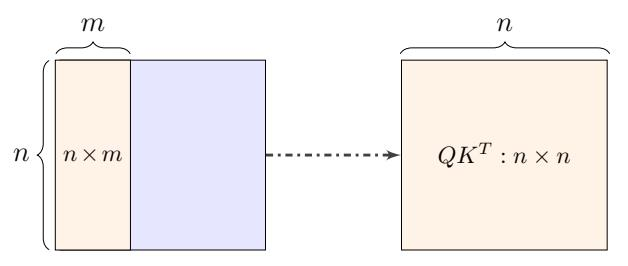
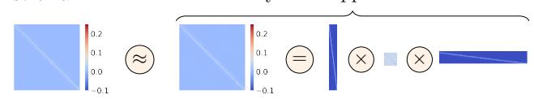
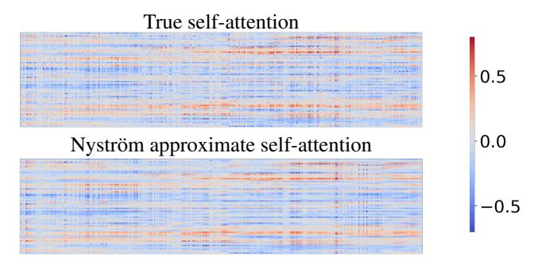
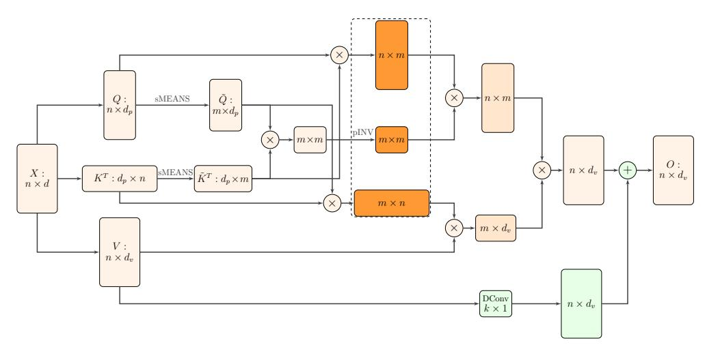
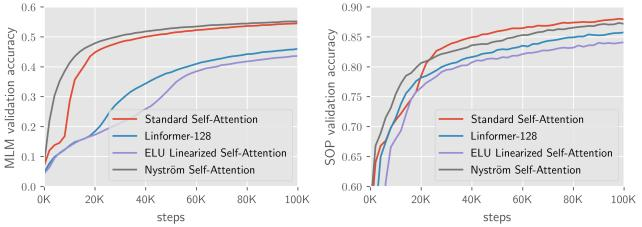
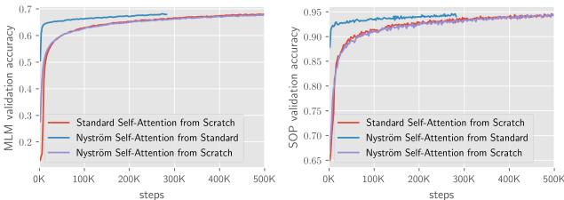

# Nyströmformer: A Nyström-based Algorithm for Approximating Self-Attention

Yunyang Xiong 1 Zhanpeng Zeng 1 Rudrasis Chakraborty 2 Mingxing Tan 3 Glenn Fung 4 Yin Li 1 Vikas Singh 1

1 University of Wisconsin-Madison 2 UC Berkeley 3 Google Brain 4 American Family Insurance yxiong43@wisc.edu, zzeng38@wisc.edu, rudra@berkeley.edu, tanmingxing@google.com, gfung@amfam.com, yin.li@wisc.edu, vsingh@biostat.wisc.edu

#### **Abstract**

Transformers have emerged as a powerful tool for a broad range of natural language processing tasks. A key component that drives the impressive performance of Transformers is the self-attention mechanism that encodes the influence or dependence of other tokens on each specific token. While beneficial, the quadratic complexity of self-attention on the input sequence length has limited its application to longer sequences – a topic being actively studied in the community. To address this limitation, we propose Nyströmformer – a model that exhibits favorable scalability as a function of sequence length. Our idea is based on adapting the Nyström method to approximate standard self-attention with O(n) complexity. The scalability of Nyströmformer enables application to longer sequences with thousands of tokens. We perform evaluations on multiple downstream tasks on the GLUE benchmark and IMDB reviews with standard sequence length, and find that our Nyströmformer performs comparably, or in a few cases, even slightly better, than standard self-attention. On longer sequence tasks in the Long Range Arena (LRA) benchmark, Nyströmformer performs favorably relative to other efficient self-attention methods. Our code is available at https://github.com/mlpen/Nystromformer.

## Introduction

Transformer-based models, such as BERT (Devlin et al. 2019) and GPT-3 (Brown et al. 2020), have been very successful in natural language processing (NLP), achieving state-of-the-art performance in machine translation (Vaswani et al. 2017), natural language inference (Williams, Nangia, and Bowman 2018), paraphrasing (Dolan and Brockett 2005), text classification (Howard and Ruder 2018), question answering (Rajpurkar et al. 2016) and many other NLP tasks (Peters et al. 2018; Radford et al. 2018). A key feature of transformers is what is known as the self-attention mechanism (Vaswani et al. 2017), where each token's representation is computed from *all other* tokens. Self-attention enables interactions of token pairs across the full sequence and has been shown quite effective.

Despite the foregoing advantages, self-attention also turns out to be a major efficiency bottleneck since it has a memory and time complexity of  $O(n^2)$  where n is the length of an input sequence. This leads to high memory and computational

Copyright © 2021, Association for the Advancement of Artificial Intelligence (www.aaai.org). All rights reserved.

requirements for training large Transformer-based models. For example, training a BERT-large model (Devlin et al. 2019) will need 4 months using a single Tesla V100 GPU (equivalent to 4 days using a 4x4 TPU pod). Further, the  $O(n^2)$  complexity makes it prohibitively expensive to train large Transformers with long sequences (e.g., n=2048).

To address this challenge, several recent works have proposed strategies that avoid incurring the quadratic cost when dealing with longer input sequences. For example, (Dai et al. 2019) suggests a trade-off between memory and computational efficiency. The ideas described in (Child et al. 2019; Kitaev, Kaiser, and Levskaya 2019) decrease the self-attention complexity to  $O(n\sqrt{n})$  and  $O(n\log n)$  respectively. In (Shen et al. 2018b; Katharopoulos et al. 2020; Wang et al. 2020), self-attention complexity can be reduced to O(n) with various approximation ideas, each with its own strengths and limitations.

In this paper, we propose a O(n) approximation, both in the sense of memory and time, for self-attention. Our model,  $Nystr\"{o}mformer$ , scales linearly with the input sequence length n. This is achieved by leveraging the celebrated Nystr\"{o}m method, repurposed for approximating self-attention. Specifically, our  $Nystr\"{o}mFormer$  algorithm makes use of landmark (or Nystr\"{o}m) points to reconstruct the softmax matrix in self-attention, thereby avoiding computing the  $n \times n$  softmax matrix. We show that this yields a good approximation of the true self-attention.

To evaluate our method, we consider a transfer learning setting using Transformers, where models are first pretrained with a language modeling objective on a large corpus, and then finetuned on target tasks using supervised data (Devlin et al. 2019; Liu et al. 2019; Lewis et al. 2020; Wang et al. 2020). Following BERT (Devlin et al. 2019; Liu et al. 2019), we pretrain our proposed model on English Wikipedia and BookCorpus (Zhu et al. 2015) using a masked-languagemodeling objective. We observe a similar performance to the baseline BERT model on English Wikipedia and Book-Corpus. We then finetune our pretrained models on multiple downstream tasks in the GLUE benchmark (Wang et al. 2018) and IMDB reviews (Maas et al. 2011), and compare our results to BERT in both accuracy and efficiency. Across all tasks, our model compares favorably to the vanilla pretrained BERT with significant speedups.

Finally, we evaluate our model on tasks with longer se-

quence lengths from the Long Range Arena (LRA) benchmark (Tay et al. 2020). *NyströmFormer* performs well compared to several recent efficient self-attention methods, including Reformer (Kitaev, Kaiser, and Levskaya 2019), Linformer (Wang et al. 2020), and Performer (Choromanski et al. 2020), by margin of  $\sim$ 3.4% in average accuracy. We believe that the idea is a step towards resource efficient Transformers.

## **Related Work**

We briefly review relevant works on efficient Transformers, linearized Softmax kernels and Nyström-like methods.

Efficient Transformers. Weight pruning (Michel, Levy, and Neubig 2019), weight factorization (Lan et al. 2020), weight quantization (Zafrir et al. 2019) or knowledge distillation (Sanh et al. 2019) are several strategies that have been proposed to improve memory efficiency in Transformers. The use of a new pretraining objective in (Clark et al. 2019), product-key attention in (Lample et al. 2019), and the Transformer-XL model in (Dai et al. 2019) have shown how the overall compute requirements can be reduced. In (Child et al. 2019), a sparse factorization of the attention matrix was used for reducing the overall complexity from quadratic to  $O(n\sqrt{n})$  for generative modeling of long sequences. In (Kitaev, Kaiser, and Levskaya 2019), the Reformer model further reduced the complexity to  $O(n \log n)$ via locality-sensitive-hashing (LSH). This relies on performing fewer dot product operations overall by assuming that the keys need to be identical to the queries. Recently, in (Wang et al. 2020), the Linformer model suggested the use of random projections based on the JL lemma to reduce the complexity to O(n) with a linear projection step. The Longformer model in (Beltagy, Peters, and Cohan 2020) achieved a O(n) complexity using a local windowed attention and a task-motivated global attention for longer documents, while BIGBIRD (Zaheer et al. 2020) used a sparse attention mechanism. There are also other existing approaches to improve optimizer efficiency, such as micro-batching (Huang et al. 2019) and gradient checkpointing (Chen et al. 2016). Concurrently with our developments, the Performer model proposed in (Choromanski et al. 2020) made use of positive orthogonal random features to approximate softmax attention kernels with O(n) complexity.

Linearized Softmax. In (Blanc and Rendle 2018), an adaptive sampled softmax with a kernel based sampling was shown to speed up training. It involves sampling only some of the classes at each training step using a linear dot product approximation. In (Rawat et al. 2019), the Random Fourier Softmax (RF-softmax) idea uses random Fourier features to perform efficient sampling from an approximate softmax distribution for normalized embedding. In (Shen et al. 2018b; Katharopoulos et al. 2020), linearizing the softmax attention in transformers was based on heuristically separating keys and queries in a linear dot product approximation. While the idea is interesting, the approximation error to the softmax matrix in self-attention can be large in some cases. The lambda layers in (Bello 2021), can also be thought of as an efficient relative attention mechanism.

**Nyström-like methods**. Nyström-like methods sample columns of the matrix to achieve a close approximation to the original matrix. The Nyström method (Baker 1977) was developed as a way of discretizing an integral equation with a simple quadrature rule and remains a widely used approach for approximating the kernel matrix with a given sampled subset of columns (Williams and Seeger 2001). Many variants such as Nyström with k-means (Zhang, Tsang, and Kwok 2008; Zhang and Kwok 2010), randomized Nyström (Li, Kwok, and Lü 2010), Nyström with spectral shift (Wang et al. 2014), Nyström with pseudo landmarks, prototype method (Wang and Zhang 2013; Wang, Zhang, and Zhang 2016), fast-Nys (Si, Hsieh, and Dhillon 2016), and MEKA (Si, Hsieh, and Dhillon 2017), ensemble Nyström (Kumar, Mohri, and Talwalkar 2009) have been proposed for specific improvements over the basic Nyström approximation. In (Nemtsov, Averbuch, and Schclar 2016), the Nyström method was extended to deal with a general matrix (rather than a symmetric matrix). The authors in (Musco and Musco 2017) introduced the RLS-Nyström method, which proposes a recursive sampling approach to accelerate landmark points sampling. (Fanuel, Schreurs, and Suykens 2019) developed DAS (Deterministic Adaptive Sampling) and RAS (Randomized Adaptive Sampling) algorithms to promote diversity of landmarks selection.

The most related ideas to our development are (Wang and Zhang 2013; Musco and Musco 2017). These approaches are designed for general matrix approximation (which accurately reflects our setup) while only sampling a subset of columns and rows. However, directly applying these methods to approximate a softmax matrix used by self-attention does not directly reduce the computational complexity. This is because that even accessing a subset of columns or rows of a softmax matrix will require the calculation of all elements in the full matrix before the softmax function. And calculating these entries will incur a quadratic cost. Nonetheless, inspired by the key idea of using a subset of columns to reconstruct the full matrix, we propose a Nyström approximation with O(n) complexity tailored for the softmax matrix, for approximating self-attention efficiently.

## **Nyström-Based Linear Transformers**

In this section, we start by briefly reviewing self-attention, then discuss the basic idea of Nyström approximation method for the softmax matrix in self-attention, and finally adapting this idea to achieve our proposed construction.

## **Self-Attention**

What is self-attention? Self-attention calculates a weighted average of feature representations with the weight proportional to a similarity score between pairs of representations. Formally, an input sequence of n tokens of dimensions d,  $X \in \mathbf{R}^{n \times d}$ , is projected using three matrices  $W_Q \in \mathbf{R}^{d \times d_q}$ ,  $W_K \in \mathbf{R}^{d \times d_k}$ , and  $W_V \in \mathbf{R}^{d \times d_v}$  to extract feature representations Q, K, and V, referred to as query, key, and value respectively with  $d_k = d_q$ . The outputs Q, K, V are computed as

$$Q = XW_Q, \quad K = XW_K, \quad V = XW_V. \tag{1}$$

So, self-attention can be written as,

$$D(Q, K, V) = SV = \operatorname{softmax}\left(\frac{QK^T}{\sqrt{d_q}}\right)V, \tag{2}$$

where softmax denotes a row-wise softmax normalization function. Thus, each element in the softmax matrix S depends on all other elements in the same row.

Compute cost of self-attention. The self-attention mechanism requires calculating  $n^2$  similarity scores between each pair of tokens, leading to a complexity of  $O(n^2)$  for both memory and time. Due to this quadratic dependence on the input length, the application of self-attention is limited to short sequences (e.g., n < 1000). This is a *key motivation* for a resource-efficient self-attention module.

# Nyström Method for Matrix Approximation

The starting point of our work is to reduce the computational cost of self-attention in Transformers using the Nyström method, widely adopted for matrix approximation (Williams and Seeger 2001; Drineas and Mahoney 2005; Wang and Zhang 2013). Following (Wang and Zhang 2013), we describe a potential strategy and its challenges for using the Nyström method to approximate the softmax matrix in self-attention by sampling a subset of columns and rows.

Denote the softmax matrix used in self-attention  $S=\operatorname{softmax}\left(\frac{QK^T}{\sqrt{d_q}}\right)\in\mathbf{R}^{n\times n}.$  S can be written as

$$S = \operatorname{softmax} \left( \frac{QK^T}{\sqrt{d_q}} \right) = \begin{bmatrix} A_S & B_S \\ F_S & C_S \end{bmatrix}, \tag{3}$$

where  $A_S \in \mathbf{R}^{m \times m}, B_S \in \mathbf{R}^{m \times (n-m)}, F_S \in \mathbf{R}^{(n-m) \times m}$  and  $C_S \in \mathbf{R}^{(n-m) \times (n-m)}$ .  $A_S$  is designated to be our sample matrix by sampling m columns and rows from S.

Quadrature technique. S can be approximated via the basic quadrature technique of the Nyström method. It begins with the singular value decomposition (SVD) of the sample matrix,  $A_S = U\Lambda V^T$ , where  $U, V \in \mathbf{R}^{m \times m}$  are orthogonal matrices,  $\Lambda \in \mathbf{R}^{m \times m}$  is a diagonal matrix. Based on the outof-sample columns approximation (Wang and Zhang 2013), the explicit Nyström form of S can be reconstructed with m columns and m rows from S,

$$\hat{S} = \begin{bmatrix} A_S & B_S \\ F_S & F_S A_S^+ B_S \end{bmatrix} = \begin{bmatrix} A_S \\ F_S \end{bmatrix} A_S^+ \begin{bmatrix} A_S & B_S \end{bmatrix}, \quad (4)$$

where  $A_S^+$  is the Moore-Penrose inverse of  $A_S$ .  $C_S$  is approximated by  $F_S A_S^+ B_S$ . Here, (4) suggests that the  $n \times n$  matrix S can be reconstructed by sampling m rows  $(A_S, B_S)$  and m columns  $(A_S, F_S)$  from S and finding the Nyström approximation  $\hat{S}$ .

**Nyström approximation for softmax matrix.** We briefly discuss how to construct the out-of-sample approximation for the softmax matrix in self-attention using the standard Nyström method. Given a query  $q_i$  and key  $k_j$ , let

$$\mathcal{K}_K(q_i) = \operatorname{softmax}\left(\frac{q_i K^T}{\sqrt{d_q}}\right); \quad \mathcal{K}_Q(k_j) = \operatorname{softmax}\left(\frac{Q k_j^T}{\sqrt{d_q}}\right)$$

Figure 1: A key challenge of Nyström approximation. The orange block on the left shows a  $n \times m$  sub-matrix of S used by Nyström matrix approximation in (4). Computing the sub-matrix, however, requires all entries in the  $n \times n$  matrix before the softmax function  $(QK^T)$ . Therefore, a direct application of Nyström approximation is problematic.

where  $\mathcal{K}_K(q_i) \in \mathbf{R}^{1 \times n}$  and  $\mathcal{K}_Q(k_j) \in \mathbf{R}^{n \times 1}$ . We can then construct

$$\phi_K(q_i) = \Lambda^{-\frac{1}{2}} V^T [\mathcal{K}_K^T(q_i)]_{m \times 1}$$
$$\phi_Q(k_j) = \Lambda^{-\frac{1}{2}} U^T [\mathcal{K}_Q(k_j)]_{m \times 1}$$

where  $[\cdot]_{m \times 1}$  refers to calculating the full  $n \times 1$  vector and then taking the first  $m \times 1$  entries. With  $\phi_K(q_i)$  and  $\phi_Q(k_j)$  available in hand, the entry of  $\hat{S}$  for standard Nyström approximation is calculated as,

$$\hat{S}_{ij} = \phi_K(q_i)^T \phi_Q(k_j), \forall i = 1, \dots, n, j = 1, \dots, n$$
 (5)

In matrix form,  $\hat{S}$  can be represented as,

$$\hat{S} = \left[ \text{softmax} \left( \frac{QK^T}{\sqrt{d_q}} \right) \right]_{n \times m} A_S^+ \left[ \text{softmax} \left( \frac{QK^T}{\sqrt{d_q}} \right) \right]_{m \times n}$$
 (6)

where  $[\cdot]_{n\times m}$  refers to taking m columns from  $n\times n$  matrix and  $[\cdot]_{m\times n}$  refers to taking m rows from  $n\times n$  matrix. This representation is the application of (4) for softmax matrix approximation in self-attention.  $\begin{bmatrix} A_S \\ F_S \end{bmatrix}$  in (4) corresponds to the first  $n\times m$  matrix in (6) and  $[A_S \quad B_S]$  in (4) corresponds to the last  $n\times m$  matrix in (6). More details of the matrix representation is available in the supplement.

A key challenge of Nyström approximation. Unfortunately, (4) and (6) require calculating all entries in  $QK^T$  due to the softmax function, even though the approximation only needs to access a subset of the columns of S, i.e.,  $\begin{bmatrix} A_S \\ F_S \end{bmatrix}$ . The problem arises due to the denominator within the rowwise softmax function. Specifically, computing an element in S requires a summation of the exponential of all elements in the same row of  $QK^T$ . Thus, calculating  $\begin{bmatrix} A_S \\ F_S \end{bmatrix}$  needs accessing the full  $QK^T$ , shown in Fig. 1, and directly applying Nyström approximation as in (4) is not attractive.

#### Linearized Self-Attention via Nyström Method

We now adapt the Nyström method to approximately calculate the full softmax matrix S. The basic idea is to use landmarks  $\tilde{K}$  and  $\tilde{Q}$  from key K and query Q to derive

Nyström approximation

Figure 2: Illustration of a Nyström approximation of softmax matrix in self-attention. The left image shows the true softmax matrix used in self-attention and the right images show its Nyström approximation. Our approximation is computed via multiplication of three matrices.

an efficient Nyström approximation without accessing the full  $QK^T$ . When the number of landmarks, m, is much smaller than the sequence length n, our Nyström approximation scales linearly w.r.t. input sequence length in the sense of both memory and time.

Following the Nyström method, we also start with the SVD of a smaller matrix,  $A_S$ , and apply the basic quadrature technique. But instead of subsampling the matrix after the softmax operation – as one should do in principle – the main modification is to select landmarks  $\tilde{Q}$  from queries Q and  $\tilde{K}$  from keys K before softmax and then form a  $m \times m$  matrix  $A_S$  by applying the softmax operation on the landmarks. We also form the matrices corresponding to the left and right matrices in (4) using landmarks  $\tilde{Q}$  and  $\tilde{K}$ . This provides a  $n \times m$  matrix and  $m \times n$  matrix respectively. With these three  $n \times m$ ,  $m \times m$ ,  $m \times n$  matrices we constructed, our Nyström approximation of the  $n \times n$  matrix S involves the multiplication of three matrices as in (4).

In the description that follows, we first define the matrix form of landmarks. Then, based on the landmarks matrix, we form the three matrices needed for our approximation.

**Definition 1.** Let us assume that the selected landmarks for inputs  $Q = [q_1; \ldots; q_n]$  and  $K = [k_1; \ldots; k_n]$  are  $\{\tilde{q_j}\}_{j=1}^m$  and  $\{\tilde{k_j}\}_{j=1}^m$  respectively. We denote the matrix form of the corresponding landmarks as

For 
$$\{\tilde{q}_j\}_{j=1}^m$$
,  $\tilde{Q} = [\tilde{q}_1; \dots; \tilde{q}_m] \in \mathbf{R}^{m \times d_q}$   
For  $\{\tilde{k}_j\}_{j=1}^m$ ,  $\tilde{K} = [\tilde{k}_1; \dots; \tilde{k}_m] \in \mathbf{R}^{m \times d_q}$ 

The corresponding  $m \times m$  matrix is generated by

$$A_S = \operatorname{softmax}\left(\frac{\tilde{Q}\tilde{K}^T}{\sqrt{d_q}}\right) \text{ where } A_S = U_{m\times m}\Lambda_{m\times m}V_{m\times m}^T$$

Note that in the SVD decomposition of  $A_S$ ,  $U_{m \times m}$  and  $V_{m \times m}$  are orthogonal matrices.

Similar to the out-of-sample approximation procedure for the standard Nyström scheme described above, given a query  $q_i$  and key  $k_j$ , let

$$\mathcal{K}_{\tilde{K}}(q_i) = \operatorname{softmax}\!\left(\frac{q_i \tilde{K}^T}{\sqrt{d_q}}\right)\!; \ \, \mathcal{K}_{\tilde{Q}}(k_j) = \operatorname{softmax}\!\left(\frac{\tilde{Q}k_j^T}{\sqrt{d_q}}\right)\!,$$

where  $\mathcal{K}_{\tilde{K}}(q_i) \in \mathbf{R}^{1 \times m}$  and  $\mathcal{K}_{\tilde{Q}}(k_j) \in \mathbf{R}^{m \times 1}$ . We can then construct,

$$\phi_{\tilde{K}}(q_i) = \Lambda_{m \times m}^{-\frac{1}{2}} V_{m \times m}^T \mathcal{K}_{\tilde{K}}^T(q_i)$$

$$\phi_{\tilde{Q}}(k_j) = \Lambda_{m \times m}^{-\frac{1}{2}} U_{m \times m}^T \mathcal{K}_{\tilde{Q}}(k_j)$$

So, the entry for  $\hat{S}$  depends on landmark matrices  $\tilde{K}$  and  $\tilde{Q}$  and is calculated as.

$$\hat{S}_{ij} = \phi_{\tilde{K}}(q_i)^T \phi_{\tilde{O}}(k_j), \forall i = 1, \dots, n, j = 1, \dots, n,$$
 (7)

To derive the explicit Nyström form,  $\hat{S}$ , of the softmax matrix with the three  $n \times m$ ,  $m \times m$ ,  $m \times n$  matrices, we assume that  $A_S$  is non-singular first to guarantee that the above expression to define  $\phi_{\tilde{K}}$  and  $\phi_{\tilde{Q}}$  is meaningful. We will shortly relax this assumption to achieve the general form as (4).

When  $A_S$  is non-singular,

$$\hat{S}_{ij} = \phi_{\tilde{K}}(q_i)^T \phi_{\tilde{O}}(k_j) \tag{8}$$

$$= \mathcal{K}_{\tilde{K}}(q_i) V_{m \times m} \Lambda_{m \times m}^{-1} U_{m \times m}^T \mathcal{K}_{\tilde{O}}(k_j). \tag{9}$$

Let  $W_m = V_{m \times m} \Lambda_{m \times m}^{-1} U_{m \times m}^T$ . Recall that a SVD of  $A_S$  is  $U_{m \times m} \Lambda_{m \times m} V_{m \times m}^T$ , and so,  $W_m A_S = I_{m \times m}$ . Therefore,

$$\hat{S}_{ij} = \mathcal{K}_{\tilde{K}}(q_i) A_S^{-1} \mathcal{K}_{\tilde{O}}(k_i) \tag{10}$$

Based on (10), we can rewrite it to have a similar form as (4) (i.e., not requiring that  $A_S$  is non-singular) as

$$\hat{S}_{ij} = \mathcal{K}_{\tilde{K}}(q_i)^T A_S^+ \mathcal{K}_{\tilde{O}}(k_j), \tag{11}$$

where  $A_S^+$  is a Moore-Penrose pseudoinverse of  $A_S$ . So,

$$\hat{S}_{ij} = \operatorname{softmax}\left(\frac{q_i \tilde{K}^T}{\sqrt{d_q}}\right) A_S^+ \operatorname{softmax}\left(\frac{\tilde{Q} k_j^T}{\sqrt{d_q}}\right), \qquad (12)$$

for  $i,j=\{1,\ldots,n\}$ . The Nyström form of the softmax matrix,  $S=\operatorname{softmax}\left(\frac{QK^T}{\sqrt{d_q}}\right)$  is thus approximated as

$$\hat{S} = \operatorname{softmax}\left(\frac{Q\tilde{K}^T}{\sqrt{d_q}}\right) \left(\operatorname{softmax}\left(\frac{\tilde{Q}\tilde{K}^T}{\sqrt{d_q}}\right)\right)^+ \operatorname{softmax}\left(\frac{\tilde{Q}K^T}{\sqrt{d_q}}\right)$$
(13)

Note that we arrive at (13) via an out-of-sample approximation similar to (4). The difference is that in (13), the landmarks are selected before the softmax operation to generate the out-of-sample approximation. This is a compromise but avoids the need to compute the full softmax matrix S for a Nyström approximation. Fig. 2 illustrates the proposed Nyström approximation and Alg. 1 summarizes our method.

We now describe (a) the calculation of the Moore-Penrose inverse and (b) the selection of landmarks.

**Moore-Penrose inverse computation**. Moore-Penrose pseudoinverse can be calculated by using singular value decomposition. However, SVD is not very efficient on GPUs. To accelerate the computation, we use an iterative method from (Razavi et al. 2014) to approximate the Moore-Penrose inverse via efficient matrix-matrix multiplications.

**Lemma 1.** For  $A_S \in \mathbb{R}^{m \times m}$ , the sequence  $\{Z_j\}_{j=0}^{j=\infty}$  generated by (Razavi et al. 2014),

$$Z_{j+1} = \frac{1}{4} Z_j (13I - A_S Z_j (15I - A_S Z_j (7I - A_S Z_j)))$$
 (14)

converges to the Moore-Penrose inverse  $A_S^+$  in the third-order with initial approximation  $Z_0$  satisfying  $||A_SA_S^+ - A_SZ_0|| < 1$ .

**Algorithm 1:** Pipeline for Nyström approximation of softmax matrix in self-attention

**Input:** Query Q and Key K.

**Output:** Nyström approximation of softmax matrix. Compute landmarks from input Q and landmarks from input K,  $\tilde{Q}$  and  $\tilde{K}$  as the matrix form ;

from input 
$$K$$
,  $Q$  and  $K$  as the matrix form;  
Compute  $\tilde{F} = \operatorname{softmax}(\frac{Q\tilde{K}^T}{\sqrt{d_q}})$ ,  $\tilde{B} = \operatorname{softmax}(\frac{\tilde{Q}K^T}{\sqrt{d_q}})$ ;  
Compute  $\tilde{A} = \operatorname{softmax}(\frac{\tilde{Q}\tilde{K}^T}{\sqrt{d_q}})^+$ ;

Compute 
$$\tilde{A} = \operatorname{softmax}(\frac{\tilde{Q}\tilde{K}^T}{\sqrt{d_q}})^+$$

return  $\tilde{F} \times \tilde{A} \times \tilde{B}$  ;

We select  $Z_0$  by  $Z_0 = A_S^T/(||A_S||_1||A_S||_\infty)$  where

$$||A_S||_1 = \max_j \sum_{i=1}^m |(A_S)_{ij}|; \ ||A_S||_\infty = \max_i \sum_{j=1}^n |(A_S)_{ij}|,$$

based on (Pan and Schreiber 1991). This choice ensures that  $||I - A_S Z_0||_2 < 1$ . When  $A_S$  is non-singular,

$$||A_S A_S^+ - A_S Z_0||_2 = ||I - A_S Z_0||_2 < 1.$$

Without the non-singular constraint, the choice of initializing  $Z_0$  provides a good approximation in our experiments. For all our experiments, we need to run about 6 iterations in order to achieve a good approximation of the pseudoinverse.

Let  $A_S^+$  be approximated by  $Z^*$  with (14). Our Nyström approximation of S can be written as

$$\hat{S} = \operatorname{softmax}\left(\frac{Q\tilde{K}^T}{\sqrt{d_q}}\right) Z^* \operatorname{softmax}\left(\frac{\tilde{Q}K^T}{\sqrt{d_q}}\right). \tag{15}$$

Here, (15) only needs matrix-matrix multiplications, thus the gradient computation is straight-forward.

Landmarks selection. Landmark points (inducing points (Lee et al. 2019)) can be selected by using K-means clustering (Zhang, Tsang, and Kwok 2008; Vyas, Katharopoulos, and Fleuret 2020). However, the EM style of updates in Kmeans is less desirable during mini-batch training. We propose to simply use Segment-means similar to the local average pooling previously used in the NLP literature (Shen et al. 2018a). Specifically, for input queries  $Q = [q_1; \ldots; q_n]$ , we separate the n queries into m segments. As we can pad inputs to a length divisible to m, we assume n is divisible by m for simplicity. Let l = n/m, landmark points for Q are calculated as shown in (16). Similarly, for input keys  $K = [k_1; \ldots; k_n]$ , landmarks are computed as shown below in (16).

$$\tilde{q}_j = \sum_{i=(j-1)\times l+1}^{(j-1)\times l+m} \frac{q_i}{m}, \quad \tilde{k}_j = \sum_{i=(j-1)\times l+1}^{(j-1)\times l+m} \frac{k_i}{m}, \quad (16)$$

where  $j = 1, \dots, m$ . Segment-means requires a single scan of the sequence to compute the landmarks leading to a complexity of O(n). We find that using 64 landmarks is often sufficient to ensure a good approximation, although this depends on the application. More details regarding the landmark selection is provided in the supplement.

Figure 3: An example of Nyström approximation vs. ground-truth self-attention. Top: standard self-attention computed by (2). Bottom: self-attention from our proposed Nyström approximation in (17). We see that the attention patterns are quite similar.

Approximate self-attention. With landmark points and pseudoinverse computed, the Nyström approximation of the softmax matrix can be calculated. By plugging in the Nyström approximation, we obtain a linearized version  $\hat{S}V$ , to approximate the true self-attention SV,

$$\hat{S}V = \operatorname{softmax}\left(\frac{Q\tilde{K}^T}{\sqrt{d_q}}\right)Z^*\operatorname{softmax}\left(\frac{\tilde{Q}K^T}{\sqrt{d_q}}\right)V.$$
 (17)

Fig. 3 presents an example of the fidelity between Nyström approximate self-attention versus true self-attention.

Complexity analysis. We now provide a complexity analysis of the Nyström approximation, which needs to account for landmark selection, pseudoinverse calculation, and the matrix multiplications. Landmark selection using Segmentmeans takes O(n). Iterative approximation of the pseudoinverse takes  $O(m^3)$  in the worst case. The matrix multiplication first calculates softmax $(Q\tilde{K}^T/\sqrt{d_q}) \times Z^*$  and  $\operatorname{softmax}(\tilde{Q}K^T/\sqrt{d_q})\times V,$  and then calculates the product  $(\operatorname{softmax}(Q\tilde{K}^T/\sqrt{d_q})\times Z^\star)\times (\operatorname{softmax}(\tilde{Q}K^T/\sqrt{d_q})\times V).$ This costs  $O(nm^2 + mnd_v + m^3 + nmd_v)$ . The overall time complexity is thus  $O(n+m^3+nm^2+mnd_v+m^3+nmd_v)$ . In terms of memory, storing the landmarks matrix Q and Kinvolves a  $O(md_q)$  cost and storing four Nyström approximation matrices has a  $O(nm+m^2+mn+nd_v)$  cost. Thus, the memory footprint is  $O(md_q+nm+m^2+mn+nd_v)$ . When the number of landmarks  $m \ll n$ , the time and memory complexity of our Nyström approximation is O(n), i.e., scales linearly w.r.t. the input sequence length n.

### Analysis of Nyström Approximation

The following simple result analyzes an idealized setting and states that the Galerkin discretization of  $\phi_{\tilde{K}}(q)^T \phi_{\tilde{O}}(k)$  with the same set of landmark points, induces the same Nyström matrix, in particular, the same  $n \times n$  Nyström approximation  $\hat{S}_{ij}$ . This result agrees with the discussion in (Bremer 2012).

**Lemma 2.** Given the input data set  $Q = \{q_i\}_{i=1}^n$  and  $K = \{k_i\}_{i=1}^n$ , and the corresponding landmark point set  $\tilde{Q} = \{\tilde{q_j}\}_{j=1}^m$  and  $\tilde{K_j} = \{\tilde{k}\}_{j=1}^m$ . Using (17), the Nyström approximate self-attention converges to true self-attention if

Figure 4: The proposed architecture of efficient self-attention via Nyström approximation. Each box represents an input, output, or intermediate matrix. The variable name and the size of the matrix are inside box.  $\times$  denotes matrix multiplication, and + denotes matrix addition. The orange colored boxes are those matrices used in the Nyström approximation. The green boxes are the skip connection added in parrallel to the approximation. The dashed bounding box illustrates the three matrices of Nyström approximate softmax matrix in self-attention in Eq. 15. sMEANS is the landmark selection using Segment-means (averaging m segments of input sequence). pINV is the iterative Moore-Penrose pseudoinverse approximation. And DConv denotes depthwise convolution.

there exist landmarks points  $\tilde{q}_p$  and  $\tilde{k}_t$  such that  $\tilde{q}_p = q_i$  and  $\tilde{k}_t = k_j, \forall i = 1, \dots, n, j = 1, \dots, n$ .

Lemma 2 suggests that if the landmark points overlap sufficiently with the original data points, the approximation to self-attention will be good. While the condition here is problem dependent, we note that it is feasible to achieve an accurate approximation without using a large number of landmarks. This is because (Oglic and Gärtner 2017) points out that the error of Nyström approximation depends on the spectrum of the matrix to be approximated and it decreases with the rank of the matrix. When this result is compared with the observation in (Wang et al. 2020) where the authors suggest that self-attention is low-rank, stronger guarantees based on structural properties of the matrix that we wish to approximate are possible.

# Our Model: Nyströmformer

**Architecture**. Our proposed architecture is shown in Fig. 4. Given the input key K and query Q, our model first uses Segment-means to compute landmark points as matrices  $\tilde{K}$  and  $\tilde{Q}$ . With the landmark points, our model then calculates the Nyström approximation using approximate Moore-Penrose pseudoinverse. A skip connection of value V, implemented using a 1D depthwise convolution, is also added to the model to help the training.

### **Experiments**

We now present our experiments and results. Our experiments follow a transfer learning setting that consists of two stages. In the first stage, we train Nyströmformer on a large-scale text corpus, and report the language modeling performance of our model on a hold-out validation set. In the second stage, we fine-tune the pre-trained Nyströmformer across several different NLP tasks in GLUE benchmarks

(Wang et al. 2019) and IMDB reviews (Maas et al. 2011), and report the performance on individual dataset for each task. In both stages, we compare our results to a baseline Transformer model (BERT). In addition to language modeling, we also conduct experiments on long range context tasks in the Long Range Arena (LRA) benchmark.

### (Pre-)training of Language Modeling

Our first experiment evaluates if our model can achieve similar performance with reduced complexity compared to a standard Transformer on language modeling. We introduce the dataset and evaluation protocol, describe implementation details, and finally present the results of our model.

**Dataset and metrics**. We consider BookCorpus plus English Wikipedia as the training corpus, which is further split into training (80%) and validation (20%) sets. Our model is trained using the training set. We report the maskedlanguage-modeling (MLM) and sentence-order-prediction (SOP) accuracy on the validation set, and compare the efficiency (runtime/memory) to a baseline.

**Baselines**. Our baseline is the well-known Transformer based model – BERT (Devlin et al. 2019). Specifically, we consider two variants of BERT:

- **BERT-small** is a light weighted BERT model with 4 layers. We use BERT-small to compare to linear Transformers, including ELU linearized self-attention (Katharopoulos et al. 2020) and Linformer (Wang et al. 2020).
- BERT-base is the base model from (Devlin et al. 2019).
   We use this model as our baseline when fine-tuning on downstream NLP tasks.

Our Nyströmformer replaces the self-attention in BERTsmall and BERT-base using the proposed Nyström approximation. We acknowledge that several very recent articles

|                  | input sequence length n |                  |             |                  |             |            |             |             |             |              |
|------------------|-------------------------|------------------|-------------|------------------|-------------|------------|-------------|-------------|-------------|--------------|
| self-attention   | 512                     |                  | 1024        |                  | 2048        |            | 4096        |             | 8192        |              |
|                  | memory (MB)             | time(ms)         | memory (MB) | time (ms)        | memory (MB) | time (ms)  | memory (MB) | time (ms)   | memory (MB) | time (ms)    |
| Transformer      | 54 (1×)                 | 0.8 (1×)         | 186 (1×)    | 2.4 (1×)         | 685 (1×)    | 10.0 (1×)  | 2620 (1×)   | 32.9 (1×)   | 10233 (1×)  | 155.4 (1×)   |
| Linformer-256    | 41 (1.3×)               | 0.7 (1.1×)       | 81 (2.3×)   | 1.3 (1.8×)       | 165 (4.2×)  | 2.7 (3.6×) | 366 (7.2×)  | 5.3 (6.2×)  | 635 (16.1×) | 11.3 (13.8×) |
| Longformer-257   | 32.2 (1.7×)             | $2.4(0.3\times)$ | 65 (2.9×)   | $4.6(0.5\times)$ | 130 (5.3×)  | 9.2 (1.0×) | 263 (10.0×) | 18.5 (1.8×) | 455 (22.5×) | 36.2 (4.3×)  |
| Nyströmformer-64 | 35 (1.5×)               | 0.7 (1.1×)       | 63 (3.0×)   | 1.3 (1.8×)       | 118 (5.8×)  | 2.7 (3.6×) | 229 (11.5×) | 5.9 (5.6×)  | 450 (22.8×) | 12.3 (12.7×) |
| Nyströmformer-32 | 26 (2.1×)               | 0.6 (1.2×)       | 49 (3.8×)   | 1.2 (1.9×)       | 96 (7.1×)   | 2.6 (3.7×) | 193 (13.6×) | 5.6 (5.9×)  | 383 (26.7×) | 11.5 (13.4×) |

Table 1: Memory consumption and running time results on various input sequence length. We report the average memory consumption (MB) and running time (ms) for one input instance with different input length through self-attention module. Nyströmformer-64 denotes Nyströmformer self-attention module using 64 landmarks and Nyströmformer-32 denotes Nyströmformer module using 32 landmarks. Linformer-256 denotes Linformer self-attention module using linear projection dimension 256. Longformer-257 denotes Longformer self-attention using sliding window size  $257(128 \times 2 + 1)$ . Our Nyström self-attention offers favorable memory and time efficiency over standard self-attention and Longformer self-attention. With a length of 8192, our model offers  $1.2 \times$  memory saving and  $3 \times$  speed-up over Longformer, and  $1.7 \times$  memory saving over Linformer with similar running time.

(Zaheer et al. 2020; Beltagy, Peters, and Cohan 2020), concurrent with our work, have also proposed efficient O(n) self-attention for Transformers. An exhaustive comparison to a rapidly growing set of algorithms is prohibitive unless extensive compute resources are freely available. Thus, we only compare runtime performance and the memory consumption of our method to Linformer (Wang et al. 2020) and Longformer (Beltagy, Peters, and Cohan 2020) in Table 1.

Implementation details. Our model is pre-trained with the masked-language-modeling (MLM) and sentence-order-prediction (SOP) objectives (Lan et al. 2020). We use a batch size of 256, Adam optimizer with learning rate 1e-4,  $\beta_1=0.9,\ \beta_2=0.999,\ L2$  weight decay of 0.01, learning rate warm-up over the first 10,000 steps, and linear learning rate decay to update our model. Training BERT-base with 1M update steps takes more than one week on 8 V100 GPUs. To keep compute costs reasonable, our baseline (BERT-base) and our model are trained with 0.5M steps. We also train our model with  $\sim$ 0.25M steps, initialized from pre-trained BERT-base for speed-up. For BERT-small, we train for 0.1M steps. More details are in the supplement.

Figure 5: Results on masked-language-modeling (MLM) and sentence-order-prediction (SOP). On BERT-small, our Nyström self-attention is competitive to standard self-attention, outperforming Linformer and other linear self-attentions.

Results on accuracy and efficiency. We report the validation accuracy and inference efficiency of our model and compare the results to transformer based models. In Fig. 5 and 6, we plot MLM and SOP pre-training validation accuracy, which shows that Nyströformer is comparable to a standard transformer and outperforms other variants of efficient transformers. We also note the computation and memory efficiency of our model in Table 1. To evaluate the inference time and memory efficiency, we generate random inputs for self-attention module with sequence length

Figure 6: Results on MLM and SOP. We report MLM and SOP validation accuracy for each training step. BERT-base (from scratch) is trained with 0.5M steps, our Nyström (from scratch) is trained with 0.5M steps as BERT-base (from scratch), and our Nyströmformer (from standard) is trained with  $\sim$ 0.25M steps initialized from pretrained BERT-base. Our Nyström self-attention is competitive with standard self-attention, BERT-base, and initializing from pretrained BERT-base helps speed up training.

 $n \in [512, 1024, 2048, 4096, 8192]$ . All models are evaluated on the same machine setting with a Nvidia 1080Ti and we report the improved inference speed and memory savings.

| Model         | SST-2 | MRPC | QNLI | QQP  | MNLI m/mm | IMDB |
|---------------|-------|------|------|------|-----------|------|
| BERT-base     | 90.0  | 88.4 | 90.3 | 87.3 | 82.4/82.4 | 93.3 |
| Nyströmformer | 91.4  | 88.1 | 88.7 | 86.3 | 80.9/82.2 | 93.2 |

Table 2: Results on natural language understanding tasks. We report F1 score for MRPC and QQP and accuracy for others. Our Nyströmformer performs competitively with BERT-base.

#### **Fine-tuning on Downstream NLP tasks**

Our second experiment is designed to test the generalization ability of our model on downstream NLP tasks. To this end, we fine-tune the pretrained model across several NLP tasks.

**Datasets and metrics.** We consider the datasets of SST-2 (Socher et al. 2013), MRPC (Dolan and Brockett 2005), QNLI (Rajpurkar et al. 2016), QQP (Chen et al. 2018), and MNLI (Williams, Nangia, and Bowman 2018) in GLUE benchmark and IMDB reviews (Maas et al. 2011). We follow the standard evaluation protocols, fine-tune the pre-trained model on the training set, report the results on the validation set, and compare them to our baseline BERT-base.

**Implementation details.** We fine-tune our pre-trained model on GLUE benchmark datasets and IMDB reviews respectively and report its final performance. For larger

| Model                                        | ListOps (2K) | Text (4K) | Retrieval (4K) | Image (1K) | Pathfinder (1K) | Avg   |
|----------------------------------------------|--------------|-----------|----------------|------------|-----------------|-------|
| Standard (Vaswani et al. 2017)               | 37.10        | 65.02     | 79.35          | 38.20      | 74.16           | 58.77 |
| Reformer (Kitaev, Kaiser, and Levskaya 2019) | 19.05        | 64.88     | 78.64          | 43.29      | 69.36           | 55.04 |
| Linformer (Wang et al. 2020)                 | 37.25        | 55.91     | 79.37          | 37.84      | 67.60           | 55.59 |
| Performer (Choromanski et al. 2020)          | 18.80        | 63.81     | 78.62          | 37.07      | 69.87           | 53.63 |
| Nyströmformer (ours)                         | 37.15        | 65.52     | 79.56          | 41.58      | 70.94           | 58.95 |

Table 3: Results on Long Range Arena (LRA) benchmark using our PyTorch implementation. We report classification accuracy for each individual task and average accuracy across all tasks. Our Nyströmformer performs competitively with standard self-attention, and significantly outperforms Reformer, Linformer, and Performer. While we achieve consistent results reported in (Tay et al. 2020) for most tasks in our PyTorch reimplementation, the performance on Retrieval task is higher for all models following the hyperparameters in (Tay et al. 2020).

datasets (SST-2, QNLI, QQP, MMNL, IMDB reviews), we use a batch size of 32 and the AdamW optimizer with learning rate 3e-5 and fine-tune our models for 4 epochs. For MRPC, due to the sensitivity of a smaller dataset, we follow (Devlin et al. 2019) by performing a hyperparameter search with candidate batch size [8, 16, 32] and learning rate [2e-5, 3e-5, 4e-5, 5e-5], and select the best validation result. As these downstream tasks do not exceed the maximum input sequence length 512, we fine-tune our model trained on an input sequence length of 512.

**Results**. Table 2 presents our experimental results on natural language understanding benchmarks with different tasks. Our results compares favorably to BERT-base across all downstream tasks. Further, we also experiment with finetuning our model using longer sequences (n=1024), yet the results remain almost identical to n=512, e.g. 93.0 vs. 93.2 accuracy on IMDB reviews. These results suggest that our model is able to scale linearly with input length. Additional details on longer sequences is in the supplement.

### **Long Range Arena (LRA) Benchmark**

Our last experiment evaluates our model on tasks with longer sequence lengths. We follow the LRA benchmark (Tay et al. 2020) and compare our method against other efficient self-attention variants.

Datasets and metrics. We consider the LRA benchmark (Tay et al. 2020) with tasks of Listops (Nangia and Bowman 2018), byte-level IMDb reviews text classification (Maas et al. 2011), byte-level document retrieval (Radev et al. 2013), image classification on sequences of pixels (Krizhevsky, Hinton et al. 2009), and Pathfinder (Linsley et al. 2018). We follow the evaluation protocol from (Tay et al. 2020), including the train/test splits, and report the classification accuracy for each task, as well as the average accuracy across all tasks.

**Baselines**. We compare different self-attention methods using a same Transformer model. Our baselines consist of the vanilla self-attention (Vaswani et al. 2017), and several recent efficient self-attention variants, including Reformer (Kitaev, Kaiser, and Levskaya 2019), Linformer (Wang et al. 2020), and Performer (Choromanski et al. 2020).

Implementation details. The official LRA benchmark (Tay et al. 2020) is implemented in Jax/Flax (Frostig, Johnson, and Leary 2018). To achieve a fair comparison to our baselines implemented in PyTorch, we reimplemented the benchmark in PyTorch and verified the results. All our experiments, including our method and all baselines, use a

Transformer model with 2 layers, 64 embedding dimension, 128 hidden dimension, 2 attention heads. Mean pooling is used for all tasks. The number of hashes for Reformer is 2, the projection dimension for Linformer is 256, and random feature dimension for Performer is 256.

**Results**. Table 3 compares our method to baselines. Our results are on par with the vanilla self-attention for all tasks, with comparable average accuracy (+0.18%) but are more efficient (see Table 1). Importantly, our method outperforms other efficient self-attention methods, with +3.91%, +3.36%, +5.32% in average accuracy against Reformer, Linformer, and Performer, respectively. We find that the model behaves favorably relative to the concurrent work of Performer across all tasks, and in general, provides a good approximation to self-attention for longer sequences.

### Conclusion

Scaling Transformer based models to longer sequences is desirable in both NLP as well as computer vision, and it will involve identifying ways to mitigate its compute and memory requirements. Within the last year, this need has led to a number of results describing how randomized numerical linear algebra schemes based on random projections and low rank assumptions can help (Katharopoulos et al. 2020; Wang et al. 2020; Beltagy, Peters, and Cohan 2020; Zaheer et al. 2020). Here, we approach this task differently by showing how the Nyström method, a widely used strategy for matrix approximation, can be adapted and deployed within a deep Transformer architecture to provide an efficient approximation of self attention. We show that our design choices and modifications enable all key operations to be mapped to popular deep learning libraries conveniently. The algorithm maintains the performance profile of other self-attention approximations in the literature but offers additional benefit of resource utilization, and is a step towards building Transformer models on very long sequences. Our code/supp is available at https://github.com/mlpen/Nystromformer.

Acknowledgments. This work was supported in part by a American Family Insurance grant via American Family Insurance Data Science Institute at UW, NSF CAREER award RI 1252725 and UW CPCP (U54AI117924). We thank Denny Zhou, Hongkun Yu, and Adam Yu for valuable discussions. The paper also benefited from comments regarding typos and suggestions pointed out by Yannic Kilcher, Sebastian Bodenstein and Github user thomasw21. We thank Phil Wang and Lekton Zhang for making their implementation available at https://github.com/lucidrains/nystrom-attention.

#### References

- Baker, C. T. 1977. *The numerical treatment of integral equations*. Clarendon press.
- Bello, I. 2021. LambdaNetworks: Modeling long-range Interactions without Attention. In *International Conference on Learning Representations*.
- Beltagy, I.; Peters, M. E.; and Cohan, A. 2020. Longformer: The Long-Document Transformer. *arXiv*:2004.05150.
- Blanc, G.; and Rendle, S. 2018. Adaptive sampled softmax with kernel based sampling. In *Proceedings of the International Conference on Machine Learning (ICML)*, 590–599.
- Bremer, J. 2012. On the Nyström discretization of integral equations on planar curves with corners. *Applied and Computational Harmonic Analysis* 32(1): 45–64.
- Brown, T. B.; Mann, B.; Ryder, N.; Subbiah, M.; Kaplan, J.; Dhariwal, P.; Neelakantan, A.; Shyam, P.; Sastry, G.; Askell, A.; et al. 2020. Language models are few-shot learners. *arXiv preprint arXiv:2005.14165*.
- Chen, T.; Xu, B.; Zhang, C.; and Guestrin, C. 2016. Training deep nets with sublinear memory cost. *arXiv preprint arXiv:1604.06174*
- Chen, Z.; Zhang, H.; Zhang, X.; and Zhao, L. 2018. Quora question pairs. URL https://www.kaggle.com/c/quora-question-pairs.
- Child, R.; Gray, S.; Radford, A.; and Sutskever, I. 2019. Generating long sequences with sparse transformers. *arXiv preprint arXiv:1904.10509*.
- Choromanski, K.; Likhosherstov, V.; Dohan, D.; Song, X.; Gane, A.; Sarlos, T.; Hawkins, P.; Davis, J.; Mohiuddin, A.; Kaiser, L.; et al. 2020. Rethinking attention with performers. *arXiv preprint arXiv:2009.14794*.
- Clark, K.; Luong, M.-T.; Le, Q. V.; and Manning, C. D. 2019. ELECTRA: Pre-training Text Encoders as Discriminators Rather Than Generators. In *International Conference on Learning Representations (ICLR)*.
- Dai, Z.; Yang, Z.; Yang, Y.; Carbonell, J. G.; Le, Q.; and Salakhutdinov, R. 2019. Transformer-XL: Attentive Language Models beyond a Fixed-Length Context. In *Proceedings of the Annual Meeting of the Association for Computational Linguistics (ACL)*, 2978–2988.
- Devlin, J.; Chang, M.-W.; Lee, K.; and Toutanova, K. 2019. BERT: Pre-training of Deep Bidirectional Transformers for Language Understanding. In *Proceedings of the Conference of the North American Chapter of the Association for Computational Linguistics: Human Language Technologies (NAACL-HLT)*.
- Dolan, W. B.; and Brockett, C. 2005. Automatically constructing a corpus of sentential paraphrases. In *Proceedings of the Third International Workshop on Paraphrasing (IWP2005)*.
- Drineas, P.; and Mahoney, M. W. 2005. On the Nyström method for approximating a Gram matrix for improved kernel-based learning. *Journal of Machine Learning Research (JMLR)* 6(Dec): 2153–2175.
- Fanuel, M.; Schreurs, J.; and Suykens, J. A. 2019. Nystr\" om landmark sampling and regularized Christoffel functions. *arXiv* preprint arXiv:1905.12346.
- Frostig, R.; Johnson, M. J.; and Leary, C. 2018. Compiling machine learning programs via high-level tracing. *Systems for Machine Learning*.

- Howard, J.; and Ruder, S. 2018. Universal Language Model Finetuning for Text Classification. In *Proceedings of the 56th Annual Meeting of the Association for Computational Linguistics (ACL)*, 328–339.
- Huang, Y.; Cheng, Y.; Bapna, A.; Firat, O.; Chen, D.; Chen, M.; Lee, H.; Ngiam, J.; Le, Q. V.; Wu, Y.; et al. 2019. Gpipe: Efficient training of giant neural networks using pipeline parallelism. In *Advances in Neural Information Processing Systems (NeurIPS)*, 103–112.
- Katharopoulos, A.; Vyas, A.; Pappas, N.; and Fleuret, F. 2020. Transformers are RNNs: Fast Autoregressive Transformers with Linear Attention. In *Proceedings of the International Conference on Machine Learning (ICML)*.
- Kitaev, N.; Kaiser, L.; and Levskaya, A. 2019. Reformer: The Efficient Transformer. In *International Conference on Learning Representations (ICLR)*.
- Krizhevsky, A.; Hinton, G.; et al. 2009. Learning multiple layers of features from tiny images. *Technical Report TR-2009, University of Toronto*.
- Kumar, S.; Mohri, M.; and Talwalkar, A. 2009. Ensemble Nyström method. In *Advances in Neural Information Processing Systems* (*NeurIPS*), 1060–1068.
- Lample, G.; Sablayrolles, A.; Ranzato, M.; Denoyer, L.; and Jégou, H. 2019. Large memory layers with product keys. In *Advances in Neural Information Processing Systems (NeurIPS)*, 8548–8559.
- Lan, Z.; Chen, M.; Goodman, S.; Gimpel, K.; Sharma, P.; and Soricut, R. 2020. ALBERT: A lite BERT for self-supervised learning of language representations. In *International Conference on Learning Representations (ICLR)*.
- Lee, J.; Lee, Y.; Kim, J.; Kosiorek, A.; Choi, S.; and Teh, Y. W. 2019. Set transformer: A framework for attention-based permutation-invariant neural networks. In *International Conference on Machine Learning*, 3744–3753. PMLR.
- Lewis, M.; Liu, Y.; Goyal, N.; Ghazvininejad, M.; Mohamed, A.; Levy, O.; Stoyanov, V.; and Zettlemoyer, L. 2020. BART: Denoising sequence-to-sequence pre-training for natural language generation, translation, and comprehension. In *Proceedings of the Annual Meeting of the Association for Computational Linguistics (ACL)*, 7871–7880. Association for Computational Linguistics.
- Li, M.; Kwok, J. T.-Y.; and Lü, B. 2010. Making large-scale Nyström approximation possible. In *Proceedings of the International Conference on Machine Learning (ICML)*, 631.
- Linsley, D.; Kim, J.; Veerabadran, V.; Windolf, C.; and Serre, T. 2018. Learning long-range spatial dependencies with horizontal gated recurrent units. In *Advances in Neural Information Processing Systems (NeurIPS)*, 152–164.
- Liu, Y.; Ott, M.; Goyal, N.; Du, J.; Joshi, M.; Chen, D.; Levy, O.; Lewis, M.; Zettlemoyer, L.; and Stoyanov, V. 2019. RoBERTa: A robustly optimized BERT pretraining approach. *arXiv preprint arXiv:1907.11692*.
- Maas, A.; Daly, R. E.; Pham, P. T.; Huang, D.; Ng, A. Y.; and Potts, C. 2011. Learning word vectors for sentiment analysis. In *Proceedings of the 49th Annual Meeting of the Association for Computational Linguistics (ACL): Human language technologies*, 142–150.
- Michel, P.; Levy, O.; and Neubig, G. 2019. Are sixteen heads really better than one? In *Advances in Neural Information Processing Systems*, 14014–14024.
- Musco, C.; and Musco, C. 2017. Recursive sampling for the nystrom method. In *Advances in Neural Information Processing Systems (NeurIPS)*, 3833–3845.

- Nangia, N.; and Bowman, S. R. 2018. ListOps: A Diagnostic Dataset for Latent Tree Learning. In Cordeiro, S. R.; Oraby, S.; Pavalanathan, U.; and Rim, K., eds., *Proceedings of the Conference of the North American Chapter of the Association for Computational Linguistics: Human Language Technologies (NAACL-HLT)*, 92–99. Association for Computational Linguistics.
- Nemtsov, A.; Averbuch, A.; and Schclar, A. 2016. Matrix compression using the Nyström method. *Intelligent Data Analysis* 20(5): 997–1019.
- Oglic, D.; and Gärtner, T. 2017. Nyström method with kernel k-means++ samples as landmarks. *Journal of Machine Learning Research (JMLR)* 2652–2660.
- Pan, V.; and Schreiber, R. 1991. An improved Newton iteration for the generalized inverse of a matrix, with applications. *SIAM Journal on Scientific and Statistical Computing* 12(5): 1109–1130.
- Peters, M. E.; Neumann, M.; Iyyer, M.; Gardner, M.; Clark, C.; Lee, K.; and Zettlemoyer, L. 2018. Deep contextualized word representations. In *Proceedings of the Conference of the North American Chapter of the Association for Computational Linguistics: Human Language Technologies (NAACL-HLT)*, 2227–2237.
- Radev, D. R.; Muthukrishnan, P.; Qazvinian, V.; and Abu-Jbara, A. 2013. The ACL anthology network corpus. *Lang. Resour. Evaluation* 47(4): 919–944. doi:10.1007/s10579-012-9211-2.
- Radford, A.; Narasimhan, K.; Salimans, T.; and Sutskever, I. 2018. Improving language understanding with unsupervised learning. *Technical report, OpenAI*.
- Rajpurkar, P.; Zhang, J.; Lopyrev, K.; and Liang, P. 2016. SQuAD: 100,000+ Questions for Machine Comprehension of Text. In *Proceedings of the Conference on Empirical Methods in Natural Language Processing (EMNLP)*, 2383–2392.
- Rawat, A. S.; Chen, J.; Yu, F. X. X.; Suresh, A. T.; and Kumar, S. 2019. Sampled softmax with random fourier features. In *Advances in Neural Information Processing Systems (NeurIPS)*, 13857–13867.
- Razavi, M. K.; Kerayechian, A.; Gachpazan, M.; and Shateyi, S. 2014. A new iterative method for finding approximate inverses of complex matrices. In *Abstract and Applied Analysis*.
- Sanh, V.; Debut, L.; Chaumond, J.; and Wolf, T. 2019. DistilBERT, a distilled version of BERT: smaller, faster, cheaper and lighter. *arXiv preprint arXiv:1910.01108*.
- Shen, D.; Wang, G.; Wang, W.; Min, M. R.; Su, Q.; Zhang, Y.; Li, C.; Henao, R.; and Carin, L. 2018a. Baseline Needs More Love: On Simple Word-Embedding-Based Models and Associated Pooling Mechanisms. In *Proceedings of the 56th Annual Meeting of the Association for Computational Linguistics (ACL)*, 440–450.
- Shen, Z.; Zhang, M.; Zhao, H.; Yi, S.; and Li, H. 2018b. Efficient Attention: Attention with Linear Complexities. *arXiv preprint arXiv:1812.01243*.
- Si, S.; Hsieh, C.-J.; and Dhillon, I. 2016. Computationally efficient Nyström approximation using fast transforms. In *Proceedings of the International Conference on Machine Learning (ICML)*, 2655–2663.
- Si, S.; Hsieh, C.-J.; and Dhillon, I. S. 2017. Memory efficient kernel approximation. *Journal of Machine Learning Research (JMLR)* 18(1): 682–713.
- Socher, R.; Perelygin, A.; Wu, J.; Chuang, J.; Manning, C. D.; Ng, A. Y.; and Potts, C. 2013. Recursive deep models for semantic compositionality over a sentiment treebank. In *Proceedings of the Conference on Empirical Methods in Natural Language Processing (EMNLP)*, 1631–1642.

- Tay, Y.; Dehghani, M.; Abnar, S.; Shen, Y.; Bahri, D.; Pham, P.; Rao, J.; Yang, L.; Ruder, S.; and Metzler, D. 2020. Long Range Arena: A Benchmark for Efficient Transformers. *arXiv preprint arXiv:2011.04006*.
- Vaswani, A.; Shazeer, N.; Parmar, N.; Uszkoreit, J.; Jones, L.; Gomez, A. N.; Kaiser, Ł.; and Polosukhin, I. 2017. Attention is all you need. In *Advances in Neural Information Processing Systems (NeurIPS)*, 5998–6008.
- Vyas, A.; Katharopoulos, A.; and Fleuret, F. 2020. Fast transformers with clustered attention. *Advances in Neural Information Processing Systems* 33.
- Wang, A.; Singh, A.; Michael, J.; Hill, F.; Levy, O.; and Bowman, S. R. 2018. GLUE: A Multi-Task Benchmark and Analysis Platform for Natural Language Understanding. In *International Conference on Learning Representations (ICLR)*.
- Wang, A.; Singh, A.; Michael, J.; Hill, F.; Levy, O.; and Bowman, S. R. 2019. GLUE: A Multi-Task Benchmark and Analysis Platform for Natural Language Understanding. In *Proceedings of the International Conference on Machine Learning*.
- Wang, S.; Li, B.; Khabsa, M.; Fang, H.; and Ma, H. 2020. Linformer: Self-Attention with Linear Complexity. *arXiv preprint arXiv:2006.04768*.
- Wang, S.; Zhang, C.; Qian, H.; and Zhang, Z. 2014. Improving the modified nyström method using spectral shifting. In *Proceedings of the 20th ACM SIGKDD International Conference on Knowledge Discovery and Data Mining (KDD)*, 611–620.
- Wang, S.; and Zhang, Z. 2013. Improving CUR matrix decomposition and the Nyström approximation via adaptive sampling. *Journal of Machine Learning Research (JMLR)* 14(1): 2729–2769.
- Wang, S.; Zhang, Z.; and Zhang, T. 2016. Towards more efficient SPSD matrix approximation and CUR matrix decomposition. *Journal of Machine Learning Research (JMLR)* 17(1): 7329–7377.
- Williams, A.; Nangia, N.; and Bowman, S. R. 2018. A Broad-Coverage Challenge Corpus for Sentence Understanding through Inference. In *Proceedings of the Conference of the North American Chapter of the Association for Computational Linguistics: Human Language Technologies (NAACL-HLT)*, 1112–1122.
- Williams, C. K.; and Seeger, M. 2001. Using the Nyström method to speed up kernel machines. In *Advances in Neural Information Processing Systems (NeurIPS)*, 682–688.
- Zafrir, O.; Boudoukh, G.; Izsak, P.; and Wasserblat, M. 2019. Q8BERT: Quantized 8bit BERT. In *NeurIPS Workshop on Energy Efficient Machine Learning and Cognitive Computing* 2019.
- Zaheer, M.; Guruganesh, G.; Dubey, A.; Ainslie, J.; Alberti, C.; Ontanon, S.; Pham, P.; Ravula, A.; Wang, Q.; Yang, L.; et al. 2020. Big bird: Transformers for longer sequences. *arXiv preprint arXiv:2007.14062*.
- Zhang, K.; and Kwok, J. T. 2010. Clustered Nyström method for large scale manifold learning and dimension reduction. *IEEE Transactions on Neural Networks* 21(10): 1576–1587.
- Zhang, K.; Tsang, I. W.; and Kwok, J. T. 2008. Improved Nyström low-rank approximation and error analysis. In *Proceedings of the International Conference on Machine Learning (ICML)*, 1232–1239
- Zhu, Y.; Kiros, R.; Zemel, R.; Salakhutdinov, R.; Urtasun, R.; Torralba, A.; and Fidler, S. 2015. Aligning books and movies: Towards story-like visual explanations by watching movies and reading books. In *Proceedings of the IEEE International Conference on Computer Vision (ICCV)*, 19–27.