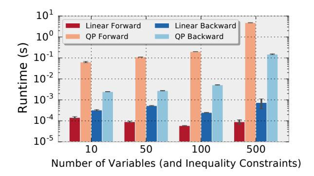
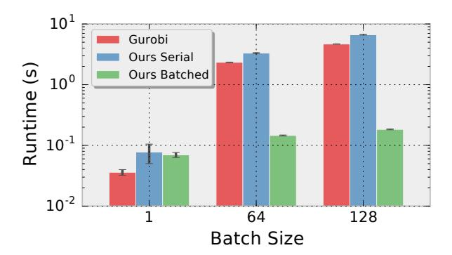
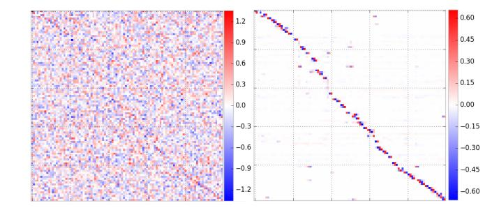
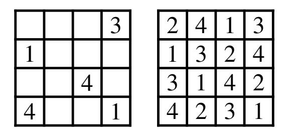
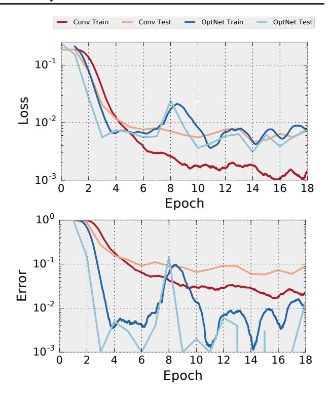
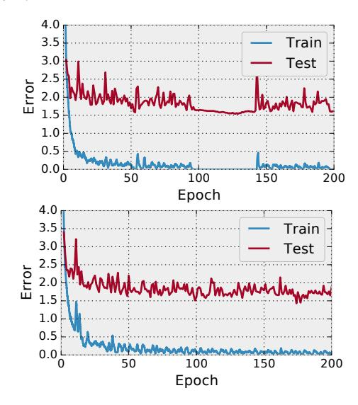
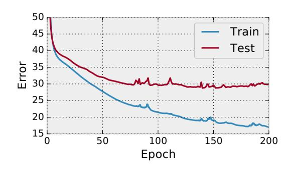
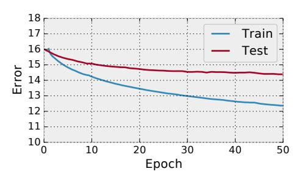
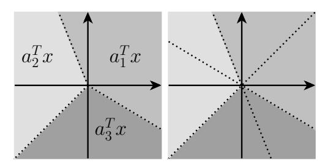

## OptNet: Differentiable Optimization as a Layer in Neural Networks

### Brandon Amos 1 J. Zico Kolter 1

### **Abstract**

This paper presents OptNet, a network architecture that integrates optimization problems (here, specifically in the form of quadratic programs) as individual layers in larger end-to-end trainable deep networks. These layers encode constraints and complex dependencies between the hidden states that traditional convolutional and fully-connected layers often cannot capture. We explore the foundations for such an architecture: we show how techniques from sensitivity analysis, bilevel optimization, and implicit differentiation can be used to exactly differentiate through these layers and with respect to layer parameters; we develop a highly efficient solver for these layers that exploits fast GPU-based batch solves within a primal-dual interior point method, and which provides backpropagation gradients with virtually no additional cost on top of the solve; and we highlight the application of these approaches in several problems. In one notable example, the method is learns to play mini-Sudoku (4x4) given just input and output games, with no a-priori information about the rules of the game; this highlights the ability of OptNet to learn hard constraints better than other neural architectures.

### 1. Introduction

In this paper, we consider how to treat exact, constrained optimization as an individual layer within a deep learning architecture. Unlike traditional feedforward networks, where the output of each layer is a relatively simple (though non-linear) function of the previous layer, our optimization framework allows for individual layers to capture much richer behavior, expressing complex operations that in total can reduce the overall depth of the network while preserving richness of representation. Specifically, we build a

Proceedings of the 34th International Conference on Machine Learning, Sydney, Australia, PMLR 70, 2017. Copyright 2017 by the author(s).

framework where the output of the i+1th layer in a network is the *solution* to a constrained optimization problem based upon previous layers. This framework naturally encompasses a wide variety of inference problems expressed within a neural network, allowing for the potential of much richer end-to-end training for complex tasks that require such inference procedures.

Concretely, in this paper we specifically consider the task of solving small quadratic programs as individual layers. These optimization problems are well-suited to capturing interesting behavior and can be efficiently solved with GPUs. Specifically, we consider layers of the form

$$z_{i+1} = \underset{z}{\operatorname{argmin}} \quad \frac{1}{2} z^{T} Q(z_{i}) z + q(z_{i})^{T} z$$
subject to  $A(z_{i}) z = b(z_{i})$ 

$$G(z_{i}) z \leq h(z_{i})$$

$$(1)$$

where z is the optimization variable,  $Q(z_i)$ ,  $q(z_i)$ ,  $A(z_i)$ ,  $b(z_i)$ ,  $G(z_i)$ , and  $h(z_i)$  are parameters of the optimization problem. As the notation suggests, these parameters can depend in any differentiable way on the previous layer  $z_i$ , and which can eventually be optimized just like any other weights in a neural network. These layers can be learned by taking the gradients of some loss function with respect to the parameters. In this paper, we derive the gradients of (1) by taking matrix differentials of the KKT conditions of the optimization problem at its solution.

In order to the make the approach practical for larger networks, we develop a custom solver which can simultaneously solve multiple small QPs in batch form. We do so by developing a custom primal-dual interior point method tailored specifically to dense batch operations on a GPU. In total, the solver can solve batches of quadratic programs over 100 times faster than existing highly tuned quadratic programming solvers such as Gurobi and CPLEX. One crucial algorithmic insight in the solver is that by using a specific factorization of the primal-dual interior point update, we can obtain a backward pass over the optimization layer virtually "for free" (i.e., requiring no additional factorization once the optimization problem itself has been solved). Together, these innovations enable parameterized optimization problems to be inserted within the architecture of existing deep networks.

&lt;sup>1School of Computer Science, Carnegie Mellon University. Pittsburgh, PA, USA. Correspondence to: Brandon Amos <a href="mailto:sharper-sity">sharper-sharper-sharper-sharper-sharper-sharper-sharper-sharper-sharper-sharper-sharper-sharper-sharper-sharper-sharper-sharper-sharper-sharper-sharper-sharper-sharper-sharper-sharper-sharper-sharper-sharper-sharper-sharper-sharper-sharper-sharper-sharper-sharper-sharper-sharper-sharper-sharper-sharper-sharper-sharper-sharper-sharper-sharper-sharper-sharper-sharper-sharper-sharper-sharper-sharper-sharper-sharper-sharper-sharper-sharper-sharper-sharper-sharper-sharper-sharper-sharper-sharper-sharper-sharper-sharper-sharper-sharper-sharper-sharper-sharper-sharper-sharper-sharper-sharper-sharper-sharper-sharper-sharper-sharper-sharper-sharper-sharper-sharper-sharper-sharper-sharper-sharper-sharper-sharper-sharper-sharper-sharper-sharper-sharper-sharper-sharper-sharper-sharper-sharper-sharper-sharper-sharper-sharper-sharper-sharper-sharper-sharper-sharper-sharper-sharper-sharper-sharper-sharper-sharper-sharper-sharper-sharper-sharper-sharper-sharper-sharper-sharper-sharper-sharper-sharper-sharper-sharper-sharper-sharper-sharper-sharper-sharper-sharper-sharper-sharper-sharper-sharper-sharper-sharper-sharper-sharper-sharper-sharper-sharper-sharper-sharper-sharper-sharper-sharper-sharper-sharper-sharper-sharper-sharper-sharper-sharper-sharper-sharper-sharper-sharper-sharper-sharper-sharper-sharper-sharper-sharper-sharper-sharper-sharper-sharper-sharper-sharper-sharper-sharper-sharper-sharper-sharper-sharper-sharper-sharper-sharper-sharper-sharper-sharper-sharper-sharper-sharper-sharper-sharper-sharper-sharper-sharper-sharper-sharper-sharper-sharper-sharper-sharper-sharper-sharper-sharper-sharper-sharper-sharper-sharper-sharper-sharper-sharper-sharper-sharper-sharper-sharper-sharper-sharper-sharper-sharper-sharper-sharper-sharper-sharper-sharper-sharper-sharper-sharper-sharper-sharper-sharper-sharper-sharper-sharper-sharper-sharper-sharper-sharper-sharper-sharper-sharper-sharper-

We begin by highlighting background and related work, and then present our optimization layer. Using matrix differentials we derive rules for computing the backpropagation updates. We then present our solver for these quadratic programs, based upon a state-of-the-art primal-dual interior point method, and highlight the novel elements as they apply to our formulation, such as the aforementioned fact that we can compute backpropagation at very little additional cost. We then provide experimental results that demonstrate the capabilities of the architecture, highlighting potential tasks that these architectures can solve, and illustrating improvements upon existing approaches.

### 2. Background and related work

Optimization plays a key role in modeling complex phenomena and providing concrete decision making processes in sophisticated environments. A full treatment of optimization applications is beyond our scope (Boyd & Vandenberghe, 2004) but these methods have bound applicability in control frameworks (Morari & Lee, 1999; Sastry & Bodson, 2011); numerous statistical and mathematical formalisms (Sra et al., 2012), and physical simulation problems like rigid body dynamics (Lötstedt, 1984). Generally speaking, our work is a step towards learning optimization problems behind real-world processes from data that can be learned end-to-end rather than requiring human specification and intervention.

In the machine learning setting, a wide array of applications consider optimization as a means to perform inference in learning. Among many other applications, these architectures are well-studied for generic classification and structured prediction tasks (Goodfellow et al., 2013; Stoyanov et al., 2011; Brakel et al., 2013; LeCun et al., 2006; Belanger & McCallum, 2016; Belanger et al., 2017; Amos et al., 2017); in vision for tasks such as denoising (Tappen et al., 2007; Schmidt & Roth, 2014); and Metz et al. (2016) uses unrolled optimization within a network to stabilize the convergence of generative adversarial networks (Goodfellow et al., 2014). Indeed, the general idea of solving restricted classes of optimization problem using neural networks goes back many decades (Kennedy & Chua, 1988; Lillo et al., 1993), but has seen a number of advances in recent years. These models are often trained by one of the following four methods.

**Energy-based learning methods** These methods can be used for tasks like (structured) prediction where the training method shapes the energy function to be low around the observed data manifold and high elsewhere (LeCun et al., 2006). In recent years, there has been a strong push to further incorporate structured prediction methods like conditional random fields as the "last layer" of a deep network architecture (Peng et al., 2009; Zheng et al., 2015; Chen

et al., 2015) as well as in deeper energy-based architectures (Belanger & McCallum, 2016; Belanger et al., 2017; Amos et al., 2017). Learning in this context requires observed data, which isn't present in some of the contexts we consider in this paper, and also may suffer from instability issues when combined with deep energy-based architectures as observed in Belanger & McCallum (2016); Belanger et al. (2017); Amos et al. (2017).

**Analytically** If an analytic solution to the argmin can be found, such as in an unconstrained quadratic minimization, the gradients can often also be computed analytically. This is done in Tappen et al. (2007); Schmidt & Roth (2014). We cannot use these methods for the constrained optimization problems we consider in this paper because there are no known analytic solutions.

Unrolling The argmin operation over an unconstrained objective can be approximated by a first-order gradient-based method and unrolled. These architectures typically introduce an optimization procedure such as gradient descent into the inference procedure. This is done in Domke (2012); Amos et al. (2017); Belanger et al. (2017); Metz et al. (2016); Goodfellow et al. (2013); Stoyanov et al. (2011); Brakel et al. (2013). The optimization procedure is unrolled automatically or manually (Domke, 2012) to obtain derivatives during training that incorporate the effects of these in-the-loop optimization procedures. However, unrolling the computation of a method like gradient descent typically requires a substantially larger network, and adds substantially to the network's computational complexity.

In all of these existing cases, the optimization problem is unconstrained and unrolling gradient descent is often easy to do. When constraints are added to the optimization problem, iterative algorithms often use a projection operator that may be difficult to unroll through. In this paper, we do **not** unroll an optimization procedure but instead use argmin differentiation as described in the next section.

Argmin differentiation Most closely related to our own work, there have been several papers that propose some form of differentiation through argmin operators. These techniques also come up in bilevel optimization (Gould et al., 2016; Kunisch & Pock, 2013) and sensitivity analysis (Bertsekas, 1999; Fiacco & Ishizuka, 1990; Bonnans & Shapiro, 2013). In the case of Gould et al. (2016), the authors describe general techniques for differentiation through optimization problems, but only describe the case of exact equality constraints rather than both equality and inequality constraints (in the case inequality constraints, they add these via a barrier function). Amos et al. (2017) considers argmin differentiation within the context of a specific optimization problem (the bundle method) but does not consider a general setting. Johnson et al. (2016) per-

forms implicit differentiation on (multi-)convex objectives with coordinate subspace constraints, but don't consider inequality constraints and don't consider in detail general linear equality constraints. Their optimization problem is only in the final layer of a variational inference network while we propose to insert optimization problems anywhere in the network. Therefore a special case of OptNet layers (with no inequality constraints) has a natural interpretation in terms of Gaussian inference, and so Gaussian graphical models (or CRF ideas more generally) provide tools for making the computation more efficient and interpreting or constraining its structure. Similarly, the older work of Mairal et al. (2012) considered argmin differentiation for a LASSO problem, deriving specific rules for this case, and presenting an efficient algorithm based upon our ability to solve the LASSO problem efficiently.

In this paper, we use implicit differentiation (Dontchev & Rockafellar, 2009; Griewank & Walther, 2008) and techniques from matrix differential calculus (Magnus & Neudecker, 1988) to derive the gradients from the KKT matrix of the problem. A notable difference from other work within ML that we are aware of, is that we analytically differentiate through inequality as well as just equality constraints by differentiating the complementarity conditions; this differs from e.g., Gould et al. (2016) where they instead approximately convert the problem to an unconstrained one via a barrier method. We have also developed methods to make this approach practical and reasonably scalable within the context of deep architectures.

# 3. OptNet: solving optimization within a neural network

Although in the most general form, an OptNet layer can be any optimization problem, in this paper we will study OptNet layers defined by a quadratic program

where  $z \in \mathbb{R}^n$  is our optimization variable  $Q \in \mathbb{R}^{n \times n} \succeq 0$  (a positive semidefinite matrix),  $q \in \mathbb{R}^n$ ,  $A \in \mathbb{R}^{m \times n}$ ,  $b \in \mathbb{R}^m$ ,  $G \in \mathbb{R}^{p \times n}$  and  $h \in \mathbb{R}^p$  are problem data, and leaving out the dependence on the previous layer  $z_i$  as we showed in (1) for notational convenience. As is well-known, these problems can be solved in polynomial time using a variety of methods; if one desires exact (to numerical precision) solutions to these problems, then primal-dual interior point methods, as we will use in a later section, are the current state of the art in solution methods. In the neural network setting, the *optimal solution* (or more generally, a *subset of the optimal solution*) of this optimization problems becomes the output of our layer, denoted  $z_{i+1}$ , and any of the problem data Q, q, A, b, G, h can depend on the

value of the previous layer  $z_i$ . The forward pass in our OptNet architecture thus involves simply setting up and finding the solution to this optimization problem.

Training deep architectures, however, requires that we not just have a forward pass in our network but also a backward pass. This requires that we compute the derivative of the solution to the QP with respect to its input parameters, a general topic we topic we discussed previously. To obtain these derivatives, we differentiate the KKT conditions (sufficient and necessary conditions for optimality) of (2) at a solution to the problem using techniques from matrix differential calculus (Magnus & Neudecker, 1988). Our analysis here can be extended to more general convex optimization problems.

The Lagrangian of (2) is given by

$$L(z, \nu, \lambda) = \frac{1}{2} z^T Q z + q^T z + \nu^T (Az - b) + \lambda^T (Gz - h)$$
(3)

where  $\nu$  are the dual variables on the equality constraints and  $\lambda \geq 0$  are the dual variables on the inequality constraints. The KKT conditions for stationarity, primal feasibility, and complementary slackness are

$$Qz^* + q + A^T \nu^* + G^T \lambda^* = 0$$

$$Az^* - b = 0$$

$$D(\lambda^*)(Gz^* - h) = 0,$$
(4)

where  $D(\cdot)$  creates a diagonal matrix from a vector and  $z^\star$ ,  $\nu^\star$  and  $\lambda^\star$  are the optimal primal and dual variables. Taking the differentials of these conditions gives the equations

$$dQz^{\star} + Qdz + dq + dA^{T}\nu^{\star} +$$

$$A^{T}d\nu + dG^{T}\lambda^{\star} + G^{T}d\lambda = 0$$

$$dAz^{\star} + Adz - db = 0$$

$$D(Gz^{\star} - h)d\lambda + D(\lambda^{\star})(dGz^{\star} + Gdz - dh) = 0$$
(5)

or written more compactly in matrix form

$$\begin{bmatrix} Q & G^T & A^T \\ D(\lambda^*)G & D(Gz^* - h) & 0 \\ A & 0 & 0 \end{bmatrix} \begin{bmatrix} \mathsf{d}z \\ \mathsf{d}\lambda \\ \mathsf{d}\nu \end{bmatrix} = \\ - \begin{bmatrix} \mathsf{d}Qz^* + \mathsf{d}q + \mathsf{d}G^T\lambda^* + \mathsf{d}A^T\nu^* \\ D(\lambda^*)\mathsf{d}Gz^* - D(\lambda^*)\mathsf{d}h \\ \mathsf{d}Az^* - \mathsf{d}b \end{bmatrix}. \tag{6}$$

Using these equations, we can form the Jacobians of  $z^*$  (or  $\lambda^*$  and  $\nu^*$ , though we don't consider this case here), with respect to any of the data parameters. For example, if we wished to compute the Jacobian  $\frac{\partial z^*}{\partial b} \in \mathbb{R}^{n \times m}$ , we would simply substitute  $\mathrm{d}b = I$  (and set all other differential terms in the right hand side to zero), solve the equation, and the resulting value of  $\mathrm{d}z$  would be the desired Jacobian.

In the backpropagation algorithm, however, we never want to explicitly form the actual Jacobian matrices, but rather want to form the left matrix-vector product with some previous backward pass vector  $\frac{\partial \ell}{\partial z^*} \in \mathbb{R}^n$ , i.e.,  $\frac{\partial \ell}{\partial z^*} \frac{\partial z^*}{\partial b}$ . We can do this efficiently by noting the solution for the  $(\mathrm{d}z,\mathrm{d}\lambda,\mathrm{d}\nu)$  involves multiplying the *inverse* of the left-hand-side matrix in (6) by some right hand side. Thus, if we multiply the backward pass vector by the transpose of the differential matrix

$$\begin{bmatrix} d_z \\ d_\lambda \\ d_\nu \end{bmatrix} = - \begin{bmatrix} Q & G^T D(\lambda^*) & A^T \\ G & D(Gz^* - h) & 0 \\ A & 0 & 0 \end{bmatrix}^{-1} \begin{bmatrix} \left(\frac{\partial \ell}{\partial z^*}\right)^T \\ 0 \\ 0 \end{bmatrix}$$
(7)

then the relevant gradients with respect to all the QP parameters can be given by

$$\nabla_{Q}\ell = \frac{1}{2}(d_{z}z^{*T} + z^{*}d_{z}^{T}) \qquad \nabla_{q}\ell = d_{z}$$

$$\nabla_{A}\ell = d_{\nu}z^{*T} + \nu^{*}d_{z}^{T} \qquad \nabla_{b}\ell = -d_{\nu}$$

$$\nabla_{G}\ell = D(\lambda^{*})d_{\lambda}z^{*T} + \lambda^{*}d_{z}^{T} \qquad \nabla_{h}\ell = -D(\lambda^{*})d_{\lambda}$$
(8)

where as in standard backpropagation, all these terms are at most the size of the parameter matrices. Some of these parameters should depend on the previous layer  $z_i$  and the gradients with respect to the previous layer can be obtained through the chain rule. In the next section, we show that the solution to an interior point method provides a factorization we can use to compute these gradient efficiently.

### 3.1. An efficient batched QP solver

Deep networks are typically trained in mini-batches to take advantage of efficient data-parallel GPU operations. Without mini-batching on the GPU, many modern deep learning architectures become intractable for all practical purposes. However, today's state-of-the-art QP solvers like Gurobi and CPLEX do not have the capability of solving multiple optimization problems on the GPU in parallel across the entire minibatch. This makes larger OptNet layers become quickly intractable compared to a fully-connected layer with the same number of parameters.

To overcome this performance bottleneck in our quadratic program, we implemented a GPU-based primal-dual interior point method (PDIPM) based on Mattingley & Boyd (2012) that solves a batch of quadratic programs, and which provides the necessary gradients needed to train these in an end-to-end fashion. Our performance experiments in Section 4.1 shows that our solver is significantly faster than the standard non-batch solvers Gurobi and CPLEX.

Following the method of Mattingley & Boyd (2012), our solver introduces slack variables on the inequality constraints and iteratively minimizes the residuals from the KKT conditions over the primal variable  $z \in \mathbb{R}^n$ , slack variable  $s \in \mathbb{R}^p$ , and dual variables  $\nu \in \mathbb{R}^m$  associated with the equality constraints and  $\lambda \in \mathbb{R}^p$  associated with the inequality constraints. Each iteration computes

the affine scaling directions by solving

$$K \begin{bmatrix} \Delta z^{\text{aff}} \\ \Delta s^{\text{aff}} \\ \Delta \lambda^{\text{aff}} \\ \Delta \nu^{\text{aff}} \end{bmatrix} = \begin{bmatrix} -(A^T \nu + G^T \lambda + Qz + q) \\ -S\lambda \\ -(Gz + s - h) \\ -(Az - b) \end{bmatrix}$$
(9)

where

$$K = \begin{bmatrix} Q & 0 & G^T & A^T \\ 0 & D(\lambda) & D(s) & 0 \\ G & I & 0 & 0 \\ A & 0 & 0 & 0 \end{bmatrix},$$

then centering-plus-corrector directions by solving

$$K \begin{bmatrix} \Delta z^{\text{cc}} \\ \Delta s^{\text{cc}} \\ \Delta \lambda^{\text{cc}} \\ \Delta \nu^{\text{cc}} \end{bmatrix} = \begin{bmatrix} \sigma \mu 1 - D(\Delta s^{\text{aff}}) \Delta \lambda^{\text{aff}} \\ 0 \\ 0 \end{bmatrix}, \quad (10)$$

where  $\mu=s^T\lambda/p$  is the duality gap and  $\sigma$  is defined in Mattingley & Boyd (2012). Each variable v is updated with  $\Delta v=\Delta v^{\rm aff}+\Delta v^{\rm cc}$  using an appropriate step size. We actually solve a symmetrized version of the KKT conditions, obtained by scaling the second row block by D(1/s). We analytically decompose these systems into smaller symmetric systems and pre-factorize portions of them that don't change (i.e. that don't involve  $D(\lambda/s)$  between iterations). We have implemented a batched version of this method with the PyTorch library² and have released it as an open source library at https://github.com/locuslab/qpth. It uses a custom CUBLAS extension to compute batch matrix factorizations and solves in parallel and provides the necessary derivatives for end-to-end learning.

### 3.1.1. EFFICIENTLY COMPUTING GRADIENTS

The backward pass gradients can be computed "for free" after solving the original QP with this primal-dual interior point method, without an additional matrix factorization or solve. Each iteration cmputes an LU decomposition of the matrix  $K_{\rm sym}$ , which is a symmetrized version of the matrix needed for computing the backpropagated gradients. We compute the  $d_{z,\lambda,\nu}$  terms by solving the linear system

$$K_{\text{sym}} \begin{bmatrix} d_z \\ d_s \\ \tilde{d}_{\lambda} \\ d_{\nu} \end{bmatrix} = \begin{bmatrix} \left( -\frac{\partial \ell}{\partial z_{i+1}} \right)^T \\ 0 \\ 0 \\ 0 \end{bmatrix}, \tag{11}$$

2https://pytorch.org

 $^3$ We perform an LU decomposition of a subset of the matrix formed by eliminating variables to create only a  $p \times p$  matrix (the number of inequality constraints) that needs to be factor during each iteration of the primal-dual algorithm, and one  $m \times m$  and one  $n \times n$  matrix once at the start of the primal-dual algorithm, though we omit the detail here. We also use an LU decomposition as this routine is provided in batch form by CUBLAS, but could potentially use a (faster) Cholesky factorization if and when the appropriate functionality is added to CUBLAS).

where  $\tilde{d}_{\lambda} = D(\lambda^*)d_{\lambda}$  for  $d_{\lambda}$  as defined in (7). Thus, all the backward pass gradients can be computed using the factored KKT matrix at the solution. Crucially, because the bottleneck of solving this linear system is computing the factorization of the KKT matrix (cubic time as opposed to the quadratic time for solving via backsubstitution once the factorization is computed), the additional time requirements for computing all the necessary gradients in the backward pass is virtually nonexistent compared with the time of computing the solution. To the best of our knowledge, this is the first time that this fact has been exploited in the context of learning end-to-end systems.

### 3.2. Properties and representational power

In this section we briefly highlight some of the mathematical properties of OptNet layers. The proofs here are straightforward, and are mostly based upon well-known results in convex analysis, so are deferred to the appendix. The first result simply highlights that (because the solution of strictly convex QPs is continuous), that OptNet layers are subdifferentiable everywhere, and differentiable at all but a measure-zero set of points.

**Theorem 1.** Let  $z^*(\theta)$  be the output of an OptNet layer, where  $\theta = \{Q, p, A, b, G, h\}$ . Assuming Q > 0 and that A has full row rank, then  $z^*(\theta)$  is subdifferentiable everywhere:  $\partial z^*(\theta) \neq \emptyset$ , where  $\partial z^*(\theta)$  denotes the Clarke generalized subdifferential (Clarke, 1975) (an extension of the subgradient to non-convex functions), and has a single unique element (the Jacobian) for all but a measure zero set of points  $\theta$ .

The next two results show the representational power of the OptNet layer, specifically how an OptNet layer compares to the common linear layer followed by a ReLU activation. The first theorem shows that an OptNet layer can approximate arbitrary elementwise piecewise-linear functions, and so among other things can represent a ReLU layer.

**Theorem 2.** Let  $f: \mathbb{R}^n \to \mathbb{R}^n$  be an elementwise piecewise linear function with k linear regions. Then the function can be represented as an OptNet layer using O(nk) parameters. Additionally, the layer  $z_{i+1} = \max\{Wz_i + b, 0\}$  for  $W \in \mathbb{R}^{n \times m}, b \in \mathbb{R}^n$  can be represented by an OptNet layer with O(mn) parameters.

Finally, we show that the converse does not hold: that there are function representable by an OptNet layer which cannot be represented exactly by a two-layer ReLU layer, which take exponentially many units to approximate (known to be a universal function approximator). A simple example of such a layer (and one which we use in the proof) is just the max over three linear functions  $f(z) = \max\{a_1^Tx, a_2^Tx, a_3^Tx\}$ .

**Theorem 3.** Let  $f(z) : \mathbb{R}^n \to \mathbb{R}$  be a scalar-valued function specified by an OptNet layer with p parameters. Con-

versely, let  $f'(z) = \sum_{i=1}^{m} w_i \max\{a_i^T z + b_i, 0\}$  be the output of a two-layer ReLU network. Then there exist functions that the ReLU network cannot represent exactly over all of  $\mathbb{R}$ , and which require  $O(c^p)$  parameters to approximate over a finite region.

### 3.3. Limitations of the method

Although, as we will show shortly, the OptNet layer has several strong points, we also want to highlight the potential drawbacks of this approach. First, although, with an efficient batch solver, integrating an OptNet layer into existing deep learning architectures is potentially practical, we do note that solving optimization problems exactly as we do here has has cubic complexity in the number of variables and/or constraints. This contrasts with the quadratic complexity of standard feedforward layers. This means that we *are* ultimately limited to settings where the number of hidden variables in an OptNet layer is not too large (less than 1000 dimensions seems to be the limits of what we currently find to the be practical, and substantially less if one wants real-time results for an architecture).

Secondly, there are many improvements to the OptNet layers that are still possible. Our QP solver, for instance, uses fully dense matrix operations, which makes the solves very efficient for GPU solutions, and which also makes sense for our general setting where the coefficients of the quadratic problem can be learned. However, for setting many realworld optimization problems (and hence for architectures that wish to more closely mimic some real-world optimization problem), there is often substantial structure (e.g., sparsity), in the data matrices that can be exploited for efficiency. There is of course no prohibition of incorporating sparse matrix methods into the fast custom solver, but doing so would require substantial added complexity, especially regarding efforts like finding minimum fill orderings for different sparsity patterns of the KKT systems. In our solver qpth, we have started experimenting with cu-SOLVER's batched sparse QR factorizations and solves.

Lastly, we note that while the OptNet layers can be trained just as any neural network layer, since they are a new creation and since they have manifolds in the parameter space which have no effect on the resulting solution (e.g., scaling the rows of a constraint matrix and its right hand side does not change the optimization problem), there is admittedly more tuning required to get these to work. This situation is common when developing new neural network architectures and has also been reported in the similar architecture of Schmidt & Roth (2014). Our hope is that techniques for overcoming some of the challenges in learning these layers will continue to be developed in future work.

Figure 1. Runtime of a linear layer and a QP layer, batch of 128.

### 4. Experimental results

In this section, we present several experimental results that highlight the capabilities of the OP OptNet layer. Specifically we look at 1) computational efficiency over exiting solvers; 2) the ability to improve upon existing convex problems such as those used in signal denoising; 3) integrating the architecture into an generic deep learning architectures; and 4) performance of our approach on a problem that is challenging for current approaches. In particular, we want to emphasize the results of our system on learning the game of (4x4) mini-Sudoku, a well-known logical puzzle; our layer is able to directly learn the necessary constraints using just gradient information and no a priori knowledge of the rules of Sudoku. The code and data for our experiments are open sourced in the icml2017 branch of https://github.com/locuslab/optnet and our batched QP solver is available as a library at https: //github.com/locuslab/qpth.

### 4.1. Batch QP solver performance

All of the OptNet performance results in this section are run on an unloaded Titan X GPU. Gurobi is run on an unloaded quad-core Intel Core i7-5960X CPU @ 3.00GHz.

Our OptNet layers are much more computationally expensive than a linear or convolutional layer and a natural question is to ask what the performance difference is. We set up an experiment comparing a linear layer to a QP OptNet layer with a mini-batch size of 128 on CUDA with randomly generated input vectors sized 10, 50, 100, and 500. Each layer maps this input to an output of the same dimension; the linear layer does this with a batched matrix-vector multiplication and the OptNet layer does this by taking the argmin of a random QP that has the same number of inequality constraints as the dimensionality of the problem. Figure 1 shows the profiling results (averaged over 10 trials) of the forward and backward passes. The OptNet layer is significantly slower than the linear layer as expected, yet still tractable in many practical contexts.

Figure 2. Performance of Gurobi and our QP solver.

Our next experiment illustrates why standard baseline QP solvers like CPLEX and Gurobi without batch support are too computationally expensive for QP OptNet layers to be tractable. We set up random QP of the form (1) that have 100 variables and 100 inequality constraints in Gurobi and in the serialized and batched versions of our solver qpth and vary the batch size.4

Figure 2 shows the means and standard deviations of running each trial 10 times, showing that our batched solver outperforms Gurobi, itself a highly tuned solver for reasonable batch sizes. For the minibatch size of 128, we solve all problems in an average of 0.18 seconds, whereas Gurobi tasks an average of 4.7 seconds. In the context of training a deep architecture this type of speed difference for a single minibatch can make the difference between a practical and a completely unusable solution.

### 4.2. Total variation denoising

Our next experiment studies how we can use the OptNet architecture to improve upon signal processing techniques that currently use convex optimization as a basis. Specifically, our goal in this case is to denoise a noisy 1D signal given training data consistency of noisy and clean signals generated from the same distribution. Such problems are often addressed by convex optimization procedures, and (1D) total variation denoising is a particularly common and simple approach. Specifically, the total variation denoising approach attempts to smooth some noisy observed signal y by solving the optimization problem

$$\underset{z}{\operatorname{argmin}} \frac{1}{2} ||y - z|| + \lambda ||Dz||_{1}$$
 (12)

&lt;sup>4Experimental details: we sample entries of a matrix U from a random uniform distribution and set  $Q = U^T U + 10^{-3} I$ , sample G with random normal entries, and set h by selecting generating some  $z_0$  random normal and  $s_0$  random uniform and setting  $h = Gz_0 + s_0$  (we didn't include equality constraints just for simplicity, and since the number of inequality constraints in the primary driver of complexity for the iterations in a primal-dual interior point method). The choice of h guarantees the problem is feasible.

where D is the first-order differencing operation expressed in matrix form with rows  $D_i = e_i - e_{i+1}$ . Penalizing the  $\ell_1$  norm of the signal difference encourages this difference to be sparse, i.e., the number of changepoints of the signal is small, and we end up approximating y by a (roughly) piecewise constant function.

To test this approach and competing ones on a denoising task, we generate piecewise constant signals (which are the desired outputs of the learning algorithm) and corrupt them with independent Gaussian noise (which form the inputs to the learning algorithm). Table 1 shows the error rate of these four approaches.

### 4.2.1. BASELINE: TOTAL VARIATION DENOISING

To establish a baseline for denoising performance with total variation, we run the above optimization problem varying values of  $\lambda$  between 0 and 100. The procedure performs best with a choice of  $\lambda \approx 13$ , and achieves a minimum test MSE on our task of about 16.5 (the units here are unimportant, the only relevant quantity is the relative performances of the different algorithms).

## 4.2.2. BASELINE: LEARNING WITH A FULLY-CONNECTED NEURAL NETWORK

An alternative approach to denoising is by learning from data. A function  $f_{\theta}(x)$  parameterized by  $\theta$  can be used to predict the original signal. The optimal  $\theta$  can be learned by using the mean squared error between the true and predicted signals. Denoising is typically a difficult function to learn and Table 1 shows that a fully-connected neural network perform substantially worse on this denoising task than the convex optimization problem. Section B shows the convergence of the fully-connected network.

### 4.2.3. Learning the differencing operator

Between the feedforward neural network approach and the convex total variation optimization, we could instead use a generic OptNet layers that effectively allowed us to solve (12) using any denoising matrix, which we randomly initialize. While the accuracy here is substantially lower than even the fully connected case, this is largely the result of learning an over-regularized solution to D. This is indeed a point that should be addressed in future work (we refer back to our comments in the previous section on the potential challenges of training these layers), but the point we want to highlight here is that the OptNet layer seems to be learning something very interpretable and understandable. Specifically, Figure 3 shows the D matrix of our solution before and after learning (we permute the rows to make them ordered by the magnitude of where the largeabsolute-value entries occurs). What is interesting in this picture is that the learned D matrix typically captures exactly the same intuition as the D matrix used by total vari-

Figure 3. Initial and learned difference operators for denoising.

| Method                 | Train MSE | Test MSE |
|------------------------|-----------|----------|
| FC Net                 | 18.5      | 29.8     |
| Pure OptNet            | 52.9      | 53.3     |
| <b>Total Variation</b> | 16.3      | 16.5     |
| OptNet Tuned TV        | 13.8      | 14.4     |

Table 1. Denoising task error rates.

ation denoising: a mainly sparse matrix with a few entries of alternating sign next to each other. This implies that for the data set we have, total variation denoising is indeed the "right" way to think about denoising the resulting signal, but if some other noise process were to generate the data, then we can learn that process instead. We can then attain lower actual error for the method (in this case similar though slightly higher than the TV solution), by fixing the learned sparsity of the D matrix and then fine tuning.

## 4.2.4. FINE-TUNING AND IMPROVING THE TOTAL VARIATION SOLUTION

To finally highlight the ability of the OptNet methods to *improve* upon the results of a convex program, specifically tailoring to the data. Here, we use the same OptNet architecture as in the previous subsection, but initialize D to be the differencing matrix as in the total variation solution. As shown in Table 1, the procedure is able to improve both the training and testing MSE over the TV solution, specifically improving upon test MSE by 12%. Section B shows the convergence of fine-tuning.

### **4.3. MNIST**

One compelling use case of an OptNet layer is to learn constraints and dependencies over the output or latent space of a model. As a simple example to illustrate that OptNet layers can be included in existing architectures and that the gradients can be efficiently propagated through the layer, we show the performance of a fully-connected feedforward network with and without an OptNet layer in Section A in the supplemental material.

Figure 4. Example mini-Sudoku initial problem and solution.

### 4.4. Sudoku

Finally, we present the main illustrative example of the representational power of our approach, the task of learning the game of Sudoku. Sudoku is a popular logical puzzle, where a (typically 9x9) grid of points must be arranged given some initial point, so that each row, each column, and each 3x3 grid of points must contain one of each number 1 through 9. We consider the simpler case of 4x4 Sudoku puzzles, with numbers 1 through 4, as shown in Figure 4.3.

Sudoku is fundamentally a constraint satisfaction problem, and is trivial for computers to solve when told the rules of the game. However, if we do not know the rules of the game, but are only presented with examples of unsolved and the corresponding solved puzzle, this is a challenging task. We consider this to be an interesting benchmark task for algorithms that seek to capture complex strict relationships between all input and output variables. The input to the algorithm consists of a 4x4 grid (really a 4x4x4 tensor with a one-hot encoding for known entries an all zeros for unknown entries), and the desired output is a 4x4x4 tensor of the one-hot encoding of the solution.

This is a problem where traditional neural networks have difficulties learning the necessary hard constraints. As a baseline inspired by the models at https://github. com/Kyubyong/sudoku, we implemented a multilayer feedforward network to attempt to solve Sudoku problems. Specifically, we report results for a network that has 10 convolutional layers with 512 3x3 filters each, and tried other architectures as well. The OptNet layer we use on this task is a completely generic QP in "standard form" with only positivity inequality constraints but an arbitrary constraint matrix Ax = b, a small Q = 0.1I to make sure the problem is strictly feasible, and with the linear term q simply being the input one-hot encoding of the Sudoku problem. We know that Sudoku *can* be approximated well with a linear program (indeed, integer programming is a typical solution method for such problems), but the model here is told nothing about the rules of Sudoku.

We trained these models using ADAM (Kingma & Ba, 2014) to minimize the MSE (which we refer to as "loss") on a dataset we created consisting of 9000 training puz-

Figure 5. Sudoku training plots.

zles, and we then tested the models on 1000 different heldout puzzles. The error rate is the percentage of puzzles solved correctly if the cells are assigned to whichever index is largest in the prediction. Figure 5 shows that the convolutional is able to learn all of the necessary logic for the task and ends up over-fitting to the training data. We contrast this with the performance of the OptNet network, which learns most of the correct hard constraints and is able to generalize much better to unseen examples.

### 5. Conclusion

We have presented OptNet, a neural network architecture where we use optimization problems as a single layer in the network. We have derived the algorithmic formulation for differentiating through these layers, allowing for backpropagating in end-to-end architectures. We have also developed an efficient batch solver for these optimizations based upon a primal-dual interior point method, and developed a method for attaining the necessary gradient information "for free" from this approach. Our experiments highlight the potential power of these networks, showing that they can solve problems where existing networks are very poorly suited, such as learning Sudoku problems purely from data. These models add another important primitive to the toolbox of neural network practitioners and enable many possible future directions of research of differentiating through optimization problems.

### Acknowledgments

BA is supported by the National Science Foundation Graduate Research Fellowship Program under Grant No. DGE1252522. We would like to thank the developers of PyTorch for helping us add core features, particularly Soumith Chintala and Adam Paszke. We also thank Ian Goodfellow, Yeshu Li, Lekan Ogunmolu, Rui Silva, Po-Wei Wang, Eric Wong, and Han Zhao for invaluable comments, as well as Rocky Duan who helped us improve our feedforward network baseline on mini-Sudoku.

### References

- Amos, Brandon, Xu, Lei, and Kolter, J Zico. Input convex neural networks. In *Proceedings of the International Conference on Machine Learning*, 2017.
- Belanger, David and McCallum, Andrew. Structured prediction energy networks. In *Proceedings of the International Conference on Machine Learning*, 2016.
- Belanger, David, Yang, Bishan, and McCallum, Andrew. End-to-end learning for structured prediction energy networks. In *Proceedings of the International Conference on Machine Learning*, 2017.
- Bertsekas, Dimitri P. *Nonlinear programming*. Athena scientific Belmont, 1999.
- Bonnans, J Frédéric and Shapiro, Alexander. *Perturbation analysis of optimization problems*. Springer Science & Business Media, 2013.
- Boyd, Stephen and Vandenberghe, Lieven. *Convex optimization*. Cambridge university press, 2004.
- Brakel, Philémon, Stroobandt, Dirk, and Schrauwen, Benjamin. Training energy-based models for time-series imputation. *Journal of Machine Learning Research*, 14(1): 2771–2797, 2013.
- Chen, Liang-Chieh, Schwing, Alexander G, Yuille, Alan L, and Urtasun, Raquel. Learning deep structured models. In *Proceedings of the International Conference on Machine Learning*, 2015.
- Clarke, Frank H. Generalized gradients and applications. *Transactions of the American Mathematical Society*, 205:247–262, 1975.
- Domke, Justin. Generic methods for optimization-based modeling. In *AISTATS*, volume 22, pp. 318–326, 2012.
- Dontchev, Asen L and Rockafellar, R Tyrrell. Implicit functions and solution mappings. *Springer Monogr. Math.*, 2009.

- Duchi, John, Shalev-Shwartz, Shai, Singer, Yoram, and Chandra, Tushar. Efficient projections onto the l 1-ball for learning in high dimensions. In *Proceedings of the 25th international conference on Machine learning*, pp. 272–279, 2008.
- Fiacco, Anthony V and Ishizuka, Yo. Sensitivity and stability analysis for nonlinear programming. *Annals of Operations Research*, 27(1):215–235, 1990.
- Goodfellow, Ian, Mirza, Mehdi, Courville, Aaron, and Bengio, Yoshua. Multi-prediction deep boltzmann machines. In *Advances in Neural Information Processing Systems*, pp. 548–556, 2013.
- Goodfellow, Ian, Pouget-Abadie, Jean, Mirza, Mehdi, Xu, Bing, Warde-Farley, David, Ozair, Sherjil, Courville, Aaron, and Bengio, Yoshua. Generative adversarial nets. In *Advances in Neural Information Processing Systems*, pp. 2672–2680, 2014.
- Gould, Stephen, Fernando, Basura, Cherian, Anoop, Anderson, Peter, Santa Cruz, Rodrigo, and Guo, Edison. On differentiating parameterized argmin and argmax problems with application to bi-level optimization. *arXiv* preprint arXiv:1607.05447, 2016.
- Griewank, Andreas and Walther, Andrea. Evaluating derivatives: principles and techniques of algorithmic differentiation. SIAM, 2008.
- Johnson, Matthew, Duvenaud, David K, Wiltschko, Alex, Adams, Ryan P, and Datta, Sandeep R. Composing graphical models with neural networks for structured representations and fast inference. In Advances in Neural Information Processing Systems, pp. 2946–2954, 2016.
- Kennedy, Michael Peter and Chua, Leon O. Neural networks for nonlinear programming. *IEEE Transactions on Circuits and Systems*, 35(5):554–562, 1988.
- Kingma, Diederik and Ba, Jimmy. Adam: A method for stochastic optimization. *arXiv preprint arXiv:1412.6980*, 2014.
- Kunisch, Karl and Pock, Thomas. A bilevel optimization approach for parameter learning in variational models. *SIAM Journal on Imaging Sciences*, 6(2):938–983, 2013.
- LeCun, Yann, Chopra, Sumit, Hadsell, Raia, Ranzato, M, and Huang, F. A tutorial on energy-based learning. *Predicting structured data*, 1:0, 2006.
- Lillo, Walter E, Loh, Mei Heng, Hui, Stefen, and Zak, Stanislaw H. On solving constrained optimization problems with neural networks: A penalty method approach. *IEEE Transactions on neural networks*, 4(6):931–940, 1993.

- Lötstedt, Per. Numerical simulation of time-dependent contact and friction problems in rigid body mechanics. *SIAM journal on scientific and statistical computing*, 5 (2):370–393, 1984.
- Magnus, X and Neudecker, Heinz. Matrix differential calculus. New York, 1988.
- Mairal, Julien, Bach, Francis, and Ponce, Jean. Task-driven dictionary learning. *IEEE Transactions on Pattern Analysis and Machine Intelligence*, 34(4):791–804, 2012.
- Mattingley, Jacob and Boyd, Stephen. Cvxgen: A code generator for embedded convex optimization. *Optimization and Engineering*, 13(1):1–27, 2012.
- Metz, Luke, Poole, Ben, Pfau, David, and Sohl-Dickstein, Jascha. Unrolled generative adversarial networks. *arXiv* preprint arXiv:1611.02163, 2016.
- Morari, Manfred and Lee, Jay H. Model predictive control: past, present and future. *Computers & Chemical Engineering*, 23(4):667–682, 1999.
- Peng, Jian, Bo, Liefeng, and Xu, Jinbo. Conditional neural fields. In *Advances in neural information processing systems*, pp. 1419–1427, 2009.
- Sastry, Shankar and Bodson, Marc. Adaptive control: stability, convergence and robustness. Courier Corporation, 2011.
- Schmidt, Uwe and Roth, Stefan. Shrinkage fields for effective image restoration. In *Proceedings of the IEEE Conference on Computer Vision and Pattern Recognition*, pp. 2774–2781, 2014.
- Sra, Suvrit, Nowozin, Sebastian, and Wright, Stephen J. *Optimization for machine learning*. Mit Press, 2012.
- Stoyanov, Veselin, Ropson, Alexander, and Eisner, Jason. Empirical risk minimization of graphical model parameters given approximate inference, decoding, and model structure. In *AISTATS*, pp. 725–733, 2011.
- Tappen, Marshall F, Liu, Ce, Adelson, Edward H, and Freeman, William T. Learning gaussian conditional random fields for low-level vision. In *Computer Vision and Pattern Recognition*, 2007. CVPR'07. IEEE Conference on, pp. 1–8. IEEE, 2007.
- Zheng, Shuai, Jayasumana, Sadeep, Romera-Paredes, Bernardino, Vineet, Vibhav, Su, Zhizhong, Du, Dalong, Huang, Chang, and Torr, Philip HS. Conditional random fields as recurrent neural networks. In *Proceedings of* the IEEE International Conference on Computer Vision, pp. 1529–1537, 2015.

## **OptNet: Supplementary Material**

### Brandon Amos J. Zico Kolter

### A. MNIST Experiment

In this section we consider the integration of QP OptNet layers into a traditional fully connected network for the MNIST problem. The results here show only very marginal improvement if any over a fully connected layer (MNIST, after all, is very fairly well-solved by a fully connected network, let alone a convolution network). But our main point of this comparison is simply to illustrate that we can include these layers within existing network architectures and efficiently propagate the gradients through the layer.

Specifically we use a FC600-FC10-SoftMax fully connected network and compare it to a FC600-FC10-Optnet10-SoftMax network, where the numbers after each layer indicate the layer size. The OptNet layer in this case includes only inequality constraints and the previous layer is only used in the linear objective term  $p(z_i) = z_i$ . To keep  $Q \succ 0$ , we use a Cholesky factorization  $Q = LL^T + \epsilon I$  and directly learn L (without any information from the previous layer). We also directly learn A and G, and to ensure a feasible solution always exists, we select some learnable  $z_0$  and  $s_0$  and set  $b = Az_0$  and  $h = Gz_0 + s_0$ .

Figure 6 shows that the results are similar for both networks with slightly lower error and less variance in the OptNet network.

Figure 6. Training performance on MNIST; top: fully connected network; bottom: OptNet as final layer.)

### **B.** Denoising Experiment Details

Figure 7 shows the error of the fully connected network on the denoising task and Figure 8 shows the error of the OptNet fine-tuned TV solution.

Figure 7. Error of the fully connected network for denoising

Figure 8. Error rate from fine-tuning the TV solution for denoising

# C. Representational power of the QP OptNet layer

This section contains proofs for those results we highlight in Section 3.2. As mentioned before, these proofs are all quite straightforward and follow from well-known properties, but we include them here for completeness.

### C.1. Proof of Theorem 1

*Proof.* The fact that an OptNet layer is subdifferentiable from strictly convex QPs ( $Q \succ 0$ ) follows directly from the well-known result that the solution of a strictly convex QP is continuous (though not everywhere differentiable). Our proof essentially just boils down to showing this fact,

though we do so by explicitly showing that there *is* a unique solution to the Jacobian equations (6) that we presented earlier, except on a measure zero set. This measure zero set consists of QPs with degenerate solutions, points where inequality constraints can hold with equality yet also have zero-valued dual variables. For simplicity we assume that *A* has full row rank, but this can be relaxed.

From the complementarity condition, we have that at a primal dual solution  $(z^*, \lambda^*, \nu^*)$ 

$$(Gz^{\star} - h)_i < 0 \to \lambda_i^{\star} = 0$$
  
$$\lambda_i^{\star} > 0 \to (Gz^{\star} - h)_i = 0$$
 (13)

(i.e., we cannot have both these terms non-zero).

First we consider the (typical) case where exactly one of  $(Gz^{\star}-h)_i$  and  $\lambda_i^{\star}$  is zero. Then the KKT differential matrix

$$\begin{bmatrix} Q & G^T & A^T \\ D(\lambda^*)G & D(Gz^* - h) & 0 \\ A & 0 & 0 \end{bmatrix}$$
(14)

(the left hand side of (6)) is non-singular. To see this, note that if we let  $\mathcal{I}$  be the set where  $\lambda_i^* > 0$ , then the matrix

$$\begin{bmatrix} Q & G_{\mathcal{I}}^{T} & A^{T} \\ D(\lambda^{\star})G_{\mathcal{I}} & D(Gz^{\star} - h)_{\mathcal{I}} & 0 \\ A & 0 & 0 \end{bmatrix} = \begin{bmatrix} Q & G_{\mathcal{I}}^{T} & A^{T} \\ D(\lambda^{\star})G_{\mathcal{I}} & 0 & 0 \\ A & 0 & 0 \end{bmatrix}$$
(15)

is non-singular (scaling the second block by  $D(\lambda^\star)^{-1}$  gives a standard KKT system (Boyd & Vandenberghe, 2004, Section 10.4), which is nonsingular for invertible Q and  $[G_{\mathcal{I}}^T]$  with full column rank, which must hold due to our condition on A and the fact that there must be less than n total tight constraints at the solution. Also note that for any  $i \not\in \mathcal{I}$ , only the  $D(Gz^\star - h)_{ii}$  term is non-zero for the entire row in the second block of the matrix. Thus, if we want to solve the system

$$\begin{bmatrix} Q & G_{\mathcal{I}}^T & A^T \\ D(\lambda^*)G_{\mathcal{I}} & D(Gz^* - h)_{\mathcal{I}} & 0 \\ A & 0 & 0 \end{bmatrix} \begin{bmatrix} z \\ \lambda \\ \nu \end{bmatrix} = \begin{bmatrix} a \\ b \\ c \end{bmatrix}$$
 (16)

we simply first set  $\lambda_i = b_i/(Gz^* - h)_i$  for  $i \notin \mathcal{I}$  and then solve the nonsingular system

$$\begin{bmatrix} Q & G_{\mathcal{I}}^T & A^T \\ D(\lambda^*)G_{\mathcal{I}} & 0 & 0 \\ A & 0 & 0 \end{bmatrix} \begin{bmatrix} z \\ \lambda_{\mathcal{I}} \\ \nu \end{bmatrix} = \begin{bmatrix} a - G_{\bar{\mathcal{I}}}^T \lambda_{\bar{\mathcal{I}}} \\ b_{\mathcal{I}} \\ c. \end{bmatrix}$$
(17)

Alternatively, suppose that we have both  $\lambda_i^\star=0$  and  $(Gz^\star-h)_i=0$ . Then although the KKT matrix is now singular (any row for which  $\lambda_i^\star=0$  and  $(Gz^\star-h)_i=0$ 

will be all zero), there still exists a solution to the system (6), because the right hand side is always in the range of  $D(\lambda^*)$  and so will also be zero for these rows. In this case there will no longer be a *unique* solution, corresponding to the subdifferentiable but not differentiable case.

### C.2. Proof of Theorem 2

*Proof.* The proof that an OptNet layer can represent any piecewise linear univariate function relies on the fact that we can represent any such function in "sum-of-max" form

$$f(x) = \sum_{i=1}^{k} w_i \max\{a_i x + b, 0\}$$
 (18)

where  $w_i \in \{-1, 1\}$ ,  $a_i, b_i \in \mathbb{R}$  (to do so, simply proceed left to right along the breakpoints of the function adding a properly scaled linear term to fit the next piecewise section). The OptNet layer simply represents this function directly.

That is, we encode the optimization problem

$$\underset{z \in \mathbb{R}, t \in \mathbb{R}^k}{\text{minimize}} \|t\|_2^2 + (z - w^T t)^2 
\text{subject to } a_i x + b_i \le t_i, \quad i = 1, \dots, k$$
(19)

Clearly, the objective here is minimized when  $z=w^Tt$ , and t is as small as possible, meaning each t must either be at its bound  $a_ix+b \leq t_i$  or, if  $a_ix+b < 0$ , then  $t_i=0$  will be the optimal solution due to the objective function. To obtain a multivariate but elementwise function, we simply apply this function to each coordinate of the input x.

To see the specific case of a ReLU network, note that the layer

$$z = \max\{Wx + b, 0\} \tag{20}$$

is simply equivalent to the OptNet problem

minimize 
$$||z - Wx - b||_2^2$$
  
subject to  $z \ge 0$ . (21)

### C.3. Proof of Theorem 3

*Proof.* The final theorem simply states that a two-layer ReLU network (more specifically, a ReLU followed by a linear layer, which is sufficient to achieve a universal function approximator), can often require exponentially many more units to approximate a function specified by an Opt-Net layer. That is, we consider a single-output ReLU network, much like in the previous section, but defined for multi-variate inputs.

$$f(x) = \sum_{i=1}^{m} w_i \max\{a_i^T x + b, 0\}$$
 (22)

Figure 9. Creases for a three-term pointwise maximum (left), and a ReLU network (right).

Although there are many functions that such a network cannot represent, for illustration we consider a simple case of a maximum of three linear functions

$$f'(x) = \max\{a_1^T x, a_2^T x, a_3^T x\}$$
 (23)

To see why a ReLU is not capable of representing this function exactly, even for  $x \in \mathbb{R}^2$ , note that any sum-of-max function, due to the nature of the term  $\max\{a_i^Tx+b_i,0\}$  as stated above must have "creases" (breakpoints in the piecewise linear function), than span the entire input space; this is in contrast to the max terms, which can have creases that only partially span the space. This is illustrated in Figure 9. It is apparent, therefore, that the two-layer ReLU cannot exactly approximate the three maximum term (any ReLU network would necessarily have a crease going through one of the linear region of the original function). Yet this max function can be captured by a simple OptNet layer

minimize 
$$z^2$$
 subject to  $a_i^T x \le z, i = 1, ..., 3.$  (24)

The fact that the ReLU network is a universal function approximator means that the we *are* able to approximate the three-max term, but to do so means that we require a dense covering of points over the input space, choose an equal number of ReLU terms, then choose coefficients such that we approximate the underlying function on this points; however, for a large enough radius this will require an exponential size covering to approximate the underlying function arbitrarily closely.

Although the example here in this proof is quite simple (and perhaps somewhat limited, since for example the function can be exactly approximated using a "Maxout" network), there are a number of other such functions for which we have been unable to find any compact representation. For example, projection of a point on to the simplex is easily written as the OptNet layer

yet it does not seem possible to represent this in closed form as a simple network: the closed form solution of such a projection operator requires sorting or finding a particular median term of the data (Duchi et al., 2008), which is not feasible with a single layer for any form of network that we are aware of. Yet for simplicity we stated the theorem above using just ReLU networks and a straightforward example that works even in two dimensions.