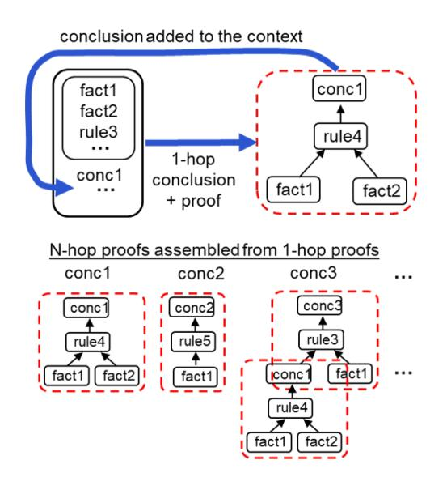
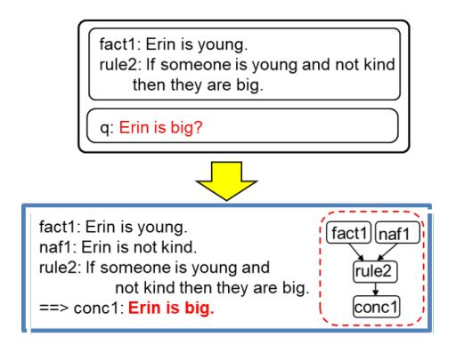
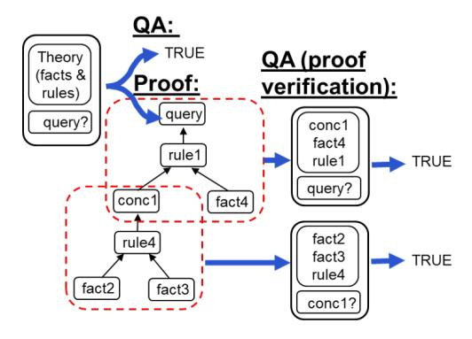

# ProofWriter: Generating Implications, Proofs, and Abductive Statements over Natural Language

# Oyvind Tafjord, Bhavana Dalvi Mishra, Peter Clark

Allen Institute for AI, Seattle, WA {oyvindt,bhavanad,peterc}@allenai.org

#### **Abstract**

Transformers have been shown to emulate logical deduction over natural language theories (logical rules expressed in natural language), reliably assigning true/false labels to candidate implications. However, their ability to generate implications of a theory has not yet been demonstrated, and methods for reconstructing proofs of answers are imperfect. In this work we show that a generative model, called ProofWriter, can reliably generate both implications of a theory and the natural language proofs that support them. In particular, iterating a 1-step implication generator results in proofs that are highly reliable, and represent actual model decisions (rather than post-hoc rationalizations). On the RuleTaker dataset, the accuracy of ProofWriter's proofs exceed previous methods by +9% absolute, and in a way that generalizes to proof depths unseen in training and on out-of-domain problems. We also show that generative techniques can perform a type of abduction with high precision: Given a theory and an unprovable conclusion, identify a missing fact that allows the conclusion to be proved, along with a proof. These results significantly improve the viability of neural methods for systematically reasoning over natural language.1

# 1 Introduction

A fundamental goal for AI, dating back to its earliest years, is automated reasoning: the ability to draw valid conclusions from explicitly provided knowledge (McCarthy, 1959). However, approaches relying on expressing knowledge in a formal representation language have sometimes proved challenging (Musen and Van der Lei, 1988). Recent work on RuleTaker (Clark et al., 2020) demonstrated a modern approach to this goal, in which transformers emulate deductive reasoning

#### Theory (Facts + Rules) fact1: Erin is young. fact5: Charlie is big fact6: Dave is white rule10: If someone is young and not kind then they are big. rule11: If someone is blue then they are kind. rule12: Kind people are young. fact16: Charlie is blue. rule18: If someone is big and young then they are quiet q: Charlie is quiet? **ProofWriter** fact16: Charlie is blue. fact16 rule11: If someone is blue then they are kind. rule11 ==> conc3: Charlie is kind. conc3: Charlie is kind. rule12: Kind people are young. ==> conc2: Charlie is young. fact5 conc2: Charlie is young. fact5: Charlie is big. rule18 rule18:If someone is big and young

Figure 1: Given facts, rules, and a question all expressed in natural language, ProofWriter answers the question and generates a proof of the answer.

Generated Proof

then they are quiet. ==> conc1: Charlie is quiet.

over statements expressed in *natural language*, by reliably assigning true/false labels to candidate implications. However, simply assigning true/false labels is limiting. For practical purposes, systems should also generate proofs of those labels, so that their conclusions can be verified and a human-understandable rationale be produced.

Recent work on PRover, by Saha et al. (2020), provided first results towards this goal, assembling proofs by first classifying which facts, rules, and connections should be in the proof tree then using an Integer Linear Programming (ILP) module to enforce consistency constraints. However, the gen-

&lt;sup>1Datasets available at https://allenai.org/data/proofwriter

Figure 2: ProofWriter iteratively generates 1-step implications and their proofs, and adds implications back into into the context for deeper reasoning. The stepwise proof fragments are assembled into full proofs of N-hop conclusions.

erated proofs were imperfect, and there were no guarantees that the model "believed" the proofs that it was reciting, i.e., that its QA module would agree with the steps shown in the proof. In this paper, we adopt a different approach, based on generation rather than classification. Our system, ProofWriter, generates proofs such as that shown in Figure 1 by iteratively generating 1-hop inferences and their (simple) proofs, adding implications back into the context for deeper reasoning, and assembling more complex proofs from the 1-hop fragments (Figure 2). As the accuracy of 1-hop inference is highly reliable, the accuracy of deeper inference and their proofs is also high. This results in proofs that substantially exceed the earlier method's accuracy, and also reflect the model's internal decisions, rather than a post-hoc rationalization (i.e., is a "faithful" proof (Subramanian et al., 2020)).

The generative approach also affords two other new capabilities. First, ProofWriter generates implications that logically follow from a NL (natural language) theory, allowing enumeration of consequences (rather than only assigning truth values to pre-conjectured hypotheses). Second, we demonstrate (a constrained form of) abduction: Given a theory and an unprovable conclusion, identify a missing fact (if any) that allows the conclusion to be proved when added to the theory, plus its proof.

We evaluate our work on a collection of natural language reasoning datasets, including the RuleTaker datasets as well as several new variants. We achieve state-of-the-art results in proof generation, and strong new baselines for implication enumeration and abduction over natural language theories. Our contributions are thus:

- 1. A new method for proof generation for logical reasoning over natural language, that obtains state-of-the-art results and is faithful to the model's internal decisions.
- 2. A method and baseline results for *generating* logical implications of statements in NL.
- 3. A method and baseline results for performing abduction over natural language statements.
- 4. New datasets to promote further research.

These results significantly improve the viability of neural methods for formal reasoning over language.

# 2 Related Work

Our work builds on the RuleTaker line of research, in which transformers learn to emulate a deductive reasoning *algorithm* (Clark et al., 2020). Unlike other approaches to reasoning such as parsing to a formal language (Kamath and Das, 2019), implementing a reasoning algorithm with neural components (Weber et al., 2019; Rocktäschel and Riedel, 2017), or SAT solving (Selsam et al., 2019), these transformers emulate reasoning over language directly, bypassing a formal representation.

PRover (Saha et al., 2020), mentioned earlier, was the first system to also produce proofs in this context, although its post hoc approach meant that proofs did not necessarily represent the actual model decisions. Gontier et al. (2020) also explored the generation of answers and proofs, but in the context of rule *induction* with ( $\approx$  10) fixed rules to induce. In contrast, ProofWriter generates proofs from explicit NL rules (which may differ for each problem). Similarly, formal theorem proving has explored proving mathematical theorems from fixed, fundamental axioms, e.g., (Polu and Sutskever, 2020; Wang and Deng, 2020), while ProofWriter performs inference with differing sets of rules expressed in natural language.

Our work is also distinct from the large body of work on rationales and explanation. Work on rationales aims to identify sentences (or phrases) that caused a model to make a particular decision, but without an explanation of *why* that rationale led to the answer (the model's reasoning is opaque), e.g., (DeYoung et al., 2019; Narang et al., 2020). Similarly, work on explanations has sought to gen-

| Proof (and Answer) | $CQ \rightarrow AP$      | Given theory $C$ and hypothesis fact $Q$ , determine $Q$ 's truth $A$ and proof $P$ (if any) |
|--------------------|--------------------------|----------------------------------------------------------------------------------------------|
| Enumeration        | $C \rightarrow I_1,,I_n$ | Given $C$ , generate all implications $I_i$ that logically follow.                           |
| Abduction          | $CQ 	o f_m$              | Given $C$ and an unprovable fact $Q$ , identify a new fact $f_m$ that, when added to $C$ ,   |
|                    |                          | would make $Q$ true.                                                                         |

Table 1: The three tasks that ProofWriter performs.

erate human-style justifications, which again are typically supporting evidence rather than a fully-formed line of reasoning, and without explicit reasoning rules (Camburu et al., 2018; Jhamtani and Clark, 2020; Inoue et al., 2020). In contrast, ProofWriter produces a deductive chain of reasoning from what is known to what is concluded, using a transformer retrained to reason systematically.

## 3 Approach

#### 3.1 Definitions

Let:

- C be a theory, a set of English sentences C consisting of facts F and rules R, each expressing a logical fact or rule in English. (We also refer to C as the context).
- Q be a question, a hypothesis fact in English whose truth is to be determined based solely on the information in C.
- A be an answer, where  $A \in \{True, False\}$  (if reasoning using a closed-world assumption) or  $A \in \{True, False, Unknown\}$  (open-world assumption).
- P be a proof, described shortly.
- *I* be an *implication*, a fact that logically follows from *C*.

We define three tasks (also see Table 1):

- **1. proof (inc. QA):**  $CQ \rightarrow AP$ : Given C and hypothesis fact Q, what is the truth A and proof P (if any) of Q?
- **2. enumeration:**  $C \rightarrow I_1, ..., I_n$ : Which  $I_i$  follow from C?
- **3. abduction**(restricted form)  $CQ \rightarrow f_m$ : Which extra fact  $f_m$  will make Q true given C?

We reuse (and add to) the RuleTaker datasets for our work, which include all five elements above. An example of a RuleTaker theory (facts and rules), a query, and a proof generated by ProofWriter are shown in Figure 1. Facts and rules are English statements, and implications are English statements that logically follow from those facts and rules. The original datasets were generated from synthetic logic programs and their implications, using natural language patterns to produce the English forms.

#### 3.2 Semantics

Following prior work, we adopt the semantics of Datalog (Ceri et al., 1989): A fact is true if it is either known (i.e., explicitly stated in the context C), or (recursively) is the conclusion of a rule whose conditions are true (is "supported"). For handling negation, we use two alternative Datalog semantics: The first, following prior work, makes the closedworld assumption (CWA) and uses negation as failure (NAF), so that any fact not provable is assumed false. Under this semantics, negated facts and negative rule conclusions are not allowed (redundant under the CWA). The second makes an open-world assumption (OWA), and does allow negative facts and rule conclusions. Under this semantics, a third truth value Unknown is also possible.

## 3.3 Proof Representation

We define a proof P of a fact  $f_q$  as a directed acyclic graph (N,E) with nodes  $n \in N$  and (directed, untyped) edges  $e \in E$ . Each node in P is either a fact f (a ground literal) or a rule r (a logical implication), expressed in English. Each edge in the proof either connects a fact to a rule, denoting that the fact helps satisfy the rule's condition, or connects a rule to a fact, denoting that the fact follows from the instantiated rule. Thus nodes in any branch of the proof will alternate between facts and rules. Note this definition differs from (and is richer than) that in PRover, where intermediate conclusions were not part of the proof.

Facts in the proof are one of three types: known facts  $f_i \in F$ , negated facts  $f_{naf}$  that cannot be proven (false under negation-as-failure (NAF)), and facts  $f_{conc}$  that are the conclusions of rules.  $f_i$  and  $f_{naf}$  are leaf nodes of the proof, while the  $f_{conc}$  are intermediate nodes within the proof. Note that  $f_{naf}$  and  $f_{conc}$  are by definition not in F. Example proofs are shown in Figures 1 and 3.

# 3.4 Proof Encoding

As we wish to generate proofs, we need to encode P as a linear structure that can be output by a generative model. Facts and rules in the context are explicitly labeled with identifiers (fact1, ..., rule1,

Figure 3: An example proof that includes a negated (negation-as-failure) fact.

...) that the proof can refer to, see Figures 1 and 3.2 Then, in the linear proof, rule nodes are denoted by their identifier (rule1, ...), while fact nodes are denoted by three types of identifiers: fact1, fact2, ... for facts in the context; naf1, naf2, ... for facts *not* in the context and assumed false; and conc1, conc2, ... for facts concluded by rules. To decode the naf\* and conc\* identifiers (which by definition are not in the context), an additional sequence of the form "with conc1: *sentence1*. conc2: *sentence2*. ..." is appended to the proof.

To linearize the proof in a format convenient for a generative model, we conjoin rules and their conclusions using a "%" symbol, express conjunctive rule conditions with a "&" symbol, and use "#" to denote the inverse implication (" $\leftarrow$ "). We then express the tree using Polish notation. E.g., the proof tree "((fact1 & fact2)  $\rightarrow$  rule1  $\rightarrow$  conc1)" (i.e., fact1 and fact2 satisfy rule1, concluding conc1) would be expressed "# rule1%conc1 & fact1 fact2". Thus the 3-step proof from Figure 1 is encoded:

# rule18%conc1 & fact5 # rule12%conc2 # rule11%conc3 fact16; with conc1: Charlie is quiet.; conc2: Charlie is young.; conc3: Charlie is kind.

If the question is a known fact, the "depth 0 proof" is simply the fact itself (e.g., fact1). If no proof exists, the symbol "None" is used.

#### 3.5 Models

The ProofWriter models are built on top of the text-to-text pretrained T5 transformer (Raffel et al., 2020) (T5-11B). We use different textual prompts for the different tasks. For the task of generating an answer and a proof, the input to the model is

of the form: "\$question\$ = question; \$context\$ = theory-sentences", for example: "\$question\$ = Erin is big.; \$context\$ = sent1: Erin is young. sent2: If ..." The output is of the form: "\$answer\$ = True/False/Unknown: \$proof\$ = proof;", where proof is encoded as described in Section 3.4. For training instances where multiple outputs are valid, we select a single one at random (for multiple proofs, we select among the shortest proofs). Appendix D lists the hyperperameters and gives input/output examples for each task.

#### 3.6 Task 1: Proof Generation

We evaluate two methods of proof generation:

All-At-Once: We train a model to generate the full proof and answer in one go (theory + question → answer + proof).

**Iterative:** We first train a model to generate a single 1-step implication (theory → implication + 1-step-proof), where the implication follows from a single rule application. Then at test time, we apply this model iteratively, adding each implication to the theory and repeating until no more implications can be found (i.e., exhaustive forward-chaining). The proof for any given implication can then be assembled from the 1-step-proof fragments (Figure 2).

# 3.6.1 All-At-Once ProofWriter ("All")

The All-At-Once model is trained directly on  $CQ \rightarrow AP$  examples in the datasets (P = "None" if there is no proof of Q). Section 3.5 describes the i/o format, and Appendix D.1 shows an example.

#### 3.6.2 Iterative ProofWriter ("Iter")

**Training:** To train the Iterative model, for each theory C in the training data, we create an augmented set of training examples with one sequence of iteratively inferred facts in turn, each using C plus the previously inferred facts. For example, if theory  $C_1$  implies  $I_1$ ,  $I_2$ , and  $I_3$ , then we create four training examples  $C_1 \to I_1$ ,  $C_1 \cup \{I_1\} \to I_2$ ,  $C_1 \cup \{I_1, I_2\} \rightarrow I_3$ , and  $C_1 \cup \{I_1, I_2, I_3\} \rightarrow$ "None". The order of adding the  $I_i$  is random but constrained such that if a later implication depends on an earlier one, the earlier one must be inferred first. For example, if the proof of  $I_3$  depends on  $I_2$  (determined by inspecting the gold proofs),  $I_2$ must be in the context before  $I_3$  is inferred. This ensures that all example inferences are depth 1 (i.e., a single rule application). An example input/output for one step is shown in Appendix D.2.

&lt;sup>2In practice we name these sent1, sent2, ... without a fact/rule distinction, but for expository purposes it is helpful to use different identifiers.

**Testing:** To answer and provide the proof for a particular question/implication, the model generates all implications and their proofs by iteratively applying the model until no more implications (the implication "None") is generated. It then looks for the question among them. If found, the answer is True with the proof given. The model also looks for the negation of the question3 and its proof. If found, the answer is False with the proof given. Otherwise, there is no proof (proof = "None") and the answer is False (for positive questions, CWA), True (for negative questions, CWA), or Unknown (any question, OWA).

# 3.7 Task 2: Implication Enumeration

A second desirable reasoning skill is *enumerating* implications of a theory (rather than just assign True/False to a hypothesis). This capability is important for practical application of the technology. In fact, the Iterative ProofWriter already does this by design, a substantial advantage. To evaluate this (later), we compare this with an "all at once" strategy of generating *all* implications as a single output string, analogous to the All-At-Once strategy for generating the full proof as a single string. For training this All-At-Once enumerator, and testing both, we gather the list of *all* implications  $I_i$  of each theory C in the train/test data. Each train/test example is of then of the form: given C, predict all the  $I_i$ . An example input/output is in Appendix D.3.

#### 3.8 Task 3: Abduction (Single Fact)

A third desirable reasoning skill is *abduction* over natural language theories, again made possible by generative models. Abduction has previously been studied extensively in formal logic, e.g., (Konolige, 1997), and in NLP, e.g., (Hobbs et al., 1993; Bhagavatula et al., 2020). Here we evaluate whether a generative approach can combine logic and NLP, performing logical abduction over natural language knowledge. We do this for a restricted form of abduction, namely single-fact abduction: Given a theory C and a possible implication Q not provable from C, identify a new fact  $f_m$  (other than the trivial Q itself) such that  $C \cup \{f_m\}$  implies Q.

We restrict this task to the OWA (open-world) setting where questions can naturally have unknown truth values. To train and test an abductive

model over our datasets, we create an abductive version as follows: For each theory C in the train/test data, for each unprovable fact Q, identify all alternative "missing facts" factM that, when added to C, make Q True. To do this, recall that each NL theory was originally generated from a formal one  $C_{formal}$  in a formal representation language (Datalog). We first exhaustively enumerate all possible  $Q_{formal}$  and  $fact M_{formal}$  in the formal language (this is feasible as the space of predicates and individuals is small), then use a theorem prover to test if  $C_{formal} \cup \{factM_{formal}\}$  implies  $Q_{formal}$ for all pairs  $(factM_{formal}, Q_{formal})$ . For each success, we generate the NL equivalents Q and factM using simple NL generation templates. We then collect the alternative factMs for each Q. The abduction task is then, given C and Q, identify the set of all alternative factMs, i.e.:

$$C, Q \rightarrow factM_1, ..., factM_i$$

If there is no single factM that can be added to make Q true, then the symbol "None" is output.

#### 4 Datasets

We now evaluate ProofWriter on these three tasks. We use the original RuleTaker D\* datasets (Clark et al., 2020), plus we create two new variants: The first (CWA) is similar to the original except it fixes some minor inconsistencies concerning negation (details in Appendix A.2). The second (OWA) is also similar to the original, except reasoning uses an open-world assumption.

We denote these as  $D^*(\text{orig})$ ,  $D^*(\text{CWA})$ , and  $D^*(\text{OWA})$ . Each example in each dataset contains a theory C, a question Q, the answer A (True/False/Unknown), and all possible proofs  $P_1, ..., P_n$  for that answer (if provable).4 Each theory is also accompanied with all possible proofs of all possible implications, as auxiliary annotations.

The D\* datasets comprise five datasets, named **D0**, **D1**, **D2**, **D3**, **D5**, each containing 100k questions. In each dataset, theories and questions are expressed in templated English (e.g., Figure 1), questions can be positive or negated facts (e.g., "Charlie is not quiet?"), and answers are equally divided into True/False (and Unknown, for the OWA versions). Each dataset contains questions whose answers require reasoning up to depths D (D = 0, 1, 2, 3, 5). Thus, for example, all questions in D0

&lt;sup>3To negate a question, a model can be trained for this straightforward task. Here, as our question language is simple, a simple regex to add/remove a "not" suffices.

&lt;sup>4The domain is small enough that all proofs can be enumerated. However, there still can be a large number, e.g., some D5 questions have over 3000 possible proofs.

|       |       | A      | nswer       | ]      | Proof       |
|-------|-------|--------|-------------|--------|-------------|
| Depth | # qns | PRover | ProofWriter | PRover | ProofWriter |
| 0     | 6299  | 100    | 100         | 98.4   | 99.6        |
| 1     | 4434  | 99.0   | 99.1        | 93.1   | 98.7        |
| 2     | 2915  | 98.8   | 98.6        | 84.8   | 97.3        |
| 3     | 2396  | 99.1   | 98.5        | 80.5   | 94.4        |
| 4     | 2134  | 98.8   | 98.7        | 72.4   | 91.0        |
| 5     | 2003  | 99.3   | 99.3        | 65.1   | 86.4        |
| All   | 20192 | 99.3   | 99.2        | 87.1   | 96.2        |

Table 2: [Task 1: Proof Generation] Systems trained and tested on D5(orig), showing the breakdown by depth of proof required to answer each question. ProofWriter generates significantly more correct proofs for all depths, achieving a new SOTA on this task.

are lookup questions, requiring no inference. Each dataset is split 70/10/20 into train/dev/test.

To test generalization, we also use two other datasets from the original RuleTaker work:

**Birds-Electricity:** These 6 test-only datasets use small, real-world theories written by hand (one per dataset) to test out-of-distribution model performance. Details are in Appendix A.3.

**ParaRules:** This dataset contains 40k questions against 2k theories expressed in paraphrased natural language, obtained through crowdsourcing. This dataset tests transfer to more natural expressions of knowledge. Details are in Appendix A.4.

#### 5 Experiments and Results

# 5.1 Task 1: Proof Generation (Comparison with Prior Work)

First, we compare ProofWriter's ability to generate proofs with PRover, the current state-of-the-art. We evaluate both answer accuracy and proof correctness. For proof correctness, for a fair comparison, we ignore the intermediate conclusion nodes (which PRover does not generate). We then use the same strict scoring metric as in PRover (called FA or Full Accuracy in the PRover paper): the proof graph must *exactly* match a gold proof (i.e., be perfectly correct); otherwise, the proof scores 0.

#### **5.1.1** Generating Answers and Proofs

We use the same IID (independent, identically distributed) data used for PRover (train/test on dataset D5(orig)). The results are in Table 2, showing accuracies for questions requiring increasingly deeper depths of reasoning to answer. The ProofWriter's results are for the All-At-Once model. (The Iterative model scores are almost identical, see later Table 4.) While answer accuracy is almost perfect for both systems, ProofWriter generates **substantially** 

|        |       | A      | nswer |        | ]       | Proof |        |
|--------|-------|--------|-------|--------|---------|-------|--------|
|        |       | PRover | Proof | Writer | PRover  | Proof | Writer |
| Test   | # qns | rkover | All   | Iter   | I KOVEI | All   | Iter   |
| Birds1 | 40    | 95.0   | 100   | 95.0   | 92.5    | 100   | 95.0   |
| Birds2 | 40    | 95.0   | 100   | 95.0   | 95.0    | 100   | 95.0   |
| Elec1  | 162   | 100    | 96.9  | 100    | 95.1    | 96.9  | 100    |
| Elec2  | 180   | 100    | 98.9  | 100    | 91.7    | 98.9  | 100    |
| Elec3  | 624   | 89.7   | 92.0  | 95.5   | 71.8    | 92.0  | 95.5   |
| Elec4  | 4224  | 84.8   | 83.3  | 97.1   | 80.6    | 82.0  | 97.1   |
| All    | 5270  | 86.5   | 85.5  | 97.0   | 80.5    | 84.5  | 97.0   |

Table 3: [Task 1: Proof Generation] Training on D5, test on Birds-Electricity. Both ProofWriter versions ("All" for All-At-Once, "Iter" for Iterative) outperform PRover overall in both answer and proof correctness. The Iterative model is also significantly more robust.

more correct proofs (last line, +9% absolute), and without the complexity of PRover's heuristic assembly of proof graphs using ILP.

#### **5.1.2** Performance on OOD Rulesets

We compared ProofWriter's and PRover's ability to generalize to the hand-authored Birds-Electricity rulesets, zero shot. These rulesets are out-ofdomain (OOD), as their English is not templated and is stylistically different to the training data. We compare the PRover and All-At-Once ("All") ProofWriter models trained on D5, plus the Iterative ProofWriter ("Iter") trained on D0-D3 theories. The models do not see any Birds-Electricity examples during training. The results in Table 3 show that ProofWriter's proof generation transfers well zero-shot to these hand-authored datasets, with 84.5% proof correctness for All-At-Once, and 97% for the Iterative ProofWriter, indicating better outof-domain generalization for the Iterative version. Both ProofWriter models significantly outperform PRover (80.5%).

We also find ProofWriter obtains more correct proofs (+3%) than PRover on the ParaRules dataset. Details are in Appendix B.1.

# 5.2 Task 1: Proof Generation (All-At-Once vs. Iterative)

Second, we compare our two approaches to proof generation, All-At-Once vs. Iterative, in more detail. We show that although they have almost identical performance for proofs with depths seen in training, **the Iterative model generalizes better to proofs of longer depths** than seen in training. For these comparisons, we use the new D\*(CWA) datasets (which fix some minor errors in D\*(orig)), and also the D\*(OWA) datasets to explore performance in an open-world setting.

|       |      | Ans  | wer  |      |      | Pro  | oof  |      |
|-------|------|------|------|------|------|------|------|------|
|       | CV   | VΑ   | OV   | VA   | CV   | CWA  |      | VΑ   |
| Depth | All  | Iter | All  | Iter | All  | Iter | All  | Iter |
| N/A   | 99.0 | 99.7 | 99.4 | 99.9 | 99.0 | 99.7 | 99.4 | 99.9 |
| 0     | 100  | 100  | 100  | 100  | 100  | 100  | 100  | 100  |
| 1     | 99.9 | 99.8 | 100  | 99.3 | 99.6 | 95.4 | 99.7 | 97.8 |
| 2     | 99.9 | 99.5 | 99.9 | 99.7 | 98.3 | 91.7 | 98.6 | 97.3 |
| 3     | 100  | 99.7 | 100  | 99.2 | 95.8 | 90.4 | 96.9 | 97.1 |
| 4     | 100  | 99.7 | 99.9 | 99.1 | 93.1 | 88.9 | 94.8 | 96.5 |
| 5     | 99.9 | 98.9 | 100  | 98.8 | 89.3 | 87.8 | 91.4 | 86.4 |
| All   | 99.6 | 99.7 | 99.7 | 99.6 | 97.2 | 95.4 | 98.0 | 97.6 |

Table 4: [Task 1] Comparison of All-At-Once ("**All**") vs. Iterative ("**Iter**") ProofWriter models, trained on D5 and D0-D3 respectively, and tested on D5.

#### **5.2.1** Comparison (IID Test Set)

We train the All-At-Once model on D5 (train), and the Iterative model using the method described in Section 3.6.2, using the ( $\sim$  5k) theories from D3 (train) plus  $\sim$  20% of the D0-D2 (train) theories.5 We then test both models on D5 (test). We measure both answer and proof accuracies, and also break down the results by proof depth (using "N/A" as the proof depth for questions that are not provable). The D5 test set has 2k questions at each proof depth, plus 8k unprovable questions (proof = "None", depth = "N/A").6

The results are shown in Table 4, and show that both ProofWriter versions have similar, high proof correctness (95%+) on the test set, even though some proofs are highly complex.

#### **5.2.2** Generalization to Unseen Depths

We also wish to see how well the models can generate proofs at depths unseen during training. To do this, we train an All-At-Once model on D3, and use the same Iterative model as earlier (trained on iterative examples from theories up to depth 3). We test on D5. As D5 contains problems at greater depths than those seen during training, we can observe the models' ability to generalize. We compare with both the CWA and OWA versions of our datasets.

The results are shown in Table 5. As can be seen, the All-At-Once model has quite poor generalization for generating longer proofs than seen in training, while **the Iterative model is more robust** (red box).

|       |      | Ans  | wer  |      |      | Pro  | oof  |      |
|-------|------|------|------|------|------|------|------|------|
|       | CV   | VA   | OV   | VA   | CV   | VA   | OWA  |      |
| Depth | All  | Iter | All  | Iter | All  | Iter | All  | Iter |
| N/A   | 99.6 | 99.7 | 99.4 | 99.9 | 99.6 | 99.7 | 99.4 | 99.9 |
| 0     | 100  | 100  | 100  | 100  | 100  | 100  | 100  | 100  |
| 1     | 99.9 | 99.8 | 99.9 | 99.3 | 99.7 | 95.4 | 99.8 | 97.8 |
| 2     | 99.4 | 99.5 | 99.8 | 99.7 | 98.2 | 91.7 | 98.8 | 97.3 |
| 3     | 99.2 | 99.7 | 99.8 | 99.2 | 93.4 | 90.4 | 94.5 | 97.1 |
| 4     | 95.4 | 99.7 | 99.3 | 99.1 | 69.9 | 88.9 | 71.4 | 96.5 |
| 5     | 72.9 | 98.9 | 93.7 | 98.8 | 27.4 | 87.8 | 35.1 | 86.4 |
| All   | 96.6 | 99.7 | 99.0 | 99.6 | 88.9 | 95.4 | 90.2 | 97.6 |

Table 5: [Task 1] Comparison of the All-At-Once vs. Iterative ProofWriter models, trained on D3 and tested on D5. While scores are mostly similar throughout, the iterative model generalizes substantially better to generate proofs of depths unseen during training (red box).

Figure 4: [Task 1] All-At-Once proofs can be verified by checking each step as a separate QA query.

# 5.3 Verifying All-At-Once Proofs

Proofs from the Iterative ProofWriter have an additional desirable property: each proof step is one that the model explicitly took during the iteration, i.e., the model "believes" the step. In contrast, the All-At-Once proofs are a post hoc generated string of symbols, and may not reflect steps that ProofWriter would actually make. However, because proofs include intermediate conclusions, we can alleviate this concern by verifying individual steps in the All-At-Once proofs. For example, if a generated proof step states that fact2 + fact3 + rule4 implies conc1, we can simply ask ProofWriter in QA mode if this is true (Figure 4). Given the almost perfect performance for such simple depth 1 questions in QA mode (with no distractor facts or rules), the ability to verify a correct proof corresponds to the accuracy of correctly generating the correct intermediate conclusions conc\* in the first place. (Note that an unverified proof is not necessarily wrong, rather cannot be verified as right). OWA proofs can be fully verified in this way. For CWA theories with NAFs, the verification is only partial as NAFs are presumed negative statements

&lt;sup>5We include D0-D2 theories to have more examples of theories with fewer conclusions. The derivative iterative training data is included in our dataset release.

&lt;sup>6Note this breakdown is slightly different from the one in Table 2 where the depth used the original RuleTaker annotations which included a depth for questions without proofs, based on the deepest proof search that fails. We retained that convention in Table 2 for best comparison with PRover.

|       | Verified Proofs |      |       |      |  |  |  |  |
|-------|-----------------|------|-------|------|--|--|--|--|
|       | CV              | VΑ   | OWA   |      |  |  |  |  |
|       | Trair           | on:  | Trair | on:  |  |  |  |  |
| Depth | D3              | D5   | D3    | D5   |  |  |  |  |
| N/A   | 99.6            | 99.0 | 99.4  | 99.4 |  |  |  |  |
| 0     | 100             | 100  | 100   | 100  |  |  |  |  |
| 1     | 99.8            | 99.6 | 99.7  | 99.7 |  |  |  |  |
| 2     | 98.2            | 98.3 | 98.6  | 98.6 |  |  |  |  |
| 3     | 93.2            | 95.8 | 94.3  | 96.8 |  |  |  |  |
| 4     | 66.7            | 92.9 | 66.1  | 94.6 |  |  |  |  |
| 5     | 13.8            | 89.3 | 16.4  | 90.8 |  |  |  |  |
| All   | 87.2            | 97.2 | 87.9  | 97.9 |  |  |  |  |

Table 6: [Task 1: Proof Generation] The All-At-Once model's ability to verify its proofs. For proofs within depths seen during training, almost all correct proofs (Tables 5 and 4, columns 5 and 7) can be verified. However, for proofs at unseen depths, the proportion that can be verified drops rapidly (trained on D3, test on depths 4,5). In contrast, Iterative ProofWriter's proofs are always verified, by definition of its algorithm.

which require the full theory to verify.

We measured the percentage of correct, verified proofs, shown in Table 6. Provided proofs are within the depths seen during training, almost all correct proofs can be verified. However, at depths deeper than seen at training, the proportion that can be verified drops rapidly. In contrast, the Iterative ProofWriter's proofs are always verified, as by definition they are assembled from single step inferences that the model actually took.

# **5.4** Task 2: Implication Enumeration

Third, we evaluate ProofWriter's performance on a new task, namely *enumerating* implications of a theory (rather than just assign *True/False* to a hypothesis). We compare the All-At-Once and Iterative strategies as described in Section 3.7.

To train All-At-Once, and test both, we created an enumerative dataset of  $C \to \{I_1, ..., I_n\}$  examples (Section 3.7). For this we sample theories C in the D0-D3 datasets and gather the list of all implications  $I_i$  for each theory C. We call this enumerative dataset **D3+Enum**. We similarly create a **D5-Enum** dataset from theories in (only) D5 to test OOD conclusion generation. We create CWA and OWA versions of both.

We train All-At-Once on D3-Enum (train), then test both models on D3-Enum (test) and D5-Enum (test). For metrics, we measure F1 scores by comparing the individual predicted implications with the gold  $I_i$ , as well as the exact-match correctness of the predicted *set* of implications  $\{I_1, ..., I_n\}$  (one point if the set *exactly* matches the gold, bar ordering, zero otherwise). The results are shown in

|      | F1   |      |      |      | Accuracy |      |      |      |
|------|------|------|------|------|----------|------|------|------|
| Enum | CV   | VΑ   | OV   | VΑ   | CV       | VΑ   | OV   | VA   |
| Test | All  | Iter | All  | Iter | All      | Iter | All  | Iter |
| D3+  | 98.9 | 99.8 | 99.4 | 99.6 | 92.5     | 98.8 | 95.5 | 99.0 |
| D5   | 94.5 | 99.5 | 94.8 | 99.4 | 44.6     | 93.9 | 48.9 | 94.8 |

Table 7: [Task 2: Enumeration] Iterative ProofWriter is better at generating all implications than an All-At-Once strategy. (All-At-Once is trained on D3+Enum, Iterative ProofWriter is the same model as earlier.)

| Test: | Count | F1   | Acc  |
|-------|-------|------|------|
| D3-Ab | 7067  | 97.4 | 94.5 |
| D5-Ab | 7181  | 97.3 | 93.5 |

Table 8: [Task 3: Abduction] Given a theory C and an unprovable conclusion Q, predict all alternative facts that, when added to C, make Q provable.

Table 7, and show that the **Iterative ProofWriter** is better at implication enumeration than the simple All-At-Once strategy. In particular, the All-At-Once strategy struggles for problems at depths unseen in training (second row), although it does well on its own test set despite the complicated unordered output it has to generate (up to 16 different implications in D3, 21 in D5).

#### 5.5 Task 3: Abduction (Single Fact)

Fourth and finally, we evaluate performance on a second new task, namely *abduction* over natural language theories, again made possible by generative models. Analogous to implication enumeration, we create a derivative abductive dataset of  $C, Q \rightarrow fact M_1, ..., fact M_i$  examples, where  $C \cup \{fact M_i\}$  results in Q becoming provable as described in Section 3.8. We create such D\*-Ab datasets from the D\*(OWA) datasets.

#### **5.5.1 Results (IID)**

We trained a model on D3-Ab (train), and then tested on both D3-Ab (test) and D5-Ab (test). We evaluate the results by comparing the predicted and gold factMs, measuring both F1 and "perfect match" Accuracy (1 when F1=1, 0 otherwise). The results are shown in Table 8, and indicate that the model performs well overall (85%+ scores). We also broke down the recall of factMs by proof depth required to prove Q given C and fact M. This is shown in Table 9, indicating that it is harder to identify a factM that completes a deeper proof. The similarity of D3-Ab and D5-Ab scores suggests that D5-Ab is not out-of-domain for this task: Although depths for provable D5 facts are deeper than D3, this task concerns unprovable facts, which may not be distributed differently to D3-Ab.

| Gold Proof | Test   | on D3-Ab     | Test on D5-Ab |              |  |
|------------|--------|--------------|---------------|--------------|--|
| Depth      | # Gold | Acc (recall) | # Gold        | Acc (recall) |  |
| N/A        | 2155   | 97.73        | 2170          | 97.74        |  |
| 1          | 4813   | 98.46        | 4731          | 98.73        |  |
| 2          | 1719   | 96.22        | 1986          | 96.17        |  |
| 3          | 688    | 90.26        | 915           | 92.79        |  |
| 4          | 153    | 75.82        | 330           | 82.73        |  |
| 5          | 19     | 36.84        | 96            | 78.13        |  |

Table 9: [Task 3: Abduction] Recall of abduced facts by proof depth. The data suggests that it is harder to identify a factM that completes a deeper proof.

# 5.5.2 Generalization to New Tasks

To assess out-of-domain generalization, we also evaluate how well the trained abductive model performs on an abductive version of the Birds-Electricity(OWA) theories, zero-shot (created using the same approach, Section 3.8). We find that ProofWriter has perfect zero-shot performance for the simple Birds rulebases, but progressively reduced performance for the Electricity theories as they get more complex (dropping to 64% F1, 62% Accuracy for one rulebase), indicating that the abductive task is only partly solved (Appendix B.2).

#### 6 Discussion

## 6.1 All-At-Once vs. Iterative Strategies

While the All-At-Once approach to proof generation is simple, efficient, and effective, it does not generalize as well to proofs of greater depth than seen at training. In contrast, the Iterative approach is robust to generalization. Even though errors at each iteration accumulate, the reliability of 1-step inference is so high that such error accumulations remain small. The Iterative architecture, namely a simple model embedded in a recursive loop (rather than single seq2seq model), illustrates how transformers can be used in a "scale-invariant" way, i.e., performance is largely unchanged by the scale (here reasoning depth) of the problem. In addition, as proofs are built from actual inference steps taken by the model, they are by definition "faithful" to the model's inference steps, rather than being a post hoc rationalization.

However, there are also some drawbacks to the Iterative approach: First, it is inefficient and unguided, proving everything possible and only then looking for the answer and proof for a particular question. In fact, this is a limitation of unconstrained forward-chaining in general, hence established techniques for guiding forward-chaining could be applied, e.g., a best-first expansion strategy, or using a backward-chaining strategy instead

(which would similarly need to be controlled). Second, as the theory grows by one fact per iteration, there is a risk of exceeding the transformer's input token limit (512 tokens by default), hence limiting the size of theories that can be handled. For larger theories, a retrieval mechanism might be needed to manage the facts and rules available to the reasoner.

# 6.2 Abduction and Implicit Knowledge

Recently, LeapOfThought (Talmor et al., 2020) showed that RuleTaker-like models could be retrained to reason with a combination of explicit and implicit knowledge, rather than requiring all rules to be stated explicitly (the implicit knowledge coming from the latent knowledge acquired during pretraining (Petroni et al., 2019)). Now, given an abductive capability such as the one we have presented, we have a mechanism for materializing the implicit knowledge used to answer a question, and hence generating the full proof of its answer: Given a LeapOfThought conclusion, first abduce the "missing" (implicit) fact(s) required for an explicit proof, then use ProofWriter to generate that proof. This is a significant step forward to help understand a model's decisions when both implicit and explicit knowledge has been used.

#### 7 Summary and Conclusion

While it is remarkable that transformers can learn to systematically reason over language, such methods will have limited impact if they cannot also explain their answers. In this work, we showed the first application of generative techniques to this task, and demonstrated how proofs, implication enumerations, and abductive inferences can be generated, exceeding the prior state-of-the-art in proof generation by +9% (absolute). In addition, the Iterative ProofWriter robustly generalizes to deeper proofs and more varied language than seen in training, and produces proofs that reflect (i.e., are faithful to) the model's actual inference decisions. Finally, the abductive capability offers the potential for generating proofs when both explicit and implicit knowledge are used, by materializing the implicit knowledge needed to complete the proof. Together, these significantly improve the viability of neural methods for systematically reasoning over language in practical settings. The ProofWriter datasets are available at https://allenai.org/data/proofwriter

**Acknowledgements:** We thank Google for providing the TPUs for conducting experiments.

#### References

- Chandra Bhagavatula, Ronan Le Bras, Chaitanya Malaviya, Keisuke Sakaguchi, Ari Holtzman, Hannah Rashkin, Doug Downey, S. Yih, and Yejin Choi. 2020. Abductive commonsense reasoning. In *ICLR*'20.
- Oana-Maria Camburu, Tim Rocktäschel, Thomas Lukasiewicz, and Phil Blunsom. 2018. e-SNLI: Natural language inference with natural language explanations. In *Advances in Neural Information Processing Systems*, pages 9539–9549.
- S. Ceri, G. Gottlob, and L. Tanca. 1989. What you always wanted to know about datalog (and never dared to ask). *IEEE Trans. Knowl. Data Eng.*, 1:146–166.
- Peter Clark, Oyvind Tafjord, and Kyle Richardson. 2020. Transformers as soft reasoners over language. In *IJCAI'20*.
- Jay DeYoung, Sarthak Jain, Nazneen Rajani, E. Lehman, Caiming Xiong, R. Socher, and Byron C. Wallace. 2019. ERASER: A benchmark to evaluate rationalized nlp models. In ACL.
- Nicolas Gontier, Koustuv Sinha, Siva Reddy, and C. Pal. 2020. Measuring systematic generalization in neural proof generation with transformers. In *NeurIPS*'20.
- J. Hobbs, Mark E. Stickel, Douglas E. Appelt, and P. Martin. 1993. Interpretation as abduction. *Artificial Intelligence*, 63:69–142.
- N. Inoue, Pontus Stenetorp, and Kentaro Inui. 2020. R4C: A benchmark for evaluating RC systems to get the right answer for the right reason. In *ACL*.
- Harsh Jhamtani and P. Clark. 2020. Learning to explain: Datasets and models for identifying valid reasoning chains in multihop question-answering. In *EMNLP*.
- Aishwarya Kamath and Rajarshi Das. 2019. A survey on semantic parsing. In *AKBC'19*.
- K. Konolige. 1997. Abductive theories in artificial intelligence. In *Principles of Knowledge Representa*tion.
- John McCarthy. 1984. Applications of circumscription to formalizing common sense knowledge. In *NMR*.
- John W. McCarthy. 1959. Programs with common sense. In *Proc. Tedding Conf. on the Mechanization of Thought Processes*, pages 75–91.
- Mark A Musen and Johan Van der Lei. 1988. Of brittleness and bottlenecks: Challenges in the creation of pattern-recognition and expert-system models. In *Machine Intelligence and Pattern Recognition*, volume 7, pages 335–352. Elsevier.

- Sharan Narang, Colin Raffel, Katherine Lee, A. Roberts, Noah Fiedel, and Karishma Malkan. 2020. WT5?! training text-to-text models to explain their predictions. *ArXiv*, abs/2004.14546.
- F. Petroni, Tim Rocktäschel, Patrick Lewis, A. Bakhtin, Y. Wu, Alexander H. Miller, and S. Riedel. 2019. Language models as knowledge bases? In EMNLP.
- Stanislas Polu and Ilya Sutskever. 2020. Generative language modeling for automated theorem proving. *ArXiv*, abs/2009.03393.
- Colin Raffel, Noam Shazeer, Adam Roberts, Katherine Lee, Sharan Narang, M. Matena, Yanqi Zhou, W. Li, and Peter J. Liu. 2020. Exploring the limits of transfer learning with a unified text-to-text transformer. *J. Mach. Learn. Res.*, 21:140:1–140:67.
- Tim Rocktäschel and S. Riedel. 2017. End-to-end differentiable proving. In *NeurIPS*.
- Swarnadeep Saha, Sayan Ghosh, Shashank Srivastava, and Mohit Bansal. 2020. PRover: Proof generation for interpretable reasoning over rules. In *EMNLP* '20.
- Daniel Selsam, Matthew Lamm, Benedikt Bünz, Percy Liang, Leonardo de Moura, and David L. Dill. 2019. Learning a SAT solver from single-bit supervision. In *ICLR*.
- Sanjay Subramanian, Ben Bogin, Nitish Gupta, Tomer Wolfson, Sameer Singh, Jonathan Berant, and Matt Gardner. 2020. Obtaining faithful interpretations from compositional neural networks. In *ACL*.
- Alon Talmor, Oyvind Tafjord, P. Clark, Y. Goldberg, and Jonathan Berant. 2020. LeapOfThought: Teaching pre-trained models to systematically reason over implicit knowledge. In *NeurIPS*.
- Ming-Zhe Wang and Jun Deng. 2020. Learning to prove theorems by learning to generate theorems. In *NeurIPS*.
- Leon Weber, Pasquale Minervini, Jannes Münchmeyer, Ulf Leser, and Tim Rocktäschel. 2019. Nlprolog: Reasoning with weak unification for question answering in natural language. In *ACL*.

# Appendix: ProofWriter: Generating Implications, Proofs, and Abductive Statements over Natural Language

#### **A Datasets: Additional Details**

#### A.1 Statistics

Some overall statistics for the updated RuleTaker CWA and OWA datasets are in Table 10. The number of implications per theory can reach 20 and above, and the proof depths go up to 10, even though the proof depths of the associated questions are limited to the dataset depth (e.g., depth 3 for D3).

|            |       |        | # impl       | depth |
|------------|-------|--------|--------------|-------|
| Dataset    | # th  | # qns  | min/mean/max | max   |
| CWA:       |       |        |              |       |
| D0         | 27020 | 100002 | 0/1.0/18     | 8     |
| D1         | 12965 | 100012 | 1/1.9/17     | 6     |
| D2         | 9138  | 100014 | 2/3.3/18     | 5     |
| D3         | 7067  | 100024 | 3/5.1/16     | 7     |
| D5         | 4935  | 100030 | 5/9.8/21     | 10    |
| Birds/Elec | 140   | 5270   | 0/2.0/6      | 4     |
| ParaRules  | 2403  | 40022  | 3/4.3/14     | 5     |
| OWA:       |       |        |              |       |
| D0         | 26978 | 100000 | 0/0.8/18     | 5     |
| D1         | 12933 | 100014 | 1/1.7/14     | 6     |
| D2         | 9033  | 100010 | 2/3.1/14     | 5     |
| D3         | 6940  | 100036 | 3/4.8/16     | 6     |
| D5         | 4752  | 100030 | 5/9.1/21     | 10    |
| Birds/Elec | 140   | 5270   | 0/1.2/6      | 3     |
| ParaRules  | 2403  | 40022  | 3/4.3/14     | 5     |

Table 10: Statistics for the CWA and OWA datasets, giving the number of theories, questions and implications per theory. Note that the maximum implication proof depth can go higher than the maximum proof depth for the included questions (e.g., for D5 the maximum questions depth is 5, but there are implications up to depth 10 which are include in the enumeration task).

Table 11 describes overall statistics for the datasets for Task 3: Abduction. Each abduction question can have zero or more missing facts as answer, and the proof depths can go up to 11.

|                      |       |       | # missing    | max   |
|----------------------|-------|-------|--------------|-------|
|                      |       |       | facts        | proof |
| Dataset              | # th  | # qns | min/mean/max | depth |
| D0-Ab                | 18011 | 85705 | 0/0.8/15     | 6     |
| D1-Ab                | 10448 | 49808 | 0/0.8/12     | 7     |
| D2-Ab                | 7092  | 37245 | 0/0.9/11     | 6     |
| D3-Ab                | 5633  | 34915 | 0/1.1/11     | 8     |
| D5-Ab                | 4362  | 35213 | 0/1.2/9      | 11    |
| Birds-Electricity-Ab | 140   | 3940  | 0/0.24/4     | 4     |

Table 11: Statistics for the Abduction datasets, giving the number of theories, abduction questions, number of missing facts per question and maximum proof depth.

#### A.2 Repairs to the RuleTaker Datasets

The original RuleTaker theories were intended to be full Datalog theories, but contained three occasional violations in the with-negation theories:

- 1. Some theories contained negated facts (e.g., "Bob is not red") and/or rules with negated conclusions. Such statements are redundant under a CWA, and not allowed according to formal Datalog specifications.
- 2. Some theories included rules with a free variable in a negated condition (e.g., "If someone is not blue then Bob is happy."). Such rules are not allowed according to formal Datalog specifications, as the possible groundings of the variable require meta-information about the theory as a whole.
- 3. A bug in the stratification checker led to a few theories being included that were not stratifiable, and hence may have multiple, valid truth assignments for their facts.

As a result, the theories were regenerated (with the same distribution over number of facts, rules, condition, etc.) to create the D\*(CWA) datasets, avoiding these issues.

The D\*(OWA) datasets are similar to the D\*(orig) datasets, but evaluated without a CWA, i.e., negation-as-failure (NAF) is replaced with hard negation. The theories with negation were again regenerated to ensure they were stratifiable (to avoid negation cycles), but they still retain negated facts and rule conclusions. The truth values of the questions were recomputed using an OWA, resulting in answers *True/False/Unknown*.

# A.3 The Birds-Electricity Datasets

The RuleTaker "birds" rulebase is a well-known logic problem illustrating the use of "abnormality" predicates (McCarthy, 1984),7, and converted into English by hand. The dataset contains a single theory of six rules (e.g., "If someone is a bird and wounded then they are abnormal.") and seven facts (e.g., "Bill is wounded"), and forty questions against this theory (i.e., 40 test examples total). Birds1 and Birds2 differ solely in the English wording (e.g., "Bill is flying" vs. "Bill can fly").

&lt;sup>7https://www.doc.ic.ac.uk/∼mjs/teaching/KnowledgeRep491/ ExtendedLP\_491-2x1.pdf, p5

|     |       | A      | nswer       | ]      | Proof       |
|-----|-------|--------|-------------|--------|-------------|
|     | # qns | PRover | ProofWriter | PRover | ProofWriter |
| D=0 | 2968  | 99.7   | 99.9        | 99.4   | 99.9        |
| 1   | 2406  | 98.6   | 99.3        | 97.3   | 99.3        |
| 2   | 1443  | 98.2   | 98.3        | 88.7   | 97.7        |
| 3   | 1036  | 96.5   | 98.2        | 89.9   | 96.5        |
| 4   | 142   | 88.0   | 91.5        | 76.1   | 83.1        |
| All | 8008  | 98.4   | 99.1        | 95.1   | 98.5        |

Table 12: [Task 1: Proof Generation] Train on D3 + ParaRules, test on (only) ParaRules. Both systems demonstrate robustness to more complex linguistic expressions in the theories, with ProofWriter obtaining 3% higher proof correctness.

The four RuleTaker "electricity" datasets contain examples of reasoning about toy electrical cicuits using a small set of general rules about circuits. Examples in each dataset are built using a fixed set of general rules per dataset, ranging from five rules (Elec1) to twelve rules (Elec4). Each example in these datasets contains the general rules, plus between two and five facts describing a particular circuit, with a set of questions about the circuit, e.g., Q: "The light bulb is glowing?" A: *True*.

#### A.4 The ParaRules Dataset

The RuleTaker "ParaRules" dataset contains 40k questions against 2k theories expressed in paraphrased natural language, obtained by having crowdworkers rephrase the templated English facts and rules from sampled original theories into more varied natural language. For example, "Bob is cold." might be rephrased "In the snow sits Bob, crying from being cold"; or "Alan is round. Alan is blue. Alan is kind." might be rephrased "Alan, who is round and also kind, tends to be rather blue"; or "If someone is kind then they are young." might be rephrased "A kind person will certainly be young.". While the previous datasets contain synthetic language, ParaRules tests the models' ability to reason over more human-like paraphrased language.

# **B** Additional Results

#### **B.1** Results on the OOD ParaRules Dataset

We also test the robustness of ProofWriter's proof generation to theories that use more varied natural language, summarized in Section 5.1.2. Following (Clark et al., 2020) and (Saha et al., 2020), we train on the combined training partitions of D3(orig) and ParaRules, then test on the ParaRules test partition. The results in Table 12 show that PRover and ProofWriter (All-At-Once) are robust to more com-

| <b>Test Dataset:</b> | # qns | F1     | Acc    |
|----------------------|-------|--------|--------|
| Birds1-Ab            | 14    | 100.00 | 100.00 |
| Birds2-Ab            | 14    | 100.00 | 100.00 |
| Elec1-Ab             | 114   | 89.47  | 89.47  |
| Elec2-Ab             | 126   | 90.25  | 88.89  |
| Elec3-Ab             | 456   | 81.79  | 76.32  |
| Elec4-Ab             | 3216  | 85.77  | 83.99  |
| All                  | 3940  | 85.66  | 83.53  |

Table 13: [Task 3: Abduction] Zero-shot scores of the D3-Ab model on the Birds-Electricity-Ab rulebases.

plex natural language in the input, with ProofWriter obtaining 3% higher proof correctness.

#### **B.2** Abduction: Generalization to New Tasks

Section 5.5.2 summarized the results of testing abductive reasoning on abductive versions of the Birds-Electricity(OWA) theories. The detailed results are shown in Table 13, showing perfect zero-shot performance for the simple Birds rulebases, but progressively reduced performance for the Electricity theories as they get more complex. This indicates that the abductive task remains only partially solved by our generative model.

# C Results with T5-large

In the main part of the paper we trained ProofWriter starting from the largest available T5-11B model (11 billion parameters). If we instead use the more manageable T5-large model (770 million parameters), the scores generally go down, but typically by a small amount.

In Tables 14 and 15 we show two examples of this, for the All-At-Once and Iterative ProofWriter models respectively, when training on the D3 dataset and evaluating on D5. We see the T5-large model is a bit worse on higher depth proof accuracy in the All-At-Once model, but is otherwise quite competitive.

# D Hyperparameters and I/O Examples

We fine-tune the models on the training set using the default hyperparameters (including the Adafactor optimizer) in the T5 library.8 We use the largest T5-11B model for the main results, fine-tuned for 40k steps (batch size 8), selecting the checkpoint with highest validation score (usually the final step). See Appendix C for results using the smaller T5-large.

&lt;sup>8https://github.com/google-research/text-to-text-transfer-transformer

|       | Answer |      |       |      | Proof |      |       |      |
|-------|--------|------|-------|------|-------|------|-------|------|
|       | CWA    |      | OWA   |      | CWA   |      | OWA   |      |
| Depth | large  | 11B  | large | 11B  | large | 11B  | large | 11B  |
| N/A   | 98.4   | 99.6 | 97.4  | 99.4 | 98.4  | 99.6 | 97.4  | 99.4 |
| 0     | 100    | 100  | 100   | 100  | 100   | 100  | 100   | 100  |
| 1     | 100    | 99.9 | 99.9  | 99.9 | 99.4  | 99.7 | 99.3  | 99.8 |
| 2     | 99.8   | 99.4 | 99.7  | 99.8 | 97.5  | 98.2 | 97.6  | 98.8 |
| 3     | 100    | 99.2 | 99.7  | 99.8 | 90.4  | 93.4 | 91.2  | 94.5 |
| 4     | 98.9   | 95.4 | 99.5  | 99.3 | 38.6  | 69.9 | 46.9  | 71.4 |
| 5     | 92.3   | 72.9 | 98.9  | 93.7 | 12.4  | 27.4 | 24.4  | 35.1 |
| All   | 98.4   | 96.6 | 98.7  | 99.0 | 83.4  | 88.9 | 85.6  | 90.2 |
|       |        |      |       | i    |       |      |       |      |

Table 14: [Task 1] Comparing T5-large vs T5-11B for the All-At-Once models trained on D3 and evaluated on D5. T5-large is actually a bit ahead of T5-11B on answer accuracy (for CWA), although the proof correctness is noticeably higher with T5-11B.

|       | Answer |      |       |      | Proof |      |       |      |
|-------|--------|------|-------|------|-------|------|-------|------|
|       | CWA    |      | OWA   |      | CWA   |      | OWA   |      |
| Depth | large  | 11B  | large | 11B  | large | 11B  | large | 11B  |
| N/A   | 99.0   | 99.7 | 99.2  | 99.9 | 99.0  | 99.7 | 99.2  | 99.9 |
| 0     | 100    | 100  | 100   | 100  | 100   | 100  | 100   | 100  |
| 1     | 98.8   | 99.8 | 99.1  | 99.3 | 95.0  | 95.4 | 97.5  | 97.8 |
| 2     | 98.3   | 99.5 | 98.9  | 99.7 | 91.0  | 91.7 | 96.4  | 97.3 |
| 3     | 98.6   | 99.7 | 98.4  | 99.2 | 89.0  | 90.4 | 95.5  | 97.1 |
| 4     | 98.0   | 99.7 | 97.5  | 99.1 | 86.3  | 88.9 | 93.4  | 96.5 |
| 5     | 97.7   | 98.9 | 96.5  | 98.8 | 85.4  | 87.8 | 82.3  | 86.4 |
| All   | 98.7   | 99.7 | 98.8  | 99.6 | 94.4  | 95.4 | 96.4  | 97.6 |

Table 15: [Task 1] Comparing T5-large vs T5-11B for the Iterative ProofWriter trained on D0-D3 and evaluated on D5. T5-11B is systematically slightly better.

For all tasks in this paper, the model input and output are plain textual strings in a certain format. The format is slightly more verbose than strictly necessary, as it is compatible with a more general framework combining different views of the task. This is not typically an issue, although there are a few cases where the iterative model reaches the default 512 token limit of T5 when adding implications to the theory. We now show input/output examples for proof generation (All-At-Once and (one step of) the Iterative approaches), implication generation (All-At-Once approach; Iterative implication generation is a side-effect of Iterative proof generation), and abduction.

#### **D.1** All-At-Once Proof Generation

In this task we are given a theory and question, and need to produce an answer (True/False/Unknown) and proof with intermediates.

INPUT: \$answer\$; \$proof\$; \$question\$ = The lion is not nice?; \$context\$ = sent1: The tiger chases the lion. sent2: The lion is not big. sent3: If something visits the dog and it is kind then it visits the mouse. sent4: The dog chases the lion. sent5: If something is big then it visits the dog. sent6: The tiger eats the dog. sent7: If something visits the tiger and the tiger is not red then it is not nice. sent8: If something chases

the dog then it is not red. sent9: The mouse does not chase the tiger. sent10: If something visits the mouse then the mouse is red. sent11: The tiger visits the lion. sent12: The tiger does not eat the mouse. sent13: The mouse is nice. sent14: The lion does not eat the tiger. sent15: If the tiger visits the dog and the dog is not big then the dog chases the mouse. sent16: The lion visits the tiger. sent17: If something chases the lion and it visits the dog then it chases the dog. sent18: The dog is nice. sent19: If something chases the lion then it is big. sent20: If something eats the lion then it is not cold.

**OUTPUT:** \$answer\$ = True; \$proof\$ = # sent7@int1 & sent16 # sent8@int2 # sent17@int3 & sent1 # sent5@int4 # sent19@int5 sent1; with int1: The lion is not nice.; int2: The tiger is not red.; int3: The tiger chases the dog.; int4: The tiger visits the dog.; int5: The tiger is big.

If we translate back from Polish Notation, this proof corresponds to ((sent16 & (((sent1 & ((sent1 \rightarrow sent19 \rightarrow int5) \rightarrow sent5 \rightarrow int4)) \rightarrow sent17 \rightarrow int3)) \rightarrow sent8 \rightarrow int2)) \rightarrow sent7 \rightarrow int1)

# **D.2** Iterative Proof Generation (one step)

In this task we ask the model to generate one valid implication of the theory with proof of depth 1. If no such implication exists, instead generate "None" as the answer.

**INPUT:** \$answer\$; \$proof\$; \$question\$ = What is one singlehop inference?; \$context\$ = sent1: If something eats the cow and it is big then the cow sees the bald eagle. sent2: If something likes the bald eagle then it is rough. sent3: If something eats the dog then it likes the cow. sent4: Big things are young. sent5: If something likes the cow then it eats the cow. sent6: If something sees the bald eagle then the bald eagle eats the cow. sent7: If something likes the bald eagle then the bald eagle is kind. sent8: If something sees the bald eagle then the bald eagle eats the dog. sent9: The bald eagle eats the cow. sent10: The bald eagle sees the dog. sent11: The dog is big. sent12: The cow likes the bald eagle. sent13: The bald eagle is young. sent14: The dog sees the cow. sent15: The bald eagle is kind. sent16: The dog is young. sent17: The bald eagle sees the cow. sent18: The bald eagle is rough. sent19: The cow eats the bald eagle. sent20: The dog is cold. sent21: The dog likes the cow. sent22: The dog eats the bald eagle. sent23: The dog eats the cow. sent24: The bald eagle likes the dog. sent25: The bald eagle likes the cow. sent26: The cow sees the bald eagle. sent27: The cow sees the dog. **OUTPUT:** \$answer\$ = The cow is rough.; \$proof\$ = # sent2

During evaluation time, we would then take this output and append it to the theory as "sent28: The cow is rough." and repeat the question. If a subsequent proof then references "sent28", we know already that this was derived using the proof "# sent2 sent12".

#### **D.3** All-At-Once Implication Enumeration

In this task we ask the model to simply output all valid implications of a theory, without generations proofs in this case.

**INPUT:** \$answer\$; \$proof\$; \$question\$ = What are all the inferences?; \$context\$ = sent1: The tiger chases the lion. sent2: The lion is not big. sent3: If something visits the dog and it is kind then it visits the mouse. sent4: The dog chases the lion. sent5: If something is big then it visits the dog. sent6: The tiger eats the dog. sent7: If something visits the tiger and the tiger is not red then it is not nice. sent8: If something chases the dog then it is not red. sent9: The mouse does not chase the tiger. sent10: If something visits the mouse then the mouse is red. sent11: The tiger visits the lion. sent12: The tiger does not eat the mouse. sent13: The mouse is nice. sent14: The lion does not eat the tiger. sent15: If the tiger visits the dog and the dog is not big then the dog chases the mouse. sent16: The lion visits the tiger. sent17: If something chases the lion and it visits the dog then it chases the dog. sent18: The dog is nice. sent19: If something chases the lion then it is big. sent20: If something eats the lion then it is not

**OUTPUT:** \$answer\$ = The dog is big. The tiger is big. The dog visits the dog. The tiger visits the dog. The dog chases the dog. The tiger chases the dog. The dog is not red. The tiger is not red. The lion is not nice.

This particular theory has 9 valid implications, around average for D5 theories. (The number of implications can be as high as 21).

## **D.4** Iterative Implication Enumeration

Iterative implication generation is a side-effect of Iterative proof generation, hence the input/output (one step) is the same as in Appendix D.2.

#### D.5 Abduction

In this task we ask the model to output all alternative missing facts, separated by a comma, that can be (separately) added to a theory so as to prove the given implication to be True.

INPUT: \$answer\$; \$question\$ = Dave is rough.; \$context\$ = triple1: Anne is white. triple2: Charlie is young. triple3: Dave is round. triple4: Erin is quiet. rule1: If someone is rough and young then they are blue. rule2: Rough, white people are smart. rule3: All smart people are rough. rule4: All white people are smart. rule5: If someone is young then they are smart. rule6: All smart people are rough.

**OUTPUT:** \$answer\$ = Dave is young., Dave is smart.

This particular abduction question has 2 alternative missing facts. Any one of them when added to the input theory is sufficient to prove the implication 'Dave is rough'.