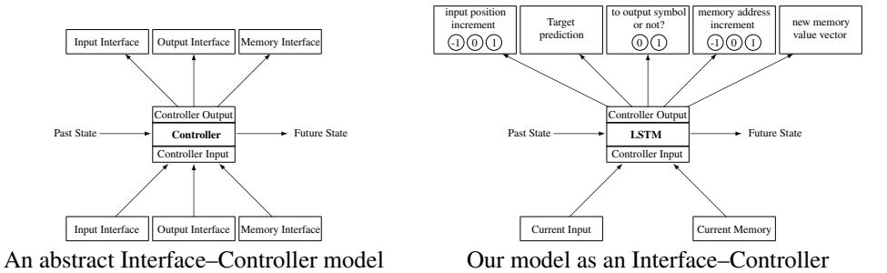
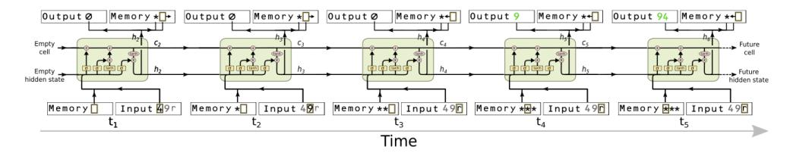
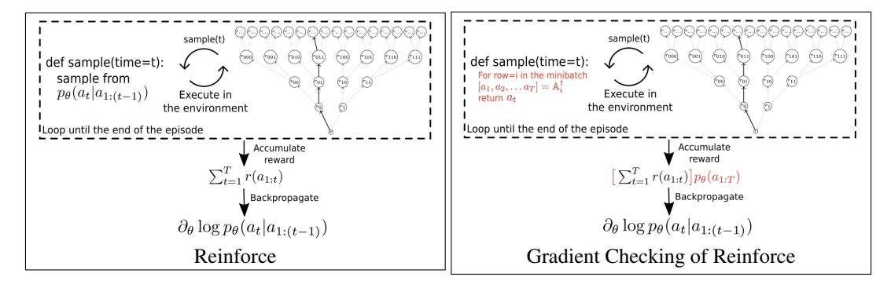
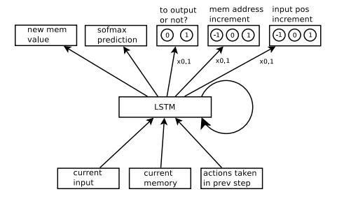
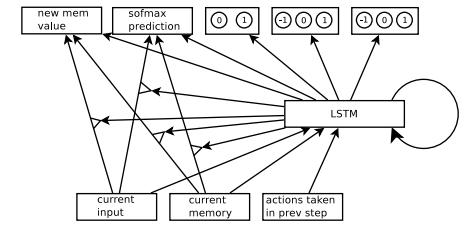
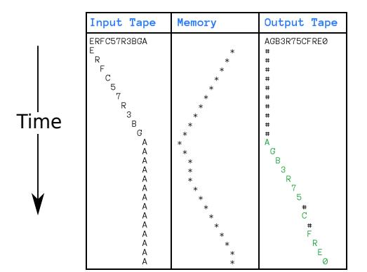
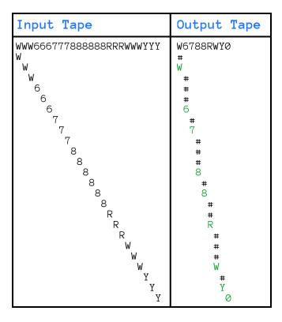
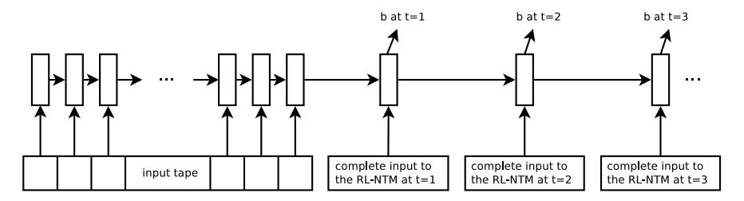

# REINFORCEMENT LEARNING NEURAL TURING MACHINES - REVISED

Wojciech Zaremba1,2 New York University Facebook AI Research woj.zaremba@gmail.com Ilya Sutskever2
Google Brain
ilyasu@google.com

## **ABSTRACT**

The Neural Turing Machine (NTM) is more expressive than all previously considered models because of its external memory. It can be viewed as a broader effort to use abstract external *Interfaces* and to learn a parametric model that interacts with them.

The capabilities of a model can be extended by providing it with proper Interfaces that interact with the world. These external Interfaces include memory, a database, a search engine, or a piece of software such as a theorem verifier. Some of these Interfaces are provided by the developers of the model. However, many important existing Interfaces, such as databases and search engines, are discrete.

We examine feasibility of learning models to interact with discrete Interfaces. We investigate the following discrete Interfaces: a memory Tape, an input Tape, and an output Tape. We use a Reinforcement Learning algorithm to train a neural network that interacts with such Interfaces to solve simple algorithmic tasks. Our Interfaces are expressive enough to make our model Turing complete.

#### 1 Introduction

Graves et al. (2014b)'s Neural Turing Machine (NTM) is model that learns to interact with an external memory that is differentiable and continuous. An external memory extends the capabilities of the NTM, allowing it to solve tasks that were previously unsolvable by conventional machine learning methods. This is the source of the NTM's expressive power. In general, it appears that ML models become significantly more powerful if they are able to learn to interact with external interfaces.

There exist a vast number of Interfaces that could be used with our models. For example, the Google search engine is an example of such Interface. The search engine consumes queries (which are actions), and outputs search results. However, the search engine is not differentiable, and the model interacts with the Interface using discrete actions. This work examines the feasibility of learning to interact with discrete Interfaces using the reinforce algorithm.

Discrete Interfaces cannot be trained directly with standard backpropagation because they are not differentiable. It is most natural to learn to interact with discrete Interfaces using Reinforcement Learning methods. In this work, we consider an Input Tape and a Memory Tape interface with discrete access. Our concrete proposal is to use the Reinforce algorithm to learn *where* to access the discrete interfaces, and to use the backpropagation algorithm to determine *what* to write to the memory and to the output. We call this model the RL–NTM.

Discrete Interfaces are computationally attractive because the cost of accessing a discrete Interface is often independent of its size. It is not the case for the continuous Interfaces, where the cost of access scales linearly with size. It is a significant disadvantage since slow models cannot scale to large difficult problems that require intensive training on large datasets. In addition, an output Interface that lets the model decide when it wants to make a prediction allows the model's runtime to be in principle unbounded. If the model has an output interface of this kind together with an interface to an unbounded memory, the model becomes Turing complete.

We evaluate the RL-NTM on a number of simple algorithmic tasks. The RL-NTM succeeds on problems such as copying an input several times to the output tape (the "repeat copy" task from Graves et al. (2014b)), reversing a sequence, and a few more tasks of comparable difficulty. However, its success is highly dependent on the architecture of the "controller". We discuss this in more details in Section 8.

&lt;sup>1Work done while the author was at Google.

&lt;sup>2Both authors contributed equally to this work.

Finally, we found it non-trivial to correctly implement the RL-NTM due its large number of interacting components. We developed a simple procedure to numerically check the gradients of the Reinforce algorithm (Section 5). The procedure can be applied to problems unrelated to NTMs, and is of the independent interest. The code for this work can be found at <a href="https://github.com/ilyasu123/rlntm">https://github.com/ilyasu123/rlntm</a>.

## 2 THE MODEL

Many difficult tasks require a prolonged, multi-step interaction with an external environment. Examples of such environments include computer games (Mnih et al., 2013), the stock market, an advertisement system, or the physical world (Levine et al., 2015). A model can observe a partial state from the environment, and influence the environment through its actions. This is seen as a general reinforcement leaning problem. However, our setting departs from the classical RL, i.e. we have a freedom to design tools available to solve a given problem. Tools might cooperate with the model (i.e. backpropagation through memory), and the tools specify the actions over the environment. We formalize this concept under the name Interface—Controller interaction.

The external environment is exposed to the model through a number of Interfaces, each with its own API. For instance, a human perceives the world through its senses, which include the vision Interface and the touch Interface. The touch Interface provides methods for contracting the various muscles, and methods for sensing the current state of the muscles, pain level, temperature and a few others. In this work, we explore a number of simple Interfaces that allow the controller to access an input tape, a memory tape, and an output tape.

The part of the model that communicates with Interfaces is called the Controller, which is the only part of the system which learns. The Controller can have prior knowledge about behavior of its Interfaces, but it is not the case in our experiments. The Controller learns to interact with Interfaces in a way that allows it to solve a given task. Fig. 1 illustrates the complete Interfaces—Controller abstraction.

Figure 1: (Left) The Interface—Controller abstraction, (Right) an instantiation of our model as an Interface—Controller. The bottom boxes are the read methods, and the top are the write methods. The RL—NTM makes discrete decisions regarding the move over the input tape, the memory tape, and whether to make a prediction at a given timestep. During training, the model's prediction is compared with the desired output, and is used to train the model when the RL-NTM chooses to advance its position on the output tape; otherwise it is ignored. The memory value vector is a vector of content that is stored in the memory cell.

We now describe the RL-NTM. As a controller, it uses either LSTM, *direct access*, or LSTM (see sec. 8.1 for a definition). It has a one-dimensional input tape, a one-dimensional memory, and a one-dimensional output tape as Interfaces. Both the input tape and the memory tape have a head that reads the Tape's content at the current location. The head of the input tape and the memory tape can move in any direction. However, the output tape is a write-only tape, and its head can either stay at the current position or move forward. Fig. 2 shows an example execution trace for the entire RL-NTM on the reverse task (sec. 6).

At the core of the RL-NTM is an LSTM controller which receives multiple inputs and has to generate multiple outputs at each timestep. Table 1 summarizes the controller's inputs and outputs, and the way in which the RL-NTM is trained to produce them. The objective function of the RL-NTM is the expected log probability of the desired outputs, where the expectation is taken over all possible sequences of actions, weighted with probability of taking these actions. Both backpropagation and Reinforce maximize this objective. Backpropagation maximizes the log probabilities of the model's predictions, while the reinforce algorithm influences the probabilities of action sequences.

Figure 2: Execution of RL–NTM on the ForwardReverse task. At each timestep, the RL-NTM consumes the value of the current input tape, the value of the current memory cell, and a representation of all the actions that have been taken in the previous timestep (not marked on the figures). The RL-NTM then outputs a new value for the current memory cell (marked with a star), a prediction for the next target symbol, and discrete decisions for changing the positions of the heads on the various tapes. The RL-NTM learns to make discrete decisions using the Reinforce algorithm, and learns to produce continuous outputs using backpropagation.

The global objective can be written formally as:

$$\sum_{[a_1,a_2,\ldots,a_n]\in\mathbb{A}^\dagger} p_{\text{reinforce}}(a_1,a_2,\ldots,a_n|\theta) \Big[ \sum_{i=1}^n \log(p_{\text{bp}}(y_i|x_1,\ldots,x_i,a_1,\ldots a_i,\theta)) \Big]$$

 $\mathbb{A}^{\dagger}$  represents the space of sequences of actions that lead to the end of episode. The probabilities in the above equation are parametrized with a neural network (the Controller). We have marked with  $p_{\text{reinforce}}$  the part of the equation which is learned with Reinforce.  $p_{\text{bp}}$  indicates the part of the equation optimized with the classical backpropagation.

| Interface     |                                             | Read                                                    | Write                               | Training Type   |
|---------------|---------------------------------------------|---------------------------------------------------------|-------------------------------------|-----------------|
| Input Tape    | Head                                        | window of values surrounding the current position       | distribution over $[-1,0,1]$        | Reinforce       |
| 0             | Head                                        | Ø                                                       | distribution over $[0,1]$           | Reinforce       |
| Output Tape   | Content                                     | Ø                                                       | distribution over output vocabulary | Backpropagation |
| Mamagy Tana   | Head                                        | distribution over $[-1,0,1]$                            | Reinforce                           |                 |
| Memory Tape   | Content                                     | window of memory values surrounding the current address | vector of real values to store      | Backpropagation |
| Miscellaneous | all actions taken in the previous time step |                                                         | Ø                                   | Ø               |

Table 1: Table summarizes what the Controller reads at every time step, and what it has to produce. The "training" column indicates how the given part of the model is trained.

The RL-NTM receives a direct learning signal only when it decides to make a prediction. If it chooses to not make a prediction at a given timestep, then it will not receive a direct learning signal. Theoretically, we can allow the RL-NTM to run for an arbitrary number of steps without making any prediction, hoping that after sufficiently many steps, it would decide to make a prediction. Doing so will also provide the RL-NTM with arbitrary computational capability. However, this strategy is both unstable and computationally infeasible. Thus, we resort to limiting the total number of computational steps to a fixed upper bound, and force the RL-NTM to predict the next desired output whenever the number of remaining desired outputs is equal to the number of remaining computational steps.

# 3 RELATED WORK

This work is the most similar to the Neural Turing Machine Graves et al. (2014b). The NTM is an ambitious, computationally universal model that can be trained (or "automatically programmed") with the backpropagation algorithm using only input-output examples.

Following the introduction NTM, several other memory-based models have been introduced. All of them can be seen as part of a larger community effort. These models are constructed according to the Interface—Controller abstraction (Section 2).

**Neural Turing Machine** (NTM) (Graves et al., 2014a) has a modified LSTM as the Controller, and the following three Interfaces: a sequential input, a delayed Output, and a differentiable Memory.

**Weakly supervised Memory Network** (Sukhbaatar et al., 2015) uses a feed forward network as the Controller, and has a differentiable soft-attention Input, and Delayed Output as Interfaces.

**Stack RNN** (Joulin & Mikolov, 2015) has a RNN as the Controller, and the sequential input, a differentiable memory stack, and sequential output as Interfaces. Also uses search to improve its performance. **Neural DeQue** (Grefenstette et al., 2015) has a LSTM as the Controller, and a Sequential Input, a differentiable Memory Queue, and the Sequential Output as Interfaces.

**Our model** fits into the Interfaces–Controller abstraction. It has a direct access LSTM as the Controller (or LSTM or feed forward network), and its three interfaces are the Input Tape, the Memory Tape, and the Output Tape. All three Interfaces of the RL–NTM are discrete and cannot be trained only with backpropagation.

This prior work investigates continuous and differentiable Interfaces, while we consider discrete Interfaces. Discrete Interfaces are more challenging to train because backpropagation cannot be used. However, many external Interfaces are inherently discrete, even though humans can easily use them (apparently without using continuous backpropagation). For instance, one interacts with the Google search engine with discrete actions. This work examines the possibility of learning models that interact with discrete Interfaces with the Reinforce algorithm.

The Reinforce algorithm (Williams, 1992) is a classical RL algorithm, which has been applied to the broad spectrum of planning problems (Peters & Schaal, 2006; Kohl & Stone, 2004; Aberdeen & Baxter, 2002). In addition, it has been applied in object recognition to implement visual attention (Mnih et al., 2014; Ba et al., 2014). This work uses Reinforce to train an attention mechanism: we use it to train how to access the various tapes provided to the model.

The RL-NTM can postpone prediction for an arbitrary number of timesteps, and in principle has access to the unbounded memory. As a result, the RL-NTM is Turing complete in principle. There have been very few prior models that are Turing complete Schmidhuber (2012; 2004). Although our model is Turing complete, it is not very powerful because it is very difficult to train, and our model can solve only relatively simple problems. Moreover, the RL-NTM does not exploit Turing completeness, as none of tasks that it solves require superlinear runtime to be solved.

#### 4 The Reinforce Algorithm

# Notation

Let  $\mathbb A$  be a space of actions, and  $\mathbb A^\dagger$  be a space of all sequences of actions that cause an episode to end (so  $\mathbb A^\dagger\subset\mathbb A^*$ ). An action at time-step t is denoted by  $a_t$ . We denote time at the end of episode by T (this is not completely formal as some episodes can vary in time). Let  $a_{1:t}$  stand for a sequence of actions  $[a_1,a_2,\ldots,a_t]$ . Let  $r(a_{1:t})$  denote the reward achieved at time t, having executed the sequence of actions  $a_{1:t}$ , and  $R(a_{1:T})$  is the cumulative reward, namely  $R(a_{k:T}) = \sum_{t=k}^T r(a_{1:t})$ . Let  $p_{\theta}(a_t|a_{1:(t-1)})$  be a parametric conditional probability of an action  $a_t$  given all previous actions  $a_{1:(t-1)}$ . Finally,  $p_{\theta}$  is a policy parametrized by  $\theta$ .

This work relies on learning discrete actions with the Reinforce algorithm (Williams, 1992). We now describe this algorithm in detail. Moreover, the supplementary materials include descriptions of techniques for reducing variance of the gradient estimators.

The goal of reinforcement learning is to maximize the sum of future rewards. The Reinforce algorithm (Williams, 1992) does so directly by optimizing the parameters of the policy  $p_{\theta}(a_t|a_{1:(t-1)})$ . Reinforce follows the gradient of the sum of the future rewards. The objective function for episodic reinforce can be expressed as the sum over all sequences of valid actions that cause the episode to end:

$$J(\theta) = \sum_{[a_1, a_2, \dots, a_T] \in \mathbb{A}^{\dagger}} p_{\theta}(a_1, a_2, \dots, a_T) R(a_1, a_2, \dots, a_T) = \sum_{a_{1:T} \in \mathbb{A}^{\dagger}} p_{\theta}(a_{1:T}) R(a_{1:T})$$

This sum iterates over sequences of all possible actions. This set is usually exponential or even infinite, so it cannot be computed exactly and cheaply for most of problems. However, it can be written as

expectation, which can be approximated with an unbiased estimator. We have that:

$$J(\theta) = \sum_{a_{1:T} \in \mathbb{A}^{\dagger}} p_{\theta}(a_{1:T}) R(a_{1:T}) =$$

$$\mathbb{E}_{a_{1:T} \sim p_{\theta}} \sum_{t=1}^{n} r(a_{1:t}) =$$

$$\mathbb{E}_{a_{1} \sim p_{\theta}(a_{1})} \mathbb{E}_{a_{2} \sim p_{\theta}(a_{2}|a_{1})} \dots \mathbb{E}_{a_{T} \sim p_{\theta}(a_{T}|a_{1:(T-1)})} \sum_{t=1}^{T} r(a_{1:t})$$

The last expression suggests a procedure to estimate  $J(\theta)$ : simply sequentially sample each  $a_t$  from the model distribution  $p_{\theta}(a_t|a_{1:(t-1)})$  for t from 1 to T. The unbiased estimator of  $J(\theta)$  is the sum of  $r(a_{1:t})$ . This gives us an algorithm to estimate  $J(\theta)$ . However, the main interest is in training a model to maximize this quantity.

The reinforce algorithm maximizes  $J(\theta)$  by following the gradient of it:

$$\partial_{\theta} J(\theta) = \sum_{a_{1:T} \in \mathbb{A}^{\dagger}} \left[ \partial_{\theta} p_{\theta}(a_{1:T}) \right] R(a_{1:T})$$

However, the above expression is a sum over the set of the possible action sequences, so it cannot be computed directly for most  $\mathbb{A}^{\dagger}$ . Once again, the Reinforce algorithm rewrites this sum as an expectation that is approximated with sampling. It relies on the equation:  $\partial_{\theta} f(\theta) = f(\theta) \frac{\partial_{\theta} f(\theta)}{f(\theta)} = f(\theta) \partial_{\theta} [\log f(\theta)]$ . This identity is valid as long as  $f(x) \neq 0$ . As typical neural network parametrizations of distributions assign non-zero probability to every action, this condition holds for  $f = p_{\theta}$ . We have that:

$$\begin{split} \partial_{\theta} J(\theta) &= \sum_{[a_{1:T}] \in \mathbb{A}^{\dagger}} \left[ \partial_{\theta} p_{\theta}(a_{1:T}) \right] R(a_{1:T}) = \\ &= \sum_{a_{1:T} \in \mathbb{A}^{\dagger}} p_{\theta}(a_{1:T}) \left[ \partial_{\theta} \log p_{\theta}(a_{1:T}) \right] R(a_{1:T}) \\ &= \sum_{a_{1:T} \in \mathbb{A}^{\dagger}} p_{\theta}(a_{1:T}) \left[ \sum_{t=1}^{n} \partial_{\theta} \log p_{\theta}(a_{i}|a_{1:(t-1)}) \right] R(a_{1:T}) \\ &= \mathbb{E}_{a_{1} \sim p_{\theta}(a_{1})} \mathbb{E}_{a_{2} \sim p_{\theta}(a_{2}|a_{1})} \dots \mathbb{E}_{a_{T} \sim p_{\theta}(a_{T}|a_{1:T-1})} \left[ \sum_{t=1}^{T} \partial_{\theta} \log p_{\theta}(a_{i}|a_{1:(t-1)}) \right] \left[ \sum_{t=1}^{T} r(a_{1:t}) \right] \end{split}$$

The last expression gives us an algorithm for estimating  $\partial_{\theta}J(\theta)$ . We have sketched it at the left side of the Figure 3. It's easiest to describe it with respect to computational graph behind a neural network. Reinforce can be implemented as follows. A neural network outputs:  $l_t = \log p_{\theta}(a_t|a_{1:(t-1)})$ . Sequentially sample action  $a_t$  from the distribution  $e^{l_t}$ , and execute the sampled action  $a_t$ . Simultaneously, experience a reward  $r(a_{1:t})$ . Backpropagate the sum of the rewards  $\sum_{t=1}^T r(a_{1:t})$  to the every node  $\partial_{\theta} \log p_{\theta}(a_t|a_{1:(t-1)})$ .

We have derived an unbiased estimator for the sum of future rewards, and the unbiased estimator of its gradient. However, the derived gradient estimator has high variance, which makes learning difficult. RL–NTM employs several techniques to reduce gradient estimator variance: (1) future rewards backpropagation, (2) online baseline prediction, and (3) offline baseline prediction. All these techniques are crucial to solve our tasks. We provide detailed description of techniques in the Supplementary material.

Finally, we needed a way of verifying the correctness of our implementation. We discovered a technique that makes it possible to easily implement a gradient checker for nearly any model that uses Reinforce. Following Section 5 describes this technique.

# 5 Gradient Checking

The RL-NTM is complex, so we needed to find an automated way of verifying the correctness of our implementation. We discovered a technique that makes it possible to easily implement a gradient checker for nearly any model that uses Reinforce. This discovery is an independent contribution of this

Figure 3: Figure sketches algorithms: (**Left**) the reinforce algorithm, (**Right**) gradient checking for the reinforce algorithm. The red color indicates necessary steps to override the reinforce to become the gradient checker for the reinforce.

work. This Section describes the gradient checking for *any* implementation of the reinforce algorithm that uses a general function for sampling from multinomial distribution.

The reinforce gradient verification should ensure that expected gradient over all sequences of actions matches the numerical derivative of the expected objective. However, even for a tiny problem, we would need to draw billions of samples to achieve estimates accurate enough to state if there is match or mismatch. Instead, we developed a technique which avoids sampling, and allows for gradient verification of reinforce within seconds on a laptop.

First, we have to reduce the size of our a task to make sure that the number of possible actions is manageable (e.g.,  $< 10^4$ ). This is similar to conventional gradient checkers, which can only be applied to small models. Next, we enumerate all possible sequences of actions that terminate the episode. By definition, these are precisely all the elements of  $\mathbb{A}^{\dagger}$ .

The key idea is the following: we override the sampling function which turns a multinomial distribution into a random sample with a deterministic function that deterministically chooses actions from an appropriate action sequence from  $\mathbb{A}^{\dagger}$ , while accumulating their probabilities. By calling the modified sampler, it will produce every possible action sequence from  $\mathbb{A}^{\dagger}$  exactly once.

For efficiency, it is desirable to use a single minibatch whose size is  $\#\mathbb{A}^{\dagger}$ . The sampling function needs to be adapted in such a way, so that it incrementally outputs the appropriate sequence from  $\mathbb{A}^{\dagger}$  as we repeatedly call the sampling function. At the end of the minibatch, the sampling function will have access to the total probability of each action sequence  $(\prod_t p_{\theta}(a_t|a_{1:t-1}))$ , which in turn can be used to exactly compute  $J(\theta)$  and its derivative. To compute the derivative, the reinforce gradient produced by each sequence  $a_{1:T} \in \mathbb{A}^{\dagger}$  should be weighted by its probability  $p_{\theta}(a_{1:T})$ . We summarize this procedure on Figure 3.

The gradient checking is critical for ensuring the correctness of our implementation. While the basic reinforce algorithm is conceptually simple, the RL–NTM is fairly complicated, as reinforce is used to train several Interfaces of our model. Moreover, the RL–NTM uses three separate techniques for reducing the variance of the gradient estimators. The model's high complexity greatly increases the probability of a code error. In particular, our early implementations were incorrect, and we were able to fix them only after implementing gradient checking.

# 6 Tasks

This section defines tasks used in the experiments. Figure 4 shows exemplary instantiations of our tasks. Table 2 summarizes the Interfaces that are available for each task.

| Task Interface  | Input Tape | Memory Tape |
|-----------------|------------|-------------|
| Сору            | ✓          | ×           |
| DuplicatedInput | ✓          | ×           |
| Reverse         | ✓          | ×           |
| RepeatCopy      | ✓          | ×           |
| ForwardReverse  | ×          | ✓           |

Table 2: This table marks the available Interfaces for each task. The difficulty of a task is dependent on the type of Interfaces available to the model.

| Output 7048 Tape 7048 Input 7048 | - Tupe          | Output 2514 Tape 2514 Input 日152r Tape | Output 7070 Tape 7070 Input 270 | Output 2514 Tape 2514 Memory  Tape Forced 4152r |
|----------------------------------------|-----------------|-------------------------------------------------|---------------------------------------|-------------------------------------------------|
| Сору                                   | DuplicatedInput | Reverse                                         | RepeatCopy                            | ForwardReverse                                  |

Figure 4: This Figure presents the initial state for every task. The yellow box indicates the starting position of the reading head over the Input Interface. The gray characters on the Output Tape represent the target symbols. Our tasks involve reordering symbols, and and the symbols  $x_i$  have been picked uniformly from the set of size 30.

**Copy.** A generic input is  $x_1x_2x_3...x_C\varnothing$  and the desired output is  $x_1x_2...x_C\varnothing$ . Thus the goal is to repeat the input. The length of the input sequence is variable and is allowed to change. The input sequence and the desired output both terminate with a special end-of-sequence symbol  $\varnothing$ .

**DuplicatedInput.** A generic input has the form  $x_1x_1x_1x_2x_2x_2x_3...x_{C-1}x_Cx_Cx_C\varnothing$  while the desired output is  $x_1x_2x_3...x_C\varnothing$ . Thus each input symbol is replicated three times, so the RL-NTM must emit every third input symbol.

**Reverse.** A generic input is  $x_1x_2 \dots x_{C-1}x_C\varnothing$  and the desired output is  $x_Cx_{C-1}\dots x_2x_1\varnothing$ .

**RepeatCopy.** A generic input is  $mx_1x_2x_3...x_C\varnothing$  and the desired output is  $x_1x_2...x_Cx_1...x_Cx_1...x_C\varnothing$ , where the number of copies is given by m. Thus the goal is to copy the input m times, where m can be only 2 or 3.

**ForwardReverse.** The task is identical to Reverse, but the RL-NTM is only allowed to move its input tape pointer forward. It means that a perfect solution must use the NTM's external memory.

# 7 CURRICULUM LEARNING

Humans and animals learn much better when the examples are not randomly presented but organized in a meaningful order which illustrates gradually more concepts, and gradually more complex ones. . . . and call them "curriculum learning".

Bengio et al. (2009)

We were unable to solve tasks with RL-NTM by training it on the difficult instances of the problems (where difficult usually means long). To succeed, we had to create a curriculum of tasks of increasing complexity. We verified that our tasks were completely unsolvable (in an all-or-nothing sense) for all but the shortest sequences when we did not use a curriculum. In our experiments, we measure the complexity c of a problem instance by the maximal length of the desired output to typical inputs. During training, we maintain a distribution over the task complexity. We shift the distribution over the task complexities whenever the performance of the RL-NTM exceeds a threshold. Then, our model focuses on more difficult problem instances as its performance improves.

| Probability | Procedure to pick complexity d                           |  |
|-------------|----------------------------------------------------------|--|
| 10%         | uniformly at random from the possible task complexities. |  |
| 25%         | uniformly from $[1, C + e]$                              |  |
| 65%         | d = D + e.                                               |  |

Table 3: The curriculum learning distribution, indexed by C. Here e is a sample from a geometric distribution whose success probability is  $\frac{1}{2}$ , i.e.,  $p(e=k)=\frac{1}{2^k}$ .

The distribution over task complexities is indexed with an integer c, and is defined in Table 3. While we have not tuned the coefficients in the curriculum learning setup, we experimentally verified that it is critical to always maintain non-negligible mass over the hardest difficulty levels (Zaremba & Sutskever, 2014). Removing it makes the curriculum much less effective.

Whenever the average zero-one-loss (normalized by the length of the target sequence) of our RL-NTM decreases below 0.2, we increase c by 1. We kept doing so until c reaches its maximal allowable value. Finally, we enforced a refractory period to ensure that successive increments of C are separated by at least 100 parameter updates, since we encountered situations where C increased in rapid succession which consistently caused learning to fail.

#### 8 Controllers

The success of reinforcement learning training highly depends on the complexity of the controller, and its ease of training. It's common to either limit number of parameters of the network, or to constraint it by initialization from pretrained model on some other task (for instance, object recognition network for robotics). Ideally, models should be generic enough to not need such "tricks". However, still some tasks require building task specific architectures.

Figure 5: LSTM as a controller.

Figure 6: The direct access controller.

This work considers two controllers. The first is a LSTM (Fig. 5), and the second is a direct access controller (Fig. 6). LSTM is a generic controller, that in principle should be powerful enough to solve any of the considered tasks. However, it has trouble solving many of them. Direct access controller, is a much better fit for symbol rearrangement tasks, however it's not a generic solution.

#### 8.1 DIRECT ACCESS CONTROLLER

All the tasks that we consider involve rearranging the input symbols in some way. For example, a typical task is to reverse a sequence (section 6 lists the tasks). For such tasks, the controller would benefit from a built-in mechanism for directly copying an appropriate input to memory and to the output. Such a mechanism would free the LSTM controller from remembering the input symbol in its control variables ("registers"), and would shorten the backpropagation paths and therefore make learning easier. We implemented this mechanism by adding the input to the memory and the output, and also adding the memory to the output and to the adjacent memories (figure 6), while modulating these additive contribution by a dynamic scalar (sigmoid) which is computed from the controller's state. This way, the controller can decide to effectively not add the current input to the output at a given timestep. Unfortunately the necessity of this architectural modification is a drawback of our implementation, since it is not domain independent and would therefore not improve the performance of the RL–NTM on many tasks of interest.

| Controller      | LSTM | Direct Access |
|-----------------|------|---------------|
| Copy            | ✓    | ✓             |
| DuplicatedInput | ✓    | ✓             |
| Reverse         | ×    | ✓             |
| ForwardReverse  | ×    | ✓             |
| RepeatCopy      | ×    | ✓             |

Table 4: Success of training on various task for a given controller.

#### 9 EXPERIMENTS

We presents results of training RL-NTM on all aforementioned tasks. The main drawback of our experiments is in the lack of comparison to the other models. However, the tasks that we consider have to be considered in conjunction with available Interfaces, and other models haven't been considered with the same set of interfaces. The statement, "this model solves addition" is difficult to assess, as the way that digits are delivered defines task difficulty.

The closest model to ours is NTM, and the shared task that they consider is copying. We are able to generalize with copying to an arbitrary length. However, our Interfaces make this task very simple. Table 4 summarizes results.

We trained our model using SGD with a fixed learning rate of 0.05 and a fixed momentum of 0.9. We used a batch of size 200, which we found to work better than smaller batch sizes (such as 50 or 20). We normalized the gradient by batch size but not by sequence length. We independently clip the norm of the gradients w.r.t. the RL-NTM parameters to 5, and the gradient w.r.t. the baseline network to 2. We initialize the RL-NTM controller and the baseline model using a Gaussian with standard deviation 0.1. We used an inverse temperature of 0.01 for the different action distributions. Doing so reduced the effective learning rate of the Reinforce derivatives. The memory consists of 35 real values through which we backpropagate. The initial memory state and the controller's initial hidden states were set to the zero vector.

Figure 7: (**Left**) Trace of ForwardReverse solution, (**Right**) trace of RepeatInput. The vertical depicts execution time. The rows show the input pointer, output pointer, and memory pointer (with the \* symbol) at each step of the RL-NTM's execution. Note that we represent the set  $\{1,\ldots,30\}$  with 30 distinct symbols, and lack of prediction with #.

The ForwardReverse task is particularly interesting. In order to solve the problem, the RL–NTM has to move to the end of the sequence without making any predictions. While doing so, it has to store the input sequence into its memory (encoded in real values), and use its memory when reversing the sequence (Fig. 7).

We have also experimented with a number of additional tasks but with less empirical success. Tasks we found to be too difficult include sorting and long integer addition (in base 3 for simplicity), and Repeat-Copy when the input tape is forced to only move forward. While we were able to achieve reasonable performance on the sorting task, the RL–NTM learned an ad-hoc algorithm and made excessive use of its controller memory in order to sort the sequence.

Empirically, we found all the components of the RL-NTM essential to successfully solving these problems. All our tasks are either solvable in under 20,000 parameter updates or fail in arbitrary number of updates. We were completely unable to solve RepeatCopy, Reverse, and Forward reverse with the LSTM controller, but with direct access controller we succeeded. Moreover, we were also unable to solve any of these problems at all without a curriculum (except for short sequences of length 5). We present more traces for our tasks in the supplementary material (together with failure traces).

# 10 CONCLUSIONS

We have shown that the Reinforce algorithm is capable of training an NTM-style model to solve very simple algorithmic problems. While the Reinforce algorithm is very general and is easily applicable to a wide range of problems, it seems that learning memory access patterns with Reinforce is difficult.

Our gradient checking procedure for Reinforce can be applied to a wide variety of implementations. We also found it extremely useful: without it, we had no way of being sure that our gradient was correct, which made debugging and tuning much more difficult.

#### 11 ACKNOWLEDGMENTS

We thank Christopher Olah for the LSTM figure that have been used in the paper, and to Tencia Lee for revising the paper.

#### REFERENCES

- Aberdeen, Douglas and Baxter, Jonathan. Scaling internal-state policy-gradient methods for pomdps. In *MACHINE LEARNING-INTERNATIONAL WORKSHOP THEN CONFERENCE*-, pp. 3–10, 2002.
- Ba, Jimmy, Mnih, Volodymyr, and Kavukcuoglu, Koray. Multiple object recognition with visual attention. *arXiv* preprint arXiv:1412.7755, 2014.
- Bengio, Yoshua, Louradour, Jérôme, Collobert, Ronan, and Weston, Jason. Curriculum learning. In *Proceedings* of the 26th annual international conference on machine learning, pp. 41–48. ACM, 2009.
- Graves, Alex, Wayne, Greg, and Danihelka, Ivo. Neural turing machines. arXiv preprint arXiv:1410.5401, 2014a.
- Graves, Alex, Wayne, Greg, and Danihelka, Ivo. Neural turing machines. arXiv preprint arXiv:1410.5401, 2014b.
- Grefenstette, Edward, Hermann, Karl Moritz, Suleyman, Mustafa, and Blunsom, Phil. Learning to transduce with unbounded memory. *arXiv preprint arXiv:1506.02516*, 2015.
- Joulin, Armand and Mikolov, Tomas. Inferring algorithmic patterns with stack-augmented recurrent nets. arXiv preprint arXiv:1503.01007, 2015.
- Kohl, Nate and Stone, Peter. Policy gradient reinforcement learning for fast quadrupedal locomotion. In *Robotics and Automation, 2004. Proceedings. ICRA'04. 2004 IEEE International Conference on*, volume 3, pp. 2619–2624. IEEE, 2004.
- Levine, Sergey, Finn, Chelsea, Darrell, Trevor, and Abbeel, Pieter. End-to-end training of deep visuomotor policies. *arXiv preprint arXiv:1504.00702*, 2015.
- Mnih, Volodymyr, Kavukcuoglu, Koray, Silver, David, Graves, Alex, Antonoglou, Ioannis, Wierstra, Daan, and Riedmiller, Martin. Playing atari with deep reinforcement learning. *arXiv preprint arXiv:1312.5602*, 2013.
- Mnih, Volodymyr, Heess, Nicolas, Graves, Alex, et al. Recurrent models of visual attention. In Advances in Neural Information Processing Systems, pp. 2204–2212, 2014.
- Peters, Jan and Schaal, Stefan. Policy gradient methods for robotics. In *Intelligent Robots and Systems*, 2006 *IEEE/RSJ International Conference on*, pp. 2219–2225. IEEE, 2006.
- Schmidhuber, Juergen. Self-delimiting neural networks. arXiv preprint arXiv:1210.0118, 2012.
- Schmidhuber, Jürgen. Optimal ordered problem solver. Machine Learning, 54(3):211-254, 2004.
- Sukhbaatar, Sainbayar, Szlam, Arthur, Weston, Jason, and Fergus, Rob. Weakly supervised memory networks. arXiv preprint arXiv:1503.08895, 2015.
- Williams, Ronald J. Simple statistical gradient-following algorithms for connectionist reinforcement learning. *Machine learning*, 8(3-4):229–256, 1992.
- Zaremba, Wojciech and Sutskever, Ilya. Learning to execute. arXiv preprint arXiv:1410.4615, 2014.

# APPENDIX A: DETAILED REINFORCE EXPLANATION

We present here several techniques to decrease variance of the gradient estimation for the Reinforce. We have employed all of these tricks in our RL–NTM implementation.

We expand notation introduced in Sec. 4. Let  $\mathcal{A}^{\ddagger}$  denote all valid subsequences of actions (i.e.  $\mathcal{A}^{\ddagger} \subset \mathcal{A}^{\dagger} \subset \mathcal{A}^{*}$ ). Moreover, we define set of sequences of actions that are valid after executing a sequence  $a_{1:t}$ , and that terminate. We denote such set by:  $\mathcal{A}^{\dagger}_{a_{1:t}}$ . Every sequence  $a_{(t+1):T} \in \mathcal{A}^{\dagger}_{a_{1:t}}$  terminates an episode.

#### CAUSALITY OF ACTIONS

Actions at time t cannot possibly influence rewards obtained in the past, because the past rewards are caused by actions prior to them. This idea allows to derive an unbiased estimator of  $\partial_{\theta}J(\theta)$  with lower variance. Here, we formalize it:

$$\begin{split} \partial_{\theta} J(\theta) &= \sum_{a_{1:T} \in \mathcal{A}^{\dagger}} p_{\theta}(a) \left[ \partial_{\theta} \log p_{\theta}(a) \right] R(a) \\ &= \sum_{a_{1:T} \in \mathcal{A}^{\dagger}} p_{\theta}(a) \left[ \partial_{\theta} \log p_{\theta}(a) \right] \left[ \sum_{t=1}^{T} r(a_{1:t}) \right] \\ &= \sum_{a_{1:T} \in \mathcal{A}^{\dagger}} p_{\theta}(a) \left[ \sum_{t=1}^{T} \partial_{\theta} \log p_{\theta}(a_{1:t}) r(a_{1:t}) \right] \\ &= \sum_{a_{1:T} \in \mathcal{A}^{\dagger}} p_{\theta}(a) \left[ \sum_{t=1}^{T} \partial_{\theta} \log p_{\theta}(a_{1:t}) r(a_{1:t}) + \partial_{\theta} \log p_{\theta}(a_{(t+1):T} | a_{1:t}) r(a_{1:t}) \right] \\ &= \sum_{a_{1:T} \in \mathcal{A}^{\dagger}} \sum_{t=1}^{T} p_{\theta}(a_{1:t}) \partial_{\theta} \log p_{\theta}(a_{1:t}) r(a_{1:t}) + p_{\theta}(a) \partial_{\theta} \log p_{\theta}(a_{(t+1):T} | a_{1:t}) r(a_{1:t}) \\ &= \sum_{a_{1:T} \in \mathcal{A}^{\dagger}} \sum_{t=1}^{T} p_{\theta}(a_{1:t}) \partial_{\theta} \log p_{\theta}(a_{1:t}) r(a_{1:t}) + p_{\theta}(a_{1:t}) r(a_{1:t}) \partial_{\theta} p_{\theta}(a_{(t+1):T} | a_{1:t}) \\ &= \sum_{a_{1:T} \in \mathcal{A}^{\dagger}} \left[ \sum_{t=1}^{T} p_{\theta}(a_{1:t}) \partial_{\theta} \log p_{\theta}(a_{1:t}) r(a_{1:t}) \right] + \sum_{a_{1:T} \in \mathcal{A}^{\dagger}} \sum_{t=1}^{T} \left[ p_{\theta}(a_{1:t}) r(a_{1:t}) \partial_{\theta} p_{\theta}(a_{(t+1):T} | a_{1:t}) \right] \end{split}$$

We will show that the right side of this equation is equal to zero. It's zero, because the future actions  $a_{(t+1):T}$  don't influence past rewards  $r(a_{1:t})$ . Here we formalize it; we use an identity  $\mathbb{E}_{a_{(t+1):T} \in \mathcal{A}_{a_{1:t}}^{\dagger}} p_{\theta}(a_{(t+1):T}|a_{1:t}) = 1$ :

$$\sum_{a_{1:T} \in \mathcal{A}^{\dagger}} \sum_{t=1}^{T} \left[ p_{\theta}(a_{1:t}) r(a_{1:t}) \partial_{\theta} p_{\theta}(a_{(t+1):T} | a_{1:t}) \right] =$$

$$\sum_{a_{1:t} \in \mathcal{A}^{\dagger}} \left[ p_{\theta}(a_{1:t}) r(a_{1:t}) \sum_{a_{(t+1):T} \in \mathcal{A}^{\dagger}_{a_{1:t}}} \partial_{\theta} p_{\theta}(a_{(t+1):T} | a_{1:t}) \right] =$$

$$\sum_{a_{1:t} \in \mathcal{A}^{\dagger}} p_{\theta}(a_{1:t}) r(a_{1:t}) \partial_{\theta} 1 = 0$$

We can purge the right side of the equation for  $\partial_{\theta} J(\theta)$ :

$$\partial_{\theta} J(\theta) = \sum_{a_{1:T} \in \mathcal{A}^{\dagger}} \left[ \sum_{t=1}^{T} p_{\theta}(a_{1:t}) \partial_{\theta} \log p_{\theta}(a_{1:t}) r(a_{1:t}) \right]$$

$$= \mathbb{E}_{a_{1} \sim p_{\theta}(a)} \mathbb{E}_{a_{2} \sim p_{\theta}(a|a_{1})} \dots \mathbb{E}_{a_{T} \sim p_{\theta}(a|a_{1:(T-1)})} \left[ \sum_{t=1}^{T} \partial_{\theta} \log p_{\theta}(a_{t}|a_{1:(t-1)}) \sum_{i=t}^{T} r(a_{1:i}) \right]$$

The last line of derived equations describes the learning algorithm. This can be implemented as follows. A neural network outputs:  $l_t = \log p_{\theta}(a_t|a_{1:(t-1)})$ . We sequentially sample action  $a_t$  from the distribution  $e^{l_t}$ , and execute the sampled action  $a_t$ . Simultaneously, we experience a reward  $r(a_{1:t})$ . We should backpropagate to the node  $\partial_{\theta} \log p_{\theta}(a_t|a_{1:(t-1)})$  the sum of rewards starting from time step t:  $\sum_{i=t}^{T} r(a_{1:i})$ . The only difference in comparison to the initial algorithm is that we backpropagate sum of rewards starting from the current time step, instead of the sum of rewards over the entire episode.

### ONLINE BASELINE PREDICTION

Online baseline prediction is an idea, that the importance of reward is determined by its relative relation to other rewards. All the rewards could be shifted by a constant factor and such change shouldn't effect its relation, thus it shouldn't influence expected gradient. However, it could decrease the variance of the gradient estimate.

Aforementioned shift is called the baseline, and it can be estimated separately for the every time-step. We have that:

$$\sum_{\substack{a_{(t+1):T} \in \mathcal{A}_{a_{1:t}}^{\dagger} \\ \partial_{\theta} \sum_{a_{(t+1):T} \in \mathcal{A}_{a_{1:t}}^{\dagger}} p_{\theta}(a_{(t+1):T}|a_{1:t}) = 1}$$

We are allowed to subtract above quantity (multiplied by  $b_t$ ) from our estimate of the gradient without changing its expected value:

$$\partial_{\theta} J(\theta) = \mathbb{E}_{a_{1} \sim p_{\theta}(a)} \mathbb{E}_{a_{2} \sim p_{\theta}(a|a_{1})} \dots \mathbb{E}_{a_{T} \sim p_{\theta}(a|a_{1:(T-1)})} \left[ \sum_{t=1}^{T} \partial_{\theta} \log p_{\theta}(a_{t}|a_{1:(t-1)}) \sum_{i=t}^{T} (r(a_{1:i}) - b_{t}) \right]$$

Above statement holds for an any sequence of  $b_t$ . We aim to find the sequence  $b_t$  that yields the lowest variance estimator on  $\partial_{\theta} J(\theta)$ . The variance of our estimator is:

$$Var = \mathbb{E}_{a_{1} \sim p_{\theta}(a)} \mathbb{E}_{a_{2} \sim p_{\theta}(a|a_{1})} \dots \mathbb{E}_{a_{T} \sim p_{\theta}(a|a_{1:(T-1)})} \left[ \sum_{t=1}^{T} \partial_{\theta} \log p_{\theta}(a_{t}|a_{1:(t-1)}) \sum_{i=t}^{T} (r(a_{1:i}) - b_{t}) \right]^{2} - \left[ \mathbb{E}_{a_{1} \sim p_{\theta}(a)} \mathbb{E}_{a_{2} \sim p_{\theta}(a|a_{1})} \dots \mathbb{E}_{a_{T} \sim p_{\theta}(a|a_{1:(T-1)})} \left[ \sum_{t=1}^{T} \partial_{\theta} \log p_{\theta}(a_{t}|a_{1:(t-1)}) \sum_{i=t}^{T} (r(a_{1:i}) - b_{t}) \right]^{2} \right]$$

The second term doesn't depend on  $b_t$ , and the variance is always positive. It's sufficient to minimize the first term. The first term is minimal when it's derivative with respect to  $b_t$  is zero. This implies

$$\mathbb{E}_{a_{1} \sim p_{\theta}(a)} \mathbb{E}_{a_{2} \sim p_{\theta}(a|a_{1})} \dots \mathbb{E}_{a_{T} \sim p_{\theta}(a|a_{1:(T-1)})} \sum_{t=1}^{T} \partial_{\theta} \log p_{\theta}(a_{t}|a_{1:(t-1)}) \sum_{i=\mathbf{t}}^{T} (r(a_{1:i}) - b_{t}) = 0$$

$$\sum_{t=1}^{T} \partial_{\theta} \log p_{\theta}(a_{t}|a_{1:(t-1)}) \sum_{i=\mathbf{t}}^{T} (r(a_{1:i}) - b_{t}) = 0$$

$$b_{t} = \frac{\sum_{t=1}^{T} \partial_{\theta} \log p_{\theta}(a_{t}|a_{1:(t-1)}) \sum_{i=\mathbf{t}}^{T} r(a_{1:t})}{\sum_{t=1}^{T} \partial_{\theta} \log p_{\theta}(a_{t}|a_{1:(t-1)})}$$

This gives us estimate for a vector  $b_t \in \mathbb{R}^{\#\theta}$ . However, it is common to use a single scalar for  $b_t \in \mathbb{R}$ , and estimate it as  $\mathbb{E}_{p_{\theta}(a_{t:T}|a_{1:(t-1)})}R(a_{t:T})$ .

# OFFLINE BASELINE PREDICTION

The Reinforce algorithm works much better whenever it has accurate baselines. A separate LSTM can help in the baseline estimation. First, run the baseline LSTM on the entire input tape to produce a vector summarizing the input. Next, continue running the baseline LSTM in tandem with the controller LSTM,

Figure 8: The baseline LSTM computes a baseline  $b_t$  for every computational step t of the RL-NTM. The baseline LSTM receives the same inputs as the RL-NTM, and it computes a baseline  $b_t$  for time t before observing the chosen actions of time t. However, it is important to first provide the baseline LSTM with the entire input tape as a preliminary inputs, because doing so allows the baseline LSTM to accurately estimate the true difficulty of a given problem instance and therefore compute better baselines. For example, if a problem instance is unusually difficult, then we expect  $R_1$  to be large and negative. If the baseline LSTM is given entire input tape as an auxiliary input, it could compute an appropriately large and negative  $b_1$ .

so that the baseline LSTM receives precisely the same inputs as the controller LSTM, and outputs a baseline  $b_t$  at each timestep t. The baseline LSTM is trained to minimize  $\sum_{t=1}^{T} \left[ R(a_{t:T}) - b_t \right]^2$  (Fig. 8). This technique introduces a biased estimator, however it works well in practise.

We found it important to first have the baseline LSTM go over the entire input before computing the baselines  $b_t$ . It is especially beneficial whenever there is considerable variation in the difficulty of the examples. For example, if the baseline LSTM can recognize that the current instance is unusually difficult, it can output a large negative value for  $b_{t=1}$  in anticipation of a large and a negative  $R_1$ . In general, it is cheap and therefore worthwhile to provide the baseline network with all of the available information, even if this information would not be available at test time, because the baseline network is not needed at test time.

# APPENDIX B: EXECUTION TRACES

We present several execution traces of the RL-NTM. Each figure shows execution traces of the trained RL-NTM on each of the tasks. The first row shows the input tape and the desired output, while each subsequent row shows the RL-NTM's position on the input tape and its prediction for the output tape. In these examples, the RL-NTM solved each task perfectly, so the predictions made in the output tape perfectly match the desired outputs listed in the first row.

| Input Tape                                               | Output Tape                                      |
|----------------------------------------------------------|--------------------------------------------------|
| G8C33EA6W G G 8 C 3 3 E A 6 6 & W W 6 A E 3 3 C 8 G G | W6AE33C8G0 # # # # # # # # # # # # # # # # # # # |

An RL-NTM successfully solving a small instance of the Reverse problem (where the external memory is not used).

| Input Tape                                    | Memory                                | Output Tape                                            |
|-----------------------------------------------|---------------------------------------|--------------------------------------------------------|
| WE3GLPA67CR68FY W E 3 G L P A 6 7 C R 6 8 F Y | *  *  *  *  *  *  *  *  *  *  *  *  * | YF86RC76APLG3EW0 # # # # # # # # # # # # # # # # # # # |

An RL-NTM successfully solving a small instance of the ForwardReverse problem, where the external memory is used.

| Input Tape                                                                                     | Output Tape                                                                                        |
|------------------------------------------------------------------------------------------------|----------------------------------------------------------------------------------------------------|
| SHEEW*56DL  SHEEW*55DL  SWEE HH BEW*55DL  SWEE HH BEW*55DL  D  D  D  D  D  D  D  D  D  D  D  D | HBEW+SDLHBEW+SDLHBEW+SGDLO  HBEW+SDLHBEW+SDLHBEW+SGDLO  BEW  *  *  *  *  *  *  *  *  *  *  *  *  * |
| 6 D L                                                                                    | D L Ø                                                                                              |

An RL-NTM successfully solving an instance of the RepeatCopy problem where the input is to be repeated three times.

| m                                                            |                                       | 0 1 1 5                                                                                                                         |
|--------------------------------------------------------------|---------------------------------------|---------------------------------------------------------------------------------------------------------------------------------|
| Input Tape                                                   | Memory                                | Output Tape                                                                                                                     |
| 2LKDLTP7KL 2 2 L K K D D T T T T T L L L L L L L L L L L L L | *  *  *  *  *  *  *  *  *  *  *  *  * | LKDLTP7KLLKDLTP7KLO  #  K  #  D  #  T  #  T  #  T  #  T  #  T  #  T  #  T  #  T  #  T  #  T  #  T  #  T  #  T  #  T  #  T  #  # |
| L L                                                       | *                                     | #                                                                                                                               |
| Ē                                                            | *                                     | Ë                                                                                                                               |

An example of a failure of the RepeatCopy task, where the input tape is only allowed to move forward. The correct solution would have been to copy the input to the memory, and then solve the task using the memory. Instead, the memory pointer is moving randomly.