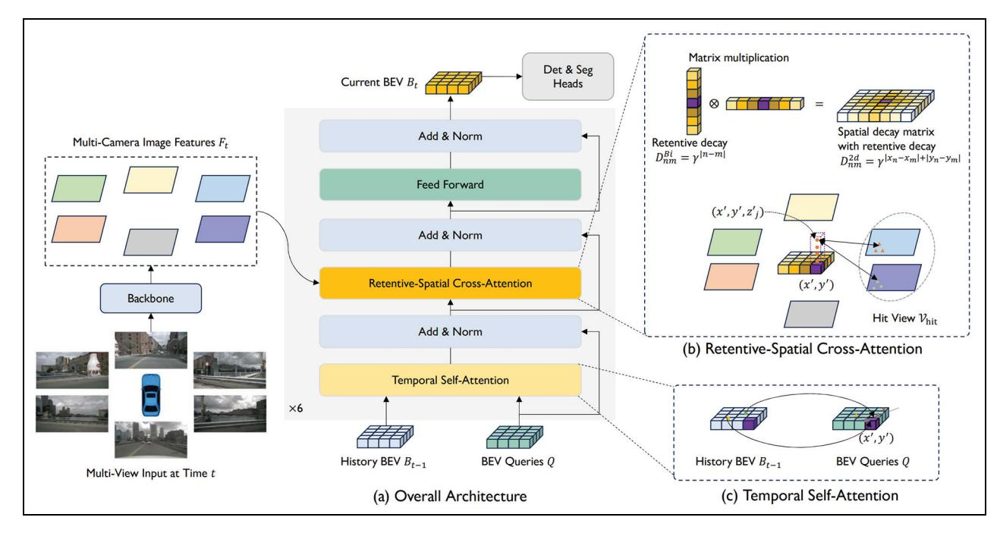
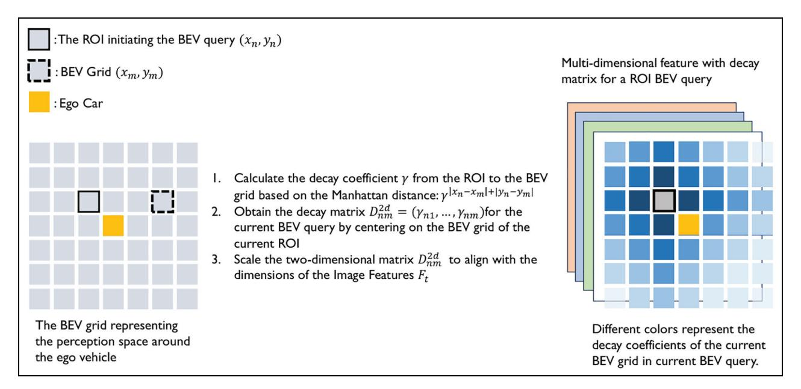
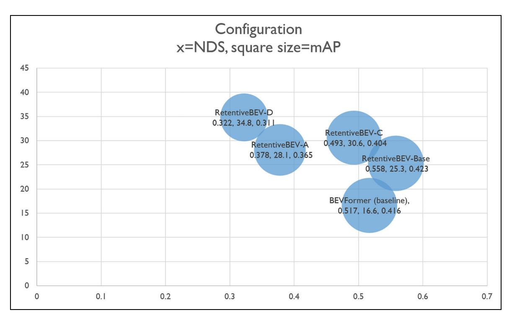
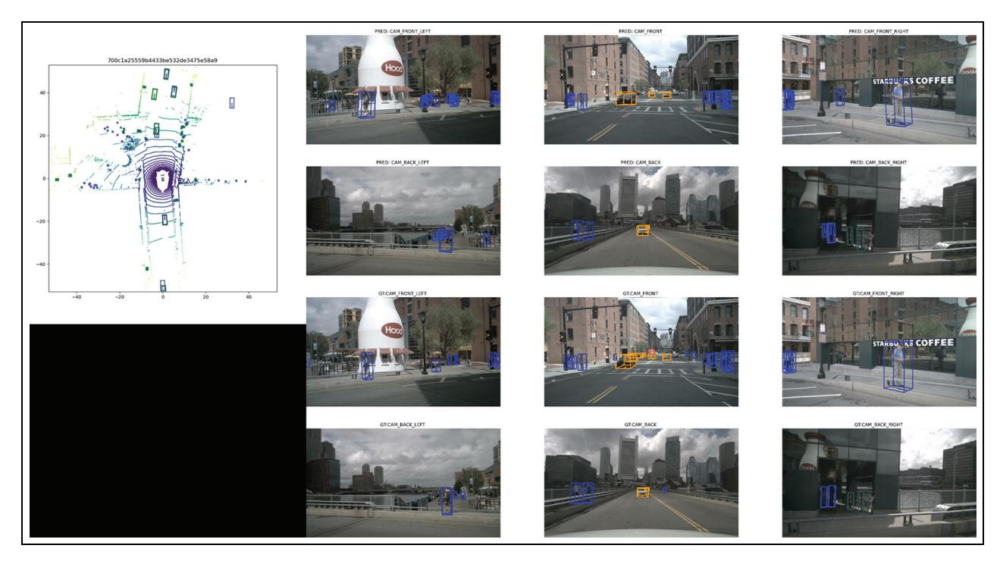

Article - Control

Transactions of the Institute of Measurement and Control I-15
© The Author(s) 2025
Article reuse guidelines:
sagepub.com/journals-permissions
DOI: 10.1177/01423312241308367
journals.sagepub.com/home/tim

# BEV transformer for visual 3D object detection applied with retentive mechanism

Jincheng Pan, Xiaoci Huang, Suyun Luo and Fang Ma

#### **Abstract**

Three-dimensional (3D) vision perception tasks utilizing multiple cameras are pivotal for autonomous driving systems, encompassing both 3D object detection and map segmentation. We introduce a novel approach dubbed RetentiveBEV, leveraging Transformer to learn spatiotemporal features from Bird's Eye View (BEV) perspectives. These BEV representations form the foundational layer for further autonomous driving tasks. Succinctly, spatial features within regions of interest (ROIs) are harvested via spatial cross-attention, while temporal dynamics are integrated using temporal self-attention, enriching the BEV with historical data. Our spatial cross-attention is enhanced with a retentive mechanism, prioritizing information surrounding the focal points and enabling the decomposition of this attention mechanism to bolster computational efficiency. On the nuScenes data set test split, our approach achieves a nuScenes Detection Score (NDS) score of 60.4%, without additional training data, which is an 8.7% improvement over the baseline (BEVFormer-base), and is close to the current state-of-the-art method SparseBEV, which gets NDS 65.7% as of August 2024. On the Val split of nuScenes, our method achieves the performance of 55.8 NDS while maintaining a real-time inference speed of 25.3 FPS, and we are currently working on further accelerating inference using TensorRT on the existing basis (the specification of mAP and NDS would be illustrated by equations (12) and (13)). The integration of the retentive mechanism notably boosts the precision and recall in 3D object detection while also expediting the inference process.

#### **Keywords**

3D object detection, bird eye's view, transformer, deep learning, retentive

## Introduction

Three-dimensional (3D) spatial perception technology serves as a cornerstone for implementing various autonomous driving features in smart vehicles and robotics. Cameras, by capturing 2D images, offer rich semantic and textural information for 3D spatial perception, outperforming light detection and ranging (LiDAR) in aspects like long-range object detection and cost efficiency. And Camera-based 3D Object Detection (Huang et al., 2022a, 2022b: 1, 6; Li et al., 2022, 2023b; Liu et al., 2022; Lu et al., 2023) has witnessed great progress over the past few years. Compared with the LiDAR-based counterparts (Chen et al., 2023; Lang et al., 2019; Lu et al., 2023; Yin et al., 2021), camera-based approaches have lower deployment cost and can detect long-range objects. However, despite these advancements, camera-based methods still face significant limitations in terms of detection accuracy and depth estimation compared to LiDAR-based methods. For instance, as of 2023, on the nuScenes benchmark data set, state-of-the-art camerabased detectors achieve an mAP (mean Average Precision) of approximately 40%, whereas leading LiDAR-based detectors can attain mAP scores exceeding 65%, indicating a performance gap of about 25% (Caesar et al., 2020; Yin et al., 2021). This substantial disparity underscores the challenges in depth perception using cameras alone. In practical scenarios, such limitations can critically affect safety and operational

efficiency. For example, in complex urban environments where precise distance measurements are essential for collision avoidance and navigation, the reduced accuracy of camera-based systems may lead to incorrect positioning of objects and potential safety hazards. In addition, camera sensors are more susceptible to adverse weather conditions like fog, rain, or low-light situations, which can further degrade their performance, whereas LiDAR systems can maintain more consistent detection capabilities under such conditions (Bijelic et al., 2020). These limitations highlight the need for continued research to improve camera-based 3D object detection methods and bridge the performance gap with LiDAR-based approaches.

According to the pipeline, we can divide previous camerabased methods into two paradigms. BEV (Bird's Eye View)based methods (Huang et al., 2022a; Huang and Huang, 2022; Li et al., 2022, 2023b; Park et al., 2022) follow a twostage pipeline which first constructing an explicit dense BEV feature from multi-view features and then performing object

Shanghai University of Engineering Science, China

#### Corresponding author:

Xiaoci Huang, Shanghai University of Engineering Science, Shanghai 201620, China.
Email: hxc8011@163.com

detection in BEV space. Those methods achieve remarkable progress but suffering from high computation cost. Another line of work (Liu et al., 2022, 2023b; Wang et al., 2021b) explores the sparse query-based paradigm by initializing a set of sparse reference points in 3D space. Specifically, DETR3D (Wang et al., 2021b) links the queries to image features using 3D-to-two-dimensional (2D) projection. It has simpler structure and faster speed, but its performance still lags far behind the dense ones. PETR series (Liu et al., 2022, 2023b; Wang et al., 2022b) uses dense global attention for the interaction between query and image feature, which is computationally expensive and buries the advantage of the sparse paradigm. Therefore, there remains a vast potential for exploration and optimization in BEV-based methods. This leads us to the central theme of our work: accelerating the training and inference speed of BEV-based methods through an improved retentive mechanism.

In this paper, our approach introduces the integration of decay weights of the retentive mechanism into the network's surround-view imagery, which addresses these challenges by enhancing detection precision while also reducing inference latency. The existing BEV methods either sparsely construct target information within the perception range (Chambon et al., 2024; Liu et al., 2023a; Vedder and Eaton, 2022; Xu et al., 2022) or densely process every BEV grid (Huang et al., 2022a; Huang and Huang, 2022; Li et al., 2022; Liu et al., 2022, 2023b; Wang et al., 2021b), our approach integrates the strengths of both. Specifically, we draw inspiration from the sparse BEV detection approach, which is based on the observation that "most of the vehicle's perception area is actually empty space, so first determine which areas contain targets to be detected, and then perform BEV attention mechanism queries." Our baseline, BEVFormer, which follows a dense construction approach, merges the tasks of determining whether each BEV grid is empty and detecting target labels simply by one transformer. Although this approach yields excellent results, it is relatively slow due to the need to execute the complete attention query mechanism across all BEV grids. To address this, we introduced a decay mechanism based on the Manhattan distance from image pixels to the ROI into the BEV network. This mechanism is decomposed along the horizontal and vertical directions of the image and applied in the attention query process. We achieved a significant improvement in detection precision on the nuScenes validation set, along with a notable reduction in inference latency, surpassing the baseline BEVFormer-pure under similar conditions, and approaching the nuScenes Detection Score (NDS) score of existing state-of-the-art methods (Li et al., 2023a).

# Related works and motivation

Motivation. To enable vehicles to comprehend driving scenes, employing a BEV paradigm based on inputs from multiple cameras serves as an effective spatial representation. BEV distinctly displays the location and size of objects in space, offering an understanding of the surrounding scene from multicamera perspectives, making it apt for tasks like autonomous driving planning and perception. In the realm of neural

networks that adopt BEV for spatial representation, the Vision Transformer (ViT) (Dosovitskiy et al., 2021) emerges as a pivotal module. However, the self-attention's structure inherently lacks explicit spatial priors, rendering it unable to directly process the spatial relationships among image pixels and features. Motivated by these challenges, we aim to devise a BEV generation technique that not only demands lower computational power but also either maintains or slightly enhances the benchmarks for 3D object detection performance.

The self-attention mechanism, central to the visual transformer, incurs significant computational costs in multi-camera BEV perception tasks due to its quadratic computational time complexity. Previous optimization methods for attention mechanisms (Fan et al., 2023; Guo et al., 2022; Liu et al., 2021; Wu et al., 2021; Yang et al., 2022) compromise the spatial priors of the retentive mechanism. To address this, we have integrated a decay method based on the Manhattan distance between ROI and query area in input images within the BEV perception framework. This structure's decomposed form enables the network model to model global information with linear complexity while preserving the spatial information matrix inherent to the decay mechanism.

#### Related works.

Transformer. The transformer architecture, initially proposed in Vaswani et al. (2023), was designed to overcome the challenges associated with model training, quickly becoming a pivotal technology in numerous Natural Language Processing (NLP) tasks. This architecture has found extensive application across the fields of NLP and computer vision, areas that were once led by Recurrent Neural Networks (RNNs) and Convolutional Neural Networks (CNNs) (Chu et al., 2021a; Dosovitskiy et al., 2021; Pan et al., 2022; Xia et al., 2022; Yao et al., 2022). When handling image inputs, ViT (Dosovitskiy et al., 2021; Vaswani et al., 2023) divides the image into a series of non-overlapping blocks (Vaswani et al., 2023), which are then processed through its Query-Value-Key attention mechanism. To enhance training efficiency and reduce computational costs, various studies have proposed spatial priors and sparse attention strategies (Chu et al., 2021b; Hassani et al., 2023; Touvron et al., 2021). These advancements facilitate more efficient training and inference, especially in scenarios involving large data sets or complex spatial relationships. Also, there is much research aimed at decreasing the computational costs associated with training and inferring self-attention (Fan et al., 2023; Wang et al., 2021a, 2022a; Wu et al., 2021).

Prior knowledge in transformer. In visual transformers, prior knowledge is crucial for understanding universal patterns within image data, such as the structure of images and the spatial distribution of objects. Integrating explicit spatial priors enhances the efficiency of the self-attention mechanism by clarifying spatial connections within the data. The early version of ViT (Dosovitskiy et al., 2021; Vaswani et al., 2023) used trigonometric functions for positional encoding to integrate pixel information into relevant feature dimensions. Recent advancements (Fan et al., 2024) have introduced a 2D

bidirectional spatial decay matrix grounded in Manhattan distance, enriching the model with dynamic prior knowledge concerning variations in distance. This innovation empowers the self-attention mechanism to pinpoint spatial relationships with heightened precision in the context of global information modeling, thus aligning with the intricate demands of 3D object detection tasks.

In particular, RetentiveBEV employs a decay weight matrix,  $D_{nm}^{2d}$ , derived from camera imagery to facilitate the computational processes of the attention mechanism, as delineated in equation (6). This method underscores a refined approach to embedding spatial awareness within the model, ensuring a nuanced understanding of spatial relationships, pivotal for enhancing the precision and reliability of 3D object detection.

2D-to-3D transform. Extracting cues and features from 2D images gathered by single or multiple cameras represents a straightforward strategy for performing environment perception tasks in autonomous driving. However, feature transformation methods based on views from a single camera fall short by not providing a unified space for information representation. This requires individual processing of the data collected by different cameras, which compromises the efficiency of both training and inference processes.

BEV serves as a unified framework for spatial representation. Utilizing BEV requires the reconstruction of depth information from camera images, either through direct depth estimation or supported by categorized depth estimation, to enable the transformation of image features into BEV features. Specifically, the transformation of image features into BEV features typically involves several key steps. First, depth information is used to project 2D image features into a 3D space, creating a point cloud or voxel grid that represents the scene from multiple perspectives. These 3D representations are then mapped onto a BEV plane by aggregating features from different views. In many approaches, neural networks such as CNNs or transformers are employed to refine the BEV features, enhancing spatial coherence and accuracy. In autonomous driving, visual-input-based 3D perception BEV approaches have drawn significant interest recently (Huang et al., 2022b; Jiang et al., 2023; Zhang et al., 2022). These approaches fall into two primary categories: set-based methods, which employ geometric relationships for the 2D to 3D transformation, and learning-based methods, which leverage deep learning networks, such as transformers, for accomplishing the conversion.

LSS (Philion and Fidler, 2020), a geometry-based approach, generates spatial point clouds from categorized depth estimation, transforming each image into feature frustums for each camera and merging them into a rasterized BEV view. Extending LSS's capabilities, BEVDet (Huang et al., 2022b) integrates techniques for augmenting both image views and BEV data. BEVDepth (Li et al., 2023b) improves the quality of its BEV features by incorporating explicit depth cues from LiDAR, underscoring the significance of depth information in BEV perception. BEVStereo (Li et al., 2023a) and STS (Wang et al., 2022c) enhance depth accuracy using temporal multi-view stereo techniques. Furthermore,

SOLOFusion (Park et al., 2022) and ViideoBEV (Han et al., 2024) investigate the application of long-term temporal fusion for advanced multi-view 3D perception, showcasing the evolving landscape of BEV technology in understanding complex environments.

DETR3D (Wang et al., 2021b) marks the advent of the first transformer-based BEV technique, which establishes object queries within a 3D space and leverages a transformer decoder to extract learnings from features across multiple image viewpoints. On DETR3D's foundation, PETR (Liu et al., 2022) has further refined this approach by incorporating positional embedding transformations. BEVFormer (Li et al., 2022) advances the field by adaptively synthesizing BEV features from the spatiotemporal characteristics captured by cameras from various perspectives, thereby reducing its reliance on explicit depth cues and 3D assumptions. UniAD (Hu et al., 2023) expands on BEVFormer's capabilities, facilitating multi-task learning within the BEV spatial context. Despite the impressive efficacy shown by these BEV perception methodologies, they typically initialize using models either pretrained on ImageNet with single-view images (Russakovsky et al., 2015) or through deep pre-training techniques (Park et al., 2021), highlighting a common foundation in their development.

Among the transformer-based BEV techniques, BEV Former stands out by nearly matching the performance of previous LiDAR-based methods, setting a reference point for further innovations. However, the computational demands of BEVFormer and its successors inspire ongoing research into optimizing BEV representation learning for greater efficiency.

# Main contribution

To incorporate spatial priors directly within the attention mechanism, the image utilize a 2D bidirectional spatial decay matrix based on the Manhattan distance before forward propagation process, introducing the concept of Manhattan Self-Attention (MaSA): the greater the distance from a target token, the more significant the decay in attention weight for the other tokens. This feature ensures that while global information is processed, varying levels of attention are allocated to the tokens based on proximity. Addressing the considerable computational load posed by modeling global information with traditional attention mechanisms, numerous studies (Liu et al., 2021; Tu et al., 2022; Zhu et al., 2023) have attempted solutions, yet often at the expense of disrupting the spatial decay matrix essential for embedding spatial priors within MaSA. To circumvent this, the retentive mechanism employs a decomposition approach along the image's horizontal and vertical axes. This approach enables MaSA to model global information efficiently with linear computational overhead and retain the original MaSA's receptive field. Consequently, we introduce the Retentive BEV, a BEV encoder leveraging the retentive mechanism. It is designed to explicitly furnish spatial prior information while bolstering the attention mechanism, allowing for global information modeling of the BEV perspective with linear time complexity. Key features of our RetentiveBEV include the following:

- 1. A grid-shaped BEV query reference set, integrating spatiotemporal features via the attention mechanism.
- The Retentive-Spatial Cross-Attention (RSCA) module, which amalgamates spatial features across multiple camera inputs and generates a weight decay matrix to furnish attention with spatial priors.

By integrating features generated by RetentiveBEV with task-specific heads for various applications, such as DETR3D (Wang et al., 2021b) and OpenOccupancy (Wang et al., 2023), it is possible to detect 3D objects in an end-to-end manner. Our contributions are as follows:

- Introduced a BEV utilizing a Manhattan distancebased spatial decay matrix, which offers explicit spatial priors to the attention mechanism.
- Adopted a new MaSA decomposition approach within the BEV framework, enabling global information modeling with linear complexity.

We tested our network model on the Val split of the nuScenes data set using a single V100 GPU, achieving a comprehensive NDS score of 0.558, an mAP accuracy score of 0.423, and an inference performance of 25.3 frames per second.

# **Methods**

In this research, we introduce a new method for transforming features from multi-view camera images into BEV features, offering a unified representation of the surrounding environment that enhances various autonomous driving perception tasks. Our method, developed within the Retentive framework, leverages spatiotemporal data gathered from multiple camera perspectives. For spatial feature calculation, it incorporates the Manhattan Cross-Attention mechanism from the retentive approach, explicitly providing spatial priors to the transformer and significantly reducing the computational demands for model training and inference. For temporal features, it employs an RNN-based approach to efficiently capture historical BEV features, ensuring minimal computational overhead.

# **Architecture**

For image inputs from multiple cameras, where the nuScenes data set provides surround-view images from  $N_{ref} = 6$  cameras, the network starts by extracting multi-dimensional features from each camera through a backbone network. These features are then integrated with temporal information from historical BEV frames via a Temporal Self-Attention (TSA) module and fed into an RSCA module for spatial feature aggregation. Within this module, when querying a Region Of Interest (ROI) in BEV, the mechanism first identifies the ROI's location (in BEV grid coordinates (x',y')) across the images from the six cameras, calculates a Manhattan distance decay matrix  $D_{nm}^{2d}$  for these positions  $\mathcal{V}_{\text{hit}}$  in each image, and performs a QKV query calculation. Each BEV grid samples several layers vertically  $(z'_i, j = 1, 2, ..., n_j)$ , incorporating the

results into the feature vector represented by (x', y'). This comprehensive process of "temporal information aggregation, spatial feature aggregation, forward propagation" is executed six times across the network, culminating in high-dimensional BEV features  $B_t$  for subsequent object detection or segmentation tasks.

Figure 1 shows the following. (a) The decoder of RetentiveBEV features an array of BEV queries, each determined by the grid's resolution. It incorporates TSA that synthesizes both historical and current frame data, alongside spatial cross-attention mechanisms designed to convert 2D image data into depth information aligned with the world coordinate system. (b) The retentive mechanism operates by calculating decay weights for feature vectors along both horizontal and vertical image axes. These weights are then combined via a Hadamard product to form a 2D decay weight matrix  $D_{nm}^{2d}$ , which is instrumental for conducting BEV queries. Such queries selectively engage with image data from ROIs, factoring in the spatial influence of  $D_{nm}^{2d}$  within these interaction zones. (c) The TSA component plays a pivotal role in merging information from both historical and current frames, enabling BEV queries to dynamically interact with immediate surroundings and corresponding segments from prior frames. This facilitates a nuanced and context-aware analysis, enhancing the model's ability to accurately interpret and predict spatial dynamics.

For image inputs from multiple cameras (with surroundview images collected by  $N_{ref} = 6$  cameras as provided by the nuScenes data set), the network sequentially extracts multidimensional features  $F_t$  from each camera using a backbone network. These features are then combined with the temporal information from BEV historical frames through the TSA module. This combination serves as input to the RSCA module for aggregating spatial features. Within this module, when targeting a specific area of interest in the BEV, the system first identifies the location  $V_{hit}$  of this area (denoted by BEV coordinates (x', y')) across  $N_{ref} = 6$  images. It then calculates the Manhattan distance decay matrix  $D_{nm}^{2d}$  for the current position in each image and proceeds with QKV query computations. A BEV coordinate grid samples several layers vertically  $(z'_i, \text{ for } j = 1, 2, ..., n_z)$  and integrates these samples into the feature vector represented by (x', y'). This "temporal information aggregation, spatial feature aggregation, pooling, forward propagation, and pooling" sequence is repeated six times throughout the network, ultimately producing highdimensional BEV features  $B_t$  for use in subsequent target detection or segmentation tasks.

Within the RetentiveBEV, the attention mechanism is tailored to engage with specific ROIs, by sampling *K* points near reference points in each camera's coordinate system, facilitating the calculation of attention outcomes

$$RetentiveAttn(q, p, x) = \sum_{i=1}^{N_{head}} W_i \sum_{i=1}^{N_{key}} A_{ij} \cdot W_i' x (p + \Delta p_{ij}) \quad (1)$$

In this equation, q,p, and x are designated as the query vector features, reference point features, and input features, respectively. The variable i refers to the specific attention head being considered, with  $N_{head}$  denoting the overall number of such heads. The index j is used for the keys that are sampled,

Figure 1. Depicts the comprehensive architecture of RetentiveBEV, which comprises multiple integral components.

where  $N_{key}$  represents the total keys sampled for each attention head.  $W_i \in \mathbb{R}^{C \times C \frac{C}{IRead}}$  and  $W_i' \in \mathbb{R}^{C \times C \frac{C}{IRead}}$  signify the learnable weights associated with each attention head, where C is the dimensionality of the features.  $\mathcal{A}_{ij} \in [0,1]$  symbolizes the com-

puted attention weights, initialed by 
$$\sum\limits_{j=1}^{N_{\mathrm{key}}}\mathcal{A}_{ij}=1.$$
  $\Delta p_{ij}\in\mathbb{R}^2$ 

represents the predicted offset for the reference point p, facilitating a dynamic adjustment to the point's location. The feature extraction at the adjusted location  $p + \Delta p_{ij}$  is denoted by  $x(p + \Delta p_{ij})$ , with bilinear interpolation being the default method for obtaining these features (Dai et al., 2017), illustrating the model's capacity to adaptively focus and refine its perception based on the spatial context.

For the time and space complexity analysis of our work shown in Figure 1, there are two key modules: RSCA and TSA. These two modules determine the inference time complexity and space complexity of the network:

- 1. RSCA: In this module, cross-attention is performed based on multi-view input features. Let N be the number of multi-view features, M be the number of BEV queries, and D be the feature dimension. The time complexity is O(M\*N\*D). The attention calculation scales linearly with the number of input views and BEV queries. During cross-attention calculation, the attention matrix of size N\*M needs to be stored. Therefore, the space complexity is O(N\*M). In addition, storing the feature representations contributes a complexity of O((N\*M)\*D), resulting in a total space complexity of O(N\*M+(N+M)\*D).
- 2. TSA: This module involves self-attention between historical and current BEV queries. Assuming both historical and current BEV have *M* queries, and *D* is the

feature dimension, the time complexity is  $O(M^2 * D)$ . Since it involves all pairwise interactions between historical and current queries, the complexity grows quadratically with the number of BEV queries. In the self-attention module, the attention matrix between historical and current BEV has size M \* M, leading to a space complexity of  $O(M^2)$ . Besides, storing the input feature representations contributes a complexity of O(2 \* M \* D), giving a total space complexity of  $O(M^2 + 2 * M * D)$ .

Combining these two modules, the overall time complexity of our network is  $O(M * N * D + M^2 * D)$ , and the space complexity is  $O(N * M + M^2 + (N + M) * D)$ .

# Attention queries

The Attention Query is a critical element within the attention mechanism, serving as the vector or tensor that directs the focus of attention. This query vector is essential for calculating attention scores, determining the areas of focus within the mechanism. The key and value vectors, essential for the attention calculation, are derived from the feature extraction of the input image: after the original image is processed through the backbone network, it is transformed into a tensor representing high-dimensional features. Additional convolution layers then produce the key and value vectors for the targeted ROI. In the traditional method of computing visual attention, a query vector q, along with a set of key vectors  $k_1, k_2, ..., k_n$ , is specified for an ROI. The attention score  $\alpha_i$  for the given area results from the dot product between the query vector and each key vector  $k_i$  followed by normalization via a softmax function to yield the attention weight  $\beta_i$ . The final attention output is achieved by summing the products of these attention weights and their corresponding value vectors, completing the process as described

$$\alpha_{i} = \frac{\mathbf{q} \cdot \mathbf{k}_{i}}{\sqrt{d_{k}}}$$

$$\beta_{i} = softmax(\alpha_{i}) = \frac{\exp(\alpha_{i})}{\sum_{j=1}^{n} \exp(\alpha_{i})}$$

$$O = \sum_{i=1}^{n} \beta_{i} \mathbf{v}_{i}$$
(2)

In the context of object detection tasks, the model's attention output serves as an indicator of its focus on various regions within the image. Higher levels of attention output signal that the model regards certain areas as encompassing critical targets or information. Conversely, lower levels of attention output imply that the model either overlooks these areas or considers them to be of minor significance to the task at hand. Within the attention mechanism designed for learning BEV representations from a combination of multiple images and items as inputs, each BEV query vector is indicative of a significant feature or region within the scene. These BEV query vectors, derived from learning across images captured from diverse camera angles, facilitate the model's capability to link and recognize features across varying camera perspectives.

RetentiveBEV employs query vectors to acquire a BEV representation of the space surrounding ego car, utilizing surround-view images, LiDAR point clouds, and the bounding box (bbox) ground truths from the nuScenes data set. These queries are formulated by a set of learnable parameters, denoted as  $Q \in \mathbb{R}^{H \times W \times C}$ , where H and W indicate the spatial resolution of the RetentiveBEV perception plane in terms of BEV grid numbers, and C represents the count of sampling points within the vertical sections across the BEV grid. Each grid on the BEV plane equates to a real-world area of s meters, with the plane's center aligning with the ego car's coordinate system's center. Before entering Retentive BEV's attention mechanism, the query vector Q is enriched with feature dimensions and spatial priors through a process of learnable position encoding.

## Retentive decay matrix

One-dimensional inputs. To augment the transformer model's performance, a temporal decay mechanism is incorporated within the retentive mechanism, offering a temporal prior for sequential modeling. This mechanism assigns decay weights based on time when processing one-dimensional input. For any given position n, the output, after undergoing temporal decay, can be expressed as follows

$$o_n = \sum_{m=1}^n \gamma^{n-m} (Q_n e^{in\theta_0}) (K_m e^{im\theta_0})^T v_m \tag{3}$$

Through these operations, the retentive mechanism introduces time decay and positional encoding into self-attention computations, aiming to mimic the temporal relationships present in sequential data. This approach endows the model with temporal priors, thereby bolstering its ability to handle sequential data. In the context of parallel training, this method is executed in a highly efficient matrix format. The retention step involves processing the input X through a sequence of transformations and then multiplying it with the time decay matrix D to compute the final output. This strategy not only retains the temporal information within the sequences but also drastically lowers computational complexity. Consequently, it empowers the model to more effectively learn the long-range dependencies inherent in sequence data

$$Q = (XW_Q) \odot \Theta$$

$$K = (XW_K) \odot \bar{\Theta}$$

$$V = XW_V$$

$$\Theta_n = e^{in\theta_0}$$

$$D_{nm} = \begin{cases} \gamma^{n-m}, & n > m \\ 0, & n \le m \end{cases}$$

$$\text{Retention}(X) = (QK^T \odot D)V$$

 $o_n$  is calculated as the weighted sum of outputs from all positions m, where the weights are determined by the similarity between the query Q and key K vectors, alongside a timebased decay factor  $\gamma^{n-m}$ . The decay factor  $\gamma$ , raised to the power of n - m for cases, where n > m, represents how influence diminishes over time, making distant past events have lesser impact on the current state; each query vector  $Q_n$  is generated by transforming the input X through a weight matrix  $W_P$  and is further modified by an element-wise complex multiplication with  $\Theta_n$ , a complex number embodying the positional information with an angle of  $n\theta_0$ . Similarly, each key vector  $K_m$  is produced by transforming X via  $W_K$ and undergoing a similar complex multiplication with  $\Theta_m$ . The matrix  $D_{nm}$  defines the relationship between positions n and m, adopting a value of  $\gamma^{n-m}$  to reflect temporal decay for n > m, and 0 for n < m, thus enforcing causal masking to ensure information flow is unidirectional, from past to future. This decay matrix D, containing causal masks and exponential decay components, underscores the relative distances in a one-dimensional sequence, embedding a clear temporal prior into text data analysis. The value vector V results from the transformation of X via  $W_V$ . The Hadamard product  $(\odot)$  signifies element-wise multiplication; X is the input data matrix, and  $W_P, W_K, W_V$  are the trainable matrices used for converting X into the respective queries Q, keys K, and values V, enabling the model to efficiently process sequential data while accounting for time-based relevance and dependencies.

# 2D inputs: MSA, MSA decomposition, and RSCA.

Manhattan distance. Manhattan distance refers to the distance between two points in a grid-like space, which is calculated as the sum of the absolute differences along the coordinate axes, rather than the direct Euclidean distance. In other words, the distance is measured by "walking the blocks" rather than taking a straight line.

MSA. We involve the decay of one-dimensional input shown in equation (3) into self-attention as MaSA. We

transform the unidirectional and one-dimensional decay observed in retention into bidirectional and 2D spatial decay (shown in equation (6)). This spatial decay introduces an explicit spatial prior linked to Manhattan distance into the vision backbone.

MSA decomposition. The Manhattan attention mechanism utilizes the Manhattan distance between pixels in an image as its guiding metric, preferentially allocating higher decay weights to pixels further from a focal pixel. This approach expands the one-dimensional sequence decay found within the Retentive Network into a 2D format by applying it across both the horizontal and vertical axes of the image, thereby creating a 2D spatial decay matrix. This matrix serves as a spatial prior, informing the query process within the selfattention framework. Moreover, Manhattan attention facilitates the decomposition of this spatial decay matrix along the image's horizontal and vertical planes. This strategic decomposition enables the preservation of the receptive field's dimensions while simultaneously optimizing the computational efficiency of the attention mechanism during both training and inference phases. The concept of bidirectional 2D decay, as an extension of the retentive mechanism's onedimensional sequence decay, is articulated through

$$BiRetention(X) = (QK^{T} \odot D^{Bi})V$$

$$D_{nm}^{Bi} = \gamma^{|n-m|}$$
(5)

wherein,  $OK^T$  represents the standard dot product in the selfattention mechanism, where Q (Query) and K (Key) are the matrices derived from the input features. The dot product captures the similarity between different elements within the feature space. And  $\odot D^{Bi}$  is the Hadamard product (elementwise multiplication) between the dot product  $OK^T$  and the bidirectional decay matrix  $D^{Bi}$ . This matrix  $D^{Bi}$  incorporates the Manhattan distance-based decay, which adjusts the attention weights based on the spatial distance between pixels. The decay matrix introduces a spatial prior that biases the attention toward specific regions, depending on their distance from a reference point. The value matrix V in the self-attention mechanism, which holds the actual information that will be weighted and aggregated based on the calculated attention scores.  $\odot D^{Bi}$  represents the matrix multiplication that applies the spatially decayed attention weights to the value matrix V, generating the final output of the attention mechanism. The term  $\gamma^{|n-m|}$  indicates the decay factor, where |n-m| is the Manhattan distance between two points, modulating the influence of one point on another in the final attention output.

**RSCA.** In scenarios where images are divided into numerous non-overlapping pixels, these segments undergo position encoding and linear transformation to be individually converted into vector representations, known as tokens, which represents our ROI. Derived from the MaSA Decomposition, we assuming the location of a specific token within the image is denoted by coordinates  $(x_n, y_n)$ , and then the bidirectional decay factor for this token, in relation to the vector representations of other pixel tokens, can be described as

$$D_{nm}^{2d} = \gamma^{|x_n - x_m| + |y_n - y_m|} \tag{6}$$

and then the RSCA can be presented as

$$MaSA(X) = (Softmax(QK^T) \odot D^{2d})V$$
 (7)

wherein, the K and V matrix are generated according to the ground true of nuScenes LiDAR point cloud.

Global attention mechanisms are known for their ability to capture comprehensive information across an entire data set. However, this capability comes at the cost of significant computational overhead. Research has indicated that while sparse attention mechanisms attempt to mitigate this issue, they inadvertently disrupt the spatial decay matrices governed by Manhattan distances (Dong et al., 2022; Hassani et al., 2023; Wang et al., 2021a; Yang et al., 2021), thereby eliminating the utility of spatial priors. In response, our approach involves calculating the MaSA scores independently along the image's vertical and horizontal axes. These scores are then integrated with bidirectional decay matrices specific to each axis (i.e. one-dimensional decay matrices that quantify the horizontal and vertical distances between tokens, represented as  $D_{nm}^{2d} = \gamma^{|x_n - x_m| + |y_n - y_m|}$ ). As Figure 2 shows, the process is outlined as follows

$$Attn^{H} = Softmax(Q^{H}K^{T}) \odot D^{H}$$

$$Attn^{W} = Softmax(Q^{W}K^{T}) \odot D^{W}$$

$$MaSA(X) = Attn^{H}(Attn^{W}V)^{T}$$
(8)

**2D-to-3D** transform: RSCA. In models for 3D object detection involving inputs from multiple cameras, the scale of inputs is large due to the inclusion of views from  $N_{\text{view}}$  cameras. Directly applying a conventional multi-head attention mechanism to model this vast global information could lead to prohibitive computational costs. To mitigate this, we have crafted a spatial feature aggregation module within the RetentiveBEV model, leveraging the principles of retentive's spatial decay (done by MaSA) and Manhattan attention decomposition. This module enables each BEV query vector to engage with the relevant section of the camera image's ROI, taking into account the decay weights applicable to that section. The methodology unfolds as follows:

- Initially, the BEV query vectors are projected onto a pillar-shaped region on the BEV plane. From this region, a set number of reference points (*N*ref 3D reference points) are selected, each accumulating spatial features from its vicinity. The surrounding spatial features of each reference point are then mapped to the image coordinate system via the camera's intrinsic and extrinsic matrices.
- If the projection of a reference point lands within the view of any of the  $N_{\text{view}}$  cameras, this particular view is designated as  $V_{\text{hit}}$ .
- Upon mapping the reference points' spatial coordinates to 2D coordinates in the image coordinate system, these 2D points become the reference for query Qp. Features are extracted from the vicinity of these

Figure 2. The details of the retentive decay matrix computation of RSCA. Different shades of blue squares represent the weights of the multidimensional features corresponding to the BEV grid in the RSCA calculation, with darker shades indicating larger weights.

points in the 2D image, with their significance weighted according to the decay matrix Dnm2d. The aggregation of these weighted features then forms the output for spatial feature aggregation, efficiently summarizing the expansive spatial information while mindful of computational efficiency.

Steps below can be represented as

$$RSCA(Q_p, F_t) = \frac{1}{|V_{\text{hit}}|} \sum_{i \in V_{\text{hit}}} \sum_{j=1}^{N_{\text{ref}}} \text{RetentiveAttn}(Q_p, \mathcal{P}(p, i, j), F_t^i)$$
(9)

wherein, the  $Q_p$  is the query according to the reference point p, and the  $\mathcal{P}$  is the projection with index i,j between p and extracted feature  $F_t^i$ .

MaSA and RSCA. The relationship between RSCA (a cross-attention mechanism) and MaSA (a self-attention mechanism) is defined within the context of training processes, where RSCA simultaneously handles inputs from both 2D surround images and LiDAR point cloud ground truths. In this setup, the query (Q) is derived from 2D surround images, while the keys (K) and values (V) originate from the LiDAR point cloud data. For images undergoing RSCA, decay weights D are computed exclusively based on the image itself, embodying MaSA's principle. Essentially, MaSA functions as a component of RSCA, focusing solely on inputs from surround-view images during training. In contrast, RSCA integrates inputs from two distinct sources. This delineation between the two, with MaSA leveraging self-attention for singular input sources and RSCA employing

cross-attention for multiple data types, clarifies their respective roles and methodologies.

## TSA

RetentiveBEV utilizes RNN to derive temporal BEV features, facilitating the representation and estimation of object velocities, as well as the detection of objects obscured by height differences. For the BEV query vector Q at a given timestamp t, and the historical BEV feature  $B_{t-1}$ stored at timestamp t-1, the process begins with calculating the vehicle's relative displacement between these two time points within the ego car's coordinate system. This calculation is based on the motion data gathered from the vehicle itself. The aim is to align the historical BEV feature  $B_{t-1}$  with the query vector Q, ensuring that the BEV grids for both timestamps correspond accurately to the same locations in physical space. The resulting aligned historical BEV feature is denoted as  $B'_{t-1}$ . Subsequently, a mechanism of TSA is introduced to establish a connection between features from different timestamps within the same BEV grid, post alignment. This TSA mechanism highlights the significance of temporal dynamics in understanding the spatial arrangement and movement of objects over time

$$TSA(Q_p, \{Q, B'_{t-1}\}) = \sum_{V \in \{Q, B'_{t-1}\}} DeformAttn(Q_p, p, V) \#$$

$$(10)$$

Herein,  $Q_p$  is a BEV query vector positioned at the coordinates p = (x, y). For the initial frame, the pair  $\{Q, B'_{t-1}\}$  transitions to  $\{Q, Q\}$ , indicating that at the start, both the current and historical BEV features are considered to be the same, essentially treating the initial query vector Q as its own

historical data. This approach ensures continuity and provides a baseline for comparison in the absence of prior frame information.

# **Experiments**

## Metrics

The nuScenes 3D detection benchmark data set comprises 1000 video segments, each 20 seconds in length, featuring keyframes sampled at a 2-Hz rate. Each keyframe captures a 360° panoramic view through the integration of six cameras. The data set is segmented into 700 videos for training, 150 for validation, and another 150 for testing, spanning 10 categories, and encompassing approximately 14 million annotated 3D detection boxes. For assessing model performance, we rely on the nuScenes data set's supported unified metrics.

The evaluation metric provided by the nuScenes data set still uses the commonly used AP (Average Precision) from object detection. However, instead of using Intersection over Union (IoU) for threshold matching, it uses the 2D center distance d on the ground plane. This approach decouples the impact of object size and orientation on the AP calculation

$$mAP = \frac{1}{|\mathbb{C}||\mathbb{D}|} \sum_{c \in \mathbb{C}} \sum_{d \in \mathbb{D}} AP_{c,d}$$
 (11)

In the equation,  $\mathbb{C}$  represents the categories of object detection, and  $\mathbb{D}$  denotes the difficulty weight parameters for predicting different object categories and distances.

In addition to mAP, nuScenes also introduces another metric called NDS, which is calculated using the true positive (TP) metric. NDS is half based on detection performance (mAP) and the other half on detection quality, which is measured by position, size, orientation, attributes, and velocity (ATE, ASE, AOE, AVE, AAE):

- mATE (Average Translation Error): The Average Translation Error (ATE) is the 2D Euclidean center distance measured in meters.
- mASE (Average Scale Error): The Average Scale Error (ASE) is calculated as 1 – *IoU*, where IoU is the Intersection over Union after aligning the angles in 3D space.
- mAOE (Average Orientation Error): The Average Orientation Error (AOE) is the smallest yaw angle difference between the predicted and ground truth values. The angle deviations for all categories are within 360°, except for the barrier category, where the angle deviations are within 180°.
- mAVE (Average Velocity Error): The Average Velocity Error (AVE) is the L2 norm of the 2D velocity difference, measured in meters per second (m/s).
- mAAE (Average Attribute Error): The Average Attribute Error (AAE) is defined as 1 acc, where acc is the classification accuracy for different categories.

For the metrics above, we calculate the mean true positive (mTP) across all categories. In equation (12), c represents the categories for the corresponding metrics mentioned above.

For each TP metric, we calculate the mTP metric across all classes, and all TP metrics are calculated using a center distance of d = 2 m for counting NDS scores in equation (13)

$$mTP = \frac{1}{|\mathbb{C}|} \sum_{c \in \mathbb{C}} TP_c \tag{12}$$

$$NDS = \frac{1}{10} \left[ 5mAP + \sum_{mTP \in \mathbb{TP}} (1 - min(1, mTP)) \right]$$
 (13)

- Higher values indicate better performance for NDS and mAP. NDS assesses object detection models by combining accuracy and recall, reflecting how welldetected objects match with actual ones. mAP, a key metric in object detection, calculates the area under the precision-recall curve to represent the system's average precision across different recall levels.
- Conversely, lower values are preferable for metrics such as ATE, ASE, AOE, AVE, and AAE, which evaluate errors in vehicle displacement, scale, orientation, speed, and acceleration estimations compared to actual measurements, respectively.

In the realm of 3D object detection, NDS and mAP serve as the primary metrics for evaluation, whereas ATE and AOE shed light on a model's accuracy in map segmentation.

# Environment settings and baseline

The experiments were carried out on V100 GPUs, setting the default number of training epochs to 30 and a learning rate (lr) of  $2 \times 10^{-4}$ . Drawing from the insights of previous projects (Park et al., 2021; Wang et al., 2021a, 2021b), we opted for ResNet101-DCN, initialized from FCOS3D checkpoints, and VoVnet99, which initiated from DD3D checkpoints, as our backbone networks. The experiments employed multi-scale features created by Feature Pyramid Networks (FPN), which downscaled the backbone-derived image features to  $\frac{1}{16}$ ,  $\frac{1}{32}$ , and  $\frac{1}{64}$  of their original sizes across various configurations. Before entering TSA, the feature dimension (*C*) was set to 256.

On the nuScenes data set, BEV queries were defaulted to a resolution of  $200 \times 200$ . The data set defines the vehicle's perception range from the coordinate system's origin, spanning the X and Y axes from [-51.2 m to 51.2 m] and the Z-axis from [-5 m to 3 m]. Each BEV grid's resolution (s) matches a real-world square region with sides of 0.512 m. Within the RSCA, every BEV query sampled  $N_{\rm ref} = 4$  anchor points evenly distributed in the real-world 3D space within [-5 m, 3 m]. Each anchor point was mapped to its corresponding 2D image feature ( $\mathcal{V}_{\rm hit}$ ) by sampling four surrounding reference points.

**Benchmark comparison.** To effectively assess the RetentiveBEV neck network's performance, we included VPN, Lift-Splat, and BEVFormer as benchmarks, applying the same head network for tasks of BEV detection and segmentation.

Table 1. 3D object detection results on nuScenes Val set.

| Method            | Modality       | Backbone | NDS   | mAP   | mATE  | mASE  | mAOE  | mAVE  | mAAE  |
|-------------------|----------------|----------|-------|-------|-------|-------|-------|-------|-------|
| SSN               | LiDAR          | _        | 0.569 | 0.463 | _     | _     | _     | _     | _     |
| CenterPoint-Voxel | LiDAR          | _        | 0.655 | 0.582 | _     | _     | _     | _     | _     |
| PointPainting     | LiDAR & Camera | _        | 0.583 | 0.464 | 0.388 | 0.271 | 0.498 | 0.247 | 0.111 |
| FCOS3D            | Camera         | RIOI     | 0.415 | 0.343 | 0.725 | 0.263 | 0.422 | 1.298 | 0.153 |
| PGD               | Camera         | RIOI     | 0.428 | 0.369 | 0.638 | 0.261 | 0.439 | 1.263 | 0.185 |
| DETR3D            | Camera         | RIOI     | 0.425 | 0.346 | 0.773 | 0.268 | 0.383 | 0.842 | 0.216 |
| BEVFormer         | Camera         | RIOI     | 0.448 | 0.375 | 0.725 | 0.272 | 0.391 | 0.802 | 0.211 |
| RetentiveBEV      | Camera         | RIOI     | 0.517 | 0.416 | 0.673 | 0.274 | 0.372 | 0.394 | 0.198 |
| DD3D              | Camera         | V2-99    | 0.477 | 0.418 | 0.572 | 0.249 | 0.369 | 1.014 | 0.124 |
| DETR3D            | Camera         | V2-99    | 0.48  | 0.412 | 0.641 | 0.255 | 0.389 | 0.865 | 0.133 |
| BEVFormer         | Camera         | V2-99    | 0.495 | 0.435 | 0.589 | 0.254 | 0.402 | 0.843 | 0.142 |
| SparseBEV(SOTA)a  | Camera         | V2-99    | 0.627 | 0.543 | 0.502 | 0.244 | 0.324 | 0.251 | 0.126 |
| RetentiveBEV      | Camera         | V2-99    | 0.556 | 0.467 | 0.578 | 0.256 | 0.372 | 0.477 | 0.127 |

&lt;sup>aData from original paper/project. Bolded texts refer to best performance within specific metrics.

Table 2. 3D object detection results on nuScenes Val set.

| Method           | Modality | Backbone | NDS   | mAP   | mATE  | mASE  | mAOE  | mAVE  | mAAE  |
|------------------|----------|----------|-------|-------|-------|-------|-------|-------|-------|
| FCOS3D           | Camera   | RIOI     | 0.415 | 0.343 | 0.724 | 0.263 | 0.422 | 1.292 | 0.153 |
| PGD              | Camera   | RIOI     | 0.428 | 0.366 | 0.688 | 0.248 | 0.434 | 1.264 | 0.185 |
| DETR3D           | Camera   | RIOI     | 0.423 | 0.347 | 0.772 | 0.267 | 0.383 | 0.897 | 0.217 |
| BEVFormer        | Camera   | RIOI     | 0.447 | 0.376 | 0.734 | 0.272 | 0.391 | 0.763 | 0.211 |
| SparseBEV(SOTA)a | Camera   | RIOI     | 0.592 | 0.501 | 0.562 | 0.265 | 0.321 | 0.243 | 0.195 |
| RetentiveBEV     | Camera   | RIOI     | 0.518 | 0.411 | 0.674 | 0.274 | 0.372 | 0.455 | 0.198 |

&lt;sup>aData from original paper/project. Bolded texts refer to best performance within specific metrics.

# 3D object detection

In Tables 1 and 2, we have detailed and contrasted the performance outcomes of various networks executed on the nuScenes test and validation data sets. Notably, VoVNet-99 was enhanced with additional data sets during its pre-training phase for depth estimation tasks, potentially influencing its comparative results.

According to the insights drawn from Tables 1 and 2, RetentiveBEV surpasses DETR and BEVFormer across all key metrics on the nuScenes data set. It also demonstrates performance nearing that of LiDAR-based methods on certain metrics, highlighting its advanced capabilities in both detection accuracy and efficiency.

# Ablation study

The efficacy of the retentive mechanism is illustrated in Table 4, showcasing how various attention mechanisms influence the model's performance. Notably:

 Global Attention operates on a comprehensive scale, engaging with extensive features, which might dilute the emphasis on crucial information due to its vast memory consumption and excessively broad receptive field.

- Local Attention confines its interaction to designated anchor points for each BEV query, enhancing focus on vital information by assigning higher weight to significant features within its limited receptive field, thereby outperforming global attention.
- Manhattan Attention (MaSA) skillfully decomposes
  the global perspective while preserving essential prior
  information. By offering a wider receptive field than
  local attention and diminishing the influence of distant
  irrelevant data, MaSA achieves the optimal balance
  between computational efficiency and scope of awareness, making it the most effective among the tested
  attention strategies.

In Table 5, we delve into the performance impacts of varying configurations, utilizing an R101-DCN backbone with  $900 \times 1600$  pixel input images on a V100 GPU. Key variables include the following:

- Multi-Scale Feature Utilization: When enabled, features extracted from the original camera images by the backbone are further processed by FPN for downsampling; otherwise, features are fed directly into the neck network without additional scaling.
- BEV Query Resolution: Adjustments to the resolution can influence detail capture and performance.

Table 3. 3D object detection results with different attention on nuScenes Val set.

| Method       | Attention | NDS   | mAP   | mATE  | mAOE  | #Param. | FLOPs   | Memory |
|--------------|-----------|-------|-------|-------|-------|---------|---------|--------|
| VPN          | _         | 0.334 | 0.252 | 0.926 | 0.598 | 111.2M  | 924.5G  | ~20G   |
| Lift-Splat   | _         | 0.395 | 0.348 | 0.784 | 0.537 | 74.0M   | 1087.7G | ~20G   |
| BEVFormer    | Global    | 0.404 | 0.324 | 0.837 | 0.442 | 62.IM   | 1245.1G | ~36G   |
| BEVFormer    | Points    | 0.423 | 0.335 | 0.753 | 0.431 | 68.1M   | 1264.3G | ~20G   |
| BEVFormer    | Local     | 0.448 | 0.375 | 0.725 | 0.391 | 68.7M   | 1303.5G | ~20G   |
| RetentiveBEV | MaSA      | 0.553 | 0.46  | 0.618 | 0.367 | 68.4M   | 1224.3G | ~20G   |

Table 4. 3D object detection results with different attentions on nuScenes Val set.

| Method       | Attention | NDS   | mAP   | mATE  | mAOE  | #Param. | FLOPs   | Memory |
|--------------|-----------|-------|-------|-------|-------|---------|---------|--------|
| VPN          | _         | 0.334 | 0.252 | 0.926 | 0.598 | 111.2M  | 924.5G  | ~20G   |
| Lift-Splat   | _         | 0.395 | 0.348 | 0.784 | 0.537 | 74.0M   | 1087.7G | ~20G   |
| RetentiveBEV | Global    | 0.423 | 0.335 | 0.753 | 0.431 | 68.IM   | 1264.3G | ~20G   |
| RetentiveBEV | Local     | 0.448 | 0.375 | 0.725 | 0.391 | 68.7M   | 1303.5G | ~20G   |
| RetentiveBEV | MaSA      | 0.553 | 0.46  | 0.618 | 0.367 | 68.4M   | 1224.3G | ~20G   |

Figure 3. Performance results listed in label order "FPS, NDS, mAP" of different RetentiveBEV configurations and baseline (BEVFormer); configuration details could be found in Table 5.

 Model Layer Count: Varying the number of layers affects the model's depth and can significantly impact both accuracy and inference speed, one layer represents a gray block content shown in Figure 1.

These comparisons highlight the nuanced trade-offs between different attention mechanisms and model configurations,

offering insights into optimizing performance for 3D detection and segmentation tasks.

We configured different settings for the RetentiveBEV model, and their comparisons with the baseline BEVFormer in terms of inference performance (FPS) and detection performance (NDS and mAP) are shown in Table 5, the visualization of RetentiveBEV varied by configuration is shown in Figure 3. It is

Figure 4. Visualization of RetentiveBEV inference on nuScenes Val set. Green is the ground truth, and blue is the pre-edited result.

Table 5. Latency (ms) and inference performance of different model config on nuScenes Val set.

| Configuration        | BEV grid size    | Layer | Backbone latency | RSCA latency | Detection head latency | FPS  | NDS   | mAP   |
|----------------------|------------------|-------|------------------|--------------|------------------------|------|-------|-------|
| BEVFormer (baseline) | 200 × 200        | _     | 78               | _            | 4.1                    | 16.6 | 0.517 | 0.416 |
| RetentiveBEV-Base    | $200 \times 200$ | 6     | 80.6             | 22.3         | 4.5                    | 25.3 | 0.558 | 0.423 |
| RetentiveBEV-A       | $200 \times 200$ | 1     | 78.4             | 12.8         | 5                      | 28.1 | 0.378 | 0.365 |
| RetentiveBEV-C       | $100 \times 100$ | 6     | 76.9             | 24.2         | 4.7                    | 30.6 | 0.493 | 0.404 |
| RetentiveBEV-D       | $100 \times 100$ | I     | 81.3             | 14.7         | 5.2                    | 34.8 | 0.322 | 0.311 |

noticeable that RetentiveBEV-E, with its configuration of singlescale features, a singular network layer, and the lowest BEV query resolution, achieves the quickest results in terms of backbone and neck network latencies and inference frame rate. However, this setup falls short in 3D detection accuracy. Across the five different setups tested for RetentiveBEV, the variant utilizing single-scale features, a six-layer architecture, and a 200 × 200 BEV query resolution strikes an optimal balance between inference speed (FPS), accuracy (mAP), and overall performance (NDS). The analysis reveals that the backbone network's processing time is disproportionately long, representing the primary bottleneck to efficiency in the network inference process. This bottleneck suggests a critical area for potential efficiency improvements and underscores the importance of strategic model configuration to achieve a desirable balance of speed and accuracy in 3D object detection tasks.

# Conclusion

We introduced the retentive mechanism and MaSA decomposition within the attention module for BEV queries, aimed at

accelerating the generation of BEV query results and facilitating subsequent 3D detection and map segmentation tasks. In comparison with BEVFormer, our novel approach, incorporating the retentive mechanism within the neck network, demonstrates enhanced inference speed under equivalent training parameters and hardware setups. This advancement in receptive field technology significantly bolsters the model's accuracy in 3D object detection and map segmentation. The performance efficiency of both BEVFormer and Retentive BEV networks during the inference phase is primarily constrained by the backbone network, where generating feature vectors from camera surround imagery emerges as the most time-intensive process. Adopting a more efficient backbone could potentially improve the neural network's overall data processing speed. Utilizing R101-DCN as the backbone and configuring the input images to 900 × 1600 pixels, our methodology attained an inference pace of 25.3 frames per second on a V100 GPU. Concurrently, it achieved NDS and mAP scores of 0.558 and 0.423, respectively, on the nuScenes data set Val split. This marks a 34.4% acceleration in inference speed and a 7.35%

Table 6. Comparison of 3D object detection subcategory results on the nuScenes Val set.

| getation                            | 8 2                                            | . 4                    | 4                       | 2         | 12                         | 2                                          |
|-------------------------------------|------------------------------------------------|------------------------|-------------------------|-----------|----------------------------|--------------------------------------------|
| le Ve                               | 79.                                            | 8 4                    | 87.                     | 63.       | 76.5                       | 86.5                                       |
| Sidewalk Terrain Manmade Vegetation | 83.1                                           | 86.7                   | 90.5                    | 71.0      | 78.2                       | 91.2                                       |
| Terrain                             | 70.1                                           | 71.5                   | 75.4                    | 52.8      | 1.19                       | 77.1                                       |
|                                     | 63.5                                           | 71.5                   | 76.4                    | 50.5      | 59.8                       | 75.7                                       |
| Other flat                       | 9.99                                           | 70.8                   | 71.6                    | 58.1      | 60.7                       | 69.3                                       |
| Drive. surf                      | 94.1                                           | 96.0                   | 8.96                    | 88.5      | 81.7                       | 90.2                                       |
| Truck                               | 72.3                                           | 76.5                   | 84.4                    | 65.5      | 73.6                       | 49.2                                       |
| Trailer                             | 54.2                                           | 61.3                   | 62.1                    | 88.5      | 93.0                       | 53.4                                       |
| Traffic                             | 52.1                                           | 63.1                   | 62.9                    | 65.5      | 24.1                       | 83.7                                       |
| Pedestrian                          | 9.69                                           | 72.2                   | 78.9                    | 54.7      | 44.9                       | 65.8                                       |
| Motorcycle Pedestrian               | 8.99                                           | 72.4                   | 78.0                    | 24.7      | 27.4                       | 64.0                                       |
| Construction vehicle                | 30.2                                           | 42.2                   | 51.3                    | 45.8      | 38.3                       | 35.6                                       |
| Car                                 | 80.9                                           |                        |                         |           | 82.8                       | 76.3                                       |
| Bus                                 | 77.2                                           | 85.9                   | 91.2                    | 7.97      | 73.2                       | 44.2                                       |
| Bicycle                             | 21.3                                           | 34.1                   | 40.3                    | 22.8      | 27.0                       | 53.7                                       |
| Barrier                             | 66.0                                           | 74.8                   | 76.4                    | 54.0      | 64.9                       | 76.8                                       |
| MloU                                | 65.5                                           | 72.2                   | 76.1                    | 56.2      | 59.3                       | 62.3                                       |
| Modality a mloU Barrier  | 7 -                                            |                        | _                       | U         | U                          | U                                          |
| Method                              | RangeNet b PolarNet b | Salsanext b | Cylinder3D b | BEVFormer | (baseline) RetentiveBEV | (ours) SparseBEV (SOTA) b |

aL stands for LiDAR, C stands for Camera bData from original paper/project. elevation in NDS score compared to BEVFormer, albeit with a slight decline in mAP from 0.416 to 0.423.

The introduction of this retentive decay mechanism, which precedes the more time-consuming BEV attention transformer, allows the attention query mechanism to converge faster, thereby significantly accelerating the execution speed of dense BEV networks. We believe this innovation effectively addresses the trade-off between accuracy and speed in dense BEV methods. While our current work focuses on optimizing the execution speed of dense BEV methods, we acknowledge the need for further innovation to solve deeper, fundamental issues in BEV perception. As we outline in this paper, future research will explore extending the decay mechanism to three dimensions, corresponding to the xyz axes of the world coordinate system. This extension will be integrated more deeply with the BEV transformer, aiming to better balance the accuracy and speed of dense BEV methods in target detection. The performance comparison of various detection targets supported by different network models on the nuScenes dataset is shown in Table 6.

# Limitations

The precision and efficiency of purely visual-based methods in 3D object detection—considering aspects such as training recall—remain inferior to LiDAR-based approaches. Overcoming the challenge of reconstructing 3D information from 2D images, which lack depth data, continues to be a significant hurdle for purely visual techniques.

#### **Acknowledgements**

The authors thank Professor Xiaoci Huang for critically reviewing the manuscript.

## **Author contributions**

JP and XH conceived and designed the study. JP wrote the paper. XH reviewed and edited the manuscript. All authors read and approved the manuscript.

## **Declaration of conflicting interests**

The author(s) declared no potential conflicts of interest with respect to the research, authorship, and/or publication of this article.

## **Funding**

The author(s) received no financial support for the research, authorship, and/or publication of this article.

# **ORCID iD**

Jincheng Pan https://orcid.org/0009-0008-5962-5140

# Data availability statement

The data supporting the findings of this study are available from the corresponding author upon reasonable request.

# References

- Bijelic M, Gruber T, Mannan F, et al. (2020) Seeing through fog without seeing fog: Deep multimodal sensor fusion in unseen adverse weather (arXiv:1902.08913). arXiv. Available at: http://arxiv.org/abs/1902.08913 (accessed 14 October 2024).
- Caesar H, Bankiti V, Lang AH, et al. (2020) nuScenes: A multimodal dataset for autonomous driving (arXiv:1903.11027). arXiv. Available at: http://arxiv.org/abs/1903.11027 (accessed 14 October 2024).
- Chambon L, Zablocki E, Chen M, et al. (2024) PointBeV: A sparse approach for BeV predictions. In: *Proceedings of the IEEE/CVF conference on computer vision and pattern recognition*, pp. 15195–15204. Available at: https://openaccess.thecvf.com/content/CVPR2024/papers/Chambon\_PointBeV\_A\_Sparse\_Approach\_for\_BeV\_Predictions\_CVPR\_2024\_paper.pdf
- Chen Y, Liu J, Zhang X, et al. (2023) LargeKernel3D: Scaling up Kernels in 3D sparse CNNs. In: *Proceedings of the IEEE/CVF conference on computer vision and pattern recognition*, pp. 13488–13498. Available at: https://openaccess.thecvf.com/content/CVPR2023/papers/Chen\_LargeKernel3D\_Scaling\_Up\_Kernels\_in\_3D\_Sparse\_CNNs\_CVPR\_2023\_paper.pdf
- Chu X, Tian Z, Wang Y, et al. (2021a) Twins: Revisiting the design of spatial attention in vision transformers. Advances in Neural Information Processing Systems 34: 9355–9366.
- Chu X, Tian Z, Zhang B, et al. (2021b) Conditional positional encodings for vision transformers. Epub ahead of print 18 March. DOI: 10.48550/ARXIV.2102.10882.
- Dai J, Qi H, Xiong Y, et al. (2017) Deformable convolutional networks. In: *Proceedings of the IEEE international conference on computer vision, Venice*, 22–29 December, pp. 764–773. New York: IEEE.
- Dosovitskiy A, Beyer L, Kolesnikov A, et al. (2021) An image is worth 16x16 words: Transformers for image recognition at scale (arXiv:2010.11929). arXiv. Available at: http://arxiv.org/abs/2010.11929 (accessed 5 March 2024).
- Fan Q, Huang H, Chen M, et al. (2024) RMT: Retentive networks meet vision transformers. In: *Proceedings of the IEEE/CVF conference on computer vision and pattern recognition*, Seattle, WA, 16–22 June, pp. 5641–5651. New York: IEEE.
- Fan Q, Huang H, Guan J, et al. (2023) Rethinking local perception in lightweight vision transformer. Epub ahead of print 12 May. DOI: 10.48550/ARXIV.2303.17803.
- Guo J, Han K, Wu H, et al. (2022) CMT: Convolutional neural networks meet vision transformers. In: *Proceedings of the IEEE/CVF conference on computer vision and pattern recognition*, New Orleans, LA, 18–24 June, pp. 12175–12185. New York: IEEE.
- Han C, Yang J, Sun J, et al. (2024) Exploring recurrent long-term temporal fusion for multi-view 3D perception. *IEEE Robotics and Automation Letters* 9: 6544–6551.
- Hassani A, Walton S, Li J, et al. (2023) Neighborhood attention transformer. In: Proceedings of the IEEE/CVF conference on computer vision and pattern recognition, Vancouver, BC, Canada, 17– 24 June, pp. 6185–6194. New York: IEEE.
- Hu Y, Yang J, Chen L, et al. (2023) Planning-oriented autonomous driving. In: Proceedings of the IEEE/CVF conference on computer vision and pattern recognition, Vancouver, BC, Canada, 17–24 June, pp. 17853–17862. New York: IEEE.
- Huang J and Huang G (2022) BEVDet4D: Exploit temporal cues in multi-camera 3D object detection. Arxiv:2203.17054. Available at: https://arxiv.org/abs/2203.17054
- Huang J, Huang G, Zhu Z, et al. (2022a) BEVDet: High-performance multi-camera 3D object detection in bird-eye-view (arXiv: 2112.117900). arXiv. Available at: http://arxiv.org/abs/2112.11790 (accessed 12 August 2024).

- Huang J, Huang G, Zhu Z, et al. (2022b) BEVDet: High-performance multi-camera 3D object detection in bird-eye-view (arXiv:2112.11790). arXiv. Available at: http://arxiv.org/abs/2112.11790 (accessed 11 September 2023).
- Jiang Y, Zhang L, Miao Z, et al. (2023) Polarformer: Multi-camera 3D object detection with polar transformer. In: *Proceedings of the AAAI conference on artificial intelligence*, vol. 37, Washington, DC, 7–14 February, pp. 1042–1050. New York: ACM.
- Lang AH, Vora S, Caesar H, et al. (2019) PointPillars: Fast encoders for object detection from point clouds. In: *Proceedings of the IEEE/CVF conference on computer vision and pattern recognition*, Long Beach, CA, pp. 12697–12705. New York: IEEE.
- Li Y, Bao H, Ge Z, et al. (2023a) BEVStereo: Enhancing depth estimation in multi-view 3D object detection with temporal stereo. In: Proceedings of the AAAI conference on artificial intelligence, vol. 37, Washington, DC, 7–14 February, pp. 1486–1494. New York: ACM.
- Li Y, Ge Z, Yu G, et al. (2023b) BEVDepth: Acquisition of reliable depth for multi-view 3D object detection. In: *Proceedings of the AAAI conference on artificial intelligence*, vol. 37, Washington, DC, 7–14 February, pp. 1477–1485. New York: ACM.
- Li Z, Wang W, Li H, et al. (2022) BEVFormer: Learning bird's-eye-view representation from multi-camera images via spatiotemporal transformers. In: Avidan S, Brostow G, Cissé M, et al. (eds) European Conference on Computer Vision. Cham: Springer, pp. 1–18.
- Li Z, Yu Z, Wang W, et al. (2023c) FB-BEV: BEV representation from forward-backward view transformations. In: *Proceedings of* the IEEE/CVF international conference on computer vision, Paris, 1–6 October, pp. 6919–6928. New York: IEEE.
- Liu H, Teng Y, Lu T, et al. (2023a) SparseBEV: High-performance sparse 3D object detection from multi-camera videos. In: *Proceedings of the IEEE/CVF international conference on computer vision*, Paris, 1–6 October, pp. 18580–18590. New York: IEEE.
- Liu Y, Wang T, Zhang X, et al. (2022) PETR: Position embedding transformation for multi-view 3D object detection. In: Avidan S, Brostow G, Cissé M, et al. (eds) European Conference on Computer Vision. Cham: Springer, pp. 531–548.
- Liu Y, Yan J, Jia F, et al. (2023b) PETRv2: A unified framework for 3D perception from multi-camera images. In: *Proceedings of the IEEE/CVF international conference on computer vision*, Paris, 1–6 October, pp. 3262–3272. New York: IEEE.
- Liu Z, Lin Y, Cao Y, et al. (2021) Swin transformer: Hierarchical vision transformer using shifted windows. In: *Proceedings of the IEEE/CVF international conference on computer vision*, Montreal, QC, Canada, 10–17 October, pp. 10012–10022. New York: IEEE.
- Lu T, Ding X, Liu H, et al. (2023) LinK: Linear Kernel for LiDAR-based 3D perception. In: Proceedings of the IEEE/CVF conference on computer vision and pattern recognition, Vancouver, BC, Canada, 17–24 June, pp. 1105–1115. New York: IEEE.
- Pan Z, Cai J and Zhuang B (2022) Fast vision transformers with HiLo attention. Advances in Neural Information Processing Systems 35: 14541–14554.
- Park D, Ambrus R, Guizilini V, et al. (2021) Is pseudo-LiDAR needed for monocular 3D object detection? In: *Proceedings of the IEEE/CVF international conference on computer vision*, Montreal, QC, Canada, 10–17 October, pp. 3142–3152. New York: IEEE.
- Park J, Xu C, Yang S, et al. (2022) Time will tell: New outlooks and a baseline for temporal multi-view 3D object detection. In: The eleventh international conference on learning representations. Available at: https://arxiv.org/abs/2210.02443
- Philion J and Fidler S (2020) Lift, splat, shoot: Encoding images from arbitrary camera rigs by implicitly unprojecting to 3D. In: Vedaldi A, Bischof H, Brox T, et al. (eds) Computer Vision–ECCV 2020: 16th European Conference Glasgow UK, August 23–28, 2020, Proceedings Part XIV 16. Cham: Springer, pp. 194–210.

Russakovsky O, Deng J, Su H, et al. (2015) ImageNet large scale visual recognition challenge. *International Journal of Computer* Vision 115: 211–252.

- Touvron H, Cord M, Douze M, et al. (2021) Training data-efficient image transformers & distillation through attention. In: *Interna*tional conference on machine learning, pp. 10347–10357. PMLR. Available at: https://arxiv.org/abs/2012.12877
- Tu Z, Talebi H, Zhang H, et al. (2022) MaxViT: Multi-axis vision transformer (supplementary material). Available at: https:// www.ecva.net/papers/eccv\_2022/papers\_ECCV/papers/ 136840453-supp.pdf
- Vaswani A, Shazeer N, Parmar N, et al. (2023) Attention is all you need (arXiv:1706.03762). arXiv. Available at: http://arxiv.org/abs/ 1706.03762 (accessed 5 March 2024).
- Vedder K and Eaton E (2022) Sparse PointPillars: Maintaining and exploiting input sparsity to improve runtime on embedded systems. In: 2022 IEEE/RSJ international conference on intelligent robots and systems (IROS), Kyoto, Japan, 23–27 October, pp. 2025–2031. New York: IEEE.
- Wang T, Zhu X, Pang J, et al. (2021a) FCOS3D: Fully convolutional one-stage monocular 3D object detection. In: *Proceedings of the IEEE/CVF international conference on computer vision*, Montreal, BC, Canada, 11–17 October, pp. 913–922. New York: IEEE.
- Wang W, Xie E, Li X, et al. (2021b) Pyramid vision transformer: A versatile backbone for dense prediction without convolutions. In: Proceedings of the IEEE/CVF international conference on computer vision, Montreal, QC, Canada, 10–17 October, pp. 568–578. New York: IEEE.
- Wang W, Xie E, Li X, et al. (2022a) PVT v2: Improved baselines with pyramid vision transformer. Computational Visual Media 8(3): 415–424.
- Wang X, Zhu Z, Xu W, et al. (2023) Openoccupancy: A large scale benchmark for surrounding semantic occupancy perception. In: Proceedings of the IEEE/CVF international conference on computer vision, Paris, 1–6 October, pp. 17850–17859. New York: IEEE.
- Wang Y, Guizilini VC, Zhang T, et al. (2022b) DETR3D: 3D object detection from multi-view images via 3D-to-2D queries. In: Conference on Robot Learning. PMLR, pp. 180–191. Available at: https://proceedings.mlr.press/v164/wang22b/wang22b.pdf

Wang Z, Min C, Ge Z, et al. (2022c) STS: Surround-view temporal stereo for multi-view 3D detection (arXiv:2208.10145). arXiv. Available at: http://arxiv.org/abs/2208.10145 (accessed 13 March 2024).

- Wu H, Xiao B, Codella N, et al. (2021) CvT: Introducing convolutions to vision transformers. In: *Proceedings of the IEEE/CVF international conference on computer vision*, Montreal, QC, Canada, 10–17 October, pp. 22–31. New York: IEEE.
- Xia Z, Pan X, Song S, et al. (2022) Vision transformer with deformable attention. In: *Proceedings of the IEEE/CVF conference on computer vision and pattern recognition, New Orleans, LA*, 18–24 June, pp. 4794–4803. New York: IEEE.
- Xu R, Tu Z, Xiang H, et al. (2022) CoBEVT: Cooperative bird's eye view semantic segmentation with sparse transformers (arXiv preprint arXiv:2207.02202). Available at: https://arxiv.org/abs/ 2207.02202
- Yang C, Wang Y, Zhang J, et al. (2022) Lite vision transformer with enhanced self-attention. In: Proceedings of the IEEE/CVF conference on computer vision and pattern recognition, New Orleans, LA, 18–24 June, pp. 11998–12008. New York: IEEE.
- Yang J, Li C, Zhang P, et al. (2021) Focal self-attention for localglobal interactions in vision transformers (arXiv preprint arXiv:2107.00641). Available at: https://arxiv.org/abs/2107.00641
- Yao T, Pan Y, Li Y, et al. (2022) Wave-ViT: Unifying wavelet and transformers for visual representation learning. In: Avidan S, Brostow G, Cissé M, et al. (eds) European Conference on Computer Vision. Cham: Springer, pp. 328–345.
- Yin T, Zhou X and Krahenbuhl P (2021) Center-based 3D object detection and tracking. In: Proceedings of the IEEE/CVF conference on computer vision and pattern recognition, Nashville, TN, 20–25 June, pp. 11784–11793. New York: IEEE.
- Zhang Y, Zhu Z, Zheng W, et al. (2022) BEVerse: Unified perception and prediction in birds-eye-view for vision-centric autonomous driving (arXiv:2205.09743). arXiv. Available at: http://arxiv.org/abs/2205.09743 (accessed 13 March 2024).
- Zhu L, Wang X, Ke Z, et al. (2023) BiFormer: Vision transformer with bi-level routing attention. In: Proceedings of the IEEE/CVF conference on computer vision and pattern recognition, Vancouver, BC, Canada, 17–24 June, pp. 10323–10333. New York: IEEE.