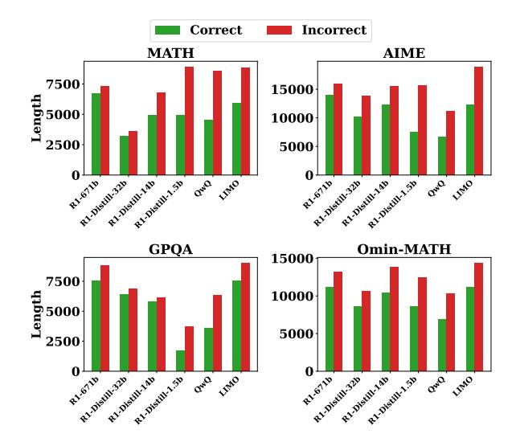
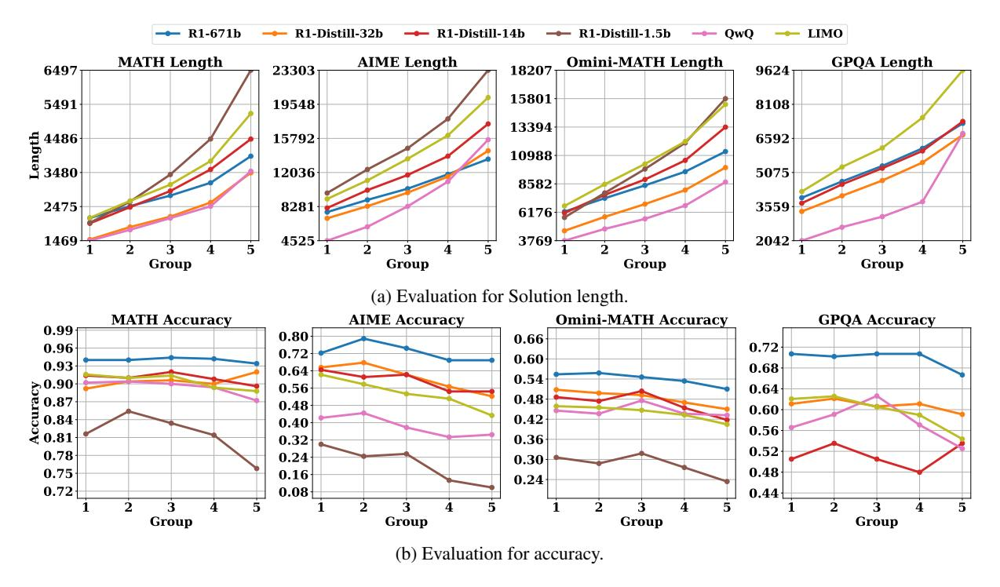
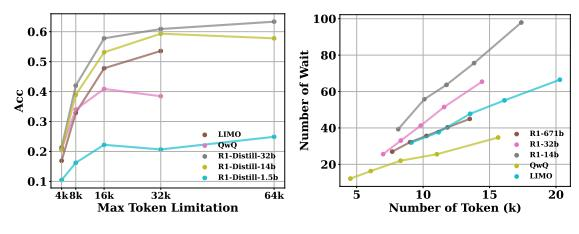
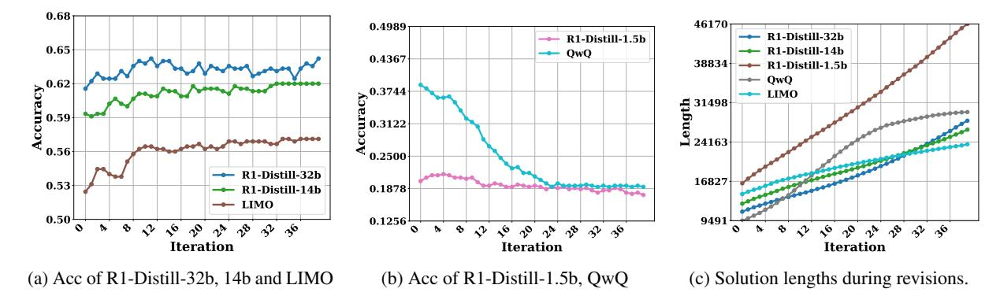
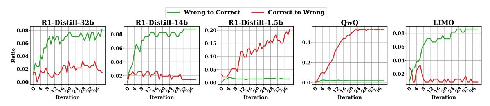
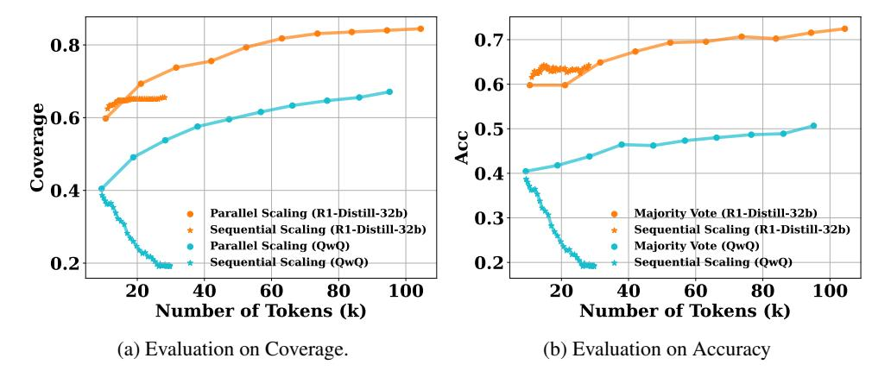
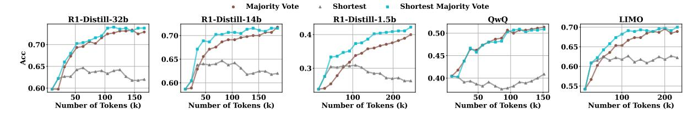
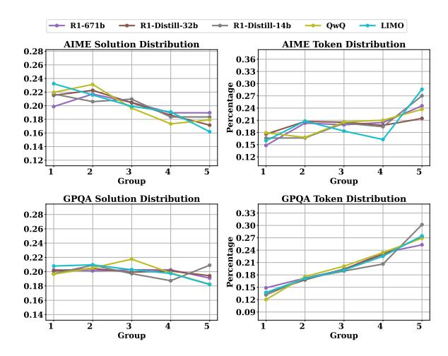
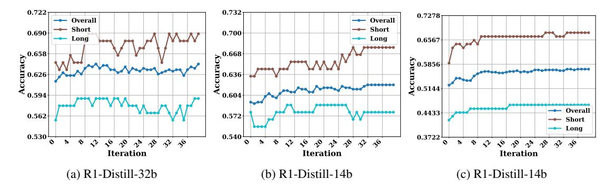
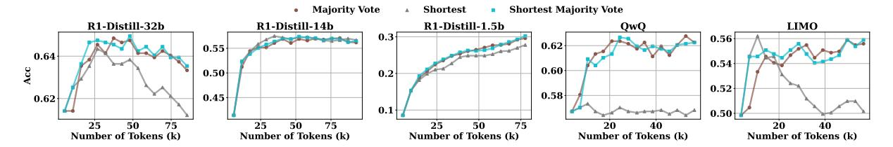

# Revisiting the Test-Time Scaling of o1-like Models: Do they Truly Possess Test-Time Scaling Capabilities?

Zhiyuan Zeng1, Qingyuan Chen1, Zhangyue Yin1, Yunhua Zhou3 Xipeng Qiu1,2 \* Fudan University, 2Shanghai Innovation Institute, 3Shanghai AI Laboratory cengzy23@m.fudan.edu.cn; xpqiu@fudan.edu.cn

#### Abstract

The advent of test-time scaling in large language models (LLMs), exemplified by OpenAI's o1 series, has advanced reasoning capabilities by scaling computational resource allocation during inference. While successors like QwQ, Deepseek-R1 (R1) and LIMO replicate these advancements, whether these models truly possess test-time scaling capabilities remains underexplored. This study found that longer CoTs of these o1-like models do not consistently enhance accuracy; in fact, correct solutions are often shorter than incorrect ones for the same questions. Further investigation shows this phenomenon is closely related to models' self-revision capabilities - longer CoTs contain more self-revisions, which often lead to performance degradation. We then compare sequential and parallel scaling strategies on QwQ, R1 and LIMO, finding that parallel scaling achieves better coverage and scalability. Based on these insights, we propose Shortest Majority Vote, a method that combines parallel scaling strategies with CoT length characteristics, significantly improving models' test-time scalability compared to conventional majority voting approaches.

#### 1 Introduction

The release of the OpenAI o1 series models (OpenAI, 2024a,b) marked a pivotal advancement in the reasoning capabilities of Large Language Models (LLMs), introducing a novel scaling paradigm, test-time scaling, which allocates more compute resources during test time. The test-time scaling have two dimensions, sequential and parallel (Zeng et al., 2024). Sequential scaling increase test-time compute by scaling the length of Chain-of-Thought (CoT) (Wei et al., 2022), while parallel scaling parallely samples multiple solutions and pick the best one.

Figure 1: The average length of correct solutions versus incorrect solutions evaluated on the same questions. For each question, solution lengths were averaged separately for correct and incorrect responses, then averaged across all questions.

Following o1's success, models such as QwQ (Team, 2024b), Deepseek-R1 (R1) (DeepSeek-AI et al., 2025) and LIMO (Ye et al., 2025) have emerged as leading open-source successors, replicating o1's achievements and demonstrating comparable reasoning abilities. Although both QwQ, R1 and LIMO demonstrate strong reasoning capabilities and the ability to generate lengthy CoT at test time, the existence of **true test-time scaling where performance consistently improves with longer CoTs** remains to be verified for these models.

To explore this question, we systematically investigate the relationship between CoT length and reasoning performance in QwQ, R1 and LIMO, challenging the conventional assumption that extended reasoning chains inherently lead to improved accuracy. Contrary to expectations, our analysis reveals that longer CoTs do not consistently improve accuracy of these o1-like models. Notably, we

\* Corresponding author

found that the average length of correct solutions is shorter than that of incorrect ones for the same questions, which is shown in Figure 1. This counterintuitive finding underscores the need for a deeper understanding of the test-time scaling of o1-like models.

To understand why the longer CoTs do not lead to the better performance, we compared the difference between long CoTs and short CoTs, finding that long CoTs contain more self-revisions ("Wait", "Alternatively") than the short CoTs, which is shown in Appendix F. Inspired by that, we iteratively prompted QwQ, R1 and LIMO for more selfrevisions. Our observations revealed that QwQ and R1-Distill-1.5b exhibited performance degradation as the length of reflection increased. In contrast, R1-Distill-14b, R1-Distill-32b, and LIMO demonstrated initial performance improvements during early revisions, followed by oscillatory behavior in subsequent iterations. To further understand the limitations of sequential scaling, we evaluated the models' capacity to revise incorrect answers. Our findings indicate that QwQ, R1 and LIMO all demonstrated limited ability to convert incorrect answers to correct ones during the revision process. Most revisions retained the original answers, and more concerning, both QwQ and R1-Distill-1.5b showed a higher propensity to change correct answers to incorrect ones rather than vice versa. These results reveal that self-revision ability is a key factor in the effectiveness of sequential scaling for o1-like models.

Given the limited effectiveness of sequential scaling, we explored an alternative test-time scaling strategie, parallel scaling. Our comparative analysis of sequential and parallel scaling revealed that parallel scaling not only achieves the better coverage (pass@k score) but also offers superior scalability compared to sequential scaling for QwQ and R1, which demonstrates that o1-like models have limited sequential-scaling capability, but strong parallel-scaling capability.

Building on these findings, we propose a novel test-time scaling method, **Shortest Majority Vote**, which incorporate parallel scaling approaches with our insight on sequential scaling. In particular, this method leverages the observation that shorter solutions tend to lead to better performance compared to longer ones. Shortest Majority Vote improves majority vote by prioritizing clusters that have both more solutions and shorter solution lengths. Experimental results demonstrate that Shortest Majority

Vote substantially outperforms conventional Majority Vote, significantly improving the test-time scalability of both QwQ and R1 models.

Our contributions are as follows:

- We systematically investigate the test-time scaling capabilities of o1-like models QwQ, R1 and LIMO, and find that their performance can not be continuously improved through increasing CoT length.
- 2) We reveal that insufficient self-revision capability of o1-like models is the primary reason for their failure in sequential scaling.
- We find that parallel scaling achieves better coverage and scalability than sequential revision for o1-like models.
- 4) Based on our insights into sequential and parallel scaling, we propose Shortest Majority Vote, a test-time scaling method that enhances majority voting by considering solution length, significantly outperforming traditional methods.

## 2 Related Work

The success of o1 has ushered in a new scaling paradigm, **test-time compute scaling**, which enables continuous improvements in model performance by increasing computational expenditure during inference (OpenAI, 2024a,b). Currently, scaling test-time compute can be approached in two dimensions: parallel scaling and sequential scaling (Snell et al., 2024; Zeng et al., 2024).

Parallel Scaling Parallel scaling typically samples multiple solutions in parallel and pick one according to some guidence signal like reward. Notable examples of parallel scaling include Best-of-N Search (Cobbe et al., 2021; Sun et al., 2024; Gui et al., 2024; Amini et al., 2024; Sessa et al., 2024), which is based on a reward model (Cobbe et al., 2021; Lightman et al., 2024), and Majority Vote (Wang et al., 2023), which exploits model uncertainty. The primary distinction between these approaches lies in the method used to select the final solution or answer after sampling multiple candidates. Both Best-of-N Search and Majority Vote are parallel scaling techniques at the solution level, while Tree-Search algorithms can be viewed as parallel scaling at the token or step level. Beam-Search (Qiu et al., 2024; Yu et al., 2024; Xie et al., 2023; Kool et al., 2019) and MCTS (Hao et al., 2023; Wan et al., 2024; Chen et al., 2024a; Zhang

et al., 2023) are classic examples of Tree-Search algorithms. All parallel scaling methods rely on guidance signals to select the optimal token, step, or solution from a set of candidates.

Sequential Scaling Sequential scaling enhances test-time computation by generating progressively longer solutions along the sequence dimension. The most prevalent method of sequential scaling is Self-Revision, where Madaan et al. (2023) first generate an initial response and then iteratively evaluate and refine it based on self-assessment. In contrast, Chen et al. (2024b); Gou et al. (2024) leverage external feedback—such as signals from a code execution environment—rather than self-evaluation to enhance solutions.

The effectiveness of sequential scaling with self-revision remains a contentious issue. Huang et al. (2024a); Kamoi et al. (2024) argue that models cannot achieve effective self-refinement without external feedback. Conversely, some researchers posit that evaluating a solution's correctness is inherently easier than generating a correct solution (Leike, 2022), suggesting that LLMs have the capacity for self-evaluation. Kumar et al. (2024); Zhang et al. (2024) show that it is possible to teach LLM to self-refine through reinforcement learning or supervised fine-tuning. Chen et al. (2024c) compared various test-time scaling algorithms and found that when feedback accuracy exceeds 90%, Self-Revision outperforms Best-of-N Search.

**o1-like Models** The release of o1 (OpenAI, 2024a,b) has further underscored the significance of sequential scaling, as o1's CoT length is substantially greater than that of conventional models. The research community has made significant efforts to reproduce the capabilities of o1 (Qin et al., 2024; Huang et al., 2024b; Jiang et al., 2024; Min et al., 2024; Muennighoff et al., 2025), with QwQ (Team, 2024b) and R1 (DeepSeek-AI et al., 2025) and LIMO (Ye et al., 2025) emerging as the most successful attempts. However, Our findings reveal that for R1 and QwQ, extending solution length does not necessarily yield better performance due to the models' limited self-revision capabilities. Parallel findings by Wang et al. (2025) attribute this phenomenon to model underthinking, where models initially reach correct intermediate solutions but subsequently deviate toward incorrect conclusions during extended reasoning.

## 3 Experiment Setting

Models Our experiments involved models from the QwQ (Team, 2024b), LIMO(Ye et al., 2025) and Deepseek-R1 series (DeepSeek-AI et al., 2025), including Deepseek-R1, Deepseek-R1-Distill-Qwen-32b, Deepseek-R1-Distill-Qwen-14b, and Deepseek-R1-Distill-Qwen-1.5b. For simplicy, we call these R1 models as R1-671b, R1-Distill-32b, R1-Distill-14b and R1-Distill-1.5b respectively. The models were run using SGLang framework (Zheng et al., 2024), with the sampling temperature set to 0.7 and the maximum generation length set to 32k. We show the system prompt and instructions used for evaluation in Appendix E.

**Benchmark** We conducted comprehensive evaluations across four benchmarks: MATH-500 (Lightman et al., 2024), AIME (AIMO, 2018), Omini-MATH (Gao et al., 2024), and GPQA (Rein et al., 2023). While MATH-500, AIME, and Omini-MATH focus on mathematical reasoning, GPQA encompasses broader scientific domains. For AIME evaluation, we utilized the AIMO validation set, comprising 90 questions from AIME 22, 23, and 24 (AIMO, 2018). Given the computational demands of evaluating the full Omini-MATH dataset (4.4K questions), we randomly sampled 500 questions to maintain efficiency. For GPQA, we focused on the diamond subset containing 198 questions. To ensure robust evaluation of answer correctness, we employed both the OpenCompass (Contributors, 2023) and Qwen Math (Yang et al., 2024) evaluators, considering an answer correct if validated by either evaluator.

# 4 The Failure of Sequential Scaling

# 4.1 Invalid Scaling of CoT Length: Longer CoTs Do not Improve Performance

To investigate whether the accuracy of QwQ, R1 and LIMO genuinely improves with increasing CoT length, we sampled each model five times on the same question and sorted the five solutions by length in ascending order. We grouped the solutions based on their rank in this sorted list, with the *i*-th ranked solutions forming a distinct group. For instance, all the longest solutions (rank 5) from different questions formed one group, while all the shortest solutions (rank 1) formed another, resulting in 5 comprehensive solution groups for analysis.

We present the average lengths of the five groups

Figure 2: Solutions of QwQ and R1 were categorized into different groups according to their length and evaluated in terms of solution length (a) and accuracy (b). The categorization of solutions is progressed for each question independently, i.e., all groups of solutions are corresponding to the same questions.

of solutions in Figure 2a. Since the grouping of solutions is based on their lengths, the differences in length between the groups are pronounced. The average length of the longest solutions is approximately twice that of the shortest solutions. This indicates that long-chain-of-thought (CoT) models like QwQ, R1 and LIMO exhibit a high diversity in the lengths of the solutions they sample.

There is no clear correlation between the length of solutions and the model's size. For example, R1-Distill-1.5b produces the longest solutions while QwQ (32b) generates the shortest. A comparison of solution lengths across different datasets shows that solutions for simpler datasets, such as Math, are significantly shorter than those for more difficult datasets, like AIME. This suggests that the model adjusts the solution length based on the difficulty of the problem.

The accuracy of the five groups of solutions is presented in Figure 2b. Although there is a significant disparity in solution lengths across the groups, the differences in accuracy are much less pronounced. Notably, we do not observe a consistent improvement in accuracy for either QwQ or R1 as solution length increases. This trend holds true across all model variants as well as across all evaluated datasets. In some cases, we even

observe an inverse scaling phenomenon, where accuracy decreases with increasing CoT length, especially on more difficult datasets like AIME and Omini-MATH. These findings cast doubt on the presumed test-time scaling capabilities of o1-like models, challenging the assumption that extended reasoning chains inherently yield superior problemsolving performance.

To make the relationship between CoT length and accuracy more clear, we compared the lengths of correct and incorrect solutions for the same question. First, we identified questions that had both correct and incorrect answers. For each of these questions, we calculated the average length of correct and incorrect solutions. We then averaged these values across all questions to determine the overall average length for correct and incorrect solutions. The results are shown in Figure 1. We found that, for QwQ, R1 and LIMO, across all model sizes and datasets, the length of correct solutions is consistently shorter than that of incorrect solutions. This observation suggests that longer CoTs do not necessarily lead to better performance and may even be associated with lower accuracy. Moreover, we observed that for weaker models, such as QwQ and R1-Distill-1.5B, the gap in solution length between correct and incorrect solutions is

- (a) Max Token Limitation
- (b) Frequence of "Wait"

Figure 3: (a): The relationship between model accuracy and the generation parameter Max Token Limitation. (b): The relationship between solution length and the average number of "wait" occur in a solution.

significantly larger than for stronger models, such as R1-671b. This suggests that the invalid scaling phenomenon is more pronounced in the weaker models.

# **4.2 Explaining Invalid Scaling: The Key** Factor is the Failure of Self-Revision

In Section 4.1, we observed the phenomenon that long solutions exhibit lower accuracy compared to short solutions. In this section, we investigate the underlying reasons for this phenomenon. We first analyzed how the maximum token limitation affects generation performance and confirmed that the observed invalid scaling phenomenon was not caused by constraints in the maximum token length. Next, we examined the differences between long and short solutions, finding that long solutions exhibit a higher frequency of self-revision. Moreover, our analysis suggests a strong correlation between self-revision, solution length, and accuracy.

Max Token Limitation The max token limitation parameter controls the maximum number of tokens a model can generate for a question, which plays a critical role in influencing model accuracy, especially when generating long solutions. To explore its impact, we tested several max token limitation values and compared the performance of QwQ, R1 and LIMO on the AIME benchmark. The results are shown in Figure 3a, which revealed that 16k is a key threshold: when the max token limitation is below this value, it significantly affects the model performance. However, increasing the max token limitation beyond 16k leads to diminishing returns, particularly for QwQ. In our other experiments, we set the max token limitation to 32k, suggesting that this parameter is not the main cause of invalid scaling.

Difference between Short and Long CoT To understand why long solutions of QwQ, R1 and LIMO is not better than short solutions, we analyzed their differences. We observed that QwQ, R1 and LIMO all primarily extend solution length through self-revision, characterized by markers such as "Wait" and "Alternatively". We show some examples of that in Appendix F. To quantify this phenomenon, we counted the occurrences of "wait" in solutions of QwQ, R1 and LIMO in Figure 3b. The results demonstrates a strong linear correlation between solution length and the frequency of self-correction markers for all models. This suggests that the mechanisms of self-revision may play a significant role in generating longer solutions.

# Scaling Solution Length with Self-Revision We have tried to investigate the revision behaviors inside the sampled solutions, however, it is difficult to extract the initial solution and the following revision exactly from QwQ, R1 and LIMO's solutions. Alternatively to that, we prompted the models to

continue thinking based on their sampled solutions.

QwQ, R1 and LIMO often conclude their solutions with phrases like "final answer: ...", and R1 additionally outputs a '

additionally outputs a '
'think>' tag followed by a final response. To facilitate smoother continuation of the reasoning process, we removed the "final answer" portion from the solutions. We then used the keyword "Wait" or "Alternatively" as the prompt to encourage self-revision. We calculated the probabilities of the model predicting the next token as "Wait" or "Alternatively" and selected the one with the higher probability as the prompt.

We prompted QwQ, R1 and LIMO to continue reasoning for 40 additional steps on the AIME benchmark. We show the results in Figure 4c, from which we observe that the solution length increase almost linearly with additional steps. After 40 steps, the solution length of QwQ and R1 is almost third as their original length.

We show the accuracy after sequential revision in Figure 4a and 4b. Our results reveal that the accuracy of QwQ and R1-Distill-1.5b decreases constantly as the number of reasoning steps increases, while the accuracy of R1-Distill-32b, R1-Distill-14b and LIMO initially improves and then oscillates with further reasoning steps. Further analysis in Appendix C reveal that the improvement on R1-Distill-32b, R1-Distill-14b and LIMO during revisions mainly comes from the revision on short solutions. These results corroborate our previous

Figure 4: (a): Accuracy of R1-Distill-32b, R1-Distill-14b and LIMO during sequential revisions. (b): Accuracy of R1-Distill-1.5b and QwQ during sequential revisions. (c) Solution length increased with the more revision steps.

Figure 5: The ratio of turning an initial correct answer to incorrect one (correct to wrong) and an initial incorrect answer to a correct one (wrong to correct) during sequential scaling.

experimental findings, suggesting that longer solutions do not improve performance, especially for weaker models such as QwQ and R1-Distill-1.5b. These findings suggest that the reason why longer solutions do not consistently lead to better performance in QwQ, R1 and LIMO may lie in the failure of self-revision.

**Investigating Self-Revision Behavior** To further investigate the effectiveness of self-revision, we analyzed the proportion of cases where the model corrected an initial incorrect answer to a correct one versus changing an initial correct answer to an incorrect one during scaling solution length, the results of which are shown in Figure 5. We found that, the proportions of changing a incorrect answer to an correct one is extremely low, always below 10%. Notably, for QwQ and R1-Distill-1.5b, the proportion of changing a correct answer to an incorrect one was even higher than that of correcting an incorrect answer to a correct one. This observation helps explain why prompting QwQ and R1-Distill-1.5b to continue reasoning led to a decrease in accuracy. For simplicty, we call the proportions of changing a incorrect answer to an correct one as the successful-revision rate, while the reverse as the failed-revision rate.

Although R1-Distill-32b, R1-Distill-14b and

| R1-32b | R1-14b | R1-1.5b | QwQ | LIMO |
|--------|--------|---------|-----|------|
| 72%    | 70%    | 58%     | 32% | 54%  |

Table 1: The proportion of the revisions that models sitck to the original wrong answers.

LIMO exhibit a higher successful-revision rate than failed-revision rate, the increase of successful-revision rate plateaus after approximately 10 steps, with further revisions providing no additional benefits. This observation explains why their accuracy during sequential scaling initially increases with multiple rounds of revision but later stabilizes with fluctuations.

The successful-revision rate of QwQ, R1 and LIMO are all below 10%, what is the outcome of the model's self-revision in unsuccessful cases? We hypothesize that, in most instances, the model simply keeps its original answer unchanged. To validate that, we computed the proportion of instances where the model persists with its original answer, even when it is incorrect, and the results were as expected. As shown in Figure 1, when the original answer is wrong, both R1-Distill-32b and R1-Distill-14b maintain the original answer in over 70% of cases. Although retaining the original answer does not reduce accuracy, it also makes the scaling solu-

Figure 6: (a): the coverage of sequential scaling and parallel scaling on AIME. (b): the accuracy of squential revision and majority vote on AIME.

tion length ineffective. This phenomenon suggests that the model's ability to early stop may also be a critical factor influencing whether its performance improves with an increasing solution length.

The above analysis indicates that the key factor determining whether o1-like models' performance improve with an increase in solution length is their ability to self-revise. The model's accuracy increases with the more incorrect answers revised to correct and vice versa.

# 5 Sequential Scaling vs. Parallel Scaling

Based on our experimental findings presented in Section 4.2, sequential scaling demonstrates limited effectiveness for QwQ, R1 and LIMO. An alternative approach to scaling test-time compute is parallel scaling, which generates multiple solutions in parallel and selects the best one as the final answer.

We compared the performance of sequential scaling and parallel scaling in terms of the coverage (pass@k score) and accuracy of QwQ and R1, which are shown in Figure 6a and 6b respectively. For sequential scaling, we iteratively prompt models to self-revise for 40 steps. While for parallel scaling, we parallely sample 10 solutions. The coverage is evaluated by counting the proportion of whether multiple candidate answers contain a correct one. In parallel scaling, coverage increases by one if at least one sampled solution is correct. Similarly, in sequential scaling, coverage increases by one if at least one revision iteration succeeds.

Our findings show that, for the same number of generated tokens, parallel scaling provides a significantly larger improvement in coverage compared to sequential scaling, for both R1-Distill-32b and

QwQ. However, a practical parallel scaling method must select a final answer from a set of candidate answers. We implement parallel scaling using majority vote (Wang et al., 2023) and sequential scaling by taking the answer from the last revision as the final answer. Since majority voting requires at least three solutions to be effective, it does not provide any benefit when scaling the number of solutions from 1 to 2. In contrast, sequential revision is effective for R1-Distill-32b when scaling the number of tokens to 10k, but further scaling does not yield additional benefits. Additionally, because sequential scaling involves attention over a longer context, its computational cost is much higher than that of parallel scaling when generating the same number of tokens.

# 6 Application of Our Findings: Shortest Majority Vote

Given the limitation of sequential scaling of the current o1-like models, we turn to parallel scaling techniques and incorperate it with our insight on sequential scaling. Specifically, we propose a new Parallel Scaling algorithm: Shortest Majority Vote. Shortest Majority Vote is an extension of Majority Vote, but it accounts for the length of the solutions generated by the model. In the original Majority Vote, solutions with the same answer are grouped into a single category, and the number of solutions in each category is counted, with the answer corresponding to the category with the most solutions selected as the final answer. In contrast, Shortest Majority Vote not only counts the number of solutions in each category, but also computes the average length of the solutions in each category. Let the number of solutions in the i-th category be

Figure 7: Parallel-scaling performance of Majority Vote, Shortest and Shortest Majority Vote on AIME.

| Model           | Solutions | AIME  |          |             | GPQA  |          |             |
|-----------------|-----------|-------|----------|-------------|-------|----------|-------------|
|                 |           | MV    | Shortest | Shortest MV | MV    | Shortest | Shortest MV |
| R1-Distill-32b  |           | 59.77 | 62.22    | 62.22       | 61.41 | 62.52    | 62.52       |
| R1-Distill-14b  |           | 58.88 | 60.44    | 60.44       | 51.21 | 52.32    | 52.32       |
| R1-Distill-1.5b | 2         | 24    | 27.55    | 27.55       | 15.25 | 15.35    | 15.35       |
| QwQ             |           | 41.77 | 40.22    | 40.22       | 58.05 | 57.02    | 57.02       |
| LIMO            |           | 56.66 | 60.88    | 60.88       | 50.46 | 54.56    | 54.56       |
| R1-Distill-32b  | 16        | 72.88 | 61.99    | 73.77       | 63.33 | 61.21    | 63.53       |
| R1-Distill-14b  |           | 71.77 | 62.00    | 71.55       | 56.16 | 56.66    | 56.46       |
| R1-Distill-1.5b |           | 40.00 | 26.22    | 42.22       | 29.59 | 27.77    | 30.20       |
| QwQ             |           | 51.33 | 40.88    | 50.88       | 62.25 | 56.82    | 62.25       |
| LIMO            |           | 68.88 | 62.22    | 70.00       | 55.58 | 50.15    | 55.89       |

Table 2: Performance comparison between Majority Vote (MV), Shortest and Shortest Majority Vote (Shortest MV) on AIME and GPQA, when there are 2 and 16 solutions sampled.

 $c_i$  and the average solution length in that category be  $l_i$ . The score for category i in Shortest Majority Vote is computed as:

$$s_i = \frac{c_i}{\log l_i} \tag{1}$$

and the final answer is chosen from the category with the highest score. The score  $s_i$  is designed with the assumption that the correct answer is more likely to appear in categories with a larger number of solutions and shorter solution lengths. Shortest Majority Vote offers two key advantages: first, it is particularly effective for some o1-like models, where performance deteriorates with increasing solution length; second, it enables the use of solution length as a guidence signal for identifying superior solutions when candidate solutions are limited, especially in cases where conventional Majority Vote becomes ineffective due to having only two candidate solutions.

We evaluated the performance of Shortest Majority Vote and Majority Vote through experiments on the AIME and GPQA benchmarks, sampling 16 solutions from QwQ, R1 and LIMO models. We implemented a simple baseline approach, denoted as "Shortest," which selects the answer from the solution with the minimal length. The experimen-

tal results are presented in Table 2 and Figure 7. Table 2 demonstrates that Shortest Majority Vote significantly outperforms both Majority Vote and Shortest methods, particularly on the AIME benchmark. Figure 7 illustrates the parallel-scaling performance of these three methods, showing that as the number of generated tokens increases, Shortest Majority Vote maintains superior performance over both alternatives on AIME. The corresponding parallel-scaling results for GPQA are provided in Appendix D. Notably, while Shortest performs better than Majority Vote when only two solutions are sampled, it exhibits inferior performance in all other scenarios. Shortest Majority Vote is also effective for many other reasoning models and chat models, which is shown in Appendix A. These empirical findings strongly support the effectiveness of the Shortest Majority Vote approach.

#### **6.1** Variants of Shortest Majority Vote

There are many variations of Shortest Majority Vote implementation, such as  $\frac{c_i}{l_i}$ ,  $\frac{c_i}{\sqrt{l_i}}$ . We chose to use log for two main reasons:

 Scaling laws tell us that model performance is log - linearly related to the amount of computation, and computation is quadratically re-

| Model   | Majority Vote     | log             | sqrt            | linear          | square          |
|---------|-------------------|-----------------|-----------------|-----------------|-----------------|
| QwQ     | 51.33% (baseline) | 50.89% (-0.87%) | 50.67% (-1.30%) | 50.44% (-1.73%) | 49.33% (-3.90%) |
| R1-32b  | 72.89% (baseline) | 73.78% (+1.22%) | 74.22% (+1.83%) | 73.56% (+0.91%) | 71.33% (-2.13%) |
| R1-14b  | 71.78% (baseline) | 71.56% (-0.31%) | 71.78% (+0.00%) | 71.33% (-0.62%) | 71.11% (-0.93%) |
| R1-1.5b | 40.00% (baseline) | 42.22% (+5.56%) | 42.44% (+6.11%) | 42.22% (+5.56%) | 37.78% (-5.56%) |
| LIMO    | 68.89% (baseline) | 70.00% (+1.61%) | 70.00% (+1.61%) | 71.11% (+3.23%) | 71.11% (+3.23%) |

Table 3: Performance of different Shortest Majority Vote variants on AIME dataset. 16 Solutions are sampled for each question.

| Model   | Majority Vote     | log             | sqrt            | linear          | square          |
|---------|-------------------|-----------------|-----------------|-----------------|-----------------|
| QwQ     | 62.26% (baseline) | 62.26% (+0.00%) | 61.95% (-0.49%) | 61.64% (-0.99%) | 60.41% (-2.97%) |
| R1-32b  | 63.33% (baseline) | 63.54% (+0.32%) | 63.43% (+0.16%) | 63.94% (+0.96%) | 63.94% (+0.96%) |
| R1-14b  | 56.16% (baseline) | 56.46% (+0.54%) | 56.26% (+0.18%) | 56.36% (+0.36%) | 56.57% (+0.72%) |
| R1-1.5b | 29.60% (baseline) | 30.20% (+2.05%) | 30.10% (+1.71%) | 29.29% (-1.02%) | 28.18% (-4.78%) |
| LIMO    | 67.49% (baseline) | 67.69% (+0.30%) | 67.18% (-0.46%) | 66.67% (-1.22%) | 65.13% (-3.50%) |

Table 4: Performance of different Shortest Majority Vote variants on GPQA dataset. 16 Solutions sampled for each question

lated to the number of tokens. Therefore, model performance should be related to the log of token count:  $f(\log l_i^2) = f(2 \log l_i)$ .

2. As we can observe from Figure 2, the variance in solution length for the same question sample is substantial. Longer solutions often contain more than twice the number of tokens as shorter solutions, and token counts significantly outweigh the vote counts in majority voting. To prevent token counts from completely dominating cluster selection in Shortest Majority Vote, we use log to reduce the influence of token count on voting results. As shown in Figure 7 and Table 2, directly using length as a reward (Shortest) performs much worse compared to Majority Vote.

We empirically compared the impact of different weight functions on shortest majority voting performance in Table 2, testing four functions: 1) Log:  $\frac{c_i}{\log l_i}$  2) Sqrt:  $\frac{c_i}{\sqrt{l_i}}$  3) Linear:  $\frac{c_i}{l_i}$  4) Square:  $\frac{c_i}{l_i^2}$ 

We found that Log function can stably improve performance over Majority Vote. Sqrt, Linear and Square functions, however, show more unstable performance. For example, in GPQA experiments, Linear and Square may actually cause performance degradation. We will supplement these experiments in the appendix, thank you for your suggestion.

## 7 Conclusion

In this study, we challenged the assumption that o1-like models like QwQ and R1 have test-time

scaling capability. We found that the longer solutions not necessarily yield better performance, and that sequential scaling through self-revision has limited effectiveness. Based on these insights, we developed Shortest Majority Vote, a parallel scaling method that considers solution length, which significantly outperformed traditional majority vote.

### Limitations

- 1. Given the considerable cost of R1-671b, evaluation on it was limited to the experiments in Figures 1 and 2, whereas distilled R1 was utilized for all subsequent.
- 2. Our experimental framework was limited to static model checkpoints. Future research should investigate test-time scaling behavior using dynamic checkpoints in reinforcement learning settings.
- 3. While the proposed shortest majority method may have limited applicability for models with strong sequential-scaling capabilities, solution length remains a valuable guidance signal for candidate selection in parallel scaling scenarios. The method can be adapted to a Longest Majority Vote variant for such cases.

# **Ethics Statement**

This paper honors the ACL Code of Ethics. The dataset used in the paper does not contain any private information. All data and tools used in this study comply with their respective licenses and terms of use.

## References

- AIMO. 2018. Dataset card for aimo validation aime. https://huggingface.co/datasets/AI-MO/aimo-validation-aime.
- Afra Amini, Tim Vieira, and Ryan Cotterell. 2024. Variational best-of-n alignment. *CoRR*, abs/2407.06057.
- Guoxin Chen, Minpeng Liao, Chengxi Li, and Kai Fan. 2024a. Alphamath almost zero: process supervision without process. *CoRR*, abs/2405.03553.
- Xinyun Chen, Maxwell Lin, Nathanael Schärli, and Denny Zhou. 2024b. Teaching large language models to self-debug. In *The Twelfth International Conference on Learning Representations, ICLR 2024, Vienna, Austria, May 7-11, 2024*. OpenReview.net.
- Ziru Chen, Michael White, Raymond J. Mooney, Ali Payani, Yu Su, and Huan Sun. 2024c. When is tree search useful for LLM planning? it depends on the discriminator. In *Proceedings of the 62nd Annual Meeting of the Association for Computational Linguistics (Volume 1: Long Papers), ACL 2024, Bangkok, Thailand, August 11-16, 2024*, pages 13659–13678. Association for Computational Linguistics.
- Karl Cobbe, Vineet Kosaraju, Mohammad Bavarian, Mark Chen, Heewoo Jun, Lukasz Kaiser, Matthias Plappert, Jerry Tworek, Jacob Hilton, Reiichiro Nakano, Christopher Hesse, and John Schulman. 2021. Training verifiers to solve math word problems. *CoRR*, abs/2110.14168.
- OpenCompass Contributors. 2023. Opencompass: A universal evaluation platform for foundation models. https://github.com/open-compass/ opencompass.
- DeepSeek-AI, Daya Guo, Dejian Yang, Haowei Zhang, Junxiao Song, Ruoyu Zhang, Runxin Xu, Qihao Zhu, Shirong Ma, Peiyi Wang, Xiao Bi, Xiaokang Zhang, Xingkai Yu, Yu Wu, Z. F. Wu, Zhibin Gou, Zhihong Shao, Zhuoshu Li, Ziyi Gao, and 181 others. 2025. Deepseek-r1: Incentivizing reasoning capability in Ilms via reinforcement learning. *Preprint*, arXiv:2501.12948.
- Bofei Gao, Feifan Song, Zhe Yang, Zefan Cai, Yibo Miao, Qingxiu Dong, Lei Li, Chenghao Ma, Liang Chen, Runxin Xu, Zhengyang Tang, Benyou Wang, Daoguang Zan, Shanghaoran Quan, Ge Zhang, Lei Sha, Yichang Zhang, Xuancheng Ren, Tianyu Liu, and Baobao Chang. 2024. Omni-math: A universal olympiad level mathematic benchmark for large language models. *CoRR*, abs/2410.07985.
- Zhibin Gou, Zhihong Shao, Yeyun Gong, Yelong Shen, Yujiu Yang, Nan Duan, and Weizhu Chen. 2024. CRITIC: large language models can self-correct with tool-interactive critiquing. In *The Twelfth International Conference on Learning Representations, ICLR* 2024, Vienna, Austria, May 7-11, 2024. Open-Review.net.

- Lin Gui, Cristina Gârbacea, and Victor Veitch. 2024. Bonbon alignment for large language models and the sweetness of best-of-n sampling. *CoRR*, abs/2406.00832.
- Shibo Hao, Yi Gu, Haodi Ma, Joshua Jiahua Hong, Zhen Wang, Daisy Zhe Wang, and Zhiting Hu. 2023. Reasoning with language model is planning with world model. In *Proceedings of the 2023 Conference on Empirical Methods in Natural Language Processing, EMNLP 2023, Singapore, December 6-10, 2023*, pages 8154–8173. Association for Computational Linguistics.
- Jie Huang, Xinyun Chen, Swaroop Mishra, Huaixiu Steven Zheng, Adams Wei Yu, Xinying Song, and Denny Zhou. 2024a. Large language models cannot self-correct reasoning yet. In *The Twelfth International Conference on Learning Representations, ICLR 2024, Vienna, Austria, May 7-11*, 2024. OpenReview.net.
- Zhen Huang, Haoyang Zou, Xuefeng Li, Yixiu Liu, Yuxiang Zheng, Ethan Chern, Shijie Xia, Yiwei Qin, Weizhe Yuan, and Pengfei Liu. 2024b. O1 replication journey part 2: Surpassing o1-preview through simple distillation, big progress or bitter lesson? *Preprint*, arXiv:2411.16489.
- Jinhao Jiang, Zhipeng Chen, Yingqian Min, Jie Chen, Xiaoxue Cheng, Jiapeng Wang, Yiru Tang, Haoxiang Sun, Jia Deng, Wayne Xin Zhao, and 1 others. 2024. Technical report: Enhancing llm reasoning with reward-guided tree search. arXiv preprint arXiv:2411.11694.
- Ryo Kamoi, Yusen Zhang, Nan Zhang, Jiawei Han, and Rui Zhang. 2024. When can llms actually correct their own mistakes? A critical survey of self-correction of llms. *CoRR*, abs/2406.01297.
- Wouter Kool, Herke van Hoof, and Max Welling. 2019. Stochastic beams and where to find them: The gumbel-top-k trick for sampling sequences without replacement. In *Proceedings of the 36th International Conference on Machine Learning, ICML 2019, 9-15 June 2019, Long Beach, California, USA*, volume 97 of *Proceedings of Machine Learning Research*, pages 3499–3508. PMLR.
- Aviral Kumar, Vincent Zhuang, Rishabh Agarwal, Yi Su, John D. Co-Reyes, Avi Singh, Kate Baumli, Shariq Iqbal, Colton Bishop, Rebecca Roelofs, Lei M. Zhang, Kay McKinney, Disha Shrivastava, Cosmin Paduraru, George Tucker, Doina Precup, Feryal M. P. Behbahani, and Aleksandra Faust. 2024. Training language models to self-correct via reinforcement learning. *CoRR*, abs/2409.12917.
- Jan Leike. 2022. Why i'm excited about ai-assisted human feedback.
- Hunter Lightman, Vineet Kosaraju, Yuri Burda, Harrison Edwards, Bowen Baker, Teddy Lee, Jan Leike, John Schulman, Ilya Sutskever, and Karl Cobbe.

- 2024. Let's verify step by step. In *The Twelfth International Conference on Learning Representations, ICLR 2024, Vienna, Austria, May 7-11, 2024.* Open-Review.net.
- Aixin Liu, Bei Feng, Bing Xue, Bingxuan Wang, Bochao Wu, Chengda Lu, Chenggang Zhao, Chengqi Deng, Chenyu Zhang, Chong Ruan, and 1 others. 2024. Deepseek-v3 technical report. arXiv preprint arXiv:2412.19437.
- Aman Madaan, Niket Tandon, Prakhar Gupta, Skyler Hallinan, Luyu Gao, Sarah Wiegreffe, Uri Alon, Nouha Dziri, Shrimai Prabhumoye, Yiming Yang, Shashank Gupta, Bodhisattwa Prasad Majumder, Katherine Hermann, Sean Welleck, Amir Yazdanbakhsh, and Peter Clark. 2023. Self-refine: Iterative refinement with self-feedback. In Advances in Neural Information Processing Systems 36: Annual Conference on Neural Information Processing Systems 2023, NeurIPS 2023, New Orleans, LA, USA, December 10 16, 2023.
- Yingqian Min, Zhipeng Chen, Jinhao Jiang, Jie Chen, Jia Deng, Yiwen Hu, Yiru Tang, Jiapeng Wang, Xiaoxue Cheng, Huatong Song, and 1 others. 2024. Imitate, explore, and self-improve: A reproduction report on slow-thinking reasoning systems. *arXiv* preprint arXiv:2412.09413.
- Niklas Muennighoff, Zitong Yang, Weijia Shi, Xiang Lisa Li, Li Fei-Fei, Hannaneh Hajishirzi, Luke Zettlemoyer, Percy Liang, Emmanuel Candès, and Tatsunori Hashimoto. 2025. s1: Simple test-time scaling. *Preprint*, arXiv:2501.19393.
- OpenAI. 2024a. Learning to reason with llms.
- OpenAI. 2024b. Openai o1 system card.
- Yiwei Qin, Xuefeng Li, Haoyang Zou, Yixiu Liu, Shijie Xia, Zhen Huang, Yixin Ye, Weizhe Yuan, Hector Liu, Yuanzhi Li, and Pengfei Liu. 2024. O1 replication journey: A strategic progress report part 1. *CoRR*, abs/2410.18982.
- Jiahao Qiu, Yifu Lu, Yifan Zeng, Jiacheng Guo, Jiayi Geng, Huazheng Wang, Kaixuan Huang, Yue Wu, and Mengdi Wang. 2024. Treebon: Enhancing inference-time alignment with speculative tree-search and best-of-n sampling. *CoRR*, abs/2410.16033.
- David Rein, Betty Li Hou, Asa Cooper Stickland, Jackson Petty, Richard Yuanzhe Pang, Julien Dirani, Julian Michael, and Samuel R. Bowman. 2023. GPQA: A graduate-level google-proof q&a benchmark. *CoRR*, abs/2311.12022.
- Pier Giuseppe Sessa, Robert Dadashi, Léonard Hussenot, Johan Ferret, Nino Vieillard, Alexandre Ramé, Bobak Shahriari, Sarah Perrin, Abe Friesen, Geoffrey Cideron, Sertan Girgin, Piotr Stanczyk, Andrea Michi, Danila Sinopalnikov, Sabela Ramos, Amélie Héliou, Aliaksei Severyn, Matt Hoffman, Nikola Momchev, and Olivier Bachem. 2024. BOND: aligning llms with best-of-n distillation. *CoRR*, abs/2407.14622.

- Charlie Snell, Jaehoon Lee, Kelvin Xu, and Aviral Kumar. 2024. Scaling LLM test-time compute optimally can be more effective than scaling model parameters. *CoRR*, abs/2408.03314.
- Hanshi Sun, Momin Haider, Ruiqi Zhang, Huitao Yang, Jiahao Qiu, Ming Yin, Mengdi Wang, Peter L. Bartlett, and Andrea Zanette. 2024. Fast best-of-n decoding via speculative rejection. *CoRR*, abs/2410.20290.
- Qwen Team. 2024a. Qwen2.5 technical report. *arXiv* preprint arXiv:2412.15115.
- Qwen Team. 2024b. Qwq: Reflect deeply on the boundaries of the unknown.
- Ziyu Wan, Xidong Feng, Muning Wen, Stephen Marcus McAleer, Ying Wen, Weinan Zhang, and Jun Wang. 2024. Alphazero-like tree-search can guide large language model decoding and training. In Forty-first International Conference on Machine Learning, ICML 2024, Vienna, Austria, July 21-27, 2024. Open-Review.net.
- Jun Wang, Meng Fang, Ziyu Wan, Muning Wen, Jiachen Zhu, Anjie Liu, Ziqin Gong, Yan Song, Lei Chen, Lionel M. Ni, Linyi Yang, Ying Wen, and Weinan Zhang. 2024. Openr: An open source framework for advanced reasoning with large language models. *CoRR*, abs/2410.09671.
- Xuezhi Wang, Jason Wei, Dale Schuurmans, Quoc V. Le, Ed H. Chi, Sharan Narang, Aakanksha Chowdhery, and Denny Zhou. 2023. Self-consistency improves chain of thought reasoning in language models. In *The Eleventh International Conference on Learning Representations, ICLR 2023, Kigali, Rwanda, May 1-5, 2023.* OpenReview.net.
- Yue Wang, Qiuzhi Liu, Jiahao Xu, Tian Liang, Xingyu Chen, Zhiwei He, Linfeng Song, Dian Yu, Juntao Li, Zhuosheng Zhang, Rui Wang, Zhaopeng Tu, Haitao Mi, and Dong Yu. 2025. Thoughts are all over the place: On the underthinking of o1-like llms. *Preprint*, arXiv:2501.18585.
- Jason Wei, Xuezhi Wang, Dale Schuurmans, Maarten Bosma, Brian Ichter, Fei Xia, Ed H. Chi, Quoc V. Le, and Denny Zhou. 2022. Chain-of-thought prompting elicits reasoning in large language models. In Advances in Neural Information Processing Systems 35: Annual Conference on Neural Information Processing Systems 2022, NeurIPS 2022, New Orleans, LA, USA, November 28 December 9, 2022.
- Yuxi Xie, Kenji Kawaguchi, Yiran Zhao, James Xu Zhao, Min-Yen Kan, Junxian He, and Michael Qizhe Xie. 2023. Self-evaluation guided beam search for reasoning. In Advances in Neural Information Processing Systems 36: Annual Conference on Neural Information Processing Systems 2023, NeurIPS 2023, New Orleans, LA, USA, December 10 16, 2023.

- An Yang, Beichen Zhang, Binyuan Hui, Bofei Gao, Bowen Yu, Chengpeng Li, Dayiheng Liu, Jianhong Tu, Jingren Zhou, Junyang Lin, Keming Lu, Mingfeng Xue, Runji Lin, Tianyu Liu, Xingzhang Ren, and Zhenru Zhang. 2024. Qwen2.5-math technical report: Toward mathematical expert model via self-improvement. *CoRR*, abs/2409.12122.
- Yixin Ye, Zhen Huang, Yang Xiao, Ethan Chern, Shijie Xia, and Pengfei Liu. 2025. Limo: Less is more for reasoning. *Preprint*, arXiv:2502.03387.
- Fei Yu, Anningzhe Gao, and Benyou Wang. 2024. Ovm, outcome-supervised value models for planning in mathematical reasoning. In *Findings of the Association for Computational Linguistics: NAACL 2024, Mexico City, Mexico, June 16-21, 2024*, pages 858–875. Association for Computational Linguistics.
- Zhiyuan Zeng, Qinyuan Cheng, Zhangyue Yin, Bo Wang, Shimin Li, Yunhua Zhou, Qipeng Guo, Xuanjing Huang, and Xipeng Qiu. 2024. Scaling of search and learning: A roadmap to reproduce of from reinforcement learning perspective. *CoRR*, abs/2412.14135.
- Shun Zhang, Zhenfang Chen, Yikang Shen, Mingyu Ding, Joshua B. Tenenbaum, and Chuang Gan. 2023. Planning with large language models for code generation. In *The Eleventh International Conference on Learning Representations, ICLR 2023, Kigali, Rwanda, May 1-5, 2023.* OpenReview.net.
- Yunxiang Zhang, Muhammad Khalifa, Lajanugen Logeswaran, Jaekyeom Kim, Moontae Lee, Honglak Lee, and Lu Wang. 2024. Small language models need strong verifiers to self-correct reasoning. In Findings of the Association for Computational Linguistics, ACL 2024, Bangkok, Thailand and virtual meeting, August 11-16, 2024, pages 15637–15653. Association for Computational Linguistics.
- Lianmin Zheng, Liangsheng Yin, Zhiqiang Xie, Chuyue Sun, Jeff Huang, Cody Hao Yu, Shiyi Cao, Christos Kozyrakis, Ion Stoica, Joseph E. Gonzalez, Clark W. Barrett, and Ying Sheng. 2024. Sglang: Efficient execution of structured language model programs. In Advances in Neural Information Processing Systems 38: Annual Conference on Neural Information Processing Systems 2024, NeurIPS 2024, Vancouver, BC, Canada, December 10 15, 2024.

# A Performance of Shortest Majority Vote on More Models.

To demonstrate the applicability of shortest majority voting across a wider range of models, we have included additional evaluation results for both o1-like models (s1 (Muennighoff et al., 2025) and Open-Reasoner-Zero (Wang et al., 2024)) and instruction-based models (Deepseek-v3 (Liu et al., 2024) and Qwen-2.5-72b-instruct (Team, 2024a)), as shown in Tables 5. We found that Shortest Majority Vote also performs excellently on these models, especially with s1 and Open-Reasoner-Zero. Although Qwen-2.5-72b and Deepseek-v3 do not generate long chain-of-thought reasoning, Shortest Majority Vote still significantly improves their performance on AIME.

# B Is Invalid Scaling Phenomenon Conflict to Findings of R1 technique Report?

The training objective of R1 aims to improve model accuracy, yet we observe that correct solutions tend to be shorter than incorrect ones. This raises an intriguing question: Why does R1's reinforcement learning (RL) training consistently produce longer solutions?

To investigate this phenomenon, we analyzed five solutions per question, organizing them into groups by length in ascending order. Figure 8 illustrates the distribution of correct solutions across these groups.

Our analysis revealed that correct solutions predominantly appear in shorter-length groups, particularly in the AIME dataset. However, when examining the token distribution, we found that correct solution tokens are concentrated in longer-solution groups. This apparent contradiction arises because the total token count is determined by both the number of solutions and the average tokens per solution. As shown in Figure 2a, solutions in the longest group contain nearly twice as many tokens as those in the shortest group. This explains why, despite having fewer individual solutions, longer solutions account for a greater share of the total tokens.

We hypothesize that this discrepancy explains why RL training tends to produce longer solutions: the training process may favor generating longer solutions, even if they are less accurate, because they contribute more tokens to the gradient.

Figure 8: The number of correct solutions and tokens distributed across groups of different lengths.

# C Further analysis on Sequential Scaling on R1-Distill-14b, R1-Distill-32b and LIMO

In Section 4.2, we observed that R1-Distill-14b, R1-Distill-32b and LIMO demonstrated some performance improvements after multiple rounds of selfrevision, followed by stabilization. Furthermore, in Section 4.1, we found that the correct solutions generated by R1-Distill-14b, R1-Distill-32b and LIMO were generally shorter than incorrect solutions. To reconcile these seemingly contradictory findings and further analyze how R1-Distill-14b, R1-Distill-32b and LIMO benefit from self-revision, we conducted a detailed analysis of self-revision outcomes on both long and short solutions. Our methodology for collecting long and short solutions involved sampling five solutions for each question, ordering them by length, and then segregating the longest and shortest solutions into separate groups. The results of self-revision on both short and long solutions are presented in Figure 9. Our analysis reveals that short solutions exhibited significant performance improvements following self-revision, while this trend was less pronounced for long solutions. Therefore, the performance improvements we observed through self-revision in R1-Distill-14b, R1-Distill-32b and LIMO primarily stem from the self-revision on short solutions. This suggests that the relationship between accuracy and solution length for these models is complex, demonstrating neither a strictly positive nor negative correlation with length.

| Model              | AIM                                  | E Dataset       | GPQA Dataset      |                        |  |
|--------------------|--------------------------------------|-----------------|-------------------|------------------------|--|
| 1120001            | Majority Vote Shortest Majority Vote |                 | Majority Vote     | Shortest Majority Vote |  |
| QwQ                | 51.33% (baseline)                    | 50.89% (-0.87%) | 62.26% (baseline) | 62.26% (+0.00%)        |  |
| R1-32b             | 72.89% (baseline)                    | 73.78% (+1.22%) | 63.33% (baseline) | 63.54% (+0.32%)        |  |
| R1-14b             | 71.78% (baseline)                    | 71.56% (-0.31%) | 56.16% (baseline) | 56.46% (+0.54%)        |  |
| R1-1.5b            | 40.00% (baseline)                    | 42.22% (+5.56%) | 29.60% (baseline) | 30.20% (+2.05%)        |  |
| LIMO               | 68.89% (baseline)                    | 70.00% (+1.61%) | 67.49% (baseline) | 67.69% (+0.30%)        |  |
| s1                 | 40.89% (baseline)                    | 42.22% (+3.26%) | 55.59% (baseline) | 55.90% (+0.55%)        |  |
| Open-Reasoner-Zero | 41.78% (baseline)                    | 43.33% (+3.72%) | 50.81% (baseline) | 50.51% (-0.60%)        |  |
| Qwen-2.5-72b       | 20.22% (baseline)                    | 21.11% (+4.40%) | 46.26% (baseline) | 47.18% (+2.00%)        |  |
| Deepseek-v3        | 64.67% (baseline)                    | 65.56% (+1.37%) | 66.46% (baseline) | 66.16% (-0.46%)        |  |

Table 5: Performance improvement of Shortest Majority Vote compared to Majority Vote on QwQ, distilled R1, LIMO, s1, Open-Reasoner-Zero, Qwen-2.5-72b and Deepseek-v3.

Figure 9: Accuracy of short solutions and long solutions of R1-Distill-14b (a) and R1-Distill-32b (b) during sequential revision.

# D Parallel Scaling of Shortest Majority Vote on GPQA

In Section 6, we demonstrated that our proposed Shortest Majority Vote achieves superior test-time scaling performance compared to the other two methods on the AIME benchmark. In this section, we present the parallel-scaling results on GPQA in Figure 10. While Shortest Majority Vote consistently outperforms the Shortest method on GPQA, it does not exhibit significantly better parallel scaling performance compared to Majority Vote on this benchmark. This phenomenon might be attributed to the smaller performance gap between short and long solutions on GPQA compared to AIME, suggesting that solution length plays a less critical role in determining solution quality on the GPQA benchmark, which can be observed from Figure 2b

#### System promp

You are a helpful and harmless assistant. You should think step-by-step.

Instruction for MATH-500, AIME and Omini-MATH:

#### Instruction

Answer the question and enclose the final answer in boxed{}

Instruction for GPQA:

#### Instruction

Select the best answer from the following options. Output only the letter corresponding to the correct answer, enclosed in boxed{}.

## E Prompt

System prompt:

Figure 10: Performance Comparison between Majority Vote and Shortest Majority Vote on GPQA.

## F Examples of self-revision

#### Examples

Wait, let me verify that again ...

Wait, but that seems straightforward, but let me check if I got the constants right

Wait, but let me verify this to ensure I didn't make a mistake ...

Wait, so is the answer 756? But let me check if this is consistent ...

Wait, but in 3D space, the centers might not be coplanar? ...

Alternatively, try to find a general formula ...

Alternatively, consider that m is such that m divides k where k is from 1 to 999 ...

Alternatively, maybe we can use modulo 8 to get constraints ...

Alternatively, perhaps there's a smarter approach ...

Alternatively, another way to think about this problem is to recognize that w and z are roots of unity ...