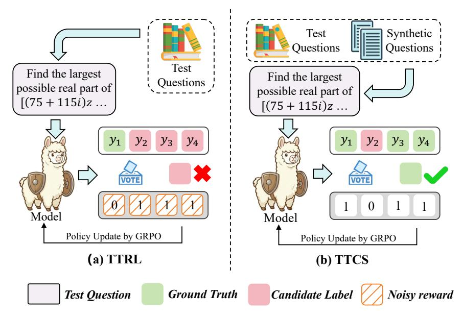
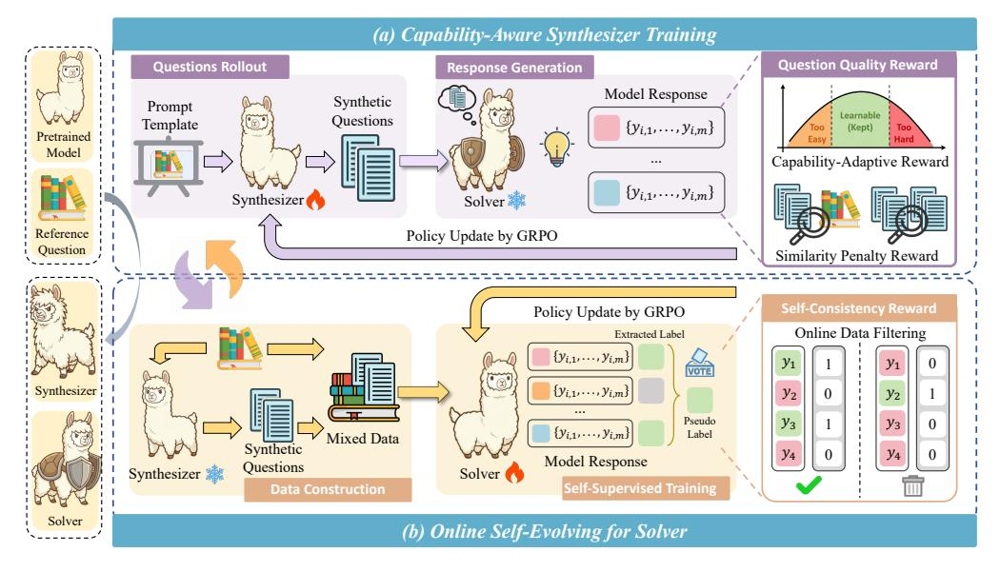
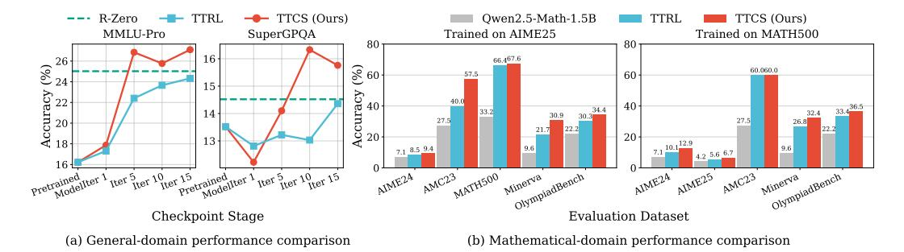
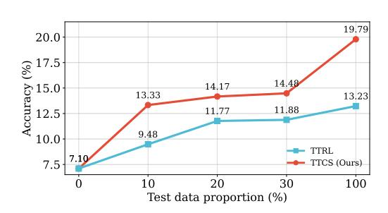
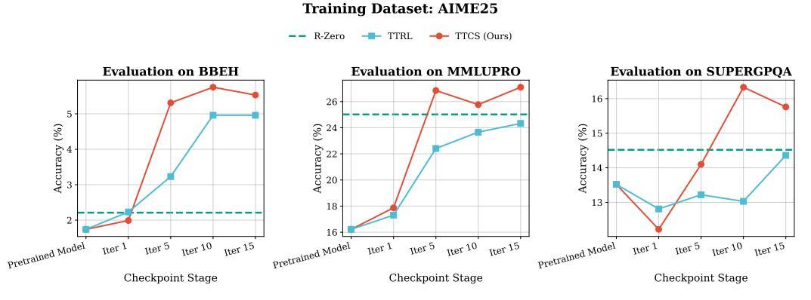
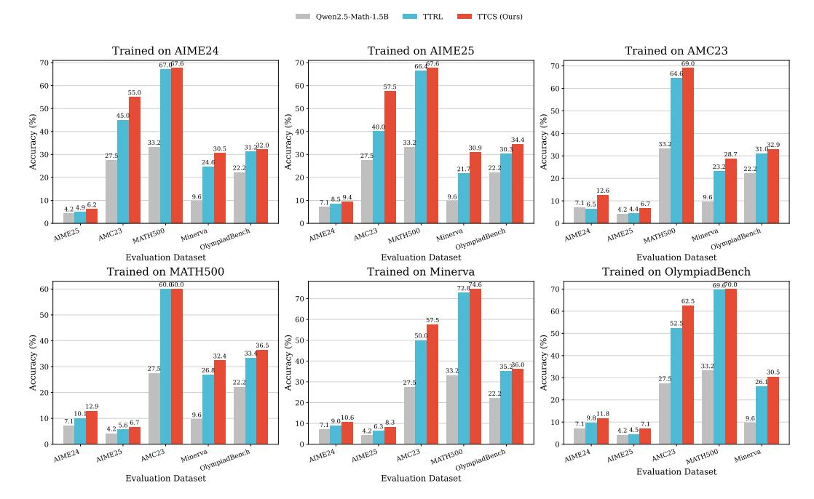

# TTCS: Test-Time Curriculum Synthesis for Self-Evolving

Chengyi Yang<sup>1</sup>, Zhishang Xiang<sup>1</sup>, Yunbo Tang<sup>1</sup>, Zongpei Teng<sup>1</sup>, Chengsong Huang<sup>2</sup>, Fei Long<sup>1</sup>, Yuhan Liu<sup>3</sup>\*, Jinsong Su<sup>1</sup>\*

<sup>1</sup>Xiamen University <sup>2</sup>Washington University in St. Louis <sup>3</sup>Renmin University of China yangchengyi@stu.xmu.edu.cn yuhan.liu@ruc.edu.cn jssu@xmu.edu.cn

# Abstract

Test-Time Training offers a promising way to improve the reasoning ability of large language models (LLMs) by adapting the model using only the test questions. However, existing methods struggle with difficult reasoning problems for two reasons: raw test questions are often too difficult to yield high-quality pseudo-labels, and the limited size of test sets makes continuous online updates prone to instability. To address these limitations, we propose TTCS, a co-evolving test-time training framework. Specifically, TTCS initializes two policies from the same pretrained model: a question synthesizer and a reasoning solver. These policies evolve through iterative optimization: the synthesizer generates progressively challenging question variants conditioned on the test questions, creating a structured curriculum tailored to the solver's current capability, while the solver updates itself using selfconsistency rewards computed from multiple sampled responses on both original test and synthetic questions. Crucially, the solver's feedback guides the synthesizer to generate questions aligned with the model's current capability, and the generated question variants in turn stabilize the solver's test-time training. Experiments show that TTCS consistently strengthens the reasoning ability on challenging mathematical benchmarks and transfers to general-domain tasks across different LLM backbones, highlighting a scalable path towards dynamically constructing test-time curricula for self-evolving. Our code and implementation details are available at https://github.com/XMUDeepLIT/TTCS.

# 1 Introduction

Large language models (LLMs) have evolved from passive text generators into increasingly autonomous agents capable of planning, acting, and reasoning over complex tasks [9, 33, 24, 17, 44]. This progress has been largely driven by reinforcement learning with verifiable rewards (RLVR) [27, 41], which has yielded significant improvements on challenging mathematical and scientific benchmarks [7, 40]. By leveraging verifiable outcomes, RLVR allows models to iteratively refine their strategies through trial-and-error feedback. However, this paradigm faces a critical scalability bottleneck: it heavily depends on extensive, high-quality ground-truth labels [30].

To address this limitation, recent studies [5, 46, 23, 8, 14, 45] have shifted toward *Self-Evolving*. These approaches empower models to improve autonomously through self-generated supervision and environmental interactions, thereby reducing reliance on external human labels. A representative work of this paradigm is Test-Time Training [31], particularly its reinforcement learning variant known as test-time reinforcement learning (TTRL) [49]. Originally Designed to mitigate distribution shifts, TTRL enables dynamic parameter adaptation on unlabeled test instances by optimizing a self-supervised objective, which is typically constructed via majority voting [36]. However, as

<sup>\*</sup>Corresponding authors



Figure 1: Comparison of TTRL and our TTCS: (a) When applied to difficult test questions such as AIME24, TTRL suffers from noisy rewards caused by incorrect majority voting consensus. (b) TTCS synthesizes tractable variants to ensure valid pseudo-labels, providing reliable supervision for stable self-evolution.

illustrated in Figure 1(a), when applied to challenging reasoning tasks, TTRL encounters two primary challenges: (i) **Unreliable Pseudo-labels.** For difficult questions such as AIME24 [20], the majority of sampled responses are often incorrect. Majority voting therefore converges to a wrong consensus, producing systematically noisy reward signals that actively misguide the policy update [47]. Instead of correcting errors, the model is reinforced toward misleading reasoning paths. (ii) **Optimization lacks learnable samples.** TTRL operates directly on a small set of extremely challenging test questions. As shown in Figure 1(a), these questions lie far beyond the model's current capability. Without intermediate variants to bridge the gap, the learning process becomes steep and often unclimbable [3].

To overcome these challenges, we draw upon the fundamental insight from Curriculum Learning [2, 35] that solving related, more tractable variants serves as a bridge to mastering complex problems. This implies that directly optimizing on the original intractable test questions is inherently flawed. Therefore, we instead focus on actively constructing a problem-centered curriculum comprised of diverse, solvable variants that match the model's current capability. As shown in Figure 1(b), the synthetic questions ensure that training samples remain within the model's capability frontier, providing valid supervision signals that convert the noisy feedback of standard test-time training into a reliable pathway for self-evolution.

In this paper, we propose TTCS (Test-Time Curriculum Synthesis for Self-Evolving), a co-evolving test-time training framework that couples *capability-aware synthesizer* with *online self-evolving solver*. TTCS instantiates two agents initialized from the same pretrained model: a **Synthesizer** that, given a test question, generates curriculum questions variants that preserve the underlying reasoning structure while varying surface realizations; and a **Solver** that performs online training on a mixture of test questions and synthetic questions. Crucially, the two agents co-evolve in an iterative loop: the solver serves as an implicit judge of each synthesized question quality, providing a capability-aligned signal that trains the synthesizer to propose auxiliary questions near the solver's capability frontier, while the solver is updated using self-supervised rewards derived from its own sampled responses [49, 36]. Both agents are optimized online via Group Relative Policy Optimization (GRPO) [27], enabling stable self-evolving under label-free test-time constraints. Generally, our main contributions are summarized as follows:

 We identify limitations in existing test-time training for complex reasoning, including unreliable pseudo-labels and the lack of learnable samples, which collectively hinder effective optimization on difficult test questions in practice.

- We propose **TTCS**, a co-evolving test-time training framework. TTCS couples a capability-aware synthesizer with an online solver. Through iterative GRPO, the synthesizer dynamically constructs a problem-centered curriculum aligned with the solver's capability frontier, thereby transforming noisy feedback into a reliable pathway for self-evolution.
- Extensive experiments show that our approach achieves strong performance and generalizes well across both mathematical and general reasoning benchmarks.

# 2 Related Work

The related works to ours mainly include the following two lines of studies:

Self Evolving for LLMs. Self Evolving has been considered as a paradigm for augmenting LLMs' reasoning ability without extra human supervision. In this regard, pioneering studies [15, 37] demonstrate that LLMs can achieve meaningful self-improvement by fine-tuning on their own high-confidence reasoning trajectories. Following this, SPIN [5] introduces iterative self-play fine-tuning. To address the degenerative feedback in single-model self-play, later role-specialized frameworks [22, 4] adopt co-evolution as a core principle, which scales effectively in low-data settings [8, 26]. Recent studies shift toward dynamic self-challenging [48, 21] and unsupervised post-training [39]. This progress marks a transition from imitating external supervision [42] to autonomous self-correction based on intrinsic verifiability, leading to zero-data systems [14, 46, 11]. However, as noted by [29], recursive training on self-generated data carries the risk of model collapse, underscoring the need for high-quality data synthesis mechanisms.

**Test-Time Training (TTT).** This paradigm dynamically adapts model parameters during inference via self-supervision [1]. A key development is Test-Time Reinforcement Learning (TTRL) [49], which applies RLVR to unlabeled test data by deriving pseudo-labels from multi-sampling, allowing LLMs to self-improve during inference. While AlphaProof [16] has demonstrated the substantial potential of TTT in tackling Olympiad-level mathematical reasoning, it predominantly relies on stronger LLM [32, 6] for data synthesis, limiting the scope of fully autonomous self-evolving. To overcome this limitation, we introduce TTCS, a fully autonomous framework that eliminates the need for external supervision and stronger teacher models.

# 3 Preliminary

This section reviews two key methodologies: Group Relative Policy Optimization [27] as a core optimization algorithm, and the Test-Time Training paradigm [49] for label-free inference adaptation.

**Group Relative Policy Optimization (GRPO).** Let  $\mathcal{X}$  and  $\mathcal{Y}$  denote the input question space and output response space, respectively. We denote the LLM as a policy  $\pi_{\theta}$  parameterized by  $\theta$ , which generates a response  $y \in \mathcal{Y}$  given an input  $x \in \mathcal{X}$  according to the conditional probability  $\pi_{\theta}(y \mid x)$ . In the standard RLVR setting, we utilize a dataset  $\mathcal{D} = \{(x, y^*)\}$ , where  $y^*$  represents the ground truth. This allows us to define an outcome-based reward function  $\mathcal{R}(y, y^*) : \mathcal{Y} \times \mathcal{Y} \to \{0, 1\}$ , which evaluates the correctness of the generated response. The optimization goal is to maximize the expected reward:

$$\theta^* = \arg\max_{\theta} \mathbb{E}_{y \sim \pi_{\theta}(\cdot|x)} [\mathcal{R}(y, y^*)]. \tag{1}$$

To optimize this objective efficiently, GRPO has emerged as a widely adopted optimization algorithm. Specifically, for each question x, the model samples a group of outputs  $\{o_i\}_{i=1}^G$  from the current policy  $\pi_{\theta_{old}}$ . The advantage  $A_i$  for the i-th output  $o_i$  is computed by normalizing the rewards with respect to the group statistics:

$$A_i = \frac{r_i - \text{mean}(\mathbf{r})}{\text{std}(\mathbf{r}) + \epsilon},\tag{2}$$

where  $\mathbf{r} = \{r_1, \dots, r_G\}$  represents the group rewards and  $\epsilon$  is a small constant for numerical stability. The policy is updated by maximizing the surrogate objective  $\mathcal{J}_{GRPO}(\theta)$  as follows:

$$\mathcal{J}_{GRPO}(\theta) = \mathbb{E}_{x \sim \mathcal{D}, \{o_i\}_{i=1}^G \sim \pi_{\theta_{old}}(\cdot | x)} \left[ \frac{1}{G} \sum_{i=1}^G \left( \min \left( \frac{\pi_{\theta}(o_i | x)}{\pi_{\theta_{old}}(o_i | x)} A_i, \right) \right) \right] dt, \qquad (3)$$

$$\operatorname{clip} \left( \frac{\pi_{\theta}(o_i | x)}{\pi_{\theta_{old}}(o_i | x)}, 1 - \epsilon, 1 + \epsilon \right) A_i - \beta \mathbb{D}_{KL}(\pi_{\theta} | \pi_{old}) \right) \right],$$



Figure 2: Overview of TTCS, a co-evolving test-time training framework. (a) *Synthesizer training*: the synthesizer first rollout synthetic questions conditioned on test questions with the prompt template, and then is optimized via GRPO with the question quality reward. (b) *Solver training*: the solver performs online self-evolving on a mixture of test and synthetic questions with self-supervised rewards, updated via GRPO using the self-consistency reward.

where  $\epsilon$  and  $\beta$  are hyper-parameters. The clip(·) function ensures stable updates within a trust region, while the KL term  $\mathbb{D}_{KL}$  acts as a regularizer to prevent excessive deviation from the previous policy model.

**Test-Time Training (TTT).** Let the test dataset  $\mathcal{D}_{test} = \{(x_{\text{test}}, y_{\text{test}})\}$ , where the  $x_{\text{test}}$  and  $y_{\text{test}}$  are the test question and the ground-truth, respectively. TTT is a paradigm designed to mitigate the distribution shift between training and testing environments [49]. Unlike standard inference with fixed parameters, TTT enables the model to dynamically adapt its parameters only using test questions. Without access to ground-truth, TTT relies on self-generated supervision. Formally, starting from a pretrained model, TTT seeks to find adapted parameters  $\theta_{\text{ttt}}^*$  by maximizing a label-free objective over the test questions:

$$\theta_{\text{ttt}}^* = \arg\max_{\theta} \mathbb{E}_{y \sim \pi_{\theta}(\cdot | x_{\text{test}})} [\mathcal{R}_{\text{ttt}}(y, \hat{y}^*)], \tag{4}$$

where  $\hat{y}^*$  is the pseudo-label derived via the majority voting [36], which selects the most frequent response among the candidates, and  $\mathcal{R}_{\rm ttt}(y,\hat{y}^*)$  denotes the outcome-based reward measuring the alignment between the response y and the consensus  $\hat{y}^*$ .

# 4 Test-Time Curriculum Synthesis

In this section, we present Test-Time Curriculum Synthesis (TTCS), a co-evolving test-time training framework built on an iterative GRPO (Section 3) optimization loop. As shown in Figure 2, TTCS consists of two agents: a Synthesizer policy  $\pi_{\phi}$  and a Solver policy  $\pi_{\theta}$ , both initialized from the same pretrained model. At each iteration, the synthesizer generates curriculum variants for each test question, and is rewarded to preserve the reasoning structure of each test question while staying near the solver's current capability frontier(Section 4.1). The solver, in turn, performs online self-evolving on a mixture of synthetic questions and test questions, guided by self-consistency rewards(Section 4.2). Crucially, the two agents co-evolve in a closed loop: the solver's current performance provides a capability-aware training signal that shapes the synthesizer's generation distribution, while the synthesizer continuously supplies fresh, question-centered variants that stabilize the solver's test-time training. The algorithm description of our framework is shown in Appendix C.4

#### 4.1 Capability-Aware Synthesizer Training

Since difficult and limited test questions often provide weak and unreliable pseudo-labels at test-time training [39], the structured and localized curriculum of variants around each test question is vital [16], allowing the solver to learn from simpler, related variants rather than from the overly difficult raw test questions alone. We realize this through two components: (i) *Test Questions Guided Synthesis*, which preserves the important reasoning structure of the test question while varying the surface form to produce diverse variants; and (ii) *Question Quality Assessment Reward*, which favors synthetic questions that the solver can partially solve but not trivially solve, making them most informative for driving test-time self-evolving.

**Test Questions Guided Synthesis.** At the t-th iteration, the synthesizer generates M auxiliary questions  $\{x_i'\}_{i=1}^M$  for each RL rollout group conditioned on  $x_{\text{test}}$  with a well-designed prompt template (see Appendix D) as follows:

$$\{x_i'\}_{i=1}^M \sim \pi_\phi^t(\cdot \mid x_{\text{test}}). \tag{5}$$

Each synthetic question  $x_i'$  preserves the underlying reasoning structure of  $x_{\text{test}}$  to maintain task relevance, while differing in surface realization through changes in problem objects, settings, or constraint types. This allows the synthetic questions to provide focused training signals that are aligned with the reference questions in distribution.

**Question Quality Reward.** To facilitate the co-evolution of the synthesizer and the solver, we employ the solver as an online assessor to assign a composite reward to each synthetic question in rollout stage. This reward is designed to reflect two complementary objectives:

Capability-Adaptive Reward. We first quantify the difficulty of each synthetic question  $x_i'$  related to the solver's current policy  $\pi_{\theta}^t$ . By sampling K reasoning responses  $\{y_{i,k}\}_{k=1}^K \sim \pi_{\theta}^t(\cdot \mid x_i')$  and computing the majority vote  $\hat{y}_i$  as implemented in [36], we define the self-consistency score to measure the difficulty of  $x_i'$  as:

$$s(x_i') = \frac{1}{K} \sum_{k=1}^{K} \mathbb{I}[y_{i,k} = \hat{y}_i].$$
 (6)

To maximize the training efficiency, the synthesizer should target the solver's capability frontier, which consists of problems that are neither too easy (consistently solved) nor too hard (consistently failed). Since the variance of the generated responses distribution peaks when the self-consistency score  $s(x_i') \approx 0.5$ , we formulate a variance-driven capability-adaptive reward  $^2$  to prioritize this as follows:

$$\mathcal{R}_{\text{cap}}(x_i') = \left(4s(x_i')(1 - s(x_i'))\right)^{\gamma},\tag{7}$$

where  $\gamma$  controls the curvature, assigning peak rewards to questions at the capability boundary of the solver  $\pi_{\theta}^t$ .

Similarity Penalty Reward. To ensure novelty and mitigate model collapse, we introduce reward penalty terms that discourage trivial copying from the test questions  $x_{\text{test}}$  and redundancy within the other synthetic questions  $\{x'_{i'}\}_{i'=1,i'\neq i}^M$  in the same rollout group. Specifically,  $\mathcal{R}_{\text{ref}}(x'_i,x_{\text{test}})$  penalizes near-duplicate paraphrases based on rule-based similarity, such as the edit distance between the synthetic question and the test one (see Appendix C.2), while  $\mathcal{R}_{\text{group}}(x'_i,\{x'_{i'}\}_{i'=1,i'\neq i}^M)$  penalizes redundancy among generated samples to encourage exploration (see Appendix C.3). The overall similarity penalty reward is computed as a weighted sum of these two components:

$$\mathcal{R}_{\text{sim}}(x_i') = \lambda_1 \mathcal{R}_{\text{ref}}(x_i', x_{\text{test}}) + \lambda_2 \mathcal{R}_{\text{group}}(x_i', \{x_i'\}_{i'=1, i' \neq i}^M), \tag{8}$$

where  $\lambda_1$  and  $\lambda_2$  are scalar coefficient that control the relative strength of the reference-based and group-level penalties, respectively.

**Final Reward Formulation.** By combining the capability objective with diversity constraints, we define the final reward as follows to guide the training process:

$$\mathcal{R}(x_i') = \mathbb{I}_{\text{valid}}(x_i') \cdot \max\left(0, \mathcal{R}_{\text{cap}}(x_i') - \mathcal{R}_{\text{sim}}(x_i')\right), \tag{9}$$

<sup>&</sup>lt;sup>2</sup>The detailed theoretical analysis of this variance-driven reward is shown in Appendix C.1

where  $\mathbb{I}_{\text{valid}}(x_i')$  is an indicator that enforces basic format compliance (e.g., the synthesized question is properly wrapped in  $\neq$ question  $\neq$  ···  $\neq$  ·/question . The synthesizer  $\pi_\phi^t$  is then updated with GRPO using  $\mathcal{R}(x_i')$ , so that its generation distribution progressively shifts toward capability-aligned and diverse variants.

### 4.2 Online Self-Evolving for Solver

Parallel to the synthesizer's evolution, the solver is iteratively refined to adapt to the increasingly challenging curriculum. While the synthesizer acts as a curriculum designer to near the capability frontier, the solver functions as an adaptive learner, continuously updating its policy to master these synthetic challenges.

Training Data Construction at Test Time. To balance domain grounding with capability exploration, at iteration t, we construct training data by augmenting sampled test questions  $x_{\text{test}}$  with diverse variants  $\{x_i'\}_{i=1}^N$  generated by the synthesizer  $\pi_{\phi}^{t-1}$ . The resulting mixed training data is formulated as  $\mathcal{B}_{\text{train}}^t = \mathcal{B}_{\text{test}}^t \cup \mathcal{B}_{\text{syn}}^t$ , where  $\mathcal{B}_{\text{test}}^t$  represents the test questions set and  $\mathcal{B}_{\text{syn}}^t$  denotes the corresponding synthetic questions set. Notably, since the test set  $\mathcal{D}_{\text{test}}$  is typically small, we repeatedly sample test questions across iterations. This re-sampling strategy controls the ratio between test and synthetic data, preventing the training distribution from being dominated by self-generated samples, which could otherwise lead to model collapse in practice [29].

**Self-Consistency Reward for Solver.** As described in Section 3, we employ the majority voting mechanism to obtain the pseudo-labels. Specifically, given a training question  $x \in \mathcal{B}^t_{\text{train}}$ , the solver  $\pi^t_{\theta}$  first generates multiple reasoning responses via repeated high temperature sampling:

$$\{y_i\}_{i=1}^G \sim \pi_\theta^t(\cdot \mid x). \tag{10}$$

We then aggregate these responses to derive a consensus prediction  $\hat{y}*$ , which serves as a pseudo-label. A binary outcome-based reward is assigned to each response  $y_i$  using its agreement with the consensus:

$$r(y_i, \hat{y}^*) = \begin{cases} 1, & \text{if } y_i = \hat{y}^*, \\ 0, & \text{otherwise.} \end{cases}$$
 (11)

Based on these rewards, we calculate the sample consistency score  $s(x) = \frac{1}{G} \sum_{i=1}^{G} r(y_i, y^*)$ . Following the strategy in DAPO [41], we implement an *online data filtering* mechanism that retains only samples satisfying  $|s(x) - 0.5| \le \delta$  to ensure the quality of training data used for self-evolving. Together, this online self-evolving procedure enables the solver to continuously refine its policy using only unlabeled test-time data and self-generated supervision.

# 5 Experiment

# 5.1 Experimental Setting

**Datasets and Evaluation.** We apply **TTCS** to each benchmark individually and then evaluate to demonstrate its effectiveness. (1) **Competition-Level Mathematical Benchmarks:** We employ the AMC23, AIME24, and AIME25 as a rigorous testbed for advanced reasoning ability [20]. (2) **Fundamental Mathematical Benchmarks:** Complementarily, we include MATH-500 [12], Minerva [19], and OlympiadBench [10] to assess fundamental mathematical proficiency across diverse problem types (See Appendix A.1). Following the setting of prior works [43, 24, 14], we report the mean@32 metric for the AIME24/25 benchmarks and greedy decoding accuracy (pass@1) for all the other mathematical datasets (See Appendix A.2).

**Models and Baselines.** To demonstrate the scalability of **TTCS**, we conduct experiments on three base pretrained models: Qwen2.5-Math-1.5B, Qwen2.5-Math-7B [25] and Qwen3-4B-Base [40]. We compare with several representative baselines: (1) **Pretrained model**, which evaluates all base pretrained models in a standard evaluation setting as static performance references. (2) **Self-Consistency** [36], which aggregates multiple reasoning paths via majority voting as a test-time scaling method. (3) **TTRL** [49], which adapts the model on unlabeled test instances using pseudo-labels. (4) **R-Zero** [14], which enables data-free optimization through Challenger–Solver co-evolution. Detailed descriptions of the baselines can be found in Appendix A.3.

| Method                | AIME 2024 | AIME 2025 | AMC23 | MATH-500 | Minerva | OlympiadBench | AVG   |
|-----------------------|-----------|-----------|-------|----------|---------|---------------|-------|
| Qwen2.5-Math-1.5B     |           |           |       |          |         |               |       |
| Pretrained model [25] | 7.10      | 4.20      | 27.50 | 33.20    | 9.60    | 22.20         | 17.30 |
| Self-Consistency [36] | 13.30     | 10.00     | 50.00 | 49.80    | 10.70   | 31.90         | 27.62 |
| R-Zero [14]           | 10.00     | 4.58      | 47.50 | 66.20    | 30.88   | 31.01         | 31.70 |
| TTRL [49]             | 13.23     | 9.38      | 55.00 | 71.20    | 34.93   | 35.61         | 36.56 |
| TTCS (Ours)           | 19.79     | 13.33     | 62.50 | 76.80    | 40.44   | 36.05         | 41.49 |
| Qwen2.5-Math-7B       |           |           |       |          |         |               |       |
| Pretrained model [25] | 12.90     | 7.90      | 45.00 | 52.80    | 18.80   | 18.70         | 26.02 |
| Self-Consistency [36] | 20.00     | 13.30     | 52.50 | 62.20    | 22.10   | 22.80         | 32.15 |
| R-Zero [14]           | 18.13     | 7.81      | 65.00 | 78.60    | 43.38   | 39.47         | 42.07 |
| TTRL [49]             | 35.52     | 14.06     | 67.50 | 83.40    | 49.26   | 40.80         | 48.42 |
| TTCS (Ours)           | 37.19     | 19.90     | 75.00 | 84.60    | 53.31   | 45.25         | 52.54 |
| Qwen3-4B-Base         |           |           |       |          |         |               |       |
| Pretrained model [40] | 12.10     | 5.40      | 45.00 | 72.40    | 32.70   | 39.90         | 34.58 |
| Self-Consistency [36] | 20.00     | 10.00     | 57.50 | 79.60    | 41.20   | 44.10         | 42.07 |
| R-Zero [14]           | 11.35     | 8.65      | 55.00 | 76.20    | 45.96   | 42.73         | 39.98 |
| TTRL [49]             | 16.67     | 17.81     | 57.50 | 80.40    | 45.96   | 43.18         | 43.59 |
| TTCS (Ours)           | 25.00     | 19.58     | 60.00 | 81.80    | 52.21   | 44.66         | 47.21 |

Table 1: Comparison of our **TTCS** framework against other baselines on mathematical benchmarks. Best results are highlighted in bold.

Implementation Details. Our framework is implemented based on the VeRL [28]. During synthesizer training, we set the rollout number for question generation to  $M{=}4$ . For each synthesized question, the solver sample  $K{=}10$  responses to estimate the quality of each generated question with  $\gamma{=}1.2$ . To promote diversity, the coefficients for the similarity penalty terms are set to  $\lambda_1{=}1.0$  and  $\lambda_2{=}1.0$ . For the solver training, we employ a rollout group size of  $G{=}8$  and  $\delta{=}0.25$  to explore reasoning paths effectively. The further detailed information can be found in Appendix A.4

#### 5.2 Main Results

TTCS achieves superior performance across most tasks and models. As shown in Table 1, TTCS consistently outperforms all baselines in average accuracy. On the Qwen2.5-Math-1.5B model, TTCS elevates the average points from 17.30 to 41.49, yielding a massive improvement of +24.19 points. This advantage extends effectively to larger model scales; on Qwen2.5-Math-7B, our method achieves an average points of 52.54, surpassing the standard test-time scaling baseline Self-Consistency by +20.39 points. These results indicate that our active test-time training paradigm is significantly more effective than passive inference-time scaling, unlocking reasoning potential that standard consistency strategies cannot reach.

TTCS outperforms existing self-evolving methods. Compared to recent baselines such as R-Zero and TTRL, TTCS exhibits superior performance. While TTRL generally scores higher than R-Zero by optimizing on test questions, TTCS achieves further gains. For instance, on the Qwen2.5-Math-7B benchmark, our method surpasses TTRL by +4.12 points on average (48.42 $\rightarrow$ 52.54). On the Qwen3-4B-Base model, TTCS also maintains the lead with average 47.21 points, exceeding TTRL by +3.62 points. This consistent improvement indicates that TTCS bridges the capability gap by introducing synthesized intermediate problems, whereas TTRL remains constrained by the fixed difficulty of raw test questions during test-time training.

TTCS demonstrates substantial improvements on challenging benchmarks. The performance difference between TTCS and other methods is particularly evident on difficult benchmarks such as AIME24/25. On AIME24 with the Qwen2.5-Math-1.5B model, TTRL achieves 13.23 points, whereas TTCS increases this to 19.79, achieving a substantial +6.56 points. Similarly, on the Qwen2.5-Math-7B model, TTCS scores 19.90 points on AIME25, surpassing the TTRL's 14.06 points by +5.84 points. This confirms that when TTRL struggles with unreliable pseudo-labels on



Figure 3: Generalization analysis. (a) General-domain generalization: Accuracy trends of TTCS and TTRL on general-domain reasoning benchmarks (MMLU-Pro, SuperGPQA) during test-time training on AIME25. The green dashed line indicates the R-Zero baseline. (b) Mathematical-domain generalization: Performance comparison on out-of-distribution (OOD) mathematical benchmarks.

| Method              | AIME24 | AIME25 | Minerva | AVG   |
|---------------------|--------|--------|---------|-------|
| Qwen2.5-Math-1.5B   | 13.23  | 9.38   | 34.93   | 19.18 |
| +Strong Synthesizer | 16.35  | 10.21  | 38.97   | 21.84 |
| +TTCS(Ours)         | 19.79  | 13.33  | 40.44   | 24.52 |

Table 2: Performance comparison on the Qwen2.5-Math-1.5B model investigating the impact of synthesizer capability. The Strong synthesizer variant employs a fixed Qwen2.5-14B-Instruct model to generate questions.

intractable tasks, TTCS successfully extracts high-quality supervision from synthesized curriculum problems, enabling the model to learn even when the target questions are initially beyond its reach.

#### 5.3 Analysis

In this section, we conduct comprehensive analysis experiments on Qwen2.5-Math-1.5B to obtain deeper insights about **TTCS**. We aim to answer the following research questions:

Q1: Is the TTCS framework effective in enhancing reasoning capabilities in general domains beyond mathematics? To investigate the cross-domain generalization of TTCS, we conducted evaluations on challenging general-domain reasoning benchmarks, including MMLU-Pro [38] and SuperGPQA [34]. Crucially, these evaluations are performed while the model undergoes online test-time self-evolving specifically on the AIME25 benchmark. Since R-Zero is unstable under extended iterations, we report its performance at the 2-th iteration as a static baseline. As shown in Figure 3(a), TTCS demonstrates superior generalization capabilities. On MMLU-Pro, it surpasses the R-Zero baseline after 5 iterations and consistently outperforms TTRL. Similarly, on SuperGPQA, TTCS peaks significantly above R-Zero, whereas TTRL remains below the baseline. These results indicate that gains learned during mathematical self-evolution generalize to broader reasoning tasks. Additional results, including BBEH [18], are provided in Appendix B.1.

**Q2:** Can the solver trained on a specific dataset generalize to unseen benchmarks? To evaluate the out-of-domain generalization, we train the solver on a single test dataset and directly evaluate it on the other unseen benchmarks. Results are shown in Figure 3(b). The solver achieves consistent performance gains across all unseen datasets, indicating strong generalization. Specifically, even when trained solely on MATH-500, a dataset of moderate difficulty, the model still improves substantially on more challenging benchmarks, with accuracy on AIME24 increasing from 7.1 points to 12.9 points. This result suggests that during the co-evolving process of TTCS, the solver acquires universal mathematical reasoning logic. Rather than memorizing patterns from the test set, the model improves its ability to handle diverse and unseen mathematical problems. The results of other datasets are provided in Appendix B.2.

Q3: Is co-evolution more critical to TTCS than a stronger but static synthesizer? To further this, we replace the co-evolving 1.5B synthesizer with a frozen but significantly stronger Qwen2.5-14B-Instruct, while keeping the rest of the framework unchanged. As shown in Table 2, even with superior intrinsic capabilities, the static 14B synthesizer

| Settings                 | AMC23 |       | Olympiad |       | Minerva |                   |
|--------------------------|-------|-------|----------|-------|---------|-------------------|
|                          | Score | Δ     | Score    | Δ     | Score   | Δ                 |
| TTCS (Full)              | 62.50 | _     | 36.05    | _     | 40.44   | _                 |
| w/o Synthesizer Training | 55.00 | ↓7.50 | 32.79    | ↓3.26 | 37.50   | ↓2.94             |
| w/o Online Data Filter   | 60.00 | ↓2.50 | 33.68    | ↓2.37 | 38.60   | ↓1.84             |
| w/o Diversity Penalty    | 55.00 | ↓7.50 | 35.31    | ↓0.74 | 39.34   | $\downarrow$ 1.10 |

Table 3: **Ablation** study of TTCS components on the Qwen2.5-Math-1.5B model. Performance drops ( $\Delta$ ) are computed relative to the full TTCS setting.

yields only a limited improvement of +2.66 points. In contrast, TTCS achieves a substantial gain of +5.34 points, effectively doubling the performance boost of the stronger static baseline. This empirical evidence confirms that for test-time self-evolution, the adaptivity of the curriculum is far more decisive than the absolute strength of the teacher model.

Q4: Can TTCS remain effective under limited test data? To investigate efficacy in datascarce scenarios, we evaluate our framework on AIME24 by restricting training data to varying proportions. As shown in Figure 4, starting from the pretrained model, TTCS consistently outperforms TTRL. Notably, with only 10% data (3 questions), TTCS boosts accuracy to 13.33 points, significantly surpassing TTRL's 9.48. This validates that TTCS effectively amplifies limited supervision via curriculum synthesis, ensuring stable self-evolution even with minimal test data.



Figure 4: Data efficiency analysis of test-time training on AIME24.

# 5.4 Ablation Study

We conduct ablation studies on Qwen2.5-Math-1.5B to evaluate key components of TTCS, with results shown in Table 3.

**Without Synthesizer Training.** We freeze the synthesizer and use a static pretrained model to generate questions while allowing only the solver to evolve. Performance drops consistently across benchmarks, with accuracy on AMC23 decreasing from 62.50 points to 55.00 points. This shows that static question synthesis cannot adapt to the solver's evolving capabilities, leading to questions that are either too easy or too difficult and thus provide ineffective learning signals.

Without Online Data Filtering. We remove the consistency-based online data filter and retain samples from all solver rollouts regardless of their difficulty. This ablation causes a clear performance decline across benchmarks, with Olympiad accuracy dropping from 36.05 points to 33.68 points. Without filtering at the capability boundary, the solver spends computation on low-value samples, which weakens the effective training signal.

Without Diversity Penalties. We remove the similarity penalties in the synthesizer's reward function that discourage copying from the reference test question ( $\mathcal{R}_{ref}$ ) and redundancy within a generation group ( $\mathcal{R}_{group}$ ), as described in Section 4.1. Performance degrades under this setting, as the synthesizer tends to generate paraphrased or repetitive questions. The resulting lack of diversity can lead to overfitting or mode collapse and limit further improvement of the solver.

#### 5.5 Case Study

To qualitatively demonstrate how our self-evolving framework progressively improves question synthesis quality, we present two representative cases from AIME24. For each case, we track the synthesized questions across training iterations (Iter 1, 5, 10, and 15), highlighting the evolution in problem structure and complexity.

| Iteration              | Case 1: Function Intersection                                                                                                                                                                             | Case 2: Roots of Unity                                                                                                                                     |
|------------------------|-----------------------------------------------------------------------------------------------------------------------------------------------------------------------------------------------------------|------------------------------------------------------------------------------------------------------------------------------------------------------------|
| Test Question (AIME24) | Define $f(x) =   x  - \frac{1}{2} $ and $g(x) =   x  - \frac{1}{4} $ . Find the number of intersections of the graphs of $y = 4g(f(\sin(2\pi x)))$ and $x = 4g(f(\cos(3\pi y)))$ .                        | Let $\omega \neq 1$ be a 13th root of unity. Find the remainder when $\prod_{k=0}^{12} (2-2\omega^k+\omega^{2k})$ is divided by 1000.                      |
| Iter 1                 | Find the number of integer solutions $(x, y)$ to the equation $4x^2 - 16y^2 + 14x - 24y + 9 = 0$ .                                                                                                        | The polynomial $f(x) = x^3 + x^2 - x - 1$ has three distinct roots, $p, q$ , and $r$ . What is $p^3q^3 + r^3q^3 + p^3r^3$ ?                                |
| Iter 5                 | How many points $(x, y)$ lie at intersections between the graphs of $x =  \sin(\pi y) $ and $y =  \sin(\pi x) $ ?                                                                                         | Find the sum of all <b>complex numbers</b> $w$ such that the real part of $w$ is greater than 0 and $w^3 + (4 - \frac{58}{7}i)w^2 - (6 + 13i)w + 10 = 0$ . |
| Iter 10                | Find the number of points where the graphs of $y =  x+1  +  x-1 $ and $y =  2x-1  +  3x-2 $ intersect.                                                                                                    | Let $\omega \neq 1$ be a 13th root of unity. Compute the remainder when $\sum_{n=0}^{12} \omega^n$ is divided by 1000.                                     |
| Iter 15                | Find the sum of the $x$ -coordinates of the points where the graph of $f(x) = \sin^{-1}\left(\frac{3x-x^3}{1+2x^2}\right)$ intersects the line $y = \frac{\pi}{4}$ , for $-\sqrt{2} \le x \le \sqrt{2}$ . | Let $N$ be the number of <b>ordered</b> triples $(a,b,c)$ of positive integers such that $a^2+b^2+c^2=2025$ . Find $N$ modulo 1000.                        |

Table 4: Evolution of synthesized questions across training iterations. Two representative cases from AIME24 are shown, demonstrating how our self-evolving framework progressively improves question synthesis quality.

We use color coding to indicate different types of evolution patterns observed in the synthesized questions:

- Blue (Structure Change): Modifications to problem parameters, variables, or mathematical objects while preserving the core solution approach.
- Red (Difficulty Increase): Introduction of additional constraints, more complex conditions, or harder computational requirements.
- Green (Domain Transfer): Shift to different mathematical domains (e.g., from algebra to geometry, from discrete to continuous).
- Purple (Complexity Growth): Increase in structural complexity, such as nested functions, multi-step reasoning, or advanced mathematical concepts.

As shown in Table 4, the model demonstrates increasing sophistication in question synthesis as training progresses. In early iterations, the synthesized questions tend to be simpler variations or direct modifications of the reference. By later iterations, the model generates questions that exhibit domain transfer, increased structural complexity, and novel problem formulations while maintaining mathematical validity.

# 6 Conclusion

In this paper, we propose **TTCS**, a co-evolving test-time training framework for self-evolving. We address the critical failures of prior methods, specifically the limitation of unreliable pseudolabels and the absence of intermediate difficulty learnable samples. By incorporating a capability-aware synthesizer, our approach dynamically constructs a curriculum of tractable variants to bridge the learning gap, converting noisy rewards into valid supervision. Empirical results confirm that TTCS delivers substantial gains on mathematical benchmarks and effectively generalizes to broader general-domain reasoning tasks. We view this work as a foundational step towards autonomous self-improvement and further plan to extend this framework to more useful and practical agentic applications.

# References

- [1] Ekin Akyürek, Mehul Damani, Adam Zweiger, Linlu Qiu, Han Guo, Jyothish Pari, Yoon Kim, and Jacob Andreas. The surprising effectiveness of test-time training for few-shot learning, 2025.
- [2] Yoshua Bengio, Jérôme Louradour, Ronan Collobert, and Jason Weston. Curriculum learning. In *Proceedings of the 26th annual international conference on machine learning*, pages 41–48, 2009.
- [3] Martin Briesch, Dominik Sobania, and Franz Rothlauf. Large language models suffer from their own output: An analysis of the self-consuming training loop, 2024.
- [4] Jiaqi Chen, Bang Zhang, Ruotian Ma, Peisong Wang, Xiaodan Liang, Zhaopeng Tu, Xiaolong Li, and Kwan-Yee K. Wong. Spc: Evolving self-play critic via adversarial games for llm reasoning, 2025.
- [5] Zixiang Chen, Yihe Deng, Huizhuo Yuan, Kaixuan Ji, and Quanquan Gu. Self-play fine-tuning converts weak language models to strong language models, 2024.
- [6] Gheorghe Comanici, Eric Bieber, and Mike Schaekermann et al. Gemini 2.5: Pushing the frontier with advanced reasoning, multimodality, long context, and next generation agentic capabilities, 2025.
- [7] DeepSeek-AI and Daya Guo et al. Deepseek-r1: Incentivizing reasoning capability in llms via reinforcement learning, 2025.
- [8] Wenkai Fang, Shunyu Liu, Yang Zhou, Kongcheng Zhang, Tongya Zheng, Kaixuan Chen, Mingli Song, and Dacheng Tao. Serl: Self-play reinforcement learning for large language models with limited data, 2025.
- [9] Aaron Grattafiori, Abhimanyu Dubey, and Abhinav Jauhri et al. The llama 3 herd of models, 2024.
- [10] Chaoqun He, Renjie Luo, Yuzhuo Bai, Shengding Hu, Zhen Leng Thai, Junhao Shen, Jinyi Hu, Xu Han, Yujie Huang, Yuxiang Zhang, Jie Liu, Lei Qi, Zhiyuan Liu, and Maosong Sun. Olympiadbench: A challenging benchmark for promoting agi with olympiad-level bilingual multimodal scientific problems, 2024.
- [11] Yicheng He, Chengsong Huang, Zongxia Li, Jiaxin Huang, and Yonghui Yang. Visplay: Self-evolving vision-language models from images. *arXiv preprint arXiv:2511.15661*, 2025.
- [12] Dan Hendrycks, Collin Burns, Saurav Kadavath, Akul Arora, Steven Basart, Eric Tang, Dawn Song, and Jacob Steinhardt. Measuring mathematical problem solving with the math dataset, 2021.
- [13] Wassily Hoeffding. Probability inequalities for sums of bounded random variables. *Journal of the American Statistical Association*, 58(301):13–30, 1963.
- [14] Chengsong Huang, Wenhao Yu, Xiaoyang Wang, Hongming Zhang, Zongxia Li, Ruosen Li, Jiaxin Huang, Haitao Mi, and Dong Yu. R-zero: Self-evolving reasoning llm from zero data, 2025.
- [15] Jiaxin Huang, Shixiang Shane Gu, Le Hou, Yuexin Wu, Xuezhi Wang, Hongkun Yu, and Jiawei Han. Large language models can self-improve, 2022.
- [16] Thomas Hubert, Rishi Mehta, Laurent Sartran, Miklós Z Horváth, Goran Žužić, Eric Wieser, Aja Huang, Julian Schrittwieser, Yannick Schroecker, Hussain Masoom, et al. Olympiad-level formal mathematical reasoning with reinforcement learning. *Nature*, pages 1–3, 2025.
- [17] Bowen Jin, Hansi Zeng, Zhenrui Yue, Jinsung Yoon, Sercan Arik, Dong Wang, Hamed Zamani, and Jiawei Han. Search-r1: Training llms to reason and leverage search engines with reinforcement learning, 2025.

- [18] Mehran Kazemi, Bahare Fatemi, Hritik Bansal, John Palowitch, Chrysovalantis Anastasiou, Sanket Vaibhav Mehta, Lalit K. Jain, Virginia Aglietti, Disha Jindal, Peter Chen, Nishanth Dikkala, Gladys Tyen, Xin Liu, Uri Shalit, Silvia Chiappa, Kate Olszewska, Yi Tay, Vinh Q. Tran, Quoc V. Le, and Orhan Firat. Big-bench extra hard, 2025.
- [19] Aitor Lewkowycz, Anders Andreassen, David Dohan, Ethan Dyer, Henryk Michalewski, Vinay Ramasesh, Ambrose Slone, Cem Anil, Imanol Schlag, Theo Gutman-Solo, Yuhuai Wu, Behnam Neyshabur, Guy Gur-Ari, and Vedant Misra. Solving quantitative reasoning problems with language models, 2022.
- [20] Xuefeng Li, Haoyang Zou, and Pengfei Liu. Limr: Less is more for rl scaling, 2025.
- [21] Xiao Liang, Zhong-Zhi Li, Yeyun Gong, Yang Wang, Hengyuan Zhang, Yelong Shen, Ying Nian Wu, and Weizhu Chen. Sws: Self-aware weakness-driven problem synthesis in reinforcement learning for llm reasoning, 2025.
- [22] Zi Lin, Sheng Shen, Jingbo Shang, Jason Weston, and Yixin Nie. Learning to solve and verify: A self-play framework for code and test generation, 2025.
- [23] Bo Liu, Chuanyang Jin, Seungone Kim, Weizhe Yuan, Wenting Zhao, Ilia Kulikov, Xian Li, Sainbayar Sukhbaatar, Jack Lanchantin, and Jason Weston. Spice: Self-play in corpus environments improves reasoning, 2025.
- [24] Xueguang Ma, Qian Liu, Dongfu Jiang, Ge Zhang, Zejun Ma, and Wenhu Chen. General-reasoner: Advancing llm reasoning across all domains, 2025.
- [25] Qwen, :, An Yang, Baosong Yang, Beichen Zhang, Binyuan Hui, Bo Zheng, Bowen Yu, Chengyuan Li, Dayiheng Liu, Fei Huang, Haoran Wei, Huan Lin, Jian Yang, Jianhong Tu, Jianwei Zhang, Jianxin Yang, Jiaxi Yang, Jingren Zhou, Junyang Lin, Kai Dang, Keming Lu, Keqin Bao, Kexin Yang, Le Yu, Mei Li, Mingfeng Xue, Pei Zhang, Qin Zhu, Rui Men, Runji Lin, Tianhao Li, Tianyi Tang, Tingyu Xia, Xingzhang Ren, Xuancheng Ren, Yang Fan, Yang Su, Yichang Zhang, Yu Wan, Yuqiong Liu, Zeyu Cui, Zhenru Zhang, and Zihan Qiu. Qwen2.5 technical report, 2025.
- [26] Sheikh Shafayat, Fahim Tajwar, Ruslan Salakhutdinov, Jeff Schneider, and Andrea Zanette. Can large reasoning models self-train?, 2025.
- [27] Zhihong Shao, Peiyi Wang, Qihao Zhu, Runxin Xu, Junxiao Song, Xiao Bi, Haowei Zhang, Mingchuan Zhang, Y. K. Li, Y. Wu, and Daya Guo. Deepseekmath: Pushing the limits of mathematical reasoning in open language models, 2024.
- [28] Guangming Sheng, Chi Zhang, Zilingfeng Ye, Xibin Wu, Wang Zhang, Ru Zhang, Yanghua Peng, Haibin Lin, and Chuan Wu. Hybridflow: A flexible and efficient rlhf framework. In *Proceedings of the Twentieth European Conference on Computer Systems*, EuroSys '25, page 1279–1297. ACM, March 2025.
- [29] Ilia Shumailov, Zakhar Shumaylov, Yiren Zhao, Nicolas Papernot, Ross Anderson, and Yarin Gal. Ai models collapse when trained on recursively generated data. *Nature*, 631(8022):755–759, 2024.
- [30] David Silver and Richard S Sutton. Welcome to the era of experience. Google AI, 1, 2025.
- [31] Yu Sun, Xiaolong Wang, Zhuang Liu, John Miller, Alexei A. Efros, and Moritz Hardt. Test-time training with self-supervision for generalization under distribution shifts, 2020.
- [32] Gemini Team, Petko Georgiev, Ving Ian Lei, and Ryan Burnell et al. Gemini 1.5: Unlocking multimodal understanding across millions of tokens of context, 2024.
- [33] Kimi Team, Yifan Bai, and Yiping Bao et al. Kimi k2: Open agentic intelligence, 2025.
- [34] P Team, Xinrun Du, Yifan Yao, and Kaijing Ma et al. Supergpqa: Scaling llm evaluation across 285 graduate disciplines, 2025.
- [35] Xin Wang, Yudong Chen, and Wenwu Zhu. A survey on curriculum learning, 2021.

- [36] Xuezhi Wang, Jason Wei, Dale Schuurmans, Quoc Le, Ed Chi, Sharan Narang, Aakanksha Chowdhery, and Denny Zhou. Self-consistency improves chain of thought reasoning in language models, 2023.
- [37] Yizhong Wang, Yeganeh Kordi, Swaroop Mishra, Alisa Liu, Noah A. Smith, Daniel Khashabi, and Hannaneh Hajishirzi. Self-instruct: Aligning language model with self generated instructions, 2022.
- [38] Yubo Wang, Xueguang Ma, Ge Zhang, Yuansheng Ni, Abhranil Chandra, Shiguang Guo, Weiming Ren, Aaran Arulraj, Xuan He, Ziyan Jiang, Tianle Li, Max Ku, Kai Wang, Alex Zhuang, Rongqi Fan, Xiang Yue, and Wenhu Chen. Mmlu-pro: A more robust and challenging multi-task language understanding benchmark, 2024.
- [39] Lai Wei, Yuting Li, Chen Wang, Yue Wang, Linghe Kong, Weiran Huang, and Lichao Sun. First sft, second rl, third upt: Continual improving multi-modal llm reasoning via unsupervised post-training, 2025.
- [40] An Yang, Anfeng Li, and Baosong Yang et al. Qwen3 technical report, 2025.
- [41] Qiying Yu, Zheng Zhang, Ruofei Zhu, and Yufeng Yuan et al. Dapo: An open-source llm reinforcement learning system at scale, 2025.
- [42] Wenhao Yu, Zhenwen Liang, Chengsong Huang, Kishan Panaganti, Tianqing Fang, Haitao Mi, and Dong Yu. Guided self-evolving llms with minimal human supervision. *arXiv* preprint *arXiv*:2512.02472, 2025.
- [43] Weihao Zeng, Yuzhen Huang, Qian Liu, Wei Liu, Keqing He, Zejun Ma, and Junxian He. Simplerl-zoo: Investigating and taming zero reinforcement learning for open base models in the wild, 2025.
- [44] Juntian Zhang, Chuanqi Cheng, Yuhan Liu, Wei Liu, Jian Luan, and Rui Yan. Weaving context across images: Improving vision-language models through focus-centric visual chains. In *Proceedings of the 63rd Annual Meeting of the Association for Computational Linguistics* (Volume 1: Long Papers), pages 27782–27798, 2025.
- [45] Juntian Zhang, Song Jin, Chuanqi Cheng, Yuhan Liu, Yankai Lin, Xun Zhang, Yufei Zhang, Fei Jiang, Guojun Yin, Wei Lin, et al. Viper: Empowering the self-evolution of visual perception abilities in vision-language model. *arXiv preprint arXiv:2510.24285*, 2025.
- [46] Andrew Zhao, Yiran Wu, Yang Yue, Tong Wu, Quentin Xu, Yang Yue, Matthieu Lin, Shenzhi Wang, Qingyun Wu, Zilong Zheng, and Gao Huang. Absolute zero: Reinforced self-play reasoning with zero data, 2025.
- [47] Wenting Zhao, Pranjal Aggarwal, Swarnadeep Saha, Asli Celikyilmaz, Jason Weston, and Ilia Kulikov. The majority is not always right: Rl training for solution aggregation, 2025.
- [48] Yifei Zhou, Sergey Levine, Jason Weston, Xian Li, and Sainbayar Sukhbaatar. Self-challenging language model agents, 2025.
- [49] Yuxin Zuo, Kaiyan Zhang, Li Sheng, Shang Qu, Ganqu Cui, Xuekai Zhu, Haozhan Li, Yuchen Zhang, Xinwei Long, Ermo Hua, Biqing Qi, Youbang Sun, Zhiyuan Ma, Lifan Yuan, Ning Ding, and Bowen Zhou. Ttrl: Test-time reinforcement learning, 2025.

# **A** Experimental Settings

In this section, we provide detailed descriptions of experimental settings used in TTCS.

#### A.1 Datasets

**Competition-Level Mathematics.** To assess advanced reasoning capabilities, we utilize the following rigorous testbeds:

- AMC23 [43]: A series of examinations used to identify and foster mathematical talent.
- **AIME24&25** [20]: We employ the 2024 and 2025 versions of the AIME. These problems serve as a proxy for competition-level difficulty, requiring multi-step reasoning and deep mathematical insight.

**Standard Mathematical Benchmarks.** We include a set of widely used datasets to evaluate fundamental proficiency:

- MATH-500 [12]: A subset of the MATH dataset designed for efficient evaluation of mathematical problem-solving skills.
- Minerva [19]: A collection of STEM problems covering a wide range of difficulty levels.
- **OlympiadBench** [10]: A comprehensive benchmark featuring Olympiad-level problems from various competitions.

**General-Domain Benchmarks.** To evaluate the generalization ability of our framework beyond pure mathematics, we extend our analysis to:

- **BBEH** [18]: Big Bench Extra Hard, focusing on tasks where language models traditionally struggle.
- MMLU-Pro [38]: A robust and challenging multi-task benchmark designed to push the limits of language understanding and reasoning.
- SuperGPQA [34]: A dataset aimed at scaling LLM evaluation with graduate-level questions.

#### A.2 Evaluation Metrics

Consistent with prior works [43, 24, 14], we employ specific metrics tailored to the nature of each benchmark. For mathematical problems, to account for potential format variations in model outputs, we additionally use GPT-40-mini to assist in judging whether the predicted answer matches the ground truth.

- Mean@32: For the highly challenging AIME24 and AIME25 benchmarks, single-run performance can be unstable. To provide a robust estimate of the model's capability, we generate 32 solutions for each question using stochastic sampling (temperature T=0.6). We verify the correctness of each sample and report the average accuracy across all 32 samples, averaged over the entire dataset. This serves as an unbiased approximation of the model's expected pass rate.
- Greedy Decoding (Pass@1): For AMC, MATH-500, Minerva, and OlympiadBench, we strictly adhere to the standard evaluation setting. We generate a single solution using greedy decoding (temperature T=0) to evaluate the model's most confident reasoning trajectory. The final answer is extracted and compared with the ground truth.
- Exact Match (EM): For the general-domain benchmarks BBEH, MMLU-Pro, and SuperG-PQA, we report Exact Match accuracy via greedy decoding (temperature T=0.0). We extract the predicted option or key phrase and check for a strict match against the ground truth label.

#### A.3 Baselines

We compare **TTCS** against these baselines:

- **Pretrained Model:** We evaluate the diverse set of backbones introduced above in a standard zero-shot setting. This serves as a static performance benchmark to quantify the gains achieved by our method.
- **Self-Consistency** [36]: To account for reasoning stability, we employ Self-Consistency as a test-time scaling baseline. It enhances reasoning reliability by sampling multiple reasoning paths and aggregating the final answers via majority voting.
- **Test-Time Reinforcement Learning (TTRL)** [49]: We adopt TTRL as a representative baseline for test-time training. This approach conducts reinforcement learning directly on unlabeled test instances by utilizing repeated sampling rollouts to estimate pseudo-labels via majority voting.
- **R-Zero** [14]: We also compare against R-Zero, a method enabling fully data-free Challenger-Solver co-evolution. It allows the model to self-evolve its reasoning capabilities through reinforced self-play without relying on ground-truth annotations.

# A.4 Implementation Details

In this section, we elaborate on the detailed experimental settings and hyperparameter configurations used to train the TTCS framework. Table 5 summarizes the standard training parameters for both the synthesizer and solver agents. Notably, for challenging benchmarks such as AIME24, AIME25, and AMC23, we specifically adjust the batch size to 16 and the solver's rollout group size to 16 to ensure training stability and efficient resource utilization.

| Config              | Synthesizer Training | Solver Training |
|---------------------|----------------------|-----------------|
| Batch Size          | 32                   | 64              |
| Learning Rate       | 1e-6                 | 1e-6            |
| Weight Decay        | 0.01                 | 0.01            |
| KL Coefficient      | 0.01                 | 0.01            |
| Max Steps           | 5                    | 15              |
| Rollout Group Size  | 4                    | 8               |
| Rollout Temperature | 1.0                  | 1.0             |
| Rollout Top-p       | 0.95                 | 0.95            |

Table 5: Detailed training configurations and hyper-parameters for the synthesizer and solver agents.

# **B** Additional Experimental Reults

In this appendix, we provide a comprehensive suite of additional experimental results to further validate the robustness and generalization capabilities of TTCS. Specifically, we present the full spectrum of cross-task transfer performance across various mathematical benchmarks and extend our evaluation to general-domain reasoning tasks, demonstrating that the reasoning capability acquired by our method are not limited to specific datasets.

# **B.1** General-Domain Performance

We further investigate whether the logical capabilities improved through mathematical reasoning can transfer to broader general domains. Figure 5 and Figure 6 illustrate the generalization performance on general reasoning benchmarks (e.g.,BBEH, MMLU-Pro and SuperGPQA) when the model is trained on **AIME24** and **AIME25**, respectively. In both scenarios, TTCS exhibits a substantial advantage over the baselines, suggesting that the high-quality reasoning chains synthesized during our training process facilitate a positive transfer to non-mathematical complex reasoning tasks.

#### **B.2** Out-of-Domain Mathematical Performance

To assess the stability of transfer learning, we report the complete out-of-distribution (OOD) evaluation results in Figure 7. Each subplot illustrates the performance trajectories when the model is optimized on a specific source dataset (e.g., AIME24, MATH500) and subsequently evaluated across other distinct mathematical benchmarks. Consistent with our main findings, TTCS demonstrates superior robustness, consistently outperforming the TTRL baseline across diverse transfer scenarios.

# Training Dataset: AIME24 -- R-Zero -- TTRL -- TTCS (Ours) Evaluation on BBEH Evaluation on MMLUPRO Solution on MMLUPRO 15.0 14.5 14.5 14.5 14.5 14.5 14.5 14.5 14.5 14.5 14.5 14.5 14.5 14.5 14.5 14.5 14.5 14.5 14.5 14.5 14.5 14.5 14.5 14.5 14.5 14.5 14.5 14.5 14.5 14.5 14.5 14.5 14.5 14.5 14.5 14.5 14.5 14.5 14.5 14.5 14.5 14.5 14.5 14.5 14.5 14.5 14.5 14.5 14.5 14.5 14.5 14.5 14.5 14.5 14.5 14.5 14.5 14.5 14.5 14.5 14.5 14.5 14.5 14.5 14.5 14.5 14.5 14.5 14.5 14.5 14.5 14.5 14.5 14.5 14.5 14.5 14.5 14.5 14.5 14.5 14.5 14.5 14.5 14.5 14.5 14.5 14.5 14.5 14.5 14.5 14.5 14.5 14.5 14.5 14.5 14.5 14.5 14.5 14.5 14.5 14.5 14.5 14.5 14.5 14.5 14.5 14.5 14.5 14.5 14.5 14.5 14.5 14.5 14.5 14.5 14.5 14.5 14.5 14.5 14.5 14.5 14.5 14.5 14.5 14.5 14.5 14.5 14.5 14.5 14.5 14.5 14.5 14.5 14.5 14.5 14.5 14.5 14.5 14.5 14.5 14.5 14.5 14.5 14.5 14.5 14.5 14.5 14.5 14.5 14.5 14.5 14.5 14.5 14.5 14.5 14.5 14.5 14.5 14.5 14.5 14.5 14.5 14.5 14.5 14.5 14.5 14.5 14.5 14.5 14.5 14.5 14.5 14.5 14.5 14.5 14.5 14.5 14.5 14.5 14.5 14.5 14.5 14.5 14.5 14.5 14.5 14.5 14.5 14.5 14.5 14.5 14.5 14.5 14.5 14.5 14.5 14.5 14.5 14.5 14.5 14.5 14.5 14.5 14.5 14.5 14.5 14.5 14.5 14.5 14.5 14.5 14.5 14.5 14.5 14.5 14.5 14.5 14.5 14.5 14.5 14.5 14.5 14.5 14.5 14.5 14.5 14.5 14.5 14.5 14.5 14.5 14.5 14.5 14.5 14.5 14.5 14.5 14.5 14.5 14.5 14.5 14.5 14.5 14.5 14.5 14.5 14.5 14.5 14.5 14.5 14.5 14.5 14.5 14.5 14.5 14.5 14.5 14.5 14.5 14.5 14.5 14.5 14.5 14.5 14.5 14.5 14.5 14.5 14.5 14.5 14.5 14.5 14.5 14.5 14.5 14.5 14.5 14.5 14.5 14.5 14.5 14.5 14.5 14.5 14.5 14.5 14.5 14.5 14.5 14.5 14.5 14.5 14.5 14.5 14.5 14.5 14.5 14.5 14.5 14.5 14.5 14.5 14.5 14.5 14.5 14.5 14.5 14.5 14.5 14.5 14.5 14.5 14.5 14.5 14.5 14.5 14.5 14.5 14.5 14.5 14

Figure 5: The general-domain performance comparison of **TTCS** and the other baselines when TTCS and TTRL trained on AIME24 dataset.



Figure 6: The general-domain performance comparison of **TTCS** and the other baselines when TTCS and TTRL trained on AIME25 dataset.

These results confirm that our curriculum-driven approach fosters the acquisition of transferable reasoning skills rather than mere overfitting to the source distribution.

# C Method Details

# C.1 Theoretical Analysis: Variance-Driven Generative Synthesis

In this section, given a synthetic question x', we will prove that the bell-shaped capability-adaptive reward  $\mathcal{R}_{\text{cap}}(x') = \left(4\,s(x')(1-s(x'))\right)^{\gamma}$  targeting samples with maximal outcome variance when s=0.5 aligns with maximizing the learning signal for the solver.

**Gradient Signal and Uncertainty.** Omitting the clipping and KL terms and treating the group-based advantages  $A_i$  as constants, the gradient with respect to  $\theta$  in the GRPO algorithm(Section 3) reduces to:

$$\nabla_{\theta} \mathcal{J} \propto \mathbb{E} \left[ \sum_{i=1}^{G} A_i \nabla_{\theta} \log \pi_{\theta}(o_i | x') \right].$$
 (12)

The magnitude of the gradient update is modulated by the advantage  $A_i$ , which means the learning signal strength of the update depends on  $\{r_i\}_{i=1}^G$ . Since the binary rewards  $r_i \in \{0,1\}$  follow a Bernoulli distribution with parameter  $p_{\theta}(x')$ , their variance is  $\mathrm{Var}(r_i) = p_{\theta}(x')(1-p_{\theta}(x'))$ . When  $p_{\theta}(x') \to 0$  or 1, the outcomes are nearly deterministic, causing the variance of the advantages to collapse toward zero, which in expectation leads to vanishing gradient updates. Conversely, when  $p_{\theta}(x') \approx 0.5$ , the reward variance is maximized, yielding advantage estimates with maximal variance, thereby maximizing the expected magnitude of the stochastic gradient estimator. This specific regime



Figure 7: The out-of-distribution performance comparison of **TTCS** and other baselines on mathematical benchmarks.

corresponds to the solver's *capability frontier*, where the model is on the verge of mastering a concept but remains unstable.

**Self-Consistency as a Proxy.** Model each rollout as a Bernoulli variable with probability of correctness  $p_{\theta}(x')$ . Then s(x') is their sample mean. By Hoeffding's inequality [13] for bounded (Bernoulli) variables,

$$\mathbb{P}(|s(x') - \mathbb{E}[s(x')]| \ge \epsilon) \le 2e^{-2G\epsilon^2},\tag{13}$$

and under mild conditions (no systematic bias),  $\mathbb{E}[s(x')] = p_{\theta}(x')$ . Thus s(x') concentrates exponentially fast around  $p_{\theta}(x')$  as G grows, proving its use as a practical proxy. Consequently,  $\mathcal{R}_{\text{cap}}(x') = \left(4\,s(x')(1-s(x'))\right)^{\gamma}$  targets the high-variance regime, aligning the synthesizer with the solver's uncertainty frontier.

**Practical Implication.** The KL divergence constraints and clipping to stabilize training in GRPO do not generate learning signals on their own. So the effective magnitude of the policy update is limited by the variance of the advantage estimates, which scales with  $p_{\theta}(x')(1-p_{\theta}(x'))$ . When  $p_{\theta} \to 0$  or 1, the advantages vanish, rendering the clipping mechanism effectively inactive as the policy ratio variations become too small to hit the trust region boundaries  $[1-\epsilon,1+\epsilon]$ . By promoting  $s(x') \approx 0.5$ , this capability-adaptive reward steers the synthesizer toward the solver's capability frontier. This ensures the advantage variance is sufficient to drive meaningful updates that actively engage the clipping mechanism, thereby achieving the optimal balance between efficient exploration and training stability. Finally, in the reward formulation  $\mathcal{R}_{\text{cap}}(x') = \left(4s(x')(1-s(x'))\right)^{\gamma}$ , the constant 4 normalizes the peak to 1, while the exponent  $\gamma$  acts as a temperature-like hyperparameter. A larger  $\gamma$  sharpens the focus, aggressively filtering for samples with the highest uncertainty to accelerate learning in the most informative regions.

#### **C.2** Reference Similarity Penalty

 $\mathcal{R}_{ref}(x_i', x_{test})$  is a rule-based metric derived from three similarity scores: text similarity  $S_{text}$ , Jaccard similarity  $S_{jacc}$  and skeleton similarity  $S_{skel}$ . The penalty is defined hierarchically to

prioritize direct textual overlap before checking for structural redundancy:

$$\mathcal{R}_{\text{ref}}(x_i', x_{\text{test}}) = \begin{cases}
S_{\text{text}}, & \text{if } S_{\text{text}} > \tau_{\text{text}}, \\
S_{\text{skel}}, & \text{elif } (S_{\text{skel}} > \tau_{\text{skel}}) \land \mathcal{C}_{\text{aux}}, \\
0, & \text{otherwise},
\end{cases}$$
(14)

where  $C_{\rm aux}$  denotes  $(S_{\rm text} > 0.45 \lor S_{\rm jacc} > 0.40)$ .  $\tau_{text}$  is the adaptive text threshold and  $\tau_{skel}$  is the skeleton threshold. Note that structural rejection (the second case) requires auxiliary evidence from either text or Jaccard similarity to prevent false positives.

### **C.3** Group Similarity Penalty

Following R-Zero [14], we implement a group similarity penalty  $\mathcal{R}_{\text{group}}(x_i', \{x_{i'}'\}_{i'=1, i' \neq i}^M)$ . For each pair of synthetic questions  $(x_p', x_q')$  in a batch,  $x_p', x_q' \in \{x_{i'}'\}_{i'=1}^M$ , we calculate their BLEU-based distance:

$$d_{p,q} = 1 - \text{BLEU}(x_p', x_q').$$
 (15)

Based on  $d_{p,q}$ , questions are divided into different clusters via agglomerative hierarchical clustering. Considering  $x_i'$  in cluster  $C_k$ , the penalty is defined as:

$$\mathcal{R}_{\text{group}}(x_i', \{x_{i'}'\}_{i'=1, i' \neq i}^M) = \frac{|C_k|}{B},\tag{16}$$

where  $|C_k|$  is the number of questions in cluster  $C_k$  and B denotes batch size.

#### C.4 Algorithm Description

The policy is updated by maximizing the following surrogate objective(Section 3):

$$\mathcal{J}_{GRPO}(\theta) = \mathbb{E}_{x \sim \mathcal{D}, \{o_i\}_{i=1}^G \sim \pi_{\theta_{old}}(\cdot|x)} \left[ \frac{1}{G} \sum_{i=1}^G \left( \min\left(\frac{\pi_{\theta}(o_i|x)}{\pi_{\theta_{old}}(o_i|x)} A_i, \operatorname{clip}\left(\frac{\pi_{\theta}(o_i|x)}{\pi_{\theta_{old}}(o_i|x)}, 1 - \epsilon, 1 + \epsilon\right) A_i \right) - \beta \mathbb{D}_{KL}(\pi_{\theta}||\pi_{old}) \right) \right].$$

$$(17)$$

```
Algorithm 1 TTCS: Test-Time Co-Evolution via Iterative GRPO
```

```
Require: base model \mathcal{M}_0; unlabeled test set \mathcal{D}_{\text{test}}; iterations T;
        Synthesizer rollout group size M; Synthesizer evaluation sampling K;
        Solver sampling size G; filtering threshold \delta;
        reward hyper-parameters \gamma, \lambda_1, \lambda_2; GRPO hyper-parameters (\epsilon, \beta); learning rates (\eta_{\phi}, \eta_{\theta});
Initialize: \pi_{\phi}^0 \leftarrow \mathcal{M}_0, \pi_{\theta}^0 \leftarrow \mathcal{M}_0
  1: for t = 1 to T do
           // (a) Synthesizer Training: question rollout \rightarrow Solver evaluation \rightarrow GRPO update
           Sample test questions \{x_{\text{test}}^{(b)}\}_{b=1}^{B} \sim \mathcal{D}_{\text{test}}
           for \vec{b} = 1 to \vec{B} do
 4:
               Roll out auxiliary questions \{x_{b,i}'\}_{i=1}^{M} \sim \pi_{\phi}^{t-1}(\cdot \mid x_{\text{test}}^{(b)})
 5:
 6:
                for j = 1 to M do
                   Sample Solver responses \{y_{b,j,i}\}_{i=1}^K \sim \pi_{\theta}^{t-1}(\cdot \mid x'_{b,j}); compute majority vote \hat{y}_{\text{maj}}
 7:
                    Compute consistency score s(x'_{b,j}) \leftarrow \frac{1}{K} \sum_{i=1}^{K} \mathbb{I}[y_{b,j,i} = \hat{y}]
 8:
                    Compute capability reward \mathcal{R}_{\text{cap}}(x'_{b,j}) \leftarrow \left(4 \, s(x'_{b,j})(1 - s(x'_{b,j}))\right)^{\gamma}
 9:
                                                                penalty \mathcal{R}_{\text{sim}}(x'_{b,j}) \leftarrow \lambda_1 \mathcal{R}_{\text{ref}}(x'_{b,j}, x^{(b)}_{\text{test}}) +
                                          similarity
10:
                    Compute
                    \lambda_2 \mathcal{R}_{\text{group}}(x'_{b,j}, \{x'_{b,j'}\}_{j' \neq j})
                    Assign final reward \mathcal{R}(x'_{b,j}) \leftarrow \mathbb{I}_{\text{valid}}(x'_{b,j}) \cdot \max(0, \mathcal{R}_{\text{cap}}(x'_{b,j}) - \mathcal{R}_{\text{sim}}(x'_{b,j}))
11:
               end for
12:
13:
           end for
           Update Synthesizer by GRPO: \phi^t \leftarrow \phi^{t-1} + \eta_\phi \, \nabla_\phi \, \mathcal{J}_{\text{GRPO}}(\phi)
14:
15:
           // (b) Solver Training: mixed data construction 	o self-supervised reward 	o online
16:
           filtering \rightarrow GRPO update
           Sample test questions \mathcal{B}_{	ext{test}}^t \sim \mathcal{D}_{	ext{test}} (with replacement)
17:
           Generate curriculum variants \mathcal{B}_{\text{syn}}^t by sampling x' \sim \pi_{\phi}^{t-1}(\cdot \mid x_{\text{test}}) for each x_{\text{test}} \in \mathcal{B}_{\text{test}}^t
18:
           Construct mixed batch \mathcal{B}_{\text{train}}^t \leftarrow \mathcal{B}_{\text{test}}^t \cup \mathcal{B}_{\text{syn}}^t
19:
20:
           Initialize filtered batch \mathcal{B}^t \leftarrow \emptyset
           for each x \in \mathcal{B}_{\text{train}}^t do
21:
               Sample a response group \{y_i\}_{i=1}^G \sim \pi_{\theta}^{t-1}(\cdot \mid x); compute consensus \hat{y}^*
22:
               Assign rewards r_i \leftarrow \mathbb{I}[y_i = \hat{y}^*] and consistency score s(x) \leftarrow \frac{1}{G} \sum_{i=1}^G r_i if |s(x) - 0.5| \leq \delta then
23:
24:
                   \widetilde{\mathcal{B}}^t \leftarrow \widetilde{\mathcal{B}}^t \cup \{(x, \{y_i\}, \{r_i\})\}
25:
               end if
26:
27:
           end for
           Update Solver by GRPO:
28:
                \theta^t \leftarrow \theta^{t-1} + \eta_\theta \nabla_\theta \mathcal{J}_{GRPO}(\theta)
30: end for
31: return \pi_{\phi}^T, \pi_{\theta}^T
```

# D Synthetic Prompt Template

Here we present the full prompt template used for the self-evolution process.

# **Prompt Template: Isomorphic Problem Generator**

You are an expert mathematics problem setter. Your task is to generate a \*\*Structurally Isomorphic\*\* but \*\*Surface-Distinct\*\* problem based on a provided "Reference Question."

#### Instructions:

- 1. Analyze & Isolate: Identify the "Decisive Lemma" (the single core logical step) required to solve the reference.
- 2. Object Mapping & Structural Shift:
  - Map the reference's variables/setting to a different mathematical representation.
  - Constraint: At least one of the Main Objects, Setting, or Constraint Type must change. This must change what is being counted/optimized/constructed, not merely rename variables or swap story nouns.
- 3. Immediate-Equivalence Embargo (CRITICAL):
  - The new problem statement must NOT explicitly include any immediate algebraic equivalent of the reference's key identity.
  - Banned forms: Expanded polynomials, completing the square, Vieta restatements, or absolute-value splits IF AND ONLY IF they make the reference skeleton immediately obvious.
  - Allowed: Standard mathematical notation (like modulo arithmetic or standard substitutions) is permitted ONLY IF it is necessary for a natural, concise problem statement and does not trivially reveal the solution path.
- 4. Verifiable Complexity Alignment:
  - Ensure the reduced search space is verifiable and comparable.
  - In the Design block, you must state exactly one Concrete Metric.
  - Selection Rule: Choose the metric that best reflects the dominant search/optimization dimension. Do not default to key-steps unless no other option fits.
  - Formats:
    - #cases=k (Enumeration/Casework)
    - #factor-pairs=k (Number Theory)
    - DOF=n (Geometry/Optimization degrees of freedom)
    - independent-axes=k (Combinatorics/Probability dimensions)
    - key-steps=k (Fallback for logic/recursion depth, integer \$k \in
      [2, 8]\$)
  - $\bullet$  Constraint: Do not use vague terms like "similar magnitude".
- 5. Output Type Lock (CRITICAL):
  - The Final Answer must be a Single Scalar Number (Integer, Fraction, or Simplest Radical Form).
  - Aggregation Rule: If the math naturally yields a set of solutions (e.g., "Find all \$x\$"), you MUST change the question to ask for the Sum, Product, Count, or Maximum of those solutions.
  - Forbidden Outputs:
    - No Sets: (e.g.,  $\{1, 2\}\$  is banned  $\infty$  Ask for 1+2=3).
    - No Functions: (e.g.,  $f(x)=e^x$  is banned  $\infty Ask for f(1)$ ).
    - No Text/Boolean: (e.g., "Yes", "True", "Convergent" are banned).
    - No Proofs: Never ask "Prove that...".
    - No Subparts: The question must be atomic (no "(a)... (b)...").
- 6. Fail-Safe Rule:

• If you cannot ensure isomorphism without leaking the skeleton or losing uniqueness, discard the current strategy and switch to a different Shift Strategy (e.g., Domain Transfer \$\leftrightarrow\$ Algebraic Masking) before generating.

Output Format (Strict):

- 1. [Design]:
  - Lemma: One short sentence.
  - Shift: Strategy used (e.g., "Divisibility \$\to\$ Equation").
  - Verification: Confirm uniqueness and include the Concrete Metric.

    Do NOT reveal the specific reduced equation.
- 2. <question>Block:
  - Start immediately with <question>.
  - Content: The problem statement in LaTeX. NO headings, NO introductions.
  - End immediately with </question>.
- 3. Final Answer:
  - Must be the last line.
  - Format strictly: Final Answer: \boxed{{value}} (Value must be a single scalar number).

#### Examples:

[... Few-shot examples demonstrating domain transfer (Number Theory  $\infty\$  demonstrating domain transfer (Number Theory  $\infty\$  and complex analysis mappings are omitted for brevity ...] --

Current Task: Reference Question: {{reference\_question}}
[Design]: