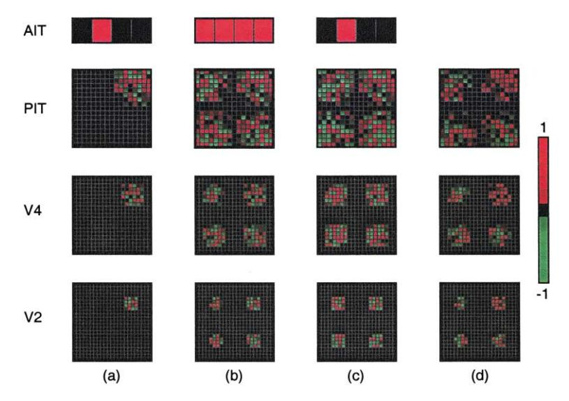
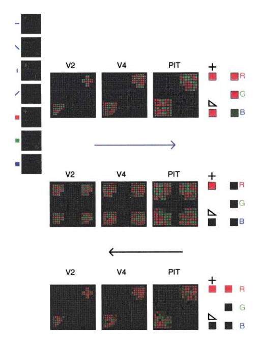

Neurocomputing 38-40 (2001) 523-528

**NEUROCOMPUTING** 

www.elsevier.com/locate/neucom

# Using a recurrent network to bind form, color and position into a unified percept

Marc de Kamps\*, Frank van der Velde

Department of Psychology, Faculty of Social Sciences, Unit for Theoretical and Experimental Psychology, Leiden University, Wassenaarseweg 52,2333 AK Leiden, Netherlands

#### Abstract

In this paper we will report ongoing work on a model of form processing in the visual cortex, that implements object-based attention by means of top-down activation from higher to lower areas in the visual cortex. In this paper we will argue that this mechanism can be used to solve binding problems in the visual cortex. © 2001 Elsevier Science B.V. All rights reserved.

Keywords: Binding problem; Back-propagation; Object-based attention; Position selection; Visual cortex

#### 1. Introduction

An important outstanding problem in psychology and neuroscience is the binding problem. It is generally accepted that different attributes of visual stimuli are represented in different parts of the brain. Attributes, like color, location, form and motion seem to be processed by different pathways and modules in the brain, sometimes clearly separated, like form and motion, sometimes somewhat intertwined, like form and color.

As many authors have pointed out, this way of representing complex objects is efficient, in that, for instance, many combinations of form and color can be represented efficiently. Moreover, a novel combination of form and color, like for instance a purple cow, can easily be represented in terms of a known color and a known form.

A problem, however, occurs if multiple objects are present in the visual field, e.g. a red triangle and a green square. In the color module 'green' and 'red' are

\*Corresponding author. Tel.: + 31-71-5273631; fax: + 31-71-5273783. *E-mail address:* kamps@fsw.leidenuniv.nl (M. de Kamps).

represented and in the form module 'square' and 'triangle' are represented. A dynamical connection somehow must be formed between 'red' and 'triangle' on the one hand and 'green' and 'square' on the other hand. Our hypothesis is that such a binding problem can solved, at least for problems in the visual cortex, by means of object-based attention.

Attention that is directed to one attribute of an object in the visual field, say its form, can be used to select the location of the object in the visual field. A model for such a mechanism was presented in [3]. In-line with the available neurophysiological evidence, the model used feedback connections from high areas to lower areas of the visual cortex to select information about the object in the lower areas of the visual cortex. Forwarding this information towards areas of the cortex that process other attributes of the object, like color, would then establish binding between form and color.

In this paper we will report ongoing work on a model of form processing in the visual cortex that implements the mechanism described above. The structure of the paper is as follows: first we will give a brief overview of the most important neurophysiological data that support the model. Then we will review the way object-based attention could be used to select information about the object in the lower areas of the visual cortex. Finally, we will present a model on how this mechanism could be extended to establish binding. We will also discuss some alternatives.

## 2. The visual cortex and object-based attention

The visual cortex is a hierarchical system for processing visual information. It is believed to process this information in two largely separate streams that operate in parallel. The so-called 'ventral stream' is believed to be involved in the processing of form and color, the so-called 'dorsal stream' is specialized in the processing of location information. In the 'ventral stream' a pathway of different anatomical areas can be recognized, from area V1 through areas V2, V4, PIT to area AIT. Neurons in V1 are organized retinotopically and have a very small receptive field. The vast majority codes for the presence of an orientation on a given position in the visual field. Progressing through areas V2, V4 and PIT the receptive fields become larger and also the fraction of 'complex cells' is increasing. With 'complex cells' we denote cells that code for relatively complex shapes, present in the visual field. In area AIT, complex cells can code for objects as complicated as a face. In area AIT the receptive fields of neurons are so large, that they essentially contain the entire visual field. Processing of form information is believed to proceed through this pathway in a feedforward manner, because it is very fast [2].

There are also feedback connections from area AIT back towards the areas lower in the visual cortex. An important clue for the role they might play comes from an experiment reported by Chelazzi et al. [1]. In an experiment where a monkey had to perform a delayed match to sample task, they presented a target object on a computer screen. After a delay period in which the screen was blank, the target object was presented again in an array together with other, distractor, objects. The monkey was

rewarded if it made a saccade to the new position of the target object. It turned out that the monkey was able to do this very fast. Microelectrodes monitored the activity of neurons in AIT. Stimuli and neurons were chosen such that the target and distractor objects elicited a strong response from the neurons. Among other observations, it was noticed that with the presentation of the array containing target and distractor objects, after a brief phase of competition, only activity corresponding to the target remained present in AIT. Activity in lower visual areas, caused by the visual stimuli, remained present but was modulated by whether or not this activity was associated with the target object. Activity associated with target objects increased, whereas activity associated with distractor object was suppressed somewhat. These observations are in-line with the notion of object-based attention [3].

### 3. A hypothesis for the role of object-based attention

It is very intriguing that the monkey was able to make a saccade to the target object very fast, without 'scanning' the visual field. It is a clear indication that the monkey was able to find the location of the target object in the visual field based on the target object's identity (form) alone. It seems that different objects compete for attention in AIT and that this attention decides which object in the end retains its activity in AIT. The question remains how the monkey then is able to find the location, since position information is not present in AIT, due to the large receptive fields of the neurons there.

Van der Velde and de Kamps proposed [1] that the feedback projections from area AIT to lower areas of the visual cortex play an essential role in this process. They trained an ANN, which was a model of form processing in the 'ventral stream'. It contained a five-layer feedforward perceptron network. The layers were labeled 'V1', 'V2', 'V4', 'PIT' and 'AIT'. 'V1' consisted in fact of four independent layers, each one coding for one of four orientations: 'horizontal', 'vertical', and two 'diagonal' ones. Objects were presented at the 'V1' layer, object recognition occurred at the 'AIT' layer. It is important to note that the perceptrons below the 'AIT' layer have a limited receptive field. Four different objects: 'square', 'diamond', 'horizontal cross' and 'diagonal cross' could be presented at four locations in the 'V1' layer, constituting a total of 16 input patterns. After training, the network correctly identified the objects. Presenting an object at one of the four locations lead to distributed activity in the network, fairly localized in V2, spreading further in higher visual areas, due to the increased receptive field of the neurons there, as we show in Fig. 1. A second network was created with an identical architecture, but with reciprocal connections, which means that 'AIT' was the input layer and activity was spread downward via layers 'PIT', 'V4' towards layer 'V2'. Since the connections downward fan out to the entire visual field this activity is present everywhere in the lower visual areas. It turned out to be possible to train this reverse network by means of a Hebbian algorithm, using the activities in the feedforward network. In this way a 'local consistency check' could be performed in the following manner. Suppose four different objects are presented at different locations in the network (Fig. 1B), so that at four positions in all layers activity is present. In AIT the node corresponding to one of the input patterns is

Fig. 1. Activities in the network. In (A) one object is recognized at one position. In (B) four different objects are presented, each at a different position. In both cases the objects are identified correctly. The limited receptive fields of the neurons in the lower areas are reflected in the spatially limited activities that correspond to each figure. In (C) we show the feedback activity, corresponding to the selected object. In (D) the result of the 'local consistency check'. One location clearly stands out.

selected and activity is fed into the feedback network (Fig. 1C). Everywhere in the feedback network activity is presented, due to the 'fan-out' structure of the network. If we now for each perceptron compare the activities of the feedforward and the feedback network, there is only one cluster in which the activities of the feedforward and the feedback network consistently have the same sign. As can be seen in Fig. 1D one group of activities clearly stands out, revealing the location of the object of interest. In [3] van der Velde and de Kamps described a circuit that performs this 'local consistency check' in a way that respects boundary conditions imposed by neurophysiology, the most important of which is that the feedback activity does not create visual hallucinations. The feedback activity interacted indirectly with the feedforward activity by means of disinhibition, effectively using feedback activity as a gate for the feedforward activity. For technical details, we refer to [3]. This architecture explains why the selection of position goes so fast: it happens everywhere in parallel. After the selection is made, information from the lower visual area on the selected location can be forwarded to, for instance, area LIP in the 'dorsal stream' to help initiate a saccade.

## 4. Using object-based attention for the binding problem

In the previous section we showed how object-based attention may be involved in selecting the location of an object in the visual field, even if only form information is

present at the start of the process. This constitutes an effective solution for the binding problem between form and position, but due to the implicit position coding in the lower visual areas, position takes a special place. How would this work for color and form? One possibility is given in Fig. 2A. In this network, color and position are combined in a distributed representation in the layers 'V2', 'V4' and 'PIT'. The 'V1' layers now consist of four orientation layers and three color layers. The network is trained to identify color and form of the presented objects at the level of AIT. Fig. 2 shows how the question: "what is the color of the cross"? can be answered. The answer is produced by first selecting the form node for 'cross' at the level of AIT. Then, feedback activity, corresponding to 'cross' is sent to lower areas of the visual cortex. Using the 'local consistency check' as before, the position of the cross in lower areas of the visual cortex can be selected. The information there can be used to reprocess color information, present at this location. This would then result in the selection of the color node for 'red' at the level of AIT, which represents the color of the cross.

The problem with this architecture is that it is not possible to train color and form separately. If a large number of combinations of form and color is offered at the same location, the feedback information loses its discriminatory power and one selected location does not clearly stand out anymore. There are ways out of this: in an architecture where color and form information are processed in parallel, but

Fig. 2. Establishing binding between 'red' and 'cross'. Two objects are present in the visual field: a 'red' 'cross' and a 'green' 'triangle' (top). Feedback activity corresponding to 'cross' goes to lower areas in the visual cortex (middle). After the 'local consistency check', one location still stands out, allowing the association between 'red' and 'cross' (bottom).

segregated channels, we effectively return to the original situation, in which the location of an object is selected on the basis of its identity. Only after the location has been selected color information is considered. We have established that this mechanism works for a large number of objects at one position. It also seems efficient, in that it cleanly separates the representation of form and color, allowing for the maximal efficiency in combining these two modalities. This process, however, is somewhat at odds with neurophysiological data: color and form are not processed in two completely segregated channels. On the other hand, form and color information are not completely intermixed in a distributed representation, like we suggested in the network of Fig. 2, either.

In the visual cortex, information is represented using a distributed representation, but probably not to the same extent as in our network. If information in the visual cortex would indeed consist of local, well-defined features, the Hebbian training algorithm would perform better, so that feedback information retains its discriminitory power. This leads to the conclusion that for a good description of the binding problem, a more realistic model of the visual cortex is needed. Nevertheless, we believe that the fundamental principle on which our model rests is correct. This fundamental principle is that at lower layers in the visual cortex all information is present about an object. Once one attribute, e.g. its form, has been identified in higher areas in the visual cortex, feedback information is used to select the position of the object, which then allows for the further selection of other attributes of the object.

#### References

- [1] L. Chelazzi, E.K. Miller, J. Duncan, R. Desimone, A neural basis for visual search in inferior temporal cortex, Nature 363 (1993) 315–317.
- [2] S. Thorpe, D. Fize, C. Marlot, Speed of processing in the human visual system, Nature 381 (1996) 520–522.
- [3] F. van der Velde, M. de Kamps, From knowing what to knowing where: Modeling object-based attention with feedback disinhibition of activation. J. Cognitive Neurosci. 13 (4) (2001).