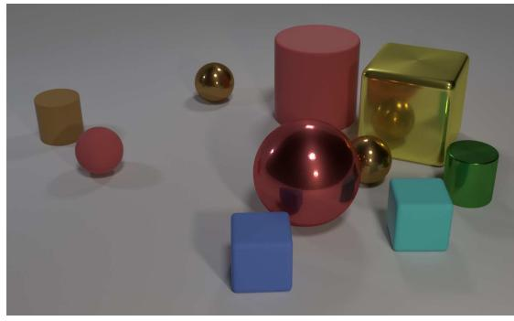
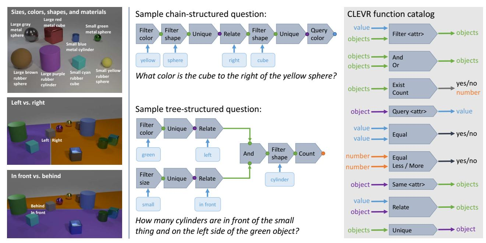
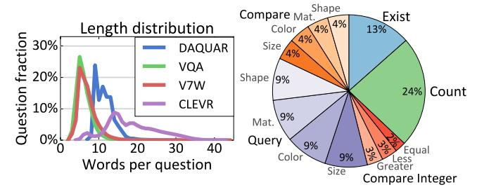
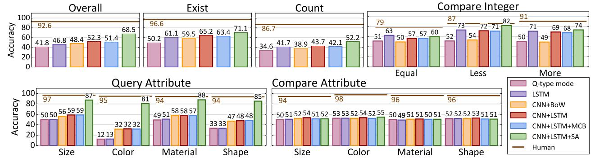
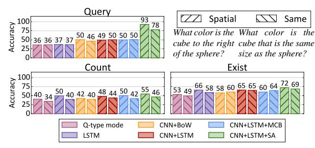
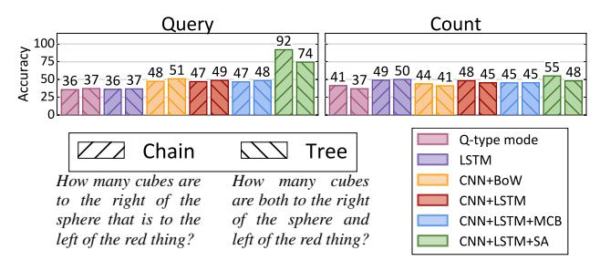
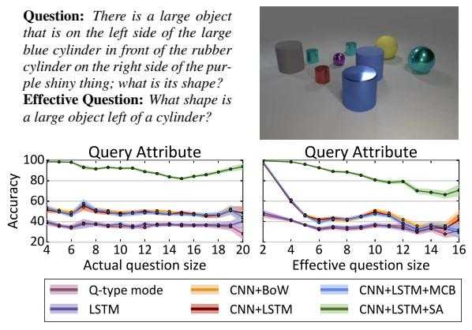
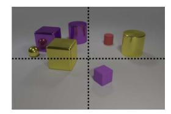
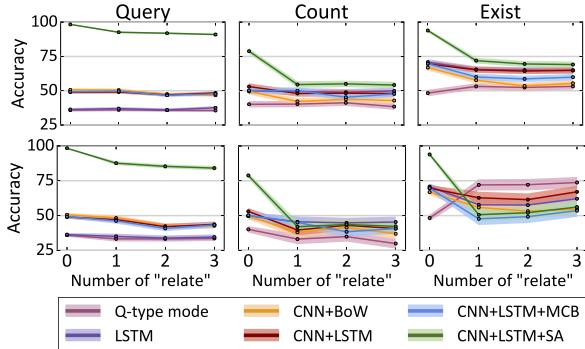
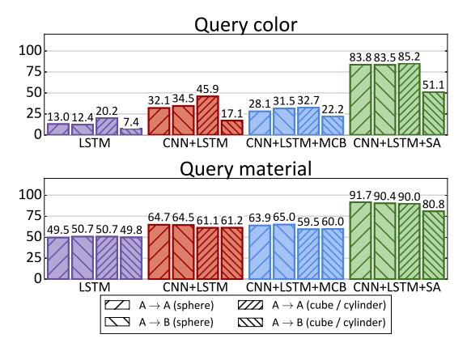

# CLEVR: A Diagnostic Dataset for Compositional Language and Elementary Visual Reasoning

Justin Johnson1,2\* Li Fei-Fei1 Bharath Hariharan2
C. Lawrence Zitnick2

Laurens van der Maaten2 Ross Girshick2

1Stanford University

2Facebook AI Research

#### **Abstract**

When building artificial intelligence systems that can reason and answer questions about visual data, we need diagnostic tests to analyze our progress and discover shortcomings. Existing benchmarks for visual question answering can help, but have strong biases that models can exploit to correctly answer questions without reasoning. They also conflate multiple sources of error, making it hard to pinpoint model weaknesses. We present a diagnostic dataset that tests a range of visual reasoning abilities. It contains minimal biases and has detailed annotations describing the kind of reasoning each question requires. We use this dataset to analyze a variety of modern visual reasoning systems, providing novel insights into their abilities and limitations.

### 1. Introduction

A long-standing goal of artificial intelligence research is to develop systems that can reason and answer questions about visual information. Recently, several datasets have been introduced to study this problem [4, 10, 21, 26, 32, 46, 49]. Each of these Visual Question Answering (VQA) datasets contains challenging natural language questions about images. Correctly answering these questions requires perceptual abilities such as recognizing objects, attributes, and spatial relationships as well as higher-level skills such as counting, performing logical inference, making comparisons, or leveraging commonsense world knowledge [31]. Numerous methods have attacked these problems [2, 3, 9, 24, 44], but many show only marginal improvements over strong baselines [4, 16, 48]. Unfortunately, our ability to understand the limitations of these methods is impeded by the inherent complexity of the VQA task. Are methods hampered by failures in recognition, poor reasoning, lack of commonsense knowledge, or something else?

The difficulty of understanding a system's competences

Q: Are there an equal number of large things and metal spheres?
Q: What size is the cylinder that is left of the brown metal thing that is left of the big sphere? Q: There is a sphere with the same size as the metal cube; is it made of the same material as the small red sphere?
Q: How many objects are either small cylinders or metal things?

Figure 1. A sample image and questions from CLEVR. Questions test aspects of visual reasoning such as attribute identification, counting, comparison, multiple attention, and logical operations.

is exemplified by *Clever Hans*, a 1900s era horse who appeared to be able to answer arithmetic questions. Careful observation revealed that Hans was correctly "answering" questions by reacting to cues read off his human observers [30]. Statistical learning systems, like those used for VQA, may develop similar "cheating" approaches to superficially "solve" tasks without learning the underlying reasoning processes [35, 36]. For instance, a statistical learner may correctly answer the question "What covers the ground?" not because it understands the scene but because biased datasets often ask questions about the ground when it is snow-covered [1, 47]. How can we determine whether a system is capable of sophisticated reasoning and not just exploiting biases of the world, similar to Clever Hans?

In this paper we propose a *diagnostic dataset* for studying the ability of VQA systems to perform visual reasoning. We refer to this dataset as the Compositional Language and Elementary Visual Reasoning diagnostics dataset (CLEVR; pronounced as *clever* in homage to Hans). CLEVR contains 100k rendered images and about one million automaticallygenerated questions, of which 853k are unique. It has chal-

\*Work done during an internship at FAIR.

lenging images and questions that test visual reasoning abilities such as counting, comparing, logical reasoning, and storing information in memory, as illustrated in Figure 1.

We designed CLEVR with the explicit goal of enabling detailed analysis of visual reasoning. Our images depict simple 3D shapes; this simplifies recognition and allows us to focus on reasoning skills. We ensure that the information in each image is *complete* and exclusive so that external information sources, such as commonsense knowledge, cannot increase the chance of correctly answering questions. We control question-conditional bias via rejection sampling within families of related questions, and avoid degenerate questions that are seemingly complex but contain simple shortcuts to the correct answer. Finally, we use structured ground-truth representations for both images and questions: images are annotated with ground-truth object positions and attributes, and questions are represented as functional programs that can be executed to answer the question (see Section 3). These representations facilitate in-depth analyses not possible with traditional VQA datasets.

These design choices also mean that while images in CLEVR may be visually simple, its questions are complex and require a range of reasoning skills. For instance, factorized representations may be required to generalize to unseen combinations of objects and attributes. Tasks such as counting or comparing may require short-term memory [15] or attending to specific objects [24, 44]. Answering questions that combine multiple subtasks in diverse ways may require compositional systems [2, 3].

We use CLEVR to analyze a suite of VQA models and discover weaknesses that are not widely known. For example, we find that current state-of-the-art VQA models struggle on tasks requiring *short-term memory*, such as comparing the attributes of objects, or *compositional reasoning*, such as recognizing novel attribute combinations. These observations point to novel avenues for further research.

Finally, we stress that accuracy on CLEVR is not an end goal in itself: a hand-crafted system with explicit knowledge of the CLEVR universe might work well, but will not generalize to real-world settings. Therefore CLEVR should be used *in conjunction* with other VQA datasets in order to study the reasoning abilities of general VQA systems.

The CLEVR dataset is publicly available at http://cs.stanford.edu/people/jcjohns/clevr/.

#### 2. Related Work

In recent years, a range of benchmarks for visual understanding have been proposed, including datasets for image captioning [7, 8, 23, 45], referring to objects [19], relational graph prediction [21], and visual Turing tests [12, 27]. CLEVR, our diagnostic dataset, is most closely related to benchmarks for visual question answering [4, 10, 21, 26, 32, 37, 46, 49], as it involves answering natural-language

questions about images. The two main differences between CLEVR and other VQA datasets are that: (1) CLEVR controls biases found in prior VQA datasets that can be used by learning systems to answer questions correctly without visual reasoning and (2) CLEVR's synthetic nature and detailed annotations facilitate in-depth analyses of reasoning abilities that are impossible with existing datasets.

Prior work has attempted to mitigate biases in VQA datasets in simple cases such as yes/no questions [12, 47], but it is difficult to apply such bias-reduction approaches to more complex questions without a high-quality semantic representation of both questions and answers. In CLEVR, this semantic representation is provided by the functional program underlying each image-question pair, and biases are largely eliminated via sampling. Winograd schemas [22] are another approach for controlling bias in question answering: these questions are carefully designed to be ambiguous based on syntax alone and require commonsense knowledge. Unfortunately this approach does not scale gracefully: the first phase of the 2016 Winograd Schema Challenge consists of just 60 hand-designed questions. CLEVR is also related to the bAbI question answering tasks [38] in that it aims to diagnose a set of clearly defined competences of a system, but CLEVR focuses on visual reasoning whereas bAbI is purely textual.

We are also not the first to consider synthetic data for studying (visual) reasoning. SHRDLU performed simple, interactive visual reasoning with the goal of moving specific objects in the visual scene [40]; this study was one of the first to demonstrate the brittleness of manually programmed semantic understanding. The pioneering DAQUAR dataset [28] contains both synthetic and human-written questions, but they only generate 420 synthetic questions using eight text templates. VQA [4] contains 150,000 natural-language questions about abstract scenes [50], but these questions do not control for questionconditional bias and are not equipped with functional program representations. CLEVR is similar in spirit to the SHAPES dataset [3], but is more complex and varied both in terms of visual content and question variety and complexity: SHAPES contains 15,616 total questions with just 244 unique questions while CLEVR contains nearly a million questions of which 853,554 are unique.

# 3. The CLEVR Diagnostic Dataset

CLEVR provides a dataset that requires complex reasoning to solve and that can be used to conduct rich diagnostics to better understand the visual reasoning capabilities of VQA systems. This requires complete control over the dataset, which we achieve by using synthetic images and automatically generated questions. The images have associated ground-truth object locations and attributes, and the questions have an associated machine-readable form. These

Figure 2. A field guide to the CLEVR universe. **Left:** Shapes, attributes, and spatial relationships. **Center:** Examples of questions and their associated functional programs. **Right:** Catalog of basic functions used to build questions. See Section 3 for details.

ground-truth structures allow us to analyze models based on, for example: question type, question topology (chain *vs.* tree), question length, and various forms of relationships between objects. Figure 2 gives a brief overview of the main components of CLEVR, which we describe in detail below.

**Objects and relationships.** The CLEVR universe contains three object shapes (cube, sphere, and cylinder) that come in two absolute sizes (small and large), two materials (shiny "metal" and matte "rubber"), and eight colors. Objects are spatially related via four relationships: "left", "right", "behind", and "in front". The semantics of these prepositions are complex and depend not only on relative object positions but also on camera viewpoint and context. We found that generating questions that invoke spatial relationships with semantic accord was difficult. Instead we rely on a simple and unambiguous definition: projecting the camera viewpoint vector onto the ground plane defines the "behind" vector, and one object is behind another if its ground-plane position is further along the "behind" vector. The other relationships are similarly defined. Figure 2 (left) illustrates the objects, attributes, and spatial relationships in CLEVR. The CLEVR universe also includes one non-spatial relationship type that we refer to as the sameattribute relation. Two objects are in this relationship if they have equal attribute values for a specified attribute.

**Scene representation.** Scenes are represented as collections of objects annotated with shape, size, color, material, and position on the ground-plane. A scene can also be represented by a *scene graph* [17, 21], where nodes are objects annotated with attributes and edges connect spatially related

objects. A scene graph contains all ground-truth information for an image and could be used to replace the vision component of a VQA system with *perfect sight*.

Image generation. CLEVR images are generated by randomly sampling a scene graph and rendering it using Blender [6]. Every scene contains between three and ten objects with random shapes, sizes, materials, colors, and positions. When placing objects we ensure that no objects intersect, that all objects are at least partially visible, and that there are small horizontal and vertical margins between the image-plane centers of each pair of objects; this helps reduce ambiguity in spatial relationships. In each image the positions of the lights and camera are randomly jittered.

**Question representation.** Each question in CLEVR is associated with a *functional program* that can be *executed* on an image's scene graph, yielding the answer to the question. Functional programs are built from simple basic functions that correspond to elementary operations of visual reasoning such as *querying* object attributes, *counting* sets of objects, or *comparing* values. As shown in Figure 2, complex questions can be represented by compositions of these simple building blocks. Full details about each basic function can be found in the supplementary material.

As we will see in Section 4, representing questions as functional programs enables rich analysis that would be impossible with natural-language questions. A question's functional program tells us exactly which reasoning abilities are required to solve it, allowing us to compare performance on questions requiring different types of reasoning.

We categorize questions by *question type*, defined by the outermost function in the question's program; for example the questions in Figure 2 have types *query-color* and *exist*. Figure 3 shows the number of questions of each type.

**Question families.** We must overcome several key challenges to generate a VQA dataset using functional programs. Functional building blocks can be used to construct an infinite number of possible functional programs, and we must decide which program structures to consider. We also need a method for converting functional programs to natural language in a way that minimizes question-conditional bias. We solve these problems using *question families*.

A question family contains a template for constructing functional programs and several text templates providing multiple ways of expressing these programs in natural language. For example, the question "How many red things are there?" can be formed by instantiating the text template "How many <C> <M> things are there?", binding the parameters <C> and <M> (with types "color" and "material") to the values red and nil. The functional program count(filter\_color(red, scene())) for this question can be formed by instantiating the associated program template count(filter\_color(<C>, filter\_material(<M>, scene()))) with the same values, using the convention that functions taking a nil input are removed after instantiation.

CLEVR contains a total of 90 question families, each with a single program template and an average of four text templates. Text templates were generated by manually writing one or two templates per family and then crowdsourcing question rewrites. To further increase language diversity we use a set of synonyms for each shape, color, and material. With up to 19 parameters per template, a small number of families can generate a huge number of unique questions; Figure 3 shows that of the nearly one million questions in CLEVR, more than 853k are unique. CLEVR can easily be extended by adding new question families.

**Question generation.** Generating a question for an image is conceptually simple: we choose a question family, select values for each of its template parameters, execute the resulting program on the image's scene graph to find the answer, and use one of the text templates from the question family to generate the final natural-language question.

However, many combinations of values give rise to questions which are either *ill-posed* or *degenerate*. The question "What color is the cube to the right of the sphere?" would be *ill-posed* if there were many cubes right of the sphere, or *degenerate* if there were only one cube in the scene since the reference to the sphere would then be unnecessary. Avoiding such ill-posed and degenerate questions is critical to ensure the correctness and complexity of our questions.

A naïve solution is to randomly sample combinations of values and reject those which lead to ill-posed or degenerate

| Split | Images  | Questions | Unique questions | Overlap with train |
|-------|---------|-----------|------------------|--------------------|
|       | 100,000 | 999,968   | 853,554          | -                  |
| Train | 70,000  | 699,989   | 608,607          | -                  |
| Val   | 15,000  | 149,991   | 140,448          | 17,338             |
| Test  | 15,000  | 149,988   | 140,352          | 17,335             |

Figure 3. **Top:** Statistics for CLEVR; the majority of questions are unique and few questions from the val and test sets appear in the training set. **Bottom left:** Comparison of question lengths for different VQA datasets; CLEVR questions are generally much longer. **Bottom right:** Distribution of question types in CLEVR.

questions. However, the number of possible configurations for a question family is exponential in its number of parameters, and most of them are undesirable. This makes bruteforce search intractable for our complex question families.

Instead, we employ a depth-first search to find valid values for instantiating question families. At each step of the search, we use ground-truth scene information to prune large swaths of the search space which are guaranteed to produce undesirable questions; for example we need not entertain questions of the form "What color is the <S> to the <R> of the sphere" for scenes that do not contain spheres.

Finally, we use rejection sampling to produce an approximately uniform answer distribution for each question family; this helps minimize question-conditional bias since all questions from the same family share linguistic structure.

#### 4. VOA Systems on CLEVR

## 4.1. Models

VQA models typically represent images with features from pretrained CNNs and use word embeddings or recurrent networks to represent questions and/or answers. Models may train recurrent networks for answer generation [10, 28, 41], multiclass classifiers over common answers [4, 24, 25, 32, 48, 49], or binary classifiers on image-question-answer triples [9, 16, 33]. Many methods incorporate attention over the image [9, 33, 44, 49, 43] or question [24]. Some methods incorporate memory [42] or dynamic network architectures [2, 3].

Experimenting with all methods is logistically challenging, so we reproduced a representative subset of methods: baselines that do not look at the image (Q-type mode, LSTM), a simple baseline (CNN+BoW) that performs near state-of-the-art [16, 48], and more sophisticated methods

Figure 4. Accuracy per question type of the six VQA methods on the CLEVR dataset (higher is better). Figure best viewed in color.

using recurrent networks (CNN+LSTM), sophisticated feature pooling (CNN+LSTM+MCB), and spatial attention (CNN+LSTM+SA). These are described in detail below.

**Q-type mode:** Similar to the "per Q-type prior" method in [4], this baseline predicts the most frequent training-set answer for each question's type.

**LSTM:** Similar to "LSTM Q" in [4], the question is processed with learned word embeddings followed by a word-level LSTM [15]. The final LSTM hidden state is passed to a multi-layer perceptron (MLP) that predicts a distribution over answers. This method uses no image information so it can only model question-conditional bias.

**CNN+BoW:** Following [48], the question is encoded by averaging word vectors for each word in the question and the image is encoded using features from a convolutional network (CNN). The question and image features are concatenated and passed to a MLP which predicts a distribution over answers. We use word vectors trained on the Google-News corpus [29]; these are not fine-tuned during training.

**CNN+LSTM:** Images and questions are encoded using CNN features and final LSTM hidden states, respectively. These features are concatenated and passed to an MLP that predicts an answer distribution.

**CNN+LSTM+MCB:** Images and questions are encoded as above, but instead of concatenation, their features are pooled using compact multimodal pooling (MCB) [9, 11].

**CNN+LSTM+SA:** Again, the question and image are encoded using a CNN and LSTM, respectively. Following [44], these representations are combined using one or more rounds of soft spatial attention and the final answer distribution is predicted with an MLP.

**Human:** We used Mechanical Turk to collect human responses for 5500 random questions from the test set, taking a majority vote among three workers for each question.

**Implementation details.** Our CNNs are ResNet-101 models pretrained on ImageNet [14] that are not finetuned; images are resized to  $224 \times 224$  prior to feature extraction.

CNN+LSTM+SA extracts features from the last layer of the conv4 stage, giving  $14 \times 14 \times 1024$ -dimensional features. All other methods extract features from the final average pooling layer, giving 2048-dimensional features. LSTMs use one or two layers with 512 or 1024 units per layer. MLPs use ReLU functions and dropout [34]; they have one or two hidden layers with between 1024 and 8192 units per layer. All models are trained using Adam [20].

**Experimental protocol.** CLEVR is split into train, validation, and test sets (see Figure 3). We tuned hyperparameters (learning rate, dropout, word vector size, number and size of LSTM and MLP layers) independently per model based on the validation error. All experiments were designed on the validation set; after finalizing the design we ran each model once on the test set. *All experimental findings generalized from the validation set to the test set*.

#### 4.2. Analysis by Question Type

We can use the program representation of questions to analyze model performance on different forms of reasoning. We first evaluate performance on each question type, defined as the outermost function in the program. Figure 4 shows results and detailed findings are discussed below.

Querying attributes: Query questions ask about an attribute of a particular object (e.g. "What color is the thing right of the red sphere?"). The CLEVR world has two sizes, eight colors, two materials, and three shapes. On questions asking about these different attributes, Q-type mode and LSTM obtain accuracies close to 50%, 12.5%, 50%, and 33.3% respectively, showing that the dataset has minimal question-conditional bias for these questions. CNN+LSTM+SA substantially outperforms all other models on these questions; its attention mechanism may help it focus on the target object and identify its attributes.

Comparing attributes: Attribute comparison questions ask whether two objects have the same value for some attribute (e.g. "Is the cube the same size as the sphere?"). The only valid answers are "yes" and "no". Q-Type mode and LSTM achieve accuracies close to 50%, confirming there is no dataset bias for these questions. Unlike attribute-query

&lt;sup>1We performed initial experiments with dynamic module networks [2] but its parsing heuristics did not generalize to the complex questions in CLEVR so it did not work out-of-the-box; see supplementary material.

Figure 5. Accuracy on questions with a single *spatial relationship* vs. a single *same-attribute* relationship. For *query* and *count* questions, models generally perform worse on questions with *same-attribute* relationships. Results on *exist* questions are mixed.

questions, attribute-comparison questions require a limited form of memory: models must identify the attributes of two objects and keep them in memory to compare them. Interestingly, none of the models are able to do so: all models have an accuracy of approximately 50%. This is also true for the CNN+LSTM+SA model, suggesting that its attention mechanism is not capable of attending to two objects at once to compare them. This illustrates how CLEVR can reveal limitations of models and motivate follow-up research, *e.g.*, augmenting attention models with explicit memory.

**Existence:** Existence questions ask whether a certain type of object is present (*e.g.*, "Are there any cubes to the right of the red thing?"). The 50% accuracy of Q-Type mode shows that both answers are a priori equally likely, but the LSTM result of 60% does suggest a question-conditional bias. There may be correlations between question length and answer: questions with more filtering operations (*e.g.*, "large red cube" vs. "red cube") may be more likely to have "no" as the answer. Such biases may be present even with uniform answer distributions per question family, since questions from the same family may have different numbers of filtering functions. CNN+LSTM(+SA) outperforms LSTM, but its performance is still quite low.

Counting: Counting questions ask for the number of objects fulfilling some conditions (e.g. "How many red cubes are there?"); valid answers range from zero to ten. Images have three and ten objects and counting questions refer to subsets of objects, so ensuring a uniform answer distribution is very challenging; our rejection sampler therefore pushes towards a uniform distribution for these questions rather than enforcing it as a hard constraint. This results in a question-conditional bias, reflected in the 35% and 42% accuracies achieved by Q-type mode and LSTM. CNN+LSTM(+MCB) performs on par with LSTM, suggesting that CNN features contain little information relevant to counting. CNN+LSTM+SA performs slightly better, but at 52% its absolute performance is low.

**Integer comparison:** Integer comparison questions ask which of two object sets is larger (e.g. "Are there fewer cubes than red things?"); this requires counting, memory,

Figure 6. Accuracy on questions with two spatial relationships, broken down by question topology: chain-structured questions *vs.* tree-structured questions joined with a logical AND operator.

and comparing integer quantities. The answer distribution is unbiased (see Q-Type mode) but a set's size may correlate with the length of its description, explaining the gap between LSTM and Q-type mode. CNN+BoW performs no better than chance: BoW mixes the words describing each set, making it impossible for the learner to discriminate between them. CNN+LSTM+SA outperforms LSTM on "less" and "more" questions, but no model outperforms LSTM on "equal" questions. Most models perform better on "less" than "more" due to asymmetric question families.

### 4.3. Analysis by Relationship Type

CLEVR questions contain two types of relationships: *spatial* and *same-attribute* (see Section 3). We can compare the relative difficulty of these two types by comparing model performance on questions with a single spatial relationship and questions with a single same-attribute relationship; results are shown in Figure 5. On query-attribute and counting questions we see that same-attribute questions are generally more difficult; the gap between CNN+LSTM+SA on spatial and same-relate query questions is particularly large (93% vs. 78%). Same-attribute relationships may require a model to keep attributes of one object "in memory" for comparison, suggesting again that models augmented with explicit memory may perform better on these questions.

## 4.4. Analysis by Question Topology

We next evaluate model performance on different question topologies: *chain-structured* questions *vs. tree-structured* questions with two branches joined by a logical AND (see Figure 2). In Figure 6, we compare performance on chain-structured questions with two spatial relationships vs. tree-structured questions with one relationship along each branch. On query questions, CNN+LSTM+SA shows a large gap between chain and tree questions (92% *vs.* 74%); on count questions, CNN+LSTM+SA slightly outperforms LSTM on chain questions (55% *vs.* 49%) but no method outperforms LSTM on tree questions. Tree questions may be more difficult since they require models to perform two subtasks in parallel before fusing their results.

Figure 7. **Top**: Many questions can be answered correctly without correctly solving all subtasks. For a given question and scene we can prune functions from the question's program to generate an *effective question* which is shorter but gives the same answer. **Bottom**: Accuracy on query questions *vs.* actual and effective question size. Accuracy decreases with effective question size but not with actual size. Shaded area shows a 95% confidence interval.

# 4.5. Effect of Question Size

Intuitively, longer questions should be harder since they involve more reasoning steps. We define a question's *size* to be the number of functions in its program, and in Figure 7 (bottom left) we show accuracy on query-attribute questions as a function of question size.2 Surprisingly accuracy appears unrelated to question size.

However, many questions can be correctly answered even when some subtasks are not solved correctly. For example, the question in Figure 7 (top) can be answered correctly without identifying the correct large blue cylinder, because all large objects left of a cylinder are cylinders.

To quantify this effect, we define the *effective question* of an image-question pair: we prune functions from the question's program to find the smallest program that, when executed on the scene graph for the question's image, gives the same answer as the original question.3 A question's *effective size* is the size of its effective question. Questions whose effective size is smaller than their actual size need not be degenerate. The question in Figure 7 is not degenerate because the entire question is needed to resolve its object references (there are two blue cylinders and two rubber cylinders), but it has a small effective size since it can be correctly answered without resolving those references.

In Figure 7 (bottom), we show accuracy on query questions as a function of effective question size. The error rate of all models increases with effective question size, suggesting that models struggle with long reasoning chains.

Question: There is a purple cube that is in front of the yellow metal sphere; what material is it? Absolute question: There is a purple cube in the front half of the image; what material is it?

Figure 8. **Top**: Some questions can be correctly answered using *absolute* definitions for spatial relationships; for example in this image there is only one purple cube in the bottom half of the image. **Bottom**: Accuracy of each model on *chain-structured* questions as a function of the number of spatial relationships in the question, separated by question type. Top row shows all chain-structured questions; bottom row excludes questions that can be correctly answered using absolute spatial reasoning.

# 4.6. Spatial Reasoning

We expect that questions with more spatial relationships should be more challenging since they require longer chains of reasoning. The top set of plots in Figure 8 shows accuracy on chain-structured questions with different numbers of relationships.4 Across all three question types, CNN+LSTM+SA shows a significant drop in accuracy for questions with one or more spatial relationship; other models are largely unaffected by spatial relationships.

Spatial relationships force models to reason about objects' relative positions. However, as shown in Figure 8, some questions can be answered using *absolute spatial reasoning*. In this question the purple cube can be found by simply looking in the bottom half of the image; reasoning about its position relative to the metal sphere is unnecessary.

Questions only requiring absolute spatial reasoning can be identified by modifying the semantics of spatial relationship functions in their programs: instead of returning sets of objects related to the input object, they ignore their input object and return the set of objects in the half of the image corresponding to the relationship. A question only requires absolute spatial reasoning if executing its program with these modified semantics does not change its answer.

The bottommost plots of Figure 8 show accuracy on chain-structured questions with different number of relationships, *excluding* questions that can be answered

&lt;sup>2We exclude questions with same-attribute relations since their max size is 10, introducing unwanted correlations between size and difficulty. Excluded questions show the same trends (see supplementary material).

&lt;sup>3Pruned questions may be *ill-posed* (Section 3) so they are executed with modified semantics; see supplementary material for details.

&lt;sup>4We restrict to chain-structured questions to avoid unwanted correlations between question topology and number of relationships.

Figure 9. In *Condition A* all cubes are gray, blue, brown, or yellow and all cylinders are red, green, purple, or cyan; in *Condition B* color palettes are swapped. We train models in Condition A and test in both conditions to assess their generalization performance. We show accuracy on "query color" and "query material" questions, separating questions by shape of the object being queried.

with absolute spatial reasoning. On query questions, CNN+LSTM+SA performs significantly worse when absolute spatial reasoning is excluded; on count questions no model outperforms LSTM, and on exist questions no model outperforms Q-type mode. These results suggest that models have not learned the semantics of spatial relationships.

# 4.7. Compositional Generalization

Practical VQA systems should perform well on images and questions that contain novel combinations of attributes not seen during training. To do so models might need to learn disentangled representations for attributes, for example learning separate representations for color and shape instead of memorizing all possible color/shape combinations.

We created the CLEVR Compositional Generalization Test (CoGenT) to test models for this ability. CLEVR-CoGenT contains two conditions: in *Condition A* all cubes are gray, blue, brown, or yellow and all cylinders are red, green, purple, or cyan; in *Condition B* these shapes swap color palettes. Both conditions have spheres of all colors.

We retrain models on Condition A and compare their performance when testing on Condition A  $(A \rightarrow A)$  and testing on Condition B  $(A \rightarrow B)$ . In Figure 9 we show accuracy on query-color and query-material questions, separating questions asking about spheres (which are the same in A and B) and cubes/cylinders (which change from A to B).

Between  $A \rightarrow A$  and  $A \rightarrow B$ , all models perform about the same when asked about the color of spheres, but perform much worse when asked about the color of cubes or cylinders; CNN+LSTM+SA drops from 85% to 51%. Models seem to learn strong biases about the colors of objects and cannot overcome these biases when conditions change.

When asked about the material of cubes and cylinders, CNN+LSTM+SA shows a smaller gap between  $A\rightarrow A$  and

 $A \rightarrow B$  (90% vs 81%); other models show no gap. Having seen metal cubes and red metal objects during training, models can understand the material of red metal cubes.

#### 5. Discussion and Future Work

This paper has introduced CLEVR, a dataset designed to aid in diagnostic evaluation of visual question answering (VQA) systems by minimizing dataset bias and providing rich ground-truth representations for both images and questions. Our experiments demonstrate that CLEVR facilitates in-depth analysis not possible with other VQA datasets: our question representations allow us to slice the dataset along different axes (question type, relationship type, question topology, *etc.*), and comparing performance along these different axes allows us to better understand the reasoning capabilities of VQA systems. Our analysis has revealed several key shortcomings of current VQA systems:

- Short-term memory: All systems we tested performed poorly in situations requiring short-term memory, including attribute comparison and integer equality questions (Section 4.2), same-attribute relationships (Section 4.3), and tree-structured questions (Section 4.4). Attribute comparison questions are of particular interest, since models can successfully *identity* attributes of objects but struggle to *compare* attributes.
- Long reasoning chains: Systems struggle to answer questions requiring long chains of nontrivial reasoning, including questions with large effective sizes (Section 4.5) and count and existence questions with many spatial relationships (Section 4.6).
- **Spatial Relationships**: Models fail to learn the true semantics of spatial relationships, instead relying on absolute image position (Section 4.6).
- **Disentangled Representations**: By training and testing models on different data distributions (Section 4.7) we argue that models do not learn representations that properly disentangle object attributes; they seem to learn strong biases from the training data and cannot overcome these biases when conditions change.

Our study also shows cases where current VQA systems are successful. In particular, spatial attention [44] allows models to focus on objects and identify their attributes even on questions requiring multiple steps of reasoning.

These observations present clear avenues for future work on VQA. We plan to use CLEVR to study models with explicit short-term memory, facilitating comparisons between values [13, 18, 39, 42]; explore approaches that encourage learning disentangled representations [5]; and investigate methods that compile custom network architectures for different patterns of reasoning [2, 3]. We hope that diagnostic datasets like CLEVR will help guide future research in VQA and enable rapid progress on this important task.

**Acknowledgments** We thank Deepak Pathak, Piotr Dollár, Ranjay Krishna, Animesh Garg, and Danfei Xu for helpful comments and discussion.

## References

- [1] A. Agrawal, D. Batra, and D. Parikh. Analyzing the behavior of visual question answering models. In *EMNLP*, 2016. 1
- [2] J. Andreas, M. Rohrbach, T. Darrell, and D. Klein. Learning to compose neural networks for question answering. In *NAACL*, 2016. 1, 2, 4, 5, 8
- [3] J. Andreas, M. Rohrbach, T. Darrell, and D. Klein. Neural module networks. In *CVPR*, 2016. 1, 2, 4, 8
- [4] S. Antol, A. Agrawal, J. Lu, M. Mitchell, D. Batra, C. Zitnick, and D. Parikh. VQA: Visual question answering. In ICCV, 2015. 1, 2, 4, 5
- [5] Y. Bengio, A. Courville, and P. Vincent. Representation learning: A review and new perspectives. *TPAMI*, 35(8):1798–1828, 2014. 8
- [6] Blender Online Community. Blender a 3D modelling and rendering package. Blender Foundation, Blender Institute, Amsterdam, 2016. 3
- [7] J. Chen, P. Kuznetsova, D. Warren, and Y. Choi. Deja imagecaptions: A corpus of expressive image descriptions in repetition. In *NAACL*, 2015. 2
- [8] A. Farhadi, M. Hejrati, A. Sadeghi, P. Young, C. Rashtchian, J. Hockenmaier, and D. Forsyth. Every picture tells a story: Generating sentences for images. In ECCV, 2010. 2
- [9] A. Fukui, D. H. Park, D. Yang, A. Rohrbach, T. Darrell, and M. Rohrbach. Multimodal compact bilinear pooling for visual question answering and visual grounding. In arXiv:1606.01847, 2016. 1, 4, 5
- [10] H. Gao, J. Mao, J. Zhou, Z. Huang, L. Wang, and W. Xu. Are you talking to a machine? Dataset and methods for multilingual image question answering. In NIPS, 2015. 1, 2,
- [11] Y. Gao, O. Beijbom, N. Zhang, and T. Darrell. Compact bilinear pooling. In CVPR, 2016. 5
- [12] D. Geman, S. Geman, N. Hallonquist, and L. Younes. Visual Turing test for computer vision systems. *Proceedings of the National Academy of Sciences*, 112(12):3618–3623, 2015.
- [13] A. Graves, G. Wayne, M. Reynolds, T. Harley, I. Danihelka, A. Grabska-Barwinska, S. Colmenarejo, E. Grefenstette, T. Ramalho, J. Agapiou, A. Badia, K. Hermann, Y. Zwols, G. Ostrovski, A. Cain, H. King, C. Summerfield, P. Blunsom, K. . Kavukcuoglu, and D. Hassabis. Hybrid computing using a neural network with dynamic external memory. *Nature*, 2016. 8
- [14] K. He, X. Zhang, S. Ren, and J. Sun. Deep residual learning for image recognition. In CVPR, 2016. 5
- [15] S. Hochreiter and J. Schmidhuber. Long short-term memory. Neural Computation, 9(8):1735–1780, 1997. 2, 5
- [16] A. Jabri, A. Joulin, and L. van der Maaten. Revisiting visual question answering baselines. In ECCV, 2016. 1, 4
- [17] J. Johnson, R. Krishna, M. Stark, L.-J. Li, D. A. Shamma, M. S. Bernstein, and L. Fei-Fei. Image retrieval using scene graphs. In CVPR, 2015. 3

- [18] A. Joulin and T. Mikolov. Inferring algorithmic patterns with stack-augmented recurrent nets. In NIPS, 2015. 8
- [19] S. Kazemzadeh, V. Ordonez, M. Matten, and T. Berg. Referitgame: Referring to objects in photographs of natural scenes. In EMNLP, 2014. 2
- [20] D. Kingma and J. Ba. Adam: A method for stochastic optimization. In *ICLR*, 2015. 5
- [21] R. Krishna, Y. Zhu, O. Groth, J. Johnson, K. Hata, J. Kravitz, S. Chen, Y. Kalantidis, L. Jia-Li, D. Shamma, M. Bernstein, and L. Fei-Fei. Visual genome: Connecting language and vision using crowdsourced dense image annotations. *IJCV*, 2016. 1, 2, 3
- [22] H. J. Levesque, E. Davis, and L. Morgenstern. The Winograd schema challenge. In AAAI Spring Symposium: Logical Formalizations of Commonsense Reasoning, volume 46, page 47, 2011. 2
- [23] T.-Y. Lin, M. Maire, S. Belongie, J. Hays, P. Perona, D. Ramanan, P. Dollar, and C. Zitnick. Microsoft COCO: Common objects in context. In ECCV, 2014. 2
- [24] J. Lu, J. Yang, D. Batra, and D. Parikh. Hierarchical question-image co-attention for visual question answering. In NIPS, 2016. 1, 2, 4
- [25] L. Ma, Z. Lu, and H. Li. Learning to answer questions from image using convolutional neural network. In AAAI, 2016. 4
- [26] M. Malinowski and M. Fritz. A multi-world approach to question answering about real-world scenes based on uncertain input. In NIPS, 2014. 1, 2
- [27] M. Malinowski and M. Fritz. Towards a visual Turing challenge. In NIPS 2014 Workshop on Learning Semantics, 2014.
- [28] M. Malinowski, M. Rohrbach, and M. Fritz. Ask your neurons: A neural-based approach to answering questions about images. In *ICCV*, 2015. 2, 4
- [29] T. Mikolov, K. Chen, G. Corrado, and J. Dean. Efficient estimation of word representations in vector space. In arXiv 1301.3781, 2013. 5
- [30] O. Pfungst. Clever Hans (The horse of Mr. von Osten): A contribution to experimental animal and human psychology. Henry Holt, New York, 1911. 1
- [31] A. Ray, G. Christie, M. Bansal, D. Batra, and D. Parikh. Question relevance in vqa: Identifying non-visual and falsepremise questions. In *EMNLP*, 2016. 1
- [32] M. Ren, R. Kiros, and R. Zemel. Exploring models and data for image question answering. In NIPS, 2015. 1, 2, 4
- [33] K. Shih, S. Singh, and D. Hoiem. Where to look: Focus regions for visual question answering. In CVPR, 2016. 4
- [34] N. Srivastava, G. E. Hinton, A. Krizhevsky, I. Sutskever, and R. Salakhutdinov. Dropout: a simple way to prevent neural networks from overfitting. *JMLR*, 15(1):1929–1958, 2014. 5
- [35] B. Sturm. A simple method to determine if a music information retrieval system is a horse. *IEEE Transactions on Multimedia*, 16(6):1636–1644, 2014. 1
- [36] B. Sturm. Horse taxonomy and taxidermy. HORSE2016, 2016. 1
- [37] M. Tapaswi, Y. Zhu, R. Stiefelhagen, A. Torralba, R. Urtasun, and S. Fidler. Movieqa: Understanding stories in movies through question-answering. In *CVPR*, 2016. 2

- [38] J. Weston, A. Bordes, S. Chopra, A. Rush, B. van Merriënboer, A. Joulin, and T. Mikolov. Towards aicomplete question answering: A set of prerequisite toy tasks. In *ICLR*, 2016. 2
- [39] J. Weston, S. Chopra, and A. Bordes. Memory networks. In ICLR, 2015. 8
- [40] T. Winograd. *Understanding Natural Language*. Academic Press, 1972. 2
- [41] Q. Wu, C. Shen, A. van den Hengel, P. Wang, and A. Dick. Image captioning and visual question answering based on attributes and their related external knowledge. In arXiv 1603.02814, 2016. 4
- [42] C. Xiong, S. Merity, and R. Socher. Dynamic memory networks for visual and textual question answering. *ICML*, 2016. 4, 8
- [43] H. Xu and K. Saenko. Ask, attend, and answer: Exploring question-guided spatial attention for visual question answering. In ECCV, 2016. 4
- [44] Z. Yang, X. He, J. Gao, L. Deng, and A. Smola. Stacked attention networks for image question answering. In CVPR, 2016. 1, 2, 4, 5, 8
- [45] P. Young, A. Lai, M. Hodosh, and J. Hockenmaier. From image descriptions to visual denotations: New similarity metrics for semantic inference over event descriptions. In *TACL*, pages 67–78, 2014.
- [46] L. Yu, E. Park, A. Berg, and T. Berg. Visual madlibs: Fill in the blank image generation and question answering. In *ICCV*, 2015. 1, 2
- [47] P. Zhang, Y. Goyal, D. Summers-Stay, D. Batra, and D. Parikh. Yin and yang: Balancing and answering binary visual questions. In CVPR, 2016. 1, 2
- [48] B. Zhou, Y. Tian, S. Sukhbataar, A. Szlam, and R. Fergus. Simple baseline for visual question answering. In *arXiv:1512.02167*, 2015. 1, 4, 5
- [49] Y. Zhu, O. Groth, M. Bernstein, and L. Fei-Fei. Visual7w: Grounded question answering in images. In CVPR, 2016. 1, 2, 4
- [50] C. Zitnick and D. Parikh. Bringing semantics into focus using visual abstraction. In CVPR, 2013. 2