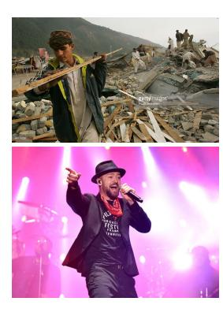
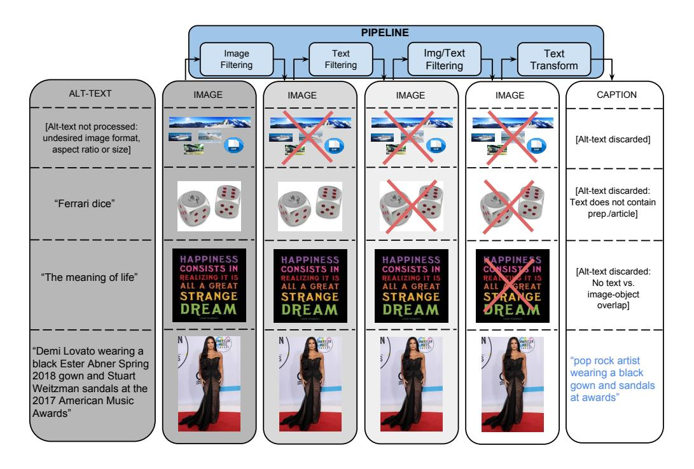
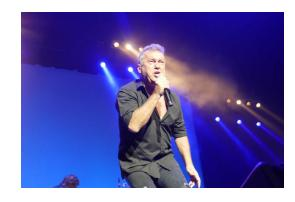
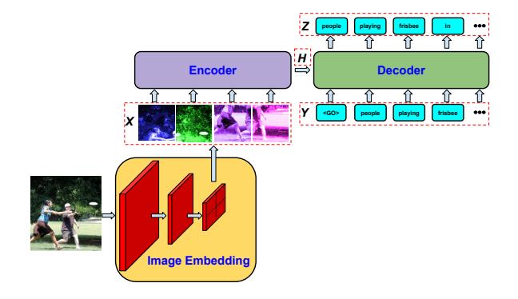
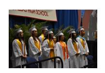
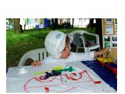

# Conceptual Captions: A Cleaned, Hypernymed, Image Alt-text Dataset For Automatic Image Captioning

# Piyush Sharma, Nan Ding, Sebastian Goodman, Radu Soricut Google AI

Venice, CA 90291

{piyushsharma, dingnan, seabass, rsoricut}@google.com

### **Abstract**

We present a new dataset of image caption annotations, Conceptual Captions, which contains an order of magnitude more images than the MS-COCO dataset (Lin et al., 2014) and represents a wider variety of both images and image caption styles. We achieve this by extracting and filtering image caption annotations from billions of webpages. We also present quantitative evaluations of a number of image captioning models and show that a model architecture based on Inception-ResNetv2 (Szegedy et al., 2016) for image-feature extraction and Transformer (Vaswani et al., 2017) for sequence modeling achieves the best performance when trained on the Conceptual Captions dataset.

## 1 Introduction

Automatic image description is the task of producing a natural-language utterance (usually a sentence) which correctly reflects the visual content of an image. This task has seen an explosion in proposed solutions based on deep learning architectures (Bengio, 2009), starting with the winners of the 2015 COCO challenge (Vinyals et al., 2015a; Fang et al., 2015), and continuing with a variety of improvements (see e.g. Bernardi et al. (2016) for a review). Practical applications of automatic image description systems include leveraging descriptions for image indexing or retrieval, and helping those with visual impairments by transforming visual signals into information that can be communicated via text-to-speech technology. The scientific challenge is seen as aligning, exploiting, and pushing further the latest improvements at the intersection of Computer Vision and Natural Language Processing.

Alt-text: A Pakistani worker helps to clear the debris from the Taj Mahal Hotel November 7, 2005 in Balakot, Pakistan.

**Conceptual Captions**: a worker helps to clear the debris.

**Alt-text:** Musician Justin Timberlake performs at the 2017 Pilgrimage Music & Cultural Festival on September 23, 2017 in Franklin, Tennessee.

**Conceptual Captions**: pop artist performs at the festival in a city.

Figure 1: Examples of images and image descriptions from the Conceptual Captions dataset; we start from existing alt-text descriptions, and automatically process them into Conceptual Captions with a balance of cleanliness, informativeness, fluency, and learnability.

There are two main categories of advances responsible for increased interest in this task. The first is the availability of large amounts of annotated data. Relevant datasets include the ImageNet dataset (Deng et al., 2009), with over 14 million images and 1 million bounding-box annotations, and the MS-COCO dataset (Lin et al., 2014), with 120,000 images and 5-way image-caption annotations. The second is the availability of powerful modeling mechanisms such as modern Convolutional Neural Networks (e.g. Krizhevsky et al. (2012)), which are capable of converting image pixels into high-level features with no manual feature-engineering.

In this paper, we make contributions to both the data and modeling categories. First, we present a new dataset of caption annotations\*, Conceptual Captions (Fig. 1), which has an order of magnitude more images than the COCO

\*https://github.com/google-research-datasets/conceptual-captions

dataset. Conceptual Captions consists of about 3.3M  $\langle image, description \rangle$  pairs. In contrast with the curated style of the COCO images, Conceptual Captions images and their raw descriptions are harvested from the web, and therefore represent a wider variety of styles. The raw descriptions are harvested from the Alt-text HTML attribute† associated with web images. We developed an automatic pipeline (Fig. 2) that extracts, filters, and transforms candidate image/caption pairs, with the goal of achieving a balance of cleanliness, informativeness, fluency, and learnability of the resulting captions.

As a contribution to the modeling category, we evaluate several image-captioning models. Based on the findings of Huang et al. (2016), we use Inception-ResNet-v2 (Szegedy et al., 2016) for image-feature extraction, which confers optimization benefits via residual connections and computationally efficient Inception units. For caption generation, we use both RNN-based (Hochreiter and Schmidhuber, 1997) and Transformerbased (Vaswani et al., 2017) models. Our results indicate that Transformer-based models achieve higher output accuracy; combined with the reports of Vaswani et al. (2017) regarding the reduced number of parameters and FLOPs required for training & serving (compared with RNNs), models such as T2T8x8 (Section 4) push forward the performance on image-captioning and deserve further attention.

## 2 Related Work

Automatic image captioning has a long history (Hodosh et al., 2013; Donahue et al., 2014; Karpathy and Fei-Fei, 2015; Kiros et al., 2015). It has accelerated with the success of Deep Neural Networks (Bengio, 2009) and the availability of annotated data as offered by datasets such as Flickr30K (Young et al., 2014) and MS-COCO (Lin et al., 2014).

The COCO dataset is not large (order of  $10^6$  images), given the training needs of DNNs. In spite of that, it has been very popular, in part because it offers annotations for images with non-iconic views, or non-canonical perspectives of objects, and therefore reflects the composition of everyday scenes (the same is true about Flickr30K (Young et al., 2014)). COCO annotations—category labeling, instance spotting, and instance segmentation—are done for all objects in an image, including those

in the background, in a cluttered environment, or partially occluded. Its images are also annotated with captions, i.e. sentences produced by human annotators to reflect the visual content of the images in terms of objects and their actions or relations.

A large number of DNN models for image caption generation have been trained and evaluated using COCO captions (Vinyals et al., 2015a; Fang et al., 2015; Xu et al., 2015; Ranzato et al., 2015; Yang et al., 2016; Liu et al., 2017; Ding and Soricut, 2017). These models are inspired by sequence-tosequence models (Sutskever et al., 2014; Bahdanau et al., 2015) but use CNN-based encodings instead of RNNs (Hochreiter and Schmidhuber, 1997; Chung et al., 2014). Recently, the Transformer architecture (Vaswani et al., 2017) has been shown to be a viable alternative to RNNs (and CNNs) for sequence modeling. In this work, we evaluate the impact of the Conceptual Captions dataset on the image captioning task using models that combine CNN, RNN, and Transformer layers.

Also related to this work is the Pinterest image and sentence-description dataset (Mao et al., 2016). It is a large dataset (order of 108 examples), but its text descriptions do not strictly reflect the visual content of the associated image, and therefore cannot be used directly for training image-captioning models.

# **3** Conceptual Captions Dataset Creation

The Conceptual Captions dataset is programmatically created using a Flume (Chambers et al., 2010) pipeline. This pipeline processes billions of Internet webpages in parallel. From these webpages, it extracts, filters, and processes candidate  $\langle image, caption \rangle$  pairs. The filtering and processing steps are described in detail in the following sections.

**Image-based Filtering** The first filtering stage, image-based filtering, discards images based on encoding format, size, aspect ratio, and offensive content. It only keeps JPEG images where both dimensions are greater than 400 pixels, and the ratio of larger to smaller dimension is no more than 2. It excludes images that trigger pornography or profanity detectors. These filters discard more than 65% of the candidates.

**Text-based Filtering** The second filtering stage, text-based filtering, harvests Alt-text from HTML webpages. Alt-text generally accompanies images,

†https://en.wikipedia.org/wiki/Alt\_attribute

Figure 2: Conceptual Captions pipeline steps with examples and final output.

and intends to describe the nature or the content of the image. Because these Alt-text values are not in any way restricted or enforced to be good image descriptions, many of them have to be discarded, e.g., search engine optimization (SEO) terms, or Twitter hash-tag terms.

We analyze candidate Alt-text using the Google Cloud Natural Language APIs, specifically part-of-speech (POS), sentiment/polarity, and pornography/profanity annotations. On top of these annotations, we have the following heuristics:

- a well-formed caption should have a high unique word ratio covering various POS tags; candidates with no determiner, no noun, or no preposition are discarded; candidates with a high noun ratio are also discarded;
- candidates with a high rate of token repetition are discarded;
- capitalization is a good indicator of wellcomposed sentences; candidates where the first word is not capitalized, or with too high capitalized-word ratio are discarded;
- highly unlikely tokens are a good indicator of not desirable text; we use a vocabulary VW of 1B token types, appearing at least 5 times in

the English Wikipedia, and discard candidates that contain tokens that are not found in this vocabulary.

- candidates that score too high or too low on the polarity annotations, or trigger the pornography/profanity detectors, are discarded;
- predefined boiler-plate prefix/suffix sequences matching the text are cropped, e.g. "click to enlarge picture", "stock photo"; we also drop text which begins/ends in certain patterns, e.g. "embedded image permalink", "profile photo".

These filters only allow around 3% of the incoming candidates to pass to the later stages.

Image&Text-based Filtering In addition to the separate filtering based on image and text content, we filter out candidates for which none of the text tokens can be mapped to the content of the image. To this end, we use classifiers available via the Google Cloud Vision APIs to assign class labels to images, using an image classifier with a large number of labels (order of magnitude of  $10^5$ ). Notably, these labels are also 100% covered by the  $V_w$  token types.

Images are generally assigned between 5 to 20 labels, though the exact number depends on the

| Original Alt-text   | Harrison Ford and Calista Flockhart attend the premiere of 'Hollywood Homicide' at the 29th American Film Festival September 5, 2003 in Deauville, France. |
|---------------------|------------------------------------------------------------------------------------------------------------------------------------------------------------|
| Conceptual Captions | actors attend the premiere at festival.                                                                                                                    |
| what-happened       | "Harrison Ford and Calista Flockhart" mapped to "actors"; name, location, and date dropped.                                                                |
| Original Alt-text   | Side view of a British Airways Airbus A319 aircraft on approach to land with landing gear down - Stock Image                                               |
| Conceptual Captions | side view of an aircraft on approach to land with landing gear down                                                                                        |
| what-happened       | phrase "British Airways Airbus A319 aircraft" mapped to "aircraft"; boilerplate removed.                                                                   |
| Original Alt-text   | Two sculptures by artist Duncan McKellar adorn trees outside the derelict Norwich Union offices in Bristol, UK - Stock Image                               |
| Conceptual Captions | sculptures by person adorn trees outside the derelict offices                                                                                              |
| what-happened       | object count (e.g. "Two") dropped; proper noun-phrase hypernymized to "person"; propernoun modifiers dropped; location dropped; boilerplate removed.       |

Table 1: Examples of Conceptual Captions as derived from their original Alt-text versions.

image. We match these labels against the candidate text, taking into account morphology-based stemming as provided by the text annotation. Candidate  $\langle image, caption \rangle$  pairs with no overlap are discarded. This filter discards around 60% of the incoming candidates.

# Text Transformation with Hypernymization

In the current version of the dataset, we considered over 5 billion images from about 1 billion English webpages. The filtering criteria above are designed to be high-precision (which comes with potentially low recall). From the original input candidates, only 0.2%  $\langle image, caption \rangle$  pairs pass the filtering criteria described above.

While the remaining candidate captions tend to be appropriate Alt-text image descriptions (see Alt-text in Fig. 1), a majority of these candidate captions contain proper names (people, venues, locations, etc.), which would be extremely difficult to learn as part of the image captioning task. To give an idea of what would happen in such cases, we train an RNN-based captioning model (see Section 4) on non-hypernymized Alt-text data and present an output example in Fig. 3. If automatic determination of person identity, location, etc. is needed, it should be attempted as a separate task and would need to leverage image meta-information about the image (e.g. location).

Using the Google Cloud Natural Language APIs, we obtain named-entity and syntactic-dependency annotations. We then use the Google Knowledge Graph (KG) Search API to match the namedentities to KG entries and exploit the associated hypernym terms. For instance, both "Harrison Ford" and "Calista Flockhart" identify as named-entities,

Alt-text (groundtruth): Jimmy Barnes performs at the Sydney Entertainment Centre

Model output: Singer Justin Bieber performs onstage during the Billboard Music Awards at the MGM

Figure 3: Example of model output trained on clean, non-hypernymized Alt-text data.

so we match them to their corresponding KG entries. These KG entries have "actor" as their hypernym, so we replace the original surface tokens with that hypernym.

The following steps are applied to achieve text transformations:

- noun modifiers of certain types (proper nouns, numbers, units) are removed;
- dates, durations, and preposition-based locations (e.g., "in Los Angeles") are removed;
- named-entities are identified, matched against the KG entries, and substitute with their hypernym;
- resulting coordination noun-phrases with the same head (e.g., "actor and actor") are resolved into a single-head, pluralized form (e.g., "actors");

Around 20% of samples are discarded during this transformation because it can leave sentences too short or inconsistent.

Finally, we perform another round of text analysis and entity resolution to identify concepts with low-count. We cluster all resolved entities (e.g.,

"actor", "dog", "neighborhood", etc.) and keep only the candidates for which all detected types have a count of over 100 (around 55% of the candidates). These remaining  $\langle image, caption \rangle$  pairs contain around 16,000 entity types, guaranteed to be well represented in terms of number of examples. Table 1 contains several examples of before/after-transformation pairs.

Conceptual Captions Quality To evaluate the precision of our pipeline, we consider a random sample of 4K examples extracted from the test split of the Conceptual Captions dataset. We perform a human evaluation on this sample, using the same methodology described in Section 5.4.

Table 2: Human evaluation results on a sample from Conceptual Captions.

The results are presented in Table 2 and show that, out of 3 annotations, over 90% of the captions receive a majority (2+) of GOOD judgments. This indicates that the Conceptual Captions pipeline, though involving extensive algorithmic processing, produces high-quality image captions.

|        | Examples  | Unique | Tokens/Caption |        |        |
|--------|-----------|--------|----------------|--------|--------|
|        |           | Tokens | Mean           | StdDev | Median |
| Train  | 3,318,333 | 51,201 | 10.3           | 4.5    | 9.0    |
| Valid. | 28,355    | 13,063 | 10.3           | 4.6    | 9.0    |
| Test   | 22,530    | 11,731 | 10.1           | 4.5    | 9.0    |

Table 3: Statistics over Train/Validation/Test splits for Conceptual Captions.

We present in Table 3 statistics over the Train/Validation/Test splits for the Conceptual Captions dataset. The training set consists of slightly over 3.3M examples, while there are slightly over 28K examples in the validation set and 22.5K examples in the test set. The size of the training set vocabulary (unique tokens) is 51,201. Note that the test set has been cleaned using human judgements (2+ GOOD), while both the training and validation splits contain all the data, as produced by our automatic pipeline. The mean/stddev/median statistics for tokens-per-caption over the data splits are consistent with each other, at around 10.3/4.5/9.0, respectively.

# 4 Image Captioning Models

In order to assess the impact of the Conceptual Captions dataset, we consider several image captioning models previously proposed in the literature. These models can be understood using the illustration in Fig. 4, as they mainly differ in the way in which they instantiate some of these components.

Figure 4: The main model components.

There are three main components to this architecture:

- A deep CNN that takes a (preprocessed) image and outputs a vector of image embeddings
   X = (x1, x2, ..., xL).
- An Encoder module that takes the image embeddings and encodes them into a tensor H = fenc(X).
- A Decoder model that generates outputs  $\mathbf{z}_t = f_{\text{dec}}(\mathbf{Y}_{1:t}, \mathbf{H})$  at each step t, conditioned on  $\mathbf{H}$  as well as the decoder inputs  $\mathbf{Y}_{1:t}$ .

We explore two main instantiations of this architecture. One uses RNNs with LSTM cells (Hochreiter and Schmidhuber, 1997) to implement the  $f_{\rm enc}$  and  $f_{\rm dec}$  functions, corresponding to the Show-And-Tell (Vinyals et al., 2015b) model. The other uses Transformer self-attention networks (Vaswani et al., 2017) to implement  $f_{\rm enc}$  and  $f_{\rm dec}$ . All models in this paper use Inception-ResNet-v2 as the CNN component (Szegedy et al., 2016).

#### 4.1 RNN-based Models

Our instantiation of the RNN-based model is close to the Show-And-Tell (Vinyals et al., 2015b) model.

$$\begin{split} \mathbf{h}_l &\triangleq \text{RNN}_{enc}(\mathbf{x}_l, \mathbf{h}_{l-1}), \text{ and } \mathbf{H} = \mathbf{h}_L, \\ \mathbf{z}_t &\triangleq \text{RNN}_{dec}(\mathbf{y}_t, \mathbf{z}_{t-1}), \text{ where } \mathbf{z}_0 = \mathbf{H}. \end{split}$$

In the original Show-And-Tell model, a single image embedding of the entire image is fed to the first cell of an RNN, which is also used for text generation. In our model, a single image embedding is fed to an RNNenc with only one cell, and then a different RNNdec is used for text generation. We tried both single image (1x1) embeddings and 8x8 partitions of the image, where each partition has its own embedding. In the 8x8 case, image embeddings are fed in a sequence to the RNNenc. In both cases, we apply plain RNNs without cross attention, same as the Show-And-Tell model. RNNs with cross attention were used in the Show-Attend-Tell model (Xu et al., 2015), but we find its performance to be inferior to the Show-And-Tell model.

#### 4.2 Transformer Model

In the Transformer-based models, both the encoder and the decoder contain a stack of N layers. We denote the n-th layer in the encoder by  $\mathbf{X}_n = \{\mathbf{x}_{n,1}, \dots, \mathbf{x}_{n,L}\}$ , and  $\mathbf{X}_0 = \mathbf{X}$ ,  $\mathbf{H} = \mathbf{X}_N$ . Each of these layers contains two sub-layers: a multihead self-attention layer ATTN, and a position-wise feedforward network FFN:

$$\mathbf{x}'_{n,j} = \operatorname{ATTN}(\mathbf{x}_{n,j}, \mathbf{X}_n; \mathbf{W}_q^e, \mathbf{W}_k^e, \mathbf{W}_v^e)$$

$$\stackrel{\triangle}{=} \operatorname{softmax}(\langle \mathbf{x}_{n,j} \ \mathbf{W}_q^e, \mathbf{X}_n \ \mathbf{W}_k^e \rangle) \ \mathbf{X}_n \ \mathbf{W}_v^e$$

$$\mathbf{x}_{(n+1),j} = \operatorname{FFN}(\mathbf{x}'_{n,j}; \mathbf{W}_f^e)$$

where  $\mathbf{W}_q^e$ ,  $\mathbf{W}_k^e$ , and  $\mathbf{W}_v^e$  are the encoder weight matrices for query, key, and value transformation in the self-attention sub-layer; and  $\mathbf{W}_f^e$  denotes the encoder weight matrix of the feedforward sub-layer. Similar to the RNN-based model, we consider using a single image embedding (1x1) and a vector of 8x8 image embeddings.

In the decoder, we denote the n-th layer by  $\mathbf{Z}_n = \{\mathbf{z}_{n,1}, \dots, \mathbf{z}_{n,T}\}$  and  $\mathbf{Z}_0 = \mathbf{Y}$ . There are two main differences between the decoder and encoder layers. First, the self-attention sub-layer in the decoder is masked to the right, in order to prevent attending to "future" positions (i.e.  $\mathbf{z}_{n,j}$  does not attend to  $\mathbf{z}_{n,(j+1)}, \dots, \mathbf{z}_{n,T}$ ). Second, in between the self-attention layer and the feedforward layer, the decoder adds a third cross-attention layer that connects  $\mathbf{z}_{n,j}$  to the top-layer encoder representation  $\mathbf{H} = \mathbf{X}_N$ .

$$\begin{aligned} \mathbf{z}_{n,j}' = & \text{ATTN}(\mathbf{z}_{n,j}, \mathbf{Z}_{n,1:j}; \mathbf{W}_q^d, \mathbf{W}_k^d, \mathbf{W}_v^d) \\ \mathbf{z}_{n,j}'' = & \text{ATTN}(\mathbf{z}_{n,j}', \mathbf{H}; \mathbf{W}_q^c, \mathbf{W}_v^c, \mathbf{W}_v^c) \\ \mathbf{z}_{(n+1),j} = & \text{FFN}(\mathbf{z}_{n,j}'', \mathbf{W}_f^d) \end{aligned}$$

where  $\mathbf{W}_q^d$ ,  $\mathbf{W}_k^d$ , and  $\mathbf{W}_v^d$  are the weight matrices for query, key, and value transformation in the decoder self-attention sub-layer;  $\mathbf{W}_q^c$ ,  $\mathbf{W}_k^c$ ,  $\mathbf{W}_v^c$  are the corresponding decoder weight matrices in the cross-attention sub-layer; and  $\mathbf{W}_f^d$  is the decoder weight matrix of the feedforward sub-layer.

The Transformer-based models utilize position information at the embedding layer. In the 8x8 case, the 64 embedding vectors are serialized to a 1D sequence with positions from  $[0, \ldots, 63]$ . The position information is modeled by applying sine and cosine functions at each position and with different frequencies for each embedding dimension, as in (Vaswani et al., 2017), and subsequently added to the embedding representations.

# **5** Experimental Results

In this section, we evaluate the impact of using the Conceptual Captions dataset (referred to as 'Conceptual' in what follows) for training image captioning models. To this end, we train the models described in Section 4 under two experimental conditions: using the training & development sets provided by the COCO dataset (Lin et al., 2014), versus training & development sets using the Conceptual dataset. We quantitatively evaluate the resulting models using three different test sets: the blind COCO-C40 test set (indomain for COCO-trained models, out-of-domain for Conceptual-trained models); the Conceptual test set (out-of-domain for COCO-trained models, in-domain for Conceptual-trained models); and the Flickr (Young et al., 2014) 1K test set (outof-domain for both COCO-trained models and Conceptual-trained models).

### 5.1 Dataset Details

COCO Image Captions The COCO image captioning dataset is normally divided into 82K images for training, and 40K images for validation. Each of these images comes with at least 5 groundtruth captions. Following standard practice, we combine the training set with most of the validation dataset for training our model, and only hold out a subset of 4K images for validation.

Conceptual Captions The Conceptual Captions dataset contains around 3.3M images for training, 28K for validation and 22.5K for the test set. For more detailed statistics, see Table 3.

#### **COCO-trained**

RNN8x8

T2T8x8

#### Conceptual-trained

RNN8x8

T2T8x8

a group of men standing in front of a building a group of men in uniform and ties are talking

graduates line up for the commencement ceremony

graduates line up to receive their diplomas

a couple of people walking down a walkway a narrow hallway with a clock and two doors

a view of the nave

the cloister of the cathedral

a child sitting at a table with a cake on it a woman cutting a birthday cake at a party

a child 's drawing at a birthday party

learning about the arts and crafts

a close up of a stuffed animal on a table a picture of a fish on the side of a car

a cartoon businessman thinking about something

a cartoon businessman asking for help

Figure 5: Side by side comparison of model outputs under two training conditions. Conceptual-based models (lower half) tend to hallucinate less, are more expressive, and handle well a larger variety of images. The two images in the middle are from Flickr; the other two are from Conceptual Captions.

### 5.2 Experimental Setup

**Image Preprocessing** Each input image is first preprocessed by random distortion and cropping (using a random ratio from  $50\%\sim100\%$ ). This prevents models from overfitting individual pixels of the training images.

**Encoder-Decoder** For RNN-based models, we use a 1-layer, 512-dim LSTM as the RNN cell. For the Transformer-based models, we use the default setup from (Vaswani et al., 2017), with N=6 encoder and decoder layers, a hidden-layer size of 512, and 8 attention heads.

**Text Handling** Training captions are truncated to maximum 15 tokens. We use a token type mincount of 4, which results in around 9,000 token types for the COCO dataset, and around 25,000 token types for the Conceptual Captions dataset. All other tokens are replaced with special token  $\langle \text{UNK} \rangle$ . The word embedding matrix has size 512 and is tied to the output projection matrix.

**Optimization** All models are trained using MLE loss and optimized using Adagrad (Duchi et al., 2011) with learning rate 0.01. Mini-batch size is 25. All model parameters are trained for a total number of 5M steps, with batch updates asynchronously distributed across 40 workers. The final model is selected based on the best CIDEr score on the development set for the given training condition.

**Inference** During inference, the decoder prediction of the previous position is fed to the input of the next position. We use a beam search of beam

size 4 to compute the most likely output sequence.

### **5.3** Qualitative Results

Before we present the numerical results for our experiments, we discuss briefly the patterns that we have observed.

One difference between COCO-trained models and Conceptual-trained models is their ability to use the appropriate natural language terms for the entities in an image. For the left-most image in Fig. 5, COCO-trained models use "group of men" to refer to the people in the image; Conceptual-based models use the more appropriate and informative term "graduates". The second image, from the Flickr test set, makes this even more clear. The Conceptual-trained T2T8x8 model is perfectly rendering the image content as "the cloister of the cathedral". None of the other models come close to producing such an accurate description.

A second difference is that COCO-trained models often seem to hallucinate objects. For instance, they hallucinate "front of building" for the first image, "clock and two doors" for the second, and "birthday cake" for the third image. In contrast, Conceptual-trained models do not seem to have this problem. We hypothesize that the hallucination issue for COCO-based models comes from the high correlations present in the COCO data (e.g., if there is a kid at a table, there is also cake). This high degree of correlation in the data does not allow the captioning model to correctly disentangle and learn representations at the right level of granularity.

| Model  | Training   | 1+    | 2+    | 3+    |
|--------|------------|-------|-------|-------|
| RNN8x8 | COCO       | 0.390 | 0.276 | 0.173 |
| T2T8x8 | COCO       | 0.478 | 0.362 | 0.275 |
| RNN8x8 | Conceptual | 0.571 | 0.418 | 0.277 |
| T2T8x8 | Conceptual | 0.659 | 0.506 | 0.355 |

Table 4: Human eval results on Flickr 1K Test.

A third difference is the resilience to a large spectrum of image types. COCO only contains natural images, and therefore a cartoon image like the fourth one results in massive hallucination effects for COCO-trained models ("stuffed animal", "fish", "side of car"). In contrast, Conceptual-trained models handle such images with ease.

### 5.4 Quantitative Results

In this section, we present quantitative results on the quality of the outputs produced by several image captioning models. We present both automatic evaluation results and human evaluation results.

#### **5.4.1 Human Evaluation Results**

For human evaluations, we use a pool of professional raters (tens of raters), with a double-blind evaluation condition. Raters are asked to assign a GOOD or BAD label to a given  $\langle image, caption \rangle$  input, using just common-sense judgment. This approximates the reaction of a typical user, who normally would not accept predefined notions of GOOD vs. BAD. We ask 3 separate raters to rate each input pair and report the percentage of pairs that receive k or more (k+) GOOD annotations.

In Table 4, we report the results on the Flickr 1K test set. This evaluation is out-of-domain for both training conditions, so all models are on relatively equal footing. The results indicate that the Conceptual-based models are superior. In 50.6% (for the T2T8x8 model) of cases, a majority of annotators (2+) assigned a GOOD label. The results also indicate that the Transformer-based models are superior to the RNN-based models by a good margin, by over 8-points (for 2+) under both COCO and Conceptual training conditions.

| Model  | Training   | CIDEr | ROUGE-L | METEOR |
|--------|------------|-------|---------|--------|
| RNN1x1 | COCO       | 1.021 | 0.694   | 0.348  |
| RNN8x8 | COCO       | 1.044 | 0.698   | 0.354  |
| T2T1x1 | COCO       | 1.032 | 0.700   | 0.358  |
| T2T8x8 | COCO       | 1.032 | 0.700   | 0.356  |
| RNN1x1 | Conceptual | 0.403 | 0.445   | 0.191  |
| RNN8x8 | Conceptual | 0.410 | 0.437   | 0.189  |
| T2T1x1 | Conceptual | 0.348 | 0.403   | 0.171  |
| T2T8x8 | Conceptual | 0.345 | 0.400   | 0.170  |

Table 5: Auto metrics on the COCO C40 Test.

| Model  | Training   | CIDEr | ROUGE-L | SPICE |
|--------|------------|-------|---------|-------|
| RNN1x1 | COCO       | 0.183 | 0.149   | 0.062 |
| RNN8x8 | COCO       | 0.191 | 0.152   | 0.065 |
| T2T1x1 | COCO       | 0.184 | 0.148   | 0.062 |
| T2T8x8 | COCO       | 0.190 | 0.151   | 0.064 |
| RNN1x1 | Conceptual | 1.351 | 0.326   | 0.235 |
| RNN8x8 | Conceptual | 1.401 | 0.330   | 0.240 |
| T2T1x1 | Conceptual | 1.588 | 0.331   | 0.254 |
| T2T8x8 | Conceptual | 1.676 | 0.336   | 0.257 |

Table 6: Auto metrics on the 22.5K Conceptual Captions Test set.

| Model  | Training   | CIDEr | ROUGE-L | SPICE |
|--------|------------|-------|---------|-------|
| RNN1x1 | COCO       | 0.340 | 0.414   | 0.101 |
| RNN8x8 | COCO       | 0.356 | 0.413   | 0.103 |
| T2T1x1 | COCO       | 0.341 | 0.404   | 0.101 |
| T2T8x8 | COCO       | 0.359 | 0.416   | 0.103 |
| RNN1x1 | Conceptual | 0.269 | 0.310   | 0.076 |
| RNN8x8 | Conceptual | 0.275 | 0.309   | 0.076 |
| T2T1x1 | Conceptual | 0.226 | 0.280   | 0.068 |
| T2T8x8 | Conceptual | 0.227 | 0.277   | 0.066 |

Table 7: Auto metrics on the Flickr 1K Test.

#### 5.4.2 Automatic Evaluation Results

In this section, we report automatic evaluation results, using established image captioning metrics.

For the COCO C40 test set (Fig. 5), we report the numerical values returned by the COCO online evaluation server‡, using the CIDEr (Vedantam et al., 2015), ROUGE-L (Lin and Och, 2004), and METEOR (Banerjee and Lavie, 2005) metrics. For Conceptual Captions (Fig. 6) and Flickr (Fig. 7) test sets, we report numerical values for the CIDEr, ROUGE-L, and SPICE (Anderson et al., 2016)§. For all metrics, higher number means closer distance between the candidates and the groundtruth captions.

The automatic metrics are good at detecting invs out-of-domain situations. For COCO-models tested on COCO, the results in Fig. 5 show CIDEr scores in the 1.02-1.04 range, for both RNN- and Transformer-based models; the scores drop in the 0.35-0.41 range (CIDEr) for the Conceptual-based models tested against COCO groundtruth. For Conceptual-models tested on the Conceptual Captions test set, the results in Fig. 6 show scores as high as 1.468 CIDEr for the T2T8x8 model, which corroborates the human-eval results for the Transformer-based models being superior to the RNN-based models; the scores for the COCO-based models tested against Conceptual Captions groundtruth are all below 0.2 CIDEr.

The automatic metrics fail to corroborate the

&lt;sup>‡http://mscoco.org/dataset/#captions-eval.

§https://github.com/tylin/coco-caption.

human evaluation results. According to the automatic metrics, the COCO-trained models are superior to the Conceptual-trained models (CIDEr scores in the mid-0.3 for the COCO-trained condition, versus mid-0.2 for the Conceptual-trained condition), and the RNN-based models are superior to Transformer-based models. Notably, these are the same metrics which score humans lower than the methods that won the COCO 2015 challenge (Vinyals et al., 2015a; Fang et al., 2015), despite the fact that humans are still much better at this task. The failure of these metrics to align with the human evaluation results casts again grave doubts on their ability to drive progress in this field. A significant weakness of these metrics is that hallucination effects are under-penalized (a small precision penalty for tokens with no correspondent in the reference), compared to human judgments that tend to dive dramatically in the presence of hallucinations.

#### 6 Conclusions

We present a new image captioning dataset, Conceptual Captions, which has several key characteristics: it has around 3.3M examples, an order of magnitude larger than the COCO image-captioning dataset; it consists of a wide variety of images, including natural images, product images, professional photos, cartoons, drawings, etc.; and, its captions are based on descriptions taken from original Alt-text attributes, automatically transformed to achieve a balance between cleanliness, informativeness, and learnability.

We evaluate both the quality of the resulting image/caption pairs, as well as the performance of several image-captioning models when trained on the Conceptual Captions data. The results indicate that such models achieve better performance, and avoid some of the pitfalls seen with COCO-trained models, such as object hallucination. We hope that the availability of the Conceptual Captions dataset will foster considerable progress on the automatic image-captioning task.

#### References

- Peter Anderson, Basura Fernando, Mark Johnson, and Stephen Gould. 2016. SPICE: semantic propositional image caption evaluation. In *ECCV*.
- D. Bahdanau, K. Cho, and Y. Bengio. 2015. Neural machine translation by jointly learning to align and translate. In *Proceedings of ICLR*.

- Satanjeev Banerjee and Alon Lavie. 2005. METEOR: An automatic metric for MT evaluation with improved correlation with human judgments. In *Proceedings of the ACL Workshop on intrinsic and extrinsic evaluation measures for machine translation and/or summarization*.
- Yoshua Bengio. 2009. Learning deep architectures for ai. *Found. Trends Mach. Learn.* 2(1):1–127.
- Raffaella Bernardi, Ruket Cakici, Desmond Elliott, Aykut Erdem, Erkut Erdem, Nazli Ikizler-Cinbis, Frank Keller, Adrian Muscat, and Barbara Plank. 2016. Automatic description generation from images: A survey of models, datasets, and evaluation measures. *JAIR* 55.
- Craig Chambers, Ashish Raniwala, Frances Perry, Stephen Adams, Robert Henry, Robert Bradshaw, and Nathan. 2010. Flumejava: Easy, efficient data-parallel pipelines. In ACM SIGPLAN Conference on Programming Language Design and Implementation (PLDI). 2 Penn Plaza, Suite 701 New York, NY 10121-0701, pages 363–375. http://dl.acm.org/citation.cfm?id=1806638.
- Junyoung Chung, Caglar Gulcehre, KyungHyun Cho, and Yoshua Bengio. 2014. Empirical evaluation of gated recurrent neural networks on sequence modeling. arXiv preprint arXiv:1412.3555.
- J. Deng, W. Dong, R. Socher, L.-J. Li, K. Li, and L. Fei-Fei. 2009. ImageNet: A large-scale hierarchical image database. In CVPR.
- Nan Ding and Radu Soricut. 2017. Cold-start reinforcement learning with softmax policy gradients. In *NIPS*.
- Jeff Donahue, Lisa Anne Hendricks, Sergio Guadarrama, Marcus Rohrbach, Subhashini Venugopalan, Kate Saenko, and Trevor Darrell. 2014. Long-term recurrent convolutional networks for visual recognition and description. In *Proc. of IEEE Conference on Computer Vision and Pattern Recognition (CVPR)*.
- John Duchi, Elad Hazan, and Yoram Singer. 2011. Adaptive subgradient methods for online learning and stochastic optimization. *Journal of Machine Learning Research* 12(Jul):2121–2159.
- Hao Fang, Saurabh Gupta, Forrest Iandola, Rupesh Srivastava, Li Deng, Piotr Dollár, Jianfeng Gao, Xiaodong He, Margaret Mitchell, John Platt, et al. 2015. From captions to visual concepts and back. In *Proc. of IEEE Conference on Computer Vision and Pattern Recognition (CVPR)*.
- Sepp Hochreiter and Jürgen Schmidhuber. 1997. Long short-term memory. *Neural computation* 9(8):1735–1780.
- Micah Hodosh, Peter Young, and Julia Hockenmaier. 2013. Framing image description as a ranking task: Data, models and evaluation metrics. *JAIR*.

- Jonathan Huang, Vivek Rathod, Chen Sun, Menglong Zhu, Anoop Korattikara, Alireza Fathi, Ian Fischer, Zbigniew Wojna, Yang Song, Sergio Guadarrama, and Kevin Murphy. 2016. Speed/accuracy trade-offs for modern convolutional object detectors. *CoRR* abs/1611.10012.
- Andrej Karpathy and Li Fei-Fei. 2015. Deep visual-semantic alignments for generating image descriptions. In *Proc. of IEEE Conference on Computer Vision and Pattern Recognition (CVPR)*.
- Ryan Kiros, Ruslan Salakhutdinov, and Richard S Zemel. 2015. Unifying visual-semantic embeddings with multimodal neural language models. *Transactions of the Association for Computational Linguistics*
- A. Krizhevsky, I. Sutskever, and G. Hinton. 2012. Imagenet classification with deep convolutional neural networks. In NIPS.
- Chin-Yew Lin and Franz Josef Och. 2004. Automatic evaluation of machine translation quality using longest common subsequence and skip-bigram statistics. In *Proceedings of ACL*.
- Tsung-Yi Lin, Michael Maire, Serge J. Belongie, Lubomir D. Bourdev, Ross B. Girshick, James Hays, Pietro Perona, Deva Ramanan, Piotr Dollár, and C. Lawrence Zitnick. 2014. Microsoft COCO: common objects in context. *CoRR* abs/1405.0312.
- Siqi Liu, Zhenhai Zhu, Ning Ye, Sergio Guadarrama, and Kevin Murphy. 2017. Optimization of image description metrics using policy gradient methods. In *International Conference on Computer Vision (ICCV)*.
- Junhua Mao, Jiajing Xu, Yushi Jing, and Alan Yuille. 2016. Training and evaluating multimodal word embeddings with large-scale web annotated images. In *NIPS*.
- Marc'Aurelio Ranzato, Sumit Chopra, Michael Auli, and Wojciech Zaremba. 2015. Sequence level training with recurrent neural networks. *CoRR* abs/1511.06732.
- Ilya Sutskever, Oriol Vinyals, and Quoc V Le. 2014. Sequence to sequence learning with neural networks. In *Advances in neural information processing systems*. pages 3104–3112.
- Christian Szegedy, Sergey Ioffe, and Vincent Vanhoucke. 2016. Inception-v4, inception-resnet and the impact of residual connections on learning. *CoRR* abs/1602.07261.
- Ashish Vaswani, Noam Shazeer, Niki Parmar, Jakob Uszkoreit, Llion Jones, Aidan N Gomez, Lukasz Kaiser, and Illia Polosukhin. 2017. Attention is all you need. In *Advances in Neural Information Processing Systems*.

- Ramakrishna Vedantam, C. Lawrence Zitnick, and Devi Parikh. 2015. Cider: Consensus-based image description evaluation. In *The IEEE Conference on Computer Vision and Pattern Recognition (CVPR)*.
- Oriol Vinyals, Alexander Toshev, Samy Bengio, and Dumitru Erhan. 2015a. Show and tell: A neural image caption generator. In *Proceedings of the IEEE conference on computer vision and pattern recognition*. pages 3156–3164.
- Oriol Vinyals, Alexander Toshev, Samy Bengio, and Dumitru Erhan. 2015b. Show and tell: A neural image caption generator. In *Proc. of IEEE Conference on Computer Vision and Pattern Recognition (CVPR)*.
- Kelvin Xu, Jimmy Ba, Ryan Kiros, Aaron Courville, Ruslan Salakhutdinov, Richard Zemel, and Yoshua Bengio. 2015. Show, attend and tell: Neural image caption generation with visual attention. In *Proc. of the 32nd International Conference on Machine Learning (ICML)*.
- Z. Yang, Y. Yuan, Y. Wu, R. Salakhutdinov, and W. W. Cohen. 2016. Review networks for caption generation. In NIPS.
- Peter Young, Alice Lai, Micah Hodosh, and Julia Hockenmaier. 2014. From image descriptions to visual denotations: New similarity metrics for semantic inference over event descriptions. *TACL* 2:67–78.