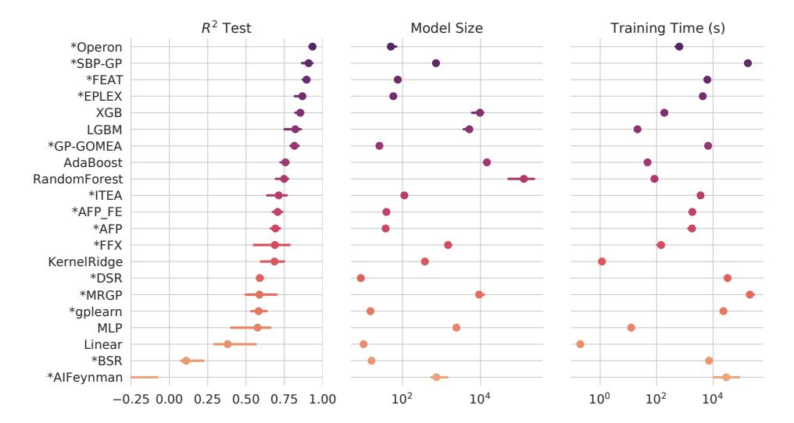
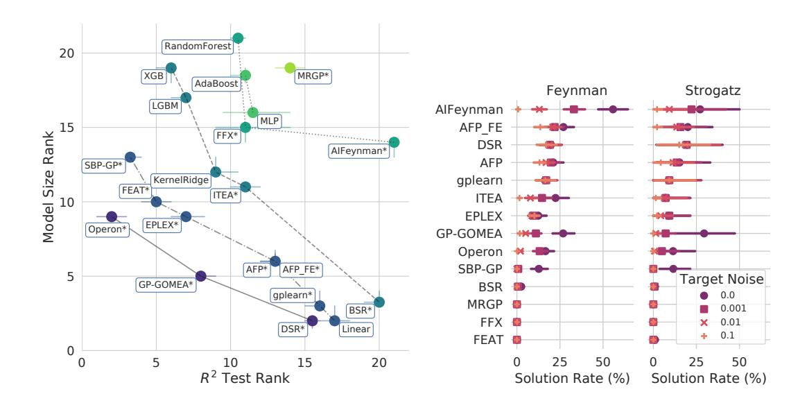
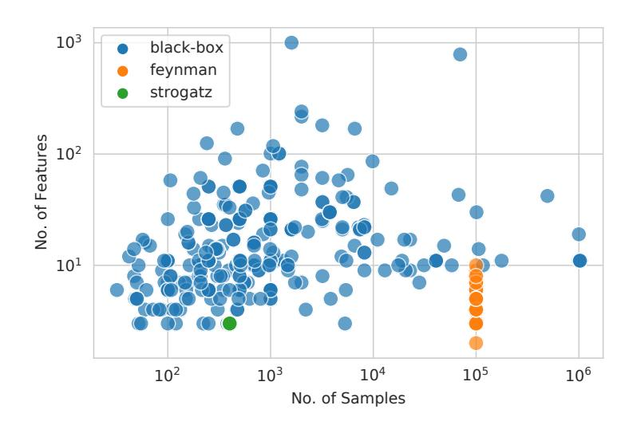
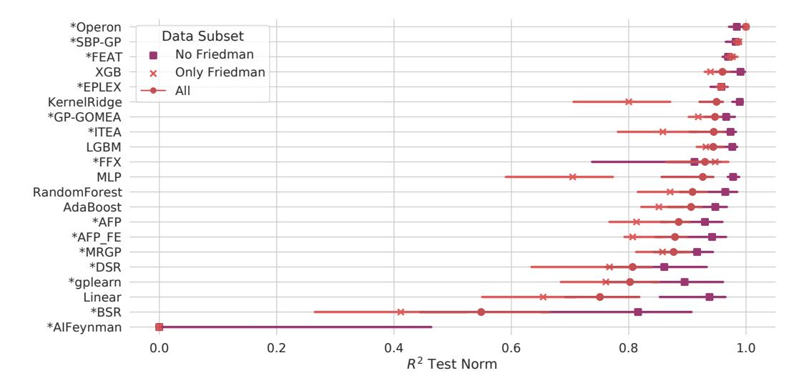
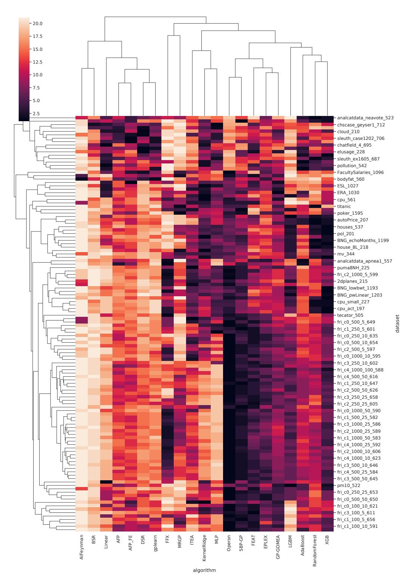
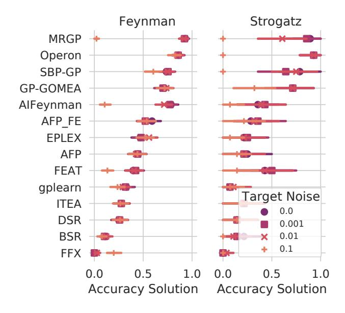
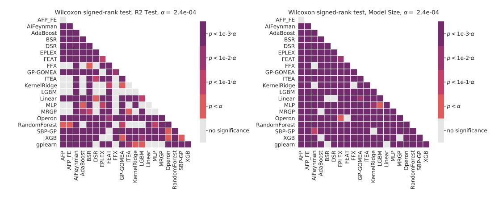
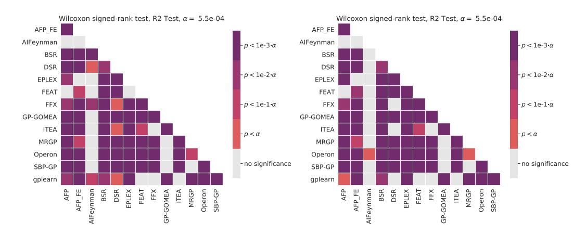
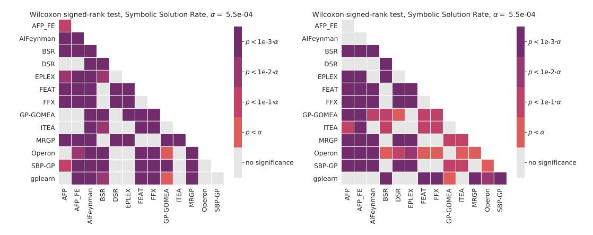

# Contemporary Symbolic Regression Methods and their Relative Performance

#### William La Cava\*

Institute for Biomedical Informatics
University of Pennsylvania
lacava@upenn.edu

## **Bogdan Burlacu**

Josef Ressel Center for Symbolic Regression University of Applied Sciences Upper Austria bogdan.burlacu@fh-ooe.at

### Marco Virgolin

Mechanics and Maritime Sciences Chalmers University of Technology marco.virgolin@chalmers.se

## Michael Kommenda

Josef Ressel Center for Symbolic Regression University of Applied Sciences Upper Austria michael.kommenda@fh-ooe.at

# Patryk Orzechowski †

Institute for Biomedical Informatics
University of Pennsylvania
patryk.orzechowski@gmail.com

## Fabrício Olivetti de França

Federal University of ABC<sup>‡</sup>
Santo Andre, Brazil
folivetti@ufabc.edu.br

#### Ying Jin

Department of Statistics Stanford University ying531@stanford.edu

## Jason H. Moore

Institute for Biomedical Informatics
University of Pennsylvania
jhmoore@upenn.edu

#### Abstract

Many promising approaches to symbolic regression have been presented in recent years, yet progress in the field continues to suffer from a lack of uniform, robust, and transparent benchmarking standards. In this paper, we address this shortcoming by introducing an open-source, reproducible benchmarking platform for symbolic regression. We assess 14 symbolic regression methods and 7 machine learning methods on a set of 252 diverse regression problems. Our assessment includes both real-world datasets with no known model form as well as ground-truth benchmark problems, including physics equations and systems of ordinary differential equations. For the real-world datasets, we benchmark the ability of each method to learn models with low error and low complexity relative to state-of-the-art machine learning methods. For the synthetic problems, we assess each method's ability to find exact solutions in the presence of varying levels of noise. Under these controlled experiments, we conclude that the best performing methods for real-world regression combine genetic algorithms with parameter estimation and/or semantic search drivers. When tasked with recovering exact equations in the presence of noise, we find that deep learning and genetic algorithm-based approaches perform similarly. We provide a detailed guide to reproducing this experiment and contributing new methods, and encourage other researchers to collaborate with us on a common and living symbolic regression benchmark.

<sup>\*</sup>corresponding author

<sup>&</sup>lt;sup>†</sup>Department of Automatics and Robotics, AGH University of Science and Technology, Krakow, Poland

<sup>&</sup>lt;sup>‡</sup>Center for Mathematics, Computation and Cognition | Heuristics, Analysis and Learning Laboratory

# 1 Introduction

Symbolic regression (SR) is an approach to machine learning (ML) in which both the parameters and structure of an analytical model are optimized. SR can be useful when one wishes to describe a process via a mathematical expression, especially a simple expression; thus, it is often applied in the hopes of producing a model of a process that, by virtue of its simplicity, may be easy to interpret. Interpretable ML is becoming increasingly important as model deployments in high stakes societal applications such as finance and medicine grow [1, 2]. Moreover, the mathematical expressions produced by SR are well-suited to be analyzed and controlled for their out-of-distribution behavior (e.g., in terms of asymptotic behavior, periodicity, etc.). These attractive properties of SR have led to its application in a number of areas, such as physics [3], biology [4], clinical informatics [5], climate modeling [6], finance [7], and many fields of engineering [8–10].

SR literature has, in general, fallen short of evaluating and ranking new methods in a way that facilitates their widespread adoption. Our view is that this shortcoming largely stems from a lack of standardized, transparent and reproducible benchmarks, especially those that test a large and diverse array of problems [11]. Although community surveys [11, 12] have led to suggestions for improving benchmarking standards, and even black-listed certain problems, contemporary literature continues to be published that violates those standards. Absent these standards, it is difficult to assess which methods or family of methods should be considered "state-of-the-art" (SotA).

Achieving a fleeting sense of SotA is certainly not the singular pursuit of methods research, yet without common, robust benchmarking studies, promising avenues of investigation cannot be well-informed by empirical evidence. We hope the benchmarking platform introduced in this paper improves the cross-pollination between research communities interested in SR, which include evolutionary computation, physics, engineering, statistics, and more traditional machine learning disciplines.

In this paper, we describe a large benchmarking effort that includes a dataset repository curated for SR, as well as a benchmarking library designed to allow researchers to easily contribute methods. To achieve this, we incorporated 130 datasets with ground truth forms into the Penn Machine Learning Benchmark (PMLB) [13], including metadata describing the underlying equations, their units, and various summary statistics. Furthermore, we created a SR benchmark repository called SRBench<sup>4</sup> and sought contributions from researchers in this area. Here we describe this process and the results, which consist of comparisons of 14 contemporary SR methods on hundreds of regression problems.

To our knowledge, this is by far the largest and most comprehensive SR benchmark effort to date, which allows us to make claims concerning current SotA methods for SR with better certainty. Importantly, and in contrast to many previous efforts, the datasets, methods, benchmarking code, and results are completely open-source, reproducible, and revision-controlled, which should allow SRBench to exist as a living benchmark for future studies.

# 2 Background and Motivation

The goal of SR is to learn a mapping  $\hat{y}(\mathbf{x}) = \hat{\phi}(\mathbf{x}, \hat{\theta}) : \mathbb{R}^d \to \mathbb{R}$  using a dataset of paired examples  $\mathcal{D} = \{(\mathbf{x}_i, y_i)\}_{i=1}^N$ , with features  $\mathbf{x} \in \mathbb{R}^d$  and target y. SR assumes the existence of an analytical model of the form  $y(\mathbf{x}) = \phi^*(\mathbf{x}, \theta^*) + \epsilon$  that would generate the observations in  $\mathcal{D}$ , and seeks to estimate this model by searching the space of expressions,  $\phi$ , and parameters,  $\theta$ , in the presence of white noise,  $\epsilon$ .

<sup>&</sup>lt;sup>4</sup>https://github.com/EpistasisLab/srbench

Koza [14] introduced SR as an application of *genetic programming* (GP), a field that investigates the use of genetic algorithms (GAs) to evolve executable data structures, i.e. programs. In the case of so-called "Koza-style" GP, the programs to be optimized are syntax trees consisting of functions/operations over input features and constants. Like in other GAs, GP is a process that evolves a population of candidate solutions (e.g., syntax trees) by iteratively producing offspring from parent solutions (e.g., by swapping parents' subtrees) and eliminating unfit solutions (e.g., programs with sub-par behavior). Most SR research to date has emerged from within this sub-field and its associated conferences.<sup>5</sup>

Despite the availability of post-hoc methods for explaining black-box model predictions [15], there have been recent calls to focus on learning interpretable/transparent models explicitly [2]. Perhaps due to this renewed interest in model interpretability, entirely different methods for tackling SR have been proposed [16–22]. These include methods based in Bayesian optimization [16], recurrent neural networks (RNNs) [17], and physics-inspired divide-and-conquer strategies [18, 23]. Some of these papers refer to Eureqa, a commercial, GP-based SR method used to re-discover known physics equations [3], as the "gold standard" for SR [17] and/or the best method for SR "by far" [18]. However, Schmidt and Lipson [24] make no claim to being the SotA method for SR, nor is this hypothesis tested in the body of work on which Eureqa is based [25].

Although commercial platforms like Eureqa and Wolfram [26] are successful tools for applying SR, they are not designed to support controlled benchmark experiments, and therefore experiments utilizing them have serious caveats. Due to the design of the front-end API for both tools, it is not possible to benchmark either method against others while holding important parameters of such an experiment constant, including the computational effort, number of model evaluations, CPU/memory limits, and final solution assessment. More generally, researchers cannot uniquely determine which features of the software and/or experiment lead to observed differences in performance, given that these commercial tools are closed-source. In this light, it is not clear what insights are to be gained when comparing to Eureqa and Wolfram beyond a simple head-to-head comparison. Therefore, rather than benchmark against Eureqa in this paper, we implement its underlying algorithms in an open-source package, which allows our experiment to remain transparent, reproducible, accessible, and controlled. We discuss the algorithms underlying Eureqa in detail in Sec. A.3.

A close reading of SR literature since 2009 implies that a number of proposed methods would outperform Eureqa in controlled tests, and are therefore suitable choices for benchmarking (e.g. [27, 28]). Unfortunately, the widespread adoption of these promising SR approaches is hamstrung by a lack of consensus on good benchmark problems, testing frameworks, and experimental designs. Our effort to establish a common benchmark is motivated by our view that common, robust, standardized benchmarks for SR could speed progress in the field by providing a clear baseline from which to assert the quality of new approaches. Consider the NN community's focus on common benchmarks (e.g. ImageNet [29]), frameworks (e.g. TensorFlow, PyTorch) and experiment designs. By contrast, it is common to observe results in SR literature that are based on a small number of low dimensional, easy and unrealistic problems, comparing only to very basic GP systems such as those described in [14] nearly thirty years ago. Despite detailed descriptions of these issues [11], community surveys and proposals to "black-list" toy problems [12], toy datasets and comparisons to out-dated SR methods continue to appear in contemporary literature.

The aspects of performance assessment for SR differ from typical regression benchmarking due to the interest in obtaining concise, symbolic expressions. In general, the trade-off between accuracy and

<sup>&</sup>lt;sup>5</sup>A non-exhaustive list: GECCO, EuroGP, FOGA, PPSN, and IEEE CEC.

simplicity must be considered when evaluating the merits of different models. Furthermore, model *simplicity*, typically measured as sparsity or model size, is but a proxy for model *interpretability*; a simple model may still be un-interpretable, or simply wrong [30–32]. With these concerns in mind, datasets with ground truth solutions are useful, in that they allow researchers to assess whether or not the symbolic model regressed by a given method corresponds to a known analytical solution. Nevertheless, benchmarks utilizing synthetic datasets with ground-truth solutions are not sufficient for assessing real-world performance, and so we consider it essential to also evaluate the performance of SR on real-world or otherwise black-box regression problems, relative to SotA ML methods.

There have been a few recent efforts to benchmark SR algorithms [33], including a precursor to this work benchmarking four SR methods on 94 regression problems [34]. In both cases, SR methods were assessed solely on their ability to make accurate predictions. In contrast, Udrescu and Tegmark [18] proposed 120 new synthetic, physics-based datasets for SR, but compared only to Eureqa and only in terms of solution rates. A major contribution of our work is its significantly more comprehensive scope than previous studies. We include 14 SR methods on 252 datasets in comparison to 7 ML methods. Our metrics of comparison are also more comprehensive, and include 1) accuracy, 2) simplicity, and 3) exact or approximate symbolic matches to the ground truth process. Furthermore, we have made the benchmark openly available, reproducible, and open for contributions supported by continuous integration [35].

# 3 SRBench

We created SRBench to be a reproducible, open-source benchmarking project by pulling together a large set of diverse benchmark datasets, contemporary SR methods, and ML methods around a shared model evaluation and analysis environment. SRBench overcomes several of the issues in current benchmarking literature as described in Sec. 2. For example, it makes it easy for methodologists to benchmark new algorithms over hundreds of problems, in comparison to strong, contemporary reference methods. These improvements allow us to reason with more certainty than in previous work about the SotA methods for SR.

In order to establish common datasets, we extended PMLB, a repository of standardized regression and classification problems [13, 36], by adding 130 SR datasets with known model forms. PMLB provides utilities for fetching and handling data, recording and visualizing dataset metadata, and contributing new datasets. The SR methods we benchmarked are all contemporary implementations (2011 - 2020) from several method families, as shown in Tbl. 1. We required contributors to implement a minimal, Scikit-learn compatible [37], Python API for their method. In addition, contributors were required to provide the final fitted model as a string that was compatible with the symbolic mathematics library sympy. Note that although we require a Python wrapper, SR implementations in many different languages are supported, as long as the Python API is available and the language environment can be managed via Anaconda<sup>6</sup>.

To ensure reproducibility, we defined a common environment (via Anaconda) with fixed versions of packages and their dependencies. In contrast to most SR studies, the full installation code, experiment code, results and analysis are available via the repository for use in future studies. To make SRBench as extensible as possible, we automated the process of incorporating new methods and results into the analysis pipeline. The repository accepts rolling contributions of new methods that meet the minimal API requirements. To achieve this, we created a continuous integration (CI) [35] framework that assures contributions are compatible with the benchmark code as they arrive. CI also supports

<sup>6</sup>https://www.anaconda.com/

Table 1: Short descriptions of the SR methods benchmarked in our experiment, including references and links to implementations.

| Method         | Year | Description                                                          | Method Family             | Implementation          |
|----------------|------|----------------------------------------------------------------------|---------------------------|-------------------------|
| AFP [38]       | 2011 | Age-fitness Pareto Optimization                                      | GP                        | C++/Python (link)       |
| AFP_FE [24]    | 2011 | AFP with co-evolved fitness estimates;<br>Eureqa-esque               | GP                        | C++/Python (link)       |
| AIFeynman [23] | 2020 | Physics-inspired method                                              | Divide and conquer        | Fortran/Python (link)   |
| BSR [16]       | 2020 | Bayesian Symbolic Regression                                         | Markov Chain Monte Carlo  | Python (link)           |
| DSR [17]       | 2020 | Deep Symbolic Regression                                             | Recurrent neural networks | Python (PyTorch) (link) |
| EPLEX [39]     | 2016 | $\epsilon$ -lexicase selection                                       | GP                        | C++/Python (link)       |
| FEAT [40]      | 2019 | Feature Engineering Automation Tool                                  | GP                        | C++/Python (link)       |
| FFX [41]       | 2011 | Fast function extraction                                             | Random search             | C++/Python (link)       |
| GP-GOMEA [42]  | 2020 | GP version of the Gene-pool Optimal<br>Mixing Evolutionary Algorithm | GP                        | C++/Python (link)       |
| gplearn        | 2015 | Koza-style symbolic regression in Python                             | GP                        | C++/Python (link)       |
| ITEA [43]      | 2020 | Interaction-Transformation EA                                        | GP                        | Haskell/Python (link)   |
| MRGP [44]      | 2014 | Multiple Regression Genetic Programming                              | GP                        | Java (link)             |
| Operon [45]    | 2019 | SR with Non-linear least squares                                     | GP                        | C++/Python (link)       |
| SBP-GP [46]    | 2019 | Semantic Back-propagation Genetic<br>Programming                     | GP                        | C++/Python (link)       |

Table 2: Settings used in the benchmark experiments. "Total comparisons" refers to the total evaluatons of an algorithm on a dataset for a given noise level and random seed.

| Setting                   | Black-box Problems                 | Ground-truth Problems             |
|---------------------------|------------------------------------|-----------------------------------|
| No. of datasets           | 122                                | 130                               |
| No. of algorithms         | 21 (14 SR, 7 ML)                   | 14                                |
| No. of trials per dataset | 10                                 | 10                                |
| Train/test Split          | .75/.25                            | .75/.25                           |
| Hyperparameter Tuning     | 5-fold Halving Grid Search CV      | Tuned set from Black-box problems |
| Termination criteria      | 500k evaluations/train or 48 hours | 1M evaluations or 8 hours         |
| Levels of target noise    | None                               | 0, 0.001, 0.01, 0.1               |
| Total comparisons         | 26840                              | 54600                             |
| Computing Budget          | 1.29M core hours                   | 436.8K core hours                 |

continuous updates to results reporting and visualization whenever new experiments are available, allowing us to maintain a standing leader-board of contemporary SR methods. Ideally these features will quicken the adoption of SotA approaches throughout the SR research community. Further details on how to use and contribute to SRBench are provided in Sec. A.1.

# 4 Experiment Design

We evaluated SR methods on two separate tasks. First, we assessed their ability to make accurate predictions on "black-box" regression problems (in which the underlying data generating function remains unknown) while minimizing the complexity of the discovered models. Second, we tested the ability of each method to find exact solutions to synthetic datasets with known, ground-truth functions, originating from physics and various fields of engineering.

The basic experiment settings are summarized in Tbl. 2. Each algorithm was trained on each dataset (and level of noise, for ground-truth problems) in 10 repeated trials with a different random state that controlled both the train/test split and the seed of the algorithm. Datasets were split 75/25% in training and testing. For black-box regression problems, each algorithm was tuned using 5-fold cross validation with halving grid search. The SR algorithms were limited to 6 hyperparameter combinations; the ML methods were allowed more, as shown in Tbls. 4-6. The best hyperparameter settings were used to tune a final estimator and evaluate it according to the metrics described above. Details for running the experiment are given in Sec. A.1.

## 4.1 Symbolic Regression Methods

Here we characterize the SR methods summarized in Tbl. 1 by describing how they fit into broader research trends within the SR field. The most traditional implementation of GP-based SR we test is **gplearn**, which initializes a random population of programs/models, and then iterates through the steps of tournament selection, mutation and crossover.

Pareto optimization methods [8, 47–49] are popular evolutionary strategies that exploit Pareto dominance relations to drive the population of models towards a set of efficient trade-offs between competing objectives. Half of the SR methods we test use Pareto optimization in some form during training. Age-Fitness Pareto optimization (**AFP**), proposed by Eureqa's authors Schmidt and Lipson [38], uses a model's age as an objective in order to reduce premature convergence as well as bloat [50]. **AFP\_FE** combines AFP with Eureqa's method for fitness estimation [51]. Thus we expect AFP\_FE and AFP to perform similarly to Eureqa as described in literature.

Another promising line of research has been to leverage program *semantics* (in this case, the equation's intermediate and final outputs over training samples) more heavily during optimization, rather than compressing that information into aggregate fitness values [52].  $\epsilon$ -lexicase selection (**EPLEX**) [27] is a parent selection method that utilizes semantics to conduct selection by filtering models through randomized subsets of cases, which rewards models that perform well on difficult regions of the training data. EPLEX is also used as the parent selection method in FEAT [40]. Semantic backpropagation (SBP) is another semantic technique to compute, for a given target value and a tree node position, that value which makes the output of the model match the target (i.e., the label) [53–55]. Here, we evaluate the (**SBP-GP**) algorithm by Virgolin et al. [46] which improves SBP-based recombination by dynamically adapting intermediate outputs using affine transformations.

Backpropagation-based gradient descent was proposed for GP-SR by Topchy and Punch [56], but tends to appear less often than stochastic hill climbing (e.g. [3, 57]). More recent studies [45, 58] have made a strong case for the use of gradient-based constant optimization as an improvement over stochastic and evolutionary approaches. The aforementioned studies are embodied by **Operon**, a GP method that incorporates non-linear least squares constant optimization using the Levenberg-Marquadt algorithm [59].

In addition to the question of how to best optimize constants, a line of research has proposed different ways of defining program and/or model encodings. The methods FEAT, MRGP, ITEA, and FFX each impose additional structural assumptions on the models being evolved. In **FEAT**, each model is a linear combination of a set of evolved features, the parameters of which are encoded as edges and optimized via gradient descent. In **MRGP** [44], the entire program trace (i.e., each subfunction of the model) is decomposed into features and used to train a Lasso model. In **ITEA**, each model is an affine combination of *interaction-transformation* expressions, which compose a unary function (the transformation) and a polynomial function (the interaction) [43, 60]. Finally, **FFX** [41] simply initializes a population of equations, selects the Pareto optimal set, and returns a single linear model by treating the population of equations as features.

**GP-GOMEA** is a GP algorithm where recombination is adapted over time [42, 61]. Every generation, GP-GOMEA builds a statistical model of interdependencies within the encoding of the evolving programs, and then uses this information to recombine interdependent blocks of components, as to preserve their concerted action.

Jin et al. [16] recently proposed Bayesian Symbolic Regression (**BSR**), in which a prior is placed on tree structures and the posterior distributions are sampled using a Markov Chain Monte Carlo

(MCMC) method. As in GP-based SR, arithmetic expressions are expressed with symbolic trees, although BSR explicitly defines the final model form as a linear combination of several symbolic trees. Model parsimony is encouraged by specifying a prior that presumes additive, linear combinations of small components.

Deep Symbolic Regression (**DSR**) [17] uses reinforcement learning to train a generative RNN model of symbolic expressions. Expressions sampled from the model distribution are assessed to create a reward signal. DSR introduces a variant of the Monte Carlo policy gradient algorithm [62] dubbed a "risk-seeking policy gradient" in an effort to bias the generative model towards exact expressions.

**AIFeynman** is a divide-and-conquer approach that recursively applies a set of solvers and problem decomposition heuristics to build a symbolic model [18]. If the problem is not directly solve-able by polynomial fitting or brute-force search, AIFeynman trains a NN on the data and uses it to estimate functional modularities (e.g., symmetry and/or separability), which are used to partition the data into simpler problems and recurse. An updated version of the algorithm, which we test here, integrates Pareto optimization with an information-theoretic complexity metric to improve robustness to noise [23].

#### 4.2 Datasets

All of the benchmark datasets are summarized by number of instances and number of features in Fig. 5. The problems range from 47 to 1 million instances, and two to 124 features. We used 122 black-box regression problems available in PMLB v.1.0. These problems are pulled from, and overlap with, various open-source repositories, including OpenML [63] and the UCI repository [64]. PMLB standardizes these datasets to a common format and provides fetching functions to load them into Python (and R). The black-box regression datasets consist of 46 "real-world" problems (i.e., observational data collected from physical processes) and 76 synthetic problems (i.e., data generated computationally from static functions or simulations). The black-box problems cover diverse domains, including health informatics (11), business (10), technology (10), environmental science (11) and government (12); in addition, they are derived from varied data sources, including human subjects (14), environmental observations (11), government studies (12), and economic markets (7). The datasets can be browsed by their properties at epistasislab.github.io/pmlb. Each dataset includes metadata describing source information as well as a detailed profile page summarizing the data distributions and interactions (here is an example).

We extended PMLB with 130 datasets with known, ground-truth model forms. These datasets were used to assess the ability of SR methods to recover known process physics. The 130 datasets came from two sources: the Feynman Symbolic Regression Database, and the ODE-Strogatz repository. Both sets of data come from first principles models of physical systems. The Feynman problems originate in the *Feynman Lectures on Physics* [65], and the datasets were recently created and proposed as SR benchmarks [18]. Whereas the Feynman datasets represent static systems, the Strogatz problems are non-linear and chaotic dynamical processes [66]. Each dataset is one state of a 2-state system of first-order, ordinary differential equations (ODEs). They were used to benchmark SR methods in previous work [25, 67], and are described in more detail in Sec. A.4 and Tbl. 3.

#### 4.3 Metrics

Accuracy We assessed accuracy using the coefficient of determination, defined as

$$R^{2} = 1 - \frac{\sum_{i}^{N} (y_{i} - \hat{y}_{i})^{2}}{\sum_{i}^{N} (y_{i} - \bar{y}_{i})^{2}}.$$

**Complexity** A number of different complexity measures have been proposed for SR, including those based on *syntactic* complexity (i.e. related to the complexity of the symbolic model); those based on *semantic* complexity (i.e. related to the behavior of the model over the data) [23, 68]; those using both definitions [69]; and those estimating complexity via meta-learning [70]. The pros and cons of these methods and their relation to notions of interpretability is a point of discussion [71]. For the sake of simplicity, we opted to define complexity as the number of mathematical operators, features and constants in the model, where the mathematical operators are in the set  $\{+, -, *, /, \sin, \cos, \arcsin, \arccos, \exp, \log, pow, \max, \min\}$ . In addition to calculating the complexity of the raw model forms returned by each method, we calculated the complexity of the models after simplifying via sympy.

**Solution Criteria** For the ground-truth regression problems, we used the following solution definition.

**Definition 4.1** (Symbolic Solution). A model  $\hat{\phi}(\mathbf{x}, \hat{\theta})$  is a Symbolic Solution to a problem with ground-truth model  $y = \phi^*(\mathbf{x}, \theta^*) + \epsilon$ , if  $\hat{\phi}$  does not reduce to a constant, and if either of the following conditions are true: 1)  $\phi^* - \hat{\phi} = a$ ; or 2)  $\phi^*/\hat{\phi} = b, b \neq 0$ , for some constants a and b.

This definition is designed to capture models that differ from the true model by a constant or scalar. Prior to assessing symbolic solutions, each model underwent sympy simplification, as did the conditions above. Relative to accuracy metrics, the Symbolic Solution metric is a more faithful evaluation of the ability of an SR method to discover the data generating process. However, because models can be represented in myriad ways, and sympy's simplification procedure is non-optimal, we cannot guarantee that all symbolic solutions are captured with perfect fidelity by this metric.

# 5 Results

The median test set performance on all problems and methods for the black-box benchmark problems is summarized in Fig. 1. Across the problems, we find that the models generated by Operon are significantly more accurate than any other method's models in terms of test set  $R^2$  ( $p \le 6.5 \text{e-}05$ ). SBP-GP and FEAT rank second and third and attain similar accuracies, although the models produced by FEAT are significantly smaller (p = 9.2 e-22).

We note that four of the top five methods (Operon, SBP-GP, FEAT, EPLEX) and six of the top ten methods (GP-GOMEA, ITEA) are GP-based SR methods. The other top methods are ensemble tree-based methods, including two popular gradient-boosting algorithms, XGBoost and LightGBM [72, 73]); Random Forest [74]; and AdaBoost [75]. Among these methods, Operon, FEAT and SBP-GP significantly outperform and LightGBM ( $p \le 1.3e-07$ ) and Operon and SBP-GP outperform XGBoost ( $p \le 1.3e-04$ ). We also note ITEA's overall accuracy is not significantly different from RandomForest or AdaBoost. Of note, the models produced by the top five SR methods (aside from SBP-GP) are 1-3 orders of magnitude smaller than models produced by the ensemble tree-based approaches ( $p \le 1.3e-21$ ).



Figure 1: Results on the black-box regression problems. Points indicate the mean of the median test set performance on all problems, and bars show the 95% confidence interval. Methods marked with an asterisk are SR methods.



Figure 2: Pareto plot comparing the rankings of Figure 3: Solution rates for the ground-truth SR methods in terms of model size and  $R^2$  score on regression problems. Color/shape indicates level the black-box problems. Points denote median rank- of noise added to the target variable. ings and the bars denote 95% confidence intervals. Connecting lines and color denote Pareto dominance rankings.

Among the non-GP-based SR algorithms, FFX and DSR perform similarly to each other (p=0.76) and significantly better than BSR and AIFeynman ( $p\le6.1\text{e}-05$ ). FFX trains more quickly than DSR, although DSR produces some of the smallest solutions, akin to penalized regression. We note that AIFeynman performs poorly on these problems, suggesting that not many of them exhibit the qualities of physical systems (rotational/translational invariance, symmetry, etc.) that AIFeynman was designed to exploit. Additional statistical comparisons are given in Figs. 9-11.

In Fig. 2, we illustrate the performance of the methods on the black-box problems when accuracy and simplicity are considered simultaneously. The optimal Pareto front for these two objectives (solid line) is composed of three methods: Operon, GP-GOMEA, and DSR, which taken together give the set of best trade-offs between accuracy and simplicity across the black-box regression problems.

Performance on the ground-truth regression problems is summarized in Fig. 3, with methods sorted by their median solution rate and grouped by data source (Feynman or Strogatz). On average, when the target is free of noise, we observe that AIFeynman identifies exact solutions 53% of the time, nearly twice as often as the next closest method (GP-GOMEA, 27%). However, at noise levels above 0.01, four other methods recover exact solutions more often: DSR, gplearn, AFP\_FE, and AFP. Taken together, the black-box and ground-truth regression results suggest AIFeynman may be brittle in application to real-world and/or noisy data, yet its performance with little to no noise is significant for the Feynman problems. On the Strogatz datasets, AIFeynman's performance is not significantly different than other methods, and indeed there are few significant differences in performance between the top 10 methods at any noise level. We note that the best method on real-world data, Operon, struggles to recover solutions to these problems, despite finding many candidate solutions with near prefect test set scores. See Sec. A.6-A.7 for additional analysis.

# 6 Discussion and Conclusions

This paper introduces a SR benchmarking framework that allows objective comparisons of contemporary SR methods on a wide range of diverse regression problems. We have found that, on real-world and black-box regression tasks, contemporary GP-based SR methods (e.g. Operon) outperform new SR methods based in other fields of optimization, and can also perform as well as or better than gradient boosted trees while producing simpler models. On synthetic ground-truth physics and dynamical systems problems, we have verified that AIFeynman finds exact solutions significantly better than other methods when noise is minimal; otherwise, both deep learning-based methods (DSR) and GP-based SR methods (e.g. AFP\_FE) perform best.

We see clear ways to improve SRBench by improving the dataset curation, experiment design and analysis. For one, we have not benchmarked the methods in a setting that allows them to exploit parallelism, which may change relative run-times. There are also many promising SR methods not included in this study that we hope to add in future revisions. In addition, whereas our benchmark includes real-world data as well as simulated data with ground-truth models, it does not include real-world data from phenomena with known, first principles models (e.g., observations of a mass-spring-damper system). Data such as these could help us better evaluate the ability of SR methods to discover relations under real-world conditions. We intend to include these data in future versions, given the evidence that SR models can sometimes discover unexpected analytical models that outperform the expert models in a field (e.g., in studies of yeast metabolism [76] and fluid tank systems [67]). As a final note, our current study highlights orthogonal approaches to SR that show promise, and in future work we hope to explore whether combinations of proposed methods (e.g., non-linear parameter optimization plus semantic search drivers) would have synergistic effects.

# Acknowledgments

William La Cava was supported by NIH/NLM grant K99-LM012926. He would like to thank Curt Calafut and the Penn Medicine Academic Computing Services (PMACS), as well as the PLGrid Infrastructure, for supporting the computational experiments. He also thanks members of the Epistasis Lab for their patience, and Joseph D. Romano for coming through in a pinch.

Ying Jin would like to thank Doctor Jian Guo for hosting an internship for the project and Professor Jian Kang for helpful and inspiring guidance in Bayesian statistics.

The authors would also like to thank James McDermott for his generous contributions to the repository, and Randal Olson and Weixuan Fu for their initial push to integrate regression benchmarking into PMLB. Authors declare no competing interests.

## References

- [1] Anna Jobin, Marcello Ienca, and Effy Vayena. The global landscape of AI ethics guidelines. *Nature Machine Intelligence*, 1(9):389–399, September 2019. ISSN 2522-5839. doi: 10.1038/s42256-019-0088-2.
- [2] Cynthia Rudin. Stop explaining black box machine learning models for high stakes decisions and use interpretable models instead. *Nature Machine Intelligence*, 1(5):206–215, 2019.
- [3] Michael Schmidt and Hod Lipson. Distilling free-form natural laws from experimental data. Science, 324 (5923):81–85, 2009.
- [4] Michael Douglas Schmidt and Hod Lipson. Automated modeling of stochastic reactions with large measurement time-gaps. In *Proceedings of the 13th Annual Conference on Genetic and Evolutionary Computation*, pages 307–314. ACM, 2011.
- [5] William La Cava, Paul C. Lee, Imran Ajmal, Xiruo Ding, Priyanka Solanki, Jordana B. Cohen, Jason H. Moore, and Daniel S. Herman. Application of concise machine learning to construct accurate and interpretable EHR computable phenotypes. *medRxiv*, page 2020.12.12.20248005, February 2021. doi: 10.1101/2020.12.12.20248005.
- [6] Karolina Stanislawska, Krzysztof Krawiec, and Zbigniew W. Kundzewicz. Modeling global temperature changes with genetic programming. *Computers & Mathematics with Applications*, 64(12):3717–3728, December 2012. ISSN 0898-1221. doi: 10.1016/j.camwa.2012.02.049.
- [7] Shu-Heng Chen. *Genetic Algorithms and Genetic Programming in Computational Finance*. Springer Science & Business Media, 2012.
- [8] Guido F. Smits and Mark Kotanchek. Pareto-front exploitation in symbolic regression. In *Genetic Programming Theory and Practice II*, pages 283–299. Springer, 2005.
- [9] William La Cava, Kourosh Danai, Lee Spector, Paul Fleming, Alan Wright, and Matthew Lackner. Automatic identification of wind turbine models using evolutionary multiobjective optimization. *Renewable Energy*, 87, Part 2:892–902, March 2016. ISSN 0960-1481. doi: 10.1016/j.renene.2015.09.068.
- [10] Mauro Castelli, Sara Silva, and Leonardo Vanneschi. A C++ framework for geometric semantic genetic programming. *Genetic Programming and Evolvable Machines*, 16(1):73–81, March 2015. ISSN 1389-2576, 1573-7632. doi: 10.1007/s10710-014-9218-0.
- [11] James McDermott, David R. White, Sean Luke, Luca Manzoni, Mauro Castelli, Leonardo Vanneschi, Wojciech Jaskowski, Krzysztof Krawiec, Robin Harper, and Kenneth De Jong. Genetic programming needs better benchmarks. In *Proceedings of the Fourteenth International Conference on Genetic and Evolutionary Computation Conference*, pages 791–798. ACM, 2012.

- [12] David R. White, James McDermott, Mauro Castelli, Luca Manzoni, Brian W. Goldman, Gabriel Kronberger, Wojciech Jaśkowski, Una-May O'Reilly, and Sean Luke. Better GP benchmarks: Community survey results and proposals. *Genetic Programming and Evolvable Machines*, 14(1):3–29, December 2012. ISSN 1389-2576, 1573-7632. doi: 10.1007/s10710-012-9177-2.
- [13] Randal S. Olson, William La Cava, Patryk Orzechowski, Ryan J. Urbanowicz, and Jason H. Moore. PMLB: A Large Benchmark Suite for Machine Learning Evaluation and Comparison. *BioData Mining*, 2017.
- [14] John R. Koza. Genetic Programming: On the Programming of Computers by Means of Natural Selection. MIT Press, Cambridge, MA, USA, 1992. ISBN 0-262-11170-5.
- [15] Scott M Lundberg and Su-In Lee. A Unified Approach to Interpreting Model Predictions. page 10.
- [16] Ying Jin, Weilin Fu, Jian Kang, Jiadong Guo, and Jian Guo. Bayesian Symbolic Regression. arXiv:1910.08892 [stat], January 2020.
- [17] Brenden K. Petersen, Mikel Landajuela Larma, Terrell N. Mundhenk, Claudio Prata Santiago, Soo Kyung Kim, and Joanne Taery Kim. Deep symbolic regression: Recovering mathematical expressions from data via risk-seeking policy gradients. In *International Conference on Learning Representations*, September 2020.
- [18] Silviu-Marian Udrescu and Max Tegmark. AI Feynman: A Physics-Inspired Method for Symbolic Regression. *arXiv:1905.11481 [hep-th, physics:physics]*, April 2020.
- [19] Maysum Panju. Automated Knowledge Discovery Using Neural Networks. 2021.
- [20] Matthias Werner, Andrej Junginger, Philipp Hennig, and Georg Martius. Informed Equation Learning. *arXiv preprint arXiv:2105.06331*, 2021.
- [21] Subham Sahoo, Christoph Lampert, and Georg Martius. Learning equations for extrapolation and control. In *International Conference on Machine Learning*, pages 4442–4450. PMLR, 2018.
- [22] Matt J. Kusner, Brooks Paige, and José Miguel Hernández-Lobato. Grammar variational autoencoder. In *International Conference on Machine Learning*, pages 1945–1954. PMLR, 2017.
- [23] Silviu-Marian Udrescu, Andrew Tan, Jiahai Feng, Orisvaldo Neto, Tailin Wu, and Max Tegmark. AI Feynman 2.0: Pareto-optimal symbolic regression exploiting graph modularity. *arXiv:2006.10782 [physics, stat]*, December 2020.
- [24] Michael Schmidt and Hod Lipson. Distilling free-form natural laws from experimental data. *Science*, 324 (5923):81–85, 2009.
- [25] Michael Douglas Schmidt. *Machine Science: Automated Modeling of Deterministic and Stochastic Dynamical Systems*. PhD thesis, Cornell University, Ithaca, NY, USA, 2011.
- [26] Giorgia Fortuna. Automatic Formula Discovery in the Wolfram Language from Wolfram Library Archive. https://library.wolfram.com/infocenter/Conferences/9329/, 2015.
- [27] William La Cava, Lee Spector, and Kourosh Danai. Epsilon-Lexicase Selection for Regression. In Proceedings of the Genetic and Evolutionary Computation Conference 2016, GECCO '16, pages 741–748, New York, NY, USA, 2016. ACM. ISBN 978-1-4503-4206-3. doi: 10.1145/2908812.2908898.
- [28] Pawell Liskowski and Krzysztof Krawiec. Discovery of Search Objectives in Continuous Domains. In Proceedings of the Genetic and Evolutionary Computation Conference, GECCO '17, pages 969–976, New York, NY, USA, 2017. ACM. ISBN 978-1-4503-4920-8. doi: 10.1145/3071178.3071344.
- [29] Jia Deng, Wei Dong, Richard Socher, Li-Jia Li, Kai Li, and Li Fei-Fei. Imagenet: A large-scale hierarchical image database. In 2009 IEEE Conference on Computer Vision and Pattern Recognition, pages 248–255. Ieee, 2009.

- [30] Zachary C Lipton. The Mythos of Model Interpretability: In machine learning, the concept of interpretability is both important and slippery. *Queue*, 16(3):31–57, 2018.
- [31] Forough Poursabzi-Sangdeh, Daniel G Goldstein, Jake M Hofman, Jennifer Wortman Wortman Vaughan, and Hanna Wallach. Manipulating and measuring model interpretability. In *Proceedings of the 2021 CHI Conference on Human Factors in Computing Systems*, pages 1–52, 2021.
- [32] Marco Virgolin, Andrea De Lorenzo, Francesca Randone, Eric Medvet, and Mattias Wahde. Model learning with personalized interpretability estimation (ML-PIE). *arXiv:2104.06060 [cs]*, 2021.
- [33] Jan Žegklitz and Petr Pošík. Benchmarking state-of-the-art symbolic regression algorithms. *Genetic Programming and Evolvable Machines*, pages 1–29, 2020.
- [34] Patryk Orzechowski, William La Cava, and Jason H. Moore. Where are we now? A large benchmark study of recent symbolic regression methods. In *Proceedings of the 2018 Genetic and Evolutionary Computation Conference*, GECCO '18, April 2018. doi: 10.1145/3205455.3205539.
- [35] Martin Fowler. Continuous Integration. https://martinfowler.com/articles/continuousIntegration.html, 2006.
- [36] Joseph D. Romano, Trang T. Le, William La Cava, John T. Gregg, Daniel J. Goldberg, Natasha L. Ray, Praneel Chakraborty, Daniel Himmelstein, Weixuan Fu, and Jason H. Moore. PMLB v1.0: An open source dataset collection for benchmarking machine learning methods. *arXiv:2012.00058 [cs]*, April 2021.
- [37] Fabian Pedregosa, Gaël Varoquaux, Alexandre Gramfort, Vincent Michel, Bertrand Thirion, Olivier Grisel, Mathieu Blondel, Peter Prettenhofer, Ron Weiss, Vincent Dubourg, et al. Scikit-learn: Machine learning in Python. *Journal of Machine Learning Research*, 12(Oct):2825–2830, 2011.
- [38] Michael Schmidt and Hod Lipson. Age-fitness pareto optimization. In *Genetic Programming Theory and Practice VIII*, pages 129–146. Springer, 2011.
- [39] William La Cava, Thomas Helmuth, Lee Spector, and Jason H. Moore. A probabilistic and multi-objective analysis of lexicase selection and epsilon-lexicase selection. *Evolutionary Computation*, 27(3):377–402, September 2019. ISSN 1063-6560. doi: 10.1162/evco\_a\_00224.
- [40] William La Cava, Tilak Raj Singh, James Taggart, Srinivas Suri, and Jason H. Moore. Learning concise representations for regression by evolving networks of trees. In *International Conference on Learning Representations*, ICLR, 2019.
- [41] Trent McConaghy. FFX: Fast, scalable, deterministic symbolic regression technology. In *Genetic Programming Theory and Practice IX*, pages 235–260. Springer, 2011.
- [42] Marco Virgolin, Tanja Alderliesten, Cees Witteveen, and Peter A N Bosman. Improving model-based genetic programming for symbolic regression of small expressions. *Evolutionary Computation*, page tba, 2020.
- [43] F. O. de Franca and G. S. I. Aldeia. Interaction-Transformation Evolutionary Algorithm for Symbolic Regression. *Evolutionary Computation*, pages 1–25, December 2020. ISSN 1063-6560. doi: 10.1162/evco\_a\_00285.
- [44] Ignacio Arnaldo, Krzysztof Krawiec, and Una-May O'Reilly. Multiple regression genetic programming. In Proceedings of the 2014 Annual Conference on Genetic and Evolutionary Computation, pages 879–886. ACM, 2014.
- [45] Michael Kommenda, Bogdan Burlacu, Gabriel Kronberger, and Michael Affenzeller. Parameter identification for symbolic regression using nonlinear least squares. *Genetic Programming and Evolvable Machines*, December 2019. ISSN 1573-7632. doi: 10.1007/s10710-019-09371-3.

- [46] Marco Virgolin, Tanja Alderliesten, and Peter AN Bosman. Linear scaling with and within semantic backpropagation-based genetic programming for symbolic regression. In *Proceedings of the Genetic and Evolutionary Computation Conference*, pages 1084–1092, 2019.
- [47] Kalyanmoy Deb, Samir Agrawal, Amrit Pratap, and T Meyarivan. A Fast Elitist Non-dominated Sorting Genetic Algorithm for Multi-objective Optimization: NSGA-II. In Marc Schoenauer, Kalyanmoy Deb, Günther Rudolph, Xin Yao, Evelyne Lutton, Juan Julian Merelo, and Hans-Paul Schwefel, editors, *Parallel Problem Solving from Nature PPSN VI*, volume 1917, pages 849–858. Springer Berlin Heidelberg, Berlin, Heidelberg, 2000. ISBN 978-3-540-41056-0.
- [48] Eckart Zitzler, Marco Laumanns, and Lothar Thiele. SPEA2: Improving the Strength Pareto Evolutionary Algorithm. Eidgenössische Technische Hochschule Zürich (ETH), Institut für Technische Informatik und Kommunikationsnetze (TIK), 2001.
- [49] S. Bleuler, M. Brack, L. Thiele, and E. Zitzler. Multiobjective genetic programming: Reducing bloat using SPEA2. In *Proceedings of the 2001 Congress on Evolutionary Computation*, 2001, volume 1, pages 536–543 vol. 1, 2001. doi: 10.1109/CEC.2001.934438.
- [50] Gregory S. Hornby. ALPS: The age-layered population structure for reducing the problem of premature convergence. In *Proceedings of the 8th Annual Conference on Genetic and Evolutionary Computation*, GECCO '06, pages 815–822, New York, NY, USA, 2006. ACM. ISBN 1-59593-186-4. doi: 10.1145/1143997.1144142.
- [51] M.D. Schmidt and H. Lipson. Coevolution of Fitness Predictors. *IEEE Transactions on Evolutionary Computation*, 12(6):736–749, December 2008. ISSN 1941-0026, 1089-778X. doi: 10.1109/TEVC.2008. 919006.
- [52] Raja Muhammad Atif Azad. Krzysztof Krawiec: Behavioral program synthesis with genetic programming. Genetic Programming and Evolvable Machines, 18(1):111–113, March 2017. ISSN 1389-2576, 1573-7632. doi: 10.1007/s10710-016-9283-7.
- [53] Bartosz Wieloch and Krzysztof Krawiec. Running programs backwards: Instruction inversion for effective search in semantic spaces. In *Proceedings of the 15th Annual Conference on Genetic and Evolutionary Computation*, pages 1013–1020, 2013.
- [54] Krzysztof Krawiec and Tomasz Pawlak. Approximating geometric crossover by semantic backpropagation. In Proceedings of the 15th Annual Conference on Genetic and Evolutionary Computation, pages 941–948, 2013.
- [55] Tomasz P Pawlak, Bartosz Wieloch, and Krzysztof Krawiec. Semantic backpropagation for designing search operators in genetic programming. *IEEE Transactions on Evolutionary Computation*, 19(3):326–340, 2014.
- [56] Alexander Topchy and William F. Punch. Faster genetic programming based on local gradient search of numeric leaf values. In *Proceedings of the Genetic and Evolutionary Computation Conference (GECCO-2001)*, pages 155–162, 2001.
- [57] J.C. Bongard and H. Lipson. Nonlinear System Identification Using Coevolution of Models and Tests. IEEE Transactions on Evolutionary Computation, 9(4):361–384, August 2005. ISSN 1089-778X. doi: 10.1109/TEVC.2005.850293.
- [58] Michael Kommenda, Gabriel Kronberger, Stephan Winkler, Michael Affenzeller, and Stefan Wagner. Effects of constant optimization by nonlinear least squares minimization in symbolic regression. In Christian Blum, Enrique Alba, Thomas Bartz-Beielstein, Daniele Loiacono, Francisco Luna, Joern Mehnen, Gabriela Ochoa, Mike Preuss, Emilia Tantar, and Leonardo Vanneschi, editors, GECCO '13 Companion: Proceeding of the Fifteenth Annual Conference Companion on Genetic and Evolutionary Computation Conference Companion, pages 1121–1128, Amsterdam, The Netherlands, 6. ACM. doi: doi:10.1145/2464576.2482691.

- [59] Bogdan Burlacu, Gabriel Kronberger, and Michael Kommenda. Operon C++ an efficient genetic programming framework for symbolic regression. In *Proceedings of the 2020 Genetic and Evolutionary Computation Conference Companion*, pages 1562–1570, 2020.
- [60] Fabrício Olivetti de França. A greedy search tree heuristic for symbolic regression. *Information Sciences*, 442:18–32, 2018.
- [61] Marco Virgolin, Tanja Alderliesten, Cees Witteveen, and Peter A N Bosman. Scalable genetic programming by gene-pool optimal mixing and input-space entropy-based building-block learning. In *Proceedings of the Genetic and Evolutionary Computation Conference*, pages 1041–1048, 2017.
- [62] Ronald J. Williams. Simple statistical gradient-following algorithms for connectionist reinforcement learning. *Machine learning*, 8(3-4):229–256, 1992.
- [63] Joaquin Vanschoren, Jan N. van Rijn, Bernd Bischl, and Luis Torgo. OpenML: Networked Science in Machine Learning. SIGKDD Explorations, 15(2):49–60, 2013. doi: 10.1145/2641190.2641198.
- [64] M. Lichman. UCI Machine Learning Repository. University of California, Irvine, School of Information and Computer Sciences, 2013.
- [65] Richard P. Feynman, Robert B. Leighton, and Matthew Sands. The Feynman Lectures on Physics, Vol. I: The New Millennium Edition: Mainly Mechanics, Radiation, and Heat. Basic Books, September 2015. ISBN 978-0-465-04085-8.
- [66] Steven H Strogatz. Nonlinear Dynamics and Chaos: With Applications to Physics, Biology, Chemistry, and Engineering. Westview press, 2014.
- [67] William La Cava, Kourosh Danai, and Lee Spector. Inference of compact nonlinear dynamic models by epigenetic local search. *Engineering Applications of Artificial Intelligence*, 55:292–306, October 2016. ISSN 0952-1976. doi: 10.1016/j.engappai.2016.07.004.
- [68] E.J. Vladislavleva, G.F. Smits, and D. den Hertog. Order of Nonlinearity as a Complexity Measure for Models Generated by Symbolic Regression via Pareto Genetic Programming. *IEEE Transactions on Evolutionary Computation*, 13(2):333–349, 2009. ISSN 1089-778X. doi: 10.1109/TEVC.2008.926486.
- [69] Michael Kommenda, Gabriel Kronberger, Michael Affenzeller, Stephan M. Winkler, and Bogdan Burlacu. Evolving Simple Symbolic Regression Models by Multi-objective Genetic Programming. In Genetic Programming Theory and Practice, volume XIV of Genetic and Evolutionary Computation. Springer, Ann Arbor, MI, 2015.
- [70] Marco Virgolin, Andrea De Lorenzo, Eric Medvet, and Francesca Randone. Learning a formula of interpretability to learn interpretable formulas. In *International Conference on Parallel Problem Solving* from Nature, pages 79–93. Springer, 2020.
- [71] W. James Murdoch, Chandan Singh, Karl Kumbier, Reza Abbasi-Asl, and Bin Yu. Definitions, methods, and applications in interpretable machine learning. *Proceedings of the National Academy of Sciences*, 116 (44):22071–22080, 10 2019-10-29. ISSN 0027-8424, 1091-6490. doi: 10.1073/pnas.1900654116.
- [72] Tianqi Chen and Carlos Guestrin. Xgboost: A scalable tree boosting system. In Proceedings of the 22nd Acm Sigkdd International Conference on Knowledge Discovery and Data Mining, pages 785–794. ACM, 2016.
- [73] Guolin Ke, Qi Meng, Thomas Finley, Taifeng Wang, Wei Chen, Weidong Ma, Qiwei Ye, and Tie-Yan Liu. Lightgbm: A highly efficient gradient boosting decision tree. *Advances in neural information processing systems*, 30:3146–3154, 2017.
- [74] Leo Breiman. Random forests. Machine learning, 45(1):5–32, 2001.

- [75] Robert E. Schapire. The boosting approach to machine learning: An overview. In *Nonlinear Estimation and Classification*, pages 149–171. Springer, 2003.
- [76] Michael D Schmidt, Ravishankar R Vallabhajosyula, Jerry W Jenkins, Jonathan E Hood, Abhishek S Soni, John P Wikswo, and Hod Lipson. Automated refinement and inference of analytical models for metabolic networks. *Physical Biology*, 8(5):055011, October 2011. ISSN 1478-3975. doi: 10.1088/1478-3975/8/5/ 055011.
- [77] Michael Schmidt and Hod Lipson. Comparison of Tree and Graph Encodings As Function of Problem Complexity. In *Proceedings of the 9th Annual Conference on Genetic and Evolutionary Computation*, GECCO '07, pages 1674–1679, New York, NY, USA, 2007. ACM. ISBN 978-1-59593-697-4. doi: 10.1145/1276958.1277288.
- [78] Grant Dick, Caitlin A. Owen, and Peter A. Whigham. Feature standardisation and coefficient optimisation for effective symbolic regression. In *Proceedings of the 2020 Genetic and Evolutionary Computation Conference*, GECCO '20, pages 306–314, Cancún, Mexico, June 2020. Association for Computing Machinery. ISBN 978-1-4503-7128-5. doi: 10.1145/3377930.3390237.
- [79] Michael Kearns, Seth Neel, Aaron Roth, and Zhiwei Steven Wu. Preventing Fairness Gerrymandering: Auditing and Learning for Subgroup Fairness. *arXiv:1711.05144* [cs], December 2018.
- [80] William La Cava and Jason H. Moore. Genetic programming approaches to learning fair classifiers. In Proceedings of the 2020 Genetic and Evolutionary Computation Conference, GECCO '20, 2020. doi: 10.1145/3377930.3390157.
- [81] Jerome H Friedman. Greedy function approximation: A gradient boosting machine. *Annals of statistics*, pages 1189–1232, 2001.
- [82] Janez Demšar. Statistical Comparisons of Classifiers over Multiple Data Sets. *Journal of Machine Learning Research*, 7(Jan):1–30, 2006. ISSN ISSN 1533-7928.

## Checklist

- 1. For all authors...
  - (a) Do the main claims made in the abstract and introduction accurately reflect the paper's contributions and scope? [Yes] The results can be verified by visiting our repository. Specific claims are supported by statistical tests.
  - (b) Did you describe the limitations of your work? [Yes] See discussion and conclusions.
  - (c) Did you discuss any potential negative societal impacts of your work? [Yes] See Sec. A.4.
  - (d) Have you read the ethics review guidelines and ensured that your paper conforms to them? [Yes] In addition to releasing the benchmark in a transparent way, we discuss ethics in Sec. A.4.
- 2. If you ran experiments (e.g. for benchmarks)...
  - (a) Did you include the code, data, and instructions needed to reproduce the main experimental results (either in the supplemental material or as a URL)? [Yes] See <a href="https://github.com/EpistasisLab/srbench">https://github.com/EpistasisLab/srbench</a>.
  - (b) Did you specify all the training details (e.g., data splits, hyperparameters, how they were chosen)? [Yes] See Table 2.
  - (c) Did you report error bars (e.g., with respect to the random seed after running experiments multiple times)? [Yes] See Figs. 1-3 for example.

- (d) Did you include the total amount of compute and the type of resources used (e.g., type of GPUs, internal cluster, or cloud provider)? [Yes] see Appendix
- 3. If you are using existing assets (e.g., code, data, models) or curating/releasing new assets...
  - (a) If your work uses existing assets, did you cite the creators? [Yes]
  - (b) Did you mention the license of the assets? [Yes]
  - (c) Did you include any new assets either in the supplemental material or as a URL? [Yes]
  - (d) Did you discuss whether and how consent was obtained from people whose data you're using/curating? [Yes] Datasets are released under an MIT license.
  - (e) Did you discuss whether the data you are using/curating contains personally identifiable information or offensive content? [Yes] These datasets do not contain personally identifiable information.

# A Appendix

Please refer to https://github.com/EpistasisLab/srbench/ for the most up-to-date guide to SRBench.

#### A.1 Running the Benchmark

The README in our Github repository includes the set of commands to reproduce the benchmark experiment, which are summarized here. Experiments are launched from the experiments/ folder via the script analyze.py. The script can be configured to run the experiment in parallel locally, on an LSF job scheduler, or on a SLURM job scheduler. To see the full set of options, run python analyze.py -h.

After installing and configuring the conda environment, the complete black-box experiment can be started via the command:

```
python analyze.py /path/to/pmlb/datasets -n_trials 10 -results ../results -time_limit 48:00
```

Similarly, the ground-truth regression experiment for Strogatz datasets and a target noise of 0.0 are run by the command:

```
python analyze.py -results ../results_sym_data -target_noise
0.0 "/path/to/pmlb/datasets/strogatz*" -sym_data -n_trials 10
-time_limit 9:00 -tuned
```

## A.2 Contributing a Method

A living version of the method contribution instructions are described in the Contribution Guide. To illustrate the simplicity of contributing a method, Figure 4 shows the script submitted for Bayesian Symbolic Regression [16]. In addition to the code snippet, authors may either add their code package to the conda/pip environment, or provide an install script. When a pull request is issued by a contributor, new methods and installs are automatically tested on a minimal version of the benchmark. Once the tests pass and the method is approved by the benchmark maintainers, the contribution becomes part of the resource and can be tested via the commands above.

# A.3 Additional Background and Motivation

Eureqa Eureqa is a commercial GP-based SR software that was acquired by DataRobot in 2017<sup>7</sup>. Due to its closed-source nature and incorporation into the DataRobot platform, it is impossible to benchmark its performance while controlling for important experimental variables such as number of evaluations, space and time limits, population size, and so forth. However, the novel algorithmic aspects of Eureqa are rooted in a number of ablation studies [38, 51, 77] that we summarize here. First is its use of directed acyclic graphs for representing equations in lieu of trees, which resulted in more space-efficient model encoding relative to trees, without a significant difference in accuracy [77]. The most significant improvement over traditional tournament-based selection is Eureqa's use of age-fitness Pareto optimization (AFP), a method in which random restarts are incorporated each generation as new offspring, and are protected from competing with older, more fit equations by including age as an objective to be minimized [38]. Eureqa also includes the co-evolution of fitness

<sup>&</sup>lt;sup>7</sup>https://www.datarobot.com/nutonian/

```
1 # method: Bayesian Symbolic Regression
2 # contributor: Ying Jin
3 # source: https://github.com/ying531/MCMC-SymReg
4 from bsr.bsr_class import BSR
6 hyper_params = []
  for val, itrNum in zip([100,500,1000],[5000,1000,500]):
       for treeNum in [3,6]:
9
           hyper_params.append(
                       {'treeNum': [treeNum],
10
                         'itrNum': [itrNum],
11
                         'val': [val],
12
13
14 # default estimator
15 est = BSR(val=100, itrNum=5000, treeNum=3, alpha1=0.4, alpha2=0.4,
             beta=-1, disp=False, max_time=2*60*60)
16
17
18 def complexity(est):
19
  """returns final model complexity"""
       return est.complexity()
20
21
22 def model(est):
23
   """returns final model as string"""
       return est.model()
24
```

Figure 4: An example code contribution, defining the estimator, its hyperparameters, and functions to return the complexity and symbolic model.

predictors, in which fitness assignment is sped up by optimizing a second population of training sample indices that best distinguish between equations in the population [51]. Unfortunately we cannot guarantee that Eureqa currently uses any of these reported algorithms for SR, due to its closed-source nature. We chose instead to benchmark known algorithms (AFP, AFP\_FE) with open-source implementations, hoping that the resulting study's conclusions may better inform future methods development. We note that AFP has been outperformed by a number of other optimization methods in controlled studies since its release (e.g., [27, 28]).

Constant optimization in Genetic Programming One of the clearest improvements over Kozastyle GP has been the adoption of local search methods to handle constant optimization distinctly from evolutionary learning. Regarding the optimization of constants in GP, several reasons can explain why backpropagation and gradient descent can be considered to be relatively under-used in GP (compared to, e.g., evolutionary neural architecture search). For example, early works often ignored the use of feature standardization (e.g., by z-scoring), the lack of which can harm gradient propagation [78]. Next to this, GP relies on crafting compositions out of a multitude of operations, some of which are prone to cause vanishing or exploding gradients. Last but not least, to the best of our knowledge, the field lacks a comprehensive study that provides guidelines for the appropriate hyperparameters for constant optimization (learning rate schedule, iterations, batch size, etc.), and how to effectively balance parameter learning with the evolutionary process.

#### A.4 Additional Dataset Information

All datasets, including metadata, are available from PMLB. Each dataset is stored using Git Large File Storage and PMLB is planned for long-term maintenance. PMLB is available under an MIT



Figure 5: Distribution of dataset sizes in PMLB.

license, and is described in detail in Romano et al. [36]. The authors bear all responsibility in case of violation of rights.

**Dataset Properties** The distribution of dataset sizes by samples and features are shown in Fig. 5. Datasets vary in size from tens to millions of samples, and up to thousands of features. The datasets can be navigated and inspected in the repository documentation.

Ethical Considerations and Intended Uses PMLB is intended to be used as a framework for benchmarking ML and SR algorithms and as a resource for investigating the structure of datasets. This paper does not contribute new datasets, but rather collates and standardizes datasets that were already publicly available. In that regard, we do not foresee SRBench as creating additional ethical issues around their use. Nevertheless, it is worth noting that PMLB contains well-known, real-world datasets from UCI and OpenML for which ethical considerations are important, such as the USCrime dataset. Whereas we would view the risk of harm arising specifically from this dataset to be low (the data is from 1960), it is exemplary of a task for which algorithmic decision making could exacerbate existing biases in the criminal justice system. As such it is used as a benchmark in a number of papers in the ML fairness literature (e.g. [79, 80]). None of the datasets herein contain personally identifiable information.

**Feynman datasets** The Feynman benchmarks were sourced from the Feynman Symbolic Regression Database. We standardized the Feynman and Bonus equations to PMLB format and included metadata detailing the model form and the units for each variable. We used the version of the equations that were not simplified by dimensional analysis. Udrescu and Tegmark [18] describe each dataset as containing  $10^5$  rows, but each actually contains  $10^6$ . Given this discrepancy and after noting that sub-sampling did not significantly change the correlation structure of any of the problems, each dataset was down-sampled from 1 million samples to 100,000 to lower the computational burden. We also observed that Eqn. II.11.17 was missing from the database. Finally, we excluded three datasets from our analysis that contained arcsin and arccos functions, as these were not implemented in the majority of SR algorithms we tested.

**Strogatz datasets** The Strogatz datasets were sourced from the ODE-Strogatz repository [67]. Each dataset is one state of a 2-state system of first-order, ordinary differential equations (ODEs). The goal of each problem is to predict rate of change of the state given the current two states on which it depends. Each represents natural processes that exhibit chaos and non-linear dynamics. The problems were originally adapted from [66] by Schmidt [25]. In order to simulate their behavior, initial conditions were chosen within stable basins of attraction. Each system was simulated using Simulink, and the simulation code is available in the repository above. The equations for each of these datasets are shown in Table 3.

 $\dot{x} = 20 - x - \frac{x \cdot y}{1 + 0.5 \cdot x^2}$   $\dot{y} = 10 - \frac{x \cdot y}{1 + 0.5 \cdot x^2}$ **Bacterial Respiration** Bar Magnets  $\dot{\theta} = 0.5 \cdot \sin(\theta - \phi) - \sin(\theta)$  $\dot{\phi} = 0.5 \cdot \sin(\phi - \theta) - \sin(\phi)$  $\dot{v} = -0.05 \cdot v^2 - \sin(\theta)$ Glider  $\dot{\theta} = v - \cos(\theta)/v$  $\dot{x} = 3 \cdot x - 2 \cdot x \cdot y - x^2$ Lotka-Volterra interspecies dynamics Predator Prev  $\dot{x} = x \cdot \left(4 - x - \frac{y}{1+x}\right)$  $\dot{y} = y \cdot \left(\frac{x}{1+x} - 0.075 \cdot y\right)$  $\dot{\theta} = \cot(\phi) \cdot \cos(\theta)$ Shear Flow  $\dot{\phi} = \left(\cos^2(\phi) + 0.1 \cdot \sin^2(\phi)\right) \cdot \sin(\theta)$  $\dot{x} = 10 \cdot \left( y - \frac{1}{3} \cdot (x^3 - x) \right)$ van der Pol oscillator

Table 3: The Strogatz ODE problems.

**Adding Noise** White gaussian noise was added to the target as a fraction of the signal root mean square value. In other words, for target noise level  $\gamma$ ,

$$y_{noise} = y + \epsilon, \ \epsilon \sim \mathcal{N}\left(0, \gamma \sqrt{\frac{1}{N} \sum y_i^2}\right)$$

## A.5 Additional Experiment Details

Experiments were run in a heterogeneous cluster computing environment composed of hosts with 24-28 core Intel(R) Xeon(R) CPU E5-2690 v4 @ 2.60GHz processors and 250 GB of RAM. Jobs consisted of the training of each method on a single dataset for a fixed random seed. Each job received one CPU core and up to 16GB of RAM, and was time-limited as shown in Table 2. For the ground-truth problems, the final models from each method were given an additional hour of computing time with 8GB of RAM to be simplified with sympy and assessed by the solution criteria (see Def. 4.1). For the black-box problems, if a job was killed due to the time limit, we re-ran the experiment without hyperparameter tuning, thereby only requiring a single training iteration to complete within 48 hours. To ease the computational burden for large datasets, training data exceeding 10,000 samples was randomly subset to 10,000 rows; test set predictions were still evaluated over the entire test fold.

The hyperparameter settings for each method are shown in Tables 4-6. Each SR method was tuned from a set of six hyperparameter combinations. The most common parameter setting chosen during the black-box regression experiments was then used as the "tuned" version of each algorithm for

Table 4: ML methods and the hyperparameter spaces used in tuning.

| Method           | Hyperparameters                                                                                                                                                          |  |
|------------------|--------------------------------------------------------------------------------------------------------------------------------------------------------------------------|--|
| AdaBoost         | rning_rate': (0.01, 0.1, 1.0, 10.0), 'n_estimators': (10, 100, 1000)}                                                                                                    |  |
| KernelRidge      | {'kernel': ('linear', 'poly', 'rbf', 'sigmoid'), 'alpha': (0.0001, 0.01, 0.1, 1), 'gamma': (0.01, 0.1, 1, 10)}                                                           |  |
| LassoLars        | {'alpha': (0.0001, 0.001, 0.01, 0.1, 1)}                                                                                                                                 |  |
| LGBM             | {'n_estimators': (10, 50, 100, 250, 500, 1000), 'learning_rate': (0.0001, 0.01, 0.05, 0.1, 0.2), 'subsample': (0.5, 0.75, 1), 'boosting_type': ('gbdt', 'dart', 'goss')} |  |
| LinearRegression | {'fit_intercept': (True,)}                                                                                                                                               |  |
| MLP              | {'activation': ('logistic', 'tanh', 'relu'), 'solver': ('lbfgs', 'adam', 'sgd'), 'learning_rate': ('constant', 'invscaling', 'adaptive')}                                |  |
| RandomForest     | {'n_estimators': (10, 100, 1000), 'min_weight_fraction_leaf': (0.0, 0.25, 0.5), 'max_features': ('sqrt', 'log2', None)}                                                  |  |
| SGD              | {'alpha': (1e-06, 0.0001, 0.01, 1), 'penalty': ('12', '11', 'elasticnet')}                                                                                               |  |
| XGB              | {'n_estimators': (10, 50, 100, 250, 500, 1000), 'learning_rate': (0.0001, 0.01, 0.05, 0.1, 0.2), 'gamma': (0, 0.1, 0.2, 0.3, 0.4), 'subsample': (0.5, 0.75, 1)}          |  |

the ground-truth problems, with updates to 1) include any mathematical operators needed for those problems and 2) double the evaluation budget.

#### A.6 Additional Results

#### A.6.1 Subgroup analysis of black-box regression results

Many of the black-box problems for regression in PMLB were originally sourced from OpenML. A few authors have noted that several of these datasets are sourced from Friedman [81]'s synthetic benchmarks. These datasets are generated by non-linear functions that vary in degree of noise, variable interactions, variable importance, and degree of non-linearity. Due to their number, they may have an out-sized effect on results reporting in PMLB. In Fig. 6, we separate out results on this set of problems relative to the rest of PMLB. We do find that, relative to the rest of PMLB, the results on the Friedman datasets distinguish top-ranked methods more strongly than among the rest of the benchmark, on which performance between top-performing methods is more similar. In general, although we do see methods rankings change somewhat when looking at specific data groupings, we do not observe large differences. An exception is Kernel ridge regression, which performs poorly on the Friedman datasets but very well on the rest of PMLB. We recommend that future revisions to PMLB expand the dataset collection to minimize the effect of any one source of data, and include subgroup analysis to identify which types of problems are best solved by specific methods.

To get a better sense of the performance variability across methods and datasets, method rankings on each dataset are bi-clustered and visualized in Fig. 7. Methods that perform most similarly across the benchmark are placed adjacent to each other, and likewise datasets that induce similar method rankings are grouped. We note some expected groupings first: AFP and AFP\_FE, which differ only in fitness estimation, and FEAT and EPLEX, which use the same selection method, perform similarly. We also observe clustering among the Friedman datasets (names beginning with "fri\_"), and again note stark differences between methods that perform well on these problems, e.g. Operon, SBP-GP, and FEAT, and those that do not, e.g. MLP. This view of the results also reveals a cluster of SR methods (AFP, AFP\_FE, DSR, gplearn) that perform well on a subset of real-world problems (analcatdata\_neavote\_523 - vineyard\_192) for which linear models also perform well. Interestingly, for that problem subset, Operon's performance is mediocre relative to its strong performance on other datasets. We also note with surprise that DSR and gplearn exhibit performance similarity on par with

Table 5: Part 1: SR methods and the hyperparameter spaces used in tuning on the black-box regression problems.

| Method    | Hyperparameters                                                                                                                                                                                                                                                                                                                                                                                                                                                                                                                                                                                                                                                                                |
|-----------|------------------------------------------------------------------------------------------------------------------------------------------------------------------------------------------------------------------------------------------------------------------------------------------------------------------------------------------------------------------------------------------------------------------------------------------------------------------------------------------------------------------------------------------------------------------------------------------------------------------------------------------------------------------------------------------------|
| AFP       | {'popsize': 100, 'g': 2500, 'op_list': ['n', 'v', '+', '-', '*', '/', 'exp', 'log', '2', '3', 'sqrt']} {'popsize': 100, 'g': 2500, 'op_list': ['n', 'v', '+', '-', '*', '/', 'exp', 'log', '2', '3', 'sqrt', 'sin', 'cos']} {'popsize': 500, 'g': 500, 'op_list': ['n', 'v', '+', '-', '*', '/', 'exp', 'log', '2', '3', 'sqrt']} {'popsize': 500, 'g': 500, 'op_list': ['n', 'v', '+', '-', '*', '/', 'exp', 'log', '2', '3', 'sqrt', 'sin', 'cos']} {'popsize': 1000, 'g': 250, 'op_list': ['n', 'v', '+', '-', '*', '/', 'exp', 'log', '2', '3', 'sqrt']} {'popsize': 1000, 'g': 250, 'op_list': ['n', 'v', '+', '-', '*', '/', 'exp', 'log', '2', '3', 'sqrt', 'sin', 'cos']}              |
| AIFeynman | {"BF_try_time": 60, "NN_epochs": 4000, "BF_ops_file_type"="10ops.txt""} {"BF_try_time": 60, "NN_epochs": 4000, "BF_ops_file_type"="14ops.txt"} {"BF_try_time": 60, "NN_epochs": 4000, "BF_ops_file_type"="19ops.txt"} {"BF_try_time": 600, "NN_epochs": 400, "BF_ops_file_type"="10ops.txt"} {"BF_try_time": 600, "NN_epochs": 400, "BF_ops_file_type"="14ops.txt"} {"BF_try_time": 600, "NN_epochs": 400, "BF_ops_file_type"="14ops.txt"}                                                                                                                                                                                                                                                     |
| BSR       | {'treeNum': 6, 'itrNum': 500, 'val': 1000}<br>{'treeNum': 6, 'itrNum': 1000, 'val': 500}<br>{'treeNum': 3, 'itrNum': 500, 'val': 1000}<br>{'treeNum': 6, 'itrNum': 5000, 'val': 100}<br>{'treeNum': 3, 'itrNum': 5000, 'val': 100}<br>{'treeNum': 3, 'itrNum': 1000, 'val': 500}                                                                                                                                                                                                                                                                                                                                                                                                               |
| DSR       | {'batch_size': array([ 10, 100, 1000, 10000, 100000])}                                                                                                                                                                                                                                                                                                                                                                                                                                                                                                                                                                                                                                         |
| EPLEX     | {'popsize': 1000, 'g': 250, 'op_list': ['n', 'v', '+', '-', '*', '/', 'exp', 'log', '2', '3', 'sqrt']} {'popsize': 500, 'g': 500, 'op_list': ['n', 'v', '+', '-', '*', '/', 'exp', 'log', '2', '3', 'sqrt']} {'popsize': 1000, 'g': 250, 'op_list': ['n', 'v', '+', '-', '*', '/', 'sin', 'cos', 'exp', 'log', '2', '3', 'sqrt']} {'popsize': 100, 'g': 2500, 'op_list': ['n', 'v', '+', '-', '*', '/', 'sn', 'cos', 'exp', 'log', '2', '3', 'sqrt']} {'popsize': 100, 'g': 2500, 'op_list': ['n', 'v', '+', '-', '*', '/', 'sin', 'cos', 'exp', 'log', '2', '3', 'sqrt']} {'popsize': 500, 'g': 500, 'op_list': ['n', 'v', '+', '-', '*', '/', 'sin', 'cos', 'exp', 'log', '2', '3', 'sqrt']} |
| FEAT      | {'pop_size': 100, 'gens': 2500, 'lr': 0.1}<br>{'pop_size': 100, 'gens': 2500, 'lr': 0.3}<br>{'pop_size': 500, 'gens': 500, 'lr': 0.1}<br>{'pop_size': 500, 'gens': 500, 'lr': 0.3}<br>{'pop_size': 1000, 'gens': 250, 'lr': 0.1}<br>{'pop_size': 1000, 'gens': 250, 'lr': 0.3}                                                                                                                                                                                                                                                                                                                                                                                                                 |
| FE_AFP    | {'popsize': 1000, 'g': 250, 'op_list': ['n', 'v', '+', '-', '*', '/', 'sin', 'cos', 'exp', 'log', '2', '3', 'sqrt']} {'popsize': 500, 'g': 500, 'op_list': ['n', 'v', '+', '-', '*', '/', 'exp', 'log', '2', '3', 'sqrt']} {'popsize': 1000, 'g': 250, 'op_list': ['n', 'v', '+', '-', '*', ', 'exp', 'log', '2', '3', 'sqrt']} {'popsize': 1000, 'g': 2500, 'op_list': ['n', 'v', '+', '-', '*', ', 'exp', 'log', '2', '3', 'sqrt']} {'popsize': 100, 'g': 2500, 'op_list': ['n', 'v', '+', '-', '*', '/', 'sin', 'cos', 'exp', 'log', '2', '3', 'sqrt']} {'popsize': 500, 'g': 500, 'op_list': ['n', 'v', '+', '-', '*', '/', 'sin', 'cos', 'exp', 'log', '2', '3', 'sqrt']}                 |

AFP/AFP\_FE, and are the next most similar-performing methods (note the dendrogram connecting these columns).

# A.6.2 Extended analysis of ground-truth regression results

As noted in Sec. 6, despite Operon's good performance on black-box regression, it finds few models with symbolic equivalence. An alternative (and weaker) notion of solution is based on test set accuracy, which we show in Fig. 8; by this metric, the relative method performance corresponds more closely to that seen for black-box regression. We also note that methods that impose structural assumptions on the model (BSR, FEAT, ITEA, FFX) are worse at finding symbolic solutions, most of which do not match those assumptions (e.g. most processes in Table 3).

Table 6: Part 2: SR methods and the hyperparameter spaces used in tuning on the black-box regression problems.

| Method        | Hyperparameters                                                                                                                                                                                                                                                                                                                                                                                                                                                                                                                                                                                                                                                                                                                                                                                                                                                                                                                                                                                                                                                                                                                                                                                                                                                                                                                                                                                                                                                                                                                                                                                                                                                                                                                                                                                                                                                                                                                                                                                                                               |
|---------------|-----------------------------------------------------------------------------------------------------------------------------------------------------------------------------------------------------------------------------------------------------------------------------------------------------------------------------------------------------------------------------------------------------------------------------------------------------------------------------------------------------------------------------------------------------------------------------------------------------------------------------------------------------------------------------------------------------------------------------------------------------------------------------------------------------------------------------------------------------------------------------------------------------------------------------------------------------------------------------------------------------------------------------------------------------------------------------------------------------------------------------------------------------------------------------------------------------------------------------------------------------------------------------------------------------------------------------------------------------------------------------------------------------------------------------------------------------------------------------------------------------------------------------------------------------------------------------------------------------------------------------------------------------------------------------------------------------------------------------------------------------------------------------------------------------------------------------------------------------------------------------------------------------------------------------------------------------------------------------------------------------------------------------------------------|
| GPGOMEA       | {'initmaxtreeheight': (4,), 'functions': ('+*_p/_plog_sqrt_sin_cos',), 'popsize': (1000,) 'linearscaling': (True,)} {'initmaxtreeheight': (6,), 'functions': ('+*_p/_plog_sqrt_sin_cos',), 'popsize': (1000,) 'linearscaling': (True,)} {'initmaxtreeheight': (4,), 'functions': ('+*_p/',), 'popsize': (1000,), 'linearscaling': (True,)} {'initmaxtreeheight': (6,), 'functions': ('+*_p/',), 'popsize': (1000,), 'linearscaling': (True,)} {'initmaxtreeheight': (4,), 'functions': ('+*_p/_plog_sqrt_sin_cos',), 'popsize': (1000,) 'linearscaling': (False,)} {'initmaxtreeheight': (6,), 'functions': ('+*_p/_plog_sqrt_sin_cos',), 'popsize': (1000,) 'linearscaling': (False,)}                                                                                                                                                                                                                                                                                                                                                                                                                                                                                                                                                                                                                                                                                                                                                                                                                                                                                                                                                                                                                                                                                                                                                                                                                                                                                                                                                       |
| ITEA          | {'exponents': ((-5, 5),), 'termlimit': ((2, 15),), 'transfunctions': ('[Id, Tanh, Sin, Cos, Log Exp, SqrtAbs]',)} {'exponents': ((-5, 5),), 'termlimit': ((2, 5),), 'transfunctions': ('[Id, Tanh, Sin, Cos, Log Exp, SqrtAbs]',)} {'exponents': ((-5, 5),), 'termlimit': ((2, 15),), 'transfunctions': ('[Id, Sin]',)} {'exponents': ((0, 5),), 'termlimit': ((2, 15),), 'transfunctions': ('[Id, Sin]',)} {'exponents': ((0, 5),), 'termlimit': ((2, 15),), 'transfunctions': ('[Id, Sin]',)} {'exponents': ((0, 5),), 'termlimit': ((2, 15),), 'transfunctions': ('[Id, Tanh, Sin, Cos, Log Exp, SqrtAbs]',)}                                                                                                                                                                                                                                                                                                                                                                                                                                                                                                                                                                                                                                                                                                                                                                                                                                                                                                                                                                                                                                                                                                                                                                                                                                                                                                                                                                                                                              |
| MRGP          | {'popsize': 1000, 'g': 250, 'rt_cross': 0.8, 'rt_mut': 0.2}<br>{'popsize': 100, 'g': 2500, 'rt_cross': 0.2, 'rt_mut': 0.8}<br>{'popsize': 100, 'g': 2500, 'rt_cross': 0.8, 'rt_mut': 0.2}<br>{'popsize': 500, 'g': 500, 'rt_cross': 0.2, 'rt_mut': 0.8}<br>{'popsize': 500, 'g': 500, 'rt_cross': 0.8, 'rt_mut': 0.2}<br>{'popsize': 1000, 'g': 250, 'rt_cross': 0.2, 'rt_mut': 0.8}                                                                                                                                                                                                                                                                                                                                                                                                                                                                                                                                                                                                                                                                                                                                                                                                                                                                                                                                                                                                                                                                                                                                                                                                                                                                                                                                                                                                                                                                                                                                                                                                                                                          |
| Operon        | {'population_size': (500,), 'pool_size': (500,), 'max_length': (50,), 'allowed_symbols' ('add,mul,aq,constant,variable',), 'local_iterations': (5,), 'offspring_generator': ('basic',) 'tournament_size': (50,), 'reinserter': ('keep-best',), 'max_evaluations': (500000,)} { 'population_size': (500,), 'pool_size': (500,), 'max_length': (25,), 'allowed_symbols' ('add,mul,aq,exp,log,sin,tanh,constant,variable',), 'local_iterations': (5,), 'offspring_generator': ('basic',), 'tournament_size': (5,), 'reinserter': ('keep-best',) 'max_evaluations': (500000,)} { 'population_size': (500,), 'pool_size': (500,), 'max_length': (25,), 'allowed_symbols' ('add,mul,aq,constant,variable',), 'local_iterations': (5,), 'offspring_generator': ('basic',) 'tournament_size': (3,), 'reinserter': ('keep-best',), 'max_evaluations': (500000,)} { 'population_size': (100,), 'pool_size': (100,), 'max_length': (50,), 'allowed_symbols' ('add,mul,aq,constant,variable'), 'local_iterations': (5,), 'offspring_generator': ('basic',) 'tournament_size': (100,), 'pool_size': (100,), 'max_length': (25,), 'allowed_symbols' ('add,mul,aq,exp,log,sin,tanh,constant,variable',), 'local_iterations': (5,), 'offspring_generator': ('basic',), 'max_evaluations': (5,), 'offspring_generator': ('basic',), 'max_evaluations': (5,), 'offspring_generator': ('basic',), 'max_evaluations': (5,), 'offspring_generator': ('basic',), 'tournament_size': (3,), 'reinserter': ('keep-best',), 'max_evaluations': (5,), 'allowed_symbols' ('add,mul,aq,constant,variable',), 'local_iterations': (5,), 'offspring_generator': ('basic',), 'tournament_size': (3,), 'reinserter': ('keep-best',), 'max_evaluations': (5,), 'allowed_symbols' ('add,mul,aq,constant,variable',), 'local_iterations': (5,), 'offspring_generator': ('basic',), 'tournament_size': (3,), 'reinserter': ('keep-best',), 'max_evaluations': (5,), 'reinserter': ('basic',), 'tournament_size': (3,), 'reinserter': ('keep-best',), 'max_evaluations': (500000,)} |
| gplearn       | {'population_size': 100, 'generations': 5000, 'function_set': ('add', 'sub', 'mul', 'div', 'log' 'sqrt')} {'population_size': 1000, 'generations': 500, 'function_set': ('add', 'sub', 'mul', 'div', 'log' 'sqrt')} {'population_size': 1000, 'generations': 500, 'function_set': ('add', 'sub', 'mul', 'div', 'log' 'sqrt', 'sin', 'cos')} {'population_size': 500, 'generations': 1000, 'function_set': ('add', 'sub', 'mul', 'div', 'log' 'sqrt')} {'population_size': 500, 'generations': 1000, 'function_set': ('add', 'sub', 'mul', 'div', 'log' 'sqrt', 'sin', 'cos')} {'population_size': 100, 'generations': 5000, 'function_set': ('add', 'sub', 'mul', 'div', 'log' 'sqrt', 'sin', 'cos')}                                                                                                                                                                                                                                                                                                                                                                                                                                                                                                                                                                                                                                                                                                                                                                                                                                                                                                                                                                                                                                                                                                                                                                                                                                                                                                                                         |
| sembackpropgp | {'popsize': (1000,), 'functions': ('+*_aq_plog_sin_cos',), 'linearscaling': (False,) 'sbrdo': (0.9,), 'submut': (0.1,), 'tournament': (4,), 'maxsize': (250,), 'sblibtype' ('p_6_9999',)} {'popsize': (1000,), 'functions': ('+*_aq_plog_sin_cos',), 'linearscaling': (True,) 'sbrdo': (0.9,), 'submut': (0.1,), 'tournament': (4,), 'maxsize': (1000,)} {'popsize': (1000,), 'functions': ('+*_aq_plog_sin_cos',), 'linearscaling': (True,) 'sbrdo': (0.9,), 'submut': (0.1,), 'tournament': (8,), 'maxsize': (1000,)} {'popsize': (1000,), 'functions': ('+*_aq_plog_sin_cos',), 'linearscaling': (True,) 'sbrdo': (0.9,), 'submut': (0.1,), 'tournament': (4,), 'maxsize': (5000,)} {'popsize': (1000,), 'functions': ('+*_aq_plog_sin_cos',), 'linearscaling': (True,) 'sbrdo': (0.9,), 'submut': (0.1,), 'tournament': (8,), 'maxsize': (5000,)} {'popsize': (10000,), 'functions': ('+*_aq_plog_sin_cos',), 'linearscaling': (False,) 'sbrdo': (0.9,), 'submut': (0.1,), 'tournament': (8,), 'maxsize': (250,), 'sblibtype' ('p_6_9999',)}                                                                                                                                                                                                                                                                                                                                                                                                                                                                                                                                                                                                                                                                                                                                                                                                                                                                                                                                                                                              |



Figure 6: Comparison of normalized  $\mathbb{R}^2$  test scores on all black-box datasets, just the Friedman datasets, and just the non-Friedman datasets.

## A.7 Statistical Tests

Figures 9-11 give summary significance levels of pairwise tests of significance between estimators on the black-box and ground-truth problems. All pair-wise statistical tests are Wilcoxon signed-rank tests. A Bonferroni correction was applied, yielding the  $\alpha$  levels given in each. This methodology for assessing statistical significance is based on the recommendations of Demšar [82] for comparing multiple estimators over many datasets. These figures are intended to complement Figures 1-3 in which effect sizes are shown.



Figure 7: Rankings of methods by  $\mathbb{R}^2$  test score on the black-box problems (lower is better). Results are bi-clustered by SR method (columns) and dataset (rows). Darker cells indicate that a method performs well on that dataset relative to its competitors. Note only a subset of the datasets are labelled due to space constraints.



Figure 8: Subset comparison of "Accuracy Solutions", i.e. models with  $R^2>0.999$  on the Feynman and Strogatz problems, differentiated by noise level.



Figure 9: Pairwise statistical comparisons on the black-box regression problems. Wilcoxon signed-rank tests are used with a Bonferonni correction on  $\alpha$  for multiple comparisons. (Left)  $R^2$  test scores, (Right) model size.



Figure 10: Pairwise statistical comparisons of  $\mathbb{R}^2$  test scores on the ground-truth regression problems. We report Wilcoxon signed-rank tests with a Bonferonni correction on  $\alpha$  for multiple comparisons. (Left) target noise of 0, (Right) target noise of 0.01.



Figure 11: Pairwise statistical comparisons of solution rates on the ground-truth regression problems. We report Wilcoxon signed-rank tests with a Bonferonni correction on  $\alpha$  for multiple comparisons. (Left) target noise of 0, (Right) target noise of 0.01.