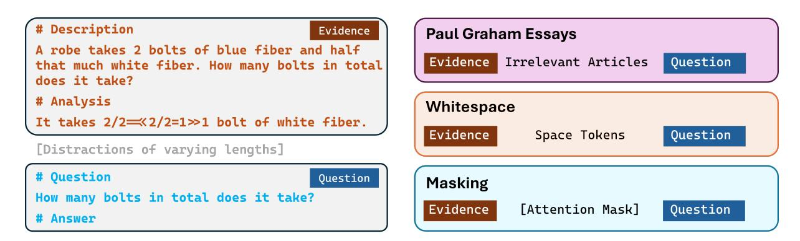
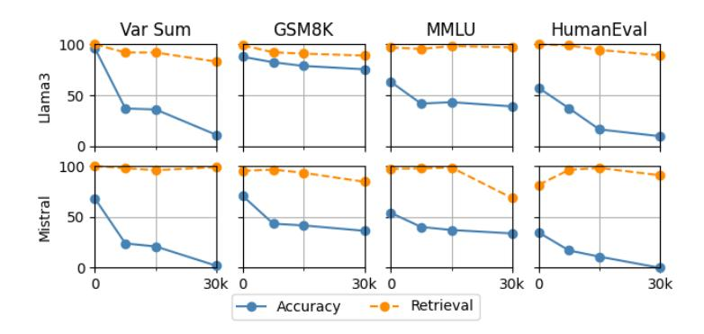
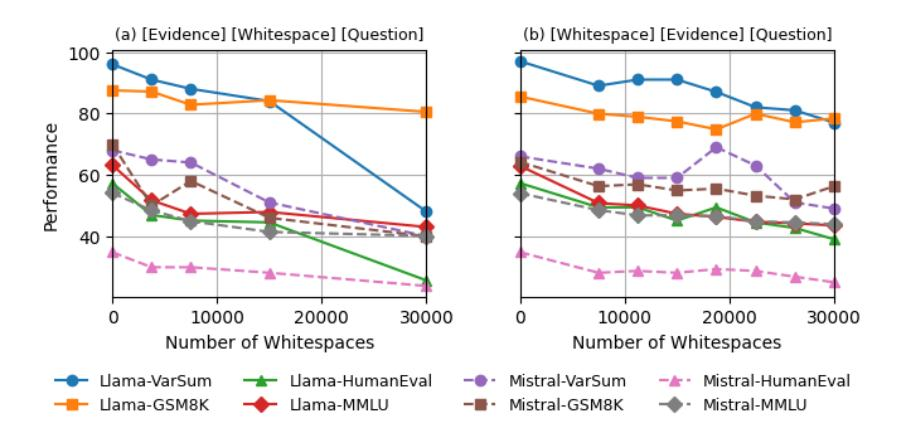
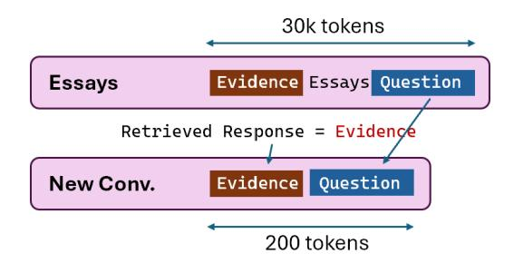

## **Context Length Alone Hurts LLM Performance Despite Perfect Retrieval**

Yufeng Du <sup>1\*</sup>, Minyang Tian <sup>1\*</sup>, Srikanth Ronanki <sup>2</sup>, Subendhu Rongali <sup>2</sup>, Sravan Bodapati <sup>2</sup>, Aram Galstyan <sup>2,3</sup>, Azton Wells<sup>4</sup>, Roy Schwartz<sup>5</sup>, Eliu A Huerta<sup>4,6</sup>, Hao Peng<sup>1</sup>

<sup>1</sup>University of Illinois at Urbana-Champaign, <sup>2</sup>Amazon.com Inc., <sup>3</sup>USC Information Sciences Institute, <sup>4</sup>Argonne National Laboratory, <sup>5</sup>The Hebrew University of Jerusalem, <sup>6</sup>University of Chicago

Correspondence: {yufengd4, mtian8, haopeng}@illinois.edu

#### **Abstract**

Large language models (LLMs) often fail to scale their performance on long-context tasks performance in line with the context lengths they support. This gap is commonly attributed to retrieval failures—the models' inability to identify relevant information in the long inputs. Accordingly, recent efforts often focus on evaluating and improving LLMs' retrieval performance: if retrieval is perfect, a model should, in principle, perform just as well on a long input as it does on a short one-or should it? This paper presents findings that the answer to this question may be negative. Our systematic experiments across 5 open- and closedsource LLMs on math, question answering, and coding tasks reveal that, even when models can perfectly retrieve all relevant information, their performance still degrades substantially (13.9%–85%) as input length increases but remains well within the models' claimed lengths. This failure occurs even when the irrelevant tokens are replaced with minimally distracting whitespace, and, more surprisingly, when they are all masked and the models are forced to attend only to the relevant tokens. A similar performance drop is observed when all relevant evidence is placed immediately before the question. Our findings reveal a previouslyunrealized limitation: the sheer length of the input alone can hurt LLM performance, independent of retrieval quality and without any distraction. They motivate our simple, modelagnostic mitigation strategy that transforms a long-context task into a short-context one by prompting the model to recite the retrieved evidence before attempting to solve the problem. On RULER, we observe a consistent improvement of GPT-40 up to 4% on an already strong baseline.

#### 1 Introduction

Recent large language models (LLMs) have substantially expanded their context windows. For

example, models like Llama-3 (Meta, 2024) and Claude 3 (Anthropic, 2024) can process 100K+ tokens, and Gemini can reportedly handle several million tokens (Team et al., 2024). The push to extend context windows of LLMs has raised expectations for their ability to solve problems over long inputs, such as those that require integrating information across, e.g., multiple books, entire code repositories, or modeling long-horizon conversation (Chang et al., 2023; Liu et al., 2024a; Stallone et al., 2024). However, the growing capacity of LLMs to process long inputs has not consistently translated into a corresponding capability to effectively solve tasks over long contexts (Hengle et al., 2025; Lee et al., 2024; Kuratov et al., 2024, inter alia). What, then, prevents models from turning access to information into effective use for problemsolving over long contexts?

Recent studies suggest that LLMs approach longcontext tasks through two interleaved processes: (1) identifying relevant information within the input (commonly referred to as **retrieval**<sup>1</sup>), and (2) using it to solve the problem (Wu et al., 2024c; Kuratov et al., 2024; Li et al., 2024a; Zhang et al., 2025b, inter alia). This conceptual decomposition naturally invites the following intuition: if retrieval is perfect, a model should, in principle, perform just as well on a long input as it does on a short one. Accordingly, failures in long-context tasks are often attributed to suboptimal or hallucinated retrieval. As a result, the ability to identify relevant evidence has been treated as a crucial capability for long-context LLMs and has shaped, at least in part, both the evaluation (Kamradt, 2023; Xiao et al., 2024; Mohtashami and Jaggi, 2023; Modarressi et al., 2025a; Yu et al., 2025, inter alia) and model

<sup>\*</sup>Equal contribution.

<sup>&</sup>lt;sup>1</sup>Our use of the term retrieval follows standard practice in the long-context LLM literature (Kamradt, 2023; Wu et al., 2024c; Hsieh et al., 2024, *inter alia*). It refers to a model's ability to attend to and recite specific texts from the context, and should not be confused with retrieval in retrieval-augmented generation (RAG), which typically involves search engines.

```
Problem: Let x1=100, and x2=x1. If x3=x2+46, then what is x3?

Question: If x3=x2+46, then what is x3?

Answer:

x3=146 

Problem: Let x1=100, and x2=x1. If x3=x2+46, then what is x3? (25000 space tokens)
Question: If x3=x2+46, then what is x3?

Answer:

Here's the step-by-step reasoning:

1. We are given that x1 = 100 and x2 = x1.
2. Since x2 = x1, x2 also equals 100.
3. The equation for x3 is x3 = x2 + 46.
4. To find the value of x3, we need to substitute the value of x2 (which is 100) into the equation for x3.
5. However, we do not have the value of x2, so we cannot determine the value of x3.

Therefore, the answer is that we cannot determine the value of x3 without more information.
```

Figure 1: Extending the input length alone substantially degrades LLM reasoning capability, even if the model is still able to retrieve the relevant evidence. In this example, inserting 25000 white spaces (with minimal distraction) does not prevent the model from extracting all conditions and question correctly, but nevertheless causes it to reach the wrong answer.

designs in recent efforts to improve long-context LLMs (Yu et al., 2023; Peng et al., 2023; Li et al., 2023; Xiong et al., 2024; Jin et al., 2024; Fu et al., 2024; Ge et al., 2024; Chen et al., 2024; Xu et al., 2025; Han et al., 2024, *inter alia*).

This work provides evidence that calls this premise into question. Our systematic, controlled experiments across 5 open- and closed-source models on math, question answering, and code generation tasks show that even when a model can perfectly retrieve all the evidence—in the strictest possible sense, reciting all tokens with 100% exact match—its performance still degrades substantially as input length increases (§3). For example, Llama-3.1-8B Instruct, with a claimed 128K context length, is able to retrieve all evidence with exact matches for 970 of 1000 MMLU problems (Hendrycks et al., 2021b) extended to 30k tokens with irrelevant tokens — matching its retrieval performance on the same problems presented in the original form with shorter contexts. However, despite this robustness in retrieval, its accuracy drops by 24.2% compared to the short-context case. More concerningly, this failure occurs even when the irrelevant tokens in the long context consist of minimally distracting whitespace (Fig. 1; §4.1), and even when the evidence is placed immediately before the question. Surprisingly, in a separate experiment, we observe a similar performance drop even when all irrelevant tokens are masked and the model attends only to the evidence and the

question—identical to those in the short-context setting except for the longer distance between the evidence and the question (§4.1).

These findings reveal a previously-unrealized limitation: the sheer length of the input alone can hurt LLM performance, independent of retrieval quality and without any distraction. They motivate the following hypothesis: even when retrieval is perfect, the model's performance can still be improved by limiting the number of tokens in the input. Our controlled experiments provide evidence supporting this hypothesis, and yield a simple and effective retrieve-then-reason mitigation strategy (§5). Specifically, we prompt the model to recite the evidence retrieved from the long context and prepend it directly before the question to form a new, shorter prompt to get the final output; this effectively converts the long-context task into a short-context one. Our experiments on GPT-40 on RULER show that this simple approach consistently improves performance by up to 4% on top of an already high baseline performance.

Our findings reveal previously underappreciated limitations in how current models approach long-context tasks. They offer a potential explanation for a recurring observation in retrieval-augmented generation (RAG) that performance often saturates or even degrades as more documents are added to the context (Cuconasu et al., 2024; Jin et al., 2024; Yu et al., 2024, *inter alia*), and for recent findings that long CoTs can sometimes hurt the

performance (Zeng et al., 2025). These results call for a rethinking of how long-context capabilities are evaluated. In particular, benchmarks that isolate retrieval as a standalone capability might overestimate progress, as improvements in retrieval alone do not necessarily translate into better long-context performance; instead long-context capabilities should be evaluated holistically. Practically, our proposed mitigation strategy is model-agnostic, simple, and effective.

#### 2 Background and Related Work

Recent work on long-context LLMs has largely followed a dichotomy of long context capabilities: (1) retrieving relevant information from long inputs, and (2) solving the task using the retrieved evidence (Qiu et al., 2025; Li et al., 2024a; Zhang et al., 2025b; Wu et al., 2024c, inter alia). This intuition motivates evaluation methods based on retrieval, such as needle-in-the-haystack tests (Kamradt, 2023) and passkey retrieval (Mohtashami and Jaggi, 2023). The core intuition suggests that if a model can accurately retrieve the relevant formation, it should be able to use that information as effectively as it would in a short-context setting. From this perspective, improvements in retrieval are often taken as evidence of progress in longcontext capabilities (Peng et al., 2023; Xiong et al., 2024; Jin et al., 2024; Fu et al., 2024; Chen et al., 2024; Xu et al., 2025; Lin et al., 2025, *inter alia*).

To better reflect real-world use cases, later benchmarks extend this setup to include reasoning tasks that require aggregating multiple pieces of evidence, such as multi-step inference, variable binding, and multi-document question answering (Wang, 2025; Hsieh et al., 2024; Kuratov et al., 2024; Ling et al., 2024; Minzheng Wang et al., 2024; Li et al., 2024b; Song et al., 2024; Zhang et al., 2024a, inter alia). Findings from these evaluations show that strong performance on synthetic retrieval tests does not always translate to more complex long-context tasks (Hengle et al., 2025; Lee et al., 2024; An et al., 2024, inter alia), suggesting a different conclusion that language models struggle to use information in long-context inputs as effectively as when the information is contained in a short-context (Zhang et al., 2024b; Kuratov et al., 2024; Zhang et al., 2025a, inter alia). These failures are typically attributed to suboptimal retrieval. For example, retrieval performance often drops when more distractors are present (Ivgi

et al., 2022; Goldman et al., 2024), when retrieval and aggregation of multiple pieces of evidence is required (Wang, 2025; Karpinska et al., 2024; Agrawal et al., 2024; Song et al., 2024), when relevant passages have low lexical overlap (Modarressi et al., 2025b), or when the evidence appears near the middle of the context (Liu et al., 2024b). Some studies have also noted that irrelevant tokens can distract the model and impair its reasoning (Shi et al., 2023; Wu et al., 2024a).

A deeper understanding of these failures and LLMs long-context capabilities in general requires carefully controlled experiments that disentangle factors such as context length, token-level distraction, and task complexity. To the best of our knowledge, such analysis remains scarce, yet it is essential for uncovering the true limits of current models and guiding future efforts. This work takes steps toward that goal through a series of controlled experiments designed to address a central question: what prevents a model from solving a problem when it already has perfect access to all the information it needs? While the retrieval performance and the distractions from irrelevant content are both important, our findings reveal a previously overlooked factor: the sheer length of the context itself. Our findings complement the prevailing conclusions that long-context performance is often bottlenecked by retrieval failures or distraction.

## 3 Measuring Long-context Performance under Perfect Retrieval

To better understand the factors limiting LLMs' long-context performance, §3.1 presents a series of systematic, controlled experiments designed to answer a simple but fundamental question: When a model can perfectly retrieve all the information it needs, can it solve long-context tasks as effectively as short-context ones? We observe a consistent and substantial performance drop across 5 open and closed models even when all evidence can be retrieved with a 100% exact match (§3.2).

### 3.1 A Long-Context Synthetic Benchmark Covering Math, QA, and Coding

This section introduces our experiment setting and lays the ground work for onward discussion. Our synthetic benchmark is constructed by forming long-context tasks from short-context ones, inspired by recent efforts (Bai et al., 2024; Wu et al.,

2024b; Hu et al., 2024; Zhu et al., 2025). We include math, question answering, and code generation tasks to make our conclusions more relevant to a broad range of application scenarios.

Figure 2 provides an illustrative example. We identify two components of each problem: the evidence and the question. The evidence contains all the information that the model needs to solve the task, and the question contains the query and format requirements. Both are specific to the task and will be detailed later in this section. Given a pair of evidence and question, we insert distraction tokens in between to reach desired context lengths. This creates input of the form: [Evidence] [Distraction Tokens] [Question]. Intuitively, this setting simulates realworld scenarios where a user interacts with a chatbot over a long dialogue, and the model must retrieve evidence from an earlier part of the conversation to answer the current query.

While previous benchmarks increase the difficulty of retrieval through different methods such as scattering the evidence across the context (Kuratov et al., 2024; Hsieh et al., 2024), and placing the evidence in different positions (Kuratov et al., 2024; Hsieh et al., 2024; Zhang et al., 2024a; Minzheng Wang et al., 2024), we aim to make retrieval as easy as possible to control for perfect retrieval in order to answer our RQ. This leads to two of our major design choices: (1) We keep the evidence in a single consecutive chunk to avoid requiring the model to aggregate scattered evidence. (2) We intentionally place the evidence at the beginning of the input, which, as the Lost-in-a-Middle effect (Liu et al., 2024b) suggest, is the easiest location to retrieve; the question is put at the end to better simulate real-world applications. In this experiment we follow Kamradt (2023) and use Paul Graham Essays (Graham) as the distraction tokens. Our setting generalizes to different evidence locations and distraction tokens, which we explore later in §4.

# Diverse tasks covering math, QA, and coding To isolate the effect of context length on model performance, we intentionally select tasks that are commonly used to evaluate LLMs and on which most models perform consistently well, at least under short-context settings. To cover different capabilities, we use the following datasets: math (GSM8K; Cobbe et al., 2021), question answering (MMLU; Hendrycks et al., 2021a), and

| Task Name                         | Type                     | Evidence                                                  | Question                        |
|-----------------------------------|--------------------------|-----------------------------------------------------------|---------------------------------|
| Variable<br>Summation<br>(VarSum) | Variable<br>Tracking     | Values of 50<br>integer<br>variables                      | The sum of 3 random variables   |
| GSM8K                             | Math                     | Problem<br>description<br>with chain-of-<br>thought steps | Specific question               |
| MMLU                              | Multiple<br>Choice<br>QA | Problem description                                       | Question<br>and four<br>options |
| HumanEval                         | Coding                   | Function definition w/ docstring                          | Instruction                     |

Table 1: Summary of our tasks targeting different types of model capacities, with the identification of evidence and question. The test sets of GSM8K, MMLU and HumanEval are used.

code generation (HumanEval; Chen et al., 2021). In addition, we include a synthetic Variable Summation task in order to show whether this degradation applies to very simple problems. This task is inspired by Variable Tracking (Hsieh et al., 2024), Distractor Variable Assignment (Li et al., 2025) and RV-Bench (Hong et al., 2025), and aims to test the model's ability to perform very basic arithmetic operationss: summing a subset of variables from a given list. Table 1 summarizes the evidence and question of these tasks.

Measuring retrieval with exact match To quantify retrieval performance, we prompt the model to recite both the evidence and the question exactly as they appear in the input. Retrieval performance is measured using exact match, where the model receives a score of zero if there is a difference between its output and the original evidence or question. Note that the retrieval is evaluated separately from the actual performance evaluation. In the latter set-up, we do not ask the model to recite before solving the problem.

In this work, we intentionally measure retrieval in the strictest possible way to rule out the effect of retrieval failures as a source of error in problem solving, in contrast to existing studies (Li et al., 2024a; Kuratov et al., 2024; Li et al., 2024b; Qiu et al., 2025, *inter alia*). Although these works report a similar gap between long-context retrieval and reasoning performance, some compare retrieval and problem-solving on different tasks; in such settings, a perfect score on a retrieval task does not ensure that there are no retrieval failures



Figure 2: *Left*: In our synthetic benchmark, each long-context problem is created by separating a short-context problem into evidence and question, and extending the length with distraction tokens. *Right*: We discuss three types of distractions in this work, ordered by decreasing strength: Essay tokens (Section 3), Whitespace (Section 4.1), and masking out all distraction tokens (Section 4.2).

on the actual problem-solving tasks. Others, which involve in their settings retrieval, aggregation and relatively simple reasoning over multiple evidence pieces (needles), suggest multiple causes for the gap, such as the model's failure to extract or aggregate all needles. In both types of studies, retrieval cannot be conclusively excluded as a possible failure mode.

In contrast, by measuring retrieval on the evidence for the exact problems they are tasked to solve, we are allowed to isolate the effect of retrieval failures and conduct a more direct investigation of our research question: the effect of the sheer context length on problem solving. To the best of our knowledge, our work is among the first attempts to measure long-context performance under explicit control for perfect retrieval.

#### 3.2 Performance Drops Despite Perfect Retrieval

Models We choose two open-source models, Llama-v3.1-8B-Instruct and Mistral-v0.3-7B-Instruct, because of their long-context capability (with 128K and 32K claimed context lengths respectively) and good performance on short-context benchmarks (Meta, 2024; Jiang et al., 2023). Both models are widely used for post-training, while having different architectures. This choice of the two representative but very different models can help make our conclusions more practically relevant in broader applications.

**Results** Fig. 3 shows the results of the retrieval and problem solving performance. Although there exists a drop in retrieval scores, this drop is relatively marginal until the length reaches 30K tokens. In fact, for inputs shorter than 15K tokens, both

models are able to accurately extract the problem description except for no more than 8.2% of the problems. Note again that the retrieval score is calculated by exact match and a failure does not necessarily mean the model cannot extract the evidence. In contrast, accuracy drops drastically across all tasks, by a larger margin as opposed to the retrieval score across almost all tasks and context lengths (except Llama3 on GSM8K with 7k tokens). A large portion of the drop in problem solving happens within 7k tokens, well below the limit of either model where retrieval performance starts to degrade. On Var Sum, for example, the number is 59% off the baseline 96% for Llama, and 44% off the 0-context 68% for Mistral, while the retrieval scores only drop by 8% and 2% respectively; on HumanEval, the retrieval scores for Mistral even increase on longer inputs while its accuracy scores keep decreasing.

**Discussion** Our results confirm that even in the cases where a model accurately retrieves all the evidence, it may still fail to solve a long-context task of which it is capable of solving the short-context version. This align with existing ones in reporting a performance drop under long input (Li et al., 2024a; Kuratov et al., 2024) while providing fresh insights. Existing conclusions often entangle retrieval accuracy with task performance. Common settings like locating relevant info from distracting text and reasoning through aggregated evidence may fail due to retrieval, aggregation (not discussed here), reasoning, or the input length itself. This work, to the best of our knowledge, for the first time, presents systematic evidence suggesting that the model's capabilities in reasoning, QA, and coding degrade with longer inputs and contribute to their failures,



Figure 3: Evaluation results on Llama3-8B and Mistral-v0.3-7B, with performance accuracy in problem solving (Accuracy) and retrieval scores measured by Exact Match (Retrieval). "Context length" refers to the *total number of input tokens* for each problem, which is crafted by inserting PaulGrahamEssay tokens between evidence and question (as illustrated in Fig. 2). See Appendix for detailed numbers.

even when retrieval is perfect. Our findings *never* seek to diminish the importance of the retrieval; rather, by simulating an "upper bound" — perfect retrieval — they raise a complementary question that is often overlooked: in addition to improving models' ability to retrieve the right information, we must also ask *can the model still use that information effectively in long-context settings?* 

| Model      | Task      | 0     | 7500  | 15000 | 30000 |
|------------|-----------|-------|-------|-------|-------|
|            | VarSum    | 100.0 | 0.0   | 0.0   | 0.0   |
| CDT 4-     | GSM8K     | 87.8  | -7.0  | -8.5  | -7.0  |
| GPT-40     | MMLU      | 82.4  | -2.1  | -0.3  | -1.0  |
|            | HumanEval | 68.3  | 0.0   | 0.0   | -3.1  |
|            | VarSum    | 90.2  | -0.6  | -5.4  | -4.8  |
| Claude-3.5 | GSM8K     | 95.3  | -3.8  | -5.2  | -6.0  |
|            | MMLU      | 82.2  | -41.7 | -38.8 | -67.6 |
|            | HumanEval | 90.2  | -0.6  | -5.4  | -4.8  |
|            | VarSum    | 100.0 | 0.0   | 0.0   | 0.0   |
| a · ·      | GSM8K     | 83.2  | +7.7  | +8.6  | +6.2  |
| Gemini     | MMLU      | 81.9  | -3.0  | -3.5  | -3.9  |
|            | HumanEval | 86.0  | -11.0 | -2.5  | -1.8  |

Table 2: Performance drop across different lengths on selected closed-source models, with corresponding numbers of whitespace tokens *between* evidence and question.

## 4 Models Struggle Even Without Distraction

This section aims to answer *What prevents a model* from effectively using information it has successfully retrieved? In addition to the distraction from the irrelevant tokens, which aligns with existing observations (Shi et al., 2023; Wu et al., 2024a), we reveal a surprising finding: the sheer length of the context alone can negatively impact the model's performance, even when there is little (§4.1) to no (§4.2) distraction.

## 4.1 Performance Degradation with Minimum Distraction

To reduce the distraction from irrelevant tokens, we modify the benchmark design in §3.1, by replacing the natural language tokens with whitespace; all other settings are kept the same. We intuitively choose whitespace, since it generally carries minimum information and is a natural separator, creating least distraction (Zhang et al., 2025c).

**Llama and Mistral** Fig. 4(a) shows our results for Llama and Mistral. Although these results generally reflect an improvement compared to those under the essay distraction in the previous section (Fig. 3), we can still see a substantial drop in performance for both models and all tasks: at least 7% at 30K space tokens (as in Llama-GSM8K), and more significant drops, notably including a 48% drop for Llama on VarSum and 30% for Mistral on GSM8K.

Closed-source Models We also test three closedsource models: GPT4o (OpenAI, 2024), Claude-3.7-Sonnet(Anthropic, 2024) and Gemini-2.0 (Hassabis and Kavukcuoglu, 2024) on our selected tasks. Results are shown in Table 2. We observe a very different pattern with these models from their smaller open-source counterparts. They experience a smaller drop across increased context lengths. For VarSum, both GPT-40 and Gemini-2.0 achieve perfect performance throughout. The closed-source models generally exhibit more robustness than the open-source ones in terms of the negative impact of context lengths. However, substantial and mostly consistent degradation is still observed in most models and tasks, despite varying trends among tasks - with the notable exception



Figure 4: Performance across different context lengths on Llama-3-8B Instruct and Mistral-v0.3-7B-Instruct, with corresponding numbers of whitespace tokens inserted for minimum distraction. (a, Left) Whitespaces are inserted *between* evidence and question. (b, Right) Whitespaces are inserted *before* evidence, and question adjacent to evidence.

of Gemini on GSM8K, where performance at 30K actually improves by 8.6%, and HumanEval, where the performance improves after a certain length in some cases (15K vs 7K for Gemini, for example).

To determine if context length itself is the factor, we also need to control the relative distance between evidence and question, as existing works (Li et al., 2024a; An et al., 2024) suggest that it may affect performance drop. Therefore, we move the evidence back to the end of the input, right before the question, so that the distance does not change with input size. Our results are shown in Fig. 4(b), where a substantial drop is observed despite occasional fluctuations: up to 17% for Mistral and 20% for Llama under 30K space tokens.

Previous observations like Lost-in-the-middle (Liu et al., 2024b) acknowledge the affect of evidence position in long-context performance, especially when the evidence is in the middle of the text; on the other hand, our results prove that the performance degradation is directly related to the input length alone, regardless of the relative position between evidence and question. In fact, the degradation still happens when the evidence is put in the best positions possible, the beginning and the end of the text, and that further strengthens that the sheer length of input is a decisive factor to the degradation.

## **4.2** Eliminating Distraction Completely with Masking

The previous experiment with whitespace already provides initial implication that with minimal distraction, the models are still hurt by increased context size. Now, we take one step further and seek no distraction, by masking all distraction tokens when calculating attention for our targeted opensource models, Llama and Mistral. Effectively, the input to the model becomes [Evidence] [Masks] [Question], where the model attends *only* to the evidence and the question, identical to the shortcontext setting except for the increased distance between them introduced by the masked tokens. The results are in Table 3. Surprisingly, yet still in tune with our expectations, we still observe a consistent performance drop, which reaches at least 7.9% for both models at 30K masked distraction tokens. Some drops are even larger compared to when we fill the context with space: for HumanEval, Llama3 suffers a 50% drop with masking compared to that of only 19.4% with space.

| Model   | Task      | 0    | 3750  | 7500  | 15000 | 30000 |
|---------|-----------|------|-------|-------|-------|-------|
|         | VarSum    | 97.0 | -11.0 | -35.0 | -24.0 | -50.0 |
| Llama3  | GSM8K     | 86.1 | -1.7  | -3.3  | -4.3  | -19.6 |
| Diamas  | MMLU      | 62.8 | -11.3 | -15.9 | -15.5 | -21.1 |
|         | HumanEval | 57.3 | -5.5  | -22.0 | -16.5 | -50.0 |
|         | VarSum    | 66.0 | -5.0  | -11.0 | -19.0 | -34.0 |
| M:1     | GSM8K     | 64.5 | -2.1  | -4.8  | -8.2  | -15.1 |
| Mistral | MMLU      | 53.8 | -4.7  | -7.5  | -11.0 | -11.8 |
|         | HumanEval | 34.8 | -7.3  | -8.5  | -10.4 | -7.9  |

Table 3: Llama-3 and Mistral still suffer a performance drop with increased length even when all distractions are masked. The numbers 0, 3750, etc. are lengths of masked distraction in tokens.

**Discussion** Through these settings, we feel more confident to conclude that long-context language models suffer a common performance degradation when solving long-context tasks, even with perfect

retrieval, even with minimum or zero distraction. Our conclusion suggests limitations for practical applications. For example, in typical scenarios like chatbot dialogues, even when the question immediately follows its evidence or evidence is pinpointed, longer input may still lead to unexpected failures. Our finding also provides insight for the actual mitigation of the long-context degradation. One incentive that naturally emerges is to simply shorten the length of the input context. In the next section, we shall present a proof-of-concept solution based on this idea.

## 5 Shortening Input Through Retrieval: A Simple Fix

Having learned the negative impact of the sheer length of the context (§4), we naturally arrive at the following hypothesis: Even when retrieval is perfect, a model's performance can still be improved by limiting the number of tokens in the input.

This section introduces a simple, model-agnostic, and effective mitigation strategy for cases where accurate retrieval—though not necessarily perfect—can be achieved. We then present experimental results that support the above hypothesis.

Retrieve then Solve Given a long-context input problem, our strategy first prompts the model to retrieve and recite all relevant information from the input context. This recited evidence is then concatenated with the original problem statement to form a new, shorter prompt. The model solves the problem based solely on the recited evidence, without having the long context as part of its input, similarly to starting a new chat session in ChatGPT (see Fig. 5 for an illustrative example). This effectively turns a long-context task into a short-context one using an additional prompt.

This approach is related to Li et al. (2024a), which improves the model by training it to align to both retrieval and reasoning objectives. Our method, in contrast, does not address the retrieval problem itself; rather, with an explicit retrieval step, it assumes accurate retrieval as a prerequisite.

**Experiments** We evaluate our strategy on two benchmarks: (1) our synthetic benchmark under the initial setting, where we insert Essay tokens between evidence and question of GSM8K problems. (2) Two QA tasks, QA1 and QA2, of RULER (Hsieh et al., 2024), an established long-context benchmark, in which models are provided with a



Figure 5: Our strategy retrieves evidence to shorten the context length before solving the task.

problem and a number of potentially related documents, and are required to retrieve the answer from one or more of the documents. We compare our strategy against the baseline method where the model is directly asked to answer the question based on the input.

On our synthetic benchmark, as shown in Table 4, with our method, Mistral-v0.3-7B Instruct achieves a substantial performance boost under longer contexts without excessive prompt engineering, with a gap of less than 10% and a 30% boost until the input size reaches 26K.

On QA1 and QA2 tasks of RULER, we experiment with GPT-40, taking advantage of its retrieval capabilities. As shown in Section 5, under varying context lengths ranging from 128K to 4K tokens, while the baseline already achieves strong performance on QA1 (88.2–90.4%), our method yields consistent improvements, reaching 92.2% at 4K. Our method achieves a larger improvement on QA2 by maximum 4% at 32K.

| Length   | 0    | 3750 | 7500 | 15000 | 26250 |
|----------|------|------|------|-------|-------|
| Baseline | 70.6 | 49.3 | 43.4 | 41.6  | 35.5  |
| Ours     | 76.2 | 71.4 | 66.7 | 69.1  | 66.7  |

Table 4: On our synthetic benchmark with essay distractions, we improve performance of Mistral-v0.3-7B Instruct by up to 31.2% on GSM8K.

Our results suggests that this simple and modelagnostic approach can enhance a model's ability to make use of the information they can accurately retrieve from long contexts. In doing so, it helps close the gap between improvements in retrieval performance and actual gains on long-context tasks.

#### 6 Discussion

Our observations on the performance drop, even with masking, along with the relatively steady performance of closed-source models, are related to

| Method   | Task | 128K | 64K  | 32K  | 16K  | 8K   | 4K   |
|----------|------|------|------|------|------|------|------|
| Baseline | QA1  | 88.2 | 87.8 | 87.8 | 88.8 | 87.2 | 90.4 |
|          | QA2  | 63.2 | 67.0 | 68.4 | 69.4 | 71.4 | 71.2 |
| Ours     | QA1  | 88.2 | 88.4 | 88.6 | 89.8 | 89.8 | 92.2 |
|          | QA2  | 65.4 | 70.6 | 72.4 | 72.8 | 74.0 | 73.2 |

Table 5: Our method consistently improves the performance of GPT-40 on tasks QA1 and QA2 of the RULER benchmark.

findings from (Li et al., 2024a; An et al., 2024) which attribute the drop to a distribution bias with position introduced during training. While An et al. (2024) targets the drop in retrieval and Li et al. (2024a) addresses the long-context performance as a whole, our work further shows that this cause also applies to the degradation caused by the length itself, regardless of retrieval or distraction strength.

Our results further imply that the previous twopart decomposition of long-context problem solving into retrieval and problem solving (Qiu et al., 2025; Li et al., 2024a; Zhang et al., 2025b) is inconclusive, urging researchers to further explore the underlying mechanisms. The current effort to independently focus on improving models' longcontext retrieval and short-context capacities at training (Meta, 2024; Chen Wu and Yin Song and Eden Duthie, 2024; Yang et al., 2025; AI et al., 2024) may not fully translate to an overall improvement in long-context ability: failure is possible despite the model excelling in both. Our conclusion encourages a more comprehensive evaluation beyond focusing on retrieval, with a more finegrained analysis to precisely separate each failure

Our conclusion supplements existing observations for practical applications. It supports previous findings (e.g., Li et al. 2024c; Yu et al. 2024) that RAG suffers from retrieving too many documents. It also aligns with Dai et al. 2025; Zeng et al. 2025, which argue that generating excessively long CoTs can hurt reasoning models, despite being a common strategy.

#### 7 Conclusion

In this work, we expose a previously noticed but unexplored limitation: the performance degradation of language models may be attributed to the length of the input itself, even when the model is able to retrieve all relevant information, and all distractions are removed. Our findings challenge the popular view of decomposing long-context task solving into retrieval and problem solving, and encourage more consideration on future model designs and evaluations. Our simple yet effective strategy shows that the degradation can be mitigated through reducing the context length, serving as an initial attempt in bridging the gap between retrieval and long-context performance.

#### Limitations

The conclusions of this work are only based on two open-source models, three closed-source models and 4 tasks, despite consciously selecting those that are more representative. We did not run experiments for some combinations of settings, such as retrieval on closed-source models (due to these models occasionally refusing to recite evidence under a long input).

The method proposed in Section 5 has limited use case. It requires perfect retrieval, which is already hard in many real-world tasks that feature retrieval settings harder than in our synthetic data. We did not report results for open-source models on RULER, due to the fact that the failure of retrieval directly causes a performance drop (compared to baseline), and it is not our focus in this paper to address this type of failure.

# Declaration of generative AI and AI-assisted technologies

While preparing this work, we used OpenAI's Codex, GPT-40, o3 and ChatGPT 5 to assist with coding, as well as perform spell/grammar check, word selection, and rephrasing in paper writing. We inspected the generated contents and edited them as needed. We take full responsibility for the content of this work.

#### Acknowledgments

This research was supported by the Amazon-Illinois Center on AI for Interactive Conversational Experiences (AICE Center). E.A.H. acknowledges support from NSF grants OAC-2514142 and OAC-2209892. This work was supported by Laboratory Directed Research and Development (LDRD) funding from Argonne National Laboratory, provided by the Director, Office of Science, of the U.S. Department of Energy under Contract No. DE-AC02-06CH11357. An award for computer time was provided by the U.S. Department of Energy's Innovative and Novel Computational Impact on Theory and Experiment (INCITE) Program. This

research used supporting resources at the Argonne and the Oak Ridge Leadership Computing Facilities. The Argonne Leadership Computing Facility at Argonne National Laboratory is supported by the Office of Science of the U.S. DOE under Contract No. DE-AC02-06CH11357. The Oak Ridge Leadership Computing Facility at the Oak Ridge National Laboratory is supported by the Office of Science of the U.S. DOE under Contract No. DE-AC05-00OR22725. This research used both the DeltaAI advanced computing and data resource, which is supported by the National Science Foundation (award OAC 2320345) and the State of Illinois, and the Delta advanced computing and data resource which is supported by the National Science Foundation (award OAC 2005572) and the State of Illinois. Delta and DeltaAI are joint efforts of the University of Illinois Urbana-Champaign and its National Center for Supercomputing Applications.

#### References

- Ameeta Agrawal, Andy Dang, Sina Bagheri Nezhad, Rhitabrat Pokharel, and Russell Scheinberg. 2024. Evaluating multilingual long-context models for retrieval and reasoning. *Preprint*, arXiv:2409.18006.
- 01. AI, :, Alex Young, Bei Chen, Chao Li, Chengen Huang, Ge Zhang, Guanwei Zhang, Heng Li, Jiangcheng Zhu, Jianqun Chen, Jing Chang, Kaidong Yu, Peng Liu, Qiang Liu, Shawn Yue, Senbin Yang, Shiming Yang, Tao Yu, and 13 others. 2024. Yi: Open foundation models by 01.ai. *Preprint*, arXiv:2403.04652.
- Chenxin An, Jun Zhang, Ming Zhong, Lei Li, Shansan Gong, Yao Luo, Jingjing Xu, and Lingpeng Kong. 2024. Why does the effective context length of llms fall short? *Preprint*, arXiv:2410.18745.
- Anthropic. 2024. Introducing the next generation of claude. Accessed: 2025-05-18.
- Yushi Bai, Xin Lv, Jiajie Zhang, Yuze He, Ji Qi, Lei Hou, Jie Tang, Yuxiao Dong, and Juanzi Li. 2024. Longalign: A recipe for long context alignment of large language models. *ArXiv*, abs/2401.18058.
- Yapei Chang, Kyle Lo, Tanya Goyal, and Mohit Iyyer. 2023. Booookscore: A systematic exploration of book-length summarization in the era of llms. *ArXiv*, abs/2310.00785.
- Mark Chen, Jerry Tworek, Heewoo Jun, Qiming Yuan, Henrique Ponde de Oliveira Pinto, Jared Kaplan, Harri Edwards, Yuri Burda, Nicholas Joseph, Greg Brockman, Alex Ray, Raul Puri, Gretchen Krueger, Michael Petrov, Heidy Khlaaf, Girish Sastry, Pamela Mishkin, Brooke Chan, Scott Gray, and 39 others.

- 2021. Evaluating large language models trained on code. Licensed under the MIT License.
- Yukang Chen, Shengju Qian, Haotian Tang, Xin Lai, Zhijian Liu, Song Han, and Jiaya Jia. 2024. Longlora: Efficient fine-tuning of long-context large language models. *Preprint*, arXiv:2309.12307.
- Chen Wu and Yin Song and Eden Duthie. 2024. awsprototyping/MegaBeam-Mistral-7B-512k.
- Karl Cobbe, Vineet Kosaraju, Mohammad Bavarian, Mark Chen, Heewoo Jun, Lukasz Kaiser, Matthias Plappert, Jerry Tworek, Jacob Hilton, Reiichiro Nakano, Christopher Hesse, and John Schulman. 2021. Training verifiers to solve math word problems. *Preprint*, arXiv:2110.14168. The GSM8K dataset is licensed under the MIT License.
- Florin Cuconasu, Giovanni Trappolini, F. Siciliano, Simone Filice, Cesare Campagnano, Yoelle Maarek, Nicola Tonellotto, and Fabrizio Silvestri. 2024. The power of noise: Redefining retrieval for rag systems. Proceedings of the 47th International ACM SIGIR Conference on Research and Development in Information Retrieval.
- Muzhi Dai, Chenxu Yang, and Qingyi Si. 2025. S-grpo: Early exit via reinforcement learning in reasoning models. *Preprint*, arXiv:2505.07686.
- Yao Fu, Rameswar Panda, Xinyao Niu, Xiang Yue, Hannaneh Hajishirzi, Yoon Kim, and Hao Peng. 2024. Data engineering for scaling language models to 128k context. *Preprint*, arXiv:2402.10171.
- Suyu Ge, Xihui Lin, Yunan Zhang, Jiawei Han, and Hao Peng. 2024. A little goes a long way: Efficient long context training and inference with partial contexts. *Preprint*, arXiv:2410.01485.
- Omer Goldman, Alon Jacovi, Aviv Slobodkin, Aviya Maimon, Ido Dagan, and Reut Tsarfaty. 2024. Is it really long context if all you need is retrieval? towards genuinely difficult long context NLP. In *Proceedings of the 2024 Conference on Empirical Methods in Natural Language Processing*, pages 16576–16586, Miami, Florida, USA. Association for Computational Linguistics.
- Paul Graham. Paul graham. https://github.com/ ofou/graham-essays.
- Chi Han, Qifan Wang, Hao Peng, Wenhan Xiong, Yu Chen, Heng Ji, and Sinong Wang. 2024. Lm-infinite: Zero-shot extreme length generalization for large language models. *Preprint*, arXiv:2308.16137.
- Demis Hassabis and Koray Kavukcuoglu. 2024. Introducing gemini 2.0: our new ai model for the agentic era. Accessed: 2025-05-18.
- Dan Hendrycks, Collin Burns, Steven Basart, Andy Zou, Mantas Mazeika, Dawn Song, and Jacob Steinhardt. 2021a. Measuring massive multitask language understanding. *Preprint*, arXiv:2009.03300. The MMLU dataset is licensed under the MIT License.

- Dan Hendrycks, Collin Burns, Saurav Kadavath, Akul Arora, Steven Basart, Eric Tang, Dawn Song, and Jacob Steinhardt. 2021b. Measuring mathematical problem solving with the math dataset. *arXiv* preprint arXiv:2103.03874.
- Amey Hengle, Prasoon Bajpai, Soham Dan, and Tanmoy Chakraborty. 2025. Can llms reason over extended multilingual contexts? towards long-context evaluation beyond retrieval and haystacks. *Preprint*, arXiv:2504.12845.
- Zijin Hong, Hao Wu, Su Dong, Junnan Dong, Yilin Xiao, Yujing Zhang, Zhu Wang, Feiran Huang, Linyi Li, Hongxia Yang, and Xiao Huang. 2025. Benchmarking large language models via random variables. *Preprint*, arXiv:2501.11790.
- Cheng-Ping Hsieh, Simeng Sun, Samuel Kriman, Shantanu Acharya, Dima Rekesh, Fei Jia, Yang Zhang, and Boris Ginsburg. 2024. Ruler: What's the real context size of your long-context language models? *arXiv preprint arXiv:2404.06654*. This work is licensed under the Apache License 2.0.
- Zhiyuan Hu, Yuliang Liu, Jinman Zhao, Suyuchen Wang, Yan Wang, Wei Shen, Qing Gu, Anh Tuan Luu, See-Kiong Ng, Zhiwei Jiang, and Bryan Hooi. 2024. Longrecipe: Recipe for efficient long context generalization in large language models. *ArXiv*, abs/2409.00509.
- Maor Ivgi, Uri Shaham, and Jonathan Berant. 2022. Efficient long-text understanding with short-text models. *Preprint*, arXiv:2208.00748.
- Albert Q. Jiang, Alexandre Sablayrolles, Arthur Mensch, Chris Bamford, Devendra Singh Chaplot, Diego de las Casas, Florian Bressand, Gianna Lengyel, Guillaume Lample, Lucile Saulnier, Lélio Renard Lavaud, Marie-Anne Lachaux, Pierre Stock, Teven Le Scao, Thibaut Lavril, Thomas Wang, Timothée Lacroix, and William El Sayed. 2023. Mistral 7b. *Preprint*, arXiv:2310.06825.
- Bowen Jin, Jinsung Yoon, Jiawei Han, and Sercan Ö. Arik. 2024. Long-context llms meet rag: Overcoming challenges for long inputs in rag. *ArXiv*, abs/2410.05983.
- Gregory Kamradt. 2023. Needle in a haystack pressure testing llms. https://github.com/gkamradt/LLMTest\_NeedleInAHaystack/tree/7b90d285651b68d39a94f3d3bd3672f84192c989.
- Marzena Karpinska, Katherine Thai, Kyle Lo, Tanya Goyal, and Mohit Iyyer. 2024. One thousand and one pairs: A "novel" challenge for long-context language models. *Preprint*, arXiv:https://arxiv.org/abs/2406.16264.
- Yuri Kuratov, Aydar Bulatov, Petr Anokhin, Ivan Rodkin, Dmitry Sorokin, Artyom Sorokin, and Mikhail Burtsev. 2024. Babilong: Testing the limits of llms with long context reasoning-in-a-haystack. *Preprint*, arXiv:2406.10149.

- Jinhyuk Lee, Anthony Chen, Zhuyun Dai, Dheeru Dua, Devendra Singh Sachan, Michael Boratko, Yi Luan, Sébastien M. R. Arnold, Vincent Perot, Siddharth Dalmia, Hexiang Hu, Xudong Lin, Panupong Pasupat, Aida Amini, Jeremy R. Cole, Sebastian Riedel, Iftekhar Naim, Ming-Wei Chang, and Kelvin Guu. 2024. Can long-context language models subsume retrieval, rag, sql, and more? ArXiv, abs/2406.13121.
- Belinda Z. Li, Been Kim, and Zi Wang. 2025. Questbench: Can Ilms ask the right question to acquire information in reasoning tasks? *Preprint*, arXiv:2503.22674.
- Dacheng Li, Rulin Shao, Anze Xie, Ying Sheng, Lianmin Zheng, Joseph Gonzalez, Ion Stoica, Xuezhe Ma, and Hao Zhang. 2023. How long can context length of open-source LLMs truly promise? In *NeurIPS* 2023 Workshop on Instruction Tuning and Instruction Following.
- Huayang Li, Pat Verga, Priyanka Sen, Bowen Yang, Vijay Viswanathan, Patrick Lewis, Taro Watanabe, and Yixuan Su. 2024a. Alr<sup>2</sup>: A retrieve-then-reason framework for long-context question answering. *Preprint*, arXiv:2410.03227.
- Mo Li, Songyang Zhang, Yunxin Liu, and Kai Chen. 2024b. Needlebench: Can Ilms do retrieval and reasoning in 1 million context window? *Preprint*, arXiv:2407.11963.
- Xinze Li, Yixin Cao, Yubo Ma, and Aixin Sun. 2024c. Long context vs. rag for llms: An evaluation and revisits. *Preprint*, arXiv:2501.01880.
- Xihui Lin, Yunan Zhang, Suyu Ge, Liliang Ren, Barun Patra, Vishrav Chaudhary, Hao Peng, and Xia Song. 2025. S2-attention: Hardware-aware context sharding among attention heads. *Preprint*, arXiv:2407.17678.
- Zhan Ling, Kang Liu, Kai Yan, Yifan Yang, Weijian Lin, Ting-Han Fan, Lingfeng Shen, Zhengyin Du, and Jiecao Chen. 2024. Longreason: A synthetic long-context reasoning benchmark via context expansion. arXiv preprint arXiv:2501.15089.
- Jiawei Liu, Jia Le Tian, Vijay Daita, Yuxiang Wei, Yifeng Ding, Yuhan Katherine Wang, Jun Yang, and Lingming Zhang. 2024a. Repoqa: Evaluating long context code understanding. *ArXiv*, abs/2406.06025.
- Nelson F. Liu, Kevin Lin, John Hewitt, Ashwin Paranjape, Michele Bevilacqua, Fabio Petroni, and Percy Liang. 2024b. Lost in the middle: How language models use long contexts. *Transactions of the Association for Computational Linguistics*, 12:157–173.
- Meta. 2024. The llama 3 herd of models. *Preprint*, arXiv:2407.21783.
- Longze Chen Minzheng Wang, Cheng Fu, Shengyi Liao, Xinghua Zhang, Bingli Wu, Haiyang Yu, Nan Xu, Lei Zhang, Run Luo, Yunshui Li, Min Yang, Fei Huang, and Yongbin Li. 2024. Leave no document

- behind: Benchmarking long-context llms with extended multi-doc qa. In *Proceedings of EMNLP*, pages 5627–5646.
- Ali Modarressi, Hanieh Deilamsalehy, Franck Dernoncourt, Trung Bui, Ryan A. Rossi, Seunghyun Yoon, and Hinrich Schütze. 2025a. Nolima: Longcontext evaluation beyond literal matching. *Preprint*, arXiv:2502.05167.
- Ali Modarressi, Hanieh Deilamsalehy, Franck Dernoncourt, Trung Bui, Ryan A. Rossi, Seunghyun Yoon, and Hinrich Schütze. 2025b. Nolima: Long-context evaluation beyond literal matching. In *Forty-second International Conference on Machine Learning*.
- Amirkeivan Mohtashami and Martin Jaggi. 2023. Landmark attention: Random-access infinite context length for transformers. *Preprint*, arXiv:2305.16300.
- OpenAI. 2024. Gpt-4 technical report. *Preprint*, arXiv:2303.08774.
- Bowen Peng, Jeffrey Quesnelle, Honglu Fan, and Enrico Shippole. 2023. Yarn: Efficient context window extension of large language models. *Preprint*, arXiv:2309.00071.
- Yifu Qiu, Varun Embar, Yizhe Zhang, Navdeep Jaitly, Shay B. Cohen, and Benjamin Han. 2025. Eliciting in-context retrieval and reasoning for long-context large language models. *Preprint*, arXiv:2501.08248.
- Freda Shi, Xinyun Chen, Kanishka Misra, Nathan Scales, David Dohan, Ed H. Chi, Nathanael Schärli, and Denny Zhou. 2023. Large language models can be easily distracted by irrelevant context. In *Proceedings of the 40th International Conference on Machine Learning*, volume 202 of *Proceedings of Machine Learning Research*, pages 31210–31227. PMLR.
- Mingyang Song, Mao Zheng, and Xuan Luo. 2024. Counting-stars: A multi-evidence, position-aware, and scalable benchmark for evaluating long-context large language models. *Preprint*, arXiv:2403.11802.
- Matt Stallone, Vaibhav Saxena, Leonid Karlinsky, Bridget McGinn, Tim Bula, Mayank Mishra, Adriana Meza Soria, Gaoyuan Zhang, Aditya Prasad, Yikang Shen, Saptha Surendran, Shanmukha C. Guttula, Hima Patel, Parameswaran Selvam, Xuan-Hong Dang, Yan Koyfman, Atin Sood, Rogério Feris, Nirmit Desai, and 3 others. 2024. Scaling granite code models to 128k context. *ArXiv*, abs/2407.13739.
- Gemini Team, Petko Georgiev, Ving Ian Lei, Ryan Burnell, Libin Bai, Anmol Gulati, Garrett Tanzer, Damien Vincent, Zhufeng Pan, Shibo Wang, Soroosh Mariooryad, Yifan Ding, Xinyang Geng, Fred Alcober, Roy Frostig, Mark Omernick, Lexi Walker, Cosmin Paduraru, Christina Sorokin, and 1118 others. 2024. Gemini 1.5: Unlocking multimodal understanding across millions of tokens of context. *Preprint*, arXiv:2403.05530.
- Yidong Wang. 2025. Reasoning on multiple needles in a haystack. *Preprint*, arXiv:2504.04150.

- Siye Wu, Jian Xie, Jiangjie Chen, Tinghui Zhu, Kai Zhang, and Yanghua Xiao. 2024a. How easily do irrelevant inputs skew the responses of large language models? *Preprint*, arXiv:2404.03302.
- Wenhao Wu, Yizhong Wang, Yao Fu, Xiang Yue, Dawei Zhu, and Sujian Li. 2024b. Long context alignment with short instructions and synthesized positions. *ArXiv*, abs/2405.03939.
- Wenhao Wu, Yizhong Wang, Guangxuan Xiao, Hao Peng, and Yao Fu. 2024c. Retrieval head mechanistically explains long-context factuality. *Preprint*, arXiv:2404.15574.
- Chenghao Xiao, G Thomas, Hudson Noura, and Al Moubayed. 2024. Rar-b: Reasoning as retrieval benchmark. *ArXiv*, abs/2404.06347.
- Zheyang Xiong, Vasileios Papageorgiou, Kangwook Lee, and Dimitris Papailiopoulos. 2024. From artificial needles to real haystacks: Improving retrieval capabilities in llms by finetuning on synthetic data. *ArXiv*, abs/2406.19292.
- Chejian Xu, Wei Ping, Peng Xu, Zihan Liu, Boxin Wang, Mohammad Shoeybi, Bo Li, and Bryan Catanzaro. 2025. From 128k to 4m: Efficient training of ultra-long context large language models. *Preprint*, arXiv:2504.06214.
- An Yang, Anfeng Li, Baosong Yang, Beichen Zhang, Binyuan Hui, Bo Zheng, Bowen Yu, Chang Gao, Chengen Huang, Chenxu Lv, Chujie Zheng, Dayiheng Liu, Fan Zhou, Fei Huang, Feng Hu, Hao Ge, Haoran Wei, Huan Lin, Jialong Tang, and 41 others. 2025. Qwen3 technical report. *Preprint*, arXiv:2505.09388.
- Tan Yu, Anbang Xu, and Rama Akkiraju. 2024. In defense of rag in the era of long-context language models. *Preprint*, arXiv:2409.01666.
- Yifei Yu, Qian-Wen Zhang, Lingfeng Qiao, Di Yin, Fang Li, Jie Wang, Zengxi Chen, Suncong Zheng, Xiaolong Liang, and Xing Sun. 2025. Sequential-niah: A needle-in-a-haystack benchmark for extracting sequential needles from long contexts. *Preprint*, arXiv:2504.04713.
- Yijiong Yu, Yongfeng Huang, Zhixiao Qi, and Zhe Zhou. 2023. Training with "paraphrasing the original text" teaches llm to better retrieve in long-context tasks. In *AAAI Conference on Artificial Intelligence*.
- Zhiyuan Zeng, Qinyuan Cheng, Zhangyue Yin, Yunhua Zhou, and Xipeng Qiu. 2025. Revisiting the test-time scaling of o1-like models: Do they truly possess test-time scaling capabilities? *Preprint*, arXiv:2502.12215.
- Gongbo Zhang, Zihan Xu, Qiao Jin, Fangyi Chen, Yilu Fang, Yi Liu, Justin F Rousseau, Ziyang Xu, Zhiyong Lu, Chunhua Weng, and 1 others. 2025a. Leveraging long context in retrieval augmented language models for medical question answering. *npj Digital Medicine*, 8(1):239.

Xinrong Zhang, Yingfa Chen, Shengding Hu, Zihang Xu, Junhao Chen, Moo Hao, Xu Han, Zhen Thai, Shuo Wang, Zhiyuan Liu, and Maosong Sun. 2024a. ∞Bench: Extending long context evaluation beyond 100K tokens. In *Proceedings of the 62nd Annual Meeting of the Association for Computational Linguistics (Volume 1: Long Papers)*, pages 15262–15277, Bangkok, Thailand. Association for Computational Linguistics.

Yuwei Zhang, Jayanth Srinivasa, Gaowen Liu, and Jingbo Shang. 2025b. Attention reveals more than tokens: Training-free long-context reasoning with attention-guided retrieval. *Preprint*, arXiv:2503.09819.

Ze Yu Zhang, Arun Verma, Finale Doshi-Velez, and Bryan Kian Hsiang Low. 2025c. Understanding the relationship between prompts and response uncertainty in large language models. *Preprint*, arXiv:2407.14845.

Zhenyu Zhang, Runjin Chen, Shiwei Liu, Zhewei Yao, Olatunji Ruwase, Beidi Chen, Xiaoxia Wu, and Zhangyang Wang. 2024b. Found in the middle: How language models use long contexts better via plug-and-play positional encoding. *Preprint*, arXiv:2403.04797.

Wenhao Zhu, Pinzhen Chen, Hanxu Hu, Shujian Huang, Fei Yuan, Jiajun Chen, and Alexandra Birch. 2025. Generalizing from short to long: Effective data synthesis for long-context instruction tuning. *ArXiv*, abs/2502.15592.

#### A Appendix

#### A.1 System Prompt

See Figures 6, 7, 8, 9, 10, 11, 12, 13.

```
# Problem Description
{problem description}

# Analysis
{cot}

# Others
{distraction}

# Question
{question}

# Answer
```

Figure 6: Prompt for GSM8K Problems.

#### A.2 Detailed Results

See Tables 6, 7, 8, and 9.

#### A.3 Scientific Artifacts Used in this Work

The datasets used in the work are presented in Table 10. This work only uses the artifacts for research purposes and does not redistribute them.

```
# Problem Description
{problem description}
# Analysis
{cot}
# Others
{distraction}
# Question
{question}
# Answer
Let's first recite "# Problem Description", "# Anal-
ysis" and "# Question" word by word, and then
think and answer in the "## Answer" subsection.
Your response will be compared to the original
question using exact match. When reciting, do not
alter the original text.
## Problem Description
```

Figure 7: Prompt for GSM8K Problems, Retrieval Task.

```
# Problem Description
{evidence}
# Others
{distraction}
# Question
{question}
# Answer
Let's think step by step.
```

Figure 8: Prompt for VarSum Problems.

```
# Problem Description
{evidence}
# Others
{distraction}
# Question
{question}
# Answer
Let's first recite "# Problem Description" and "#
Question" word by word, and then think and answer in the "## Answer" subsection. Your response will be compared to the original question using exact match. When reciting, do not alter the original text.
## Problem Description
```

Figure 9: Prompt for VarSum Problems, Retrieval Task.

# Problem Description
{evidence}
# Others
{distraction}
# Question
Choose the option that best satisfies the problem description.
{options}
Give only the number for the correct option.
# Answer
The correct option is

Figure 10: Prompt for MMLU Problems.

# Problem Description
{evidence}
# Others
{distraction}
# Question
Choose the option that best satisfies the problem description.
{options}
# Answer
Let's first recite "# Problem Description" and "# Question" word by word, and then think and answer in the "## Answer" subsection.
## Problem Description

Figure 11: Prompt for MMLU Problems, Retrieval Task.

Read the question based on the given documents. Choose the documents most relevant to the question and copy them fully WORD BY WORD.

The following are given documents.

{context}

Read the question. Choose the documents most relevant to the question and copy them fully WORD BY WORD. Only give me the relevant documents and do not output any other words. Do not make up documents. Do not repeat documents. Use "# Document <number>" at the start of each document, then copy its full content.

Question: {question}

Figure 12: Prompt for the first step of the Retrieval before Reasoning Strategy on RULER's QA1 and QA2 tasks. The second step uses the original prompt from RULER.

#### <TNPUT>

(Berlin) Film Festival; and Best International Documentary at the Harlem (New York) International Film Festival"

Read the question. Choose the documents most relevant to the question and copy them fully WORD BY WORD. Only give me the relevant documents and do not output any other words. Do not make up documents. Do not repeat documents. Use "# Document <number>" at the start of each document, then copy its full content.

**Question:** What type of film are both "500 Years Later" and "Manson"?

#### <FIRST RESPONSE>

# Document 2

Manson (film)

Manson is a documentary film made in 1973 about Charles Manson and his followers. It was directed by Robert Hendrickson and Laurence Merrick.

#### # Document 20

500 Years Later

500 Years Later ("500 amätat bähwala") is an independent documentary film directed by Owen 'Alik Shahadah, written by M. K. Asante, Jr. and released in 2005. It has won five international film festival awards in the category of Best Documentary (including) UNESCO "Breaking the Chains Award"). Other awards it has won include "Best Documentary at the Pan African (Los Angeles) and Bridgetown (Barbados) Film Festivals; Best Film at the International Black Cinema (Berlin) Film Festival; and Best International Documentary at the Harlem (New York) International Film Festival".

#### <SECOND INPUT>

Answer the question based on the given documents. Only give me the answer and do not output any other words.

The following are given documents.

# Document 2

Manson (film)

Manson is a documentary film made in 1973 about Charles Manson and his followers. It was directed by Robert Hendrickson and Laurence Merrick.

#### # Document 20

500 Years Later

500 Years Later ("500 amätat bähwala") is an independent documentary film directed by Owen 'Alik Shahadah, written by M. K. Asante, Jr. and released in 2005. It has won five international film festival awards in the category of Best Documentary (including) UNESCO "Breaking the Chains Award"). Other awards it has won include "Best Documentary at the Pan African (Los Angeles) and Bridgetown (Barbados) Film Festivals; Best Film at the International Black Cinema (Berlin) Film Festival; and Best International Documentary at the Harlem (New York) International Film Festival".

Answer the question based on the given documents. Only give me the answer and do not output any other words.

**Question:** What type of film are both "500 Years Later" and "Manson"?

#### <SECOND RESPONSE>

Documentary film

Figure 13: An Example of the Retrieval before Reasoning Strategy on RULER.

| Model   | Task      | Metric  | Cor   | ntext Len | gth (toke | ens)  |
|---------|-----------|---------|-------|-----------|-----------|-------|
| Wiodei  | Tusk      | Wietiie | 0     | 7500      | 15000     | 30000 |
|         | Var Sum   | Acc.    | 96.0  | -59.0     | -60.0     | -85.0 |
|         |           | Ret.    | 100.0 | -8.0      | -8.0      | -17.0 |
| Llama3  | GSM8K     | Acc.    | 87.8  | -5.4      | -9.0      | -12.3 |
|         |           | Ret.    | 99.1  | -6.9      | -8.2      | -10.1 |
|         | MMLU      | Acc.    | 63.2  | -21.4     | -20.0     | -24.2 |
|         |           | Ret.    | 97.0  | -1.5      | +1.4      | 0.0   |
|         | HumanEval | Acc     | 57.3  | -20.1     | -40.9     | -47.6 |
|         |           | Ret.    | 100.0 | -1.0      | -5.4      | -10.8 |
|         | Var Sum   | Acc.    | 68.0  | -44.0     | -47.0     | -66.0 |
|         |           | Ret.    | 100.0 | -2.0      | -4.0      | -1.0  |
| Mistral | GSM8K     | Acc     | 70.6  | -27.2     | -28.9     | -34.2 |
|         |           | Ret.    | 95.3  | +1.3      | -1.9      | -10.7 |
|         | MMLU      | Acc     | 54.1  | -13.9     | -16.9     | -20.3 |
|         |           | Ret.    | 97.4  | +0.3      | +1.2      | -28.9 |
|         | HumanEval | Acc     | 34.8  | -17.7     | -23.8     | -34.8 |
|         |           | Ret.    | 81.5  | +14.8     | +16.7     | +9.5  |

Table 6: Evaluation results on Llama3-8B and Mistral-v0.3-7B, with performance accuracy in problem solving (Acc.) and retrieval scores measured by Exact Match (Ret.). The results at 0-token show the absolute value of the baseline performance under the original datasets. The later columns present the differences (deltas) between performances under different input lengths, where each problem is extended with the corresponding numbers of PaulGrahamEssay tokens *between* evidence and question(illustrated as Fig. 2), and those under 0-token. Scores in percentage.

| Model   | Task      | 0    | 3750  | 7500  | 15000 | 30000 |
|---------|-----------|------|-------|-------|-------|-------|
|         | VarSum    | 96.0 | -5.0  | -8.0  | -12.0 | -48.0 |
| T 1     | GSM8K     | 87.5 | -0.4  | -4.7  | -3.2  | -7.0  |
| Llama   | MMLU      | 63.2 | -11.5 | -15.9 | -15.3 | -20.2 |
|         | HumanEval | 57.3 | -10.4 | -12.2 | -12.8 | -31.7 |
|         | VarSum    | 68.0 | -3.0  | -4.0  | -17.0 | -28.0 |
| Mistral | GSM8K     | 70.0 | -20.0 | -12.0 | -24.0 | -30.0 |
| Mistral | MMLU      | 54.1 | -5.7  | -9.2  | -12.7 | -14.0 |
|         | HumanEval | 34.8 | -4.9  | -4.9  | -6.7  | -11.0 |

Table 7: Performance drop across different context lengths on Llama-3-8B Instruct and Mistral-v0.3-7B-Instruct, with corresponding numbers of whitespace tokens inserted *between* evidence and question. Values at context length > 0 are differences with 0-context.

| Model   | Task      | 0    | 7500  | 11250 | 15000 | 18750 | 22500 | 26250 | 30000 |
|---------|-----------|------|-------|-------|-------|-------|-------|-------|-------|
|         | Var Sum   | 66.0 | -4.0  | -7.0  | -7.0  | +3.0  | -3.0  | -15.0 | -17.0 |
| Mistral | GSM8K     | 64.2 | -7.9  | -7.3  | -9.3  | -8.7  | -11.0 | -12.2 | -7.9  |
| Mistrai | HumanEval | 34.8 | -6.7  | -6.1  | -6.7  | -5.5  | -6.1  | -8.0  | -9.8  |
|         | MMLU      | 54.0 | -5.5  | -7.2  | -7.2  | -7.4  | -9.2  | -9.5  | -10.1 |
|         | Var Sum   | 97.0 | -8.0  | -6.0  | -6.0  | -10.0 | -15.0 | -16.0 | -20.0 |
| I lomo? | GSM8K     | 85.5 | -5.6  | -6.6  | -8.1  | -10.7 | -5.6  | -8.4  | -7.1  |
| Llama3  | HumanEval | 57.3 | -7.9  | -7.9  | -12.2 | -7.9  | -12.8 | -14.6 | -18.3 |
|         | MMLU      | 62.9 | -12.1 | -12.9 | -15.6 | -16.6 | -18.2 | -18.7 | -19.4 |

Table 8: Performance across different context lengths on Llama-3-8B Instruct and Mistral-v0.3-7B-Instruct, with whitespace tokens of corresponding lengths inserted *before* evidence, and question adjacent to evidence. Values at context length > 0 are deltas from the 0-context baseline.

| Model Task |        |      | Context Length (tokens) |       |       |       |       |       |       |       |  |
|------------|--------|------|-------------------------|-------|-------|-------|-------|-------|-------|-------|--|
| Tubik      | Tusii  | 0    | 3750                    | 7500  | 11250 | 15000 | 18750 | 22500 | 26250 | 30000 |  |
|            | VarSum | 97.0 | -11.0                   | -35.0 | -27.0 | -24.0 | -36.0 | -48.0 | -70.0 | -50.0 |  |
| Llama3     | GSM8K  | 86.1 | -1.7                    | -3.3  | -6.9  | -4.3  | -9.4  | -11.7 | -18.0 | -19.6 |  |
|            | MMLU   | 62.8 | -11.3                   | -15.9 | -16.6 | -15.5 | -19.0 | -18.1 | -18.7 | -21.1 |  |
|            | VarSum | 66.0 | -5.0                    | -11.0 | -14.0 | -19.0 | -26.0 | -15.0 | -23.0 | -34.0 |  |
| Mistral    | GSM8K  | 64.5 | -2.1                    | -4.8  | -6.5  | -8.2  | -11.6 | -11.6 | -14.4 | -15.1 |  |
|            | MMLU   | 53.8 | -4.7                    | -7.5  | -8.8  | -11.0 | -10.9 | -11.5 | -9.9  | -11.8 |  |

Table 9: Masking

The datasets do not contain sensitive or offensive content.

## A.4 Computational Resources and Experiment Statistics of this Work

This work uses GH200 GPUs for computations. Around 20000 GPU hours are consumed. All the experiments are run once, the results of which are reported.

#### A.5 Potential Risks

This work explores the phenomenon of performance degradation in long-context scenarios, which is in itself unlikely to cause potential risks. This work also presents a strategy to mitigate the issue, which is mainly for demonstration purposes, and its reliability is not guaranteed.

| Dataset                        | Domain                        | Size          | Language           | License            |
|--------------------------------|-------------------------------|---------------|--------------------|--------------------|
| GSM8K (Cobbe et al., 2021)     | Math                          | 8.79K Samples | English            | MIT License        |
| MMLU (Hendrycks et al., 2021a) | QA                            | 116K Samples  | English            | MIT License        |
| HumanEval (Chen et al., 2021)  | Coding                        | 164 Samples   | English;<br>Python | MIT License        |
| RULER (Hsieh et al., 2024)     | Long-context;<br>Multitasking | 13 Tasks      | English            | Apache License 2.0 |

Table 10: Artifacts used in this work