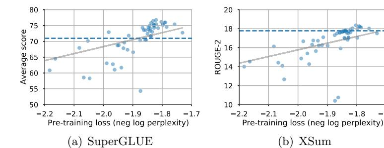
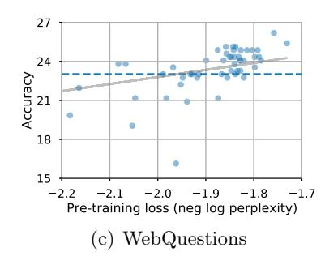

# Do Transformer Modifications Transfer Across Implementations and Applications?

Sharan Narang $^*$  Hyung Won Chung Yi Tay William Fedus Thibault Fevry $^{\dagger}$  Michael Matena $^{\dagger}$  Karishma Malkan $^{\dagger}$  Noah Fiedel Noam Shazeer Zhenzhong Lan $^{\dagger}$  Yanqi Zhou Wei Li Nan Ding Jake Marcus Adam Roberts Colin Raffel $^{\dagger}$ 

### Abstract

The research community has proposed copious modifications to the Transformer architecture since it was introduced over three years ago, relatively few of which have seen widespread adoption. In this paper, we comprehensively evaluate many of these modifications in a shared experimental setting that covers most of the common uses of the Transformer in natural language processing. Surprisingly, we find that most modifications do not meaningfully improve performance. more, most of the Transformer variants we found beneficial were either developed in the same codebase that we used or are relatively minor changes. We conjecture that performance improvements may strongly depend on implementation details and correspondingly make some recommendations for improving the generality of experimental results.

#### 1 Introduction

Much of the empirical success of deep learning can be attributed to advances in methods for building and training neural networks. These advances include improved optimizers (Sutskever et al., 2013; Hinton et al., 2012; Kingma and Ba, 2014; Shazeer and Stern, 2018a), regularization schemes (Srivastava et al., 2014; Zhang et al., 2017; Neelakantan et al., 2015), and model architectures (He et al., 2016; Hochreiter and Schmidhuber, 1997; Vaswani et al., 2017). An aspiration underlying much of this work is that an improvement to a particular machine learning pipeline will yield equal-or-better performance on any task that the pipeline is applicable to. For example, residual connections in convolutional networks (He et al., 2016) are designed to ideally improve

performance on any task where these models are applicable (image classification, semantic segmentation, etc.). In practice, when proposing a new improvement, it is impossible to test it on every applicable downstream task, so researchers must select a few representative tasks to evaluate it on. However, the proposals that are ultimately adopted by the research community and practitioners tend to be those that reliably improve performance across a wide variety of tasks "in the wild".

The Transformer architecture (Vaswani et al., 2017) is an example of a seminal improvement in the field of deep learning. Currently, the Transformer is the de facto architecture of choice for processing sequential data and is starting to be applied to vision applications (e.g. Dosovitskiy et al. (2020)). Since being introduced three years ago, many modifications to the Transformer architecture have been proposed. However, the most widely-used applications of the Transformer architecture (e.g. Devlin et al. (2018); Yang et al. (2019); Radford et al. (2018); Raffel et al. (2019)) incorporate few of these modifications. Instead, the standard practice is to use a slightly-modified version of the originally-proposed Transformer. One possible explanation for this is that the originally-proposed Transformer architecture was near-perfect, and there wasn't much that could be done to improve it. This is in contrast to, for example, convolutional neural networks, which have continually evolved over the past few decades (e.g. the replacement of pooling with striding (Springenberg et al., 2014), fullyconnected layers with convolutional layers (Lin et al., 2013), the addition of normalization (Ioffe and Szegedy, 2015) and residual connections (He et al., 2016), etc.). Another possible explanation is that the modifications proposed to the Transformer do not "generalize" across

\*Correspondence to sharannarang@google.com

&lt;sup>†Work completed while at Google

applications, i.e. the modifications only help on the limited experimental setting considered when the modification was proposed, and/or rely on specific details that are not common across implementations of the Transformer.

The main goal of this paper is to try to determine why most modifications proposed to the Transformer have not seen widespread adoption. To answer this question, we reimplemented and evaluated a wide variety of Transformer variants on a suite of tasks that Transformers are commonly applied to. Our main finding is that many Transformer modifications do not result in improved performance in our experimental setting. Moreover, those variants that did yield better performance tended to be those that were quite small changes and/or were developed in the codebase where we carried out our evaluation. This suggests to us the possibility that Transformer modifications exhibit a surprising lack of generalization across different implementations and tasks.

#### 2 Modifications

In this section, we enumerate all of the architectural modifications we consider. For a description of the Transformer architecture, refer to the appendix D.

Due to space constraints, we are seldom able to thoroughly define each specific modification. Moreover, we limit our study to the encoder-decoder architecture. Please refer to the original sources for each modification for additional details.

#### 2.1 Activations

We consider various activation functions to replace the ReLU in the feedforward network block. The activation functions that we explored are: (1) GeLU (Hendrycks and Gimpel, 2016), (2) Swish (Ramachandran et al., 2017), (3) Exponential Linear Units (ELU) (Clevert et al., 2015), (4) Scaled exponential linear units (SeLU) (Klambauer et al., 2017), (5) Sigmoid and (6) Softplus. We also explore "Gated Linear Unit" (GLU) variants (Dauphin et al., 2017; Shazeer, 2020) which compose two linear transformations together in an element-wise fashion, i.e.  $F_1(x) \odot \sigma(F_2(x))$  where  $\sigma$  is an activation function and  $F_1$  and  $F_2$  are separate learned affine transformations. We explore modifying  $\sigma$  to be sigmoid activations (denoted as GLU), ReLU activations (denoted as ReGLU), GeLU

activations (denoted as GeGLU) or to be a standard linear transformation (no activation, denoted as LiGLU).

#### 2.2 Normalization

We explored "RMS (root-mean-square) norm" (Zhang and Sennrich, 2019) as an alternative to layer normalization as well as the Rezero (Bachlechner et al., 2020) initialization scheme, including combining Rezero with Layer Norm and RMS Norm. We also explored the Fixup (Zhang et al., 2019) initialization scheme which tries to solve the vanishing/exploding gradient problem by rescaling the initializations.

#### 2.3 Depth

We explored the trade-offs between the width of the feedforward subblocks ( $d_{\rm ff}$ ) and depth (L). In order to ensure fair comparison, we scale  $d_{\rm ff}$  and the number of heads (H) in order to keep the total number of parameters constant when changing the depth.

#### 2.4 Embeddings

The Transformer model includes multiple weight matrices of shape of  $d_{\text{model}} \times d_{\text{vocab}}$ : one at the input of the encoder, one at the input of the decoder, and one at the output of the decoder. Chung et al. (2021) showed the benefits of untying the embeddings for the encoder-only models. We extend the analysis and explore various ways of sharing these parameters: tying only encoder input and decoder input embeddings, tying only decoder input and output embeddings, and untying all the embeddings.

In addition, we explored factorizing the embedding matrix into two smaller matrices (Lan et al., 2019). In other words, the embedding matrix of size  $[d_{\text{model}}, d_{\text{vocab}}]$  is factored into  $[d_{\text{model}}, d_{\text{inner}}]$  and  $[d_{\text{inner}}, d_{\text{vocab}}]$ . We tried both untied and tied decoder embeddings while encoder and decoder embeddings are shared.

The last technique we explored for the embeddings is the "Adaptive input embeddings" by Baevski and Auli (2019). Vocabulary items are clustered based on their frequencies. A cluster with more frequent ones has a larger embedding dimension. The embedding vectors are projected to the same dimension and concatenated.

#### 2.5 Parameter sharing

We also explored sharing the parameters of the Transformer layers inspired by the "ALBERT" model of Lan et al. (2020). Each subblock (e.g., self-attention) has a unique set of weights shared across all l layers. Following Lan et al. (2020), we factorized the embeddings (denoted as "Factorized embeddings") in addition to the parameter sharing. Note that these models have untied softmax and vocabulary embeddings in the decoder; we also tried tying them (denoted as "Shared embeddings"). Finally, we experimented with applying the parameter sharing to the encoder and decoder separately.

#### 2.6 Softmax

Our work considers variations to the softmax computation that produces the final probability distribution as computed by the last layer embedding. Adaptive softmax (Joulin et al., 2017) uses the natural imbalance in word distributions (Zipf, 1949) to form clusters in a hierarchical model, which minimizes computation time. In the original implementation, each cluster is permitted to have a different capacity and the size of the representations for rare words is reduced via a projection matrix. We consider the original variant, as well as a version that ablates the projection operation. Mixture of Softmaxes (MoS) (Yang et al., 2017) improves the expressiveness of a single softmax operation by instead computing a linear combination over softmaxes, each weighted by learned coefficients.

#### 2.7 Architectures

Transparent Attention One type of attention variant we experiment with is Transparent Attention (Bapna et al., 2018). Transparent attention (Bapna et al., 2018) creates weighted residual connections along encoder depth to facilitate gradient flow. In appendix A, we experiment with additional attention variants.

**Evolved Transformer** The Evolved Transformer (So et al., 2019) was designed via evolution-based architecture search (Real et al., 2019) where the initial population was seeded with the original Transformer. The search space generalizes the one followed in NASNet (Zoph et al., 2018), but extended to be able to represent the Transformer.

Synthesizer variants We explore the factorized, dense, and random Synthesizer variants from Tay et al. (2020), where self-attention is replaced with "synthetic attention" patterns. We denote "plus" when dot product attention is additively combined with the synthetic attention and plus alpha to denote when a scalar  $\alpha$  is used to interpolate between synthetic and dot product attention.

Funnel Transformer Funnel Transformer progressively reduces the sequence length in order to efficiently encode the input sequence (Dai et al., 2020). We only applied this reduction to the encoder.

Lightweight and Dynamic convolutions Lightweight convolution (Wu et al., 2019) is a special case of a depth-wise convolution. It shares the weights of every subsequent number of m channels where m is a hyperparameter and normalizes the weights across the filter dimension. For a Transformer model, the depth dimension corresponds to  $d_{\text{model}}$ . Dynamic convolution (Wu et al., 2019) uses kernels that are functions of the input at the current time step. Following Wu et al. (2019), we compute the kernels as a simple linear function of the layer input.

Sparse Expert Transformers Mixture of Experts (MoE) Transformer (Shazeer et al., 2018; Lepikhin et al., 2020) and Switch Transformer (Fedus et al., 2021) both replace the feedforward network with sparsely activated experts layers. The result is an example of adaptive computation where parameters (expert FFNs) are selected for each specific token. This provides a way of scaling up the parameter count of a model independently from the FLOPs required for a forward pass. Some variants in Fedus et al. (2021) consider sparse self-attention layers as well, but we only consider the primary variant here.

**Product Key Memory** Similar to the expert model designs, product key memory networks (Lample et al., 2019) process inputs adaptively, selecting sparse values. In contrast, the mechanism of sparse computation isn't done via learned routing, but instead by an efficient k-nearest neighbor weighted sum.

Universal Transformer Similar to block sharing, the Universal Transformer (Dehghani et al., 2018) applies the same Transformer "block" over and over again to the input sequence. However, instead of applying it a fixed number of times, it recurrently refines the representation for each token until a halting mechanism (based on Adaptive Computation Time (Graves, 2016)) is triggered.

#### 3 Experiments

In order to study the impact of each of the modifications described in section 2, we conduct a systematic study by comparing a baseline model to each modification while holding the task, hyperparameters, optimizer, and either the parameter count or FLOP budget (floating point operations per second) constant. We use the original Transformer model as our baseline model with two modifications: First, we apply layer normalization before the selfattention and feedforward blocks instead of after. This small change has been unanimously adopted by all current Transformer implementations because it leads to more effective training (Baevski and Auli, 2019; Xiong et al., 2020). Secondly, we use relative attention with shared biases (as used in Raffel et al. (2019)) instead of sinusoidal positional embeddings, which makes it easier to train the model. Our baseline model is a standard encoder-decoder with 12 layers in the encoder and decoder. The feedforward network in each layer consists of a dense layer with dimension of  $d_{\rm ff} = 3072$ . All attention mechanisms have 12 heads and "key" and "value" matrices have a dimension of  $d_{kv} = 64$ . All other sublayers have a dimension of  $d_{\text{model}} = 768 \text{ re}$ sulting in 223 million parameters in the model. We refer to this model as the "Vanilla Transformer".

We consider two experimental settings for evaluating the performance of each modification: Transfer learning based on the T5 (Raffel et al., 2019) and supervised machine translation on the WMT'14 English-German translation.

For transfer learning, we copy the methodology used by the T5 model, proposed in Raffel et al. (2019). For full details of this experimental setup, please refer to Raffel et al. (2019). We pre-train encoder-decoder models in a self-supervised manner using the "span corruption" masked language modeling objective (Taylor, 1953; Fedus et al., 2018; Devlin et al., 2018) on the C4 dataset. We run experiments on version

2.3.1 of the C4 dataset available in TensorFlow Datasets1. We pre-train each architecture variant for 524, 288 steps with batches of 65, 536 tokens. As in T5, we use Adafactor (Shazeer and Stern, 2018b) for optimization and an inverse square root learning rate schedule during pretraining. We use a maximum sequence length of 512 for both the inputs and targets during pre-training. To evaluate the performance of pre-trained models, we compute the perplexity on a held-out portion of the C4 dataset for each pre-trained model, with the expectation that improvements in perplexity will correlate with performance on fine-tuned tasks. To capture the inter-run variance on these models, we run each model 5 times for 65,536 steps ( $\frac{1}{9}$ th of the total pre-training steps). We report the mean and standard deviation of the loss (log perplexity) on held-out data of these five experiments and also report the final loss at the end of pre-training (524, 288 steps). We do not use any regularization during pre-training.

In the transfer learning setting, after pretraining we fine-tune each model on three different tasks: the SuperGLUE (Wang et al., 2019) natural language understanding metabenchmark, the XSum (Narayan et al., 2018) abstractive summarization dataset, and the closed-book variant (Roberts et al., 2020) of the WebQuestions (Berant et al., 2013) questionanswering task. With these tasks, we hope to capture a broad variety of NLP problems including language understanding and classification, language generation, and knowledge internalization. For SuperGLUE and XSum, each model is fine-tuned for 262,144 steps. Since the WebQuestions dataset is much smaller, we fine-tune the model for only 30,000 steps. We use a constant learning rate of 0.0005 with a linear warm-up of 20,000 steps. Similar to pre-training, each batch contains 65,536 tokens. We save a checkpoint every 2,500 steps (1,000 steps for WebQuestions) and report results on the model checkpoint corresponding to the highest validation performance. We use a dropout of 0.1 during fine-tuning for all the tasks. All results are reported on the validation split of each dataset. For SuperGLUE, we report the average score across all tasks in the

https://www.tensorflow.org/datasets/
catalog/c4

benchmark. We report ROUGE-2 (Lin, 2004) for XSum and accuracy for WebQuestions.

For supervised training on the WMT'14 English to German translation task (Bojar et al., 2014), we use the same model and batch size as for the transfer learning setting. We train for a total of 150,000 steps. We use the same data splits as were used in (Vaswani et al., 2017) and report the BLEU score of the highest-scoring checkpoint on the validation set. We use a vocabulary of 37,000 tokens learned by Byte Pair Encoding (Sennrich et al., 2016) for supervised training as opposed to 32,000 tokens (created using SentencePiece (Kudo and Richardson, 2018)) for the transfer learning experiments.

To compare the efficiency of the model, we also report the total number of parameters, the total number of floating point operations, and the measured steps per second in the pre-training experiments. Reporting these parameters can help us understand the trade-off between quality and efficiency. For each architectural modification, we attempt to keep either the parameter count or total operations in the model approximately the same to perform a fair comparison with the baseline model.

All hyperparameters are held constant for each architectural variant across pre-training and fine-tuning. However, we found that certain architectural (Rezero and Fixup) variants achieved significantly lower negative log perplexity than the baseline model with the Adafactor optimizer. Therefore, we use the Adam optimizer (Kingma and Ba, 2014) for these variants. For pre-training, we use an inverse square root learning rate schedule with a linear warm-up of 4,000 steps. For fine-tuning, we use a constant learning rate of 5e-5 with a linear warm-up of 20,000 steps. We provide details of certain modifications in appendix B.

All experiments are run using the T5 library 2 on "slices" of Cloud TPU Pods. All model variants are implemented in the Mesh Tensor-Flow library (Shazeer et al., 2018).

#### 3.1 Results

The results for all model variants are shown in table 1. The vanilla Transformer achieves a SuperGLUE average of 70.97 and a BLEU score

of 26.62 on WMT14 EnDe. This is comparable with the scores achieved by the equivalentlysized T5-Base model Raffel et al. (2019) and similarly-sized Transformer-Big from Vaswani et al. (2017), which confirms that our baseline is reasonable. As mentioned earlier, each variant has approximately the same number of parameters or total operations as the vanilla Transformer, with the following exceptions: For the Universal Transformer, the total number of operations is approximately  $4\times$  the baseline model. Since the Universal Transformer model is already significantly smaller than the baseline model, it would not be fair to shrink the model even further to match the number of operations with the baseline. Product key memories (Lample et al., 2019) should only slightly increase FLOPs over the vanilla Transformer, but the total number of operations is artificially extremely high due to an inefficient implementation in Mesh Tensorflow.

We find that several activation functions improve performance over the ReLU activation. Specifically, SwiGLU and GeGLU improve performance on pre-training, fine-tuning, and supervised training without sacrificing any efficiency in terms of speed. Replacing layer normalization with RMS normalization yields improvements while also improving training speed. Our experiments with varying the depth of the model indicate that deeper models tend to outperform shallower ones with a fixed parameter count. However, these deeper models are also more compute-intensive and therefore slower than their shallower counterparts. Sharing of parameters across layers tends to hurt performance. Interestingly, untying the encoder/decoder embeddings improve performance with only a modest increase in parameter count. Using mixture of softmaxes does improve performance but is almost 40% slower than the vanilla Transformer.

Among the different architectures, we find that two of the synthesizer variants are beneficial. Switch Transformer, mixture of experts, and product key memories all improve performance with significantly more parameters than the baseline model. However, these implementations only use a subset of the parameters during each step, so they are roughly equivalent to the vanilla Transformer in total number

&lt;sup>2https://github.com/google-research/ text-to-text-transfer-transformer

of operations. Surprisingly, all the other architecture variants generally performed poorly.

Overall, we found that most of the beneficial modifications conferred improvements across pre-training, fine-tuning, and supervised training, though a few variants (e.g. transparent attention, Synthesizer-random, fixup) harmed performance for transfer learning but not for WMT'14 EnDe. The modifications that led to significant improvements tended to fall into one of three buckets: relatively minor changes (i.e., activation functions, normalization and untying embedding matrices); those that increase parameter count (i.e., Switch Transformer, product key memory) or are slower (i.e., mixture of softmaxes, deeper models); or those that were originally invented in the Mesh Tensor-Flow codebase that we use for our experiments (i.e., mixture of experts, switch Transformer, synthesizer). To further ensure the correctness of the various architecture modifications, we reached out to authors of 12 techniques to review our implementation and provide their feedback and received responses from 6 of them. All of the authors who responded confirmed that our re-implementation was correct.

### 3.2 Impact of hyperparameter tuning

It is a well-established fact in deep learning that hyperparameters (and even random seeds (Dodge et al., 2020)) may have a huge impact on model quality. In our experiments, we intentionally kept hyperparameter fixed in order to measure whether a given modification improves performance regardless of hyperparameter settings. Given that this may be an overly idealistic constraint, we present a case study of trying to improve one of the model variants by tuning its hyperparameters. We selected Universal Transformers (UT) (Dehghani et al., 2018) because it was claimed to achieve better results than the vanilla Transformer, and the UT has a relatively large number of hyperparameters that we can adjust. Using our standard hyperparameters, we obtain a loss of 2.40 after training for 65,536 steps. Bearing in mind that our vanilla Transformer obtains a loss of 2.182 after the same amount of training, our goal was to at least achieve comparable performance using the UT.

To this end, we swept over 25 model configurations, varying the number of recurrent steps

and the gating/transition functions in the UT. We also varied non-model-specific hyperparameters including the learning rate schedule and  $d_{\rm model}.$  Over these 25 sweeps, only 2 managed to outperform the initial results. The only settings that worked were the result of reducing the number of recurrent steps (from 16 to 2) and slightly increasing the model size. In the end, we managed to achieve an improvement of  $2.40 \rightarrow 2.265$  (or 6% relative). While this is significant, many other hyperparameter settings failed to produce good results, and we were ultimately unable to match the performance of the vanilla Transformer. This exercise illustrates the challenge of tuning these models.

## 3.3 Correlation of perplexity and task performance

In order to understand the relationship between pre-training performance and fine-tuned task quality, we investigate the correlation between perplexity and quality on each task. As shown in fig. 1, quality on all three tasks seem to be correlated with pre-training perplexity, though the correlation is surprisingly weak given past results suggesting a stronger relationship (Adiwardana et al., 2020). Interestingly, the performance on SuperGLUE (Spearman's  $\rho = 0.87$ ) and XSum (Spearman's  $\rho = 0.80$ ) seems to be highly correlated with the pre-training perplexity, whereas the performance on WebQuestions (Spearman's  $\rho = 0.69$ ) has a somewhat lower correlation. This may indicate that classification and generation tasks benefit more from improvements in perplexity than knowledgeintensive tasks like question answering.

## 4 Conjectures and Recommendations

As discussed above, we were surprised to find that so few of the architectural modifications produced improvements in the settings we considered. This largely contrasts the experiments included in the original papers that proposed each modification. We broadly grouped the modifications that actually did improve performance as either 1) being relatively simple (e.g. a change in activation function), 2) being developed in the same codebase where we ran experiments (e.g. the Synthesizer variants (Tay et al., 2020)), or 3) incurring an increase in parameter count or FLOPs (e.g. the Switch

| Model                                            | Params         | Ops            | Step/s              | Early loss                             | Final loss     | SGLUE                 | XSum           | WebQ                  | WMT EnDe              |
|--------------------------------------------------|----------------|----------------|---------------------|----------------------------------------|----------------|-----------------------|----------------|-----------------------|-----------------------|
| Vanilla Transformer                              | 223M           | 11.1T          | 3.50                | $2.182 \pm 0.005$                      | 1.838          | 71.66                 | 17.78          | 23.02                 | 26.62                 |
| GeLU                                             | 223M           | 11.1T          | 3.58                | $2.179 \pm 0.003$                      | 1.838          | 75.79                 | 17.86          | 25.13                 | 26.47                 |
| Swish                                            | 223M           | 11.1T          | 3.62                | $2.186\pm0.003$                        | 1.847          | 73.77                 | 17.74          | 24.34                 | 26.75                 |
| ELU                                              | 223M           | 11.1T          | 3.56                | $2.270\pm0.007$                        | 1.932          | 67.83                 | 16.73          | 23.02                 | 26.08                 |
| GLU                                              | 223M           | 11.1T          | 3.59                | $2.174\pm0.003$                        | 1.814          | 74.20                 | 17.42          | 24.34                 | 27.12                 |
| GeGLU                                            | 223M           | 11.1T          | 3.55                | $2.130 \pm 0.006$                      | 1.792          | 75.96                 | 18.27          | 24.87                 | 26.87                 |
| ReGLU                                            | 223M           | 11.1T          | 3.57                | $2.145 \pm 0.004$                      | 1.803          | 76.17                 | 18.36          | 24.87                 | 27.02                 |
| SeLU                                             | 223M           | 11.1T          | 3.55                | $2.315 \pm 0.004$                      | 1.948          | 68.76                 | 16.76          | 22.75                 | 25.99                 |
| SwiGLU                                           | 223M           | 11.1T          | 3.53                | $2.127 \pm 0.003$                      | 1.789          | 76.00                 | 18.20          | 24.34                 | 27.02                 |
| LiGLU                                            | 223M           | 11.1T          | 3.59                | $2.149 \pm 0.005$                      | 1.798          | 75.34                 | 17.97          | 24.34                 | 26.53                 |
| Sigmoid                                          | 223M           | 11.1T          | 3.63                | $2.291 \pm 0.019$                      | 1.867          | 74.31                 | 17.51          | 23.02                 | 26.30                 |
| Softplus                                         | 223M           | 11.1T          | 3.47                | $2.207 \pm 0.011$                      | 1.850          | 72.45                 | 17.65          | 24.34                 | 26.89                 |
| RMS Norm                                         | 223M           | 11.1T          | 3.68                | $2.167\pm0.008$                        | 1.821          | 75.45                 | 17.94          | 24.07                 | 27.14                 |
| Rezero                                           | 223M           | 11.1T          | 3.51                | $2.262 \pm 0.003$                      | 1.939          | 61.69                 | 15.64          | 20.90                 | 26.37                 |
| Rezero + LayerNorm                               | 223M           | 11.1T          | 3.26                | $2.223 \pm 0.006$                      | 1.858          | 70.42                 | 17.58          | 23.02                 | 26.29                 |
| Rezero + RMS Norm                                | 223M           | 11.1T          | 3.34                | $2.221 \pm 0.009$                      | 1.875          | 70.33                 | 17.32          | 23.02                 | 26.19                 |
| Fixup                                            | 223M           | 11.1T          | 2.95                | $2.382 \pm 0.012$                      | 2.067          | 58.56                 | 14.42          | 23.02                 | 26.31                 |
| $24 \text{ layers}, d_{\text{ff}} = 1536, H = 6$ | 224M           | 11.1T          | 3.33                | $2.200 \pm 0.007$                      | 1.843          | 74.89                 | 17.75          | 25.13                 | 26.89                 |
| 18 layers, $d_{\rm ff} = 2048, H = 8$            | 223M           | 11.1T          | 3.38                | $2.185\pm0.005$                        | 1.831          | 76.45                 | 16.83          | 24.34                 | 27.10                 |
| 8 layers, $d_{\rm ff} = 4608, H = 18$            | 223M           | 11.1T          | 3.69                | $2.190 \pm 0.005$                      | 1.847          | 74.58                 | 17.69          | 23.28                 | 26.85                 |
| 6 layers, $d_{\rm ff} = 6144, H = 24$            | 223M           | 11.1T          | 3.70                | $2.201 \pm 0.010$                      | 1.857          | 73.55                 | 17.59          | 24.60                 | 26.66                 |
| Block sharing                                    | 65M            | 11.1T          | 3.91                | $2.497 \pm 0.037$                      | 2.164          | 64.50                 | 14.53          | 21.96                 | 25.48                 |
| + Factorized embeddings                          | 45M            | 9.4T           | 4.21                | $2.631 \pm 0.305$                      | 2.183          | 60.84                 | 14.00          | 19.84                 | 25.27                 |
| + Factorized & shared em-                        | 20M            | 9.1T           | 4.37                | $2.907 \pm 0.313$                      | 2.385          | 53.95                 | 11.37          | 19.84                 | 25.19                 |
| beddings                                         |                |                |                     |                                        |                |                       |                |                       |                       |
| Encoder only block sharing                       | 170M           | 11.1T          | 3.68                | $2.298 \pm 0.023$                      | 1.929          | 69.60                 | 16.23          | 23.02                 | 26.23                 |
| Decoder only block sharing                       | 144M           | 11.1T          | 3.70                | $2.352 \pm 0.029$                      | 2.082          | 67.93                 | 16.13          | 23.81                 | 26.08                 |
| Factorized Embedding                             | 227M           | 9.4T           | 3.80                | $2.208 \pm 0.006$                      | 1.855          | 70.41                 | 15.92          | 22.75                 | 26.50                 |
| Factorized & shared embed-                       | 202M           | 9.1T           | 3.92                | $2.320 \pm 0.000$ $2.320 \pm 0.010$ | 1.952          | 68.69                 | 16.33          | 22.22                 | 26.44                 |
| dings                                            | 202111         | 5.11           | 0.52                | 2.020 ± 0.010                          | 1.502          | 00.05                 | 10.00          | 22.22                 | 20.44                 |
| Tied encoder/decoder in-                         | 248M           | 11.1T          | 3.55                | $2.192 \pm 0.002$                      | 1.840          | 71.70                 | 17.72          | 24.34                 | 26.49                 |
| put embeddings                                   |                |                |                     |                                        |                |                       |                |                       |                       |
| Tied decoder input and out-                      | 248M           | 11.1T          | 3.57                | $2.187 \pm 0.007$                      | 1.827          | 74.86                 | 17.74          | 24.87                 | 26.67                 |
| put embeddings                                   |                |                |                     |                                        |                |                       |                |                       |                       |
| Untied embeddings                                | 273M           | 11.1T          | 3.53                | $2.195\pm0.005$                        | 1.834          | 72.99                 | 17.58          | 23.28                 | 26.48                 |
| Adaptive input embeddings                        | 204M           | 9.2T           | 3.55                | $2.250 \pm 0.002$                      | 1.899          | 66.57                 | 16.21          | 24.07                 | 26.66                 |
| Adaptive softmax                                 | 204M           | 9.2T           | 3.60                | $2.364 \pm 0.005$                      | 1.982          | 72.91                 | 16.67          | 21.16                 | 25.56                 |
| Adaptive softmax without                         | 223M           | 10.8T          | 3.43                | $2.229 \pm 0.009$                      | 1.914          | 71.82                 | 17.10          | 23.02                 | 25.72                 |
| projection                                       |                |                | 0.20                |                                        |                |                       |                |                       |                       |
| Mixture of softmaxes                             | 232M           | 16.3T          | 2.24                | $2.227 \pm 0.017$                      | 1.821          | 76.77                 | 17.62          | 22.75                 | 26.82                 |
| Transparent attention                            | 223M           | 11.1T          | 3.33                | $2.181 \pm 0.014$                      | 1.874          | 54.31                 | 10.40          | 21.16                 | 26.80                 |
| Dynamic convolution                              | 257M           | 11.17 $11.8T$  | $\frac{3.55}{2.65}$ | $2.101 \pm 0.014$ $2.403 \pm 0.009$ | 2.047          | 58.30                 | 12.67          | 21.16                 | 17.03                 |
| Lightweight convolution                          | 224M           | 10.4T          | 4.07                | $2.370 \pm 0.009$                      | 1.989          | 63.07                 | 14.86          | 23.02                 | 24.73                 |
| Evolved Transformer                              | 217M           | 9.9T           | 3.09                | $2.220 \pm 0.003$                      | 1.863          | 73.67                 | 10.76          | 24.07                 | 26.58                 |
| Synthesizer (dense)                              | 224M           | 11.4T          | 3.47                | $2.334 \pm 0.021$                      | 1.962          | 61.03                 | 14.27          | 16.14                 | 26.63                 |
| Synthesizer (dense plus)                         | 243M           | 12.6T          | 3.22                | $2.191 \pm 0.010$                      | 1.840          | 73.98                 | 16.96          | 23.81                 | 26.71                 |
| Synthesizer (dense plus al-                      | 243M           | 12.6T          | 3.01                | $2.180 \pm 0.007$                      | 1.828          | 74.25                 | 17.02          | 23.28                 | 26.61                 |
| pha)                                             |                |                |                     |                                        |                |                       |                |                       |                       |
| Synthesizer (factorized)                         | 207M           | 10.1T          | 3.94                | $2.341\pm0.017$                        | 1.968          | 62.78                 | 15.39          | 23.55                 | 26.42                 |
| Synthesizer (random)                             | 254M           | 10.1T          | 4.08                | $2.326\pm0.012$                        | 2.009          | 54.27                 | 10.35          | 19.56                 | 26.44                 |
| Synthesizer (random plus)                        | 292M           | 12.0T          | 3.63                | $2.189\pm0.004$                        | 1.842          | 73.32                 | 17.04          | 24.87                 | 26.43                 |
| Synthesizer (random plus                         | 292M           | 12.0T          | 3.42                | $2.186\pm0.007$                        | 1.828          | 75.24                 | 17.08          | 24.08                 | 26.39                 |
| alpha)                                           |                |                |                     |                                        |                |                       |                |                       |                       |
| Universal Transformer                            | 84M            | 40.0T          | 0.88                | $2.406 \pm 0.036$                      | 2.053          | 70.13                 | 14.09          | 19.05                 | 23.91                 |
| Mixture of experts                               | 648M           | 11.7T          | 3.20                | $2.148 \pm 0.006$                      | 1.785          | 74.55                 | 18.13          | 24.08                 | 26.94                 |
| Switch Transformer                               | 1100M          | 11.7T          | 3.18                | $2.135 \pm 0.007$                      | 1.758          | 75.38                 | 18.02          | 26.19                 | 26.81                 |
| Funnel Transformer                               | 223M           | 1.9T           | 4.30                | $2.288 \pm 0.008$                      | 1.918          | 67.34                 | 16.26          | 22.75                 | 23.20                 |
|                                                  |                |                |                     |                                        |                |                       |                |                       |                       |
| Weighted Transformer Product key memory       | $280M \\ 421M$ | 71.0T $386.6T$ | 0.59 0.25        | $2.378 \pm 0.021$ $2.155 \pm 0.003$ | 1.989 1.798 | 69.04 <b>75.16</b> | 16.98 17.04 | 23.02 <b>23.55</b> | 26.30 <b>26.73</b> |

Table 1: Results for all architecture variants. The baseline model is the vanilla Transformer with relative attention. The early loss represents the mean and standard deviation of perplexity at 65,536 steps. The final perplexity is reported at the end of pre-training (524, 288 steps). SGLUE refers to SuperGLUE and WebQ refers to WebQuestions dataset. We report average, ROUGE-2, accuracy, and BLEU score for SuperGLUE, XSum, WebQuestions, and WMT EnDe, respectively, on the validation sets. **Note:** Results on WMT English to German are reported **without any pre-training**. The scores which outperform the vanilla Transformer are highlighted in **boldface**.

Figure 1: Relationship between perplexity and fine-tuned task quality. The x-axis measures the pre-training perplexity and the y-axis measures the score for each task, with each point representing an architecture variant. The dashed line shows baseline performance and the gray line is the line of best fit.

Transformer (Fedus et al., 2021) or Universal Transformer (Dehghani et al., 2018)). Other modifications that don't fit into one of these categories generally didn't improve performance. There are various possible explanations as to why our results bore out the way they did:

- 1. The Mesh TensorFlow codebase and implementation are just so different than standard practice that most architectural modifications do not work. We believe this is unlikely due to the fact that the Mesh TensorFlow Transformer implementation was created by one of the coauthors of the original Transformer paper and has been used to attain state-of-the-art results (e.g. Raffel et al. (2019); Roberts et al. (2020); Khashabi et al. (2020); Kale (2020); Nogueira et al. (2020); Narang et al. (2020); Xue et al. (2020); Fedus et al. (2021), etc.).
- 2. The tasks we consider are non-standard or do not match the set of tasks used to vet the modifications in the first place. The Transformer model is used for a variety of NLP problems including classification and generation tasks. We included transfer learning experiments on SuperGLUE, XSum, and WebQuestions and supervised training on WMT'14 EnDe, which covers the majority of use-cases.
- 3. Not tuning hyperparameters handicapped other methods. While per-modification tuning might improve results (as verified in section 3.2), we argue that truly useful improvements to the Transformer should be reasonably hyperparameter-agnostic. Further, if hyperparameter sensitivity was the issue, it would be likely that a least a few of the compared methods "got lucky" with the hyperparameters, but very few modifications produced a boost.
- 4. We implemented many of the modifications

incorrectly. To rule out this possibility, we corresponded with many of the creators of the modifications we considered, who confirmed the correctness in all cases.

5. Modifications to the Transformer architecture often do not transfer across implementations and applications.

Following the above rationale, we believe the final option is a plausible explanation for our results. This possibility is supported by the fact that few of the modifications we consider in this paper have seen widespread adoption – if they transferred easily across implementations and applications, they would likely have been more widely adopted.

Given this sober take, we conclude our paper with some suggestions as to how to ensure the robustness of improvements for future architectural modifications. First, when proposing a new modification, try it out in multiple completely disparate codebases. Given the proliferation of Transformer implementations (e.g. Wolf et al. (2019); Shazeer et al. (2018); Vaswani et al. (2018), etc.), this should be straightforward. Second, apply it to a wide variety of downstream applications, including transfer learning, supervised learning, and language modeling – and, possibly, include domains beyond NLP too (e.g., computer vision (Dosovitskiy et al., 2020)). Third, when evaluating performance in different implementations and on different tasks, keep hyperparameters fixed as much as possible, or at least attempt to measure the robustness of the modifications to changes in hyperparameters. Finally, best-practice reporting of results should include mean and standard deviation across multiple trials, or at least avoid cherry-picking

the best run (Dodge et al., 2020; Henderson et al., 2018). With these guidelines in mind, we hope future work on architectural modifications to the Transformer will be more likely to see widespread adoption and improve the performance of this powerful architecture.

#### References

- Daniel Adiwardana, Minh-Thang Luong, David R So, Jamie Hall, Noah Fiedel, Romal Thoppilan, Zi Yang, Apoorv Kulshreshtha, Gaurav Nemade, Yifeng Lu, et al. 2020. Towards a human-like open-domain chatbot. arXiv preprint arXiv:2001.09977.
- Jimmy Lei Ba, Jamie Ryan Kiros, and Geoffrey E. Hinton. 2016. Layer normalization. arXiv preprint arXiv:1607.06450.
- Thomas Bachlechner, Bodhisattwa Prasad Majumder, Huanru Henry Mao, Garrison W Cottrell, and Julian McAuley. 2020. Rezero is all you need: Fast convergence at large depth. arXiv preprint arXiv:2003.04887.
- Alexei Baevski and Michael Auli. 2019. Adaptive input representations for neural language modeling. In *International Conference on Learning Representations*.
- Ankur Bapna, Mia Xu Chen, Orhan Firat, Yuan Cao, and Yonghui Wu. 2018. Training deeper neural machine translation models with transparent attention. arXiv preprint arXiv:1808.07561.
- Jonathan Berant, Andrew Chou, Roy Frostig, and Percy Liang. 2013. Semantic parsing on Freebase from question-answer pairs. In *Proceedings* of the 2013 Conference on Empirical Methods in Natural Language Processing, pages 1533–1544, Seattle, Washington, USA. Association for Computational Linguistics.
- Ondrej Bojar, Christian Buck, Christian Federmann, Barry Haddow, Philipp Koehn, Johannes Leveling, Christof Monz, Pavel Pecina, Matt Post, Herve Saint-Amand, Radu Soricut, Lucia Specia, and Ale s Tamchyna. 2014. Findings of the 2014 workshop on statistical machine translation. In Proceedings of the Ninth Workshop on Statistical Machine Translation, pages 12–58, Baltimore, Maryland, USA. Association for Computational Linguistics.
- Jianpeng Cheng, Li Dong, and Mirella Lapata. 2016. Long short-term memory-networks for machine reading. arXiv preprint arXiv:1601.06733.
- Hyung Won Chung, Thibault Fevry, Henry Tsai, Melvin Johnson, and Sebastian Ruder. 2021. Rethinking embedding coupling in pre-trained lan-

- guage models. In International Conference on Learning Representations.
- Djork-Arné Clevert, Thomas Unterthiner, and Sepp Hochreiter. 2015. Fast and accurate deep network learning by exponential linear units (elus). arXiv preprint arXiv:1511.07289.
- Zihang Dai, Guokun Lai, Yiming Yang, and Quoc V. Le. 2020. Funnel-Transformer: Filtering out Sequential Redundancy for Efficient Language Processing. arXiv e-prints, page arXiv:2006.03236.
- Yann N Dauphin, Angela Fan, Michael Auli, and David Grangier. 2017. Language modeling with gated convolutional networks. In *International conference on machine learning*, pages 933–941. PMLR.
- Mostafa Dehghani, Stephan Gouws, Oriol Vinyals, Jakob Uszkoreit, and Lukasz Kaiser. 2018. Universal transformers. arXiv preprint arXiv:1807.03819.
- Jacob Devlin, Ming-Wei Chang, Kenton Lee, and Kristina Toutanova. 2018. BERT: Pretraining of deep bidirectional transformers for language understanding. arXiv preprint arXiv:1810.04805.
- Jesse Dodge, Gabriel Ilharco, Roy Schwartz, Ali Farhadi, Hannaneh Hajishirzi, and Noah Smith. 2020. Fine-tuning pretrained language models: Weight initializations, data orders, and early stopping.
- Alexey Dosovitskiy, Lucas Beyer, Alexander Kolesnikov, Dirk Weissenborn, Xiaohua Zhai, Thomas Unterthiner, Mostafa Dehghani, Matthias Minderer, Georg Heigold, Sylvain Gelly, et al. 2020. An image is worth 16x16 words: Transformers for image recognition at scale. arXiv preprint arXiv:2010.11929.
- William Fedus, Ian Goodfellow, and Andrew M Dai. 2018. Maskgan: better text generation via filling in the.. arXiv preprint arXiv:1801.07736.
- William Fedus, Barret Zoph, and Noam Shazeer. 2021. Switch transformers: Scaling to trillion parameter models with simple and efficient sparsity. arXiv preprint arXiv:2101.03961.
- Alex Graves. 2016. Adaptive computation time for recurrent neural networks. arXiv preprint arXiv:1603.08983.
- Kaiming He, Xiangyu Zhang, Shaoqing Ren, and Jian Sun. 2016. Deep residual learning for image recognition. In *Proceedings of the IEEE conference on computer vision and pattern recognition*, pages 770–778.

- Peter Henderson, Riashat Islam, Philip Bachman, Joelle Pineau, Doina Precup, and David Meger. 2018. Deep reinforcement learning that matters. In *Proceedings of the AAAI Conference on Artificial Intelligence*, volume 32.
- Dan Hendrycks and Kevin Gimpel. 2016. Gaussian error linear units (gelus). arXiv preprint arXiv:1606.08415.
- Geoffrey Hinton, Nitish Srivastava, and Kevin Swersky. 2012. Lecture 6a: Overview of minibatch gradient descent.
- Sepp Hochreiter and Jürgen Schmidhuber. 1997. Long short-term memory. *Neural computation*, 9(8):1735–1780.
- Sergey Ioffe and Christian Szegedy. 2015. Batch normalization: Accelerating deep network training by reducing internal covariate shift. In *International conference on machine learning*, pages 448–456. PMLR.
- Armand Joulin, Moustapha Cissé, David Grangier, Hervé Jégou, et al. 2017. Efficient softmax approximation for gpus. In *International Conference on Machine Learning*, pages 1302–1310. PMLR.
- $\begin{array}{llllllllllllllllllllllllllllllllllll$
- Daniel Khashabi, Sewon Min, Tushar Khot, Ashish Sabharwal, Oyvind Tafjord, Peter Clark, and Hannaneh Hajishirzi. 2020. UnifiedQA: Crossing format boundaries with a single QA system. In Findings of the Association for Computational Linguistics: EMNLP 2020, pages 1896–1907, Online. Association for Computational Linguistics.
- Diederik P Kingma and Jimmy Ba. 2014. Adam: A method for stochastic optimization. arXiv preprint arXiv:1412.6980.
- Günter Klambauer, Thomas Unterthiner, Andreas Mayr, and Sepp Hochreiter. 2017. Self-normalizing neural networks. arXiv preprint arXiv:1706.02515.
- Taku Kudo and John Richardson. 2018. Sentence-Piece: A simple and language independent subword tokenizer and detokenizer for neural text processing. arXiv preprint arXiv:1808.06226.
- Guillaume Lample, Alexandre Sablayrolles, Marc'Aurelio Ranzato, Ludovic Denoyer, and Hervé Jégou. 2019. Large memory layers with product keys. arXiv preprint arXiv:1907.05242.
- Zhenzhong Lan, Mingda Chen, Sebastian Goodman, Kevin Gimpel, Piyush Sharma, and Radu Soricut. 2019. Albert: A lite bert for self-supervised learning of language representations. arXiv preprint arXiv:1909.11942.

- Zhenzhong Lan, Mingda Chen, Sebastian Goodman, Kevin Gimpel, Piyush Sharma, and Radu Soricut. 2020. ALBERT: A Lite BERT for self-supervised learning of language representations. In *International Conference on Learning Representations*.
- Dmitry Lepikhin, HyoukJoong Lee, Yuanzhong Xu, Dehao Chen, Orhan Firat, Yanping Huang, Maxim Krikun, Noam Shazeer, and Zhifeng Chen. 2020. Gshard: Scaling giant models with conditional computation and automatic sharding. arXiv preprint arXiv:2006.16668.
- Chin-Yew Lin. 2004. ROUGE: A package for automatic evaluation of summaries. In *Text Summarization Branches Out*, pages 74–81, Barcelona, Spain. Association for Computational Linguistics.
- Min Lin, Qiang Chen, and Shuicheng Yan. 2013. Network in network. arXiv preprint arXiv:1312.4400.
- Sharan Narang, Colin Raffel, Katherine Lee, Adam Roberts, Noah Fiedel, and Karishma Malkan. 2020. WT5?! Training text-to-text models to explain their predictions. arXiv preprint arXiv:2004.14546.
- Shashi Narayan, Shay B. Cohen, and Mirella Lapata. 2018. Don't give me the details, just the summary! topic-aware convolutional neural networks for extreme summarization. In *Proceedings of the 2018 Conference on Empirical Methods in Natural Language Processing*, pages 1797–1807, Brussels, Belgium. Association for Computational Linguistics.
- Arvind Neelakantan, Luke Vilnis, Quoc V Le, Ilya Sutskever, Lukasz Kaiser, Karol Kurach, and James Martens. 2015. Adding gradient noise improves learning for very deep networks. arXiv preprint arXiv:1511.06807.
- Rodrigo Nogueira, Zhiying Jiang, Ronak Pradeep, and Jimmy Lin. 2020. Document ranking with a pretrained sequence-to-sequence model. In Findings of the Association for Computational Linguistics: EMNLP 2020, pages 708–718, Online. Association for Computational Linguistics.
- Alec Radford, Karthik Narasimhan, Tim Salimans, and Ilya Sutskever. 2018. Improving language understanding by generative pre-training.
- Colin Raffel, Noam Shazeer, Adam Roberts, Katherine Lee, Sharan Narang, Michael Matena, Yanqi Zhou, Wei Li, and Peter J Liu. 2019. Exploring the limits of transfer learning with a unified text-to-text transformer. arXiv preprint arXiv:1910.10683.
- Prajit Ramachandran, Barret Zoph, and Quoc V Le. 2017. Searching for activation functions. arXiv preprint arXiv:1710.05941.

- Esteban Real, Alok Aggarwal, Yanping Huang, and Quoc V Le. 2019. Regularized evolution for image classifier architecture search. In *Proceedings of the aaai conference on artificial intelligence*, volume 33, pages 4780–4789.
- Adam Roberts, Colin Raffel, and Noam Shazeer. 2020. How much knowledge can you pack into the parameters of a language model? arXiv preprint arXiv:2002.08910.
- Rico Sennrich, Barry Haddow, and Alexandra Birch. 2016. Neural machine translation of rare words with subword units. In *Proceedings of the 54th Annual Meeting of the Association for Computational Linguistics (Volume 1: Long Papers)*, pages 1715–1725, Berlin, Germany.
- Peter Shaw, Jakob Uszkoreit, and Ashish Vaswani. 2018. Self-attention with relative position representations. arXiv preprint arXiv:1803.02155.
- Noam Shazeer. 2020. Glu variants improve transformer. arXiv preprint arXiv:2002.05202.
- Noam Shazeer, Youlong Cheng, Niki Parmar, Dustin Tran, Ashish Vaswani, Penporn Koanantakool, Peter Hawkins, HyoukJoong Lee, Mingsheng Hong, Cliff Young, et al. 2018. Meshtensorflow: Deep learning for supercomputers. arXiv preprint arXiv:1811.02084.
- Noam Shazeer and Mitchell Stern. 2018a. Adafactor: Adaptive learning rates with sublinear memory cost. In *International Conference on Machine Learning*, pages 4596–4604. PMLR.
- Noam Shazeer and Mitchell Stern. 2018b. Adafactor: Adaptive learning rates with sublinear memory cost. *CoRR*, abs/1804.04235.
- David So, Quoc Le, and Chen Liang. 2019. The evolved transformer. In *International Conference on Machine Learning*, pages 5877–5886. PMLR.
- Jost Tobias Springenberg, Alexey Dosovitskiy, Thomas Brox, and Martin Riedmiller. 2014. Striving for simplicity: The all convolutional net. arXiv preprint arXiv:1412.6806.
- Nitish Srivastava, Geoffrey Hinton, Alex Krizhevsky, Ilya Sutskever, and Ruslan Salakhutdinov. 2014. Dropout: a simple way to prevent neural networks from overfitting. The journal of machine learning research, 15(1):1929–1958.
- Ilya Sutskever, James Martens, George Dahl, and Geoffrey Hinton. 2013. On the importance of initialization and momentum in deep learning. In *International conference on machine learning*, pages 1139–1147. PMLR.

- Yi Tay, Dara Bahri, Donald Metzler, Da-Cheng Juan, Zhe Zhao, and Che Zheng. 2020. Synthesizer: Rethinking self-attention in transformer models. arXiv preprint arXiv:2005.00743.
- Wilson L Taylor. 1953. "cloze procedure": A new tool for measuring readability. *Journalism quarterly*, 30(4):415–433.
- Ashish Vaswani, Samy Bengio, Eugene Brevdo, Francois Chollet, Aidan N Gomez, Stephan Gouws, Llion Jones, Lukasz Kaiser, Nal Kalchbrenner, Niki Parmar, et al. 2018. Tensor2tensor for neural machine translation. arXiv preprint arXiv:1803.07416.
- Ashish Vaswani, Noam Shazeer, Niki Parmar, Jakob Uszkoreit, Llion Jones, Aidan N. Gomez, Lukasz Kaiser, and Illia Polosukhin. 2017. Attention is all you need. In *Advances in neural information processing systems*, pages 5998–6008.
- Alex Wang, Yada Pruksachatkun, Nikita Nangia, Amanpreet Singh, Julian Michael, Felix Hill, Omer Levy, and Samuel Bowman. 2019. SuperGLUE: A stickier benchmark for general-purpose language understanding systems. In Advances in Neural Information Processing Systems, volume 32, pages 3266–3280. Curran Associates, Inc.
- Thomas Wolf, Lysandre Debut, Victor Sanh, Julien Chaumond, Clement Delangue, Anthony Moi, Pierric Cistac, Tim Rault, Rémi Louf, Morgan Funtowicz, et al. 2019. Huggingface's transformers: State-of-the-art natural language processing. arXiv preprint arXiv:1910.03771.
- Felix Wu, Angela Fan, Alexei Baevski, Yann Dauphin, and Michael Auli. 2019. Pay less attention with lightweight and dynamic convolutions. In *International Conference on Learning Representations*.
- Ruibin Xiong, Yunchang Yang, Di He, Kai Zheng,
  Shuxin Zheng, Chen Xing, Huishuai Zhang,
  Yanyan Lan, Liwei Wang, and Tie-Yan Liu. 2020.
  On layer normalization in the transformer architecture.
- Linting Xue, Noah Constant, Adam Roberts, Mihir Kale, Rami Al-Rfou, Aditya Siddhant, Aditya Barua, and Colin Raffel. 2020. mt5: A massively multilingual pre-trained text-to-text transformer. arXiv preprint arXiv:2010.11934.
- Zhilin Yang, Zihang Dai, Ruslan Salakhutdinov, and William W Cohen. 2017. Breaking the softmax bottleneck: A high-rank rnn language model. arXiv preprint arXiv:1711.03953.
- Zhilin Yang, Zihang Dai, Yiming Yang, Jaime Carbonell, Ruslan Salakhutdinov, and Quoc V. Le. 2019. XLNet: Generalized autoregressive pretraining for language understanding. arXiv preprint arXiv:1906.08237.

- Biao Zhang and Rico Sennrich. 2019. Root mean square layer normalization. arXiv preprint arXiv:1910.07467.
- Hongyi Zhang, Moustapha Cisse, Yann N Dauphin, and David Lopez-Paz. 2017. mixup: Beyond empirical risk minimization. arXiv preprint arXiv:1710.09412.
- Hongyi Zhang, Yann N Dauphin, and Tengyu Ma. 2019. Fixup initialization: Residual learning without normalization. arXiv preprint arXiv:1901.09321.
- George Kingsley Zipf. 1949. Human behavior and the principle of least effort.
- Barret Zoph, Vijay Vasudevan, Jonathon Shlens, and Quoc V Le. 2018. Learning transferable architectures for scalable image recognition. In Proceedings of the IEEE conference on computer vision and pattern recognition, pages 8697–8710.

## A Experiments with positional embeddings

We also conducted a study of architectural variants using learned positional embeddings (Vaswani et al., 2017) in the baseline model instead of relative attention. Besides this change, the experimental setup remains the same (as described in section 3). The weighted Transformer architecture doesn't reliably converge using positional embeddings, so we do not report results using this architecture.

In addition to the modifications described in section 2, we also experiment with variations in attention. Sinusoidal positional embeddings (Vaswani et al., 2017) were proposed in the original Transformer to inject information of the order of the sequence into what was otherwise a set-operation transformation. Relative attention (Shaw et al., 2018) replaced the absolute position embeddings by those based on relative distance between tokens (clipped to a maximum distance hyperparameter k). The MeshTensorflow code base (Shazeer et al., 2018) introduces two changes to relative attention. In these changes, a bias is added to the selfattention logits (eq. 8) before multiplication with values, where the bias may be optionally shared across self-attention layers.

The results from this study are shown in table 2. Similar to relative attention, the only modifications that result in improvements are relatively minor modifications (e.g. activation function and normalization), inefficient in terms of parameter count or FLOPs (e.g. the Switch Transformer) or were invented in the same codebase that we used (e.g. Synthesizer). Architectures with relative attention outperform those with positional embedding by a significant margin. Interestingly, certain architectures (Mixture of Softmaxes, tied decoder input and output embeddings) outperformed the vanilla Transformer with relative attention perform worse than the vanilla Transformer in this setup. Also, the absolute fine-tuned performance is worse for almost all the models compared with their relative attention counterparts.

## B Implementation details for modifications

For factorized embedding, we use an inner dimension of 128 for models with and without block sharing of parameters.

In adaptive input embedding experiments, we use three clusters of size 2500, 6000, and 23,628. For experiments with adaptive softmax, we split the third cluster into two clusters of 23,500 and 128. Since we used a larger vocabulary (see section 3) for the supervised training on the WMT'14, we use the same number of clusters with the same relative cluster sizes.

We experimented with 10 and 15 softmaxes for the mixture of softmax models. In the paper, we only report results for the model with 15 softmaxes since it performs better.

For Lightweight and Dynamic convolutions, we use one-dimensional kernel with width 9. The depth of the kernel is determined depending on whether it is depthwise-convolution or vanilla convolution in which case its depth is  $d_{\rm model}$ . For Universal Transformer, we use number of recurrent steps of 24 and halting threshold of 0.5. We use 32 experts in the Mixture of Experts experiments.

In PKM experiments, we use knn = 32, 128 keys and 512 memory slots. In our experiments, we introduce a product key memory network before the last layer in the decoder.

In the Funnel Transformer experiments, we use mean pooling with 3 blocks in the encoder. The input sequence is pooled after every 4 layers in the funnel Transformer. In the weighted Transformer, we freeze the weights of the branched attention module for the last 20,000 steps of pre-training.

## C Reproducing the original Transformer experiments

Vaswani et al. (2017) reported the BLEU score of 25.8 (Table 3 of their paper) when evaluated on the dev set without checkpoint averaging. We ran a replication experiment with the same Transformer-Base architecture and achieved 25.52. With this, we believe that our Transformer codebase closely replicates the original one. Additionally, the baseline transformer model in our paper is comparable to the Transformer-Big model from Vaswani et al.

(2017). The Transformer-Big model achieves a BLEU score of 26.4 (Table 3 of their paper) on the validation set of the WMT EnDe translation task. Our baseline model achieves a BLEU score of 26.62 on the same validation set which is marginally better than the results reported in the original paper.

### D Transformer Background

In this section, we give a brief description of the original Transformer architecture. We primarily include this description so that we can refer back to specific components as we introduce different modifications. For a more in-depth description of the Transformer architecture, refer to the original paper (Vaswani et al., 2017) or follow-up tutorials3,4.

In this work, we solely experiment with "encoder-decoder" Transformers, which ingest an input sequence of tokens and produce an output sequence conditioned on the input. We denote the tokens of the input sequence as  $x[1], x[2], \ldots, x[T]$  and the target sequence as  $y[1], y[2], \ldots, y[U]$ . The encoder first embeds each entry in the input sequence using the embedding matrix  $E \in \mathbb{R}^{d_{\text{vocab}} \times d_{\text{model}}}$  and adds a position encoding p as follows:

$$h_{e,0}[t] = E[x[t]] + p[t]$$

where  $p[t] \in \mathbb{R}^{d_{\text{model}}}$  is a "position embedding". In the original Transformer, this position embedding is computed as

$$p[t, i] = \begin{cases} \sin\left(\frac{t}{10000^{2i/d_{\text{model}}}}\right) & i \text{ even} \\ \cos\left(\frac{t}{10000^{2i/d_{\text{model}}}}\right) & i \text{ odd} \end{cases}$$
 (1)

In general, we will use  $h_{e,l}$  and  $h_{d,l}$  to denote the output of the lth layer block of the encoder and decoder, respectively. For simplicity, we refer to the embeddings as if they are the output of a "zeroth" layer block.

Each layer block in the encoder comprises a multi-headed self-attention mechanism (Cheng et al., 2016) followed by a position-wise dense/nonlinearity/dense feedforward network. Both of these "subblocks" include a residual

connection (He et al., 2016) and layer normalization (Ba et al., 2016). Layer normalization is defined as an operation over a sequence  $h[1], \ldots, h[T]$  as

$$\mu[t] = \frac{1}{d_{\text{model}}} \sum_{i=1}^{d_{\text{model}}} h[t, i]$$
 (2)

$$\sigma[t] = \sqrt{\frac{1}{d_{\text{model}}} \sum_{i=1}^{d_{\text{model}}} (h[t, i] - \mu[t])^2}$$

LayerNorm(h)[t] =  $\frac{\gamma}{\sigma[t]} \odot (h[t, i] - \mu[t]) + \beta$  (4)

where  $\odot$  indicates elementwise multiplication and  $\gamma, \beta \in \mathbb{R}^{d_{\text{model}}}$  are learned parameters that are unique to each instance of layer normalization.

Head h in the multi-headed self-attention of layer l produces, at timestep t,

$$q_{e,l,h}[t] = h_{e,l-1}[t]Q_{e,l,h}$$
(5)

$$k_{e,l,h}[t] = h_{e,l-1}[t]K_{e,l,h} \tag{6}$$

$$v_{e,l,h}[t] = h_{e,l-1}[t]V_{e,l,h} (7)$$

$$a_{e,l,h} = \operatorname{softmax}\left(\frac{q_{e,l,h}[t]k_{e,l,h}[t]^{\top}}{\sqrt{d_k}}\right) v_{e,l,h}[t]$$
(8)

where  $Q_{e,l,h} \in \mathbb{R}^{d_{\text{model}} \times d_k}$ ,  $K_{e,l,h} \in \mathbb{R}^{d_{\text{model}} \times d_k}$ , and  $V_{e,l,h} \in \mathbb{R}^{d_{\text{model}} \times d_v}$  are the "query", "key", and "value" projection matrices, respectively. The self-attention outputs  $a_{e,l,h}$  for all H heads are then concatenated and projected against the matrix  $O_{e,l} \in \mathbb{R}^{Hd_v \times d_{\text{model}}}$  along with a residual connection and layer normalization as follows:

$$s_{e,l}[t] = \text{LayerNorm} \left( \begin{bmatrix} a_{e,l,1}[t] \\ \vdots \\ a_{e,l,H}[t] \end{bmatrix} O_{e,l} + h_{e,l-1}[t] \right)$$

$$\tag{9}$$

The output of the multi-headed self-attention mechanism is then passed through a feedforward network that operates on each sequence element independently. Specifically, the feedforward network consists of a projection, a ReLU nonlinearity, and another projection as follows:

$$f_{e,l}[t] = \max(0, s_{e,l}[t]W_{e,l,1} + b_{e,l,1})W_{e,l,2} + b_{e,l,2}$$
(10)

 $^3$ http://nlp.seas.harvard.edu/2018/04/03/attention.html

4http://jalammar.github.io/illustrated-transformer/

where  $W_{e,l,1} \in \mathbb{R}^{d_{\text{model}} \times d_{\text{ff}}}$ ,  $b_{e,l,1} \in \mathbb{R}^{d_{\text{ff}}}$ ,  $W_{e,l,1} \in \mathbb{R}^{d_{\text{ff}} \times d_{\text{model}}}$  and  $b_{e,l,1} \in \mathbb{R}^{d_{\text{model}}}$ . The output of the feedforward network is then combined with the subblock's input via a residual connection and layer normalization:

$$h_{e,l} = \text{LayerNorm}(s_{e,l} + f_{e,l})$$
 (11)

Overall, the decoder is structured similarly to the encoder, with the following changes: First, the self-attention mechanisms are "causal" which prevents the decoder from looking at future items from the target sequence when it is fed in during training. This is achieved by constructing an "attention mask"  $M \in \mathbb{R}^{U \times U}$  that zeros out attention entries that are nonpermissable; specifically replacing the operation in eq. (8) with

$$M[i,j] = \begin{cases} 0, & i \le j \\ -\infty, & i > j \end{cases}$$

$$a_{d,l,h} = \operatorname{softmax} \left( \frac{q_{d,l,h}[t]k_{d,l,h}[t]^{\top}}{\sqrt{d_k}} + M \right) v_{d,l,h}[t]$$

$$(13)$$

where the d subscript denotes activations and parameters for the decoder. Second, the layer blocks in the decoder contain an encoder-decoder attention mechanism after the self-attention mechanism and before the feedforward network. Specifically, encoder-decoder attention computes

$$q'_{d,l,h}[t] = s_{d,l}[t]Q'_{d,l,h} \tag{14}$$

$$k'_{d,l,h}[t] = h_{e,L}[t]K'_{d,l,h} \tag{15}$$

$$v'_{d,l,h}[t] = h_{e,L}[t]V'_{d,l,h}$$
(16)

$$a'_{d,l,h} = \operatorname{softmax}\left(\frac{q'_{d,l,h}[t]k'_{d,l,h}[t]^{\top}}{\sqrt{d_k}}\right)v'_{d,l,h}[t]$$
(17)

The activations from each head  $a'_{d,l,h}$  are then fed into the residual/layer norm block (eq. (9)) and the feedforward network (eq. (10)) as usual.

At the output of the final layer of the decoder, each entry in the sequence of activations  $h_{d,L}$  is projected via an output logit matrix  $G \in \mathbb{R}^{d_{\text{model}} \times d_{\text{vocab}}}$ .

| Model                                                     | Params                                      | Ops                   | Step/s         | Early loss                              | Final loss       | SGLUE                                         | XSum                    | WebQ               |
|-----------------------------------------------------------|---------------------------------------------|-----------------------|----------------|-----------------------------------------|------------------|-----------------------------------------------|-------------------------|--------------------|
| Vanilla Transformer                                       | 223M                                        | 11.1T                 | 3.90           | $2.245 \pm 0.005$                       | 1.865            | 69.72                                         | 16.94                   | 24.60              |
| GeLU                                                      | 223M                                        | 11.1T                 | 3.88           | $2.220 \pm 0.005$                       | 1.863            | 70.36                                         | 17.10                   | 23.28              |
| Swish                                                     | 223M                                        | 11.1T                 | 3.93           | $2.234 \pm 0.005$                       | 1.865            | 69.60                                         | 17.07                   | 24.34              |
| ELU                                                       | 223M                                        | 11.1T                 | 3.86           | $2.333\pm0.013$                         | 1.942            | 64.30                                         | 16.21                   | 24.07              |
| GLU                                                       | 223M                                        | 11.1T                 | 3.88           | $2.212\pm0.005$                         | 1.834            | 70.43                                         | 17.42                   | 24.34              |
| $\operatorname{GeGLU}$                                    | 223M                                        | 11.1T                 | 3.85           | $2.172\pm0.010$                         | 1.807            | 72.36                                         | 17.69                   | 24.87              |
| ReGLU                                                     | 223M                                        | 11.1T                 | 3.87           | $2.190 \pm 0.008$                       | 1.832            | 70.63                                         | 17.38                   | 21.96              |
| SeLU                                                      | 223M                                        | 11.1T                 | 3.84           | $2.372 \pm 0.016$                       | 1.967            | 64.68                                         | 16.00                   | 23.28              |
| SwiGLU                                                    | 223M                                        | 11.1T                 | 3.82           | $2.168 \pm 0.006$                       | 1.806            | 70.90                                         | 17.51                   | 25.13              |
| LiGLU                                                     | 223M                                        | 11.1T                 | 3.88           | $2.180 \pm 0.002$                       | 1.816            | 71.23                                         | 17.55                   | 24.60              |
| Sigmoid                                                   | 223M                                        | 11.1T                 | 3.94           | $2.947 \pm 1.152$                       | 1.908            | 69.36                                         | 16.64                   | 23.02              |
| Softplus                                                  | 223M                                        | 11.1T                 | 3.77           | $2.324 \pm 0.032$                       | 1.885            | 68.99                                         | 16.92                   | 21.96              |
| RMS Norm                                                  | 223M                                        | 11.1T                 | 3.99           | $2.209 \pm 0.008$                       | 1.856            | 69.11                                         | 16.90                   | 23.55              |
| Rezero                                                    | 223M                                        | 11.1T                 | 4.14           | $3.180 \pm 0.719$                       | 2.506            | 54.01                                         | 6.44                    | 20.90              |
| Rezero + LayerNorm                                        | 223M                                        | 11.1T                 | 3.78           | $2.229 \pm 0.006$                       | 1.902            | 64.75                                         | 16.40                   | 23.02              |
| Rezero + RMS Norm                                         | 223M                                        | 11.1T                 | 3.90           | $2.306 \pm 0.016$                       | 1.948            | 59.86                                         | 15.66                   | 23.02              |
| Fixup                                                     | 223M                                        | 11.1T                 | 3.32           | $2.473 \pm 0.014$                       | 2.236            | 57.98                                         | 12.51                   | 23.28              |
| 24 layers, $d_{\rm ff} = 1536, H = 6$                     | 224M                                        | 11.1T                 | 3.12           | $2.260\pm0.014$                         | 1.874            | 70.59                                         | 17.11                   | 23.02              |
| 18 layers, $d_{\rm ff} = 2048, H = 8$                     | 223M                                        | 11.1T                 | 3.27           | $2.268 \pm 0.037$                       | 1.878            | 70.40                                         | 16.87                   | 23.02              |
| 8 layers, $d_{\rm ff} = 4608, H = 18$                     | 223M                                        | 11.1T                 | 3.61           | $2.243 \pm 0.003$                       | 1.871            | 68.67                                         | 17.03                   | 23.55              |
| 6 layers, $d_{\rm ff} = 6144, H = 24$                     | 223M                                        | 11.1T                 | 3.59           | $2.250 \pm 0.004$                       | 1.882            | 68.08                                         | 16.93                   | 23.81              |
| Block sharing                                             | 65M                                         | 11.1T                 | 4.03           | $2.777\pm0.019$                         | 2.237            | 63.06                                         | 13.89                   | 21.96              |
| + Factorized embeddings                                   | 45M                                         | 9.4T                  | 4.35           | $2.670\pm0.178$                         | 2.205            | 57.17                                         | 12.13                   | 20.11              |
| + Factorized & Shared embeddings                          | 20M                                         | 9.1T                  | 4.49           | $2.874 \pm 0.059$                       | 2.362            | 57.46                                         | 11.78                   | 19.58              |
| Encoder only block sharing                                | 170M                                        | 11.1T                 | 3.80           | $2.399 \pm 0.008$                       | 2.016            | 64.08                                         | 14.74                   | 21.69              |
| Decoder only block sharing                                | 144M                                        | 11.1T                 | 3.92           | $2.542 \pm 0.067$                       | 2.048            | 69.95                                         | 16.01                   | 21.96              |
| Factorized Embedding                                      | 227M                                        | 9.4T                  | 3.97           | $2.273 \pm 0.019$                       | 1.886            | 68.91                                         | 16.41                   | 21.43              |
| Factorized & shared embeddings                            | 202M                                        | 9.1T                  | 4.08           | $2.387\pm0.006$                         | 2.018            | 69.93                                         | 16.07                   | 21.96              |
| Tied encoder/decoder input embeddings                     | 248M                                        | 11.1T                 | 3.86           | $2.254 \pm 0.008$                       | 1.872            | 68.34                                         | 16.60                   | 22.75              |
| Tied decoder input and output embeddings                  | 248M                                        | 11.1T                 | 3.86           | $2.262 \pm 0.006$                       | 1.871            | 69.48                                         | 16.85                   | 23.28              |
| Untied embeddings                                         | 273M                                        | 11.1T                 | 3.83           | $2.265\pm0.013$                         | 1.872            | 67.99                                         | 16.66                   | 23.02              |
| Adaptive input embeddings                                 | 204M                                        | 9.2T                  | 4.15           | $2.321 \pm 0.006$                       | 1.934            | 69.20                                         | 16.69                   | 21.96              |
| Adaptive softmax                                          | 204M                                        | 9.2T                  | 4.21           | $2.425 \pm 0.005$                       | 2.009            | 67.71                                         | 15.74                   | 20.11              |
| Adaptive softmax without projection                       | 223M                                        | 10.8T                 | 3.97           | $2.357 \pm 0.009$                       | 1.937            | 68.68                                         | 16.45                   | 22.75              |
| Mixture of softmaxes                                      | 232M                                        | 16.3T                 | 2.50           | $3.112\pm1.169$                         | 1.843            | 70.70                                         | 16.78                   | 22.75              |
| Relative attention with bias                              | 223M                                        | 11.3T                 | 3.49           | $2.197 \pm 0.005$                       | 1.832            | 74.06                                         | 17.63                   | 24.87              |
| Relative attention with shared bias                       | 223M                                        | 11.3T                 | 3.57           | $2.194 \pm 0.006$                       | 1.840            | 74.14                                         | 17.62                   | 24.34              |
| Relative position representation                          | 223M                                        | 11.1T                 | 3.10           | $2.189\pm0.008$                         | 1.838            | 74.26                                         | 17.67                   | 24.07              |
| Sinusoidal positional encoding                            | 223M                                        | 11.1T                 | 3.91           | $2.278\pm0.032$                         | 1.906            | 69.76                                         | 16.25                   | 22.75              |
| Transparent attention                                     | 223M                                        | 11.1T                 | 3.61           | $2.244\pm0.013$                         | 1.949            | 53.77                                         | 6.39                    | 15.08              |
| Dynamic convolution                                       | 257M                                        | 11.8T                 | 2.65           | $2.405 \pm 0.007$                       | 2.038            | 55.16                                         | 10.25                   | 4.50               |
| Lightweight convolution                                   | 224M                                        | 10.4T                 | 4.05           | $2.356 \pm 0.006$                       | 1.990            | 61.32                                         | 14.08                   | 24.08              |
| Evolved Transformer                                       | 217M                                        | 9.7T                  | 3.11           | $2.233 \pm 0.004$                       | 1.890            | 67.88                                         | 16.40                   | 24.08              |
| Synthesizer (dense)                                       | 224M                                        | 11.4T                 | 3.61           | $2.339 \pm 0.019$                       | 1.965            | 61.02                                         | 14.48                   | 18.25              |
| Synthesizer (dense plus)                                  | 243M                                        | 12.6T                 | 3.34           | $2.200 \pm 0.008$                       | 1.832            | 74.16                                         | 16.96                   | 24.87              |
| Synthesizer (dense plus alpha)                            | 243M                                        | 12.6T                 | 3.11           | $2.204 \pm 0.005$                       | 1.846            | 75.18                                         | 16.94                   | 24.60              |
| Synthesizer (factorized)                                  | 207M                                        | 10.1T                 | 4.10           | $2.629 \pm 0.573$                       | 1.964            | 61.76                                         | 15.44                   | 22.49              |
| Synthesizer (random) Synthesizer (random plus)            | $\begin{array}{c} 254M \\ 292M \end{array}$ | 10.1T                 | 4.26           | $2.458 \pm 0.167$                       | 1.972            | 64.61                                         | 15.39 1 <b>7</b> .04 | 23.02              |
| Synthesizer (random plus) Synthesizer (random plus alpha) | 292M 292M                                | $12.0T \\ 12.0T$      | $3.79 \\ 3.55$ | $2.202 \pm 0.010$ $2.212 \pm 0.013$  | $1.849 \\ 1.856$ | $\begin{array}{c} 76.84 \\ 75.02 \end{array}$ | $17.04 \\ 17.08$        | 23.02 <b>24.87</b> |
| Universal Transformer                                     | 84M                                         | $\frac{12.01}{40.0T}$ | 5.55 0.88   | $2.212 \pm 0.013$ $2.443 \pm 0.022$  | 2.111            | 60.54                                         | 12.02                   | 17.73              |
| Mixture of experts                                        | 648M                                        | 11.7T                 | 3.20           | $2.194 \pm 0.0022$ $2.194 \pm 0.008$ | 1.846            | 68.82                                         | 17.12                   | 24.87              |
| Switch Transformer                                        | 1100M                                       | 11.71 11.8T        | 3.41           | $2.175 \pm 0.005$                       | 1.775            | 72.21                                         | 17.78                   | 24.87              |
| Funnel Transformer                                        | 223M                                        | 1.9T                  | 4.83           | $2.291 \pm 0.008$                       | 1.925            | 67.11                                         | 16.33                   | 21.64              |
| Product key memory                                        | 421M                                        | 386.6T                | 0.25           | $2.212 \pm 0.007$                       | 1.821            | 69.62                                         | 16.58                   | 24.08              |
| Jacob Hoj Hielitorj                                       |                                             | 550.01                | 5.20           | 0.001                                   |                  | 55.52                                         | 10.00                   | _ 1.00             |

Table 2: Pre-training and fine-tuning results for all architecture variants with *learned positional embeddings*. The early loss represents the mean and standard deviation of perplexity at 65,536 steps. The final perplexity is reported at the end of pre-training (524, 288 steps). SGLUE refers to SuperGLUE and WebQ refers to WebQuestions dataset. We report average, ROUGE-2, and accuracy for SuperGLUE, XSum, and WebQuestions, respectively, on the validation sets. The scores which outperform the vanilla Transformer are highlighted in **boldface**.