# **DocVQA: A Dataset for VQA on Document Images**

Minesh Mathew1 Dimosthenis Karatzas2 C.V. Jawahar1 CVIT, IIIT Hyderabad, India 2Computer Vision Center, UAB, Spain

minesh.mathew@research.iiit.ac.in, dimos@cvc.uab.es, jawahar@iiit.ac.in

# **Abstract**

We present a new dataset for Visual Question Answering (VQA) on document images called DocVQA. The dataset consists of 50,000 questions defined on 12,000+ document images. Detailed analysis of the dataset in comparison with similar datasets for VQA and reading comprehension is presented. We report several baseline results by adopting existing VQA and reading comprehension models. Although the existing models perform reasonably well on certain types of questions, there is large performance gap compared to human performance (94.36% accuracy). The models need to improve specifically on questions where understanding structure of the document is crucial. The dataset, code and leaderboard are available at docvqa.org

### 1. Introduction

Research in Document Analysis and Recognition (DAR) is generally focused on information extraction tasks that aim to convert information in document images into machine readable form, such as character recognition [10], table extraction [22] or key-value pair extraction [30]. Such algorithms tend to be designed as task specific blocks, blind to the end-purpose the extracted information will be used for.

Progressing independently in such information extraction processes has been quite successful, although it is not necessarily true that holistic document image understanding can be achieved through a simple constructionist approach, building upon such modules. The scale and complexity of the task introduce difficulties that require a different point of view.

In this article we introduce Document Visual Question Answering (DocVQA), as a high-level task dynamically driving DAR algorithms to conditionally interpret document images. By doing so, we seek to inspire a "purpose-driven" point of view in DAR research. In case of Document VQA, as illustrated in Figure 1, an intelligent reading system is expected to respond to ad-hoc requests for information, expressed in natural language questions by human

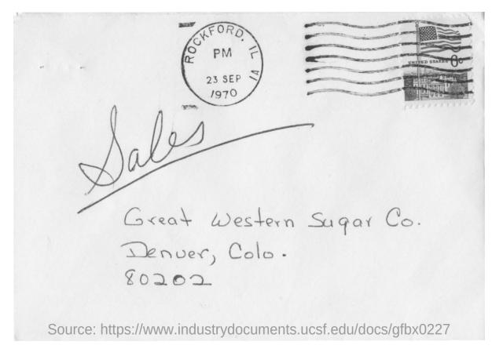

Q: Mention the ZIP code written?

A: 80202

Q: What date is seen on the seal at the top of the letter?

A: 23 sep 1970

Q: Which company address is mentioned on the letter?

A: Great western sugar Co.

Figure 1: Example question-answer pairs from DocVQA. Answering questions in the new dataset require models not just to read text but interpret it within the layout/structure of the document.

users. To do so, reading systems should not only extract and interpret the textual (handwritten, typewritten or printed) content of the document images, but exploit numerous other visual cues including layout (page structure, forms, tables), non-textual elements (marks, tick boxes, separators, diagrams) and style (font, colours, highlighting), to mention just a few.

Departing from generic VQA [13] and Scene Text VQA [35, 5] approaches, the document images warrants a different approach to exploit all the above visual cues, making use of prior knowledge of the implicit written communication conventions used, and dealing with the high-density semantic information conveyed in such images. Answers in case of document VQA cannot be sourced from a closed dictionary, but they are inherently open ended.

Previous approaches on bringing VQA to the documents

domain have either focused on specific document elements such as data visualisations [19, 21] or on specific collections such as book covers [28]. In contrast to such approaches, we recast the problem to its generic form, and put forward a large scale, varied collection of real documents.

Main contributions of this work can be summarized as following:

- We introduce DocVQA, a large scale dataset of 12, 767 document images of varied types and content, over which we have defined 50,000 questions and answers. The questions defined are categorised based on their reasoning requirements, allowing us to analyze how DocVQA methods fare for different question types.
- We define and evaluate various baseline methods over the DocVQA dataset, ranging from simple heuristic methods and human performance analysis that allow us to define upper performance bounds given different assumptions, to state of the art Scene Text VQA models and NLP models.

#### 2. Related Datasets and Tasks

Machine reading comprehension (MRC) and opendomain question answering (QA) are two problems which are being actively pursued by Natural Language Processing (NLP) and Information Retrieval (IR) communities. In MRC the task is to answer a natural language question given a question and a paragraph (or a single document) as the context. In case of open domain OA, no specific context is given and answer need to be found from a large collection (say Wikipedia) or from Web. MRC is often modelled as an extractive QA problem where answer is defined as a span of the context on which the question is defined. Examples of datsets for extractive QA include SQuAD 1.1 [32], NewsQA [37] and Natural Questions [27]. MS MARCO [29] is an example of a QA dataset for abstractive QA where answers need to be generated not extracted. Recently Transformer based pretraining methods like Bidirectional Encoder Representations from Transformers (BERT) [9] and XLNet [41] have helped to build QA models outperforming Humans on reading comprehension on SQuAD [32]. In contrast to QA in NLP where context is given as computer readable strings, contexts in case of DocVQA are document images.

Visual Question Answering (VQA) aims to provide an accurate natural language answer given an image and a natural language question. VQA has attracted an intense research effort over the past few years [13, 1, 17]. Out of a large body of work on VQA, scene text VQA branch is the most related to our work. Scene text VQA refers to VQA systems aiming to deal with cases where understanding scene text instances is necessary to respond to the questions posed. The ST-VQA [5] and TextVQA [35] datasets were introduced in parallel in 2019 and were quickly fol-

lowed by more research [36, 11, 39].

The ST-VQA dataset [5] has 31,000+ questions over 23,000+ images collected from different public data sets. The TextVQA dataset [35] has 45,000+ questions over 28,000+ images sampled from specific categories of the OpenImages dataset [25] that are expected to contain text. Another dataset named OCR-VQA [28] comprises more than 1 million question-answer pairs over 207K+ images of book covers. The questions in this dataset are domain specific, generated based on template questions and answers extracted from available metadata.

Scene text VQA methods [16, 11, 35, 12] typically make use of pointer mechanisms in order to deal with out-of-vocabulary (OOV) words appearing in the image and provide the open answer space required. This goes hand in hand with the use of word embeddings capable of encoding OOV words into a pre-defined semantic space, such as Fast-Text [6] or BERT [9]. More recent, top-performing methods in this space include M4C [16] and MM-GNN [11] models.

Parallelly there have been works on certain domain specific VQA tasks which require to read and understand text in the images. The DVQA dataset presented by Kafle *et al.* [20, 19] comprises synthetically generated images of bar charts and template questions defined automatically based on the bar chart metadata. The dataset contains more than three million question-answer pairs over 300,000 images.

FigureQA [21] comprises over one million yes or no questions, grounded on over 100,000 images. Three different types of charts are used: bar, pie and line charts. Similar to DVQA, images are synthetically generated and questions are generated from templates. Another related QA task is Textbook Question Answering (TQA) [23] where multiple choice questions are asked on multimodal context, including text, diagrams and images. Here textual information is provided in computer readable format.

Compared to these existing datasets either concerning VQA on real word images, or domain specific VQA for charts or book covers, the proposed DocVQA comprise document images. The dataset covers a multitude of different document types that include elements like tables, forms and figures, as well as a range of different textual, graphical and structural elements.

# 3. DocVQA

In this section we explain data collection and annotation process and present statistics and analysis of DocVQA.

#### 3.1. Data Collection

**Document Images:** Images in the dataset are sourced from documents in UCSF Industry Documents Library1. The documents are organized under different industries and

https://www.industrydocuments.ucsf.edu/

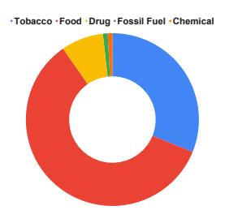

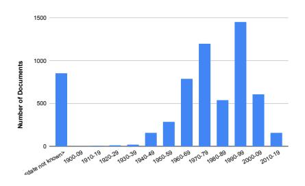

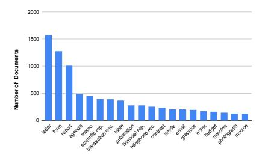

- (a) Industry-wise distribution of the docu- (b) Year wise distribution of the documents. ments
- (c) Various types of documents used.

Figure 2: Document images we use in the dataset come from 6071 documents spanning many decades, of a variety of types, originating from 5 different industries. We use documents from UCSF Industry Documents Library.

further under different collections. We downloaded documents from different collections and hand picked pages from these documents for use in the dataset. Majority of documents in the library are binarized and the binarization has taken on a toll on the image quality. We tried to minimize binarized images in DocVQA since we did not want poor image quality to be a bottleneck for VQA. We also prioritized pages with tables, forms, lists and figures over pages which only have running text.

The final set of images in the dataset are drawn from pages of 6,071 industry documents. We made use of documents from as early as 1900 to as recent as 2018. (Figure 2b). Most of the documents are from the 1960-2000 period and they include typewritten, printed, handwritten and born-digital text. There are documents from all 5 major industries for which the library hosts documents — tobacco, food, drug, fossil fuel and chemical. We use many documents from food and nutrition related collections, as they have a good number of non-binarized images. . See Figure 2a for industry wise distribution of the 6071 documents used. The documents comprise a wide variety of document types as shown in Figure 2c.

Questions and Answers: Questions and answers on the selected document images are collected with the help of remote workers, using a Web based annotation tool. The annotation process was organized in three stages. In stage 1, workers were shown a document image and asked to define at most 10 question-answer pairs on it. We encouraged the workers to add more than one ground truth answer per question in cases where it is warranted. Workers were instructed to ask questions which can be answered using text present in the image and to enter the answer verbatim from the document. This makes VQA on the DocVQA dataset an extractive QA problem similar to extractive QA tasks in NLP [32, 37] and VQA in case of ST-VQA [5].

The second annotation stage aims to verify the data collected in the first stage. Here a worker was shown an image and questions defined on it in the first stage (but not the answers from the first stage), and was required to enter answers for the questions. In this stage workers were also required to assign one or more question types to each question. The different question types in DocVQA are discussed in subsection 3.2. During the second stage, if the worker finds a question inapt owing to language issues or ambiguity, an option to flag the question was provided. Such questions are not included in the dataset.

If none of the answers entered in the first stage match exactly with any of the answers from the second stage, the particular question is sent for review in a third stage. Here questions and answers are editable and the reviewer either accepts the question-answer (after editing if necessary) or ignores it. The third stage review is done by the authors themselves.

### 3.2. Statistics and Analysis

The DocVQA comprises 50,000 questions framed on 12, 767 images. The data is split randomly in an 80-10-10ratio to train, validation and test splits. The train split has 39, 463 questions and 10, 194 images, the validation split has 5, 349 questions and 1, 286 images and the test split has 5, 188 questions and 1, 287 images.

As mentioned before, questions are tagged with question type(s) during the second stage of the annotation pro-

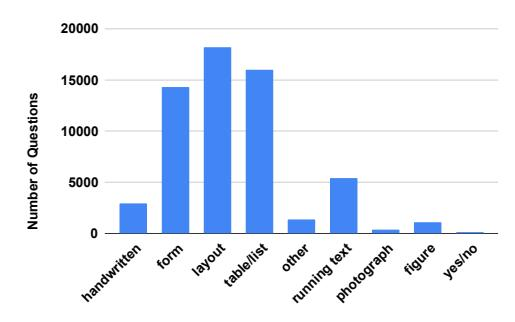

Figure 3: The 9 question types and share of questions in each type.

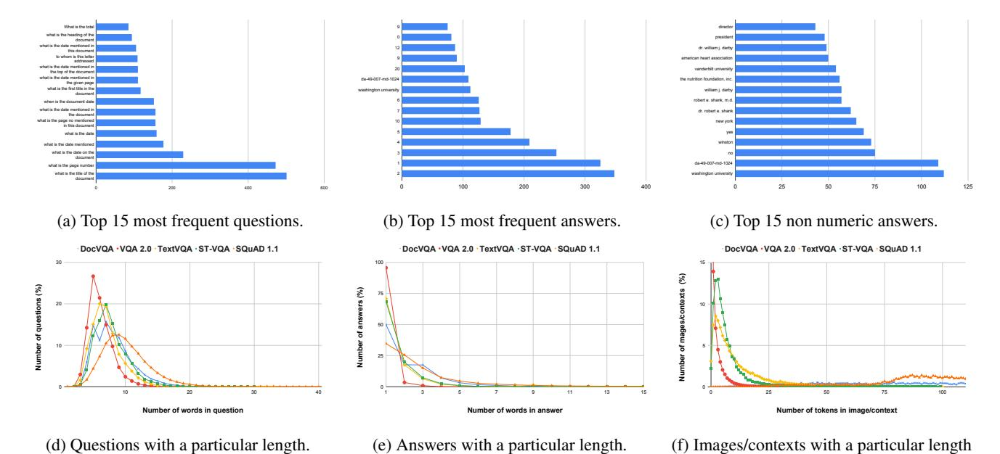

Figure 4: Question, answer and OCR tokens' statistics compared to similar datasets from VQA — VQA 2.0 [13], ST-VQA [5] and TextVQA [35] and SQuAD 1.1 [32] reading comprehension dataset.

cess. Figure 3 shows the 9 question types and percentage of questions under each type. A question type signifies the type of data where the question is grounded. For example, 'table/list' is assigned if answering the question requires understanding of a table or a list. If the information is in the form of a key:value, the 'form' type is assigned. 'Layout' is assigned for questions which require spatial/layout information to find the answer. For example, questions asking for a title or heading, require one to understand structure of the document. If answer for a question is based on information in the form of sentences/paragraphs type assigned is 'running text'. For all questions where answer is based on handwritten text, 'handwritten' type is assigned. Note that a question can have more than one type associated with it. (Examples from DocVOA for each question type are given in the supplementary.)

In the following analysis we compare statistics of questions, answers and OCR tokens with other similar datasets for VQA — VQA 2.0 [13], TextVQA [35] and ST-VQA [5] and SQuAD 1.1 [32] dataset for reading comprehension. Statistics for other datasets are computed based on their publicly available data splits. For statistics on OCR tokens, for DocVQA we use OCR tokens generated by a commercial OCR solution. For VQA 2.0, TextVQA and ST-VQA we use OCR tokens made available by authors of LoRRA [35] and M4C [16] as part of the MMF [34] framework.

Figure 4d shows distribution of question lengths for questions in DocVQA compared to other similar datasets. The average question length is is 8.12, which is second

highest among the compared datasets. In DocVQA 35,362 (70.72%) questions are unique. Figure 4a shows the top 15 most frequent questions and their frequencies. There are questions repeatedly being asked about dates, titles and page numbers. A sunburst of first 4 words of the questions is shown in Figure 6.

It can be seen that a large majority of questions start with "what is the", asking for date, title, total, amount or name.

Distribution of answer lengths is shown in Figure 4e. We observe in the figure that both DocVQA and SQuAD 1.1 have a higher number of longer answers compared to the VQA datasets. The average answer length is 2.17.

63.2% of the answers are unique , which is second only to SQuAD 1.1 (72.5%). The top 15 answers in the dataset are shown in Figure 4b.

We observe that almost all of the top answers are numeric values, which is expected since there are a good number of document images of reports and invoices. In Fig-

Figure 5: Word clouds of words in answers (left) and words spotted on the document images in the dataset (right)

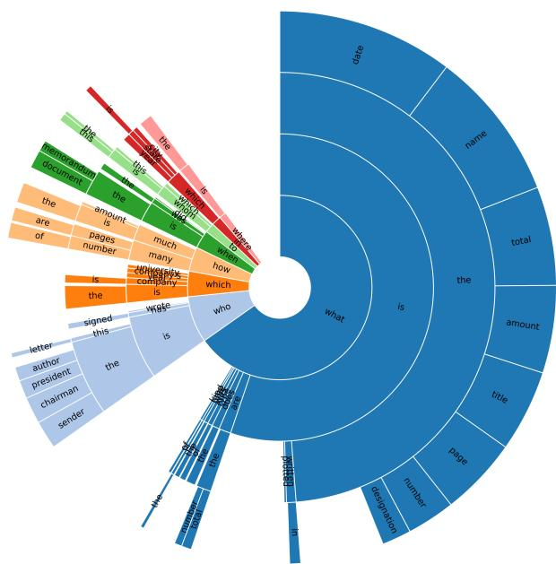

Figure 6: Distribution of questions by their starting 4-grams. Most questions aim to retrieve common data points in documents such as date, title, total mount and page number.

ure 4c we show the top 15 non numeric answers. These include named entities such as names of people, institutions and places. The word cloud on the left in Figure 5 shows frequent words in answers. Most common words are names of people and names of calendar months.

In Figure 4f we show the number of images (or 'context's in case of SQuAD 1.1) containing a particular number of text tokens. Average number of text tokens in an image or context is the highest in the case of DocVQA (182.75). It is considerably higher compared to SQuAD 1.1 where contexts are usually small paragraphs whose average length is 117.23. In case of VQA datasets which comprise real world images average number of OCR tokens is not more than 13. Word cloud on the right in Figure 5 shows the most common words spotted by the OCR on the images in DocVQA. We observe that there is high overlap between common OCR tokens and words in answers.

#### 4. Baselines

In this section we explain the baselines we use, including heuristics and trained models.

# 4.1. Heuristics and Upper Bounds

Heuristics we evaluate are: (i) **Random answer:** measures performance when we pick a random answer from the answers in the train split. (ii) **Random OCR token:** performance when a random OCR token from the given document image is picked as the answer. (iii) **Longest OCR token** is

the case when the longest OCR token in the given document is selected as the answer. (iv) **Majority answer** measures the performance when the most frequent answer in the train split is considered as the answer.

We also compute following upper bounds: (i) **Vocab UB:** This upper bound measures performance upper bound one can get by predicting correct answers for the questions, provided the correct answer is present in a vocabulary of answers, comprising all answers which occur more than once in the train split. (ii) **OCR substring UB:** is the upper bound on predicting the correct answer provided the answer can be found as a substring in the sequence of OCR tokens. The sequence is made by serializing the OCR tokens recognized in the documents as a sequence separated by space, in top-left to bottom-right order. (iii) **OCR subsequence UB:** upper bound on predicting the correct answer, provided the answer is a subsequence of the OCR tokens' sequence.

# 4.2. VQA Models

For evaluating performance of existing VQA models on DocVQA we employ two models which take the text present in the images into consideration while answering questions – Look, Read, Reason & Answer (LoRRA) [35] and Multimodal Multi-Copy Mesh(M4C) [16].

**LoRRA:** follows a bottom-up and top-down attention [3] scheme with additional bottom-up attention over OCR tokens from the images. In LoRRA, tokens in a question are first embedded using a pre-trained embedding (GloVe [31]) and then these tokens are iteratively encoded using an LSTM [15] encoder. The model uses two types of spatial features to represent the visual information from the images - (i) grid convolutional features from a Resnet-152 [14] which is pre-trained on ImageNet [8] and (ii) features extracted from bounding box proposals from a Faster R-CNN [33] object detection model, pre-trained on Visual Genome [26]. OCR tokens from the image are embedded using a pre-trained word embedding (FastText [7]). An attention mechanism is used to compute an attention weighed average of the image features as well the OCR tokens' embeddings. These averaged features are combined and fed into an output module. The classification layer of the model, predicts an answer either from a fixed vocabulary (made from answers in train set) or copy an answer from a dynamic vocabulary which essentially is the list of OCR tokens in an image. Here the copy mechanism can copy only one of the OCR tokens from the image. Consequently it cannot output an answer which is a combination of two or more OCR

**M4C**: uses a multimodal transformer and an iterative answer prediction module. Here tokens in questions are embedded using a BERT model [9]. Images are represented using (i) appearance features of the objects detected using a Faster-RCNN pretrained on Visual Genome [26] and (ii)

location information - bounding box coordinates of the detected objects. Each OCR token recognized from the image is represented using (i) a pretrained word embedding (FastText), (ii) appearance feature of the token's bounding box from the same Faster R-CNN which is used for appearance features of objects (iii) PHOC [2] representation of the token and (iv) bounding box coordinates of the token. Then these feature representations of the three entities (question tokens, objects and OCR tokens) are projected to a common, learned embedding space. Then a stack of Transformer [38] layers are applied over these features in the common embedding space. The multi-head self attention in transformers enable both inter-entity and intra-entity attention. Finally, answers are predicted through iterative decoding in an auto-regressive manner. Here the fixed vocabulary used for the closed answer space is made up of the most common answer words in the train split. Note that in this case the fixed vocabulary comprises of answer words, not answers itself as in the case of LoRRA. At each step in the decoding, the decoded word is either an OCR token from the image or a word from the fixed vocabulary of common answer words.

In our experiments we use original LoRRA and M4C models and few variants of these models. Document images in DocVQA usually contain higher number of text tokens compared to images in scene text VQA datasets. Hence we try out larger dynamic vocabularies (i.e. more OCR tokens are considered from the images) for both LoRRA and M4C. For both the models we also evaluate performance when no fixed vocabulary is used.

Since the notion of visual objects in real word images is not directly applicable in case of document images, we also try out variants of LoRRA and M4C where features of objects are omitted.

# 4.3. Reading Comprehension Models

In addition to the VQA models which can read text, we try out extractive question answering / reading comprehension models from NLP. In particular, we use BERT [9] question answering models. BERT is a method of pre-training language representations from unlabelled text using transformers [38]. These pretrained models can then be used for downstream tasks with just an additional output layer. In the case of extractive Question Answering, this is an output layer to predict start and end indices of the answer span.

### 5. Experiments

In this section we explain evaluation metrics and our experimental settings and report results of experiments.

#### **5.1. Evaluation Metrics**

Two evaluation metrics we use are Average Normalized Levenshtein Similarity (ANLS) and Accuracy (Acc.).

|                    | va    | al    | te    | st    |
|--------------------|-------|-------|-------|-------|
| Baseline           | ANLS  | Acc.  | ANLS  | Acc.  |
| Human              | -     | -     | 0.981 | 94.36 |
| Random answer      | 0.003 | 0.00  | 0.003 | 0.00  |
| Rnadom OCR token   | 0.013 | 0.52  | 0.014 | 0.58  |
| Longest OCR token  | 0.002 | 0.05  | 0.003 | 0.07  |
| Majority answer    | 0.017 | 0.90  | 0.017 | 0.89  |
| Vocab UB           | -     | 31.31 | -     | 33.78 |
| OCR substring UB   | -     | 85.64 | -     | 87.00 |
| OCR subsequence UB | -     | 76.37 | -     | 77.00 |

Table 1: Evaluation of different heuristics and upper bounds. Predicting random answers or majority answer do not even yield 1% accuracy. Answers are a substring of the serialized OCR output in more than 85% of the cases.

ANLS was originally proposed for evaluation of VQA on ST-VQA [4]. The Accuracy metric measures percentage of questions for which the predicted answer matches exactly with any of the target answers for the question. Accuracy metric awards a zero score even when the prediction is only a little different from the target answer. Since no OCR is perfect, we propose to use ANLS as our primary evaluation metric, so that minor answer mismatches stemming from OCR errors are not severely penalized.

#### **5.2.** Experimental setup

For measuring human performance , we collect answers for all questions in test split, with help a few volunteers from our institution.

In all our experiments including heuristics and trained baselines, OCR tokens we use are extracted using a commercial OCR application. For the heuristics and upper bounds we use a vocabulary 4,341 answers which occur more than once in the train split.

For LoRRA and M4C models we use official implementations available as part of the MMF framework [34]. The training settings and hyper parameters are same as the ones reported in the original works. The fixed vocabulary we use for LoRRA is same as the vocabulary we use for computing vocabulary based heuristics and upper bounds. For M4C the fixed vocabulary we use is a vocabulary of the 5,000 most frequent words from the answers in the train split.

For QA using BERT, three pre-trained BERT models2 from the Transformers library [40] are used. The models we use are bert-base-uncased, bert-large-uncased-whole-word-masking and bert-large-uncased-whole-word-masking-finetuned-squad. We abbreviate the model names as bert-base, bert-large and bert-large-squad respectively. Among these, bert-large-squad is a pre-trained model which is also finetuned on SQuAD 1.1 for question answering. In

2https://huggingface.co/transformers/
pretrained\_models.html

|              |                  |              |                     | va    | al    | te    | st    |
|--------------|------------------|--------------|---------------------|-------|-------|-------|-------|
| Method       | Objects' feature | Fixed vocab. | Dynamic vocab. size | ANLS  | Acc.  | ANLS  | Acc.  |
|              | <b>/</b>         | 1            | 50                  | 0.110 | 7.22  | 0.112 | 7.63  |
| L aDD A [25] | ✓                | ×            | 50                  | 0.041 | 2.64  | 0.037 | 2.58  |
| LoRRA [35]   | X                | ✓            | 50                  | 0.102 | 6.73  | 0.100 | 6.43  |
|              | ✓                | ✓            | 150                 | 0.101 | 7.09  | 0.102 | 7.22  |
|              | ✓                | ✓            | 500                 | 0.094 | 6.41  | 0.095 | 6.31  |
|              | /                | 1            | 50                  | 0.292 | 18.34 | 0.306 | 18.75 |
| M4C [16]     | ✓                | ×            | 50                  | 0.216 | 12.44 | 0.219 | 12.15 |
| M4C [16]     | X                | ✓            | 50                  | 0.294 | 18.75 | 0.310 | 18.92 |
|              | X                | ✓            | 150                 | 0.352 | 22.66 | 0.360 | 22.35 |
|              | X                | ✓            | 300                 | 0.367 | 23.99 | 0.375 | 23.90 |
|              | ×                | ✓            | 500                 | 0.385 | 24.73 | 0.391 | 24.81 |

Table 2: Performance of the VQA models which are capable of reading text — LoRRA [35] and M4C [16]. Detection of visual objects and their features (bottom-up attention), which is a common practice in VQA is ineffective in case of DocVQA.

case of extractive question answering or reading comprehension datasets 'contexts' on which questions are asked are passages of electronic text. But in DocVQA 'contexts' are document images. Hence to finetune the BERT QA models on DocVQA we need to prepare the data in SQuAD style format where the answer to a question is a 'span' of the context, defined by start and end indices of the answer. To this end we first serialize the OCR tokens recognized on the document images to a single string, separated by space, in top-left to bottom-right order. To approximate the answer spans we follow an approach proposed in TriviaQA [18], which is to find the first match of the answer string in the serialized OCR string.

The bert-base model is finetuned on DocVQA on 2 Nvidia GeForce 1080 Ti GPUs, for 2 epochs, with a batch size of 32. We use Adam optimizer [24] with a learning rate of 5e-05. The bert-large and bert-large-squad models are finetuned on 4 GPUs for 6 epochs with a batch size of 8, and a learning rate of 2e-05.

|                                              |                 | va                    | al             | tes                   | st             |
|----------------------------------------------|-----------------|-----------------------|----------------|-----------------------|----------------|
| Pretrained model                             | DocVQA finetune | ANLS                  | Acc.           | ANLS                  | Acc.           |
| bert-base bert-large-                     | ✓ ✓          | 0.556                 | 45.6 49.28  | 0.574 0.610        | 47.6 51.08  |
| bert-large- squad bert-large- squad | X               | 0.462 <b>0.655</b> | 36.72 54.48 | 0.475 <b>0.665</b> | 38.26 55.77 |

Table 3: Performance of BERT question answering models. A BERTLARGE model which is fine tuned on both SQuAD 1.1 [32] and DocVQA performs the best.

#### 5.3. Results

Results of all heuristic approaches and upper bounds are reported in Table 1. We can see that none of the heuristics get even a 1% accuracy on the validation or test splits.

OCR substring UB yields more than 85% accuracy on both validation and test splits. It has a downside that the substring match in all cases need not be an actual answer match. For example if the answer is "2" which is the most common answer in the dataset, it will match with a "2" in "2020" or a "2" in "2pac". This is the reason why we evaluate the OCR subsequence UB. An answer is a sub sequence of the serialized OCR output for around 76% of the questions in both validation and test splits.

Results of our trained VQA baselines are shown in Table 2. First rows for both the methods report results of the original model proposed by the respective authors. In case of LoRRA the original setting proposed by the authors yields the best results compared to the variants we try out. With no fixed vocabulary, the performance of the model drops sharply suggesting that the model primarily relies on the fixed vocabulary to output answers. Larger dynamic vocabulary results in a slight performance drop suggesting that incorporating more OCR tokens from the document images does little help. Unlike LoRRA, M4C benefits from a larger dynamic vocabulary. Increasing the size of the dynamic vocabulary from 50 to 500 improves the ANLS by around 50%. And in case of M4C, the setting where features of objects are omitted, performs slightly better compared to the original setting.

Results of the BERT question answering models are reported in Table 3. We observe that all BERT models perform better than the best VQA baseline using M4C (last row in 2). The best performing model out of all the baselines analysed is the bert-large-squad model, finetuned on DocVQA. Answers predicted by this model match one of

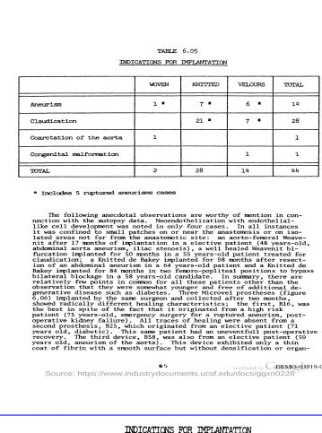

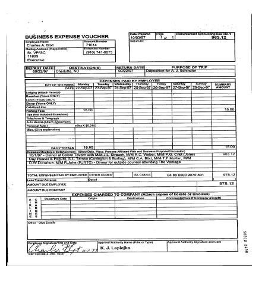

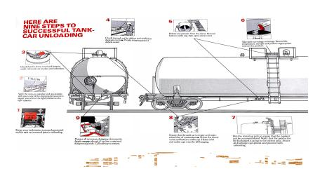

| :        | INDICATIONS FOR | IMPLANTATION |         |       |
|----------|-----------------|--------------|---------|-------|
|          | WOVEN           | KNITTED      | VELOURS | TOTAL |
| Aneurism | 1 *             | 7 *          | 6 *     | 14    |
|          |                 |              |         |       |

| Employee Name                   | Account Number   |
|---------------------------------|------------------|
| Charles A. Blixt                | 71614            |
| Mailing Address (If applicable) | Extension Number |
| Sr. VP/GC                       | (910) 741-0673   |
| 11803                           |                  |
| Executive                       |                  |

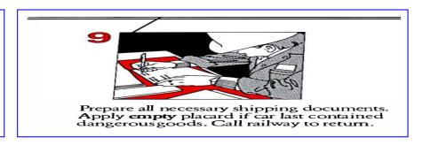

**Q:** What is the underlined heading just above the table?

GT: Indications for implantation

M4C best: indications for implantation BERT best: total aneurism

BERT best: total aneurism

Human: indications for implantation

Q: What is the Extension Number as per the

voucher?

GT: (910) 741-0673 M4C best: 963.12 BERT best: (910) 741-0673 Human: (910) 741-0673 Q: How many boxed illustrations are there ?

GT: 9 M4C best: 4 BERT best: 4 Human: 9

Figure 7: Qualitative results from our experiments. The leftmost example is a 'layout' type question answered correctly by the M4C model but erred by the BERT model. In the second example the BERT model correctly answers a question on a form while the M4C model fails. In case of the rightmost example, both models fail to understand a step by step illustration.

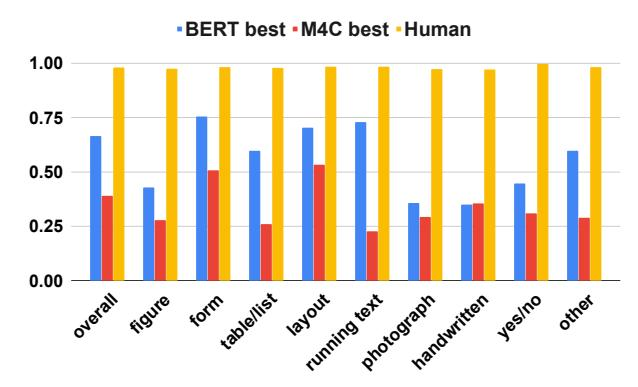

Figure 8: Best baselines from VQA space and reading comprehension space pitted against the human performance for different question types. We need models which can understand figures and text on photographs better. We need better handwriting recognizers too!

the target answers exactly for around 55% of the questions. In Figure 8 we show performance by question type. We

compare the best models among VQA models and BERT question answering models against the human performance

on the test split. We observe that the human performance is uniform while the models' performance vary for different question types. In Figure 7 we show a few qualitative results from our experiments.

# 6. Conclusion

We introduce a new data set and an associated VQA task with the aim to inspire a "purpose-driven" approach in document image analysis and recognition research. Our baselines and initial results motivate simultaneous use of visual and textual cues for answering questions asked on document images. This could drive methods that use the low-level cues (text, layout, arrangements) and high-level goals (purpose, relationship, domain knowledge) in solving problems of practical importance.

# Acknowledgements

We thank Amazon for supporting the annotation effort, and Dr. R. Manmatha for many useful discussions and inputs. This work is partly supported by MeitY, Government of India, the project TIN2017-89779-P, an Amazon AWS Research Award and the CERCA Programme.

# References

- [1] Aishwarya Agrawal, Aniruddha Kembhavi, Dhruv Batra, and Devi Parikh. C-VQA: A compositional split of the visual question answering (VQA) v1. 0 dataset. arXiv preprint arXiv:1704.08243, 2017.
- [2] J. Almazán, A. Gordo, A. Fornés, and E. Valveny. Word spotting and recognition with embedded attributes. *TPAMI*, 2014.
- [3] Peter Anderson, Xiaodong He, Chris Buehler, Damien Teney, Mark Johnson, Stephen Gould, and Lei Zhang. Bottom-up and top-down attention for image captioning and visual question answering, 2017.
- [4] Ali Furkan Biten, Rubèn Tito, Andrés Mafla, Lluís Gómez, Marçal Rusiñol, Minesh Mathew, C. V. Jawahar, Ernest Valveny, and Dimosthenis Karatzas. ICDAR 2019 competition on scene text visual question answering. *CoRR*, abs/1907.00490, 2019.
- [5] Ali Furkan Biten, Ruben Tito, Andres Mafla, Lluis Gomez, Marcal Rusinol, Ernest Valveny, C.V. Jawahar, and Dimosthenis Karatzas. Scene text visual question answering. In *ICCV*, 2019.
- [6] Piotr Bojanowski, Edouard Grave, Armand Joulin, and Tomas Mikolov. Enriching word vectors with subword information. *Transactions of the Association for Computational Linguistics*, 5.
- [7] Piotr Bojanowski, Edouard Grave, Armand Joulin, and Tomas Mikolov. Enriching word vectors with subword information. *Transactions of the Association for Computational Linguistics*, 5, 2017.
- [8] J. Deng, W. Dong, R. Socher, L. Li, Kai Li, and Li Fei-Fei. Imagenet: A large-scale hierarchical image database. In CPVR, 2009.
- [9] Jacob Devlin, Ming-Wei Chang, Kenton Lee, and Kristina Toutanova. BERT: Pre-training of deep bidirectional transformers for language understanding. In ACL, 2019.
- [10] David Doermann, Karl Tombre, et al. Handbook of document image processing and recognition. Springer, 2014.
- [11] Difei Gao, Ke Li, Ruiping Wang, Shiguang Shan, and Xilin Chen. Multi-modal graph neural network for joint reasoning on vision and scene text. In *CVPR*, 2020.
- [12] Lluís Gómez, Ali Furkan Biten, Rubèn Tito, Andrés Mafla, and Dimosthenis Karatzas. Multimodal grid features and cell pointers for scene text visual question answering. *arXiv* preprint arXiv:2006.00923, 2020.
- [13] Yash Goyal, Tejas Khot, Douglas Summers-Stay, Dhruv Batra, and Devi Parikh. Making the v in vqa matter: Elevating the role of image understanding in visual question answering, 2016.
- [14] Kaiming He, Xiangyu Zhang, Shaoqing Ren, and Jian Sun. Deep residual learning for image recognition, 2015.
- [15] Sepp Hochreiter and Jürgen Schmidhuber. Long short-term memory. Neural Comput., 1997.
- [16] Ronghang Hu, Amanpreet Singh, Trevor Darrell, and Marcus Rohrbach. Iterative answer prediction with pointeraugmented multimodal transformers for textvqa. In CVPR, 2020.

- [17] Justin Johnson, Bharath Hariharan, Laurens van der Maaten, Li Fei-Fei, C Lawrence Zitnick, and Ross Girshick. Clevr: A diagnostic dataset for compositional language and elementary visual reasoning. In CVPR, pages 2901–2910, 2017.
- [18] Mandar Joshi, Eunsol Choi, Daniel Weld, and Luke Zettle-moyer. TriviaQA: A large scale distantly supervised challenge dataset for reading comprehension. In ACL, 2017.
- [19] Kushal Kafle, Brian Price, Scott Cohen, and Christopher Kanan. Dvqa: Understanding data visualizations via question answering. In CVPR, 2018.
- [20] Kushal Kafle, Robik Shrestha, Scott Cohen, Brian Price, and Christopher Kanan. Answering questions about data visualizations using efficient bimodal fusion. In WACV, 2020.
- [21] Samira Ebrahimi Kahou, Vincent Michalski, Adam Atkinson, Ákos Kádár, Adam Trischler, and Yoshua Bengio. Figureqa: An annotated figure dataset for visual reasoning. arXiv preprint arXiv:1710.07300, 2017.
- [22] Isaak Kavasidis, Carmelo Pino, Simone Palazzo, Francesco Rundo, Daniela Giordano, P Messina, and Concetto Spampinato. A saliency-based convolutional neural network for table and chart detection in digitized documents. In *ICIAP*, 2019
- [23] Aniruddha Kembhavi, Minjoon Seo, Dustin Schwenk, Jonghyun Choi, Ali Farhadi, and Hannaneh Hajishirzi. Are you smarter than a sixth grader? textbook question answering for multimodal machine comprehension. In CVPR, 2017.
- [24] Diederik P. Kingma and Jimmy Ba. Adam: A method for stochastic optimization. In *ICLR*, 2015.
- [25] Ivan Krasin, Tom Duerig, Neil Alldrin, Vittorio Ferrari, Sami Abu-El-Haija, Alina Kuznetsova, Hassan Rom, Jasper Uijlings, Stefan Popov, Shahab Kamali, Matteo Malloci, Jordi Pont-Tuset, Andreas Veit, Serge Belongie, Victor Gomes, Abhinav Gupta, Chen Sun, Gal Chechik, David Cai, Zheyun Feng, Dhyanesh Narayanan, and Kevin Murphy. Openimages: A public dataset for large-scale multi-label and multi-class image classification. Dataset available from https://storage.googleapis.com/openimages/web/index.html, 2017.
- [26] Ranjay Krishna, Yuke Zhu, Oliver Groth, Justin Johnson, Kenji Hata, Joshua Kravitz, Stephanie Chen, Yannis Kalantidis, Li-Jia Li, David A. Shamma, Michael S. Bernstein, and Li Fei-Fei. Visual genome: Connecting language and vision using crowdsourced dense image annotations. *Int. J. Com*put. Vision, 2017.
- [27] Tom Kwiatkowski, Jennimaria Palomaki, Olivia Redfield, Michael Collins, Ankur Parikh, Chris Alberti, Danielle Epstein, Illia Polosukhin, Matthew Kelcey, Jacob Devlin, Kenton Lee, Kristina N. Toutanova, Llion Jones, Ming-Wei Chang, Andrew Dai, Jakob Uszkoreit, Quoc Le, and Slav Petrov. Natural questions: a benchmark for question answering research. Transactions of the Association of Computational Linguistics, 2019.
- [28] Anand Mishra, Shashank Shekhar, Ajeet Kumar Singh, and Anirban Chakraborty. OCR-VQA: Visual question answering by reading text in images. In *ICDAR*, 2019.
- [29] Tri Nguyen et al. Ms marco: A human generated machine reading comprehension dataset. CoRR, abs/1611.09268, 2016.

- [30] Rasmus Berg Palm, Ole Winther, and Florian Laws. Cloudscan-a configuration-free invoice analysis system using recurrent neural networks. In *ICDAR*, 2017.
- [31] Jeffrey Pennington, Richard Socher, and Christopher D. Manning. Glove: Global vectors for word representation. In EMNLP, 2014.
- [32] Pranav Rajpurkar, Jian Zhang, Konstantin Lopyrev, and Percy Liang. Squad: 100, 000+ questions for machine comprehension of text. arXiv preprint arXiv:1606.05250, 2016.
- [33] Shaoqing Ren, Kaiming He, Ross Girshick, and Jian Sun. Faster r-cnn: Towards real-time object detection with region proposal networks. In *NeurIPS*. 2015.
- [34] Amanpreet Singh, Vedanuj Goswami, Vivek Natarajan, Yu Jiang, Xinlei Chen, Meet Shah, Marcus Rohrbach, Dhruv Batra, and Devi Parikh. Mmf: A multimodal framework for vision and language research. https://github.com/facebookresearch/mmf, 2020.
- [35] Amanpreet Singh, Vivek Natarjan, Meet Shah, Yu Jiang, Xinlei Chen, Devi Parikh, and Marcus Rohrbach. Towards vqa models that can read. In *CVPR*, 2019.
- [36] Ajeet Kumar Singh, Anand Mishra, Shashank Shekhar, and Anirban Chakraborty. From strings to things: Knowledgeenabled vqa model that can read and reason. In *ICCV*, 2019.
- [37] Adam Trischler, Tong Wang, Xingdi Yuan, Justin Harris, Alessandro Sordoni, Philip Bachman, and Kaheer Suleman. Newsqa: A machine comprehension dataset. *CoRR*, abs/1611.09830, 2016.
- [38] Ashish Vaswani, Noam Shazeer, Niki Parmar, Jakob Uszkoreit, Llion Jones, Aidan N Gomez, Ł ukasz Kaiser, and Illia Polosukhin. Attention is all you need. In *NeurIPS*. 2017.
- [39] Xinyu Wang, Yuliang Liu, Chunhua Shen, Chun Chet Ng, Canjie Luo, Lianwen Jin, Chee Seng Chan, Anton van den Hengel, and Liangwei Wang. On the general value of evidence, and bilingual scene-text visual question answering. In CVPR, 2020.
- [40] Thomas Wolf, Lysandre Debut, Victor Sanh, Julien Chaumond, Clement Delangue, Anthony Moi, Pierric Cistac, Tim Rault, R'emi Louf, Morgan Funtowicz, and Jamie Brew. Huggingface's transformers: State-of-the-art natural language processing. *ArXiv*, abs/1910.03771, 2019.
- [41] Zhilin Yang, Zihang Dai, Yiming Yang, Jaime Carbonell, Russ R Salakhutdinov, and Quoc V Le. Xlnet: Generalized autoregressive pretraining for language understanding. In *NeurIPS*. 2019.

# A. Screen grabs of Annotation Tool

As mentioned in Section 3.1 in the main paper, annotation process involves three stages. In Figure A.1, Figure A.2 and Figure A.3 we show screen grabs from stage 1, stage 2 and stage 3 of the annotation process respectively.

# **B.** Examples of Question Types

We define 9 question types, based on the kind of reasoning required to answer a question. Question types are assigned at the second stage of the annotation. We discuss the question types in Section 3.2. in the main paper.

Examples for types *form*, *yes/no* and *layout* are shown in Figure B.1. Examples for a question based on a handwritten date in a form (types *form* and *handwritten*) are shown in Figure B.2. An example for a question based on information in the form of sentences or paragraphs (type *running text*) is shown in Figure B.3. Examples for types *photograph* and *table* are shown in Figure B.4. An example for a question based on a plot (type *figure*) is shown in Figure B.5. In all examples a crop of the original image is shown below the original image, for better viewing of the image region where the question is based on.

# C. Additional Qualitative Examples

Here we show more qualitative results from our baseline experiments. These results supplement the Results section (Section 5.3) in the main paper.

Remember that BERT [9] question answering model is designed to answer questions asked on sentences or paragraphs of text (reading comprehension). In Figure C.1 we show two examples where the model answers questions outside the ambit of reading comprehension style question answering. In Figure C.2 we show examples where the M4C [16] model outperforms the BERT model to answer questions based on text seen on pictures or photographs. Such questions are similar to questions in TextVQA [35] or ST-VQA [5] datasets where M4C model yield state-ofthe-art results. In Figure C.3 we show an example where both the models yield inconsistent results when posed with questions of similar nature, highlighting lack of reasoning behind answering. In Figure C.4 we show two examples where both the M4C and BERT model fail to answer questions which require understanding of a figure or a diagram. In Figure C.5 we show how OCR errors have resulted in wrong answers although the models manage to ground the questions correctly.

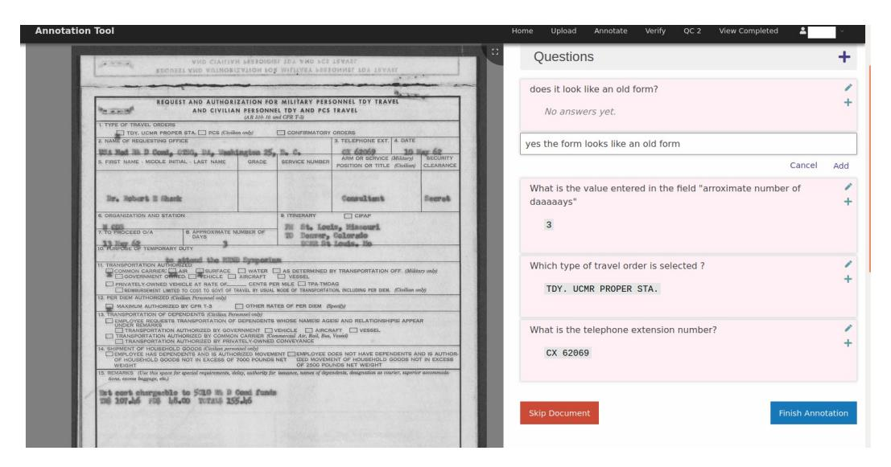

Figure A.1: **Annotation stage 1 - Question Answer Collection:** Questions and answers are collected for a given document image. Annotator can add upto 10 questions for a document. The document can be skipped if it is not possible to frame questions on it.

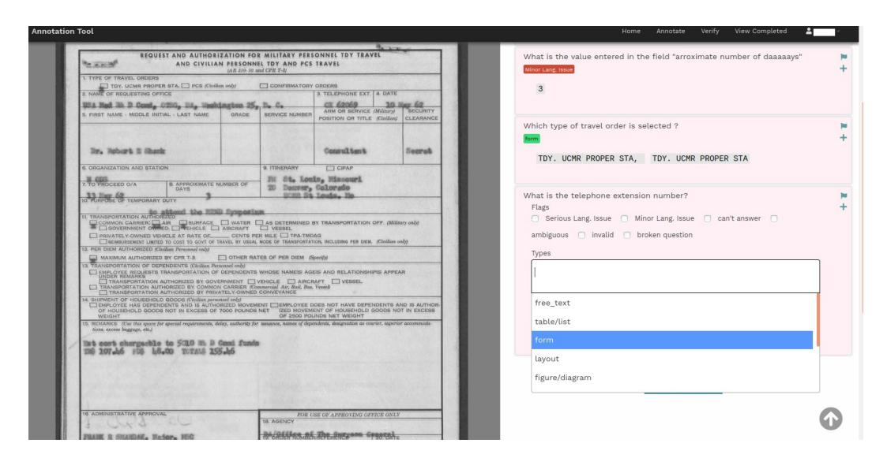

Figure A.2: **Annotation stage 2 - Data Verification:** For each question shown annotators have to (i) enter answer(s) (answer(s) from first stage are not shown) and (ii) Tag the question with one or more question types from the 9 question types shown in a drop-down (question types assigned to a question are shown in green highlight color.) or (iii) flag/ignore the question by selecting the check-box corresponding to one of the reasons such as "invalid question", "Serious lang. issue" etc. ( the reasons chosen for flagging a question are shown in red highlight color )

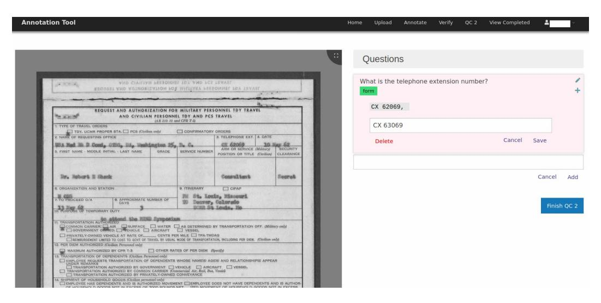

Figure A.3: Annotation Stage 3: Reviewing answer mismatch cases: If none of the answers entered in the first stage for a question match with any of the answers entered in the second stage, the question is sent for review in a third stage. This review is handled by the authors and reviewer is allowed to edit question as well answers or add new answers before accepting the question.

| ·                            |                                                                        |                                                                |                                |                 |
|------------------------------|------------------------------------------------------------------------|----------------------------------------------------------------|--------------------------------|-----------------|
|                              | 03/17/98 TUE 08:16 FAX 732883                                          | 1723 APG:RJR                                                   |                                | <b>₫</b> 003    |
|                              | SPEC                                                                   | IAL POS / PDI REQUI                                            | EST FORM                       |                 |
|                              | Requesting RJR Manager A.P. GR                                         |                                                                |                                |                 |
|                              | Region Number 1200                                                     | Voice Mail Num                                                 | Date 03/13/1998                |                 |
|                              | Store / Chain Name LOVE STORES                                         |                                                                | No. of Stores 20               | <del></del>     |
|                              | Requesting (Check One) Prod                                            |                                                                | t Mechanical Only              | <u>.</u>        |
|                              |                                                                        | Yes Oranewitem? No Y                                           | es Due Date Required 05/15/199 | 8               |
|                              | Description of Request (Give as much CAMEL SHOPPING BASKETS         | ch detail as possible)                                         |                                |                 |
|                              |                                                                        |                                                                |                                |                 |
|                              |                                                                        |                                                                |                                |                 |
|                              |                                                                        |                                                                |                                |                 |
|                              | Drawing of Request (Attach separate                                    | drawing if necessary and sample if avail                       | ilable):                       | <del></del>     |
|                              |                                                                        |                                                                | •                              |                 |
|                              |                                                                        |                                                                |                                |                 |
|                              |                                                                        |                                                                |                                |                 |
|                              | Exact Size:                                                            |                                                                | "(W)                           |                 |
|                              | Size excluding dead areas:                                             |                                                                |                                |                 |
|                              | Identify Dead Areas (Hidden by fram                                    |                                                                | " (Bottom)" (                  | Sides)          |
|                              | Quantity Requested 50 Ship To Location (If this request is to          | be warehoused by RJR, please write RJ                          | ID in the name area)           | <del></del>     |
|                              | Name RJR - NEW YORK ME                                                 |                                                                | or in the name area)           |                 |
|                              |                                                                        | 400 RARITAN CENTER PARKWAY                                     |                                |                 |
|                              | City EDISON                                                            | State                                                          | NJ Zip Code 08837              |                 |
|                              | Attention A.P. GROLL  Complete the below information only              | if art is being requested for local product                    | lion'                          |                 |
|                              | Store / Chain Contact Name                                             |                                                                | Phone                          |                 |
|                              | Printer / Supplier Contact Name                                        |                                                                | Phone                          |                 |
|                              | After approval by Region Sales Ma Allow a minimum of 6 to 8 weeks f | nager, e-mail or fax form to your Area or special requests. |                                |                 |
|                              | RSM Approval                                                           | ming                                                           | Date <u>3-17-98</u>            | -               |
|                              | AMO Approval                                                           | TO BE COMPLETED BY WINSTON-S/                                  | Date                           |                 |
|                              | DATE REQUEST RECEIVED REQUISIT                                         | ON DATE ITEM NO. ASSIGNED                                      | SKUPACK                        | <del></del> ' , |
|                              | WAREHOUSE                                                              | ·                                                              | PO NUMBER ASSIGNED             | 18              |
|                              | SUPPLIER ASSIGNED                                                      |                                                                | DUE DATÉ IN WAREHOUSE          | \$              |
|                              | PROJECT ESTIMATED COST                                                 | PROJECT ACTUAL COST                                            | GL CODE ASSIGNED               | — 69            |
|                              | PROJECT ESTIMATED COST                                                 | PROJECT ACTUAL COST  www.industrydocuments.ucsf.               | GL CODE ASSIGNED               | — 1691       |
| Store / Chain Name LOVE S    | TORES                                                                  |                                                                | 03/17/98 TUE 08:16 FAX         | 7328631723      |
| Requesting (Check One)       | Denduced DOS / DDI                                                     |                                                                | . •                            |                 |
|                              |                                                                        |                                                                | SI                             | PECIAL POS      |
| le thic an oviction item?    | No ⊠Yes Oranewitem?                                                    |                                                                |                                |                 |
| ls this an existing item?    | as much detail as possible)                                            |                                                                | Requesting RJR Manager A       | .P. GRULL       |
|                              |                                                                        |                                                                | Region Number 1200             |                 |
| Description of Request (Give |                                                                        |                                                                |                                |                 |
| Description of Request (Give |                                                                        | Q: What is                                                     |                                | e top left?     |
|                              |                                                                        |                                                                | s the date given at th         | e top left?     |

Figure B.1: On the left is a question based on an yes/no check box. On the right, the question seeks for a date given at a particular spatial location — top left of the page.

| ;                                                                          | SPECIAL POS                                | S / PDI REQUE                            | EST FORM                                        |          |
|----------------------------------------------------------------------------|--------------------------------------------|------------------------------------------|-------------------------------------------------|----------|
| Requesting RJR Manager                                                     | A.P. GROLL                                 |                                          | Date 03/13/1998                                 |          |
| Region Number 1200                                                         |                                            | Voice Mail Numb                          |                                                 |          |
| Store / Chain Name LOV Requesting (Check One)                           |                                            |                                          | No. of Stores 20                                |          |
|                                                                            |                                            |                                          | Mechanical Only as Due Date Required 05/15/1998 |          |
| Description of Request (G                                                  |                                            |                                          | Duo Duo Nequieo (2004)                          |          |
| CAMEL SHOPPING BASK                                                        | ŒT\$                                       |                                          |                                                 |          |
|                                                                            |                                            |                                          |                                                 |          |
|                                                                            |                                            |                                          |                                                 |          |
| Dec                                                                        |                                            |                                          |                                                 |          |
| Drawing of Request (Attac                                                  | n separate drawing if nec                  | sessary and sample if avail              | lable):                                         |          |
|                                                                            |                                            |                                          | •                                               | Ì        |
|                                                                            |                                            |                                          |                                                 |          |
|                                                                            |                                            |                                          |                                                 |          |
|                                                                            |                                            |                                          |                                                 |          |
| Exact Size:                                                                |                                            |                                          |                                                 |          |
| Size excluding dead areas Identify Dead Areas (Hidd                     |                                            | *(H) *(Top)                           | "(W) "(Bottom) "(6                           | Cidae)   |
| Quantity Requested 50                                                      | ,                                          | SKU Pack 1                               | (DONOM)()                                       | unde)    |
| Ship To Location (If this re                                               |                                            |                                          | R in the name area)                             |          |
| Name RJR - NEW                                                             |                                            |                                          |                                                 |          |
|                                                                            | ENTER - 400 RARITAN                        |                                          |                                                 |          |
| City _ EDISON Attention A.P. GROLL                                      | ·····                                      | State .                                  | NJ Zip Code 08837                               |          |
| Complete the below inform                                                  |                                            | equested for local product               | ion:                                            |          |
| Store / Chain Contact                                                      |                                            |                                          | Phone                                           |          |
| Printer / Supplier Cont                                                    | act Name                                   |                                          | Phone                                           |          |
| After approval by Region Allow a minimum of 6 to                        | Sales Manager, e-mail                      | or fax form to your Area                 | Manager of Operations.                          |          |
| RSM Approval                                                               |                                            |                                          | Date <u>3-17-98</u>                             |          |
| AMO Approval                                                               | 1                                          |                                          | Date                                            |          |
| DATE REQUEST RECEIVED                                                      | TO BE COMP                                 | LETED BY WINSTON-SA ITEM NO. ASSIGNED | ALEM ISKUPACK                                |          |
| WAREHOUSE                                                                  | 1                                          |                                          | PO NUMBER ASSIGNED                              | 51846    |
| SUPPLIER ASSIGNED                                                          |                                            |                                          | DUE DATÉ IN WAREHOUSE                           | 34       |
| 1                                                                          |                                            |                                          |                                                 | — 169 |
| PROJECT ESTIMATED COST                                                     | PROJECT AC                                 | TUAL COST                                | GL CODE ASSIGNED                                | 91       |
|                                                                            |                                            |                                          |                                                 |          |
|                                                                            |                                            |                                          |                                                 |          |
|                                                                            | https://www.indue                          | trydocuments.ucsf.e                      | edu/docs/rnlv0000                               |          |
| Source                                                                     |                                            | ,                                        | , 5000                                          |          |
| Source                                                                     |                                            |                                          |                                                 |          |
| Source                                                                     |                                            |                                          |                                                 |          |
| Source:                                                                    | 411 <del>0</del>                           |                                          | FIUIH                                           |          |
| ra combine connectua                                                       |                                            | re face faces do money                   |                                                 |          |
| tor / эщерног contact rea                                                  | Manager, e-mail c                          |                                          | Area Manager of Operations                      |          |
| pproval by Region Sales minimum of 6 to 8 wee                           | s Manager, e-mail o ks for special requ |                                          | Area Manager of Operations                      |          |
| on supplies contact has proval by Region Sales minimum of 6 to 8 wee | Manager, e-mail c                          |                                          |                                                 |          |
| pproval by Region Sales minimum of 6 to 8 wee                           | s Manager, e-mail o ks for special requ |                                          | Area Manager of Operations                      |          |

Figure B.2: Date is handwritten and it is shown in a key:value format.

**Q:** What is the date written next to RSM approval?

Question types: form and handwritten

**A:** 3-17-98

15

|        | s                                                       | PECIAL PO                             | OS / PDI REQUI                             | EST FORM                |          |
|--------|---------------------------------------------------------|---------------------------------------|--------------------------------------------|-------------------------|----------|
|        | Requesting RJR Manager                                  | A.P. GROLL                            |                                            | Date 03/13/199          | 8        |
|        | Region Number 1200                                      |                                       | Voice Mail Num                             |                         |          |
|        | Store / Chain Name LOVE                                 | STORES                                |                                            | No. of Stores 20        |          |
|        | Requesting (Check One)                                  |                                       |                                            | Mechanical Only         |          |
|        |                                                         |                                       |                                            | es Due Date Required 05 | /15/1998 |
|        | Description of Request (Giv CAMEL SHOPPING BASKE     |                                       | possible)                                  |                         |          |
|        | OF WILL OF OT 1 IN O DAOTE                              |                                       |                                            |                         |          |
|        |                                                         |                                       |                                            |                         |          |
|        |                                                         |                                       |                                            |                         |          |
|        | Drawing of Request (Attach                              | separate drawing if r                 | necessary and sample if avai               | lable):                 |          |
|        | Exact Size:                                             |                                       |                                            |                         |          |
|        | Exact Size: Size excluding dead areas:               |                                       |                                            | "(W)                    |          |
|        | Identify Dead Areas (Hidder                             | by frames etc)                        | *(H) *(Top)                             | " (W)                   | "(Sides) |
|        | Quantity Requested 50                                   |                                       | SKU Pack 1                                 | (bollon)                | (0,000)  |
|        |                                                         | uest is to be warehou                 | ised by RJR, please write RJ               | R in the name area)     |          |
|        | Name RJR - NEW Y                                        |                                       |                                            |                         |          |
|        |                                                         | NTER - 400 RARITA                     | AN CENTER PARKWAY                          |                         |          |
|        | City EDISON Attention A.P. GROLL                        | · · · · · · · · · · · · · · · · · · · | State                                      | NJ Zip Code 08          | 337      |
|        |                                                         | llon only if not in boing             | requested for local product                | iaa:                    |          |
|        | Store / Chain Contact N                                 |                                       | g requested for ascer product              | Phone                   |          |
|        | Printer / Supplier Contac                               | t Name                                |                                            | Phone                   |          |
|        | After approval by Region : Allow a minimum of 6 to 8 | Sales Manager, e-m                    | ail or fax form to your Area               | Manager of Operations.  |          |
|        | RSM Approval                                            | a. Hounes                             | ednesie:                                   | Date 3-17-              | 98       |
|        | AMO Approval                                            |                                       |                                            | Date                    |          |
|        |                                                         | TO BE CO                              | MPLETED BY WINSTON-SA ITEM NO. ASSIGNED | TEM                     |          |
|        |                                                         | REQUISITION DATE                      | ITEM NO. ASSIGNED                          | •                       | 5        |
|        | WAREHOUSE                                               |                                       |                                            | PO NUMBER ASSIGNED      | 1846     |
|        | SUPPLIER ASSIGNED                                       |                                       |                                            | DUE DATE IN WAREHOUSE   |          |
|        | PROJECT ESTIMATED COST                                  | PROJECT                               | ACTUAL COST                                | GL CODE ASSIGNED        |          |
|        |                                                         |                                       |                                            | ,                       |          |
|        |                                                         |                                       |                                            |                         |          |
|        |                                                         |                                       |                                            |                         |          |
|        | Source:                                                 | https://www.indi                      | ustrydocuments.ucsf.                       | edu/docs/rnly0000       |          |
|        |                                                         |                                       |                                            |                         |          |
|        |                                                         |                                       |                                            |                         |          |
| antity | Requested 50                                            |                                       | SKU Pack _                                 | l                       |          |
|        | Location (If this request in                            | e ta ha warahawa                      | ad by DID places                           | DID in the name         |          |
|        |                                                         |                                       | ou by ruin, piease with                    | a unk iu me uswe sussi  | )        |
| Narr   | ie <u>rjr - New York</u>                     | METRO ROU                             | •                                          |                         |          |
|        | ess RARITAN CENTER                                      | - 400 RARITAI                         | N CENTER PARKWAY                           |                         |          |
| Addi   |                                                         |                                       |                                            |                         |          |

**Q:** If the request needs to be warehoused by RJR, what needs to be done? **Question types:** running text

A: write to RJR

Figure B.3: Question is grounded on a sentence.

# nitrogen

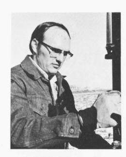

Dr. Dwayne G. Westfall Senior Plant Nutritionist

Senior Plant Nutritionist

A native of Aberdeen, Idaho, Dwayne
received his Bachelor's Degree in Agronomy
from the University of Idaho in 1961.

We have been a senior of the Idaho in 1961.

After graduating from the University of Idaho, he
were day fieldman for Lamb-Weston,
Inc., a potato processing firm in American
Falls, Idaho. Two years of Army service
followed as plant pathologist at the U.S.
Army Biological Laboratory. Dwayne joined
Texas A & M University as assistant
professor in 1967 and was advanced to
associate professor in 1972. In September of
1973 he joined Great Western's agricultural
research staff.

#### Recommendations

The top foot of soil should be analyzed for nitrate, phosphorus, potassium, organic matter and pH and the remaining soil down to the five foot level should be analyzed only for nitrate nitrogen in one foot increments.

Nitrogen fertilizer recommendations should take into consideration, 1) amount of nitrate nitrogen in the entire soil profile, 2) organic matter content, 3) manure applied, 4) crop residue plowed under.

Colorado State University researchers have found that if the residual soil nitrate nitrogen level is over 100 pounds per acre, the probability of a significant yield response to additional nitrogen fertilizer is very small.

The following calculations show how to determine the amount of nitrogen

determine the amount of nitrogen fertilizer to apply: ppm nitrate nitrogen\* x 3.6 = pounds of nitrate-nitrogen in one foot of soil percent organic matter x 30 = lbs N/A available from organic matter tons manure applied per acre x 5 = lbs N/A available from manure alfalfal polowed under = 50 lbs N/A previous crop beans = 30 lbs N/A 10 lbs N are required for each ton of sugarbeets the grower estimates he will produce

nitrogen fertilizer recommendation = growers yield goal = (residual soil nitrate-nitrogen + N available from organic matter, manure, alfalfa and beans) \*If soil results are received in ppm rather than lbs/A

rather than Ibs/A
Soil Nitrogen
In 1972, deep soil samples were taken on about 200 fields in the Nebraska, NCC and NEC&K Districts. The sucrose percentages, yields and soil nitrogen levels are shown in the table. These results show that for every 100 pounds increase in soil nitrogen level, there was a 0.18% decrease in sucrose content. Yields did not change dramatically as the soil nitrate-nitrogen level increased from 100 to 500 pounds.

Nitrogen Rate X Variety Tests

#### Nitrogen Rate X Variety Tests

Six tests were conducted in 1973 in which several varieties were grown at various nitrogen fertility levels to determine if all varieties responded the same to high soil nitrogen levels. same to high soil nitrogen levels. The results are summarized in the fol-lowing table. The residual soil nitrate nitrogen levels in the six fields ranged from 30 to 70 pounds per acre. The results show that sugarbeet yields increased as the nitrogen rate increased and there was a significant decrease in sucrose percentage at decrease in sucrose percentage at the high nitrogen rate as well as a decrease in purity. The pounds of ex-

#### Effect of Nitrogen Level on Sucrose Percentage and Yield

|                  | Nebra        | aska         | Dist NC   | trict C   | NEC          | &K           | Avei         | rage         |
|------------------|--------------|--------------|--------------|--------------|--------------|--------------|--------------|--------------|
| N Level* lb/A | Sucrose % | Yield T/A | Sucrose % | Yield T/A | Sucrose % | Yield T/A | Sucrose % | Yield T/A |
| 101-200          | 16.4         | 22.7         | 17.4         | 20.4         | 16.0         | 20.8         | 16.6         | 21.3         |
| 201-300          | 16.4         | 22.8         | 17.1         | 21.9         | 16.4         | 20.6         | 16.6         | 21.8         |
| 301-400          | 16.2         | 22.5         | 16.5         | 22.0         | 15.8         | 19.7         | 16.2         | 21.4         |
| 401-500          | 15.9         | 22.5         | 15.9         | 22.8         | 15.3         | 22.4         | 15.7         | 22.6         |
| 501+             |              |              | 16.3         | 21.8         | 15.5         | 18.7         | 15.9         | 20.2         |

\*Fertilizer nitrogen applied plus residual soil nitrogen

Source: https://www.industrydocuments.ucsf.edu/docs/khnk0226

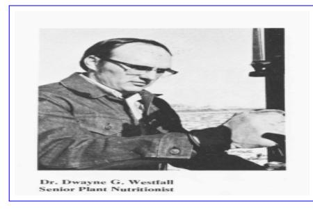

Q: Whose picture is given?

Question types: photograph and layout

A: Dr. Dwayne G. Westfall

|                  | Nebra        | nska         | NC NC     |              | NEC          | &K           | Avei         | rage         |
|------------------|--------------|--------------|--------------|--------------|--------------|--------------|--------------|--------------|
| N Level* lb/A | Sucrose % | Yield T/A | Sucrose % | Yield T/A | Sucrose % | Yield T/A | Sucrose % | Yield T/A |
| 101-200          | 16.4         | 22.7         | 17.4         | 20.4         | 16.0         | 20.8         | 16.6         | 21.3         |
| 201-300          | 16.4         | 22.8         | 17.1         | 21.9         | 16.4         | 20.6         | 16.6         | 21.8         |
| 301-400          | 16.2         | 22.5         | 16.5         | 22.0         | 15.8         | 19.7         | 16.2         | 21.4         |
| 401-500          | 15.9         | 22.5         | 15.9         | 22.8         | 15.3         | 22.4         | 15.7         | 22.6         |
| 501 ±            |              |              | 16.3         | 21.8         | 15.5         | 18.7         | 15.9         | 20.2         |

Q: What is the average sucrose % for N level 501+?

Question types: table

A: 15.9

Figure B.4: On the left is a question asking for name of the person in the photograph. To answer the question on the right, one needs to parse the table and pick the value in the appropriate cell

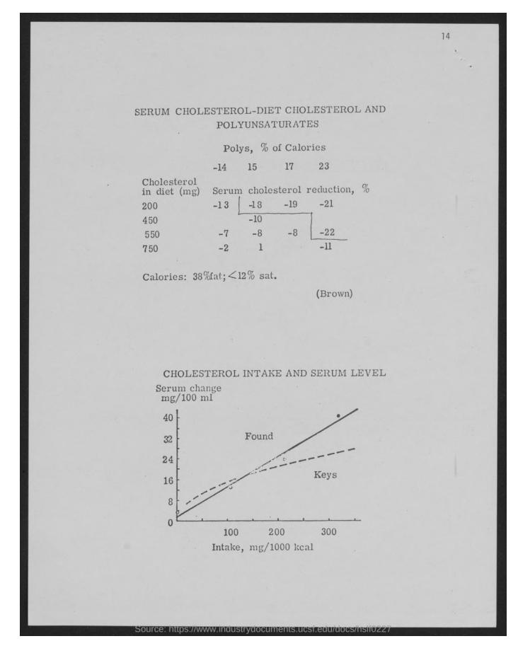

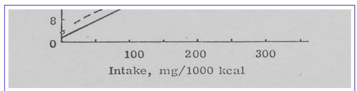

**Q:** What is the highest value for "Intake, mg/1000kcal" plotted on the 'X' axis of the graph?

Question types: figure

**A:** 300

Figure B.5: Question is based on the plot shown at the bottom of the given image, asking for the highest value on the X axis

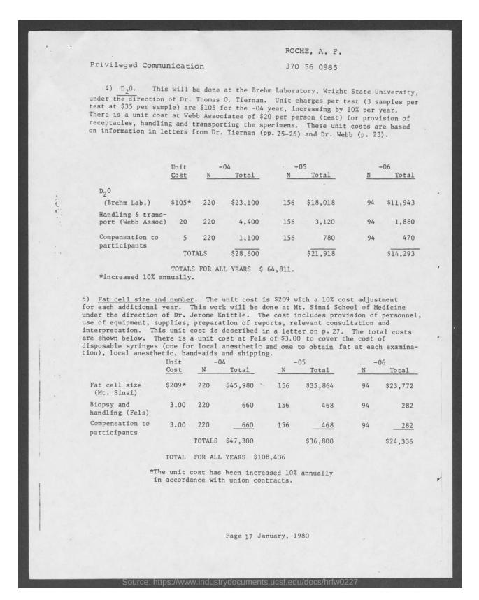

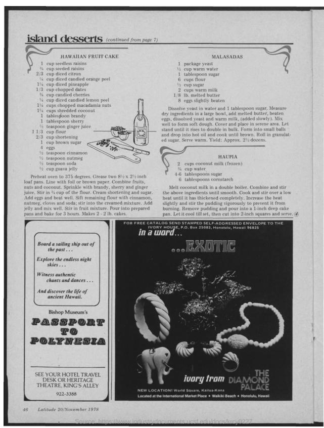

|                               | Unit   |     | and shipping |     | -05      |    | -06      |
|-------------------------------|--------|-----|--------------|-----|----------|----|----------|
|                               | Cost   | N   | Total        | N   | Total    | N  | Total    |
| Fat cell size (Mt. Sinai)  | \$209* | 220 | \$45,980     | 156 | \$35,864 | 94 | \$23,772 |
| Biopsy and handling (Fels) | 3.00   | 220 | 660          | 156 | 468      | 94 | 282      |

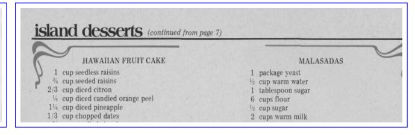

Q: What is the total cost for Fat cell size (Mt. Slnai) in the -05 year

?

GT: \$35,864 M4C best: 4400 BERT best: \$35,864 Human: \$35,864 Q: What is the first recipe on the page?

GT: hawaiian fruit cake

M4C best: island desserts (continued from cake

**BERT best:** hawaiian fruit cake **Human:** hawaiian fruit cake

Figure C.1: **Examples where BERT QA model [9] answers questions other than 'running text' type.** On the left is a question based on a table and for the other question one needs to know the 'first recipe' out of the two recipes shown. For the first question the model gets the answer correct except for an extra space, and in case of the second one the predicted answer matches exactly with the ground truth answer.

| A PARTITION OF THE PARTITION OF THE PARTITION OF THE PARTITION OF THE PARTITION OF THE PARTITION OF THE PARTITION OF THE PARTITION OF THE PARTITION OF THE PARTITION OF THE PARTITION OF THE PARTITION OF THE PARTITION OF THE PARTITION OF THE PARTITION OF THE PARTITION OF THE PARTITION OF THE PARTITION OF THE PARTITION OF THE PARTITION OF THE PARTITION OF THE PARTITION OF THE PARTITION OF THE PARTITION OF THE PARTITION OF THE PARTITION OF THE PARTITION OF THE PARTITION OF THE PARTITION OF THE PARTITION OF THE PARTITION OF THE PARTITION OF THE PARTITION OF THE PARTITION OF THE PARTITION OF THE PARTITION OF THE PARTITION OF THE PARTITION OF THE PARTITION OF THE PARTITION OF THE PARTITION OF THE PARTITION OF THE PARTITION OF THE PARTITION OF THE PARTITION OF THE PARTITION OF THE PARTITION OF THE PARTITION OF THE PARTITION OF THE PARTITION OF THE PARTITION OF THE PARTITION OF THE PARTITION OF THE PARTITION OF THE PARTITION OF THE PARTITION OF THE PARTITION OF THE PARTITION OF THE PARTITION OF THE PARTITION OF THE PARTITION OF THE PARTITION OF THE PARTITION OF THE PARTITION OF THE PARTITION OF THE PARTITION OF THE PARTITION OF THE PARTITION OF THE PARTITION OF THE PARTITION OF THE PARTITION OF THE PARTITION OF THE PARTITION OF THE PARTITION OF THE PARTITION OF THE PARTITION OF THE PARTITION OF THE PARTITION OF THE PARTITION OF THE PARTITION OF THE PARTITION OF THE PARTITION OF THE PARTITION OF THE PARTITION OF THE PARTITION OF THE PARTITION OF THE PARTITION OF THE PARTITION OF THE PARTITION OF THE PARTITION OF THE PARTITION OF THE PARTITION OF THE PARTITION OF THE PARTITION OF THE PARTITION OF THE PARTITION OF THE PARTITION OF THE PARTITION OF THE PARTITION OF THE PARTITION OF THE PARTITION OF THE PARTITION OF THE PARTITION OF THE PARTITION OF THE PARTITION OF THE PARTITION OF THE PARTITION OF THE PARTITION OF THE PARTITION OF THE PARTITION OF THE PARTITION OF THE PARTITION OF THE PARTITION OF THE PARTITION OF THE PARTITION OF THE PARTITION OF THE PARTITION OF THE PARTITION OF THE PARTITION OF THE PARTITION OF THE PART |                                                                                                                                                                                                                                                                                                                                                                                                                                                                                                                                                                                                                                                                                                                                                                                                                                                                                                                                                                                                                                                                                                                                                                                                                                                                                                                                                                                                                                                                                                                                                                                                                                                                                                                                                                                                                                                                                                                                                                                                                                                                                                                                |                                              |
|--------------------------------------------------------------------------------------------------------------------------------------------------------------------------------------------------------------------------------------------------------------------------------------------------------------------------------------------------------------------------------------------------------------------------------------------------------------------------------------------------------------------------------------------------------------------------------------------------------------------------------------------------------------------------------------------------------------------------------------------------------------------------------------------------------------------------------------------------------------------------------------------------------------------------------------------------------------------------------------------------------------------------------------------------------------------------------------------------------------------------------------------------------------------------------------------------------------------------------------------------------------------------------------------------------------------------------------------------------------------------------------------------------------------------------------------------------------------------------------------------------------------------------------------------------------------------------------------------------------------------------------------------------------------------------------------------------------------------------------------------------------------------------------------------------------------------------------------------------------------------------------------------------------------------------------------------------------------------------------------------------------------------------------------------------------------------------------------------------------------------------|--------------------------------------------------------------------------------------------------------------------------------------------------------------------------------------------------------------------------------------------------------------------------------------------------------------------------------------------------------------------------------------------------------------------------------------------------------------------------------------------------------------------------------------------------------------------------------------------------------------------------------------------------------------------------------------------------------------------------------------------------------------------------------------------------------------------------------------------------------------------------------------------------------------------------------------------------------------------------------------------------------------------------------------------------------------------------------------------------------------------------------------------------------------------------------------------------------------------------------------------------------------------------------------------------------------------------------------------------------------------------------------------------------------------------------------------------------------------------------------------------------------------------------------------------------------------------------------------------------------------------------------------------------------------------------------------------------------------------------------------------------------------------------------------------------------------------------------------------------------------------------------------------------------------------------------------------------------------------------------------------------------------------------------------------------------------------------------------------------------------------------|----------------------------------------------|
| GPI grew by                                                                                                                                                                                                                                                                                                                                                                                                                                                                                                                                                                                                                                                                                                                                                                                                                                                                                                                                                                                                                                                                                                                                                                                                                                                                                                                                                                                                                                                                                                                                                                                                                                                                                                                                                                                                                                                                                                                                                                                                                                                                                                                    |                                                                                                                                                                                                                                                                                                                                                                                                                                                                                                                                                                                                                                                                                                                                                                                                                                                                                                                                                                                                                                                                                                                                                                                                                                                                                                                                                                                                                                                                                                                                                                                                                                                                                                                                                                                                                                                                                                                                                                                                                                                                                                                                | 1/1/1/                                       |
| times the                                                                                                                                                                                                                                                                                                                                                                                                                                                                                                                                                                                                                                                                                                                                                                                                                                                                                                                                                                                                                                                                                                                                                                                                                                                                                                                                                                                                                                                                                                                                                                                                                                                                                                                                                                                                                                                                                                                                                                                                                                                                                                                      |                                                                                                                                                                                                                                                                                                                                                                                                                                                                                                                                                                                                                                                                                                                                                                                                                                                                                                                                                                                                                                                                                                                                                                                                                                                                                                                                                                                                                                                                                                                                                                                                                                                                                                                                                                                                                                                                                                                                                                                                                                                                                                                                |                                              |
| ndustry rate of                                                                                                                                                                                                                                                                                                                                                                                                                                                                                                                                                                                                                                                                                                                                                                                                                                                                                                                                                                                                                                                                                                                                                                                                                                                                                                                                                                                                                                                                                                                                                                                                                                                                                                                                                                                                                                                                                                                                                                                                                                                                                                                | - /1                                                                                                                                                                                                                                                                                                                                                                                                                                                                                                                                                                                                                                                                                                                                                                                                                                                                                                                                                                                                                                                                                                                                                                                                                                                                                                                                                                                                                                                                                                                                                                                                                                                                                                                                                                                                                                                                                                                                                                                                                                                                                                                           |                                              |
| F 12                                                                                                                                                                                                                                                                                                                                                                                                                                                                                                                                                                                                                                                                                                                                                                                                                                                                                                                                                                                                                                                                                                                                                                                                                                                                                                                                                                                                                                                                                                                                                                                                                                                                                                                                                                                                                                                                                                                                                                                                                                                                                                                           |                                                                                                                                                                                                                                                                                                                                                                                                                                                                                                                                                                                                                                                                                                                                                                                                                                                                                                                                                                                                                                                                                                                                                                                                                                                                                                                                                                                                                                                                                                                                                                                                                                                                                                                                                                                                                                                                                                                                                                                                                                                                                                                                |                                              |
| rowth in 2002 - 03                                                                                                                                                                                                                                                                                                                                                                                                                                                                                                                                                                                                                                                                                                                                                                                                                                                                                                                                                                                                                                                                                                                                                                                                                                                                                                                                                                                                                                                                                                                                                                                                                                                                                                                                                                                                                                                                                                                                                                                                                                                                                                             |                                                                                                                                                                                                                                                                                                                                                                                                                                                                                                                                                                                                                                                                                                                                                                                                                                                                                                                                                                                                                                                                                                                                                                                                                                                                                                                                                                                                                                                                                                                                                                                                                                                                                                                                                                                                                                                                                                                                                                                                                                                                                                                                |                                              |
|                                                                                                                                                                                                                                                                                                                                                                                                                                                                                                                                                                                                                                                                                                                                                                                                                                                                                                                                                                                                                                                                                                                                                                                                                                                                                                                                                                                                                                                                                                                                                                                                                                                                                                                                                                                                                                                                                                                                                                                                                                                                                                                                |                                                                                                                                                                                                                                                                                                                                                                                                                                                                                                                                                                                                                                                                                                                                                                                                                                                                                                                                                                                                                                                                                                                                                                                                                                                                                                                                                                                                                                                                                                                                                                                                                                                                                                                                                                                                                                                                                                                                                                                                                                                                                                                                |                                              |
| Successful launch of                                                                                                                                                                                                                                                                                                                                                                                                                                                                                                                                                                                                                                                                                                                                                                                                                                                                                                                                                                                                                                                                                                                                                                                                                                                                                                                                                                                                                                                                                                                                                                                                                                                                                                                                                                                                                                                                                                                                                                                                                                                                                                           |                                                                                                                                                                                                                                                                                                                                                                                                                                                                                                                                                                                                                                                                                                                                                                                                                                                                                                                                                                                                                                                                                                                                                                                                                                                                                                                                                                                                                                                                                                                                                                                                                                                                                                                                                                                                                                                                                                                                                                                                                                                                                                                                |                                              |
| Tipper and Prince                                                                                                                                                                                                                                                                                                                                                                                                                                                                                                                                                                                                                                                                                                                                                                                                                                                                                                                                                                                                                                                                                                                                                                                                                                                                                                                                                                                                                                                                                                                                                                                                                                                                                                                                                                                                                                                                                                                                                                                                                                                                                                              |                                                                                                                                                                                                                                                                                                                                                                                                                                                                                                                                                                                                                                                                                                                                                                                                                                                                                                                                                                                                                                                                                                                                                                                                                                                                                                                                                                                                                                                                                                                                                                                                                                                                                                                                                                                                                                                                                                                                                                                                                                                                                                                                | THE WAY TO A TO                              |
|                                                                                                                                                                                                                                                                                                                                                                                                                                                                                                                                                                                                                                                                                                                                                                                                                                                                                                                                                                                                                                                                                                                                                                                                                                                                                                                                                                                                                                                                                                                                                                                                                                                                                                                                                                                                                                                                                                                                                                                                                                                                                                                                | ***                                                                                                                                                                                                                                                                                                                                                                                                                                                                                                                                                                                                                                                                                                                                                                                                                                                                                                                                                                                                                                                                                                                                                                                                                                                                                                                                                                                                                                                                                                                                                                                                                                                                                                                                                                                                                                                                                                                                                                                                                                                                                                                            |                                              |
| 4.1                                                                                                                                                                                                                                                                                                                                                                                                                                                                                                                                                                                                                                                                                                                                                                                                                                                                                                                                                                                                                                                                                                                                                                                                                                                                                                                                                                                                                                                                                                                                                                                                                                                                                                                                                                                                                                                                                                                                                                                                                                                                                                                            | and the second of                                                                                                                                                                                                                                                                                                                                                                                                                                                                                                                                                                                                                                                                                                                                                                                                                                                                                                                                                                                                                                                                                                                                                                                                                                                                                                                                                                                                                                                                                                                                                                                                                                                                                                                                                                                                                                                                                                                                                                                                                                                                                                              | A 10 1 1 1 1 1 1 1 1 1 1 1 1 1 1 1 1 1 1     |
|                                                                                                                                                                                                                                                                                                                                                                                                                                                                                                                                                                                                                                                                                                                                                                                                                                                                                                                                                                                                                                                                                                                                                                                                                                                                                                                                                                                                                                                                                                                                                                                                                                                                                                                                                                                                                                                                                                                                                                                                                                                                                                                                | * * * * * * * * * * * * * * * * * * *                                                                                                                                                                                                                                                                                                                                                                                                                                                                                                                                                                                                                                                                                                                                                                                                                                                                                                                                                                                                                                                                                                                                                                                                                                                                                                                                                                                                                                                                                                                                                                                                                                                                                                                                                                                                                                                                                                                                                                                                                                                                                          |                                              |
|                                                                                                                                                                                                                                                                                                                                                                                                                                                                                                                                                                                                                                                                                                                                                                                                                                                                                                                                                                                                                                                                                                                                                                                                                                                                                                                                                                                                                                                                                                                                                                                                                                                                                                                                                                                                                                                                                                                                                                                                                                                                                                                                | a de la composição de la composição de la composição de la composição de la composição de la composição de la composição de la composição de la composição de la composição de la composição de la composição de la composição de la composição de la composição de la composição de la composição de la composição de la composição de la composição de la composição de la composição de la composição de la composição de la composição de la composição de la composição de la composição de la composição de la composição de la composição de la composição de la composição de la composição de la composição de la composição de la composição de la composição de la composição de la composição de la composição de la composição de la composição de la composição de la composição de la composição de la composição de la composição de la composição de la composição de la composição de la composição de la composição de la composição de la composição de la composição de la composição de la composição de la composição de la composição de la composição de la composição de la composição de la composição de la composição de la composição de la composição de la composição de la composição de la composição de la composição de la composição de la composição de la composição de la composição de la composição de la composição de la composição de la composição de la composição de la composição de la composição de la composição de la composição de la composição de la composição de la composição de la composição de la composição de la composição de la composição de la composição de la composição de la composição de la composição de la composição de la composição de la composição de la composição de la composição de la composição de la composição de la composição de la composição de la composição de la composição de la composição de la composição de la composição de la composição de la composição de la composição de la composição de la composição de la composição de la composição de la composição de la composição de la composição de la composição de l |                                              |
|                                                                                                                                                                                                                                                                                                                                                                                                                                                                                                                                                                                                                                                                                                                                                                                                                                                                                                                                                                                                                                                                                                                                                                                                                                                                                                                                                                                                                                                                                                                                                                                                                                                                                                                                                                                                                                                                                                                                                                                                                                                                                                                                |                                                                                                                                                                                                                                                                                                                                                                                                                                                                                                                                                                                                                                                                                                                                                                                                                                                                                                                                                                                                                                                                                                                                                                                                                                                                                                                                                                                                                                                                                                                                                                                                                                                                                                                                                                                                                                                                                                                                                                                                                                                                                                                                |                                              |
|                                                                                                                                                                                                                                                                                                                                                                                                                                                                                                                                                                                                                                                                                                                                                                                                                                                                                                                                                                                                                                                                                                                                                                                                                                                                                                                                                                                                                                                                                                                                                                                                                                                                                                                                                                                                                                                                                                                                                                                                                                                                                                                                | A Marion                                                                                                                                                                                                                                                                                                                                                                                                                                                                                                                                                                                                                                                                                                                                                                                                                                                                                                                                                                                                                                                                                                                                                                                                                                                                                                                                                                                                                                                                                                                                                                                                                                                                                                                                                                                                                                                                                                                                                                                                                                                                                                                       | " I am really proud to be part of the        |
| ରାହାଣ୍ଡାହ                                                                                                                                                                                                                                                                                                                                                                                                                                                                                                                                                                                                                                                                                                                                                                                                                                                                                                                                                                                                                                                                                                                                                                                                                                                                                                                                                                                                                                                                                                                                                                                                                                                                                                                                                                                                                                                                                                                                                                                                                                                                                                                      | Rh                                                                                                                                                                                                                                                                                                                                                                                                                                                                                                                                                                                                                                                                                                                                                                                                                                                                                                                                                                                                                                                                                                                                                                                                                                                                                                                                                                                                                                                                                                                                                                                                                                                                                                                                                                                                                                                                                                                                                                                                                                                                                                                             | team that worked on re-launching             |
| . 1. 1701/2                                                                                                                                                                                                                                                                                                                                                                                                                                                                                                                                                                                                                                                                                                                                                                                                                                                                                                                                                                                                                                                                                                                                                                                                                                                                                                                                                                                                                                                                                                                                                                                                                                                                                                                                                                                                                                                                                                                                                                                                                                                                                                                    | WY                                                                                                                                                                                                                                                                                                                                                                                                                                                                                                                                                                                                                                                                                                                                                                                                                                                                                                                                                                                                                                                                                                                                                                                                                                                                                                                                                                                                                                                                                                                                                                                                                                                                                                                                                                                                                                                                                                                                                                                                                                                                                                                             | Prince in the market. We knew that           |
| olc ga                                                                                                                                                                                                                                                                                                                                                                                                                                                                                                                                                                                                                                                                                                                                                                                                                                                                                                                                                                                                                                                                                                                                                                                                                                                                                                                                                                                                                                                                                                                                                                                                                                                                                                                                                                                                                                                                                                                                                                                                                                                                                                                         | CA                                                                                                                                                                                                                                                                                                                                                                                                                                                                                                                                                                                                                                                                                                                                                                                                                                                                                                                                                                                                                                                                                                                                                                                                                                                                                                                                                                                                                                                                                                                                                                                                                                                                                                                                                                                                                                                                                                                                                                                                                                                                                                                             | we had a winning brand on our                |
|                                                                                                                                                                                                                                                                                                                                                                                                                                                                                                                                                                                                                                                                                                                                                                                                                                                                                                                                                                                                                                                                                                                                                                                                                                                                                                                                                                                                                                                                                                                                                                                                                                                                                                                                                                                                                                                                                                                                                                                                                                                                                                                                |                                                                                                                                                                                                                                                                                                                                                                                                                                                                                                                                                                                                                                                                                                                                                                                                                                                                                                                                                                                                                                                                                                                                                                                                                                                                                                                                                                                                                                                                                                                                                                                                                                                                                                                                                                                                                                                                                                                                                                                                                                                                                                                                | hands. We were so clear about the            |
|                                                                                                                                                                                                                                                                                                                                                                                                                                                                                                                                                                                                                                                                                                                                                                                                                                                                                                                                                                                                                                                                                                                                                                                                                                                                                                                                                                                                                                                                                                                                                                                                                                                                                                                                                                                                                                                                                                                                                                                                                                                                                                                                |                                                                                                                                                                                                                                                                                                                                                                                                                                                                                                                                                                                                                                                                                                                                                                                                                                                                                                                                                                                                                                                                                                                                                                                                                                                                                                                                                                                                                                                                                                                                                                                                                                                                                                                                                                                                                                                                                                                                                                                                                                                                                                                                | aim, we knew that we had to find a           |
| 3 3 4 5 C                                                                                                                                                                                                                                                                                                                                                                                                                                                                                                                                                                                                                                                                                                                                                                                                                                                                                                                                                                                                                                                                                                                                                                                                                                                                                                                                                                                                                                                                                                                                                                                                                                                                                                                                                                                                                                                                                                                                                                                                                                                                                                                      |                                                                                                                                                                                                                                                                                                                                                                                                                                                                                                                                                                                                                                                                                                                                                                                                                                                                                                                                                                                                                                                                                                                                                                                                                                                                                                                                                                                                                                                                                                                                                                                                                                                                                                                                                                                                                                                                                                                                                                                                                                                                                                                                | way to achieve it. That's why I              |
| ***************************************                                                                                                                                                                                                                                                                                                                                                                                                                                                                                                                                                                                                                                                                                                                                                                                                                                                                                                                                                                                                                                                                                                                                                                                                                                                                                                                                                                                                                                                                                                                                                                                                                                                                                                                                                                                                                                                                                                                                                                                                                                                                                        |                                                                                                                                                                                                                                                                                                                                                                                                                                                                                                                                                                                                                                                                                                                                                                                                                                                                                                                                                                                                                                                                                                                                                                                                                                                                                                                                                                                                                                                                                                                                                                                                                                                                                                                                                                                                                                                                                                                                                                                                                                                                                                                                | believe that once you have the               |
|                                                                                                                                                                                                                                                                                                                                                                                                                                                                                                                                                                                                                                                                                                                                                                                                                                                                                                                                                                                                                                                                                                                                                                                                                                                                                                                                                                                                                                                                                                                                                                                                                                                                                                                                                                                                                                                                                                                                                                                                                                                                                                                                | or way: Life has no literations.                                                                                                                                                                                                                                                                                                                                                                                                                                                                                                                                                                                                                                                                                                                                                                                                                                                                                                                                                                                                                                                                                                                                                                                                                                                                                                                                                                                                                                                                                                                                                                                                                                                                                                                                                                                                                                                                                                                                                                                                                                                                                               | except the ones you real su"                 |
|                                                                                                                                                                                                                                                                                                                                                                                                                                                                                                                                                                                                                                                                                                                                                                                                                                                                                                                                                                                                                                                                                                                                                                                                                                                                                                                                                                                                                                                                                                                                                                                                                                                                                                                                                                                                                                                                                                                                                                                                                                                                                                                                |                                                                                                                                                                                                                                                                                                                                                                                                                                                                                                                                                                                                                                                                                                                                                                                                                                                                                                                                                                                                                                                                                                                                                                                                                                                                                                                                                                                                                                                                                                                                                                                                                                                                                                                                                                                                                                                                                                                                                                                                                                                                                                                                |                                              |
| The passion to succeed - it's a value that cu                                                                                                                                                                                                                                                                                                                                                                                                                                                                                                                                                                                                                                                                                                                                                                                                                                                                                                                                                                                                                                                                                                                                                                                                                                                                                                                                                                                                                                                                                                                                                                                                                                                                                                                                                                                                                                                                                                                                                                                                                                                                                  | ts right across the organization                                                                                                                                                                                                                                                                                                                                                                                                                                                                                                                                                                                                                                                                                                                                                                                                                                                                                                                                                                                                                                                                                                                                                                                                                                                                                                                                                                                                                                                                                                                                                                                                                                                                                                                                                                                                                                                                                                                                                                                                                                                                                               | a. Every individual is determined to realize |
| his or her potential to be a winner.                                                                                                                                                                                                                                                                                                                                                                                                                                                                                                                                                                                                                                                                                                                                                                                                                                                                                                                                                                                                                                                                                                                                                                                                                                                                                                                                                                                                                                                                                                                                                                                                                                                                                                                                                                                                                                                                                                                                                                                                                                                                                           |                                                                                                                                                                                                                                                                                                                                                                                                                                                                                                                                                                                                                                                                                                                                                                                                                                                                                                                                                                                                                                                                                                                                                                                                                                                                                                                                                                                                                                                                                                                                                                                                                                                                                                                                                                                                                                                                                                                                                                                                                                                                                                                                |                                              |
|                                                                                                                                                                                                                                                                                                                                                                                                                                                                                                                                                                                                                                                                                                                                                                                                                                                                                                                                                                                                                                                                                                                                                                                                                                                                                                                                                                                                                                                                                                                                                                                                                                                                                                                                                                                                                                                                                                                                                                                                                                                                                                                                |                                                                                                                                                                                                                                                                                                                                                                                                                                                                                                                                                                                                                                                                                                                                                                                                                                                                                                                                                                                                                                                                                                                                                                                                                                                                                                                                                                                                                                                                                                                                                                                                                                                                                                                                                                                                                                                                                                                                                                                                                                                                                                                                |                                              |

Inspired individuals share their story- what drove them to succeed against the odds and how they realized their

"I am really proud to be part of the team that worked on re-launching Prince in the market. We knew that we had a winning brand on our hands. We were so clear about the aim, we knew that we had to find a way to achieve it. That's wiby I believe that once you have the

Source: https://www.industrydocuments.ucsf.edu/docs/znbx0223

Q: What is written inside logo in the bottom of the document?

GT: let yourself grow!

M4C best: yourself grow!

BERT best: < no prediction >

Human: let yourself grow!

Q: What Tobacco brand of GPI is shown in the picture?

MAC boots pri

M4C best: prince

**BERT best:** < no prediction >

Human: prince

Figure C.2: How does the M4C [16] model perform on questions based on pictures or photographs. Here we show two examples where the best variant of the M4C model outperform the BERT best model in answering 'layout' type questions seeking to read what is written in a logo/pack. The BERT model doesnt make any predictions for the questions.

#### Report on Corporate Governance

- Major accounting entries based on exercise of judgement by management
- Significant adjustments, if any, arising out of audit
- Compliance with Accounting Standards
- Compliance with Stock Exchange and legal
- Related party transactions
- Qualifications, if any, in draft audit report
- Report of the Directors & Management Discussion and Analysis;
- (d) Reviewing with the management, external and internal auditors, the adequacy of internal control systems and the Company's statement on the same prior to endorsement by the Board;
- (e) Reviewing the adequacy of the internal audit function. including the structure of the internal audit department, staffing and seniority of the official heading the department, reporting structure, coverage and frequency of internal audit;
- (f) Reviewing reports of internal audit, including that of wholly owned subsidiaries, and discussion with internal auditors on any significant findings and follow-up thereon;
- (g) Reviewing the findings of any internal investigations by the internal auditors and the executive management's response on matters where there is suspected fraud or irregularity or failure of internal control systems of a material nature and reporting the matter to the Board;
- (h) Discussion with the external auditors, before the audit commences, on nature and scope of audit, as well as after conclusion of the audit, to ascertain any areas of concern and review the comments contained in their management letter;
- (i) Reviewing the Company's financial and risk management policies:
- (j) Looking into the reasons for substantial defaults, if any, in payment to shareholders (in case of non-payment of declared dividends) and creditors;
- (k) Considering such other matters as may be required
- (I) Reviewing any other areas which may be specified as role of the Audit Committee under the Listing

Agreement, Companies Act and other statutes, as amended from time to time.

#### Composition

The Audit Committee presently comprises four Non-Executive Directors, three of whom are Independent Directors. The Chairman of the Committee is an Independent Director. The Executive Director representing the Finance function, the Chief Financial Officer, the Head of Internal Audit and the representative of the Statutory Auditors are Invitees to the Audit Committee The Head of Internal Audit is the Co-ordinator and the Company Secretary is the Secretary to the Committee The representatives of the Cost Auditors are invited to meetings of the Audit Committee whenever matter relating to cost audit are considered. All members of the Committee are financially literate: three members including the Chairman of the Committee, have accounting and financial management expertise

The names of the members of the Audit Committee, including its Chairman, are provided under the section 'Board of Directors and Committees' in the Report and Accounts.

#### Meetings and Attendance

Details of Audit Committee Meetings during the

During the financial year ended 31st March, 2014, eight meetings of the Audit Committee were held, as follows:

| SI. No. | Date                 | Committee Strength | No. of Members present |
|------------|----------------------|-----------------------|------------------------------|
| 1          | 6th May, 2013        | 6                     | 4                            |
| 2          | 17th May, 2013       | 6                     | 5                            |
| 3          | 25th July, 2013      | 6                     | 6                            |
| 4          | 28th August, 2013    | 5                     | 5                            |
| 5          | 23rd September, 2013 | 5                     | 5                            |
| 6          | 25th October, 2013   | 5                     | 5                            |
| 7          | 17th January, 2014   | 5                     | 5                            |
| 8          | 31st March, 2014     | 5                     | 3                            |

ITC Limited REPORT AND ACCOUNTS 2014 Source: https://www.industrydocuments.u

| SI. No. | Date                 | Committee Strength | No. of Members present |
|------------|----------------------|-----------------------|------------------------------|
| 1          | 6th May, 2013        | 6                     | 4                            |
| 2          | 17th May, 2013       | 6                     | 5                            |
| 3          | 25th July, 2013      | 6                     | 6                            |
| 4          | 28th August, 2013    | 5                     | 5                            |
| 5          | 23rd September, 2013 | 5                     | 5                            |
| 6          | 25th October, 2013   | 5                     | 5                            |
| 7          | 17th January, 2014   | 5                     | 5                            |
| 8          | 31st March, 2014     | 5                     | 3                            |

Q: What was the committee strength for the first meeting?

GT: 6

M4C best: 6 BERT best: 6 Human: 6

Q: What was the committee strength for the last meeting?

GT: 5

M4C best: 6 BERT best: 6 Human: 5

Figure C.3: Contrasting results for similar questions. Here both the questions are based on the table at the bottom of the image. Both questions ask for 'committee strength' for a particular meeting (first or last). Both models get the answer right for the first one. But for the question on the right, the models predict same answer as the first one ("6") while the ground truth is "5". This suggests that the models' predictions are not backed by a proper reasoning/grounding in all cases.

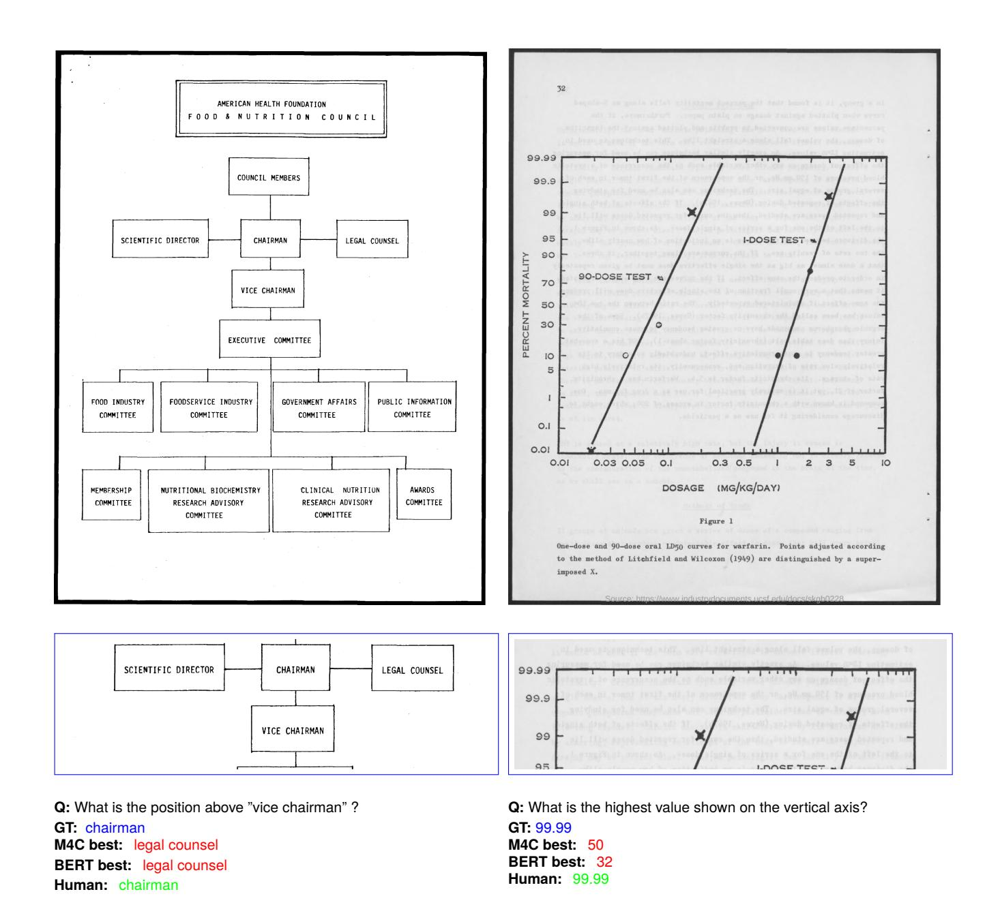

Figure C.4: **Understanding figures and diagrams**. In case of the question on the left, one needs to understand an organizational hierarchy diagram. For the second question, one needs to know what a 'vertical axis' is, and then find the largest value. Both the models fail to answer the questions.

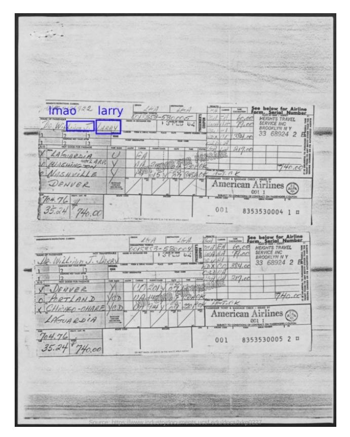

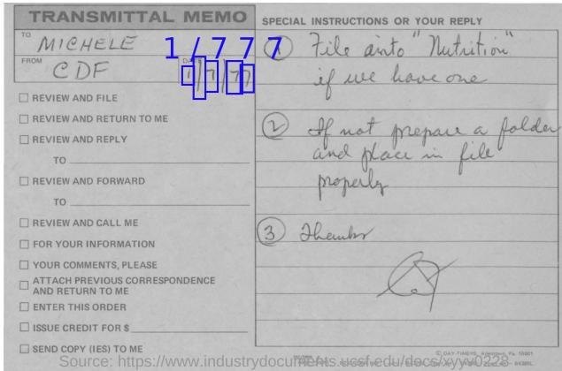

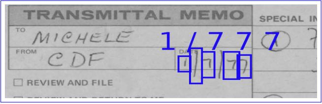

**Q:** What is the name of the passenger?

GT: dr. william j. darby M4C best: larry BERT best: larry

Human: dr. william j. darry

Q: What is the date present in the memo?

GT: 1/7/77 M4C best: 1 7 77 BERT best: 1 / 7 Human: 1/7/77

Figure C.5: **Impact of OCR errors.** Here the models are able to ground the questions correctly on the relevant information in the image, but failed to get the answers correct owing to the OCR errors. In case of the question on the left, even the answer entered by the human volunteer is not exactly matching with the ground truth. In case of the second question, OCR has split the date into multiple tokens due to over segmentation, resulting in incorrect answers by both the models.