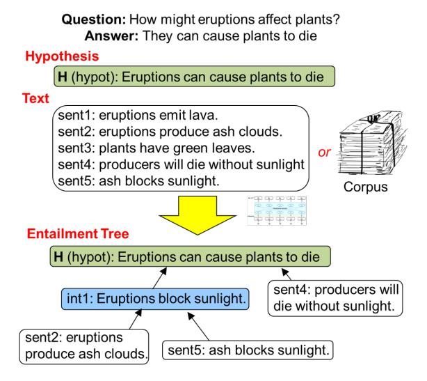
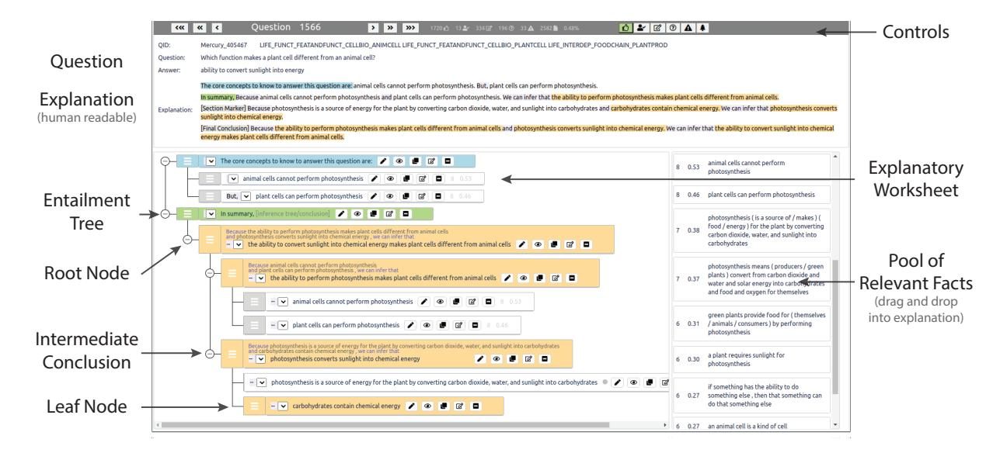
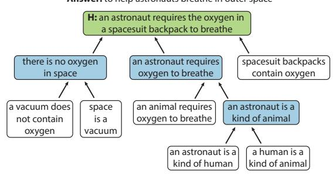
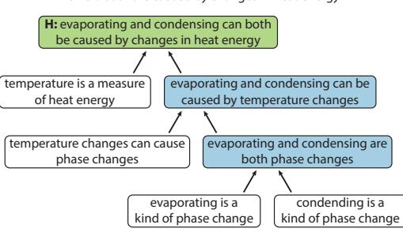
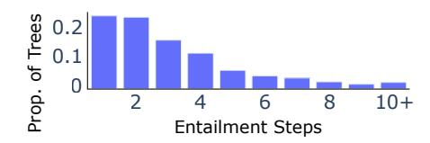
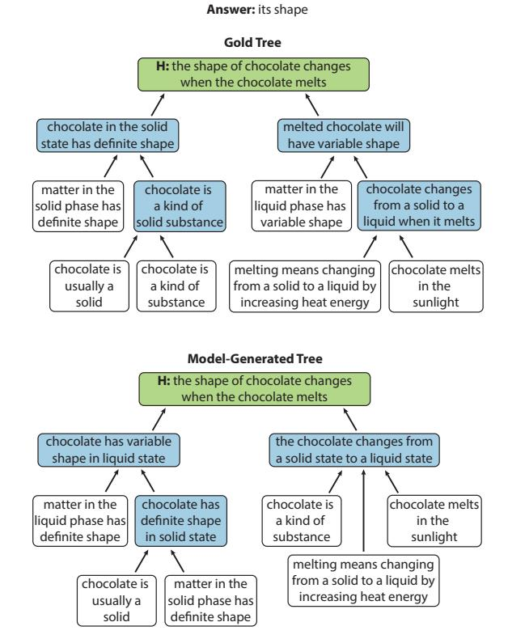

# **Explaining Answers with Entailment Trees**

# Bhavana Dalvi\*1, Peter Jansen\*2, Oyvind Tafjord1, Zhengnan Xie2, Hannah Smith2, Leighanna Pipatanangkura2, Peter Clark1

<sup>1</sup> Allen Institute for AI, Seattle, WA <sup>2</sup> University of Arizona, Tucson, AZ

\* equal contribution

bhavanad@allenai.org, pajansen@arizona.edu

#### **Abstract**

Our goal, in the context of open-domain textual question-answering (QA), is to explain answers by showing the line of reasoning from what is known to the answer, rather than simply showing a fragment of textual evidence (a "rationale"). If this could be done, new opportunities for understanding and debugging the system's reasoning become possible. Our approach is to generate explanations in the form of entailment trees, namely a tree of multipremise entailment steps from facts that are known, through intermediate conclusions, to the hypothesis of interest (namely the question + answer). To train a model with this skill, we created ENTAILMENTBANK 1. the first dataset to contain multistep entailment trees. Given a hypothesis (question + answer), we define three increasingly difficult explanation tasks: generate a valid entailment tree given (a) all relevant sentences (b) all relevant and some irrelevant sentences, or (c) a corpus. We show that a strong language model can partially solve these tasks, in particular when the relevant sentences are included in the input (e.g., 35% of trees for (a) are perfect), and with indications of generalization to other domains. This work is significant as it provides a new type of dataset (multistep entailments) and baselines, offering a new avenue for the community to generate richer, more systematic explanations.

## 1 Introduction

Explanation remains a formidable challenge in AI. While today's explanation systems are good at providing a sentence or two of supporting evidence ("rationales") for an answer (DeYoung et al., 2019), they rarely explain the *chain of reasoning* from what is known to the answer, i.e., *how* the answer follows, given the evidence – the goal of this work.



Figure 1: Given a hypothesis (green, summarizing a question+answer pair), and some partially relevant text (or a corpus), our goal is to generate an *entailment tree*, including intermediate nodes (blue), showing how the hypothesis follows from the text/corpus.

Without this, it is hard to fully understand a system's response and/or pinpoint the source of errors if its conclusions are wrong. Conversely, if a system could support its answers with a chain of reasoning, new opportunities arise for interactively teaching the machine by debugging its mistakes.

Our approach is to generate explanations in the form of multistep *entailment trees*, such as shown in Figure 1, made up of individual, multi-premise textual entailment (TE) steps (Dagan et al., 2013; Lai et al., 2017). Although there are many single-step entailment datasets available (Bentivogli et al., 2011; Bowman et al., 2015) no dataset of multistep entailments exists, and so a significant contribution of this paper is the construction of such a dataset, called EntailmentBank. EntailmentBank contains 1,840 multistep entailment trees for accompanying QA pairs, constructed using expert annotators, and is the first dataset of its kind. We also define three explanation tasks over this dataset, namely: generate a valid entailment tree for a given

<sup>&</sup>lt;sup>1</sup>ENTAILMENTBANK dataset, annotation tool and evaluation code is available at https://allenai.org/data/entailmentbank

| Property↓, Dataset→                   | WorldTree V2 <sup>1</sup> | $eQASC^2$         | HotpotQA <sup>3</sup> , R4C <sup>4</sup> | StrategyQA <sup>5</sup> | ENTAILMENTBANK  |
|---------------------------------------|---------------------------|-------------------|------------------------------------------|-------------------------|-----------------|
| Semantics of Inference                | (informal)                | 1-Step Entailment | (informal)                               | Deduction               | Entailment Tree |
| Average Facts per Inference           | 5.6                       | 2.0               | 2.4                                      | 2.9                     | 7.6             |
| Average Edges per Inference           | 9 <sup>‡</sup>            | 1                 | 2 <sup>‡</sup>                           | 2                       | 6               |
| Granularity of Inference              | Fine                      | Coarse            | Coarse                                   | Coarse                  | Fine            |
| <b>Explicit Ordering of Inference</b> | No                        | No                | No                                       | Yes                     | Yes             |
| Authoring Method                      | Expert                    | Crowd             | Crowd                                    | Crowd                   | Expert          |

<sup>1</sup>(Xie et al., 2020) <sup>2</sup>(Jhamtani and Clark, 2020) <sup>3</sup>(Yang et al., 2018) <sup>4</sup>(Inoue et al., 2020) <sup>5</sup>(Geva et al., 2021)

Table 1: A comparison of ENTAILMENTBANK with other similar datasets. In general, ENTAILMENTBANK contains larger inference problems, at a finer level of granularity than existing datasets, while being the only dataset to include multi-step entailments that make the reasoning steps explicit. <sup>‡</sup> WT2 and R4C explanations are implied (unannotated) graphs based on overlapping words or entities – values here are inferred by constructing graphs based on lexical overlap.

QA pair given (a) all relevant sentences (the leaves of the gold entailment tree), (b) all relevant and some distractor sentences, or (c) a full corpus.

Our focus here is on generating the **derivation** (line of reasoning) showing how the evidence leads to the answer, rather than the **pragmatics** of deciding which parts of that to then show the user. This allows us to separate two (typically confounded) explanation requirements, namely *correctness* (of the derivation) from *utility*, allowing us to evaluate derivations with a more objective measure (correctness). This also sets the stage for future work on the pragmatics of what to show users (Miller, 2019).

Finally, we define and train generative models, called EntailmentWriters, for this task, adapting earlier techniques for generating deductive proofs (Tafjord et al., 2021). We find the models partially solve the dataset, with indications of generalization to other domains. Our contributions are thus:

- A formulation of explanation as multistep, multi-premise textual entailment.
- ENTAILMENTBANK, the first dataset of multistep entailment trees for QA, to support entailment-based explanation. Each tree contains an average of 6.6 nodes and 2.7 entailment steps, with the full dataset of 1,840 trees including a range of small and large multi-step entailment problems.
- Baseline results using a state-of-the-art, generative model, showing that reasonable trees can be generated, in particular when the necessary raw facts are provided as the model input (resulting in 35% of trees with zero errors). We also present indications that ENTAILMENT-BANK-trained models can generalize to other domains.

This work is significant as it provides a new avenue for the community to generate richer, more systematic explanations.

## 2 Related Work

In the context of QA, there are multiple notions of explanation/justification, including showing an authoritative, answer-bearing sentence (Perez et al., 2019), an attention map over a passage (Seo et al., 2016), a synthesized phrase connecting question and answer (Rajani et al., 2019), or the syntactic pattern used to locate the answer (Ye et al., 2020; Hancock et al., 2018). These methods are primarily designed for answers to "lookup" questions, to explain where/how an answer was found in a corpus.

For questions requiring inference, the focus of this paper, an explanation is sometimes taken as the chain of steps (typically sentences) leading to an answer. Because crowdsourcing such chains is difficult, existing datasets typically simplify the task, e.g., collecting answer-supporting sentences but not how they combine, and/or largely focusing on one-hop (length 2) chains. Here we generalize to tasks requiring *multi-step* entailment trees, Table 1 illustrates these comparisons in detail.

Our trees are built from *multi-premise entail-ments* (two or more sentences entail a hypothesis), introduced by Lai et al. (2017), in contrast to the majority of prior datasets where typically a single sentence entails *H* through (typically) paraphrasing (Bentivogli et al., 2011; Bar-Haim et al., 2014; Bowman et al., 2015). We extend multi-sentence entailment in two ways. First, our trees also show the *provenance* of each entailment, namely *which* sentences are involved in each entailment (i.e., going beyond a classification task). Second, ours is the first dataset that chains multiple entailments together into a hypothesis-directed tree, rather than containing separate, single-step entailments.

Recent work in deductive reasoning has shown that transformers can generate formal proofs with high reliability, both in a formal setting (Polu and Sutskever, 2020; Wang and Deng, 2020) and with rules expressed in natural language (Saha et al., 2020). Inspired by this, we apply similar ideas to



Figure 2: The web-based authoring tool developed to enable authoring entailment trees. (top) The question and a human-readable version of the semi-structured explanation are provided to the user. (bottom) The semi-structured explanation, including the entailment tree, as currently authored by the user. Nodes (facts) can be dragged-and-dropped to change their ordering. White nodes represent facts from the corpus, while orange nodes were authored by the user. (right) A shortlist (or pool) of top-ranked relevant facts from the corpus that the user can choose to drag-and-drop into the explanation.

generating entailment trees, in particular leveraging the generative techniques used in the ProofWriter system (Tafjord et al., 2021) (Section 5).

# 3 The EntailmentBank Dataset

ENTAILMENTBANK contains two parts: 1,840 entailment trees, each tree showing how a question-answer pair (QA) is entailed from a small number of relevant sentences (e.g., Figure 1); and a general corpus C, containing those and other sentences of domain-specific and general knowledge relevant to the QA domain. We use these two parts shortly to define a simpler task (generate the tree given the leaf sentences, without/with distractors) and a harder task (generate the tree from the corpus).

ENTAILMENTBANK uses multiple-choice questions (and the correct answer option) from the ARC dataset of grade-school science questions (Clark et al., 2018), and a corpus of science- and general knowledge derived from WorldTree V2 (Xie et al., 2020; Jansen et al., 2018). WorldTree was created for grade-school level science, making it an ideal source for ENTAILMENTBANK's corpus.

#### 3.1 Guidelines

Three graduate and undergraduate annotators were trained to construct entailment trees for QA pairs, given a small number of potentially relevant sentences for each QA pair (drawn from WorldTree). Specifically, they were trained to author trees:

- where each step is an **entailment** (a conclusion that "a person would typically infer" (Dagan et al., 2013)), i.e., the knowledge expressed in each node reasonably follows from the content of its immediate children.
- at a **fine-grained granularity**, where each step encodes a single inference, e.g., making a single taxonomic inference, conjoining two facts, or applying a single rule in the corpus.
- that are **explicit**, with the informal goal of including all the knowledge that a young child would need to answer the question.
- that are **compositional**, where more complex conclusions can be drawn from simpler facts.
- that are **relevant**, concluding (a declarative version of) the QA pair of interest.

## 3.2 Tool and Authoring Procedure

Constructing detailed entailment trees meeting the above desiderata is challenging. To make authoring easier, we designed a web-based graphical dragand-drop authoring tool <sup>2</sup> (screenshot in Figure 2) that allows explanation authors to construct and review explanations quickly.

For each question, the tool presents the user with a pool of top-ranked relevant facts from the corpus<sup>3</sup>

<sup>&</sup>lt;sup>2</sup>The ENTAILMENTBANK authoring tool was implemented as a Javascript browser client and npm back-end, and is released as open source at https://allenai.org/data/entailmentbank

<sup>&</sup>lt;sup>3</sup>Details of the retrieval algorithm are in Appendix A.

**Question:** Why do astronauts need oxygen in the backpacks of their spacesuits? **Answer:** to help astronauts breathe in outer space



**Question:** In which way are evaporation and condensation similar? **Answer:** both are caused by changes in heat energy



Figure 3: Two example medium-complexity entailment trees, paired with their questions. The root nodes of each tree (hypotheses) are denoted by **H** (green), and intermediate conclusions are blue. The top tree describes the reasoning to determine why an astronaut requires oxygen in spacesuit backpacks, and the bottom to determine the similarity between two concepts (evaporation and condensation).

that might be relevant to building an explanation. To assist in the tree construction process, the user first populates an "explanatory worksheet", labeling facts that they anticipate will be included in the tree with a small number of specific categories (e.g., "core facts", "grounding facts"). From this worksheet, the user then begins constructing the entailment tree – typically starting at the bottommost leaf nodes, authoring intermediate conclusions from them, then progressively working on higher levels of the tree until they author a conclusion that directly answers the question.

If the user requires a fact not present in the pool of provided facts, e.g., a missing science fact or a question-specific statement, the user can quickly add their own facts and use these in the tree. Once completed, the individual entailment steps are then separately reviewed by a different author for quality and suggested edits. In total, this process takes an average of approximately 20 minutes per question. Two example trees authored using this process are shown in Figure 3.

# 3.3 Overall Dataset

Due to the large time investment required to generate detailed entailment trees, we author trees for

|                            | Train | Dev | Test  | All   |
|----------------------------|-------|-----|-------|-------|
| Questions                  | 1,313 | 187 | 340   | 1,840 |
| Entailment reasoning steps | 4,175 | 597 | 1,109 | 5,881 |

Table 2: Summary statistics for the dataset splits.



Figure 4: Histogram of entailment steps in the training set. The average entailment tree contains 7.6 nodes (facts) across 3.2 entailment steps.

1,840 randomly selected questions (of the 7,787 in ARC), which include a total of 5,881 discrete entailment steps. Overall, approximately 600 (paid) work hours were used to build the dataset.

Summary statistics for the train, development, and test sets are shown in Table 2. On average, each entailment tree includes 7.6 nodes across 3.2 entailment steps, where each entailment step typically involves 3 facts (two leaves, that combine to entail a conclusion). Figure 4 shows a histogram of entailment tree size (measured in terms of number of entailment steps). Entailment Bank includes a diverse range of problem sizes, with half (50%) of entailment trees representing short entailment problems with one or two entailment steps (typically composed of 3-5 nodes), while the remaining 50% of trees contain 3-17 entailment steps.

## 3.4 Dataset Analysis

To understand the entailment challenges in EN-TAILMENTBANK, we analyzed 100 randomly sampled entailment steps from trees in the training set. We identified 6 common high-level categories of inference, shown in Table 3. Substitution types refer to entailments that require a model to perform taxonomic, merynomic, or other forms of chaining that substitute one entity for another in one of the input sentences. *Inference from Rules* entailments require the application of a specific rule, specified as one of the input sentences, to the other input sentence. Our analysis suggests that approximately one-third (33%) of all entailments require the application of domain-specific rules to complete. Further Specification or Conjunction entailments require a model to combine the details of both input facts into a single output fact. Less frequent types require inferring an object's class

| Inference Type                       | Prop. |                         | Example Entailment                                                                                                                                                                                                                                                     |
|--------------------------------------|-------|-------------------------|------------------------------------------------------------------------------------------------------------------------------------------------------------------------------------------------------------------------------------------------------------------------|
| Substitution                         | 42%   | $s_1$ $s_2$ $int$       | when a light wave hits a <b>reflective object</b> , the light wave will be reflected a <b>mirror</b> is a kind of <b>reflective object</b> when a light wave hits a <b>mirror</b> , the light wave will be reflected                                                   |
| Inference from Rule                  | 33%   | $s_2$                   | if two species have similar characteristics, they may share a common ancestor rhinoceroses and horses have similar characteristics rhinoceroses and horses might share a common ancestor                                                                               |
| Further Specification or Conjunction | 15%   | $s_1$ $s_2$ $int$       | an animal requires warmth for survival as the season changes to winter thick fur can be used for keeping warm thick fur can be used for keeping warm as the season changes to winter                                                                                   |
| Infer Class from Properties          | 4%    | $s_1 \\ s_2 \\ int$     | A compound is made of two or more elements chemically combined sodium chloride is made of two elements chemically combined sodium chloride is a kind of compound                                                                                                       |
| Property Inheritance                 | 4%    | $s_2$                   | an animal's shell is usually hard<br>something hard can be used for protection<br>an animal's shell is usually hard for protection                                                                                                                                     |
| Sequential Inference                 | 3%    | $s_1$ $s_2$ $s_3$ $int$ | In molecular biology, translation follows transcription transcription is when genetic information flows from DNA to RNA translation is when genetic information flows from RNA to proteins In molecular biology, genetic information flows from DNA to RNA to proteins |

Table 3: The prevalence of 6 common reasoning methods required to solve individual entailment tree steps, sampled from 100 random entailment steps in the training corpus. Discrete entailment steps in ENTAILMENTBANK require diverse forms of reasoning to solve, from forms of taxonomic or merynomic chaining (substitution) to application of domain-specific rules. Here,  $s_n$  denotes input sentences, while int denotes entailed conclusions (intermediate nodes in the trees).

from it's properties, inheriting properties of objects, or determining orders for sequential reasoning. As a whole, this analysis shows diverse forms of reasoning are required to successfully complete the entailment steps in ENTAILMENTBANK.

## 4 Task Definitions

Because producing correct entailment trees from a corpus is challenging, we define three tasks of increasing difficulty that simplify the problems inherent in the task. The inputs to all three are a hypothesis H, namely a declarative form of a question + answer (QA), and some sentences S expressing (both relevant and irrelevant) knowledge. The desired output is a valid entailment tree T where the leaves are sentences selected from S, the intermediate nodes int are intermediate conclusions (new sentences, not part of the input), and the root node (conclusion) is the hypothesis H. T is valid if every node  $n_i$  in the tree is entailed by its children. The 3 tasks vary by the size of S, described below.

As an approximation to make automated evaluation feasible, we ensure that S includes all the leaf sentences  $S_{gold}$  that are in the gold entailment tree  $T_{gold}$ , and treat  $T_{gold}$  (+ valid reorderings) as

the *only* valid entailment tree constructable from that input. This allows us to check validity by comparing the generated tree with  $T_{gold}$ . This approximation is reasonable for tasks 1 and 2 below, because their limited input makes it unlikely that an alternative valid tree is constructable from the input. For task 3, though, to avoid alternative valid trees being buildable from the input corpus, we remove the few sentences similar to  $S_{gold}$  from the corpus on a per-question basis. Although these steps are not fool-proof, they do allow tree validity to be reasonably approximated by comparing with  $T_{gold}$ , a critical requirement for automatic evaluation.

The three tasks' inputs are thus as follows:

**Task 1 (no-distractor):** Inputs = H + QA + leaf sentences  $S_{qold}$ 

**Task 2 (distractor):** Inputs = H + QA + leaf sentences  $S_{gold}$  + 15-20 distractor sentences

**Task 3 (full-corpus):** Inputs = H + QA + a corpus C

Task 3 represents the full task where C is large. For our experiments, C is the WorldTree corpus plus all additional science facts created by the annotators (Section 3.2).<sup>5</sup> The desired output in all cases is a valid entailment tree T, approximated as being the

 $<sup>^4</sup>$ For convenience we provide both H and QA as inputs, although in principle H may be generated from QA automatically, e.g., using the QA2D model (Demszky et al., 2018)

 $<sup>^5</sup>$ Some trees also need question-specific scenario facts (e.g., "A ball rolls down a hill."), not in C but derivable from QA. Thus the full Task 3 also requires deriving these. (Our Task 3 baseline does not do this, so has a limitation).

gold entailment tree  $T_{gold}$  (+ valid reorderings).

#### 5 Model

Inspired by the "All-at-once" sequence-to-sequence model in the ProofWriter system (Tafjord et al., 2021), we train three T5-based generative models (one per task), called EntailmentWriters.

### 5.1 Entailment Tree Encoding

We encode entailment trees as a linear structure that can be output by a generative model. To do this, the input sentences S are labeled with identifiers (sent1, sent2, ...), and the hypothesis H is labeled with the special identifier 'hypot' (Figure 1). All nodes in the output tree are then identifiers: sent\* for leaf nodes, int\* for internal nodes, and 'hypot' for the conclusion (root node). As the int\* nodes denote new sentences (not in the input), we include those sentences in the output immediately after their int\* identifier is first introduced.

When linearizing the tree, we start from leaf facts and work towards proving the root of the tree (hypot). We use the symbol "&" to denote "and", and "->" to denote "entails". Thus the depth 2 entailment tree in Figure 1 would be encoded as:

```
sent2 & sent5 -> int1: Eruptions block
sunlight; sent4 & int1 -> hypot
```

Note here that the new sentence for intermediate node int1, "Eruptions block sunlight", is explicitly part of the to-be-generated output. The task for the models is to output valid entailment trees encoded in this way, given the input.

#### 5.2 Model Details

The EntailmentWriter models are built on top of the text-to-text pretrained T5 transformer (Raffel et al., 2020), where the inputs are as described in Section 4 for Task 1 (no-distractor) and Task 2 (distractor). For Task 3 (full-corpus), the corpus exceeds T5's token limit, so we add a retrieval step of 25 sentences from the corpus C using the hypothesis H as query. The output is the predicted entailment tree, encoded as described earlier.

We fine-tune the models on the training sets using the default hyperparameters (including optimizer) in the T5 library.<sup>6</sup> We use the largest T5-11B model, fine-tuned for 40k steps (batch size 8), selecting the checkpoint with highest dev score.

Additional details about the model can be found in Appendix C.

# 6 Experiments

We train and test three EntailmentWriters, one for each task. The model inputs are those described earlier for the three tasks, with the exception of Task 3 where a retrieval step is inserted (the corpus C is too large to be input directly to T5). For this, we retrieve 25 sentences from C using QA as the query (using a RoBERTa-trained relevant sentence ranker, details in Appendix A), and input those to the model. The output in all cases is the entailment tree explaining (H), the declarative form of QA.

#### **6.1** Evaluation Metrics

We approach evaluating entailment trees as a two step problem. First, nodes in the predicted tree  $T_{pred}$  are aligned with nodes in gold tree  $T_{gold}$ , using the sent\* labels and Jaccard similarity for intermediate nodes. Thus, instead of doing exact match against gold tree, we account for semantic-preserving variants (Tree Alignment Algorithm described in Appendix C).

Once aligned, the aligned tree  $T_{pred}^{'}$  is scored against gold tree  $T_{gold}$  using the metrics below. The F1/BLEURT metrics score elements of the tree (micro-averaging the results), while "AllCorrect" checks if *all* the elements are correct (1=yes, 0=no), i.e., the predicted tree is perfect along the dimension being considered. Our four metrics are:

- Leaf Nodes (F1, AllCorrect): Does the predicted tree use the correct leaf sentences? We compute an F1 score by comparing leaf sentences  $S_{pred}$  to  $S_{gold}$ . The "AllCorrect" score is 1 if *all* nodes are identified correctly (F1=1.0), 0 otherwise.
- Steps (F1, AllCorrect): Are the individual entailment *steps* in the tree *structurally* correct? As each intermediate node represents (the conclusion of) a *single* step, the step is considered *structurally* correct (score 1) if its input sent\*/int\* node labels perfectly match the gold, 0 otherwise. We then measure F1 comparing all steps in the two trees. Then AllCorrect=1 if F1=1.0, 0 otherwise.
- Intermediates (F1, AllCorrect): Are the synthesized intermediate nodes correct? For comparing gold and generated sentences, we use BLEURT<sup>7</sup> (Sellam et al., 2020). We define genera-

<sup>&</sup>lt;sup>6</sup>https://github.com/google-research/text-to-text-transfertransformer

<sup>&</sup>lt;sup>7</sup>Using the state-of-the-art BLEURT-Large-512 model. Our analysis based on 300 hand-scored examples suggests its similarity scores correlate well with human ratings (*correlation=0.67*, sensitivity=0.88, specificity=0.80)

|                        | Entailment Tree Scoring |            |       |            |               |            |            |
|------------------------|-------------------------|------------|-------|------------|---------------|------------|------------|
|                        | Leaves                  |            | Steps |            | Intermediates |            | Overall    |
|                        | F1                      | AllCorrect | F1    | AllCorrect | F1            | AllCorrect | AllCorrect |
| Task 1 (no-distractor) | 99.0                    | 89.4       | 51.5  | 38.2       | 71.2          | 52.9       | 35.6       |
| Task 2 (distractor)    | 89.1                    | 48.8       | 41.4  | 27.7       | 66.2          | 53.2       | 25.6       |
| Task 3 (full-corpus)   | 39.7                    | 3.8        | 7.8   | 2.9        | 36.4          | 13.2       | 2.9        |

Table 4: Baseline scores of the generated entailment trees from EntailmentWriter, along four different dimensions (test set). F1/BLEURT scores measure predicted/gold overlap, while AllCorrect scores 1 when *all* the predictions are correct for a tree, 0 otherwise. Scores on the Dev set are provided in Appendix Table A2, and results using the T5-large model are presented in Appendix Table A4.

tion correctness as 1 if an aligned pair of  $int_{pred}$ ,  $int_{gold}$  gives BLEURT > 0.28, 0 otherwise. F1 is computed using the number of aligned, correct intermediates wrt. the number of gold/predicted intermediates. AllCorrect=1 if F1=1, otherwise 0.

ullet Overall Proof (AllCorrect): The overall "All-Correct" score for a generated proof is 1 only if all of the leaves, steps, and intermediates are all correct, i.e., the tree completely matches  $T_{gold}$ . Otherwise it scores 0. This is a strict metric: any error in the generated tree will result in a score of 0.

#### 6.2 Results

The results are shown in Table 4. From these, several conclusions can be drawn:

First, in the Task 1 (no-distractor) easiest setting, where only the gold leaves are provided as input, the **Task1 model performs reasonably well** with over one-third of the trees perfectly matching the gold tree. From a manual analysis of a random sample of low-scoring trees, we find an additional  $\approx 20\%$  are also valid but structured differently (thus incorrectly lowering their score), indicating our evaluation metric is an underestimate. We discuss this in more detail in Section 6.3.2.

Second, Task 2 (distractor) increases the difficulty by adding distractors to the input gold sentences until a total of 30 sentences are supplied as input. Despite this large number of distractors, the model **is good at identifying the relevant facts** (leaves F1 = 89%, with nearly half the trees having perfectly selected leaves). The **overall tree structure in Task2 is (only) a little worse than for Task1** (F1 of steps 41%, vs. 51% for Task 1), despite the substantial additional task complexity.

Finally, for Task 3, we reuse our Task 2 model (no additional training) but add an IR component to retrieve context from the entire corpus provided

for Task 3 (since our model is not able to ingest the entire corpus), using the RoBERTa-based retriever (Appendix A). Note that the retrieval is a feature of our baseline system, not of the task specification itself.

As shown in Table 4, the Task 3 results are lower, indicating that the full task is difficult. Although most trees are partially correct in places (e.g., leaf F1 = 39%), few perfectly match the gold tree. One additional source of error, not present in the earlier Tasks, is that our IR component may not find all the required sentences  $S_{gold}$  for the tree. In fact, we find it retrieves 66.1% of them on average (and also the model input does not include any questionspecific scenario facts that may be needed). Thus the lower scores for Task 3 also suggest that the retrieval component is as critical as the tree builder itself (if ingestion of the entire corpus is infeasible); future solutions require either better retrieval or ingestion of the entire corpus. Or, alternatively, a model could generate rather than retrieve some supporting sentences (as illustrated in Figure 4), then use these post-hoc to identify suitable supporting corpus sentences.

### **6.3** Error Analysis and Future Work

To understand why invalid trees are sometimes generated, or valid trees mis-scored, we performed several error analyses that we now describe.

## 6.3.1 Individual Entailment Steps

We first analyze cases where the model is failing at individual entailment reasoning steps. For this we randomly sampled 100 entailment *steps* from imperfect entailment trees (AllCorrect= 0) in the development set. Manually evaluating these, we found that 30% were correct entailments (and 13% were nearly correct), suggesting **overall invalid trees still contain good steps within them**. In cases where the step was invalid, we identify several failure classes and suggest future directions:

• **Repetition:** The entailed conclusion simply

<sup>&</sup>lt;sup>8</sup>The BLEURT threshold was picked using a subset of 300 manually labeled pairs. When we test this threshold on the rest of the labeled pairs we get a high (89%) F1 score, indicating the threshold is reasonable.

repeats one of the input sentences (41%), likely because, in many training instances, the intermediate conclusions have high word overlap with input sentences. A <u>future direction</u> would be to modify the loss function to encourage the model to add something novel compared with the input sentences.

- Invalid Entailment: The entailed conclusion does not follow from input sentences (47%): In these cases, the model is using knowledge unstated in the input for this particular entailment step but present somewhere else in the input context. A future direction would be to explore an interative approach, where the model generates one entailment step at a time (a potentially easier entailment task) and then iterates.
- Mis-evaluation and Irrelevance: The entailed conclusion is correct, but either different from gold or irrelevant to prove the hypothesis (12%). Future directions include improving the evaluation metric, and adding a goal-directed term to the loss function to encourage intermediates that are closer to H.

#### **6.3.2** Errors in the Full Entailment Trees

We analyzed an additional 50 imperfect trees on the dev set, and observed the following errors:

- Incorrect/missing leaves (≈50%): For example, for the question "Why do mosquitoes move towards carbon dioxide...? A: It helps mosquitoes find food", the predicted tree misses using the critical input fact that "mosquitoes eat animal blood", hence cannot infer "animals are a source of food for mosquitoes", hence cannot infer the importance of moving towards carbon dioxide.
- Imperfect evaluation ( $\approx 25\%$ ): We find that a significant number of trees that were scored as invalid are in fact valid, suggesting that our automated metrics underestimate tree validity. The most common reason was that even with the same input sentences, the tree can be structured in several valid ways. For example, a gold tree with structure:

sent1 & sent2 & sent3  $\rightarrow$  hypot may be predicted as:

sent1 & sent2  $\rightarrow$  int1; int1 & sent3  $\rightarrow$  hypot scoring F1=100% for leaves but F1=0% for steps, even though valid. (See Appendix D for an instantiated example). This degree of restructuring is not captured by our metrics.

To quantify this further, we randomly sampled and rated 50 trees on Task 1 and found human judgements estimated *Overall AllCorrect* at 58% (vs. 35.6% comparing with the gold tree, Table 4),

suggesting the automated evaluation is underestimating true task performance by  $\approx 20\%$  in this case. Future work on an improved evaluation metric would help reduce such understimates.

- Correct leaves, but invalid steps (≈20%): For example, for a question asking "Can a person see someone in a dark room? A: No", the model selects the correct leaf sentences but stitches them together in the wrong order, resulting in invalid intermediate conclusions. Here, it incorrectly tries to draw an entailment from "a person is in a dark room" and "a person is looking into the dark room", producing "the person outside can see the person in the dark room", an invalid step and one that directly contradicts the target answer. Future work on more reliable entailment, e.g., using an iterative approach and/or adding an entailment validation module, may help address this.
- **Disconnected trees** ( $\approx 5\%$ ): We found 2 examples where the generated entailment tree had intermediate conclusions that were not used later towards proving the hypothesis. <u>Future work</u> to avoid this would be to apply structural constraints on the output, enforcing a (single) tree structure.
- Correct steps, but incorrect intermediate conclusions (<5%): For example, for a question with H: "compression waves cause objects to move in the same direction of the wave", the model gets the correct proof structure, but instead of concluding a gold intermediate conclusion "longitudinal waves are also called compression waves" it prematurely predicts the final conclusion H for the intermediate (then re-predicts it in the final step).

Finally, we grouped the Task 2 results according to the size (number of steps) in the gold tree. The results are shown in Appendix Table A3, and demonstrate that the scores drop significantly as the number of steps in the gold proof increases.

## 7 Generality

To what extent can EntailmentBank help for other domains? Although a full investigation is out of the scope of this paper, we performed two small out-of-domain (OOD) investigations. First, we used the eQASC dataset (Jhamtani and Clark, 2020). eQASC provides a QA hypothesis H, 10 retrieved sentences C, and lists valid  $single\ step$  entailments from two sentences in C to H - i.e., one-step (three node) entailment trees. Running our Task 2 EntailmentWriter to generate a tree given C and H, we find (comparing with the best-matching)

**Input:** (a QA pair)

Q: I would like to go running, but my ankle is injured. What should I do?

A: ice it

**Output:**(explanation generated by EntailmentWriter)

Icing an injured body part can help to reduce the pain An ankle is a kind of body part

→ Icing an injured ankle can help to reduce the pain

**Input:** (a QA pair)

Q: If I put some cheese in the fridge, will it melt?

A: no, because it will be too cold

**Output:**(explanation generated by EntailmentWriter)

If something is put in a cold place then it will remain cold A refrigerator is used for cooling things

ightarrow If something is put in a refrigerator then it will remain cold.

Cheese is put in the fridge

- → The cheese will remain cold in the refrigerator Cold objects do not melt in cold temperatures
  - → Cheese will not melt in the refrigerator

Input: (a QA pair)

Q: I feel sad. What could I do to cheer myself up?

A: listen to music

Output: (explanation generated by EntailmentWriter)

Music is a kind of entertainment

Entertainment can be used to cheer up a person

- → Music can be used to cheer up a person
  - If a person is sad, they may want to cheer themselves up
  - → If a person is sad, they may want to cheer themselves up by listening to music

Figure 5: Three examples of explanations fully generated by EntailmentWriter, zero-shot, out-of-domain. Here, all sentences (leaves and intermediates) are generated by the model.

gold tree) a F1 (leaves) of 67% and an Overall AllCorrect score of 26% - a positive indication of transfer OOD. Note that this is without fine-tuning on eQASC, and that eQASC does not list all valid entailments, hence good outputs may be missed.

We also trained a *no-context* version of EntailmentWriter using ENTAILMENTBANK, that inputs just a QA pair and outputs a tree, *generating* all the tree sentences (both leaves and intermediates). We then ran this on Challenge300, an existing, independently authored dataset of 300 test questions covering multiple domains (Tafjord and Clark, 2021). From a manual evaluation of a random sample of generated trees,  $\approx 35\%$  were valid, non-vacuous trees. ( $\approx 25\%$  of the remainder were valid but largely repeated the question and answer). Three good examples are shown in Figure 5, again illustrating the potential of ENTAILMENTBANK for explanation.

Finally, as an experiment in interactive explanation generation, we re-purposed ENTAILMENT-BANK to train a model to generate an explana-

tion one step at a time. To do this, we "shredded" the entailment trees into individual one-deep trees (where the intermediate nodes become new hypotheses to prove), and re-trained a model to generate similar one-deep entailment trees. This model can then be used interactively, generating a one-deep explanation then allowing a user to select which premise(s) to drill down into, based on what he/she wants to know more about, recursively calling the model to explain that premise further. Although such generative models (both generating a full tree or a one-deep tree) can sometimes produce false or nonsensical facts, one could apply fact verification techniques, e.g., (Thorne et al., 2018; Christodoulopoulos et al., 2020), to validate the generated facts, and generate an alternative explanation if validation fails. These are exciting future directions that we are exploring.

# 8 Summary and Conclusion

Our goal is to enable machines to generate richer, more systematic explanations. To this end, we have developed a novel formulation of explanations as *multistep entailment trees*, and created ENTAIL-MENTBANK, the first large dataset of such trees.

We have also presented baseline results for automatically generating entailment tree explanations for answers to science questions, trained on EN-TAILMENTBANK. These initial results suggest that such generation is possible, in particular when the necessary raw facts are included in the model input. We have also presented indications that models trained on ENTAILMENTBANK can generalize to other domains. This suggests exciting opportunities for future systems that can help users understand and debug a system's answers, and ultimately engage in meaningful dialogs that explore the machine's line of reasoning. ENTAILMENT-BANK contributes to this direction, offering a new resource for developing richer, more systematic explanations. ENTAILMENTBANK is available at https://allenai.org/data/entailmentbank.

## Acknowledgements

We thank Google for providing the TPUs for conducting experiments. We also thank the Allen Institute of Artificial Intelligence and National Science Foundation award #1815948 to Peter Jansen for funding this work.

# References

- Roy Bar-Haim, I. Dagan, and Idan Szpektor. 2014. Benchmarking applied semantic inference: The pascal recognising textual entailment challenges. In *Language, Culture, Computation*.
- L. Bentivogli, Peter Clark, I. Dagan, and Danilo Giampiccolo. 2011. The seventh pascal recognizing textual entailment challenge. *Theory and Applications of Categories*.
- Samuel R. Bowman, Gabor Angeli, Christopher Potts, and Christopher D. Manning. 2015. A large annotated corpus for learning natural language inference. In *EMNLP*.
- Christos Christodoulopoulos, James Thorne, Andreas Vlachos, Oana Cocarascu, and Arpit Mittal, editors. 2020. *Proc. 3rd Workshop on Fact Extraction and Verification*. ACL. Https://aclanthology.org/events/fever-2020/.
- Peter Clark, Isaac Cowhey, Oren Etzioni, Tushar Khot, Ashish Sabharwal, Carissa Schoenick, and Oyvind Tafjord. 2018. Think you have solved question answering? Try ARC, the AI2 reasoning challenge. *ArXiv*, abs/1803.05457.
- Ido Dagan, Dan Roth, Mark Sammons, and Fabio Massimo Zanzotto. 2013. Recognizing Textual Entailment: Models and Applications. Morgan and Claypool.
- Dorottya Demszky, Kelvin Guu, and Percy Liang. 2018. Transforming question answering datasets into natural language inference datasets. *ArXiv*, abs/1809.02922.
- Jacob Devlin, Ming-Wei Chang, Kenton Lee, and Kristina Toutanova. 2019. BERT: Pre-training of deep bidirectional transformers for language understanding. In *NAACL-HIT*.
- Jay DeYoung, Sarthak Jain, Nazneen Rajani, E. Lehman, Caiming Xiong, R. Socher, and Byron C. Wallace. 2019. ERASER: A benchmark to evaluate rationalized NLP models. In ACL.
- Mor Geva, Daniel Khashabi, Elad Segal, Tushar Khot, D. Roth, and Jonathan Berant. 2021. Did Aristotle use a laptop? A question answering benchmark with implicit reasoning strategies. *ArXiv*, abs/2101.02235.
- Shuguang Han, Xuanhui Wang, Mike Bendersky, and Marc Najork. 2020. Learning-to-rank with BERT in TF-ranking. *ArXiv*, abs/2004.08476.
- Braden Hancock, Paroma Varma, Stephanie Wang, Martin Bringmann, Percy Liang, and Christopher Ré. 2018. Training classifiers with natural language explanations. In *ACL*.
- N. Inoue, Pontus Stenetorp, and Kentaro Inui. 2020. R4C: A benchmark for evaluating RC systems to get the right answer for the right reason. In *ACL*.

- Peter A. Jansen, Elizabeth Wainwright, Steven Marmorstein, and Clayton T. Morrison. 2018. WorldTree: A corpus of explanation graphs for elementary science questions supporting multi-hop inference. In *LREC*.
- Harsh Jhamtani and P. Clark. 2020. Learning to explain: Datasets and models for identifying valid reasoning chains in multihop question-answering. In *EMNLP*.
- Daniel Khashabi, Sewon Min, Tushar Khot, Ashish Sabharwal, Oyvind Tafjord, Peter Clark, and Hannaneh Hajishirzi. 2020. UnifiedQA: Crossing format boundaries with a single QA system. In *Findings-EMNLP*.
- Alice Lai, Yonatan Bisk, and J. Hockenmaier. 2017. Natural language inference from multiple premises. In *IJCNLP*.
- Yinhan Liu, Myle Ott, Naman Goyal, Jingfei Du, Mandar Joshi, Danqi Chen, Omer Levy, Mike Lewis, Luke Zettlemoyer, and Veselin Stoyanov. 2019. RoBERTa: A robustly optimized BERT pretraining approach. *ArXiv*, abs/1907.11692.
- T. Miller. 2019. Explanation in artificial intelligence: Insights from the social sciences. *Artif. Intell.*, 267:1–38.
- Ethan Perez, Siddharth Karamcheti, Rob Fergus, Jason Weston, Douwe Kiela, and Kyunghyun Cho. 2019. Finding generalizable evidence by learning to convince Q&A models. In *EMNLP*.
- Stanislas Polu and Ilya Sutskever. 2020. Generative language modeling for automated theorem proving. *ArXiv*, abs/2009.03393.
- Colin Raffel, Noam Shazeer, Adam Roberts, Katherine Lee, Sharan Narang, M. Matena, Yanqi Zhou, W. Li, and Peter J. Liu. 2020. Exploring the limits of transfer learning with a unified text-to-text transformer. *J. Mach. Learn. Res.*, 21:140:1–140:67.
- Nazneen Rajani, B. McCann, Caiming Xiong, and R. Socher. 2019. Explain yourself! Leveraging language models for commonsense reasoning. In *ACL*.
- Swarnadeep Saha, Sayan Ghosh, Shashank Srivastava, and Mohit Bansal. 2020. PRover: Proof generation for interpretable reasoning over rules. In *EMNLP*.
- Thibault Sellam, Dipanjan Das, and Ankur P Parikh. 2020. Bleurt: Learning robust metrics for text generation. *ArXiv*, abs/2004.04696.
- Minjoon Seo, Aniruddha Kembhavi, Ali Farhadi, and Hannaneh Hajishirzi. 2016. Bidirectional attention flow for machine comprehension. In *ICLR*.
- Oyvind Tafjord and Peter Clark. 2021. General-purpose question-answering with Macaw. *ArXiv*, abs/2109.02593.

- Oyvind Tafjord, B. D. Mishra, and P. Clark. 2021. ProofWriter: Generating implications, proofs, and abductive statements over natural language. *IJCAI*.
- James Thorne, Andreas Vlachos, Christos Christodoulopoulos, and Arpit Mittal. 2018. Fever: a large-scale dataset for fact extraction and verification. In *NAACL*.
- Ming-Zhe Wang and Jun Deng. 2020. Learning to prove theorems by learning to generate theorems. In *NeurIPS*.
- Zhengnan Xie, Sebastian Thiem, Jaycie Martin, Elizabeth Wainwright, Steven Marmorstein, and Peter Jansen. 2020. WorldTree V2: A corpus of science-domain structured explanations and inference patterns supporting multi-hop inference. In *LREC*.
- Zhilin Yang, Peng Qi, Saizheng Zhang, Yoshua Bengio, William W Cohen, Ruslan Salakhutdinov, and Christopher D Manning. 2018. HotpotQA: A dataset for diverse, explainable multi-hop question answering. *ArXiv*, abs/1809.09600.
- Qinyuan Ye, Xiaozhen Huang, and Xiang Ren. 2020. Teaching machine comprehension with compositional explanations. *ArXiv*, abs/2005.00806.

## **A** Relevant Fact Retrieval Algorithm

When authoring an entailment tree for a question, annotators are shown a pool of potentially relevant facts, selected from WorldTree, to help them get started. To identify those facts, we could simply use standard information retrieval with the QA pair as the query. However, for this dataset, we are able to do better than this: First, we train two "relevant sentence" classifiers (using BERT (Devlin et al., 2019) and RoBERTa (Liu et al., 2019) respectively) using additional WorldTree annotations. Then, for each question, both models exhaustively score every fact in the corpus, and the top 20 facts from each are retrieved, reranked using Tensorflow-Ranking-BERT (Han et al., 2020), and presented as a ranked list to the entailment tree annotator based on their final scores.

# B Evaluation: Tree Alignment Algorithm

Predicted entailment trees are evaluated by first aligning them with gold entailment trees, using a variant of the algorithm in (Inoue et al., 2020), as follows:

- First, for each intermediate conclusion int<sub>pred</sub> in T<sub>pred</sub>, and int<sub>gold</sub> in T<sub>gold</sub>, we gather their ancestor leaf sentences.
- Then, we align each intermediate node int<sub>pred</sub> to the first int<sub>gold</sub> for which the Jaccard similarity of their respective ancestor sentences is maximum. For any int<sub>pred</sub> with zero Jaccard similarity to all gold nodes int<sub>gold</sub>, it is aligned to a dummy gold node with a blank conclusion.

# C Training and Model Selection

For Task 1 and Task 2, we trained T5 11B models on the training set using default hyperparameters (except the number of steps) following the procedure of Khashabi et al. (2020). We used batch size of 8 and a block size of 512 tokens on both input and output side. For both training and evaluation we use v3-8 TPUs from Google cloud computing

**Question:** A student left a bar of chocolate in the sun on a hot day. As the chocolate melted, what property changed?



Figure A2: An example question, its gold entailment tree (top), and a model-generated tree (bottom) that has different structure and different intermediate conclusions, but is still valid. The root nodes of each tree (hypotheses) are denoted by **H** (green), and intermediate conclusions are blue.

platform. Each model has 11B parameters and takes 22GB space on disk.

During training, we ran the model for different number of steps (up to 40K steps in the intervals of 4K) and picked the model that gives best Overall AllCorrect score on the Dev set. Thus our hyperparameter search involved 10 models each for Task 1 and Task 2. We picked the models after 16K and 32K steps for Task 1 and Task 2 respectively. Table A2 shows model scores on the development set.

Each Task required 16 hours of training. Inference on 340 test questions takes 12 minutes. A large fraction of this time is spent in saving the model checkpoints to disk or loading the model from disk.

#### D Tree Structure Variation

As described in Section 6.3.2, although our evaluation metric accounts for different node ordering and intermediates wording between the predicted and gold trees, there are still cases where a valid predicted tree differs from the gold tree in a way which (undesirably) hurts its score. For example, a gold tree with the structure:

<sup>&</sup>lt;sup>9</sup>WorldTree includes annotations about which WorldTree table rows are relevant to which questions, i.e., which rows are supporting evidence ("rationales") for which question. Although these rationales do not identify *all* relevant sentences, they can be used as distant supervision (along with random negative facts drawn from the corpus) to train a "relevant sentence" classifier.

|                        | Entailment Tree Scoring |            |       |            |               |            |            |
|------------------------|-------------------------|------------|-------|------------|---------------|------------|------------|
|                        | Leaves                  |            | Steps |            | Intermediates |            | Overall    |
|                        | F1                      | AllCorrect | F1    | AllCorrect | F1            | AllCorrect | AllCorrect |
| Task 1 (no-distractor) | 99.2                    | 90.9       | 61.8  | 50.3       | 74.2          | 56.2       | 43.3       |
| Task 2 (distractor)    | 89.4                    | 52.9       | 46.6  | 35.3       | 69.1          | 54.6       | 32.1       |
| Task 3 (full-corpus)   | 42.7                    | 3.7        | 8.5   | 3.2        | 38.7          | 13.4       | 3.2        |

Table A2: Development set results, analogous to test set results for Table 4, showing baseline scores of the generated entailment trees from EntailmentWriter along four different dimensions (dev set).

| Number of steps |     |      | Leaves<br>F1 AllCorrect |      | Steps<br>F1 AllCorrect |      | ermediates<br>AllCorrect | Overall<br>AllCorrect |
|-----------------|-----|------|-------------------------|------|------------------------|------|--------------------------|-----------------------|
| ·               | •   |      |                         |      |                        | F1   |                          |                       |
| 1               | 87  | 97.0 | 87.4                    | 82.2 | 79.3                   | 95.2 | 86.2                     | 79.3                  |
| 2               | 84  | 90.5 | 58.3                    | 35.0 | 21.4                   | 69.5 | 58.3                     | 17.9                  |
| 3               | 52  | 87.5 | 32.7                    | 25.8 | 5.8                    | 59.4 | 46.2                     | 0.0                   |
| 4               | 38  | 87.9 | 31.6                    | 33.2 | 10.5                   | 53.6 | 39.5                     | 7.9                   |
| 5               | 28  | 87.3 | 32.1                    | 27.9 | 0.0                    | 55.4 | 39.3                     | 0.0                   |
| ≥6              | 51  | 76.5 | 5.9                     | 11.9 | 0.0                    | 33.6 | 15.7                     | 0.0                   |
| Any             | 340 | 89.0 | 48.8                    | 41.4 | 27.6                   | 66.2 | 53.5                     | 25.6                  |

Table A3: Results on Task 2 (distractor) broken down by the number of entailment steps in the gold tree, indicating that scores drop rapidly as trees get larger (more steps).

|                        | Entailment Tree Scoring |            |       |            |               |            |            |
|------------------------|-------------------------|------------|-------|------------|---------------|------------|------------|
|                        | Leaves                  |            | Steps |            | Intermediates |            | Overall    |
|                        | F1                      | AllCorrect | F1    | AllCorrect | F1            | AllCorrect | AllCorrect |
| Task 1 (no-distractor) | 98.7                    | 86.2       | 50.5  | 37.7       | 67.6          | 50.3       | 34.4       |
| Task 2 (distractor)    | 84.3                    | 38.5       | 35.7  | 23.5       | 62.6          | 50.9       | 22.4       |
| Task 3 (full-corpus)   | 35.2                    | 2.9        | 6.2   | 2.4        | 33.0          | 13.2       | 2.4        |

Table A4: Test set results using T5-large model, analogous to T5-11B results in Table 4.

sent1 & sent2 & sent3  $\rightarrow$  hypot may be predicted as:

sent1 & sent2  $\rightarrow$  int1; int1 & sent3  $\rightarrow$  hypot scoring F1=100% for leaves but (undesirably) F1=0% for steps, even though valid. Figure A2 shows a more complex example, where both the gold and predicted trees have identical leaf nodes (leaf F1 = 100%), but different organization. Although both trees are valid, the predicted tree here (undesirably) scores Step F1 = 0%. Because of cases like this, our predicted scores are an understimate of the true quality of the predictions (by as much as 20% from a small study, as described in Section 6.3.2).

# **E** Additional Results: T5-large baseline

Here, we trained a T5-large model using default hyperparameters following the procedure of Khashabi et al. (2020). We used batch size of 64 and a block size of 512 tokens on both input and output side. During training, we ran the model for different number of steps (up to 80K steps in the intervals of 8K) and picked the model that gives best Overall

AllCorrect score on the Dev set. We picked the models after 48K and 32K steps for Task 1 and Task 2 respectively. Table A4 shows model scores on the test set.