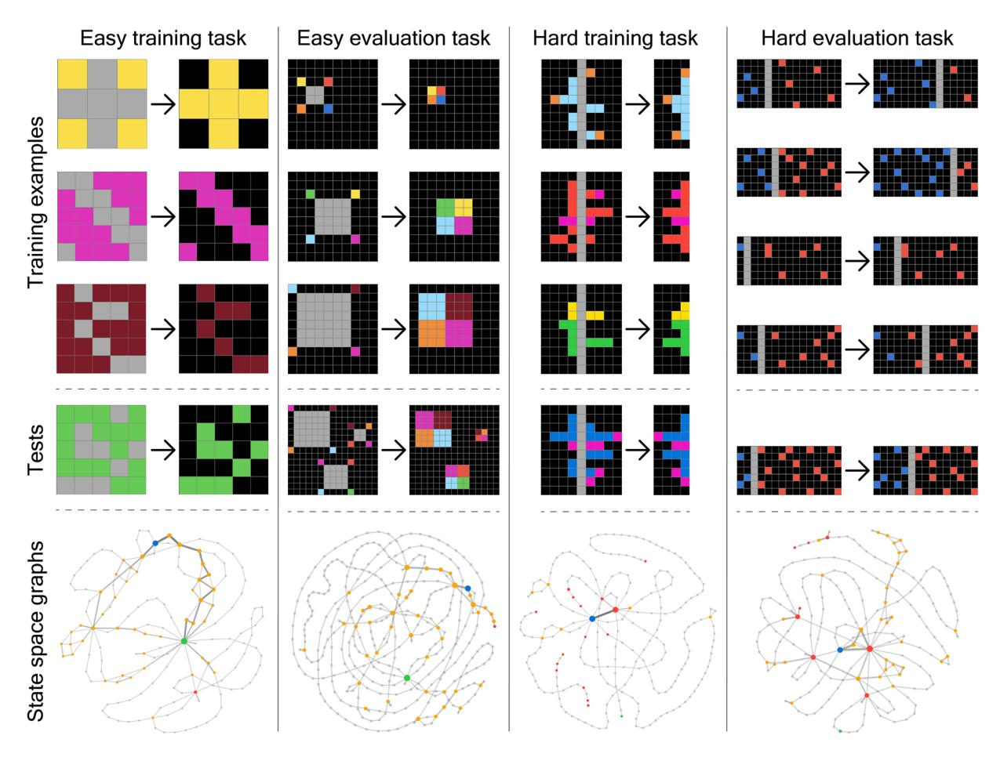
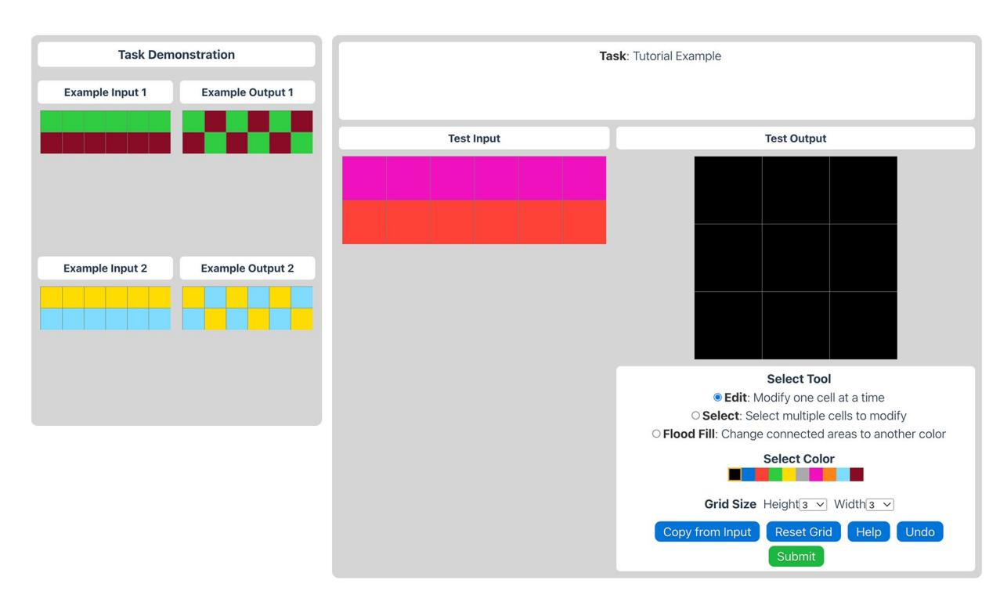
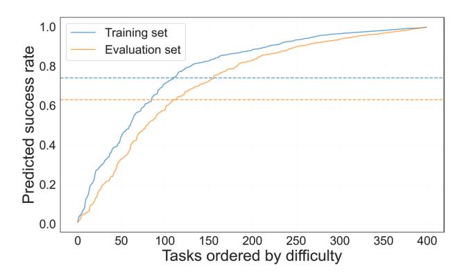
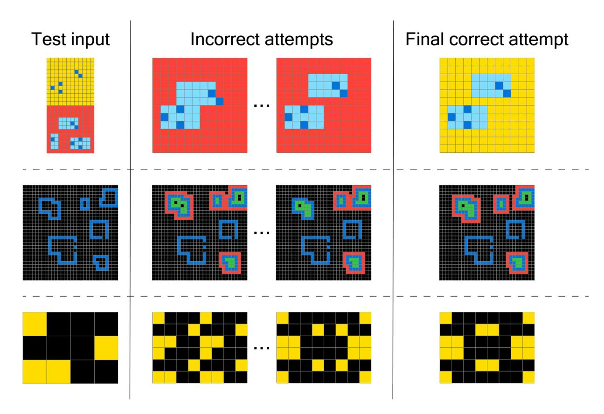
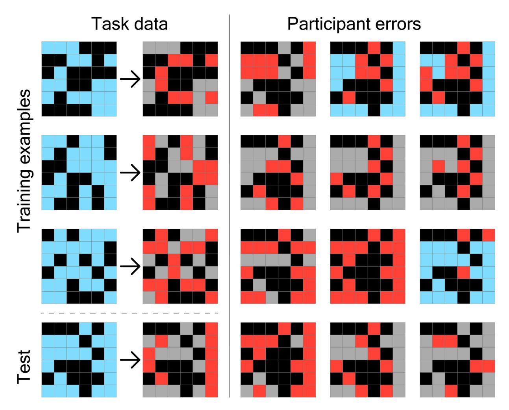
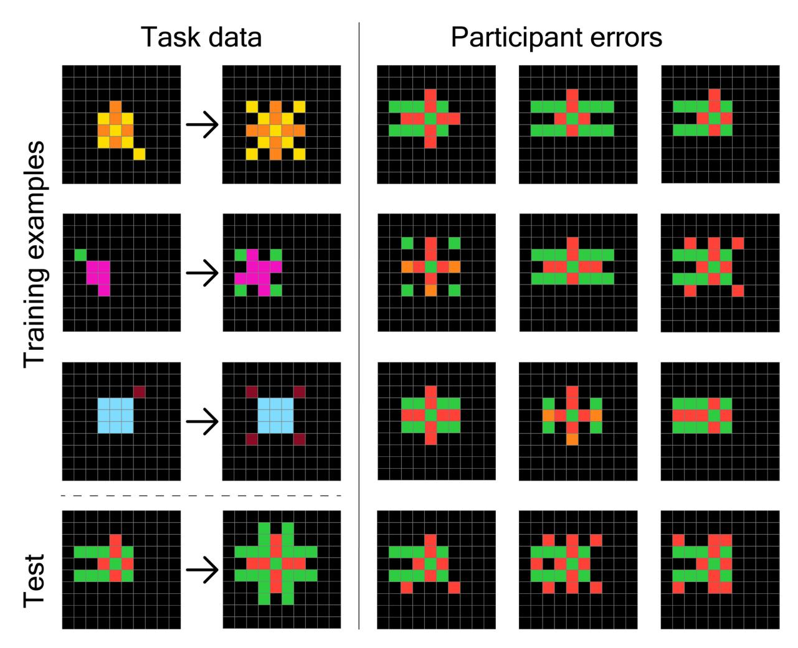
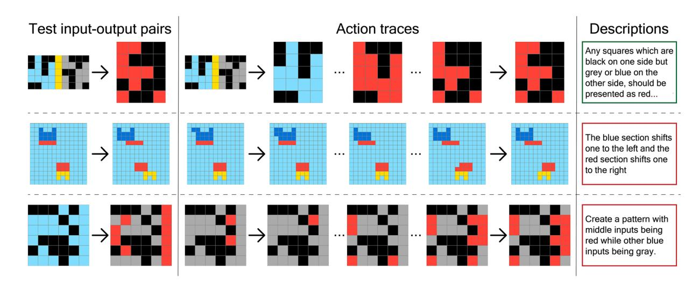

# scientific data

# **DATA DESCRIPTOR**

# **OPEN** A Comprehensive Behavioral **Dataset for the Abstraction and Reasoning Corpus**

Solim LeGris 1™, Wai Keen Vong2, Brenden M. Lake 1,2 & Todd M. Gureckis1

The Abstraction and Reasoning Corpus (ARC) is a visual program synthesis benchmark designed to test out-of-distribution generalization in machines. Comparing AI algorithms to human performance is essential to measure progress on these problems. In this paper, we present H-ARC (Human-ARC): a novel large-scale dataset containing solution attempts from over 1700 humans on ARC problems. The dataset spans the full set of 400 training and 400 evaluation tasks from the original ARC benchmark, and it is the largest human evaluation to date. By publishing the dataset, we contribute human responses to each problem, step-by-step behavioral action traces from the ARC user-interface, and natural-language solution descriptions of the inferred program/rule. We believe this dataset will be of value to researchers, both in cognitive science and AI, since it offers the potential to facilitate the discovery of underlying mechanisms supporting abstraction and reasoning in people. The insights to be gained from these data not only have value for cognitive science, but could in turn inform the design of more efficient, human-like AI algorithms.

## **Background & Summary**

The question of how to measure intelligence in humans and machines remains a critical stepping stone towards developing more sophisticated AI. In that spirit, the Abstraction and Reasoning Corpus (ARC) benchmark was proposed by François Chollet1 to evaluate analogical generalization, measuring how machines handle a broad category of novel tasks given just a few examples. Each task requires inferring an underlying transformation rule or program from a series of training input-output pairs which consist of abstract visual grids (see Fig. 1), and to use this rule to correctly generate an output grid given a novel test input. Although visually simple, the tasks are conceptually rich and challenging, requiring the identification of compositional rules involving objects and relations, geometry, counting, visual instructions, and logical operations.

In the last several years, large language models (LLMs) have achieved impressive performance on a wide variety of benchmarks, demonstrating competency in natural language understanding, coding, and mathematics2,3. With larger and more powerful LLMs, many benchmarks have had a limited shelf life, with performance rapidly increasing to human or even superhuman levels4. In contrast, ARC has proven to be a persistent and formidable challenge for state-of-the-art AI systems, with little progress observed in the first few years after its creation. In a first ARC competition held on Kaggle in 2019, the majority of approaches were based on program synthesis techniques, with the winner of the competition achieving a 21% score on the private test set (kaggle.com/competitions/abstraction-and-reasoning-challenge). After several years of stagnation, an ARC Prize Foundation was founded in 2024 to encourage research and development for achieving an open-source, low-resource solution to the ARC benchmark, and spurring progress towards human-level intelligence (arcprize.org). A number of advancements resulted from their first public competition, with some open-source LLM-based models achieving notable gains in performance, jumping from 33% to 55.5% on the private evaluation set5. Additionally, closed-source models from OpenAI and Anthropic have achieved major leaps in performance, reaching up to 75.7% on the ARC prize semi-private evaluation set (arcprize.org/leaderboard). While these results are impressive, today's top-performing models rely on massive amounts of text data during pretraining to achieve this level of performance, and possibly cognitively implausible data augmentation techniques to support task-specific inference6,7. Unlike people, these models are both data- and resource-intensive, suggesting that they operate under fundamentally different mechanisms to solve ARC problems. Additionally, the ARC Prize Foundation

1Department of Psychology, NYU, NewYork, USA. 2Center for Data Science, NYU, NewYork, USA. ⊠e-mail: solim.legris@ nyu.edu

Fig. 1 ARC Demonstration Tasks. Examples of easy (nearly everyone solved them in two attempts or fewer) and hard (few solved them in three attempts or fewer) tasks, with corresponding training and test examples. Below the tasks are state space graphs representing all visited grid states by participants, from starting state (blue nodes) to correct or incorrect submitted grid (green and red nodes respectively). From left to right: f76d97a5.json,e9ac8c9e.json,e3497940.json and dd2401ed.json.

released a second, improved version of the ARC benchmark (ARC-AGI-2) on which they report similar levels of human accuracy to those reported here8, while the top-performing AI models from the first competition all achieve under 10% accuracy. For these reasons, comprehensive benchmarking of humans on ARC tasks remains an important objective for understanding the underlying mechanisms of human reasoning, but also for gaining insights about human intelligence that could lead to better, more efficient and human-like AI systems.

A previous attempt at benchmarking human performance on ARC found mean task accuracy for humans to be approximately 83%, which was estimated empirically using a small, semi-randomly selected subset of 40 tasks from the training set9. However, it is unclear how robust this estimate is because of its small sample size, and whether the estimate also applies to the evaluation set, which is believed to be much harder. In this work, we introduce H-ARC (Human-ARC) which closes this gap by providing a robust estimate of human performance on the full set of 800 publicly available ARC tasks. H-ARC is a publicly available repository of over 15,500 attempts on ARC tasks, with step-by-step action traces recorded from our user-interface and accompanying natural-language solution descriptions (see Table 1). Although prior research using variants of ARC tasks10,11 or a modified experimental setup12 have also released human behavioral data, to the best of our knowledge, there was no comprehensive public dataset of human behavior at this scale on both the training and evaluation sets of ARC prior to this work.

H-ARC makes two key contributions. First, it provides a robust estimate of human performance which can be used to benchmark AI algorithms. ARC represents a high-profile index of intelligence, and these data contribute in important ways to the measurement of AI progress, especially when comparing to algorithms that operate with more human-like resource-constraints. In addition, from the perspective of cognitive science, H-ARC offers the potential to enrich our understanding of how people solve a range of analogical reasoning problems. In particular, people's error patterns in ARC are revealing of the underlying mechanisms that support reasoning. Qualitative analyses of our dataset suggest that people are incorrect in systematic ways, often achieving partially correct responses or resorting to what appears to be surface-level statistics to approximate observed patterns inferred from training examples (Figs. 5, 6). Additionally, the free-form, natural-language solution

| Metric                          | Training Set | <b>Evaluation Set</b> |
|---------------------------------|--------------|-----------------------|
| Number of tasks                 | 400          | 400                   |
| Total number of participants    | 783          | 946                   |
| Incomplete participants         | 94           | 242                   |
| Average participants per task   | 11.8         | 10.3                  |
| Average attempts to solution    | 1.3          | 1.4                   |
| Total attempts                  | 7,916        | 7,820                 |
| Unique number of visited states | 127,146      | 208,214               |
| Total action traces             | 241,697      | 344,569               |

**Table 1.** Human ARC Descriptives. Here we report numerical values summarizing our behavioral dataset. "Total attempts" is the number of individual submissions across all tasks and participants, and "total action traces" is the number of individual actions recorded across all tasks/participants.

descriptions collected with each problem attempt expose how people use and create on-the-fly abstractions to solve novel problems, affording the possibility of informative, natural-language analyses.

#### Methods

We collected human data on each of the 400 training tasks and 400 evaluation tasks from ARC in two separate phases (extending the subset of 40 training tasks previously collected and described in Johnson *et al.*9. Each task has 1–10 training examples and 1–3 test examples, with each example consisting of an input-output pair. Because only a few tasks had more than 1 test example (14 and 19 tasks in the training and evaluation sets respectively), we opted to evaluate humans using only the first test example for each of these tasks. On average, 11.8 participants completed each of the 400 training tasks, while 10.3 participants completed each of the 400 evaluation tasks.

**Participants.** We recruited 783 participants (59.6% male, 37.8% female, 2.6% other) on the training set tasks and 946 participants (49.5% male, 48.0% female, 2.5% other) on the evaluation set tasks from Amazon Mechanical Turk using the CloudResearch (cloudresearch.com) platform to ensure high quality data13. Participants were between 18 and 78 years old (M = 40.4, SD = 10.8). They were compensated \$10 and were also given a bonus of \$1 if they succeeded at a randomly selected task and its written solution description was judged adequate by the experimenters. Best judgement was used: if a description was at least one complete sentence and was relevant to the task, it was counted as adequate. The study was approved by the local institutional review board (NYU's Committee on Activities Involving Human Subjects; IRB-FY2016-231). Participants were informed about the general purpose of the study, the kinds of content they would be shown, and that they would be required to interact with our interface using their computer. They were informed about compensation amounts, the anonymization of their data, their right to withdraw at any time, and asked to consent before proceeding with the experiment.

**Data collection.** We evaluated humans using the same evaluation procedure proposed in the original paper describing the ARC benchmark1. In particular, human participants were allowed three attempts per task to generate a correct solution, and were only given minimal feedback on each attempt, with the interface labeling each submission as correct or incorrect after each attempt.

User Interface. Participants were first given instructions about the experiment and explanations about the different aspects of the ARC user interface. As in previous experiments $^{\circ}$ , the user interface closely mirrored the original interface provided by Chollet $^{1}$  (see Fig. 2). The interface allowed participants to select different colors and either edit one cell at a time or multiple selected cells at once. More sophisticated tools allowed the participant to copy and paste a selection from the test input to the test output grid, or use the flood fill tool to change the color of all neighboring cells of the same color to a new color. Participants could resize the grid height and width, as well as copy the full test input grid to the test output grid. A reset button allowed participants to revert the output grid back to the initial state, a 3  $\times$  3 black grid. Finally, unlike in previous iterations of the interface, we added another tool allowing participants to undo actions and revert the state of the output grid to the previous state before the last action was taken. At any point in time, the participant could click the help button to display the full set of instructions.

Tutorial. At the beginning of the experiment, participants were provided with animated instructions outlining the user interface with an example task, and then asked to solve the same task to familiarize themselves with the interface. A relatively simple task was given to participants for the tutorial, and they were required to generate the correct test output to proceed (see Fig. 2 for an example). For the training set experiment, we chose task 21f83797.json from the evaluation set, whereas for the evaluation set experiment, we chose task e9af-cf9a.json from the training set. After the tutorial, participants were asked to answer several basic comprehension questions to make sure they understood the instructions. The experiment started immediately after successful completion of the quiz. If one of the questions was answered incorrectly, participants were told that one or more of the questions were incorrect. Participants were given unlimited attempts at the quiz, but could only continue to the main part of the experiment if they successfully answered each question.

Fig. 2 ARC Experiment Interface. Participants were given instructions about the different controls and layout of the interface, followed by a tutorial task. Shown here is a tutorial task chosen from the training set (e9afcf9a.json). The experimental platform we used is made available at exps.gureckislab.org/e/assumption-fast-natural.

Procedure. The experiment consisted of 5 ARC tasks which were randomly selected from either the set of 400 training tasks or from the 400 evaluation tasks. To reduce the potential for attrition or dropouts, we reduced the amount of ARC tasks participants were required to solve from 10 to 5 tasks after collecting 241 out of 783 participants from the first phase of data collection on the training set. On average, participants completed the experiment in 23 minutes and 1 second (SD = 13m 24s) for the training set, and 28 minutes and 51 seconds (SD = 16m 19s) for the evaluation set. There was no time limit for completing a task. Participants who exceeded the total time limit of 90 minutes were dealt with manually by email, but were included in our dataset nonetheless. For each task, participants were given three attempts. After each attempt, feedback was given on whether the submitted solution was correct or not. Participants were not allowed to resubmit a previously incorrect output grid, ensuring that each of their attempts would be unique. We implemented this feature after collecting data from the first 340 participants in the training set experiment. Prior to that, we observed that approximately 8% of incorrect second and third submission attempts were the same as earlier submission attempts on the same task. If the participant failed to generate the solution after three attempts, they automatically proceeded onto the next task. We also collected natural-language descriptions of the inferred solutions by asking participants to write down their solution in words (English). This was first done after submitting an initial attempt before any feedback was given. If the initial submission was incorrect, participants were asked to submit a second natural-language description, either after a subsequent correct submission or on their last (but still incorrect) submission.

#### **Data Records**

The dataset is publicly available on an Open Science Framework (OSF) data repository14 under a Creative Commons License (CC0 1.0 Universal), with this section being the primary source of information on the availability and content of the data being described. The dataset is organized in two main directories: data/ and survey/.

**Data directory.** This directory contains three primary CSV files:

- data.csv: The main dataset file, where each row represents a single action taken by a unique participant on a specific task and attempt. Actions refer to the use of tools and other relevant clicks within the user interface: edit a cell, copy-paste, select, flood fill, undo, submit, etc. Key columns include:
  - hashed id: Anonymized participant identifier.
  - task name: Name of the task.
  - attempt number: Number of the current attempt.
  - action\_id: Number of the action taken for the current attempt.
  - action: Action taken by the participant within the user-interface.

Fig. 3 Predicted task success rate after three attempts. We report model-based estimates, inferred using a Bayesian IRT model which accounts for missing data. Tasks are ordered from lowest success rate to highest, showing the distribution of model-based estimates of task difficulty for the 400 tasks in the training and evaluation sets, respectively. Dotted lines show average accuracy across all tasks in either the training (blue) or evaluation (orange) set.

- test output grid: State of the output grid in string format.
- -action x: X-coordinate of the action.
- -action y: Y-coordinate of the action
- summary\_data.csv: A summary file where each row represents a single attempt by a participant at a task. Important columns include:
  - -hashed id, task name, attempt number.
  - num actions: Total actions taken for the current attempt.
  - test output grid: Final submitted output grid in string format.
  - first\_written\_solution and last\_written\_solution: Natural-language solutions provided by participants.
- incorrect submissions.csv: Contains data on incorrect grid submissions. Columns include:
  - -task name, test output grid, count.

**Survey directory.** This directory includes three CSV files capturing participant feedback and demographics:

- demographics.csv: Includes age, gender, race and education level.
- feedback.csv: Contains a feedback column with textual feedback from participants.
- withdraw.csv: Documents participant withdrawals, including withdraw\_reason and withdraw\_comment columns when given by the participant.

### **Technical Validation**

We present four checks to support the validity of the dataset we are releasing. Firstly, we conducted model-based analyses of performance that incorporate uncertainty about our measurements by accounting for the missing data. Additionally, because this data was collected to showcase the diverse patterns of behavior that could explain aspects of people's thinking and creativity, we present checks on the errors that people make, attempt-by-attempt improvement and the hypotheses that people generate when thinking about ARC problems.

**Performance.** Here, we check the ability of participants to perform the ARC tasks and check the possible influence of incomplete data.

Incomplete data. Participant data collected online can be incomplete for many reasons: participants may find the task too hard, have technical difficulties, find the experiment uninteresting, misunderstand the instructions or even run out of time. In our experiments, a number of participants withdrew from the experiment after completing between 0 and 4 tasks, although most did not provide any particular reason for withdrawing. All withdrawal reasons, when provided by participants, are available in the released dataset. We found that 94 out of 783 participants' data from the training set experiment are incomplete, while 242 out of 946 participants' data from the evaluation set experiment are incomplete. Our results indicate that 7.5% and 13.3% of the training and evaluation set task data are missing, for a total of 10.3% missing task data. We obtained these values by computing the proportion of expected task data (number of participants  $\times$  number of tasks assigned) that was missing from our dataset.

| Attempt | Set        | Accuracy (avg / best %) | HDI          |
|---------|------------|-------------------------|--------------|
| 1       | Training   | 54.6/96.8               | [53.3, 55.8] |
| 1       | Evaluation | 49.2/95.8               | [47.9, 50.4] |
| 2       | Training   | 66.6/98.5               | [65.4, 67.8] |
| 2       | Evaluation | 61.6/97.8               | [60.5, 62.8] |
| 3       | Training   | 70.5/98.8               | [69.3, 71.6] |
| 3       | Evaluation | 65.7/98.8               | [64.6, 66.8] |

Table 2. Human ARC Performance Summary. Human average (avg) represents model-based human performance after one, two or three attempts, where performance is mean task accuracy across each respective set. Human best refers to the overall (empirical) proportion of tasks that any human participant successfully solved, across all tasks in either the training or evaluation set. We also report the 94% Highest Density Interval (HDI) from our Bayesian model estimates.

Fig. 4 Examples of learning from minimal feedback. In the left column, we show the test input seen by participants for three different problems from the ARC training and evaluation sets. In the middle column, first and second incorrect submissions from selected participants are shown for each problem. The last column corresponds to the final, but correct submission. From top to bottom: e6721834.json, d931c21c.json and 3af2c5a8.json.

Model-based estimation. To address the issue of missing data and to estimate performance more robustly, we fit a statistical model predicting human performance (see Fig. 3). Specifically, we estimated mean task accuracy by modeling latent participant ability, task difficulty and feedback effects through a hierarchical Bayesian item response theory (IRT) model15. We adapt the standard Rasch model16 to account for multiple attempts by including an additional term and jointly fitting all attempts using fixed ability and item parameters across attempts. The probability of success for the *i*th subject on the *j*th task and *k*th attempt was modeled as a logistic function

$$P_{i,j,k} = \frac{1}{1 + e^{-(\alpha_i - \beta_j + \gamma_k)}},\tag{1}$$

where  $\alpha_i$  is the latent participant ability,  $\beta_j$  is the latent item difficulty and  $\gamma_k$  is the latent feedback effect. Participant task attempt outcomes were distributed according to  $O_{i,j,k} \sim \text{Bernouilli}(P_{i,j,k})$ . MCMC was used to perform approximate Bayesian inference over the parameters  $(\alpha, \beta, \gamma)$  using PyMC17, with 4 chains and 10000

Fig. 5 Distribution of human errors for a 8610ef7. json. In the left column, we show 3 of 4 training examples (for illustrative purposes) and the test input seen by participants, as well as the true test output grid. In the right panel, we show a non-exhaustive selection of different incorrect submissions from participants in the H-ARC dataset that attempted this particular problem.

samples using its NUTS sampler18. Convergence was assessed using trace plots and  $\hat{R}$  values, which were less than 1.01. The mean accuracy for each split was computed by averaging estimated probability of success across all participants and tasks (see Table 2), using sampled parameters during inference. For comparison, we also report empirical mean accuracy which is computed as the mean success rate across tasks on the training and evaluation splits, respectively. More details on model-based estimation can be found in the accompanying code repository.

**Performance on the training set.** According to the IRT estimate, the mean accuracy on the training set tasks is 70.5% (94% HDI [69.3%, 71.6%]). For comparison, the empirical mean task accuracy is 76.2% (SD = 21.5%). We also report model estimates of mean task accuracy for participants' first and second attempts, 54.6% (94% HDI [53.3%, 55.8%]) and 66.6% (94% HDI [65.4%, 67.8%]), respectively. Participants solved ARC training tasks in 1.3 attempts on average, with the modal and median number of attempts being 1. Of the 400 training tasks, we find 74 tasks (18.5% of the training set) for which all participant who attempted the task generated the correct solution within three submissions or fewer. Conversely, we also find 5 tasks (1.3% of the training set) which no participants were able to solve correctly in three attempts or fewer. Note that since each problem is attempted by approximately 10 people, this result simply means that we did not find anyone in a set of 10 that could solve the problem. This is not evidence that these problems are not in principle solvable by a person. Finally, we find that 40.0% of participants solved all training set tasks they were presented and that 8.6% of participants solved none.

**Performance on the evaluation set.** According to the IRT estimate, the mean accuracy on the evaluation set tasks is 65.7% (94% HDI [64.6%, 66.8%]). For comparison, the empirical mean task accuracy is 64.5% (SD=22.5%). We also report model estimated mean task accuracy for participants' first and second attempts, 49.2% (94% HDI [47.9%, 50.4%]) and 61.6% (94% HDI [60.5%, 62.8%]), respectively. On average, participants solve ARC evaluation tasks in 1.4 attempts, with the modal and median number of attempts being 1. Of the 400

Fig. 6 Distribution of human errors for e40b9e2f.json. In the left column, we show the training examples and test input seen by participants, as well as the true test output grid. In the right panel, we show a non-exhaustive selection of different incorrect submissions from participants in the H-ARC dataset that attempted this particular problem.

evaluation tasks, we find 22 tasks (5.5% of the evaluation set) for which participants always found the correct solution. Conversely, we find 5 tasks (1.3% of the evaluation set) which no participants were able to solve. We also find that 33.8% of participants solved all evaluation set tasks they tried and that 16.7% solved none.

**Self-correction through feedback.** In the second technical validation, we inspect to what extent people are making use of the minimal feedback to improve their solution. The IRT model estimates that for each additional attempt, there is a substantial increase in the probability of success on a given task. Specifically, we find that for an average participant on an average task, success increases by 27.7% (94% HDI: [26.1%, 29.3%]) on a second attempt and by 34.4% (94% HDI: [33.1%, 35.6%]) on a third attempt. People will often make initially wrong guesses, but they are capable of self-correction and can flexibly consider alternative solutions. For example, in the third row of Fig. 4, the participant first infers that the rule is to simply copy the input grid into each quadrant of an  $8\times 8$  grid. Next, the participant makes the correct inference that the test outputs have some kind of symmetry, which they correctly guess to be mirroring along each axis. The idea is right, but the execution is incorrect. Finally, they correct the minor mistakes in the top and bottom right quadrants.

**Incorrect responses.** In the third technical validation, we examine whether there is structure to the incorrect responses that people produced. First, qualitative inspection suggests that people's errors are not random, but systematic and problem-type dependent (see Figs. 5, 6). For instance, although people make a non-negligible amount of height and width errors, within the set of incorrect submissions, we find that 68.2% and 73.5% of submission attempts have both the correct height and width in training and evaluation set tasks respectively. In general, we observe that people often successfully apply crucial transformations, such as finding the right grid dimensions or filling in cells with the relevant colors, while missing some steps to a complete solution. These partial solutions demonstrate failure modes of the human cognitive system that could inform potential mechanistic hypotheses. For example, many of the errors illustrated in Figs. 5, 6 suggest conceptual errors. In both cases, the incorrect outputs are often visually close to the true test output, suggesting approximations of the ground truth

Fig. 7 Human action traces on ARC problems. In the left column, we show the test input seen by participants, and the true test output grid for three different problems from the ARC evaluation set. In the middle column, action traces show some successive states of the grid of a selected participant, with the last state corresponding to a correct (green box) or incorrect (red box) submission. In the last column, we show the first natural-language descriptions submitted by participants along with their solution. From top to bottom: 34b99a2b.json, 4364clc4.json and a8610ef7.json.

rule. In broad strokes, the solution for problem a 8610ef7.json (see left panel of Fig. 5) requires copying the input grid and then coloring all blue cells gray or red. The condition for deciding which color to paint a blue cell depends on evaluating whether it is symmetric along the horizontal axis of the grid: if both (mirrored) corresponding cells in the top and bottom halves of the grid are blue, the cells should be colored red, otherwise the blue cell should be colored gray. In light of this solution, the output of many participants shown in Fig. 5 appear like they are the result of inferring partially correct programs, where the condition for coloring cells red is approximated using surface-level statistics.

Natural language descriptions. In our final technical validation, we check the natural-language descriptions that the participants generated when solving ARC problems (see Fig. 7 for examples). To validate the informativeness of these descriptions, we focused on evaluating the last submitted solution descriptions of correct attempts only. After filtering uninformative text (fewer than 3 words), and rare tasks (fewer than 4 successful descriptions), we obtained a total of 5940 natural-language descriptions across 691 tasks. We trained a Bernoulli Naive Bayes classifier using bag-of-words features to predict which specific ARC task a participant was solving from their textual description alone. Using 5-fold cross-validation for hyperparameter optimization, we performed a grid search over both vocabulary size  $v \in \{100, 250, 500, 1000, 2000, 2777\}$  and Laplace smoothing parameters  $\alpha \in \{0.01, 0.1, 0.5, 1.0, 2.0, 5.0, 10.0\}$ , finding optimal values of  $\nu = 1000$  features and  $\alpha = 0.01$ . On a held-out test set (70/30 split), the classifier achieved 23.7% accuracy—significantly above the empirical null distribution of 0.2% ( $\pm 0.1\%$ ), with statistical significance confirmed by permutation testing (p < 0.0001, n = 1000 permutations). This demonstrates that participants' verbal explanations contain meaningful task-specific information, with the most frequent terms including color descriptors (blue, red, green), spatial language (squares, grid, pattern, shape), and directional concepts (left, right), confirming that participants often used visuospatial concepts to articulate their reasoning about abstract transformation rules. Furthermore, qualitative inspection reveals that the natural-language descriptions in H-ARC contain words like "fill", "extend", "move", "slide" or even "water" or "flower". All these words capture concepts from everyday life that people used to reason about these novel problems. At a surface-level, these concepts seem unrelated to a task that requires inferring a hidden transformation rule and applying it to 2D grids of numbers between 0 and 9. Reminiscent of analogical reasoning, the use of these concepts is suggestive of people's ability to come up with useful abstractions on-the-fly that greatly restrict their search space when solving ARC problems.

#### Code availability

The code for technical validation is available on our accompanying code repo at github.com/le-gris/h-arc. The code is written in Python, using standard packages such as PyMC, NumPy and SciPy.

Received: 23 January 2025; Accepted: 24 July 2025; Published: 7 August 2025

#### References

- 1. Chollet, F. On the measure of intelligence. arXiv preprint arXiv:1911.01547, https://doi.org/10.48550/arXiv.1911.01547 (2019).
- 2. Achiam, J. et al. GPT-4 technical report. arXiv preprint arXiv:2303.08774, https://doi.org/10.48550/arXiv.2303.08774 (2023).
- 3. Wei, J. et al. Emergent abilities of large language models. arXiv preprint arXiv:2206.07682, https://doi.org/10.48550/arXiv.2206.07682 (2022).

- 4. Kaplan, I. et al. Scaling laws for neural language models (2020).
- 5. Chollet, F., Knoop, M., Kamradt, G. & Landers, B. ARC prize 2024: Technical report. arXiv [cs.AI], https://doi.org/10.48550/arXiv.2412.04604 (2024).
- Li, W.-D. et al. Combining induction and transduction for abstract reasoning. arXiv [cs.LG], https://doi.org/10.48550/arXiv.2411.02272 (2024).
- 7. Akyürek, E. et al. The surprising effectiveness of test-time training for abstract reasoning. arXiv [cs.AI], https://doi.org/10.48550/arXiv.2411.07279 (2024).
- 8. Chollet, F., Knoop, M., Kamradt, G., Landers, B., & Pinkard, H. Arc-agi-2: A new challenge for frontier ai reasoning systems. arXiv [cs.AI], https://doi.org/10.48550/arXiv.2505.11831 (2025).
- Johnson, A., Vong, W. K. Lake, B., & Gureckis, T. M. Fast and flexible: Human program induction in abstract reasoning tasks. In Proceedings of the Annual Meeting of the Cognitive Science Society, 43, https://doi.org/10.48550/arXiv.2103.05823 (2021).
- Moskvichev, A. K. Odouard, V. V. & Mitchell, M. The conceptARC benchmark: Evaluating understanding and generalization in the ARC domain. Transactions on Machine Learning Research, ISSN 2835-8856 https://openreview.net/forum?id=8ykyGbtt2q (2023).
- 11. Mitchell, M. Palmarini, A. B. & Moskvichev, A. Comparing humans, gpt-4, and gpt-4v on abstraction and reasoning tasks. Proceedings of the LLM-CP Workshop, AAAI 2024, https://doi.org/10.48550/arXiv.2311.09247 (2024).
- 12. Acquaviva, S. et al. Communicating natural programs to humans and machines. Advances in Neural Information Processing Systems 35, 3731–3743, https://doi.org/10.48550/arXiv.2106.07824 (2022).
- 13. Hauser, D. J. et al. Évaluating cloudresearch's approved group as a solution for problematic data quality on mturk. Behavior Research Methods 55(8), 3953–3964, https://doi.org/10.3758/s13428-022-01999-x (2023).
- 14. LeGris, S., Vong, W. K., Lake, B. & Gureckis, T. H-arc, https://doi.org/10.17605/OSF.IO/BH8YQ (2025).
- 15. Fox, J. P. Bayesian item response modeling: Theory and applications. Statistics for Social and Behavioral Sciences. Springer, New York, NY, 2010 edition, ISBN 9781441907417,9781441907424. https://doi.org/10.1007/978-1-4419-0742-4 (2010).
- 16. Rasch, G. Studies in mathematical psychology: I. probabilistic models for some intelligence and attainment tests. xiii, 184 (1960).
- 17. Abril-Pla, O. *et al.* PyMC: a modern, and comprehensive probabilistic programming framework in python. *PeerJ. Computer science* 9, e1516, https://doi.org/10.7717/peerj-cs.1516 (2023).
- 18. Hoffman, M. D. et al. The no-u-turn sampler: adaptively setting path lengths in hamiltonian monte carlo. J. Mach. Learn. Res. 15(1), 1593–1623 (2014).

#### **Acknowledgements**

We thank Aysja Johnson for collecting the data from the first few hundred participants on the training set and Nicholas Emery Kirsch for funding the data collection and personnel efforts on the evaluation set. This work was also generously supported by NSF BCS grant 2121102 to T.M.G.

### **Author contributions**

S.L. conducted the experiments, analyzed the data and wrote the manuscript. W.K.V., B.M.L. and T.M.G. provided project guidance. All authors contributed to reviewing and writing the manuscript.

#### **Competing interests**

The authors declare no competing interests.

### **Additional information**

Correspondence and requests for materials should be addressed to S.L.

Reprints and permissions information is available at www.nature.com/reprints.

**Publisher's note** Springer Nature remains neutral with regard to jurisdictional claims in published maps and institutional affiliations.

Open Access This article is licensed under a Creative Commons Attribution-NonCommercial-NoDerivatives 4.0 International License, which permits any non-commercial use, sharing, distribution and reproduction in any medium or format, as long as you give appropriate credit to the original author(s) and the source, provide a link to the Creative Commons licence, and indicate if you modified the licensed material. You do not have permission under this licence to share adapted material derived from this article or parts of it. The images or other third party material in this article are included in the article's Creative Commons licence, unless indicated otherwise in a credit line to the material. If material is not included in the article's Creative Commons licence and your intended use is not permitted by statutory regulation or exceeds the permitted use, you will need to obtain permission directly from the copyright holder. To view a copy of this licence, visit <a href="http://creativecommons.org/licenses/by-nc-nd/4.0/">http://creativecommons.org/licenses/by-nc-nd/4.0/</a>.

© The Author(s) 2025, corrected publication 2025