# **ImageNet: A Large-Scale Hierarchical Image Database**

Jia Deng, Wei Dong, Richard Socher, Li-Jia Li, Kai Li and Li Fei-Fei Dept. of Computer Science, Princeton University, USA

{jiadeng, wdong, rsocher, jial, li, feifeili}@cs.princeton.edu

### **Abstract**

The explosion of image data on the Internet has the potential to foster more sophisticated and robust models and algorithms to index, retrieve, organize and interact with images and multimedia data. But exactly how such data can be harnessed and organized remains a critical problem. We introduce here a new database called "ImageNet", a largescale ontology of images built upon the backbone of the WordNet structure. ImageNet aims to populate the majority of the 80,000 synsets of WordNet with an average of 500-1000 clean and full resolution images. This will result in tens of millions of annotated images organized by the semantic hierarchy of WordNet. This paper offers a detailed analysis of ImageNet in its current state: 12 subtrees with 5247 synsets and 3.2 million images in total. We show that ImageNet is much larger in scale and diversity and much more accurate than the current image datasets. Constructing such a large-scale database is a challenging task. We describe the data collection scheme with Amazon Mechanical Turk. Lastly, we illustrate the usefulness of ImageNet through three simple applications in object recognition, image classification and automatic object clustering. We hope that the scale, accuracy, diversity and hierarchical structure of ImageNet can offer unparalleled opportunities to researchers in the computer vision community and beyond.

# 1. Introduction

The digital era has brought with it an enormous explosion of data. The latest estimations put a number of more than 3 billion photos on Flickr, a similar number of video clips on YouTube and an even larger number for images in the Google Image Search database. More sophisticated and robust models and algorithms can be proposed by exploiting these images, resulting in better applications for users to index, retrieve, organize and interact with these data. But exactly how such data can be utilized and organized is a problem yet to be solved. In this paper, we introduce a new image database called "ImageNet", a large-scale ontology of images. We believe that a large-scale ontology of images is a critical resource for developing advanced, large-scale

content-based image search and image understanding algorithms, as well as for providing critical training and benchmarking data for such algorithms.

ImageNet uses the hierarchical structure of WordNet [9]. Each meaningful concept in WordNet, possibly described by multiple words or word phrases, is called a "synonym set" or "synset". There are around 80,000 noun synsets in WordNet. In ImageNet, we aim to provide on average 500-1000 images to illustrate each synset. Images of each concept are quality-controlled and human-annotated as described in Sec. 3.2. ImageNet, therefore, will offer tens of millions of cleanly sorted images. In this paper, we report the current version of ImageNet, consisting of 12 "subtrees": mammal, bird, fish, reptile, amphibian, vehicle, furniture, musical instrument, geological formation, tool, flower, fruit. These subtrees contain 5247 synsets and 3.2 million images. Fig. 1 shows a snapshot of two branches of the mammal and vehicle subtrees. The database is publicly available at http://www.image-net.org.

The rest of the paper is organized as follows: We first show that ImageNet is a large-scale, accurate and diverse image database (Section 2). In Section 4, we present a few simple application examples by exploiting the current ImageNet, mostly the mammal and vehicle subtrees. Our goal is to show that ImageNet can serve as a useful resource for visual recognition applications such as object recognition, image classification and object localization. In addition, the construction of such a large-scale and high-quality database can no longer rely on traditional data collection methods. Sec. 3 describes how ImageNet is constructed by leveraging Amazon Mechanical Turk.

#### 2. Properties of ImageNet

ImageNet is built upon the hierarchical structure provided by WordNet. In its completion, ImageNet aims to contain in the order of 50 million cleanly labeled full resolution images (500-1000 per synset). At the time this paper is written, ImageNet consists of 12 subtrees. Most analysis will be based on the mammal and vehicle subtrees.

**Scale** ImageNet aims to provide the most comprehensive and diverse coverage of the image world. The current 12 subtrees consist of a total of 3.2 million cleanly annotated

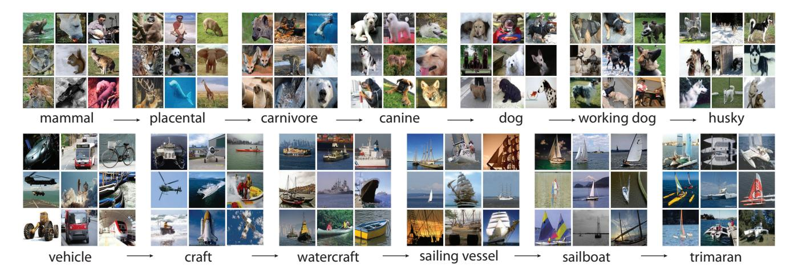

Figure 1: A snapshot of two root-to-leaf branches of ImageNet: the **top** row is from the mammal subtree; the **bottom** row is from the vehicle subtree. For each synset, 9 randomly sampled images are presented.

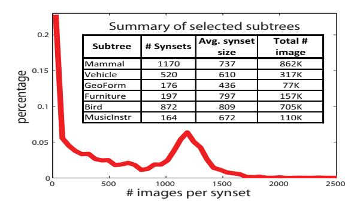

Figure 2: Scale of ImageNet. **Red curve**: Histogram of number of images per synset. About 20% of the synsets have very few images. Over 50% synsets have more than 500 images. **Table**: Summary of selected subtrees. For complete and up-to-date statistics visit http://www.image-net.org/about-stats.

images spread over 5247 categories (Fig. 2). On average over 600 images are collected for each synset. Fig. 2 shows the distributions of the number of images per synset for the current ImageNet 1. To our knowledge this is already the largest clean image dataset available to the vision research community, in terms of the total number of images, number of images per category as well as the number of categories 2.

**Hierarchy** ImageNet organizes the different classes of images in a *densely populated* semantic hierarchy. The main asset of WordNet [9] lies in its semantic structure, i.e. its ontology of concepts. Similarly to WordNet, synsets of images in ImageNet are interlinked by several types of relations, the "IS-A" relation being the most comprehensive and useful. Although one can map any dataset with cate-

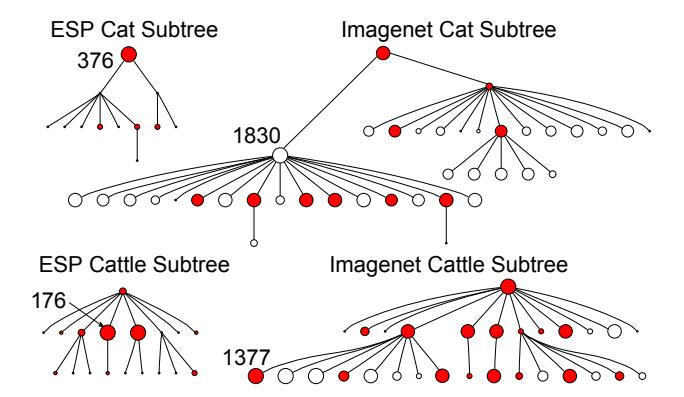

Figure 3: Comparison of the "cat" and "cattle" subtrees between ESP [25] and ImageNet. Within each tree, the size of a node is proportional to the number of images it contains. The number of images for the largest node is shown for each tree. Shared nodes between an ESP tree and an ImageNet tree are colored in red.

gory labels into a semantic hierarchy by using WordNet, the density of ImageNet is unmatched by others. For example, to our knowledge no existing vision dataset offers images of 147 dog categories. Fig. 3 compares the "cat" and "cattle" subtrees of ImageNet and the ESP dataset [25]. We observe that ImageNet offers much denser and larger trees.

Accuracy We would like to offer a clean dataset at all levels of the WordNet hierarchy. Fig. 4 demonstrates the labeling precision on a total of 80 synsets randomly sampled at different tree depths. An average of 99.7% precision is achieved on average. Achieving a high precision for all depths of the ImageNet tree is challenging because the lower in the hierarchy a synset is, the harder it is to classify, e.g. Siamese cat versus Burmese cat.

**Diversity** ImageNet is constructed with the goal that objects in images should have variable appearances, positions,

&lt;sup>1About 20% of the synsets have very few images, because either there are very few web images available, e.g. "vespertilian bat", or the synset by definition is difficult to be illustrated by images, e.g. "two-year-old horse".

&lt;sup>2It is claimed that the ESP game [25] has labeled a very large number of images, but only a subset of 60K images are publicly available.

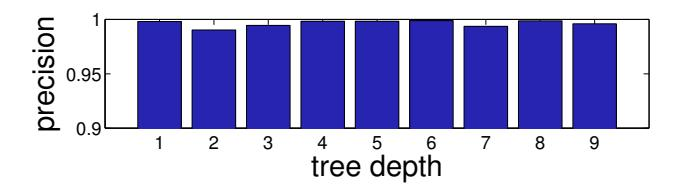

Figure 4: Percent of clean images at different tree depth levels in ImageNet. A total of 80 synsets are randomly sampled at every tree depth of the mammal and vehicle subtrees. An independent group of subjects verified the correctness of each of the images. An average of 99.7% precision is achieved for each synset.

|             | ImageNet | TinyImage | LabelMe | ESP | LHill |
|-------------|----------|-----------|---------|-----|-------|
| LabelDisam  | Y        | Y         | N       | N   | Y     |
| Clean       | Y        | N         | Y       | Y   | Y     |
| DenseHie    | Y        | Y         | N       | N   | N     |
| FullRes     | Y        | N         | Y       | Y   | Y     |
| PublicAvail | Y        | Y         | Y       | N   | N     |
| Segmented   | N        | N         | Y       | N   | Y     |

Table 1: Comparison of some of the properties of ImageNet versus other existing datasets. ImageNet offers disambiguated labels (LabelDisam), clean annotations (Clean), a dense hierarchy (DenseHie), full resolution images (FullRes) and is publicly available (PublicAvail). ImageNet currently does not provide segmentation annotations.

view points, poses as well as background clutter and occlusions. In an attempt to tackle the difficult problem of quantifying image diversity, we compute the average image of each synset and measure lossless JPG file size which reflects the amount of information in an image. Our idea is that a synset containing diverse images will result in a blurrier average image, the extreme being a gray image, whereas a synset with little diversity will result in a more structured, sharper average image. We therefore expect to see a smaller JPG file size of the average image of a more diverse synset. Fig. 5 compares the image diversity in four randomly sampled synsets in Caltech101 [8] 3 and the mammal subtree of ImageNet.

#### 2.1. ImageNet and Related Datasets

We compare ImageNet with other datasets and summarize the differences in Table 1 4.

**Small image datasets** A number of well labeled small datasets (Caltech101/256 [8, 12], MSRC [22], PASCAL [7] etc.) have served as training and evaluation benchmarks for most of today's computer vision algorithms. As computer vision research advances, larger and more challenging

datasets are needed for the next generation of algorithms. The current ImageNet offers  $20\times$  the number of categories, and  $100\times$  the number of total images than these datasets.

**TinyImage** TinyImage [24] is a dataset of 80 million  $32 \times 32$  low resolution images, collected from the Internet by sending all words in WordNet as queries to image search engines. Each synset in the TinyImage dataset contains an average of 1000 images, among which 10-25% are possibly clean images. Although the TinyImage dataset has had success with certain applications, the high level of noise and low resolution images make it less suitable for general purpose algorithm development, training, and evaluation. Compared to the TinyImage dataset, ImageNet contains high quality synsets ( $\sim 99\%$  precision) and full resolution images with an average size of around  $400 \times 350$ .

ESP dataset The ESP dataset is acquired through an online game [25]. Two players independently propose labels to one image with the goal of matching as many words as possible in a certain time limit. Millions of images are labeled through this game, but its speeded nature also poses a major drawback. Rosch and Lloyd [20] have demonstrated that humans tend to label visual objects at an easily accessible semantic level termed as "basic level" (e.g. bird), as opposed to more specific level ("sub-ordinate level", e.g. sparrow), or more general level ("super-ordinate level", e.g. vertebrate). Labels collected from the ESP game largely concentrate at the "basic level" of the semantic hierarchy as illustrated by the color bars in Fig. 6. ImageNet, however, demonstrates a much more balanced distribution of images across the semantic hierarchy. Another critical difference between ESP and ImageNet is sense disambiguation. When human players input the word "bank", it is unclear whether it means "a river bank" or a "financial institution". At this large scale, disambiguation becomes a nontrivial task. Without it, the accuracy and usefulness of the ESP data could be affected. ImageNet, on the other hand, does not have this problem by construction. See section 3.2 for more details. Lastly, most of the ESP dataset is not publicly available. Only 60K images and their labels can be accessed [1].

LabelMe and Lotus Hill datasets LabelMe [21] and the Lotus Hill dataset [27] provide 30k and 50k labeled and segmented images, respectively 5. These two datasets provide complementary resources for the vision community compared to ImageNet. Both only have around 200 categories, but the outlines and locations of objects are provided. ImageNet in its current form does not provide detailed object outlines (see potential extensions in Sec. 5.1), but the number of categories and the number of images per category

&lt;sup>3We also compare with Caltech256 [12]. The result indicates the diversity of ImageNet is comparable, which is reassuring since Caltech256 was specifically designed to be more diverse.

&lt;sup>4We focus our comparisons on datasets of generic objects. Special purpose datasets, such as FERET faces [19], Labeled faces in the Wild [13] and the Mammal Benchmark by Fink and Ullman [11] are not included.

&lt;sup>5All statistics are from [21, 27]. In addition to the 50k images, the Lotus Hill dataset also includes 587k video frames.

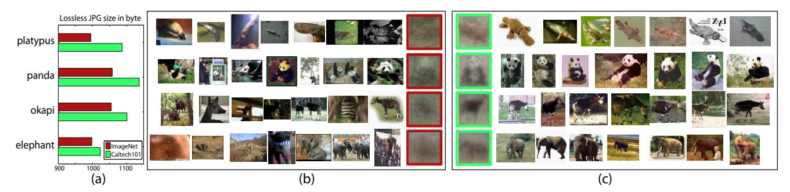

Figure 5: ImageNet provides diversified images. (a) Comparison of the lossless JPG file sizes of average images for four different synsets in ImageNet (the mammal subtree) and Caltech101. Average images are downsampled to  $32 \times 32$  and sizes are measured in byte. A more diverse set of images results in a smaller lossless JPG file size. (b) Example images from ImageNet and average images for each synset indicated by (a). (c) Examples images from Caltech101 and average images. For each category shown, the average image is computed using all images from Caltech101 and an equal number of randomly sampled images from ImageNet.

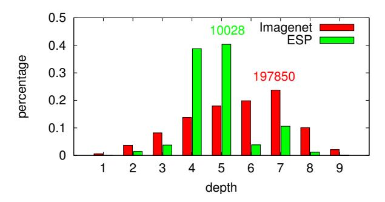

Figure 6: Comparison of the distribution of "mammal" labels over tree depth levels between ImageNet and ESP game. The y-axis indicates the percentage of the labels of the corresponding dataset. ImageNet demonstrates a much more balanced distribution, offering substantially more labels at deeper tree depth levels. The actual number of images corresponding to the highest bar is also given for each dataset.

already far exceeds these two datasets. In addition, images in these two datasets are largely uploaded or provided by users or researchers of the dataset, whereas ImageNet contains images crawled from the entire Internet. The Lotus Hill dataset is only available through purchase.

# 3. Constructing ImageNet

ImageNet is an ambitious project. Thus far, we have constructed 12 subtrees containing 3.2 million images. Our goal is to complete the construction of around 50 million images in the next two years. We describe here the method we use to construct ImageNet, shedding light on how properties of Sec. 2 can be ensured in this process.

#### 3.1. Collecting Candidate Images

The first stage of the construction of ImageNet involves collecting candidate images for each synset. The average accuracy of image search results from the Internet is around 10% [24]. ImageNet aims to eventually offer 500-1000 clean images per synset. We therefore collect a large set of candidate images. After intra-synset duplicate removal, each synset has over 10K images on average.

We collect candidate images from the Internet by querying several image search engines. For each synset, the queries are the set of WordNet synonyms. Search engines typically limit the number of images retrievable (in the order of a few hundred to a thousand). To obtain as many images as possible, we expand the query set by appending the queries with the word from parent synsets, if the same word appears in the gloss of the target synset. For example, when querying "whippet", according to WordNet's gloss a "small slender dog of greyhound type developed in England", we also use "whippet dog" and "whippet greyhound".

To further enlarge and diversify the candidate pool, we translate the queries into other languages [10], including Chinese, Spanish, Dutch and Italian. We obtain accurate translations by WordNets in those languages [3, 2, 4, 26].

### 3.2. Cleaning Candidate Images

To collect a highly accurate dataset, we rely on humans to verify each candidate image collected in the previous step for a given synset. This is achieved by using the service of Amazon Mechanical Turk (AMT), an online platform on which one can put up tasks for users to complete and to get paid. AMT has been used for labeling vision data [23]. With a global user base, AMT is particularly suitable for large scale labeling.

In each of our labeling tasks, we present the users with a set of candidate images and the definition of the target synset (including a link to Wikipedia). We then ask the users to verify whether each image contains objects of the synset. We encourage users to select images regardless of occlusions, number of objects and clutter in the scene to

|        | - 1 | The same of the same of the same of the same of the same of the same of the same of the same of the same of the same of the same of the same of the same of the same of the same of the same of the same of the same of the same of the same of the same of the same of the same of the same of the same of the same of the same of the same of the same of the same of the same of the same of the same of the same of the same of the same of the same of the same of the same of the same of the same of the same of the same of the same of the same of the same of the same of the same of the same of the same of the same of the same of the same of the same of the same of the same of the same of the same of the same of the same of the same of the same of the same of the same of the same of the same of the same of the same of the same of the same of the same of the same of the same of the same of the same of the same of the same of the same of the same of the same of the same of the same of the same of the same of the same of the same of the same of the same of the same of the same of the same of the same of the same of the same of the same of the same of the same of the same of the same of the same of the same of the same of the same of the same of the same of the same of the same of the same of the same of the same of the same of the same of the same of the same of the same of the same of the same of the same of the same of the same of the same of the same of the same of the same of the same of the same of the same of the same of the same of the same of the same of the same of the same of the same of the same of the same of the same of the same of the same of the same of the same of the same of the same of the same of the same of the same of the same of the same of the same of the same of the same of the same of the same of the same of the same of the same of the same of the same of the same of the same of the same of the same of the same of the same of the same of the same of the same of the same of the same of the same of the sa |   |
|--------|-----|--------------------------------------------------------------------------------------------------------------------------------------------------------------------------------------------------------------------------------------------------------------------------------------------------------------------------------------------------------------------------------------------------------------------------------------------------------------------------------------------------------------------------------------------------------------------------------------------------------------------------------------------------------------------------------------------------------------------------------------------------------------------------------------------------------------------------------------------------------------------------------------------------------------------------------------------------------------------------------------------------------------------------------------------------------------------------------------------------------------------------------------------------------------------------------------------------------------------------------------------------------------------------------------------------------------------------------------------------------------------------------------------------------------------------------------------------------------------------------------------------------------------------------------------------------------------------------------------------------------------------------------------------------------------------------------------------------------------------------------------------------------------------------------------------------------------------------------------------------------------------------------------------------------------------------------------------------------------------------------------------------------------------------------------------------------------------------------------------------------------------------|---|
| User 1 | Y   | Y                                                                                                                                                                                                                                                                                                                                                                                                                                                                                                                                                                                                                                                                                                                                                                                                                                                                                                                                                                                                                                                                                                                                                                                                                                                                                                                                                                                                                                                                                                                                                                                                                                                                                                                                                                                                                                                                                                                                                                                                                                                                                                                              | Y |
| User 2 | N   | Y                                                                                                                                                                                                                                                                                                                                                                                                                                                                                                                                                                                                                                                                                                                                                                                                                                                                                                                                                                                                                                                                                                                                                                                                                                                                                                                                                                                                                                                                                                                                                                                                                                                                                                                                                                                                                                                                                                                                                                                                                                                                                                                              | Y |
| User 3 | N   | Y                                                                                                                                                                                                                                                                                                                                                                                                                                                                                                                                                                                                                                                                                                                                                                                                                                                                                                                                                                                                                                                                                                                                                                                                                                                                                                                                                                                                                                                                                                                                                                                                                                                                                                                                                                                                                                                                                                                                                                                                                                                                                                                              | Y |
| User 4 | Y   | N                                                                                                                                                                                                                                                                                                                                                                                                                                                                                                                                                                                                                                                                                                                                                                                                                                                                                                                                                                                                                                                                                                                                                                                                                                                                                                                                                                                                                                                                                                                                                                                                                                                                                                                                                                                                                                                                                                                                                                                                                                                                                                                              | Y |
| User 5 | Y   | Y                                                                                                                                                                                                                                                                                                                                                                                                                                                                                                                                                                                                                                                                                                                                                                                                                                                                                                                                                                                                                                                                                                                                                                                                                                                                                                                                                                                                                                                                                                                                                                                                                                                                                                                                                                                                                                                                                                                                                                                                                                                                                                                              | Y |
| User 6 | N   | N                                                                                                                                                                                                                                                                                                                                                                                                                                                                                                                                                                                                                                                                                                                                                                                                                                                                                                                                                                                                                                                                                                                                                                                                                                                                                                                                                                                                                                                                                                                                                                                                                                                                                                                                                                                                                                                                                                                                                                                                                                                                                                                              | Y |

| #Y | # N | Conf Cat | Conf BCat |
|----|-----|-------------|--------------|
| 0  | 1   | 0.07        | 0.23         |
| 1  | 0   | 0.85        | 0.69         |
| 1  | 1   | 0.46        | 0.49         |
| 2  | 0   | 0.97        | 0.83         |
| 0  | 2   | 0.02        | 0.12         |
| 3  | 0   | 0.99        | 0.90         |
| 2  | 1   | 0.85        | 0.68         |

Figure 7: Left: Is there a Burmese cat in the images? Six randomly sampled users have different answers. Right: The confidence score table for "Cat" and "Burmese cat". More votes are needed to reach the same degree of confidence for "Burmese cat" images.

ensure diversity.

While users are instructed to make accurate judgment, we need to set up a quality control system to ensure this accuracy. There are two issues to consider. First, human users make mistakes and not all users follow the instructions. Second, users do not always agree with each other, especially for more subtle or confusing synsets, typically at the deeper levels of the tree. Fig. 7(left) shows an example of how users' judgments differ for "Burmese cat".

The solution to these issues is to have multiple users independently label the same image. An image is considered positive only if it gets a convincing majority of the votes. We observe, however, that different categories require different levels of consensus among users. For example, while five users might be necessary for obtaining a good consensus on "Burmese cat" images, a much smaller number is needed for "cat" images. We develop a simple algorithm to dynamically determine the number of agreements needed for different categories of images. For each synset, we first randomly sample an initial subset of images. At least 10 users are asked to vote on each of these images. We then obtain a confidence score table, indicating the probability of an image being a good image given the user votes (Fig. 7(right) shows examples for "Burmese cat" and "cat"). For each of remaining candidate images in this synset, we proceed with the AMT user labeling until a pre-determined confidence score threshold is reached. It is worth noting that the confidence table gives a natural measure of the "semantic difficulty" of the synset. For some synsets, users fail to reach a majority vote for any image, indicating that the synset cannot be easily illustrated by images 6. Fig. 4 shows that our algorithm successfully filters the candidate images, resulting in a high percentage of clean images per synset.

### 4. ImageNet Applications

In this section, we show three applications of ImageNet. The first set of experiments underline the advantages of having clean, full resolution images. The second experiment exploits the tree structure of ImageNet, whereas the last experiment outlines a possible extension and gives more insights into the data.

# 4.1. Non-parametric Object Recognition

Given an image containing an unknown object, we would like to recognize its object class by querying similar images in ImageNet. Torralba *et al.* [24] has demonstrated that, given a large number of images, simple nearest neighbor methods can achieve reasonable performances despite a high level of noise. We show that with a clean set of full resolution images, object recognition can be more accurate, especially by exploiting more feature level information.

We run four different object recognition experiments. In all experiments, we test on images from the 16 common categories 7 between Caltech256 and the mammal subtree. We measure classification performance on each category in the form of an ROC curve. For each category, the negative set consists of all images from the other 15 categories. We now describe in detail our experiments and results(Fig. 8).

- 1. NN-voting + noisy ImageNet First we replicate one of the experiments described in [24], which we refer to as "NN-voting" hereafter. To imitate the TinyImage dataset (i.e. images collected from search engines without human cleaning), we use the original candidate images for each synset (Section 3.1) and downsample them to 32 × 32. Given a query image, we retrieve 100 of the nearest neighbor images by SSD pixel distance from the mammal subtree. Then we perform classification by aggregating votes (number of nearest neighbors) inside the tree of the target category.
- NN-voting + clean ImageNet Next we run the same NN-voting experiment described above on the clean ImageNet dataset. This result shows that having more accurate data improves classification performance.
- 3. **NBNN** We also implement the Naive Bayesian Nearest Neighbor (NBNN) method proposed in [5] to underline the usefulness of full resolution images. NBNN employs a bag-of-features representation of images. SIFT [15] descriptors are used in this experiment. Given a query image Q with descriptors  $\{d_i\}, i=1,\ldots,M$ , for each object class C, we compute the query-class distance  $D_C=$

&lt;sup>6An alternative explanation is that we did not obtain enough suitable candidate images. Given the extensiveness of our crawling scheme, this is a rare scenario

 $^7 \text{The categories}$  are bat, bear, camel, chimp, dog, elk, giraffe, goat, gorilla, greyhound, horse, killer-whale, porcupine, raccoon, skunk, zebra. Duplicates ( $\sim 20$  per category ) with ImageNet are removed from the test set.

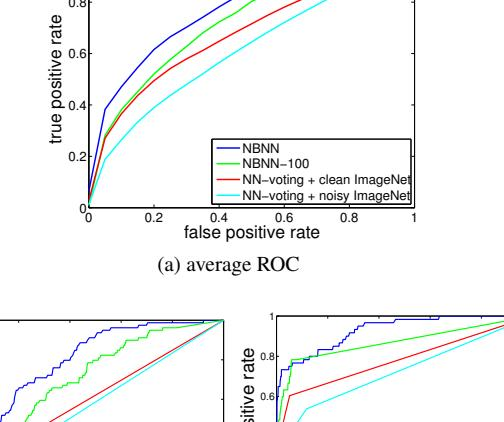

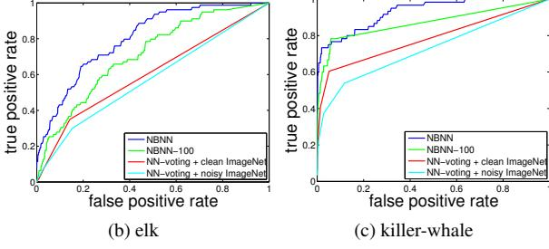

Figure 8: (a) Object recognition experiment results plotted in ROC curves. Each curve is the result of one of the four experiments described in Section 4.1. It is an average of all ROC results of 16 object categories commonly shared between Caltech256 and the mammal subtree. Caltech256 images serve as testing images. (b)(c) The ROC curve for "elk" and "killer-whale".

 $\sum_{i=1}^{M} \|d_i - d_i^C\|^2$ , where  $d_i^C$  is the nearest neighbor of  $d_i$  from all the image descriptors in class C. We order all classes by  $D_C$  and define the classification score as the minimum rank of the target class and its subclasses. The result shows that NBNN gives substantially better performance, demonstrating the advantage of using a more sophisticated feature representation available through full resolution images.

4. NBNN-100 Finally, we run the same NBNN experiment, but limit the number of images per category to 100. The result confirms the findings of [24]. Performance can be significantly improved by enlarging the dataset. It is worth noting that NBNN-100 outperforms NN-voting with access to the entire dataset, again demonstrating the benefit of having detailed feature level information by using full resolution images.

### 4.2. Tree Based Image Classification

Compared to other available datasets, ImageNet provides image data in a densely populated hierarchical structure. Many possible algorithms could be applied to exploit a hierarchical data structure (e.g. [16, 17, 28, 18]).

In this experiment, we choose to illustrate the usefulness of the ImageNet hierarchy by a simple object classification

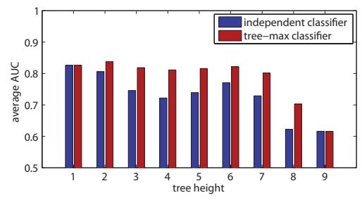

Figure 9: Average AUC at each tree height level. Performance comparison at different tree height levels between independently trained classifiers and tree-max classifiers. The tree height of a node is defined as the length of the longest path to its leaf nodes. All leaf nodes' height is 1.

method which we call the "tree-max classifier". Imagine you have a classifier at each synset node of the tree and you want to decide whether an image contains an object of that synset or not. The idea is to not only consider the classification score at a node such as "dog", but also of its child synsets, such as "German shepherd", "English terrier", etc. The maximum of all the classifier responses in this subtree becomes the classification score of the query image.

Fig. 9 illustrates the result of our experiment on the mammal subtree. Note that our algorithm is agnostic to any method used to learn image classifiers for each synset. In this case, we use an AdaBoost-based classifier proposed by [6]. For each synset, we randomly sample 90% of the images to form the positive training image set, leaving the rest of the 10% as testing images. We form a common negative image set by aggregating 10 images randomly sampled from each synset. When training an image classifier for a particular synset, we use the positive set from this synset as well as the common negative image set excluding the images drawn from this synset, and its child and parent synsets.

We evaluate the classification results by AUC (the area under ROC curve). Fig. 9 shows the results of AUC for synsets at different levels of the hierarchy, compared with an independent classifier that does not exploit the tree structure of ImageNet. The plot indicates that images are easier to classify at the bottom of the tree (e.g. star-nosed mole, minivan, polar bear) as opposed to the top of the tree (e.g. vehicles, mammal, artifact, etc.). This is most likely due to stronger visual coherence near the leaf nodes of the tree.

At nearly all levels, the performance of the tree-max classifier is consistently higher than the independent classifier. This result shows that a simple way of exploiting the ImageNet hierarchy can already provide substantial improvement for the image classification task without additional training or model learning.

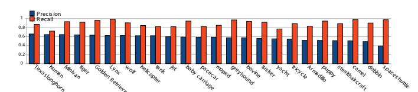

Figure 10: Precision and recall of 22 categories from different levels of the hierarchy. Precision is calculated by dividing the area of correctly segmented pixels by the area of detected pixels. Recall is the fraction of relevant pixel area that is successfully detected.

### 4.3. Automatic Object Localization

ImageNet can be extended to provide additional information about each image. One such information is the spatial extent of the objects in each image. Two application areas come to mind. First, for training a robust object detection algorithm one often needs localized objects in different poses and under different viewpoints. Second, having localized objects in cluttered scenes enables users to use ImageNet as a benchmark dataset for object localization algorithms. In this section we present results of localization on 22 categories from different depths of the WordNet hierarchy. The results also throw light on the diversity of images in each of these categories.

We use the non-parametric graphical model described in [14] to learn the visual representation of objects against a global background class. In this model, every input image is represented as a "bag of words". The output is a probability for each image patch to belong to the topics  $z_i$  of a given category (see [14] for details). In order to annotate images with a bounding box we calculate the likelihood of each image patch given a category c:  $p(x|c) = \sum_i p(x|z_i,c)p(z_i|c)$ . Finally, one bounding box is put around the region which accumulates the highest likelihood.

We annotated 100 images in 22 different categories of the mammal and vehicle subtrees with bounding boxes around the objects of that category. Fig. 10 shows precision and recall values. Note that precision is low due to extreme variability of the objects and because of small objects which have hardly any salient regions.

Fig. 11 shows sampled bounding boxes on different classes. The colored region is the detected bounding box, while the original image is in light gray.

In order to illustrate the diversity of ImageNet inside each category, Fig. 12 shows results on running k-means clustering on the detected bounding boxes after converting them to grayscale and rescaling them to  $32 \times 32$ . All average images, including those for the entire cluster, are created with approximately 40 images. While it is hard to identify the object in the average image of all bounding boxes (shown in the center) due to the diversity of ImageNet, the average images of the single clusters consistently discover viewpoints or common poses.

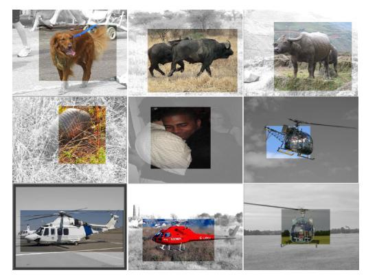

Figure 11: Samples of detected bounding boxes around different objects.

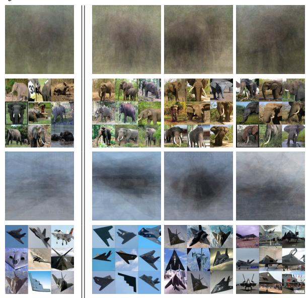

Figure 12: **Left:** Average images and image samples of the detected bounding boxes from the 'tusker' and 'stealth aircraft' categories. **Right:** Average images and examples of three big clusters after k-means clustering (see Sec. 4.3 for detail). Different viewpoints and poses emerge in the "tusker" category. The first row shows tuskers in side view, front view and in profile. One cluster of aircraft images displays mostly planes on the ground.

#### 5. Discussion and Future Work

Our future work has two goals:

#### **5.1. Completing ImageNet**

The current ImageNet constitutes  $\sim 10\%$  of the WordNet synsets. To further speed up the construction process, we will continue to explore more effective methods to evaluate the AMT user labels and optimize the number of repetitions needed to accurately verify each image. At the completion of ImageNet, we aim to (i) have roughly 50 million clean, diverse and full resolution images spread over approximately 50K synsets; (ii) deliver ImageNet to research communities by making it publicly available and readily ac-

cessible online. We plan to use cloud storage to enable efficient distribution of ImageNet data; (iii) extend ImageNet to include more information such as localization as described in Sec. 4.3, segmentation, cross-synset referencing of images, as well as expert annotation for difficult synsets and (iv) foster an ImageNet community and develop an online platform where everyone can contribute to and benefit from ImageNet resources.

# 5.2. Exploiting ImageNet

We hope ImageNet will become a central resource for a broad of range of vision related research. For the computer vision community in particular, we envision the following possible applications.

A training resource. Most of today's object recognition algorithms have focused on a small number of common objects, such as pedestrians, cars and faces. This is mainly due to the high availability of images for these categories. Fig. 6 has shown that even the largest datasets today have a strong bias in their coverage of different types of objects. ImageNet, on the other hand, contains a large number of images for nearly all object classes including rare ones. One interesting research direction could be to transfer knowledge of common objects to learn rare object models.

A benchmark dataset. The current benchmark datasets in computer vision such as Caltech101/256 and PASCAL have played a critical role in advancing object recognition and scene classification research. We believe that the high quality, diversity and large scale of ImageNet will enable it to become a new and challenging benchmark dataset for future research.

Introducing new semantic relations for visual modeling. Because ImageNet is uniquely linked to all concrete nouns of WordNet whose synsets are richly interconnected, one could also exploit different semantic relations for instance to learn part models. To move towards total scene understanding, it is also helpful to consider different depths of the semantic hierarchy.

Human vision research. ImageNet's rich structure and dense coverage of the image world may help advance the understanding of the human visual system. For example, the question of whether a concept can be illustrated by images is much more complex than one would expect at first. Aligning the cognitive hierarchy with the "visual" hierarchy also remains an unexplored area.

### Acknowledgment

The authors would like to thank Bangpeng Yao, Hao Su, Barry Chai and anonymous reviewers for their helpful comments. WD is supported by Gordon Wu fellowship. RS is supported by the ERP and Upton fellowships. KL is funded by NSF grant CNS-0509447 and by research grants from Google, Intel, Microsoft and Yahoo!. LFF is funded by research grants from Microsoft and Google.

### References

- [1] http://www.hunch.net/~jl/.
- [2] The Chinese WordNet. http://bow.sinica.edu.tw.
- [3] The Spanish WordNet. http://www.lsi.upc.edu/~nlp.
- [4] A. Artale, B. Magnini, and S. C. Wordnet for italian and its use for lexical discrimination. In AI\*IA97, pages 16–19, 1997.
- [5] O. Boiman, E. Shechtman, and M. Irani. In defense of nearestneighbor based image classification. In CVPR08, pages 1–8, 2008.
- [6] B. Collins, J. Deng, K. Li, and L. Fei-Fei. Towards scalable dataset construction: An active learning approach. In *ECCV08*, pages I: 86– 98, 2008.
- [7] M. Everingham, L. Van Gool, C. K. I. Williams, J. Winn, and A. Zisserman. The PASCAL Visual Object Classes Challenge 2008 (VOC2008) Results. http://www.pascal-network.org/ challenges/VOC/voc2008/workshop/.
- [8] L. Fei-Fei, R. Fergus, and P. Perona. One-shot learning of object categories. *PAMI*, 28(4):594–611, April 2006.
- [9] C. Fellbaum. WordNet: An Electronic Lexical Database. Bradford Books, 1998.
- [10] R. Fergus, L. Fei-Fei, P. Perona, and A. Zisserman. Learning object categories from google's image search. In *ICCV05*, pages II: 1816– 1823, 2005.
- [11] M. Fink and S. Ullman. From aardvark to zorro: A benchmark for mammal image classification. *IJCV*, 77(1-3):143–156, May 2008.
- [12] G. Griffin, A. Holub, and P. Perona. Caltech-256 object category dataset. Technical Report 7694, Caltech, 2007.
- [13] G. Huang, M. Ramesh, T. Berg, and E. Learned Miller. Labeled faces in the wild: A database for studying face recognition in unconstrained environments. Technical Report 07-49, UMass, 2007.
- [14] L.-J. Li, G. Wang, and L. Fei-Fei. OPTIMOL: automatic Online Picture collecTion via Incremental MOdel Learning. In CVPR07, pages 1–8, 2007.
- [15] D. Lowe. Distinctive image features from scale-invariant keypoints. IJCV, 60(2):91–110. November 2004.
- [16] M. Marszalek and C. Schmid. Semantic hierarchies for visual object recognition. In CVPR07, pages 1–7, 2007.
- [17] M. Marszalek and C. Schmid. Constructing category hierarchies for visual recognition. In ECCV08, pages IV: 479–491, 2008.
- [18] D. Nister and H. Stewenius. Scalable recognition with a vocabulary tree. In CVPR06, pages II: 2161–2168, 2006.
- [19] P. Phillips, H. Wechsler, J. Huang, and P. Rauss. The feret database and evaluation procedure for face-recognition algorithms. *IVC*, 16(5):295–306, April 1998.
- [20] E. Rosch and B. Lloyd. Principles of categorization. In Cognition and categorization, pages 27–48, 1978.
- [21] B. Russell, A. Torralba, K. Murphy, and W. Freeman. Labelme: A database and web-based tool for image annotation. *IJCV*, 77(1-3):157–173, May 2008.
- [22] J. Shotton, J. Winn, C. Rother, and A. Criminisi. Textonboost: Joint appearance, shape and context modeling for multi-class object recognition and segmentation. In ECCV06, pages I: 1–15, 2006.
- [23] A. Sorokin and D. Forsyth. Utility data annotation with amazon mechanical turk. In *InterNet08*, pages 1–8, 2008.
- [24] A. Torralba, R. Fergus, and W. Freeman. 80 million tiny images: A large data set for nonparametric object and scene recognition. *PAMI*, 30(11):1958–1970, November 2008.
- [25] L. von Ahn and L. Dabbish. Labeling images with a computer game. In CH104, pages 319–326, 2004.
- [26] P. Vossen, K. Hofmann, M. de Rijke, E. Tjong Kim Sang, and K. Deschacht. The Cornetto database: Architecture and user-scenarios. In *Proceedings DIR 2007*, pages 89–96, 2007.
- [27] B. Yao, X. Yang, and S. Zhu. Introduction to a large-scale general purpose ground truth database: Methodology, annotation tool and benchmarks. In *EMMCVPR07*, pages 169–183, 2007.
- [28] A. Zweig and D. Weinshall. Exploiting object hierarchy: Combining models from different category levels. In *ICCV07*, pages 1–8, 2007.