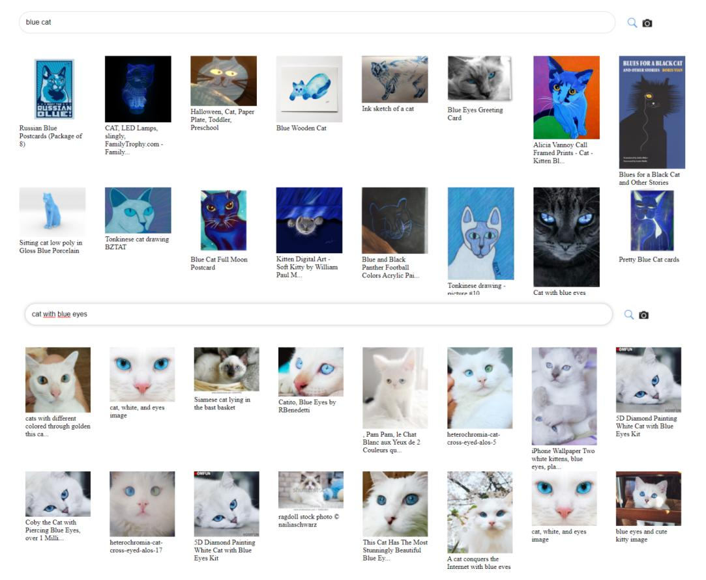
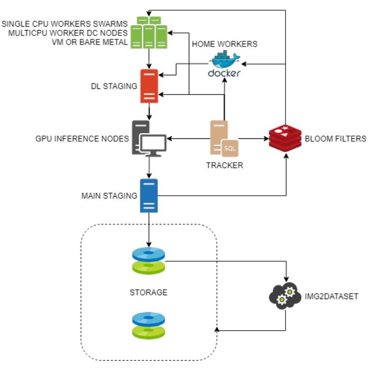
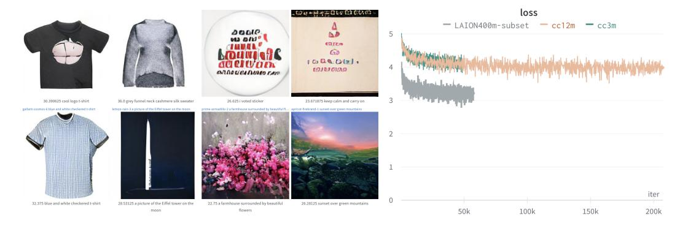

# LAION-400M: Open Dataset of CLIP-Filtered 400 Million Image-Text Pairs

Christoph Schuhmann LAION contact@laion.ai Richard Vencu
LAION
Gentec Data
richard.vencu@gentec.ro

Romain Beaumont LAION romain.rom1@gmail.com

# Robert Kaczmarczyk LAION

Technical University of Munich robert.kaczmarczyk@tum.de

# Clayton Mullis LAION claymullis@fastmail.com

# **Aarush Katta**

LAION
ARKsealplays@gmail.com

# **Theo Coombes**

LAION theocoombes06@gmail.com

# Jenia Jitsev LAION

Juelich Supercomputing Center (JSC) Research Center Juelich (FZJ) j.jitsev@fz-juelich.de

# **Aran Komatsuzaki** LAION

Georgia Institute of Technology EleutherAI akomatsuzaki3@gatech.edu

# **Abstract**

Multi-modal language-vision models trained on hundreds of millions of image-text pairs (e.g. CLIP, DALL-E) gained a recent surge, showing remarkable capability to perform zero- or few-shot learning and transfer even in absence of per-sample labels on target image data. Despite this trend, to date there has been no publicly available datasets of sufficient scale for training such models from scratch. To address this issue, in a community effort we build and release for public LAION-400M, a dataset with CLIP-filtered 400 million image-text pairs, their CLIP embeddings and kNN indices that allow efficient similarity search. 1

# 1 Introduction

Multi-modal language-vision models demonstrated recently strong transfer capability to novel datasets in absense of per-sample labels [1, 2, 3]. This capability requires sufficiently large model and data scale during pre-training. Increasing data scale alone can often improve model performance [4]. When increasing model and compute budget scale in addition, scaling laws suggest further increase in generalization and transfer performance if not bottlenecked by the data scale [5, 6, 7, 8]. There is a plethora of recent works that have built massive datasets in order to optimally scale up various models [9, 1, 2, 3]. However, these massive datasets have rarely been released for various reasons. Gao et. al. recently released The Pile, an openly-available 800GB text dataset [10], in an attempt to loosely mimic the dataset used for GPT-3. The largest publicly known image-text paired datasets range from 400 million to around a billion, but none of them has been released.

&lt;sup>1Project page: https://laion.ai/laion-400-open-dataset/

Figure 1: Sample images retrieved from the queries "blue cat" or "cat with blue eyes" in the web demo

To address this issue, we build and release LAION-400M, a dataset with CLIP-filtered 400 million image-text pairs, their CLIP embeddings and kNN indices. We describe the procedure to create the dataset and demonstrate successful training of DALL-E architecture. Having sufficiently large scale, the dataset opens venues for research on multi-modal language-vision models to broad community.

# 2 Dataset and Methods

**Overview of LAION-400M.** We officially release the following packages under LAION-400M project:

- 400 million pairs of image URL and the corresponding metadata
- 400 million pairs of CLIP image embedding and the corresponding text
- Several sets of kNN indices that enable quick search in the dataset
- img2dataset library that enables efficient crawling and processing of hundreds of millions of images and their metadata from a list of URLs with minimal resources
- Web demo of image-text search on LAION-400M (Fig. 1)2

As for the pairs of image URL and metadata, we provide parquet files that consist of the following attributes for each pair: sample ID, URL, type of Creative Commons license (if applicable), NSFW tag (detected with CLIP), cosine similarity score between the text and image embedding and height and width of the image. We found less than 1% of images were detected as NSFW, which can be filtered out by an user with NSFW tag.

&lt;sup>2https://rom1504.github.io/clip-retrieval/

Figure 2: Acquisition workflow

**Acquisition.** The acquisition follows the flowchart of Fig. 2 and can be split into two major components:

- Distributed processing of petabyte-scale Common Crawl dataset, which produces a collection of matching URLs and captions.
- Single node post-processing of the data, which is much lighter and can be run in a few days, producing the final dataset.

# 2.1 Distributed processing of Common Crawl

To create image-text pairs, we parse through WAT files from Common Crawl and parse out all HTML IMG tags containing an alt-text attribute. We download the raw images from the parsed URLs with asynchronous requests using Trio and Asks libraries.

# 2.1.1 Filtering out unsuitable image-text pairs

After downloading the WAT files from Common Crawl, we apply the following filtering conditions:

- All samples with less than 5 character alt-text length or less than 5 KB image size are dropped.
- Duplicate removal is performed with bloom filter based on URL and alt-text.
- We use CLIP to compute embeddings of the image and alt-text. Then we compute the cosine similarity of both embeddings and drop all samples with cosine similarity below 0.3. This threshold was selected based on human inspections.
- We use the CLIP embeddings of images and texts to filter out illegal contents.

| Number of unique samples                 | 413M |
|------------------------------------------|------|
| Number with height or width $\geq 1024$  | 26M  |
| Number with height and width $\geq 1024$ | 9.6M |
| Number with height and width $\geq 512$  | 67M  |
| Number with height or width $\geq 512$   | 112M |
| Number with height and width $\geq 256$  | 211M |
| Number with height or width $\geq 256$   | 268M |

Table 1: Image size distribution of LAION-400M

Figure 3: DALL-E Experiments. (**Left**) Generated samples from a DALL-E model trained with 7.2M randomly picked LAION-400M samples on 1 RTX 2070 Super (8 GB VRAM) for 1 epoch (**Right**) DALL-E runs with Conceptual Captions 3M (green), Conceptual Captions 12M (orange) and a 3M subset of LAION-400M (grey)

# 2.1.2 img2dataset

We developed img2dataset library to comfortably download from a given set of URLs, resize and store the images and captions in the webdataset format.3 This allows to download 100 million images from our list of URLs in 20 hours with a single node (1Gbps connection speed, 32GB of RAM, an i7 CPU with 16 cores), which allows anyone to obtain the whole dataset or a smaller subset.

# 3 Analysis & Results

**Web demo and similarity search.** A web demo was created to allow an user to search images and texts based on a query image or text using the CLIP embeddings of the input and our precomputed kNN indices. It demonstrates the diversity of images and captions that can be found in LAION-400M as well as high semantic relevance (Fig. 1).

Tab. 1 shows the distribution of image sizes of LAION-400M. Given the abundance of high-resolution images, one can produce subsets of images for training various customized models, and also choose image resolution that is suitable for purpose of particular training.

**Training DALL-E model.** We ran DALLE-pytorch [11], an open-source replication of DALL-E [2], to assess the dataset's capability to train a text-to-image model. The VQGAN [12] pretrained on ImageNet is used to encode image tokens. For generation, we use CLIP ViT-B/16 [1] to rank the top 8 of 128 total samples per caption. Despite only seeing a subset of approximately 7.2 million images for a single epoch, we observe fast convergence across a variety of categories. Samples generated from the model show sufficient quality and provide evidence for successful training progress (Fig. 3).

&lt;sup>3https://github.com/rom1504/img2dataset

# 4 Conclusion

By releasing an openly available dataset that contains 400 million image-text pairs, we have closed the gap to proprietary large scale datasets that were necessary to train state-of-the-art language-vision models such as DALL-E and CLIP. As proof of concept, we demonstrated that a subset of our dataset can be used to train a DALL-E model, producing samples of sufficient quality. The dataset opens the road for large-scale training and research of language-vision models, that were previously restricted to those having access to proprietary large datasets, to the broad community.

# References

- [1] Alec Radford, Jong Wook Kim, Chris Hallacy, Aditya Ramesh, Gabriel Goh, Sandhini Agarwal, Girish Sastry, Amanda Askell, Pamela Mishkin, Jack Clark, Gretchen Krueger, and Ilya Sutskever. Learning Transferable Visual Models From Natural Language Supervision. *arXiv e-prints*, page arXiv:2103.00020, February 2021.
- [2] Aditya Ramesh, Mikhail Pavlov, Gabriel Goh, Scott Gray, Chelsea Voss, Alec Radford, Mark Chen, and Ilya Sutskever. Zero-Shot Text-to-Image Generation. *arXiv e-prints*, page arXiv:2102.12092, February 2021.
- [3] Chao Jia, Yinfei Yang, Ye Xia, Yi-Ting Chen, Zarana Parekh, Hieu Pham, Quoc V. Le, Yunhsuan Sung, Zhen Li, and Tom Duerig. Scaling Up Visual and Vision-Language Representation Learning With Noisy Text Supervision. *arXiv e-prints*, page arXiv:2102.05918, February 2021.
- [4] Aran Komatsuzaki. One Epoch Is All You Need. *arXiv e-prints*, page arXiv:1906.06669, Jun 2019.
- [5] Jared Kaplan, Sam McCandlish, Tom Henighan, Tom B. Brown, Benjamin Chess, Rewon Child, Scott Gray, Alec Radford, Jeffrey Wu, and Dario Amodei. Scaling Laws for Neural Language Models. *arXiv e-prints*, page arXiv:2001.08361, Jan 2020.
- [6] Tom Henighan, Jared Kaplan, Mor Katz, Mark Chen, Christopher Hesse, Jacob Jackson, Heewoo Jun, Tom B. Brown, Prafulla Dhariwal, Scott Gray, Chris Hallacy, Benjamin Mann, Alec Radford, Aditya Ramesh, Nick Ryder, Daniel M. Ziegler, John Schulman, Dario Amodei, and Sam McCandlish. Scaling Laws for Autoregressive Generative Modeling. *arXiv e-prints*, page arXiv:2010.14701, October 2020.
- [7] Alexander Kolesnikov, Lucas Beyer, Xiaohua Zhai, Joan Puigcerver, Jessica Yung, Sylvain Gelly, and Neil Houlsby. Big transfer (bit): General visual representation learning. In Andrea Vedaldi, Horst Bischof, Thomas Brox, and Jan-Michael Frahm, editors, *Computer Vision ECCV 2020*, pages 491–507, Cham, 2020. Springer International Publishing.
- [8] Xiaohua Zhai, Alexander Kolesnikov, Neil Houlsby, and Lucas Beyer. Scaling vision transformers. *arXiv preprint arXiv:2106.04560*, 2021.
- [9] Tom B. Brown, Benjamin Mann, Nick Ryder, Melanie Subbiah, Jared Kaplan, Prafulla Dhariwal, Arvind Neelakantan, Pranav Shyam, Girish Sastry, Amanda Askell, Sandhini Agarwal, Ariel Herbert-Voss, Gretchen Krueger, Tom Henighan, Rewon Child, Aditya Ramesh, Daniel M. Ziegler, Jeffrey Wu, Clemens Winter, Christopher Hesse, Mark Chen, Eric Sigler, Mateusz Litwin, Scott Gray, Benjamin Chess, Jack Clark, Christopher Berner, Sam McCand lish, Alec Radford, Ilya Sutskever, and Dario Amodei. Language Models are Few-Shot Learners. arXiv e-prints, page arXiv:2005.14165, May 2020.
- [10] Leo Gao, Stella Biderman, Sid Black, Laurence Golding, Travis Hoppe, Charles Foster, Jason Phang, Horace He, Anish Thite, Noa Nabeshima, Shawn Presser, and Connor Leahy. The Pile: An 800GB Dataset of Diverse Text for Language Modeling. *arXiv e-prints*, page arXiv:2101.00027, December 2020.
- [11] Phil Wang. Dall-e in pytorch: A text to image transformer, 2021.
- [12] Patrick Esser, Robin Rombach, and Björn Ommer. Taming transformers for high-resolution image synthesis, 2020.