# Learn to Explain: Multimodal Reasoning via Thought Chains for Science Question Answering

Pan Lu<sup>1,3</sup>, Swaroop Mishra<sup>2,3</sup>, Tony Xia<sup>1</sup>, Liang Qiu<sup>1</sup>, Kai-Wei Chang<sup>1</sup>, Song-Chun Zhu<sup>1</sup>, Oyvind Tafjord<sup>3</sup>, Peter Clark<sup>3</sup>, Ashwin Kalyan<sup>3</sup>

<sup>1</sup>University of California, Los Angeles, <sup>2</sup>Arizona State University, <sup>3</sup>Allen Institute for AI {lupantech, kwchang.cs}@gmail.com, sczhu@stat.ucla.edu, {oyvindt, peterc, ashwinkv}@allenai.org

# **Abstract**

When answering a question, humans utilize the information available across different modalities to synthesize a consistent and complete chain of thought (CoT). This process is normally a black box in the case of deep learning models like large-scale language models. Recently, science question benchmarks have been used to diagnose the multi-hop reasoning ability and interpretability of an AI system. However, existing datasets fail to provide annotations for the answers, or are restricted to the textual-only modality, small scales, and limited domain diversity. To this end, we present Science Question Answering (SCIENCEQA), a new benchmark that consists of  $\sim$ 21k multimodal multiple choice questions with diverse science topics and annotations of their answers with corresponding lectures and explanations. We further design language models to learn to generate lectures and explanations as the chain of thought (CoT) to mimic the multi-hop reasoning process when answering SCIENCEQA questions. SCIENCEQA demonstrates the utility of CoT in language models, as CoT improves the question answering performance by 1.20% in fewshot GPT-3 and 3.99% in fine-tuned UnifiedQA. We also explore the upper bound for models to leverage explanations by feeding those in the input; we observe that it improves the few-shot performance of GPT-3 by 18.96%. Our analysis further shows that language models, similar to humans, benefit from explanations to learn from fewer data and achieve the same performance with just 40% of the data.

# 1 Introduction

A long-standing goal of AI systems is to act reliably and learn complex tasks efficiently like human beings. In the process of reliable decision making, humans follow an explicit *chain-of-thought* (CoT) reasoning process that is typically expressed as an explanation. However, machine learning models are trained mostly using a large number of input-output examples to perform a specific task. These black-box models only generate the final decision without reliably revealing the underlying reasoning process. Not surprisingly, it is unclear if they understand the task and can generalize even though they perform well on the benchmark. On the other hand, humans are able to learn from instructions or explanations from past experience and generalize them to novel and unseen problems. This helps them learn more quickly with fewer data. In this work, we explore if machines can be endowed with such reasoning abilities in the context of science-based question answering.

Recently, science problem solving benchmarks [18] have been used to diagnose the multi-hop reasoning ability and interpretability of AI systems. To answer science questions, a model needs to

The data and code are available at https://scienceqa.github.io.

Work was partially done while Pan Lu and Swaroop Mishra were interns at AI2.

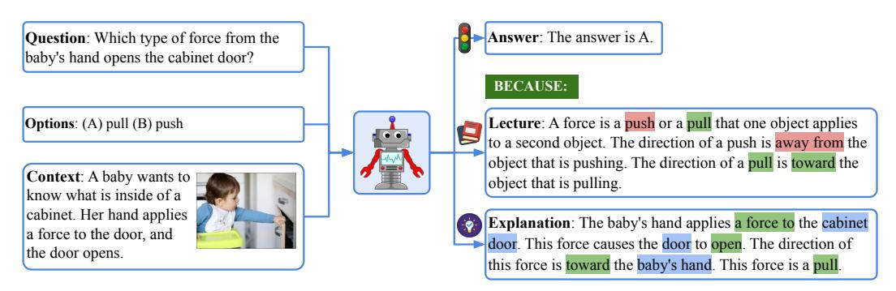

Figure 1: We construct the SCIENCEQA dataset where a data example consists of multimodal question answering information and the grounded lecture and explanation. We study if QA models can generate a reasonable explanation to reveal the chain-of-thought reasoning.

not only understand multimodal contents but also extract external knowledge to arrive at the correct answer. Since these tasks require domain-specific knowledge and explicit multi-hop reasoning, a model would be not interpretable if it fails to provide explanations to reveal the reasoning process. However, current science question datasets [18, 17, 52] mostly lack annotated explanations for the answers. To address this issue, other science datasets annotate the explanations, but they are restricted to the textual only modality and limited to small data scales [13, 7, 37] or a small set of topics [20, 14]. Therefore, we collect Science Question Answering (SCIENCEQA), a large-scale multi-choice dataset that contains multimodal science questions with explanations and features rich domain diversity.

SCIENCEQA is collected from elementary and high school science curricula, and contains 21,208 examples along with lectures and explanations. Different from existing datasets [17, 18, 52], SCIENCEQA has richer domain diversity from three different subjects: natural science, social science, and language science. A typical example consists of a question, multiple choices, multimodal contexts, a correct answer, as well as a lecture and an explanation. The lecture and explanation provide general external knowledge and specific reasons, respectively, for arriving at the correct answer.

Consider the thoughts one person might have when answering the question in Figure 1. One first recalls the knowledge regarding the definition of a force learned from textbooks: "A force is a push or a pull that ... The direction of a push is ... The direction of a pull is ...", then forms a line of reasoning: "The baby's hand applies a force to the cabinet door.  $\rightarrow$  This force causes the door to open.  $\rightarrow$  The direction of this force is toward the baby's hand.", and finally arrives at the correct answer: "This force is a pull.". Following [41], we formulate the task to output a natural explanation alongside the predicted answer. In this paper, we train language models to generate lectures and explanations as the chain of thought (CoT) to mimic the multi-hop reasoning process to answer SCIENCEQA questions.

Our experiments show that current multimodal methods [55, 1, 21, 9, 26, 35] fail to achieve satisfactory performance on SCIENCEQA and do not generate correct explanations. Instead, we find that CoT can help large language models not only in the few-shot learning setting but also in the fine-tuning setting. When combined with CoT to generate the lecture and explanation, the fine-tuned UnifiedQA [19] achieves an improvement of 3.99% as opposed to not using CoT in the fine-tuning stage. The few-shot GPT-3 model [5] via chain-of-thought prompting can obtain 75.17% on SCIENCEQA with an improvement of 1.20% compared to the few-shot GPT-3 without CoT. Prompted with CoT, GPT-3 can generate reasonable explanations as evaluated by automated metrics, and promisingly, 65.2% of explanations meet the gold standard of human evaluations. We also investigate the upper bound for models to harness explanations by including them in the input. We find that doing so improves GPT-3's few-shot performance by 18.96%, suggesting that explanations do aid models and are currently underutilized in the CoT framework. Further analysis shows that, like humans, language models benefit from explanations to learn with less data: UnifiedQA with CoT obtains the same results as UnifiedQA without CoT with only 40% of the training data.

To sum up, our contributions are three-fold: (a) To bridge the gap in existing datasets in the scientific domain, we build Science Question Answering (SCIENCEQA), a new dataset containing 21,208 multimodal science questions with rich domain diversity. To the best of our knowledge, SCIENCEQA is the first large-scale multimodal dataset that annotates lectures and explanations for the answers.

(b) We show that CoT benefits large language models in both few-shot and fine-tuning learning by improving model performance and reliability via generating explanations. (c) We further explore the upper bound of GPT-3 and show that CoT helps language models learn from fewer data.

## 2 Related Work

**Visual question answering.** Since the task of visual question answering (VQA) was first proposed in [2], there have been plenty of VQA datasets [56, 58, 23, 11, 15, 12] conducted to facilitate the research work. Although our SCIENCEQA dataset shares some features with VQA, there are several main differences between them. First, SCIENCEQA is more challenging than existing VQA datasets because it contains multimodal contexts and diverse topics in the scientific domain. In addition, most answers are annotated with lectures and explanations, which makes SCIENCEQA a suitable dataset for multi-modal question answering and multi-hop reasoning for AI systems. Inspired by the recent remarkable performance achieved for VQA [33, 32, 10, 9, 26, 8], in this paper, we further extensively benchmark SCIENCEQA with a wide range of attention-based [1, 33, 21, 9] and Transformer-based [30, 26, 27, 8] methods.

**Datasets for science problems.** Science problem solving is a challenging task that requires an AI system not only to understand the multimodal information from the science curriculum but also to reason about how to answer the domain-specific questions. Current science problem datasets such as AI2D [17], DVQA [16], VLQA [52], and FOODWEDS [24] have contributed to multimodal reasoning in the scientific domain. For example, a portion of VLQA contains multimodal questions on science subjects. These datasets, however, lack annotated explanations for the answers to reveal the reasoning steps. Some other datasets annotate the answers in the forms of supporting facts [37, 20], entailment trees [7], explanation graphs [13], reasoning chains [14]. However, these datasets are restricted to the single text modality with small data scales and limited topics. Instead, our SCIENCEQA annotates the answers with grounded lectures and explanations. Besides, SCIENCEQA features a richer domain diversity across 3 subjects, 26 topics, 127 categories, and 379 skills.

Learning from explanations and few-shot learning. Explanations help humans understand a task better, and there have been several attempts to show the same for models. For example, the learning from instruction paradigm [40, 43, 53, 39, 45, 25], where the task level explanation is provided in the form of instruction, improves model performance significantly. An example of learning from explanations in the scientific domain is proposed in [51] where the model interprets demonstrative solutions to solve geometry problems. Recently, there has been a surge of interest in few-shot learning, where language models learn a specific task from a few examples [46, 3]. For instance, [42, 54, 34] find that explanations in the format of the chain of thought can improve language models' reasoning ability in few-shot learning. In this paper, we show that the chain of thought boosts the performance of large language models like UnifiedQA [19] if the models generate explanations along with the answer in a fine-tuning way. Furthermore, a few-shot GPT-3 model via chain-of-thought prompting is able to improve the reasoning performance on SCIENCEQA and generate reasonable explanations.

## 3 Dataset

We collect SCIENCEQA, which is a multimodal multiple-choice science question dataset containing 21,208 examples. An example in SCIENCEQA is shown in Figure 1. Given the science question and multimodal contexts, the task is to select the correct answer from multiple options. Different from existing datasets [50, 17, 52, 31, 24], SCIENCEQA covers diverse topics across three subjects: natural science, social science, and language science. Moreover, most questions are annotated with grounded lectures and detailed explanations. The lecture provides general knowledge that introduces the background information for solving problems of a similar class. The explanation reveals a specific reason for the answer. To effectively answer the questions, a model often needs to be able to understand the multimodal content in the input and extract external knowledge, similar to how humans do. More importantly, the goal of SCIENCEQA is to aid development of a reliable model that is capable of generating a coherent chain of thought when arriving at the correct answer to reveal the multi-step reasoning process. For data collection details, see Appendix A.1.

| Statistic                     | Number         |
|-------------------------------|----------------|
| Total questions               | 21,208         |
| Questions with text context   | 10,220 (48.2%) |
| Questions with image context  | 10,332 (48.7%) |
| * Image of natural format     | ≈2,960 (14.0%) |
| * Image of diagram format     | ≈7,372 (34.8%) |
| Questions with both contexts  | 6,532 (30.8%)  |
| Questions without any context | 7,188 (33.9%)  |
| Questions with a lecture      | 17,798 (83.9%) |
| Questions with a explanation  | 19,202 (90.5%) |
| Different questions           | 9,122          |
| Different lectures            | 261            |
| Topic classes                 | 26             |
| Category classes              | 127            |
| Skill classes                 | 379            |
| Average question length       | 12.11          |
| Average choice length         | 4.40           |
| Average lecture length        | 125.06         |
| Average explanation length    | 47.66          |

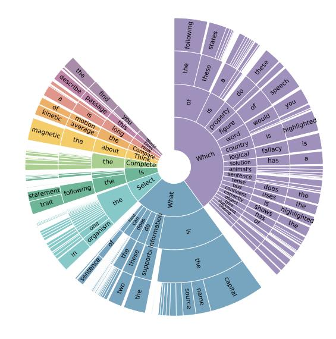

Table 1: Main statistics in SCIENCEQA.

Figure 2: Question distribution in SCIENCEQA.

#### 3.1 Data Analysis

**Key statistics.** We randomly split the dataset into training, validation, and test splits with a ratio of 60:20:20. Each split has 12,726, 4,241, and 4,241 examples, respectively. Table 1 shows the main statistics of SCIENCEQA. SCIENCEQA has a large set of different questions, totaling up to 9,122. Out of the 21,208 questions in SCIENCEQA, 10,332 (48.7%) have an image context, 10,220 (48.2%) have a text context, and 6,532 (30.8%) have both. 83.9% of the questions are annotated with a lecture, while 91.3% of the questions feature an explanation. The cross-combination of these information sources diversifies the problem scenario: sometimes the model is given a lot of information from multiple sources, while at other times, the only source of information is the question itself. This level of complexity is very common in grade-level science exams.

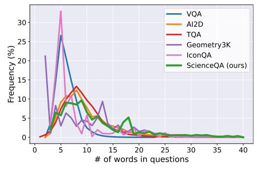

(a) Question length distribution of related datasets. SCIENCEQA is distributed more evenly in terms of the number of question words than other datasets.

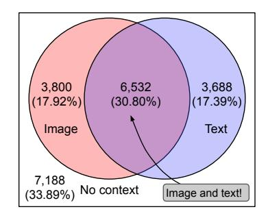

(b) Question distribution with different context formats. 66.11% of the questions in SCIENCEQA have either an image or text context, while 30.80% have both.

Figure 3: Question length distribution (a) and context distribution in SCIENCEQA (b).

Question analysis. SCIENCEQA has a diverse set of science questions. Figure 2 shows a distribution of the first four words in the question text. A large number of question lengths and formats highlight the diversity of SCIENCEQA. The question lengths range from 3 words to 141 words, and the questions in SCIENCEQA have an average length of 12.11 words. The question length distribution is visualized against other VQA datasets in Figure 3 (a). As shown in the diagram, SCIENCEQA's distribution is flatter than other datasets, spanning more evenly across different question lengths.

**Context analysis.** Figure 3 (b) shows the number and percentage of questions with either an image context, a text context, or both. There are a total of 7,803 unique image contexts and 4,651 unique text

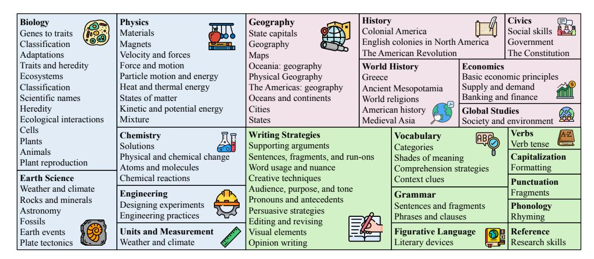

Figure 4: Domain diversity in SCIENCEQA. Each color corresponds to one subject: natural science, social science, and language science. For visual clarity, only the most frequent classes are shown.

contexts. 66.11% of the questions have at least one type of context information. The image context is in the format of diagrams or natural images, which visualize the critical scenario necessary for question answering or simply illustrate the question for better understanding. Similarly, the textual context can provide either semantically rich information or a simple hint to the question. Therefore, models need to be flexible and general to understand these diverse types of contexts.

**Domain diversity.** Each SCIENCEQA question belongs to one of the three subjects: natural science, language science, and social science. With each subject, questions are categorized first by the topic (*Biology, Physics, Chemistry*, etc.), then by the category (*Plants, Cells, Animals*, etc.), and finally by the specific skill (*Classify fruits and vegetables as plant parts, Identify countries of Africa*, etc.). SCIENCEQA has a total of 26 topics, 127 categories, and 379 skills. The treemap in Figure 4 visualizes the different subjects, topics, and categories and shows that SCIENCEQA questions are very diverse, spanning a wide range of domains.

#### 3.2 Comparisons with Existing Datasets

Table 2 shows a comparison of SCIENCEQA and other science problem datasets. As shown in the table, SCIENCEQA is much larger than most other datasets. SCIENCEQA also has the largest set of images, spans across all 12 grades, contains the longest questions, and has the most diverse input sources. As opposed to limiting the subject to only natural science, SCIENCEQA also includes social science and language science, largely adding to the domain diversity of the dataset. Furthermore, most of the questions in SCIENCEQA are annotated with textual lectures (83.9%) and explanations (90.5%), which reveal the reasoning path to the correct answer. To the best of our knowledge, SCIENCEQA is the first large-scale multimodal science question dataset that annotates the answers with detailed lectures and explanations.

|                  | #Q      | #I     | AvgQ | MaxQ | Grades | Science subjects          | Contexts      | Images          | Lecture | Explanation |
|------------------|---------|--------|------|------|--------|---------------------------|---------------|-----------------|---------|-------------|
| Geometry3K [31]  | 3,002   | 2,342  | 10.1 | 46   | 6-12   | natural (geometry)        | image         | diagram         | ×       | ×           |
| AI2D [17]        | 4,563   | 4,903  | 9.8  | 64   | 1-6    | natural                   | image         | diagram         | ×       | ×           |
| FOODWEBS [24]    | ≈5,000  | ≈5,00  | -    | -    | 8      | natural (foodweb only)    | image         | diagram         | ×       | ×           |
| ARC [6]          | 7,787   | 0      | 20.4 | 128  | 3-9    | natural                   | ×             | ×               | ×       | ×           |
| TQA [18]         | 26,260  | 3,455  | 9.2  | 57   | 6-8    | natural                   | image, text   | diagram         | ~       | ×           |
| IconQA [35]      | 107,439 | 96,817 | 8.4  | 73   | PreK-3 | math                      | visual        | diagram         | ×       | ×           |
| WorldTree [13]   | 1,680   | 0      | -    | -    | 3-5    | natural                   | x             | ×               | ×       | V           |
| OpenBookQA [37]  | 5,957   | 0      | 10.6 | 68   | 1-6    | natural                   | ×             | ×               | ×       | <b>✓</b>    |
| QASC [20]        | 9,980   | 0      | 8.0  | 25   | 1-9    | natural                   | ×             | ×               | ×       | ~           |
| SCIENCEQA (ours) | 21,208  | 10,332 | 12.1 | 141  | 1-12   | natural, social, language | image, text n | atural, diagram | · •     | ~           |

Table 2: Statistics for SCIENCEQA and comparisons with existing datasets. #Q: number of questions, #I: number of images, AvgQ: average question length; MaxQ: maximum question length.

# 4 Baselines and Chain-of-Thought Models

In this section, we establish baselines and develop two chain-of-thought models on SCIENCEQA.

#### 4.1 Baselines

**Heuristic baselines.** The first heuristic baseline is *random chance*: we randomly select one from the multiple options. Each trial is completed on the whole test set, and we take three different trials for an average result. The second heuristic baseline is *human performance*. We post the task to Amazon Mechanical Turk and ask workers to answer SCIENCEQA questions. Only workers who obtain a high school or higher degree and pass the qualification examples are qualified for the study. Each worker needs to answer a set of 10 test questions, and each question is answered by three different workers. For more details of the human performance study, see Appendix B.2.

**Zero-shot and few-shot baselines.** We establish the zero-shot baselines on top of UnifiedQA [19] and GPT-3 [5]. The zero-shot setup follows the format of QCM $\rightarrow$ A where the input is the concatenation of tokens of the question text (Q), the context text (C), and multiple options (M), while the output is to predict the answer (A) from the option set. We extract the caption from the captioning model based on ViT [8] and GPT-2 [47] for the image as the visual context. In the few-shot setting, we follow the standard prompting [4] where in-context examples from the training set are concatenated before the test instance. These in-context examples serve as an instruction for the language model to adjust to the specific task in SCIENCEQA.

**Fine-tuning baselines.** We first consider the fine-tuning baselines from VQA models [1, 21, 55, 9, 22, 35, 26] proposed in recent years. These VQA baselines take the question, the context, and choices as the textual input, take the image as the visual input, and predict the score distribution over choice candidates via a linear classifier. In addition, we build the fine-tuning baseline on top of the large language model UnifiedQA [19]. UnifiedQA takes the textual information as the input and outputs the answer option. Similarly, the image is converted into a caption that provides the visual semantics for the language model.

# 4.2 Language Models with the Chain of Thought

A chain of thought refers to a coherent flow of sentences that reveals the premises and conclusion of a reasoning problem [54]. A chain of thought clearly decomposes a multi-hop reasoning task into intermediate steps instead of solving the task in a black-box way. The chain of thought can be the step-by-step thought process [54] before arriving at the final answer or explanations [41] that come after the answer. The annotated lectures and explanations in SCIENCEQA serve as *demonstrations* of the chain of thought that mimics the multi-step reasoning steps of human beings. In this paper, we study if large language models can generate reasonable explanations as the chain of thought to reveal the thought process when answering SCIENCEQA questions. Further, we explore how the chain of thought can improve the reasoning ability of language models on SCIENCEQA in both few-shot and fine-tuning learning.

**UnifiedQA with the chain of thought.** UnifiedQA [19] is a state of the art model for multi-option question answering. The original architecture of UnifiedQA takes the question and options as the input and outputs a short phrase as the final answer. We make a format modification to develop UnifiedQA with the chain of thought (CoT), i.e., UnifiedQA is fine-tuned to generate a long sequence of text which consists of the answer followed by the lecture and explanation.

**GPT-3 via chain-of-thought prompting.** Recent research work [5, 38, 34] has shown that GPT-3 [5] can perform various tasks when provided in-context examples in a standard prompt. Take multi-option question answering as an example, the standard prompt [36, 57, 29] builds instructions using in-context examples with components of the question text, options, and the correct answer text. This style of few-shot learning enables the GPT-3 model to answer specific questions without parameter updates. Different from standard prompting, we build GPT-3 via chain-of-thought (CoT) prompting, as shown in Figure 5. To be specific, for each test problem t, we map the prompt instruction  $I: \{I_i\}_n, I_t$  into a textual format where  $\{I_i\}_n$  refers to the instruction set of n-shot in-context examples from the training set, while  $I_t$  denotes the test instruction. Instead of the way where the explanation comes before the answer [54], we feed the instruction I into the encoder-

```
Question: question: I_i^{ques} Options: (A) option: I_{i1}^{opt} (B) option: I_{i2}^{opt} (C) option: I_{i3}^{opt} Context: context: I_i^{cont} Answer: The answer is answer: I_i^a. BECAUSE: lecture: I_i^{lect} explanation: I_i^{exp} Question: question: I_t^{ques} Options: (A) option: I_{t1}^{opt} (B) option: I_{t2}^{opt} (C) option: I_{t3}^{opt} (D) option: I_{t4}^{opt} Context: context: I_t^{cont} Answer:
```

Figure 5: Prompt instruction encoding for the test example t in GPT-3 (CoT). The prompt above consists of the instruction  $\{I_i\}_1$  for the 1-shot training example and  $I_t$  for the test example.

decoder model GPT-3 to generate the answer a followed by the lecture lect and explanation exp:  $M:\{I_i\}_n, I_t \to a, lect, exp.$ 

# 5 Experiments

#### 5.1 Experimental Setup

**Evaluation metrics.** The heuristics and VQA baselines treat our SCIENCEQA task as a multi-class classification problem with multiple options and are evaluated with the accuracy metrics. UnifiedQA and GPT-3 treat SCIENCEQA as a text generation problem. So the most similar option is selected as the final prediction to evaluate the question answering accuracy. The generated lectures and explanations are evaluated by automatic metrics [44, 28, 49] and human scores by annotators.

Implementation details. The VQA baselines are trained for a maximum number of 50 epochs with a learning rate of 5e-5. We fine-tune the UnifiedQA for 50k iterations and evaluate every 1k iteration. The training process is stopped following the early stopping strategy with a patience period of three evaluations. For GPT-3, we use the text-davinci-002 engine, which is the most capable model version suggested in the official documentation. More details can be found in Appendix B.1.

#### 5.2 Results for Question Answering

Table 3 demonstrates the empirical results for Science Question Answering.

**VQA** baselines. We feed the VQA baseline models with the input of QCM format to predict answers A. Out of all the VQA models we benchmarked, VisualBERT [26, 27] performs the best on average (61.87%). Interestingly, Patch-TRM [35] beats VisualBERT in natural science (NAT) and language science (LAN), and it also performs better in higher-grade questions (67.50% v.s. 59.92%). However, in the subject of social science (SOC), VisualBERT outperforms Patch-TRM by a large margin (+22.39%). Such drastic changes in performance might imply that current VQA models are not generalized to process the challenging questions in SCIENCEQA.

**Language models.** We evaluate whether large-scale pretraining on text can help language models learn scientific knowledge and thus perform better on the SCIENCEQA task. For this purpose, we have tried two of the state-of-the-art pre-trained language models: UnifiedQA and GPT-3.

- (i) **UnifiedQA.** The results show that without any supervised fine-tuning (zero-shot), UnifiedQA cannot beat any VQA baseline model, while the pretraining does help the model obtain some scientific knowledge to outperform the random baseline. When fine-tuned with the answer labels in SCIENCEQA, UnifiedQA<sub>BASE</sub> reports an accuracy of 70.12% on average. By further teaching the model to generate the answer along with lecture and explanation, the developed language model with chain-of-thought (UnifiedQA<sub>BASE</sub> (CoT)) brings additional improvements of +3.21% (QCM $\rightarrow$ AE) and +3.99% (QCM $\rightarrow$ ALE). These results show that generating the chain of thought along with the answer benefits the reasoning ability of language models.
- (ii) **GPT-3.** The positive effect of pretraining is also proved by the surprisingly good results from GPT-3 in the same zero-shot setting as UnifiedQA. Without any fine-tuning, GPT-3 already reaches almost the best performance we can get. Interestingly, prompting the GPT-3 with two training examples with only answers results in a negligible difference. However, if we prompt GPT-3 with chain-of-thought prompting (QCM $\rightarrow$ ALE), we obtain the state-of-the-art result so far (75.17%).

| Model                           | Learning  | Format                | NAT          | SOC          | LAN          | TXT          | IMG          | NO           | G1-6         | G7-12        | Avg                                |
|---------------------------------|-----------|-----------------------|--------------|--------------|--------------|--------------|--------------|--------------|--------------|--------------|------------------------------------|
| Random chance                   | -         | $M{ ightarrow} A$     | 40.28        | 46.13        | 29.25        | 47.45        | 40.08        | 33.66        | 39.35        | 40.67        | 39.83                              |
| Q only [1]                      | train set | $Q{ ightarrow} A$     | 41.34        | 27.22        | 47.00        | 41.79        | 35.15        | 44.60        | 39.28        | 40.87        | 39.85                              |
| $C_I$ only [1]                  | train set | $C_I \rightarrow A$   | 41.34        | 29.25        | 45.45        | 42.33        | 36.09        | 42.93        | 39.21        | 41.07        | 39.87                              |
| Q+M only [1]                    | train set | $QM{\rightarrow}A$    | 52.66        | 51.86        | 60.18        | 55.57        | 50.37        | 57.42        | 52.53        | 57.88        | 54.44                              |
| $Q+C_T+M$ only [1]              | train set | $QC_TM\rightarrow A$  | 57.28        | 49.04        | <u>61.36</u> | 60.46        | 52.80        | <u>58.82</u> | 54.44        | 60.51        | 56.61                              |
| $Q+C_I+M$ only [1]              | train set | $QC_IM \rightarrow A$ | <u>58.97</u> | <u>53.77</u> | 60.45        | <u>62.85</u> | <u>54.49</u> | 57.63        | <u>56.72</u> | <u>61.04</u> | <u>58.26</u>                       |
| MCAN [55]                       | train set | $QCM{\rightarrow}A$   | 56.08        | 46.23        | 58.09        | 59.43        | 51.17        | 55.40        | 51.65        | 59.72        | 54.54                              |
| Top-Down [1]                    | train set | $QCM \rightarrow A$   | 59.50        | 54.33        | 61.82        | 62.90        | 54.88        | 59.79        | 57.27        | 62.16        | 59.02                              |
| BAN [21]                        | train set | $QCM \rightarrow A$   | 60.88        | 46.57        | 66.64        | 62.61        | 52.60        | <u>65.51</u> | 56.83        | 63.94        | 59.37                              |
| DFAF [9]                        | train set | $QCM \rightarrow A$   | 64.03        | 48.82        | 63.55        | 65.88        | 54.49        | 64.11        | 57.12        | 67.17        | 60.72                              |
| ViLT [22]                       | train set | $QCM \rightarrow A$   | 60.48        | 63.89        | 60.27        | 63.20        | 61.38        | 57.00        | 60.72        | 61.90        | 61.14                              |
| Patch-TRM [35]                  | train set | $QCM \rightarrow A$   | 65.19        | 46.79        | <u>65.55</u> | 66.96        | 55.28        | 64.95        | 58.04        | <u>67.50</u> | 61.42                              |
| VisualBERT [26, 27]             | train set | $QCM \rightarrow A$   | 59.33        | <u>69.18</u> | 61.18        | 62.71        | <u>62.17</u> | 58.54        | 62.96        | 59.92        | <u>61.87</u>                       |
| UnifiedQA <sub>SMALL</sub> [48] | zero-shot | $QCM{\rightarrow}A$   | 47.78        | 40.49        | 46.00        | 50.24        | 44.12        | 44.39        | 45.56        | 46.21        | 45.79                              |
| UnifiedQA <sub>BASE</sub> [48]  | zero-shot | $QCM \rightarrow A$   | 50.13        | 44.54        | 48.18        | 53.08        | 48.09        | 46.69        | 47.58        | 50.03        | 48.46                              |
| UnifiedQA <sub>SMALL</sub> [48] | train set | $QCM \rightarrow A$   | 53.77        | 58.04        | 61.09        | 52.10        | 51.51        | 61.46        | 58.22        | 53.59        | 56.57                              |
| UnifiedQA <sub>BASE</sub> [48]  | train set | $QCM \rightarrow A$   | 68.16        | 69.18        | 74.91        | 63.78        | 61.38        | 77.84        | 72.98        | 65.00        | 70.12                              |
| UnifiedQA <sub>BASE</sub> (CoT) | train set | $QCM \rightarrow AE$  | 70.60        | 74.02        | 78.36        | 65.69        | 64.80        | 81.53        | 75.48        | <u>69.48</u> | $73.33_{3.21\uparrow}$             |
| UnifiedQA <sub>BASE</sub> (CoT) | train set | QCM→ALE               | 71.00        | <u>76.04</u> | <u>78.91</u> | 66.42        | <u>66.53</u> | 81.81        | <u>77.06</u> | 68.82        | $\underline{74.11}_{3.99\uparrow}$ |
| GPT-3 [5]                       | zero-shot | $QCM{\rightarrow}A$   | 75.04        | 66.59        | 78.00        | 74.24        | 65.74        | 79.58        | 76.36        | 69.87        | 74.04                              |
| GPT-3 [5]                       | 2-shot    | $QCM{\rightarrow}A$   | 74.64        | 69.74        | 76.00        | 74.44        | 67.28        | 77.42        | 76.80        | 68.89        | 73.97                              |
| GPT-3 (CoT)                     | 2-shot    | $QCM{ ightarrow}AE$   | 76.60        | 65.92        | 77.55        | 75.51        | 66.09        | 79.58        | 78.49        | 67.63        | $74.61_{0.64\uparrow}$             |
| GPT-3 (CoT)                     | 2-shot    | $QCM{\rightarrow}ALE$ | 75.44        | 70.87        | 78.09        | 74.68        | 67.43        | <u>79.93</u> | 78.23        | 69.68        | <b>75.17</b> <sub>1.20↑</sub>      |
| Human                           | -         | $QCM{\rightarrow}A$   | 90.23        | 84.97        | 87.48        | 89.60        | 87.50        | 88.10        | 91.59        | 82.42        | 88.40                              |

Table 3: Evaluation of baselines over different classes in accuracy (%). Model names: Q = question, M = multiple options, C = context,  $C_T$  = text context,  $C_I$  = image context,  $C_T$  = chain of thought. Format names: A = answer, AE = answer with explanation, ALE = answer with lecture and explanation. Question classes: NAT = natural science, SOC = social science, LAN = language science, TXT = text context, IMG = image context, NO = no context, G1-6 = grades 1-6, G7-12 = grades 7-12. Segments 1: Random chance; Segment 2: Ablation studies on top of Top-Down; Segment 3: VQA baselines; Segment 4: UnifiedQA baselines and UnifiedQA with CoT; Segment 5: GPT-3 baselines and GPT-3 with CoT; Segment 6: Average human performance.

```
Question: What do these two changes have in common?\n
bleaching clothes\n
a piece of apple turning brown\n
Options: (A) Both are only physical changes. (B) Both are caused by cooling. (C) Both are chemical changes. (D) Both are caused by heating.\n
Answer: The answer is C. BECAUSE: A physical change is a change to a substance that does not change what the substance is. A physical change only changes the substance's physical properties, such as its size, shape, or color.\n
A chemical change is a change to a substance that changes what the substance is. A chemical change changes the substance's chemical properties, such as its chemical structure.\n
The changes that you listed are both chemical changes.\n
```

When you **bleach clothes**, the chemical structure of the fabric changes. This change makes the fabric less likely to hold color.\n\
When a **piece of fruit turns brown**, the chemical structure of the fruit changes. This change makes the fruit taste different.

Figure 6: One example of the predicted answer along with the chain of thought from GPT-3 (CoT).

**Human performance.** Humans outperform all benchmarks consistently across question classes, context types, and grades, *e.g.*, a 20.07% gap for questions with the image context (IMG) between humans and our best performing model. The gap is to be filled by future research on multimodal reasoning for scientific question answering.

## **5.3** Results for Generated Explanations

One prediction example of GPT-3 (CoT) is visualized in Figure 6. We can see that GPT-3 (CoT) predicts the correct answer and generates a reasonable lecture and explanation to mimic the human thought process. We further report automatic metrics (BLEU-1/4 [44], ROUGE-L [44], and (sentence)

Similarity [49] to evaluate the generated lectures and explanations, as shown in Table 4. The Similarity metric computes the cosine-similarity of semantic embeddings between two sentences based on the Sentence-BERT network [49]. The results show that UnifiedQA<sub>BASE</sub> (CoT) generates the most similar explanations to the given ones. However, it's commonly agreed that automatic evaluation of generated texts only provides a partial view and has to be complemented by a human study. By asking annotators to rate the relevance, correctness, and completeness of generated explanations, we find that the explanations generated by GPT-3 (CoT) conform best to human judgment.

| SimilarityModel                 | Format                | BLEU-1 | BLEU-4 | ROUGE-L | Similarity | Relevant | Correct       | Complete | Gold  |
|---------------------------------|-----------------------|--------|--------|---------|------------|----------|---------------|----------|-------|
| UnifiedQA <sub>BASE</sub> (CoT) | QCM→ALE               | 0.397  | 0.370  | 0.714   | 0.811      | 80.4%    | 76.6%         | 76.1%    | 56.9% |
| GPT-3 (CoT)                     | $QCM{ ightarrow}AE$   | 0.234  | 0.048  | 0.351   | 0.561      | 76.9%    | 73.0%         | 70.5%    | 52.5% |
| GPT-3 (CoT)                     | $QCM{\rightarrow}ALE$ | 0.192  | 0.052  | 0.323   | 0.595      | 88.5%    | <b>78.8</b> % | 84.5%    | 65.2% |

Table 4: Automatic metrics (BLEU-1/4, ROUGE-L, Similarity) and human evaluation of generated explanations. Note that a gold explanation refers to one that is relevant, correct, and complete.

#### 5.4 Analysis

**Blind studies.** Blind studies are conducted on top of the modification of the full model, Top-Down [1]. The results achieved in blind studies of Q only and  $C_I$  only are close to random chance, showing that the SCIENCEQA dataset is robust and reliable in distribution. The performance drops in Q+M only, Q+ $C_T$ +M only, and Q+ $C_I$ +M only indicate that all input components provide critical information for answering SCIENCEQA questions.

**Prompt types.** We study the effect of prompt types and visualize the comparison in Figure 7 (a). It shows that prompting the GPT-3 model with both lectures and explanations (QCM $\rightarrow$ ALE) results in the highest accuracy on average and the smallest variance. In contrast, prompting with only explanations (QCM $\rightarrow$ AE) gives the largest variance, resulting in a less stable model.

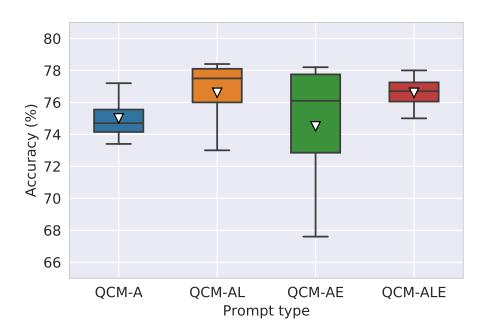

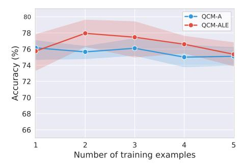

- (a) Acc. v.s. different prompts with 4-shot examples.
- (b) Acc. v.s. different # of training examples.

Figure 7: Accuracy of GPT-3 (CoT) cross different prompt types (a) and # of training examples (b).

**Number of in-context examples.** In Figure 7 (b), we further investigate how different numbers of training examples encoded in prompts can affect the prediction accuracy. The QCM $\rightarrow$ ALE prompt type outperforms or performs comparably the QCM $\rightarrow$ A type with all numbers of examples. And we observe the peak performance of QCM $\rightarrow$ ALE with 2 training examples being prompted. After that, the accuracy goes down as more training examples are added to the model.

**Dynamic sampling.** In Table 5, instead of random sampling, we try to dynamically select the in-context examples to prompt with the same class as the test sample. However, slight differences in prediction accuracy are observed when comparing them to simple random sampling.

| Prompt type           | Sampling                | Acc. (%) |
|-----------------------|-------------------------|----------|
| QCM→ALE               | Dynamic (same topic)    | 75.15    |
| $QCM{\rightarrow}ALE$ | Dynamic (same category) | 74.58    |
| $QCM{\rightarrow}ALE$ | Dynamic (same skill)    | 75.10    |

Table 5: Dynamic sampling for GPT-3 (CoT).

**Upper bound.** We search the upper bound of the GPT-3 accuracy by feeding the gold lecture and explanation in the test prompt. As reported in Table 6, QCME\* $\rightarrow$ A outperforms the QCM $\rightarrow$ ALE baseline by 18.86% and QCMLE\* $\rightarrow$ A outperforms QCM $\rightarrow$ ALE by 18.96%, indicating a potential improvement direction by generating correct explanations before answering science questions.

| Prompt type              | Sampling | Acc. (%)                                           |
|--------------------------|----------|----------------------------------------------------|
| QCML*→A                  | Random   | 73.59                                              |
| $QCML*\rightarrow AE$    | Random   | 74.32                                              |
| $QCME* \rightarrow A$    | Random   | $94.03_{18.86\uparrow}$                            |
| $QCMLE^*{\rightarrow} A$ | Random   | <b>94.13</b> <sub>18.96<math>\uparrow</math></sub> |
| QCM→ALE                  | Random   | 75.17                                              |

| Prompt type          | Sampling | Acc. (%) |
|----------------------|----------|----------|
| QCM→LA               | Random   | 60.6     |
| $QCM{ ightarrow}EA$  | Random   | 56.0     |
| $QCM{ ightarrow}LEA$ | Random   | 55.4     |
| $QCM{ ightarrow}ELA$ | Random   | 51.5     |
| QCM→ALE              | Random   | 73.6     |

Table 6: Upper bound of GPT-3 (CoT).

Table 7: Different positions of L/E for GPT-3 (CoT).

**Positions of lectures and explanations.** We study the performance of GPT-3 (CoT) in terms of different positions of lectures and explanations on 1,000 test examples. The results are shown in Table 7. There could be huge accuracy decreases if GPT-3 (CoT) predicts lectures and explanations before answers. It is mainly because if GPT-3 (CoT) is formalized to generate the long lecture and explanation first, there is a greater chance that it will stop generating the prediction early or use up the maximum token limits before obtaining the required answer.

**CoT learns with fewer data.** To study if the chain of thought helps language models learn more efficiently, we report the accuracies of UnifiedQA and UnifiedQA (CoT) fine-tuned on different sizes of the training set in Figure 8. UnifiedQA (CoT) benefits language models by learning the coherent reasoning path when answering questions, resulting in similar accuracy with fewer training examples.

**Error analysis.** GPT-3 via chain-of-chain prompting obtains promising results but still fails to answer a wide range of challenging questions in SCIENCEQA. See examples of failure cases in Appendix B.4. The failure cases can be classified into two types: (a) the model fails to understand the subtained and the subtained and the subtained and the subtained and the subtained and the subtained and the subtained and the subtained and the subtained and the subtained and the subtained and the subtained and the subtained and the subtained and the subtained and the subtained and the subtained and the subtained and the subtained and the subtained and the subtained and the subtained and the subtained and the subtained and the subtained and the subtained and the subtained and the subtained and the subtained and the subtained and the subtained and the subtained and the subtained and the subtained and the subtained and the subtained and the subtained and the subtained and the subtained and the subtained and the subtained and the subtained and the subtained and the subtained and the subtained and the subtained and the subtained and the subtained and the subtained and the subtained and the subtained and the subtained and the subtained and the subtained and the subtained and the subtained and the subtained and the subtained and the subtained and the subtained and the subtained and the subtained and the subtained and the subtained and the subtained and the subtained and the subtained and the subtained and the subtained and the subtained and the subtained and the subtained and the subtained and the subtained and the subtained and the subtained and the subtained and the subtained and the subtained and the subtained and the subtained and the subtained and the subtained and the subtained and the subtained and the subtained and the subtained and the subtained and the subtained and the subtained and the subtained and the subtained and the subtained and the subtained and the subtained and the subtained and the subtained and the subtai

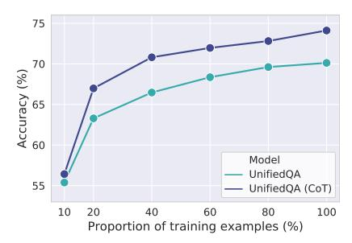

Figure 8: UnifiedQA (CoT) learns efficiently with fewer training examples.

multimodal inputs and lacks domain-specific knowledge to arrive at the correct answer; (b) the model generates the wrong chain of thought with irrelevant, incorrect, or incomplete information.

#### 6 Discussion and Conclusion

In this paper, we propose SCIENCEQA, a dataset that features 21,208 multi-option questions with multimodal contexts from the science curriculum. To the best of our knowledge, SCIENCEQA is the first large-scale multimodal science dataset where most questions are annotated with corresponding lectures and explanations. We establish various baselines, including recent VQA models and large language models on SCIENCEQA. We further study if language models can generate reasonable explanations and then benefit the reasoning ability. Experiments show that UnifiedQA with the chain of thought can achieve an improvement of 3.99% and few-shot GPT-3 via chain-of-thought (CoT) prompting can obtain a satisfactory accuracy of 75.17% on SCIENCEQA. 65.2% of the generated explanations from GPT-3 (CoT) meet the gold standard by human evaluations.

# 7 Acknowledgment

We would like to thank the anonymous reviewers for their valuable comments and suggestions. We would also like to thank Xiaodan Liang for insightful discussions on dataset collection. We thank our colleagues at The Allen Institute of AI (AI2), Jiasen Lu and Jungo Kasai for helpful discussions. The work does not relate to Liang Qiu's position at Amazon Alexa.

#### References

- [1] Peter Anderson, Xiaodong He, Chris Buehler, Damien Teney, Mark Johnson, Stephen Gould, and Lei Zhang. Bottom-up and top-down attention for image captioning and visual question answering. In *Proceedings of the IEEE Conference on Computer Vision and Pattern Recognition (CVPR)*, 2018.
- [2] Stanislaw Antol, Aishwarya Agrawal, Jiasen Lu, Margaret Mitchell, Dhruv Batra, C Lawrence Zitnick, and Devi Parikh. Vqa: Visual question answering. In *Proceedings of the IEEE international conference on computer vision (CVPR)*, pages 2425–2433, 2015.

- [3] Jonathan Bragg, Arman Cohan, Kyle Lo, and Iz Beltagy. Flex: Unifying evaluation for few-shot nlp. *Advances in Neural Information Processing Systems (NeurIPS)*, 34, 2021.
- [4] Tom Brown, Benjamin Mann, Nick Ryder, Melanie Subbiah, Jared D Kaplan, Prafulla Dhariwal, Arvind Neelakantan, Pranav Shyam, Girish Sastry, Amanda Askell, et al. Language models are few-shot learners. *Advances in neural information processing systems (NeurIPS)*, 33:1877–1901, 2020.
- [5] Ting Chen, Simon Kornblith, Kevin Swersky, Mohammad Norouzi, and Geoffrey E Hinton. Big self-supervised models are strong semi-supervised learners. *Advances in neural information processing systems* (*NeurIPS*), 33:22243–22255, 2020.
- [6] Peter Clark, Isaac Cowhey, Oren Etzioni, Tushar Khot, Ashish Sabharwal, Carissa Schoenick, and Oyvind Tafjord. Think you have solved question answering? try arc, the ai2 reasoning challenge. *arXiv preprint arXiv:1803.05457*, 2018.
- [7] Bhavana Dalvi, Peter Jansen, Oyvind Tafjord, Zhengnan Xie, Hannah Smith, Leighanna Pipatanangkura, and Peter Clark. Explaining answers with entailment trees. Proceedings of the 2021 Conference on Empirical Methods in Natural Language Processing (EMNLP), 2021.
- [8] Alexey Dosovitskiy, Lucas Beyer, Alexander Kolesnikov, Dirk Weissenborn, Xiaohua Zhai, Thomas Unterthiner, Mostafa Dehghani, Matthias Minderer, Georg Heigold, Sylvain Gelly, et al. An image is worth 16x16 words: Transformers for image recognition at scale. In *The International Conference on Learning Representations (ICLR)*, 2021.
- [9] Peng Gao, Zhengkai Jiang, Haoxuan You, Pan Lu, Steven CH Hoi, Xiaogang Wang, and Hongsheng Li. Dynamic fusion with intra-and inter-modality attention flow for visual question answering. In *The IEEE Conference on Computer Vision and Pattern Recognition (CVPR)*, pages 6639–6648, 2019.
- [10] Peng Gao, Hongsheng Li, Shuang Li, Pan Lu, Yikang Li, Steven CH Hoi, and Xiaogang Wang. Question-guided hybrid convolution for visual question answering. In *The European Conference on Computer Vision (ECCV)*, pages 469–485, 2018.
- [11] Yash Goyal, Tejas Khot, Douglas Summers-Stay, Dhruv Batra, and Devi Parikh. Making the V in VQA matter: Elevating the role of image understanding in Visual Question Answering. In *Conference on Computer Vision and Pattern Recognition (CVPR)*, 2017.
- [12] Drew A Hudson and Christopher D Manning. Gqa: A new dataset for real-world visual reasoning and compositional question answering. In *Proceedings of the IEEE Conference on Computer Vision and Pattern Recognition (CVPR)*, pages 6700–6709, 2019.
- [13] Peter A Jansen, Elizabeth Wainwright, Steven Marmorstein, and Clayton T Morrison. Worldtree: A corpus of explanation graphs for elementary science questions supporting multi-hop inference. arXiv preprint arXiv:1802.03052, 2018.
- [14] Harsh Jhamtani and Peter Clark. Learning to explain: Datasets and models for identifying valid reasoning chains in multihop question-answering. *arXiv preprint arXiv:2010.03274*, 2020.
- [15] Justin Johnson, Bharath Hariharan, Laurens van der Maaten, Li Fei-Fei, C Lawrence Zitnick, and Ross Girshick. Clevr: A diagnostic dataset for compositional language and elementary visual reasoning. In *Proceedings of the IEEE Conference on Computer Vision and Pattern Recognition (CVPR)*, pages 2901–2910, 2017.
- [16] Kushal Kafle, Brian Price, Scott Cohen, and Christopher Kanan. Dvqa: Understanding data visualizations via question answering. In *Proceedings of the IEEE Conference on Computer Vision and Pattern Recognition (CVPR)*, pages 5648–5656, 2018.
- [17] Aniruddha Kembhavi, Mike Salvato, Eric Kolve, Min Joon Seo, Hannaneh Hajishirzi, and Ali Farhadi. A diagram is worth a dozen images. In *Proceedings of the European Conference on Computer Vision (ECCV)*, 2016.
- [18] Aniruddha Kembhavi, Minjoon Seo, Dustin Schwenk, Jonghyun Choi, Ali Farhadi, and Hannaneh Hajishirzi. Are you smarter than a sixth grader? textbook question answering for multimodal machine comprehension. In *Proceedings of the IEEE Conference on Computer Vision and Pattern Recognition* (CVPR), pages 4999–5007, 2017.
- [19] Daniel Khashabi, Sewon Min, Tushar Khot, Ashish Sabharwal, Oyvind Tafjord, Peter Clark, and Hannaneh Hajishirzi. Unifiedqa: Crossing format boundaries with a single qa system. In *Findings of the Association for Computational Linguistics (EMNLP)*, pages 1896–1907, 2020.

- [20] Tushar Khot, Peter Clark, Michal Guerquin, Peter Alexander Jansen, and Ashish Sabharwal. Qasc: A dataset for question answering via sentence composition. ArXiv, abs/1910.11473, 2020.
- [21] Jin-Hwa Kim, Jaehyun Jun, and Byoung-Tak Zhang. Bilinear attention networks. In *Advances in Neural Information Processing Systems (NeurIPS)*, pages 1571–1581, 2018.
- [22] Wonjae Kim, Bokyung Son, and Ildoo Kim. Vilt: Vision-and-language transformer without convolution or region supervision. In *Proceedings of the 38th International Conference on Machine Learning (ICML)*, pages 5583–5594, 2021.
- [23] Ranjay Krishna, Yuke Zhu, Oliver Groth, Justin Johnson, Kenji Hata, Joshua Kravitz, Stephanie Chen, Yannis Kalantidis, Li-Jia Li, David A Shamma, et al. Visual genome: Connecting language and vision using crowdsourced dense image annotations. *International Journal of Computer Vision (IJCV)*, pages 32–73, 2017.
- [24] Jayant Krishnamurthy, Oyvind Tafjord, and Aniruddha Kembhavi. Semantic parsing to probabilistic programs for situated question answering. In *Proceedings of the 2016 Conference on Empirical Methods* in *Natural Language Processing (EMNLP)*, pages 160–170, 2016.
- [25] Andrew K Lampinen, Ishita Dasgupta, Stephanie CY Chan, Kory Matthewson, Michael Henry Tessler, Antonia Creswell, James L McClelland, Jane X Wang, and Felix Hill. Can language models learn from explanations in context? *arXiv preprint arXiv:2204.02329*, 2022.
- [26] Liunian Harold Li, Mark Yatskar, Da Yin, Cho-Jui Hsieh, and Kai-Wei Chang. Visualbert: A simple and performant baseline for vision and language. *arXiv preprint arXiv:1908.03557*, 2019.
- [27] Liunian Harold Li, Mark Yatskar, Da Yin, Cho-Jui Hsieh, and Kai-Wei Chang. What does bert with vision look at? In *Proceedings of the 58th Annual Meeting of the Association for Computational Linguistics* (ACL), pages 5265–5275, 2020.
- [28] Chin-Yew Lin. Rouge: A package for automatic evaluation of summaries. In *Text summarization branches out*, pages 74–81, 2004.
- [29] Jiachang Liu, Dinghan Shen, Yizhe Zhang, Bill Dolan, Lawrence Carin, and Weizhu Chen. What makes good in-context examples for gpt-3? arXiv preprint arXiv:2101.06804, 2021.
- [30] Jiasen Lu, Dhruv Batra, Devi Parikh, and Stefan Lee. Vilbert: Pretraining task-agnostic visiolinguistic representations for vision-and-language tasks. In *Advances in Neural Information Processing Systems* (*NeurIPS*), pages 13–23, 2019.
- [31] Pan Lu, Ran Gong, Shibiao Jiang, Liang Qiu, Siyuan Huang, Xiaodan Liang, and Song-Chun Zhu. Intergps: Interpretable geometry problem solving with formal language and symbolic reasoning. In *The 59th Annual Meeting of the Association for Computational Linguistics (ACL)*, 2021.
- [32] Pan Lu, Lei Ji, Wei Zhang, Nan Duan, Ming Zhou, and Jianyong Wang. R-vqa: learning visual relation facts with semantic attention for visual question answering. In *The ACM SIGKDD International Conference* on Knowledge Discovery and Data Mining (SIGKDD), pages 1880–1889, 2018.
- [33] Pan Lu, Hongsheng Li, Wei Zhang, Jianyong Wang, and Xiaogang Wang. Co-attending free-form regions and detections with multi-modal multiplicative feature embedding for visual question answering. In *The AAAI Conference on Artificial Intelligence (AAAI)*, 2018.
- [34] Pan Lu, Liang Qiu, Kai-Wei Chang, Ying Nian Wu, Song-Chun Zhu, Tanmay Rajpurohit, Peter Clark, and Ashwin Kalyan. Dynamic prompt learning via policy gradient for semi-structured mathematical reasoning. arXiv preprint arXiv:2209.14610, 2022.
- [35] Pan Lu, Liang Qiu, Jiaqi Chen, Tony Xia, Yizhou Zhao, Wei Zhang, Zhou Yu, Xiaodan Liang, and Song-Chun Zhu. Iconqa: A new benchmark for abstract diagram understanding and visual language reasoning. In The 35th Conference on Neural Information Processing Systems (NeurIPS) Track on Datasets and Benchmarks, 2021.
- [36] Yao Lu, Max Bartolo, Alastair Moore, Sebastian Riedel, and Pontus Stenetorp. Fantastically ordered prompts and where to find them: Overcoming few-shot prompt order sensitivity. arXiv preprint arXiv:2104.08786, 2021.
- [37] Todor Mihaylov, Peter Clark, Tushar Khot, and Ashish Sabharwal. Can a suit of armor conduct electricity? a new dataset for open book question answering. Proceedings of the 2018 Conference on Empirical Methods in Natural Language Processing (EMNLP), 2018.

- [38] Swaroop Mishra, Matthew Finlayson, Pan Lu, Leonard Tang, Sean Welleck, Chitta Baral, Tanmay Rajpurohit, Oyvind Tafjord, Ashish Sabharwal, Peter Clark, and Ashwin Kalyan. Lila: A unified benchmark for mathematical reasoning. In *The 2022 Conference on Empirical Methods in Natural Language Processing (EMNLP)*, 2022.
- [39] Swaroop Mishra, Daniel Khashabi, Chitta Baral, Yejin Choi, and Hannaneh Hajishirzi. Reframing instructional prompts to gptk's language. ACL Findings, 2021.
- [40] Swaroop Mishra, Daniel Khashabi, Chitta Baral, and Hannaneh Hajishirzi. Cross-task generalization via natural language crowdsourcing instructions. *The 59th Annual Meeting of the Association for Computational Linguistics (ACL)*, 2021.
- [41] Sharan Narang, Colin Raffel, Katherine Lee, Adam Roberts, Noah Fiedel, and Karishma Malkan. Wt5?! training text-to-text models to explain their predictions. *arXiv preprint arXiv:2004.14546*, 2020.
- [42] Maxwell Nye, Anders Johan Andreassen, Guy Gur-Ari, Henryk Michalewski, Jacob Austin, David Bieber, David Dohan, Aitor Lewkowycz, Maarten Bosma, David Luan, et al. Show your work: Scratchpads for intermediate computation with language models. arXiv preprint arXiv:2112.00114, 2021.
- [43] Long Ouyang, Jeff Wu, Xu Jiang, Diogo Almeida, Carroll L Wainwright, Pamela Mishkin, Chong Zhang, Sandhini Agarwal, Katarina Slama, Alex Ray, et al. Training language models to follow instructions with human feedback. arXiv preprint arXiv:2203.02155, 2022.
- [44] Kishore Papineni, Salim Roukos, Todd Ward, and Wei-Jing Zhu. Bleu: a method for automatic evaluation of machine translation. In *Proceedings of the 40th annual meeting of the Association for Computational Linguistics (ACL)*, pages 311–318, 2002.
- [45] Mihir Parmar, Swaroop Mishra, Mirali Purohit, Man Luo, Murad Mohammad, and Chitta Baral. In-BoXBART: Get instructions into biomedical multi-task learning. In *Findings of the Association for Computational Linguistics: NAACL 2022*, pages 112–128, Seattle, United States, July 2022. Association for Computational Linguistics.
- [46] Ethan Perez, Douwe Kiela, and Kyunghyun Cho. True few-shot learning with language models. *Advances in Neural Information Processing Systems (NeurIPS)*, 34, 2021.
- [47] Alec Radford, Jeffrey Wu, Rewon Child, David Luan, Dario Amodei, Ilya Sutskever, et al. Language models are unsupervised multitask learners. *OpenAI blog*, 1(8):9, 2019.
- [48] Colin Raffel, Noam Shazeer, Adam Roberts, Katherine Lee, Sharan Narang, Michael Matena, Yanqi Zhou, Wei Li, and Peter J Liu. Exploring the limits of transfer learning with a unified text-to-text transformer. *Journal of Machine Learning Research (JMLR)*, 21:1–67, 2020.
- [49] Nils Reimers and Iryna Gurevych. Sentence-bert: Sentence embeddings using siamese bert-networks. In *Proceedings of the 2019 Conference on Empirical Methods in Natural Language Processing (EMNLP)*. Association for Computational Linguistics, 11 2019.
- [50] Mrinmaya Sachan, Kumar Dubey, and Eric Xing. From textbooks to knowledge: A case study in harvesting axiomatic knowledge from textbooks to solve geometry problems. In *Proceedings of the 2017 Conference* on Empirical Methods in Natural Language Processing (EMNLP), pages 773–784, 2017.
- [51] Mrinmaya Sachan and Eric Xing. Learning to solve geometry problems from natural language demonstrations in textbooks. In *Proceedings of the 6th Joint Conference on Lexical and Computational Semantics* (\* SEM 2017), pages 251–261, 2017.
- [52] Shailaja Keyur Sampat, Yezhou Yang, and Chitta Baral. Visuo-lingustic question answering (vlqa) challenge. In *Proceedings of the 2020 Conference on Empirical Methods in Natural Language Processing: Findings (EMNLP)*, pages 4606–4616, 2020.
- [53] Jason Wei, Maarten Bosma, Vincent Y Zhao, Kelvin Guu, Adams Wei Yu, Brian Lester, Nan Du, Andrew M Dai, and Quoc V Le. Finetuned language models are zero-shot learners. The International Conference on Learning Representations (ICLR), 2021.
- [54] Jason Wei, Xuezhi Wang, Dale Schuurmans, Maarten Bosma, Ed Chi, Quoc Le, and Denny Zhou. Chain of thought prompting elicits reasoning in large language models. arXiv preprint arXiv:2201.11903, 2022.
- [55] Zhou Yu, Jun Yu, Yuhao Cui, Dacheng Tao, and Qi Tian. Deep modular co-attention networks for visual question answering. In *Proceedings of the IEEE Conference on Computer Vision and Pattern Recognition (CVPR)*, pages 6281–6290, 2019.

- [56] Peng Zhang, Yash Goyal, Douglas Summers-Stay, Dhruv Batra, and Devi Parikh. Yin and Yang: Balancing and answering binary visual questions. In *Conference on Computer Vision and Pattern Recognition (CVPR)*, 2016.
- [57] Zihao Zhao, Eric Wallace, Shi Feng, Dan Klein, and Sameer Singh. Calibrate before use: Improving few-shot performance of language models. In *International Conference on Machine Learning (ICML)*, pages 12697–12706. PMLR, 2021.
- [58] Yuke Zhu, Oliver Groth, Michael Bernstein, and Li Fei-Fei. Visual7w: Grounded question answering in images. In *IEEE Conference on Computer Vision and Pattern Recognition (CVPR)*, 2016.

#### Checklist

- 1. For all authors...
  - (a) Do the main claims made in the abstract and introduction accurately reflect the paper's contributions and scope? [Yes]
  - (b) Did you describe the limitations of your work? [Yes] Yes, we did the error analysis in Section 5.4 and discussed the limitations of the work in Appendix B.4.
  - (c) Did you discuss any potential negative societal impacts of your work? [Yes] We discussed the broader impacts in Appendix B.5.
  - (d) Have you read the ethics review guidelines and ensured that your paper conforms to them? [Yes]
- 2. If you are including theoretical results...
  - (a) Did you state the full set of assumptions of all theoretical results? [N/A]
  - (b) Did you include complete proofs of all theoretical results? [N/A]
- 3. If you ran experiments...
  - (a) Did you include the code, data, and instructions needed to reproduce the main experimental results (either in the supplemental material or as a URL)? [Yes] We included 100 data examples and the data visualizer tool in the supplemental material. The whole dataset and code will be available at https://sciencega.github.io.
  - (b) Did you specify all the training details (e.g., data splits, hyperparameters, how they were chosen)? [Yes] See Section 5.1 and Appendix B.1 for experimental details.
  - (c) Did you report error bars (e.g., with respect to the random seed after running experiments multiple times)? [Yes] We reported the error bars for GPT-3 (CoT) experiments in Figure 7, where each experiment was repeated four times.
  - (d) Did you include the total amount of compute and the type of resources used (e.g., type of GPUs, internal cluster, or cloud provider)? [Yes] We discussed compute resources in Appendix B.1.
- 4. If you are using existing assets (e.g., code, data, models) or curating/releasing new assets...
  - (a) If your work uses existing assets, did you cite the creators? [Yes] We collected the SCIENCEQA dataset from https://www.ixl.com/. The copyright belongs to IXL.
  - (b) Did you mention the license of the assets? [Yes] SCIENCEQA is under the CC BY-NC-SA 4.0 license and is used for non-commercial research purposes.
  - (c) Did you include any new assets either in the supplemental material or as a URL? [Yes] We included data examples and a visualizer tool in the supplemental material. The dataset will be available at https://scienceqa.github.io.
  - (d) Did you discuss whether and how consent was obtained from people whose data you're using/curating? [N/A]
  - (e) Did you discuss whether the data you are using/curating contains personally identifiable information or offensive content? [Yes] The collected data does not contain personally identifiable information or offensive content.
- 5. If you used crowdsourcing or conducted research with human subjects...
  - (a) Did you include the full text of instructions given to participants and screenshots, if applicable? [Yes] We included screenshots of the instructions in Appendix B.2 and B.3.

- (b) Did you describe any potential participant risks, with links to Institutional Review Board (IRB) approvals, if applicable? [N/A]
- (c) Did you include the estimated hourly wage paid to participants and the total amount spent on participant compensation? [Yes] We included the monetary compensation details in Appendix B.2 and B.3.

# A Dataset Analysis

#### A.1 Data Collection

Questions in the SCIENCEQA dataset are sourced from open resources managed by IXL Learning, an online learning platform curated by experts in the field of K-12 education. The dataset includes problems that align with *California Common Core Content Standards*. To construct SCIENCEQA, we downloaded the original science problems and then extracted individual components (e.g. questions, hints, images, options, answers, lectures, and solutions) from them based on heuristic rules.

We manually removed invalid questions, such as questions that have only one choice, questions that contain faulty data, and questions that are duplicated, to comply with *fair use* and *transformative use* of the law. If there were multiple correct answers that applied, we kept only one correct answer. Also, we shuffled the answer options of each question to ensure the choices do not follow any specific pattern. To make the dataset easy to use, we then used semi-automated scripts to reformat the lectures and solutions. Therefore, special structures in the texts, such as tables and lists, are easily distinguishable from simple text passages. Similar to ImageNet, ReClor, and PMR datasets, SCIENCEQA is available for non-commercial research purposes only and the copyright belongs to the original authors. To ensure data quality, we developed a data exploration tool to review examples in the collected dataset, and incorrect annotations were further manually revised by experts. The tool can be accessed at https://scienceqa.github.io/explore.html.

#### **A.2** Ouestion Statistics

Figure 9 (a) is a word cloud showing the most frequently appeared words in the question texts. Stopping words that do not contain any semantic meaning, such as "what" or "and", are removed to give us a clearer view of the semantic range of SCIENCEQA. The diagram shows that SCIENCEQA covers a wide range of topics, with words from different topics showing up across the cloud.

Figures 9 (b) (c) (d) show the word clouds for each of the three subjects. We can observe from the word clouds that the words are well-matched to the subject themes. In natural science questions, words such as "trait", "magnet", and "force" appear frequently. Words such as "capital" and "state" show up frequently in social science questions, whereas words such as "dictionary" and "page" are common in language science questions.

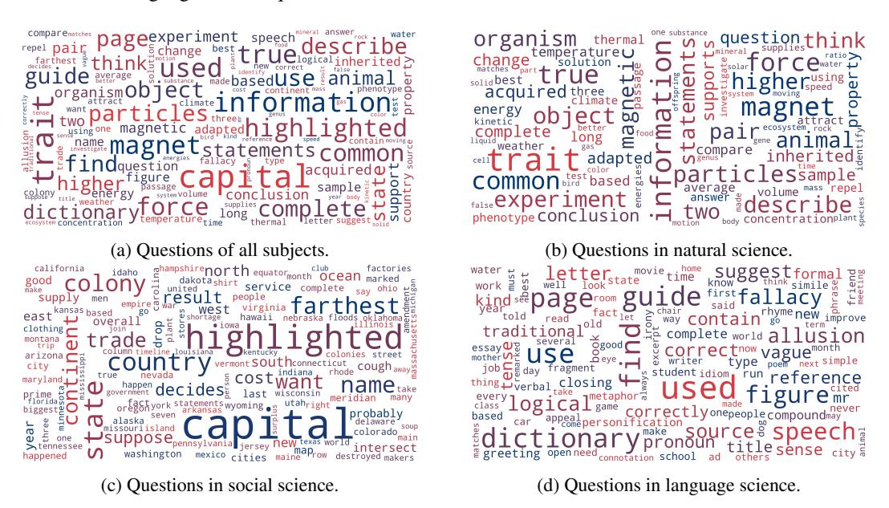

Figure 9: Word cloud distributions of question texts in different subjects.

#### A.3 Choice Statistics

Table 8 shows the number of questions with each number of different choices. Questions have a minimum of two options and a maximum of five options. Figure 10 shows the distribution of choice length in SCIENCEQA. Most choices are short, containing up to five words. However, the distribution has a long tail where about 5% of the choices contain more than 15 words. Hence, it requires models to have a high level of text understanding to address diversely distributed choices.

| Choice number | Size   | Percent |
|---------------|--------|---------|
| 2             | 11,045 | 52.08%  |
| 3             | 5,078  | 23.94%  |
| 4             | 4,893  | 23.07%  |
| 5             | 192    | 0.91%   |

Table 8: Choice number distribution.

# A.4 Subject Statistics

Figure 11 shows the question length distribution of each subject. The three subjects all feature long-tail distributions in terms of the number of question words. On average, social science questions are the shortest, while language science questions are the longest. Language science questions are distributed more evenly than other questions across different numbers of words. These features imply that the SCIENCEQA dataset is rich in compositional diversity.

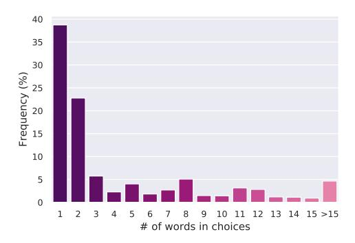

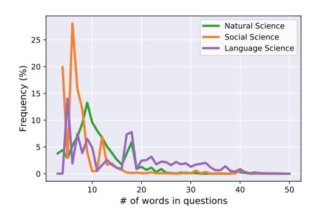

Figure 10: Choice length distribution.

Figure 11: Question distributions of diff. subjects.

#### A.5 Grade Statistics

The grade distribution is shown in Figure 12. The majority of questions come from the middle level curriculum (i.e., from grade 3 to grade 8) while around 10% are taken from the high school curriculum (i.e., from grade 9 to grade 12). These high school level questions are close to or at the difficulty level of the U.S. standardized tests for college admissions. Machine algorithms need to master a large amount of scientific knowledge and perform complex reasoning in order to perform well on SCIENCEQA.

| Grades   | Number | Percent |
|----------|--------|---------|
| Grade 1  | 95     | 0.45%   |
| Grade 2  | 1,678  | 7.91%   |
| Grade 3  | 3,032  | 14.3%   |
| Grade 4  | 3,544  | 16.71%  |
| Grade 5  | 3,086  | 14.55%  |
| Grade 6  | 2,450  | 11.55%  |
| Grade 7  | 2,749  | 12.96%  |
| Grade 8  | 2,546  | 12.0%   |
| Grade 9  | 491    | 2.32%   |
| Grade 10 | 558    | 2.63%   |
| Grade 11 | 539    | 2.54%   |
| Grade 12 | 440    | 2.07%   |

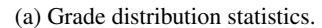

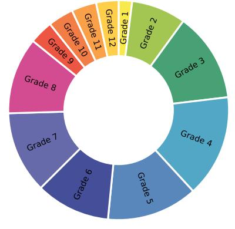

(b) Grade distribution visualization.

Figure 12: SCIENCEQA questions and their corresponding grades.

# **B** Experiments

## **B.1** Experimental Details

Below are details on the experiments:

- **Fine-tuning on the dataset.** Fine-tuning baselines (VQA baselines and UnifiedQA) are trained on the training set, developed on the validation set, and evaluated on the test set.
- Input sizes: For VQA baselines, we set the maximum number of input words or tokens as 100.
- Batch sizes. We use batches of 64 and 4 for VQA baselines and fine-tuned UnifiedQA, respectively.
- Newline character. For language models, the newline separators (\n) in the text are replaced with \\n when encoding the inputs because \n is normally used as a stop symbol, following the original works [5, 19].
- Captioning model. We use the tool<sup>2</sup> to generate captions for the images in the dataset. The maximum length of generated captions is 16, the number of beams is 4, and the maximum number of output tokens is 512.
- Compute resources. We use two GeForce RTX 3090 GPUs for fine-tuning VQA baselines and UnifiedQA on the dataset.
- Questions without any context. For questions without any context, the context text is replaced with an empty string.
- **GPT-3:** Following default settings, we choose temperature, frequency penalty and presence penalty as 0.0, and top probability as 1.0. All experiments for GPT-3 are run via the online API. Experiments in Figure 7 are repeated four times with in-context examples listed in Table 9. Experiments in Table 3, 5, 6, and 7 are conducted using examples with the trial ID of 1.

| Trial IDs | Random seeds | In-context example IDs          |
|-----------|--------------|---------------------------------|
| 1         | 3            | 6493, 16241, 14954, 3598, 10088 |
| 2         | 5            | 17099, 6960, 20290, 9780, 18898 |
| 3         | 7            | 8836, 4144, 10781, 17852, 1363  |
| 4         | 9            | 12701, 16832, 10180, 7289, 3801 |

Table 9: Training example candidates used in four trials for GPT-3 (CoT).

#### **B.2** Human Performance Study

In order to understand how humans perform on SCIENCEQA questions, we used Amazon Mechanical Turk (AMT) to crowd source answers to the test set. The interface of instructions and one example of a test question are shown in Figure 13. A total of 4,241 test questions were shuffled and split into 425 batches, with each batch having 10 questions (excluding the last one). For each batch, we also randomly added five training questions as exam examples. Each set of 15 questions was then assigned to 3 AMT workers. Only workers who correctly answer 4 out of the 5 exam examples or more are qualified for the human performance study. In other words, workers who failed to pass the qualified exam were eliminated from the analysis. For each set of 15 questions, we provided the worker with \$0.5 per HIT task. At the rate of 3 questions per minute, this amounts to \$6.0 per hour.

## **B.3** Human Evaluation of Generated Explanations

We also evaluated the quality of predictions from GPT-3 (CoT) and UnifiedQA (CoT) by asking AMT workers to rate the model-generated explanations. The interface is shown in Figure 14. Each sample's question text, contexts, choices, and answers were presented, along with the corresponding explanation generated by language models. The workers were asked to decide whether the proposed explanation is *relevant* (is related to the question), *correct* (gives a correct answer and explanation),

<sup>&</sup>lt;sup>2</sup>https://huggingface.co/nlpconnect/vit-gpt2-image-captioning

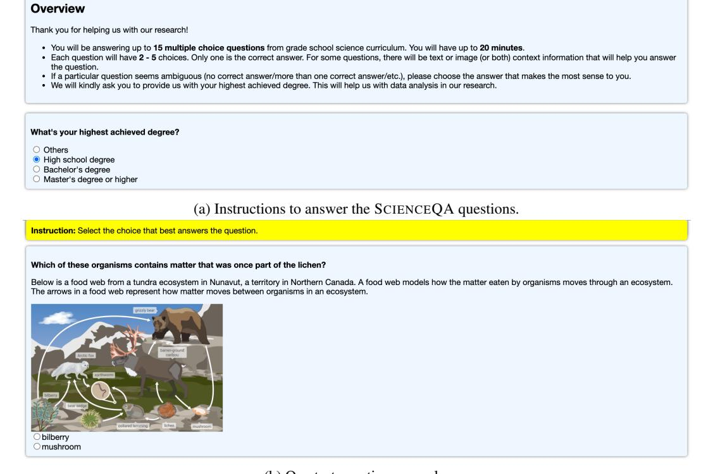

(b) One test question example.

Figure 13: Interfaces of instructions and one test question example for AMT workers.

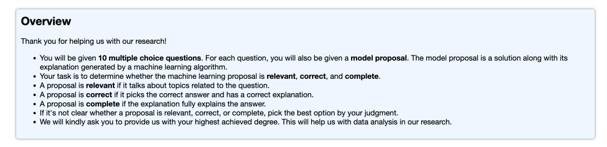

Figure 14: Interface of instructions for AMT workers to evaluate the explanations generated from UnifiedQA (CoT) and GPT-3 (CoT).

and *complete* (fully explains the answer). Prediction outputs that contain textual explanations were grouped into batches of 10, each assigned to 3 workers for evaluation. For each batch, we provided the workers with a monetary compensation of \$0.3. Finally, the human scores for each explanation were determined by taking a majority vote.

# **B.4** Case Study and Limitations

Figure 15 shows three examples with correct answers and gold explanations predicted by GPT-3 via *chain-of-thought* prompting (CoT). We can see that GPT-3 (CoT) not only predicts the correct answers but also generates reasonable explanations, which follow the multi-hop reasoning process of human beings. This suggests that large language models like GPT-3 have great promise for implementing high-level reasoning abilities.

Figure 16 visualizes three more examples with predictions from GPT-3 (CoT). In these examples, GPT-3 (CoT) is able to predict the correct answers but fails to generate gold explanations. For example, GPT-3 (CoT) generates an *irrelevant* explanation because the context text does not include fine-grained visual information in the image (Figure 16a). In the example shown in Figure 16b, GPT-3 (CoT) fails to predict the coherent thought chains, where there are an *incorrect* example and

**Question:** Which animal's neck is also adapted for hunting prey while keeping the rest of its body still? **Context:** Saddle-billed storks live near wetlands and lakes. They eat mostly fish. The 's neck helps it grab fish while keeping the rest of its body still. If the stork had to move its body, it might scare the fish away. Figure: saddle-billed stork. A black and white bird is standing in the grass.

Options: (A) northern pintail (B) black-headed heron

Answer: The answer is B. BECAUSE: The northern pintail is a duck. It does not hunt for fish. \n

The **black-headed heron** is a type of heron. It lives near wetlands and lakes. It eats mostly fish. \n

The heron's neck helps it grab fish while keeping the rest of its body still. If the heron had to move its body, it might scare the fish away.

(Subject: Natural science, Topic: Biology, Category: Adaptations, Skill: Animal adaptations: beaks, mouths, and necks)

(a) A natural science example with the correct answer and a gold explanation.

Question: Suppose Mason decides to bake blueberry muffins. Which result would be a cost?

**Context:** Mason is deciding whether to bake blueberry muffins or cranberry muffins. He wants the muffins to be tasty. But he also wants to make a lot of muffins.

Options: (A) Mason will get to eat blueberry muffins. He thinks blueberry muffins are tastier than cranberry muffins. (B)

Mason will give up some muffins. He could have made more cranberry muffins than blueberry muffins.

Answer: The answer is B. BECAUSE: A cost is anything that you have to give up to get something else.

In this case, Mason will have to give up some muffins. He could have made more cranberry muffins than blueberry muffins. So, the **cost** of making blueberry muffins is the opportunity **cost** of not making cranberry muffins.

(Subject: Social science, Topic: economics, Category: Basic economic principles, Skill: Costs and benefits)

(b) A social science example with a correct answer and a gold explanation.

Question: Which sentence uses a metaphor?

Context: N/A

Options: (A) The cat's silver eyes were two shiny coins. (B) The cat's silver eyes were like two shiny coins.

Answer: The answer is A. BECAUSE: A metaphor is a figure of speech that uses one thing to describe another. A metaphor

is a type of analogy.\n

In a **metaphor**, one thing is said to be another thing.\n

For example, you might say, "My dad is a bear."\n

This means that your dad is big and strong, not that he is actually a bear!\n

The sentence "The cat's silver eyes were two shiny coins" is a metaphor.\n

The sentence "The cat's silver eyes were like two shiny coins" is **not a metaphor**. It is a **simile**.\n

A simile is a figure of speech that uses the words "like" or "as" to compare two things.

(Subject: Language science, Topic: Figurative language, Category: Literary devices, Skill: Identify similes and metaphors)

(c) A language science example with a correct answer and a gold explanation.

Figure 15: Three examples with a correct answer and a gold explanation predicted by GPT-3 (CoT).

an *incorrect* statement for a *chemical change*. The third example is given in Figure 16c, where the generated explanation is just a repetition of the input question and the output answer, instead of following the *complete* thought chain to arrive at the final answer.

Four failure examples with wrong predicted answers are listed in Figure 17. We extract the image captions and feed them to the large language model as the visual content input. However, these captions lack fine-grained semantics and usually do not work well for diagrams, which results in two failure cases shown in Figure 17a and 17b. Moreover, there exist challenges for large language models to reason about the questions that require them to understand complex and uncommon domain knowledge. For example, GPT-3 (CoT) cannot understand accurately the terminology of *personification* in language science (Figure 17c) and a series of complex *chemical changes* happen in the formation process of dinosaur fossils (Figure 17d).

# **B.5** Broader Impacts

**Societal impact.** The SCIENCEQA dataset collects science questions sourced from textbooks and is proposed to diagnose the multimodal understanding and multi-hop reasoning abilities of AI systems. Due to the nature of data sources, SCIENCEQA does not contain any user usage data or personally sensitive information such as gender and race. After careful examination of our dataset, to our best knowledge, we have not found any improper content, such as pornographic information, racial remarks, or harmful social bias. We adhere to the goal of AI for the common good, and any antisocial data points will be removed from the dataset based on feedback.

Question: Which is the main persuasive appeal used in this ad?

Context: A black dog standing in front of a fence.

**Options:** (A) logos (reason) (B) ethos (character) (C) pathos (emotion)


**Answer:** The answer is C. BECAUSE: The ad is trying to make you feel a certain way about the product. It is not trying to persuade you with logic or with an appeal to character.

(Subject: Language science, Topic: Writing strategies, Category: Persuasive strategies, Skill: Identify appeals to ethos, pathos, and logos in advertisements)

(a) An example with a correct answer but an irrelevant explanation.

Question: What do these two changes have in common?

mixing sand and gravel crushing a mineral into powder

Context: N/A

**Options:** (A) Both are chemical changes. (B) Both are only physical changes. (C) Both are caused by cooling. (D) Both are caused by heating.

Answer: The answer is B. BECAUSE: A physical change is a change to a substance that does not change what the substance is. A physical change only changes the substance's physical properties. \n

For example, when you cut a mineral, you change its shape. But the mineral is still the same substance. So, cutting a mineral is a physical change. \n

A chemical change is a change to a substance that changes what the substance is. A chemical change changes the substance's chemical properties. \n

For example, when you mix sand and gravel, you make concrete. Concrete is a new substance with different properties from sand and gravel. So, mixing sand and gravel is a chemical change.

Crushing a mineral into powder is a physical change. The mineral is still the same substance.

(Subject: Natural science, Topic: Chemistry, Category: Physical and chemical change, Skill: Compare physical and chemical changes)

(b) An example with a correct answer but an incorrect explanation.

**Question:** Is the following trait inherited or acquired?

Marshall has five fingers on each hand.

Context: Hint: Marshall was born with five fingers on each hand.

Options: (A) acquired (B) inherited

Answer: The answer is B. BECAUSE: Marshall was born with five fingers on each hand. This trait was inherited from

Marshall's parents.

(Subject: Natural science, Topic: Biology, Category: Heredity, Skill: Identify inherited and acquired traits)

(c) An example with a correct answer but an incomplete explanation.

Figure 16: Three examples with predictions from GPT-3 (CoT). The answers are correct but the generated explanations are irrelevant, incorrect, or incomplete.

**Potential usage.** The proposed SCIENCEQA dataset and designed methods in this paper are beneficial to both follow-up research work and real-world applications. SCIENCEQA provides a useful benchmark for multi-modal learning, multi-hop reasoning, and general artificial intelligence. Besides, SCIENCEQA will contribute to the development of K-12 education applications such as tutoring systems. Furthermore, the designed methods with the chain of thought investigate the ability of large language models to mimic the human mind process when reasoning about a challenging task.

Question: Which month is the wettest on average in Christchurch?

Context: Use the graph to answer the question below. A series of photographs showing

a variety of colorful objects.

Options: (A) April (B) December (C) May

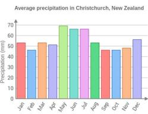

Answer: The answer is B. BECAUSE: The graph shows the average monthly rainfall in Christchurch from 1971 to 2000. \

The wettest month on average is December, with an average rainfall of 154.8 mm.\n

The second wettest month is May, with an average rainfall of 153.1 mm.\n

The third wettest month is April, with an average rainfall of 151.4 mm.

(Subject: Natural science, Topic: Earth science, Category: Weather and climate, Skill: Use climate data to make predictions)

(a) An example with a wrong answer and a wrong explanation.

Question: Which ocean is highlighted?

Context: A painting of a penguin on a blue background.

Options: (A) the Indian Ocean (B) the Arctic Ocean (C) the Pacific Ocean (D) the

Southern Ocean

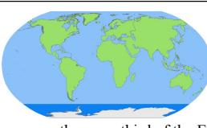

Answer: The answer is C. BECAUSE: The Pacific Ocean is the largest ocean. It covers more than one-third of the Earth's

(Subject: Social science, Topic: Geography, Category: Physical Geography, Skill: Oceans and continents)

(b) An example with a wrong answer and a wrong explanation.

**Question:** Complete the sentence so that it uses personification.

At night, when the machines were () the factory seemed to be an entirely different place.

Context: N/A

Options: (A) off (B) asleep

Answer: The answer is A. BECAUSE: Personification is a figure of speech that gives human qualities to nonhuman things. \n For example, the sentence "The wind was howling" uses personification. It gives the human quality of sound to the nonhuman thing wind.\n

The sentence "The sun was smiling" uses personification. It gives the human quality of expression to the nonhuman thing sun \n

In the sentence "At night, when the machines were off, the factory seemed to be an entirely different place," the machines are given the human quality of sound.

(Subject: Language science, Topic: Writing strategies, Category: Creative techniques, Skill: Use personification)

(c) An example with a wrong answer and a wrong explanation.

Question: Complete the sentence.

A dinosaur bone turning into rock over millions of years is a ().

Context: N/A

Options: (A) chemical change (B) physical change

Answer: The answer is B. BECAUSE: A physical change is a change to a substance that does not change what the substance

A chemical change is a change to a substance that does change what the substance is made of. \n

In this sentence, the word 'change' is a verb. It is an action word. The word 'change' is also a noun. It is a thing. \n

The word 'change' can be a physical change or a chemical change.\n

A physical change is a change to a substance that does not change what the substance is made of. For example, when water freezes, it changes from a liquid to a solid. But it is still made of water molecules. So, freezing is a physical change. \ A chemical change is a change to a substance that does change what the substance is made of. For example, when water evaporates, it changes from a liquid to a gas. But it is still made of water molecules. So, evaporating is a physical change. In this sentence, the word 'change' is a physical change. A dinosaur bone turning into rock over millions of years is a physical

(Subject: Natural science, Topic: Chemistry, Category: Physical and chemical change, Skill: Compare physical and chemical changes)

(d) An example with a wrong answer and a wrong explanation.

Figure 17: Four failure examples with predictions from GPT-3 (CoT). The answers are wrong, and the generated explanations fail to follow the right chain-of-thought reasoning process.