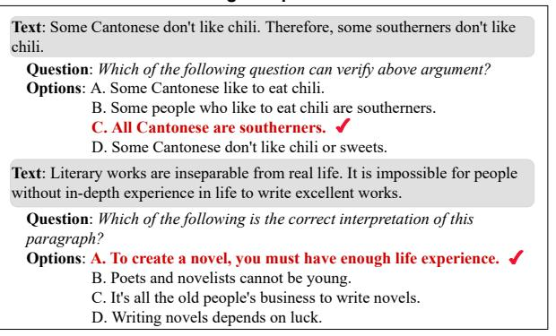
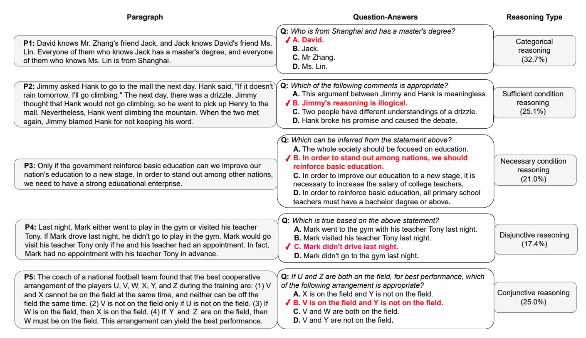
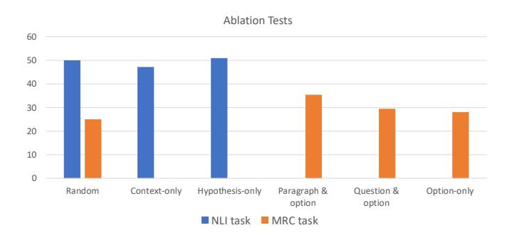
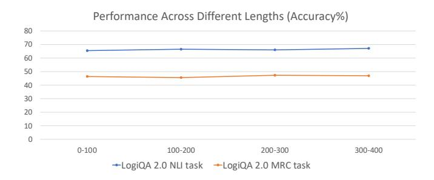
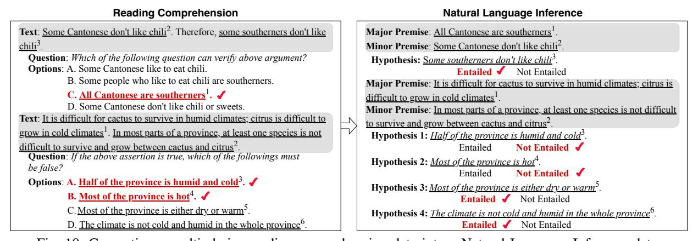

# LogiQA 2.0 — An Improved Dataset for Logical Reasoning in Natural Language Understanding

Hanmeng Liu, Jian Liu, Leyang Cui, Zhiyang Teng, Nan Duan, Ming Zhou, Yue Zhang<sup>†</sup>

Abstract-NLP research on logical reasoning regains momentum with the recent releases of a handful of datasets, notably LogiOA and Reclor, Logical reasoning is exploited in many probing tasks over large Pre-trained Language Models (PLMs) and downstream tasks like question-answering and dialogue systems. In this paper, we release LogiQA 2.0. The dataset is an amendment and re-annotation of LogiQA in 2020, a largescale logical reasoning reading comprehension dataset adapted from the Chinese Civil Service Examination. We increase the data size, refine the texts with manual translation by professionals, and improve the quality by removing items with distinctive cultural features like Chinese idioms. Furthermore, we conduct a finegrained annotation on the dataset and turn it into a two-way natural language inference (NLI) task, resulting in 35k premisehypothesis pairs with gold labels, making it the first large-scale NLI dataset for complex logical reasoning. Compared to Question Answering, Natural Language Inference excels in generalizability and helps downstream tasks better. We establish a baseline for logical reasoning in NLI and incite further research.

Index Terms—Reading Comprehension, Logical Reasoning, Natural Language Inference, Textual Inference

## I. INTRODUCTION

The capability of logical reasoning is a crucial part of natural language understanding (NLU) [1] [2] [3]. Investigation of *linguistic reasoning* dates back to the 1950s, at the dawn of computer science and artificial intelligence [4] [5] [6] [7] [8]. However, with limited computing power and primitive NLU technologies, formal logical reasoning gradually dominated the research field in the 1970s and became a key area of AI research over a long period [9] [10].

Recently, with the advance of deep learning technology, NLU has witnessed significant improvements [13] [14], with competitive results being reported over typical tasks, including natural language inference (NLI) [15] [16] and machine

Hanmeng Liu is with the Zhejiang University, Hangzhou 310007, China, and also with the School of Engineering, Westlake University, Hangzhou 310024, China (email: liuhanmeng@westlake.edu.cn)

Jian Liu is with the Fudan University, Shanghai 200433, China, and also with the School of Engineering, Westlake University, Hangzhou 310024, China (email: liujian@westlake.edu.cn)

Leyang Cui is with the Zhejiang University, Hangzhou 310007, China, and also with the School of Engineering, Westlake University, Hangzhou 310024, China (email: cuileyang@westlake.edu.cn)

Zhiyang Teng is with the School of Engineering, Westlake University, Hangzhou 310024, China (email: tengzhiyang@westlake.edu.cn)

Nan Duan is with Microsoft Research Asia, Beijing 100080, China (email: nanduan@microsoft.com)

Ming Zhou is with Langboat Technology, Beijing 100080, China (email: zhouming@chuangxin.com)

Yue Zhang is with the School of Engineering, Westlake University, and also with the Institute of Advanced Technology, Westlake Institute of Advanced Study, Hangzhou 310024, China (email: yue.zhang@wias.org.cn)

Yue Zhang is the corresponding author.

Premise: Met my first girlfriend that day.

Hypothesis: I didn't meet my first girlfriend until later.

Label: Contradiction

(a) An NLI example from the MNLI [11] dataset.

Passage: In meteorology, precipitation is any product of the condensation of atmospheric water vapor that falls under gravity. The main forms of precipitation include drizzle, rain, sleet, snow, graupel and hail... Precipitation forms as smaller droplets coalesce via collision with other rain drops or ice crystals within a cloud. Short, intense periods of rain in scattered locations are called "showers".

Question 1: What causes precipitation to fall?

Answer: gravity
Question 2: What is another main form of precipitation besides

drizzle, rain, snow, sleet and hail?

Question 3: Where do water droplets collide with ice crystals to form precipitation?

Answer: within a cloud

(b) An MRC example from the SQuAD [12] dataset.

Fig. 1: Examples of traditional NLU benchmarks.

reading comprehension (MRC) [17] [18]. Figure 1 illustrates the two NLU tasks. In Figure 1(a), an NLI model takes the premise and hypothesis as input and predicts whether the premise entails the hypothesis. In Figure 1(b), an MRC model takes a passage and question pair as input to predict the correct answer. There is a fundamental connection between machine reading comprehension and natural language inference [15], both tasks rely heavily on reasoning skills, and both are general because many NLP tasks can be cast into MRC [19] [20] or NLI [21]. For both NLI and MRC tasks, the current state-of-the-art approaches make use of a sizeable pretrained language model such as BERT [13], and RoBERTa [22], fine-tuned using the benchmark-specific training data. Benefiting from large-scale pre-training, such models have achieved performances close to or surpass the human level on popular benchmarks [23] [24].

The recent advance in NLU leads to the natural question of whether it is time to revisit traditional *linguistic reasoning* tasks. Relevant to this question, some work has shown evidence that the current deep learning technologies have the potential to conduct logical reasoning [25]. From the application perspective, harnessing logical reasoning benefits downstream tasks and NLP applications, such as dialogue systems [26], information extraction [27], and question answering [28] [29]. However, for both NLI and MRC, most existing datasets are designed to evaluate the capabilities of basic linguistic understanding, as Figure 1 shows. Relatively few benchmarks are available for systematically measuring the performance of

```
David, Jack and Mark are colleagues in a company. David supervises
Jack, and Jack supervises Mark. David gets more salary that Jack.
```

- Q: What can be inferred from the above statements?
  - A: Jack gets more salary than Mark.
  - B: David gets the same salary as Mark.
  - C: One employee supervises another who gets more salary than himself.
- D: One employee supervises another who gets less salary than himself.

Fig. 2: An example from the LogiQA 1.0 dataset. (✓ indicates the correct answer.)

NLP models concerning formal logical reasoning. This limits our exploration not only of linguistic reasoning per se but also potential investigations of more generalizable and more explainable NLP models that resemble human learning, in which logical reasoning plays a role [30] [31] [32] [33].

To address these issues, we constructed an MRC dataset named LogiQA [34], with a focus on logical reasoning. One example of the dataset is shown in Figure 2. As can be seen from the figure, to find the correct answer, the model needs to integrate information from multiple sentences. In particular, it needs to make valid logical inferences among David, Jack, and Mark to compare their level and salary, while none of the Four options is explicitly described in the context. In contrast, for traditional MRC tasks, such as SQuAD [12], and HotpotQA [35], only explicit evidence integration is necessary. LogiQA contains 8,678 paragraph-question pairs, each with four candidate answers. Using this dataset, we evaluated the capacity of pre-trained language models, in particular, BERT [13] and RoBERTa [22], for logical MRC. Results show a significant gap between model performance (around 35%) and human level (around 86%), revealing the shortcomings of pretrained LMs despite their success on traditional datasets. Our dataset facilitated subsequent research on the critical examination of existing datasets [36] [37], investigating various reasoning skills [38] [39], and designing new neural structures for language models [40].

The original LogiQA dataset, however, has three noteworthy limitations. First, LogiQA 1.0 categorizes 651 test samples into five reasoning types, namely categorical reasoning, sufficient conditional reasoning, necessary conditional reasoning, disjunctive reasoning, and conjunctive reasoning. However, it does not categorize the whole dataset, limiting the use of the dataset for investigating a sub-category of challenges in isolation or for fine-grained evaluation of reasoning capabilities. Second, as the original LogiQA dataset has been highly challenging to neural models [41], with the best-reported results being 39.32% accuracy [40], leaving a steep curve for research on more effective models. To this end, a binary NLI classification task can potentially reduce the ambiguity in the output from 4 choices to 2, which offers a different perspective to logical NLU. However, NLI is not included in LogiQA 1.0. Third, the quality of the English dataset needs improving because it has been translated using machine translation and human post-editing. One example of the test input is shown in Figure 4(a). As can be seen, the ambiguity of the original translation of option B undermines the truth value. As a result, the quality of translation can affect the effectiveness 1 The Chinese dataset is not affected as it is entirely human-curated.

```
Premise: All Cantonese are southerners. Some Cantonese don't like chili.
 Hypothesis: Some southerners don't like chili.
                     Entailed ✓ Not Entailed
Premise: Literary works are inseparable from real life. It is impossible for
people without in-depth experience in life to write excellent works.
 Hypothesis 1: To create a novel, you must have enough life experience.
                      Entailed 

Not Entailed
 Hypothesis 2: Poets and novelists cannot be young.
                      Entailed
                                   Not Entailed 

✓
 Hypothesis 3: It's all the old people's business to write novels.
                      Entailed Not Entailed
 Hypothesis 4: Writing novels depends on luck.
                      Entailed Not Entailed
```

(a) NLI examples from the LogiQA 2.0.

#### Reading Comprehension



(b) MRC examples from the LogiQA 2.0.

Fig. 3: Tasks examples of the LogiQA 2.0 dataset. (✓ indicates the correct answer. We use different font colors to separate the minor premise from the major premise.)

```
There are 4 cups on the table, each with a sentence written on it. The first
cup: "Beer is in all cups". The second cup: "Cola in this cup". The third cup:
"No coffee in this cup". Fourth cup: "Some cups have no beer". Only one of
the 4 sentences is true.
 O: So which of the following is true?
     A: Beer is in all cups.
     B: No Cola in all cups
     C: Coffee in the third cup.
     D: Cola in the second cup.
```

(a) LogiQA 1.0 example with neural translation and post-editing.

```
There are four cups on the table, each with a sentence written on it; the
first cup says "all cups are beer"; the second cup says "this cup is Cola";
The third cup says "this cup is not coffee"; the fourth cup says "some cups
are not beer". Only one sentence written on the four cups is true.
 Q: Which of the following must be true?
     A: All cups are beer.
     B: Every cup is not Cola.
     C: The third cup is coffee.
     D: The second cup is Cola.
```

(b) LogiQA 2.0 example with human translation.

Fig. 4: Quality improvements of the same instance in LogiQA 1.0 and LogiQA 2.0.

of the dataset as an effective benchmark for evaluating logical reasoning capabilities.1

We present LogiQA 2.0, an improved version of the LogiQA dataset. Figure 3 shows examples of two tasks in the LogiQA 2.0 dataset. The LogiQA 2.0 dataset has four salient changes.



Fig. 5: Examples of each type of logical reasoning in LogiQA 2.0. (✓ indicates the correct answer.)

First, we enlarged the dataset from 8678 instances to 15708 instances by collecting more logical test materials. Second, as shown in Figure 4(b), the quality of the English data is largely improved with fully professional human translation. Third, an NLI dataset is further added by making adaptations to the original MRC instances. Fourth, we give a fine-grained analysis of different logical reasoning types according to the division of logical reasoning types.

We reran typical baseline state-of-the-art NLP models on LogiQA 2.0, finding that the MRC task achieves better performance. For LogiQA 2.0, BERT-base achieves 48.12% accuracy, compared to 33.83% on LogiQA 1.0. We further quantify the influence of the English translation quality and the size of data, both of which have theoretical and practical significance. For the logical NLI task, which is not included in LogiQA 1.0, models achieve an average accuracy of 57.36%. with BERT-base achieving 54.97% accuracy. In addition to BERT-base and RoBERTa, which we experimented with in LogiQA 1.0, we additionally evaluate BART [14], GPT-2 [42] and GPT-3 [43] for both LogiQA 1.0 and LogiQA 2.0, which represent pre-trained models of different architectures. The best-performing GPT-3 gives results of 54.93% and 68.65% on LogiQA 2.0 MRC and NLI, respectively. Though much higher compared with BERT-base, the results lag much behind the 90% human level, which shows that logical reasoning is a challenging issue for both tasks.

This article is a significant extension to our LogiQA 1.0 conference paper [44], with rewritten introduction and related 2 work sections, a new dataset release, updated results, and 3 URL links of the data sources can be found in our dataset repository. extended experimental discussion details. All the resources are 4 https://github.com/csitfun/LogiQA2.0\_Chinese

released at https://github.com/csitfun/LogiQA2.0.

## II. DATASET

This section describes the LogiQA 2.0 dataset, a superset of LogiQA 1.0 with quantity and quality improvements. For brevity, we do not re-introduce LogiQA 1.0 but give the major differences between the two versions in Section II-E.

# A. MRC Data Collection and Translation

Our data source is public materials from the Chinese Civil Service Exam, which is held annually in provinces of China <sup>2</sup>. Experts design formal logical reasoning questions to test candidates' critical thinking and problem-solving skills. The exams take the form of multi-choice question answering, and testees need to select the correct options to answer the question. The testing materials are released online after each year's examination. LogiQA 2.0 increases the data size by including more logical reasoning tests.

We collect our data from the web <sup>3</sup>, obtaining 16490 textquestion-options triples. Each item contains one paragraph of text, a question, and four options. The correct answer or answers are labeled for each item. Discrimination is provided during collecting to rule out instances that are not selfcontained by the texts, i.e., instances are neglected if they contain charts or tables; we did not include questions that need to fill in the blanks. After the data cleaning process, the resulting dataset contains 15937 paragraph-questions pairs. We release the data as a Chinese MRC corpus for LogiQA 2.0<sup>4</sup>.

http://bm.scs.gov.cn/pp/gkweb/core/web/ui/business/home/gkhome.html

| Parameter                  | LogiQA 2.0 MRC task |             |             | Parameter                  | LogiQA 2.0 NLI task |             |             |  |
|----------------------------|---------------------|-------------|-------------|----------------------------|---------------------|-------------|-------------|--|
|                            | train               | dev         | test        |                            | train               | dev         | test        |  |
| # Paragraph-Question Pairs | 12,567              | 1569        | 1572        | # Premise-Hypothesis Pairs | 31,531              | 3941        | 3942        |  |
| Avg./Max. # T / Paragraph  | 69.82 / 290         | 70.31 / 228 | 68.27 / 215 | Avg./Max. # T / Premise    | 71.67 / 292         | 71.47 / 247 | 71.65 / 292 |  |
| Avg./Max. # T / Question   | 13.58 / 88          | 13.38 / 44  | 13.47 / 53  | Avg./Max. # T / Hypothesis | 17.92 / 104         | 17.89 / 103 | 17.69 / 107 |  |
| Avg./Max. # T / Answer     | 16.84 / 108         | 17.05 / 104 | 16.84 / 107 | # E / N Labels             | 15749 / 15782       | 2027 / 1914 | 1931 / 2011 |  |

TABLE I: Statistics of LogiQA 2.0. ("T" — tokens; "E" — entailment relations; "N" — non-entailment relations.)

For LogiQA 2.0, we then set up a translation project to translate the dataset into English, along with further data cleaning procedures. Professional translators are hired to translate the dataset from Chinese to English. Through this process, known issues of all the instances in LogiQA 1.0 are manually fixed. We remove all the instances that center on Chinese distinctive culture and language phenomena that are difficult to understand by a foreign culture (Chinese idioms, ancient poetry, Chinese philology, etc. Examples are given in Appendix A). In total, 667 translator hours (about 20 problems per hour) are spent with an average pay rate of 67 RMB ( $\approx$  10 USD) per hour. Figure 3(b) in the introduction shows one instance of the LogiQA 2.0 MRC task.

## B. The NLI Section of LogiQA 2.0

The NLI task was first introduced in the PASCAL Recognizing Textual Entailment Challenge [15] in the 2000s. The task is to decide the entailment relationship between two text fragments and has a natural connection with logical reasoning. Researchers used expert-designed datasets to explore different aspects of textual entailment [16], [45]. Crowdsourced methods were also introduced to construct large-scale NLI datasets [46], [47] in the 2010s. A typical example of the NLI datasets is shown in Figure 1(a). In general, the process of generating high-quality NLI datasets is costly. Due to the scarcity of NLI datasets, work has been done to obtain golden labeled NLI data from other NLU tasks, such as question-answering [48], [49], and summarization [50].

Following the work of Demszky *et al.* [49], we use rule-based method<sup>5</sup> to extract the premise and hypotheses from the concatenation of text, question, and options of each MRC instance in LogiQA 2.0. As an NLI dataset for logical reasoning, the NLI section of LogiQA 2.0 complies with the formulation of classical NLI tasks. It decides the entailment relationship between two text fragments (one is called the premise, and the other is the hypothesis) with a two-way classification scheme.

As shown in Figure 3(a), because the premise of each NLI instance is at the multi-sentence level, we follow the concept of syllogism [51] [52] and further add fine-grained labels to the premise, differentiating its major components. Such labels can *optionally* be used in training NLI models, which are illustrated in the coloring of Figure 3(a). One similar NLI dataset is the FraCaS Textual Inference Problem Set [16], derived from the FraCaS project [53]. There are 346 problems, each containing one or more premises and a hypothesis. Below is an illustrated example:

P1 A Swede won a Nobel prize.

P2 Every Swede is a Scandinavian.

H A Scandinavian won a Nobel prize.

In this example, categorical reasoning is the key reasoning skill to decide the entailment relation. P2 is the *major premise* [54], a statement of a general or universal nature; P1 is the *minor premise*, a statement regarding a particular case, related to the subject of the major premise [55]. Compared to the FraCaS dataset, our NLI section of the LogiQA 2.0 is larger in data size, and the context of the premise is longer.

Such additional fine-grained labels are designed to suit the setting of logical reasoning in the NLI setting, and can potentially facilitate research in syllogism (conditional, categorical, disjunctive) reasoning. Our labeling is done using hand-crafted rules.<sup>6</sup> As shown in Figure 3(a), each item is annotated with one of the two labels, *Entailed* and *Not Entailed*. One premise may have multiple hypotheses.

The resulting dataset consists of 39,414 premise-hypothesis pairs, covering a broad spectrum of logical reasoning types and a large genre of topics. Figure 3(a) in the introduction shows one instance of the LogiQA 2.0 NLI task. To the best of our knowledge, the NLI version of LogiQA 2.0 is the first large-scale expert-designed logical reasoning dataset for NLI beyond the sentence level featuring optional fine-grained premise labeling.

#### C. Reasoning Types

For both the MRC section and the NLI section of our dataset, we categorize the instances according to the five types of formal logical reasoning defined by Hurley [56], which are categorical reasoning, sufficient conditional reasoning, necessary conditional reasoning, disjunctive reasoning, and conjunctive reasoning. Human workers manually assign all the reasoning type labels based on the reasoning type definitions. The reasoning type of each question is assigned by a total of 5 workers, and each of them corresponds to one reasoning type. We give the description of reasoning types to the workers. The reasoning type of each question is a collection of 5 workers' decisions. The representative examples of different reasoning types and their proportion are illustrated in Figure 5. Note that the sum of total values is bigger than 100% for the reason that one instance may involve multiple reasoning types. These types of reasoning belong to deductive reasoning, for which a definite conclusion can be derived given a set of premises. As a result, such reasoning can be most suitable for evaluating performances quantitatively. Formally, the five types of reasoning can be described as follows:

<sup>&</sup>lt;sup>5</sup> https://github.com/nli-for-qa/conversion

<sup>&</sup>lt;sup>6</sup> An illustration is shown in Appendix B

- Categorical reasoning: The goal is to reason whether a specific concept belongs to a particular category. This type of reasoning is commonly associated with quantifiers such as "all/everyone/any", "no", and "some", etc.
- **Sufficient conditional reasoning:** The type of hypothetical reasoning is based on conditional statements of the form "If P, then Q", in which P is the antecedent and Q is the consequent.
- Necessary conditional reasoning: This type of hypothetical reasoning is based on conditional statements of the form "P only if Q", "Q whenever P", etc., where Q is a necessary condition for P.
- **Disjunctive reasoning:** In this type, the premise is disjunctive, in the form "either . . . or . . .", where the conclusion holds as long as one premise holds.
- **Conjunctive reasoning:** In this type of reasoning, the premise is conjunctive, in the form "both ... and...", where the conclusion holds only if all the premises hold.

#### D. Data Statistics

The detailed statistics of the LogiQA 2.0 MRC task are summarized on the left of Table I. We have 15708 paragraph-question pairs in the MRC section of our dataset. The average paragraph length is relatively small compared with existing reading comprehension datasets since logical reasoning problems do not rely heavily on complex context. We randomly split the dataset, using 12567, 1569, and 1572 instances for training, development and testing, respectively.

The statistics of the LogiQA 2.0 NLI task are summarized on the right of Table I. It is converted from the MRC section and has 39414 premise-hypothesis pairs. Compared to traditional one-sentence NLI datasets, the average premise length is 71.65, much longer due to the multi-sentence context. We randomly split the dataset, using 31531 instances for training, 3941 instances for development, and 3942 instances for testing.

# E. LogiQA 2.0 versus LogiQA 1.0

The main differences between LogiQA 2.0 and LogiQA 1.0 are 4-fold. The first is the data size. LogiQA 1.0 contains 8678 question instances, and LogiQA 2.0 extended it to 15,708 question instances. The second is the task framework. LogiQA 1.0 is a dataset solely for MRC in the form of fouroption question answering; LogiQA 2.0 added a two-way NLI task with 39,414 premise-hypothesis pairs, making it a dataset containing multiple tasks. The third is data quality. We enhanced the data quality with retranslation and amendments; elusive instances that may hinder the understanding of broader audiences are removed from the dataset. The fourth is more fine-grained annotation than the previous version. LogiQA 1.0 only annotated the test set with detailed reasoning types; for LogiQA 2.0 MRC task, we conduct in-depth annotations to the original data source by assigning each instance with reasoning types. We additionally provide the LogiQA 2.0 NLI task, featuring multi-sentence premise labels with additional major and minor premises for each premise-hypothesis pair.

| Dataset        | Accuracy |
|----------------|----------|
| SNLI [46]      | 89.42    |
| GLUE MNLI [57] | 83.79    |
| GLUE RTE [57]  | 65.34    |
| SciTail [58]   | 93.79    |
| GLUE QNLI [57] | 90.73    |
| LogiQA 2.0 NLI | 54.97    |

TABLE II: A comparison of BERT-base fine-tuning with different NLI datasets.

| Model               | De       | ev       | Test     |          |  |
|---------------------|----------|----------|----------|----------|--|
| 1,1000              | Accuracy | F1-score | Accuracy | F1-score |  |
| BERT-base           | 54.97    | 57.39    | 54.87    | 59.61    |  |
| RoBERTa-base        | 55.41    | 56.13    | 55.43    | 57.96    |  |
| XLNet-base          | 55.42    | 58.78    | 55.89    | 60.12    |  |
| BART-base           | 56.83    | 57.41    | 57.08    | 56.89    |  |
| GPT-2-base          | 55.01    | 57.84    | 54.75    | 57.32    |  |
| GPT-3               | 66.49    | 69.55    | 67.78    | 68.65    |  |
| Human Performance   | 86.63    | 84.06    | 89.36    | 91.40    |  |
| Ceiling Performance | 98.00    | 99.31    | 96.67    | 97.97    |  |

TABLE III: Results on LogiQA 2.0 NLI (accuracy%).

#### III. NLI MODELS

We use the state-of-the-art pre-trained language models to establish baselines for LogiQA 2.0 and empirically understand such models' effectiveness on logical NLI. In addition, human performance is evaluated as a reference metric.

## A. Pre-trained Language Models

We take the following pre-trained models:

**BERT** [13] is a Transformer-based [62] language model that uses a masked language modeling objective.

**RoBERTa** [22] extends BERT using a more dynamic sentence masking method. It uses a similar architecture as BERT but has a different pre-training scheme.

**XLNet** [60] is a generalized autoregressive pre-training method that uses a permutation language modelling objective to combine the advantages of autoregressive and autoencoding methods.

**BART** [14] is a sequence-to-sequence model with a denoising bidirectional autoecoder and a left-to-right decoder. The BART model works both for text generation tasks and comprehension tasks.

**GPT-2** [61] is the second generation of the Generative Pre-Trained (GPT) [63] language model that uses the decoder part of the transformers architecture. GPT-2 is trained on a very large corpus of English texts with a "predict the next word" unsupervised fashion.

**GPT-3** [43] is the third generation of GPT; it is an autoregressive language model that can generate human-like texts. The architecture of GPT-3 is based on the transformer network with a generative training objective on Internet-scale text data.

We apply fine-tuning for BERT, RoBERTa, XLNet, BART, and GPT-2. Following Devlin  $et\ al.$ , given a premise p and a hypothesis h, we concatenate the premise-hypothesis pair as

| Category    | Model                                                                            | LogiQA 1.0                                                |                                                           | LogiQA 2.0                                                |                                                           | Chinese LogiQA 1.0                               |                                           | Chinese LogiQA 2.0                               |                                                  |
|-------------|----------------------------------------------------------------------------------|-----------------------------------------------------------|-----------------------------------------------------------|-----------------------------------------------------------|-----------------------------------------------------------|--------------------------------------------------|-------------------------------------------|--------------------------------------------------|--------------------------------------------------|
|             |                                                                                  | Dev                                                       | Test                                                      | Dev                                                       | Test                                                      | Dev                                              | Test                                      | Dev                                              | Test                                             |
|             | Random(theoretical)                                                              | 25.00                                                     | 25.00                                                     | 25.00                                                     | 25.00                                                     | 25.00                                            | 25.00                                     | 25.00                                            | 25.00                                            |
| Rule-based  | Word Matching [59]                                                               | 27.49                                                     | 28.37                                                     | 30.25                                                     | 31.17                                                     | 26.55                                            | 25.74                                     | 29.48                                            | 30.31                                            |
| Pre-trained | BERT [13]<br>RoBERTa [22]<br>XLNet [60]<br>BART [14]<br>GPT-2 [61]<br>GPT-3 [43] | 33.83<br>35.85<br>35.02<br>35.49<br>33.93<br><b>51.53</b> | 32.08<br>35.31<br>33.17<br>35.61<br>33.48<br><b>49.17</b> | 48.12<br>49.88<br>50.86<br>48.80<br>47.05<br><b>56.21</b> | 47.90<br>48.76<br>47.84<br>46.31<br>47.32<br><b>54.93</b> | 30.46<br><b>39.22</b><br>38.92<br>37.16<br>32.67 | 34.77<br>37.33<br>35.41<br>36.88<br>30.84 | 37.10<br>38.54<br><b>40.60</b><br>38.21<br>33.12 | 31.14<br>35.64<br>34.11<br><b>38.94</b><br>31.09 |
| Human       | Human Performance<br>Ceiling Performance                                         | -                                                         | 86.00<br>95.00                                            | -                                                         | 84.00<br>98.00                                            | -                                                | 88.00<br>96.00                            | -                                                | 87.00<br>95.00                                   |

TABLE IV: Main results on LogiQA 2.0 MRC task (accuracy%).

a new sequence [CLS] + p + [SEP] + h + [SEP], where [CLS] and [SEP] are special symbols for classification token and separator token, respectively. After encoding, the last layer's hidden representation from the [CLS] token is fed in an MLP+softmax for classification. For the encoder-decoder models BART, we take [CLS] from the decoder module. For the decoder model GPT-2, the last token [SEP] is used for classification instead of the first [CLS] token. In addition to the standard NLI setting, we conduct separate experiments to examine the role of additional fine-grained premise labels. We add the leading symbol  $[Major\ premise]$  before the major premise texts, and  $[Minor\ premise]$  before the minor premise texts, resulting in the sequence  $[CLS] + [Major\ premise] + p_{major} + [Minor\ premise] + p_{minor} + [SEP] + h + [SEP]$  as the input.

For the GPT-3 model, we use in-context learning to explore GPT-3's few-shot learning ability by using a few examples. Specifically, we use 5 examples, each of which represents a typical reasoning skill as discussed in Section II-C. For the NLI task, each example is organized in a uniform format:

```
Given the fact: {premise}
Does it follow that: {hypothesis}
Yes or no? {label}
```

## B. Human Performance

To measure human performance on the LogiQA 2.0 NLI dataset, we randomly select 300 context-hypothesis pairs from the test set. Four testees were recruited, who are master students in computer science, and two had the experience of preparing for the Chinese Civil Service Exam. We report human performance by the mean score. The ceiling performance is obtained by considering the proportion of questions with at least one correct answer.

## IV. MRC MODELS

We evaluate the performances of typical reading comprehension models, including rule-based and deep learning methods based on pre-trained contextualized embedding. In addition, similar to NLI, human performances are evaluated, and ceiling performances are reported.

## A. Rule-Based Methods

We adopt one rule-based method relying on simple lexical matching. In particular, word matching [59] is a baseline that selects the candidate answers with the highest degree of unigram overlap with the given paragraph-question pair.

#### B. Pre-trained Language Methods

We take the same pre-trained models discussed in Section III-A for our experiments.

For BERT, RoBERTa, XLNet, BART, and GPT-2, we concatenate the paragraph, question, and each candidate answer as one sentence. Then use a pre-trained contextualized embedding model to encode the sentence for calculating its score. In the multi-choice scenario, as four candidate answers in our dataset, four concatenated sentences are constructed by pairing each candidate answer with the paragraph and question. The one with the highest model score is chosen as the answer. In particular, we treat the paragraph as sentence A and the concatenation of the question and each candidate as sentence B, before further concatenating them into [CLS] A [SEP] B [SEP] for encoding; the hidden state of the [CLS] token is used for MLP + softmax scoring. For the encoder-decoder models BART, we take [CLS] from the decoder module. For the decoder model GPT-2, the last token [SEP] is used for classification instead of the first [CLS] token. The embedding models are fine-tuned during training.

For GPT-3, because of the few-shot learning scenario, we use the 5 typical examples discussed in Section II-C as incontext, each example is organized in a uniform format:

```
Write a multi-choice question for the following article:
Article: {text}
Question: {question}
Options: \n {option1} \n {option2}
\n {option3} \n {option4}
Answer: {answer}
```

## C. Human Performance

To measure human performance on the LogiQA 2.0 MRC dataset, we randomly select 100 MRC instances from the test set. The number of instances is proportional to that of the NLI section. We use the same group of testees as the NLI section for measuring human performance. The human performance is reported by average scores, and the human ceiling performance is obtained by considering the proportion of questions with at least one correct answer.

#### V. EXPERIMENTS

We report the main results of the aforementioned models in Section III and IV on the LogiQA 2.0 NLI and MRC sections, respectively, to make a comparison between the performances of different types of models, and between the state-of-the-art models and human level. In addition, for the MRC section, we also compare results on LogiQA 2.0 and those on LogiQA 1.0 to understand the improvements we made to the datasets.

## A. Settings

We re-implement the rule-based methods strictly following Yih *et al.* [59] for MRC. For both NLI and MRC, we follow the HuggingFace implementation [64] and use the OpenAI API, taking the off-the-shelf model BERT-base, RoBERTa-base, XLNet-base BART-base, and GPT-2 for LogiQA 2.0, and Chinese BERT-base [65], Chinese RoBERTa-base [65], Chinese XLNet-base [66], Chinese BART-base [67] and Chinese GPT-2 [42] for the Chinese LogiQA 2.0 MRC section. All models are trained for 20 epochs. We find hyper-parameters using grid search: batch size  $\in \{8, 16, 32\}$  learning rate  $\in \{1e-5, 2e-5, 3e-5, 4e-5, 5e-5\}$  and gradient accumulate step  $\in \{1, 2, 4\}$ . We set the max length to 256 tokens for all models. All hyper-parameters are decided by the model performance on the development sets.

#### B. NLI results

Table III shows the results of models discussed in Section III. Following the NLI benchmark-setting [46] [11], we employ the overall accuracy as the main evaluation method. Furthermore, to give a more detailed analysis, we also calculate the precision (P), recall (R), and F1-score (F1). The F1-score of human performance on the test set is 91.40%, and the human accuracy performance is 89.36% for LogiQA 2.0; BERT-base yields 54.87% accuracy, and the F1-score is 59.61%; RoBERTa-base gives slightly better results with 55.43% accuracy and 57.96% F1-score. XLNet, BART and GPT-2 give similar results. The GPT-3 model gives the best performance with 67.78% accuracy and 68.65% F1-score. This shows that pre-training is effective for the task, and the contrast between GPT-2 and GPT-3 shows the effectiveness of increased model size. In addition, there is still a significant gap between the performance of pre-trained language models and human performance. The result concurs with the work of Clark et al. [68]. That is, although yes/no questions frequently occur in real-world scenarios, binary classification is notoriously hard for language models [68].

We rerun a series of experiments of BERT-base model finetuning on several NLI benchmarks, and the results are shown in Table II. Each experiment is trained for 10 epochs with the same hyperparameters. As seen from Table II and Table III, compared to their performance on traditional NLI benchmarks and human performance, there is still a gap, which shows that LogiQA 2.0 is challenging for the NLU models.

## C. MRC results

Table IV shows the results of the models discussed in Section IV. In particular, the human performance is 84.00%, and the ceiling performance is 98.00% for LogiQA 2.0, which shows that the difficulty level of the dataset is not high for human testees. In contrast, all algorithmic models

| Model   | LogiQ | QA 2.0 | LogiQ | A 1.0 | 2.0 portion |       |  |
|---------|-------|--------|-------|-------|-------------|-------|--|
|         | Dev   | Test   | Dev   | Test  | Dev         | Test  |  |
| BERT    | 48.12 | 47.90  | 33.83 | 32.08 | 36.75       | 32.71 |  |
| RoBERTa | 49.88 | 48.76  | 35.85 | 35.31 | 36.98       | 36.56 |  |
| XLNet   | 50.86 | 47.84  | 35.02 | 33.17 | 36.53       | 34.22 |  |
| BART    | 48.08 | 47.84  | 35.49 | 35.61 | 35.98       | 36.30 |  |
| GPT-2   | 47.05 | 47.32  | 33.93 | 33.48 | 35.56       | 35.14 |  |

TABLE V: LogiQA 2.0 vs. LogiQA 1.0 (accuracy%)

perform significantly worse than humans, demonstrating that the methods are relatively weak in logical-reasoning intensive reading comprehension. In addition, results on the Chinese dataset are on the same level as those on the English dataset.

In particular, the rule-based methods give accuracies of 30.25% and 31.17% on the development set and test set, respectively, slightly higher than a random guess baseline. This shows that using lexical matching alone makes the questions extremely difficult to solve. The first problem in Figure 3(b) serves as one intuitive example. Option C of the problem has the least lexical overlapping yet is the right answer; the lexical matching method fails in such cases.

On LogiQA 2.0, such models perform better than the methods without contextualized embeddings. It has been shown that pre-trained models have a certain degree of commonsense and logical capabilities [69]. However, the best result by GPT-3 is 56.21%, still much below human performance. This shows that knowledge in pre-trained models is rather weak for logical reasoning. It remains an open question how deep learning machine readers can be equipped with solid reasoning capability. In addition, the better results on NLI in Table III as compared to MRC in Table IV by the same models result from the fact that NLI is a binary classification task, which offers a playground for testing logical reasoning capabilities with fewer answer-level ambiguities.

LogiQA 2.0 versus LogiQA 1.0. We nearly double the data size from the LogiQA 1.0 to the LogiQA 2.0 MRC section. To examine how the MRC data size affects the performance of pre-trained models, we compare the performance of the same data portion of LogiQA 2.0 as in LogiQA 1.0 versus the Full LogiQA 2.0. As shown in Table IV and V, the RoBERTa-base result on the test set of the whole data is 45.42% accuracy, significantly higher than that of the partial data, which is 36.56% accuracy. We see a significant performance improvement on the LogiQA 2.0 MRC task for state-of-the-art MRC models, which happens due to the enhanced data quality and increased data size.

The influence of English translation quality on LogiQA 2.0. We reran experiments using the same data as LogiQA 1.0, but with the new English translation. We use the same training set for training and the same dev and test set for testing. The results are shown in the "2.0 portion" column Table V. On the dev set, the accuracy of BERT improved from 33.83% to 36.75%, RoBERTa gives an accuracy of 36.98%, higher than on LogiQA 1.0. Similarly, the accuracy of the other models also improved. This shows that the quality of English translation has a positive influence on the MRC result.



Fig. 6: RoBERTa results on the ablation tests (accuracy%).

#### VI. ANALYSIS

We give a detailed analysis based on the empirical results of both NLI and MRC models on the LogiQA 2.0 test sets.

#### A. Ablation Tests

Following recent studies [70] [71], we conduct a set of ablation experiments using RoBERTa to measure bias in the dataset by checking the performance based on partial information. To verify the data quality against bias and artifacts [72] For the NLI ablation test, we report the hypothesis-only and context-only results of the RoBERTa model. For the MRC ablation test, we report the paragraph & option result, the question & option result, and the option-only result for the RoBERTa model. In addition, the NLI and MRC tasks' random results are theoretically given, respectively. Figure 6 shows the results.

The LogiQA 2.0 NLI task. As we can see from Figure 6, training on context-only data yields 47.15% accuracy, and training RoBERTa on hypothesis-only data yields 50.92% accuracy. The results show that the RoBERTa model cannot decide the entailment relation between premise and hypothesis, given only one party. This shows that LogiQA 2.0 NLI does not have noticeable data artefacts [71].

The LogiQA 2.0 MRC task. As can be seen, the results of the MRC ablation test show that there is a significant drop in accuracy without the paragraph, the question, or both, which indicates that the bias on the dataset is weak. In particular, without the input paragraph, the accuracy drops from 45.42% to 29.47%; If we omit the question, the accuracy of the RoBERTa model is 35.37%, still 10% lower than the performance of RoBERTa on the complete data; The accuracy of the RoBERTa model on option-only data is 28.06%, slightly higher than a random guess. The ablating question causes a relatively minor performance drop as compared with the paragraph, which is consistent with observations by Huang *et al.* [69]. This is likely because the diversity of questions is lower than the paragraph. The above results show that our dataset does not have a strong bias.

## B. Transfer Learning

Recent studies have shown the benefit of fine-tuning models on similar datasets for knowledge transfer [69]. The set of experiments below aims to understand the underlying correlation

(a) LogiQA 2.0 NLI task transfer learning (accuracy%).

| Model                                    | Dev   | Test  |
|------------------------------------------|-------|-------|
| Random (theoretical)                     | 50.00 | 50.00 |
| RoBERTa <sub>MNLI</sub>                  | 49.62 | 47.18 |
| RoBERTa <sub>MNLI</sub> → LogiQA 2.0 NLI | 58.02 | 57.44 |

(b) LogiQA 2.0 MRC task transfer learning (accuracy%).

| Model                                                                                                                                          | Dev            | Test           |
|------------------------------------------------------------------------------------------------------------------------------------------------|----------------|----------------|
| Random (theoretical)                                                                                                                           | 25.00          | 25.00          |
| RoBERTa <sub>LogiQA 2.0 MRC</sub>                                                                                                              | 47.36          | 45.42          |
| RoBERTa <sub>RACE</sub><br>RoBERTa <sub>COSMOS</sub>                                                                                           | 27.02<br>29.36 | 28.79<br>31.71 |
| $\begin{aligned} &RoBERTa_{RACE} {\longrightarrow} LogiQA \ 2.0 \ MRC \\ &RoBERTa_{COSMOS} {\longrightarrow} LogiQA \ 2.0 \ MRC \end{aligned}$ | 36.83<br>37.43 | 33.65<br>36.82 |
| RoBERTa <sub>LogiQA 2.0 NLI</sub> →LogiQA 2.0 MRC                                                                                              | 48.47          | 48.28          |

TABLE VI: Transfer learning results on LogiQA 2.0

and contrasts between the NLI and MRC sections in LogiQA and relevant existing NLI and MRC benchmarks.

Knowledge transfer from MNLI to the LogiQA 2.0 NLI task. For the LogiQA 2.0 NLI task, we explore the MNLI [47] dataset for knowledge transfer. In particular, we first train RoBERTa with MNLI training data (RoBERTa-NLI), and then we use the trained model for fine-tuning the LogiQA 2.0 NLI data. As shown in the second rows of Table VI(a), RoBERTa-NLI only achieves 47.18% on the test set of LogiQA 2.0, much lower than 55.43% (Table III) when trained on LogiQA 2.0, and even lower than the theoretical random baseline, which shows that features learned over MNLI cannot directly transfer to LogiQA. After fine-tuning models on the NLI section of LogiQA 2.0, BART-NLI-FT gives a better performance of 57.44% which is slightly better than training only on LogiQA 2.0, which shows that LogiQA is unique compared to traditional NLI benchmarks because the reasoning types it needs are drastically different.

Knowledge transfer from RACE/COSMOS to the **LogiQA 2.0 MRC task.** Similarly, for the MRC section of the LogiQA 2.0, we conduct a set of transfer learning experiments to understand the degree of overlap in terms of necessary knowledge for solving problems in our dataset and existing datasets. In particular, we first fine-tune the RoBERTa model on a source dataset before fine-tuning the model on LogiQA 2.0. The model performance is expected to increase if the required knowledge is similar. RACE and COSMOS are adopted as the source datasets. The former tests English reading skills, while the latter tests commonsense knowledge. As shown in Table VI(b), the RoBERTa model trained only on either source dataset gives significantly lower accuracies on the LogiQA 2.0 test set compared with the RoBERTa model trained on LogiQA 2.0. The performance of RoBERTa trained on RACE is even close to the random guess baseline. In addition, further fine-tuning on LogiQA 2.0 leads to improvements over the source-trained baselines, but the resulting models do not outperform a model trained only on LogiQA 2.0. The observation is different from most other datasets [69], [73], demonstrating that LogiQA 2.0 contains highly different challenges compared with existing datasets.



Fig. 7: RoBERTa performance across different lengths

Transfer learning from the LogiQA 2.0 NLI task to the LogiQA 2.0 MRC task. Natural language inference for downstream tasks is explored in recent research [74] [75] [76]. NLI models are used to verify the correctness of QA systems' prediction because logical entailment provides more information than selecting the highest score from multi-choice options. [75]. We conduct a transfer learning experiment across the LogiQA 2.0 NLI and the LogiQA 2.0 MRC tasks, using RoBERTa-base for our experiment. The result is shown in Figure VI(b). The RoBERTa model is first trained on the LogiQA 2.0 NLI section. Then we use the LogiQA 2.0 MRC section to fine-tune the RoBERTa model trained on the LogiQA 2.0 NLI section, which yields an accuracy of 48.28% on the test set, the highest score of the RoBERTa model. The results show that a model trained on a natural language inference dataset can improve the downstream tasks like question answering after fine-tuning.

## C. Performance Across Different Input Lengths

We measure the accuracy of RoBERTa against the input size for both NLI and MRC. In particular, for the NLI task, we concatenate the premise and hypothesis to calculate the context length for each instance; for the MRC task, the number of words in the paragraph, the question, and the candidate answers are added together as the length of a test instance. The results are all shown in Figure 7, where the model performances are not negatively associated with the input size, which is different from most NLP benchmarks [77]. This shows that the level of challenge in logical reasoning can be independent of the input verbosity for both NLI and MRC.

#### D. Lexical Overlap

Lexical overlap between input and output components has been shown to lead to typical spurious features for various NLP tasks [78] For the NLI task, we examine the overlap ratio between premises and hypotheses to understand the surface matching bias of the NLI data section. For the MRC task, we aim to understand the bias of models in selecting the candidate answers that have the best surface matching with the paragraph. To this end, we calculate the unigram overlap between each candidate answer and the given paragraph for each problem and mark the best-matching candidate.

(a) LogiQA 2.0 NLI

| (7) 18 (1)    |                    |             |  |  |  |  |  |
|---------------|--------------------|-------------|--|--|--|--|--|
| Model         | Overlap Ratio      | Accuracy(%) |  |  |  |  |  |
| BERT          | 33.47              | 64.04       |  |  |  |  |  |
| RoBERTa       | 32.78              | 65.91       |  |  |  |  |  |
| Gold-standard | 29.04              | 100.00      |  |  |  |  |  |
|               | (b) LogiQA 2.0 MRC |             |  |  |  |  |  |
| Model         | Overlap Ratio      | Accuracy(%) |  |  |  |  |  |
| BERT          | 33.47              | 46.71       |  |  |  |  |  |
| RoBERTa       | 32.78              | 49.16       |  |  |  |  |  |
| Gold-standard | 27.85              | 100.00      |  |  |  |  |  |

TABLE VII: Overlap ratio (%) against the model type.

**P1:** Children's products are any products intended for play or use by children 12 years of age or younger.

- **Q:** Based on the above definition, which of the following are children's products?
- A. Milk powders for infants aged from 0 to 1.

  B. Comic books suitable for kids around 10 years old.
  - C. Brightly packed lollipops.
- X D. Bumper cars in the amusement park children love to play.

**P2:** Flower Bay is an ideal river for salmons swimming. If there is a hydropower dam downstream, then salmons will not be able to swim here. Salmons swim here only if the trees on the shore of Flower Bay have lost their leaves. If many sea eagles and brown bears gather in this river bay, then you can tell that the salmons are migrating. Now there are a lot of salmons swimming in Flower Bay.

- Q: Based on the above statements, which of the following can be derived?
- ✓ A. The leaves on the shore of Flower Bay are gone.
- **B.** There are many sea eagles and brown bears in Flower Bay.
- **X** C. There is a hydropower dam downstream of Flower Bay.
  - D. Sea Eagle and Brown Bear Feed on Salmon.

**P3:** A company decided to select 4 people from 3 women (A, B, C) and 5 men (D, E, F, X, Y) to set up a group for an important negotiation. Here are the prerequisites: (1) The group members must have both women and men. (2) D and A cannot be selected at the same time. (3) B and C cannot be selected at the same time. (4) If Y is selected, then F won't be selected.

- Q: If D must be selected, which of the following can be derived?
- **A.** If the company selects F, then need also select Y.
- **X** B. If the company selects E, then need also select X.
- C. Either selecting Y or X.
- **✓** D. Either selecting B or C.

Fig. 8: Example mistakes of RoBERTa. (✓ indicates the correct answers and ✗ indicates the RoBERTa prediction.)

We report the "Overlap Ratio" by calculating the accuracy between model prediction and the best-matching candidate. The results are shown in Table VII. For NLI, Table VII(a) shows that the gold-standard output of the NLI data has an accuracy of 29.04%, lower than that of pre-trained models, which indicates a certain level of surface matching by the models. As seen in Table VII(b), the gold-standard output of the MRC data has an accuracy of 27.85%, whilst all of the models give accuracies above this number, which shows a tendency of superficial matching. In particular, RoBERTa gives a lower matching accuracy, showing that it relies the least on lexical patterns than BERT. As can also be seen from the tables, surface patterns can be a spurious feature, leading to lower results.

| Reasoning Type                                                                                                                                 | NLI                                       | section                                        | MRC section                               |                                                |  |
|------------------------------------------------------------------------------------------------------------------------------------------------|-------------------------------------------|------------------------------------------------|-------------------------------------------|------------------------------------------------|--|
| 5 <b>71</b>                                                                                                                                    | Acc                                       | Ratio                                          | Acc                                       | Ratio                                          |  |
| Categorical reasoning<br>Sufficient conditional reasoning<br>Necessary conditional reasoning<br>Disjunctive reasoning<br>Conjunctive reasoning | 78.06<br>55.92<br>49.11<br>47.15<br>49.58 | 43.09%<br>21.40%<br>22.06%<br>16.87%<br>31.63% | 59.61<br>28.47<br>22.18<br>22.93<br>25.40 | 30.53%<br>27.34%<br>19.37%<br>20.77%<br>16.71% |  |

TABLE VIII: Test accuracy (%) per reasoning type.

## E. Reasoning Types

Table VIII gives the performances of RoBERTa over the 5 reasoning types discussed in Section II-C. For both NLI and MRC, the method gives the best accuracy on categorical reasoning. However, the results are significantly lower for the other four reasoning types. We give qualitative discussion via case study to understand why these tasks are challenging.

- a) Categorical reasoning: P1 of Figure 8 shows a typical example where the definition of children's products is given in the paragraph, and the testee is asked to select a correct instance. A key here is the age range (i.e., under 12). RoBERTa incorrectly chooses the candidate that is superficially similar to the paragraph while ignoring the reasoning process.
- b) Conditional reasoning: P2 of Figure 8 is a representative example of the most challenging conditional reasoning questions. In particular, a variety of sufficient and necessary conditional relations are given in the paragraph, which includes:

x = "Salmons swim"

y = "Sea eagles and brown bears gather"

z = "Hydropower dam exists downstream"

w = "Trees lose leaves"

x => w (Necessary conditional relation)

y => x (Sufficient conditional relation)

 $x = > \overline{z}$  (Sufficient conditional relation)

The correct answer depends on fully understanding both the necessary and sufficient conditional reasoning facts. RoBERTa makes a mistake by ignoring the "not" operator in the  $x = > \bar{z}$  condition, which coincides with prior observations on BERT and negation [79].

c) Conjunctive and disjunctive reasoning: P3 of Figure 8 represents one of the most challenging questions in the dataset, where the premises and candidate give a set of constraints in both conjunctive and disjunctive forms, and the question asks which candidate conforms to the premises. The testee is expected to enumerate different possible situations and then match the cases to the candidates by thoroughly understanding the candidates also. Intuitively, RoBERTa is not directly equipped with such reasoning capacity.

In summary, the observations above indicate that RoBERTa can rely on relatively superficial patterns to resolve ambiguities for both NLI and MRC, rather than learning to use formal logical reasoning. As a result, it learns spurious features [80]–[82], which can lead to accuracies below random guess baselines when the training and testing distributions consistently differ.

| Model        | With Maj | or/Minor | Original |          |  |
|--------------|----------|----------|----------|----------|--|
|              | Accuracy | F1-score | Accuracy | F1-score |  |
| BERT-base    | 54.96    | 59.39    | 54.87    | 59.61    |  |
| RoBERTa-base | 55.44    | 57.96    | 55.43    | 57.96    |  |
| BART-base    | 57.84    | 56.94    | 57.08    | 56.89    |  |
| GPT-2-base   | 54.75    | 57.32    | 54.75    | 57.32    |  |
| GPT-3        | 68.49    | 68.97    | 67.78    | 68.65    |  |

TABLE IX: Models performance on LogiQA 2.0 NLI test set w/o major/minor premise annotation. (accuracy%)

## F. The Role of Major/Minor Premise Annotation

The optional major and minor premises (Section II) are potentially useful for logical reasoning in NLI. We conduct experiments to examine the role of major/minor premise annotation. As mentioned in Section III-A, special tokens are added to the beginning of both major and minor premises. We use the same hyperparameters as the main NLI experiments. The results are shown in Table IX. While BART and GPT-3 give better accuracy and F1-score with the major/minor premise indicators, results of BERT-RoBERTa and GPT-2 are relatively less improved. Overall, major and minor premises show a positive influence on model performance. We leave a further investigation of how to effectively make use of such labels to future work.

#### VII. RELATED WORK

A contrast between LogiQA 2.0 and related datasets is shown in Table X. To our knowledge, LogiQA is the first dataset to investigate different types of formal logical reasoning in both MRC and NLI tasks.

Datasets for Traditional Natural Language Inference. Different schemes of entailment relations are investigated in NLI research, where two-way [96]–[98] and three-way [46], [47] classification are most frequently used in NLI datasets. The task of Natural Language Inference was first introduced as Recognizing Textual Entailment (RTE-1) [96]. It classifies sentence pairs into either entailment or non-entailment, a two-way classification scheme. The advantage of binary classification is that it avoids the vagueness between neutral and contradiction, which undermines the annotation quality for crowd-sourcing datasets. Similar to the RTE dataset, we use binary classification in the NLI version of LogiQA 2.0. However, the RTE dataset is different from our dataset in that the context of the dataset is only a single sentence, and it is not designed for logical reasoning.

The FraCas test suite [53] is hand-crafted by experts with hundreds of NLI questions. Similar to our dataset, it covers logic phenomena like quantifiers and comparatives. However, unlike our dataset, it is not designed for complex logical reasoning with multiple sentence inputs. In addition, the dataset is rather small and thus more suitable for validating rule-based methods. The first large-scale NLI dataset that can be used for the training of neural models is SICK [89]. Different from our work, the SICK dataset is crowd-sourced and has unreliability issues being reported [99], and is not widely used in training neural models. Finally, SICK introduces a three-way NLI scheme instead of a two-way classification.

| Dataset             | Task                       | Logic    | Context        | Source          | Size  | Schemes                  |
|---------------------|----------------------------|----------|----------------|-----------------|-------|--------------------------|
| SQuAD [12]          | Reading Comprehension      | Х        | Passage        | Wikipedia       | 100K  | Question Answering       |
| TriviaQA [83]       | Reading Comprehension      | X        | Passage        | Trivia Websites | 95K   | Question Answering       |
| DuoRC [84]          | Reading Comprehension      | X        | Passage        | Movie           | 186K  | Question Answering       |
| NarrativeQA [85]    | Reading Comprehension      | X        | Passage        | Movie           | 46K   | Question Answering       |
| DROP [86]           | Reading Comprehension      | X        | Passage        | Wikipedia       | 96k   | Question Answering       |
| COSMOS QA [69]      | Reading Comprehension      | X        | Passage        | Webblog         | 35588 | Question Answering       |
| MuTual [87]         | Next Utterance Prediction  | X        | Dialogue       | Exam            | 8860  | Multi-choice Selection   |
| ReClor [88]         | Reading Comprehension      | ✓        | Passage        | Exam            | 6138  | Question Answering       |
| LogiQA [34]         | Reading Comprehension      | ✓        | Passage        | Exam            | 8678  | Question Answering       |
| LogiQA 2.0 (MRC)    | Reading Comprehension      | 1        | Multi-Sentence | Exam            | 16K   | Question Answering       |
| FraCaS [53]         | Natural Language Inference | e 🗸      | One-Sentence   | Diverse         | 346   | Question Answering       |
| RTE (GLUE) [57]     | Natural Language Inference | ×        | One-Sentence   | Diverse         | 5K    | Two-way Classification   |
| SICK [89]           | Natural Language Inference | ×        | One-Sentence   | Captioning      | 10K   | Three-way Classification |
| SNLI [46]           | Natural Language Inference | ×        | One-Sentence   | Captioning      | 570K  | Three-way Classification |
| MultiNLI [11]       | Natural Language Inference | <b>×</b> | One-Sentence   | Diverse         | 433K  | Three-way Classification |
| ENTAILMENTBANK [90] | Natural Language Inference | <b>×</b> | Passage        | Exam            | 1840  | Question Answering       |
| RuleTaker [25]      | Natural Language Inference | · /      | Passage        | Synthetic       | 800K  | Question Answering       |
| MED [91]            | Natural Language Inference | <b>×</b> | One-Sentence   | Crowd-sourcing  | 5382  | Two-way Classification   |
| HELP [92]           | Natural Language Inference | <b>×</b> | One-Sentence   | PMB [93]        | 36K   | Two-way Classification   |
| ConjNLI [94]        | Natural Language Inference | <b>×</b> | One-Sentence   | Wikipedia       | 1623  | Three-way Classification |
| TaxiNLI [95]        | Natural Language Inference | <b>×</b> | One-Sentence   | MNLI            | 10K   | Three-way Classification |
| ConTroL [44]        | Natural Language Inference | <b>×</b> | Passage        | Exam            | 8325  | Three-way Classification |
| LogiQA 2.0 (NLI)    | Natural Language Inference | e 🗸      | Multi-Sentence | Exam            | 35K   | Two-way Classification   |

TABLE X: Comparison between our dataset and existing benchmarks of MRC and NLI. (✓ indicates datasets addressing logical reasoning. ✗ indicates datasets not particular for logical reasoning.)

For neural models, the most popular NLI datasets for NLU benchmarks are the SNLI [46] and the Multi-genre NLI (MNLI) [11] datasets, which are inspired by the SICK dataset. Compared to SICK, the two datasets improve in data scale, label quality, and also coverage of genres. They catalyze the development of models with better representation abilities and become the go-to benchmark for natural language understanding research. Through SNLI and MNLI are widely used in NLP research, researchers find that they contain biases that can be exploited by models to achieve high scores without the real inference abilities [78] [100]. Datasets generated through crowd-sourcing are prone to annotation artefacts [72]. On the contrary, our dataset is sourced from expert-designed logical reasoning tests, making it more reliable in data quality. ENTAILMENTBANK [90] is a dataset for multistep, multipremise textual entailment in the form of question-answering. The dataset is derived from grade-school-level multi-choice science questions. Annotators are instructed to construct entailment trees given a hypothesis (question-answer pair) and relevant text. With the hypothesis and its context from each instance, the dataset can be used for the NLI task. Similar to our dataset, the context of ENTAILMENTBANK is beyond the sentence level. However, it does not explore logical reasoning, which is the main focus of our dataset.

Datasets for Logical Reasoning NLI. RuleTaker [25] is a synthetic dataset to examine the reasoning ability of transformers [62] over natural language rules. With input facts and input rules as context, the output is a binary true-or-false answer. Although originally designed for question-

answering, the dataset can be easily converted into NLI-style. Different from the expert-designed LogiQA 2.0, the dataset is in synthetic English following templates. MED [91] and HELP [92] are two NLI datasets focusing on monotonicity reasoning, which is an essential concept in Natural Logic [101]. The datasets are generated through monotonicity rules and only investigate monotonicity-related inference specifically. Similar to the NLI section of our dataset, MED and HELP investigate basic logic phenomena in natural language, which is monotonicity in particular. However, unlike their work, our dataset is human written, and tackles more complex formal logical reasoning over multiple sentences.

ConjNLI [94] is a challenging stress test for NLI over conjunctive sentences, where the premise differs from the hypothesis by having conjuncts being removed, added, or replaced. Similar to LogiQA 2.0, Logical reasoning about conjunctions is heavily tested. However, our dataset covers broad logical reasoning types. Moreover, in ConjNLI, premise-hypothesis pairs are created automatically by applying conjunct operations on collected conjunctive sentences. Different from their work, our NLI version of LogiQA is converted from question-answering tests, which is more diverse.

TaxiNLI [95] is an NLI dataset re-annotated on the MNLI dataset with fine-grained category labels. The annotation includes logical categories like connectives, mathematical, and deduction, which is similar to our dataset. However, unlike our dataset, TaxiNLI contains only a small fraction of logical reasoning examples and is not designed particularly for logical reasoning. ConTRoL [44] is an NLI dataset that further

investigates contextual reasoning under the NLI framework. It has 36.2% of premise-hypothesis pairs under the category of logical reasoning. Similarly, it has a portion of instances addressing multi-sentence logical reasoning. However, it is not an NLI dataset solely for formal logical reasoning but for contextual reasoning in general. Therefore, to enlarge the NLI version of LogiQA 2.0, we incorporate the logical reasoning instances into our new NLI dataset.

Datasets for Traditional Machine Reading Comprehension. A seminal dataset for large-scale reading comprehension is SQuAD [12], which requires selecting a factual answer from all possible spans in a given passage. Many neural methods have been developed for this dataset, achieving results that rival human testees. As a consequence, more reading comprehension datasets with increasing challenges are proposed. These datasets can be classified according to the main challenges. In particular, TriviaQA [83] requires evidence integration across multiple supporting documents to answer the questions. DuoRC [84] and Narrative QA [85] raise challenges by introducing two passages about the same facts. Welbl et al. [102] and HotpotQA [35] test models for text understanding with sequential multi-step reasoning. Drop [86] tests discrete numerical reasoning over the context. MuTual [87] tests dialogue reasoning ability via the next utterance prediction task. The answer (or candidate in multi-choicequestions) is mostly a text span in the given passage for the above datasets. Several types of reasoning are necessary, such as geolocational reasoning and numerical computation. Unlike these datasets, our dataset contains answers not directly included in the input passage and requires comprehensive reasoning methods beyond text-matching-based techniques.

Similar to our dataset, recent datasets for commonsense reasoning, including MCScript [103] and COSMOS [69], also contain candidate answers not directly included in the input passage. They test a model's capability of making use of external background knowledge about spatial relations, cause and effect, scientific facts, and social conventions. In contrast, our dataset focuses on logical reasoning, and most necessary facts are not directly included in the given passage. In addition, most of the existing datasets are labeled by crowd-sourcing. In contrast, our dataset is based on examination problems written by human experts for students and therefore has a better guarantee of quality. This is particularly important for datasets that involve abstract reasoning skills.

**Datasets for Logical Reasoning Reading Comprehension.** LogiQA 1.0 [34], our previous dataset, was one of the earliest datasets for testing logical MRC. Reclor [88] is another reading comprehension dataset requiring logical reasoning. It collects question-answering examples from the LSAT exams <sup>7</sup>, which are targeted to test human logical reasoning abilities. Compared to our dataset, the size of Reclor is smaller; and the reasoning types that Reclor uses are the same as the question types of the original tests, such as "Identify a Flaw", which is informally defined. In contrast, we annotate formally defined logic reasoning types for LogiOA and investigate formal logic.

NLI Datasets Converted from MRC Datasets. While multiple MRC datasets are available, obtaining high-quality NLI datasets is difficult [48]. Moreover, annotating large-scale NLI datasets through crowd-sourcing is costly and suffers from human artefacts [104]. Thus, converting question-answering datasets into natural language inference datasets has become a promising research direction [48] [105] [75]. This approach is awarded for the fact that abundant large-scale MRC datasets exist, making it an efficient way of creating high-quality NLI datasets. The Question-answering NLI (QNLI) dataset [57] is an NLI dataset automatically derived from the Stanford Question Answering Dataset (SQuAD), an MRC dataset we talked about in VII. The dataset was converted into sentence pair classification by forming a sentence pair between the question and each sentence in the corresponding context and filtering out pairs with low lexical overlap between the question and the context. The task is to determine whether the context sentence contains the answer to the question. Similar to our dataset, QNLI is derived from question-answering datasets, and the framework is also a two-way classification. However, different from their work, the LogiQA 2.0 NLI section is converted from expert-designed logical reasoning questions other than Wikipedia passages; the premise of each instance is multisentence other than single-sentence.

Similarly, QA-NLI [105] converts question-answering pairs into their declarative forms and obtains 500K NLI examples. The source datasets come from existing MRC benchmarks. Different from our dataset, QA-NLI adopts a three-way classification scheme; it is not a dataset for logical reasoning.

Other Datasets Addressing Logical Reasoning. Apart from the datasets we mentioned above, there have been existing datasets related to logical reasoning in other NLP tasks. In particular, Habernal et al. [106] designs a dataset for argument reasoning, where a claim is given, and the model is asked to choose a correct premise from two candidates to support the claim. Similar to our dataset, the dataset concerns deductive reasoning. The most significant difference between our dataset and this dataset is that they focus on computational argumentation. The form of their task is neither a reading comprehension nor a textual entailment task. In addition, our dataset has more instances (15,708 vs. 1,970), more choices per question (4 vs. 2), and is written by relevant experts rather than being crowd-sourced. CLUTRR [107] is a dataset for inductive reasoning over family relations. The input is a given passage and a query pair, and the output is a relationship between the pair. The task is reasoning on a fixed domain (i.e., family relationship), which is in line with prior work on social relation inference [108]. In contrast, our dataset investigates formal logical reasoning with various types.

## VIII. CONCLUSION

We presented LogiQA 2.0, a new version of LogiQA with increased data size, refined translation, and a new NLI counterpart to the original MRC task. Experiments show that the extension leads to better performance with a variety of pre-trained models due to quality improvements and data size augmentation. In addition, comparison experiments between

<sup>7</sup> https://www.lsac.org/lsat

model and human performances show that the current state-of-the-art methods still lag far behind the human level for logical NLU. To our knowledge, the NLI section of LogiQA 2.0 is the first large-scale expert-designed NLI benchmark for logical reasoning.

#### REFERENCES

- [1] M. J. Cresswell, Logics and languages (1st ed.). Routledge, 1973.
- [2] R. Kowalski, Logic for problem solving. Ediciones Díaz de Santos, 1979, vol. 7.
- [3] L. Iwańska, "Logical reasoning in natural language: It is all about knowledge," Minds and Machines, 1993.
- [4] A. Newell and H. Simon, "The logic theory machine—a complex information processing system," *IRE Transactions on Information Theory*, 1956.
- [5] J. McCarthy, "Programs with common sense," in Proceedings of the Teddington Conference on the Mechanization of Thought Processes, 1959.
- [6] D. Bobrow, "Natural language input for a computer problem solving system." 1964.
- [7] J. McCarthy and P. J. Hayes, "Some philosophical problems from the standpoint of artificial intelligence," in *Machine Intelligence* 4, 1969.
- [8] J. McCarthy, "Artificial intelligence, logic and formalizing common sense," in *Philosophical logic and artificial intelligence*, 1989.
- [9] F. C. N. Pereira, "Logic for natural language analysis," 1982.
- [10] R. Cann, Formal semantics: an introduction. Cambridge University Press, 1993.
- [11] A. Williams, N. Nangia, and S. Bowman, "A broad-coverage challenge corpus for sentence understanding through inference," in *Proc. of NAACL*, 2018.
- [12] P. Rajpurkar, J. Zhang, K. Lopyrev, and P. Liang, "SQuAD: 100,000+ questions for machine comprehension of text," in *EMNLP*, 2016.
- [13] J. Devlin, M.-W. Chang, K. Lee, and K. Toutanova, "Bert: Pre-training of deep bidirectional transformers for language understanding," arXiv preprint arXiv:1810.04805, 2018.
- [14] M. Lewis, Y. Liu, N. Goyal, M. Ghazvininejad, A. Mohamed, O. Levy, V. Stoyanov, and L. Zettlemoyer, "Bart: Denoising sequence-to-sequence pre-training for natural language generation, translation, and comprehension," arXiv preprint arXiv:1910.13461, 2019.
- [15] I. Dagan, O. Glickman, and B. Magnini, "The pascal recognising textual entailment challenge," in *Proc. of ICML*, 2005.
- [16] B. MacCartney and C. D. Manning, "Natural logic for textual inference," in *Proceedings of the ACL-PASCAL Workshop on Textual Entailment and Paraphrasing*, 2007.
- [17] K. M. Hermann, T. Kocisky, E. Grefenstette, L. Espeholt, W. Kay, M. Suleyman, and P. Blunsom, "Teaching machines to read and comprehend," in NIPS, 2015.
- [18] D. Chen, J. Bolton, and C. D. Manning, "A thorough examination of the CNN/daily mail reading comprehension task," in ACL, 2016.
- [19] O. Levy, M. Seo, E. Choi, and L. Zettlemoyer, "Zero-shot relation extraction via reading comprehension," in *Proceedings* of the 21st Conference on Computational Natural Language Learning (CoNLL 2017). Vancouver, Canada: Association for Computational Linguistics, Aug. 2017, pp. 333–342. [Online]. Available: https://aclanthology.org/K17-1034
- [20] X. Li, J. Feng, Y. Meng, Q. Han, F. Wu, and J. Li, "A unified MRC framework for named entity recognition," in *Proceedings of the 58th Annual Meeting of the Association for Computational Linguistics*. Online: Association for Computational Linguistics, Jul. 2020, pp. 5849–5859. [Online]. Available: https://aclanthology.org/2020.acl-main.519
- [21] S. Wang, H. Fang, M. Khabsa, H. Mao, and H. Ma, "Entailment as few-shot learner," CoRR, 2021.
- [22] Y. Liu, M. Ott, N. Goyal, J. Du, M. Joshi, D. Chen, O. Levy, M. Lewis, L. Zettlemoyer, and V. Stoyanov, "Roberta: A robustly optimized bert pretraining approach," arXiv, 2019.
- [23] C. Raffel, N. Shazeer, A. Roberts, K. Lee, S. Narang, M. Matena, Y. Zhou, W. Li, and P. J. Liu, "Exploring the limits of transfer learning with a unified text-to-text transformer," *CoRR*, 2019.
- [24] Y. Jiang, S. Wu, J. Gong, Y. Cheng, P. Meng, W. Lin, Z. Chen, and M. Li, "Improving machine reading comprehension with single-choice decision and transfer learning," *CoRR*, 2020.

- [25] P. Clark, O. Tafjord, and K. Richardson, "Transformers as soft reasoners over language," CoRR, vol. abs/2002.05867, 2020. [Online]. Available: https://arxiv.org/abs/2002.05867
- [26] S. Beygi, M. Fazel-Zarandi, A. Cervone, P. Krishnan, and S. R. Jonnalagadda, "Logical reasoning for task oriented dialogue systems," 2022.
- [27] D. Ru, C. Sun, J. Feng, L. Qiu, H. Zhou, W. Zhang, Y. Yu, and L. Li, "Learning logic rules for document-level relation extraction," 2021.
- [28] G. Angeli, N. Nayak, and C. D. Manning, "Combining natural logic and shallow reasoning for question answering," in *Proc. of ACL*, 2016.
- [29] J. Shi, X. Ding, L. Du, T. Liu, and B. Qin, "Neural natural logic inference for interpretable question answering," in *Proc. of EMNLP*, 2021.
- [30] S. Sia, A. Belyy, A. Almahairi, M. Khabsa, L. Zettlemoyer, and L. Mathias, "Logical satisfiability of counterfactuals for faithful explanations in NLI," 2022.
- [31] T. Linzen, "How can we accelerate progress towards human-like linguistic generalization?" in *Proc. of ACL*, 2020.
- [32] R. M. Monarch, Human-in-the-Loop Machine Learning: Active learning and annotation for human-centered AI. Simon and Schuster, 2021.
- [33] X. Wu, L. Xiao, Y. Sun, J. Zhang, T. Ma, and L. He, "A survey of human-in-the-loop for machine learning," arXiv preprint arXiv:2108.00941, 2021.
- [34] J. Liu, L. Cui, H. Liu, D. Huang, Y. Wang, and Y. Zhang, "Logiqa: A challenge dataset for machine reading comprehension with logical reasoning," *CoRR*, 2020.
- [35] Z. Yang, P. Qi, S. Zhang, Y. Bengio, W. Cohen, R. Salakhutdinov, and C. D. Manning, "HotpotQA: A dataset for diverse, explainable multi-hop question answering," in *EMNLP*, 2018.
- [36] B. Hutchinson, A. Smart, A. Hanna, E. Denton, C. Greer, O. Kjartansson, P. Barnes, and M. Mitchell, "Towards accountability for machine learning datasets: Practices from software engineering and infrastructure," in *Proceedings of the 2021 ACM Conference on Fairness, Accountability, and Transparency*, 2021.
- [37] A. Rogers, M. Gardner, and I. Augenstein, "Qa dataset explosion: A taxonomy of nlp resources for question answering and reading comprehension," arXiv preprint arXiv:2107.12708, 2021.
- [38] H. Liu, L. Cui, J. Liu, and Y. Zhang, "Natural language inference in context-investigating contextual reasoning over long texts," arXiv preprint arXiv:2011.04864, 2020.
- [39] D. Hendrycks, C. Burns, S. Kadavath, A. Arora, S. Basart, E. Tang, D. Song, and J. Steinhardt, "Measuring mathematical problem solving with the math dataset," arXiv preprint arXiv:2103.03874, 2021.
  [40] Y. Huang, M. Fang, Y. Cao, L. Wang, and X. Liang, "Dagn:
- [40] Y. Huang, M. Fang, Y. Cao, L. Wang, and X. Liang, "Dagn: Discourse-aware graph network for logical reasoning," arXiv preprint arXiv:2103.14349, 2021.
- [41] Y. Liu, M. Ott, N. Goyal, J. Du, M. Joshi, D. Chen, O. Levy, M. Lewis, L. Zettlemoyer, and V. Stoyanov, "Roberta: A robustly optimized BERT pretraining approach," *CoRR*, 2019.
- [42] A. Radford, J. Wu, R. Child, D. Luan, D. Amodei, and I. Sutskever, "Language models are unsupervised multitask learners," 2019.
- [43] T. B. Brown, B. Mann, N. Ryder, M. Subbiah, J. Kaplan, P. Dhariwal, A. Neelakantan, P. Shyam, G. Sastry, A. Askell, S. Agarwal, A. Herbert-Voss, G. Krueger, T. Henighan, R. Child, A. Ramesh, D. M. Ziegler, J. Wu, C. Winter, C. Hesse, M. Chen, E. Sigler, M. Litwin, S. Gray, B. Chess, J. Clark, C. Berner, S. McCandlish, A. Radford, I. Sutskever, and D. Amodei, "Language models are few-shot learners," CoRR, vol. abs/2005.14165, 2020. [Online]. Available: https://arxiv.org/abs/2005.14165
- [44] H. Liu, L. Cui, J. Liu, and Y. Zhang, "Natural language inference in context - investigating contextual reasoning over long texts," CoRR, 2020.
- [45] H. J. Levesque, E. Davis, and L. Morgenstern, "The winograd schema challenge," in KR, 2011.
- [46] S. R. Bowman, G. Angeli, C. Potts, and C. D. Manning, "A large annotated corpus for learning natural language inference," in *Proceedings of the 2015 Conference on Empirical Methods in Natural Language Processing*. Lisbon, Portugal: Association for Computational Linguistics, Sep. 2015, pp. 632–642. [Online]. Available: https://aclanthology.org/D15-1075
- [47] A. Williams, N. Nangia, and S. Bowman, "A broad-coverage challenge corpus for sentence understanding through inference," in Proceedings of the 2018 Conference of the North American Chapter of the Association for Computational Linguistics: Human Language Technologies, Volume 1 (Long Papers). New Orleans, Louisiana: Association for Computational Linguistics, Jun. 2018, pp. 1112–1122. [Online]. Available: https://aclanthology.org/N18-1101

- [48] A. Mishra, D. Patel, A. Vijayakumar, X. Li, P. Kapanipathi, and K. Talamadupula, "Reading comprehension as natural language inference:a semantic analysis," in Proceedings of the Ninth Joint Conference on Lexical and Computational Semantics, 2020.
- [49] D. Demszky, K. Guu, and P. Liang, "Transforming question answering datasets into natural language inference datasets," ArXiv, vol. abs/1809.02922, 2018.
- [50] P. Utama, J. Bambrick, N. Moosavi, and I. Gurevych, "Falsesum: Generating document-level NLI examples for recognizing factual inconsistency in summarization," in Proceedings of the 2022 Conference of the North American Chapter of the Association for Computational Linguistics: Human Language Technologies. Seattle, United States: Association for Computational Linguistics, Jul. 2022, pp. 2763–2776. [Online]. Available: https://aclanthology.org/2022. naacl-main.199
- [51] P. N. Johnson-Laird, Mental Models: Towards a Cognitive Science of Language, Inference, and Consciousness. USA: Harvard University Press, 1986.
- [52] M. Ford, "Two modes of mental representation and problem solution in syllogistic reasoning," Cognition, 1995.
- [53] T. F. Consortium, R. Cooper, D. Crouch, J. V. Eijck, C. Fox, J. V. Genabith, J. Jaspars, H. Kamp, D. Milward, M. Pinkal, M. Poesio, S. Pulman, T. Briscoe, H. Maier, and K. Konrad, "Using the framework," 1996.
- [54] G. L. Kim, M. Juvekar, and L. K. Schubert, "Monotonic inference for underspecified episodic logic," in NALOMA, 2021.
- [55] S. Khemlani and P. N. Johnson-Laird, "Theories of the syllogism: A
- meta-analysis." Psychological bulletin, 2012. [56] P. J. Hurley, A concise introduction to logic. Nelson Education, 2014.
- [57] A. Wang, A. Singh, J. Michael, F. Hill, O. Levy, and S. Bowman, "GLUE: A multi-task benchmark and analysis platform for natural language understanding," in Proceedings of the 2018 EMNLP Workshop BlackboxNLP: Analyzing and Interpreting Neural Networks for NLP, 2018
- [58] T. Khot, A. Sabharwal, and P. Clark, "SciTail: A textual entailment dataset from science question answering," in Proc. of AAAI, 2018.
- [59] W.-t. Yih, M.-W. Chang, C. Meek, and A. Pastusiak, "Question answering using enhanced lexical semantic models," in ACL, 2013.
- [60] Z. Yang, Z. Dai, Y. Yang, J. G. Carbonell, R. Salakhutdinov, and Q. V. Le, "Xlnet: Generalized autoregressive pretraining for language understanding," CoRR, 2019.
- [61] V. Cohen and A. Gokaslan, "Opengpt-2: Open language models and implications of generated text," XRDS, vol. 27, no. 1, p. 26-30, sep 2020. [Online]. Available: https://doi.org/10.1145/3416063
- [62] A. Vaswani, N. Shazeer, N. Parmar, J. Uszkoreit, L. Jones, A. N. Gomez, L. Kaiser, and I. Polosukhin, "Attention is all you need," CoRR,
- [63] A. Radford, K. Narasimhan, T. Salimans, and I. Sutskever, "Improving language understanding by generative pre-training," 2018.
- [64] T. Wolf, L. Debut, V. Sanh, J. Chaumond, C. Delangue, A. Moi, P. Cistac, T. Rault, R. Louf, M. Funtowicz, and J. Brew, "Huggingface's transformers: State-of-the-art natural language processing," ArXiv, 2019.
- [65] Y. Cui, W. Che, T. Liu, B. Qin, Z. Yang, S. Wang, and G. Hu, "Pretraining with whole word masking for chinese bert," arXiv preprint arXiv:1906.08101, 2019.
- [66] Y. Cui, W. Che, T. Liu, B. Qin, S. Wang, and G. Hu, "Revisiting pretrained models for Chinese natural language processing," in Proc. of EMNLP. 2020.
- [67] Y. Shao, Z. Geng, Y. Liu, J. Dai, F. Yang, L. Zhe, H. Bao, and X. Qiu, "Cpt: A pre-trained unbalanced transformer for both chinese language understanding and generation," arXiv preprint arXiv:2109.05729, 2021.
- [68] C. Clark, K. Lee, M. Chang, T. Kwiatkowski, M. Collins, and K. Toutanova, "Boolq: Exploring the surprising difficulty of natural yes/no questions," CoRR, 2019.
- [69] L. Huang, R. Le Bras, C. Bhagavatula, and Y. Choi, "Cosmos QA: Machine comprehension with contextual commonsense reasoning," in EMNLP, 2019.
- [70] Z. Cai, L. Tu, and K. Gimpel, "Pay attention to the ending: Strong neural baselines for the roc story cloze task," in ACL, 2017.
- [71] A. Poliak, J. Naradowsky, A. Haldar, R. Rudinger, and B. Van Durme, "Hypothesis only baselines in natural language inference," in Proceedings of the Seventh Joint Conference on Lexical and Computational Semantics, 2018.
- [72] S. Gururangan, S. Swayamdipta, O. Levy, R. Schwartz, S. Bowman, and N. A. Smith, "Annotation artifacts in natural language inference data," in Proceedings of the 2018 Conference of the North American

- Chapter of the Association for Computational Linguistics: Human Language Technologies, Volume 2 (Short Papers). New Orleans, Louisiana: Association for Computational Linguistics, Jun. 2018, pp. 107-112. [Online]. Available: https://aclanthology.org/N18-2017
- [73] M. Sap, H. Rashkin, D. Chen, R. Le Bras, and Y. Choi, "Social iqa: Commonsense reasoning about social interactions," EMNLP, 2019.
- [74] A. Mishra, D. Patel, A. Vijayakumar, X. Li, P. Kapanipathi, and K. Talamadupula, "Looking beyond sentence-level natural language inference for downstream tasks," CoRR, 2020.
- [75] J. Chen, E. Choi, and G. Durrett, "Can NLI models verify QA systems" predictions?" in Proc. of EMNLP Findings, 2021.
- [76] A. Martín, J. Huertas-Tato, Á. Huertas-García, G. Villar-Rodríguez, and D. Camacho, "Facter-check: Semi-automated fact-checking through semantic similarity and natural language inference," arXiv preprint arXiv:2110.14532, 2021.
- L. Jiang, T. Lyu, C. Meng, X. Lyu, and D. Yin, "Exposing length divergence bias of textual matching models," CoRR, vol. abs/2109.02431, 2021. [Online]. Available: https://arxiv.org/abs/2109.
- [78] T. McCoy, E. Pavlick, and T. Linzen, "Right for the wrong reasons: Diagnosing syntactic heuristics in natural language inference," in *Proc.* of ACL, 2019.
- [79] T. Niven and H.-Y. Kao, "Probing neural network comprehension of natural language arguments," in ACL, 2019.
- [80] D. Kaushik, E. Hovy, and Z. C. Lipton, "Learning the difference that makes a difference with counterfactually-augmented data," arXiv preprint arXiv:1909.12434, 2019.
- [81] L. Yang, J. Li, P. Cunningham, Y. Zhang, B. Smyth, and R. Dong, "Exploring the efficacy of automatically generated counterfactuals for sentiment analysis," in Proc. of ACL, 2021.
- J. Lu, L. Yang, B. Mac Namee, and Y. Zhang, "A rationale-centric framework for human-in-the-loop machine learning," in Proc. of ACL,
- [83] M. Joshi, E. Choi, D. Weld, and L. Zettlemoyer, "TriviaQA: A large scale distantly supervised challenge dataset for reading comprehension," in ACL, 2017.
- [84] A. Saha, R. Aralikatte, M. M. Khapra, and K. Sankaranarayanan, "DuoRC: Towards complex language understanding with paraphrased reading comprehension," in ACL, 2018.
- [85] T. Kočiský, J. Schwarz, P. Blunsom, C. Dyer, K. M. Hermann, G. Melis, and E. Grefenstette, "The NarrativeQA reading comprehension challenge," TACL, 2018.
- [86] D. Dua, Y. Wang, P. Dasigi, G. Stanovsky, S. Singh, and M. Gardner, "DROP: A reading comprehension benchmark requiring discrete reasoning over paragraphs," in Proc. of AACL, 2019.
- L. Cui, Y. Wu, S. Liu, Y. Zhang, and M. Zhou, "Mutual: A dataset for multi-turn dialogue reasoning," CoRR, 2020.
- [88] W. Yu, Z. Jiang, Y. Dong, and J. Feng, "Reclor: A reading comprehension dataset requiring logical reasoning," in Proc. of ICLR, 2020.
- [89] M. Marelli, S. Menini, M. Baroni, L. Bentivogli, R. Bernardi, and R. Zamparelli, "A SICK cure for the evaluation of compositional distributional semantic models," in Proc. of LREC, 2014.
- [90] B. Dalvi, P. A. Jansen, O. Tafjord, Z. Xie, H. Smith, L. Pipatanangkura, and P. Clark, "Explaining answers with entailment trees," in Conference on Empirical Methods in Natural Language Processing, 2021.
- [91] H. Yanaka, K. Mineshima, D. Bekki, K. Inui, S. Sekine, L. Abzianidze, and J. Bos, "Can neural networks understand monotonicity reasoning?"
- [92] H. Yanaka, K. Mineshima, D. Bekki, K. Inui, S. Sekine, , and J. Bos, "Help: A dataset for identifying shortcomings of neural models in monotonicity reasoning," in Proceedings of the Eighth Joint Conference on Lexical and Computational Semantics (\*SEM2019), 2019.
- L. Abzianidze, R. van Noord, C. Wang, and J. Bos, "The parallel meaning bank: A framework for semantically annotating multiple languages," CoRR, vol. abs/2012.14854, 2020. [Online]. Available: https://arxiv.org/abs/2012.14854
- [94] S. Saha, Y. Nie, and M. Bansal, "Conjnli: Natural language inference over conjunctive sentences," CoRR, 2020.
- P. Joshi, S. Aditya, A. Sathe, and M. Choudhury, "Taxinli: Taking a ride up the NLU hill," CoRR, 2020.
- I. Dagan, O. Glickman, and B. Magnini, "The pascal recognising textual entailment challenge," in MLCW, 2005.
- [97] R. Bar-Haim, I. Dagan, B. Dolan, L. Ferro, D. Giampiccolo, B. Magnini, and I. Szpektor, "The second pascal recognising textual entailment challenge," 2006.

- [98] D. Giampiccolo, B. Magnini, I. Dagan, and B. Dolan, "The third PASCAL recognizing textual entailment challenge," in Proceedings of the ACL-PASCAL Workshop on Textual Entailment and Paraphrasing. Prague: Association for Computational Linguistics, Jun. 2007, pp. 1–9. [Online]. Available: https://aclanthology.org/W07-1401
- [99] A.-L. Kalouli, L. Real, and V. C. V. de Paiva, "Textual inference: getting logic from humans," in IWCS, 2017.
- [100] M. Geva, Y. Goldberg, and J. Berant, "Are we modeling the task or the annotator? an investigation of annotator bias in natural language understanding datasets," CoRR, 2019. [101] B. MacCartney and C. D. Manning, "Natural logic for textual in-
- ference," in Proceedings of the ACL-PASCAL Workshop on Textual Entailment and Paraphrasing, 2007.
- [102] J. Welbl, P. Stenetorp, and S. Riedel, "Constructing datasets for multihop reading comprehension across documents," TACL, 2018.
- [103] S. Ostermann, A. Modi, M. Roth, S. Thater, and M. Pinkal, "MCScript: A novel dataset for assessing machine comprehension using script knowledge," in Proc. of LREC, 2018.
- [104] S. Gururangan, S. Swayamdipta, O. Levy, R. Schwartz, S. R. Bowman, and N. A. Smith, "Annotation artifacts in natural language inference data," CoRR, 2018.
- [105] D. Demszky, K. Guu, and P. Liang, "Transforming question answering datasets into natural language inference datasets," CoRR, 2018.
- [106] I. Habernal, H. Wachsmuth, I. Gurevych, and B. Stein, "The argument reasoning comprehension task: Identification and reconstruction of implicit warrants," in Proc. of AACL, 2018.
- [107] K. Sinha, S. Sodhani, J. Dong, J. Pineau, and W. L. Hamilton, "Clutrr: A diagnostic benchmark for inductive reasoning from text," in EMNLP,
- [108] P. Bramsen, M. Escobar-Molano, A. Patel, and R. Alonso, "Extracting social power relationships from natural language," in *Proc. of AACL*,

#### APPENDIX

## APPENDIX A DATA AMENDMENTS

To construct LogiQA2.0 dataset, we:

- 1. Collect more newly released exam questions and practice questions. There are about 20 provinces in China that hold the exam annually. The exam materials are publicly available on the Internet after the exams. Besides, practice questions are provided by various sources.
- 2. Hire professional translators to re-translate the dataset from Chinese to English; verify the labels and annotations with human experts. This program is conducted by Speechocean, a data annotation service provider. The project is funded by Microsoft Research Asia.
- 3. Introduce a new NLI task to the dataset. The NLI version of the dataset is converted from the MRC version of the dataset, following previous work such as Transforming Question Answering Datasets into Natural Language Inference Datasets.

To maintain the universality of our English dataset, we delete the problems which emphasize Chinese cultural features, public service issues, and so on. There are examples shown in Figure 9. For the first example, the reading comprehension problem is about Chinese currency, it argues about the two different Chinese characters for the basic unit of RMB, this problem is hard to understand for a non-Chinese speaker. The second example talks about idioms from ancient books, by translating, it would lose its original context.

To retain the truthfulness of each problem, the translation team follows the following translation style and method:

1. Maintain a unified style, and the translated English questions need to inherit the logic of the original questions;

人民币票面上所标示的货币单位无一例外是"圆"字,但从法 理角度看, 《中国人民银行法》规定: 人民币的单位为元, 人民币辅币单位为角,分。这明白清楚地从法律角度对人民 币单位作了规定,即元为人民币合法的货币单位。圆有表达 货币单位的意思,那是指在历史上。《中国人民银行法》颁 行后,元便是合法的人民币货币单位,而圆则不再是作为人 民币货币单位的规范汉字。 从这段文字可以推出? A."圆"与"元"可以通用。 B.以我们日常生活经验及思维习惯,此"圆"即"元"之意。 C."圆"并不是人民币的货币单位,人民币纸币上所印 之"圆"很可能是一个原则性的错误。 🗸

对于春秋时期的某国,如果仓廪实或衣食足,则民知礼节或 知荣辱。如果民知礼节或知荣辱,则或者国富,或者民强。 如果民强,则百业兴。事实上该国并非国富,而且并非百业

D.在法制社会里不能想像同时存在着两种不同的货币单位。

由此可推出?

- A.该国仓廪实但并非衣食足。
- B.该国并非仓廪实但衣食足。
- C.该国仓廪实且衣食足。
- D.该国并非仓廪实且并非衣食足

Fig. 9: Examples of items deleted from the dataset.

- 2. The pronoun in the question needs to be unique, and the translation needs to be unique and consistent without
- 3. The translated English conforms to the form of a proper question. That is, it is a clear question from the perspective of the respondent;

# APPENDIX B ANNOTATION PROCESS

The label credibility is manually verified after the translation is done to maintain the truthfulness of the original text. 3 workers run a consistency test on each example; if 2 or more workers give different answers than the original answer, the translation would be redone to guarantee the correct label.

The reasoning type of each question is assigned by a total of 5 workers, and each of them corresponds to one reasoning type. We give the description of reasoning types (which can be found in our paper) to the workers. The reasoning type of each question is a collection of 5 workers' decisions.

Figure 10 shows the process of annotating a reading comprehension data instance into a natural language inference data instance with divided major and minor premises.



Fig. 10: Converting a multi-choice reading comprehension data into a Natural Language Inference data.