# MM-Vet: Evaluating Large Multimodal Models for Integrated Capabilities

Weihao Yu<sup>\*1</sup> Zhengyuan Yang<sup>\*2</sup> Linjie Li<sup>2</sup> Jianfeng Wang<sup>2</sup> Kevin Lin<sup>2</sup> Zicheng Liu<sup>2</sup> Xinchao Wang<sup>1</sup> Lijuan Wang<sup>2</sup>

### **Abstract**

We propose MM-Vet<sup>1</sup>, an evaluation benchmark that examines large multimodal models (LMMs) on complicated multimodal tasks. Recent LMMs have shown various intriguing abilities, such as solving math problems written on the blackboard, reasoning about events and celebrities in news images, and explaining visual jokes. Rapid model advancements pose challenges to evaluation benchmark development. Problems include: (1) How to systematically structure and evaluate the complicated multimodal tasks; (2) How to design evaluation metrics that work well across question and answer types; and (3) How to give model insights beyond a simple performance ranking. To this end, we present MM-Vet, designed based on the insight that the intriguing ability to solve complicated tasks often stems from a generalist model being able to integrate different core vision-language (VL) capabilities. MM-Vet defines 6 core VL capabilities and examines the 16 integrations of interest derived from their combinations. For evaluation metrics, we propose an LLM-based evaluator for open-ended outputs. The evaluator enables the evaluation across different question types and answer styles, resulting in a unified scoring metric. We evaluate representative LMMs on MM-Vet, providing insights into the capabilities of different LMM system paradigms and model designs. Code and data are available at https:// github.com/yuweihao/MM-Vet, and the online evaluator at https://huggingface. co/spaces/whyu/MM-Vet\_Evaluator.

Proceedings of the 41<sup>st</sup> International Conference on Machine Learning, Vienna, Austria. PMLR 235, 2024. Copyright 2024 by the author(s).

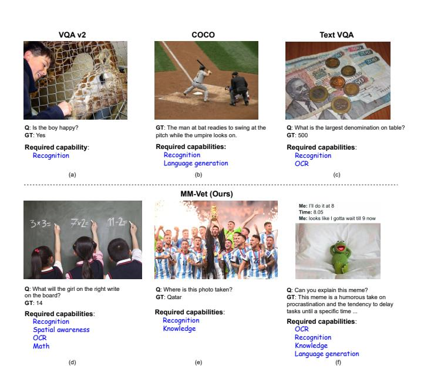

Figure 1: The benchmarks differ in their required capabilities. While standard VL benchmarks (Chen et al., 2015; Antol et al., 2015; Singh et al., 2019) typically require only one or two capabilities, MM-Vet focuses on the integration of multiple core VL capabilities. These include recognition, OCR, knowledge, language generation, spatial awareness, and math.

### 1. Introduction

breakthroughs in large language (LLMs) (Brown et al., 2020a; OpenAI, 2023c; Chowdhery et al., 2022; Anil et al., 2023; Touvron et al., 2023a; Hoffmann et al., 2022) bring generalist AI models that can solve a wide range of complicated natural language tasks, many approaching the human-expert-level performance (OpenAI, 2023c; Bubeck et al., 2023; Yang et al., 2023b). Large multimodal models (LMMs) aim to achieve even stronger general intelligence via extending LLMs with multimodal inputs. Since more than 80% of our human being's perception, learning, cognition, and activities are mediated through vision (Politzer), it is natural to start the exploration by equipping LLMs with "eyes." One main thread of LMM works, represented by Frozen (Tsimpoukelli et al.,

<sup>\*</sup>Equal contribution <sup>1</sup>National University of Singapore, Singapore <sup>2</sup>Microsoft Azure AI, USA. Correspondence to: Xinchao Wang <xinchao@nus.edu.sg>, Lijuan Wang <lijuanw@microsoft.com>.

<sup>&</sup>lt;sup>1</sup>Short for "Multimodal Veterinarian."

2021), Flamingo (Alayrac et al., 2022), PaLM-E (Driess et al., 2023), GPT-4V (OpenAI, 2023c;a), extend LLMs with the visual understanding capability via end-to-end tuning. There also exists the exploration (Yang et al., 2022b; Zeng et al., 2022; Yang et al., 2023c; Shen et al., 2023; Gao et al., 2023a) on the modular combination of LLMs and image-to-text vision-language models. Recently, thanks to the open-source of powerful LLMs like LLaMA (Touvron et al., 2023a), more open-sourced LMMs are built, including OpenFlamingo (Awadalla et al., 2023a), LLaVA (Liu et al., 2023c), MiniGPT-4 (Zhu et al., 2023a), Otter (Li et al., 2023c), InstructBLIP (Dai et al., 2023), and many more (Gong et al., 2023; Liu et al., 2023b; Ye et al., 2023). These studies showcase the intriguing ability to solve various complicated multimodal tasks, such as open-world recognition, multimodal knowledge and commonsense, scene text understanding, and so on.

Despite the promising qualitative results on LMM's capabilities, it remains unclear how to systematically evaluate those showcased complicated multimodal tasks, and what are the relationships among evaluated tasks, which is the first step in developing a quantitative evaluation benchmark. As shown in Figure 1, existing VL benchmarks (Antol et al., 2015; Chen et al., 2015; Singh et al., 2019) focus on straightforward VL tasks that test specific one or two capabilities, such as recognition, language generation, or OCR, but fall short in benchmarking more complicated tasks. In contrast, we examine the integration of multiple core VL capabilities for more complicated tasks. This is based on the insight that the intriguing ability to solve complicated multimodal tasks can be achieved by a generalist model mastering and integrating these core capabilities. Following this insight, we propose a new benchmark for evaluating LMMs, namely MM-Vet. MM-Vet defines six core VL capabilities, including recognition, OCR, knowledge, language generation, spatial awareness, and math, which integrate to solve various complicated multimodal tasks. MM-Vet contains 16 tasks for quantitative evaluation. For example, in Figure 1(d), answering the question "What will the girl on the right write on the board?" in MM-Vet requires recognizing the genders of the three kids, locating queried girl spatially, recognizing the scene text written by the girl, and finally calculating the result.

Other than the evaluation category topology, finding effective evaluation metric is another challenge in benchmark development, given the diverse answer styles and question types. Specifically: (1) The desired outputs in different multimodal tasks have diverse formats, *e.g.*, Figure 1(d)'s math problem can be answered by a single word, while outputs for the essay writing question are hundred-words long; (2) The core aspect to evaluate in different tasks varies, *e.g.*, text generation focuses more on the text quality, recognition can be considered correct with the key concept recognized.

Most integrated tasks would require comprehensive evaluations from multiple dimensions. Inspired by recent NLP studies (Chiang & Lee, 2023; Liu et al., 2023e; Fu et al., 2023b) that use LLMs for model evaluation, we propose an LLM-based evaluator as the evaluation metric for openended model outputs. As shown in Table 1, we prompt GPT-4 (OpenAI, 2023c) with few-shot evaluation prompts to obtain an evaluation score ranging from 0 to 1, conditioned on the question, prediction, and GT annotation. Instead of manually defining the possible answer styles and question types, we include different sample types as few-shot examples and let LLMs infer the scoring criteria automatically. Such metric design eases the future extension to more question types, such as box localization (Chen et al., 2022; Yang et al., 2022a; Wang et al., 2023).

MM-Vet's evaluation category and metric designs allow users to obtain per-capability insights for different LMMs. Such model analyses can be more informative than a single overall ranking, which highly depends on the dataset sample composition and might be biased. We evaluate two sets of multimodal systems, i.e., the end-to-end tuned LMMs including OpenFlamingo (Awadalla et al., 2023a), LLaVA (Liu et al., 2023c), MiniGPT-4 (Zhu et al., 2023a), Otter (Li et al., 2023c), InstructBLIP (Dai et al., 2023), etc, and the LLM-tool-using systems (Yang et al., 2023c; Shen et al., 2023; Gao et al., 2023a; Huggingface, 2023) such as MM-ReAct (Yang et al., 2023c) and Transformers Agent (Huggingface, 2023). Despite not knowing model details, we also evaluate industry solutions such as GPT-4V (OpenAI, 2023a) and Bard (Google, 2023), which are separately tagged to avoid unfair direct comparisons. We first discuss the capability analyses of these two system paradigms and their representative models. We then dive deeper into the open-sourced LMMs and examine how the training data, vision encoder, and LLM selection influence the performance on different capabilities.

Our contributions are summarized as follows.

- We propose MM-Vet to evaluate LMMs' ability on complicated multimodal tasks. MM-Vet considers 16 emergent tasks, integrated from 6 defined core VL capabilities.
- We propose an LLM-based evaluator for open-ended outputs from LMMs, which unifies the evaluation across different answer styles and question types. The evaluation metrics ensure the thorough evaluation of both the factual correctness and text quality of the responses.
- We benchmark representative LMMs on MM-Vet, revealing the relative strengths and weaknesses of different system paradigms and models, as summarized in Section 4.6.

#### 2. Related work

Multimodal models. Vision-language models (Chen et al., 2015; Goyal et al., 2017; Lu et al., 2019; Chen et al., 2020; Li et al., 2020; Kim et al., 2021; Wang et al., 2022b;a; Yang et al., 2022a; Gan et al., 2022) approach multimodal intelligence of jointly understanding and generating vision and language signals. Inspired by the impressive quality and genericity in recent large language models (LLMs) (Brown et al., 2020b; OpenAI, 2023c; Chowdhery et al., 2022; Touvron et al., 2023a), researchers explore large multimodal models (LMMs) that seamlessly integrate different visionlanguage capabilities to solve complicated multimodal tasks. In approaching such multimodal generalist systems, one direction is to extend LLMs with the multi-sensory ability, such as pioneer works Frozen (Tsimpoukelli et al., 2021), Flamingo (Alayrac et al., 2022), PaLM-E (Driess et al., 2023) and GPT-4V (OpenAI, 2023c;a). Recent open-sourced LLMs (Zhang et al., 2022; Touvron et al., 2023a; Peng et al., 2023) also facilitate various research studies including OpenFlamingo (Awadalla et al., 2023a), LLaVA (Liu et al., 2023c), MiniGPT-4 (Zhu et al., 2023a), Otter (Li et al., 2023c), InstructBLIP (Dai et al., 2023), and so on (Gong et al., 2023; Liu et al., 2023b; Ye et al., 2023). On the other hand, multimodal agents (Yang et al., 2023c; Shen et al., 2023; Huggingface, 2023; Gao et al., 2023a) explore chaining different vision tools with LLMs (Brown et al., 2020b; OpenAI, 2023c) to achieve integrated visionlanguage capabilities.

VL benchmarks. Classic VL benchmarks focus on specific capabilities of interest, such as visual recognition (Goyal et al., 2017), image description (Chen et al., 2015; Agrawal et al., 2019), as well as other benchmarks for specialized capabilities such as scene text understanding (Singh et al., 2019; Sidorov et al., 2020; Yang et al., 2021), commonsense reasoning (Zellers et al., 2019), and outside knowledge (Marino et al., 2019). The recent development of generalist LMMs posts a strong need for modernized VL benchmarks, which contain complicated multimodal tasks that require integrated VL capabilities.

Our MM-Vet is most related to the concurrent evaluation studies (Fu et al., 2023a; Liu et al., 2023d; Li et al., 2023a; Xu et al., 2023; Liu et al., 2023a) such as MME and MM-Bench, which design comprehensive evaluation samples to facilitate the LMM evaluation. One major difference is that MM-Vet defines and studies the integrated VL capabilities, allowing the evaluation to provide insights beyond the overall model ranking.

**LLM-based evaluation.** MM-Vet adopts the open-ended LLM-based evaluator, allowing the evaluation across answer styles and question types without requiring binary or multiple answer choices. The technique of prompting LLMs for model evaluation is related to the explorations

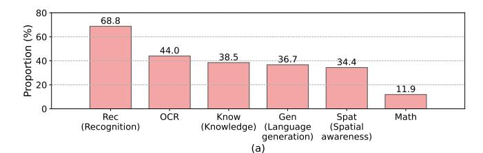

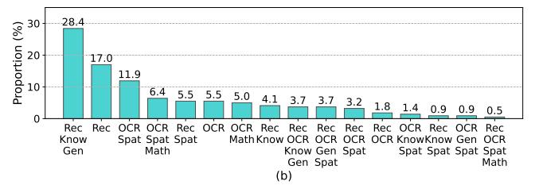

Figure 2: MM-Vet proportion of capabilities. (a) The proportion of each capability. The sum of the proportion is larger than 100% because most samples have more than one capability. (b) The proportion of capability integrations. The sum of the proportion is equivalent to 100%.

in NLP (Chiang & Lee, 2023; Liu et al., 2023e; Fu et al., 2023b). We show that the technique extends well to multimodal tasks, and presents a unified prompt to evaluate samples with different answer styles and question types.

### 3. MM-Vet

### 3.1. Data collection

Our aim is to develop a multimodal benchmark that requires comprehensive capabilities, corresponding to realistic scenarios an AI agent might encounter. Consider, for instance, this scenario: Awakening from slumber, you reach out for your smartphone (recognition capability) to check the current time (OCR capability). Today, your plan is to visit an unfamiliar grocery store. With the knowledge that it's located opposite a stadium and beside a cinema (spatial awareness), you manage to locate it successfully. Remembering your doctor's advice to lose weight, you avoid highcalorie items and instead pick up milk, vegetables, and fruits (knowledge capability). In the dairy section, you saw two options of pure milk: one liter at \$4 with a 20% discount, and 1.5 liters at \$7 with a 25% discount. After some quick arithmetic, you find the former is cheaper (math capability) and select the one-liter carton. Later, as you pass by the cinema, you see someone gesturing towards a poster while introducing a new movie (language generation).

From the scenarios of interest, we summarize the following six core VL capabilities for evaluation, with corresponding MM-Vet examples shown in Appendix Tables 12-17.

• **Recognition (Rec).** Recognition refers to the general visual recognition capability, including recogniz-

ing scenes, objects, object attributes (color, material, shape, *etc*), counting, and various other high-level visual recognition tasks in computer vision.

- Knowledge (Know). The knowledge category covers various knowledge-related capabilities, including social and visual commonsense knowledge, encyclopedic knowledge, and time-sensitive knowledge like news. This capability necessitates that the model not only possesses such knowledge, but also effectively utilizes it to solve complicated tasks as required.
- OCR. Optical character recognition (OCR) refers to the scene text understanding and reasoning capability. The models are tested to read the scene text in images, and reason over the texts to solve various tasks.
- Spatial awareness (Spat). Spatial awareness embodies a diverse spectrum of capabilities related to understanding space, including the comprehension of the spatial relationship among object and scene text regions.
- Language generation (Gen). Language generation is a vital ability that empowers models to articulate their responses in a clear, engaging, and informative manner. We use questions that demand more extended answers for language generation capacity evaluation.
- Math. Math evaluates the model's arithmetic capability in solving math equations or problems in the wild.

In real-world scenarios, various complicated multimodal tasks would require the integrations of different core VL capabilities. For instance, explaining visual jokes as shown in Appendix Table 12(a) requires recognition, knowledge of humor, and language generation; reading documents and solving math problems as shown in Appendix Table 13(a) takes OCR, spatial awareness and math; and answering exam questions given images as shown in Appendix Table 16(b) needs OCR, knowledge, spatial awareness. To solve these complicated tasks, LMMs are expected to seamlessly integrate different VL capabilities. Therefore, it is crucial to establish a benchmark that evaluates the performance of these integrated abilities within LMMs.

To build the benchmark, we have gathered 187 images from various online sources and ask 205 questions, each of which requires one or more capabilities to answer. As shown in Appendix Tables 12-17, these questions are varied in type and entail open-ended responses of differing lengths. The ground truths for 155 questions are carefully annotated by us to ensure high quality, while the remainder of the answers for 50 questions were gathered from the Internet. In addition to the 187 images, ten extra images with high-quality questions are collected from VCR (Zellers et al.,

Table 1: Few-shot prompt for evaluating model outputs using GPT-4, where  $\mathcal Q$  is a sample's question,  $\mathcal G$  is the ground truth and  $\mathcal P$  is the model output for the sample. In the prompt, there are examples with short and long openended answers, enabling the evaluation of diverse answer styles. Taking the prompt filled with  $\mathcal Q$ ,  $\mathcal G$  and  $\mathcal P$ , GPT-4 will generate a soft grading score from 0 to 1.

Compare the ground truth and prediction from AI models, to give a correctness score for the prediction. <AND> in the ground truth means it is totally right only when all elements in the ground truth are present in the prediction, and <OR> means it is totally right when any one element in the ground truth is present in the prediction. The correctness score is 0.0 (totally wrong), 0.1, 0.2, 0.3, 0.4, 0.5, 0.6, 0.7, 0.8, 0.9, or 1.0 (totally right). Just complete the last space of the correctness score.

```
Question | Ground truth | Prediction | Correctness
```

```
-1-1-1-
What is x in the equation? |-1| < AND > -5 | x = 3 | 0.0
What is x in the equation? |-1| < AND > -5 | x = -1 | 0.5
What is x in the equation? |-1| < AND > -5 | x = -5 | 0.5
What is x in the equation? |-1| < AND > -5 | x = -5 \text{ or } 5 | 0.5
What is x in the equation? |-1| < AND > -5 | x = -1 \text{ or } x = -5 | 1.0
Can you explain this meme? I This meme is poking fun at the fact
that the names of the countries Iceland and Greenland are misleading.
Despite its name. Iceland is known for its beautiful green landscapes.
while Greenland is mostly covered in ice and snow. The meme is
saying that the person has trust issues because the names of these
countries do not accurately represent their landscapes. I The meme
talks about Iceland and Greenland. It's pointing out that despite their
names, Iceland is not very icy and Greenland isn't very green. 10.4
Can you explain this meme? I This meme is poking fun at the fact
that the names of the countries Iceland and Greenland are misleading.
Despite its name, Iceland is known for its beautiful green landscapes,
while Greenland is mostly covered in ice and snow. The meme is
saying that the person has trust issues because the names of these coun-
tries do not accurately represent their landscapes. I The meme is using
humor to point out the misleading nature of Iceland's and Greenland's
names. Iceland, despite its name, has lush green landscapes while
Greenland is mostly covered in ice and snow. The text 'This is why I
have trust issues' is a playful way to suggest that these contradictions
can lead to distrust or confusion. The humor in this meme is derived
from the unexpected contrast between the names of the countries and
their actual physical characteristics. I 1.0
Q | G | P |
```

2019), with the questions and answers modified to an openended answering format. Another three images are from ChestX-ray14 (Wang et al., 2017) to obtain corresponding medical expert knowledge. In total, our MM-Vet contains 200 images, and 218 questions (samples), all paired with their respective ground truths. For each question, we have also identified the capacities required to answer them and displayed this information statistically in Figure 2.

### 3.2. LLM-based evaluator for open-ended outputs

Questions and expected responses in MM-Vet are designed to be open-ended to cover the diverse real-world scenarios. This naturally poses a great challenge in terms of model evaluation and metric design. Drawing inspiration from recent NLP studies (Chiang & Lee, 2023; Zheng et al., 2023) that utilize LLMs for open-ended evaluations, we leverage

GPT-4 to assist evaluation. As shown in Table 1, we craft a few-shot prompt for model evaluation. The few-shot design allows us to define the scoring metrics via in-context examples and supports easy extension onto new problem sets. Specifically, our implemented prompt incorporates five in-context examples with open-ended short answers and two examples with long answers. We cover examples that are fully correct (*i.e.*, 1.0) or incorrect (*i.e.*, 0.0), as well as examples used to define different types of "partially correct" responses. The LLM-based evaluator allows any style of model outputs to be evaluated with a unified consistent metric. Furthermore, it also supports easy adaptation to diverse question types and answer styles by simply modifying the evaluation examples.

By inputting the prompt, GPT-4 automatically generates scores for each sample, conditioned on each sample's input question, ground truth, and model output. The score for each sample ranges from 0 to 1. The total scores are computed by

$$S = \frac{\sum_{i=1}^{N} s_i}{N} \times 100\%, \tag{1}$$

where  $s_i$  is the score of sample i, and N is the sample number. The score regarding each capability or capability integration can be similarly obtained by

$$S_c = \frac{\sum s_i}{N_c} \times 100\%, \quad i \in C, \tag{2}$$

where C is the set of samples requiring a specific capability or capability integration, and  $N_c$  is the sample number of the set.

# 4. Evaluation results

### 4.1. Experiment settings

We utilize MM-Vet to evaluate two types of LMMs, i.e., (1) end-to-end tuned LMMs (OpenFlamingo (Alayrac et al., 2022; Awadalla et al., 2023a;b), BLIP-2 (Li et al., 2023d), LLaVA (Liu et al., 2023c), MiniGPT-4 (Zhu et al., 2023a), LLaMA-Adapter V2 (Gao et al., 2023b), Otter (Li et al., 2023c) and InstructBLIP (Dai et al., 2023)); (2) LLM-toolusing methods (MM-ReAct (Yang et al., 2023c) and Transformers Agent (Huggingface, 2023)). The summary of these methods is shown in Appendix Table 11. As shown in Table 1, for each sample, we fill the prompt template with its question, ground truth, and output from a specific LMM. By taking the filled prompt into GPT-4, GPT-4 will generate a score from 0 to 1 for the sample. It is found that outputs of GPT-4 still exist variance, although the temperature is set as 0. Therefore, we utilize GPT-4 to evaluate the outputs of LLMs by 5 times. Due to the space limit, we report average scores for capabilities/capability integrations, and average as well as variance for total score.

Table 2: MM-Vet evaluation results on various LMMs regarding each *core VL capability*. For each column, the highest, second, and third highest figures are highlighted by green, orange and blue colors. Numbers are presented in % with a full score of 100%.

| Model                      | Rec  | OCR  | Know | Gen  | Spat | Math | Total          |
|----------------------------|------|------|------|------|------|------|----------------|
| Transformers Agent (GPT-4) | 18.2 | 3.9  | 2.2  | 3.2  | 12.4 | 4.0  | $13.4\pm0.5$   |
| MiniGPT-4-8B               | 27.4 | 15.0 | 12.8 | 13.9 | 20.3 | 7.7  | $22.1 \pm 0.1$ |
| BLIP-2-12B                 | 27.5 | 11.1 | 11.8 | 7.0  | 16.2 | 5.8  | $22.4 \pm 0.2$ |
| LLaVA-7B                   | 28.0 | 17.1 | 16.3 | 18.9 | 21.2 | 11.5 | $23.8 \pm 0.6$ |
| MiniGPT-4-14B              | 29.9 | 16.1 | 20.4 | 22.1 | 22.2 | 3.8  | $24.4 \pm 0.4$ |
| Otter-9B                   | 27.3 | 17.8 | 14.2 | 13.8 | 24.4 | 3.8  | $24.7 \pm 0.3$ |
| OpenFlamingo-9B            | 28.7 | 16.7 | 16.4 | 13.1 | 21.0 | 7.7  | $24.8 \pm 0.2$ |
| InstructBLIP-14B           | 30.8 | 16.0 | 9.8  | 9.0  | 21.1 | 10.5 | $25.6 \pm 0.3$ |
| InstructBLIP-8B            | 32.4 | 14.6 | 16.5 | 18.2 | 18.6 | 7.7  | $26.2 \pm 0.2$ |
| LLaVA-13B                  | 30.9 | 20.1 | 23.5 | 26.4 | 24.3 | 7.7  | $26.4 \pm 0.1$ |
| MM-ReAct-GPT-3.5           | 24.2 | 31.5 | 21.5 | 20.7 | 32.3 | 26.2 | $27.9 \pm 0.1$ |
| LLaVA-7B (LLaMA-2)         | 32.9 | 20.1 | 19.0 | 20.1 | 25.7 | 5.2  | $28.1 \pm 0.4$ |
| LLaMA-Adapter v2-7B        | 38.5 | 20.3 | 31.4 | 33.4 | 22.9 | 3.8  | $31.4 \pm 0.1$ |
| LLaVA-13B (V1.3, 336px)    | 38.1 | 22.3 | 25.2 | 25.8 | 31.3 | 11.2 | $32.5 \pm 0.1$ |
| LLaVA-13B (LLaMA-2)        | 39.2 | 22.7 | 26.5 | 29.3 | 29.6 | 7.7  | $32.9 \pm 0.1$ |
| MM-ReAct-GPT-4             | 33.1 | 65.7 | 29.0 | 35.0 | 56.8 | 69.2 | 44.6±0.2       |

### 4.2. Result analyses

The main results of different methods are shown in Table 2 regarding each capability, and Table 3 for each capability integration.

### 4.2.1. REGARDING EACH CAPABILITY

**Recognition.** The "Recognition" category contains the questions requiring recognition capability to answer. Examples are shown in Appendix Tables 12(a, b), 13(b), 14(a, b), 15(a, b), 16(a, c), and 17(b). The "Rec" column in Table 2 compares the performance on the "Recognition". Among the evaluated models, LLaVA-13B (LLaMA-2) is the best one, obtaining 39.2%. There may be two reasons. First, LLaVA-13B (LLaMA-2) adopts ViT-L/14 (Dosovitskiy et al., 2020) from CLIP (Radford et al., 2021) as a vision model, which is trained by a large amount of data, 400 million image-text pairs; 2) Second, it is surprising that stronger language model can largely boost the recognition performance. LLaVA-13B (LLaMA-2) obtains 8.3% important over LLaVA-13B (Vicuna-13B). Stronger LLMs may help understand questions better and identify key information from visual inputs.

LLaMA-Adapter v2-7B is another strong model in recognition, achieving 38.5%. This outstanding ability may be obtained from its various and large amounts of tuning data, LAION-400M (Schuhmann et al., 2021), COYO-700M (Byeon et al., 2022), Multimodal C4 (Zhu et al., 2023b) and tuning data of LLaVA (Liu et al., 2023c) *etc* as shown in Table 11. Besides, InstructBLIP-8B (Dai et al., 2023) attains 32.4%. As shown in Table 11, the tuning data of InstructBLIP includes 26 publicly available datasets, which contain recognition heavily datasets, like VQA v2 (Goyal et al., 2017) and GQA (Hudson & Manning, 2019). The promising capability of InstructBLIP in recognition may benefit from these datasets.

Table 3: MM-Vet evaluation results on various LMMs regarding each *capability integration*. Examples of each capability integration are shown in Appendix Tables 12-17. For each column, the highest, second, and third highest figures are highlighted by green, orange and blue colors. Numbers are presented in % with a full score of 100%.

|                                                |      |      |      |      |      |      |      |      | Rec  | Rec  |      |      |       |      |      | Rec  |                |
|------------------------------------------------|------|------|------|------|------|------|------|------|------|------|------|------|-------|------|------|------|----------------|
| Model                                          | Rec  |      |      | OCR  |      |      |      |      | OCR  | OCR  | Rec  |      | OCR   | Rec  | OCR  | OCR  | Total          |
| Woder                                          | Know |      | OCR  | Spat | Rec  |      | OCR  | Rec  | Know | Gen  | OCR  | Rec  | Know  | Know | Gen  | Spat | Iotai          |
|                                                | Gen  | Rec  | Spat | Math | Spat | OCR  | Math | Know | Gen  | Spat | Spat | OCR  | Spat  | Spat | Spat | Math |                |
| Transformers Agent (GPT-4) (Huggingface, 2023) | 1.3  | 49.1 | 0.0  | 7.4  | 45.8 | 0.0  | 0.0  | 0.0  | 0.0  | 9.5  | 0.0  | 25.0 | 0.0   | 50.0 | 49.0 | 0.0  | $13.4\pm0.5$   |
| MiniGPT-4-8B (Zhu et al., 2023a)               | 14.2 | 47.9 | 9.6  | 14.3 | 50.0 | 20.8 | 0.0  | 14.4 | 8.0  | 21.2 | 42.9 | 50.0 | 0.7   | 0.0  | 0.0  | 0.0  | $22.1 \pm 0.1$ |
| BLIP-2-12B (Li et al., 2023d)                  | 7.3  | 65.1 | 11.5 | 7.1  | 41.7 | 21.2 | 4.5  | 38.9 | 5.2  | 8.5  | 14.3 | 25.0 | 16.7  | 50.0 | 0.0  | 0.0  | $22.4 \pm 0.2$ |
| LLaVA-7B (Liu et al., 2023c)                   | 17.1 | 46.6 | 13.3 | 21.4 | 41.7 | 24.8 | 0.0  | 28.9 | 6.2  | 45.2 | 6.6  | 50.0 | 0.0   | 0.0  | 19.0 | 0.0  | $23.8 \pm 0.6$ |
| MiniGPT-4-14B (Zhu et al., 2023a)              | 21.1 | 47.5 | 14.6 | 7.1  | 50.0 | 16.7 | 0.0  | 11.1 | 18.7 | 38.5 | 18.3 | 32.5 | 50.0  | 0.0  | 0.0  | 0.0  | $24.4 \pm 0.4$ |
| Otter-9B (Li et al., 2023c)                    | 15.6 | 54.1 | 29.2 | 7.1  | 50.0 | 22.5 | 0.0  | 11.1 | 3.2  | 6.0  | 23.1 | 46.5 | 33.3  | 0.0  | 30.0 | 0.0  | $24.7 \pm 0.3$ |
| OpenFlamingo-9B (Awadalla et al., 2023b)       | 15.5 | 48.6 | 15.4 | 14.3 | 58.3 | 40.5 | 0.0  | 38.9 | 4.5  | 6.0  | 28.6 | 50.0 | 10.0  | 0.0  | 0.0  | 0.0  | $24.8 \pm 0.2$ |
| InstructBLIP-14B (Dai et al., 2023)            | 8.1  | 74.3 | 14.6 | 14.3 | 50.0 | 19.2 | 6.5  | 11.1 | 8.8  | 15.2 | 14.3 | 70.0 | 16.7  | 50.0 | 15.0 | 0.0  | $25.6 \pm 0.3$ |
| InstructBLIP-8B (Dai et al., 2023)             | 18.0 | 69.9 | 15.4 | 14.3 | 33.3 | 20.8 | 0.0  | 23.3 | 7.8  | 35.2 | 15.7 | 25.0 | 0.0   | 0.0  | 0.0  | 0.0  | $26.2 \pm 0.2$ |
| LLaVA-13B (Liu et al., 2023c)                  | 25.2 | 41.1 | 17.3 | 7.1  | 47.5 | 23.3 | 9.1  | 18.0 | 12.5 | 53.8 | 14.3 | 50.0 | 50.0  | 0.0  | 12.0 | 0.0  | $26.4 \pm 0.1$ |
| MM-ReAct-GPT-3.5 (Yang et al., 2023c)          | 19.1 | 33.1 | 28.8 | 35.7 | 28.3 | 60.0 | 9.1  | 33.3 | 2.5  | 47.8 | 0.0  | 25.0 | 100.0 | 0.0  | 35.0 | 80.0 | $27.9\pm0.1$   |
| LLaVA-7B (LLaMA-2) (Liu et al., 2023c)         | 18.8 | 57.0 | 26.9 | 9.7  | 50.0 | 26.7 | 0.0  | 34.7 | 10.2 | 44.8 | 14.3 | 50.0 | 11.3  | 0.0  | 0.0  | 0.0  | $28.1 \pm 0.4$ |
| LLaMA-Adapter v2-7B (Gao et al., 2023b)        | 35.3 | 54.1 | 13.5 | 7.1  | 50.0 | 38.5 | 0.0  | 12.2 | 22.5 | 38.0 | 28.6 | 48.0 | 53.3  | 0.0  | 0.0  | 0.0  | $31.4 \pm 0.1$ |
| LLaVA-13B (V1.3, 336px) (Liu et al., 2023c)    | 25.5 | 59.7 | 25.0 | 14.3 | 66.7 | 25.8 | 8.2  | 27.8 | 11.2 | 49.3 | 14.3 | 50.0 | 33.3  | 50.0 | 2.0  | 0.0  | $32.5\pm0.1$   |
| LLaVA-13B (LLaMA-2) (Liu et al., 2023c)        | 29.8 | 59.5 | 21.2 | 14.3 | 58.3 | 36.2 | 0.0  | 27.8 | 3.5  | 56.8 | 28.6 | 50.0 | 33.3  | 0.0  | 8.0  | 0.0  | $32.9 \pm 0.1$ |
| MM-ReAct-GPT-4 (Yang et al., 2023c)            | 22.5 | 33.0 | 69.2 | 78.6 | 25.0 | 83.0 | 63.6 | 44.4 | 68.2 | 88.0 | 14.3 | 50.0 | 0.0   | 50.0 | 80.0 | 0.0  | $44.6 \pm 0.2$ |

OCR. OCR assesses models' capabilities in recognizing scene texts in images and performing various types of reasoning including math, spatial, recognition, *etc*. Examples are shown in Appendix Tables 12(c), 13(a, c, d), 14(b), 15(a, b), 16(a, b), 17(a, b). As shown in Table 11's "OCR" column, MMReAct-GPT4 (Yang et al., 2023c) performs the best (65.7%) in OCR capability with the assistance of an external OCR model as a tool. Among end-to-end tuned models, LLaVA-13B (LLaMA-2) (Liu et al., 2023c) achieves the highest performance (22.7%). This superior performance may be attributed to LLaVA's adoption of CLIP (Radford et al., 2021) ViT-L/14 (Dosovitskiy et al., 2020) as its vision model, and the inclusion of a large volume of image-OCR pairings within the training data (Liu et al., 2023f).

**Knowledge.** As depicted in Appendix Tables 12(a), 14(a, b) and 16(b, c), the "knowledge" category covers a wide range of knowledge-related questions, ranging from joke understanding to encyclopedia knowledge. LLaVA-Adapter v2-7B is the best model in this capability with a score of 31.4%, as shown in Table 2. It may be beneficial from its large-scale tuning data including GPT-4-LLM (Peng et al., 2023). MMReAct-GPT-4 (Yang et al., 2023c) also achieves a good score (29.0%) in this capability, because of its strong LLM backbone (OpenAI, 2023c), coupled with external tools like Bing search for knowledge acquisition.

Language generation. "Language generation" denotes the proficiency to produce fluent and informative text outputs, as illustrated in Appendix Tables 12(a), 14(b), 15(a), and 17(a). The performance within this category is highly correlated with the efficacy of language modeling. As a result, MMReAct-GPT4 (Yang et al., 2023c) stands out and its success can be attributed to the GPT-4 on which this system is built.

**Spatial awareness.** "Spatial awareness" involves the understanding of the spatial relationship among visual object regions (*e.g.*, Appendix Table 12(c)) and scene text regions (*e.g.*, Table 15(a, b)). MMReAct-GPT4 (Yang et al., 2023c) has a significant lead in this capability (56.8%), because the adopted tools, such as dense captioning and OCR, provide detailed object and scene text location information in the form of coordinates, which can be understood and processed by GPT-4.

When it comes to end-to-end tuned models, LLaVA-13B (V1.3, 336px) exhibits the best performance of 31.3%. The tuning data for LLaVA is partly derived from capturing object names and their corresponding coordinates as input. This procedure ensures the generation of data imbued with spatial information, potentially aiding the models in developing and enhancing their spatial awareness capabilities.

**Math.** "Math" measures the arithmetic capability on either written equations (*e.g.*, Appendix Table 17(b)) or problems in the wild (*e.g.*, Appendix Table 13(d)). Notably, MMReAct-GPT4 (Yang et al., 2023c) consistently outperforms other models. This good performance may be attributed to the adopted PAL math tool (Program-aided Language Models) (Gao et al., 2022).

#### 4.2.2. REGARDING EACH CAPABILITY INTEGRATION

Recognition, knowledge, and language generation. As shown in Appendix Table 12(a), this capability integration can enable models to explain visual jokes. LLaMA-Adapter-v2-7B (Gao et al., 2023b) is the best model in this capability integration. This may be attributed to its large scale of tuning data as shown in Table 11. LLaVA-13B (LLaMA-2) and LLaVA-13B (V1.3, 336px) (Liu et al., 2023c) are the other two outstanding models. Stronger language models and the tuning data in LLava may be the reason for the good

Table 4: MM-Vet evaluation of LLaVA, MM-ReAct and GPT-4V regarding each *capability integration*. For each column, the highest and second highest figures are highlighted by green and orange colors. Numbers are presented in %.

|                                          |      |      |      |      |      |      |      |      | Rec  | Rec  |      |       |      |      |      | Rec  |                |
|------------------------------------------|------|------|------|------|------|------|------|------|------|------|------|-------|------|------|------|------|----------------|
| Model                                    | Rec  |      |      | OCR  |      |      |      |      | OCR  | OCR  | Rec  |       | OCR  | Rec  | OCR  | OCR  | Total          |
| Model                                    | Know |      | OCR  | Spat | Rec  |      | OCR  | Rec  | Know | Gen  | OCR  | Rec   | Know | Know | Gen  | Spat | Total          |
|                                          | Gen  | Rec  | Spat | Math | Spat | OCR  | Math | Know | Gen  | Spat | Spat | OCR   | Spat | Spat | Spat | Math |                |
| LLaVA-13B (LLaMA-2) (Liu et al., 2023c)  | 29.8 | 59.5 | 21.2 | 14.3 | 58.3 | 36.2 | 0.0  | 27.8 | 3.5  | 56.8 | 28.6 | 50.0  | 33.3 | 0.0  | 8.0  | 0.0  | $32.9 \pm 0.1$ |
| MM-ReAct-GPT-4 (Yang et al., 2023c)      | 22.5 | 33.0 | 69.2 | 78.6 | 25.0 | 83.0 | 63.6 | 44.4 | 68.2 | 88.0 | 14.3 | 50.0  | 0.0  | 50.0 | 80.0 | 0.0  | $44.6 \pm 0.2$ |
| GPT-4V (OpenAI, 2023a)                   | 55.5 | 89.2 | 68.6 | 73.9 | 83.3 | 77.5 | 44.5 | 38.9 | 78.2 | 76.5 | 42.9 | 100.0 | 66.7 | 50.0 | 89.0 | 0.0  | $67.7 \pm 0.3$ |
| GPT-4V-Turbo-detail:low (OpenAI, 2023a)  | 52.9 | 75.7 | 58.4 | 50.0 | 75.0 | 69.2 | 45.5 | 38.9 | 84.8 | 85.8 | 14.3 | 75.0  | 66.7 | 50.0 | 87.0 | 0.0  | $60.2 \pm 0.3$ |
| GPT-4V-Turbo-detail:high (OpenAI, 2023a) | 50.2 | 77.7 | 82.5 | 85.8 | 75.0 | 80.0 | 54.5 | 38.9 | 81.5 | 78.8 | 42.9 | 100.0 | 66.7 | 95.0 | 90.0 | 0.0  | $67.6 \pm 0.1$ |

Table 5: MM-Vet evaluation of LLaVA, MM-ReAct and GPT-4V regarding each *core VL capability*. For each column, the highest and second figures are highlighted by green and orange colors.

| Model                    | Rec  | OCR  | Know | Gen  | Spat | Math | Total          |
|--------------------------|------|------|------|------|------|------|----------------|
| LLaVA-13B (LLaMA-2)      | 39.2 | 22.7 | 26.5 | 29.3 | 29.6 | 7.7  | $32.9 \pm 0.1$ |
| MM-ReAct-GPT-4           | 33.1 | 65.7 | 29.0 | 35.0 | 56.8 | 69.2 | $44.6 \pm 0.2$ |
| GPT-4V                   | 67.5 | 68.3 | 56.2 | 60.7 | 69.4 | 58.6 | $67.7 \pm 0.3$ |
| GPT-4V-Turbo-detail:low  | 61.3 | 59.2 | 54.8 | 60.2 | 58.4 | 46.2 | $60.2 \pm 0.3$ |
| GPT-4V-Turbo-detail:high | 62.9 | 75.9 | 53.7 | 57.3 | 76.8 | 69.5 | $67.6 \pm 0.1$ |

performance.

**Recognition** (sole). This category contains samples that only require recognition, as shown in Appendix Table 12(b). InstructBLIP-14B and InstructBLIP-8B (Dai et al., 2023) achieve the best performance, which may result from the tuning data containing relevant datasets, like VQA (Goyal et al., 2017) and GQA (Hudson & Manning, 2019).

OCR and spatial awareness. For this integration, an example is shown in Appendix Table 12(c). MM-ReAct-GPT-4 (Yang et al., 2023c) is the best method for this integration. Notably, MM-ReAct-GPT-4 has a significant improvement of over 40% than MM-ReAct-GPT-3.5, indicating the importance of LLMs in integrating the OCR and location information.

OCR, spatial awareness, and math. An example of this integration is shown in Appendix Table 13(a), which requires reading the floor plan and conducting arithmetic. Compared with the above integration, this combination involves one more capability of math. The observation is similar to the integration of OCR and spatial awareness. MM-ReAct-GPT-4 (Yang et al., 2023c) still achieves the best performance.

**Recognition and spatial awareness.** Appendix Table 13(b) shows an example for this integration. LLaVA-13B (V1.3, 336px) (Liu et al., 2023c) performs best for this category. Compared with LLaVA-13B (LLaMA-2), LLaVA-13B (V1.3, 336px) obtains an improvement of 8.4%, indicating the significant contribution of larger resolution of images.

**OCR** (sole). This task requires OCR only, as shown in Appendix Table 13(c). MM-ReAct-GPT-4 (Yang et al., 2023c) has the best results for sole OCR due to an OCR

tool from Azure API. Notably, MM-ReAct-GPT-4 is much better than MM-ReAct-GPT-3.5 with an improvement of 23.0%, demonstrating the importance of language models in OCR.

**OCR and math.** This integration enables reading text from real-world scenarios and solving math problems, as shown in Appendix Table 13(d). MM-ReAct-GPT-4 (Yang et al., 2023c) obtains the best performance in this capability integration, thanks to the speclized OCR and math tools used.

**Other capability integrations.** 9 other capability integrations are in long-tailed distribution, where MMReAct-GPT-4 achieves the best scores in 5 integrations out of 9. Their examples are shown in Appendix Tables 14-17.

#### 4.3. Result discussion

#### 4.3.1. FOUNDATION MODELS AND TUNING DATA

In this subsection, we discuss LMM modules and speculate how each component may affect the LMMs' capabilities in different aspects, evaluated by MM-Vet. We mainly consider the models based on open-sourced LLMs, *i.e.*, Flan-T5 (Chung et al., 2022), LLaMA (Touvron et al., 2023a), Vicuna (Zheng et al., 2023), and LLaMA-2 (Touvron et al., 2023b).

**Vision.** For the vision component, two models are popular in our evaluated end-to-end LMMs, *i.e.*, CLIP-ViT/L14 (Radford et al., 2021) (428M) and EVA-ViT-G (1.13B). Determining a superior model is currently not possible due to the absence of a comprehensive ablation study (Zeng et al., 2023). However, it's noteworthy that, when paired with the same language model, Vicuna-7B, InstructBLIP-8B excels in recognition tasks, while LLaVA-7B works particularly well for OCR.

**Language.** There is a notable trend indicating that superior language models (LLMs) typically yield better performance, such as comparing the 7B and 13B variants of different models, except for the outlier of InstructBLIP where the 8B version performs better than the 14B one.

**Tuning data.** Increasing the volume of data can enhance performance. An example is InstructBLIP-8B (Dai et al.,

Table 6: Averaged absolute differences  $(\overline{\Delta})$  between the evaluation scores of various LLM evaluators and those of human-annotated scores, on MM-ReAct-GPT4's results. A smaller discrepancy indicates a better agreement with the gold standard of human evaluation, indicating a better evaluator.

| Model                           | Keyword  |            |             |             |                 | LLM-bas                  | sed evaluation             |            |               |                      |              |
|---------------------------------|----------|------------|-------------|-------------|-----------------|--------------------------|----------------------------|------------|---------------|----------------------|--------------|
| Model                           | matching | LLaMA-2-7B | LLaMA-2-13B | LLaMA-2-70B | Mistral-7B-v0.1 | Mistral-7B-Instruct-v0.2 | Mixtral-8x7B-Instruct-v0.1 | Gemini Pro | Claude 3 Opus | GPT-3.5 (turbo-0613) | GPT-4 (0613) |
| $\overline{\Delta}(\downarrow)$ | 0.273    | 0.307      | 0.254       | 0.316       | 0.188           | 0.173                    | 0.234                      | 0.144      | 0.137         | 0.178                | 0.042        |

2023), which utilizes more data from 26 publicly available datasets to tune the model and achieve higher scores than BLIP-2-12B.

#### 4.3.2. COMPARISON WITH GPT-4V(ISION)

We evaluate and benchmark the state-of-the-art LMM, GPT-4V(ison) (OpenAI, 2023c;a;b; gpt, 2023; Yang et al., 2023b) on MM-Vet. In our queries to GPT-4V, we prepend the prompt with "Generate a short and concise response to the following image text pair." The quantitative results are shown in Tables 4 and 5, and the qualitative results are expressed in Appendix Figures 3-6. Remarkably, GPT-4V achieves a score of 67.7%, surpassing both open-sourced LMMs (Liu et al., 2023c) and LLM-based multimodal agents (Yang et al., 2023c) by substantial margins.

We aspire that the detailed per-category performance breakdown sheds light on potential avenues for enhancing model capabilities, thereby bridging the existing performance gap. To illustrate, integrating specialized tools within agent systems proves advantageous for specific functionalities like OCR and math. While other categories, such as recognition and language generation, would require enhancements in the core vision and language modules, respectively. Appendix Figures 3-6 offer an exhaustive analysis, highlighting representative success and failure instances of GPT-4V's performance.

Table 7: Averaged absolute differences  $(\overline{\Delta})$  between the evaluation scores of combined LLM evaluators and those of human-annotated scores on MM-ReAct-GPT4's results.

| Combined LLMs                                                                       | $\overline{\Delta}$ |
|-------------------------------------------------------------------------------------|---------------------|
| GPT-4 solely                                                                        | 0.0423              |
| GPT-4 + Llama-2-13b-chat                                                            | 0.1483              |
| GPT-4 + Mistral-7B-Instruct-v0.2                                                    | 0.1078              |
| GPT-4 + Gemini Pro                                                                  | 0.0933              |
| GPT-4 + Claude 3 Opus                                                               | 0.0896              |
| GPT-4 + Llama-2-13b-chat +<br>Mistral-7B-Instruct-v0.2 + Gemini Pro + Claude 3 Opus | 0.1502              |

### 4.4. Effectiveness analysis of LLM-based evaluation

To verify the effectiveness of LLM-based evaluation for LMM predictions, we select the outputs from MMReAct-GPT-4 on 138 objective questions, which can be objectively annotated by humans. We compute the absolute value of the difference between the evaluator's output score and the human-annotated score on each sample. In addition to the default evaluator of GPT-4 (0613) in MM-Vet, we experiment with other LLMs. LLaMa-2 and Mixtral represent open-source LLMs, while GPT-4, Gemini and Claude are

commercial close-sourced LLMs.

The average difference to the human scoring is reported in Table 6, represented as  $\overline{\Delta}$ . With a maximum potential discrepancy of 1.0, the baseline evaluation method, keyword matching, results in a high difference of 0.273. This illustrates the unsuitability of keyword matching for MM-Vet when dealing with open-ended answers. Among the LLaMA-2/Mistral series, LLaMA-2-13B/Mistral-7B-Instruct-v0.2 performs best, respectively. We notice that the performance of the largest LLaMA-2/Mistral is not satisfactory, which may be because their larger models are more creative and do not follow our few-shot prompt strictly. The three commercial LLMs perform better than open-sourced LLMs, while there is still a large gap between Gemini/Claude and GPT-4.

We also explore whether  $\overline{\Delta}$  can be reduced when combining GPT-4 with other LLMs, and the results are reported in Table 7. We find that GPT-4 without extra LLMs performs the best. This may be because other LLMs cannot match the grading accuracy of GPT-4. However, we believe this idea will work in the future when other LLMs become stronger. Therefore, MM-Vet uses GPT-4 (0613) to evaluate the LMM outputs.

#### 4.5. Effectiveness of few-shot examples for LLM prompt

In this section, we explore the effectiveness of few-shot examples used in the prompt of LLM-based evaluator. We denote the seven grading examples in Table 1 as (1) - (7) in order for ablation study. As Table 8 shows, using all seven examples together achieves the closest alignment with human evaluations (lowest  $\overline{\Delta}$ ).

### 4.6. Takeaway notes

We summarize the analyses and discussions as follows:

• In the evaluation of integrated capabilities on MM-Vet (Sections 4.2 and 4.3.2), GPT-4V (OpenAI, 2023a) outperforms existing open-sourced methods. The tool-using approach, MM-ReAct-GPT-4 (Yang et al., 2023c), achieves the second-best performance with effective external tools. The pros and cons in different categories motivate future studies on tool-enhanced LMMs. Among end-to-end LMMs, LLaVA-13B (LLaMA-2)/LLaVA-13B (V1.3, 336px) (Liu et al., 2023c) demonstrates the best performance on MM-Vet.

Table 8: Ablation study of few-shot examples in prompt for LLM-based evaluator

| Few-shot examples           | Remarks                                                              | $\overline{\Delta}$ |
|-----------------------------|----------------------------------------------------------------------|---------------------|
| None                        | No grading examples                                                  | 0.0630              |
| (1) (5)                     | Add two examples with totally right/wrong short answer               | 0.0625              |
| (1) (2) (3) (5)             | Add more two examples with partially right short answer              | 0.0619              |
| (1) (2) (3) (4) (5)         | Add more one example with partially right and partially wrong answer | 0.0551              |
| (1) (2) (3) (4) (5) (7)     | Add more one example with fully right long answer                    | 0.0520              |
| (1) (2) (3) (4) (5) (6) (7) | Add more one example with partially right long answer                | 0.0423              |

- Analysis of open-source LMMs (Section 4.3.1) presents some uncertainty about which vision encoders are optimal for LMMs, based on current model comparisons. However, it is evident that stronger LLMs can boost the performance of LMMs.
- For open-ended evaluation (Section 4.4), it is effective to use GPT-4 for evaluating the open-ended outputs of LMMs. The use of less powerful LLMs could result in more significant deviations from the gold standard of human evaluation results.
- Current top-performing methods, such as GPT-4V (OpenAI, 2023a), only achieve scores of around 68% on MM-Vet, where full score is 100%. The gap signifies that further effort is necessary to enhance the performance of LMMs in terms of integrated capabilities, e.g., by developing stronger LMMs, finding better prompting techniques (Yang et al., 2023b;a), and extending LMMs with external tools.

### 5. Conclusion and Limitation

In this paper, we have presented MM-Vet, a new benchmark designed to evaluate LMMs in terms of their integrated VL capabilities. We have constructed a new multimodal dataset that requires the integration of multiple VL capabilities to solve. To facilitate open-ended evaluation, we adopt an LLM-based evaluator to grade open-ended outputs from LMMs. We then evaluate various LMMs on MM-Vet, analyzing their results to provide insights into different LMM system paradigms and model designs. The evaluation reveals that even advanced models like GPT-4V only score around 68% on MM-Vet, highlighting the ongoing need to enhance the integrated VL capabilities of LMMs.

For the limitations of this work, firstly, since most popular LMMs only accept image-text input and output text, MM-Vet focuses on evaluating this type of modalities, not covering other modalities. Secondly, we propose to utilize LLMs to automatically grade LMM output results. However, as Table 6 shows, currently only GPT-4 can well match the human grades, so we set the evaluator's LLM as GPT-4, which will bring GPT-4 usage fees. To help researchers from non-profit institutes save GPT-4 fees, we host an MM-Vet online evaluator <sup>2</sup> with our GPT-4 API key.

### Acknowledgements

This project is supported by the Ministry of Education, Singapore, under its Academic Research Fund Tier 2 (Award Number: MOE-T2EP20122-0006). Weihao was partly supported by Snap Research Fellowship, Google TPU Research Cloud (TRC), and Google Cloud Research Credits program.

### **Impact Statement**

This paper presents a new benchmark for evaluating Large Multimodal Models (LMMs). The significance of this contribution extends in several directions. First, the newly developed MM-Vet benchmark assesses the capabilities of existing LMMs, establishing a solid groundwork for future advancements in this domain. The growing interest and demand for advanced LMM infrastructures underscore the timeliness and relevance of our work. Moreover, MM-Vet is pioneering in its approach to evaluating LMMs from integrated capabilities and leveraging LLMs for based openended scoring. These innovative evaluation strategies are poised to profoundly influence future benchmark development. By doing so, MM-Vet aims to not just enhance the field of LMMs but also to play a pivotal role in driving societal changes through the application of advanced foundational models. In the development of MM-Vet, ethical considerations have been paramount. We have rigorously verified the benchmark sample and evaluation criteria to ensure they align with high ethical standards. This diligence is vital in ensuring that the advancements in LMMs are responsible and beneficial for society at large.

# References

Mpt. https://github.com/mosaicml/
llm-foundry#mpt, 2023.

Chatgpt can now see, hear, and speak. https://openai.com/blog/chatgpt-can-now-see-hear-and-speak, 2023.

Agrawal, H., Desai, K., Wang, Y., Chen, X., Jain, R., Johnson, M., Batra, D., Parikh, D., Lee, S., and Anderson, P. Nocaps: Novel object captioning at scale. In *Proceedings of the IEEE/CVF international conference on computer vision*, pp. 8948–8957, 2019.

Alayrac, J.-B., Donahue, J., Luc, P., Miech, A., Barr, I.,

<sup>&</sup>lt;sup>2</sup>hf.co/spaces/whyu/MM-Vet Evaluator

- Hasson, Y., Lenc, K., Mensch, A., Millican, K., Reynolds, M., et al. Flamingo: a visual language model for few-shot learning. *Advances in Neural Information Processing Systems*, 35:23716–23736, 2022.
- Anil, R., Dai, A. M., Firat, O., Johnson, M., Lepikhin, D., Passos, A., Shakeri, S., Taropa, E., Bailey, P., Chen, Z., et al. Palm 2 technical report. arXiv preprint arXiv:2305.10403, 2023.
- Antol, S., Agrawal, A., Lu, J., Mitchell, M., Batra, D., Zitnick, C. L., and Parikh, D. VQA: Visual Question Answering. In *ICCV*, 2015.
- Ao, J., Wang, R., Zhou, L., Wang, C., Ren, S., Wu, Y., Liu, S., Ko, T., Li, Q., Zhang, Y., et al. Speecht5: Unified-modal encoder-decoder pre-training for spoken language processing. *arXiv preprint arXiv:2110.07205*, 2021.
- Awadalla, A., Gao, I., Gardner, J., Hessel, J., Hanafy, Y., Zhu, W., Marathe, K., Bitton, Y., Gadre, S., Jitsev, J., Kornblith, S., Koh, P. W., Ilharco, G., Wortsman, M., and Schmidt, L. Openflamingo, March 2023a. URL https://doi.org/10.5281/zenodo.7733589.
- Awadalla, A., Gao, I., Gardner, J., Hessel, J., Hanafy, Y., Zhu, W., Marathe, K., Bitton, Y., Gadre, S., Sagawa, S., Jitsev, J., Kornblith, S., Koh, P. W., Ilharco, G., Wortsman, M., and Schmidt, L. Openflamingo: An opensource framework for training large autoregressive vision-language models. *arXiv preprint arXiv:2308.01390*, 2023b.
- Azure, M. Azure cognitive services apis. https://azure.microsoft.com/en-us/products/ai-services/ai-vision, 2023. Accessed: 2023-06-20.
- Brown, T., Mann, B., Ryder, N., Subbiah, M., Kaplan, J. D., Dhariwal, P., Neelakantan, A., Shyam, P., Sastry, G., Askell, A., et al. Language models are few-shot learners. *Advances in neural information processing systems*, 33: 1877–1901, 2020a.
- Brown, T. B., Mann, B., Ryder, N., Subbiah, M., Kaplan, J., Dhariwal, P., Neelakantan, A., Shyam, P., Sastry, G., Askell, A., et al. Language models are few-shot learners. In *NeurIPS*, 2020b.
- Bubeck, S., Chandrasekaran, V., Eldan, R., Gehrke, J., Horvitz, E., Kamar, E., Lee, P., Lee, Y. T., Li, Y., Lundberg, S., et al. Sparks of artificial general intelligence: Early experiments with gpt-4. *arXiv preprint arXiv:2303.12712*, 2023.
- Byeon, M., Park, B., Kim, H., Lee, S., Baek, W., and Kim, S. Coyo-700m: Image-text pair dataset. https://github.com/kakaobrain/coyo-dataset, 2022.

- Changpinyo, S., Sharma, P., Ding, N., and Soricut, R. Conceptual 12m: Pushing web-scale image-text pre-training to recognize long-tail visual concepts. In *Proceedings of the IEEE/CVF Conference on Computer Vision and Pattern Recognition*, pp. 3558–3568, 2021.
- Chen, T., Saxena, S., Li, L., Fleet, D. J., and Hinton, G. Pix2seq: A language modeling framework for object detection. In *ICLR*, 2022.
- Chen, X., Fang, H., Lin, T.-Y., Vedantam, R., Gupta, S., Dollár, P., and Zitnick, C. L. Microsoft coco captions: Data collection and evaluation server. arXiv preprint arXiv:1504.00325, 2015.
- Chen, Y.-C., Li, L., Yu, L., Kholy, A. E., Ahmed, F., Gan, Z., Cheng, Y., and Liu, J. Uniter: Learning universal image-text representations. In *ECCV*, 2020.
- Chiang, C.-H. and Lee, H.-y. Can large language models be an alternative to human evaluations? *arXiv* preprint *arXiv*:2305.01937, 2023.
- Chowdhery, A., Narang, S., Devlin, J., Bosma, M., Mishra, G., Roberts, A., Barham, P., Chung, H. W., Sutton, C., Gehrmann, S., et al. Palm: Scaling language modeling with pathways. *arXiv* preprint arXiv:2204.02311, 2022.
- Chung, H. W., Hou, L., Longpre, S., Zoph, B., Tay, Y., Fedus, W., Li, E., Wang, X., Dehghani, M., Brahma, S., et al. Scaling instruction-finetuned language models. *arXiv preprint arXiv:2210.11416*, 2022.
- Costa-jussà, M. R., Cross, J., Çelebi, O., Elbayad, M., Heafield, K., Heffernan, K., Kalbassi, E., Lam, J., Licht, D., Maillard, J., et al. No language left behind: Scaling human-centered machine translation. *arXiv preprint arXiv:2207.04672*, 2022.
- Dai, W., Li, J., Li, D., Tiong, A. M. H., Zhao, J., Wang, W., Li, B., Fung, P., and Hoi, S. Instructblip: Towards general-purpose vision-language models with instruction tuning. arXiv preprint arXiv:2305.06500, 2023.
- Dosovitskiy, A., Beyer, L., Kolesnikov, A., Weissenborn, D., Zhai, X., Unterthiner, T., Dehghani, M., Minderer, M., Heigold, G., Gelly, S., et al. An image is worth 16x16 words: Transformers for image recognition at scale. *arXiv* preprint arXiv:2010.11929, 2020.
- Driess, D., Xia, F., Sajjadi, M. S. M., Lynch, C., Chowdhery, A., Ichter, B., Wahid, A., Tompson, J., Vuong, Q., Yu, T., Huang, W., Chebotar, Y., Sermanet, P., Duckworth, D., Levine, S., Vanhoucke, V., Hausman, K., Toussaint, M., Greff, K., Zeng, A., Mordatch, I., and Florence, P. Palm-e: An embodied multimodal language model. In *arXiv preprint arXiv:2303.03378*, 2023.

- Fang, Y., Wang, W., Xie, B., Sun, Q., Wu, L., Wang, X., Huang, T., Wang, X., and Cao, Y. Eva: Exploring the limits of masked visual representation learning at scale. In Proceedings of the IEEE/CVF Conference on Computer Vision and Pattern Recognition, pp. 19358–19369, 2023.
- Fu, C., Chen, P., Shen, Y., Qin, Y., Zhang, M., Lin, X., Qiu, Z., Lin, W., Yang, J., Zheng, X., et al. Mme: A comprehensive evaluation benchmark for multimodal large language models. arXiv preprint arXiv:2306.13394, 2023a.
- Fu, J., Ng, S.-K., Jiang, Z., and Liu, P. Gptscore: Evaluate as you desire. *arXiv preprint arXiv:2302.04166*, 2023b.
- Gan, Z., Li, L., Li, C., Wang, L., Liu, Z., and Gao, J. Vision-language pre-training: Basics, recent advances, and future trends. *arXiv preprint arXiv:2210.09263*, 2022.
- Gao, D., Ji, L., Zhou, L., Lin, K. Q., Chen, J., Fan, Z., and Shou, M. Z. Assistgpt: A general multi-modal assistant that can plan, execute, inspect, and learn. arXiv preprint arXiv:2306.08640, 2023a.
- Gao, L., Madaan, A., Zhou, S., Alon, U., Liu, P., Yang, Y., Callan, J., and Neubig, G. Pal: Program-aided language models. arXiv preprint arXiv:2211.10435, 2022.
- Gao, P., Han, J., Zhang, R., Lin, Z., Geng, S., Zhou, A., Zhang, W., Lu, P., He, C., Yue, X., et al. Llama-adapter v2: Parameter-efficient visual instruction model. arXiv preprint arXiv:2304.15010, 2023b.
- Gong, T., Lyu, C., Zhang, S., Wang, Y., Zheng, M., Zhao, Q., Liu, K., Zhang, W., Luo, P., and Chen, K. Multimodal-gpt: A vision and language model for dialogue with humans, 2023.
- Google. Bard. https://bard.google.com, 2023. Accessed: 2023-07-17.
- Goyal, Y., Khot, T., Summers-Stay, D., Batra, D., and Parikh, D. Making the v in vqa matter: Elevating the role of image understanding in visual question answering. In *Proceedings of the IEEE conference on computer* vision and pattern recognition, pp. 6904–6913, 2017.
- Hoffmann, J., Borgeaud, S., Mensch, A., Buchatskaya, E., Cai, T., Rutherford, E., Casas, D. d. L., Hendricks, L. A., Welbl, J., Clark, A., et al. Training compute-optimal large language models. *arXiv preprint arXiv:2203.15556*, 2022.
- Hudson, D. A. and Manning, C. D. Gqa: A new dataset for real-world visual reasoning and compositional question answering. In CVPR, 2019.
- Huggingface. Transformers agent. https: //huggingface.co/docs/transformers/

- transformers\_agents, 2023. Accessed: 2023-07-20.
- Kim, G., Hong, T., Yim, M., Nam, J., Park, J., Yim, J., Hwang, W., Yun, S., Han, D., and Park, S. Ocr-free document understanding transformer. In *European Conference* on *Computer Vision*, pp. 498–517. Springer, 2022.
- Kim, W., Son, B., and Kim, I. Vilt: Vision-and-language transformer without convolution or region supervision. In *ICML*, 2021.
- Krishna, R., Zhu, Y., Groth, O., Johnson, J., Hata, K., Kravitz, J., Chen, S., Kalantidis, Y., Li, L.-J., Shamma, D. A., et al. Visual genome: Connecting language and vision using crowdsourced dense image annotations. *IJCV*, 2017.
- Lewis, M., Liu, Y., Goyal, N., Ghazvininejad, M., Mohamed, A., Levy, O., Stoyanov, V., and Zettlemoyer, L. Bart: Denoising sequence-to-sequence pre-training for natural language generation, translation, and comprehension. arXiv preprint arXiv:1910.13461, 2019.
- Li, B., Wang, R., Wang, G., Ge, Y., Ge, Y., and Shan, Y. Seed-bench: Benchmarking multimodal llms with generative comprehension, 2023a.
- Li, B., Zhang, Y., Chen, L., Wang, J., Pu, F., Yang, J., Li, C., and Liu, Z. Mimic-it: Multi-modal in-context instruction tuning. *arXiv* preprint arXiv:2306.05425, 2023b.
- Li, B., Zhang, Y., Chen, L., Wang, J., Yang, J., and Liu, Z. Otter: A multi-modal model with in-context instruction tuning. *arXiv preprint arXiv:2305.03726*, 2023c.
- Li, J., Li, D., Xiong, C., and Hoi, S. Blip: Bootstrapping language-image pre-training for unified vision-language understanding and generation. In *International Conference on Machine Learning*, pp. 12888–12900. PMLR, 2022.
- Li, J., Li, D., Savarese, S., and Hoi, S. Blip-2: Bootstrapping language-image pre-training with frozen image encoders and large language models. *arXiv preprint arXiv:2301.12597*, 2023d.
- Li, X., Yin, X., Li, C., Hu, X., Zhang, P., Zhang, L., Wang, L., Hu, H., Dong, L., Wei, F., et al. Oscar: Object-semantics aligned pre-training for vision-language tasks. In *ECCV*, 2020.
- Lin, T.-Y., Maire, M., Belongie, S., Hays, J., Perona, P., Ramanan, D., Dollár, P., and Zitnick, C. L. Microsoft coco: Common objects in context. In *ECCV*, 2014.
- Liu, F., Lin, K., Li, L., Wang, J., Yacoob, Y., and Wang, L. Aligning large multi-modal model with robust instruction tuning. *arXiv preprint arXiv:2306.14565*, 2023a.

- Liu, H., Li, C., Wu, Q., and Lee, Y. J. Visual instruction tuning. *arXiv preprint arXiv:2304.08485*, 2023b.
- Liu, H., Li, C., Wu, Q., and Lee, Y. J. Visual instruction tuning. *arXiv preprint arXiv:2304.08485*, 2023c.
- Liu, Y., Duan, H., Zhang, Y., Li, B., Zhang, S., Zhao, W., Yuan, Y., Wang, J., He, C., Liu, Z., et al. Mmbench: Is your multi-modal model an all-around player? *arXiv* preprint arXiv:2307.06281, 2023d.
- Liu, Y., Iter, D., Xu, Y., Wang, S., Xu, R., and Zhu, C. Gpteval: Nlg evaluation using gpt-4 with better human alignment. *arXiv preprint arXiv:2303.16634*, 2023e.
- Liu, Y., Li, Z., Li, H., Yu, W., Huang, M., Peng, D., Liu, M., Chen, M., Li, C., Jin, L., et al. On the hidden mystery of ocr in large multimodal models. *arXiv preprint arXiv:2305.07895*, 2023f.
- Lu, J., Batra, D., Parikh, D., and Lee, S. Vilbert: Pretraining task-agnostic visiolinguistic representations for visionand-language tasks. In *NeurIPS*, 2019.
- Lüddecke, T. and Ecker, A. Image segmentation using text and image prompts. In *Proceedings of the IEEE/CVF Conference on Computer Vision and Pattern Recognition*, pp. 7086–7096, 2022.
- Marino, K., Rastegari, M., Farhadi, A., and Mottaghi, R. Okvqa: A visual question answering benchmark requiring external knowledge. In *CVPR*, pp. 3195–3204, 2019.
- OpenAI. Gpt-4v(ision) system card. 2023a. URL https://cdn.openai.com/papers/GPTV\_System\_Card.pdf.
- OpenAI. Gpt-4v(ision) technical work and authors. 2023b. URL https://cdn.openai.com/contributions/gpt-4v.pdf.
- OpenAI. Gpt-4 technical report, 2023c.
- Ordonez, V., Kulkarni, G., and Berg, T. L. Im2text: Describing images using 1 million captioned photographs. In *NeurIPS*, 2011.
- Ouyang, L., Wu, J., Jiang, X., Almeida, D., Wainwright, C., Mishkin, P., Zhang, C., Agarwal, S., Slama, K., Ray, A., et al. Training language models to follow instructions with human feedback. *Advances in Neural Information Processing Systems*, 35:27730–27744, 2022.
- Peng, B., Li, C., He, P., Galley, M., and Gao, J. Instruction tuning with gpt-4. *arXiv preprint arXiv:2304.03277*, 2023.

- Politzer, T. Vision is our dominant sense. https://www.brainline.org/article/vision-our-dominant-sense. Accessed: 2023-05-20.
- Radford, A., Kim, J. W., Hallacy, C., Ramesh, A., Goh, G., Agarwal, S., Sastry, G., Askell, A., Mishkin, P., Clark, J., et al. Learning transferable visual models from natural language supervision. *arXiv preprint arXiv:2103.00020*, 2021.
- Radford, A., Kim, J. W., Xu, T., Brockman, G., McLeavey, C., and Sutskever, I. Robust speech recognition via largescale weak supervision. In *International Conference on Machine Learning*, pp. 28492–28518. PMLR, 2023.
- Schuhmann, C., Vencu, R., Beaumont, R., Kaczmarczyk, R., Mullis, C., Katta, A., Coombes, T., Jitsev, J., and Komatsuzaki, A. Laion-400m: Open dataset of clip-filtered 400 million image-text pairs. *arXiv preprint arXiv:2111.02114*, 2021.
- Sharma, P., Ding, N., Goodman, S., and Soricut, R. Conceptual captions: A cleaned, hypernymed, image alt-text dataset for automatic image captioning. In *ACL*, 2018.
- Shen, Y., Song, K., Tan, X., Li, D., Lu, W., and Zhuang, Y. Hugginggpt: Solving ai tasks with chatgpt and its friends in huggingface. *arXiv preprint arXiv:2303.17580*, 2023.
- Sidorov, O., Hu, R., Rohrbach, M., and Singh, A. Textcaps: a dataset for image captioning with reading comprehension. In *ECCV*, pp. 742–758, 2020.
- Singh, A., Natarajan, V., Shah, M., Jiang, Y., Chen, X., Batra, D., Parikh, D., and Rohrbach, M. Towards vqa models that can read. In *Proceedings of the IEEE/CVF conference on computer vision and pattern recognition*, pp. 8317–8326, 2019.
- Touvron, H., Lavril, T., Izacard, G., Martinet, X., Lachaux, M.-A., Lacroix, T., Rozière, B., Goyal, N., Hambro, E., Azhar, F., et al. Llama: Open and efficient foundation language models. *arXiv preprint arXiv:2302.13971*, 2023a.
- Touvron, H., Martin, L., Stone, K., Albert, P., Almahairi, A., Babaei, Y., Bashlykov, N., Batra, S., Bhargava, P., Bhosale, S., et al. Llama 2: Open foundation and finetuned chat models. arXiv preprint arXiv:2307.09288, 2023b.
- Tsimpoukelli, M., Menick, J., Cabi, S., Eslami, S., Vinyals, O., and Hill, F. Multimodal few-shot learning with frozen language models. *arXiv preprint arXiv:2106.13884*, 2021.

- Wang, J., Yang, Z., Hu, X., Li, L., Lin, K., Gan, Z., Liu, Z., Liu, C., and Wang, L. Git: A generative image-to-text transformer for vision and language. arXiv preprint arXiv:2205.14100, 2022a.
- Wang, W., Chen, Z., Chen, X., Wu, J., Zhu, X., Zeng, G., Luo, P., Lu, T., Zhou, J., Qiao, Y., et al. Visionllm: Large language model is also an open-ended decoder for vision-centric tasks. *arXiv preprint arXiv:2305.11175*, 2023.
- Wang, X., Peng, Y., Lu, L., Lu, Z., Bagheri, M., and Summers, R. M. Chestx-ray8: Hospital-scale chest x-ray database and benchmarks on weakly-supervised classification and localization of common thorax diseases. In *Proceedings of the IEEE conference on computer vision and pattern recognition*, pp. 2097–2106, 2017.
- Wang, Z., Yu, J., Yu, A. W., Dai, Z., Tsvetkov, Y., and Cao, Y. Simvlm: Simple visual language model pretraining with weak supervision. In *ICLR*, 2022b.
- Xu, P., Shao, W., Zhang, K., Gao, P., Liu, S., Lei, M., Meng, F., Huang, S., Qiao, Y., and Luo, P. Lvlm-ehub: A comprehensive evaluation benchmark for large vision-language models. *arXiv preprint arXiv:2306.09265*, 2023.
- Yang, J., Zhang, H., Li, F., Zou, X., Li, C., and Gao, J. Set-of-mark prompting unleashes extraordinary visual grounding in gpt-4v. *arXiv preprint arXiv:2310.11441*, 2023a.
- Yang, Z., Lu, Y., Wang, J., Yin, X., Florencio, D., Wang, L., Zhang, C., Zhang, L., and Luo, J. Tap: Text-aware pre-training for text-vqa and text-caption. In *CVPR*, pp. 8751–8761, 2021.
- Yang, Z., Gan, Z., Wang, J., Hu, X., Ahmed, F., Liu, Z., Lu, Y., and Wang, L. Unitab: Unifying text and box outputs for grounded vision-language modeling. In *European Conference on Computer Vision*, pp. 521–539. Springer, 2022a.
- Yang, Z., Gan, Z., Wang, J., Hu, X., Lu, Y., Liu, Z., and Wang, L. An empirical study of gpt-3 for few-shot knowledge-based vqa. In *Proceedings of the AAAI Conference on Artificial Intelligence*, volume 36, pp. 3081–3089, 2022b.
- Yang, Z., Li, L., Lin, K., Wang, J., Lin, C.-C., Liu, Z., and Wang, L. The dawn of lmms: Preliminary explorations with gpt-4v (ision). *arXiv preprint arXiv:2309.17421*, 2023b.
- Yang, Z., Li, L., Wang, J., Lin, K., Azarnasab, E., Ahmed, F., Liu, Z., Liu, C., Zeng, M., and Wang, L. Mm-react: Prompting chatgpt for multimodal reasoning and action. *arXiv preprint arXiv:2303.11381*, 2023c.

- Ye, Q., Xu, H., Xu, G., Ye, J., Yan, M., Zhou, Y., Wang, J., Hu, A., Shi, P., Shi, Y., et al. mplug-owl: Modularization empowers large language models with multimodality. *arXiv* preprint arXiv:2304.14178, 2023.
- Zellers, R., Bisk, Y., Farhadi, A., and Choi, Y. From recognition to cognition: Visual commonsense reasoning. In *CVPR*, pp. 6720–6731, 2019.
- Zeng, A., Wong, A., Welker, S., Choromanski, K., Tombari, F., Purohit, A., Ryoo, M., Sindhwani, V., Lee, J., Vanhoucke, V., et al. Socratic models: Composing zeroshot multimodal reasoning with language. arXiv preprint arXiv:2204.00598, 2022.
- Zeng, Y., Zhang, H., Zheng, J., Xia, J., Wei, G., Wei, Y., Zhang, Y., and Kong, T. What matters in training a gpt4-style language model with multimodal inputs? *arXiv* preprint arXiv:2307.02469, 2023.
- Zhang, S., Roller, S., Goyal, N., Artetxe, M., Chen, M., Chen, S., Dewan, C., Diab, M., Li, X., Lin, X. V., et al. Opt: Open pre-trained transformer language models. *arXiv preprint arXiv:2205.01068*, 2022.
- Zheng, L., Chiang, W.-L., Sheng, Y., Zhuang, S., Wu, Z., Zhuang, Y., Lin, Z., Li, Z., Li, D., Xing, E. P., Zhang, H., Gonzalez, J. E., and Stoica, I. Judging llm-as-a-judge with mt-bench and chatbot arena, 2023.
- Zhu, D., Chen, J., Shen, X., Li, X., and Elhoseiny, M. Minigpt-4: Enhancing vision-language understanding with advanced large language models. *arXiv* preprint *arXiv*:2304.10592, 2023a.
- Zhu, W., Hessel, J., Awadalla, A., Gadre, S. Y., Dodge, J., Fang, A., Yu, Y., Schmidt, L., Wang, W. Y., and Choi, Y. Multimodal c4: An open, billion-scale corpus of images interleaved with text. *arXiv preprint arXiv:2304.06939*, 2023b.

#### A. Model details

The details of the models we evaluated are shown in the Table 11.

## **B.** Comparison with Bard

Bard (Google, 2023) is another representative closed-source commercial LMM system. One problem in evaluation is that Bard refuses to process images containing people faces. To conduct a fair comparison, we constructed a subset of MM-Vet with 168 samples that Bard could process, henceforth referred to as the Bard set. The results on the Bard set are shown in Tables 10 and 9. Bard achieves the highest scores in three out of six capabilities, seven out of fifteen capability integrations, and holds the highest overall score (53.5%). MM-ReAct-GPT-4 (Yang et al., 2023c) outperforms in the remaining three out of six capabilities, and tops the chart in nine out of the fifteen capability integrations. Particularly, MM-ReAct performs better in OCR, spatial awareness, and math capabilities, indicating the potential benefit of having specialized external tools, even when working with state-of-the-art LMMs. When considering open-sourced end-to-end models such as LLaVA, there is still a considerable gap.

Table 9: MM-Vet (Bard set) evaluation results on various LMMs regarding each *core VL capability*. For each column, the highest and second figures are highlighted by green and orange colors.

| Model                                       | Rec  | OCR  | Know | Gen  | Spat | Math | Total          |
|---------------------------------------------|------|------|------|------|------|------|----------------|
| LLaVA-13B (LLaMA-2) (Liu et al., 2023c)     | 37.8 | 22.9 | 22.4 | 27.6 | 27.2 | 8.0  | 30.3±0.1       |
| LLaVA-13B (V1.3, 336px) (Liu et al., 2023c) | 39.4 | 22.3 | 22.7 | 24.6 | 30.6 | 11.6 | $31.5 \pm 0.1$ |
| MM-ReAct-GPT-3.5 (Yang et al., 2023c)       | 22.3 | 31.4 | 15.6 | 16.6 | 32.9 | 24.0 | 27.6±0.2       |
| MM-ReAct-GPT-4 (Yang et al., 2023c)         | 34.3 | 66.3 | 25.6 | 36.6 | 60.6 | 72.0 | $48.1 \pm 0.2$ |
| Bard (Google, 2023)                         | 56.2 | 52.5 | 50.9 | 61.0 | 52.0 | 39.6 | 53.5±0.2       |

Table 10: MM-Vet (Bard set) evaluation results on various LMMs regarding each *capability integration*. For each column, the highest and second highest figures are highlighted by green and orange colors. Numbers are presented in % with a full score of 100%.

|                                              |      |      |      |      |      |      |      |      | Rec  | Rec  |      |      |       |      |      | Rec  |                |
|----------------------------------------------|------|------|------|------|------|------|------|------|------|------|------|------|-------|------|------|------|----------------|
| Model                                        | Rec  |      |      | OCR  |      |      |      |      | OCR  | OCR  | Rec  |      | OCR   | Rec  | OCR  | OCR  | Total          |
| Wiodei                                       | Know |      | OCR  | Spat | Rec  |      | OCR  | Rec  | Know | Gen  | OCR  | Rec  | Know  | Know | Gen  | Spat | Total          |
|                                              | Gen  | Rec  | Spat | Math | Spat | OCR  | Math | Know | Gen  | Spat | Spat | OCR  | Spat  | Spat | Spat | Math |                |
| Vicuna-13B (LLaMA-2) (Liu et al., 2023c)     | 26.6 | 55.2 | 18.8 | 14.3 | 57.1 | 39.5 | 0.0  | 20.0 | 1.3  | 56.8 | 28.6 | 50.0 | 33.3  | 0.0  | 8.0  | _    | $30.3 \pm 0.1$ |
| Vicuna-13B (V1.3, 336px) (Liu et al., 2023c) | 21.9 | 59.0 | 22.9 | 14.3 | 85.7 | 25.5 | 8.2  | 20.0 | 15.0 | 49.3 | 14.3 | 50.0 | 33.3  | 50.0 | 2.0  | _    | $31.5 \pm 0.1$ |
| MM-ReAct-GPT-3.5 (Yang et al., 2023c)        | 11.3 | 38.8 | 31.2 | 35.7 | 28.6 | 56.4 | 9.1  | 20.0 | 0.0  | 47.8 | 0.0  | 25.0 | 100.0 | 0.0  | 35.0 | _    | $27.6 \pm 0.2$ |
| MM-ReAct-GPT-4 (Yang et al., 2023c)          | 17.0 | 35.2 | 70.8 | 78.6 | 28.6 | 81.5 | 63.6 | 40.0 | 68.3 | 88.0 | 14.3 | 50.0 | 0.0   | 50.0 | 80.0 | -    | $48.1 \pm 0.2$ |
| Bard (Google, 2023)                          | 52.3 | 70.3 | 45.2 | 56.4 | 42.9 | 70.2 | 18.2 | 0.0  | 77.7 | 81.5 | 28.6 | 50.0 | 66.7  | 50.0 | 80.0 | _    | $53.5 \pm 0.2$ |

# C. Examples of capability integrations

We show examples of capability integrations in Tables 12-17. More examples are shown on https://github.com/yuweihao/MM-Vet/blob/main/README\_more\_samples.md.

Table 11: Summary of the evaluated LMMs in this report. We consider both the end-to-end tuned models (i.e., OpenFlamingo (Alayrac et al., 2022; Awadalla et al., 2023a;b), BLIP-2 (Li et al., 2023d), LLaVA (Liu et al., 2023c), MiniGPT-4 (Zhu et al., 2023a), LLaMA-Adapter v2 (Gao et al., 2023b), Otter (Li et al., 2023c), and InstructBLIP (Dai et al., 2023)), and the LLM-tool-using systems (i.e., MM-ReAct (Yang et al., 2023c) and Transformers Agent (Huggingface, 2023)).

| וויייייי, דייייייייייייייייייייייייייייי                                                                                                                                | and and plant took assura                                                   | בייים ייייי יייייי ביייי                                                                                           | t ( tails or an, cocoo) and th                                                                                                                                                                                                  | tucordi (p.m. et m., 2027)), and the plan took using specims (e.e., run restee that et m., 2023e) and manifoldings (regulared, 2023)).                                                                                                                                                                             | .//          |
|-------------------------------------------------------------------------------------------------------------------------------------------------------------------------|-----------------------------------------------------------------------------|--------------------------------------------------------------------------------------------------------------------|---------------------------------------------------------------------------------------------------------------------------------------------------------------------------------------------------------------------------------|--------------------------------------------------------------------------------------------------------------------------------------------------------------------------------------------------------------------------------------------------------------------------------------------------------------------|--------------|
| Method                                                                                                                                                                  |                                                                             | Initial models                                                                                                     |                                                                                                                                                                                                                                 | Tuning data                                                                                                                                                                                                                                                                                                        | Total narams |
|                                                                                                                                                                         | Vision                                                                      | Language                                                                                                           | Other                                                                                                                                                                                                                           | 9                                                                                                                                                                                                                                                                                                                  |              |
| OpenFlamingo-9B<br>(Alayrac et al., 2022; Awadalla et al., 2023a;b)                                                                                                     | CLIP VIT-L/14 (Radford et al., 2021)                                        | MPT-7B (MPT, 2023)                                                                                                 | I                                                                                                                                                                                                                               | Multimodal C4 (Zhu et al., 2023b)                                                                                                                                                                                                                                                                                  | 9B           |
| BLIP-2-12B (Li et al., 2023d)                                                                                                                                           | EVA-VIT-G (Fang et al., 2023)                                               | Han-TS-XXL (Chung et al., 2022)                                                                                    | ı                                                                                                                                                                                                                               | 1. COCO (Lin et al., 2014); 2. Visual Genome (Kishim et al., 2017); 3. CC3M (Shuma et al., 2018); 4. CC13M (Shuman et al., 2018); 5. SBU (Ordonez et al., 2011); 6. 115M images from the LAION-400M (Schulmann et al., 2021); (CapFill (Li et al., 2022) is used to create synthetic emploins for the web images). | 12B          |
|                                                                                                                                                                         |                                                                             | Vicuna-7B (Zheng et al., 2023)<br>Vicuna-13B (Zheng et al., 2023)                                                  | 1                                                                                                                                                                                                                               | <ol> <li>CC3M (Sharma et al., 2018)</li> <li>Concept-balanced 595K (Liu et al., 2023c);</li> <li>LLaVA-Instruct-158K (Liu et al., 2023c).</li> </ol>                                                                                                                                                               | 7B<br>13B    |
| - HJAVA-15B (Lluvettal.; 2023.9)<br>LLAVA-18B (LLaMA-2) (Liu et al., 2023.9)<br>LLAVA-13B (LLaMA-2) (Liu et al., 2023.9)<br>LLAVA-13B (VLA, 336px) (Liu et al., 2023.9) | CLIP ViT-L/14 (Radford et al., 2021) CLIP ViT-L/36px (Radford et al., 2021) | LaMA-2-7B-Chat (Touvron et al., 2023b) LaMA-2-13B-Chat (Touvron et al., 2023b) Vicuna-13B-v13 (Zheng et al., 2023) |                                                                                                                                                                                                                                 | 1. LAON CC/SBU BLP-Caption Concept-balanced 558K (Liu et al., 2023c); 2. LLaVA-Instruct-80K (Liu et al., 2023c).                                                                                                                                                                                                   |              |
| MiniGPT-4-8B (Zhu et al., 2023a)<br>MiniGPT-4-14B (Zhu et al., 2023a)                                                                                                   | EVA-ViT-G (Fang et al., 2023)                                               | Vicuna-7B (Zheng et al., 2023)<br>Vicuna-13B (Zheng et al., 2023)                                                  | BL.P-2's Q-Former (Li et al., 2023d)                                                                                                                                                                                            | <ol> <li>CCDM (Shuma et al., 2018);</li> <li>S. CCDM (Changpinyo et al., 2021);</li> <li>SBU (Ordonez et al., 2011);</li> <li>L. MONO-400M (Schulmann et al., 2021)</li> <li>Proposed 3.500 aligned image-text pairs (Zhu et al., 2023a).</li> </ol>                                                               | 8B<br>14B    |
| LLaMA-Adapter v2-7B (Gao et al., 2023b)                                                                                                                                 | CLIP ViT-L/14 (Radford et al., 2021)                                        | LLaMA-7B (Touvron et al., 2023a)                                                                                   | ſ                                                                                                                                                                                                                               | 1. LAION-400M (Schubmann et al., 2021); 2. COTO-700M (Spoon et al., 2022); 3. Multimodal C4 (Zhu et al., 2023); 4. SBI (Ordonez et al., 2011); 5. CCTAM (Changpinyo et al., 2021); 6. COCO (Lin et al., 2014); 7. GPT-4LIM (Peng et al., 2023); 8. Thing data of LLANA (Liu et al., 2023).                         | 7B           |
| Otter-9B (Li et al., 2023c)                                                                                                                                             | CLIP ViT-L/14 (Radford et al., 2021)                                        | MPT-7B (MPT, 2023)                                                                                                 | OpenFlamingo-9B's  1. Perceiver Resampler;  2. GATED XATTN-DENSE                                                                                                                                                                | MIMIC-IT (Li et al., 2023b)                                                                                                                                                                                                                                                                                        | 98           |
| InstructBLIP-8B (Dai et al., 2023) InstructBLIP-14B (Dai et al., 2023)                                                                                                  | EVA-ViT-G (Fang et al., 2023)                                               | Vicuna-7B (Zheng et al., 2023) Vicuna-13B (Zheng et al., 2023)                                                     | BLIP-2's Q-Former (Li et al., 2023d)                                                                                                                                                                                            | Tuning data of BLIP-2 (Li et al., 2023d);     2. 26 publicly available datasets     (transformed into instruction tuning format).                                                                                                                                                                                  | 8B<br>14B    |
| Transformers Agent (GPT-4 as agent) (Huggingface, 2023)                                                                                                                 | ı                                                                           | 1. GPT-4 (OpenA1, 2023c);<br>2. Flan-TS (Chung et al., 2022);<br>3. BART (Lewis et al., 2019)                      | 1. Donat (Kim et al., 2022); S. B.H. U. Let al., 2022); 3. ViI.T (Kim et al., 2021); 4. C.LPSeg (Liddecke & Ecker, 2022) S. Wingper (Raddeck et al., 2023); 6. Speced715 (Avo et al., 2021); 7. NLLB (Costn-juss) et al., 2022) | None                                                                                                                                                                                                                                                                                                               | Not clear    |
| MM-ReAct-GPT-3.5 (Yang et al., 2023c)<br>MM-ReAct-GPT-4 (Yang et al., 2023c)                                                                                            | ı                                                                           | GPT-3.5 (Onyang et al., 2022)<br>GPT-4 (OpenAl, 2023c)                                                             | Azure Cognitive Services APIs (Azure, 2023)     Crimge exploring,     image uaging, dense captioning,     CR and specificaled recognition     on celebrities, receipts, etc.     2. Bing search; 3. PAL (Gao et al., 2022)      | None                                                                                                                                                                                                                                                                                                               | Not clear    |

Table 12: Three samples requiring different capability integrations.

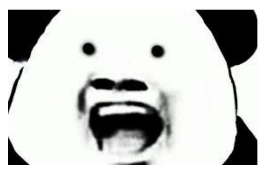

**Q:** What occasions would someone use this meme?

**GT:** This meme, commonly known as "Screaming Panda," is typically used to express shock, surprise, or fear. It could be used in response to a startling or unexpected event, or to convey a sense of panic or alarm. Some possible occasions where someone might use this meme include:

- Reacting to a jump scare in a horror movie
- Responding to a surprising plot twist in a TV show or book
- Expressing shock at a news headline or current event
- Conveying fear or anxiety about an upcoming deadline or exam
- Showing surprise at an unexpected outcome in a sports game or other competition.

### Required capabilities:

Recognition, knowledge, language generation

**(b)** 


**Q:** How many tomatoes are there?

GT: 5

Required capabilities: Recognition

(c)


**Q:** What is located to the right of the shampoo?

GT: conditioner

Required capabilities: OCR, spatial awareness

Table 13: Four samples requiring different capability integrations.

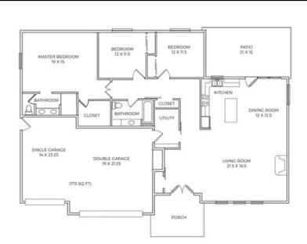

**Q:** Which room is bigger, the double garage or the living room?

GT: double garage

Required capabilities: OCR, spatial awareness, math

**(b)** 


Q: On the right desk, what is to the left of the laptop?

GT: table lamp <OR> desk lamp

Required capabilities: Recognition, spatial awareness

•

(c)


**Q:** What are all the scene text in the image?

GT: 5:30PM <AND> 88% <AND> Mario Kart 8 Deluxe <AND> MARIO KART 8 DELUXE <AND> SUPER MARIO ODYSSEY <AND> THE LEGEND OF ZELDA <AND> BREATH OF WILD <AND> Options <AND> Start

Required capabilities: OCR

(**d**)


Q: How many gallons of supreme gasoline can I get with \$50?

**GT:** 13.6 < OR > 13.7

Required capabilities: OCR, math

Table 14: Two samples requiring different capability integrations.


**Q:** In which country was this photo taken?

GT: Australia

**Required capabilities:** Recognition, knowledge

**(b)** 

**Me:** I'll do it at 8 **Time:** 8.05

Me: looks like I gotta wait till 9 now


**Q:** Can you explain this meme?

This meme is a humorous take on procrastination and the tendency to delay tasks until a specific time. The person in the meme plans to do something at 8 o'clock, but when they miss that deadline by a few minutes, they decide to wait until 9 o'clock instead. The image of Kermit the Frog lying in bed represents the person's laziness and lack of motivation to complete the task.

**Required capabilities:** Recognition, OCR, knowledge, language generation

Table 15: Two samples requiring different capability integrations.

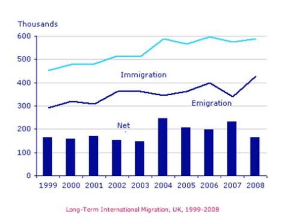

- **Q:** The graph below shows the long-term international migration, UK, 1999-2008. Summarize the information by selecting and reporting the main features, and make comparisons where relevant.
  - You should write at least 150 words.
- **GT:** The chart gives information about UK immigration, emigration and net migration between 1999 and 2008.

Both immigration and emigration rates rose over the period shown, but the figures for immigration were significantly higher. Net migration peaked in 2004 and 2007.

In 1999, over 450,000 people came to live in the UK, while the number of people who emigrated stood at just under 300,000. The figure for net migration was around 160,000, and it remained at a similar level until 2003. From 1999 to 2004, the immigration rate rose by nearly 150,000 people, but there was a much smaller rise in emigration. Net migration peaked at almost 250,000 people in 2004.

After 2004, the rate of immigration remained high, but the number of people emigrating fluctuated. Emigration fell suddenly in 2007, before peaking at about 420,000 people in 2008. As a result, the net migration figure rose to around 240,000 in 2007, but fell back to around 160,000 in 2008.

### Required capabilities:

s: Recognition, OCR, language generation, spatial awareness

**(b)** 

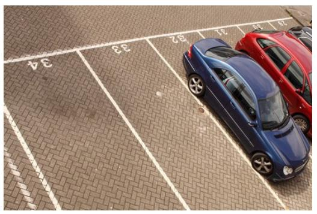

**Q:** Which car is on the parking spot 33?

GT: no <OR> empty

Required capabilities: Recognition, OCR, spatial awareness

Table 16: Three samples requiring different capability integrations.

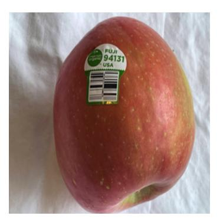

**Q:** Is this apple organic?

GT: yes

Required capabilities: Recognition, OCR

**(b)** 

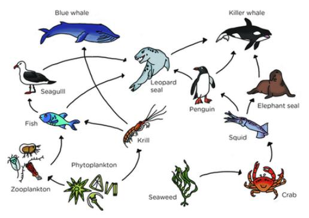

**Q:** Which are producers in this food web?

**GT:** Phytoplankton <AND> Seaweed

**Required capabilities:** OCR, knowledge, spatial awareness

(c)

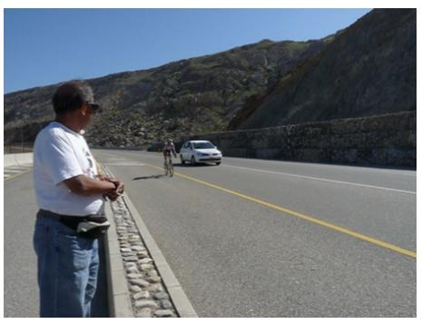

**Q:** Does the person bigger than the car?

GT: n

**Required capabilities:** Recognition, knowledge, spatial awareness

Table 17: Two samples requiring different capability integrations.

**Underground Railway Systems** 

| City          | Date opened | Kilometres of route | Passengers per year<br>(in millions) |
|---------------|-------------|---------------------|--------------------------------------|
| London        | 1863        | 394                 | 775                                  |
| Paris         | 1900        | 199                 | 1191                                 |
| Tokyo         | 1927        | 155                 | 1927                                 |
| Washington DC | 1976        | 126                 | 144                                  |
| Kyoto         | 1981        | 11                  | 45                                   |
| Los Angeles   | 2001        | 28                  | 50                                   |

**Q:** The table below gives information about the underground railway systems in six cities.

Summarise the information by selecting and reporting the main features, and make comparisons where relevant.

You should write at least 150 words.

**GT:** The table shows data about the underground rail networks in six major cities.

The table compares the six networks in terms of their age, size and the number of people who use them each year. It is clear that the three oldest underground systems are larger and serve significantly more passengers than the newer systems.

The London underground is the oldest system, having opened in 1863. It is also the largest system, with 394 kilometres of route. The second largest system, in Paris, is only about half the size of the London underground, with 199 kilometres of route. However, it serves more people per year. While only third in terms of size, the Tokyo system is easily the most used, with 1927 million passengers per year.

Of the three newer networks, the Washington DC underground is the most extensive, with 126 kilometres of route, compared to only 11 kilometres and 28 kilometres for the Kyoto and Los Angeles systems. The Los Angeles network is the newest, having opened in 2001, while the Kyoto network is the smallest and serves only 45 million passengers per year.

Required capabilities:

OCR, language generation, spatial awareness

**(b)** 


**Q:** What will the girl on the right write on the board?

**GT:** 14

Required capabilities: Recognition, OCR, spatial awareness, math

# **D. GPT-4V prediction examples**


(a) Q: How many gallons of supreme gasoline can I get with \$50? GT: 13.6 < OR > 13.7

Required capabilities: OCR, math

GPT-4V: You can get approximately 13.7 gallons of supreme gasoline with \$50 at the price of \$3.659 per gallon. GPT4 score: 1.0

(b) Q: What is the price difference between GPT-4V: The price difference diesel and regular gasoline?

GT: 0.11

Required capabilities: OCR, math

between diesel and regular gasoline is \$0.11, with diesel being more expensive. GPT4 score: 1.0

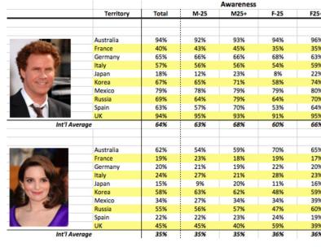

(c) Q: Based on the image, what is the total GPT-4V: The total international awareness of Tina Fey? GT: 35%

Required capabilities: OCR, spatial awareness

international awareness of Tina Fey is 35%. GPT4\_score: 1.0

(d) Q: Based on the image, in which country does Tina Fey have the highest level of total awareness? GT: Australia

Required capabilities: OCR, spatial awareness

GPT-4V: Tina Fey has the highest level of total awareness in Australia at 62%.

GPT4\_score: 1.0

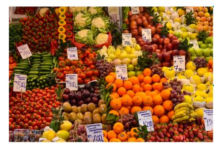

(e) Q: What is the price for tomatoes? GT: eight <OR> 8.0 Required capabilities: Recognition, spatial on the label in the image.

(f) Q: What fruit is the the right of plums? GPT-4V: The fruit to the right

Required capabilities: Recognition, spatial GPT4 score: 1.0 awareness

GPT-4V: The price for tomatoes is 8.00 as shown

GPT4 score: 1.0

of the plums are oranges.

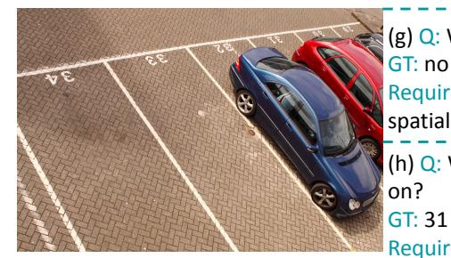

(g) Q: Which car is on the parking spot 33? GPT-4V: The blue car is on GT: no <OR> empty

Required capabilities: OCR, recognition, spatial awareness

(h) Q: Which spot is the red car parking

Required capabilities: OCR, recognition, spatial awareness

parking spot 33. GPT4 score: 0.0

GPT-4V: The red car is parking on spot number 87. GPT4 score: 0.0

Figure 3: GPT-4V representative success and failure cases.

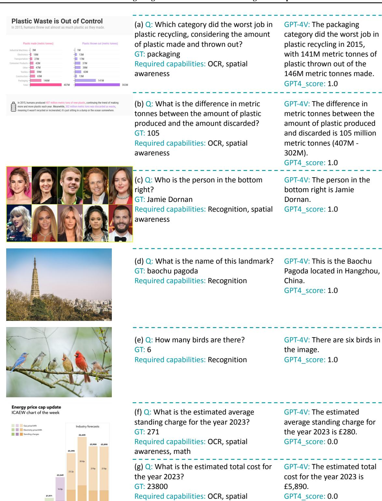

Figure 4: GPT-4V representative success and failure cases.

awareness, math


(a) Q: What are all the scene text in the image?

GT: Connecticut law of 1642 If any man or woman be a witch -- that is, hath or consulteth with a familiar spirit -- they shall be put to death law of 1642 If any man or woman be a witch -- that hath or consulteth with a familiar spirit -- they shall

Required capabilities: OCR

GPT-4V: The scene text in the image is: "Connecticut law of 1642 If any man or woman be a witch -- that is, hath or consulteth with a familiar spirit -- they shall be put to death" GPT4\_score: 1.0


(b) Q: What are all the scene text in the image?

GT: MR. WILLIAM SHAKESPEARES COMEDIES, HISTORIES, & TRAGEDIES. **publifhed** according to the True **Originall** Copies.

Required capabilities: OCR

GPT-4V: The scene texts in the image are: - "MR. WILLIAM SHAKESPEARES" - "COMEDIES, HISTORIES, & TRAGEDIES." - "Published according to the True Originall Copies."

GPT4\_score: 0.9


(c) Q: What are all the scene text in the image?

GT: 5:30PM 88% Mario Kart 8 Deluxe MARIO KART 8 DELUXE SUPER MARIO ODYSSEY THE LEGEND OF ZELDA BREATH OF WILD Options Start

Required capabilities: OCR

GPT-4V: The scene texts in the image are "Mario Kart 8 Deluxe", "5:30 PM", "88%", "Options", "Start", "MARIOKART 8 DELUXE", "THE LEGEND OF ZELDA", and "FORTNITE".

GPT4\_score: 0.7


(d) Q: In which country was this photo taken?
GT: australia

Required capabilities: Recognition, knowledge

GPT-4V: This photo was taken in Australia, during the Australian Open tennis tournament.

GPT4\_score: 1.0

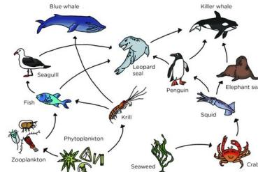

(e) Q: Which are producers in this food web?

GT: Phytoplankton Seaweed Required capabilities: OCR, knowledge, spatial awareness GPT-4V: The producers in this food web are phytoplankton and seaweed.

GPT4\_score: 1.0

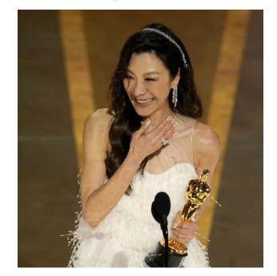

(f) Q: Who is the person in the image? GT: Michelle Yeoh Required capabilities: Recognition,

knowledge

(g) Q: Where is this photo taken? GT: oscar 2023 Required capabilities: Recognition, knowledge GPT-4V: The person in the image is Michelle Yeoh, a renowned actress and producer.

GPT4\_score: 1.0

GPT-4V: This photo was taken at the Oscars, where the woman is receiving an award.

GPT4\_score: 0.5

Figure 5: GPT-4V representative success and failure cases.

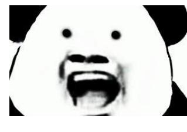

Me: I'll do it at 8 Time: 8.05 Me: looks like I gotta wait till 9 now

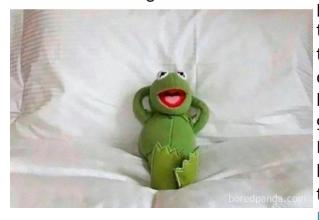

Underground Railway Systems

| City          | Date opened | Kilometres of route | Passengers per year<br>(in millions) |
|---------------|-------------|---------------------|--------------------------------------|
| London        | 1863        | 394                 | 775                                  |
| Paris         | 1900        | 199                 | 1191                                 |
| Tokyo         | 1927        | 155                 | 1927                                 |
| Washington DC | 1976        | 126                 | 144                                  |
| Kyoto         | 1981        | 11                  | 45                                   |
| Los Angeles   | 2001        | 28                  | 50                                   |

(a) Q: What occasions would someone use GPT-4V: This meme is often used to this meme?

GT: This meme, commonly known as "Screaming Panda," is typically used to express shock, surprise, or fear. It could be used in response to a startling or unexpected event, or to convey a sense of panic or alarm. .....

Required capabilities: Recognition, knowledge, language generation

(b) Q: Can you explain this meme? GT: This meme is a humorous take on procrastination and the tendency to delay tasks until a specific time. The person in the meme plans to do something at 8 o'clock, but when they miss that deadline by a few minutes, they decide to wait until 9 o'clock instead. The image of Kermit the Frog lying in bed represents the person's

Required capabilities: Recognition, knowledge, language generation, OCR GPT-4V: This meme humorously illustrates the tendency to procrastinate. The person plans to do something at 8 but delays it by 5 minutes and then decides to postpone the task until 9, exemplifying how easily tasks can be deferred. The image of Kermit the Frog relaxed and unbothered underscores the nonchalant attitude towards procrastination.

express shock, surprise, or disbelief in a

humorous or exaggerated way. It can be

used in response to unexpected news.

events, or situations.

GPT4\_score: 0.6

laziness and lack of motivation to complete GPT4\_score: 1.0

(c) Q: The table below gives information about the underground railway systems in six cities. Summarise the information by selecting and reporting the main features, and make comparisons where relevant. You should write at least 150 words. GT: The table shows data about the underground rail networks in six major cities. The table compares the six networks in terms of their age, size and the number of people who use them each year. It is clear that the three oldest underground systems are larger and serve significantly more passengers than the newer systems. The London underground is the oldest system, having opened in 1863. It is also the largest system, with 394 kilometres of route. The second largest system, in Paris. is only about half the size of the London underground, with 199 kilometres of route. However, it serves more people per year. While only third in terms of size, the Tokyo system is easily the most used, with 1927 million passengers per year. Of the three newer networks, the Washington DC underground is the most extensive, with 126 kilometres of route, compared to only 11 kilometres and 28 kilometres for the Kyoto and Los Angeles systems. The Los Angeles network is the newest, having opened in 2001, while the Kyoto network is the smallest and serves only 45 million passengers per year. Required capabilities: OCR, language generation, spatial awareness

GPT-4V: The table illustrates data on six underground railway systems worldwide, focusing on their opening dates, route lengths, and annual passenger numbers. London's underground, inaugurated in 1863, is the oldest and has the most extensive network, boasting 394 kilometres of route. Despite its age and extensive network, it only caters to 775 million passengers annually, significantly less than Paris and Tokyo. Paris's metro, opened in 1900, has a 199-kilometre route and serves a staggering 1191 million passengers yearly, the highest among the listed cities. Tokyo's system, though younger (opened in 1927) and having a shorter 155-kilometre route, still manages to serve 1927 million passengers, showcasing the city's dense population and reliance on public transport. In contrast, Washington DC's metro, opened in 1976 with 126 kilometres of route, only caters to 144 million passengers annually. Kyoto and Los Angeles have the youngest and least extensive networks, opened in 1981 and 2001 with 11 and 28 kilometres of routes, respectively. Correspondingly, they have the lowest annual passenger numbers, with Kvoto at 45 million and Los Angeles at 50 million. In summary, there is a noticeable disparity in the age, route length, and passenger numbers among these cities. While older and more extensive networks like London's do not necessarily translate to higher passenger numbers, cities like Paris and Tokyo demonstrate a significant demand for underground rail systems. likely attributed to their dense populations and urban structures. GPT4 score: 0.9

Figure 6: GPT-4V representative success and failure cases.