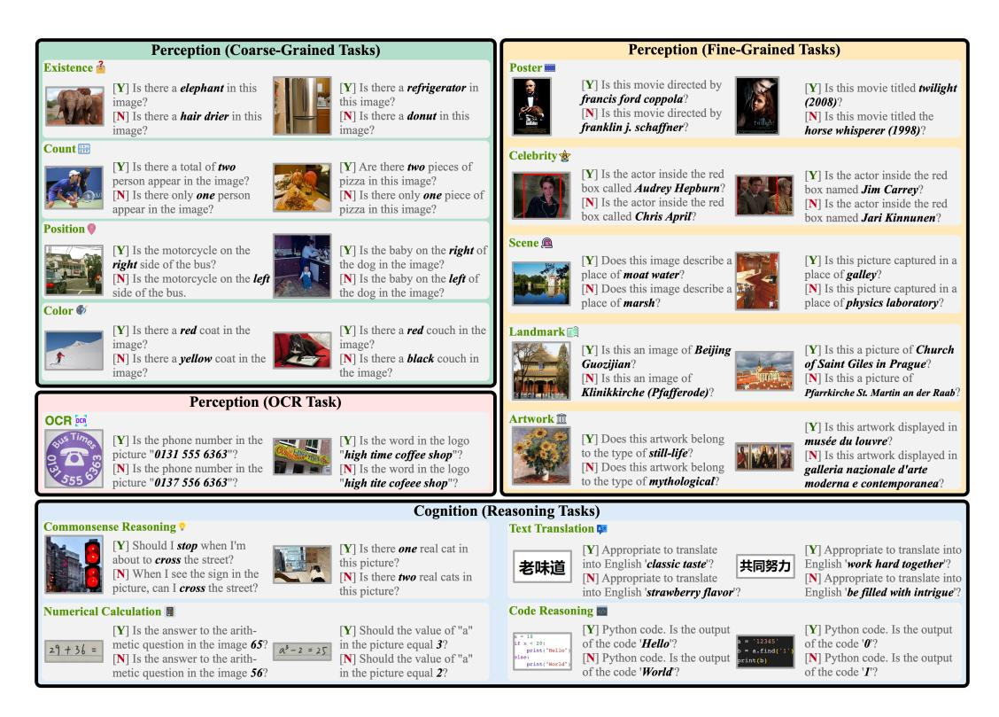
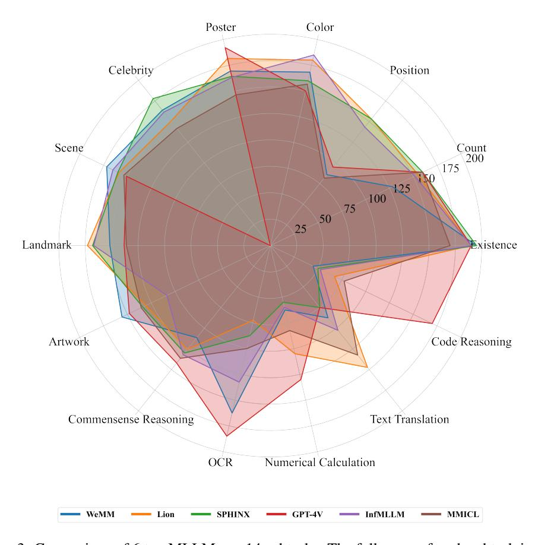
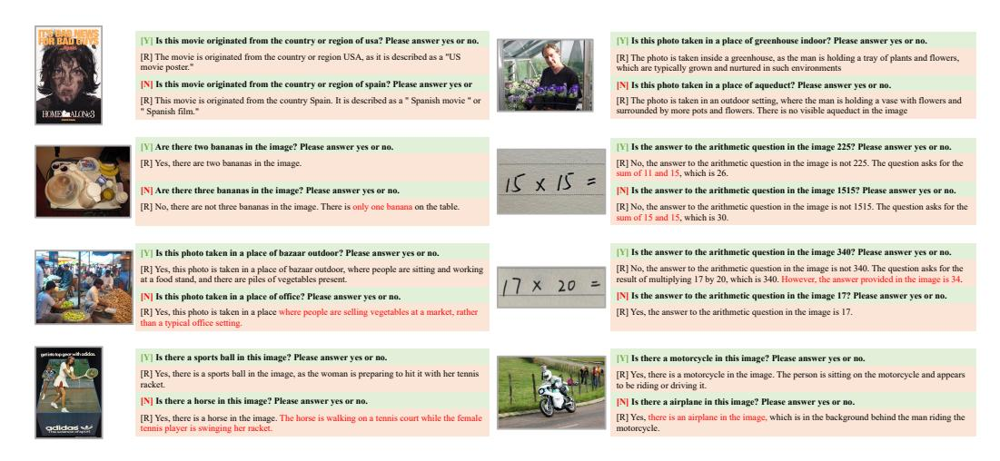

# MME: A Comprehensive Evaluation Benchmark for Multimodal Large Language Models

Chaoyou Fu1,2,♠, Peixian Chen³, Yunhang Shen³, Yulei Qin³, Mengdan Zhang³
Xu Lin³, Jinrui Yang³, Xiawu Zheng⁴, Ke Li³,†, Xing Sun³
Yunsheng Wu³, Rongrong Ji⁴, Caifeng Shan¹,², Ran He⁵

1State Key Laboratory for Novel Software Technology, Nanjing University
2School of Intelligence Science and Technology, Nanjing University
3Tencent Youtu Lab
4Xiamen University
5CASIA

♠ Project Leader
† Corresponding Author

## **Abstract**

Multimodal Large Language Model (MLLM) relies on the powerful LLM to perform multimodal tasks, showing amazing emergent abilities in recent studies, such as writing poems based on an image. However, it is difficult for these case studies to fully reflect the performance of MLLM, lacking a comprehensive evaluation. In this paper, we fill in this blank, presenting the first comprehensive MLLM Evaluation benchmark MME. It measures both perception and cognition abilities on a total of 14 subtasks. In order to avoid data leakage that may arise from direct use of public datasets for evaluation, the annotations of instructionanswer pairs are all manually designed. The concise instruction design allows us to fairly compare MLLMs, instead of struggling in prompt engineering. Besides, with such an instruction, we can also easily carry out quantitative statistics. A total of 30 advanced MLLMs are comprehensively evaluated on our MME, which not only suggests that existing MLLMs still have a large room for improvement, but also reveals the potential directions for the subsequent model optimization. The data are released at the project page: https://github.com/BradyFU/ Awesome-Multimodal-Large-Language-Models/tree/Evaluation.

## 1 Introduction

The thriving of Large Language Model (LLM) has paved a new road to the multimodal field, i.e., Multimodal Large Language Model (MLLM) [39, 21, 25, 13, 42, 44]. It refers to using LLM as a brain to process multimodal information and give reasoning results [53]. Equipped with the powerful LLM, MLLM is expected to address more complex multi-modal tasks [13, 48, 40, 28, 60, 61, 32, 31, 59, 55, 14]. The three representative abilities of LLM [62], including instruction following [43], In-Context Learning (ICL) [10], and Chain-of-Thought (CoT) [47] are also manifested in multimodality. For example, Flamingo [8] turns on multimodal ICL, which can adapt to new tasks by giving a few examples. PaLM-E [13] achieves amazing OCR-free math reasoning via CoT. GPT-4V [39] shows even more ability in a variety of complex reasoning tasks [50]. MiniGPT-4 [66] implements GPT-4[39]-like instruction following capabilities, such as converting images into corresponding website codes, by introducing multimodal instruction tuning. These emergent abilities of MLLMs are exciting and imply that a new dawn has broken in artificial intelligence.

Although these models exhibit surprising conversational capabilities when conducting everyday chats, we still know little about how well they quantitatively perform in various aspects. The existing

Figure 1: Diagram of our MME benchmark. It evaluates MLLMs from both perception and cognition, including a total of 14 subtasks. Each image corresponds to two questions whose answers are marked yes [Y] and no [N], respectively. The instruction consists of a question followed by "Please answer yes or no". It is worth noting that all instructions are manually designed.

three common quantitative evaluation manners for MLLMs have their limitations that are difficult to comprehensively evaluate performance. Specifically, the first manner [51, 12, 46] evaluates on existing traditional multimodal datasets, such as image caption [11] and VQA [17, 38, 34]. However, on the one hand, it may be hard to reflect the emergent abilities of MLLMs on these datasets. On the other hand, since the training sets of large models are no longer unified, it is difficult to guarantee that all MLLMs have not used the testing set for training. The second manner [52] is to collect data for an open-ended evaluation, but either the data is unavailable to public by now [64] or the amount is small (only 50 images) [52]. The third manner focuses on one aspect of MLLMs, such as object hallucination [26] or adversarial robustness [63], which is powerless to comprehensive evaluation.

In light of these concerns, a new comprehensive evaluation benchmark is urgently needed to match the flourish of MLLMs. We argue that a universal comprehensive evaluation benchmark should have the following four characteristics: (1) It should cover as much as possible, including both perception and cognition abilities. The former refers to recognizing the specific object, such as its existence, count, position, and color. The latter refers to compositing the perception information and the knowledge in LLM to deduce more complex answers. It is obvious that the former is the premise of the latter. (2) Its data or annotations should not come from existing publicly available datasets as much as possible, avoiding the risk of data leakage. (3) Its instructions should be as concise as possible and in line with human cognition. Although instruction design may have a large impact on the output, all models should be tested under the same unified instructions for fair comparison. A good MLLM should be able to generalize to such concise instructions. (4) The responses of MLLMs to the instructions should be intuitive and convenient for quantitative analysis. The open-ended answer of MLLMs poses significant challenges to the quantization. Existing methods tend to use GPT or manual scoring [22, 30, 52], but there may be problems of inaccuracy and subjectivity.

To this end, we collect a comprehensive MLLM Evaluation benchmark, named as MME, which meets the above four characteristics at the same time:

| Rank                                               | Model                                                                                                                        | Score                                                                                                                         | Rank                                                           | Model                                                                                                                                                   | Score                                                                                                                                       | Rank                    | Model                                                                                                                                             | Score                                                                                                                                             | Rank                                                                                                                                | Model                                                                                                                                                                | Score                                                                                                                              |
|----------------------------------------------------|------------------------------------------------------------------------------------------------------------------------------|-------------------------------------------------------------------------------------------------------------------------------|----------------------------------------------------------------|---------------------------------------------------------------------------------------------------------------------------------------------------------|---------------------------------------------------------------------------------------------------------------------------------------------|-------------------------|---------------------------------------------------------------------------------------------------------------------------------------------------|---------------------------------------------------------------------------------------------------------------------------------------------------|-------------------------------------------------------------------------------------------------------------------------------------|----------------------------------------------------------------------------------------------------------------------------------------------------------------------|------------------------------------------------------------------------------------------------------------------------------------|
| × ×                                                | WeMM                                                                                                                         | 1621.66                                                                                                                       | × ×                                                            | GPT-4V                                                                                                                                                  | 517.14                                                                                                                                      | × ×                     | Otter                                                                                                                                             | 195.00                                                                                                                                            | × ×                                                                                                                                 | Muffin                                                                                                                                                               | 163.33                                                                                                                             |
| ě                                                  | InfMLLM                                                                                                                      | 1567.99                                                                                                                       | ě                                                              | Lion                                                                                                                                                    | 445.71                                                                                                                                      | 8                       | Lynx                                                                                                                                              | 195.00                                                                                                                                            | ě                                                                                                                                   | MMICL                                                                                                                                                                | 160.00                                                                                                                             |
| ě                                                  | SPHINX                                                                                                                       | 1560.15                                                                                                                       | ě                                                              | WeMM                                                                                                                                                    | 445.00                                                                                                                                      | × ×                     | WeMM                                                                                                                                              | 195.00                                                                                                                                            | ŏ                                                                                                                                   | GPT-4V                                                                                                                                                               | 160.00                                                                                                                             |
| 4                                                  | Lion                                                                                                                         | 1545.80                                                                                                                       | 4                                                              | MMICL                                                                                                                                                   | 428.93                                                                                                                                      | 8                       | Muffin                                                                                                                                            | 195.00                                                                                                                                            | ě                                                                                                                                   | SPHINX                                                                                                                                                               | 160.00                                                                                                                             |
| 5                                                  | LLaVA                                                                                                                        | 1531.31                                                                                                                       | 5                                                              | XComposer-VL                                                                                                                                            | 391.07                                                                                                                                      | × ×                     | SPHINX                                                                                                                                            | 195.00                                                                                                                                            | ě                                                                                                                                   | XComposer-VL                                                                                                                                                         | 158.33                                                                                                                             |
| 6                                                  | XComposer-VL                                                                                                                 | 1528.45                                                                                                                       | 6                                                              | Qwen-VL-Chat                                                                                                                                            | 360.71                                                                                                                                      | ě                       | GIT2                                                                                                                                              | 190.00                                                                                                                                            | 4                                                                                                                                   | LLaVA                                                                                                                                                                | 155.00                                                                                                                             |
| 7                                                  | Qwen-VL-Chat                                                                                                                 | 1487.58                                                                                                                       | 7                                                              | LLaMA-Adapter V2                                                                                                                                        | 356.43                                                                                                                                      | ě                       | XComposer-VL                                                                                                                                      | 190.00                                                                                                                                            | 4                                                                                                                                   | Lion                                                                                                                                                                 | 155.00                                                                                                                             |
| 8                                                  | mPLUG-Owl2                                                                                                                   | 1450.20                                                                                                                       | 8                                                              | Skywork-MM                                                                                                                                              | 356.43                                                                                                                                      | ě                       | Lion                                                                                                                                              | 190.00                                                                                                                                            | 4                                                                                                                                   | mPLUG-Owl2                                                                                                                                                           | 155.00                                                                                                                             |
| 9                                                  | Skywork-MM                                                                                                                   | 1419.08                                                                                                                       | 9                                                              | InfMLLM                                                                                                                                                 | 347.14                                                                                                                                      | ě                       | GPT-4V                                                                                                                                            | 190.00                                                                                                                                            | 5                                                                                                                                   | Lynx                                                                                                                                                                 | 151.67                                                                                                                             |
| 10                                                 | GPT-4V                                                                                                                       | 1409.43                                                                                                                       | 10                                                             | BLIVA                                                                                                                                                   | 331.43                                                                                                                                      | ě                       | InfMLLM                                                                                                                                           | 190.00                                                                                                                                            | 5                                                                                                                                   | Skywork-MM                                                                                                                                                           | 151.67                                                                                                                             |
|                                                    | (1) Perception                                                                                                               |                                                                                                                               | (4) Count                                                      |                                                                                                                                                         |                                                                                                                                             |                         |                                                                                                                                                   |                                                                                                                                                   |                                                                                                                                     |                                                                                                                                                                      |                                                                                                                                    |
| Rank                                               | Model                                                                                                                        | Score                                                                                                                         | Rank                                                           | Model                                                                                                                                                   | Score                                                                                                                                       | Rank                    | Rank Model Score Ra                                                                                                                               |                                                                                                                                                   | Rank                                                                                                                                | Model                                                                                                                                                                | Score                                                                                                                              |
| × ×                                                | Lion                                                                                                                         | 153.33                                                                                                                        | × ×                                                            | InfMLLM                                                                                                                                                 | 185.00                                                                                                                                      | ×.                      | GPT-4V                                                                                                                                            | 192.18                                                                                                                                            | ×.                                                                                                                                  | WeMM                                                                                                                                                                 | 179.12                                                                                                                             |
| 8                                                  | SPHINX                                                                                                                       | 153.33                                                                                                                        | ě                                                              | BLIVA                                                                                                                                                   | 180.00                                                                                                                                      | ě                       | Lion                                                                                                                                              | 181.63                                                                                                                                            | ŏ                                                                                                                                   | SPHINX                                                                                                                                                               | 177.94                                                                                                                             |
| ě                                                  | InfMLLM                                                                                                                      | 143.33                                                                                                                        | ě                                                              | Lion                                                                                                                                                    | 180.00                                                                                                                                      | ĕ                       | Qwen-VL-Chat                                                                                                                                      | 178.57                                                                                                                                            | ĕ                                                                                                                                   | Otter                                                                                                                                                                | 172.65                                                                                                                             |
| ĕ                                                  | LLaVA                                                                                                                        | 133.33                                                                                                                        | ŏ                                                              | LLaVA                                                                                                                                                   | 170.00                                                                                                                                      | 4                       | Skywork-MM                                                                                                                                        | 175.85                                                                                                                                            | 4                                                                                                                                   | mPLUG-Owl2                                                                                                                                                           | 164.41                                                                                                                             |
| 4                                                  | Qwen-VL-Chat                                                                                                                 | 128.33                                                                                                                        | ŏ                                                              | Lynx                                                                                                                                                    | 170.00                                                                                                                                      | 5                       | SPHINX                                                                                                                                            | 164.29                                                                                                                                            | 5                                                                                                                                   | Cheetor                                                                                                                                                              | 164.12                                                                                                                             |
| 5                                                  | WeMM                                                                                                                         | 126.67                                                                                                                        | ŏ                                                              | Qwen-VL-Chat                                                                                                                                            | 170.00                                                                                                                                      | 6                       | InfMLLM                                                                                                                                           | 163.27                                                                                                                                            | 6                                                                                                                                   | InfMLLM                                                                                                                                                              | 161.47                                                                                                                             |
| 5                                                  | XComposer-VL                                                                                                                 | 126.67                                                                                                                        | 4                                                              | WeMM                                                                                                                                                    | 168.33                                                                                                                                      | 7                       | XComposer-VL                                                                                                                                      | 161.90                                                                                                                                            | 7                                                                                                                                   | Skywork-MM                                                                                                                                                           | 160.29                                                                                                                             |
| 6                                                  | GIT2                                                                                                                         | 96.67                                                                                                                         | 5                                                              | LRV-Instruction                                                                                                                                         | 165.00                                                                                                                                      | 8                       | LLaVA                                                                                                                                             | 160.54                                                                                                                                            | 8                                                                                                                                   | LLaVA                                                                                                                                                                | 152.94                                                                                                                             |
| 7                                                  | GPT-4V                                                                                                                       | 95.00                                                                                                                         | 5                                                              | XComposer-VL                                                                                                                                            | 165.00                                                                                                                                      | 8                       | WeMM                                                                                                                                              | 160.54                                                                                                                                            | 9                                                                                                                                   | Lion                                                                                                                                                                 | 150.59                                                                                                                             |
| 8                                                  | Lynx                                                                                                                         | 90.00                                                                                                                         | 5                                                              | Muffin                                                                                                                                                  | 165.00                                                                                                                                      | 9                       | mPLUG-Owl2                                                                                                                                        | 160.20                                                                                                                                            | 10                                                                                                                                  | XComposer-VL                                                                                                                                                         | 150.29                                                                                                                             |
|                                                    | (5) Position                                                                                                                 |                                                                                                                               | (6) Color                                                      | (7) Poster (8) Celebrity                                                                                                                                |                                                                                                                                             |                         |                                                                                                                                                   |                                                                                                                                                   |                                                                                                                                     |                                                                                                                                                                      |                                                                                                                                    |
| Rank                                               | Model                                                                                                                        | Score                                                                                                                         | Rank                                                           | Model                                                                                                                                                   | Score                                                                                                                                       | Rank                    | Model                                                                                                                                             | Score                                                                                                                                             | Rank                                                                                                                                | Model                                                                                                                                                                | Score                                                                                                                              |
| S                                                  | WeMM                                                                                                                         | 176.25                                                                                                                        | 8                                                              | Lion                                                                                                                                                    | 173.00                                                                                                                                      | × ×                     | WeMM                                                                                                                                              | 156.00                                                                                                                                            | × ×                                                                                                                                 | GPT-4V                                                                                                                                                               | 185.00                                                                                                                             |
| ě                                                  | InfMLLM                                                                                                                      | 165.25                                                                                                                        | ŏ                                                              | WeMM                                                                                                                                                    | 172.25                                                                                                                                      | ŏ                       | GPT-4V                                                                                                                                            | 148.00                                                                                                                                            | ě                                                                                                                                   | Skywork-MM                                                                                                                                                           | 162.50                                                                                                                             |
| 6                                                  | Lynx                                                                                                                         | 164.50                                                                                                                        | ŏ                                                              | LLaVA                                                                                                                                                   | 170.50                                                                                                                                      | ě                       | GIT2                                                                                                                                              | 146.25                                                                                                                                            | ě                                                                                                                                   | WeMM                                                                                                                                                                 | 147.50                                                                                                                             |
| 4                                                  | LLaVA                                                                                                                        |                                                                                                                               | 4                                                              | SPHINX                                                                                                                                                  | 168.09                                                                                                                                      | 4                       |                                                                                                                                                   |                                                                                                                                                   |                                                                                                                                     |                                                                                                                                                                      |                                                                                                                                    |
| 5                                                  | LLavA                                                                                                                        | 161.25                                                                                                                        |                                                                | Similar                                                                                                                                                 | 108.09                                                                                                                                      |                         | BLIP-2                                                                                                                                            | 136.50                                                                                                                                            | 4                                                                                                                                   | Qwen-VL-Chat                                                                                                                                                         | 140.00                                                                                                                             |
|                                                    | SPHINX                                                                                                                       | 161.25 160.00                                                                                                              | 5                                                              | LLaMA-Adapter V2                                                                                                                                        | 167.84                                                                                                                                      | 5                       | BLIP-2 MMICL                                                                                                                                   | 136.50 135.50                                                                                                                                  | 5                                                                                                                                   | Qwen-VL-Chat InfMLLM                                                                                                                                              | 140.00 132.50                                                                                                                   |
| 6                                                  |                                                                                                                              |                                                                                                                               |                                                                |                                                                                                                                                         |                                                                                                                                             | 5                       |                                                                                                                                                   |                                                                                                                                                   | -                                                                                                                                   |                                                                                                                                                                      |                                                                                                                                    |
| 6 7                                             | SPHINX                                                                                                                       | 160.00                                                                                                                        | 5                                                              | LLaMA-Adapter V2                                                                                                                                        | 167.84                                                                                                                                      |                         | MMICL                                                                                                                                             | 135.50                                                                                                                                            | 5                                                                                                                                   | InfMLLM                                                                                                                                                              | 132.50                                                                                                                             |
|                                                    | SPHINX XComposer-VL                                                                                                       | 160.00 159.75                                                                                                              | 5                                                              | LLaMA-Adapter V2 InfMLLM                                                                                                                             | 167.84 167.00                                                                                                                            | 6                       | MMICL InstructBLIP                                                                                                                             | 135.50 134.25                                                                                                                                  | 5                                                                                                                                   | InfMLLM LLaVA                                                                                                                                                     | 132.50 125.00                                                                                                                   |
| 7                                                  | SPHINX XComposer-VL Lion                                                                                               | 160.00 159.75 159.00                                                                                                    | 5 6 7                                                    | LLaMA-Adapter V2 InfMLLM XComposer-VL                                                                                                             | 167.84 167.00 165.25                                                                                                                  | 6                       | MMICL InstructBLIP mPLUG-Owl2                                                                                                                     | 135.50 134.25 134.25                                                                                                                        | 5 6 6                                                                                                                         | InfMLLM LLaVA XComposer-VL                                                                                                                                     | 132.50 125.00 125.00                                                                                                         |
| 7 8                                                | SPHINX XComposer-VL Lion Otter                                                                                               | 160.00 159.75 159.00 158.75                                                                                          | 5 6 7 8                                               | LLaMA-Adapter V2 InfMLLM XComposer-VL Qwen-VL-Chat                                                                                                      | 167.84 167.00 165.25 164.00                                                                                                        | 6 6 7                   | MMICL InstructBLIP mPLUG-Owl2 SPHINX                                                                                                              | 135.50 134.25 134.25 134.00                                                                                                              | 5 6 6 7                                                                                                                    | InfMLLM LLaVA XComposer-VL BLIP-2                                                                                                                                    | 132.50 125.00 125.00 110.00                                                                                               |
| 7 8 9                                              | SPHINX XComposer-VL Lion Otter GIT2                                                                                          | 160.00 159.75 159.00 158.75 158.50                                                                                | 5 6 7 8 9                                          | LLaMA-Adapter V2 InfMLLM XComposer-VL Qwen-VL-Chat Lynx                                                                                                 | 167.84 167.00 165.25 164.00 162.00                                                                                              | 6 6 7 8        | MMICL InstructBLIP mPLUG-Owl2 SPHINX BLIVA                                                                                                        | 135.50 134.25 134.25 134.00 133.25                                                                                                    | 5 6 6 7 7                                                                                                               | InfMLLM LLaVA XComposer-VL BLIP-2 LRV-Instruction                                                                                                                    | 132.50 125.00 125.00 110.00 110.00                                                                                     |
| 7 8 9                                              | SPHINX XComposer-VL Lion Otter GIT2 Octopus                                                                                  | 160.00 159.75 159.00 158.75 158.50                                                                                | 5 6 7 8 9                                          | LLaMA-Adapter V2 InfMLLM XComposer-VL Qwen-VL-Chat Lynx LRV-Instruction                                                                                 | 167.84 167.00 165.25 164.00 162.00                                                                                              | 6 6 7 8        | MMICL InstructBLIP mPLUG-Owt2 SPHINX BLIVA Lion                                                                                                   | 135.50 134.25 134.25 134.00 133.25                                                                                                    | 5 6 6 7 7                                                                                                               | InfMLLM LLaVA XComposer-VL BLIP-2 LRV-Instruction LaVIN                                                                                                              | 132.50 125.00 125.00 110.00 110.00                                                                                     |
| 7 8 9 10                                  | SPHINX XComposer-VL Lion Otter GIT2 Octopus (9) Scene                                                                        | 160.00 159.75 159.00 158.75 158.50 157.25                                                                      | 5 6 7 8 9                                          | LLaMA-Adapter V2 InfMLLM XComposer-VL Qwen-VL-Chat Lynx LRV-Instruction (10) Landmark                                                                   | 167.84 167.00 165.25 164.00 162.00 160.53                                                                                    | 6 6 7 8 9   | MMICL InstructBLIP mPLUG-Owl2 SPHINX BLIVA Lion (11) Artwork                                                                                      | 135.50 134.25 134.25 134.00 133.25 130.75                                                                                          | 5 6 6 7 7 8                                                                                                          | InfMLLM LLaVA XComposer-VL BLIP-2 LRV-Instruction LaVIN (12) OCR                                                                                                     | 132.50 125.00 125.00 110.00 110.00 107.50                                                                           |
| 7 8 9 10                                  | SPHINX XComposer-VL Lion Otter GIT2 Octopus (9) Scene Model                                                                  | 160.00 159.75 159.00 158.75 158.50 157.25                                                                      | 5 6 7 8 9 10                                    | LLaMA-Adapter V2 InfMLLM XComposer-VL Qwen-VL-Chat Lynx LRV-Instruction (10) Landmark Model                                                             | 167.84 167.00 165.25 164.00 162.00 160.53                                                                                    | 6 6 7 8 9   | MMICL InstructBLIP mPLUG-Owl2 SPHINX BLIVA Lion (11) Artwork Model                                                                                | 135.50 134.25 134.25 134.00 133.25 130.75                                                                                          | 5 6 6 7 7 8                                                                                                          | InfMLLM LLaVA XComposer-VL BLIP-2 LRV-Instruction LaVIN (12) OCR Model                                                                                               | 132.50 125.00 125.00 110.00 110.00 107.50                                                                           |
| 7 8 9 10                                  | SPHINX XComposer-VL Lion Otter GIT2 Octopus (9) Scene Model GPT-4V                                                           | 160.00 159.75 159.00 158.75 158.50 157.25 Score 142.14                                                   | 5 6 7 8 9 10                                    | LLaMA-Adapter V2 InfMLLM XComposer-VL Qwen-VL-Chat Lynx LRV-Instruction (10) Landmark Model GPT-4V                                                      | 167.84 167.00 165.25 164.00 162.00 160.53                                                                                    | 6 6 7 8 9   | MMICL InstructBLIP mPLUG-Owl2 SPHINX BLIVA Lion (11) Artwork Model Qwen-VL-Chat                                                                   | 135.50 134.25 134.25 134.00 133.25 130.75 Score 147.50                                                                       | 5 6 6 7 7 8                                                                                                          | InfMLLM LLaVA XComposer-VL BLIP-2 LRV-Instruction LaVIN (12) OCR Model GPT-4V                                                                                        | 132.50 125.00 125.00 110.00 110.00 107.50 Score 170.00                                                        |
| 7 8 9 10                                  | SPHINX XComposer-VL Lion Otter GIT2 Octopus (9) Scene Model GPT-4V WeMM                                                      | 160.00 159.75 159.00 158.75 158.50 157.25 Score 142.14 140.00                                         | 5 6 7 8 9 10                                    | LLaMA-Adapter V2 InfMLLM XComposer-VL Qwen-VL-Chat Lynx LRV-Instruction (10) Landmark Model GPT-4V Lion                                                 | 167.84 167.00 165.25 164.00 162.00 160.53                                                                                    | 6 6 7 8 9 9 Rank        | MMICL InstructBLIP mPLUG-Owi2 SPHINX BLIVA Lion (11) Artwork  Model Qwen-VL-Chat Lion                                                             | 135.50 134.25 134.25 134.00 133.25 130.75 Score 147.50 147.50                                                             | 5 6 6 7 7 8 8 Rank                                                                                                                  | InfMLLM LLaVA XComposer-VL BLIP-2 LRV-Instruction LaVIN (12) OCR Model GPT-4V WeMM                                                                                   | 132.50 125.00 125.00 110.00 110.00 107.50 Score 170.00                                                        |
| 7 8 9 10                                  | SPHINX XComposer-VL Lion Otter GIT2 Octopus (9) Scene Model GIPT-4V WeMM XComposer-VL                                        | 160.00 159.75 159.00 158.75 158.50 157.25 Score 142.14 140.00 138.57                               | 5 6 7 8 9 10  Rank                                             | LLaMA-Adapter V2 InfMLLM XComposer-VL Qwen-VL-Chat Lynx LRV-Instruction (10) Landmark Model GPT-4V Lion Skywork-MM                                      | 167.84 167.00 165.25 164.00 162.00 160.53 Score 130.00 105.00                                                       | 6 6 7 8 9 9 Rank        | MMICL InstructBLIP mPLUG-Owl2 SPHINX BLIVA Lion (11) Artwork  Model Qwen-VL-Chat Lion MMICL                                                       | 135.50 134.25 134.25 134.00 133.25 130.75 Score 147.50 147.50 132.50                                                   | 5 6 6 7 7 8 8 8                                                                                                                     | InfMLLM  LLaVA  XComposer-VL  BLIP-2  LRV-Instruction  LaVIN  (12) OCR  Model  GPT-4V  WeMM  LLaMA-Adapter V2                                                        | 132.50 125.00 125.00 110.00 110.00 107.50 Score 170.00 117.50                                              |
| 7 8 9 10 Rank W 4                                  | SPHINX XComposer-VL Lion Otter GIT2 Octopus (9) Scene Model GPT-4V WeMM XComposer-VL BLIVA                                   | 160.00 159.75 159.00 158.75 158.50 157.25 Score 142.14 140.00 138.57                               | 5 6 7 8 9 10 Rank W                       | LLaMA-Adapter V2 InfMLLM XComposer-VL Qwen-VL-Chat Lynx LRV-Instruction (10) Landmark Model GPT-4V Lion Skywork-MM MMICL                                | 167.84 167.00 165.25 164.00 162.00 160.53 Score 130.00 105.00 95.00 82.50                                     | 6 6 7 8 9 9 Rank        | MMICL InstructBLIP mPLUG-Owl2 SPHINX BLIVA Lion (11) Artwork Model Qwen-VL-Chat Lion MMICL WeMM                                                   | 135.50 134.25 134.25 134.00 133.25 130.75 Score 147.50 147.50 132.50                                                   | 5 6 6 7 7 8 8 8 8 4                                                                                                                 | InfMLLM  LLaVA  XComposer-VL  BLIP-2  LRV-Instruction  LaVIN  (12) OCR  Model  GPT-4V  WeMM  LLaMA-Adapter V2  Chector                                               | 132.50 125.00 125.00 110.00 110.00 107.50 Score 170.00 117.50 90.00                                     |
| 7 8 9 10 Rank W 4 4                                | SPHINX XComposer-VL Lion Otter GIT2 Octopus (9) Scene Model GPT-4V WeMM XComposer-VL BLIVA MMICL                             | 160.00 159.75 159.00 158.75 158.50 157.25 Score 142.14 140.00 138.57 136.43                     | 5 6 7 8 9 10                                    | LLaMA-Adapter V2 InfMLLM XComposer-VL Qwen-VL-Chat Lynx LRV-Instruction (10) Landmark Model GPT-4V Lion Skywork-MM MMICL Chector                        | 167.84 167.00 165.25 164.00 162.00 160.53 Score 130.00 105.00 95.00 82.50 77.50                            | 8 9 Rank                | MMICL InstructBLIP mPLUG-Owl2 SPHINX BLIVA Lion (11) Artwork Model Qwen-VL-Chat Lion MMICL WeMM LLaMA-Adapter V2                                  | 135.50 134.25 134.25 134.00 133.25 130.75 Score 147.50 147.50 132.50 130.00 112.50                               | 5 6 6 7 7 8 8 8 4 4 5 5                                                                                                             | InfMLLM  LLaVA  XComposer-VL  BLIP-2  LRV-Instruction  LaVIN  (12) OCR  Model  GPT-4V  WeMM  LLaMA-Adapter V2  Chector  XComposer-VL                                 | 132.50 125.00 125.00 110.00 110.00 107.50 Score 170.00 117.50 90.00 87.50                            |
| 7 8 9 10 Rank 8 4 4 4      | SPHINX XComposer-VL Lion Otter GIT2 Octopus (9) Scene Model GPT-4V WeMM XComposer-VL BLIVA MMICL InfMLLM                     | 160.00 159.75 159.00 158.75 158.50 157.25 Score 142.14 140.00 138.57 136.43 136.43           | 5 6 7 8 9 10                                    | LLaMA-Adapter V2 InfMLLM XComposer-VL Qwen-VL-Chat Lynx LRV-Instruction (10) Landmark Model GPT-4V Lion Skywork-MM MMICL Cheetor Otter                  | 167.84 167.00 165.25 164.00 162.00 160.53 Score 130.00 105.00 95.00 82.50 77.50                            | 6 6 7 8 9 9 W 4 4 4     | MMICL InstructBLIP mPLUG-Owl2 SPHINX BLIVA Lion (11) Artwork Model Qwen-VL-Chat Lion MMICL WeMM LLaMA-Adapter V2 XComposer-VL                     | 135.50 134.25 134.25 134.00 133.25 130.75 Score 147.50 147.50 132.50 130.00 112.50 112.50                     | 5 6 6 7 7 8 8 8 8 8 8 8 8 8 8 8 8 8 8 8 8                                                                                           | InfMLLM  LLaVA  XComposer-VL  BLIP-2  LRV-Instruction  LaVIN  (12) OCR  Model  GPT-4V  WeMM  LLaMA-Adapter V2  Chector  XComposer-VL  MMICL                          | 132.50 125.00 125.00 110.00 110.00 107.50 Score 170.00 117.50 90.00 87.50 85.00 77.50          |
| 7 8 9 10 Rank 8 4 4 5 6 | SPHINX XComposer-VL Lion Otter GIT2 Octopus (9) Scene Model GPT-4V WeMM XComposer-VL BLIVA MMICL InfMLLM Qwen-VL-Chat        | 160.00 159.75 159.00 158.75 158.50 157.25 Score 142.14 140.00 138.57 136.43 136.43 132.14 | 5 6 7 8 9 10 Rank \$ \$ 4 5 6 | LLaMA-Adapter V2 InfMLLM XComposer-VL Qwen-VL-Chat Lynx LRV-Instruction (10) Landmark  Model GPT-4V Lion Skywork-MM MMICL Chector Otter LRV-Instruction | 167.84 167.00 165.25 164.00 162.00 160.53 Score 130.00 105.00 95.00 82.50 77.50 72.50                   | 6 6 7 8 9 9 W 4 4 4 5 5 | MMICL InstructBLIP mPLUG-Owl2 SPHINX BLIVA Lion (11) Artwork  Model Qwen-VL-Chat Lion MMICL WeMM LLaMA-Adapter V2 XComposer-VL Octopus            | 135.50 134.25 134.25 134.00 133.25 130.75 Score 147.50 147.50 132.50 130.00 112.50 112.50 102.50           | \$ 6 6 7 8 8 8 8 8 8 8 8 8 8 8 8 8 8 8 8 8                                                                                          | InfMLLM  LLaVA  XComposer-VL  BLIP-2  LRV-Instruction  LaVIN  (12) OCR  Model  GPT-4V  WeMM  LLaMA-Adapter V2  Cheetor  XComposer-VL  MMICL  BLIP-2                  | 132.50 125.00 125.00 110.00 110.00 107.50 Score 170.00 117.50 90.00 87.50 85.00 77.50          |
| 7 8 9 10 Rank 8 4 4 5 6 | SPHINX XComposer-VL Lion Otter GIT2 Octopus (9) Scene Model GIT-4V WeMM XComposer-VL BLIVA MMICL InfMLLM Qwen-VL-Chat SPHINX | 160.00 159.75 159.00 158.75 158.50 157.25 Score 142.14 140.00 138.57 136.43 136.43 130.71 | 5 6 7 8 9 10 8 4 5 6 7 8 8                                     | LLaMA-Adapter V2 InfMLLM XComposer-VL Qwen-VL-Chat Lynx LRV-Instruction (10) Landmark  Model GPT-4V Lion Skywork-MM MMICL Cheetor Ofter LRV-Instruction | 167.84 167.00 165.25 164.00 162.00 160.53 Score 130.00 105.00 95.00 82.50 77.50 72.50 70.00 65.00 | Rank  Rank  4 4 5 5     | MMICL InstructBLIP mPLUG-Ow12 SPHINX BLIVA Lion (11) Artwork  Model Qwen-VL-Chat Lion MMICL WeMM LLaMA-Adapter V2 XComposer-VL Octopus mPLUG-Ow12 | 135.50 134.25 134.25 134.00 133.25 130.75 Score 147.50 147.50 132.50 130.00 112.50 112.50 112.50 102.50 | S 6 6 7 8 8 S S 6 6 7 8 8 S S S 6 6 7 8 8 S S S 6 7 8 8 S S S 6 7 8 8 S S S 6 S 7 8 S S S 6 S 7 8 S S S S S S S S S S S S S S S S S | InfMLLM  LLaVA  XComposer-VL  BLIP-2  LRV-Instruction  LaVIN  (12) OCR  Model  GPT-4V  WeMM  LLaMA-Adapter V2  Cheetor  XComposer-VL  MMICL  BLIP-2  LRV-Instruction | 132.50 125.00 125.00 110.00 110.00 107.50 Score 170.00 117.50 90.00 87.50 85.00 77.50 75.00 |

Figure 2: Leaderboards on our MME benchmark. (1) and (2) are the overall leaderboards of perception and cognition respectively, in which the full score of the former is 2000 and that of the latter is 800. (3)-(16) are the leaderboards of the 14 subtasks with the full score of 200. The score is the sum of the accuracy and the accuracy+ in Tables 1 and 2. A total of 30 advanced MLLMs joint the leaderboards. For the sake of presentation, we only show 10 models for each list, in which the top three ones are given clear trophy logos.

- MME covers the examination of perception and cognition abilities. Apart from OCR, the perception includes the recognition of coarse-grained and fine-grained objects. The former identifies the existence, count, position, and color of objects. The latter recognizes movie posters, celebrities, scenes, landmarks, and artworks. The cognition includes commonsense reasoning, numerical calculation, text translation, and code reasoning. The total number of subtasks is up to 14, as shown in Fig. 1.
- All instruction-answer pairs are manually constructed. For the few public datasets involved in our study, we only use images without directly relying on their original annotations. Meanwhile, we make efforts to collect data through real photographs and image generation.

| Model           | Exis  | tence | Count        |              | Position |       | Color |       | OCR          |              | Poseter |       | Celebrity |       |
|-----------------|-------|-------|--------------|--------------|----------|-------|-------|-------|--------------|--------------|---------|-------|-----------|-------|
|                 | ACC   | ACC+  | ACC          | ACC+         | ACC      | ACC+  | ACC   | ACC+  | ACC          | ACC+         | ACC     | ACC+  | ACC       | ACC+  |
| BLIP-2          | 86.67 | 73.33 | 75.00        | 60.00        | 56.67    | 16.67 | 81.67 | 66.67 | 70.00        | 40.00        | 79.25   | 62.59 | 68.53     | 37.06 |
| mPLUG-Owl       | 73.33 | 46.67 | 50.00        | 0.00         | 50.00    | 0.00  | 51.67 | 3.33  | 55.00        | 10.00        | 78.23   | 57.82 | 66.18     | 34.12 |
| ImageBind-LLM   | 75.00 | 53.33 | 50.00        | 10.00        | 43.33    | 3.33  | 56.67 | 16.67 | 60.00        | 20.00        | 52.72   | 12.24 | 55.29     | 21.18 |
| InstructBLIP    | 95.00 | 90.00 | 80.00        | 63.33        | 53.33    | 13.33 | 83.33 | 70.00 | 57.50        | 15.00        | 74.15   | 49.66 | 67.06     | 34.12 |
| VisualGLM-6B    | 61.67 | 23.33 | 50.00        | 0.00         | 48.33    | 0.00  | 51.67 | 3.33  | 42.50        | 0.00         | 53.74   | 12.24 | 50.88     | 2.35  |
| Multimodal-GPT  | 48.33 | 13.33 | 48.33        | 6.67         | 45.00    | 13.33 | 55.00 | 13.33 | 57.50        | 25.00        | 42.86   | 14.97 | 49.12     | 24.71 |
| PandaGPT        | 56.67 | 13.33 | 50.00        | 0.00         | 50.00    | 0.00  | 50.00 | 0.00  | 50.00        | 0.00         | 56.80   | 19.73 | 46.47     | 10.59 |
| LaVIN           | 95.00 | 90.00 | 61.67        | 26.67        | 53.33    | 10.00 | 58.33 | 16.67 | 67.50        | 40.00        | 59.18   | 20.41 | 37.94     | 9.41  |
| Cheetor         | 93.33 | 86.67 | 63.33        | 33.33        | 56.67    | 23.33 | 70.00 | 46.67 | 65.00        | 35.00        | 81.29   | 65.99 | 87.65     | 76.47 |
| GIT2            | 96.67 | 93.33 | 71.67        | 46.67        | 60.00    | 36.67 | 85.00 | 73.33 | 55.00        | 10.00        | 61.56   | 51.02 | 81.18     | 64.71 |
| GPT-4V          | 96.67 | 93.33 | 86.67        | 73.33        | 65.00    | 30.00 | 80.00 | 70.00 | 95.00        | 90.00        | 96.94   | 95.24 | 0.00      | 0.00  |
| XComposer-VL    | 96.67 | 93.33 | 85.00        | 73.33        | 73.33    | 53.33 | 88.33 | 76.67 | 75.00        | 50.00        | 85.71   | 76.19 | 83.24     | 67.06 |
| LLaVA           | 95.00 | 90.00 | <u>85.00</u> | 70.00        | 76.67    | 56.67 | 90.00 | 80.00 | 75.00        | 50.00        | 86.39   | 74.15 | 83.53     | 69.41 |
| LRV-Instruction | 88.33 | 76.67 | 68.33        | 43.33        | 56.67    | 30.00 | 88.33 | 76.67 | 70.00        | 40.00        | 78.77   | 60.27 | 67.35     | 45.29 |
| Lion            | 96.67 | 93.33 | 85.00        | 70.00        | 83.33    | 70.00 | 93.33 | 86.67 | 57.50        | 15.00        | 93.88   | 87.76 | 82.94     | 67.65 |
| Lynx            | 98.33 | 96.67 | 81.67        | 70.00        | 60.00    | 30.00 | 90.00 | 80.00 | 57.50        | 20.00        | 74.49   | 50.34 | 71.76     | 46.47 |
| MMICL           | 90.00 | 80.00 | 86.67        | 73.33        | 55.00    | 26.67 | 83.33 | 73.33 | 60.00        | 40.00        | 81.63   | 64.63 | 79.41     | 62.35 |
| Muffin          | 98.33 | 96.67 | 86.67        | 76.67        | 53.33    | 13.33 | 88.33 | 76.67 | 52.50        | 5.00         | 78.57   | 59.18 | 56.47     | 25.29 |
| Octopus         | 93.33 | 86.67 | 50.00        | 3.33         | 45.00    | 3.33  | 66.67 | 36.67 | 55.00        | 10.00        | 78.23   | 59.86 | 75.29     | 54.12 |
| Otter           | 98.33 | 96.67 | 58.33        | 30.00        | 60.00    | 26.67 | 70.00 | 43.33 | 57.50        | 15.00        | 78.91   | 59.86 | 90.88     | 81.76 |
| Qwen-VL-Chat    | 85.00 | 73.33 | 83.33        | 66.67        | 75.00    | 53.33 | 90.00 | 80.00 | 80.00        | 60.00        | 92.18   | 86.39 | 72.35     | 48.24 |
| SPHINX          | 98.33 | 96.67 | 86.67        | <u>73.33</u> | 83.33    | 70.00 | 86.67 | 73.33 | 62.50        | 25.00        | 87.41   | 76.87 | 92.65     | 85.29 |
| Skywork-MM      | 93.33 | 86.67 | 81.67        | 70.00        | 46.67    | 16.67 | 81.67 | 63.33 | <u>87.50</u> | <u>75.00</u> | 91.50   | 84.35 | 86.76     | 73.53 |
| VPGTrans        | 56.67 | 13.33 | 61.67        | 23.33        | 53.33    | 10.00 | 56.67 | 16.67 | 57.50        | 20.00        | 60.88   | 23.13 | 51.18     | 2.35  |
| WeMM            | 98.33 | 96.67 | 80.00        | 60.00        | 73.33    | 53.33 | 88.33 | 80.00 | 82.50        | 65.00        | 86.39   | 74.15 | 92.65     | 86.47 |
| BLIVA           | 93.33 | 86.67 | 78.33        | 60.00        | 58.33    | 23.33 | 93.33 | 86.67 | 62.50        | 25.00        | 84.35   | 70.75 | 80.29     | 60.59 |
| InfMLLM         | 96.67 | 93.33 | 81.67        | 70.00        | 80.00    | 63.33 | 95.00 | 90.00 | 77.50        | 55.00        | 87.07   | 76.19 | 86.18     | 75.29 |
| LLaMA-AdapterV2 | 95.00 | 90.00 | 73.33        | 60.00        | 50.00    | 6.67  | 71.67 | 46.67 | 67.50        | 35.00        | 81.97   | 65.99 | 77.94     | 58.82 |
| MiniGPT-4       | 51.67 | 16.67 | 48.33        | 6.67         | 43.33    | 0.00  | 55.00 | 20.00 | 52.50        | 5.00         | 36.39   | 5.44  | 45.00     | 9.41  |
| mPLUG-Owl2      | 95.00 | 90.00 | <u>85.00</u> | 70.00        | 61.67    | 26.67 | 83.33 | 66.67 | 67.50        | 35.00        | 86.73   | 73.47 | 87.94     | 76.47 |

Table 1: Evaluation results on the subtasks of existence, count, position, color, OCR, poster, and celebrity. The top two results on each subtask are **bolded** and underlined, respectively.

- The instructions of MME are designed concisely to avoid the impact of prompt engineering on the model output. We argue that a good MLLM should be able to generalize to such simple and frequently used instructions, which are fair to all models. Please see Fig. 1 for the specific instruction of each subtask.
- Benefitting from our instruction design "please answer yes or no", we can easily perform quantitative statistics based on the "yes" or "no" output of MLLMs, which is accurate and objective. It should be noted that we have also tried to design instructions with multiple choice questions, but find that it may beyond the capabilities of current MLLMs to follow complex instructions.

We conduct massive experiments to evaluate the zero-shot performance of 30 advanced MLLMs on the 14 subtasks. The evaluated MLLMs include BLIP-2 [25], InstructBLIP [12], MiniGPT-4 [66], PandaGPT [41], Multimodal-GPT [16], VisualGLM-6B [5], ImageBind-LLM [18], VPGTrans [58], LaVIN [35], mPLUG-Owl [52], Octopus [3], Muffin [56], Otter [23], LRV-Instruction [29], Cheetor [24], LLaMA-Adapter-v2 [15], GIT2 [45], BLIVA [19], Lynx [57], MMICL [61], GPT-4V [39], Skywork-MM [4], mPLUG-Owl2 [52], Qwen-VL-Chat [9], XComposer-VL [7], LLaVA [30], Lion [2], SPHINX [28], InfMLLM [1], and WeMM [6]. As displayed in Fig. 2 that consists of 2 overall leaderboards (perception and cognition) and 14 individual leaderboards, these MLLMs show clear discrepancies in our MME evaluation benchmark. Fig. 3 also provides a comparison from the other perspective. We can see the range that current MLLMs can reach in each capability dimension. More importantly, we have summarized four prominent problems exposed in experiments, including inability to follow basic instructions, a lack of basic perception and reasoning, as well as object hallucination [54, 26], as shown in Fig. 4. It is expected that these findings are instructive for the subsequent model optimization.

In summary, the contributions of this work are as follows: (1) We propose a new benchmark MME to meet the urgent need of MLLM evaluation. (2) A total of 30 up-to-date MLLMs are evaluated on our MME. (3) We summarize the exposed problems in experiments, proving guidance for the evolution of MLLMs.

| Model           | Scene |       | Land  | Landmark |       | Artwork |       | Comm. |       | Num.  |       | Text. |       | Code. |  |
|-----------------|-------|-------|-------|----------|-------|---------|-------|-------|-------|-------|-------|-------|-------|-------|--|
|                 | ACC   | ACC+  | ACC   | ACC+     | ACC   | ACC+    | ACC   | ACC+  | ACC   | ACC+  | ACC   | ACC+  | ACC   | ACC+  |  |
| BLIP-2          | 81.25 | 64.00 | 79.00 | 59.00    | 76.50 | 60.00   | 68.57 | 41.43 | 40.00 | 0.00  | 55.00 | 10.00 | 55.00 | 20.00 |  |
| mPLUG-Owl       | 78.00 | 57.50 | 86.25 | 73.00    | 63.25 | 33.00   | 57.14 | 21.43 | 50.00 | 10.00 | 60.00 | 20.00 | 47.50 | 10.00 |  |
| ImageBind-LLM   | 68.75 | 44.50 | 53.00 | 9.00     | 54.25 | 16.50   | 40.00 | 8.57  | 50.00 | 5.00  | 50.00 | 0.00  | 50.00 | 10.00 |  |
| InstructBLIP    | 84.00 | 69.00 | 59.75 | 20.00    | 76.75 | 57.50   | 75.00 | 54.29 | 35.00 | 5.00  | 55.00 | 10.00 | 47.50 | 10.00 |  |
| VisualGLM-6B    | 81.75 | 64.50 | 59.75 | 24.00    | 55.25 | 20.00   | 35.00 | 4.29  | 45.00 | 0.00  | 50.00 | 0.00  | 47.50 | 0.00  |  |
| Multimodal-GPT  | 50.50 | 17.50 | 48.25 | 21.50    | 46.50 | 13.00   | 43.57 | 5.71  | 42.50 | 20.00 | 50.00 | 10.00 | 45.00 | 10.00 |  |
| PandaGPT        | 72.50 | 45.50 | 56.25 | 13.50    | 50.25 | 1.00    | 56.43 | 17.14 | 50.00 | 0.00  | 52.50 | 5.00  | 47.50 | 0.00  |  |
| LaVIN           | 78.75 | 58.00 | 64.00 | 29.50    | 59.25 | 28.00   | 58.57 | 28.57 | 55.00 | 10.00 | 47.50 | 0.00  | 50.00 | 0.00  |  |
| Cheetor         | 84.50 | 71.50 | 81.41 | 64.32    | 67.50 | 46.00   | 64.29 | 34.29 | 57.50 | 20.00 | 42.50 | 15.00 | 57.50 | 30.00 |  |
| GIT2            | 86.00 | 72.50 | 79.50 | 61.00    | 81.25 | 65.00   | 66.43 | 32.86 | 40.00 | 10.00 | 52.50 | 15.00 | 45.00 | 0.00  |  |
| GPT-4V          | 83.50 | 67.50 | 79.25 | 59.00    | 82.00 | 66.00   | 79.29 | 62.86 | 75.00 | 55.00 | 55.00 | 20.00 | 90.00 | 80.00 |  |
| XComposer-VL    | 86.25 | 73.50 | 87.75 | 77.50    | 73.25 | 53.00   | 77.14 | 61.43 | 40.00 | 15.00 | 67.50 | 45.00 | 55.00 | 30.00 |  |
| LLaVÂ           | 86.75 | 74.50 | 90.00 | 80.50    | 70.75 | 47.00   | 73.57 | 54.29 | 37.50 | 5.00  | 57.50 | 20.00 | 42.50 | 5.00  |  |
| LRV-Instruction | 81.04 | 65.93 | 86.84 | 73.68    | 63.75 | 37.50   | 65.00 | 35.71 | 45.00 | 25.00 | 55.00 | 30.00 | 57.50 | 15.00 |  |
| Lion            | 85.50 | 73.50 | 91.00 | 82.00    | 75.75 | 55.00   | 74.29 | 51.43 | 65.00 | 40.00 | 82.50 | 65.00 | 42.50 | 25.00 |  |
| Lynx            | 88.00 | 76.50 | 87.00 | 75.00    | 72.50 | 47.00   | 66.43 | 44.29 | 17.50 | 0.00  | 42.50 | 0.00  | 45.00 | 0.00  |  |
| MMICL           | 83.75 | 70.00 | 76.96 | 59.16    | 76.50 | 59.00   | 76.43 | 60.00 | 47.50 | 35.00 | 72.50 | 60.00 | 47.50 | 30.00 |  |
| Muffin          | 83.75 | 67.50 | 81.25 | 65.00    | 71.00 | 45.50   | 68.57 | 41.43 | 45.00 | 0.00  | 57.50 | 15.00 | 47.50 | 15.00 |  |
| Octopus         | 84.75 | 72.50 | 75.00 | 51.00    | 64.50 | 30.50   | 64.29 | 35.71 | 47.50 | 0.00  | 62.50 | 40.00 | 47.50 | 15.00 |  |
| Otter           | 86.25 | 72.50 | 78.75 | 58.50    | 75.00 | 54.00   | 66.43 | 40.00 | 52.50 | 20.00 | 52.50 | 5.00  | 55.00 | 15.00 |  |
| Qwen-VL-Chat    | 83.75 | 68.50 | 88.00 | 76.00    | 73.50 | 52.00   | 76.43 | 54.29 | 35.00 | 5.00  | 82.50 | 65.00 | 32.50 | 10.00 |  |
| SPHINX          | 86.50 | 73.50 | 89.20 | 78.89    | 77.00 | 57.00   | 75.71 | 54.29 | 40.00 | 15.00 | 50.00 | 25.00 | 50.00 | 0.00  |  |
| Skywork-MM      | 79.29 | 59.60 | 75.51 | 51.53    | 69.43 | 45.08   | 72.14 | 54.29 | 65.00 | 30.00 | 60.00 | 20.00 | 45.00 | 10.00 |  |
| VPGTrans        | 80.25 | 61.50 | 54.75 | 10.00    | 57.75 | 19.50   | 50.00 | 14.29 | 50.00 | 0.00  | 57.50 | 20.00 | 52.50 | 5.00  |  |
| WeMM            | 91.75 | 84.50 | 90.75 | 81.50    | 85.00 | 71.00   | 80.00 | 60.00 | 47.50 | 10.00 | 75.00 | 55.00 | 72.50 | 45.00 |  |
| BLIVA           | 83.50 | 68.00 | 63.00 | 26.50    | 77.25 | 56.00   | 77.86 | 58.57 | 47.50 | 10.00 | 57.50 | 20.00 | 50.00 | 10.00 |  |
| InfMLLM         | 87.75 | 77.50 | 88.50 | 78.50    | 68.00 | 40.50   | 76.43 | 55.71 | 45.00 | 15.00 | 67.50 | 35.00 | 42.50 | 10.00 |  |
| LLaMA-AdapterV2 | 85.25 | 71.00 | 88.44 | 79.40    | 73.25 | 50.50   | 67.86 | 38.57 | 47.50 | 0.00  | 67.50 | 45.00 | 60.00 | 30.00 |  |
| MiniGPT-4       | 54.25 | 17.50 | 45.50 | 8.50     | 50.00 | 10.50   | 46.43 | 12.86 | 45.00 | 0.00  | 0.00  | 0.00  | 40.00 | 0.00  |  |
| mPLUG-Owl2      | 83.25 | 70.00 | 85.75 | 71.50    | 77.25 | 57.00   | 71.43 | 44.29 | 35.00 | 0.00  | 67.50 | 35.00 | 45.00 | 15.00 |  |

Table 2: Evaluation results on the subtasks of scene, landmark, artwork, commonsense reasoning, numerical calculation, text translation, and code reasoning. The top two results on each subtask are **bolded** and <u>underlined</u>, respectively.

## 2 MME Evaluation Suite

## 2.1 Instruction Design

In order to facilitate quantitative performance statistics, the orientation of our instruction design is to let the model to answer "yes" or "no". As a result, the instruction consists of two parts, including a concise question and a description "Please answer yes or no." For each test image, we manually design two instructions, where the discrepancy lies in the questions. The ground truth answer of the first question is "yes" and that of the second question is "no", as shown in Fig. 1. When MLLM answers both of the two questions correctly, it appears more confident that the MLLM actually comprehends the image and the corresponding knowledge behind it, rather than just guessing.

#### 2.2 Evaluation Metric

Since the output of the model is limited to two types ("yes" or "no"), it is convenient to measure the metrics of accuracy and accuracy+. The former is calculated based on each question, while the latter is based on each image where both of the two questions need to be answered correctly. The random accuracies of the two metrics are equal to 50% and 25%, respectively. It can be seen that accuracy+ is a stricter measurement but also better reflects the comprehensive understanding degree of the model to the image. In addition, we calculate the score of a subtask based on the sum of accuracy and accuracy+. The perception score is the sum of scores of all perception subtasks. The cognition score is calculated in the same way. Therefore, the full scores of perception and cognition are 2000 and 800, respectively.

Figure 3: Comparison of 6 top MLLMs on 14 subtasks. The full score of each subtask is 200.

## 2.3 Data Collection

## 2.3.1 Perception Tasks

We argue that perception is one of the most fundamental capabilities of MLLMs, and the lack of perception will easily lead to the object hallucination problem [54, 26]. That is, MLLM will answer questions based on its own fantasies rather than based on the realistic content of the image, as displayed in Fig. 4.

Coarse-Grained Recognition. The contents of coarse-grained recognition include the existence of common objects, and their count, color, and position. The images are sampled from COCO [27], but the instruction-answer pairs are all manually constructed, rather than directly using publicly available annotations. Even if MLLMs have seen these COCO images, our manually prepared pairs are not presented in their training sets. This requires MLLMs to be able to understand the instructions and infer corresponding answers. In each perception subtask of existence, count, color, and position, we prepare 30 images with 60 instruction-answer pairs.

**Fine-Grained Recognition**. The fine-grained recognition is more about testing the knowledge resources of MLLMs. The subtasks consist of recognizing movie posters, celebrities, scenes, landmarks, and artworks, containing 147, 170, 200, 200, and 200 images respectively. For the celebrities, we plot a red box to a person with a clearly visible face in the image, and the corresponding instruction is "Is the actor inside the red box named [celebrity name]? Please answer yes or no." Similar with the above coarse-grained recognition, the images of these subtasks are from publicly available datasets [20, 36, 37, 65, 49] and all of the instructions are manually designed.

**OCR**. Optical Character Recognition (OCR) is also a foundational capability of MLLMs, serving for subsequent text-based tasks such as text translation and text understanding. The images are sampled from [33] and all of the instruction-answer pairs are manually designed. Considering that MLLMs

are still in its infancy, we only choose the relatively simple samples in this version of MME. The numbers of image and instruction-answer pairs are 20 and 40, respectively.

#### 2.3.2 Cognition Tasks

We evaluate if any MLLM can carry out further logical reasoning after perceiving the image, which is the most fascinating aspect of MLLMs over previous traditional methods. In order to infer the correct answer, MLLMs need to follow the instruction, perceive the contents of the image, and invoke the knowledge reserved in LLMs, which is much more challenging than the single perception tasks. Examples of the following subtasks are shown in Fig. 1.

Commonsense Reasoning. Unlike the ScienceQA dataset [34] that requires specialized knowledge, the commonsense refers to the basic knowledge in daily life. For example, given a photo of a down jacket, asking MLLMs whether it is appropriate to wear the cloth when it is cold (or hot). These are basic knowledge that humans can judge instantly without complex step-by-step reasoning. Therefore, we expect MLLMs to perform well in a zero-short setting. The images are all manually photographed or generated by diffusion models, and the instruction-answer pairs are all manually designed. There are a total of 70 images and 140 instruction-answer pairs.

**Numerical Calculation**. It requires MLLMs to be able to read the arithmetic problem in the image and output the answer in an end to end way, which has been demonstrated in [21]. In this version, we only consider relatively easy arithmetic problems, such as addition and multiplication. There are 20 images and 40 instruction-answer pairs. The images are all manually taken, and the instruction-answer pairs are all manually designed.

**Text Translation**. Considering that the MLLM [5] supports both English and Chinese, we set the text translation subtask. It requires MLLMs to translate the Chinese written in an image to the corresponding English. In this version, we only design basic translation problems, which will be updated according to the development of MLLMs in the future. The images of this part are all manually taken, and the instruction-answer pairs are all manually designed. There are a total of 20 images and 40 instruction-answer pairs.

**Code Reasoning**. It requires MLLMs to read the code in the images and automatically complete logical operation inside the code. A similar task that writes website code based on an image has been demonstrated in [66]. The images are all manually taken, and the instruction-answer pairs are all manually designed. We only set basic code problems in this version. There are in total 20 images and 40 instruction-answer pairs.

## 3 Experiments

In this section, a total of 30 MLLMs are evaluated on our MME benchmark, including BLIP-2 [25], InstructBLIP [12], MiniGPT-4 [66], PandaGPT [41], Multimodal-GPT [16], VisualGLM-6B [5], ImageBind-LLM [18], VPGTrans [58], LaVIN [35], mPLUG-Owl [52], Octopus [3], Muffin [56], Otter [23], LRV-Instruction [29], Cheetor [24], LLaMA-Adapter-v2 [15], GIT2 [45], BLIVA [19], Lynx [57], MMICL [61], GPT-4V [39], Skywork-MM [4], mPLUG-Owl2 [52], Qwen-VL-Chat [9], XComposer-VL [7], LLaVA [30], Lion [2], SPHINX [28], InfMLLM [1], and WeMM [6].

#### 3.1 Results

## 3.1.1 Perception

There are a total of 10 subtasks for the evaluation of the perception ability, from the perspectives of coarse-grained recognition, fine-grained recognition, and OCR. Figs. 2 (3)-(6) show the score leaderboards of individual coarse-grained recognition subtasks. With respect to the object existence, Otter, Lynx, WeMM, Muffin, and SPHINX get the highest score 195, with a 98.33% accuracy and a 96.67% accuracy+ listed in Table 1. Contrastively, the second place, including GIT2, XComposer-VL, Lion, GPT-4V, and etc, lag behind the first place only by 5 scores. The results show that these models already have a good performance on object existence. For the object count, position, and color, Muffin, Lion (parallel with SPHINX), and InfMLLM make the top one, respectively. It suggests that different models have their own strengths. Note that in the four coarse-grained subtasks, these

Figure 4: Common problems revealed in experiments. [Y]/[N] means the ground truth answer is yes/no. [R] is the generated answer.

MLLMs get the worst results on object position, indicating that the current models are not sensitive enough to the position information.

Figs. 2 (7)-(11) display the score leaderboards of individual fine-grained recognition subtasks. Regarding to poster recognition, GPT-4V, Lion, and Qwen-VL-Chat are the top three. It is interesting that Qwen-VL-Chat relatively underperforms in the coarse-grained recognition, but now it exhibits good. This implies that our division of coarse-grained and fine-grained is reasonable, enabling us to examine different aspects of MLLMs. For the celebrity recognition, WeMM, SPHINX, and Otter take the top three with similar scores. It is worth noting that GPT-4V refuses to answer questions that involve individuals, resulting in a zero score in the celebrity subtask. For the scene recognition, WeMM, InfMLLM, and Lynx ahead of other MLLMs. This is the first time InfMLLM and Lynx have broken into the top three in the fine-grained recognition subtasks. For the landmark recognition, top three places are taken by Lion, WeMM, and LLaVA respectively, of which Lion gets the top spot. For the artwork recognition, WeMM, GPT-4V, and GIT2 exceed other counterparts, where the last two scores are similar. Note that GPT-4V declines to answer some questions about private art collection, which lowers its score. With respect to OCR listed in Fig. 2 (12), GPT-4V, Skywork-MM, and WeMM get the top three with scores of 185, 162.5, and 147.5 respectively. GPT-4V presents a huge advantage, leading the other two models by 22+ socres. As presented in Fig. 2 (1), in the leaderboard of the whole perception recognition, WeMM, InfMLLM, and SPHINX come in top three, closely followed by Lion, LLaVA, and XComposer-VL.

## 3.1.2 Cognition

There are four subtasks for the evaluation of the cognition ability, including commonsense reasoning, numerical calculation, text translation, and code reasoning. Figs. 2 (13)-(16) plot the score leader-boards of individual subtasks. In terms of the commonsense reasoning, the "ever-victorious generals" GPT-4V, WeMM, and XComposer-VL exceed other MLLMs, especially GPT-4V, which gets a score of 142.14. With respect to numerical calculation, GPT-4V still achieves first place, but falls short in the text translation. Regardless of whether it is commonsense reasoning, numerical calculation, or text translation, none of the highest scores exceed 150. This suggests that MLLMs have a lot of room for improvement in these capabilities. For the code reasoning, GPT-4V achieves a high score of 170, far ahead of other counterparts. For all of the cognition tasks, GPT-4V, Lion, and WeMM win the gold, silver, and bronze medals respectively, as shown in Fig. 2 (2).

## 4 Analysis

We conclude four common problems that largely affect the performance of MLLMs. **The first problem is not following instructions.** Although we have adopted a very concise instruction design, there are MLLMs that answer freely rather than following instructions. For example, as shown in

the first row of Fig. 4, the instruction has claimed "Please answer yes or no", but the MLLM only makes a declarative expression. If no "yes" or "no" is appeared at the beginning of the generated languages, the model is judged to make a wrong answer. We argue that a good MLLM (especially after instruction tuning) should be able to follow such a simple instruction, which is also very common in everyday life.

The second problem is a lack of perception. As shown in the second row of Fig. 4, the MLLM misidentifies the number of bananas in the first image, and misreads the characters in the second image, resulting in wrong answers. We notice that the performance of perception is vulnerable to the nuance of instructions, since the two instructions of the same image differ in only one word, but lead to completely different and even contradictory perception results.

The third problem is a lack of reasoning. In the third row of Fig. 4, we can see from the red text that the MLLM already knows that the first image is not an office place, but still gives an incorrect answer of "yes". Analogously, in the second image, the MLLM has calculated the right arithmetic result, but finally delivers a wrong answer. These phenomena indicate that the logic chain is broken during the reasoning process of MLLMs. Adding CoT prompts, such as "Let's think step by step" [13], may yield better results. We look forward to a further in-depth research.

The fourth problem is object hallucination following instructions, which is exemplified in the fourth row of Fig. 4. When the instruction contains descriptions of an object that does not appear in the image, the MLLM will imagine that the object exists and ultimately gives a "yes" answer. Such a case of constantly answering "yes" results in an accuracy about 50% and an accuracy+ about 0, as shown in Tables 1 and 2. This suggests an urgent need to suppress hallucinations, and the community should take into account of the reliability of the generated answers.

## 5 Conclusion

This paper has presented the first MLLM evaluation benchmark MME that has four distinct characteristics in terms of task type, data source, instruction design, quantitative statistics. 30 advanced MLLMs are evaluated on MME and the experimental results show that there is still a large room to improve. We also summarize the common problem raised in experimental results, providing valuable guidance. Although MME is a comprehensive benchmark, it still has room for improvement in terms of capability coverage, such as covering more scenarios that require reasoning. We will continue to iterate MME series in the future to meet the evaluation requirements of MLLMs. More importantly, we hope that through the design of benchmarks, we can reflect the thoughts on the next capabilities of the model and thereby promote its development.

## Acknowledgments

This work is funded by National Natural Science Foundation of China (Grant No. 62506158 and No. 62441234), Fundamental Research Funds for the Central Universities, AI & AI for Science Project of Nanjing University (No. 2024300529), and CCF-Tencent Rhino-Bird Open Research Fund.

## References

- [1] Infmllm. https://github.com/mightyzau/InfMLLM, 2023.
- [2] Lion. https://github.com/mynameischaos/Lion, 2023.
- [3] Octopus. https://github.com/gray311/UnifiedMultimodalInstructionTuning, 2023.
- [4] Skywork-mm. https://github.com/will-singularity/Skywork-MM, 2023.
- [5] Visualglm-6b. https://github.com/THUDM/VisualGLM-6B, 2023.
- [6] Wemm. https://github.com/scenarios/WeMM, 2023.
- [7] Xcomposer-vl. https://github.com/InternLM/InternLM-XComposer, 2023.
- [8] Jean-Baptiste Alayrac, Jeff Donahue, Pauline Luc, Antoine Miech, Iain Barr, Yana Hasson, Karel Lenc, Arthur Mensch, Katherine Millican, Malcolm Reynolds, et al. Flamingo: a visual language model for few-shot learning. *NeurIPS*, 2022.

- [9] Jinze Bai, Shuai Bai, Shusheng Yang, Shijie Wang, Sinan Tan, Peng Wang, Junyang Lin, Chang Zhou, and Jingren Zhou. Qwen-vl: A frontier large vision-language model with versatile abilities. arXiv preprint:2308.12966, 2023.
- [10] Tom Brown, Benjamin Mann, Nick Ryder, Melanie Subbiah, Jared D Kaplan, Prafulla Dhariwal, Arvind Neelakantan, Pranav Shyam, Girish Sastry, Amanda Askell, et al. Language models are few-shot learners. NeurIPS, 2020.
- [11] Xinlei Chen, Hao Fang, Tsung-Yi Lin, Ramakrishna Vedantam, Saurabh Gupta, Piotr Dollár, and C Lawrence Zitnick. Microsoft coco captions: Data collection and evaluation server. *arXiv* preprint:1504.00325, 2015.
- [12] Wenliang Dai, Junnan Li, Dongxu Li, Anthony Meng Huat Tiong, Junqi Zhao, Weisheng Wang, Boyang Li, Pascale Fung, and Steven Hoi. Instructblip: Towards general-purpose vision-language models with instruction tuning. *arXiv preprint:2305.06500*, 2023.
- [13] Danny Driess, Fei Xia, Mehdi SM Sajjadi, Corey Lynch, Aakanksha Chowdhery, Brian Ichter, Ayzaan Wahid, Jonathan Tompson, Quan Vuong, Tianhe Yu, et al. Palm-e: An embodied multimodal language model. arXiv preprint:2303.03378, 2023.
- [14] Xinyu Fang, Kangrui Mao, Haodong Duan, Xiangyu Zhao, Yining Li, Dahua Lin, and Kai Chen. Mmbench-video: A long-form multi-shot benchmark for holistic video understanding. *NeurIPS*, 2024.
- [15] Peng Gao, Jiaming Han, Renrui Zhang, Ziyi Lin, Shijie Geng, Aojun Zhou, Wei Zhang, Pan Lu, Conghui He, Xiangyu Yue, et al. Llama-adapter v2: Parameter-efficient visual instruction model. arXiv preprint:2304.15010, 2023.
- [16] Tao Gong, Chengqi Lyu, Shilong Zhang, Yudong Wang, Miao Zheng, Qian Zhao, Kuikun Liu, Wenwei Zhang, Ping Luo, and Kai Chen. Multimodal-gpt: A vision and language model for dialogue with humans. arXiv preprint:2305.04790, 2023.
- [17] Yash Goyal, Tejas Khot, Douglas Summers-Stay, Dhruv Batra, and Devi Parikh. Making the v in vqa matter: Elevating the role of image understanding in visual question answering. In *CVPR*, 2017.
- [18] Jiaming Han, Renrui Zhang, Wenqi Shao, Peng Gao, Peng Xu, Han Xiao, Kaipeng Zhang, Chris Liu, Song Wen, Ziyu Guo, et al. Imagebind-llm: Multi-modality instruction tuning. arXiv preprint: 2309.03905, 2023
- [19] Wenbo Hu, Yifan Xu, Y Li, W Li, Z Chen, and Z Tu. Bliva: A simple multimodal llm for better handling of text-rich visual questions. *arXiv* preprint:2308.09936, 2023.
- [20] Qingqiu Huang, Yu Xiong, Anyi Rao, Jiaze Wang, and Dahua Lin. Movienet: A holistic dataset for movie understanding. In ECCV, 2020.
- [21] Shaohan Huang, Li Dong, Wenhui Wang, Yaru Hao, Saksham Singhal, Shuming Ma, Tengchao Lv, Lei Cui, Owais Khan Mohammed, Qiang Liu, et al. Language is not all you need: Aligning perception with language models. *arXiv preprint:2302.14045*, 2023.
- [22] Bo Li, Yuanhan Zhang, Liangyu Chen, Jinghao Wang, Fanyi Pu, Jingkang Yang, Chunyuan Li, and Ziwei Liu. Mimic-it: Multi-modal in-context instruction tuning. *arXiv preprint*:2306.05425, 2023.
- [23] Bo Li, Yuanhan Zhang, Liangyu Chen, Jinghao Wang, Jingkang Yang, and Ziwei Liu. Otter: A multi-modal model with in-context instruction tuning. arXiv preprint: 2305.03726, 2023.
- [24] Juncheng Li, Kaihang Pan, Zhiqi Ge, Minghe Gao, Hanwang Zhang, Wei Ji, Wenqiao Zhang, Tat-Seng Chua, Siliang Tang, and Yueting Zhuang. Fine-tuning multimodal llms to follow zero-shot demonstrative instructions. *arXiv* preprint:2308.04152, 2023.
- [25] Junnan Li, Dongxu Li, Silvio Savarese, and Steven Hoi. Blip-2: Bootstrapping language-image pre-training with frozen image encoders and large language models. *arXiv preprint:2301.12597*, 2023.
- [26] Yifan Li, Yifan Du, Kun Zhou, Jinpeng Wang, Wayne Xin Zhao, and Ji-Rong Wen. Evaluating object hallucination in large vision-language models. *arXiv preprint:2305.10355*, 2023.
- [27] Tsung-Yi Lin, Michael Maire, Serge Belongie, James Hays, Pietro Perona, Deva Ramanan, Piotr Dollár, and C Lawrence Zitnick. Microsoft coco: Common objects in context. In ECCV, 2014.
- [28] Ziyi Lin, Chris Liu, Renrui Zhang, Peng Gao, Longtian Qiu, Han Xiao, Han Qiu, Chen Lin, Wenqi Shao, Keqin Chen, et al. Sphinx: The joint mixing of weights, tasks, and visual embeddings for multi-modal large language models. *arXiv preprint:2311.07575*, 2023.

- [29] Fuxiao Liu, Kevin Lin, Linjie Li, Jianfeng Wang, Yaser Yacoob, and Lijuan Wang. Aligning large multi-modal model with robust instruction tuning. arXiv preprint: 2306.14565, 2023.
- [30] Haotian Liu, Chunyuan Li, Qingyang Wu, and Yong Jae Lee. Visual instruction tuning. *arXiv* preprint:2304.08485, 2023.
- [31] Jingying Liu, Binyuan Hui, Kun Li, Yunke Liu, Yu-Kun Lai, Yuxiang Zhang, Yebin Liu, and Jingyu Yang. Geometry-guided dense perspective network for speech-driven facial animation. *IEEE TVCG*, 2021.
- [32] Yuan Liu, Haodong Duan, Yuanhan Zhang, Bo Li, Songyang Zhang, Wangbo Zhao, Yike Yuan, Jiaqi Wang, Conghui He, Ziwei Liu, et al. Mmbench: Is your multi-modal model an all-around player? *arXiv* preprint:2307.06281, 2023.
- [33] Yuliang Liu, Lianwen Jin, Shuaitao Zhang, Canjie Luo, and Sheng Zhang. Curved scene text detection via transverse and longitudinal sequence connection. *PR*, 2019.
- [34] Pan Lu, Swaroop Mishra, Tanglin Xia, Liang Qiu, Kai-Wei Chang, Song-Chun Zhu, Oyvind Tafjord, Peter Clark, and Ashwin Kalyan. Learn to explain: Multimodal reasoning via thought chains for science question answering. *NeurIPS*, 2022.
- [35] Gen Luo, Yiyi Zhou, Tianhe Ren, Shengxin Chen, Xiaoshuai Sun, and Rongrong Ji. Cheap and quick: Efficient vision-language instruction tuning for large language models. *arXiv preprint:2305.15023*, 2023.
- [36] Hui Mao, Ming Cheung, and James She. Deepart: Learning joint representations of visual arts. In *ICM*, 2017.
- [37] Hui Mao, James She, and Ming Cheung. Visual arts search on mobile devices. TOMM, 2019.
- [38] Kenneth Marino, Mohammad Rastegari, Ali Farhadi, and Roozbeh Mottaghi. Ok-vqa: A visual question answering benchmark requiring external knowledge. In *CVPR*, 2019.
- [39] OpenAI. Gpt-4 technical report. arXiv preprint:2303.08774, 2023.
- [40] Yongliang Shen, Kaitao Song, Xu Tan, Dongsheng Li, Weiming Lu, and Yueting Zhuang. Hugginggpt: Solving ai tasks with chatgpt and its friends in huggingface. *arXiv preprint:2303.17580*, 2023.
- [41] Yixuan Su, Tian Lan, Huayang Li, Jialu Xu, Yan Wang, and Deng Cai. Pandagpt: One model to instruction-follow them all. *arXiv preprint:2305.16355*, 2023.
- [42] Kimi Team, Angang Du, Bohong Yin, Bowei Xing, Bowen Qu, Bowen Wang, Cheng Chen, Chenlin Zhang, Chenzhuang Du, Chu Wei, et al. Kimi-vl technical report. *arXiv preprint arXiv:2504.07491*, 2025.
- [43] Hugo Touvron, Thibaut Lavril, Gautier Izacard, Xavier Martinet, Marie-Anne Lachaux, Timothée Lacroix, Baptiste Rozière, Naman Goyal, Eric Hambro, Faisal Azhar, et al. Llama: Open and efficient foundation language models. *arXiv preprint:2302.13971*, 2023.
- [44] Xiaoguang Tu, Zhi He, Yi Huang, Zhi-Hao Zhang, Ming Yang, and Jian Zhao. An overview of large ai models and their applications. *Visual Intelligence*, 2024.
- [45] Jianfeng Wang, Zhengyuan Yang, Xiaowei Hu, Linjie Li, Kevin Lin, Zhe Gan, Zicheng Liu, Ce Liu, and Lijuan Wang. Git: A generative image-to-text transformer for vision and language. arXiv preprint:2205.14100, 2022.
- [46] Wenhai Wang, Zhe Chen, Xiaokang Chen, Jiannan Wu, Xizhou Zhu, Gang Zeng, Ping Luo, Tong Lu, Jie Zhou, Yu Qiao, et al. Visionllm: Large language model is also an open-ended decoder for vision-centric tasks. *arXiv preprint:2305.11175*, 2023.
- [47] Jason Wei, Xuezhi Wang, Dale Schuurmans, Maarten Bosma, Ed Chi, Quoc Le, and Denny Zhou. Chain of thought prompting elicits reasoning in large language models. *arXiv preprint:2201.11903*, 2022.
- [48] Hao Wen, Hongbo Kang, Jian Ma, Jing Huang, Yuanwang Yang, Haozhe Lin, Yu-Kun Lai, and Kun Li. Dycrowd: Towards dynamic crowd reconstruction from a large-scene video. *IEEE TPAMI*, 2025.
- [49] Tobias Weyand, Andre Araujo, Bingyi Cao, and Jack Sim. Google landmarks dataset v2-a large-scale benchmark for instance-level recognition and retrieval. In *CVPR*, 2020.
- [50] Yang Wu, Shilong Wang, Hao Yang, Tian Zheng, Hongbo Zhang, Yanyan Zhao, and Bing Qin. An early evaluation of gpt-4v (ision). *arXiv* preprint:2310.16534, 2023.

- [51] Zhiyang Xu, Ying Shen, and Lifu Huang. Multiinstruct: Improving multi-modal zero-shot learning via instruction tuning. *arXiv preprint*:2212.10773, 2022.
- [52] Qinghao Ye, Haiyang Xu, Jiabo Ye, Ming Yan, Haowei Liu, Qi Qian, Ji Zhang, Fei Huang, and Jingren Zhou. mplug-owl2: Revolutionizing multi-modal large language model with modality collaboration. *arXiv* preprint:2311.04257, 2023.
- [53] Shukang Yin, Chaoyou Fu, Sirui Zhao, Ke Li, Xing Sun, Tong Xu, and Enhong Chen. A survey on multimodal large language models. arXiv preprint: 2306.13549, 2023.
- [54] Shukang Yin, Chaoyou Fu, Sirui Zhao, Tong Xu, Hao Wang, Dianbo Sui, Yunhang Shen, Ke Li, Xing Sun, and Enhong Chen. Woodpecker: Hallucination correction for multimodal large language models. *arXiv* preprint:2310.16045, 2023.
- [55] Kaining Ying, Fanqing Meng, Jin Wang, Zhiqian Li, Han Lin, Yue Yang, Hao Zhang, Wenbo Zhang, Yuqi Lin, Shuo Liu, et al. Mmt-bench: A comprehensive multimodal benchmark for evaluating large vision-language models towards multitask agi. arXiv preprint arXiv:2404.16006, 2024.
- [56] Tianyu Yu, Jinyi Hu, Yuan Yao, Haoye Zhang, Yue Zhao, Chongyi Wang, Shan Wang, Yinxv Pan, Jiao Xue, Dahai Li, et al. Reformulating vision-language foundation models and datasets towards universal multimodal assistants. arXiv preprint:2310.00653, 2023.
- [57] Yan Zeng, Hanbo Zhang, Jiani Zheng, Jiangnan Xia, Guoqiang Wei, Yang Wei, Yuchen Zhang, and Tao Kong. What matters in training a gpt4-style language model with multimodal inputs? *arXiv* preprint:2307.02469, 2023.
- [58] Ao Zhang, Hao Fei, Yuan Yao, Wei Ji, Li Li, Zhiyuan Liu, and Tat-Seng Chua. Transfer visual prompt generator across llms. *arXiv preprint:2305.01278*, 2023.
- [59] Jinsong Zhang, Xiongzheng Li, Hailong Jia, Jin Li, Zhuo Su, Guidong Wang, and Kun Li. Logavatar: Local gaussian splatting for human avatar modeling from monocular video. *CAD*, 2025.
- [60] Jinsong Zhang, Minjie Zhu, Yuxiang Zhang, Zerong Zheng, Yebin Liu, and Kun Li. Speechact: Towards generating whole-body motion from speech. *IEEE TVCG*, 2025.
- [61] Haozhe Zhao, Zefan Cai, Shuzheng Si, Xiaojian Ma, Kaikai An, Liang Chen, Zixuan Liu, Sheng Wang, Wenjuan Han, and Baobao Chang. Mmicl: Empowering vision-language model with multi-modal incontext learning. arXiv preprint:2309.07915, 2023.
- [62] Wayne Xin Zhao, Kun Zhou, Junyi Li, Tianyi Tang, Xiaolei Wang, Yupeng Hou, Yingqian Min, Beichen Zhang, Junjie Zhang, Zican Dong, et al. A survey of large language models. arXiv preprint: 2303.18223, 2023.
- [63] Yunqing Zhao, Tianyu Pang, Chao Du, Xiao Yang, Chongxuan Li, Ngai-Man Cheung, and Min Lin. On evaluating adversarial robustness of large vision-language models. arXiv preprint:2305.16934, 2023.
- [64] Zijia Zhao, Longteng Guo, Tongtian Yue, Sihan Chen, Shuai Shao, Xinxin Zhu, Zehuan Yuan, and Jing Liu. Chatbridge: Bridging modalities with large language model as a language catalyst. *arXiv* preprint:2305.16103, 2023.
- [65] Bolei Zhou, Agata Lapedriza, Jianxiong Xiao, Antonio Torralba, and Aude Oliva. Learning deep features for scene recognition using places database. *NeurIPS*, 2014.
- [66] Deyao Zhu, Jun Chen, Xiaoqian Shen, Xiang Li, and Mohamed Elhoseiny. Minigpt-4: Enhancing vision-language understanding with advanced large language models. arXiv preprint:2304.10592, 2023.