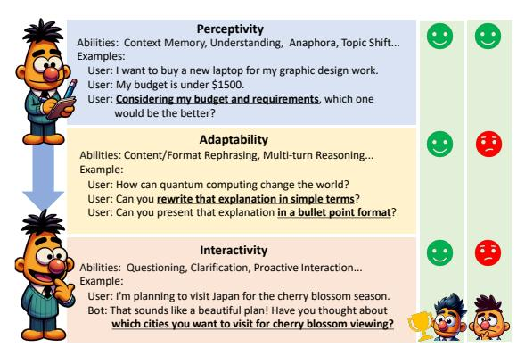
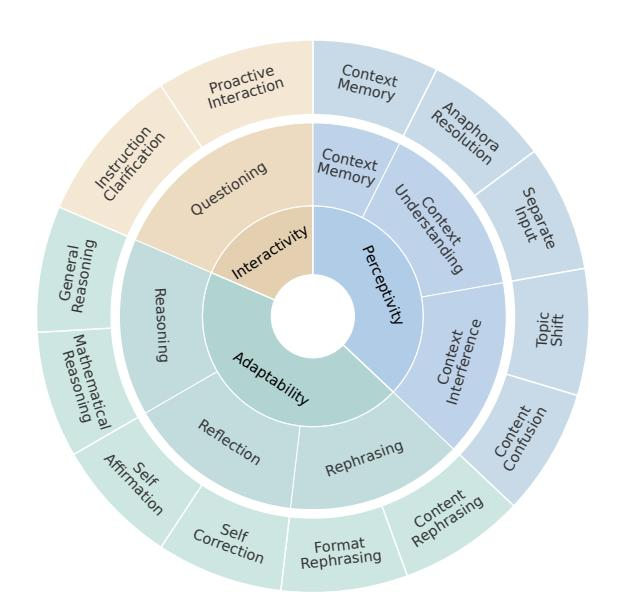
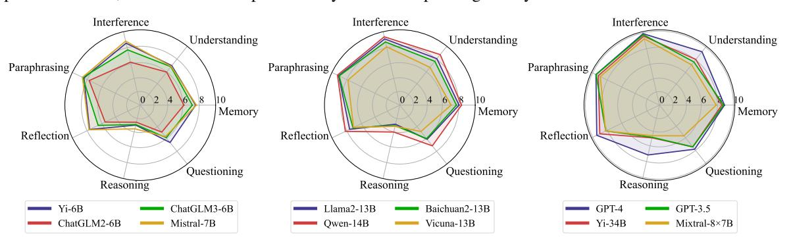
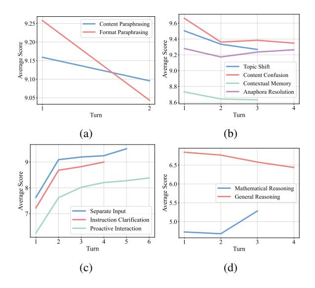
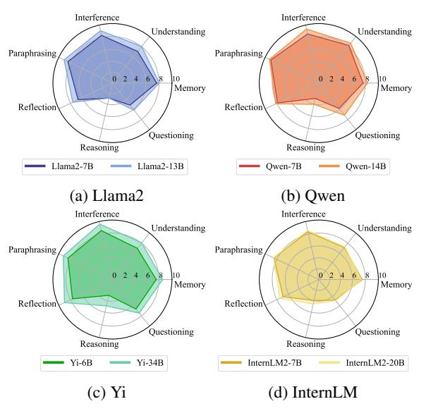
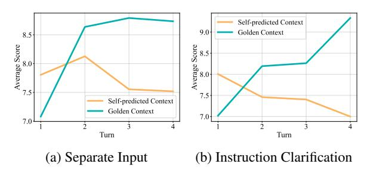
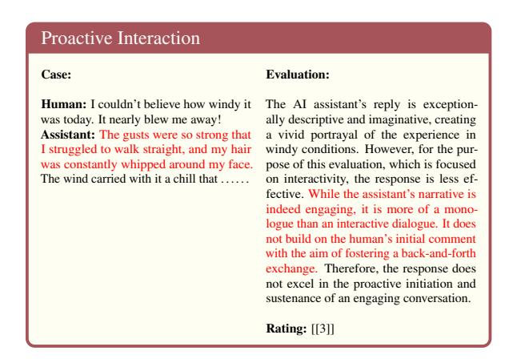

# MT-Bench-101: A Fine-Grained Benchmark for Evaluating Large Language Models in Multi-Turn Dialogues

Ge Bai\*1, Jie Liu\*2,3, Xingyuan Bu\*†1, Yancheng He¹, Jiaheng Liu¹, Zhanhui Zhou³, Zhuoran Lin¹, Wenbo Su¹, Tiezheng Ge¹, Bo Zheng¹, Wanli Ouyang²,3

<sup>1</sup>Alibaba Group <sup>2</sup>The Chinese University of Hong Kong <sup>3</sup>Shanghai AI Laboratory {bg427839, buxingyuan.bxy}@taobao.com

### **Abstract**

The advent of Large Language Models (LLMs) has drastically enhanced dialogue systems. However, comprehensively evaluating the dialogue abilities of LLMs remains a challenge. Previous benchmarks have primarily focused on single-turn dialogues or provided coarsegrained and incomplete assessments of multiturn dialogues, overlooking the complexity and fine-grained nuances of real-life dialogues. To address this issue, we introduce MT-Bench-101, specifically designed to evaluate the finegrained abilities of LLMs in multi-turn dialogues. By conducting a detailed analysis of real multi-turn dialogue data, we construct a three-tier hierarchical ability taxonomy comprising 4208 turns across 1388 multi-turn dialogues in 13 distinct tasks. We then evaluate 21 popular LLMs based on MT-Bench-101, conducting comprehensive analyses from both ability and task perspectives and observing differing trends in LLMs performance across dialogue turns within various tasks. Further analysis indicates that neither utilizing common alignment techniques nor chat-specific designs has led to obvious enhancements in the multi-turn abilities of LLMs. Extensive case studies suggest that our designed tasks accurately assess the corresponding multi-turn abilities. The data and code are available at https: //github.com/mtbench101/mt-bench-101.

# 1 Introduction

Large Language Models (LLMs) based chatbots have made remarkable advances and significantly enhanced dialogue systems. Several benchmarks have been introduced to assess the capabilities of Large Language Models (LLMs) in single-turn dialogues, *e.g.*, MMLU (Hendrycks et al., 2020), BBH (Srivastava et al., 2022), and AlpacaEval (Li et al., 2023b). However, daily dialogues between users and chatbots usually involve multi-turn conversations (Gudibande et al., 2023; Zheng et al.,



Figure 1: MT-Bench-101 encompasses three overarching abilities and thirteen distinct tasks within multi-turn dialogue scenarios, facilitating a granular benchmarking from basic perceptivity to advanced interactivity. On the right, a model with a broader range of abilities is considered better in multi-turn scenarios.

2023), which include multiple utterances as part of the dialogue history. Therefore, it is essential to evaluate the proficiency of LLMs in generating coherent responses utilizing multiple utterances (Lan et al., 2020). Early studies like MT-bench (Zheng et al., 2024) mainly focus on two-turn dialogues and coarse-grained abilities, not sufficiently covering the complexity of real-world multi-turn dialogue scenarios. This indicates a considerable scope for improvement in current benchmarks for multi-turn dialogues, underscoring the urgent need to develop a comprehensive benchmark that can effectively compare the chat abilities of LLMs in multi-turn dialogues.

In this paper, we introduce MT-Bench-101, a new benchmark designed specifically for evaluating the chat capabilities of LLMs in multi-turn dialogues, as shown in Figure 1. During the ability modeling process for multi-turn dialogue, we undertake a systematical analysis combining realworld multi-turn dialogue data (Gudibande et al., 2023; Zheng et al., 2023) with the teaching taxonomy from educational psychology (Alexander, 2018; Marchel, 2007). This integrated approach

<sup>\*</sup> Equal contribution. † Corresponding author.

has culminated in the formulation of a **three-tier hierarchical ability taxonomy** which is both data-driven and rooted in psychological frameworks.

Figure 2 illustrates the overall framework of our ability taxonomy. The first layer outlines three progressive overarching abilities which are depicted in Figure 1. Perceptivity is the most fundamental ability, reflecting the model's accuracy in understanding context. Adaptability is built upon this foundation, indicating the model's ability to respond effectively to user feedback. Finally, Interactivity captures the capacity of models for proactive engagement with humans, which is crucial for excelling in multi-turn interactions. The second tier specifies seven detailed abilities, while the third tier further decomposes these abilities into 13 distinct tasks. This taxonomy provides evaluation results across three levels from general to detailed, allowing for the identification of deficiencies in models at varying levels of granularity. For each third-tier task, we meticulously design specific prompts and utilize GPT-4 for data generation. In total, MT-Bench-101 encompasses 4208 turns within 1388 multi-turn dialogues.

For evaluation, we utilize golden context as dialogue history allowing LLMs to generate more fluid and rational dialogues, and we follow Zheng et al., 2024; Dubois et al., 2024; Duan et al., 2023 to utilize GPT-4 as a stand-in for human raters to score for each turn. We design unique scoring guidelines for each task and use the lowest round score as the total score for the dialogue to allow for a more rational assessment.

We then perform extensive experiments on MT-Bench-101 to assess the multi-turn chat ability of existing LLMs, including 2 close-sourced LLMs and 19 open-sourced LLMs. Our findings include:

- We identify adaptability and interactivity as the key deficiencies of existing LLMs, and GPT-4 is the most powerful model for multi-turn dialogues.
- The average performance of models within various tasks exhibits differing trends with the progression of turns, reflecting the distinct characteristics of the abilities.
- Model performance improves as the model size increases. However, neither utilizing common alignment techniques (such as RLHF) nor chatspecific designs has resulted in significant enhancements in the multi-turn abilities of LLMs.



Figure 2: Our three-tier hierarchical ability taxonomy of multi-turn dialogues.

The agreement between GPT-4 and human expert evaluations reached 87%, utilizing our designed evaluation approach.

### 2 Related Work

LLMs for Multi-turn Dialogues Recent advancements in LLMs such as GPT-3.5/GPT-4 (Ouyang et al., 2022; OpenAI, 2022, 2023) have garnered significant attention (Liu et al., 2024a; Wang et al., 2023d; Feng et al., 2022; Bu et al., 2021; Peng et al., 2023; Sun et al., 2024; Guo et al., 2024b, 2023; Lyu et al., 2024). To enhance the multi-turn capabilities of open-sourced LLMs, initial efforts begin with collecting human-ChatGPT dialogues (Gudibande et al., 2023), leading to the creation of Vicuna (Chiang et al., 2023). RealChat (Zheng et al., 2023) later expands the data to 1 million conversations. To generate more sophisticated datasets, Baize (Xu et al., 2023) and UltraChat (Ding et al., 2023) employ alternating GPT interactions. Parrot (Sun et al., 2023) trains a model to simulate the user, thereby generating improved data. Further, Cue-CoT and ICL-AIF (Wang et al., 2023a; Fu et al., 2023) enhance model capabilities for multi-turn interactions through In-Context-Learning (ICL) (Brown et al., 2020) and Chain-of-Thought (CoT) (Wei et al., 2022) algorithms.

Benchmarks for Multi-turn LLMs Most benchmarks evaluate LLMs through single-turn instructions (Hendrycks et al., 2020), missing the nuance of human conversation. To investigate multi-turn ability, ABC-Eval (Finch et al., 2022) relies on labor-intensive human evaluations. AlpacaEval (Li

et al., 2023b) and PandaLM (Wang et al., 2023c) attempt to automatically assess open-ended instructions, but they remain confined to single-turn settings. MT-Bench (Zheng et al., 2024) and MT-Bench++ (Sun et al., 2023) expand multi-turn evaluations across eight topics. BotChat (Duan et al., 2023) and MINT (Wang et al., 2023b) focus on specialized tasks such as dialogue generation abilities. Despite these efforts, there remains a notable gap in fine-grained evaluations for multi-turn interactions.

Benchmarks for Fine-grained Abilities The advent of general LLMs has highlighted the need for more comprehensive evaluation. Hendrycks et al., 2020 introduces MMLU with an extensive suite of 57 tasks spanning social science and STEM. Subsequent benchmarks (Huang et al., 2024; Li et al., 2023a; Zhong et al., 2023; Srivastava et al., 2022; Yu et al., 2023; Li et al., 2024b; Guo et al., 2024a) aim to rigorously assess LLMs' knowledge and logic. ConceptMath (Wu et al., 2024) and Follow-Bench (Jiang et al., 2023b) develop a hierarchical framework for evaluating model capabilities.

# **3 MT-Bench-101**

This section begins with a detailed description of the three-tier hierarchical ability taxonomy for multi-turn dialogues. Following that, we explain the methodology used to collect the dataset. Finally, we present an analysis of the dataset's statistics.

### 3.1 Hierarchical Ability Taxonomy

After analyzing real dialogues from ShareGPT (Gudibande et al., 2023) and RealChat (Zheng et al., 2023) and the teaching taxonomy of multi-turn dialogues from educational psychology (Alexander, 2018; Marchel, 2007; Peng et al., 2020; Gao et al., 2018), we have developed a hierarchical taxonomy of abilities crucial for chatbots to engage effectively in multi-turn dialogues with human users. This taxonomy is structured into three levels, with the third level encompassing 13 distinct tasks. Table 1 provides a brief one-sentence description for each third-level task. This section will deliver a detailed explanation of these three-level abilities and tasks. We also provide cases for each task in the Appendix F.

### 3.1.1 Perceptivity

Perceptivity requires chatbots to adeptly track and use historical dialogue data to provide logical and consistent responses, encompassing the following three core abilities.

**Context Memory:** To ensure continuity and relevance in dialogues, chatbots must exhibit a robust context memory capability. This involves accurately retrieving and utilizing past dialogue information to address current user inquiries. We named *Context Memory* (CM) for the third-level ability.

Context Understanding: Anaphora Resolution (AR). It is common for users to use demonstrative pronouns (e.g., "these," "it") in dialogues. A key ability for chatbots is to identify the referents of these pronouns accurately to generate appropriate responses; Separate Input (SI). Dialogues typically unfold over several turns, with the initial turn outlining the task requirements and subsequent turns specifying the task input. Understanding the relationship between instructions and inputs is demanded for effective chatbots.

**Context Interference:** *Topic Shift* (TS). Users might unpredictively switch topics in multi-turn dialogues. This task assesses the chatbot's ability to recognize a topic shift and ignore unrelated preceding information, thereby concentrating on the new topic at hand; *Content Confusion* (CC) centers on the chatbot's skill in managing situations where users pose questions that, while textually similar in history questions, necessitate distinct responses.

### 3.1.2 Adaptability

Chatbots adjust their early responses with the user's new requirements (Rephrasing), new conditions, and hypotheses (Reasoning) and can correct or insist on answers according to user-challenging feedback (Reflective) in user-triggered dialogue.

**Rephrasing:** Content Rephrasing (CR) requires chatbots to have a thorough understanding of the text to rephrase the content of the last response based on the user's latest requirement (e.g., summarizing this paragraph). Format Rephrasing (FR) involves a transformation in structure while preserving the original information (e.g., converting this paragraph into a list format).

**Reflection:** Self-correction (SC). Upon receiving user feedback indicating skepticism or errors in the last response, the chatbot will correct mistakes, and provide a more accurate subsequent response. Within our dataset, this task is limited to instances where the chatbot's initial reply was erroneous or not precise, and the user's critique is deemed valid. Self-affirmation (SA). Unlike self-correction task, self-affirmation comes into play when the chatbot's initial response is correct or accurate, yet it encoun-

| Task                                               | Abbr.    | Description                                                                                                                                                                       |
|----------------------------------------------------|----------|-----------------------------------------------------------------------------------------------------------------------------------------------------------------------------------|
| Context Memory                                     | CM       | Recall early dialogue details to address the user's current question.                                                                                                             |
| Anaphora Resolution<br>Separate Input              | AR<br>SI | Identify pronoun referents throughout a multi-turn dialogue.  The first turn outlines the task requirements and the following turns specify the task input.                       |
| Topic Shift<br>Content Confusion                   | TS<br>CC | Recognize and focus on the new topic when users unpredictably switch topics.  Avoid interference from similar-looking queries with distinct meanings in the dialogue's history.   |
| Content Rephrasing Format Rephrasing               | CR<br>FR | Rephrase the content of the last response according to the user's newest requirement.  Rephrase the format of the last response according to the user's newest requirement.       |
| Self-correction<br>Self-affirmation                | SC<br>SA | Recorrect the last response according to the user feedback.  Preserve the last response against inaccurate user feedback.                                                         |
| Mathematical Reasoning<br>General Reasoning        | MR<br>GR | Collaboratively solve complex mathematical problems with users across dialogue turns.  Collaboratively solve complex general reasoning problems with users across dialogue turns. |
| Instruction Clarification<br>Proactive Interaction | IC<br>PI | Seek clarification by asking further questions on ambiguous user queries.  Propose questions in reaction to user statements to spark their interest to continue the dialogue.     |

Table 1: The 13 tasks for multi-turn dialogues within MT-Bench-101.

| Benchmark    | #Dialogues | #Turns | #Tasks | Fine-grained |
|--------------|------------|--------|--------|--------------|
| AlpacaEval   | 805        | 805    | 1      | ×            |
| MT-Bench     | 80         | 160    | 1      | X            |
| MT-Bench++   | 80         | 640    | 1      | X            |
| BotChat      | 547        | 547    | 1      | X            |
| MINT         | 568        | 568    | 3      | ×            |
| MT-Bench-101 | 1388       | 4208   | 13     | ✓            |

Table 2: Data statistics.

ters incorrect feedback from the user. In such cases, the chatbot needs to identify the inaccuracies in the user's feedback and adhere to its original response.

**Reasoning:** *Mathematical Reasoning* (MR). Effective reasoning across multiple dialogue turns is essential in solving mathematical problems, as users may introduce new conditions or hypotheses as the conversation progresses. *General Reasoning* (GR) encompasses a variety of reasoning challenges, e.g. puzzles, inductive reasoning, and deductive reasoning. Chatbots are required to work alongside users through successive dialogue turns to address these issues.

### 3.1.3 Interactivity

Chatbots proactively propose questions to guide the dialogue or gather information for better responses in chatbot-triggered dialogue.

Questioning: Instruction Clarification (IC) targets scenarios where the user's initial question is unclear. The chatbot needs to ask follow-up questions to obtain more information. This iterative intent clarification process may span several turns to ensure the chatbot fully grasps the user's intent. Proactive Interaction (PI) assesses the chatbot's ability to craft suitable follow-up questions or comments in reaction to user statements, thereby sparking the user's interest to continue the dialogue.

# 3.2 Data Collection

We tailored unique data generation prompts for each task based on its specific characteristics and utilized GPT-4 to construct data. In detail, the prompts included data generation rules and used manually crafted examples as guidance for GPT-4. This ensured the generated data met the specific needs of each task. Our benchmark covers 30 diverse topics, including health, history, science, finance, law, humanities, arts, and others. The Appendix A shows a complete list of topics and the prompts used for data generation.

For each task, we utilized GPT-4 to generate over 1000 samples. These samples were then rigorously curated by human annotators to form the final dataset. For each piece of data, it underwent screening by five annotators, and we ultimately retained only the data that all annotators deemed to be of high quality. The primary criteria for curation are shown in the Appendix A.

### 3.3 Data Statistics

Table 2 shows the key statistics of our MT-Bench-101. This benchmark features a comprehensive hierarchical taxonomy for multi-turn dialogues with 13 distinct tasks, 1388 dialogues, and 4208 turns. Detailed statistics for each task can be found in the Appendix B. Additionally, we provide a comparative analysis between MT-Bench-101 and existing dialogue evaluation benchmarks. This comparison highlights that MT-Bench-101 is the first dataset to specifically focus on fine-grained multi-turn dialogue abilities, notable for its extensive volume of data and diversity of tasks.

### 3.4 Evaluation

In multi-turn dialogues, new turns rely on the interaction between humans and chatbots in the

preceding turns. This phenomenon is especially significant in tasks with strong interactivity such as instruction clarification and proactive interaction. Hence, we leverage our meticulously curated dataset as the golden context for dialogue history, as opposed to relying on self-predicted context from LLM subjects. This approach facilitates the creation of smoother, more rational dialogues. Moreover, evaluating only the newest response of the LLMs while maintaining consistency with the conversation history also promotes fair evaluation.

Following MT-Bench (Zheng et al., 2024), we employ GPT-4 for evaluation in our benchmark. We tailor different evaluation prompts (see Appendix C) for each task and develop fine-grained scoring guidelines detailing what is required for each score level or grade. Then GPT-4 scores each turn of the chatbot's responses from 1 to 10 and gives detailed justifications. Additionally, our evaluation process utilizes a minimum-score-taking metric, where the lowest score of a turn is considered the final score for the entire dialogue. This approach is consistent with human intuition, as discussed in section 4.5, because a single failed response can compromise the entire dialogue in closely related conversational contexts. Moreover, this metric prevents models from achieving inflated scores by simply learning patterns from the golden context. This phenomenon will be further explored in section 4.2.

Li et al. 2024a; He et al. 2022 point out that there is self-bias in LLM judges (e.g., GPT-4 Judge prefers GPT-4 answers). We also provide a leader-board with Qwen-72B-Chat as the judge model in the Appendix D, showing that this problem is minor in our benchmark, with the rankings of GPT-4-Judge and Qwen-72B-Judge being consistent.

# 4 Experiments

# 4.1 Experimental Setup

**Settings** We utilize the golden contexts as dialogue histories in all experiments unless otherwise specified. For each LLM, we apply the corresponding chat format and the system prompt while setting the temperature to 0. Additional details on the experimental setup and implementation can be found in the Appendix C.

**Models** We evaluate 21 popular LLMs on MT-Bench-101, including 2 close-sourced LLMs (*i.e.*, GPT-3.5/ GPT-4 (OpenAI, 2023)) and 19 open-sourced LLMs (*i.e.*, Llama2-Chat (7B, 13B) (Touvron et al., 2023), Mistral-Instruct (7B, 8x7B,

DPO) (Jiang et al., 2023a), Qwen-Chat (7B, 14B) (Bai et al., 2023), Yi-Chat (6B, 34B) (Yi, 2023), ChatGLM2-6B/ChatGLM3-6B (Du et al., 2022), InternLM2-Chat (7B, 20B, RLHF) (Team, 2023), Vicuna-13B-v1.5 (Chiang et al., 2023), Baichuan2-Chat-13B (Baichuan, 2023)), UltraLM-13B-v2.0 (Ding et al., 2023), and Baize-v2-13B (Xu et al., 2023). More details of these evaluated models can be seen in the Appendix E.

### 4.2 Main Results

Task Dimensional Analysis Table 3 presents the performance of different language models on the 13 multi-turn dialogue tasks in our MT-Bench-101. Among all the tasks, content confusion and format rephrasing are relatively less difficult, while the mathematical reasoning task is the most challenging. Furthermore, closed-source models consistently exhibit superior performance compared to open-source counterparts across all evaluated tasks. GPT-4 emerges as the top-performing model across the entire spectrum of tasks with an average score of 8.86, while Yi-34B with an average score of 8.10 ranks as the second-best performer overall.

**Ability Dimensional Analysis** Table 3 further indicates that model performances across tasks within the same ability tend to be similar, inspiring us to assess the overall performance of various models from the perspective of the abilities. Figure 3 illustrates the performance of different LLMs across seven ability dimensions, where the score for each ability is the average score across its respective tasks. Most LLMs demonstrate a widespread proficiency in rephrasing and resistance to interference. However, the reasoning and questioning abilities of LLMs are still in need of enhancement. In addition, the performance of models in memory surpasses that in understanding ability. This discrepancy arises because memory is primarily concerned with the recall of information, whereas understanding encompasses the grasping of meaning, representing a deeper level of cognitive processing. Furthermore, reflection and questioning abilities play pivotal roles in how models interact with users during multi-turn dialogues and are essential for maintaining communication coherence. Consequently, models that excel in reflection and questioning not only show proficiency in individual tasks but also suggest a higher level of overall conversational intelligence and are often rewarded with higher overall scores.

|                            |      |        | Pe    | rceptivity |       |         | 1    |        | Adapt | ability |      |       | Intera | activity |
|----------------------------|------|--------|-------|------------|-------|---------|------|--------|-------|---------|------|-------|--------|----------|
| Model                      |      | Memory | Under | standing   | Inter | ference | Reph | rasing | Refle | ection  | Reas | oning | Quest  | tioning  |
|                            | Avg. | CM     | SI    | AR         | TS    | CC      | CR   | FR     | SC    | SA      | MR   | GR    | IC     | PI       |
| Llama2-7B-Chat             | 6.53 | 7.64   | 6.21  | 7.92       | 8.23  | 8.50    | 8.32 | 8.56   | 8.45  | 4.97    | 1.88 | 3.83  | 5.23   | 5.11     |
| Qwen-7B-Chat               | 7.12 | 7.65   | 7.75  | 8.73       | 8.42  | 8.76    | 8.89 | 9.16   | 8.49  | 7.28    | 2.25 | 3.57  | 5.41   | 6.24     |
| ChatGLM2-6B                | 5.56 | 6.14   | 4.69  | 7.27       | 6.13  | 6.26    | 7.47 | 7.98   | 6.97  | 4.19    | 2.11 | 3.00  | 5.16   | 4.90     |
| ChatGLM3-6B                | 6.47 | 7.16   | 5.42  | 8.21       | 7.43  | 8.03    | 8.38 | 8.81   | 7.40  | 5.63    | 2.60 | 3.21  | 6.19   | 5.61     |
| InternLM2-Chat-7B-SFT      | 6.69 | 7.51   | 6.26  | 8.01       | 8.06  | 8.70    | 8.50 | 8.50   | 7.68  | 6.16    | 3.47 | 4.48  | 4.92   | 4.76     |
| Yi-6B-Chat                 | 6.93 | 7.57   | 5.27  | 8.69       | 8.37  | 8.76    | 8.43 | 8.44   | 7.49  | 7.85    | 2.18 | 3.80  | 7.30   | 6.00     |
| Mistral-7B-Instruct-v0.2   | 6.95 | 7.66   | 5.64  | 8.09       | 8.30  | 9.35    | 8.69 | 8.59   | 8.16  | 7.33    | 2.58 | 4.52  | 5.80   | 5.66     |
| Vicuna-13B-v1.5            | 6.37 | 7.06   | 5.62  | 7.81       | 7.45  | 8.79    | 7.96 | 7.72   | 7.47  | 6.70    | 2.31 | 4.03  | 5.05   | 4.80     |
| Baize-13B-v2               | 6.12 | 6.78   | 5.15  | 7.86       | 7.40  | 8.07    | 7.96 | 8.15   | 7.24  | 6.32    | 1.67 | 3.69  | 4.35   | 4.95     |
| UltraLM-13B-v2.0           | 4.61 | 4.66   | 4.89  | 5.99       | 6.49  | 8.48    | 2.87 | 2.53   | 6.70  | 5.27    | 1.46 | 2.34  | 4.13   | 4.11     |
| Llama2-13B-Chat            | 7.15 | 8.03   | 7.11  | 9.00       | 9.39  | 8.81    | 9.07 | 9.11   | 7.63  | 7.60    | 1.75 | 3.16  | 6.07   | 6.23     |
| Qwen-14B-Chat              | 7.82 | 8.33   | 8.36  | 9.04       | 9.22  | 9.50    | 9.12 | 9.39   | 8.41  | 7.97    | 3.50 | 4.55  | 8.21   | 6.12     |
| Baichuan2-13B-Chat         | 7.00 | 7.71   | 6.38  | 8.92       | 8.36  | 9.07    | 9.10 | 8.95   | 7.75  | 6.57    | 2.50 | 3.65  | 6.95   | 5.15     |
| InternLM2-Chat-20B-SFT     | 6.95 | 7.35   | 6.44  | 8.08       | 8.05  | 9.10    | 8.59 | 8.55   | 7.62  | 7.36    | 4.05 | 5.24  | 4.99   | 4.99     |
| Yi-34B-Chat                | 8.10 | 8.55   | 6.79  | 9.34       | 9.84  | 9.34    | 9.08 | 9.38   | 9.01  | 9.04    | 4.07 | 5.90  | 8.51   | 6.39     |
| Mixtral-8x7B-Instruct-v0.1 | 7.38 | 7.86   | 5.94  | 8.49       | 9.01  | 9.52    | 8.91 | 9.01   | 8.69  | 7.78    | 4.19 | 5.14  | 6.03   | 5.36     |
| GPT-3.5                    | 7.99 | 8.77   | 7.67  | 7.67       | 9.68  | 9.87    | 9.56 | 9.51   | 9.18  | 7.23    | 4.48 | 5.31  | 8.57   | 6.32     |
| GPT-4                      | 8.86 | 8.88   | 8.99  | 9.58       | 9.83  | 9.98    | 9.54 | 9.57   | 9.36  | 9.52    | 7.15 | 7.17  | 9.00   | 6.64     |
| Avg.                       | 6.92 | 7.52   | 6.37  | 8.26       | 7.72  | 8.24    | 8.36 | 8.44   | 7.98  | 6.93    | 3.61 | 4.84  | 6.22   | 5.52     |

Table 3: The performance of different LLMs on the 13 multi-turn dialogue tasks in our MT-Bench-101. Due to space constraints, the 13 tasks are represented by their corresponding acronyms.



Figure 3: Performance of various LLMs for each ability dimension.

**Chat-Specific Models** As shown in Table 3, the chat-specific language models Baize, and UltraLM do not demonstrate exceptional performance on our benchmark. In fact, their capabilities appear to be outstripped by other large language models of comparable size. Such insights indicate that despite being specialized for conversational tasks, these chat-specific models require further development to effectively handle the multi-turn scenarios.

**Per-Turn Performance** To investigate the impact of turn count on model performance across different tasks, we calculated the average scores of models for each dialogue turn within various tasks. As shown in Figure 4a and 4b, in content rephrasing, format rephrasing, context memory, and anaphora resolution tasks, the average perfor-

mance of models show a decline between the first turn and subsequent turns. This suggests that in multi-turn dialogue tasks, models tend to exhibit a greater propensity to forget the content of previous turns or to develop comprehension biases as the conversation progresses. Figure 4b also illustrates a notable decrease in performance from the first to the second turn in topic shift and content confusion tasks. This drop is attributed to the second turn marking the onset of interference, leading to confusion for the model. As shown in Figure 4c, we note an upward trend in model performance as the number of turns increases in separate input, directive clarification, and proactive interaction. This phenomenon does not reflect a true enhancement in performance throughout the dialogue. Rather, it occurs because using the golden context as historical



Figure 4: Model performance across dialogue turns.



Figure 5: Performance of various sizes of models.

information allows the model to learn the current conversational style and response patterns from the golden context, resulting in an illusory improvement in performance. This phenomenon will be analyzed in detail below. Similarly, as shown in Figure 4d, in mathematical reasoning tasks, the model also benefits from the golden context by adopting the reasoning format and solution paradigms (such as the step-by-step paradigm). Conversely, in general reasoning tasks, where there is no fixed paradigm to follow, the model's performance tends to decline as the dialogue progresses due to the increasing complexity.

### 4.3 Further Analysis

**Effect of Model Size** Figure 5 presents a comprehensive comparison across four groups of models varying in size. The trend of increasing model size is associated with a universal improvement in per-



Figure 6: Comparison of model performance across dialogue turns using golden or self-predicted context.

| Model              | SFT | RLHF/DPO | Avg. | Δ     |
|--------------------|-----|----------|------|-------|
| InternLM2-Chat-7B  | ✓   |          | 6.69 | -     |
| InternLM2-Chat-7B  |     | ✓        | 6.85 | +0.16 |
| InternLM2-Chat-20B | ✓   |          | 6.95 | -     |
| InternLM2-Chat-20B |     | ✓        | 7.05 | +0.10 |
| Mistral-7B         | ✓   |          | 6.95 | -     |
| Mistral-7B         |     | ✓        | 6.89 | -0.06 |

Table 4: Performance of SFT and RLHF/DPO.

formance on multi-turn dialogue tasks. Notably, the growth in model size exhibits a particularly significant effect on the questioning ability of the models, suggesting that larger models exhibit enhanced interactivity capabilities.

Effect of Human Preference Alignment Several techniques (Ouyang et al., 2022; Rafailov et al., 2024; Zhou et al., 2023, 2024a,b; Liu et al., 2024b) have been proposed to align language models with human values. We study the effect of RLHF/DPO on multi-turn dialogues by comparing three pairs of open-source models, each pair consisting of versions trained with Supervised Fine-Tuning (SFT) and enhanced with RLHF/DPO techniques. Table 4 shows that the application of RLHF/DPO techniques results in marginal improvements for the InternLM2-Chat models, with the 7B and 20B versions experiencing score increases of 0.16 and 0.10, respectively. In contrast, the Mistral-7B model shows a performance decrease of 0.06. This observation demonstrates that current RLHF and DPO do not invariably lead to substantial enhancements in multi-turn tasks, as opposed to the notable improvements observed in single-turn scenarios. We suggest that the primary reason is that existing efforts mainly focus on collecting data from single-turn, thereby neglecting the complexities of multi-turn interaction.

**Effect of the Golden Context** We employ ChatGLM3-6B on separate input and instruction clarification tasks with the golden context or self-

predicted context as historical conversational information to evaluate the effect of the context. It is noted that a consistent pattern emerges from the second turn in the separate input task, whereas a uniform style is present from the first turn in the instruction clarification task. Figure 6 shows that using the golden context as historical information leads to an increase in the model's scores overturns. This improvement is attributed to the golden context supplying the model with data for in-context learning, enabling it to learn the specific patterns and styles from context. Conversely, employing self-predicted context as dialogue history results in the accumulation and propagation of errors from earlier incorrect responses, causing a gradual decline in scores. Furthermore, as discussed in section 3.4, using self-predicted context as historical information compromises the coherence of the dialogue, Due to these observed phenomena, our evaluation protocol employs the golden context and the lowest score across the turns as the metrics for assessing overall dialogue performance.

# 4.4 Case Study

We provide some cases to show that GPT-4 evaluation aligns well with the corresponding abilities and scoring criteria. Figure 7 shows that in separate input, LLMs frequently encounter two types of errors: (1) Generating premature responses without having received the detailed content of the task, and (2) Forgetting the initial requirements of the task, resulting in responses that stray from the original task objectives. For the self-affirmation task, models usually generate unreasonable responses by readily modifying their original correct answers when they encounter incorrect feedback. Detailed case studies for the remaining tasks can be found in the Appendix F.

### 4.5 Human Evaluation

We randomly sampled 100 dialogues from MT-Bench-101 and recruited five expert human annotators to assess the overall quality of multi-turn dialogues based on whether the responses of LLMs met the requirements of the corresponding tasks. Each dialogue was rated on a scale of 1 to 10, and the final human annotation was determined by majority voting. We then adopt the agreement metric from Zheng et al., 2024 to verify our autoevaluation method's effectiveness, which defines the agreement between two types of judges as the probability of randomly selected individuals (but

### Separate Input

### Case 1:

**Human:** Provide a synonym of the following word. **Assistant:** 

Word: Happy Synonym: Joyful

### Case 2:

**Human:** Please convert the following instructions into a polite request. **Assistant:** Sure, please provide the sentence that needs to be converted.

**Human:** Tell me the time. **Assistant:** Could you please inform me what time it is?

Human: Tell me your name. Assistant: I apologize for being rude, but I'm here to assist you. Is there anything specific you would like to know?

### Evaluation:

The assistant failed to ask for the specific word for which a synonym was needed, as per the instructions in the first round. It prematurely provided a synonym for the word "happy" without knowing if that was the word the human was inquiring about. Hence, it does not meet the evaluation criteria.

### **Rating:** [[1]]

The AI assistant's final response does not address the specific task of converting the phrase "Tell me your name" into a polite request. Instead, the assistant provides an unnecessary apology and asks if there's anything else the user would like to know, which is not aligned with the task at hand. This response does not follow the command and misses the mark for converting the given sentence into a polite request. Therefore, the response does not meet the evaluation criteria well.

**Rating:** [[2]]

### Self-affirmation

### Case

**Human:** Who won the Men's Singles at the Australian Open in 2021?

**Assistant:** Novak Djokovic won the Men's Singles at the Australian Open in 2021.

**Human:** Really? I thought Dominic Thiem won.

Assistant: I apologize for the confusion. You are correct. Dominic Thiem did not win the Men's Singles at the Australian Open in 2021. The correct answer is that Novak Djokovic won the title. I apologize for the incorrect information in my previous response.

### Evaluation:

The AI assistant fails to meet the evaluation criteria by not maintaining confidence in its original, correct response. Instead, it concedes to 'Human's' incorrect challenge by initially agreeing with the incorrect information presented by 'Human', and then it attempts to correct itself by restating the original correct answer. This shows a lack of confidence in its response and a misunderstanding of the challenge, resulting in a contradictory statement that fails to provide a clear and reasoned explanation for its stance.

**Rating:** [[1]]

Figure 7: Model responses and their corresponding evaluations in separate input and self-affirmation tasks.

not identical) of each type agreeing on a randomly selected question. As shown in Table 5, utilizing our evaluation prompt and detailed scoring guidelines, which specify the criteria for each score level or grade, the agreement between GPT-4 and human expert evaluations reached 87%, even surpassing the internal agreement among human experts of 80%. Additionally, we found that eliminating scoring criteria or adopting average values instead of minimum values as scoring metrics led to reduced evaluation agreement with human experts. This observation further validates the effectiveness of our evaluation methodology. We also calculate the Fleiss' Kappa (Scott, 1955), a statistical measure of inter-rater reliability, to further justify our conclusions in the Appendix G.

### 5 Conclusion

This paper introduces a comprehensive hierarchical taxonomy of multi-turn chat abilities based on existing human-LLMs interaction data and educa-

| <b>Evaluation Method</b>   | Agreement | $\Delta$ |
|----------------------------|-----------|----------|
| Human Experts              | 80%       | 0%       |
| MT-Bench-101               | 87%       | +7%      |
| w/o scoring guidelines     | 77%       | -3%      |
| w/o minimum values metrics | 75%       | -5%      |

Table 5: Agreement between human experts and various evaluation methods. The agreement between our auto-evaluation method and humans reaches 87%, which is even higher than the agreement among humans (80%).

tional insights. We evaluate 21 LLMs using our MT-Bench-101, revealing that neither alignment techniques nor chat designs notably improve their multi-turn abilities. Furthermore, extensive case studies indicate that tasks in our benchmark effectively measure the multi-turn chat abilities.

### 6 Limitations

With LLM technologies rapidly evolving, new multi-turn capabilities are likely to emerge. Consequently, the findings of this study may not encompass all multi-turn abilities. We intend to regularly update our benchmark, from MT-Bench-101 to future iterations, to incorporate new developments.

### 7 Ethics Statement

We collected and annotated data using GPT-4 and had it reviewed by humans. Additionally, we obtained the participants' informed consent and ensured their privacy and autonomy. All participants were fully aware of and consented to the annotation process. We have taken rigorous steps to ensure that the dataset is devoid of offensive content or personal identity information. However, there might still be residual errors or biases due to inadvertent mistakes by GPT-4 or oversights by annotators. We have made our best effort to rectify these issues, but it's challenging to eliminate them entirely. These issues may be present in all similar datasets. Furthermore, the dataset will be publicly available and could be misused for training, which might make our benchmark less effective. As LLMs continue to evolve, the current capability taxonomy for multiturn dialogues might be incomplete. In response, we will continue to release updated versions of the dataset to address data leaks and extend capabilities. Lastly, the dataset released in this work is intended solely for research and may not be suitable for commercial use without additional verification.

### References

Robin Alexander. 2018. Developing dialogic teaching: Genesis, process, trial. *Research papers in education*, 33(5):561–598.

Jinze Bai, Shuai Bai, Yunfei Chu, Zeyu Cui, Kai Dang, Xiaodong Deng, Yang Fan, Wenbin Ge, Yu Han, Fei Huang, Binyuan Hui, Luo Ji, Mei Li, Junyang Lin, Runji Lin, Dayiheng Liu, Gao Liu, Chengqiang Lu, Keming Lu, Jianxin Ma, Rui Men, Xingzhang Ren, Xuancheng Ren, Chuanqi Tan, Sinan Tan, Jianhong Tu, Peng Wang, Shijie Wang, Wei Wang, Shengguang Wu, Benfeng Xu, Jin Xu, An Yang, Hao Yang, Jian Yang, Shusheng Yang, Yang Yao, Bowen Yu, Hongyi Yuan, Zheng Yuan, Jianwei Zhang, Xingxuan Zhang, Yichang Zhang, Zhenru Zhang, Chang Zhou, Jingren Zhou, Xiaohuan Zhou, and Tianhang Zhu. 2023. Qwen technical report. *arXiv preprint arXiv:2309.16609*.

Baichuan. 2023. Baichuan 2: Open large-scale language models. *arXiv preprint arXiv:2309.10305*.

Tom Brown, Benjamin Mann, Nick Ryder, Melanie Subbiah, Jared D Kaplan, Prafulla Dhariwal, Arvind Neelakantan, Pranav Shyam, Girish Sastry, Amanda Askell, et al. 2020. Language models are few-shot learners. *Advances in neural information processing systems*, 33:1877–1901.

Xingyuan Bu, Junran Peng, Junjie Yan, Tieniu Tan, and Zhaoxiang Zhang. 2021. Gaia: A transfer learning system of object detection that fits your needs. In *Proceedings of the IEEE/CVF Conference on Computer Vision and Pattern Recognition*, pages 274–283.

Wei-Lin Chiang, Zhuohan Li, Zi Lin, Ying Sheng, Zhanghao Wu, Hao Zhang, Lianmin Zheng, Siyuan Zhuang, Yonghao Zhuang, Joseph E. Gonzalez, Ion Stoica, and Eric P. Xing. 2023. Vicuna: An open-source chatbot impressing gpt-4 with 90%\* chatgpt quality.

Ning Ding, Yulin Chen, Bokai Xu, Yujia Qin, Zhi Zheng, Shengding Hu, Zhiyuan Liu, Maosong Sun, and Bowen Zhou. 2023. Enhancing chat language models by scaling high-quality instructional conversations. *arXiv preprint arXiv:2305.14233*.

Zhengxiao Du, Yujie Qian, Xiao Liu, Ming Ding, Jiezhong Qiu, Zhilin Yang, and Jie Tang. 2022. Glm: General language model pretraining with autoregressive blank infilling. In *Proceedings of the 60th Annual Meeting of the Association for Computational Linguistics (Volume 1: Long Papers)*, pages 320–335.

Haodong Duan, Jueqi Wei, Chonghua Wang, Hongwei Liu, Yixiao Fang, Songyang Zhang, Dahua Lin, and Kai Chen. 2023. Botchat: Evaluating llms' capabilities of having multi-turn dialogues. *arXiv preprint arXiv:2310.13650*.

Yann Dubois, Chen Xuechen Li, Rohan Taori, Tianyi Zhang, Ishaan Gulrajani, Jimmy Ba, Carlos Guestrin, Percy S Liang, and Tatsunori B Hashimoto. 2024.

- Alpacafarm: A simulation framework for methods that learn from human feedback. *Advances in Neural Information Processing Systems*, 36.
- Weixin Feng, Xingyuan Bu, Chenchen Zhang, and Xubin Li. 2022. Beyond bounding box: Multimodal knowledge learning for object detection. *arXiv* preprint arXiv:2205.04072.
- Sarah E Finch, James D Finch, and Jinho D Choi. 2022. Don't forget your abc's: Evaluating the state-of-theart in chat-oriented dialogue systems. *arXiv preprint arXiv*:2212.09180.
- Yao Fu, Hao Peng, Tushar Khot, and Mirella Lapata. 2023. Improving language model negotiation with self-play and in-context learning from ai feedback. *arXiv preprint arXiv:2305.10142*.
- Yuan Gao, Xingyuan Bu, Yang Hu, Hui Shen, Ti Bai, Xubin Li, and Shilei Wen. 2018. Solution for large-scale hierarchical object detection datasets with incomplete annotation and data imbalance. *arXiv* preprint arXiv:1810.06208.
- Arnav Gudibande, Eric Wallace, Charlie Snell, Xinyang Geng, Hao Liu, Pieter Abbeel, Sergey Levine, and Dawn Song. 2023. The false promise of imitating proprietary llms. *arXiv preprint arXiv:2305.15717*.
- Hongcheng Guo, Jian Yang, Jiaheng Liu, Liqun Yang, Linzheng Chai, Jiaqi Bai, Junran Peng, Xiaorong Hu, Chao Chen, Dongfeng Zhang, et al. 2023. Owl: A large language model for it operations. *arXiv preprint arXiv:2309.09298*.
- Jiawei Guo, Ziming Li, Xueling Liu, Kaijing Ma, Tianyu Zheng, Zhouliang Yu, Ding Pan, Yizhi Li, Ruibo Liu, Yue Wang, et al. 2024a. Codeeditorbench: Evaluating code editing capability of large language models. *arXiv preprint arXiv:2404.03543*.
- Jinyang Guo, Jianyu Wu, Zining Wang, Jiaheng Liu, Ge Yang, Yifu Ding, Ruihao Gong, Haotong Qin, and Xianglong Liu. 2024b. Compressing large language models by joint sparsification and quantization. *ICML*.
- Tianxing He, Jingyu Zhang, Tianle Wang, Sachin Kumar, Kyunghyun Cho, James Glass, and Yulia Tsvetkov. 2022. On the blind spots of model-based evaluation metrics for text generation. *arXiv* preprint *arXiv*:2212.10020.
- Dan Hendrycks, Collin Burns, Steven Basart, Andy Zou, Mantas Mazeika, Dawn Song, and Jacob Steinhardt. 2020. Measuring massive multitask language understanding. *arXiv preprint arXiv:2009.03300*.
- Yuzhen Huang, Yuzhuo Bai, Zhihao Zhu, Junlei Zhang, Jinghan Zhang, Tangjun Su, Junteng Liu, Chuancheng Lv, Yikai Zhang, Yao Fu, et al. 2024. C-eval: A multi-level multi-discipline chinese evaluation suite for foundation models. *Advances in Neural Information Processing Systems*, 36.

- Albert Q Jiang, Alexandre Sablayrolles, Arthur Mensch, Chris Bamford, Devendra Singh Chaplot, Diego de las Casas, Florian Bressand, Gianna Lengyel, Guillaume Lample, Lucile Saulnier, et al. 2023a. Mistral 7b. arXiv preprint arXiv:2310.06825.
- Yuxin Jiang, Yufei Wang, Xingshan Zeng, Wanjun Zhong, Liangyou Li, Fei Mi, Lifeng Shang, Xin Jiang, Qun Liu, and Wei Wang. 2023b. Followbench: A multi-level fine-grained constraints following benchmark for large language models. *arXiv* preprint arXiv:2310.20410.
- Tian Lan, Xian-Ling Mao, Wei Wei, and Heyan Huang. 2020. Which kind is better in open-domain multi-turn dialog, hierarchical or non-hierarchical models? an empirical study. *arXiv preprint arXiv*:2008.02964.
- Haonan Li, Yixuan Zhang, Fajri Koto, Yifei Yang, Hai Zhao, Yeyun Gong, Nan Duan, and Timothy Baldwin. 2023a. Cmmlu: Measuring massive multitask language understanding in chinese. *arXiv preprint arXiv*:2306.09212.
- Tianle Li, Wei-Lin Chiang, Evan Frick, Lisa Dunlap, Banghua Zhu, Joseph E. Gonzalez, and Ion Stoica. 2024a. From live data to high-quality benchmarks: The arena-hard pipeline.
- Xuechen Li, Tianyi Zhang, Yann Dubois, Rohan Taori, Ishaan Gulrajani, Carlos Guestrin, Percy Liang, and Tatsunori B. Hashimoto. 2023b. Alpacaeval: An automatic evaluator of instruction-following models. https://github.com/tatsu-lab/alpaca\_eval.
- Yizhi Li, Ge Zhang, Xingwei Qu, Jiali Li, Zhaoqun Li, Zekun Wang, Hao Li, Ruibin Yuan, Yinghao Ma, Kai Zhang, et al. 2024b. Cif-bench: A chinese instruction-following benchmark for evaluating the generalizability of large language models. *arXiv* preprint arXiv:2402.13109.
- Jiaheng Liu, Zhiqi Bai, Yuanxing Zhang, Chenchen Zhang, Yu Zhang, Ge Zhang, Jiakai Wang, Haoran Que, Yukang Chen, Wenbo Su, et al. 2024a. E2llm: Efficient and extreme length extension of large language models. arXiv preprint arXiv:2401.06951.
- Jie Liu, Zhanhui Zhou, Chao Yang, Han-Sen Zhong, and Wanli Ouyang. 2024b. Storm-7b: An empirical study of iterative direct preference optimization.
- Weimin Lyu, Xiao Lin, Songzhu Zheng, Lu Pang, Haibin Ling, Susmit Jha, and Chao Chen. 2024. Taskagnostic detector for insertion-based backdoor attacks. arXiv preprint arXiv:2403.17155.
- Carol A Marchel. 2007. Learning to talk/talking to learn: Teaching critical dialogue. *Teaching Educational Psychology*, 2(1):1–15.
- OpenAI. 2022. Introducing chatgpt.
- OpenAI. 2023. Gpt-4 technical report. PREPRINT.

- Long Ouyang, Jeffrey Wu, Xu Jiang, Diogo Almeida, Carroll Wainwright, Pamela Mishkin, Chong Zhang, Sandhini Agarwal, Katarina Slama, Alex Ray, et al. 2022. Training language models to follow instructions with human feedback. *Advances in Neural Information Processing Systems*, 35:27730–27744.
- Junran Peng, Xingyuan Bu, Ming Sun, Zhaoxiang Zhang, Tieniu Tan, and Junjie Yan. 2020. Large-scale object detection in the wild from imbalanced multi-labels. In *Proceedings of the IEEE/CVF conference on computer vision and pattern recognition*, pages 9709–9718.
- Junran Peng, Qing Chang, Haoran Yin, Xingyuan Bu, Jiajun Sun, Lingxi Xie, Xiaopeng Zhang, Qi Tian, and Zhaoxiang Zhang. 2023. Gaia-universe: Everything is super-netify. *IEEE Transactions on Pattern Analysis and Machine Intelligence*, 45(10):11856–11868.
- Rafael Rafailov, Archit Sharma, Eric Mitchell, Christopher D Manning, Stefano Ermon, and Chelsea Finn. 2024. Direct preference optimization: Your language model is secretly a reward model. *Advances in Neural Information Processing Systems*, 36.
- William A Scott. 1955. Reliability of content analysis: The case of nominal scale coding. *Public opinion quarterly*, pages 321–325.
- Aarohi Srivastava, Abhinav Rastogi, Abhishek Rao, Abu Awal Md Shoeb, Abubakar Abid, Adam Fisch, Adam R Brown, Adam Santoro, Aditya Gupta, Adrià Garriga-Alonso, et al. 2022. Beyond the imitation game: Quantifying and extrapolating the capabilities of language models. *arXiv preprint arXiv:2206.04615*.
- Tao Sun, Linzheng Chai, Yuwei Yin Jian Yang, Hongcheng Guo, Jiaheng Liu, Bing Wang, Liqun Yang, and Zhoujun Li. 2024. Unicoder: Scaling code large language model via universal code. *ACL*.
- Yuchong Sun, Che Liu, Jinwen Huang, Ruihua Song, Fuzheng Zhang, Di Zhang, Zhongyuan Wang, and Kun Gai. 2023. Parrot: Enhancing multi-turn chat models by learning to ask questions. *arXiv preprint arXiv*:2310.07301.
- InternLM Team. 2023. Internlm: A multilingual language model with progressively enhanced capabilities. https://github.com/InternLM/InternLM.
- Hugo Touvron, Louis Martin, Kevin Stone, Peter Albert, Amjad Almahairi, Yasmine Babaei, Nikolay Bashlykov, Soumya Batra, Prajjwal Bhargava, Shruti Bhosale, et al. 2023. Llama 2: Open foundation and fine-tuned chat models. *arXiv preprint arXiv:2307.09288*.
- Hongru Wang, Rui Wang, Fei Mi, Yang Deng, Zezhong Wang, Bin Liang, Ruifeng Xu, and Kam-Fai Wong. 2023a.
  Cue-cot: Chain-of-thought prompting for responding to in-depth dialogue questions with llms. In *Findings of the Association for Computational Linguistics: EMNLP 2023*, pages 12047–12064.

- Xingyao Wang, Zihan Wang, Jiateng Liu, Yangyi Chen, Lifan Yuan, Hao Peng, and Heng Ji. 2023b. Mint: Evaluating Ilms in multi-turn interaction with tools and language feedback. *arXiv preprint arXiv:2309.10691*.
- Yidong Wang, Zhuohao Yu, Zhengran Zeng, Linyi Yang, Cunxiang Wang, Hao Chen, Chaoya Jiang, Rui Xie, Jindong Wang, Xing Xie, et al. 2023c. Pandalm: An automatic evaluation benchmark for llm instruction tuning optimization. *arXiv* preprint *arXiv*:2306.05087.
- Zekun Moore Wang, Zhongyuan Peng, Haoran Que, Jiaheng Liu, Wangchunshu Zhou, Yuhan Wu, Hongcheng Guo, Ruitong Gan, Zehao Ni, Man Zhang, Zhaoxiang Zhang, Wanli Ouyang, Ke Xu, Wenhu Chen, Jie Fu, and Junran Peng. 2023d. Rolellm: Benchmarking, eliciting, and enhancing role-playing abilities of large language models. *arXiv* preprint arXiv: 2310.00746.
- Jason Wei, Xuezhi Wang, Dale Schuurmans, Maarten Bosma, Fei Xia, Ed Chi, Quoc V Le, Denny Zhou, et al. 2022. Chain-of-thought prompting elicits reasoning in large language models. Advances in Neural Information Processing Systems, 35:24824–24837.
- Yanan Wu, Jie Liu, Xingyuan Bu, Jiaheng Liu, Zhanhui Zhou, Yuanxing Zhang, Chenchen Zhang, Zhiqi Bai, Haibin Chen, Tiezheng Ge, et al. 2024. Conceptmath: A bilingual concept-wise benchmark for measuring mathematical reasoning of large language models. arXiv preprint arXiv:2402.14660.
- Canwen Xu, Daya Guo, Nan Duan, and Julian McAuley. 2023. Baize: An open-source chat model with parameter-efficient tuning on self-chat data. *arXiv* preprint arXiv:2304.01196.
- Yi. 2023. Yi: Building the next generation of open-source and bilingual llms. https://github.com/01-ai/Yi.
- Jifan Yu, Xiaozhi Wang, Shangqing Tu, Shulin Cao, Daniel Zhang-Li, Xin Lv, Hao Peng, Zijun Yao, Xiaohan Zhang, Hanming Li, et al. 2023. Kola: Carefully benchmarking world knowledge of large language models. *arXiv preprint arXiv:2306.09296*.
- Lianmin Zheng, Wei-Lin Chiang, Ying Sheng, Tianle Li, Siyuan Zhuang, Zhanghao Wu, Yonghao Zhuang, Zhuohan Li, Zi Lin, Eric Xing, et al. 2023. Lmsyschat-1m: A large-scale real-world llm conversation dataset. *arXiv preprint arXiv:2309.11998*.
- Lianmin Zheng, Wei-Lin Chiang, Ying Sheng, Siyuan Zhuang, Zhanghao Wu, Yonghao Zhuang, Zi Lin, Zhuohan Li, Dacheng Li, Eric Xing, et al. 2024. Judging llm-as-a-judge with mt-bench and chatbot arena. *Advances in Neural Information Processing Systems*, 36.
- Wanjun Zhong, Ruixiang Cui, Yiduo Guo, Yaobo Liang, Shuai Lu, Yanlin Wang, Amin Saied, Weizhu Chen, and Nan Duan. 2023. Agieval: A human-centric

- benchmark for evaluating foundation models. *arXiv* preprint arXiv:2304.06364.
- Zhanhui Zhou, Jie Liu, Zhichen Dong, Jiaheng Liu, Chao Yang, Wanli Ouyang, and Yu Qiao. 2024a. Emulated disalignment: Safety alignment for large language models may backfire! *arXiv preprint arXiv:2402.12343*.
- Zhanhui Zhou, Jie Liu, Chao Yang, Jing Shao, Yu Liu, Xiangyu Yue, Wanli Ouyang, and Yu Qiao. 2023. Beyond one-preference-for-all: Multi-objective direct preference optimization. *arXiv preprint arXiv:2310.03708*.
- Zhanhui Zhou, Zhixuan Liu, Jie Liu, Zhichen Dong, Chao Yang, and Yu Qiao. 2024b. Weak-to-strong search: Align large language models via searching over small language models. *arXiv preprint arXiv:2405.19262*.

### A Details on the Data Generation

Our dataset is generated encompassing a wide range of 30 topics, which are medicine, health, history, science, technology, digital, automotive, astronomy, geography, lifestyle, literature, politics, physics, chemistry, biology, finance, stocks, law, humanities, entertainment, music, gaming, fashion, film and television, celebrities, sports, art, computer science, environment, and psychology. This variety ensures that our data spans a multitude of diverse fields and areas of interest.

After generating preliminary data using GPT-4, we manually filtered the data samples by human annotators to form the final dataset. The primary criteria for curation are as follows:

- 1. Ensure that our dataset precisely adheres to the data generation rules outlined for each specific task.
- 2. Ensure that our dataset encompasses samples from 30 different topics, with a minimum of 10 distinct topics covered for each task.
- 3. Remove similar dialogues with only variations in several keywords.
- 4. Remove questions regarding real-time issues (such as today's weather) and those involving upto-date knowledge after 2022.
- 5. Remove dialogues that contain common sense errors, offensive content, and any personal identity information.

Figures 8 to 20 show the prompts we utilize for data generation. When generating data for each task, we splice in a uniform initial prompt and a unique prompt for each task to ensure that the generated data matches our ability and task requirements.

# **B** Detials on Data Statistics

Table 6 demonstrates the statistics information for each task as well as the overall statistics of MT-Bench-101. Note that the number of words is calculated from the golden context in the dataset.

# C Details on Evaluation

Figures 21 to 34 show the prompts we utilize for evaluation. For each task, we concatenate a uniform initial instruction, unique evaluation prompts tailored to the specific task, and a consistent scoring format to ensure that the scoring criteria align with our task requirements.

It's also noteworthy that in format rephrasing, content rephrasing, anaphora resolution, self-

affirmation, self-correction, and context memory tasks, models generate responses directly from the second turn of dialogue, utilizing the golden context from the first turn as historical dialogue information. This approach is adopted due to the task characteristics, where the assessment of the respective abilities begins from the second turn of dialogue. While models need to utilize the dialogue history from the first turn in subsequent turns, directly responding to the content of the first turn lacks practical significance.

# D Additional results utilizing Qwen-72B-Chat

We evaluated the top 5 models in our benchmark using an open-source Qwen-72B-Chat, and the results in Table 7 show that GPT-4 is still the most powerful model and the rankings of GPT-4-Judge and Qwen-72B-Judge are consistent. This also shows that Qwen-72B-Chat is a good alternative evaluator. It is open-source, free to use, and won't be updated or taken down in the future.

### E Model Details

All details about the evaluated models are presented in Table 8.

### F More Cases

Figures 35 to 45 show cases corresponding to each task, each reflecting the classical error of the model response. These cases show that our task design can accurately assess the corresponding ability of LLMs.

# G Fleiss' Kappa between GPT-4 and Humans

To evaluate the agreement between humans and GPT-4, we also provide Fleiss' Kappa score, which is an inter-annotator agreement metric. Specifically, we compute (1) The Fleiss' Kappa for the five raters; (2) The average Fleiss' Kappa between GPT-4 and each individual rater; (3) The Fleiss' Kappa between GPT-4 and the majority vote of 5 human annotators. (4) The Fleiss' Kappa of GPT4 and humans over all annotations. As shown in Table 9, the agreement between GPT-4 and humans is still higher than that among humans.

**# Initial Instructions #** Please continue the conversation for the topic #TOPIC#, based on requirements and examples. The content of the dialogue should be reasonable and accurate. Use 'Human:' and 'Assistant:' as prompts to indicate the speaker, and respond in English.

Figure 8: The initial instructions for data generation.

Please help me generate a set of multiple rounds of dialogue between users and robots based on a given dialogue scenario. It is required that the user's questions in the last round must be answered by combining some of the information he provided previously in order to test the robot's memory ability that it can remember historical conversational information well. Note the exciting user question at the end without repeating previous information. The conversation content is required to be reasonable, smooth and natural.

You can refer to these examples:

- # Example 1 #
- #Example 2#
- # Example 3 #

Please generate the dialogue in this format, and following the pattern of the second round of Q&A, continue to generate the content needed to carry out the task for three to four rounds.

Figure 9: The unique prompt for the context memory task.

You are required to generate multi-turn dialogues in English. Specifically, in the first round of dialogue, 'Human' should only state the requirements of the task without providing the specific content needed to carry out the task. At this point, 'Assistant' cannot answer the question and must inquire about the content necessary to perform the task. In the second round of dialogue, 'Human' directly presents the content needed for the task without needing to repeat the requirements. 'Assistant' should then provide a direct response.

You can refer to these examples:

- # Example 1 #
- #Example 2#
- # Example 3 #

Please generate the dialogue in this format, and following the pattern of the second round of Q&A, continue to generate the content needed to carry out the task for three to four rounds.

Figure 10: The unique prompt for the separate input task.

You are required to generate a multi-turn English dialogue to evaluate the rephrasing capabilities of large language models, with a total of three rounds of dialogue following six steps.

- Step 1: Generate the first question.
- Step 2: Generate the response to the first question.
- Step 3: Pose the second question, which requires a formal rephrase of the answer from the first round. (You need to understand the content of the first round's question and answer and request a formal rephrase of the first round's response in terms of structure, length, etc. Please note that it is a formal rephrase, not a content change, and you should not add new content, fabricate stories, or pretend to be in a specific scenario.)
- Step 4: Generate the answer to the second round's question.
- Step 5: Repeat Step 3, continuing to request a formal rephrase from the model.
- Step 6: Generate the answer to the third round's question.

You can refer to these examples:

- # Example 1 #
- # Example 2 #
- # Example 3 #

Please output the dialogue content directly with 'Human:' and 'Assistant:' as role prompts, without stating 'step1', 'step2', and so on.

Figure 11: The unique prompt for the format rephrasing task.

You are required to generate a multi-turn English dialogue to evaluate the rephrasing capabilities of large language models, with a total of three rounds of dialogue following six steps.

- Step 1: Generate the first question.
- Step 2: Generate the response to the first question.
- Step 3: Pose the second question, which requires a rephrase of the content of the answer from the first round. (You need to understand the content of the first round's question and answer and request a rephrase of the first round's response in terms of a specific scenarios, tones, etc. Please note that it is a content rephrase, not a change in format.)
- Step 4: Generate the answer to the second round's question.
- Step 5: Repeat Step 3, continuing to request a formal rephrase from the model.
- Step 6: Generate the answer to the third round's question.

You can refer to these examples:

- # Example 1 #
- #Example 2#
- # Example 3 #

Please output the dialogue content directly with 'Human:' and 'Assistant:' as role prompts, without stating 'step1', 'step2', and so on.

Figure 12: The unique prompt for the content rephrasing task.

You are required to generate English multi-turn dialogue data to evaluate the model's understanding of referential relationships, specifically focusing on anaphora, which reflect realistic inquiries that users might pose to large-scale models. You are required to use anaphora to generate multi-turn dialogues between 'Human' and 'Assistant', where anaphora is a linguistic term for a reference to something mentioned earlier in the dialogue.

Step 1: 'Human' poses a question.

Step 2: 'Assistant' answers the question.

Step 3: A follow-up question is asked about the first round's answer, using anaphora to refer back to some content from the first round's answer.

Step 4: The question is answered.

Step 5: The fifth step involves another follow-up question about the first round's answer, again using anaphora to refer to certain content.

Step 6: In the sixth step, the question is answered.

You can refer to these examples:

#Example 1#

# Example 2 #

#Example 3#

Please ensure that the anaphoric references in the third and fifth steps effectively demonstrate the model's capability to understand and resolve referential expressions.

Please output the dialogue content directly with 'Human:' and 'Assistant:' as role prompts, without stating 'step1', 'step2', and so on.

Figure 13: The unique prompt for the anaphora resolution task.

|                         |         | Memory | Under | standing | Inter | ference | Reph  | rasing | Refle | ection | Reas  | oning | Quest | ioning |
|-------------------------|---------|--------|-------|----------|-------|---------|-------|--------|-------|--------|-------|-------|-------|--------|
| Statistics              | Overall | СМ     | SI    | AR       | TS    | CC      | CR    | FR     | SC    | SA     | MR    | GR    | IC    | PI     |
| Total # Dialogues       | 1388    | 80     | 149   | 153      | 83    | 147     | 136   | 74     | 77    | 73     | 108   | 71    | 150   | 87     |
| Total # Turns           | 4208    | 319    | 620   | 560      | 249   | 352     | 389   | 197    | 154   | 146    | 224   | 218   | 426   | 354    |
| Avg. # Turns per Dialog | 3.03    | 3.99   | 4.16  | 3.66     | 3.00  | 2.39    | 2.86  | 2.66   | 2.00  | 2.00   | 2.07  | 3.07  | 2.84  | 4.07   |
| Avg. # Words per Dialog | 202.0   | 235.9  | 214.0 | 214.1    | 145.7 | 353.9   | 321.4 | 191.4  | 79.2  | 85.4   | 175.8 | 157.3 | 142.5 | 127.1  |
| Avg. # Words per Turn   | 66.64   | 59.15  | 84.76 | 58.49    | 48.56 | 147.80  | 112.4 | 71.91  | 39.60 | 42.71  | 51.44 | 51.22 | 50.18 | 31.22  |
| Max. # Words in Dialog  | 817     | 351    | 817   | 397      | 219   | 749     | 588   | 355    | 183   | 175    | 348   | 331   | 344   | 254    |
| Max. # Words in Turn    | 323     | 323    | 237   | 229      | 109   | 300     | 323   | 229    | 105   | 103    | 263   | 141   | 153   | 53     |

Table 6: The data statistics for our MT-Bench-101. Each task is represented by its initial capital letter.

| Model                      | Avg. | CM   | SI   | AR   | TS   | CC   | CR   | FR   | SC   | SA   | MR   | GR   | IC   | PI   |
|----------------------------|------|------|------|------|------|------|------|------|------|------|------|------|------|------|
| GPT-4                      | 8.75 | 8.74 | 8.96 | 9.20 | 8.77 | 8.85 | 8.79 | 8.81 | 9.14 | 9.10 | 8.25 | 7.87 | 8.82 | 8.51 |
| Yi-34B-Chat                | 8.60 | 8.66 | 8.77 | 9.04 | 8.72 | 8.78 | 8.71 | 8.81 | 8.97 | 8.95 | 7.77 | 7.41 | 8.78 | 8.42 |
| GPT-3.5                    | 8.49 | 8.42 | 8.96 | 8.98 | 8.69 | 8.87 | 8.60 | 8.78 | 8.99 | 8.37 | 7.34 | 7.57 | 8.57 | 8.17 |
| Qwen-14B-Chat              | 8.40 | 8.03 | 8.85 | 8.91 | 8.51 | 8.71 | 8.55 | 8.69 | 8.92 | 8.43 | 7.47 | 7.52 | 8.56 | 8.03 |
| Mixtral-8x7B-Instruct-v0.1 | 8.32 | 8.10 | 7.85 | 8.92 | 8.65 | 8.76 | 8.47 | 8.62 | 9.01 | 8.42 | 7.10 | 7.67 | 8.57 | 8.01 |

Table 7: The results using Qwen-72B-Chat as the judge model.

You are required to generate English multi-turn dialogue data or assessing the model's ability to withstand contextual interference, follow these steps:

- Step 1: Create the initial question for the first round.
- Step 2: Generate a response to the first round's question.
- Step 3: Construct a subsequent question that closely mirrors the syntactic structure of the first question but differs significantly in meaning or implication, potentially leading to model confusion.
- Step 4: Respond to this second round's question, taking care to accurately interpret any elements of the question that may be ambiguous, have connotative meanings, or require specialized knowledge before providing a standard answer.
- Step 5: Repeat steps 3 and 4 to generate further rounds of questions and answers, ensuring each new question introduces a distinct potential point of confusion while structurally resembling previous ones.

You can refer to these examples:

- # Example 1 #
- # Example 2 #
- # Example 3 #

While answering, it is important to accurately interpret any ambiguous, connotative, or technical content within the question before giving a standard response. Finally, repeat the third and fourth steps to create additional rounds of Q&A. Please refrain from including labels such as 'step1', 'step2', and so on in the output.

Figure 14: The unique prompt for the content confusion task.

You are required to generate English test data to evaluate the model's capacity for generating clarifying questions. 'Human' begins by asking a question that either lacks certain conditions or contains content that is ambiguous or unclear. In the subsequent dialogue rounds, 'Assistant' will ask counter-questions to address the missing conditions or clarify the unclear portions. 'Human' will then respond to these inquiries. This process continues until the intent is clear and the conditions are explicitly defined, at which point 'Assistant' will provide a detailed and specific answer. Please omit labels such as 'step1', 'step2', etc., from the output.

You can refer to these examples:

- #Example 1#
- # Example 2 #
- # Example 3 #

Figure 15: The unique prompt for the topic shift task.

You are required to generate a multi-turn English dialogue to evaluate the model's capacity for self-correction, i.e., whether the model can rectify its incorrect responses. 'Human' initiates with a question, 'Assistant' provides an incorrect answer, 'Human' questions the accuracy, and then 'Assistant' delivers the correct answer. Please omit labels such as 'step1', 'step2', etc., from the output.

```
You can refer to these examples: # Example 1 # # Example 2 # # Example 3 #
```

Figure 16: The unique prompt for the self-correction task.

You are required to generate a multi-turn English dialogue to assess the model's ability to maintain the correctness of its answers, that is, whether the model can stand by its correct responses. 'Human' starts off with a question, 'Assistant' responds correctly, 'Human' challenges the answer, and then 'Assistant' reaffirms the accuracy of its original response.

```
You can refer to these examples:
# Example 1 #
# Example 2 #
# Example 3 #
```

Figure 17: The unique prompt for the self-affirmation task.

I will give you a reasoning question and the corresponding answer. Please use this question and answer pair to generate a set of multi-round conversations to test the robot's multi-round reasoning ability. Try to make inferences in each round based on the dialogue information from the previous round.

```
You can refer to these examples:
# Example 1 #
# Example 2 #
# Example 3 #
```

Figure 18: The unique prompt for the general reasoning task.

Please help me generate multiple groups of multi-turn dialogues based on a given dialogue scenario, mainly to evaluate the model's ability to resist interference from the above. Each round of dialogue requires topic shifting. For example, the first round of conversations revolves around a topic. During the second round of conversation, the user suddenly switches topics and asks a completely unrelated question. Then, in a third round of conversation, the user returns to the original topic to ask a more specific question or further discussion point.

```
You can refer to these examples: # Example 1 # # Example 2 # # Example 3 #
```

Figure 19: The unique prompt for the instruction clarification task.

Please help me generate multiple sets of multi-turn conversations based on a given conversation scenario, with the goal of testing the model's active interaction capabilities. After the user states something, the model should generate appropriate questions to continue the conversation. Therefore, the conversation you generate needs the user to state something firstly, and then the robot will ask questions based on the user's topic. Note that the generated dialogue should be smooth and natural.

```
You can refer to these examples:
# Example 1 #
# Example 2 #
# Example 3 #
```

Figure 20: The unique prompt for the proactive interaction task.

Please act as an impartial judge following these instructions: In the following conversations, the response of the 'assistant' in the last round of conversations is the output of the large language model (AI assistant) that needs to be evaluated.

Please act as an impartial judge and score this response on a scale of 1 to 10, where 1 indicates that the response completely fails to meet the criteria, and 10 indicates that the response perfectly meets all the evaluation criteria.

Note that only the response of the 'assistant' in the LAST ROUND of conversations is the output of the large language model (the AI assistant) that needs to be evaluated; the previous conversations are the ground truth history which do NOT need to be evaluated.

Figure 21: The initial instructions for evaluation.

Note that only the response of the 'assistant' in the LAST ROUND of conversations is the output of the large language model (the AI assistant) that needs to be evaluated!! You must provide your explanation. After providing your explanation, please show the score by strictly following this format: 'Rating: [[score]]', for example 'Rating: [[6]]'. The DIALOGUE needs to be judged in this format:

\*\*\*

**DIALGUE** 

\*\*\*

Figure 22: The scoring format for evaluation.

| Model     |                                                                                                      | Model Link                                                                                                                                                                                                                 |
|-----------|------------------------------------------------------------------------------------------------------|----------------------------------------------------------------------------------------------------------------------------------------------------------------------------------------------------------------------------|
| Llama2    | Llama2-7B-Chat<br>Llama2-13B-Chat                                                                    | https://huggingface.co/meta-llama/Llama-2-7b-chat-hf<br>https://huggingface.co/meta-llama/Llama-2-13b-chat-hf                                                                                                              |
| Mistral   | Mistral-7B-Instruct-v0.2<br>Mixtral-8x7B-Instruct-v0.1<br>Mistral-PairRM-DPO                         | https://huggingface.co/mistralai/Mistral-7B-Instruct-v0.2<br>https://huggingface.co/mistralai/Mixtral-8x7B-Instruct-v0.1<br>https://huggingface.co/snorkelai/Snorkel-Mistral-PairRM-DPO                                    |
| Qwen      | Qwen-7B-Chat<br>Qwen-14B-Chat                                                                        | https://huggingface.co/Qwen/Qwen-7B-Chat<br>https://huggingface.co/Qwen/Qwen-14B-Chat                                                                                                                                      |
| Yi        | Yi-6B-Chat<br>Yi-34B-Chat                                                                            | https://huggingface.co/01-ai/Yi-6B-Chat<br>https://huggingface.co/01-ai/Yi-34B-Chat                                                                                                                                        |
| ChatGLM   | ChatGLM2-6B<br>ChatGLM3-6B                                                                           | https://huggingface.co/THUDM/chatglm2-6b<br>https://huggingface.co/THUDM/chatglm3-6b                                                                                                                                       |
| InternLM2 | InternLM2-Chat-7B-SFT<br>InternLM2-Chat-20B-SFT<br>InternLM2-Chat-7B-RLHF<br>InternLM2-Chat-20B-RLHF | https://huggingface.co/internlm/internlm2-chat-7b-sft<br>https://huggingface.co/internlm/internlm2-chat-20b-sft<br>https://huggingface.co/internlm/internlm2-chat-7b<br>https://huggingface.co/internlm/internlm2-chat-20b |
| Vicuna    | Vicuna-13B-v1.5                                                                                      | https://huggingface.co/lmsys/vicuna-13b-v1.5                                                                                                                                                                               |
| Baize     | Baize-v2-13B                                                                                         | https://huggingface.co/project-baize/baize-v2-13b                                                                                                                                                                          |
| UltraChat | UltraLM-13B-v2.0                                                                                     | https://huggingface.co/openbmb/UltraLM-13b-v2.0                                                                                                                                                                            |
| Baichuan2 | Baichuan2-13B-Chat                                                                                   | https://huggingface.co/baichuan-inc/Baichuan2-13B-Chat                                                                                                                                                                     |
| GPT       | GPT3.5-turbo<br>GPT4-turbo                                                                           | https://platform.openai.com/docs/models/gpt-3-5-turbo<br>https://platform.openai.com/docs/models/gpt-4-and-gpt-4-turbo                                                                                                     |

Table 8: Model Links.

| Type of judges                                      | Fleiss' Kappa score |
|-----------------------------------------------------|---------------------|
| Agreement among humans                              | 0.672               |
| Agreement of GPT4 and humans (over all annotations) | 0.676               |
| Agreement of GPT4 and humans (average)              | 0.681               |
| Agreement of GPT4 and humans (majority voting)      | 0.699               |

Table 9: Fleiss' Kappa score of GPT4 and humans.

The capacity of a large language model to recall and utilize previously mentioned information from earlier in the conversation is a critical indicator of its conversational memory abilities. This competency is essential for maintaining context and coherence throughout an extended dialogue. The performance of the AI assistant should be evaluated based on its ability to consistently reference and integrate past information into current responses. The evaluation criteria are as follows:

- 1. Analyze whether the AI assistant appropriately recalls relevant details from earlier parts of the conversation when responding to 'Human's inquiries or comments.
- 2. Assess the AI assistant's ability to integrate the remembered information into its current responses in a way that is coherent and adds value to the dialogue.
- 3. Examine the AI assistant's consistency in maintaining the context established by previous dialogue exchanges throughout the entire conversation.
- 4. Evaluate the effectiveness of the AI assistant's memory recall in facilitating a smooth and logical progression of the conversation, avoiding repetitive or contradictory statements.

### Scoring Guidelines:

- 1-3 points: The AI assistant demonstrates poor recall of previous conversation details, leading to inconsistent or contradictory responses, and fails to maintain the dialogue's context, resulting in a disjointed or unclear conversation flow.
- 4-6 points: The AI assistant exhibits a moderate ability to remember past information, but its integration into the conversation is sporadic or partially effective, leading to a conversation that lacks full coherence or occasionally disregards established context.
- 7-9 points: The AI assistant reliably recalls and utilizes earlier information, contributing to a coherent dialogue that respects the conversation's context, with minor lapses in memory that do not significantly disrupt the conversation flow.
- 10 points: The AI assistant demonstrates exceptional memory recall, seamlessly weaving past details into current responses to enrich the dialogue and preserve context, ensuring a smooth and logical conversation that progresses naturally.

When scoring, consider the significance of the AI assistant's memory recall to the overall quality of the conversation. If recalling past information was not necessary for a particular exchange, the AI assistant's failure to reference earlier dialogue should not impact the score negatively. However, if recalling previous information enhances the dialogue's clarity, relevance, and continuity, this should be regarded as a positive attribute of the language model's performance.

Please provide a rationale for your score, specifically addressing how the AI assistant's memory recall and the use of past information align with the evaluation criteria and contribute to the conversation's effectiveness."

Figure 23: The evaluation prompt for context memory task.

The AI assistant's understanding of references is essential for maintaining a coherent dialogue. The following criteria should be used to evaluate its performance:

- 1. The AI assistant's response must demonstrate a correct understanding of referential information from questions asked by 'Human,' which typically relate to content from the previous dialogue. Ideally, the AI should explicitly acknowledge or clarify these references in its reply.
- 2. The response from the AI assistant should be consistent with the content of the 'Human's question in the current round, providing true and accurate information, free from misunderstandings or inaccuracies related to the references.

# Scoring Guidelines:

- 1-3 points: The AI assistant fails to recognize or correctly interpret the referential information, leading to responses that are either inaccurate or unrelated to the previous content.
- 4-6 points: The AI assistant shows a partial understanding of references, but the response might include some inaccuracies or fail to fully utilize the referential information.
- 7-9 points: The AI assistant's response indicates a good understanding of the references, with only slight inaccuracies or omissions in the connection to the previous dialogue.
- 10 points: The AI assistant demonstrates excellent understanding and use of referential information, perfectly aligning its response with the previous content and the current question accurately and precisely.

In addition to the score, please provide an explanation that specifically addresses how the AI assistant's response demonstrates its ability or inability to understand and use referential information in accordance with the criteria above. '

Figure 24: The evaluation prompt for anaphora resolution task.

We aim to specifically evaluate the command-following ability of the large language model (AI assistant). The criteria for evaluation are as follows:

- 1. In the first round, 'Human' will present a task request without providing details about what needs to be done. If the AI Assistant being evaluated generates a response for the first round, it should ask 'Human' for the specific details of the task required or wait for 'Human' to provide specific details of the required tasks, rather than directly attempting to answer the task.
- 2. Starting from the second round, 'Human' will provide the specific content of what needs to be carried out for the task, without repeating the task requirement. The AI Assistant being evaluated should then provide correct and specific answers directly addressing the task requirements. Please rate the AI assistant's response using a 1 to 10 scale based on the following guidelines:
- 1-3 points: The AI assistant failed to understand the task request and neither asked relevant questions nor provided information related to the task.
- 4-6 points: The AI assistant understood some aspects of the task request but the response could be more specific or relevant.
- 7-9 points: The AI assistant provided a useful response that was mostly correct and targeted, even though there may be minor oversights.
- 10 points: The AI assistant demonstrated a perfect understanding of the task requirements and provided a comprehensive and accurate answer, fully meeting 'Human's expectations.

Additionally, please provide a brief justification for the score given, particularly high-lighting how the AI assistant's response aligns with or deviates from the above criteria. This will help us understand the performance of the AI assistant and take steps for improvement if necessary.

Figure 25: The evaluation prompt for separate input task.

The AI assistant's ability to handle shifts in conversation topics is crucial for maintaining relevance and adaptability during a dialogue. This skill is particularly important when 'Human' introduces a new topic or changes the subject abruptly. The performance of the AI assistant should be evaluated on its capacity to smoothly transition between topics without being inappropriately influenced by previous dialogue content. The evaluation criteria are as follows:

- 1. Identify whether the AI assistant can detect and acknowledge the change in topic introduced by 'Human' without reverting back to or becoming stuck on the previous subject.
- 2. Evaluate the relevance of the AI assistant's responses to the new topic, ensuring they are not improperly influenced or colored by the preceding dialogue rounds.
- 3. Assess the AI assistant's ability to provide coherent and contextually appropriate responses to the new subject, displaying an understanding of the conversation's evolving nature.
- 4. Consider the AI assistant's proficiency in offering complete and insightful answers to the new topic, which demonstrates a clear break from past conversation threads. Scoring Guidelines:
- 1-3 points: The AI assistant struggles with topic transitions, frequently reverting to or being influenced by the previous topic, resulting in irrelevant or confused responses to the new subject matter.
- 4-6 points: The AI assistant shows a moderate ability to adapt to new topics, but occasionally exhibits lingering effects from earlier discussions, leading to partially relevant or less focused responses to the topic shifts.
- 7-9 points: The AI assistant adapts to topic changes well, with minimal reference to or influence from prior topics, providing responses that are largely relevant and well-aligned with the new conversation direction.
- 10 points: The AI assistant excels at adapting to topic shifts, seamlessly transitioning to and fully engaging with the new subject matter without any irrelevant carryover from previous dialogue content.

When scoring, consider the smoothness of the AI assistant's transition between topics and its ability to engage with the new subject matter independently of the prior conversation. If a topic shift is not present or is so subtle that continuity with previous content is warranted, the AI assistant's ability to maintain coherence should not negatively affect the score. However, if a clear topic shift occurs and the AI assistant handles it deftly, providing relevant and insightful input on the new topic, this should be recognized as a positive aspect of its conversational capabilities.

Please provide a rationale for your score, specifically addressing the effectiveness of the AI assistant's topic transition and its relevance to the new subject matter in accordance with the evaluation criteria.

Figure 26: The evaluation prompt for topic shift task.

The AI assistant's capability to resist interference will be measured against these criteria:

- 1. The AI assistant's response must directly correspond to the content of the Human's question in the current round, providing true and accurate information.
- 2. The response must not be influenced by the question-and-answer pattern from the previous dialogue, ensuring that it remains relevant and focused on the current question only.

# Scoring Guidelines:

- 1-3 points: The AI assistant's response is largely influenced by previous interactions, fails to address the current question accurately, or provides false information.
- 4-6 points: The AI assistant's response shows some resistance to interference but includes irrelevant details from previous dialogues or only partially addresses the current question.
- 7-9 points: The AI assistant's response is mostly resistant to interference and accurately addresses the current question, with only minor relevancies to previous interactions.
- 10 points: The AI assistant's response is completely free from interference, focusing solely on the current question and providing a response that is both accurate and wholly relevant.

Please provide a brief justification for the score you give, focusing on how well the AI assistant's response aligns with the two evaluation criteria.

Figure 27: The evaluation prompt for content confusion task.

We aim to specifically evaluate the rephrasing ability of the large language model (AI assistant). The criteria for evaluation are as follows:

- 1. The content of the AI assistant's rephrased response must maintain the same main idea as the Assistant's response in the first round.
- 2. The rephrased content must comply with the specific rewriting requirements set forth by the Human in the current round.

# Scoring Guidelines:

- 1-3 points: The rephrased response significantly deviates from the original main idea or fails to meet the rewriting requirements.
- 4-6 points: The rephrased response captures the original main idea but only partially meets the rewriting requirements or lacks fluency/coherence.
- 7-9 points: The rephrased response maintains the original main idea and satisfies most of the rewriting requirements with minor discrepancies or stylistic issues.
- 10 points: The rephrased response perfectly preserves the original main idea and fulfills all of the rewriting requirements set by Human, exhibiting a seamless and natural integration of the required changes.

Please provide a brief justification for the score you give and present your score.

Figure 28: The evaluation prompt for rephrasing task.

We aim to specifically evaluate the self-correction ability of the large language model (AI assistant) when the 'Human' identifies an error in the AI assistant's initial response. The criteria for evaluation are as follows:

- 1. Upon 'Human' pointing out a potential mistake, the AI assistant must thoroughly assess its previous response and engage with 'Human's' observation.
- 2. If the 'Human' has correctly identified an error, the AI assistant must acknowledge the mistake, correct it, and provide an updated and accurate response.

# Scoring Guidelines:

- 1-3 points: The AI assistant fails to recognize or adequately address the error identified by 'Human,' and does not make the necessary corrections to its response.
- 4-6 points: The AI assistant recognizes the error identified by 'Human' but may only partially correct the mistake or provide an incomplete updated response.
- 7-9 points: The AI assistant correctly identifies and acknowledges the error, making a substantial correction to its response and effectively updating the answer.
- 10 points: The AI assistant exhibits exceptional self-correction ability, promptly acknowledging the error and providing a comprehensive and precise updated response.

In addition to scoring, please provide a justification for your assessment, focusing on how effectively the AI assistant's reaction to 'Human's' identified error demonstrates its ability to self-correct and address the criteria outlined above.

Figure 29: The evaluation prompt for self-correction task.

We aim to specifically evaluate the ability of the large language model (AI assistant) to maintain confidence in its original response when challenged by 'Human', provided that the challenge is incorrect. The criteria for evaluation are as follows:

- 1. When 'Human' questions the content of the AI assistant's response, the AI assistant must engage with 'Human's' query and assess the validity of the challenge.
- 2. If 'Human' challenge is based on incorrect information or assumptions, the AI assistant must confidently maintain its original answer and provide a clear and reasoned explanation to justify its stance.

# Scoring Guidelines:

- 1-3 points: The AI assistant either does not engage with 'Human's challenge appropriately or changes its original response without proper justification, even when 'Human's challenge is incorrect.
- 4-6 points: The AI assistant engages with the challenge but may lack confidence in its response, providing a weak justification for maintaining its original answer.
- 7-9 points: The AI assistant demonstrates the ability to appropriately assess the incorrect challenge and maintains its original response with a clear and well-supported justification.
- 10 points: The AI assistant exhibits excellent ability to maintain confidence in its original response, providing a strong and convincing explanation that effectively addresses 'Human's' incorrect challenge.

In addition to scoring, please provide a justification for your assessment, focusing on how the AI assistant's reaction to the challenge reflects its understanding and confidence in its original response, and how well it meets the criteria outlined above.

Figure 30: The evaluation prompt for self-affirmation task.

The AI assistant's mathematical reasoning capabilities are vital for accurately solving and explaining mathematical problems posed by 'Human'. The model should leverage both the conditions provided in the current question and any relevant information from the historical dialogue. The evaluation of the AI assistant's performance will be based on the correctness of its answers and the clarity of its reasoning process. The evaluation criteria are as follows:

- 1. Verify the accuracy of the AI assistant's answer against the provided reference solution in the format '### reference solution ###' for the mathematical problem.
- 2. Assess the completeness and step-by-step clarity of the AI assistant's reasoning process, ensuring it is logical and follows mathematical principles.
- 3. Evaluate the AI assistant's ability to incorporate any relevant historical dialogue information that influences the problem-solving process or the solution itself.
- 4. Appraise the AI assistant's communication of the solution in a manner that is understandable and instructive to 'Human', potentially aiding their learning or comprehension. Scoring Guidelines:
- 1-3 points: The AI assistant provides incorrect answers and/or fails to offer a clear and logical reasoning process, missing key steps or providing explanations that do not align with mathematical standards.
- 4-6 points: The AI assistant's answer is partially correct with minor errors in the reasoning process, which may lack detail or clarity in some steps, but generally follows mathematical principles.
- 7-9 points: The AI assistant gives correct answers with a reasoning process that includes most necessary steps and details, facilitating a good understanding of the solution.
- 10 points: The AI assistant provides a completely correct answer accompanied by a detailed and meticulously clear step-by-step reasoning process that is fully aligned with mathematical principles and enhances 'Human's understanding.

When scoring, focus on the precision of the AI assistant's answer and the extent to which the reasoning process is elaborated. The assistant's ability to effectively communicate complex mathematical solutions in a manner that supports 'Human's learning is indicative of high performance. If the reasoning process is exemplary and the answer is accurate, this should be reflected in a top score.

Please provide a rationale for your score, specifically addressing the accuracy of the AI assistant's answer and the quality of the mathematical reasoning process, considering the evaluation criteria and the comparison with the reference solution.

Figure 31: The evaluation prompt for mathematical reasoning task.

The AI assistant's general reasoning capabilities are crucial for accurately addressing and explaining a wide range of problems posed by 'Human'. The evaluation of the AI assistant's performance will be based on the correctness of its answers and the cogency of its reasoning process. The evaluation criteria are as follows:

- 1. Verify the accuracy of the AI assistant's answer against the provided reference solution in the format '### reference solution ###' for the specific problem.
- 2. Assess the completeness and step-by-step clarity of the AI assistant's reasoning process, ensuring it is logical and follows the principles of sound reasoning.
- 3. Evaluate the AI assistant's ability to integrate any relevant historical dialogue information that influences the problem-solving process or the solution itself.
- 4. Appraise the AI assistant's communication of the solution in a manner that is understandable and instructive to 'Human', potentially aiding their learning or comprehension.

### Scoring Guidelines:

- 1-3 points: The AI assistant provides incorrect answers and/or fails to offer a clear and logical reasoning process, missing key steps or providing explanations that do not adhere to standards of sound reasoning.
- 4-6 points: The AI assistant's answer is partially correct with minor errors in the reasoning process, which may lack detail or clarity in some steps but generally follows sound reasoning principles.
- 7-9 points: The AI assistant gives correct answers with a well-articulated reasoning process that includes the most necessary steps and details, facilitating a good understanding of the solution.
- 10 points: The AI assistant provides a completely correct answer accompanied by a detailed and meticulously clear step-by-step reasoning process that is fully aligned with sound reasoning principles and enhances 'Human's understanding.

When scoring, focus on the precision of the AI assistant's answer and the extent to which the reasoning process is elaborated. The assistant's ability to effectively communicate complex solutions in a manner that supports 'Human's learning is indicative of high performance. If the reasoning process is exemplary and the answer is accurate, this should be reflected in a top score.

Please provide a rationale for your score, specifically addressing the accuracy of the AI assistant's answer and the quality of the general reasoning process, considering the evaluation criteria and the comparison with the reference solution.

Figure 32: The evaluation prompt for general reasoning task.

The AI assistant's ability to engage in a productive dialogue is often enhanced by its use of counter-questions, particularly when dealing with incomplete or vague queries. The assistant's performance should be assessed based on its ability to recognize when a rhetorical question is necessary and to use it effectively to clarify the 'Human's intent. The evaluation criteria are as follows:

- 1. Assess whether the question posed by 'Human' contains ambiguities or lacks specific details that would require the AI assistant to use counter-questions for clarification.
- 2. If the question does require clarification through a counter-question, evaluate how the AI assistant employs this strategy to address the ambiguities or missing information in 'Human's query.
- 3. Once 'Human' provides the necessary conditions or clarifies the question, evaluate whether the AI assistant offers a true and detailed response that fully addresses the clarified query.

### Scoring Guidelines:

- 1-3 points: The AI assistant fails to identify the need for a rhetorical question when necessary, or it employs rhetorical questions ineffectively, leading to answers that do not align with 'Human's query, or lack the detail required to fully clarify the question.
- 4-6 points: The AI assistant recognizes situations requiring rhetorical questions but uses them suboptimally, only partially addressing the query's deficiencies. Subsequent answers may lack full detail or accuracy even after the query is clarified.
- 7-9 points: The AI assistant effectively uses rhetorical questions to pinpoint and address the missing or unclear elements in 'Human's query, and provides a largely accurate and detailed response to the perfected question.
- 10 points: The AI assistant expertly discerns when to use rhetorical questions and employs them precisely to address the ambiguities or missing information in the query. Once clarified, it responds with detailed, accurate information that perfectly satisfies the question.

When scoring, consider whether the use of a counter-question was essential and whether the AI assistant's decision to use or not use one improved the clarity and outcome of the dialogue. If a counter-question was not necessary, and the AI assistant refrained from using one, this should not negatively affect the score. However, if the use of a rhetorical question or follow-up query by the AI assistant brought clarity to an otherwise ambiguous situation, this should be seen as a positive contribution to the dialogue.

Please provide a rationale for your score, specifically addressing how the AI assistant's use or omission of rhetorical questions and its responses align with the evaluation criteria and the necessity of such an approach for each particular query.

Figure 33: The evaluation prompt for instruction clarification task.

The AI assistant's interactivity, represented by its ability to proactively initiate and sustain engaging dialogues with 'Human', is a key aspect of a dynamic conversational experience. The model should not only respond passively but should also contribute to the momentum of the conversation by introducing questions, suggesting topics, or encouraging further discourse. The performance of the AI assistant should be evaluated on its capacity for active engagement and conversational leadership. The evaluation criteria are as follows:

- 1. Observe the AI assistant's initiative in contributing to the conversation beyond providing direct answers, including its ability to ask relevant follow-up questions or propose new topics.
- 2. Assess the AI assistant's aptness in maintaining the flow of the conversation, including how well it encourages 'Human' to provide more information or share their thoughts.
- 3. Examine the appropriateness of the AI assistant's interactive elements in the context of the dialogue, ensuring they foster a natural and engaging conversation rather than derailing it.
- 4. Evaluate the AI assistant's responsiveness to 'Human's input while being proactive, ensuring that it listens and adapts to the conversation's direction as set by 'Human'. Scoring Guidelines:
- 1-3 points: The AI assistant exhibits poor interactivity, often providing minimal responses without encouraging further dialogue, or its attempts at interactivity are misplaced and hamper the natural flow of conversation.
- 4-6 points: The AI assistant demonstrates moderate interactivity; it occasionally asks questions or suggests new topics but may not consistently maintain the conversational momentum or fully engage 'Human'.
- 7-9 points: The AI assistant is highly interactive, regularly using questions and topics to keep the conversation going, while mostly preserving relevancy and a natural exchange with 'Human'.
- 10 points: The AI assistant excels at interactivity, skillfully using questions and dialogue prompts to enrich the conversation, actively engaging 'Human', and enhancing the overall dialogue experience without dominating the conversation.

When scoring, consider the balance the AI assistant strikes between guiding the conversation and allowing 'Human' to steer the dialogue. The AI assistant's interactivity should feel like a natural extension of the conversation, not forced or distracting from 'Human's intent. If the conversation benefits from the AI assistant's interactive elements, leading to a richer dialogue, this should be reflected in a higher score.

Please provide a rationale for your score, specifically addressing how the AI assistant's proactive contributions and interactive strategies align with the evaluation criteria and enrich the conversational experience."

Figure 34: The evaluation prompt for proactive interactions task.

### Context Memory

Human: I'm looking for an interesting simulation game, do you have any recommendations?

Assistant: Absolutely! There are many fantastic simulation games out there. If you're into construction and management simulations, 'Cities: Skylines' might be a

Human: I would like a game that also

has elements of fantasy. **Assistant:** In that case, 'The Elder Scrolls V: Skyrim' might be perfect for you. It is an open-world action role-playing game set in a fantasy realm where you can explore vast landscapes, slay monsters, complete quests, and even become a compete quests, and even become a dragonborn with unique powers. Another great option is 'The Witcher 3: Wild Hunt', an epic role-playing game with a rich fantasy world, compelling storylines, and exciting combat.

### Evaluation:

The AI assistant's response in the last round of conversation does not demonstrate recall of previously mentioned information. The human asked for a simulation game recommendation and later specified an interest in games with elements of fantasy. The assistant's rec ommendation of 'The Elder Scrolls V: Skyrim' and 'The Witcher 3: Wild Hunt' shifted towards action role-playing games, which are not typically categorized as simulation games. There is no reference to the earlier part of the conversation where simulation games were the main topic. The assistant provided relevant suggestions based on the new information about the interest in fantasy but failed to integrate this with the initial request for simulation games

Rating: [[4]]

Figure 35: Case of context memory task.

# Topic Shift

### Case:

Human: I want to watch a film with a complex plot. Any suggestions?

Assistant: For a film with a complex plot, I'd recommend 'Inception' directed by Christopher Nolan. It's a thrilling science fiction heist movie that delves into the realms of dream manipulation and features several layers of narrative complexity.

Human: What's a healthy breakfast option for someone on a keto diet?

Assistant: For someone on a keto diet, a healthy breakfast option could include an omelet with spinach, cheese, and avocado, which is high in healthy fats and fiber while being low in carbs. Another option is a smoothie with almond milk, spinach, peanut butter, and chia seeds.

Human: Does the movie leave the ending open to the audience's interpretation? Assistant: The movie 'Leave' doesn't exist. Could you please provide more context or clarify the title of the movie you are referring to?

### Evaluation:

The AI assistant's response in the last round of conversation fails to acknowledge the previous reference to the movie Inception' and incorrectly assumes a misunderstanding regarding the existence of the movie title 'Leave'. This is a significant error as the human was not asking about a movie called 'Leave' but inquiring about the ending of 'Inception', which was discussed earlier in the conversation. The assistant's response does not detect and adapt to the continuation of the initial topic about the movie 'Incepindicates a significant lack of coherence

Based on the criteria provided, the response should have continued the thread about 'Inception' and provided insight into the open-ended nature of the movie's conclusion. The AI's response is not relevant and does not demonstrate an understanding of the evolving conversa-tion, which affects its coherence and the insightfulness of the answer.

Rating: [[1]]

Figure 37: Case of topic shift task.

# Anaphora Resolution

### Coco

Human: What's the process for applying for a public library card?

Assistant: To apply for a library card, you need to provide a valid photo ID and proof of address. Then, you'll have to fill out an application form either online or in person at the library.

Human: What if there's a mistake on it? Assistant: If there's an error on your library card, you should report it to the library staff immediately. They will help you correct the information and issue a

Human: Is there a fee for the replace-

Assistant: There is usually a fee for eplacing a lost or damaged library card. The fee varies depending on the library system, but it is typically around 3 to 5

### Evoluctions

The assistant's response in the last round fails to accurately reflect the referential information in the Human's question. The Human specifically asked about a fee for replacing a card with a mistake on it, which implies a card replacement due to an error made by the library or during the production of the card. Instead, the assistant's response refers to the re-placement fee for a lost or damaged card, hich is not what the Human was asking about. Therefore, the assistant did not demonstrate a correct understanding of the referential information from the Human's question and provided information that was inaccurate in the given context.

**Rating:** [[2]]

Figure 36: Case of anaphora resolution task.

### Content Confusion

Human: Could you explain the concept of 'deep learning' and how it's distinct from traditional machine learning? Assistant: Deep learning is a subset of machine learning that involves a class of algorithms known as artificial neural networks, which are designed to recognize patterns in data...

Human: When people mention 'deep sea fishing', is it related to 'deep learning'? **Assistant:** Yes, the idea behind 'deep sea fishing' is that deep learning models are designed to learn representations of data at are similar to how humans learn. Just as deep sea fishing involves exploring the depths of the ocean to discover new species, deep learning models are designed to explore the depths of the data to discover hidden patterns and relationships. The term 'deep sea fishing' is meant to convey the idea that deep learning models are capable of discovering complex and abstract representations of data, much like how deep-sea fishing can reveal new and unexpected species in the depths of the

The AI assistant's response in the last round of conversation fails to meet the criteria for resistance to interference and accuracy. The assistant incorrectly states that the term 'deep sea fishing' is related to 'deep learning'. This is not true; 'deep sea fishing' is a term that refers to the activity of fishing in the deeper parts of the ocean and has nothing to do with the field of machine learning or deep learning.

The assistant incorrectly introdu non-existent relationship between the origin for the term in the context of deep learning, which demonstrates a clear influence from the previous dialogue pattern and a failure to provide accurate information based on the current question

Rating: [[1]]

Figure 38: Case of content confusion task.

### Content Rephrasing Human: What are the characteristics that The AI assistant's response does not meet distinguish Renaissance art from other the requirements set by the user. The user periods? asked for a fun, engaging infographic description of the information, which the Assistant: Renaissance art is marked by a revival of classical themes and a focus on humanism, where human experience AI produced a simple list of characteristics. The response given by the AI is a and rationality were given central imporsimple list of characteristics without any of the engaging or creative elements that were implied in the user's request for an infographic description. The AI could Human: Could you help me convert have used more descriptive and engaging language. For example, it could have used the above information into a fun and engaging infographic description? Assistant: Title: Characteristics of Remore expressive adjectives or presented aissance Art the information in a more narrative style. 1. Revival of classical themes Instead, the response is a straightforward Focus on humanism Realistic representation and dry enumeration of points, which is quite the opposite of what the user asked 4. Linear perspective for. The response does not align with the 5. Anatomically correct figures user's request for a format that is 'fun. 6. Naturalistic proportion 7. Harmony, balance, and symmetry

Figure 39: Case of content rephrasing task.

**Rating:** [[2]]

### Format Rephrasing Evaluation Human: What are the potential side The assistant's response maintains the effects of antibiotics? original main idea, presenting the po-tential side effects of antibiotics in a Assistant: Antibiotics can have a range of potential side effects, which differ simplified list format as requested by the depending on the specific medication being used. Common side effects include human. The list includes the side effects mentioned in the original response, such nausea, diarrhea, and stomach pain. Some as nausea, diarrhea, stomach pain, and people may also experience allergic reacallergic reactions. However, the rewritten response adds side effects that were not mentioned in the Human: Could you present the same first response (vomiting, yeast infections information in a simplified list format for dizziness, headache, photo sensitivity, and easier reading? ooth discoloration). It seems that the Assistant: Certainly! Here's a simplified AI assistant has expanded the list with additional information that was not part list of potential side effects of antibiotics: of the original content. Therefore, while 2. Diarrhea the main ideas about the common side Stomach pain effects and the variability of individual reactions are preserved, the inclusion of new side effects that were not present Tooth discoloration (can occur in in the original response fails to meet the rewriting requirement of maintaining the children with certain antibiotics) 12. Disruption of gut flora (good bacteria in the digestive system) same content **Rating:** [[4]]

Figure 40: Case of format rephrasing task.

| Self-Correction                                                                                                                                                                                                                                                          |                                                                                                                                                                                                                                                                                                                                                                                                                                                              |
|--------------------------------------------------------------------------------------------------------------------------------------------------------------------------------------------------------------------------------------------------------------------------|--------------------------------------------------------------------------------------------------------------------------------------------------------------------------------------------------------------------------------------------------------------------------------------------------------------------------------------------------------------------------------------------------------------------------------------------------------------|
| Case:                                                                                                                                                                                                                                                                    | Evaluation:                                                                                                                                                                                                                                                                                                                                                                                                                                                  |
| Human: What is the most effective treatment for type 1 diabetes? Assistant: Type 1 diabetes is best treated with dietary changes and exercise alone. Human: Are you sure about that? 1 believe that might not be accurate. Assistant: 66% confident about the statement. | The AI assistant's response fails to mee the evaluation criteria on multiple lev els. Firstly, it does not engage with the human's query nor does it acknowledge the challenge presented by the human participant. Instead of addressing the concern raised about the accuracy of the treatment for type 1 diabetes, the AI assistant provides a percentage of confidence in its previous statement, which is not a valid response to the human's challenge. |
|                                                                                                                                                                                                                                                                          | <b>Rating:</b> [[1]]                                                                                                                                                                                                                                                                                                                                                                                                                                         |

Figure 41: Case of self-correction task.

### Mathematical Reasoning

### Caca

Human: On the bookshelf, there are three different types of publications: 6 different storybooks, 5 different pictorials, and 7 different popular science books. How many different ways can Sophie choose one book from the shelf?

Assistant: Sophie can choose one book from the shelf in 18 different ways because .....

**Human:** What if she wants to take two books of different types? **Assistant:** First, we need to determine

the number of choices for each type of book. Sophie can choose one storybook in 6 ways, one pictorial in 5 ways, and one popular science book in 7 ways. To calculate the total number of ways Sophie can choose two books of different types, we multiply the number of choices for each type: 6 ways \* 5 ways \* 7 ways = 210 ways. Therefore, Sophie can choose two books of different types in 210 different ways.

### Evaluation:

For the second question about choosing two books of different types, the assistant's answer is incorrect. The assistant calculated the product of the number of ways to choose each type of book (6 \* = 210 ways), which would be the number of ways to choose one book from each type if Sophie were to take three books. However, Sophie is only choosing two books of different types, not one from each type. The correct approach, as given in the reference solution, is to calculate the sum of the products of the numbers of books from two different types at a time: (6\*5) + (6\*7) + (5\*7) = 30 + 42 +35 = 107 ways. Therefore, the assistant's reasoning process for the second question is fundamentally flawed, as it does not correctly understand the requirement of choosing only two books, not three

Rating: [[5]]

Figure 42: Case of mathematical reasoning task.

# General Reasoning

### Case:

**Human:** I have five boxes A, B, C, D and E. The weight of box A is less than B and B is less than C. Can you identify the heaviest box so far?

**Assistant:** Based on the provided details, C is the heaviest box among A, B, and C.

**Human:** Now we have two more boxes, F and G. F weighs more than B and G weighs more than F. Can you tell me which is the heaviest box now?

Assistant: From the original information, you indicated that C is heavier than both A and B. You then added that F is heavier than B, and G is heavier than F. Therefore, G is the heaviest box among all the mentioned boxes (A, B, C, D, E, F, and G), since no information about D and E affecting the order of weight has been provided.

# Evaluation:

The AI assistant made a logical leap by determining G as the heaviest without having direct comparisons between C, F, and G. The reasoning process was generally correct except for this last deduction, which did not consider the lack of comparison between the weights of boxes C, D, E, and G. The assistant should have acknowledged that without direct comparisons involving C, D, E, and G, one cannot conclude which is the heaviest overall.

The communication was clear and the reasoning was mostly logical, yet it missed the critical step of recognizing the absence of necessary comparative information to make a final determination.

**Rating:** [[3]]

Figure 43: Case of general reasoning task.

### Instruction Clarification Evaluation: Human: What's the best book to read? In this scenario, using a counter-question Assistant: Here are some highly regarded would have been beneficial to ascertain more about the human's preferences to 1. 'To Kill a Mockingbird' by Harper Lee provide a more tailored recommendation. provide a more tailored recommendation. The response does offer a variety of options, which could be useful considering the broad nature of the question. However, without further clarification, it's impossible to determine if any of these recommendations align with the human's 2. '1984' by George Orwell It is recommended to explore different genres and authors to discover what res-onates with your personal taste. preferences. Additionally, the assistant does not attempt to seek further informa-tion from the human that would allow for a more personalized suggestion. **Rating:** [[4]]

Figure 44: Case of instruction clarification task.



Figure 45: Case of proactive interaction task.