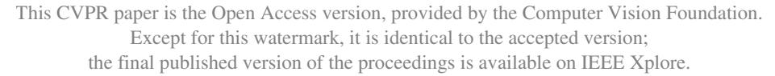
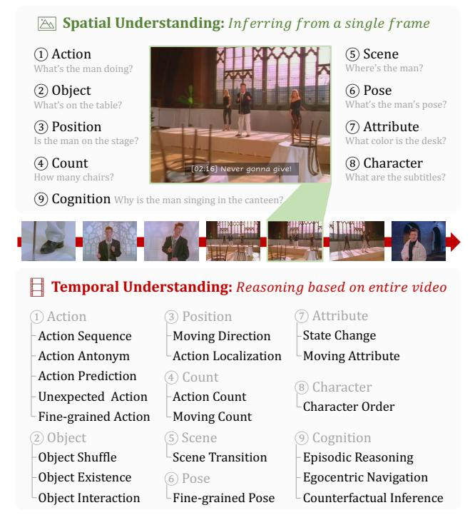
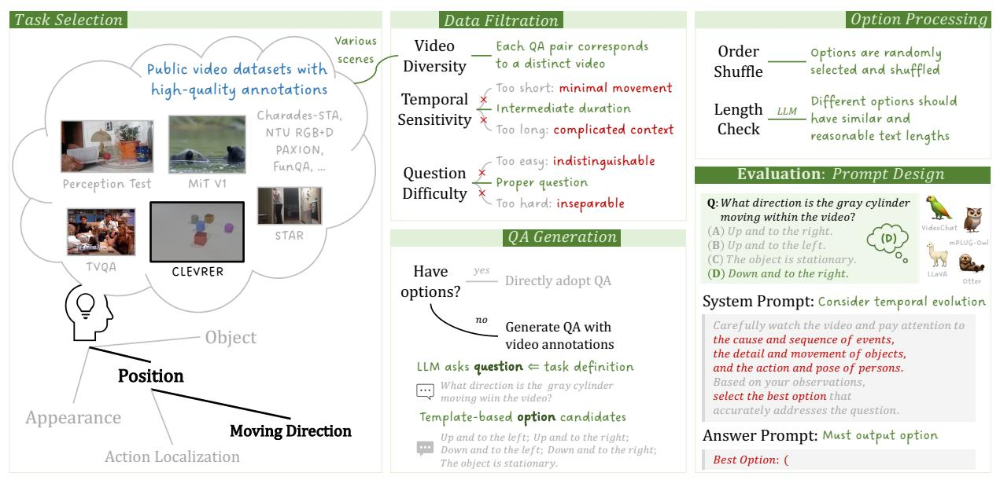
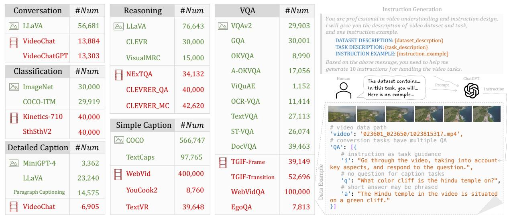
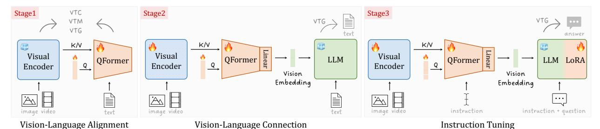
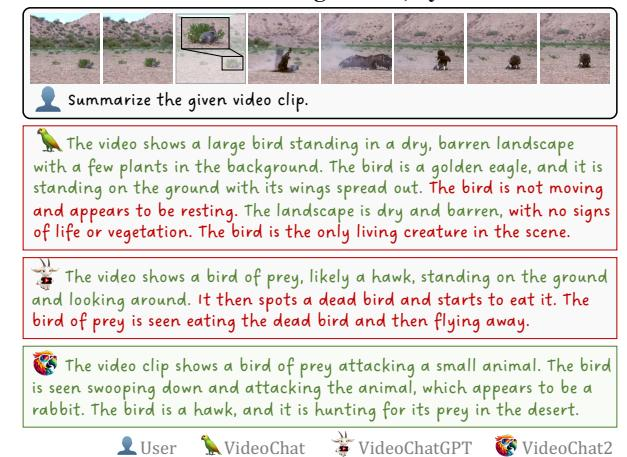

# **MVBench: A Comprehensive Multi-modal Video Understanding Benchmark**

Kunchang  $\text{Li}^{1,2,3\spadesuit}$  Yali  $\text{Wang}^{1,3\heartsuit}$  Yinan  $\text{He}^3$  Yizhuo  $\text{Li}^{4,3\spadesuit}$  Yi  $\text{Wang}^3$  Yi  $\text{Liu}^{1,2,3\spadesuit}$  Zun  $\text{Wang}^3$  Jilan  $\text{Xu}^{5,3\spadesuit}$  Guo Chen $^{6,3\spadesuit}$  Ping  $\text{Luo}^{4,3}$  Limin  $\text{Wang}^{6,3\heartsuit}$  Yu Qiao $^{3,1\heartsuit}$ 

1Shenzhen Institute of Advanced Technology, Chinese Academy of Sciences 2University of Chinese Academy of Sciences 3Shanghai AI Laboratory

4The University of Hong Kong 5Fudan University 6State Key Laboratory for Novel Software Technology, Nanjing University

## **Abstract**

With the rapid development of Multi-modal Large Language Models (MLLMs), a number of diagnostic benchmarks have recently emerged to evaluate the comprehension capabilities of these models. However, most benchmarks predominantly assess spatial understanding in the static image tasks, while overlooking temporal understanding in the dynamic video tasks. To alleviate this issue, we introduce a comprehensive **M**ulti-modal **V**ideo understanding Benchmark, namely MVBench, which covers 20 challenging video tasks that cannot be effectively solved with a single frame. Specifically, we first introduce a novel staticto-dynamic method to define these temporal-related tasks. By transforming various static tasks into dynamic ones, we enable the systematic generation of video tasks that require a broad spectrum of temporal skills, ranging from perception to cognition. Then, guided by the task definition, we automatically convert public video annotations into multiplechoice QA to evaluate each task. On one hand, such a distinct paradigm allows us to build MVBench efficiently, without much manual intervention. On the other hand, it guarantees evaluation fairness with ground-truth video annotations, avoiding the biased scoring of LLMs. Moreover, we further develop a robust video MLLM baseline, i.e., **VideoChat2**, by progressive multi-modal training with diverse instruction-tuning data. The extensive results on our MVBench reveal that, the existing MLLMs are far from satisfactory in temporal understanding, while our VideoChat2 largely surpasses these leading models by over 15% on MVBench. All models and data are available at https: //github.com/OpenGVLab/Ask-Anything.

#### 1. Introduction

In the past few years, Multi-modal Large Language Models (MLLMs) [1, 16, 25, 37, 39, 44, 54, 97] have gradually driven the advance in vision-language learning, by plugging visual encoders within various pretrained LLMs [10, 15, 53,

Figure 1. **Tasks of MVBench.** We define temporal tasks by adapting static image tasks with dynamic evolution. This leads to 20 challenging tasks of video understanding, which cannot be effectively solved within a single frame. For example, "position" in an image can be converted into "moving direction" through a video.

66, 67]. With such a fast development, there is a natural question: *How can we evaluate the comprehension capabilities of these MLLMs?* Such assessment is vital to confirm their design effectiveness and further improve them for a broader understanding of open-world multi-modalities.

In response to this need, a number of benchmarks have been launched [17, 42, 46, 83, 90], by evaluating MLLMs with Question Answering (QA) formulation of various perception tasks. However, most of these benchmarks primarily concentrate on image-based understanding, where all the questions are designed for spatial perception in the static images, *e.g.*, "Is the man on the stage?", as shown

♠ Interns at Shanghai AI Laboratory. ♥ Corresponding authors.

in Fig. 1. Hence, they suffer from difficulty in assessing temporal evolution in dynamic videos, which is critical to understanding the procedural activities in our realistic world. Recently, several attempts have tried to evaluate MLLMs on temporal perception in videos [35, 48, 56, 80]. But they either work on the very basic video tasks (e.g., action recognition and prediction in SEED-Bench [35]), or focus on the particular domains (e.g., surprising comprehension in FunQA [80]) and restricted scenes (e.g., indoor scenes in Perception Test [56]). As a result, it is limited to leverage these benchmarks to make a comprehensive evaluation on the temporal understanding skills of MLLMs. Besides, they are collected with labor-intensive annotations, leading to expensive manual intervention. To tackle these problems, we propose a Multi-modal Video understanding Benchmark (MVBench), which aims at comprehensively evaluating the temporal perception capabilities of MLLMs in the open world. Compared to these existing benchmarks above, there are two distinct designs in our MVBench.

First, we introduce a novel static-to-dynamic method to systematically define temporal-related tasks, by adapting static image tasks with dynamic evolution. This leads to **20** challenging tasks of video understanding in the MVBench, which covers a wide range of temporal understanding skills from perception to cognition. Specifically, we use static image tasks in the previous multi-modal benchmarks [17, 46] as definition reference. Then, we augment the question of these static tasks with temporal context in the video, *e.g.*, the *position* task in the image can be flexibly converted into the *moving-direction* task in the video ("Is the man on the stage?"  $\rightarrow$  "What direction is the man moving?") in Fig. 1. In this case, we can effectively convert all these static tasks into the corresponding dynamic tasks, which cannot be solved without reasoning on the whole video.

Second, guided by the task definition, we design an automatic annotation paradigm to generate multiple-choice QAs for each task, by converting 11 public video benchmarks with LLMs. On one hand, it can largely reduce the cost of expensive human annotations. On the other hand, these 11 benchmarks cover various complex domains and diverse scenes, ranging from first-person to third-person perspectives, and from indoor to outdoor environments. Hence, our MVBench is a preferable choice to evaluate the general capability of MLLMs for open-world temporal understanding. More importantly, these benchmarks provide the ground truth for MVBench which guarantees evaluation fairness and accuracy, avoiding biased scoring of LLMs [48, 80].

Finally, we make a thorough evaluation of various well-known MLLMs on our MVBench. Surprisingly, these state-of-the-art image and video MLLMs are far from satisfactory, in terms of temporal perception and cognition. This further motivates us to develop a strong video MLLM baseline, namely **VideoChat2**, by bridging LLM with a power-

ful vision foundation model [40]. Subsequently, we introduce a progressive training paradigm with a wide spectrum of multi-modal instructions, allowing effective alignment between video and language. The evaluations show that, our VideoChat2 significantly surpasses the top-performing VideoChat [39] by over 15% accuracy on MVBench, and also achieves the new state-of-the-art results on video conversation [48] and zero-shot QA benchmarks [81, 91]. All the models and data are publicly available, in order to pave the path to general video understanding.

### 2. Related Works

MLLM. Building upon the significant achievements of Large Language Models (LLMs) [5, 10, 15, 58, 75], scholarly interest has increasingly shifted towards the exploration and development of Multi-modal Large Language Models (MLLMs). This shift aims to augment multi-modal understanding and generation capabilities. Groundbreaking MLLMs such as Flamingo [1] and PaLM-E [16] have seamlessly fused text and vision, setting precedence with their outstanding performances across a range of multimodal tasks [22, 49, 57, 82]. The recent open-sourcing of LLMs [65-68, 93] further accelerates the emergence of public MLLMs [20, 44, 97]. Notable examples such as LLaVA [44], MiniGPT-4 [97], and InstructBLIP [11] have contributed by proposing a series of visual instructiontuning data. Venturing beyond text and static images, several studies have begun harnessing video modality [39, 47, 48, 94], tapping into the vast potential of LLMs for video comprehension tasks [7, 81, 91]. Innovations like VideoChat [39], VideoChatGPT [48], and Valley [47] utilize ChatGPT to generate video instruction-tuning data, aiming to enhance instruction-following capabilities. In the VideoChat2, we aim to critically examine the fundamental temporal understanding capabilities of MLLMs, providing valuable design insights for more robust video MLLMs. Benchmark. Traditional Vision-Language (VL) benchmarks [21, 29, 79, 81, 82] have primarily honed in on specific capabilities like multi-modal retrieval and vision QA. The rise of MLLMs has catalyzed benchmarks de-

marks [21, 29, 79, 81, 82] have primarily honed in on specific capabilities like multi-modal retrieval and vision QA. The rise of MLLMs has catalyzed benchmarks designed for assessing integrated VL tasks. For example, LVLM-eHub [83] provides an interactive model comparison platform through image-related queries. Other benchmarks such as OwlEval [87], MME [17], SEED-Bench [35], MM-Vet [90], and MMBench [46] underscore comprehensive VL skills, introducing evaluation metrics that transcend mere model hierarchies. Meanwhile, the video realm showcased benchmarks like Perception Test [56], examining multi-modal video perception and reasoning, and VideoChatGPT [48] quantifies the capability of dialogue generation from video inputs. FunQA [80] pushes video reasoning limits via counter-intuitive and humorous content. In contrast to the existing benchmarks, MVBench sets

| Spatial   | Temporal               | Source             | Example                                                                                                                                                             |
|-----------|------------------------|--------------------|---------------------------------------------------------------------------------------------------------------------------------------------------------------------|
|           | Action                 | STAR               | What happened after the person took the food?                                                                                                                       |
|           | Sequence               | SIAK               | (A) Ate the medicine. (B) Tidied up the blanket. (C) Put down the cup/glass/bottle. (D) Took the box.                                                               |
|           | Action                 | STAR               | What will the person do next?                                                                                                                                       |
|           | Prediction             | SIAK               | (A) Put down the pillow. (B) Open the door. (C) Take the book. (D) Open the closet/cabinet.                                                                         |
| Action    | Action                 | PAXION <u>†</u>    | Which one of these descriptions correctly matches the actions in the video?                                                                                         |
| Action    | Antonym                | TAXION             | (A) not sure (B) scattering something down (C) piling something up                                                                                                  |
|           | Fine-grained           | MiT V1‡            | What is the action performed by the person in the video?                                                                                                            |
|           | Action                 | WIII VII           | (A) watering (B) leaking (C) pouring (D) planting                                                                                                                   |
|           | Unexpected             |                    | What unexpected event contributes to the humor in the video?                                                                                                        |
|           | Action                 | FunQA‡             | (A) The man left without dancing. (B) Two women hugged each other at the end.                                                                                       |
|           |                        |                    | (C) The man finally danced with the woman. (D) Two men hugged each other unexpectedly.                                                                              |
|           | Object Existence       | CLEVRER            | Are there any moving green objects when the video ends? (A) not sure (B) yes (C) no                                                                                 |
|           | Object Interaction     | STAR               | Which object was tidied up by the person? (A) broom (B) cabinet (C) blanket (D) table                                                                               |
| Object    | Object                 | Perception         | Where is the hidden object at the end of the game from the person's point of view?                                                                                  |
|           | Shuffle                | Test               | (A) Under the first object from the left. (B) Under the third object from the left.                                                                                 |
|           |                        | Test               | (C) Under the second object from the left.                                                                                                                          |
|           | Moving                 | CLEVRER!           | What direction is the cyan sphere moving within the video?                                                                                                          |
|           | Direction              | 7                  | (A) The object is stationary. (B) Up and to the right. (C) Down and to the left. (D) Down and to the right.                                                         |
| Position  | Action Localization | Charades- STA ‡ | During which part of the video does the action 'person sitting on a couch' occur?                                                                                   |
|           |                        |                    | (A) In the middle of the video. (B) At the end of the video.                                                                                                        |
|           |                        |                    | (C) Throughout the entire video. (D) At the beginning of the video.                                                                                                 |
| a         | Scene Transition    | MoVQA‡             | What's the right option for how the scenes in the video change?                                                                                                     |
| Scene     |                        |                    | (A) From the reception desk to the conference room. (B) From the kitchen to the dining area.                                                                        |
|           | A .: C                 |                    | (C) From the server room to the control center. (D) From the classroom to the library.                                                                              |
| Count     | Action Count           | Perception Test    | How many times did the person launch objects on the table? (A) 3 (B) 2 (C) 4                                                                                        |
|           | Moving Count           | CLEVRER            | How many metal objects exit the scene? (A) 2 (B) 3 (C) 1 (D) 0                                                                                                      |
| Attribute | Moving Attribute       | CLEVRER            | What shape is the moving object when the video begins? (A) cylinder (B) sphere (C) cube                                                                             |
|           | State Change           | Perception Test    | Is the lighting device on at any point? (A) yes (B) I don't know (C) no                                                                                             |
| Pose      | Fine-grained Pose      | NTU RGB+D‡         | What is the pose performed by the person in the video? (A) pick up (B) sit down (C) drop (D) stand up                                                               |
| Character | Character Order        | Perception Test    | What letter did the person write first on the paper? (A) I (B) v (C) e                                                                                              |
|           | Egocentric             | VLN-CE             | For an agent following instruction: "Go left through the door." What is the next action it should take?                                                             |
|           | Navigation             |                    | (A) Turn left and move forward (B) Move forward (C) Stop (D) Turn right and move forward.                                                                           |
|           | Episodic               | TVO                | Why did Castle dress like a fairy when he was speaking to Emily?                                                                                                    |
| Cognition | Reasoning              | TVQA               | (A) To get her to trust him. (B) He secretly loved fairies. (C) He lost a bet with Emily.                                                                           |
| Cognition |                        |                    | (D) It was dressed like a fairy day at school. (E) Mrs Ruiz made him dress up.                                                                                      |
|           | Counterfactual         | CLEVDED            | Which of the following will happen if the cylinder is removed?  (A) The grown which a chiest and the blue cylinder (D) The brown cylinder with the mostel cylinder. |
|           | Inference              | CLEVRER            | (A) The cyan rubber object and the blue cube collide. (B) The brown cube collides with the metal cube.                                                              |
|           |                        |                    | (C) The cyan rubber object and the metal cube collide. (D) The cyan rubber cube collides with the sphere.                                                           |

Table 1. **Task examples of MVBench.** The videos are collected from the public datasets, including STAR [77], PAXION [74], Moments in Time V1 [52], FunQA [80], CLEVRER [88], Perception Test [56], Charades-STA [19], MoVQA [95], NTU RGB+D[45], VLN-CE [30] and TVQA [33]. Tasks requiring QA generation are marked with "‡". More details can be found in Section 3.1.

itself apart by covering a wide range of temporal tasks, emphasizing temporally-sensitive videos and efficient use of public annotations, and conducting comprehensive evaluations of MLLMs' temporal understanding.

# 3. MVBench

In this section, we present our MVBench in detail. We first design the temporal tasks in Tab. 1, and then automatically generate multiple-choice QAs for evaluation in Fig. 2.

## 3.1. Temporal Task Definition

To design the temporal tasks of MVBench, we introduce a concise static-to-dynamic method by adapting static tasks with dynamic goals. As discussed in the introduction, most existing MLLM benchmarks [17, 46] focus on spatial understanding with systematical definitions of static image tasks. Motivated by this, we propose using these task definitions as references to systematically design temporal tasks,

ranging from perception to cognition. As shown in Fig. 1, we begin by summarizing 9 main tasks of spatial understanding from previous benchmarks. Then we enrich these image tasks with video context, creating temporal tasks that can not be effectively solved with a single image and require comprehensive video understanding. Finally, we define 20 temporal tasks as follows. Examples are listed in Tab. 1.

Action. (1) Action Sequence: Retrieve the events occurring before or after a specific action. (2) Action Prediction: Infer the subsequent events based on the current actions. (3) Action Antonym: Distinguish the correct action from two inversely ordered actions. (4) Fine-grained Action: Identify the accurate action from a range of similar options. (5) Unexpected Action: Detect surprising actions in videos characterized by humor, creativity, or magic. Object. (6) Object Existence: Determine the existence of a specific object during a particular event. (7) Object Interaction: Identify the object that participates in a particular event. (8) Object

Figure 2. **Generation pipeline of MVBench.** Within public annotations, data is carefully filtered and relevant multiple-choice QAs are auto-generated. The effective system prompt and efficient answer prompt are employed to guide MLLMs toward precise outputs.

Shuffle: Locate the final position of an object in an occlusion game. **Position.** (9) Moving Direction: Ascertain the trajectory of a specific object's movement. (10) Action Localization: Determine the time period when a certain action occurs. **Scene.** (11) *Scene transition*: Determine how the scene transitions in the video. Count. (12) Action Count: Calculate how many times a specific action has been performed. (13) Moving Count: Calculate how many objects have performed a certain action. Attribute. (14) Moving Attribute: Determine the appearance of a specific moving object at a given moment. (15) State Change: Determine whether the state of a certain object changes throughout the video. Pose. (16) Fine-grained Pose: Identify the accurate pose category from a range of similar options. Charac**ter.** (17) Character Order: Determine the order in which the letters appear. **Cognition.** (18) *Egocentric Navigation:* Forecast the subsequent action, based on an agent's current navigation instructions. (19) Episodic Reasoning: Perform reasoning on the characters, events, and objects within an episode of a TV series. (20) Counterfactual Inference: Consider what might happen if a certain event occurs.

#### 3.2. Automatic QA Generation

With the guidance of temporal task definitions, we next collect and annotate videos for each task. Specifically, we design an automatic QA generation paradigm in Fig. 2, which efficiently converts open-sourced video annotations into multiple-choice QAs for evaluating MLLMs.

**Data Filtration.** To reduce the labor-intensive collection, we propose to select videos from existing benchmarks. (1) **Video Diversity:** To boost video diversity, we carefully select 11 video datasets (see Tab. 1) that cover a broad spec-

trum of domains and scenes, ranging from first-person to third-person perspectives, and from indoor to outdoor environments. (2) Temporal Sensitivity: To guarantee that each task is temporal sensitive, we eliminate short clips which generally contain negligible motions, and also delete extremely long videos which often present overly complicated contexts that are hard for evaluation. Hence, we select videos with intermediate duration, primarily ranging from 5s to 35s. (3) Question Difficulty: Overly simple or complex questions may lead to indistinguishable evaluations, due to similar responses. To balance the question difficulty, we design the selection criteria for STAR [77] and CLEVRER [28]. For STAR, we enhance the challenge by randomly shifting the start or end points of the video clips, increasing the complexity of localizing specific events. For CLEVRER, we exclude questions that necessitate more than 10 conditions (e.g., material, and shape) for describing specific events, thus decreasing QA difficulty.

**QA Generation.** Considering that not all the annotations of selected datasets follow the multiple-choice QA format, we automatically convert the video annotations into this format via LLMs. Specifically, we first use ChatGPT [53] to generate a question for each video, based on the task definition. Then, we create the corresponding answer options as follows. **(1) Template-Based Construction:** For most questions, we construct the option candidates directly from the ground truth annotations. For example, the candidates for the *Action Antonym* task contain the *correct* action, its *opposite* action, and a *not-sure* choice. In the case of the *Moving Direction* task, the option candidates consist of four directions (*i.e.*, *up*, *down*, *left*, *right*) and the *stationary* state. **(2) LLM-Based Generation:** For the *Unexpected* 

Figure 3. **Instruction-tuning data for VideoChat2.** Co-training of VideoChat2 employs both image and video data, with instructions generated by ChatGPT [53]. The resultant dataset comprises 2M samples drawn from 34 diverse datasets across 6 categories.

Action task in particular, we leverage ChatGPT for converting open-ended QAs into multiple-choice QA with answer options. Note that, we use the multiple-choice format instead of the open-ended one, for evaluation correction and fairness. This is mainly because the open-ended answer has to be scored by LLMs or user studies, which may either introduce evaluation bias or manual intervention. Ultimately, we produce 200 multiple-choice QA pairs for each temporal understanding task. More details of QA generation for all the tasks can be found in the appendix.

Answer Option Processing. For all questions, we randomly sample 3 to 5 answer options from the available candidates, and shuffle the option order, to strengthen the evaluation's robustness. Additionally, to prevent the common issue of answer leakage where longer options tend to be correct, we further use LLM to guarantee that all the answer options of a question are of similar and reasonable lengths.

#### 3.3. Prompt Design for Evaluation

To emphasize the temporal sensitivity of MLLMs, we craft a detailed **system prompt** for evaluation (see the bottom right of Fig. 2). This prompt encourages MLLMs to carefully scrutinize video content to answer questions, by paying attention to factors such as the actions and poses of persons, and the details and movements of object movements.

Moreover, another significant challenge lies in extracting options from MLLMs' responses. MMBench [46] attempts to match predictions with multiple option formats. If failed, it resorts to ChatGPT [53] to extract options through an intricate design. However, this way is relatively inefficient, yielding an alignment rate of only 87% with humans. In contrast, our MVBench employs a simple approach that guarantees 100% rate in option extraction. We enclose the options within parentheses in the questions, and use the an-

**swer prompt** "Best Option: (" to guide MLLMs for option generation. Results in Tab. 9 demonstrate our prompt's effectiveness on various MLLMs, allowing us to use accuracy as a reliable metric for evaluation.

### 4. VideoChat2

After building our MVBench, we evaluate a number of popular image and video MLLMs in Tab. 2. Surprisingly, the existing MLLMs are far from satisfactory in temporal understanding. To fill the gap, we develop a robust video MLLM baseline, which is dubbed as **VideoChat2**.

#### 4.1. Instruction-Tuning Data

Primarily, the suboptimal performance of MLLMs can be attributed to the limited diversity in instruction-tuning data. To address this issue, we introduce the enriched data as shown in Fig. 3, which comprises 2M samples from 34 distinct sources. Following [39, 94], we include both image and video data in the instruction set to improve training.

Motivated by M3IT [41], we reorganize all data samples in a uniform format, as shown on the bottom right of Fig. 3. There are two keys involved: {'image' or 'video'}, and {'QA'}. The first key indicates the path to the vision data. The second key represents a list that contains task instruction ('i') and question-answer('q'-'a'). Moreover, different from M3IT, which requires researchers to write 10 instructions per dataset, we use ChatGPT to create them, according to {dataset description}, {task description}, and {instruction example} at the top right of Fig. 3. Consequently, our whole instruction-tuning data set can be roughly divided into 6 categories as follows:

(1) Conversation aims at enhancing multi-turn conversational capabilities. We collect conversation data from

Figure 4. **Progressive multi-modal training of VideoChat2.** Stage1 aligns UMT-L [40], the visual encoder, with QFormer [37] to efficiently compress extensive visual inputs. Stage2 extends this connection to incorporate LLM, while Stage3 focuses on effective instruction tuning to enhance model performance. The terms 'instruction', 'question' and 'answer' means 'i', 'g' and 'a' of 'QA' in Fig. 3.

LLaVA [44] and VideoChat [39]. To expand our data, we integrate the caption data from VideoChatGPT [48] into conversation format based on the video IDs. (2) Simple Caption aims to improve basic visual description capabilities. We choose the widely used COCO Caption [43] and WebVid [3], together with first-order video captions from YouCook2 [13]. (3) Detailed Caption aims at enriching the comprehensive capabilities for understanding visual details. We leverage the detailed caption data from MiniGPT-4 [97], LLaVA [44] and VideoChat [39]. We also integrate Paragraph Captioning [31], TextCaps [61], and TextVR [78], which require uniquely comprehending text within images and videos. (4) VQA aims to improve visual question-answering capabilities. We include the basic VQA (VQAv2 [22], GQA [26], TGIF-QA [27] and WebVidQA [84]), knowledge-based VQA (OK-VQA [49], AOK-VQA [59] and ViQuAE [34]), OCRbased VQA (OCR-VQA [51], TextVQA [62], ST-VQA [4] and DocVQA [50]), and egocentric VQA from Ego4D [23]. (5) **Reasoning** focuses on enhancing diverse reasoning capacities. We use LLaVA-reasoning [44] and CLEVR [28] for spatial reasoning, VisualMRC [64] for reading comprehension, NExT-QA [79] for temporal reasoning, and CLEVRER [88] for spatiotemporal reasoning. (6) Classi**fication** aims at boosting robustness to object and action recognition. We sample data from ImageNet [14], COCO-ITM [43], Kinetics-710 [38] and SthSthV2 [21].

#### 4.2. Progressive Multi-Modal Training

Another critical factor in boosting MLLMs is how to effectively bridge the semantic gap between visual and linguistic representation. To tackle this problem, we adopt a progressive multi-modal training paradigm as shown in Fig. 4.

**Stage1: Vision-Language Alignment.** In the first stage, we aim at aligning vision and text. To balance efficiency and effectiveness, we freeze the visual encoder and train a flexible QFormer [37], which compresses redundant visual tokens into fewer query tokens, and align these queries with text tokens by multi-modal losses, *i.e.*, Vision-Text Contrastive learning (VTC), Vision-Text Matching (VTM), and Vision-grounded Text Generation (VTG). But different

from [37], we choose the pretrained UMT-L [40] as our visual encoder, due to its powerful capability of spatial-temporal representation learning. Moreover, we train QFormer with only 15M image captions from CC3M [60] and CC12M [6] but 10M video captions from WebVid-10M [3], in order to enhance video-language modeling.

**Stage2: Vision-Language Connection.** After initial alignment, we then connect the visual encoder with the pretrained LLMs, for building vision-language understanding capabilities. Following [37], we apply a linear projection to further transform the query tokens, and concatenate the projected tokens with the text tokens into LLM for vision-based caption generation (*i.e.*, VTG). But different from [37], we unfreeze the visual encoder for better alignment with LLM. In addition to the aforementioned training data in Stage1, we further introduce 2M image captions (COCO [43], Visual Genome [32], and SBU [55]) and 10M video captions (InternVid [73]), to enrich the caption diversity.

**Stage3: Instruction Tuning.** In the final stage, we employ the proposed data in Section 4.1 for instruction tuning. To better align responses with instructions, we use low-rank adaptation [24] on the frozen LLM, and tune it along with the visual encoder and QFormer by VTG loss. Moreover, inspired by [11], we integrate instructions (*i.e.*, 'i' of 'QA') into QFormer, in order to extract instruction-relevant visual tokens as input to LLM. However, different from [11], we do not incorporate questions (*i.e.*, 'q' of 'QA') into QFormer due to the subpar performances (see appendix.).

# 5. Experiments

**Implementation Details**. For visual encoder and LLM, we apply UMT-L [40] and Vicuna-7B v0 [66] by default. Following BLIP2 [37], we deploy QFormer using the pretrained BERT $_{base}$  [15]. 32 queries are used in Stage1, and extra 64 queries are introduced in Stage2 and Stage3 when the visual encoder is unfrozen. For efficient training, 4-frame videos are processed through 10 epochs in Stage1 and 1 epoch in Stage2. Transitioning to Stage3, we shift to 8-frame videos for 3 epochs. For evaluation, we input 16-frame videos with elaborate prompts for better results.

| Model                      | LLM       | Avg  | AS   | AP   | AA   | FA   | UA   | OE   | OI   | OS   | MD   | AL   | ST   | AC   | MC   | MA   | SC   | FP   | CO   | EN   | ER   | CI   |
|----------------------------|-----------|------|------|------|------|------|------|------|------|------|------|------|------|------|------|------|------|------|------|------|------|------|
| Random                     | -         | 27.3 | 25.0 | 25.0 | 33.3 | 25.0 | 25.0 | 33.3 | 25.0 | 33.3 | 25.0 | 25.0 | 25.0 | 33.3 | 25.0 | 33.3 | 33.3 | 25.0 | 33.3 | 25.0 | 20.0 | 30.9 |
| Image MLLMs: Follo         |           |      |      |      |      |      |      |      |      |      |      |      |      |      |      |      |      |      |      |      |      |      |
| mPLUG-Owl-I [87]           | LLaMA-7B  | 29.4 | 25.0 | 20.0 | 44.5 | 27.0 | 23.5 | 36.0 | 24.0 | 34.0 | 23.0 | 24.0 | 34.5 | 34.5 | 22.0 | 31.5 | 40.0 | 24.0 | 37.0 | 25.5 | 21.0 | 37.0 |
| LLaMA-Adapter [96]         | LLaMA-7B  | 31.7 | 23.0 | 28.0 | 51.0 | 30.0 | 33.0 | 53.5 | 32.5 | 33.5 | 25.5 | 21.5 | 30.5 | 29.0 | 22.5 | 41.5 | 39.5 | 25.0 | 31.5 | 22.5 | 28.0 | 32.0 |
| BLIP2 [37]                 | FlanT5-XL | 31.4 | 24.5 | 29.0 | 33.5 | 17.0 | 42.0 | 51.5 | 26.0 | 31.0 | 25.5 | 26.0 | 32.5 | 25.5 | 30.0 | 40.0 | 42.0 | 27.0 | 30.0 | 26.0 | 37.0 | 31.0 |
| Otter-I [36]               | MPT-7B    | 33.5 | 34.5 | 32.0 | 39.5 | 30.5 | 38.5 | 48.5 | 44.0 | 29.5 | 19.0 | 25.5 | 55.0 | 20.0 | 32.5 | 28.5 | 39.0 | 28.0 | 27.0 | 32.0 | 29.0 | 36.5 |
| MiniGPT-4 [97]             | Vicuna-7B | 18.8 | 16.0 | 18.0 | 26.0 | 21.5 | 16.0 | 29.5 | 25.5 | 13.0 | 11.5 | 12.0 | 9.5  | 32.5 | 15.5 | 8.0  | 34.0 | 26.0 | 29.5 | 19.0 | 9.9  | 3.0  |
| InstructBLIP [11]          | Vicuna-7B | 32.5 | 20.0 | 16.5 | 46.0 | 24.5 | 46.0 | 51.0 | 26.0 | 37.5 | 22.0 | 23.0 | 46.5 | 42.5 | 26.5 | 40.5 | 32.0 | 25.5 | 30.0 | 25.5 | 30.5 | 38.0 |
| LLaVA [44]                 | Vicuna-7B | 36.0 | 28.0 | 39.5 | 63.0 | 30.5 | 39.0 | 53.0 | 41.0 | 41.5 | 23.0 | 20.5 | 45.0 | 34.0 | 20.5 | 38.5 | 47.0 | 25.0 | 36.0 | 27.0 | 26.5 | 42.0 |
| Video MLLMs: All m         |           |      |      |      |      |      |      |      |      |      |      |      |      |      |      |      |      |      |      |      |      |      |
| Otter-V [36]               | LLaMA-7B  | 26.8 | 23.0 | 23.0 | 27.5 | 27.0 | 29.5 | 53.0 | 28.0 | 33.0 | 24.5 | 23.5 | 27.5 | 26.0 | 28.5 | 18.0 | 38.5 | 22.0 | 22.0 | 23.5 | 19.0 | 19.5 |
| mPLUG-Owl-V [87]           | LLaMA-7B  | 29.7 | 22.0 | 28.0 | 34.0 | 29.0 | 29.0 | 40.5 | 27.0 | 31.5 | 27.0 | 23.0 | 29.0 | 31.5 | 27.0 | 40.0 | 44.0 | 24.0 | 31.0 | 26.0 | 20.5 | 29.5 |
| VideoChatGPT [48]          | Vicuna-7B | 32.7 | 23.5 | 26.0 | 62.0 | 22.5 | 26.5 | 54.0 | 28.0 | 40.0 | 23.0 | 20.0 | 31.0 | 30.5 | 25.5 | 39.5 | 48.5 | 29.0 | 33.0 | 29.5 | 26.0 | 35.5 |
| VideoLLaMA [94]            | Vicuna-7B | 34.1 | 27.5 | 25.5 | 51.0 | 29.0 | 39.0 | 48.0 | 40.5 | 38.0 | 22.5 | 22.5 | 43.0 | 34.0 | 22.5 | 32.5 | 45.5 | 32.5 | 40.0 | 30.0 | 21.0 | 37.0 |
| VideoChat [39]             | Vicuna-7B | 35.5 | 33.5 | 26.5 | 56.0 | 33.5 | 40.5 | 53.0 | 40.5 | 30.0 | 25.5 | 27.0 | 48.5 | 35.0 | 20.5 | 42.5 | 46.0 | 26.5 | 41.0 | 23.5 | 23.5 | 36.0 |
| VideoChat2 text |           |      |      |      |      |      |      |      |      |      |      |      |      |      |      |      |      |      |      |      |      | 40.0 |
| VideoChat2                 | Vicuna-7B | 51.1 | 66.0 | 47.5 | 83.5 | 49.5 | 60.0 | 58.0 | 71.5 | 42.5 | 23.0 | 23.0 | 88.5 | 39.0 | 42.0 | 58.5 | 44.0 | 49.0 | 36.5 | 35.0 | 40.5 | 65.5 |

Table 2. Evaluations results on MVBench. Excluding BLIP2 and Otter, all models are built upon LLaMA 1 [67] for fair comparisons. "Random" refers to results from random guesses. "VideoChat2text" denotes the model receiving blank videos and excludes LoRA tuning, relying solely on the LLM's capacity for responses. Notably, our MVBench exceeds the leading models, by over 15%.

| <b>Evaluation Aspect</b>   | VideoChat[39] | VideoChatGPT[48] | VideoChat2 |
|----------------------------|---------------|------------------|------------|
| Correctness of Information | 2.23          | 2.40             | 3.02       |
| Detail Orientation         | 2.50          | 2.52             | 2.88       |
| Contextual Understanding   | 2.53          | 2.62             | 3.51       |
| Temporal Understanding     | 1.94          | 1.98             | 2.66       |
| Consistency                | 2.24          | 2.37             | 2.81       |
| Avg                        | 2.29          | 2.38             | 2.98       |

Table 3. Results of video conversation benchmark [48].

| Model             | MSV  | D-QA  | MSR  | VTT-QA |      |       |  |
|-------------------|------|-------|------|--------|------|-------|--|
| Model             | Acc  | Score | Acc  | Score  | Acc  | Score |  |
| VideoLLaMA [94]   | 51.6 | 2.5   | 29.6 | 1.8    | 12.4 | 1.1   |  |
| VideoChat [39]    | 56.3 | 2.8   | 45.0 | 2.5    | 26.5 | 2.2   |  |
| VideoChatGPT [48] | 64.9 | 3.3   | 49.3 | 2.8    | 35.2 | 2.7   |  |
| VideoChat2        | 70.0 | 3.9   | 54.1 | 3.3    | 49.1 | 3.3   |  |

Table 4. Zero-shot video QA results on [81, 92].

## 5.1. Results on MVBench

Tab. 2 presents the evaluation results on MVBench, revealing that current image and video MLLMs are underperforming. For instance, VideoChat [39], a top-performing video MLLM, only marginally surpasses VideoChat2text by 0.8% in average accuracy (35.5% vs. 34.7%), with the latter generating responses from text alone. In contrast, our VideoChat2 markedly exceeds the leading model by over 15%, particularly shining in categories like action, object, scene, attribute, and pose recognition. However, it struggles in position, count, and character tasks, performing less effectively than VideoChat2text, which could be attributed to the lack of exposure to these tasks during instruction tuning.

#### **5.2. More Comparisons**

Following [48], we use ChatGPT [53] to conduct quantitative comparisons among video MLLMs. (1) Video Conversation: Tab. 3 shows the results on the benchmark of

Figure 5. **Qualitative comparison.** Green signifies accurate descriptions, while red denotes incorrect or hallucinatory responses.

[48]. Compared with VideoChatGPT [48], our VideoChat2 exhibits superior performances across all metrics, with distinct advancements in terms of information correctness as well as context and temporal understanding. This indicates that our VideoChat2 is more adept at comprehending both spatial and temporal details and providing consistent and reliable responses. (2) **Zero-Shot Video QA:** Tab. 4 lists results of typical video QA datasets [81, 91]. It is evident that our VideoChat2 surpasses all other methods, particularly excelling in understanding long videos in ActivityNet [91].

We further present a qualitative comparison in Fig. 5, where VideoChat2 delivers a precise and thorough response. For more qualitative analyses, see the appendix.

# 5.3. Ablations of VideoChat2

In this section, we conduct comprehensive analyses of the instruction data, model architecture, and prompt designs.

| Data Source       | Type | Task   | #Num | Avg                       |
|-------------------|------|--------|------|---------------------------|
| VideoChat [39]    | I+V  | DC+R+C | 17K  | 36.4                      |
| VideoChatGPT [48] | V    | DC     | 100K | 34.3 ↓2.1                 |
|                   | I    | ALL    | 1.1M | 42.1 \(\frac{1}{5}.7\)    |
| Our               | V    | ALL    | 0.9M | 50.5 \14.1                |
| Ours              | I+V† | ALL    | 1.2M | 50.7 \ 14.3               |
|                   | I+V  | ALL    | 2.0M | <b>51.1</b> ↑ <b>14.7</b> |

Table 5. **Instruction Data.** "I" and "V" denote "Image" and "Video", while "DC", "R", "C" represent "Detailed Caption", "Reasoning" and "Conversation". "†" symbolizes the version with fewer captions: 100K from COCO [43], 80K from WebVid [3].

| Visual Encoder    | LLM                    | LoRA     | Avg              |
|-------------------|------------------------|----------|------------------|
| EVA-CLIP-g [63]   | Vicuna-7B v0           | Х        | 42.4             |
| E vA-CLII -g [03] | Viculia-7D VV          | ✓        | 45.3 ↑2.9        |
|                   | Vicuna-7B v0           | Х        | 48.6             |
|                   | Viculia-7B VV          | ✓        | 51.1 ↑2.5        |
| UMT-L [40]        | Vicuna-13B v0          | <b>√</b> | 51.4             |
| OWII-L [40]       | Vicuna-7B v1.5         | Х        | 48.1             |
|                   | Viculia-7D VI.3        | ✓        | <b>51.2</b> ↑3.1 |
|                   | Vicuna-13B <i>v1.5</i> | ✓        | 51.6             |

Table 6. **Visual Encoder & LLM.** Vicuna [66]  $v\theta$  and v1.5 models are tuned from LLaMA 1 [67] and LLaMA 2 [68] respectively.

| Stage2         |        | Stage3         | Avg    |                   |  |
|----------------|--------|----------------|--------|-------------------|--|
| Visual Encoder | QFomer | Visual Encoder | QFomer | Avg               |  |
|                |        |                |        | 38.5              |  |
|                | ð      | <b>(</b>       | l      | 47.0 ↑8.5         |  |
| ø              | ø      | <b>(</b>       | ø,     | 47.5 ↑9.0         |  |
| Ø              | ð      | Ò              | ð      | <b>51.1</b> ↑12.6 |  |

Table 7. **Training Method.** ② and ③ refer to freezing and tuning. We efficiently freeze the visual encoder in Stage1 and LLM in all stages, while tuning the visual encoder and QFormer in Stage2&3.

**Instruction Data.** Tab. 5 demonstrates that the limited instruction data proposed in VideoChat [39] (17K) and VideoChatGPT [48] (100K) is insufficient for temporal understanding. As we increase the data diversity and quantity, the performances are significantly improved, wherein video data contributes more than image data (50.5% vs. 42.1%). Considering the potential redundancy in the simple caption data of COCO [43] and WebVid [3], we randomly compress them. This results in only a minimal impact on performance (50.7% vs. 51.1%), while accelerating the tuning by 1.7×.

Architecture. (1) Visual Encoder: In Tab. 6, we first apply EVA-CLIP-g [63] akin to VideoChat, which achieves 6.9% higher accuracy with our instruction data (42.4% vs. 35.5% for original one in Tab. 2). Further substitutions with UMT-L improve the performance by an additional 6.2%, which demonstrates the effectiveness of our visual encoder. (2) LLM: However, incorporating larger and newer LLMs offers a marginal improvement in the results, indicating that MVBench relies predominantly on the visual encoder. Notably, LoRA [24] consistently uplifts the results, potentially due to its enhanced capacity for instruction following.

Training Method. Initially, we tune only the linear pro-

| System Prompt                                             | Avg         |
|-----------------------------------------------------------|-------------|
| Carefully observe the video and choose the best option    | 49.9        |
| for the question.                                         | 42.2        |
| Carefully watch the video and pay attention to the cause, |             |
| sequence of events, and object details and movements.     | 50.5        |
| Based on your observations, select the best option that   | ↑0.6        |
| accurately addresses the question.                        |             |
| Carefully watch the video and pay attention to the cause  |             |
| and sequence of events, the detail and movement of        | 51.1        |
| objects and the action and pose of persons.               | <b>↑1.2</b> |
| Based on your observations, select the best option that   | 1.4         |
| accurately addresses the question.                        |             |

Table 8. **System Prompt.** It should consider temporal evolution.

| Model              | <b>Answer Prompt</b> | Hit Ratio | Avg                                                                                                                                                                                                                                                                                                                                                                                                                                                                                                                                                                                                                                                                                                                                                                                                                                                                                                                                                                                                                                                                                                                                                                                                                                                                                                                                                                                                                                                                                                                                                                                                                                                                                                                                                                                                                                                                                                                                                                                                                                                                                                                             |
|--------------------|----------------------|-----------|---------------------------------------------------------------------------------------------------------------------------------------------------------------------------------------------------------------------------------------------------------------------------------------------------------------------------------------------------------------------------------------------------------------------------------------------------------------------------------------------------------------------------------------------------------------------------------------------------------------------------------------------------------------------------------------------------------------------------------------------------------------------------------------------------------------------------------------------------------------------------------------------------------------------------------------------------------------------------------------------------------------------------------------------------------------------------------------------------------------------------------------------------------------------------------------------------------------------------------------------------------------------------------------------------------------------------------------------------------------------------------------------------------------------------------------------------------------------------------------------------------------------------------------------------------------------------------------------------------------------------------------------------------------------------------------------------------------------------------------------------------------------------------------------------------------------------------------------------------------------------------------------------------------------------------------------------------------------------------------------------------------------------------------------------------------------------------------------------------------------------------|
| VideoChat [39]     | Ø                    | 78.2%     | 22.8                                                                                                                                                                                                                                                                                                                                                                                                                                                                                                                                                                                                                                                                                                                                                                                                                                                                                                                                                                                                                                                                                                                                                                                                                                                                                                                                                                                                                                                                                                                                                                                                                                                                                                                                                                                                                                                                                                                                                                                                                                                                                                                            |
| videochat [39]     | Best option: (       | 100%      | 35.5 \(\daggregarrightarrightarrightarrightarrightarrightarrightarrightarrightarrightarrightarrightarrightarrightarrightarrightarrightarrightarrightarrightarrightarrightarrightarrightarrightarrightarrightarrightarrightarrightarrightarrightarrightarrightarrightarrightarrightarrightarrightarrightarrightarrightarrightarrightarrightarrightarrightarrightarrightarrightarrightarrightarrightarrightarrightarrightarrightarrightarrightarrightarrightarrightarrightarrightarrightarrightarrightarrightarrightarrightarrightarrightarrightarrightarrightarrightarrightarrightarrightarrightarrightarrightarrightarrightarrightarrightarrightarrightarrightarrightarrightarrightarrightarrightarrightarrightarrightarrightarrightarrightarrightarrightarrightarrightarrightarrightarrightarrightarrightarrightarrightarrightarrightarrightarrightarrightarrightarrightarrightarrightarrightarrightarrightarrightarrightarrightarrightarrightarrightarrightarrightarrightarrightarrightarrightarrightarrightarrightarrightarrightarrightarrightarrightarrightarrightarrightarrightarrightarrightarrightarrightarrightarrightarrightarrightarrightarrightarrightarrightarrightarrightarrightarrightarrightarrightarrightarrightarrightarrightarrightarrightarrightarrightarrightarrightarrightarrightarrightarrightarrightarrightarrightarrightarrightarrightarrightarrightarrightarrightarrightarrightarrightarrightarrightarrightarrightarrightarrightarrightarrightarrightarrightarrightarrightarrightarrightarrightarrightarrightarrightarrightarrightarrightarrightarrightarrightarrightarrightarrightarrightarrightarrightarrightarrightarrightarrightarrightarrightarrightarrightarrightarrightarrightarrightarrightarrightarrightarrightarrightarrightarrightarrightarrightarrightarrightarrightarrightarrightarrightarrightarrightarrightarrightarrightarrightarrightarrightarrightarrightarrightarrightarrightarrightarrightarrightarrightarrightarrightarrightarrightarrightarrightarrightarrightarrightarrightarrightarrightarrightarrightarrightarrightarrightarrightarrightarrightarrightarrightarrightarrightar |
| VideoChatGPT [48]  | Ø                    | 64.6%     | 22.0                                                                                                                                                                                                                                                                                                                                                                                                                                                                                                                                                                                                                                                                                                                                                                                                                                                                                                                                                                                                                                                                                                                                                                                                                                                                                                                                                                                                                                                                                                                                                                                                                                                                                                                                                                                                                                                                                                                                                                                                                                                                                                                            |
| videochator i [46] | Best option: (       | 100%      | 32.8 \(\dagger10.8\)                                                                                                                                                                                                                                                                                                                                                                                                                                                                                                                                                                                                                                                                                                                                                                                                                                                                                                                                                                                                                                                                                                                                                                                                                                                                                                                                                                                                                                                                                                                                                                                                                                                                                                                                                                                                                                                                                                                                                                                                                                                                                                            |
| VideoChat2         | Ø                    | 96.4%     | 50.1                                                                                                                                                                                                                                                                                                                                                                                                                                                                                                                                                                                                                                                                                                                                                                                                                                                                                                                                                                                                                                                                                                                                                                                                                                                                                                                                                                                                                                                                                                                                                                                                                                                                                                                                                                                                                                                                                                                                                                                                                                                                                                                            |
| viucocnat2         | Best option: (       | 100%      | 51.1 \(\dagger1.0\)                                                                                                                                                                                                                                                                                                                                                                                                                                                                                                                                                                                                                                                                                                                                                                                                                                                                                                                                                                                                                                                                                                                                                                                                                                                                                                                                                                                                                                                                                                                                                                                                                                                                                                                                                                                                                                                                                                                                                                                                                                                                                                             |

Table 9. **Answer Prompt.** 'Ø' indicates directly matching the option within responses, similar to [46]. Our simple yet effective prompt enhances response precision across various MLLMs.

jection while freezing the visual encoder and QFormer as in MiniGPT-4 [97], but it yielded subpar results in Tab. 7. By unfreezing QFormer as [11], we achieve an 8.5% performance boost. Further, when we unfreeze the visual encoder, results consistently improved, emphasizing the value of more learnable parameters for visual adaptation.

**Prompt Design.** Tab. 8 reveals that a comprehensive *system prompt*, which underscores the task requirement, enhances task completion effectiveness. Different from the unstable ChatGPT-extracting methods [46] and more time-consuming log-likelihood comparisons [35], we apply a simple yet effective *answer prompt* to extra the options. Results in Tab. 9 demonstrate that it accurately targets the option and enhances response precision across various MLLMs. More importantly, VideoChat2 follows the instructions better to return options even without the prompt.

### 6. Conclusion

This paper introduces MVBench, a comprehensive benchmark for evaluating the temporal understanding capabilities of MLLMs. Moreover, we propose a robust video MLLM baseline, VideoChat2, outperforming the leading models by over 15% on MVBench. Our extensive analyses further direct the designs of MLLMs for temporal understanding.

### Acknowledgement

This work was supported in part by the National Key R&D Program of China (No. 2022ZD0160505), and the National Natural Science Foundation of China under Grant (62272450, 62076119).

## References

- [1] Jean-Baptiste Alayrac, Jeff Donahue, Pauline Luc, Antoine Miech, Iain Barr, Yana Hasson, Karel Lenc, Arthur Mensch, Katie Millican, Malcolm Reynolds, Roman Ring, Eliza Rutherford, Serkan Cabi, Tengda Han, Zhitao Gong, Sina Samangooei, Marianne Monteiro, Jacob Menick, Sebastian Borgeaud, Andy Brock, Aida Nematzadeh, Sahand Sharifzadeh, Mikolaj Binkowski, Ricardo Barreira, Oriol Vinyals, Andrew Zisserman, and Karen Simonyan. Flamingo: a visual language model for few-shot learning. *ArXiv*, abs/2204.14198, 2022. 1, 2
- [2] Jinze Bai, Shuai Bai, Shusheng Yang, Shijie Wang, Sinan Tan, Peng Wang, Junyang Lin, Chang Zhou, and Jingren Zhou. Qwen-vl: A frontier large vision-language model with versatile abilities. *ArXiv*, abs/2308.12966, 2023. 15
- [3] Max Bain, Arsha Nagrani, Gül Varol, and Andrew Zisserman. Frozen in time: A joint video and image encoder for end-to-end retrieval. In *ICCV*, 2021. 6, 8
- [4] Ali Furkan Biten, Rubèn Pérez Tito, Andrés Mafla, Lluís Gómez, Marçal Rusiñol, Ernest Valveny, C. V. Jawahar, and Dimosthenis Karatzas. Scene text visual question answering. In *ICCV*, 2019. 6
- [5] Tom Brown, Benjamin Mann, Nick Ryder, Melanie Subbiah, Jared D Kaplan, Prafulla Dhariwal, Arvind Neelakantan, Pranav Shyam, Girish Sastry, Amanda Askell, et al. Language models are few-shot learners. In *NeurIPS*, 2020. 2
- [6] Soravit Changpinyo, Piyush Sharma, Nan Ding, and Radu Soricut. Conceptual 12m: Pushing web-scale image-text pretraining to recognize long-tail visual concepts. In CVPR, 2021. 6
- [7] David L. Chen and William B. Dolan. Collecting highly parallel data for paraphrase evaluation. In ACL, 2011.
- [8] Jun Chen, Deyao Zhu, Xiaoqian Shen, Xiang Li, Zechun Liu, Pengchuan Zhang, Raghuraman Krishnamoorthi, Vikas Chandra, Yunyang Xiong, and Mohamed Elhoseiny. Minigpt-v2: large language model as a unified interface for vision-language multi-task learning. ArXiv, abs/2310.09478, 2023. 15
- [9] Ke Chen, Zhao Zhang, Weili Zeng, Richong Zhang, Feng Zhu, and Rui Zhao. Shikra: Unleashing multimodal llm's referential dialogue magic. ArXiv, abs/2306.15195, 2023.
- [10] Aakanksha Chowdhery, Sharan Narang, Jacob Devlin, Maarten Bosma, Gaurav Mishra, Adam Roberts, Paul Barham, Hyung Won Chung, Charles Sutton, Sebastian Gehrmann, Parker Schuh, Kensen Shi, Sasha Tsvyashchenko, Joshua Maynez, Abhishek Rao, Parker Barnes, Yi Tay, Noam M. Shazeer, Vinodkumar Prabhakaran, Emily Reif, Nan Du, Benton C. Hutchinson, Reiner Pope, James Bradbury, Jacob Austin, Michael Isard, Guy Gur-Ari, Pengcheng Yin, Toju Duke, Anselm Levskaya, Sanjay Ghemawat, Sunipa Dev, Henryk Michalewski, Xavier García, Vedant Misra, Kevin Robinson, Liam Fedus, Denny Zhou, Daphne Ippolito, David Luan, Hyeontaek Lim, Barret Zoph, Alexander Spiridonov, Ryan Sepassi, David Dohan, Shivani Agrawal, Mark Omernick, Andrew M. Dai, Thanumalayan Sankaranarayana Pillai, Marie Pellat,

- Aitor Lewkowycz, Erica Moreira, Rewon Child, Oleksandr Polozov, Katherine Lee, Zongwei Zhou, Xuezhi Wang, Brennan Saeta, Mark Díaz, Orhan Firat, Michele Catasta, Jason Wei, Kathleen S. Meier-Hellstern, Douglas Eck, Jeff Dean, Slav Petrov, and Noah Fiedel. Palm: Scaling language modeling with pathways. *JMLR*, 2022. 1, 2
- [11] Wenliang Dai, Junnan Li, Dongxu Li, Anthony Meng Huat Tiong, Junqi Zhao, Weisheng Wang, Boyang Albert Li, Pascale Fung, and Steven C. H. Hoi. Instructblip: Towards general-purpose vision-language models with instruction tuning. In *NeurIPS*, 2023. 2, 6, 7, 8, 15
- [12] Tri Dao, Daniel Y. Fu, Stefano Ermon, Atri Rudra, and Christopher Ré. FlashAttention: Fast and memory-efficient exact attention with IO-awareness. In *NeurIPS*, 2022. 13
- [13] Pradipto Das, Chenliang Xu, Richard F. Doell, and Jason J. Corso. A thousand frames in just a few words: Lingual description of videos through latent topics and sparse object stitching. In CVPR, 2013. 6
- [14] Jia Deng, Wei Dong, Richard Socher, Li-Jia Li, Kai Li, and Li Fei-Fei. Imagenet: A large-scale hierarchical image database. In CVPR, 2009. 6
- [15] Jacob Devlin, Ming-Wei Chang, Kenton Lee, and Kristina Toutanova. Bert: Pre-training of deep bidirectional transformers for language understanding. ArXiv, abs/1810.04805, 2018. 1, 2, 6
- [16] Danny Driess, F. Xia, Mehdi S. M. Sajjadi, Corey Lynch, Aakanksha Chowdhery, Brian Ichter, Ayzaan Wahid, Jonathan Tompson, Quan Ho Vuong, Tianhe Yu, Wenlong Huang, Yevgen Chebotar, Pierre Sermanet, Daniel Duckworth, Sergey Levine, Vincent Vanhoucke, Karol Hausman, Marc Toussaint, Klaus Greff, Andy Zeng, Igor Mordatch, and Peter R. Florence. Palm-e: An embodied multimodal language model. In *ICML*, 2023. 1, 2
- [17] Chaoyou Fu, Peixian Chen, Yunhang Shen, Yulei Qin, Mengdan Zhang, Xu Lin, Zhenyu Qiu, Wei Lin, Jinrui Yang, Xiawu Zheng, Ke Li, Xing Sun, and Rongrong Ji. Mme: A comprehensive evaluation benchmark for multimodal large language models. *ArXiv*, abs/2306.13394, 2023. 1, 2, 3
- [18] Difei Gao, Luowei Zhou, Lei Ji, Linchao Zhu, Yezhou Yang, and Mike Zheng Shou. Mist: Multi-modal iterative spatialtemporal transformer for long-form video question answering. In CVPR, 2022. 15
- [19] J. Gao, Chen Sun, Zhenheng Yang, and Ramakant Nevatia. Tall: Temporal activity localization via language query. In *ICCV*, 2017. 3, 14
- [20] Tao Gong, Chengqi Lyu, Shilong Zhang, Yudong Wang, Miao Zheng, Qianmengke Zhao, Kuikun Liu, Wenwei Zhang, Ping Luo, and Kai Chen. Multimodal-gpt: A vision and language model for dialogue with humans. ArXiv, abs/2305.04790, 2023. 2
- [21] Raghav Goyal, Samira Ebrahimi Kahou, Vincent Michalski, Joanna Materzynska, Susanne Westphal, Heuna Kim, Valentin Haenel, Ingo Fründ, Peter Yianilos, Moritz Mueller-Freitag, Florian Hoppe, Christian Thurau, Ingo Bax, and Roland Memisevic. The "something something" video database for learning and evaluating visual common sense. In *ICCV*, 2017. 2, 6, 13

- [22] Yash Goyal, Tejas Khot, Douglas Summers-Stay, Dhruv Batra, and Devi Parikh. Making the v in vqa matter: Elevating the role of image understanding in visual question answering. In *CVPR*, 2017. 2, 6
- [23] Kristen Grauman, Andrew Westbury, Eugene Byrne, Zachary Chavis, Antonino Furnari, Rohit Girdhar, Jackson Hamburger, Hao Jiang, Miao Liu, Xingyu Liu, Miguel Martin, Tushar Nagarajan, Ilija Radosavovic, Santhosh K. Ramakrishnan, Fiona Ryan, Jayant Sharma, Michael Wray, Mengmeng Xu, Eric Z. Xu, Chen Zhao, Siddhant Bansal, Dhruv Batra, Vincent Cartillier, Sean Crane, Tien Do, Morrie Doulaty, Akshay Erapalli, Christoph Feichtenhofer, Adriano Fragomeni, Qichen Fu, Christian Fuegen, Abrham Gebreselasie, Cristina González, James M. Hillis, Xuhua Huang, Yifei Huang, Wenqi Jia, Weslie Khoo, Jáchym Kolár, Satwik Kottur, Anurag Kumar, Federico Landini, Chao Li, Yanghao Li, Zhenqiang Li, Karttikeya Mangalam, Raghava Modhugu, Jonathan Munro, Tullie Murrell, Takumi Nishiyasu, Will Price, Paola Ruiz Puentes, Merey Ramazanova, Leda Sari, Kiran K. Somasundaram, Audrey Southerland, Yusuke Sugano, Ruijie Tao, Minh Vo, Yuchen Wang, Xindi Wu, Takuma Yagi, Yunyi Zhu, Pablo Arbeláez, David J. Crandall, Dima Damen, Giovanni Maria Farinella, Bernard Ghanem, Vamsi Krishna Ithapu, C. V. Jawahar, Hanbyul Joo, Kris Kitani, Haizhou Li, Richard A. Newcombe, Aude Oliva, Hyun Soo Park, James M. Rehg, Yoichi Sato, Jianbo Shi, Mike Zheng Shou, Antonio Torralba, Lorenzo Torresani, Mingfei Yan, and Jitendra Malik. Ego4d: Around the world in 3,000 hours of egocentric video. In CVPR, 2022. 6
- [24] J. Edward Hu, Yelong Shen, Phillip Wallis, Zeyuan Allen-Zhu, Yuanzhi Li, Shean Wang, and Weizhu Chen. Lora: Low-rank adaptation of large language models. In *ICLR*, 2021. 6, 8, 13
- [25] Shaohan Huang, Li Dong, Wenhui Wang, Yaru Hao, Saksham Singhal, Shuming Ma, Tengchao Lv, Lei Cui, Owais Khan Mohammed, Qiang Liu, Kriti Aggarwal, Zewen Chi, Johan Bjorck, Vishrav Chaudhary, Subhojit Som, Xia Song, and Furu Wei. Language is not all you need: Aligning perception with language models. ArXiv, abs/2302.14045, 2023. 1
- [26] Drew A. Hudson and Christopher D. Manning. Gqa: A new dataset for real-world visual reasoning and compositional question answering. In CVPR, 2019. 6
- [27] Y. Jang, Yale Song, Youngjae Yu, Youngjin Kim, and Gunhee Kim. Tgif-qa: Toward spatio-temporal reasoning in visual question answering. In *CVPR*, 2017. 6
- [28] Justin Johnson, Bharath Hariharan, Laurens van der Maaten, Li Fei-Fei, C. Lawrence Zitnick, and Ross B. Girshick. Clevr: A diagnostic dataset for compositional language and elementary visual reasoning. In *CVPR*, 2017. 4, 6
- [29] Will Kay, João Carreira, Karen Simonyan, Brian Zhang, Chloe Hillier, Sudheendra Vijayanarasimhan, Fabio Viola, Tim Green, Trevor Back, Apostol Natsev, Mustafa Suleyman, and Andrew Zisserman. The kinetics human action video dataset. ArXiv, abs/1705.06950, 2017. 2
- [30] Jacob Krantz, Erik Wijmans, Arjun Majumdar, Dhruv Batra, and Stefan Lee. Beyond the nav-graph: Vision-and-language

- navigation in continuous environments. In *ECCV*, 2020. 3,
- [31] Jonathan Krause, Justin Johnson, Ranjay Krishna, and Li Fei-Fei. A hierarchical approach for generating descriptive image paragraphs. In CVPR, 2017. 6
- [32] Ranjay Krishna, Yuke Zhu, Oliver Groth, Justin Johnson, Kenji Hata, Joshua Kravitz, Stephanie Chen, Yannis Kalantidis, Li-Jia Li, David A Shamma, et al. Visual genome: Connecting language and vision using crowdsourced dense image annotations. *IJCV*, 2017. 6
- [33] Jie Lei, Licheng Yu, Mohit Bansal, and Tamara L. Berg. Tvqa: Localized, compositional video question answering. In EMNLP, 2018. 3, 14, 15
- [34] Paul Lerner, Olivier Ferret, Camille Guinaudeau, Hervé Le Borgne, Romaric Besançon, José G. Moreno, and Jesús Lovón-Melgarejo. Viquae, a dataset for knowledge-based visual question answering about named entities. In SIGIR, 2022. 6
- [35] Bohao Li, Rui Wang, Guangzhi Wang, Yuying Ge, Yixiao Ge, and Ying Shan. Seed-bench: Benchmarking multimodal Ilms with generative comprehension. *ArXiv*, abs/2307.16125, 2023. 2, 8
- [36] Bo Li, Yuanhan Zhang, Liangyu Chen, Jinghao Wang, Jingkang Yang, and Ziwei Liu. Otter: A multi-modal model with in-context instruction tuning. *ArXiv*, abs/2305.03726, 2023, 7, 15
- [37] Junnan Li, Dongxu Li, Silvio Savarese, and Steven C. H. Hoi. Blip-2: Bootstrapping language-image pre-training with frozen image encoders and large language models. In *ICML*, 2022. 1, 6, 7
- [38] Kunchang Li, Yali Wang, Yinan He, Yizhuo Li, Yi Wang, Limin Wang, and Y. Qiao. Uniformerv2: Spatiotemporal learning by arming image vits with video uniformer. *ArXiv*, abs/2211.09552, 2022. 6, 15
- [39] Kunchang Li, Yinan He, Yi Wang, Yizhuo Li, Wen Wang, Ping Luo, Yali Wang, Limin Wang, and Yu Qiao. Videochat: Chat-centric video understanding. *ArXiv*, abs/2305.06355, 2023. 1, 2, 5, 6, 7, 8, 13, 15, 17
- [40] Kunchang Li, Yali Wang, Yizhuo Li, Yi Wang, Yinan He, Limin Wang, and Yu Qiao. Unmasked teacher: Towards training-efficient video foundation models. In *ICCV*, 2023. 2, 6, 8, 13, 14, 15
- [41] Lei Li, Yuwei Yin, Shicheng Li, Liang Chen, Peiyi Wang, Shuhuai Ren, Mukai Li, Yazheng Yang, Jingjing Xu, Xu Sun, Lingpeng Kong, and Qi Liu. M3it: A large-scale dataset towards multi-modal multilingual instruction tuning. *ArXiv*, abs/2306.04387, 2023. 5
- [42] Yifan Li, Yifan Du, Kun Zhou, Jinpeng Wang, Wayne Xin Zhao, and Ji rong Wen. Evaluating object hallucination in large vision-language models. ArXiv, abs/2305.10355, 2023.
- [43] Tsung-Yi Lin, Michael Maire, Serge Belongie, James Hays, Pietro Perona, Deva Ramanan, Piotr Dollár, and C Lawrence Zitnick. Microsoft coco: Common objects in context. In ECCV, 2014. 6, 8
- [44] Haotian Liu, Chunyuan Li, Qingyang Wu, and Yong Jae Lee. Visual instruction tuning. In *NeurIPS*, 2023. 1, 2, 6, 7, 15

- [45] Jun Liu, Amir Shahroudy, Mauricio Perez, Gang Wang, Ling-Yu Duan, and Alex C Kot. Ntu rgb+d 120: A large-scale benchmark for 3d human activity understanding. *TPAMI*, 2020. 3, 14
- [46] Yuanzhan Liu, Haodong Duan, Yuanhan Zhang, Bo Li, Songyang Zhang, Wangbo Zhao, Yike Yuan, Jiaqi Wang, Conghui He, Ziwei Liu, Kai Chen, and Dahua Lin. Mmbench: Is your multi-modal model an all-around player? ArXiv, abs/2307.06281, 2023. 1, 2, 3, 5, 8
- [47] Ruipu Luo, Ziwang Zhao, Min Yang, Junwei Dong, Ming-Hui Qiu, Pengcheng Lu, Tao Wang, and Zhongyu Wei. Valley: Video assistant with large language model enhanced ability. ArXiv, abs/2306.07207, 2023. 2
- [48] Muhammad Maaz, Hanoona Abdul Rasheed, Salman Khan, and Fahad Shahbaz Khan. Video-chatgpt: Towards detailed video understanding via large vision and language models. *ArXiv*, abs/2306.05424, 2023. 2, 6, 7, 8, 15, 17
- [49] Kenneth Marino, Mohammad Rastegari, Ali Farhadi, and Roozbeh Mottaghi. Ok-vqa: A visual question answering benchmark requiring external knowledge. In CVPR, 2019. 2, 6
- [50] Minesh Mathew, Dimosthenis Karatzas, R. Manmatha, and C. V. Jawahar. Docvqa: A dataset for vqa on document images. In WACV, 2021. 6
- [51] Anand Mishra, Shashank Shekhar, Ajeet Kumar Singh, and Anirban Chakraborty. Ocr-vqa: Visual question answering by reading text in images. In *ICDAR*, 2019. 6
- [52] Mathew Monfort, Bolei Zhou, Sarah Adel Bargal, Alex Andonian, Tom Yan, Kandan Ramakrishnan, Lisa M. Brown, Quanfu Fan, Dan Gutfreund, Carl Vondrick, and Aude Oliva. Moments in time dataset: One million videos for event understanding. *TPAMI*, 2020. 3, 14
- [53] OpenAI. Chatgpt. https://openai.com/blog/ chatgpt/, 2023. 1, 4, 5, 7, 14
- [54] OpenAI. Gpt-4v(ision) system card. https://api. semanticscholar.org/CorpusID:263218031, 2023.1,15
- [55] Vicente Ordonez, Girish Kulkarni, and Tamara Berg. Im2text: Describing images using 1 million captioned photographs. In *NeurIPS*, 2011. 6
- [56] Viorica Patraucean, Lucas Smaira, Ankush Gupta, Adrià Recasens Continente, Larisa Markeeva, Dylan, Banarse, Mateusz Malinowski, Yezhou Yang, Carl Doersch, Tatiana Matejovicova, Yury Sulsky, Antoine, Miech, Skanda Koppula, Alexander Fréchette, Hanna Klimczak, R. Koster, Junlin Zhang, Stephanie, Winkler, Yusuf Aytar, Simon Osindero, Dima Damen, Andrew Zisserman, and João Carreira. Perception test: A diagnostic benchmark for multimodal models. In NeurIPS, 2023. 2, 3, 14
- [57] Bryan A Plummer, Liwei Wang, Chris M Cervantes, Juan C Caicedo, Julia Hockenmaier, and Svetlana Lazebnik. Flickr30k entities: Collecting region-to-phrase correspondences for richer image-to-sentence models. In *ICCV*, 2015. 2
- [58] Colin Raffel, Noam Shazeer, Adam Roberts, Katherine Lee, Sharan Narang, Michael Matena, Yanqi Zhou, Wei Li, and Peter J Liu. Exploring the limits of transfer learning with a unified text-to-text transformer. *JMLR*, 2020. 2

- [59] Dustin Schwenk, Apoorv Khandelwal, Christopher Clark, Kenneth Marino, and Roozbeh Mottaghi. A-okvqa: A benchmark for visual question answering using world knowledge. In ECCV, 2022. 6
- [60] Piyush Sharma, Nan Ding, Sebastian Goodman, and Radu Soricut. Conceptual captions: A cleaned, hypernymed, image alt-text dataset for automatic image captioning. In ACL, 2018. 6
- [61] Oleksii Sidorov, Ronghang Hu, Marcus Rohrbach, and Amanpreet Singh. Textcaps: a dataset for image captioning with reading comprehension. In ECCV, 2020. 6
- [62] Amanpreet Singh, Vivek Natarajan, Meet Shah, Yu Jiang, Xinlei Chen, Dhruv Batra, Devi Parikh, and Marcus Rohrbach. Towards vqa models that can read. In CVPR, 2019. 6
- [63] Quan Sun, Yuxin Fang, Ledell Yu Wu, Xinlong Wang, and Yue Cao. Eva-clip: Improved training techniques for clip at scale. ArXiv, abs/2303.15389, 2023. 8
- [64] Ryota Tanaka, Kyosuke Nishida, and Sen Yoshida. Visualmrc: Machine reading comprehension on document images. In AAAI, 2021. 6
- [65] InternLM Team. Internlm: A multilingual language model with progressively enhanced capabilities. https:// github.com/InternLM/InternLM, 2023. 2
- [66] Vicuna Team. Vicuna: An open-source chatbot impressing gpt-4 with 90% chatgpt quality. https://vicuna.lmsys.org/, 2023. 1, 6, 8
- [67] Hugo Touvron, Thibaut Lavril, Gautier Izacard, Xavier Martinet, Marie-Anne Lachaux, Timothée Lacroix, Baptiste Rozière, Naman Goyal, Eric Hambro, Faisal Azhar, Aurelien Rodriguez, Armand Joulin, Edouard Grave, and Guillaume Lample. Llama: Open and efficient foundation language models. ArXiv, abs/2302.13971, 2023. 1, 7, 8
- [68] Hugo Touvron, Louis Martin, Kevin R. Stone, Peter Albert, Amjad Almahairi, Yasmine Babaei, Nikolay Bashlykov, Soumya Batra, Prajjwal Bhargava, Shruti Bhosale, Daniel M. Bikel, Lukas Blecher, Cristian Cantón Ferrer, Moya Chen, Guillem Cucurull, David Esiobu, Jude Fernandes, Jeremy Fu, Wenyin Fu, Brian Fuller, Cynthia Gao, Vedanuj Goswami, Naman Goyal, Anthony S. Hartshorn, Saghar Hosseini, Rui Hou, Hakan Inan, Marcin Kardas, Viktor Kerkez, Madian Khabsa, Isabel M. Kloumann, A. V. Korenev, Punit Singh Koura, Marie-Anne Lachaux, Thibaut Lavril, Jenya Lee, Diana Liskovich, Yinghai Lu, Yuning Mao, Xavier Martinet, Todor Mihaylov, Pushkar Mishra, Igor Molybog, Yixin Nie, Andrew Poulton, Jeremy Reizenstein, Rashi Rungta, Kalyan Saladi, Alan Schelten, Ruan Silva, Eric Michael Smith, R. Subramanian, Xia Tan, Binh Tang, Ross Taylor, Adina Williams, Jian Xiang Kuan, Puxin Xu, Zhengxu Yan, Iliyan Zarov, Yuchen Zhang, Angela Fan, Melanie Kambadur, Sharan Narang, Aurelien Rodriguez, Robert Stojnic, Sergey Edunov, and Thomas Scialom. Llama 2: Open foundation and fine-tuned chat models. ArXiv, abs/2307.09288, 2023. 2, 8
- [69] Alex Jinpeng Wang, Yixiao Ge, Rui Yan, Yuying Ge, Xudong Lin, Guanyu Cai, Jianping Wu, Ying Shan, Xiaohu Qie, and Mike Zheng Shou. All in one: Exploring unified video-language pre-training. In CVPR, 2023. 15

- [70] Limin Wang, Yuanjun Xiong, Zhe Wang, Yu Qiao, Dahua Lin, Xiaoou Tang, and Luc Van Gool. Temporal segment networks: Towards good practices for deep action recognition. In ECCV, 2016. 13
- [71] Limin Wang, Bingkun Huang, Zhiyu Zhao, Zhan Tong, Yinan He, Yi Wang, Yali Wang, and Yu Qiao. Videomae v2: Scaling video masked autoencoders with dual masking. In CVPR, 2023. 13
- [72] Yi Wang, Kunchang Li, Yizhuo Li, Yinan He, Bingkun Huang, Zhiyu Zhao, Hongjie Zhang, Jilan Xu, Yi Liu, Zun Wang, Sen Xing, Guo Chen, Junting Pan, Jiashuo Yu, Yali Wang, Limin Wang, and Yu Qiao. Internvideo: General video foundation models via generative and discriminative learning. *ArXiv*, abs/2212.03191, 2022. 14
- [73] Yi Wang, Yinan He, Yizhuo Li, Kunchang Li, Jiashuo Yu, Xin Jian Ma, Xinyuan Chen, Yaohui Wang, Ping Luo, Ziwei Liu, Yali Wang, Limin Wang, and Y. Qiao. Internvid: A large-scale video-text dataset for multimodal understanding and generation. ArXiv, 2023. 6, 15
- [74] Zhenhailong Wang, Ansel Blume, Sha Li, Genglin Liu, Jaemin Cho, Zineng Tang, Mohit Bansal, and Heng Ji. Paxion: Patching action knowledge in video-language foundation models. In *NeurIPS*, 2023. 3, 13, 14
- [75] Jason Wei, Maarten Bosma, Vincent Zhao, Kelvin Guu, Adams Wei Yu, Brian Lester, Nan Du, Andrew M. Dai, and Quoc V. Le. Finetuned language models are zero-shot learners. In *ICLR*, 2021. 2
- [76] Jason Wei, Xuezhi Wang, Dale Schuurmans, Maarten Bosma, brian ichter, Fei Xia, Ed H. Chi, Quoc V Le, and Denny Zhou. Chain of thought prompting elicits reasoning in large language models. In *NeurIPS*, 2022. 13
- [77] Bo Wu, Shoubin Yu, Zhenfang Chen, Joshua B. Tenenbaum, and Chuang Gan. Star: A benchmark for situated reasoning in real-world videos. In *NeurIPS*, 2021. 3, 4, 14, 15
- [78] Weijia Wu, Yuzhong Zhao, Zhuangzi Li, Jiahong Li, Hong Zhou, Mike Zheng Shou, and Xiang Bai. A large cross-modal video retrieval dataset with reading comprehension. ArXiv, abs/2305.03347, 2023. 6
- [79] Junbin Xiao, Xindi Shang, Angela Yao, and Tat seng Chua. Next-qa: Next phase of question-answering to explaining temporal actions. In CVPR, 2021. 2, 6, 14, 15
- [80] Binzhu Xie, Sicheng Zhang, Zitang Zhou, Bo Li, Yuanhan Zhang, Jack Hessel, Jingkang Yang, and Ziwei Liu. Funqa: Towards surprising video comprehension. *ArXiv*, abs/2306.14899, 2023. 2, 3, 14
- [81] Dejing Xu, Zhou Zhao, Jun Xiao, Fei Wu, Hanwang Zhang, Xiangnan He, and Yueting Zhuang. Video question answering via gradually refined attention over appearance and motion. In *ICME*, 2017. 2, 7
- [82] Jun Xu, Tao Mei, Ting Yao, and Yong Rui. Msr-vtt: A large video description dataset for bridging video and language. In CVPR, 2016. 2
- [83] Peng Xu, Wenqi Shao, Kaipeng Zhang, Peng Gao, Shuo Liu, Meng Lei, Fanqing Meng, Siyuan Huang, Yu Jiao Qiao, and Ping Luo. Lvlm-ehub: A comprehensive evaluation benchmark for large vision-language models. ArXiv, abs/2306.09265, 2023. 1, 2

- [84] Antoine Yang, Antoine Miech, Josef Sivic, Ivan Laptev, and Cordelia Schmid. Just ask: Learning to answer questions from millions of narrated videos. In *ICCV*, 2021. 6
- [85] Antoine Yang, Antoine Miech, Josef Sivic, Ivan Laptev, and Cordelia Schmid. Zero-shot video question answering via frozen bidirectional language models. In *NeurIPS*, 2022. 15
- [86] Qinghao Ye, Guohai Xu, Ming Yan, Haiyang Xu, Qi Qian, Ji Zhang, and Fei Huang. Hitea: Hierarchical temporal-aware video-language pre-training. In *ICCV*, 2023. 15
- [87] Qinghao Ye, Haiyang Xu, Guohai Xu, Jiabo Ye, Ming Yan, Yi Zhou, Junyan Wang, Anwen Hu, Pengcheng Shi, Yaya Shi, Chenliang Li, Yuanhong Xu, Hehong Chen, Junfeng Tian, Qiang Qi, Ji Zhang, and Feiyan Huang. mplug-owl: Modularization empowers large language models with multimodality. *ArXiv*, abs/2304.14178, 2023. 2, 7
- [88] Kexin Yi, Chuang Gan, Yunzhu Li, Pushmeet Kohli, Jiajun Wu, Antonio Torralba, and Joshua B. Tenenbaum. Clevrer: Collision events for video representation and reasoning. In *ICLR*, 2020. 3, 6, 13, 14
- [89] Shoubin Yu, Jaemin Cho, Prateek Yadav, and Mohit Bansal. Self-chained image-language model for video localization and question answering. In *NeurIPS*, 2023. 14, 15
- [90] Weihao Yu, Zhengyuan Yang, Linjie Li, Jianfeng Wang, Kevin Lin, Zicheng Liu, Xinchao Wang, and Lijuan Wang. Mm-vet: Evaluating large multimodal models for integrated capabilities. ArXiv, abs/2308.02490, 2023. 1, 2
- [91] Zhou Yu, Dejing Xu, Jun Yu, Ting Yu, Zhou Zhao, Yueting Zhuang, and Dacheng Tao. Activitynet-qa: A dataset for understanding complex web videos via question answering. In AAAI, 2019. 2, 7
- [92] Zhou Yu, Dejing Xu, Jun Yu, Ting Yu, Zhou Zhao, Yueting Zhuang, and Dacheng Tao. Activitynet-qa: A dataset for understanding complex web videos via question answering. In AAAI, 2019.
- [93] Aohan Zeng, Xiao Liu, Zhengxiao Du, Zihan Wang, Hanyu Lai, Ming Ding, Zhuoyi Yang, Yifan Xu, Wendi Zheng, Xiao Xia, Weng Lam Tam, Zixuan Ma, Yufei Xue, Jidong Zhai, Wenguang Chen, P. Zhang, Yuxiao Dong, and Jie Tang. Glm-130b: An open bilingual pre-trained model. In *ICLR*, 2022.
- [94] Hang Zhang, Xin Li, and Lidong Bing. Video-llama: An instruction-tuned audio-visual language model for video understanding. *ArXiv*, abs/2306.02858, 2023. 2, 5, 7, 15
- [95] Hongjie Zhang, Yi Liu, Lu Dong, Yifei Huang, Zhen-Hua Ling, Yali Wang, Limin Wang, and Yu Qiao. Movqa: A benchmark of versatile question-answering for long-form movie understanding. ArXiv, abs/2312.04817, 2023. 3, 14
- [96] Renrui Zhang, Jiaming Han, Aojun Zhou, Xiangfei Hu, Shilin Yan, Pan Lu, Hongsheng Li, Peng Gao, and Yu Jiao Qiao. Llama-adapter: Efficient fine-tuning of language models with zero-init attention. ArXiv, abs/2303.16199, 2023. 7
- [97] Deyao Zhu, Jun Chen, Xiaoqian Shen, Xiang Li, and Mohamed Elhoseiny. Minigpt-4: Enhancing vision-language understanding with advanced large language models. *ArXiv*, abs/2304.10592, 2023. 1, 2, 6, 7, 8