## Machine Super Intelligence

Doctoral Dissertation submitted to the Faculty of Informatics of the University of Lugano in partial fulfillment of the requirements for the degree of Doctor of Philosophy

presented by **Shane Legg** 

under the supervision of Prof. Dr. Marcus Hutter

June 2008

## Copyright © Shane Legg 2008

This document is licensed under a Creative Commons Attribution-Share Alike 2.5 Switzerland License.


#### **Dissertation Committee**

Prof. Dr. Marcus Hutter Australian National University, Australia

**Prof. Dr. Jürgen Schmidhuber**IDSIA, Switzerland
Technical University of Munich, Germany

Prof. Dr. Fernando Pedone University of Lugano, Switzerland

Prof. Dr. Matthias Hauswirth University of Lugano, Switzerland

Prof. Dr. Marco Wiering Utrecht University, The Netherlands

Supervisor

PhD program director

Prof. Dr. Marcus Hutter

Prof. Dr. Fabio Crestani

# **Contents**

| Pr | etace                                               | Ī   |
|----|-----------------------------------------------------|-----|
|    | Thesis outline                                      | iii |
|    | Prerequisite knowledge                              | vi  |
|    | Acknowledgements                                    | vi  |
| 1. | Nature and Measurement of Intelligence              | 1   |
|    | 1.1. Theories of intelligence                       | 3   |
|    | 1.2. Definitions of human intelligence              | 4   |
|    | 1.3. Definitions of machine intelligence            | 9   |
|    | 1.4. Intelligence testing                           | 11  |
|    | 1.5. Human intelligence tests                       | 13  |
|    | 1.6. Animal intelligence tests                      | 15  |
|    | 1.7. Machine intelligence tests                     | 16  |
|    | 1.8. Conclusion                                     | 22  |
| 2. | Universal Artificial Intelligence                   | 23  |
|    | 2.1. Inductive inference                            | 23  |
|    | 2.2. Bayes' rule                                    | 25  |
|    | 2.3. Binary sequence prediction                     | 27  |
|    | 2.4. Solomonoff's prior and Kolmogorov complexity   | 30  |
|    | 2.5. Solomonoff-Levin prior                         | 32  |
|    | 2.6. Universal inference                            | 36  |
|    | 2.7. Solomonoff induction                           | 38  |
|    | 2.8. Agent-environment model                        | 39  |
|    | 2.9. Optimal informed agents                        | 43  |
|    | 2.10. Universal AIXI agent                          | 47  |
|    |                                                     |     |
| 3. | ······································              | 53  |
|    | 3.1. Passive environments                           | 53  |
|    | 3.2. Active environments                            | 57  |
|    | 3.3. Some common problem classes                    | 60  |
|    | 3.4. Ergodic MDPs                                   | 62  |
|    | 3.5. Environments that admit self-optimising agents | 65  |
|    | 3.6. Conclusion                                     | 68  |
| 4. | Universal Intelligence Measure                      | 71  |
|    | 4.1. A formal definition of machine intelligence    | 72  |

|     | 4.2. Universal intelligence of various agents        | 78  |
|-----|------------------------------------------------------|-----|
|     | 4.3. Properties of universal intelligence            | 83  |
|     | 4.4. Response to common criticisms                   | 86  |
|     | 4.5. Conclusion                                      | 93  |
| 5.  | Limits of Computational Agents                       | 95  |
|     | 5.1. Preliminaries                                   | 96  |
|     | 5.2. Prediction of computable sequences              | 98  |
|     | 5.3. Prediction of simple computable sequences       | 100 |
|     | 5.4. Complexity of prediction                        | 102 |
|     | 5.5. Hard to predict sequences                       | 103 |
|     | 5.6. The limits of mathematical analysis             | 104 |
|     | 5.7. Conclusion                                      | 106 |
| 6.  | Temporal Difference Updating without a Learning Rate | 109 |
|     | 6.1. Temporal difference learning                    | 110 |
|     | 6.2. Derivation                                      | 112 |
|     | 6.3. Estimating a small Markov process               | 115 |
|     | 6.4. A larger Markov process                         | 117 |
|     | 6.5. Random Markov process                           | 118 |
|     | 6.6. Non-stationary Markov process                   | 119 |
|     | 6.7. Windy Gridworld                                 | 120 |
|     | 6.8. Conclusion                                      | 123 |
| 7.  | Discussion                                           | 125 |
|     | 7.1. Are super intelligent machines possible?        | 126 |
|     | 7.2. How could intelligent machines be developed?    | 128 |
|     | 7.3. Is building intelligent machines a good idea?   | 135 |
| Α.  | Notation and Conventions                             | 139 |
| В.  | Ergodic MDPs admit self-optimising agents            | 143 |
|     | B.1. Basic definitions                               | 143 |
|     | B.2. Analysis of stationary Markov chains            | 146 |
|     | B.3. An optimal stationary policy                    | 152 |
|     | B.4. Convergence of expected average value           | 155 |
| C.  | Definitions of Intelligence                          | 159 |
|     | C.1. Collective definitions                          | 159 |
|     | C.2. Psychologist definitions                        | 161 |
|     | C.3. AI researcher definitions                       | 164 |
| Bil | bliography                                           | 167 |
| Inc | dex                                                  | 179 |

Mystics exult in mystery and want it to stay mysterious. Scientists exult in mystery for a different reason: it gives them something to do.

Richard Dawkins in The God Delusion

## **Preface**

This thesis concerns the optimal behaviour of agents in unknown computable environments, also known as universal artificial intelligence. These theoretical agents are able to learn to perform optimally in many types of environments. Although they are able to optimally use prior information about the environment if it is available, in many cases they also learn to perform optimally in the absence of such information. Moreover, these agents can be proven to upper bound the performance of general purpose computable agents. Clearly such agents are extremely powerful and general, hence the name universal artificial intelligence.

That such agents can be mathematically defined at all might come as a surprise to some. Surely then artificial intelligence has been solved? Not quite. The problem is that the theory behind these universal agents assumes infinite computational resources. Although this greatly simplifies the mathematical definitions and analysis, it also means that these models cannot be directly implemented as artificial intelligence algorithms. Efforts have been made to scale these ideas down, however as yet none of these methods have produced practical algorithms that have been adopted by the mainstream. The main use of universal artificial intelligence theory thus far has been as a theoretical tool with which to mathematically study the properties of machine super intelligence.

The foundations of universal intelligence date back to the origins of philosophy and inductive inference. Universal artificial intelligence proper started with the work of Ray J. Solomonoff in the 1960's. Solomonoff was considering the problem of predicting binary sequences. What he discovered was a formulation for an inductive inference system that can be proven to very rapidly learn to optimally predict any sequence that has a computable probability distribution. Not only is this theory astonishingly powerful, it also brings together and elegantly formalises key philosophical principles behind inductive inference. Furthermore, by considering special cases of Solomonoff's model, one can recover well known statistical principles such as maximum likelihood, minimum description length and maximum entropy. This makes Solomonoff's model a kind of grand unified theory of inductive inference. Indeed, if it were not for its incomputability, the problem of induction might be considered solved. Whatever practical concerns one may have about Solomonoff's model, most would agree that it is nonetheless a beautiful blend of mathematics and philosophy.

The main theoretical limitation of Solomonoff induction is that it only addresses the problem of passive inductive learning, in particular sequence prediction. Whether the agent's predictions are correct or not has no effect on the future observed sequence. Thus the agent is passive in the sense that it is unable to influence the future. An example of this might be predicting the movement of the planets across the sky, or maybe the stock market, assuming that one is not wealthy enough to influence the market.

In the more general active case the agent is able to take actions which may affect the observed future. For example, an agent playing chess not only observes the other player, it is also able to make moves itself in order to increase its chances of winning the game. This is a very general setting in which seemingly any kind of goal directed problem can be framed. It is not necessary to assume, as is typically done in game theory, that the environment, in this case other player, plays optimally. We also do not assume that the behaviour of the environment is Markovian, as is typically done in control theory and reinforcement learning.

In the late 1990's Marcus Hutter extended Solomonoff's passive induction model to the active case by combining it with sequential decision theory. This produced a theory of universal agents, and in particular a universal agent for a very general class of interactive environments, known as the AIXI agent. Hutter was able to prove that the behaviour of universal agents converges to optimal in any setting where this is at all possible for a general agent, and that these agents are Pareto optimal in the sense that no agent can perform as well in all environments and strictly better in at least one. These are the strongest known results for a completely general purpose agent. Given that AIXI has such generality and extreme performance characteristics, it can be considered to be a theoretical model of a super intelligent agent.

Unfortunately, even stronger results showing that AIXI converges to optimal behaviour rapidly, similar to Solomonoff's convergence result, have been shown to be impossible in some settings, and remain open questions in others. Indeed, many questions about universal artificial intelligence remain open. In part this is because the area is quite new with few people working in it, and partly because proving results about universal intelligent agents seems to be difficult.

The goal of this thesis is to explore some of the open issues surrounding universal artificial intelligence. In particular: In which settings the behaviour of universal agents converges to optimal, the way in which AIXI theory relates to the concept and definition of intelligence, the limitations that computable agents face when trying to approximate theoretical super intelligent agents such as AIXI, and finally some of the big picture implications of super intelligent machines and whether this is a topic that deserves greater study.

#### Thesis outline

Much of the work presented in this thesis comes from prior publications. In some cases whole chapters are heavily based on prior publications, in other cases prior work is only mentioned in passing. Furthermore, while I wrote the text of the thesis, naturally not all of the ideas and work presented are my own. Besides the presented background material, many of the results and ideas in this thesis have been developed through collaboration with various colleagues, in particular my supervisor Marcus Hutter. This section outlines the contents of the thesis and also provides some guidance on the nature of my contribution to each chapter.

1) Nature and Measurement of Intelligence. Chapter 1 begins the thesis with the most fundamental question of all: What is intelligence? Amazingly, books and papers on artificial intelligence rarely delve into what intelligence actually is, or what artificial intelligence is trying to achieve. When they do address the topic they usually just mention the Turing test and that the concept of intelligence is poorly defined, before moving on to algorithms that presumably have this mysterious quality. As this thesis concerns theoretical models of systems that we claim to be extremely intelligent, we must first explore the different tests and definitions of intelligence that have been proposed for humans, animals and machines. We draw from these an informal definition of intelligence that we will use throughout the rest of the thesis.

This overview of the theory, definition and testing of intelligence is my own work. This chapter is based on (Legg and Hutter, 2007c), in particular the parts which built upon (Legg and Hutter 2007b; 2007a).

2) Universal Artificial Intelligence. At present AIXI is not widely known in academic circles, though it has captured the imagination of a community interested in new approaches to general purpose artificial intelligence, so called artificial general intelligence (AGI). However even within this community, it is clear that there is some confusion about AIXI and universal artificial intelligence. This may be attributable in part to the fact that current expositions of AIXI are difficult for non-mathematicians to digest. As such, a less technical introduction to the subject would be helpful. Not only should this help clear up some misconceptions, it may also serve as an appetiser for the more technical treatments that have been published by Hutter. Chapter 2 provides such an introduction. It starts with the basics of inductive inference and slowly builds up to the AIXI agent and its key theoretical properties.

This introduction to universal artificial intelligence has not been published before, though small parts of it were derived from (Hutter et al., 2007) and (Legg, 1997). Section 2.6 is largely based on the material in (Hutter, 2007a), and the sections that follow this on (Hutter, 2005).

3) Optimality of AIXI. Hutter has proven that universal agents converge to optimal behaviour in any environment where this is possible for a general agent. He further showed that the result holds for certain types of Markov decision processes, and claimed that this should generalise to related classes of environments. Formally defining these environments and identifying the additional conditions for the convergence result to hold was left as an open problem. Indeed, it seems that nobody has ever documented the many abstract environment classes that are studied and formally shown how they are related to each other. In Chapter 3 we create such a taxonomy and identify the environment classes in which universal agents are able to learn to behave optimally. The diversity of these classes of environments adds weight to our claim that AIXI is super intelligent.

Most of the classes of environments are well known, though their exact formalisations as presented are my own. The proofs of the relationships between them and the resulting taxonomy of environment classes is my work. This chapter is largely based on (Legg and Hutter, 2004).

**4)** Universal Intelligence Measure. If AIXI really is an optimally intelligent machine, this suggests that we may be able to turn the problem around and use universal artificial intelligence theory to formally define a universal measure of machine intelligence. In Chapter 4 we take the informal definition of intelligence from Chapter 1 and abstract and formalise it using ideas from the theory of universal artificial intelligence in Chapter 2. The result is an alternate characterisation of Hutter's *intelligence order relation*. This gives us a formal definition of machine intelligence that we then compare with other formal definitions and tests of machine intelligence that have been proposed.

The specific formulation of the *universal intelligence measure* is of my own creation. The chapter is largely based on (Legg and Hutter, 2007c), in particular the parts of this paper which build upon (Legg and Hutter 2005b; 2006).

5) Limits of Computational Agents. One of the key reasons for studying incomputable but elegant theoretical models, such as Solomonoff induction and AIXI, is that it is hoped that these will someday guide us towards powerful computable models of artificial intelligence. Although there have been a number of attempts at converting these universal theories into practical methods, the resulting methods have all been a mere shadow of their original founding theory. Is this because we have not yet seen how to properly convert these theories into practical algorithms, or are there more fundamental limitations at work?

Chapter 5 explores this question mathematically. Specifically, it looks at the existence and nature of computable agents which are powerful and extremely general. The results reveal a number of fundamental constraints on any endeavour to construct very general artificial intelligence algorithms.

The elementary results at the start of the chapter are already well known, nevertheless the proofs given are my own. The more significant results towards the end are entirely original and are my own work. The chapter is based primarily on (Legg, 2006b) which built upon the results in (Legg, 2006a). The core results also appear with other related work in the book chapter (Legg et al., 2008).

**6) Fundamental Temporal Difference Learning.** Although deriving practical theories based on universal artificial intelligence is problematic, there still exist many opportunities for theory to contribute to the development of new learning techniques, albeit on a somewhat less grand scale. In Chapter 6 we derive an equation for temporal difference learning from statistical principles. We start with the variational principle and then bootstrap to produce an update-rule for discounted state value estimates. The resulting equation is similar to the standard equation for temporal difference learning with eligibility traces, so called  $TD(\lambda)$ , however it lacks the parameter that specifies the learning rate. In the place of this free parameter there is now an equation for the learning rate that is specific to each state transition. We experimentally test this new learning rule against  $TD(\lambda)$ . Finally, we make some preliminary investigations into how to extend our new temporal difference algorithm to reinforcement learning.

The derivation of the temporal difference learning rate comes from a collection of unpublished derivations by Hutter. I went through this collect of handwritten notes, checked the proofs and took out what seemed to be the most promising candidate for a new learning rule. The presented proof has some reworking for improved presentation. The implementation and testing of this update-rule is my own work, as is the extension to reinforcement learning by merging it with  $Sarsa(\lambda)$  and  $Q(\lambda)$ . These results were published in (Hutter and Legg, 2007).

**7) Discussion** The concluding discussion on the future development of machine intelligence is my own. This has not been published before.

**Appendix A** A description of the mathematical notation used.

**Appendix B** A convergence proof for ergodic MDPs needed for key results in Chapter 2

**Appendix C** This collection of definitions of intelligence, seemly the largest in existence, is my own work. This section of the appendix was based on (Legg and Hutter, 2007a).

Some of my other publications which are only mentioned in passing in this thesis include (Smith et al., 1994; Legg, 1996; Cleary et al., 1996; Calude

et al., 2000; Legg et al., 2004; Legg and Hutter, 2005a; Hutter and Legg, 2006). Coverage of the research in this thesis in the popular scientific press includes *New Scientist* magazine (Graham-Rowe, 2005), *Le Monde de l'intelligence* (Fiévet, 2005), as well as numerous blog and online newspaper articles.

## Prerequisite knowledge

The thesis aims to be fairly self contained, however some knowledge of mathematics, statistics and theoretical computer science is assumed. From mathematics the reader should be familiar with linear algebra, calculus, basic set theory and logic. From statistics, basic probability theory and elementary distributions such as the uniform and binomial distributions. A knowledge of measure theory would be beneficial, but is not essential. From theoretical computer science a knowledge of the basics such as Turing computation, universal Turing machines, incomputability and the halting problem are needed. The mathematical notation and conventions adopted are described in Appendix A. The reader may want to consult this before beginning Chapter 2 as this is where the mathematical material begins.

## Acknowledgements

First and foremost I would like to thank my supervisor Marcus Hutter. Getting a PhD is a somewhat long process and I have appreciated his guidance throughout this endeavour. I am especially grateful for the way in which he has always gone through my work carefully and provided detailed feedback on where there was room for improvement. Not every graduate student receives such careful appraisal and guidance during this long voyage.

Essentially all of the research contained in this thesis was carried out at the Dalle Molle Institute for Artificial Intelligence (IDSIA) near Lugano, Switzerland. It has been a pleasure to work with such a talented group of people over the last 4 years. In particular I would like to thank Alexey Chernov for encouraging me to develop a few short proofs on the limits of computational prediction systems into a full length paper. For me, that was a turning point in my thesis.

A special thanks goes to my reading group: Jeff Rose, Cyrus Hall, Giovanni Luca Ciampaglia, Katerina Barone-Adesi, Tom Schaul and Daan Wierstra. They went through most of my thesis finding typos and places where things were not well explained. The thesis is no doubt far more intelligible due to their efforts. Special thanks also to my mother Gail Legg and Christoph Kolodziejski for further proof reading efforts.

My research has benefited from interaction with many other colleagues, both at IDSIA and other research centres, in particular Jürgen Schmidhuber, Jan Poland, Daniil Ryabko, Faustino Gomez, Matteo Gagliolo, Frederick Ducatelle, Alex Graves, Bram Bakker, Viktor Zhumatiy and Laurent Orseau. I would also like to thank the institute secretary, Cinzia Daldini, for her amazing ability to find solutions to all manner of issues. It made coming to work at IDSIA and living in Switzerland a breeze. Finally, thanks to etomchek for designing the beautiful electric sheep on the front cover, and releasing it under the creative commons licence. I always wanted a sheep on the cover of my PhD thesis.

This research was funded by the Swiss National Science Foundation under grants 2100-67712.0 and 200020-107616. Many funding agencies are not willing to support such blue-sky research. Their backing has been greatly appreciated.

Lugano, Switzerland, June 2008

 $Shane\ Legg$ 

# 1. Nature and Measurement of Intelligence

"Innumerable tests are available for measuring intelligence, yet no one is quite certain of what intelligence is, or even just what it is that the available tests are measuring." Gregory (1998)

What is intelligence? It is a concept that we use in our daily lives that seems to have a fairly concrete, though perhaps naive, meaning. We say that our friend who got an A in his calculus test is very intelligent, or perhaps our cat who has learnt to go into hiding at the first mention of the word "vet". Although this intuitive notion of intelligence presents us with no difficulties, if we attempt to dig deeper and define it in precise terms we find the concept to be very difficult to nail down. Perhaps the ability to learn quickly is central to intelligence? Or perhaps the total sum of one's knowledge is more important? Perhaps communication and the ability to use language play a central role? What about "thinking" or the ability to perform abstract reasoning? How about the ability to be creative and solve problems? Intelligence involves a perplexing mixture of concepts, many of which are equally difficult to define.

Psychologists have been grappling with these issues ever since humans first became fascinated with the nature of the mind. Debates have raged back and forth concerning the correct definition of intelligence and how best to measure the intelligence of individuals. These debates have in many instances been very heated as what is at stake is not merely a scientific definition, but a fundamental issue of how we measure and value humans: Is one employee smarter than another? Are men on average more intelligent than women? Are white people smarter than black people? As a result intelligence tests, and their creators, have on occasion been the subject of intense public scrutiny. Simply determining whether a test, perhaps quite unintentionally, is partly a reflection of the race, gender, culture or social class of its creator is a subtle, complex and often politically charged issue (Gould, 1981; Herrnstein and Murray, 1996). Not surprisingly, many have concluded that it is wise to stay well clear of this topic.

In reality the situation is not as bad as it is sometimes made out to be. Although the details of the definition are debated, in broad terms a fair degree of consensus has been achieved about the scientific definition of human intelligence and how to measure it (Gottfredson, 1997a; Sternberg and Berg, 1986). Indeed it is widely recognised that when standard intelligence tests are correctly applied and interpreted, they all measure approximately the same

#### 1. Nature and Measurement of Intelligence

thing (Gottfredson, 1997a). Furthermore, what they measure is both stable over time in individuals and has significant predictive power, in particular for future academic performance and other mentally demanding pursuits. The issues that continue to draw debate are questions such as whether the tests test only a part or a particular type of intelligence, or whether they are somehow biased towards a particular group or set of mental skills. Great effort has gone into dealing with these issues, but they are difficult problems with no easy solutions.

Somewhat disconnected from this exists a parallel debate over the nature of intelligence in the context of machines. While the debate is less politically charged, in some ways the central issues are even more difficult. Machines can have physical forms, sensors, actuators, means of communication, information processing abilities and exist in environments that are totally unlike those that we experience. This makes the concept of "machine intelligence" particularly difficult to get a handle on. In some cases, a machine may have properties that are similar to human intelligence, and so it might be reasonable to describe the machine as also being intelligent. In other situations this view is far too limited and anthropocentric. Ideally we would like to be able to measure the intelligence of a wide range of systems: humans, dogs, flies, robots or even disembodied systems such as chat-bots, expert systems, classification systems and prediction algorithms (Johnson, 1992; Albus, 1991).

One response to this problem might be to develop specific kinds of tests for specific kinds of entities, just as intelligence tests for children differ to intelligence tests for adults. While this works well when testing humans of different ages, it comes undone when we need to measure the intelligence of entities which are profoundly different to each other in terms of their cognitive capacities, speed, senses, environments in which they operate, and so on. To measure the intelligence of such diverse systems in a meaningful way we must step back from the specifics of particular systems and establish fundamentally what it is that we are really trying to measure.

The difficulty of forming a highly general notion of intelligence is readily apparent. Consider, for example, that memory and numerical computation tasks were once regarded as defining hallmarks of human intelligence. We now know that these tasks are absolutely trivial for a machine and do not test its intelligence in any meaningful sense. Indeed, even the mentally demanding task of playing chess can now be largely reduced to brute force search (Hsu et al., 1995). What else may in time be possible with relatively simple algorithms running on powerful machines is hard to say. What we can be sure of is that, as technology advances, our concept of intelligence will continue to evolve with it.

How then are we to develop a concept of intelligence that is applicable to all kinds of systems? Any proposed definition must encompass the essence of human intelligence, as well as other possibilities, in a consistent way. It should not be limited to any particular set of senses, environments or goals, nor should it be limited to any specific kind of hardware, such as silicon or

biological neurons. It should be based on principles which are fundamental and thus unlikely to alter over time. Furthermore, the definition of intelligence should ideally be formally expressed, objective, and practically realisable as an effective test. Before attempting to construct such a formal definition in Chapter 4, in this chapter we will first survey existing definitions, tests and theories of intelligence. We are particularly interested in common themes and general perspectives on intelligence that could be applicable to many kinds of systems, including machines.

## 1.1. Theories of intelligence

A central question in the study of intelligence concerns whether intelligence should be viewed as one ability, or many. On one side of the debate are the theories that view intelligence as consisting of many different components and that identifying these components is important to understanding intelligence. Different theories propose different ways to do this. One of the first was Thurstone's "multiple-factors" theory which considers seven "primary mental abilities": verbal comprehension, word fluency, number facility, spatial visualisation, associative memory, perceptual speed and reasoning (Thurstone, 1938). Another approach is Sternberg's "Triarchic Mind" which breaks intelligence down into analytical intelligence, creative intelligence, and practical intelligence (Sternberg, 1985), however this model is now considered outdated, even by Sternberg himself.

Taking the number of components to an extreme is Guilford's "Structure of Intellect" theory. Under this theory there are three fundamental dimensions: contents, operations, and products. Together these give rise to 120 different categories (Guilford, 1967). In later work this increased to 150 categories. This theory has been criticised due to the fact that measuring such precise combinations of cognitive capacities in individuals seems to be infeasible and thus it is difficult to experimentally study such a fine-grained model of intelligence.

A recently popular approach is Gardner's "multiple intelligences" where he argues that the components of human intelligence are sufficiently separate that they are actually different "intelligences" (Gardner, 1993). Based on the structure of the human brain he identifies these intelligences to be linguistic, musical, logical-mathematical, spatial, bodily kinaesthetic, intra-personal and inter-personal intelligence. Although Gardner's theory of multiple intelligences has certainly captured the imagination of the public, it remains to be seen to what degree it will have a lasting impact in professional circles.

At the other end of the spectrum is the work of Spearman and those that have followed in his approach. Here intelligence is seen as a very general mental ability that underlies and contributes to all other mental abilities. As evidence they point to the fact that an individual's performance levels in reasoning, association, linguistic, spatial thinking, pattern identification etc. are positively correlated. Spearman called this positive statistical correlation be-

tween different mental abilities the "g-factor", where g stands for "general intelligence" (Spearman, 1927). Because standard IQ tests measure a range of key cognitive abilities, from a collection of scores on different cognitive tasks we can estimate an individual's g-factor. Some who consider the generality of intelligence to be primary take the g-factor to be the very definition of intelligence (Gottfredson, 2002).

A well known refinement to the g-factor theory due to Cattell is to distinguish between "fluid intelligence", which is a very general and flexible innate ability to deal with problems and complexity, and "crystallized intelligence", which measures the knowledge and abilities that an individual has acquired over time (Cattell, 1987). For example, while an adolescent may have a similar level of fluid intelligence to that of an adult, their level of crystallized intelligence is typically lower due to less life experience (Horn, 1970). Although it is difficult to determine to what extent these two influence each other, the distinction is an important one because it captures two distinct notions of what the word "intelligence" means.

As the g-factor is simply the statistical correlation between different kinds of mental abilities, it is not fundamentally inconsistent with the view that intelligence can have multiple aspects or dimensions. Thus a synthesis of the two perspectives is possible by viewing intelligence as a hierarchy with the g-factor at its apex and increasing levels of specialisation for the different aspects of intelligence forming branches (Carroll, 1993). For example, an individual might have a high g-factor, which contributes to all of their cognitive abilities, but also have an especially well developed musical sense. This hierarchical view of intelligence is now quite popular (Neisser et al., 1996).

## 1.2. Definitions of human intelligence

"Viewed narrowly, there seem to be almost as many definitions of intelligence as there were experts asked to define it." R. J. Sternberg quoted in (Gregory, 1998)

In this section and the next we will overview a range of definitions of intelligence that have been given by psychologists. For an even more extensive collection of definitions of intelligence, indeed the largest collection that we are aware of, see Appendix C or visit our online collection (Legg and Hutter, 2007a). Although definitions differ, there are many reoccurring features; in some cases these are explicitly stated, while in others they are more implicit. We start by considering ten definitions that take a similar perspective:

"It seems to us that in intelligence there is a fundamental faculty, the alteration or the lack of which, is of the utmost importance for practical life. This faculty is judgement, otherwise called good sense, practical sense, initiative, the faculty of adapting oneself to circumstances." Binet and Simon (1905)

"The capacity to learn or to profit by experience." Dearborn quoted in (Sternberg, 2000)

"Ability to adapt oneself adequately to relatively new situations in life." Pinter quoted in (Sternberg, 2000)

"A person possesses intelligence insofar as he has learned, or can learn, to adjust himself to his environment." Colvin quoted in (Sternberg, 2000)

"We shall use the term 'intelligence' to mean the ability of an organism to solve new problems ..." Bingham (1937)

"A global concept that involves an individual's ability to act purposefully, think rationally, and deal effectively with the environment." Wechsler (1958)

"Individuals differ from one another in their ability to understand complex ideas, to adapt effectively to the environment, to learn from experience, to engage in various forms of reasoning, to overcome obstacles by taking thought." American Psychological Association (Neisser et al., 1996)

"...I prefer to refer to it as 'successful intelligence.' And the reason is that the emphasis is on the use of your intelligence to achieve success in your life. So I define it as your skill in achieving whatever it is you want to attain in your life within your sociocultural context — meaning that people have different goals for themselves, and for some it's to get very good grades in school and to do well on tests, and for others it might be to become a very good basketball player or actress or musician." Sternberg (2003)

"Intelligence is part of the internal environment that shows through at the interface between person and external environment as a function of cognitive task demands." R. E. Snow quoted in (Slatter, 2001)

"... certain set of cognitive capacities that enable an individual to adapt and thrive in any given environment they find themselves in, and those cognitive capacities include things like memory and retrieval, and problem solving and so forth. There's a cluster of cognitive abilities that lead to successful adaptation to a wide range of environments." Simonton (2003)

Perhaps the most elementary common feature of these definitions is that intelligence is seen as a property of an individual who is interacting with an external environment, problem or situation. Indeed, at least this much is common to practically all proposed definitions of intelligence.

Another common feature is that an individual's intelligence is related to their ability to succeed or profit. This implies the existence of some kind of

#### 1. Nature and Measurement of Intelligence

objective or goal. What the goal is, is not specified, indeed individuals' goals may be varied. The important thing is that the individual is able to carefully choose their actions in a way that leads to them accomplishing their goals. The greater this capacity to succeed with respect to various goals, the greater the individual's intelligence.

The strong emphasis on learning, adaption and experience in these definitions implies that the environment is not fully known to the individual and may contain new situations that could not have been anticipated in advance. Thus intelligence is not the ability to deal with a fully known environment, but rather the ability to deal with some range of possibilities which cannot be wholly anticipated. What is important then is that the individual is able to quickly learn and adapt so as to perform as well as possible over a wide range of environments, situations, tasks and problems. Collectively we will refer to these as "environments", similar to some of the definitions above.

Bringing these key features together gives us what we believe to be the essence of intelligence in its most general form:

Intelligence measures an agent's ability to achieve goals in a wide range of environments.

We take this to be our informal working definition of intelligence for this thesis. The remainder of this section considers a range of other definitions that are not as strongly connected to our adopted definition. Usually it is not that they are entirely incompatible with our definition, but rather they stress different aspects of intelligence. The following definition is an especially interesting definition as it was given as part of a group statement signed by 52 experts in the field. As such it obviously represents a fairly mainstream perspective:

"Intelligence is a very general mental capability that, among other things, involves the ability to reason, plan, solve problems, think abstractly, comprehend complex ideas, learn quickly and learn from experience." Gottfredson (1997a)

Reasoning, planning, solving problems, abstract thinking, learning from experience and so on, these are all mental abilities that allow us to successfully achieve goals. If we were missing any one of these capacities, we would clearly be less able to successfully deal with such a wide range of environments. Thus, these capacities are implicit in our definition also. The difference is that our definition does not attempt to specify what capabilities might be needed, something which is clearly very difficult and would depend on the particular tasks that the agent must deal with. Our approach is to consider intelligence to be the *effect* of capacities such as those listed above. It is not the result of having any specific set of capacities. Indeed, intelligence could also be the effect of many other capacities, some of which humans may not have. In summary, our definition is not in conflict with the above definition, rather it is that our definition is more abstract and general.

"...in its lowest terms intelligence is present where the individual animal, or human being, is aware, however dimly, of the relevance of his behaviour to an objective. Many definitions of what is indefinable have been attempted by psychologists, of which the least unsatisfactory are 1. the capacity to meet novel situations, or to learn to do so, by new adaptive responses and 2. the ability to perform tests or tasks, involving the grasping of relationships, the degree of intelligence being proportional to the complexity, or the abstractness, or both, of the relationship." Drever (1952)

This definition has many similarities to ours. Firstly, it emphasises the agent's ability to choose its actions so as to achieve an objective, or in our terminology, a goal. It then goes on to stress the agent's ability to deal with situations which have not been encountered before. In our terminology, this is the ability to deal with a wide range of environments. Finally, this definition highlights the agent's ability to perform tests or tasks, something which is entirely consistent with our performance orientated perspective of intelligence.

"Intelligence is not a single, unitary ability, but rather a composite of several functions. The term denotes that combination of abilities required for survival and advancement within a particular culture." Anastasi (1992)

This definition does not specify exactly which capacities are important, only that they should enable the individual to survive and advance with the culture. As such this is a more abstract "success" orientated definition of intelligence, like ours. Naturally, culture is a part of the agent's environment, though only complex environments with other agents would have true culture.

"The ability to carry on abstract thinking." L. M. Terman quoted in (Sternberg, 2000)

This is not really much of a definition as it simply shifts the problem of defining intelligence to the problem of defining abstract thinking. The same is true of many other definitions that refer to things such as imagination, creativity or consciousness. The following definition has a similar problem:

"The capacity for knowledge, and knowledge possessed." Henmon (1921)

What exactly constitutes "knowledge", as opposed to perhaps data or information? For example, does a library contain a lot of knowledge, and if so, is it intelligent? Or perhaps the internet? Modern concepts of the word knowledge stress the fact that the information has to be in some sense properly contextualised so that it has meaning. Defining this more precisely appears to be

#### 1. Nature and Measurement of Intelligence

difficult however. Because this definition of intelligence dates from 1921, perhaps it reflects pre-information age thinking when computers with vast storage capacities did not exist.

Nonetheless, our definition of intelligence is not entirely inconsistent with the above definition in that an individual may be required to know many things, or have a significant capacity for knowledge, in order to perform well in some environments. However, our definition is narrower in that knowledge, or the capacity for knowledge, is not by itself sufficient. We require that the knowledge can be used effectively. Indeed, unless information can be effectively utilised for various purposes, it seems reasonable to consider it to be merely "data", rather than "knowledge".

"The capacity to acquire capacity." H. Woodrow quoted in (Sternberg, 2000)

The definition of Woodrow is typical of those that emphasise not the current ability of the individual, but rather the individual's ability to expand and develop new abilities. This is a fundamental point of divergence for many views on intelligence. Consider the following question: Is a young child as intelligent as an adult? From one perspective, children are very intelligent because they can learn and adapt to new situations quickly. On the other hand, a child is unable to do many things due to a lack of knowledge and experience and thus will make mistakes an adult would know to avoid. These need not just be physical acts, they could also be more subtle things like errors in reasoning as their mind, while very malleable, has not yet matured. In which case, perhaps their intelligence is currently low, but will increase with time and experience?

Fundamentally, this difference in perspective is a question of time scale: Must an agent be able to tackle some task immediately, or perhaps after a short period of time during which learning can take place, or perhaps it only matters that they can eventually learn to deal with the problem? Being able to deal with a difficult problem immediately is a matter of experience, rather than intelligence. While being able to deal with it in the very long run might not require much intelligence at all, for example, simply trying a vast number of possible solutions might eventually produce the desired results. Intelligence then seems to be the ability to adapt and learn as quickly as possible given the constraints imposed by the problem at hand.

"Intelligence is a general factor that runs through all types of performance." A. Jensen

At first this might not look like a definition of intelligence, but it makes an important point: Intelligence is not really the ability to do anything in particular, rather it is a very general ability that affects many kinds of performance. Conversely, by measuring many different kinds of performance we can estimate an individual's intelligence. This is consistent with our definition's emphasis on the agent's ability to perform well in many environments.

"Intelligence is what is measured by intelligence tests." Boring (1923)

Boring's famous definition of intelligence takes this idea a step further. If intelligence is not the ability to do anything in particular, but rather an abstract ability that indirectly affects performance in many tasks, then perhaps it is most concretely described as the ability to do the kind of abstract problems that appear in intelligence tests? In which case, Boring's definition is not as facetious as it first appears. This definition also highlights the fact that the concept of intelligence, and how it is measured, are intimately related. In the context of this paper we refer to these as definitions of intelligence, and tests of intelligence, respectively, although in some cases the distinction is not sharp.

## 1.3. Definitions of machine intelligence

The following sample of informal definitions of machine intelligence capture a range of perspectives. There also exist several formal definitions and tests of machine intelligence, however we will deal with those in Chapter 4. We begin with five definitions that have clear connections to our informal definition:

- "...the mental ability to sustain successful life." K. Warwick quoted in (Asohan, 2003)
- "...doing well at a broad range of tasks is an empirical definition of 'intelligence' " Masum et al. (2002)
- "Intelligence is the computational part of the ability to achieve goals in the world. Varying kinds and degrees of intelligence occur in people, many animals and some machines." McCarthy (2004)
- "Any system ... that generates adaptive behaviour to meet goals in a range of environments can be said to be intelligent." Fogel (1995)
- "...the ability of a system to act appropriately in an uncertain environment, where appropriate action is that which increases the probability of success, and success is the achievement of behavioral subgoals that support the system's ultimate goal." Albus (1991)

The position taken by Albus is especially similar to ours. Although the quote above does not explicitly mention the need to be able to perform well in a wide range of environments, at a later point in the same paper he mentions the need to be able to succeed in a "large variety of circumstances".

"Intelligent systems are expected to work, and work well, in many different environments. Their property of intelligence allows them to maximize the probability of success even if full knowledge of the situation is not available. Functioning of intelligent systems cannot be considered separately from the environment and the concrete situation including the goal." Gudwin (2000)

#### 1. Nature and Measurement of Intelligence

While this definition is consistent with the position we have taken, when trying to actually test the intelligence of an agent Gudwin does not believe that a "black box" behaviour based approach is sufficient, rather his approach is to look at the "... architectural details of structures, organizations, processes and algorithms used in the construction of the intelligent systems," (Gudwin, 2000). Our perspective is simply to not care whether an agent looks intelligent on the inside. If it is able to perform well in a wide range of environments, that is all that matters.

"We define two perspectives on artificial system intelligence: (1) native intelligence, expressed in the specified complexity inherent in the information content of the system, and (2) performance intelligence, expressed in the successful (i.e., goal-achieving) performance of the system in a complicated environment." Horst (2002)

Here we see two distinct notions of intelligence, a performance based one and an information content one. This is similar to the distinction between fluid intelligence and crystallized intelligence made by the psychologist Cattell (see Section 1.1). The performance based notion of intelligence is similar to our definition with the exception that performance is measured in a complex environment rather than across a wide range of environments. This perspective appears in some other definitions also,

"... the ability to solve hard problems." Minsky (1985)

"Achieving complex goals in complex environments" Goertzel (2006)

The emphasis on complex goals and environments is not really so different to our "wide range of environments" in that any agent which could not achieve simple goals in simple environments presumably would not be considered intelligent. One might argue that the ability to achieve truly complex goals in complex environments requires the ability to achieve simple ones, in which case the two perspectives are equivalent.

Some definitions emphasise not just the ability to perform well, but also the need for efficiency:

"[An intelligent agent does what] is appropriate for its circumstances and its goal, it is flexible to changing environments and changing goals, it learns from experience, and it makes appropriate choices given perceptual limitations and finite computation." Poole et al. (1998)

"... in any real situation behavior appropriate to the ends of the system and adaptive to the demands of the environment can occur, within some limits of speed and complexity." Newell and Simon (1976)

"Intelligence is the ability to use optimally limited resources – including time – to achieve goals." Kurzweil (2000)

"Intelligence is the ability for an information processing agent to adapt to its environment with insufficient knowledge and resources." Wang (1995)

We consider the addition of resource limitations to the definition of intelligence to be either superfluous, or wrong. In the first case, if limited computational resources are a fundamental and unavoidable part of reality, which certainly seems to be the case, then their addition to the definition of intelligence is unnecessary. Perhaps the first three definitions above fall into this category.

On the other hand, if limited resources are not a fundamental restriction, for example a new model of computation was discovered that was vastly more powerful than the current model, then it would be odd to claim that the unbelievably powerful machines that would then result were not intelligent. Normally we do not judge the intelligence of something relative to the resources it uses. For example, if a rat had human level learning and problem solving abilities, we would not think of the rat as being more intelligent than a human due to the fact that its brain was much smaller.

While we do not consider efficiency to be a part of the definition of intelligence, this is not to say that considering the efficiency of agents is unimportant. Indeed, a key goal of artificial intelligence is to find algorithms which have the greatest efficiency of intelligence, that is, which achieve the most intelligence per unit of computational resources consumed.

## 1.4. Intelligence testing

Having explored what intelligence is, we now turn to how it is measured. Contrary to popular public opinion, most psychologists believe that standard psychometric tests of intelligence, such as IQ tests, reliably measure something important in humans (Neisser et al., 1996; Gottfredson, 1997b). In fact, standard intelligence tests are among the most statistically stable and reliable psychological tests. Furthermore, it is well known that these scores are a good predictor of various things, such as academic performance. The question then is not whether these tests are useful or measure something meaningful, but rather whether what they measure is indeed "intelligence". Some experts believe that they do, while others think that they only succeed in measuring certain aspects of, or types of, intelligence.

There are many properties that a good test of intelligence should have. One important property is that the test should be repeatable, in the sense that it consistently returns about the same score for a given individual. For example, the test subject should not be able to significantly improve their performance if tested again a short time later. Statistical variability can also be a problem in short tests. Longer tests help in this regard, however they are naturally more costly to administer.

#### 1. Nature and Measurement of Intelligence

Another important reliability factor is the bias that might be introduced by the individual administering the test. Purely written tests avoid this problem as there is minimal interaction between the tested individual and the tester. However, this lack of interaction also has disadvantages as it may mean that other sources of bias, such as cultural differences, language problems or even something as simple as poor eyesight, might not be properly identified. Thus, even with a written test the individual being tested should first be examined by an expert in order to ensure that the test is appropriate.

Cultural bias in particular is a difficult problem, and tests should be designed to minimise this problem where possible, or at least detect potential bias problems when they occur. One way to do this is to test each ability in multiple ways, for example both verbally and visually. While language is an obvious potential source of cultural bias, more subtle forms of bias are difficult to detect and remedy. For example, different cultures emphasise different cognitive abilities and thus it is difficult, perhaps impossible, to compare intelligence scores in a way that is truly objective. Indeed, this choice of emphasis is a key issue for any intelligence test, it depends on the perspective taken on what intelligence is.

An intelligence test should be valid in the sense that it appears to be testing what it claims it is testing for. One way to check this is to show that the test produces results consistent with other manifestations of intelligence. A test should also have predictive power, for example the ability to predict future academic performance, or performance in other cognitively demanding tasks. This ensures that what is being measured is somehow meaningful, beyond just the ability to answer the questions in the test. Standard intelligence tests are thoroughly tested for years on the above criteria, and many others, before they are ready for wide spread use.

Finally, when testing large numbers of individuals, for example when testing army recruits, the cost of administering the test becomes important. In these cases less accurate but more economical test procedures may be used, such as purely written tests without any direct interaction between the individuals being tested and a psychologist.

Standard intelligence tests, such as those described in the next section, are all examples of "static tests". By this we mean that they test an individual's knowledge and ability to solve one-off problems. They do not directly measure the ability to learn and adapt over time. If an individual was good at learning and adapting then we might expect this to be reflected in their total knowledge and thus be picked up in a static test. However, it could be that an individual has a great capacity to learn, but that this is not reflected in their knowledge due to limited education. In which case, if we consider the capacity to learn and adapt to be a defining characteristic of intelligence, rather than the sum of knowledge, then to class an individual as unintelligent due to limited access to education would be a mistake.

What is needed is a more direct test of an individual's ability to learn and adapt: a so called "dynamic test" (Sternberg and Grigorenko, 2002) (for re-

lated work see also Johnson-Laird and Wason, 1977). In a dynamic test the individual interacts over a period of time with the tester, who now becomes a kind of teacher. The tester's task is to present the test subject with a series of problems. After each attempt at solving a problem, the tester provides feedback to the individual who then has to adapt their behaviour accordingly in order to solve the next problem.

Although dynamic tests could in theory be very powerful, they are not yet well established due to a number of difficulties. One of the drawbacks is that they require a much greater degree of interaction between the test subject and the tester. This makes dynamic testing more costly to perform and increases the danger of tester bias.

## 1.5. Human intelligence tests

The first modern style intelligence test was developed by the French psychologist Alfred Binet in 1905. Binet believed that intelligence was best studied by looking at relatively complex mental tasks, unlike earlier tests developed by Francis Galton which focused on reaction times, auditory discrimination ability, physical coordination and so on. Binet's test consisted of 30 short tasks related to everyday problems such as: naming parts of the body, comparing lengths and weights, counting coins, remembering digits and definitions of words. For each task category there were a number of problems of increasing difficulty. The child's results were obtained by normalising their raw score against peers of the same age. Initially his test was designed to measure the mental performance of children with learning problems (Binet and Simon, 1905). Later versions were also developed for normal children (Binet, 1911). It was found that Binet's test results were a good predictor of children's academic performance.

Lewis Terman of Stanford University developed a version of Binet's test in English. As the age norms for French children did not correspond well with American children, he revised Binet's test in various ways, in particular he increased the upper age limit. This resulted in the now famous Stanford-Binet test (Terman and Merrill, 1950). This test formed the basis of a number of other intelligence tests, such as the Army Alpha and Army Beta tests which were used to classify recruits. Since its development, the Stanford-Binet has been periodically revised, with updated versions being widely used today.

David Wechsler believed that the original Binet tests were too focused on verbal skills and thus disadvantaged certain otherwise intelligent individuals, for example the deaf or people who did not speak the test language as a first language. To address this problem, he proposed that tests should contain a combination of both verbal and nonverbal problems. He also believed that in addition to an overall IQ score, a profile should be produced showing the performance of the individual in the various areas tested. Borrowing significantly from the Stanford-Binet, the US army Alpha test, and others,

#### 1. Nature and Measurement of Intelligence

he developed a range of tests targeting specific age groups from preschoolers up to adults (Wechsler, 1958). Due in part to problems with revisions of the Stanford-Binet test in the 1960's and 1970's, Wechsler's tests became the standard. They continue to be well respected and widely used.

Modern versions of the Wechsler and the Stanford-Binet have a similar basic structure (Kaufman, 2000). Both test the individual in a number of verbal and non-verbal ways. In the case of a Stanford-Binet the test is broken up into five key areas: fluid reasoning, knowledge, quantitative reasoning, visual-spatial processing, and working memory. In the case of the Wechsler Adult Intelligence Scale (WAIS-III), the verbal tests include areas such as knowledge, basic arithmetic, comprehension, vocabulary, and short term memory. Non-verbal tests include picture completion, spatial perception, problem solving, symbol search and object assembly.

As part of an effort to make intelligence tests more culture neutral John Raven developed the progressive matrices test (Raven, 2000). In this test each problem consists of a short sequence of basic shapes. For example, a circle in a box, then a circle with a cross in the middle followed by a circle with a triangle inside. The test subject then has to select from a second list the image that best continues the pattern. Simple problems have simple patterns, while difficult problems have more subtle and complex patterns. In each case, the simplest pattern that can explain the observed sequence is the one that correctly predicts its continuation. Thus, not only is the ability to recognise patterns tested, but also the ability to evaluate the complexity of different explanations and then correctly apply the philosophical principle of Occam's razor (see Section 2.1). This will play a key role for us in later chapters.

Today several different versions of the Raven test exist designed for different age groups and ability levels. As the tests depend strongly on the ability to identify abstract patterns, rather than knowledge, they are considered to be some of the most "g-loaded" intelligence tests available (see Section 1.1). The Raven tests remain in common use today, particularly when it is thought that culture or language bias could be an issue. The universality of abstract sequence prediction tests makes them potentially useful in the context of machine intelligence, indeed we will see that some tests of machine intelligence take this approach.

The intelligence quotient, or IQ, was originally introduced by Stern (1912). It was computed by taking the age of a child as estimated by their performance in an intelligence test, and then dividing this by their true biological age and multiplying by 100. Thus a 10 year old child whose mental performance was equal to that of a normal 12 year old, had an IQ of 120. As the concept of mental age has now been discredited, and was never applicable to adults anyway, modern IQ scores are simply normalised to a Gaussian distribution with a mean of 100. The standard deviation used varies: in the United States 15 is commonly used, while in Europe 25 is common. For children the normalising Gaussian is based on peers of the same age.

Whatever normalising distribution is used, by definition an individual's IQ is always an indication of their cognitive performance relative to some larger group. Clearly this would be problematic in the context of machines where the performance of some machines could be many orders of magnitude greater than others. Furthermore, the distribution of machine performance would be continually changing due to advancing technology. Thus, for machine intelligence, an absolute measure is more meaningful than a traditional IQ type of measure.

For an overview of the history of intelligence testing and the structure of modern tests, see (Kaufman, 2000).

## 1.6. Animal intelligence tests

Testing the intelligence of animals is of particular interest to us as it moves beyond strictly human focused concepts of intelligence and testing methods. Difficult problems in human intelligence testing, such as bias due to language differences or physical handicap, become even more difficult if we try to compare animals with different perceptual and cognitive capacities. Even within a single species measurement is difficult as it is not always obvious how to conduct the tests, or even what should be tested for. Furthermore, as humans devise the tests, there is a persistent danger that the tests may be biased in terms of our sensory, motor, and motivational systems (Macphail, 1985). For example, it is known that rats can learn some types of relationships much more easily through smell rather than other senses (Slotnick and Katz, 1974). Furthermore, while an IQ test for children might in some sense be validated by its ability to predict future academic or other success, it is not always clear how to validate an intelligence test for animals: if survival or the total number of offspring was a measure of success, then bacteria would be the most intelligent life on earth!

As is often the case when we try to generalise concepts, abstraction is necessary. When attempting to measure the intelligence of lower animals it is necessary to focus on simple things like short and long term memory, the forming of associations, the ability to generalise simple patterns and make predictions, simple counting and basic communication. It is only with relatively intelligent social animals, such as birds and apes, that more sophisticated properties such as deception, imitation and the ability to recognise oneself are relevant. For simpler animals, the focus is more on the animal's essential information processing capacity. For example, the work on measuring the capacity of ants to remember patterns (Reznikova and Ryabko, 1986).

One interesting difficulty when testing animal intelligence is that we are unable to directly explain to the animal what its goal is. Instead, we have to guide the animal towards a problem by carefully rewarding selected behaviours with something like food. In general, when testing machine intelligence we face a similar problem in that we cannot assume that a machine will have a

sufficient level of language comprehension to be able to understand commands. A simple solution is to use basic "rewards" to guide behaviour, as we do with animals. Although this approach is extremely general, one difficulty is that solving the task, and simply learning what the task is, become confounded and thus the results need to be interpreted carefully (Zentall, 1997).

For good overviews of animal intelligence research see (Zentall, 2000), (Herman and Pack, 1994) or (Reznikova, 2007).

## 1.7. Machine intelligence tests

This section surveys proposed tests of machine intelligence. Given that the measurement of machine intelligence is fundamental to the field of artificial intelligence, it is remarkable that few researchers are aware of research in this area beyond the Turing test and some of its variants. Indeed, to the best of our knowledge the survey presented in this section (derived from Legg and Hutter, 2007b) is the only general survey of tests of machine intelligence that has been published!

**Turing test and derivatives.** The classic approach to determining whether a machine is intelligent is the so called Turing test (Turing, 1950) which has been extensively debated over the last 50 years (Saygin et al., 2000). Turing realised how difficult it would be to directly define intelligence and thus attempted to side step the issue by setting up his now famous imitation game: if human judges cannot effectively discriminate between a computer and a human through teletyped conversation then we must conclude that the computer is intelligent.

Though simple and clever, the test has attracted much criticism. Block and Searle argue that passing the test is not *sufficient* to establish intelligence (Block, 1981; Searle, 1980; Eisner, 1991). Essentially they both argue that a machine could appear to be intelligent without having any "real intelligence", perhaps by using a very large table of answers to questions. While such a machine would be impossible in practice, due to the vast size of the table required, it is not logically impossible. Thus, an unintelligent machine could, at least in theory, consistently pass the Turing test. Some consider this to bring the validity of the test into question.

In response to these challenges, even more demanding versions of the Turing test have been proposed such as the total Turing test in which the machine must respond to all forms of input that a human could, rather than just teletyped text (Harnad, 1989). For example, the machine should have sensorimotor capabilities. Going further, the truly total Turing test demands the performance of not just one machine, but of the whole "race" of machines over an extended period of time (Schweizer, 1998). Another extension is the inverted Turing test in which the machine takes the place of a judge and must be able to distinguish between humans and machines (Watt, 1996). Dowe

argues that the Turing test should be extended by ensuring that the agent has a compressed representation of the domain area, thus ruling out look-up table counter arguments (Dowe and Hajek, 1998). Of course these attacks on the Turing test can be applied to any test of intelligence that considers only a system's external behaviour, that is, most intelligence tests.

A more common criticism is that passing the Turing test is not necessary to establish intelligence. Usually this argument is based on the fact that the test requires the machine to have a highly detailed model of human knowledge and patterns of thought, making it a test of humanness rather than intelligence (French, 1990; Ford and Hayes, 1998). Indeed, even small things like pretending to be unable to perform complex arithmetic quickly and faking human typing errors become important, something which clearly goes against the purpose of the test.

The Turing test has other problems as well. Current AI systems are a long way from being able to pass an unrestricted Turing test. From a practical point of view this means that the full Turing test is unable to offer much guidance to our work. Indeed, even though the Turing test is the most famous test of machine intelligence, almost no current research in artificial intelligence is specifically directed towards passing it. Simply restricting the domain of conversation in the Turing test to make the test easier, as is done in the Loebner competition (Loebner, 1990), is not sufficient. With restricted conversation possibilities the most successful Loebner entrants are even more focused on faking human fallibility, rather than anything resembling intelligence (Hutchens, 1996). Finally, the Turing test returns different results depending on who the human judges are. Its unreliability has in some cases lead to clearly unintelligent machines being classified as human, and at least one instance of a human actually failing a Turing test. When queried about the latter, one of the judges explained that "no human being would have that amount of knowledge about Shakespeare" (Shieber, 1994).

Compression tests. Mahoney has proposed a particularly simple solution to the binary pass or fail problem with the Turing test: replace the Turing test with a text compression test (Mahoney, 1999). In essence this is somewhat similar to a "Cloze test" where an individual's comprehension and knowledge in a domain is estimated by having them guess missing words from a passage of text.

While simple text compression can be performed with symbol frequencies, the resulting compression is relatively poor. By using more complex models that capture higher level features such as aspects of grammar, the best compressors are able to compress text to about 1.5 bits per character for English. However humans, which can also make use of general world knowledge, the logical structure of the argument etc., are able to reduce this down to about 1 bit per character. Thus the compression statistic provides an easily com-

#### 1. Nature and Measurement of Intelligence

puted measure of how complete a machine's models of language, reasoning and domain knowledge are, relative to a human.

To see the connection to the Turing test, consider a compression test based on a very large corpus of dialogue. If a compressor could perform extremely well on such a test, this is mathematically equivalent to being able to determine which sentences are probable at a give point in a dialogue, and which are not (for the equivalence of compression and prediction see Bell et al., 1990). Thus, as failing a Turing test occurs when a machine (or person!) generates a sentence which would be improbable for a human, extremely good performance on dialogue compression implies the ability to pass a Turing test.

A recent development in this area is the Hutter Prize (Hutter, 2006). In this test the corpus is a 100 MB extract from Wikipedia. The idea is that this should represent a reasonable sample of world knowledge and thus any compressor that can perform very well on this test must have a good model of not just English, but also world knowledge in general.

One criticism of compression tests is that it is not clear whether a powerful compressor would easily translate into a general purpose artificial intelligence. Also, while a young child has a significant amount of elementary knowledge about how to interact with the world, this knowledge would be of little use when trying to compress an encyclopedia full of abstract "adult knowledge" about the world.

Linguistic complexity. A more linguistic approach is taken by the HAL project at the company Artificial Intelligence NV (Treister-Goren and Hutchens, 2001). They propose to measure a system's level of conversational ability by using techniques developed to measure the linguistic ability of children. These methods examine things such as vocabulary size, length of utterances, response types, syntactic complexity and so on. This would allow systems to be "... assigned an age or a maturity level beside their binary Turing test assessment of 'intelligent' or 'not intelligent' "(Treister-Goren et al., 2000). As they consider communication to be the basis of intelligence, and the Turing test to be a valid test of machine intelligence, in their view the best way to develop intelligence is to retrace the way in which human linguistic development occurs. Although they do not explicitly refer to their linguistic measure as a test of intelligence, because it measures progress towards what they consider to be a valid intelligence test, it acts as one.

Multiple cognitive abilities. A broader developmental approach is being taken by IBM's Joshua Blue project (Alvarado et al., 2002). In this project they measure the performance of their system by considering a broad range of linguistic, social, association and learning tests. Their goal is to first pass what they call a toddler Turing test, that is, to develop an AI system that can pass as a young child in a similar set up to the Turing test.

Another company pursuing a similar developmental approach based on measuring system performance through a broad range of cognitive tests is the a2i2 project at Adaptive AI (Voss, 2005). Rather than toddler level intelligence, their current goal is to work toward a level of cognitive performance similar to that of a small mammal. The idea being that even a small mammal has many of the key cognitive abilities required for human level intelligence working together in an integrated way.

Competitive games. The Turing Ratio method of Masum et al. has more emphasis on tasks and games rather than cognitive tests. Similar to our own definition, they propose that "...doing well at a broad range of tasks is an empirical definition of 'intelligence'." (Masum et al., 2002) To quantify this they seek to identify tasks that measure important abilities, admit a series of strategies that are qualitatively different, and are reproducible and relevant over an extended period of time. They suggest a system of measuring performance through pairwise comparisons between AI systems that is similar to that used to rate players in the international chess rating system. The key difficulty however, which the authors acknowledge is an open challenge, is to work out what these tasks should be, and to quantify just how broad, important and relevant each is. In our view these are some of the most central problems that must be solved when attempting to construct an intelligence test. Thus we consider this approach to be incomplete in its current state.

Collection of psychometric tests. An approach called Psychometric AI tries to address the problem of what to test for in a pragmatic way. In the view of Bringsjord and Schimanski, "Some agent is intelligent if and only if it excels at all established, validated tests of [human] intelligence." (Bringsjord and Schimanski, 2003) They later broaden this to also include "tests of artistic and literary creativity, mechanical ability, and so on." With this as their goal, their research is focused on building robots that can perform well on standard psychometric tests designed for humans, such as the Wechsler Adult Intelligence Scale and Raven Progressive Matrices (see Section 1.5).

As effective as these tests are for humans, we believe that they are unlikely to be adequate for measuring machine intelligence. For a start they are highly anthropocentric. Another problem is that they embody basic assumptions about the test subject that are likely to be violated by computers. For example, consider the fundamental assumption that the test subject is not simply a collection of specialised algorithms designed only for answering common IQ test questions. While this is obviously true of a human, or even an ape, it may not be true of a computer. The computer could be nothing more than a collection of specific algorithms designed to identify patterns in shapes, predict number sequences, write poems on a given subject or solve verbal analogy problems — all things that AI researchers have worked on. Such a machine might be able to obtain a respectable IQ score (Sanghi and Dowe,

#### 1. Nature and Measurement of Intelligence

2003), even though outside of these specific test problems it would be next to useless. If we try to correct for these limitations by expanding beyond standard tests, as Bringsjord and Schimanski seem to suggest, this once again opens up the difficulty of exactly what, and what not, to test for. Thus we consider Psychometric AI, at least as it is currently formulated, to only partially address this central question.

**C-Test.** One perspective among psychologists is that intelligence is "the ability to deal with complexity" (Gottfredson, 1997b). Thus, in a test of intelligence, the most difficult questions are the ones that are the most complex because these will, by definition, require the most intelligence to solve. It follows then that if we could formally define and measure the complexity of test problems using complexity theory we could construct a formal test of intelligence. The possibility of doing this was perhaps first suggested by Chaitin (1982). While this path requires numerous difficulties to be dealt with, we believe that it is the most natural and offers many advantages: it is formally motivated and precisely defined, and potentially could be used to measure the performance of both computers and biological systems on the same scale without the problem of bias towards any particular species or culture.

The C-Test consists of a number of sequence prediction and abduction problems similar to those that appear in many standard IQ tests (Hernández-Orallo, 2000b). This test has been successfully applied to humans with interesting results showing a positive correlation between individual's IQ test scores and C-Test scores (Hernández-Orallo and Minaya-Collado, 1998; Hernández-Orallo, 2000a). Similar to standard IQ tests, the C-Test always ensures that each question has an unambiguous answer in the sense that there is always one hypothesis that is consistent with the observed pattern that has significantly lower complexity than the alternatives. Other than making the test easier to score, it has the added advantage of reducing the test's sensitivity to changes in the reference machine used to define the complexity measure.

The key difference to sequence problems that appear in standard intelligence tests is that the questions are based on a formally expressed measure of complexity. As Kolmogorov complexity is not computable (see Section 2.5), the C-Test instead uses Levin's related Kt complexity (Levin, 1973). In order to retain the invariance property of Kolmogorov complexity, Levin complexity requires the additional assumption that the universal Turing machines are able to simulate each other in linear time, for example, pointer machines. As far as we know, this is the only formal definition of intelligence that has so far produced a usable test of intelligence.

To illustrate the C-Test, below are some example problems taken from (Hernández-Orallo and Minaya-Collado, 1998). Beside each question is its complexity, naturally more complex patterns are also more difficult:

| Sequence Prediction Test                    |                                                                                                                                                                   |
|---------------------------------------------|-------------------------------------------------------------------------------------------------------------------------------------------------------------------|
| Sequence                                    | Answer                                                                                                                                                            |
| $a, d, g, j, \ldots$                        | $\mathbf{m}$                                                                                                                                                      |
| $a, a, z, c, y, e, x, _{-}, \dots$          | g                                                                                                                                                                 |
| $c, a, b, d, b, c, c, e, c, d, _{-}, \dots$ | d                                                                                                                                                                 |
| Sequence Abduction Test                     |                                                                                                                                                                   |
| Sequence                                    | Answer                                                                                                                                                            |
| $a, -, a, z, a, y, a, \dots$                | a                                                                                                                                                                 |
| $a, x, -, v, w, t, u, \dots$                | У                                                                                                                                                                 |
| $a, y, w, _{-}, w, u, w, u, s, \dots$       | У                                                                                                                                                                 |
|                                             | Sequence a, d, g, j, _ , a, a, z, c, y, e, x, _ , c, a, b, d, b, c, c, e, c, d, _ ,  Sequence Abduction Test Sequence a, _ , a, z, a, y, a, a, x, _ , v, w, t, u, |

Our main criticism of the C-Test is that it does not require the agent to be able to deal with problems that require interacting with an environment. For example, an agent could have a very high C-Test score due to being a very good sequence predictor, and yet be unable to deal with more general kinds of problems. This falls short of what is required by our informal definition of intelligence, that is, the ability to achieve goals in a wide range of environments.

Smith's Test. Another complexity based formal definition of intelligence that appeared recently in an unpublished report is due to Smith (2006). His approach has a number of connections to our work, indeed Smith states that his work is largely a "...rediscovery of recent work by Marcus Hutter". Perhaps this is over stating the similarities because while there are some connections, there are also many important differences.

The basic structure of Smith's definition is that an agent faces a series of problems that are generated by an algorithm. In each iteration the agent must try to produce the correct response to the problem that it has been given. The problem generator then responds with a score of how good the agent's answer was. If the agent so desires it can submit another answer to the same problem. At some point the agent requests the problem generator to move onto the next problem and the score that the agent received for its last answer to the current problem is then added to its cumulative score. Each interaction cycle counts as one time step and the agent's intelligence is then its total cumulative score considered as a function of time. In order to keep things feasible, the problems must all be in the complexity class P, that is, decision problems which can be solved by a deterministic Turing machine using a polynomial amount of computation time.

We have three main criticisms of Smith's definition. Firstly, while for practical reasons it might make sense to restrict problems to be in P, we do not see why this practical restriction should be a part of the very definition of intelligence. If some breakthrough meant that agents could solve difficult problems in not just P but sometimes also in the larger complexity class NP, then surely these new agents would be more intelligent? We had similar objections to in-

#### 1. Nature and Measurement of Intelligence

formal definitions of machine intelligence that included efficiency requirements in Section 1.3.

Our second criticism is similar to that of the C-Test. Although there is some interaction between the agent and the environment, this interaction is rather limited. The problem-answer format of the test is too limited to fully test an agent's capabilities.

The final criticism is that while the definition is somewhat formally defined, it still leaves open the important question of what exactly the individual tests should be. Smith suggests that researchers should dream up tests and then contribute them to some common pool of tests. As such, this intelligence test is not fully specified.

#### 1.8. Conclusion

Although this chapter provides only a short treatment of the complex topic of intelligence, for a work on artificial intelligence to devote more than a few paragraphs to the topic is rare. We believe that this is a mistake: if artificial intelligence research is ever to produce systems with real intelligence, questions of what intelligence actually means and how to measure it in machines need to be taken seriously. At present practically nobody is doing this. The reason, it appears, is that the definition and measurement of intelligence are viewed as being too difficult. We accept that the topic is difficult, however we do not accept that the topic is so difficult as to be hopeless and best avoided. As we have seen in our survey of definitions, there are many commonalities across the various proposals. This leads to our informal definition of intelligence that we argue captures the essence of these. Furthermore, although intelligence tests for humans are widely treated with suspicion by the public, by various metrics these tests have proven to be very effective and reliable when correctly applied. This gives us hope that useful tests of machine intelligence may also be possible. At present only a handful of researchers are working on these problems, mostly in obscurity. No doubt these fundamental issues will someday return to the fore when the field is more advanced.

# 2. Universal Artificial Intelligence

Having reviewed what intelligence is and how it is measured, we now turn our attention to artificial systems that appear to be intelligent, at least in theory. The problem is that although machines and algorithms are becoming progressively more powerful, as yet no existing system can be said to have true intelligence — they simply lack the power, and in particular the breadth, to really be called intelligent. However, among theoretical models which are free of practical concerns such as computational resource limitations, intelligent machines can be defined and analysed. In this chapter we introduce a very powerful theoretical model: Hutter's universal artificial intelligence agent, known as AIXI.

A full treatment of this topic requires a significant amount of technical mathematics. The goal here is to explain the foundations of the topic and some of the key results in the area in a relatively easy to understand fashion. For the full details, including precise mathematical definitions, proofs and connections to other fields, see (Hutter, 2005), or for a more condensed presentation (Hutter, 2007b). At this point the reader may wish to browse Appendix A that describes the mathematical notation and conventions used in this thesis.

## 2.1. Inductive inference

Inductive inference is the process by which one observes the world and then infers the causes behind what has been observed. This is a key process by which we try to understand the universe and so naturally examples of it abound. Indeed much of science can be viewed as a process of inductively inferring natural causes. For example, at a microscopic level, one may fire sub-atomic particles into a gas chamber, observe the patterns they trace out, and then try to infer what the underlying principles are that govern these events. At a larger scale one may observe that global temperatures are changing along with other atmospheric conditions, and from this information attempt to infer what processes may be driving climate change.

Science is not the only domain where inductive inference is important. A businessman may observe stock prices over time and then attempt to infer a model of this process in order to predict the market. A parent may return home from work to discover a chair propped against the refrigerator with the cookie jar on top a little emptier. Whether we are a detective trying to catch a thief, a scientist trying to discover a new physical law, or a businessman

attempting to understand a recent change in demand, we are all in the process of collecting information and trying to infer the underlying causes.

Formally we can abstract the inductive inference problem as follows: An agent has observed some data  $\mathcal{D} := x_1, x_2, \dots x_t$  and has a set of hypotheses  $\mathcal{H} := h_1, h_2, \dots$ , some of which may be good models of the unknown process  $\mu$  that is generating  $\mathcal{D}$ . The task is to decide which hypothesis, or hypotheses in  $\mathcal{H}$  are the most likely to accurately reflect  $\mu$ . For example,  $x_1, x_2, \dots$  might be the market value of a stock over time and  $\mathcal{H}$  might consist of a set of mathematical models of the stock price. Once we have identified which model or models are likely to accurately describe the price behaviour, we may want to use this information to predict future stock prices. Typically this is the case: Often our goal is not just to understand our observations, but also to be able to predict future observations. It is in prediction that good models become truly useful.

Inductive inference has a long history in philosophy. An early thinker on the subject was the Greek philosopher Epicurus (342? B.C. - 270 B.C.) who noted that there typically exist many hypotheses which are consistent with all of the available data. Logically then, we cannot use the data to rule out any of these hypotheses; they must all be kept as potential explanations. This is known as *Epicurus' principle of multiple explanations* and is often stated as,

Keep all hypotheses that are consistent with the data.

To illustrate this, consider the cookie jar example again and place yourself in the position of the parent returning home from work. Having observed the chair by the refrigerator and missing cookies, one seemingly likely hypothesis is that your daughter has pushed the chair over to the refrigerator, climbed on top of it, and then removed some cookies. Another hypothesis is that a hungry but unusually short thief picked the lock on the back door, saw the cookie jar and decided to move the chair over to the refrigerator in order to get some cookies. Although this seems much less likely, you cannot completely rule out this possibility, or even more elaborate explanations, based solely on the scene in the kitchen. Philosophically this leaves you in the uncomfortable situation of having to consider all sorts of strange explanations as being theoretically possible given the information available. The need to keep these hypotheses would become clear if you were then to walk into the living room and notice that your new television and other expensive items were also missing — suddenly the unlikely seems more plausible.

Although we may accept that all hypotheses which are consistent with the observed facts should be considered at least possible, it is intuitively clear that some hypotheses are much more likely than others. For example, if you had previously observed similar techniques being employed by your daughter to access the cookie jar, but had never been burgled, it would be natural to consider that the small thief in question was of your own flesh and blood, rather than a career criminal. However, you are basing this judgement on your experience prior to returning home. What if you really had very little

prior knowledge? How then should you judge the relative likelihood of different hypotheses?

#### **2.1.1 Example.** Consider the following sequence:

What process do you think is generating these numbers? What do you predict will come next?

An obvious hypothesis is that these are the positive odd numbers. If this is true then the next number is going to be 9. A more complex hypotheses is that the sequence is being generated by the equation 2n-1+(n-1)(n-2)(n-3)(n-4) for  $n \in \mathbb{N}$ . In this case the next number would be 33. Even when people are aware that this equation generates a sequence consistent with the digits above, most would not consider it to be very likely at all.

The philosophical principle behind this intuition was first clearly stated by the English logician and Franciscan friar, William of Ockham (1285-1349, also spelt Occam). He argued that when inferring a cause one should not include in the explanation anything that is not strictly required to explain the observations. Or as originally stated, "entia non sunt multiplicanda praeter necessitatem", which translates as "entities should not be multiplied beyond necessity". A more modern and perhaps clearer expression is,

Among all hypotheses consistent with the observations, the simplest is the most likely.

This philosophical principle is known as *Occam's razor* as it allows one to cut away unnecessary baggage from explanations. If we consider the number prediction problem again, it is clear that the principle of Occam's razor agrees with our intuition: the simple hypothesis seemed to be more likely, a priori, than the complex hypothesis. As we saw in the previous chapter, the ability to apply Occam's razor is a standard feature of intelligence tests.

## 2.2. Bayes' rule

Although fundamental, the principles of Epicurus and Occam by themselves are insufficient to provide us with a mechanism for performing inductive inference. A major step forward in this direction came from the English mathematician and Presbyterian minister, Thomas Bayes (1702 – 1761).

In inductive inference we seek to find the most likely hypothesis, or hypotheses, given the data. Expressed in terms of probability, we seek to find  $h \in \mathcal{H}$  such that the probability of h given  $\mathcal{D}$ , written  $P(h|\mathcal{D})$ , is high. From the definition of conditional probability,  $P(h|\mathcal{D}) := P(h \cap \mathcal{D})/P(\mathcal{D})$ . Rearranging this we get  $P(h|\mathcal{D})P(\mathcal{D}) = P(h \cap \mathcal{D}) = P(\mathcal{D}|h)P(h)$ , from which it follows that,

$$P(h|\mathcal{D}) = \frac{P(\mathcal{D}|h)P(h)}{P(\mathcal{D})} = \frac{P(\mathcal{D}|h)P(h)}{\sum_{h' \in \mathcal{H}} P(\mathcal{D}|h')P(h')}.$$

This equation is known as Bayes' rule. It allows one to compute the probability of different hypotheses  $h \in \mathcal{H}$  given the observed data  $\mathcal{D}$ , and a distribution P(h) over  $\mathcal{H}$ . The probability of the observed data,  $P(\mathcal{D})$ , is known as the evidence. P(h) is known as the prior distribution as it is the distribution over the space of hypotheses before taking into account the observed data. The distribution  $P(h|\mathcal{D})$  is known as the posterior distribution as it is the distribution after taking the data into account. Thus in essence, Bayes' rule takes some beliefs that we may have about the world and updates these according to some observed data. In the above formulation we have assumed that the set of hypotheses  $\mathcal{H}$  is countable. For uncountable sets the sum is replaced by an integral.

Despite its elegance and simplicity, Bayesian inference is controversial. To this day professional statisticians can be roughly divided into Bayesians who accept the rule, and classical statisticians who do not. The debate is a subtle and complex one and there are many different positions within each of the two camps. At the core of the debate is the very notion of what probability means, and in particular what the prior probability P(h) means.

How can one talk about the probability of a hypothesis before seeing any data? Even if this prior probability is meaningful, how can one know what its value is? We need to take this question seriously because in Bayes' rule the choice of prior affects the relative values of  $P(h|\mathcal{D})$  for each h, and thus influences the inference results. Indeed, if Bayesians are free to choose the prior over  $\mathcal{H}$ , how can they claim to have objective results?

Bayesians respond to this in a number of ways. Firstly, they point out that the problem is generally small, in the sense that with a reasonable prior and quantity of data, the posterior distribution  $P(h|\mathcal{D})$  depends almost entirely on  $\mathcal{D}$  rather than the chosen prior P(h). In fact on any sizable data set, not only does the choice of prior not especially matter, but Bayesian and classical statistical methods typically produce similar results, as one would expect. It is only with relatively small data sets or complex models that the choice of prior becomes an issue.

If classical statistical methods could avoid the problem of prior bias when dealing with small data sets then this would be a significant argument in their favour. However Bayesians argue that all systems of inductive inference that obey some basic consistency principles define, either explicitly or implicitly, a prior distribution over hypotheses. Thus, methods from classical statistics make assumptions that are in effect equivalent to defining a prior. The difference is that in Bayesian statistics these assumptions take the form of an explicit prior distribution. In other words, it is not that prior bias in Bayesian statistics is necessarily any better or worse than in classical statistics, it is simply more transparent.

In practical terms, if priors cannot be avoided, one strategy to reduce the potential for prior selection abuse is to use well known priors whenever possible. To this end many standard prior distributions have been developed. The key desirable property is that a prior should not strongly influence the poste-

rior distribution and thus unduly affect the inference results. This means that the prior should express a high degree of impartiality by treating the various hypotheses somewhat equally. For example, when the set  $\mathcal{H}$  is finite, an obvious choice is to assign equal prior probability to each hypothesis, formally,  $P(h) := \frac{1}{|\mathcal{H}|}$  for all  $h \in \mathcal{H}$ . Things become more problematic in infinite hypothesis spaces as it is then mathematically impossible to assign an equal finite probability to each of the hypotheses in  $\mathcal{H}$ , and still have  $P(\mathcal{H}) = 1$ . Some Bayesians abandon this condition and use so called *improper priors* which are not true probability distributions. For the classical statistician, such a radical departure from the definition of probability does not really solve the problem of the unknown prior, rather it suggests that something is fundamentally amiss.

Instead of mathematical tricks or other workarounds, what Bayesians would ideally like is to solve the unknown prior problem once and for all by having a universal prior distribution. Only then would the Bayesian approach be truly complete. The principles of Epicurus and Occam provide some hints on how this might be done. From Epicurus, whenever a hypothesis is consistent with the data, that is  $P(\mathcal{D}|h) > 0$ , we should keep this hypothesis by having  $P(h|\mathcal{D}) > 0$ . From Bayes' rule this requires that  $\forall h \in \mathcal{H} : P(h) > 0$ . From Occam we see that P(h) should decrease with the complexity of h, and thus we need a way to measure the complexity of hypotheses. However before continuing with this, we first consider the inference problem from another perspective.

## 2.3. Binary sequence prediction

An alternate characterisation of inductive inference can be made in terms of binary sequence prediction. One reason this is useful is that binary sequences and strings provide a more natural setting in which to deal with issues of computability. The problem can be formulated as follows: There is an unknown probability distribution  $\mu$  over the space of binary sequences  $\mathbb{B}^{\infty}$ . From this distribution a sequence  $\omega$  is drawn one bit at a time. At time  $t \in \mathbb{N}$  we have observed the initial string  $\omega_{1:t} := \omega_1 \omega_2 \dots \omega_t$ , and our task is to predict what the next bit in the sequence will be, that is,  $\omega_{t+1}$ . To do this we select a model, or models, from a set of potential models that explain the observed sequence so far and that, we hope, will be good at predicting future bits in the sequence.

In terms of inductive inference the observed initial binary string  $\omega_{1:t}$  is the observed data  $\mathcal{D}$ , and our set of potential models of the data is the set of hypotheses  $\mathcal{H}$ . We would like to find a model  $\nu \in \mathcal{H}$ , or models, that are as close as possible to the unknown true model of the data  $\mu$ , in the sense that  $\nu$  will allow us to predict future bits in the sequence as accurately as possible.

We begin by clarifying what we mean by a *probability distribution*. In mathematical statistics a probability distribution is known as a *probability measure* 

as it belongs to the class of functions known as measures. Over the space of binary strings these can be defined as follows:

**2.3.1 Definition.** A probability measure is a function  $\nu : \mathbb{B}^* \to [0,1]$  such that,

$$\begin{split} \nu(\underline{\epsilon}) &= 1, \\ \forall x \in \mathbb{B}^* \quad \nu(\underline{x}) &= \nu(\underline{x0}) + \nu(\underline{x1}). \end{split}$$

In this thesis we will interpret  $\nu(\underline{x})$  to mean the probability that a binary sequence sampled according to the distribution  $\nu$  begins with the string  $x \in \mathbb{B}^*$ . As all strings and sequences begin with the null string  $\epsilon$ , by definition, the first condition above simply says that the  $\nu$  probability that a sequence belongs to the set of all sequences is 1. The second condition says that the  $\nu$  probability that a sequence begins with string x0, plus the  $\nu$  probability that it begins with x1, is equal to the  $\nu$  probability that it begins with x. This makes sense given that all sequences that begin with x must have either a 0 or a 1 as their next bit and so we would expect the probabilities of these sets of sequences to add up. This style of notation for measures will be convenient for our purposes, however it is somewhat unusual. To see how it relates to conventional measure theory see Appendix A.

Sequence prediction forms a large part of this thesis and thus we will often be interested in what comes next in a sequence given an initial string. More precisely, if a sequence  $\omega$  has been sampled from the distribution  $\mu$ , and  $\omega$  begins with the string  $y \in \mathbb{B}^*$ , what is the probability that the next bits from  $\omega$  will be the string  $x \in \mathbb{B}^*$ ? For this will we adopt the following notation for the conditional probability,  $\mu(y\underline{x}) := \mu(\underline{y}\underline{x})/\mu(\underline{y})$ . The benefit of this notation will become apparent later when we need to deal with complex interaction sequences. Not only does it preserve the order in which the sequence occurs, it also allows for more compact expressions when we need to condition on only certain parts of a sequence.

As noted earlier in this section, sequence prediction can be viewed as an inductive inference problem. Thus, we can use Bayes' rule to estimate how likely some model  $\nu \in \mathcal{H}$  is given the observed sequence  $\omega_{1:t}$ :

$$P\big(\nu\big|\omega_{1:t}\big) = \frac{P(\underline{\omega}_{1:t}|\nu)P(\nu)}{P(\underline{\omega}_{1:t})} = \frac{\nu(\underline{\omega}_{1:t})P(\nu)}{\sum_{\varrho\in\mathcal{H}}\varrho(\underline{\omega}_{1:t})P(\varrho)}.$$

**2.3.2 Example.** Consider the problem of inferring whether a coin is a normal fair coin based on a sample of coin flips. To simplify things, assume that the coin is either heads on both sides, tails on both sides, or a normal fair coin. Further assume that t=4 and we have the observed data  $\mathcal{D}=\mathsf{head},\mathsf{head},\mathsf{head},\mathsf{head}$ . In terms of binary sequence prediction, the outcome of t coin tosses can be expressed as a string  $\omega_{1:t} \in \mathbb{B}^t$ , with each tail being represented as a 0 bit, and each head as a 1 bit. Thus we have  $\omega_{1:4}=1111$ .

Let  $\mathcal{H}$  be the set of models consisting of the distributions  $\nu_p(\underline{\omega}_{1:t}) := p^r(1-p)^{t-r}$ , where  $p \in \{0, \frac{1}{2}, 1\}$  and  $r := \sum_{i=1}^t \omega_i$  is the number of observed heads.

As there are just three models in  $\mathcal{H}$ , assume a uniform prior, that is,  $\forall p \in \{0, \frac{1}{2}, 1\}$  let  $P(\nu_p) := \frac{1}{3}$ . Now from Bayes' rule,

$$P(\nu_{\frac{1}{2}}|\omega_{1:4}=1111) \ = \ \frac{\frac{1}{3}\left(\frac{1}{2}\right)^4\left(1-\frac{1}{2}\right)^0}{\frac{1}{3}\left[0^4(1-0)^0+\left(\frac{1}{2}\right)^4\left(1-\frac{1}{2}\right)^0+1^4(1-1)^0\right]} \ = \ \frac{1}{17}.$$

Similarly,  $P(\nu_0|\omega_{1:4}=1111)=0$  and  $P(\nu_1|\omega_{1:4}=1111)=\frac{16}{17}$ . Thus the results clearly point towards the coin being double headed, as we would expect having just observed four heads in a row.

More complex examples could involve data collected from medical measurements, music or weather satellite images. Good models would then have to describe biological processes, music styles, or the dynamics of weather systems respectively. In each case the binary string representing  $\mathcal{D}$  could be simply the string of bits as they would appear in a computer file. However, finding a good prior over such spaces is not trivial. Furthermore, actually computing Bayes' rule and finding the most likely models, as we did in the example above, can become very computationally difficult and may need to be approximated. In any case, Bayes' rule at least tells us how to solve the induction problem in theory, so long as we have a prior distribution.

Rather than just estimating which model or models are the most likely, we may be interested in actually predicting the sequence. One possibility is to calculate the probability that the next bit is a 1 based on the most likely model. The full Bayesian approach, however, is to consider each possible model  $\nu \in \mathcal{H}$  and weight the prediction made by each according to how confident we are about each model, i.e.  $P(\nu|\omega_{1:t})$ . This gives us the mixture model predictor,

$$\begin{split} P(\omega_{1:t}\underline{1}) &= \sum_{\nu \in \mathcal{H}} P(\nu|\omega_{1:t}) \, \nu(\omega_{1:t}\underline{1}) \\ &= \sum_{\nu \in \mathcal{H}} \frac{\nu(\underline{\omega}_{1:t}) P(\nu)}{P(\underline{\omega}_{1:t})} \, \frac{\nu(\underline{\omega}_{1:t}\underline{1})}{\nu(\underline{\omega}_{1:t})} \, \, = \, \, \frac{P(\underline{\omega}_{1:t}\underline{1})}{P(\underline{\omega}_{1:t})}. \end{split}$$

As we can see, the Bayes mixture predictor reduces to the definition of conditional probability. This has removed the prior over  $\mathcal{H}$ , and in its place we now have the related prior over  $\mathcal{D}$ , in this setting the space of binary sequences. The fact that we can use one prior to define the other means that the two unknown priors are in fact two perspectives on the same fundamental problem of specifying our prior knowledge.

**2.3.3 Example.** Continuing Example 2.3.2, we can compute the prior distribution over sequences from the prior distribution over  $\mathcal{H}$ ,

$$P(\underline{\omega}_{1:t}) = \sum_{\nu \in \mathcal{H}} \nu(\underline{\omega}_{1:t}) P(\nu)$$

$$= \frac{1}{3} \left[ 0^t (1-0)^{t-r} + \left(\frac{1}{2}\right)^t \left(1 - \frac{1}{2}\right)^{t-r} + 1^t (1-1)^{t-r} \right]$$

$$= \frac{1}{3} \left[ \left(\frac{1}{2}\right)^{2t-r} + \delta_{tr} \right].$$

where  $r := \sum_{i=1}^{t} \omega_i$  is the number of observed heads, and the *Kronecker delta* symbol  $\delta_{ab}$  is defined to be 1 if a = b, and 0 otherwise. Thus, given that  $\omega_{1:4} = 1111$ , according to the mixture model the probability that the next bit is a 1 is,

$$P(1111\underline{1}) = \frac{\frac{1}{3} \left[ \left( \frac{1}{2} \right)^{2(5)-5} + \delta_{5,5} \right]}{\frac{1}{3} \left[ \left( \frac{1}{2} \right)^{2(4)-4} + \delta_{4,4} \right]} = \frac{\left( \frac{1}{2} \right)^5 + 1}{\left( \frac{1}{2} \right)^4 + 1} = \frac{33}{34}.$$

2.4. Solomonoff's prior and Kolmogorov complexity

In the 1960's Ray J. Solomonoff (1926–) investigated the problem of inductive inference from the perspective of binary sequence prediction (Solomonoff 1964; 1978). He was interested in a very general form of the problem, specifically, learning to predict a binary sequence that has been sampled from an arbitrary unknown computable distribution. Solomonoff defined his prior distribution over sequences as follows: The prior probability that a sequence begins with a string  $x \in \mathbb{B}^*$  is the probability that a universal Turing machine running a randomly generated program computes a sequence that begins with x. By randomly generated, we mean that the bits of the program have a uniform distribution, for example, they could come from flipping a fair coin. Formally,

**2.4.1 Definition.** The Solomonoff prior probability that a sequence begins with the string  $x \in \mathbb{B}^*$  is,

$$M(\underline{x}) := \sum_{p:\mathcal{U}(p)=x*} 2^{-\ell(p)},$$

where  $\mathcal{U}(p) = x*$  means that the universal Turing machine  $\mathcal{U}$  computes an output sequence that begins with  $x \in \mathbb{B}^*$  when it runs the program p, and  $\ell(p)$  is the length of p in bits.

 $\Diamond$ 

Note that the  $2^{-\ell(p)}$  term in this definition comes from the fact that the probability of p under a uniform distribution halves for each additional bit.

We will assume that  $\mathcal{U}$  is a prefix universal Turing machine. This means that no valid program for  $\mathcal{U}$  is a prefix of any other. More precisely, if  $p, q \in \mathbb{B}^*$  are valid programs on  $\mathcal{U}$ , then there does not exist a string  $x \in \mathbb{B}^*$  such that p = qx. Prefix universal Turing machines have technical properties that we will need and so throughout this thesis we will assume that  $\mathcal{U}$  is of this type. Technically,  $\mathcal{U}$  is actually a type of prefix universal Turing machine known as a monotone universal Turing machine (see Section 5.1). For the moment we can safely gloss over these details.

**2.4.2 Example.** Rather than a classic universal Turing machine running a program specified by a binary string on an input tape, it is often more intuitive to think in terms of a program written in a high level programing language that is being executed on a real computer. Indeed, if a computer had infinite memory and never broke down it would be technically equivalent to a universal Turing machine. Consider a short program in C that prints a binary sequence of all 1's:

As far as C programs go, this is nearly as simple as they get. This is not surprising given that the output is also very simple. If we want a program that generates a more complex sequence, such as an infinite sequence of successive digits of the mathematical constant  $\pi = 3.141592...$ , such a program would be at least ten times as long. It follows then that the probability of randomly generating a program that outputs all 1's is far higher than the probability of randomly generating a program that computes  $\pi$ . Thus, Solomonoff's prior assigns much higher probability to the sequences of all 1's than to the sequence for  $\pi$ . More complex sequences would require still larger programs and thus have even lower prior probability.

Although Solomonoff's definition requires nothing more than random bits being fed into a universal Turing machine, we can see that the resulting distribution over sequences neatly formalises Occam's razor. Specifically, sets of sequences that have short programs, and are thus in some sense simple, are given higher prior probability than sets of sequences that have only long programs.

The idea that the complexity of a sequence is related to the length of the shortest program that generates the sequence motivates the following definition:

**2.4.3 Definition.** The Kolmogorov complexity of a sequence  $\omega \in \mathbb{B}^{\infty}$  is,

$$K(\omega) := \min_{p \in \mathbb{B}^*} \{ \ell(p) : \mathcal{U}(p) = \omega \},$$

where  $\mathcal{U}$  is a prefix universal Turing machine. If no such p exists, we define  $K(\omega) = \infty$ . For a string  $x \in \mathbb{B}^*$ , we define K(x) to be the length of the shortest program that outputs x and then halts.

Kolmogorov complexity has many powerful theoretical properties and is a central ingredient in the theory of universal artificial intelligence. Its most important property is that the complexity it assigns to strings and sequences does not depend too much on the choice of the universal Turing machine  $\mathcal{U}$ . This comes from the fact that universal Turing machines are universal in the sense that they are able to simulate each other with a constant number of additional input bits. Thus, if we change  $\mathcal{U}$  above to some other universal Turing machine  $\mathcal{U}'$ , the minimal value of  $\ell(p)$  and thus K(x), can only change by a bounded number of bits. This bound depends on  $\mathcal{U}$  and  $\mathcal{U}'$ , but not on x.

The biggest problem with Kolmogorov complexity is that the value of K is not in general computable. It can only be approximated from above. The reason for this is that in general we cannot find the shortest program to compute a string x on  $\mathcal{U}$  due to the halting problem. Intuitively, there might exist a very short program  $p^*$  such that  $\mathcal{U}(p^*) = x$ , however we do not know this because  $p^*$  takes such a long time to run. Nevertheless, in theoretical applications the simplicity and theoretical power of Kolmogorov complexity often outweighs this computability problem. In practical applications Kolmogorov complexity is approximated, for example by using a compression algorithm to estimate the length of the shortest program (Cilibrasi and Vitányi, 2005).

## 2.5. Solomonoff-Levin prior

Besides the prior described in the previous section, Solomonoff also suggested to define a universal prior by taking a mixture of distributions (Solomonoff, 1964). In the 1970's this alternate approach was generalised and further developed (Zvonkin and Levin, 1970; Levin, 1974). As Leonid Levin (1948–) played an important role in this, here we will refer to this as the Solomonoff-Levin prior. It is closely related to the universal prior in the previous section: they lie within a multiplicative constant of each other and share key technical properties.

Although taking mixtures is perhaps less intuitive, it has the advantage of making important theoretical properties of the prior more transparent. It also gives an explicit prior over both the hypothesis space and the space of sequences. The topic is quite technical, however it is worth spending some time on as it lies at the heart of universal artificial intelligence.

The hypotheses we have been working with up to now have all been probability measures. These can be generalised as follows:

**2.5.1 Definition.** A semi-measure is a function  $\nu: \mathbb{B}^* \to [0,1]$  such that,

$$\nu(\epsilon) \leq 1$$
,

$$\forall x \in \mathbb{B}^* \quad \nu(x) \ge \nu(x0) + \nu(x1).$$

Intuitively one may think of a semi-measure that is not a probability measure as being a kind of defective probability measure whose probabilities do not quite add up as they should. This defect can be fixed in the sense that a semi-measure can be built up to be a probability measure by appropriately normalising things.

Intuitively, a function is *enumerable* if it can be progressively approximated from below. More formally,  $f: X \to \mathbb{R}$  is enumerable if there exists a computable function  $g: X \times \mathbb{N} \to \mathbb{Q}$  such that  $\forall x \in X, \forall i \in \mathbb{N}: g_{i+1}(x) \geq g_i(x)$  and  $\forall x \in X: \lim_{i \to \infty} g_i(x) = f(x)$ . Enumerability is weaker than computability because for any  $x \in X$  we only ever have the lower bound  $g_i(x)$  on the value of f(x). Thus we can never know for sure how far our bound is from the true value of f(x), that is, we do not know how large  $f(x) - g_i(x)$  might be.

If a similar condition holds, but with the approximation function converging to f from above rather than below, we say that f is coenumerable. One example of such a function is the Kolmogorov complexity function K in the previous section. If a function is both enumerable and coenumerable, then we have both upper and lower bounds and thus can compute the value of f to any required accuracy. In this case we simply say that f is a real valued computable function. Clearly then, the enumerable functions are a superset of the computable functions.

Our task is to construct a prior distribution over the enumerable semimeasures. To do this we need to formalise Occam's razor, and for that we need to define a way to measure the complexity of enumerable semi-measures. Solomonoff measured the complexity of sequences according to the length of their programs, here we can do something similar.

By definition, all enumerable functions can be approximated from below by a computable function. Thus, it is not too hard to prove that the set of enumerable functions can be indexed by a Turing machine, and that this can be further restricted to just the set of enumerable semi-measures. More precisely, there exists a Turing machine T that for any enumerable semi-measure  $\mu$  there exists an index  $i \in \mathbb{N}$  such that  $\forall x \in \mathbb{B}^* : \mu(\underline{x}) = \nu_i(\underline{x}) := \lim_{k \to \infty} T(i, k, x)$ with T increasing in k. In effect, the index i is a description of  $\mu$  in that once we know i we can approximate the value of  $\mu$  from below for any x by using the Turing machine T. As k increases, these approximations increase towards the true value of  $\mu(x)$ . For details on how all this is done see Section 4.5 of (Li and Vitányi, 1997) or (Legg, 1997). The main thing we will need is the computable enumeration of enumerable semi-measures itself, which we will denote by  $\mathcal{M}_e := \nu_1, \nu_2, \nu_3, \dots$  As all probability measures are semi-measures by definition, and all computable functions are enumerable, it follows that the set of enumerable semi-measures is a superset of the set of computable probability measures. We write  $\mathcal{M}_c$  to denote an enumeration of just the computable measures.

#### 2. Universal Artificial Intelligence

Note the two uses of the word "enumerable" above. When we say that a set can be enumerated, what we mean is that there exists a way to step though all the elements in this set. When we say that an individual function is enumerable, such as a semi-measure, what we mean is that it can be approximated from below by a series of computable functions. Some authors avoid this dual usage by referring to enumerable functions as lower semi-computable. In this terminology, what  $\mathcal{M}_e$  provides is a computable enumeration of the lower semi-computable semi-measures. In any case, it is still a mouthful!

We can now return to the question of how to measure the complexity of an enumerable semi-measure. As noted above, for  $\nu_i \in \mathcal{M}_e$  the index i is in effect a description of  $\nu_i$ . At this point, it might seem that the natural thing to do is to take the value of an enumerable semi-measure's index to be its complexity. The problem, however, is that some extremely large index values, such as  $2^{1000}$ , contain a lot less information than far smaller index values which are not as easily described: for example, an index whose binary representation is a string of 100 random bits. The solution is that we must measure not the value, but the information content of the index in order to measure the complexity of the enumerable semi-measure it describes. We do this by taking the Kolmogorov complexity of the index. That is, we define the complexity of an enumerable semi-measure to be the length of the shortest program that computes its index. Formally,

**2.5.2 Definition.** The Kolmogorov complexity of  $\mu \in \mathcal{M}_e$  is,

$$K(\mu) \,:=\, \min_{p\in\mathbb{B}^*} \, \{\, \ell(p):\, \mathcal{U}(p)=i\,\},$$

where  $\mu$  is the  $i^{th}$  element in the recursive enumeration of all enumerable semi-measures  $\mathcal{M}_e$ , and  $\mathcal{U}$  is a prefix universal Turing machine.

In essence this is just an extension of the Kolmogorov complexity function for strings and sequences (Definition 2.4.3), to enumerable semi-measures. Indeed, all the key theoretical properties of the complexity function remain the same. We can again see echos of Solomonoff's prior for sequences in that enumerable semi-measures that can be described by short programs are considered to be simple, while ones that require long programs are complex.

Having defined a suitable complexity measure for enumerable semimeasures, we can now construct a prior distribution over  $\mathcal{M}_e$  in a way that is similar to what Solomonoff did. As each enumerable semi-measure  $\mu$  has some shortest program  $p \in \mathbb{B}^*$  that specifies its index, we can set the prior probability of  $\mu$  to be the probability of randomly generating p by flipping a coin to get each bit. Formally:

**2.5.3 Definition.** The algorithmic prior probability of  $\mu \in \mathcal{M}_e$  is,

$$P_{\mathcal{M}_e}(\mu) := 2^{-K(\mu)}.$$

As K is coenumerable, from the definition above we can see that  $P_{\mathcal{M}_e}$  is enumerable. Thus, this distribution can only be approximated from below.

With K as the definition of hypothesis complexity,  $P_{\mathcal{M}_e}$  clearly respects Occam's razor as each hypothesis  $\mu \in \mathcal{M}_e$  is assigned a prior probability that is a decreasing function of its complexity. Furthermore, every enumerable semi-measure has some shortest program that specifies its index and so  $\forall \mu \in \mathcal{M}_e : K(\mu) > 0$  and thus  $\forall \mu \in \mathcal{M}_e : P_{\mathcal{M}_e}(\mu) > 0$ . It follows then that for an induction system based on Bayes' rule and the prior  $P_{\mathcal{M}_e}$ , the value of  $P(\nu|\mathcal{D})$  will be non-zero whenever  $\mathcal{D}$  is consistent with  $\nu$ , that is,  $P(\mathcal{D}|\nu) > 0$ . Such systems will not discard hypotheses that are consistent with the data and thus respect Epicurus' principle of multiple explanations.

With a prior over our hypothesis space  $\mathcal{M}_e$ , we can now take a mixture to define a prior over the space of sequences, just as we did in Example 2.3.3:

**2.5.4 Definition.** The Solomonoff-Levin prior probability of a binary sequence beginning with the string  $x \in \mathbb{B}^*$  is,

$$\xi(\underline{x}) := \sum_{\nu \in \mathcal{M}_e} P_{\mathcal{M}_e}(\nu) \ \nu(\underline{x}).$$

Clearly this distribution respects Occam's razor as sets of sequences which have high probability under some simple distribution  $\nu$ , will also have high probability under  $\xi$ , and vice versa.

It is easy to see that the presence of just one semi-measure in the above mixture is sufficient to cause  $\xi$  to also be a semi-measure, rather than a probability measure. Furthermore, it can be proven that  $\xi$  is enumerable but not computable. Thus, we have that  $\xi \in \mathcal{M}_e$ . The fact that  $\xi$  is not a probability measure is not too much of a problem because, as mentioned earlier, it is possible to normalise a semi-measure to convert it into a probability measure. In situations where we need a universal probability measure the normalised version of  $\xi$  is useful. Its main drawback is that it is no longer enumerable, and thus no longer a member of  $\mathcal{M}_e$ . In most theoretical applications it is usual to work with the plain  $\xi$  as defined above.

A fundamental result is that the two priors are strongly related:

**2.5.5 Theorem.** The Solomonoff prior M and Solomonoff-Levin prior  $\xi$  lie within a multiplicative constant of each other. That is,  $M \stackrel{\times}{=} \xi$ .

Due to this relation, in many theoretical applications the differences between the two priors are unimportant. Indeed, it is their shared property of dominance that is the key to their theoretical power:

**2.5.6 Definition.** For some set of semi-measures  $\mathcal{M}$ , we say that  $\nu \in \mathcal{M}$  is dominant if  $\forall \varrho \in \mathcal{M}$  there exists a constant  $c_{\varrho} > 0$  such that  $\forall x : c_{\varrho} \nu(\underline{x}) \geq \varrho(\underline{x})$ . Or more compactly,  $\forall \varrho \in \mathcal{M} : \nu \geq \varrho$ .

It is easy to see that  $\xi$  is dominant over the set of enumerable semi-measures from its construction: for  $x \in \mathbb{B}^*$  we have  $\xi(\underline{x}) \geq P_{\mathcal{M}_e}(\mu) \, \mu(\underline{x}) = 2^{-K(\mu)} \mu(\underline{x})$ . It follows then that  $\forall \mu \in \mathcal{M}_e, \forall x \in \mathbb{B}^* : 2^{K(\mu)} \xi(\underline{x}) \geq \mu(\underline{x})$ . As  $M \stackrel{\times}{=} \xi$ , we see that M is also dominant. We call distributions that are dominant over large spaces, such as  $\mathcal{M}_e$ , universal priors. This is due to their extreme generality and performance as prior distributions, something that we will explore in the next two sections: firstly in the context of Bayesian theory in general, and then in the context of sequence prediction.

#### 2.6. Universal inference

As we saw in Section 2.2, Bayes' rule partially solves the induction problem by providing an equation for updating beliefs. This is only a partial solution because it leaves open two important issues: how do we choose the class of hypotheses  $\mathcal{H}$ , and what prior distribution  $P_{\mathcal{H}}$  should we use over this class? Various principles and methods have been proposed to solve these problems, however they tend to run into trouble, especially for large  $\mathcal{H}$ . In this section we will look at how taking the universal prior  $P_{\mathcal{M}_e}$  over the hypothesis space  $\mathcal{M}_e$  theoretically solves these problems.

When approaching an inductive inference problem from a Bayesian perspective, the first step is to define  $\mathcal{H}$ . The most obvious consideration is that  $\mathcal{H}$  should be large enough to contain the correct hypothesis, or at least a sufficiently close one. Being forced to expand our initial  $\mathcal{H}$  due to new evidence is problematic as both the redistribution of the prior probabilities, and the way in which  $\mathcal{H}$  is extended, can bias the induction process. In order to avoid these problems, we should make sure that  $\mathcal{H}$  is large enough to contain a good hypothesis to start with. One solution is to simply choose  $\mathcal{H}$  to be very large, as we did in the previous section where we set  $\mathcal{H} = \mathcal{M}_e$ . As this contains all computable stochastic hypotheses, a larger hypothesis space should never be required.

Having selected  $\mathcal{H}$ , the next problem is to define a good prior distribution over this space. Essentially, a prior distribution  $P_{\mathcal{H}}$  over a space of hypotheses  $\mathcal{H}$  is an expression of how likely we think different hypotheses are before taking the data into account. If this prior knowledge is easily quantifiable we can use it to construct a prior. In the case of  $P_{\mathcal{M}_e}$  this simply means taking the conditional form of the Kolmogorov complexity function and conditioning on this prior information.

More often, however, we either have insufficient prior information to construct a prior, or we simply wish the data to 'speak for itself'. The latter case is important when we want to present our findings to others who may not share our prior beliefs. The standard solution is to select a prior that is in some sense neutral about the relative likelihood of different hypotheses. This is known as the *indifference principle*. It is what we applied in the coin

estimation problem in Example 2.3.2 when we set  $P(\nu_p) := |\mathcal{H}|^{-1} = \frac{1}{3}$ . That is, we simply assumed that a priori all hypotheses were equally likely.

The indifference principle works well for small discrete  $\mathcal{H}$ , however if we extend the concept to even small continuous parametrised classes by defining a probability density function in terms of the volume of  $\mathcal{H}$ , problems start to arise. Consider again the coin problem, however this time allow the bias of the coin to be  $\theta \in [0, 1]$ . By the indifference principle the prior is the uniform probability density  $P(\nu_{\theta}) = 1$ . Now consider what happens if we look at this coin estimation problem in a different way, where the parameter of interest is actually  $\theta' := \sqrt{\theta}$ . Obviously, if we take a uniform prior over  $\theta'$  this is not equivalent to taking a uniform prior over  $\theta$ . In other words, the way in which we view a problem, and thus the way in which we parametrise it, affects the prior probabilities assigned by a 'uniform prior'. Obviously this is not as neutral and objective as we would like.

Consider how the algorithmic prior probability  $P_{\mathcal{M}_e}$  behaves under a simple reparametrisation. Let  $\mathcal{H} := \{\nu_{\theta} \in \mathcal{M}_c : \theta \in \Theta\}$  be a set of probability measures indexed by a parameter  $\theta \in \Theta$ , and define  $\theta' := f(\theta)$  where f is a computable bijection. It is an elementary fact of Kolmogorov complexity theory that  $K(f(\theta)) \stackrel{!}{<} K(\theta) + K(f)$ , and similarly  $K(f^{-1}(\theta')) \stackrel{!}{<} K(\theta') + K(f)$ , from which it follows that  $K(\theta) \stackrel{!}{=} K(\theta')$ . With a straight forward extension, the same argument can be applied to the Kolmogorov complexity of the indexed measures, resulting in  $K(\nu_{\theta}) \stackrel{!}{=} K(\nu_{\theta'})$ . From Definition 2.5.3 we then see that,

$$P_{\mathcal{M}_e}(\nu_{\theta}) := 2^{-K(\nu_{\theta})} \stackrel{\times}{=} 2^{-K(\nu_{\theta'})} =: P_{\mathcal{M}_e}(\nu_{\theta'}).$$

That is, for any bijective reparametrisation f the algorithmic prior probability assigned to parametrised hypotheses is invariant up to a multiplicative constant. If f is simple this constant is small and thus quickly washes out in the posterior distribution, leaving the inference results essentially unaffected by the change.

A more difficult version of the above problem occurs when the transformation is non-bijective. For example, define the new parameter  $\theta' := (\theta - \frac{1}{2})^2$ . Now  $\theta = \frac{1}{4}$  and  $\theta = \frac{3}{4}$  both correspond to the same value of  $\theta'$ . Unlike in the bijective case, non-bijective transformations also cause problems for finite discrete hypothesis spaces. For example, we might have three hypotheses,  $\mathcal{H}_3 := \{\text{heads biased, tails biased, fair}\}$ . Alternatively, we could regroup to have just two hypotheses,  $\mathcal{H}_2 := \{\text{biased, fair}\}$ . Both  $\mathcal{H}_3$  and  $\mathcal{H}_2$  cover the full range of possibilities for the coin. However, a uniform prior over  $\mathcal{H}_3$  assigns a prior probability of  $\frac{1}{3}$  to the coin being fair, while a uniform prior over  $\mathcal{H}_2$  assigns a prior probability of just  $\frac{1}{2}$  to the same thing.

The standard Bayesian approach is to try to find a symmetry group for the problem and a prior that is invariant under group transformations. However, in some cases there may be no obvious symmetry, and even if there is the resulting prior may be improper, meaning that the area under the distribution

is no longer 1. Invariance under group transformations is a highly desirable but difficult property to attain. Remarkably, under simple group transformations  $P_{\mathcal{M}_e}$  can be proven to be invariant, again up to a small multiplicative constant. For a proof of this, as well as further powerful properties of the universial prior distribution, see the paper that this section is based on (Hutter, 2007a).

#### 2.7. Solomonoff induction

Given a prior distribution  $\xi$  over  $\mathbb{B}^{\infty}$ , it is straightforward to predict the continuation of a binary sequence using the same approach as we used in Section 2.3. Given prior distribution  $\xi$  and the observed string  $\omega_{1:t} \in \mathbb{B}^{\infty}$  from a sequence  $\omega \in \mathbb{B}^{\infty}$  that has been sampled from an unknown computable distribution  $\mu \in \mathcal{M}_c$ , our estimate of the probability that the next bit will be 0 is,

$$\xi(\omega_{1:t}\underline{0}) = \frac{\xi(\underline{\omega}_{1:t}\underline{0})}{\xi(\underline{\omega}_{1:t})}.$$

Is this predictor based on  $\xi$  any good? By definition, the best possible predictor would be based on the unknown true distribution  $\mu$  that  $\omega$  has been sampled from. That is, the true probability that the next bit is a 0 given an observed initial string  $\omega_{1:t}$  is,

$$\mu(\omega_{1:t}\underline{0}) = \frac{\mu(\underline{\omega}_{1:t}\underline{0})}{\mu(\underline{\omega}_{1:t})}.$$

As this predictor is optimal by construction, it can be used to quantify the relative performance of the predictor based on  $\xi$ . For example, consider the expected squared error in the estimated probability that the  $t^{th}$  bit will be a 0:

$$S_t = \sum_{x \in \mathbb{R}^{t-1}} \mu(\underline{x}) \left( \xi(x\underline{0}) - \mu(x\underline{0}) \right)^2.$$

If  $\xi$  is a good predictor, then its predictions should be close to those made by the optimal predictor  $\mu$ , and thus  $S_t$  will be small.

Solomonoff (1978) was able to prove the following remarkable convergence theorem:

#### **2.7.1 Theorem.** For any computable probability measure $\mu \in \mathcal{M}_c$ ,

$$\sum_{t=1}^{\infty} S_t \leq \frac{\ln 2}{2} K(\mu).$$

That is, the total of all the prediction errors over the length of the infinite sequence  $\omega$  is bounded by a constant. This implies rapid convergence for any unknown hypothesis that can be described by a computable distribution (for a precise analysis see Hutter, 2007a). This set includes all computable

hypotheses over binary strings, which is essentially the set of all well defined hypotheses. If it were not for the fact that the universal prior  $\xi$  is not computable, Solomonoff induction would be the ultimate all purpose universal predictor.

Although we will not present Solomonoff's proof, the following highlights the key step required to obtaining the convergence result. For any probability measure  $\mu$  the following relation can be proven,

$$\sum_{t=1}^{n} S_t \leq \frac{1}{2} \sum_{x \in \mathbb{R}^n} \mu(\underline{x}) \ln \frac{\mu(\underline{x})}{\xi(\underline{x})}.$$

This in fact holds for any semi-measure  $\xi$ , thus no special properties of the universal distribution have been used up to this point in the proof. Now, by the universal dominance property of  $\xi$ , we know that  $\forall x \in \mathbb{B}^* : \xi(\underline{x}) \geq 2^{-K(\mu)}\mu(\underline{x})$ . Substituting this into the above equation,

$$\sum_{t=1}^{n} S_t \leq \frac{1}{2} \sum_{x \in \mathbb{B}^n} \mu(\underline{x}) \ln \frac{\mu(\underline{x})}{2^{-K(\mu)} \mu(\underline{x})} = \frac{\ln 2}{2} K(\mu) \sum_{x \in \mathbb{B}^n} \mu(\underline{x}) = \frac{\ln 2}{2} K(\mu).$$

As this holds for all  $n \in \mathbb{N}$ , the result follows. It is this application of dominance to obtain powerful convergence results that lies at the heart of Solomonoff induction, and indeed universal artificial intelligence in general.

Although Solomonoff induction is not computable and is thus impractical, it nevertheless has many connections to practical principles and methods that are used for inductive inference. Clearly, if we define a computable prior rather than  $\xi$ , we recover normal Bayesian inference. If we define our prior to be uniform, for example by assuming that all models have the same complexity, then the result is maximum a posteriori (MAP) estimation, which in turn is related to maximum likelihood (ML) estimation. Relations can also be established to Minimum Message Length (MML), Minimum Description Length (MDL), and Maximum entropy (ME) based prediction (see Chapter 5 of Li and Vitányi, 1997). Thus, although Solomonoff induction does not yield a prediction algorithm itself, it does provide a theoretical framework that can be used to understand various practical inductive inference methods. It is a kind of ideal, but unattainable, model of optimal inductive inference.

## 2.8. Agent-environment model

Up to this point we have only considered the inductive inference problem, either in terms of inferring hypotheses, or predicting the continuation of a sequence. In both cases the agents were *passive* in the sense that they were unable to take actions that affect the future. Obviously this greatly limits them. More powerful is the class of *active* agents which not only observe their environment, they are also able to take actions that may affect the environment. Such agents are able to explore and achieve goals in their environment.

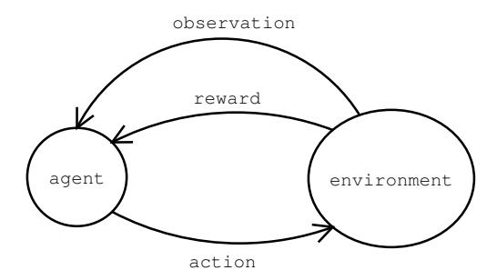

Figure 2.1.: The agent and the environment interact by sending action, observation and reward signals to each other.

We will need to consider active agents in order to satisfy our definition of intelligence, that is, the ability to achieve goals in a wide range of environments. Solomonoff induction, although extremely powerful for sequence prediction, operates in too limited a setting.

**2.8.1 Example.** Consider an agent that plays chess. It is not sufficient for the agent to merely observe the other player. The agent actually has to decide which moves to make, so as to win the game. Of course an important part of this will be to carefully observe the other player, infer the strategy they are using, and then predict which moves they are likely to make in the future. Clearly then, inductive inference still plays an important role in the active case. Now, however, the agent has to somehow take this inferred knowledge and use it to develop a strategy of moves that will likely lead to winning the game. This second part may not be easy. Indeed, even if the agent knew the other player's strategy in detail, it might take considerable effort to find a way to overcome the other player's strategy and win the game.

The framework in which we describe active agents is what we call the agent-environment model. The model consists of two entities called the agent and the environment. The agent receives input information from the environment, which we will refer to as perceptions, and sends output information back to the environment, which we call actions. The environment on the other hand receives actions from the agent as input and generates perceptions as output. Each perception consists of an observation component and a reward component. Observations are just regular information, however rewards have a special significance because the goal of the agent is to try to gain as much reward as possible from the environment. The basic structure of this agent-environment interaction model is illustrated in Figure 2.1.

The only way that the agent can influence the environment, and thus the rewards it receives, is through its action signals. Thus a good agent is one that carefully selects its actions so as to cause the environment to generate as much reward as possible. Presumably such an agent will make good use of any

useful information contained in past rewards, actions and observations. For example, the agent might find that certain actions tend to produce rewards while others do not. In more complex environments the relationship between the agent's actions, what it observes and the rewards it receives might be very difficult to discover.

The agent-environment model is the framework used in the area of artificial intelligence known as reinforcement learning. It is equivalent to the controller-plant framework used in control theory, where the controller takes the place of the agent, and the plant is the environment that must be controlled. With a little imagination, a huge variety of problems can be expressed in this framework: everything from playing a game of chess, to landing an aeroplane, to writing an award winning novel. Furthermore, the model says nothing about how the agent or the environment work, it only describes their role within the framework and thus many different environments and agents are possible.

2.8.2 Example. (Two coins game) To illustrate the agent-model consider the following game. In each cycle two 50¢ coins are tossed. Before the coins settle the player must guess at the number of heads that will result: either 0, 1, or 2. If the guess is correct the player gets to keep both coins and then two new coins are produced and the game repeats. If the guess is incorrect the player does not receive any coins, and the game is repeated.

In terms of the agent-environment model, the player is the agent and the system that produces all the coins, tosses them and distributes the reward when appropriate, is the environment. The agent's actions are its guesses at the number of heads in each iteration of the game: 0, 1 or 2. The observation is the state of the coins when they settle, and the reward is either \$0 or \$1.

It is easy to see that for unbiased coins the most likely outcome is 1 head and thus the optimal strategy for the agent is to always guess 1. However, if the coins are significantly biased it might be optimal to guess either 0 or 2 heads depending on the bias.  $\diamondsuit$ 

Having introduced the framework, we now formalise it. The agent sends information to the environment by sending symbols from some finite alphabet of symbols, for example, {left,right,up,down}. We call this set the action space and denote it by  $\mathcal{A}$ . Similarly, the environment sends signals to the agent with symbols from an alphabet called the perception space, which we denote  $\mathcal{X}$ . The reward space, denoted by  $\mathcal{R}$ , is always a subset of the rational unit interval  $[0,1] \cap \mathbb{Q}$ . Restricting to ration numbers is a technical detail to ensure that the information contained in each perception is finite. Every perception consists of two separate parts: an observation and a reward. For example, we might have  $\mathcal{X} := \{(\texttt{cold}, 0.0), (\texttt{warm}, 1.0), (\texttt{hot}, 0.3)\}$  where the first part describes what the agent observes (cold, warm or hot) and the second part describes the reward (0.0, 1.0 or 0.3).

To denote symbols being sent we use the lower case variable names a, o and r for actions, observations and rewards respectively. We index these in the

order in which they occur, thus  $a_1$  is the agent's first action,  $a_2$  is the second action and so on. The agent and the environment take turns at sending symbols, starting with the agent. This produces a history of actions, observations and rewards which can be written,  $a_1o_1r_1a_2o_2r_2a_3o_3r_3\ldots$  As we refer to interaction histories a lot, we need to be able to represent these compactly. Firstly, we introduce the symbol  $x \in \mathcal{X}$  to stand for a perception that consists of an observation and a reward. That is,  $\forall k: x_k := o_k r_k$ . Our second trick is to squeeze symbols together and then index them as blocks of symbols. For the complete interaction history up to and including cycle t, we can write  $ax_{1:t} := a_1x_1a_2x_2a_3\ldots a_tx_t$ . For the history before cycle t we use  $ax_{< t} := ax_{1:t-1}$ .

Before this section all our strings and sequences have been binary, now we have strings and sequences from potentially larger alphabets, such as  $\mathcal{A}$  and  $\mathcal{X}$ . Either we can encode symbols from these alphabets as uniquely identifiable binary strings, or we can extend our previous definitions of strings, measures etc. to larger alphabets in the obvious way. In some results technical problems can arise, for example, it takes some work to extend Theorem 2.7.1 to arbitrary alphabets (Hutter, 2001). Here we can safely ignore these technical issues and simply extend our previous definitions to general alphabets.

Formally, the agent is a function, denoted by  $\pi$ , which takes the current history as input and chooses the next action as output. We do not want to restrict the agent in any way, in particular we do not require that it is deterministic. A convenient way of representing the agent then is as a probability measure over actions conditioned on the complete interaction history. Thus,  $\pi(ax_1\underline{a}_2)$  is the probability of action  $a_2$  in the second cycle, given that the current history is  $ax_1$ . A deterministic agent is simply one that always assigns a probability of 1 to a single action for any given history. As the history that the agent can use to select its action expands indefinitely, the agent need not be Markovian. Indeed, how the agent produces its distribution over actions for any given history is left open. In practical artificial intelligence the agent will of course be a machine and so  $\pi$  will be a computable function. In general however, the system generating the probabilities for different actions could be just about anything: An algorithm that generates probabilities according to successive digits of  $\sqrt{e}$ , an incomputable function, or even a human pushing buttons on a keyboard.

We define the *environment*, denoted by  $\mu$ , in a similar way. Specifically, for all  $k \in \mathbb{N}$  the probability of  $x_k$ , given the current interaction history  $ax_{< k}a_k$ , is given by the conditional probability measure  $\mu(ax_{< k}ax_k)$ .

Technically, neither  $\mu$  nor  $\pi$  completely define a measure over the space of interaction sequences. They only define the conditional probability of certain symbols given an interaction history:  $\pi$  defines the conditional probability over the actions, and  $\mu$  of the perceptions. However, taken together they do define a measure over the interaction sequences that we will denote  $\frac{\pi}{\mu}$ . Specifically, we can chain together the conditional probabilities defined by  $\pi$  and  $\mu$  to work

out the probability of any interaction. For example,

$$_{\mu}^{\pi}(\underline{ax}_{1:2}) := \pi(\underline{a}_1) \, \mu(\underline{ax}_1) \, \pi(\underline{ax}_1\underline{a}_2) \, \mu(\underline{ax}_1\underline{ax}_2).$$

When we need to take an expectation over interaction sequences this is the measure we will use. However in most other cases we will only need the conditional probabilities defined by  $\pi$  or  $\mu$ .

**2.8.3 Example.** To illustrate this formalism, consider again the Two Coins Game introduced in Example 2.8.2. Let  $\mathcal{X} := \{0, 1, 2\} \times \{0, 1\}$  be the perception space representing the number of heads after tossing the two coins and the value of the received reward. Likewise let  $\mathcal{A} := \{0, 1, 2\}$  be the action space representing the agent's guess at the number of heads that will occur. Assuming two fair coins, and recalling that  $x_k := o_k r_k$ , we can represent this environment by defining  $\forall k \in \mathbb{N}$ :

$$\mu(ax_{< k}a\underline{x}_k) := \begin{cases} \frac{1}{4} & \text{if } a_k = 0 \land o_k = 0 \land r_k = 1, \\ \frac{3}{4} & \text{if } a_k = 0 \land o_k \neq 0 \land r_k = 0, \\ \frac{1}{2} & \text{if } a_k = 1 \land o_k = 1 \land r_k = 1, \\ \frac{1}{2} & \text{if } a_k = 1 \land o_k \neq 1 \land r_k = 0, \\ \frac{1}{4} & \text{if } a_k = 2 \land o_k = 2 \land r_k = 1, \\ \frac{3}{4} & \text{if } a_k = 2 \land o_k \neq 2 \land r_k = 0, \\ 0 & \text{otherwise.} \end{cases}$$

An agent that performs well in this environment would be,

$$\pi(ax_{< k}\underline{a}_k) := \left\{ \begin{array}{ll} 1 & \text{for } a_k = 1, \\ 0 & \text{otherwise.} \end{array} \right.$$

That is, always guess that one head will be the result of the two coins being tossed. A more complex agent might keep count of how many heads occur in each cycle and then adapt its strategy if it seems that the coins are sufficiently biased. For example, a Bayesian agent might use techniques similar to those used to predict coin flips in Examples 2.3.2 and 2.3.3.

## 2.9. Optimal informed agents

In the agent-environment model, the agent's goal is to receive as much reward as possible. Unfortunately, this is not sufficiently precise as there may be many possible reward sequences in a given environment and it is not clear which is preferred.

**2.9.1 Example.** Consider the following two agents: Agent  $\pi^1$  immediately finds a way to get a reward of 0.5 and does so in every cycle. Thus, after

100 cycles it has received a total reward of 50. Agent  $\pi^2$ , however, spends the first 90 cycles trying to find the best possible way to receive reward in each cycle. During this time it gets an average reward of 0.1 in each cycle. At cycle 90 it works out the optimal behaviour and then receives a reward of 1 in every cycle thereafter. Thus, after 100 cycles it has received a total reward of  $90 \times 0.1 + 10 = 19$ . In terms of the total reward received after 100 cycles,  $\pi^1$  is superior to  $\pi^2$ . However, after 1,000 cycles this has reversed as  $\pi^1$  has a total reward of 500, while  $\pi^2$  has a total reward of 919.

Which of these two agents is the better one? The answer depends on how we value reward at different points in the future. In some situations we may want our agent to perform well quickly, and thus place more value on short term rewards. In others, we might only care that it eventually reaches a level of performance that is as high as possible, and thus place relatively high value on rewards far into the future. Before we can define an optimal agent, we first need to formally express our temporal preferences.

A general approach is to weight, or discount, each reward in a way that depends on which cycle it occurs in. Let  $\gamma_1, \gamma_2, \ldots$  be the discounts we apply to the reward in each successive cycle, where  $\forall i: \gamma_i \geq 0$ , and  $\sum_{i=1}^{\infty} \gamma_i < \infty$  in order to avoid infinite weighted sums. Now define the *expected future discounted reward* for agent  $\pi$  interacting with environment  $\mu$  given interaction history  $ax_{< t}$  to be,

$$V_{\gamma}^{\pi\mu}(ax_{< t}) := \mathbf{E}\left(\sum_{i=t}^{\infty} \gamma_{i} r_{i} \mid ax_{< t}\right)$$
$$= \lim_{m \to \infty} \sum_{ax_{t:m}} (\gamma_{t} r_{t} + \dots + \gamma_{m} r_{m}) \prod_{\mu}^{\pi} (ax_{< t} \underline{ax}_{t:m}).$$

As the sum is monotonically increasing in m, and finitely upper bounded, the limit always exists. For t=1 we drop the interaction history from the notation and simply write  $V_{\gamma}^{\pi\mu}$ .

One of the most common ways to set the discount parameters is to decrease them geometrically into the future. That is, set  $\forall i: \gamma_i := \alpha^i$  for some discount rate  $\alpha \in (0,1)$ . By increasing  $\alpha$  towards 1 we weight long term rewards more heavily, conversely by reducing it we weight them less so. Thus, the parameter  $\alpha$  controls how short term greedy, or long term farsighted, the agent should be.

**2.9.2 Example.** Consider again the two agents from Example 2.9.1. As the rewards are deterministic for  $\pi^1$  we can drop the expectation,

$$V_{\gamma}^{\pi^1 \mu} = \sum_{i=1}^{\infty} \alpha^i 0.5 = 0.5A,$$

where  $A := \frac{\alpha}{1-\alpha}$  is from the standard formulae for geometric series. On the other hand for agent  $\pi^2$ ,

$$V_{\gamma}^{\pi^{2}\mu} = \sum_{i=1}^{90} \alpha^{i} 0.1 + \sum_{i=91}^{\infty} \alpha^{i} = 0.1A(1 - \alpha^{90}) + A\alpha^{90}.$$

Equating the two and then solving, we find that  $\pi^2$  has higher expected future discounted reward than  $\pi^1$  when  $\alpha > \sqrt[90]{4/9} \approx 0.991$ .

A major advantage of geometric discounting is that it is mathematically convenient to work with. Indeed, it is what we will use in Chapter 6 for our reinforcement learning algorithm. In the present context, however, we want to keep the development fairly general and thus we will leave the structure of  $\gamma$  unspecified. An even more general approach is to consider the space of all bounded enumerable discount sequences. We will take this approach when formally defining intelligence in Chapter 4 as it will allow us to completely remove  $\gamma$  from the model. Here we will follow the more conventional approach to AIXI and simply take  $\gamma$  to be a free parameter.

Having formalised the agent's temporal preference in terms of  $\gamma$ , we can now define the optimal agent:

**2.9.3 Definition.** The *optimal agent* for an environment  $\mu$  and discounting  $\gamma$  is the agent  $\pi^{\mu}$  that has maximal expected future discounted reward. Formally,

$$\pi^{\mu} := \arg \max_{\pi} V_{\gamma}^{\pi \mu}.$$

The superscript  $\mu$  emphasises the fact that the agent is optimal with respect to the specific environment  $\mu$ . This optimality is possible because the agent was constructed using  $\mu$ . In a sense the agent knows what its environment is before it has even interacted with it. This is similar to Section 2.7 where the optimal sequence predictor was defined using the distribution that was generating the sequence to be predicted.

To understand how the optimal agent  $\pi^{\mu}$  behaves in each cycle, we first express the value function in a recursive form for an arbitrary agent  $\pi$ . From the definition of V,

$$V_{\gamma}^{\pi\mu}(ax_{< t}) = \lim_{m \to \infty} \sum_{ax_{t:m}} (\gamma_t r_t + \dots + \gamma_m r_m) \prod_{\mu}^{\pi} (ax_{< t} \underline{ax}_{t:m})$$

$$= \sum_{ax_t} \left[ \lim_{m \to \infty} \sum_{ax_{t+1:m}} (\gamma_t r_t + \dots + \gamma_m r_m) \prod_{\mu}^{\pi} (ax_{1:t} \underline{ax}_{t+1:m}) \right]_{\mu}^{\pi} (ax_{< t} \underline{ax}_t)$$

$$= \sum_{ax_t} \left[ \gamma_t r_t + V_{\gamma}^{\pi\mu} (ax_{1:t}) \right]_{\mu}^{\pi} (ax_{< t} \underline{ax}_t). \tag{2.1}$$

In the first step we broke cycle t off both the sum and  $\frac{\pi}{\mu}$ . As these do not involve m, we pushed them outside the square brackets and moved the limit

inside. In the second step we broke off the first discounted reward and dropped the sum for this term as it was redundant. The remaining discounted rewards are just V with t advanced by one, thus producing the desired recursion in V.

This is essentially a discrete time form of the *Bellman equation* commonly used in control theory, finance, reinforcement learning and other fields concerned with optimising dynamic systems (Bellman, 1957; Sutton and Barto, 1998). Usually it is assumed that the environment is Markovian and thus only a limited history needs to be taken into account. Here, however, we include the entire interaction history and thus are able to avoid these restrictions on the environment. Again, this is to keep the model as general as possible.

Consider now how  $a_t$  is chosen by the optimal agent  $\pi^{\mu}$ . By definition, the optimal action is the one that maximises V. Therefore  $\pi^{\mu}(ax_{< t}\underline{a}_t) = 1$  for the expected future discounted reward maximising action, and zero otherwise (ties can be broken arbitrarily). Thus, after expanding Equation (2.1) with  $\pi$  replaced by  $\pi^{\mu}$ , we can replace  $\sum_{a_t}$  and  $\pi^{\mu}(ax_{< t}\underline{a}_t)$  with simply a maximum over the possible actions,

$$\begin{split} V_{\gamma}^{\pi^{\mu}\mu}(ax_{< t}) &= \sum_{a_t} \sum_{x_t} \left[ \gamma_t r_t + V_{\gamma}^{\pi^{\mu}\mu}(ax_{1:t}) \right] \pi^{\mu}(ax_{< t}\underline{a}_t) \, \mu(ax_{< t}\underline{a}\underline{x}_t) \\ &= \max_{a_t} \sum_{x_t} \left[ \gamma_t r_t + V_{\gamma}^{\pi^{\mu}\mu}(ax_{1:t}) \right] \mu(ax_{< t}\underline{a}\underline{x}_t) \\ &= \max_{a_t} \sum_{x_t} \cdots \max_{a_m} \sum_{x_m} \left[ \gamma_t r_t + \cdots + \gamma_m r_m + V_{\gamma}^{\pi^{\mu}\mu}(ax_{1:m}) \right] \mu(ax_{< t}\underline{a}\underline{x}_{t:m}) \end{split}$$

In the last step we have simply unfolded the recursion in V for the first m cycles. As  $m \to \infty$  the term  $V_{\gamma}^{\pi^{\mu}\mu}(ax_{1:m}) \to 0$ . Thus, if we take the limit  $m \to \infty$  above we can drop V without affecting the result. It follows then that the action taken by the optimal policy  $\pi^{\mu}$  in the  $t^{th}$  cycle is,

$$a_t^{\pi^{\mu}} := \arg\max_{a_t} \lim_{m \to \infty} \sum_{x_t} \max_{a_{t+1}} \sum_{x_{t+1}} \cdots \max_{a_m} \sum_{x_m} \left[ \gamma_t r_t + \cdots + \gamma_m r_m \right] \mu(\alpha x_{< t} \alpha \underline{x}_{t:m}).$$

If there is more than one maximising action in cycle t, we simply select one of these in an arbitrary way.

Intuitively, in the above equation we can see that the optimal agent takes the distribution  $\mu$ , and in effect does a brute force search through all possible futures looking for the action in the current cycle that maximises the expected future discounted reward. The agent knows that the environment will always respond according to the distribution  $\mu$ , thus in each cycle it takes the expectation by summing over all the possible observations x and weighting these by their probability according to  $\mu$ . Furthermore, as the agent always follows an optimal strategy, its own future actions are just a series of value maximising actions.

## 2.10. Universal AIXI agent

Although the agent  $\pi^{\mu}$  performs optimally in environment  $\mu$ , this does not meet the requirements for intelligence according to our definition adopted in Chapter 1. What we require is a general agent that works well in many different environments. Such an agent must learn about its environment by interacting with it, and then modify its behaviour accordingly in order to optimise performance. Only then will the agent have the kind of adaptability to different environments that we require of an intelligent agent.

This problem with the optimal agent  $\pi^{\mu}$  is similar to the one we encountered in Section 2.7. There the optimal sequence predictor was based on the distribution  $\mu$  that was actually generating the sequence. Of course, for inductive inference  $\mu$  is unknown and must be inferred by observing the sequence. Thus, basing a predictor on  $\mu$  might be "optimal" in terms of prediction performance, but it is in some sense cheating. Moreover, it is certainly not general as the predictor is designed for just one environment.

Solomonoff's solution was to replace the unknown  $\mu$  in the optimal predictor with a universal prior distribution, such as  $\xi$ . This produced an extremely powerful universal predictor that rapidly converged to optimal predictions whenever the distribution  $\mu$  was computable (Theorem 2.7.1). In this way Solomonoff solved, at least in theory, the problem of predicting sequences from unknown distributions. Hutter's innovation was to do essentially the same trick for active agents: he took the optimal active agent  $\pi^{\mu}$ , described in the previous section, and replaced the unknown  $\mu$  with a generalised universal prior distribution  $\xi$ . This produced  $\pi^{\xi}$ , also known as AIXI, which will be described in this section.

In order to construct  $\pi^{\xi}$ , the first thing to do is to generalise  $\xi$  in Definition 2.5.4 from sequences to active environments. As we saw earlier, an active environment  $\mu$  is an enumerable semi-measure conditioned, in chronological order, on a sequence of actions from an agent. The presence of these actions causes no problems, indeed the development of a universal distribution over active environments is virtually identical to what we did for sequence prediction in Section 2.5.

It can be shown that the space of all enumerable chronological semi-measures can be effectively enumerated. Let  $E := \{\mu_1, \mu_2, \ldots\}$  be such an enumeration. Define the Kolmogorov complexity of one of these environments to be the length of the shortest program that computes the environment's index: just as we did for distributions over sequences in Definition 2.5.2. This gives us the universal prior probability of a chronological environment  $\nu \in E$ ,

$$P_E(\nu) := 2^{-K(\nu)}.$$

From this prior over environments we can construct a prior over the agent's observations in a given interaction history by taking a mixture over the envi-

ronments,

$$\xi(a\underline{x}_{1:n}) := \sum_{\nu \in E} 2^{-K(\nu)} \nu(a\underline{x}_{1:n}).$$

It is easy to see that  $\xi$  is enumerable because  $2^{-K(\nu)}$  is enumerable, as is each  $\nu$  in the sum. Furthermore, this sum of chronological semi-measures is itself a chronological semi-measure. Thus, we see that  $\xi \in E$ . As was the case for sequences, the dominance property for  $\xi$  can easily be seen by taking one element from the sum corresponding to the semi-measure to be dominated. Note that we are reusing the symbol  $\xi$ . Whether we are talking about  $\xi$  defined over sequences, or over chronological environments, will always be clear from the context.

To construct the AIXI agent  $\pi^{\xi}$ , simply take  $\pi^{\mu}$  and replace  $\mu$  with  $\xi$ ,

$$a_t^{\pi^{\xi}} := \arg\max_{a_t} \lim_{m \to \infty} \sum_{x_t} \max_{a_{t+1}} \sum_{x_{t+1}} \cdots \max_{a_m} \sum_{x_m} \left[ \gamma_t r_t + \cdots + \gamma_m r_m \right] \xi(ax_{< t} a\underline{x}_{t:m}).$$

This gives us an agent that does not depend on the unknown  $\mu$ . Replacing the true distribution  $\mu$  in the optimal agent  $\pi^{\mu}$  with the universal prior distribution  $\xi$  is essentially the same as what we did in Section 2.7 when defining Solomonoff's universal predictor. Of course now we are working in the more general setting of chronological environments rather than just sequences.

Given that Solomonoff prediction works so well for sequence prediction, we might expect the agent  $\pi^{\xi}$  defined above to be similarly powerful in chronological environments. To some extent this is the case, however analysing the performance of universal agents in chronological environments turns out to be significantly more complex.

Perhaps the most elementary question concerns whether our generalised  $\xi$  converges to the true environment  $\mu$ . It turns out that convergence results can be proven, including a result similar to Solomonoff's convergence result generalised to interaction histories. More precisely, it can be proven that the total  $\mu$ -expected squared difference between  $\mu$  and  $\xi$  is finite for interaction histories sampled from  $\pi^{\mu}$  interacting with a computable environment  $\mu$ . Unfortunately, when the interaction history comes from  $\mu$  interacting with  $\pi^{\xi}$ , rather than  $\pi^{\mu}$ , we run into trouble. This problem is well illustrated by the Heaven and Hell environment from Section 5.3.2 of (Hutter, 2005):

**2.10.1 Example.** (Heaven and Hell) Imagine an environment where in the first cycle the agent is faced with two unmarked doors, one of which must be opened. One of these doors leads to "heaven" where the agent receives plentiful rewards, and the other leads to "hell" where the agent never gets any reward. Once a door is chosen there is no way to go back, the agent is stuck in either heaven or hell forever.

This is no problem for  $\pi^{\mu}$  as it knows  $\mu$  and so it knows which door to take to get to heaven. Thus it always achieves maximal future discounted reward. The agent  $\pi^{\xi}$ , on the other hand, must learn through experience. Of course

once it has the necessary experience to make the right choice, it may already be too late. All  $\pi^{\xi}$  can do is to guess which door to take and hope for the best. Obviously the expected performance of  $\pi^{\xi}$  will be far below that of  $\pi^{\mu}$ .  $\diamondsuit$ 

This example does not expose a design flaw in  $\pi^{\xi}$ , in the sense that no general agent is able to consistently behave optimally in such environments. For example, consider an environment  $\mu'$  with the two doors switched. Agent  $\pi^{\mu}$  would always go to hell in this environment. We could define an agent  $\pi^{\mu'}$  which would be optimal in  $\mu'$ , however it would always go to hell in  $\mu$ . Clearly, no agent could behave optimally in both environments without being told what the true environment was in advance. Matching the performance of optimal agents in each of their respective environments is thus an impossible task for any one agent. As such, we need to think carefully about what it is that we want to prove if we are to show that  $\pi^{\xi}$  is indeed a very powerful and general agent.

We have already seen in Section 2.7 that the above problem does not occur in the sequence prediction setting. This is because in sequence prediction an agent's predictions do not affect the future observed sequence and thus mistakes have no consequences beyond the current cycle. This allows Solomonoff's prediction system to be able to learn to perform optimally across the entire space of computable sequence prediction problems. Such optimising behaviour is possible in certain other classes of environments. What this suggests then is that we should focus on classes of environments, such as sequence prediction, in which it is at least possible for a general agent to learn to behave optimally.

We begin by generalising the AIXI model to different classes of environments. Let  $\mathcal{E}$  be a non-strict subset of the enumeration E of all enumerable chronological semi-measures. Define the mixture distribution over  $\mathcal{E}$ ,

$$\zeta(a\underline{x}_{1:n}) := \sum_{\nu \in \mathcal{E}} 2^{-K(\nu)} \nu(a\underline{x}_{1:n}).$$

Now define the agent  $\pi^{\zeta}$  based on  $\zeta$ , just as we defined  $\pi^{\xi}$  based on  $\xi$ . Note that while  $\pi^{\xi}$  is a single agent, the agent  $\pi^{\zeta}$  depends on which class of environments  $\mathcal{E}$  we are considering. If  $\mathcal{E} = E$  then  $\zeta = \xi$  and so  $\pi^{\zeta} = \pi^{\xi}$ . In this sense  $\pi^{\zeta}$  generalises  $\pi^{\xi}$ .

Perhaps the most elementary property that an optimal general agent must have is that there should not exist any other agent that is strictly superior. More precisely:

**2.10.2 Definition.** An agent  $\pi$  is *Pareto optimal* if there is no other agent  $\rho$  such that  $\forall \mu \in \mathcal{E}$ ,

$$V_{\gamma}^{\rho\mu}(ax_{\leq t}) \geq V_{\gamma}^{\pi\mu}(ax_{\leq t}) \quad \forall ax_{\leq t},$$

with strict inequality for at least one  $\mu$ .

Note that Pareto optimality does not rule out the possibility that some other agent exists which performs better in some environment in  $\mathcal{E}$ . It simply means that no other agent exists which is at least as good in *all* environments in  $\mathcal{E}$ , and strictly better in at least one. For the agent  $\pi^{\zeta}$  the following optimality result can be proven (Section 5.5 of Hutter, 2005):

#### **2.10.3 Theorem.** For any $\mathcal{E} \subseteq E$ , the agent $\pi^{\zeta}$ is Pareto optimal.

As this holds for any  $\mathcal{E}$ , it also holds for  $\mathcal{E} = E$ . Thus, the AIXI agent  $\pi^{\xi}$  is a Pareto optimal agent over the space of environments E. Note that for any space of environments  $\mathcal{E}$  many Pareto optimal agents may exist.

A stronger result can be proven showing that  $\pi^{\zeta}$  is also balanced Pareto optimal (Hutter, 2005). Essentially, this means that any increase in performance in some environment due to switching to another agent, is compensated for by an equal or greater decrease in performance in some other environment.

While these Pareto optimality results are very general, they only succeed in showing that  $\pi^{\zeta}$  is superior, or at least equal, to other general agents over the same class of environments. The result does not rule out the possibility that all general agents, including  $\pi^{\zeta}$ , typically perform poorly. What we need is to show that  $\pi^{\zeta}$  does indeed learn to perform well in many environments. The complication, as we saw in Example 2.10.1 above, is that in some types of environments it is impossible for general agents to perform well. Thus we somehow need to characterise those types of environments in which it is at least possible for a general agent to perform well. Furthermore, even when optimal performance is possible for a general agent, we cannot expect such an agent to perform optimally immediately. We need a performance measure that gives the agent time to learn about the structure of  $\mu$  through interaction. One way to formalise the concept of optimal performance after a period of learning is the following:

**2.10.4 Definition.** An agent  $\pi$  is said to be *self-optimising* in an environment  $\mu$  if,

$$\frac{1}{\Gamma_t} V_{\gamma}^{\pi\mu}(ax_{< t}) \rightarrow \frac{1}{\Gamma_t} V_{\gamma}^{\pi^{\mu}\mu}(\dot{a}\dot{x}_{< t})$$

with  $\mu$  probability 1 as  $t \to \infty$ . Here  $ax_{< t}$  is an interaction history sampled from  $\pi$  interacting with  $\mu$ , and  $\dot{a}\dot{x}_{< t}$  is an interaction history sampled from  $\pi^{\mu}$  interacting with  $\mu$ . The normalisation factor, defined  $\Gamma_t := \sum_{i=t}^{\infty} \gamma_i$ , is the total discount remaining at time t.

Essentially this says that with high probability the performance of the agent  $\pi$  converges to the performance of the optimal agent. The normalisation is necessary because the un-normalised expected future discounted reward always converges to zero. Thus without it convergence would trivially hold for any agent.

We say that  $\pi$  is self-optimising for the set of environments  $\mathcal{E}$  if it is self-optimising for every environment in  $\mathcal{E}$ . Furthermore, we say that a set of

environments  $\mathcal{E}$  admits self-optimising agents if there exists an agent  $\pi$  that is self-optimising for  $\mathcal{E}$ . We also extend the result to non-stationary agents by saying that a series of agents  $\pi_1, \pi_2, \ldots$  is self-optimising if the above result holds with  $\pi$  replaced by  $\pi_t$ . That is, in the  $t^{th}$  cycle agent  $\pi_t$  is applied.

The following powerful self-optimising result can be proven (Hutter, 2005):

**2.10.5 Theorem.** If there exists a sequence of self-optimising agents  $\pi_m$  for a class of environments  $\mathcal{E}$ , then the agent  $\pi^{\zeta}$  is also self-optimising for  $\mathcal{E}$ .

Intuitively, this result says that the performance of  $\pi^{\zeta}$  will converge to optimal performance in any class of environments where this is possible for a single agent, even if the agent is non-stationary. This is the minimal requirement possible, in the sense that if no self-optimising agent existed for some class of environments, then trivially  $\pi^{\zeta}$  cannot be self-optimising in the class either.

Although this is a strong optimality result, it does have two limitations. Firstly, while the result shows that  $\pi^{\xi}$  converges to optimal performance whenever this is possible in a class of environments, it does not tell us how fast the convergence is. In Solomonoff's convergence theorem we saw that the convergence of the universal predictor was extremely rapid. Ideally we would like a similar result for active environments. Unfortunately, such a result is impossible in general:

**2.10.6 Example.** (Needle in a haystack) Imagine an environment with N buttons, one of which generates a reward of 1 in every cycle when pressed, and all the rest produce no reward. The location of the correct button would take roughly  $\log_2 N$  bits to encode, thus for most values of N we have  $K(\mu) = O(\log_2 N)$ . As  $\pi^{\xi}$  is not informed prior to the start of the game as to which button generates reward, the best it can do is to press the buttons one at a time. Thus the expected number of incorrect choices that  $\pi^{\zeta}$  will make is  $O(N) = O(2^{K(\mu)})$ .

Compare this to Theorem 2.7.1 for sequence prediction which bounds the total squared difference in prediction error by  $O(K(\mu))$ . Here in the active case the best possible bound for any general agent is exponentially worse at  $O(2^{K(\mu)})$ . This is not a design flaw in  $\pi^{\xi}$  as the above limit applies to any general agent. Clearly then, bounds showing rapid convergence are not possible in general. We can only hope to prove convergence speed bounds for specific classes of environments. Unfortunately, results in this direction currently exist only in very simple settings.

This is a significant weakness in the theory of universal agents. Until further results are proven it is hard to say just how fast, or slow, convergence to optimal behaviour is in different classes of environments. As it appears that results in this direction will be difficult, a more elementary result is to establish which classes of environments at least admit self-optimising agents, and under what conditions. Once we have established this, by Theorem 2.10.5 it would then

#### 2. Universal Artificial Intelligence

follow that  $\pi^{\zeta}$  is also self-optimising in these environments. If we can show this for many classes of environments, it then follows that  $\pi^{\zeta}$  is able to perform well in a wide range of environments, at least in the limit.

Although the required analysis is not particularly difficult for many of the basic classes of environments, sorting out all the definitions, the relationships between them and the conditions under which they admit self-optimising agents is lengthy and requires some care. This is the subject of the next chapter.

## 3. Taxonomy of Environments

In the previous chapter we introduced the AIXI agent  $\pi^{\xi}$ , and its generalisation to arbitrary spaces of environments,  $\pi^{\zeta}$ . Of particular importance was Theorem 2.10.5 which roughly said: For any class of environments for which there exists a self-optimising agent, the agent  $\pi^{\zeta}$  defined over this class is also self-optimising. Thus, in order to understand the performance of  $\pi^{\zeta}$  across a wide range of environments, we need to understand which classes of environments admit self-optimising agents, and which do not. In this chapter we present a partial answer to this question by showing that many well known classes of environments admit self-optimising agents under reasonable conditions.

We begin by formalising some common classes of environments. To do this we examine the environments' measures and in particular the way in which they condition on the interaction history. In this way we characterise and relate many well known classes of environments, such as *Bernoulli schemes*, *Markov chains*, and *Markov decision processes (MDPs)*. Some interesting new classes of environments naturally arise from the analysis. We then take some important classes of problems studied in artificial intelligence, such as *sequence prediction* and *classification*, and express these too in terms of the structure of their measures. This formalisation in terms of chronological measures reveals that many classes of environments are special cases of other classes, that is, a hierarchy of classes of environments exists. Studying this more closely we see that many of these classes are in fact reducible to the class of *ergodic MDPs*. Putting all these relationships together produces a taxonomy of classes of environments.

It is known that certain machine learning algorithms, such as Q-learning, are self-optimising in the class of ergodic MDPs. As many of the classes in our taxonomy are reducible to ergodic MDPs, it follows that these classes also admit self-optimising agents. Thus, from Theorem 2.10.5, we see that  $\pi^{\zeta}$  converges to optimal behaviour in these classes of environments. In this way, we clarify our earlier claim that universal agents can learn to behave optimally in a wide range of environments, as required by our definition of intelligence.

### 3.1. Passive environments

The first class of environments we will consider is the class of *passive environments*. Loosely speaking, such environments are not affected by the agent's actions. We will be more interested in the active environments to be described in later sections.

**3.1.1 Definition.** A **Bernoulli scheme** is an environment  $(\mathcal{A}, \mathcal{X}, \mu)$  such that  $\forall ax_{1:k}$ ,

$$\mu(ax_{\leq k}a\underline{x}_k) = \mu(\underline{x}_k).$$

As the random variables  $x_1, x_2, \ldots$  are independent and identically distributed (i.i.d.), one may think of a Bernoulli scheme as being an i.i.d. process.

The above definition involves some slight abuse of notation. Essentially, what we are showing is that an equivalent measure with the same name (on the right hand side) can be defined over a reduced parameter space by dropping the parameters that have no effect on the value of the original measure (on the left hand side). In other words, the equation above indicates that the distribution  $\mu$  over  $x_k$  can be defined in a way that it is completely independent of the history  $ax_{< k}a_k$ .

Note also that we have written  $(\mathcal{A}, \mathcal{X}, \mu)$  in order to specify the action and perception spaces associated with the measure. This will be necessary in this chapter as we will often need to consider relationships between environments that differ in their action and perception spaces.

**3.1.2 Example.** Many simple stochastic processes can be described as Bernoulli schemes. Imagine a game where a 6 sided die is thrown repetitively. The agent receives a reward of 1 whenever a 6 is thrown, and 0 otherwise. There are no actions that the agent can take. Formally,  $\mathcal{A} := \{\epsilon\}$ ,  $\mathcal{O} := \{1, 2, 3, 4, 5, 6\}$  and  $\mathcal{R} := \mathbb{B}$ . The measure is defined  $\forall ax_{1:k}$ ,

$$\mu(\underline{x}_k) := \left\{ \begin{array}{ll} \frac{1}{6} & \text{for } x_k = o_k r_k \in \{(1,0), (2,0), (3,0), (4,0), (5,0), (6,1)\}, \\ 0 & \text{otherwise.} \end{array} \right.$$

Other than perhaps a constant environment, Bernoulli schemes are about the simplest environments possible. Despite their simplicity, they are important in statistics where sets of i.i.d. random variables play an important role. For example, sampling from a population should ideally produce individuals that are both independent of each other, and come from the same underlying

 $\Diamond$ 

A natural generalisation of Bernoulli schemes is to allow the next perception to depend on the previous observation. This gives us a richer class of environments where the distribution over perceptions can change with time:

**3.1.3 Definition.** A Markov chain is an environment  $(\mathcal{A}, \mathcal{X}, \mu)$  that is a Bernoulli scheme  $\forall ax_1$ , and  $\forall ax_{1:k}$  with k > 1,

$$\mu(ax_{\leq k}a\underline{x}_k) = \mu(o_{k-1}\underline{x}_k).$$

For a Markov chain the last observation completely defines the system's state and so these outputs are usually referred to as states. In more general

54

distribution.

classes of environments this is not the case, so for consistency we will use our usual terminology of observations and perceptions. Note that we treat the first cycle as a special case as there is no previous perception to condition on. By requiring the system to be a Bernoulli scheme in the first cycle we ensure that the first action has no effect.

**3.1.4 Example.** Imagine a game where we have a ring shaped playing board that has been divided into 20 different cells. There is a pebble that starts in cell 1 and moves around the board as follows: On each turn a standard six sided die is thrown to decide how many positions the pebble will be moved clockwise around the board. In cells 5 and 15 the agent receives a reward of 1. Otherwise the reward is 0.

We can model this system as a Markov chain. Let  $\mathcal{A} := \{\epsilon\}$ ,  $\mathcal{O} := \{0, 1, 2, \dots, 19\}$ ,  $\mathcal{R} := \mathbb{B}$ . For k = 1 the pebble is in cell 1 and thus  $\forall ax_1$ ,

$$\mu(\underline{x}_1) := \begin{cases} 1 & \text{for } o_1 = 1 \land r_1 = 0, \\ 0 & \text{otherwise.} \end{cases}$$

Now define  $\forall ax_{1:k}$  with k > 1,

$$\mu(o_{k-1}\underline{x}_k) := \left\{ \begin{array}{l} \frac{1}{6} & \text{for } o_k \in \left\{ (o_{k-1}+1) \bmod 20, \, \dots, \, (o_{k-1}+6) \bmod 20 \right\} \\ & \wedge r_k = \delta_{5,o_k} + \delta_{15,o_k}, \\ 0 & \text{otherwise.} \end{array} \right.$$

In this game there is a  $\frac{1}{6}$  chance of obtaining reward if the pebble is currently in one of the six cells before either cell 5 or cell 15.

From the definitions of Bernoulli schemes and Markov chains it is clear that in both of these classes an agent is "passive", in the sense that its actions have no effect on the environment's behaviour. The difference between the two classes is the size of the history that is relevant to determining the next perception. Increasing the length of this history to the full history of observations gives us the most general class of completely passive environments:

**3.1.5 Definition.** A Totally Passive Environment is an environment  $(A, \mathcal{X}, \mu)$  such that  $\forall ax_{1:k}$ ,

$$\mu(ax_{< k}a\underline{x}_k) = \mu(o_{< k}\underline{x}_k).$$

By construction, this class of environments is a superset of the classes of environments defined thus far. We could define a more limited version of this class where the next perception only depends on the last n observations, rather than the full history. However, such an environment is mathematically equivalent to a standard Markov chain where for each history of length n we create a unique observation in an enlarged observation space. In this new space the environment can then be represented by a first order Markov chain. This reduction technique will be used in a more general setting to prove Lemma 3.2.6.

#### 3. Taxonomy of Environments

While totally passive environments are useful in modelling some systems, in terms of artificial intelligence they are relatively uninteresting because the agent cannot do anything. We can relax this constraint just a little by only requiring that the agent cannot affect future observations:

**3.1.6 Definition.** A **Passive Environment** is an environment  $(\mathcal{A}, \mathcal{X}, \mu)$  such that  $\forall ax_{< k} a\underline{o}_k$ ,

$$\mu(ax_{\leq k}a\underline{o}_k) = \mu(o_{\leq k}\underline{o}_k).$$

Note that there are no restrictions on the rewards; the environment is free to reward or punish the agent in any way. Totally passive environments are clearly a special case of passive environments. For more on AIXI in passive environments see Section 5.3.2 of (Hutter, 2005).

Another important special case is the class of problems where the agent is rewarded for correctly predicting a sequence that it cannot influence:

**3.1.7 Definition.** A Sequence Prediction Problem is a passive environment  $(\mathcal{A}, \mathcal{X}, \mu)$  such that  $\forall ax_{1:k}$ ,

$$\mu(ax_{\leq k}aor_k) = \mu(aor_k).$$

That is, the reward in each cycle depends entirely on the action and the observation that immediately follows it. As sequence prediction environments are passive the observations do not depend on the agent's actions, however there is no limit on how long the relevant observation history can be. The above definition makes precise what we meant in previous chapters where sequence prediction problems were referred to as being "passive". For more on how AIXI deals with sequence prediction problems see Section 6.2 of (Hutter, 2005).

**3.1.8 Example.** Let  $A = \mathcal{O} := \{0, 1, \dots, 9\}$ . Define  $\forall ax_{1:k}$ ,

$$\mu(o_{< k}\underline{o}_k) := \left\{ \begin{array}{ll} 1 & \text{if } o_k \text{ the } k^{th} \text{ digit in } 3.141592\ldots, \\ 0 & \text{otherwise,} \end{array} \right.$$

and

$$\mu(ao\underline{r}_k) := \begin{cases} 1 & \text{if } r_k = 1 - \frac{1}{9}|o_k - a_k|, \\ 0 & \text{otherwise.} \end{cases}$$

Thus, in order to maximise reward, the agent must generate successive digits of the mathematical constant  $\pi$ . A correct digit gets a reward of 1, while an incorrect digit gets a lesser reward proportional to the difference between the correct digit and the guess.

#### 3.2. Active environments

The simplest active environment is one where the next perception  $x_k$  depends on only the last action  $a_k$ :

**3.2.1 Definition.** A Bandit is an environment  $(\mathcal{A}, \mathcal{X}, \mu)$  such that  $\forall ax_{1:k}$ ,

$$\mu(ax_{\leq k}a\underline{x}_k) = \mu(a\underline{x}_k).$$

This class of environments is named after the bandit machines found in casinos around the world, although the relation to real bandit machines is tenuous. Bandit environments are weaker than Markov chains as future perceptions do not depend on past observations. However, they do have the ability to react to the last action, and so in this respect they are more powerful. Even though bandit problems are conceptually simple, solving them optimally is surprisingly involved (Berry and Fristedt, 1985; Gittins, 1989).

**3.2.2 Example.** Imagine a machine that has n different levers, or arms, that the agent can pull. Each arm has a different but fixed probability of generating a reward. For this example, let the reward be either 0 or 1. The agent's task is to figure out which arm to pull so that it maximises its expected reward. One approach might be to spend time pulling different arms and collecting statistics in order to estimate which produces the most reward.

We can formally define this bandit as follows: Let  $\mathcal{O} := \{\epsilon\}$ ,  $\mathcal{R} := \mathbb{B}$  and let  $\mathcal{A} := \{1, 2, 3, \dots, n\}$  represent the *n* different arms that the agent can pull. Let  $\beta_1, \beta_2, \dots, \beta_n$  be the respective probabilities of obtaining a reward of 1 after pulling the corresponding arm. Now define  $\forall ax_{1:k}$ ,

$$\mu(\underline{ax}_k) := \begin{cases} \beta_{a_k} & \text{for } r_k = 1, \\ 1 - \beta_{a_k} & \text{for } r_k = 0. \end{cases}$$

 $\Diamond$ 

A natural extension to the class of bandits is to allow the next perception to depend on both the last observation and the last action. This produces a much more powerful class of environments that has been intensively studied and has many theoretical and practical applications:

**3.2.3 Definition.** A (stationary) Markov Decision Process (MDP) is an environment  $(\mathcal{A}, \mathcal{X}, \mu)$  that is a Bernoulli scheme  $\forall ax_1$ , and  $\forall ax_{1:k}$  with k > 1,

$$\mu(ax_{< k}a\underline{x}_k) = \mu(o_{k-1}a\underline{x}_k).$$

Usually MDPs are defined in such a way that the agent does not act before the first perception. However, in our definition the first cycle is a Bernoulli scheme and so the first action has no effect anyway. Aside from this detail, our definition is equivalent to the standard definition (Bellman, 1957). It is immediately clear that this class generalises Bernoulli schemes, bandits and Markov chains.

What we have defined above is a *stationary* MDP. This is because the probability of a perception given the current action and the last perception does not change, that is, it is independent of k. In some definitions the measure  $\mu$  is allowed to vary over time. These *non-stationary* MDPs can be modelled as POMDPs, which will be defined shortly.

**3.2.4 Example.** Consider again the simple Markov chain in Example 3.1.4. This can be extended to an MDP by allowing the agent to decide whether to move clockwise or anticlockwise around the board. Let  $\mathcal{O} := \{0, 1, \dots, 19\}$  and  $\mathcal{R} := \mathbb{B}$  as before, but now  $\mathcal{A} := \{\circlearrowleft, \circlearrowleft\}$  as the agent can select which direction to move in. For k = 1 the pebble is in cell 1 and thus  $\forall ax_1$ ,

$$\mu(a\underline{x}_1) := \left\{ \begin{array}{ll} 1 & \text{for } o_1 = 1 \, \wedge \, r_1 = 0, \\ 0 & \text{otherwise.} \end{array} \right.$$

Now define  $\forall ax_{1:k}$  with k > 1,

$$\mu(o_{k-1}a\underline{x}_k) := \begin{cases} \frac{1}{6} & \text{for } o_k \in \{(o_{k-1}+1) \bmod 20, \dots, (o_{k-1}+6) \bmod 20\} \\ & \wedge r_k = \delta_{5,o_k} + \delta_{15,o_k} \wedge a_k = \circlearrowright, \\ \frac{1}{6} & \text{for } o_k \in \{(o_{k-1}-1) \bmod 20, \dots, (o_{k-1}-6) \bmod 20\} \\ & \wedge r_k = \delta_{5,o_k} + \delta_{15,o_k} \wedge a_k = \circlearrowleft, \\ 0 & \text{otherwise.} \end{cases}$$

A natural way to generalise the class of MDPs is to allow the next perception to depend on the last n observations and actions:

 $\Diamond$ 

**3.2.5 Definition.** A (stationary)  $n^{\text{th}}$  order Markov Decision Process is an environment  $(\mathcal{A}, \mathcal{X}, \mu)$  that is a Bernoulli scheme  $\forall ax_1$ , and  $\forall ax_{1:k}$  with k > 1,

$$\mu(ax_{< k}a\underline{x}_k) = \mu(o_{k-m}ao_{k-m+1:k-1}a\underline{x}_k),$$

where  $m := \min\{n, k\}$ .

Immediately from the definition we can see that a standard MDP is an  $n^{th}$  order MDP where n = 1. The added complication of the variable m is to allow for the situation where the current history length k is less than n.

It might appear that  $n^{th}$  order MDPs are more general than standard MDPs, however it turns out that any  $n^{th}$  order MDP can be converted into an equivalent MDP. This is done by extending the observation space and appropriately modifying the measure. The proof follows the same pattern as the reduction of  $n^{th}$  order Markov chains to standard Markov chains, except that now we have to deal with the complication of having actions in the history.

**3.2.6 Lemma.**  $n^{th}$  order MDPs can be reduced to MDPs.

58

**Proof.** Let  $(\mathcal{A}, \mathcal{X} = \mathcal{O} \times \mathcal{R}, \mu)$  be an  $n^{th}$  order MDP. To prove the result we will define an equivalent first order MDP  $(\mathcal{A}, \mathcal{Z} = \mathcal{Q} \times \mathcal{R}, \tilde{\mu})$ . We begin by defining the new observation space,

$$Q := \bigcup_{i=1}^{n} \mathcal{O} \times (\mathcal{A} \times \mathcal{O})^{i-1}.$$

Every interaction history that the  $n^{th}$  order MDP conditions on is thus uniquely represented in Q. Although it complicates things, we need to include histories of length less than n to accommodate the first n-1 cycles of the system.

Next we define a measure  $\tilde{\mu}$  over the perception space  $\mathcal{Z}$ , that is equivalent to the measure  $\mu$  over the perception space  $\mathcal{X}$ . We begin by dealing with the first interaction cycle:  $\forall az_1 \in \mathcal{A} \times \mathcal{Z}$  define,

$$\tilde{\mu}(a\underline{z}_1) := \left\{ \begin{array}{ll} \mu(a\underline{z}_1) & \text{for } z_1 \in \mathcal{X}, \\ 0 & \text{otherwise.} \end{array} \right.$$

This makes the processes equivalent in the first cycle.

Next, for interaction cycles k > 1, define  $\forall q_{k-1} a z_k \in \mathcal{Q} \times \mathcal{A} \times \mathcal{Z}$ ,

$$\tilde{\mu}(q_{k-1}\underline{\alpha}_k) := \left\{ \begin{array}{ll} \mu(o_{k-m}ao_{k-m+1:k-1}a\underline{x}_k) & \text{if } q_{k-1} = o_{k-m}ao_{k-m+1:k-1} \\ & \wedge z_k = q_kr_k \\ & \wedge q_k = o_{k-m+1}ao_{k-m+2:k-1}ao_k, \\ 0 & \text{otherwise.} \end{array} \right.$$

That is, if the transition  $q_{k-1}az_k$  is possible when represented in the original environment, then this transition is given the same probability by  $\tilde{\mu}$  in the new environment. Any transition  $q_{k-1}az_k$  which is impossible in the original environment, for example because the two histories represented by  $q_{k-1}$  and  $q_k$  are inconsistent, is given a transition probability of zero by  $\tilde{\mu}$ . Thus, the two environments have equivalent structure and dynamics.

As the proof illustrates, writing down the equation for a higher order MDP and working with it is cumbersome. Thus, the above result is useful as it means that we only have to deal with first order MDPs in our analysis. Nevertheless, conceptually it is often more natural to think of certain problems as being  $n^{th}$  order MDPs.

Rather than increasing the history that the measure conditions on, another extension is to assume that the agent cannot properly observe the MDP's outputs:

**3.2.7 Definition.** A Partially Observable Markov Decision Process (POMDP) is an environment  $(\mathcal{A}, \mathcal{X} = \mathcal{O} \times \mathcal{R}, \mu)$  defined as follows: Let  $(\mathcal{A}, \tilde{\mathcal{X}} = \tilde{\mathcal{O}} \times \mathcal{R}, \tilde{\mu})$  be an MDP called the *core MDP*. Let  $\phi : \tilde{\mathcal{X}} \times \mathcal{X} \to [0, 1]$  be a conditional probability measure of the form  $\phi(\tilde{x}\underline{x})$  which expresses the probability of perceiving x when the core MDP outputs  $\tilde{x}$ . Define  $\forall ax_{1:k} \in (\mathcal{A} \times \mathcal{X})^k$ ,

$$\mu(a\underline{x}_{1:k}) := \sum_{\tilde{x}_{1:k} \in \tilde{\mathcal{X}}^k} \tilde{\mu}(a\underline{\tilde{x}}_1) \, \phi(\tilde{x}_1\underline{x}_1) \, \tilde{\mu}(\tilde{o}_1 a\underline{\tilde{x}}_2) \, \phi(\tilde{x}_2\underline{x}_2) \, \cdots \, \tilde{\mu}(\tilde{o}_{k-1} a\underline{\tilde{x}}_k) \, \phi(\tilde{x}_k\underline{x}_k).$$

The nature of POMDPs is perhaps best illustrated by example.

**3.2.8 Example.** Let the core MDP  $(\mathcal{A}, \tilde{\mathcal{X}}, \tilde{\mu})$  be the MDP defined in Example 3.2.4. Now imagine that the agent cannot reliably observe which cell the pebble is in. To do this, let  $\mathcal{X} := \tilde{\mathcal{X}}$  and define the observation function  $\forall \tilde{x}, x \in \mathcal{X}$ .

$$\phi(\tilde{x}\underline{x}) := \begin{cases} \frac{61}{100} & \text{if } \tilde{x} = x, \\ \frac{1}{100} & \text{otherwise.} \end{cases}$$

Thus, with probability 0.61 the agent observes the true output of the core MDP. The rest of the time it observes some other randomly chosen output. The probabilities add up as  $|\mathcal{X}| = |\mathcal{O}| \times |\mathcal{R}| = 20 \times 2 = 40$ . Thus, x can take 39 values other than  $\tilde{x}$ .

The fact that POMDPs generalise MDPs can be seen by letting  $\mathcal{X} = \tilde{\mathcal{X}}$  and  $\phi(\tilde{x}\underline{x}) := \delta_{\tilde{x},x}$ , in which case it follows that  $\mu = \tilde{\mu}$ . That is, the POMDP reduces to being its core MDP. Furthermore, as  $n^{th}$  order MDPs can be reduced to first order MDPs, it follows that POMDPs also generalise higher order MDPs.

To see that POMDPs can define non-stationary MDPs, consider a POMDP where  $\mathcal{X}$  is a strict subset of  $\tilde{\mathcal{X}}$ . Now use this extra internal information in the core MDP to keep a parameter that varies over time and that affects the core MDP's behaviour. To the external agent who cannot observe this extra information, it appears that the environment is non-stationary.

Both theoretically and practically this class of environments is difficult to work with. However, it does encompass a huge variety of possibilities, including all of the environments considered in this chapter, and many real world problems.

## 3.3. Some common problem classes

Many of the problems considered in artificial intelligence can be expressed as classes of environments using our measure notation. In this section we will formalise some of them.

**3.3.1 Definition.** A Function Maximisation Problem is an environment  $(\mathcal{A}, \mathcal{X}, \mu)$  such that  $\mathcal{O} = \mathcal{R}$  and for some *objective function*  $f : \mathcal{A} \to \mathcal{R}$  we have  $\forall ax_{1:k}$ ,

$$\mu(ax_{< k}a\underline{x}_k) := \begin{cases} 1 & \text{if } o_k = f(a_k) \land r_k = \max\{o_1, \dots, o_k\}, \\ 0 & \text{otherwise.} \end{cases}$$

Essentially, the agent's actions are interpreted as input to some function, and in each cycle the result of the function is returned as an observation. We do not simply return the current value of the function as the reward as this discourages the agent from exploring once a good value has been found. Rather

we return the reward associated with the best value found so far. Obviously, maximisation problems with different ranges, or minimisation problems, can be expressed by applying a simple transformation to the original objective function. For more on how AIXI deals with various types of function optimisation problems see Section 6.4 of (Hutter, 2005).

**3.3.2 Example.** Let  $f(a) := 1 - (a - \frac{1}{4})^2$ . To maximise reward the agent must generate the action that maximises f, that is,  $a = \frac{1}{4}$ .

Artificial intelligence often considers environments that consist of some kind of a game that is repetitively played by the agent. Games such as chess, various card games, tic-tac-toe and others belong to this class, so long as at the end of each match a new match is started. This can be formalised as follows:

**3.3.3 Definition.** A Repeated Strategic Game is an environment  $(\mathcal{A}, \mathcal{X}, \mu)$  where  $\exists l \in \mathbb{N}$  such that  $\forall ax_{1:k}$ ,

$$\mu(ax_{\leq k}a\underline{x}_k) = \mu(ao_{lm:k-1}a\underline{x}_k)$$

where  $m := \lfloor k/l \rfloor$  is the number of the *episode* when in cycle k, and l is the *episode length*.

Clearly, Bernoulli schemes and bandits are repeated strategic games. If we want to allow games to finish before the episode finishes we can pad the remaining cycles, and perhaps also reward the system for padded cycles following a victory in order to encourage rapid wins. For more on how AIXI deals with strategic games see Section 6.3 of (Hutter, 2005).

Another common type of problem considered in artificial intelligence is classification. A classification problem consists of a domain space W and a set of classes Z and some function  $f:W\to Z$ . The agent must try to learn this mapping based on examples. When given cases where the class is missing it has to correctly guess the class in order to obtain reward. More formally:

**3.3.4 Definition.** A Classification Problem is an environment  $(\mathcal{A}, \mathcal{X}, \mu)$  set up as follows. Let  $\mathcal{W}$  and  $\mathcal{Z}$  be two sets called the **attribute space** and the **class space** respectively.  $\mathcal{Z}$  includes a special symbol "?" used to indicate whether the agent needs to guess the class. Let  $\mathcal{O} \subset \mathcal{W} \times \mathcal{Z}$  and let  $f: \mathcal{W} \to \mathcal{Z} \setminus \{$  "?"  $\}$  where  $\forall ax_{1:k}$  such that  $x_{k-1} = wx_{k-1}$  and  $x_k = wx_k$ ,

$$\mu(ax_{< k}a\underline{w}_k) = \mu(\underline{w}_k),$$

and for  $\alpha \in (0,1)$ ,

$$\mu(w\underline{z}_k) = \begin{cases} \alpha & \text{if } z_k = f(w_k), \\ 1 - \alpha & \text{if } z_k = \text{"?"}, \\ 0 & \text{otherwise,} \end{cases}$$

and

$$\mu(z_{k-1}a_k\underline{r}_k) = \begin{cases} 1 & z_{k-1} = \text{"?"} \land a_k = f(w_{k-1}) \land r_k = 1, \\ 1 & z_{k-1} \neq \text{"?"} \land r_k = 0, \\ 0 & \text{otherwise.} \end{cases}$$

The first condition says that the distribution of the points in the attribute space is independent of the system's history. In other words, this part of  $x_k$  is a Bernoulli scheme. The second condition says that in each cycle the system must either provide a training instance or ask for the agent to classify based on the attribute vector. The parameter  $\alpha$  controls how often the agent is asked to guess the class. The third condition says that reward is given when the system asks for a classification and the agent guesses it correctly. It is easy to see that classification problems are passive MDPs.

**3.3.5 Example.** Let each element of  $\mathcal{W}$  be a vector of medical measurements for a patient, and  $\mathcal{Z}$  some list of diseases. When provided with a list of patients' statistics and their diseases, the agent's job is to learn a function that determines which disease is present given a patient's medical data.  $\diamond$ 

For more on how AIXI deals with supervised learning problems see Section 6.5 of (Hutter, 2005).

## 3.4. Ergodic MDPs

Intuitively, a Markov chain is *ergodic* if the current observation cannot impose any long term constraints on future observations. Given that the reward in a Markov chain only depends on the last observation, being ergodic also implies that the current observation does not place any long term constraints on future rewards either. Although the ergodic property is typically studied in the context of Markov chains, in this section we will extend the notion to MDPs. To illustrate the idea, we begin by considering some Markov chains that are *not* ergodic.

**3.4.1 Example.** Imagine a Markov chain with  $\mathcal{O} := \{A, B, C\}$ . The chain starts with observation A and then transitions to either B or C. In all subsequent cycles the observation remains the same. Thus, once observation B has been generated, observation C will never occur. This is a long term constraint on future observations, and thus the Markov chain is not ergodic.  $\diamondsuit$ 

It is as if the agent has gone through a one-way door into a part of the environment that it can never return from. This is similar to the Heaven and Hell environment in Example 2.10.1, except that in the above example the agent was unable to choose where to go as the environment was passive. Consider now a slightly more subtle example of non-ergodic behaviour.

**3.4.2 Example.** Imagine a Markov chain with  $\mathcal{O} := \{A, B\}$ . The environment starts with observation A and then in the first cycle transitions to B. In the following cycle it transitions back to state A, and then in the next it returns to B. In this way the system alternates between the two observations.

This environment might seem ergodic as both possible observations continue to occur forever and so the agent clearly has not become confined to just one part of the environment. However, if the current observation is A, it must be the case that two time steps into the future the observation will again be A. In fact, for any even number of time steps into the future the observation will always be A. As this is a long term constraint on future observations the environment is not ergodic.  $\diamondsuit$ 

The above example can be modified so that it is ergodic: after outputting observation A make it so that there is a 0.1 probability of generating this again, and a 0.9 probability of outputting B. Thus, no matter what the current observation is, after three time steps the environment could output either observation.

We now formalise the proceeding concepts. We say that two observations communicate if it is possible to go from one observation to the other and return after some finite number of steps. A  $communicating\ class$  is a set of observations that all communicate with each other, and do not communicate with any observations outside this set. If all observations of the Markov chain belong to the same communicating class, we say that the Markov chain is irreducible. An observation has  $period\ k$  if any return to the observation must occur in some multiple of k time steps and k is the largest number with this property. For example, if it is only possible to return to an observation in an even number of steps, then this observation has period 2. If an observation has period 1 then it is aperiodic, and if all observations are aperiodic we say that the Markov chain is aperiodic. We can now formally define what it means for a Markov chain to be ergodic:

**3.4.3 Definition.** A Markov chain environment  $(A, \mathcal{X}, \mu)$  is *ergodic* if and only if it is irreducible and aperiodic.

Consider again the two examples above. The technical reason the Markov chain in Example 3.4.1 was not ergodic was because the observations A and B were not communicating and thus the Markov chain was not irreducible. In Example 3.4.2 the problem was that both observations had period 2 and thus the Markov chain was not aperiodic.

To extend the concept of being ergodic to cover MDPs consider again the relationship between Markov chains and MDPs. Let  $\mu$  be an MDP environment, and  $\pi$  an agent that is conditioned on only the last observation. That is,  $\forall ax_{\leq k}a_k$  with k>1 we have,

$$\pi(ax_{\leq k}\underline{a}_k) = \pi(o_{k-1}\underline{a}_k).$$

Now consider the measure  $_{\mu}^{\pi}$  that describes how the above environment and agent interact. In each cycle we have,

$$\begin{array}{rcl} \pi_{\mu}(ax_{< k}a\underline{x}_{k}) & := & \displaystyle\sum_{a_{k} \in \mathcal{A}} \pi(o_{k-1}\underline{a}_{k}) \, \mu(o_{k-1}a\underline{x}_{k}) \\ & = & \displaystyle\pi_{\mu}(o_{k-1}\underline{x}_{k}). \end{array}$$

Thus, if  $\pi$  has the form above and is fixed, the distribution over the next perception depends on only the last observation. That is,  $^{\pi}_{\mu}$  defines a Markov chain. In other words, an MDP can be thought of as a Markov chain with the addition of actions that allow an agent to influence future observations. We can remove this by taking an appropriate agent and building it into the MDP. The resulting system no long has free actions to be chosen, and reverts back to being a Markov chain.

Using this relationship, we can now define ergodic MDPs in the natural way:

**3.4.4 Definition.** An MDP environment  $(\mathcal{A}, \mathcal{X}, \mu)$  is *ergodic* if and only if there exists an agent  $(\mathcal{A}, \mathcal{X}, \pi)$  such that  $^{\pi}_{\mu}$  defines an ergodic Markov chain.

As higher order MDPs are reducible to MDPs, we will say that a higher order MDP is ergodic if it is reducible to an ergodic MDP.

Consider again the Heaven and Hell environment defined in Example 2.10.1. After the first interaction cycle the agent is always in either heaven or hell. Furthermore, no matter what the agent does, it cannot switch between being in heaven or being in hell, it is stuck in its current location for all eternity. Thus, no matter what agent we select we cannot create a Markov chain such that the observations of being in heaven communicate with the observations of being in hell, and so this MDP environment is not ergodic.

The importance of ergodic MDPs for us will be their relationship to learning. In an MDP environment only the current observation and action have any impact on future perceptions. When the MDP is ergodic, the current observation also has no long term impact on future perceptions that cannot be overcome by taking the right actions. This means that in an ergodic MDP environment no matter what mistakes an agent might make, there is always a way to recover from these. Obviously this is a significant property for learning agents, and indeed the following important result can be proven:

#### **3.4.5 Theorem.** Ergodic MDPs admit self-optimising agents.

For references and other details see Appendix B. As ergodic MDPs admit self-optimising agents it follows by Theorem 2.10.5 that the universal agent  $\pi^{\zeta}$  defined over the class of ergodic MDPs is also self-optimising. What remains to be shown is that many important classes of environments are in fact special cases of ergodic MDPs. This is the topic of the next section.

# 3.5. Environments that admit self-optimising agents

In this section we will prove that some of the environments we have defined are in fact ergodic MDPs. Thus, by the results in the last section,  $\pi^{\zeta}$  is self-optimising in these environments. Before we begin we first need to introduce one extra property: we need to assume that environments are *accessible*, meaning that there are no observations that have zero probability of ever being observed.

**3.5.1 Definition.** A chronological environment  $(\mathcal{A}, \mathcal{X}, \mu)$  is **accessible** if  $\forall o_k, \exists ax_{< k} a_k$  such that  $\mu(ax_{< k} a_k \underline{o}_k) > 0$ .

It is reasonable to assume this because if it is impossible to find any finite interaction history that gives some observation a non-zero probability then we can simply remove it from the observation space. This produces an equivalent environment that is accessible. In particular, this does not interfere with the property that ergodic MDPs admit self-optimising agents. These unused extra observations play no role.

#### **3.5.2 Lemma.** Bernoulli schemes are ergodic MDPs.

**Proof.** Consider a Bernoulli scheme  $(\mathcal{A}, \mathcal{X}, \mu)$ . From the definition of a Bernoulli scheme we immediately see that they are a special case of the MDP definition. As the environment is accessible,  $\forall o_k$ ,  $\exists ax_{< k}a_k : \mu(ax_{< k}a_k\underline{o}_k) > 0$ . Applying the definition of a Bernoulli scheme, this reduces to  $\forall o_k : \mu(\underline{o}_k) > 0$ . Thus, as the next observation does not depend on observations prior to  $o_{k-1}$ , nor does it depend on the actions or rewards, the agent and environment together define a Markov chain. As all observations are possible at every point in time it follows that all observations belong to the same communicating class and are aperiodic. That is, the Markov chain is ergodic.

Note that the above result holds independent of the agent as the environment is passive. The same is true for classification problems:

#### **3.5.3 Lemma.** Classification problems are ergodic MDPs.

**Proof.** From Definition 3.3.4 we see that the distribution over the attribute space W is not dependent on the interaction history, and the distribution over the class space Z depends only on the attribute in the current cycle and so it too is independent of anything in prior cycles. More formally,  $\forall ax_{< k} a_k o_k : \mu(ax_{< k} a_k o_k) = \mu(\underline{w}_k) \mu(w_k \underline{z}_k)$  where  $o_k := w_k z_k$ . Thus the distribution over observations is completely independent of prior cycles.

Again from the definition of classification problems we see that the distribution over rewards depends on only the observation in the previous interaction cycle and the action in the current cycle. It follows then that in each cycle the perception (consisting of an attribute, class and reward) depends on only the action in the current cycle and the observation in the previous cycle. Thus, classification problems are MDPs.

As the environment is accessible,  $\forall o_k$ ,  $\exists ax_{< k} a_k : \mu(ax_{< k} a_k \underline{o}_k) > 0$ . Because the distribution over observations is independent of previous interaction cycles this immediately reduces to  $\forall o_k : \mu(\underline{o}_k) > 0$  and so the environment is ergodic.

As classification problems are passive, in the above proof it was again possible to construct an ergodic Markov chain without specifying the agent. In active environments, such as bandits, we must define an appropriate agent:

#### **3.5.4 Lemma.** Bandits are ergodic MDPs.

**Proof.** Consider a bandit  $(\mathcal{A}, \mathcal{X}, \mu)$ . By definition it is trivially an MDP. As the environment is accessible  $\forall o_k, \exists ax_{< k} a_k : \mu(ax_{< k} a\underline{o}_k) > 0$ . Applying the definition of a Bandit this reduces to,

$$\forall o_k, \exists a_k : \mu(\underline{ao_k}) > 0. \tag{3.1}$$

Next we need to show that there exists an agent under which the agent interacting with the environment defines an ergodic Markov chain. If we define an agent  $\forall a_k : \pi(\underline{a}_k) := \frac{1}{|\mathcal{A}|}$  it follows that  $\forall ax_{< k}ao_k$ ,

$$^{\pi}_{\mu}(ax_{< k}a\underline{o}_{k}) \; := \; \sum_{a_{k} \in \mathcal{A}} \pi(\underline{a}_{k})\mu(a\underline{o}_{k}) \; = \; \frac{1}{|\mathcal{A}|} \sum_{a_{k} \in \mathcal{A}} \mu(a\underline{o}_{k}) \; =: \; ^{\pi}_{\mu}(\underline{o}_{k}).$$

From Equation 3.1 it then follows that for each  $o_k$  at least one of the terms in the above sum is non-zero. Thus,  $\forall o_k : \frac{\pi}{\mu}(\underline{o}_k) > 0$  and so  $\frac{\pi}{\mu}$  is an ergodic Markov chain and therefore  $\mu$  is an ergodic MDP.

Unfortunately, repeated strategic games are not ergodic MDPs. The problem is that there may be observations which can only occur at certain points in each episode, for example at the start or the end. Clearly then one cannot define an agent such that these observations have period 1, making it impossible to construct an ergodic Markov chain. Nevertheless, through a change of action and perception spaces a repeated strategic game can be converted into an equivalent system which is a bandit. Bandits, as we saw above, are ergodic MDPs. For our purposes such a conversion is sufficient as it allows these environments to admit self-optimising agents.

#### **3.5.5 Lemma.** Repeated strategic games are reducible to ergodic MDPs.

**Proof.** Let  $(A, \mathcal{X}, \mu)$  be a repeated strategic game with episode length l. Now define a new action space  $\tilde{A} := A^l$ . In this new action space every combination of actions that an agent can take in a single episode of the game is represented by a single action. Similarly, define a new perception space that

represents each episode,  $\tilde{\mathcal{X}} := \mathcal{X}^l$ , and now define a chronological measure  $\tilde{\mu}$  over the new spaces such that  $\forall \tilde{a}\tilde{x}_{1:k}$ ,

$$\tilde{\mu}(\tilde{a}\tilde{x}_{< k}\tilde{a}\underline{\tilde{x}}_k) \ = \ \tilde{\mu}(\tilde{a}\underline{\tilde{x}}_k) \ := \ \mu(a\underline{x}_{(k-1)l+1:(k-1)l+l}).$$

By construction the environment  $(\tilde{A}, \tilde{X}, \tilde{\mu})$  is a bandit and thus by Lemma 3.5.4 it is an ergodic MDP.

The above results show that Bernoulli schemes, classification problems, bandits and repeated strategic games are either ergodic MDPs or can be reduced to one. As such, they all admit self-optimising policies and thus an appropriately defined universal agent  $\pi^{\zeta}$  is self-optimising in these classes of environments. As the rewards received in totally passive environments are independent of the agent's behaviour, these trivially admit self-optimising agents, indeed all agents are equally "optimal". What about function optimisation and sequence prediction problems?

Unfortunately, the above approach does not work for function optimisation problems as we have defined them. The problem is that they are not MDPs as the reward signal depends on more than just the current action and the last observation. They can be modelled as a POMDP by including the last reward in the core MDP and making this unobservable. In any case, this is not a problem because any agent that enumerates the action space will eventually hit upon the optimal action and thus is self-optimising. What this highlights is that being self-optimising only tells us something about performance in the limit, it says nothing about how quickly an agent will learn to perform well.

Sequence prediction problems are more problematic. In general, no agent can be self-optimising over the class of all sequence prediction problems. To see this, simply consider that for any prediction agent there exists a sequence where the next observation is always the observation which the agent predicted would be the least likely (for a formal statement of this see Lemma 5.2.4). This is true even for incomputable agents. If we restrict the sequences to have computable distributions, but still allow the agent to be incomputable, then we have seen that Solomonoff's predictor has a bounded total expected prediction error. As the prediction error converges to zero, the reward converges to optimal and so Solomonoff's predictor is self-optimising. Given that the universal agent was built upon the same foundations as Solomonoff's predictor, we might then expect the same result to hold. At present nobody has been able to prove this, though it is conjectured to be true. Currently the best bound is exponentially worse and holds only for deterministic computable sequence prediction (Section 6.2.2 of Hutter, 2005). For our purposes an exponentially worse bound is still finite and thus it follows that a universal agent defined over the space of computable sequences is self-optimising.

#### 3.6. Conclusion

In this chapter we have defined a range of classes of environments and shown that many of these are either special cases of other more general classes, or are at least reducible to more elementary classes through a change of action and perception spaces. This hierarchy of classes defines a kind of taxonomy of environments. To the best of our knowledge this analysis has not been done before. Figure 3.1 summarises these relationships. The most general and powerful classes of environments are at the top and the most limited and specific classes at the bottom. As we can see, all of the more concrete classes at the bottom of the hierarchy admit self-optimising agents. By Theorem 2.10.5 it then follows that a universal agent defined over one of these classes is also self-optimising. This supports our earlier claim that universal agents are able to perform well in a wide range of environments, as required by our informal definition of intelligence.

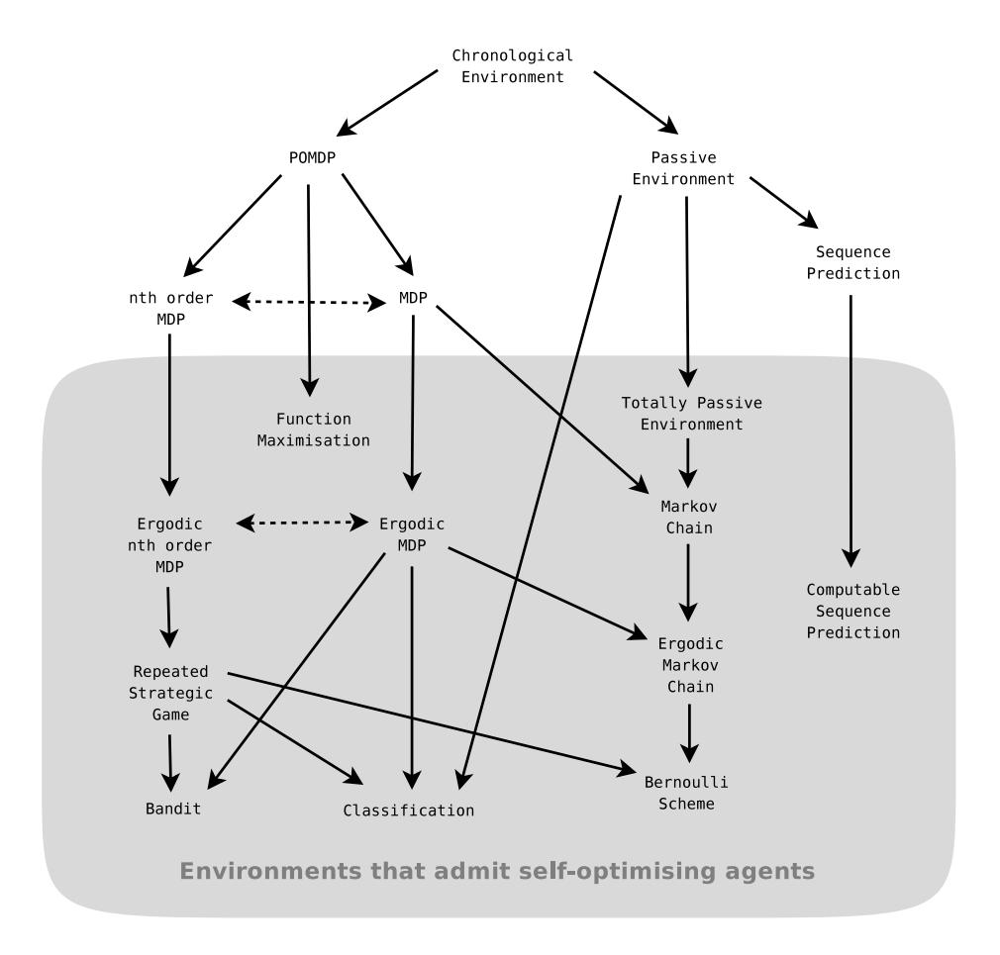

Figure 3.1.: Taxonomy of environments. Downward arrows indicate that the class below is a special case of the class above. Dotted horizontal lines indicate that two classes of environments are reducible to each other. The greyed area contains the classes of environments that admit self-optimising agents, that is, the environments in which a universal agent will learn to behave optimally.

## 4. Universal Intelligence Measure

"... we need a definition of intelligence that is applicable to machines as well as humans or even dogs. Further, it would be helpful to have a relative measure of intelligence, that would enable us to judge one program more or less intelligent than another, rather than identify some absolute criterion. Then it will be possible to assess whether progress is being made ..." Johnson (1992)

In Chapter 1 we explored the concept of intelligence and proposed an informal definition of intelligence. In Chapter 2 we introduced universal agents, and in Chapter 3 we detailed some of the classes of environments in which their behaviour converges to optimal. This shows that universal agents are highly intelligent with respect to the definition of intelligence that we have adopted. One could argue that the universal agent defined over the space of all enumerable chronological environments, that is AIXI, is in some sense an optimal machine intelligence.

In this chapter we turn this idea on its head: Instead of using the theory of universal artificial intelligence to define powerful agents, we use it instead to formally define intelligence itself. One approach is to take AIXI and to mathematically define a performance measure under which AIXI is the maximal agent by construction. This is the approach taken by the *Intelligence Order Relation* (see Section 5.1.4 in Hutter, 2005). Although this produces a very general relation for comparing the relative performance of agents, in order to justify calling this a formal definition of "intelligence" one must carefully examine the way in which intelligence is defined, and then show how this relates to the equation.

In this chapter we bridge this gap by proceeding in the opposite direction. We begin with our informal definition of intelligence from Chapter 1 that was based on a range of standard definitions given by psychologists and artificial intelligence researchers. We then formalise this definition, borrowing ideas from reinforcement learning, Kolmogorov complexity, Solomonoff induction and universal artificial intelligence theory as necessary. The result is an equation for intelligence that is strongly related to existing definitions, and with respect to which highly intelligent agents can be proven to have powerful optimality properties. We then look at some of this definition's properties and compare it to other tests and definitions of machine intelligence.

## 4.1. A formal definition of machine intelligence

Consider again our informal definition of intelligence:

Intelligence measures an agent's ability to achieve goals in a wide range of environments.

This definition contains three essential components: An agent, environments and goals. Clearly, the agent and the environment must be able to interact with each other, specifically, the agent needs to be able to send signals to the environment and also receive signals being sent from the environment. Similarly, the environment must be able to send and receive signals. In our terminology we will adopt the agent's perspective on these communications and refer to the signals sent from the agent to the environment as *actions*, and the signals sent from the environment to the agent as *perceptions*.

Our definition of an agent's intelligence also requires there to be some kind of goal for the agent to try to achieve. Perhaps an agent could be intelligent, in an abstract sense, without having any objective to apply its intelligence to. Or perhaps the agent has no desire to exercise its intelligence in a way that affects its environment. In either case, the agent's intelligence would be unobservable and, more importantly, of no practical consequence. Intelligence then, at least the concrete kind that interests us, comes into effect when the agent has an objective or goal that it actively pursues by interacting with its environment.

The existence of a goal raises the problem of how the agent knows what the goal is. One possibility would be for the goal to be known in advance and for this knowledge to be built into the agent. The problem with this is that it limits each agent to just one goal. We need to allow agents that are more flexible, specifically, we need to be able to inform the agent of what the goal is. For humans this is easily done using language. In general however, the possession of a sufficiently high level of language is too strong an assumption to make about the agent. Indeed, even for something as intelligent as a dog or a cat, direct explanation is not very effective.

Fortunately there is another possibility which is, in some sense, a blend of the above two. We define an additional communication channel with the simplest possible semantics: a signal that indicates how good the agent's current situation is. We will call this signal the *reward*. The agent simply has to maximise the amount of reward it receives, which is a function of the goal. In a complex setting the agent might be rewarded for winning a game or solving a puzzle. If the agent is to succeed in its environment, that is, receive a lot of reward, it must learn about the structure of the environment and in particular what it needs to do in order to get reward.

This system of an agent interacting with an environment and trying to achieve some goal is the reinforcement learning agent-environment framework from Section 2.8. That this framework fits well with our informal definition of intelligence is not surprising given how simple and general it is. Indeed,

it is not only used in artificial intelligence, in control theory it is known as the plant-controller framework. For example, the plant could be a nuclear power plant, and the controller a system designed to keep the reactor within safe operating guidelines. Even the way in which you might train your dog to perform tricks by rewarding certain behaviours fits into this very general framework.

As in Section 2.8, we will include the reward signal as a part of the perception generated by the environment. The perceptions also contain a non-reward part, which we will refer to as *observations*. The goal is implicitly defined by the environment as this is what controls when rewards are generated. Thus, in the framework as we have defined it, to test an agent in any given way it is sufficient to fully define the environment.

Unfortunately, maximising reward is not sufficient to define how the agent should behave over time. We have to define some kind of a temporal preference that describes how much the agent should value near term rewards verses rewards further into the future. As we saw in Section 2.9, a general approach is to weight, or discount, each reward in a way that depends on which cycle it occurs in. Let  $\gamma_1, \gamma_2, \ldots$  be the discounts we apply to the reward in each successive cycle, where  $\forall i : \gamma_i \geq 0$ , and  $\sum_{i=1}^{\infty} \gamma_i < \infty$  in order to avoid infinite weighted sums. Now define the expected future discounted reward for agent  $\pi$  interacting with environment  $\mu$  to be,

$$V_{\gamma}^{\pi\mu} := \mathbf{E} \left( \sum_{i=t}^{\infty} \gamma_i r_i \right).$$

It is this value function that incorporates our temporal preferences that the agent must optimise. Although this is very general, the discounting parameters  $\gamma_1, \gamma_2, \ldots$  are nevertheless free parameters. In order to make our formal measure unique we want to remove these parameters, and of course we must do so in a way that is still completely general.

If we look at the value function above, we see that discounting plays two roles. Firstly, it normalises rewards received so that their sum is always finite. Secondly, it weights the rewards at different points in the future which in effect defines a temporal preference. A direct way to solve both of these problems, without needing an external parameter, is to simply require the total reward returned by the environment to be bounded. Without loss of generality, we set the bound to be 1. We denote this set of reward-summable environments by  $\mathbb{E}$ . For any  $\mu \in \mathbb{E}$ , it follows that the expected value of the sum of rewards is also finite and thus discounting is no longer required,

$$V^{\pi}_{\mu} := \mathbf{E}\left(\sum_{i=1}^{\infty} r_i\right) \le 1.$$

One way of viewing this is that the rewards returned by the environment now have the temporal preference already factored in. Indeed, because every

#### 4. Universal Intelligence Measure

reward summable environment is included, in effect every possible temporal preference is represented in the space of environments. The cost is that this is an additional condition that we place on the space of environments. Previously we required that each reward signal was in a subset of  $[0,1] \cap \mathbb{Q}$ , now we have the additional constraint that the reward sum is always bounded.

Next we need to quantify what we mean by "goals in a wide range of environments." As we have argued previously, intelligence is not simply the ability to perform well at a narrowly defined task; it is much broader. An intelligent agent is able to adapt and learn to deal with many different situations, kinds of problems and types of environments. In our informal definition this was described as the agent's general ability to perform well in a "wide range of environments." This flexibility is a defining characteristic and one of the most important differences between humans and many current AI systems: while Gary Kasparov would still be a formidable player if we were to change the rules of chess, IBM's Deep Blue chess super computer would be rendered useless without significant human intervention.

As we want our definition to be as broad and encompassing as possible, the space of environments used should be as large as possible. As the environment is a probability measure with a certain structure, an obvious possibility would be to consider the space of *all* probability measures of this form. Unfortunately, this extremely broad class of environments causes serious problems. As the space of all probability measures is uncountably infinite, some environments cannot be described in a finite way and so are incomputable. This would make it impossible, by definition, to test an agent in such an environment using a computer. Further, most environments would be infinitely complex and have little structure for the agent to learn from.

The solution is to require the environmental probability measures to be computable. Not only is this condition necessary if we are to have an effective measure of intelligence, it is also not as restrictive as it might first appear. There are still an infinite number of environments with no upper bound on their maximal complexity. Also, although the measures that describe the environments are computable, this does not mean that the environments are deterministic. For example, although a typical sequence of 1's and 0's generated by flipping a coin is not computable, the probability measure that describes this distribution is computable and thus it is included in our space of possible environments. Indeed, there is currently no evidence that the physical universe cannot be simulated by a Turing machine in the above sense (for further discussion of this point see Section 4.4). This appears to be the largest reasonable space of environments.

We have now formalised all the elements of our informal definition. The next problem is how to bring these together in order to define an overall measure of performance; we need to find a way to combine an agent's performance in many different environments into a single overall measure. As there are an infinite number of environments, we cannot simply take a uniform distribution over them. Mathematically, we must weight some environments higher than others. But how?

Consider the agent's perspective on this situation: there exists a probability measure that describes the true environment, however this measure is not known to the agent. The only information the agent has are some past observations of the environment. From these, the agent can construct a list of probability measures that are consistent with the observations. We call these potential explanations of the true environment hypotheses. As the number of observations increases, the set of hypotheses shrinks and hopefully the remaining hypotheses become increasingly accurate at modelling the environment.

The problem is that in any given situation there will likely be a large number of hypotheses that are consistent with the current set of observations. The agent must keep these in accordance with Epicurus' principle of multiple explanations, as we saw in Section 2.1. Because they are all consistent with the current observations, if the agent is going to estimate which hypotheses are the most likely to be correct it must resort to something other than this observational information. This is a frequently occurring problem in inductive inference for which the most common approach is to invoke the principle of Occam's razor, which we also met in Section 2.1:

Given multiple hypotheses that are consistent with the data, the simplest should be preferred.

This is generally considered the rational and intelligent thing to do (Wallace, 2005). Indeed, as noted in Section 1.5, standard IQ tests implicitly test an individual's ability to use Occam's razor. In some cases we may even consider the correct use of Occam's razor to be a more important demonstration of intelligence than achieving a successful outcome. Consider, for example, the following game:

**4.1.1 Example.** (**Dumb luck game**) A questioner lays twenty \$10 notes out on a table before you and then points to the first one and asks "Yes or No?". If you answer "Yes" he hands you the money. If you answer "No" he takes it from the table and puts it in his pocket. He then points to the next \$10 note on the table and asks the same question. Although you, as an intelligent agent, might experiment with answering both "Yes" and "No" a few times, by the  $13^{th}$  round you would have decided that the best choice seems to be "Yes" each time. However what you do not know is that if you answer "Yes" in the  $13^{th}$  round then the questioner will pull out a gun and shoot you! Thus, although answering "Yes" in the  $13^{th}$  round is the most intelligent choice, given what you know, it is not the most successful one. An exceptionally dim individual may have failed to notice the obvious relationship between answers and getting the money, and thus might answer "No" in the  $13^{th}$  round, thereby saving his life due to what could truly be called "dumb luck".

#### 4. Universal Intelligence Measure

What is important then, is not that an intelligent agent succeeds in any given situation, but rather that it takes actions that we would expect to be the most likely ones to lead to success. Given adequate experience this might be clear, however experience is often not sufficient and one must fall back on good prior assumptions about the world, such as Occam's razor. It is important then that we test the agents in such a way that they are, at least on average, rewarded for correctly applying Occam's razor, even if in some cases this leads to failure.

Note that this does not necessarily mean always following the simplest hypothesis that is consistent with the observations. It is just that simpler hypotheses are considered to be more likely to be correct. Thus, if there is a simple hypothesis suggesting one thing, and a large number of slightly more complex hypotheses suggesting something else, the latter may be considered the most likely.

There is another subtlety that needs to be pointed out. Often intelligence is thought of as the ability to deal with complexity. Or in the words of one psychologist, "... [intelligence] is the ability to deal with cognitive complexity — in particular, with complex information processing." (Gottfredson, 1997b) It is tempting then to equate the difficultly of an environment with its complexity. Unfortunately, things are not so straightforward. Consider the following environment:

**4.1.2 Example.** Imagine a very complex environment with a rich set of relationships between the agent's actions and observations. The measure that describes this will have a high complexity. However, also imagine that the reward signal is always maximal no matter what the agent does. Thus, although this is a very complex environment in which the agent is unlikely to be able to predict what it will observe next, it is also an easy environment in the sense that all agents are optimal, even very simple ones that do nothing at all. The environment contains a lot of structure that is irrelevant to the goal that the agent is trying to achieve.

From this perspective, a problem is thought of as being difficult if the simplest good solution to the problem is complex. Easy problems on the other hand are those that have simple solutions. This is a very natural way to think about the difficulty of problems, or in our terminology, environments.

Fortunately, this distinction does not affect our use of Occam's razor. This is because Occam's razor assigns to each hypothesis a prior probability of it being the correct model according to its complexity. It says nothing about how relevant or useful that hypothesis might be to the agent's goals. For example, according to Occam's razor a simple environment that always gives the agent maximal reward would be more likely than a complex environment that also always gives the agent maximal reward, even though the two environments are equally easy to succeed in. Of course from an agent's perspective, an incorrect hypothesis that fails to model much of the environment may be a good one if the parts of the environment that the hypothesis fails to model are not relevant to receiving reward. Nevertheless, if we want to reward agents on average for

correctly using Occam's razor, we must weight the environments according to their complexity, not their difficulty.

Although we have chosen to follow a fairly strict interpretation of Occam's razor, the idea of weighting according to the complexity of the simplest good solution may have some merit. For example, if we weight the different "experts" in a *prediction with expert advice* algorithm according to their complexity, we are in effect applying this alternate principle. In practice, this can work well.

Our remaining problem now is to measure the complexity of environments. This is a problem that we have already solved for sequences in Section 2.5, and then generalised to active environments in Section 2.10: for any environment  $\mu \in \mathbb{E}$  we define its complexity to be  $K(\mu)$ , that is, its Kolmogorov complexity which is essentially just the length of the shortest program that describes  $\mu$ .

Bringing all these pieces together, we can now define our formal measure of intelligence:

**4.1.3 Definition.** The *universal intelligence* of an agent  $\pi$  is its expected performance with respect to the universal distribution  $2^{-K(\mu)}$  over the space of all computable reward-summable environments  $\mathbb{E}$ , that is,

$$\Upsilon(\pi) \; := \; \sum_{\mu \in \mathbb{E}} \, 2^{-K(\mu)} \, V_{\mu}^{\pi} \; = \; V_{\xi}^{\pi}.$$

The final equality above follows from the linearity of V and the definition of  $\xi$  as a weighted mixture of environments. It shows that the universal intelligence of an agent is simply its expected performance with respect to the universal distribution.

Consider how this equation corresponds to our informal definition. We need to measure an agent's ability to achieve goals in a wide range of environments. Clearly present in the equation is the agent  $\pi$ , the environment  $\mu$  and, implicit in the environment, a goal. The agent's "ability to achieve" is represented by the value function  $V_{\mu}^{\pi}$ . By a "wide range of environments" we have taken the space of all computable reward-summable environments, where these environments have been characterised as computable chronological measures in the set  $\mathbb{E}$ . Occam's razor is given by the term  $2^{-K(\mu)}$  which weights the agent's performance in each environment in a way that decreases according to its complexity. The definition is very general in terms of which sensors or actuators the agent might have, as all information exchanged between the agent and the environment takes place over very general communication channels. Finally, the formal definition places no limits on the internal workings of the agent. Thus, we can apply the definition to any system that is able to receive and generate information with a view to achieving goals.

The main drawback is that the Kolmogorov complexity function K is not computable and can only be approximated. This is acceptable as our aim has simply been to define the concept of intelligence in the most general, powerful and elegant way. In future research we will explore ways to approximate this

ideal with a practical test. Naturally, the process of estimation will introduce weaknesses and flaws that the current definition does not have. For example, while the definition considers the general performance of an agent over all computable environments with bounded reward sum, in practice a test could only ever estimate this by testing the agent on a finite sample of environments.

This situation is similar to the definition of randomness for sequences: Informally, an infinite sequence is said to be *Martin-Löf random* when it has no significant regularity (Martin-Löf, 1966). This lack of regularity is equivalent to saying that the sequence cannot be compressed in any significant way, and thus we can characterise randomness using Kolmogorov complexity. Naturally, we cannot test a sequence for every possible regularity, which is equivalent to saying that we cannot compute its Kolmogorov complexity. We can however test sequences for randomness by checking them for a large number of statistical regularities; indeed, this is what is done in practice. Of course, just because a sequence passes all our tests does not mean that it must be random. There could always be some deeper structure to the sequence that our tests were not able to detect. All we can say is that the sequence seems random with respect to our ability to detect patterns.

Some might argue that the definition of something should not just capture the concept, it should also be practical. For example, the definition of intelligence should be such that intelligence can be easily measured. The above example, however, illustrates why this approach is sometimes flawed: if we were to define randomness with respect to a particular set of tests, then one could specifically construct a sequence that followed a regular pattern in such a way that it passed all of our randomness tests. This would completely undermine our definition of randomness. A better approach is to define the concept in the strongest and cleanest way possible, and then to accept that our ability to test for this ideal has limitations. In other words, our task is to find better and more effective tests, not to redefine what it is that we are testing for. This is the attitude we have taken here, though in this thesis our focus is on the first part, that is, establishing a strong theoretical definition of machine intelligence.

## 4.2. Universal intelligence of various agents

In order to gain some intuition for our definition of intelligence, in this section we will consider a range of different agents and their relative degrees of universal intelligence.

**A random agent.** The agent with the lowest intelligence, at least among those that are not actively trying to perform badly, would be one that makes uniformly random actions. We will call this  $\pi^{\rm rand}$ . Although this is clearly a weak agent, we cannot simply conclude that the value of  $V_{\mu}^{\pi^{\rm rand}}$  will always be low as some environments will generate high reward no matter what the agent

does. Nevertheless, in general such an agent will not be very successful as it will fail to exploit any regularities in the environment, even trivial ones. It follows then that the values of  $V_{\mu}^{\pi^{\rm rand}}$  will typically be low compared to other agents, and thus  $\Upsilon(\pi^{\rm rand})$  will be low. Conversely, if  $\Upsilon(\pi^{\rm rand})$  is very low, then the equation for  $\Upsilon$  implies that for simple environments, and many complex environments, the value of  $V_{\mu}^{\pi^{\rm rand}}$  must also be relatively low. This kind of poor performance in general is what we would expect of an unintelligent agent.

A very specialised agent. From the equation for  $\Upsilon$ , we see that an agent could have very low universal intelligence but still perform extremely well at a few very specific and complex tasks. Consider, for example, IBM's Deep Blue chess supercomputer, which we will represent by  $\pi^{\text{dblue}}$ . When  $\mu^{\text{chess}}$  describes the game of chess,  $V_{\mu^{\text{chess}}}^{\pi^{\text{dblue}}}$  is very high. However  $2^{-K(\mu^{\text{chess}})}$  is small, and for  $\mu \neq \mu^{\text{chess}}$  the value function will be low as  $\pi^{\text{dblue}}$  only plays chess. Therefore, the value of  $\Upsilon(\pi^{\text{dblue}})$  will be very low. Intuitively, this is because Deep Blue is too inflexible and narrow to have general intelligence. Current artificial intelligence systems fall into this category: powerful in some domain, but not general and adaptable enough to be truly intelligent.

Interestingly, universal intelligence becomes somewhat counter intuitive when we use it to compare very specialised agents. Consider an agent  $\pi^{\text{simple}}$  which is only able to learn to predict sequences of the form  $0000\ldots$  and  $1111\ldots$  Obviously this agent will fail in most environments and thus will have a low universal intelligence, as we would expect. However, environments of this form will have short programs and thus are much more likely than environments which describe, for example, chess. As  $\pi^{\text{dblue}}$  can only play chess, it cannot learn to predict these simple sequences, it follows then that  $\Upsilon(\pi^{\text{dblue}}) < \Upsilon(\pi^{\text{simple}})$ . Intuitively we would expect the reverse to be true.

What this shows is that the universal intelligence measure strongly emphasises the ability to solve simple problems. If any system cannot do this, even if it can do something relatively complex like play chess, then it is considered to have very little intelligence. Of course extreme cases such the one above only occur with artificial constructions such as chess playing machines. Any human able to play chess would easily be able to learn to predict trivial patterns such as  $0000\ldots$ 

With the above in mind, it is interesting to consider the progress of artificial intelligence as a field from the perspective of universal intelligence. In the early days of artificial intelligence there was a lot of emphasis on developing machines that were able to do simple reasoning and pattern matching etc. Extending the power of these general systems was difficult and over time the field become increasingly concerned with very narrow systems that were able to solve quite specific problems. This has lead some people to complain that while we now have impressive systems for some specific things, we have not progressed much towards true intelligence, meaning artificial general intelligence. Indeed, from

#### 4. Universal Intelligence Measure

the perspective of universal intelligence, by focusing on increasingly specialised systems we have in fact have gone backwards.

A general but simple agent. Imagine an agent that performs very basic learning by building up a table of observation and action pairs and keeping statistics on the rewards that follow. Each time an observation that it has seen before occurs, the agent takes the action with highest estimated expected reward in the next cycle with 0.9 probability, or a random action with 0.1 probability. We will call this agent  $\pi^{\text{basic}}$ . It is clear that many environments, both complex and very simple, will have at least some structure that such an agent would take advantage of. Thus, for almost all  $\mu$  we will have  $V_{\mu}^{\pi^{\text{basic}}} > V_{\mu}^{\pi^{\text{rand}}}$  and so  $\Upsilon(\pi^{\text{basic}}) > \Upsilon(\pi^{\text{rand}})$ . Intuitively, this is what we would expect as  $\pi^{\text{basic}}$ , while very simplistic, is surely more intelligent than  $\pi^{\text{rand}}$ .

Similarly, as  $\pi^{\text{dblue}}$  will fail to take advantage of even trivial regularities in some of the most basic environments,  $\Upsilon(\pi^{\text{basic}}) > \Upsilon(\pi^{\text{dblue}})$ . This is reasonable as our aim is to measure a machine's level of general intelligence. Thus an agent that can take advantage of basic regularities in a wide range of environments should rate more highly than a specialised machine that fails outside of a very limited domain.

A simple agent with more history. The first order structure of  $\pi^{\mathtt{basic}}$ , while very general, will miss many simple exploitable regularities. Consider the following environment  $\mu^{\mathtt{alt}}$ . Let  $\mathcal{A} = \{\mathtt{up},\mathtt{down}\}$  and  $\mathcal{O} = \{\varepsilon\}$ . In cycle k the environment generates a reward of  $2^{-k}$  each time the agent's action is different to its previous action. Otherwise the reward is 0. We can define this environment formally,

$$\mu^{\mathtt{alt}}(ax_{< k}a\underline{x}_k) := \left\{ \begin{array}{ll} 1 & \text{if } a_k \neq a_{k-1} \wedge r_k = 2^{-k}, \\ 1 & \text{if } a_k = a_{k-1} \wedge r_k = 0, \\ 0 & \text{otherwise.} \end{array} \right.$$

Clearly the optimal strategy for an agent is simply to alternate between the actions up and down. Even though this is very simple, this strategy requires the agent to correlate its current action with its previous action, something that  $\pi^{\mathtt{basic}}$  cannot do. Note that we set the reward in cycle k to be  $2^k$  in order to satisfy our bounded reward sum condition.

A natural extension of  $\pi^{\text{basic}}$  is to use a longer history of actions, observations and rewards in its internal table. Let  $\pi^{\text{2back}}$  be the agent that builds a table of statistics for the expected reward conditioned on the last two actions, rewards and observations. It is immediately clear that  $\pi^{\text{2back}}$  will exploit the structure of the  $\mu^{\text{alt}}$  environment. Furthermore, by definition  $\pi^{\text{2back}}$  is a generalisation of  $\pi^{\text{basic}}$  and thus it will adapt to any regularity that  $\pi^{\text{basic}}$  can adapt to. It follows then that in general  $V_{\mu}^{\pi^{\text{2back}}} > V_{\mu}^{\pi^{\text{basic}}}$  and so  $\Upsilon(\pi^{\text{2back}}) > \Upsilon(\pi^{\text{basic}})$ , as we would expect. In the same way we can extend the history that the agent utilises back further and produce even more powerful

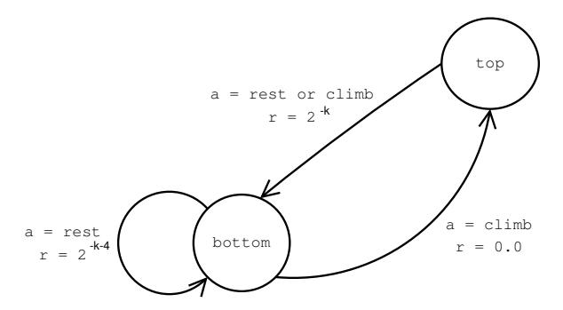

Figure 4.1.: A simple game in which the agent climbs a playground slide and slides back down again. A shortsighted agent will always just rest at the bottom of the slide.

agents that are able to adapt to more lengthy temporal structures and which will have still higher universal intelligence.

A simple forward looking agent. In some environments simply trying to maximise the next reward is not sufficient, the agent must also take into account the rewards that are likely to follow further into the future, that is, the agent must plan ahead. Consider the following environment  $\mu^{\text{slide}}$ . Let  $\mathcal{A} = \{\text{rest}, \text{climb}\}$  and  $\mathcal{O} = \{\varepsilon\}$ . Imagine there is a slide such as you would see in a playground. The agent can rest at the bottom of the slide, for which it receives a reward of  $2^{-k-4}$ . The alternative is to climb the slide, which gives a reward of 0. Once at the top of the slide the agent always slides back down no matter what action is taken; this gives a reward of  $2^{-k}$ . This deterministic environment is illustrated in Figure 4.1.

Because climbing receives a reward of 0, while resting receives a reward of  $2^{-k-4}$ , a very shortsighted agent that only tries to maximise the reward in the next cycle will choose to stay at the bottom of the slide. Both  $\pi^{\text{basic}}$  and  $\pi^{\text{2back}}$  have this problem, even though they also take random actions with 0.1 probability and so will occasionally climb the slide by chance. Clearly this is not optimal in terms of total reward over time.

We can extend the  $\pi^{2\text{back}}$  agent again by defining a new agent  $\pi^{2\text{forward}}$  that with 0.9 probability chooses its next action to maximise not just the next reward, but  $\hat{r}_k + \hat{r}_{k+1}$ , where  $\hat{r}_k$  and  $\hat{r}_{k+1}$  are the agent's estimates of the next two rewards. As the estimate of  $\hat{r}_{k+1}$  will potentially depend not only on  $a_k$ , but also on  $a_{k+1}$ , the agent assumes that  $a_{k+1}$  is chosen to simply maximise the estimated reward  $\hat{r}_{k+1}$ .

The  $\pi^{2\mathsf{forward}}$  agent can see that by missing out on the resting reward of  $2^{-k-4}$  for one cycle and climbing, a greater reward of  $2^{-k}$  will be had when sliding back down the slide in the following cycle. Note that the value of the

#### 4. Universal Intelligence Measure

time index k will have increased by the time the agent gets to slide down, however this is not enough to change the optimal course of action.

By definition  $\pi^{2\text{forward}}$  generalises  $\pi^{2\text{back}}$  in a way that more closely reflects the value function V and thus in general  $V_{\mu}^{\pi^{2\text{forward}}} > V_{\mu}^{\pi^{2\text{back}}}$ . It then follows that  $\Upsilon(\pi^{2\text{forward}}) > \Upsilon(\pi^{2\text{back}})$  as we would intuitively expect for this more powerful agent.

In a similar way agents of increasing complexity and adaptability can be defined which will have still greater intelligence. However, with more complex agents it is usually difficult to see whether one agent has more universal intelligence than another. Nevertheless, the simple examples above illustrate how the more flexible and powerful an agent is, the higher V typically is and thus the higher its universal intelligence.

A very intelligent agent. A very intelligent agent would perform well in simple environments, and reasonably well compared to most other agents in more complex environments. From the equation for universal intelligence this would clearly produce a high value for  $\Upsilon$ . Conversely, if  $\Upsilon$  was high then the equation for  $\Upsilon$  implies that the agent must perform well in most simple environments and reasonably well in many complex ones also. Thus, the agent is able to achieve goals in a wide range of environments, as required by our informal definition of intelligence.

A super intelligent agent. Consider what would be required to maximise the value of  $\Upsilon$ . By definition, a "perfect" agent would always pick the action which had greatest expected future reward. To do this, for every environment  $\mu \in \mathbb{E}$  the agent must take into account how likely it is that it is facing  $\mu$ , given the interaction history so far and the prior probability of  $\mu$ , that is,  $2^{-K(\mu)}$ . It would then consider all possible future interactions that might occur, how likely they are, and from this select the action in the current cycle that maximises the expected future reward.

Essentially, this is the AIXI agent described in Section 2.10. The only difference is that AIXI was defined using discount parameters, while universal intelligence avoided these by requiring the total reward from environments to be bounded. If we remove discounting for AIXI and define it to work over reward bounded environments, then the universal intelligence measure is in some sense the dual of the universal agent AIXI. It follows that agents with very high universal intelligence have powerful performance characteristics.

With our modified AIXI being the most intelligent agent by construction, we can define the upper bound on universal intelligence to be,

$$\bar{\Upsilon} := \max_{\pi} \Upsilon(\pi) = \Upsilon(\pi^{\xi}).$$

This upper bounds the intelligence of all future machines, no matter how powerful their hardware and algorithms might be.

A human. For simple environments, a human should be able to identify their structure and exploit this to maximise reward. However, for more complex environments it is hard to know how well a human would perform. Much of the human brain is set up to process certain kinds of structured information from the human sense organs, and thus is quite specialised, at least compared to the extremely general setting considered here. Perhaps the amount of universal machine intelligence that a human has is not that high compared to some machine learning algorithms? It is difficult to know without experimental results.

## 4.3. Properties of universal intelligence

What we have presented is a definition of machine intelligence. It is not a practical test of machine intelligence, indeed the value of  $\Upsilon$  is not computable due to the use of Kolmogorov complexity. Although some of the criteria by which we judge practical tests of intelligence are not relevant to a pure definition of intelligence, many of the desirable properties are similar. Thus, to understand the strengths and weaknesses of our definition, consider again the desirable properties for a test of intelligence from Section 1.4.

**Valid.** The most important property of any proposed formal definition of intelligence is that it does indeed describe something that can reasonably be called intelligence. Essentially, this is the core argument of this chapter so far: we have taken a mainstream informal definition and step by step formalised it. Thus, so long as our informal definition is acceptable, and our formalisation argument holds, the result can reasonably be described as a formal definition of intelligence.

As we saw in the previous section, universal intelligence orders the power and adaptability of simple agents in a natural way. Furthermore, a high value of  $\Upsilon$  implies that the agent performs well on most simple and moderately complex environments. Such an agent would be an impressively powerful and flexible piece of technology, with many potential uses. Clearly then, universal intelligence is inherently meaningful, independent of whether or not one considers it to be a measure of intelligence.

**Informative.**  $\Upsilon(\pi)$  assigns to agent  $\pi$  a real value that is independent of the performance of other possible agents. Thus we can make direct comparisons between many different agents on a single scale. This property is useful if we want to use this measure to study new algorithms or modifications to existing algorithms. In comparison, some other tests return only comparative results, i.e. that one algorithm is better than another, or even just a binary pass or fail.

#### 4. Universal Intelligence Measure

Wide range. As we saw in the previous section, universal intelligence is able to order the intelligence of even the most basic agents such as  $\pi^{\tt rand}, \, \pi^{\tt basic}, \, \pi^{\tt 2back}$  and  $\pi^{\tt 2forward}.$  At the other extreme we have the theoretical super intelligent agent AIXI which has maximal  $\Upsilon$  value. Thus, universal intelligence spans trivial learning algorithms right up to incomputable super intelligent agents. This seems to be the widest range possible for a measure of machine intelligence.

**General.** As the agent's performance on all well defined environments is factored into its  $\Upsilon$  value, a broader performance metric is difficult to imagine. Indeed, a well defined measure of intelligence that is broader than universal intelligence would seem to contradict the Church-Turing thesis as it would imply that we could effectively measure an agent's performance for some well defined problem that was outside of the space of computable measures.

**Dynamic.** Universal intelligence includes environments in which the agent has to learn and adapt its behaviour over time in order to maximise reward. As such, it is a so called "dynamic intelligence test" that allows rich interaction between the agent being tested and its environment (see Section 1.4). In comparison, most other intelligence tests are "static", in the sense that they only require the agent to solve isolated one-off problems. Such tests cannot directly measure an agent's ability to learn and adapt over time.

**Unbiased.** In a standard intelligence test, an individual's performance is judged on specific kinds of problems, and then these scores are combined to produce an overall result. Thus the outcome of the test depends on which types of problems it uses, and how each score is weighted to produce the end result. Unfortunately, how we do this is a product of many things, including our culture, values and the theoretical perspective on intelligence that we have taken. For example, while one intelligence test might contain many logical puzzle problems, another might be more linguistic in emphasis, while another stresses visual reasoning. Modern intelligence tests like the Stanford-Binet try to minimise this problem by covering the most important areas of human reasoning both verbally and non-verbally. This helps but it is still very anthropocentric as we are only testing those abilities that we think are important for human intelligence.

For an intelligence measure for machines we have to base the test on something more general and principled: universal Turing computation. As all proposed models of computation have thus far been equivalent in their expressive power, the concept of computation appears to be a fundamental theoretical property rather than the product of any specific culture. Thus, by weighting different environments depending on their Kolmogorov complexity, and considering the space of all computable environments, we have avoided having to define intelligence with respect to any particular culture, species etc.

Unfortunately, we have not entirely removed the problem. The environmental distribution  $2^{-K(\mu)}$  that we have used is invariant, up to a multiplicative constant, to changes in the reference machine  $\mathcal{U}$ . Although this affords us some protection, the relative intelligence of agents can change if we change our reference machine. One approach to this problem is to limit the complexity of the reference machine, for example by limiting its state-symbol complexity. We expect that for highly intelligent machines that can deal with a wide range of environments of varying complexity, the effect of changing from one simple reference machine to another will be minor. For simple agents, such as those considered in Section 4.2, the ordering of their machine intelligence was also not particularly sensitive to natural choices of reference machine. Recently attempts have been made to make algorithmic probability completely unique by identifying which universal Turing machines are, in some sense, the most simple (Müller, 2006). Unfortunately however, an elegant solution to this problem has not yet been found.

An alternate solution, suggested by Peter Dayan (personal communication), would be to allow the agent to maintain state between different test environments. This would mitigate any bias introduced as intelligent agents would then be able to adapt to the test's reference machine over multiple test trials.

**Fundamental.** Universal intelligence is based on Turing computation, information and complexity. These are fundamental universal concepts that are unlikely to change in the future with changes in technology. It also means that universal intelligence is in no way anthropocentric.

**Formal and objective.** As universal intelligence is expressed as a mathematical equation, there is little space for ambiguity in the definition. In particular, it in no way depends on any subjective criteria, unlike some other intelligence tests and definitions.

**Fully defined.** For a fixed reference machine, the universal intelligence measure is fully defined. In comparison, some tests of machine intelligence have aspects which are currently unspecified and in need of further research.

**Impractical.** In its current form the definition cannot be directly turned into a test of intelligence as the Kolmogorov complexity function is not computable. Thus, in its pure form, we can only use it to analyse the nature of intelligence and to theoretically examine the intelligence of mathematically defined learning algorithms.

In order to use universal intelligence more generally we will need to construct a workable test that approximates an agent's  $\Upsilon$  value. The equation for  $\Upsilon$  suggests how we might approach this problem. Essentially, an agent's universal intelligence is a weighted sum of its performance over the space of all

#### 4. Universal Intelligence Measure

environments. Thus, we could randomly generate programs that describe environmental probability measures and then test the agent's performance against each of these environments. After sampling sufficiently many environments, the agent's approximate universal intelligence could be estimated by weighting its score in each environment according to the complexity of the environment as given by the length of its program. Another possibility might be to try to approximate the sum by enumerating environmental programs from short to long, as the short ones will make by far the greatest contribution to the sum. However, in this case we will need to be able to reset the state of the agent so that it cannot cheat by learning our environmental enumeration method. In any case, various practical challenges will need to be addressed before universal intelligence can be used to construct an effective intelligence test. As this would be a significant project in its own right, here we focus on the theoretical issues surrounding universal intelligence.

**Definition rather than a test.** As it is not practical in its current form, universal intelligence is more of a formal definition of intelligence than a test of intelligence. Some proposals we have reviewed aim to be just tests of intelligence, others aim to be definitions, and in some cases they are intended to be both. Often the exact classification of a proposal as a test or definition, or both, is somewhat subjective.

Having covered the key properties of the universal intelligence measure, we now compare these properties with the properties of the other proposed tests and definitions of machine intelligence surveyed in Section 1.7. Although we have attempted to be as fair as possible, some of our judgements will of course be debatable. Nevertheless, we hope that it provides a rough overview of the relative strengths and weaknesses of the proposals. The summary comparison appears in Table 4.1.

## 4.4. Response to common criticisms

Attempting to mathematically define intelligence is very ambitious and so, not surprisingly, the reactions we get can be interesting. Having presented the essence of this work as posters at several conferences, and also as a 30 minute talk, we now have some idea of what the typical responses are. Most people start out sceptical but end up generally enthusiastic, even if they still have a few reservations. This positive feedback has helped motivate us to continue this direction of research. In this section, however, we will attempt to cover some of the more common criticisms.

**It's obviously false, there's nothing in your definition, just a few equations.** Perhaps the most common criticism is also the most vacuous one: It's obviously

| Intelligence Test      | 79 | id Tiff | rigati | je Ger | ietal<br>jee | nanic Vil | jiased<br>Fur | daner | day A | 24 62.68<br>Delt<br>Opj. | ged Jest v | (÷. D' |
|------------------------|----|---------|--------|--------|--------------|-----------|---------------|-------|-------|--------------------------|------------|--------|
| Turing Test            | •  |         |        |        | •            |           |               |       | •     | •                        | T          |        |
| Total Turing Test      | •  |         |        |        | •            |           |               |       | •     |                          | T          |        |
| Inverted Turing Test   | •  | •       |        |        | •            |           |               |       | •     | •                        | T          |        |
| Toddler Turing Test    | •  |         |        |        | •            |           |               |       | .     | •                        | T          |        |
| Linguistic Complexity  | •  | •       | •      |        |              |           |               | •     |       | •                        | T          |        |
| Text Compression Test  | •  | •       | •      | •      |              | •         | •             | •     | •     | •                        | T          |        |
| Turing Ratio           | •  | •       | •      | •      | ?            | ?         | ?             | ?     |       | ?                        | T/D        |        |
| Psychometric AI        | •  | •       | •      | •      | ?            | •         |               | •     | •     | •                        | T/D        |        |
| Smith's Test           | •  | •       | •      | •      |              | ?         | •             | •     | .     | •                        | T/D        |        |
| C-Test                 | •  | •       | •      | •      |              | •         | •             | •     | •     | •                        | T/D        |        |
| Universal Intelligence | •  | •       | •      | •      | •            | •         | •             | •     | •     |                          | Ď          |        |

Table 4.1.: In the table ● means "yes", • means "debatable", · means "no", and? means unknown. When something is rated as unknown it is because the test in question is not sufficiently specified.

wrong! These people seem to believe that defining intelligence with an equation is clearly impossible, and thus there must be very large and obvious flaws in our work. Not surprisingly, these people are also the least likely to want to spend 10 minutes having the material explained to them. Unfortunately, none of these people have been able to communicate why the work is so obviously flawed in any concrete way — despite in one instance chasing the poor fellow out of the conference centre and down the street begging for an explanation. If anyone would like to properly explain their position to us in the future, we promise not to chase you down the street!

It's obviously correct, indeed everybody already knows this. Curiously, the second most common criticism is the exact opposite: The work is obviously right, and indeed it is already well known. Digging deeper, the heart of this criticism comes from the perception that we have not done much more than just describe reinforcement learning. If you already accept that the reinforcement learning framework is the most general and flexible way to describe artificial intelligence, and not everybody does, then by mixing in Occam's razor and a dash of complexity theory the equation for universal intelligence follows in a fairly straightforward way. While this is true, the way in which these things have been brought together is new. Furthermore, simply coming up with an equation is not enough, one must argue that what the equation describes is in fact intelligence in a sense that is reasonable for machines.

We have addressed this question in three main ways: Firstly, in Chapter 1 we explored many expert definitions of intelligence. Based on these, we adopted our own informal definition of intelligence in Section 1.2. In the

#### 4. Universal Intelligence Measure

present chapter this informal definition was piece by piece formalised leading to the equation for  $\Upsilon$ . This chain of argument ties our equation for intelligence to existing informal definitions and ideas on the nature of intelligence. Secondly, in Sections 4.2 and 4.3 we showed that the equation has properties that are consistent with a definition of intelligence. Finally, in Section 4.2 it was shown that universal intelligence is strongly connected to the theory of universally optimal learning agents, in particular AIXI. From this it follows that machines with very high universal intelligence have a wide range of powerful optimality properties. Clearly then, what we have done goes far beyond merely restating reinforcement learning theory.

Assuming that the environment is computable is too strong. It is certainly possible that the physical universe is not computable, in the sense that the probability distribution over future events cannot, even in theory, be simulated to an arbitrary precision by a computable process. Some people take this position on various philosophical grounds, such as the need for freewill. However, in standard physics there is no law of the universe that is not computable in the above sense. Nor is there any evidence showing that such a physical law must exist. This includes quantum theory and chaotic systems, both of which can be extremely difficult to compute for some physical systems, but are not fundamentally incomputable theories. In the case of quantum computers, they can compute with lower time complexity than classical Turing machines, however they are unable to compute anything that a classical Turing machine cannot, when given enough time. Thus, as there is no hard evidence of incomputable processes in the universe, our assumption that the agent's environment has a computable distribution is certainly not unreasonable.

If a physical process was ever discovered that was not Turing computable, then this would likely result in a new extended model of computation. Just as we have based universal intelligence on the Turing model of computation, it might be possible to construct a new definition of universal intelligence based on this new model in a natural way.

Finally, even if the universe is not computable, and we do not update our formal definition of intelligence to take this into account, the fact that everything in physics so far is computable means that a computable approximation to our universe would still be extremely accurate over a huge range of situations. In which case, an agent that could deal with a wide range of computable environments would most likely still function well within such a universe.

Assuming that environments return bounded sum rewards is unrealistic. If an environment  $\mu$  is an artificial game, like chess, then it seems fairly natural for  $\mu$  to meet any requirements in its definition, such as having a bounded reward sum. However, if we think of the environment  $\mu$  as being the universe in which the agent lives, then it seems unreasonable to expect that it should be required to respect such a bound.

Strictly speaking, reward is an interpretation of the state of the environment. In this case the environment is the universe, and clearly the universe does not have any notion of reward for particular agents. In humans this interpretation is internal, for example, the pain that is experienced when you touch something hot. In this case, should it be a part of the agent rather than the environment? If we gave the agent complete control over rewards then our framework would become meaningless: the perfect agent could simply give itself constant maximum reward. Perhaps the analogous situation for humans would be taking the "perfect" drug.

A more accurate framework would consist of an agent, an environment and a separate goal system that interpreted the state of the environment and rewarded the agent appropriately. In such a set up the bounded rewards restriction would be a part of the goal system and thus the above problem would not occur. However, for our current purposes, it is sufficient just to fold this goal mechanism into the environment and add an easily implemented constraint to how the environment may generate rewards. One simple way to bound an environment's total rewards would be to use geometric discounting as discussed in Section 2.9.

How do you respond to Block's "Blockhead" argument? The approach we have taken is unabashedly functional. Theoretically, we desired to have a formal, simple and very general definition. This is easier to do if we abstract over the internal workings of the agent and define intelligence only in terms of external communications. Practically, what matters is how well something works. By definition, if an agent has a high value of  $\Upsilon$ , then it must work well over a wide range of environments.

Block attacks this perspective by describing a machine that appears to be intelligent as it is able to pass the Turing test, but is in fact no more than just a big look-up table of questions and answers (Block, 1981, for a related argument see Gunderson, 1971). Although such a look-up table would be unfeasibly large, the fact that a finite machine could in theory consistently pass the Turing test, seemingly without any real intelligence, intuitively seems odd. Our formal measure of machine intelligence could be challenged in the same way, as could any test of intelligence that relies only on an agent's external behaviour.

Our response to this is very simple: if an agent has a very high value of  $\Upsilon$  then it is, by definition, able to successfully operate in a wide range of environments. We simply do not care whether the agent is efficient, due to some very clever algorithm, or absurdly inefficient, for example by using an unfeasibly gigantic look-up table of precomputed answers. The important point for us is that the machine has an amazing ability to solve a huge range of problems in a wide variety of environments.

How do you respond to Searle's "Chinese room" argument? Searle's Chinese room argument attacks our functional position in a similar way by arguing that a system may appear to be intelligent without really understanding anything (Searle, 1980). From our perspective, whether or not an agent understands what it is doing is only important to the extent that it affects the measurable performance of the agent. If the performance is identical, as Searle seems to suggest, then whether or not the room with Searle inside understands the meaning of what is going on is of no practical concern; indeed, it is not even clear to us how to define understanding if its presence has no measurable effects. So long as the system as a whole has the powerful properties required for universal machine intelligence, then we have the kind of extremely general and powerful machine that we desire. On the other hand, if understanding does have a measurable impact on an agent's performance in some situations, then it is of interest to us. In which case, because  $\Upsilon$  measures performance in all well defined situations, it follows that  $\Upsilon$  is in part a measure of how much understanding an agent has.

But you don't deal with consciousness (or creativity, imagination, freewill, emotion, love, soul, etc.) We apply the same argument to consciousness, emotions, freewill, creativity, the soul and other such things. Our goal is to build powerful and flexible machines and thus these somewhat vague properties are only relevant to our goal to the extent to which they have some measurable effect on performance in some well defined environment. If no such measurable effect exists, then they are not relevant to our objective. Of course this is not the same as saying that these things do not exist. The question is whether they are relevant or not. We would consider understanding, imagination and creativity, appropriately defined, to have a significant impact on an agent's ability to adapt to challenging environments. Perhaps the same is also true of emotions, freewill and other qualities. If one accepts that these properties affect an agent's performance, then universal intelligence is in part a test for these properties.

Intelligence is fundamentally an anthropocentric concept. As artificial intelligence researchers our goal is not to create an "artificial human". We are interested in making machines that are able to process information in powerful ways in order to achieve many kinds of goals and solve many kinds of problems. As such, a limited anthropocentric concept of intelligence is not interesting to us. Or at least, if such a definition were to be adopted, it would simply mean that we are interested in something more general and powerful than this human focused concept of "intelligence".

Perhaps this is similar to the development of heavier than air flight. One of the most outspoken sceptics of this was the American astronomer Simon Newcomb. Interestingly, even after planes were regularly "flying" he refused to accept defeat. He accepted that planes existed and moved around at great

speed up in the air, however he did not accept that what they were doing was "flying". To his mind, what birds did was quite different. Of course, the rest of the population simply generalised and adapted their concept of flying to reflect the new technology.

We believe that with more progress in artificial intelligence the same thing will eventually happen to the everyday concept of intelligence. At present, most people think of intelligence in human terms simply because this is the only kind of powerful intelligence they have ever encountered. Indeed, from the perspective of evolutionary psychology, it appears that we may have evolved to expect other intelligent agents to think and act like ourselves.

Universal intelligence does not agree with some everyday intuitions about the nature of intelligence. Everyday intuitions are not a good guide. People informally use the word "intelligence" to mean a variety of different things, and even a single person will use the word in multiple ways that are not consistent with each other. Thus, although our definition should clearly be related to the everyday concept, it is not necessarily desirable, or even possible, for a precise and self-consistent definition to always agree with everyday usage.

Consider a word that has both an everyday meaning and a precise technical meaning. When someone says "It's a beautiful spring day, I am full of energy and could run up a mountain", what they mean by the word 'energy' is related to the concept of energy in physics, i.e. they need energy in the technical sense to get up the mountain. However, the definition of energy from physics does not entirely capture what they mean. This does not imply that there is something wrong with the concept of energy in physics. We expect the same in artificial intelligence: people will continue to use the word "intelligence" in an informal way, however in order to do research we will need to adopt a more precise definition that may be slightly different.

An agent may be intelligent even if it doesn't achieve anything in any environments. Consider, for example, that you are quietly sitting in a dark room thinking about a problem you are trying to solve. Even though you are not achieving anything in your environment, some would argue that you are still intelligent due to your internal process of thought. Or imagine perhaps the famous physicist Stephen Hawking disconnected from his motorised wheelchair and talking computer. Although his ability to achieve goals in the environment would be limited, he is still no doubt highly intelligent. A related problem is that an agent may simply lack the motivation to exhibit intelligent behaviour, such as a child who wants to get an IQ test out of the way as soon as possibly in order to go outside and play. In both of these cases the agent's intelligence seems to be divorced from the intelligence observable in its behaviour.

The above highlights the fact that when informally considering the measurement of intelligence we need to be careful about exactly how the measurement is done. Obviously, it only makes sense to measure an individual's intelligence

#### 4. Universal Intelligence Measure

if certain essential requirements are met: a purely written test for a blind person is senseless, as are the results of a test where the test subject has no interest in performing well. Informally, we just assume that the test has been conducted in an appropriate way. When we say that an agent is intelligent, what we actually mean is that there exists some reasonable setup such that the agent exhibits a high level of intelligence: a blind person may require an oral test, and a disinterested child some kind of a bribe. Clearly then, if we want to be precise about the measured intelligence of an agent we must specify these details about exactly how the test was conducted.

When we say that an agent has low intelligence, what we mean is that there does not exist any reasonable test setup such that the agent exhibits intelligent behaviour. Some take the position that an entity could be intelligent even if it has no measurable intelligence under *any* test setup. However, such an agent's "intelligence" would be rather meaningless as it would be a property that has no measurable effects or consequences. Even the philosophical "brain in a vat" could in theory be interfaced to in order to measure its universal intelligence.

Such an agent is not intelligent because it cannot choose its goals. In the setup we have defined the agent cannot decide what its primary goal is. It simply tries to maximise the reward signal defined by the environment. In the context of machines this is probably a good idea: we want to be the ones defining what the machine's primary objective is. However, this does not address the question as to whether such a machine should really be called intelligent, or whether it is just a very powerful and general optimiser. Intelligent humans, after all, can choose their own goals in life. But is this really true?

Obviously we can decide that we want to become a successful scientist, a teacher, or maybe a rock star. So we certainly have some choice in our goals. But are these things our *primary* motivations? If we want to be a successful scientist or a rock star, perhaps this is due to a deeper biological drive to attain high status because this increases our chances of reproductive success. Perhaps the desire to become a teacher stems from a biological drive to care for children, again because having this drive tends to increase our probability of passing on our genes and memes to future generations. Our interest in mating with an attractive member of the opposite sex, avoiding intense physical pain or the pleasure of eating energy rich foods, all of these things have clear biological motivations. Even a suicide bomber who kills himself and thus destroys his future reproductive potential may be driven by an out-of-control biological motivation that tries to increase his societal status in an effort to improve his chances of reproductive success.

These ideas appear in areas such as evolutionary psychology and, it must be said, attract a fair amount of controversy. Here we will not attempt to defend them. We simply note that they offer one explanation as to how we are able to choose our goals in life, while at the same time having relatively fixed fundamental motivations. Universal intelligence is impossible due to the No-Free-Lunch theorem. Some, such as Edmonds (2006), argue that universal definitions of intelligence are impossible due to Wolpert's so called "No Free Lunch" theorem (Wolpert and Macready, 1997). However this theorem, or any of the standard variants on it, cannot be applied to universal intelligence for the simple reason that we have not taken a uniform distribution over the space of environments. Instead we have used a highly non-uniform distribution based on Occam's razor.

It is conceivable that there might exist some more general kind of "No Free Lunch" theorem for agents that limits their maximal intelligence according to our definition. Clearly any such result would have to apply only to computable agents given that the incomputable AIXI agent faces no such limit. If such a result were true, it would suggest that our definition of intelligence is perhaps too broad in its scope. Currently we know of no such result (c.f. Chapter 5).

#### 4.5. Conclusion

Given the obvious significance of formal definitions of intelligence for research, and calls for more direct measures of machine intelligence to replace the problematic Turing test and other imitation based tests (Johnson, 1992), little work has been done in this area. In this chapter we have attempted to tackle this problem by taking an informal definition of intelligence modelled on expert definitions of human intelligence, and then formalising it. We believe that the resulting mathematical definition captures the concept of machine intelligence in a very powerful and elegant way. Furthermore, we have seen that agents which are extremely intelligent with respect to this definition, such as AIXI, can be proven to have powerful optimality properties.

The central challenge for future work on universal intelligence is to convert this theoretical definition of machine intelligence into a workable test. The basic structure of such a test is already apparent from the equation for  $\Upsilon$ : the test would work by evaluating the performance of an agent on a large sample of simulated environments, and then combine the agent's performance in each environment into an overall intelligence value. This would be done by weighting the agent's performance in each environment according the environment's complexity.

A theoretical challenge that will need to be dealt with is to find a suitable replacement for the incomputable Kolmogorov complexity function. One solution could be to use Kt complexity (Levin, 1973), another might be to use the Speed prior (Schmidhuber, 2002). Both of these consider the complexity of an algorithm to be determined by both its minimal description length and running time, thus forcing the complexity measures to be computable. Taking computation time into account also makes reasonable intuitive sense because we would not usually consider a very short algorithm that takes an enormous amount of time to run to be a particularly simple one. The fact that such an approach can be made to work is evidenced by the C-Test (see Section 1.7).

# 5. Limits of Computational Agents

One of the reasons for studying mathematical models such as AIXI is to gain insights that may be useful for designing practical artificial intelligence agents. The question then arises as to how useful all this incomputable theory really is. In this chapter we will explore this question by looking at the theoretical limitations faced by computable sequence predictors that attempt to approximate the power and generality of Solomonoff induction. As sequence prediction lies at the heart of reinforcement learning, any limitations found here will carry over to general computable agents.

As we saw in Chapter 2, sequence prediction and compression are intimately related. Indeed, they are two different ways of looking at the same problem. Intuitively, if you can accurately predict what is coming next you do not need to use much information to encode what the data actually is, and vice versa. For sequence predictors based on the Minimum Description Length (MDL) principle (Rissanen, 1996) or the Minimum Message Length (MML) principle (Wallace and Boulton, 1968), this connection is especially evident as they predict by attempting to find the shortest possible description, or model, of the data. Not surprisingly then, they can be viewed as computable approximations of Solomonoff induction (Section 5.5 of Li and Vitányi, 1997). Furthermore, in order to produce a working sequence predictor these methods can easily be combined with general purpose data compressors, such as the Lempel-Ziv algorithm (Feder et al., 1992) or Context Tree Weighting (Willems et al., 1995). Unfortunately, while useful in practice, these real world compressors have their limitations: they are able to find some kinds of computable regularities in sequences, but not others. As such, predictors based on them fall short of the power and generality of Solomonoff induction. Furthermore, even with ideal compression MDL and MML based predictors can take exponentially longer than Solomonoff induction to learn as they use only the shortest description of the data, rather than the set of all possible descriptions (Poland and Hutter, 2004).

Can we do better than this? Do universal and computable predictors for computable sequences exist? Unfortunately, it is easy to see that they do not: simply consider a sequence where the next bit is always the opposite of what the predictor predicts. This is essentially the same as what Dawid noted when he found that for any statistical forecasting system there exist sequences for which the predictor is not calibrated, and thus cannot be learnt (Dawid, 1985). However, he does not deal with the complexity of the sequences themselves, nor does he make a precise statement in terms of a specific measure of complexity. The impossibility of forecasting has since been developed in considerably more

depth by V'yugin (1998), in particular he proves that there is an efficient randomised procedure producing sequences that cannot be predicted, with high probability, by computable forecasting systems.

In this chapter we study the prediction of computable sequences from the perspective of Kolmogorov complexity. The central question we look at is the prediction of sequences which have bounded Kolmogorov complexity. This leads us to a new notion of complexity: Rather than the length of the shortest program able to generate a given sequence, in other words standard Kolmogorov complexity, we take the length of the shortest program able to learn to predict the sequence. This new complexity measure has the same fundamental invariance property as Kolmogorov complexity, and certain strong relationships between the two measures are proven. Nevertheless, in some cases the two can diverge significantly. For example, although a long random string that indefinitely repeats has a very high Kolmogorov complexity, this sequence also has a relatively simple structure that even a simple predictor can learn to predict.

We then prove that some sequences can only be predicted by very complex predictors. This implies that very general prediction algorithms, in particular those that can learn to predict all sequences up to a given Kolmogorov complexity, must themselves be complex. This puts an end to our hope of there being an extremely general and yet relatively simple prediction algorithm. We then use this fact to prove that although very powerful prediction algorithms exist, they cannot be mathematically discovered due to Gödel incompleteness. This significantly constrains our ability to design and analyse powerful prediction algorithms, and indeed powerful artificial intelligence algorithms in general.

## 5.1. Preliminaries

For the basic notation for strings and sequences see Appendix A. In this chapter we will sometimes need to encode a natural number as a string. Using simple encoding techniques it can be shown that there exists a computable injective function  $f: \mathbb{N} \to \mathbb{B}^*$  where no string in the range of f is a prefix of any other, and  $\forall n \in \mathbb{N} : \ell(f(n)) \leq \log_2 n + 2\log_2 \log_2 n + 1 = O(\log n)$ .

Of particular interest to us will be the class of sequences which can be generated by an algorithm executed on the following type of machine:

**5.1.1 Definition.** A monotone universal Turing machine  $\mathcal{U}$  is defined as a universal Turing machine with one unidirectional input tape, one unidirectional output tape, and some bidirectional work tapes. Input tapes are read only, output tapes are write only, unidirectional tapes are those where the head can only move from left to right. All tapes are binary (no blank symbol) and the work tapes are initially filled with zeros. We say that  $\mathcal{U}$  outputs/computes a sequence  $\omega$  on input p, and write  $\mathcal{U}(p) = \omega$ , if  $\mathcal{U}$  reads all of p but no more as it continues to write  $\omega$  to the output tape.

We fix  $\mathcal{U}$  and define  $\mathcal{U}(p,x)$  by simply using a standard coding technique to encode a program p along with a string  $x \in \mathbb{B}^*$  as a single input string for  $\mathcal{U}$ . For simplicity of notation we will often write p(x) to mean the function computed by the program p when executed on  $\mathcal{U}$  along with the input string x, that is, p(x) is short hand for  $\mathcal{U}(p,x)$ .

**5.1.2 Definition.** A sequence  $\omega \in \mathbb{B}^{\infty}$  is a **computable binary sequence** if there exists a program  $q \in \mathbb{B}^*$  that writes  $\omega$  to a one-way output tape when run on a monotone universal Turing machine  $\mathcal{U}$ , that is,  $\exists q \in \mathbb{B}^* : \mathcal{U}(q) = \omega$ . We denote the set of all computable sequences by  $\mathcal{C}$ .

A similar definition for strings is not necessary as all strings have finite length and are therefore trivially computable: all an algorithm has to do is to copy the desired string to the output tape and then halt.

**5.1.3 Definition.** A computable binary predictor is a program  $p \in \mathbb{B}^*$  that on a universal Turing machine  $\mathcal{U}$  computes a total function  $\mathbb{B}^* \to \mathbb{B}$ .

Having  $x_{1:n}$  as input, the objective of a predictor is for its output, called its *prediction*, to match the next symbol in the sequence. Formally we express this by writing  $p(x_{1:n}) = x_{n+1}$ .

Note that this is different to earlier chapters where a predictor generated a distribution over the possible symbols that might occur next, rather than outputting the predicted symbol. What we consider here is a special case of probabilistic prediction as it is equivalent to a probabilistic predictor that in each cycle always assigns probability 1 to some symbol.

As the algorithmic prediction of incomputable sequences, such as the halting sequence, is impossible by definition, we only consider the problem of predicting computable sequences. To simplify things we will assume that the predictor has an unlimited supply of computation time and storage. We will also make the assumption that the predictor has unlimited data to learn from, that is, we are only concerned with whether or not a predictor can learn to predict in the following sense:

**5.1.4 Definition.** We say that a predictor p can **learn to predict** a sequence  $\omega := x_1 x_2 \ldots \in \mathbb{B}^{\infty}$  if there exists  $m \in \mathbb{N}$  such that  $\forall n \geq m : p(x_{1:n}) = x_{n+1}$ .

The existence of m in the above definition need not be constructive, that is, we might not know when the predictor will stop making prediction errors for a given sequence, just that this will occur eventually. This is essentially "next value" prediction as characterised by Barzdin (1972), which follows the notion of identifiability in the limit for languages from Gold (1967).

**5.1.5 Definition.** Let  $\mathcal{P}(\omega)$  be the set of all predictors able to learn to predict  $\omega$ . Similarly for sets of sequences  $S \subset \mathbb{B}^{\infty}$ , define  $\mathcal{P}(S) := \bigcap_{\omega \in S} \mathcal{P}(\omega)$ .

A standard measure of complexity for sequences is the length of the shortest program which generates the sequence:

**5.1.6 Definition.** For any sequence  $\omega \in \mathbb{B}^{\infty}$  the **Kolmogorov complexity** of the sequence is,

$$K(\omega) := \min_{q \in \mathbb{B}^*} \{ \ell(q) : \mathcal{U}(q) = \omega \},$$

where  $\mathcal{U}$  is a monotone universal Turing machine. If no such q exists, we define  $K(\omega) := \infty$ .

In essentially the same way we can define the Kolmogorov complexity of a string  $x \in \mathbb{B}^n$ , written K(x), by requiring that  $\mathcal{U}(q)$  halts after generating x on the output tape.

It can be shown that Kolmogorov complexity depends on our choice of universal Turing machine  $\mathcal{U}$ , but only up to an additive constant that is independent of  $\omega$ . This is due to the fact that a universal Turing machine can simulate any other universal Turing machine with a fixed length program. For more explanation see Section 2.4, or for an extensive treatment of Kolmogorov complexity and some of its applications see (Li and Vitányi, 1997) or (Calude, 2002).

## 5.2. Prediction of computable sequences

The most elementary result is that every computable sequence can be predicted by at least one predictor, and that this predictor need not be significantly more complex than the sequence to be predicted.

**5.2.1 Lemma.** 
$$\forall \omega \in \mathcal{C}, \exists p \in \mathcal{P}(\omega) : K(p) \stackrel{+}{<} K(\omega).$$

**Proof.** As the sequence  $\omega$  is computable, there must exist at least one algorithm that generates  $\omega$ . Let q be the shortest such algorithm and construct an algorithm p that "predicts"  $\omega$  as follows: Firstly the algorithm p reads  $x_{1:n}$  to find the value of n, then it runs q to generate  $x_{1:n+1}$  and returns  $x_{n+1}$  as its prediction. Clearly p perfectly predicts  $\omega$  and  $\ell(p) < \ell(q) + c$ , for some small constant c that is independent of  $\omega$  and q.

Not only can any computable sequence be predicted, there also exist very simple predictors able to predict arbitrarily complex sequences:

**5.2.2 Lemma.** There exists a predictor p such that  $\forall n \in \mathbb{N}, \exists \omega \in \mathcal{C} : p \in \mathcal{P}(\omega)$  and  $K(\omega) > n$ .

**Proof.** Take a string x such that  $K(x) = \ell(x) \ge 2n$ , and from this define a sequence  $\omega := x0000\ldots$  Clearly  $K(\omega) > n$  and yet a simple predictor p that always predicts 0 can learn to predict  $\omega$ .

The predictor used in the above proof is very simple and can only "learn" sequences that end with all 0's, albeit where the initial string can have arbitrarily high Kolmogorov complexity. It may seem that this is due to sequences that are initially complex but where the "tail complexity", defined  $\liminf_{i\to\infty} K(\omega_{i:\infty})$ , is zero. This is not the case:

**5.2.3 Lemma.** There exists a predictor p such that  $\forall n \in \mathbb{N}, \exists \omega \in \mathcal{C} : p \in \mathcal{P}(\omega)$  and  $\lim \inf_{i \to \infty} K(\omega_{i:\infty}) > n$ .

**Proof.** A predictor p for eventually periodic sequences can be defined as follows: On input  $\omega_{1:k}$  the predictor goes through the ordered pairs  $(1,1),(1,2),(2,1),(1,3),(2,2),(3,1),(1,4),\ldots$  checking for each pair (a,b) whether the string  $\omega_{1:k}$  consists of an initial string of length a followed by a repeating string of length b. On the first match that is found p predicts that the repeating string continues, and then p halts. If a+b>k before a match is found, then p outputs a fixed symbol and halts. Clearly K(p) is a small constant and p will learn to predict any sequence that is eventually periodic.

For any  $(m, n) \in \mathbb{N}^2$ , let  $\omega := x(y^*)$  where  $x \in \mathbb{B}^m$ , and  $y \in \mathbb{B}^n$  is a random string, that is, K(y) = n. As  $\omega$  is eventually periodic  $p \in \mathcal{P}(\omega)$  and also we see that  $\liminf_{i \to \infty} K(\omega_{i:\infty}) = \min\{K(\omega_{m+1:\infty}), K(\omega_{m+2:\infty}), \dots, K(\omega_{m+n:\infty})\}$ .

For any  $k \in \{1, ..., n\}$  let  $q_k^*$  be the shortest program that can generate  $\omega_{m+k:\infty}$ . We can define a halting program  $q_k'$  that outputs y where this program consists of  $q_k^*$ , n and k. Thus,  $\ell(q_k') = \ell(q_k^*) + O(\log n) = K(\omega_{k:\infty}) + O(\log n)$ . As  $n = K(y) \le \ell(q_k')$ , we see that  $K(\omega_{k:\infty}) > n - O(\log n)$ . As n and k are arbitrary the result follows.

Using a more sophisticated version of this proof it can be shown that there exist predictors that can learn to predict arbitrary regular or primitive recursive sequences. Thus we might wonder whether there exists a computable predictor able to learn to predict all computable sequences. Unfortunately, no universal predictor exists, indeed for every predictor there exists a sequence which it cannot predict at all:

**5.2.4 Lemma.** For any predictor p there constructively exists a sequence  $\omega := x_1 x_2 \ldots \in \mathcal{C}$  such that  $\forall n \in \mathbb{N} : p(x_{1:n}) \neq x_{n+1}$  and  $K(\omega) \stackrel{+}{<} K(p)$ .

**Proof.** For any computable predictor p there constructively exists a computable sequence  $\omega = x_1x_2x_3...$  computed by an algorithm q defined as follows: Set  $x_1 = 1 - p(\lambda)$ , then  $x_2 = 1 - p(x_1)$ , then  $x_3 = 1 - p(x_{1:2})$  and so on. Clearly  $\omega \in \mathcal{C}$  and  $\forall n \in \mathbb{N} : p(x_{1:n}) = 1 - x_{n+1}$ .

Let  $p^*$  be the shortest program that computes the same function as p and define a sequence generation algorithm  $q^*$  based on  $p^*$  using the procedure above. By construction,  $\ell(q^*) = \ell(p^*) + c$  for some constant c that is independent of  $p^*$ . Because  $q^*$  generates  $\omega$ , it follows that  $K(\omega) \leq \ell(q^*)$ . By definition  $K(p) = \ell(p^*)$  and so  $K(\omega) \stackrel{+}{\leq} K(p)$ .

Allowing the predictor to be probabilistic, as we did in previous chapters, does not fundamentally avoid the problem of Lemma 5.2.4. In each step, rather than generating the opposite to what will be predicted by p, instead q attempts to generate the symbol that p is least likely to predict given  $x_{1:n}$ . To do this q must simulate p in order to estimate the probability that  $p(x_{1:n}) = 1$ . With sufficient simulation effort, q can estimate this probability to any desired accuracy for any  $x_{1:n}$ . This produces a computable sequence  $\omega$  such that  $\forall n \in \mathbb{N}$  the probability that  $p(x_{1:n}) = x_{n+1}$  is not significantly greater than  $\frac{1}{2}$ , that is, the performance of p is no better than a predictor that makes completely random predictions. As probabilistic prediction complicates things without avoiding this problem, in this chapter we will consider only deterministic predictors. This will also allow us to see the root of this problem as clearly as possible.

With the preliminaries covered, we now move on to the central problem: predicting sequences of limited Kolmogorov complexity.

## 5.3. Prediction of simple computable sequences

As the computable prediction of any computable sequence is impossible, a weaker goal is to be able to predict all "simple" computable sequences.

**5.3.1 Definition.** For  $n \in \mathbb{N}$ , let  $C_n := \{\omega \in C : K(\omega) \leq n\}$ . Further, let  $\mathcal{P}_n := \mathcal{P}(C_n)$  be the set of predictors able to learn to predict all sequences in  $C_n$ .

Firstly, we establish that prediction algorithms exist that can learn to predict all sequences up to a given complexity, and that these predictors need not be significantly more complex than the sequences they can predict:

**5.3.2 Lemma.** 
$$\forall n \in \mathbb{N}, \exists p \in \mathcal{P}_n : K(p) \stackrel{+}{\leq} n + O(\log n).$$

**Proof.** Let  $h \in \mathbb{N}$  be the number of programs of length n or less which generate infinite sequences. Build the value of h into a prediction algorithm p constructed as follows:

In the  $k^{th}$  prediction cycle run in parallel all programs of length n or less until h of these programs have each produced k+1 symbols of output. Next predict according to the  $k+1^{th}$  symbol of the generated string whose first k symbols is consistent with the observed string. If more than one generated string is consistent with the observed sequence, pick the one which was generated by the program that occurs first in a lexicographical ordering of the programs. If no generated output is consistent, give up and output a fixed symbol.

For sufficiently large k, only the h programs which produce infinite sequences will produce output strings of length k+1. As this set of sequences is finite, they can be uniquely identified by finite initial strings. Thus, for sufficiently

large k, the predictor p will correctly predict any computable sequence  $\omega$  for which  $K(\omega) \leq n$ , that is,  $p \in \mathcal{P}_n$ .

As there are  $2^{n+1}-1$  possible strings of length n or less,  $h < 2^{n+1}$  and thus we can encode h with  $\log_2 h + 2\log_2\log_2 h = n+1+2\log_2(n+1)$  bits. Thus,  $K(p) < n+1+2\log_2(n+1)+c$  for some constant c that is independent of n.

Can we do better than this? Lemmas 5.2.2 and 5.2.3 show us that there exist predictors able to predict at least some sequences vastly more complex than themselves. This suggests that there might exist simple predictors able to predict arbitrary sequences up to a high complexity. Formally, could there exist  $p \in \mathcal{P}_n$  where  $n \gg K(p)$ ? Unfortunately, these simple but powerful predictors are not possible:

## **5.3.3 Theorem.** $\forall n \in \mathbb{N} : p \in \mathcal{P}_n \Rightarrow K(p) \stackrel{+}{>} n.$

**Proof.** For any  $n \in \mathbb{N}$  let  $p \in \mathcal{P}_n$ , that is,  $\forall \omega \in \mathcal{C}_n : p \in \mathcal{P}(\omega)$ . By Lemma 5.2.4 we know that  $\exists \omega' \in \mathcal{C} : p \notin \mathcal{P}(\omega')$ . As  $p \notin \mathcal{P}(\omega')$  it must be the case that  $\omega' \notin \mathcal{C}_n$ , that is,  $K(\omega') \geq n$ . From Lemma 5.2.4 we also know that  $K(p) \stackrel{>}{>} K(\omega')$  and so the result follows.

Intuitively the reason for this is as follows: Lemma 5.2.4 guarantees that every simple predictor fails for at least one simple sequence. Thus, if we want a predictor that can learn to predict all sequences up to a moderate level of complexity, then clearly the predictor cannot be simple. Likewise, if we want a predictor that can predict all sequences up to a high level of complexity, then the predictor itself must be very complex. Even though we have made the generous assumption of unlimited computational resources and data to learn from, only very complex algorithms can be truly powerful predictors.

These results easily generalise to notions of complexity that take computation time into consideration. As sequences are infinite, the appropriate measure of time is the time needed to generate or predict the next symbol in the sequence. Under any reasonable measure of time complexity, the operation of inverting a single output from a binary valued function can be performed with little cost. If C is any complexity measure with this property, it is trivial to see that the proof of Lemma 5.2.4 still holds for C. From this, an analogue of Theorem 5.3.3 for C easily follows.

With similar arguments these results also generalise, in a straightforward way, to complexity measures that take space or other computational resources into account. Thus, the fact that extremely powerful predictors must be very complex, holds under any measure of complexity for which inverting a single bit is inexpensive.

## 5.4. Complexity of prediction

Another way of viewing these results is in terms of an alternate notion of sequence complexity defined as the size of the smallest predictor able to learn to predict the sequence. This allows us to express the results of the previous sections more concisely. Formally, for any sequence  $\omega$  define the complexity measure,

$$\dot{K}(\omega) := \min_{p \in \mathbb{B}^*} \{ \ell(p) : p \in \mathcal{P}(\omega) \},$$

and  $\dot{K}(\omega) := \infty$  if  $\mathcal{P}(\omega) = \varnothing$ . Thus, if  $\dot{K}(\omega)$  is high then the sequence  $\omega$  is complex in the sense that only complex prediction algorithms are able to learn to predict it. It can easily be seen that this notion of complexity has the same invariance to the choice of reference universal Turing machine as the standard Kolmogorov complexity measure.

It may be tempting to conjecture that this definition simply describes what might be called the "tail complexity" of a sequence, that is,  $\dot{K}(\omega)$  is equal to  $\liminf_{i\to\infty}K(\omega_{i:\infty})$ . This is not the case. In the proof of Lemma 5.2.3 we saw that there exists a single predictor capable of learning to predict any sequence that consists of a repeating string, and thus for these sequences  $\dot{K}$  is bounded. It was further shown that there exist sequences of this form with arbitrarily high tail complexity. Clearly then tail complexity and  $\dot{K}$  cannot be equal in general.

Using K we can now rewrite a number of our previous results much more succinctly. From Lemma 5.2.1 it immediately follows that,

$$\forall \omega : 0 \leq \dot{K}(\omega) \stackrel{+}{<} K(\omega).$$

From Lemma 5.2.2 we know that  $\exists c \in \mathbb{N}, \forall n \in \mathbb{N}, \exists \omega \in \mathcal{C}$  such that  $\dot{K}(\omega) < c$  and  $K(\omega) > n$ , that is,  $\dot{K}$  can attain the lower bound above within a small constant, no matter how large the value of K is. The sequences for which the upper bound on  $\dot{K}$  is tight are interesting as they are the ones which demand complex predictors. We prove the existence of these sequences and look at some of their properties in the next section.

The complexity measure  $\dot{K}$  can also be generalised to sets of sequences, for  $S \subset \mathbb{B}^{\infty}$  define  $\dot{K}(S) := \min_{p} \{ \ell(p) : p \in \mathcal{P}(S) \}$ . This allows us to rewrite Lemma 5.3.2 and Theorem 5.3.3 as simply,

$$\forall n \in \mathbb{N} : n \stackrel{+}{<} \dot{K}(\mathcal{C}_n) \stackrel{+}{<} n + O(\log n).$$

This is just a restatement of the fact that the simplest predictor capable of predicting all sequences up to a Kolmogorov complexity of n, has itself a Kolmogorov complexity of roughly n.

Perhaps the most surprising thing about  $\hat{K}$  complexity is that this very natural definition of the complexity of a sequence, as viewed from the perspective of prediction, does not appear to have been studied before.

## 5.5. Hard to predict sequences

We have already seen that some individual sequences, such as the repeating string used in the proof of Lemma 5.2.3, can have arbitrarily high Kolmogorov complexity but nevertheless can be predicted by trivial algorithms. Thus, although these sequences contain a lot of information in the Kolmogorov sense, in a deeper sense their structure is very simple and easily learnt.

What interests us in this section is the other extreme: individual sequences that can only be predicted by complex predictors. As we are concerned with prediction in the limit, this extra complexity in the predictor must be some kind of special information which cannot be learnt through observing the sequence. Our first task is to show that these hard to predict sequences exist.

**5.5.1 Theorem.** 
$$\forall n \in \mathbb{N}, \exists \omega \in \mathcal{C} : n \stackrel{+}{<} \dot{K}(\omega) \stackrel{+}{<} K(\omega) \stackrel{+}{<} n + O(\log n).$$

**Proof.** For any  $n \in \mathbb{N}$ , let  $Q_n \subset \mathbb{B}^{< n}$  be the set of programs shorter than n that are predictors, and let  $x_{1:k} \in \mathbb{B}^k$  be the observed initial string from the sequence  $\omega$  that is to be predicted. Now construct a meta-predictor  $\hat{p}$ :

By dovetailing the computations, run in parallel every program of length less than n on every string in  $\mathbb{B}^{\leq k}$ . Each time a program is found to halt on all of these input strings, add the program to a set of "candidate prediction algorithms", called  $\tilde{Q}_n^k$ . As each element of  $Q_n$  is a valid predictor, and thus halts for all input strings in  $\mathbb{B}^*$  by definition, for every n and k it eventually will be the case that  $|\tilde{Q}_n^k| = |Q_n|$ . At this point the simulation to approximate  $Q_n$  terminates. It is clear that for sufficiently large values of k all of the valid predictors, and only the valid predictors, will halt with a single symbol of output on all tested input strings. That is,  $\exists r \in \mathbb{N}, \forall k > r : \tilde{Q}_n^k = Q_n$ .

The second part of the  $\hat{p}$  algorithm uses these candidate prediction algorithms to make a prediction. For  $p \in \tilde{Q}_n^k$  define  $d^k(p) := \sum_{i=1}^{k-1} |p(x_{1:i}) - x_{i+1}|$ . Informally,  $d^k(p)$  is the number of prediction errors made by p so far. Compute this for all  $p \in \tilde{Q}_n^k$  and then let  $p_k^* \in \tilde{Q}_n^k$  be the program with minimal  $d^k(p)$ . If there is more than one such program, break the tie by letting  $p_k^*$  be the lexicographically first of these. Finally,  $\hat{p}$  computes the value of  $p_k^*(x_{1:k})$  and then returns this as its prediction and halts.

By Lemma 5.2.4, there exists  $\omega' \in \mathcal{C}$  such that  $\hat{p}$  makes a prediction error for every k when trying to predict  $\omega'$ . Thus, in each cycle at least one of the finitely many predictors with minimal  $d^k$  makes a prediction error and so  $\forall p \in Q_n : d^k(p) \to \infty$  as  $k \to \infty$ . Therefore,  $\nexists p \in Q_n : p \in \mathcal{P}(\omega')$ , that is, no program of length less than n can learn to predict  $\omega'$  and so  $n \leq \dot{K}(\omega')$ . Further, from Lemma 5.2.1 we know that  $\dot{K}(\omega') \stackrel{+}{<} K(\omega')$ , and from Lemma 5.2.4 again,  $K(\omega') \stackrel{+}{<} K(\hat{p})$ .

Examining the algorithm for  $\hat{p}$ , we see that it contains some fixed length program code and an encoding of  $|Q_n|$ , where  $|Q_n| < 2^n - 1$ . Thus, using a standard encoding method for integers,  $K(\hat{p}) \stackrel{!}{<} n + O(\log n)$ . Chaining these,  $n \stackrel{!}{<} \dot{K}(\omega') \stackrel{!}{<} K(\hat{p}) \stackrel{!}{<} n + O(\log n)$ , which proves the theorem.  $\square$ 

This establishes the existence of sequences with arbitrarily high  $\dot{K}$  complexity which also have a similar level of Kolmogorov complexity. Next we establish a fundamental property of high  $\dot{K}$  complexity sequences: they are extremely difficult to compute.

For an algorithm q that generates  $\omega \in \mathcal{C}$ , define  $t_q(n)$  to be the number of computation steps performed by q before the  $n^{th}$  symbol of  $\omega$  is written to the output tape. For example, if q is a simple algorithm that outputs the sequence 010101 . . ., then clearly  $t_q(n) = O(n)$  and so  $\omega$  can be computed quickly. The following theorem proves that if a sequence can be computed in a reasonable amount of time, then the sequence must have a low K complexity:

**5.5.2 Lemma.** 
$$\forall \omega \in \mathcal{C}$$
, if  $\exists q : \mathcal{U}(q) = \omega$  and  $\exists r \in \mathbb{N}, \forall n > r : t_q(n) < 2^n$ , then  $\dot{K}(\omega) \stackrel{+}{=} 0$ .

**Proof.** Construct a prediction algorithm  $\tilde{p}$  as follows:

On input  $x_{1:n}$ , run all programs of length n or less, each for  $2^{n+1}$  steps. In a set  $W_n$  collect together all generated strings which are at least n+1 symbols long and where the first n symbols match the observed string  $x_{1:n}$ . Now order the strings in  $W_n$  according to a lexicographical ordering of their generating programs. If  $W_n = \emptyset$ , then just return a prediction of 1 and halt. If  $|W_n| > 1$  then return the  $n+1^{th}$  symbol from the first sequence in the above ordering.

Assume that  $\exists q: \mathcal{U}(q) = \omega$  such that  $\exists r \in \mathbb{N}, \forall n > r: t_q(n) < 2^n$ . If q is not unique, take q to be the lexicographically first of these. Clearly  $\forall n > r$  the initial string from  $\omega$  generated by q will be in the set  $W_n$ . As there is no lexicographically lower program which can generate  $\omega$  within the time constraint  $t_q(n) < 2^n$  for all n > r, for sufficiently large n the predictor  $\tilde{p}$  must converge on using q for each prediction and thus  $\tilde{p} \in \mathcal{P}(\omega)$ . As  $\ell(\tilde{p})$  is clearly a fixed constant that is independent of  $\omega$ , it follows then that  $\dot{K}(\omega) < \ell(\tilde{p}) \stackrel{!}{=} 0$ .

We could replace the  $2^n$  bound in the above result with any monotonically growing computable function, for example,  $2^{2^n}$ . In any case, this does not change the fundamental result that sequences which have a high  $\dot{K}$  complexity are practically impossible to compute. However, from our theoretical perspective, these sequences present no problem as they can be predicted, albeit with immense difficulty.

## 5.6. The limits of mathematical analysis

One way to interpret the results of the previous sections is in terms of constructive theories of prediction. Essentially, a constructive theory of prediction expressed in some sufficiently rich formal system  $\mathfrak{F}$ , is in effect a description of a prediction algorithm with respect to a universal Turing machine which implements the required parts of  $\mathfrak{F}$ . Thus, from Theorems 5.3.3 and 5.5.1, it follows that if we want to have a predictor that can learn to predict all

sequences up to a high level of Kolmogorov complexity, or even just predict individual sequences which have high  $\dot{K}$  complexity, the constructive theory of prediction that we base our predictor on must be very complex. Elegant and highly general constructive theories of prediction simply do not exist, even if we assume unlimited computational resources. This is in marked contrast to Solomonoff's highly elegant but non-constructive theory of prediction.

Naturally, highly complex theories of prediction will be very difficult to mathematically analyse, if not practically impossible. Thus, at some point the development of very general prediction algorithms must become mainly an experimental endeavour due to the difficulty of working with the required theory. Interestingly, an even stronger result can be proven showing that beyond some point the mathematical analysis is in fact impossible, even in theory:

**5.6.1 Theorem.** In any consistent formal axiomatic system  $\mathfrak{F}$  that is sufficiently rich to express statements of the form " $p \in \mathcal{P}_n$ ", there exists  $m \in \mathbb{N}$  such that for all n > m and for all predictors  $p \in \mathcal{P}_n$  the true statement " $p \in \mathcal{P}_n$ " cannot be proven in  $\mathfrak{F}$ .

In other words, even though we have proven that very powerful sequence prediction algorithms exist, beyond a certain complexity it is impossible to find any of these algorithms using mathematics. The proof has a similar structure to Chaitin's information theoretic proof (Chaitin, 1982) of Gödel's incompleteness theorem for formal axiomatic systems (Gödel, 1931).

**Proof.** For each  $n \in \mathbb{N}$  let  $T_n$  be the set of statements expressed in the formal system  $\mathfrak{F}$  of the form " $p \in \mathcal{P}_n$ ", where p is filled in with the complete description of some algorithm in each case. As the set of programs is denumerable,  $T_n$  is also denumerable and each element of  $T_n$  has finite length. From Lemma 5.3.2 and Theorem 5.3.3 it follows that each  $T_n$  contains infinitely many statements of the form " $p \in \mathcal{P}_n$ " which are true.

Fix n and create a search algorithm s that enumerates all proofs in the formal system  $\mathfrak{F}$  searching for a proof of a statement in the set  $T_n$ . As the set  $T_n$  is recursive, s can always recognise a proof of a statement in  $T_n$ . If s finds any such proof, it outputs the corresponding program p and then halts.

By way of contradiction, assume that s halts, that is, a proof of a theorem in  $T_n$  is found and p such that  $p \in \mathcal{P}_n$  is generated as output. The size of the algorithm s is a constant (a description of the formal system  $\mathfrak{F}$  and some proof enumeration code) as well as an  $O(\log n)$  term needed to describe n. It follows then that  $K(p) \stackrel{+}{>} O(\log n)$ . However, from Theorem 5.3.3 we know that  $K(p) \stackrel{+}{>} n$ . Thus, for sufficiently large n, we have a contradiction and so our assumption of the existence of a proof must be false. That is, for sufficiently large n and for all  $p \in \mathcal{P}_n$ , the true statement " $p \in \mathcal{P}_n$ " cannot be proven within the formal system  $\mathfrak{F}$ .

The exact value of m depends on our choice of formal system  $\mathfrak{F}$  and which reference machine  $\mathcal{U}$  we measure complexity with respect to. However, for reasonable choices of  $\mathfrak{F}$  and  $\mathcal{U}$  the value of m would be in the order of 1000. That is, the bound m is certainly not so large as to be vacuous.

#### 5.7. Conclusion

We have shown that there does not exist an elegant constructive theory of prediction for computable sequences, even if we assume unbounded computational resources, unbounded data and learning time, and place moderate bounds on the Kolmogorov complexity of the sequences to be predicted. Very powerful computable predictors are therefore necessarily complex. We have further shown that the source of this problem is the existence of computable sequences which are extremely expensive to compute. While we have proven that very powerful prediction algorithms which can learn to predict these sequences exist, we have also proven that, unfortunately, mathematical analysis cannot be used to discover these algorithms due to Gödel incompleteness.

These results can be extended to more general settings, specifically to those problems which are equivalent to, or depend on, sequence prediction. Consider, for example, a reinforcement learning agent interacting with an environment, as described in Chapters 2 and 3. In each interaction cycle the agent must choose its actions so as to maximise the future rewards that it receives from the environment. Of course the agent cannot know for certain if some action will lead to rewards in the future. Whether explicitly or implicitly, it must somehow predict these. Thus, at the heart of reinforcement learning lies a prediction problem, and so the results for computable predictors presented in this paper also apply to computable reinforcement learners. More specifically, from Theorem 5.3.3 it follows that very powerful computable reinforcement learners are necessarily complex, and from Theorem 5.6.1 it follows that it is impossible to discover any of these extremely powerful reinforcement learning algorithms mathematically. These relationships are illustrated in Figure 5.1.

It is reasonable to ask whether the assumptions we have made in our model need to be changed. If we increase the power of the predictors further, for example by providing them with some kind of an oracle, this would make the predictors even more unrealistic than they currently are. This goes against our goal of finding an elegant, powerful and general prediction theory that is more realistic in its assumptions than Solomonoff's incomputable model. On the other hand, if we weaken our assumptions about the predictors' resources to make them more realistic, we are in effect taking a subset of our current class of predictors. As such, all the same limitations and problems will still apply, as well as some new ones.

It seems then that the way forward is to further restrict the problem space. One possibility would be to bound the amount of computation time needed to generate the next symbol in the sequence. However, if we do this without re-

stricting the predictors' resources then the simple predictor from Lemma 5.5.2 easily learns to predict any such sequence and thus the problem of prediction in the limit has become trivial. Another possibility might be to bound the memory of the machine used to generate the sequence, however this makes the generator a finite state machine and thus bounds its computation time, again making the problem trivial.

Perhaps the only reasonable solution would be to add additional restrictions to both the algorithms which generate the sequences to be predicted, and to the predictors. We may also want to consider not just learnability in the limit, but also how quickly the predictor is able to learn. Of course we are then facing a much more difficult analysis problem.

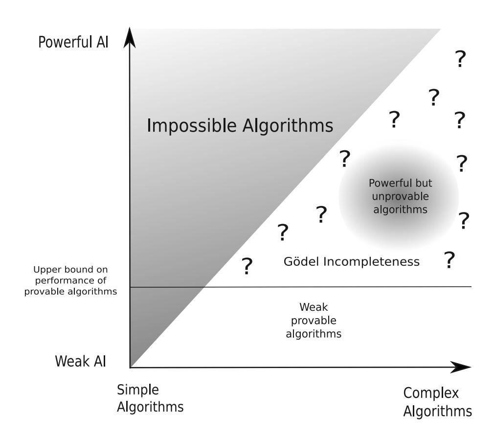

Figure 5.1.: Theorem 5.3.3 rules out simple but powerful artificial intelligence algorithms, as indicated by the greyed out region in the upper left. Theorem 5.6.1 upper bounds how powerful an algorithm can be before it can no longer be proven to be a powerful algorithm. This is indicated by the horizontal line separating the region of provable algorithms from the region of Gödel incompleteness.

# 6. Temporal Difference Updating without a Learning Rate

In Chapters 2 and 3 we saw how universal agents are able to learn to behave optimally across a wide range of environments. Unfortunately, these agents are incomputable as they are based on incomputable universal prior distributions. Thus, in order to use the theory of universal artificial intelligence to design and build practical algorithms, we must first find a way to scale the theory down. In Chapter 5 we investigated some of the constraints faced when attempting this. What we uncovered was a number of fundamental negative results. In short, computable predictors capable of predicting all sequences up to a moderate Kolmogorov complexity are both highly complex and mathematically impossible to find due to Gödel incompleteness. The only way out of this bind, it seems, is to move to a more sophisticated measure of complexity that takes not only information content into account, but also time and space. Unfortunately, the theory of resource bounded complexity is notoriously difficult to work with and has many unsolved fundamental questions. Furthermore, even if the universal prior distribution could be replaced by a suitable computable prior, perhaps something like the Speed prior (Schmidhuber, 2002), there still remains the fact that AIXI's search through possible futures requires computation time that is exponential in the depth of the look ahead (see the equation for AIXI in Section 2.10).

Despite these difficulties, several attempts at scaling AIXI down have been made. The most theoretically founded of these is AIXItl (Chapter 7 of Hutter, 2005). In this model, proof search is used to limit the size and computation time of the algorithm. Unfortunately, although technically computable, the resulting agent still requires impossibly vast computational resources. Another more drastic scaling down of AIXI did produce a usable algorithm (Poland and Hutter, 2006). Here the problem domain was limited to games that could be described by  $2 \times 2$  matrices, and the look ahead was bounded to 8 interaction cycles. The resulting algorithm was able to learn simple game theoretic interaction strategies. While this proves that some kind of scaling down of AIXI is possible, the problem space of  $2 \times 2$  matrix games falls well short of what is needed for a useful artificial intelligence algorithm.

In this chapter we present what started out as another attempt to scale AIXI down. As we have seen in previous chapters, at the core of the reinforcement learning problem lies the problem of estimating the expected future discounted reward. We begin by expressing this estimation problem as a loss function, more specifically, as the squared difference between the empirical future discounted reward and our estimate. We then derive an equation for this estimator by minimising the loss function. Although the resulting learning equations no longer bear much resemblance to AIXI, they do strongly resemble the standard equation for temporal difference learning with eligibility traces, also known as the  $\mathrm{TD}(\lambda)$  algorithm. Interestingly, while the standard algorithm has a free learning rate parameter, in our new equation there is none. In its place there is an equation that automatically sets the learning rate in a way that is specific to each state transition. We have experimentally tested this new learning rule against  $\mathrm{TD}(\lambda)$  and found that it offers superior performance in various settings. We have also extended the algorithm to reinforcement learning and again found encouraging results. This chapter covers the derivation of this algorithm and our experimental results.

Note that while the notation used in this chapter is fairly standard for the temporal difference learning literature, it is a little different to what we used to define AIXI. For example, we now talk of *states* rather than observations, and index the value function in a new way.

## 6.1. Temporal difference learning

In the field of reinforcement learning, perhaps the most popular way to estimate the future discounted reward of states is the method of  $temporal\ difference\ learning$ . It is unclear who exactly introduced this first, however the first explicit version of temporal difference as a learning rule appears to be Witten (1977). The idea is as follows: The  $expected\ future\ discounted\ reward$  of a state s is,

$$\overline{V}_s := \mathbf{E} \left\{ r_k + \gamma r_{k+1} + \gamma^2 r_{k+2} + \dots | s_k = s \right\},\,$$

where the rewards  $r_k, r_{k+1}, \ldots$  are geometrically discounted into the future by  $\gamma < 1$ . From this definition it follows that,

$$\overline{V}_s = \mathbf{E} \left\{ r_k + \gamma \overline{V}_{s_{k+1}} | s_k = s \right\}. \tag{6.1}$$

Our task, at time t, is to compute an estimate  $V_s^t$  of  $\overline{V}_s$  for each state s. The only information we have to base this estimate on is the current history of state transitions,  $s_1, s_2, \ldots, s_t$ , and the current history of observed rewards,  $r_1, r_2, \ldots, r_t$ . Equation (6.1) suggests that at time t+1 the value of  $r_t + \gamma V_{s_{t+1}}$  provides us with information on what  $V_s^t$  should be: if it is higher than  $V_{s_t}^t$  then perhaps this estimate should be increased, and vice versa. This intuition gives us the following estimation heuristic for state  $s_t$ ,

$$V_{s_t}^{t+1} := V_{s_t}^t + \alpha \left( r_t + \gamma V_{s_{t+1}}^t - V_{s_t}^t \right),$$

where  $\alpha$  is a parameter that controls the rate of learning. This type of temporal difference learning is known as TD(0).

One shortcoming of this method is that at each time step the value of only the last state  $s_t$  is updated. States before the last state are also affected by

#### **Algorithm 1** $TD(\lambda)$

```
Initialise V(s) arbitrarily and E(s)=0 for all s
Initialise s
repeat

Make state transition and observe r, s'
\Delta \leftarrow r + \gamma V(s') - V(s)
E(s) \leftarrow E(s) + 1
for all s do
V(s) \leftarrow V(s) + \alpha E(s) \Delta
E(s) \leftarrow \gamma \lambda E(s)
end for
s \leftarrow s'
until end of run
```

changes in the last state's value and thus these could be updated too. This is what happens with so called temporal difference learning with eligibility traces, where a history, or trace, is kept of which states have been recently visited. Under this method, when we update the value of a state we also go back through the trace updating the earlier states as well. Formally, for any state s its eligibility trace is computed by,

$$E_s^t := \left\{ \begin{array}{ll} \gamma \lambda E_s^{t-1} & \text{if } s \neq s_t, \\ \gamma \lambda E_s^{t-1} + 1 & \text{if } s = s_t, \end{array} \right.$$

where  $\lambda$  is used to control the rate at which the eligibility trace is discounted. The temporal difference update is then, for *all* states s,

$$V_s^{t+1} := V_s^t + \alpha E_s^t \left( r + \gamma V_{s_{t+1}}^t - V_{s_t}^t \right). \tag{6.2}$$

This more powerful version of temporal different learning is known as  $TD(\lambda)$  (Sutton, 1988). The complete algorithm appears in Algorithm 1.

Although it has been successfully applied to many simple problems, plain  $\mathrm{TD}(\lambda)$  has a number of drawbacks. One of these is that the learning rate parameter  $\alpha$  has to be experimentally tuned by hand. Indeed, even this is not always enough, for optimal performance some monotonically decreasing function has to be experimentally found that decreases the learning rate over time at the right rate. If the learning rate decreases too quickly, the system may become stuck at a level of sub-optimal performance, if it decreases too slowly then convergence will be unnecessarily late. The main contribution of this chapter is to solve this problem by deriving a temporal difference rule from statistical principles that automatically sets its learning rate.

Perhaps the closest work to ours is the LSTD( $\lambda$ ) algorithm (Bradtke and Barto, 1996; Boyan, 1999; Lagoudakis and Parr, 2003). LSTD( $\lambda$ ) is concerned with finding a least-squares linear function approximation to the true value

function. The unknown expected rewards and transition probabilities are replaced by empirical averages up to current time t. In contrast, we consider finite state spaces and no function approximation. We derive a least-squares estimate of the empirical values including future rewards by bootstrapping. The computation time for our update is linear in the number of states, like  $\mathrm{TD}(\lambda)$ , while LSTD is quadratic (even in the case of state-indicator features and no function approximation). Indeed our algorithm exactly coincides with  $\mathrm{TD/Q/Sarsa}(\lambda)$  but with a novel learning rate derived from statistical principles. LSTD has not yet been developed for general  $\lambda$  and  $\gamma$ . Our algorithm and LSTD both get rid of the learning rate and the necessity to initialise V. Since LSTD has primarily been developed for linear function approximation and has a much more expensive update rule, we focused our experimental comparison to the algorithms for which we determined the learning rate (finite state space, linear time  $\mathrm{TD/Q/Sarsa}$  algorithms). It remains to be seen how our approach generalises to (linear) function approximation.

#### 6.2. Derivation

The empirical future discounted reward of a state  $s_k$  is the sum of actual rewards following from state  $s_k$  in time steps  $k, k+1, \ldots$ , where the rewards are discounted as they go into the future. Formally, the empirical value of state  $s_k$  at time k for  $k=1,\ldots,t$  is,

$$v_k := \sum_{u=k}^{\infty} \gamma^{u-k} r_u, \tag{6.3}$$

where the future rewards  $r_u$  are geometrically discounted by  $\gamma < 1$ . In practice the exact value of  $v_k$  is always unknown to us as it depends not only on rewards that have been already observed, but also on unknown future rewards. Note that if  $s_m = s_n$  for  $m \neq n$ , that is, we have visited the same state twice at different times m and n, this does not imply that  $v_n = v_m$  as the observed rewards following the state visit may be different each time.

Our goal is that for each state s the estimate  $V_s^t$  should be as close as possible to the true expected future discounted reward  $\overline{V}_s$ . Thus, for each state s we would like  $V_s$  to be close to  $v_k$  for all k such that  $s=s_k$ . Furthermore, in non-stationary environments we would like to discount old evidence by some parameter  $\lambda \in (0,1]$ . Formally, we want to minimise the loss function,

$$L := \frac{1}{2} \sum_{k=1}^{t} \lambda^{t-k} \left( v_k - V_{s_k}^t \right)^2.$$
 (6.4)

For stationary environments we may simply set  $\lambda = 1$  a priori.

As we wish to minimise this loss, we take the partial derivative with respect to the value estimate of each state and set to zero,

$$\frac{\partial L}{\partial V_s^t} = -\sum_{k=1}^t \lambda^{t-k} (v_k - V_{s_k}^t) \delta_{s_k s} = V_s^t \sum_{k=1}^t \lambda^{t-k} \delta_{s_k s} - \sum_{k=1}^t \lambda^{t-k} \delta_{s_k s} v_k = 0,$$

where we could change  $V_{s_k}^t$  into  $V_s^t$  due to the presence of the Kronecker  $\delta_{s_k s}$ , defined  $\delta_{xy} := 1$  if x = y, and 0 otherwise. By defining a discounted state visit counter  $N_s^t := \sum_{k=1}^t \lambda^{t-k} \delta_{s_k s}$  we get

$$V_s^t N_s^t = \sum_{k=1}^t \lambda^{t-k} \delta_{s_k s} v_k.$$
 (6.5)

Since  $v_k$  depends on future rewards  $r_k$ , Equation (6.5) can not be used in its current form. Next we note that  $v_k$  has a self-consistency property with respect to the rewards. Specifically, the tail of the future discounted reward sum for each state depends on the empirical value at time t in the following way,

$$v_k = \sum_{n=1}^{t-1} \gamma^{u-k} r_u + \gamma^{t-k} v_t.$$

Substituting this into Equation (6.5) and exchanging the order of the double sum,

$$V_{s}^{t}N_{s}^{t} = \sum_{u=1}^{t-1} \sum_{k=1}^{u} \lambda^{t-k} \delta_{s_{k}s} \gamma^{u-k} r_{u} + \sum_{k=1}^{t} \lambda^{t-k} \delta_{s_{k}s} \gamma^{t-k} v_{t}$$

$$= \sum_{u=1}^{t-1} \lambda^{t-u} \sum_{k=1}^{u} (\lambda \gamma)^{u-k} \delta_{s_{k}s} r_{u} + \sum_{k=1}^{t} (\lambda \gamma)^{t-k} \delta_{s_{k}s} v_{t}$$

$$= R_{s}^{t} + E_{s}^{t} v_{t},$$

where  $E_s^t := \sum_{k=1}^t (\lambda \gamma)^{t-k} \delta_{s_k s}$  is the eligibility trace of state s, and  $R_s^t := \sum_{u=1}^{t-1} \lambda^{t-u} E_s^u r_u$  is the discounted reward with eligibility.

 $E_s^t$  and  $R_s^t$  depend only on quantities known at time t. The only unknown quantity is  $v_t$ , which we have to replace with our current estimate of this value at time t, which is  $V_{s_t}^t$ . In other words, we bootstrap our estimates. This gives us,

$$V_s^t N_s^t = R_s^t + E_s^t V_{s_t}^t. (6.6)$$

For state  $s = s_t$ , this simplifies to

$$V_{s_t}^t = \frac{R_{s_t}^t}{N_{s_t}^t - E_{s_t}^t}.$$

Substituting this back into Equation (6.6) we obtain,

$$V_s^t N_s^t = R_s^t + E_s^t \frac{R_{s_t}^t}{N_{s_t}^t - E_{s_t}^t}. (6.7)$$

This gives us an explicit expression for our V estimates. However, from an algorithmic perspective an incremental update rule is more convenient. To derive this we make use of the relations,

$$\begin{split} N_s^{t+1} &= \lambda N_s^t + \delta_{s_{t+1}s}, & N_s^0 &= 0, \\ E_s^{t+1} &= \lambda \gamma E_s^t + \delta_{s_{t+1}s}, & E_s^0 &= 0, \\ R_s^{t+1} &= \lambda R_s^t + \lambda E_s^t r_t, & R_s^0 &= 0, \end{split}$$

Inserting these into Equation (6.7) with t replaced by t + 1,

$$V_s^{t+1} N_s^{t+1} = R_s^{t+1} + E_s^{t+1} \frac{R_{s_{t+1}}^{t+1}}{N_{s_{t+1}}^{t+1} - E_{s_{t+1}}^{t+1}}$$

$$= \lambda R_s^t + \lambda E_s^t r_t + E_s^{t+1} \frac{R_{s_{t+1}}^t + E_{s_{t+1}}^t r_t}{N_{s_{t+1}}^t - \gamma E_{s_{t+1}}^t}.$$

By solving Equation (6.6) for  $R_s^t$  and substituting back in,

$$\begin{split} V_s^{t+1} N_s^{t+1} &= \lambda \big( V_s^t N_s^t - E_s^t V_{s_t}^t \big) + \lambda E_s^t r_t + E_s^{t+1} \frac{N_{s_{t+1}}^t V_{s_{t+1}}^t - E_{s_{t+1}}^t V_{s_t}^t + E_{s_{t+1}}^t r_t}{N_{s_{t+1}}^t - \gamma E_{s_{t+1}}^t} \\ &= \big( \lambda N_s^t + \delta_{s_{t+1}s} \big) V_s^t - \delta_{s_{t+1}s} V_s^t - \lambda E_s^t V_{s_t}^t + \lambda E_s^t r_t \\ &\quad + E_s^{t+1} \frac{N_{s_{t+1}}^t V_{s_{t+1}}^t - E_{s_{t+1}}^t V_{s_t}^t + E_{s_{t+1}}^t r_t}{N_s^t - \gamma E_s^t}. \end{split}$$

Dividing through by  $N_s^{t+1} (= \lambda N_s^t + \delta_{s_{t+1}s}),$ 

$$\begin{split} V_s^{t+1} &= V_s^t + \frac{-\delta_{s_{t+1}s}V_s^t - \lambda E_s^t V_{s_t}^t + \lambda E_s^t r_t}{\lambda N_s^t + \delta_{s_{t+1}s}} \\ &+ \frac{(\lambda \gamma E_s^t + \delta_{s_{t+1}s})(N_{s_{t+1}}^t V_{s_{t+1}}^t - E_{s_{t+1}}^t V_{s_t}^t + E_{s_{t+1}}^t r_t)}{(N_{s_{t+1}}^t - \gamma E_{s_{t+1}}^t)(\lambda N_s^t + \delta_{s_{t+1}s})}. \end{split}$$

Making the first denominator the same as the second, then expanding the numerator,

$$\begin{split} V_s^{t+1} &= V_s^t + \frac{\lambda E_s^t r_t N_{s_{t+1}}^t - \lambda E_s^t V_{s_t}^t N_{s_{t+1}}^t - \delta_{s_{t+1} s} V_s^t N_{s_{t+1}}^t - \lambda \gamma E_{s_{t+1}}^t E_s^t r_t}{(N_{s_{t+1}}^t - \gamma E_{s_{t+1}}^t)(\lambda N_s^t + \delta_{s_{t+1} s})} \\ &+ \frac{\lambda \gamma E_{s_{t+1}}^t E_s^t V_{s_t}^t + \gamma E_{s_{t+1}}^t V_s^t \delta_{s_{t+1} s} + \lambda \gamma E_s^t N_{s_{t+1}}^t V_{s_{t+1}}^t - \lambda \gamma E_s^t E_{s_{t+1}}^t V_{s_t}^t}{(N_{s_{t+1}}^t - \gamma E_{s_{t+1}}^t)(\lambda N_s^t + \delta_{s_{t+1} s})} \end{split}$$

$$+\frac{\lambda \gamma E_{s}^{t} E_{s_{t+1}}^{t} r_{t} + \delta_{s_{t+1} s} N_{s_{t+1}}^{t} V_{s_{t+1}}^{t} - \delta_{s_{t+1} s} E_{s_{t+1}}^{t} V_{s_{t}}^{t} + \delta_{s_{t+1} s} E_{s_{t+1}}^{t} r_{t}}{(N_{s_{t+1}}^{t} - \gamma E_{s_{t+1}}^{t})(\lambda N_{s}^{t} + \delta_{s_{t+1} s})}.$$

After cancelling equal terms (keeping in mind that in every term with a Kronecker  $\delta_{xy}$  factor we may assume that x = y as the term is always zero otherwise), and factoring out  $E_s^t$  the right hand side becomes,

$$V_s^t + \frac{E_s^t \left(\lambda r_t N_{s_{t+1}}^t - \lambda V_{s_t}^t N_{s_{t+1}}^t + \gamma V_s^t \delta_{s_{t+1}s} + \lambda \gamma N_{s_{t+1}}^t V_{s_{t+1}}^t - \delta_{s_{t+1}s} V_{s_t}^t + \delta_{s_{t+1}s} r_t\right)}{\left(N_{s_{t+1}}^t - \gamma E_{s_{t+1}}^t\right) \left(\lambda N_s^t + \delta_{s_{t+1}s}\right)}$$

Finally, by factoring out  $\lambda N_{s_{t+1}}^t + \delta_{s_{t+1}s}$  we obtain our update rule,

$$V_s^{t+1} = V_s^t + E_s^t \beta_t(s, s_{t+1}) \left( r_t + \gamma V_{s_{t+1}}^t - V_{s_t}^t \right), \tag{6.8}$$

where the learning rate is given by,

$$\beta_t(s, s_{t+1}) := \frac{1}{N_{s_{t+1}}^t - \gamma E_{s_{t+1}}^t} \frac{N_{s_{t+1}}^t}{N_s^t}. \tag{6.9}$$

Examining Equation (6.8), we find the usual update equation for temporal difference learning with eligibility traces (see Equation (6.2)), however the learning rate  $\alpha$  has now been replaced by  $\beta_t(s, s_{t+1})$ . This learning rate was derived by minimising the squared loss between the estimated and true state value. In the derivation we have exploited the fact that the latter must be self-consistent and then bootstrapped to get Equation (6.6). This gives us an equation for the learning rate for each state transition at time t, as opposed to the standard temporal difference learning where the learning rate  $\alpha$  is either a fixed free parameter for all transitions, or is decreased over time by some monotonically decreasing function. In either case, the learning rate is not automatic and must be experimentally tuned for good performance. The above derivation appears to theoretically solve this problem.

The first term in  $\beta_t$  seems to provide some type of normalisation to the learning rate, though the intuition behind this is not clear to us. The meaning of second term however can be understood as follows:  $N_s^t$  measures how often we have visited state s in the recent past. Therefore, if  $N_s^t \ll N_{s_{t+1}}^t$  then state s has a value estimate based on relatively few samples, while state  $s_{t+1}$  has a value estimate based on relatively many samples. In such a situation, the second term in  $\beta_t$  boosts the learning rate so that  $V_s^{t+1}$  moves more aggressively towards the presumably more accurate  $r_t + \gamma V_{s_{t+1}}^t$ . In the opposite situation when  $s_{t+1}$  is a less visited state, we see that the reverse occurs and the learning rate is reduced in order to maintain the existing value of  $V_s$ .

## 6.3. Estimating a small Markov process

For our first test we consider a small Markov process with 21 states. In each step the state number is either incremented or decremented by one with equal

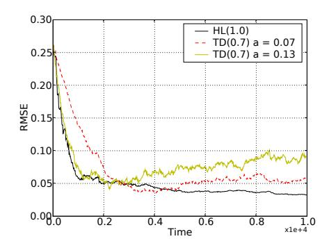

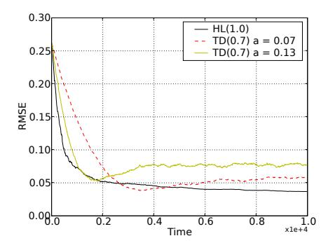

Figure 6.1.: 21 state Markov process, average performance over 10 runs.

Figure 6.2.: 21 state Markov process, average performance over 100 runs.

probability, unless the system is in state 0 or 20 in which case it always transitions to state 10 in the following step. When the state transitions from 0 to 10 a reward of 1.0 is generated, and for a transition from 20 to 10 a reward of -1.0 is generated. All other transitions have a reward of 0. We set the discount value  $\gamma=0.9$  and then computed the true discounted value of each state by running a brute force Monte Carlo simulation.

For our first test we ran our algorithm 10 times on the above Markov chain and computed the root mean squared error in the value estimate across the states at each time step averaged across each run. The optimal value of  $\lambda$  for our algorithm, which we will call  $\mathrm{HL}(\lambda)$ , was 1.0. This was to be expected given that the environment is stationary and thus discounting old experience is not helpful. Setting this parameter correctly was important, for example if we reduced the value of  $\lambda$  to 0.98 performance became poor.

For  $\mathrm{TD}(\lambda)$  the optimal value of  $\lambda$  was about 0.7. This algorithm was much less sensitive to the setting of  $\lambda$ . The other important parameter for  $\mathrm{TD}(\lambda)$  was the learning rate  $\alpha$ . We tested a variety of values, the effect of which is illustrated by the two values  $\alpha=0.07$  and  $\alpha=0.13$  on Figure 6.1.

When  $\alpha$  was high,  $\mathrm{TD}(\lambda)$  learnt more quickly, as we would expect, but then became unstable as the learning rate was too high for fine tuning the value estimates. With the lower learning rate of 0.07,  $\mathrm{TD}(\lambda)$  learnt more slowly, but eventually achieved a more accurate value estimate before becoming stuck. In fact rather than just becoming stuck, what we see is that the error reaches a minimum at around  $t=4{,}000$  and then actually becomes worse for the remainder of the run. This is a well known undesirable characteristic of  $\mathrm{TD}(\lambda)$  (see for example Section 6.2 of Sutton and Barto, 1998). With a fixed learning rate we also see that the variability in the error estimate does not improve towards the end of the run.

In comparison,  $HL(\lambda)$  had very fast learning initially, combined with a more accurate final estimate of the discounted state values, and the mean squared error in the second half of the experiment was very stable. This is significant given that  $TD(\lambda)$  required two parameters to be tuned for good performance, while  $HL(\lambda)$  had just  $\lambda$  which could be set *a priori* to 1.0.

Figure 6.2 shows the same experiment averaged over 100 runs. This obscures the better stability of  $HL(\lambda)$ , but more clearly illustrates its faster learning and better convergence.

## 6.4. A larger Markov process

In order to understand how well  $\mathrm{HL}(\lambda)$  scales as the number of states increases, we ran the previous experiment again but with 51 states. As the movement through the states is almost entirely a random walk with reward on just two transitions, estimating the value function on this Markov chain is significantly more difficult than before, even though the total number of states has not grown all that much. In the new experiment the return state was still in the middle of the chain, i.e. state 25. As most of the state space was a long way from the rewards, we increased the  $\gamma$  value to 0.99 so that states in the middle of the chain would not have values too close to 0. The true discounted value of each state was again computed by running a brute force Monte Carlo simulation.

We ran our algorithm 10 times on the above Markov chain and computed the root mean squared error in the value estimate across the states at each time step averaged across each run. The optimal value of  $\lambda$  for  $\mathrm{HL}(\lambda)$  was 1.0, which was to be expected given that the environment is stationary and thus discounting old experience is not helpful.

For  $\mathrm{TD}(\lambda)$  we tried various different learning rates and values of  $\lambda$ . We could find no settings where  $\mathrm{TD}(\lambda)$  was competitive with  $\mathrm{HL}(\lambda)$ . If the learning rate  $\alpha$  was set too high the system would learn as fast as  $\mathrm{HL}(\lambda)$  briefly before becoming stuck. With a lower learning rate the final performance was improved, however the initial performance was now much worse than  $\mathrm{HL}(\lambda)$ . The results of these tests appear in Figure 6.3.

Similar tests were performed with larger and smaller Markov chains, and with different values of  $\gamma$ .  $\operatorname{HL}(\lambda)$  was consistently superior to  $\operatorname{TD}(\lambda)$  across these tests. One wonders whether this may be due to the fact that the implicit learning rate that  $\operatorname{HL}(\lambda)$  uses is not fixed. To test this we explored the performance of a number of different learning rate functions on the 51 state Markov chain described above. We found that functions of the form  $\frac{\kappa}{t}$  always performed poorly, however good performance was possible by setting  $\kappa$  correctly for functions of the form  $\frac{\kappa}{\sqrt{t}}$  and  $\frac{\kappa}{\sqrt[3]{t}}$ . As the results were much closer, we averaged over 300 runs. These results appear in Figure 6.4.

With a variable learning rate  $TD(\lambda)$  is performing much better, however we were still unable to find an equation that reduced the learning rate in such

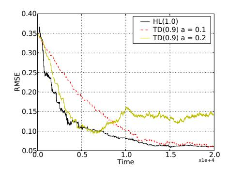

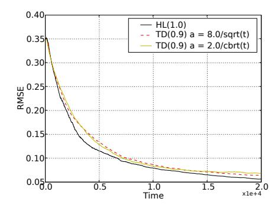

Figure 6.3.: 51 state Markov process averaged over 10 runs. The parameter a is the learning rate  $\alpha$ .

Figure 6.4.: 51 state Markov process averaged over 300 runs.

a way that  $TD(\lambda)$  would outperform  $HL(\lambda)$ . This is evidence that  $HL(\lambda)$  is adapting the learning rate optimally without the need for manual equation tuning.

## 6.5. Random Markov process

To test on a Markov process with a more complex transition structure, we created a random 50 state Markov process. We did this by creating a 50 by 50 transition matrix where each element was set to 0 with probability 0.9, and a uniformly random number in the interval [0,1] otherwise. We then scaled each row to sum to 1. Then to transition between states we interpret the  $i^{th}$  row as a probability distribution over which state follows state i. To compute the reward associated with each transition we created a random matrix as above, but without normalising. We set  $\gamma=0.9$  and then ran a brute force Monte Carlo simulation to compute the true discounted value of each state.

The  $\lambda$  parameter for  $\mathrm{HL}(\lambda)$  was simply set to 1.0 as the environment is stationary. For TD we experimented with a range of parameter settings and learning rate decrease functions. We found that a fixed learning rate of  $\alpha = 0.2$ , and a decreasing rate of  $\frac{1.5}{\sqrt[3]{t}}$  performed reasonable well, but never as well as  $\mathrm{HL}(\lambda)$ . The results were generated by averaging over 10 runs, and are shown in Figure 6.5.

Although the structure of this Markov process is quite different to that used in the previous experiment, the results are again similar:  $\mathrm{HL}(\lambda)$  preforms as well or better than  $\mathrm{TD}(\lambda)$  from the beginning to the end of the run. Furthermore, stability in the error towards the end of the run is better with  $\mathrm{HL}(\lambda)$  and no manual learning tuning was required for these performance gains.

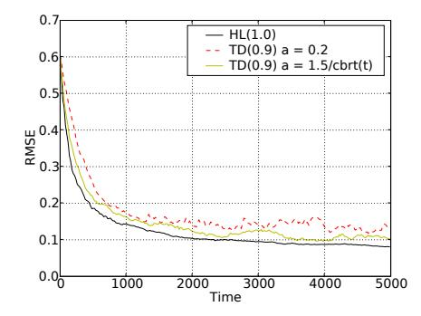

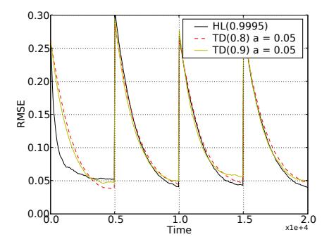

Figure 6.5.: Random 50 state Markov process. The parameter a is the learning rate  $\alpha$ .

Figure 6.6.: 21 state non-stationary Markov process.

## 6.6. Non-stationary Markov process

The  $\lambda$  parameter in  $\mathrm{HL}(\lambda)$ , introduced in Equation (6.4), reduces the importance of old observations when computing the state value estimates. When the environment is stationary this is not useful and so we can set  $\lambda=1.0$ , however in a non-stationary environment we need to reduce this value so that the state values adapt properly to changes in the environment. The more rapidly the environment is changing, the lower we need to make  $\lambda$  in order to more rapidly forget old observations.

To test  $\mathrm{HL}(\lambda)$  in such a setting we reverted back to the 21 state Markov chain from Section 6.3 in order to speed up convergence. We used this Markov chain for the first 5,000 time steps. At that point, we changed the reward when transitioning from the last state to the middle state from -1.0 to be 0.5. At time 10,000 we then switched back to the original Markov chain, and so on alternating between the models of the environment every 5,000 steps. At each switch, we also changed the target state values that the algorithm was trying to estimate to match the current configuration of the environment. For this experiment we set  $\gamma=0.9$ .

As expected, the optimal value of  $\lambda$  for  $\mathrm{HL}(\lambda)$  fell from 1 down to about 0.9995. This is about what we would expect given that each phase is 5,000 steps long. For  $\mathrm{TD}(\lambda)$  the optimal value of  $\lambda$  was around 0.8 and the optimum learning rate was around 0.05. As we would expect, for both algorithms when we pushed  $\lambda$  above its optimal value this caused poor performance in the periods following each switch in the environment (these bad parameter settings are not shown in the results). On the other hand, setting  $\lambda$  too low produced initially fast adaption to each environment switch, but poor performance after that until the next environment change. To get accurate statistics we averaged over 200 runs. The results of these tests appear in Figure 6.6.

#### **Algorithm 2** $HLS(\lambda)$

```
Initialise Q(s,a) = 0, N(s,a) = 1 and E(s,a) = 0 for all s, a
Initialise s and a
repeat
   Take action a, observed r, s'
   Choose a' by using \epsilon-greedy selection on Q(s', \cdot)
   \Delta \leftarrow r + \gamma Q(s', a') - Q(s, a)
   E(s,a) \leftarrow E(s,a) + 1
   N(s,a) \leftarrow N(s,a) + 1
   for all s, a do
     \beta((s,a),(s',a')) \leftarrow \frac{1}{N(s',a')-\gamma E(s',a')} \frac{N(s',a')}{N(s,a)}
   end for
   for all s, a do
      Q(s,a) \leftarrow Q(s,a) + \beta((s,a),(s',a'))E(s,a)\Delta
      E(s,a) \leftarrow \gamma \lambda E(s,a)
      N(s,a) \leftarrow \lambda N(s,a)
   end for
   s \leftarrow s' : a \leftarrow a'
until end of run
```

For some reason HL(0.9995) learns faster than TD(0.8) in the first half of the first cycle, but only equally fast at the start of each following cycle. Furthermore, its performance in the second half of the first cycle is poor. We are not sure why this is happening. We could improve the initial speed at which  $HL(\lambda)$  learnt in the last three cycles by reducing  $\lambda$ , however that comes at a performance cost in terms of the lowest mean squared error attained at the end of each cycle. In any case, in this non-stationary situation  $HL(\lambda)$  again performed well in general.

## 6.7. Windy Gridworld

Reinforcement learning algorithms such as Watkins' version of  $Q(\lambda)$  (Watkins, 1989) and Sarsa( $\lambda$ ) (Rummery and Niranjan, 1994; Rummery, 1995) are based on temporal difference updates. This suggests that new reinforcement learning algorithms based on  $HL(\lambda)$  should be possible.

For our first experiment we took the standard  $\operatorname{Sarsa}(\lambda)$  algorithm and modified it in the obvious way to use an HL temporal difference update. In the presentation of this algorithm we have changed notation slightly to make things more consistent with that typical in reinforcement learning. Specifically, we have dropped the t super script as this is implicit in the algorithm specification, and have defined  $Q(s,a) := V_{(s,a)}$ ,  $E(s,a) := E_{(s,a)}$  and  $N(s,a) := N_{(s,a)}$ . Our new reinforcement learning algorithm, which we call  $\operatorname{HLS}(\lambda)$  is given in Algorithm 2. Essentially the only changes to the standard  $\operatorname{Sarsa}(\lambda)$  algorithm

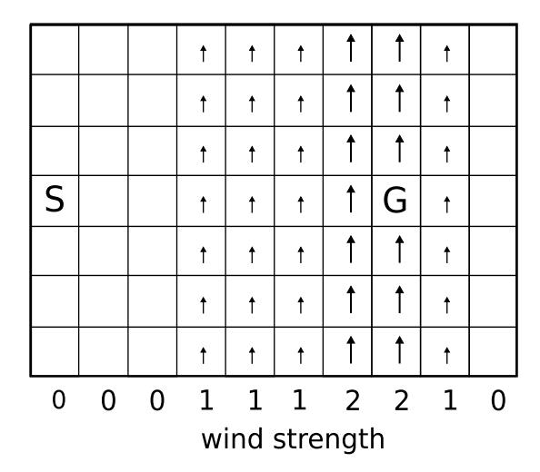

Figure 6.7.: [Windy Gridworld] S marks the start state and G the goal state, at which the agent jumps back to S with a reward of 1. Small arrows indicate an upward wind of one row per time step. The large arrows indicate a wind of two rows per time step.

have been to add code to compute the visit counter N(s, a), add a loop to compute the  $\beta$  values, and replace  $\alpha$  with  $\beta$  in the temporal difference update.

To test  $\operatorname{HLS}(\lambda)$  against standard  $\operatorname{Sarsa}(\lambda)$  we used the Windy Gridworld environment described on page 146 of (Sutton and Barto, 1998). This world is a grid of 7 by 10 squares that the agent can move through by going either up, down, left or right. If the agent attempts to move off the grid it simply stays where it is. The agent starts in the  $4^{th}$  row of the  $1^{st}$  column and receives a reward of 1 when it finds its way to the  $4^{th}$  row of the  $8^{th}$  column. To make things more difficult, there is a "wind" blowing the agent up 1 row in columns 4, 5, 6, and 9, and a strong wind of 2 rows in columns 7 and 8. This is illustrated in Figure 6.7. Unlike in the original version, we have set up this problem to be a continuing discounted task with an automatic transition from the goal state back to the start state. This is because we have not yet derived an episodic version of our learning rule.

We set  $\gamma=0.99$  and in each run computed the empirical future discounted reward at each point in time. As this value oscillated we also ran a moving average through these values with a window length of 50. Each run lasted for 50,000 time steps as this allowed us to see at what level each learning algorithm topped out. These results appear on the left of Figure 6.8 and were averaged over 500 runs to get accurate statistics.

Despite putting considerable effort into tuning the parameters of  $Sarsa(\lambda)$ , we were unable to achieve a final future discounted reward above 5.0. The

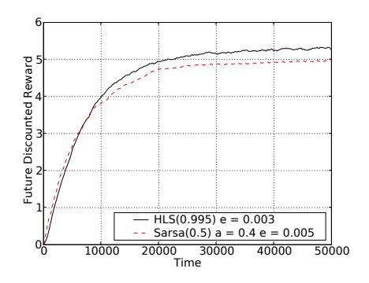

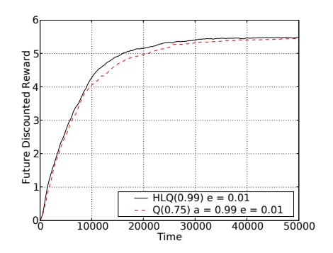

Figure 6.8.: Windy Gridworld performance tests. The left graph shows  $\operatorname{HLS}(\lambda)$  vs.  $\operatorname{Sarsa}(\lambda)$ , while the right graph shows  $\operatorname{HLQ}(\lambda)$  vs.  $\operatorname{Q}(\lambda)$ . In both tests the algorithm based on HL learning performed best. e represents the exploration parameter  $\epsilon$ , and a represents the learning rate  $\alpha$ . For both tests the performance was averaged over 500 runs.

settings shown on the graph represent the best final value we could achieve. In comparison  $\text{HLS}(\lambda)$  easily beat this result at the end of the run, while being slightly slower than  $\text{Sarsa}(\lambda)$  at the start. By setting  $\lambda=0.99$  we were able to achieve the same performance as  $\text{Sarsa}(\lambda)$  at the start of the run, however the performance at the end of the run was then only slightly better than  $\text{Sarsa}(\lambda)$ . This combination of superior performance and fewer parameters to tune suggest that the benefits of  $\text{HL}(\lambda)$  carry over into the reinforcement learning setting. In terms of computational cost,  $\text{HL}(\lambda)$  was about 1.7 times slower than  $\text{Sarsa}(\lambda)$  per time step due to the cost of computing the  $\beta$  values.

Another popular reinforcement learning algorithm is Watkins'  $Q(\lambda)$ . Similar to  $Sarsa(\lambda)$  above, we simply inserted the  $HL(\lambda)$  temporal difference update into the usual  $Q(\lambda)$  algorithm in the obvious way. We call this new algorithm  $HLQ(\lambda)$  and it is given in Algorithm 3. The test environment was exactly the same as we used with  $Sarsa(\lambda)$  above.

The results this time were more competitive and appear on the right hand side of Figure 6.8. Nevertheless, despite spending a considerable amount of time fine tuning the parameters of  $Q(\lambda)$ , we were unable to beat  $HLQ(\lambda)$ . As the performance advantage was relatively modest, the main benefit of  $HLQ(\lambda)$  was that it achieved this level of performance without having to manually tune a learning rate.

#### **Algorithm 3** $HLQ(\lambda)$

```
Initialise Q(s,a) = 0, N(s,a) = 1 and E(s,a) = 0 for all s, a
Initialise s and a
repeat
   Take action a, observed r, s'
   Choose a' by using \epsilon-greedy selection on Q(s', \cdot)
   a^* \leftarrow \arg\max_b Q(s', b)
   \Delta \leftarrow r + \gamma Q(s', a^*) - Q(s, a)
   E(s,a) \leftarrow E(s,a) + 1
   N(s,a) \leftarrow N(s,a) + 1
   for all s, a do
      \beta((s,a),(s',a')) \leftarrow \frac{1}{N(s',a') - \gamma E(s',a')} \frac{N(s',a')}{N(s,a)}
   end for
   for all s, a do
      Q(s,a) \leftarrow Q(s,a) + \beta((s,a),(s',a'))E(s,a)\Delta
      N(s,a) \leftarrow \lambda N(s,a)
      if a' = a^* then
         E(s,a) \leftarrow \gamma \lambda E(s,a)
      else
         E(s,a) \leftarrow 0
      end if
   end for
   s \leftarrow s' : a \leftarrow a'
until end of run
```

### 6.8. Conclusion

We have derived a new equation for setting the learning rate in temporal difference learning with eligibility traces. The equation replaces the free learning rate parameter  $\alpha$ , which is normally experimentally tuned by hand. In every setting tested, be it stationary Markov chains, non-stationary Markov chains or reinforcement learning, our new method produced superior results.

To further our theoretical understanding, the next step would be to try to prove that the method converges to correct estimates. This can be done for  $TD(\lambda)$  under certain assumptions on how the learning rate decreases over time (Dayan, 1992; Peng, 1993). Hopefully, something similar can be proven for our new method. In terms of experimental results, it would be interesting to try different types of reinforcement learning problems and to more clearly identify where the ability to set the learning rate differently for different state transition pairs helps performance.

Many extensions to the algorithm should also be possible. One would be to generalise the learning rule to episodic tasks, another would be to merge our update rule with Peng's version of  $Q(\lambda)$  (Peng and Williams, 1996), as we

#### TD UPDATING WITHOUT A LEARNING RATE

have done with  $Sarsa(\lambda)$  and Watkins' version of  $Q(\lambda)$ . Finally, it would be useful to extend the algorithm to work with function approximation methods so that it could deal with larger state spaces.

## 7. Discussion

The title of this thesis is deliberately provocative. It asks the reader to consider not just intelligent machines, but the possibility of machines that are super intelligent. Many find this idea difficult to take seriously. Among researchers the topic is almost taboo: it belongs in science fiction. The most intelligent computer in the world, they assure the public, is perhaps as smart as an ant, and that's on a good day. True machine intelligence, if it is ever developed, lies in the distant future.

This was not always the case. In the 1960's pioneering artificial intelligence researchers had initial successes in a range of areas. Emboldened, they predicted that more powerful systems were not far off, and that truly intelligent machines might follow. As the researcher Herbert Simon wrote in 1965, "machines will be capable, within twenty years, of doing any work a man can do." (quoted in Crevier, 1993) The field was alight with ambition and, not surprisingly, attracted plenty of attention.

Over the decade that followed a series of high profile failures brought this dream crashing back to earth. Although progress was being made, it was far slower than many had expected. Naturally the public, and more importantly the funding agencies, wanted to know where the intelligent machines were. The cuts that ensued marked the beginning of the so called 'AI winter', although usage of this label varies considerably (Crevier, 1993; Russell and Norvig, 1995). During the early 80's there was a brief reprieve as expert systems became popular, however by the late 80's these too had failed to live up to expectations. Over time some areas distanced themselves from the label 'artificial intelligence', emphasising that their work was more practical and limited in scope. Any talk of building machines with human level intelligence was frowned upon.

Since the early 90's steady progress has slowly begun to reinvigorate the field, particularly since the late 90's. More powerful algorithms coupled with dramatically improved hardware has produced countless advances in robotics, speech recognition, natural language processing, image processing, clustering, classification, prediction, various types of optimisation, and many other areas. As a result the reputation of artificial intelligence has started to recover and funding has improved, leading some to believe that the 'AI spring' may have finally arrived (Havenstein, 2005).

With the mood becoming more positive, the grand dream of artificial intelligence is starting to make a come back. A number of books predicting the arrival of advanced artificial intelligence have been published and major conferences have held workshops on 'Human level AI'. Small conferences on

'Artificial General Intelligence' and on the safety issues surrounding powerful machine intelligence have also appeared. Perhaps over the next few years these ideas will become more mainstream, however for now they are at the fringe. Most researchers remain very sceptical about the idea of truly intelligent machines within their lifetime.

One goal of this thesis is to promote the idea that intelligent machines, even super intelligent machines, is a topic that is both important and one that can be scientifically studied, even if just theoretically for now. In Chapters 2 and 3 we described Hutter's model of an intelligent machine and examined some of its remarkable properties. In Chapter 4 we saw how this model can be used to construct a general measure of machine intelligence that formalises many of the standard perspectives on the nature of intelligence outlined in Chapter 1. In Chapter 5 we then examined some of the theoretical limitations faced by powerful artificial intelligence algorithms. Thus, although highly intelligent machines do not exist yet, theoretical tools are starting to emerge to allow us to study their properties. While this thesis makes some contributions to this effort, many fundamental questions remain open (see for example the open problems listed in Hutter, 2005).

None of this theoretical work would be of much importance if intelligent machines were impossible in practice, or exceedingly unlikely in any reasonable time frame. In this last chapter we will argue that this is not the case. Our goal is not to conclusively argue that this will happen, or exactly when it will happen, but simply to argue that the possibility cannot be completely discounted. This is important because if a super intelligent machine ever did exist the implications for humanity would be immense. Thus, if there is even a small probability that intelligent machines could be developed in the foreseeable future, it is important that we start to think seriously about the nature of these machines and what the implications might be.

## 7.1. Are super intelligent machines possible?

Many people outside of the field are deeply sceptical about the idea that machines, mere physical objects of our construction, could ever have anything resembling real intelligence: machines can only ever be strictly logical; they cannot do anything they were not programed to do; and they certainly could not be superior to their own creator — that would be a paradox! However, as anybody working in the field knows, these common beliefs are baseless myths. Artificial intelligence algorithms regularly find solutions to problems using heuristics and forms of reasoning that are not strictly logical. They discover powerful new designs for problems that the system's programmers had never thought of (Koza et al., 2003). They also learn to play games such as chess (Hsu et al., 1995) and backgammon (Tesauro, 1995) at levels superior to that of any human, let alone the researchers who designed and created the

system. Indeed, in the case of checkers, computers are now literally unbeatable as they can play a provably perfect game (Schaeffer et al., 2007).

The persistence of these beliefs seems to be due to a number of things. One is that algorithms from artificial intelligence are not consumer products: they are hidden in the magic of sophisticated technology. For example, when hand writing the address on a card most people do not know that it will likely be read by a computer rather than a human at the sorting office. People do not think about the learning algorithms that are monitoring their credit card transactions looking for fraud, filtering spam to their email address, automatically trading their retirement savings on international markets, monitoring their behaviour on the internet in order to decide which ads should appear on web pages they view, or even just the vision processing algorithms that graded the apples at the supermarket. The steady progress that artificial intelligence algorithms are making is out of sight, and thus generally out of mind.

Another common objection is that we humans have something mysterious and special that makes us tick, something that machines, by definition, do not have. Perhaps some type of non-physical consciousness or feelings, qualia, or 'quantum field' etc. Of course it is impossible to rule out mysterious possibilities until an intelligent machine has been constructed without needing anything particularly mysterious. Nonetheless, we should view such objections for what they are: a form of vitalism. Throughout history, whenever science could not explain some unusual phenomenon, many people readily assumed that God or magic was at work. Even distinguished scientists have fallen into this, only to be embarrassed once more sceptical and curious scientists worked out what was actually going on. Things ranging from the motion of whole galaxies to the behaviour of sub-atomic particles are now known to follow extremely precise physical laws. To conjecture that our brains are somehow special and different in some strange way is to speculate based on nothing but our own feelings of specialness.

If the human brain is merely a 'meat machine', as some have put it, it is certainly not the most powerful intelligence possible. To start with, there is the issue of scale: a typical adult human brain weights about 1.4 kg and consumes just 25 watts of power (Kandel et al., 2000). This is ideal for a mobile intelligence, however an artificial intelligence need not be mobile and thus could be orders of magnitude larger and more energy intensive. At present a large supercomputer can fill a room twice the size of a basketball court and consume 10 megawatts of power. With a few billion dollars much larger machines could be built. Google, for example, is currently constructing a data centre next to a power station in Oregon that will cover two football fields and have cooling towers four stories high (Markoff and Hansell, 2005). Biology never had the option of building brains on such an enormous scale.

Another point is that brains use fairly large and slow components. Consider one of the simpler of these, axons: essentially the wiring of the nervous system. These are typically around 1 micrometre wide, carry spike signals at up to 75 metres per second at a frequency of at most a few hundred hertz (Kandel et al.,

2000). Compare these characteristics with those of a wire that carries signals on a microchip. Currently these are 45 nanometres wide, propagate signals at 300 million metres per second and can easily operate at 4 billion hertz. Some might debate whether an electrochemical spike travelling down an axon is so directly comparable to an electrical pulse travelling down a wire, however it is well established that at least the primary role of an axon is simply to carry this information. Given that present day technology produces wires which are 20 times thinner, propagate signals 4 million times faster and operate at 20 million times the frequency, it is hard to believe that the performance of axons could not be improved by at least a few orders of magnitude.

Of course, the above assumes that the brain's design is what we should replicate. Perhaps the brain's algorithm is close to optimal for some things, but it certainly is not optimal for all problems. Even the most outstanding savants cannot store information anywhere near as quickly, accurately and in the quantities that are possible for a computer. Also savants' impressive ability to perform fast mental calculations is insignificant next to even a basic calculator. Brains are poorly designed for such feats. A machine, however, would have no such limitations: it could employ a range of specialised algorithms for different types of problems. Concepts like education become obsolete when knowledge and understanding can simply be copied from one intelligent machine to another. It is easy to think up many more advantages.

Most likely improvements over brains are possible in algorithms, hardware and scale. This is not to take away from the amazing system that the brain is, something that we are still unable to match in many ways. All we wish to point out is that if the brain is essentially just a machine, which appears to be the case, then it certainly is not the most intelligent machine that could exist. This idea is reasonable once you think about it: machines can easily carry more, fly higher, move faster and see further than even the most able animals in each of these categories. Why would human intelligence be any different? Of course, just because systems with greater than human intelligence are possible in principle, this does not mean that we will be able to build one. Designing and constructing such an advanced machine could be beyond our capabilities.

## 7.2. How could intelligent machines be developed?

There are many ways in which machine intelligence might be developed. Unfortunately, it is difficult to estimate how likely any of these approaches are to succeed. In this section we speculate on a few of them.

### Theoretical approaches

The approach most closely related to this thesis would be to take the AIXI model and find a way to usefully scale it down. A number of attempts to do this have been made: the  $\mathrm{HL}(\lambda)$  algorithm presented in Chapter 6, the

AIXItl algorithm (Chapter 7 of Hutter, 2005), the AIXI based algorithm for repeated matrix games (Poland and Hutter, 2006) and Fitness Uniform Optimisation (Hutter and Legg, 2006) all originate in efforts to scale down AIXI. Although not deriving from AIXI, the Shortest and Fastest algorithm in (Hutter, 2002a), the Speed prior (Schmidhuber, 2002), the Optimal Ordered Problem Solver (Schmidhuber, 2004), and the Gödel Machine (Schmidhuber, 2005) come from a related background in algorithmic probability and Kolmogorov complexity theory. While each of these has their strengths, as yet none come close to bringing the power of theoretical models such as AIXI into reality.

The key question is how to make a general and powerful artificial intelligence like AIXI work efficiently. The results of Chapter 5 offer some hints on the direction that such a project might take. For certain, the prediction of general computable sequences is out of the question (Lemma 5.2.4), as is the prediction of all computable sequences whose Kolmogorov complexity is below some moderate bound. Otherwise serious problems arise with the necessary complexity of the prediction algorithms (Theorem 5.3.3), and even worse Gödel incompleteness (Theorem 5.6.1). Nevertheless, we know that certain types of complex sequences can be predicted by relatively simple algorithms (Lemma 5.2.3), and that many theoretical problems go away when even weak bounds are placed on the computation time of the sequences to be predicted (Lemma 5.5.2). Thus, what we need to aim for is the ability to efficiently predict computable sequences that have certain computational resource bounds. How best to characterise such sequences is an open problem, let alone how to efficiently learn to predict them. Perhaps any breakthrough is more likely to come from the opposite direction: somebody discovers a theoretically elegant and very powerful algorithm that is able to efficiently predict many kinds of sequences. The structure of this algorithm and how easily it can model different sequences will then implicitly define a natural measure of resource bounded sequence complexity.

When a breakthrough in this area might occur is impossible to predict, and the same is true of other theoretical approaches. Perhaps with the right theoretical insight Bayesian networks, prediction with expert advice, artificial neural networks, reasoning engines, or any one of a dozen other techniques will suddenly advance in a dramatic way. Although some progress in all of these areas is a near certainty, true breakthroughs by their very nature are rare and highly unpredictable. Furthermore, even if a huge breakthrough did occur, whether existing computer hardware would be sufficient to support the creation of highly intelligent machines would depend on the nature of this new algorithm. In summary, although we cannot rule out the possibility of a large breakthrough leading to intelligent machines, there is little we can do to estimate how likely this is.

#### Brain simulation

Rather than taking abstract theories like AIXI and trying to scale them down to make them practical, another approach is to proceed in the opposite direction: start by studying the details of how real biological brains work and then try to abstract from this a design for an artificial intelligence. Although this idea is simple in principle, studying and understanding the brain is very challenging.

One of the most basic problems is that it is currently impossible to observe a brain in action with sufficient spatial and temporal resolution to really see how it works. Methods to study the brain include: PET scans, fMRI scans, arrays of probes, marking neurons with chemicals which cause them to fluoresce when they fire, placing extracted neural tissue on microchips that can sense when neurons fire, and the use of staining and microscopy to study the anatomical structure of the brain. The problem is that none of these methods allows a researcher to take a sizable area of a brain and simultaneously observe exactly which neurons are firing, precisely when they fire, what type of neurons they are, which other neurons they are connected to, the types of these connections, how these connections change over short intervals of time, and so on. Instead, researchers have at their disposal a range of methods, each of which provides only a limited view of what is going on. Indeed, what is known about the brain is largely dictated by the strengths and weaknesses of the different methods of study.

Another major problem is the sheer complexity of the system. A human brain consists of hundreds of billions of neurons, and hundreds of trillions of synapses. There are over a hundred different types of neurons, different synapses employ different combinations of neurotransmitters, connection patterns vary from one part of the brain to another, and so on (see any standard text book, for example Kandel et al., 2000). When looking at slices of brain tissue where a small percentage of neurons and their dendritic trees have been stained, the brain's wiring starts to look about as comprehensible as an ocean of tangled spaghetti. Even worse, all these elements interact with each other in highly dynamic ways. Via some kind of a miracle, from this monstrous cacophony emerges the human mind. With so much complexity, even if the perfect brain scanning technology existed it might still be very difficult to understand how the brain actually works.

Given the scale of these difficulties, is building a brain simulation feasible? Perhaps the first point to note is that building a working simulation of something does not require understanding everything about how the system works. What is required is that the basic units which comprise the system can be faithfully reproduced and connected together. If this is done properly, the resulting dynamics will be the same as the dynamics in the real system — even if we do not fully understand what these higher level dynamics are, or why they are important to the system's overall functioning. Indeed, simulations are often constructed for the very purpose of better understanding a system's emergent dynamics once its low level dynamics are understood. Thus, rather

than needing to understand all the mysteries of how the brain works, in order to build a functional simulation it is sufficient to understand the nature and organisation of the brain's elementary units: neurons, dendrites, axons, synapses etc. There is already a large body of knowledge about how these basic units work and how they are wired together in various parts of the brain. Literally thousands of researchers around the world are refining and developing this knowledge.

Another important point, at least for people interested in developing artificial intelligence, is that much of the brain's complexity is not relevant. A significant part of the human brain is a jumble of different subsystems that take care of basic instinctive things like breathing, heart beat, blood pressure, reproduction, hunger, thirst, rhythms such as sleeping and body temperature, fight or flight response and so on. Even one of the largest parts of the brain, the cerebellum which is involved in movement and precision timing, is not needed for an artificial intelligence: individuals without one are still intellectually and emotionally able. The key, it seems, lies in understanding the neocortex, and its interaction with two smaller structures, namely, the thalamus and the hippocampus. It is known that the neocortex is the part of the brain that is primarily responsible for processing vision, sound, touch, proprioception, understanding and generating language, planning, spatial reasoning, coordinating and executing movement, and logical thought (Fuster, 2003). Clearly then, the key to artificial intelligence via brain simulation lies in understanding the neocortex and related structures.

As different regions of the neocortex perform different functions, one might expect that they would have significantly different anatomical structures. Amazingly, this is not the case. Essentially the whole neocortex has the same six layer structure, or up to 12 layers depending on how you count them. Each layer is characterised by the types of neurons present, where axons from neurons in the layer project to, and where axons come from that form synapses on the dendritic trees of these neurons. Besides some thickening and thinning of the layers in different regions, and the fact that primary visual cortex actually has an extra layer, this six layer structure is consistent across the whole neocortex (Fuster, 2003; Abeles, 1991). What this suggests is that the same information processing mechanism is being applied across the neocortex, and that the variations in function across different regions are actually adaptations to the information passing through each region (Creutzfeldt, 1977; Mountcastle, 1978).

A number of results back up this hypothesis. One is that with increased use the region of cortex responsible for performing some action tends to expand, in the sense that neighbouring cortex is recruited. In extreme cases, such as the congenitally blind, the unused areas of visual cortex start to perform other roles, such as helping touch processing for reading braille. In a more dramatic example, the brain of a ferret was physically altered at birth so that visual neocortex received auditory input and vice versa. Each region of neocortex

then learnt to process the input it was receiving (Melchner et al., 2000). Similar experiments with rats have produced consistent results.

If the hypothesis of a single underlying learning and adaptation dynamic across the neocortex is correct, then the key to understanding much of the intellectual capacity of the brain lies in understanding how these six layers work, and the way in which they interact with the thalamus and hippocampus. In recent years this approach to artificial intelligence has been popularised by Jeff Hawkins (2004), though most of these ideas have been known in neuroscience for some time. The main vehicle for Hawkins' artificial intelligence work is his company Numenta, with related neuroscience research being carried out at the Redwood Center for Theoretical Neuroscience, also founded by Hawkins. They are certainly not alone in trying to understand the cortex, indeed it is one of the largest areas of neuroscience research with whole journals dedicated to the topic.

One group of researchers whose work may be useful to brain modelling is currently cutting a cortical column into 30 nanometre slices and then scanning these using both electron and light based microscopes. As this produces enormous quantities of data, machine learning algorithms are being developed to automatically identify the structures in these images. Over the next few years this process should produce an extremely detailed three dimensional anatomical model of the cortex (Singer, 2007).

A group with more of a simulation emphasis is the BlueBrain project based at EPFL. Using information on the structure and behaviour of cortical columns collected from a wide range of sources, they have built a computer model of a column that they run on an IBM BlueGene supercomputer. To calibrate their model they use segments of rat cortex which they stimulate in different ways and then compare the resulting dynamics with what their model predicts. They now claim to have succeeded in accurately modelling the dynamics of a cortical column, and are working on ways to expand this model to be able to simulate groups of columns working together (Graham-Rowe, 2007). Their goal is to eventually be able to simulate an entire human neocortex.

Another group working at the IBM Almaden Research Lab recently announced that they had simulated a mouse scale neocortex, also on an IBM BlueGene supercomputer. Their model consisted of 8 million neurons and 50 billion synapses and ran at one seventh real time speed. They claim that this simulation produced dynamical properties consistent with what is observed in a real mouse brain, including EEG like waves (Ananthanarayanan and Modha, 2007). Their aim is also to scale up to a human sized neocortex as more powerful supercomputers become available in the coming years. Unlike the BlueBrain project, their core goals are less neuroscience orientated: as their model starts to do more interesting things, their aim is to extract from this useful algorithms for artificial intelligence.

Obviously these simulations are pushing the limits of what is known about the cortex, and also what is possible with current computer technology. Nevertheless, the fact that these simulations are being attempted at all illustrates how the gap between the power of supercomputers and brains is perhaps not as large as some people think. At present the world's fastest machine is the IBM Roadrunner supercomputer at the US department of defence which has an official LINPACK benchmark performance of  $10^{15}$  floating point operations per second (FLOPS). Machines capable of  $10^{16}$  FLOPS are being designed and should appear in a few years. No doubt these will be superseded by even more powerful machines.

To put these numbers in perspective, a human cortex has on the order of  $10^{10}$  neurons and  $10^{14}$  synapses (Koch, 1999). Given that neurons can fire on the order of 100 Hz, this gives a crude estimate of the computational capacity of the brain:  $10^{16}$  operations per second (Moravec, 1998; Kurzweil, 2000). Of course, until a simulation succeeds in producing intelligence, nobody knows for sure how much computer power will be needed. Researchers working in molecular neuroscience tend to think it is much more, while some working in theoretical neuroscience think it could be less. If the estimate of  $10^{16}$  FLOPS is in fact 100 times too low, then we will have to wait 10 years before a sufficiently powerful computer exists.

#### **Evolution**

Another approach that is becoming more attractive with increasing computer power is artificial evolution. After all, natural evolution produced the human brain so we know that the approach does work — at least as a planet wide phenomenon over billions of years! No computer in the foreseeable future could hope to simulate evolution on such a scale. Fortunately, evolving an artificial intelligence via an evolutionary algorithm is a much smaller problem. To begin with, it is not necessary to start from scratch the way nature did. Of the approximately 4 billion years since simple cellular life first came into existence, about 3 billion years of this time was required just to get to the level of multicellular life. Only then could more complex organisms start to evolve. We can short circuit this by building a virtual body for the agent. Of course, evolving an intelligence for a complex body might be too difficult, thus we may want to begin with trying to evolve a simple intelligence for a simple body in a simple environment, and then scale up. In any case, all the evolutionary algorithm has to do is to work on the design of the agent's intelligence: much of the remaining complexity can be taken care of by us.

Another important point is that natural evolution does not seek to maximise intelligence: its effect is to optimise agents' ability to spread their genes. Intelligence is a secondary feature that is more useful in some ecological niches than others. In artificial evolution this does not need to be the case. So long as we can define and measure intelligence in a sufficiently general way, we can use this to evaluate the fitness of individuals. With evolution explicitly directed towards maximising intelligence, progress towards more intelligent agents should be far more rapid.

#### 7. Discussion

The universal intelligence measure described in Chapter 4 lays the foundation for such a measure. Essentially, what the universal intelligence measure says is that we should test agents initially over extremely trivial pattern recognition and interaction problems as these are the most important. As agents learn to solve these, we should slowly include more complex problems, always ensuring that agents are still able to solve the simple problems that came before. This ensures that the agents' abilities remain very general as they develop. As the universal intelligence measure is still a theoretical definition, some further work would be needed to figure out how best to convert it into a practical test for evolving agents.

The importance of having a good fitness function cannot be stressed enough: with a fitness function that is reliable, smooth and has a gradient that generally points in the right direction, even high dimensional optimisation problems can become relatively easy. With an unreliable or deceptive fitness function seemingly simple problems can become practically unsolvable. It is currently unknown how well universal intelligence would work as a fitness function for evolving agents with general intelligence.

Another major issue concerns the model that we use for the agents' intelligence: should the agents be neural networks, programs in some language, or some other kind of object? In theory any Turing equivalent representation should do, however in practice the choice of representation is important as it has the effect of biasing the space of possibilities towards certain types of agents. Often choosing the right representation is critical to making artificial evolution work. For an intelligent agent there are many possible systems of representation, each with their respective proponents. Unfortunately, nobody really knows which of these is the best. About the only thing we know for sure is that nature was able to evolve intelligence working with networks of spiking neurons. On the other hand, with a computer system perhaps something closer to a traditional programing language would be more efficient.

One important problem faced in large scale artificial evolution is diversity control. Essentially, if you apply too much selection pressure the population tends to collapse around a small group of individuals that are all related to the fittest individual. At this point evolution becomes stuck due to a lack of genetic diversity. If you reduce the selection pressure this helps, however now the speed at which the population fitness rises is reduced. Even with no selection pressure at all population diversity tends to collapse over time due to the phenomenon of genetic drift. For problems where the evolving individuals are fairly simple this can easily be dealt with by creating a distance metric to evaluate how similar individuals are to each other. This can then be used to ensure that similar individuals tend not to mate with each other, or have reduced fitness (see for example Goldberg and Richardson, 1987; Jong, 1975). In more complex problems, however, it can become very difficult to judge how similar two individuals really are. For example, two neural networks may compute the same function, but have completely different weights and

topologies. Indeed, due to Rice's theorem it is impossible in general to decide whether two algorithms compute the same function.

One solution is to use diversity control methods that do not rely on comparing the genotypes of the individuals, but rather by comparing properties of their phenotypes. A simple example of this is Fitness Uniform Optimisation where the evolutionary algorithm tries to increase the diversity in the population by increasing the diversity of fitness (Hutter and Legg, 2006). In the case of the Fitness Uniform Selection Scheme (FUSS) this is achieved through selection pressure (Hutter, 2002b; Legg et al., 2004), while for the Fitness Uniform Deletion Scheme it is achieved by deletion (Legg and Hutter, 2005a). Although these methods have not yet been applied to the evolution of programs or neural networks, they have proven to be effective on a number of deceptive optimisation problems.

Another possibility might be to mix biologically and theoretically derived designs with evolution. For example, as a starting point take a model of the neocortex based on biological studies, such as those in the previous section, and then apply artificial evolution to modify and tune the model. Although we might not get the initial design right due to limitations in our understanding of the cortex, it is reasonable to suppose that in the space of all neural networks this initial design is relatively close to the correct design, or a related design that also works. Starting with individuals that are reasonably close to the target makes the optimisation problem that evolution has to solve orders of magnitude easier.

Even if each of the above suggestions succeeded in reducing the difficulty of evolving intelligence by several orders of magnitude, perhaps the biggest problem is still computer power. Advancing technology over the coming decades will help, but this could still be too little. Perhaps the closest we could come to nature's planet scale evolution would be to construct a world wide network of machines donating computation time. After all, more than 2 million years of computer time have so far been donated to the Search for Extrater-restrial Intelligence (SETI), why not something similar to search for artificial intelligence?

## 7.3. Is building intelligent machines a good idea?

It is impossible to know whether any of the approaches discussed in the previous section, or other approaches, will succeed in producing truly intelligent machines. But this is not the point we want to make: the point is that it is not obvious that they will all fail. This is important, because the impact of this event would be huge. Following the first credible demonstration of true general intelligence in a machine, for sure a much larger and more powerful machine will be constructed shortly thereafter. This leads to what I. J. Good referred to as an intelligence explosion:

"Let an ultraintelligent machine be defined as a machine that can far surpass all the intellectual activities of any man however clever. Since the design of machines is one of these intellectual activities, an ultraintelligent machine could design even better machines; there would then unquestionably be an 'intelligence explosion,' and the intelligence of man would be left far behind. Thus the first ultraintelligent machine is the last invention that man need ever make." (Good, 1965)

The defining characteristic of our species is intelligence. It is not by superior size, strength or speed that we dominate life on earth, but by our intelligence. If our intelligence were to be significantly surpassed, it is difficult to imagine what the consequences of this might be. It would certainly be a source of enormous power, and with enormous power comes enormous responsibility.

Machine intelligence could bring unprecedented wealth and opportunity if used constructively and safely. Alternatively, it could bring about some kind of a nightmare scenario. The latter possibility is certainly well known, being a staple of science fiction. Positive fictional depictions are rare, probably because casting the machines as villains is a convenient plot device. Outside of works of fiction, however, the implications of powerful machine intelligence are rarely encountered. Indeed, the whole subject of truly intelligent machines is generally avoided by academics, as noted at the start of this chapter.

If one accepts that the impact of truly intelligent machines is likely to be profound, and that there is at least a small probability of this happening in the foreseeable future, it is only prudent to try to prepare for this in advance. If we wait until it seems very likely that intelligent machines will soon appear, it will be too late to thoroughly discuss and contemplate the issues involved. Historically technology has advanced in leaps and bounds, while social and ethical considerations have developed more slowly, often only as a reaction to the problems created by a technology after it arrived. Even what now seem to be obvious moral principles, such as gender and racial equality, were debated for centuries and are still not accepted in many parts of the world. Given that the implications of powerful machine intelligence are likely to be complex, we cannot expect to find good answers quickly. We need to be seriously working on these things now.

A small but growing number of forward thinking individuals and organisations are thinking about these issues. Perhaps the premier organisation dedicated to the safe and beneficial development of powerful artificial intelligence is the Singularity Institute for Artificial Intelligence (SIAI). In 2007 SIAI organised a conference that attracted well known speakers including Rodney Brooks (director of the computer science and AI laboratory at MIT), Barney Pell (AI researcher and CEO of Powerset), Wendell Wallach (bioethics lecturer at Yale), Sam Adams (IBM distinguished engineer), Paul Saffo (lecturer at Sanford), Peter Norvig (director of research at Google), Peter Thiel (founder of Clarium Capital and co-founder of Paypal) and Ray Kurzweil (fu-

turologist, inventor and entrepreneur). Although this event was one of the first of its kind, the calibre of these speakers makes it clear that issues surrounding the development of advanced artificial intelligence are starting to be taken seriously. Other notable people who have spoken and written about the potential dangers of advanced artificial intelligence in recent years include Bill Joy (co-founder of Sun Microsystems), Nick Bostrom (director of the Future of Humanity Institute at Oxford), and Sir Martin Rees (professor at Cambridge and president of the Royal Society). Hopefully this trend will continue.

At the SIAI itself the principle research fellow is Eliezer Yudkowsky. He has written a number of documents that deal mostly with safety and ethical issues surrounding the development of powerful artificial intelligence, as well as ideas on how he thinks so called 'Friendly AI' should be developed. Although these can be accessed through the SIAI website, none of his writings have yet appeared in mainstream peer reviewed journals. As AIXI is currently the only comprehensive mathematical theory of machine super intelligence, SIAI follows this work with interest and lists (Hutter, 2007b) among their core readings. PhD candidate Nick Hay, who is associated with SIAI, is examining whether AIXI theory can be used to study the safety of intelligent machines. Hopefully the gentle introduction to AIXI in Chapter 2 will encourage more people to explore some of these research directions.

In 1887 Lord Acton famously wrote, "Power tends to corrupt, and absolute power corrupts absolutely." It is not that power itself is inherently good or evil, rather it grants the ability to be so: power amplifies intention. Although Acton's quote has a ring of truth to it, perhaps it is excessively pessimistic about human nature. In any case, if there is ever to be something approaching absolute power, a super intelligent machine would come close. By definition, it would be capable of achieving a vast range of goals in a wide range of environments. If we carefully prepare for this possibility in advance, not only might we avert disaster, we might bring about an age of prosperity unlike anything seen before.

## A. Notation and Conventions

When defining a symbol or equation we use := to stress that the item on the left is newly defined. When we just need to assert that two things are equal we use the plain = symbol. Not equal is  $\neq$ , and approximately equal  $\approx$ . By  $x \gg y$  we mean that x is much greater than y, and similarly for  $\ll$ .

The cardinality of a set S is written |S|. The empty set is written  $\varnothing$ , subset with the possbility of equality  $\subseteq$ , and proper subset  $\subset$ . The natural numbers are denoted  $\mathbb{N} := \{1, 2, \ldots\}$ , naturals with 0 included  $\mathbb{N}_0 := \{0, 1, 2, 3, \ldots\}$ , the integers  $\mathbb{Z} := \{\ldots -2, -1, 0, 1, 2, \ldots\}$ , the rational numbers  $\mathbb{Q} := \{\frac{n}{m} : n, m \in \mathbb{Z}\}$ , and the real numbers  $\mathbb{R}$ . We use standard notation for intervals on the real line. Specifically, we define  $[x, y] := \{z \in \mathbb{R} : x \leq z \leq y\}$ , and  $(x, y) := \{z \in \mathbb{R} : x < z < y\}$ . Intervals such as (0, 1] have the obvious meaning.

 $\log_a x$  is the logarithm of x base a.  $\ln x := \log_e x$  where e = 2.71828... When the specific base used makes no difference we simply write  $\log x$ . The factorial of n, written n!, is defined 0! = 1 and  $n! := n(n-1)(n-2)\cdots 1$  for  $n \in \mathbb{N}$ . The binomial is written  $\binom{n}{r} := \frac{n!}{(n-r)!r!}$ . Although  $0^0$  is technically indeterminate, in derivations we follow the standard convention and take its value to be 1. The Kronecker delta symbol  $\delta_{ab}$  is defined to be 1 if a = b, and 0 otherwise.

An alphabet is a finite set of elements which are called symbols. For example,  $\{a,b,c,\ldots,z\}$  is an alphabet, as is  $\{\operatorname{up},\operatorname{down},\operatorname{left},\operatorname{right}\}$ . Mostly we use the binary alphabet  $\mathbb{B}:=\{0,1\}$ , in which context the symbols are known as bits. A binary string is a finite ordered n-tuple of bits. This is denoted  $x:=x_1x_2\ldots x_n$  where  $\forall i\in\{1,\ldots,n\}: x_i\in\mathbb{B}$ , or more succinctly,  $x\in\mathbb{B}^n$ . The 0-tuple is denoted  $\epsilon$  and is called the null string. The expression  $\mathbb{B}^{\leq n}$  represents the set of binary strings of length n or less, and  $\mathbb{B}^*:=\bigcup_{n\in\mathbb{N}}\mathbb{B}^n$  is the set of all binary strings. A substring of a string x is itself a string defined  $x_{j:k}:=x_jx_{j+1}\ldots x_k$  where  $1\leq j\leq k\leq n$ . Concatenation is indicated by juxtaposition, for example, if  $x=x_1x_2\in\mathbb{B}^2$  and  $y=y_1y_2y_3\in\mathbb{B}^3$ , then  $xy=x_1x_2y_1y_2y_3$ . In some cases we will also concatenate constants, for example if  $x\in\mathbb{B}^*$  then x101 is the string x with 101 added on the end. By  $\ell(x)$  we mean the length of the string x, for example, if  $x\in\mathbb{B}^n$  then  $\ell(xx)=2\ell(x)=2n$ , and for k< n we have  $\ell(x_{j:k})=k-j+1$ .

Unlike strings which always have finite length, a binary sequence  $\omega$  is an infinite list of bits, for example  $\omega := x_1 x_2 x_3 \ldots \in \mathbb{B}^{\infty}$ . For a sequence  $\omega \in \mathbb{B}^{\infty}$  we might be interested in the prediction of the  $(t+1)^{th}$  bit, denoted  $\omega_{t+1}$ , given that we have so far observed only the finite initial string  $\omega_{1:t} \in \mathbb{B}^t$ . Obviously

a string cannot be concatenated onto the end of a sequence as a sequence has no end, however a sequence can be concateded onto the end of a string.

Our notation and usage of measure theory in this thesis is non-standard as it makes working with strings and sequences easier. Although the usage is explained in the text, for the mathematically inclined the relationship to standard measure theory is as follows: For a given sample space  $\Omega$ , a probability measure  $\nu$  is a type of [0, 1] valued function defined over a set of subsets of  $\Omega$ , known as a  $\sigma$ -algebra. For prediction we need to measure the probability of sets of sequences that begin with a given string, thus we need a  $\sigma$ -algebra that contains these sets, the so called *cylinder sets* defined,  $\Gamma_x := \{x\omega : \omega \in \mathbb{B}^{\infty}\}$ for  $x \in \mathbb{B}^*$ . Such a  $\sigma$ -algebra can easily be constructed by considering the smallest  $\sigma$ -algebra that contains the cylinder sets. In this thesis we do not need to be able to measure arbitrary sets within this  $\sigma$ -algebra and thus we adopt a simplified notation for measures by defining  $\nu(x)$  to be shorthand for  $\nu(\Gamma_x)$ . In other words,  $\nu(x)$  is the probability that a binary sequence sampled according to the distribution  $\nu$  begins with the string  $x \in \mathbb{B}^*$ . This shorthand does not get us into trouble as it can be proven that measures defined on the set  $\mathbb{B}^*$  correspond uniquely to measures defined on the full  $\sigma$ -algebra (Calude, 2002). As we are often interested in the probability that a string  $x \in \mathbb{B}^*$  follows a string  $y \in \mathbb{B}^*$  in a sequence sampled according to some distribution  $\mu$ , we further define the shorthand notation  $\mu(y\underline{x}) := \mu(yx)/\mu(y)$ .

Probability distributions, measures and semi-measures are usually denoted by a lowercase greek letter, for example,  $\mu, \nu, \varrho$ . For an unnamed probability distribution over a random variable X, we write P(X).  $\mathbf{E}_{\mu}(X)$  is the expected value of X with respect to  $\mu$ . When  $\mu$  is the true distribution we can omit this from the notation for expectations.

Throughout the thesis we refer to an agent, usually denoted by the conditional measure  $\pi$ , that is interacting with some kind of an environment, usually denoted by the conditional measure  $\mu$ . This interaction occurs by having action symbols from the alphabet  $\mathcal{A}$  being sent by the agent to the environment, and perception symbols from the alphabet  $\mathcal{X}$  being sent back in the other direction. Each perception consists of an observation from the alphabet  $\mathcal{O}$  and a reward from the alphabet  $\mathcal{R}$ . When referring to the full measure defined by  $\pi$  interacting with  $\mu$  we use the symbol  $\frac{\pi}{\mu}$ .

To denote symbols being sent we use the lower case variable names a, o, r and x for actions, observations, rewards and perceptions respectively. We index these in the order in which they occur, thus  $a_1$  is the agent's first action,  $a_2$  is the second action and so on. The agent and the environment take turns at sending symbols, starting with the agent. This produces a history of actions, observations and rewards which can be written,  $a_1o_1r_1a_2o_2r_2a_3o_3r_3...$  As we refer to interaction histories a lot, we need to be able to represent these compactly. One trick that we use is to squeeze symbols together and then index them as blocks of symbols. Thus for the complete interaction history up to and including cycle t, we can write  $ax_{1:t} := a_1x_1a_2x_2a_3...a_tx_t$ . For the history before cycle t we use  $ax_{< t} := ax_{1:t-1}$ . Note that  $x_t := o_tr_t$ .

Some of our results will have the property of holding within an additive constant that is independent of the variables in the expression. We indicate this by placing a small plus above the equality or inequality symbol. For example,  $f \stackrel{+}{<} g$  means that  $\exists c \in \mathbb{R}, \forall x: f(x) < g(x) + c$ . If  $f \stackrel{+}{<} g \stackrel{+}{<} f$ , we write  $f \stackrel{+}{=} g$ . When using standard "big O" notation this is superfluous as expressions are already understood to hold within an independent constant, however we will sometimes still use it for consistency of notation. Similarly, we define  $f \stackrel{\times}{\leq} g$  to mean that  $\exists c \in \mathbb{R}, \forall x: f(x) \leq c \cdot g(x)$ , and if  $f \stackrel{\times}{\leq} g \stackrel{\times}{\leq} f$  we write  $f \stackrel{\times}{=} g$ .

# B. Ergodic MDPs admit self-optimising agents

A number of results similar to Theorem 3.4.5 exist, such as the proof that with probability 1 the Q-learning algorithm converges to optimal in an ergodic MDP environment (Watkins and Dayan, 1992). Unfortunately, in order to establish the necessary chain of results we need something a little different: we require the convergence to hold for any history and with an effective horizon that goes to infinity. For a precise statement of the theorem, necessary technical conditions and proof, see Theorem 5.38 in (Hutter, 2005). Although Hutter's proof is straight forward, it assumes a certain continuity condition on value functions based on estimated transition probabilities for ergodic MDPs. This is left as a (large!) exercise for the reader (Problem 5.12 in Hutter, 2005). In this appendix we follow the plan of attack suggested in Problem 5.12 to prove the missing continuity result, namely, Theorem B.4.3 that appears at the end of this section.

### **B.1.** Basic definitions

For definitions of agents, environments, ergodic and many other things used, see Chapters 2 and 3. Rather than just talking about agents, as we do in the rest of this thesis, here we will use the slightly more refined notion of a *policy*. Essentially, a policy is some rule or mode of operation that an agent has. For example, when navigating a maze an agent's policy might be to always turn left at each intersection. The distinction is useful when we wish to consider agents which have multiple different modes of operation. That is, an agent which follows some policy for a while and then, perhaps due to certain conditions such as a lack of success, switches to a different policy.

The proofs in this section will make extensive use of results from linear algebra. The mathematical notation used is fairly standard: we will represent real valued matrices with capital letters, for example  $A \in \mathbb{R}^{n \times m}$ . By  $A_{ij}$  we mean the single scalar element of A on the  $i^{th}$  row and  $j^{th}$  column. By  $A_{*j}$  we mean the  $j^{th}$  column of A and similarly for  $A_{i*}$ . We represent vectors with a bold lowercase variable, for example  $\mathbf{a} \in \mathbb{R}^n$ . Similar to the case for matrices, by  $\mathbf{a}_i$  we mean the  $i^{th}$  element of  $\mathbf{a}$ . In some situations a matrix or vector may already have other indexes, in this case we place square brackets around it and then index so as to avoid confusion. For example,  $[\mathbf{b}_{\pi}]_i$  is the  $i^{th}$  element of

the vector  $\mathbf{b}_{\pi}$ . We represent the classical adjoint of a matrix A by  $\mathrm{adj}(A)$  and the determinant by  $\mathrm{det}(A)$ .

In order to express the Markov chains as matrices, we need to be able to index the actions and perceptions with natural numbers. This could be achieved by a simple numbering scheme; here we will just assume that this has already been done. That is, without loss of generality we assume that  $\mathcal{X} := \{1, \ldots, n_1\}$  and  $\mathcal{A} := \{1, \ldots, n_2\}$  for  $n_1, n_2 \in \mathbb{N}$ . The difficulty with this is that each perception x is still associated with an observation o and a reward r. To recover the reward associated with x we write  $r(x) \in \mathcal{R}$ , and similarly for  $o(x) \in \mathcal{O}$ . Both  $\mathcal{R}$  and  $\mathcal{O}$  are finite, as always, but otherwise unspecified.

Let  $\pi$  be a stationary policy such that  $\forall ax_{< k}a_k : \pi(ax_{< k}\underline{a}_k) = \pi(o(x)_{k-1}\underline{a}_k)$ . That is, under the policy  $\pi$  the distribution of actions depends on only the last observation in a way that is independent of k. It follows that the equation for the  $k^{th}$  perception  $x_k$  given history  $ax_{< k}$  is,

$$\pi(ax_{\leq k}\underline{a}_k)\,\mu(ax_{\leq k}\underline{a}\underline{x}_k)\,=\,\pi(o(x_{k-1})\underline{a}_k)\,\mu(o(x_{k-1})\underline{a}\underline{x}_k).$$

Thus, for a given  $\mu$  and  $\pi$  the next perception  $x_k$  depends on only the previous observation  $o(x)_{k-1}$  in a way that is independent of k, that is,  $\pi$  and  $\mu$  together form a stationary Markov chain. Given that everything is stationary, we can drop the index k and write x, a and x' for the perception, action and the following perception.

From the definition of an MDP it is clear that we can represent a (stationary) MDP as a three dimensional Cartesian tensor  $D \in \mathbb{R}^{n_1 \times n_2 \times n_1}$  defined  $\forall x, a, x'$ ,

$$D_{xax'} := \mu(o(x)a\underline{x}').$$

Note that the only part of x that plays a part in defining the structure of D is the associated observation o(x), as required by our definition of an MDP. The reward associated with x, that is r(x), has no role.

We can now express the interaction of the policy and the environment as a square stochastic matrix  $T \in \mathbb{R}^{n_1 \times n_1}$  defined,

$$T_{xx'} := \sum_{a \in \mathcal{A}} \pi(o(x)\underline{a}) \,\mu(o(x)a\underline{x}') = \sum_{a \in \mathcal{A}} \pi(o(x)\underline{a})D_{xax'}. \tag{B.1}$$

It should be noted that this characterisation of the interaction between  $\mu$  and  $\pi$  as a stochastic matrix T is only possible if  $\mu$  is a stationary MDP and  $\pi$  is a stationary policy. Fortunately this is all we will need for optimality, though we will briefly have to consider non-stationary policies in Section B.3 in order to prove this. It is worth keeping in mind that when we see a matrix T this represents the complete system of an agent and environment interacting, rather than just an environment. That is, it represents the interaction measure  $\pi$ .

Define a matrix  $R_{xa} \in \mathbb{R}^{n_1 \times n_2}$  to be the expected reward when choosing action a after perception x. Further define the column vector  $\mathbf{r}_{\pi} \in \mathbb{R}^{n_1}$  where,

$$[\mathbf{r}_{\pi}]_x := \mathbf{E}(R_{xa}|x) = \sum_{a \in \mathcal{A}} \pi(x\underline{a})R_{xa}.$$

The advantage of expressing everything in matrix notation is that the full range of linear algebra techniques is now easy to work with. For example, the probability of transiting between any two perceptions can be easily computed by taking powers of T: if we have a perception i then the probability that exactly m cycles later the perception will be j, is given by  $[T^m]_{ij}$ .

**B.1.1 Definition.** For an environment  $\mu$  and a policy  $\pi$  the **expected** average value in cycles k to m given history  $ax_{< k}$  is defined to be,

$$V_{km}^{\pi\mu}(ax_{\leq k}) := \frac{1}{m} \sum_{ax_{k,m}} {}_{\mu}^{\pi}(ax_{\leq k}\underline{ax}_{k:m}) \sum_{i=k}^{m} r(x_i).$$

Additionally we define the **expected long run average value** to be,

$$V_{k\infty}^{\pi\mu}(ax_{\leq k}) := \lim_{m \to \infty} V_{km}^{\pi\mu}(ax_{\leq k}),$$

when this limit exists.

When k=1 there is no history, that is,  $ax_{< k} = \epsilon$ , the null string. In this case we simplify the notation slightly by defining  $V_{1m}^{\pi\mu} := V_{1m}^{\pi\mu}(\epsilon)$ . Similarly for  $V_{1\infty}^{\pi\mu}$ .

In matrix notation we can express the expected long run average value for each initial perception  $x_1 \in \mathcal{X} = \{1, \dots, n_1\}$  as a vector of value functions,

$$\mathbf{V}_{1\infty}^{\pi\mu} = \begin{pmatrix} V_{1\infty}^{\pi\mu}(1) \\ \vdots \\ V_{1\infty}^{\pi\mu}(n_1) \end{pmatrix} = \left(\lim_{m \to \infty} \frac{1}{m} \sum_{k=0}^{m-1} T^k\right) \mathbf{r}_{\pi}, \tag{B.2}$$

if the limit exists.

**B.1.2 Definition.** For an environment  $\mu$  the **optimal policy**, denoted  $\pi^{\mu}$ , is defined as:

$$\pi^{\mu} := \arg \max_{\pi} V_{1\infty}^{\pi\mu},$$

where the maximum is taken over all policies, including non-stationary ones.

In some sense the optimal policy is the ideal policy. However, the optimal policy is usually only optimal with respect to the specific environment for which it was defined. If we do not know the specific details of the environment that the policy will face in advance, the best we can do is to have a policy which will adapt to the environment based on experience. In such a situation the policy is unlikely to be optimal as it will probably make some non-optimal actions as it learns about the environment it faces. In this situation the following concept is useful:

**B.1.3 Definition.** We say that a policy  $\pi$  is **self-optimising** in an environment  $\mu$  if its expected average value converges to the optimal expected average value as  $m \to \infty$ , that is,

$$V_{1m}^{\pi\mu} \longrightarrow V_{1m}^{\pi^{\mu}\mu}.$$

Intuitively this means that the expected performance of the policy in the long run is as good as an optimal policy which was designed with complete knowledge of the environment in advance. Classes of environments which admit self-optimising policies are important because they are environments in which it is possible for general purpose policies to adapt their behaviour until eventually their actions become optimal.

## **B.2.** Analysis of stationary Markov chains

In this section we will establish some of the properties of Markov chains that we will require. Our first lemma shows that the key term  $(I - \alpha T)^{-1}$  can be expanded using a Taylor series. The proof of this lemma and the following lemma and theorem are based on the proof of Proposition 1.1 from Section 4.1 of (Bertsekas, 1995).

**B.2.1 Lemma.** For a stochastic matrix  $T \in \mathbb{R}^{n \times n}$  and scalar  $\alpha \in (0,1)$  there exist stochastic matrices  $T^* \in \mathbb{R}^{n \times n}$  and  $H \in \mathbb{R}^{n \times n}$  such that

$$(I - \alpha T)^{-1} = (1 - \alpha)^{-1} T^* + H + O(|1 - \alpha|)$$

where  $\lim_{\alpha \to 1} O(|1 - \alpha|) = 0$ .

**Proof.** Define the  $n \times n$  matrix,

$$M(\alpha) := (1 - \alpha)(I - \alpha T)^{-1}.$$

Applying the matrix inversion formula we see that

$$M(\alpha) = (1 - \alpha) \frac{\operatorname{adj}(I - \alpha T)}{\det(I - \alpha T)},$$

where the determinant  $\det(I - \alpha T)$  is an  $n^{th}$  order polynomial in  $\alpha$  and the classical adjoint  $\operatorname{adj}(I - \alpha T)$  is an  $n \times n$  matrix of  $n-1^{th}$  order polynomials in  $\alpha$ . Therefore  $M(\alpha)$  can be expressed as an  $n \times n$  matrix where each element is either zero or a fraction of two polynomials in  $\alpha$  that have no common factors.

We know that the denominator polynomials of  $M(\alpha)$  cannot have 1 as a root as this would imply that the corresponding element of  $M(\alpha) \to \infty$  as  $\alpha \to 1$ . This cannot happen because,

$$(1-\alpha)^{-1}M(\alpha)\mathbf{r}_{\pi} = (I-\alpha T)^{-1}\mathbf{r}_{\pi}$$

where  $\forall i \in \{1, ..., n\} : \left| \left[ (I - \alpha T)^{-1} \mathbf{r}_{\pi} \right]_i \right| \leq (1 - \alpha)^{-1} \max_k \left| [\mathbf{r}_{\pi}]_k \right|$ . Clearly then the absolute value of the elements of  $M(\alpha)\mathbf{r}_{\pi}$  are bounded by  $\max_k \left| [\mathbf{r}_{\pi}]_k \right|$  for  $\alpha < 1$ . Therefore we can express the  $ij^{th}$  element of  $M(\alpha)$  as,

$$M_{ij}(\alpha) = \frac{\gamma(\alpha - \phi_1) \cdots (\alpha - \phi_p)}{(\alpha - \psi_1) \cdots (\alpha - \psi_q)}$$

where  $\gamma, \phi_i, \psi_j \in \mathbb{R}$  for all  $i \in \{1, \dots p\}$  and  $j \in \{1, \dots q\}$ .

Using this expression we can take a Taylor expansion of  $M(\alpha)$  about 1 as follows. Firstly, define the matrix  $T^* \in \mathbb{R}^{n \times n}$  as,

$$T^* := \lim_{\alpha \to 1} M(\alpha)$$

and the matrix  $H \in \mathbb{R}^{n \times n}$  as

$$H_{ij} := -\frac{\partial}{\partial \alpha} M_{ij}(\alpha) \Big|_{\alpha=1}$$
 (B.3)

That is, H is a matrix having as it  $ij^{th}$  element the first derivative of  $-M_{ij}(\alpha)$  with respect to  $\alpha$  evaluated at  $\alpha = 1$ .

From the equation for a first order Taylor expansion,

$$M(\alpha) = T^* + (1 - \alpha)H + O((1 - \alpha)^2)$$

where  $O((1-\alpha)^2)$  is an  $\alpha$ -dependent matrix such that

$$\lim_{\alpha \to 1} \frac{O((1-\alpha)^2)}{1-\alpha} = 0.$$

Dividing through by  $(1 - \alpha)$  we get

$$(1-\alpha)^{-1}M(\alpha) = (1-\alpha)^{-1}T^* + H + O(|1-\alpha|)$$

where  $\lim_{\alpha\to 1} O(|1-\alpha|) = 0$ . The result then follows as  $(I-\alpha T)^{-1} = (1-\alpha)^{-1}M(\alpha)$  by definition.

We will soon show that  $T^*$  as defined above plays a significant role in the analysis. Before looking at this more closely, we will firstly prove some useful identities.

**B.2.2 Lemma.** It follows from the definitions of  $T^*$  and  $M(\alpha)$  that,

$$T^* = T^*T = TT^* = T^*T^*$$

and for  $k \in \mathbb{N}$ 

$$(T - T^*)^k = T^k - T^*.$$

**Proof.** By subtracting the identity  $\alpha I = \alpha (I - \alpha T)(I - \alpha T)^{-1}$  from the identity  $I = (I - \alpha T)(I - \alpha T)^{-1}$  we see that,

$$(1 - \alpha)I = (I - \alpha T)(1 - \alpha)(I - \alpha T)^{-1}$$

and thus,

$$\alpha T (1 - \alpha)(I - \alpha T)^{-1} = (1 - \alpha)(I - \alpha T)^{-1} + (\alpha - 1)I.$$

Taking  $\alpha \to 1$  gives,

$$\lim_{\alpha \to 1} \alpha T \cdot \lim_{\alpha \to 1} (1 - \alpha)(I - \alpha T)^{-1} = \lim_{\alpha \to 1} (1 - \alpha)(I - \alpha T)^{-1} + \lim_{\alpha \to 1} (\alpha - 1)I$$

which, using the definition of  $M(\alpha)$ , becomes,

$$T \cdot \lim_{\alpha \to 1} M(\alpha) = \lim_{\alpha \to 1} M(\alpha).$$

Finally using the definition of  $T^*$  this reduces to just,

$$TT^* = T^*$$
.

Using essentially the same argument it can also be shown that  $T^*T = T^*$ . It then immediately follows that  $\forall k \in \mathbb{N} : T^kT^* = T^*T^k = T^*$ .

From the relation  $TT^* = T^*$  it follows that  $T^* - \alpha TT^* = T^* - \alpha T^*$  and so  $(I - \alpha T)T^* = (1 - \alpha)T^*$  and thus,

$$T^* = (1 - \alpha)(I - \alpha T)^{-1}T^*.$$

Taking  $\alpha \to \infty$  gives,

$$\lim_{\alpha \to 1} T^* = \lim_{\alpha \to 1} (1 - \alpha)(I - \alpha T)^{-1} \cdot \lim_{\alpha \to 1} T^*,$$

which by the definition of  $T^*$  is just,

$$T^* = T^*T^*$$

This establishes the first result.

The second result will be proven by induction. Trivially  $(T-T^*)^1 = T^1 - T^*$  which establishes the case k = 1. Now assume that the induction hypothesis holds for the  $k^{th}$  case and consider the  $(k+1)^{th}$  case:

$$\begin{split} (T-T^*)^{k+1} &= (T-T^*)^k (T-T^*) \\ &= (T^k-T^*)(T-T^*) \\ &= T^{k+1} - T^k T^* - T^* T^k + T^* T^* \\ &= T^{k+1} - T^*. \end{split}$$

The second line follows from the induction assumption and the final line from the results above.  $\Box$ 

We will use these simple relations frequently in the proofs that follow without further comment. Now we can prove a key result about the structure of  $T^*$ : it is the limiting average distribution for the matrix T.

**B.2.3 Theorem.** For a stochastic matrix  $T \in \mathbb{R}^{n \times n}$  and  $\forall m \in \mathbb{N}$ ,

$$T^* = \frac{1}{m} \sum_{k=0}^{m-1} T^k + \frac{1}{m} (T^m - I)H.$$

where  $H \in \mathbb{R}^{n \times n}$  is the matrix that satisfies Lemma B.2.1.

**Proof.** As T is a stochastic matrix, from Lemma B.2.1 we see that there exist matrices  $H \in \mathbb{R}^{n \times n}$  and  $T^* \in \mathbb{R}^{n \times n}$  such that.

$$H = (I - \alpha T)^{-1} - (1 - \alpha)^{-1} T^* - O(|1 - \alpha|)$$
(B.4)

where  $\alpha \in (0,1)$  and  $\lim_{\alpha \to 1} O(|1-\alpha|) = 0$ .

However from the geometric series equations it follows that,

$$(I - \alpha T)^{-1} - (1 - \alpha)^{-1} T^* = \sum_{k=0}^{\infty} \alpha^k T^k - T^* \sum_{k=0}^{\infty} \alpha^k = \sum_{k=0}^{\infty} \alpha^k (T^k - T^*)$$

$$= I - T^* + \sum_{k=1}^{\infty} (\alpha (T - T^*))^k$$

$$= I - T^* + \frac{\alpha (T - T^*)}{I - \alpha (T - T^*)}$$

$$= (I - \alpha (T - T^*))^{-1} - T^*.$$

Substituting this result into Equation (B.4) and taking  $\alpha \to 1$ ,

$$\begin{split} H &= & \lim_{\alpha \to 1} \left[ (I - \alpha (T - T^*))^{-1} - T^* - O(|1 - \alpha|) \right] \\ &= & (I - T + T^*)^{-1} - T^*. \end{split}$$

Multiplying by  $(I - T + T^*)$  and then  $T^*$  we see that,

$$\begin{array}{rcl} (I-T+T^*)H & = & I-(I-T+T^*)T^* \\ H-TH-T^*H & = & I-T^*+TT^*-T^*T^* = I-T^* \\ T^*H-T^*H-T^*H & = & T^*-T^* \\ T^*H & = & 0. \end{array}$$

It now also follows that  $H - TH = I - T^*$  and so  $T^* + H = I + TH$ . Multiplying by  $T^k$  on the left for  $k \in \mathbb{N}_0$  now gives,

$$T^* + T^k H = T^k + T^{k+1} H.$$

Summing over k = 0, 1, ..., m-1 and cancelling equal terms and dividing through by m produces,

$$mT^* + \sum_{k=0}^{m-1} T^k H = \sum_{k=0}^{m-1} T^k + \sum_{k=0}^{m-1} T^{k+1} H$$

$$mT^* + H = \sum_{k=0}^{m-1} T^k + T^m H$$

from which the result follows as  $m \neq 0$ .

This establishes bounds on the convergence of  $\frac{1}{m} \sum_{k=0}^{m-1} T^k$  to  $T^*$  that we will need. As H is bounded, simply taking  $m \to \infty$  yields the following:

**B.2.4 Corollary.** For a stochastic matrix  $T \in \mathbb{R}^{n \times n}$ ,

$$T^* = \lim_{m \to \infty} \frac{1}{m} \sum_{k=0}^{m-1} T^k.$$

By applying this result to Equation (B.2) we can now express the expected long run average value very simply in terms of  $T^*$ ,

$$\mathbf{V}_{1\infty}^{\pi\mu} := \left(\lim_{m \to \infty} \frac{1}{m} \sum_{k=0}^{m-1} T^k \right) \mathbf{r}_{\pi} = T^* \mathbf{r}_{\pi}. \tag{B.5}$$

Thus by the existence of  $T^*$  we can infer that the expected long run average value also exists in this case.

**B.2.5 Corollary.** Let  $\mu$  be a stationary MDP environment and  $\pi$  a stationary policy.  $\forall m \in \mathbb{N}$ ,

$$|V_{1\infty}^{\pi\mu} - V_{1m}^{\pi\mu}| = O\left(\frac{1}{m}\right).$$

**Proof.** Let  $T \in \mathbb{R}^{n \times n}$  represent the Markov chain formed by the interaction of  $\mu$  and  $\pi$ . From Theorem B.2.3 we see that  $\forall m \in \mathbb{N}$ ,

$$T^* - \frac{1}{m} \sum_{k=0}^{m-1} T^k = \frac{1}{m} (T^m - I)H.$$

Multiplying by  $\mathbf{r}_{\pi}$  on the right gives

$$T^*\mathbf{r}_{\pi} - \left(\frac{1}{m}\sum_{k=0}^{m-1} T^k\right)\mathbf{r}_{\pi} = \frac{1}{m}\left(T^m - I\right)H\mathbf{r}_{\pi},$$

and thus the result follows as the elements of both  $T^m$  and H are bounded.  $\square$ 

Of course this result is not surprising as we would expect the expected average value to converge to its limit in a reasonable way when both the environment and policy are stationary.

Finally let us note some technical results on the relationship between T and  $T^*$ .

**B.2.6 Lemma.** For an ergodic stochastic matrix  $T \in \mathbb{R}^{n \times n}$  the row vectors of  $T^*$  are all the same and define a stationary distribution under T.

This is a standard result in the theory of ergodic Markov chains. See for example Chapter V of (Doob, 1953) or any book on discrete stochastic processes for a proof.

The following result shows that the limiting matrix  $T^*$  is in some sense continuous with respect to small changes in T. This will be important because it means that if we have an estimate of T that converges in the limit then our estimate of  $T^*$  will also converge.

**B.2.7 Theorem.** For an ergodic stochastic matrix  $T \in \mathbb{R}^{n \times n}$  the matrix  $T^* \in \mathbb{R}^{n \times n}$  is continuous in T in the following sense: If  $\hat{T} \in \mathbb{R}^{n \times n}$  is a stochastic matrix where  $\max_{ij} |T_{ij} - \hat{T}_{ij}|$  is small, then  $\exists c_T > 0$  which depends on T, such that  $\max_{ij} |T_{ij}^* - \hat{T}_{ij}^*| \leq c_T \max_{ij} |T_{ij} - \hat{T}_{ij}|$ .

**Proof.** For an ergodic square matrix  $T \in \mathbb{R}^{n \times n}$  the row vectors of  $T^*$  are all the same and correspond to the stationary distribution row vector  $\mathbf{t}^* \in \mathbb{R}^{1 \times n}$ . That is,

$$T^* = \begin{pmatrix} \mathbf{t}^* \\ \vdots \\ \mathbf{t}^* \end{pmatrix} \tag{B.6}$$

where  $\mathbf{t}^*T = \mathbf{t}^*$  and for all distribution vectors  $\mathbf{t} \in \mathbb{R}^{1 \times n}$  we have  $\mathbf{t}T^* = \mathbf{t}^*$ . Thus T has an eigenvalue of 1 with  $\mathbf{t}^*$  being the corresponding left eigenvector. From linear algebra we know that  $\forall T \in \mathbb{R}^{n \times n}$ ,

$$\operatorname{adj}(I-T)(I-T) = \det(I-T)I.$$

However as T has an eigenvalue of 1, det(I - T) = 0 and thus,

$$\operatorname{adj}(I-T)T = \operatorname{adj}(I-T),$$

or equivalently,  $\forall i \in \{1, \dots, n\},\$ 

$$[\operatorname{adj}(I-T)]_{i*}T = [\operatorname{adj}(I-T)]_{i*}.$$

Because  $\{\mathbf{t}^*\}$  is a basis for the eigenspace corresponding to the eigenvalue 1,  $[\operatorname{adj}(I-T)]_{i*}$  must be in this eigenspace. That is,  $\forall i \in \{1,\ldots,n\}, \exists c_i \in \mathbb{R}$ :

$$[\operatorname{adj}(I-T)]_{i*} = (\operatorname{cof}_{1i}(I-T), \dots, \operatorname{cof}_{ni}(I-T)) = c_i \mathbf{t}^*$$

where the cofactor is defined  $cof_{ji}(I-T) := (-1)^{j+i} det(minor_{ji}(I-T)).$ 

As T has an eigenvalue of 1 with geometric multiplicity 1 it follows that I-T has an eigenvalue of 0 also with geometric multiplicity 1. Thus the nullity of I-T is 1 and so  $\operatorname{rank}(I-T)=n-1$ . While we define the rank of a matrix to be the dimension of its column or row space, it also can be defined as the size of the largest non-zero minor and the two defintions can be proven to be equivalent. As the adjoint is composed of order n-1 minors it

immediately follows that  $\operatorname{adj}(I-T) \neq 0$  and thus  $\exists k$ , which depends on T, such that  $c_k > 0$ .

As  $\min_{jk}(I-T)$  is an  $(n-1)\times (n-1)$  sub-matrix of (I-T) the determinant of this is an order n-1 polynomial in the elements of T. Thus, by the continuity of polynomials,  $\exists c'>0$  such that for a sufficiently small  $\varepsilon>0$  change in any element of T we will get at most a  $c'\varepsilon$  change in each  $\operatorname{cof}_{jk}(I-T)$ . However we know that  $\mathbf{t}^*=\frac{1}{c_k}[\operatorname{adj}(I-T)]_{k*}$ , and so an  $\varepsilon$  change in the elements of T results in at most a  $\frac{c'}{c_k}\varepsilon$  change in the elements of  $\mathbf{t}^*$  and thus  $T^*$ . Define  $c_T:=\frac{c'}{c_k}$  to indicate that this constant depends on T and we are done.  $\square$ 

## **B.3.** An optimal stationary policy

We now turn our attention to optimal policies. While our analysis so far has only dealt with stationary policies, in general optimal policies need not be stationary. As non-stationary policies are more difficult to analyse our preference is to deal with only stationary policies if possible. In this section we prove that for the class of ergodic finite stationary MDP environments an optimal policy can indeed be chosen so that it is stationary. This will simplify our analysis in later sections. However, in order to show this result we will need to briefly consider policies which are potentially non-stationary. The proofs in this section follow those of Section 4.2 in (Bertsekas, 1995).

Let us assume that the policy  $\pi$  is deterministic but not necessarily stationary, that is,  $\pi := \{\pi_1, \pi_2, \ldots\}$ . Thus in the  $k^{th}$  cycle we apply  $\pi_k$ . Define  $p_i(x) := \arg\max_{y \in \mathcal{A}} \pi_i(x\underline{a})$  to be the action chosen by policy  $\pi$  in cycle i. Clearly this is unique for deterministic  $\pi$ .

In order to make some of the equations that follow more manageable we need to define the following two mappings. For any function  $f: \mathcal{X} \to \mathbb{R}$  and deterministic policy  $\pi := \{\pi_1, \pi_2, \ldots\}$  we define the mapping  $B_{\pi_k}$  for any  $k \in \mathbb{N}$  to be  $\forall x \in \mathcal{X}$ ,

$$(B_{\pi_k} f)(x) := R_{xp_k(x)} + \sum_{x' \in \mathcal{X}} \mu(x p_k(x) \underline{x}') f(x').$$

Of interest will be the policy that simply selects the action which maximises this expression in each cycle for any given x. For this we define for any function  $f: \mathcal{X} \to \mathbb{R}$  and  $\forall x \in \mathcal{X}$ ,

$$(Bf)(x) := \max_{a \in \mathcal{A}} \left[ R_{xa} + \sum_{x' \in \mathcal{X}} \mu(xa\underline{x}') f(x') \right].$$

Clearly this policy is stationary as the maximising a depends only on x and is independent of which cycle the system is in. By  $(B^2f)(x)$  we mean (B(Bf))(x) and similarly higher powers such as  $(B^if)(x)$  and  $(B^i_{\pi_k}f)(x)$ . The equation Bf = f is the well known Bellman equation (Bellman, 1957).

An elementary property of the mappings  $B_{\pi_k}$  and B is their monotonicity in the following sense.

**B.3.1 Lemma.** For any  $f, f' : \mathcal{X} \to \mathbb{R}$  such that  $\forall x \in \mathcal{X} : f(x) \leq f'(x)$  and for any possibly non-stationary deterministic policy  $\pi := \{\pi_1, \pi_2, \ldots\}$ , we have  $\forall x \in \mathcal{X}, \forall i, k \in \mathbb{N}$ ,

$$(B_{\pi_k}^i f)(x) \le (B_{\pi_k}^i f')(x)$$

and

$$(B^i f)(x) \le (B^i f')(x).$$

**Proof.** Clearly the cases  $B^1$  and  $B^1_{\pi_k}$  are true from their definitions. A simple induction argument establishes the general result.

Define the column vector  $\mathbf{e} := (1, \dots, 1)^{t} \in \mathbb{R}^{n \times 1}$ . Using these mappings we can now prove that the optimal policy can be chosen stationary if certain conditions hold.

**B.3.2 Theorem.** Let  $\mu$  be a finite stationary MDP environment. If  $\lambda \in \mathbb{R}$  is a scalar and  $\mathbf{h} \in \mathbb{R}^{n \times 1}$  a column vector such that  $\forall x \in \mathcal{X}$ ,

$$\lambda + [\mathbf{h}]_x = \max_{a \in \mathcal{A}} \left[ R_{xa} + \sum_{x' \in \mathcal{X}} \mu(xa\underline{x}')[\mathbf{h}]_{x'} \right]$$
(B.7)

or equivalently,

$$\lambda \mathbf{e} + \mathbf{h} = B\mathbf{h}$$
.

then

$$\lambda = V_{1\infty}^{*\mu} := \max_{\pi} V_{1\infty}^{\pi\mu}.$$

Furthermore, if a stationary policy  $\pi^{\mu}$  attains the maximum in Equation (B.7) for each x then this policy is optimal, that is,  $V_{1}^{\pi^{\mu}\mu} = \lambda$ .

**Proof.** We have  $\lambda \in \mathbb{R}$  and  $\mathbf{h} \in \mathbb{R}^{n \times 1}$  such that for any (possibly non-stationary) policy  $\pi = \{\pi_1, \pi_2, \ldots\}$  and cycle  $m \in \mathbb{N}$  and  $\forall x_m \in \mathcal{X}$ ,

$$\lambda + [\mathbf{h}]_{x_m} \ge R_{x_m p_m(x_m)} + \sum_{x_{m+1} \in \mathcal{X}} \mu(x_m p_m(x_m) x_{m+1}) [\mathbf{h}]_{x_{m+1}}.$$

Furthermore, if  $\pi_m$  attains the maximum in Equation (B.7) for each  $x_m \in \mathcal{X}$  then equality holds in the  $m^{th}$  cycle and  $p_m(x_m)$  is optimal for this single cycle. The main idea of this proof is to extend this result so that we get a policy which is optimal across all cycles.

Using the mapping  $B_{\pi_m}$  we can express the above equation more compactly as,

$$\lambda \mathbf{e} + \mathbf{h} \ge B_{\pi_m} \mathbf{h}.$$

Applying now  $B_{\pi_{m-1}}$  to both sides and using the monotonicity property from Lemma B.3.1 we see that,

$$\lambda \mathbf{e} + B_{\pi_{m-1}} \mathbf{h} \ge B_{\pi_{m-1}} B_{\pi_m} \mathbf{h}.$$

However we also know that  $\lambda \mathbf{e} + \mathbf{h} \geq B_{\pi_{m-1}} \mathbf{h}$  and so it follows that,

$$2\lambda \mathbf{e} + \mathbf{h} \ge B_{\pi_{m-1}} B_{\pi_m} \mathbf{h}.$$

Repeating this m times we get

$$m\lambda \mathbf{e} + \mathbf{h} \geq B_{\pi_1} B_{\pi_2} \cdots B_{\pi_m} \mathbf{h},$$

where equality continues to hold in the case where  $\pi_k$  attains the maximum in Equation (B.7) in each cycle  $k \in \{1, ..., m\}$ . When this is the case we see that  $\pi$  is optimal for the cycles 1 to m.

From the definition of  $B_{\pi_k}$  we see that,

$$[B_{\pi_1}B_{\pi_2}\cdots B_{\pi_m}\mathbf{h}]_{x_1} = \mathbf{E}\left\{ [\mathbf{h}]_{x_{m+1}} + \sum_{k=1}^m R_{x_k p_k(x_k)} \bigg| x_1, \pi, \mu \right\}$$

is the total expected reward over m cycles from the initial perception  $x_1$  to the final perception  $x_{m+1}$  under policy  $\pi$  and environment  $\mu$ . Thus  $\forall x_1 \in \mathcal{X}$ ,

$$m\lambda + [\mathbf{h}]_{x_1} \ge \mathbf{E} \left\{ [\mathbf{h}]_{x_{m+1}} + \sum_{k=1}^m R_{x_k p_k(x_k)} \middle| x_1, \pi, \mu \right\}$$

where equality holds if  $\pi_k$  attains the maximum in Equation (B.7) in each cycle.

Dividing by m, gives  $\forall x_1 \in \mathcal{X}$ ,

$$\lambda + \frac{1}{m} [\mathbf{h}]_{x_1} \ge \frac{1}{m} \mathbf{E} \left\{ [\mathbf{h}]_{x_{m+1}} | x_1, \pi, \mu \right\} + \frac{1}{m} \mathbf{E} \left\{ \sum_{k=1}^m R_{x_k p_k(x_k)} | x_1, \pi, \mu \right\}.$$
 (B.8)

Taking  $m \to \infty$  this reduces to  $\forall x_1 \in \mathcal{X}$ ,

$$\lambda \ge \lim_{m \to \infty} \frac{1}{m} \mathbf{E} \left\{ \sum_{k=1}^{m} R_{x_k p_k(x_k)} \middle| x_1, \pi, \mu \right\},$$

or equivalently,

$$\lambda \geq V_{1\infty}^{\pi\mu}$$

where equality holds if  $\pi_k$  attains the maximum in Equation (B.7) for each cycle. When this is the case,  $\pi$  is optimal and thus  $V_{1\infty}^{\pi\mu} = \max_{\pi} V_{1\infty}^{\pi\mu} = \lambda$ . Furthermore, we see that this optimal policy is stationary because in Equation (B.7) the action a only depends on the current perception x and is independent of the cycle number. We call this optimal stationary policy  $\pi^{\mu}$ .

The above result only guarantees the existence of an optimal stationary policy  $\pi^{\mu}$  for a stationary MDP environment  $\mu$  in the case where there is a solution to the Bellman equation  $\lambda \mathbf{e} + \mathbf{h} = B\mathbf{h}$ . Fortunately for ergodic MDPs it can be shown that such a solution always exists (our definition of ergodicity implies condition (2) of Proposition 2.6 in (Bertsekas, 1995) where the existence of a solution is proven). It now follows that:

**B.3.3 Theorem.** For any ergodic finite stationary MDP environment  $\mu$  there exists an optimal stationary policy  $\pi^{\mu}$ .

This is a useful result because the interaction between a stationary MDP environment and a stationary policy is much simpler to analyse than the non-stationary case. We will refer back to this result a number of times when we need to assert the existence of an optimal stationary policy.

One thing that we have not shown is that the optimal policy with respect to a given MDP can be computed. Given that our MDP is finite and therefore the number of possible stationary deterministic policies is also finite we might expect that this problem should be solvable. Indeed, it can be shown that the Policy Iteration algorithm is able to compute an optimal stationary policy in this situation (see Section 4.3 of Bertsekas, 1995).

## **B.4.** Convergence of expected average value

Our goal is to find a good policy for an unknown stationary MDP  $\mu$ . Because we do not know the structure of the MDP, that is  $\mu$ , we create an estimate  $\hat{\mu}$  and then find the optimal policy with respect to this estimate, which we will call  $\pi^{\hat{\mu}}$ . Our hope is that if our estimate  $\hat{\mu}$  is sufficiently close to  $\mu$ , then  $\pi^{\hat{\mu}}$  will perform well compared to the true optimal policy  $\pi^{\mu}$ . Specifically we would like  $|V_{1\infty}^{\pi^{\hat{\mu}}\mu} - V_{1\infty}^{\pi^{\mu}\mu}| = 0$ .

In the analysis that follows we will need to be careful about whether we are talking about the true environment  $\mu$ , our estimate of this  $\hat{\mu}$ , or various combinations of environments interacting with various policies. Sometimes policies will be optimal with respect to the environment that they are interacting with, sometimes they will only be optimal with respect to an estimate of the environment that they are actually interacting with, and in some cases the policy may be arbitrary. Needless to say that care is required to avoid mixing things up.

As defined previously, let  $D \in \mathbb{R}^{\mathcal{X} \times \mathcal{A} \times \mathcal{X}}$  represent the chronological system  $\mu$  and  $\hat{D} \in \mathbb{R}^{\mathcal{X} \times \mathcal{A} \times \mathcal{X}}$  the chronological system  $\hat{\mu}$ . From Equation (B.1) we know that the matrix  $T \in \mathbb{R}^{\mathcal{X} \times \mathcal{X}}$  representing the Markov chain formed by a policy  $\pi$  interacting with  $\mu$  is defined by,

$$T_{xx'} := \sum_{a \in \mathcal{A}} \pi(x\underline{a}) D_{xax'}.$$

We can similarly define  $\hat{T}$  from  $\pi$  and  $\hat{D}$ . It now follows that if  $\hat{D}$  is close to D, in the sense that  $\varepsilon := \max_{xax'} |D_{xax'} - \hat{D}_{xax'}|$  is small, then for any stationary policy  $\pi$  the associated matrices T and  $\hat{T}$  are close:

$$\max_{xx'} \left| T_{xx'} - \hat{T}_{xx'} \right| = \max_{xx'} \left| \sum_{a \in \mathcal{A}} \pi(x\underline{a}) \left( D_{xax'} - \hat{D}_{xax'} \right) \right|$$

$$\leq \max_{x} \left| \sum_{a \in \mathcal{A}} \pi(x\underline{a}) \varepsilon \right| = \varepsilon.$$

This is important as it means that we can take bounds on the accuracy of our estimate of the true MDP and imply from this bounds on the accuracy of the estimate  $\hat{T}$  for any stationary policy.

For any given stationary policy this bound also carries over to the associated expected long run average value functions in a straightforward way:

**B.4.1 Lemma.** For stationary finite MDPs such that  $\varepsilon := \max_{xax'} |D_{xax'} - \hat{D}_{xax'}|$  it follows that for any stationary policy  $\pi$ ,

$$\left| V_{1\infty}^{\pi\mu} - V_{1\infty}^{\pi\hat{\mu}} \right| = O(\varepsilon).$$

**Proof.** Let T and  $\hat{T}$  be the Markov chains defined by D and  $\hat{D}$  interacting with a stationary policy  $\pi$ . By the argument above we see that  $\max_{xx'} |T_{xx'} - \hat{T}_{xx'}| \leq \varepsilon$ . Thus by Theorem B.2.7 we know that there exists  $c_T$  such that  $\max_{xx'} |T_{xx'}^* - \hat{T}_{xx'}^*| \leq c_T \varepsilon$ , where  $c_T$  depends on T. By Equation (B.5) we see that,

$$\left| V_{1\infty}^{\pi\mu} - V_{1\infty}^{\pi\hat{\mu}} \right| = \left| (T^* - \hat{T}^*) \mathbf{r}_{\pi} \right| = O(\varepsilon).$$
 (B.9)

From this lemma we can show that the optimal policies with respect to  $\mu$  and  $\hat{\mu}$  are bounded:

**B.4.2 Theorem.** For a stationary finite MDP such that  $\varepsilon := \max_{xax'} |D_{xax'} - \hat{D}_{xax'}|$  it follows that,

$$\left| V_{1\infty}^{\pi^{\mu}\mu} - V_{1\infty}^{\pi^{\hat{\mu}}\hat{\mu}} \right| = O(\varepsilon),$$

where  $\pi^{\mu}$  and  $\pi^{\hat{\mu}}$  are optimal policies that are also stationary.

**Proof.** For any two functions  $f, f' : \mathcal{D} \to \mathbb{R}$  such that  $\forall x \in \mathcal{D} : |f(x) - f'(x)| \le \delta$  it follows that  $|\max_{x \in \mathcal{D}} f(x) - \max_{x' \in \mathcal{D}} f'(x')| \le \delta$ . From Lemma B.4.1 it then follows that,

$$\left| \max_{\pi} V_{1\infty}^{\pi\mu} - \max_{\pi'} V_{1\infty}^{\pi'\hat{\mu}} \right| = O(\varepsilon)$$

where  $\pi$  and  $\pi'$  belong to the set of stationary policies. However by Theorem B.3.3 we know that the optimal policies for  $\mu$  and  $\hat{\mu}$  can be chosen stationary and thus the result follows.

We now have all the necessary results to show that if  $\hat{\mu}$  is a good estimate of  $\mu$  then our policy  $\pi^{\hat{\mu}}$  that is based on  $\hat{\mu}$  will perform near optimally with respect to the true environment in the limit.

**B.4.3 Theorem.** Let  $\mu$  and  $\hat{\mu}$  be two ergodic stationary finite MDP environments that are close in the sense that  $\varepsilon := \max_{xax'} |D_{xax'} - \hat{D}_{xax'}|$  is small. It can be shown that for  $m \in \mathbb{N}$ ,

$$\left| V_{1m}^{\pi^{\hat{\mu}}\mu} - V_{1m}^{\pi^{\mu}\mu} \right| = O\left(\frac{1}{m}\right) + O(\varepsilon)$$

where  $\pi^{\mu}$  is an optimal policy for the true distribution  $\mu$ , and  $\pi^{\hat{\mu}}$  is an optimal policy with respect to the estimate of the true distribution  $\hat{\mu}$ .

#### Proof.

From Theorem B.3.3 we see that  $\pi^{\hat{\mu}}$  can be chosen stationary. From the triangle inequality and the results of Corollary B.2.5 (with  $\pi \rightsquigarrow \pi^{\hat{\mu}}$ ), Lemma B.4.1 (with  $\pi \rightsquigarrow \pi^{\hat{\mu}}$ ) and Theorem B.4.2 we see that,

$$\begin{split} \left| V_{1m}^{\pi^{\hat{\mu}}\mu} - V_{1\infty}^{\pi^{\mu}\mu} \right| & = & \left| V_{1m}^{\pi^{\hat{\mu}}\mu} - V_{1\infty}^{\pi^{\hat{\mu}}\mu} + V_{1\infty}^{\pi^{\hat{\mu}}\mu} - V_{1\infty}^{\pi^{\hat{\mu}}\hat{\mu}} + V_{1\infty}^{\pi^{\hat{\mu}}\hat{\mu}} - V_{1\infty}^{\pi^{\hat{\mu}}\mu} \right| \\ & \leq & \left| V_{1m}^{\pi^{\hat{\mu}}\mu} - V_{1\infty}^{\pi^{\hat{\mu}}\mu} \right| + \left| V_{1\infty}^{\pi^{\hat{\mu}}\mu} - V_{1\infty}^{\pi^{\hat{\mu}}\hat{\mu}} \right| + \left| V_{1\infty}^{\pi^{\hat{\mu}}\hat{\mu}} - V_{1\infty}^{\pi^{\hat{\mu}}\mu} \right| \\ & = & O\left(\frac{1}{m}\right) + O(\varepsilon). \end{split}$$

Now from Corollary B.2.5 (with  $\pi \rightsquigarrow \pi^{\mu}$ ) and the triangle inequality again,

$$\begin{split} \left| V_{1m}^{\pi^{\hat{\mu}}\mu} - V_{1m}^{\pi^{\mu}\mu} \right| &= \left| V_{1m}^{\pi^{\hat{\mu}}\mu} - V_{1\infty}^{\pi^{\mu}\mu} + V_{1\infty}^{\pi^{\mu}\mu} - V_{1m}^{\pi^{\mu}\mu} \right| \\ &\leq \left| V_{1m}^{\pi^{\hat{\mu}}\mu} - V_{1\infty}^{\pi^{\mu}\mu} \right| + \left| V_{1\infty}^{\pi^{\mu}\mu} - V_{1m}^{\pi^{\mu}\mu} \right| = O\left(\frac{1}{m}\right) + O(\varepsilon). \end{split}$$

# C. Definitions of Intelligence

"Viewed narrowly, there seem to be almost as many definitions of intelligence as there were experts asked to define it." R. J. Sternberg quoted in (Gregory, 1998)

Despite a long history of research and debate, there is still no standard definition of intelligence. This has lead some to believe that intelligence may be approximately described, but cannot be fully defined. We believe that this degree of pessimism is too strong. Although there is no single standard definition, if one surveys the many definitions that have been proposed, strong similarities between many of the definitions quickly become obvious.

Here we take the opportunity to present the many informal definitions that we have collected over the years. Naturally, compiling a complete list would be impossible as many definitions of intelligence are buried deep inside articles and books. Nevertheless, the 70 odd definitions presented below are, to the best of our knowledge, the largest and most well referenced collection there is.

#### C.1. Collective definitions

In this section we present definitions that have been proposed by groups or organisations. In many cases definitions of intelligence given in encyclopedias have been either contributed by an individual psychologist or quote an earlier definition given by a psychologist. In these cases we have chosen to attribute the quote to the psychologist, and have placed it in the next section. In this section we only list those definitions that either cannot be attributed to specific individuals, or represent a collective definition agreed upon by many individuals. As many dictionaries source their definitions from other dictionaries, we have endeavoured to always list the original source.

- 1. "The ability to use memory, knowledge, experience, understanding, reasoning, imagination and judgement in order to solve problems and adapt to new situations." AllWords Dictionary, 2006
- 2. "The capacity to acquire and apply knowledge." The American Heritage Dictionary, fourth edition, 2000
- 3. "Individuals differ from one another in their ability to understand complex ideas, to adapt effectively to the environment, to learn from experience, to engage in various forms of reasoning, to overcome obstacles

- by taking thought." American Psychological Association (Neisser et al., 1996)
- 4. "The ability to learn, understand and make judgments or have opinions that are based on reason" Cambridge Advance Learner's Dictionary, 2006
- 5. "Intelligence is a very general mental capability that, among other things, involves the ability to reason, plan, solve problems, think abstractly, comprehend complex ideas, learn quickly and learn from experience." Common statement with 52 expert signatories (Gottfredson, 1997a)
- 6. "The ability to learn facts and skills and apply them, especially when this ability is highly developed." Encarta World English Dictionary, 2006
- 7. "...ability to adapt effectively to the environment, either by making a change in oneself or by changing the environment or finding a new one ...intelligence is not a single mental process, but rather a combination of many mental processes directed toward effective adaptation to the environment." Encyclopedia Britannica, 2006
- 8. "the general mental ability involved in calculating, reasoning, perceiving relationships and analogies, learning quickly, storing and retrieving information, using language fluently, classifying, generalizing, and adjusting to new situations." Columbia Encyclopedia, sixth edition, 2006
- "Capacity for learning, reasoning, understanding, and similar forms of mental activity; aptitude in grasping truths, relationships, facts, meanings, etc." Random House Unabridged Dictionary, 2006
- 10. "The ability to learn, understand, and think about things." Longman Dictionary or Contemporary English, 2006
- 11. ": the ability to learn or understand or to deal with new or trying situations: ... the skilled use of reason (2): the ability to apply knowledge to manipulate one's environment or to think abstractly as measured by objective criteria (as tests)" Merriam-Webster Online Dictionary, 2006
- 12. "The ability to acquire and apply knowledge and skills." Compact Oxford English Dictionary, 2006
- 13. "... the ability to adapt to the environment." World Book Encyclopedia, 2006
- 14. "Intelligence is a property of mind that encompasses many related mental abilities, such as the capacities to reason, plan, solve problems, think abstractly, comprehend ideas and language, and learn." Wikipedia, 4 October, 2006

- 15. "Capacity of mind, especially to understand principles, truths, facts or meanings, acquire knowledge, and apply it to practise; the ability to learn and comprehend." Wiktionary, 4 October, 2006
- 16. "The ability to learn and understand or to deal with problems." Word Central Student Dictionary, 2006
- 17. "The ability to comprehend; to understand and profit from experience." Wordnet 2.1, 2006
- 18. "The capacity to learn, reason, and understand." Wordsmyth Dictionary, 2006

## C.2. Psychologist definitions

This section contains definitions from psychologists. In some cases we have not yet managed to locate the exact reference and would appreciate any help in doing so.

- 1. "Intelligence is not a single, unitary ability, but rather a composite of several functions. The term denotes that combination of abilities required for survival and advancement within a particular culture." Anastasi (1992)
- 2. "...that facet of mind underlying our capacity to think, to solve novel problems, to reason and to have knowledge of the world." Anderson (2006)
- 3. "It seems to us that in intelligence there is a fundamental faculty, the alteration or the lack of which, is of the utmost importance for practical life. This faculty is judgement, otherwise called good sense, practical sense, initiative, the faculty of adapting ones self to circumstances." Binet and Simon (1905)
- 4. "We shall use the term 'intelligence' to mean the ability of an organism to solve new problems ..." Bingham (1937)
- 5. "Intelligence is what is measured by intelligence tests." Boring (1923)
- 6. "...a quality that is intellectual and not emotional or moral: in measuring it we try to rule out the effects of the child's zeal, interest, industry, and the like. Secondly, it denotes a general capacity, a capacity that enters into everything the child says or does or thinks; any want of 'intelligence' will therefore be revealed to some degree in almost all that he attempts;" Burt (1957)

- 7. "A person possesses intelligence insofar as he has learned, or can learn, to adjust himself to his environment." S. S. Colvin quoted in (Sternberg, 2000)
- 8. "... the ability to plan and structure one's behavior with an end in view."
  J. P. Das
- 9. "The capacity to learn or to profit by experience." W. F. Dearborn quoted in (Sternberg, 2000)
- 10. "...in its lowest terms intelligence is present where the individual animal, or human being, is aware, however dimly, of the relevance of his behaviour to an objective. Many definitions of what is indefinable have been attempted by psychologists, of which the least unsatisfactory are 1. the capacity to meet novel situations, or to learn to do so, by new adaptive responses and 2. the ability to perform tests or tasks, involving the grasping of relationships, the degree of intelligence being proportional to the complexity, or the abstractness, or both, of the relationship." Drever (1952)
- 11. "Intelligence A: the biological substrate of mental ability, the brain's neuroanatomy and physiology; Intelligence B: the manifestation of intelligence A, and everything that influences its expression in real life behavior; Intelligence C: the level of performance on psychometric tests of cognitive ability." H. J. Eysenck.
- 12. "Sensory capacity, capacity for perceptual recognition, quickness, range or flexibility or association, facility and imagination, span of attention, quickness or alertness in response." F. N. Freeman quoted in (Sternberg, 2000)
- 13. "...adjustment or adaptation of the individual to his total environment, or limited aspects thereof ... the capacity to reorganize one's behavior patterns so as to act more effectively and more appropriately in novel situations ... the ability to learn ... the extent to which a person is educable ... the ability to carry on abstract thinking ... the effective use of concepts and symbols in dealing with a problem to be solved ..." W. Freeman
- 14. "An intelligence is the ability to solve problems, or to create products, that are valued within one or more cultural settings." Gardner (1993)
- 15. "...performing an operation on a specific type of content to produce a particular product." J. P. Guilford
- "Sensation, perception, association, memory, imagination, discrimination, judgement and reasoning." N. E. Haggerty quoted in (Sternberg, 2000)

- 17. "The capacity for knowledge, and knowledge possessed." Henmon (1921)
- 18. "... cognitive ability." Herrnstein and Murray (1996)
- 19. "...the resultant of the process of acquiring, storing in memory, retrieving, combining, comparing, and using in new contexts information and conceptual skills." Humphreys
- 20. "Intelligence is the ability to learn, exercise judgment, and be imaginative." J. Huarte
- "Intelligence is a general factor that runs through all types of performance." A. Jensen
- 22. "Intelligence is assimilation to the extent that it incorporates all the given data of experience within its framework... There can be no doubt either, that mental life is also accommodation to the environment. Assimilation can never be pure because by incorporating new elements into its earlier schemata the intelligence constantly modifies the latter in order to adjust them to new elements." Piaget (1963)
- 23. "Ability to adapt oneself adequately to relatively new situations in life." R. Pinter quoted in (Sternberg, 2000)
- 24. "A biological mechanism by which the effects of a complexity of stimuli are brought together and given a somewhat unified effect in behavior."

  J. Peterson quoted in (Sternberg, 2000)
- 25. "...certain set of cognitive capacities that enable an individual to adapt and thrive in any given environment they find themselves in, and those cognitive capacities include things like memory and retrieval, and problem solving and so forth. There's a cluster of cognitive abilities that lead to successful adaptation to a wide range of environments." Simonton (2003)
- 26. "Intelligence is part of the internal environment that shows through at the interface between person and external environment as a function of cognitive task demands." R. E. Snow quoted in (Slatter, 2001)
- 27. "...I prefer to refer to it as 'successful intelligence.' And the reason is that the emphasis is on the use of your intelligence to achieve success in your life. So I define it as your skill in achieving whatever it is you want to attain in your life within your sociocultural context meaning that people have different goals for themselves, and for some it's to get very good grades in school and to do well on tests, and for others it might be to become a very good basketball player or actress or musician." Sternberg (2003)

- 28. "...the ability to undertake activities that are characterized by (1) difficulty, (2) complexity, (3) abstractness, (4) economy, (5) adaptedness to goal, (6) social value, and (7) the emergence of originals, and to maintain such activities under conditions that demand a concentration of energy and a resistance to emotional forces." Stoddard
- 29. "The ability to carry on abstract thinking." L. M. Terman quoted in (Sternberg, 2000)
- 30. "Intelligence, considered as a mental trait, is the capacity to make impulses focal at their early, unfinished stage of formation. Intelligence is therefore the capacity for abstraction, which is an inhibitory process." Thurstone (1924)
- 31. "The capacity to inhibit an instinctive adjustment, the capacity to redefine the inhibited instinctive adjustment in the light of imaginally experienced trial and error, and the capacity to realise the modified instinctive adjustment in overt behavior to the advantage of the individual as a social animal." L. L. Thurstone quoted in (Sternberg, 2000)
- 32. "A global concept that involves an individual's ability to act purposefully, think rationally, and deal effectively with the environment." Wechsler (1958)
- 33. "The capacity to acquire capacity." H. Woodrow quoted in (Sternberg, 2000)
- 34. "... the term intelligence designates a complexly interrelated assemblage of functions, no one of which is completely or accurately known in man ..." Yerkes and Yerkes (1929)
- 35. "... that faculty of mind by which order is perceived in a situation previously considered disordered." R. W. Young quoted in (Kurzweil, 2000)

## C.3. Al researcher definitions

This section lists definitions from researchers in artificial intelligence.

- "... the ability of a system to act appropriately in an uncertain environment, where appropriate action is that which increases the probability of success, and success is the achievement of behavioral subgoals that support the system's ultimate goal." Albus (1991)
- 2. "Any system ... that generates adaptive behviour to meet goals in a range of environments can be said to be intelligent." Fogel (1995)
- 3. "Achieving complex goals in complex environments." Goertzel (2006)

- 4. "Intelligent systems are expected to work, and work well, in many different environments. Their property of intelligence allows them to maximize the probability of success even if full knowledge of the situation is not available. Functioning of intelligent systems cannot be considered separately from the environment and the concrete situation including the goal." Gudwin (2000)
- 5. "[Performance intelligence is] the successful (i.e., goal-achieving) performance of the system in a complicated environment." Horst (2002)
- 6. "Intelligence is the ability to use optimally limited resources including time to achieve goals." Kurzweil (2000)
- 7. "Intelligence is the power to rapidly find an adequate solution in what appears *a priori* (to observers) to be an immense search space." Lenat and Feigenbaum (1991)
- 8. "Intelligence measures an agent's ability to achieve goals in a wide range of environments." Legg and Hutter (2006)
- 9. "...doing well at a broad range of tasks is an empirical definition of 'intelligence' " Masum et al. (2002)
- 10. "Intelligence is the computational part of the ability to achieve goals in the world. Varying kinds and degrees of intelligence occur in people, many animals and some machines." McCarthy (2004)
- 11. "...the ability to solve hard problems." Minsky (1985)
- 12. "Intelligence is the ability to process information properly in a complex environment. The criteria of properness are not predefined and hence not available beforehand. They are acquired as a result of the information processing." Nakashima (1999)
- 13. "...in any real situation behavior appropriate to the ends of the system and adaptive to the demands of the environment can occur, within some limits of speed and complexity." Newell and Simon (1976)
- 14. "[An intelligent agent does what] is appropriate for its circumstances and its goal, it is flexible to changing environments and changing goals, it learns from experience, and it makes appropriate choices given perceptual limitations and finite computation." Poole et al. (1998)
- 15. "Intelligence means getting better over time." Schank (1991)
- 16. "...the essential, domain-independent skills necessary for acquiring a wide range of domain-specific knowledge the ability to learn anything. Achieving this with 'artificial general intelligence' (AGI) requires a highly

#### C. Definitions of Intelligence

adaptive, general-purpose system that can autonomously acquire an extremely wide range of specific knowledge and skills and can improve its own cognitive ability through self-directed learning." (Voss, 2005)

- 17. "Intelligence is the ability for an information processing system to adapt to its environment with insufficient knowledge and resources." Wang (1995)
- 18. "...the mental ability to sustain successful life." K. Warwick quoted in (Asohan, 2003)

# **Bibliography**

- Abeles, M. (1991). Corticonics: Neural circuits of the cerebral cortex. Cambridge University Press.
- Albus, J. S. (1991). Outline for a theory of intelligence. *IEEE Trans. Systems*, Man and Cybernetics, 21, 473–509.
- Alvarado, N., Adams, S., Burbeck, S., and Latta, C. (2002). Beyond the Turing test: Performance metrics for evaluating a computer simulation of the human mind. *Performance Metrics for Intelligent Systems Workshop*. Gaithersburg, MD, USA: North-Holland.
- Ananthanarayanan, R., and Modha, D. S. (2007). Anatomy of a cortical simulator. ACM/IEEE SC2007 Conference on High Performance Networking and Computing. Reno, NV, USA.
- Anastasi, A. (1992). What counselors should know about the use and interpretation of psychological tests. *Journal of Counseling and Development*, 70, 610–615.
- Anderson, M. (2006). Intelligence. MS Encarta online encyclopedia.
- Asohan, A. (2003). Leading humanity forward. The Star.
- Barzdin, J. M. (1972). Prognostication of automata and functions. *Information Processing*, 71, 81–84.
- Bell, T. C., Cleary, J. G., and Witten, I. H. (1990). Text compression. Prentice Hall.
- Bellman, R. (1957). Dynamic programming. New Jersey: Princeton University Press.
- Berry, D. A., and Fristedt, B. (1985). *Bandit problems: Sequential allocation of experiments*. London: Chapman and Hall.
- Bertsekas, D. P. (1995). Dynamic programming and optimal control, vol. (ii). Belmont, Massachusetts: Athena Scientific.
- Binet, A. (1911). Les idees modernes sur les enfants. Paris: Flammarion.
- Binet, A., and Simon, T. (1905). Methodes nouvelles por le diagnostic du niveai intellectuel des anormaux. L'Année Psychologique, 11, 191–244.

- Bingham, W. V. (1937). Aptitudes and aptitude testing. New York: Harper & Brothers.
- Block, N. (1981). Psychologism and behaviorism. *Philosophical Review*, 90, 5–43.
- Boring, E. G. (1923). Intelligence as the tests test it. New Republic, 35, 35–37.
- Boyan, J. A. (1999). Least-squares temporal difference learning. *Proc. 16th International Conf. on Machine Learning* (pp. 49–56). Morgan Kaufmann, San Francisco, CA.
- Bradtke, S. J., and Barto, A. G. (1996). Linear least-squares algorithms for temporal difference learning. *Machine Learning*, 22, 33–57.
- Bringsjord, S., and Schimanski, B. (2003). What is artificial intelligence? Psychometric AI as an answer. Eighteenth International Joint Conference on Artificial Intelligence, 18, 887–893.
- Burt, C. L. (1957). The causes and treatments of backwardness. University of London press.
- Calude, C. S. (2002). *Information and randomness*. Berlin: Springer. 2nd edition.
- Calude, C. S., Jürgensen, H., and Legg, S. (2000). Solving finitely refutable mathematical problems. In C. S. Calude and G. Puaun (Eds.), *Finite versus infinite: Contributions to an eternal dilemma*, 39–52. Springer-Verlag, London.
- Carroll, J. B. (1993). *Human cognitive abilities: A survey of factor-analytic studies*. New York: Cambridge University Press.
- Cattell, R. B. (1987). *Intelligence: Its structure, growth, and action*. New York: Elsevier.
- Chaitin, G. J. (1982). Gödel's theorem and information. *International Journal of Theoretical Physics*, 22, 941–954.
- Cilibrasi, R., and Vitányi, P. M. B. (2005). Clustering by compression. *IEEE Trans. Information Theory*, 51, 1523–1545.
- Cleary, J. G., Legg, S., and Witten, I. H. (1996). An MDL estimate of the significance of rules. *Information, Statistics and Induction in Science* (pp. 43–45).
- Creutzfeldt, O. D. (1977). Generality of the functional structure of the neocortex. *Naturwissenschaften*, 64, 507–517.

- Crevier, D. (1993). AI: The tumultuous search for artificial intelligence. New York: BasicBooks.
- Dawid, A. P. (1985). Comment on The impossibility of inductive inference. Journal of the American Statistical Association, 80, 340–341.
- Dawkins, R. (2006). The god delusion. Bantam Books.
- Dayan, P. (1992). The convergence of  $TD(\lambda)$  for general  $\lambda$ . Machine learning, 8, 341–362.
- Doob, J. L. (1953). Stochastic processes. New York: John Wiley & Sons.
- Dowe, D. L., and Hajek, A. R. (1998). A non-behavioural, computational extension to the Turing test. *International Conference on Computational Intelligence & Multimedia Applications (ICCIMA '98)* (pp. 101–106). Gippsland, Australia.
- Drever, J. (1952). A dictionary of psychology. Harmondsworth: Penguin Books.
- Edmonds, B. (2006). The social embedding of intelligence Towards producing a machine that could pass the turing test. In *The turing test sourcebook:* Philosophical and methodological issues in the quest for the thinking computer. Kluwer.
- Eisner, J. (1991). Cognitive science and the search for intelligence. *Invited* paper presented to the Socratic Society, University of Cape Town.
- Feder, M., Merhav, N., and Gutman, M. (1992). Universal prediction of individual sequences. *IEEE Trans. on Information Theory*, 38, 1258–1270.
- Fiévet, C. (2005). Mesurer l'intelligence d'une machine. Le Monde de l'intelligence (pp. 42–45). Paris: Mondeo publishing.
- Fogel, D. B. (1995). Review of computational intelligence: Imitating life. *Proc.* of the IEEE, 83.
- Ford, K. M., and Hayes, P. J. (1998). On computational wings: Rethinking the goals of artificial intelligence. *Scientific American, Special Edition*.
- French, R. M. (1990). Subcognition and the limits of the Turing test. Mind, 99, 53-65.
- Fuster, J. M. (2003). Cortex and mind: Unifying cognition. Oxford University Press.
- Gardner, H. (1993). Frames of mind: Theory of multiple intelligences. Fontana Press.

- Gittins, J. C. (1989). Multi-armed bandit allocation indices. John Wiley & Sons.
- Gödel, K. (1931). Über formal unentscheidbare Sätze der Principia Mathematica und verwandter Systeme I. *Monatshefte für Matematik und Physik*, 38, 173–198. [English translation by E. Mendelsohn: "On undecidable propositions of formal mathematical systems". In M. Davis, editor, *The undecidable*, pages 39–71, New York, 1965. Raven Press, Hewlitt].
- Goertzel, B. (2006). The hidden pattern. Brown Walker Press.
- Gold, E. M. (1967). Language identification in the limit. *Information and Control*, 10, 447–474.
- Goldberg, D. E., and Richardson, J. (1987). Genetic algorithms with sharing for multi-modal function optimization. *Proc. 2nd International Conference on Genetic Algorithms and their Applications* (pp. 41–49). Cambridge, MA: Lawrence Erlbaum Associates.
- Good, I. J. (1965). Speculations concerning the first ultraintelligent machine. Advances in Computers, 6, 31–88.
- Gottfredson, L. S. (1997a). Mainstream science on intelligence: An editorial with 52 signatories, history, and bibliography. *Intelligence*, 24, 13–23.
- Gottfredson, L. S. (1997b). Why g matters: The complexity of everyday life. *Intelligence*, 24, 79–132.
- Gottfredson, L. S. (2002). g: Highly general and highly practical. *The general factor of intelligence: How general is it?* (pp. 331–380). Erlbaum.
- Gould, S. J. (1981). The mismeasure of man. W. W. Norton & Company.
- Graham-Rowe, D. (2005). Spotting the bots with brains. New Scientist magazine, 2512, 27.
- Graham-Rowe, D. (2007). A working brain model. *Technology Review*. 28 November.
- Gregory, R. L. (1998). *The Oxford companion to the mind.* Oxford, UK: Oxford University Press.
- Gudwin, R. R. (2000). Evaluating intelligence: A computational semiotics perspective. *IEEE International conference on systems, man and cybernetics* (pp. 2080–2085). Nashville, Tenessee, USA.
- Guilford, J. P. (1967). The nature of human intelligence. New York: McGraw-Hill.

- Gunderson, K. (1971). *Mentality and machines*. Garden City, New York, USA: Doubleday and company.
- Harnad, S. (1989). Minds, machines and Searle. Journal of Theoretical and Experimental Artificial Intelligence, 1, 5–25.
- Havenstein, H. (2005). Spring comes to AI winter. Computer World. 14 February.
- Hawkins, J., and Blakeslee, S. (2004). On intelligence. New York: Owl books.
- Henmon, V. A. C. (1921). The measurement of intelligence. School and Society,  $13,\ 151-158.$
- Herman, L. M., and Pack, A. A. (1994). Animal intelligence: Historical perspectives and contemporary approaches. In R. Sternberg (Ed.), *Encyclopedia of human intelligence*, 86–96. New York: Macmillan.
- Hernández-Orallo, J. (2000a). Beyond the Turing test. *Journal of Logic*, Language and Information, 9, 447–466.
- Hernández-Orallo, J. (2000b). On the computational measurement of intelligence factors. *Performance Metrics for Intelligent Systems Workshop* (pp. 1–8). Gaithersburg, MD, USA.
- Hernández-Orallo, J., and Minaya-Collado, N. (1998). A formal definition of intelligence based on an intensional variant of Kolmogorov complexity. *Proceedings of the International Symposium of Engineering of Intelligent Systems (EIS'98)* (pp. 146–163). ICSC Press.
- Herrnstein, R. J., and Murray, C. (1996). The bell curve: Intelligence and class structure in American life. Free Press.
- Horn, J. (1970). Organization of data on life-span development of human abilities. Life-span developmental psychology: Research and theory. New York: Academic Press.
- Horst, J. (2002). A native intelligence metric for artificial systems. *Performance Metrics for Intelligent Systems Workshop*. Gaithersburg, MD, USA.
- Hsu, F. H., Campbell, M. S., and Hoane, A. J. (1995). Deep Blue system overview. *Proceedings of the 1995 International Conference on Supercomputing* (pp. 240–244).
- Hutchens, J. L. (1996). How to pass the Turing test by cheating. www.cs.umbc.edu/471/current/papers/hutchens.pdf.
- Hutter, M. (2001). Convergence and error bounds for universal prediction of nonbinary sequences. *Proc. 12th Eurpean Conference on Machine Learning (ECML-2001)*, 239–250.

- Hutter, M. (2002a). The fastest and shortest algorithm for all well-defined problems. *International Journal of Foundations of Computer Science*, 13, 431–443.
- Hutter, M. (2002b). Fitness uniform selection to preserve genetic diversity. *Proc. 2002 Congress on Evolutionary Computation (CEC-2002)* (pp. 783–788). Washington D.C, USA: IEEE.
- Hutter, M. (2005). Universal artificial intelligence: Sequential decisions based on algorithmic probability. Berlin: Springer. 300 pages, http://www.hutter1.net/ai/uaibook.htm.
- Hutter, M. (2006). The Human knowledge compression prize. http://prize.hutter1.net.
- Hutter, M. (2007a). On universal prediction and Bayesian confirmation. *Theoretical Computer Science*, 384, 33–48.
- Hutter, M. (2007b). Universal algorithmic intelligence: A mathematical top $\rightarrow$ down approach. In *Artificial general intelligence*, 227–290. Berlin: Springer.
- Hutter, M., and Legg, S. (2006). Fitness uniform optimization. *IEEE Transactions on Evolutionary Computation*, 10, 568–589.
- Hutter, M., and Legg, S. (2007). Temporal difference updating without a learning rate. *Neural Information Processing Systems (NIPS '07)*.
- Hutter, M., Legg, S., and Vitányi, P. M. B. (2007). Algorithmic probability. *Scholarpedia*.
- Johnson, W. L. (1992). Needed: A new test of intelligence. SIGARTN: SIGART Newsletter (ACM Special Interest Group on Artificial Intelligence), 3.
- Johnson-Laird, P. N., and Wason, P. C. (1977). A theoretical analysis of insight into a reasoning task. In P. N. Johnson-Laird and P. C. Wason (Eds.), *Thinking: Readings in cognitive science*, 143–157. Cambridge University Press.
- Jong, K. (1975). An analysis of the behavior of a class of genetic adaptive systems. *Dissertation Abstracts International*, 36.
- Kandel, E. R., Schwartz, J. H., and Jessell, T. M. (2000). *Principles of neural science*. New York: McGraw-Hill. 4nd edition.
- Kaufman, A. S. (2000). Tests of intelligence. In R. J. Sternberg (Ed.), Handbook of intelligence. Cambridge University Press.

- Koch, C. (1999). Biophysics of computation: Information processing in single neurons. New York: Oxford University Press.
- Koza, J. R., Keane, M. A., Streeter, M. J., Mydlowec, W., Yu, J., and Lanza, G. (2003). Genetic programming IV: Routine human-competitive machine intelligence. Kluwer Academic.
- Kurzweil, R. (2000). The age of spiritual machines: When computers exceed human intelligence. Penguin.
- Lagoudakis, M. G., and Parr, R. (2003). Least-squares policy iteration. *Journal of Machine Learning Research*, 4, 1107–1149.
- Legg, S. (1996). Minimum information estimation of linear regression models. *Information, Statistics and Induction in Science* (pp. 103–111).
- Legg, S. (1997). Solomonoff induction (Technical Report CDMTCS-030). Centre of Discrete Mathematics and Theoretical Computer Science, University of Auckland.
- Legg, S. (2006a). Incompleteness and artificial intelligence. Collegium Logicum of the Kurt Gödel Society. Vienna.
- Legg, S. (2006b). Is there an elegant universal theory of prediction? *Proc.* Algorithmic Learning Theory (ALT 06). Barcelona, Spain.
- Legg, S., and Hutter, M. (2004). A taxonomy for abstract environments (Technical Report IDSIA-20-04). IDSIA.
- Legg, S., and Hutter, M. (2005a). Fitness uniform deletion for robust optimization. *Proc. Genetic and Evolutionary Computation Conference (GECCO'05)* (pp. 1271–1278). Washington, OR: ACM SigEvo.
- Legg, S., and Hutter, M. (2005b). A universal measure of intelligence for artificial agents. *Proc. 21st International Joint Conf. on Artificial Intelligence (IJCAI-2005)* (pp. 1509–1510). Edinburgh.
- Legg, S., and Hutter, M. (2006). A formal measure of machine intelligence. Annual Machine Learning Conference of Belgium and The Netherlands (Benelearn'06) (pp. 73–80). Ghent.
- Legg, S., and Hutter, M. (2007a). A collection of definitions of intelligence. Advances in Artificial General Intelligence: Concepts, Architectures and Algorithms (pp. 17–24). Amsterdam, NL: IOS Press. Online version: www.vetta.org/shane/intelligence.html.
- Legg, S., and Hutter, M. (2007b). Tests of machine intelligence. 50 Years of Artificial Intelligence (pp. 232–242). Monte Verità, Switzerland.

- Legg, S., and Hutter, M. (2007c). Universal intelligence: A definition of machine intelligence. Minds and Machines, 17, 391–444.
- Legg, S., Hutter, M., and Kumar, A. (2004). Tournament versus fitness uniform selection. *Proc. 2004 Congress on Evolutionary Computation (CEC'04)* (pp. 2144–2151). Portland, OR: IEEE.
- Legg, S., Poland, J., and Zeugmann, T. (2008). On the limits of learning with computational models. *Knowledge Media Science*. To appear.
- Lenat, D., and Feigenbaum, E. (1991). On the thresholds of knowledge. *Artificial Intelligence*, 47, 185–250.
- Levin, L. A. (1973). Universal sequential search problems. Problems of Information Transmission, 9, 265–266.
- Levin, L. A. (1974). Laws of information conservation (non-growth) and aspects of the foundation of probability theory. Problems of Information Transmission, 10, 206–210.
- Li, M., and Vitányi, P. M. B. (1997). An introduction to Kolmogorov complexity and its applications. Springer. 2nd edition.
- Loebner, H. G. (1990). The Loebner prize The first Turing test. http://www.loebner.net/Prizef/loebner-prize.html.
- Macphail, E. M. (1985). Vertebrate intelligence: The null hypothesis. In L. Weiskrantz (Ed.), *Animal intelligence*, 37–50. Oxford: Clarendon.
- Mahoney, M. V. (1999). Text compression as a test for artificial intelligence. AAAI/IAAI (p. 970).
- Markoff, J., and Hansell, S. (2005). Hiding in plain sight, google seeks more power. *New York Times*. 14 June.
- Martin-Löf, P. (1966). The definition of random sequences. *Information and Control*, 9, 602–619.
- Masum, H., Christensen, S., and Oppacher, F. (2002). The Turing ratio: Metrics for open-ended tasks. *GECCO 2002: Proceedings of the Genetic and Evolutionary Computation Conference* (pp. 973–980). New York: Morgan Kaufmann Publishers.
- McCarthy, J. (2004). What is artificial intelligence? www-formal.stanford.edu/jmc/whatisai/whatisai.html.
- Melchner, L., Pallas, S. L., and Sur, M. (2000). Visual behaviour mediated by retinal projections directed to the auditory pathway. *Nature*, 404, 871–876.
- Minsky, M. (1985). The society of mind. New York: Simon and Schuster.

- Moravec, H. (1998). When will computer hardware match the human brain? Journal of Transhumanism, 1.
- Mountcastle, V. B. (1978). An organizing principle for cerebral function: The unit model and the distributed system. In *The mindful brain*. MIT Press.
- Müller, M. (2006). Stationary algorithmic probability (Technical Report). TU Berlin, Berlin. http://arXiv.org/abs/cs/0608095.
- Nakashima, H. (1999). AI as complex information processing. Minds and machines, 9, 57–80.
- Neisser, U., Boodoo, G., Bouchard, Jr., T. J., Boykin, A. W., Brody, N., Ceci, S. J., Halpern, D. F., Loehlin, J. C., Perloff, R., Sternberg, R. J., and Urbina, S. (1996). Intelligence: Knowns and unknowns. *American Psychologist*, 51, 77–101.
- Newell, A., and Simon, H. A. (1976). Computer science as empirical enquiry: Symbols and search. *Communications of the ACM 19*, *3*, 113–126.
- Peng, J. (1993). Efficient dynamic programming-based learning for control. Doctoral dissertation, Northeastern University, Boston, MA.
- Peng, J., and Williams, R. J. (1996). Increamental multi-step Q-learning. *Machine Learning*, 22, 283–290.
- Piaget, J. (1963). The psychology of intelligence. New York: Routledge.
- Poland, J., and Hutter, M. (2004). Convergence of discrete MDL for sequential prediction. *Proc. 17th Annual Conf. on Learning Theory (COLT'04)* (pp. 300–314). Banff: Springer, Berlin.
- Poland, J., and Hutter, M. (2006). Universal learning of repeated matrix games. *Proc.* 15th Annual Machine Learning Conf. of Belgium and The Netherlands (Benelearn'06) (pp. 7–14). Ghent.
- Poole, D., Mackworth, A., and Goebel, R. (1998). Computational intelligence: A logical approach. New York, NY, USA: Oxford University Press.
- Raven, J. (2000). The Raven's progressive matrices: Change and stability over culture and time. *Cognitive Psychology*, 41, 1–48.
- Reznikova, Z. I. (2007). Animal intelligence. Cambridge University Press.
- Reznikova, Z. I., and Ryabko, B. (1986). Analysis of the language of ants by information-theoretic methods. *Problems Inform. Transmission*, 22, 245–249.
- Rissanen, J. J. (1996). Fisher Information and Stochastic Complexity. *IEEE Trans. on Information Theory*, 42, 40–47.

- Rummery, G. A. (1995). *Problem solving with reinforcement learning*. Doctoral dissertation, Cambridge University.
- Rummery, G. A., and Niranjan, M. (1994). On-line Q-learning using connectionist systems. Technial Report CUED/F-INFENG/TR 166). Engineering Department, Cambridge University.
- Russell, S. J., and Norvig, P. (1995). Artificial intelligence. A modern approach. Englewood Cliffs: Prentice-Hall.
- Sanghi, P., and Dowe, D. L. (2003). A computer program capable of passing I.Q. tests. *Proc. 4th ICCS International Conference on Cognitive Science (ICCS'03)* (pp. 570–575). Sydney, NSW, Australia.
- Saygin, A., Cicekli, I., and Akman, V. (2000). Turing test: 50 years later. *Minds and Machines*, 10.
- Schaeffer, J., Burch, N., Björnsson, Y., Kishimoto, A., Müller, M., Lake, R., Lu, P., and Sutphen, S. (2007). Checkers is solved. *Science*. 19 July.
- Schank, R. (1991). Where's the AI? AI magazine, 12, 38–49.
- Schmidhuber, J. (2002). The Speed Prior: a new simplicity measure yielding near-optimal computable predictions. *Proc. 15th Annual Conference on Computational Learning Theory (COLT 2002)* (pp. 216–228). Sydney, Australia: Springer.
- Schmidhuber, J. (2004). Optimal ordered problem solver. Machine Learning, 54, 211-254.
- Schmidhuber, J. (2005). Gödel machines: Self-referential universal problem solvers making provably optimal self-improvements. In *Artificial general intelligence*. Springer, in press.
- Schweizer, P. (1998). The truly total Turing test. Minds and Machines, 8, 263–272.
- Searle, J. (1980). Minds, brains, and programs. Behavioral & Brain Sciences, 3, 417–458.
- Shieber, S. (1994). Lessons from a restricted Turing test. CACM: Communications of the ACM, 37.
- Simonton, D. K. (2003). An interview with Dr. Simonton. In J. A. Plucker (Ed.), Human intelligence: Historical influences, current controversies, teaching resources. http://www.indiana.edu/~intell.
- Singer, E. (2007). A wiring diagram of the brain. *Technology Review*. 19 November.

- Slatter, J. (2001). Assessment of children: Cognitive applications. San Diego: Jermone M. Satler Publisher Inc. 4th edition.
- Slotnick, B. M., and Katz, H. M. (1974). Olfactory learning-set formation in rats. *Science*, 185, 796–798.
- Smith, T. C., Witten, I. H., Cleary, J. G., and Legg, S. (1994). Objective evaluation of inferred context-free grammars. *Australian and New Zealand Conference on Intelligent Information Systems* (pp. 393–396).
- Smith, W. D. (2006). Mathematical definition of "intelligence" (and consequences). http://math.temple.edu/~wds/homepage/works.html.
- Solomonoff, R. J. (1964). A formal theory of inductive inference: Part 1 and 2. *Inform. Control*, 7, 1–22, 224–254.
- Solomonoff, R. J. (1978). Complexity-based induction systems: comparisons and convergence theorems. *IEEE Trans. Information Theory*, *IT-24*, 422–432.
- Spearman, C. E. (1927). The abilities of man, their nature and measurement. New York: Macmillan.
- Stern, W. L. (1912). Psychologischen Methoden der Intelligenz-Prüfung. Leipzig: Barth.
- Sternberg, R. J. (1985). Beyond IQ: A triarchic theory of human intelligence. New York: Cambridge University Press.
- Sternberg, R. J. (Ed.). (2000). *Handbook of intelligence*. Cambridge University Press.
- Sternberg, R. J. (2003). An interview with Dr. Sternberg. In J. A. Plucker (Ed.), *Human intelligence: Historical influences, current controversies, teaching resources.* http://www.indiana.edu/~intell.
- Sternberg, R. J., and Berg, C. A. (1986). Quantitative integration: Definitions of intelligence: A comparison of the 1921 and 1986 symposia. What is intelligence? Contemporary wiewpoints on its nature and definition (pp. 155–162). Norwood, NJ: Ablex.
- Sternberg, R. J., and Grigorenko, E. L. (Eds.). (2002). *Dynamic testing: The nature and measurement of learning potential*. Cambridge University Press.
- Sutton, R., and Barto, A. (1998). Reinforcement learning: An introduction. Cambridge, MA, MIT Press.
- Sutton, R. S. (1988). Learning to predict by the methods of temporal differences. *Machine Learning*, 3, 9–44.

- Terman, L. M., and Merrill, M. A. (1950). The Stanford-Binet intelligence scale. Boston: Houghton Mifflin.
- Tesauro, G. (1995). Temporal difference learning and TD-Gammon. Communications of the ACM, 39, 58–68.
- Thurstone, L. L. (1924). The nature of intelligence. London: Routledge.
- Thurstone, L. L. (1938). *Primary mental abilities*. Chicago: University of Chicago Press.
- Treister-Goren, A., Dunietz, J., and Hutchens, J. L. (2000). The developmental approach to evaluating artificial intelligence a proposal. *Performance Metrics for Intelligence Systems*.
- Treister-Goren, A., and Hutchens, J. L. (2001). Creating AI: A unique interplay between the development of learning algorithms and their education. *Proceeding of the First International Workshop on Epigenetic Robotics*.
- Turing, A. M. (1950). Computing machinery and intelligence. Mind.
- Voss, P. (2005). Essentials of general intelligence: The direct path to AGI. *Artificial General Intelligence*. Springer-Verlag.
- V'yugin, V. V. (1998). Non-stochastic infinite and finite sequences. *Theoretical computer science*, 207, 363–382.
- Wallace, C. S. (2005). Statistical and inductive inference by minimum message length. Berlin: Springer.
- Wallace, C. S., and Boulton, D. M. (1968). An information measure for classification. *Computer Jrnl.*, 11, 185–194.
- Wang, P. (1995). On the working definition of intelligence (Technical Report 94). Center for Research on Concepts and Cognition, Indiana University.
- Watkins, C. (1989). Learning from delayed rewards. Doctoral dissertation, King's College, Oxford.
- Watkins, C. J. C. H., and Dayan, P. (1992). Q-learning. *Machine Learning*, 8, 279–292.
- Watt, S. (1996). Naive psychology and the inverted Turing test. *Psycology*, 7.
- Wechsler, D. (1958). The measurement and appraisal of adult intelligence. Baltimore: Williams & Wilkinds. 4 edition.

- Willems, F., Shtarkov, Y., and Tjalkens, T. (1995). The context-tree weighting method: Basic properties. *IEEE Transactions on Information Theory*, 41, 653–664.
- Witten, I. H. (1977). An adaptive optimal controller for discrete-time Markov environments. *Information and Control*, 34, 286–295.
- Wolpert, D. H., and Macready, W. G. (1997). No free lunch theorems for optimization. *IEEE Trans. on Evolutionary Computation*, 1, 67–82.
- Yerkes, R. M., and Yerkes, A. W. (1929). The great apes: A study of anthropoid life. New Haven: Yale University Press.
- Zentall, T. R. (1997). Animal memory: The role of instructions. Learning and Motivation, 28, 248–267.
- Zentall, T. R. (2000). Animal intelligence. In R. J. Sternberg (Ed.), *Handbook of intelligence*. Cambridge University Press.
- Zvonkin, A. K., and Levin, L. A. (1970). The complexity of finite objects and the development of the concepts of information and randomness by means of the theory of algorithms. *Russian Mathematical Surveys*, 25, 83–124.

# Index

| abstract thinking, 6            | Bingham, W. V., 5              |
|---------------------------------|--------------------------------|
| action space, 41                | Block, N., 16                  |
| actions, 40, 72                 | Blockhead argument, 89         |
| Acton, Lord, 137                | BlueBrain project, 132         |
| Adams, S., 136                  | BlueGene supercomputer, 132    |
| Adaptive Intelligence Inc., 19  | Boring, E. G., 9               |
| agent                           | brain, 128                     |
| active, 39                      | brain simulation, 130          |
| AIXI, 48, 82, 93, 109, 137      | Bringsjord, S., 19             |
| choose own goals, 92            | Brooks, R., 136                |
| formal, 42                      |                                |
| human, 83                       | C-Test, 20                     |
| informal, 40                    | Carroll, J. B., 4              |
| optimal, 45                     | Cattell, R. B., 4, 10          |
| passive, 39                     | Chaitin, G., 20, 105           |
| random, 78                      | checkers, 127                  |
| self-optimising, 50, 64         | chess, 2, 40, 126              |
| simple, 80                      | Chinese room argument, 89      |
| specialised, 79                 | coenumerable function, 33      |
| super intelligent, 82           | Colvin, 5                      |
| agent-environment model, 39     | communicating class, 63        |
| AI winter, 125                  | competitive games, 19          |
| Albus, J. S., 9                 | complexity                     |
| aliens, 135                     | Kolmogorov, 20, 31, 34, 98     |
| alphabet, 41                    | Levin, 20, 93                  |
| Anastasi, A., 7                 | of environments, 76            |
| aperiodic, 63                   | of prediction, 102             |
| Artificial general intelligence | time, $21, 104$                |
| (AGI), 126                      | computable binary sequence, 97 |
| axons, 127                      | computable function, 33        |
|                                 | consciousness, 90, 127         |
| backgammon, 126                 | control theory, 41, 73         |
| Bayes' rule, 25                 | cortex, 131                    |
| Bayes, T., 25                   | creativity, 90                 |
| Bellman equation, 46            |                                |
| Binet, A., 4, 13                | Dearborn, 5                    |
|                                 |                                |

| diversity control, 134              | freewill, 90                       |
|-------------------------------------|------------------------------------|
| Dowe, D., 17                        |                                    |
| Drever, J., 7                       | g-factor, 4, 14                    |
| dumb luck, 75                       | Gödel incompleteness, 105, 129     |
|                                     | Gödel machine, 129                 |
| eligibility trace, 111              | Galton, F., 13                     |
| emotion, 90                         | Gardner, H., 3                     |
| empirical future discounted re-     | genetic algorithm, 133             |
| ward, 112                           | geometric temporal discounting, 45 |
| enumerable function, 33             | Goertzel, B., 10                   |
| environment, 6, 40                  | Good, I. J., 135                   |
| accessible, 65                      | Google, 127                        |
| active, 57                          | Gottfredson, L. S., 1, 6, 20       |
| Bandit, 57                          | Gudwin, R. R., 9                   |
| bandit, 66                          | Guilford, P. J., 3                 |
| Bernoulli scheme, 54, 65            | , ,                                |
| Classification problem, 65          | HAL project, 18                    |
| classification problem, 61          | Hawkins, J., 132                   |
| computable, 74                      | Hay, N., 137                       |
| ergodic, 64                         | Henmon, 7                          |
| formal, 42                          | Hernandez-Orallo, J., 20           |
| function optimisation, 60, 67       | $HL(\lambda)$ algorithm, 115       |
| higher order MDP, 58                | Horst, J., 10                      |
| Markov chain, 54, 62                | human, 83                          |
| Markov decision process             | Hutter prize, 18                   |
| (MDP), 57                           | Hutter, M., 18, 21                 |
| Partially Observable MDP            |                                    |
| (POMDP), 59                         | imagination, 90                    |
| passive, 56                         | indifference principle, 36         |
| repeated strategic game, 61,        | inductive inference, 23            |
| 66                                  | intelligence                       |
| reward summable, 73, 88             | animal, 15                         |
| sequence prediction, 56, 67         | crystallized, 4                    |
| totally passive, 55                 | cultural bias, 12                  |
| wide range of, 74                   | definitions, 4, 9                  |
| Epicurus, principle of multiple ex- | dynamic tests, 13                  |
| planations, 24                      | efficiency, 11                     |
| evidence, 26                        | everyday meaning, 91               |
| evolution, 133                      | explosion, 135                     |
| expected future discounted reward,  | fluid, 4                           |
| 44, 73, 110                         | informal thesis definition, 6      |
|                                     | IQ, 11, 14, 20                     |
| fitness function, 134               | machine, 16                        |
| fitness uniform optimisation, 135   | order relation, 71                 |
| Fogel, D. B., 9                     | static tests, 12                   |

| tests, 11                                | observations, 40, 73                       |
|------------------------------------------|--------------------------------------------|
| theories, 3                              | Occam's razor, 14, 25, 35, 75              |
| universal, 77, 133                       | Ockham, W., 25                             |
| interaction history, 42, 44              | Optimal ordered problem solver (OOPS), 129 |
| Jensen, A., 8                            | (0015); 120                                |
| Joshua blue project, 18                  | Pareto optimal, 49                         |
| Joy, B., 137                             | Pell, B., 136                              |
| ,                                        | perception space, 41                       |
| knowledge, 7                             | perceptions, 40, 72                        |
| Kronecker delta, 30, 115                 | Pinter, 5                                  |
| Kurzweil, R., 10, 133, 137               | planning, 6                                |
|                                          | polynomial time, P, 21                     |
| learning, 6                              | Poole, D., 10                              |
| Levin, L., 32                            | posterior distribution, 26                 |
| linguistic complexity, 18                | prediction with expert advice, 77          |
| Loebner prize, 17                        | predictor                                  |
| love, 90                                 | computable, 95, 97                         |
| lower semi-computable, 34                | Solomonoff, 38                             |
| $LSTD(\lambda)$ algorithm, 111           | prior distribution, 26                     |
| Mahanar M 17                             | algorithmic, 34                            |
| Mahoney, M., 17                          | dominant, 35                               |
| Masum, H., 9, 19                         | improper, 27                               |
| maximum a posteriori (MAP), 39           | Solomonoff, 30                             |
| maximum likelihood (ML), 39              | Solomonoff-Levin, 32, 35                   |
| McCarthy, J., 9                          | Speed, 93, 109, 129                        |
| measure                                  | universal, 36                              |
| computable, $\mathcal{M}_c$ , 33         | universal over environments,               |
| enumerable, $\mathcal{M}_e$ , 33         | 47                                         |
| probability, 28                          | prosperity, 137                            |
| meat machine, 127                        | psychometric tests, 19                     |
| minimum description length (MDL), 39, 95 | psycholicule tests, 15                     |
| minimum message length (MML),            | $Q(\lambda), 122$                          |
| 39, 95                                   | qualia, 127                                |
| Minsky, M., 10                           | •                                          |
| mixture distribution, 29, 49             | R. J. Sternberg, 4                         |
| Moravec, H., 133                         | randomness, Martin-Löf, 78                 |
| 11., 100                                 | Raven, J., 14                              |
| Neisser, U., 5                           | reasoning, 6                               |
| Newell, A., 10                           | Rees, M, 137                               |
| No free lunch theorem, 93                | reference machine, 32                      |
| non-deterministic polynomial time,       | reinforcement learning, 41                 |
| NP, 22                                   | reward, 40, 72                             |
| Norvig, P., 136                          | reward space, 41                           |
| Numenta, 132                             | Roadrunner supercomputer, 133              |
|                                          | - · · · · · · · · · · · · · · · · · · ·    |

#### Index

Saffo, P., 136  $Sarsa(\lambda)$ , 121 Search for Extraterrestrial Intelligence (SETI), 135 Searle, J., 16 self-optimising, 50 semi-measure, 32 sequence prediction, 27, 56 sequence prediction test, 21 Simon, H., 125 Simonton, D. K., 5 simple computable sequences, 100 Singularity Institute for Artificial Intelligence (SIAI), 136 Smith's test, 21 Smith, W. D., 21 Snow, 5 Solomonoff induction, 38 Solomonoff, R. J., 30 soul, 90 Standford-Binet, 13 Sternberg, R. J., 5 supercomputer, 132 symbols, 41 temporal difference learning, 110 temporal preferences, 44 Terman, L. M., 7, 13 text compression, 17 Thiel, P., 136 Thurstone, L. L., 3 Turing machine monotone universal, 96 prefix universal, 30 Turing test, 16 fail, 17 universal inference, 36 vitalism, 127 Voss, P., 19 Wallach, W, 136 Wang, P., 11 Warwick, K., 9

Wechsler adult intelligence scale, 14 Wechsler, D., 5, 13 Wikipedia, 18 Woodrow, H., 8 working memory, 14

Yudkowsky, E., 137