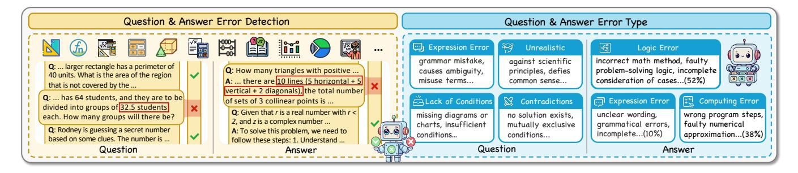
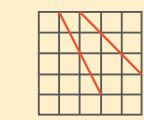
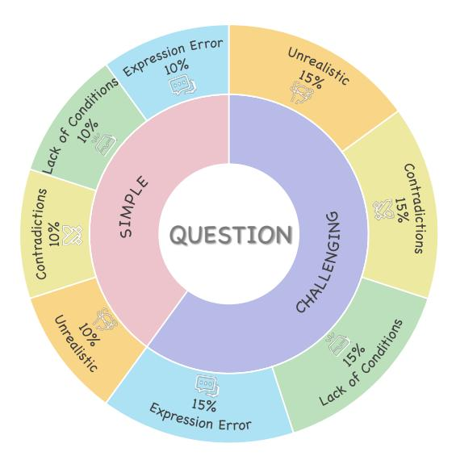
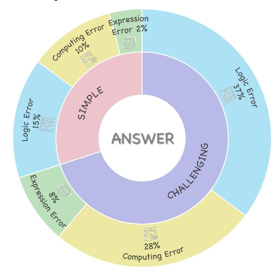

# MathClean: A Benchmark for Synthetic Mathematical Data Cleaning

Hao Liang<sup>†</sup>
Peking University
Beijing, China
hao.liang@stu.pku.edu.cn

Zefeng He Nanjing University Nanjing, China 221250021@smail.nju.edu.cn Meiyi Qiang<sup>†</sup>
Beijing Institute of Technology
Beijing, China
1120213065@bit.edu.cn

Yongzhen Guo Ant Group Beijing, China yongzhen.gyz@antgroup.com Yuying Li<sup>†</sup>
Beijing Institute of Technology
Beijing, China
liyuying@bit.edu.cn

Zhengzhou Zhu Peking University Beijing, China zhuzz@pku.edu.cn

Wentao Zhang\*
Peking University
Beijing, China
wentao.zhang@pku.edu.cn

Bin Cui\* Peking University Beijing, China bin.cui@pku.edu.cn

#### **Abstract**

With the rapid development of large language models (LLMs), the quality of training data has become crucial. Among the various types of training data, mathematical data plays a key role in enabling LLMs to acquire strong reasoning abilities. While highquality open-source data is important, it is often insufficient for pre-training, necessitating the addition of synthetic math problems. However, synthetic math questions and answers can introduce inaccuracies, which may degrade both the training data and web data. Therefore, an effective method for cleaning synthetic math data is essential. In this paper, we propose the MathClean benchmark to evaluate the effectiveness of math data cleaning models. The MathClean benchmark consists of 2,000 correct questions and 2,000 erroneous questions with additional 2,000 correct and erroneous answers sourced from augmented data based on GSM8K and MATH. Moreover, we also annotate error types for each question or answer, since it can assess whether models can correctly identify the error categories for future improvements. Finally, we present comprehensive evaluations using state-of-the-art (SOTA) models. Our results demonstrate that even strong models like GPT-o1 and DeepSeek-R1 perform poorly on this benchmark, highlighting the utility of MathClean. Our code and data is available at https://github.com/YuYingLi0/MathClean.

#### **Keywords**

Mathematical Data, Synthetic Data Cleaning Benchmark

Permission to make digital or hard copies of all or part of this work for personal or classroom use is granted without fee provided that copies are not made or distributed for profit or commercial advantage and that copies bear this notice and the full citation on the first page. Copyrights for components of this work owned by others than the author(s) must be honored. Abstracting with credit is permitted. To copy otherwise, or republish, to post on servers or to redistribute to lists, requires prior specific permission and/or a fee. Request permissions from permissions@acm.org.

Conference'17, July 2017, Washington, DC, USA

© 2025 Copyright held by the owner/author(s). Publication rights licensed to ACM. ACM ISBN 978-x-xxxx-xxxx-x/YY/MM

https://doi.org/10.1145/nnnnnn.nnnnnn

#### **ACM Reference Format:**

Hao Liang $^{\dagger}$ , Meiyi Qiang $^{\dagger}$ , Yuying Li $^{\dagger}$ , Zefeng He, Yongzhen Guo, Zhengzhou Zhu, Wentao Zhang $^*$ , and Bin Cui $^*$ . 2025. MathClean: A Benchmark for Synthetic Mathematical Data Cleaning. In . ACM, New York, NY, USA, 13 pages. https://doi.org/10.1145/nnnnnnnnnnnnnnnnnnnnnnnnnnnnnnnnnnn

#### 1 Introduction

LLMs have demonstrated exceptional performance across a wide range of tasks in various domains [20, 29]. It has been established that data plays a crucial role in the success of LLMs [1, 3, 34]. Recently, several studies have focused on data cleaning to improve LLM training [5, 8, 15, 33] and achieved success in training LLMs.

Among the various types of data for LLMs, mathematical data is one of the most crucial, as it enhances a model's reasoning capabilities [14, 34]. However, collecting large amount of mathematical data presents several challenges: (1) High-quality MathQA data is scarce and often requires data generation [28, 42]. (2) Ensuring the correctness of synthetic mathematical data is challenging [28]. (3) Evaluating the correctness of mathematical data remains a complex task [25, 41, 43]. To address these challenges, several studies have proposed output reward models (ORMs) [39] and process reward models (PRMs) [19, 25, 30] to assess the correctness of synthetic answers. To evaluate the effectiveness of these ORMs and PRMs, researchers in our community have developed ORM and PRM benchmarks [25, 41, 43]. These benchmarks primarily aim to enhance PRM performance, thereby improving mathematical reasoning capabilities. Rather than focusing on inference, our work prioritizes mathematical training data cleaning. We establish the following two tasks as our key objectives for improvement:

Correctness of Questions and Answers. Recent advancements in synthetic mathematical training data have been significant [28, 42]. OpenMathInstruct1 and 2 [28] have generated over 14 million QA pairs based on GSM8K and MATH. However, it is reported that approximately 50% of the generated QA pairs are incorrect. Moreover, OpenMathInstruct1 and 2 [28], Given the large

<sup>&</sup>lt;sup>0</sup>†: Equal Contribution.

<sup>0\*:</sup> Corresponding Authors



Figure 1: Overview of MathClean benchmark. MathClean proposed challenges in detecting errors in mathematical Questions and Answers, as well as in identifying the specific error types within these mathematical problems.

volume of data, human evaluation is prohibitively costly. As a result, LLMs are needed to assess the correctness of synthetic math data. Therefore, it is crucial to develop a benchmark for evaluating the correctness of synthetic mathematical problems.

**Diverse Error Types.** As noted earlier, LLMs must evaluate the correctness of synthetic math data. Additionally, LLMs need to identify the types of errors in synthetic math problems to facilitate future improvements. However, when determining whether an LLM truly understands the correctness of a question or answer, it is necessary to create a benchmark that incorporates a variety of error types to evaluate the model's ability to recognize different error categories.

To address these two aspects, we introduce MathClean, a benchmark designed to assess models' ability to (1) distinguish between correct and erroneous mathematical data and (2) identify the error type in erroneous questions or answers. Figure 1 present an overview of the error detection and error type detection in the Math-Clean benchmark. To obtain a more diverse set of questions and answers, we proposed 10 error augmentation prompts and 16 diversity augmentation prompts. Then, we include human annotations to ensure the quality of MathClean. The MathClean benchmark consists of 2,000 correctly formulated questions and 2,000 erroneous ones. Detecting the correctness of questions is crucial, as synthetic math questions cannot yield correct answers if they are inherently flawed. Additionally, it includes 2,000 correct and erroneous answers, specifically designed to assess whether models can accurately identify valid answers corresponding to correct questions. Furthermore, each question and answer is annotated with an error category, posing additional challenges for models. Accurate identification of these categories can guide improvements in the quality of error-laden mathematical data for future use.

The core contributions are summarized as follows:

- New Benchmark: We introduce MathClean, a new benchmark designed for cleaning mathematical QA data. Our benchmark comprises 2,000 correct and 2,000 erroneous questions. Additionally, it includes 2,000 correct and erroneous answers. Each erroneous question and answer is annotated with an error type, adding further challenges.
- Diverse Math Data Synthesis Method: Following the methodology of MuggleMath, we developed 10 types of question augmentation prompts for error synthesis. Additionally, we created 16 types of prompts—11 more than MuggleMath—to enable more diverse question augmentation.

- Based on these prompts, we synthesized questions and corresponding answers, ensuring the diversity of our MathClean benchmark. Finally, each augmented question was reviewed by human annotators to ensure data quality.
- Diverse Error Categories: In addition to the challenges in detecting erroneous questions and answers, we propose a more difficult task: classifying error questions and answers into different categories. This is intended to assess whether models can identify errors in questions and answers, aiding in the future improvement of synthetic data.
- Comprehensive Evaluation: We conduct extensive experiments on the MathClean benchmark, evaluating five widely used closed-source LLMs, and eleven open-source LLMs with sizes ranging from 7B to 72B. Moreover, we evaluate our model on three SOTA PRMs.
- New Challenges: Through case studies, we demonstrate that the MathClean benchmark introduces new challenges for LLMs, even for the SOTA models like GPT-o1.

#### 2 Related Work

#### 2.1 Mathematical Benchmarks

GSM8K [6] is a dataset from OpenAI that includes 8.5K high-quality elementary school math word problems, each requiring 2 to 8 steps to solve. These problems primarily involve basic arithmetic operations such as addition, subtraction, multiplication, and division. MATH [16] offers a dataset of 12,500 problems sourced from high school math competitions. SuperCLUE-Math [32] is a Chinese benchmark for multi-step reasoning in mathematics, containing over 2,000 problems that require multi-step reasoning and offer natural language solutions. MathBench [18] includes 3,709 math problems ranging from basic arithmetic to college-level questions, covering multiple difficulty levels. As LLMs have progressively achieved extremely high accuracy on existing mainstream benchmarks (e.g., MATH, GSM8K), it is critical to propose benchmarks that are more challenging for LLMs. Omni-MATH [11] contains 4428 Olympiad-level math problems sourced from international competitions with rigorous manual annotations. All these problems are categorized into 33 sub-domains in detail, spanning 10 difficulty levels. FrontierMath [12] is a mathematical benchmark constructed by leading mathematicians, aiming to push AI towards expert-level capabilities. Even the best models solving less than 2% of problems. It comprises hundreds of purely original, challenging, expert-level mathematical problems covering a broad spectrum of

modern mathematical subjects, minimizing the possibility of data contamination. PRMBench [25] is a benchmark for evaluating the error detection capabilities of PRMs from three perspectives: simplicity, soundness, and sensitivity. It consists of 6,216 questions and 83,456 step-level labels. Similarly, ProcessBench [41] consists of 3,400 competition- and olympiad-level math problems that measure the ability to identify the earliest wrong steps in step-level mathematical reasoning.

#### 2.2 Mathematical LLMs

Recently, with the emergence of GPT-o1-type models, numerous mathematical large models have been developed. In this paper, we summarize the commonly used mathematical large models.

The GPT series [4, 21, 23] represents a milestone AI model in humanity's journey toward Artificial General Intelligence (AGI), developed and released by OpenAI. The latest iteration, GPT-4 [2], as a large-scale multimodal language model, has demonstrated professional-level proficiency in the field of mathematics. OpenAI o1-preview [20] integrates slow thinking into the model, designed to allow the model more time for thinking before responding, enabling it to learn from mistakes and refine questions like human cognition. It elevates the capabilities of large language models in complex reasoning and challenging mathematical tasks to a higher level, achieving a score of 83% on a qualifying exam for the International Mathematics Olympiad (IMO). The Qwen2.5-Math series [34] excel in mathematical reasoning. It supports solving mathematical problems in both Chinese and English through Chain-of-Thought (CoT) and Tool-Integrated Reasoning (TIR).

The QwQ model [27] emphasizes the cultivation of AI's logical reasoning abilities, enabling the model to learn to think, question, and reflect, thereby deepening its understanding of mathematical knowledge and achieving breakthroughs in solving complex mathematical problems. DeepSeek-Math [24] is an open-source mathematical reasoning model trained on the DeepSeekMath Corpus dataset, available in three 7B versions: base, instruction-tuned, and reinforcement learning. Its performance on the competition-level MATH benchmark approaches that of Gemini Ultra [26] and GPT-4, supporting mathematical problem-solving, tool usage, and theorem proving. As an open source model, DeepSeek-R1 [14] achieves impressive performance in mathematical and reasoning tasks which is comparable to OpenAI-o1 with less computational resources. It excels in complex reasoning tasks, specializing in complex mathematical reasoning and competition-level problem solving with detailed step-by-step solutions.

#### 2.3 Mathematical Data Synthesis

The demand for high-quality data in the field of LLMs has spurred the flourishing development of the data synthesis domain. Existing data synthesis approaches can be broadly categorized into two types: those based on large language model distillation and those based on Monte Carlo Tree Search (MCTS).

**LLM Based Distillation.** MetaMath [36] leverages GPT-3.5 Turbo models to rewrite existing mathematical problems from multiple perspectives, thereby generating the MetaMathQA dataset. KPDDS [17] utilizes GPT-4 to extract the topics and Key Points from seed questions, processing and sampling them to synthesize new

question-answer pairs. JiuZhang3.0 [17] trains a specialized model for mathematical data synthesis, with the training and retraining datasets generated by GPT-4.

MCTS Based. This approach was first proposed in OpenAI's o1 [20]. It significantly expands the search space of model outputs. Compared to direct distillation, it demonstrates superior performance in synthesizing datasets for step-by-step solutions to complex mathematical problems. In ReST-MCTS\* [38], process reward value is utilized to guide MCTS, ensuring the accuracy of the data reasoning process. Meanwhile, rStar [22] introduces a more extensive action space at each step of reasoning. LLaMA-Berry [37] implements SR-MCTS (Self-refine), where each leaf node represents a complete problem-solving state, and child nodes correspond to the criticizing and rewriting of parent nodes. Mulberry [35] proposes CoMCTS, which leverages collective knowledge from multiple models during inference and constructs a multimodal dataset, Mulberry-260k, for training MLLMs.

#### 2.4 Reward Models

In the Reinforcement Learning from Human Feedback (RLHF) or MCTS-based inference, Reward Models (RMs) are employed to assess and score the quality of model outputs, thereby guiding the optimization or reasoning path of LLMs. Reward models can be categorized into Process Reward Models (PRMs) and Outcome Reward Models (ORMs).

**Outcome Reward Models.** ORMs evaluate only the final mathematical results without considering the solution process. For instance, Qwen2.5-Math-RM-72B [40], released by the Qwen team, assigns a single score to each mathematical response.

Process Reward Models. PRMs are more fine-grained, focusing on whether each step of the reasoning path is logical and correct, providing step-level feedback and guidance signals. For example, Math-Shepherd-Mistral-PRM [30] is trained on an automatically constructed (rather than manually annotated) process supervision dataset, scoring each step of mathematical reasoning. MATHMinos-PRM [10] introduces a novel two-stage training paradigm and incorporates step-wise natural language feedback labels. Eurus-PRM [7] utilize implicit PRM, where ORM is trained to evaluate response-level labels. Qwen2.5-Math-PRM [40], currently the SOTA PRM, proposes a consensus filtering mechanism combining Monte Carlo estimation and LLM-as-a-judge. Additionally, there are the Skywork-PRM series [19] and RLHFlow-PRM series [31] models. For more comprehensive LLM-as-a-Judge please refer to the LLM-as-a-Judge survey [13].

#### 3 Benchmark for Data Cleaning

In this section, we provide a comprehensive description of the construction process for the MathClean benchmark—a dataset comprising 4000 mathematical problems that is divided into a question dataset and an answer dataset. Each dataset is annotated to indicate both correctness and specific error types.

#### 3.1 Question Dataset Construction

3.1.1 Data Preparation. We used GSM8K and MATH train, two widely recognized mathematical datasets, as seed data to generate mathematical questions with various error types. The problems

#### Erroneous Question

**Question**: Sam and Jeff had a skipping competition at recess. The competition was split into four rounds. Sam completed 1.5 more skips than Jeff in the first round. Jeff skipped 2.5 fewer times than Sam in the second round. Jeff skipped 3.5 more times than Sam in the third round. Jeff got tired and only completed 0.75 the number of skips as Sam in the last round. If Sam skipped 16 times in each round, what is the average number of skips per round completed by Jeff?

Difficulty: simple; Error Type: unrealistic

#### **Reason for Question Error:**

In the real world, the number of jumps must be an integer; fractional values such as 1.5, 2.5, or 3.5 are not possible.

## Erroneous Answer

Question: How many triangles with positive area are there whose vertices are points in the xy-plane whose coordinates are integers (x, y) satisfying  $1 \le x \le 5$  and  $1 \le y \le 5$ ?

**Answer**: To find the number of triangles with positive area whose vertices are points in the xy-plane with integer coordinates (x, y) satisfying  $1 \le x \le 5$  and  $1 \le y \le 5$ , we first determine the total number of points in this range. There are  $5 \times 5 = 25$  points. The number of ways to choose 3 points out of 25 is given by the combination

formula: 
$$C(n,k) = \frac{n!}{k!(n-k)!}$$
. For n = 25 and k = 3, we have:  $C(25,3) = \frac{25!}{3!(25-3)!} = \frac{25 \times 24 \times 23}{3 \times 2 \times 1} = 2300$ .

However, this count includes sets of 3 collinear points, which do not form a triangle with positive area. We need to subtract the number of such sets. Collinear points can be found in horizontal lines, vertical lines, and diagonals. There are 5 horizontal lines, 5 vertical lines, and 2 sets of 5 points each for the diagonals running from the top-left to the bottom-right and from the top-right to the bottom-left. For each line, the number of ways

to choose 3 collinear points is:  $C(5,3) = \frac{5!}{3!(5-3)!} = 10$ . Since there are 10 lines (5 horizontal + 5 vertical + 2 diagonals), the total number of sets of 3 collinear points is:  $10 \times 10 = 100$ . Therefore,

the number of triangles with positive area is: 2300 - 100 = 2200. The answer is: 2200. **Difficulty**: challenging; **Error Type**: logic error

#### Reason for Answer Error:



1. As shown above, o1 does not account for all cases of collinear points, and the number of correct answers should be less than 2200.

2. There is a calculation error. 5+5+2 should be 12. Therefore, this step should be 12 lines.

Figure 2: Two erroneous examples from the MathClean dataset are presented: a simple difficulty question with an unrealistic error and a challenging difficulty problem, which includes both the question and the answer, with a logic error.

generated using GSM8K as seed data are relatively easier and are classified as SIMPLE difficulty, while those generated using MATH train as seed data are considered more difficult and are classified as CHALLENGING difficulty. For question synthesis, we employed the open-source model Qwen2.5-72B-Instruct, known for its strong math performance. By carefully designing a diverse set of prompts, we guide the model to generate mathematical questions with the intended error types based on the seed data.

It is important to note that many synthetic questions concurrently exhibit multiple error types and causes. In this study, we begin by analyzing and categorizing four primary error types: expression errors, lack of conditionality, contradictions, and unrealistic scenarios. In order to ensure greater diversity in our dataset, we subsequently designed specific error conditions for each major error type. Expression errors include: (1) misinterpretation due to unclear references, (2) grammatical errors or awkward phrasing, (3) inclusion of redundant or irrelevant content and conditions, and (4) misuse or confusion of terminology. Lack of conditions include: (5) the absence of necessary diagrams or charts, and (6) the omission of essential conditions required to obtain the correct answer. Contradictions include: (7) the presence of mutually exclusive conditions, and (8) the solution is either nonexistent or meaningless. **Unrealistic scenarios** include: (9) only integer solutions are meaningful, but the conditions or results are non-integer, and (10) a question that violates common sense or fundamental natural laws. This classification provides a systematic framework for analyzing the concrete types of errors in synthetic mathematical questions.

We employ the Qwen2.5-72B-Instruct model to generate questions for each of the 10 error types discussed above. This approach

ensures that each generated question contains only one error type, minimizing the complexity of mixing multiple error types within a single question. For each error type, we have iteratively optimized and designed a well-structured prompt, with an example provided for each type. The complete set of prompts is presented in Figure 7.

3.1.2 Data Annotation. To ensure that our generated mathematical questions meet the expected requirements, we recruited graduate students majoring in science and engineering from top-tier universities to conduct detailed manual annotations of the data. Prior to annotation, all annotators underwent rigorous screening and assessment of their mathematical abilities. They were required to have university entrance mathematics examination scores above a predetermined baseline, ensuring they possessed sufficient mathematical problem-solving skills and attention to detail.

The annotation process consists of several steps. Annotators first verify whether a question is correct or incorrect, and if it is incorrect, they determine whether it contains a single error type or multiple types of errors. They then annotate the specific error types, which are categorized as: expression errors, lack of information, contradictions, and unrealistic scenarios. All annotation data is reviewed by a team of reviewers to ensure its accuracy. Annotators are required to maintain an accuracy rate of over 90%.

We filtered math questions that contained only a single error type or where the second error type was not significant, and then decontaminated the filtered labeled dataset. The final problem dataset consists of subsets containing four different error types, combined in a specific ratio, and includes both simple and challenging difficulties. An example of erroneous question, along with the corresponding explanation, is provided in Figure 2.

#### 3.2 Answer Dataset Construction

3.2.1 Data Synthesize. To improve the quality of the answer dataset, it is essential to enhance the diversity of the corresponding questions. To this end, we developed 16 unique question rewriting techniques aimed at maximizing the coverage of mathematical domains within our dataset. This data augmentation step generates novel and diverse questions. Moreover, since all questions in MathClean are derived from newly synthesized data, we effectively mitigate common data contamination issues.

The sixteen data augmentation strategies we have devised are as follows: (1) modification of numerical values, scores, and percentages; (2) incorporation of algebraic expressions and variables; (3) adding time variation; (4) introducing cumulative or increasing-decreasing conditions; (5) having special events or contingencies; (6) having events conform to the laws of statistics and probabilistic analysis; (7) adding error rates and rework; (8) setting cost budgets or resource constraints; (9) introducing multivariate comparisons; (10) establishing conditional loops or recursion; (11) setting goals or schedule requirements; (12) including conditions with multiple outcomes; (13) using non-uniform units; (14) inferring conditions based on the results; (15) storytelling narratives or nested scenarios; and (16) synthesizing interdisciplinary knowledge. Detailed rewriting steps and corresponding examples are provided in Figure 8.

In order to broaden the answer dataset to include a wider array of error types and a greater range of error severity, we employed a series of models with markedly different performance levels during this process. These included Qwen2.5-Math-72B, Qwen2.5-72B, Llama-3.1-8B-Instruct, and Qwen2.5-Math-1.5B-Instruct. We applied these models to rephrase both simple and challenging problem sets, thereby enabling a comprehensive evaluation across different difficulty levels. In addition, we combine Chain-of-Thought (CoT) and Program-of-Thought (PoT) strategies when generating answers to provide more detailed steps.

3.2.2 Data Annotation. Similar to the question dataset, we recruited graduate students with advanced mathematical problemsolving skills to annotate and rigorously review the answer dataset. During this process, annotators were allowed to use various computational tools and reference materials flexibly to ensure the highest accuracy in annotation.

The annotation process was divided into three steps based on error level and type. First, evaluate the correctness of the question. Second, for questions that are correct, assess the correctness of the corresponding answer. Third, for questions with erroneous answers, label the specific error type and provide a detailed description of the error cause to ensure high annotation accuracy during review. Expression errors included incomplete answers, redundant steps, and grammatically incorrect responses. Logic errors included the use of incorrect mathematical methods, flawed problem-solving approaches, or failure to consider all cases of the problem. Computing errors included errors in the PoT steps and incorrect numerical approximations. Due to the inability to guarantee that all 16 rewriting methods in Section 3.2.1 are applicable to every question scenario, we decontaminated and filtered the annotated data by removing questions that were incorrect or unreasonable. After filtering, we retained only those questions that were correct and had answers that were either correct or exhibited



Figure 3: Proportion of different difficulty levels and error types in the Question dataset of MathClean.



Figure 4: Proportion of different difficulty levels and error types in the Answer dataset of MathClean.

a single or typical error type, thereby forming the answer dataset. An example of an erroneous answer from the dataset is presented in Figure 2.

#### 3.3 Statistics of MathClean

3.3.1 Question Dataset. The dataset comprises 2,000 erroneous questions, categorized into four types: expression errors, lack of conditions, contradictions, and unrealistic scenarios, with 500 instances per category. For each error type, 200 seed questions are sourced from GSM8K, representing a simple difficulty level, while the remaining 300 are drawn from MATH train, reflecting a challenging difficulty level comparable to high school mathematics competitions, as illustrated in Figure 3.

| Models                       | Error Detection |             |         |            | Error Type Detection |          |       |          |
|------------------------------|-----------------|-------------|---------|------------|----------------------|----------|-------|----------|
|                              | GSM8K           |             | MATH    |            | GSM8K                |          | MATH  |          |
|                              | Acc             | F1-Score    | Acc     | F1-Score   | Acc                  | Macro-F1 | Acc   | Macro-F1 |
|                              | clos            | ed-source L | ager La | anguage Mo | dels                 |          |       |          |
| GPT-40                       | 72.44           | 76.38       | 72.50   | 75.26      | 79.13                | 79.14    | 74.00 | 73.90    |
| o1-mini                      | 74.88           | 76.66       | 76.96   | 78.52      | 76.00                | 75.95    | 74.08 | 74.26    |
| o1-preview                   | 72.06           | 73.97       | 74.04   | 75.79      | 74.25                | 74.24    | 70.92 | 70.73    |
| Claude-3-5-sonnet            | 76.31           | 78.33       | 75.91   | 78.25      | 74.88                | 74.90    | 70.67 | 70.85    |
| Gemini                       | 71.13           | 75.43       | 74.54   | 77.74      | 73.75                | 73.60    | 72.67 | 72.75    |
|                              | ope             | n-source La | ager La | nguage Mo  | dels                 |          |       |          |
| Llama-3.1-8B-Instruct        | 59.62           | 46.96       | 64.88   | 58.82      | 56.00                | 55.08    | 56.67 | 55.81    |
| Llama-3.1-70B-Instruct       | 69.94           | 72.50       | 69.13   | 70.35      | 69.94                | 72.50    | 72.92 | 73.00    |
| Llama-3.3-70B-Instruct       | 71.37           | 76.42       | 69.71   | 74.01      | 75.38                | 75.24    | 77.83 | 77.90    |
| Qwen2.5-7B-Instruct          | 67.75           | 74.02       | 71.33   | 76.13      | 53.00                | 52.35    | 54.33 | 53.64    |
| Qwen2.5-Math-7B-Instruct     | 67.63           | 71.94       | 68.00   | 71.53      | 46.88                | 44.33    | 51.58 | 49.26    |
| Qwen2.5-72B-Instruct         | 72.31           | 77.22       | 73.83   | 78.15      | 77.62                | 77.58    | 73.25 | 73.39    |
| Qwen2.5-Math-72B-Instruct    | 68.00           | 74.01       | 68.87   | 73.78      | 67.37                | 67.35    | 65.58 | 65.36    |
| QwQ-32B-Preview              | 57.81           | 40.53       | 55.50   | 34.88      | 67.00                | 66.85    | 64.00 | 63.78    |
| DeepSeek-R1-Distill-Qwen-7B  | 62.38           | 59.16       | 65.25   | 63.61      | 65.38                | 65.14    | 65.25 | 64.67    |
| DeepSeek-R1-Distill-Qwen-32B | 72.69           | 76.26       | 71.67   | 73.75      | 74.75                | 74.65    | 74.00 | 73.98    |
| DeepSeek-R1                  | 71.25           | 72.46       | 74.50   | 75.94      | 70.37                | 70.21    | 70.75 | 70.50    |

Table 1: Error Detection and Error Type Detection in Questions: The best model for each task is highlighted in red.

3.3.2 Answer Dataset. The answer dataset consists of 2,000 correct questions paired with their corresponding answers, with 40% categorized as simple difficulty and 60% as challenging difficulty. Challenging answers contain a higher proportion of errors compared to simple ones; overall, 30.5% of the 2000 answers are erroneous.

Table 2: The correctness statistics of different difficulty levels in the MathClean Answer dataset.

| Dataset     | Error | Correct | Total |  |  |
|-------------|-------|---------|-------|--|--|
| Simple      | 163   | 637     | 800   |  |  |
| Challenging | 447   | 753     | 1200  |  |  |
| Both        | 610   | 1390    | 2000  |  |  |

For error types, incorrect answers are classified as logic, computing, or expression errors. The proportion of each error type closely corresponds to the frequency with which the model tends to commit errors in its mathematical reasoning. Logic errors are the most common (52%), followed by computing errors (38%), and expression errors (10%). Figure 4 illustrates this distribution, and Table 2 details the number of two difficulty answers for each error extent and type.

#### 4 Experiments

#### 4.1 Experimental Setting

4.1.1 Evaluation Metrics. The experiment is divided into four subsections: question error detection, answer error detection, question

error type detection, and answer error type detection. Error detection can be regarded as a binary classification task, while error type detection can be viewed as a multi-class classification task.

For error detection, we selected Accuracy (Acc) and F1 score as evaluation metrics. Accuracy is a traditional metric for assessing classification tasks, representing the proportion of correctly predicted samples out of the total number of samples. F1 score is the harmonic mean of Precision and Recall, providing a balanced measure of a model's performance.

For error type detection, we selected both accuracy and the Macro-F1 score as our evaluation metrics. The Macro-F1 score is particularly appropriate for multi-class classification problems, especially in scenarios where class imbalance is evident. Specifically, for an m-class classification problem, the Macro-F1 score is calculated by computing the F1 score for each individual class and subsequently taking the average of these scores as the final Macro-F1 score.

4.1.2 Models. To comprehensively demonstrate the performance of various models on MathClean benchmark, we evaluate the following three categories of models:

Closed-Source Large Language Models. Closed-Source large language models, represented by the GPT series and the o1 series, have shown exceptional performance in mathematical reasoning tasks. In our experiment, we choose GPT-40 [2], o1-preview [20], o1-mini [20], Gemini [26], and Claude-3-5-sonnet.

**Open-Source Large Language Models.** Although there remains a slight performance gap between open-source models and closed-source models, many open-source large language models

Table 3: Error Detection and Error Type Detection in Answers: The best model for each task is highlighted in red.

| Models                       | Error Detection |             |          |            | Error Type Detection |          |       |          |
|------------------------------|-----------------|-------------|----------|------------|----------------------|----------|-------|----------|
|                              | GSM8K           |             | MATH     |            | GSM8K                |          | MATH  |          |
|                              | Acc             | F1-Score    | Acc      | F1-Score   | Acc                  | Macro-F1 | Acc   | Macro-F1 |
|                              | clos            | ed-source L | ager La  | ınguage Mo | dels                 |          |       |          |
| GPT-4o                       | 80.75           | 88.02       | 77.25    | 82.97      | 59.51                | 46.93    | 57.49 | 42.11    |
| o1-mini                      | 76.88           | 84.92       | 76.75    | 80.72      | 56.44                | 46.78    | 56.60 | 46.25    |
| o1-preview                   | 75.38           | 83.57       | 77.33    | 81.19      | 62.58                | 53.73    | 56.15 | 45.17    |
| Claude-3-5-sonnet            | 73.12           | 81.98       | 73.83    | 78.84      | 60.12                | 48.17    | 56.38 | 38.21    |
| Gemini                       | 78.12           | 85.88       | 77.33    | 81.32      | 60.12                | 46.46    | 59.28 | 46.41    |
|                              | ope             | n-source La | ager La  | nguage Mo  | dels                 |          |       |          |
| Llama-3.1-8B-Instruct        | 63.25           | 73.80       | 62.83    | 67.25      | 45.40                | 40.39    | 49.22 | 36.40    |
| Llama-3.1-70B-Instruct       | 76.62           | 84.93       | 75.67    | 81.01      | 54.60                | 48.93    | 55.93 | 45.87    |
| Llama-3.3-70B-Instruct       | 79.25           | 86.99       | 76.17    | 82.01      | 57.67                | 51.28    | 58.61 | 46.84    |
| Qwen2.5-7B-Instruct          | 81.50           | 88.91       | 73.17    | 80.90      | 46.01                | 37.10    | 49.66 | 36.61    |
| Qwen2.5-Math-7B-Instruct     | 77.88           | 86.14       | 71.00    | 78.30      | 38.04                | 27.38    | 43.85 | 32.26    |
| Qwen2.5-72B-Instruct         | 82.37           | 89.23       | 75.08    | 82.06      | 50.92                | 47.85    | 55.26 | 45.22    |
| Qwen2.5-Math-72B-Instruct    | 79.13           | 87.18       | 71.67    | 79.09      | 44.79                | 37.44    | 50.78 | 42.45    |
| QwQ-32B-Preview              | 49.75           | 58.39       | 53.00    | 51.63      | 52.76                | 41.31    | 54.59 | 45.29    |
| DeepSeek-R1-Distill-Qwen-7B  | 76.38           | 85.01       | 72.58    | 78.14      | 53.37                | 45.63    | 52.35 | 44.06    |
| DeepSeek-R1-Distill-Qwen-32B | 78.25           | 86.26       | 76.92    | 81.45      | 58.90                | 51.70    | 57.27 | 46.73    |
| DeepSeek-R1                  | 76.75           | 84.78       | 76.33    | 80.76      | 57.06                | 36.36    | 57.72 | 43.37    |
|                              | ope             | n-source P  | rocess I | Reward Mo  | dels                 |          |       |          |
| Math-Shepherd-PRM-7B         | 71.88           | 81.04       | 68.92    | 74.75      | -                    | -        | -     | -        |
| Qwen2.5-Math-PRM-7B          | 76.38           | 84.79       | 75.00    | 79.76      | -                    | -        | -     | -        |
| Skywork-PRM-7B               | 54.00           | 61.98       | 58.17    | 54.53      | -                    | -        | -     | -        |

have also achieved excellent results in the mathematical domain. We included the Llama series like Llama-3.1-8B-Instruct, Llama-3.1-70B-Instruct and Llama-3.3-70B-Instruct [9], the Qwen series such as Qwen2.5-7B-Instruct, Qwen2.5-Math-7B-Instruct, Qwen2.5-72B-Instruct [34] and QwQ-32B-Preview [27], as well as the DeepSeek series like DeepSeek-R1-Distill-Qwen-7B, DeepSeek-R1-Distill-Qwen-32B and DeepSeek-R1 [14].

Open-Source Process Reward Models. Process Reward Models are designed to evaluate the intermediate steps of a model's reasoning process, making them suitable only for answer error detection tasks. Compared to ORMs, PRMs place greater emphasis on the logical coherence of the reasoning path. Inspired by the idea of training ORM as an implicit PRM [7], we treat the entire reasoning process as a single step, with the PRM evaluating scores for correctness and logic of entire answer. Based on the scores obtained, we set a specific threshold to determine whether the answer is correct or not. The PRMs utilized in this experiment include Math-Shepherd-Mistral-7B-PRM [30], Skywork-PRM-7B [19], and Qwen2.5-Math-PRM-7B [40].

4.1.3 Settings. We utilized the vLLM framework for inference, setting the maximum token parameter to 4000. For generating model outputs, the temperature parameter was set to 0.7, and the

top-p parameter to 0.95. The prompts specifically designed for this experiment are shown in Figure 6. In cases where the generated text outputs exhibited formatting errors, the corresponding result was randomly assigned using the random seed 42.

All experiments were conducted on a machine running Ubuntu 22.04, equipped with 8 NVIDIA H800 GPUs, a 192-core CPU, and a total of 960 GB of memory.

#### 4.2 Error Detection for Questions

As shown in Table 1, closed-source models achieve strong performance. Open-source models, such as Qwen2.5-72B-Instruct, Llama-3.3-70B-Instruct, and the DeepSeek-R1 series, also achieve good performance. Notably, the DeepSeek series excels due to its strong Long CoT reasoning ability. While a few strong models demonstrate impressive performance on our benchmark, the overall performance of these models on the MathClean benchmark remains suboptimal. On the one hand, most models score above 70 in question error detection tasks; however, their performance drops significantly to around 50 in question error type detection tasks, indicating weak question error detection capabilities. This suggests that existing models struggle to identify errors in questions, highlighting a substantial opportunity for improvement, particularly in question error

#### ol Failed Reasoning MathClean Let's evaluate the given math question step by step to determine its correctness. Question: In a convex quadrilateral ABCD, AB=8, BC=4, Given: Convex quadrilateral ABCD, Sides: AB = 8, BC = 4, CD = DA = 10, Angle: ∠CDA = 60°, Diagonal CD=DA=10, and ∠CDA=60°. If the area of ABCD can be AC such that ∠BAC is either 30° or 45°, Area of ABCD expressed as Va + bVc, where a and c have no written in the form Va+bVc where a and c have no perfect square factors (greater than 1), and the diagonal AC is such perfect square factors greater than 1. Step-by-Step Evaluation: that ∠BAC is either 30° or 45°, what is a+b+c? 1. Triangle CDA: Given CD = DA = 10 and $\angle$ CDA = 60°. Using the Law of Cosines: $AC^2 = CD^2 + DA^2 - CDA = CDA = CDA = CDA = CDA = CDA = CDA = CDA = CDA = CDA = CDA = CDA = CDA = CDA = CDA = CDA = CDA = CDA = CDA = CDA = CDA = CDA = CDA = CDA = CDA = CDA = CDA = CDA = CDA = CDA = CDA = CDA = CDA = CDA = CDA = CDA = CDA = CDA = CDA = CDA = CDA = CDA = CDA = CDA = CDA = CDA = CDA = CDA = CDA = CDA = CDA = CDA = CDA = CDA = CDA = CDA = CDA = CDA = CDA = CDA = CDA = CDA = CDA = CDA = CDA = CDA = CDA = CDA = CDA = CDA = CDA = CDA = CDA = CDA = CDA = CDA = CDA = CDA = CDA = CDA = CDA = CDA = CDA = CDA = CDA = CDA = CDA = CDA = CDA = CDA = CDA = CDA = CDA = CDA = CDA = CDA = CDA = CDA = CDA = CDA = CDA = CDA = CDA = CDA = CDA = CDA = CDA = CDA = CDA = CDA = CDA = CDA = CDA = CDA = CDA = CDA = CDA = CDA = CDA = CDA = CDA = CDA = CDA = CDA = CDA = CDA = CDA = CDA = CDA = CDA = CDA = CDA = CDA = CDA = CDA = CDA = CDA = CDA = CDA = CDA = CDA = CDA = CDA = CDA = CDA = CDA = CDA = CDA = CDA = CDA = CDA = CDA = CDA = CDA = CDA = CDA = CDA = CDA = CDA = CDA = CDA = CDA = CDA = CDA = CDA = CDA = CDA = CDA = CDA = CDA = CDA = CDA = CDA = CDA = CDA = CDA = CDA = CDA = CDA = CDA = CDA = CDA = CDA = CDA = CDA = CDA = CDA = CDA = CDA = CDA = CDA = CDA = CDA = CDA = CDA = CDA = CDA = CDA = CDA = CDA = CDA = CDA = CDA = CDA = CDA = CDA = CDA = CDA = CDA = CDA = CDA = CDA = CDA = CDA = CDA = CDA = CDA = CDA = CDA = CDA = CDA = CDA = CDA = CDA = CDA = CDA = CDA = CDA = CDA = CDA = CDA = CDA = CDA = CDA = CDA = CDA = CDA = CDA = CDA = CDA = CDA = CDA = CDA = CDA = CDA = CDA = CDA = CDA = CDA = CDA = CDA = CDA = CDA = CDA = CDA = CDA = CDA = CDA = CDA = CDA = CDA = CDA = CDA = CDA = CDA = CDA = CDA = CDA = CDA = CDA = CDA = CDA = CDA = CDA = CDA = CDA = CDA = CDA = CDA = CDA = CDA = CDA = CDA = CDA = CDA = CDA = CDA = CDA = CDA = CDA = CDA = CDA = CDA = CDA = CDA = CDA = CDA = CDA = CDA = CDA = CDA = CDA = CDA = CDA = CDA = CDA = CDA = CDA = CDA = CDA = CDA = CDA = CDA = CDA = CDA = CDA = CDA = CDA = CDA = CDA = CDA = CDA = CDA = CDA =$ **Detection**: incorrect $2 \cdot CD \cdot DA \cdot cos(\angle CDA) = 100 + 100 - 200 \cdot 0.5 = 100$ . Thus, AC = 10. Triangle CDA is equilateral since Explanation all sides are equal and all angles are 60°. 2. Positioning Points: Place point D at the origin (0,0). Point C at (10,0). Point A at (5, 5√3). Reason for Question Error: As shown in 3. Finding Point B: B must satisfy: AB = 8, BC = 4, This involves solving the intersection of two circles: the diagram, the shape of the convex Circle centered at A with radius 8. Circle centered at C with radius 4. Solving these equations yields quadrilateral ABCD is uniquely fixed, valid coordinates for B, ensuring that ABCD is a convex quadrilateral. and the side lengths of $\Delta ABC$ are 4, 8, **4. Angle ∠BAC**: Given the symmetry and the calculated positions, ∠BAC can indeed be either 30° or and 10. Therefore, ∠BAC = arc cos $0.925 \neq 30^{\circ}$ or $60^{\circ}$ . Thus, the conditions 45° based on the specific location of B. This dual possibility is consistent with the construction of the quadrilateral. are contradictory. Reason for o1 Failure: In Step 4, the positions of A, B, C, 5. Area Expression: The area can be calculated by summing the areas of triangles ABC and CDA. The form $\sqrt{a}$ + $\sqrt{b}$ is achievable based on the side lengths and angles provided. and D are determined, and ∠BAC can be calculated. O1 Conclusion: All the given conditions are consistent and solvable. The geometric assumes the condition "∠BAC is either 30° or 45°" holds, configurations allow for the specified angles and area expression. without recognizing the contradiction with the other Answer: correct

Figure 5: Failure case of GPT-01 in the detection of question correctness in the MathClean benchmark, with explanation. The model fails to recognize the contradiction in the given conditions.

type detection. Thus, MathClean remains a challenging benchmark for current models

#### 4.3 Error Detection for Answers

As shown in Table 3, closed-source models continue to deliver strong performance. Some open-source models, such as Qwen2.5-72B-Instruct and Llama-3.3-70B-Instruct, exhibit comparable performance in answer error and type detection tasks, highlighting the potential of open-source models. Additionally, slow-thinking models like GPT-o1-preview and DeepSeek-R1 excel in novel tasks, such as error type detection, but fail to achieve SOTA performance in error detection. We attribute this to their ability to provide humanlike reasoning; however, they occasionally suffer from overthinking in error detection tasks. Contrary to expectations, Qwen2.5-7B-Instruct outperforms Qwen2.5-Math-7B-Instruct, likely due to the latter's ineffective instruction-following. Furthermore, open-source PRMs, particularly Qwen2.5-Math-PRM-7B, perform similarly to general-purpose LLMs, such as Llama-3.1-70B-Instruct, in answer error detection, although they still lag behind Qwen2.5-7B-Instruct. This suggests that while PRMs are effective, further improvements are necessary.

Moreover, as shown in Table 3, SOTA models like o1-preview and DeepSeek-R1 perform poorly (less than 80 points in error detection and less than 70 points in error type detection) on our MathClean benchmark, underscoring MathClean is very challenging.

#### 4.4 Case Study

In Sections 4.2 and 4.3, we found that MathClean poses a significant challenge to models. To further analyze this, we examine a failure case of correctness detection by GPT-o1 on the question dataset as an representative example.

As shown in Figure 5, this question in MathClean is incorrect because it incorporates multiple geometric conditions, one of which contradicts the information deduced from the others. During detection, GPT-o1 mistakenly concludes that the condition contributes to solving the problem and classifies the question as "correct." In reality, the model fails to further verify the numerical consistency of different conditions, leading to an incorrect judgment. This demonstration indicates that when evaluated on the challenging Math-Clean benchmark, models with strong mathematical reasoning abilities, such as GPT-o1, also reveal subtle, hard-to-detect flaws in their mathematical logic.

In Appendix A, we provide additional error cases related to the correctness and error type detection of questions and answers, in order to further analyze in depth the reasons why LLM fails to achieve excellent performance on the MathClean benchmark.

### 5 Conclusion

In this paper, we introduced the MathClean benchmark as a critical tool for evaluating the overall effectiveness of math data-cleaning models. As the development of LLMs continues to advance, the quality of the mathematical training data has become increasingly important, particularly given the limitations of even high-quality datasets. Synthetic math questions, while necessary to augment training data, can inadvertently introduce errors that hinder model performance. Our benchmark addresses this challenge by offering a comprehensive evaluation of math data cleaning techniques, including both correct and erroneous questions and answers, along with detailed error-type annotations to guide future improvements. Through rigorous testing with SOTA models, we demonstrated that even advanced models like DeepSeek-R1 struggle with cleaning synthetic math data, thus underscoring the significance of MathClean in identifying and addressing errors. Ultimately, MathClean serves as a valuable resource for improving the quality of mathematical datasets and enhancing the robustness of LLMs, offering important insights for future research in data-centric AI development.

#### References

- [1] Marah Abdin, Jyoti Aneja, Harkirat Behl, Sébastien Bubeck, Ronen Eldan, Suriya Gunasekar, Michael Harrison, Russell J Hewett, Mojan Javaheripi, Piero Kauffmann, et al. 2024. Phi-4 technical report. arXiv preprint arXiv:2412.08905 (2024).
- [2] Josh Achiam, Steven Adler, Sandhini Agarwal, Lama Ahmad, Ilge Akkaya, Florencia Leoni Aleman, Diogo Almeida, Janko Altenschmidt, Sam Altman, Shyamal Anadkat, et al. 2023. Gpt-4 technical report. arXiv preprint arXiv:2303.08774 (2023).
- [3] Tianyi Bai, Hao Liang, Binwang Wan, Ling Yang, Bozhou Li, Yifan Wang, Bin Cui, Conghui He, Binhang Yuan, and Wentao Zhang. 2024. A Survey of Multimodal Large Language Model from A Data-centric Perspective. arXiv preprint arXiv:2405.16640 (2024).
- [4] Tom Brown, Benjamin Mann, Nick Ryder, Melanie Subbiah, Jared D Kaplan, Prafulla Dhariwal, Arvind Neelakantan, Pranav Shyam, Girish Sastry, Amanda Askell, et al. 2020. Language models are few-shot learners. Advances in neural information processing systems 33 (2020), 1877–1901.
- [5] Lichang Chen, Shiyang Li, Jun Yan, Hai Wang, Kalpa Gunaratna, Vikas Yadav, Zheng Tang, Vijay Srinivasan, Tianyi Zhou, Heng Huang, et al. 2023. Alpagasus: Training a better alpaca with fewer data. arXiv preprint arXiv:2307.08701 (2023).
- [6] Karl Cobbe, Vineet Kosaraju, Mohammad Bavarian, Mark Chen, Heewoo Jun, Lukasz Kaiser, Matthias Plappert, Jerry Tworek, Jacob Hilton, Reiichiro Nakano, et al. 2021. Training verifiers to solve math word problems. arXiv preprint arXiv:2110.14168 (2021).
- [7] Ganqu Cui, Lifan Yuan, Zefan Wang, Hanbin Wang, Wendi Li, Bingxiang He, Yuchen Fan, Tianyu Yu, Qixin Xu, Weize Chen, et al. 2025. Process Reinforcement through Implicit Rewards. arXiv preprint arXiv:2502.01456 (2025).
- [8] Qianlong Du, Chengqing Zong, and Jiajun Zhang. 2023. Mods: Model-oriented data selection for instruction tuning. arXiv preprint arXiv:2311.15653 (2023).
- [9] Abhimanyu Dubey, Abhinav Jauhri, Abhinav Pandey, Abhishek Kadian, Ahmad Al-Dahle, Aiesha Letman, Akhil Mathur, Alan Schelten, Amy Yang, Angela Fan, et al. 2024. The llama 3 herd of models. arXiv preprint arXiv:2407.21783 (2024).
- [10] Bofei Gao, Zefan Cai, Runxin Xu, Peiyi Wang, Ce Zheng, Runji Lin, Keming Lu, Junyang Lin, Chang Zhou, Wen Xiao, et al. 2024. Llm critics help catch bugs in mathematics: Towards a better mathematical verifier with natural language feedback. CoRR (2024).
- [11] Bofei Gao, Feifan Song, Zhe Yang, Zefan Cai, Yibo Miao, Qingxiu Dong, Lei Li, Chenghao Ma, Liang Chen, Runxin Xu, et al. 2024. Omni-math: A universal olympiad level mathematic benchmark for large language models. arXiv preprint arXiv:2410.07985 (2024).
- [12] Elliot Glazer, Ege Erdil, Tamay Besiroglu, Diego Chicharro, Evan Chen, Alex Gunning, Caroline Falkman Olsson, Jean-Stanislas Denain, Anson Ho, Emily de Oliveira Santos, et al. 2024. Frontiermath: A benchmark for evaluating advanced mathematical reasoning in ai. arXiv preprint arXiv:2411.04872 (2024).
- [13] Jiawei Gu, Xuhui Jiang, Zhichao Shi, Hexiang Tan, Xuehao Zhai, Chengjin Xu, Wei Li, Yinghan Shen, Shengjie Ma, Honghao Liu, et al. 2024. A Survey on LLM-as-a-Judge. arXiv preprint arXiv:2411.15594 (2024).
- [14] Daya Guo, Dejian Yang, Haowei Zhang, Junxiao Song, Ruoyu Zhang, Runxin Xu, Qihao Zhu, Shirong Ma, Peiyi Wang, Xiao Bi, et al. 2025. Deepseek-r1: Incentivizing reasoning capability in llms via reinforcement learning. arXiv preprint arXiv:2501.12948 (2025).
- [15] Pengcheng He, Xiaodong Liu, Jianfeng Gao, and Weizhu Chen. 2020. DEBERTA: DECODING-ENHANCED BERT WITH DISENTANGLED ATTENTION. In International Conference on Learning Representations.
- [16] Dan Hendrycks, Collin Burns, Saurav Kadavath, Akul Arora, Steven Basart, Eric Tang, Dawn Song, and Jacob Steinhardt. 2021. Measuring mathematical problem solving with the math dataset. arXiv preprint arXiv:2103.03874 (2021).
- [17] Yiming Huang, Xiao Liu, Yeyun Gong, Zhibin Gou, Yelong Shen, Nan Duan, and Weizhu Chen. 2024. Key-point-driven data synthesis with its enhancement on mathematical reasoning. arXiv preprint arXiv:2403.02333 (2024).
- [18] Hongwei Liu, Zilong Zheng, Yuxuan Qiao, Haodong Duan, Zhiwei Fei, Fengzhe Zhou, Wenwei Zhang, Songyang Zhang, Dahua Lin, and Kai Chen. 2024. Math-Bench: Evaluating the Theory and Application Proficiency of LLMs with a Hierarchical Mathematics Benchmark. arXiv preprint arXiv:2405.12209 (2024).
- [19] Skywork o1 Team. 2024. Skywork-o1 Open Series. https://huggingface.co/ Skywork. https://huggingface.co/Skywork
- [20] OpenAI. 2023. ChatGPT. https://openai.com/blog/chatgpt
- [21] Long Ouyang, Jeffrey Wu, Xu Jiang, Diogo Almeida, Carroll Wainwright, Pamela Mishkin, Chong Zhang, Sandhini Agarwal, Katarina Slama, Alex Ray, et al. 2022. Training language models to follow instructions with human feedback. Advances in neural information processing systems 35 (2022), 27730–27744.
- [22] Zhenting Qi, Mingyuan Ma, Jiahang Xu, Li Lyna Zhang, Fan Yang, and Mao Yang. 2024. Mutual reasoning makes smaller llms stronger problem-solvers. arXiv preprint arXiv:2408.06195 (2024).
- [23] Alec Radford, Jeffrey Wu, Rewon Child, David Luan, Dario Amodei, Ilya Sutskever, et al. 2019. Language models are unsupervised multitask learners. OpenAI blog 1, 8 (2019), 9.

- [24] Zhihong Shao, Peiyi Wang, Qihao Zhu, Runxin Xu, Junxiao Song, Xiao Bi, Haowei Zhang, Mingchuan Zhang, YK Li, Y Wu, et al. 2024. Deepseekmath: Pushing the limits of mathematical reasoning in open language models. arXiv preprint arXiv:2402.03300 (2024).
- [25] Mingyang Song, Zhaochen Su, Xiaoye Qu, Jiawei Zhou, and Yu Cheng. 2025. PRM-Bench: A Fine-grained and Challenging Benchmark for Process-Level Reward Models. arXiv preprint arXiv:2501.03124 (2025).
- [26] Gemini Team, Rohan Anil, Sebastian Borgeaud, Jean-Baptiste Alayrac, Jiahui Yu, Radu Soricut, Johan Schalkwyk, Andrew M Dai, Anja Hauth, Katie Millican, et al. 2023. Gemini: a family of highly capable multimodal models. arXiv preprint arXiv:2312.11805 (2023).
- [27] Qwen Team. 2024. QwQ: Reflect Deeply on the Boundaries of the Unknown. https://qwenlm.github.io/blog/qwq-32b-preview/
- [28] Shubham Toshniwal, Wei Du, Ivan Moshkov, Branislav Kisacanin, Alexan Ayrapetyan, and Igor Gitman. 2024. Openmathinstruct-2: Accelerating ai for math with massive open-source instruction data. arXiv preprint arXiv:2410.01560 (2024).
- [29] Hugo Touvron, Thibaut Lavril, Gautier Izacard, Xavier Martinet, Marie-Anne Lachaux, Timothée Lacroix, Baptiste Rozière, Naman Goyal, Eric Hambro, Faisal Azhar, et al. 2023. Llama: Open and efficient foundation language models. arXiv preprint arXiv:2302.13971 (2023).
- [30] Peiyi Wang, Lei Li, Zhihong Shao, Runxin Xu, Damai Dai, Yifei Li, Deli Chen, Yu Wu, and Zhifang Sui. 2024. Math-shepherd: Verify and reinforce llms step-by-step without human annotations. In Proceedings of the 62nd Annual Meeting of the Association for Computational Linguistics (Volume 1: Long Papers). 9426–9439.
- [31] Wei Xiong, Hanning Zhang, Nan Jiang, and Tong Zhang. 2024. An Implementation of Generative PRM. https://github.com/RLHFlow/RLHF-Reward-Modeling. https://github.com/RLHFlow/RLHF-Reward-Modeling
   [32] Liang Xu, Hang Xue, Lei Zhu, and Kangkang Zhao. 2024. SuperCLUE-Math6:
- [32] Liang Xu, Hang Xue, Lei Zhu, and Kangkang Zhao. 2024. SuperCLUE-Math6: Graded Multi-Step Math Reasoning Benchmark for LLMs in Chinese. arXiv preprint arXiv:2401.11819 (2024).
- [33] Yang Xu, Yongqiang Yao, Yufan Huang, Mengnan Qi, Maoquan Wang, Bin Gu, and Neel Sundaresan. 2023. Rethinking the Instruction Quality: LIFT is What You Need. arXiv:2312.11508 [cs.CL]
- [34] An Yang, Beichen Zhang, Binyuan Hui, Bofei Gao, Bowen Yu, Chengpeng Li, Dayiheng Liu, Jianhong Tu, Jingren Zhou, Junyang Lin, et al. 2024. Qwen2. 5math technical report: Toward mathematical expert model via self-improvement. arXiv preprint arXiv:2409.12122 (2024).
- [35] Huanjin Yao, Jiaxing Huang, Wenhao Wu, Jingyi Zhang, Yibo Wang, Shunyu Liu, Yingjie Wang, Yuxin Song, Haocheng Feng, Li Shen, et al. 2024. Mulberry: Empowering mllm with o1-like reasoning and reflection via collective monte carlo tree search. arXiv preprint arXiv:2412.18319 (2024).
- [36] Longhui Yu, Weisen Jiang, Han Shi, Jincheng Yu, Zhengying Liu, Yu Zhang, James T Kwok, Zhenguo Li, Adrian Weller, and Weiyang Liu. 2023. Metamath: Bootstrap your own mathematical questions for large language models. arXiv preprint arXiv:2309.12284 (2023).
- [37] Di Zhang, Jianbo Wu, Jingdi Lei, Tong Che, Jiatong Li, Tong Xie, Xiaoshui Huang, Shufei Zhang, Marco Pavone, Yuqiang Li, et al. 2024. Llama-berry: Pairwise optimization for o1-like olympiad-level mathematical reasoning. arXiv preprint arXiv:2410.02884 (2024).
- [38] Dan Zhang, Sining Zhoubian, Ziniu Hu, Yisong Yue, Yuxiao Dong, and Jie Tang. 2024. Rest-mcts\*: Llm self-training via process reward guided tree search. arXiv preprint arXiv:2406.03816 (2024).
- [39] Lunjun Zhang, Arian Hosseini, Hritik Bansal, Mehran Kazemi, Aviral Kumar, and Rishabh Agarwal. 2024. Generative verifiers: Reward modeling as next-token prediction. arXiv preprint arXiv:2408.15240 (2024).
- [40] Zhenru Zhang, Chujie Zheng, Yangzhen Wu, Beichen Zhang, Runji Lin, Bowen Yu, Dayiheng Liu, Jingren Zhou, and Junyang Lin. 2025. The lessons of developing process reward models in mathematical reasoning. arXiv preprint arXiv:2501.07301 (2025).
- [41] Chujie Zheng, Zhenru Zhang, Beichen Zhang, Runji Lin, Keming Lu, Bowen Yu, Dayiheng Liu, Jingren Zhou, and Junyang Lin. 2024. Processbench: Identifying process errors in mathematical reasoning. arXiv preprint arXiv:2412.06559 (2024).
- [42] Kun Zhou, Beichen Zhang, Jiapeng Wang, Zhipeng Chen, Wayne Xin Zhao, Jing Sha, Zhichao Sheng, Shijin Wang, and Ji-Rong Wen. 2024. JiuZhang3. 0: Efficiently Improving Mathematical Reasoning by Training Small Data Synthesis Models. arXiv preprint arXiv:2405.14365 (2024).
- [43] Zihao Zhou, Shudong Liu, Maizhen Ning, Wei Liu, Jindong Wang, Derek F Wong, Xiaowei Huang, Qiufeng Wang, and Kaizhu Huang. 2024. Is your model really a good math reasoner? evaluating mathematical reasoning with checklist. arXiv preprint arXiv:2407.08733 (2024).

#### A Example Appendix

In this section, we provide several examples in which GPT-o1 fails in either correctness or error type detection on the MathClean benchmark, accompanied by corresponding explanations, in order to more fully and convincingly demonstrate the significant role of the MathClean benchmark in improving the mathematical reasoning capabilities of current models.

#### MathClean

**Question**: Find the integer n,  $-180 \le n \le 180$ , such that  $\sin n^{\circ} = \sin 724^{\circ}$ .

Answer: To find the integer n such that  $\sin n^\circ = \sin 724^\circ$  and  $-180 \le n \le 180$ , we need to use the periodicity and symmetry properties of the sine function. The sine function is periodic with a period of  $360^\circ$ , meaning  $\sin x = \sin(x + 360^\circ k)$  for any integer k. Additionally,  $\sin x = \sin(180^\circ - x)$ . First, we reduce  $724^\circ$  to an angle between  $0^\circ$  and  $360^\circ$ :  $724^\circ$  mod  $360^\circ$ :  $724^\circ - 2\times360^\circ = 724^\circ - 720^\circ = 4^\circ$ . So,  $\sin 724^\circ = \sin 4^\circ$ . Now, we need to find an angle n such that  $\sin n^\circ = \sin 724^\circ$  and  $-180 \le n \le 180$ . The sine function is equal for angles that are coterminal or supplementary. Therefore, the possible values for n are:  $n = 4^\circ$  (since  $\sin 4^\circ = \sin 4^\circ$ ),  $n = 180^\circ - 4^\circ = 176^\circ$  (since  $\sin 4^\circ = \sin 176^\circ$ ),  $n = -4^\circ$ (since  $\sin 4^\circ = \sin (-4^\circ)$ ), but  $184^\circ$  is not in the range  $-180 \le n \le 180$ , so we discard it. Thus, the possible values of n within the range are  $4^\circ$ ,  $176^\circ$ , and  $4^\circ$ . Since we are asked to find the integer n, the possible values are 4, 176, and  $4^\circ$ . However, the problem does not specify which one to choose, so we can choose any one of them. For simplicity, we choose  $4^\circ$ . So the integer n is  $4^\circ$ .

#### **Correctness Detection:** incorrect

#### Failed Reasoning

To evaluate the given answer, let's break it down step by step: **1.** The given solution correctly uses the periodicity and symmetry properties of the sine function. It reduces  $724^\circ$  to an angle between  $0^\circ$  and  $360^\circ$ , which is  $4^\circ$ . **2.** The solution then applies the symmetry property of the sine function,  $\sin x = \sin (180^\circ - x)$ , to find possible values of n such  $\sin n^\circ = \sin 4^\circ$  and  $-180 \le n \le 180 \cdot 3$ . The possible values of n found are:  $n = 4^\circ$  (since  $\sin 4^\circ = \sin 4^\circ$ ),  $n = 180^\circ - 4^\circ = 176^\circ$  (since  $\sin 4^\circ = \sin 176^\circ$ ),  $n = -4^\circ$  (since  $\sin 4^\circ = \sin (-4^\circ)$ ). **4.** The solution correctly discards  $-184^\circ$  because it's outside the specified range of  $-180 \le n \le 180$ . **5.** The solution states that there are three possible values of n within the given range:  $4^\circ$ ,  $176^\circ$ , and  $-4^\circ$ , which correspond to the integers 4, 176, and -4. **6.** The solution chooses the value of n to be 4 for simplicity, stating that the problem does not specify which one to choose. The final answer provided in the solution is indeed correct because it follows the steps of using the periodicity and symmetry properties of the sine function, and it also correctly selects a value within the given range.

#### Answer: Correct.

#### Explanation

Reason for Answer Error: The first error arises from the incorrect assumption of  $\sin 4^\circ = \sin(-4^\circ)$ . The second error stems from overlooking all aspects of the problem, as only one valid scenario was considered.

Reason for Failure: During model inference, the error in the sine function formula was not identified, and the incorrect approach of selecting one among multiple possibilities as the final answer was accepted.

#### Failed Reasoning

To identify the type of error in the given answer, let's go through the steps and code provided. 1. Step 1: Identify the first three prime numbers. The code correctly identifies the first three prime numbers as 2, 3, and 5. 2. Step 2: Calculate the product of these prime numbers. The code uses the sp.prod() function from the sympy library to calculate the product of the prime numbers, which is correct. 3. Step 3: Add 1821 to the product. The code adds 1821 to the product correctly. 4. Step 4: Find the smallest prime factor of the resulting number. The code uses the sp.primefactors() function to find all prime factors of the resulting number and then selects the smallest one. However, let's analyze the code and result: The result obtained by adding 1821 to the product of the first three prime numbers is 1836. The prime factors of 1836 are 2, 2, 3, 3, 3, and 17. Among these, the smallest prime factor is indeed 2. But the smallest prime factor should be the smallest prime factor of the resulting number, not necessarily the smallest prime number among the factors. In this case, the smallest prime factor of 1836 is 2. However, this answer is incorrect because it does not give the correct result.

Error Analysis: Upon further examination, let's consider an alternative approach. When adding 1821 to the product of 2, 3, and 5 (which is 30), we get 1851. The prime factors of 1851 are 3, 617. In this case, the smallest prime factor of the resulting number is actually 3. Therefore, the smallest prime factor of the number obtained by adding 1821 to the product of the first three prime numbers is 3. This shows that the answer provided is incorrect.

Error Type: Based on the analysis, the error in the given answer is a **logic error**. The logic of the steps and the interpretation of the problem were incorrect.

#### Explanation

Reason for Answer Error: The error in the answer arises from a computational issue when calling the PoT program. The expected output should be 3, but the program returned 2. The mathematical method and program design are both correct. According to the definition in the paper, this is classified as a competing error.

Reason for Failure: Although the model provided the correct answer, no specific error steps were identified during the error analysis. Therefore, it was broadly categorized as a logic error.

#### MathClean

Question: What is the smallest prime factor of the number obtained by adding 1821 to the product of the first three prime numbers?

Answer: To find the smallest prime factor of the number obtained by adding 1821 to the product of the first three prime numbers, we can break down the problem into the following steps: 1. Identify the first three prime numbers, which are 2, 3, and 5. 2. Calculate the product of these prime numbers. 3. Add 1821 to the product obtained in step 2. 4. Find the smallest prime factor of the resulting number. Let's implement this step-by-step in Python using the sympy library.

import sympy as sp

Step 1: Identify the first three prime numbers

prime numbers = [2, 3, 5]

Step 2: Calculate the product of these prime numbers product\_of\_primes = sp.prod(prime\_numbers)

Step 3: Add 1821 to the product

result = product of primes + 1821

Step 4: Find the smallest prime factor of the resulting number

smallest\_prime\_factor = sp.primefactors(result)[0] print(smallest\_prime\_factor)

Output 2

The smallest prime factor of the number obtained by adding 1821 to the product of the first three prime numbers is 2.

**Error Type Detection:** computing error

#### Failed Reasoning

To evaluate the given answer, let's break down the solution step by step. 1. The given solution is mathematically correct up to the point where it calculates the probability of the distance between two randomly chosen points on adjacent sides of a unit square being at least  $\frac{1}{2}$ . 2. The solution calculates the area outside the circle within the unit square correctly as  $1-\frac{\pi}{4}$  3. The solution then calculates the probability as the ratio of the area outside the circle to the area of the square, which is also correct. 4. The solution correctly expresses the probability in the given form  $\frac{a-b\pi}{c}$ , where a=4, b=1, and c=4. 5. Finally, the solution calculates a+b+c correctly as 4+1+4=9. Therefore, the answer is: Correct.

#### Explanation

Reason for Answer Error: The answer overlooked the restriction "within the unit square." Under this constraint, the correct area should correspond to a quarter of a circle, and the result at this step should be  $1-\frac{\pi}{t_0}$ .

Reason for Failure: The model only verified the correctness of the problem-solving approach, overlooking the logical errors in the specific steps and failing to validate the computed results.

#### MathClean

Question: Let S be a square of side length 1. Two points are chosen independently at random on the sides of S. If the points are on adjacent sides, the probability that the straight-line distance between the points is at least  $\frac{1}{2}$  is  $\frac{a-b\pi}{c}$ , where a, b, and c are positive integers with gcd(a,b,c)=1. What is a+b+c? Answer: To solve the problem, we need to calculate the probability that the straight-line distance between two randomly chosen points on adjacent sides of a unit square is at least  $\frac{1}{2}$ . Let's denote the vertices of the square S as A, B, C and D in clockwise order, with AB, BC, CD and DA being the sides of the square. 1. Define the positions of the points: Let P be a point on side AB with position x (where  $0 \le x \le 1$ ). Let Q be a point on side BC with position y (where  $0 \le y \le 1$ ). 2. Calculate the distance between P and Q: The coordinates of P are (x, 0). The coordinates of Q are (1, y). The distance d between P and Q is given by:  $d = \sqrt{(1-x)^2+y^2}$ . 3. Set up the inequality for the distance: We need  $d \ge \frac{1}{2}$ ,  $\sqrt{(1-x)^2+y^2} \ge \frac{1}{27}$  Squaring both sides:  $(1-x)^2 + y^2 \ge \frac{1}{x}$  4. Analyze the inequality: This inequality represents the region in the unit square  $0 \le x \le 1$  and  $0 \le y \le 1$  where the distance between P and Q is at least  $\frac{1}{2}$ . 5. Visualize the region: The inequality  $(1-x)^2 + y^2 \ge \frac{1}{4}$  describes a circle with center (1,0) and radius  $\frac{1}{2}$ . We need to find the area of the region within the unit square that lies outside this circle. 6. Calculate the area of the circle and the **square**: The area of the circle is: Area of circle =  $\pi \left(\frac{1}{2}\right)^2 = \frac{\pi}{4}$ . The area of the unit square is: Area of square = 1 . 7. Calculate the area outside the circle: The area outside the circle within the unit square is: Area outside circle =  $1 - \frac{\pi}{4}$ . 8. Calculate the probability: The probability that the distance between P and Q is at least  $\frac{1}{n}$  is the ratio of the area outside the circle to the area of the square: Probability =  $1 - \frac{\pi}{n}$ . Express the probability in the given form: The given form is  $\frac{a-b\pi}{c}$ . Comparing  $1-\frac{\pi}{4}$  with  $\frac{a-b\pi}{c}$ , we get: a = 4, b = 1, c = 4 . **10.** Calculate a + b + c: a + b + c = 4 + 1 + 4 = 9. Thus, the final answer is: 9. **Correctness Detection:** incorrect

#### Failed Reasoning

To determine the type of error in the given answer, let's evaluate the math steps and Python code. Step 1: Initial Position. The initial height is 8 meters, and the ladder length is 10 meters. Using the Pythagorean theorem, we can calculate the initial base distance: base² + height² = ladder², base² + 8² = 10², base² + 64 = 100, base² = 36, base=  $\sqrt{36} = 6$  meters. This step is correct. Step 2: After slipping. The ladder slips down 1 meter, so the new height is 7 meters. Using the Pythagorean theorem again: base² + 7² = 10², base² + 49 = 100, base² = 51, base =  $\sqrt{51}$  meters. However, this calculation is incorrect. The correct calculation should be: base² + 7² = 10², base² + 49 = 100, base² = 51, base =  $\sqrt{51}$  approx  $\sqrt{7.14142842854285}$ . This calculation is correct, but the final answer should be rounded to two decimal places. The Python code is correct in terms of logic, but it should round the final answer to two decimal

places. Given the calculation error in the original answer, the type of error is:

computing error:

Calculation errors.

import math
initial\_height = 8
ladder\_length = 10
initial\_base = math.sqrt(ladder\_length\*\*2 - initial\_height\*\*2)
new\_height = initial\_height - 1
new\_base = math.sqrt(ladder\_length\*\*2 - new\_height\*\*2)
distance\_moved = round(new\_base - initial\_base, 2)

including mistakes in program steps, numerical approximation issues, etc. However, the answer is incorrect due to a small calculation error. If you round the answer to two decimal places, the correct answer is approximately 1.14 meters.

print((initial\_base, new\_base, distance\_moved))

#### Explanation

Reason for Answer Error: The solution process is entirely correct, but there is an expression error in the answer. The correct result should be 7.14, but an extra step was taken, leading to the incorrect answer of 1.14.

Reason for Failure: The model identified the error and obtained the correct

Reason for Failure: The model identified the error and obtained the correct answer, but failed to realize that the error was caused by a misinterpretation of the language expression. It mistakenly attributed the issue to a computing error in the PoT steps, leading to an incorrect classification of the error type.

#### MathClean

Question: A 10-meter ladder is leaning against a vertical wall. If the ladder reaches 8 meters up the wall, how far is its base from the wall? Additionally, if the ladder slips down 1 meter, how far will the base move away from the wall?

Answer: To solve the problem, we need to use the Pythagorean theorem and some basic geometry. Let's break it down step-by-step. 1. Initial Position: The ladder is 10 meters long. The ladder reaches 8 meters up the wall. We need to find the distance of the base of the ladder from the wall. Using the Pythagorean theorem: base² + height² = ladder², base² + 8² = 10², base² + 64 = 100, base² = 36, base=  $\sqrt{36}=6$ . After slipping: The ladder slips down 1 meter, so the new height is 7 meters. We need to find the new distance of the base of the ladder from the wall. Using the Pythagorean theorem again: base² + 7² = 10², base² + 49 = 100, base² = 51, base =  $\sqrt{51}$  meters. The distance the base has moved is the difference between the new base and the original base: distance moved =  $\sqrt{51}$  – 6. Now let's use Python to compute these values.

```
import math
initial_height = 8
ladder_length = 10
initial_base = math.sqrt(ladder_length**2 - initial_height**2)
new_height = initial_height - 1
new_base = math.sqrt(ladder_length**2 - new_height**2)
distance_moved = new_base - initial_base
print(((initial_base, new_base, distance_moved)))
```

The initial distance of the base of the ladder from the wall is 6 meters. After the ladder slips down 1 meter, the new distance of the base from the wall is approximately 7.14 meters. Therefore, the base of the ladder moves an additional distance of approximately 1.14 meters. So, the final answer is: 1.14142842854285 meters.

Error Type Detection: expression error

#### **B** Prompt Appendix

This section provides a detailed list of all the prompts mentioned in this paper, including those for data preparation, data synthesis, and the experimental section. All the prompts were carefully designed and iteratively refined and validated during the experiments, ultimately yielding excellent results that can serve as a valuable reference for researchers.

#### Prompt of Experiment

#### **Question Correctness**

**System Prompt:** You are an intelligent chatbot designed for evaluating math questions.

Formatted Prompt: I want you to evaluate the following math

question:

Question: {question}

Please determine if the question is correct or not. Answer Step By Step, and finally answer 'Correct' or 'Incorrect'.

### Question Type

**System Prompt:** You are an intelligent chatbot designed for evaluating math questions.

Formatted Prompt: I want you to evaluate the following math question:

Question: {question}

You need to determine the type of error in the question. The question is incorrect, and your task is to classify the type of error.

#### **Answer Correctness**

System Prompt: You are an intelligent chatbot designed for evaluating math questions and answers.

\_\_\_\_\_\_

Formatted Prompt: I want you to evaluate the following math question and answer:

Question: {question} Answer: {answer}

Please determine if the answer is correct or not. Answer Step

By Step, and finally answer 'Correct' or 'Incorrect'.

#### Answer Type

System Prompt: You are an intelligent chatbot designed for evaluating math questions and answers.

Formatted Prompt: I want you to evaluate the following math

\_\_\_\_\_\_

question and answer: Question: {question} Answer: {answer}

You need to determine the type of error in the answer. The answer is

incorrect, and your task is to classify the type of error.

Figure 6: The prompt for the experimental design of question and answer correctness and error type detection.

#### Prompt of Error Question Construction

#### 10 different types

#### **Expression Error**

**Type:** The problem should intentionally include ambiguous pronouns or expressions, making it challenging to interpret and solve due to multiple possibilities.

**Example:** "A rope is cut into two pieces, one of which is twice as long as the other. Someone took one piece, and the remaining length is one-third of the original length. What was the original length of the rope?"

**Type:** The problem should deliberately include grammatical errors that render the question incoherent, unreadable, or even

10 some. Take few, how mant tree left now?"

**Type:** The problem should deliberately include unnecessary or irrelevant details, making the problem appear more complicated without affecting its solution.

**Example:** "A car travels at 60 km/h from point A to point B, taking 2 hours. The car is red, with the license plate ABC123, driven by a 35-year-old male. What is the distance from A to B?"

Type: The problem should intentionally misuse technical terms, jargon, or concepts, causing the problem to be incorrect. **Example:** "A square has a radius of 10 cm. What is the perimeter of the square?"

#### Lack of Conditions

Type: The problem must rely on charts or diagrams to understand and solve, but these essential visuals should be intentionally omitted, making the problem unsolvable.

**Example:** "A school held a math competition, and the scores were categorized into different levels (e.g., A, B, C, D). Below is part of

the student score data. Please answer how many students scored in level B. '

**Type:** The problem should intentionally omit key conditions or details necessary for solving, making the problem unanswerable.

Example: "A rectangle's length-to-width ratio is 2:1. What is its area?" \_\_\_\_\_\_

#### Contradictions

**Type:** The problem should deliberately include contradictory conditions, making the information provided conflict with each other, and therefore unsolvable or leading to incorrect conclusions. **Example:** "A rectangle's length is 10 meters, and its width is 5 meters. **Example:** "A apple tree hang on som apple, red an green kinds got The perimeter of the rectangle is 50 meters. What is the area of the

> **Type:** The problem should intentionally contain that the solution given by the problem does not exist.

**Example:** "A square has a side length of 5 cm, but its perimeter is 30 cm. What is the area of the square?"

#### Unrealistic

rectangle?"

Type: The problem should intentionally include flawed conditions, leading to a result that is a non-integer, even though the real-world context makes non-integer results impossible.

**Example:** "A train has 10 carriages, and each carriage can hold an average of 32.5 passengers. How many passengers are on the train?"

Type: The problem should deliberately violate common sense or natural laws, resulting in an unrealistic or meaningless scenario. **Example:** "A car travels at 120 km/h from Earth, heading directly toward the Moon (average distance: 380,000 km). The car must refuel every 10 km, taking 5 minutes each time. How long will it take the car to reach the Moon?"

Figure 7: The prompt for expanding error types during the construction of the question dataset.

#### Prompt of Question Extension Rewriting

#### *16 different methods*

If the original question is: "James writes a 3-page letter to 2 different friends twice a week. How many pages does he write a year?". There are the following ways to rewrite and expand the question. \_\_\_\_\_\_

**Method1:** Change specific numbers, fractions, or percentages. **Example:** "James writes a 3-page letter twice a week to two different friends. Each week, he increases each letter by 50% in pages. How many pages does he write in a month?"

Method2: Introduce algebra and variables.

**Example:** "James writes x pages to y friends per week, with a frequency of z times per week. How many pages does he write in w weeks?"

Method3: Add time variation.

**Example:** "On top of his weekly letter-writing, James writes an additional 5 pages for each holiday. Considering there are 12 holidays in a year, how many pages does he write in a year?"

Method4: Introduce accumulation or incremental/decremental conditions.

**Example:** "At the beginning of the year, James writes 3 pages to his friends weekly, increasing by 1 page every three months. How many pages does he write in total over the year?"

**Method5:** Introduce special events or unexpected circumstances. **Example:** "James writes 3 pages twice a week, but if he travels on the weekend, he writes only once that week. Assuming he travels 8 times in a year, how many pages does he write in a year?"

Method6: Apply statistics and probability.

**Example:** "James's letters have a 5% chance of being returned. If he writes 100 letters in a year, how many are expected to be successfully delivered?"

Method7: Include error rate or rework.

Example: "James finds that 5% of his letters need to be rewritten. chapters can he complete in a year?" How many pages does he write in total over the year?"

Method8: Set a cost budget or resource limit.

Example: "Each page costs James \$1, and his budget is \$200. At his current writing frequency, how long can he continue writing?"

Method9: Multi-variable comparison.

**Example:** "James writes 3 pages weekly to two friends, and for

three other friends, he writes 5 pages weekly. How many pages does he write in a year?"

Method10: Establish conditional looping or recursion.

**Example:** "James writes 3 pages weekly to two friends. If he receives a reply, he writes an extra page the following week. Assuming he receives 8 replies in a year, how many pages does he write in total?"

Method11: Set a goal or progress requirement.

**Example:** "James aims to write 200 pages in six months. With a current frequency of two 3-page letters per week, how many extra pages should he write each week to reach his goal?"

Method12: Include conditions with multiple outcomes.

**Example:** "James writes 3 pages twice a week to his friend. If he gets a reply, he writes one additional letter; if no reply, he writes one less. Assuming he receives 20 replies in a year, how many pages does he write?"

Method13: Use multiple units.

**Example:** "James writes 3 pages weekly to his friend. If each page takes 10 minutes to write, how many hours does he spend writing in a year??"

Method14: Reverse calculation.

**Example:** "James wrote 624 pages in a year, writing to two friends twice weekly. How many pages did he write per letter?"

Method15: Storytelling or nested situations.

**Example:** "James is attempting to write a book about his friends. He writes letters weekly to record their daily lives, planning to compile every 20 pages into a chapter. At his current writing rate, how many

**Method16:** Interdisciplinary approach.

**Example:** "James writes a 3-page letter to two friends every week and sends them by airmail. Assuming each letter weighs approximately 20 grams, calculate the total weight required to send all these letters to his friends over a year, given an average flight speed of 900 km/h and that both friends are 1,000 km away.?"

Figure 8: The prompt for enhancing the diversity of questions during the construction of the answer dataset.