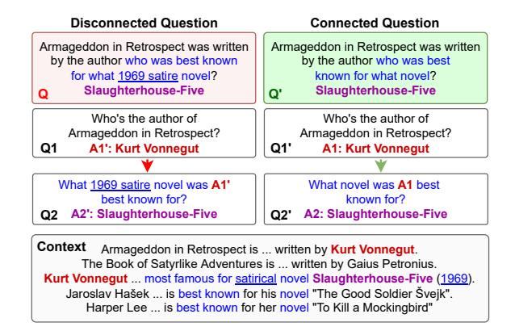
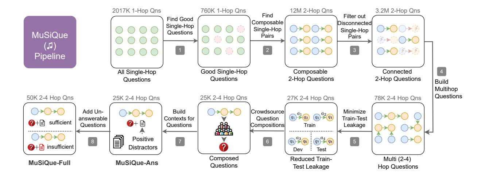
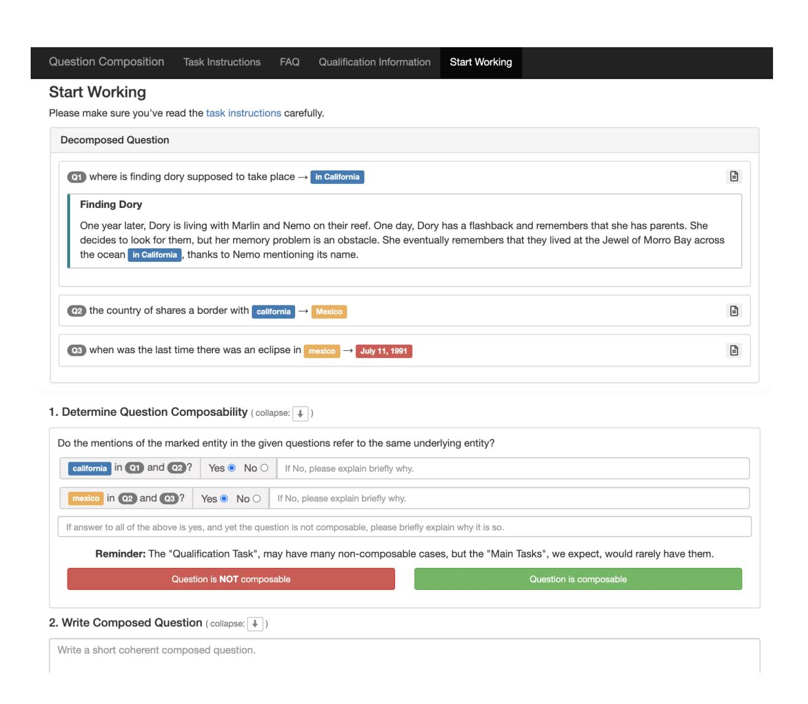
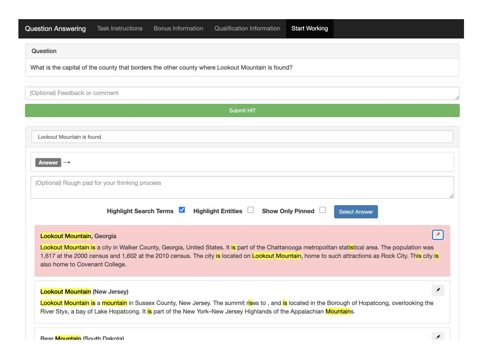

# MuSiQue: Multihop Questions via Single-hop Question Composition

Harsh Trivedi⋄ Niranjan Balasubramanian⋄ Tushar Khot† Ashish Sabharwal†

\*Stony Brook University, Stony Brook, U.S.A.

{hjtrivedi, niranjan}@cs.stonybrook.edu

†Allen Institute for AI, Seattle, U.S.A.

{tushark,ashishs}@allenai.org

# Abstract

Multihop reasoning remains an elusive goal as existing multihop benchmarks are known to be largely solvable via shortcuts. Can we create a question answering (QA) dataset that, by construction, requires proper multihop reasoning? To this end, we introduce a bottom-up approach that systematically selects composable pairs of single-hop questions that are connected, i.e., where one reasoning step critically relies on information from another. This bottom-up methodology lets us explore a vast space of questions and add stringent filters as well as other mechanisms targeting connected reasoning. It provides fine-grained control over the construction process and the properties of the resulting k-hop questions. We use this methodology to create MuSiQue-Ans, a new multihop QA dataset with 25K 2-4 hop questions. Relative to existing datasets, MuSiQue-Ans is more difficult overall (3x increase in human-machine gap), and harder to cheat via disconnected reasoning (e.g., a single-hop model has a 30 point drop in F1). We further add unanswerable contrast questions to produce a more stringent dataset, MuSiQue-Full. We hope our datasets will help the NLP community develop models that perform genuine multihop reasoning.1

# 1 Introduction

Multihop QA datasets are designed to support the development and evaluation of models that perform multiple steps of reasoning in order to answer a question. Recent work, however, shows that on existing datasets, models often need not even *connect* information across all supporting facts,2 because they can exploit reasoning shortcuts and other artifacts to find the correct answers

Figure 1: Generating connected multihop questions by composing carefully chosen pairs of single-hop questions. **Left**: A HotpotQA question that would have been filtered out by our approach for not requiring connected reasoning; it can be answered using just Q2 *without* knowing the answer to Q1 (since there is only one person mentioned in the context as being best known for a satirical novel). **Right**: A connected question that forces models to reason through both intended hops (since there are multiple people mentioned in the context as being best known for some novel).

and obtain high scores (Min et al., 2019a; Chen and Durrett, 2019; Trivedi et al., 2020). Such shortcuts arise from various factors, such as overly specific sub-questions, train-test leakage, and insufficient distractors. These factors allow models to circumvent *connected reasoning*—they need not read the context to find answers to previous sub-question(s) or use these answers to answer the later sub-questions that depend on them.

The left hand side of Fig. 1 illustrates an instance of this problem in an actual question (Q) taken from the HotpotQA dataset (Yang et al., 2018). This question has the over-specification issue. At first glance, it appears to require a model to identify *Kurt Vonnegut* as the author of *Armageddon in Retrospect*, and then use this information to answer the final question about the famous satire novel he authored. However, this framing of the

&lt;sup>1Code and datasets available at https://github.com/stonybrooknlp/musique.

&lt;sup>2For example, they often don't even use information from one supporting fact to select another.

question is insufficient to enforce that models must perform connected multihop reasoning to arrive at the correct answer. A model can, in fact, find the correct answer to this question from the context without finding the answer to Q1. This is because, even if a model does not know that A1 refers to *Kurt Vonnegut*, there happens to be only one person best known for a *satirical novel* mentioned in the context.

Contrast this with the question on the right (Q'), which cannot be answered by simply returning a novel that *someone* was best known for. There are three possible answers in the context and choosing between them requires knowing which author is referenced. This is a desirable multihop question that requires connected reasoning.

Prior work has characterized such reasoning, where a model arrives at the correct answer without using all supporting facts, as Disconnected Reasoning (Trivedi et al., 2020). While this characterization enables filtering or automatically transforming existing datasets (Trivedi et al., 2020), we ask a different question: How can we construct a new multihop dataset that, by design, enforces connected reasoning?

We make two main contributions towards this:

1) A new dataset construction approach: We introduce a bottom-up process for building challenging multihop reading comprehension QA datasets by carefully selecting and composing single-hop questions obtained from existing datasets. The key ideas behind our approach are: (i) Composing multihop questions from a large collection of single-hop questions, which allows a systematic exploration of a vast space of candidate multihop questions. (ii) Applying a stringent set of filters that ensure no sub-question can be answered without finding the answer to the previous sub-questions it is connected to (a key property we formally define as part of the MuSiQue condition, Eqn. (2)). (iii) Reducing train-test leakage at the level of each single-hop question, thereby mitigating the impact of simple memorization tricks. (iv) Adding distractor contexts that cannot be easily identified. (v) Creating unanswerable multihop questions at the sub-question level.

2) A new challenge dataset and empirical analysis: We build a new multihop QA dataset, MuSiQue-Ans (abbreviated as  $\sim$ -Ans), with  $\sim$ 25K 2-4 hop questions with six different composition structures (cf. Table 1). We

demonstrate that - Ans is more challenging and less cheatable than two prior multihop reasoning datasets, HotpotQA (Yang et al., 2018) and 2Wiki-MultihopQA (Ho et al., 2020). In particular, it has 3x the human-machine gap, and a substantially lower disconnected reasoning (DiRe) score which captures the extent to which a dataset can be cheated via disconnected reasoning (Trivedi et al., 2020). We also show how various features of our dataset construction pipeline help increase dataset difficulty and reduce cheatability. Lastly, by incorporating the notion of insufficient context (Rajpurkar et al., 2018; Trivedi et al., 2020), we also release a variant of our dataset, -- Full, having  $\sim$ 50K multihop questions which form contrasting pairs (Kaushik et al., 2019; Gardner et al., 2020) of answerable and unanswerable questions. - Full is even more challenging and harder to cheat on.

We hope our bottom-up multihop dataset construction methodology and our challenging datasets with a mixed number of hops will help develop proper multihop reasoning systems and decomposition-based models.

#### 2 Related Work

**Multihop QA.** → Ans is closest to HotpotQA (Yang et al., 2018) and 2WikiMultihopQA (Ho et al., 2020). HotpotQA was constructed by directly crowdsourcing 2-hop questions without considering the difficulty of composition and has been shown to be largely solvable without multihop reasoning (Min et al., 2019a; Chen and Durrett, 2019; Trivedi et al., 2020). While 2Wiki-MultihopQA was also constructed via composition, they use a limited set of hand-authored compositional rules, making it easy for large language models. We show that - Ans is harder and less cheatable than both of these. Other multihop datasets (Khashabi et al., 2018; Dua et al., 2019, inter alia) focus on different challenges such as multiple modalitites (Chen et al., 2020; Talmor et al., 2021), open-domain QA (Geva et al., 2021; Khot et al., 2020), fact verification (Jiang et al., 2020), science explanations (Jansen et al., 2018), and relation extraction (Welbl et al., 2018), among others. Extending our ideas to these challenges is an interesting avenue for future work.

**Unanswerable QA.** Prior works have used unanswerable questions for robust reasoning in single-hop (Rajpurkar et al., 2018) and multi-hop (Ferguson et al., 2020; Trivedi et al., 2020)

settings. IIRC (Ferguson et al., 2020) focuses on open-domain QA where the unanswerable questions are identified by crowdsourcing questions where relevant knowledge couldn't be retrieved from Wikipedia. Our idea to make unanswerable multihop questions by removing support paragraphs is most similar to Trivedi et al. (2020). While they rely on annotations (potentially incomplete) to identify these support paragraphs, we can use the bridge entities to remove any potential support paragraphs (containing the bridge entity) and better ensure unanswerability.

Question Decomposition and Composition. Multihop QA datasets have been decomposed into simpler questions (Min et al., 2019b; Talmor and Berant, 2018) and special meaning representations (Wolfson et al., 2020). Our dataset creation pipeline naturally provides question decompositions, which can can help develop interpretable models (Min et al., 2019b; Khot et al., 2021).

Recent work has also used bottom-up approaches to create multihop questions (Pan et al., 2021; Yoran et al., 2021) using rule-based methods. However, their primary goal was data augmentation to improve on downstream datasets. The questions themselves haven't been shown to be challenging or less cheatable.

## 3 Multihop Reasoning Desiderata

Multihop question answering can be seen as a sequence of inter-dependent reasoning steps leading to the answer. In its most general form, these reasoning steps and the dependencies can be viewed as directed acyclic graph (DAG),  $G_Q$ . Each node  $q_i$  in this graph represents a reasoning step or a "hop", e.g., a single-hop question in multihop QA or a KB relation traversal in graph-based KBQA. An edge  $(q_j,q_i)\in \mathrm{edges}(G_Q)$  indicates that the reasoning step  $q_i$  relies critically on the output of the predecessor step  $q_j$ . For example, in Fig. 1, the single-hop question Q2' depends on the answer to Q1', and the graph  $G_{Q'}$  is a linear chain  $Q1'\to Q2'$ .

Given this framing, a key desirable property for multihop reasoning is **connected reasoning**: *Performing each step*  $q_i$  *correctly should require the output of all its predecessor steps*  $q_i$ .

**Analytical Intuition:** Suppose a model M can answer each  $q_i$  correctly with probability p, and it can also answer  $q_i$  without the output of all its predecessor steps with probability  $r \leq p$ . For

simplicity, we assume these probabilities are independent across various  $q_i$ . M can correctly answer a k-hop question Q by identifying and performing all its k reasoning steps. This will succeed with probability at most  $p^k$ . Alternatively, as an extreme case, it can "cheat" by identifying and performing only the last step  $q_k$  (the "end question") without considering the output of  $q_{k-1}$  (or other steps) at all. This could succeed with probability as much as r, which does not decrease with k and is thus undesirable when constructing multihop datasets. Our goal is to create multihop questions that enforce connected reasoning, i.e., where  $r \ll p$  and, in particular,  $r < p^k$ , so that models have an incentive to perform all k reasoning steps.

Not surprisingly, the connected reasoning property is often not satisfied by existing datasets (Min et al., 2019a; Chen and Durrett, 2019; Trivedi et al., 2020), and never optimized for during dataset construction. As a consequence, models are able to exploit artifacts in existing datasets that allow them to achieve high scores while bypassing some of the reasoning steps, thus negating the main purpose of building multihop datasets. Prior work (Trivedi et al., 2020) has attempted to measure the extent of connected reasoning in current models and datasets. However, due to the design of existing datasets, this approach is only able to measure this by ablating the pre-requisites of each reasoning step, i.e., the supporting facts. Rather than only measure, we propose a method to construct multihop QA datasets that directly optimize for this condition.

Consider question **Q** on the left hand side of Fig. 1. It can be answered in two steps, Q1 and Q2. However, the information in Q2 itself is sufficient to uniquely identify A2 from the context, *even without considering* A1. That is, while there is an intended dependency between Q1 and Q2, Q2 can be answered correctly *without* requiring the output of its predecessor question Q1. Our approach constructs multihop questions that prevent this issue, and thereby require the desired connected reasoning. Specifically, we carefully choose which single-hop questions to compose and what context to use such that each constituent single-hop question necessitates the answers from one or more previous questions.

| Graph       | Question                                                                                                                     | Decomposition                                                                                                                                                                                                                              |
|-------------|------------------------------------------------------------------------------------------------------------------------------|--------------------------------------------------------------------------------------------------------------------------------------------------------------------------------------------------------------------------------------------|
| <b>○→</b> ○ | Who succeeded the first President of Namibia? Hifikepunye Pohamba                                                            | <ol> <li>Who was the first President of Namibia? Sam Nujoma</li> <li>Who succeeded Sam Nujoma? Hifikepunye Pohamba</li> </ol>                                                                                                              |
| O+O+O       | What currency is used where Billy Giles died? <b>pound sterling</b>                                                          | <ol> <li>At what location did Billy Giles die? Belfast</li> <li>What part of the UK is Belfast located in? Northern Ireland</li> <li>What is the unit of currency in Northern Ireland? pound sterling</li> </ol>                           |
| 0           | When was the first establishment that Mc- Donaldization is named after, open in the country Horndean is located? 1974  | <ol> <li>What is McDonaldization named after? McDonald's</li> <li>Which state is Horndean located in? England</li> <li>When did the first McDonald's open in England? 1974</li> </ol>                                                      |
| <b>→</b>    | When did Napoleon occupy the city where the mother of the woman who brought Louis XVI style to the court died? 1805          | <ol> <li>Who brought Louis XVI style to the court? Marie Antoinette</li> <li>Who's mother of Marie Antoinette? Maria Theresa</li> <li>In what city did Maria Theresa die? Vienna</li> <li>When did Napoleon occupy Vienna? 1805</li> </ol> |
| O+O+O       | How many Germans live in the colonial holding in Aruba's continent that was governed by Prazeres's country? <b>5 million</b> | <ol> <li>What continent is Aruba in? South America</li> <li>What country is Prazeres? Portugal</li> <li>Colonial holding in South America governed by Portugal? Brazil</li> <li>How many Germans live in Brazil? 5 million</li> </ol>      |
| O+O+O       | When did the people who captured Malakoff come to the region where Philipsburg is located? 1625                              | <ol> <li>What is Philipsburg capital of? Saint Martin</li> <li>Saint Martin is located on what terrain feature? Caribbean</li> <li>Who captured Malakoff? French</li> <li>When did the French come to the Caribbean? 1625</li> </ol>       |

Table 1: The six reasoning graph shapes (2-hop to 4-hop) present in MuSiQue, along with sample questions.

## 4 Connected Reasoning via Composition

The central issue we want to address is ensuring connected reasoning. Our solution is to use a bottom-up approach where we compose multihop questions from a large pool of single-hop questions. As we show later, this approach allows us to explore a large space of multihop questions and carefully select ones that require connected reasoning. Additionally, with each multihop question, we will have associated constituent questions, their answers and supporting paragraphs, which can help develop more interpretable models. Here we describe the high-level process and describe the specifics in the next section.

#### 4.1 Multihop via Single-hop Composition

As mentioned earlier, multihop questions can be viewed as a sequence of reasoning steps where answer from one reasoning step is used to identify the next reasoning step. Therefore, we can use single-hop questions containing answers from other questions to construct potential multihop questions. E.g., in Fig. 1, Q2' mentions A1', and hence single-hop questions Q1' and Q2' can be composed to create a DAG  $Q1' \rightarrow Q2'$  and multihop question Q' (right). Concretely, to create a multihop question from two single-hop questions, we have a composability criteria: Two singlehop question answer tuples  $(q_1, a_1)$  and  $(q_2, a_2)$ are composable into a multihop question Q with  $a_2$  as a valid answer if  $a_1$  is a named entity and it is mentioned in  $q_2$ . See §5:S2 for detailed criteria. This process of composing multihop questions can be chained together to form candidate reasoning graphs of various shapes and sizes (examples in Table 1). Formally, each multihop question Q has an underlying DAG  $G_Q$  representing the composition of the single-hop questions  $q_1, q_2, \ldots, q_n$ , which form the nodes of  $G_Q$ . A directed edge  $(q_j, q_i)$  indicates that  $q_i$  depends on the answer of the previous sub-question  $q_j$ .  $a_i$  is the answer to  $q_i$ , and thereby,  $a_n$  is the answer to Q.

## 4.2 Ensuring Connected Reasoning

Given the graph  $G_Q$  associated with a question Q, ensuring connected reasoning requires ensuring that for each edge  $(q_j,q_i)\in \operatorname{edges}(G_Q)$ , arriving at answer  $a_i$  using  $q_i$ , necessitates the use of  $a_j$ . In other words, without  $a_j$ , there isn't sufficient information in  $q_i$  to arrive at  $a_i$ .

The existence of such information can be probed by training a strong QA model M on subquestions  $(q_i)$  with the mention of their predecessor's answer  $(a_j)$  masked out (removed). If, on held out data, the model can identify a subquestion's answer  $(a_i)$  without its predecessor's answer  $(a_j)$ , we say the edge  $(q_j, q_i)$  is disconnected. Formally, we say Q requires connected reasoning if:

$$\forall (q_j, q_i) \in \text{edges}(G_Q) : M(q_i^{m_j}) \neq a_i$$
 (1)

where  $q_i^{m_j}$  denotes the subquestion formed from  $q_i$  by masking out the mention of the answer  $a_j$ .

Consider the masked questions Q2 and Q2' in Fig. 1. While Q2 can easily be answered without

answer A1, Q2' can't be answered without A1' and **O**' hence satisfies condition (1).

# 4.3 Reading Comprehension Setting

While our proposed framework makes no assumptions about the choice of the model, and is applicable to open-domain setting, we focus on the Reading Comprehension (RC) setting, where we've a fixed set of paragraphs as context, C.

In a RC setting, apart from requiring the dependence between the reasoning steps, we also want the model to depend on the context to answer each question. While this requirement seems unnecessary, previous works have shown that RC datasets often have artifacts that allow models to predict the answer without the context (Kaushik and Lipton, 2018) and can even memorize the answers (Lewis et al., 2021) due to train-test leakage. As we will show later, previous multihop RC datasets can be cheated via such shortcuts. To ensure the dependence between the question and context, we modify the required condition in Eqn. (1) to:

$$\forall (q_j, q_i) \in \operatorname{edges}(G_Q) : M(q_i^{m_j}; C) \neq a_i$$

$$\land \quad \forall q_i \in \operatorname{nodes}(G_Q) : M(q_i; \phi) \neq a_i \quad (2)$$

In summary, we want multihop reading comprehension questions that satisfy condition (2) for a strong trained model M. If it does, we say that the question satisfies the **MuSiQue condition**. Our dataset construction pipeline optimizes for this condition as described next.

## 5 Dataset Construction Pipeline

The high-level schematic of the pipeline is shown in Fig. 2. We begin with a large set of RC single-hop questions from 5 English Wikipedia-based datasets, SQuAD (Rajpurkar et al., 2016), Natural Questions (Kwiatkowski et al., 2019), MLQA (enen) (Lewis et al., 2020b), T-REx (ElSahar et al., 2018), Zero Shot RE (Levy et al., 2017), where instances are of the form  $(q_i, p_i, a_i)$  referring to the question, the associated paragraph, and the answer, respectively. For Natural Questions, as the context is very long (entire Wikipedia page), we use the annotated long answer (usually a paragraph) from the dataset as the context, and the annotated short answer as the answer. Then, we take the following two steps:

**S1. Find Good Single-hop Questions.** Even a tolerably small percentage of issues in single-hop

questions can compound into an intolerably large percentage in the composed multihop questions. To mitigate this, we first remove questions that are likely annotation errors. Since manually identifying such questions at scale is laborious, we use a model-based approach. We remove the questions for which none of five large trained QA models3 can predict the associated answer with > 0 answer F1. Furthermore, we remove (i) erroneous questions where the answer spans are not in the context, (ii) questions with < 20 word context as we found them to be too easy, and (iii) questions with > 300 word context to prevent final multihop question context from being too long for current long-range transformer models.

**S2.** Find Composable Single-hop Pairs. To create 2-hop questions, we first collect distinct single-hop question pairs with a bridge entity. Specifically, we find pairs  $(q_1, p_1, a_1)$  and  $(q_2, p_2, a_1)$  $a_2$ ) such that (i)  $a_1$  is a named entity also mentioned in  $q_2$ , (ii)  $a_2$  is not in  $q_1$ , and (iii)  $p_1 \neq p_2$ . Such pairs can be combined to form a 2-hop question  $(Q, \{p_1, p_2\}, a_2)$ . To ensure the mentions  $(a_1 \text{ and its occurrence in } q_2 \text{ denoted } e_2) \text{ refer to}$ the same entity, we ensure: 1. Spacy entity tagger (Honnibal et al., 2020) tags  $a_1$  and  $e_2$  as entities of the same type. 2. A Wikipedia search with  $a_1$  and  $e_2$  returns identical 1st result. 3. A SOTA Wikification model (Wu et al., 2020) returns the same result for  $a_1$  and  $e_2$ . At a later step (S7) when humans write composed questions from DAGs, they get to remove questions containing erroneous pairs. Only 8% of the pairs are pruned in that step, indicating that step S2 is quite effective.

**S3. Filter Disconnected Single-hop Pairs.** We want connected 2-hop questions – questions that cannot be answered without using the answers of the constituent single-hop questions. The MuSiQue condition (2) states that for a 2-hop question to be connected, either sub-question  $q_i$  should not be correctly answered without its context  $(M(q_i, \phi) \neq a_i)$  and the tail question  $q_2$  should not be correctly answered when  $a_1$  is removed from it  $(M(q_2^{m_1}, C) \neq a_2)$ . Accordingly we use a two step filtering process to find connected 2-hop questions. For simplicity, and because the second condition already filters some tail

&lt;sup>3Two random-seed variants of RoBERTa-large (Liu et al., 2019), two random-seeds of Longformer-Large (Beltagy et al., 2020) and one UnifiedQA (Khashabi et al., 2020).

Figure 2: MuSiQue construction pipeline. MuSiQue pipline takes single-hop questions from existing datasets, explores the space of multihop questions that can be composed from them, and generates dataset of challenging multihop questions that are difficult to cheat on. MuSiQue pipeline also makes unanswerable multihop questions that makes the final dataset significantly more challenging.

questions, our current implementation enforces the first condition only on the head question,  $q_1$ .

Filtering Head Nodes: We collect all questions that appear at least once as the head of composable 2-hop questions  $(q_1)$  to create a set of head nodes. We create 5-fold train-test splits of this set and train two Longformer-Large models (different seeds) per split (train on three, validate and test on one). We generate answer predictions using the 2 models on their corresponding test splits resulting in 2 predictions per question. We accept a head question if, on average, the predicted answers' word overlap (computed using answer f1) with the answer label is < 0.5.

Filtering Tail Nodes: We create a unique set of masked single-hop questions that occur as a tail node  $(q_2)$  in any composable 2-hop question. If the same single-hop question occurs in two 2-hop questions with different masked entities, they both are added to the set. We combine the gold-paragraph with 9 distractor paragraphs (retrieved 4 using the question without the masked entities as query). As before, we create 5-fold train-test splits and use 2 Longformer-Large models to get 2 answer and support predictions. We accept a tail question if either mean answer F1  $\leq 0.25$ , or if it's  $\leq 0.75$  and mean support F1 < 1.0.

The thresholds for head and tail node filtering were chosen via a manual inspection of a few predictions in various ranges of the parameters, and gauging at what F1 values does the model's answer semantically match the correct answer (e.g., "Barack Obama" and "President Barack Obama" overlap with 0.8 answer F1). Controlling these thresholds provides a way to trade-off between the degree of cheatability allowed in the dataset and the size of the final dataset. We aim to limit cheatability while retaining a reasonable dataset size.

Finally, only 2-hop questions for which both head and tail node are acceptable are kept. We call this process **Disconnection Filtering**.

**S4. Build Multihop Questions.** We now have a set of connected 2-hop questions, which form directed edges of a graph. Any subset DAG of it can be used to create a connected multihop question. We use 6 types of reasoning graphs with 2-4 hops as shown in Table 1. To avoid very long questions, we limit single-hop questions to  $\leq 10$  tokens, the total length of questions in 2,3-hops to  $\leq 15$ , and 3-hops to  $\leq 20$  tokens. To ensure diversity, we (1) cap the reuse of bridging entities and single-hop questions at 25 and 100 multihop questions respectively (2) remove any n-hop question that's subset of any m-hop question (m > n > 1).

**S5.** Minimize Train-Test Leakage. We devise a procedure to create train, validation and test splits such that models cannot achieve high-scores via memorization enabled by train-test leakage, an issue observed in some existing datasets (Lewis et al., 2021). Our procedure ensures that the training set has no *overlap* with validation or the test sets, and tries to keep the *overlap* between valida-

&lt;sup>4We use the BM25 algorithm via Elasticsearch.

tion and test sets minimal.

We consider two multihop questions  $Q_i$  and  $Q_j$  to *overlap* if any of the following are common between  $Q_i$  and  $Q_j$ : (i) single-hop question (ii) answer to any single-hop question (iii) associated paragraph to any single-hop question. To minimize such *overlap*, we take a set of multihop questions, greedily find a subset of given size (S) which least *overlaps* with its complement (S'), and then remove *overlapping* questions from S', to get train (S) and dev+test set (S'). Then, we split dev+test to dev and test similarly. We ensure the distribution of source datasets of single-hop questions in train, dev and test are similar, and also control the proportion of 2-4 hop questions.

**S6. Build Contexts for Questions.** For an nhop question, the context has 20 paragraphs containing: (i) supporting paragraphs associated with its single-hop questions  $\{p_1, p_2 \dots p_n\}$ , (ii) distractor paragraphs retrieved using a query that is a concatenation of single-hop questions from which all intermediate answer mentions are removed. To make distractor paragraphs harder to identify, we retrieve them from the set of gold-paragraphs for the filtered single-hop question (S1).

S7. Crowdsource Question Compositions. crowdsource question compositions on Amazon MTurk, where workers composed coherent questions from our final DAGs of single-hop questions. In the interface (Fig. 3), workers could see a list of single-hop questions with their associated paragraphs and how they are connected via bridge entities. They were first asked to check whether all pairs of mentions of bridge entities indeed refer to the same underlying entity. If they answered 'yes' for each pair,5 they were asked to compose a natural language question ensuring that information from all single-hop questions in the DAG is used, and the answer to the composed question is the same as the last single-hop question. If they answered 'no' for any of the pairs, we discarded that question. Our tutorial provided them with several handwritten good and bad examples for each of the 2-4 hop compositions. Workers were encouraged to write short questions and make implicit inferences when possible. They were allowed to split questions into two sentences if needed.

We carried out a qualification round where 100 workers participated to perform the aforemen-

|       | 2-hop | 3-hop | 4-hop | Total (24,814) |
|-------|-------|-------|-------|----------------|
| Train | 14376 | 4387  | 1175  | 19938          |
| Dev   | 1252  | 760   | 405   | 2417           |
| Test  | 1271  | 763   | 425   | 2459           |

Table 2: Dataset statistics of MuSiQue-Ans. MuSiQue-Full contains twice the number of questions in each category above – one answerable and one unanswerable.

tioned task on 20 examples each. We manually evaluated these annotations for correctness and coherence, and selected 17 workers to annotate the full dataset. To ensure dataset quality, we carried out crowdsourcing in 9 batches, reading 10-20 random examples from each worker after each batch and sending relevant feedback via email, if needed. Workers were paid 25, 40, and 60 cents for each 2, 3, and 4 hop question, amounting to  $\sim$ 15 USD per hour, totaling  $\sim$ 11K USD.

We refer to the dataset at this stage as **MuSiQue-Ans** or **-**3 -Ans.

**S8.** Add Unanswerable Questions. For each answerable multihop RC instance we create a corresponding unanswerable multihop RC instance using the procedure similar to the one proposed in (Trivedi et al., 2020). For a multihop question we randomly sample any of its single-hop question and make it unanswerable by ensuring the answer to that single-hop question doesn't appear in any of the paragraphs in context (except this requirement, the context is built as described in S6). Since one of the single-hop question is unanswerable, the whole multihop question is unanswerable.

The task now is to predict whether the question is answerable, and predict the answer and support if it's answerable. Given the questions for answerable and unanswerable pair are identical and the context marginally changes, models that rely on shortcuts find this new task very difficult. We call the dataset at this stage **MuSiQue-Full** or -Full, and both datasets together as **MuSiQue**.

Final Dataset. The statistics for ♪-Ans (♪-Full has twice the number of questions in each cell) are shown in Table 2. MuSiQue constitutes unique 21020 single-hop questions, 4132 answers to multihop questions, 19841 answers to single-hop questions, and 7676 supporting paragraphs. MuSiQue has 6 types of reasoning graphs and 2-4 hops (cf. Table 1 for examples).

&lt;sup>5They answered yes 92% of the time, on average.

In summary, our construction pipeline allows us to produce a dataset with mixed hops, multiple types of reasoning graphs, and unanswerable subquestions, all of which make for a more challenging and less cheatable dataset (as we will quantify in Section 8). Question decomposition, which is a natural outcome of our construction pipeline, can also be used to aid decomposition-based QA research (Min et al., 2019b; Khot et al., 2021).

# 6 Dataset Quality Assessment

Quality of -Ans. To assess the quality of -Ans, we first evaluate how well humans can answer questions in it. Note that we already have gold answers and supporting paragraphs from our construction pipeline. This goal is therefore not to determine gold labels, but rather to measure how well humans perform on the task treating our gold labels as correct.

We sample 125 questions from \$\int\_{\circ}\$-Ans validation and test sets, and obtain 3 annotations (answer and supporting paragraphs) for each question. We used Amazon Mechanical Turk, 6 selecting crowd-source workers as described in \( \frac{8}{5} \).3.

Workers were shown the question and all paragraphs in the context, and were asked to highlight the answer span and checkmark the supporting paragraphs. Our interface (Fig. 4) allowed for searching, sorting, and filtering the list of paragraphs easily with interactive text-overlap-based search queries. The instructions included worked out examples.

We compute human performance by comparing against gold labels for answer and support in two ways: 1) **Human Score**—the most frequent answer and support among the three annotators breaking ties at random (the strategy used by Rajpurkar et al. (2018)), and 2) **Human Upper Bound (UB)**—the answer and support that maximizes the score (as done by Yang et al. (2018)).

Furthermore, to assess how well human agree with each other (ignoring our gold labels), we also compute the **Human Agreement (Agr)** score (Rajpurkar et al., 2016; Yang et al., 2018). Specifically, we treat one of 3 annotations, chosen randomly, as predicted, and evaluate it against rest of the annotations, which are treated as correct.

Table 3 demonstrates that \( \bar{1} \)-Ans is a high-quality dataset. Furthermore, as we will discuss in \( \}7.3, \text{ we also compare our human perfor-

| Human      | Score | UB   | Agr  |
|------------|-------|------|------|
| Answer F1  | 78.0  | 88.6 | 84.1 |
| Support F1 | 93.9  | 97.3 | 91.4 |

Table 3: Human performance (score and upper bound) and agreement on MuSiQue-Ans.

mance with two other similar datasets (HotpotQA and 2WikiMultihopQA), and show that -7-Ans is close to them under these metrics (§8).

Quality of --Full. We perform an additional manual validation to assess dataset quality of --Full. Recall that --Full shares the answerable questions with --Ans, the only extra task in --Full being determining the answerability of a question from the given context. To assess the validity of this task, we sampled 50 random instances from --Full, and one of the authors determined the answerability of each question from its context. We found that in 45 out of the 50 instances (90%) the human predicted answerability matched the gold label, showing that --Full is a also high-quality dataset.

Multihop Nature of MuSiQue. Finally, we assess the extent to which ♪ -Ans satisfies the MuSiQue condition (Eqn. 2) for connected reasoning. To this end, we first estimate what percentage of head and tail questions in the validation set would we retain if we were to repeat our disconnection filtering procedure (S3) with models trained on the final training data. This captures the fraction of the questions in ♪ -Ans that satisfy the MuSiQue condition. We then compare it with the respective numbers from the original step S3.

In the original disconnection filtering step, we retained only 26.5% of the tail questions, whereas we would have retained 79.0% of the tail questions had we filtered the final validation dataset. For head questions, we see a less dramatic but still significant effect—we originally retained 74.5% questions, and would now have retained 87.7% had we filtered the final validation set. This shows that vastly more questions in \(\frac{1}{2}\)-Ans satisfy the MuSiQue condition than what we started with.

# 7 Experimental Setup

#### 7.1 Datasets

We compare our datasets (MuSiQue-Ans and MuSiQue-Full) with two similar multihop RC

6https://www.mturk.com

datasets: distractor-setting of HotpotQA (Yang et al., 2018) and 2WikiMultihopQA (Ho et al., 2020).7 Both datasets have 10 paragraphs as context. HQ and 2W have 2-hop and 2,4-hop questions respectively. Additionally, HQ has sentence support and 2W has entity-relation tuples support, but we don't use this annotation in our training or evaluation for a fair comparison.

HQ, 2W, and  $\Omega$ -Ans have 90K, 167K, and 20K training instances, respectively. For a fair comparison, we use equal sized training sets in all our experiments, obtained by randomly sampling 20K instances each from HQ and 2W, and referred to as HQ-20k and 2W-20k, respectively.

**Notation.** Instances in  $\square$ -Ans, HQ, and 2W are of the form  $(Q, C; A, P_s)$ . Given a question Q and context C consisting of a set of paragraphs, the task is to predict the answer A and identify supporting paragraphs  $P_s \in C$ .  $\square$ -Ans additionally has gold decomposition  $G_Q$  (§3), which can be leveraged during training. Instances in  $\square$ -Full are of form  $(Q, C; A, P_s, S)$ , where there's an additional binary classification task to predict S, the answerability of Q based on C, also referred to as context *sufficiency* (Trivedi et al., 2020).

Metrics. For ♣ -Ans, HQ, and 2W, we report the standard F1 based metrics for answer (An) and support identification (Sp); see Yang et al. (2018) for details. To make a fair comparison across datasets, we use only paragraph-level support F1.

For  $\ \ \ \ \ \ \ \ \ \ \ \ \ \ \ \ \ \ \$ 

#### 7.2 Models

Our models are Transformer-based (Vaswani et al., 2017) language models (Devlin et al., 2019), implemented using PyTorch (Paszke et al., 2019), HuggingFace Transformers (Wolf et al., 2019) and

AllenNLP (Gardner et al., 2017). We experiment with 2 types of models: (1) *Multihop Models*, which are in principle capable of employing desired reasoning, and have demonstrated competitive performance on previous multihop QA datasets. They help probe the extent to which a dataset can be solved by current models. (2) *Artifact-based Models*, which are restricted in some way that prohibits them from doing desired reasoning (discussed shortly). They help probe the extent to which a dataset can be cheated. Next, we describe these models for \$\square\$ -Ans and \$\square\$ -Full. For HQ and 2W, they work similar to \$\square\$ -Ans.

## 7.2.1 Multihop Models

**End2End (EE) Model.** This model takes (Q,C) as input, runs it through a transformer, and predicts  $(A,P_s)$  as the output for  $\ \ \ \ \ \ \ \ \ \ \ \ \ \ \ \ \ \ \$ 

Note that our Longformer EE model is a strong model for multihop reasoning. When trained on full datasets, its answer F1 is 78.4 (within 3 pts of published SOTA (Groeneveld et al., 2020)) on HQ, and 87.7 (SOTA) on 2W.

**Select+Answer** (**SA**) **Model.** This model, inspired by Quark (Groeneveld et al., 2020) and SAE (Tu et al., 2020), has two parts. First, a *selector* ranks and selects the K most relevant paragraphs  $C_K \subseteq C$ . Specifically, given (Q,C) as input, it classifies every paragraph  $P \in C$  as relevant or not, and is trained with the crossentropy loss. Second, for MuSiQue-Ans, the *answerer* predicts the answer and supporting paragraphs based only on  $C_K$ . For MuSiQue-Full, it additionally predicts answerability. Both components are trained individually using annotations available in the dataset. We implement a selector using RoBERTa-large (Liu et al., 2019), and an answerer using Longformer-Large.

**Step Execution (EX) Model.** Similar to prior work (Talmor and Berant, 2018; Min et al., 2019b; Qi et al., 2021; Khot et al., 2021), this model performs explicit, step-by-step multihop reasoning, by first *decomposing* the Q into a DAG  $G_Q$  having

&lt;sup>7For brevity, we use HQ, 2W, ♣ -Ans/Full to refer to HotpotQA, 2WikiMultihopQA, MuSiQue-Ans/Full, resp.

 $^{8}K$  is a hyperparameter, chosen from  $\{3,5,7\}$ .

single-hop questions, and then calling single-hop model repeatedly to *execute* this decomposition.

The *decomposer* is trained with gold decompositions, and is implemented with BART-large.

The *executor* takes C and the predicted DAG  $G_Q$ , and outputs  $(A, P_s)$  for MuSiQue-Ans and  $(A, P_s, S)$  for MuSiQue-Full. It calls single-hop model  $M_s$  repeatedly while traversing  $G_Q$  along the edges and substituting the answers.

Model  $M_s$  is trained on only single-hop instances—taking  $(q_i, C)$  as input, and producing  $(A, P_i)$  or  $(A, P_{s_i}, S_i)$  as the output. Here  $P_i$  refers to the supporting paragraph for  $q_i$  and  $S_i$  refers to whether C is sufficient to answer  $q_i$ . For MuSiQue-Full, the answerer predicts Q as having sufficient context if  $M_s$  predicts all  $q_i$  to have sufficient context. We implement 2 such single-hop models  $M_s$ : End2End and Select+Answer, abbreviated as  $\mathbf{EX}(\mathbf{EE})$  and  $\mathbf{EX}(\mathbf{SA})$  respectively

We don't experiment with this model on HQ, since it needs ground-truth decomposition and intermediate answers, which aren't available in HQ.

Baseline (RNN) Model. The filtering steps in our pipeline use transformer-based models, which could make MuSiQue particularly difficult for transformer-based models. A natural question then is, can a strong non-transformer model perform better on MuSiQue? To answer this, we evaluate our re-implementation of a strong RNN-based baseline (Yang et al., 2018) (see their original paper for details). To verify our implementation, we trained it on full HotpotQA and found its performance to be 64.0 An (answer F1) on the validation set, better than what's reported by Yang et al. (2018) (58.3 An). We thus use this model as a strong non-transformer baseline.

#### 7.2.2 Artifact-based Models

The **Q-Only Model** takes only Q as input (no C) and generates output A for  $\square$ -Ans and (A, S) for  $\square$ -Full. We implement this with BART-large (Lewis et al., 2020a). The **C-Only Model** takes only C as input (no Q) and predicts  $(A, P_s)$  for  $\square$ -Ans and  $(A, P_s, S)$  for  $\square$ -Full. We implement this with an EE Longformer-Large model with empty Q. The **1-Para Model**, like Min et al. (2019a); Chen and Durrett (2019), is similar to SA model with K=1. Instead of training the selector to rank all  $P_s$  the highest, we train it to rank any paragraph containing the answer A as the highest. The answerer then takes as input one selected

paragraph  $p \in P_s$  and predicts an answer to Q based solely on p. This model can't access full supporting information as all considered datasets have at least 2 supporting paragraphs.

# 7.2.3 Cheatability Score

We compute the **DiRe score** of all datasets, which measures the extent to which the datasets can be cheated by strong models via Disconnected Reasoning (Trivedi et al., 2020). We report scores based on the SA model since it performed the best.

#### 7.3 Human Performance

Apart from assessing the human performance level on \(^1\)-Ans, as discussed in \(^8\)6, we also obtain human performance on HQ and 2W. For a fair comparison, we use the same crowdsourcing workers, annotation guidelines, and interface across the 3 datasets. We sample 125 questions from each dataset, shuffle them all into one set, and obtain 3 annotations per question for answer and support.

To select the workers, we ran a qualification round where each worker was required to identify answer and support for at least 25 questions. We then selected workers who had more than 75 An and Sp scores on all datasets. 7 out of 15 workers were qualified for rest of the validation.

## **8 Empirical Findings**

We now discuss our findings, demonstrating that MuSiQue is a challenging multihop dataset that is harder to cheat on than existing datasets (§8.1) and that the steps in the MuSiQue construction pipeline are individually valuable (§8.2). Finally, we explore avenues for future work (§8.3).

For HQ and 2W, we report validation set performance. For -Ans and -Full, Table 5 reports test set numbers; all else is on the validation set.

## 8.1 MuSiQue is a Challenging Dataset

Compared to HQ and 2W, both variants of MuSiQue are less cheatable via shortcuts and have a larger human-to-model gap.

Higher Human-Model Gap. Top two sections of Table 4 show → -Ans has a significantly higher human-model gap (computed as Human Score minus best model score) than the other datasets, for both answer and supporting paragraph identification. In fact, for both the other datasets, supporting paragraph identification has even surpassed the human score, whereas for → -Ans, there is 14 pts

|                                                                                                                                                                                                                                                                                                                                                                                                                                                                                                                                                                                                                                                                                                                                                                                                                                                                                                                                                                                                                                                                                                                                                                                                                                                                                                                                                                                                                                                                                                                                                                                                                                                                                                                                                                                                                                                                                                                                                                                                                                                                                                                                | HQ-20K      | 2W-20K                                                                  | -Ans                                                                    |
|--------------------------------------------------------------------------------------------------------------------------------------------------------------------------------------------------------------------------------------------------------------------------------------------------------------------------------------------------------------------------------------------------------------------------------------------------------------------------------------------------------------------------------------------------------------------------------------------------------------------------------------------------------------------------------------------------------------------------------------------------------------------------------------------------------------------------------------------------------------------------------------------------------------------------------------------------------------------------------------------------------------------------------------------------------------------------------------------------------------------------------------------------------------------------------------------------------------------------------------------------------------------------------------------------------------------------------------------------------------------------------------------------------------------------------------------------------------------------------------------------------------------------------------------------------------------------------------------------------------------------------------------------------------------------------------------------------------------------------------------------------------------------------------------------------------------------------------------------------------------------------------------------------------------------------------------------------------------------------------------------------------------------------------------------------------------------------------------------------------------------------|-------------|-------------------------------------------------------------------------|-------------------------------------------------------------------------|
|                                                                                                                                                                                                                                                                                                                                                                                                                                                                                                                                                                                                                                                                                                                                                                                                                                                                                                                                                                                                                                                                                                                                                                                                                                                                                                                                                                                                                                                                                                                                                                                                                                                                                                                                                                                                                                                                                                                                                                                                                                                                                                                                | An   Sp     | An   Sp                                                                 | An   Sp                                                                 |
| Score UB                                                                                                                                                                                                                                                                                                                                                                                                                                                                                                                                                                                                                                                                                                                                                                                                                                                                                                                                                                                                                                                                                                                                                                                                                                                                                                                                                                                                                                                                                                                                                                                                                                                                                                                                                                                                                                                                                                                                                                                                                                                                                                                       | 84.5   92.5 | 83.2   99.3                                                             | 78.0   93.9                                                             |
|                                                                                                                                                                                                                                                                                                                                                                                                                                                                                                                                                                                                                                                                                                                                                                                                                                                                                                                                                                                                                                                                                                                                                                                                                                                                                                                                                                                                                                                                                                                                                                                                                                                                                                                                                                                                                                                                                                                                                                                                                                                                                                                                | 91.8   96.0 | 89.0   100                                                              | 88.6   97.3                                                             |
| Multihop EX(EE) EX(SA)                                                                                                                                                                                                                                                                                                                                                                                                                                                                                                                                                                                                                                                                                                                                                                                                                                                                                                                                                                                                                                                                                                                                                                                                                                                                                                                                                                                                                                                                                                                                                                                                                                                                                                                                                                                                                                                                                                                                                                                                                                                                                                         |             | 52.7   94.9 72.9   97.6 79.5   99.0 79.8   97.5 71.2   98.1 | 13.6   41.9 42.3   67.6 47.3   72.3 45.6   77.8 49.8   79.2 |
| Artifact Artifact Artifact Artifact Artifact Artifact Artifact Artifact Artifact Artifact Artifact Artifact Artifact Artifact Artifact Artifact Artifact Artifact Artifact Artifact Artifact Artifact Artifact Artifact Artifact Artifact Artifact Artifact Artifact Artifact Artifact Artifact Artifact Artifact Artifact Artifact Artifact Artifact Artifact Artifact Artifact Artifact Artifact Artifact Artifact Artifact Artifact Artifact Artifact Artifact Artifact Artifact Artifact Artifact Artifact Artifact Artifact Artifact Artifact Artifact Artifact Artifact Artifact Artifact Artifact Artifact Artifact Artifact Artifact Artifact Artifact Artifact Artifact Artifact Artifact Artifact Artifact Artifact Artifact Artifact Artifact Artifact Artifact Artifact Artifact Artifact Artifact Artifact Artifact Artifact Artifact Artifact Artifact Artifact Artifact Artifact Artifact Artifact Artifact Artifact Artifact Artifact Artifact Artifact Artifact Artifact Artifact Artifact Artifact Artifact Artifact Artifact Artifact Artifact Artifact Artifact Artifact Artifact Artifact Artifact Artifact Artifact Artifact Artifact Artifact Artifact Artifact Artifact Artifact Artifact Artifact Artifact Artifact Artifact Artifact Artifact Artifact Artifact Artifact Artifact Artifact Artifact Artifact Artifact Artifact Artifact Artifact Artifact Artifact Artifact Artifact Artifact Artifact Artifact Artifact Artifact Artifact Artifact Artifact Artifact Artifact Artifact Artifact Artifact Artifact Artifact Artifact Artifact Artifact Artifact Artifact Artifact Artifact Artifact Artifact Artifact Artifact Artifact Artifact Artifact Artifact Artifact Artifact Artifact Artifact Artifact Artifact Artifact Artifact Artifact Artifact Artifact Artifact Artifact Artifact Artifact Artifact Artifact Artifact Artifact Artifact Artifact Artifact Artifact Artifact Artifact Artifact Artifact Artifact Artifact Artifact Artifact Artifact Artifact Artifact Artifact Artifact Artifact Artifact Artifact Artifact Artifact Artifact Artifact Artifact Artifact Artifact Art | 64.8   —    | 60.1   —                                                                | 32.0   —                                                                |
|                                                                                                                                                                                                                                                                                                                                                                                                                                                                                                                                                                                                                                                                                                                                                                                                                                                                                                                                                                                                                                                                                                                                                                                                                                                                                                                                                                                                                                                                                                                                                                                                                                                                                                                                                                                                                                                                                                                                                                                                                                                                                                                                | 18.4   67.6 | 50.1   92.0                                                             | 3.4   0.0                                                               |
|                                                                                                                                                                                                                                                                                                                                                                                                                                                                                                                                                                                                                                                                                                                                                                                                                                                                                                                                                                                                                                                                                                                                                                                                                                                                                                                                                                                                                                                                                                                                                                                                                                                                                                                                                                                                                                                                                                                                                                                                                                                                                                                                | 19.6   —    | 27.0   —                                                                | 4.6   —                                                                 |
| DiRe Score                                                                                                                                                                                                                                                                                                                                                                                                                                                                                                                                                                                                                                                                                                                                                                                                                                                                                                                                                                                                                                                                                                                                                                                                                                                                                                                                                                                                                                                                                                                                                                                                                                                                                                                                                                                                                                                                                                                                                                                                                                                                                                                     | 68.8   93.0 | 63.4   98.5                                                             | 37.8   63.4                                                             |

Table 4: Compared to the other datasets considered, Ans has a much larger human-model gap (higher gap between top and middle sections), and is much less cheatable (lower scores in bottom two sections).

gap. Additionally,  $\ \ \ \ \ \ \ \ \ \ \ \ \ \ \ \ \ \ \$ 

Our best model, EX(SA), scores 57.9, 47.9, and 28.1 answer F1 on 2, 3, and 4-hop questions of Ans, resp. The EE model, on the other hand, stays around 42% irrespective of the number of hops.

Lower Cheatability. The 3rd section of Table 4 shows that the performance of artifact-based models (§7.2.2) is much higher on HQ and 2W than on J-Ans. E.g., the 1-Para model achieves 64.8 and 60.1 answer score on HQ and 2W, resp., but only 32.0 on J-Ans. Support identification in both datasets can be done to a surprisingly high degree (67.6 and 92.0 F1) even without the question (C-only model), but fails on J-Ans. 9

Similarly, the last row of Table 4 shows that the **DiRe** answer scores of HQ and 2W (68.8 and 63.4) are high, indicating that even disconnected reasoning (bypassing reasoning steps) can achieve such high scores. In contrast, this number is significantly lower (37.8) for Ans.

These results demonstrate that -\(\frac{1}{2}\) -Ans is significantly less cheatable via shortcut-based reasoning.

MuSiQue-Full: Even More Challenging. Table 5 shows that ♣ -Full is significantly more difficult and less cheatable than ♣ -Ans.

Intuitively, because the answerable and unanswerable instances are very similar but have dif-

|                    |                              | -Ans An   Sp                                          | -Full An+Sf   Sp+Sf                                   |
|--------------------|------------------------------|----------------------------------------------------------|----------------------------------------------------------|
| Multihop Models | EE SA Ex(EE) Ex(SA) | 40.7   69.4 52.3   75.2 46.4   78.1 49.0   80.6 | 24.0   25.6 34.8   42.1 32.2   44.2 32.2   44.3 |
| Artifact Models | 1-Para C-only Q-only   | 35.7   — 3.7   0.0 4.6   —                         | 2.3   — 1.6   1.1 0.0   —                          |

Table 5: -Full is harder (top row) and less cheatable (bottom row) than -Ans. Note: -Full has a stricter metric that operates over instance pairs (§7.1:metrics).

ferent labels, it's difficult for models to do well on both instances if they learn to rely on short-cuts (Kaushik et al., 2019; Gardner et al., 2020). All artifact-based models barely get any An+Sf or Sp+Sf score. For all multihop models too, the An drops by 14-17 pts and Sp by 33-44 pts.

## 8.2 Dataset Construction Steps are Valuable

Next, we show that the key steps of our dataset construction pipeline (§5) are valuable.

**Disconnection Filter (step 3).** To assess the effect of Disconnection Filter (DF), we ablate it from the pipeline, ie., skip the filtering composable 2-hop questions to connected 2-hop questions. As we don't have human-generated composed questions for the resulting questions, we use a seq2seq BART-large model that's trained (using MuSiQue) to compose questions from input decomposition DAG. For a fair comparison, we randomly subsample train set from ablated pipeline to be of the same size as the original train set.

| 1-Para                           | C-only     | EE      |
|----------------------------------|------------|---------|
| An   Sp                          | An   Sp    | An   Sp |
| 32.0   — 59.2   — 85.1   — | 8.6   22.4 |         |

Table 6: Disconnection Filter (DF, step 5) and Reduced Train-Test Leakage (RL, step 3) of MuSiQue pipeline are crucial for its difficulty (EE model) and less cheatability (1-Para and C-only models).

Table 6 shows that DF is crucial for increasing difficulty and reducing cheatability of the dataset. Without DF, both multihop and artifact-based models do much better on the resulting datasets.

&lt;sup>9Even when → -Ans is modified to have 10 paragraphs like HQ, C-only support score remains low; cf. Table 7.

Reduced Train-Test Leakage (step 5). To assess the effect of Reduced train-test Leakage (RL), we create a dataset the traditional way, with a random partition into train, validation, and test splits. For uniformity, we ensure the distribution of 2-4 hop questions in development set of the resulting dataset from both ablated pipelines remains the same as in the original development set. Like DF ablation, we also normalize train set sizes.

Table 6 shows that without a careful split, the dataset is highly solvable by multihop models (An=87.3). Importantly, most of this high score can also be achieved by artifact-based models: 1-para (An=85.1) and C-only (An=69.5), revealing the high cheatability of such a split.

Harder Distractors (step 7). To assess the effect of distractors in ♣-Ans, we create 4 variations. Two vary the number of distractors: (i) 10 paragraphs and (ii) 20 paragraphs; and two vary the source: (i) Full wikipedia (FW)10 and (ii) gold context paragraphs from the good single-hop questions from step 1. We refer to the last setting as **positive distractors** (PD), as these paragraphs are likely to appear as supporting (positive) paragraphs in our final dataset.

| Ctxt | Corpus | 1-Para An   Sp | C-Only An   Sp | EE An   Sp |
|------|--------|-------------------|-------------------|---------------|
| 10   | FW     | 42.5   —          |                   | 57.2   87.6   |
| 10   | PD     | 28.0   —          |                   | 54.1   80.2   |
| 20   | FW     | 41.7   —          |                   | 50.3   80.8   |
| - 20 | PD     | 32.0   —          |                   | 42.3   67.6   |

Table 7: Positive Distractors (PD) are more effective than using Full Wikipedia (FW) for choosing distractors, as shown by lower scores of models. The effect of using PD is more pronounced when combined with the use of 20 (rather than 10) distractor paragraphs.

Table 7 shows that all models find PD significantly harder than FW. In particular, PD makes support identification extremely difficult for Conly, whereas Table 4 showed that C-only succeeds on HQ and 2W to a high degree (67.6 and 92.0 Sp). This would have also been true for ♣3-Ans (66.4 Sp) had we used Wikipedia as the distractor construction corpus like HQ and 2W. This underscores the value of selecting the right corpus for distractor selection, and ensuring distributional shift can't be exploited to bypass reasoning. 11

Second, using 20 paragraphs instead of 10 makes the dataset more difficult and less cheatable. Interestingly, the effect is stronger if we use PD, indicating the synergy between two approaches to create challenging distractors.

## 8.3 Potential Avenues for Improvement

Better Decomposition. We train our EX(SA) model using ground-truth decompositions. On ♪ Ans, (An, Sp) improve by (9.4, 7.3) pts, and on ♪ -Full, (An+Sf, Sp+Sf) improve by (7.3, 6.9) pts. The improvements with the EX(EE) model are slightly lower. This shows that although improving question decomposition will be helpful, it's insufficient to reach human parity on the dataset.

Better Transformer. While Longformer can fit long context, there are arguably more effective pretrained transformers for shorter input, e.g., T5. Moreover, since T5 uses relative position embeddings, it can be used for longer text, although at a significant memory and computation cost. We managed to train SA with T5-large on MuSiQue, 12 but didn't use it for the rest of our experiments because of high computational cost. Over Longformer SA, T5 SA showed a modest improvement of (6.1, 0.7) on ♣ -Ans and (1.7, 2.0) on ♣ -Full.

#### 9 Conclusion

Constructing multihop datasets is a tricky pro-It can introduce shortcuts and artifacts that models can exploit to circumvent the need for multihop reasoning. A bottom-up process of constructing multihop from single-hop questions allows systematic exploration of a large space of multihop candidates and greater control over which questions we compose. We showed how to use such a carefully controlled process to create a challenging dataset that, by design, requires connected reasoning by reducing potential reasoning shortcuts, minimizing train-test leakage, and including harder distractor contexts. Empirical results show that 🎝 - Ans has a substantially higher human-model gap and is significantly less cheatable via disconnected reasoning than previous datasets. The dataset also comes with unanswerable questions, and question decompositions which we hope spurs further work in developing models that get right answers for the right reasons.

&lt;sup>10We used the Wikipedia corpus from Petroni et al. (2021).

&lt;sup>11Our single-hop datasets are wikipedia-based, and we en-

sured retrieved contexts from FW are 20-300 words, like PD.

 $^{12}$ SA worked best for 7 selected paragraphs, where the answerer (T5) had to process  $\sim$ 1100 wordpieces on average.

## Acknowledgments

The authors thank the action editor and reviewers for their valuable feedback. This work was supported in part by the National Science Foundation under grant IIS-1815358.

#### References

- Iz Beltagy, Matthew E. Peters, and Arman Cohan. 2020. Longformer: The long-document transformer. *arXiv:2004.05150*.
- Jifan Chen and Greg Durrett. 2019. Understanding dataset design choices for multi-hop reasoning. In *NAACL-HLT*.
- Wenhu Chen, Hanwen Zha, Zhiyu Chen, Wenhan Xiong, Hong Wang, and William Wang. 2020.
  Hybridqa: A dataset of multi-hop question answering over tabular and textual data. *Findings of EMNLP 2020*.
- Jacob Devlin, Ming-Wei Chang, Kenton Lee, and Kristina Toutanova. 2019. BERT: Pre-training of deep bidirectional transformers for language understanding. In *NAACL*.
- Dheeru Dua, Yizhong Wang, Pradeep Dasigi, Gabriel Stanovsky, Sameer Singh, and Matt Gardner. 2019. DROP: A reading comprehension benchmark requiring discrete reasoning over paragraphs. In *NAACL*.
- Hady ElSahar, P. Vougiouklis, Arslen Remaci,C. Gravier, Jonathon S. Hare, F. Laforest, andE. Simperl. 2018. T-REx: A large scale alignment of natural language with knowledge base triples. In *LREC*.
- James Ferguson, Matt Gardner, Hannaneh Hajishirzi, Tushar Khot, and Pradeep Dasigi. 2020.IIRC: A dataset of incomplete information reading comprehension questions. In *EMNLP*.
- Matt Gardner, Yoav Artzi, Victoria Basmova, Jonathan Berant, Ben Bogin, Sihao Chen, Pradeep Dasigi, Dheeru Dua, Yanai Elazar, Ananth Gottumukkala, Nitish Gupta, Hanna Hajishirzi, Gabriel Ilharco, Daniel Khashabi, Kevin Lin, Jiangming Liu, Nelson F. Liu, Phoebe Mulcaire, Qiang Ning, Sameer Singh, Noah A. Smith, Sanjay Subramanian, Reut Tsarfaty, Eric Wallace, A. Zhang, and Ben

- Zhou. 2020. Evaluating models' local decision boundaries via contrast sets. In *Findings of EMNLP*.
- Matt Gardner, Joel Grus, Mark Neumann, Oyvind Tafjord, Pradeep Dasigi, Nelson F. Liu, Matthew Peters, Michael Schmitz, and Luke S. Zettlemoyer. 2017. AllenNLP: A deep semantic natural language processing platform. *arXiv* preprint arXiv:1803.07640.
- Mor Geva, Daniel Khashabi, Elad Segal, Tushar Khot, Dan Roth, and Jonathan Berant. 2021. Did Aristotle Use a Laptop? A Question Answering Benchmark with Implicit Reasoning Strategies. *TACL*.
- Dirk Groeneveld, Tushar Khot, Mausam, and Ashish Sabharwal. 2020. A simple yet strong pipeline for HotpotQA. In *EMNLP*.
- Xanh Ho, A. Nguyen, Saku Sugawara, and Akiko Aizawa. 2020. Constructing a multi-hop qa dataset for comprehensive evaluation of reasoning steps. In *COLING*.
- Matthew Honnibal, Ines Montani, Sofie Van Landeghem, and Adriane Boyd. 2020. SpaCy: Industrial-strength natural language processing in Python.
- Peter Jansen, Elizabeth Wainwright, Steven Marmorstein, and Clayton Morrison. 2018. WorldTree: A corpus of explanation graphs for elementary science questions supporting multi-hop inference. In *Proceedings of the Eleventh International Conference on Language Resources and Evaluation (LREC 2018)*, Miyazaki, Japan. European Language Resources Association (ELRA).
- Yichen Jiang, Shikha Bordia, Zheng Zhong, Charles Dognin, Maneesh Singh, and Mohit Bansal. 2020. HoVer: A dataset for manyhop fact extraction and claim verification. In *EMNLP*.
- Divyansh Kaushik, Eduard Hovy, and Zachary Lipton. 2019. Learning the difference that makes a difference with counterfactually-augmented data. In *ICLR*.
- Divyansh Kaushik and Zachary C. Lipton. 2018. How much reading does reading comprehension require? a critical investigation of popular benchmarks. In *EMNLP*.

- Daniel Khashabi, Snigdha Chaturvedi, Michael Roth, Shyam Upadhyay, and Dan Roth. 2018. Looking beyond the surface:a challenge set for reading comprehension over multiple sentences. In *NAACL*.
- Daniel Khashabi, Sewon Min, Tushar Khot, Ashish Sabhwaral, Oyvind Tafjord, Peter Clark, and Hannaneh Hajishirzi. 2020. UnifiedQA: Crossing format boundaries with a single qa system. *Findings of EMNLP*.
- Tushar Khot, Peter Clark, Michal Guerquin, Peter Jansen, and Ashish Sabharwal. 2020. QASC: A dataset for question answering via sentence composition. In *AAAI*.
- Tushar Khot, Daniel Khashabi, Kyle Richardson, Peter Clark, and Ashish Sabharwal. 2021. Text modular networks: Learning to decompose tasks in the language of existing models. In *NAACL*.
- Tom Kwiatkowski, Jennimaria Palomaki, Olivia Redfield, Michael Collins, Ankur P. Parikh, Chris Alberti, Danielle Epstein, Illia Polosukhin, Jacob Devlin, Kenton Lee, Kristina Toutanova, Llion Jones, Matthew Kelcey, Ming-Wei Chang, Andrew M. Dai, Jakob Uszkoreit, Quoc V. Le, and Slav Petrov. 2019. Natural questions: A benchmark for question answering research. *TACL*, 7:453–466.
- Omer Levy, Minjoon Seo, Eunsol Choi, and Luke Zettlemoyer. 2017. Zero-shot relation extraction via reading comprehension. In *CoNLL*.
- Mike Lewis, Yinhan Liu, Naman Goyal, Marjan Ghazvininejad, Abdelrahman Mohamed, Omer Levy, Veselin Stoyanov, and Luke Zettlemoyer. 2020a. BART: Denoising sequence-to-sequence pre-training for natural language generation, translation, and comprehension. In *ACL*.
- Patrick Lewis, Barlas Oğuz, Ruty Rinott, Sebastian Riedel, and Holger Schwenk. 2020b. MLQA: Evaluating cross-lingual extractive question answering. In *ACL*.
- Patrick Lewis, Pontus Stenetorp, and Sebastian Riedel. 2021. Question and answer test-train overlap in open-domain question answering datasets. In *EACL*.

- Yinhan Liu, Myle Ott, Naman Goyal, Jingfei Du, Mandar Joshi, Danqi Chen, Omer Levy, Mike Lewis, Luke Zettlemoyer, and Veselin Stoyanov. 2019. RoBERTa: A robustly optimized bert pretraining approach. *arXiv* preprint *arXiv*:1907.11692.
- Sewon Min, Eric Wallace, Sameer Singh, Matt Gardner, Hannaneh Hajishirzi, and Luke Zettlemoyer. 2019a. Compositional questions do not necessitate multi-hop reasoning. In *ACL*.
- Sewon Min, Victor Zhong, Luke S. Zettlemoyer, and Hannaneh Hajishirzi. 2019b. Multi-hop reading comprehension through question decomposition and rescoring. In *ACL*.
- Liangming Pan, Wenhu Chen, Wenhan Xiong, Min-Yen Kan, and William Yang Wang. 2021. Unsupervised multi-hop question answering by question generation. In *NAACL*.
- Adam Paszke, Sam Gross, Francisco Massa, Adam Lerer, James Bradbury, Gregory Chanan, Trevor Killeen, Zeming Lin, Natalia Gimelshein, Luca Antiga, Alban Desmaison, Andreas Kopf, Edward Yang, Zachary De-Vito, Martin Raison, Alykhan Tejani, Sasank Chilamkurthy, Benoit Steiner, Lu Fang, Junjie Bai, and Soumith Chintala. 2019. PyTorch: An imperative style, high-performance deep learning library. In *NeurIPS*, pages 8024–8035.
- Fabio Petroni, Aleksandra Piktus, Angela Fan, Patrick Lewis, Majid Yazdani, Nicola De Cao, James Thorne, Yacine Jernite, Vassilis Plachouras, Tim Rocktäschel, and Sebastian Riedel. 2021. KILT: A benchmark for knowledge intensive language tasks. In *NAACL*.
- Peng Qi, Haejun Lee, Oghenetegiri "TG" Sido, and Christopher D. Manning. 2021. Answering open-domain questions of varying reasoning steps from text. In *EMNLP*.
- Pranav Rajpurkar, Robin Jia, and Percy Liang. 2018. Know what you don't know: Unanswerable questions for SQuAD. In *ACL*.
- Pranav Rajpurkar, Jian Zhang, Konstantin Lopyrev, and Percy Liang. 2016. SQuAD: 100, 000+questions for machine comprehension of text. In *EMNLP*.

- Alon Talmor and Jonathan Berant. 2018. The web as a knowledge-base for answering complex questions. In *NAACL*.
- Alon Talmor, Ori Yoran, Amnon Catav, Dan Lahav, Yizhong Wang, Akari Asai, Gabriel Ilharco, Hannaneh Hajishirzi, and Jonathan Berant. 2021. MultiModalQA: Complex question answering over text, tables and images. In *ICLR*.
- Harsh Trivedi, Niranjan Balasubramanian, Tushar Khot, and Ashish Sabharwal. 2020. Is multihop QA in DiRe condition? Measuring and reducing disconnected reasoning. In *EMNLP*.
- Ming Tu, Kevin Huang, Guangtao Wang, Jing Huang, Xiaodong He, and Bowen Zhou. 2020. Select, answer and explain: Interpretable multihop reading comprehension over multiple documents. In *AAAI*.
- Ashish Vaswani, Noam Shazeer, Niki Parmar, Jakob Uszkoreit, Llion Jones, Aidan N Gomez, Łukasz Kaiser, and Illia Polosukhin. 2017. Attention is all you need. In *NeurIPS*, pages 5998–6008.
- Johannes Welbl, Pontus Stenetorp, and Sebastian Riedel. 2018. Constructing datasets for multihop reading comprehension across documents. *TACL*, 6:287–302.
- Thomas Wolf, Lysandre Debut, Victor Sanh, Julien Chaumond, Clement Delangue, Anthony Moi, Pierric Cistac, Tim Rault, R'emi Louf, Morgan Funtowicz, and Jamie Brew. 2019. Huggingface's transformers: State-of-the-art natural language processing. *ArXiv*, abs/1910.03771.
- Tomer Wolfson, Mor Geva, Ankit Gupta, Matt Gardner, Yoav Goldberg, Daniel Deutch, and Jonathan Berant. 2020. Break it down: A question understanding benchmark. *TACL*.
- Ledell Wu, Fabio Petroni, Martin Josifoski, Sebastian Riedel, and Luke Zettlemoyer. 2020. Zeroshot entity linking with dense entity retrieval. In *EMNLP*.
- Zhilin Yang, Peng Qi, Saizheng Zhang, Yoshua Bengio, William W. Cohen, Ruslan Salakhutdinov, and Christopher D. Manning. 2018. HotpotQA: A dataset for diverse, explainable multihop question answering. In *EMNLP*.

Ori Yoran, Alon Talmor, and Jonathan Berant. 2021. Turning tables: Generating examples from semi-structured tables for endowing language models with reasoning skills. *arXiv* preprint arXiv:2107.07261.

# A Appendix

Figure 3 shows our annotation interface for the question composition task. Figure 4 shows our annotation interface for establishing human scores on MuSiQue-Ans, 2WikiMultihopQA and HotpotQA.

Figure 3: Annotation interface used for the question composition task. Workers could see decomposition graph and passage associated with subquestions.

Figure 4: Annotation interface used for establishing human scores on MuSiQue-Ans, HotpotQA and 2WikiMulti-hopQA.