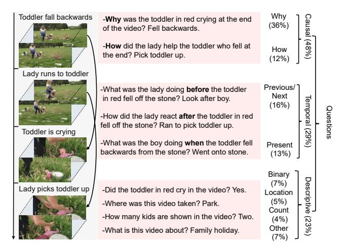
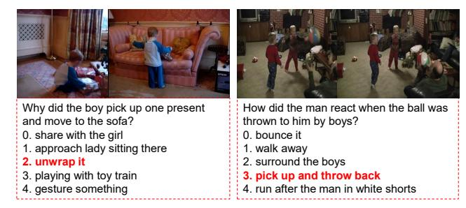
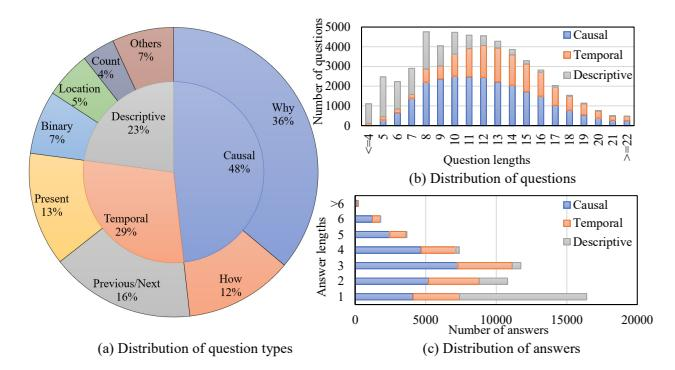
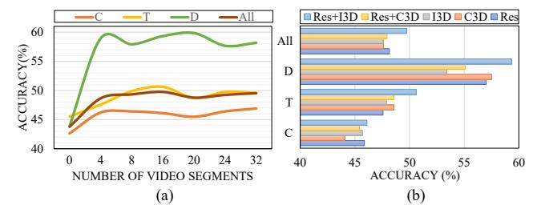
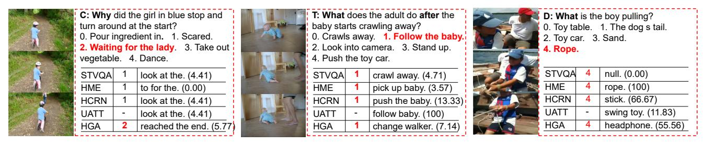
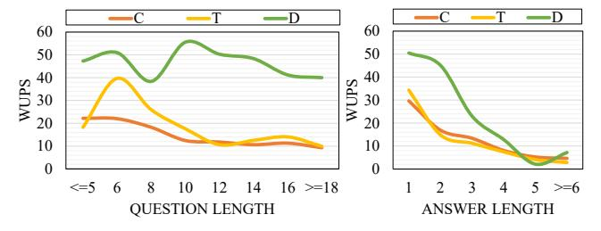

# **NExT-QA: Next Phase of Question-Answering to Explaining Temporal Actions**

## Junbin Xiao, Xindi Shang, Angela Yao, Tat-Seng Chua Department of Computer Science, National University of Singapore

{junbin, shangxin, ayao, chuats}@comp.nus.edu.sg

## **Abstract**

We introduce NExT-QA, a rigorously designed video question answering (VideoQA) benchmark to advance video understanding from describing to explaining the temporal actions. Based on the dataset, we set up multi-choice and open-ended QA tasks targeting causal action reasoning, temporal action reasoning, and common scene comprehension. Through extensive analysis of baselines and established VideoQA techniques, we find that top-performing methods excel at shallow scene descriptions but are weak in causal and temporal action reasoning. Furthermore, the models that are effective on multi-choice QA, when adapted to open-ended QA, still struggle in generalizing the answers. This raises doubt on the ability of these models to reason and highlights possibilities for improvement. With detailed results for different question types and heuristic observations for future works, we hope NExT-QA will guide the next generation of VQA research to go beyond superficial description towards a deeper understanding of videos. (The dataset and related resources are available at https://github.com/doc-doc/NExT-QA.git)

#### 1. Introduction

Actions in videos are often not independent but rather related with causal and temporal relationships [3]. For example, in the video in Figure 1, a toddler cries because he falls, and a lady runs to the toddler in order to pick him up. Recognizing the objects "toddler", "lady" and describing the independent action contents like "a toddler is crying" and "a lady picks the toddler up" in a video are now possible with advanced neural network models [14, 28, 63]. Yet being able to reason about their causal and temporal relations and answer natural language questions (e.g., "Why is the toddler crying?", "How did the lady react after the toddler fell?"), which lies at the core of human intelligence [39], remains a great challenge for computational models and is also much less explored by existing video understanding tasks [22, 37, 49, 52, 56].

In this work, we study causal and temporal action rea-

Figure 1: NExT-QA is a question answering benchmark targeting the explanation of video contents. It challenges QA models to reason about causal and temporal actions and understand the rich object interactions in daily activities.

soning in video question answering (VideoQA) and contribute NExT-QA, a benchmark to foster the Next generation of VQA models to Explain Temporal actions. NExT-QA contains 5,440 videos and about 52K manually annotated question-answer pairs grouped into causal, temporal and descriptive questions. An overview of the typical questions and their distributions are found in Figure 1. To embody the reasoning challenges and provide effective diagnostics for video QA models, we set up two tasks at different difficulty levels. At the first level, multi-choice QA provides five candidate answers for each question and requires the models to pick out the correct one. At the second level, open-ended QA requires the models to generate the answers in short phrases with cues only from the videos and the questions (*i.e.*, no candidate options).

Using NExT-QA, we evaluate several state-of-the-art (SOTA) video QA techniques [9, 11, 18, 19, 23, 26]. While the top-performing methods achieve compelling results on commonly descriptive questions, their performances on causal and temporal questions are far from satisfactory. Furthermore, when adapting the models that are effective on

multi-choice QA to open-ended QA, we find that they struggle to automatically answer the questions. This prompts a fundamental concern that these models do not truly understand the causal and temporal structure over the actions. As such, NExT-QA offers new challenges and ample opportunities to spark future research for a deeper understanding of video content.

To summarize our contributions: 1) we explore causal and temporal action reasoning in VideoQA to advance video understanding beyond shallow description towards deeper explanation; 2) we contribute NExT-QA, a rigorously curated VideoQA benchmark with manual annotations to foster research on causal and temporal action reasoning; and 3) we extensively analyze the baselines as well as the established video reasoning techniques on NExT-QA, providing detailed results for different question types and heuristic observations for future works.

### 2. Related Work

**Benchmarks**. Early VideoQA benchmarks [31, 51, 53, 54, 59, 64] rely on video descriptions [27, 52] (e.g., a man is skiing down a slope.) to automatically generate question-answer pairs (e.g., Who is skiing down a slope? A man.). They rarely require going beyond a recognition of the objects and actions to answer the questions. TGIF-QA [18, 17], in particular, challenges spatio-temporal reasoning in animated GIFs. However, GIFs are short videos (about 3s), and the actions are mostly trivial in describing the repetition or transition of a single object. Moreover, the questions are automatically populated from simple sentence templates. Consequently, SOTA methods [17, 19, 23] perform well, leading to an inflated optimism of machine intelligence in video understanding. Recently, ActivityNet-QA [56] was manually annotated to understand longer web videos. Yet, it has the same problems as in TGIF-QA, i.e., lacking object interactions and causal relationships.

Social-IQ [57] is a newly proposed benchmark for social intelligence understanding. Although it is rich in causalities and interactions, it is small-scale and focuses on comprehending complex human social behaviours from multiple modalities (video, transcript, and audio). Our dataset is larger and targets a richer set of causal and temporal actions in daily life, extending beyond human-social behaviours (e.g., The dog barks at the cat because the cat paws at the dog.). Also, it requires videos as the only information source. MovieQA [42] and TVQA [25] may also invoke causal and temporally related questions. Nonetheless, they are either biased to textual plot understanding or actor dialogue comprehension [47], severely diminishing their challenge for visual reasoning. More recently, CLEVRER [55] specially studied temporal and causal relationships of physical motions in simulated environments. Our dataset is essentially different in that we explore causal and temporal actions for a deeper understanding of real-world videos.

Other works like Motivation [46], VCR [58] and V2C [10] may also take causality into consideration, either for visual description or QA. Nonetheless, they emphasize commonsense to imagine the predictions. Our work differs in that we focus on understanding the causal and temporal structure of the actions. Specifically, we ensure that the answers to the questions are found in the video contents, e.g., for causal questions, we make sure that both the cause and effect actions are visible. Such a setting is impossible in static images [46, 58] that requires models to speculate or make commonsense reasoning, which goes in an orthogonal direction to our aim. Finally, we note that QA on causal and temporal events have long been studied in text comprehension [12, 34]. However, these works focus on detecting lexico-syntactic patterns that express causation on news events rather than reasoning over specific videos' causal/temporal actions.

**Techniques.** Language-guided visual reasoning like VQA has progressed significantly driven by the tremendous advancements in object/action recognition [4, 13, 14, 40, 44] and natural language understanding [5, 7, 15, 35, 45]. Most of the improvements have been made in image QA [1, 2, 30] though video QA has received increasing attention recently. Established works [18, 42, 59, 51] apply 2D convolutional neural networks (CNNs) (e.g., ResNet [14]) to learn frame-level appearance feature, and 3D CNNs (e.g., C3D [44], I3D [4, 13]) or optical flow to capture clip-level (or segment-level) motion information. The final video-level representation can be obtained by simple pooling or more sophisticated aggregation models, such as temporal relation networks (e.g., TCN [24], TRN [62] and CRN [23]), sequential models (e.g., RNNs with LSTM [15], GRU [5] and their variants) and attention [26, 20]. During aggregation, the textual clues from the question side (usually modeled by RNNs) are integrated for languageguided video reasoning and are achieved by additional reasoning modules, such as spatial and temporal attention [17, 18, 20, 60], co-attention [19, 26, 30], multi-cycle memory [9, 11], graph neural networks [16, 19] and conditional relation networks [23]. In this work, we will comprehensively analyze the relevant techniques on NExT-QA, providing effective baselines and heuristic observations.

## 3. NExT-QA Dataset

#### 3.1. Criteria and Task Definition

**Causal Questions** are designed to explain actions, either uncovering the intentions of the previously occurring actions or stating causes for subsequent actions. In this work, 'A explains B' of two actions A and B in a given video means that A is a visible cause responsible for B's occurrence. Thus, questions in the causal group ask either why

the objects act in a certain manner or how (what did they do) to bring about an observed effect. Accordingly, both causes and effects should be visible in the videos. Examples can be found in Figure 1 (top).

**Temporal Questions** assess the model's capability of reasoning about temporal relationships between actions. Temporal actions, while related to causality, are determined only by order of occurrence. Hence, questions of this type ask about the previous (what ... do before ...), present (what ... doing when/while/as ...) or next actions (what/how ... do/react after ...). Unlike previous works [18, 56] which focus on reasoning temporal actions of a single object in a question, we emphasize more on object interactions. Examples can be found in Figure 1 (middle).

**Descriptive Questions** focus on scene description of the videos (*e.g.*, the places, objects / attributes, and main actions / events). These questions complement causal and temporal questions to make up a holistic video comprehension and also allow for comparison between different types of questions. Specifically, the questions cover binary choices (yes/no, or the answers are indicated in the questions, *e.g.*, "... *tired or energetic?*"), location (where), counting (how many) and other free-form questions. The only requirement for free-form questions is that the answers can be visibly inferred from videos and are not subjective. Examples can be found in Figure 1 (bottom).

Multi-choice vs. Open-ended QA. We define two tasks based on the above question types. In multi-choice QA, models are presented with five options (one correct answer plus four distractor answers) from which they are required to select the correct one. Providing candidate answers brings convenience in prediction evaluation. However, it diminishes the reasoning challenge, as models are prone to learn the difference between the correct and incorrect answers purely; this is especially the case when the wrong answers are not generated to be challenging enough. Also, it dispenses with the need for answer generation, which in our view should be an interesting and open field of research in QA. Therefore, we also study open-ended QA where no candidate answers are provided, and the models must interpret the question and video contents and generate the textual answers automatically. Previous works [2, 18, 56] formulate open-ended QA as a classification problem to classify the video-question pairs into a fixed answer set. We set it as a generation problem since the answers are mostly simple phrases in NExT-QA. Generation-based open-ended QA is of higher practical value and also receives widespread attention recently [53, 60, 61].

## 3.2. Dataset Construction

**Video Source**. We aimed for natural videos featuring object interaction in daily life, without restriction to certain actors and activities. With these goals in mind, we found the

video relation dataset VidOR [38] 1 suits our requirements well. We selected from VidOR 6,000 videos that are longer and richer in objects and interactions. Although we do not restrict the content, the videos are mainly about family time, kids playing, social gatherings, outdoor activities, pets and musical performances. We randomly split the videos into train/val/test sets with a ratio of 7:1:2.

**Annotation** of the NExT-QA dataset was done in 3 stages2 over one year by 100 undergraduate students. The annotators were supervised at each stage with the following principles to ensure high-quality annotations. 1) All the annotators are rigorously trained before doing the actual annotation. 2) Question and answer annotation are done by separate annotators. Answer annotators are expected to check the questions' quality first, answer the good questions and fix (or delete) the bad ones. In this way, we can simulate the evaluation process and ensure that the questions are answerable and not subjective. 3) Suggested maximal lengths for questions and answers are 22 and 6 words, respectively. We especially encouraged succinct answers to avoid sentence paraphrasing and to facilitate answer evaluation. 4) The question types are set in a drop-down menu and must be selected by the questioners to ensure the distribution of the questions satisfying each video's requirements. 5) Questioners can report videos that are hard to pose effective questions. The confirmed boring videos are removed from the database.

**Post-Processing.** We removed some *yes*-answered questions in the validation and test sets to ensure a balanced number of answers for *yes* and *no*. Additionally, we deleted a limited number of counting questions whose answer values are larger than twenty. What remained are 5,440 valid videos and 52,044 question-answer pairs; detailed statistics are presented in Sec. 3.3.

Multi-choice Generation. To be meaningful, the distractors in multi-choice QA should be unique to each other, semantically coherent in answering the questions, and different in meaning with respect to the correct answer. To this end, we first grouped the questions according to the annotated question types (binary questions are excluded). Then, for each question, we retrieved the top 50 questions similar to the queried question in the same group according to their cosine similarities based on off-the-shelf features of Sentence-BERT [36]. The answers to these 50 questions are returned as distractor candidates and then filtered for redundancy and similarity to the correct answer. Two answers are redundant or similar if 1) their lemmatized variants are the same, in which stop words are not considered, or 2) the cosine similarity of their feature vectors is large than 0.9. To

 $^1\mbox{Videos}$  are drawn from YFCC-100M [43] and are crawled from Flickr.

&lt;sup>2Annotating all the questions in one stage was problematic for quality control and compensation. We annotated first the causal questions and then temporal; descriptive questions were the easiest and done last. Payment was commensurate with the number and difficulty of the questions.

Figure 2: Examples of multi-choice QA.

| Videos          |                | Tasks                            |        |       | stions |        |
|-----------------|----------------|----------------------------------|--------|-------|--------|--------|
| Train Val Test  | Val Test Total |                                  | Train  | Val   | Test   | Total  |
| 3,870 570 1,000 | 5 440          | Multi-Choice QA Open-Ended QA | 34,132 | 4,996 | 8,564  | 47,692 |
| 3,870 370 1,000 | 3,440          | Open-Ended QA                    | 37,523 | 5,343 | 9,178  | 52,044 |

Table 1: Statistics of the NExT-QA datasets.

ensure hard negatives, we also discard the candidate whose similarity with the correct answer is lower than 0.2. Afterwards, we sampled four qualified candidates as distracting answers for each question and randomly (but evenly) insert the correct answers to form 5 options. Finally, we manually checked all the question-answer tuples and amended some options to ensure the effectiveness of the generated multiple choices. We show some examples in Figure 2; more are found in the Appendix.

#### 3.3. Data Statistics

NExT-QA contains 5,440 videos, including 3,870 for training, 570 for validation and 1,000 for testing. Detailed statistics are given in Table 1. The distribution of the questions and answers are shown in Figure 3. From Figure 3 (a) we can see that the number of causal questions accounts for approximately half (48%) of the whole dataset; questions starting with 'why' are the majority, constituting 36%. Temporal questions of understanding the present or inferring the past or future compose 29% of the whole dataset. Apart from causal and temporal questions, there is 23% of descriptive questions which focus on describing the locations, objects/attributes and main events in the videos.

The distribution of question word length is shown in Figure 3 (b). Questions are on average 11.6 words, which is much longer than existing VideoQA datasets (*e.g.*, 8.7 in Activity-QA [56]). We find a clear difference in the three question types' distributions, *i.e.*, descriptive questions are the shortest while questions for causal and temporal actions are relatively longer. This is reasonable as most of the descriptive questions have a simple syntactic structure, while the questions in the causal and temporal groups are mostly compounded. Accordingly, answers (Figure 3 (c)) to the descriptive questions are shorter since they are related to video recognition. In contrast, answers to causal and temporal questions are relatively longer. Nevertheless, the vast

Figure 3: Data statistics. (a) Distribution of the question types. (b) The average question length is 11.6, and the specific lengths for causal, temporal and descriptive questions are 12.1, 13.4 and 8.0 respectively. (c) The average answer length is 2.6. Specific lengths for causal, temporal and descriptive answers are 3, 2.8 and 1.4 respectively.

majority of the questions can be answered in 6 words.

#### 3.4. Dataset Comparison

NExT-QA has several attractive properties compared with other datasets (see Table 2; a more detailed analysis is given in Appendix part 1). First, NExT-QA is unique in that it goes beyond descriptive QA to benchmark causal and temporal action reasoning in realistic videos and is also rich in object interactions. Second, it is among the largest VideoQA datasets that are manually annotated to support both multi-choice and open-ended QA, allowing comprehensive comparisons of different VQA techniques. Finally, the videos in NExT-QA are rich and diverse in terms of objects, actions and events, and all reflect real daily life, which differs from the popular TVQA [25] dataset that biased towards comprehending dialogues between main characters in the TV shows.

## 4. Experiments

**Evaluation**. For multi-choice QA, we report the accuracy or percentage of correctly answered questions. For open-ended QA, we first remove the stop words and lemmatize other words in the answers. Then, we determine the Wu-Palmer similarity (WUPS) score 3 [32] to evaluate the quality of the generated answers. For binary and counting questions in the descriptive group, we use accuracy instead. Since accuracy is easily integrated into WUPS (as a hard version), we do not report them separately for brevity.

**Configuration.** We uniformly sample for each video 16 clips (segments), and each has 16 consecutive frames. The per-frame appearance feature is extracted from ResNet-101 [14] pretrained on ImageNet [6], from either Convolutional

&lt;sup>3WUPS computes the Wu-Palmer similarity [48] of the words based on their depths in WordNet [33]. It can be regarded as a soft version of accuracy that factors in synonyms and other semantics [53, 61]

| Dataset             | Video Source | Goal                                  | Annotation | #Videos | #QA Pairs | Video Length (s) | QA Task |
|---------------------|--------------|---------------------------------------|------------|---------|-----------|------------------|---------|
| MSVD-QA [51]        | MSVD         | descriptive QA                        | Auto       | 1,970   | 50,505    | 10               | OC      |
| MSRVTT-QA [51]      | MSRVTT       | descriptive QA                        | Auto       | 10,000  | 243,690   | 15               | OC      |
| TGIF-QA [17, 18]    | TGIF         | spatio-temporal reasoning             | Auto       | 71,741  | 165,165   | 3                | MC&OC   |
| TVQA [25]           | TV Show      | subtitle&concept comprehension        | Man        | 21,793  | 152,545   | 76               | MC      |
| ActivityNet-QA [56] | ActivityNet  | descriptive QA                        | Man        | 5,800   | 58,000    | 180              | OC      |
| Social-IQ [57]      | YouTube      | social intelligence understanding     | Man        | 1,250   | 7,500     | 60               | MC      |
| NExT-QA (ours)      | YFCC-100M    | causal & temporal action interactions | Man        | 5,440   | 52,044    | 44               | MC&OG   |

Table 2: Dataset comparisons. OC and OG denote Open-ended question-answering as problem of Classification and Generation respectively. MC stands for multi-choice QA.

(Conv) layers or fully connected (FC) layers depending on the specific models. The clip-level motion information is captured by inflated 3D ResNeXt-101 [13, 50] pre-trained on Kinetics [21]. On the language side, we study both GloVe [35] for word representations as in the original paper and the recent BERT [7] for sentence embedding. Unless otherwise indicated, for multi-choice QA, the candidate answers are concatenated to the corresponding questions, and the models are optimized by maximizing the margins between the correct and incorrect QA pairs using Hinge loss. For open-ended QA, the video-question communicated features will be fed to the answer decoders to generate the answers word by word. The models are optimized by minimizing the softmax cross-entropy loss. All the experiments follow the data split in Table 1. We train the models on the respective training sets, during which the optimal model settings are explored on the validation sets.

## 4.1. Multi-choice QA

We first discuss the baselines designed to diagnose any potential biases in NExT-QA and then analyze the established video reasoning techniques.

#### 4.1.1 Baselines

**Random**. This baseline randomly chooses one option as the correct answer and keeps it the same for all the questions. Table 3 shows the results of always selecting the first option as a representative. The random accuracy across different question types is about 20%, as the correct answers are evenly distributed among the five options.

**Longest**, **Shortest** and **Popular**. As the names suggest, the *longest* / *shortest* baselines always select the longest / shortest answer as the correct one. We can see that both methods improve little over the random baseline. When we regulate the strategy a bit by selecting the most popular answers (*i.e.*, the most frequent answer for each question type) if it is among the five options otherwise choosing the shortest one, as shown in the *Pop.+Short* baseline, there are clear improvements for questions in the descriptive group. Yet, the results are only slightly better for causal questions and even worse for temporal questions. This is understandable

| Methods    | Text Rep. | $Acc_C$ | $Acc_T$ | $Acc_D$ | Acc   |
|------------|-----------|---------|---------|---------|-------|
| Random     | -         | 20.52   | 20.10   | 19.69   | 20.08 |
| Longest    | -         | 21.71   | 21.46   | 17.89   | 21.04 |
| Shortest   | -         | 22.09   | 19.67   | 22.78   | 21.42 |
| Pop.+Short | -         | 22.25   | 20.41   | 32.43   | 23.24 |
| SimAA      | Se-BERT   | 18.11   | 19.23   | 18.15   | 18.47 |
| SimQA      | Se-BERT   | 27.12   | 26.67   | 26.64   | 26.90 |
| BlindQA    | GloVe     | 26.89   | 30.83   | 42.60   | 30.60 |
| BlindQA    | BERT      | 23.78   | 24.26   | 35.26   | 25.72 |
| BlindQA    | BERT-FT   | 42.62   | 45.53   | 43.89   | 43.76 |
| Human      | -         | 87.61   | 88.56   | 90.40   | 88.38 |

Table 3: Baseline and human results on validation set.  $Acc_C$ ,  $Acc_T$  and  $Acc_D$  denote accuracy for causal, temporal and descriptive questions respectively.

as descriptive questions are easier to have frequent answers. All these baselines verified that an educated guess is hard to achieve good results on NExT-QA.

**SimAA** and **SimQA**. We specifically analyze the retrieval-based methods since the negative answers are mainly generated by searching the nearest neighbours of questions on the dataset. Concretely, the SimAA baseline is designed to check whether or not the correct answers are semantically far away from the distractor answers. To this end, we extract Sentence-BERT [36] representation (Se-BERT) for the answers and find the furthest from the other four options as the correct answer for each question.

As shown in Table 3, this baseline performs the worst among all methods, revealing that the answers are challenging to disambiguate without seeing the questions and videos. Similarly, we design the SimQA baseline to retrieve the answers closest to the corresponding questions in the feature space. This baseline performs relatively better than the previously introduced baselines on causal and temporal questions, but its performance is still worse than the *Popular+Shortest* baseline on the descriptive questions. The results are reasonable as there is less semantic overlap between the descriptive group's questions and answers. Again, these results suggest that the questions cannot be answered well simply based on semantic similarity between the questions and answers.

| Methods Text Rep. |            | $Acc_C$ |       |       | $Acc_T$      |         |              | Acc   | D            |              | Acc   |       |
|-------------------|------------|---------|-------|-------|--------------|---------|--------------|-------|--------------|--------------|-------|-------|
|                   | Text Itep. | Why     | How   | All   | Prev&Next    | Present | All          | Count | Location     | Other        | All   | 7100  |
| EVQA [2]          | GloVe      | 28.38   | 29.58 | 28.69 | 29.82        | 33.33   | 31.27        | 43.50 | 43.39        | 38.36        | 41.44 | 31.51 |
| PSAC [26]         | GloVe      | 35.81   | 29.58 | 34.18 | 28.56        | 35.75   | 31.51        | 39.55 | 67.90        | 35.41        | 48.65 | 35.57 |
| PSAC+ [26]        | GloVe      | 35.03   | 29.87 | 33.68 | 30.77        | 35.44   | 32.69        | 38.42 | 71.53        | 38.03        | 50.84 | 36.03 |
| CoMem [11]        | GloVe      | 36.12   | 32.21 | 35.10 | 34.04        | 41.93   | 37.28        | 39.55 | 67.12        | 40.66        | 50.45 | 38.19 |
| STVQA [18]        | GloVe      | 37.58   | 32.50 | 36.25 | 33.09        | 40.87   | 36.29        | 45.76 | 71.53        | 44.92        | 55.21 | 39.21 |
| HGA [19]          | GloVe      | 36.38   | 33.82 | 35.71 | 35.83        | 42.08   | 38.40        | 46.33 | 70.51        | 46.56        | 55.60 | 39.67 |
| HME [9]           | GloVe      | 39.14   | 34.70 | 37.97 | 34.35        | 40.57   | 36.91        | 41.81 | 71.86        | 38.36        | 51.87 | 39.79 |
| HCRN [23]         | GloVe      | 39.86   | 36.90 | 39.09 | 37.30        | 43.89   | 40.01        | 42.37 | 62.03        | 40.66        | 49.16 | 40.95 |
| EVQA [2]          | BERT-FT    | 42.31   | 42.90 | 42.46 | 46.68        | 45.85   | 46.34        | 44.07 | 46.44        | 46.23        | 45.82 | 44.24 |
| STVQA [18]        | BERT-FT    | 45.37   | 43.05 | 44.76 | 47.52        | 51.73   | <u>49.26</u> | 43.50 | 65.42        | <u>53.77</u> | 55.86 | 47.94 |
| CoMem [11]        | BERT-FT    | 46.15   | 42.61 | 45.22 | 48.16        | 50.38   | 49.07        | 41.81 | 67.12        | 51.80        | 55.34 | 48.04 |
| HCRN* [23]        | BERT-FT    | 46.99   | 42.90 | 45.91 | <u>48.16</u> | 50.83   | <u>49.26</u> | 40.68 | 65.42        | 49.84        | 53.67 | 48.20 |
| HME [9]           | BERT-FT    | 46.52   | 45.24 | 46.18 | 47.52        | 49.17   | 48.20        | 45.20 | 73.56        | 51.15        | 58.30 | 48.72 |
| HGA [19]          | BERT-FT    | 46.99   | 44.22 | 46.26 | 49.53        | 52.49   | 50.74        | 44.07 | <u>72.54</u> | 55.41        | 59.33 | 49.74 |

Table 4: Results of multi-choice QA on validation set. +: add motion feature. \*: concatenate the question and answer to adapt to BERT representation. (The **best** and <u>second best</u> results are bolded and underlined respectively.)

**BlindQA**. We study a blind version of deep models by considering the question-answers only and ignoring the video parts. To this end, we model the QAs with LSTM, during which the words are initialized with either GloVe [35] or BERT [7] representations. As a popular fashion, we extract token representations from the penultimate layer of the BERT-base model. As shown in Table 3, the BlindQA models steadily improve the results over all question types. Intriguingly, the model that utilizes GloVe performs better than that using BERT. We believe this is because the off-theshelf BERT representations are seriously biased to the corpus on which it was trained and thus generalizes poorly to the scenario where the text is mostly visual-content related. Therefore, we further fine-tune BERT for multi-choice QA by maximizing the correct QA pairs' probability in each multi-choice QA. From Table 3, we can see that BERT-FT remarkably boosts the results over the off-the-shelf BERT representation and also GloVe. Nonetheless, the results are still much worse than human performance and thus indicate the necessity of understanding videos.

## 4.1.2 Established VideoQA Models

We analyze and benchmark several established VideoQA methods in Table 4 and Table 5, covering diverse network architectures and visual reasoning techniques.

EVQA [2] extends the BlindQA baseline by adding up the visual stream, which is modelled by another LSTM. The visual and textual features are then element-wise added to predict the answers. Without any reasoning modules in the model, it trivially outperforms the BlindQA baseline. STVQA [18, 17] advances EVQA by applying two dual-layer LSTMs for video and question modelling, with additional spatio-temporal attention modules for visual reasoning. We can see that it steadily boosts the EVQA baseline's performance across all 3 types of questions. The same is

observed for CoMem [11] and HME [9]. Both share similar video and question encoders as in STVQA but use memory modules for visual appearance, motion and language reasoning in a multi-cycle fashion 4.

Unlike the above methods that apply RNNs to contextualize video representations, PSAC [26] utilizes self-attention (the building block of transformer architectures [45]) on top of CNN feature and achieves great success on TGIF-QA [18] with merely appearance feature. As the transformer essentially stacks fully-connected layers with short-cut connections, it trains fast but is data-hungry; on NExT-QA, it suffers from over-fitting problem and performs the worst among other methods. We speculate that the dataset is likely not large enough to learn transform-style visual models directly. Nevertheless, it would be a good testbed for pre-trained architectures [41, 65].

HCRN [23] is a hierarchical model with conditional relation networks (CRN) as building blocks. It operates on video frame/segment sets of various lengths conditioned on either motion or textual clues in a stage-wise fashion to reason on the video at multiple granularities. As shown in Table 4, it shows strong performance for causal and temporal action reasoning when GloVe representations are considered. However, when it is adapted to BERT representation, the results are not consistently good. Such difference could be that the size of the model is one order of magnitude larger than the others and is thus prone to be over-fitting as the size of BERT representation is approximately 2.5 times larger than that of GloVe (768 vs. 300).

HGA [19] introduces a heterogeneous graph reasoning module and a co-attention unit to capture the local and global correlations between video clips, linguistic concepts

&lt;sup>4We use the implementation provided by [8] as there is no official code available for CoMem. The video encoder is a two-layer GRU [5] instead of TCN [24] used in the original paper.

| Methods    | $Acc_C$ | $Acc_T$ | $Acc_D$ | Acc   |
|------------|---------|---------|---------|-------|
| EVQA [2]   | 43.27   | 46.93   | 45.62   | 44.92 |
| STVQA [17] | 45.51   | 47.57   | 54.59   | 47.64 |
| CoMem [11] | 45.85   | 50.02   | 54.38   | 48.54 |
| HCRN [23]  | 47.07   | 49.27   | 54.02   | 48.89 |
| HME [9]    | 46.76   | 48.89   | 57.37   | 49.16 |
| HGA [19]   | 48.13   | 49.08   | 57.79   | 50.01 |

Table 5: Results of multi-choice QA on test set. All are based on fine-tuned BERT representation.

Figure 4: (a) Results with different number of clips. (b) Results with different video representations. C, T and D stand for causal, temporal and descriptive questions respectively.

and their cross-modal correspondence. The method is better suited for causal and temporal action reasoning and shows superior performance with BERT representations, achieving the SOTA results on NExT-QA. Yet, the gap between human performance remains large (*e.g.*, 46.26% *vs.* 87.61% on causal questions, 50.74% *vs.* 88.56% on temporal questions, 59.33% *vs.* 90.40% on descriptive questions), and thus offers ample opportunity for improvement.

## 4.1.3 Video Sampling Rates and Representations.

We based on HGA with BERT-FT as language representation to analyze the influence of video sampling rates and feature representations. First, we vary the number of sampled video clips (segments) from 0 to 32, where 0 stands for the respective BlindQA baseline. As shown in Figure 4 (a), we can see clear improvements for all types of questions with attendance of videos. Specifically, the improvement for descriptive questions is significant with more than 15%. Besides, we also observe that 16 segments are enough to obtain good overall accuracy, whereas it needs relatively more segments to achieve better results on causal questions.

In Figure 4 (b), we investigate different features of video frames and segments. From the results, we can conclude that, for all types of questions, the best performance is from using ResNet as an appearance feature along with I3D ResNeXt as a motion feature (Res+I3D). When I3D is replaced with C3D (Res+C3D), results drop for all questions even though we do not observe absolute weakness between C3D and I3D in this experiment. We speculate that improvements can be mainly attributed to 1) I3D performing better on causal questions which account for the majority of NExT-QA; and 2) ResNeXt which was derived from ResNet

| Methods    | $WUPS_C$ | $WUPS_T$     | $WUPS_D$ | WUPS  |
|------------|----------|--------------|----------|-------|
| Popular    | 9.73     | 8.95         | 28.39    | 13.40 |
| BlindQA    | 12.14    | 14.85        | 40.41    | 18.88 |
| STVQA [17] | 12.52    | 14.57        | 45.64    | 20.08 |
| HME [9]    | 12.83    | 14.76        | 45.13    | 20.18 |
| HCRN [23]  | 12.53    | <u>15.37</u> | 45.29    | 20.25 |
| UATT [53]  | 13.62    | 16.23        | 43.41    | 20.65 |
| HGA [19]   | 14.76    | 14.90        | 46.60    | 21.48 |

Table 6: Results of open-ended QA on validation set.

| Methods                 | $WUPS_C$       | $WUPS_T$       | $WUPS_D$       | WUPS           |
|-------------------------|----------------|----------------|----------------|----------------|
| Popular                 | 12.19          | 10.79          | 31.94          | 16.12          |
| BlindQA                 | 14.87          | 18.35          | 45.78          | 22.66          |
| STVQA [17] HCRN [23] | 15.24 16.05 | 18.03 17.68 | 47.11 49.78 | 23.04 23.92 |
| HME [9]                 | 15.78          | 18.40          | 50.03          | 24.06          |
| UATT [53]               | 16.73          | 18.68          | 48.42          | 24.25          |
| HGA [19]                | 17.98          | 17.95          | 50.84          | 25.18          |

Table 7: Results of open-ended QA on test set. We provide two reference answers for half of the test questions, and report the highest WUPS score between them.

and thus matches better with ResNet in feature space than C3D. A similar observation was made in [17].

#### 4.2. Open-ended QA

We transfer several top-performing methods in multichoice QA to open-ended QA. To this end, we first build a vocabulary set of 3,392 words by selecting those appearing more than five times in the dataset. Questions and answers are truncated to maximal lengths of 23 and 6, respectively. Since BERT representations are not convenient to adapt to the generation scenario, we use GloVe as the text representation for this experiment's methods. The videoquestion encoders are kept the same as in multi-choice QA. For answer decoders, we investigated several architectures; we found that GRU with soft attention over the questions performs well (see Appendix part 2 for details) and we use it for all models adapted from multi-choice QA. For better comparison, we also reproduce UATT [53] which was proposed for generation-based open-ended QA by designing an order-preserved co-attention module.

As shown in Table 6 and Table 7, although the methods can effectively boost the results over the BlindQA baseline, the overall improvements are trivial (less than 3%) mainly due to the poor performance on causal and temporal questions. To delve into the reason, we first visualize some results in Figure 5 (find more in Appendix part 3), from which we can see that the models struggle in automatically answering the questions, especially those which challenge causal and temporal action reasoning. We further detail the results of HGA [19] (as a representative) on questions and answers of different lengths. As shown in Figure 6 (left), the performance on causal and temporal questions drops as the question lengths increase. However, for descriptive

Figure 5: Visualization of answer prediction results. For multi-choice QA, the correct answers and predictions are highlighted in red. For open-ended QA, the WUPS score of each prediction is appended. 'null' means the methods fail to generate any effective words. (C: Causal. T: Temporal. D: Descriptive.)

Figure 6: Result distribution on questions and answers.

questions, the results are relatively stable and less impacted. Also, they are consistently better than causal and temporal questions. Regarding the answers in Figure 6 (right), the performances on all types of questions degrade on longer answers. By jointly considering the distributions of questions and answers in the dataset (refer to Figure 3), we can draw that the models are essentially weak in causal and temporal reasoning and not strong enough for language understanding and generation.

#### 5. Discussion and Conclusion

We conclude the following points and raise them as open challenges for the rest of the community. First, SOTA methods perform well on descriptive questions. However, they are still weak in causal and temporal action reasoning – the gap remains approximately 10% and 30% for multi-choice and open-ended QA respectively. Nonetheless, our empirical results suggest that graph models are superior for causal and temporal relation reasoning (refer to HGA [19]) and are a promising direction to explore. Regarding visual feature representations, motion feature are important but naively concatenating appearance and motion features usually results in sub-optimal results (refer to EVQA [2], PSAC+ [26] and STVQA [27]). As such, we encourage investigating more effective ways of modelling and merging the two types of features. In terms of language representation, pre-trained BERT representations [29] are seriously biased to TextQA and generalize worse than that of GloVe [35]. However, fine-tuned BERT shows absolute superiority in answering causal and temporal questions (refer to Tables 3, 4), and thus we recommend BERT as the text representation of choice for NExT-QA.

Second, the methods that are effective on multi-choice QA struggle in automatically answering open-ended questions (see Tables 4, 5 vs. Tables 6, 7; qualitative analysis in Figure 5). This prompts our fundamental concern that these methods do not truly understand the causal and temporal structures over actions. Instead, they are likely better at learning the differences between the provided correct and incorrect answers, which arguably, challenges more on grounding rather than inferring the answers in the videos [49]. As such, we hope NExT-QA will underpin the next generation of VQA research not only in multi-choice QA, but also in open-ended QA.

Finally, open-ended QA is challenged not only by the reasoning component but also by language generation, which are themselves open research problems. Our analysis shows that current VQA models are still weak in understanding complex questions and generating longer answers. Given the advancements made in vision-language representation learning [41, 65], future works are likely better served by using pre-trained architectures. Nevertheless, they need to be carefully balanced to incorporate and condition on the visual evidence. We believe this is also an exciting research area where NExT-QA can contribute towards advancements. Additionally, it could be interesting to incorporate explicit relation information, as NExT-QA's videos are sourced from the VidOR [38] dataset where relation annotations already exist and provide a rich source of information to be leveraged.

### Acknowledgement

We greatly thanks the reviewers for their positive remarks and some valuable suggestions. This research is supported by the National Research Foundation, Singapore under its International Research Centres in Singapore Funding Initiative, and under its NRF Fellowship for AI (NRF-NRFFAI1-2019-0001). Any opinions, findings and conclusions or recommendations expressed in this material are those of the author(s) and do not reflect the views of National Research Foundation, Singapore.

#### References

- [1] Peter Anderson, Xiaodong He, Chris Buehler, Damien Teney, Mark Johnson, Stephen Gould, and Lei Zhang. Bottom-up and top-down attention for image captioning and visual question answering. In *CVPR*, pages 6077–6086, 2018. 2
- [2] Stanislaw Antol, Aishwarya Agrawal, Jiasen Lu, Margaret Mitchell, Dhruv Batra, C Lawrence Zitnick, and Devi Parikh. Vqa: Visual question answering. In CVPR, pages 2425–2433, 2015. 2, 3, 6, 7, 8
- [3] Daphna Buchsbaum, Thomas L Griffiths, Dillon Plunkett, Alison Gopnik, and Dare Baldwin. Inferring action structure and causal relationships in continuous sequences of human action. *Cognitive psychology*, 76:30–77, 2015.
- [4] Joao Carreira and Andrew Zisserman. Quo vadis, action recognition? a new model and the kinetics dataset. In *CVPR*, pages 6299–6308, 2017. 2
- [5] Kyunghyun Cho, Bart Van Merriënboer, Caglar Gulcehre, Dzmitry Bahdanau, Fethi Bougares, Holger Schwenk, and Yoshua Bengio. Learning phrase representations using rnn encoder-decoder for statistical machine translation. *EMNLP*, 2014. 2, 6
- [6] Jia Deng, Wei Dong, Richard Socher, Li-Jia Li, Kai Li, and Li Fei-Fei. Imagenet: A large-scale hierarchical image database. In CVPR, pages 248–255, 2009. 4
- [7] Jacob Devlin, Ming-Wei Chang, Kenton Lee, and Kristina Toutanova. Bert: Pre-training of deep bidirectional transformers for language understanding. *NAACL*, 2019. 2, 5,
- [8] Chenyou Fan. Egovqa-an egocentric video question answering benchmark dataset. In *ICCV Workshops*, 2019. 6
- [9] Chenyou Fan, Xiaofan Zhang, Shu Zhang, Wensheng Wang, Chi Zhang, and Heng Huang. Heterogeneous memory enhanced multimodal attention model for video question answering. In CVPR, pages 1999–2007, 2019. 1, 2, 6, 7
- [10] Zhiyuan Fang, Tejas Gokhale, Pratyay Banerjee, Chitta Baral, and Yezhou Yang. Video2commonsense: Generating commonsense descriptions to enrich video captioning. EMNLP, 2020. 2
- [11] Jiyang Gao, Runzhou Ge, Kan Chen, and Ram Nevatia. Motion-appearance co-memory networks for video question answering. In *CVPR*, pages 6576–6585, 2018. 1, 2, 6, 7
- [12] Roxana Girju. Automatic detection of causal relations for question answering. In *ACL workshop on Multilingual summarization and question answering*, pages 76–83, 2003. 2
- [13] Kensho Hara, Hirokatsu Kataoka, and Yutaka Satoh. Can spatiotemporal 3d cnns retrace the history of 2d cnns and imagenet? In CVPR, pages 6546–6555, 2018. 2, 5
- [14] Kaiming He, Xiangyu Zhang, Shaoqing Ren, and Jian Sun. Deep residual learning for image recognition. In CVPR, pages 770–778, 2016. 1, 2, 4
- [15] Sepp Hochreiter and Jürgen Schmidhuber. Long short-term memory. *Neural computation*, 9(8):1735–1780, 1997.
- [16] Deng Huang, Peihao Chen, Runhao Zeng, Qing Du, Mingkui Tan, and Chuang Gan. Location-aware graph convolutional networks for video question answering. In AAAI, pages 11021–11028, 2020.

- [17] Yunseok Jang, Yale Song, Chris Dongjoo Kim, Youngjae Yu, Youngjin Kim, and Gunhee Kim. Video question answering with spatio-temporal reasoning. *IJCV*, 127:1385 1412, 2019. 2, 5, 6, 7
- [18] Yunseok Jang, Yale Song, Youngjae Yu, Youngjin Kim, and Gunhee Kim. Tgif-qa: Toward spatio-temporal reasoning in visual question answering. In *CVPR*, pages 2758–2766, 2017. 1, 2, 3, 5, 6
- [19] Pin Jiang and Yahong Han. Reasoning with heterogeneous graph alignment for video question answering. In AAAI, pages 11109–11116, 2020. 1, 2, 6, 7, 8
- [20] Weike Jin, Zhou Zhao, Mao Gu, Jun Yu, Jun Xiao, and Yueting Zhuang. Multi-interaction network with object relation for video question answering. In MM, pages 1193–1201, 2019.
- [21] Will Kay, Joao Carreira, Karen Simonyan, Brian Zhang, Chloe Hillier, Sudheendra Vijayanarasimhan, Fabio Viola, Tim Green, Trevor Back, Paul Natsev, et al. The kinetics human action video dataset. arXiv preprint arXiv:1705.06950, 2017. 5
- [22] Ranjay Krishna, Kenji Hata, Frederic Ren, Li Fei-Fei, and Juan Carlos Niebles. Dense-captioning events in videos. In *ICCV*, pages 706–715, 2017. 1
- [23] Thao Minh Le, Vuong Le, Svetha Venkatesh, and Truyen Tran. Hierarchical conditional relation networks for video question answering. In *CVPR*, pages 9972–9981, 2020. 1, 2, 6, 7
- [24] Colin Lea, Michael D Flynn, Rene Vidal, Austin Reiter, and Gregory D Hager. Temporal convolutional networks for action segmentation and detection. In CVPR, pages 156–165, 2017. 2, 6
- [25] Jie Lei, Licheng Yu, Mohit Bansal, and Tamara L Berg. Tvqa: Localized, compositional video question answering. EMNLP, 2018. 2, 4, 5
- [26] Xiangpeng Li, Jingkuan Song, Lianli Gao, Xianglong Liu, Wenbing Huang, Xiangnan He, and Chuang Gan. Beyond rnns: Positional self-attention with co-attention for video question answering. In AAAI, volume 8, 2019. 1, 2, 6, 8
- [27] Yuncheng Li, Yale Song, Liangliang Cao, Joel Tetreault, Larry Goldberg, Alejandro Jaimes, and Jiebo Luo. Tgif: A new dataset and benchmark on animated gif description. In CVPR, pages 4641–4650, 2016. 2, 8
- [28] Ji Lin, Chuang Gan, and Song Han. Tsm: Temporal shift module for efficient video understanding. In *ICCV*, pages 7083–7093, 2019.
- [29] Jiasen Lu, Dhruv Batra, Devi Parikh, and Stefan Lee. Vilbert: Pretraining task-agnostic visiolinguistic representations for vision-and-language tasks. In *NeurIPS*, pages 13–23, 2019.
- [30] Jiasen Lu, Jianwei Yang, Dhruv Batra, and Devi Parikh. Hierarchical question-image co-attention for visual question answering. In *NeurIPS*, pages 289–297, 2016.
- [31] Tegan Maharaj, Nicolas Ballas, Anna Rohrbach, Aaron Courville, and Christopher Pal. A dataset and exploration of models for understanding video data through fill-in-theblank question-answering. In CVPR, pages 6884–6893, 2017. 2

- [32] Mateusz Malinowski and Mario Fritz. A multi-world approach to question answering about real-world scenes based on uncertain input. In *NeurIPS*, pages 1682–1690, 2014. 4
- [33] George A Miller. Wordnet: a lexical database for english. *Communications of the ACM*, 38(11):39–41, 1995. 4
- [34] Qiang Ning, Zhili Feng, Hao Wu, and Dan Roth. Joint reasoning for temporal and causal relations. In ACL, pages 2278–2288, July 2018. 2
- [35] Jeffrey Pennington, Richard Socher, and Christopher D Manning. Glove: Global vectors for word representation. In *EMNLP*, pages 1532–1543, 2014. 2, 5, 6, 8
- [36] Nils Reimers and Iryna Gurevych. Sentence-bert: Sentence embeddings using siamese bert-networks. In EMNLP, 2019.
  3, 5
- [37] Fadime Sener, Dipika Singhania, and Angela Yao. Temporal aggregate representations for long-range video understanding. In *ECCV*, pages 154–171, Cham, 2020. 1
- [38] Xindi Shang, Donglin Di, Junbin Xiao, Yu Cao, Xun Yang, and Tat-Seng Chua. Annotating objects and relations in usergenerated videos. In *ICMR*, pages 279–287, 2019. 3, 8
- [39] Yoav Shoham. Reasoning about change: Time and causation from the standpoint of artificial intelligence. 1988.
- [40] Karen Simonyan and Andrew Zisserman. Two-stream convolutional networks for action recognition in videos. In NeurIPS, pages 568–576, 2014. 2
- [41] Chen Sun, Austin Myers, Carl Vondrick, Kevin Murphy, and Cordelia Schmid. Videobert: A joint model for video and language representation learning. In *ICCV*, pages 7464– 7473, 2019. 6, 8
- [42] Makarand Tapaswi, Yukun Zhu, Rainer Stiefelhagen, Antonio Torralba, Raquel Urtasun, and Sanja Fidler. Movieqa: Understanding stories in movies through questionanswering. In CVPR, pages 4631–4640, 2016. 2
- [43] Bart Thomee, David A Shamma, Gerald Friedland, Benjamin Elizalde, Karl Ni, Douglas Poland, Damian Borth, and Li-Jia Li. Yfcc100m: The new data in multimedia research. *Communications of the ACM*, 59(2):64–73, 2016. 3
- [44] Du Tran, Lubomir Bourdev, Rob Fergus, Lorenzo Torresani, and Manohar Paluri. Learning spatiotemporal features with 3d convolutional networks. In *ICCV*, pages 4489–4497, 2015. 2
- [45] Ashish Vaswani, Noam Shazeer, Niki Parmar, Jakob Uszkoreit, Llion Jones, Aidan N Gomez, Łukasz Kaiser, and Illia Polosukhin. Attention is all you need. In *NeurIPS*, pages 5998–6008, 2017. 2, 6
- [46] Carl Vondrick, Deniz Oktay, Hamed Pirsiavash, and Antonio Torralba. Predicting motivations of actions by leveraging text. In *CVPR*, pages 2997–3005, 2016. 2
- [47] T. Winterbottom, S. Xiao, A. McLean, and N. Al Moubayed. On modality bias in the tvqa dataset. In *BMVC*, 2020. 2
- [48] Zhibiao Wu and Martha Palmer. Verbs semantics and lexical selection. In *ACL*, pages 133–138, 1994. 4
- [49] Junbin Xiao, Xindi Shang, Xun Yang, Sheng Tang, and Tat-Seng Chua. Visual relation grounding in videos. In *ECCV*, pages 447–464, Cham, 2020. Springer. 1, 8
- [50] Saining Xie, Ross Girshick, Piotr Dollár, Zhuowen Tu, and Kaiming He. Aggregated residual transformations for deep neural networks. In CVPR, pages 1492–1500, 2017. 5

- [51] Dejing Xu, Zhou Zhao, Jun Xiao, Fei Wu, Hanwang Zhang, Xiangnan He, and Yueting Zhuang. Video question answering via gradually refined attention over appearance and motion. In MM, pages 1645–1653. ACM, 2017. 2, 5
- [52] Jun Xu, Tao Mei, Ting Yao, and Yong Rui. Msr-vtt: A large video description dataset for bridging video and language. In CVPR, pages 5288–5296, 2016. 1, 2
- [53] Hongyang Xue, Zhou Zhao, and Deng Cai. Unifying the video and question attentions for open-ended video question answering. *TIP*, 26(12):5656–5666, 2017. 2, 3, 4, 7
- [54] Yunan Ye, Zhou Zhao, Yimeng Li, Long Chen, Jun Xiao, and Yueting Zhuang. Video question answering via attributeaugmented attention network learning. In SIGIR, pages 829– 832. ACM, 2017. 2
- [55] Kexin Yi, Chuang Gan, Yunzhu Li, Pushmeet Kohli, Jiajun Wu, Antonio Torralba, and Joshua B Tenenbaum. Clevrer: Collision events for video representation and reasoning. In *ICLR*, 2020. 2
- [56] Zhou Yu, Dejing Xu, Jun Yu, Ting Yu, Zhou Zhao, Yueting Zhuang, and Dacheng Tao. Activitynet-qa: A dataset for understanding complex web videos via question answering. *AAAI*, 2019. 1, 2, 3, 4, 5
- [57] Amir Zadeh, Michael Chan, Paul Pu Liang, Edmund Tong, and Louis-Philippe Morency. Social-iq: A question answering benchmark for artificial social intelligence. In *CVPR*, pages 8807–8817, 2019. 2, 5
- [58] Rowan Zellers, Yonatan Bisk, Ali Farhadi, and Yejin Choi. From recognition to cognition: Visual commonsense reasoning. In CVPR, June 2019.
- [59] Kuo-Hao Zeng, Tseng-Hung Chen, Ching-Yao Chuang, Yuan-Hong Liao, Juan Carlos Niebles, and Min Sun. Leveraging video descriptions to learn video question answering. In AAAI, 2017.
- [60] Zhou Zhao, Qifan Yang, Deng Cai, Xiaofei He, and Yueting Zhuang. Video question answering via hierarchical spatiotemporal attention networks. In *IJCAI*, pages 3518–3524, 2017. 2, 3
- [61] Zhou Zhao, Zhu Zhang, Shuwen Xiao, Zhou Yu, Jun Yu, Deng Cai, Fei Wu, and Yueting Zhuang. Open-ended longform video question answering via adaptive hierarchical reinforced networks. In *IJCAI*, 2018. 3, 4
- [62] Bolei Zhou, Alex Andonian, Aude Oliva, and Antonio Torralba. Temporal relational reasoning in videos. In ECCV, pages 803–818, 2018.
- [63] Luowei Zhou, Yingbo Zhou, Jason J Corso, Richard Socher, and Caiming Xiong. End-to-end dense video captioning with masked transformer. In CVPR, pages 8739–8748, 2018. 1
- [64] Linchao Zhu, Zhongwen Xu, Yi Yang, and Alexander G Hauptmann. Uncovering the temporal context for video question answering. *IJCV*, 124(3):409–421, 2017. 2
- [65] Linchao Zhu and Yi Yang. Actbert: Learning global-local video-text representations. In *CVPR*, pages 8746–8755, June 2020. 6, 8