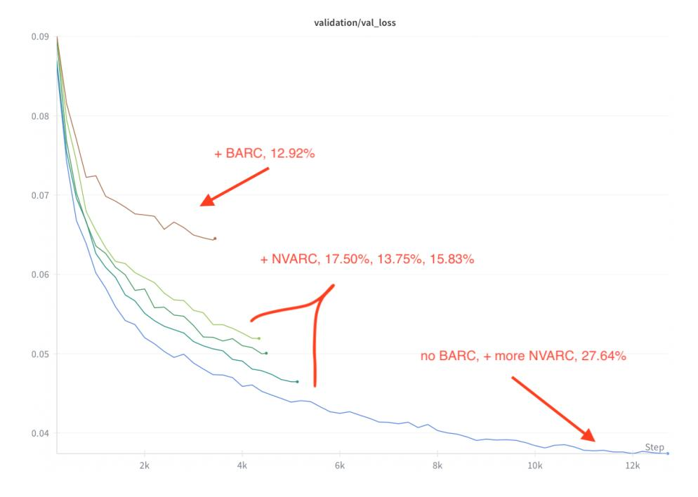

# NVARC solution to ARC-AGI-2 2025

Ivan Sorokin
NVIDIA Corporation
Finland
isorokin@nvidia.com

Jean-François Puget NVIDIA Corporation France jpuget@nvidia.com

November 2025

#### Abstract

We present our solution to the ARC Prize 2025 competition on Kaggle. This solution had the best score of 27.64% on the public leaderboard of the competition. A variant of it scored 29.72% few days after the competition deadline. This is the state of the art score for the ARC-AGI-2 leaderboard 1, surpassing submissions that costs 40 times more. The core idea of our solution is the novel synthetic dataset of ARC-AGI tasks. During the competition we successfully applied this dataset to existing approaches: the ARChitects and Tiny Recursive Model.

### 1 Introduction

This paper describes the NVARC solution to the 2025 ARC Prize competition hosted on Kaggle [1]. The competition is about learning how to solve ARC-AGI reasoning tasks. For each task, a number of training examples are provided. For each training example we are given an input and a corresponding output. Inputs and outputs are colored grids of dimension up to 30x30. There are 10 colors. For each task a number of test input grids are also provided. The output test grids are kept hidden and used to score submissions to the competition.

During the competition we have to submit solution, in the form of a Jupyter notebook. Kaggle then runs the notebook against a hidden set of 240 tasks. During the competition the public leaderboard is calculated with half of the test data. We solved 27.64% of these, and were ranked first. After the competition, Kaggle will use the percentage of tasks solved among the remaining half tasks to rank submissions to the competition.

Kaggle limits submissions to one per day per team. This prevents to some extent the tuning of solutions using feedback from the leaderboard. It explains why we used some submissions after the deadline to finish testing our ideas.

1https://arcprize.org/leaderboard

After the competition deadline, we submitted a variant of our best submission. That variant got an improved score of 29.72% on the public leaderboard.

The standard way to build a solution in Kaggle is to train or fine tune models offline, then uses these models in an inference pipeline in the submitted notebook.

ARC Prize challenge is unusual because the above does not work at all. The hidden test tasks are different from all the public tasks, and using models pretrained on public tasks isn't effective. To perform well one has to use some form of training on the hidden test set (test-time fine-tuning or TTFT). TTFT was used by the winners of a similar challenge run two years ago [2].

Moreover, the solution we built had to run within Kaggle compute limit: 12 hours with 4 L4 GPUs for solving 240 tasks. As a result we had to use small models (4B at most) and a simple workflow.

Here are the main components of our solution:

- Multi-stage synthetic data generation pipeline
- Improved version of the ARChitects solution[4]
- Improved version of the Tiny Recursive Model[6]

We will review these in the following sections.

## 2 Synthetic Puzzles

Initial exploration analysis showed that many ARC-AGI approaches quickly overfit to the provided 1000 training puzzles. Mainly based on this reason, early in the competition we decided to shift full focus on creating good synthetic puzzles.

We build a Synthetic Data Generation (SDG) pipeline with 4 main stages:

- 1. Collect puzzle descriptions and generate puzzle summaries
- 2. Mix two summaries and generate new more complex summaries
- 3. Generate python code for the input grid logic
- 4. Generate python code for the output grid logic

We used the following closed and open-weights models:

- claude-opus-4-20250514
- claude-sonnet-4-5-20250929
- gpt-oss-120b

The majority of generated data is made with gpt-oss-120b model using the NeMo-Skills framework. This framework provides many tools for LLM development, including large-scale SDG pipelines on Slurm cluster. You can find more information how to use this framework for SDG here 2. Running this model on a single node with 8xH100 GPUs gives us 15k tokens/s generation throughput.

#### 2.1 Puzzle summaries

In many SDG pipelines the seed data plays a very important role. To make new puzzles we need a starting point, like existing user comments for solving puzzles, description of solutions, etc.

We collect these puzzle descriptions from two main sources. First, we found H-ARC [8] available here 3, which was surprisingly underestimated in the ARC community. This dataset contains solution attempts from over 1700 humans on ARC problems, but more importantly it includes the natural-language solution descriptions. Second, we took 160 human written descriptions from BARC [9] available here 4. After filtering and combining these descriptions we had descriptions for 716 training puzzles from ARC-AGI-2.

In the next step we prompt some LLM to generate puzzle summaries based on provided puzzle descriptions and puzzle grids. This step could be considered as enhancement - you format your seed data into a common format.

The puzzle summary format consists of 5 distinct sections:

- input\_generation step by step instructions for creating the input grid;
- **solution\_steps** step by step instructions for transforming the input grid;
- rules\_summary concise summary of the transformation rules;
- **key\_insight** main idea or core concept of this puzzle;
- puzzle\_concepts short list of puzzle-specific concepts.

At this stage, we generated  $716 \times 3$  new summaries, 716 summaries with claude-opus-4-20250514 model, and two more attempts with gpt-oss-120b model.

But these training puzzles are too easy, and later in the competition, we decided to manually label evaluation puzzles from ARC-AGI-2. We managed to label 29 puzzles and write puzzle summaries manually. Describing 1 puzzle takes about 20-30 minutes. It's too slow and a tedious process. We decided to speed up this by prompting LLM to generate summaries of existing puzzles based on provided grids and a few examples, sampled from 29 manually labeled puzzles. As result we generated additional puzzle summaries for the remaining

&lt;sup>2https://nvidia-nemo.github.io/Skills/tutorials/2025/08/29/inference-with-gpt-oss-120b-using-stateful-python-code-execution/

 $^3$ https://arc-visualizations.github.io

4https://github.com/xu3kev/BARC

91 evaluation puzzles, plus 1000 training puzzles of ARC-AGI-2. This time, we used the latest Anthropic model claude-sonnet-4-5-20250929.

Finally, we had  $3268 (716 \times 3 + 29 + 91 + 1000)$  puzzle summaries.

#### 2.2 Mix summaries

Mixing simple tasks to create a more challenging problem is a well known technique in SDG area. We followed INSTRUCT-SKILLMIX idea [11] to combine different "skills". In particular, we prompted LLM to join two puzzle summaries and produce a new more complex puzzle by combining elements from both. At this stage we used only <code>gpt-oss-120b</code> model. In total, we generated 266593 new puzzle summaries.

#### 2.3 Input grid programs

Instead of generating a full puzzle program with input/output logic, we decided to split this into two stages. First - generate a Python program for the input grid logic, second - generate a program of the output grid logic, i.e. transformation rules. To generate reliable and good input grid logic we prompt the LLM to produce additional unit test for the input grid. It means, based on the puzzle summary we generate the input grid logic plus additional unit test functions for the input grids. In postprocessing we filter programs which are capable of producing at least 30 unique input grids and all of these grids pass all unit tests. Noticeable, the acceptance rate for easy puzzles, like mixtures of training puzzles, is much higher than mixtures of ARC-AGI-2 evaluation puzzles, about 70 percents and 50 percents respectively. At this stage we also used only gpt-oss-120b model. In total, we generated and filtered 126901 input grid programs in Python code.

### 2.4 Output grid programs

We prompt LLM with puzzle description and corresponding input grid program to generate the relevant output grid program. Here we apply a different validation strategy. Instead of validating Python code with unit tests, we prompt the LLM multiple times for each input grid logic and filter out solutions which are not consistent. In other words, we keep solutions which transform the 30 input grids equally. For example, we generate 20 output grid programs for 1 input grid program, and only 15 of these programs produce the same output grids. After filtering we had 103253 puzzles, where each puzzle has 1 input grid program and multiple output grid programs, but all of these output programs produce consistent output grids. Also, each synthetic puzzle has about 30 input/output pairs of grids. Again, we used only gpt-oss-120b model here.

## 3 The ARChitects

After building the dataset of synthetic puzzles we explored what existing approach we could reuse for the modeling part. There were two candidates: the ARChitects solution from previous year [4] and the recently open-sourced TRM model [6].

We started with the ARChitects solution, because it perfectly scales with data size. We can easily add more data, and the more data we add - the better model we have.

### 3.1 Pretraining

For this approach we try to use as many puzzles as possible. In addition to our synthetic data we also used a few real puzzles datasets (Table 1). Our final dataset includes 3.2M augmented samples, where each sample has up to 7 input/output pairs.

Table 1: Breakdown of training data per source. ARC-AGI-2 training subset excludes RE-ARC puzzles. NVARC training subset based only on training puzzles from ARC-AGI-2. NVARC full subset uses both training and evaluation puzzles from ARC-AGI-2.

| Source             | Unique puzzles | Augmented samples per puzzle | Total samples | Share |
|--------------------|----------------|------------------------------|---------------|-------|
| $MINI-ARC[7]^5$    | 147            | 256                          | 37632         | 1.2   |
| $ConceptARC[10]^6$ | 160            | 256                          | 40960         | 1.3   |
| RE-ARC[5]          | 400            | 256                          | 102392        | 3.2   |
| ARC-AGI-2          | 609            | 256                          | 155904        | 4.8   |
| NVARC training     | 47337          | 24                           | 1132633       | 34.8  |
| NVARC full         | 55886          | 32                           | 1785960       | 54.9  |
|                    | 104539         |                              | 3255481       |       |

The ARChitects approach has a simple representation of puzzles as a list of input/output grids. But we made it even simpler and used a dialog style template from Qwen3 model. For example, formatted message represents 1 pair of input/output grids looks like this:

- $< \lim_{s \to \infty} 123 n456 < \lim_{s \to \infty} 1$
- <|im\_start|>assistant\n78\n90<|im\_end|>

This simpler representation requires only 16 tokens: 10 - for digits, 1 - new line, "user" - start of input grid, "assistant" - start of output grid, 2 special tokens (<|im\_start|>, <|im\_end|>) and 1 for padding <|endoftext|>.

We used the NeMo RL framework 7 for the post-training stage. This framework provides recipes for different post-training algorithms, including a simple

&lt;sup>7https://github.com/NVIDIA-NeMo/RL

supervised fine-tuning. We run supervised fine-tuning with Megatron backend which allows us to efficiently utilize memory and computation resources of multiple nodes with H100 GPUs. For example, to do a full fine-tuning of the 4B model we used 4 nodes of 8xH100 for 27 hours. We used tensor model parallelism, context parallelism and sequence packing up to 256000 tokens constructed from 256 examples of puzzles.

### 3.2 Test-Time Fine-Tuning

We used LoRA test-time fine-tuning for each puzzle independently with r=256 and alpha=32. We removed gradient checkpointing and we removed 4-bit quantization too. Test-time fine-tuning was run with bfloat16 precision. We also used Flash Attention 2 with Unsloth Framework [3]. You can find all hyperparameters in our source code  $^8$ .

### 3.3 Depth First Search

The main optimization we made in the ARChitects approach is for the decoding stage. We implemented the batch version of the Depth First Search (DFS) algorithm. It scales almost linearly with batch size. However, there is one downside effect of batch implementation. It became nondeterministic. This phenomenon is well explained in a blog from Thinking Machines Lab [13]. In a system like this, where decisions depend on logits values, this nondeterminism could play a critical role. We used an open-sourced solution 9 from Thinking Machines Lab and managed to make inference batch invariant. However, despite the better precisions, and better local validations scores, this version runs much longer in the Kaggle environment. About 17% slower, and we didn't use it in the final submission.

#### 3.4 Augmentation re-scoring

The ARChitects approach uses additional augmentations to rescore the candidates from DFS stage. We made a small change here. We used only 8 augmentations per candidate solution, but we used exactly the same augmentations for each candidate solution. This makes the scores of different solutions more comparable. After the competition deadline we tested the different re-scoring strategies and found the better method to select the right candidate:

$$score_{agg}(s) = \sum_{c \in C_n} [c = s] + \frac{1}{m} \sum_{j=1}^m \log \hat{P}_j(s)$$

In this formula, we calculate how many times the candidate solution s was found during the DFS stage and adjust this with the geometric mean ensemble of log-probabilities from different augmentations. Here we use the same notation

8https://github.com/1ytic/NVARC

 $^9 \mathtt{https://github.com/thinking-machines-lab/batch\_invariant\_ops}$ 

Figure 1: Loss function during pretraining stage with different portion of synthetic data.

as ARChitects paper[4], where for puzzle p the candidate solution  $s \in C_p$  reaugmented under every augmentation  $\phi_j \in \Phi$  with m=8 times and we compute its likelihood using  $\hat{P}_j$  provided by the LLM. We select the solution with the highest score as the final answer for the puzzle p.

#### 3.5 Results

During the competition we fine-tuned models on different portions of synthetic data. We also tested the BARC dataset [9]. However, in last year's competition, we found that BARC was not useful for the 2D transformer we developed [12]. We therefore removed the BARC dataset and used real puzzles with our synthetic puzzles only. In Figure 1 you can see the effect from adding more data on the loss function during the pretraining stage. In particular, we used our best notebook and substituted the models fine-tuned with different portions of synthetic data. The local validation loss measured on an augmented version of 120 evaluation puzzles. Despite the fact that we "leaked" the descriptions of these puzzles to our synthetic dataset, we saw a good correlation with public leaderboard. Our best model scored 27.64% during the competition.

After the competition deadline we prepared two Qwen3 models fine-tuned on exactly the same dataset with 3.2M samples and evaluated them with our best settings (Table 2). For the 2B model we used only LLM part from the recently published Qwen3-VL-2B-Instruct. This result is our best submission runs, but we saw 1-2 points variability in the scores across different re-runs of the same notebook.

Table 2: Best evaluation results

| Model                           | Evaluation score (120 puzzles) | Submission time | Public LB score |
|---------------------------------|--------------------------------|-----------------|--------------------|
| Qwen3-VL-2B-Instruct            | 25                             | 6h10min         | 22.22              |
| ${\it Qwen 3-4B-Thinking-2507}$ | 30                             | 12h             | 29.72              |

## 4 Tiny Recursive Model

During the last 10 days or so of the competition we explored the use of the Tiny Recursive Models (TRM) by Alexia Jolicoeur-Martineau [6].

The day before last we managed to get a working submission that ensembles TRM with the Qwen3 2B model. We lacked time to tune the ensemble and the TRM model itself, but we were glad to be able to test the idea still. We used a few late submissions to finish testing the ensemble and report on these as well. We only used models pretrained during the competition in these late submissions.

TRM github repo10 comes with scripts to prepare ARC-AGI-2 data and train the model on it. The data preparation script takes the ARC-AGI-2 data (train and evaluation) plus the ConceptARC dataset. For each puzzle it applies a number of augmentations (geometric rotation and transpose, as well as color permutations with 0 black) fixed. The default setting is to use 1000 augmentations per puzzle. The training parts of the resulting puzzles are used to train the model, and the testing part of the evaluation dataset are used for evaluation.

The training code uses PyTorch DDP. The default settings train the model for 100k epochs in 3 days using 4 H100 GPUs.

Using that code, the ARC Prize organization got a score of 6.9 percents by adapting it to run on 4 nodes of 8 H100 GPUs. Using that amount of compute resources is impossible in Kaggle. To make it worse, we could only use 2 hours or so for TRM given we had to use the rest for the ARChitects approach.

Therefore, we had to use a different method. We first pretrained the TRM model, then fine-tuned the TRM model using test data during submission.

#### 4.1 Pretraining

Using a batch size of 3072 instead of 768, and learning rate of 3e-4 instead of 1e-4 we could train TRM to the same accuracy as the original code in 24 hours on 8xH100. Using this in a submission yields a score of 2.08% only.

 $\overline{\phantom{a}}^{10}$  https://github.com/SamsungSAILMontreal/TinyRecursiveModels

In order to improve the score we then tried to use all our synthetic data. That did not work at all. The reason is the following.

TRM is claimed to be tiny because it contains 7M parameters. This is misleading because the model contains an additional puzzle embedding table, with 512 parameters per puzzle. When using 100k puzzles with 1000 augmentations we get an additional 51B parameters, which is way too large for a Kaggle submission. We had to reduce both the number of samples we use, and the number of augmentations we use, to be able to fit within Kaggle GPU memory. We also had to reduce the number of epochs to train in a reasonable amount of time. We used the following to be able to train a model in 24 hours on a 8xH100 node: 10k epochs (instead of 100k); 3k synthetic puzzles plus the original 1200 puzzles; 256 augmentations per puzzle instead of 1k.

### 4.2 Test-Time Fine-Tuning

Test-time fine-tuning for TRM is the same as pretraining, except we start from a pretrained model, and we only use the test puzzles training part. We used the TRM data preparation script to augment the test puzzles with geometric transformations and color permutations. We also modified the pretrain.py script available in the TRM codebase to make it run on Kaggle (no wandb access mostly).

We reused the weights of the TRM we pretrained. There is a catch however: the embeddings that were pretrained are not reusable. Not only is the size of the embedding table different (test data has about 240 puzzles while we use a much larger set of puzzles during offline training), but the puzzles themselves are different. Fortunately the TRM code base handled it: the embedding table is reset to the right size, and embeddings are initialized with the average of the pretrained embeddings.

We then tuned various parameters to get the best score while using at most 2 hours of running time on Kaggle. We ended up with these parameters: 4 H cycles instead of the default 3, and 10 halt max steps instead of 16. We used 2000 epochs and only 200 warmup steps. This makes TRM run in about 2 hours on Kaggle.

#### 4.3 Local evaluation

In order to assess the strength of the TRM model we trained it twice. We trained it with the 4k puzzles and used that for submission. And we also trained it with the competition evaluation dataset removed. We then scored the latter on the evaluation data. We then looked at how many training steps were used for the checkpoint with best pass@2. We finally selected the checkpoint trained on all 4k samples with the closest number of training steps. Best pass@2 on evaluation with a model not trained on evaluation was 9.44%. When submitted the matching checkpoint trained with evaluation scored 7.5%. This is much better than the 2.08% we had before.

After the competition deadline we submitted our best TRM using 4k epochs instead of 2k. It yield a score of 10.0%, in less than 4 hours.

#### 4.4 Ensembling

In order to use TRM with the ARChitects approach we modified TRM so that it generates 10 attempts instead of 2 per puzzle. These attempts were then added to the attempts generated by The ARChitects procedure. They were then scored by the Qwen3 model like the other attempts.

This worked fine but with mixed results. Most of the puzzles solved by TRM were solved by Qwen3, hence TRM added nothing there. However, about 2 or 3 puzzles solved by TRM were not solved by Qwen3. Unfortunately, these were not always picked by Qwen3 scoring. We found that Qwen3 was picking one evaluation puzzle on average from TRM in addition to the ones it solved directly. We therefore expected a small score improvement when submitting Qwen3 + TRM.

Making the TRM code work with the ARChitects code in a Kaggle notebook proved to be very challenging, because of conflicting package versions. We only could get it run the day before the last in the competition. We submitted the ensemble only once and could not tune it. The score was a bit lower with TRM (20.28 percents) than without TRM (21.53 percents). Yet we selected the ensemble submission as we think it is more robots and should generalize better. We'll know on Dec 5th if we were right.

Given the 4B model looked very promising we decided to use the last submission with Qwen3 4B alone instead of a Qwen3 + TRM ensemble. We think there is some upside using TRM, but tuning and exploiting it would require days if not weeks, which we did not have.

With two late submissions we found that we could improve the 21.53 score obtained with Qwen3 2B to 22.50 with a TRM ensemble. We also saw that when using a Qwen3 4B submission that uses 10 hours only, with a score 27.22, adding TRM yields the same 27.22 score.

While we think that there is some potential for improvement here, ensembling the Qwen3 4B model and TRM model would require more investigations and experiments than we could perform.

### 5 Conclusion

We presented how we improved The ARChitects and TRM models to get the best score on the public leaderboard of ARC Prize 2025 competition. With limited resources during the evaluation stage we needed a good way to compress learned knowledge and skills. Scaling the pretraining stage with good synthetic puzzles was the right direction to succeed in this Kaggle competition. But we also believe that this synthetic data with python programs and reasoning traces could be used for other research directions.

## References

- [1] Francois Chollet, Mike Knoop, Greg Kamradt, Walter Reade, and Addison Howard. Arc prize 2025. https://kaggle.com/competitions/arc-prize-2025, 2025.
- [2] Jack Cole and Mohamed Osman. Dataset-induced metalearning (and other tricks): Improving model efficiency on arc. https://lab42.global/community-model-efficiency/, 2023. Accessed: October 23th, 2024.
- [3] Michael Han Daniel Han and Unsloth team. Unsloth, 2023.
- [4] Daniel Franzen, Jan Disselhoff, and David Hartmann. Boosting performance on arc is a matter of perspective. arXiv e-prints, pages arXiv-2505, 2025.
- [5] Michael Hodel. Re-arc: Reverse-engineering the abstraction and reasoning corpus. https://github.com/michaelhodel/re-arc, 2024. Accessed: October 23th, 2024.
- [6] Alexia Jolicoeur-Martineau. Less is more: Recursive reasoning with tiny networks, 2025.
- [7] Subin Kim, Prin Phunyaphibarn, Donghyun Ahn, and Sundong Kim. Playgrounds for abstraction and reasoning. In NeurIPS 2022 Workshop on Neuro Causal and Symbolic AI (nCSI), 2022.
- [8] Solim LeGris, Wai Keen Vong, Brenden M Lake, and Todd M Gureckis. a comprehensive behavioral dataset for the abstraction and reasoning corpus. *Scientific Data*, 12(1):1380, 2025.
- [9] Wen-Ding Li, Keya Hu, Carter Larsen, Yuqing Wu, Simon Alford, Caleb Woo, Spencer M. Dunn, Hao Tang, Michelangelo Naim, Dat Nguyen, Wei-Long Zheng, Zenna Tavares, Yewen Pu, and Kevin Ellis. Combining induction and transduction for abstract reasoning, 2024.
- [10] Arseny Moskvichev, Victor Vikram Odouard, and Melanie Mitchell. The conceptarc benchmark: Evaluating understanding and generalization in the arc domain. arXiv preprint arXiv:2305.07141, 2023.
- [11] Simon Park. Instruct-skillmix: A powerful pipeline for llm instruction tuning. Master's thesis, Princeton University, 2025.
- [12] Jean-Francois Puget. A 2d ngpt model for arc prize. https://github.com/jfpuget/ARC-AGI-Challenge-2024/blob/main/arc.pdf, 2024.
- [13] Horace He with others at Thinking Machines. Defeating nondeterminism in llm inference. https://thinkingmachines.ai/blog/defeating-nondeterminism-in-llm-inference/, 2025.