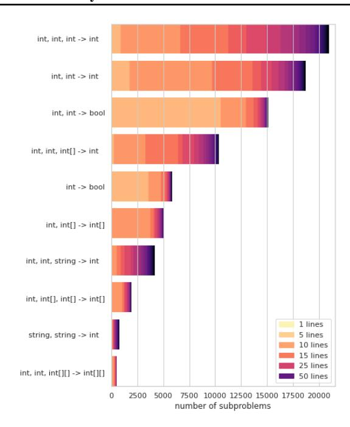
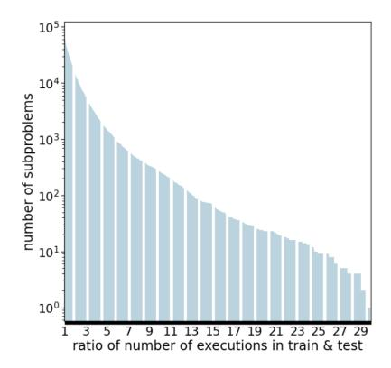
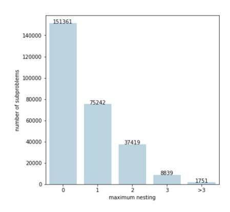
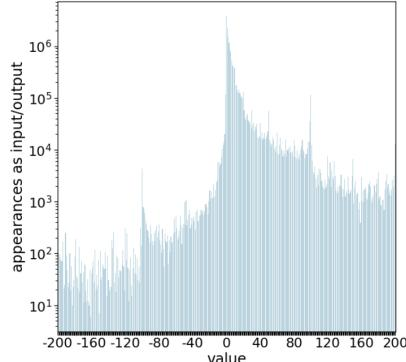
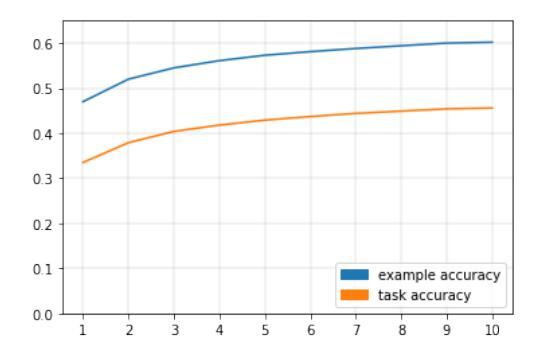

# A large-scale benchmark for few-shot program induction and synthesis

Ferran Alet \* 1 Javier Lopez-Contreras \* 1 James Koppel 1 Maxwell Nye 1 Armando Solar-Lezama 1 Tomás Lozano-Pérez 1 Leslie Pack Kaelbling 1 Joshua B. Tenenbaum 1

## **Abstract**

A landmark challenge for AI is to learn flexible, powerful representations from small numbers of examples. On an important class of tasks, hypotheses in the form of programs provide extreme generalization capabilities from surprisingly few examples. However, whereas large real image benchmarks have spurred progress in metalearning for deep networks, there is no comparably big, real program-synthesis dataset. This is because, while images are relatively easy to label from internet meta-data or annotated by nonexperts, generating meaningful input-output tests for program induction has proven hard to scale. In this work, we propose a new way of leveraging a collection of programs with associated unit tests to create a much larger collection of testprogram pairs. We do so by extracting subprograms of each program and using the inputs of the overall program to get tests for each subprogram. This allows us to create PROGRES, a large-scale few-shot program-induction benchmark of real programs and propose new challenges in this domain. We analyze the effect of multiple design choices on transformer-based program induction and synthesis algorithms, pointing to shortcomings of current methods and suggesting multiple avenues for future work.

#### 1. Introduction

**Note**: since the camera-ready, we have made a final version of the dataset with more programs and increased diversity. The dataset description is the same, but metrics and statistics change, and get more detailed. You can find it the updated PDF and materials at: https://lis.csail.mit.edu/progres.

Proceedings of the  $38^{th}$  International Conference on Machine Learning, PMLR 139, 2021. Copyright 2021 by the author(s).

```
int main() {
      int n:
       cin >> n;
      vector<int> v(n+1);
      for(int i = 0; i <= n; i++) {
             v[i] = i;
                                                              າumber of primes less than or equal
       int l = int(sqrt(n));
      for(int p = 2; p <= 1; p++)

if(v[p] != 0) {

| int j = p * p;
| dint j = p * p;
| v[j] = 0;
| j += p;
| k
      }
      vector<int> res;
elements
  bigger than 1
       for(int i = 0; i <= n; i++){
             if(v[i] > 1) {
                   res.push_back(v[i]);
      cout << res.size() << endl;</pre>
}
```

Figure 1. Extracting interesting subprograms from the Sieve of Erathostenes. Some subprograms, like  $j = \max{(p, \lceil n/p \rceil)} \, p$ , are byproducts that are not directly used by the overall program, but still implement purposeful functions. Line sub-sequences that break the nesting structure result in invalid subprograms.

1. <u>Signature</u> vector<int> fun(int a, vector<int> b)

```
2. Input-output examples 3. C++ function
    Train:
                                              vector<int> fun(int a, vector<int> b) {
    [0,1,2] \rightarrow [2]
                                                  vector<int> c;
for(int d = 0; d <= a; d++){
    if(b[d] > 1) {
    [0,1,2,3] \rightarrow [2,3]
    [0,1,2,3,0,5] \rightarrow [2,3,5]
                                                           c.push_back(b[d]);
    Test:
    [0,1] \rightarrow [
                                                  return c;
    [0,1,2,3,0,5,0,7] \rightarrow [2,3,5,7]
    [0,1,...,0,10^5] \rightarrow [2,...,10^5-9]
                                            5. Program Expression Graph
4. Text context
    "Given a positive integer
    n≤10<sup>5</sup>, return the number
    of primes p≤n."
```

Figure 2. Example of a task corresponding to the filtering subprogram in figure 1. The text context describes the overall program in which the subprogram is embedded. The C++ function provides a possible implementation. Even though we standardize variable names, there are still alternative implementations, such as using while instead of for. The Program Expression Graph (only a portion shown) provides a more canonical notation.

<sup>\*</sup>Equal contribution <sup>1</sup>Massachusetts Institute of Technology, Cambridge Massachusetts, USA. Correspondence to: Ferran Alet <alet@mit.edu>, Javier Lopez-Contreras <javierlc@mit.edu>.

#### 1.1. Motivation

One of the distinctive abilities of human intelligence is building flexible representations from small amounts of data (Lake et al., 2015). Neural networks provide powerful representations, but require substantial amounts of data to train. To alleviate these needs, a set of few-shot learning challenges has catalyzed progress into building deep meta-learning systems. These systems generalize from few examples by learning powerful priors on large amounts of previous tasks (Hospedales et al., 2020).

Programs often provide extreme generalization capabilities from surprisingly few examples, such as generalizing to larger arrays or numbers outside the training range. However, the combinatorial space of programs has proven hard to search. Machine learning can then be used to learn to search more efficiently, either by learning to predict (priors over) programs from examples, or directly learning a predictor that can answer future queries. To train such systems we need a dataset of program induction tasks.

A program induction task is a supervised learning task whose input-output examples come from a program. For training tasks, we can optionally have access to the corresponding implementation of such program, which enables learning to predict (priors over) programs from examples. Sometimes we can also have access to a text describing other relevant context. In this work, we present PROGRES (**Prog**rams from **Real Executed Subproblems**), a large meta-dataset of program induction tasks, enabling future methods in few-shot program induction and synthesis. You can find an example of a task in figure 2.

Multiple methods have created large *synthetic* program induction datasets by sampling programs from a Domain Specific Language (DSL) and feeding them random inputs to generate tests. Because DSLs can generate an unlimited amount of programs, this method provides an easy way of creating large datasets. This approach may work well for hand-crafted DSLs where the language is highly tuned to a specific application. There, a reasonable portion of *valid* programs implement sensible functions and shorter programs tend to be more useful. In contrast, in general-purpose languages like C++, the subset of interesting and meaningful programs is an extremely small fraction of the set of compiling C++ programs. Thus, it is essential to use real programs to learn about this set of interesting programs.

In addition to real code, having meaningful input-output tests has multiple advantages over evaluating random inputs. Many programs have implicit pre-conditions for them to run successfully. For instance, if we use an integer to index an array, it has to be both positive and smaller than the array's length; if a program compares two lists element-wise, the input lists must have equal length.

In a program induction task, input-output examples have to satisfy two more properties beyond satisfying the program's pre-conditions. First, in the same way distribution shift between training and test data affects performance in a single-task, meta-training examples have to come from the same distribution as meta-test examples. Therefore, if we want our algorithms to generalize at deployment-time, they have to be meta-trained on real, non-random inputoutput examples to avoid such a (meta-)domain shift. Moreover, for each program, the overall set of input-output tests must probe potential edge cases to distinguish the desired program from possible alternatives, both for specification (training examples) and validation(testing) purposes. In PROGRES input-output examples come from propagating unit tests designed by humans; thus, we expect them to be natural and cover most edge cases.

# 1.2. Generating a large program induction benchmark from a real code-base

Large repositories of human-generated code are already available, many with accompanying examples designed to probe the possible ways each program could fail. These include many internal or open-source code-bases with unit tests. Programming competitions are another paradigmatic example: programmers compete to code solutions to a set of problems, and their solutions are checked on hidden input-output tests. PROGRES builds on programs from the competitive programming website codeforces.com.

Directly using the programs and their test-cases from the website as a benchmark has a number of downsides. First, programs written by humans are often significantly too complex for current program induction methods to solve. Second, even though CodeForces has millions of programs, they only implement  $\sim 5,500$  different programming problems.

In this work, we propose to leverage a program with an accompanying test suite (defining a program induction task) to create a series of input-output examples for its subprograms. Subprograms are subsequences of the overall program that express an intermediate variable as a function of previous variables. As illustrated in figure 1, subprograms in a purposeful program are also likely to be useful. Moreover, by being shorter and simpler, subprograms provide a useful learning curriculum. Finally, since subprogram complexity ranges from a single line of code to entire programs, they provide a relevant benchmark for both current and future program induction methods.

In order to generate input-output examples for subprograms, we use a program interpreter to propagate the inputs of the overall program line by line. Then, at each step in the execution, we capture the value of all the relevant variables. From these execution traces, we derive relevant input-output tests for each subprogram. For more information, see section 3.2.

We generate PROGRES by applying a C++ program interpreter to programs solving the 5,500 problems from Code-Forces. This allows us to create a much larger dataset of more than 200,000 few-shot program-induction tasks of varying difficulty and style (sec. 3.4). A careful analysis of baselines (sec. 4.3) shows that there is both an initial promise and a long road ahead in the quest for building effective solutions to this problem.

In summary, our contributions are the following:

- 1. We propose a generic method of building large, real program induction and synthesis benchmarks.
- 2. We provide a new dataset of more than 200, 000 program induction tasks, with multiple challenges for the program synthesis and few-shot learning communities.
- 3. We analyse the effect of adding different types of data from PROGRES to a transformer-based algorithm.

#### 2. Related work

**Learning to few-shot learn** meta-learning (Schmidhuber, 1987; Bengio et al., 1995; Thrun & Pratt, 1998) aims at learning priors from many tasks to generalize to a new task from small amounts of data. Most of these methods assume that the input form is constant (Iwata & Kumagai, 2020) being a recent exception) and few-shot learning datasets are mainly image classification (Lake et al., 2015; Vinyals et al., 2016; Ren et al., 2018; Antoniou et al., 2020; Chen et al., 2019; Triantafillou et al., 2019) or low-dimensional continuous regression (Finn et al., 2017; Bauza et al., 2019). Moreover, deep learning-based meta-learning algorithms do not typically generalize broadly outside the data distribution, especially non-optimization-based approaches (Finn, 2018). To improve this, more compositional methods to meta-learning are increasingly being proposed (Alet et al., 2018; Bengio et al., 2019; Ke et al., 2019; Mendez & Eaton, 2020; Ruis et al., 2020). PROGRES provides a relevant benchmark for these compositional few-shot learning methods.

Neural program induction Neural networks are universal approximators that have delivered great results in a wide variety of fields. Motivated by these successes, multiple works have applied neural or neuro-symbolic methods to latent program induction, where programs are represented only implicitly, without any reference to a specific DSL. Many of these approaches propose neural architectures inspired by computational modules (Graves et al., 2014; Kurach et al., 2015; Reed & De Freitas, 2015; Joulin & Mikolov, 2015; Graves et al., 2016; Dong et al., 2019; Li et al., 2020), training weights end-to-end. However, most of these works aim at learning a single task performed by a program. In contrast, PROGRES measures the ability to learn new tasks from few examples.

Few-shot program induction and synthesis Program synthesis (Shaw et al., 1975; Solar-Lezama et al., 2006; Gulwani et al., 2017) aims at generating code that satisfies a set of input-output examples. Typically, these methods are data efficient, often generalizing from few examples. However, the combinatorial space of programs is hard to search, often restricting the capacity of the language or the size of programs. Machine learning, and deep learning in particular, have been increasingly used to improve the search over programs (Parisotto et al., 2016; Kalyan et al., 2018; Brockschmidt et al., 2018; Ellis et al., 2019; Nye et al., 2020). In this work, we implement one of these methods, RobustFill (Devlin et al., 2017), as a baseline. We believe that the substantial increase in data will facilitate further progress in neural searchers. Finally, there have been demos using GPT-3 (Brown et al., 2020) to predict short programs from English descriptions. Inspired by this nascent line of research, we modify the LSTM in the original RobustFill by a pretrained transformer (Lewis et al., 2019).

Program induction datasets There have been multiple few-shot program induction datasets, such as those used in FlashFill (Gulwani, 2011; Gulwani et al., 2015) and Dream-Coder (Ellis et al., 2020), as well as the Abstract Reasoning Challenge(ARC) (Chollet, 2019), a list functions benchmark (Rule, 2020), or the SyGus competition (Alur et al., 2017). Although these benchmarks contain many interesting problems, they have been manually created by humans instead of being automatically generated from real programs. This creates a significant bias on the datasets (often being captured by a relatively simple Domain Specific Language) and restricts the amount of tasks to a few hundred tasks. In contrast, our benchmark, PROGRES, contains more than 200,000 tasks, two orders of magnitude more. This will allow neural-based methods, often data-inefficient, to learn to generalize or search in these domains. Larger program datasets have been shown to be useful to learn to search (Balog et al., 2016; Shin et al., 2019). However, in contrast to PROGRES, these programs were randomly generated from restricted DSLs, and therefore do not capture the structure of real programs.

#### Datasets leveraging competitive programming code

Data from programming competitions, and codeforces. com in particular, has been used before to build several benchmarks. Zavershynskyi et al. (2018) is probably closest to our benchmark, combining a mixture of crowd-sourced descriptions of subprograms with input-output examples for the entire programs (not subprograms). Kulal et al. (2019) improved and standardized the pseudo-code annotation with line-by-line annotations and learned to translate from single-line pseudo-code to instruction. While useful, language annotations are hard to scale because they have to be crowd-sourced and require expertise. Moreover, they

sidestep the major difficulty of program induction, as using a line-by-line description of the program in English reduces the inference to a translation problem. Codeforces has also been used to build program repair tools. Tan et al. (2017) build a dataset of small fixes by leveraging consecutive submissions from users fixing their mistakes and Kulal et al. (2019) learn to fix compile errors by synthetically perturbing correct programs and observing the compiler message.

# 3. Description of the PROGRES dataset

We call our dataset PROGRES: **Prog**rams from **R**eal **E**xecuted **S**ubproblems.

#### 3.1. Structure of the dataset

In competitive programming there are regularly-scheduled contests, each with multiple new problems for humans to solve by coding their solutions as programs. Each Code-Forces problem consists of a short text describing a backstory and the requirements for the program, as well as multiple test-cases (some public, some private) that the submitted program has to satisfy. Because all user submissions are public, for each problem there are hundreds of available programs that solve it, providing us with multiple pairs of (program, test suite) such that the entire program satisfies the test-cases. For each program we can obtain many subprograms: valid segments of code contained in the original program, expressing an intermediate variable as a function of other variables. To be valid, a subprogram has to be correctly parenthesised: start and end at the same level of nesting and never go to a level above where it started in the indentation nesting. For a correct subsequence of the overall program, we define potential outputs as the variables modified on the last line and as inputs all the variables involved in the computations on that sequence that are not created within the subprogram itself.

Given a subprogram, we can generate the data for a single task; consisting of 20 input-output pairs (10 training, 10 test). We obtain these pairs by running the entire program with a custom-made C++ interpreter based on Cling (Vassilev et al.)(more details in section 3.2) and observing the intermediate values at every line. Note that the input distribution has a rich structure, as it comes from inputs designed by humans after being processed by previous computations in the overall program. Moreover, we also have access to the natural text description of the overall program. This text alone does not specify the subprogram, but serves as a context to help guide the search.

In PROGRES, a task consists of the following information:

1. a type signature describing the variable types (int,string,int[],etc) of all inputs and outputs,

- 2. 20 pairs of input-outputs examples, 10 for training and 10 for test,
- 3. a C++ function that solves these pairs, optionally with variable names already standardized,
- 4. a natural text describing the overall program the task has been extracted from,
- 5. a Program Expression Graph form that further standardizes the C++ code (see subsec 3.3 for more details).

Figure 2 shows an illustration for a single task.

#### 3.2. Implementation and design decisions

In this section we provide an overview of how we obtained the data contained in PROGRES. The goal is to provide a better understanding on the data distribution, explaining how we computed the input-output examples as well as some limitations of our pipeline, which effectively constrain the programs in our dataset to be in a (large) subset of C++. We obtain the original C++ programs from codeforces.com, leveraging the scraping and standarization done by SPoC and DrRepair (Kulal et al., 2019; Yasunaga & Liang, 2020). Since this scraping only contained simple programs solving very easy problems, we performed an additional scraping to capture problems of all difficulties. We obtain around 300,000 programs; however, since C++ is a compiled language, it is not meant to be run line-by-line, which we need to do to obtain the subprograms. This process imposes some constraints, which restrict us to a subset of C++, which around 60,000 of the scraped programs satisfy. The most relevant exclusions are classes, the queue and stack datastructures, and the instructions break and continue. To efficiently evaluate these programs we leveraged the MIT supercloud (Reuther et al., 2018), parallelizing program evaluations over 4800 CPU cores.

To interpret C++ we use the Cling C++ interpreter (Vassilev et al.). Cling performs an elaborate incremental just-in-time compilation that keeps modifying the abstract syntax tree before executing the new line of code. This allows us to execute pieces of code and check the values of variables in between. Since these pieces of code have to be compiled, they have to be self-contained: functions have to be defined entirely before being fed to Cling and loops and if statements have to be given as a block. This would restrict the type of subprograms that we can obtain with vanilla Cling, since we would not be able inspect the intermediate values within loops or functions.

We therefore implemented our own emulator on top of Cling to be able to obtain intermediate values for loops and if statements. Instead of feeding the entire if/while statement to Cling, the emulator first sends its condition and then calls the appropriate code depending on whether the condition

|                                | CONCODE       | NAPS   | SPoC   | ARC  | DreamCoder | SyGUS | Progres |
|--------------------------------|---------------|--------|--------|------|------------|-------|---------|
| Programming language           | Java          | UAST   | C++    | -    | DSL        | DSL   | C++     |
| Number of programs             | 2,184,310     | 17,477 | 18,356 | -    | 215        | 829   | 274,612 |
| Lines per program              | 4.4           | 21.7   | 14.7   | -    | 14.1       | 20.0  | 3.3     |
| Additional input               | documentation | -pseud | ocode– | -    | -          | -     | context |
| Number of induction tasks      | -             | 485    | 784    | 1000 | 215        | 829   | 274,612 |
| Number of test cases (average) | -             | 7.5    | 38.6   | 4.3  | 15.0       | 100.0 | 235.1   |

Table 1. Comparison of PROGRESto other program-based datasets. Some datasets like CONCODE (Iyer et al., 2018), contain lots of programs, but no tests for these programs. NAPS and SPoC, both based on CodeForces, have as many induction tasks as CodeForces problems (not subproblems); it is worth noting, however, that they focus on going from pseudo-code to code, a more relevant description than our context. Both ARC and DreamCoder have program induction tasks manually designed by humans, thus restricting their size. For DreamCoder we estimated the numbers using the dataset of list functions, the dataset of towers and the dataset of physical equations. For SyGus, we estimated the number of tasks looking at the largest competition in 2019 and the statistics on the programs described in Alur et al. (2013). Finally, note that even though we standardize the programs to have 20 tests (10 train, 10 test), we often have access to many more, with an average of 235.

was satisfied or not. Note that these if/while conditionals are often interesting quantities, and we also include them as tasks, even though there is no explicit boolean variable created in the original program.

We store these line by line executions for each input set to the overall program. These files can then be parsed to generate the tests for each subprogram. To keep the dataset to a reasonable size and avoid very long inputs, we capped the execution to 100KB of generated data and skipped programs generating lines of more than 1KB of data. This avoided long programs of many executions and arrays of tens of thousands of integers, which are hard to process by most ML methods and expensive to store for a dataset.

#### 3.3. Finding equivalent programs

There are two type of equivalences in our dataset construction: subprogram equivalence implies the two implement the same function; program induction task equivalence implies that their programs are equivalent and they happen in the same context (in our case, defined by the text representing the overall problem). This difference is important, as in programming we often have to recognize the possibility of reusing a known pattern in a new circumstance.

**Defining Program Equivalence** The same function can be implemented by many different programs. As the final step in the dataset construction, we identify such equivalence-classes of functions using a mixture of testing and theorem-proving. Programming language theorists have defined many notions of program equivalence. A classic one, sometimes called "semantic equivalence," deems two programs equivalent if they have the same preconditions and, for all inputs satisfying these preconditions, they can be proved to have the same output.

Implementing this in an automated checker is a non-starter: the intended precondition of any subprogram is unknowable from the code alone. Further, this definition disallows proving equivalence of programs that exhibit undefined behavior, as the C standard states e.g.: a program with integer overflow may exhibit any behavior. We hence use I/O equivalence, also called *machine equivalence*, where two programs are equivalent if they have the same outputs for all inputs (on a specific machine).

Slicing when we extract a contiguous set of instructions from the overall program, not all lines will affect the output value of the intermediate variable of interest. We thus clean the unnecessary instructions to avoid making programs unnecessarily long and redundant; a process called slicing (Xu et al., 2005; Tsantalis & Chatzigeorgiou, 2009). To slice, we try removing lines from the bottom to the top, as well as entire code blocks. If the code without those lines or code blocks still passes the test-cases, we remove them and keep iterating until we cannot remove any more code. Going from the bottom to the top allows us to remove pairs of redundant instructions where the bottom one depends on the top one.

**Slicing and finding classes of equivalent tasks** We first partition tasks by CodeForces problem, since these will have different text context, as well as different input-output pairs. To detect equivalent tasks within each CodeForces problem, we run the following steps:

- 1. We slice every program independently and standardize the variables.
- 2. We join programs that have the same implementation.
- 3. We mark programs that pass each other test-cases as potentially equivalent. This is an *overapproximation* of the true equivalence relation.
- 4. We then cluster these candidates into programs proven actually equivalent by using Yogo (Premtoon et al., 2020), a tool based on *equality saturation* (Tate et al., 2009; Nelson & Oppen, 1980). This refines the candidate sets into an *underapproximation* of the true equivalence relation.

The upshot of the consecutive overapproximating and underapproximating phases is an excellent approximation to the true equivalence relation, which is undecidable. Using tests we can prove that two programs are *not* equivalent, but not the opposite. Using Yogo we can prove they are equivalent, but not the opposite. This leaves only a small set of ambiguous relations.

The rest of this section summarizes Yogo and how it proves programs equivalent.

**Equality Saturation and E-PEGs** An expression such as x < y and y < z can be rewritten into many equivalent forms using rules such as not(y <= x or y <= z) or even the redundant z > y and y > x and z > x. E-graphs (equivalence graphs (Nelson & Oppen, 1980) are a way to compactly represent the exponential number of equivalent expressions that can be found by a set of rewrite rules. From the initial expression Abstract Syntax Tree(AST), equality saturation is performed, adding each newly-discovered equivalent expression to the e-graph via an extension of the union-find algorithm.

E-graphs are a powerful technique, but have traditionally only been applicable to pure, loop-free programs. Program Expression Graphs (PEGs) (Tate et al., 2009) are a new representation of programs that allows equational reasoning and build e-graphs on arbitrary imperative programs. Conceptually, PEGs can be thought of as being constructed by unrolling loops into an infinite tree, and then compactly representing this infinite-but-regular tree as a cycle in the graph. Equality saturation then yields an e-graph on the PEG (or E-PEG), representing an exponentially-large space of equivalent programs. This was originally used for compiler optimization, but Yogo (Premtoon et al., 2020) uses it for code search — and now also for equivalence-checking.

Yogo: Equivalence Checking from E-PEGs We customized Yogo to work on our codebase. Even though it originally only handled Java and Python, it is built on the Cubix (Koppel et al., 2018) multi-language infrastructure, allowing us to add support for a subset of C that captures the subset of C++ in PROGRES, after some simple string transformations, e.g.: changing vector<int> foo to struct vector foo. To check for equivalences between functions, we put them into a single E-PEG, assigning each the same start state. Then, we report two subprograms as equivalent if equality saturation groups their return values in the same equivalence class.

### 3.4. Statistical analysis

Figure 3 shows the variability of signatures on our benchmark. As expected, the most common signatures involve integer manipulations as well as classification problems



Figure 3. Subset of some interesting signatures in our dataset, all with at least 200 tasks. Color indicates the length distribution of programs for each signature. Most programs have few inputs and output integers or booleans. There are programs doing array and string manipulation, as well as some matrix operations.

from few variables. There are other signatures that involve array, matrix and string manipulations, often conditioned on other variables like integers or individual characters. These are interesting as they often require to generalize to longer computations as well as bigger data structures.

Figure 4 shows the difficulty of our tasks along three different axis. First, many problems contain either if-statements or loops that require generalizing more than 10 times the number of operations needed for training examples. Conditional execution (characterized by nesting in C++) is often very hard for program induction techniques. Our benchmark contains a wide variability of nesting quantities across different subprograms. Finally, our input and outputs follow a very structured distribution, since they come from real examples. For instance, most integers are small (note the logarithmic y axis), with positive numbers being more common. Moreover, special numbers like 100 and -100 are more common than numbers of similar magnitude.

#### 3.5. Accompanying environment

In order to be able to test candidate programs, we include a python interface to our C++ interpreter. The interface is easy to use and has two different modes:

1. We can run an entire C++ function on a set of inputs by passing the former as a string and the latter as a list of







Figure 4. (Left) We purposely bias the test to generalize to longer computations than those seen for training examples. This plot shows the ratio of number of maximum number of lines executed for a test input vs maximum number of lines executed for a training input. Programs without loops, where the ratio is 1, are ommitted. (Center) Depth of indentation execution (nested loops and if statements), which often significantly affects the difficulty of program synthesis. (Right) number of times each integer in [-200,200] appears as an input or output on a test-case. We can see that they follow a very intuitive distribution, with smaller integers being more popular, positive numbers being more common than their negative counterparts and a peak at 100 and -100.

strings. The interface then returns whether the function compiled and, if it did, a list of results for each input. In case of a runtime error or a timeout, it returns "Runtime error" or "Timeout" respectively. This is useful for approaches that use the environment as a black-box without interacting with individual instructions.

2. In contrast to traditional C++, we can run a program line by line and return the appropriate variables with new values. This mode is restricted to our subset of C++ (that all programs in PROGRESbelong to), but it is useful for methods that use partial executions to guide synthesis (Ellis et al., 2019).

#### 4. Benchmark

# 4.1. Evaluation protocol

Our goal is to generalize to relevant subprograms from unseen programming contests. Therefore, we choose to divide between meta-train, meta-validation and meta-test at the level of contests: training takes contests <1000, validation between 1000 and 1249 and testing more than 1250. Some subprograms (especially short ones like "return v0+1") are repeated multiple times. If in a single problem (thus sharing the context text and often the same input-output pairs) there are multiple copies of the same subprogram, we merge them into a single task, pooling their input-output examples. Note that the same subprogram can be in different problems. However, they will not be the same task, because both the input-output pairs and the context text will differ. Intuitively, new programming tasks may require us to implement code we have seen before (like adding up all the elements in an array), but in a different context.

To judge the performance of a program for a single task, we evaluate its performance on unseen test cases. This allows

us to judge the correctness of equivalent implementations of the same function or implicit programs, like those described by neural networks. More concretely, for each task, we give the method all 10 training examples and evaluate its performance on the 10 test examples, only counting exact answers. We can then measure the example accuracy (the fraction of correctly-solved test-cases across all meta-test tasks), and task accuracy (the fraction of tasks with all of their 10 test examples correctly predicted). Note that, although both measures are related, a method may have higher task accuracy than another, while having lower example accuracy. As described in previous work (Devlin et al., 2017), having a high example accuracy is more desirable when we are using the method on a per-example basis (like an auto-suggest tool) whereas task accuracy is more important in cases where we would like the induced program to make an indeterminate number of predictions without having to check all of them.

#### 4.2. Baselines

We evaluate multiple baselines, all based on the same core architecture (a large-scale language model), in order to better understand their differences.

Fine-tuning a pre-trained language model to generate code from examples Inspired by the RobustFill program synthesis model (Devlin et al., 2017) and recent advances in language model pre-training, we build a neural program synthesis baseline. Our aim was to determine how well a state-of-the-art sequence-to-sequence neural program synthesis model could perform on our dataset. We used the BART (Lewis et al., 2019) pre-trained transformer model as a base, and fine-tuned it on our dataset to output programs. The model takes as input the function header (which describes the type signature),

as well as the support set examples arranged sequentially, i.e., [header] | [Input1]; [Output1] | [Input2]; [Output2] | ... [Input10];  $[{\tt Output10}].$  The model is trained to output the program body. At evaluation time, we perform a beam search of beam size 10, and select the program out of those 10 candidates which performs the best on the support set and execute that program on the query set to produce final predictions for each query example. Note that executing programs on the support set allows us to perform a search over the possible candidate programs, which has been shown to greatly increase the performance of neural program synthesis techniques (Devlin et al., 2017). Figure 5 shows how, in our case, it significantly improves task accuracy. To evaluate all program candidates we only need to evaluate entire functions, instead interpreting the program line-by-line. We thus relied on cppyy (Lavrijsen & Dutta, 2016) which provides efficient python-C++ bindings.

We also test if additionally conditioning on the overall program description text increases performance. In these experiments, we append the text to the examples.

Transformer-based end-to-end prediction Our next baseline, also inspired by Devlin et al. (2017), is a program induction model. Using an architecture analogous to the neural program synthesis model, we use neural models to perform neural program induction, i.e., given a training set of k input-output examples and a single test input, produce the corresponding output. Instead of generating the target code, the induction model is instead trained to approximate the execution of the code directly. Our model is identical to the program synthesis model above, except that the test input example is prepended to the context string, and the model is trained to produce the target test output.

#### 4.3. Discussion

Comparison between program synthesis and program induction Somewhat surprisingly, in preliminary experiments end-to-end program induction performed better than predicting the program as an intermediate. However, the order changed when we started slicing the programs, which removed superfluous lines of code, making learning to synthesize easier. There, the synthesis approach has a great advantage, as it can generate the program and let it solve arbitrarily complex inputs.

This is specially the case for tasks returning collections (arrays, lists, strings, and matrices). This is understandable, since, for collections, program induction had to generate long stretches of tokens without error, which is very hard to do, especially for all inputs.

**Dependence on number of program examples** Performance consistently improves from 5 to 10 examples, but by



Figure 5. Dependence of example and task accuracy when only evaluating the first  $p \in [1, 10]$  programs coming from the beam search. Most of the performance comes from the first prediction, but the rest provides a noticeable boost of more than one third in relative performance.

less than one may expect. Human experiments in a preliminary version of this dataset indicated that their learning was also very fast, saturating at 5 examples. This also matches previous human experiments on inferring list-editing programs (Rule, 2020). Therefore, it appears that there is also a fundamental search problem, typical in program synthesis, where the task space is exponential.

Dependence on text context Adding the text context improved performance by a surprisingly high amount: between 16% relative improvent in example accuracy and 23% in task accuracy. We did not observe any significant correlation with the type signature, instead producing improvements across the board. Further research into more effectively combining the two modalities of input is a promising area of future work.

#### 4.4. Open challenges

The previous section highlights the need for better fewshot program induction and program synthesis methods. Moreover, this benchmark opens up multiple interesting challenges. We highlight a few:

**Graph representations of programs** although not explored in this work, the inclusion of PEGs in PROGRES facilitates the evaluation of Graph Neural Networks (Scarselli et al., 2009; Bronstein et al., 2017; Battaglia et al., 2018) for code analysis at scale, an approach that has already shown promise (Li et al., 2019).

**Open-ended active learning** The ability of asking for useful labels would allow a program synthesis method to interact with a human, improving the data efficiency by actively trying to resolve uncertainties. This topic has been explored in the past for program induction (Pu et al., 2018), but only in selecting from a small number of examples. Since we provide an environment and the true program, we

| Method                       | Pretrained | Text context    | Example accuracy<br>5-shot/10-shot    | <b>Task accuracy</b> 5-shot/10-shot   | Entity task acc. 5-shot/10-shot       | Collection task acc. 5-shot/10-shot   |
|------------------------------|------------|-----------------|---------------------------------------|---------------------------------------|---------------------------------------|---------------------------------------|
| BART-Robustfill Induction    | no         | without<br>with | 0.351 / 0.349<br>0.340 / 0.338        | 0.107 / 0.107<br>0.114 / 0.116        | 0.126 / 0.126<br>0.135 / 0.137        | 0.000 / 0.000<br>0.000 / 0.000        |
|                              | yes        | without<br>with | 0.477 / 0.492<br>0.504 / 0.521        | 0.210 / 0.223<br>0.246 / 0.259        | 0.248 / 0.263<br>0.289 / 0.305        | 0.001 / 0.001<br>0.010 / 0.010        |
| BART-Robustfill<br>Synthesis | no         | without<br>with | 0.464 / 0.473<br>0.510 / 0.516        | 0.315 / 0.325<br>0.363 / 0.370        | 0.526 / 0.538<br>0.560 / 0.565        | 0.124 / 0.123<br>0.240 / 0.249        |
|                              | yes        | without<br>with | 0.570 / 0.579<br>0.592 / <b>0.602</b> | 0.420 / 0.429<br>0.444 / <b>0.456</b> | 0.622 / 0.633<br>0.645 / <b>0.655</b> | 0.285 / 0.283<br>0.306 / <b>0.313</b> |

Table 2. Comparison of the different design choices based on BART-RobustFill. Synthesizing the program instead of directly predicting the outputs gave the biggest boost. Interestingly, in previous versions of the dataset where the programs were not sliced, induction gave better results, highlighting the need for clean code examples. Then, using the pretrained weights for the transformer has a very noticeable positive effect. Having the text context consistently improves performance by a noticeable margin. Finally, going from 5 to 10 examples gives a small, but positive boost to all methods. **Note**: since the camera-ready, we have made a final version of the dataset with more programs and diversity. The dataset description is the same, but concrete metrics and statistics change. You can find it the updated PDF and materials at: https://lis.csail.mit.edu/progres.

can use it as an oracle for active learning. However, this has the added challenge (and benefit) of being unconstrained, with the model generating its own queries.

#### Leveraging instructive examples and structured inputs

In classic Machine Learning we assume examples come from randomly sampling the input distribution. Therefore, most training examples lie at the conceptual center of the input space. In contrast, our examples tend to be extremal, poking at the edge-cases to differentiate the true program from reasonable alternatives. Humans actively use the knowledge that a teacher is giving them instructive examples to update their priors more effectively (Shafto et al., 2014). Constructing algorithms capable of similar inferences is a promising avenue for future work. Similarly, our inputs tend to pertain to a class much smaller than that defined by their C++ type. For instance, for many problems, all integer inputs are positive, which makes some implementations easier. Being able to infer these conditions in the inputs and exploit them is something human programmers often do and an avenue for improving the performance of current systems.

#### Leveraging intermediate states for program synthesis

Our environment can be run in interactive mode, receiving individual (or groups of) instructions, and returning the relevant variables that changed value. This facilitates program synthesis that inspects intermediate values to inform search, which has been shown to significantly boost performance (Ellis et al., 2019; Nye et al., 2020).

#### **5. Conclusion**

We have presented a new way of scaling up few-shot program induction and program synthesis benchmarks. We

provide PROGRES, a meta-dataset of more than 200,000 tasks based on real programs, of a wide variety of problems and input-output examples. Evaluations show a wide margin for improvements for current program induction and synthesis methods. The scale of data, two orders of magnitude larger than previous work, together with the inclusion of text contexts and a custom code interpreter open up many possible avenues for future research.

# Acknowledgements

We would like to thank Maria Bauza for her detailed and perceptive comments on the paper drafts and anonymous reviewer #3 for their thorough, insightful review; both significantly improved our work. We would also like to thank Lauren Milechin and the MIT supercloud team, that allowed us to scale the computations required to generate the dataset. We would also like to thank Wim Lavrijsen and Sumith Kulal for their quick and detailed responses about cppyy and SPoC, respectively. Finally, we would like to thank Oriol Vinyals and Charles Sutton for their comments about this work and Eric Navarro and Marta Alet for their help parsing CodeForces problems.

We gratefully acknowledge support NSF grant 1723381; from AFOSR grant FA9550-17-1-0165; from ONR grant N00014-18-1-2847; from GoodAI, from the Honda Research Institute, from MIT-IBM Watson Lab; and from SUTD Temasek Laboratories. We also acknowledge the MIT SuperCloud and Lincoln Laboratory Supercomputing Center for providing HPC resources that have contributed to the research results reported within this paper. Any opinions, findings, and conclusions or recommendations expressed in this material are those of the authors and do not necessarily reflect the views of our sponsors.

#### References

- Alet, F., Lozano-Perez, T., and Kaelbling, L. P. Modular meta-learning. In *Proceedings of The 2nd Conference on Robot Learning*, pp. 856–868, 2018.
- Alur, R., Bodik, R., Juniwal, G., Martin, M. M., Raghothaman, M., Seshia, S. A., Singh, R., Solar-Lezama, A., Torlak, E., and Udupa, A. *Syntax-guided* synthesis. IEEE, 2013.
- Alur, R., Fisman, D., Singh, R., and Solar-Lezama, A. Sygus-comp 2017: Results and analysis. *arXiv preprint arXiv:1711.11438*, 2017.
- Antoniou, A., Patacchiola, M., Ochal, M., and Storkey, A. Defining benchmarks for continual few-shot learning. *arXiv* preprint arXiv:2004.11967, 2020.
- Balog, M., Gaunt, A. L., Brockschmidt, M., Nowozin, S., and Tarlow, D. Deepcoder: Learning to write programs. *arXiv* preprint arXiv:1611.01989, 2016.
- Battaglia, P. W., Hamrick, J. B., Bapst, V., Sanchez-Gonzalez, A., Zambaldi, V., Malinowski, M., Tacchetti, A., Raposo, D., Santoro, A., Faulkner, R., et al. Relational inductive biases, deep learning, and graph networks. arXiv preprint arXiv:1806.01261, 2018.
- Bauza, M., Alet, F., Lin, Y.-C., Lozano-Pérez, T., Kaelbling, L. P., Isola, P., and Rodriguez, A. Omnipush: accurate, diverse, real-world dataset of pushing dynamics with rgbd video. arXiv preprint arXiv:1910.00618, 2019.
- Bengio, S., Bengio, Y., and Cloutier, J. On the search for new learning rules for anns. *Neural Processing Letters*, 2 (4):26–30, 1995.
- Bengio, Y., Deleu, T., Rahaman, N., Ke, R., Lachapelle, S., Bilaniuk, O., Goyal, A., and Pal, C. A meta-transfer objective for learning to disentangle causal mechanisms. *arXiv* preprint arXiv:1901.10912, 2019.
- Brockschmidt, M., Allamanis, M., Gaunt, A. L., and Polozov, O. Generative code modeling with graphs. *arXiv* preprint arXiv:1805.08490, 2018.
- Bronstein, M. M., Bruna, J., LeCun, Y., Szlam, A., and Vandergheynst, P. Geometric deep learning: Going beyond Euclidean data. *IEEE Signal Processing Magazine*, 34: 18–42, 2017.
- Brown, T. B., Mann, B., Ryder, N., Subbiah, M., Kaplan, J., Dhariwal, P., Neelakantan, A., Shyam, P., Sastry, G., Askell, A., et al. Language models are few-shot learners. *arXiv* preprint arXiv:2005.14165, 2020.
- Chen, W.-Y., Liu, Y.-C., Kira, Z., Wang, Y.-C. F., and Huang, J.-B. A closer look at few-shot classification. *arXiv* preprint arXiv:1904.04232, 2019.

- Chollet, F. On the measure of intelligence, 2019.
- Devlin, J., Uesato, J., Bhupatiraju, S., Singh, R., Mohamed, A.-r., and Kohli, P. Robustfill: Neural program learning under noisy i/o. In *International conference on machine learning*, pp. 990–998. PMLR, 2017.
- Dong, H., Mao, J., Lin, T., Wang, C., Li, L., and Zhou, D. Neural logic machines. *arXiv preprint arXiv:1904.11694*, 2019.
- Ellis, K., Nye, M., Pu, Y., Sosa, F., Tenenbaum, J., and Solar-Lezama, A. Write, execute, assess: Program synthesis with a repl. *arXiv preprint arXiv:1906.04604*, 2019.
- Ellis, K., Wong, C., Nye, M., Sable-Meyer, M., Cary, L., Morales, L., Hewitt, L., Solar-Lezama, A., and Tenenbaum, J. B. Dreamcoder: Growing generalizable, interpretable knowledge with wake-sleep bayesian program learning. *arXiv preprint arXiv:2006.08381*, 2020.
- Finn, C. Learning to Learn with Gradients.

  PhD thesis, EECS Department, University of California, Berkeley, Aug 2018. URL http://www2.eecs.berkeley.edu/Pubs/TechRpts/2018/EECS-2018-105.html.
- Finn, C., Abbeel, P., and Levine, S. Model-agnostic metalearning for fast adaptation of deep networks. *arXiv preprint arXiv:1703.03400*, 2017.
- Graves, A., Wayne, G., and Danihelka, I. Neural Turing machines. *arXiv preprint arXiv:1410.5401*, 2014.
- Graves, A., Wayne, G., Reynolds, M., Harley, T., Danihelka, I., Grabska-Barwińska, A., Colmenarejo, S. G., Grefenstette, E., Ramalho, T., Agapiou, J., et al. Hybrid computing using a neural network with dynamic external memory. *Nature*, 538(7626):471, 2016.
- Gulwani, S. Automating string processing in spreadsheets using input-output examples. *ACM Sigplan Notices*, 46 (1):317–330, 2011.
- Gulwani, S., Hernández-Orallo, J., Kitzelmann, E., Muggleton, S. H., Schmid, U., and Zorn, B. Inductive programming meets the real world. *Communications of the ACM*, 58(11):90–99, 2015.
- Gulwani, S., Polozov, O., Singh, R., et al. Program synthesis. *Foundations and Trends*® *in Programming Languages*, 4 (1-2):1–119, 2017.
- Hospedales, T., Antoniou, A., Micaelli, P., and Storkey, A. Meta-learning in neural networks: A survey. *arXiv* preprint arXiv:2004.05439, 2020.

- Iwata, T. and Kumagai, A. Meta-learning from tasks with heterogeneous attribute spaces. Advances in Neural Information Processing Systems, 33, 2020.
- Iyer, S., Konstas, I., Cheung, A., and Zettlemoyer, L. Mapping language to code in programmatic context. *arXiv* preprint arXiv:1808.09588, 2018.
- Joulin, A. and Mikolov, T. Inferring algorithmic patterns with stack-augmented recurrent nets. *arXiv preprint arXiv:1503.01007*, 2015.
- Kalyan, A., Mohta, A., Polozov, O., Batra, D., Jain, P., and Gulwani, S. Neural-guided deductive search for real-time program synthesis from examples. *arXiv preprint arXiv:1804.01186*, 2018.
- Ke, N. R., Bilaniuk, O., Goyal, A., Bauer, S., Larochelle, H., Schölkopf, B., Mozer, M. C., Pal, C., and Bengio, Y. Learning neural causal models from unknown interventions. arXiv preprint arXiv:1910.01075, 2019.
- Koppel, J., Premtoon, V., and Solar-Lezama, A. One tool, many languages: Language-parametric transformation with incremental parametric syntax. *PACMPL*, 2 (OOPSLA):122:1–122:28, 2018. doi: 10.1145/3276492. URL https://doi.org/10.1145/3276492.
- Kulal, S., Pasupat, P., Chandra, K., Lee, M., Padon, O., Aiken, A., and Liang, P. S. Spoc: Search-based pseudocode to code. In *Advances in Neural Information Pro*cessing Systems, pp. 11906–11917, 2019.
- Kurach, K., Andrychowicz, M., and Sutskever, I. Neural random-access machines. *arXiv preprint arXiv:1511.06392*, 2015.
- Lake, B. M., Salakhutdinov, R., and Tenenbaum, J. B. Human-level concept learning through probabilistic program induction. *Science*, 350(6266):1332–1338, 2015.
- Lavrijsen, W. T. and Dutta, A. High-performance pythonc++ bindings with pypy and cling. In 2016 6th Workshop on Python for High-Performance and Scientific Computing (PyHPC), pp. 27–35. IEEE, 2016.
- Lewis, M., Liu, Y., Goyal, N., Ghazvininejad, M., Mohamed, A., Levy, O., Stoyanov, V., and Zettlemoyer, L. Bart: Denoising sequence-to-sequence pre-training for natural language generation, translation, and comprehension. *arXiv* preprint arXiv:1910.13461, 2019.
- Li, Y., Gu, C., Dullien, T., Vinyals, O., and Kohli, P. Graph matching networks for learning the similarity of graph structured objects. In *International Conference on Machine Learning*, pp. 3835–3845. PMLR, 2019.

- Li, Y., Gimeno, F., Kohli, P., and Vinyals, O. Strong generalization and efficiency in neural programs. *arXiv* preprint *arXiv*:2007.03629, 2020.
- Mendez, J. A. and Eaton, E. Lifelong learning of compositional structures. *arXiv preprint arXiv:2007.07732*, 2020.
- Nelson, G. and Oppen, D. C. Fast decision procedures based on congruence closure. *J. ACM*, 27(2):356–364, 1980. doi: 10.1145/322186.322198. URL https://doi.org/10.1145/322186.322198.
- Nye, M., Pu, Y., Bowers, M., Andreas, J., Tenenbaum, J. B., and Solar-Lezama, A. Representing partial programs with blended abstract semantics. *arXiv preprint arXiv:2012.12964*, 2020.
- Parisotto, E., Mohamed, A.-r., Singh, R., Li, L., Zhou, D., and Kohli, P. Neuro-symbolic program synthesis. *arXiv* preprint arXiv:1611.01855, 2016.
- Premtoon, V., Koppel, J., and Solar-Lezama, A. Semantic code search via equational reasoning. In *Proceedings of the 41st ACM SIGPLAN International Conference on Programming Language Design and Implementation, PLDI 2020, London, UK, June 15-20, 2020*, pp. 1066–1082, 2020. doi: 10.1145/3385412.3386001. URL https://doi.org/10.1145/3385412.3386001.
- Pu, Y., Miranda, Z., Solar-Lezama, A., and Kaelbling, L. Selecting representative examples for program synthesis. In *International Conference on Machine Learning*, pp. 4161–4170. PMLR, 2018.
- Reed, S. and De Freitas, N. Neural programmer-interpreters. *arXiv preprint arXiv:1511.06279*, 2015.
- Ren, M., Triantafillou, E., Ravi, S., Snell, J., Swersky, K., Tenenbaum, J. B., Larochelle, H., and Zemel, R. S. Meta-learning for semi-supervised few-shot classification. *arXiv preprint arXiv:1803.00676*, 2018.
- Reuther, A., Kepner, J., Byun, C., Samsi, S., Arcand, W., Bestor, D., Bergeron, B., Gadepally, V., Houle, M., Hubbell, M., et al. Interactive supercomputing on 40,000 cores for machine learning and data analysis. In 2018 IEEE High Performance extreme Computing Conference (HPEC), pp. 1–6. IEEE, 2018.
- Ruis, L., Andreas, J., Baroni, M., Bouchacourt, D., and Lake, B. M. A benchmark for systematic generalization in grounded language understanding. *arXiv* preprint *arXiv*:2003.05161, 2020.
- Rule, J. *The child as hacker: building more human-like models of learning.* PhD thesis, MIT, 2020.

- Scarselli, F., Gori, M., Tsoi, A. C., Hagenbuchner, M., and Monfardini, G. The graph neural network model. *IEEE Transactions on Neural Networks*, 20(1):61–80, 2009.
- Schmidhuber, J. Evolutionary principles in self-referential learning, or on learning how to learn: the meta-meta-... hook. PhD thesis, Technische Universität München, 1987.
- Shafto, P., Goodman, N. D., and Griffiths, T. L. A rational account of pedagogical reasoning: Teaching by, and learning from, examples. *Cognitive psychology*, 71:55–89, 2014.
- Shaw, D. E., Swartout, W. R., and Green, C. C. Inferring lisp programs from examples. In *IJCAI*, volume 75, pp. 260–267, 1975.
- Shin, R., Kant, N., Gupta, K., Bender, C., Trabucco, B., Singh, R., and Song, D. Synthetic datasets for neural program synthesis. *arXiv preprint arXiv:1912.12345*, 2019.
- Solar-Lezama, A., Tancau, L., Bodik, R., Seshia, S., and Saraswat, V. Combinatorial sketching for finite programs. In Proceedings of the 12th international conference on Architectural support for programming languages and operating systems, pp. 404–415, 2006.
- Tan, S. H., Yi, J., Mechtaev, S., Roychoudhury, A., et al. Codeflaws: a programming competition benchmark for evaluating automated program repair tools. In 2017 IEEE/ACM 39th International Conference on Software Engineering Companion (ICSE-C), pp. 180–182. IEEE, 2017.
- Tate, R., Stepp, M., Tatlock, Z., and Lerner, S. Equality saturation: a new approach to optimization. In *Proceedings of the 36th ACM SIGPLAN-SIGACT Symposium on Principles of Programming Languages, POPL 2009, Savannah, GA, USA, January 21-23, 2009*, pp. 264–276, 2009. doi: 10.1145/1480881.1480915. URL https://doi.org/10.1145/1480881.1480915.
- Thrun, S. and Pratt, L. Learning to learn. Springer Science & Business Media, 1998.
- Triantafillou, E., Zhu, T., Dumoulin, V., Lamblin, P., Evci, U., Xu, K., Goroshin, R., Gelada, C., Swersky, K., Manzagol, P.-A., et al. Meta-dataset: A dataset of datasets for learning to learn from few examples. *arXiv preprint arXiv:1903.03096*, 2019.
- Tsantalis, N. and Chatzigeorgiou, A. Identification of extract method refactoring opportunities. In 2009 13th European Conference on Software Maintenance and Reengineering, pp. 119–128. IEEE, 2009.

- Vassilev, V., Canal, P., Naumann, A., Moneta, L., and Russo, P. Cling the new interactive interpreter for ROOT 6.
- Vinyals, O., Blundell, C., Lillicrap, T., Kavukcuoglu, K., and Wierstra, D. Matching networks for one shot learning. *arXiv* preprint arXiv:1606.04080, 2016.
- Xu, B., Qian, J., Zhang, X., Wu, Z., and Chen, L. A brief survey of program slicing. *ACM SIGSOFT Software Engineering Notes*, 30(2):1–36, 2005.
- Yasunaga, M. and Liang, P. Graph-based, self-supervised program repair from diagnostic feedback. *arXiv* preprint *arXiv*:2005.10636, 2020.
- Zavershynskyi, M., Skidanov, A., and Polosukhin, I. Naps: Natural program synthesis dataset. *arXiv preprint arXiv:1807.03168*, 2018.