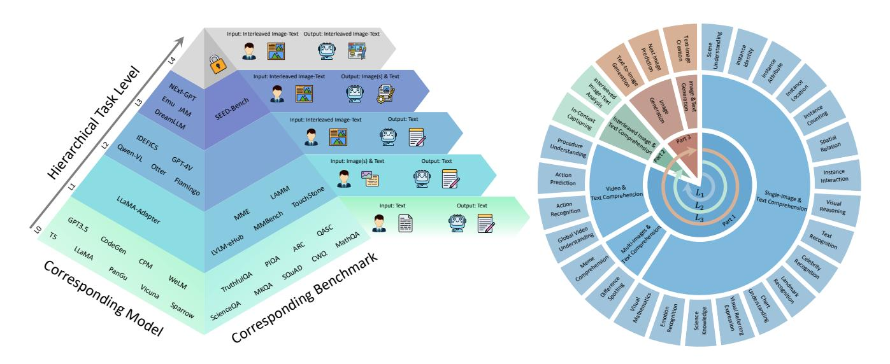
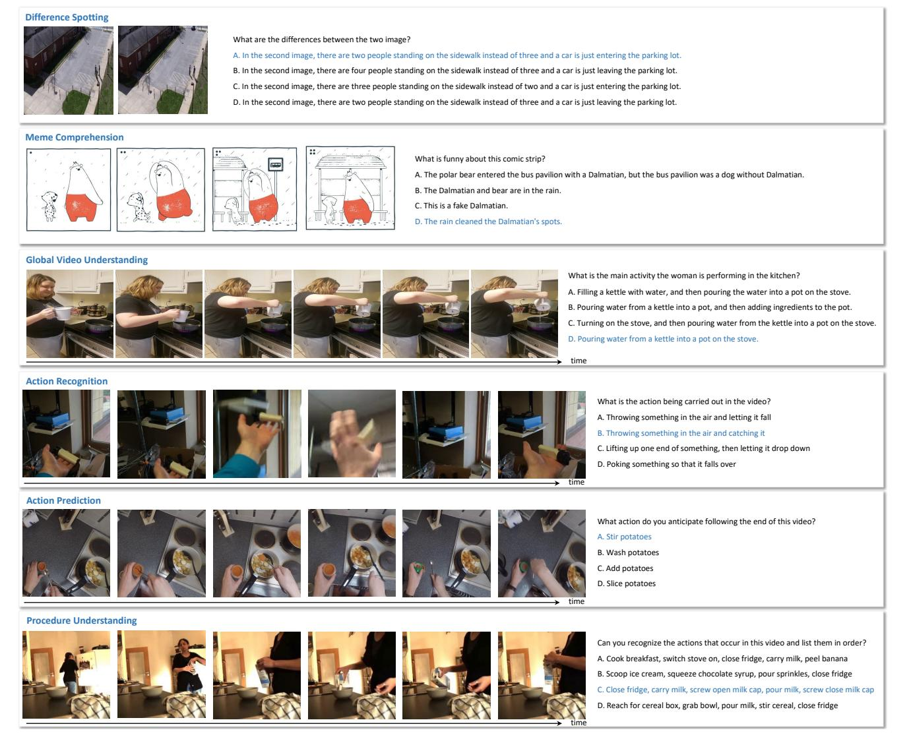
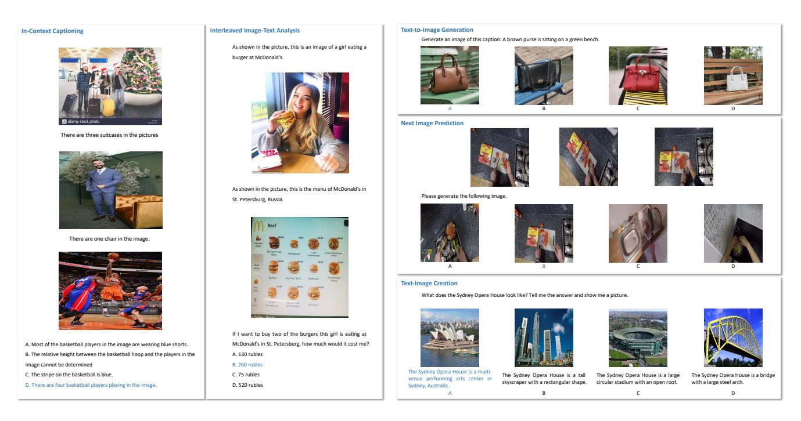
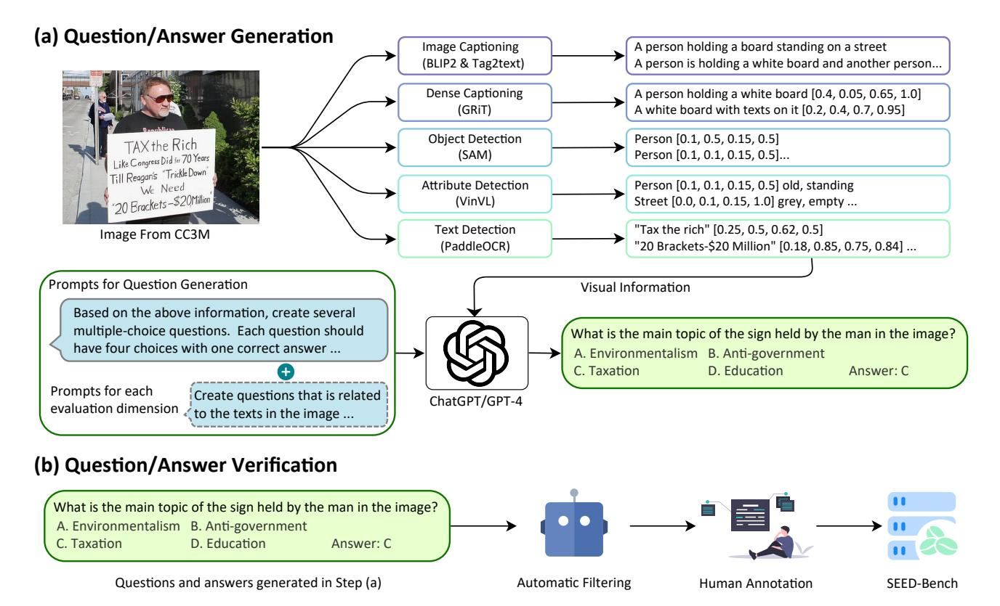
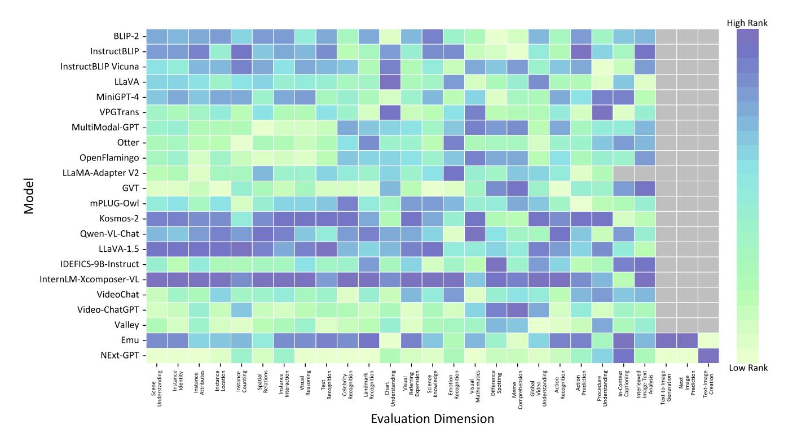

# **SEED-Bench: Benchmarking Multimodal Large Language Models**

Bohao Li $^{3,1\star}$  Yuying Ge $^{1\star}$  Yixiao Ge $^{1,2\dagger}$  Guangzhi Wang $^2$  Rui Wang $^1$  Ruimao Zhang $^{3\dagger}$  Ying Shan $^{1,2}$ 

1Tencent AI Lab 2ARC Lab, Tencent PCG 3School of Data Science, The Chinese University of HongKong, Shenzhen

Figure 1. (left) Overview of **hierarchical capability levels** of MLLMs from  $L_0$  to  $L_4$ , where higher level encompasses lower capability tiers. Models and corresponding evaluation benchmarks at each pyramid tier are illustrated. SEED-Bench-2 covers the assessment of MLLMs up to  $L_3$ . (right) Overview of 27 evaluation dimensions in SEED-Bench-2, which consists of three parts, with part-1 constituting  $L_1$ , part-1&2 constituting  $L_2$ , and part-1&2&3 constituting  $L_3$ .

#### **Abstract**

Multimodal large language models (MLLMs), building upon the foundation of powerful large language models (LLMs), have recently demonstrated exceptional capabilities in generating not only texts but also images given interleaved multimodal inputs (acting like a combination of GPT-4V and DALL-E 3). However, existing MLLM benchmarks remain limited to assessing only models' comprehension ability of single image-text inputs, failing to keep up with the strides made in MLLMs. A comprehensive benchmark is imperative for investigating the progress and un-

covering the limitations of current MLLMs. In this work, we categorize the capabilities of MLLMs into hierarchical levels from  $L_0$  to  $L_4$  based on the modalities they can accept and generate, and propose SEED-Bench, a comprehensive benchmark that evaluates the **hierarchical** capabilities of MLLMs. Specifically, SEED-Bench comprises 24K multiple-choice questions with accurate human annotations, which span 27 dimensions, including the evaluation of both text and image generation. Multiple-choice questions with ground truth options derived from human annotation enable an objective and efficient assessment of model performance, eliminating the need for human or GPT intervention during evaluation. We further evaluate the performance of 22 prominent open-source MLLMs and

\*Equal Contribution.

&lt;sup>†Correspondence Author.

| Table 1. Comparisons between existin | g MLLM benchmarks. "H/G E | valuation" denotes whether human | or GPT is used for evaluation. |
|--------------------------------------|---------------------------|----------------------------------|--------------------------------|
|                                      |                           |                                  |                                |

| Benchmark        | Visual Modality        | Evaluation Level | Customized Question | #Answer Annotation | Answer Type | H/G Evaluation | #Models |
|------------------|------------------------|------------------|---------------------|--------------------|-------------|----------------|---------|
| LLaVA-Bench [24] | Image                  | $L_1$            | <b>√</b>            | 150                | free-form   | GPT            | 4       |
| OCR-Bench [26]   | Image                  | $L_1$            | X                   | -                  | free-form   | N/A            | 6       |
| MME [11]         | Image                  | $L_1$            | ✓                   | 2194               | Y/N         | N/A            | 10      |
| M3Exam [46]      | Image                  | $L_1$            | ✓                   | 12317              | A/B/C/D     | N/A            | 7       |
| LAMM [42]        | Image(s) & Point cloud | $L_1$            | ×                   | -                  | free-form   | GPT            | 4       |
| LVLM-eHub [40]   | Image                  | $L_1$            | ×                   | -                  | free-form   | Human          | 8       |
| MMBench [25]     | Image(s)               | $L_1$            | ✓                   | 2974               | free-form   | GPT            | 14      |
| VisIT-Bench [5]  | Images                 | $L_1$            | ✓                   | 592                | free-form   | Human/GPT      | 14      |
| MM-VET [43]      | Image                  | $L_1$            | ✓                   | 200                | free-form   | GPT            | 9       |
| Touchstone [3]   | Image(s)               | $L_1$            | ✓                   | 908                | free-form   | GPT            | 7       |
| SciGraphQA [20]  | Image                  | $L_1$            | ✓                   | 3K                 | free-form   | N/A            | 4       |
| Ours             | Image(s) & Video       | $L_3$            | ✓                   | 24371              | A/B/C/D     | N/A            | 22      |

summarize valuable observations. By revealing the limitations of existing MLLMs through extensive evaluations, we aim for SEED-Bench to provide insights that will motivate future research toward the goal of General Artificial Intelligence. Dataset and evaluation code are available at https://github.com/AILab-CVC/SEED-Bench.

#### 1. Introduction

In recent years, Large Language Models (LLMs) [7, 10, 30, 31, 37] have exhibited remarkable capabilities to understand, reason, and generate texts across a variety of openended tasks. Leveraging the strong generality of LLMs, Multimodal Large Language Models (MLLMs) [2, 8, 15– 19, 23, 24, 27, 28, 32, 32, 34, 41, 45, 47] have demonstrated exceptional capabilities in comprehending multimodal data through predicting open-form texts. Recent work [9, 13, 14, 21, 36, 39] further empower LLMs with the ability to generate images beyond texts (acting like a combination of GPT-4V [1] and DALL-E 3 [4]), since they contend that the premise for the emergence of multimodal capabilities is that text and image can be represented and processed interchangeably in a unified autoregressive Transformer. However, despite the extensive capabilities of MLLMs, existing MLLM benchmarks [3, 11, 25, 40, 42] primarily focus on evaluating single image-text comprehension, thus failing to fully demonstrate the progress and limitations of current MLLMs. The lag of benchmarks behind the rapid development of MLLMs hinders the exploration and evolution of models.

In this work, we categorize the capabilities of MLLMs into hierarchical levels ranging from  $L_0$  to  $L_4$  based on the modalities they can accept and generate, as depicted in Fig. 1. Building upon LLMs, the lowest-tier capability  $L_0$  involves generating texts given text inputs, while the highest-tier capability  $L_4$  entails producing open-form interleaved image and text output given arbitrary interleaved image-text inputs. Reaching the capability  $L_4$  is a crucial milestone on the path towards General Artificial Intel-

ligence (AGI) since a human-level AI should be able to effortlessly digest and create multimodal content. In the capability pyramid, higher levels inherently include the capabilities of lower tiers. This hierarchical categorization not only clearly illustrates the current progress of MLLMs, but also provides a well-defined roadmap for future research.

We propose SEED-Bench, a comprehensive benchmark that evaluates the **hierarchical** capabilities of MLLMs up to  $L_3$ , including the generation of both texts and images given interleaved image-text inputs. As shown in Fig. 1, SEED-Bench consists of three parts, where part-1 constitutes capability level  $L_1$  for images and texts comprehension, part-1&2 constitute capability level  $L_2$  for interleaved image-text comprehension, and part-1&2&3 constitute capability level  $L_3$  for image and text generation. To the best of our knowledge, SEED-Bench is the first benchmark that provides hierarchical evaluations of MLLMs, which effectively showcases the range of model capabilities.

Specifically, SEED-Bench consists of 24K multiplechoice questions with ground truth answers derived from human annotation ( $\times 10$  larger than MME [11] and  $\times 8$  larger than MMBench [25] as shown in Tab. 1). SEED-Bench spans 27 evaluation dimensions, enabling a comprehensive assessment of MLLMs' performance across diverse aspects. We employ three approaches for the generation of multiple-choice questions, including (1) a sophisticated pipeline utilizing foundation models, (2) the adaptation of existing datasets, and (3) a combination of human creation and GPT assistance. We further incorporate an automated filtering mechanism and manual verification process to ensure the quality of questions and the accuracy of ground truth answers. Different from existing MLLM benchmarks [3, 5, 24, 25, 40, 42, 43] that employ human annotators or GPT to evaluate open-form output, resulting in compromised efficiency, increased subjectivity, and reduced assessment accuracy, SEED-Bench provides multiple-choice questions, which restricts the model's output to A/B/C/D options. This approach facilitates the convenient computation of accuracy, serving as an objective metric for evaluation.

Based on SEED-Bench, we comprehensively evaluate 22 prominent open-source MLLMs. Our evaluation results yield the following three key findings: (1) Existing MLLMs have not yet reached the ceiling level of capability  $L_1$  for the comprehension of fixed-form images and texts, with even the top-ranked model achieving only a 60% accuracy rate. MLLMs, in particular, exhibit poor performance in certain dimensions, such as understanding charts and visual mathematics. (2) MLLMs achieve less satisfactory performance at capability  $L_2$  than that at  $L_1$ , which indicates that it is more challenging for MLLMs to comprehend free-form interleaved image-text inputs since most MLLMs are trained on structured image-caption pairs. (3) At present, only a few MLLMs can attain capability  $L_3$ , which requires models to output content in multiple modalities. A universal MLLM that unifies the generation of images and texts is currently underexplored. We will launch an evaluation platform and consistently maintain a leaderboard for assessing and comparing model performance.

### 2. Related Work

Multimodal Large Language Models. With the impressive success of Large language models (LLM) [7, 10, 37], recent studies work on generative Multimodal Large Language Models (MLLMs) [2, 8, 15–18, 23, 24, 32, 34, 41, 45, 47] to improve multimodal comprehension through aligning visual features of pre-trained image encoder with LLMs on image-text datasets. Some work [19, 27, 28] further considers video inputs and leverages the vast capabilities of LLMs for video understanding tasks. Recent work [9, 13, 14, 21, 36, 39] take significant strides in equipping MLLMs with the capacity for generating images beyond texts. In SEED-Bench, we provide a comprehensive and objective evaluation of these models to thoroughly assess their hierarchical capabilities.

Benchmarks for Multimodal Large Language Models. With the rapid development of Multimodal Large Language Models (MLLMs), some concurrent works [3, 11, 25, 40, 42] propose various benchmarks for evaluating MLLMs. However, they remain limited to assessing only the model's ability to predict texts given single image-text inputs, failing to keep up with the strides made in multimodal model capabilities. For example, GVT [38] constructs a benchmark by aggregating two semantic-level understanding tasks (VOA and Image Captioning) and two fine-grained tasks (Object Counting and Multi-class Identification). However, its evaluation is constrained to limited aspects of visual understanding. LVLM-eHub [40] combines multiple existing computer vision benchmarks and develops an online platform, where two models are prompted to answer a question related to an image and human annotators are employed to compare the predictions of models. The involvement of human annotators during evaluation not only introduces bias but also incurs significant costs. LLaVA-Bench [24], LAMM [42] and Touchstone [3] utilize GPT to evaluate the answers' relevance and accuracy to the ground truth. The reliance on entity extraction and GPT metrics can impact the accuracy and reliability of the evaluation. MME [11] and MMBench [25] aim to enhance the objective evaluation of MLLMs by constructing 2194 True/False Questions and 2974 Multiple Choice Questions across a variety of ability dimensions respectively. Considering the limited scale of these benchmarks, their evaluation results may exhibit instability. In this work, we introduce SEED-Bench to evaluate the hierarchical capabilities of MLLMs including the generation of both texts and images, which contains 24K human-annotated multiple-choice questions covering 27 evaluation dimensions.

# 3. SEED-Bench

# 3.1. Hierarchical Capability Levels

We categorize the capabilities of MLLMs into hierarchical levels from  $L_0$  to L4, based on input and output modalities, where the higher level encompasses the lower capability tiers, as illustrated in Fig. 1. SEED-Bench covers the assessment of MLLMs up to  $L_3$ . The detailed categorization of capability level is illustrated below,

**Level** *L*0: Building upon LLMs, the most fundamental capability of MLLMs generating text based on provided text inputs, which does not necessitate specific evaluation within the MLLM benchmark.

**Level**  $L_1$ : MLLMs at this capability level should possess the ability to comprehend multimodal inputs in a fixed format, *i.e.*, image or multiple images (video input can be regarded as multiple images) and then texts. Current MLLM benchmarks only evaluate this capability level with a single image and text as inputs.

**Level**  $L_2$ : MLLMs at this capability level should be able to understand multimodal inputs with open-form interleaved image-text data, which aligns with the multimodal inputs encountered in real-life scenarios.

Level  $L_3$ : Besides the inherent ability of LLMs to generate texts, MLLMs at this capability level should also be proficient in producing images, as advanced MLLMs are expected to process and represent multimodal content on both input and output sides.

**Level**  $L_4$ : MLLMs at the highest capability level should possess the ability to process and generate interleaved image-text content in an open-form format, which is an essential step towards achieving general artificial intelligence. We will incorporate evaluations of this capability level in our future work.

Figure 2. Data samples from a subset of evaluation dimensions in part-1 with multiple images or videos as inputs, which encompasses capability  $L_1$  in SEED-Bench.

#### 3.2. Evaluation Dimensions

As shown in Fig. 1, SEED-Bench comprises a total of 27 evaluation dimensions, which constitute three capabilities levels, from  $L_1$  to  $L_3$ . Since the higher level encompasses the lower capability tiers, we further divide the evaluation dimensions of  $L_3$  into three non-overlapping parts: part-1 forms level  $L_1$ , part-2 combined with part-1 constitutes level  $L_2$ , part-3, part-2 and part-1 form level  $L_3$  together. We introduce the dimensions of each part in detail below.

#### 3.2.1 Part-1

The dimensions of part-1 evaluate MLLMs' comprehension of multimodal inputs in a fixed format, and can be further grouped into three sub-parts based on the types of visual inputs: (1) Single-Image & Text, (2) Multiple-Images & Text, (3) Video & Text.

- Single-Image & Text Comprehension. This sub-part consists of diverse evaluation dimensions including Scene Understanding, Instance Identity, Instance Attribute, Instance Location, Instance Counting, Spatial Relation, Instance Interaction, Visual Reasoning, Text Recognition, Celebrity Recognition, Landmark Recognition, Chart Understanding, Visual Referring Expression, Science Knowledge, Emotion Recognition and Visual Mathematics. These dimensions assess MLLMs' comprehension of image-text pairs from extensive aspects, encompassing global/object-level understanding, recognition/reasoning, and various specialized domains.
- Multiple-Images & Text Comprehension. This sub-part

Figure 3. (left) Data samples of evaluation dimensions in part-2 with interleaved image-text as inputs, which encompasses capability  $L_2$  together with dimensions in  $L_1$ . (right) Data samples of evaluation dimensions in part-3 with images and texts as outputs, which encompasses capability  $L_3$  together with dimensions in  $L_2$ .

consists of Difference Spotting and Meme Comprehension, which evaluates MLLMs' capability of extracting information and discerning differences from multiple images.

 Video & Text Comprehension. This sub-part consists of Global Video Understanding, Action Recognition, Action Prediction, and Procedure Understanding, which assesses MLLMs' ability for fine-grained action recognition, temporal relationship understanding, and temporal reasoning.

#### 3.2.2 Part-2

The dimensions of part-2 evaluate MLLMs' comprehension of arbitrary interleaved image-text inputs, including In-Context Captioning, where two examples of image-caption pairs and an image are given, and the model is expected to describe the specific aspect of the image, and Interleaved Image-Text Analysis, where the model answers questions based on images and texts with varying quantities and positions.

#### 3.2.3 Part-3

The dimensions of part-3 evaluate MLLMs' capability of generating images in addition to texts, and can be divided into two sub-parts including (1) Image generation and (2) Image & Text generation.

 Image generation. This sub-part comprises Text-to-Image Generation, where the model is expected to generate an

- image based on a caption prompt, and Next Image Generation, where the model is required to generate a subsequent image based on previous images.
- Text-Image creation. Given a question, the model is required to provide a text-based answer and subsequently generate a corresponding image as an illustration.

#### 3.3. Construction of Multiple-choice Questions

We employ three approaches to construct multiple-choice questions covering 27 evaluation dimensions: (1) an automatic pipeline to generate questions for specific evaluation dimensions, (2) tailoring existing datasets for the format of multiple-choice questions, and (3) human creation combined with GPT.

Automatic pipeline. As shown in Fig. 4, our pipeline for generating multiple-choice questions involves question/answer generation and verification. For generating question/answer pairs, we first leverage various foundation models to extract visual information including imagelevel captions, instance-level descriptions, and textual elements. Based on specially designed prompts corresponding to specific evaluation dimensions, ChatGPT/GPT-4 subsequently generates questions and four candidate options with one ground truth answer. For verifying question/answer pairs, we filter out questions that can be answered correctly by multiple LLMs without resorting to visual information, since such questions are not helpful to evaluate the visual

Figure 4. Overview of automatic pipeline in SEED-Bench for generating multiple-choice questions. (a) We first leverage various foundation models to extract visual information including image-level captions, instance-level descriptions, and textual elements. Based on specially designed prompts corresponding to specific evaluation dimensions, ChatGPT/GPT-4 subsequently generates questions and four candidate options with one ground truth answer. (b) We further filter out questions by utilizing LLMs and employ human annotators to select the correct option and classify each question into one evaluation dimension.

comprehension capability of MLLMs. We further employ human annotators to select the correct option and classify each question into one evaluation dimension.

**Tailoring existing datasets.** For existing datasets with annotated labels, we first prompt ChatGPT/GPT-4 to generate questions based on the provided information. We then construct distracting choices either from the annotated labels of other samples or by utilizing ChatGPT to generate three distractors. For distractors generated by ChatGPT, we additionally utilize human annotators to filter out options that are too similar to the ground truth answer.

**Human creation combined with GPT.** For evaluation dimensions lacking suitable data, *e.g. Interleaved Image-Text Analysis* and *Text-Image Creation*, we employ human annotators to meticulously design questions, retrieve corresponding images, and construct distracting choices with the assistance of ChatGPT.

#### 3.4. Evaluation Strategy

Evaluation of text output. Different from MM-Bench [25] that employs ChatGPT to match a model's prediction to one of the choices in a multiple-choice question (achieves only 87.0% alignment rate), we adopt the answer ranking strategy [6, 8, 22] for evaluating existing MLLMs with multiple-choice questions. Specifically, for each choice of a question, we compute the likelihood that an MLLM generates the content of this choice given the question. We select the choice with the highest likelihood as the model's prediction. Our evaluation strategy does not rely on the instruction-following capabilities of models to output "A" or "B" or "C" or "D". Furthermore, this evaluation strategy eliminates the impact of the order of multiple-choice options on the model's performance.

**Evaluation of image output.** Since not all MLLMs with image generation capabilities employ visual autoregression, adopting an answer ranking strategy for image evaluation is impractical. Instead, we calculate the CLIP similarity score [33] between the generated image and each candidate image option, selecting the highest-scoring option as the fi-

Table 2. Evaluation results of various MLLMs in different capability levels of SEED-Bench.  $\bar{T}$  denotes the averaged accuracy across corresponding dimensions, and  $R_{\bar{T}}$  denotes the rank based on the averaged accuracy. The evaluation dimensions of part-2, together with  $L_1$ , encompass  $L_2$ , while the evaluation dimensions of part-3, together with  $L_2$ , encompass  $L_3$ .

| Model                      | Language Model    | $L_1$ (Part-1) |             | Part-2    |               | $L_2$     |             | Part-3    |               | $L_3$     |               |
|----------------------------|-------------------|----------------|-------------|-----------|---------------|-----------|-------------|-----------|---------------|-----------|---------------|
|                            |                   | $ar{ar{T}}$    | $R_{ar{T}}$ | $\bar{T}$ | $R_{\bar{T}}$ | $\bar{T}$ | $R_{ar{T}}$ | $\bar{T}$ | $R_{\bar{T}}$ | $\bar{T}$ | $R_{\bar{T}}$ |
| BLIP-2 [18]                | Flan-T5-XL        | 41.0           | 8           | 35.3      | 9             | 40.5      | 7           | -         | -             | -         | -             |
| InstructBLIP [8]           | Flan-T5-XL        | 42.2           | 6           | 35.7      | 5             | 41.7      | 6           | -         | -             | -         | -             |
| InstructBLIP Vicuna [8]    | Vicuna-7B         | 41.4           | 7           | 29.7      | 18            | 40.5      | 8           | -         | -             | -         | -             |
| LLaVA [24]                 | LLaMA-7B          | 38.7           | 11          | 30.2      | 17            | 38.0      | 12          | -         | -             | -         | -             |
| MiniGPT-4 [47]             | Vicuna-7B         | 39.4           | 9           | 34.1      | 12            | 39.0      | 9           | -         | -             | -         | -             |
| VPGTrans [44]              | LLaMA-7B          | 36.2           | 19          | 23.9      | 20            | 35.2      | 18          | -         | -             | -         | -             |
| MultiModal-GPT [15]        | Vicuna-7B         | 37.4           | 14          | 34.9      | 11            | 37.1      | 13          | -         | -             | -         | -             |
| Otter [17]                 | LLaMA-7B          | 36.4           | 17          | 36.6      | 4             | 36.4      | 16          | -         | -             | -         | -             |
| OpenFlamingo [29]          | LLaMA-7B          | 37.3           | 15          | 35.5      | 8             | 37.1      | 14          | -         | -             | -         | -             |
| LLaMA-Adapter V2 [12]      | LLaMA-7B          | 37.5           | 13          | -         | -             | -         | -           | -         | -             | -         | -             |
| GVT [38]                   | Vicuna-7B         | 34.4           | 21          | 38.6      | 3             | 34.8      | 19          | -         | -             | -         | -             |
| mPLUG-Owl [41]             | LLaMA-7B          | 39.4           | 10          | 28.9      | 19            | 38.5      | 10          | -         | -             | -         | -             |
| Kosmos-2 [32]              | Decoder only 1.3B | 46.3           | 3           | 23.3      | 21            | 44.4      | 3           | -         | -             | -         | -             |
| Qwen-VL-Chat [2]           | Qwen-7B           | 43.1           | 4           | 35.5      | 7             | 42.5      | 4           | -         | -             | -         | -             |
| LLaVA-1.5 [23]             | Vicuna-7B         | 47.3           | 2           | 30.8      | 16            | 46.0      | 2           | -         | -             | -         | -             |
| IDEFICS-9B-Instruct [16]   | LLaMA-7B          | 38.0           | 12          | 40.3      | 2             | 38.2      | 11          | -         | -             | -         | -             |
| InternLM-Xcomposer-VL [45] | InternLM-7B       | 59.2           | 1           | 32.1      | 14            | 56.9      | 1           | -         | -             | -         | -             |
| VideoChat [19]             | Vicuna-7B         | 37.0           | 16          | 35.3      | 9             | 36.8      | 15          | -         | -             | -         | -             |
| Video-ChatGPT [28]         | LLaMA-7B          | 36.4           | 18          | 31.0      | 15            | 35.9      | 17          | -         | -             | -         | -             |
| Valley [27]                | LLaMA-13B         | 34.5           | 20          | 32.2      | 13            | 34.3      | 20          | -         | -             | -         | -             |
| Emu [35]                   | LLaMA-13B         | 42.5           | 5           | 41.1      | 1             | 42.4      | 5           | 41.4      | 1             | 42.3      | 1             |
| NExt-GPT [39]              | Vicuna-7B         | 30.7           | 22          | 35.6      | 6             | 31.1      | 21          | 33.9      | 2             | 31.4      | 2             |

nal prediction of the given multiple-choice question.

**Evaluation of text and image output.** For questions with text and image answers, we first employ an answer ranking strategy to select the most likely text prediction. If it matches the ground truth, we evaluate the image output using the CLIP similarity score [33] between the generated image and each candidate. The model is deemed correct only if both text and image predictions match the ground truth.

## 4. Evaluation Results

# 4.1. Models

We evaluate a total of 22 open-source MLLMs including BLIP-2 [18], InstructBLIP [8], InstructBLIP Vicuna [8], LLaVA [24], MiniGPT-4 [47], VPGTrans [44], MultiModal-GPT [15], Otter [17], OpenFlamingo [29], LLaMA-Adapter V2 [12], GVT [38], mPLUG-Owl [41], Kosmos-2 [32], Qwen-VL-Chat [2], LLaVA1.5 [23], IDEFICS-9B-Instruct [16], InternLM-Xcomposer-VL [45], VideoChat [19], Video-ChatGPT [28], Valley [27], Emu [35], and NExt-GPT [39] based on their official im-

plementations. For each model, we first determine its capability level and then evaluate the corresponding dimensions. Note that we have confirmed with the authors that the LLaMA-Adapter V2's capability level is  $L_1$ . Some MLLMs can reach the capability level  $L_3$ , but they are not available as open-source.

## 4.2. Main Results

The evaluation results of various MLLMs in different capability levels of SEED-Bench are listed in Tab. 2. The detailed leaderboard of each evaluation dimension is provided in the supplemental materials. InternLM-Xcomposer-VL outperforms a large number of MLLMs, achieving the best performance based on the averaged accuracy in capability level  $L_1$  and  $L_2$ , and Emu ranks top-1 in capability level  $L_3$  with only one competitor. Because InternLM-Xcomposer-VL retrieves images from the available image pool rather than generate images, it does not reach the capability level  $L_3$ . To better showcase the capabilities of models across different evaluation dimensions, we further visualize the ranking of each model within each evaluation dimension in Fig. 5, where darker colors represent higher ranks and grey color indicates that the model has not yet reached the

Figure 5. Illustration of each model's performance across different evaluation dimensions, where darker colors represent higher ranks. Gray indicates that the model has not yet reached the capability level required for evaluating that dimension.

capability level required for evaluating that dimension. The champion MLLM InternLM-Xcomposer-VL achieves competitive results in a large number of evaluation dimensions of capability level  $L_1$  and  $L_2$ . Although NExt-GPT reaches the capability level  $L_3$ , it performs poorly in multiple evaluation dimensions at levels  $L_1$  and  $L_2$ .

#### 4.3. Observations

Through the comprehension and objective evaluation of various MLLMs in different capability levels of SEED-Bench, we have uncovered insights that can inform future work.

Existing MLLMs have yet to reach the ceiling level of capability  $L_1$ . Even the top-ranked MLLM achieves only a 60% averaged accuracy in capability  $L_1$ , which evaluates the comprehension of multimodal inputs in a fixed format, *i.e.*, images or multiple images (videos) and then texts.

The comprehension of Interleaved Image-Text data is more difficult. The majority of MLLMs achieve worse results on part 2, which consists of multiple-choice questions with interleaved image-text inputs, than on  $L_1$  with fixed-form image and text as inputs.

Only a small number of MLLMs can reach the capability  $L_3$ . Only two open-source MLLMs possess the ability to generate images, besides the inherent ability of LLMs to output texts. A universal MLLM that unifies the generation of images and texts is currently underexplored.

It is challenging to address multimodal comprehension

and generation simultaneously. Although NExt-GPT reaches the capability level  $L_3$ , which can generate both texts and images, it shows poor performance in capability  $L_1$  for multimodal comprehension. Equipping MLLMs with image generation ability without compromising their inherent text output performance remains to be addressed.

## 5. Conclusion

In this work, we introduce SEED-Bench, a large-scale benchmark for evaluating Multimodal Large Language Models (MLLMs) in terms of hierarchical capabilities, including the generation of both texts and images. SEED-Bench consists of 24K multiple-choice questions with accurate human annotations, which cover 27 evaluation dimensions. We conduct a thorough evaluation of 22 prominent open-source MLLMs, analyzing and comparing their performances to provide insights for future research. We plan to launch and maintain a leaderboard, offering a platform for the community to assess model performance.

Ackoweledge The work is partially supported by the Young Scientists Fund of the National Natural Science Foundation of China under grant No. 62106154, by the Natural Science Foundation of Guangdong Province, China (General Program) under grant No.2022A1515011524, and by Shenzhen Science and Technology Program JCYJ20220818103001002 and ZDSYS20211021111415025

## References

- [1] Gpt-4v(ision) system card. 2023. 2
- [2] Jinze Bai, Shuai Bai, Shusheng Yang, Shijie Wang, Sinan Tan, Peng Wang, Junyang Lin, Chang Zhou, and Jingren Zhou. Qwen-vl: A frontier large vision-language model with versatile abilities. *arXiv preprint arXiv:2308.12966*, 2023. 2, 3, 7
- [3] Shuai Bai, Shusheng Yang, Jinze Bai, Peng Wang, Xingxuan Zhang, Junyang Lin, Xinggang Wang, Chang Zhou, and Jingren Zhou. Touchstone: Evaluating vision-language models by language models. *arXiv preprint arXiv:2308.16890*, 2023. 2, 3
- [4] James Betker, Gabriel Goh, Li Jing, TimBrooks, Jianfeng Wang, Linjie Li, LongOuyang, JuntangZhuang, JoyceLee, YufeiGuo, WesamManassra, PrafullaDhariwal, CaseyChu, YunxinJiao, and Aditya Ramesh. Improving image generation with better captions. 2
- [5] Yonatan Bitton, Hritik Bansal, Jack Hessel, Rulin Shao, Wanrong Zhu, Anas Awadalla, Josh Gardner, Rohan Taori, and Ludwig Schimdt. Visit-bench: A benchmark for visionlanguage instruction following inspired by real-world use. arXiv preprint arXiv:2308.06595, 2023. 2
- [6] Tom Brown, Benjamin Mann, Nick Ryder, Melanie Subbiah, Jared D Kaplan, Prafulla Dhariwal, Arvind Neelakantan, Pranav Shyam, Girish Sastry, Amanda Askell, et al. Language models are few-shot learners. Advances in neural information processing systems, 33:1877–1901, 2020. 6
- [7] Hyung Won Chung, Le Hou, Shayne Longpre, Barret Zoph, Yi Tay, William Fedus, Eric Li, Xuezhi Wang, Mostafa Dehghani, Siddhartha Brahma, et al. Scaling instruction-finetuned language models. *arXiv preprint arXiv:2210.11416*, 2022. 2, 3
- [8] Wenliang Dai, Junnan Li, Dongxu Li, Anthony Meng Huat Tiong, Junqi Zhao, Weisheng Wang, Boyang Li, Pascale Fung, and Steven Hoi. Instructblip: Towards general-purpose vision-language models with instruction tuning. *arXiv preprint arXiv:2305.06500*, 2023. 2, 3, 6, 7
- [9] Runpei Dong, Chunrui Han, Yuang Peng, Zekun Qi, Zheng Ge, Jinrong Yang, Liang Zhao, Jianjian Sun, Hongyu Zhou, Haoran Wei, et al. Dreamllm: Synergistic multimodal comprehension and creation. arXiv preprint arXiv:2309.11499, 2023. 2, 3
- [10] FastChat. Vicuna. https://github.com/lm-sys/FastChat, 2023.2, 3
- [11] Chaoyou Fu, Peixian Chen, Yunhang Shen, Yulei Qin, Mengdan Zhang, Xu Lin, Zhenyu Qiu, Wei Lin, Jinrui Yang, Xiawu Zheng, Ke Li, Xing Sun, and Rongrong Ji. Mme: A comprehensive evaluation benchmark for multimodal large language models. *arXiv preprint arXiv:2306.13394*, 2023. 2, 3
- [12] Peng Gao, Jiaming Han, Renrui Zhang, Ziyi Lin, Shijie Geng, Aojun Zhou, Wei Zhang, Pan Lu, Conghui He, Xiangyu Yue, Hongsheng Li, and Yu Qiao. Llama-adapter v2: Parameter-efficient visual instruction model. *arXiv preprint* arXiv:2304.15010, 2023. 7
- [13] Yuying Ge, Yixiao Ge, Ziyun Zeng, Xintao Wang, and Ying

- Shan. Planting a seed of vision in large language model. *arXiv preprint arXiv:2307.08041*, 2023. 2, 3
- [14] Yuying Ge, Sijie Zhao, Ziyun Zeng, Yixiao Ge, Chen Li, Xintao Wang, and Ying Shan. Making llama see and draw with seed tokenizer. arXiv preprint arXiv:2310.01218, 2023.
  2, 3
- [15] Tao Gong, Chengqi Lyu, Shilong Zhang, Yudong Wang, Miao Zheng, Qian Zhao, Kuikun Liu, Wenwei Zhang, Ping Luo, and Kai Chen. Multimodal-gpt: A vision and language model for dialogue with humans, 2023. 2, 3, 7
- [16] Hugo Laurençon, Lucile Saulnier, Léo Tronchon, Stas Bekman, Amanpreet Singh, Anton Lozhkov, Thomas Wang, Siddharth Karamcheti, Alexander M. Rush, Douwe Kiela, Matthieu Cord, and Victor Sanh. Obelics: An open webscale filtered dataset of interleaved image-text documents, 2023, 7
- [17] Bo Li, Yuanhan Zhang, Liangyu Chen, Jinghao Wang, Jingkang Yang, and Ziwei Liu. Otter: A multi-modal model with in-context instruction tuning. arXiv preprint arXiv:2305.03726, 2023. 7
- [18] Junnan Li, Dongxu Li, Silvio Savarese, and Steven Hoi. Blip-2: Bootstrapping language-image pre-training with frozen image encoders and large language models. *ICML*, 2023, 3, 7
- [19] KunChang Li, Yinan He, Yi Wang, Yizhuo Li, Wenhai Wang, Ping Luo, Yali Wang, Limin Wang, and Yu Qiao. Videochat: Chat-centric video understanding. arXiv preprint arXiv:2305.06355, 2023. 2, 3, 7
- [20] Shengzhi Li and Nima Tajbakhsh. Scigraphqa: A large-scale synthetic multi-turn question-answering dataset for scientific graphs. *arXiv preprint arXiv:2308.03349*, 2023. 2
- [21] Yu Lili, Shi Bowen, Pasunuru Ram, Miller Benjamin, Golovneva Olga, Wang Tianlu, Babu Arun, Tang Binh, Karrer Brian, Sheynin Shelly, Ross Candace, Polyak Adam, Howes Russ, Sharma Vasu, Xu Jacob, Singer Uriel, Li (AI) Daniel, Ghosh Gargi, Taigman Yaniv, Fazel-Zarandi Maryam, Celikyilmaz Asli, Zettlemoyer Luke, and Aghajanyan Armen. Scaling autoregressive multi-modal models: Pretraining and instruction tuning. 2023. 2, 3
- [22] Stephanie Lin, Jacob Hilton, and Owain Evans. Truthfulqa: Measuring how models mimic human falsehoods. arXiv preprint arXiv:2109.07958, 2021. 6
- [23] Haotian Liu, Chunyuan Li, Yuheng Li, and Yong Jae Lee. Improved baselines with visual instruction tuning. arXiv preprint arXiv:2310.03744, 2023. 2, 3, 7
- [24] Haotian Liu, Chunyuan Li, Qingyang Wu, and Yong Jae Lee. Visual instruction tuning. arXiv preprint arXiv:2304.08485, 2023. 2, 3, 7
- [25] Yuan Liu, Haodong Duan, Yuanhan Zhang, Bo Li, Songyang Zhang, Wangbo Zhao, Yike Yuan, Jiaqi Wang, Conghui He, Ziwei Liu, et al. Mmbench: Is your multi-modal model an all-around player? *arXiv preprint arXiv:2307.06281*, 2023. 2, 3, 6
- [26] Yuliang Liu, Zhang Li, Hongliang Li, Wenwen Yu, Mingxin Huang, Dezhi Peng, Mingyu Liu, Mingrui Chen, Chunyuan Li, Lianwen Jin, et al. On the hidden mystery of ocr in large multimodal models. arXiv preprint arXiv:2305.07895, 2023.

- [27] Ruipu Luo, Ziwang Zhao, Min Yang, Junwei Dong, Minghui Qiu, Pengcheng Lu, Tao Wang, and Zhongyu Wei. Valley: Video assistant with large language model enhanced ability. arXiv preprint arXiv:2306.07207, 2023. 2, 3, 7
- [28] Muhammad Maaz, Hanoona Rasheed, Salman Khan, and Fahad Shahbaz Khan. Video-chatgpt: Towards detailed video understanding via large vision and language models. arXiv preprint arXiv:2306.05424, 2023. 2, 3, 7
- [29] ml\_foundations. Openflamingo. https://github.com/mlfoundations/open\_flamingo, 2023.
- [30] OpenAI. Introducing chatgpt. https://openai.com/blog/chatgpt, 2022. 2
- [31] OpenAI. Gpt-4 technical report, 2023. 2
- [32] Zhiliang Peng, Wenhui Wang, Li Dong, Yaru Hao, Shaohan Huang, Shuming Ma, and Furu Wei. Kosmos-2: Grounding multimodal large language models to the world. *arXiv* preprint arXiv:2306.14824, 2023. 2, 3, 7
- [33] Alec Radford, Jong Wook Kim, Chris Hallacy, Aditya Ramesh, Gabriel Goh, Sandhini Agarwal, Girish Sastry, Amanda Askell, Pamela Mishkin, Jack Clark, et al. Learning transferable visual models from natural language supervision. In *International conference on machine learning*, pages 8748–8763. PMLR, 2021. 6, 7
- [34] Yixuan Su, Tian Lan, Huayang Li, Jialu Xu, Yan Wang, and Deng Cai. Pandagpt: One model to instruction-follow them all. arXiv preprint arXiv:2305.16355, 2023. 2, 3
- [35] Quan Sun, Qiying Yu, Yufeng Cui, Fan Zhang, Xiaosong Zhang, Yueze Wang, Hongcheng Gao, Jingjing Liu, Tiejun Huang, and Xinlong Wang. Generative pretraining in multimodality. *arXiv preprint arXiv:2307.05222*, 2023. 7
- [36] Quan Sun, Qiying Yu, Yufeng Cui, Fan Zhang, Xiaosong Zhang, Yueze Wang, Hongcheng Gao, Jingjing Liu, Tiejun Huang, and Xinlong Wang. Generative pretraining in multimodality. *arXiv preprint arXiv:2307.05222*, 2023. 2, 3
- [37] Hugo Touvron, Thibaut Lavril, Gautier Izacard, Xavier Martinet, Marie-Anne Lachaux, Timothée Lacroix, Baptiste Rozière, Naman Goyal, Eric Hambro, Faisal Azhar, et al. Llama: Open and efficient foundation language models. arXiv preprint arXiv:2302.13971, 2023. 2, 3
- [38] Guangzhi Wang, Yixiao Ge, Xiaohan Ding, Mohan Kankanhalli, and Ying Shan. What makes for good visual tokenizers for large language models? *arXiv preprint arXiv:2305.12223*, 2023. 3, 7
- [39] Shengqiong Wu, Hao Fei, Leigang Qu, Wei Ji, and Tat-Seng Chua. Next-gpt: Any-to-any multimodal llm. arXiv preprint arXiv:2309.05519, 2023. 2, 3, 7
- [40] Peng Xu, Wenqi Shao, Kaipeng Zhang, Peng Gao, Shuo Liu, Meng Lei, Fanqing Meng, Siyuan Huang, Yu Qiao, and Ping Luo. Lvlm-ehub: A comprehensive evaluation benchmark for large vision-language models. *arXiv preprint arXiv:2306.09265*, 2023. 2, 3
- [41] Qinghao Ye, Haiyang Xu, Guohai Xu, Jiabo Ye, Ming Yan, Yiyang Zhou, Junyang Wang, Anwen Hu, Pengcheng Shi, Yaya Shi, et al. mplug-owl: Modularization empowers large language models with multimodality. arXiv preprint arXiv:2304.14178, 2023. 2, 3, 7

- [42] Zhenfei Yin, Jiong Wang, Jianjian Cao, Zhelun Shi, Dingning Liu, Mukai Li, Lu Sheng, Lei Bai, Xiaoshui Huang, Zhiyong Wang, et al. Lamm: Language-assisted multimodal instruction-tuning dataset, framework, and benchmark. arXiv preprint arXiv:2306.06687, 2023. 2, 3
- [43] Weihao Yu, Zhengyuan Yang, Linjie Li, Jianfeng Wang, Kevin Lin, Zicheng Liu, Xinchao Wang, and Lijuan Wang. Mm-vet: Evaluating large multimodal models for integrated capabilities. arXiv preprint arXiv:2308.02490, 2023. 2
- [44] Ao Zhang, Hao Fei, Yuan Yao, Wei Ji, Li Li, Zhiyuan Liu, and Tat-Seng Chua. Transfer visual prompt generator across llms. abs/23045.01278, 2023. 7
- [45] Pan Zhang, Xiaoyi Dong Bin Wang, Yuhang Cao, Chao Xu, Linke Ouyang, Zhiyuan Zhao, Shuangrui Ding, Songyang Zhang, Haodong Duan, Hang Yan, et al. Internlm-xcomposer: A vision-language large model for advanced text-image comprehension and composition. *arXiv preprint arXiv:2309.15112*, 2023. 2, 3, 7
- [46] Wenxuan Zhang, Sharifah Mahani Aljunied, Chang Gao, Yew Ken Chia, and Lidong Bing. M3exam: A multilingual, multimodal, multilevel benchmark for examining large language models. arXiv preprint arXiv:2306.05179, 2023. 2
- [47] Deyao Zhu, Jun Chen, Xiaoqian Shen, Xiang Li, and Mohamed Elhoseiny. Minigpt-4: Enhancing vision-language understanding with advanced large language models. *arXiv* preprint arXiv:2304.10592, 2023. 2, 3, 7