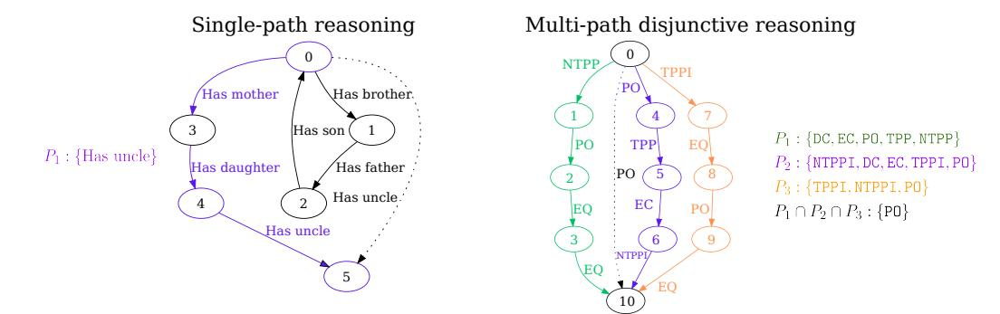
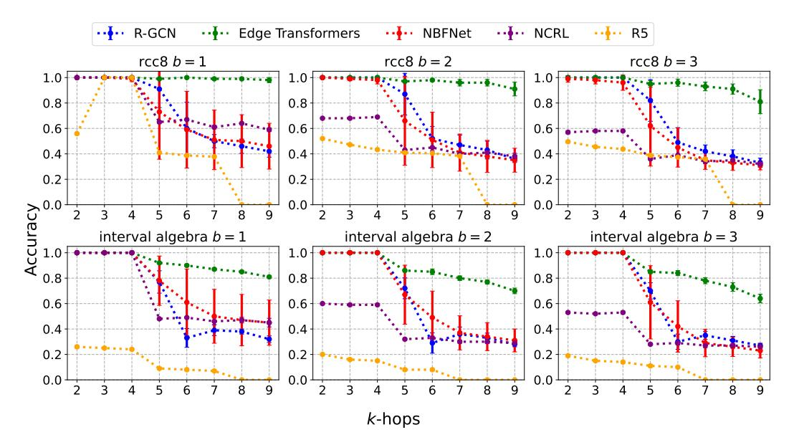
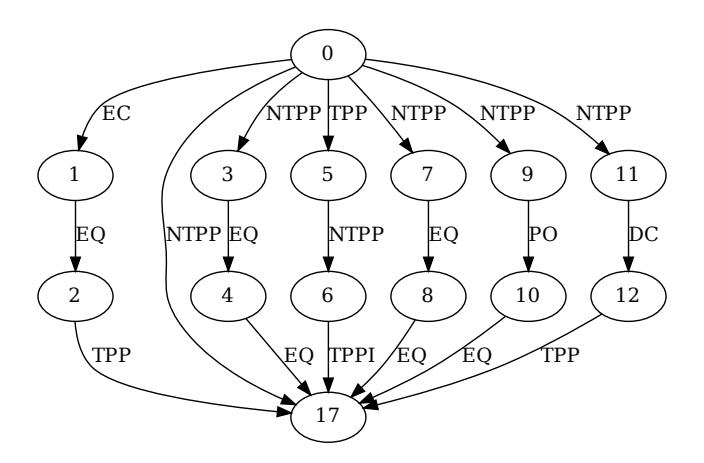
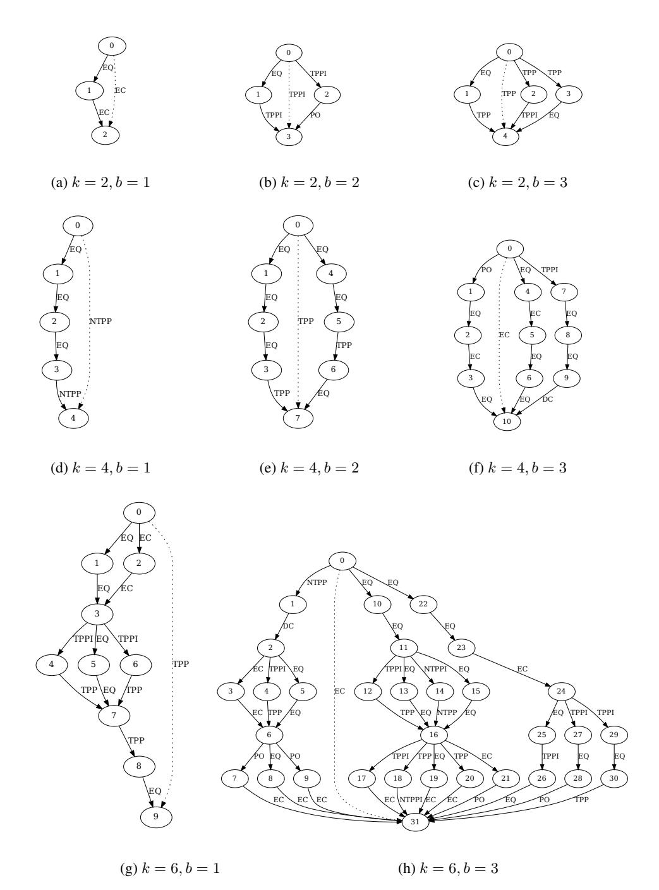
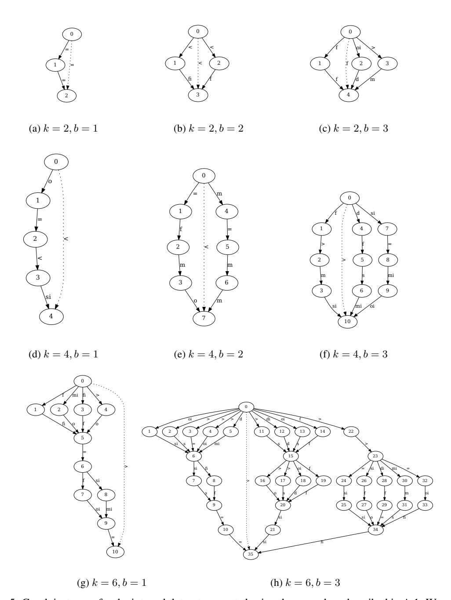

# STaR: Benchmarking Spatio-Temporal Reasoning for Systematic Generalization

#### Irtaza Khalid and Steven Schockaert

School of Computer Science & Informatics Cardiff University, UK {khalidmi,schockaerts1}@cardiff.ac.uk

### **Abstract**

Systematic generalization is the ability of a machine learning model to perform well on a family of test examples that are out-of-distribution with respect to the training examples in a systematic way. To succeed, compositionality of useful information learned from the training data is required. One well-studied problem instance is single path relational reasoning where a model is provided with small relational graphs and is tasked with predicting the relation between a head and target node. Crucially, this task can be solved by identifying a single resolution path between the head and the target and then using rules to sequentially compose relations until a relationship between the head and target node can be inferred. Previous work has shown that graph-based transformers and text-based large language models perform poorly on single path reasoning tasks, while some rule-based and neuro-symbolic methods can solve them with near-perfect accuracy. In this paper, we propose a Spatio-Temporal Reasoning benchmark (STaR) based on classic relational calculi, which generalizes the single path relational reasoning problem to require the aggregation of partial information from multiple paths between the head and target node. Our experiments demonstrate that many state-of-the-art neuro-symbolic, transformer and graph neural network methods perform poorly on STaR. Our code and data are available at https://github.com/erg0dic/gnn-sg

#### 1 Introduction

Systematic generalization (SG) is the ability of a model to solve test instances by composing knowledge that was learned from multiple training instances [8], where the test instances are typically larger than the training instances. Leveraging *compositionality*, i.e., decomposing arbitrarily large problem instances into atomic units, is at the heart of SG and is an essential ingredient for machines and humans to generalize from a limited amount of data [12]. However, many machine learning models, including transformers [23, 7], struggle on SG tasks [10, 11]. This has been attributed to models exploiting statistical artefacts in the training and test data [24] which leads to a significant drop in performance when the generation process of the test instances is altered. Furthermore, large language models have shown impressive reasoning abilities, but this is often due to the presence of similar problem instances in their training data which the model can memorize [9]. When exposed to problems that require some form of generalization of the underlying reasoning principles, their performance also collapses [6, 22], which can lead to surprisingly brittle performance [3].

In this paper, we propose a novel Spatio-Temporal Reasoning benchmark (STaR), which measures the systematic generalization ability of a machine learning model on relational reasoning in two well-known calculi: the Interval Algebra (IA) [1] and RCC-8 [5]. It measures SG along two axes:

1. Number of paths *b*: Each path in a given problem instance provides only partial information. To infer the required relation, information from *b* such paths needs to be aggregated.

Figure 1: Left: A (single) relational path reasoning problem over family relations taken from CLUTRR [20] Right: A multipath reasoning problem over the RCC-8 relations where each path provides partial (disjunctive) information and the target label is obtained by combining information from paths  $P_1$ ,  $P_2$  and  $P_3$ .

2. Path length k. Each path between the head and target node consists of k relations. This means that inferring the information provided by a path requires k-1 inference steps, with each step involving taking the composition of two neighbouring relations.

Our approach generates synthetic test graphs that are computationally efficient to generate. We demonstrate results on STaR for various machine learning architectures and highlight their shortcomings in handling the new generalized relational reasoning setting.

### 2 Related work

Existing benchmarks for systematic relational reasoning like CLUTRR [20], Graphlog [21], Addition [17], SCAN [11] and LEGO [25] primarily vary the difficulty of problem instances with respect to path or sequence length k. These prove challenging for most machine learning models including large language models [26]. Neuro-symbolic methods that are able to learn (differentiable) rules can perform well on these tasks [16, 15, 4], but make strong assumptions, including the fact that the answer can be inferred from a single relational path.

STaR goes further than the aforementioned benchmarks on three fronts: i) the need to go beyond Horn rules (see below (1)) to capture relational compositions; ii) requiring models to aggregate information from multiple relational paths; and iii) the need to deal with novel graph topologies at test time. The contrast between CLUTRR and our RCC-8 dataset is illustrated in Figure 1.

# 3 Systematic Spatio-Temporal Reasoning benchmark

We focus on the problem of reasoning about binary relations. In each problem instance, we assume that a set  $\mathcal F$  of facts is given, referring to a set of relations  $\mathcal R$  and a set of entities  $\mathcal E$ . The set of relations is fixed across problem instances, but the entities are not. Each of the facts is an atom of the form r(a,b), with  $r\in\mathcal R$  and  $a,b\in\mathcal E$ . The problems we consider essentially require models to learn a set of rules  $\mathcal K$ , which they can then use to decide of a given atom r(a,b) can be inferred from the set of facts  $\mathcal F$ . To be successful, models must be capable of composing the learned rules in a systematic way.

## 3.1 Disjunctive rules

The most commonly studied setting concerns Horn rules of the following form  $(n \ge 3)$ :

$$r(X_1, X_n) \leftarrow r_1(X_1, X_2) \wedge \ldots \wedge r_{n-1}(X_{n-1}, X_n)$$
 (1)

where  $X_i$  are variables. This rule uniquely determines the relationship between two entities  $X_1$  and  $X_n$ , given knowledge about the relations that hold between intermediate entities  $X_i$ . In many settings, however, such knowledge might not be sufficient for completely characterising the relationship between  $X_1$  and  $X_n$ . Domain knowledge might then be expressed using disjunctive rules of the

following form:

$$s_1(X_1, X_n) \lor \dots \lor s_k(X_1, X_n) \leftarrow r_1(X_1, X_2) \land \dots \land r_\ell(X_{n-1}, X_n)$$
 (2)

In other words, suppose  $\ell=2$ , if we know that  $r_1(X,Y)$  and  $r_2(Y,Z)$  hold for some entities X,Y,Z, then all we can infer is that one of the relations  $s_1,\ldots,s_k$  must hold between X and Z.

#### 3.2 Relation Calculi

The spatial component of STaR comes from the Region Connection Calculus, RCC-8 [18], which uses eight primitive relations to describe qualitative spatial relationships between regions: ntpp(a, b)means that a is a proper part of the interior of b, tpp(a, b) means that a is a proper part of b and shares a boundary point with b, po(a, b) means that a and b are overlapping (but neither is included in the other), dc(a, b) means that a and b are disjoint, ec(a, b) means that a and b are adjacent (i.e. sharing a boundary point but no interior points), eq(a, b) means that a and b are equal, and ntppi and tppi are the inverses of ntpp and tpp. The RCC-8 semantics is governed by the so-called composition table, which describes the compositions of RCC-8 relations. This is shown in Table 1 in the appendix, where the trivial composition with the identity element eq being itself is dropped. Each entry in this table corresponds to a rule of the form (2), specifying the possible relations that may hold between two regions a and c, when we know the RCC-8 relation that holds between a and some region b as well as the relation that holds between b and c. For instance, the composition of ec and tppi is given by the set  $\{dc, ec\}$ , which means that from  $\{ec(a, b), tppi(b, c)\}$  we can infer  $dc(a, c) \vee ec(a, c)$ . In the table, we write  $\mathcal{R}_8$  to denote that any RCC-8 relation is possible. In addition to these composition rules, reasoning with RCC-8 relies on the fact that the eigh primitive relations are jointly exhaustive and pairwise disjoint, i.e. between any two regions exactly one of the primitive relations holds.

The temporal component of STaR is based on Allen's interval algebra [1]. Similar to RCC-8, the interval algebra uses 13 primitive relations to describe qualitative temporal relationships. The interval algebra captures all possible relationships between two time intervals. These are again binary relations, defined as follows: <(a,b) means that the time interval a strictly precedes the time interval b; d(a,b) means that a occurs during b (and a and b do not share starting or ending times); o(a,b) means that a starts before b and ends during b; m(a,b) means that a ends exactly when a starts; a0 means that a1 starts a2 starts a3 share the starting time and a4 ends before a4 means that a6 finishes a5 a6 means that a6 finishes a7 means that a8 share the finishing time and a8 starts before a9; a9 means that a8 equals a9 means that a9 means that a9 means that a9 means that a9 means that a9 means that a9 means that a9 means that a9 means that a9 means that a9 means that a9 means that a9 means that a9 means that a9 means that a9 means that a9 means that a9 means that a9 means that a9 means that a9 means that a9 means that a9 means that a9 means that a9 means that a9 means that a9 means that a9 means that a9 means that a1 means that a1 means that a2 means that a2 means that a3 means that a4 means that a4 means that a5 means that a5 means that a6 means that a8 means that a8 means that a9 means that a9 means that a9 means that a9 means that a9 means that a9 means that a1 means that a1 means that a2 means that a3 means that a4 means that a4 means that a5 means that a5 means that a6 means that a8 means that a8 means that a9 means that a9 means that a9 means that a9 means that a9 means that a9 means that a9 means that a9 means that a9 means that a9 means that a9 means that a9 means that a9 means that a9 means that a9 mean

#### 3.3 Data Generation

All sampling in the discussion below is uniform random. Each problem instance has to be constructed such that after aggregating the information provided by all the relational paths, we need to be able to infer a a single primitive relation. In other words, problem instances need to be consistent (i.e. the information provided by different paths cannot be conflicting) and together all the paths need to be informative enough to uniquely determine which relation holds between the head and tail entity. This makes brute-force sampling of problem instances prohibitive. Instead, to create a problem instance involving b paths of length k, we first sample a base graph, which has b shorter paths, with a length in {2, 3, 4}. This is done by pre-computing relational compositions for a large number of paths and then selecting b paths whose intersection is a singleton. Then we repeatedly increase the length of the paths by selecting an edge and replacing it by a short path whose composition is equal to the corresponding relation. Finally, to add further diversity to the graph topology, for each of the b paths, we allow 1 edge from the base graph to be replaced by a subgraph (rather than a path), where this subgraph is generated using the same procedure. Note that the final path count b then includes the paths from this subgraph as well. We ensure that all relational paths in a problem instance in the generated dataset do not informationally conflict with each other by using the DPC+ algorithm [14]. It efficiently computes directional path consistency, for the qualitative constraint networks that we can transform our graph instances to. Directional path consistency is sufficient as a test for global path consistency for networks with singleton edge labels [13]. Detailed steps and examples are in Appendix A.1.

Figure 2: STaR results for the RCC-8 and Interval Algebra (accuracy). R5 results for 5+ hops were set to zero since the model took longer than 30 minutes for inference. The best model for all cases is the Edge Transformer, although its performance also significantly decreases after the number of reasoning paths is increased from b=1 to b=3 for path lengths greater than  $k\leq 4$  that are seen during training.

#### 4 Results

We consider the following baselines: the state-of-the-art (SOTA) neuro-symbolic methods on CLUTRR, namely R5, a Monte-Carlo Tree Search based method equipped with a dynamic rule memory [15] and NCRL, a neural compositional rule learner with recurrent attention [4]; the Edge Transformer, which employs a triangular attention on Graph edges; NBFNet [27], a strong knowledge graph completion model; and Relational Graph Convolutional Networks [19]. The performance of these models on STaR is shown in Figure 2. Models are trained on graphs with  $b \in \{1, 2, 3\}$  paths of length  $k \in \{2, 3, 4\}$ . The RCC-8 spatial reasoning task is easier for all models, which could be related to the fact that it has fewer relations than IA (8 as opposed to 13). As can clearly be seen, the need to go beyond single relational paths means that neuro-symbolic methods such as NCRL and R5 perform poorly when going beyond the training distribution (i.e.  $k \ge 5$ ), as could be expected. NBFNet and R-GCNs do not focus on individual relational paths, but they also perform poorly for  $k \ge 5$ . Edge transformers achieve the best results, but their performance also clearly degrades for  $k \ge 5$  especially for IA, and for RCC-8 with b = 3.

# 5 Conclusion

We have proposed a novel benchmark for evaluating the systematic generalization abilities of machine learning models for relational reasoning. The benchmark is based on two well-known relational calculi: RCC-8 and IA. Different from existing benchmarks for systematic generalization, reasoning in the considered settings requires aggregating information from multiple relational paths. We empirically found the benchmark to be challenging for state-of-the-art neuro-symbolic methods, as well as transformer and GNN based methods. We thus believe it can serve as a valuable test-bed for advancing the capabilities of models that are aimed at learning to reason.

**Acknowledgments** This work was supported by the EPSRC grant EP/W003309/1.

## References

- [1] J. F. Allen. Maintaining knowledge about temporal intervals. *Communications of the ACM*, 26(11):832–843, 1983.
- [2] L. Bergen, T. J. O'Donnell, and D. Bahdanau. Systematic generalization with edge transformers. In M. Ranzato, A. Beygelzimer, Y. N. Dauphin, P. Liang, and J. W. Vaughan, editors, Advances in Neural Information Processing Systems 34: Annual Conference on Neural Information Processing Systems 2021, NeurIPS 2021, December 6-14, 2021, virtual, pages 1390–1402, 2021.
- [3] L. Berglund, M. Tong, M. Kaufmann, M. Balesni, A. C. Stickland, T. Korbak, and O. Evans. The reversal curse: Llms trained on" a is b" fail to learn" b is a". *arXiv preprint arXiv:2309.12288*, 2023.
- [4] K. Cheng, N. K. Ahmed, and Y. Sun. Neural compositional rule learning for knowledge graph reasoning. In *The Eleventh International Conference on Learning Representations, ICLR 2023, Kigali, Rwanda, May 1-5, 2023.* OpenReview.net, 2023.
- [5] Z. Cui, A. G. Cohn, and D. A. Randell. Qualitative and topological relationships in spatial databases. In D. J. Abel and B. C. Ooi, editors, *Advances in Spatial Databases, Third International Symposium, SSD'93, Singapore, June 23-25, 1993, Proceedings*, volume 692 of *Lecture Notes in Computer Science*, pages 296–315. Springer, 1993.
- [6] N. Dziri, X. Lu, M. Sclar, X. L. Li, L. Jiang, B. Y. Lin, S. Welleck, P. West, C. Bhagavatula, R. L. Bras, J. D. Hwang, S. Sanyal, X. Ren, A. Ettinger, Z. Harchaoui, and Y. Choi. Faith and fate: Limits of transformers on compositionality. In A. Oh, T. Naumann, A. Globerson, K. Saenko, M. Hardt, and S. Levine, editors, Advances in Neural Information Processing Systems 36: Annual Conference on Neural Information Processing Systems 2023, NeurIPS 2023, New Orleans, LA, USA, December 10 16, 2023, 2023.
- [7] D. Furrer, M. van Zee, N. Scales, and N. Schärli. Compositional generalization in semantic parsing: Pre-training vs. specialized architectures, 2021.
- [8] D. Hupkes, V. Dankers, M. Mul, and E. Bruni. Compositionality decomposed: How do neural networks generalise? *Journal of Artificial Intelligence Research*, 67:757–795, 2020.
- [9] C. Kang and J. Choi. Impact of co-occurrence on factual knowledge of large language models. In H. Bouamor, J. Pino, and K. Bali, editors, *Findings of the Association for Computational Linguistics: EMNLP 2023*, pages 7721–7735, Singapore, Dec. 2023. Association for Computational Linguistics.
- [10] A. Kazemnejad, I. Padhi, K. Natesan Ramamurthy, P. Das, and S. Reddy. The impact of positional encoding on length generalization in transformers. In A. Oh, T. Naumann, A. Globerson, K. Saenko, M. Hardt, and S. Levine, editors, *Advances in Neural Information Processing Systems*, volume 36, pages 24892–24928. Curran Associates, Inc., 2023.
- [11] B. Lake and M. Baroni. Generalization without systematicity: On the compositional skills of sequence-to-sequence recurrent networks. In J. Dy and A. Krause, editors, *Proceedings of the 35th International Conference on Machine Learning*, volume 80 of *Proceedings of Machine Learning Research*, pages 2873–2882. PMLR, 10–15 Jul 2018.
- [12] B. M. Lake, T. D. Ullman, J. B. Tenenbaum, and S. J. Gershman. Building machines that learn and think like people. *Behavioral and brain sciences*, 40:e253, 2017.
- [13] S. Li, Z. Long, W. Liu, M. Duckham, and A. Both. On redundant topological constraints. *Artificial Intelligence*, 225:51–76, 2015.
- [14] Z. Long, M. Sioutis, and S. Li. Efficient path consistency algorithm for large qualitative constraint networks. In IJCAI International Joint Conference on Artificial Intelligence, 2016.
- [15] S. Lu, B. Liu, K. G. Mills, S. Jui, and D. Niu. R5: rule discovery with reinforced and recurrent relational reasoning. In *The Tenth International Conference on Learning Representations, ICLR 2022, Virtual Event, April 25-29*, 2022. OpenReview.net, 2022.
- [16] P. Minervini, S. Riedel, P. Stenetorp, E. Grefenstette, and T. Rocktäschel. Learning reasoning strategies in end-to-end differentiable proving. In *Proceedings of the 37th International Conference on Machine Learning, ICML 2020, 13-18 July 2020, Virtual Event*, volume 119 of *Proceedings of Machine Learning Research*, pages 6938–6949. PMLR, 2020.

- [17] M. Nye, A. J. Andreassen, G. Gur-Ari, H. Michalewski, J. Austin, D. Bieber, D. Dohan, A. Lewkowycz, M. Bosma, D. Luan, C. Sutton, and A. Odena. Show your work: Scratchpads for intermediate computation with language models, 2021.
- [18] D. A. Randell, Z. Cui, and A. G. Cohn. A spatial logic based on regions and connection. In B. Nebel, C. Rich, and W. R. Swartout, editors, *Proceedings of the 3rd International Conference on Principles of Knowledge Representation and Reasoning (KR'92). Cambridge, MA, USA, October 25-29, 1992*, pages 165–176. Morgan Kaufmann, 1992.
- [19] M. S. Schlichtkrull, T. N. Kipf, P. Bloem, R. van den Berg, I. Titov, and M. Welling. Modeling relational data with graph convolutional networks. In A. Gangemi, R. Navigli, M. Vidal, P. Hitzler, R. Troncy, L. Hollink, A. Tordai, and M. Alam, editors, *The Semantic Web - 15th International Conference, ESWC* 2018, Heraklion, Crete, Greece, June 3-7, 2018, Proceedings, volume 10843 of Lecture Notes in Computer Science, pages 593–607. Springer, 2018.
- [20] K. Sinha, S. Sodhani, J. Dong, J. Pineau, and W. L. Hamilton. CLUTRR: A diagnostic benchmark for inductive reasoning from text. In K. Inui, J. Jiang, V. Ng, and X. Wan, editors, *Proceedings of the* 2019 Conference on Empirical Methods in Natural Language Processing and the 9th International Joint Conference on Natural Language Processing, EMNLP-IJCNLP 2019, Hong Kong, China, November 3-7, 2019, pages 4505–4514. Association for Computational Linguistics, 2019.
- [21] K. Sinha, S. Sodhani, J. Pineau, and W. L. Hamilton. Evaluating logical generalization in graph neural networks. *CoRR*, abs/2003.06560, 2020.
- [22] K. Valmeekam, M. Marquez, A. O. Hernandez, S. Sreedharan, and S. Kambhampati. Planbench: An extensible benchmark for evaluating large language models on planning and reasoning about change. In A. Oh, T. Naumann, A. Globerson, K. Saenko, M. Hardt, and S. Levine, editors, Advances in Neural Information Processing Systems 36: Annual Conference on Neural Information Processing Systems 2023, NeurIPS 2023, New Orleans, LA, USA, December 10 16, 2023, 2023.
- [23] A. Vaswani, N. Shazeer, N. Parmar, J. Uszkoreit, L. Jones, A. N. Gomez, L. Kaiser, and I. Polosukhin. Attention is all you need. In I. Guyon, U. von Luxburg, S. Bengio, H. M. Wallach, R. Fergus, S. V. N. Vishwanathan, and R. Garnett, editors, Advances in Neural Information Processing Systems 30: Annual Conference on Neural Information Processing Systems 2017, December 4-9, 2017, Long Beach, CA, USA, pages 5998–6008, 2017.
- [24] H. Zhang, L. H. Li, T. Meng, K. Chang, and G. V. den Broeck. On the paradox of learning to reason from data. In *Proceedings of the Thirty-Second International Joint Conference on Artificial Intelligence, IJCAI* 2023, 19th-25th August 2023, Macao, SAR, China, pages 3365–3373. ijcai.org, 2023.
- [25] Y. Zhang, A. Backurs, S. Bubeck, R. Eldan, S. Gunasekar, and T. Wagner. Unveiling transformers with lego: a synthetic reasoning task, 2023.
- [26] Z. Zhu, Y. Xue, X. Chen, D. Zhou, J. Tang, D. Schuurmans, and H. Dai. Large language models can learn rules, 2024.
- [27] Z. Zhu, Z. Zhang, L. A. C. Xhonneux, and J. Tang. Neural bellman-ford networks: A general graph neural network framework for link prediction. In M. Ranzato, A. Beygelzimer, Y. N. Dauphin, P. Liang, and J. W. Vaughan, editors, Advances in Neural Information Processing Systems 34: Annual Conference on Neural Information Processing Systems 2021, NeurIPS 2021, December 6-14, 2021, virtual, pages 29476–29490, 2021

# A Appendix

### A.1 Detailed data generation information

The spatial reasoning component of the Spatio-Temporal Reasoning (STaR) benchmark is based on Region Connection Calculus (RCC-8) whose generating composition table is given by Table 1 with the 8 regional relations described in the main text. An example from the RCC-8 spatial reasoning graph collection with b=6 paths from the source node 0 to the target node 17. Each path has a length of k=3 where k is the number of hops or edges from the node 0 to node 17. The graph has to be collapsed into the single relation  $\mathsf{ntpp}(0,17)$  using information from all the paths. The data generation process is described in more detail below:

- 1. Sample short paths: Randomly sample  $n=100\,000$  paths of length  $k\in\{2,3,4\}$  and compute their composition. Note that this sampling is done with replacement to avoid uniqueness upper bounds for small graphs.
- 2. **Generate base graphs:** Generate the desired number of *b*-path base graphs, by selecting paths that were generated in step 1. Each individual path typically composes to a set of relations, but the graphs are constructed such that the intersection of these sets, across all *b* paths, produces a singleton target label.
- 3. **Recursive edge expansion:** Randomly pick an edge from a path that does not yet have the required length k. Select a path from step 1 which composes to a singleton, corresponding to the relation that is associated with the chosen edge. Replace the edge with this path.
- 4. **Recursive subgraph expansion:** Rather than replacing an edge with a path, we can also replace it with a subgraph. As candidate subgraphs, we use the base graphs from step 2 with at most  $|\frac{b}{2}|$  paths.
- 5. Keep repeating steps 2 and 3 until we have the desired number paths b with the desired length of k, with the restriction that step 3 is applied at most once to each path from the initial base graph.

The temporal reasoning component is based on the Allen Interval algebra with 13 temporal relations described in the main text. Its composition table is provided in Table 2. Examples illustrating the rich topology of the graphs from the benchmarks for some path count b and path length k are shown in figures 4 and 5.

Table 1: Region Connection Calculus (RCC-8) composition table [5] (excluding eq).

|       | dc ec                      |                              | ро                       | tpp                      | ntpp                              | tppi                         | ntppi                      |  |
|-------|----------------------------|------------------------------|--------------------------|--------------------------|-----------------------------------|------------------------------|----------------------------|--|
|       |                            |                              | F -                      |                          |                                   | -66.                         |                            |  |
| dc    | $\mathcal{R}_8$            | dc, ec, po, tpp, ntpp     | dc, ec, po, tpp, ntpp | dc, ec, po, tpp, ntpp | dc, ec, po, tpp, ntpp          | dc                           | dc                         |  |
| ec    | dc, ec, po, tppi, ntppi | dc, ec, po, tpp, tppi, eq | dc, ec, po, tpp, ntpp | ec, po, tpp, ntpp     | po, tpp, ntpp                     | dc, ec                       | dc                         |  |
| ро    | dc, ec, po, tppi, ntppi | dc, ec, po, tppi, ntppi   | $\mathcal{R}_8$          | po, tpp, ntpp            | po, tpp, ntpp                     | dc, ec, po, tppi, ntppi   | dc, ec, po, tppi, ntppi |  |
| tpp   | dc                         | dc, ec                       | dc, ec, po, tpp, ntpp | tpp, ntpp                | ntpp                              | dc, ec, po, tpp, tppi, eq | dc, ec, po, tppi, ntppi |  |
| ntpp  | dc                         | dc                           | dc, ec, po, tpp, ntpp | ntpp                     | ntpp                              | dc, ec, po, tpp, ntpp     | $\mathcal{R}_8$            |  |
| tppi  | dc, ec, po, tppi, ntppi | ec, po, tppi, ntppi       | po, tppi, ntppi       | po, eq, tpp, tppi     | po, tpp, ntpp                     | tppi, ntppi                  | ntppi                      |  |
| ntppi | dc, ec, po, tppi, ntppi | po, tppi, ntppi           | po, tppi, ntppi       | po, tppi, ntppi       | po, tppi, tpp, ntpp, ntppi, eq | ntppi                        | ntppi                      |  |

Figure 3: An example from the RCC-8 spatial reasoning graph collection.

Table 2: Allen's interval algebra composition table [1] excluding the trivial composition with =.

| Tuble | <                     | >                       | d                                      | di                      | 0                                      | oi                                     | m                     | mi                  | S                     | si                    | f                   | fi                  |
|-------|-----------------------|-------------------------|----------------------------------------|-------------------------|----------------------------------------|----------------------------------------|-----------------------|---------------------|-----------------------|-----------------------|---------------------|---------------------|
| <     | <                     |                         | <, o, m, d, s                    | <                       | <                                      | <, o, m, d, s                    | <                     | <, o, m, d, s | <                     | <                     | <, o, m, d, s | <                   |
| >     |                       | >                       | >, oi, mi, d, f                  | >                       | >, oi, mi, d, f                  | >                                      | >, oi, mi, d, f | >                   | >, oi, mi, d, f | >                     | >                   | >                   |
| d     | <                     | >                       | d                                      |                         | <, o, m, d, s                    | >, oi, mi, d, f                  | <b>\</b>              | ^                   | d                     | >, oi, mi, d, f | d                   | <, o, m, d, s |
| di    | <, o, m, di, fi | >, oi, di, mi, si | o, oi, d, s, f, di, si, fi, = | di                      | o, di, fi                           | oi, di, si                          | o, di, fi          | oi, di, si       | o, di, fi          | di                    | oi, di, si       | di                  |
| 0     | <                     | >, oi, di, mi, si | o, d, s                                | <, o, m, di, fi   | <, o,                                  | o, oi, d, s, f, di, si, fi, = | <                     | oi, di, si       | 0                     | o, di, fi          | o, d, s             | <, o, m          |
| oi    | <, o, m, di, fi | >                       | oi, d,                                 | >, oi, mi, di, si | o, oi, d, di, s, si, f, fi, = | >, oi, mi                           | o, di, fi          | >                   | oi, d,                | oi, >, mi          | oi                  | oi, di, si       |
| m     | <                     | >, oi, di, mi, si | o, d, s                                | <                       | <                                      | o, d, s                                | <                     | f, fi,              | m                     | m                     | d, s, o             | <                   |
| mi    | <, o, m, di, fi | >                       | oi, d, f                            | >                       | oi, d, f                            | >                                      | s, si, =           | ^                   | d, f, oi           | >                     | mi                  | mi                  |
| s     | <                     | >                       | d                                      | <, o, m, di, fi   | <, o, m                             | oi, d, f                            | <                     | mi                  | s                     | s, si, =           | d                   | <, m, o          |
| si    | <, o, m, di, fi | >                       | oi, d, f                            | di                      | o, di, fi                           | oi                                     | o, di, fi          | mi                  | s, si, =           | si                    | oi                  | di                  |
| f     | <                     | >                       | d                                      | >, oi, mi, di, si | o, d, s                                | >, oi, mi                           | m                     | >                   | d                     | >, oi, mi          | f                   | f, fi,              |
| fi    | <                     | >, oi, di, mi, si | o, d, s                                | di                      | 0                                      | oi, di, si                          | m                     | si, oi, di       | 0                     | di                    | f, fi, =         | fi                  |

# A.2 Additional experimental details

We now present further details of the experimental set-up, the dataset statistics and training details.

Figure 4: Some graph instances for the RCC-8 dataset generated using the procedure described in A.1. The graph topology becomes more diverse for the test instances when sub-graphs are embedded within a single path, as shown in (g) for path length k-6 and number of paths b=1. In this particular case, there are two sub-graphs that have been embedded in the graph by replacing two edges. Instances of the type shown in (a), (b), (c), (d), (e), (f) are used in the training set and the graph topology is fixed in this case. The target edge label between the source node and the tail node that needs to be predicted by the model is indicated by the dotted line.

Figure 5: Graph instances for the interval dataset generated using the procedure described in A.1. We highlight the rich variation in the topology of the graph instance for path length k=6 and number of paths b=3 in (h) by contrasting it with a similar graph instance for the RCC-8 dataset shown in Figure 4(h). The target edge label between the source node and the tail node that needs to be predicted by the model is indicated by the dotted line.

## A.2.1 Dataset statistics

**STaR** is the Spatio-Temporal Reasoning benchmark that we introduce in this paper, as described in Section A.1. We release this benchmark under a CC-BY 4.0 license.

Dataset statistics for STaR are reported in table 3. We use a standard 80-20 split for training and validation.

Table 3: Data statistics of the STaR benchmark

| Name  | Training regime                  | No. of relations # Train |        | # Test  | Test regime                                |
|-------|----------------------------------|--------------------------|--------|---------|--------------------------------------------|
| RCC-8 | $b \in \{1,2,3\}, k \in \{2,3\}$ | 8                        | 57,600 | 153,600 | $b \in \{1, 2, 3\}, k \in \{2, \dots, 9\}$ |
| IA    | $b \in \{1,2,3\}, k \in \{2,3\}$ | 13                       | 57,600 | 153,600 | $b \in \{1, 2, 3\}, k \in \{2, \dots, 9\}$ |

#### A.2.2 Baselines

We consider the following neuro-symbolic methods:

- **R5** This model [15] learns symbolic rules of the form  $r(X,Z) \leftarrow r_1(X,Y) \land r_2(Y,Z)$ , with the possibility of using invented predicates in the head. To make a prediction, the method then samples (or enumerates) simple paths between the head and tail entities and iteratively applies the learned rules to reduce these paths to a single relation. The order in which relations are composed is determined by Monte Carlo Tree Search.
- NCRL Neural Compositional Rule Learning [4] also samples relational paths between the head and tail entities, and iteratively reduces them by composing 2 relations at a time, similar to R5. However, in this case, the choice of the two relations to compose in each step are determined by a Recurrent Neural Network. Moreover, rather than learning symbolic rules, the rules are learned implicitly by using an attention mechanism to compose relations. Both R5 and NCRL implicitly make the assumption that the relational reasoning problem is about predicting the target relation from a single relational path, and that this prediction can be done by repeatedly applying Horn rules.

The following transformer [23] variant is also a natural baseline:

ET Edge Transformers [2] modify the transformer architecture by using an attention mechanism that is designed to simulate relational composition. In particular, the embeddings are interpreted as representations of edges in a graph. To update the representation of an edge (a,c) the model selects pairs of edges (a,x),(x,b) and composes their embeddings. These compositions are aggregated using an attention mechanism, similar as in the standard transformer architecture.

We also compare against several GNN models:

- **R-GCN** Relational GCNs [19] are a variant of GCNs in which messages are computed using a relation-specific linear transformation. This is similar in spirit to how we compute messages in our framework, but without the inductive bias that comes from treating embeddings as probability distributions over primitive relation types.
- **NBFNet** Neural Bellman-Ford Networks [27] model the relationship between a designated head entity and the other entities from a given graph. Our model employs essentially the same strategy to use GNNs for relation classification, which is to learn entity embeddings that capture the relationship with the head entity rather than the entities themselves. The main difference between NBFnet and our model comes from the additional inductive bias that our model is adding.

### A.2.3 Training details

All experiments were conducted using a single RTX 4090 NVIDIA GPU with most models finishing training in under 30 minutes, with the exception of R5, which took over 3 hours to train and up to 30 minutes for inference.

**Hyperparameter settings** All models reported in the paper are used with the hyperparameter tuned configurations of the respective authors.