# SyGuS-Comp 2017: Results and Analysis

Rajeev Alur
University of Pennsylvania

Dana Fisman
Ben-Gurion University

Rishabh Singh Microsoft Research, Redmond

Armando Solar-Lezama

Massachusetts Institute of Technology

Syntax-Guided Synthesis (SyGuS) is the computational problem of finding an implementation f that meets both a semantic constraint given by a logical formula  $\varphi$  in a background theory T, and a syntactic constraint given by a grammar G, which specifies the allowed set of candidate implementations. Such a synthesis problem can be formally defined in SyGuS-IF, a language that is built on top of SMT-LIB.

The Syntax-Guided Synthesis Competition (SyGuS-Comp) is an effort to facilitate, bring together and accelerate research and development of efficient solvers for SyGuS by providing a platform for evaluating different synthesis techniques on a comprehensive set of benchmarks. In this year's competition six new solvers competed on over 1500 benchmarks. This paper presents and analyses the results of SyGuS-Comp'17.

### 1 Introduction

The Syntax-Guided Synthesis Competition (SyGuS-Comp) is an annual competition aimed to provide an objective platform for comparing different approaches for solving the Syntax-Guided Synthesis (SyGuS) problem. A SyGuS problem takes as input a logical specification  $\varphi$  for what a synthesized function f should compute, and a grammar G providing syntactic restrictions on the function f to be synthesized. Formally, a solution to a SyGuS instance  $(\varphi, G, f)$  is a function  $f_{imp}$  that is expressible in the grammar G such that the formula  $\varphi[f/f_{imp}]$  obtained by replacing f by  $f_{imp}$  in the logical specification  $\varphi$  is valid. SyGuS instances are formulated in SyGuS-IF [12], a format built on top of SMT-LIB2 [5].

We report here on the 4th SyGuS competition that took place in July 2017, in Heidelberg, Germany as a satellite event of CAV'17 (The 29th International Conference on Computer Aided Verification) and SYNT'17 (The Sixth Workshop on Synthesis). As in the previous competition there were four tracks: the general track, the conditional linear integer arithmetic track, the invariant synthesis track, and the programming by examples track. We assume most readers of this report are already familiar with the SyGuS problem and the tracks of SyGuS-Comp and thus refer the unfamiliar reader to the report on last year's competition [3].

The report is organized as follows. Section 2 describes the participating benchmarks. Section 3 lists the participating solvers, and briefly describes the main idea behind their strategy. Section 4 provides details on the experimental setup. Section 5 gives an overview of the results per track. Section 6 provides details on the results, given from a single benchmark respective. Section 7 concludes.

# 2 Participating Benchmarks

In addition to last year's benchmarks, we received 4 new sets of benchmarks this year, which are shown in Table 1.

**Program Repair** The 18 program repair benchmarks correspond to the task of generating small expression repairs that are consistent with a given set of input-output examples [8]. These benchmarks were extracted from real-world Java bugs by manually analyzing the developer commits that involved changes to fewer than 5 lines of code. The key idea of the program repair approach is to the first localize the fault location in a buggy program and generate the corresponding input-output example behavior for the buggy expression from passing test cases. In the second phase, the task of repairing the buggy expression can be framed as a SyGuS problem, where the goal is to synthesize an expression that comes from a family of expressions defined using a context-free grammar of expressions and that satisfies the input-output example constraints.

**Crypto Circuits** The Crypto Circuits benchmarks comprise of tasks of synthesizing constant-time circuits that are cryptographically resilient to timing attacks [6]. Consider a circuit C with a set of *private* inputs  $I_0$  and a set of *public* inputs  $I_1$  such that if an attacker changes the values of the public inputs and observes the corresponding output, she is unable to infer the values of the private inputs (under standard assumptions about computational resources in cryptography). An attacker can gain information about private inputs by analyzing the time the circuit takes to compute the output values on public inputs, e.g. when a public input bit changes from 1 to 0, a specific output bit is guaranteed to change from 1 to 0 independent of whether a particular private input bit is 0 or 1, but may change faster when this private input is 0, thus leaking information. The timing attack can be prevented if the circuit satisfies the *constant-time* property: A constant-time circuit is the one in which the length of all input-to-output paths measured in terms of number of gates are the same.

The problem of synthesizing a new circuit C' that is functionally equivalent to a given circuit C such that C' is a constant-time circuit can be formalized as a SyGuS problem. A context-free grammar can be used to define the set of all constant-time circuits with all input-to-output path lengths within a given bound, and the functional equivalence constraint can be expressed as a Boolean formula [6].

**Instruction Selection** The Instruction Selection benchmarks consist of tasks for synthesizing a "Bit Test and Reset" instruction from the set of basic bitvector operations, in a way similar to the implementations supported by the x86 processors. These benchmarks comprise of 4 different addressing variants with increasing levels of complexity:

- btr\*: Read from register.
- btr-am-base\*: Load from memory address base.
- btr-am-base-index\*: Load from memory address base with indexing.
- btr-am-base-index-scale-disp\*: Load from memory address base with index shifted with scale.

**Invariant Generation** The invariant generation benchmarks comprise of the task of generating a loop invariant (as a conditional linear arithmetic expression) given the pre-condition, post-condition and the transition function corresponding to the loop body. The 7 new benchmarks [10] correspond to loop invariant tasks adapted from several recent invariant inference papers including generating path invariants, abductive inference, and NECLA Static analysis benchmarks.

| Benchmark         | Set # of bence | hmarks | Contributors                                                   |
|-------------------|----------------|--------|----------------------------------------------------------------|
| Invariant Genera  | tion 7         |        | Saswat Padhi (UCLA)                                            |
| Program Re        | pair 18        |        | Xuan Bach D Le (SMU), David Lo (SMU) and Claire Le Goues (CMU) |
| Crypto Circ       | uits 214       | 4      | Chao Wang (USC)                                                |
| Instruction Selec | tion 28        |        | Sebastian Buchwald (KIT) and Andreas Fried (KIT)               |

Table 1: New Contributed Benchmarks

## **3 Participating Solvers**

Six solvers were submitted to this year's competition. EUSOLVER2017, an improved version of EUSOLVER; CVC42017, an improved version of CVC4; EUPHONY, a solver built on top of EUSOLVER; DRYADSYNTH, a solver specialized for conditional linear integer arithmetic; LOOPINVGEN, a solver specialized for invariant generation problems; and E3SOLVER, a solver specialized for the bitvector category of the PBE track, built on top of the enumerative solver. Table 2 lists the submitted solvers together with their authors, and Table 3 summarizes which solver participated in which track.

The EUSOLVER2017 is based on the divide and conquer strategy [2]. The idea is to find different expressions that work correctly for different subsets of the input space, and unify them into a solution that works well for the entire space of inputs. The sub-expressions are typically found using enumeration techniques and are then unified into the overall expression using machine learning methods for decision trees [4].

The CVC42017 solver is based on an approach for program synthesis that is implemented inside an SMT solver [13]. This approach extracts solution functions from unsatisfiability proofs of the negated form of synthesis conjectures, and uses counterexample-guided techniques for quantifier instantiation (CEGQI) that make finding such proofs practically feasible. CVC42017 also combines enumerative techniques, and symmetry breaking techniques [14].

The EUPHONY solver leverages statistical program models to accelerate the EUSOLVER. The underlying statistical model is called probabilistic higher-order grammar (PHOG), a generalization of probabilistic context-free grammars (PCFGs). The idea is to use existing benchmarks and the synthesized results to learn a weighted grammar, and give priority to candidates which are more likely according to the learned weighted grammar.

The DRYADSYNTH solver combines enumerative and symbolic techniques. It considers benchmarks in conditional linear integer arithmetic theory (LIA), and can therefore assume all have a solution in some pre-defined decision tree normal form. It then tries to first get the correct height of a normal form decision tree, and then tries to synthesize a solution of that height. It makes use of parallelization, using as many cores as are available, and of optimizations based on solutions of typical LIA SyGuS problems.

|                          | Authors                                                                                                                                                                                                                                                                                                                                |
|--------------------------|----------------------------------------------------------------------------------------------------------------------------------------------------------------------------------------------------------------------------------------------------------------------------------------------------------------------------------------|
| EUSOLVER 2017 | Arjun Radhakrishna (Microsoft) and Abhishek Udupa (Microsoft) Andrew Reynolds (Univ. Of Iowa), Cesare Tinelli (Univ. of Iowa), and Clark Barrett (Stanford) Woosuk Lee (Penn), Arjun Radhakrishna (Microsft) and Abhishek Udupa (Microsoft) Kangjing Huang (Purdue Univ.), Xiaokang Qiu (Purdue Univ.), and Yanjun Wang (Purdue Univ.) |
| CVC4 2017     | Andrew Reynolds (Univ. Of Iowa), Cesare Tinelli (Univ. of Iowa), and Clark Barrett (Stanford)                                                                                                                                                                                                                                          |
| EUPHONY                  | Woosuk Lee (Penn), Arjun Radhakrishna (Microsft) and Abhishek Udupa (Microsoft)                                                                                                                                                                                                                                                        |
| DRYADSYNTH               | Kangjing Huang (Purdue Univ.), Xiaokang Qiu (Purdue Univ.), and Yanjun Wang (Purdue Univ.)                                                                                                                                                                                                                                             |
| LoopInvGen               | Saswat Padhi (UCLA) and Todd Millstein (UCLA)                                                                                                                                                                                                                                                                                          |
| E3SOLVER                 | Saswat Padhi (UCLA) and Todd Millstein (UCLA) Ammar Ben Khadra (University of Kaiserslautern)                                                                                                                                                                                                                                          |

Table 2: Submitted Solvers

|             | Solvers                  |                      |         |            |            |          |  |  |  |
|-------------|--------------------------|----------------------|---------|------------|------------|----------|--|--|--|
| Tracks      | EUSOLVER 2017 | CVC4 2017 | EUPHONY | DRYADSYNTH | LOOPINVGEN | E3SOLVER |  |  |  |
| LIA         | 1                        | 1                    | 1       | 1          | 0          | 0        |  |  |  |
| INV         | 1                        | 1                    | 1       | 1          | 1          | 0        |  |  |  |
| General     | 1                        | 1                    | 1       | 0          | 0          | 0        |  |  |  |
| PBE Strings | 1                        | 1                    | 1       | 0          | 0          | 0        |  |  |  |
| PBE BV      | 1                        | 1                    | 1       | 0          | 0          | 1        |  |  |  |

Table 3: Solvers participating in each track

The LOOPINVGEN solver [10] for invariant synthesis extends the data-driven approach to inferring sufficient loop invariants from a collection of program states [11]. Previous approaches to invariant synthesis were restricted to using a fixed set, or a fixed template for features, e.g., ICE-DT [9, 7] requires the shape of constraints (such as octagonal) to be fixed apriori. Instead LOOPINVGEN starts with no initial features, and automatically grows the feature set as necessary using program synthesis techniques. It reduces the problem of loop invariant inference to a series of precondition inference problems and uses a Counterexample-Guided Inductive Synthesis (CEGIS) loop to revise the current candidate.

The E3SOLVER solver for PBE bitvector programs, is built on top of the enumerative solver [1, 16]. It improves on the original ENUMERATIVE solver by applying unification techniques [2] and avoiding calling an SMT solver, since on PBE tracks there are no semantic constraints other than the input-to-output examples which can be checked without invoking an SMT solver.

# 4 Experimental Setup

The solvers were run on the StarExec platform [15] with a dedicated cluster of 12 nodes, where each node consisted of two 4-core 2.4GHz Intel processors with 256GB RAM and a 1TB hard drive. The memory usage limit of each solver run was set to 128GB. The wallclock time limit was set to 3600 seconds (thus, a solver that used all cores could consume at most 14400 seconds cpu time). The solutions that the solvers produce are being checked for both syntactic and semantic correctness. That is, a first post-processor checks that the produced expression adheres to the grammar specified in the given benchmark, and if this check passes, a second post-processor checks that the solution adheres to semantic constraints given in the benchmark (by invoking an SMT solver).

#### **5** Results Overview

The combined results for all tracks are given in Figure 1. The figure shows the sum of benchmarks solved by the solvers for each track. We can observe that the EUSOLVER2017 solved the highest number of benchmarks in the combined tracks, and the EUPHONY solver and the CVC42017 solver solved almost as many.

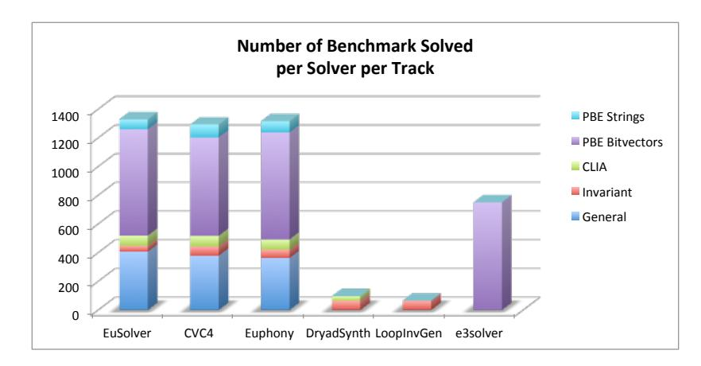

Figure 1: The overall combined results for each solver on benchmarks from all five tracks.

The primary criterion for winning a track was the number of benchmarks solved, but we also analyzed the time to solve and the size of the generated expressions. Both where classified using a pseudo-logarithmic scale as follows. For time to solve the scale is [0,1), [1,3), [3,10), [10,30), [30, 100), [100,300), [300, 1000), [1000,3600), >3600. That is the first "bucket" refers to termination in less than one second, the second to termination in one to three second and so on. We say that a solver solved a certain benchmark *among the fastest* if the time it took to solve that benchmark was on the same bucket as that of the solver who solved that benchmark the fastest. For the expression sizes the pseudo-logarithmic scale we use is [1,10), [10,30), [30,100), [100,300), [300,1000), >1000 where expression size is the number of nodes in the SyGuS parse-tree. In some tracks there was a tie or almost a tie in terms of the number of solved benchmarks, but the differences in the time to solve where significant. We also report on the number of benchmarks *solved uniquely* by a solver (meaning the number of benchmark that solver was the single solver that managed to solve them).

Figure 2 shows the percentage of benchmarks solved by each of the solvers in each of the tracks (in the upper part) and the number of benchmarks solved among the fastest by each of the solvers in each of the tracks (in the lower part) and the number of benchmarks solved among the fastest.

**General Track** In the general track the EUSOLVER2017 solved more benchmarks than all others (407), the CVC42017 came second, solving 378 benchmarks, and EUPHONY came third, solving 362 benchmarks. The same order appears in the number of benchmarks solved among the fastest: EUSOLVER2017 with 276, CVC42017 with 236, and EUPHONY with 135. In terms of benchmarks solved uniquely by a solver, we have that EUSOLVER2017 solved 34 uniquely, CVC42017 solved 9 uniquely, and EUPHONY solved 2 uniquely.

We partition the benchmarks of the general track according to categories where different categories consists of related benchmarks. The results per category are given in the Table 4. We can see that EUSOLVER2017 preformed better than others in the categories of program repair, icfp and cryptographic circuits. The CVC42017 solver preformed better than others in the categories of let and motion planning, invariant generation with bounded and unbounded integers, arrays, integers and hacker's delight. The EUPHONY solver preformed better than others in the categories of multiple functions, compiler optimizations and bitvectors. We can also observe that none of the solvers could solve any of the instruction selection benchmarks.

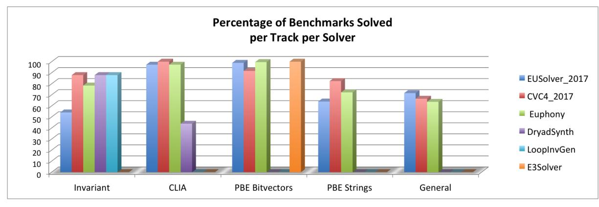

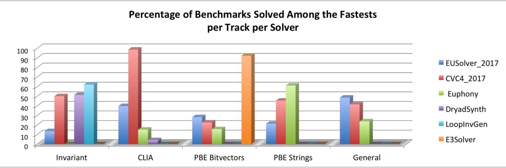

Figure 2: Percentage of benchmarks solved by the different solvers across all tracks, and the percentage of benchmarks a solver solved among the fastest for that benchmarks (according to the logarithmic scale)

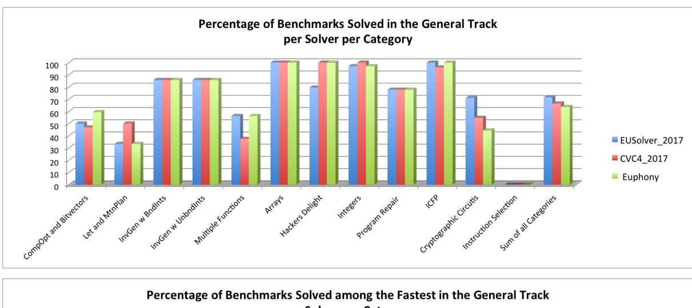

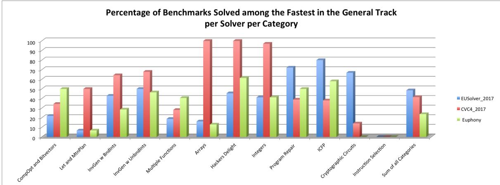

Figure 3: Percentage of benchmarks solved by the different solvers across all categories of the general track, and the percentage of benchmarks a solver solved among the fastest for that benchmark (according to the logarithmic scale).

|                      |                          | Compiler Optimizations and Bit Vectors | Let and Motion Planning | Invariant Generation with Bounded Ints | Invariant Generation with Unbounded Ints | Multiple Functions | Arrays | Hackers Delight | Integers | Program Repair | ICFP | Cryptographic Circuits | Instruction Selection | Total |
|----------------------|--------------------------|----------------------------------------|-------------------------|----------------------------------------|------------------------------------------|--------------------|--------|-----------------|----------|----------------|------|------------------------|-----------------------|-------|
| Number of benchmarks |                          | 32                                     | 30                      | 28                                     | 28                                       | 32                 | 31     | 44              | 34       | 18             | 50   | 214                    | 28                    | 569   |
| Solved               | EUSolver 2017 | 16                                     | 10                      | 24                                     | 24                                       | 18                 | 31     | 35              | 33       | 14             | 50   | 152                    | 0                     | 407   |
|                      | CVC4 2017     | 15                                     | 15                      | 24                                     | 24                                       | 12                 | 31     | 44              | 34       | 14             | 48   | 117                    | 0                     | 378   |
|                      | EUPHONY                  | 19                                     | 10                      | 24                                     | 24                                       | 18                 | 31     | 44              | 33       | 14             | 50   | 95                     | 0                     | 362   |
| Fastest              | EUSOLVER 2017 | 7                                      | 2                       | 12                                     | 14                                       | 6                  | 5      | 20              | 14       | 13             | 40   | 143                    | 0                     | 276   |
|                      | CVC4 2017     | 11                                     | 15                      | 18                                     | 19                                       | 9                  | 31     | 44              | 33       | 7              | 19   | 30                     | 0                     | 236   |
|                      | EUPHONY                  | 16                                     | 2                       | 8                                      | 13                                       | 13                 | 4      | 27              | 14       | 9              | 29   | 0                      | 0                     | 135   |
| Uniquely             | EUSOLVER 2017 | 0                                      | 0                       | 0                                      | 0                                        | 0                  | 0      | 0               | 0        | 0              | 0    | 34                     | 0                     | 34    |
|                      | CVC4 2017     | 1                                      | 5                       | 0                                      | 0                                        | 1                  | 0      | 0               | 1        | 1              | 0    | 0                      | 0                     | 9     |
|                      | EUPHONY                  | 2                                      | 0                       | 0                                      | 0                                        | 0                  | 0      | 0               | 0        | 0              | 0    | 0                      | 0                     | 2     |

Table 4: Solvers performance across all categories of the general track

**Conditional Linear Arithmetic Track** In the CLIA track the CVC42017 solved all 73 benchmarks, EUPHONY and EUSOLVER2017 solved 71 benchmarks, and DRYADSYNTH solved 32 benchmarks. The CVC42017 solver solved 72 benchmarks among the fastest, followed by EUSOLVER2017 which solved 29 among the fastest, EUPHONY which solved 11 among the fastest, and DRYADSYNTH which solved 3 among the fastest. None of the benchmarks where solved uniquely.

**Invariant Generation Track** In the invariant generation track, both the LOOPINVGEN solver and the CVC42017 solver solved 65 out of 74 benchmarks, the DRYADSYNTH solver solved 64 benchmarks, the Euphony solver solved 48 benchmarks and EUSolver solved 40 benchmarks. In terms of the time to solve the differences where more significant. The LOOPINVGEN solver solved 54 benchmarks among the fastest, followed by CVC42017 which solved 38 among the fastest, and DRYADSYNTH which solved 36 among the fastest. There was one benchmark that only one solver solved, this is the hola07.sl benchmark, and the solver is LOOPINVGEN.

**Programming By Example BV Track** In the PBE track using BV theory, the E3SOLVER solver solved all 750 benchmarks, EUPHONY solved 747 benchmarks, EUSOLVER2017 solved 242, benchmarks, and CVC42017 solved 687 benchmarks. The E3SOLVER solver solved 692 among the fastest, EUSOLVER2017 solved 211 among the fastest, CVC42017 solved 169 among the fastest, and EUPHONY solved 117 among the fastest. Three benchmarks where solved uniquely by E3SOLVER, these are: 13\_1000.sl, 40\_-1000.sl and 89\_1000.sl.

**Programming By Example Strings Track** In the PBE track using SLIA theory, the CVC42017 solved 89 out of 108 benchmarks, EUPHONY solved 78, and EUSOLVER2017 solved 69. The EUPHONY solver solved 66 benchmarks among the fastest, CVC42017 solved 49 among the fastest and EUSOLVER2017 solved 23 among the fastest. Nine benchmarks where solved by only one solver, which is CVC42017.

### 6 Detailed Results

In the following section we show the results of the competition from the benchmark's perspective. For a given benchmark we would like to know: how many solvers solved it, what is the min and max time to solve, what are the min and max size of the expressions produced, which solver solved the benchmark the fastest, and which solver produced the smallest expression.

We represents the results per benchmark in groups organized per tracks and categories. For instance, Fig. 8 at the top presents details of the program repair benchmarks. The black bars show the range of the time to solve among the different solvers in pseudo logarithmic scale (as indicated on the upper part of the y-axis). Inspect for instance benchmark  $t_2.sl$ . The black bar indicates that the fastest solver to solve it used less than 1 second, and the slowest used between 100 to 300 seconds. The black number above the black bar indicates the exact number of seconds (floor-rounded to the nearest second) it took the slowest solver to solve a benchmark (and  $\infty$  if at least one solver exceeded the time bound). Thus, we can see that the slowest solver to solve  $t_2.sl$  took 141 seconds to solve it. The white number at the lower part of the bar indicates the time of the fastest solver to solve that benchmark. Thus, we can see that the fastest solver to solve  $t_2.sl$  required less than 1 second to do so. The colored squares/rectangles next to the lower part of the black bar, indicate which solvers were the fastest to solve that benchmark (according to the solvers' legend at the top). Here, *fastest* means in the same logarithmic scale as the absolute fastest solver. For instance, we can see that EUPHONY and EUSOLVER2017 were the fastest to solve  $t_2.sl$ , solving it in less than a second and that among the 2 solvers that solved  $t_3.sl$  only EUSOLVER2017 solved it in less than 1 seconds.

Similarly, the gray bars indicate the range of expression sizes in pseudo logarithmic scales (as indicated on the lower part of the y-axis), where the size of an expression is determined by the number of nodes in its parse tree. The black number at the bottom of the gray bar indicates the exact size expression of the largest solution (or ∞ if it exceeded 1000), and the white number at the top of the gray bar indicates the exact size expression of the smallest solution (when the smallest and largest size of expressions are in the same logarithmic bucket (as is the case in t\_2.sl), we provide only the largest expression size, thus there is no white number on the gray bar). The colored squares/rectangles next to the upper part of the gray bar indicates which solvers (according to the legend) produced the smallest expression (where smallest means in the same logarithmic scale as the absolute smallest expression). For instance, for t\_-20.sl the smallest expression produced had size 3, and 2 solvers out of the 3 who solved it managed to produce an expression of size less than 10.

Finally, at the top of the figure above each benchmark there is a number indicating the number of solvers that solved that benchmark. For instance, one solver solved t\_14.sl, two solvers solved t\_-12.sl, three solvers solved t\_2.sl, and no solver solved t\_6.sl. Note that the reason t\_6.sl has 2 as the upper time bound, is that that is the time to terminate rather than the time to solve. Thus, all solvers aborted within less than 2 seconds, but either they did not produce a result, or they produced an incorrect result. When no solver produced a correct result, there are no colored squares/rectangles next to the lower parts of the bars, as is the case for t\_6.sl.

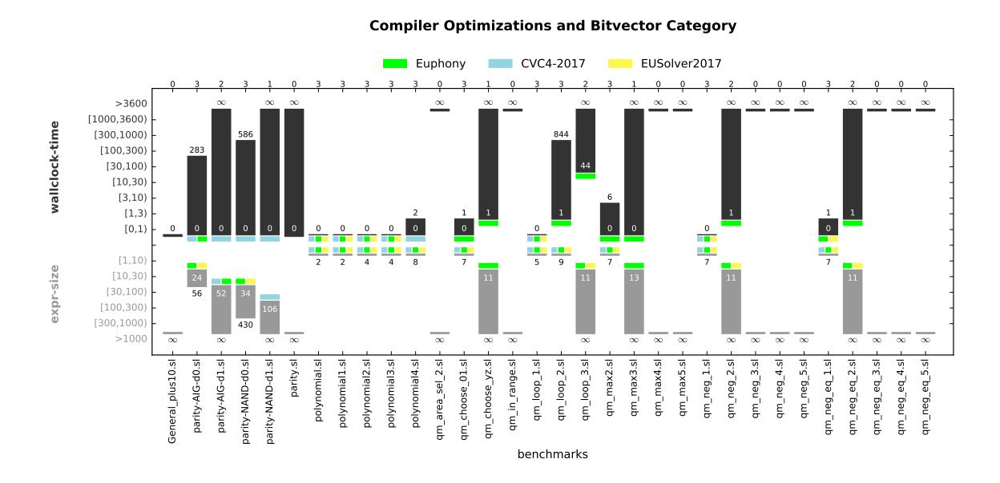

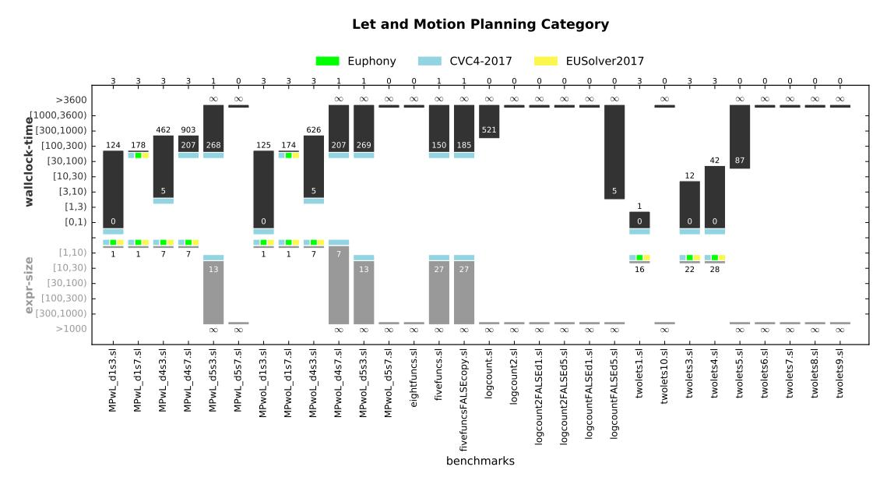

Figure 4: Evaluation of Compiler Optimizations, Bitvectors, Let and Motion Planning Categories of the General Track.

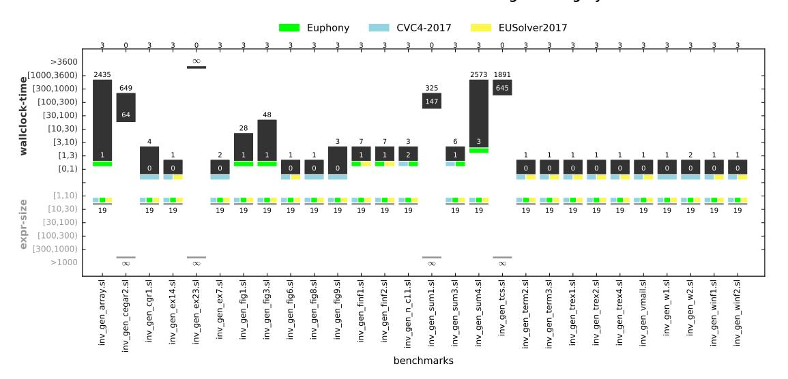

#### **Invariant Generation with Unbounded Integers Category**

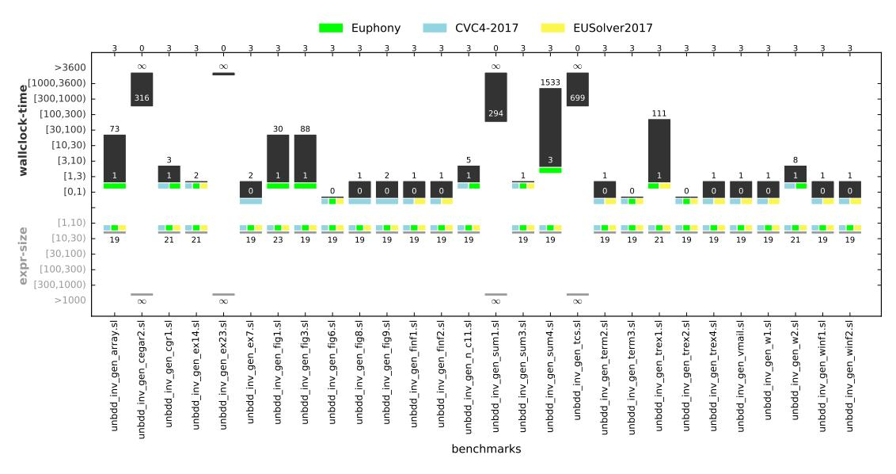

Figure 5: Evaluation of Invariant Category of the General Track.

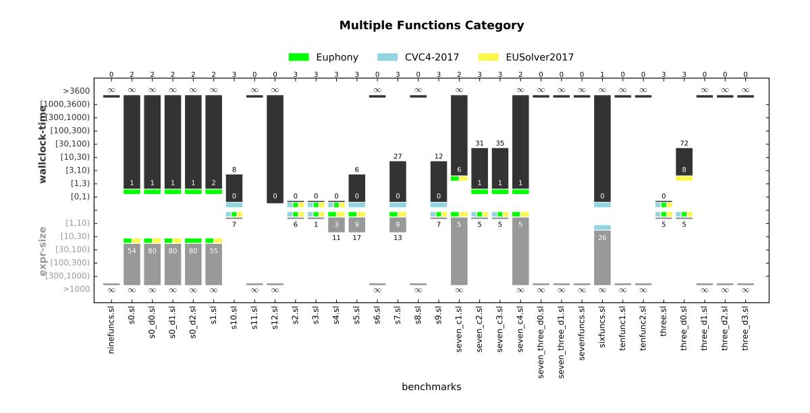

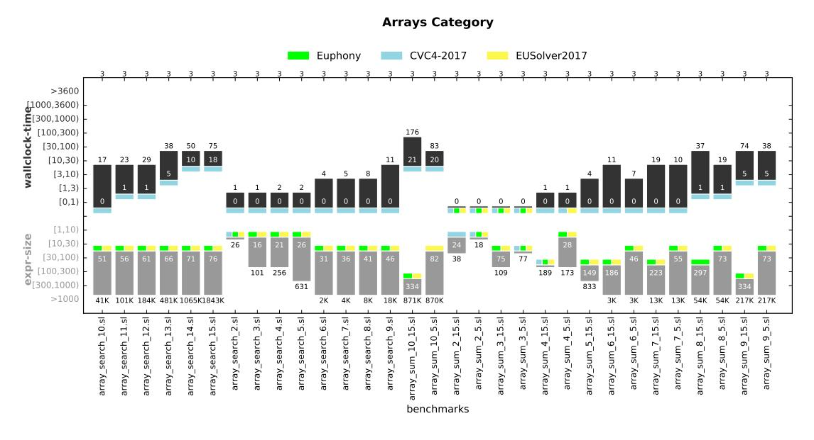

Figure 6: Evaluation of Multiple Functions and Arrays Categories of the General Track.

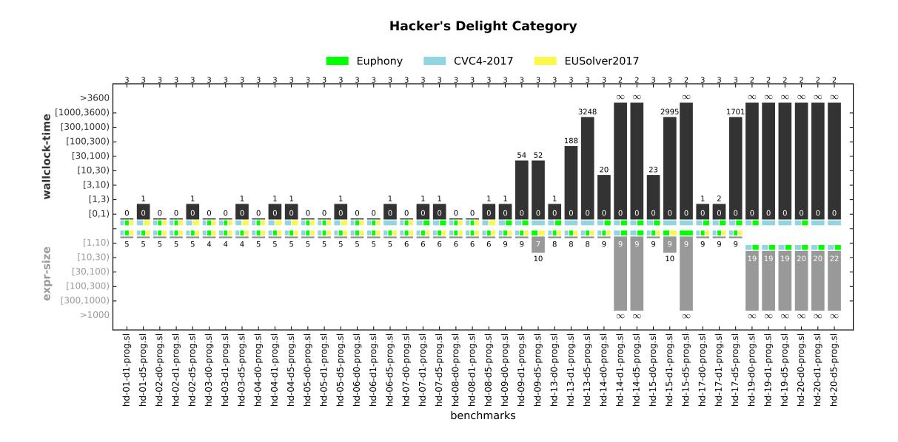

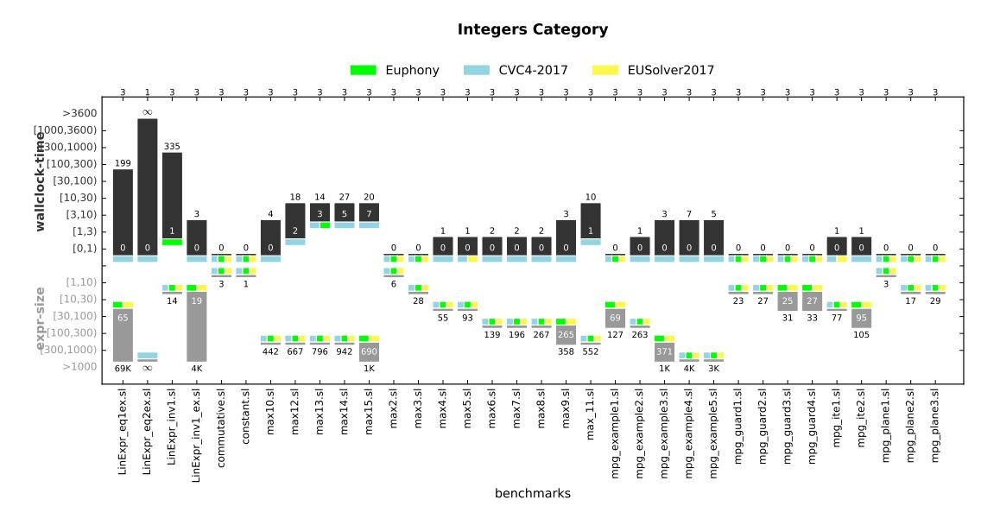

Figure 7: Evaluation of Hacker's Delight and Integers Categories of the General Track.

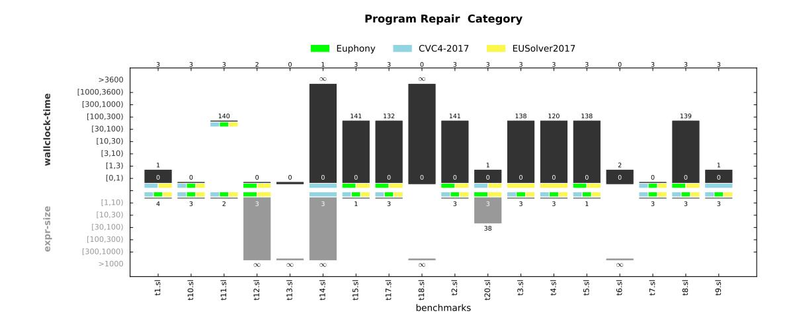

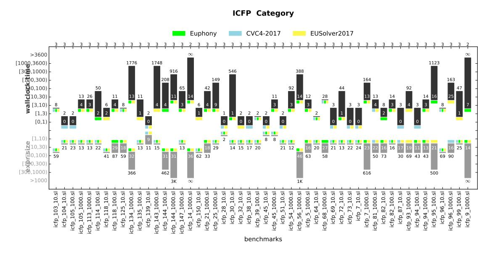

Figure 8: Evaluation of Program Repair and ICFP Categories of the General Track.

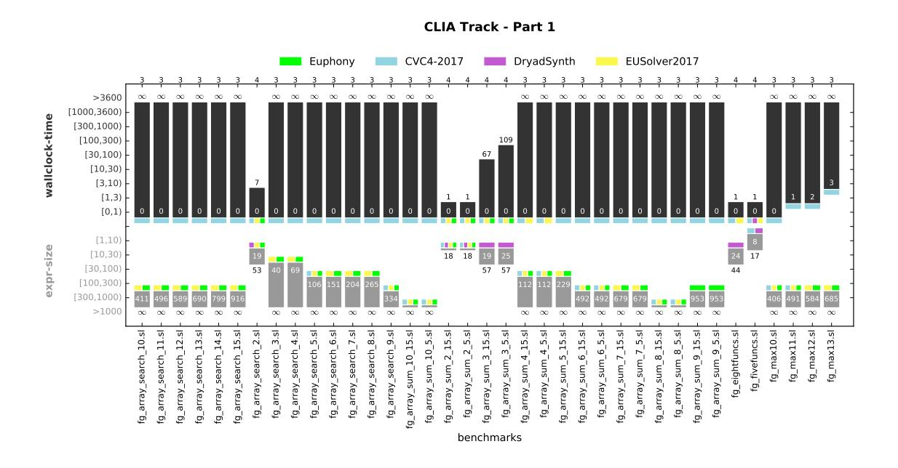

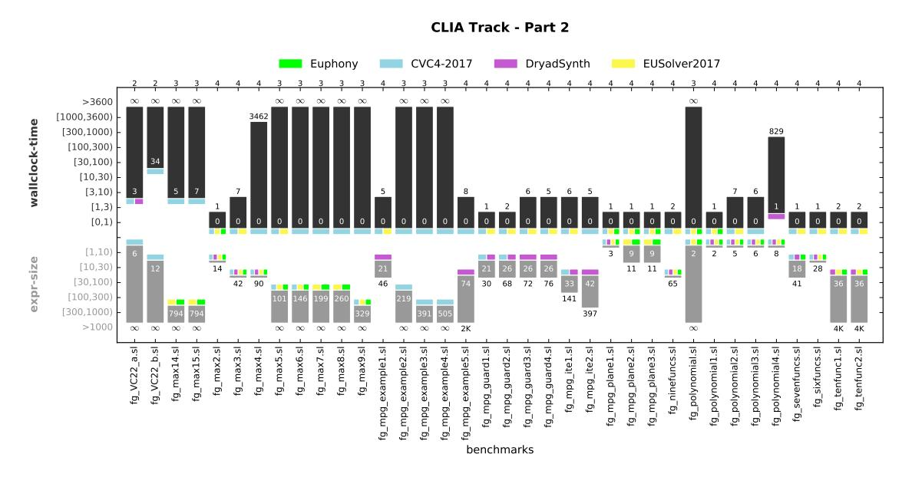

Figure 9: Evaluation of CLIA track benchmarks.

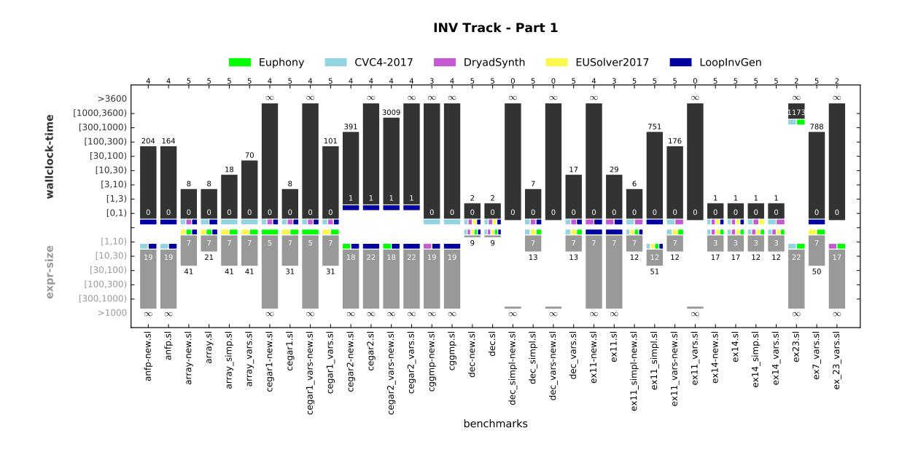

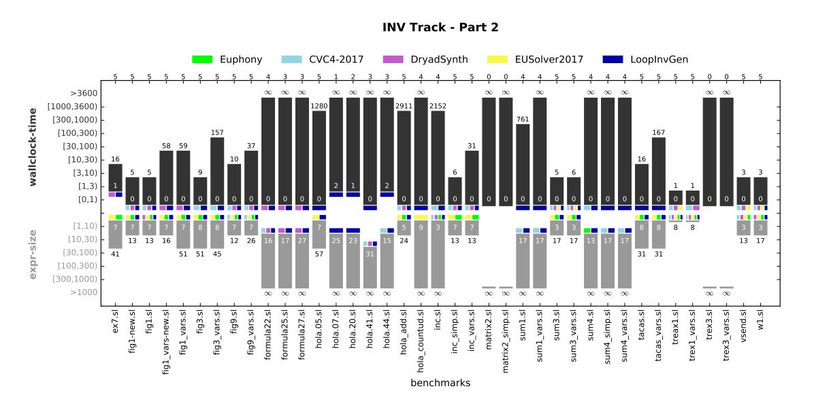

Figure 10: Evaluation of Invariant track benchmarks.

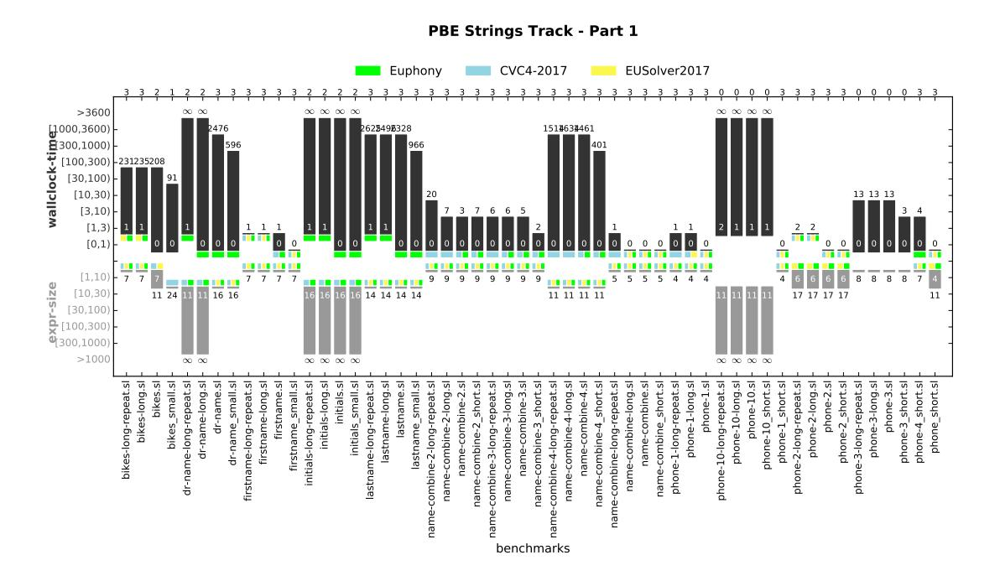

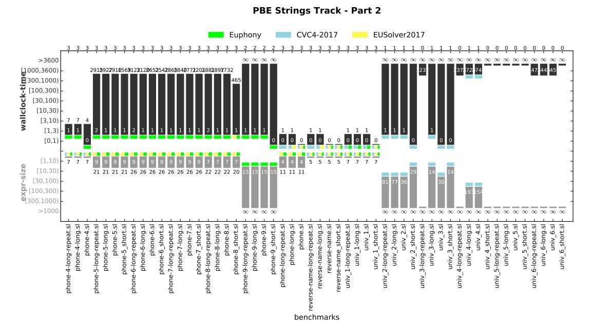

Figure 11: Evaluation of PBE Strings track benchmarks.

## 7 Summary

This year's competition consisted of over 1500 benchmarks, 250 of which where contributed this year. Six solvers competed this year, out of which four by developers submitting a tool for SyGuS-Comp for the first time. All tools preformed remarkably, on both existing and new benchmarks. In particular, 65% of the new benchmarks were solved.

An impressive progress was shown this year in solving the strings benchmarks of the programing by example track. Analyzing the features of benchmarks that are still hard to solve, we see that these include those with either (i) multiple functions to synthesize or (ii) where the specification invokes the functions with different parameters or (iii) those that use the *let* expression for specifying auxiliary variables, or (iv) the grammar is very general consisting of much more operators than needed, or (v) the specification is partial in the sense that the domain of semantic solutions is not a singleton.

### References

- [1] Rajeev Alur, Rastislav Bodík, Garvit Juniwal, Milo M. K. Martin, Mukund Raghothaman, Sanjit A. Seshia, Rishabh Singh, Armando Solar-Lezama, Emina Torlak & Abhishek Udupa (2013): *Syntax-guided synthesis*. In: *Formal Methods in Computer-Aided Design, FMCAD 2013, Portland, OR, USA, October 20-23, 2013*, pp. 1–8.
- [2] Rajeev Alur, Pavol Cerný & Arjun Radhakrishna (2015): *Synthesis Through Unification*. In: Computer Aided Verification 27th International Conference, CAV 2015, San Francisco, CA, USA, July 18-24, 2015, Proceedings, Part II, pp. 163–179, doi:10.1007/978-3-319-21668-3\_10.
- [3] Rajeev Alur, Dana Fisman, Rishabh Singh & Armando Solar-Lezama (2015): *Results and Analysis of SyGuS-Comp'15*. In: SYNT, EPTCS, pp. 3–26, doi:10.4204/EPTCS.202.3.
- [4] Rajeev Alur, Arjun Radhakrishna & Abhishek Udupa (2017): Scaling Enumerative Program Synthesis via Divide and Conquer. In: Tools and Algorithms for the Construction and Analysis of Systems 23rd International Conference, TACAS 2017, Held as Part of the European Joint Conferences on Theory and Practice of Software, ETAPS 2017, Uppsala, Sweden, April 22-29, 2017, Proceedings, Part I, pp. 319–336, doi:10.1007/978-3-662-54577-5\_18.
- [5] Clark Barrett, Aaron Stump & Cesare Tinelli: The SMT-LIB Standard Version 2.0.
- [6] Hassan Eldib, Meng Wu & Chao Wang (2016): Synthesis of Fault-Attack Countermeasures for Cryptographic Circuits. In: Computer Aided Verification 28th International Conference, CAV 2016, Toronto, ON, Canada, July 17-23, 2016, Proceedings, Part II, pp. 343–363, doi:10.1007/978-3-319-41540-6\_19.
- [7] Pranav Garg, Daniel Neider, P. Madhusudan & Dan Roth (2016): Learning invariants using decision trees and implication counterexamples. In: Proceedings of the 43rd Annual ACM SIGPLAN-SIGACT Symposium on Principles of Programming Languages, POPL 2016, St. Petersburg, FL, USA, January 20 22, 2016, pp. 499–512, doi:10.1145/2837614.2837664.
- [8] Xuan-Bach D. Le, Duc-Hiep Chu, David Lo, Claire Le Goues & Willem Visser (2017): *S3:* syntax- and semantic-guided repair synthesis via programming by examples. In: FSE, pp. 593–604, doi:10.1145/3106237.3106309.
- [9] Daniel Neider, P. Madhusudan & Pranav Garg (2015): *ICE DT: Learning Invariants using Decision Trees and Implication Counterexamples*. Private Communication.
- [10] Saswat Padhi & Todd D. Millstein (2017): Data-Driven Loop Invariant Inference with Automatic Feature Synthesis. CoRR abs/1707.02029. Available at http://arxiv.org/abs/1707.02029.
- [11] Saswat Padhi, Rahul Sharma & Todd D. Millstein (2016): Data-driven precondition inference with learned features. In: Proceedings of the 37th ACM SIGPLAN Conference on Programming Lan-

- guage Design and Implementation, PLDI 2016, Santa Barbara, CA, USA, June 13-17, 2016, pp. 42–56, doi:10.1145/2908080.2908099.
- [12] Mukund Raghothaman & Abhishek Udupa (2014): Language to Specify Syntax-Guided Synthesis Problems. CoRR abs/1405.5590.
- [13] Andrew Reynolds, Morgan Deters, Viktor Kuncak, Cesare Tinelli & Clark W. Barrett (2015): Counterexample-Guided Quantifier Instantiation for Synthesis in SMT. In: Computer Aided Verification 27th International Conference, CAV 2015, San Francisco, CA, USA, July 18-24, 2015, Proceedings, Part II, pp. 198–216, doi:10.1007/978-3-319-21668-3\_12.
- [14] Andrew Reynolds & Cesare Tinelli (2017): SyGuS Techniques in the Core of an SMT Solver. To appear in this issue.
- [15] Aaron Stump, Geoff Sutcliffe & Cesare Tinelli (2014): StarExec: A Cross-Community Infrastructure for Logic Solving. In: Automated Reasoning 7th International Joint Conference, IJCAR 2014, Held as Part of the Vienna Summer of Logic, VSL 2014, Vienna, Austria, July 19-22, 2014. Proceedings, pp. 367–373, doi:10.1007/978-3-319-08587-6\_28.
- [16] Abhishek Udupa, Arun Raghavan, Jyotirmoy V. Deshmukh, Sela Mador-Haim, Milo M. K. Martin & Rajeev Alur (2013): *TRANSIT: specifying protocols with concolic snippets*. In: *ACM SIGPLAN Conference on Programming Language Design and Implementation, PLDI '13, Seattle, WA, USA, June 16-19, 2013*, pp. 287–296, doi:10.1145/2462156.2462174.