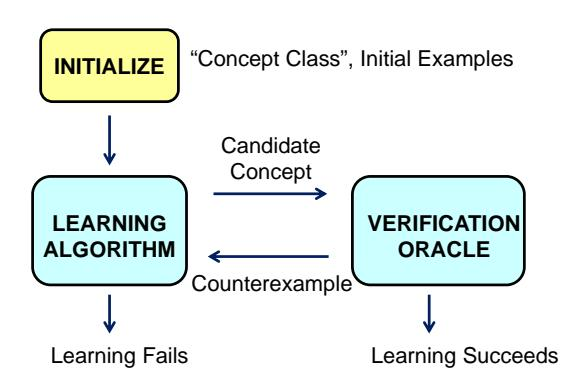
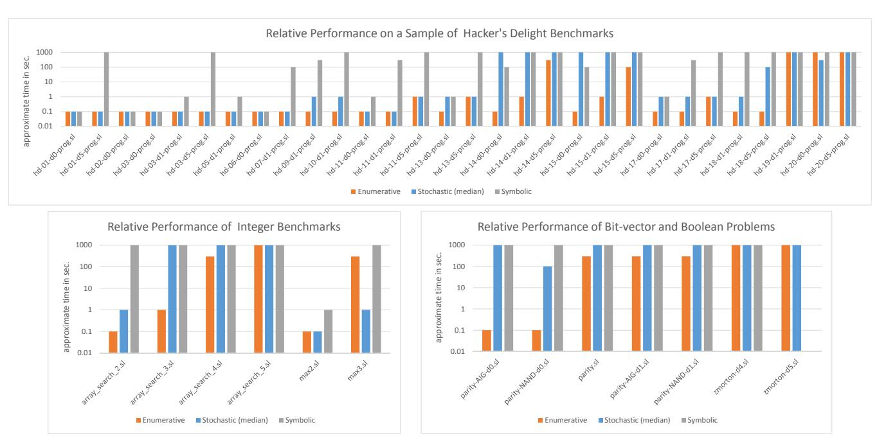

# Syntax-Guided Synthesis

Rajeev Alur<sup>†</sup> Rastislav Bodik<sup>‡</sup> Garvit Juniwal<sup>‡</sup> Milo M. K. Martin<sup>†</sup> Mukund Raghothaman<sup>†</sup> Sanjit A. Seshia<sup>‡</sup> Rishabh Singh<sup>‡</sup> Armando Solar-Lezama<sup>‡</sup> Emina Torlak<sup>‡</sup> Abhishek Udupa<sup>†</sup> †University of Pennsylvania <sup>‡</sup>University of California, Berkeley <sup>‡</sup>Massachusetts Institute of Technology

Abstract—The classical formulation of the program-synthesis problem is to find a program that meets a correctness specification given as a logical formula. Recent work on program synthesis and program optimization illustrates many potential benefits of allowing the user to supplement the logical specification with a syntactic template that constrains the space of allowed implementations. Our goal is to identify the core computational problem common to these proposals in a logical framework. The input to the syntax-guided synthesis problem (SyGuS) consists of a background theory, a semantic correctness specification for the desired program given by a logical formula, and a syntactic set of candidate implementations given by a grammar. The computational problem then is to find an implementation from the set of candidate expressions so that it satisfies the specification in the given theory. We describe three different instantiations of the counter-example-guided-inductive-synthesis (CEGIS) strategy for solving the synthesis problem, report on prototype implementations, and present experimental results on an initial set of benchmarks.

## I. INTRODUCTION

In program verification, we want to check if a program satisfies its logical specification. Contemporary verification tools vary widely in terms of source languages, verification methodology, and the degree of automation, but they all rely on repeatedly invoking an SMT (Satisfiability Modulo Theories) solver. An SMT solver determines the truth of a given logical formula built from typed variables, logical connectives, and typical operations such as arithmetic and array accesses (see [1], [2]). Despite the computational intractability of these problems, modern SMT solvers are capable of solving instances with thousands of variables due to sustained innovations in core algorithms, data structures, decision heuristics, and performance tuning by exploiting the architecture of contemporary processors. A key driving force for this progress has been the standardization of a common interchange format for benchmarks called SMT-LIB (see smt-lib.org) and the associated annual competition (see smtcomp.org). These efforts have proved to be instrumental in creating a virtuous feedback loop between developers and users of SMT solvers: with the availability of open-source and highly optimized solvers, researchers from verification and other application domains find it beneficial to translate their problems into the common format instead of attempting to develop their own customized tools from scratch, and the limitations of the current SMT tools are constantly exposed by the ever growing repository of different kinds of benchmarks, thereby spurring greater innovation for improving the solvers.

In *program synthesis*, we wish to automatically synthesize an implementation for the program that satisfies the given correctness specification. A mature synthesis technology has the potential of even greater impact on software quality than program verification. Classically, program synthesis is viewed as a problem in deductive theorem proving: a program is derived from the constructive proof of the theorem that states that for all inputs, there exists an output, such that the desired correctness specification holds (see [3]). Our work is motivated by a recent trend in synthesis in which the programmer, in addition to the correctness specification, provides a syntactic template for the desired program. For instance, in the programming approach advocated by the SKETCH system, a programmer writes a partial program with incomplete details, and the synthesizer fills in the missing details using user-specified assertions as the correctness specification [4]. We call such an approach to synthesis syntax-guided synthesis (SyGuS). Besides program sketching, a number of recent efforts such as synthesis of loop-free programs [5], synthesis of Excel macros from examples [6], program de-obfuscation [7], synthesis of protocols from the skeleton and example behaviors [8], synthesis of loop-bodies from pre/post conditions [9], integration of constraint solvers in programming environments for program completion [10], and super-optimization by finding equivalent shorter loop bodies [11], all are arguably instances of syntaxguided synthesis. Also related are techniques for automatic generation of invariants using templates and by learning [12]-[14], and recent work on solving quantified Horn clauses [15].

Existing formalization of the SMT problem and the interchange format does not provide a suitable abstraction for capturing the syntactic guidance. The computational engines used by the various synthesis projects mentioned above rely on a small set of algorithmic ideas, but have evolved independently with no mechanism for comparison, benchmarking, and sharing of back-ends. The main contribution of this paper is to define the syntax-guided synthesis (SyGuS) problem in a manner that (1) captures the computational essence of these recent proposals and (2) is based on more canonical formal frameworks such as logics and grammars instead of features of specific programming languages. In our formalization, the correctness specification of the function f to be synthesized is given as a logical formula  $\varphi$  that uses symbols from a background theory T. The syntactic space of possible implementations for f is described as a set L of expressions built from the theory T, and this set is specified using a grammar. The syntax-guided synthesis problem then is to find an implementation expression  $e \in L$  such that the formula  $\varphi[f/e]$  is valid in the theory T. To illustrate an application of the SyGuS-problem, suppose we want to find a completion of a partial program with holes so as to satisfy given assertions. A typical SyGuS-encoding of this task will translate the

concrete parts of the partial program and the assertions into the specification formula  $\varphi$ , while the holes will be represented with the unknown functions to be synthesized, and the space of expressions that can substitute the holes will be captured by the grammar.

Compared to the classical formulation of the synthesis problem that involves only the correctness specification, the syntax-guided version has many potential benefits. First, the user can use the candidate set L to limit the search-space for potential implementations, and this has significant computational benefits for solving the synthesis problem. Second, this approach gives the programmer the flexibility to express the desired artifact using a combination of syntactic and semantic constraints. Such forms of multi-modal specifications have the potential to make programming more intuitive. Third, the set L can be used to constrain the space of implementations for the purpose of performance optimizations. For example, to optimize the computation of the product of two two-by-two matrices, we can limit the search space to implementations that use only 7 multiplication operations, and such a restriction can be expressed only syntactically. Fourth, because the synthesis problem boils down to finding a correct expression from the syntactic space of expressions, this search problem lends itself to machine learning and inductive inference as discussed in Section III. Finally, it is worth noting that the statement "there exists an expression e in the language generated by a contextfree grammar G such that the formula  $\varphi[f/e]$  is valid in a theory T" cannot be translated to determining the truth of a formula in the theory T, even with additional quantifiers.

The rest of the paper is organized in the following manner. In Section II, we formalize the core problem of syntaxguided synthesis with examples. In Section III, we discuss a generic architecture for solving the proposed problem using the iterative counter-example guided inductive synthesis strategy [16] that combines a learning algorithm with a verification oracle. For the learning algorithm, we show how three techniques from recent literature can be adapted for our purpose: the enumerative technique generates the candidate expressions of increasing size relying on the input-output examples for pruning; the symbolic technique encodes parse trees of increasing size using variables and constraints, and it calls an SMT solver to find a parse tree consistent with all the examples encountered so far; and the stochastic search uniformly samples the set L of expressions as a starting point, and then executes (probabilistic) traversal of the graph where two expressions are neighbors if one can be obtained from the other by a single edit operation on the parse tree. We report on a prototype implementation of these three algorithms, and evaluate their performance on a number of benchmarks in Section IV.

## II. PROBLEM FORMULATION

At a high level, the functional synthesis problem consists of finding a function f such that some logical formula  $\varphi$  capturing the correctness of f is valid. In syntax-guided synthesis, the synthesis problem is constrained in three ways: (1) the logical symbols and their interpretation are restricted to a background theory, (2) the specification  $\varphi$  is limited

to a first order formula in the background theory with all its variables universally quantified, and (3) the universe of possible functions f is restricted to syntactic expressions described by a *grammar*. We now elaborate on each of these points.

Background Theory: The syntax for writing specifications is the same as classical typed first-order logic, but the formulas are evaluated with respect to a specified background theory T. The theory gives the vocabulary used for constructing formulas, the set of values for each type, and the interpretation for each of the function and relation (predicate) symbols in the vocabulary. We are mainly interested in theories T for which well-understood decision procedures are available for determining satisfaction modulo T (see [1] for a survey). A typical example is the theory of linear integer arithmetic (LIA) where each variable is either a boolean or an integer, and the vocabulary consists of boolean and integer constants, standard boolean connectives, addition (+), comparison  $(\leq)$ , and conditionals (ITE). Note that the background theory can be a combination of logical theories, for instance, LIA and the theory of uninterpreted functions with equality.

Correctness Specification: For the function f to be synthesized, we are given the type of f and a formula  $\varphi$  as its correctness specification. The formula  $\varphi$  is a Boolean combination of predicates from the background theory, involving universally quantified free variables, symbols from the background theory, and the function symbol f, all used in a type-consistent manner.

Example 1: Assuming the background theory is LIA, consider the specification of a function f of type  $int \times int \mapsto int$ :

$$\varphi_1: f(x,y) = f(y,x) \land f(x,y) \ge x.$$

The free variables in the specification are assumed to be universally quantified: a given function f satisfies the above specification if the quantified formula  $\forall x, y. \varphi_1$  holds, or equivalently, if the formula  $\varphi_1$  is valid.

Set of Candidate Expressions: In order to make the synthesis problem tractable, the "syntax-guided" version allows the user to impose structural (syntactic) constraints on the set of possible functions f. The structural constraints are imposed by restricting f to the set L of functions defined by a given context-free grammar  $G_L$ . Each expression in L has the same type as that of the function f, and uses the symbols in the background theory T along with the variables corresponding to the formal parameters of f.

Example 2: Suppose the background theory is LIA, and the type of the function f is  $int \times int \mapsto int$ . We can restrict the set of expressions f(x,y) to be linear expressions of the inputs by restricting the body of the function to expressions in the set  $L_1$  described by the grammar below:

$$LinExp := x \mid y \mid Const \mid LinExp + LinExp$$

Alternatively, we can restrict f(x,y) to conditional expressions with no addition by restricting the body terms from the set  $L_2$  described by:

```
\begin{array}{lll} \textit{Term} & := & x \mid y \mid \textit{Const} \mid \textit{ITE}(\textit{Cond}, \textit{Term}, \textit{Term}) \\ \textit{Cond} & := & \textit{Term} \leq \textit{Term} \mid \textit{Cond} \land \textit{Cond} \mid \neg \textit{Cond} \mid (\textit{Cond}) \end{array}
```

Grammars can be conveniently used to express a wide range of constraints, and in particular, to bound the depth and/or the size of the desired expression.

SyGuS Problem Definition: Informally, given the correctness specification  $\varphi$  and the set L of candidates, we want to find an expression  $e \in L$  such that if we use e as an implementation of the function f, the specification  $\varphi$  is valid. Let us denote the result of replacing each occurrence of the function symbol f in  $\varphi$  with the expression e by  $\varphi[f/e]$ . Note that we need to take care of binding of input values during such a substitution: if f has two inputs that the expressions in L refer to by the variable names x and y, then the occurrence  $f(e_1,e_2)$  in the formula  $\varphi$  must be replaced with the expression  $e[x/e_1,y/e_2]$  obtained by replacing x and y in e by the expressions  $e_1$  and  $e_2$ , respectively. Now we can define the syntax-guided synthesis problem, SyGuS for short, precisely:

Given a background theory T, a typed function symbol f, a formula  $\varphi$  over the vocabulary of T along with f, and a set L of expressions over the vocabulary of T and of the same type as f, find an expression  $e \in L$  such that the formula  $\varphi[f/e]$  is valid modulo T.

Example 3: For the specification  $\varphi_1$  presented earlier, if the set of allowed implementations is  $L_1$  as shown before, there is no solution to the synthesis problem. On the other hand, if the set of allowed implementations is  $L_2$ , a possible solution is the conditional if-then-else expression  $ITE(x \ge y, x, y)$ .

In some special cases, it is possible to reduce the decision problem for syntax guided synthesis to the problem of deciding formulas in the background theory using additional quantification. For example, every expression in the set  $L_1$  is equivalent to ax+by+c, for integer constants a,b,c. If  $\varphi$  is the correctness specification, then deciding whether there exists an implementation for f in the set  $L_1$  corresponds to checking whether the formula  $\exists a,b,c. \forall X. \varphi[f/ax+by+c]$  holds, where X is the set of all free variables in  $\varphi$ . This reduction was possible for  $L_1$  because the set of all expressions in  $L_1$  can be represented by a single parameterized expression in the original theory. However, the grammar may permit expressions of arbitrary depth which may not be representable in this way, as in the case of  $L_2$ .

Synthesis of Multiple Functions: A general synthesis problem can involve more than one unknown function. In principle, adding support for problems with more than one unknown function is merely a matter of syntactic sugar. For example, suppose we want to synthesize functions  $f_1(x_1)$  and  $f_2(x_2)$ , with corresponding candidate expressions given by grammars  $G_1$  and  $G_2$ , with start non-terminals  $S_1$  and  $S_2$ , respectively. Both functions can be encoded with a single function  $f_{12}(id, x_1, x_2)$ . The set of candidate expressions is described by the grammar that contains the rules of  $G_1$  and  $G_2$  along with a new production  $S := ITE(id = 0, S_1, S_2)$ , with the new start non-terminal S. Then, every occurrence of  $f_1(x_1)$  in the specification can be replaced with  $f_{12}(0, x_1, *)$  and every call to  $f_2(x_2)$  can be replaced with  $f_{12}(1, *, x_2)$ . Although adding support for multiple functions does not

fundamentally increase the expressiveness of the notation, it does offer significant convenience in encoding real-world synthesis problems.

Let Expressions in Grammar Productions: The SMT-LIB interchange format for specifying constraints allows the use of let expressions as part of the formulas, and this is supported by our language also: (let  $[var = e_1]$   $e_2$ ). While let-expressions in a specification can be desugared, the same does not hold when they are used in a grammar. As an example, consider the grammar below for the set of candidate expressions for the function f(x, y):

$$T := (let [z = U] z + z)$$
  
 $U := x | y | Const | U + U | U * U | (U)$ 

The top-level expression specified by this grammar is the sum of two identical subexpressions built using arithmetic operators, and such a structure cannot be specified using a standard context-free grammar. In the example above, every *let* introduced by the grammar uses the same variable name. If the application of *let*-expressions are nested in the derivation tree, the standard rules for shadowing of variable definitions determine which definition corresponds to which use of the variable.

SYNTH-LIB Input Format: To specify the input to the SyGuS problem, we have developed an interchange format, called SYNTH-LIB, based on the syntax of SMT-LIB2—the input format accepted by the SMT solvers (see smt-lib.org). The input for the SyGuS problem to synthesize the function f with the specification  $\varphi_1$  in the theory LIA, with the grammar for the languages  $L_1$  is encoded in SYNTH-LIB as:

```
(set-logic LIA)
(synth-fun f ((x Int) (y Int)) Int
```

Optimality Criterion: The answer to our synthesis problem need not be unique: there may be two expressions  $e_1$  and  $e_2$  in the set L of allowed expressions such that both implementations satisfy the correctness specification  $\varphi$ . Ideally, we would like to associate a cost with each expression, and consider the problem of optimal synthesis which requires the synthesis tool to return the expression with the least cost among the correct ones. A natural cost metric is the size of the expression. In presence of let-expressions, the size directly corresponds to the number of instructions in the corresponding straight-line code, and thus such a metric can be used effectively for applications such as super-optimization.

## III. INDUCTIVE SYNTHESIS

Algorithmic approaches to program synthesis range over a wide spectrum, from *deductive synthesis* to *inductive synthesis*. In deductive program synthesis (e.g., [3]), a program is synthesized by constructively proving a theorem, employing logical inference and constraint solving. On the other hand, inductive

synthesis [17]–[19] seeks to find a program matching a set of input-output examples. It is thus an instance of learning from examples, also termed as *inductive inference* or *machine learning* [20], [21]. Many current approaches to synthesis blend induction and deduction [22]; syntax guidance is usually a key ingredient in these approaches.

Inductive synthesizers generalize from examples by searching a restricted space of programs. In machine learning, this restricted space is called the  $concept\ class$ , and each element of that space is often called a candidate concept. The concept class is usually specified syntactically. Inductive learning is thus a natural fit for the syntax-guided synthesis problem introduced in this paper: the concept class is simply the set L of permissible expressions.

## A. Synthesis via Active Learning

A common approach to inductive synthesis is to formulate the overall synthesis problem as one of active learning using a query-based model. Active learning is a special case of machine learning in which the learning algorithm can control the selection of examples that it generalizes from and can query one or more oracles to obtain both examples as well as labels for those examples. In our setting, we can consider the labels to be binary: positive or negative. A positive example is simply an interpretation to f in the background theory T that is consistent with the specification  $\varphi$ ; i.e., it is a valuation to the arguments of the function symbol f along with the corresponding valuation of f that satisfies  $\varphi$ . A negative example is any interpretation of f that is not consistent with  $\varphi$ . We refer the reader to a paper by Angluin [23] for an overview of various models for query-based active learning.

In program synthesis via active learning, the query oracles are often implemented using deductive procedures such as model checkers or satisfiability solvers. Thus, the overall synthesis algorithm usually comprises a top-level inductive learning algorithm that invokes deductive procedures (query oracles); e.g., in our problem setting, it is intuitive, although not required, to implement an oracle using an SMT solver for the theory T. Even though this approach combines induction and deduction, it is usually referred to in the literature simply as "inductive synthesis." We will continue to use this terminology in the present paper.

Consider the syntax-guided synthesis problem of Sec. II. Given the tuple  $(T, f, \varphi, L)$ , there are two important choices one must make to fix an inductive synthesis algorithm: (1) search strategy: How should one search the concept class L? and (2) example selection strategy: Which examples do we learn from?

## B. Counterexample-Guided Inductive Synthesis

Counterexample-guided inductive synthesis (CEGIS) [16], [24] shown in Figure 1 is perhaps the most popular approach to inductive synthesis today. CEGIS has close connections to algorithmic debugging using counterexamples [19] and counterexample-guided abstraction refinement (CEGAR) [25]. This connection is no surprise, because both debugging and abstraction-refinement involve synthesis steps: synthesizing a



Fig. 1. Counterexample-Guided Inductive Synthesis (CEGIS)

repair in the former case, and synthesizing an abstraction function in the latter (see [22] for a more detailed discussion).

The defining aspect of CEGIS is its example selection strategy: learning from counterexamples provided by a verification oracle. The learning algorithm, which is initialized with a particular choice of concept class L and possibly with an initial set of (positive) examples, proceeds by searching the space of candidate concepts for one that is consistent with the examples seen so far. There may be several such consistent concepts, and the search strategy determines the chosen candidate, an expression e. The concept e is then presented to the verification oracle  $\mathcal{O}_V$ , which checks the candidate against the correctness specification.  $\mathcal{O}_V$  can be implemented as an SMT solver that checks whether  $\varphi[f/e]$  is valid modulo the theory T. If the candidate is correct, the synthesizer terminates and outputs this candidate. Otherwise, the verification oracle generates a counterexample, an interpretation to the symbols and free variables in  $\varphi[f/e]$  that falsifies it. This counterexample is returned to the learning algorithm, which adds the counterexample to its set of examples and repeats its search; note that the precise encoding of a counterexample and its use can vary depending on the details of the learning algorithm employed. It is possible that, after some number of iterations of this loop, the learning algorithm may be unable to find a candidate concept consistent with its current set of (positive/negative) examples, in which case the learning step, and hence the overall CEGIS procedure,

Several search strategies are possible for learning a candidate expression in L, each with its pros and cons. In the following sections, we describe three different search strategies and illustrate the main ideas in each using a small example.

## C. Illustrative Example

Consider the problem of synthesizing a program which returns the maximum of two integer inputs. The specification of the desired program max is given by:

$$\max(x, y) \ge x \land \max(x, y) \ge y \land (\max(x, y) = x \lor \max(x, y) = y)$$

The search space is suitably defined by an expression grammar which includes addition, subtraction, comparison, conditional operators and the integer constants 0 and 1.

| Expression to Verifier | Learned Test Input             |
|------------------------|--------------------------------|
| $\overline{x}$         | $\langle x=0, y=1 \rangle$     |
| y                      | $\langle x = 1, y = 0 \rangle$ |
| 1                      | $\langle x=0, y=0 \rangle$     |
| x + y                  | $\langle x=1, y=1 \rangle$     |
| $ITE(x \le y, y, x)$   | _                              |

TABLE I
A RUN OF THE ENUMERATIVE ALGORITHM

#### D. Enumerative Learning

The enumerative learning algorithm [8] adopts a dynamic programming based search strategy that systematically enumerates concepts (expressions) in increasing order of complexity. Various complexity metrics can be assigned to concepts, the simplest being the expression size. The algorithm needs to store all enumerated expressions, because expressions of a given size are composed to form larger expressions in the spirit of dynamic programming. The algorithm maintains a set of concrete test cases, obtained from the counterexamples returned by the verification oracle. These concrete test cases are used to reduce the number of expressions stored at each step by the dynamic programming algorithm.

We demonstrate the working of the algorithm on the illustrative example. Table I shows the expressions submitted to the verification oracle (an SMT solver) during the execution of the algorithm and the values for which the expression produces incorrect results. Initially, the algorithm submits the expression x to the verifier. The verifier returns a counterexample  $\langle x = x \rangle$ 0, y = 1, corresponding to the case where the expression x violates the specification. The expression enumeration is started from scratch every time a counterexample is added. All enumerated expressions are checked for conformance with the accumulated (counter)examples before making a potentiallyexpensive query to the verifier. In addition, suppose the algorithm enumerates two expressions e and e' which evaluate to the same value on the examples obtained so far, then only one of e or e' needs to be considered for the purpose of constructing larger expressions.

Proceeding with the illustrative example, the algorithm then submits the expression y and the constant 1 to the verifier. The verifier returns the values  $\langle x=1,y=0\rangle$  and  $\langle x=0,y=0\rangle$ , respectively, as counterexamples to these expressions. The algorithm then submits the expression x+y to the verifier. The verifier returns the values  $\langle x=1,y=1\rangle$  as a counterexample. The algorithm then submits the expression shown in the last row of Table I to the verifier. The verifier certifies it to be correct and the algorithm terminates.

The optimization of pruning based on concrete counterexamples helps in two ways. First, it reduces the number of invocations of the verification oracle. In the example we have described, the correct expression was examined after only four calls to the SMT solver, although about 200 expressions were enumerated by the algorithm. Second, it reduces the search space for candidate expressions significantly (see [8] for details). For instance, in the run of the algorithm on the example, although the algorithm enumerated about 200 expressions, only about 80 expressions were stored.

| Production           | Component        |                          |
|----------------------|------------------|--------------------------|
| $E \to ITE(B, E, E)$ | Inputs:          | $(i_1:B)(i_2,i_3:E)$     |
|                      | Output:<br>Spec: | (o:E)                    |
|                      | Spec:            | $o = ITE(i_1, i_2, i_3)$ |
| $B \to E \le E$      | Inputs:          | $(i_1, i_2 : E)$         |
|                      | Output:          | (o:B)                    |
|                      | Spec:            | $o = i_1 \le i_2$        |

TABLE II COMPONENTS FROM PRODUCTIONS

## E. Constraint-based Learning

The symbolic CEGIS approach uses a constraint solver both for searching for a candidate expression that works for a set of concrete input examples (concept learning) and verification of validity of an expression for all possible inputs. We use component based synthesis of loop-free programs as described by Jha et al. [5], [7]. Each production in the grammar corresponds to a component in a library. A loop-free program comprising these components corresponds to an expression from the grammar. Some sample components for the illustrative example are shown in Table II along with their corresponding productions.

The input/output ports of these components are typed and only well-typed programs correspond to well-formed expressions from the grammar. To ensure this, Jha et al.'s encoding [5] is extended with typing constraints. We illustrate the working of this algorithm on the maximum of two integers example. The library of allowed components is instantiated to contain one instance each of ITE and all comparison operators(<,>,=) and the concrete example set is initialized with  $\langle x=0,y=0\rangle$ . The first candidate loop-free program synthesized corresponds to the expression x. This candidate is submitted to the verification oracle which returns with  $\langle x=-1,y=0\rangle$  as a counterexample. This counterexample is added to the concrete example set and the learning algorithm is queried again. The SMT formula for learning a candidate expression is solved in an incremental fashion; i.e., the constraint for every new example is added to the list of constraints from the previous examples. The steps of the algorithm on the illustrative example are shown in Table III.

If synthesis fails for a component library, we add one instance of every operator to the library and restart the algorithm with the new library. We also tried a modification to the original algorithm [5], in which, instead of searching for a loop-free program that utilizes all components from the given library at once, we search for programs of increasing length such that every line can still select any component from the library. The program length is increased in an exponential

| Iteration | Loop-free program                                                         | Learned counter-example         |
|-----------|---------------------------------------------------------------------------|---------------------------------|
| 1         | $o_1 := x$                                                                | $\langle x = -1, y = 0 \rangle$ |
| 2         | $ \begin{array}{c} o_1 := x \leq x \\ o_2 := ITE(o_1, y, x) \end{array} $ |                                 |
|           | $o_2 := ITE(o_1, y, x)$                                                   | $\langle x = 0, y = -1 \rangle$ |
| 3         | $\begin{array}{c} o_1 := y \ge x \\ o_2 := ITE(o_1, y, x) \end{array}$    |                                 |
|           | $o_2 := ITE(o_1, \ y, \ x)$                                               | _                               |

TABLE III
A RUN OF THE CONSTRAINT LEARNING ALGORITHM

fashion  $(1, 2, 4, 8, \cdots)$  for a good coverage. This approach provides better running times for most benchmarks in our set, but it can also be more expensive in certain cases.

## F. Learning by Stochastic Search

The stochastic learning procedure is an adaptation of the algorithm recently used by Schufza et al. [11] for program super-optimization. The learning algorithm of the CEGIS loop uses the Metropolis-Hastings procedure to sample expressions. The probability of choosing an expression e is proportional to a value  $\mathrm{Score}(e)$ , which indicates the extent to which e meets the specification  $\varphi$ . The Metropolis-Hastings algorithm guarantees that, in the limit, expressions e are sampled with probability proportional to  $\mathrm{Score}(e)$ . To complete the description of the search procedure, we need to define  $\mathrm{Score}(e)$  and the Markov chain used for successor sampling. We define  $\mathrm{Score}(e)$  to be  $\exp(-\beta C(e))$ , where  $\beta$  is a smoothing constant (set by default to 0.5), and the cost function C(e) is the number of concrete examples on which e does not satisfy  $\varphi$ .

We now describe the Markov chain underlying the search. Fix an expression size n, and consider all expressions in L with parse trees of size n. The initial candidate is chosen uniformly at random from this set [26]. Given a candidate e, we pick a node v in its parse tree uniformly at random. Let  $e_v$  be the subexpression rooted at this node. This subtree is replaced by another subtree (of the same type) of size equal to  $|e_v|$  chosen uniformly at random. Given the original candidate e, and a mutation e' thus obtained, the probability of making e' the new candidate is given by the Metropolis-Hastings acceptance ratio  $\alpha(e,e') = \min(1,\operatorname{Score}(e')/\operatorname{Score}(e))$ .

The final step is to describe how the algorithm selects the expression size n. Although the solver comes with an option to specify n, the expression size is typically not known a priori given a specification  $\varphi$ . Intuitively, we run concurrent searches for a range of values for n. Starting with n=1, with some probability  $p_m$  (set by default to 0.01), we switch at each step to one of the searches at size  $n\pm 1$ . If an answer e exists, then the search at size n=|e| is guaranteed to converge.

Consider the earlier example for computing the maximum of two integers. There are 768 integer-valued expressions in the grammar of size six. Thus, the probability of choosing  $e = ITE(x \le 0, y, x)$  as the initial candidate is 1/768. The subexpression to mutate is chosen uniformly at random, and so the probability of deciding to mutate the boolean condition x < 0 is 1/6. Of the 48 boolean conditions in the grammar,  $y \leq 0$  may be chosen with probability 1/48. Thus, the mutation  $e' = ITE(0 \le y, y, x)$ is considered with probability 1/288. Given a set of concrete examples  $\{(-1, -4), (-1, -3), (-1, -2), (1, 1), (1, 2)\},\$  $Score(e) = \exp(-2\beta)$ , and  $Score(e') = \exp(-3\beta)$ , and so e'becomes the new candidate with probability  $\exp(-\beta)$ . If, on the other hand,  $e' = ITE(x \le y, y, x)$  had been the mutation considered, then Score(e') = 1, and e' would have become the new candidate with probability 1.

Our algorithm differs from that of Schufza et al. [11] in three ways: (1) we do not attempt to optimize the size of the expression while the super-optimizer does so; (2) we synthesize expression graphs rather than straight-line assembly code, and (3) since we do not know the expression size n, we run concurrent searches for different values of n, whereas the super-optimizer can use the size of the input program as an upper bound on program size.

## IV. BENCHMARKS AND EVALUATION

We are in the process of assembling a benchmark suite of synthesis problems to provide a basis for side-by-side comparisons of different solution strategies. The current set of benchmarks is limited to synthesis of loop-free functions with no optimality criterion; nevertheless, the benchmarks provide an initial demonstration of the expressiveness of the base formalism and of the relative merits of the individual solution strategies presented earlier. Specifically, in this section we explore three key questions about the benchmarks and the prototype synthesizers.

- Complexity of the benchmarks. Our suite includes a range of benchmarks from simple toy problems to nontrivial functions that are difficult to derive by hand. Some of the benchmarks can be solved in a few hundredths of a second, whereas others could not be solved by any of our prototype implementations. In all cases, however, the complexity of the problems derives from the size of the space of possible functions and not from the complexity of checking whether a candidate solution is correct.
- Relative merits of different solvers. The use of a standard format allows us to perform the first side-to-side comparison of different approaches to synthesis. None of the implementations were engineered with high-performance in mind, so the exact solution times are not necessarily representative of the best that can be achieved by a particular approach. However, the order of magnitude of the solution times and the relative complexity of the different approaches on different benchmarks can give us an idea of the relative merits of each of the approaches described earlier.
- Effect of problem encoding. For many problems, there
  are different natural ways to encode the space of desired
  functions into a grammar, so we are interested in observing the effect of these differences in encoding for the
  different solvers.

To account for variability and for the constant factors introduced by the prototype nature of the implementations, we report only the order of magnitude of the solution times in five different buckets: 0.1 for solution times less than half a second, 1 for solution times between half a second and 15 seconds, 100 for solution times up to two minutes, 300 for solution times of up to 5 minutes, and infinity for runs that time out after 5 minutes.

The benchmarks themselves are grouped into three categories: hacker's delight problems, integer benchmarks, and assorted boolean and bit-vector problems.

Hacker's delight benchmarks: This set includes 57 different benchmarks derived from 20 different bit-manipulation problems from the book Hacker's Delight [27]. These bit-vector problems were among the first to be successfully tackled by synthesis technology and remain an active area of



Fig. 2. Selected performance results for the three classes of benchmarks

research [4], [5], [16]. For these benchmarks, the goal is to discover clever implementations of bit-vector transformations (colloquially known as bit-twiddling). For most problems, there are three different levels of grammars numbered d0, d1 and d5; level d0 involves only the instructions necessary for the implementation, so the synthesizer only needs to discover how to connect them together. Level d5, on the other extreme, involves a highly unconstrained grammar, so the synthesizer must discover which operators to use in addition to how to connect them together.

Fig. 2 shows the performance of the three solvers on a sample of the benchmarks. For the Hacker's Delight benchmarks (hd) we see that the enumerative solver dominates, followed by the stochastic solver. The symbolic search was the slowest, failing to terminate on 29 of the 57 benchmarks. It is worth mentioning, however, that none of the grammars for these problems required the synthesizer to discover the bit-vector constants involved in the efficient implementations. We have some evidence to suggest that the symbolic solver can discover such constants from the full space of  $2^{32}$  possible constants with relatively little additional effort. On the other hand, for many of these problems the magic constants come from a handful of values such as 1, 0, or  $0 \times ffffffff$ , so it is unnecessary for the enumerative solver to search the space of  $2^{32}$  possible bit-vectors.

Finally, because these benchmarks have different grammars for the same problem, we can observe the effect of using more restrictive or less restrictive grammars as part of the problem description. We can see in the data that all solvers were affected by the encoding of the problem for at least some benchmark; although in some cases, the pruning strategies used by the solvers were able to ameliorate the impact of the larger search space.

Integer benchmarks: These benchmarks are meant to be loosely representative of synthesis problems involving functions with complex branching structures involving linear integer arithmetic. One of the benchmarks is array-search, which synthesizes a loop-free function that finds the index of an element in a sorted tuple of size n, for n ranging from 2 to 16. This benchmark proved to be quite complex, as no solver was able to synthesize this function for n > 4. The max benchmarks are similar except they compute the maximum of a tuple of size n.

Fig. 2 shows the relative performance of the three solvers on these benchmarks for sizes up to 4. With one exception, the enumerative solver is the fastest for this class of benchmarks, followed by the stochastic solver. The exception was max3 where the stochastic solver was faster.

Boolean/Bit-vector benchmarks: The parity benchmark computes the parity of a set of Boolean values. The different versions represent different grammars to describe the set of Boolean functions. As with other benchmarks, the enumerative solver was always faster, whereas the symbolic solver failed on every instance. These results show the impact that different encodings of the same space of functions can have on the solution time for both of the solution strategies that succeeded. Unlike the hd benchmarks where the different grammars for a given benchmark were strict subsets of each other, in this case the encodings AIG and NAND correspond to different representations of the same space of functions.

The Morton benchmarks, which involve the synthesis of a function to compute Morton numbers, are intended as challenge problems, and could not be completed by any of the synthesizers.

*Observations:* The number of benchmarks and the maturity of the solvers are too limited to draw broad conclusions,

but the overall trend we observe is that the encoding of the problem space into grammar has a significant impact on performance, although the solvers are often good at mitigating the effect of larger search spaces. We can also see that non-symbolic techniques can be effective in exploring spaces of implementations and can surpass symbolic techniques, especially when the problems do not require the synthesizer to derive complex bit-vector constants, which is true for all the bit-vector benchmarks used. Moreover, we observe that the enumerative technique was better than the stochastic search for all but two benchmarks, so although both implementations are immature, these results suggest that it may be easier to derive good pruning rules for the explicit search than an effective fitness function for the stochastic solver.

The symbolic solver used for these experiments represents one of many possible approaches to encoding the synthesis problem into a series of constraints. We have some evidence that more optimized encodings can make the symbolic approach more competitive, although there are still many problems for which the enumerative approach is more effective. Specifically, we have transcribed all the hacker's delight and integer benchmarks into the input language of the Sketch synthesis system [24]. Sketch completed all but 11 of the hd benchmarks, and it was able to synthesize array-search up to size 7. This experiment is not an entirely fair comparison because, although Sketch uses a specialized constraint solver and carefully tuned encodings, the symbolic solver presented in this paper uses a direct encoding of the problem into sequences of constraints and uses Z3, a widely used offthe-shelf SMT solver which is not as aggressively tuned for synthesis problems. Despite these limitations, the symbolic solver was able to solve many of the benchmarks, providing a lower bound on what can be achieved with a straightforward use of off-the-shelf technology.

Moreover, the enumerative solver was able to solve more hd problems than even the more optimized symbolic solver. The problems where the enumerative solver succeeded but Sketch failed were the d5 versions of problems 11, 12, 14 and 15, which suggests that the enumerative solver was better at pruning unnecessary instructions from the grammar. On the other hand, the more optimized symbolic solver did have a significant advantage in the <code>array-search</code> benchmarks which the enumerative solver could only solve up to size 4.

## V. Conclusions

Aimed at formulating the core computational problem common to many recent tools for program synthesis in a canonical and logical manner, we have formalized the problem of syntax-guided synthesis. Our prototype implementation of the three approaches to solve this problem is the first attempt to compare and contrast existing algorithms on a common set of benchmarks. We are already working on the next steps in this project. These consist of (1) finalizing the input syntax (SYNTH-LIB) based on the input format of SMT-LIB2, with an accompanying publicly available parser, (2) building a more extensive and diverse repository of benchmarks, and (3) organizing a competition for SyGuS-solvers. We welcome feedback and help from the community on all of these steps.

Acknowledgements: We thank Nikolaj Bjorner and Stavros Tripakis for their feedback. This research is supported by the NSF Expeditions in Computing project ExCAPE (award CCF 1138996).

#### REFERENCES

- C. Barrett, R. Sebastiani, S. A. Seshia, and C. Tinelli, "Satisfiability modulo theories," in *Handbook of Satisfiability*, 2009, vol. 4, ch. 8.
- [2] L. M. de Moura and N. Bjørner, "Satisfiability modulo theories: Introduction and applications," *Commun. ACM*, vol. 54, no. 9, 2011.
- [3] Z. Manna and R. Waldinger, "A deductive approach to program synthesis," ACM TOPLAS, vol. 2, no. 1, pp. 90–121, 1980.
- [4] A. Solar-Lezama, R. Rabbah, R. Bodík, and K. Ebcioglu, "Programming by sketching for bit-streaming programs," in *PLDI*, 2005.
- [5] S. Gulwani, S. Jha, A. Tiwari, and R. Venkatesan, "Synthesis of loop-free programs," SIGPLAN Not., vol. 46, pp. 62–73, June 2011.
- [6] S. Gulwani, W. R. Harris, and R. Singh, "Spreadsheet data manipulation using examples," *Commun. ACM*, vol. 55, no. 8, pp. 97–105, 2012.
- [7] S. Jha, S. Gulwani, S. A. Seshia, and A. Tiwari, "Oracle-guided component-based program synthesis," in *ICSE*, 2010, pp. 215–224.
- [8] A. Udupa, A. Raghavan, J. V. Deshmukh, S. Mador-Haim, M. M. Martin, and R. Alur, "TRANSIT: Specifying Protocols with Concolic Snippets," in *PLDI*, 2013, pp. 287–296.
- [9] S. Srivastava, S. Gulwani, and J. S. Foster, "From program verification to program synthesis," in *POPL*, 2010, pp. 313–326.
- [10] V. Kuncak, M. Mayer, R. Piskac, and P. Suter, "Software synthesis procedures," Commun. ACM, vol. 55, no. 2, pp. 103–111, 2012.
- [11] E. Schkufza, R. Sharma, and A. Aiken, "Stochastic superoptimization," in ASPLOS, 2013, pp. 305–316.
- [12] M. Colón, S. Sankaranarayanan, and H. Sipma, "Linear invariant generation using non-linear constraint solving," in CAV, 2003, pp. 420–432.
- [13] A. Rybalchenko, "Constraint solving for program verification: Theory and practice by example," in CAV, 2010, pp. 57–71.
- [14] R. Sharma, S. Gupta, B. Hariharan, A. Aiken, P. Liang, and A. V. Nori, "A data driven approach for algebraic loop invariants," in *ESOP*, 2013, pp. 574–592.
- [15] N. Bjørner, K. L. McMillan, and A. Rybalchenko, "On solving universally quantified Horn clauses," in SAS, 2013, pp. 105–125.
- [16] A. Solar-Lezama, L. Tancau, R. Bodík, S. A. Seshia, and V. Saraswat, "Combinatorial sketching for finite programs," in ASPLOS, 2006.
- [17] E. M. Gold, "Language identification in the limit," *Information and Control*, vol. 10, no. 5, pp. 447–474, 1967.
- [18] P. D. Summers, "A methodology for LISP program construction from examples," *J. ACM*, vol. 24, no. 1, pp. 161–175, 1977.
- [19] E. Y. Shapiro, Algorithmic Program Debugging. Cambridge, MA, USA: MIT Press, 1983.
- [20] D. Angluin and C. H. Smith, "Inductive inference: Theory and methods," ACM Computing Surveys, vol. 15, pp. 237–269, Sep. 1983.
- [21] T. M. Mitchell, Machine Learning. McGraw-Hill, 1997.
- [22] S. A. Seshia, "Sciduction: Combining induction, deduction, and structure for verification and synthesis," in *DAC*, 2012, pp. 356–365.
- [23] D. Angluin, "Queries and concept learning," Machine Learning, vol. 2, pp. 319–342, 1988.
- [24] A. Solar-Lezama, "Program synthesis by sketching," Ph.D. dissertation, University of California, Berkeley, 2008.
- [25] E. M. Clarke, O. Grumberg, S. Jha, Y. Lu, and H. Veith, "Counterexample-guided abstraction refinement for symbolic model checking," J. ACM, vol. 50, no. 5, pp. 752–794, 2003.
- [26] B. McKenzie, "Generating strings at random from a context free grammar," 1997.
- [27] H. S. Warren, Hacker's Delight. Boston, MA, USA: Addison-Wesley Longman Publishing Co., Inc., 2002.